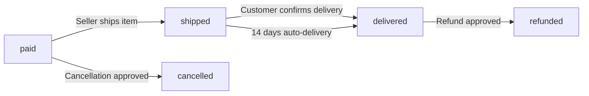
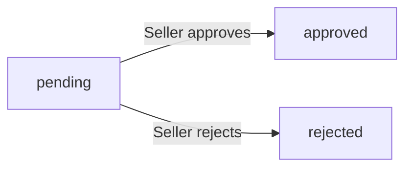

**shoppingMall — Business concepts, relationships, and states from user perspective**

Business concepts, relationships, and states from user perspective

# Domain Concepts

Describe what each concept means in the business domain and its key attributes.

## Customer Concept

A Customer represents a registered user who purchases products on the platform. Each customer has a unique email address used for identification and authentication. Customers maintain a display name that appears publicly on the platform. A phone number is associated with each customer profile for communication purposes. Customer accounts require registration before any platform features can be accessed. When a customer deletes their account, their profile information is removed but order history is preserved. Reviews written by deleted customers remain visible but are attributed to deleted user. Customer accounts can be banned by administrators, preventing login access.

### Customer Identity and Authentication

A Customer is a registered user who must create an account before accessing any platform features. No guest browsing or anonymous purchases are allowed on the platform.

Each customer is identified by a unique email address that serves as their primary identifier on the platform. The email address is used for both account registration and authentication when logging in.

Customer accounts are created through the registration process, which requires providing an email address and creating a password. Once registered, customers can log in using their email address and password combination.

### Customer Profile Attributes

Each customer maintains a profile that contains publicly visible information and contact details. The profile includes a display name that appears on the platform in various contexts such as reviews and order information.

A phone number is associated with each customer profile for communication purposes related to orders and account management. Customers can update both their display name and phone number as needed.

The profile information is distinct from authentication credentials and can be viewed or modified by the account owner at any time while the account is active.

### Account Deletion and Data Retention

Customers have the ability to delete their account at any time. When a customer deletes their account, their profile information including display name and phone number is permanently removed from the platform.

Order history is preserved even after account deletion. All orders placed by the customer remain in the system for seller records and legal compliance purposes. This ensures that transaction history is maintained for dispute resolution and business records.

Reviews written by a customer before account deletion remain visible on product pages but are attributed to deleted user instead of showing the original customer's display name. This preserves the feedback value while respecting the customer's decision to remove their identity from the platform.

### Account Access Control

Administrators have the authority to ban customer accounts when necessary. When a customer account is banned, the customer loses the ability to log in to the platform and access any features.

Banned customer accounts retain their order history and any associated data. The ban prevents future platform access but does not delete existing transaction records or reviews.

Administrators can also unban customer accounts, restoring the customer's ability to log in and use platform features. The customer's profile information and order history remain intact during both the ban and unban process.

## Seller Concept

A Seller represents a business entity that offers products for sale on the platform. Each seller has a unique email address for account access and authentication. Sellers maintain a shop name that identifies their business to customers. A shop description provides information about the seller's business and offerings. Sellers can upload a logo image to represent their brand visually. Seller accounts require administrator approval before they can begin selling products. Sellers can view their approval status including pending, approved, or rejected states. Rejected sellers may submit new registration requests with updated information. Sellers can delete their accounts when they have no pending orders or requests. When deleted, seller products are removed but order history remains preserved.

### Seller Account Definition

A Seller represents a business entity that operates a shop on the platform to offer products for sale. Each seller account is uniquely identified by an email address used for authentication and system access. Sellers authenticate using their email address and a password of their choice. Seller accounts are distinct from customer accounts, though a single user may hold both roles. The seller's email address serves as the primary identifier for all account-related activities including login, password recovery, and communication.

### Seller Shop Identity

Each seller maintains a shop identity that customers view when browsing products. The shop name uniquely identifies the seller's business to customers and appears on product listings and order details. A shop description provides information about the seller's business, product offerings, and policies. Sellers can upload a logo image to visually represent their brand on the platform. The logo image appears alongside the shop name in product listings and seller profile pages. All three elements—shop name, shop description, and logo image—form the complete seller profile visible to customers.

### Seller Approval Process

Seller accounts require administrator approval before they can begin selling products on the platform. Upon registration, a seller account enters a pending approval state where they cannot create or manage products. Administrators review seller registration requests and can approve or reject them. When approved, the seller gains full access to create and manage products. When rejected, the seller receives a rejection reason explaining why their application was denied. Rejected sellers may submit a new registration request with updated information. Sellers can view their current approval status at any time, which shows one of three states: pending approval, approved, or rejected.

### Seller Account Deletion

Sellers can delete their own accounts subject to specific conditions. A seller account can only be deleted when there are no pending orders in paid or shipped status for any of their products. Additionally, there must be no pending cancellation or refund requests awaiting seller response. When a seller deletes their account, all their products are removed from search and category listings. However, order history and order snapshots are preserved for legal and record-keeping purposes. The seller's shop name as it appeared at the time of each purchase remains visible in past order records. This ensures customers and administrators can reference historical transaction information even after the seller has left the platform.

## Administrator Concept

An Administrator represents a user with elevated privileges to manage platform operations. Administrators exist in two grades: regular administrator and super administrator. Super administrators have the highest level of access and can manage other administrators. Regular administrators can perform most management tasks but cannot modify administrator grades. Users can submit requests to become administrators with a stated reason. Super administrators review and approve or reject these promotion requests. Administrators can be demoted from super administrator to regular administrator by other super administrators. Super administrators cannot demote themselves to maintain system integrity. Administrator accounts enable oversight of sellers, products, orders, and customers.

### Administrator Grades

Administrators exist in two distinct grades: regular administrator and super administrator. The administrator grade determines the level of access and capabilities within the platform management system. Regular administrators can perform most management tasks including managing sellers, categories, products, orders, and users. Super administrators possess all capabilities of regular administrators plus the ability to manage administrator grades themselves. Super administrators can promote regular administrators to super administrator status and can demote other super administrators to regular administrator status. Super administrators cannot demote themselves to maintain system integrity and ensure there is always at least one super administrator available.

### Promotion Request

Any user on the platform, whether a customer or seller, can submit a request to become an administrator. The promotion request includes a promotion reason that explains why the user should be granted administrator privileges. Super administrators review pending promotion requests and can approve or reject them. When a promotion request is approved, the user becomes a regular administrator. Rejected promotion requests do not prevent the user from submitting a new request in the future. The promotion reason is preserved as part of the request record for audit purposes.

### Demotion Capability

Super administrators have the capability to demote other super administrators to regular administrator status. This demotion capability allows the platform to manage administrator access levels and revoke elevated privileges when necessary. Regular administrators cannot demote any administrator, including other regular administrators. The demotion capability is restricted to super administrators only to prevent unauthorized changes to administrator grades. When a super administrator is demoted, they retain all regular administrator capabilities but lose the ability to manage administrator grades.

### System Oversight

Administrators have elevated privileges that enable system oversight across the entire platform. This oversight includes the ability to view all customer accounts, all seller accounts, all products, all orders, and all categories. Administrators can perform platform management tasks such as approving seller registrations, managing category structures, and overseeing product listings. Administrators can also intervene in order processing by force-cancelling items or force-refunding items when necessary. System oversight extends to user management, allowing administrators to ban customers or sellers who violate platform policies. Banned users cannot log in but their historical data remains preserved for legal and business purposes.

## Address Concept

An Address represents a shipping location where customers receive their orders. Each address contains a recipient name for package delivery identification. A phone number is included for courier communication during delivery. The street address specifies the exact delivery location. City and state or province information define the regional location. Postal code ensures accurate mail sorting and delivery routing. Country information identifies the destination nation for international shipping. Customers can maintain multiple addresses for different delivery locations. One address can be designated as the default for automatic selection during checkout.

### Address Definition and Components

An Address represents a shipping location where customers receive their orders. Each address contains a recipient name that identifies who should receive the package at the delivery location. A phone number is included for courier communication during delivery coordination. The street address specifies the exact delivery location for package drop-off. City information specifies the municipal area for regional routing. State or province information defines the broader administrative region. Postal code ensures accurate mail sorting and delivery routing within the region. Country identification determines the destination nation for shipping purposes. All address components are required for valid shipping. Addresses belong to the customer who created them.

### Address Management

Customers can add multiple shipping addresses to their account. Each address is stored independently with its own set of components. Customers can edit any of their existing addresses. Customers can delete addresses they no longer need. One address can be set as the default shipping address. The default address is automatically selected during checkout. Customers can change which address is the default at any time. Having multiple addresses allows customers to ship to different locations. Addresses are private and visible only to the owning customer. Deleted addresses are permanently removed from the customer account.

### Address in Orders

During checkout, customers select a shipping address for their order. The default address is pre-selected if one exists. Customers can choose a different address from their saved addresses. The selected address becomes part of the order record. Once an order is placed, the shipping address cannot be changed. The address is preserved as a snapshot with the order. This ensures the delivery location is recorded even if the address is later modified. Address information is used by sellers to ship products to customers. Courier services use the address for package delivery.

## Category Concept

A Category represents a classification group for organizing products on the platform. Each category has a name that identifies the product group to customers. A description provides additional context about what products belong in the category. Categories can have subcategories at one level of nesting for more granular organization. Only administrators can create, edit, or delete categories. Categories are managed centrally to maintain consistent product organization. Products are assigned to categories to enable browsing and filtering. When a category is deleted, products within it become uncategorized. Customers can browse all categories to discover products.

### Category Definition

A category is a classification group used to organize products on the platform. Each category has a name that identifies the product group to customers and a description that provides additional context about what products belong in the category. Categories enable customers to browse and discover products by grouping similar items together. Categories are managed centrally by administrators to maintain consistent product organization across the platform.

### Subcategory Structure

Categories support one level of nesting, allowing subcategories to be created under parent categories for more granular product organization. A subcategory is itself a category that belongs to a parent category. This two-level structure (category and subcategory) provides flexibility in organizing products without creating overly complex hierarchies. Products can be assigned to either a top-level category or a subcategory.

### Category Management

Only administrators can create, edit, or delete categories. When a category is deleted, products that were assigned to that category become uncategorized but remain on the platform. Customers can browse the complete list of all categories to discover products. Categories are used for product organization and enable customers to filter and browse products by category. The central management of categories ensures consistent classification across all sellers and products on the platform.

## Product Concept

A Product represents an item available for purchase on the platform. Each product has a required name that identifies it to customers. A description provides detailed information about the product features and specifications. Products are assigned to categories for organizational purposes. A base price establishes the starting cost for the product. Products belong to the seller who created them. Products can have multiple variants representing different options like color or size. Products must have at least one variant to be purchasable. Products without variants appear in search but show as unavailable. Product information is preserved in snapshots when modified.

### Product Definition and Core Attributes

A product represents a purchasable item available for purchase on the platform. Each product must have a name that identifies it to customers browsing the platform. The product name is a required attribute and cannot be empty. Each product must have a description that provides detailed information about the product features and specifications. The product description is a required attribute and cannot be empty. Each product has a base price that establishes the starting cost for the product. The base price is a required attribute and represents the default price before any variant-specific pricing adjustments. Products are assigned to categories for organizational purposes. Each product belongs to exactly one category, which can be a top-level category or a subcategory. The category assignment is required when creating a product. Products belong to the seller who created them. The seller ownership relationship is established at product creation and cannot be transferred to another seller.

### Product Variants and Availability

Products can have multiple variants representing different options like color, size, or other product attributes. Each variant represents a specific combination of options that customers can purchase. A product must have at least one variant to be purchasable by customers. Products without any variants appear in search results and category listings but show as unavailable. When a product has variants, customers can select a specific variant to add to their cart. The relationship between a product and its variants is one-to-many, meaning one product can have many variants but each variant belongs to only one product. Variant options define the characteristics that distinguish different variants of the same product, such as color being red or blue, or size being small, medium, or large.

### Product Modification and History

When product information is modified, a snapshot is created to preserve the previous state. This includes changes to the product name, description, category assignment, or base price. Product snapshots are preserved even after the product is deleted from the platform. The snapshot preservation ensures that the historical state of products can be reviewed for dispute resolution or audit purposes. Sellers can view snapshots of their own products. Administrators can view snapshots of any product on the platform. Snapshots record when the change was made, what was changed, and the values before and after the modification. Snapshots are immutable and cannot be deleted or modified once created.

## ProductImage Concept

A ProductImage represents a visual representation of a product for customer viewing. Each image has a URL pointing to the image storage location. Images are assigned a display order to determine their sequence. The first image in the display order serves as the main thumbnail. Products can have multiple images to show different angles or details. Sellers can reorder images to change which appears as the main image. Image changes are recorded in product snapshots for historical tracking. Images help customers make informed purchasing decisions.

### Product Image Attributes

A ProductImage represents a visual representation of a product for customer viewing. Each product image is identified by an image URL that points to the storage location where the image file is hosted. Images are assigned a display order number that determines their sequence when shown to customers. The first image in the display order serves as the main thumbnail image for the product. This thumbnail is used in search results, category listings, and other product summary views.

### Multiple Images and Reordering

Products can have multiple images to show different angles, details, or variations of the product. Sellers can add new images to their products at any time. Sellers can reorder images to change their display sequence. When images are reordered, the display order numbers are updated accordingly. The image that appears first in the display order becomes the new main thumbnail. Sellers can remove images from their products, but at least one image should remain for the product to be properly displayed.

### Image Purpose and Historical Tracking

Product images help customers make informed purchasing decisions by providing visual details about the product. Customers can view all product images on the product detail page to examine the product from multiple perspectives. Image changes are recorded in product snapshots for historical tracking. When a product is edited, including image additions, deletions, or reordering, a snapshot captures the previous state of all images. These snapshots preserve the complete set of images and their display order at the time of purchase, ensuring that order records reflect exactly what customers saw when they bought the product.

## ProductVariant Concept

A ProductVariant represents a specific combination of product options like color and size. Each variant has a unique SKU code for inventory and order tracking. Option values define the specific characteristics of the variant. Variants can have a price that overrides the product base price. Each variant maintains its own stock quantity independently. Variants enable customers to select specific product configurations. A product must have at least one variant to be purchasable. Variant information is captured in snapshots when modified. Out of stock variants cannot be added to shopping carts.

### Variant Identification and Options

A ProductVariant represents a specific product configuration defined by a combination of option values such as color and size. Each variant is uniquely identified by a SKU code that serves as its permanent identifier across the platform. The SKU code must be unique within a product and cannot be duplicated. Option values describe the specific characteristics that distinguish one variant from another within the same product. A variant's option combination defines what customers see when selecting a product configuration. For example, a product may have variants like "Red / Large" or "Blue / Small" where each combination represents a distinct variant. The option values are set when the variant is created and can be modified by the seller. When option values are modified, a snapshot is created to preserve the previous configuration. A product may have multiple variants, each with different option combinations. Variants with no option values represent a single-configuration product.

### Variant Pricing and Inventory

Each variant can have its own price that overrides the product base price. When a variant price is not set, the product base price applies. The variant price is displayed to customers on the product detail page. Each variant maintains its own stock quantity independently from other variants. Stock quantity represents the number of units available for purchase. A variant with stock quantity of zero is considered out of stock. Out of stock variants cannot be added to shopping carts. Out of stock variants are shown as unavailable on the product detail page. A product must have at least one variant to be purchasable. Products with no variants are visible in search results but marked as unavailable. Variants with stock quantity greater than zero are available for purchase. Stock quantity changes are recorded through inventory records rather than snapshots. Inventory records track all additions and subtractions to the stock quantity. Each inventory record includes the quantity change, reason for the change, and timestamp. Order placement automatically creates a negative inventory record for purchased variants. Order cancellation or refund automatically creates a positive inventory record to restore stock.

### Variant Snapshots

Whenever a variant is modified, a snapshot is created to preserve the previous state. Variant snapshots capture all variant fields including SKU code, option values, and price. Snapshots are immutable and cannot be deleted or modified. Snapshots record when the change was made and who made the change. Snapshots record both the values before and after the modification. Sellers can view snapshots of their own variants for dispute resolution. Administrators can view snapshots of any variant on the platform. Snapshots are preserved even after a variant is deleted. When an order is placed, a snapshot of the variant is saved with the order item. This preserves the variant configuration and price at the time of purchase. Variant snapshots enable accurate dispute resolution by providing historical records. The snapshot capture process is automatic and requires no user action. Variant snapshots include all product variant fields at the moment of change.

## InventoryRecord Concept

An InventoryRecord represents a change in stock quantity for a product variant. Each record contains a quantity change that can be positive or negative. A reason field explains why the inventory change occurred. A timestamp records when the inventory adjustment was made. Positive changes represent restocking or inventory additions. Negative changes represent orders, adjustments, or losses. Current stock is calculated by summing all inventory records for a variant. Inventory records provide an audit trail for stock movements. Order placement automatically creates negative inventory records. Cancellations and refunds create positive inventory records.

### Stock Quantity Changes

Each inventory record captures a single change in stock quantity for a product variant. The quantity change can be positive or negative depending on the type of inventory movement. Positive quantity changes represent stock additions such as restocking or inventory corrections. Negative quantity changes represent stock reductions such as order placements, adjustments, or losses. Every inventory movement creates exactly one inventory record to maintain an accurate audit trail. The quantity change value must be a whole number representing individual units. Stock quantity changes are permanent and cannot be modified once recorded. Corrections to inventory must be made through new records rather than editing existing ones.

### Inventory Adjustment Reasons

Each inventory record includes a reason field that explains why the inventory change occurred. The reason provides context for the stock movement and supports audit and dispute resolution. Restocking records include reasons such as supplier delivery, inventory transfer, or stock count correction. Order deductions include reasons such as customer purchase or order placement. Adjustment records include reasons such as damaged goods, lost inventory, or stock verification. Loss records include reasons such as theft, expiration, or quality issues. The reason field is required for every inventory record to ensure complete traceability. Sellers can view the reason for each inventory movement in their inventory history.

### Inventory Audit Trail

Inventory records provide a complete audit trail for all stock movements of each product variant. Each record includes an adjustment timestamp that records when the inventory change was made. The timestamp captures the exact date and time of the inventory adjustment. Inventory records are immutable and cannot be deleted or modified after creation. The audit trail allows sellers to review the complete history of stock changes for any variant. Administrators can view inventory audit trails for all product variants on the platform. The audit trail supports dispute resolution by providing evidence of stock movements. Inventory records remain associated with their product variant even after the product is deleted.

### Stock Calculation Method

Current stock quantity is calculated by summing all inventory records for a product variant. The calculation includes both positive and negative quantity changes from all records. Stock calculation occurs dynamically when inventory information is requested. The current stock reflects the net result of all inventory movements since the variant was created. If no inventory records exist for a variant, the stock quantity is zero. Stock calculation does not rely on a stored total but computes from the complete record history. This method ensures accuracy by using the authoritative source of all inventory changes.

### Inventory Restoration

When an order item is cancelled, a positive inventory record is created to restore the stock quantity. The restoration record includes a reason indicating it was due to order cancellation. When an order item is refunded, a positive inventory record is created to restore the stock quantity. The restoration record includes a reason indicating it was due to refund processing. Cancellation restoration occurs when a seller approves a cancellation request. Refund restoration occurs when a seller approves a refund request. The restored quantity equals the quantity that was originally purchased in the order item. Inventory restoration ensures that cancelled or refunded items return available stock to the variant.

## Wishlist Concept

A Wishlist represents a collection of products saved by a customer for future consideration. Each wishlist entry links a customer to a specific product. The added date records when the product was saved to the wishlist. Wishlists contain products rather than specific variants. Customers can view their wishlist to review saved items. Products are automatically removed from wishlists when deleted by sellers. Wishlists help customers track items they are interested in purchasing.

### Wishlist as Product Collection

A wishlist is a product collection that allows customers to save items for future consideration. Each wishlist entry represents a saved product that a customer has chosen to track for potential future purchase. The wishlist contains products rather than specific variants, enabling customers to browse and save items they are interested in regardless of variant selection. This collection serves as a personal catalog of items the customer wants to review later or purchase at a more convenient time.

### Customer Product Association

Each wishlist entry establishes a customer product link between a customer account and a specific product. This association records which customer has saved which product, creating a persistent relationship that persists across sessions. The added date captures when the customer saved the product to their wishlist, providing a timestamp of when the item was marked for future consideration. This date helps customers identify when they saved items and can assist in prioritizing items based on how long they have been tracked.

### Wishlist Viewing

Wishlist viewing allows customers to access their saved products through a paginated list. When viewing their wishlist, customers can see all products they have saved for future consideration. The wishlist display shows product information including images, names, prices, and seller details. This viewing capability enables customers to review their item tracking collection and make informed decisions about which items to purchase.

### Automatic Removal on Product Deletion

Automatic removal occurs when a seller deletes a product that appears in customer wishlists. When seller deletion happens, the product is automatically removed from all customer wishlists that contain it. This ensures that wishlists only contain available products and prevents customers from attempting to purchase items that no longer exist. The automatic removal happens without customer action, maintaining wishlist integrity by keeping only valid, purchasable products in the collection.

## Cart Concept

A Cart represents a temporary collection of items a customer intends to purchase. Each cart is associated with a specific customer. Creation and update timestamps track when the cart was created and last modified. The cart contains multiple cart items representing selected product variants. Cart totals are calculated from all items within it. Carts are emptied when orders are successfully placed. Cart items can become unavailable if variants are deleted or go out of stock.

### Cart Definition and Customer Association

A Cart represents a temporary collection of items that a customer intends to purchase. Each cart is exclusively associated with one customer and cannot be shared across multiple customers. The cart exists as a workspace where customers can review and modify their intended purchases before completing the transaction. A customer can have only one active cart at any time. The cart persists across sessions until items are successfully purchased or explicitly removed.

### Cart Timestamps

Each cart maintains a creation timestamp that records when the cart was first created. The cart also maintains an update timestamp that is modified whenever the cart contents change. These timestamps provide an audit trail of cart activity and help identify inactive carts. The creation timestamp is set when the cart is first initialized. The update timestamp is refreshed whenever items are added, removed, or quantities are modified.

### Cart Contents and Total Calculation

A cart contains multiple cart items, each representing a selected product variant with a specified quantity. The cart total is calculated by summing the subtotals of all cart items. Each cart item's subtotal is derived from its unit price multiplied by its quantity. The cart total reflects the complete value of all items currently in the cart. If a cart contains no items, the cart total is zero. Cart totals are recalculated whenever items are added, removed, or quantities are changed.

### Cart State and Order Flow

When an order is successfully placed, all items from the cart are transferred to the order and the cart is emptied. The cart emptying process removes all cart items after successful order creation. Cart items can become unavailable if their associated product variant is deleted by the seller or if the variant goes out of stock. Unavailable items remain visible in the cart but are marked as unavailable and cannot be included in checkout. The stock status of each variant is checked when customers attempt to proceed to checkout. If a variant's available stock is less than the cart quantity, a warning is displayed to the customer.

## CartItem Concept

A CartItem represents a specific product variant added to a customer's cart. Each cart item references a variant and includes the quantity selected. The price at time of adding is captured for accurate pricing. Quantities for the same variant are combined into a single cart item. Cart items show product name, variant options, and subtotal. Items can be marked unavailable if stock is insufficient or variant is deleted. Cart items are removed when the order is placed successfully.

### Cart Item Composition

A cart item represents a line item in a customer's shopping cart. Each cart item is tied to a specific product variant (not just the product), ensuring the correct size, color, or other options are reserved for purchase. The cart item maintains a reference to the variant, the quantity selected, and captures the price at the time of adding to cart.

When a customer adds an item to the cart, they select a quantity. The system records the price at the moment of adding to the cart, preserving the cost at time of selection. If the same variant is already in the cart, quantities are combined into a single line item rather than creating duplicates.

The cart displays each item with the product name, variant options, selected quantity, individual price, and subtotal. The subtotal is calculated by multiplying the captured price by the quantity.

If a variant's stock becomes insufficient for the cart quantity, the item is marked as unavailable. Similarly, if the variant is deleted or goes out of stock, it is marked as unavailable in the cart.

Cart items persist until the customer proceeds to checkout. Upon successful order placement, all cart items are removed from the cart and converted into order items.

## Order Concept

An Order represents a completed purchase transaction on the platform. Each order has a unique order number for identification and tracking. The order date records when the purchase was made. The total price reflects the sum of all order items. Orders contain one or more order items from potentially different sellers. Order status is derived from the statuses of its individual items. Orders can be in states like paid, shipped, delivered, cancelled, or refunded. Mixed item states result in a partially completed order status. Order information is preserved even when customer accounts are deleted.

### Order as Purchase Transaction

An Order represents a completed purchase transaction on the platform. When a customer successfully completes checkout and payment is processed, an order is created to record this transaction. The order serves as the primary record of a customer's purchase, linking together all purchased items, payment information, and delivery details. Each order is permanently associated with the customer who placed it. Orders are preserved on the platform even if the customer later deletes their account, ensuring that seller records and transaction history remain intact for legal and accounting purposes.

### Order Identification and Timing

Each order is assigned a unique order number for identification and tracking purposes. This order number is used by customers, sellers, and administrators to reference specific transactions. The order date records the time when the purchase was completed and the order was created. This date serves as the authoritative record of when the transaction occurred. The order date is used for sorting order history, calculating time-based policies such as refund windows, and generating reports.

### Order Pricing

The total price of an order reflects the sum of all order items at the time of purchase. Each order item captures the price of its respective product variant at the moment the order was placed, ensuring that price changes after purchase do not affect the order total. The total price is calculated by multiplying each item's quantity by its captured price and summing all results. This total price is fixed for the order and remains unchanged even if product prices change on the platform after the purchase.

### Order Composition and Seller Grouping

Orders contain one or more order items, where each order item represents a purchased product variant with a specific quantity. If a customer purchases multiple quantities of the same variant, they are combined into a single order item with the total quantity. Order items can come from different sellers within the same order, allowing customers to purchase from multiple shops in a single transaction. Each seller's items are grouped together within the order for fulfillment purposes, meaning items from different sellers are handled separately. This seller grouping ensures that each seller is responsible for fulfilling and shipping only their own products within the order.

### Order Status Model

Order status is derived from the statuses of its individual order items. The possible order statuses are: paid (all items are in paid status), shipped (at least one item is shipped and none are delivered), delivered (all items are delivered), cancelled (all items are cancelled), refunded (all items are refunded), and partially completed (items are in mixed states such as some delivered and some refunded). When items in an order have different statuses, the order is marked as partially completed to reflect that the transaction is not fully resolved. Each order item maintains its own independent status as defined in the OrderItem concept, which can change through shipping, delivery confirmation, cancellation, or refund processes without affecting other items in the same order.

### Order Data Preservation

Order information is preserved even when customer accounts are deleted. When a customer deletes their account, their profile information is removed but all their order history remains intact on the platform. This preservation is necessary for seller records, legal compliance, and dispute resolution. The order records continue to show the customer's purchases, though the customer identity may be anonymized. Similarly, when a seller deletes their account, their order history and product snapshots are preserved, and their shop name remains visible in past orders. This ensures that all parties have a complete record of transactions for accounting and legal purposes.

## OrderItem Concept

An OrderItem represents a purchased product variant within an order. Each order item includes the quantity purchased and the price at time of purchase. Order items have individual statuses that track their progression through fulfillment. Item statuses include paid, shipped, delivered, cancelled, and refunded. Order items contain snapshots of product and variant information at purchase time. Seller profile snapshots are also preserved with order items. Order items can be cancelled or refunded independently of other items in the order. Items from different sellers are processed separately.

### OrderItem Definition

An order item represents a single purchased product variant within an order. Each order item captures the specific variant selected by the customer at the time of purchase.

Order items include the quantity of that variant purchased. If a customer purchases multiple units of the same variant, they are combined into a single order item with the total quantity.

The purchase price is captured at the time of order placement. This price reflects the variant price at purchase time and remains unchanged even if the seller later modifies the product pricing.

Order items are created when an order is successfully placed after payment completion. Each order item is associated with the seller who owns the product variant being purchased.

Items from different sellers within the same order are handled separately. Each seller manages shipping and fulfillment for their own items independently of other sellers in the order.

### OrderItem Statuses

Each order item maintains its own independent status throughout the fulfillment process. Item statuses track the progression from purchase through delivery or resolution.

The paid status indicates that payment has been completed successfully and the item is awaiting shipment by the seller. Items remain in paid status until the seller creates a shipment.

The shipped status indicates that the seller has created a shipment containing the item and provided tracking information. When a shipment is created, all items included in that shipment transition to shipped status.

The delivered status indicates that the item has been received by the customer. This status is reached either when the customer confirms delivery for the shipment containing the item, or automatically after fourteen days from the shipment date if no confirmation is provided.

The cancelled status indicates that a cancellation request for the item was approved by the seller. Cancelled items are no longer processed for shipment and stock quantities are restored.

The refunded status indicates that a refund request for the item was approved by the seller. Refunded items have completed the return process and stock quantities are restored.

Order items can only transition to cancelled status when they are in paid status. Order items can only transition to refunded status when they are in delivered status.

### OrderItem Snapshots

Order items preserve the complete state of purchased products and variants at the time of purchase through snapshots. These snapshots ensure that customers see the exact product information they purchased, regardless of later changes by the seller.

Product snapshots capture the product name, description, category assignment, and base price at the time of purchase. These snapshots are immutable and cannot be modified after creation.

Variant snapshots capture the SKU code, option values, and price of the specific variant purchased. Variant snapshots are included within the product snapshot structure.

Seller profile snapshots capture the shop name and logo image of the seller at the time of purchase. These snapshots ensure that historical orders display the seller's identity as it appeared when the purchase was made.

All snapshots associated with order items are preserved for the lifetime of the order. Snapshots remain accessible even if the product or seller profile is later deleted or modified.

Customers can view all snapshots associated with their order items when reviewing order details. These snapshots provide evidence of what was purchased for dispute resolution purposes.

### OrderItem Processing

Order items are processed independently throughout the fulfillment lifecycle. Each item follows its own status progression regardless of other items in the same order.

Cancellation requests apply to individual order items, not entire orders. Customers can request cancellation for specific items that are in paid status while other items continue processing normally.

Refund requests apply to individual order items, not entire orders. Customers can request refunds for specific items that are in delivered status while other items remain unaffected.

Shipping is handled per seller, not per order. Items from the same seller may be bundled into a single shipment or shipped separately at the seller's discretion. Items from different sellers always result in separate shipments.

When a shipment is created, only the items included in that shipment transition to shipped status. Other items in the same order remain in their current status until they are included in a shipment.

Delivery confirmation applies to shipments, not individual items. When a customer confirms delivery for a shipment, all items contained in that shipment transition to delivered status simultaneously.

The overall order status is derived from the statuses of all its items. An order may be partially completed when items have different statuses (for example, some delivered and some refunded).

## Shipment Concept

A Shipment represents a physical package sent by a seller to a customer. Each shipment contains one or more order items from the same seller. A carrier name identifies the shipping service used for delivery. A tracking number enables customers to monitor shipment progress. The shipped date records when the package was sent. All items in a shipment share the same tracking information. Customers confirm delivery per shipment rather than per individual item. Items automatically change to delivered status after 14 days if not confirmed.

### Shipment as Physical Package

A shipment represents a physical package sent by a seller to deliver purchased items to a customer. Each shipment is created by a seller when they prepare order items for delivery. A shipment contains one or more order items from the same seller. Different sellers always create separate shipments for their respective items, even if those items are part of the same order. A seller can choose to ship order items individually as separate packages or bundle multiple items into a single shipment package.

### Order Items Grouping

Order items are grouped into shipments based on seller ownership. All order items in a single shipment must belong to the same seller. A seller can include one or more of their order items in a single shipment when processing shipping. Order items from different sellers cannot be combined into the same shipment. Each order item can only be included in one shipment. Once an order item is included in a shipment, it cannot be added to another shipment.

### Carrier and Tracking Information

Each shipment includes carrier name information that identifies the shipping service used for delivery. A tracking number is provided for each shipment to enable customers to monitor the shipment progress. All order items included in the same shipment share the same carrier name and tracking number. The tracking information is entered by the seller when creating the shipment. Customers can view the carrier name and tracking number for each shipment in their order details.

### Shipment Timing

The shipped date records when the seller sent the package to the customer. This date is captured when the seller creates the shipment. All order items included in a shipment change their status to shipped when the shipment is created. The shipped date is visible to customers in their order details and shipment tracking information.

### Delivery Confirmation Process

Customers confirm delivery per shipment rather than per individual order item. When a customer confirms delivery for a shipment, all order items included in that shipment change their status to delivered. Delivery confirmation is performed by the customer who placed the order. Customers can view which shipments require delivery confirmation in their order details.

### Automatic Delivery

If a customer does not manually confirm delivery, order items automatically change to delivered status after fourteen days from the shipped date. This automatic delivery applies to all order items in the shipment. The fourteen-day period begins from the shipped date recorded when the seller created the shipment. Once automatic delivery occurs, the order items cannot be cancelled and become eligible for refund requests within seven days of the delivered status.

## Review Concept

A Review represents customer feedback on a purchased product. Each review includes a rating from one to five stars. Text content provides detailed customer opinions and experiences. Reviews can only be written after an item status is delivered. Customers can write one review per product per order. Reviews are displayed on product detail pages sorted by newest first. Customers can edit their reviews, creating snapshots of changes. Reviews can be deleted but snapshots are preserved. Average ratings are calculated from non-deleted reviews.

### Review Definition

A Review represents customer feedback on a purchased product. Each review includes a rating from one to five stars, which is required. Text content provides detailed customer opinions and experiences, and is optional. Reviews are associated with a specific product and the order item that was delivered. The review captures the customer's evaluation of their purchase experience.

### Review Eligibility

Reviews can only be written after an item status is delivered. Customers can write one review per product per order, meaning each delivered order item can have at most one review from that customer. A customer cannot write multiple reviews for the same product within the same order, even if they purchased multiple quantities of that variant.

### Review Display

Reviews are displayed on product detail pages. Reviews are sorted by newest first, showing the most recent customer feedback at the top. The product's average rating is calculated from all non-deleted reviews and displayed alongside the total review count. Average ratings reflect the collective customer experience with the product.

### Review Modification

Customers can edit their own reviews after submission. Every review edit creates a snapshot that preserves the previous state of the review, including the rating and text content before the change. Customers can delete their own reviews. When a review is deleted, it is removed from public display but all snapshots of that review are preserved for dispute resolution and audit purposes. Deleted reviews are excluded from average rating calculations.

## CancellationRequest Concept

A CancellationRequest represents a customer's request to cancel an order item. Each request includes a reason explaining why cancellation is requested. Requests can only be made for items with paid status. The status tracks whether the request is pending, approved, or rejected. Sellers approve or reject cancellation requests for their items. When approved, the item is cancelled and refund is processed. Snapshots record the request state when sellers respond. Cancelled items restore their stock quantities.

### Cancellation Request Definition

A cancellation request represents a customer's formal request to cancel an individual order item. Each cancellation request is associated with a specific order item and cannot be created for entire orders. Cancellation requests can only be submitted for order items with paid status (items not yet shipped by the seller). Each request includes a reason field where the customer explains why they want to cancel the item. The cancellation request has its own lifecycle with distinct status values that track the progression from submission to final resolution.

### Request Reason

The request reason is a text field that captures the customer's explanation for why they want to cancel the order item. This reason is required when submitting a cancellation request and provides context for the seller's decision-making process. The reason text is preserved in the system and visible to the seller when they review the cancellation request. The reason is also recorded in snapshots when the seller responds to the request.

### Paid Status Items Constraint

Cancellation requests can only be created for order items with paid status. Items that have already been shipped cannot be cancelled through this process. This constraint ensures that cancellation requests are only applicable to items that the seller has not yet dispatched. Once an item transitions from paid status to shipped status, the cancellation request option is no longer available for that item.

### Request Status Values

The request status tracks the current state of a cancellation request through its lifecycle. A cancellation request begins with a pending status when first submitted by the customer. The status changes to either approved or rejected when the seller responds to the request. The approved status indicates the seller has agreed to cancel the item. The rejected status indicates the seller has declined the cancellation request.

### Seller Approval Process

Seller approval represents the seller's decision to accept a cancellation request for their order item. When a seller approves a cancellation request, the request status changes from pending to approved. The approval triggers the item cancellation process for that specific order item. The approval action creates a snapshot of the cancellation request state, preserving the reason and the seller's decision.

### Seller Rejection Process

Seller rejection represents the seller's decision to decline a cancellation request for their order item. When a seller rejects a cancellation request, the request status changes from pending to rejected. The rejection prevents the item from being cancelled through this request. The rejection action creates a snapshot of the cancellation request state, preserving the reason and the seller's decision.

### Item Cancellation Outcome

Item cancellation is the outcome when a seller approves a cancellation request. The specific order item associated with the approved request transitions to cancelled status. The item cancellation affects only that individual item and does not impact other items in the same order. The remaining items in the order continue their normal processing flow. If all items in an order are cancelled, the overall order status becomes cancelled.

### Refund Processing

Refund processing occurs automatically when a cancellation request is approved and the item is cancelled. The customer receives a refund for the cancelled item only, not for other items in the order. The refund amount corresponds to the price of the cancelled item at the time of purchase. The refund processing is triggered by the item cancellation and does not require separate action from the customer or seller.

### Snapshot Recording

Snapshot recording preserves the state of cancellation requests when sellers respond to them. When a seller approves or rejects a cancellation request, a snapshot is created capturing the request's state at that moment. The snapshot includes the request reason and the seller's decision. Snapshots are immutable and cannot be deleted or modified. These snapshots serve as an audit trail for dispute resolution and provide a complete history of the cancellation request lifecycle.

### Stock Restoration

Stock restoration occurs when a cancellation request is approved and the item is cancelled. The stock quantity for the cancelled item's variant is restored through an inventory record. The inventory record captures the quantity change as a positive value, indicating stock has been returned to available inventory. The restoration is automatic and triggered by the item cancellation process.

## RefundRequest Concept

A RefundRequest represents a customer's request for a refund on a delivered item. Each request includes a reason explaining why a refund is requested. Refund requests can be made within seven days of item delivery. The status tracks whether the request is pending, approved, or rejected. Sellers approve or reject refund requests for their items. When approved, the item is refunded to the customer. Snapshots record the request state when sellers respond. Refunded items restore their stock quantities.

### Refund Request Definition

A refund request is a formal request submitted by a customer to receive a refund for a delivered item. Each refund request must include a reason explaining why the customer is requesting a refund. Refund requests can only be made for items that have reached delivered status. Customers can submit refund requests within seven days of the item's delivery date. After the seven-day period expires, no refund requests can be submitted for that item. Each refund request is associated with a specific order item, not with the entire order. Multiple refund requests can exist for different items within the same order.

### Refund Request Status

A refund request has a status that indicates its current state in the process. The status can be pending, approved, or rejected. When a customer submits a refund request, the status is initially pending. The seller of the item can review and respond to pending refund requests. Sellers can approve a refund request, changing its status to approved. Sellers can reject a refund request, changing its status to rejected. Once a refund request is approved or rejected, the status cannot be changed. The seller's response to a refund request is recorded with a timestamp. Both approved and rejected refund requests remain visible in the system for record-keeping purposes.

### Refund Processing and Effects

When a refund request is approved, the associated item is refunded to the customer. The refund process restores the stock quantity for the refunded item through inventory records. Stock restoration occurs automatically when the refund is processed. A snapshot of the refund request state is created when the seller responds to the request, capturing the reason, status, and response details at the time of the seller's action. Snapshots follow the platform's snapshot principle (defined in Snapshot Concept). Refunded items are marked with refunded status in the order item. The remaining items in the same order are not affected by the refund. If all items in an order are refunded, the overall order status becomes refunded.

## Snapshot Concept

A Snapshot represents an immutable record of data at a specific point in time. Each snapshot has a type identifying what was captured. The entity ID references the specific item that was snapshot. The changed date records when the modification occurred. Snapshots preserve previous states of products, variants, seller profiles, and reviews. Snapshots enable dispute resolution by showing historical data. Snapshots cannot be deleted or modified once created. Relevant parties can view snapshots for their own data. Administrators can view snapshots of any platform data.

### Snapshot Definition

A Snapshot is an immutable record that captures the complete state of data at a specific point in time. Each snapshot preserves what the data looked like before a change occurred, ensuring historical accuracy for business records.

Every snapshot contains the following information:
- **Snapshot Type**: Identifies what kind of data was captured (product, variant, seller profile, review, cancellation request, or refund request)
- **Entity Reference**: Points to the specific item that was snapshot (such as a product, variant, or review)
- **Changed Date**: Records when the modification occurred
- **Previous Values**: Stores the complete state of the data before the change
- **Changed By**: Identifies who made the modification

Snapshots are created automatically whenever editable data is modified. They cannot be deleted or altered once created, ensuring a permanent audit trail. This immutability is critical for a platform where money changes hands, as it provides verifiable evidence of what was agreed upon at the time of purchase or transaction.

### Product and Variant Snapshots

Product snapshots capture the complete state of a product whenever it is edited. This includes all product fields: name, description, category assignment, base price, and all associated images.

When a product is modified, the snapshot also captures the state of all its variants at that moment. Each variant snapshot includes: SKU code, option values, variant price, and stock quantity. This nested structure ensures that the complete product offering is preserved, not just the parent product information.

Product snapshots are essential for order accuracy. When a customer purchases a product variant, a snapshot of that product and variant is saved with the order item. This preserves the exact product name, description, variant options, and price that the customer saw and paid for at the time of purchase. Even if the seller later changes the product details or price, the order record maintains the original information.

Product snapshots remain accessible even after a product is deleted from the platform. This ensures that historical orders can always reference the products that were purchased, regardless of current product availability.

### Seller Profile and Review Snapshots

Seller profile snapshots capture changes to a seller's shop information. Whenever a seller edits their shop name, shop description, or logo image, a snapshot is created preserving the previous values. This is important because seller profile snapshots are saved with order items at the time of purchase, preserving the shop name and logo that customers saw when they made their purchase.

Review snapshots capture changes to customer reviews. When a customer edits their review text or rating, a snapshot is created before the change. This preserves the original review content for historical reference. Even when a customer deletes their review, the snapshots remain, maintaining a complete record of all feedback that was provided.

Both seller profile and review snapshots support platform integrity by ensuring that changes to business-critical information are always traceable and reversible for investigation purposes.

### Snapshot Usage and Access

Snapshots serve as the foundation for dispute resolution on the platform. When disagreements arise about product descriptions, prices, or seller information at the time of purchase, snapshots provide definitive evidence of what was presented to the customer.

Snapshots preserve historical data that would otherwise be lost when information is updated. This includes product specifications that changed, prices that were adjusted, seller branding that was modified, and review content that was edited or deleted.

Snapshot viewing is controlled based on relevance and role:
- **Product owners (sellers)** can view snapshots of their own products and variants
- **Review authors (customers)** can view snapshots of their own reviews
- **Order participants** can view snapshots associated with their orders (product, variant, and seller profile snapshots saved at purchase time)
- **Administrators** can view snapshots of any data on the platform, regardless of ownership

This access model ensures that relevant parties can investigate issues while maintaining appropriate privacy boundaries. Administrators have comprehensive access to support platform-wide oversight and enforcement of policies.

# Domain Relationships

Describe how concepts relate to each other from a business perspective.

## Conceptual Relationships

Describe how concepts relate to each other in business terms.

### Customer Ownership Relationships

A customer owns multiple business entities throughout their journey on the platform. Each customer has one or more shipping addresses that they can manage and use for order fulfillment. Customers maintain a wishlist containing products they are interested in purchasing. Each customer has a single shopping cart that temporarily holds selected product variants before checkout. Customers own their order history, which contains all purchase transactions they have completed. Customers also own the reviews they write for products they have purchased and received.

These ownership relationships mean that when a customer deletes their account, their profile information is removed but their orders and reviews are preserved for business and legal purposes, though reviews appear as "deleted user". The customer's addresses, wishlist, and cart are deleted along with their account.

### Seller Ownership and Product Relationships

A seller owns all products they create on the platform. Each product belongs to exactly one seller and cannot be transferred to another seller. Products are organized by category, meaning each product belongs to one category (or subcategory) for browsing and filtering purposes.

Products have a hierarchical relationship with product variants. Each product can have multiple variants representing different option combinations. Each variant belongs to exactly one product and cannot exist independently. Products also have an association with product images, where each product can have multiple images displayed in a specific order.

When a seller deletes their account, their products are removed from listings but order history and snapshots are preserved. The seller's shop name in past orders is maintained for record-keeping purposes.

### Order and Transaction Relationships

An order belongs to the customer who placed it and contains one or more order items. Each order item represents a purchased product variant and belongs to exactly one order. Order items can come from different sellers within the same order.

Each order item is sold by a specific seller, establishing a seller-order item relationship. This relationship determines which seller is responsible for shipping, cancellation requests, and refund requests for that item.

Shipments belong to orders and are created by sellers to fulfill order items. Each shipment contains one or more order items from the same seller. All order items in a shipment share the same tracking information.

Cancellation requests and refund requests belong to specific order items. Each request is associated with the customer who requested it and the seller who must respond to it.

### Snapshot and Audit Relationships

Snapshots establish an immutable audit trail for data modifications across the platform. Snapshots belong to specific entities and capture their state at a point in time.

Product snapshots belong to products and capture all product fields including name, description, category, base price, and images. Product snapshots also contain nested variant snapshots that capture the complete state of all variants at the time of the product change.

Variant snapshots belong to product variants and capture SKU code, option values, price, and stock quantity changes.

Seller profile snapshots belong to sellers and capture shop name, description, and logo image changes.

Review snapshots belong to reviews and capture rating and text content modifications.

Order item snapshots are created at purchase time and belong to order items. These snapshots capture the product name, description, variant options, and price at the moment of purchase, ensuring customers see what they actually bought even if the product changes later.

Request snapshots belong to cancellation and refund requests and capture the reason and status changes when sellers respond to requests.

## Lifecycle and Retention

Describe concept lifecycle states and transitions only. Detailed retention/recovery policies belong in 05-non-functional. Operation details belong in 03-functional-requirements.

### Customer Account Lifecycle

Customer accounts follow a lifecycle from registration through potential deletion. When a customer registers, their account becomes active and can be used to access all platform features. Customers can update their profile information at any time while the account remains active.

When a customer deletes their account, the following occurs:
- The customer's profile information (display name, phone number) is permanently removed
- The customer's order history is preserved for seller records and legal purposes
- The customer's reviews are preserved but displayed as "deleted user" instead of the customer's name
- The customer's addresses, wishlist, and cart are removed

Deleted customer accounts cannot be recovered. If a former customer wants to use the platform again, they must create a new account with the same or different email address.

### Seller Account Lifecycle

Seller accounts follow a multi-stage lifecycle based on approval status and activity. When a seller registers, their account enters a pending state awaiting administrator approval. Administrators can approve or reject seller registration requests.

If approved, the seller account becomes active and the seller can create products and manage their shop. If rejected, the seller can view the rejection reason and submit a new registration request.

Active seller accounts can be suspended by administrators. When suspended:
- The seller's products are hidden from search and category listings
- The seller cannot create new products or edit existing products
- The seller can still process existing orders (ship items, respond to cancellation and refund requests)

Sellers can request account deletion only when they have no pending orders (paid or shipped status) and no pending cancellation or refund requests. When a seller deletes their account:
- All products are removed from listings
- Order history and snapshots are preserved
- The seller's shop name in past orders is preserved

Suspended accounts can be reactivated by administrators. Deleted seller accounts cannot be recovered.

### Product and Variant Lifecycle

Products follow a lifecycle from creation through potential deletion. When a seller creates a product, it becomes visible in search and category listings. Products can be edited at any time, with each edit creating a snapshot that preserves the previous state.

Products can be deleted by their seller only when there are no pending order items (paid or shipped status) for any variant and no pending cancellation or refund requests for any variant. When a product is deleted:
- The product is removed from search and category listings
- All variants and inventory records are deleted
- Product snapshots are preserved
- Products in customer wishlists are automatically removed

Product variants follow a similar lifecycle. Variants can be deleted only when there are no pending order items for that specific variant and no pending cancellation or refund requests for that variant. Variant deletion removes the variant and its inventory records, but preserves variant snapshots.

Products and variants cannot be recovered after deletion. However, their snapshots remain available to sellers and administrators for dispute resolution.

### Order Lifecycle

Orders follow a lifecycle based on the status of their constituent order items. When a customer places an order successfully, all items enter the paid status. The overall order status reflects the collective state of all items.

Order items transition through the following states:
- Paid: payment completed, waiting for seller to ship
- Shipped: seller has shipped the item via a shipment
- Delivered: item has been delivered (confirmed by customer or automatically after 14 days)
- Cancelled: item was cancelled before shipping
- Refunded: item was refunded after delivery

The overall order status is derived from item statuses:
- All items paid: order is "paid"
- Any item shipped (none delivered): order is "shipped"
- All items delivered: order is "delivered"
- All items cancelled: order is "cancelled"
- All items refunded: order is "refunded"
- Mixed states: order is "partially completed"

Orders are never deleted from the system. Order records, including snapshots of products, variants, and seller profiles at the time of purchase, are preserved indefinitely for legal and dispute resolution purposes.

### Review Lifecycle

Reviews follow a lifecycle from creation through potential deletion. Customers can write reviews for products they have purchased after the order item status is delivered. Each review includes a star rating and optional text content.

Reviews can be edited by the customer who wrote them. Each edit creates a snapshot preserving the previous review state. Reviews can be deleted by the customer, but the deletion does not remove the review from the system entirely.

When a review is deleted:
- The review is no longer displayed on the product detail page
- The review is not included in the product's average rating calculation
- Review snapshots are preserved
- The review can still be viewed by relevant parties for dispute resolution

Reviews cannot be recovered after deletion. However, their snapshots remain available to administrators for dispute resolution.

### Request Lifecycle

Cancellation and refund requests follow a lifecycle from creation through resolution. Customers can submit cancellation requests for order items with paid status, and refund requests for order items with delivered status (within 7 days of delivery).

Requests transition through the following states:
- Pending: request submitted, awaiting seller response
- Approved: seller approved the request, action is processed
- Rejected: seller rejected the request, item status remains unchanged

When a seller responds to a request (approval or rejection), a snapshot of the request state is created. This snapshot preserves the request reason, timestamps, and seller's response.

Requests are never deleted from the system. Request records and their snapshots are preserved for dispute resolution and order history completeness.

### Snapshot Retention

Snapshots are immutable records that preserve the state of entities at specific points in time. Snapshots are created whenever editable data is modified, including products, product variants, seller profiles, reviews, and cancellation/refund requests.

Each snapshot captures:
- The type of entity that was changed
- The entity reference
- When the change was made
- Who made the change
- The values before and after the change

Snapshots follow a simple lifecycle: they are created when a change occurs and remain immutable thereafter. Snapshots are never deleted or modified after creation.

Snapshots are preserved indefinitely, even after the associated entity is deleted. This ensures that:
- Product and variant states at the time of purchase are always available
- Seller profile states at the time of purchase are always available
- Historical review content is preserved even if reviews are deleted
- Request history is preserved for dispute resolution

Snapshots can be viewed by relevant parties (entity owners, administrators) for dispute resolution and audit purposes.

# Business Categories and State Flows

Business category classifications and state flow definitions.

## Business Category Definitions

Define all business category classifications with their allowed values and descriptions.

### Order Item Status Classification

Order items have a status that indicates their position in the fulfillment lifecycle. The allowed status values are:

- **Paid**: Payment has been completed successfully, and the item is awaiting shipment from the seller
- **Shipped**: The seller has dispatched the item and provided tracking information
- **Delivered**: The item has been received by the customer (either confirmed by the customer or automatically after 14 days)
- **Cancelled**: The item was cancelled before shipment, and a refund has been processed
- **Refunded**: The item was returned after delivery, and a refund has been processed

Each order item progresses through these statuses based on customer actions, seller actions, and automated system processes. An order item can only transition to specific next statuses based on its current state.

### Order Status Classification

The overall order status is derived from the statuses of all order items within that order. The allowed status values are:

- **Paid**: All items in the order are in paid status
- **Shipped**: At least one item is shipped, and no items are delivered yet
- **Delivered**: All items in the order have been delivered
- **Cancelled**: All items in the order have been cancelled
- **Refunded**: All items in the order have been refunded
- **Partially Completed**: The order contains items in mixed states (e.g., some delivered, some refunded, some still paid)

The order status provides customers with a quick overview of their order's progress without needing to examine individual item statuses.

### Seller Account Status Classification

Seller accounts have an approval status that determines their ability to operate on the platform. The allowed status values are:

- **Pending**: The seller has submitted registration information and is awaiting administrator review
- **Approved**: The seller has been approved by an administrator and can create products, manage inventory, and fulfill orders
- **Rejected**: The seller's registration was rejected by an administrator with a reason provided

Sellers with pending status cannot create products or receive orders. Sellers with rejected status can submit a new registration request. Sellers with approved status have full selling privileges unless suspended by an administrator.

### Administrator Grade Classification

Administrators are classified by their privilege level within the system. The allowed grade values are:

- **Regular Administrator**: Can manage seller approvals, categories, products, orders, and users. Can view all platform data and perform oversight functions
- **Super Administrator**: Has all regular administrator privileges plus the ability to promote regular administrators to super administrator status and demote other super administrators to regular administrator status

Super administrators cannot demote themselves. Regular administrators must submit a promotion request with a reason to become super administrators, which requires approval from an existing super administrator.

### Request Status Classification

Cancellation requests and refund requests have a status that indicates their processing state. The allowed status values are:

- **Pending**: The customer has submitted the request, and it is awaiting seller response
- **Approved**: The seller has approved the request, and the cancellation or refund is being processed
- **Rejected**: The seller has rejected the request, and no further action will be taken on this request

When a seller responds to a request (either approving or rejecting), a snapshot of the request state is created to preserve the decision and reasoning. Approved cancellation requests result in item cancellation and stock restoration. Approved refund requests result in item refund status and stock restoration.

## State Transitions

Define valid state transition paths for stateful concepts.

### Order Item State Flow

Order items progress through a defined lifecycle from purchase to completion or cancellation.

**State Transitions**

An order item begins in "paid" status when the order is successfully placed and payment is confirmed. From "paid" status, an item can transition to:

- "shipped" when the seller creates a shipment containing the item
- "cancelled" when a cancellation request is approved by the seller

From "shipped" status, an item transitions to "delivered" when:
- The customer confirms delivery for the shipment containing the item, or
- Fourteen days pass from the shipping date without customer confirmation (automatic delivery)

From "delivered" status, an item can transition to "refunded" when a refund request is approved by the seller within seven days of delivery.

Items in "cancelled" or "refunded" status are terminal states and do not transition further.

**Inventory Impact**

- Transitioning to "shipped" has no inventory impact
- Transitioning to "cancelled" restores stock quantity
- Transitioning to "refunded" restores stock quantity

**Snapshot Creation**

Every status change creates a snapshot recording the previous status, new status, timestamp, and the actor who triggered the change.

### Order Status Derivation

The overall order status is derived from the statuses of its constituent order items. The order status reflects the collective state of all items within the order.

**Status Calculation Rules**

An order's status is determined as follows:

- "paid" when all items are in "paid" status
- "shipped" when at least one item is "shipped" and no items are "delivered"
- "delivered" when all items are in "delivered" status
- "cancelled" when all items are in "cancelled" status
- "refunded" when all items are in "refunded" status
- "partially completed" when items are in mixed states (e.g., some delivered, some refunded, some shipped)

**Status Transitions**

The order status changes automatically whenever any order item's status changes. The system recalculates the order status based on the current states of all items.

**Partial Completion Examples**

- Some items delivered, some still paid → "partially completed"
- Some items delivered, some cancelled → "partially completed"
- Some items refunded, some delivered → "partially completed"
- Some items shipped, some cancelled → "partially completed"

Orders in "partially completed" status remain in this state until all items reach a terminal state (delivered, cancelled, or refunded), at which point the order transitions to the appropriate final status.

### Shipment Delivery Flow

Shipments represent physical packages sent by sellers and have their own delivery confirmation workflow.

**Shipment Creation**

When a seller creates a shipment:
- The seller selects one or more order items from the same seller to include
- The seller provides carrier name and tracking number
- All items in the shipment transition to "shipped" status simultaneously
- The shipment is associated with the order containing those items

**Delivery Confirmation Process**

Delivery confirmation occurs at the shipment level, not at the individual item level:

- Customers can view tracking information for each shipment
- Customers manually confirm delivery when they receive the package
- When delivery is confirmed, all items in that shipment transition to "delivered" status

**Automatic Delivery**

If a customer does not manually confirm delivery:
- The system automatically marks the shipment as delivered after fourteen days from the shipping date
- All items in the shipment transition to "delivered" status automatically
- This automatic transition enables customers to request refunds within the seven-day window

**Shipment-Item Relationship**

- A shipment contains one or more order items from the same seller
- Different sellers always create separate shipments
- A seller may bundle multiple items into one shipment or ship items individually
- All items in a shipment share the same tracking information and delivery confirmation

### Request State Flow

Cancellation requests and refund requests follow a similar approval workflow with distinct eligibility rules.

**Cancellation Request States**

Cancellation requests progress through the following states:

1. "pending" - created by customer, awaiting seller response
2. "approved" - seller approved the request, item is cancelled and refund processed
3. "rejected" - seller rejected the request, item remains in its current status

**Cancellation Request Eligibility**

Customers can only create cancellation requests for items in "paid" status (not yet shipped). Once an item is shipped, cancellation is no longer possible.

**Refund Request States**

Refund requests progress through the following states:

1. "pending" - created by customer, awaiting seller response
2. "approved" - seller approved the request, item is refunded
3. "rejected" - seller rejected the request, item remains in "delivered" status

**Refund Request Eligibility**

Customers can only create refund requests for items in "delivered" status. Additionally, refund requests must be created within seven days of the item's delivery date.

**Request Workflow**

**Snapshot Creation**

Every request status change creates a snapshot recording the previous status, new status, reason, timestamp, and the seller who responded.

**Multiple Requests**

- Only one pending cancellation request is allowed per order item
- Only one pending refund request is allowed per order item
- A new request can be created if a previous request was rejected

### Seller Approval Flow

Seller accounts require administrator approval before they can actively sell on the platform.

**Seller Registration States**

Seller accounts progress through the following states:

1. "pending" - seller has registered, awaiting administrator review
2. "approved" - administrator approved the seller, can now sell products
3. "rejected" - administrator rejected the seller with a reason provided

**Approval Process**

- Sellers register with email and password like customers
- Upon registration, the seller account is in "pending" status
- Administrators review pending seller registrations
- Administrators can approve or reject each pending request
- When rejecting, administrators must provide a rejection reason

**Rejection and Re-registration**

- Rejected sellers can view the rejection reason
- Rejected sellers can submit a new registration request
- The new request enters "pending" status for administrator review
- Previous rejection history is preserved for administrator reference

**Account Deletion Restrictions**

Sellers can only delete their account when:
- No order items for their products are in "paid" or "shipped" status
- No cancellation or refund requests are in "pending" status

**Seller Suspension**

Administrators can suspend seller accounts:
- Suspended sellers cannot create new products or edit existing products
- Suspended sellers' products are hidden from search and category listings
- Suspended sellers can still process existing orders (ship items, respond to requests)
- Administrators can unsuspend sellers, restoring full functionality

### Account Status Flow

Customer and seller accounts can be banned by administrators, affecting their ability to access the platform.

**Account Status States**

Accounts have the following status states:

1. "active" - normal operation, can log in and use platform features
2. "banned" - cannot log in, account access is blocked

**Banning Process**

- Administrators can ban customer accounts
- Administrators can ban seller accounts
- Banned accounts cannot log in to the platform
- All account data is preserved while banned

**Unbanning Process**

- Administrators can unban previously banned accounts
- Unbanned accounts return to "active" status
- Unbanned accounts regain full login and platform access

**Account Deletion vs Banning**

- Account deletion permanently removes the account (with data preservation rules)
- Banning temporarily blocks access but preserves the account
- Deleted accounts cannot be unbanned or restored
- Banned accounts can be unbanned and restored to active status

**Order Preservation**

- When a seller is banned, their existing orders remain in the system
- Banned sellers cannot process new orders but historical data is preserved
- When a customer is banned, their order history is preserved
- Banned status does not affect order item states or processing

### Administrator Grade Flow

Administrators have two privilege levels that can be changed by super administrators.

**Administrator Grades**

The system supports two administrator grades:

1. "regular administrator" - standard administrative privileges
2. "super administrator" - elevated privileges including grade management

**Becoming an Administrator**

- Any user (customer or seller) can submit a request to become an administrator
- The request includes a reason for seeking administrator privileges
- Super administrators review pending promotion requests
- Super administrators can approve or reject promotion requests
- Approved users become regular administrators

**Grade Promotion**

- Super administrators can promote regular administrators to super administrator
- Promotion requires explicit action by an existing super administrator
- There is no automated promotion process

**Grade Demotion**

- Super administrators can demote other super administrators to regular administrator
- Super administrators cannot demote themselves
- Demoted administrators retain their regular administrator privileges

**Minimum Super Administrator Requirement**

The system must always maintain at least one super administrator:
- A super administrator cannot demote themselves if they are the only super administrator
- This prevents the system from losing all elevated administrative privileges