**shoppingMall — What operations users can perform, use cases, business workflows**

What operations users can perform, use cases, business workflows

# Core Business Operations

What the system must do for each business concept.

## User Operations

Users register for the platform using email and password, with no guest browsing allowed. Customer and seller accounts are created through separate registration flows. Users log in with their email and password credentials. Passwords must meet security requirements for account creation. Users can change their password at any time after logging in. Customers can delete their account, which removes their profile information but preserves order history and reviews for legal purposes. Sellers can delete their account only when they have no pending orders or refund requests. When a seller deletes their account, their products are removed from listings but order history remains. Deleted customer reviews are displayed as from a deleted user. Account deletion is permanent and cannot be undone by the user.

### User Registration and Account Creation

WHEN a user registers for the platform, THE system SHALL require an email address and password.

WHEN a customer registers, THE system SHALL create a customer account with an associated customer profile.

WHEN a seller registers, THE system SHALL create a seller account with an associated seller profile in pending approval status.

IF the email address is already registered, THE system SHALL reject the registration request.

IF the password does not meet security requirements, THE system SHALL reject the registration request.

THE system SHALL not allow guest browsing of any platform features.

WHEN a user completes registration successfully, THE system SHALL create a user record with the provided email and password hash.

WHEN a seller submits registration, THE system SHALL set the seller approval status to pending.

WHEN a customer submits registration, THE system SHALL immediately activate the customer account.

### User Login and Authentication

WHEN a user logs in, THE system SHALL require email and password credentials.

WHEN a user provides valid email and password, THE system SHALL authenticate the user and create a session.

WHEN a user provides invalid email or password, THE system SHALL reject the login attempt.

WHEN a user's account is banned, THE system SHALL prevent login.

WHEN a user's account is deleted, THE system SHALL prevent login.

WHEN a seller's account is suspended, THE system SHALL prevent login.

WHEN authentication succeeds, THE system SHALL allow access to features based on the user's role.

WHEN authentication fails, THE system SHALL not create a session.

### Password Management

WHEN a logged-in user requests to change their password, THE system SHALL require the current password.

WHEN a logged-in user requests to change their password, THE system SHALL require a new password.

WHEN a user changes their password successfully, THE system SHALL update the password hash.

WHEN a user changes their password, THE system SHALL invalidate existing sessions.

IF the current password is incorrect, THE system SHALL reject the password change request.

IF the new password does not meet security requirements, THE system SHALL reject the password change request.

### Customer Account Deletion

WHEN a customer requests to delete their account, THE system SHALL remove the customer profile information.

WHEN a customer deletes their account, THE system SHALL preserve all order history.

WHEN a customer deletes their account, THE system SHALL preserve all order details and snapshots.

WHEN a customer deletes their account, THE system SHALL preserve all reviews written by the customer.

WHEN a customer deletes their account, THE system SHALL display deleted customer reviews as from a deleted user.

WHEN a customer deletes their account, THE system SHALL permanently remove the account and prevent reactivation.

IF a customer has active sessions, THE system SHALL invalidate all sessions upon account deletion.

WHEN a customer deletes their account, THE system SHALL remove the user record but maintain references in orders and reviews.

### Seller Account Deletion

WHEN a seller requests to delete their account, THE system SHALL verify there are no pending orders with paid or shipped status.

WHEN a seller requests to delete their account, THE system SHALL verify there are no pending cancellation requests.

WHEN a seller requests to delete their account, THE system SHALL verify there are no pending refund requests.

IF a seller has pending orders, THE system SHALL reject the account deletion request.

IF a seller has pending cancellation or refund requests, THE system SHALL reject the account deletion request.

WHEN a seller deletes their account, THE system SHALL remove all products from listings.

WHEN a seller deletes their account, THE system SHALL delete all product variants and inventory records.

WHEN a seller deletes their account, THE system SHALL preserve all order history and snapshots.

WHEN a seller deletes their account, THE system SHALL preserve the seller's shop name in past orders.

WHEN a seller deletes their account, THE system SHALL permanently remove the account and prevent reactivation.

WHEN a seller deletes their account, THE system SHALL invalidate all seller sessions.

### Account Deletion Data Preservation

WHEN an account is deleted, THE system SHALL preserve all order records associated with that account.

WHEN an account is deleted, THE system SHALL preserve all order item snapshots.

WHEN an account is deleted, THE system SHALL preserve all product snapshots from purchased items.

WHEN an account is deleted, THE system SHALL preserve all seller profile snapshots from past orders.

WHEN a customer account is deleted, THE system SHALL preserve all review records.

WHEN a customer account is deleted, THE system SHALL preserve all review snapshots.

WHEN a seller account is deleted, THE system SHALL preserve all product snapshots.

WHEN a seller account is deleted, THE system SHALL preserve all variant snapshots.

WHEN a seller account is deleted, THE system SHALL preserve all seller profile snapshots.

WHEN an account is deleted, THE system SHALL maintain data integrity for legal and dispute resolution purposes.

WHEN an account is deleted, THE system SHALL ensure deleted user references are displayed appropriately in preserved records.

## CustomerProfile Operations

Customers create a profile with display name and phone number when they register. The display name is shown to other users on the platform. Customers can view their current profile information at any time. Customers can update their display name to reflect their preferred name. Customers can update their phone number for communication purposes. Profile changes are immediately visible to other users. The phone number may be used for order-related communications. Customers can view how their profile appears to others. Profile information is required for account usage. Display names help personalize the shopping experience.

### Customer Profile Creation

WHEN a customer completes registration, THE system SHALL automatically create a CustomerProfile linked to the customer's user account.

WHEN a CustomerProfile is created, THE system SHALL initialize it with the customer's display name and phone number.

WHEN a CustomerProfile is created, THE system SHALL set the profile creation timestamp.

IF a customer attempts to register without providing a display name, THE system SHALL reject the registration request.

IF a customer attempts to register without providing a phone number, THE system SHALL reject the registration request.

WHEN a customer account is deleted, THE system SHALL delete the associated CustomerProfile.

WHEN a customer account is deleted, THE system SHALL preserve order history and order details separately from the profile.

THE system SHALL associate each CustomerProfile with exactly one user account.

THE system SHALL allow only the profile owner to view their own full profile information.

THE system SHALL make customer display names visible to other platform users for communication purposes.

### Display Name Management

WHEN a customer updates their display name, THE system SHALL save the new display name immediately.

WHEN a customer updates their display name, THE system SHALL make the change visible to other users.

WHEN a customer updates their display name, THE system SHALL preserve the previous display name in an audit log.

IF a customer attempts to set an empty display name, THE system SHALL reject the update.

WHEN a display name is updated, THE system SHALL use the new name for all future profile views.

THE system SHALL allow customers to view their current display name at any time.

THE system SHALL display the customer's current display name on their public-facing profile.

IF a customer does not set a display name during registration, THE system SHALL use a placeholder until the customer provides one.

### Phone Number Management

WHEN a customer updates their phone number, THE system SHALL save the new phone number immediately.

WHEN a customer updates their phone number, THE system SHALL use the new number for all future order communications.

WHEN a customer updates their phone number, THE system SHALL preserve the previous phone number in an audit log.

IF a customer attempts to set an invalid phone number format, THE system SHALL reject the update.

WHEN a customer places an order, THE system SHALL use their current phone number for shipping notifications.

THE system SHALL allow customers to view their current phone number at any time.

THE system SHALL use the phone number for order-related communications only.

IF a customer's phone number is required for two-factor authentication, THE system SHALL send a verification code to the registered number.

### Profile Viewing

WHEN a customer views their profile, THE system SHALL display their current display name and phone number.

WHEN another user views a customer's public profile, THE system SHALL display only the display name (not the phone number).

WHEN a customer views their own profile, THE system SHALL show all their editable profile fields.

THE system SHALL allow customers to view their profile information at any time.

THE system SHALL show profile information in a format suitable for printing or sharing.

IF a customer's account is banned, THE system SHALL hide their profile from public view.

IF a customer's account is deleted, THE system SHALL remove their public profile view.

### Profile Editing

WHEN a customer edits their profile, THE system SHALL require at least one editable field to be changed.

WHEN a customer edits their profile, THE system SHALL save all changed fields atomically.

WHEN a customer edits their profile, THE system SHALL create a timestamp record of the edit.

IF a customer attempts to save an empty profile, THE system SHALL reject the save operation.

WHEN a customer successfully saves their profile, THE system SHALL confirm the update was successful.

THE system SHALL allow customers to edit their display name multiple times.

THE system SHALL allow customers to edit their phone number multiple times.

### Profile Personalization and Visibility

WHEN a customer updates their display name, THE system SHALL use the new name for all personalization features.

WHEN a customer updates their phone number, THE system SHALL use the new number for future communications.

THE system SHALL personalize the shopping experience using the customer's display name.

THE system SHALL show the customer's display name on order receipts.

THE system SHALL use the customer's display name in all system-generated communications.

THE system SHALL allow customers to see how their profile appears to others.

IF a customer has not set a display name, THE system SHALL show a generic placeholder.

## SellerProfile Operations

Sellers create a profile with shop name, shop description, and logo image when they register. The shop name is displayed prominently in product listings and order history. Sellers can view their current profile information including shop details. Sellers can update their shop name to rebrand their business. Sellers can update their shop description to provide more information about their offerings. Sellers can upload and update their logo image for brand recognition. Every profile edit creates a snapshot preserving the previous state for dispute resolution. Customers can view seller profiles when browsing products. Seller profiles help customers understand what to expect from each shop. Profile information builds trust between buyers and sellers.

### Seller Profile Creation and Initial Setup

WHEN a seller registers for the platform, THE system SHALL create a seller profile with shop name, shop description, and logo image.

THE system SHALL require a shop name when creating a seller profile.

THE system SHALL require a shop description when creating a seller profile.

THE system SHALL allow a logo image to be provided when creating a seller profile.

THE system SHALL associate the seller profile with the seller's user account.

THE system SHALL set the seller profile approval status to pending upon creation.

THE system SHALL make the seller profile visible to customers only after administrator approval.

THE system SHALL preserve the seller profile information even if the seller account is deleted.

WHEN a seller creates their profile, THE system SHALL enable the seller to establish their brand identity on the platform.

THE system SHALL allow sellers to use their profile to build trust with customers through professional presentation.

### Shop Name and Description Management

WHEN a seller updates their shop name, THE system SHALL preserve the previous shop name in a snapshot.

WHEN a seller updates their shop description, THE system SHALL preserve the previous shop description in a snapshot.

THE system SHALL allow sellers to change their shop name at any time when their account is active.

THE system SHALL allow sellers to change their shop description at any time when their account is active.

THE system SHALL display the current shop name prominently in product listings.

THE system SHALL display the current shop name in order history records.

THE system SHALL display the current shop description on the seller profile page.

THE system SHALL allow customers to view the shop description when browsing products.

WHEN a seller's account is suspended, THE system SHALL prevent shop name and description updates.

THE system SHALL maintain shop name and description history through snapshots for dispute resolution.

### Logo Image Management

WHEN a seller uploads a logo image, THE system SHALL associate the logo with the seller profile.

WHEN a seller updates their logo image, THE system SHALL preserve the previous logo in a snapshot.

THE system SHALL allow sellers to upload a logo image for brand recognition.

THE system SHALL allow sellers to replace their existing logo image.

THE system SHALL display the seller's logo image on the seller profile page.

THE system SHALL display the seller's logo image in product listings.

THE system SHALL display the seller's logo image in order history records.

THE system SHALL use the logo image to help customers identify the seller's brand.

WHEN a seller deletes their account, THE system SHALL preserve the logo image in historical order records.

THE system SHALL allow sellers without a logo image to operate on the platform.

### Profile Visibility and Customer Access

WHEN a customer views a product, THE system SHALL display the seller's profile information including shop name.

WHEN a customer navigates to a seller profile page, THE system SHALL display the seller's shop name, description, and logo.

THE system SHALL allow customers to view seller profiles without registration.

THE system SHALL display the seller's profile information on product detail pages.

THE system SHALL allow customers to access seller profiles from product listings.

THE system SHALL display seller profile information in order history for customers who purchased from the seller.

WHEN a seller's account is suspended, THE system SHALL still allow customers to view the seller's profile.

THE system SHALL preserve seller profile information in order snapshots for future reference.

### Profile Updates and Historical Tracking

WHEN a seller edits their profile, THE system SHALL create a snapshot of the previous profile state.

THE system SHALL record the timestamp when each profile edit occurs.

THE system SHALL record what fields were changed in each profile edit.

THE system SHALL record the before and after values for each changed field.

THE system SHALL make profile snapshots immutable and non-deletable.

THE system SHALL allow sellers to view their own profile edit history through snapshots.

THE system SHALL allow administrators to view any seller's profile edit history through snapshots.

WHEN a dispute arises, THE system SHALL provide profile snapshots for resolution.

THE system SHALL preserve profile snapshots even after seller account deletion.

WHEN a seller makes multiple edits in succession, THE system SHALL create a separate snapshot for each edit.

## AdministratorProfile Operations

Any user can submit a request to become an administrator with a reason. Super administrators review pending administrator promotion requests. Super administrators can approve requests, making the user a regular administrator. Super administrators can reject requests with a reason provided. Regular administrators can be promoted to super administrator by existing super administrators. Super administrators can demote other super administrators to regular administrator status. Super administrators cannot demote themselves to maintain system access. Administrator grades determine permission levels for platform management. Administrators can view their current grade and permissions. The administrator system ensures proper oversight of platform operations.

### Administrator Promotion Request Submission

WHEN a user submits a request to become an administrator, THE system SHALL require a reason text to be provided.

WHEN a user submits an administrator promotion request, THE system SHALL record the submission timestamp.

WHEN a user submits an administrator promotion request, THE system SHALL set the request status to pending.

WHEN a user who is already an administrator submits a promotion request, THE system SHALL reject the request.

WHEN a user with a pending promotion request submits another request, THE system SHALL reject the duplicate request.

WHEN an administrator promotion request is submitted, THE system SHALL make the request visible to super administrators.

WHEN an administrator promotion request is submitted, THE system SHALL preserve the request for audit purposes.

### Super Administrator Request Review

WHEN a super administrator reviews pending administrator promotion requests, THE system SHALL display the list of all pending requests.

WHEN a super administrator reviews a pending request, THE system SHALL display the request reason provided by the user.

WHEN a super administrator reviews a pending request, THE system SHALL display the submission timestamp.

WHEN a super administrator approves an administrator promotion request, THE system SHALL change the user's grade to regular administrator.

WHEN a super administrator approves an administrator promotion request, THE system SHALL change the request status to approved.

WHEN a super administrator approves an administrator promotion request, THE system SHALL record the approval timestamp.

WHEN a super administrator rejects an administrator promotion request, THE system SHALL require a rejection reason to be provided.

WHEN a super administrator rejects an administrator promotion request, THE system SHALL change the request status to rejected.

WHEN a super administrator rejects an administrator promotion request, THE system SHALL record the rejection timestamp.

WHEN a super administrator responds to a request, THE system SHALL make the rejection reason visible to the requesting user.

### Administrator Grade Management

WHEN a super administrator promotes a regular administrator to super administrator, THE system SHALL change the administrator's grade to super.

WHEN a super administrator promotes an administrator, THE system SHALL record the promotion timestamp.

WHEN a super administrator demotes another super administrator to regular administrator, THE system SHALL change the administrator's grade to regular.

WHEN a super administrator demotes an administrator, THE system SHALL record the demotion timestamp.

WHEN a super administrator attempts to demote themselves, THE system SHALL prevent the self-demotion.

WHEN an administrator grade is changed, THE system SHALL update the administrator's permission level accordingly.

WHEN a super administrator performs a grade change, THE system SHALL log the action for audit purposes.

### Administrator Permission Levels

WHEN a user becomes a regular administrator, THE system SHALL grant permissions to manage seller approvals.

WHEN a user becomes a regular administrator, THE system SHALL grant permissions to manage categories.

WHEN a user becomes a regular administrator, THE system SHALL grant permissions to view all products.

WHEN a user becomes a regular administrator, THE system SHALL grant permissions to view all orders.

WHEN a user becomes a regular administrator, THE system SHALL grant permissions to suspend and unsuspend seller accounts.

WHEN a user becomes a regular administrator, THE system SHALL grant permissions to ban and unban customer accounts.

WHEN a user becomes a regular administrator, THE system SHALL grant permissions to view product snapshots.

WHEN a user becomes a super administrator, THE system SHALL grant all regular administrator permissions.

WHEN a user becomes a super administrator, THE system SHALL grant permissions to manage administrator grades.

WHEN a user becomes a super administrator, THE system SHALL grant permissions to approve or reject administrator promotion requests.

WHEN an administrator is demoted to regular grade, THE system SHALL remove super administrator permissions.

WHEN an administrator is banned, THE system SHALL prevent the administrator from logging in.

### Administrator Request Status Tracking

WHEN an administrator promotion request is created, THE system SHALL set the initial status to pending.

WHEN a super administrator approves a request, THE system SHALL update the status to approved.

WHEN a super administrator rejects a request, THE system SHALL update the status to rejected.

WHEN a user views their administrator promotion request, THE system SHALL display the current status.

WHEN a user views their administrator promotion request, THE system SHALL display the reason provided.

WHEN a user's request is rejected, THE system SHALL display the rejection reason.

WHEN a user's request is approved, THE system SHALL notify the user of their new administrator status.

WHEN a super administrator views pending requests, THE system SHALL filter and display only pending status requests.

WHEN an administrator promotion request exists, THE system SHALL preserve the request record for audit purposes.

WHEN an administrator promotion request is rejected, THE system SHALL allow the user to submit a new request.

### Platform Oversight Capabilities

WHEN a super administrator performs platform oversight, THE system SHALL enable viewing of all user accounts.

WHEN a super administrator performs platform oversight, THE system SHALL enable viewing of all seller accounts.

WHEN a super administrator performs platform oversight, THE system SHALL enable viewing of all customer accounts.

WHEN a super administrator performs platform oversight, THE system SHALL enable viewing of all products on the platform.

WHEN a super administrator performs platform oversight, THE system SHALL enable viewing of all orders on the platform.

WHEN a super administrator performs platform oversight, THE system SHALL enable viewing of all pending seller approval requests.

WHEN a super administrator performs platform oversight, THE system SHALL enable viewing of all pending administrator promotion requests.

WHEN a super administrator performs platform oversight, THE system SHALL enable force-cancellation of order items.

WHEN a super administrator performs platform oversight, THE system SHALL enable force-refund of order items.

WHEN a super administrator performs platform oversight, THE system SHALL enable deletion of products for policy violations.

WHEN a super administrator performs platform oversight, THE system SHALL enable viewing of all product snapshots.

WHEN a super administrator performs platform oversight, THE system SHALL enable suspension of seller accounts.

WHEN a super administrator performs platform oversight, THE system SHALL enable banning of user accounts.

WHEN a regular administrator performs platform oversight, THE system SHALL enable viewing of all products.

WHEN a regular administrator performs platform oversight, THE system SHALL enable viewing of all orders.

WHEN a regular administrator performs platform oversight, THE system SHALL enable management of seller approvals.

WHEN a regular administrator performs platform oversight, THE system SHALL enable management of categories.

WHEN a regular administrator performs platform oversight, THE system SHALL enable suspension of seller accounts.

WHEN a regular administrator performs platform oversight, THE system SHALL enable banning of customer accounts.

WHEN an administrator performs platform oversight, THE system SHALL log all administrative actions for audit purposes.

## Address Operations

Customers can add multiple shipping addresses to their account for different delivery locations. Each address includes recipient name, phone number, street address, city, state, postal code, and country. Customers can view all their saved addresses at any time. Customers can edit any of their saved addresses to update information. Customers can delete addresses they no longer need. Customers can set one address as their default shipping address for quick checkout. The default address is automatically selected during the checkout process. Address information is preserved in order snapshots for future reference. Multiple addresses support shipping to different recipients or locations. Address management provides flexibility for customer shipping needs.

### Shipping Address Creation

WHEN a customer creates a shipping address, THE system SHALL require the following information:
1. Recipient name
2. Phone number
3. Street address
4. City
5. State or province
6. Postal code
7. Country

WHEN a customer creates a shipping address, THE system SHALL associate the address with the customer's account.

WHEN a customer creates a shipping address, THE system SHALL allow the customer to add the address without setting it as default.

IF any required address field is missing, THEN THE system SHALL reject the address creation request.

IF the recipient name is empty or contains only whitespace, THEN THE system SHALL reject the address creation request.

IF the phone number field is empty, THEN THE system SHALL reject the address creation request.

IF the street address field is empty, THEN THE system SHALL reject the address creation request.

IF the city field is empty, THEN THE system SHALL reject the address creation request.

IF the postal code field is empty, THEN THE system SHALL reject the address creation request.

IF the country field is empty, THEN THE system SHALL reject the address creation request.

### Multiple Address Management

WHEN a customer manages their addresses, THE system SHALL allow the customer to maintain multiple shipping addresses.

WHEN a customer views their addresses, THE system SHALL display all saved shipping addresses associated with their account.

WHEN a customer views their addresses, THE system SHALL show which address is set as the default.

WHEN a customer views their addresses, THE system SHALL display the complete address information for each saved address.

WHEN a customer edits an address, THE system SHALL allow updates to any of the address fields.

WHEN a customer edits an address, THE system SHALL preserve all unchanged fields.

WHEN a customer edits an address, THE system SHALL update the address immediately after validation.

WHEN a customer deletes an address, THE system SHALL remove the address from their saved addresses list.

WHEN a customer deletes an address, THE system SHALL allow deletion of any address except when restrictions apply.

WHEN a customer sets a default address, THE system SHALL designate that address as the default shipping address.

WHEN a customer sets a default address, THE system SHALL remove the default designation from any previously set default address.

WHILE a customer has multiple addresses, THE system SHALL allow the customer to switch the default address at any time.

WHEN a customer views their addresses, THE system SHALL present addresses in a list format for easy selection.

### Address Viewing

WHEN a customer views their addresses, THE system SHALL display the recipient name for each address.

WHEN a customer views their addresses, THE system SHALL display the phone number for each address.

WHEN a customer views their addresses, THE system SHALL display the complete street address for each address.

WHEN a customer views their addresses, THE system SHALL display the city for each address.

WHEN a customer views their addresses, THE system SHALL display the state or province for each address.

WHEN a customer views their addresses, THE system SHALL display the postal code for each address.

WHEN a customer views their addresses, THE system SHALL display the country for each address.

WHEN a customer views their addresses, THE system SHALL indicate which address is the default shipping address.

WHEN a customer views their addresses, THE system SHALL allow the customer to view addresses at any time without restrictions.

### Address Editing

WHEN a customer edits an address, THE system SHALL allow modification of the recipient name.

WHEN a customer edits an address, THE system SHALL allow modification of the phone number.

WHEN a customer edits an address, THE system SHALL allow modification of the street address.

WHEN a customer edits an address, THE system SHALL allow modification of the city.

WHEN a customer edits an address, THE system SHALL allow modification of the state or province.

WHEN a customer edits an address, THE system SHALL allow modification of the postal code.

WHEN a customer edits an address, THE system SHALL allow modification of the country.

WHEN a customer edits an address, THE system SHALL validate all modified fields before saving changes.

WHEN a customer edits an address, THE system SHALL preserve the address's default status if it was previously set as default.

IF a customer attempts to edit an address with invalid data, THEN THE system SHALL reject the edit and display the validation error.

### Address Deletion

WHEN a customer deletes an address, THE system SHALL permanently remove the address from their saved addresses list.

WHEN a customer deletes an address, THE system SHALL allow deletion of addresses that are not currently in use.

WHEN a customer deletes an address, THE system SHALL not prevent deletion of addresses with no active orders.

WHEN a customer deletes the default address, THE system SHALL allow the deletion but remove the default designation.

WHEN a customer deletes an address, THE system SHALL not affect any past orders that used the deleted address.

WHEN a customer deletes an address, THE system SHALL not affect any order snapshots that contain the address information.

IF a customer attempts to delete an address that is the only address on file, THEN THE system SHALL allow the deletion.

WHEN a customer deletes an address, THE system SHALL immediately update the customer's address list to reflect the deletion.

### Default Address Setting

WHEN a customer sets a default address, THE system SHALL mark that address as the default shipping address.

WHEN a customer sets a default address, THE system SHALL ensure only one address is designated as default at any time.

WHEN a customer sets a default address, THE system SHALL automatically use that address during checkout unless changed.

WHEN a customer sets a default address, THE system SHALL display the default designation clearly in the address list.

WHEN a customer changes the default address, THE system SHALL immediately update the default designation.

WHEN a customer deletes the default address, THE system SHALL remove the default designation from that address.

WHEN a customer has no default address set, THE system SHALL require the customer to select an address during checkout.

WHILE a customer has multiple addresses, THE system SHALL allow the customer to change the default address at any time.

### Checkout Address Selection

WHEN a customer proceeds to checkout, THE system SHALL display the customer's default address as the pre-selected shipping address.

WHEN a customer proceeds to checkout, THE system SHALL allow the customer to select a different address from their saved addresses.

WHEN a customer selects a shipping address during checkout, THE system SHALL use that address for the order.

WHEN a customer completes checkout, THE system SHALL preserve the selected shipping address in the order record.

WHEN a customer completes checkout, THE system SHALL create a snapshot of the shipping address for the order.

WHEN a customer views order details, THE system SHALL display the shipping address used for that order.

WHEN a customer views order details, THE system SHALL display the address information as it was at the time of purchase.

WHEN a customer modifies their saved addresses, THE system SHALL not affect the shipping address stored in past orders.

WHEN a customer deletes a saved address, THE system SHALL not affect the shipping address stored in past orders.

WHEN a customer places an order, THE system SHALL prevent changes to the shipping address after order creation.

### Address Preservation

WHEN a customer places an order, THE system SHALL preserve the complete shipping address information in the order record.

WHEN a customer places an order, THE system SHALL create an immutable snapshot of the shipping address.

WHEN a customer views past orders, THE system SHALL display the shipping address as it was at the time of purchase.

WHEN a customer modifies their saved addresses, THE system SHALL not modify the address information in past orders.

WHEN a customer deletes a saved address, THE system SHALL preserve the address information in all past orders.

WHEN a customer requests order history, THE system SHALL include the shipping address for each order.

WHEN a seller views order items, THE system SHALL display the shipping address for each order.

WHEN an administrator views order details, THE system SHALL display the preserved shipping address information.

WHEN a dispute arises regarding delivery, THE system SHALL provide access to the preserved shipping address snapshot.

### Shipping Flexibility

WHEN a customer creates addresses, THE system SHALL allow addresses for different recipients.

WHEN a customer creates addresses, THE system SHALL allow addresses for different geographic locations.

WHEN a customer creates addresses, THE system SHALL allow addresses with different phone numbers.

WHEN a customer manages addresses, THE system SHALL support shipping to multiple delivery locations.

WHEN a customer places orders, THE system SHALL allow selection of different addresses for different orders.

WHEN a customer places multiple orders, THE system SHALL allow different shipping addresses for each order.

WHEN a customer views their addresses, THE system SHALL present all addresses regardless of recipient or location.

WHEN a customer selects a shipping address, THE system SHALL allow selection based on recipient name or location.

WHEN a customer needs to ship to different locations, THE system SHALL provide the flexibility to choose from saved addresses.

WHEN a customer creates an address for a different recipient, THE system SHALL allow the recipient name to differ from the customer's display name.

## Category Operations

Categories organize products into logical groups for easier browsing. Categories can have one level of subcategories for more specific organization. Administrators create new categories with a name and description. Administrators can edit category names and descriptions to reflect changes. Administrators can delete categories, which makes products in that category uncategorized. Customers can browse the complete list of all available categories. Customers can view products within any category or subcategory. Category structure helps customers find products by type. Categories are managed exclusively by administrators to maintain consistency. Subcategories provide additional filtering options for customers.

### Category Creation

WHEN an administrator creates a category, THE system SHALL:
1. Require a category name
2. Require a category description
3. Allow the category to be created without a parent category
4. Allow the category to be created with a parent category (as a subcategory)
5. Associate the category with the platform (not with a specific user)

IF the category name is missing, THEN THE system SHALL reject the category creation.
IF the category description is missing, THEN THE system SHALL reject the category creation.
IF the parent category is itself a subcategory, THEN THE system SHALL reject the category creation.
IF a category with the same name already exists at the same level, THEN THE system SHALL reject the category creation.

### Subcategory Creation

WHEN an administrator creates a subcategory, THE system SHALL:
1. Require a parent category to exist
2. Require a subcategory name
3. Require a subcategory description
4. Allow only one level of nesting (subcategory cannot have its own subcategories)
5. Associate the subcategory with its parent category

IF the parent category does not exist, THEN THE system SHALL reject the subcategory creation.
IF the subcategory name is missing, THEN THE system SHALL reject the subcategory creation.
IF the subcategory description is missing, THEN THE system SHALL reject the subcategory creation.
IF the parent category is already a subcategory, THEN THE system SHALL reject the subcategory creation.
IF a subcategory with the same name already exists under the same parent, THEN THE system SHALL reject the subcategory creation.

### Category Management

WHEN an administrator manages categories, THE system SHALL:
1. Allow viewing of all categories and subcategories
2. Allow viewing of the category hierarchy structure
3. Allow viewing of products within each category
4. Allow creation of new categories
5. Allow creation of new subcategories
6. Allow editing of existing categories
7. Allow editing of existing subcategories
8. Allow deletion of categories
9. Allow deletion of subcategories

IF the user is not an administrator, THEN THE system SHALL deny category management access.
IF the administrator is suspended or banned, THEN THE system SHALL deny category management access.

### Category Editing

WHEN an administrator edits a category, THE system SHALL:
1. Allow changing the category name
2. Allow changing the category description
3. Preserve the category's existing products
4. Preserve the category's existing subcategories
5. Record the edit timestamp

IF the new category name is missing, THEN THE system SHALL reject the edit.
IF the new category description is missing, THEN THE system SHALL reject the edit.
IF the new category name conflicts with an existing category at the same level, THEN THE system SHALL reject the edit.
IF the category has subcategories, THE system SHALL allow the edit to proceed.
IF the category has products, THE system SHALL allow the edit to proceed.

### Category Deletion

WHEN an administrator deletes a category, THE system SHALL:
1. Remove the category from the category list
2. Remove the category from the subcategory list (if applicable)
3. Make all products in the deleted category uncategorized
4. Preserve all products in the deleted category
5. Preserve all subcategories of the deleted category (if any)
6. Make subcategories of the deleted category top-level categories

IF the category has products, THEN THE system SHALL allow the deletion and make products uncategorized.
IF the category has subcategories, THEN THE system SHALL allow the deletion and promote subcategories to top-level.
IF the user is not an administrator, THEN THE system SHALL deny category deletion access.

### Category Browsing

WHEN a customer browses categories, THE system SHALL:
1. Display a list of all top-level categories
2. Display the category name for each category
3. Display the category description for each category
4. Allow viewing of subcategories for each top-level category
5. Allow navigation into subcategories
6. Show products within the selected category or subcategory

IF the customer is not logged in, THEN THE system SHALL deny category browsing access.
IF a category has no products, THE system SHALL still display the category.
IF a category has subcategories, THE system SHALL display the subcategories.
IF a category has been deleted, THEN THE system SHALL not display the category.

### Product Categorization

WHEN a product is categorized, THE system SHALL:
1. Associate the product with a single category
2. Allow the product to be in a top-level category
3. Allow the product to be in a subcategory
4. Display the product in the selected category's product list
5. Display the product in the parent category's product list (if in a subcategory)

IF the product's category is deleted, THEN THE system SHALL make the product uncategorized.
IF the product is uncategorized, THEN THE system SHALL not display it in any category listing.
IF a customer filters by category, THEN THE system SHALL show only products in that category or its subcategories.

### Category Structure

WHEN the category structure is maintained, THE system SHALL:
1. Allow top-level categories without parents
2. Allow subcategories with exactly one parent
3. Prevent subcategories from having their own subcategories
4. Maintain the hierarchical relationship between categories and subcategories
5. Display the category hierarchy in a navigable format

IF a subcategory's parent is deleted, THEN THE system SHALL promote the subcategory to top-level.
IF a category is moved to become a subcategory, THEN THE system SHALL validate the one-level nesting rule.
IF a category structure violation is detected, THEN THE system SHALL prevent the operation.

### Administrator Category Control

WHEN an administrator controls categories, THE system SHALL:
1. Restrict category creation to administrators only
2. Restrict category editing to administrators only
3. Restrict category deletion to administrators only
4. Restrict subcategory creation to administrators only
5. Restrict subcategory editing to administrators only
6. Restrict subcategory deletion to administrators only
7. Allow super administrators to view all category operations
8. Allow regular administrators to perform category operations

IF the user is a customer, THEN THE system SHALL deny category control access.
IF the user is a seller, THEN THE system SHALL deny category control access.
IF the user is a guest, THEN THE system SHALL deny category control access.

### Customer Category Browsing

WHEN a customer browses categories, THE system SHALL:
1. Display categories in a paginated list
2. Display the category name and description
3. Allow filtering products by category
4. Allow filtering products by subcategory
5. Show the number of products in each category
6. Allow sorting products within categories

IF the category has no products, THE system SHALL display the category with zero products.
IF the customer is not logged in, THEN THE system SHALL deny category browsing access.
IF a category is deleted, THEN THE system SHALL not display it in the browsing list.

### Uncategorized Products

WHEN products become uncategorized, THE system SHALL:
1. Remove the category association from the product
2. Prevent the product from appearing in category listings
3. Allow the product to remain in search results
4. Allow the product to remain in the seller's product list
5. Allow administrators to reassign the product to a new category

IF a category is deleted, THEN THE system SHALL make all products in that category uncategorized.
IF a product is uncategorized, THEN THE system SHALL not show it in any category browsing.
IF an administrator assigns a category to an uncategorized product, THEN THE system SHALL update the product's category.

## Product Operations

Sellers create products with a name, description, category, and base price. Products belong to the seller who created them and can only be edited by that seller. Sellers can view all products they have created on the platform. Sellers can update product information including name, description, and category. Every product edit creates a snapshot preserving the previous state. Sellers can delete products only when there are no pending orders for any variant. Deleting a product removes it from search and category listings permanently. Products with no variants are visible but shown as unavailable for purchase. Administrators can view and delete any product for policy violations. Product ownership ensures sellers maintain control over their listings.

### Product Creation

WHEN a seller creates a product, THE system SHALL require a product name.

WHEN a seller creates a product, THE system SHALL require a product description.

WHEN a seller creates a product, THE system SHALL require a category selection.

WHEN a seller creates a product, THE system SHALL require a base price.

WHEN a seller creates a product, THE system SHALL associate the product with the seller who created it.

WHEN a seller creates a product, THE system SHALL set the product as visible in search and category listings.

IF the seller's account is suspended, THEN THE system SHALL prevent product creation.

IF the seller's account approval status is pending, THEN THE system SHALL prevent product creation.

IF the product name is missing, THEN THE system SHALL reject the product creation request.

IF the product description is missing, THEN THE system SHALL reject the product creation request.

IF no category is selected, THEN THE system SHALL reject the product creation request.

IF the base price is missing, THEN THE system SHALL reject the product creation request.

IF the base price is negative, THEN THE system SHALL reject the product creation request.

### Product Ownership

THE system SHALL associate each product with the seller who created it.

THE system SHALL restrict product editing to the product's owner seller only.

THE system SHALL restrict product deletion to the product's owner seller only.

THE system SHALL prevent sellers from editing products owned by other sellers.

THE system SHALL prevent sellers from deleting products owned by other sellers.

WHEN a seller views their products, THE system SHALL display only products they own.

WHEN a seller creates a product, THE system SHALL record the seller's identifier as the product owner.

WHEN a seller is suspended, THE system SHALL prevent them from editing their own products.

WHEN a seller is suspended, THE system SHALL prevent them from deleting their own products.

IF a seller attempts to edit a product they do not own, THEN THE system SHALL deny the request.

### Product Viewing

WHEN a customer views products, THE system SHALL display the product name.

WHEN a customer views products, THE system SHALL display the product description.

WHEN a customer views products, THE system SHALL display the product category.

WHEN a customer views products, THE system SHALL display the base price.

WHEN a customer views products, THE system SHALL display the seller's shop name.

WHEN a customer views products, THE system SHALL display available variants with their prices.

WHEN a customer views products, THE system SHALL display stock status for each variant.

WHEN a customer views products, THE system SHALL display the average rating if reviews exist.

WHEN a customer views products, THE system SHALL display the total review count.

WHEN a customer views products, THE system SHALL link the seller shop name to the seller profile page.

WHEN a seller views products, THE system SHALL display only products they own.

WHEN an administrator views products, THE system SHALL display all products on the platform.

WHEN a customer views a product, THE system SHALL display all product images.

WHEN a customer views a product, THE system SHALL display all reviews for that product.

### Product Editing

WHEN a seller edits a product, THE system SHALL allow changes to the product name.

WHEN a seller edits a product, THE system SHALL allow changes to the product description.

WHEN a seller edits a product, THE system SHALL allow changes to the category.

WHEN a seller edits a product, THE system SHALL allow changes to the base price.

WHEN a seller edits a product, THE system SHALL create a product snapshot before applying changes.

WHEN a seller edits a product, THE system SHALL record the timestamp of the edit.

WHEN a seller edits a product, THE system SHALL preserve the previous state in the snapshot.

WHEN a seller edits a product, THE system SHALL include all product fields in the snapshot.

WHEN a seller edits a product, THE system SHALL include variant snapshots in the product snapshot.

IF the seller does not own the product, THEN THE system SHALL prevent editing.

IF the seller's account is suspended, THEN THE system SHALL prevent editing.

IF the product name is missing after edit, THEN THE system SHALL reject the edit request.

IF the product description is missing after edit, THEN THE system SHALL reject the edit request.

IF no category is selected after edit, THEN THE system SHALL reject the edit request.

IF the base price is negative after edit, THEN THE system SHALL reject the edit request.

### Product Snapshots

WHEN a product is edited, THE system SHALL create a product snapshot automatically.

WHEN a product snapshot is created, THE system SHALL capture all product fields.

WHEN a product snapshot is created, THE system SHALL capture all product images.

WHEN a product snapshot is created, THE system SHALL capture all variant information.

WHEN a product snapshot is created, THE system SHALL record the timestamp of creation.

WHEN a product snapshot is created, THE system SHALL record the values before the change.

WHEN a product snapshot is created, THE system SHALL record the values after the change.

THE system SHALL make product snapshots immutable after creation.

THE system SHALL prevent deletion of product snapshots.

WHEN a seller views their product snapshots, THE system SHALL display all snapshots for products they own.

WHEN an administrator views product snapshots, THE system SHALL display snapshots for any product.

WHEN a product is deleted, THE system SHALL preserve all associated snapshots.

WHEN a product snapshot is created, THE system SHALL include variant snapshots for all variants.

WHEN a variant is edited, THE system SHALL create a variant snapshot within the product snapshot.

THE system SHALL maintain snapshot history for dispute resolution purposes.

### Product Deletion

WHEN a seller deletes a product, THE system SHALL first check for pending order items.

WHEN a seller deletes a product, THE system SHALL prevent deletion if any variant has pending order items with paid status.

WHEN a seller deletes a product, THE system SHALL prevent deletion if any variant has pending order items with shipped status.

WHEN a seller deletes a product, THE system SHALL prevent deletion if any variant has pending cancellation requests.

WHEN a seller deletes a product, THE system SHALL prevent deletion if any variant has pending refund requests.

WHEN a seller deletes a product, THE system SHALL delete all associated variants.

WHEN a seller deletes a product, THE system SHALL delete all associated inventory records.

WHEN a seller deletes a product, THE system SHALL remove the product from search results.

WHEN a seller deletes a product, THE system SHALL remove the product from category listings.

WHEN a seller deletes a product, THE system SHALL preserve all product snapshots.

WHEN a seller deletes a product, THE system SHALL preserve all variant snapshots.

IF the seller does not own the product, THEN THE system SHALL prevent deletion.

IF the seller's account is suspended, THEN THE system SHALL prevent deletion.

WHEN an administrator deletes a product, THE system SHALL allow deletion regardless of pending orders.

WHEN an administrator deletes a product, THE system SHALL preserve all snapshots for audit purposes.

### Pending Order Restrictions

WHEN a product has order items with paid status, THE system SHALL prevent product deletion.

WHEN a product has order items with shipped status, THE system SHALL prevent product deletion.

WHEN a product has pending cancellation requests, THE system SHALL prevent product deletion.

WHEN a product has pending refund requests, THE system SHALL prevent product deletion.

WHEN a variant has order items with paid status, THE system SHALL prevent variant deletion.

WHEN a variant has order items with shipped status, THE system SHALL prevent variant deletion.

WHEN a variant has pending cancellation requests, THE system SHALL prevent variant deletion.

WHEN a variant has pending refund requests, THE system SHALL prevent variant deletion.

WHEN an order item is cancelled, THE system SHALL allow product deletion if no other pending items exist.

WHEN an order item is refunded, THE system SHALL allow product deletion if no other pending items exist.

WHEN all order items for a product are delivered, THE system SHALL allow product deletion.

WHEN all order items for a product are cancelled, THE system SHALL allow product deletion.

WHEN all order items for a product are refunded, THE system SHALL allow product deletion.

THE system SHALL display a warning to sellers when attempting to delete products with pending orders.

THE system SHALL inform sellers which specific order items prevent deletion.

### Product Visibility

WHEN a product is created, THE system SHALL make it visible in search results.

WHEN a product is created, THE system SHALL make it visible in category listings.

WHEN a seller's account is suspended, THE system SHALL hide their products from search results.

WHEN a seller's account is suspended, THE system SHALL hide their products from category listings.

WHEN a seller's account is unsuspended, THE system SHALL make their products visible again.

WHEN a product is deleted, THE system SHALL remove it from search results permanently.

WHEN a product is deleted, THE system SHALL remove it from category listings permanently.

WHEN a customer views a category, THE system SHALL display only visible products in that category.

WHEN a customer searches for products, THE system SHALL display only visible products.

WHEN a seller views their products, THE system SHALL display all their products regardless of visibility status.

WHEN an administrator views products, THE system SHALL display all products regardless of visibility status.

IF a product is hidden due to seller suspension, THEN THE system SHALL prevent purchase of that product.

IF a product is hidden due to seller suspension, THEN THE system SHALL prevent adding variants to cart.

WHEN a product is visible, THE system SHALL allow customers to view its details.

WHEN a product is visible, THE system SHALL allow customers to add variants to their cart if in stock.

### Unavailable Products

WHEN a product has no variants, THE system SHALL display it as unavailable for purchase.

WHEN a product has no variants, THE system SHALL still show it in search results.

WHEN a product has no variants, THE system SHALL still show it in category listings.

WHEN a customer views a product with no variants, THE system SHALL display an unavailable message.

WHEN a product has no variants, THE system SHALL prevent adding to cart.

WHEN all variants of a product are out of stock, THE system SHALL display the product as out of stock.

WHEN a variant is out of stock, THE system SHALL prevent adding that variant to cart.

WHEN a variant is out of stock, THE system SHALL display an out of stock indicator.

WHEN a customer views a product, THE system SHALL show stock status for each variant.

WHEN a product is deleted, THE system SHALL remove it from all customer-facing views.

WHEN a seller's account is suspended, THE system SHALL mark their products as unavailable.

WHEN a product is unavailable, THE system SHALL prevent purchase operations.

WHEN a product becomes available again, THE system SHALL restore its purchasable status.

THE system SHALL clearly distinguish between products with no variants and products with out-of-stock variants.

### Administrator Product Oversight

WHEN an administrator views products, THE system SHALL display all products on the platform.

WHEN an administrator views products, THE system SHALL display products from all sellers.

WHEN an administrator views products, THE system SHALL display product ownership information.

WHEN an administrator views product snapshots, THE system SHALL allow viewing snapshots for any product.

WHEN an administrator views product snapshots, THE system SHALL display the complete change history.

WHEN an administrator views product snapshots, THE system SHALL display before and after values.

WHEN an administrator views products, THE system SHALL display seller information for each product.

WHEN an administrator views products, THE system SHALL display category information for each product.

WHEN an administrator views products, THE system SHALL display variant information for each product.

WHEN an administrator views products, THE system SHALL display order history for each product.

WHEN an administrator views products, THE system SHALL display review information for each product.

WHEN an administrator views products, THE system SHALL display inventory status for each variant.

THE system SHALL allow administrators to filter products by seller.

THE system SHALL allow administrators to filter products by category.

THE system SHALL allow administrators to filter products by status.

### Policy Violation Removal

WHEN an administrator identifies a policy violation, THE system SHALL allow deletion of the violating product.

WHEN an administrator deletes a product for policy violations, THE system SHALL allow deletion regardless of pending orders.

WHEN an administrator deletes a product for policy violations, THE system SHALL preserve all snapshots for audit purposes.

WHEN an administrator deletes a product for policy violations, THE system SHALL remove the product from search results.

WHEN an administrator deletes a product for policy violations, THE system SHALL remove the product from category listings.

WHEN an administrator deletes a product for policy violations, THE system SHALL notify the seller of the deletion.

WHEN an administrator deletes a product for policy violations, THE system SHALL record the deletion reason.

WHEN an administrator deletes a product for policy violations, THE system SHALL preserve order history for the product.

WHEN an administrator deletes a product for policy violations, THE system SHALL preserve review history for the product.

WHEN an administrator deletes a product for policy violations, THE system SHALL preserve seller profile snapshots associated with orders.

IF a product violates platform policies, THEN THE system SHALL allow immediate removal by administrators.

IF a product violates platform policies, THEN THE system SHALL prevent the seller from recreating identical products.

WHEN an administrator deletes a product, THE system SHALL log the action with administrator identifier.

WHEN an administrator deletes a product, THE system SHALL record the timestamp of deletion.

THE system SHALL maintain an audit trail of all administrator product deletions.

## ProductImage Operations

Sellers can upload multiple images for each product to showcase different angles and details. The first image in the list serves as the main thumbnail image displayed in listings. Sellers can reorder images to change which one appears as the main image. Sellers can delete images from their products to remove outdated or poor quality photos. Image changes are included in product snapshots for historical tracking. Products should have at least one image for better customer engagement. Images help customers make informed purchasing decisions. Sellers can update images as product photography improves. Image management is part of overall product presentation.

### Product Image Upload

WHEN a seller uploads images to a product, THE system SHALL allow multiple images to be added.

WHEN a seller uploads images, THE system SHALL associate each image with the product.

WHEN a seller uploads an image, THE system SHALL store the image and make it available for display.

WHEN a seller uploads multiple images, THE system SHALL maintain the upload order initially.

WHEN a seller uploads images, THE system SHALL include the images in the product's presentation.

WHEN a seller uploads an image, THE system SHALL make the image visible to customers browsing the product.

IF a seller attempts to upload an image to a product they do not own, THE system SHALL reject the upload.

IF a seller attempts to upload an image to a deleted product, THE system SHALL reject the upload.

### Multiple Product Images Management

WHEN a product has multiple images, THE system SHALL display all images to customers on the product detail page.

WHEN a seller manages multiple images for a product, THE system SHALL allow viewing all associated images.

WHEN a product has multiple images, THE system SHALL allow the seller to manage each image individually.

WHEN a seller adds a new image to a product with existing images, THE system SHALL add it to the image collection.

WHEN a product has no images, THE system SHALL still allow the product to be created and displayed.

WHEN a product has no images, THE system SHALL indicate to customers that no images are available.

WHEN multiple images exist for a product, THE system SHALL present them in a browsable format to customers.

### Main Image Designation

WHEN a product has multiple images, THE system SHALL designate the first image in the list as the main image.

WHEN a product has a main image, THE system SHALL use it as the thumbnail in product listings.

WHEN a product has a main image, THE system SHALL display it prominently on the product detail page.

WHEN a product has only one image, THE system SHALL automatically use it as the main image.

WHEN a seller reorders images, THE system SHALL update the main image to reflect the new first position.

WHEN a seller deletes the main image, THE system SHALL automatically designate the next image as the new main image.

IF a product has no images, THE system SHALL not display a thumbnail in listings.

WHEN a customer views a product listing, THE system SHALL display the main image as the thumbnail.

### Image Reordering

WHEN a seller reorders product images, THE system SHALL update the display order for all images.

WHEN a seller moves an image to the first position, THE system SHALL designate it as the new main image.

WHEN a seller changes image order, THE system SHALL preserve all images in the product.

WHEN a seller reorders images, THE system SHALL immediately reflect the changes to customers.

WHEN a seller reorders images, THE system SHALL create a product snapshot capturing the image order change.

WHEN a seller reorders images, THE system SHALL record the before and after order in the snapshot.

WHEN a customer views a product, THE system SHALL display images in the current configured order.

WHEN a seller reorders images, THE system SHALL maintain the association between each image and the product.

### Image Deletion

WHEN a seller deletes an image from a product, THE system SHALL remove it from the product's image collection.

WHEN a seller deletes an image, THE system SHALL create a product snapshot before deletion.

WHEN a seller deletes the only image from a product, THE system SHALL allow the deletion.

WHEN a seller deletes an image, THE system SHALL update the main image if the deleted image was the main image.

WHEN a seller deletes an image, THE system SHALL permanently remove it from customer view.

WHEN a seller deletes an image, THE system SHALL preserve the deletion in product snapshots.

IF a seller attempts to delete an image from a product they do not own, THE system SHALL reject the deletion.

IF a seller attempts to delete an image from a deleted product, THE system SHALL reject the deletion.

### Image Snapshots

WHEN a seller uploads a new image to a product, THE system SHALL include the image in the next product snapshot.

WHEN a seller reorders product images, THE system SHALL create a product snapshot capturing the change.

WHEN a seller deletes an image from a product, THE system SHALL create a product snapshot before deletion.

WHEN a product snapshot is created, THE system SHALL include all current images and their order.

WHEN a product snapshot is created, THE system SHALL preserve the complete image state at that moment.

WHEN a product is edited, THE system SHALL include image changes in the product snapshot.

WHEN a seller views product snapshots, THE system SHALL display image states captured in each snapshot.

WHEN an administrator views product snapshots, THE system SHALL display image states captured in each snapshot.

WHEN a product is deleted, THE system SHALL preserve all image snapshots.

WHEN a seller views image history, THE system SHALL show when images were added, reordered, or deleted.

### Product Visual Presentation

WHEN a customer views a product listing, THE system SHALL display the main image as a thumbnail.

WHEN a customer views a product detail page, THE system SHALL display all product images.

WHEN a customer views product images, THE system SHALL present them in the configured display order.

WHEN a product has images, THE system SHALL use them to enhance customer visual information.

WHEN a product has no images, THE system SHALL still display the product with available information.

WHEN a customer browses products, THE system SHALL use main images to help with visual identification.

WHEN a seller updates product images, THE system SHALL reflect changes to customers immediately.

WHEN a customer views a product, THE system SHALL display images that help inform purchasing decisions.

## ProductVariant Operations

Sellers create variants to represent different options of a product such as color or size. Each variant has a unique SKU code, option values, price, and stock quantity. Sellers can view all variants for their products. Sellers can update variant information including SKU code, option values, and price. Every variant edit creates a snapshot for historical tracking. Sellers can delete variants only when there are no pending orders for that variant. Variants allow customers to select specific product configurations. Products must have at least one variant to be purchasable. Variant pricing can override the base product price. Stock quantities are managed separately through inventory records.

### Variant Creation

WHEN a seller creates a variant for a product, THE system SHALL:
1. Require a unique SKU code
2. Require option values (e.g., color, size)
3. Allow an optional price override from the base price
4. Initialize stock quantity at zero
5. Associate the variant with the parent product

IF the SKU code already exists for another variant, THE system SHALL reject the variant creation.

IF the product does not belong to the creating seller, THE system SHALL reject the variant creation.

THE system SHALL allow sellers to create multiple variants for a single product to represent different product configurations.

### SKU Code Management

WHEN a seller manages SKU codes for variants, THE system SHALL:
1. Enforce unique SKU codes across all variants on the platform
2. Allow sellers to view the SKU code for each variant
3. Allow sellers to update SKU codes during variant editing

IF a seller attempts to assign a duplicate SKU code to a variant, THE system SHALL reject the update.

IF the SKU code is missing during variant creation or editing, THE system SHALL reject the request.

THE system SHALL treat SKU codes as permanent identifiers that link variants to order items and inventory records.

### Option Values Configuration

WHEN a seller configures option values for a variant, THE system SHALL:
1. Require at least one option value (e.g., "Red", "Large", "Blue / Small")
2. Store option values as text describing the variant configuration
3. Display option values to customers during product selection

IF option values are empty or missing, THE system SHALL reject the variant creation or update.

THE system SHALL allow option values to represent multiple attributes (e.g., "Red / Large" for color and size).

THE system SHALL preserve option values in variant snapshots when variants are edited.

### Variant Pricing

WHEN a seller manages variant pricing, THE system SHALL:
1. Use the product's base price as the default variant price
2. Allow sellers to override the base price with a variant-specific price
3. Display the variant price to customers when the variant is selected

IF a variant has no price override, THE system SHALL use the product's base price.

THE system SHALL allow variant prices to differ from the base price and from other variants of the same product.

THE system SHALL preserve variant prices in snapshots when price changes are made.

### Variant Viewing

WHEN customers view variants for a product, THE system SHALL:
1. Display all variants associated with the product
2. Show option values for each variant
3. Show the price for each variant (base price or override)
4. Show stock status (in stock or out of stock)

WHEN customers view variants on a product detail page, THE system SHALL:
1. Display all available images for the product
2. Allow customers to select a specific variant before adding to cart
3. Show the seller's shop name with a link to the seller profile

IF a variant is out of stock, THE system SHALL mark it as unavailable for purchase.

### Variant Editing

WHEN a seller edits a variant, THE system SHALL:
1. Allow updates to the SKU code
2. Allow updates to option values
3. Allow updates to the price override
4. Create a variant snapshot preserving the previous state

IF the variant does not belong to the seller, THE system SHALL reject the edit.

IF the variant has pending order items (paid or shipped status), THE system SHALL still allow editing but create a snapshot.

THE system SHALL record the timestamp of when the variant was edited in the snapshot.

### Variant Snapshot Creation

WHEN a variant is edited, THE system SHALL:
1. Automatically create a variant snapshot
2. Preserve all variant fields in the snapshot (SKU code, option values, price, stock quantity)
3. Link the variant snapshot to the parent product snapshot
4. Make the snapshot immutable and non-deletable

WHEN sellers view their product variants, THE system SHALL:
1. Allow viewing of variant snapshots
2. Show when each variant was modified
3. Display before and after values for changed fields

WHEN administrators view any product, THE system SHALL:
1. Allow viewing of all variant snapshots
2. Provide access to complete variant history for dispute resolution

### Variant Deletion

WHEN a seller deletes a variant, THE system SHALL:
1. Verify there are no pending order items (paid or shipped status) for that variant
2. Verify there are no pending cancellation requests for that variant
3. Verify there are no pending refund requests for that variant
4. Delete the variant and all associated inventory records

IF the variant has pending orders, THE system SHALL reject the deletion request.

IF the variant has pending cancellation or refund requests, THE system SHALL reject the deletion request.

THE system SHALL preserve variant snapshots even after the variant is deleted.

### Pending Order Restrictions

WHEN a variant has pending orders, THE system SHALL:
1. Prevent deletion of the variant
2. Allow the variant to remain in the system for order fulfillment
3. Maintain the variant's association with order items

WHEN a variant has pending cancellation requests, THE system SHALL:
1. Prevent deletion of the variant
2. Allow the seller to respond to the cancellation request
3. Preserve the variant state until the request is resolved

WHEN a variant has pending refund requests, THE system SHALL:
1. Prevent deletion of the variant
2. Allow the seller to respond to the refund request
3. Preserve the variant state until the request is resolved

### Product Configurations

WHEN customers purchase products, THE system SHALL:
1. Require selection of a specific variant (not just the product)
2. Display all available variants with their options and prices
3. Allow customers to choose the variant that matches their needs

IF a product has no variants, THE system SHALL mark it as unavailable for purchase.

IF a product has variants but all are out of stock, THE system SHALL mark the product as unavailable.

THE system SHALL enable product configurations through variants to support products with multiple options (e.g., different colors, sizes, materials).

### Purchasable Variants

WHEN customers add items to their cart, THE system SHALL:
1. Require selection of a specific variant
2. Allow specification of quantity for the selected variant
3. Verify the variant is in stock before adding to cart

IF a variant has zero stock quantity, THE system SHALL prevent adding it to the cart.

IF a variant is deleted, THE system SHALL mark it as unavailable in existing carts.

THE system SHALL require products to have at least one variant to be purchasable.

### Stock Quantity Management

WHEN sellers manage variant stock, THE system SHALL:
1. Maintain stock quantity through inventory records (not direct updates)
2. Calculate current stock by summing all inventory records for the variant
3. Display current stock quantity to sellers
4. Display stock status (in stock or out of stock) to customers

WHEN an order is placed, THE system SHALL:
1. Automatically create a negative inventory record for each purchased variant
2. Decrease the variant's stock quantity by the ordered amount

WHEN an order item is cancelled or refunded, THE system SHALL:
1. Automatically create a positive inventory record for the variant
2. Restore the variant's stock quantity by the cancelled/refunded amount

WHEN a variant's stock reaches zero, THE system SHALL:
1. Mark the variant as out of stock
2. Prevent customers from adding the variant to their cart

## InventoryRecord Operations

Inventory records track stock quantity changes for each product variant. Sellers add inventory through restocking with a quantity and reason. Sellers subtract inventory for adjustments or losses with documentation. Order placement automatically creates negative inventory records for purchased quantities. Order cancellations and refunds automatically create positive inventory records to restore stock. Current stock is calculated by summing all inventory records for a variant. Sellers can view the complete inventory history for each variant. When stock reaches zero, the variant is shown as out of stock. Out of stock variants cannot be added to the shopping cart. Inventory history provides audit trails for stock management.

### Inventory Record Creation

WHEN a seller adds inventory to a product variant, THE system SHALL create an inventory record with a positive quantity change.

WHEN a seller subtracts inventory from a product variant, THE system SHALL create an inventory record with a negative quantity change.

WHEN creating an inventory record, THE system SHALL require a reason for the quantity change.

WHEN creating an inventory record, THE system SHALL record the timestamp of the change.

WHEN creating an inventory record, THE system SHALL associate it with the specific product variant.

IF the reason for an inventory change is missing, THE system SHALL reject the inventory record creation.

IF the quantity change would result in negative stock, THE system SHALL reject the inventory record creation.

WHEN a seller performs a restocking operation, THE system SHALL create an inventory record with the restocked quantity and reason.

WHEN a seller performs an inventory adjustment, THE system SHALL create an inventory record with the adjustment quantity and reason.

WHEN a seller records inventory loss, THE system SHALL create an inventory record with a negative quantity and loss reason.

### Automatic Inventory Updates

WHEN an order is placed successfully, THE system SHALL automatically create negative inventory records for each purchased variant.

WHEN an order item is cancelled and approved, THE system SHALL automatically create positive inventory records to restore the cancelled quantities.

WHEN an order item is refunded and approved, THE system SHALL automatically create positive inventory records to restore the refunded quantities.

WHEN creating automatic inventory records for orders, THE system SHALL use the order placement as the reason.

WHEN creating automatic inventory records for cancellations, THE system SHALL use the cancellation approval as the reason.

WHEN creating automatic inventory records for refunds, THE system SHALL use the refund approval as the reason.

WHEN an order is placed, THE system SHALL decrease stock quantities for each purchased variant by the ordered quantity.

WHEN a cancellation is approved, THE system SHALL restore stock quantities for the cancelled variant by the cancelled quantity.

WHEN a refund is approved, THE system SHALL restore stock quantities for the refunded variant by the refunded quantity.

WHEN automatic inventory records are created, THE system SHALL ensure they are immutable and cannot be modified.

### Stock Quantity Management

WHEN calculating current stock for a variant, THE system SHALL sum all inventory records for that variant.

WHEN displaying stock quantity to users, THE system SHALL show the calculated current stock from all inventory records.

WHEN a variant's stock quantity reaches zero, THE system SHALL mark the variant as out of stock.

WHEN a variant is out of stock, THE system SHALL prevent customers from adding it to their shopping cart.

WHEN a variant has positive stock, THE system SHALL allow customers to add it to their shopping cart.

WHEN a customer attempts to add an out of stock variant to their cart, THE system SHALL show an unavailability message.

WHEN displaying product variants, THE system SHALL indicate out of stock status for variants with zero inventory.

WHEN calculating stock, THE system SHALL include all inventory records regardless of their reason.

WHEN displaying stock status, THE system SHALL show real-time calculated quantities based on all inventory records.

WHEN a variant's stock is insufficient for a cart quantity, THE system SHALL show a warning to the customer.

### Inventory History and Audit Trail

WHEN a seller views a product variant, THE system SHALL display the complete inventory history for that variant.

WHEN viewing inventory history, THE system SHALL show all inventory records in chronological order.

WHEN viewing inventory history, THE system SHALL display the quantity change for each record.

WHEN viewing inventory history, THE system SHALL display the reason for each inventory change.

WHEN viewing inventory history, THE system SHALL display the timestamp for each inventory record.

WHEN viewing inventory history, THE system SHALL distinguish between manual and automatic inventory changes.

WHEN viewing inventory history, THE system SHALL show restocking operations with positive quantity changes.

WHEN viewing inventory history, THE system SHALL show adjustment operations with their documented reasons.

WHEN viewing inventory history, THE system SHALL show order-based inventory deductions.

WHEN viewing inventory history, THE system SHALL show cancellation-based inventory restorations.

WHEN viewing inventory history, THE system SHALL show refund-based inventory restorations.

WHEN inventory history is displayed, THE system SHALL provide a complete audit trail of all stock changes.

WHEN an administrator views inventory history, THE system SHALL show the same complete audit trail as sellers.

WHEN inventory records are created, THE system SHALL ensure they are preserved permanently for audit purposes.

WHEN inventory history is queried, THE system SHALL return all historical records without deletion.

## WishlistItem Operations

Customers can add products to their wishlist to save items for future consideration. The wishlist contains products, not specific variants. Customers can view their complete wishlist at any time. Customers can remove products from their wishlist when no longer interested. If a seller deletes a product, it is automatically removed from all customer wishlists. The wishlist is paginated to handle large collections efficiently. Wishlists help customers track products they want to purchase later. Wishlist items remain until the customer removes them or the product is deleted. Customers can quickly add wishlist items to their cart when ready to purchase.

### Wishlist Item Creation

WHEN a customer adds a product to their wishlist, THE system SHALL:
1. Create a new wishlist item linking the customer to the product
2. Record the timestamp of when the product was added
3. Allow only one wishlist item per product per customer (no duplicates)
4. Store the product at the product level, not at the variant level
5. Preserve the wishlist item until the customer removes it or the product is deleted

IF the product already exists in the customer's wishlist, THE system SHALL reject the duplicate addition.

IF the product has been deleted by the seller, THE system SHALL not allow adding it to the wishlist.

IF the customer is not authenticated, THE system SHALL require login before allowing wishlist addition.

THE system SHALL create the wishlist item immediately upon successful addition.

### Wishlist Viewing

WHEN a customer views their wishlist, THE system SHALL:
1. Display all products currently in the customer's wishlist
2. Show product information including: main image, name, base price, seller shop name, and stock status
3. Display products in reverse chronological order (newest additions first)
4. Indicate which products are currently in stock or out of stock
5. Provide access to view full product details for each wishlist item

WHILE the wishlist contains more than the page size limit, THE system SHALL:
1. Display only the current page of results
2. Provide pagination controls to navigate between pages
3. Show the current page number and total number of pages
4. Maintain consistent ordering across all pages

IF the customer's wishlist is empty, THE system SHALL display an empty state message.

IF a product in the wishlist has been deleted, THE system SHALL not display it in the wishlist.

IF a product in the wishlist is out of stock, THE system SHALL show an out-of-stock indicator.

### Wishlist Removal

WHEN a customer removes a product from their wishlist, THE system SHALL:
1. Delete the wishlist item from the customer's wishlist
2. Remove the product from all wishlist pages immediately
3. Not affect the product itself (product remains available for other customers)
4. Not create a snapshot of the removal action
5. Allow the customer to add the same product back to the wishlist at any time

IF the product is no longer available (deleted by seller), THE system SHALL still allow removal from wishlist.

IF the customer is not authenticated, THE system SHALL require login before allowing wishlist removal.

THE system SHALL confirm the removal to the customer immediately.

### Automatic Wishlist Cleanup

WHEN a seller deletes a product, THE system SHALL:
1. Automatically remove the product from all customer wishlists
2. Delete all wishlist items referencing the deleted product
3. Not notify customers about the automatic removal
4. Not create snapshots of the automatic removal
5. Ensure the product no longer appears in any customer's wishlist

WHEN a product is deleted, THE system SHALL:
1. Preserve the product in order history and order item snapshots
2. Not affect existing orders containing the product
3. Not affect existing reviews for the product
4. Remove the product from all search and category listings
5. Remove the product from all wishlists simultaneously

IF a customer attempts to view a wishlist item for a deleted product, THE system SHALL show that the product is no longer available.

### Wishlist Pagination

THE system SHALL paginate wishlist results with the following rules:
1. Display a configurable number of products per page
2. Provide navigation controls for moving between pages
3. Show the total number of wishlist items across all pages
4. Maintain consistent sorting order across all pages
5. Allow customers to jump to specific pages

WHILE a customer navigates through wishlist pages, THE system SHALL:
1. Preserve the current page state during navigation
2. Reload the appropriate page when page controls are used
3. Update the page count if wishlist items are added or removed
4. Return to the first page after adding or removing items

IF the total number of wishlist items is less than or equal to the page size, THE system SHALL display all items on a single page.

IF a customer adds a product to their wishlist, THE system SHALL add it to the first page of results.

### Wishlist to Cart Transfer

WHEN a customer transfers a product from their wishlist to their cart, THE system SHALL:
1. Create a new cart item for the selected product
2. Require the customer to select a specific variant (not just the product)
3. Default the quantity to 1 for the cart item
4. Remove the product from the wishlist after successful transfer
5. Allow the customer to modify the quantity after transfer

IF the selected variant is out of stock, THE system SHALL not allow the transfer to cart.

IF the selected variant has been deleted, THE system SHALL not allow the transfer to cart.

IF the customer is not authenticated, THE system SHALL require login before allowing wishlist to cart transfer.

WHEN a customer transfers a wishlist item to cart, THE system SHALL:
1. Use the current price of the selected variant
2. Use the current stock quantity for validation
3. Not preserve the wishlist addition timestamp in the cart
4. Create the cart item with the selected variant, not the product

IF the same variant already exists in the customer's cart, THE system SHALL combine quantities instead of creating a duplicate cart item.

## CartItem Operations

Customers add specific variants to their cart, not just products. When adding to cart, customers specify the quantity desired. If the same variant is already in the cart, quantities are combined into one line item. Customers can view their cart with all items, quantities, and prices. Customers can change the quantity of items in their cart. Customers can remove items from their cart entirely. The cart displays the total price of all items. If a variant's stock is less than the cart quantity, a warning is shown. If a variant is deleted or goes out of stock, it is marked as unavailable in the cart. Unavailable items cannot be checked out.

### Cart Item Creation

WHEN a customer adds a product to their cart, THE system SHALL require the customer to select a specific product variant.

WHEN a customer adds a variant to their cart, THE system SHALL require the customer to specify a quantity.

WHEN a customer adds a variant to their cart, THE system SHALL create a new cart item for that variant with the specified quantity.

IF the variant is out of stock, THEN THE system SHALL prevent the customer from adding it to their cart.

IF the variant has been deleted by the seller, THEN THE system SHALL prevent the customer from adding it to their cart.

### Quantity Combination

WHEN a customer adds a variant that is already in their cart, THE system SHALL combine the quantities into a single cart item.

WHEN quantities are combined for the same variant, THE system SHALL update the existing cart item's quantity by adding the new quantity.

WHEN quantities are combined, THE system SHALL NOT create a duplicate cart item for the same variant.

### Cart Viewing

WHEN a customer views their cart, THE system SHALL display all cart items associated with the customer.

WHEN displaying cart items, THE system SHALL show the product name for each item.

WHEN displaying cart items, THE system SHALL show the variant options for each item.

WHEN displaying cart items, THE system SHALL show the price for each item.

WHEN displaying cart items, THE system SHALL show the quantity for each item.

WHEN displaying cart items, THE system SHALL show the subtotal (price × quantity) for each item.

### Quantity Updates

WHEN a customer changes the quantity of a cart item, THE system SHALL update the cart item's quantity.

IF the new quantity is zero, THEN THE system SHALL remove the cart item from the cart.

IF the new quantity exceeds the available stock, THEN THE system SHALL allow the update but display a stock warning.

WHEN a customer updates a cart item's quantity, THE system SHALL recalculate the item's subtotal.

### Cart Item Removal

WHEN a customer removes a cart item, THE system SHALL delete the cart item from the customer's cart.

WHEN a cart item is removed, THE system SHALL recalculate the cart total.

WHEN all cart items are removed, THE system SHALL display an empty cart state.

### Cart Total Calculation

WHEN displaying the cart, THE system SHALL calculate and display the total price of all cart items.

WHEN calculating the cart total, THE system SHALL sum the subtotals of all cart items.

WHEN a cart item is added, THE system SHALL recalculate the cart total.

WHEN a cart item's quantity is updated, THE system SHALL recalculate the cart total.

WHEN a cart item is removed, THE system SHALL recalculate the cart total.

### Stock Warning

WHEN a cart item's quantity exceeds the variant's available stock, THE system SHALL display a stock warning for that item.

WHEN displaying a stock warning, THE system SHALL indicate that the requested quantity exceeds available inventory.

WHEN the variant's stock is updated and becomes sufficient for the cart quantity, THE system SHALL remove the stock warning.

### Unavailable Items

WHEN a variant is deleted by the seller, THE system SHALL mark the corresponding cart item as unavailable.

WHEN a variant goes out of stock, THE system SHALL mark the corresponding cart item as unavailable.

WHEN displaying unavailable cart items, THE system SHALL indicate that the item is no longer available for purchase.

WHEN a cart item is marked as unavailable, THE system SHALL prevent the customer from modifying its quantity.

### Checkout Eligibility

WHEN a customer attempts to proceed to checkout, THE system SHALL verify that all cart items are available.

IF any cart item is unavailable, THEN THE system SHALL prevent checkout and require the customer to remove unavailable items.

IF all cart items are available, THEN THE system SHALL allow the customer to proceed to checkout.

WHEN a customer proceeds to checkout, THE system SHALL verify that stock is sufficient for all cart items at the time of order creation.

## Order Operations

Customers create orders by completing the checkout process from their cart. Orders contain one or more order items from potentially different sellers. Customers must select a shipping address during checkout. Once an order is placed, the shipping address cannot be changed. Orders are created only after successful payment processing. Failed payment attempts do not create order records. Orders include snapshots of products, variants, and seller profiles at purchase time. Customers can view their complete order history sorted by newest first. Each order shows the order number, date, total price, and overall status. Order history provides a record of all customer purchases.

### Order Creation and Checkout Process

WHEN a customer initiates checkout, THE system SHALL require the customer to be authenticated.

WHEN a customer proceeds to checkout, THE system SHALL display all items currently in their cart.

WHEN a customer proceeds to checkout, THE system SHALL verify that all cart items are available (in stock and not deleted).

WHEN a customer proceeds to checkout, THE system SHALL prevent checkout if any cart item is unavailable.

WHEN a customer proceeds to checkout, THE system SHALL display a warning for items where cart quantity exceeds available stock.

WHEN a customer proceeds to checkout, THE system SHALL require selection of a shipping address.

WHEN a customer proceeds to checkout, THE system SHALL allow the customer to select from their saved addresses.

WHEN a customer proceeds to checkout, THE system SHALL allow the customer to use their default shipping address.

WHEN a customer proceeds to checkout, THE system SHALL allow the customer to add a new shipping address.

WHEN a customer reviews their order summary, THE system SHALL display all items with their prices.

WHEN a customer reviews their order summary, THE system SHALL display the selected shipping address.

WHEN a customer reviews their order summary, THE system SHALL display the total price of all items.

WHEN a customer confirms and places an order, THE system SHALL initiate payment processing.

WHEN payment processing succeeds, THE system SHALL create an order record.

WHEN payment processing succeeds, THE system SHALL create order items for each purchased variant.

WHEN payment processing succeeds, THE system SHALL decrease stock quantities for each purchased variant.

WHEN payment processing succeeds, THE system SHALL remove items from the customer's cart.

WHEN payment processing succeeds, THE system SHALL set each order item status to "paid".

WHEN payment processing succeeds, THE system SHALL create snapshots of each purchased product and variant.

WHEN payment processing succeeds, THE system SHALL create snapshots of each seller's profile involved in the order.

WHEN payment processing fails, THE system SHALL NOT create an order record.

WHEN payment processing fails, THE system SHALL allow the customer to retry payment.

WHEN payment processing fails, THE system SHALL preserve the cart items for retry.

WHEN an order is successfully created, THE system SHALL prevent any changes to the shipping address.

### Order Snapshots and Purchase Records

WHEN an order is created, THE system SHALL create a snapshot of each purchased product including name, description, category, base price, and images.

WHEN an order is created, THE system SHALL create a snapshot of each purchased variant including SKU code, option values, and price.

WHEN an order is created, THE system SHALL create a snapshot of each seller's profile including shop name, shop description, and logo.

WHEN an order is created, THE system SHALL associate all product snapshots with their corresponding order items.

WHEN an order is created, THE system SHALL associate all variant snapshots with their corresponding order items.

WHEN an order is created, THE system SHALL associate all seller profile snapshots with their corresponding order items.

WHEN an order is created, THE system SHALL record the timestamp of snapshot creation.

WHEN an order is created, THE system SHALL preserve the complete state of products and variants at purchase time.

WHEN a customer views order details, THE system SHALL display the product name and variant options from the snapshot.

WHEN a customer views order details, THE system SHALL display the price from the snapshot (not current price).

WHEN a customer views order details, THE system SHALL display the seller shop name from the snapshot.

WHEN an order item is viewed, THE system SHALL preserve the product information even if the product is later deleted.

WHEN an order item is viewed, THE system SHALL preserve the variant information even if the variant is later deleted.

WHEN an order item is viewed, THE system SHALL preserve the seller profile information even if the seller account is deleted.

WHEN an order is viewed by an administrator, THE system SHALL display all snapshots associated with the order.

WHEN an order is used for dispute resolution, THE system SHALL provide access to all purchase-time snapshots.

### Order History Viewing and Status Tracking

WHEN a customer views their order history, THE system SHALL display a list of all orders belonging to that customer.

WHEN a customer views their order history, THE system SHALL sort orders by newest first.

WHEN a customer views their order history, THE system SHALL paginate the order list.

WHEN a customer views their order history, THE system SHALL display the order number for each order.

WHEN a customer views their order history, THE system SHALL display the order date for each order.

WHEN a customer views their order history, THE system SHALL display the total price for each order.

WHEN a customer views their order history, THE system SHALL display the overall order status for each order.

WHEN a customer views order details, THE system SHALL display a list of all order items.

WHEN a customer views order details, THE system SHALL display the product name for each order item.

WHEN a customer views order details, THE system SHALL display the variant options for each order item.

WHEN a customer views order details, THE system SHALL display the quantity for each order item.

WHEN a customer views order details, THE system SHALL display the price for each order item.

WHEN a customer views order details, THE system SHALL display the status for each order item.

WHEN a customer views order details, THE system SHALL display the shipping address used for the order.

WHEN a customer views order details, THE system SHALL display all shipments associated with the order.

WHEN a customer views order details, THE system SHALL display tracking information for each shipment.

WHEN a customer views order details, THE system SHALL display which order items are included in each shipment.

WHEN the overall order status is determined, THE system SHALL set status to "paid" if all items are paid.

WHEN the overall order status is determined, THE system SHALL set status to "shipped" if any item is shipped and none are delivered.

WHEN the overall order status is determined, THE system SHALL set status to "delivered" if all items are delivered.

WHEN the overall order status is determined, THE system SHALL set status to "cancelled" if all items are cancelled.

WHEN the overall order status is determined, THE system SHALL set status to "refunded" if all items are refunded.

WHEN the overall order status is determined, THE system SHALL set status to "partially completed" if items have mixed states.

WHEN a customer navigates through order history pages, THE system SHALL maintain consistent pagination across requests.

WHEN a customer views their order history, THE system SHALL provide navigation controls for pagination.

## OrderItem Operations

Each order item represents a purchased product variant with a specific quantity. Multiple quantities of the same variant become one order item. Order items have their own independent status tracking. Item statuses include paid, shipped, delivered, cancelled, and refunded. The overall order status is derived from all item statuses. Order items can be individually cancelled or refunded. Each order item includes a snapshot of the product and variant at purchase time. Order items are grouped into shipments when sellers ship them. Customers can view detailed information about each order item. Order items from different sellers are processed independently.

### Order Item Creation

WHEN a customer places an order successfully, THE system SHALL create an order item for each unique product variant purchased.

WHEN multiple quantities of the same product variant are purchased in a single order, THE system SHALL consolidate them into one order item with the combined quantity.

WHEN an order item is created, THE system SHALL capture a snapshot of the product including name, description, category, and base price at the time of purchase.

WHEN an order item is created, THE system SHALL capture a snapshot of the product variant including SKU code, option values, and price at the time of purchase.

WHEN an order item is created, THE system SHALL capture a snapshot of the seller's profile including shop name and logo at the time of purchase.

WHEN an order item is created, THE system SHALL associate the order item with the customer who placed the order.

WHEN an order item is created, THE system SHALL associate the order item with the seller who owns the product.

WHEN an order item is created, THE system SHALL set the initial item status to "paid".

WHEN an order item is created, THE system SHALL record the quantity purchased for that variant.

WHEN an order item is created, THE system SHALL record the price per unit at the time of purchase.

WHEN an order item is created, THE system SHALL calculate and record the subtotal (quantity × price per unit).

WHEN a product variant is deleted after purchase, THE system SHALL preserve the order item and its associated snapshots for the lifetime of the order.

WHEN a seller's profile is modified after purchase, THE system SHALL preserve the original seller profile snapshot associated with the order item.

WHEN a product is modified after purchase, THE system SHALL preserve the original product snapshot associated with the order item.

### Order Item Status Tracking

WHILE an order item exists, THE system SHALL maintain a current status for that item.

THE system SHALL support the following order item statuses: paid, shipped, delivered, cancelled, and refunded.

WHEN an order item is first created, THE system SHALL set its status to "paid".

WHEN a seller ships an order item, THE system SHALL change the item status from "paid" to "shipped".

WHEN a customer confirms delivery of a shipment containing an order item, THE system SHALL change the item status from "shipped" to "delivered".

WHEN 14 days have elapsed since shipping without customer delivery confirmation, THE system SHALL automatically change the item status from "shipped" to "delivered".

WHEN a seller approves a cancellation request for an order item, THE system SHALL change the item status from "paid" to "cancelled".

WHEN a seller approves a refund request for an order item, THE system SHALL change the item status from "delivered" to "refunded".

WHEN an order item status changes, THE system SHALL record the timestamp of the status change.

WHEN an order item status changes, THE system SHALL preserve the previous status value for audit purposes.

THE system SHALL prevent status transitions that violate the defined workflow (e.g., from "delivered" back to "shipped").

THE system SHALL prevent status transitions that violate the defined workflow (e.g., from "cancelled" to "shipped").

THE system SHALL prevent status transitions that violate the defined workflow (e.g., from "refunded" to "delivered").

WHEN viewing an order item, THE system SHALL display the current status of that item.

WHEN viewing an order item, THE system SHALL display the history of status changes for that item.

### Individual Item Cancellation

WHEN a customer requests cancellation for an order item with status "paid", THE system SHALL create a cancellation request for that specific item.

WHEN a customer requests cancellation for an order item, THE system SHALL require the customer to provide a cancellation reason.

WHEN a seller approves a cancellation request for an order item, THE system SHALL change that item's status to "cancelled".

WHEN a seller approves a cancellation request for an order item, THE system SHALL restore the stock quantity for that variant via an inventory record.

WHEN a seller approves a cancellation request for an order item, THE system SHALL process a refund for that item only.

WHEN a seller rejects a cancellation request for an order item, THE system SHALL maintain the item's current status as "paid".

WHEN a seller responds to a cancellation request, THE system SHALL create a snapshot of the cancellation request state including the decision.

WHEN an order item is cancelled, THE system SHALL allow remaining items in the same order to continue processing normally.

WHEN all order items in an order are cancelled, THE system SHALL change the overall order status to "cancelled".

WHEN a customer views an order, THE system SHALL display the cancellation status of each individual item.

WHEN a seller views order items, THE system SHALL display pending cancellation requests for items they own.

THE system SHALL prevent cancellation requests for order items with status other than "paid".

THE system SHALL prevent cancellation requests for order items that have already been shipped.

THE system SHALL prevent duplicate cancellation requests for the same order item.

### Individual Item Refund

WHEN a customer requests a refund for an order item with status "delivered", THE system SHALL create a refund request for that specific item.

WHEN a customer requests a refund for an order item, THE system SHALL require the customer to provide a refund reason.

WHEN a customer requests a refund for an order item, THE system SHALL verify the request is within 7 days of the item's delivery.

WHEN a seller approves a refund request for an order item, THE system SHALL change that item's status to "refunded".

WHEN a seller approves a refund request for an order item, THE system SHALL restore the stock quantity for that variant via an inventory record.

WHEN a seller approves a refund request for an order item, THE system SHALL process a refund for that item only.

WHEN a seller rejects a refund request for an order item, THE system SHALL maintain the item's current status as "delivered".

WHEN a seller responds to a refund request, THE system SHALL create a snapshot of the refund request state including the decision.

WHEN an order item is refunded, THE system SHALL allow remaining items in the same order to remain unaffected.

WHEN all order items in an order are refunded, THE system SHALL change the overall order status to "refunded".

WHEN a customer views an order, THE system SHALL display the refund status of each individual item.

WHEN a seller views order items, THE system SHALL display pending refund requests for items they own.

THE system SHALL prevent refund requests for order items with status other than "delivered".

THE system SHALL prevent refund requests for order items delivered more than 7 days ago.

THE system SHALL prevent duplicate refund requests for the same order item.

### Shipment Grouping

WHEN a seller ships order items, THE system SHALL allow the seller to select one or more items from the same seller to include in a single shipment.

WHEN a seller creates a shipment, THE system SHALL require the seller to provide tracking information including carrier name and tracking number.

WHEN a seller creates a shipment with multiple order items, THE system SHALL associate all selected items with the same shipment.

WHEN a shipment is created, THE system SHALL change the status of all included order items from "paid" to "shipped".

WHEN a shipment is created, THE system SHALL record the shipping timestamp.

WHEN order items from different sellers are in the same order, THE system SHALL require separate shipments for each seller.

WHEN a customer views an order, THE system SHALL display shipments grouped by seller.

WHEN a customer views an order, THE system SHALL display which order items are included in each shipment.

WHEN a customer views a shipment, THE system SHALL display the tracking information for that shipment.

WHEN a customer confirms delivery for a shipment, THE system SHALL change the status of all order items in that shipment from "shipped" to "delivered".

WHEN 14 days have elapsed since a shipment was created without delivery confirmation, THE system SHALL automatically change the status of all order items in that shipment from "shipped" to "delivered".

WHEN a seller views order items, THE system SHALL display which items have been shipped and which require shipping.

WHEN a seller views order items, THE system SHALL display items that can be bundled together in a single shipment.

WHEN order items are cancelled or refunded, THE system SHALL allow the remaining items to be shipped in a separate shipment.

WHEN a shipment contains only one order item, THE system SHALL still create a shipment record with tracking information.

## Shipment Operations

Sellers create shipments to send order items to customers. A shipment can contain one or more order items from the same seller. Different sellers always create separate shipments for their items. Sellers enter tracking information including carrier name and tracking number. All items in the same shipment share the same tracking information. When a shipment is created, all items change to shipped status. Customers can view tracking information for each shipment. Customers confirm delivery for each shipment individually. When delivery is confirmed, all items in that shipment change to delivered status. Items automatically change to delivered after 14 days if not confirmed by the customer.

### Shipment Creation

WHEN a seller ships order items, THE system SHALL allow the seller to select one or more order items from their products.

WHEN a seller creates a shipment, THE system SHALL require the seller to enter a carrier name.

WHEN a seller creates a shipment, THE system SHALL require the seller to enter a tracking number.

WHEN a seller creates a shipment, THE system SHALL record the shipment creation timestamp.

WHEN a shipment is successfully created, THE system SHALL change the status of all included order items to "shipped".

WHEN a seller attempts to create a shipment, THE system SHALL only allow items with status "paid" to be included.

WHEN a seller attempts to create a shipment, THE system SHALL only allow items from the seller's own products to be included.

WHEN a shipment is created, THE system SHALL associate the shipment with the seller who created it.

WHEN a shipment is created, THE system SHALL link all included order items to that shipment.

IF the carrier name is missing, THE system SHALL reject the shipment creation.

IF the tracking number is missing, THE system SHALL reject the shipment creation.

### Multi-Item Shipment Bundling

WHEN a seller creates a shipment, THE system SHALL allow multiple order items to be included in a single shipment.

WHEN multiple order items are included in the same shipment, THE system SHALL apply the same tracking information to all items.

WHEN a seller bundles items into a shipment, THE system SHALL allow the seller to select any combination of their order items.

WHEN items are bundled in a shipment, THE system SHALL ensure all items in the shipment share the same tracking carrier.

WHEN items are bundled in a shipment, THE system SHALL ensure all items in the shipment share the same tracking number.

WHEN a shipment contains multiple items, THE system SHALL update all items to "shipped" status simultaneously.

### Seller Shipment Separation

WHEN an order contains items from multiple sellers, THE system SHALL require each seller to create separate shipments.

WHEN a seller creates a shipment, THE system SHALL prevent the inclusion of order items from other sellers.

WHEN items are from different sellers, THE system SHALL ensure they are never included in the same shipment.

WHEN a seller views their order items, THE system SHALL only display items from their own products.

WHEN an order is created with items from multiple sellers, THE system SHALL create separate shipment contexts for each seller.

### Tracking Information Entry

WHEN a seller creates a shipment, THE system SHALL require a carrier name to be specified.

WHEN a seller creates a shipment, THE system SHALL require a tracking number to be specified.

WHEN tracking information is entered, THE system SHALL store the carrier name and tracking number with the shipment.

WHEN tracking information is entered, THE system SHALL make the tracking information visible to the customer.

WHEN a seller enters tracking information, THE system SHALL validate that the carrier name is not empty.

WHEN a seller enters tracking information, THE system SHALL validate that the tracking number is not empty.

### Carrier Tracking Information

WHEN a shipment is created, THE system SHALL record the carrier name for tracking purposes.

WHEN a shipment is created, THE system SHALL record the tracking number for tracking purposes.

WHEN a customer views their order, THE system SHALL display the carrier name for each shipment.

WHEN a customer views their order, THE system SHALL display the tracking number for each shipment.

WHEN tracking information is available, THE system SHALL allow customers to access carrier tracking details.

### Delivery Confirmation Process

WHEN a customer receives a shipment, THE system SHALL allow the customer to confirm delivery.

WHEN a customer confirms delivery, THE system SHALL change the status of all items in that shipment to "delivered".

WHEN a customer confirms delivery, THE system SHALL record the delivery confirmation timestamp.

WHEN a customer confirms delivery, THE system SHALL update the shipment with the delivery timestamp.

WHEN a customer attempts to confirm delivery, THE system SHALL only allow confirmation for shipments with status "shipped".

WHEN a customer confirms delivery for a shipment, THE system SHALL prevent duplicate delivery confirmations for the same shipment.

### Automatic Delivery Timeline

WHEN a shipment is created, THE system SHALL start a 14-day delivery timeline.

WHEN 14 days have elapsed since shipment creation, THE system SHALL automatically change all items in the shipment to "delivered" status.

WHEN 14 days have elapsed since shipment creation, THE system SHALL automatically record the delivery timestamp.

WHEN a customer manually confirms delivery before 14 days, THE system SHALL use the manual confirmation timestamp instead of the automatic one.

WHEN the 14-day automatic delivery occurs, THE system SHALL update the shipment with the automatic delivery timestamp.

WHEN items are automatically marked as delivered, THE system SHALL allow the customer to write a review for those items.

### Shipment Tracking Viewing

WHEN a customer views their order details, THE system SHALL display tracking information for each shipment.

WHEN a customer views a shipment, THE system SHALL show the carrier name.

WHEN a customer views a shipment, THE system SHALL show the tracking number.

WHEN a customer views a shipment, THE system SHALL show the shipment date.

WHEN a customer views a shipment, THE system SHALL show the delivery status.

WHEN a shipment has been delivered, THE system SHALL display the delivery confirmation date.

### Item Status Updates

WHEN a shipment is created, THE system SHALL change all included order items from "paid" to "shipped" status.

WHEN a customer confirms delivery, THE system SHALL change all items in the shipment from "shipped" to "delivered" status.

WHEN 14 days elapse without delivery confirmation, THE system SHALL change all items in the shipment from "shipped" to "delivered" status.

WHEN order items change to "shipped" status, THE system SHALL prevent cancellation requests for those items.

WHEN order items change to "delivered" status, THE system SHALL enable refund request capability for those items.

WHEN items in a shipment change status, THE system SHALL update the overall order status based on the item statuses.

## Review Operations

Customers can write reviews for products they have purchased and received. Reviews can only be written after the order item status is delivered. Customers can write one review per product per order. Each review includes a rating from one to five stars and optional text content. Customers can view all reviews for a product on the product detail page. Reviews are sorted by newest first to show recent feedback. Customers can edit their own reviews to update their feedback. Every review edit creates a snapshot preserving the original content. Customers can delete their reviews, but snapshots remain for record keeping. Product average rating is calculated from all non-deleted reviews.

### Review Creation

WHEN a customer creates a review for a product, THE system SHALL require that the associated order item has status "delivered".

WHEN a customer creates a review, THE system SHALL require a rating value between 1 and 5 stars.

WHEN a customer creates a review, THE system SHALL allow optional text content to be included.

WHEN a customer creates a review for a product, THE system SHALL verify that the customer has not already written a review for that same product within the same order.

IF the order item status is not "delivered", THEN THE system SHALL reject the review creation request.

IF the rating value is outside the range of 1 to 5, THEN THE system SHALL reject the review creation request.

IF the customer has already submitted a review for the same product in the same order, THEN THE system SHALL reject the duplicate review creation request.

WHEN a review is successfully created, THE system SHALL associate the review with the order item, customer, and product.

WHEN a review is successfully created, THE system SHALL record the creation timestamp.

WHEN a review is created with text content, THE system SHALL preserve the text content for display on the product detail page.

### Review Viewing

WHEN a customer views reviews for a product, THE system SHALL display all non-deleted reviews for that product on the product detail page.

WHEN reviews are displayed, THE system SHALL sort them by creation date with newest reviews appearing first.

WHEN reviews are displayed, THE system SHALL show the rating value (1-5 stars) for each review.

WHEN reviews are displayed, THE system SHALL show the review text content if it was provided.

WHEN reviews are displayed, THE system SHALL show the review creation date for each review.

WHEN a customer views reviews, THE system SHALL indicate whether the customer has written a review for that product.

WHEN reviews are displayed, THE system SHALL show the total count of reviews for the product.

WHEN a review is associated with a deleted customer account, THE system SHALL display the review with the reviewer identified as "deleted user".

WHEN reviews are displayed, THE system SHALL maintain the association between the review and the product for product feedback purposes.

WHEN a customer views reviews, THE system SHALL allow filtering or pagination to manage large review volumes.

### Review Editing

WHEN a customer edits their own review, THE system SHALL allow modification of the rating value.

WHEN a customer edits their own review, THE system SHALL allow modification of the text content.

WHEN a customer edits their review, THE system SHALL create a review snapshot before applying the changes.

WHEN a review snapshot is created during editing, THE system SHALL record the previous rating value.

WHEN a review snapshot is created during editing, THE system SHALL record the previous text content.

WHEN a review snapshot is created, THE system SHALL record the timestamp of the edit.

WHEN a review snapshot is created, THE system SHALL record both the before and after values of all changed fields.

WHEN a review is edited, THE system SHALL preserve the original creation date of the review.

WHEN a review is edited, THE system SHALL update the displayed review content immediately after the edit is saved.

IF the customer does not own the review, THEN THE system SHALL reject the edit request.

IF the review has been deleted, THEN THE system SHALL reject the edit request.

### Review Deletion

WHEN a customer deletes their own review, THE system SHALL mark the review as deleted.

WHEN a review is deleted, THE system SHALL remove it from the visible review list on the product detail page.

WHEN a review is deleted, THE system SHALL preserve all review snapshots for record keeping purposes.

WHEN a review is deleted, THE system SHALL exclude the deleted review from the product's average rating calculation.

WHEN a customer deletes their review, THE system SHALL prevent the customer from editing that deleted review.

WHEN a review is deleted, THE system SHALL maintain the association between the review and the order item for audit purposes.

IF the customer does not own the review, THEN THE system SHALL reject the deletion request.

WHEN a review is deleted, THE system SHALL allow the customer to view their own deleted review in their review history.

WHEN a review is deleted, THE system SHALL ensure that the deletion is permanent and the review cannot be restored by the customer.

WHEN a review is deleted, THE system SHALL allow administrators to view the deleted review and its snapshots for oversight purposes.

### Average Rating Calculation

WHEN a product's average rating is calculated, THE system SHALL include only non-deleted reviews in the calculation.

WHEN a product's average rating is calculated, THE system SHALL compute the arithmetic mean of all rating values from non-deleted reviews.

WHEN a product has no non-deleted reviews, THE system SHALL display no average rating for that product.

WHEN a review is deleted, THE system SHALL recalculate the product's average rating immediately.

WHEN a review is edited with a new rating value, THE system SHALL recalculate the product's average rating immediately.

WHEN a review is created, THE system SHALL calculate and display the product's average rating on the product detail page.

WHEN a product's average rating is displayed, THE system SHALL show the total count of reviews used in the calculation.

WHEN a product's average rating is displayed, THE system SHALL round the rating to one decimal place.

WHEN a customer views a product, THE system SHALL display the average rating prominently on the product detail page.

WHEN a product has reviews, THE system SHALL display the average rating on product listing pages alongside the product name and price.

## CancellationRequest Operations

Customers can request cancellation for individual order items with paid status. Cancellation requests can only be made for items not yet shipped. Customers must provide a reason for their cancellation request. Sellers review and can approve or reject cancellation requests. When a seller responds to a request, a snapshot is created. Approved cancellations change the item status to cancelled. Cancelled items restore their stock quantities through inventory records. The remaining items in the order continue processing normally. If all items in an order are cancelled, the order status becomes cancelled. Cancellation requests are handled at the item level, not the order level.

### Cancellation Request Creation

WHEN a customer requests cancellation for an order item, THE system SHALL require the item to have "paid" status.

WHEN a customer requests cancellation for an order item, THE system SHALL require the customer to provide a cancellation reason.

WHEN a customer submits a cancellation request, THE system SHALL create a new cancellation request record with the provided reason.

WHEN a cancellation request is created, THE system SHALL set the initial status to "pending".

WHEN a cancellation request is created, THE system SHALL record the submission timestamp.

IF an order item already has a pending cancellation request, THEN THE system SHALL reject a new cancellation request for that same item.

IF an order item has status other than "paid", THEN THE system SHALL reject the cancellation request.

IF the cancellation reason is empty or missing, THEN THE system SHALL reject the cancellation request.

WHEN a customer views their order details, THE system SHALL display any pending cancellation requests with their reasons.

### Seller Cancellation Decision

WHEN a seller receives a cancellation request, THE system SHALL allow the seller to approve the request.

WHEN a seller receives a cancellation request, THE system SHALL allow the seller to reject the request.

WHEN a seller approves a cancellation request, THE system SHALL change the cancellation request status to "approved".

WHEN a seller rejects a cancellation request, THE system SHALL change the cancellation request status to "rejected".

WHEN a seller responds to a cancellation request (approval or rejection), THE system SHALL record the response timestamp.

WHEN a seller responds to a cancellation request, THE system SHALL notify the customer of the decision.

IF a seller attempts to respond to an already-responded cancellation request, THEN THE system SHALL reject the response.

IF a seller does not own the product associated with the order item, THEN THE system SHALL deny access to the cancellation request.

### Cancellation Snapshot Recording

WHEN a seller responds to a cancellation request (approval or rejection), THE system SHALL create a cancellation snapshot.

WHEN a cancellation snapshot is created, THE system SHALL preserve the request state before the response.

WHEN a cancellation snapshot is created, THE system SHALL preserve the cancellation reason.

WHEN a cancellation snapshot is created, THE system SHALL preserve the status change from pending to approved or rejected.

WHEN a cancellation snapshot is created, THE system SHALL record the timestamp of the change.

WHEN a cancellation snapshot is created, THE system SHALL make the snapshot immutable.

WHEN a customer views their order history, THE system SHALL allow viewing of cancellation snapshots for their items.

WHEN an administrator views order details, THE system SHALL allow viewing of cancellation snapshots for any item.

WHEN a cancellation request is deleted, THE system SHALL preserve all associated snapshots.

### Stock and Order Impact

WHEN a cancellation request is approved, THE system SHALL change the order item status to "cancelled".

WHEN an order item status changes to "cancelled", THE system SHALL create a positive inventory record to restore stock quantity.

WHEN an order item is cancelled, THE system SHALL process a refund for that item only.

WHEN only some items in an order are cancelled, THE system SHALL continue processing the remaining items normally.

WHEN all items in an order are cancelled, THE system SHALL change the overall order status to "cancelled".

WHEN a cancellation request is rejected, THE system SHALL leave the order item status unchanged.

WHEN a cancellation request is rejected, THE system SHALL not modify inventory quantities.

WHEN a customer requests cancellation for individual items, THE system SHALL handle each request independently without affecting other items in the order.

WHEN an order item is cancelled, THE system SHALL remove the item from any pending shipment.

WHEN an order item is cancelled, THE system SHALL not allow a refund request to be created for that same item.

## RefundRequest Operations

Customers can request refunds for individual order items with delivered status. Refund requests can only be made within 7 days of item delivery. Customers must provide a reason for their refund request. Sellers review and can approve or reject refund requests. When a seller responds to a request, a snapshot is created. Approved refunds change the item status to refunded. Refunded items restore their stock quantities through inventory records. The remaining items in the order are unaffected by the refund. If all items in an order are refunded, the order status becomes refunded. Refund requests are handled at the item level, not the order level.

### Refund Request Creation

WHEN a customer requests a refund for an order item, THE system SHALL require that the item has status "delivered".

WHEN a customer requests a refund, THE system SHALL verify that the request is made within 7 days of the item's delivery date.

WHEN a customer submits a refund request, THE system SHALL require the customer to provide a reason for the refund.

WHEN a customer creates a refund request, THE system SHALL associate the request with the specific order item being refunded.

WHEN a refund request is created, THE system SHALL set the request status to "pending".

WHEN a refund request is created, THE system SHALL record the timestamp of the request submission.

IF the order item status is not "delivered", THEN THE system SHALL reject the refund request.

IF more than 7 days have elapsed since the item was delivered, THEN THE system SHALL reject the refund request.

IF the refund reason is empty or missing, THEN THE system SHALL reject the refund request.

IF a refund request already exists for the same order item, THEN THE system SHALL reject the duplicate refund request.

WHEN a refund request is successfully created, THE system SHALL notify the seller of the order item about the pending request.

WHEN a customer creates a refund request, THE system SHALL allow the customer to view the request and its current status.

### Seller Response to Refund Requests

WHEN a seller receives a refund request, THE system SHALL allow the seller to view the request details including the order item, reason, and request date.

WHEN a seller reviews a refund request, THE system SHALL allow the seller to approve the request.

WHEN a seller reviews a refund request, THE system SHALL allow the seller to reject the request.

WHEN a seller approves a refund request, THE system SHALL create a snapshot of the refund request state before the approval.

WHEN a seller rejects a refund request, THE system SHALL create a snapshot of the refund request state before the rejection.

WHEN a seller responds to a refund request, THE system SHALL update the request status to "approved" or "rejected".

WHEN a seller responds to a refund request, THE system SHALL record the timestamp of the response.

WHEN a seller approves a refund request, THE system SHALL notify the customer that their refund has been approved.

WHEN a seller rejects a refund request, THE system SHALL notify the customer that their refund has been rejected.

WHEN a refund request is approved, THE system SHALL make the request immutable and prevent further modifications.

WHEN a refund request is rejected, THE system SHALL make the request immutable and prevent further modifications.

IF the seller does not have access to the order item (different seller), THEN THE system SHALL prevent the seller from viewing or responding to the refund request.

### Refund Processing and Order Impact

WHEN a refund request is approved, THE system SHALL change the order item status to "refunded".

WHEN a refund request is approved, THE system SHALL create an inventory record to restore the stock quantity for the refunded variant.

WHEN a refund request is approved, THE system SHALL process the refund for the customer through the payment system.

WHEN an order item is refunded, THE system SHALL leave other order items in the same order unaffected.

WHEN an order item is refunded, THE system SHALL allow the remaining items to continue their normal status progression.

WHEN all order items in an order are refunded, THE system SHALL update the overall order status to "refunded".

WHEN some order items are refunded and others are not, THE system SHALL set the overall order status to "partially completed".

WHEN a refund request is rejected, THE system SHALL leave the order item status unchanged.

WHEN a refund request is rejected, THE system SHALL NOT modify the inventory stock quantities.

WHEN a refund request is rejected, THE system SHALL NOT process any payment refund.

WHEN a refund is processed, THE system SHALL preserve the order item snapshot showing the product state at time of purchase.

WHEN a refund is processed, THE system SHALL preserve the seller profile snapshot showing the shop state at time of purchase.

WHEN a customer views an order with refunded items, THE system SHALL clearly indicate which items have been refunded.

WHEN a seller views their order items, THE system SHALL allow filtering by refund status.

WHEN a refund request is approved, THE system SHALL prevent any further refund requests for the same order item.

## SellerApprovalRequest Operations

Sellers submit registration requests to become approved sellers on the platform. Seller approval requests include a reason explaining their business. Administrators review pending seller approval requests. Administrators can approve requests, allowing sellers to start selling. Administrators can reject requests with a specific reason provided. Rejected sellers can view the rejection reason and submit a new request. Sellers can view their approval status as pending, approved, or rejected. Approved sellers gain access to product creation and order management features. The approval process ensures quality control for platform sellers. Seller status affects their ability to operate on the platform.

### Seller Registration and Request Submission

WHEN a user registers as a seller, THE system SHALL create a seller account with pending approval status.

WHEN a seller registers, THE system SHALL require an approval reason explaining their business.

WHEN a seller submits an approval request, THE system SHALL record the submission timestamp.

WHEN a seller submits an approval request, THE system SHALL set the request status to pending.

WHEN a seller submits an approval request, THE system SHALL prevent duplicate pending requests for the same seller.

IF a seller already has a pending approval request, THE system SHALL reject new approval request submissions.

IF the approval reason is empty or missing, THE system SHALL reject the approval request submission.

WHEN a seller submits an approval request, THE system SHALL allow the seller to view their request status.

WHEN a seller submits an approval request, THE system SHALL make the request visible to administrators for review.

IF a seller account is suspended, THE system SHALL block new approval request submissions.

WHEN a seller account is deleted, THE system SHALL preserve any pending approval requests in the system records.

### Administrator Approval Process

WHEN an administrator reviews a pending seller approval request, THE system SHALL display the request details including the approval reason.

WHEN an administrator approves a seller approval request, THE system SHALL change the request status to approved.

WHEN an administrator approves a seller approval request, THE system SHALL update the seller's approval status to approved.

WHEN an administrator approves a seller approval request, THE system SHALL record the approval timestamp.

WHEN a seller's approval status changes to approved, THE system SHALL grant the seller access to product creation features.

WHEN a seller's approval status changes to approved, THE system SHALL grant the seller access to order management features.

WHEN a seller's approval status changes to approved, THE system SHALL allow the seller to create products.

WHEN a seller's approval status changes to approved, THE system SHALL allow the seller to manage inventory.

WHEN an administrator approves a seller approval request, THE system SHALL notify the seller of the approval decision.

IF an administrator does not have approval permissions, THE system SHALL prevent the approval action.

WHEN an administrator approves a seller approval request, THE system SHALL preserve the approval decision in system records.

### Administrator Rejection Process

WHEN an administrator reviews a pending seller approval request, THE system SHALL allow the administrator to reject the request.

WHEN an administrator rejects a seller approval request, THE system SHALL require a rejection reason.

WHEN an administrator rejects a seller approval request, THE system SHALL change the request status to rejected.

WHEN an administrator rejects a seller approval request, THE system SHALL update the seller's approval status to rejected.

WHEN an administrator rejects a seller approval request, THE system SHALL record the rejection timestamp.

WHEN an administrator rejects a seller approval request, THE system SHALL record the rejection reason.

WHEN a seller's approval status changes to rejected, THE system SHALL prevent the seller from creating products.

WHEN a seller's approval status changes to rejected, THE system SHALL prevent the seller from managing inventory.

WHEN an administrator rejects a seller approval request, THE system SHALL notify the seller of the rejection decision.

WHEN a seller views their rejected approval request, THE system SHALL display the rejection reason provided by the administrator.

IF the rejection reason is empty or missing, THE system SHALL prevent the administrator from completing the rejection.

WHEN an administrator rejects a seller approval request, THE system SHALL preserve the rejection decision and reason in system records.

### Approval Status Viewing

WHEN a seller logs in, THE system SHALL display the seller's current approval status.

WHEN a seller views their profile, THE system SHALL show whether their status is pending, approved, or rejected.

WHEN a seller's status is pending, THE system SHALL indicate that their account is awaiting administrator review.

WHEN a seller's status is approved, THE system SHALL indicate that the seller can operate on the platform.

WHEN a seller's status is rejected, THE system SHALL indicate that the seller cannot operate on the platform.

WHEN a seller's status is rejected, THE system SHALL display the rejection reason if one was provided.

WHEN an administrator views seller accounts, THE system SHALL display each seller's approval status.

WHEN an administrator views pending seller requests, THE system SHALL filter to show only sellers with pending status.

WHEN an administrator views approved sellers, THE system SHALL filter to show only sellers with approved status.

WHEN an administrator views rejected sellers, THE system SHALL filter to show only sellers with rejected status.

WHEN a seller's status changes, THE system SHALL update the status display for all relevant users.

WHEN a seller's status is pending, THE system SHALL prevent access to seller-specific features.

### Re-submission After Rejection

WHEN a seller's approval request is rejected, THE system SHALL allow the seller to submit a new approval request.

WHEN a rejected seller submits a new approval request, THE system SHALL create a new request with pending status.

WHEN a rejected seller submits a new approval request, THE system SHALL require a new approval reason.

WHEN a rejected seller submits a new approval request, THE system SHALL record the new submission timestamp.

WHEN a rejected seller submits a new approval request, THE system SHALL preserve the previous rejection history.

WHEN a rejected seller submits a new approval request, THE system SHALL make the new request visible to administrators.

WHEN a seller submits multiple approval requests, THE system SHALL maintain a history of all submission attempts.

WHEN an administrator reviews a re-submitted request, THE system SHALL display the previous rejection history.

WHEN an administrator reviews a re-submitted request, THE system SHALL display all previous rejection reasons.

IF a seller has multiple pending approval requests, THE system SHALL only allow one active pending request.

WHEN a seller's new approval request is approved, THE system SHALL update the seller's status to approved.

WHEN a seller's new approval request is rejected, THE system SHALL allow further re-submission attempts.

### Seller Quality Control

WHEN a seller submits an approval request, THE system SHALL require quality information through the approval reason.

WHEN an administrator reviews seller approval requests, THE system SHALL provide tools to evaluate seller quality.

WHEN an administrator reviews seller approval requests, THE system SHALL allow the administrator to assess business legitimacy.

WHEN an administrator reviews seller approval requests, THE system SHALL allow the administrator to verify seller credentials.

WHEN a seller is approved, THE system SHALL ensure the seller meets platform quality standards.

WHEN a seller is rejected, THE system SHALL provide specific feedback through the rejection reason.

WHEN a seller is suspended, THE system SHALL hide the seller's products from search results.

WHEN a seller is suspended, THE system SHALL prevent the seller from creating new products.

WHEN a seller is suspended, THE system SHALL prevent the seller from editing existing products.

WHEN a seller is suspended, THE system SHALL allow the seller to process existing orders.

WHEN a seller is unsuspended, THE system SHALL restore the seller's product visibility.

WHEN a seller is unsuspended, THE system SHALL restore the seller's product creation capabilities.

## AdminPromotionRequest Operations

Users submit requests to become administrators with a reason for their request. Super administrators view all pending administrator promotion requests. Super administrators can approve requests, granting regular administrator status. Super administrators can reject requests with a reason provided. Approved users gain administrative permissions for platform management. The promotion request process ensures proper vetting of new administrators. Users can track their request status through the system. Rejected users may submit new requests if circumstances change. Administrator requests maintain platform governance standards. The request system provides transparency in the promotion process.

### Admin Promotion Request Submission

WHEN a user submits an administrator promotion request, THE system SHALL:
1. Require the user to provide a reason for their request
2. Create a promotion request record with status "pending"
3. Record the timestamp when the request was submitted
4. Associate the request with the submitting user's account
5. Allow only one pending promotion request per user at any time

IF a user already has a pending promotion request, THEN THE system SHALL reject the new request submission.

IF the promotion reason is empty or missing, THEN THE system SHALL reject the request submission.

WHEN a promotion request is successfully submitted, THE system SHALL allow the user to view their request status.

### Pending Request Management

WHEN super administrators view pending requests, THE system SHALL:
1. Display all promotion requests with status "pending"
2. Show the user who submitted each request
3. Display the reason provided for each request
4. Show the timestamp when each request was submitted
5. Present requests in a sortable list format

WHILE a promotion request has status "pending", THE system SHALL:
1. Allow super administrators to review the request
2. Prevent the submitting user from submitting another request
3. Maintain the request in the pending queue
4. Track the request status for transparency
5. Preserve the original reason and submission timestamp

THE system SHALL provide status tracking for all promotion requests throughout their lifecycle.

### Super Administrator Review

WHEN a super administrator reviews a promotion request, THE system SHALL:
1. Display the complete request details including reason and timestamp
2. Show the user's account information
3. Allow the super administrator to approve or reject the request
4. Require a rejection reason if the request is rejected
5. Maintain platform governance standards during review

WHILE a super administrator is reviewing requests, THE system SHALL:
1. Provide transparency in the review process
2. Allow viewing of all pending requests
3. Enable filtering and sorting of requests
4. Display request submission order
5. Show request age for prioritization

IF a super administrator reviews a request, THEN THE system SHALL record the review action for audit purposes.

### Administrator Approval Process

WHEN a super administrator approves a promotion request, THE system SHALL:
1. Change the request status to "approved"
2. Grant the user regular administrator status
3. Record the timestamp when approval was granted
4. Associate the approval decision with the super administrator who approved
5. Enable the user to access administrator functions immediately

WHEN a user receives regular administrator status, THE system SHALL:
1. Update their account to reflect administrator privileges
2. Allow access to administrator management features
3. Enable seller approval operations
4. Enable category management operations
5. Enable product oversight operations

IF a promotion request is approved, THEN THE system SHALL prevent the same user from submitting another promotion request.

### Administrator Rejection Process

WHEN a super administrator rejects a promotion request, THE system SHALL:
1. Change the request status to "rejected"
2. Require the super administrator to provide a rejection reason
3. Record the timestamp when rejection was made
4. Associate the rejection decision with the super administrator who rejected
5. Notify the user of the rejection

IF a promotion request is rejected, THEN THE system SHALL:
1. Allow the user to submit a new promotion request
2. Preserve the rejected request record with reason
3. Maintain the rejection reason for transparency
4. Enable the user to view the rejection reason
5. Prevent duplicate pending requests until a new one is submitted

WHEN a rejected user submits a new promotion request, THE system SHALL:
1. Create a new request record with status "pending"
2. Allow the user to provide an updated reason
3. Record the new submission timestamp
4. Maintain the previous rejection history
5. Enable super administrators to view request history

## ProductSnapshot Operations

Product snapshots are created whenever a product is edited by its seller. Snapshots preserve the complete state of the product at the time of change. Product snapshots include all product fields such as name, description, and category. Snapshots also include snapshots of all variants at that moment. Product snapshots are immutable and cannot be deleted or modified. Sellers can view snapshots of their own products for historical reference. Administrators can view snapshots of any product on the platform. Snapshots are preserved even after the product is deleted. Snapshots provide evidence for dispute resolution between buyers and sellers. The snapshot system maintains an audit trail of all product changes.

### Product Snapshot Creation and State Preservation

WHEN a seller edits a product, THE system SHALL automatically create a product snapshot.

WHEN a product is edited, THE system SHALL preserve the complete state of the product at the time of change.

WHEN a product snapshot is created, THE system SHALL capture all product fields including name, description, category, and base price.

WHEN a product snapshot is created, THE system SHALL capture all product images and their display order.

WHEN a product snapshot is created, THE system SHALL record the timestamp of when the change was made.

WHEN a product is edited, THE system SHALL create variant snapshots for all variants of that product.

WHEN a product snapshot is created, THE system SHALL link all variant snapshots to the parent product snapshot.

WHEN a product is edited, THE system SHALL preserve both the values before and after the change in the snapshot.

IF a product edit fails to create a snapshot, THE system SHALL reject the edit operation.

WHEN a product is edited multiple times, THE system SHALL create a new snapshot for each edit.

WHEN a product is edited, THE system SHALL record which fields were changed.

### Variant Snapshot Inclusion

WHEN a product snapshot is created, THE system SHALL include snapshots of all variants at that moment.

WHEN a variant snapshot is created, THE system SHALL capture the SKU code, option values, and price.

WHEN a variant snapshot is created, THE system SHALL capture the stock quantity at the time of the snapshot.

WHEN a product has no variants, THE system SHALL still create a product snapshot without variant snapshots.

WHEN a variant is added to a product, THE system SHALL include the new variant in subsequent product snapshots.

WHEN a variant is deleted from a product, THE system SHALL preserve the deleted variant's snapshot in the product snapshot.

### Snapshot Immutability and Preservation

WHEN a product snapshot is created, THE system SHALL make the snapshot immutable.

WHEN a product snapshot is created, THE system SHALL prevent any modification to the snapshot.

WHEN a product snapshot is created, THE system SHALL prevent deletion of the snapshot.

WHEN a product is deleted, THE system SHALL preserve all existing product snapshots.

WHEN a product is deleted, THE system SHALL preserve all variant snapshots associated with that product.

WHEN a seller deletes their account, THE system SHALL preserve all product snapshots for products they created.

WHEN a variant is deleted, THE system SHALL preserve all variant snapshots for that variant.

WHEN a product is edited after deletion is attempted, THE system SHALL prevent the edit if pending orders exist.

WHEN a snapshot is created, THE system SHALL ensure the snapshot cannot be altered by any user or system process.

WHEN a product is restored from deletion, THE system SHALL retain all historical snapshots.

### Snapshot Viewing and Access

WHEN a seller logs in, THE system SHALL allow the seller to view snapshots of their own products.

WHEN a seller views a product snapshot, THE system SHALL display the complete state of the product at that point in time.

WHEN a seller views a product snapshot, THE system SHALL display all variant snapshots included in that product snapshot.

WHEN a seller views a product snapshot, THE system SHALL show the timestamp of when the snapshot was created.

WHEN a seller views a product snapshot, THE system SHALL show what fields were changed in that snapshot.

WHEN an administrator logs in, THE system SHALL allow the administrator to view snapshots of any product on the platform.

WHEN an administrator views a product snapshot, THE system SHALL display the complete state of the product at that point in time.

WHEN an administrator views a product snapshot, THE system SHALL display all variant snapshots included in that product snapshot.

WHEN an administrator views a product snapshot, THE system SHALL show the seller who owned the product at the time of the snapshot.

WHEN a customer requests to view a product snapshot, THE system SHALL deny access to the snapshot.

WHEN a seller views snapshots, THE system SHALL display snapshots in reverse chronological order (newest first).

### Snapshot Business Purpose for Dispute Resolution and Audit Trail

WHEN a dispute arises between a buyer and seller, THE system SHALL provide snapshots as evidence for dispute resolution.

WHEN a dispute involves product changes, THE system SHALL allow administrators to compare product snapshots before and after the order.

WHEN a dispute involves variant changes, THE system SHALL allow administrators to compare variant snapshots.

WHEN a dispute involves pricing, THE system SHALL use the snapshot to verify the price at the time of purchase.

WHEN a dispute involves product description changes, THE system SHALL use the snapshot to verify the description at the time of purchase.

WHEN a dispute involves product image changes, THE system SHALL use the snapshot to verify the images at the time of purchase.

WHEN an administrator investigates a dispute, THE system SHALL provide access to all relevant snapshots.

WHEN a dispute is resolved, THE system SHALL preserve the snapshots used as evidence.

WHEN the system maintains product snapshots, THE system SHALL maintain a complete audit trail of all product changes.

WHEN a product is modified, THE system SHALL record the modification in the audit trail through snapshot creation.

WHEN an administrator reviews the audit trail, THE system SHALL display all snapshots for a product in chronological order.

## VariantSnapshot Operations

Variant snapshots are created when product variants are edited by sellers. Each variant snapshot preserves SKU code, option values, and price at the time of change. Variant snapshots are linked to their parent product snapshot. Variant snapshots are immutable and cannot be modified or deleted. Variant snapshots are included in product snapshots for complete product state preservation. Sellers can view variant snapshots through their product snapshot history. Administrators can view variant snapshots for any product. Variant snapshots help track pricing and option changes over time. The variant snapshot system ensures accurate historical records.

### Variant Snapshot Creation

WHEN a seller edits a product variant, THE system SHALL automatically create a variant snapshot.

WHEN a product variant is modified, THE system SHALL capture the variant state before the edit.

WHEN a variant snapshot is created, THE system SHALL record the timestamp of the change.

WHEN a variant snapshot is created, THE system SHALL link it to the corresponding product snapshot.

WHEN a product snapshot is created, THE system SHALL include all variant snapshots for that product at that moment.

WHEN a variant is deleted, THE system SHALL preserve all existing variant snapshots.

WHEN a product is deleted, THE system SHALL preserve all existing variant snapshots for that product.

### Variant Snapshot Content

WHEN a variant snapshot is created, THE system SHALL preserve the SKU code at the time of the edit.

WHEN a variant snapshot is created, THE system SHALL preserve the option values at the time of the edit.

WHEN a variant snapshot is created, THE system SHALL preserve the price override at the time of the edit.

WHEN a variant snapshot is created, THE system SHALL preserve the stock quantity at the time of the edit.

WHEN a variant snapshot is created, THE system SHALL record both the previous and new values for each changed field.

WHEN a variant snapshot is created, THE system SHALL capture all variant fields regardless of which fields were modified.

### Variant Snapshot Linkage

WHEN a variant snapshot is created, THE system SHALL associate it with the parent product snapshot.

WHEN a product snapshot is created, THE system SHALL include snapshots of all variants belonging to that product.

WHEN a variant is edited independently, THE system SHALL create a variant snapshot linked to the most recent product snapshot.

WHEN a product snapshot is viewed, THE system SHALL display all associated variant snapshots.

WHEN a variant snapshot is viewed, THE system SHALL show its relationship to the parent product snapshot.

WHEN a product is deleted, THE system SHALL maintain the linkage between product snapshots and variant snapshots.

### Variant Snapshot Immutability

THE system SHALL prevent modification of any variant snapshot after creation.

THE system SHALL prevent deletion of any variant snapshot after creation.

THE system SHALL preserve variant snapshots even when the parent variant is deleted.

THE system SHALL preserve variant snapshots even when the parent product is deleted.

THE system SHALL preserve variant snapshots even when the seller account is deleted.

THE system SHALL maintain variant snapshot integrity for dispute resolution purposes.

### Variant Snapshot Viewing

WHEN a seller views their product history, THE system SHALL display variant snapshots for their products.

WHEN a seller views a specific product, THE system SHALL provide access to all variant snapshots for that product.

WHEN a seller views a variant snapshot, THE system SHALL show the timestamp of the change.

WHEN a seller views a variant snapshot, THE system SHALL show the previous and new values for each field.

WHEN an administrator views any product, THE system SHALL provide access to all variant snapshots for that product.

WHEN an administrator views a variant snapshot, THE system SHALL show complete change details including timestamps and values.

WHEN a customer views a product, THE system SHALL NOT display variant snapshots to the customer.

### Variant Snapshot History

WHEN a seller views variant snapshots, THE system SHALL enable tracking of SKU code changes over time.

WHEN a seller views variant snapshots, THE system SHALL enable tracking of option value changes over time.

WHEN a seller views variant snapshots, THE system SHALL enable tracking of price changes over time.

WHEN a seller views variant snapshots, THE system SHALL present changes in chronological order.

WHEN an administrator views variant snapshots, THE system SHALL enable historical tracking for any product on the platform.

WHEN a dispute occurs regarding product pricing, THE system SHALL provide variant snapshots as evidence of historical prices.

WHEN a dispute occurs regarding product options, THE system SHALL provide variant snapshots as evidence of historical option values.

## SellerProfileSnapshot Operations

Seller profile snapshots are created whenever a seller edits their profile. Snapshots preserve shop name, shop description, and logo at the time of change. Seller profile snapshots are immutable and cannot be deleted. Sellers can view their own profile snapshot history. Customers can see the seller profile snapshot from their order items. Profile snapshots are saved with order items to preserve seller information at purchase time. Administrators can view any seller's profile snapshots. Profile snapshots provide evidence for disputes about seller representation. The snapshot system maintains accurate seller history.

### Seller Profile Snapshot Creation

WHEN a seller edits their profile, THE system SHALL automatically create a seller profile snapshot.

WHEN a seller profile is first created, THE system SHALL automatically create an initial seller profile snapshot.

WHEN creating a seller profile snapshot, THE system SHALL record the exact timestamp of creation.

WHEN a seller profile snapshot is created, THE system SHALL capture the complete state of the seller profile at that moment.

WHEN a seller profile snapshot is created, THE system SHALL associate it with the corresponding seller profile.

WHEN multiple profile edits occur in succession, THE system SHALL create a separate snapshot for each edit.

WHEN a seller profile is deleted, THE system SHALL preserve all historical snapshots.

WHEN a seller account is suspended, THE system SHALL preserve all historical snapshots.

WHEN a seller account is banned, THE system SHALL preserve all historical snapshots.

WHEN a seller profile is modified, THE system SHALL record what changed, when it changed, and the values before and after the change.

WHEN a seller profile snapshot is created, THE system SHALL ensure it cannot be modified after creation.

WHEN a seller profile snapshot is created, THE system SHALL ensure it cannot be deleted after creation.

### Profile Field Preservation

WHEN a seller profile snapshot is created, THE system SHALL preserve the current shop name in the snapshot.

WHEN a seller profile snapshot is created, THE system SHALL preserve the current shop description in the snapshot.

WHEN a seller profile snapshot is created, THE system SHALL preserve the current logo image reference in the snapshot.

WHEN a seller profile snapshot is created, THE system SHALL preserve the relationship between the seller and the captured profile data.

WHEN a seller profile is edited, THE system SHALL ensure the previous state is fully captured before applying changes.

WHEN a shop name is changed, THE system SHALL record both the old and new shop name in the snapshot.

WHEN a shop description is changed, THE system SHALL record both the old and new shop description in the snapshot.

WHEN a logo image is changed, THE system SHALL record both the old and new logo image reference in the snapshot.

### Snapshot Immutability

WHEN a seller profile snapshot is created, THE system SHALL mark it as immutable.

WHEN a seller profile snapshot is accessed, THE system SHALL prevent any modifications to its content.

WHEN a seller profile snapshot is accessed, THE system SHALL prevent its deletion.

WHEN a seller profile is deleted, THE system SHALL retain all associated snapshots.

WHEN a seller account is banned, THE system SHALL retain all associated snapshots.

WHEN a seller account is suspended, THE system SHALL retain all associated snapshots.

WHEN a seller profile is edited multiple times, THE system SHALL maintain a complete chronological history of all snapshots.

WHEN a seller profile snapshot is created, THE system SHALL ensure all profile fields are captured atomically.

### Seller Snapshot Viewing

WHEN a seller logs in, THE system SHALL allow them to view their own profile snapshot history.

WHEN a seller views their profile snapshot history, THE system SHALL display all previous versions of their profile.

WHEN a seller views their profile snapshot history, THE system SHALL show the shop name at the time of each snapshot.

WHEN a seller views their profile snapshot history, THE system SHALL show the shop description at the time of each snapshot.

WHEN a seller views their profile snapshot history, THE system SHALL show the logo image at the time of each snapshot.

WHEN a seller views their profile snapshot history, THE system SHALL display the timestamp of each snapshot.

WHEN a seller views their profile snapshot history, THE system SHALL display what changed in each snapshot.

WHEN a seller views their profile snapshot history, THE system SHALL order snapshots chronologically with most recent first.

### Customer Order Snapshot Integration

WHEN a customer places an order, THE system SHALL create a snapshot of the seller's profile at the time of purchase.

WHEN an order item is created, THE system SHALL associate the seller profile snapshot with that order item.

WHEN a customer views their order details, THE system SHALL display the seller's shop name as it appeared at the time of purchase.

WHEN a customer views their order details, THE system SHALL display the seller's logo as it appeared at the time of purchase.

WHEN a customer views their order details, THE system SHALL use the snapshot data rather than the current seller profile data.

WHEN a seller updates their profile, THE system SHALL not affect historical order items' seller information.

WHEN a seller deletes their account, THE system SHALL preserve the seller profile snapshot in existing order items.

WHEN a seller is banned, THE system SHALL preserve the seller profile snapshot in existing order items.

### Administrator Snapshot Access

WHEN an administrator accesses the seller management interface, THE system SHALL allow them to view any seller's profile snapshots.

WHEN an administrator views a seller's profile snapshots, THE system SHALL display the complete history of that seller's profile changes.

WHEN an administrator views a seller's profile snapshots, THE system SHALL show all field changes between snapshots.

WHEN an administrator investigates a dispute, THE system SHALL provide access to all relevant seller profile snapshots.

WHEN an administrator reviews a seller's history, THE system SHALL present snapshots in chronological order.

### Dispute Resolution Support

WHEN a dispute arises about a seller's representation, THE system SHALL provide access to historical seller profile snapshots.

WHEN a customer disputes seller information, THE system SHALL allow retrieval of the seller profile snapshot from the time of purchase.

WHEN an administrator investigates a dispute, THE system SHALL preserve the chain of evidence through immutable snapshots.

WHEN a legal or compliance review is required, THE system SHALL provide read-only access to all historical seller profile versions.

WHEN a dispute involves seller representation, THE system SHALL allow comparison between the profile at time of purchase and the current profile.

### Seller Profile History

WHEN a seller views their profile history, THE system SHALL present a chronological record of all profile changes.

WHEN a seller views their profile history, THE system SHALL show what changed in each modification.

WHEN a seller views their profile history, THE system SHALL display the before and after values for each modified field.

WHEN a seller views their profile history, THE system SHALL include the exact timestamp of each change.

WHEN a seller views their profile history, THE system SHALL allow filtering by date range.

WHEN a seller views their profile history, THE system SHALL allow sorting by date, with most recent changes first.

## ReviewSnapshot Operations

Review snapshots are created whenever a customer edits their review. Snapshots preserve the rating and text content at the time of change. Review snapshots are immutable and cannot be deleted or modified. Review snapshots are preserved even when the review is deleted. Customers can view their own review snapshot history. Administrators can view review snapshots for dispute resolution. Review snapshots provide evidence of original customer feedback. The snapshot system maintains an audit trail of review changes. Deleted reviews still have their snapshots for record keeping.

### Review Snapshot Creation

WHEN a customer edits their review, THE system SHALL automatically create a review snapshot.

THE review snapshot SHALL preserve the rating value at the time of the edit.

THE review snapshot SHALL preserve the text content at the time of the edit.

THE review snapshot SHALL record the timestamp when the edit occurred.

THE review snapshot SHALL record the before and after values for the rating.

THE review snapshot SHALL record the before and after values for the text content.

THE review snapshot SHALL be linked to the original review.

THE review snapshot SHALL be created before the review is updated.

IF a review edit fails, THE system SHALL NOT create a review snapshot.

WHEN a customer submits a new review, THE system SHALL NOT create a review snapshot.

### Review Snapshot Immutability

THE system SHALL NOT allow modification of review snapshots after creation.

THE system SHALL NOT allow deletion of review snapshots.

WHEN a customer deletes their review, THE system SHALL preserve all associated review snapshots.

THE review snapshots SHALL remain accessible even after the review is deleted.

THE system SHALL maintain review snapshots indefinitely.

THE review snapshots SHALL retain their original data without alteration.

THE system SHALL NOT permit snapshot data to be overwritten by subsequent edits.

WHEN a review is edited multiple times, THE system SHALL create a separate snapshot for each edit.

THE review snapshots SHALL maintain chronological order based on creation timestamp.

THE system SHALL prevent any operation that would alter existing snapshot data.

### Review Snapshot Access

WHEN a customer views their review history, THE system SHALL display the snapshot history for their reviews.

THE customer SHALL be able to view the rating values from each snapshot.

THE customer SHALL be able to view the text content from each snapshot.

THE customer SHALL be able to view the timestamp of each snapshot.

THE customer SHALL be able to view the before and after values in each snapshot.

WHEN an administrator investigates a dispute, THE system SHALL provide access to all review snapshots.

THE administrator SHALL be able to view snapshots for any review on the platform.

THE administrator SHALL be able to view snapshots even for deleted reviews.

THE system SHALL provide snapshot data to support dispute resolution.

THE system SHALL maintain snapshot data as evidence of original customer feedback.

### Review Snapshot Audit Trail

THE system SHALL maintain a complete audit trail of all review changes.

THE review snapshots SHALL serve as evidence of original feedback provided by customers.

THE system SHALL preserve the original rating value in the first snapshot.

THE system SHALL preserve the original text content in the first snapshot.

WHEN a dispute occurs, THE system SHALL provide snapshots as evidence of review history.

THE system SHALL enable verification of review modifications over time.

THE system SHALL ensure snapshot data is available for legal and compliance purposes.

THE review snapshots SHALL demonstrate the evolution of customer feedback.

THE system SHALL prevent tampering with the feedback audit trail.

THE system SHALL maintain snapshot integrity across review lifecycle events.

## CancellationSnapshot Operations

Cancellation snapshots are created when sellers respond to cancellation requests. Snapshots preserve the request state including reason and status at the time of response. Cancellation snapshots are immutable and cannot be modified. Cancellation snapshots are linked to their corresponding order items. Customers can view cancellation snapshots for their requests. Sellers can view cancellation snapshots for their responses. Administrators can view all cancellation snapshots on the platform. Cancellation snapshots provide evidence for dispute resolution. The snapshot system maintains accurate cancellation request history.

### Cancellation Snapshot Creation

WHEN a seller responds to a cancellation request, THE system SHALL create a cancellation snapshot.

WHEN a seller approves a cancellation request, THE system SHALL create a cancellation snapshot recording the approval.

WHEN a seller rejects a cancellation request, THE system SHALL create a cancellation snapshot recording the rejection.

WHEN a cancellation snapshot is created, THE system SHALL record the timestamp of the response.

WHEN a cancellation snapshot is created, THE system SHALL preserve the cancellation request state at the time of the response.

IF a seller attempts to respond to a cancellation request without creating a snapshot, THE system SHALL prevent the response.

WHEN a cancellation snapshot is created, THE system SHALL link the snapshot to the corresponding cancellation request.

WHEN a cancellation snapshot is created, THE system SHALL link the snapshot to the corresponding order item.

### Snapshot Content and Immutability

WHEN a cancellation snapshot is created, THE system SHALL preserve the cancellation reason from the request.

WHEN a cancellation snapshot is created, THE system SHALL preserve the cancellation request status (pending, approved, or rejected).

WHEN a cancellation snapshot is created, THE system SHALL preserve the previous status before the response.

WHEN a cancellation snapshot is created, THE system SHALL preserve the new status after the response.

WHEN a cancellation snapshot is created, THE system SHALL preserve the identity of the seller who responded.

WHEN a cancellation snapshot is created, THE system SHALL preserve the identity of the customer who made the request.

WHEN a cancellation snapshot is created, THE system SHALL preserve the request timestamp.

WHEN a cancellation snapshot is created, THE system SHALL preserve the response timestamp.

IF a cancellation snapshot exists, THE system SHALL prevent any modification to the snapshot.

IF a cancellation snapshot exists, THE system SHALL prevent deletion of the snapshot.

WHEN a seller's account is deleted, THE system SHALL preserve all cancellation snapshots associated with their responses.

WHEN a customer's account is deleted, THE system SHALL preserve all cancellation snapshots associated with their requests.

### Snapshot Linkage and Access

WHEN a cancellation snapshot is created, THE system SHALL link the snapshot to the order item associated with the cancellation request.

WHEN a customer views their cancellation request, THE system SHALL display all cancellation snapshots for that request.

WHEN a seller views a cancellation request for their product, THE system SHALL display all cancellation snapshots for that request.

WHEN an administrator views a cancellation request, THE system SHALL display all cancellation snapshots for that request.

WHEN a customer views their order history, THE system SHALL provide access to cancellation snapshots for their cancelled items.

WHEN a seller views their order items, THE system SHALL provide access to cancellation snapshots for their products.

WHEN an administrator views order details, THE system SHALL provide access to all cancellation snapshots for that order.

WHEN a cancellation request is deleted, THE system SHALL preserve the associated cancellation snapshots.

WHEN an order item is cancelled, THE system SHALL preserve all cancellation snapshots for that item.

WHEN a product is deleted, THE system SHALL preserve all cancellation snapshots associated with that product's order items.

### Dispute Resolution Support

WHEN a dispute arises regarding a cancellation request, THE system SHALL provide cancellation snapshots as evidence.

WHEN a customer disputes a cancellation rejection, THE system SHALL provide the cancellation snapshot showing the request state.

WHEN a seller disputes a cancellation approval, THE system SHALL provide the cancellation snapshot showing the decision.

WHEN an administrator reviews a cancellation dispute, THE system SHALL provide all cancellation snapshots for the disputed request.

WHEN a cancellation request history is requested, THE system SHALL provide a chronological list of all cancellation snapshots.

WHEN a customer requests their cancellation history, THE system SHALL display all cancellation snapshots for their requests.

WHEN a seller requests their cancellation history, THE system SHALL display all cancellation snapshots for their responses.

WHEN an administrator requests platform cancellation history, THE system SHALL display all cancellation snapshots on the platform.

WHEN a cancellation snapshot is viewed, THE system SHALL display the complete request state at the time of the response.

WHEN a cancellation snapshot is viewed, THE system SHALL display the before and after status values.

WHEN a cancellation snapshot is viewed, THE system SHALL display the response reason (if provided by the seller).

WHEN a cancellation snapshot is viewed, THE system SHALL display the timestamp of the response.

## RefundSnapshot Operations

Refund snapshots are created when sellers respond to refund requests. Snapshots preserve the request state including reason and status at the time of response. Refund snapshots are immutable and cannot be modified. Refund snapshots are linked to their corresponding order items. Customers can view refund snapshots for their requests. Sellers can view refund snapshots for their responses. Administrators can view all refund snapshots on the platform. Refund snapshots provide evidence for dispute resolution. The snapshot system maintains accurate refund request history.

### Refund Snapshot Creation

WHEN a seller responds to a refund request, THE system SHALL create a refund snapshot.

WHEN a refund snapshot is created, THE system SHALL preserve the refund request state at the time of response.

WHEN a refund snapshot is created, THE system SHALL preserve the refund reason provided by the customer.

WHEN a refund snapshot is created, THE system SHALL preserve the request status (pending, approved, or rejected).

WHEN a refund snapshot is created, THE system SHALL record the timestamp of the seller's response.

WHEN a refund snapshot is created, THE system SHALL link the snapshot to the corresponding order item.

WHEN a refund snapshot is created, THE system SHALL link the snapshot to the original refund request.

IF a seller approves a refund request, THE system SHALL create a refund snapshot with status "approved".

IF a seller rejects a refund request, THE system SHALL create a refund snapshot with status "rejected".

WHEN a refund snapshot is created, THE system SHALL capture the before and after values of the refund request state.

WHEN a refund snapshot is created, THE system SHALL ensure the snapshot cannot be modified after creation.

### Refund Snapshot Immutability

WHILE a refund snapshot exists, THE system SHALL prevent any modifications to the snapshot data.

WHILE a refund snapshot exists, THE system SHALL prevent deletion of the snapshot.

IF a refund request is modified after a snapshot is created, THE system SHALL create a new snapshot rather than modifying the existing one.

WHILE a refund snapshot exists, THE system SHALL maintain the original response timestamp.

WHILE a refund snapshot exists, THE system SHALL maintain the original reason text.

WHILE a refund snapshot exists, THE system SHALL maintain the original status value.

IF a seller attempts to change their response after creating a snapshot, THE system SHALL reject the modification and require a new response action.

WHILE a refund snapshot exists, THE system SHALL preserve the linkage to the order item.

WHILE a refund snapshot exists, THE system SHALL preserve the linkage to the refund request.

WHILE a refund snapshot exists, THE system SHALL maintain the snapshot as immutable evidence.

### Refund Snapshot Viewing and Dispute Evidence

WHEN a customer views their refund request details, THE system SHALL display associated refund snapshots.

WHEN a customer views refund snapshots, THE system SHALL show the response timestamp.

WHEN a customer views refund snapshots, THE system SHALL show the response status (approved or rejected).

WHEN a customer views refund snapshots, THE system SHALL show the preserved reason text.

WHEN a seller views their refund request responses, THE system SHALL display associated refund snapshots.

WHEN a seller views refund snapshots, THE system SHALL show the response timestamp.

WHEN a seller views refund snapshots, THE system SHALL show the response status they provided.

WHEN a seller views refund snapshots, THE system SHALL show the preserved reason text.

WHEN an administrator views refund snapshots, THE system SHALL display all refund snapshots on the platform.

WHEN an administrator views refund snapshots, THE system SHALL show the associated order item information.

WHEN an administrator views refund snapshots, THE system SHALL show the associated seller and customer information.

WHEN refund snapshots are used for dispute resolution, THE system SHALL provide access to the preserved request state.

WHEN refund snapshots are used for dispute resolution, THE system SHALL provide the complete request history including all snapshots.

WHEN refund snapshots are used for dispute resolution, THE system SHALL provide evidence of the seller's response decision.

WHEN refund snapshots are used for dispute resolution, THE system SHALL provide evidence of the response timing.

# Business Actions and Workflows

Business actions and workflows beyond basic CRUD.

## User Actions

Users register with email and password to access the platform. Registration requires a unique email among active accounts and a secure password meeting platform requirements. New accounts start unverified until email confirmation is completed. Verification links expire after a specified period to ensure security. Users log in with their registered email and password credentials. Users can change their password at any time while logged in. Users can delete their account permanently. When a customer deletes their account, their profile information is removed but order history is preserved for legal and seller records. When a seller deletes their account, their products are removed from listings but order history and shop name in past orders are preserved. Deleted customer reviews remain visible but show as 'deleted user'. Account deletion requires no pending obligations for sellers. Registration attempts are rate-limited to prevent abuse and spam.

### User Registration Flow

WHEN a user registers on the platform, THE system SHALL require an email address and password.

WHEN a user submits registration information, THE system SHALL validate that the email address is unique among active accounts.

WHEN a user submits registration information, THE system SHALL validate that the password meets platform security requirements.

WHEN a user completes registration successfully, THE system SHALL create a new user account with unverified status.

WHEN a user completes registration successfully, THE system SHALL send an email verification link to the provided email address.

IF the email address already exists in the system, THE system SHALL reject the registration request.

IF the password does not meet security requirements, THE system SHALL reject the registration request.

WHEN registration attempts exceed the rate limit from a single source, THE system SHALL block further registration attempts temporarily.

WHEN a user registers as a customer, THE system SHALL create an associated customer profile.

WHEN a user registers as a seller, THE system SHALL create an associated seller profile with pending approval status.

WHEN a user registers as a seller, THE system SHALL create a seller approval request for administrator review.

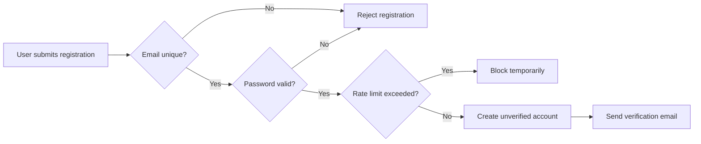

### Email Verification Process

WHEN a user completes registration, THE system SHALL generate a unique email verification link.

WHEN a user clicks the email verification link, THE system SHALL verify the link is valid and not expired.

WHEN a user clicks a valid verification link, THE system SHALL mark the user account as verified.

WHEN a user account is verified, THE system SHALL allow the user to log in and access platform features.

IF the verification link has expired, THE system SHALL reject the verification attempt.

IF the verification link has already been used, THE system SHALL reject the verification attempt.

WHEN a verification link expires, THE system SHALL prevent further use of that specific link.

WHEN a user needs to verify their account after link expiration, THE system SHALL allow resending a new verification link.

WHEN a user requests a new verification link, THE system SHALL invalidate any previously sent unexpired links.

IF a user account remains unverified beyond the maximum allowed period, THE system SHALL mark the account for review or deletion.

### Login Authentication

WHEN a user attempts to log in, THE system SHALL require email and password credentials.

WHEN a user submits login credentials, THE system SHALL validate the email exists in the system.

WHEN a user submits login credentials, THE system SHALL validate the password matches the stored credentials.

WHEN a user provides valid credentials, THE system SHALL create an authenticated session.

WHEN a user provides valid credentials, THE system SHALL redirect the user to their appropriate dashboard based on their role.

IF the email address does not exist, THE system SHALL reject the login attempt.

IF the password is incorrect, THE system SHALL reject the login attempt.

IF the user account is banned, THE system SHALL reject the login attempt.

IF the user account is unverified, THE system SHALL reject the login attempt.

IF the user account is deleted, THE system SHALL reject the login attempt.

WHEN a seller account is suspended, THE system SHALL reject the login attempt.

WHEN a user successfully logs in, THE system SHALL record the login timestamp.

WHEN a user successfully logs in, THE system SHALL update the last login timestamp on the user account.

### Password Change Workflow

WHEN a logged-in user requests to change their password, THE system SHALL require the current password for verification.

WHEN a user submits a password change request, THE system SHALL validate the current password is correct.

WHEN a user submits a password change request, THE system SHALL validate the new password meets platform security requirements.

WHEN a user successfully changes their password, THE system SHALL update the password in the system.

WHEN a user successfully changes their password, THE system SHALL invalidate all existing sessions for that user.

WHEN a user successfully changes their password, THE system SHALL require re-authentication for subsequent actions.

IF the current password is incorrect, THE system SHALL reject the password change request.

IF the new password does not meet security requirements, THE system SHALL reject the password change request.

IF the new password is the same as the current password, THE system SHALL reject the password change request.

WHEN a user changes their password, THE system SHALL log the password change event with timestamp.

WHEN a user changes their password, THE system SHALL notify the user via email of the password change.

### Account Deletion Process

WHEN a customer requests account deletion, THE system SHALL verify the account is authenticated.

WHEN a customer requests account deletion, THE system SHALL confirm the deletion action with the user.

WHEN a customer confirms account deletion, THE system SHALL delete the customer profile information.

WHEN a customer confirms account deletion, THE system SHALL preserve all order history and order records.

WHEN a customer confirms account deletion, THE system SHALL preserve all reviews but mark them as from a 'deleted user'.

WHEN a customer confirms account deletion, THE system SHALL invalidate all active sessions.

WHEN a customer confirms account deletion, THE system SHALL remove the user from all wishlists.

WHEN a customer confirms account deletion, THE system SHALL remove the user from all shopping carts.

WHEN a seller requests account deletion, THE system SHALL verify the account is authenticated.

WHEN a seller requests account deletion, THE system SHALL check for pending orders with paid or shipped status.

WHEN a seller requests account deletion, THE system SHALL check for pending cancellation requests.

WHEN a seller requests account deletion, THE system SHALL check for pending refund requests.

IF a seller has pending orders, THE system SHALL reject the account deletion request.

IF a seller has pending cancellation requests, THE system SHALL reject the account deletion request.

IF a seller has pending refund requests, THE system SHALL reject the account deletion request.

WHEN a seller confirms account deletion, THE system SHALL delete all products from listings.

WHEN a seller confirms account deletion, THE system SHALL preserve order history and order snapshots.

WHEN a seller confirms account deletion, THE system SHALL preserve the shop name in past order records.

WHEN a seller confirms account deletion, THE system SHALL invalidate all active sessions.

WHEN an administrator requests account deletion, THE system SHALL preserve all audit logs and administrative actions.

WHEN any user account is deleted, THE system SHALL prevent the same email from being reused for registration.

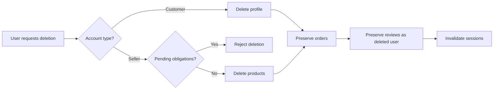

## CustomerProfile Actions

Customers create a profile with display name and phone number after registration. Customers can edit their display name at any time to update how they appear on the platform. Customers can edit their phone number for contact purposes. Profile changes are immediately reflected across the platform. Display name appears on reviews and order records. Phone number is used for order notifications and communication. Customers can view their current profile information at any time. Profile information is separate from account credentials. Customers cannot change their registered email through profile editing. Profile updates do not require administrator approval. Customers must be logged in to access profile management. Profile information is required for order placement and shipping.

### Customer Profile Creation

WHEN a customer completes registration, THE system SHALL automatically create a customer profile associated with their account.

THE system SHALL initialize the customer profile with the display name and phone number provided during registration.

WHEN a customer profile is created, THE system SHALL assign a unique customer identifier that links the profile to the user account.

THE system SHALL ensure that every registered customer has exactly one customer profile.

WHEN a customer profile is created, THE system SHALL set the creation timestamp to record when the profile was established.

IF a customer attempts to access profile features without a profile, THE system SHALL redirect them to profile creation or registration.

### Display Name Editing

WHEN a customer edits their display name, THE system SHALL update the profile with the new display name.

THE system SHALL allow customers to change their display name at any time while logged in.

WHEN a display name is updated, THE system SHALL immediately reflect the change across all platform areas where the customer is identified.

THE system SHALL use the display name on customer reviews to identify the reviewer.

THE system SHALL use the display name on order records to identify the customer.

WHEN a display name is changed, THE system SHALL preserve the previous display name in profile history for reference.

IF a customer attempts to set an empty display name, THE system SHALL reject the update.

### Phone Number Update

WHEN a customer updates their phone number, THE system SHALL update the profile with the new phone number.

THE system SHALL allow customers to change their phone number at any time while logged in.

WHEN a phone number is updated, THE system SHALL use the new number for all future order notifications.

THE system SHALL use the phone number for seller communication regarding orders.

WHEN a phone number is changed, THE system SHALL preserve the previous phone number in profile history for reference.

IF a customer attempts to set an invalid phone number format, THE system SHALL reject the update.

WHEN a phone number is updated, THE system SHALL validate the format before saving the change.

### Profile Information Viewing

WHEN a customer views their profile, THE system SHALL display their current display name and phone number.

THE system SHALL allow customers to view their profile information at any time while logged in.

WHEN a customer views their profile, THE system SHALL show the last update timestamp for each profile field.

THE system SHALL display the profile creation date to the customer.

WHEN a customer views their profile, THE system SHALL allow them to initiate an edit operation.

THE system SHALL show customers their complete profile information in a single view.

IF a customer is not logged in, THE system SHALL prevent access to profile viewing.

### Profile Visibility Settings

THE system SHALL display customer display names publicly on reviews that the customer has written.

THE system SHALL display customer display names on order records visible to the customer and relevant sellers.

THE system SHALL NOT expose customer phone numbers to other platform users.

THE system SHALL use customer display names for identification in all customer-facing communications.

WHEN a customer deletes their account, THE system SHALL preserve their display name in historical order records.

WHEN a customer deletes their account, THE system SHALL replace their display name with "deleted user" on reviews.

### Profile Update Workflow

WHEN a customer updates their profile, THE system SHALL immediately apply the changes without requiring approval.

THE system SHALL process profile updates synchronously so changes are visible immediately.

WHEN a profile update is completed, THE system SHALL confirm the successful update to the customer.

THE system SHALL allow customers to review their profile changes before confirming the update.

WHEN multiple profile fields are updated in a single operation, THE system SHALL apply all changes atomically.

IF a profile update fails, THE system SHALL preserve the original profile data without partial updates.

### Contact Information Management

THE system SHALL use the customer phone number as the primary contact method for order-related communications.

WHEN an order status changes, THE system SHALL send notifications to the customer's registered phone number.

THE system SHALL allow sellers to contact customers via the registered phone number for order-related inquiries.

WHEN a customer updates their phone number, THE system SHALL use the new number for all future communications.

THE system SHALL protect customer phone numbers from being visible to other customers.

WHEN a customer places an order, THE system SHALL use their profile phone number for shipping notifications.

THE system SHALL allow customers to update their phone number to ensure accurate contact information.

## SellerProfile Actions

Sellers create a profile with shop name, description, and logo image. Sellers can edit their shop name to reflect business changes. Sellers can update their shop description to provide information about their products. Sellers can upload and change their logo image. Every profile edit creates a snapshot preserving the previous state. Sellers can view their approval status as pending, approved, or rejected. Rejected sellers can view the rejection reason provided by administrators. Rejected sellers can submit a new registration request after rejection. Sellers can delete their account only if they have no pending orders or refund requests. When a seller deletes their account, their products are removed from listings. Order history and shop name snapshots in past orders are preserved. Customers can view seller profiles when browsing products. Seller profiles are visible to all platform users.

### Seller Profile Creation

WHEN a seller registers an account, THE system SHALL create a seller profile with shop name, shop description, and logo image.

THE system SHALL require a shop name when creating a seller profile.

THE system SHALL require a shop description when creating a seller profile.

THE system SHALL allow an optional logo image when creating a seller profile.

WHEN a seller creates a profile, THE system SHALL set the approval status to pending.

WHEN a seller creates a profile, THE system SHALL create a seller approval request.

IF the shop name is missing during profile creation, THE system SHALL reject the registration.

IF the shop description is missing during profile creation, THE system SHALL reject the registration.

THE system SHALL associate the seller profile with the seller's user account.

THE system SHALL preserve the seller profile even if the seller account is deleted.

### Shop Name Editing

WHEN a seller edits their shop name, THE system SHALL update the shop name in the seller profile.

WHEN a seller edits their shop name, THE system SHALL create a profile snapshot before the change.

WHEN a seller edits their shop name, THE system SHALL record the previous shop name in the snapshot.

WHEN a seller edits their shop name, THE system SHALL record the new shop name in the snapshot.

WHEN a seller edits their shop name, THE system SHALL record the timestamp of the change.

IF the seller account is suspended, THE system SHALL prevent shop name editing.

IF the seller account is deleted, THE system SHALL prevent shop name editing.

THE system SHALL allow sellers to view their current shop name at any time.

THE system SHALL display the updated shop name to customers immediately after editing.

### Shop Description Update

WHEN a seller updates their shop description, THE system SHALL update the shop description in the seller profile.

WHEN a seller updates their shop description, THE system SHALL create a profile snapshot before the change.

WHEN a seller updates their shop description, THE system SHALL record the previous shop description in the snapshot.

WHEN a seller updates their shop description, THE system SHALL record the new shop description in the snapshot.

WHEN a seller updates their shop description, THE system SHALL record the timestamp of the change.

IF the seller account is suspended, THE system SHALL prevent shop description updates.

IF the seller account is deleted, THE system SHALL prevent shop description updates.

THE system SHALL allow sellers to view their current shop description at any time.

THE system SHALL display the updated shop description to customers immediately after updating.

### Logo Image Management

WHEN a seller uploads a logo image, THE system SHALL store the logo image in the seller profile.

WHEN a seller uploads a logo image, THE system SHALL create a profile snapshot before the change.

WHEN a seller uploads a logo image, THE system SHALL record the previous logo image in the snapshot.

WHEN a seller uploads a logo image, THE system SHALL record the new logo image in the snapshot.

WHEN a seller uploads a logo image, THE system SHALL record the timestamp of the change.

WHEN a seller changes their logo image, THE system SHALL update the logo image in the seller profile.

WHEN a seller changes their logo image, THE system SHALL create a profile snapshot before the change.

IF the seller account is suspended, THE system SHALL prevent logo image uploads.

IF the seller account is deleted, THE system SHALL prevent logo image uploads.

THE system SHALL display the logo image to customers when viewing the seller profile.

THE system SHALL display the logo image to customers when viewing products from the seller.

### Profile Snapshot Creation

WHEN a seller edits their profile, THE system SHALL create a profile snapshot before the change.

WHEN a seller edits their profile, THE system SHALL record the timestamp of the snapshot creation.

WHEN a seller edits their profile, THE system SHALL record what fields were changed.

WHEN a seller edits their profile, THE system SHALL record the values before the change.

WHEN a seller edits their profile, THE system SHALL record the values after the change.

THE system SHALL make profile snapshots immutable after creation.

THE system SHALL prevent deletion of profile snapshots.

THE system SHALL allow sellers to view their own profile snapshots.

THE system SHALL allow administrators to view any seller's profile snapshots.

THE system SHALL preserve profile snapshots even after seller account deletion.

### Approval Status Viewing

WHEN a seller logs in, THE system SHALL display their current approval status.

WHEN a seller views their profile, THE system SHALL display their approval status.

THE system SHALL show approval status as pending when awaiting administrator review.

THE system SHALL show approval status as approved when the seller can sell products.

THE system SHALL show approval status as rejected when the seller registration was denied.

THE system SHALL show approval status as suspended when the seller account is suspended by an administrator.

THE system SHALL prevent sellers with pending status from creating products.

THE system SHALL prevent sellers with rejected status from creating products.

THE system SHALL prevent sellers with suspended status from creating or editing products.

THE system SHALL allow sellers with approved status to create and manage products.

### Rejection Reason Viewing

WHEN a seller's registration is rejected, THE system SHALL display the rejection reason to the seller.

WHEN a seller views their profile with rejected status, THE system SHALL show the rejection reason.

THE system SHALL require administrators to provide a rejection reason when rejecting a seller registration.

THE system SHALL display the rejection reason in a clear and accessible manner.

THE system SHALL preserve the rejection reason even after the seller submits a new request.

IF no rejection reason is provided by the administrator, THE system SHALL display a generic rejection message.

THE system SHALL allow rejected sellers to view their rejection reason at any time.

THE system SHALL allow rejected sellers to reference the rejection reason when submitting a new registration request.

### New Registration Request

WHEN a seller's registration is rejected, THE system SHALL allow the seller to submit a new registration request.

WHEN a seller submits a new registration request, THE system SHALL create a new seller approval request.

WHEN a seller submits a new registration request, THE system SHALL set the new request status to pending.

WHEN a seller submits a new registration request, THE system SHALL preserve the previous rejection history.

THE system SHALL allow sellers to update their profile information before submitting a new request.

THE system SHALL allow sellers to submit multiple registration requests after rejections.

IF a seller has a pending registration request, THE system SHALL prevent submission of another request.

THE system SHALL notify administrators when a rejected seller submits a new registration request.

### Account Deletion Conditions

WHEN a seller requests account deletion, THE system SHALL check for pending orders with paid or shipped status.

WHEN a seller requests account deletion, THE system SHALL check for pending cancellation requests.

WHEN a seller requests account deletion, THE system SHALL check for pending refund requests.

IF a seller has pending orders, THE system SHALL prevent account deletion.

IF a seller has pending cancellation requests, THE system SHALL prevent account deletion.

IF a seller has pending refund requests, THE system SHALL prevent account deletion.

IF all deletion conditions are met, THE system SHALL allow the seller to delete their account.

THE system SHALL display the reason for deletion blocking when conditions are not met.

THE system SHALL require seller confirmation before completing account deletion.

### Profile Visibility to Customers

WHEN a customer views a product, THE system SHALL display the seller's shop name.

WHEN a customer clicks on a seller's shop name, THE system SHALL display the seller profile page.

WHEN a customer views a seller profile, THE system SHALL display the shop name.

WHEN a customer views a seller profile, THE system SHALL display the shop description.

WHEN a customer views a seller profile, THE system SHALL display the logo image if available.

THE system SHALL make seller profiles visible to all platform users.

THE system SHALL make seller profiles visible to customers regardless of the seller's approval status.

WHEN a seller deletes their account, THE system SHALL preserve the shop name in past orders.

WHEN a seller deletes their account, THE system SHALL preserve the shop name in order snapshots.

## AdministratorProfile Actions

Any user can submit a request to become an administrator with a reason. Super administrators view pending administrator promotion requests. Super administrators approve or reject administrator promotion requests. Approved users become regular administrators. Super administrators can promote regular administrators to super administrator grade. Super administrators can demote other super administrators to regular administrator. Super administrators cannot demote themselves from super administrator grade. Regular administrators cannot promote or demote other administrators. Administrator grade determines access to platform management features. Administrator status is tracked in the system. Users can view their current administrator status if applicable. Administrator actions are logged for audit purposes.

### Administrator Promotion Request Submission

WHEN a user submits a request to become an administrator, THE system SHALL require the user to provide a reason for the request.

WHEN a user submits an administrator promotion request, THE system SHALL record the request with status "pending".

WHEN a user submits an administrator promotion request, THE system SHALL capture the submission timestamp.

IF a user already has a pending administrator promotion request, THEN THE system SHALL reject the new request.

IF a user is already an administrator (regular or super), THEN THE system SHALL reject the administrator promotion request.

WHEN an administrator promotion request is submitted, THE system SHALL make the request visible to super administrators.

IF the administrator promotion request reason is empty, THEN THE system SHALL reject the request.

### Pending Administrator Promotion Request Viewing

WHEN a super administrator views pending administrator promotion requests, THE system SHALL display all requests with status "pending".

WHEN viewing pending administrator promotion requests, THE system SHALL show the requesting user's information.

WHEN viewing pending administrator promotion requests, THE system SHALL display the reason provided by the requesting user.

WHEN viewing pending administrator promotion requests, THE system SHALL show the submission timestamp for each request.

IF a user is not a super administrator, THEN THE system SHALL prevent viewing pending administrator promotion requests.

WHEN a super administrator views pending requests, THE system SHALL display the total count of pending requests.

### Administrator Promotion Approval Workflow

WHEN a super administrator approves an administrator promotion request, THE system SHALL change the request status to "approved".

WHEN a super administrator approves an administrator promotion request, THE system SHALL grant the requesting user regular administrator grade.

WHEN a super administrator approves an administrator promotion request, THE system SHALL record the approval timestamp.

WHEN a super administrator approves an administrator promotion request, THE system SHALL create an audit log entry for the approval action.

IF a user is not a super administrator, THEN THE system SHALL prevent approval of administrator promotion requests.

WHEN an administrator promotion request is approved, THE system SHALL enable platform management features for the newly promoted administrator.

### Administrator Promotion Rejection Workflow

WHEN a super administrator rejects an administrator promotion request, THE system SHALL change the request status to "rejected".

WHEN a super administrator rejects an administrator promotion request, THE system SHALL require a rejection reason.

WHEN a super administrator rejects an administrator promotion request, THE system SHALL record the rejection timestamp.

WHEN a super administrator rejects an administrator promotion request, THE system SHALL make the rejection reason visible to the requesting user.

IF the rejection reason is empty, THEN THE system SHALL prevent the rejection action.

IF a user is not a super administrator, THEN THE system SHALL prevent rejection of administrator promotion requests.

WHEN an administrator promotion request is rejected, THE system SHALL create an audit log entry for the rejection action.

### Administrator Grade Promotion

WHEN a super administrator promotes a regular administrator to super administrator grade, THE system SHALL change the administrator's grade to "super".

WHEN a super administrator promotes another administrator, THE system SHALL record the promotion timestamp.

WHEN a super administrator promotes another administrator, THE system SHALL create an audit log entry for the promotion action.

IF a user is not a super administrator, THEN THE system SHALL prevent grade promotion of other administrators.

IF a regular administrator attempts to promote another administrator, THEN THE system SHALL reject the promotion action.

WHEN an administrator is promoted to super administrator grade, THE system SHALL grant full platform management privileges.

### Administrator Grade Demotion

WHEN a super administrator demotes another super administrator to regular administrator grade, THE system SHALL change the administrator's grade to "regular".

WHEN a super administrator demotes another administrator, THE system SHALL record the demotion timestamp.

WHEN a super administrator demotes another administrator, THE system SHALL create an audit log entry for the demotion action.

IF a super administrator attempts to demote themselves, THEN THE system SHALL reject the demotion action.

IF a regular administrator attempts to demote another administrator, THEN THE system SHALL reject the demotion action.

WHEN a super administrator is demoted to regular administrator grade, THE system SHALL restrict platform management privileges accordingly.

### Administrator Status Viewing

WHEN a user with administrator privileges views their profile, THE system SHALL display their current administrator grade.

WHEN a user views their administrator status, THE system SHALL show whether they are a regular or super administrator.

IF a user is not an administrator, THEN THE system SHALL not display administrator status information.

WHEN an administrator views their status, THE system SHALL show the date they became an administrator.

WHEN a super administrator views another administrator's profile, THE system SHALL display that administrator's grade.

WHEN a regular administrator views another administrator's profile, THE system SHALL display that administrator's grade.

### Grade-Based Access Control

WHILE a user has regular administrator grade, THE system SHALL grant access to platform management features.

WHILE a user has super administrator grade, THE system SHALL grant access to all platform management features including administrator management.

IF a user is not an administrator, THEN THE system SHALL deny access to platform management features.

WHILE a user is a regular administrator, THE system SHALL prevent access to administrator promotion and demotion features.

WHILE a user is a super administrator, THE system SHALL enable approval and rejection of administrator promotion requests.

WHILE a user is a super administrator, THE system SHALL enable promotion and demotion of other administrators.

IF an administrator's grade is changed, THEN THE system SHALL update their access permissions immediately.

## Address Actions

Customers can add multiple shipping addresses for different delivery locations. Each address includes recipient name, phone number, street address, city, state/province, postal code, and country. Customers can edit existing addresses to update delivery information. Customers can delete addresses that are no longer needed. Customers can set one address as their default shipping address. The default address is automatically selected during checkout. Customers can view all their saved addresses at any time. Addresses are used during order checkout for shipping. Customers can add a new address during checkout if needed. Address information is preserved in order snapshots. Address changes do not affect past orders. Customers must have at least one address to complete checkout.

### Address Creation

WHEN a customer adds a new shipping address, THE system SHALL require the following fields:
1. Recipient name
2. Phone number
3. Street address
4. City
5. State/province
6. Postal code
7. Country

WHEN a customer adds a new shipping address, THE system SHALL associate the address with the customer's profile.

WHEN a customer adds a new shipping address, THE system SHALL allow the address to be set as the default shipping address during creation.

IF a customer attempts to add an address with missing required fields, THE system SHALL reject the address creation request.

WHEN a customer successfully adds a new shipping address, THE system SHALL make the address available for selection during checkout.

WHEN a customer adds multiple shipping addresses, THE system SHALL allow the customer to maintain an unlimited number of addresses.

WHEN a customer adds a new shipping address, THE system SHALL store the address information for future use.

### Address Editing

WHEN a customer edits an existing shipping address, THE system SHALL allow modification of any address field (recipient name, phone number, street address, city, state/province, postal code, country).

WHEN a customer edits an existing shipping address, THE system SHALL preserve the address association with the customer's profile.

WHEN a customer edits an existing shipping address, THE system SHALL update the address information immediately upon saving.

WHEN a customer edits the default shipping address, THE system SHALL maintain its default status after the edit.

IF a customer attempts to edit an address with missing required fields, THE system SHALL reject the address update request.

WHEN a customer successfully edits an existing shipping address, THE system SHALL reflect the changes in all address listings and checkout selections.

### Address Deletion

WHEN a customer deletes a shipping address, THE system SHALL remove the address from the customer's address list.

WHEN a customer deletes a shipping address, THE system SHALL prevent deletion if the address is currently set as the default shipping address.

IF a customer attempts to delete the default shipping address, THE system SHALL require the customer to select a different default address first.

WHEN a customer deletes a shipping address, THE system SHALL preserve any historical order records that used the deleted address.

WHEN a customer deletes a shipping address, THE system SHALL not affect any past orders that were shipped to the deleted address.

WHEN a customer deletes a shipping address, THE system SHALL allow the customer to add a new address with the same information if needed.

### Default Address Selection

WHEN a customer sets a shipping address as the default, THE system SHALL mark that address as the default shipping address.

WHEN a customer sets a shipping address as the default, THE system SHALL remove the default status from any previously designated default address.

WHEN a customer views their address list, THE system SHALL clearly indicate which address is set as the default.

WHEN a customer proceeds to checkout, THE system SHALL automatically pre-select the default shipping address.

IF a customer has no default shipping address, THE system SHALL require the customer to select or create an address during checkout.

WHEN a customer changes the default shipping address, THE system SHALL update the default designation immediately.

WHEN a customer deletes a non-default shipping address, THE system SHALL not automatically change the default address designation.

### Address Viewing

WHEN a customer views their shipping addresses, THE system SHALL display all saved addresses associated with the customer's profile.

WHEN a customer views their shipping addresses, THE system SHALL show the complete address information for each address (recipient name, phone number, street address, city, state/province, postal code, country).

WHEN a customer views their shipping addresses, THE system SHALL indicate which address is set as the default.

WHEN a customer views their shipping addresses, THE system SHALL provide options to edit or delete each address.

WHEN a customer views their shipping addresses, THE system SHALL allow the customer to set any address as the default.

WHEN a customer views their shipping addresses, THE system SHALL display addresses in a format suitable for review and selection.

### Shipping Address Management

WHEN a customer manages shipping addresses, THE system SHALL allow the customer to add, edit, delete, and set default addresses at any time.

WHEN a customer manages shipping addresses, THE system SHALL maintain address data integrity and consistency.

WHEN a customer manages shipping addresses, THE system SHALL ensure that address changes do not affect past order records.

WHEN a customer manages shipping addresses, THE system SHALL allow address management from any authenticated customer session.

WHEN a customer manages shipping addresses, THE system SHALL provide immediate feedback on successful address operations.

WHEN a customer manages shipping addresses, THE system SHALL prevent operations that would leave the customer without any usable shipping address.

### Checkout Address Selection

WHEN a customer proceeds to checkout, THE system SHALL present the customer's saved shipping addresses for selection.

WHEN a customer proceeds to checkout, THE system SHALL automatically pre-select the default shipping address if one exists.

WHEN a customer selects a shipping address during checkout, THE system SHALL display the complete address information for confirmation.

WHEN a customer selects a shipping address during checkout, THE system SHALL allow the customer to change the selected address before order placement.

WHEN a customer selects a shipping address during checkout, THE system SHALL capture the selected address as part of the order details.

WHEN a customer adds a new address during checkout, THE system SHALL allow the customer to create a new shipping address and use it for the current order.

WHEN a customer completes checkout, THE system SHALL prevent any changes to the shipping address after order placement.

### Address Preservation in Orders

WHEN a customer places an order, THE system SHALL create a snapshot of the selected shipping address.

WHEN a customer places an order, THE system SHALL preserve the shipping address information in the order record.

WHEN a customer places an order, THE system SHALL capture the complete shipping address as it existed at the time of order placement.

WHEN a customer views an order, THE system SHALL display the shipping address that was used for that order.

WHEN a customer edits a shipping address after placing an order, THE system SHALL not update the shipping address in the order record.

WHEN a customer deletes a shipping address after placing an order, THE system SHALL preserve the address information in the order record.

WHEN a customer views order history, THE system SHALL show the shipping address for each order as it was at the time of purchase.

WHEN a customer places multiple orders using the same address, THE system SHALL preserve the address snapshot independently for each order.

## Category Actions

Administrators create categories to organize products on the platform. Categories can have subcategories with one level of nesting only. Each category has a name and description for clarity. Administrators can edit category names and descriptions as needed. Administrators can delete categories when they are no longer needed. Products in deleted categories become uncategorized. Customers can browse the list of all categories. Customers can view products within a specific category. Category structure helps customers find products easily. Categories are managed exclusively by administrators. Subcategories inherit parent category properties. Category changes affect product organization immediately.

### Category Creation

WHEN an administrator creates a category, THE system SHALL require a name for the category.

WHEN an administrator creates a category, THE system SHALL allow an optional description for the category.

WHEN an administrator creates a category, THE system SHALL associate the category with the platform (not with any specific seller).

WHEN an administrator creates a subcategory, THE system SHALL require the subcategory to have a parent category.

WHEN an administrator creates a subcategory, THE system SHALL limit nesting to one level only (subcategories cannot have their own subcategories).

WHEN an administrator creates a category or subcategory, THE system SHALL make the category immediately visible to customers.

IF a category name already exists at the same level, THE system SHALL reject the creation request.

IF the category name is empty, THE system SHALL reject the creation request.

WHEN a category is created successfully, THE system SHALL allow products to be assigned to that category.

WHEN a subcategory is created successfully, THE system SHALL inherit the parent category's organizational context.

### Category Editing

WHEN an administrator edits a category name, THE system SHALL require a new name value.

WHEN an administrator edits a category name, THE system SHALL update all references to the category name across the platform immediately.

WHEN an administrator edits a category description, THE system SHALL allow the description to be updated or cleared.

WHEN an administrator edits a category description, THE system SHALL update the description for all customers viewing the category.

IF the new category name already exists at the same level, THE system SHALL reject the edit request.

IF the new category name is empty, THE system SHALL reject the edit request.

WHEN a category name or description is edited, THE system SHALL preserve the previous values for audit purposes.

WHEN a parent category's name is edited, THE system SHALL not affect the names of its subcategories.

WHEN a parent category's description is edited, THE system SHALL not affect the descriptions of its subcategories.

WHEN an administrator edits a category, THE system SHALL maintain all product associations with that category.

### Category Deletion

WHEN an administrator deletes a category, THE system SHALL check if products are assigned to that category.

WHEN an administrator deletes a category with products, THE system SHALL reassign those products to uncategorized status.

WHEN an administrator deletes a category, THE system SHALL preserve the category's existence in historical order records.

WHEN an administrator deletes a subcategory, THE system SHALL reassign all products in that subcategory to uncategorized status.

WHEN an administrator deletes a parent category, THE system SHALL also delete all its subcategories.

WHEN an administrator deletes a parent category, THE system SHALL reassign all products from deleted subcategories to uncategorized status.

IF a category has subcategories, THE system SHALL require confirmation before deletion.

WHEN a category is deleted, THE system SHALL remove it from the customer-visible category list.

WHEN a category is deleted, THE system SHALL not delete any products that were in that category.

WHEN a category is deleted, THE system SHALL not affect existing orders containing products from that category.

### Product Categorization

WHEN a seller creates a product, THE system SHALL require the seller to select a category for the product.

WHEN a seller creates a product, THE system SHALL allow the seller to select either a top-level category or a subcategory.

WHEN a seller edits a product's category, THE system SHALL allow the seller to change to a different category or subcategory.

WHEN a seller changes a product's category, THE system SHALL update the product's category association immediately.

WHEN a category is deleted, THE system SHALL set the category reference to null for all products in that category.

WHEN a product has no category assigned, THE system SHALL display the product as uncategorized.

WHEN an administrator assigns a category to a product, THE system SHALL update the product's category immediately.

WHEN a product is categorized, THE system SHALL include the product in the category's product listing.

WHEN a product's category is changed, THE system SHALL remove the product from the old category listing.

WHEN a product's category is changed, THE system SHALL add the product to the new category listing.

### Category Browsing

WHEN a customer browses categories, THE system SHALL display all top-level categories.

WHEN a customer browses categories, THE system SHALL display the category name and description for each category.

WHEN a customer selects a category, THE system SHALL display all products in that category.

WHEN a customer views a category with subcategories, THE system SHALL display the subcategories under that category.

WHEN a customer selects a subcategory, THE system SHALL display only products assigned to that subcategory.

WHEN a customer browses categories, THE system SHALL not display deleted categories.

WHEN a customer browses categories, THE system SHALL not display categories from suspended sellers (categories are platform-wide, not seller-specific).

WHEN a customer views a category, THE system SHALL show the count of products in that category.

WHEN a customer views a subcategory, THE system SHALL show the count of products in that subcategory.

WHEN a customer navigates from a subcategory, THE system SHALL provide a way to return to the parent category.

WHEN a customer browses categories, THE system SHALL organize categories in a hierarchical structure.

WHEN a customer views uncategorized products, THE system SHALL display them separately from categorized products.

## Product Actions

Sellers create products with name, description, category, and base price. Every product must have all required fields to be created. Products belong to the seller who created them. Sellers can edit their own products to update information. Every product edit creates a snapshot preserving the previous state. Sellers can delete their own products under certain conditions. Products can only be deleted if no pending order items exist for any variant. Products can only be deleted if no pending cancellation or refund requests exist. Deleting a product also deletes all its variants and inventory records. Deleted products no longer appear in search or category listings. Sellers can view snapshots of their own products. Administrators can view snapshots of any product on the platform. Snapshots are preserved even after product deletion.

### Product Creation

WHEN a seller creates a product, THE system SHALL require a product name.
WHEN a seller creates a product, THE system SHALL require a product description.
WHEN a seller creates a product, THE system SHALL require a category selection.
WHEN a seller creates a product, THE system SHALL require a base price.
WHEN a seller creates a product, THE system SHALL associate the product with the creating seller.
WHEN a seller creates a product, THE system SHALL allow the seller to upload multiple images.
WHEN a seller creates a product, THE system SHALL allow the seller to create variants with SKU codes and option values.
WHEN a seller creates a product, THE system SHALL set initial stock quantity to zero for each variant.
IF a seller has pending approval status, THE system SHALL prevent product creation.
IF a seller is suspended, THE system SHALL prevent product creation.

### Product Editing

WHEN a seller edits their own product, THE system SHALL allow updates to product name.
WHEN a seller edits their own product, THE system SHALL allow updates to product description.
WHEN a seller edits their own product, THE system SHALL allow updates to category selection.
WHEN a seller edits their own product, THE system SHALL allow updates to base price.
WHEN a seller edits their own product, THE system SHALL allow image reordering.
WHEN a seller edits their own product, THE system SHALL allow addition of new images.
WHEN a seller edits their own product, THE system SHALL allow deletion of images.
WHEN a seller edits their own product, THE system SHALL allow addition of new variants.
WHEN a seller edits their own product, THE system SHALL allow updates to variant SKU codes.
WHEN a seller edits their own product, THE system SHALL allow updates to variant option values.
WHEN a seller edits their own product, THE system SHALL allow updates to variant price overrides.
IF a seller is suspended, THE system SHALL prevent product editing.
IF a product has pending order items, THE system SHALL allow editing but preserve snapshots.
IF a product has pending cancellation requests, THE system SHALL allow editing but preserve snapshots.
IF a product has pending refund requests, THE system SHALL allow editing but preserve snapshots.

### Product Deletion Conditions

WHEN a seller deletes their own product, THE system SHALL verify no pending order items exist for any variant.
WHEN a seller deletes their own product, THE system SHALL verify no pending cancellation requests exist for any variant.
WHEN a seller deletes their own product, THE system SHALL verify no pending refund requests exist for any variant.
IF a product has pending order items, THE system SHALL prevent product deletion.
IF a product has pending cancellation requests, THE system SHALL prevent product deletion.
IF a product has pending refund requests, THE system SHALL prevent product deletion.
WHEN a seller successfully deletes a product, THE system SHALL delete all associated variants.
WHEN a seller successfully deletes a product, THE system SHALL delete all associated inventory records.
WHEN a seller successfully deletes a product, THE system SHALL remove the product from search results.
WHEN a seller successfully deletes a product, THE system SHALL remove the product from category listings.
WHEN a seller successfully deletes a product, THE system SHALL preserve all product snapshots.
WHEN an administrator deletes a product, THE system SHALL delete the product regardless of pending orders.
WHEN an administrator deletes a product, THE system SHALL preserve all product snapshots.

### Product Snapshot Creation

WHEN a seller edits a product, THE system SHALL automatically create a product snapshot.
WHEN a product snapshot is created, THE system SHALL record the product name before and after the change.
WHEN a product snapshot is created, THE system SHALL record the product description before and after the change.
WHEN a product snapshot is created, THE system SHALL record the category before and after the change.
WHEN a product snapshot is created, THE system SHALL record the base price before and after the change.
WHEN a product snapshot is created, THE system SHALL record all product images at the time of change.
WHEN a product snapshot is created, THE system SHALL create variant snapshots for all existing variants.
WHEN a product snapshot is created, THE system SHALL record the timestamp of the change.
WHEN a product snapshot is created, THE system SHALL make the snapshot immutable.
WHEN a product is deleted, THE system SHALL preserve all existing product snapshots.
WHEN a product image is added, THE system SHALL include the image in the next product snapshot.
WHEN a product image is deleted, THE system SHALL record the deletion in the next product snapshot.
WHEN a product image is reordered, THE system SHALL record the new order in the next product snapshot.

### Variant Deletion Cascade

WHEN a seller deletes a variant, THE system SHALL verify no pending order items exist for that variant.
WHEN a seller deletes a variant, THE system SHALL verify no pending cancellation requests exist for that variant.
WHEN a seller deletes a variant, THE system SHALL verify no pending refund requests exist for that variant.
IF a variant has pending order items, THE system SHALL prevent variant deletion.
IF a variant has pending cancellation requests, THE system SHALL prevent variant deletion.
IF a variant has pending refund requests, THE system SHALL prevent variant deletion.
WHEN a seller successfully deletes a variant, THE system SHALL delete all associated inventory records.
WHEN a seller successfully deletes a variant, THE system SHALL preserve all variant snapshots.
WHEN a product is deleted, THE system SHALL automatically delete all variants.
WHEN a product is deleted, THE system SHALL preserve all variant snapshots.
IF a product has only one variant, THE system SHALL allow variant deletion if no pending orders exist.
IF a product has no variants after deletion, THE system SHALL mark the product as unavailable.

### Inventory Record Deletion

WHEN a variant is deleted, THE system SHALL automatically delete all inventory records for that variant.
WHEN a product is deleted, THE system SHALL automatically delete all inventory records for all variants.
WHEN a seller deletes a variant, THE system SHALL preserve inventory history in variant snapshots.
WHEN a seller deletes a product, THE system SHALL preserve inventory history in product snapshots.
WHEN an inventory record is created, THE system SHALL record the quantity change.
WHEN an inventory record is created, THE system SHALL record the reason for the change.
WHEN an inventory record is created, THE system SHALL record the timestamp.
WHEN an order is placed, THE system SHALL automatically create a negative inventory record.
WHEN an order is cancelled, THE system SHALL automatically create a positive inventory record.
WHEN an order is refunded, THE system SHALL automatically create a positive inventory record.

### Search Result Removal

WHEN a product is deleted, THE system SHALL remove the product from all search results.
WHEN a product is deleted, THE system SHALL remove the product from search result pagination.
WHEN a seller is suspended, THE system SHALL remove all their products from search results.
WHEN a seller is unsuspended, THE system SHALL restore their products to search results.
WHEN a product has no variants, THE system SHALL show the product in search but mark as unavailable.
WHEN a product variant is out of stock, THE system SHALL still show the product in search results.
WHEN a product is in a deleted category, THE system SHALL still show the product in search results.
WHEN a customer searches for products, THE system SHALL return only non-deleted products.
WHEN a customer searches for products, THE system SHALL exclude products from suspended sellers.

### Category Listing Removal

WHEN a product is deleted, THE system SHALL remove the product from its category listing.
WHEN a product is deleted, THE system SHALL remove the product from subcategory listings.
WHEN a seller is suspended, THE system SHALL remove all their products from category listings.
WHEN a seller is unsuspended, THE system SHALL restore their products to category listings.
WHEN a category is deleted, THE system SHALL make products in that category uncategorized.
WHEN a product is in a deleted category, THE system SHALL still show the product in search results.
WHEN a customer views a category, THE system SHALL show only non-deleted products.
WHEN a customer views a category, THE system SHALL exclude products from suspended sellers.
WHEN a product has no variants, THE system SHALL show the product in category listings but mark as unavailable.

### Snapshot Viewing by Sellers

WHEN a seller views product snapshots, THE system SHALL show only snapshots of their own products.
WHEN a seller views product snapshots, THE system SHALL display the timestamp of each snapshot.
WHEN a seller views product snapshots, THE system SHALL show the product name before and after the change.
WHEN a seller views product snapshots, THE system SHALL show the product description before and after the change.
WHEN a seller views product snapshots, THE system SHALL show the base price before and after the change.
WHEN a seller views product snapshots, THE system SHALL show all variant snapshots included in each product snapshot.
WHEN a seller views product snapshots, THE system SHALL show variant SKU codes before and after changes.
WHEN a seller views product snapshots, THE system SHALL show variant option values before and after changes.
WHEN a seller views product snapshots, THE system SHALL show variant prices before and after changes.
WHEN a seller views product snapshots, THE system SHALL preserve snapshots even after product deletion.
WHEN a seller views product snapshots, THE system SHALL prevent modification of snapshot data.

### Snapshot Viewing by Administrators

WHEN an administrator views product snapshots, THE system SHALL allow viewing snapshots of any product.
WHEN an administrator views product snapshots, THE system SHALL display the timestamp of each snapshot.
WHEN an administrator views product snapshots, THE system SHALL show the product name before and after the change.
WHEN an administrator views product snapshots, THE system SHALL show the product description before and after the change.
WHEN an administrator views product snapshots, THE system SHALL show the category before and after the change.
WHEN an administrator views product snapshots, THE system SHALL show the base price before and after the change.
WHEN an administrator views product snapshots, THE system SHALL show all variant snapshots included in each product snapshot.
WHEN an administrator views product snapshots, THE system SHALL show variant SKU codes before and after changes.
WHEN an administrator views product snapshots, THE system SHALL show variant option values before and after changes.
WHEN an administrator views product snapshots, THE system SHALL show variant prices before and after changes.
WHEN an administrator views product snapshots, THE system SHALL preserve snapshots even after product deletion.
WHEN an administrator views product snapshots, THE system SHALL prevent modification of snapshot data.
WHEN an administrator views product snapshots, THE system SHALL allow filtering by seller.
WHEN an administrator views product snapshots, THE system SHALL allow filtering by date range.

## ProductImage Actions

Sellers upload multiple images for each product they create. The first image serves as the main thumbnail image. Sellers can reorder images to change which appears first. Sellers can delete images from their products. Image changes are included in product snapshots. Products display all uploaded images on detail pages. The main image appears in search results and category listings. Sellers can add images at any time after product creation. Image order affects customer viewing experience. Deleted images are removed from product display. Image uploads are required for product visibility. Multiple images provide customers with better product understanding.

### Image Upload

WHEN a seller creates a new product, THE system SHALL allow the seller to upload at least one image for the product.

WHEN a seller uploads an image for a product, THE system SHALL associate the image with that specific product.

WHEN a seller uploads multiple images for a product, THE system SHALL store each image with its upload timestamp.

WHEN a seller uploads an image, THE system SHALL assign the image a display order based on the upload sequence.

WHEN a seller uploads the first image for a product, THE system SHALL automatically designate it as the main image.

WHEN a seller uploads additional images after the first, THE system SHALL append them after the existing images in display order.

WHEN a seller uploads an image, THE system SHALL make the image immediately visible on the product detail page.

WHEN a seller uploads an image for a product, THE system SHALL preserve the image even if the product is later deleted.

IF a seller attempts to upload an image for a product they do not own, THE system SHALL reject the upload request.

IF a seller attempts to upload an image for a product that does not exist, THE system SHALL reject the upload request.

IF a seller attempts to upload an image while their seller account is suspended, THE system SHALL reject the upload request.

THE system SHALL allow sellers to upload images at any time after product creation.

THE system SHALL allow sellers to upload images for products that have no variants.

THE system SHALL allow sellers to upload images for products that have variants.

### Image Reordering and Main Image Selection

WHEN a seller views the images for their product, THE system SHALL display the images in their current display order.

WHEN a seller reorders images for a product, THE system SHALL update the display order of the affected images.

WHEN a seller moves an image to the first position, THE system SHALL designate it as the main image.

WHEN a seller reorders images, THE system SHALL immediately reflect the new order on the product detail page.

WHEN a seller reorders images, THE system SHALL preserve all existing images without deletion.

WHEN a seller reorders images, THE system SHALL maintain the display order for images not involved in the reordering.

WHEN a seller selects a different image as the main image, THE system SHALL move that image to the first position in display order.

WHEN a seller changes the main image, THE system SHALL update the thumbnail image shown in search results and category listings.

IF a seller attempts to reorder images for a product they do not own, THE system SHALL reject the reordering request.

IF a seller attempts to reorder images for a product that does not exist, THE system SHALL reject the reordering request.

IF a seller attempts to reorder images while their seller account is suspended, THE system SHALL reject the reordering request.

THE system SHALL allow sellers to reorder images at any time after upload.

THE system SHALL allow sellers to reorder images even if the product has no variants.

THE system SHALL allow sellers to reorder images even if the product has variants.

### Image Deletion

WHEN a seller deletes an image from a product, THE system SHALL remove the image from the product's image list.

WHEN a seller deletes an image, THE system SHALL renumber the display order of remaining images to maintain sequential ordering.

WHEN a seller deletes the main image, THE system SHALL automatically designate the next image in display order as the new main image.

WHEN a seller deletes an image, THE system SHALL immediately remove it from the product detail page.

WHEN a seller deletes an image, THE system SHALL update the thumbnail image in search results and category listings if the deleted image was the main image.

WHEN a seller deletes an image, THE system SHALL preserve the deleted image in product snapshots created before deletion.

IF a seller attempts to delete the last remaining image for a product, THE system SHALL reject the deletion request.

IF a seller attempts to delete an image from a product they do not own, THE system SHALL reject the deletion request.

IF a seller attempts to delete an image from a product that does not exist, THE system SHALL reject the deletion request.

IF a seller attempts to delete an image while their seller account is suspended, THE system SHALL reject the deletion request.

THE system SHALL allow sellers to delete images at any time after upload, provided at least one image remains.

THE system SHALL allow sellers to delete images even if the product has no variants.

THE system SHALL allow sellers to delete images even if the product has variants.

### Image Snapshot Inclusion

WHEN a seller edits a product's images, THE system SHALL create a product snapshot that includes the image state before the edit.

WHEN a seller uploads a new image, THE system SHALL include the new image in the next product snapshot.

WHEN a seller reorders images, THE system SHALL include the display order in the next product snapshot.

WHEN a seller deletes an image, THE system SHALL include the deletion in the next product snapshot.

WHEN a seller changes the main image, THE system SHALL include the main image designation in the next product snapshot.

WHEN a product snapshot is created, THE system SHALL record all image URLs and their display order at that moment.

WHEN a product snapshot is created, THE system SHALL record which image was designated as the main image at that moment.

WHEN a product is deleted, THE system SHALL preserve all product snapshots including image information.

WHEN a seller views product snapshots, THE system SHALL display the image state captured in each snapshot.

WHEN an administrator views product snapshots, THE system SHALL display the image state captured in each snapshot.

IF a seller edits a product without changing images, THE system SHALL still create a snapshot but the image state remains unchanged.

THE system SHALL include image information in order item snapshots when products are purchased.

THE system SHALL preserve image snapshots even if the original images are later deleted.

THE system SHALL make image snapshots immutable and prevent any modification after creation.

### Product Image Display

WHEN a customer views a product detail page, THE system SHALL display all images uploaded for that product.

WHEN a customer views a product detail page, THE system SHALL display the main image first in the image gallery.

WHEN a customer views a product detail page, THE system SHALL display images in their display order.

WHEN a customer views a product detail page, THE system SHALL allow navigation between all product images.

WHEN a customer views a product listing in search results, THE system SHALL display the main image as a thumbnail.

WHEN a customer views a product listing in category pages, THE system SHALL display the main image as a thumbnail.

WHEN a customer views a product listing, THE system SHALL display the current main image even if the product has been edited.

WHEN a seller deletes their seller account, THE system SHALL hide all product images from search and category listings.

WHEN a seller is suspended, THE system SHALL hide all product images from search and category listings.

WHEN a product is deleted, THE system SHALL remove its images from search results and category listings.

WHEN a customer views an order detail page, THE system SHALL display the product image snapshot from the time of purchase.

WHEN a customer views an order detail page, THE system SHALL display the image that was current at the time of order placement.

IF a product has no images, THE system SHALL hide the product from search results and category listings.

IF a product has only one image, THE system SHALL display that image as the main image in all contexts.

THE system SHALL display product images to customers regardless of the seller's approval status if the seller was previously approved.

## ProductVariant Actions

Sellers add variants to products to represent different options. Each variant has a unique SKU code, option values, price, and stock quantity. Variants represent specific combinations like color and size. Sellers can edit variant SKU codes, option values, and prices. Every variant edit creates a snapshot for tracking changes. Sellers can delete variants under specific conditions. Variants can only be deleted if no pending order items exist for that variant. Variants can only be deleted if no pending cancellation or refund requests exist. A product must have at least one variant to be purchasable. Products with no variants show as unavailable in search. Variant prices can override the product base price. Stock quantity starts at zero for new variants.

### Variant Creation

WHEN a seller creates a variant for a product, THE system SHALL require a unique SKU code.

WHEN a seller creates a variant for a product, THE system SHALL require option values representing the variant configuration.

WHEN a seller creates a variant for a product, THE system SHALL allow an optional price override that can differ from the product base price.

WHEN a seller creates a variant for a product, THE system SHALL initialize the stock quantity to zero.

WHEN a seller creates a variant for a product, THE system SHALL associate the variant with the parent product.

IF the SKU code already exists for another variant in the system, THE system SHALL reject the variant creation.

WHEN a seller creates a variant, THE system SHALL make the variant immediately visible on the product detail page.

WHEN a seller creates a variant, THE system SHALL allow the variant to be added to shopping carts by customers.

### Variant Editing

WHEN a seller edits a variant, THE system SHALL allow modification of the SKU code.

WHEN a seller edits a variant, THE system SHALL allow modification of the option values.

WHEN a seller edits a variant, THE system SHALL allow modification of the price override.

WHEN a seller edits a variant, THE system SHALL create a variant snapshot before applying the changes.

WHEN a seller edits a variant, THE system SHALL preserve the previous variant state in the snapshot.

WHEN a seller edits a variant, THE system SHALL record the timestamp of the change in the snapshot.

IF the new SKU code conflicts with an existing variant, THE system SHALL reject the edit.

WHEN a seller edits a variant, THE system SHALL allow the seller to view all previous variant snapshots.

### Variant Deletion Conditions

WHEN a seller attempts to delete a variant, THE system SHALL verify that no order items with paid or shipped status exist for that variant.

WHEN a seller attempts to delete a variant, THE system SHALL verify that no pending cancellation requests exist for that variant.

WHEN a seller attempts to delete a variant, THE system SHALL verify that no pending refund requests exist for that variant.

IF pending order items exist for the variant, THE system SHALL prevent the variant deletion.

IF pending cancellation requests exist for the variant, THE system SHALL prevent the variant deletion.

IF pending refund requests exist for the variant, THE system SHALL prevent the variant deletion.

WHEN a seller successfully deletes a variant, THE system SHALL remove the variant from all product listings.

WHEN a seller deletes a variant, THE system SHALL preserve all variant snapshots for historical reference.

### Product Purchasability

WHEN a product has at least one variant, THE system SHALL make the product purchasable by customers.

WHEN a product has no variants, THE system SHALL display the product as unavailable in search results.

WHEN a product has no variants, THE system SHALL display the product as unavailable in category listings.

WHEN all variants of a product are out of stock, THE system SHALL indicate that the product is temporarily unavailable.

WHEN at least one variant of a product is in stock, THE system SHALL allow customers to add that variant to their cart.

WHEN a product has no variants, THE system SHALL prevent customers from adding the product to their cart.

WHEN a seller deletes the last variant of a product, THE system SHALL mark the product as unavailable.

## InventoryRecord Actions

Each variant has its own stock quantity managed through inventory records. Sellers add inventory through restocking with quantity and reason. Sellers subtract inventory through adjustments or loss with quantity and reason. Current stock is calculated by summing all inventory records for a variant. Order placement automatically creates negative inventory records. Order cancellation automatically creates positive inventory records. Order refund automatically creates positive inventory records. Sellers can view full inventory history for each variant. When stock reaches zero, the variant shows as out of stock. Out of stock variants cannot be added to cart. Inventory records are not snapshots but transactional history. Stock updates happen in real-time during order processing.

### Inventory Restocking Operations

WHEN a seller adds inventory to a product variant, THE system SHALL create a new inventory record with a positive quantity change.

WHEN a seller restocks inventory, THE system SHALL require the seller to provide a reason for the restocking.

WHEN a seller restocks inventory, THE system SHALL record the timestamp of the restocking action.

WHEN a seller restocks inventory, THE system SHALL associate the inventory record with the specific product variant being restocked.

THE system SHALL allow sellers to restock inventory for any variant they own.

THE system SHALL update the current stock quantity immediately after a restocking action.

IF a seller attempts to restock without providing a reason, THE system SHALL reject the restocking request.

IF a seller attempts to restock a variant they do not own, THE system SHALL reject the restocking request.

### Inventory Adjustment and Loss Recording

WHEN a seller adjusts inventory quantity, THE system SHALL create a new inventory record with the specified quantity change.

WHEN a seller records inventory loss, THE system SHALL create a new inventory record with a negative quantity change.

WHEN a seller makes an inventory adjustment, THE system SHALL require the seller to provide a reason for the adjustment.

WHEN a seller records inventory loss, THE system SHALL require the seller to provide a reason for the loss.

WHEN a seller makes an inventory adjustment, THE system SHALL record the timestamp of the adjustment action.

WHEN a seller records inventory loss, THE system SHALL record the timestamp of the loss recording action.

THE system SHALL allow sellers to adjust inventory (positive or negative) for any variant they own.

THE system SHALL update the current stock quantity immediately after an inventory adjustment or loss recording.

IF a seller attempts to adjust inventory without providing a reason, THE system SHALL reject the adjustment request.

IF a seller attempts to adjust inventory for a variant they do not own, THE system SHALL reject the adjustment request.

IF an inventory adjustment would result in negative stock, THE system SHALL reject the adjustment request.

### Automatic Inventory Updates on Order Processing

WHEN a customer successfully places an order, THE system SHALL automatically create a negative inventory record for each purchased variant.

WHEN a customer successfully places an order, THE system SHALL decrease the stock quantity for each purchased variant by the ordered quantity.

WHEN an order item is cancelled and approved, THE system SHALL automatically create a positive inventory record to restore the stock quantity.

WHEN an order item is cancelled and approved, THE system SHALL increase the stock quantity for the variant by the cancelled quantity.

WHEN an order item is refunded and approved, THE system SHALL automatically create a positive inventory record to restore the stock quantity.

WHEN an order item is refunded and approved, THE system SHALL increase the stock quantity for the variant by the refunded quantity.

WHEN an order is placed, THE system SHALL record the order reference in the inventory record reason.

WHEN a cancellation is approved, THE system SHALL record the cancellation reference in the inventory record reason.

WHEN a refund is approved, THE system SHALL record the refund reference in the inventory record reason.

THE system SHALL process inventory updates atomically with order, cancellation, or refund operations.

IF an order is placed but payment fails, THE system SHALL NOT create inventory records.

IF a cancellation request is rejected, THE system SHALL NOT create inventory restoration records.

### Inventory History and Stock Management

WHEN a seller views inventory history, THE system SHALL display all inventory records for the selected variant.

WHEN a seller views inventory history, THE system SHALL show the quantity change, reason, and timestamp for each record.

WHEN a seller views inventory history, THE system SHALL display records in chronological order (newest first).

THE system SHALL allow sellers to view the complete inventory history for any variant they own.

THE system SHALL calculate the current stock quantity by summing all inventory records for a variant.

WHEN the current stock quantity reaches zero, THE system SHALL mark the variant as out of stock.

WHEN a variant is marked as out of stock, THE system SHALL prevent customers from adding that variant to their cart.

WHEN a variant is marked as out of stock, THE system SHALL display an out of stock indicator on product listings.

WHEN a variant's stock quantity is greater than zero, THE system SHALL allow customers to add that variant to their cart.

THE system SHALL update stock quantity calculations in real-time as new inventory records are created.

THE system SHALL ensure inventory records are immutable and cannot be deleted or modified after creation.

IF a variant has no inventory records, THE system SHALL display the current stock quantity as zero.

IF a seller attempts to view inventory history for a variant they do not own, THE system SHALL deny access to that history.

## WishlistItem Actions

Customers add products to their wishlist for future consideration. The wishlist stores products, not specific variants. Customers can view their wishlist with pagination for large lists. Customers can remove products from their wishlist at any time. If a seller deletes a product, it is automatically removed from all wishlists. Wishlist items do not reserve stock or affect inventory. Customers can add the same product to wishlist only once. Wishlist is private to each customer account. Customers must be logged in to access wishlist features. Wishlist helps customers track products they are interested in. Products in wishlist remain visible even if out of stock.

### Wishlist Addition

WHEN a customer adds a product to their wishlist, THE system SHALL create a wishlist item linking the customer to that product.

WHEN a customer adds a product to their wishlist, THE system SHALL record the timestamp of addition.

IF a product is already in a customer's wishlist, THEN THE system SHALL prevent duplicate additions.

IF a customer attempts to add a product that does not exist, THEN THE system SHALL reject the addition.

IF a customer attempts to add a product from a suspended seller, THEN THE system SHALL allow the addition but mark the product as unavailable.

THE system SHALL allow customers to add products to their wishlist regardless of stock status.

THE system SHALL allow customers to add products to their wishlist even if the product is out of stock.

### Wishlist Viewing

WHEN a customer views their wishlist, THE system SHALL display all products in their wishlist.

WHEN a customer views their wishlist, THE system SHALL show product name, main image, price, and seller shop name for each item.

WHEN a customer views their wishlist, THE system SHALL indicate stock status for each product variant.

WHEN a customer views their wishlist, THE system SHALL sort items by most recently added first.

IF a product in the wishlist has been deleted by the seller, THEN THE system SHALL exclude it from the displayed list.

IF a product in the wishlist is from a suspended seller, THEN THE system SHALL display it with an unavailable indicator.

THE system SHALL provide a link from each wishlist item to the product detail page.

THE system SHALL display the total count of items in the wishlist.

### Wishlist Removal

WHEN a customer removes a product from their wishlist, THE system SHALL delete the wishlist item.

WHEN a customer removes a product from their wishlist, THE system SHALL immediately update the displayed wishlist.

IF a customer attempts to remove a product that is not in their wishlist, THEN THE system SHALL reject the removal request.

THE system SHALL allow customers to remove any product from their wishlist at any time.

THE system SHALL not require any reason or approval for wishlist item removal.

### Automatic Wishlist Cleanup

WHEN a seller deletes a product, THE system SHALL automatically remove that product from all customer wishlists.

WHEN a product is deleted, THE system SHALL cascade the deletion to all wishlist items referencing that product.

IF a customer views their wishlist after a product deletion, THEN THE system SHALL not display the deleted product.

THE system SHALL silently remove deleted products without notifying customers.

THE system SHALL preserve no record of deleted wishlist items after automatic cleanup.

### Product-Based Wishlist

THE system SHALL store products in the wishlist, not specific product variants.

THE system SHALL allow customers to add a product to their wishlist without selecting a variant.

IF a customer adds a product to their wishlist, THEN THE system SHALL not require variant selection.

THE system SHALL display all available variants on the product detail page for wishlist items.

IF a customer purchases a product from their wishlist, THEN THE system SHALL allow variant selection at checkout.

THE system SHALL not remove a product from the wishlist when a customer purchases any variant of that product.

### Wishlist Pagination

WHEN a customer views their wishlist, THE system SHALL display items in paginated results.

THE system SHALL show a configurable number of items per page in the wishlist.

THE system SHALL provide navigation controls for browsing between wishlist pages.

IF a wishlist contains more items than the page size, THEN THE system SHALL display page numbers or next/previous controls.

THE system SHALL maintain consistent pagination across wishlist views.

THE system SHALL update the total page count when items are added or removed from the wishlist.

### Wishlist Privacy

THE system SHALL keep each customer's wishlist private and visible only to that customer.

IF a customer is not authenticated, THEN THE system SHALL not display any wishlist content.

IF one customer attempts to access another customer's wishlist, THEN THE system SHALL deny access.

THE system SHALL not allow customers to view or search other customers' wishlists.

THE system SHALL not expose wishlist data to sellers or administrators.

THE system SHALL isolate wishlist data by customer account.

### Logged-In Requirement

IF a customer is not logged in, THEN THE system SHALL prevent access to wishlist features.

IF a guest attempts to add a product to a wishlist, THEN THE system SHALL require authentication first.

IF a guest attempts to view a wishlist, THEN THE system SHALL redirect to the login page.

THE system SHALL require a valid customer session for all wishlist operations.

IF a customer's session expires, THEN THE system SHALL require re-authentication before accessing the wishlist.

THE system SHALL not allow wishlist operations without a logged-in customer account.

## CartItem Actions

Customers add variants to their cart with specific quantities. When adding the same variant again, quantities are combined. Customers can view their cart with all items and details. Cart shows product name, variant options, price, quantity, and subtotal. Customers can change quantities of items in their cart. Customers can remove items from their cart at any time. Cart displays the total price of all items. If variant stock is less than cart quantity, a warning is shown. If a variant is deleted or out of stock, it is marked as unavailable. Unavailable items cannot proceed to checkout. Cart items are removed when order is placed successfully. Cart is private to each customer account.

### Cart Item Addition

WHEN a customer adds a product variant to their cart, THE system SHALL require the customer to select a specific variant rather than just a product.

WHEN a customer adds a product variant to their cart, THE system SHALL require the customer to specify a quantity for the variant.

WHEN a customer adds a product variant to their cart, THE system SHALL create a cart item associated with the customer's account.

IF a variant is out of stock, THEN THE system SHALL prevent the customer from adding it to their cart.

IF a variant has been deleted by the seller, THEN THE system SHALL prevent the customer from adding it to their cart.

WHEN a customer adds a product variant to their cart, THE system SHALL associate the cart item with the customer's account exclusively.

WHILE a customer is logged in, THE system SHALL allow them to add variants to their cart.

### Quantity Combination

WHEN a customer adds a product variant to their cart, THE system SHALL check if a cart item for that same variant already exists.

WHEN a customer adds a product variant that already exists in their cart, THE system SHALL combine the quantities instead of creating a separate cart item.

WHEN quantities are combined for the same variant in the cart, THE system SHALL update the existing cart item's quantity to reflect the total.

WHEN quantities are combined, THE system SHALL preserve the original price of the variant at the time each addition occurred.

IF the combined quantity exceeds the available stock, THEN THE system SHALL display a stock warning to the customer (defined in Stock Warning Display section).

### Cart Viewing

WHEN a customer views their cart, THE system SHALL display all cart items associated with their account.

WHEN a customer views their cart, THE system SHALL display the product name for each cart item.

WHEN a customer views their cart, THE system SHALL display the variant options for each cart item.

WHEN a customer views their cart, THE system SHALL display the price for each cart item.

WHEN a customer views their cart, THE system SHALL display the quantity for each cart item.

WHEN a customer views their cart, THE system SHALL display the subtotal for each cart item.

WHEN a customer views their cart, THE system SHALL display the total price of all cart items.

WHEN a customer views their cart, THE system SHALL show a warning if any variant's stock is less than the cart quantity (defined in Stock Warning Display section).

WHEN a customer views their cart, THE system SHALL mark variants as unavailable if they are deleted or out of stock (defined in Unavailable Item Marking section).

### Quantity Modification

WHEN a customer modifies the quantity of a cart item, THE system SHALL update the quantity to the new value specified by the customer.

WHEN a customer modifies the quantity of a cart item, THE system SHALL recalculate the subtotal for that item.

WHEN a customer modifies the quantity of a cart item, THE system SHALL recalculate the total price of the cart.

IF the new quantity exceeds the available stock, THEN THE system SHALL display a stock warning to the customer (defined in Stock Warning Display section).

IF the customer sets the quantity to zero, THEN THE system SHALL remove the cart item from the cart (defined in Cart Item Removal section).

WHILE a customer is logged in, THE system SHALL allow them to modify quantities in their cart.

### Cart Item Removal

WHEN a customer removes a cart item, THE system SHALL delete that cart item from their cart.

WHEN a customer removes a cart item, THE system SHALL recalculate the total price of the cart.

WHEN a customer removes a cart item, THE system SHALL update the cart display to reflect the removal.

WHILE a customer is logged in, THE system SHALL allow them to remove cart items at any time.

IF a cart item is marked as unavailable, THEN THE system SHALL allow the customer to remove it from their cart.

WHEN a customer removes all cart items, THE system SHALL display an empty cart state.

### Total Price Calculation

WHEN the system calculates the total price of the cart, THE system SHALL sum the subtotals of all cart items.

WHEN the system calculates a cart item's subtotal, THE system SHALL multiply the variant's price by the quantity.

WHEN the system calculates the total price, THE system SHALL exclude cart items that are marked as unavailable.

WHEN a cart item's quantity is modified, THE system SHALL immediately recalculate the total price.

WHEN a cart item is added, THE system SHALL immediately recalculate the total price.

WHEN a cart item is removed, THE system SHALL immediately recalculate the total price.

WHEN the system displays the total price, THE system SHALL show it prominently in the cart view.

### Stock Warning Display

WHEN a variant's available stock is less than the cart item's quantity, THE system SHALL display a warning to the customer.

WHEN a stock warning is displayed, THE system SHALL indicate which cart items have insufficient stock.

WHEN a stock warning is displayed, THE system SHALL allow the customer to proceed with checkout but inform them of potential issues.

WHEN a variant's stock quantity changes after being added to cart, THE system SHALL update the stock warning status in the cart view.

WHEN a customer views their cart, THE system SHALL check stock levels for all variants and display warnings where applicable.

### Unavailable Item Marking

WHEN a variant is deleted by the seller, THE system SHALL mark the corresponding cart item as unavailable.

WHEN a variant is out of stock, THE system SHALL mark the corresponding cart item as unavailable.

WHEN a cart item is marked as unavailable, THE system SHALL display a visual indicator in the cart view.

WHEN a cart item is marked as unavailable, THE system SHALL prevent that item from being included in checkout.

WHEN a variant becomes available again, THE system SHALL update the cart item status to available.

WHEN a customer views their cart, THE system SHALL clearly distinguish between available and unavailable items.

### Checkout Availability Check

WHEN a customer proceeds to checkout, THE system SHALL verify that all cart items are available.

IF any cart item is marked as unavailable, THEN THE system SHALL prevent the customer from proceeding to checkout.

IF any cart item is marked as unavailable, THEN THE system SHALL inform the customer which items cannot be checked out.

WHEN a customer attempts checkout with unavailable items, THE system SHALL require them to remove or modify those items first.

WHEN all cart items are available, THE system SHALL allow the customer to proceed to checkout.

WHEN the system performs checkout availability check, THE system SHALL verify stock levels for all variants in the cart.

### Cart Cleanup on Order

WHEN an order is placed successfully, THE system SHALL remove all cart items from the customer's cart.

WHEN an order is placed successfully, THE system SHALL clear the cart completely.

IF payment fails during checkout, THEN THE system SHALL retain all cart items.

IF payment fails during checkout, THEN THE system SHALL allow the customer to retry checkout with the same cart items.

WHEN an order is created, THE system SHALL ensure the cart is empty before allowing the customer to add new items.

WHEN a customer places multiple orders, THE system SHALL maintain a separate empty cart for each session.

## Order Actions

Customers proceed to checkout from their shopping cart. Unavailable cart items cannot be included in checkout. Customers select a shipping address during checkout. Customers can use their default address or select another saved address. Customers review order summary before placing the order. Order summary shows items, prices, shipping address, and total. Once an order is placed, the shipping address cannot be changed. Payment is processed through external payment gateway. Payment success creates the order record. Payment failure prevents order creation and allows retry. Stock quantities decrease for purchased variants. Cart items are removed after successful order placement. Order records are created with all relevant information.

### Checkout Initiation

WHEN a customer initiates checkout, THE system SHALL display all items currently in the customer's shopping cart.

WHEN a customer initiates checkout, THE system SHALL verify that all cart items are available for purchase.

IF a cart item is out of stock, THEN THE system SHALL prevent checkout and display an unavailability warning.

IF a cart item's variant has been deleted, THEN THE system SHALL prevent checkout and display an unavailability warning.

IF the cart is empty, THEN THE system SHALL prevent checkout and display an appropriate message.

WHEN checkout is initiated, THE system SHALL preserve the cart contents until order completion or cancellation.

### Shipping Address Selection

WHEN a customer proceeds to checkout, THE system SHALL require selection of a shipping address.

WHEN a customer has multiple saved addresses, THE system SHALL display all addresses for selection.

WHEN a customer has a default shipping address, THE system SHALL pre-select the default address.

WHEN a customer selects a shipping address, THE system SHALL use that address for the order.

IF a customer has no saved addresses, THEN THE system SHALL require address creation before checkout completion.

WHEN a customer selects a shipping address, THE system SHALL capture the address details for order record.

### Order Review Process

WHEN a customer reaches the checkout review stage, THE system SHALL display an order summary.

WHEN displaying order summary, THE system SHALL list all items with their names, variants, quantities, and individual prices.

WHEN displaying order summary, THE system SHALL show the selected shipping address.

WHEN displaying order summary, THE system SHALL calculate and display the total price of all items.

WHEN displaying order summary, THE system SHALL allow the customer to review all order details before placement.

WHEN a customer reviews the order summary, THE system SHALL prevent modifications to cart items until the customer returns to the cart.

### Payment Processing

WHEN a customer confirms the order, THE system SHALL initiate payment processing through an external payment gateway.

WHEN payment is being processed, THE system SHALL display a processing status to the customer.

IF payment succeeds, THEN THE system SHALL proceed to order creation.

IF payment fails, THEN THE system SHALL prevent order creation.

IF payment fails, THEN THE system SHALL display a failure message to the customer.

IF payment fails, THEN THE system SHALL allow the customer to retry payment.

WHEN payment is being processed, THE system SHALL reserve stock quantities for the cart items.

### Order Creation and Cleanup

WHEN payment succeeds, THE system SHALL create an order record.

WHEN an order is created, THE system SHALL create order items for each purchased variant.

WHEN order items are created, THE system SHALL set their initial status to "paid".

WHEN an order is created, THE system SHALL decrease stock quantities for each purchased variant.

WHEN stock quantities are decreased, THE system SHALL create inventory records with negative quantity changes.

WHEN an order is created, THE system SHALL remove all items from the customer's shopping cart.

WHEN an order is created, THE system SHALL create snapshots of purchased products and variants.

WHEN an order is created, THE system SHALL create snapshots of seller profiles for each order item.

### Order Cancellation on Failure

WHEN payment fails, THE system SHALL not create an order record.

WHEN payment fails, THE system SHALL not decrease stock quantities.

WHEN payment fails, THE system SHALL not remove items from the customer's cart.

WHEN payment fails, THE system SHALL release any reserved stock quantities.

WHEN payment fails, THE system SHALL allow the customer to retry the checkout process.

### Stock Quantity Decrease

WHEN stock quantities are decreased for an order, THE system SHALL create inventory records documenting the change.

WHEN stock quantities are decreased, THE system SHALL use the order placement as the reason for the inventory record.

WHEN stock quantities reach zero after decrease, THE system SHALL mark the variant as out of stock.

WHEN a variant is marked out of stock, THE system SHALL prevent addition to cart.

WHEN stock quantities are decreased, THE system SHALL update the current stock calculation based on all inventory records.

### Cart Cleanup on Order

WHEN an order is successfully created, THE system SHALL remove all purchased items from the customer's shopping cart.

WHEN cart items are removed, THE system SHALL ensure no duplicate cart items remain.

WHEN an order is successfully created, THE system SHALL clear the customer's cart completely.

IF payment fails, THEN THE system SHALL not remove items from the customer's cart.

IF payment fails, THEN THE system SHALL preserve cart items for retry.

### Shipping Address Immutability

WHEN an order is placed, THE system SHALL capture the shipping address as part of the order record.

WHEN an order is placed, THE system SHALL create a snapshot of the shipping address.

WHEN an order is placed, THE system SHALL prevent any changes to the shipping address.

IF a customer attempts to modify the shipping address after order placement, THEN THE system SHALL reject the request.

WHEN displaying order details, THE system SHALL show the shipping address that was used at order placement.

WHEN an order is placed, THE system SHALL preserve the shipping address snapshot for the lifetime of the order.

## OrderItem Actions

Each order contains one or more order items representing purchased variants. Multiple quantities of the same variant become one order item. Order items can be from different sellers in the same order. Each order item has its own independent status. Order item statuses include paid, shipped, delivered, cancelled, and refunded. Items start with paid status after successful payment. Items change to shipped when seller creates shipment. Items change to delivered when customer confirms or after 14 days. Items change to cancelled when cancellation is approved. Items change to refunded when refund is approved. Order items are individually cancellable and refundable. Order item status affects overall order status.

### Order Item Creation and Consolidation

WHEN a customer successfully completes payment for their cart, THE system SHALL create order items for each unique variant in the cart.

WHEN creating order items, THE system SHALL consolidate multiple quantities of the same variant into a single order item with the total quantity.

WHEN an order item is created, THE system SHALL assign it an initial status of "paid".

WHEN an order item is created, THE system SHALL record the product snapshot including name, description, category, and base price at the time of purchase.

WHEN an order item is created, THE system SHALL record the variant snapshot including SKU code, option values, and price at the time of purchase.

WHEN an order item is created, THE system SHALL record the seller profile snapshot including shop name and logo at the time of purchase.

WHEN an order item is created, THE system SHALL associate it with the customer who placed the order.

WHEN an order item is created, THE system SHALL associate it with the seller of the purchased product.

WHEN an order item is created, THE system SHALL link it to the parent order record.

WHEN order items are created from a single checkout, THE system SHALL allow items from different sellers to exist within the same order.

### Order Item Status Paid

WHEN an order item is created after successful payment, THE system SHALL set its status to "paid".

WHILE an order item has status "paid", THE system SHALL allow the customer to request cancellation for that item.

WHILE an order item has status "paid", THE system SHALL allow the seller to include the item in a shipment.

WHILE an order item has status "paid", THE system SHALL prevent the customer from requesting a refund for that item.

WHILE an order item has status "paid", THE system SHALL prevent the seller from marking the item as delivered.

WHEN a seller creates a shipment including items with status "paid", THE system SHALL update those items to status "shipped".

WHEN a customer's cancellation request for an item with status "paid" is approved, THE system SHALL update that item to status "cancelled".

WHEN an order item has status "paid", THE system SHALL include the item's price in the order total.

WHEN an order item has status "paid", THE system SHALL prevent any further modifications to the product snapshot, variant snapshot, or seller profile snapshot associated with the item.

### Order Item Status Shipped

WHEN a seller creates a shipment including order items, THE system SHALL update those items to status "shipped".

WHILE an order item has status "shipped", THE system SHALL allow the customer to view tracking information for the shipment containing that item.

WHILE an order item has status "shipped", THE system SHALL prevent the customer from requesting cancellation for that item.

WHILE an order item has status "shipped", THE system SHALL prevent the seller from modifying the tracking information for the shipment containing that item.

WHILE an order item has status "shipped", THE system SHALL allow the customer to confirm delivery for the shipment containing that item.

WHEN a customer confirms delivery for a shipment, THE system SHALL update all items in that shipment to status "delivered".

WHEN 14 days have elapsed since a shipment was created, THE system SHALL automatically update all items in that shipment to status "delivered".

WHILE an order item has status "shipped", THE system SHALL prevent the seller from creating a new shipment for that item.

WHILE an order item has status "shipped", THE system SHALL allow the seller to view the item in their order management interface.

WHEN an order item transitions to status "shipped", THE system SHALL record the shipment creation timestamp.

### Order Item Status Delivered

WHEN a customer confirms delivery for a shipment, THE system SHALL update all items in that shipment to status "delivered".

WHEN 14 days have elapsed since a shipment was created, THE system SHALL automatically update all items in that shipment to status "delivered".

WHILE an order item has status "delivered", THE system SHALL allow the customer to request a refund for that item within 7 days of delivery.

WHILE an order item has status "delivered", THE system SHALL allow the customer to write a review for the product associated with that item.

WHILE an order item has status "delivered", THE system SHALL prevent the customer from requesting cancellation for that item.

WHILE an order item has status "delivered", THE system SHALL prevent the seller from modifying the shipment tracking information for that item.

WHEN a customer's refund request for an item with status "delivered" is approved, THE system SHALL update that item to status "refunded".

WHEN 7 days have elapsed since an item's delivery, THE system SHALL prevent the customer from requesting a refund for that item.

WHILE an order item has status "delivered", THE system SHALL allow the customer to view the item in their order history.

WHILE an order item has status "delivered", THE system SHALL allow the seller to view the item in their order management interface.

### Order Item Status Cancelled

WHEN a seller approves a cancellation request for an order item, THE system SHALL update that item to status "cancelled".

WHEN an order item is updated to status "cancelled", THE system SHALL restore the stock quantity for the associated variant.

WHILE an order item has status "cancelled", THE system SHALL prevent the customer from requesting a refund for that item.

WHILE an order item has status "cancelled", THE system SHALL prevent the seller from shipping that item.

WHILE an order item has status "cancelled", THE system SHALL prevent the customer from writing a review for the product associated with that item.

WHEN an order item is updated to status "cancelled", THE system SHALL process a refund for that item only.

WHEN all order items in an order have status "cancelled", THE system SHALL update the overall order status to "cancelled".

WHEN an order item is updated to status "cancelled", THE system SHALL create a snapshot of the cancellation request state.

WHILE an order item has status "cancelled", THE system SHALL allow the customer to view the cancellation reason in their order history.

WHILE an order item has status "cancelled", THE system SHALL allow the seller to view the cancellation in their order management interface.

### Order Item Status Refunded

WHEN a seller approves a refund request for an order item, THE system SHALL update that item to status "refunded".

WHEN an order item is updated to status "refunded", THE system SHALL restore the stock quantity for the associated variant.

WHILE an order item has status "refunded", THE system SHALL prevent the customer from requesting cancellation for that item.

WHILE an order item has status "refunded", THE system SHALL prevent the seller from modifying the item status.

WHEN all order items in an order have status "refunded", THE system SHALL update the overall order status to "refunded".

WHEN an order item is updated to status "refunded", THE system SHALL create a snapshot of the refund request state.

WHILE an order item has status "refunded", THE system SHALL allow the customer to view the refund reason in their order history.

WHILE an order item has status "refunded", THE system SHALL allow the seller to view the refund in their order management interface.

WHEN an order item is updated to status "refunded", THE system SHALL process a refund for that item only.

WHILE an order item has status "refunded", THE system SHALL prevent the customer from writing a review for the product associated with that item.

### Individual Item Management

WHEN a customer requests cancellation, THE system SHALL allow them to select individual order items for cancellation.

WHEN a customer requests a refund, THE system SHALL allow them to select individual order items for refund.

WHEN a seller processes a shipment, THE system SHALL allow them to select individual order items to include in the shipment.

WHEN an individual order item is cancelled, THE system SHALL allow remaining items in the same order to continue processing normally.

WHEN an individual order item is refunded, THE system SHALL allow remaining items in the same order to remain unaffected.

WHEN a customer views their order details, THE system SHALL display the status of each individual order item.

WHEN a seller views their order items, THE system SHALL display the status of each individual order item.

WHEN a customer confirms delivery, THE system SHALL allow them to confirm delivery per shipment, not per individual item.

WHEN an order contains items from multiple sellers, THE system SHALL allow each seller to manage only their own items.

WHEN an individual order item status changes, THE system SHALL recalculate the overall order status based on all item statuses.

### Status Transition Workflow

WHEN an order item is created, THE system SHALL transition its status from initial state to "paid".

WHEN a seller creates a shipment including an order item, THE system SHALL transition that item's status from "paid" to "shipped".

WHEN a customer confirms delivery for a shipment, THE system SHALL transition all items in that shipment from "shipped" to "delivered".

WHEN 14 days elapse since shipment creation, THE system SHALL transition all items in that shipment from "shipped" to "delivered".

WHEN a seller approves a cancellation request, THE system SHALL transition the item's status from "paid" to "cancelled".

WHEN a seller approves a refund request, THE system SHALL transition the item's status from "delivered" to "refunded".

WHEN an order item has status "paid", THE system SHALL prevent direct transition to "delivered" without intermediate "shipped" status.

WHEN an order item has status "cancelled", THE system SHALL prevent any further status transitions.

WHEN an order item has status "refunded", THE system SHALL prevent any further status transitions.

WHEN an order item status changes, THE system SHALL record the timestamp of the transition.

WHEN an order item status changes, THE system SHALL preserve the previous status in the transition history.

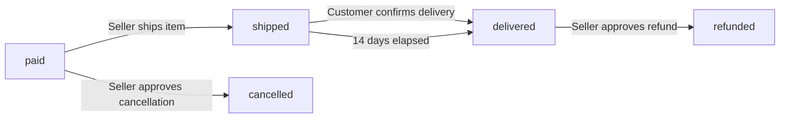

WHEN an order item transitions to "cancelled" or "refunded", THE system SHALL prevent any additional status changes for that item.

### Multi-Seller Order Items

WHEN a customer adds items from different sellers to their cart, THE system SHALL allow checkout with all items in a single order.

WHEN an order contains items from multiple sellers, THE system SHALL create separate order items for each seller's products.

WHEN an order contains items from multiple sellers, THE system SHALL allow each seller to view only their own order items.

WHEN an order contains items from multiple sellers, THE system SHALL allow each seller to ship their items independently.

WHEN an order contains items from multiple sellers, THE system SHALL create separate shipments for each seller's items.

WHEN an order contains items from multiple sellers, THE system SHALL allow each seller to manage cancellation requests only for their own items.

WHEN an order contains items from multiple sellers, THE system SHALL allow each seller to manage refund requests only for their own items.

WHEN an order contains items from multiple sellers, THE system SHALL calculate the overall order status based on all item statuses across all sellers.

WHEN an order contains items from multiple sellers, THE system SHALL preserve seller profile snapshots for each seller at the time of purchase.

WHEN an order contains items from multiple sellers, THE system SHALL allow the customer to view all items and their respective statuses in a single order view.

## Shipment Actions

Sellers view order items for their products that need shipping. Sellers select one or more items to include in a shipment. Different sellers always create separate shipments. A seller can bundle multiple items into one shipment or ship individually. Sellers enter tracking information with carrier name and tracking number. All items in the same shipment share the same tracking information. When a shipment is created, all included items change to shipped status. Customers view tracking information for each shipment. Customers confirm delivery per shipment, not per individual item. When delivery is confirmed, all items in that shipment change to delivered status. Items automatically change to delivered after 14 days from shipping. Shipment creation is the seller's responsibility after payment.

### Shipment Creation

WHEN a seller creates a shipment, THE system SHALL:
1. Require the seller to have at least one order item with status "paid" for their products
2. Allow the seller to select one or more of their order items to include in the shipment
3. Require tracking information including carrier name and tracking number
4. Create a new shipment record with the selected items and tracking information
5. Change the status of all included order items from "paid" to "shipped"
6. Record the shipment creation timestamp
7. Associate the shipment with the seller who created it

IF the seller attempts to create a shipment without selecting any items, THE system SHALL reject the request.
IF the seller attempts to create a shipment without providing tracking information, THE system SHALL reject the request.
IF the seller attempts to include order items that are not in "paid" status, THE system SHALL reject the request.
IF the seller attempts to include order items from other sellers, THE system SHALL reject the request.

### Item Selection for Shipment

WHEN a seller selects order items for shipment, THE system SHALL:
1. Display only order items belonging to the seller's products
2. Display only order items with status "paid" (not yet shipped)
3. Allow the seller to select multiple items from the same order
4. Allow the seller to select items from different orders
5. Show item details including product name, variant, and quantity
6. Prevent selection of items already included in a shipment
7. Prevent selection of items with status other than "paid"

IF the seller attempts to select an item from another seller, THE system SHALL prevent the selection.
IF the seller attempts to select an item already shipped, THE system SHALL prevent the selection.
IF the seller attempts to select an item that is cancelled or refunded, THE system SHALL prevent the selection.

### Tracking Information Entry

WHEN a seller enters tracking information for a shipment, THE system SHALL:
1. Require a carrier name (text field)
2. Require a tracking number (text field)
3. Validate that both fields are not empty
4. Store the tracking information with the shipment record
5. Make the tracking information visible to the customer on the order details page
6. Associate the same tracking information with all items in the shipment

IF the carrier name is missing, THE system SHALL reject the shipment creation.
IF the tracking number is missing, THE system SHALL reject the shipment creation.
IF the tracking information contains only whitespace, THE system SHALL reject the shipment creation.

### Multi-Item Bundling

WHEN a seller bundles multiple order items into a single shipment, THE system SHALL:
1. Allow the seller to group items from the same order
2. Allow the seller to group items from different orders
3. Apply the same tracking information to all bundled items
4. Change the status of all bundled items to "shipped" simultaneously
5. Create a single shipment record containing all bundled items
6. Enable the customer to view all bundled items under one shipment

IF the seller bundles items from different sellers, THE system SHALL prevent the bundling.
IF any bundled item is not in "paid" status, THE system SHALL prevent the bundling.
IF the seller attempts to bundle an item already in another shipment, THE system SHALL prevent the bundling.

### Separate Seller Shipments

WHEN order items from multiple sellers exist in an order, THE system SHALL:
1. Require each seller to create their own separate shipment
2. Prevent a seller from including items from other sellers in their shipment
3. Allow different sellers to ship at different times
4. Create separate shipment records for each seller's items
5. Assign separate tracking information to each seller's shipment
6. Display separate shipments to the customer for each seller

IF a seller attempts to include another seller's items, THE system SHALL reject the request.
IF a seller attempts to create a shipment containing items from multiple sellers, THE system SHALL reject the request.
IF items from the same seller are in different orders, THE system SHALL allow them to be shipped together or separately.

### Delivery Confirmation

WHEN a customer confirms delivery for a shipment, THE system SHALL:
1. Allow the customer to confirm delivery only for shipments they own
2. Change the status of all items in the shipment from "shipped" to "delivered"
3. Record the delivery confirmation timestamp
4. Update the delivery date on the shipment record
5. Enable the customer to write reviews for delivered items
6. Start the 7-day refund window for delivered items

IF the customer attempts to confirm delivery for a shipment not associated with their order, THE system SHALL reject the request.
IF the customer attempts to confirm delivery for a shipment already marked as delivered, THE system SHALL reject the request.
IF any item in the shipment is already cancelled or refunded, THE system SHALL allow delivery confirmation for remaining items.

### Automatic Delivery After 14 Days

WHEN 14 days pass from the shipment date without customer confirmation, THE system SHALL:
1. Automatically change the status of all items in the shipment from "shipped" to "delivered"
2. Record the automatic delivery timestamp
3. Update the delivery date on the shipment record
4. Enable the customer to write reviews for automatically delivered items
5. Start the 7-day refund window for automatically delivered items
6. Treat automatically delivered items the same as customer-confirmed items

IF the customer confirms delivery before the 14-day period expires, THE system SHALL not trigger automatic delivery.
IF an item in the shipment is cancelled or refunded during the 14-day period, THE system SHALL not automatically deliver that item.
IF the 14-day period has already passed, THE system SHALL not trigger automatic delivery again.

### Shipment Status Propagation

WHEN a shipment status changes, THE system SHALL:
1. Propagate the "shipped" status to all order items in the shipment when created
2. Propagate the "delivered" status to all order items in the shipment when delivery is confirmed
3. Propagate the "delivered" status to all order items in the shipment when automatic delivery triggers
4. Update the overall order status based on the status of all its items
5. Maintain the status change history for audit purposes
6. Notify relevant parties of status changes

IF a shipment is created, THE system SHALL immediately update all included items to "shipped" status.
IF delivery is confirmed for a shipment, THE system SHALL immediately update all included items to "delivered" status.
IF automatic delivery triggers for a shipment, THE system SHALL immediately update all included items to "delivered" status.
IF all items in an order are delivered, THE system SHALL update the order status to "delivered".
IF some items are delivered and others are in different states, THE system SHALL update the order status to "partially completed".

## Review Actions

Customers write reviews for products they have purchased. Reviews can only be written after the item status is delivered. Customers can write one review per product per order. Each review includes a rating from 1 to 5 stars and optional text content. Reviews are displayed on the product detail page. Reviews are sorted by newest first. Customers can edit their own reviews at any time. Every review edit creates a snapshot preserving the previous state. Customers can delete their own reviews. Deleted reviews are not counted in average rating calculation. Product average rating is calculated from all non-deleted reviews. Reviews help other customers make purchasing decisions.

### Review Creation and Submission

WHEN a customer purchases a product, THE system SHALL allow the customer to write a review for that product only after the order item status is "delivered".

WHEN a customer writes a review, THE system SHALL require the customer to select a rating from 1 to 5 stars.

WHEN a customer writes a review, THE system SHALL allow the customer to optionally include text content.

IF a customer has already written a review for a specific product in a specific order, THE system SHALL prevent the customer from writing another review for the same product in the same order.

IF the order item status is not "delivered", THE system SHALL prevent the customer from creating a review.

IF the customer attempts to submit a review without selecting a rating, THE system SHALL reject the review submission.

IF the customer selects a rating outside the 1-5 star range, THE system SHALL reject the review submission.

WHEN a customer successfully submits a review, THE system SHALL create a review record associated with the order item and customer.

WHEN a customer successfully submits a review, THE system SHALL record the submission timestamp.

IF a customer attempts to write a review for a product they have not purchased, THE system SHALL reject the review submission.

IF a customer attempts to write a review for an order item they do not own, THE system SHALL reject the review submission.

### Review Rating and Content

WHEN a customer submits a review, THE system SHALL require a rating value between 1 and 5 stars inclusive.

WHEN a customer submits a review, THE system SHALL store the rating as an integer value.

WHEN a customer submits a review, THE system SHALL allow the customer to include optional text content.

WHEN a customer includes text content, THE system SHALL store the text as part of the review record.

IF the customer does not include text content, THE system SHALL store the text content as empty.

WHEN a review is created, THE system SHALL associate the review with the specific order item that was delivered.

WHEN a review is created, THE system SHALL associate the review with the customer who submitted it.

WHEN a review is created, THE system SHALL record the exact timestamp of submission.

IF a review is submitted with a rating of 0 or negative value, THE system SHALL reject the submission.

IF a review is submitted with a rating greater than 5, THE system SHALL reject the submission.

IF a review is submitted with decimal rating values, THE system SHALL reject the submission.

WHEN a review is created, THE system SHALL make the review visible to other customers on the product detail page.

### Review Editing and Snapshots

WHEN a customer edits their own review, THE system SHALL allow the customer to modify the rating value.

WHEN a customer edits their own review, THE system SHALL allow the customer to modify the text content.

WHEN a customer edits their review, THE system SHALL create a review snapshot before applying the changes.

WHEN a review snapshot is created, THE system SHALL record the previous rating value.

WHEN a review snapshot is created, THE system SHALL record the previous text content.

WHEN a review snapshot is created, THE system SHALL record the timestamp of the edit.

WHEN a review snapshot is created, THE system SHALL record both the before and after values of all modified fields.

WHEN a review snapshot is created, THE system SHALL make the snapshot immutable and non-deletable.

IF a customer attempts to edit a review they do not own, THE system SHALL reject the edit request.

IF a customer attempts to edit a deleted review, THE system SHALL reject the edit request.

WHEN a customer successfully edits their review, THE system SHALL update the review record with the new values.

WHEN a customer successfully edits their review, THE system SHALL preserve all previous snapshots.

IF a customer attempts to edit a review with an invalid rating value, THE system SHALL reject the edit request.

### Review Display and Sorting

WHEN a customer views a product detail page, THE system SHALL display all reviews for that product.

WHEN reviews are displayed on a product detail page, THE system SHALL sort reviews by submission date in descending order (newest first).

WHEN reviews are displayed, THE system SHALL show the rating for each review.

WHEN reviews are displayed, THE system SHALL show the text content if the customer provided it.

WHEN a review is from a deleted customer account, THE system SHALL display the review with the reviewer shown as "deleted user".

WHEN a review is deleted, THE system SHALL remove the review from the display on the product detail page.

WHEN reviews are displayed, THE system SHALL show the submission date for each review.

WHEN reviews are displayed, THE system SHALL not display reviews that have been deleted by their authors.

IF a product has no reviews, THE system SHALL display no reviews on the product detail page.

WHEN a customer views reviews, THE system SHALL not display reviews for products the customer has not purchased.

WHEN reviews are displayed, THE system SHALL show only non-deleted reviews.

### Review Deletion and Rating Calculation

WHEN a customer deletes their own review, THE system SHALL remove the review from the product detail page display.

WHEN a customer deletes their own review, THE system SHALL preserve all review snapshots.

WHEN a review is deleted, THE system SHALL exclude the deleted review from the product's average rating calculation.

WHEN a product's average rating is calculated, THE system SHALL use only non-deleted reviews.

WHEN a product's average rating is calculated, THE system SHALL compute the arithmetic mean of all non-deleted review ratings.

WHEN a product has no non-deleted reviews, THE system SHALL not display an average rating.

WHEN a product's average rating is displayed, THE system SHALL round the rating to one decimal place.

WHEN a customer deletes their review, THE system SHALL not allow the customer to recover the deleted review.

IF a customer attempts to delete a review they do not own, THE system SHALL reject the deletion request.

IF a customer attempts to delete a review that has already been deleted, THE system SHALL reject the deletion request.

WHEN a review is deleted, THE system SHALL mark the review as deleted but retain it in the system for audit purposes.

WHEN a review is deleted, THE system SHALL preserve the association with the order item and customer for historical records.

## CancellationRequest Actions

Customers request cancellation for individual order items with paid status. Cancellation requests include a reason in text format. Only items not yet shipped can be cancelled. The seller of the item can approve or reject the cancellation request. When a seller responds, a snapshot of the request state is created. If approved, the item is cancelled and refund is processed. Cancelled items restore their stock quantities through inventory records. The remaining items in the order continue processing normally. If all items in an order are cancelled, the order status becomes cancelled. Customers cannot cancel items that are already shipped. Sellers must respond to cancellation requests promptly. Cancellation requests are tracked for dispute resolution.

### Cancellation Request Submission

WHEN a customer submits a cancellation request, THE system SHALL require the order item to have "paid" status.

WHEN a customer creates a cancellation request, THE system SHALL associate it with the specific order item being cancelled.

WHEN a cancellation request is created, THE system SHALL record the timestamp of the request submission.

WHEN a cancellation request is created, THE system SHALL set the initial status to "pending".

WHEN a cancellation request is created, THE system SHALL link it to the requesting customer account.

IF a customer attempts to cancel an item that is not in "paid" status, THE system SHALL reject the cancellation request.

IF a customer attempts to cancel an item that has already been shipped, THE system SHALL reject the cancellation request.

WHEN a cancellation request is successfully created, THE system SHALL make it visible to the seller of that item.

WHEN a cancellation request is created, THE system SHALL prevent the same customer from submitting a duplicate request for the same order item.

### Cancellation Reason Provision

WHEN a customer submits a cancellation request, THE system SHALL require a text reason to be provided.

IF the cancellation reason field is empty, THE system SHALL reject the cancellation request.

WHEN a cancellation reason is provided, THE system SHALL preserve it with the cancellation request.

WHEN a cancellation reason is provided, THE system SHALL make it visible to the seller reviewing the request.

WHEN a cancellation reason is provided, THE system SHALL preserve it for dispute resolution purposes.

WHEN a cancellation reason is provided, THE system SHALL include it in the cancellation snapshot.

### Unshipped Item Eligibility

WHEN a customer requests cancellation for an order item, THE system SHALL verify the item has not yet been shipped.

IF an order item has status "shipped", THE system SHALL prevent cancellation requests for that item.

IF an order item has status "delivered", THE system SHALL prevent cancellation requests for that item.

IF an order item has status "cancelled", THE system SHALL prevent cancellation requests for that item.

IF an order item has status "refunded", THE system SHALL prevent cancellation requests for that item.

WHEN an order item is in "paid" status, THE system SHALL allow cancellation requests to be submitted.

WHEN an order item is in "paid" status, THE system SHALL display cancellation as an available action to the customer.

### Seller Approval Workflow

WHEN a seller approves a cancellation request, THE system SHALL change the order item status to "cancelled".

WHEN a seller approves a cancellation request, THE system SHALL update the cancellation request status to "approved".

WHEN a seller approves a cancellation request, THE system SHALL create a snapshot of the request state.

WHEN a seller approves a cancellation request, THE system SHALL record the timestamp of the approval.

WHEN a seller approves a cancellation request, THE system SHALL process a refund for that item.

WHEN a seller approves a cancellation request, THE system SHALL notify the customer of the approval.

WHEN a seller approves a cancellation request, THE system SHALL restore the item's stock quantity through inventory records.

WHEN a seller approves a cancellation request, THE system SHALL allow remaining items in the order to continue processing normally.

WHEN a seller approves a cancellation request, THE system SHALL prevent further cancellation requests for that item.

### Seller Rejection Workflow

WHEN a seller rejects a cancellation request, THE system SHALL update the cancellation request status to "rejected".

WHEN a seller rejects a cancellation request, THE system SHALL create a snapshot of the request state.

WHEN a seller rejects a cancellation request, THE system SHALL record the timestamp of the rejection.

WHEN a seller rejects a cancellation request, THE system SHALL notify the customer of the rejection.

WHEN a seller rejects a cancellation request, THE system SHALL allow the order item to continue normal processing.

WHEN a seller rejects a cancellation request, THE system SHALL prevent further cancellation requests for that item.

WHEN a seller rejects a cancellation request, THE system SHALL maintain the item in "paid" status pending shipment.

WHEN a seller rejects a cancellation request, THE system SHALL preserve the rejection reason for dispute resolution.

### Cancellation Snapshot Recording

WHEN a seller responds to a cancellation request, THE system SHALL create a snapshot of the request state.

WHEN a cancellation snapshot is created, THE system SHALL preserve the request reason.

WHEN a cancellation snapshot is created, THE system SHALL preserve the request status.

WHEN a cancellation snapshot is created, THE system SHALL record the timestamp of the seller response.

WHEN a cancellation snapshot is created, THE system SHALL preserve the before and after values of the request state.

WHEN a cancellation snapshot is created, THE system SHALL make it immutable and non-deletable.

WHEN a cancellation snapshot is created, THE system SHALL link it to the order item for traceability.

WHEN a cancellation snapshot is created, THE system SHALL make it viewable by the customer for dispute resolution.

WHEN a cancellation snapshot is created, THE system SHALL make it viewable by administrators for oversight.

### Stock Restoration Process

WHEN a cancellation is approved, THE system SHALL restore the cancelled item's stock quantity.

WHEN stock is restored due to cancellation, THE system SHALL create an inventory record with a positive quantity change.

WHEN stock is restored due to cancellation, THE system SHALL record the reason as cancellation-based restoration.

WHEN stock is restored due to cancellation, THE system SHALL timestamp the inventory record.

WHEN stock is restored due to cancellation, THE system SHALL make the variant available for purchase again.

WHEN stock is restored due to cancellation, THE system SHALL update the variant's current stock quantity.

WHEN stock is restored due to cancellation, THE system SHALL preserve the inventory record for audit purposes.

### Individual Item Cancellation

WHEN a customer cancels an order item, THE system SHALL process the cancellation for that specific item only.

WHEN an individual item is cancelled, THE system SHALL leave remaining items in the order unaffected.

WHEN an individual item is cancelled, THE system SHALL continue processing other items in the same order normally.

WHEN multiple items exist in an order, THE system SHALL allow selective cancellation of individual items.

WHEN multiple items exist in an order, THE system SHALL allow each item to have independent cancellation status.

WHEN an item is cancelled, THE system SHALL not automatically cancel other items in the same order.

WHEN an item is cancelled, THE system SHALL not affect the shipping status of other items in the order.

WHEN an item is cancelled, THE system SHALL not affect the refund status of other items in the order.

### Order Status Update on Full Cancellation

WHEN all items in an order are cancelled, THE system SHALL update the order status to "cancelled".

WHEN some items are cancelled but others remain active, THE system SHALL maintain the order status based on remaining items.

WHEN an order transitions to "cancelled" status, THE system SHALL reflect this in the customer's order history.

WHEN items are cancelled individually, THE system SHALL recalculate the overall order status based on remaining item states.

WHEN all items in an order are cancelled, THE system SHALL prevent further processing of the order.

WHEN an order status becomes "cancelled", THE system SHALL prevent new cancellation requests for items in that order.

WHEN an order status becomes "cancelled", THE system SHALL prevent new refund requests for items in that order.

## RefundRequest Actions

Customers request refunds for individual order items with delivered status. Refund requests include a reason in text format. Refunds can only be requested within 7 days of item delivery. The seller of the item can approve or reject the refund request. When a seller responds, a snapshot of the request state is created. If approved, the item is refunded and stock is restored. Refunded items restore their stock quantities through inventory records. The remaining items in the order are unaffected. If all items in an order are refunded, the order status becomes refunded. Customers cannot request refunds after the 7-day window. Sellers must respond to refund requests promptly. Refund requests are tracked for dispute resolution.

### Refund Request Creation

WHEN a customer requests a refund for an order item, THE system SHALL require that the item has delivered status.

WHEN a customer requests a refund for an order item, THE system SHALL verify that the request is within 7 days of the item's delivery date.

WHEN a customer requests a refund for an order item, THE system SHALL create a refund request record with status pending.

WHEN a customer requests a refund for an order item, THE system SHALL associate the refund request with the specific order item.

WHEN a customer requests a refund for an order item, THE system SHALL record the timestamp of the refund request submission.

IF the order item does not have delivered status, THEN THE system SHALL reject the refund request.

IF the refund request is submitted after 7 days from delivery, THEN THE system SHALL reject the refund request.

IF a refund request already exists for the order item, THEN THE system SHALL reject the duplicate refund request.

WHEN a customer requests a refund, THE system SHALL allow only one refund request per order item.

WHEN a refund request is created, THE system SHALL make the request visible to the seller of the item.

### Refund Reason Provision

WHEN a customer submits a refund request, THE system SHALL require the customer to provide a reason in text format.

WHEN a customer submits a refund request, THE system SHALL store the refund reason with the refund request record.

WHEN a seller reviews a refund request, THE system SHALL display the refund reason provided by the customer.

IF the refund reason is empty or not provided, THEN THE system SHALL reject the refund request submission.

WHEN a refund request is created, THE system SHALL preserve the refund reason for dispute resolution purposes.

### 7-Day Refund Window

WHEN a refund request is submitted, THE system SHALL calculate the 7-day window from the item's delivery confirmation date.

WHEN a customer views refund request options, THE system SHALL display whether the 7-day window has expired for each delivered item.

WHEN a refund request is submitted within the 7-day window, THE system SHALL accept the request for seller review.

WHEN a refund request is submitted after the 7-day window, THE system SHALL prevent the submission and notify the customer.

WHEN the 7-day window expires for a delivered item, THE system SHALL automatically disable refund request capability for that item.

### Seller Approval and Rejection Workflow

WHEN a seller receives a refund request, THE system SHALL allow the seller to approve the request.

WHEN a seller receives a refund request, THE system SHALL allow the seller to reject the request.

WHEN a seller approves a refund request, THE system SHALL change the refund request status to approved.

WHEN a seller rejects a refund request, THE system SHALL change the refund request status to rejected.

WHEN a seller responds to a refund request, THE system SHALL record the response timestamp.

WHEN a seller approves a refund request, THE system SHALL notify the customer of the approval.

WHEN a seller rejects a refund request, THE system SHALL notify the customer of the rejection.

WHEN a seller responds to a refund request, THE system SHALL prevent further responses to the same request.

WHEN a seller reviews a refund request, THE system SHALL display the refund reason and order item details.

WHEN a refund request is pending, THE system SHALL allow only the seller of the item to respond.

### Refund Snapshot Creation

WHEN a seller approves a refund request, THE system SHALL create a snapshot of the refund request state.

WHEN a seller rejects a refund request, THE system SHALL create a snapshot of the refund request state.

WHEN a refund snapshot is created, THE system SHALL record the request status before and after the seller response.

WHEN a refund snapshot is created, THE system SHALL record the refund reason.

WHEN a refund snapshot is created, THE system SHALL record the response timestamp.

WHEN a refund snapshot is created, THE system SHALL make the snapshot immutable and non-deletable.

WHEN a refund snapshot is created, THE system SHALL associate the snapshot with the refund request for audit purposes.

### Stock Restoration on Refund

WHEN a refund request is approved, THE system SHALL change the order item status to refunded.

WHEN a refund request is approved, THE system SHALL restore the stock quantity for the refunded variant through an inventory record.

WHEN a refund request is approved, THE system SHALL process the refund for the customer for that specific item only.

WHEN a refund request is approved, THE system SHALL leave other order items in the same order unaffected.

WHEN a refund request is rejected, THE system SHALL keep the order item status as delivered.

WHEN a refund request is rejected, THE system SHALL not restore stock quantities.

WHEN a refund request is approved, THE system SHALL create a positive inventory record with the refund as the reason.

WHEN a refund request is approved, THE system SHALL make the refunded item unavailable for additional refund requests.

### Individual Item Refund

WHEN a customer requests a refund, THE system SHALL process the refund for the individual order item only.

WHEN a customer requests a refund for one item in an order, THE system SHALL allow other items in the same order to continue processing normally.

WHEN multiple items in an order are refunded, THE system SHALL process each refund independently.

WHEN a refund is processed for one item, THE system SHALL not affect the status of other items in the same order.

WHEN an order contains items from multiple sellers, THE system SHALL allow each seller to handle refund requests for their own items independently.

### Order Status Update on Full Refund

WHEN all order items in an order have refunded status, THE system SHALL change the overall order status to refunded.

WHEN some order items are refunded and others have different statuses, THE system SHALL set the overall order status to partially completed.

WHEN an order item is refunded, THE system SHALL recalculate the overall order status based on all item statuses.

WHEN the last remaining item in an order is refunded, THE system SHALL update the order status from partially completed to refunded.

WHEN an order status becomes refunded, THE system SHALL preserve the order history and all associated snapshots.

## SellerApprovalRequest Actions

Sellers register with email and password to create seller accounts. Seller accounts require administrator approval before they can sell. Administrators view the list of pending seller approval requests. Administrators can approve or reject seller registration requests. When rejecting, administrators must provide a reason. Sellers can view their approval status as pending, approved, or rejected. Rejected sellers can view the rejection reason. Rejected sellers can submit a new registration request. Approved sellers can start creating and managing products. Pending sellers cannot create products or process orders. Approval status determines seller platform access. Seller approval is a prerequisite for selling activities.

### Seller Registration and Initial Request

WHEN a user registers as a seller, THE system SHALL create a seller account with pending approval status.

WHEN a seller registers, THE system SHALL automatically create a seller approval request with status pending.

WHEN a seller registers, THE system SHALL associate the seller approval request with the seller's profile.

WHEN a seller registers, THE system SHALL record the submission timestamp for the approval request.

WHEN a seller registers, THE system SHALL prevent the seller from creating products until approval is granted.

WHEN a seller registers, THE system SHALL prevent the seller from processing orders until approval is granted.

WHEN a seller registers, THE system SHALL allow the seller to view their approval status.

WHEN a seller registers, THE system SHALL allow the seller to view pending approval requests in the administrator dashboard.

WHEN a seller registers, THE system SHALL notify administrators of the new pending approval request.

WHEN a seller registers, THE system SHALL prevent the seller from submitting duplicate approval requests while one is pending.

### Administrator Approval Process

WHEN an administrator approves a seller approval request, THE system SHALL change the seller's approval status to approved.

WHEN an administrator approves a seller approval request, THE system SHALL record the approval timestamp.

WHEN an administrator approves a seller approval request, THE system SHALL enable the seller to create products.

WHEN an administrator approves a seller approval request, THE system SHALL enable the seller to manage their seller profile.

WHEN an administrator approves a seller approval request, THE system SHALL enable the seller to process orders for their products.

WHEN an administrator approves a seller approval request, THE system SHALL enable the seller to manage inventory.

WHEN an administrator approves a seller approval request, THE system SHALL make the seller's products visible in search results.

WHEN an administrator approves a seller approval request, THE system SHALL make the seller's products visible in category listings.

WHEN an administrator approves a seller approval request, THE system SHALL allow customers to purchase the seller's products.

WHEN an administrator approves a seller approval request, THE system SHALL remove the approval request from the pending list.

WHEN an administrator approves a seller approval request, THE system SHALL preserve the approval request record for audit purposes.

WHEN an administrator approves a seller approval request, THE system SHALL notify the seller of the approval.

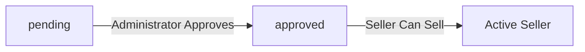

### Administrator Rejection Process

WHEN an administrator rejects a seller approval request, THE system SHALL change the seller's approval status to rejected.

WHEN an administrator rejects a seller approval request, THE system SHALL require the administrator to provide a rejection reason.

WHEN an administrator rejects a seller approval request, THE system SHALL record the rejection reason.

WHEN an administrator rejects a seller approval request, THE system SHALL record the rejection timestamp.

WHEN an administrator rejects a seller approval request, THE system SHALL prevent the seller from creating products.

WHEN an administrator rejects a seller approval request, THE system SHALL prevent the seller from processing orders.

WHEN an administrator rejects a seller approval request, THE system SHALL allow the seller to view the rejection reason.

WHEN an administrator rejects a seller approval request, THE system SHALL allow the seller to submit a new registration request.

WHEN an administrator rejects a seller approval request, THE system SHALL remove the approval request from the pending list.

WHEN an administrator rejects a seller approval request, THE system SHALL preserve the rejection record for audit purposes.

WHEN an administrator rejects a seller approval request, THE system SHALL notify the seller of the rejection.

WHEN an administrator rejects a seller approval request, THE system SHALL prevent the seller from submitting another request until the current one is rejected.

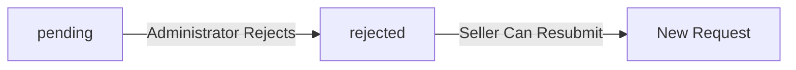

### Approval Status Viewing

WHEN a seller views their approval status, THE system SHALL display the current status as pending, approved, or rejected.

WHEN a seller views their approval status as pending, THE system SHALL indicate that the request is awaiting administrator review.

WHEN a seller views their approval status as approved, THE system SHALL indicate that the seller can begin selling.

WHEN a seller views their approval status as rejected, THE system SHALL display the rejection reason.

WHEN a seller views their approval status as rejected, THE system SHALL provide an option to submit a new registration request.

WHEN an administrator views pending seller approval requests, THE system SHALL display a list of all pending requests.

WHEN an administrator views pending seller approval requests, THE system SHALL show the seller's profile information for each request.

WHEN an administrator views pending seller approval requests, THE system SHALL show the submission timestamp for each request.

WHEN an administrator views a specific seller approval request, THE system SHALL display the seller's shop name and description.

WHEN an administrator views a specific seller approval request, THE system SHALL display the seller's logo image if provided.

### Re-registration After Rejection

WHEN a seller with rejected status submits a new registration request, THE system SHALL create a new seller approval request.

WHEN a seller with rejected status submits a new registration request, THE system SHALL set the new request status to pending.

WHEN a seller with rejected status submits a new registration request, THE system SHALL record the new submission timestamp.

WHEN a seller with rejected status submits a new registration request, THE system SHALL preserve the previous rejection record.

WHEN a seller with rejected status submits a new registration request, THE system SHALL allow the seller to update their profile information before submission.

WHEN a seller with rejected status submits a new registration request, THE system SHALL notify administrators of the new pending request.

WHEN a seller with rejected status submits a new registration request, THE system SHALL prevent multiple concurrent pending requests.

WHEN a seller with rejected status submits a new registration request, THE system SHALL maintain the seller's account and profile.

WHEN a seller with rejected status submits a new registration request, THE system SHALL allow the seller to submit unlimited new requests after rejection.

WHEN a seller with rejected status submits a new registration request, THE system SHALL make the new request visible in the administrator pending list.

### Pending Seller Limitations

WHILE a seller's approval status is pending, THE system SHALL prevent the seller from creating new products.

WHILE a seller's approval status is pending, THE system SHALL prevent the seller from editing existing products.

WHILE a seller's approval status is pending, THE system SHALL prevent the seller from processing orders.

WHILE a seller's approval status is pending, THE system SHALL prevent the seller from managing inventory.

WHILE a seller's approval status is pending, THE system SHALL allow the seller to view their profile.

WHILE a seller's approval status is pending, THE system SHALL allow the seller to edit their profile information.

WHILE a seller's approval status is pending, THE system SHALL allow the seller to view their approval status.

WHILE a seller's approval status is pending, THE system SHALL allow the seller to submit a new approval request if previously rejected.

WHILE a seller's approval status is pending, THE system SHALL allow the seller to log in and access their account.

WHILE a seller's approval status is pending, THE system SHALL hide any products the seller may have created from search results.

WHILE a seller's approval status is pending, THE system SHALL hide any products the seller may have created from category listings.

WHILE a seller's approval status is pending, THE system SHALL prevent customers from viewing the seller's products.

### Approved Seller Privileges

WHEN a seller's approval status is approved, THE system SHALL enable the seller to create new products.

WHEN a seller's approval status is approved, THE system SHALL enable the seller to edit existing products.

WHEN a seller's approval status is approved, THE system SHALL enable the seller to delete products according to product deletion rules.

WHEN a seller's approval status is approved, THE system SHALL enable the seller to manage product variants.

WHEN a seller's approval status is approved, THE system SHALL enable the seller to manage inventory records.

WHEN a seller's approval status is approved, THE system SHALL enable the seller to process orders for their products.

WHEN a seller's approval status is approved, THE system SHALL enable the seller to create shipments.

WHEN a seller's approval status is approved, THE system SHALL enable the seller to respond to cancellation requests.

WHEN a seller's approval status is approved, THE system SHALL enable the seller to respond to refund requests.

WHEN a seller's approval status is approved, THE system SHALL make the seller's products visible in search results.

WHEN a seller's approval status is approved, THE system SHALL make the seller's products visible in category listings.

WHEN a seller's approval status is approved, THE system SHALL allow customers to purchase the seller's products.

WHEN a seller's approval status is approved, THE system SHALL allow customers to view the seller's profile.

WHEN a seller's approval status is approved, THE system SHALL allow the seller to view their shop dashboard.

WHEN a seller's approval status is approved, THE system SHALL allow the seller to view order items for their products.

WHEN a seller's approval status is approved, THE system SHALL allow the seller to view inventory history for their variants.

WHEN a seller's approval status is approved, THE system SHALL allow the seller to view product snapshots for their products.

WHEN a seller's approval status is approved, THE system SHALL allow the seller to view seller profile snapshots.

## AdminPromotionRequest Actions

Any user can submit a request to become an administrator. The request includes a reason explaining why they should become an administrator. Super administrators view the list of pending promotion requests. Super administrators can approve or reject promotion requests. When approved, the user becomes a regular administrator. Super administrators can promote regular administrators to super administrator grade. Super administrators can demote other super administrators to regular administrator. Super administrators cannot demote themselves. Administrator grade determines platform management access. Regular administrators have limited management capabilities. Super administrators have full platform management access. Promotion requests require justification and approval.

### Promotion Request Submission

WHEN a user submits a request to become an administrator, THE system SHALL:
1. Require the user to provide a reason explaining why they should become an administrator
2. Record the submission timestamp
3. Set the request status to "pending"
4. Associate the request with the submitting user's account

IF the user already has an administrator profile, THE system SHALL reject the promotion request.

IF the user already has a pending promotion request, THE system SHALL reject the new promotion request.

IF the reason field is empty, THE system SHALL reject the promotion request.

WHEN a promotion request is successfully submitted, THE system SHALL make it visible to super administrators for review.

### Super Administrator Review Actions

WHEN a super administrator reviews pending promotion requests, THE system SHALL:
1. Display all pending promotion requests
2. Show the requesting user's information
3. Display the provided reason for each request
4. Show the submission timestamp for each request

WHEN a super administrator approves a promotion request, THE system SHALL:
1. Change the request status to "approved"
2. Create an administrator profile for the user with "regular" grade
3. Record the approval timestamp
4. Grant the user regular administrator privileges

WHEN a super administrator rejects a promotion request, THE system SHALL:
1. Require the super administrator to provide a rejection reason
2. Change the request status to "rejected"
3. Record the rejection timestamp
4. Record the rejection reason for the user to view

IF the rejection reason is empty, THE system SHALL not process the rejection.

WHEN a promotion request is approved, THE system SHALL notify the user of their new administrator status.

WHEN a promotion request is rejected, THE system SHALL notify the user and display the rejection reason.

### Administrator Grade Management

WHEN a super administrator promotes a regular administrator to super administrator, THE system SHALL:
1. Change the administrator's grade from "regular" to "super"
2. Grant full platform management access
3. Record the promotion action in the audit log

WHEN a super administrator demotes another super administrator to regular administrator, THE system SHALL:
1. Change the administrator's grade from "super" to "regular"
2. Restrict platform management access to regular administrator capabilities
3. Record the demotion action in the audit log

IF a super administrator attempts to demote themselves, THE system SHALL prevent the self-demotion.

WHEN an administrator's grade is "regular", THE system SHALL:
1. Allow management of seller approvals
2. Allow management of categories
3. Allow viewing of all products and orders
4. Allow product deletion for policy violations
5. Allow force-cancellation and force-refund of order items
6. Allow user banning
7. Prevent promotion or demotion of other administrators

WHEN an administrator's grade is "super", THE system SHALL:
1. Allow all regular administrator capabilities
2. Allow approval and rejection of promotion requests
3. Allow promotion of regular administrators to super administrator
4. Allow demotion of other super administrators to regular administrator
5. Prevent self-demotion

WHEN an administrator's grade changes, THE system SHALL immediately apply the new access level to their account.

## ProductSnapshot Actions

Product snapshots are created automatically when products are edited. Snapshots preserve all product fields including name, description, category, and base price. Snapshots also include all product images at the time of change. Snapshots include snapshots of all variants at that moment. Product snapshots record when the change was made and what changed. Snapshots capture values before and after the modification. Snapshots are immutable and cannot be deleted. Sellers can view snapshots of their own products. Administrators can view snapshots of any product on the platform. Snapshots are preserved even after product deletion. Snapshots enable dispute resolution and audit trails. Snapshots provide complete historical record of product changes.

### Automatic Snapshot Creation

WHEN a seller edits a product, THE system SHALL automatically create a product snapshot before applying the changes.

WHEN a seller edits product images, THE system SHALL automatically create a product snapshot before applying the changes.

WHEN a seller edits a product variant, THE system SHALL automatically create a product snapshot before applying the changes.

WHEN a seller deletes a product variant, THE system SHALL automatically create a product snapshot before applying the deletion.

WHEN an administrator edits a product, THE system SHALL automatically create a product snapshot before applying the changes.

WHEN an administrator deletes a product, THE system SHALL automatically create a product snapshot before applying the deletion.

IF a product has no previous snapshots, THE system SHALL create the first snapshot when the first edit occurs.

IF multiple edits occur in rapid succession, THE system SHALL create a separate snapshot for each edit operation.

IF a product edit fails validation, THE system SHALL NOT create a snapshot.

IF a product edit is successful, THE system SHALL create the snapshot before the new values are persisted.

### Product Field Preservation

WHEN a product snapshot is created, THE system SHALL preserve the product name at the time of the change.

WHEN a product snapshot is created, THE system SHALL preserve the product description at the time of the change.

WHEN a product snapshot is created, THE system SHALL preserve the product category at the time of the change.

WHEN a product snapshot is created, THE system SHALL preserve the product base price at the time of the change.

WHEN a product snapshot is created, THE system SHALL preserve the seller identity at the time of the change.

WHEN a product snapshot is created, THE system SHALL preserve all product images at the time of the change.

WHEN a product snapshot is created, THE system SHALL preserve the display order of all product images at the time of the change.

WHEN a product snapshot is created, THE system SHALL preserve which image is designated as the main/thumbnail image at the time of the change.

IF a product has no images, THE system SHALL record an empty image list in the snapshot.

IF a product has multiple images, THE system SHALL preserve all images in their current order in the snapshot.

### Image and Variant Snapshot Inclusion

WHEN a product snapshot is created, THE system SHALL include snapshots of all product variants at that moment.

WHEN a product snapshot is created, THE system SHALL preserve each variant's SKU code at the time of the change.

WHEN a product snapshot is created, THE system SHALL preserve each variant's option values at the time of the change.

WHEN a product snapshot is created, THE system SHALL preserve each variant's price override (if any) at the time of the change.

WHEN a product snapshot is created, THE system SHALL preserve each variant's stock quantity at the time of the change.

IF a product has no variants, THE system SHALL record an empty variant list in the snapshot.

IF a product has multiple variants, THE system SHALL create a separate variant snapshot for each variant.

IF a variant is added to a product, THE system SHALL include the new variant in the snapshot.

IF a variant is edited, THE system SHALL capture the variant state before the edit in the snapshot.

IF a variant is deleted from a product, THE system SHALL capture the deleted variant's state in the snapshot before removal.

### Change Timestamp and Value Recording

WHEN a product snapshot is created, THE system SHALL record the exact timestamp when the change was made.

WHEN a product snapshot is created, THE system SHALL record the values of all fields before the modification.

WHEN a product snapshot is created, THE system SHALL record the values of all fields after the modification.

WHEN a product snapshot is created, THE system SHALL identify which fields were changed between before and after values.

WHEN a product variant snapshot is created, THE system SHALL record the exact timestamp when the variant change was made.

WHEN a product image change occurs, THE system SHALL record which images were added, removed, or reordered.

IF a field value does not change, THE system SHALL still record the unchanged value in both before and after states.

IF multiple fields change in a single edit, THE system SHALL record all changed fields in the same snapshot.

IF only images are reordered without other changes, THE system SHALL create a snapshot recording the order change.

IF only a single field changes, THE system SHALL create a snapshot with all fields showing before and after values.

### Snapshot Immutability

THE system SHALL prevent any modification to an existing product snapshot after creation.

THE system SHALL prevent any modification to an existing variant snapshot after creation.

THE system SHALL prevent deletion of any product snapshot by sellers.

THE system SHALL prevent deletion of any product snapshot by customers.

THE system SHALL prevent deletion of any product snapshot by administrators.

THE system SHALL prevent deletion of any variant snapshot by sellers.

THE system SHALL prevent deletion of any variant snapshot by customers.

THE system SHALL prevent deletion of any variant snapshot by administrators.

IF a seller attempts to modify a snapshot, THE system SHALL reject the request.

IF an administrator attempts to modify a snapshot, THE system SHALL reject the request.

IF a seller attempts to delete a snapshot, THE system SHALL reject the request.

IF an administrator attempts to delete a snapshot, THE system SHALL reject the request.

WHEN a snapshot is created, THE system SHALL mark it as immutable and read-only.

WHEN a snapshot is stored, THE system SHALL ensure it cannot be altered by any system process.

### Seller Snapshot Viewing

WHEN a seller views their product snapshots, THE system SHALL display all snapshots for products owned by that seller.

WHEN a seller views product snapshots, THE system SHALL show the timestamp of each snapshot.

WHEN a seller views product snapshots, THE system SHALL show which fields changed in each snapshot.

WHEN a seller views product snapshots, THE system SHALL show the before values for changed fields.

WHEN a seller views product snapshots, THE system SHALL show the after values for changed fields.

WHEN a seller views product snapshots, THE system SHALL display variant snapshots associated with each product snapshot.

WHEN a seller views variant snapshots, THE system SHALL show the SKU code, option values, and price at the time of the snapshot.

WHEN a seller views product snapshots, THE system SHALL display image changes including additions, deletions, and reordering.

IF a seller views a product that has been deleted, THE system SHALL still display all snapshots for that product.

IF a seller has multiple products, THE system SHALL allow filtering snapshots by product.

IF a seller has multiple snapshots for a product, THE system SHALL display them in reverse chronological order (newest first).

IF a product has no snapshots, THE system SHALL display a message indicating no snapshot history exists.

### Administrator Snapshot Viewing

WHEN an administrator views product snapshots, THE system SHALL display all snapshots for any product on the platform.

WHEN an administrator views product snapshots, THE system SHALL show the seller who owned the product at the time of the snapshot.

WHEN an administrator views product snapshots, THE system SHALL show the timestamp of each snapshot.

WHEN an administrator views product snapshots, THE system SHALL show which fields changed in each snapshot.

WHEN an administrator views product snapshots, THE system SHALL show the before values for changed fields.

WHEN an administrator views product snapshots, THE system SHALL show the after values for changed fields.

WHEN an administrator views product snapshots, THE system SHALL display variant snapshots associated with each product snapshot.

WHEN an administrator views variant snapshots, THE system SHALL show the SKU code, option values, price, and stock quantity at the time of the snapshot.

WHEN an administrator views product snapshots, THE system SHALL display image changes including additions, deletions, and reordering.

IF an administrator views a product from a suspended seller, THE system SHALL still display all snapshots for that product.

IF an administrator views a product that has been deleted, THE system SHALL still display all snapshots for that product.

IF an administrator views a product from a banned seller, THE system SHALL still display all snapshots for that product.

IF an administrator searches for snapshots, THE system SHALL allow filtering by seller, product, date range, and change type.

IF an administrator has multiple products to review, THE system SHALL allow pagination of snapshot results.

### Post-Deletion Snapshot Preservation

WHEN a seller deletes a product, THE system SHALL preserve all existing snapshots for that product.

WHEN a seller deletes a product, THE system SHALL NOT delete any associated variant snapshots.

WHEN an administrator deletes a product, THE system SHALL preserve all existing snapshots for that product.

WHEN an administrator deletes a product, THE system SHALL NOT delete any associated variant snapshots.

WHEN a product is deleted, THE system SHALL maintain snapshot accessibility for the original seller.

WHEN a product is deleted, THE system SHALL maintain snapshot accessibility for administrators.

WHEN a product is deleted, THE system SHALL NOT remove the product name from snapshots.

WHEN a product is deleted, THE system SHALL NOT remove the product description from snapshots.

WHEN a product is deleted, THE system SHALL NOT remove variant information from snapshots.

WHEN a product is deleted, THE system SHALL NOT remove image information from snapshots.

IF a seller deletes their account, THE system SHALL preserve all snapshots for their products.

IF a seller is banned, THE system SHALL preserve all snapshots for their products.

IF a seller is suspended, THE system SHALL preserve all snapshots for their products.

WHEN a product is deleted, THE system SHALL ensure snapshots remain available for dispute resolution.

WHEN a product is deleted, THE system SHALL ensure snapshots remain available for audit trails.

## VariantSnapshot Actions

Variant snapshots are created when product variants are edited. Snapshots preserve SKU code, option values, and price information. Variant snapshots are linked to product snapshots for complete history. Every variant edit triggers snapshot creation. Snapshots record when the change was made and what changed. Snapshots capture values before and after the modification. Snapshots are immutable and cannot be deleted. Variant snapshots are included in product snapshots. Sellers can view variant snapshots through product snapshots. Administrators can view variant snapshots of any product. Snapshots enable dispute resolution for variant changes. Snapshots preserve complete variant history.

### Variant Snapshot Creation

WHEN a seller edits a product variant, THE system SHALL automatically create a variant snapshot.

WHEN a variant's SKU code is modified, THE system SHALL create a variant snapshot before the change is applied.

WHEN a variant's option values are modified, THE system SHALL create a variant snapshot before the change is applied.

WHEN a variant's price override is modified, THE system SHALL create a variant snapshot before the change is applied.

WHEN a variant's stock quantity is modified, THE system SHALL NOT create a variant snapshot (inventory changes are recorded separately).

THE system SHALL create variant snapshots as part of the parent product snapshot creation process.

IF a variant edit fails after snapshot creation, THE system SHALL preserve the created snapshot.

THE system SHALL create variant snapshots synchronously with the variant edit operation.

### Variant Data Preservation

THE system SHALL preserve the SKU code value in each variant snapshot.

THE system SHALL preserve all option values (e.g., color, size) in each variant snapshot.

THE system SHALL preserve the price override value when present in each variant snapshot.

THE system SHALL preserve the base price reference when no price override exists in each variant snapshot.

THE system SHALL preserve the complete set of variant data at the time of modification.

IF a variant has no price override, THE system SHALL record the absence of price override in the snapshot.

THE system SHALL preserve variant data independently of subsequent product or variant deletions.

WHEN a variant is deleted, THE system SHALL preserve all existing variant snapshots.

### Snapshot Linkage and Timestamps

THE system SHALL link each variant snapshot to its parent product snapshot.

THE system SHALL record the exact timestamp when each variant snapshot is created.

THE system SHALL record the timestamp with sufficient precision to establish chronological order.

THE system SHALL maintain the hierarchical relationship between product snapshots and variant snapshots.

WHEN a product snapshot is created, THE system SHALL include all variant snapshots for that product at that moment.

THE system SHALL preserve the linkage between variant snapshots and their corresponding variant identifiers.

THE system SHALL record the variant identifier in each variant snapshot for traceability.

THE system SHALL maintain snapshot linkages even after product or variant deletion.

### Snapshot Values and Immutability

THE system SHALL record the values before modification in each variant snapshot.

THE system SHALL record the values after modification in each variant snapshot.

THE system SHALL identify which fields changed between before and after values.

THE system SHALL preserve both before and after values for all modified fields.

THE system SHALL NOT allow modification of existing variant snapshots.

THE system SHALL NOT allow deletion of existing variant snapshots.

WHEN a variant is edited multiple times, THE system SHALL create a new snapshot for each edit.

THE system SHALL preserve the complete history of all variant modifications through snapshots.

IF a variant field is not modified, THE system SHALL still record its value in the snapshot for completeness.

### Snapshot Access and Viewing

WHEN a seller views their product snapshots, THE system SHALL display all associated variant snapshots.

WHEN a seller views variant snapshots, THE system SHALL show the before and after values.

WHEN a seller views variant snapshots, THE system SHALL display the change timestamp.

WHEN an administrator views any product snapshots, THE system SHALL display all associated variant snapshots.

WHEN an administrator views variant snapshots, THE system SHALL show complete before and after values.

WHEN an administrator views variant snapshots, THE system SHALL display the change timestamp.

THE system SHALL allow sellers to view variant snapshots for their own products only.

THE system SHALL allow administrators to view variant snapshots for any product on the platform.

WHEN variant snapshots are used for dispute resolution, THE system SHALL provide complete historical data.

THE system SHALL preserve variant snapshots indefinitely for audit and dispute purposes.

## SellerProfileSnapshot Actions

Seller profile snapshots are created automatically when profiles are edited. Snapshots preserve shop name, description, and logo image. Every profile edit creates a new snapshot. Snapshots record when the change was made and what changed. Snapshots capture values before and after the modification. Snapshots are immutable and cannot be deleted. Seller profile snapshots are saved with order items at purchase time. This preserves the shop name and logo as they appeared when purchased. Customers see the preserved seller information in past orders. Sellers can view their own profile snapshots. Administrators can view any seller profile snapshots. Snapshots enable dispute resolution for profile changes.

### Automatic Profile Snapshot Creation

WHEN a seller edits their profile, THE system SHALL automatically create a seller profile snapshot.

WHEN a seller changes their shop name, THE system SHALL create a snapshot before the change is applied.

WHEN a seller changes their shop description, THE system SHALL create a snapshot before the change is applied.

WHEN a seller changes their logo image, THE system SHALL create a snapshot before the change is applied.

WHEN multiple profile fields are edited in a single operation, THE system SHALL create one snapshot capturing all changes.

IF a profile edit fails to complete, THE system SHALL NOT create a snapshot.

THE system SHALL create snapshots without requiring explicit seller action.

### Shop Name Preservation

THE seller profile snapshot SHALL preserve the shop name as it existed before the edit.

THE seller profile snapshot SHALL preserve the shop name as it exists after the edit.

THE system SHALL capture the shop name in both its previous and current state.

WHEN a seller changes their shop name, THE snapshot SHALL record the exact previous shop name value.

WHEN a seller changes their shop name, THE snapshot SHALL record the exact new shop name value.

THE snapshot SHALL preserve the shop name regardless of subsequent profile edits.

THE snapshot SHALL maintain the shop name exactly as it appeared at the time of capture.

### Shop Description Preservation

THE seller profile snapshot SHALL preserve the shop description as it existed before the edit.

THE seller profile snapshot SHALL preserve the shop description as it exists after the edit.

THE system SHALL capture the shop description in both its previous and current state.

WHEN a seller changes their shop description, THE snapshot SHALL record the exact previous description value.

WHEN a seller changes their shop description, THE snapshot SHALL record the exact new description value.

THE snapshot SHALL preserve the shop description regardless of subsequent profile edits.

THE snapshot SHALL maintain the shop description exactly as it appeared at the time of capture.

### Logo Image Preservation

THE seller profile snapshot SHALL preserve the logo image as it existed before the edit.

THE seller profile snapshot SHALL preserve the logo image as it exists after the edit.

THE system SHALL capture the logo image reference in both its previous and current state.

WHEN a seller changes their logo image, THE snapshot SHALL record the exact previous logo image reference.

WHEN a seller changes their logo image, THE snapshot SHALL record the exact new logo image reference.

THE snapshot SHALL preserve the logo image regardless of subsequent profile edits.

THE snapshot SHALL maintain the logo image reference exactly as it appeared at the time of capture.

### Change Timestamp Recording

THE seller profile snapshot SHALL record the timestamp when the profile change was made.

THE system SHALL capture the exact date and time of each profile modification.

THE timestamp SHALL be recorded automatically when the snapshot is created.

THE timestamp SHALL be immutable once the snapshot is created.

THE timestamp SHALL represent the moment the profile edit was applied.

THE system SHALL use consistent time format for all snapshot timestamps.

THE timestamp SHALL enable chronological ordering of profile changes.

### Before and After Values

THE seller profile snapshot SHALL record the values before the modification.

THE seller profile snapshot SHALL record the values after the modification.

THE system SHALL capture all editable profile fields in both their previous and new states.

WHEN a profile field is modified, THE snapshot SHALL include its before value.

WHEN a profile field is modified, THE snapshot SHALL include its after value.

THE snapshot SHALL distinguish between fields that changed and fields that remained the same.

THE system SHALL preserve the complete profile state at the time of each edit.

### Snapshot Immutability

THE seller profile snapshot SHALL be immutable once created.

THE system SHALL NOT allow any modifications to an existing snapshot.

THE system SHALL NOT allow deletion of any seller profile snapshot.

WHEN a profile is edited, THE system SHALL create a new snapshot rather than modifying an existing one.

THE snapshot SHALL remain unchanged regardless of subsequent profile edits.

THE system SHALL preserve all historical snapshots indefinitely.

THE system SHALL NOT overwrite any existing snapshot data.

### Order Item Snapshot Inclusion

WHEN a customer places an order, THE system SHALL create a snapshot of each seller's profile involved in the order.

THE system SHALL include the seller profile snapshot with each order item.

THE seller profile snapshot SHALL be saved at the time of purchase.

THE snapshot SHALL preserve the shop name as it appeared when the order was placed.

THE snapshot SHALL preserve the logo image as it appeared when the order was placed.

WHEN a customer views their order history, THE system SHALL display the preserved seller information from the snapshot.

THE system SHALL use the snapshot data rather than current seller profile data for order display.

### Seller Snapshot Viewing

THE seller SHALL be able to view their own profile snapshots.

THE seller SHALL see a chronological list of all their profile snapshots.

WHEN a seller views their snapshots, THE system SHALL display the change timestamp for each snapshot.

WHEN a seller views their snapshots, THE system SHALL show the before and after values for each change.

THE seller SHALL be able to review the complete history of their profile modifications.

THE seller SHALL NOT be able to modify or delete any snapshots.

THE system SHALL present snapshot information in a clear, readable format.

### Administrator Snapshot Viewing

THE administrator SHALL be able to view any seller profile snapshots on the platform.

THE administrator SHALL see a chronological list of all seller profile snapshots.

WHEN an administrator views seller snapshots, THE system SHALL display the seller identification for each snapshot.

WHEN an administrator views seller snapshots, THE system SHALL show the change timestamp for each snapshot.

WHEN an administrator views seller snapshots, THE system SHALL show the before and after values for each change.

THE administrator SHALL be able to review snapshots for dispute resolution purposes.

THE system SHALL present snapshot information in a clear, readable format for administrators.

## ReviewSnapshot Actions

Review snapshots are created automatically when reviews are edited. Snapshots preserve rating and text content. Every review edit creates a new snapshot. Snapshots record when the change was made and what changed. Snapshots capture values before and after the modification. Snapshots are immutable and cannot be deleted. Review snapshots are preserved even after review deletion. Customers can edit reviews multiple times with snapshot history. Administrators can view review snapshots for dispute resolution. Snapshots enable tracking of review content changes. Snapshots preserve complete review history. Snapshots support platform integrity and accountability.

### Automatic Snapshot Creation

WHEN a customer edits a review, THE system SHALL automatically create a review snapshot.

WHEN a review is modified, THE system SHALL create a snapshot before applying the changes.

WHEN a review edit is completed, THE system SHALL preserve the previous review state in a snapshot.

WHEN a customer submits an edit to a review, THE system SHALL capture the snapshot creation timestamp.

WHEN a review snapshot is created, THE system SHALL link it to the original review.

IF a review edit fails, THE system SHALL NOT create a snapshot.

IF a review is deleted without being edited, THE system SHALL NOT create a snapshot.

THE system SHALL create one snapshot for each review edit operation.

### Rating and Text Content Preservation

WHEN a review snapshot is created, THE system SHALL preserve the rating value from the previous state.

WHEN a review snapshot is created, THE system SHALL preserve the text content from the previous state.

WHEN a review snapshot is created, THE system SHALL record the rating value before the edit.

WHEN a review snapshot is created, THE system SHALL record the text content before the edit.

WHEN a review snapshot is created, THE system SHALL record the rating value after the edit.

WHEN a review snapshot is created, THE system SHALL record the text content after the edit.

THE system SHALL preserve both rating and text content in each review snapshot.

THE system SHALL capture complete review state in each snapshot.

### Change Timestamp Recording

WHEN a review snapshot is created, THE system SHALL record the exact timestamp of the change.

WHEN a review snapshot is created, THE system SHALL record when the modification occurred.

WHEN a review snapshot is created, THE system SHALL record the date and time of the edit.

THE system SHALL store the change timestamp with each review snapshot.

THE system SHALL make the change timestamp visible to authorized users.

THE system SHALL use the change timestamp to order snapshots chronologically.

### Before and After Values

WHEN a review snapshot is created, THE system SHALL record the values before the modification.

WHEN a review snapshot is created, THE system SHALL record the values after the modification.

WHEN a review is edited, THE system SHALL capture both before and after values in the snapshot.

WHEN a review snapshot is created, THE system SHALL preserve the complete before state.

WHEN a review snapshot is created, THE system SHALL preserve the complete after state.

THE system SHALL enable comparison of before and after values.

THE system SHALL maintain both previous and new values in each snapshot.

### Snapshot Immutability

WHEN a review snapshot is created, THE system SHALL make it immutable.

WHEN a review snapshot exists, THE system SHALL NOT allow modifications to the snapshot.

WHEN a review snapshot exists, THE system SHALL NOT allow deletion of the snapshot.

WHEN a customer attempts to edit a snapshot, THE system SHALL reject the request.

WHEN a customer attempts to delete a snapshot, THE system SHALL reject the request.

WHEN an administrator attempts to modify a snapshot, THE system SHALL reject the request.

WHEN an administrator attempts to delete a snapshot, THE system SHALL reject the request.

THE system SHALL preserve review snapshots in their original state indefinitely.

### Post-Deletion Preservation

WHEN a customer deletes a review, THE system SHALL preserve all associated review snapshots.

WHEN a review is removed, THE system SHALL retain the snapshot history.

WHEN a review no longer exists, THE system SHALL maintain its snapshots.

WHEN a deleted review had snapshots, THE system SHALL keep those snapshots accessible.

WHEN a customer deletes a review, THE system SHALL NOT delete the review snapshots.

WHEN a review is deleted, THE system SHALL preserve the complete snapshot chain.

THE system SHALL ensure snapshots survive review deletion.

THE system SHALL maintain snapshot integrity regardless of review status.

### Administrator Snapshot Viewing

WHEN an administrator views review snapshots, THE system SHALL display all snapshots for that review.

WHEN an administrator requests review snapshot history, THE system SHALL show the complete snapshot chain.

WHEN an administrator views a snapshot, THE system SHALL show the change timestamp.

WHEN an administrator views a snapshot, THE system SHALL show the before values.

WHEN an administrator views a snapshot, THE system SHALL show the after values.

WHEN an administrator accesses review snapshots, THE system SHALL present them in chronological order.

WHEN a dispute involves a review, THE system SHALL enable administrators to view all snapshots.

THE system SHALL provide administrators with full snapshot visibility for dispute resolution.

### Review History Tracking

WHEN a review is edited multiple times, THE system SHALL create a snapshot for each edit.

WHEN a review has multiple snapshots, THE system SHALL maintain the complete history.

WHEN a customer edits a review, THE system SHALL track all previous versions.

WHEN a review history is requested, THE system SHALL show all snapshot entries.

WHEN a review has been modified, THE system SHALL enable viewing of the modification timeline.

WHEN an administrator investigates a review, THE system SHALL provide access to the full change history.

THE system SHALL enable tracking of all review modifications over time.

THE system SHALL maintain a complete audit trail of review changes.

## CancellationSnapshot Actions

Cancellation snapshots are created when sellers respond to cancellation requests. Snapshots preserve the request state including reason and status. Snapshots record when the seller approved or rejected the request. Snapshots capture the decision and any additional information. Snapshots are immutable and cannot be deleted. Cancellation snapshots are linked to order items. Customers can view cancellation request history. Sellers can view their cancellation responses. Administrators can view all cancellation snapshots. Snapshots enable dispute resolution for cancellation decisions. Snapshots preserve complete cancellation request lifecycle.

### Cancellation Snapshot Creation

WHEN a seller responds to a cancellation request, THE system SHALL create a cancellation snapshot.

WHEN a seller approves a cancellation request, THE system SHALL create a cancellation snapshot.

WHEN a seller rejects a cancellation request, THE system SHALL create a cancellation snapshot.

THE system SHALL create a cancellation snapshot at the moment the seller submits their response.

THE system SHALL create a cancellation snapshot for each cancellation request response.

IF a seller attempts to respond to a cancellation request without creating a snapshot, THE system SHALL reject the response.

### Request State Preservation

THE system SHALL preserve the cancellation request reason in the snapshot.

THE system SHALL preserve the cancellation request status in the snapshot.

THE system SHALL preserve the cancellation request timestamp in the snapshot.

THE system SHALL preserve the customer identifier in the snapshot.

THE system SHALL preserve the order item identifier in the snapshot.

THE system SHALL preserve the seller identifier in the snapshot.

THE system SHALL preserve the before and after values of the cancellation request status.

THE system SHALL preserve the complete state of the cancellation request at the time of response.

### Approval and Rejection Decision Recording

THE system SHALL record the seller's approval decision in the snapshot.

THE system SHALL record the seller's rejection decision in the snapshot.

THE system SHALL record the decision timestamp in the snapshot.

THE system SHALL record the seller identifier who made the decision in the snapshot.

WHEN a seller approves a cancellation request, THE system SHALL record the approval in the snapshot.

WHEN a seller rejects a cancellation request, THE system SHALL record the rejection in the snapshot.

THE system SHALL capture the decision type (approval or rejection) in the snapshot.

THE system SHALL record any additional information provided by the seller with the decision.

### Snapshot Immutability and Order Item Linkage

THE system SHALL make cancellation snapshots immutable after creation.

THE system SHALL link each cancellation snapshot to its corresponding order item.

THE system SHALL prevent modification of cancellation snapshots after creation.

THE system SHALL prevent deletion of cancellation snapshots.

THE system SHALL maintain the link between cancellation snapshots and order items permanently.

WHEN an order item is cancelled, THE system SHALL preserve the associated cancellation snapshot.

THE system SHALL preserve cancellation snapshots even after the order item is cancelled.

### Snapshot Viewing by Stakeholders

Customers can view cancellation snapshots for their own orders.

Sellers can view cancellation snapshots for their products.

Administrators can view all cancellation snapshots.

THE system SHALL display cancellation snapshots in the order history for customers.

THE system SHALL display cancellation snapshots in the seller dashboard for sellers.

THE system SHALL display cancellation snapshots in the administrator oversight interface.

WHEN a customer views their order history, THE system SHALL show cancellation request history including snapshots.

WHEN a seller views their cancellation responses, THE system SHALL show the associated snapshots.

WHEN an administrator views cancellation snapshots, THE system SHALL show all snapshots across all orders.

## RefundSnapshot Actions

Refund snapshots are created when sellers respond to refund requests. Snapshots preserve the request state including reason and status. Snapshots record when the seller approved or rejected the request. Snapshots capture the decision and any additional information. Snapshots are immutable and cannot be deleted. Refund snapshots are linked to order items. Customers can view refund request history. Sellers can view their refund responses. Administrators can view all refund snapshots. Snapshots enable dispute resolution for refund decisions. Snapshots preserve complete refund request lifecycle.

### Refund Snapshot Creation and State Preservation

WHEN a seller responds to a refund request, THE system SHALL automatically create a refund snapshot.

WHEN a refund snapshot is created, THE system SHALL preserve the complete state of the refund request at that moment.

WHEN a refund snapshot is created, THE system SHALL capture the refund request reason provided by the customer.

WHEN a refund snapshot is created, THE system SHALL capture the current status of the refund request.

WHEN a refund snapshot is created, THE system SHALL record the timestamp of when the snapshot was created.

WHEN a refund snapshot is created, THE system SHALL link the snapshot to the corresponding order item.

WHEN a refund snapshot is created, THE system SHALL associate the snapshot with the customer who submitted the refund request.

WHEN a refund snapshot is created, THE system SHALL associate the snapshot with the seller who responded to the request.

WHEN a refund snapshot is created, THE system SHALL preserve all data fields from the refund request.

IF a refund snapshot creation fails, THE system SHALL prevent the seller's response from being saved.

WHEN multiple responses are made to the same refund request, THE system SHALL create a new snapshot for each response.

### Decision Recording and Snapshot Immutability

WHEN a seller approves a refund request, THE system SHALL record the approval decision in the refund snapshot.

WHEN a seller approves a refund request, THE system SHALL capture the timestamp of the approval decision.

WHEN a seller rejects a refund request, THE system SHALL record the rejection decision in the refund snapshot.

WHEN a seller rejects a refund request, THE system SHALL capture the timestamp of the rejection decision.

WHEN a refund snapshot is created, THE system SHALL preserve the decision type (approved or rejected).

WHEN a refund snapshot is created, THE system SHALL ensure the snapshot cannot be modified after creation.

WHEN a refund snapshot is created, THE system SHALL ensure the snapshot cannot be deleted.

WHEN a refund request is modified after a snapshot exists, THE system SHALL not update existing snapshots.

WHEN a refund request status changes, THE system SHALL preserve the status at the time of each snapshot.

WHEN a refund request is cancelled or closed, THE system SHALL retain all associated snapshots.

WHEN a seller account is deleted, THE system SHALL preserve all refund snapshots created by that seller.

WHEN an order item is deleted, THE system SHALL preserve all refund snapshots linked to that order item.

### Snapshot Viewing and Access Control

WHEN a customer views their refund request history, THE system SHALL display all refund snapshots for their requests.

WHEN a customer views their refund request history, THE system SHALL show the decision made by the seller for each request.

WHEN a customer views their refund request history, THE system SHALL show the timestamp of each seller response.

WHEN a customer views their refund request history, THE system SHALL show the reason provided in their original request.

WHEN a customer views a specific refund request, THE system SHALL display all snapshots created for that request.

WHEN a seller views their refund responses, THE system SHALL display all refund snapshots where they made a decision.

WHEN a seller views their refund responses, THE system SHALL show the customer's original refund reason.

WHEN a seller views their refund responses, THE system SHALL show the decision they made (approved or rejected).

WHEN a seller views their refund responses, THE system SHALL show the timestamp of each response.

WHEN an administrator views refund snapshots, THE system SHALL display all refund snapshots across all orders.

WHEN an administrator views refund snapshots, THE system SHALL show the customer, seller, and order item for each snapshot.

WHEN an administrator views refund snapshots, THE system SHALL show the complete decision history for each refund request.

WHEN a refund snapshot is used for dispute resolution, THE system SHALL provide access to the preserved request state.

WHEN a refund snapshot is used for dispute resolution, THE system SHALL provide access to the seller's decision and timestamp.

# Error Scenarios and Edge Cases

Business-level error scenarios, edge case coverage, and expected system behaviors for exceptional conditions.

## User Error Scenarios

Users cannot register with an email address that already exists in the system among active accounts. Registration attempts are rate-limited to prevent abuse, blocking users who exceed the maximum attempts within a time window. Passwords must meet minimum security requirements, including length and character variety, otherwise registration fails. Users attempting to log in with incorrect credentials experience failed login attempts that may trigger account lockout after repeated failures. Account deletion is blocked if the customer has any pending orders in paid or shipped status. Account deletion is also blocked if there are pending cancellation or refund requests on any of their orders. When an account is banned by an administrator, the user cannot log in and receives an appropriate error message. Password changes require the current password to be verified before accepting a new password. Email verification links expire after a defined period, requiring users to request a new verification link if expired. Users attempting to access features without being logged in are redirected to the login page.

### Registration Error Scenarios

IF a user attempts to register with an email address that already exists in the system, THEN THE system SHALL reject the registration request.

IF a user submits a password that does not meet minimum length requirements, THEN THE system SHALL reject the registration request.

IF a user submits a password that lacks required character variety (e.g., uppercase, lowercase, numbers), THEN THE system SHALL reject the registration request.

IF a user exceeds the maximum number of registration attempts within a time window, THEN THE system SHALL block further registration attempts temporarily.

IF a user's email format is invalid during registration, THEN THE system SHALL reject the registration request.

IF a user attempts to register without accepting the terms of service, THEN THE system SHALL reject the registration request.

WHEN a registration is rejected due to duplicate email, THE system SHALL inform the user that the email is already in use.

WHEN a registration is rejected due to password requirements, THE system SHALL inform the user of the specific password requirements.

WHEN a user is rate-limited for excessive registration attempts, THE system SHALL inform the user of the cooldown period.

IF a user submits empty or whitespace-only values for required registration fields, THEN THE system SHALL reject the registration request.

### Authentication Error Scenarios

IF a user attempts to log in with an incorrect password, THEN THE system SHALL reject the login attempt.

IF a user attempts to log in with an email address that does not exist, THEN THE system SHALL reject the login attempt.

IF a user exceeds the maximum number of failed login attempts within a time window, THEN THE system SHALL lock the account temporarily.

IF a user attempts to log in with a banned account, THEN THE system SHALL reject the login attempt and inform the user that the account is banned.

IF a user attempts to log in with a suspended seller account, THEN THE system SHALL reject the login attempt and inform the user of the suspension status.

IF a user attempts to access a feature without being authenticated, THEN THE system SHALL redirect the user to the login page.

WHEN a user's account is locked due to excessive failed login attempts, THE system SHALL inform the user of the lockout duration.

WHEN a user attempts to access protected content without authentication, THE system SHALL require login before granting access.

IF a user's session expires while accessing the system, THEN THE system SHALL require re-authentication.

IF a user attempts to log in with an account that has been deleted, THEN THE system SHALL reject the login attempt.

### Account Deletion Error Scenarios

IF a customer attempts to delete their account while having pending orders in paid status, THEN THE system SHALL block the account deletion.

IF a customer attempts to delete their account while having pending orders in shipped status, THEN THE system SHALL block the account deletion.

IF a customer attempts to delete their account while having pending cancellation requests, THEN THE system SHALL block the account deletion.

IF a customer attempts to delete their account while having pending refund requests, THEN THE system SHALL block the account deletion.

IF a seller attempts to delete their account while having pending orders, THEN THE system SHALL block the account deletion.

IF a seller attempts to delete their account while having pending cancellation requests on their products, THEN THE system SHALL block the account deletion.

IF a seller attempts to delete their account while having pending refund requests on their products, THEN THE system SHALL block the account deletion.

WHEN account deletion is blocked due to pending orders, THE system SHALL inform the user of the specific blocking condition.

WHEN account deletion is blocked due to pending requests, THE system SHALL inform the user of the specific blocking condition.

IF a user attempts to delete their account multiple times in rapid succession, THEN THE system SHALL process only one deletion request at a time.

### Password Management Error Scenarios

IF a user attempts to change their password without providing the current password, THEN THE system SHALL reject the password change request.

IF a user provides an incorrect current password during password change, THEN THE system SHALL reject the password change request.

IF a user's new password does not meet security requirements, THEN THE system SHALL reject the password change request.

IF a user's new password is identical to their current password, THEN THE system SHALL reject the password change request.

IF a user attempts to change their password while their account is banned, THEN THE system SHALL reject the password change request.

IF a user attempts to change their password while their account is suspended, THEN THE system SHALL reject the password change request.

WHEN a password change is rejected due to security requirements, THE system SHALL inform the user of the specific requirements.

WHEN a password change is rejected due to incorrect current password, THE system SHALL inform the user that the current password is incorrect.

IF a user attempts to change their password multiple times in rapid succession, THEN THE system SHALL rate-limit the password change requests.

IF a user attempts to reset their password without a valid reset token, THEN THE system SHALL reject the password reset request.

### Account Verification Error Scenarios

IF a user attempts to verify their account with an expired verification link, THEN THE system SHALL reject the verification attempt.

IF a user attempts to verify their account with an invalid verification link, THEN THE system SHALL reject the verification attempt.

IF a user attempts to verify their account with a verification link that has already been used, THEN THE system SHALL reject the verification attempt.

IF a user requests a new verification link while one is already pending, THEN THE system SHALL invalidate the previous link and send a new one.

IF a user attempts to verify an account that has already been verified, THEN THE system SHALL inform the user that the account is already verified.

WHEN a verification link expires, THE system SHALL require the user to request a new verification link.

WHEN a verification attempt fails due to an expired link, THE system SHALL inform the user that the link has expired.

WHEN a verification attempt fails due to an invalid link, THE system SHALL inform the user that the link is invalid.

IF a user exceeds the maximum number of verification link requests within a time window, THEN THE system SHALL block further requests temporarily.

IF a user attempts to verify an account that has been deleted, THEN THE system SHALL reject the verification attempt.

## CustomerProfile Error Scenarios

Customer profile updates are blocked when the account is banned by an administrator. Display name changes are validated to ensure the new name meets minimum length requirements. Phone number updates require valid format verification before acceptance. Profile edits during the account deletion process are rejected to maintain data consistency. When a customer deletes their account, their profile information is permanently removed but order history remains intact. Profile updates that would create duplicate display names across the platform may be restricted depending on business policy. Empty or null values for display name are not accepted during profile updates. Phone number format validation rejects invalid characters or improperly formatted numbers. Profile snapshots are created automatically on each edit, and snapshot creation failures block the profile update. Customers cannot view or edit profiles of other customers, with access denied errors returned for such attempts.

### Banned Account Profile Update Blocking

WHILE a customer account is banned by an administrator, THE system SHALL block all profile update operations.

IF a banned customer attempts to update their display name, THE system SHALL reject the request with an access denied error.

IF a banned customer attempts to update their phone number, THE system SHALL reject the request with an access denied error.

WHEN a customer account is banned, THE system SHALL prevent any modifications to the CustomerProfile entity.

IF an administrator unbans a customer account, THE system SHALL restore full profile update capabilities immediately.

WHEN a profile update request is received from a banned customer, THE system SHALL log the attempt for audit purposes.

IF a customer's account status changes from active to banned during a profile update operation, THE system SHALL abort the update and reject the request.

### Display Name Length Validation

WHEN a customer updates their display name, THE system SHALL validate that the new name meets minimum length requirements.

IF the display name is shorter than the minimum required length, THE system SHALL reject the profile update with a validation error.

IF the display name exceeds the maximum allowed length, THE system SHALL reject the profile update with a validation error.

WHEN a customer submits an empty display name, THE system SHALL reject the update with a validation error.

IF a customer submits a display name containing only whitespace characters, THE system SHALL reject the update as invalid.

WHEN validating display name length, THE system SHALL count visible characters excluding leading and trailing whitespace.

IF the display name contains invalid characters not permitted by business policy, THE system SHALL reject the update with a validation error.

WHEN a display name validation fails, THE system SHALL return a clear error message indicating the specific validation rule violated.

### Phone Number Format Validation

WHEN a customer updates their phone number, THE system SHALL validate the format before accepting the change.

IF the phone number contains invalid characters, THE system SHALL reject the update with a format validation error.

IF the phone number does not match the expected format pattern, THE system SHALL reject the update with a format validation error.

WHEN a customer submits an empty phone number, THE system SHALL reject the update with a validation error.

IF the phone number is shorter than the minimum required length, THE system SHALL reject the update with a validation error.

IF the phone number is longer than the maximum allowed length, THE system SHALL reject the update with a validation error.

WHEN validating phone number format, THE system SHALL verify that the number contains only digits and permitted special characters.

IF the phone number format validation fails, THE system SHALL return a clear error message indicating the expected format.

WHEN a customer updates their phone number successfully, THE system SHALL store the validated format for future reference.

### Profile Edit Blocking During Deletion

WHEN a customer initiates account deletion, THE system SHALL block all profile edit operations immediately.

IF a customer attempts to update their display name during the account deletion process, THE system SHALL reject the request.

IF a customer attempts to update their phone number during the account deletion process, THE system SHALL reject the request.

WHILE the account deletion process is in progress, THE system SHALL prevent any modifications to the CustomerProfile entity.

IF a customer cancels their account deletion request, THE system SHALL restore profile editing capabilities.

WHEN a profile edit request is received during account deletion, THE system SHALL return an error indicating the account is being deleted.

IF the account deletion is completed, THE system SHALL permanently prevent any further profile modifications.

### Account Deletion Profile Data Handling

WHEN a customer deletes their account, THE system SHALL permanently remove their CustomerProfile information.

IF a customer deletes their account, THE system SHALL preserve all order history and order snapshots for legal and seller record purposes.

WHEN a customer's account is deleted, THE system SHALL mark their reviews as belonging to a "deleted user" while preserving the review content.

IF a customer's account is deleted, THE system SHALL retain all snapshots of their profile changes for dispute resolution.

WHEN a deleted customer's profile information is accessed, THE system SHALL return appropriate "deleted user" indicators.

IF an administrator views a deleted customer's order history, THE system SHALL display order details without exposing deleted profile information.

WHEN a customer deletes their account, THE system SHALL remove all wishlist items associated with that customer.

IF a customer deletes their account, THE system SHALL remove all cart items associated with that customer.

### Duplicate Display Name Policy

WHEN a customer attempts to set a display name that duplicates another customer's display name, THE system SHALL evaluate based on business policy.

IF duplicate display names are not permitted by business policy, THE system SHALL reject the profile update with a duplicate name error.

IF duplicate display names are permitted, THE system SHALL allow the update without restriction.

WHEN checking for duplicate display names, THE system SHALL perform case-insensitive comparison.

IF a customer's display name matches an existing customer's name exactly, THE system SHALL apply the duplicate name policy.

WHEN a duplicate display name is detected, THE system SHALL inform the customer of the conflict.

IF the business policy allows duplicate names, THE system SHALL proceed with the profile update normally.

### Empty Display Name Rejection

WHEN a customer submits an empty display name for their profile, THE system SHALL reject the update with a validation error.

IF a customer submits a display name containing only null or empty string values, THE system SHALL reject the update.

WHEN validating display name input, THE system SHALL treat null values as invalid.

IF the display name field is missing from the profile update request, THE system SHALL reject the update with a required field error.

WHEN a customer attempts to clear their display name by submitting an empty value, THE system SHALL prevent the update.

IF an empty display name is detected during validation, THE system SHALL return a clear error message indicating the field is required.

### Invalid Phone Number Format Handling

WHEN a customer submits an invalid phone number format, THE system SHALL reject the profile update with a validation error.

IF the phone number contains non-numeric characters outside permitted special characters, THE system SHALL reject the update.

WHEN phone number validation detects an improperly formatted number, THE system SHALL return a format error.

IF the phone number is missing required country code or area code components, THE system SHALL reject the update.

WHEN a customer attempts to save an invalid phone number, THE system SHALL provide guidance on the correct format.

IF the phone number format does not comply with international standards, THE system SHALL reject the update.

WHEN phone number validation fails, THE system SHALL not create a profile snapshot for the failed update attempt.

### Profile Snapshot Creation Error Handling

WHEN a profile update is attempted, THE system SHALL create a snapshot of the previous state before applying changes.

IF snapshot creation fails during a profile update, THE system SHALL abort the entire update operation.

WHEN a snapshot creation error occurs, THE system SHALL return an error to the customer indicating the update failed.

IF the system cannot store a profile snapshot due to storage constraints, THE system SHALL reject the profile update.

WHEN a profile snapshot is created, THE system SHALL record the timestamp of the change.

IF snapshot creation fails, THE system SHALL ensure no partial updates are applied to the profile.

WHEN a snapshot creation failure occurs, THE system SHALL log the error for administrative review.

IF the snapshot database is unavailable, THE system SHALL prevent all profile update operations until resolved.

### Cross-Customer Profile Access Control

WHEN a customer attempts to view another customer's profile, THE system SHALL deny access and return an access denied error.

IF a customer attempts to edit another customer's profile, THE system SHALL reject the request with an authorization error.

WHEN profile access is requested, THE system SHALL verify that the requesting customer owns the profile.

IF a customer requests a profile that does not belong to them, THE system SHALL return an access denied response.

WHEN a customer's profile is accessed, THE system SHALL validate the customer's authentication session.

IF an unauthenticated request attempts to access any customer profile, THE system SHALL reject the request.

WHEN cross-customer profile access is attempted, THE system SHALL log the access attempt for security monitoring.

IF a customer tries to access a deleted customer's profile, THE system SHALL return an appropriate error indicating the profile is unavailable.

## SellerProfile Error Scenarios

Sellers cannot edit their profile while their account is suspended by an administrator. Shop name changes are validated to ensure the new name meets minimum length requirements. Shop description updates are validated for appropriate content length. Logo image changes require successful file upload and processing before the profile update is accepted. Profile edits during the account deletion process are rejected to maintain data consistency. When a seller deletes their account, their profile information is removed but shop name in past orders is preserved. Empty or null values for shop name are not accepted during profile updates. Shop name conflicts with existing sellers may be restricted depending on business policy. Profile snapshots are created automatically on each edit, and snapshot creation failures block the profile update. Sellers cannot view or edit profiles of other sellers, with access denied errors returned for such attempts. Sellers with pending approval requests cannot modify their profile until approval is granted.

### Suspended Account Profile Updates

WHEN a seller's account is suspended by an administrator, THE system SHALL reject any attempts to modify the seller profile.

WHILE a seller account is in suspended status, THE system SHALL prevent all profile edit operations.

IF a seller tries to update their shop name while suspended, THE system SHALL return an access denied error.

WHEN a seller account is suspended, THE system SHALL still allow viewing of the profile in read-only mode.

WHEN an administrator unsuspends a seller account, THE system SHALL restore full profile editing privileges.

### Shop Name Length Validation

WHEN a seller submits a new shop name, THE system SHALL validate that the name meets minimum length requirements.

IF the shop name is empty or below the minimum length, THE system SHALL reject the update request.

WHEN a seller attempts to set a shop name that is too short, THE system SHALL display a validation error message.

WHEN a seller attempts to set a shop name that exceeds maximum length, THE system SHALL reject the update request.

IF the shop name contains invalid characters, THE system SHALL reject the update request.

### Shop Description Length Validation

WHEN a seller submits a new shop description, THE system SHALL validate that the description meets length requirements.

IF the shop description is empty, THE system SHALL reject the update request.

WHEN a seller attempts to set a shop description that exceeds maximum length, THE system SHALL reject the update request.

IF the shop description is below the minimum required length, THE system SHALL reject the update request.

### Logo Upload Failures

WHEN a seller attempts to upload a new logo image, THE system SHALL validate the file upload was successful.

IF the logo image file upload fails, THE system SHALL reject the profile update and preserve the existing logo.

WHEN the logo image file is corrupted or in an unsupported format, THE system SHALL reject the upload.

IF the logo image file exceeds maximum file size limits, THE system SHALL reject the upload.

WHEN logo image processing fails, THE system SHALL reject the profile update and display an appropriate error message.

### Profile Edits During Deletion

WHEN a seller initiates account deletion, THE system SHALL reject any further profile edit attempts.

WHILE an account is in the deletion process, THE system SHALL block all profile modification requests.

IF a profile edit is attempted during account deletion, THE system SHALL return a conflict error.

WHEN account deletion is in progress, THE system SHALL lock all profile fields from modification.

### Account Deletion Profile Preservation

WHEN a seller deletes their account, THE system SHALL preserve the shop name in all historical orders.

WHEN a seller's account is deleted, THE system SHALL preserve the shop name in all past order items.

IF a seller deletes their account, THE system SHALL maintain shop name references in completed transactions.

WHEN viewing past orders, THE system SHALL display the shop name as it existed at the time of purchase.

### Empty Shop Name Rejection

IF a seller attempts to save an empty shop name, THE system SHALL reject the update request.

WHEN a shop name field is null or empty, THE system SHALL reject the profile update.

IF a seller attempts to set a shop name with only whitespace, THE system SHALL reject the update request.

### Duplicate Shop Name Handling

WHEN a seller attempts to use a shop name that conflicts with an existing seller, THE system SHALL evaluate based on business policy.

IF duplicate shop names are not allowed, THE system SHALL reject the update request.

WHEN a shop name conflict is detected, THE system SHALL inform the seller of the conflict.

IF duplicate shop names are permitted under specific conditions, THE system SHALL apply the configured business rules.

### Profile Snapshot Creation Failures

WHEN a seller attempts to update their profile, THE system SHALL create a profile snapshot before persisting changes.

IF the profile snapshot creation fails, THE system SHALL block the profile update.

WHEN a snapshot cannot be created due to storage issues, THE system SHALL reject the profile update.

IF snapshot creation fails, THE system SHALL not persist the profile changes.

### Cross-Seller Profile Access Denial

WHEN a seller attempts to view another seller's profile, THE system SHALL deny access.

IF a seller attempts to edit another seller's profile, THE system SHALL return an access denied error.

WHEN cross-seller profile access is attempted, THE system SHALL log the unauthorized access attempt.

IF a seller tries to view sensitive profile data they don't own, THE system SHALL block the request.

### Pending Approval Profile Restrictions

WHEN a seller has a pending approval request, THE system SHALL restrict profile modifications.

IF a seller's account is awaiting administrator approval, THE system SHALL block profile edits.

WHEN a seller's application is under review, THE system SHALL prevent shop name changes.

IF a seller's account status is 'pending', THE system SHALL lock editable profile fields.

## AdministratorProfile Error Scenarios

Users cannot submit admin promotion requests if they already have administrator privileges. Regular administrators cannot promote themselves to super administrator status. Super administrators cannot demote themselves, only other super administrators can be demoted. Admin promotion requests are blocked if a pending request already exists for that user. Users attempting to access administrator features without proper authorization receive access denied errors. Super administrator promotion of regular administrators requires valid reason text. Demotion of super administrators requires another super administrator to perform the action. Administrator grade changes create snapshots, and snapshot failures block the grade change. Users cannot view administrator profiles of other users without appropriate permissions. Administrator account deletion is restricted to maintain system integrity and audit trails.

### Admin Promotion Request Submission Errors

IF a user already has administrator privileges, THEN THE system SHALL reject their admin promotion request.

IF a user already has a pending admin promotion request, THEN THE system SHALL block submission of a new promotion request.

IF the promotion reason field is empty or contains only whitespace, THEN THE system SHALL reject the admin promotion request.

IF a user attempts to submit an admin promotion request while their account is banned, THEN THE system SHALL reject the request.

IF a user attempts to submit an admin promotion request after deleting their account, THEN THE system SHALL reject the request.

WHEN a user submits an admin promotion request, THE system SHALL create an audit log entry recording the request submission.

IF a user attempts to modify their pending admin promotion request, THEN THE system SHALL reject the modification and require a new request.

IF a user attempts to withdraw their pending admin promotion request, THEN THE system SHALL allow withdrawal and mark the request as withdrawn.

### Admin Grade Self-Modification Blocking

IF a regular administrator attempts to promote themselves to super administrator, THEN THE system SHALL block the self-promotion.

IF a user attempts to promote themselves to administrator status without submitting a formal request, THEN THE system SHALL deny the action.

IF a super administrator attempts to demote themselves to regular administrator, THEN THE system SHALL block the self-demotion.

IF a super administrator attempts to demote another super administrator who is the only remaining super administrator, THEN THE system SHALL block the demotion.

IF a regular administrator attempts to demote another administrator, THEN THE system SHALL deny the action.

IF a super administrator attempts to demote a regular administrator, THEN THE system SHALL deny the action.

WHEN a super administrator promotes a regular administrator to super administrator, THE system SHALL require a valid reason for the promotion.

WHEN a super administrator demotes a super administrator to regular administrator, THE system SHALL require a valid reason for the demotion.

### Unauthorized Administrator Access Denial

IF a user without administrator privileges attempts to access administrator features, THEN THE system SHALL deny access and display an authorization error.

IF a regular administrator attempts to access super administrator features, THEN THE system SHALL deny access and display an authorization error.

IF a user attempts to view another administrator's profile without appropriate permissions, THEN THE system SHALL deny access to the profile information.

IF a customer attempts to view administrator profiles, THEN THE system SHALL deny access to all administrator profile information.

IF a seller attempts to view administrator profiles, THEN THE system SHALL deny access to all administrator profile information.

IF a banned administrator attempts to log in, THEN THE system SHALL deny login access.

IF a suspended seller with administrator privileges attempts to access seller features, THEN THE system SHALL block seller feature access while maintaining administrator access.

### Admin Grade Snapshot Failure Handling

IF the system fails to create a snapshot when an administrator grade changes, THEN THE system SHALL block the grade change operation.

IF a snapshot creation fails during an admin promotion, THEN THE system SHALL roll back the promotion and notify the super administrator.

IF a snapshot creation fails during an admin demotion, THEN THE system SHALL roll back the demotion and notify the performing super administrator.

IF the snapshot storage system is unavailable during an admin grade change, THEN THE system SHALL defer the grade change until storage is available.

WHEN an administrator grade change succeeds, THE system SHALL preserve the complete before and after state in the snapshot.

IF a snapshot contains incomplete data during an admin grade change, THEN THE system SHALL reject the grade change operation.

WHEN an administrator grade change occurs, THE system SHALL record the timestamp, performing administrator, and reason in the snapshot.

### Administrator Account Deletion Restrictions

IF an administrator attempts to delete their own administrator account, THEN THE system SHALL block the deletion to maintain system integrity.

IF a super administrator attempts to delete their own super administrator account, THEN THE system SHALL block the deletion to maintain system integrity.

IF a super administrator attempts to delete another administrator's account, THEN THE system SHALL block the deletion and require account banning instead.

IF a user with pending admin promotion request attempts to delete their account, THEN THE system SHALL require the request to be resolved before allowing deletion.

WHEN an administrator account is banned, THE system SHALL preserve all audit logs and snapshots associated with that account.

IF a banned administrator attempts to access the system, THEN THE system SHALL deny all access until the ban is lifted.

WHEN an administrator is unbanned, THE system SHALL restore their access to administrator features.

## Address Error Scenarios

Customers cannot delete their default shipping address if it is their only saved address. Address updates during active checkout processes are blocked to maintain order integrity. Missing required address fields prevent address creation or updates. Invalid postal code formats are rejected during address validation. Recipient name and phone number fields cannot be empty when creating or updating addresses. Customers cannot view or edit addresses belonging to other customers. Address changes on orders after placement are not permitted, requiring order cancellation and reordering. Duplicate addresses with identical information may be restricted depending on business policy. Address snapshots are not created for addresses, but order shipping addresses are captured in order snapshots. Maximum address limits per customer may apply, blocking new address creation when limit is reached.

### Default Address Deletion Blocking

IF a customer attempts to delete their only saved shipping address, THEN THE system SHALL block the deletion and display an error message.

IF a customer attempts to delete their default shipping address when they have other addresses saved, THEN THE system SHALL allow the deletion after confirming the action.

IF a customer attempts to delete their default shipping address and has no other addresses, THEN THE system SHALL prevent the deletion and require adding a new address first.

WHEN a customer deletes their default shipping address, THE system SHALL automatically select another saved address as the new default if available.

IF a customer has only one address marked as default, THEN THE system SHALL prevent setting another address as default before deletion.

THE system SHALL require customers to maintain at least one shipping address in their profile at all times.

WHEN a customer attempts to delete their default address, THE system SHALL display a warning indicating that at least one address must be maintained.

IF a customer's default address is deleted, THEN THE system SHALL update the default designation to another existing address automatically.

### Address Updates During Checkout

WHEN a customer is in the checkout process, THE system SHALL block address updates to maintain order integrity.

IF a customer attempts to edit an address during checkout, THEN THE system SHALL reject the edit and display a message indicating checkout must be completed first.

WHEN a customer proceeds to checkout with a selected address, THE system SHALL lock that address for the duration of the checkout session.

IF a customer modifies an address after selecting it for checkout, THEN THE system SHALL require the customer to re-select the address during checkout.

WHEN a customer abandons checkout and returns later, THE system SHALL allow address modifications before proceeding to checkout again.

IF an address is updated after order placement, THEN THE system SHALL not apply the changes to the existing order.

WHEN a customer is reviewing their order summary during checkout, THE system SHALL prevent address field modifications.

IF a customer changes their mind about the shipping address during checkout, THEN THE system SHALL allow selecting a different saved address or creating a new one.

### Required Address Field Validation

IF a customer attempts to create an address without providing a recipient name, THEN THE system SHALL reject the creation and display an error.

IF a customer attempts to create an address without providing a phone number, THEN THE system SHALL reject the creation and display an error.

IF a customer attempts to create an address without providing a street address, THEN THE system SHALL reject the creation and display an error.

IF a customer attempts to create an address without providing a city, THEN THE system SHALL reject the creation and display an error.

IF a customer attempts to create an address without providing a postal code, THEN THE system SHALL reject the creation and display an error.

IF a customer attempts to update an address with an empty recipient name, THEN THE system SHALL reject the update and display an error.

IF a customer attempts to update an address with an empty phone number, THEN THE system SHALL reject the update and display an error.

IF a customer attempts to update an address with an empty street address, THEN THE system SHALL reject the update and display an error.

IF a customer attempts to update an address with an empty city, THEN THE system SHALL reject the update and display an error.

IF a customer attempts to update an address with an empty postal code, THEN THE system SHALL reject the update and display an error.

THE system SHALL validate all required address fields before saving any address creation or update.

WHEN a customer submits an address form, THE system SHALL check that all required fields contain non-empty values.

### Address Format Validation

IF a customer provides a postal code in an invalid format, THEN THE system SHALL reject the address creation or update.

IF a customer enters a postal code with invalid characters for the specified country, THEN THE system SHALL display a format error.

WHEN a customer creates an address, THE system SHALL validate the postal code format based on the selected country.

IF a postal code exceeds the maximum length for the country, THEN THE system SHALL reject the address submission.

IF a postal code is shorter than the minimum required length for the country, THEN THE system SHALL reject the address submission.

WHEN a customer updates an address postal code, THE system SHALL re-validate the format against the country rules.

IF a customer selects a different country during address update, THEN THE system SHALL validate the postal code against the new country's format.

THE system SHALL provide clear error messages indicating the expected postal code format for each country.

### Cross-Customer Address Access Denial

IF a customer attempts to view another customer's address, THEN THE system SHALL deny access and display an authorization error.

IF a customer attempts to edit another customer's address, THEN THE system SHALL deny the action and display an authorization error.

IF a customer attempts to delete another customer's address, THEN THE system SHALL deny the action and display an authorization error.

WHEN a customer requests address information, THE system SHALL verify that the address belongs to the authenticated customer.

IF a customer provides an invalid address ID in a request, THEN THE system SHALL return an error indicating the address was not found.

THE system SHALL ensure each customer can only access their own address data.

WHEN a customer views their address list, THE system SHALL display only addresses belonging to that customer.

IF a customer attempts to access an address through a direct URL, THE system SHALL verify ownership before displaying the address details.

### Post-Order Address Change Blocking

IF a customer attempts to change the shipping address after order placement, THEN THE system SHALL block the change and display an error.

WHEN an order is created, THE system SHALL capture and preserve the shipping address at that moment.

IF a customer requests to modify an order's shipping address, THEN THE system SHALL require order cancellation and reordering.

WHEN a customer wants to ship to a different address, THE system SHALL require placing a new order with the correct address.

IF an order is in paid status, THEN THE system SHALL prevent any shipping address modifications.

IF an order is in shipped status, THEN THE system SHALL prevent any shipping address modifications.

WHEN a customer needs to update their shipping address, THE system SHALL apply the change only to future orders.

THE system SHALL preserve the original shipping address in the order record even if the customer's saved address is later modified.

### Duplicate Address Handling

IF a customer attempts to create an address identical to an existing address, THEN THE system SHALL warn the customer and allow or block based on business policy.

WHEN a customer creates an address, THE system SHALL check for duplicate addresses with identical recipient name, phone number, and street address.

IF duplicate addresses are allowed, THEN THE system SHALL display a confirmation message before saving.

IF duplicate addresses are not allowed, THEN THE system SHALL reject the creation and suggest editing the existing address instead.

WHEN a customer attempts to add a duplicate address, THE system SHALL highlight the existing matching address in their address list.

IF a customer creates multiple addresses with the same street address but different recipient names, THEN THE system SHALL allow the creation as separate addresses.

THE system SHALL define duplicate addresses based on recipient name, phone number, street address, city, and postal code combination.

### Maximum Address Limit Reached

IF a customer reaches the maximum number of allowed addresses, THEN THE system SHALL block new address creation and display an error.

WHEN a customer attempts to add a new address at the limit, THEN THE system SHALL display the current address count and maximum allowed.

IF a customer needs to add a new address but is at the limit, THEN THE system SHALL require deleting an existing address first.

THE system SHALL enforce a maximum address limit per customer account.

WHEN displaying the address list, THE system SHALL show the current count and remaining slots available.

IF a customer deletes an address, THEN THE system SHALL increment the available slots for new addresses.

WHEN a customer is at the address limit, THE system SHALL disable the add new address button or option.

IF a customer requests to increase their address limit, THEN THE system SHALL deny the request as the limit is fixed by business policy.

## Category Error Scenarios

Categories cannot be deleted if they contain products, requiring products to be reassigned first. Category name duplicates at the same parent level are not allowed. Subcategories can only have one level of nesting, preventing deeper hierarchy creation. Category edits that change the parent category affect all products in that category. Only administrators can create, edit, or delete categories, with access denied for other users. Empty category names are not accepted during category creation or updates. Category description updates are validated for appropriate content length. Deleting a category moves all products to uncategorized status. Category snapshots are not created for categories, but category changes are logged for audit purposes. Customers cannot create or modify categories, receiving access denied errors for such attempts.

### Category Deletion with Products

WHEN an administrator attempts to delete a category that contains products, THE system SHALL prevent the deletion and display an error message.

IF a category has one or more products assigned to it, THEN THE system SHALL require the administrator to reassign those products to another category before allowing deletion.

WHEN an administrator tries to delete a category without first reassigning its products, THE system SHALL reject the deletion request.

IF all products in a category have been reassigned to other categories, THEN THE system SHALL allow the category deletion to proceed.

WHEN a category is successfully deleted after product reassignment, THE system SHALL remove the category from all category listings and navigation menus.

IF a subcategory is being deleted and contains products, THEN THE system SHALL require product reassignment before allowing the deletion.

WHEN an administrator deletes a parent category that has subcategories, THE system SHALL first require deletion or reassignment of all subcategories.

IF a category deletion would orphan products without reassignment, THEN THE system SHALL block the deletion and prompt for alternative action.

### Duplicate Category Name Blocking

WHEN an administrator creates a new category, THE system SHALL check for duplicate names at the same parent level.

IF a category with the same name already exists under the same parent category, THEN THE system SHALL reject the creation request.

WHEN an administrator attempts to create a subcategory with a duplicate name under the same parent, THE system SHALL prevent the creation and display an error.

IF two categories at the root level share the same name, THEN THE system SHALL reject the second category creation.

WHEN an administrator edits a category name to match an existing category name at the same level, THE system SHALL reject the name change.

IF a category name change would create a duplicate at the parent level, THEN THE system SHALL require a unique name before allowing the update.

WHEN an administrator renames a category, THE system SHALL validate that the new name does not conflict with sibling categories.

IF duplicate category names are detected during creation or update, THEN THE system SHALL display a specific error message indicating the conflict.

### Subcategory Depth Violations

WHEN an administrator attempts to create a subcategory of a subcategory, THE system SHALL prevent the creation and display an error.

IF a category is already a subcategory (has a parent), THEN THE system SHALL not allow it to have subcategories of its own.

WHEN an administrator tries to set a subcategory as the parent of another category, THE system SHALL reject the operation.

IF a category hierarchy exceeds one level of nesting, THEN THE system SHALL block the creation or modification.

WHEN an administrator creates a new category, THE system SHALL allow it to be either a root category or a direct subcategory of a root category.

IF a category change would result in two levels of subcategories, THEN THE system SHALL require the administrator to restructure the hierarchy.

WHEN viewing category structure, THE system SHALL display only root categories and their immediate subcategories.

IF a category is moved to become a subcategory of another subcategory, THEN THE system SHALL reject the move operation.

### Parent Category Change Impacts

WHEN an administrator changes a category's parent category, THE system SHALL update the parent reference for that category only.

IF a category has subcategories and its parent is changed, THEN THE system SHALL maintain the subcategory relationships.

WHEN a parent category is reassigned to a different parent, THE system SHALL preserve the hierarchical structure of its subcategories.

IF changing a category's parent would violate the one-level nesting rule, THEN THE system SHALL prevent the parent change.

WHEN a category's parent is changed, THE system SHALL update the category's display location in navigation menus.

IF a category has products and its parent is changed, THEN THE system SHALL not affect the product assignments.

WHEN a subcategory's parent is changed to a different root category, THE system SHALL move the subcategory to the new parent.

IF a parent category change would create a duplicate name conflict, THEN THE system SHALL require a name change before allowing the parent update.

### Non-Admin Category Access Denial

WHEN a customer attempts to create a category, THE system SHALL deny access and display an authorization error.

IF a customer tries to edit an existing category, THEN THE system SHALL reject the request and indicate insufficient permissions.

WHEN a customer attempts to delete a category, THE system SHALL prevent the action and display an access denied message.

IF a seller tries to create a category, THEN THE system SHALL deny the request regardless of approval status.

WHEN a seller attempts to modify category information, THE system SHALL reject the operation and indicate administrator-only access.

IF an administrator with regular grade tries to access category management, THEN THE system SHALL grant access to create, edit, and delete categories.

WHEN a super administrator accesses category management, THE system SHALL provide full category administration capabilities.

IF a user without administrator privileges attempts category operations, THEN THE system SHALL log the unauthorized access attempt.

### Empty Category Name Rejection

WHEN an administrator creates a category with an empty name, THE system SHALL reject the creation request.

IF a category name field contains only whitespace, THEN THE system SHALL treat it as empty and reject the submission.

WHEN an administrator attempts to update a category name to an empty value, THE system SHALL prevent the update.

IF a category name is missing during creation, THEN THE system SHALL display a validation error requiring a name.

WHEN an administrator submits a category with a blank name field, THE system SHALL require name entry before proceeding.

IF a category name update would result in an empty string, THEN THE system SHALL reject the modification.

WHEN validating category names, THE system SHALL trim whitespace and check for empty values.

IF an empty category name is detected, THEN THE system SHALL display a specific error message indicating the name is required.

### Category Description Length Validation

WHEN an administrator creates a category with a description, THE system SHALL validate the description length is within acceptable limits.

IF a category description exceeds the maximum allowed length, THEN THE system SHALL truncate or reject the submission.

WHEN an administrator updates a category description, THE system SHALL validate the new description length.

IF a category description is excessively long, THEN THE system SHALL display a warning or prevent the update.

WHEN a category description is submitted, THE system SHALL accept descriptions of appropriate length for display purposes.

IF a category description is empty during creation, THEN THE system SHALL allow the submission (description is optional).

WHEN an administrator edits a category description, THE system SHALL preserve the description content within length limits.

IF a category description update would exceed limits, THEN THE system SHALL require the administrator to shorten the description.

### Category Deletion Product Reassignment

WHEN an administrator deletes a category, THE system SHALL reassign all products in that category to uncategorized status.

IF a category contains products and is deleted without reassignment, THEN THE system SHALL automatically move products to uncategorized.

WHEN a category is removed from the system, THE system SHALL update all product records that referenced that category.

IF products are reassigned to uncategorized status, THEN THE system SHALL make them visible in an "uncategorized" or "all products" listing.

WHEN a category deletion occurs, THE system SHALL preserve product data and only remove the category reference.

IF a subcategory is deleted, THEN THE system SHALL reassign its products to uncategorized status.

WHEN products are moved to uncategorized, THE system SHALL maintain all other product attributes and relationships.

IF a category is deleted and products become uncategorized, THEN THE system SHALL allow administrators to reassign them to new categories later.

### Category Audit Logging

WHEN an administrator creates a category, THE system SHALL log the creation event with timestamp and administrator identity.

IF an administrator edits a category, THEN THE system SHALL record the change in an audit log.

WHEN a category is deleted, THE system SHALL log the deletion event for audit purposes.

IF a category parent relationship is changed, THEN THE system SHALL record the modification in the audit trail.

WHEN an administrator performs category operations, THE system SHALL capture the action type, timestamp, and user identity.

IF category changes are made, THEN THE system SHALL maintain an immutable audit log of all modifications.

WHEN viewing category history, THE system SHALL display the audit log entries for that category.

IF an administrator requests category change history, THEN THE system SHALL provide access to the audit records.

### Customer Category Modification Blocking

WHEN a customer attempts to browse categories, THE system SHALL allow viewing but not modification.

IF a customer tries to add a new category, THEN THE system SHALL block the action and display an error.

WHEN a customer attempts to edit category information, THE system SHALL deny the request.

IF a customer tries to delete a category, THEN THE system SHALL prevent the operation.

WHEN a customer views the category list, THE system SHALL display all public categories and subcategories.

IF a customer navigates to a category page, THEN THE system SHALL show products within that category.

WHEN a customer attempts any category modification operation, THE system SHALL return an access denied response.

IF a customer's session is valid, THEN THE system SHALL still restrict category management to administrators only.

## Product Error Scenarios

Products cannot be deleted if any variant has pending order items in paid or shipped status. Products cannot be deleted if there are pending cancellation or refund requests on any variant. Sellers cannot edit products while their account is suspended by an administrator. Product creation is blocked for sellers with pending approval requests until approved. Empty product names are not accepted during product creation or updates. Products must have at least one variant to be purchasable, otherwise shown as unavailable. Category changes on products with existing orders are logged but do not affect order item snapshots. Product snapshots are created on every edit, and snapshot failures block the product update. Products from deleted sellers remain visible in order history but not in search results. Sellers cannot view or edit products from other sellers, with access denied errors returned.

### Product Deletion with Pending Orders

WHEN a seller attempts to delete a product, THE system SHALL check if any variant of the product has order items with paid or shipped status.

IF any variant has order items in paid status, THEN THE system SHALL reject the product deletion request.

IF any variant has order items in shipped status, THEN THE system SHALL reject the product deletion request.

IF all variants have no order items in paid or shipped status, THEN THE system SHALL allow the product deletion request to proceed.

WHEN a product deletion is rejected due to pending orders, THE system SHALL inform the seller which variants are affected.

WHEN a product deletion is rejected due to pending orders, THE system SHALL preserve the product and all its variants in their current state.

IF a product has order items in delivered status, THEN THE system SHALL allow the product deletion request (assuming no paid or shipped items exist).

IF a product has order items in cancelled status, THEN THE system SHALL allow the product deletion request (assuming no paid or shipped items exist).

IF a product has order items in refunded status, THEN THE system SHALL allow the product deletion request (assuming no paid or shipped items exist).

WHEN a seller deletes a product that meets all deletion criteria, THE system SHALL delete all variants and inventory records associated with that product.

### Product Deletion with Pending Requests

WHEN a seller attempts to delete a product, THE system SHALL check if any variant has pending cancellation requests.

IF any variant has cancellation requests with pending status, THEN THE system SHALL reject the product deletion request.

WHEN a seller attempts to delete a product, THE system SHALL check if any variant has pending refund requests.

IF any variant has refund requests with pending status, THEN THE system SHALL reject the product deletion request.

IF all variants have no pending cancellation or refund requests, THEN THE system SHALL allow the product deletion request to proceed (assuming other criteria are met).

WHEN a product deletion is rejected due to pending cancellation requests, THE system SHALL inform the seller which variants have pending requests.

WHEN a product deletion is rejected due to pending refund requests, THE system SHALL inform the seller which variants have pending requests.

IF a product has cancellation requests with approved status, THEN THE system SHALL allow the product deletion request (assuming no pending requests exist).

IF a product has cancellation requests with rejected status, THEN THE system SHALL allow the product deletion request (assuming no pending requests exist).

IF a product has refund requests with approved status, THEN THE system SHALL allow the product deletion request (assuming no pending requests exist).

IF a product has refund requests with rejected status, THEN THE system SHALL allow the product deletion request (assuming no pending requests exist).

WHEN a product is deleted after all requests are resolved, THE system SHALL preserve all cancellation and refund request snapshots.

### Suspended Seller Product Operations

WHEN a seller's account is suspended by an administrator, THE system SHALL prevent the seller from creating new products.

WHEN a seller's account is suspended by an administrator, THE system SHALL prevent the seller from editing existing products.

WHEN a suspended seller attempts to create a product, THE system SHALL reject the request and inform the seller of their suspended status.

WHEN a suspended seller attempts to edit a product, THE system SHALL reject the request and inform the seller of their suspended status.

WHEN a seller's account is suspended, THE system SHALL hide all their products from search results.

WHEN a seller's account is suspended, THE system SHALL hide all their products from category listings.

WHEN a seller's account is suspended, THE system SHALL prevent customers from purchasing any of their products.

WHEN a seller's account is suspended, THE system SHALL allow the seller to view their existing products in read-only mode.

WHEN a seller's account is suspended, THE system SHALL allow the seller to process existing orders (ship items, respond to cancellation/refund requests).

WHEN an administrator unsuspends a seller's account, THE system SHALL restore visibility of all their products in search and category listings.

WHEN an administrator unsuspends a seller's account, THE system SHALL restore the seller's ability to create and edit products.

WHILE a seller's account is suspended, THE system SHALL prevent the seller from adding new variants to existing products.

WHILE a seller's account is suspended, THE system SHALL prevent the seller from deleting existing variants.

### Pending Approval Product Creation

WHEN a seller submits a registration request, THE system SHALL set their approval status to pending.

WHEN a seller's approval status is pending, THE system SHALL block product creation operations.

WHEN a pending approval seller attempts to create a product, THE system SHALL reject the request and inform the seller to wait for approval.

WHEN an administrator approves a seller's registration, THE system SHALL change the seller's approval status to approved.

WHEN a seller's approval status changes to approved, THE system SHALL enable product creation capabilities.

WHEN an administrator rejects a seller's registration, THE system SHALL change the seller's approval status to rejected.

WHEN a seller's approval status is rejected, THE system SHALL block product creation operations.

WHEN a rejected seller submits a new registration request, THE system SHALL set their approval status to pending.

WHEN a seller's approval status is pending, THE system SHALL prevent the seller from editing any existing products (if any were created before rejection and resubmission).

WHEN a seller's approval status is pending, THE system SHALL prevent the seller from adding or deleting product variants.

WHEN a seller's approval status is pending, THE system SHALL prevent the seller from uploading or managing product images.

WHEN a seller's approval status is pending, THE system SHALL prevent the seller from managing inventory records.

### Product Name Validation

WHEN a seller creates a product, THE system SHALL require a product name.

IF the product name is empty, THEN THE system SHALL reject the product creation request.

IF the product name contains only whitespace characters, THEN THE system SHALL reject the product creation request.

WHEN a seller edits a product, THE system SHALL require a product name.

IF the product name is changed to an empty value during editing, THEN THE system SHALL reject the product update request.

IF the product name is changed to a whitespace-only value during editing, THEN THE system SHALL reject the product update request.

WHEN a product name is provided during creation, THE system SHALL accept the product creation request (assuming other requirements are met).

WHEN a product name is provided during editing, THE system SHALL accept the product update request (assuming other requirements are met).

WHEN a product name is rejected due to being empty, THE system SHALL inform the seller that a name is required.

WHEN a product name is rejected due to being whitespace-only, THE system SHALL inform the seller that a name is required.

WHEN a product name is successfully validated, THE system SHALL create a product snapshot (for edits) or allow product creation (for new products).

### Product Availability Without Variants

WHEN a seller creates a product without variants, THE system SHALL allow the product creation.

WHEN a product has no variants, THE system SHALL display the product in search results.

WHEN a product has no variants, THE system SHALL display the product in category listings.

WHEN a product has no variants, THE system SHALL mark the product as unavailable for purchase.

WHEN a customer views a product with no variants, THE system SHALL show an unavailable indicator on the product detail page.

WHEN a product has no variants, THE system SHALL prevent customers from adding the product to their cart.

WHEN a seller adds at least one variant to a product, THE system SHALL make the product available for purchase.

WHEN a seller deletes the last variant of a product, THE system SHALL mark the product as unavailable.

WHEN a product becomes unavailable due to no variants, THE system SHALL continue to display it in search and category listings.

WHEN a product becomes unavailable due to no variants, THE system SHALL preserve all existing product data and snapshots.

WHEN a customer attempts to purchase a product with no variants, THE system SHALL reject the request and inform the customer that the product is unavailable.

WHEN a product has no variants, THE system SHALL prevent customers from adding the product to their wishlist (or show it as unavailable in wishlist).

### Category Changes with Existing Orders

WHEN a seller changes a product's category, THE system SHALL allow the category change.

WHEN a product's category is changed, THE system SHALL create a product snapshot recording the category change.

WHEN a product's category is changed, THE system SHALL update the product's current category to the new value.

WHEN a product with existing order items has its category changed, THE system SHALL preserve the original category in the order item snapshots.

WHEN a product's category is changed, THE system SHALL NOT modify any existing order item data.

WHEN a product's category is changed, THE system SHALL NOT modify any existing order item snapshots.

WHEN a customer views an order containing a product whose category was changed, THE system SHALL display the category as it was at the time of purchase.

WHEN a seller changes a product's category, THE system SHALL log the change in the product snapshot history.

WHEN a product's category is changed, THE system SHALL update the product's display in category listings to reflect the new category.

WHEN a product's category is changed, THE system SHALL remove the product from the old category listings.

WHEN a product's category is changed, THE system SHALL add the product to the new category listings.

WHEN an administrator views product snapshots, THE system SHALL show the category change history including before and after values.

### Product Snapshot Creation Failures

WHEN a seller edits a product, THE system SHALL attempt to create a product snapshot before applying the changes.

IF the product snapshot creation fails, THEN THE system SHALL block the product update operation.

IF the product snapshot creation fails, THEN THE system SHALL reject the product update request.

IF the product snapshot creation fails, THEN THE system SHALL preserve the product in its current state.

IF the product snapshot creation fails, THEN THE system SHALL inform the seller that the update could not be completed.

WHEN a product snapshot is successfully created, THE system SHALL proceed with applying the product changes.

WHEN a product snapshot is successfully created, THE system SHALL record the timestamp of the snapshot creation.

WHEN a product snapshot is successfully created, THE system SHALL include all product fields in the snapshot data.

WHEN a product snapshot is successfully created, THE system SHALL include all variant snapshots in the product snapshot.

WHEN a product snapshot creation fails due to storage issues, THE system SHALL log the error for administrator review.

WHEN a product snapshot creation fails, THE system SHALL NOT modify any product data.

WHEN a product snapshot creation fails, THE system SHALL NOT delete any existing snapshots.

### Deleted Seller Product Visibility

WHEN a seller deletes their account, THE system SHALL remove all their products from search results.

WHEN a seller deletes their account, THE system SHALL remove all their products from category listings.

WHEN a seller deletes their account, THE system SHALL preserve all order items associated with their products.

WHEN a seller deletes their account, THE system SHALL preserve all product snapshots associated with their products.

WHEN a customer views an order containing products from a deleted seller, THE system SHALL display the product information from the order item snapshots.

WHEN a customer views an order containing products from a deleted seller, THE system SHALL display the seller's shop name as it was at the time of purchase.

WHEN a seller deletes their account, THE system SHALL prevent customers from purchasing any of their products.

WHEN a seller deletes their account, THE system SHALL preserve all product variant data in order item snapshots.

WHEN a seller deletes their account, THE system SHALL preserve all seller profile snapshots associated with order items.

WHEN an administrator views order history, THE system SHALL display products from deleted sellers with their historical data.

WHEN a seller deletes their account, THE system SHALL NOT delete any order items associated with their products.

WHEN a seller deletes their account, THE system SHALL NOT delete any reviews associated with their products.

### Cross-Seller Product Access Denial

WHEN a seller attempts to view another seller's product, THE system SHALL deny access to that product.

WHEN a seller attempts to edit another seller's product, THE system SHALL deny the edit request.

WHEN a seller attempts to delete another seller's product, THE system SHALL deny the deletion request.

WHEN a seller attempts to view another seller's product variants, THE system SHALL deny access to those variants.

WHEN a seller attempts to edit another seller's product variants, THE system SHALL deny the edit request.

WHEN a seller attempts to delete another seller's product variants, THE system SHALL deny the deletion request.

WHEN a seller attempts to view another seller's product images, THE system SHALL deny access to those images.

WHEN a seller attempts to edit another seller's product images, THE system SHALL deny the edit request.

WHEN a seller attempts to delete another seller's product images, THE system SHALL deny the deletion request.

WHEN a seller attempts to view another seller's inventory records, THE system SHALL deny access to those records.

WHEN a seller attempts to view another seller's product snapshots, THE system SHALL deny access to those snapshots.

WHEN a seller is denied access to another seller's product, THE system SHALL return an access denied error message.

WHEN a seller attempts to manage inventory for another seller's product variants, THE system SHALL deny the request.

WHEN a seller views their own products, THE system SHALL allow full access to view, edit, and delete operations (subject to other business rules).

## ProductImage Error Scenarios

Products must have at least one image, preventing deletion of the last image on a product. Image upload failures block product image additions until resolved. Invalid image file formats are rejected during upload processing. Image reordering requires at least two images to be meaningful. Main image designation failures occur when no images exist on the product. Image deletion on products with active orders is allowed but does not affect order item snapshots. Maximum image limits per product may apply, blocking new image uploads when limit is reached. Image URL validation rejects invalid or inaccessible image sources. Product image changes are included in product snapshots, and snapshot failures block image updates. Sellers cannot view or edit images on products from other sellers.

### Last Image Deletion Blocking

IF a seller attempts to delete the last remaining image on a product, THEN THE system SHALL block the deletion and display an error message.

THE system SHALL require that every product maintains at least one image at all times.

IF a product has only one image and the seller requests deletion of that image, THEN THE system SHALL reject the request.

WHEN a seller attempts to delete an image, THE system SHALL verify that at least one other image exists on the product before allowing the deletion.

IF the last image deletion is blocked, THEN THE system SHALL preserve the existing image without modification.

### Image Upload Failures

IF an image upload fails due to network issues, THEN THE system SHALL display an error message and prevent the image from being added to the product.

WHEN an image upload fails, THE system SHALL not create a partial or incomplete image record.

IF an image upload fails, THEN THE system SHALL allow the seller to retry the upload.

WHEN an image upload fails during product creation, THEN THE system SHALL prevent the product from being created until at least one valid image is uploaded.

IF an image upload fails during product editing, THEN THE system SHALL preserve the existing product state without changes.

### Invalid Image Format Rejection

IF an uploaded image file has an unsupported format, THEN THE system SHALL reject the upload and display an error message.

WHEN an image is uploaded, THE system SHALL validate that the file format is supported.

IF an image file format is invalid, THEN THE system SHALL not create an image record for that file.

THE system SHALL reject image uploads with formats other than commonly supported image types.

IF an invalid image format is detected, THEN THE system SHALL inform the seller of the accepted formats.

### Image Reordering Requirements

IF a seller attempts to reorder images on a product with only one image, THEN THE system SHALL block the reordering operation.

WHEN image reordering is requested, THE system SHALL verify that at least two images exist on the product.

IF a product has fewer than two images, THEN THE system SHALL not allow image reordering operations.

THE system SHALL require a minimum of two images to perform any reordering operation.

IF image reordering is attempted with insufficient images, THEN THE system SHALL display an appropriate error message.

### Main Image Designation Failures

IF a seller attempts to designate a main image when no images exist on the product, THEN THE system SHALL block the designation.

WHEN a main image is being designated, THE system SHALL verify that at least one image exists on the product.

IF no images are available on a product, THEN THE system SHALL prevent main image designation operations.

THE system SHALL require at least one image to exist before allowing main image selection.

IF main image designation fails due to missing images, THEN THE system SHALL display an error message indicating the requirement.

### Image Deletion with Active Orders

WHEN a seller deletes an image from a product with active orders, THE system SHALL allow the deletion but preserve the image in order item snapshots.

IF an image is deleted from a product, THEN THE system SHALL not modify any existing order item snapshots that reference that image.

WHEN a product image is deleted, THE system SHALL ensure that historical order records retain their original product snapshots.

IF an image deletion occurs after orders have been placed, THEN THE system SHALL preserve the deleted image in all relevant snapshots.

THE system SHALL maintain image snapshots in order items regardless of current product image status.

### Maximum Image Limit Reached

IF a seller attempts to upload an image when the product has reached the maximum image limit, THEN THE system SHALL block the upload.

WHEN an image upload is requested, THE system SHALL verify that the current image count is below the maximum limit.

IF the maximum image limit has been reached, THEN THE system SHALL reject any additional image uploads.

THE system SHALL enforce a maximum number of images per product.

IF an image upload is blocked due to limit reached, THEN THE system SHALL display an error message indicating the limit.

### Invalid Image URL Handling

IF an image URL is invalid or inaccessible, THEN THE system SHALL reject the image addition.

WHEN an image URL is provided, THE system SHALL validate that the URL is properly formatted.

IF an image URL cannot be accessed, THEN THE system SHALL not create an image record for that URL.

THE system SHALL verify image URL accessibility before creating an image record.

IF an invalid image URL is detected, THEN THE system SHALL display an error message to the seller.

### Image Snapshot Creation Failures

IF a product snapshot creation fails during an image update, THEN THE system SHALL block the image modification.

WHEN a product image is modified, THE system SHALL create a snapshot before applying the changes.

IF snapshot creation fails, THEN THE system SHALL not proceed with the image update.

THE system SHALL ensure that image changes are always accompanied by successful snapshot creation.

IF an image snapshot creation fails, THEN THE system SHALL display an error and preserve the existing product state.

### Cross-Seller Image Access Denial

IF a seller attempts to view images on a product from another seller, THEN THE system SHALL deny access to those images.

WHEN a seller requests to view product images, THE system SHALL verify that the seller owns the product.

IF a seller attempts to edit images on a product they do not own, THEN THE system SHALL block the operation.

THE system SHALL restrict image viewing and editing to the product's owner seller only.

IF cross-seller image access is attempted, THEN THE system SHALL display an access denied error message.

## ProductVariant Error Scenarios

Variants cannot be deleted if they have pending order items in paid or shipped status. Variants cannot be deleted if there are pending cancellation or refund requests on that variant. SKU codes must be unique within a product, preventing duplicate SKU creation. Stock quantities cannot go below zero, blocking inventory adjustments that would create negative stock. Variant price changes during active cart items do not affect cart pricing until checkout. Empty SKU codes are not accepted during variant creation or updates. Variant option values cannot be empty when creating or updating variants. Variant snapshots are created on every edit, and snapshot failures block the variant update. Products with no variants are visible in search but marked as unavailable for purchase. Sellers cannot view or edit variants from products of other sellers.

### Variant Deletion with Pending Orders

IF a seller attempts to delete a variant that has order items in paid status, THEN THE system SHALL block the deletion and display an error message.

IF a seller attempts to delete a variant that has order items in shipped status, THEN THE system SHALL block the deletion and display an error message.

IF a variant has order items with status paid or shipped, THEN THE system SHALL prevent the variant from being deleted until all such order items are resolved (delivered, cancelled, or refunded).

WHEN a variant deletion is blocked due to pending orders, THE system SHALL display a message indicating which order items prevent the deletion.

IF all order items for a variant transition to delivered, cancelled, or refunded status, THEN THE system SHALL allow the seller to delete the variant.

### Variant Deletion with Pending Requests

IF a seller attempts to delete a variant that has pending cancellation requests, THEN THE system SHALL block the deletion and display an error message.

IF a seller attempts to delete a variant that has pending refund requests, THEN THE system SHALL block the deletion and display an error message.

IF a variant has cancellation or refund requests with status pending, THEN THE system SHALL prevent the variant from being deleted until all such requests are resolved (approved or rejected).

WHEN a variant deletion is blocked due to pending requests, THE system SHALL display a message indicating which requests prevent the deletion.

IF all cancellation and refund requests for a variant transition to approved or rejected status, THEN THE system SHALL allow the seller to delete the variant.

### Duplicate SKU Code Blocking

IF a seller attempts to create a variant with a SKU code that already exists within the same product, THEN THE system SHALL reject the variant creation and display an error message.

IF a seller attempts to update a variant's SKU code to match another variant's SKU code within the same product, THEN THE system SHALL reject the update and display an error message.

THE system SHALL ensure that all SKU codes within a single product are unique.

WHEN duplicate SKU code detection occurs, THE system SHALL indicate which variant already uses the requested SKU code.

IF a seller provides a unique SKU code not used by any other variant in the product, THEN THE system SHALL accept the variant creation or update.

### Negative Stock Prevention

IF an inventory adjustment would result in a variant's stock quantity going below zero, THEN THE system SHALL reject the adjustment and display an error message.

WHEN a seller attempts to subtract inventory that exceeds the current stock quantity, THEN THE system SHALL block the operation and indicate the maximum allowable subtraction amount.

IF an order placement would result in negative stock for a variant, THEN THE system SHALL prevent the order from being created and notify the customer that the item is out of stock.

THE system SHALL calculate current stock by summing all inventory records before allowing any inventory adjustment.

IF stock quantity reaches zero, THEN THE system SHALL mark the variant as out of stock and prevent it from being added to the cart.

### Price Changes During Cart Session

WHEN a variant's price is changed while it exists in a customer's cart, THE system SHALL preserve the original price in the cart item.

IF a customer has a variant in their cart and the seller changes the variant's price, THEN THE system SHALL not update the cart item's price until checkout.

WHEN a customer proceeds to checkout, THE system SHALL use the price that was captured when the item was added to the cart.

IF a variant's price changes between cart addition and checkout, THE system SHALL display the cart price as the price at time of addition.

THE system SHALL not retroactively apply price changes to existing cart items.

### Empty SKU Code Rejection

IF a seller attempts to create a variant with an empty SKU code, THEN THE system SHALL reject the variant creation and display an error message.

IF a seller attempts to update a variant's SKU code to an empty value, THEN THE system SHALL reject the update and display an error message.

THE system SHALL require that all variants have a non-empty SKU code.

WHEN SKU code validation fails due to empty value, THE system SHALL indicate that SKU code is a required field.

IF a seller provides a non-empty SKU code, THEN THE system SHALL proceed with variant creation or update validation.

### Empty Option Value Rejection

IF a seller attempts to create a variant with empty option values, THEN THE system SHALL reject the variant creation and display an error message.

IF a seller attempts to update a variant's option values to empty, THEN THE system SHALL reject the update and display an error message.

THE system SHALL require that all variants have non-empty option values.

WHEN option value validation fails due to empty value, THE system SHALL indicate that option values are required fields.

IF a seller provides non-empty option values, THEN THE system SHALL proceed with variant creation or update validation.

### Variant Snapshot Creation Failures

IF a variant snapshot cannot be created during a variant edit operation, THEN THE system SHALL block the variant update and display an error message.

WHEN a variant edit is initiated, THE system SHALL first attempt to create a snapshot of the current variant state.

IF snapshot creation fails due to system error, THEN THE system SHALL roll back any partial changes and prevent the variant update from completing.

THE system SHALL not allow variant updates to proceed without successfully creating a snapshot of the previous state.

WHEN snapshot creation fails, THE system SHALL preserve the variant in its current state and notify the seller of the failure.

### No Variants Product Availability

IF a product has no variants, THEN THE system SHALL display the product in search results and category listings.

IF a product has no variants, THEN THE system SHALL mark the product as unavailable for purchase.

WHEN a customer views a product with no variants, THE system SHALL display an unavailable indicator on the product detail page.

IF a product has at least one variant, THEN THE system SHALL allow customers to add variants to their cart.

THE system SHALL prevent customers from adding products without variants to their cart.

### Cross-Seller Variant Access Denial

IF a seller attempts to view variants from a product they do not own, THEN THE system SHALL deny access and display an error message.

IF a seller attempts to edit variants from a product they do not own, THEN THE system SHALL deny access and display an error message.

THE system SHALL restrict variant viewing and editing to the seller who owns the product.

WHEN cross-seller variant access is attempted, THE system SHALL indicate that the seller does not have permission to access the variant.

IF a seller accesses their own product's variants, THEN THE system SHALL allow viewing and editing operations.

## InventoryRecord Error Scenarios

Inventory adjustments cannot create negative stock quantities, blocking such operations. Inventory records require a reason text for all quantity changes, positive or negative. Concurrent inventory updates on the same variant may cause race conditions requiring resolution. Stock restoration on order cancellation must match the original order quantity. Stock restoration on refund must match the original order quantity. Inventory history cannot be deleted or modified, maintaining audit trail integrity. Sellers cannot view or modify inventory records for variants from other sellers. Zero stock variants are automatically marked as out of stock and removed from cart eligibility. Inventory adjustments without valid reasons are rejected during record creation. Maximum inventory quantity limits may apply, blocking restocking beyond defined thresholds.

### Negative Stock Prevention

WHEN a seller attempts to restock a variant, THE system SHALL allow the operation only if the resulting stock quantity is non-negative.

WHEN a seller attempts to adjust inventory downward, THE system SHALL block the operation if it would result in negative stock.

WHEN an order is placed, THE system SHALL prevent order creation if any variant's stock quantity would become negative.

WHEN inventory is restored through cancellation, THE system SHALL allow the restoration even if it exceeds the original stock level.

WHEN inventory is restored through refund, THE system SHALL allow the restoration even if it exceeds the original stock level.

IF a variant's stock reaches zero, THE system SHALL mark the variant as "out of stock".

IF a variant is marked "out of stock", THE system SHALL prevent customers from adding that variant to their cart.

WHEN a seller views variant inventory, THE system SHALL display the current calculated stock quantity based on all inventory records.

### Missing Inventory Reason Rejection

WHEN a seller creates an inventory record, THE system SHALL require a reason text for the quantity change.

WHEN a seller submits a restocking operation, THE system SHALL reject the request if no reason is provided.

WHEN a seller submits an inventory adjustment, THE system SHALL reject the request if no reason is provided.

WHEN a seller submits an inventory loss record, THE system SHALL reject the request if no reason is provided.

IF an inventory record is created without a reason, THE system SHALL reject the record creation and display an error message.

IF an inventory record is created with an empty reason string, THE system SHALL reject the record creation.

WHEN automatic inventory updates occur from orders, THE system SHALL populate the reason field with the order identifier.

WHEN automatic inventory updates occur from cancellations, THE system SHALL populate the reason field with the cancellation identifier.

WHEN automatic inventory updates occur from refunds, THE system SHALL populate the reason field with the refund identifier.

### Concurrent Inventory Update Conflicts

WHEN multiple sellers attempt to update the same variant's inventory simultaneously, THE system SHALL process updates sequentially to prevent race conditions.

WHEN an order placement and inventory adjustment occur concurrently on the same variant, THE system SHALL resolve the conflict by processing order placement first.

WHEN concurrent updates result in conflicting stock calculations, THE system SHALL use the most recent timestamp to determine the final stock quantity.

IF a concurrent update would result in negative stock after conflict resolution, THE system SHALL reject the later operation.

WHEN a customer attempts to purchase a variant during concurrent inventory updates, THE system SHALL validate final stock availability before order creation.

WHEN inventory records are created concurrently, THE system SHALL ensure each record has a unique timestamp.

IF concurrent updates cause data inconsistency, THE system SHALL log the conflict for administrator review.

WHEN a seller views inventory history during concurrent updates, THE system SHALL display all completed inventory records in chronological order.

### Cancellation Stock Restoration

WHEN a seller approves a cancellation request, THE system SHALL create a positive inventory record to restore stock.

WHEN a cancellation is approved, THE system SHALL restore the exact quantity that was originally ordered for that item.

WHEN an order item is cancelled, THE system SHALL restore stock for the specific variant associated with that item.

WHEN multiple order items from the same variant are cancelled, THE system SHALL create separate inventory restoration records for each cancellation.

WHEN a cancellation is rejected, THE system SHALL NOT create any inventory restoration record.

WHEN an administrator force-cancels an order item, THE system SHALL create a positive inventory record to restore stock.

IF a cancellation occurs after the item has been shipped, THE system SHALL NOT restore inventory through the cancellation process.

WHEN a cancellation is processed, THE system SHALL include the cancellation request identifier in the inventory record reason field.

### Refund Stock Restoration

WHEN a seller approves a refund request, THE system SHALL create a positive inventory record to restore stock.

WHEN a refund is approved, THE system SHALL restore the exact quantity that was originally ordered for that item.

WHEN an order item is refunded, THE system SHALL restore stock for the specific variant associated with that item.

WHEN multiple order items from the same variant are refunded, THE system SHALL create separate inventory restoration records for each refund.

WHEN a refund is rejected, THE system SHALL NOT create any inventory restoration record.

WHEN an administrator force-refunds an order item, THE system SHALL create a positive inventory record to restore stock.

IF a refund is requested beyond the 7-day window, THE system SHALL NOT process the refund or restore inventory.

WHEN a refund is processed, THE system SHALL include the refund request identifier in the inventory record reason field.

### Inventory History Immutability

WHEN an inventory record is created, THE system SHALL make the record immutable and prevent any modifications.

WHEN an administrator attempts to edit an existing inventory record, THE system SHALL reject the modification request.

WHEN a seller attempts to delete an inventory record, THE system SHALL reject the deletion request.

WHEN a seller views inventory history, THE system SHALL display all inventory records including historical entries.

WHEN inventory records are queried, THE system SHALL return records in chronological order by timestamp.

IF an inventory record contains incorrect data, THE system SHALL require creation of a new corrective record rather than modification.

WHEN inventory history is used for dispute resolution, THE system SHALL provide access to all historical records for the variant.

WHEN a variant is deleted, THE system SHALL preserve all associated inventory records for audit purposes.

### Cross-Seller Inventory Access Denial

WHEN a seller attempts to view inventory records, THE system SHALL show only records for variants belonging to that seller's products.

WHEN a seller attempts to create an inventory record, THE system SHALL reject the request if the variant does not belong to that seller.

WHEN a seller attempts to adjust inventory for another seller's variant, THE system SHALL deny access and display an error.

WHEN inventory history is displayed to a seller, THE system SHALL filter records to show only the seller's own variants.

WHEN an administrator views inventory records, THE system SHALL display all inventory records regardless of seller ownership.

WHEN a customer attempts to access inventory information, THE system SHALL display only public stock status (in stock/out of stock).

IF a seller attempts to access cross-seller inventory through indirect means, THE system SHALL block the request and log the attempt.

WHEN inventory reports are generated for sellers, THE system SHALL include only data from that seller's variants.

### Zero Stock Cart Eligibility

WHEN a variant's stock quantity reaches zero, THE system SHALL automatically mark the variant as "out of stock".

WHEN a customer attempts to add an out-of-stock variant to their cart, THE system SHALL block the addition and display an error.

WHEN a customer views a product with out-of-stock variants, THE system SHALL indicate which variants are unavailable.

WHEN a variant in the cart becomes out of stock, THE system SHALL mark the cart item as unavailable.

WHEN a customer proceeds to checkout, THE system SHALL prevent checkout if any cart item is unavailable due to zero stock.

WHEN a variant's stock is restored from zero, THE system SHALL automatically update the variant to "in stock" status.

WHEN inventory is viewed on a product detail page, THE system SHALL show "out of stock" for variants with zero quantity.

WHEN search results are displayed, THE system SHALL allow filtering to show only in-stock variants.

### Invalid Inventory Reason Handling

WHEN a seller provides an inventory reason with only whitespace, THE system SHALL reject the inventory record creation.

WHEN a seller provides an inventory reason that exceeds maximum length, THE system SHALL truncate or reject the reason based on system configuration.

WHEN an inventory reason contains special characters or invalid formatting, THE system SHALL sanitize the input before storage.

WHEN automatic inventory updates are created, THE system SHALL validate the auto-generated reason format.

IF an inventory reason is missing during record creation, THE system SHALL display a specific error message indicating the missing field.

WHEN a seller edits an inventory reason, THE system SHALL reject the edit and display a message that inventory records are immutable.

WHEN inventory records are displayed, THE system SHALL show the reason text as provided during creation.

WHEN inventory history is exported or reported, THE system SHALL include the reason field for all records.

### Maximum Inventory Limit Blocking

WHEN a seller attempts to restock beyond the maximum inventory limit, THE system SHALL block the restocking operation.

WHEN a seller attempts to adjust inventory upward beyond the maximum, THE system SHALL reject the adjustment request.

WHEN inventory restoration would exceed the maximum limit, THE system SHALL cap the restoration at the maximum allowed quantity.

WHEN the maximum inventory limit is configured, THE system SHALL apply it consistently across all variants.

WHEN a seller views the restocking interface, THE system SHALL display the current stock and maximum limit.

IF an inventory operation would exceed the maximum, THE system SHALL display an error message indicating the limit.

WHEN an administrator modifies the maximum inventory limit, THE system SHALL apply the change to all affected variants.

WHEN inventory reports are generated, THE system SHALL flag variants that have reached or exceeded their maximum limits.

## WishlistItem Error Scenarios

Deleted products are automatically removed from all customer wishlists. Duplicate wishlist items for the same product are not allowed for a single customer. Products out of stock remain in wishlist but are marked as unavailable. Products from suspended sellers remain in wishlist but cannot be purchased. Wishlist pagination handles large wishlist sizes gracefully without performance issues. Customers cannot view or edit wishlists belonging to other customers. Products with no available variants remain in wishlist but show unavailable status. Wishlist item timestamps are used for sorting and cannot be manually modified. Maximum wishlist size limits may apply, blocking new additions when limit is reached. Out-of-stock products in wishlist do not auto-remove, requiring manual removal by customer.

### Deleted Product Automatic Removal

WHEN a seller deletes a product, THE system SHALL automatically remove that product from all customer wishlists.

WHEN a product is deleted due to policy violation by an administrator, THE system SHALL automatically remove that product from all customer wishlists.

WHEN a product is deleted, THE system SHALL NOT retain any wishlist items referencing that product.

WHEN a customer views their wishlist after a product deletion, THE system SHALL NOT display the deleted product.

WHEN a product is restored after deletion, THE system SHALL NOT automatically re-add it to customer wishlists.

### Duplicate Wishlist Item Prevention

WHEN a customer attempts to add a product to their wishlist, THE system SHALL check if that product already exists in their wishlist.

IF a product already exists in a customer's wishlist, THE system SHALL reject the duplicate addition request.

WHEN a customer adds the same product multiple times in rapid succession, THE system SHALL prevent duplicate wishlist items.

IF a customer attempts to add a product that is already in their wishlist, THE system SHALL inform the customer that the product is already in their wishlist.

WHEN a wishlist item is removed and the customer re-adds the same product, THE system SHALL create a new wishlist item with a new timestamp.

### Out-of-Stock Product Wishlist Display

WHEN a product variant is out of stock, THE system SHALL still allow the product to remain in customer wishlists.

WHEN a customer views their wishlist, THE system SHALL display out-of-stock products with an "unavailable" indicator.

WHEN a product has all variants out of stock, THE system SHALL mark the product as unavailable in the wishlist.

WHEN a product has some variants in stock, THE system SHALL display the product as available in the wishlist.

WHEN a product transitions from in-stock to out-of-stock, THE system SHALL NOT automatically remove it from customer wishlists.

WHEN a customer attempts to purchase an out-of-stock product from their wishlist, THE system SHALL block the purchase and display an unavailable message.

### Suspended Seller Product Handling

WHEN a seller account is suspended by an administrator, THE system SHALL retain products from that seller in customer wishlists.

WHEN a customer views a wishlist containing products from a suspended seller, THE system SHALL display those products with a "seller suspended" indicator.

WHEN a customer attempts to purchase a product from a suspended seller via their wishlist, THE system SHALL block the purchase.

WHEN a suspended seller's account is reactivated, THE system SHALL automatically restore product availability in customer wishlists.

WHEN a product from a suspended seller is viewed in a wishlist, THE system SHALL indicate that the product cannot be purchased until the seller is reactivated.

### Wishlist Pagination Performance

WHEN a customer views their wishlist, THE system SHALL display items in paginated format.

WHEN a customer's wishlist exceeds the page size limit, THE system SHALL provide navigation to view additional pages.

WHEN a customer navigates through wishlist pages, THE system SHALL maintain consistent item ordering across pages.

WHEN a customer's wishlist contains a large number of items, THE system SHALL load each page within acceptable performance thresholds.

WHEN a customer reaches the last page of their wishlist, THE system SHALL indicate that no more pages are available.

### Cross-Customer Wishlist Access Control

WHEN a customer attempts to view another customer's wishlist, THE system SHALL deny access.

WHEN a customer attempts to modify another customer's wishlist, THE system SHALL deny access.

WHEN a customer's session is terminated, THE system SHALL prevent access to their wishlist.

WHEN an unauthorized user attempts to access wishlist data via direct URL manipulation, THE system SHALL verify ownership and deny access.

WHEN a customer views their wishlist, THE system SHALL ensure only their own wishlist items are displayed.

### No Variants Product Availability

WHEN a product has no variants, THE system SHALL still allow the product to be added to customer wishlists.

WHEN a customer views a product with no variants in their wishlist, THE system SHALL display an "unavailable" status.

WHEN a customer attempts to purchase a product with no variants from their wishlist, THE system SHALL block the purchase.

WHEN a product transitions from having variants to having no variants, THE system SHALL update the wishlist item status to unavailable.

WHEN a product with no variants is viewed in search results, THE system SHALL display it as unavailable but still allow wishlist addition.

### Wishlist Timestamp Immutability

WHEN a wishlist item is created, THE system SHALL automatically assign a creation timestamp.

WHEN a customer views their wishlist, THE system SHALL use timestamps to sort items (newest first or as configured).

WHEN a customer attempts to modify a wishlist item's timestamp, THE system SHALL reject the modification.

WHEN a wishlist item is created, THE system SHALL ensure the timestamp cannot be altered by any user.

WHEN a customer removes and re-adds a product to their wishlist, THE system SHALL create a new timestamp for the new wishlist item.

### Maximum Wishlist Size Limit

WHEN a customer's wishlist reaches the maximum item limit, THE system SHALL prevent adding new items.

WHEN a customer attempts to add a product to a full wishlist, THE system SHALL display a message indicating the limit has been reached.

WHEN a customer removes an item from their wishlist, THE system SHALL allow them to add new items up to the maximum limit.

WHEN a product is automatically removed from a wishlist due to deletion, THE system SHALL free up space for new items.

WHEN a customer reaches the maximum wishlist limit, THE system SHALL inform them of the limit and require item removal before adding new items.

### Out-of-Stock Manual Removal Requirement

WHEN a product in a customer's wishlist goes out of stock, THE system SHALL NOT automatically remove it.

WHEN a customer views their wishlist, THE system SHALL display out-of-stock items with a manual removal option.

WHEN a customer wants to remove an out-of-stock product from their wishlist, THE system SHALL allow manual removal.

WHEN an out-of-stock product is restocked, THE system SHALL update its status in the wishlist to available.

WHEN a customer's wishlist contains multiple out-of-stock products, THE system SHALL allow bulk removal of those items.

## CartItem Error Scenarios

Out-of-stock variants cannot be added to the shopping cart. Variants deleted by sellers are marked as unavailable in existing carts. Cart quantities exceeding available stock trigger warnings but may allow checkout if stock increases. Price changes after adding to cart are reflected at checkout, not in cart display. Duplicate cart items for the same variant are merged into single line items with combined quantities. Empty cart quantities are not accepted during cart item creation or updates. Cart items from deleted products are removed from the cart automatically. Maximum quantity limits per cart item may apply, blocking additions beyond defined thresholds. Cart total calculations include all items and handle currency precision correctly. Customers cannot view or modify carts belonging to other customers.

### Out-of-Stock Variant Cart Addition

WHEN a customer attempts to add a variant to their cart, THE system SHALL check the current stock quantity of that variant.

IF the variant's stock quantity is zero, THE system SHALL prevent the cart item creation.

IF the variant's stock quantity is zero, THE system SHALL display an "out of stock" message to the customer.

IF the variant's stock quantity is less than the requested quantity, THE system SHALL prevent the cart item creation.

IF the variant's stock quantity is less than the requested quantity, THE system SHALL display the available stock quantity to the customer.

WHEN a variant's stock quantity changes from zero to a positive number, THE system SHALL allow customers to add that variant to their cart.

WHILE a variant is out of stock, THE system SHALL show the variant as unavailable on the product detail page.

### Deleted Variant Cart Handling

WHEN a seller deletes a variant, THE system SHALL check if that variant exists in any customer carts.

IF a deleted variant exists in a customer's cart, THE system SHALL mark that cart item as unavailable.

WHEN a customer views their cart, THE system SHALL display deleted variant items with an "unavailable" indicator.

WHEN a customer attempts to checkout, THE system SHALL prevent checkout if any cart items are marked as unavailable.

IF a cart contains only unavailable items, THE system SHALL display a message indicating all items are unavailable.

WHEN a customer removes an unavailable cart item, THE system SHALL allow the removal without restrictions.

IF a deleted variant was the only variant of a product, THE system SHALL allow the product to remain visible but show it as unavailable for purchase.

### Stock Quantity Warning Display

WHEN a customer adds a variant to their cart, THE system SHALL compare the cart quantity against the available stock quantity.

IF the cart quantity exceeds the available stock quantity, THE system SHALL display a warning message to the customer.

IF the cart quantity exceeds the available stock quantity, THE system SHALL allow the cart item to remain in the cart.

WHEN a customer views their cart, THE system SHALL display stock warnings for items where cart quantity exceeds available stock.

WHEN stock quantity increases after a warning is displayed, THE system SHALL automatically remove the warning for that cart item.

WHEN stock quantity decreases and falls below the cart quantity, THE system SHALL display a new warning to the customer.

IF a cart item has a stock warning, THE system SHALL allow the customer to proceed to checkout.

WHEN a customer proceeds to checkout with stock warnings, THE system SHALL re-validate stock quantities before order creation.

### Price Change Cart Reflection

WHEN a seller changes a variant's price, THE system SHALL not immediately update the price in existing customer carts.

WHEN a customer views their cart, THE system SHALL display the price that was in effect when the item was added to the cart.

WHEN a customer proceeds to checkout, THE system SHALL display the current price of each cart item.

IF the current price differs from the cart price, THE system SHALL show both prices to the customer.

IF the current price is higher than the cart price, THE system SHALL require customer confirmation before proceeding with checkout.

IF the current price is lower than the cart price, THE system SHALL use the lower price for the order total.

WHEN a customer confirms checkout with a price change, THE system SHALL use the current price for order creation.

IF a customer abandons checkout and returns later, THE system SHALL update the cart display to show the current price.

### Duplicate Cart Item Merging

WHEN a customer adds a variant to their cart, THE system SHALL check if that variant already exists in the cart.

IF the variant already exists in the cart, THE system SHALL combine the quantities into a single cart item.

IF the variant already exists in the cart, THE system SHALL not create a duplicate cart item entry.

WHEN a customer adds the same variant multiple times in rapid succession, THE system SHALL merge all quantities into one cart item.

IF a cart item is merged, THE system SHALL update the subtotal to reflect the combined quantity.

WHEN a customer views their cart, THE system SHALL display merged items as a single line item with the total quantity.

IF a customer attempts to add a variant that is already in the cart with maximum quantity, THE system SHALL prevent the addition and display an error message.

### Empty Cart Quantity Rejection

WHEN a customer attempts to add a variant to their cart, THE system SHALL require a quantity value.

IF the quantity value is zero, THE system SHALL reject the cart item creation.

IF the quantity value is zero, THE system SHALL display an error message indicating quantity must be greater than zero.

IF the quantity value is negative, THE system SHALL reject the cart item creation.

IF the quantity value is negative, THE system SHALL display an error message indicating quantity must be positive.

WHEN a customer attempts to update a cart item quantity, THE system SHALL validate that the new quantity is greater than zero.

IF a customer attempts to set a cart item quantity to zero, THE system SHALL treat this as a cart item removal request.

IF a customer attempts to set a cart item quantity to zero, THE system SHALL remove the item from the cart.

IF the quantity value is not a valid number, THE system SHALL reject the cart item creation or update.

IF the quantity value is not a valid number, THE system SHALL display an error message indicating invalid quantity format.

### Deleted Product Cart Removal

WHEN a seller deletes a product, THE system SHALL check if that product's variants exist in any customer carts.

IF a deleted product's variants exist in customer carts, THE system SHALL automatically remove those cart items.

WHEN a customer views their cart after a product deletion, THE system SHALL not display the deleted product's variants.

WHEN a customer attempts to checkout, THE system SHALL not include deleted product variants in the order.

IF a cart item is removed due to product deletion, THE system SHALL not notify the customer proactively.

WHEN a customer returns to their cart after a product deletion, THE system SHALL display the remaining available items.

IF all items in a cart are removed due to product deletions, THE system SHALL display an empty cart message.

WHEN a seller deletes a product, THE system SHALL preserve the product snapshot for any existing orders containing that product.

### Maximum Cart Quantity Limits

WHEN a customer attempts to add a variant to their cart, THE system SHALL check if the requested quantity exceeds the maximum allowed quantity.

IF the requested quantity exceeds the maximum allowed quantity, THE system SHALL prevent the cart item creation.

IF the requested quantity exceeds the maximum allowed quantity, THE system SHALL display the maximum quantity limit to the customer.

WHEN a customer attempts to update a cart item quantity, THE system SHALL validate against the maximum quantity limit.

IF the updated quantity exceeds the maximum allowed quantity, THE system SHALL reject the quantity update.

IF the updated quantity exceeds the maximum allowed quantity, THE system SHALL display an error message with the maximum limit.

WHEN a seller sets a maximum quantity limit for a variant, THE system SHALL apply that limit to all customer cart operations.

IF no maximum quantity limit is set for a variant, THE system SHALL allow quantities up to the available stock quantity.

WHEN stock quantity is less than the maximum quantity limit, THE system SHALL use the stock quantity as the effective maximum.

### Cart Total Calculation Precision

WHEN a customer views their cart, THE system SHALL calculate the total price by summing all item subtotals.

WHEN calculating item subtotals, THE system SHALL multiply the variant price by the item quantity.

WHEN calculating the cart total, THE system SHALL use precise decimal arithmetic to avoid rounding errors.

WHEN displaying prices, THE system SHALL round to two decimal places for currency representation.

WHEN calculating the final order total, THE system SHALL use the precise unrounded values from cart calculations.

IF multiple cart items are present, THE system SHALL calculate each subtotal independently before summing.

IF a cart item price changes during the session, THE system SHALL recalculate the cart total with the new price.

WHEN a customer removes an item from the cart, THE system SHALL immediately recalculate the cart total.

WHEN a customer updates an item quantity, THE system SHALL immediately recalculate the cart total.

IF the cart total calculation produces a fractional cent value, THE system SHALL round to the nearest cent for display purposes.

### Cross-Customer Cart Access Denial

WHEN a customer attempts to view a cart, THE system SHALL verify that the cart belongs to the authenticated customer.

IF the cart does not belong to the authenticated customer, THE system SHALL deny access to the cart.

IF the cart does not belong to the authenticated customer, THE system SHALL display an access denied message.

WHEN a customer attempts to modify a cart, THE system SHALL verify that the cart belongs to the authenticated customer.

IF a customer attempts to add items to another customer's cart, THE system SHALL reject the request.

IF a customer attempts to remove items from another customer's cart, THE system SHALL reject the request.

IF a customer attempts to update quantities in another customer's cart, THE system SHALL reject the request.

WHEN a customer attempts to checkout from another customer's cart, THE system SHALL reject the request.

WHEN a customer is not authenticated, THE system SHALL prevent any cart operations.

WHEN a customer session expires, THE system SHALL prevent further cart access until re-authentication.

## Order Error Scenarios

Orders cannot be created if payment processing fails, requiring customer to retry. Shipping address cannot be changed after order placement, requiring new order creation. Orders with all items cancelled result in overall order status becoming cancelled. Orders with all items refunded result in overall order status becoming refunded. Mixed order item states result in partially completed order status. Payment failures do not create order records, preventing orphaned orders. Orders cannot be created with empty cart, requiring at least one valid item. Shipping address must exist and be valid at order creation time. Order snapshots capture product, variant, and seller profile state at purchase time. Order status transitions follow defined workflow, preventing invalid state changes.

### Payment Failure During Order Creation

WHEN a customer attempts to place an order, THE system SHALL process payment through the external payment gateway.

IF payment processing fails, THE system SHALL NOT create an order record.

IF payment processing fails, THE system SHALL display an error message to the customer indicating payment failure.

IF payment processing fails, THE system SHALL allow the customer to retry the payment process.

IF payment processing fails, THE system SHALL NOT deduct inventory from any product variants.

IF payment processing fails, THE system SHALL NOT remove items from the customer's shopping cart.

WHEN payment succeeds after a previous failure, THE system SHALL create the order record with all order items.

WHEN payment succeeds after a previous failure, THE system SHALL deduct the appropriate inventory quantities from each purchased variant.

WHEN payment succeeds after a previous failure, THE system SHALL remove the purchased items from the customer's shopping cart.

THE system SHALL NOT create partial order records when payment fails for any item in the cart.

### Post-Order Address Modification Blocking

WHEN an order is successfully created, THE system SHALL permanently associate the selected shipping address with that order.

IF a customer attempts to change the shipping address after order creation, THE system SHALL reject the request.

IF a customer attempts to change the shipping address after order creation, THE system SHALL display a message indicating that address changes are not permitted.

IF a customer needs to ship to a different address, THE system SHALL require the customer to cancel the existing order and create a new order.

WHEN a customer views order details, THE system SHALL display the shipping address that was used at the time of order creation.

WHEN a seller views order details, THE system SHALL display the shipping address that was used at the time of order creation.

THE system SHALL preserve the shipping address snapshot even if the customer's address is later modified or deleted.

THE system SHALL NOT allow administrators to modify the shipping address on an existing order.

IF a customer deletes the shipping address that was used for an order, THE system SHALL preserve the address snapshot in the order record.

WHEN an order is cancelled, THE system SHALL preserve the shipping address snapshot in the cancelled order record.

### Order Status Derivation from Item States

WHEN all order items in an order have status "paid", THE system SHALL set the overall order status to "paid".

WHEN any order item in an order has status "shipped" and no items have status "delivered", THE system SHALL set the overall order status to "shipped".

WHEN all order items in an order have status "delivered", THE system SHALL set the overall order status to "delivered".

WHEN all order items in an order have status "cancelled", THE system SHALL set the overall order status to "cancelled".

WHEN all order items in an order have status "refunded", THE system SHALL set the overall order status to "refunded".

WHEN order items have mixed statuses (e.g., some delivered, some cancelled, some refunded), THE system SHALL set the overall order status to "partially completed".

IF an order item status changes, THE system SHALL recalculate the overall order status based on the current status of all items.

WHEN the last remaining "paid" item in an order is cancelled, THE system SHALL update the order status to "cancelled".

WHEN the last remaining "delivered" item in an order is refunded, THE system SHALL update the order status to "refunded".

THE system SHALL NOT allow manual modification of the overall order status; it SHALL be automatically derived from item statuses.

### Empty Cart and Invalid Address Order Blocking

WHEN a customer attempts to checkout with an empty cart, THE system SHALL reject the order creation request.

WHEN a customer attempts to checkout with an empty cart, THE system SHALL display an error message indicating that the cart is empty.

WHEN a customer attempts to checkout without selecting a shipping address, THE system SHALL reject the order creation request.

WHEN a customer attempts to checkout with a shipping address that does not exist, THE system SHALL reject the order creation request.

WHEN a customer attempts to checkout with a shipping address that has missing required fields, THE system SHALL reject the order creation request.

IF all items in the cart are unavailable (out of stock or deleted), THE system SHALL prevent checkout and display an error message.

IF some items in the cart are unavailable, THE system SHALL allow checkout only for the available items.

IF some items in the cart are unavailable, THE system SHALL display a warning indicating which items cannot be purchased.

WHEN a customer attempts to checkout, THE system SHALL validate that at least one valid cart item exists before proceeding.

THE system SHALL NOT create an order record if the cart contains zero valid items at checkout time.

### Order Snapshot Capture Failures

WHEN an order is created, THE system SHALL capture a snapshot of each product's name, description, and category.

WHEN an order is created, THE system SHALL capture a snapshot of each variant's SKU code, option values, and price.

WHEN an order is created, THE system SHALL capture a snapshot of each seller's shop name and logo image.

IF the system fails to capture a product snapshot during order creation, THE system SHALL abort the order creation process.

IF the system fails to capture a variant snapshot during order creation, THE system SHALL abort the order creation process.

IF the system fails to capture a seller profile snapshot during order creation, THE system SHALL abort the order creation process.

WHEN snapshot capture fails, THE system SHALL display an error message to the customer indicating a temporary system issue.

WHEN snapshot capture fails, THE system SHALL NOT create an incomplete order record.

THE system SHALL ensure that all order item snapshots are created before confirming order creation to the customer.

THE system SHALL preserve all captured snapshots even if the order is later cancelled or refunded.

### Invalid Order Status Transitions

THE system SHALL NOT allow an order item to transition from "shipped" back to "paid" status.

THE system SHALL NOT allow an order item to transition from "delivered" back to "shipped" status.

THE system SHALL NOT allow an order item to transition from "delivered" back to "paid" status.

THE system SHALL NOT allow an order item to transition from "cancelled" to any other status.

THE system SHALL NOT allow an order item to transition from "refunded" to any other status.

IF a cancellation request is submitted for an item with status "shipped", THE system SHALL reject the request.

IF a cancellation request is submitted for an item with status "delivered", THE system SHALL reject the request.

IF a refund request is submitted for an item with status "paid", THE system SHALL reject the request.

IF a refund request is submitted for an item with status "shipped", THE system SHALL reject the request.

THE system SHALL only allow status transitions that follow the defined order item workflow: paid → shipped → delivered → (cancelled or refunded).

WHEN a shipment is created, THE system SHALL transition all included order items from "paid" to "shipped" status.

WHEN delivery is confirmed, THE system SHALL transition all included order items from "shipped" to "delivered" status.

WHEN a cancellation is approved, THE system SHALL transition the order item from "paid" to "cancelled" status.

WHEN a refund is approved, THE system SHALL transition the order item from "delivered" to "refunded" status.

THE system SHALL NOT allow direct transitions from "paid" to "delivered" status without passing through "shipped".

## OrderItem Error Scenarios

Order items cannot be cancelled if they have already been shipped. Order items cannot be refunded if they have already been cancelled. Multiple pending cancellation requests on the same order item are not allowed. Multiple pending refund requests on the same order item are not allowed. Cancellation requests require valid reason text, blocking empty reasons. Refund requests require valid reason text, blocking empty reasons. Order item status transitions follow defined workflow, preventing invalid state changes. Order items from different sellers are processed independently for shipping and tracking. Order item quantities cannot be modified after order placement. Order item snapshots preserve product and variant state at purchase time.

### Post-Shipment Cancellation Blocking

WHEN an order item has status "shipped", THE system SHALL prevent cancellation request creation for that item.

WHEN an order item has status "delivered", THE system SHALL prevent cancellation request creation for that item.

WHEN an order item has status "cancelled", THE system SHALL prevent cancellation request creation for that item.

WHEN an order item has status "refunded", THE system SHALL prevent cancellation request creation for that item.

IF a customer attempts to cancel an order item that has already been shipped, THE system SHALL display an error message indicating the item is no longer eligible for cancellation.

WHEN a seller marks order items as shipped, THE system SHALL automatically prevent any future cancellation requests for those items.

### Cancelled Item Refund Blocking

WHEN an order item has status "cancelled", THE system SHALL prevent refund request creation for that item.

WHEN an order item has status "refunded", THE system SHALL prevent refund request creation for that item.

WHEN an order item has status "paid", THE system SHALL prevent refund request creation for that item.

WHEN an order item has status "shipped", THE system SHALL prevent refund request creation for that item.

IF a customer attempts to request a refund for an order item that has already been cancelled, THE system SHALL display an error message indicating the item is not eligible for refund.

IF a customer attempts to request a refund for an order item that has already been refunded, THE system SHALL display an error message indicating the item has already been refunded.

### Duplicate Cancellation Request Blocking

WHEN a cancellation request with status "pending" already exists for an order item, THE system SHALL prevent creation of additional cancellation requests for that same order item.

IF a customer attempts to submit a second cancellation request for an order item while the first request is still pending, THE system SHALL display an error message indicating a cancellation request is already being processed.

WHEN a cancellation request is approved or rejected, THE system SHALL allow the customer to submit a new cancellation request only if the order item status is "paid".

THE system SHALL display the current status of any existing cancellation request to the customer before allowing a new request submission.

### Duplicate Refund Request Blocking

WHEN a refund request with status "pending" already exists for an order item, THE system SHALL prevent creation of additional refund requests for that same order item.

IF a customer attempts to submit a second refund request for an order item while the first request is still pending, THE system SHALL display an error message indicating a refund request is already being processed.

WHEN a refund request is approved or rejected, THE system SHALL allow the customer to submit a new refund request only if the order item status is "delivered" and within the 7-day refund window.

THE system SHALL display the current status of any existing refund request to the customer before allowing a new request submission.

### Empty Cancellation Reason Rejection

WHEN a cancellation request is submitted without a reason text, THE system SHALL reject the request.

IF a cancellation reason is empty or contains only whitespace, THE system SHALL display an error message requiring a valid reason.

THE system SHALL require cancellation reason text to be provided before allowing the cancellation request to be submitted.

WHEN a cancellation request is approved or rejected by a seller, THE system SHALL preserve the original reason text in a cancellation snapshot.

### Empty Refund Reason Rejection

WHEN a refund request is submitted without a reason text, THE system SHALL reject the request.

IF a refund reason is empty or contains only whitespace, THE system SHALL display an error message requiring a valid reason.

THE system SHALL require refund reason text to be provided before allowing the refund request to be submitted.

WHEN a refund request is approved or rejected by a seller, THE system SHALL preserve the original reason text in a refund snapshot.

### Invalid Order Item Status Transitions

THE system SHALL only allow the following order item status transitions:
- "paid" to "shipped"
- "shipped" to "delivered"
- "paid" to "cancelled"
- "delivered" to "refunded"

IF an invalid status transition is attempted, THE system SHALL reject the transition and maintain the current status.

WHEN a shipment is created for order items, THE system SHALL transition those items from "paid" to "shipped".

WHEN a customer confirms delivery or 14 days elapse from shipping, THE system SHALL transition items from "shipped" to "delivered".

WHEN a cancellation request is approved, THE system SHALL transition the order item from "paid" to "cancelled".

WHEN a refund request is approved, THE system SHALL transition the order item from "delivered" to "refunded".

### Cross-Seller Order Item Independence

WHEN an order contains items from multiple sellers, THE system SHALL process shipping for each seller's items independently.

WHEN a seller creates a shipment, THE system SHALL only include order items from that seller in the shipment.

IF a seller attempts to include order items from another seller in their shipment, THE system SHALL prevent the shipment creation.

WHEN one seller's order items are cancelled or refunded, THE system SHALL not affect the status or processing of order items from other sellers in the same order.

WHEN a seller ships their items, THE system SHALL not affect the status of unshipped items from other sellers in the same order.

### Post-Order Quantity Modification Blocking

WHEN an order is successfully created, THE system SHALL prevent any modifications to order item quantities.

IF a customer attempts to change the quantity of items after order placement, THE system SHALL display an error message indicating quantities cannot be modified.

THE system SHALL preserve the original quantity of each order item as recorded at the time of order creation.

WHEN a customer needs to adjust quantities, THE system SHALL require them to cancel the order item (if eligible) and place a new order.

### Order Item Snapshot Preservation

WHEN an order is created, THE system SHALL create a snapshot of each purchased product including name, description, category, and base price.

WHEN an order is created, THE system SHALL create a snapshot of each purchased variant including SKU code, option values, and price.

WHEN an order is created, THE system SHALL create a snapshot of each seller's profile including shop name and logo.

THE system SHALL preserve these snapshots even if the product, variant, or seller profile is later modified or deleted.

WHEN viewing order details, THE system SHALL display the product and variant information from the snapshot, not the current product data.

THE system SHALL make order item snapshots available to customers, sellers, and administrators for dispute resolution.

## Shipment Error Scenarios

Shipments can only include order items from the same seller, preventing cross-seller bundling. Tracking information is required when creating a shipment, blocking creation without carrier and tracking number. Delivery confirmation can only be made by the customer who placed the order. Automatic delivery confirmation after 14 days applies only to shipments without manual confirmation. Shipment creation changes all included order items to shipped status simultaneously. Shipment tracking information cannot be modified after creation, requiring new shipment if correction needed. Customers cannot create or modify shipments, with access denied errors returned. Shipment status changes trigger corresponding order item status changes. Multiple shipments from the same seller for one order are allowed and tracked separately. Shipment deletion is not permitted, maintaining shipping record integrity.

### Cross-Seller Shipment Restrictions

WHEN a seller creates a shipment, THE system SHALL only allow selection of order items from that seller's products.

IF a seller attempts to include order items from another seller in a shipment, THE system SHALL reject the shipment creation request.

WHEN order items from multiple sellers exist in a single order, THE system SHALL require separate shipments for each seller's items.

IF an order contains items from three different sellers, THE system SHALL allow creation of up to three separate shipments.

WHEN a seller views their pending order items, THE system SHALL only display items for products they own.

IF a seller attempts to bundle items from different sellers into one shipment, THE system SHALL prevent the shipment creation and display an error.

WHEN processing a multi-seller order, THE system SHALL maintain separate shipment records for each seller involved.

IF an order item's seller differs from the logged-in seller attempting shipment creation, THE system SHALL deny access to that order item for shipping purposes.

### Tracking Information Requirements

WHEN a seller creates a shipment, THE system SHALL require a carrier name to be provided.

WHEN a seller creates a shipment, THE system SHALL require a tracking number to be provided.

IF a seller attempts to create a shipment without providing a carrier name, THE system SHALL reject the shipment creation request.

IF a seller attempts to create a shipment without providing a tracking number, THE system SHALL reject the shipment creation request.

IF the carrier name field is empty during shipment creation, THE system SHALL prevent shipment creation and display an error message.

IF the tracking number field is empty during shipment creation, THE system SHALL prevent shipment creation and display an error message.

WHEN a seller enters tracking information, THE system SHALL validate that both carrier and tracking number fields contain values.

IF tracking information is incomplete, THE system SHALL not create the shipment record and shall not change any order item statuses.

### Delivery Confirmation Rules

WHEN a customer confirms delivery for a shipment, THE system SHALL verify that the customer is the owner of the order containing that shipment.

IF a customer attempts to confirm delivery for a shipment from another customer's order, THE system SHALL deny the delivery confirmation request.

WHEN a customer views their order details, THE system SHALL only allow delivery confirmation for shipments in their own orders.

IF a non-ordering customer attempts to confirm delivery, THE system SHALL reject the request and display an access denied error.

WHEN a customer confirms delivery, THE system SHALL record the confirmation timestamp.

IF a customer has already confirmed delivery for a shipment, THE system SHALL prevent duplicate delivery confirmations.

WHEN a customer attempts delivery confirmation, THE system SHALL verify the shipment belongs to an order placed by that customer.

IF the customer account does not match the order's customer, THE system SHALL block the delivery confirmation action.

### Automatic Delivery Processing

WHEN 14 days have elapsed since a shipment was created, THE system SHALL automatically update the shipment status to delivered if no manual confirmation exists.

IF a customer has already manually confirmed delivery for a shipment, THE system SHALL skip automatic delivery confirmation for that shipment.

WHEN the automatic delivery timer reaches 14 days, THE system SHALL change all order items in that shipment to delivered status.

IF a shipment was created less than 14 days ago, THE system SHALL not trigger automatic delivery confirmation.

WHEN automatic delivery confirmation occurs, THE system SHALL record the automatic confirmation timestamp.

IF a shipment has pending cancellation or refund requests, THE system SHALL still process automatic delivery confirmation after 14 days.

WHEN the system processes automatic delivery, THE system SHALL update the deliveredAt timestamp on the shipment record.

IF the 14-day period expires while an item is in shipped status, THE system SHALL transition the item to delivered status automatically.

### Shipment Status Cascade Effects

WHEN a seller creates a shipment containing order items, THE system SHALL immediately change all included order items to shipped status.

IF a shipment is created with five order items, THE system SHALL update all five items to shipped status simultaneously.

WHEN a customer confirms delivery for a shipment, THE system SHALL change all order items in that shipment to delivered status.

IF a shipment contains order items with different statuses, THE system SHALL synchronize all items to the new status upon shipment status change.

WHEN automatic delivery confirmation occurs, THE system SHALL update all order items in the shipment to delivered status.

IF an order item is already in a terminal status (cancelled or refunded), THE system SHALL not change its status during shipment status updates.

WHEN a shipment status changes from shipped to delivered, THE system SHALL propagate this change to all associated order items.

IF a shipment includes multiple order items, THE system SHALL ensure all items reflect the same status after shipment status change.

### Tracking Information Modification

WHEN a seller attempts to modify tracking information on an existing shipment, THE system SHALL reject the modification request.

IF tracking information needs correction, THE system SHALL require creation of a new shipment with the correct information.

WHEN a shipment is created, THE system SHALL lock the tracking carrier and tracking number fields from modification.

IF a seller discovers incorrect tracking information after shipment creation, THE system SHALL prevent direct editing of the shipment record.

WHEN tracking information is submitted during shipment creation, THE system SHALL make the tracking fields immutable.

IF a correction to tracking information is needed, THE system SHALL require the seller to create a new shipment record.

WHEN a seller views shipment details, THE system SHALL display tracking information as read-only.

IF a seller attempts to update the tracking number field on an existing shipment, THE system SHALL deny the update request.

### Customer Shipment Access Denial

WHEN a customer attempts to create a shipment, THE system SHALL deny the request and display an access denied error.

IF a customer attempts to modify an existing shipment, THE system SHALL reject the modification request.

WHEN a customer views order details, THE system SHALL display shipment information as read-only.

IF a customer attempts to add tracking information to an order, THE system SHALL prevent the action.

WHEN a customer attempts to change shipment status, THE system SHALL deny the request.

IF a customer tries to create a shipment for their order items, THE system SHALL block the action and display appropriate error message.

WHEN shipment-related operations are attempted by a customer, THE system SHALL verify the user role and deny non-seller actions.

IF the logged-in user is a customer attempting shipment creation, THE system SHALL return an access denied response.

### Order Item Status Synchronization

WHEN an order item status changes to shipped, THE system SHALL ensure the item is associated with a valid shipment record.

IF an order item status changes to delivered, THE system SHALL verify the associated shipment has a delivery confirmation.

WHEN a shipment status changes, THE system SHALL update all linked order items to match the shipment status.

IF an order item is in shipped status, THE system SHALL ensure it belongs to a shipment with tracking information.

WHEN order items are added to a shipment, THE system SHALL immediately reflect the shipped status on each item.

IF an order item status is delivered, THE system SHALL ensure the shipment has either manual or automatic delivery confirmation.

WHEN a shipment is created, THE system SHALL synchronize the shipped status to all included order items.

IF order items have inconsistent statuses within the same shipment, THE system SHALL flag the inconsistency for review.

### Multiple Shipment Management

WHEN a seller has multiple order items to ship, THE system SHALL allow creation of multiple separate shipments.

IF a seller chooses to ship items individually, THE system SHALL create separate shipment records for each item.

WHEN a seller bundles multiple items into one shipment, THE system SHALL create a single shipment record containing all selected items.

IF an order contains items from the same seller, THE system SHALL allow the seller to choose between single or multiple shipments.

WHEN multiple shipments exist for a single order, THE system SHALL display all shipments in the order details.

IF a seller creates two shipments for the same order, THE system SHALL maintain both shipment records separately.

WHEN tracking information is viewed for an order with multiple shipments, THE system SHALL display tracking details for each shipment.

IF different shipments have different delivery dates, THE system SHALL track each shipment's delivery status independently.

### Shipment Deletion Prevention

WHEN a seller attempts to delete a shipment, THE system SHALL reject the deletion request.

IF a shipment has been created, THE system SHALL prevent deletion to maintain shipping record integrity.

WHEN a seller views shipment management options, THE system SHALL not display a delete option for existing shipments.

IF a seller requests shipment deletion, THE system SHALL deny the request and display an error message.

WHEN shipment records are created, THE system SHALL make them immutable and non-deletable.

IF a shipment contains delivered items, THE system SHALL prevent any deletion attempt.

WHEN a shipment has associated order items, THE system SHALL block deletion to preserve order history.

IF tracking information has been recorded for a shipment, THE system SHALL prevent shipment deletion to maintain audit trail.

## Review Error Scenarios

Reviews can only be written after the order item status is delivered. Customers can write only one review per product per order, blocking duplicate reviews. Rating must be between 1 and 5 stars, rejecting values outside this range. Review text content is optional but rating is required for review creation. Deleted reviews cannot be edited or viewed, but snapshots are preserved. Review edits create snapshots, and snapshot failures block the review update. Average rating calculations exclude deleted reviews from the computation. Customers cannot view or edit reviews from other customers. Review timestamps are used for sorting and cannot be manually modified. Products with no reviews show no average rating on product detail pages.

### Pre-Delivery Review Blocking and Rating Validation

WHEN a customer attempts to create a review for an order item, THE system SHALL verify the order item status is "delivered" before allowing the review.

IF the order item status is not "delivered", THEN THE system SHALL reject the review creation request.

IF the order item status is "paid", THEN THE system SHALL block the review creation and inform the customer to wait for delivery.

IF the order item status is "shipped", THEN THE system SHALL block the review creation and inform the customer to wait for delivery confirmation.

IF the order item status is "cancelled", THEN THE system SHALL block the review creation for that order item.

IF the order item status is "refunded", THEN THE system SHALL block the review creation for that order item.

WHEN a customer attempts to create a review, THE system SHALL check if a review already exists for that product within the same order.

IF a review already exists for the same product in the same order, THEN THE system SHALL reject the duplicate review creation request.

WHEN a customer creates a review, THE system SHALL require a rating value between 1 and 5 stars.

IF the rating value is less than 1, THEN THE system SHALL reject the review creation request.

IF the rating value is greater than 5, THEN THE system SHALL reject the review creation request.

IF the rating value is a decimal (e.g., 3.5), THEN THE system SHALL reject the review creation request.

IF the rating field is empty or null, THEN THE system SHALL reject the review creation request.

IF the rating field contains non-numeric text, THEN THE system SHALL reject the review creation request.

### Review Access Control and Timestamp Management

WHEN a customer attempts to edit a review, THE system SHALL verify the review has not been deleted.

IF the review has been deleted, THEN THE system SHALL reject the edit request.

IF the review is in deleted state, THEN THE system SHALL inform the customer that deleted reviews cannot be edited.

WHEN a customer edits a review, THE system SHALL create a review snapshot before applying the changes.

IF the review snapshot creation fails, THEN THE system SHALL block the review update operation.

IF the review snapshot creation fails, THEN THE system SHALL preserve the original review data without modification.

IF the review snapshot creation fails, THEN THE system SHALL notify the customer of the update failure.

WHEN the system calculates the average rating for a product, THE system SHALL exclude deleted reviews from the calculation.

IF all reviews for a product are deleted, THEN THE system SHALL show no average rating on the product detail page.

IF no reviews exist for a product, THEN THE system SHALL show no average rating on the product detail page.

WHEN a customer attempts to view or edit a review, THE system SHALL verify the customer is the review owner.

IF the customer is not the review owner, THEN THE system SHALL deny access to that review.

IF the customer attempts to view another customer's review details, THEN THE system SHALL block the request.

IF the customer attempts to edit another customer's review, THEN THE system SHALL reject the request.

WHEN a review is created or edited, THE system SHALL automatically set the review timestamp.

IF a customer attempts to modify the review timestamp, THEN THE system SHALL reject the request.

IF an administrator attempts to modify the review timestamp, THEN THE system SHALL reject the request.

WHEN reviews are displayed on the product detail page, THE system SHALL sort them by timestamp in newest-first order.

IF a review timestamp is missing or invalid, THEN THE system SHALL exclude that review from the sorted display.

## CancellationRequest Error Scenarios

Cancellation requests can only be made for order items with paid status, not shipped or delivered. Multiple pending cancellation requests on the same order item are not allowed. Cancellation requests require valid reason text, blocking empty reasons. Sellers can only approve or reject cancellation requests for their own products. Cancellation request snapshots are created when seller responds, and snapshot failures block the response. Approved cancellations automatically trigger refund processing for the item. Cancelled items restore stock quantities via inventory records. Rejected cancellation requests cannot be resubmitted for the same order item without new reason. Cancellation requests cannot be made after the item is shipped. Cancellation request status changes are logged for audit purposes.

### Non-Paid Item Cancellation Blocking

WHEN a customer attempts to create a cancellation request for an order item, THE system SHALL verify the item has paid status.

IF the order item status is not paid, THEN THE system SHALL reject the cancellation request.

IF the order item status is shipped, THEN THE system SHALL reject the cancellation request with a message indicating the item has already been shipped.

IF the order item status is delivered, THEN THE system SHALL reject the cancellation request with a message indicating the item has been delivered.

IF the order item status is cancelled, THEN THE system SHALL reject the cancellation request with a message indicating the item is already cancelled.

IF the order item status is refunded, THEN THE system SHALL reject the cancellation request with a message indicating the item has already been refunded.

WHEN a cancellation request is rejected due to invalid item status, THE system SHALL display the current item status to the customer.

### Duplicate Cancellation Request Prevention

WHEN a customer attempts to create a cancellation request for an order item, THE system SHALL check for existing pending cancellation requests on that item.

IF a pending cancellation request already exists for the order item, THEN THE system SHALL reject the new cancellation request.

IF a pending cancellation request exists, THEN THE system SHALL display the existing request status to the customer.

WHEN a cancellation request is approved, THE system SHALL prevent any new cancellation requests for that order item.

WHEN a cancellation request is rejected, THE system SHALL allow the customer to submit a new cancellation request with a different reason.

WHEN multiple cancellation requests are attempted concurrently for the same order item, THE system SHALL process only the first request and reject subsequent requests.

### Empty Cancellation Reason Validation

WHEN a customer submits a cancellation request, THE system SHALL validate that the reason field contains text.

IF the cancellation reason is empty, THEN THE system SHALL reject the cancellation request.

IF the cancellation reason contains only whitespace, THEN THE system SHALL reject the cancellation request.

WHEN a cancellation request is rejected due to empty reason, THE system SHALL display a message requiring a reason to be provided.

THE system SHALL preserve the cancellation reason text in the cancellation request record for seller review.

THE system SHALL display the cancellation reason to the seller when they review the request.

### Cross-Seller Cancellation Access Control

WHEN a seller attempts to approve a cancellation request, THE system SHALL verify the seller owns the product in the order item.

WHEN a seller attempts to reject a cancellation request, THE system SHALL verify the seller owns the product in the order item.

IF the seller does not own the product in the order item, THEN THE system SHALL deny access to the cancellation request.

IF a seller views a list of cancellation requests, THE system SHALL display only requests for their own products.

WHEN a seller attempts to respond to a cancellation request for another seller's product, THE system SHALL reject the action with an access denied message.

THE system SHALL prevent sellers from viewing cancellation requests for products they do not own.

### Cancellation Snapshot Creation Error Handling

WHEN a seller responds to a cancellation request, THE system SHALL create a cancellation snapshot before updating the request status.

IF the cancellation snapshot creation fails, THEN THE system SHALL prevent the status update from completing.

IF the cancellation snapshot creation fails, THEN THE system SHALL notify the seller of the failure.

IF the cancellation snapshot creation fails, THEN THE system SHALL preserve the original cancellation request state.

THE system SHALL include the request state before the response in the cancellation snapshot.

THE system SHALL include the request state after the response in the cancellation snapshot.

THE system SHALL record the timestamp of the snapshot creation.

WHEN a cancellation snapshot cannot be created due to system error, THE system SHALL log the error for administrator review.

### Approved Cancellation Refund Processing

WHEN a seller approves a cancellation request, THE system SHALL automatically trigger refund processing for that order item.

WHEN a cancellation request is approved, THE system SHALL change the order item status to cancelled.

WHEN a cancellation request is approved, THE system SHALL initiate the refund process for the customer.

WHEN an order item is cancelled, THE system SHALL prevent any further cancellation requests for that item.

WHEN an order item is cancelled, THE system SHALL prevent any refund requests for that item.

WHEN a cancellation is approved, THE system SHALL notify the customer of the approval and refund initiation.

### Cancelled Item Stock Restoration

WHEN a cancellation request is approved, THE system SHALL create an inventory record to restore the cancelled item's stock quantity.

WHEN an order item is cancelled, THE system SHALL add the item quantity back to the variant's stock.

WHEN stock is restored for a cancelled item, THE system SHALL record the quantity change as a positive value in the inventory record.

WHEN stock is restored for a cancelled item, THE system SHALL include "cancellation" as the reason in the inventory record.

WHEN stock is restored for a cancelled item, THE system SHALL timestamp the inventory record.

THE system SHALL update the current stock quantity immediately after cancellation approval.

WHEN a cancelled item's stock is restored, THE system SHALL make the variant available for purchase if stock is greater than zero.

### Rejected Cancellation Resubmission Rules

WHEN a seller rejects a cancellation request, THE system SHALL prevent the customer from resubmitting a cancellation request with the same reason.

WHEN a cancellation request is rejected, THE system SHALL allow the customer to submit a new request with a different reason.

WHEN a cancellation request is rejected, THE system SHALL display the rejection reason to the customer.

WHEN a customer submits a new cancellation request after rejection, THE system SHALL require a different reason than the previous rejected request.

IF a customer attempts to resubmit with the same reason, THEN THE system SHALL reject the new request.

THE system SHALL preserve all rejection reasons in the cancellation request history.

### Post-Shipment Cancellation Prevention

WHEN a customer attempts to create a cancellation request, THE system SHALL verify the order item has not been shipped.

IF the order item status is shipped, THEN THE system SHALL reject the cancellation request.

IF the order item status is delivered, THEN THE system SHALL reject the cancellation request.

WHEN an order item transitions to shipped status, THE system SHALL prevent any pending cancellation requests from being approved.

WHEN a cancellation request exists and the item is shipped, THE system SHALL automatically reject the pending cancellation request.

WHEN a cancellation request is rejected due to shipment, THE system SHALL notify the customer that the item has been shipped.

THE system SHALL display the shipment date to the customer when rejecting a post-shipment cancellation request.

### Cancellation Request Audit Trail

WHEN a cancellation request is created, THE system SHALL log the request with a timestamp.

WHEN a seller responds to a cancellation request, THE system SHALL log the response with a timestamp.

WHEN a cancellation request status changes, THE system SHALL record the change in the audit log.

THE system SHALL record the customer who created the cancellation request in the audit log.

THE system SHALL record the seller who responded to the cancellation request in the audit log.

THE system SHALL preserve all cancellation request audit logs indefinitely.

THE system SHALL allow administrators to view the full audit trail for any cancellation request.

THE system SHALL include the reason text in the audit log for cancellation requests.

THE system SHALL include the response decision (approved/rejected) in the audit log.

WHEN a cancellation request is viewed by relevant parties, THE system SHALL display the complete audit history.

## RefundRequest Error Scenarios

Refund requests can only be made for order items with delivered status, not paid or shipped. Refund requests must be made within 7 days of item delivery, blocking requests outside this window. Multiple pending refund requests on the same order item are not allowed. Refund requests require valid reason text, blocking empty reasons. Sellers can only approve or reject refund requests for their own products. Refund request snapshots are created when seller responds, and snapshot failures block the response. Approved refunds automatically restore stock quantities via inventory records. Refunded items cannot have additional refund requests submitted. Rejected refund requests cannot be resubmitted for the same order item without new reason. Refund request status changes are logged for audit purposes.

### Non-Delivered Item Refund Blocking

WHEN a customer attempts to submit a refund request, THE system SHALL verify the order item status is "delivered".

IF the order item status is "paid", THEN THE system SHALL block the refund request and display an error message.

IF the order item status is "shipped", THEN THE system SHALL block the refund request and display an error message.

IF the order item status is "cancelled", THEN THE system SHALL block the refund request and display an error message.

IF the order item status is "refunded", THEN THE system SHALL block the refund request and display an error message.

WHEN a refund request is submitted for a non-delivered item, THE system SHALL reject the request without creating a refund request record.

WHEN viewing refund request options, THE system SHALL only display "delivered" status items as eligible for refund.

### 7-Day Window Refund Blocking

WHEN a customer attempts to submit a refund request, THE system SHALL calculate the time elapsed since the order item was delivered.

IF the time elapsed exceeds 7 days from delivery, THEN THE system SHALL block the refund request and display an error message.

IF the time elapsed is exactly 7 days, THEN THE system SHALL allow the refund request submission.

IF the time elapsed is less than 7 days, THEN THE system SHALL allow the refund request submission.

WHEN a refund request is submitted outside the 7-day window, THE system SHALL reject the request without creating a refund request record.

WHEN viewing refund request options, THE system SHALL indicate the remaining days available for refund requests.

IF the 7-day window has expired, THEN THE system SHALL disable the refund request button for that order item.

WHEN calculating the 7-day window, THE system SHALL use the delivery confirmation timestamp as the starting point.

### Duplicate Refund Request Blocking

WHEN a customer attempts to submit a refund request, THE system SHALL check for existing pending refund requests on the same order item.

IF a pending refund request already exists for the order item, THEN THE system SHALL block the duplicate refund request and display an error message.

IF no pending refund requests exist for the order item, THEN THE system SHALL allow the refund request submission.

WHEN a duplicate refund request is detected, THE system SHALL reject the request without creating a new refund request record.

WHEN viewing refund request status, THE system SHALL display any existing pending refund requests for the order item.

IF a refund request is approved or rejected, THEN THE system SHALL allow a new refund request to be submitted (subject to other eligibility rules).

WHEN processing refund requests, THE system SHALL ensure only one pending refund request exists per order item at any time.

### Empty Refund Reason Rejection

WHEN a customer submits a refund request, THE system SHALL validate that the reason text is provided.

IF the refund reason is empty, THEN THE system SHALL reject the refund request and display an error message.

IF the refund reason contains only whitespace, THEN THE system SHALL reject the refund request and display an error message.

WHEN a refund request is submitted with an empty reason, THE system SHALL not create a refund request record.

WHEN validating the refund reason, THE system SHALL require at least one non-whitespace character.

IF the refund reason is missing, THEN THE system SHALL prevent form submission and display validation feedback.

WHEN displaying refund request forms, THE system SHALL mark the reason field as required.

### Cross-Seller Refund Access Denial

WHEN a seller attempts to respond to a refund request, THE system SHALL verify the seller owns the product associated with the order item.

IF the seller does not own the product, THEN THE system SHALL deny access to the refund request and display an error message.

IF the seller owns the product, THEN THE system SHALL allow the seller to view and respond to the refund request.

WHEN a cross-seller refund access attempt is detected, THE system SHALL log the unauthorized access attempt.

WHEN viewing refund requests, THE system SHALL only display refund requests for products owned by the logged-in seller.

IF a seller attempts to approve or reject a refund request for another seller's product, THEN THE system SHALL block the action.

WHEN processing refund request responses, THE system SHALL verify seller-product ownership before allowing approval or rejection.

### Refund Snapshot Creation Failures

WHEN a seller responds to a refund request, THE system SHALL create a refund snapshot before updating the request status.

IF the refund snapshot creation fails, THEN THE system SHALL block the response and display an error message.

IF the refund snapshot creation fails, THEN THE system SHALL not update the refund request status.

WHEN a snapshot creation failure occurs, THE system SHALL preserve the original refund request state.

WHEN a refund snapshot creation fails, THE system SHALL log the error for administrator review.

IF the refund snapshot is successfully created, THEN THE system SHALL proceed with updating the refund request status.

WHEN processing seller responses, THE system SHALL ensure snapshot creation completes before any status changes.

### Approved Refund Stock Restoration

WHEN a seller approves a refund request, THE system SHALL automatically create a positive inventory record for the refunded variant.

IF the inventory record creation fails, THEN THE system SHALL block the refund approval and display an error message.

IF the inventory record creation fails, THEN THE system SHALL not change the order item status to "refunded".

WHEN an approved refund is processed, THE system SHALL restore the stock quantity equal to the refunded item quantity.

WHEN stock restoration is completed, THE system SHALL update the order item status to "refunded".

IF the inventory record is successfully created, THEN THE system SHALL complete the refund approval process.

WHEN processing approved refunds, THE system SHALL ensure stock restoration completes before finalizing the refund.

### Refunded Item Additional Request Blocking

WHEN a customer attempts to submit a refund request, THE system SHALL check if the order item status is "refunded".

IF the order item status is "refunded", THEN THE system SHALL block the additional refund request and display an error message.

WHEN a refunded item is selected for refund, THE system SHALL display a message indicating the item has already been refunded.

IF an order item has been refunded, THEN THE system SHALL not allow any further refund requests for that item.

WHEN viewing order history, THE system SHALL clearly indicate which items have been refunded.

WHEN processing refund requests, THE system SHALL verify the order item has not already been refunded.

IF a refund request is submitted for an already refunded item, THEN THE system SHALL reject the request without creating a refund request record.

### Rejected Refund Resubmission

WHEN a seller rejects a refund request, THE system SHALL update the refund request status to "rejected".

IF a refund request is rejected, THEN THE system SHALL block any resubmission for the same order item.

WHEN a customer attempts to resubmit a refund request for a rejected item, THE system SHALL display an error message.

IF a refund request has been rejected, THEN THE system SHALL not allow a new refund request for the same order item.

WHEN viewing rejected refund requests, THE system SHALL display the rejection reason provided by the seller.

IF a refund request is rejected, THEN THE system SHALL preserve the rejection in the refund request history.

WHEN processing refund requests, THE system SHALL check for previously rejected requests before allowing new submissions.

### Refund Request Audit Logging

WHEN a refund request is created, THE system SHALL log the creation event with timestamp and customer identifier.

WHEN a seller responds to a refund request, THE system SHALL log the response event with timestamp and seller identifier.

WHEN a refund request status changes, THE system SHALL log the status change with previous and new status values.

WHEN a refund request is approved, THE system SHALL log the approval event with timestamp and approver identifier.

WHEN a refund request is rejected, THE system SHALL log the rejection event with timestamp and rejection reason.

WHEN viewing refund request audit logs, THE system SHALL display all status changes and associated timestamps.

WHEN an administrator reviews refund requests, THE system SHALL provide access to the complete audit trail.

WHEN a refund snapshot is created, THE system SHALL log the snapshot creation event with timestamp.

## SellerApprovalRequest Error Scenarios

Sellers cannot submit approval requests if they already have approved status. Sellers cannot submit approval requests if a pending request already exists. Rejected sellers can submit new approval requests after rejection. Approval requests require valid reason text from the seller. Administrators must provide rejection reason when rejecting approval requests. Approval request status changes are logged for audit purposes. Pending approval requests block seller account activation. Approved sellers can immediately begin creating products and managing inventory. Rejected sellers retain their account but cannot sell until approved. Multiple consecutive rejections may trigger account review or suspension.

### Request Submission Blocking Scenarios

WHEN a seller with approved status attempts to submit a new approval request, THE system SHALL block the submission.

WHEN a seller with an existing pending approval request attempts to submit another request, THE system SHALL block the duplicate submission.

IF a seller has already been approved, THEN THE system SHALL prevent any new approval request submission.

IF a seller's approval request is currently pending, THEN THE system SHALL reject any additional approval request attempts.

WHEN a blocked approval request submission occurs, THE system SHALL display an appropriate error message to the seller.

WHEN a seller views their approval status as approved, THE system SHALL hide the option to submit a new approval request.

WHEN a seller views their approval status as pending, THE system SHALL show the existing pending request status instead of allowing new submission.

### Reason Validation Requirements

WHEN a seller submits an approval request without providing a reason, THE system SHALL reject the submission.

IF the approval reason field is empty or contains only whitespace, THEN THE system SHALL require the seller to enter a valid reason.

WHEN an administrator rejects a seller approval request, THE system SHALL require the administrator to provide a rejection reason.

IF the rejection reason is empty or contains only whitespace, THEN THE system SHALL prevent the administrator from submitting the rejection.

WHEN a seller submits an approval request with a valid reason, THE system SHALL accept and process the request.

WHEN an administrator provides a rejection reason, THE system SHALL store the reason for the seller to view.

WHEN a rejected seller views their approval request history, THE system SHALL display the rejection reason provided by the administrator.

### Account Status and Activation Scenarios

WHEN a seller's approval request is in pending status, THE system SHALL block the seller from creating products.

WHEN a seller's approval request is in pending status, THE system SHALL block the seller from managing inventory.

WHEN a seller's approval request is in pending status, THE system SHALL block the seller from editing existing products.

WHEN a seller's approval request is approved, THE system SHALL immediately activate the seller's selling privileges.

WHEN a seller's approval request is approved, THE system SHALL enable product creation capabilities.

WHEN a seller's approval request is approved, THE system SHALL enable inventory management capabilities.

WHEN a seller's approval request is rejected, THE system SHALL retain the seller's account and allow them to view their profile.

WHEN a seller's approval request is rejected, THE system SHALL prevent the seller from creating or editing products.

WHEN a rejected seller submits a new approval request, THE system SHALL allow the resubmission and process it as a new request.

### Audit and Consecutive Rejection Handling

WHEN an approval request status changes, THE system SHALL create an audit log entry recording the change.

WHEN an approval request status changes, THE system SHALL record the timestamp of the change.

WHEN an approval request status changes, THE system SHALL record the user who made the change.

WHEN an approval request status changes, THE system SHALL preserve the previous status value for audit purposes.

WHEN an administrator views approval request audit logs, THE system SHALL display all status changes with timestamps.

WHEN multiple consecutive rejections occur for the same seller, THE system SHALL track the number of rejection attempts.

WHEN a seller reaches a threshold of consecutive rejections, THE system SHALL flag the account for administrator review.

WHEN a seller's account is flagged for review due to consecutive rejections, THE system SHALL restrict further approval request submissions.

WHEN an administrator reviews a flagged seller account, THE system SHALL display the rejection history and reasons.

## AdminPromotionRequest Error Scenarios

Users cannot submit admin promotion requests if they already have administrator privileges. Multiple pending promotion requests from the same user are not allowed. Promotion requests require valid reason text from the requesting user. Super administrators must provide rejection reason when rejecting promotion requests. Promotion request status changes are logged for audit purposes. Pending promotion requests block user from accessing admin features. Approved users immediately gain administrator privileges with assigned grade. Rejected users retain their account but cannot access admin features. Self-promotion requests are automatically rejected without administrator review. Promotion request history is visible to super administrators for audit purposes.

### Request Submission Error Scenarios

IF a user already has administrator privileges, THEN THE system SHALL block them from submitting a new admin promotion request.

IF a user already has a pending admin promotion request, THEN THE system SHALL block them from submitting another request.

IF the promotion reason field is empty or contains only whitespace, THEN THE system SHALL reject the request submission.

IF a user attempts to submit a self-promotion request, THEN THE system SHALL automatically reject the request without administrator review.

IF a super administrator attempts to promote themselves, THEN THE system SHALL block the action.

IF a regular administrator attempts to promote themselves to super administrator, THEN THE system SHALL block the action.

WHEN a user with administrator privileges attempts to submit a promotion request, THE system SHALL display an error message indicating they already have admin access.

WHEN a user with a pending request attempts to submit another request, THE system SHALL display the existing pending request details.

WHEN a user submits an empty promotion reason, THE system SHALL display an error message requiring a valid reason.

WHEN a self-promotion request is detected, THE system SHALL automatically set the request status to rejected.

### Request Processing Error Scenarios

WHEN a super administrator rejects a promotion request, THE system SHALL require a rejection reason to be provided.

IF a super administrator attempts to reject a request without providing a reason, THEN THE system SHALL block the rejection action.

WHEN a promotion request status changes, THE system SHALL create an audit log entry recording the change.

WHEN a super administrator approves or rejects a request, THE system SHALL record the timestamp and administrator identity in the audit log.

WHEN a promotion request is created, THE system SHALL record the submission timestamp in the audit log.

WHEN a promotion request is modified, THE system SHALL create a snapshot of the previous state.

WHEN a super administrator views promotion request history, THE system SHALL display all past requests with their status changes.

WHEN a super administrator views promotion request history, THE system SHALL display the request reason and decision reason for each request.

WHEN a promotion request is approved, THE system SHALL record the approval timestamp and approving administrator.

WHEN a promotion request is rejected, THE system SHALL record the rejection timestamp, rejecting administrator, and rejection reason.

### Request Status Error Scenarios

WHILE a user has a pending admin promotion request, THE system SHALL block access to all administrator features.

IF a user with a pending promotion request attempts to access admin features, THEN THE system SHALL deny access and display a pending request notification.

WHEN a promotion request is approved, THE system SHALL immediately activate administrator privileges for the user.

WHEN a promotion request is approved, THE system SHALL assign the appropriate administrator grade (regular or super) as specified by the approving super administrator.

WHEN a user's promotion request is approved, THE system SHALL allow immediate access to administrator features without requiring logout and login.

WHEN a promotion request is rejected, THE system SHALL retain the user's existing account access and privileges.

IF a user's promotion request is rejected, THEN THE system SHALL allow them to continue using their current role features (customer or seller).

WHEN a user's promotion request is rejected, THE system SHALL allow them to submit a new promotion request after the rejection.

WHEN a rejected user submits a new promotion request, THE system SHALL create a new request record with a new submission timestamp.

WHEN a user's account is deleted, THE system SHALL preserve all admin promotion request records for audit purposes.

## ProductSnapshot Error Scenarios

Product snapshots are immutable and cannot be deleted or modified after creation. Product snapshots are created automatically on every product edit. Snapshot creation failures block the product update operation. Product snapshots include all product fields including images and variants. Deleted products retain their snapshots for historical reference. Product snapshots preserve the complete state at the time of modification. Administrators can view all product snapshots, sellers can only view their own. Snapshot data corruption is prevented through validation before storage. Product snapshots are linked to their variants through product-snapshot-SKU relationships. Snapshot timestamps are used for chronological ordering and cannot be modified.

### Product Snapshot Immutability

THE system SHALL prevent any modification to a product snapshot after it is created.

THE system SHALL prevent deletion of any product snapshot by any user, including administrators.

IF a user attempts to modify a product snapshot, THEN THE system SHALL reject the request.

IF a user attempts to delete a product snapshot, THEN THE system SHALL reject the request.

WHILE a product snapshot exists, THE system SHALL maintain its original data without alteration.

THE system SHALL display product snapshots as read-only to all authorized users.

IF an administrator attempts to modify a product snapshot, THEN THE system SHALL reject the request.

THE system SHALL preserve product snapshots indefinitely for historical reference.

### Snapshot Creation Failure Blocking

WHEN a product edit operation is initiated, THE system SHALL attempt to create a product snapshot before applying changes.

IF product snapshot creation fails, THEN THE system SHALL block the product update operation.

IF product snapshot creation fails, THEN THE system SHALL revert any partial changes made during the update attempt.

IF product snapshot creation fails, THEN THE system SHALL display an error message to the seller.

WHEN snapshot creation fails due to system error, THE system SHALL log the failure for administrator review.

IF snapshot storage is unavailable, THEN THE system SHALL prevent all product modification operations.

THE system SHALL ensure snapshot creation completes successfully before confirming product updates to the user.

IF snapshot creation times out, THEN THE system SHALL treat it as a failure and block the update.

THE system SHALL retry snapshot creation once before failing the operation permanently.

### Snapshot Field Completeness

THE system SHALL capture all product fields in a product snapshot including name, description, category, and base price.

THE system SHALL capture all product images in a product snapshot including image URLs and display order.

THE system SHALL capture all product variants in a product snapshot including SKU codes, option values, and prices.

THE system SHALL capture the seller profile snapshot linked to the product snapshot.

IF a product has variants, THEN THE system SHALL include variant snapshots in the product snapshot.

IF a product has images, THEN THE system SHALL include image data in the product snapshot.

THE system SHALL capture the timestamp of snapshot creation.

THE system SHALL capture the values before and after modification in the snapshot.

IF a product field is empty, THEN THE system SHALL record the empty value in the snapshot.

THE system SHALL ensure no product field is omitted from the snapshot.

THE system SHALL validate snapshot completeness before storing it.

### Deleted Product Snapshot Retention

WHEN a product is deleted, THE system SHALL retain all associated product snapshots.

IF a product no longer exists, THE system SHALL still preserve its historical snapshots.

THE system SHALL allow sellers to view snapshots of their deleted products.

THE system SHALL allow administrators to view snapshots of any deleted product.

WHEN a seller deletes their account, THE system SHALL preserve all product snapshots for their products.

IF a seller's account is deleted, THE system SHALL retain product snapshots for dispute resolution.

THE system SHALL link deleted product snapshots to the original seller for identification.

THE system SHALL preserve product snapshots even when the associated category is deleted.

THE system SHALL maintain snapshot integrity regardless of product deletion status.

IF a product is deleted with pending orders, THEN THE system SHALL ensure snapshots remain accessible for those orders.

### Complete State Preservation

THE system SHALL preserve the complete state of a product at the time of modification in the snapshot.

THE system SHALL capture the full product state including all relationships and dependent data.

IF a product variant is modified, THEN THE system SHALL capture the complete variant state in the snapshot.

THE system SHALL preserve product images exactly as they existed at the time of modification.

THE system SHALL preserve category information at the time of modification even if the category is later changed.

IF a seller profile changes, THE system SHALL capture the seller state at the time of product modification.

THE system SHALL ensure snapshot data reflects the exact state before any subsequent modifications.

THE system SHALL capture all variant pricing and stock information at the time of product modification.

IF product options change, THEN THE system SHALL preserve the previous option configuration in the snapshot.

THE system SHALL maintain complete state preservation for all snapshot types in the system.

### Admin vs Seller Snapshot Access

THE system SHALL allow administrators to view product snapshots for any product on the platform.

THE system SHALL restrict sellers to viewing only their own product snapshots.

IF a seller attempts to view another seller's product snapshot, THEN THE system SHALL deny access.

IF a customer attempts to view product snapshots, THEN THE system SHALL deny access.

THE system SHALL allow administrators to export product snapshots for audit purposes.

THE system SHALL log all administrator access to product snapshots.

IF an administrator views a product snapshot, THE system SHALL record the access in an audit log.

THE system SHALL prevent sellers from viewing snapshots of products owned by other sellers.

THE system SHALL enforce role-based access control for all snapshot viewing operations.

IF a user's role changes, THEN THE system SHALL update their snapshot access permissions immediately.

### Snapshot Data Corruption Prevention

THE system SHALL validate snapshot data before storage to prevent corruption.

IF snapshot data fails validation, THEN THE system SHALL reject the snapshot creation.

THE system SHALL verify snapshot data integrity before persisting it.

IF snapshot data is malformed, THEN THE system SHALL prevent storage and report the error.

THE system SHALL use checksums to verify snapshot data integrity.

IF snapshot data corruption is detected, THE system SHALL flag it for administrator review.

THE system SHALL prevent storage of incomplete snapshot data.

IF snapshot validation fails, THEN THE system SHALL block the associated product update operation.

THE system SHALL ensure all snapshot fields are properly formatted before storage.

THE system SHALL validate snapshot timestamps are in the correct format.

### Product Variant Snapshot Linkage

THE system SHALL link product variant snapshots to their parent product snapshot.

IF a product snapshot is created, THEN THE system SHALL create corresponding variant snapshots.

THE system SHALL maintain the relationship between product snapshots and variant snapshots.

IF a variant is modified, THEN THE system SHALL create a variant snapshot linked to the product snapshot.

THE system SHALL ensure variant snapshots cannot exist without a parent product snapshot.

IF a product snapshot is viewed, THE system SHALL display all linked variant snapshots.

THE system SHALL preserve the product-snapshot-to-variant-snapshot relationship structure.

IF a variant is deleted, THE system SHALL retain its snapshot linked to the product snapshot.

THE system SHALL allow viewing of variant snapshots through their parent product snapshot.

THE system SHALL maintain variant snapshot linkage even after product deletion.

### Snapshot Timestamp Immutability

THE system SHALL prevent modification of snapshot timestamps after creation.

THE system SHALL record the exact timestamp when a snapshot is created.

IF a user attempts to modify a snapshot timestamp, THEN THE system SHALL reject the request.

THE system SHALL use server time for all snapshot timestamp generation.

THE system SHALL store timestamps in a consistent format across all snapshots.

IF timestamp generation fails, THEN THE system SHALL block snapshot creation.

THE system SHALL ensure timestamp accuracy to within acceptable system tolerances.

THE system SHALL prevent manual timestamp entry for snapshots.

IF system clock changes, THE system SHALL maintain snapshot timestamp integrity.

THE system SHALL use immutable timestamp storage for all snapshots.

### Snapshot Chronological Ordering

THE system SHALL order snapshots chronologically by creation timestamp.

THE system SHALL display snapshots in reverse chronological order (newest first) by default.

IF multiple snapshots exist, THE system SHALL sort them by timestamp.

THE system SHALL allow users to view snapshots in chronological order.

THE system SHALL maintain consistent chronological ordering across all snapshot views.

IF snapshot timestamps are identical, THEN THE system SHALL use secondary ordering criteria.

THE system SHALL preserve chronological ordering even after product deletion.

THE system SHALL enable chronological navigation through snapshot history.

IF a snapshot is accessed, THE system SHALL maintain its chronological position.

THE system SHALL ensure chronological ordering is consistent for all users viewing the same snapshots.

## VariantSnapshot Error Scenarios

Variant snapshots are immutable and cannot be deleted or modified after creation. Variant snapshots are created automatically on every variant edit. Snapshot creation failures block the variant update operation. Variant snapshots include SKU code, option values, and price at the time of change. Variant snapshots are linked to their parent product snapshot. Deleted variants retain their snapshots for historical reference. Variant snapshots preserve the complete state at the time of modification. Administrators can view all variant snapshots, sellers can only view their own. Snapshot data corruption is prevented through validation before storage. Variant snapshot timestamps are used for chronological ordering and cannot be modified.

### Variant Snapshot Immutability and Modification Prevention

WHEN a variant snapshot is created, THE system SHALL prevent any modification to the snapshot data.

WHEN a seller attempts to modify an existing variant snapshot, THE system SHALL reject the request.

WHEN an administrator attempts to modify an existing variant snapshot, THE system SHALL reject the request.

WHEN a customer attempts to modify an existing variant snapshot, THE system SHALL reject the request.

WHEN a variant snapshot is accessed for viewing, THE system SHALL ensure no write operations are possible.

IF a variant snapshot modification is attempted, THEN THE system SHALL log the attempt as an unauthorized action.

WHEN a variant snapshot is created, THE system SHALL mark it as immutable in the system state.

IF an immutable variant snapshot is targeted for deletion, THEN THE system SHALL reject the deletion request.

WHEN a variant is deleted, THE system SHALL preserve all associated variant snapshots without modification.

THE system SHALL maintain variant snapshot integrity throughout the platform lifecycle.

WHEN a data migration occurs, THE system SHALL preserve variant snapshot immutability.

IF a variant snapshot corruption is detected, THEN THE system SHALL flag it for administrator review without allowing automatic repair.

WHEN a variant snapshot is queried, THE system SHALL return the exact data as stored without transformation.

THE system SHALL prevent any batch operations that could modify variant snapshots.

WHEN a variant snapshot audit is performed, THE system SHALL verify that no modifications have occurred since creation.

### Variant Snapshot Creation Failure Blocking

WHEN a variant edit operation is initiated, THE system SHALL attempt to create a variant snapshot before applying changes.

IF variant snapshot creation fails, THEN THE system SHALL block the variant update operation.

IF variant snapshot creation fails, THEN THE system SHALL roll back any partial changes to the variant.

IF variant snapshot creation fails, THEN THE system SHALL return an error to the seller indicating the update was not completed.

WHEN a variant snapshot creation fails due to storage issues, THE system SHALL preserve the original variant state.

WHEN a variant snapshot creation fails due to validation errors, THE system SHALL provide specific error details to the seller.

IF multiple variant edits are submitted concurrently, THEN THE system SHALL ensure each snapshot creation succeeds before applying any changes.

WHEN a variant snapshot creation times out, THE system SHALL abort the variant update operation.

IF a variant snapshot cannot be linked to its parent product snapshot, THEN THE system SHALL block the variant update.

WHEN a variant snapshot creation fails, THE system SHALL log the failure for administrator review.

THE system SHALL prevent variant updates if snapshot storage is unavailable.

IF snapshot creation fails mid-transaction, THEN THE system SHALL ensure database consistency by rolling back all changes.

WHEN a seller attempts to update a variant during system maintenance, THE system SHALL queue the update until snapshot creation can succeed.

THE system SHALL notify the seller if a variant update was blocked due to snapshot creation failure.

IF a variant snapshot creation fails after partial data is written, THEN THE system SHALL ensure no orphaned data remains.

### Variant Snapshot Field Completeness Validation

WHEN a variant snapshot is created, THE system SHALL capture the SKU code value.

WHEN a variant snapshot is created, THE system SHALL capture the option values.

WHEN a variant snapshot is created, THE system SHALL capture the price value.

WHEN a variant snapshot is created, THE system SHALL capture the stock quantity.

IF any required variant field is missing during snapshot creation, THEN THE system SHALL reject the snapshot.

WHEN a variant snapshot is created, THE system SHALL validate that all variant fields are present.

IF a variant field value is null during snapshot creation, THEN THE system SHALL record it as null in the snapshot.

WHEN a variant snapshot is created, THE system SHALL capture the before state of all fields.

WHEN a variant snapshot is created, THE system SHALL capture the after state of all fields.

IF a variant field cannot be serialized during snapshot creation, THEN THE system SHALL block the variant update.

WHEN a variant snapshot is created, THE system SHALL include the timestamp of the change.

WHEN a variant snapshot is created, THE system SHALL include the seller identifier who made the change.

IF a variant snapshot is missing the parent product snapshot reference, THEN THE system SHALL reject the snapshot.

THE system SHALL ensure variant snapshots contain complete state information for dispute resolution.

WHEN a variant snapshot is viewed, THE system SHALL display all captured fields without omission.

### Deleted Variant Snapshot Retention

WHEN a variant is deleted, THE system SHALL preserve all associated variant snapshots.

WHEN a variant is deleted, THE system SHALL ensure variant snapshots remain accessible to the seller.

WHEN a variant is deleted, THE system SHALL ensure variant snapshots remain accessible to administrators.

IF a variant is deleted, THEN THE system SHALL prevent deletion of its snapshots.

WHEN a product is deleted, THE system SHALL preserve all variant snapshots associated with deleted variants.

WHEN a seller account is deleted, THE system SHALL preserve all variant snapshots from their products.

WHEN a variant snapshot is queried for a deleted variant, THE system SHALL return the snapshot data.

THE system SHALL maintain variant snapshots indefinitely for legal and audit purposes.

IF a variant is restored after deletion, THEN THE system SHALL retain all historical snapshots.

WHEN a variant snapshot is accessed for a deleted variant, THE system SHALL indicate the variant was deleted.

THE system SHALL prevent mass deletion operations from removing variant snapshots.

WHEN a data retention policy is applied, THE system SHALL exclude variant snapshots from deletion.

IF a variant snapshot is the only record of a deleted variant's state, THEN THE system SHALL ensure it cannot be deleted.

WHEN an administrator reviews deleted variants, THE system SHALL provide access to all associated snapshots.

THE system SHALL maintain variant snapshot integrity even when parent entities are deleted.

### Complete State Preservation

WHEN a variant snapshot is created, THE system SHALL preserve the complete state of the variant at that moment.

WHEN a variant snapshot is created, THE system SHALL capture all variant attributes without omission.

WHEN a variant snapshot is created, THE system SHALL include the relationship to the parent product.

WHEN a variant snapshot is created, THE system SHALL include the relationship to the parent product snapshot.

IF a variant state change occurs, THEN THE system SHALL create a snapshot before applying the change.

WHEN a variant snapshot is created, THE system SHALL capture the SKU code at the time of change.

WHEN a variant snapshot is created, THE system SHALL capture the option values at the time of change.

WHEN a variant snapshot is created, THE system SHALL capture the price at the time of change.

WHEN a variant snapshot is created, THE system SHALL capture the stock quantity at the time of change.

THE system SHALL ensure variant snapshots are sufficient for reconstructing historical variant states.

WHEN a dispute occurs, THE system SHALL provide complete variant state information from snapshots.

IF a variant is modified multiple times, THEN THE system SHALL create a snapshot for each modification.

WHEN a variant snapshot is viewed, THE system SHALL display the complete state as it existed at the time.

THE system SHALL prevent partial state capture in variant snapshots.

WHEN a variant snapshot is created, THE system SHALL ensure all data is committed before confirming the operation.

### Admin vs Seller Variant Snapshot Access Control

WHEN a seller views variant snapshots, THE system SHALL restrict access to their own products' snapshots.

WHEN an administrator views variant snapshots, THE system SHALL grant access to all variant snapshots on the platform.

IF a seller attempts to view another seller's variant snapshots, THEN THE system SHALL deny access.

IF a customer attempts to view variant snapshots, THEN THE system SHALL deny access.

WHEN an administrator queries variant snapshots, THE system SHALL return results without seller-based filtering.

WHEN a seller queries variant snapshots, THE system SHALL filter results to their own products only.

IF a seller account is suspended, THEN THE system SHALL still allow them to view their own variant snapshots.

IF a seller account is banned, THEN THE system SHALL prevent them from accessing variant snapshots.

WHEN an administrator exports variant snapshot data, THE system SHALL include all sellers' snapshots.

WHEN a seller exports variant snapshot data, THE system SHALL include only their own snapshots.

IF a variant snapshot access attempt violates permission rules, THEN THE system SHALL log the attempt.

THE system SHALL ensure variant snapshot access respects the defined permission matrix.

WHEN a seller requests variant snapshot history, THE system SHALL return only their own product snapshots.

WHEN an administrator investigates a dispute, THE system SHALL provide access to all relevant variant snapshots.

THE system SHALL prevent unauthorized cross-seller variant snapshot access.

### Variant Snapshot Data Corruption Prevention

WHEN a variant snapshot is created, THE system SHALL validate the data before storage.

IF variant snapshot data is invalid, THEN THE system SHALL reject the snapshot creation.

WHEN a variant snapshot is stored, THE system SHALL use checksums to detect corruption.

IF variant snapshot corruption is detected, THEN THE system SHALL flag it for administrator review.

WHEN a variant snapshot is retrieved, THE system SHALL verify data integrity before returning.

IF variant snapshot data is corrupted during storage, THEN THE system SHALL prevent the variant update.

WHEN a variant snapshot is created, THE system SHALL ensure atomic write operations.

IF a variant snapshot write operation fails mid-process, THEN THE system SHALL roll back all changes.

THE system SHALL prevent partial variant snapshot data from being stored.

WHEN a variant snapshot is queried, THE system SHALL validate the data structure before processing.

IF variant snapshot data fails validation, THEN THE system SHALL return an error to the requester.

WHEN a variant snapshot backup is created, THE system SHALL verify backup integrity.

IF variant snapshot data is corrupted in backup, THEN THE system SHALL regenerate the backup.

THE system SHALL maintain variant snapshot data integrity across all storage operations.

WHEN a variant snapshot is accessed, THE system SHALL ensure no data corruption has occurred since creation.

### Parent Product Snapshot Linkage

WHEN a variant snapshot is created, THE system SHALL link it to the parent product snapshot.

IF a parent product snapshot does not exist, THEN THE system SHALL block variant snapshot creation.

WHEN a variant snapshot is created, THE system SHALL record the parent product snapshot identifier.

WHEN a variant snapshot is queried, THE system SHALL include the parent product snapshot reference.

IF a variant snapshot parent link is broken, THEN THE system SHALL flag it for administrator review.

WHEN a product snapshot is created, THE system SHALL ensure all variant snapshots are properly linked.

WHEN a variant snapshot is viewed, THE system SHALL allow navigation to the parent product snapshot.

IF a parent product snapshot is deleted, THEN THE system SHALL preserve the variant snapshot linkage reference.

WHEN a variant snapshot is created, THE system SHALL validate the parent product snapshot exists.

THE system SHALL maintain variant snapshot to product snapshot relationships throughout the platform lifecycle.

IF a variant snapshot is created without a valid parent link, THEN THE system SHALL reject it.

WHEN an administrator reviews variant snapshots, THE system SHALL display the parent product snapshot information.

WHEN a variant snapshot is exported, THE system SHALL include the parent product snapshot identifier.

THE system SHALL prevent variant snapshots from existing without a parent product snapshot reference.

IF a variant snapshot parent reference becomes invalid, THEN THE system SHALL log it for investigation.

### Variant Snapshot Timestamp Immutability

WHEN a variant snapshot is created, THE system SHALL record the creation timestamp.

WHEN a variant snapshot is created, THE system SHALL prevent modification of the timestamp.

IF a variant snapshot timestamp modification is attempted, THEN THE system SHALL reject the operation.

WHEN a variant snapshot is queried, THE system SHALL return the original creation timestamp.

IF a variant snapshot timestamp is corrupted, THEN THE system SHALL flag it for administrator review.

WHEN a variant snapshot is created, THE system SHALL use the system clock for timestamp generation.

THE system SHALL prevent manual timestamp setting for variant snapshots.

WHEN a variant snapshot is audited, THE system SHALL verify the timestamp has not been modified.

IF a variant snapshot timestamp is missing, THEN THE system SHALL reject the snapshot.

WHEN a variant snapshot is created, THE system SHALL ensure the timestamp is accurate.

THE system SHALL maintain variant snapshot timestamp integrity for legal compliance.

IF a variant snapshot timestamp is accessed, THE system SHALL return it read-only.

WHEN a variant snapshot is exported, THE system SHALL include the immutable timestamp.

THE system SHALL prevent any operation that could alter variant snapshot timestamps.

WHEN a variant snapshot is viewed, THE system SHALL display the creation timestamp prominently.

### Variant Snapshot Chronological Ordering

WHEN variant snapshots are queried, THE system SHALL order them chronologically by creation timestamp.

WHEN variant snapshots are displayed, THE system SHALL show the newest first by default.

WHEN variant snapshots are ordered, THE system SHALL use the immutable creation timestamp.

IF variant snapshots have the same timestamp, THEN THE system SHALL use the snapshot identifier for ordering.

WHEN a seller views variant snapshot history, THE system SHALL present snapshots in chronological order.

WHEN an administrator views variant snapshots, THE system SHALL allow sorting by creation timestamp.

THE system SHALL ensure variant snapshot ordering is consistent across all queries.

WHEN variant snapshots are paginated, THE system SHALL maintain chronological ordering.

IF variant snapshot timestamps are invalid, THEN THE system SHALL exclude them from ordered results.

WHEN variant snapshots are exported, THE system SHALL maintain chronological ordering.

THE system SHALL prevent variant snapshots from being reordered after creation.

WHEN variant snapshots are compared, THE system SHALL use timestamps for temporal comparison.

IF a variant snapshot timestamp is missing, THEN THE system SHALL exclude it from chronological ordering.

WHEN variant snapshots are filtered, THE system SHALL preserve chronological ordering within results.

THE system SHALL ensure variant snapshot ordering reflects the actual sequence of changes.

## SellerProfileSnapshot Error Scenarios

Seller profile snapshots are immutable and cannot be deleted or modified after creation. Seller profile snapshots are created automatically on every profile edit. Snapshot creation failures block the profile update operation. Seller profile snapshots include shop name, description, and logo at the time of change. Deleted seller accounts retain their profile snapshots for historical reference. Seller profile snapshots preserve the complete state at the time of modification. Administrators can view all seller profile snapshots, sellers can only view their own. Snapshot data corruption is prevented through validation before storage. Seller profile snapshot timestamps are used for chronological ordering and cannot be modified. Order items reference seller profile snapshots from purchase time.

### Seller Profile Snapshot Immutability

WHEN a seller profile snapshot is created, THE system SHALL prevent any modifications to the snapshot data.

WHEN a seller profile snapshot is created, THE system SHALL prevent deletion of the snapshot.

IF an attempt is made to modify an existing snapshot, THE system SHALL reject the modification request.

WHEN a seller profile is updated, THE system SHALL create a new snapshot rather than modifying an existing one.

WHEN a seller profile is deleted, THE system SHALL preserve all historical snapshots.

IF a snapshot contains sensitive data, THE system SHALL maintain data integrity through immutability.

WHEN an administrator requests to view a snapshot, THE system SHALL display the original immutable data.

WHEN a seller profile snapshot is referenced by an order item, THE system SHALL ensure the snapshot data remains unchanged for audit purposes.

IF a technical issue arises with snapshot storage, THE system SHALL preserve the integrity of all existing snapshots.

WHEN a seller profile is updated multiple times, THE system SHALL maintain a complete chronological history of all previous states.

### Seller Profile Snapshot Creation Failure Handling

WHEN a seller attempts to update their profile, THE system SHALL first attempt to create a snapshot of the current state.

IF snapshot creation fails, THE system SHALL block the profile update operation.

IF snapshot creation fails, THE system SHALL return an error message to the seller.

WHEN a network or storage error prevents snapshot creation, THE system SHALL not allow the profile update to proceed.

IF the system cannot guarantee data integrity, THE system SHALL halt the modification process.

WHEN a seller profile update is in progress and snapshot creation succeeds, THE system SHALL then apply the profile changes.

IF the profile update succeeds but snapshot creation fails mid-operation, THE system SHALL rollback the profile changes.

WHEN a seller profile is being updated during high system load, THE system SHALL queue the snapshot creation before allowing the update.

IF snapshot storage is temporarily unavailable, THE system SHALL prevent any profile modifications until storage is restored.

WHEN a seller profile update is interrupted, THE system SHALL ensure no partial updates are persisted without corresponding snapshots.

### Seller Profile Snapshot Field Completeness

WHEN a seller profile is modified, THE snapshot SHALL include the shop name at the time of modification.

WHEN a seller profile is modified, THE snapshot SHALL include the shop description at the time of modification.

WHEN a seller profile is modified, THE snapshot SHALL include the logo image reference at the time of modification.

IF any required field is missing from the snapshot, THE system SHALL reject the incomplete snapshot.

WHEN a seller profile is updated, THE system SHALL capture ALL modifiable fields in the snapshot, not just the changed fields.

IF a seller profile has no logo image set, THE snapshot SHALL record the absence explicitly.

WHEN a seller profile is modified, THE system SHALL record the exact timestamp of when the change occurred.

IF a field is deprecated in a future version, THE snapshot SHALL preserve the field value from the time of modification.

WHEN a seller profile is modified, THE system SHALL ensure no required fields are omitted from the snapshot.

IF a seller profile has special characters in the shop name, THE snapshot SHALL preserve the exact character encoding.

### Deleted Seller Snapshot Retention

WHEN a seller deletes their account, THE system SHALL preserve all historical profile snapshots.

WHEN a seller account is deleted, THE system SHALL retain snapshots for legal and audit purposes.

IF a seller account is deleted, THE system SHALL prevent deletion of associated snapshots.

WHEN a seller account is deleted, THE system SHALL maintain the link between order items and their corresponding seller profile snapshots.

IF a seller account is reactivated, THE system SHALL retain all historical snapshots from before and after the deletion.

WHEN a seller account is deleted, THE system SHALL ensure snapshots remain accessible to administrators.

IF a seller account is deleted and later the data retention period expires, THE system SHALL follow data retention policies for eventual archival.

WHEN a seller account is deleted, THE system SHALL preserve snapshots that are referenced by active order items.

IF a seller account is deleted, THE system SHALL maintain snapshot data integrity for dispute resolution.

WHEN a seller account is deleted, THE system SHALL ensure that order history remains viewable with accurate seller information.

### Complete State Preservation

WHEN a seller profile is modified, THE snapshot SHALL capture the complete state of the profile at that moment.

WHEN a seller profile is modified, THE snapshot SHALL include all visible fields that a customer would see.

IF a seller profile has multiple images, THE snapshot SHALL reference the active logo image at the time of modification.

WHEN a seller profile is modified, THE snapshot SHALL preserve the exact text content of all text fields.

IF a seller profile is modified multiple times in one session, THE system SHALL create a separate snapshot for each modification.

WHEN a seller profile is modified, THE snapshot SHALL capture the state before the change for before-and-after comparison.

IF a seller profile field is empty, THE snapshot SHALL explicitly record the empty state.

WHEN a seller profile is modified, THE system SHALL ensure the snapshot represents a point-in-time view.

IF a seller profile contains media references, THE snapshot SHALL preserve references to those media items.

WHEN a seller profile is modified, THE snapshot SHALL be immediately available for audit purposes.

### Admin vs Seller Profile Snapshot Access

WHEN a seller logs in, THE system SHALL allow them to view only their own profile snapshots.

WHEN an administrator logs in, THE system SHALL allow them to view all seller profile snapshots.

IF a seller attempts to view another seller's snapshots, THE system SHALL deny access.

IF an administrator needs to investigate a dispute, THE system SHALL provide access to all relevant snapshots.

WHEN a customer views a product, THE system SHALL not expose them to other sellers' profile snapshots.

IF a seller's account is suspended, THE system SHALL still allow administrators to view their profile snapshots.

WHEN an order item references a seller profile snapshot, THE system SHALL ensure only authorized parties can access it.

IF a seller account is deleted, THE system SHALL preserve administrator access to historical snapshots.

WHEN a dispute arises, THE system SHALL provide auditable access to all relevant profile snapshots.

IF a seller requests deletion of their data, THE system SHALL inform them that historical snapshots will be retained for compliance.

### Seller Profile Snapshot Data Corruption Prevention

WHEN a seller profile snapshot is being created, THE system SHALL validate all data before storage.

IF a snapshot data structure is invalid, THE system SHALL reject the snapshot creation.

WHEN a seller profile snapshot is stored, THE system SHALL perform integrity checks.

IF a storage error is detected, THE system SHALL prevent the corrupted data from being persisted.

WHEN a seller profile is being updated, THE system SHALL verify snapshot data before finalizing the update.

IF a snapshot fails validation, THE system SHALL block the profile update operation.

WHEN a seller profile snapshot is retrieved, THE system SHALL verify data integrity before returning it.

IF a snapshot file is corrupted, THE system SHALL flag it for administrative review.

WHEN a seller profile is modified during high-load periods, THE system SHALL maintain data consistency.

IF a network interruption occurs during snapshot creation, THE system SHALL not leave a partial or corrupted snapshot.

### Seller Profile Snapshot Timestamp Handling

WHEN a seller profile is modified, THE system SHALL record the exact timestamp of the modification.

IF a seller profile is modified, THE snapshot timestamp SHALL be immutable after creation.

WHEN a seller profile is modified multiple times, THE system SHALL assign a unique timestamp to each snapshot.

IF two profile modifications occur within the same second, THE system SHALL maintain microsecond precision for ordering.

WHEN a seller profile snapshot is created, THE system SHALL use server time, not client time.

IF a seller profile is modified, THE snapshot timestamp SHALL reflect when the change was committed, not when it was requested.

WHEN a seller profile is modified, THE system SHALL ensure timestamps are in a consistent timezone.

IF a seller profile is modified, THE system SHALL prevent manual timestamp manipulation.

WHEN a seller profile is modified, THE system SHALL use the timestamp for chronological ordering of all snapshots.

IF a seller profile is modified, THE snapshot SHALL be immediately timestamped upon creation.

### Seller Profile Snapshot Chronological Ordering

WHEN a seller profile is modified, THE system SHALL assign the snapshot to a chronological sequence.

IF a seller profile is modified, THE system SHALL maintain the relative order of all snapshots.

WHEN a seller profile is modified, THE system SHALL allow viewing snapshots in reverse-chronological order (newest first).

IF a seller profile is modified, THE system SHALL preserve the exact sequence of changes for audit purposes.

WHEN a seller profile is modified, THE system SHALL ensure no two snapshots have the same position in the sequence.

IF a seller profile is modified, THE system SHALL maintain a linear history of all changes.

WHEN a seller profile is modified, THE system SHALL allow jumping to any point in the snapshot history.

IF a seller profile is modified, THE system SHALL prevent reordering of existing snapshots.

WHEN a seller profile is modified, THE system SHALL use timestamps to establish chronological order.

IF a seller profile is modified, THE system SHALL maintain an unbroken chain of historical states.

### Order Item Seller Snapshot Reference

WHEN an order is placed, THE system SHALL capture a snapshot of the seller's profile at the time of purchase.

WHEN an order item is created, THE system SHALL link it to the seller profile snapshot from the time of purchase.

IF an order is placed, THE system SHALL preserve the seller's shop name at the time of purchase.

IF an order is placed, THE system SHALL preserve the seller's logo at the time of purchase.

WHEN a seller updates their profile after an order is placed, THE system SHALL not alter the snapshot stored with existing order items.

IF a seller deletes their account, THE system SHALL ensure all existing order items retain their original seller profile snapshots.

WHEN a customer views an order, THE system SHALL display the seller's information as it existed at the time of purchase.

IF a seller's profile changes, THE system SHALL not retroactively update historical order item snapshots.

WHEN an order item is cancelled or refunded, THE system SHALL preserve the original seller profile snapshot for audit purposes.

IF a dispute arises, THE system SHALL provide access to the exact seller profile information that was active at the time of purchase.

## ReviewSnapshot Error Scenarios

Review snapshots are immutable and cannot be deleted or modified after creation. Review snapshots are created automatically on every review edit. Snapshot creation failures block the review update operation. Review snapshots include rating and text content at the time of change. Deleted reviews retain their snapshots for historical reference. Review snapshots preserve the complete state at the time of modification. Review snapshots are linked to their order item for context. Administrators can view all review snapshots, customers can only view their own. Snapshot data corruption is prevented through validation before storage. Review snapshot timestamps are used for chronological ordering and cannot be modified.

### Review Snapshot Immutability

WHEN a review snapshot is created, THE system SHALL make it immutable and prevent any modifications.

WHEN a review snapshot is created, THE system SHALL prevent deletion of the snapshot.

WHEN a customer attempts to modify a review snapshot, THE system SHALL reject the request.

WHEN an administrator attempts to modify a review snapshot, THE system SHALL reject the request.

IF a review snapshot modification is attempted, THEN THE system SHALL log the attempt as an unauthorized action.

THE system SHALL ensure review snapshots remain unchanged for dispute resolution purposes.

THE system SHALL preserve the original review snapshot data without any alterations over time.

### Review Snapshot Creation Failure Handling

WHEN a review edit is initiated, THE system SHALL attempt to create a review snapshot before applying the update.

IF review snapshot creation fails, THEN THE system SHALL block the review update operation.

IF review snapshot creation fails, THEN THE system SHALL return an error to the customer.

WHEN review snapshot creation fails, THE system SHALL preserve the original review state.

WHEN a customer receives a snapshot creation failure error, THE system SHALL allow retry of the review edit.

THE system SHALL ensure snapshot creation and review update are atomic operations.

IF the system cannot create a review snapshot, THEN THE system SHALL not proceed with any review changes.

### Review Snapshot Field Completeness

WHEN a review snapshot is created, THE system SHALL capture the rating value.

WHEN a review snapshot is created, THE system SHALL capture the text content if present.

WHEN a review snapshot is created, THE system SHALL capture the timestamp of the change.

WHEN a review snapshot is created, THE system SHALL capture the values before the change.

WHEN a review snapshot is created, THE system SHALL capture the values after the change.

IF a review has no text content, THEN THE system SHALL record null or empty for text content in the snapshot.

THE system SHALL ensure all review fields are included in the snapshot for complete state preservation.

### Deleted Review Snapshot Retention

WHEN a customer deletes their review, THE system SHALL retain all associated review snapshots.

WHEN a review is deleted, THE system SHALL preserve snapshots for historical reference.

WHEN a customer views deleted review snapshots, THE system SHALL display the snapshot data.

WHEN an administrator views deleted review snapshots, THE system SHALL display the snapshot data.

IF a review is deleted, THEN THE system SHALL not delete its associated snapshots.

THE system SHALL ensure deleted reviews maintain their complete snapshot history.

THE system SHALL allow administrators to access snapshots of deleted reviews for audit purposes.

### Review Snapshot State Preservation

WHEN a review snapshot is created, THE system SHALL preserve the complete state of the review at that moment.

WHEN a review is edited, THE system SHALL capture all fields in the snapshot including rating and text content.

WHEN a review snapshot is stored, THE system SHALL ensure data integrity and completeness.

THE system SHALL preserve the exact values of the review at the time of snapshot creation.

THE system SHALL ensure review snapshots reflect the true state of the review before and after changes.

IF a review contains optional fields, THEN THE system SHALL capture their presence or absence in the snapshot.

### Review Snapshot Access Control

WHEN a customer requests review snapshots, THE system SHALL provide access only to their own review snapshots.

WHEN an administrator requests review snapshots, THE system SHALL provide access to all review snapshots.

WHEN a customer attempts to view another customer's review snapshots, THE system SHALL deny access.

WHEN a seller attempts to view review snapshots, THE system SHALL deny access.

IF a customer requests snapshots they do not own, THEN THE system SHALL reject the request.

THE system SHALL enforce access control based on user role and review ownership.

THE system SHALL allow administrators to view review snapshots for dispute resolution and audit purposes.

### Review Snapshot Data Integrity

WHEN a review snapshot is created, THE system SHALL validate the snapshot data before storage.

WHEN a review snapshot is stored, THE system SHALL prevent data corruption through validation.

IF snapshot data is corrupted during creation, THEN THE system SHALL reject the snapshot.

IF snapshot data is corrupted during creation, THEN THE system SHALL block the review update.

THE system SHALL ensure snapshot data remains intact after storage.

THE system SHALL validate snapshot structure before persisting to storage.

IF data corruption is detected in a stored snapshot, THEN THE system SHALL flag it for administrator review.

### Review Snapshot Order Item Linkage

WHEN a review snapshot is created, THE system SHALL link it to the corresponding order item.

WHEN a review snapshot is viewed, THE system SHALL display the associated order item information.

WHEN an order item is accessed, THE system SHALL allow viewing of associated review snapshots.

THE system SHALL maintain the relationship between review snapshots and their order items.

IF a review is deleted, THEN THE system SHALL preserve the order item linkage in snapshots.

THE system SHALL ensure review snapshots can be traced back to their original order item context.

### Review Snapshot Timestamp Management

WHEN a review snapshot is created, THE system SHALL record the exact timestamp of creation.

WHEN a review snapshot is created, THE system SHALL make the timestamp immutable.

WHEN a customer attempts to modify a review snapshot timestamp, THE system SHALL reject the request.

WHEN an administrator attempts to modify a review snapshot timestamp, THE system SHALL reject the request.

IF a timestamp modification is attempted, THEN THE system SHALL log the attempt as unauthorized.

THE system SHALL use review snapshot timestamps for chronological ordering.

THE system SHALL ensure timestamps accurately reflect when review changes occurred.

### Review Snapshot Chronological Ordering

WHEN review snapshots are displayed, THE system SHALL order them chronologically by timestamp.

WHEN review snapshots are retrieved, THE system SHALL sort them from newest to oldest.

WHEN a customer views review snapshots, THE system SHALL show the most recent changes first.

WHEN an administrator views review snapshots, THE system SHALL show the most recent changes first.

THE system SHALL use timestamps as the basis for chronological ordering of review snapshots.

IF multiple review snapshots exist for the same review, THEN THE system SHALL display them in chronological order.

THE system SHALL ensure chronological ordering reflects the actual sequence of review modifications.

## CancellationSnapshot Error Scenarios

Cancellation snapshots are immutable and cannot be deleted or modified after creation. Cancellation snapshots are created automatically when seller responds to cancellation request. Snapshot creation failures block the seller response operation. Cancellation snapshots include reason and status changes at the time of response. Cancellation snapshots preserve the complete state at the time of modification. Cancellation snapshots are linked to their order item for context. Administrators can view all cancellation snapshots, sellers and customers can view their own. Snapshot data corruption is prevented through validation before storage. Cancellation snapshot timestamps are used for chronological ordering and cannot be modified. Cancellation snapshots support dispute resolution and audit requirements.

### Cancellation Snapshot Immutability

WHEN a cancellation snapshot is created, THE system SHALL make the snapshot immutable and prevent any modifications.

THE system SHALL prevent sellers from modifying cancellation snapshots after creation.

THE system SHALL prevent customers from modifying cancellation snapshots after creation.

THE system SHALL prevent administrators from modifying cancellation snapshots after creation.

THE system SHALL prevent cancellation snapshot deletion by any actor.

WHEN a cancellation snapshot is accessed, THE system SHALL return the original data without any modifications.

THE system SHALL preserve cancellation snapshot data integrity across system updates.

THE system SHALL maintain cancellation snapshot immutability during data migrations.

WHEN a cancellation snapshot timestamp is accessed, THE system SHALL return the original creation timestamp.

THE system SHALL prevent timestamp modifications on existing cancellation snapshots.

THE system SHALL ensure cancellation snapshot timestamps remain constant throughout the snapshot lifecycle.

### Cancellation Snapshot Creation and Blocking

WHEN a seller responds to a cancellation request, THE system SHALL automatically create a cancellation snapshot.

WHEN a seller approves a cancellation request, THE system SHALL create a cancellation snapshot before updating the request status.

WHEN a seller rejects a cancellation request, THE system SHALL create a cancellation snapshot before updating the request status.

IF cancellation snapshot creation fails, THE system SHALL block the seller response operation.

IF cancellation snapshot creation fails, THE system SHALL prevent the cancellation request status update.

IF cancellation snapshot creation fails, THE system SHALL return an error to the seller.

IF cancellation snapshot creation fails, THE system SHALL preserve the original cancellation request state.

WHEN a cancellation snapshot is successfully created, THE system SHALL allow the seller response to complete.

THE system SHALL ensure cancellation snapshot creation completes before any status changes take effect.

THE system SHALL prevent partial updates when snapshot creation fails.

### Cancellation Snapshot Field Completeness

WHEN a cancellation snapshot is created, THE system SHALL capture the cancellation request reason.

WHEN a cancellation snapshot is created, THE system SHALL capture the cancellation request status.

WHEN a cancellation snapshot is created, THE system SHALL capture the seller response decision.

WHEN a cancellation snapshot is created, THE system SHALL capture the response timestamp.

WHEN a cancellation snapshot is created, THE system SHALL capture the order item identifier.

WHEN a cancellation snapshot is created, THE system SHALL capture the customer identifier.

WHEN a cancellation snapshot is created, THE system SHALL capture the before and after values for all modified fields.

THE system SHALL ensure all required fields are present in every cancellation snapshot.

IF any required field is missing during snapshot creation, THE system SHALL fail the snapshot creation.

THE system SHALL validate field completeness before storing the cancellation snapshot.

WHEN a cancellation snapshot is accessed, THE system SHALL return all captured fields without omission.

THE system SHALL preserve the complete state of the cancellation request at the time of seller response.

### Cancellation Snapshot State Preservation

WHEN a cancellation snapshot is created, THE system SHALL preserve the cancellation request state at the time of response.

WHEN a seller approves a cancellation request, THE system SHALL record the approval state in the snapshot.

WHEN a seller rejects a cancellation request, THE system SHALL record the rejection state in the snapshot.

WHEN a cancellation snapshot is created, THE system SHALL capture the status change from pending to approved or rejected.

THE system SHALL preserve the original cancellation reason in the snapshot.

THE system SHALL preserve the seller's decision reason in the snapshot.

WHEN a cancellation snapshot is accessed, THE system SHALL return the complete state at the time of modification.

THE system SHALL maintain state consistency across all cancellation snapshots.

THE system SHALL ensure snapshot state matches the actual request state at the time of response.

WHEN a cancellation snapshot is viewed, THE system SHALL display the preserved state accurately.

### Cancellation Snapshot Linkage and Access

WHEN a cancellation snapshot is created, THE system SHALL link it to the corresponding order item.

WHEN a cancellation snapshot is created, THE system SHALL associate it with the cancellation request.

THE system SHALL enable order item cancellation snapshot linkage for context preservation.

WHEN an administrator views cancellation snapshots, THE system SHALL allow access to all cancellation snapshots.

WHEN a seller views cancellation snapshots, THE system SHALL allow access only to their own cancellation snapshots.

WHEN a customer views cancellation snapshots, THE system SHALL allow access only to their own cancellation snapshots.

THE system SHALL prevent sellers from viewing other sellers' cancellation snapshots.

THE system SHALL prevent customers from viewing other customers' cancellation snapshots.

WHEN a cancellation snapshot is accessed, THE system SHALL verify the requesting actor's permissions.

THE system SHALL maintain proper access control for all cancellation snapshot operations.

WHEN an order item is viewed, THE system SHALL enable viewing of associated cancellation snapshots by authorized parties.

### Cancellation Snapshot Data Integrity

WHEN a cancellation snapshot is stored, THE system SHALL validate data integrity before storage.

THE system SHALL prevent cancellation snapshot data corruption through validation.

WHEN a cancellation snapshot is created, THE system SHALL validate all field values.

THE system SHALL reject invalid data during cancellation snapshot creation.

WHEN a cancellation snapshot timestamp is set, THE system SHALL use the system clock.

THE system SHALL prevent manual timestamp modifications on cancellation snapshots.

WHEN cancellation snapshots are retrieved, THE system SHALL return them in chronological order.

THE system SHALL support chronological ordering of cancellation snapshots by timestamp.

WHEN multiple cancellation snapshots exist for an order item, THE system SHALL display them in chronological sequence.

THE system SHALL maintain timestamp accuracy for all cancellation snapshots.

WHEN cancellation snapshots are accessed for audit, THE system SHALL preserve chronological integrity.

### Cancellation Snapshot Dispute Resolution

WHEN a dispute occurs, THE system SHALL enable access to cancellation snapshots for resolution.

THE system SHALL support dispute resolution through cancellation snapshot data.

WHEN an administrator investigates a dispute, THE system SHALL provide access to relevant cancellation snapshots.

WHEN a seller disputes a cancellation, THE system SHALL provide access to their cancellation snapshots.

WHEN a customer disputes a cancellation, THE system SHALL provide access to their cancellation snapshots.

THE system SHALL preserve cancellation snapshots for audit requirements.

WHEN cancellation snapshots are used for dispute resolution, THE system SHALL ensure data authenticity.

THE system SHALL maintain cancellation snapshot availability for the required retention period.

WHEN cancellation snapshots are accessed for audit, THE system SHALL provide complete historical data.

THE system SHALL enable chronological review of cancellation snapshots for dispute investigation.

## RefundSnapshot Error Scenarios

Refund snapshots are immutable and cannot be deleted or modified after creation. Refund snapshots are created automatically when seller responds to refund request. Snapshot creation failures block the seller response operation. Refund snapshots include reason and status changes at the time of response. Refund snapshots preserve the complete state at the time of modification. Refund snapshots are linked to their order item for context. Administrators can view all refund snapshots, sellers and customers can view their own. Snapshot data corruption is prevented through validation before storage. Refund snapshot timestamps are used for chronological ordering and cannot be modified. Refund snapshots support dispute resolution and audit requirements.

### Refund Snapshot Immutability

WHEN a refund snapshot is created, THE system SHALL make it immutable and prevent any modifications.

WHEN a refund snapshot is created, THE system SHALL prevent any deletion of the snapshot.

IF a refund snapshot modification attempt is made, THE system SHALL reject the request.

IF a refund snapshot deletion attempt is made, THE system SHALL reject the request.

THE system SHALL preserve all refund snapshots indefinitely for audit and dispute resolution purposes.

WHEN a refund request is responded to, THE system SHALL create a refund snapshot that cannot be altered.

THE system SHALL maintain the integrity of all refund snapshot data after creation.

WHEN a refund snapshot is accessed, THE system SHALL return the original data without modification.

### Refund Snapshot Creation Failure Handling

WHEN a refund snapshot creation fails, THE system SHALL block the seller response operation.

IF a refund snapshot cannot be created due to system error, THE system SHALL prevent the refund request status change.

WHEN a refund snapshot creation fails, THE system SHALL notify the seller of the failure.

IF a refund snapshot creation fails, THE system SHALL allow the seller to retry the response operation.

THE system SHALL validate refund snapshot data before attempting storage.

WHEN data corruption is detected in refund snapshot creation, THE system SHALL prevent storage of corrupted data.

IF refund snapshot storage fails, THE system SHALL roll back any partial changes to the refund request.

THE system SHALL ensure atomic creation of refund snapshots with refund request responses.

### Refund Snapshot Field Completeness

WHEN a refund snapshot is created, THE system SHALL include the refund request reason.

WHEN a refund snapshot is created, THE system SHALL include the refund request status.

WHEN a refund snapshot is created, THE system SHALL include the order item identifier.

WHEN a refund snapshot is created, THE system SHALL include the customer identifier.

WHEN a refund snapshot is created, THE system SHALL include the timestamp of the response.

WHEN a refund snapshot is created, THE system SHALL include the seller response decision.

IF a refund snapshot is missing required fields, THE system SHALL reject the snapshot creation.

THE system SHALL capture the complete state of the refund request at the time of response.

WHEN a refund snapshot is created, THE system SHALL include the before and after status values.

THE system SHALL ensure all refund snapshot fields are populated before finalizing creation.

### Refund Snapshot State Preservation

WHEN a refund snapshot is created, THE system SHALL link it to the corresponding order item.

WHEN a refund snapshot is created, THE system SHALL preserve the refund request state at the time of response.

WHEN a refund snapshot is created, THE system SHALL preserve the reason text provided by the customer.

WHEN a refund snapshot is created, THE system SHALL preserve the seller's approval or rejection decision.

THE system SHALL maintain the relationship between refund snapshots and their parent refund requests.

WHEN a refund snapshot is accessed, THE system SHALL include contextual order item information.

THE system SHALL preserve the chronological sequence of refund snapshots for each refund request.

WHEN a refund request is responded to, THE system SHALL create a snapshot preserving the decision state.

### Refund Snapshot Access Control

WHEN an administrator accesses refund snapshots, THE system SHALL allow viewing of all refund snapshots.

WHEN a seller accesses refund snapshots, THE system SHALL allow viewing of their own refund snapshots.

WHEN a customer accesses refund snapshots, THE system SHALL allow viewing of their own refund snapshots.

IF a seller attempts to access another seller's refund snapshots, THE system SHALL deny access.

IF a customer attempts to access another customer's refund snapshots, THE system SHALL deny access.

THE system SHALL provide appropriate access controls for refund snapshot viewing.

WHEN a refund snapshot is requested by an authorized party, THE system SHALL return the snapshot data.

THE system SHALL log all refund snapshot access for audit purposes.

### Refund Snapshot Data Integrity

WHEN refund snapshots are created, THE system SHALL prevent data corruption through validation.

IF refund snapshot data fails validation, THE system SHALL reject the snapshot creation.

THE system SHALL validate refund snapshot data structure before storage.

WHEN refund snapshot data is stored, THE system SHALL ensure data integrity.

IF data corruption is detected during storage, THE system SHALL prevent the corrupted data from being saved.

THE system SHALL use checksums or similar mechanisms to verify refund snapshot data integrity.

WHEN refund snapshot data is retrieved, THE system SHALL verify data integrity before returning.

IF data corruption is detected in stored refund snapshots, THE system SHALL flag the snapshot for review.

### Refund Snapshot Timestamp Immutability

WHEN a refund snapshot is created, THE system SHALL assign an immutable timestamp.

IF a refund snapshot timestamp modification attempt is made, THE system SHALL reject the request.

THE system SHALL use the actual creation time for refund snapshot timestamps.

WHEN refund snapshots are retrieved, THE system SHALL preserve the original timestamps.

THE system SHALL not allow manual modification of refund snapshot timestamps.

WHEN refund snapshots are displayed, THE system SHALL show the original creation timestamp.

THE system SHALL ensure timestamp accuracy for all refund snapshots.

IF timestamp manipulation is attempted, THE system SHALL prevent the operation.

### Refund Snapshot Chronological Ordering

WHEN refund snapshots are retrieved, THE system SHALL order them chronologically.

THE system SHALL sort refund snapshots by creation timestamp in ascending order.

WHEN refund snapshots are displayed, THE system SHALL show the chronological sequence.

THE system SHALL maintain the temporal order of refund snapshots for audit trails.

WHEN refund snapshots are queried, THE system SHALL preserve chronological ordering.

THE system SHALL use timestamps as the primary sorting mechanism for refund snapshots.

IF multiple refund snapshots exist for the same refund request, THE system SHALL display them in chronological order.

THE system SHALL ensure chronological ordering supports dispute resolution requirements.

### Refund Snapshot Dispute Resolution Support

WHEN a dispute resolution process is initiated, THE system SHALL provide access to relevant refund snapshots.

THE system SHALL use refund snapshots as evidence in dispute resolution.

WHEN a refund dispute occurs, THE system SHALL provide the complete refund snapshot history.

THE system SHALL enable administrators to review refund snapshots during disputes.

WHEN refund snapshots are used for dispute resolution, THE system SHALL maintain their integrity.

THE system SHALL provide refund snapshots in a format suitable for dispute documentation.

WHEN refund snapshots are requested for dispute resolution, THE system SHALL include all relevant contextual information.

THE system SHALL ensure refund snapshots support legal and audit requirements.

# End-to-End User Scenarios

Cross-domain user scenarios, multi-step business flows, and end-to-end use cases.

## User User Scenarios

New customers register with email and password to access the shopping platform. After registration, customers log in with their credentials to browse and purchase products. Customers can change their password at any time to maintain account security. When customers decide to leave the platform, they can delete their account through their profile settings. Account deletion removes personal profile information but preserves order history for legal and seller records. Customer reviews remain visible but are attributed to "deleted user" instead of their name. Sellers follow a similar registration process but require administrator approval before they can list products. Sellers log in with email and password to access their seller dashboard and manage their shop. Sellers can also change their password and delete their account when no longer needed. Account deletion for sellers preserves order history and product snapshots for dispute resolution purposes.

### Customer Registration Flow

WHEN a new user registers as a customer, THE system SHALL:
1. Require an email address and password for account creation
2. Validate that the email address is not already registered
3. Create a new User record with the provided credentials
4. Automatically create a CustomerProfile for the new user
5. Allow the customer to log in immediately after successful registration

IF the email address is already registered, THE system SHALL reject the registration request.

IF the password does not meet security requirements, THE system SHALL reject the registration request.

WHEN a customer completes registration, THE system SHALL:
1. Grant access to all customer features and capabilities
2. Enable the customer to browse products and categories
3. Allow the customer to create a shopping cart
4. Permit the customer to place orders
5. Enable the customer to manage their profile and addresses

WHEN a customer registers with an email that matches an existing seller account, THE system SHALL reject the registration and indicate the email is already in use.

### Customer Login Process

WHEN a customer logs in with email and password, THE system SHALL:
1. Validate the email address exists in the system
2. Verify the password matches the stored credentials
3. Create an authenticated session for the customer
4. Redirect the customer to their dashboard or homepage
5. Maintain the session until logout or expiration

IF the email address does not exist, THE system SHALL reject the login attempt.

IF the password is incorrect, THE system SHALL reject the login attempt.

IF the customer account is banned, THE system SHALL reject the login attempt.

WHEN a customer successfully logs in, THE system SHALL:
1. Display the customer's personalized dashboard
2. Show the customer's shopping cart contents
3. Display the customer's order history
4. Show the customer's wishlist items
5. Enable access to all customer features

WHEN a customer's session expires, THE system SHALL:
1. Require the customer to log in again
2. Preserve the customer's shopping cart contents
3. Maintain the customer's wishlist items
4. Retain all customer data and history

### Password Change Workflow

WHEN a customer requests to change their password, THE system SHALL:
1. Require the customer to provide their current password
2. Require the customer to provide a new password
3. Validate the new password meets security requirements
4. Update the password in the system
5. Invalidate all existing sessions for that customer

IF the current password is incorrect, THE system SHALL reject the password change request.

IF the new password is the same as the current password, THE system SHALL reject the password change request.

IF the new password does not meet security requirements, THE system SHALL reject the password change request.

WHEN a customer successfully changes their password, THE system SHALL:
1. Require the customer to log in with the new password
2. Preserve all customer data and history
3. Maintain all customer sessions until logout
4. Continue to allow access to all customer features

WHEN a customer attempts to change their password while not logged in, THE system SHALL require authentication first.

### Customer Account Deletion

WHEN a customer requests to delete their account, THE system SHALL:
1. Verify the customer is authenticated
2. Confirm the deletion request with the customer
3. Preserve all order history and order records
4. Preserve all reviews but reattribute to "deleted user"
5. Remove the customer's profile information

IF the customer has pending orders, THE system SHALL allow account deletion but preserve order data.

IF the customer has active shopping cart items, THE system SHALL clear the cart upon deletion.

IF the customer has wishlist items, THE system SHALL remove the wishlist items.

WHEN a customer's account is deleted, THE system SHALL:
1. Remove the customer's display name and phone number
2. Remove all shipping addresses associated with the customer
3. Preserve all order records for seller and legal purposes
4. Preserve all review content but hide the customer's identity
5. Prevent the customer from logging in with the same credentials

WHEN a deleted customer's reviews are displayed, THE system SHALL:
1. Show the review content and rating
2. Attribute the review to "deleted user" instead of the customer's name
3. Maintain the review in the product's average rating calculation
4. Preserve the review for dispute resolution purposes

### Seller Registration Process

WHEN a seller registers with email and password, THE system SHALL:
1. Require an email address and password for account creation
2. Validate that the email address is not already registered
3. Create a new User record with the provided credentials
4. Automatically create a SellerProfile with pending approval status
5. Prevent the seller from listing products until approved

IF the email address is already registered, THE system SHALL reject the registration request.

IF the password does not meet security requirements, THE system SHALL reject the registration request.

WHEN a seller completes registration, THE system SHALL:
1. Set the seller's approval status to pending
2. Allow the seller to log in and view their status
3. Prevent the seller from creating products
4. Prevent the seller from managing inventory
5. Notify administrators of the pending approval request

WHEN a seller's registration is approved by an administrator, THE system SHALL:
1. Change the seller's approval status to approved
2. Enable the seller to create and manage products
3. Allow the seller to manage inventory
4. Permit the seller to process orders
5. Grant full seller dashboard access

WHEN a seller's registration is rejected by an administrator, THE system SHALL:
1. Change the seller's approval status to rejected
2. Display the rejection reason to the seller
3. Prevent the seller from listing products
4. Allow the seller to submit a new registration request
5. Preserve the seller's account for resubmission

### Seller Login Workflow

WHEN a seller logs in with email and password, THE system SHALL:
1. Validate the email address exists in the system
2. Verify the password matches the stored credentials
3. Create an authenticated session for the seller
4. Check the seller's approval status
5. Redirect the seller to their dashboard

IF the email address does not exist, THE system SHALL reject the login attempt.

IF the password is incorrect, THE system SHALL reject the login attempt.

IF the seller account is banned, THE system SHALL reject the login attempt.

IF the seller's approval status is pending, THE system SHALL:
1. Allow login and display pending status
2. Show the seller their approval request status
3. Prevent access to product management features
4. Allow viewing of account information

IF the seller's approval status is rejected, THE system SHALL:
1. Allow login and display rejected status
2. Show the rejection reason
3. Allow the seller to submit a new registration request
4. Prevent access to product management features

IF the seller's approval status is suspended, THE system SHALL:
1. Allow login and display suspended status
2. Prevent creation or editing of products
3. Allow processing of existing orders
4. Allow responding to cancellation and refund requests

WHEN a seller successfully logs in with approved status, THE system SHALL:
1. Display the seller's dashboard with shop summary
2. Show pending order items requiring attention
3. Display pending cancellation and refund requests
4. Enable full seller feature access

### Seller Account Deletion

WHEN a seller requests to delete their account, THE system SHALL:
1. Verify the seller is authenticated
2. Check for pending orders with paid or shipped status
3. Check for pending cancellation or refund requests
4. Confirm the deletion request with the seller
5. Preserve all order history and product snapshots

IF the seller has pending orders, THE system SHALL reject the deletion request.

IF the seller has pending cancellation requests, THE system SHALL reject the deletion request.

IF the seller has pending refund requests, THE system SHALL reject the deletion request.

WHEN a seller's account is deleted, THE system SHALL:
1. Remove all products from search and category listings
2. Preserve all order history for dispute resolution
3. Preserve all product snapshots
4. Preserve seller shop name in past order records
5. Prevent the seller from logging in with the same credentials

WHEN a deleted seller's products are referenced in orders, THE system SHALL:
1. Preserve the product snapshots in order items
2. Display the product information as it existed at purchase
3. Maintain the seller's shop name from the time of purchase
4. Allow order processing to continue normally
5. Preserve all inventory and transaction records

### Order History Preservation

WHEN a customer's account is deleted, THE system SHALL:
1. Preserve all order records associated with the customer
2. Maintain order item details and status
3. Keep shipping address snapshots from each order
4. Retain payment transaction records
5. Store order history for legal compliance

WHEN a seller's account is deleted, THE system SHALL:
1. Preserve all order records where the seller was the vendor
2. Maintain order item details and product snapshots
3. Keep seller profile snapshots from each order
4. Retain shipment and tracking information
5. Store order history for dispute resolution

WHEN order history is accessed after account deletion, THE system SHALL:
1. Display order details without personal profile information
2. Show order items with preserved product information
3. Maintain order status and timeline
4. Preserve all snapshots for audit purposes
5. Allow administrators to view complete order history

WHEN a deleted customer's orders are displayed, THE system SHALL:
1. Show order numbers and dates
2. Display order items and quantities
3. Show order status and shipping information
4. Hide the customer's display name and phone number
5. Preserve all transaction and payment records

WHEN a deleted seller's orders are displayed, THE system SHALL:
1. Show order numbers and dates
2. Display order items with product snapshots
3. Show the seller's shop name at time of purchase
4. Maintain shipment and tracking details
5. Preserve all order processing history

### Review Attribution After Deletion

WHEN a customer deletes their account, THE system SHALL:
1. Preserve all review content and ratings
2. Change the reviewer attribution to "deleted user"
3. Maintain reviews in product detail pages
4. Include reviews in average rating calculations
5. Prevent identification of the deleted customer

WHEN a deleted customer's reviews are displayed on a product page, THE system SHALL:
1. Show the review text content
2. Display the star rating
3. Attribute the review to "deleted user"
4. Show the review date
5. Maintain the review in the sorted list

WHEN a deleted customer's reviews are used for rating calculations, THE system SHALL:
1. Include the review in the average rating
2. Count the review in the total review count
3. Preserve the review's contribution to product ratings
4. Maintain the review for dispute resolution
5. Keep the review immutable through snapshots

WHEN a deleted customer's review is edited before deletion, THE system SHALL:
1. Create a snapshot of the review before deletion
2. Preserve the review content in the snapshot
3. Maintain the edit history
4. Attribute the review to "deleted user" after deletion
5. Keep the snapshot accessible to administrators

WHEN a deleted customer's review is deleted after account deletion, THE system SHALL:
1. Remove the review from public display
2. Preserve the review snapshot
3. Recalculate the product's average rating
4. Maintain the snapshot for audit purposes
5. Prevent recovery of the deleted review

### Account Security Management

WHEN a customer manages their account security, THE system SHALL:
1. Require strong password policies
2. Allow password changes at any time
3. Invalidate sessions after password changes
4. Protect account credentials
5. Prevent unauthorized access

WHEN a seller manages their account security, THE system SHALL:
1. Require strong password policies
2. Allow password changes at any time
3. Invalidate sessions after password changes
4. Protect account credentials
5. Prevent unauthorized access

WHEN an administrator manages account security, THE system SHALL:
1. Require strong password policies
2. Allow password changes at any time
3. Invalidate sessions after password changes
4. Protect account credentials
5. Prevent unauthorized access

WHEN multiple login attempts fail, THE system SHALL:
1. Track failed login attempts
2. Implement rate limiting to prevent brute force attacks
3. Lock the account after excessive failures
4. Require account recovery procedures
5. Notify the account owner of suspicious activity

WHEN a customer's session is active, THE system SHALL:
1. Maintain the session until logout
2. Preserve session state across page navigations
3. Secure session data
4. Invalidate session on logout
5. Handle session expiration gracefully

WHEN an account is banned by an administrator, THE system SHALL:
1. Prevent the banned user from logging in
2. Display a message indicating the account is banned
3. Preserve all account data and history
4. Allow administrators to unban the account
5. Maintain audit logs of the ban action

## CustomerProfile User Scenarios

Customers create their profile after registration with a display name and phone number. The display name appears publicly on reviews and order confirmations for other users to see. Customers can update their display name to reflect their preferred identification on the platform. Phone number updates help ensure customers can be contacted for order-related communications. Profile information is used during checkout to pre-fill shipping recipient details when needed. Customers view their profile to verify their current information before placing orders. Display name changes are immediately visible on new reviews written after the update. Previous reviews retain the display name that was used when they were originally written. Phone number updates help sellers contact customers about shipping issues or order questions. Profile information supports the overall shopping experience by personalizing customer interactions.

### Customer Profile Creation and Initial Setup

WHEN a customer completes registration, THE system SHALL create a CustomerProfile with an initial display name and phone number.

WHEN a customer creates their profile, THE system SHALL allow the display name to be set as the customer's preferred public identification.

WHEN a customer creates their profile, THE system SHALL require a phone number for order-related communications.

WHEN a customer creates their profile, THE system SHALL make the profile immediately available for use in shopping activities.

WHEN a customer creates their profile, THE system SHALL associate the profile with the customer's User account.

THE system SHALL allow customers to personalize their profile with a display name of their choice.

THE system SHALL store the profile creation timestamp for audit purposes.

### Display Name Management and Public Visibility

WHEN a customer updates their display name, THE system SHALL make the new display name visible on all new reviews written after the update.

WHEN a customer updates their display name, THE system SHALL retain the previous display name on all reviews written before the update.

WHEN a customer views their profile, THE system SHALL display the current display name as it appears publicly.

WHEN a customer places an order, THE system SHALL display the customer's current display name on order confirmations visible to sellers.

WHEN a customer writes a review, THE system SHALL attribute the review to the customer's current display name at the time of writing.

THE system SHALL make display names visible to other customers on product review pages.

THE system SHALL make display names visible to sellers on order details pages.

THE system SHALL allow customers to change their display name at any time.

WHEN a customer's account is deleted, THE system SHALL preserve the display name used on existing reviews but show them as "deleted user".

### Phone Number Updates and Contact Information

WHEN a customer updates their phone number, THE system SHALL use the new phone number for all future order-related communications.

WHEN a customer updates their phone number, THE system SHALL make the update immediately available for seller contact purposes.

WHEN a seller needs to contact a customer about shipping issues, THE system SHALL provide the customer's current phone number to the seller.

WHEN a customer places an order, THE system SHALL use the customer's current phone number as the default contact information for the order.

WHEN a customer views their profile, THE system SHALL display the current phone number.

THE system SHALL allow customers to update their phone number at any time.

THE system SHALL use the phone number to facilitate communication between sellers and customers regarding order status and shipping.

### Profile Information Verification and Checkout Pre-fill

WHEN a customer proceeds to checkout, THE system SHALL allow the customer to verify their current profile information before order placement.

WHEN a customer selects a shipping address during checkout, THE system SHALL pre-fill the recipient name field with the customer's display name if the address does not specify a recipient name.

WHEN a customer creates a new shipping address, THE system SHALL pre-fill the phone number field with the customer's current profile phone number.

WHEN a customer reviews their order summary, THE system SHALL display the customer's current display name as the order recipient.

WHEN a customer updates their profile information, THE system SHALL make the updated information available for use in subsequent checkout processes.

THE system SHALL allow customers to override pre-filled profile information during checkout if needed.

THE system SHALL use profile information to streamline the checkout experience by reducing required input fields.

### Profile Update Workflow and Review Attribution

WHEN a customer initiates a profile update, THE system SHALL allow the customer to modify their display name and phone number.

WHEN a customer submits profile changes, THE system SHALL validate the information before saving.

WHEN a customer successfully updates their profile, THE system SHALL record the update timestamp.

WHEN a customer updates their profile, THE system SHALL make the changes immediately visible in the customer's account.

WHEN a customer updates their profile, THE system SHALL not affect any existing orders or reviews.

THE system SHALL allow customers to view their profile before making updates.

THE system SHALL allow customers to cancel profile updates before final submission.

WHEN a customer's profile is updated, THE system SHALL preserve the previous values for audit purposes.

## SellerProfile User Scenarios

Sellers create their shop profile with a shop name, description, and logo image after registration approval. The shop name appears prominently on product listings and order confirmations for customers to identify the seller. Shop descriptions help customers understand what types of products the seller offers and their business focus. Logo images provide visual branding that builds customer recognition and trust in the seller. Sellers can update their shop name to reflect business changes or rebranding efforts. Description updates allow sellers to communicate new product categories or business policies to customers. Logo changes help sellers refresh their brand appearance as their business evolves. Every profile edit creates a snapshot that preserves the previous state for reference. Customers view seller profiles to learn more about sellers before making purchase decisions. Seller profiles appear on product detail pages to provide transparency about who is selling each item.

### Seller Profile Initial Setup After Approval

WHEN a seller's registration is approved by an administrator, THE system SHALL allow the seller to create their shop profile.

WHEN a seller creates their shop profile, THE system SHALL require a shop name.

WHEN a seller creates their shop profile, THE system SHALL require a shop description.

WHEN a seller creates their shop profile, THE system SHALL require a logo image upload.

WHEN a seller creates their shop profile, THE system SHALL create a seller profile snapshot preserving the initial state.

IF a seller attempts to create their profile before approval, THE system SHALL deny the request.

WHEN a seller creates their shop profile, THE system SHALL set the profile as active for customer viewing.

### Shop Identity and Branding Updates

WHEN a seller updates their shop name, THE system SHALL create a profile snapshot preserving the previous name.

WHEN a seller updates their shop description, THE system SHALL create a profile snapshot preserving the previous description.

WHEN a seller updates their logo image, THE system SHALL create a profile snapshot preserving the previous logo.

WHEN a seller makes any profile edit, THE system SHALL record the timestamp of the change.

WHEN a seller makes any profile edit, THE system SHALL record both the before and after values in the snapshot.

IF a seller's account is suspended, THE system SHALL prevent any profile updates.

WHEN a seller updates their profile, THE system SHALL make the changes immediately visible to customers.

WHEN a seller updates their profile, THE system SHALL preserve all historical snapshots for dispute resolution.

### Profile Change Tracking and History

WHEN a seller creates their profile, THE system SHALL create an initial profile snapshot.

WHEN a seller edits any profile field, THE system SHALL automatically create a new profile snapshot.

WHEN a profile snapshot is created, THE system SHALL record the exact timestamp of the change.

WHEN a profile snapshot is created, THE system SHALL preserve the complete previous state including shop name, description, and logo.

WHEN a profile snapshot is created, THE system SHALL make the snapshot immutable.

WHEN a seller views their profile history, THE system SHALL display all snapshots in chronological order.

WHEN a seller views their profile history, THE system SHALL show what changed in each snapshot.

WHEN an administrator views seller profile snapshots, THE system SHALL display all snapshots for any seller.

WHEN a seller deletes their account, THE system SHALL preserve all profile snapshots.

IF a seller attempts to delete a profile snapshot, THE system SHALL deny the request.

### Customer Seller Discovery and Transparency

WHEN a customer views a product detail page, THE system SHALL display the seller's shop name.

WHEN a customer views a product detail page, THE system SHALL display the seller's logo image.

WHEN a customer clicks on a seller's shop name, THE system SHALL navigate to the seller profile page.

WHEN a customer views a seller profile page, THE system SHALL display the shop name, description, and logo.

WHEN a customer views a seller profile page, THE system SHALL display all products from that seller.

WHEN a customer views an order confirmation, THE system SHALL display the seller's shop name for each order item.

WHEN a customer views an order detail page, THE system SHALL display the seller's shop name as it appeared at the time of purchase.

WHEN a seller is suspended, THE system SHALL hide their products from search and category listings.

WHEN a seller is suspended, THE system SHALL still display their profile on existing order pages.

### Seller Profile Impact on Customer Experience

WHEN a customer purchases a product, THE system SHALL create a snapshot of the seller's profile at the time of purchase.

WHEN a customer views an order item, THE system SHALL display the seller's shop name from the order snapshot, not the current profile.

WHEN a seller changes their shop name, THE system SHALL preserve the old name in all historical order snapshots.

WHEN a seller changes their logo, THE system SHALL preserve the old logo in all historical order snapshots.

WHEN a customer receives a shipment, THE system SHALL display the seller's shop name as it appeared when the order was placed.

WHEN a customer writes a review, THE system SHALL associate the review with the seller's shop name at the time of purchase.

WHEN a seller deletes their account, THE system SHALL preserve the seller's shop name in all historical orders.

WHEN a seller deletes their account, THE system SHALL preserve the seller's logo in all historical orders.

WHEN a seller deletes their account, THE system SHALL display "deleted seller" for the shop name on the seller profile page.

WHEN a seller deletes their account, THE system SHALL still allow customers to view their order history with the original seller information.

## AdministratorProfile User Scenarios

Regular users can submit requests to become administrators by providing a reason for their application. Super administrators review pending promotion requests and decide whether to approve or reject each application. Approved users gain administrator privileges to manage platform operations and enforce policies. Super administrators can promote regular administrators to super administrator status for expanded responsibilities. Super administrators can demote other super administrators back to regular administrator level when needed. Administrators use their elevated privileges to approve seller registration requests from new sellers. Administrators review and manage category structures to organize products effectively for customers. Administrators can suspend seller accounts that violate platform policies or terms of service. Administrators oversee product listings and can remove products that violate community guidelines. Super administrators manage the administrator team by promoting and demoting users as business needs change.

### Administrator Promotion Request Submission

WHEN a customer or seller submits a request to become an administrator, THE system SHALL require the user to provide a reason for their application.

WHEN a user submits an administrator promotion request, THE system SHALL record the request with a status of "pending".

WHEN a user submits an administrator promotion request, THE system SHALL record the timestamp of submission.

IF a user already has an administrator profile, THEN THE system SHALL reject the promotion request.

IF a user already has a pending promotion request, THEN THE system SHALL reject the new promotion request.

IF the promotion reason is empty or missing, THEN THE system SHALL reject the promotion request.

WHEN a promotion request is submitted, THE system SHALL make the request visible to super administrators for review.

WHEN a user's promotion request is pending, THE system SHALL prevent that user from submitting another request until the current one is resolved.

WHEN a super administrator views pending promotion requests, THE system SHALL display the requestor's user information and reason for each request.

### Super Administrator Approval Process

WHEN a super administrator reviews a pending promotion request, THE system SHALL allow the super administrator to approve or reject the request.

WHEN a super administrator approves a promotion request, THE system SHALL change the request status to "approved".

WHEN a super administrator approves a promotion request, THE system SHALL create an administrator profile for the user with grade "regular".

WHEN a super administrator rejects a promotion request, THE system SHALL change the request status to "rejected".

WHEN a super administrator rejects a promotion request, THE system SHALL require the super administrator to provide a reason for rejection.

WHEN a promotion request is approved or rejected, THE system SHALL record the timestamp of the response.

WHEN a promotion request is approved, THE system SHALL notify the user of their new administrator status.

WHEN a promotion request is rejected, THE system SHALL notify the user of the rejection and the reason.

IF a super administrator attempts to approve a request that is not pending, THEN THE system SHALL reject the action.

IF a super administrator attempts to reject a request that is not pending, THEN THE system SHALL reject the action.

WHEN a super administrator responds to a promotion request, THE system SHALL create a snapshot of the request state including the decision and reason.

### Administrator Privilege Activation

WHEN a user's promotion request is approved, THE system SHALL grant the user administrator privileges immediately.

WHEN a user becomes a regular administrator, THE system SHALL allow the user to access administrator management features.

WHEN a user becomes a regular administrator, THE system SHALL allow the user to view pending seller approval requests.

WHEN a user becomes a regular administrator, THE system SHALL allow the user to approve or reject seller registrations.

WHEN a user becomes a regular administrator, THE system SHALL allow the user to manage category structures.

WHEN a user becomes a regular administrator, THE system SHALL allow the user to view all products on the platform.

WHEN a user becomes a regular administrator, THE system SHALL allow the user to view product snapshots.

WHEN a user becomes a regular administrator, THE system SHALL allow the user to view all orders on the platform.

WHEN a user becomes a regular administrator, THE system SHALL allow the user to suspend or unsuspend seller accounts.

WHEN a user becomes a regular administrator, THE system SHALL allow the user to view all customer and seller accounts.

WHEN a user becomes a regular administrator, THE system SHALL allow the user to ban or unban customer accounts.

WHEN a user becomes a regular administrator, THE system SHALL allow the user to ban or unban seller accounts.

WHEN a user becomes a regular administrator, THE system SHALL prevent the user from promoting or demoting other administrators.

WHEN a user becomes a regular administrator, THE system SHALL prevent the user from viewing pending administrator promotion requests.

### Seller Registration Approval Workflow

WHEN a seller submits a registration request, THE system SHALL make the request visible to administrators for review.

WHEN an administrator views pending seller approval requests, THE system SHALL display the seller's profile information and request details.

WHEN an administrator approves a seller registration request, THE system SHALL change the seller's approval status to "approved".

WHEN an administrator approves a seller registration request, THE system SHALL allow the seller to create and manage products.

WHEN an administrator rejects a seller registration request, THE system SHALL change the seller's approval status to "rejected".

WHEN an administrator rejects a seller registration request, THE system SHALL require the administrator to provide a reason for rejection.

WHEN a seller's registration is rejected, THE system SHALL display the rejection reason to the seller.

WHEN a seller's registration is rejected, THE system SHALL allow the seller to submit a new registration request.

WHEN an administrator responds to a seller approval request, THE system SHALL record the timestamp of the response.

WHEN an administrator responds to a seller approval request, THE system SHALL create a snapshot of the request state.

IF an administrator attempts to approve a request that is not pending, THEN THE system SHALL reject the action.

IF an administrator attempts to reject a request that is not pending, THEN THE system SHALL reject the action.

### Category Structure Management

WHEN an administrator creates a category, THE system SHALL require the administrator to provide a name and description.

WHEN an administrator creates a subcategory, THE system SHALL require the administrator to select a parent category.

WHEN an administrator creates a subcategory, THE system SHALL limit the nesting depth to one level (subcategory only, no sub-subcategories).

WHEN an administrator edits a category name, THE system SHALL update the category with the new name.

WHEN an administrator edits a category description, THE system SHALL update the category with the new description.

WHEN an administrator deletes a category, THE system SHALL move all products in that category to an uncategorized state.

WHEN an administrator deletes a category with subcategories, THE system SHALL delete all subcategories and their products become uncategorized.

WHEN a category is deleted, THE system SHALL preserve the category history for audit purposes.

WHEN customers browse categories, THE system SHALL display only active (non-deleted) categories.

WHEN customers view products in a category, THE system SHALL show only products assigned to that category.

IF an administrator attempts to create a subcategory under a subcategory, THEN THE system SHALL reject the action.

IF an administrator attempts to delete a category without confirmation, THEN THE system SHALL require confirmation before proceeding.

### Seller Account Suspension Process

WHEN an administrator suspends a seller account, THE system SHALL change the seller's approval status to "suspended".

WHEN a seller account is suspended, THE system SHALL hide all of the seller's products from search results.

WHEN a seller account is suspended, THE system SHALL hide all of the seller's products from category listings.

WHEN a seller account is suspended, THE system SHALL prevent customers from purchasing the seller's products.

WHEN a seller account is suspended, THE system SHALL allow the seller to process existing orders.

WHEN a seller account is suspended, THE system SHALL allow the seller to ship items for existing orders.

WHEN a seller account is suspended, THE system SHALL allow the seller to respond to cancellation requests.

WHEN a seller account is suspended, THE system SHALL allow the seller to respond to refund requests.

WHEN a seller account is suspended, THE system SHALL prevent the seller from creating new products.

WHEN a seller account is suspended, THE system SHALL prevent the seller from editing existing products.

WHEN an administrator unsuspends a seller account, THE system SHALL change the seller's approval status to "approved".

WHEN a seller account is unsuspended, THE system SHALL make all of the seller's products visible in search and category listings again.

WHEN a seller account is unsuspended, THE system SHALL allow the seller to create and edit products again.

IF an administrator attempts to suspend a seller with pending orders, THEN THE system SHALL allow the suspension but preserve order processing capabilities.

### Product Oversight and Removal

WHEN an administrator views products on the platform, THE system SHALL display products from all sellers.

WHEN an administrator views a product, THE system SHALL display all product details including name, description, category, and price.

WHEN an administrator views product snapshots, THE system SHALL display the complete history of changes for that product.

WHEN an administrator deletes a product, THE system SHALL remove the product from all search and category listings.

WHEN an administrator deletes a product, THE system SHALL delete all variants and inventory records for that product.

WHEN an administrator deletes a product, THE system SHALL preserve all product snapshots for audit purposes.

WHEN an administrator deletes a product, THE system SHALL preserve all order items that reference the deleted product.

WHEN an administrator deletes a product, THE system SHALL preserve all reviews that reference the deleted product.

WHEN an administrator deletes a product, THE system SHALL allow the product to be viewed in order history.

WHEN an administrator deletes a product, THE system SHALL create a record of the deletion for audit purposes.

IF an administrator deletes a product with pending orders, THEN THE system SHALL allow the deletion but preserve order items.

IF an administrator deletes a product with pending cancellation or refund requests, THEN THE system SHALL allow the deletion but preserve the requests.

### Administrator Grade Demotion Process

WHEN a super administrator demotes another super administrator, THE system SHALL change the target administrator's grade to "regular".

WHEN a super administrator demotes a regular administrator, THE system SHALL prevent the action (regular administrators cannot be demoted further).

WHEN a super administrator demotes another super administrator, THE system SHALL remove the target's ability to promote or demote administrators.

WHEN a super administrator demotes another super administrator, THE system SHALL remove the target's ability to view pending promotion requests.

WHEN an administrator is demoted to regular grade, THE system SHALL preserve all of the administrator's previous actions for audit purposes.

WHEN an administrator is demoted to regular grade, THE system SHALL allow the administrator to continue performing regular administrator duties.

WHEN a super administrator attempts to demote themselves, THE system SHALL reject the action.

WHEN a regular administrator attempts to demote any administrator, THE system SHALL reject the action.

WHEN an administrator is demoted, THE system SHALL record the timestamp of the demotion.

WHEN an administrator is demoted, THE system SHALL create an audit record of the demotion action.

IF a super administrator attempts to demote an administrator who is the only super administrator, THEN THE system SHALL reject the action.

### Platform Policy Enforcement Actions

WHEN an administrator bans a customer account, THE system SHALL prevent the customer from logging in.

WHEN an administrator bans a customer account, THE system SHALL preserve all of the customer's order history.

WHEN an administrator bans a customer account, THE system SHALL preserve all of the customer's reviews.

WHEN an administrator unbans a customer account, THE system SHALL allow the customer to log in again.

WHEN an administrator bans a seller account, THE system SHALL prevent the seller from logging in.

WHEN an administrator bans a seller account, THE system SHALL preserve all of the seller's order history.

WHEN an administrator bans a seller account, THE system SHALL preserve all order items for the seller's products.

WHEN an administrator unbans a seller account, THE system SHALL allow the seller to log in again.

WHEN an administrator force-cancels an order item, THE system SHALL change the item status to "cancelled".

WHEN an administrator force-cancels an order item, THE system SHALL process a refund for the customer.

WHEN an administrator force-cancels an order item, THE system SHALL restore the stock quantity for the variant.

WHEN an administrator force-refunds an order item, THE system SHALL change the item status to "refunded".

WHEN an administrator force-refunds an order item, THE system SHALL process a refund for the customer.

WHEN an administrator force-refunds an order item, THE system SHALL restore the stock quantity for the variant.

WHEN an administrator force-cancels or force-refunds an item, THE system SHALL create an audit record of the action.

WHEN an administrator force-cancels or force-refunds an item, THE system SHALL notify the customer and seller of the action.

### Administrator Team Management

WHEN a super administrator promotes a regular administrator to super administrator, THE system SHALL change the target administrator's grade to "super".

WHEN a super administrator promotes a regular administrator, THE system SHALL grant the target administrator the ability to promote and demote other administrators.

WHEN a super administrator promotes a regular administrator, THE system SHALL grant the target administrator the ability to view pending promotion requests.

WHEN a super administrator promotes a regular administrator, THE system SHALL record the timestamp of the promotion.

WHEN a super administrator promotes a regular administrator, THE system SHALL create an audit record of the promotion action.

WHEN a super administrator manages the administrator team, THE system SHALL display the list of all administrators with their current grades.

WHEN a super administrator views the administrator team, THE system SHALL show the promotion history for each administrator.

WHEN a super administrator views the administrator team, THE system SHALL show the demotion history for each administrator.

WHEN an administrator is promoted or demoted, THE system SHALL preserve all previous actions performed by that administrator.

WHEN an administrator is promoted or demoted, THE system SHALL maintain the integrity of all audit records.

IF a super administrator attempts to promote a user who is not a regular administrator, THEN THE system SHALL reject the action.

IF a super administrator attempts to promote a user who already has a pending promotion request, THEN THE system SHALL reject the action.

## Address User Scenarios

Customers add multiple shipping addresses to manage deliveries to different locations like home, work, or family. Each address includes recipient name, phone number, and complete street details for accurate delivery. Customers can edit existing addresses when their contact information or location changes. Customers delete addresses that are no longer needed to keep their address list organized. Customers set one address as their default shipping address for faster checkout experiences. During checkout, customers select from their saved addresses or use the default address automatically. The selected shipping address is captured in the order and cannot be changed after order placement. Address information is preserved in order records for future reference and dispute resolution. Customers manage addresses before placing orders to ensure accurate delivery information. Multiple addresses support customers who receive packages at various locations throughout the year.

### Address Creation and Management

WHEN a customer creates a shipping address, THE system SHALL require a recipient name.

WHEN a customer creates a shipping address, THE system SHALL require a phone number.

WHEN a customer creates a shipping address, THE system SHALL require a street address.

WHEN a customer creates a shipping address, THE system SHALL require a city.

WHEN a customer creates a shipping address, THE system SHALL require a postal code.

WHEN a customer creates a shipping address, THE system SHALL require a country.

THE system SHALL allow customers to create multiple shipping addresses for different delivery locations.

WHEN a customer views their addresses, THE system SHALL display all saved addresses in a list.

THE system SHALL organize addresses to enable easy selection during checkout.

WHEN a customer adds a new address, THE system SHALL immediately make it available for selection.

THE system SHALL associate each address with the customer who created it.

WHEN a customer creates an address, THE system SHALL record the creation timestamp.

### Address Editing and Deletion

WHEN a customer edits an address, THE system SHALL allow updating the recipient name.

WHEN a customer edits an address, THE system SHALL allow updating the phone number.

WHEN a customer edits an address, THE system SHALL allow updating the street address.

WHEN a customer edits an address, THE system SHALL allow updating the city.

WHEN a customer edits an address, THE system SHALL allow updating the postal code.

WHEN a customer edits an address, THE system SHALL allow updating the country.

WHEN a customer edits an address, THE system SHALL save all changes immediately.

WHEN a customer edits an address, THE system SHALL update the address in all future selections.

WHEN a customer deletes an address, THE system SHALL remove it from their address list.

WHEN a customer deletes an address, THE system SHALL prevent the address from being used in future orders.

IF a customer attempts to delete their only address, THE system SHALL prevent the deletion.

IF a customer attempts to delete an address that is set as default, THE system SHALL require selecting a new default address first.

WHEN a customer deletes an address, THE system SHALL preserve the address in any existing orders.

### Default Address Selection

THE system SHALL allow customers to designate one address as their default shipping address.

WHEN a customer sets an address as default, THE system SHALL mark it as the primary shipping address.

WHEN a customer views their addresses, THE system SHALL clearly indicate which address is set as default.

IF a customer has no default address set, THE system SHALL require address selection during checkout.

IF a customer has a default address set, THE system SHALL pre-select it during checkout.

WHEN a customer changes their default address, THE system SHALL update the designation immediately.

WHEN a customer deletes their default address, THE system SHALL require selecting a new default before deletion completes.

THE system SHALL allow customers to change their default address at any time.

WHEN a customer creates a new address, THE system SHALL optionally allow setting it as default immediately.

THE system SHALL use the default address for automatic address selection when available.

### Checkout Address Selection and Order Preservation

WHEN a customer proceeds to checkout, THE system SHALL display all their saved addresses for selection.

WHEN a customer selects an address at checkout, THE system SHALL use it as the shipping address for the order.

WHEN a customer reviews their order before placement, THE system SHALL display the selected shipping address.

THE system SHALL capture the complete shipping address at the time of order placement.

WHEN an order is created, THE system SHALL preserve the shipping address in the order record.

WHEN an order is placed, THE system SHALL prevent any changes to the shipping address.

WHEN a customer views their order history, THE system SHALL display the shipping address for each order.

WHEN a customer views order details, THE system SHALL show the complete shipping address used for delivery.

THE system SHALL ensure the preserved address information remains accurate for delivery purposes.

WHEN a customer places multiple orders, THE system SHALL maintain address information separately for each order.

WHEN a customer manages multiple shipping locations, THE system SHALL preserve each address independently in respective orders.

THE system SHALL use preserved address information for dispute resolution and delivery verification.

## Category User Scenarios

Customers browse the list of all available categories to discover products organized by type. Categories can have subcategories one level deep for more specific product organization. Customers click on categories to view all products that belong to that category. Subcategories help customers narrow down their product search within broader product types. Administrators create new categories when new product types are introduced to the platform. Administrators edit category names and descriptions to improve clarity for customers browsing products. Administrators can delete categories that are no longer relevant, moving products to uncategorized status. Customers use category navigation as an alternative to search for product discovery. Category browsing helps customers explore product offerings they might not find through search alone. Well-organized categories improve the overall shopping experience by making products easier to find.

### Category Browsing Workflow

WHEN a customer views the category list, THE system SHALL display all available categories.

WHEN a customer views the category list, THE system SHALL show category names and descriptions.

WHEN a customer clicks on a category, THE system SHALL navigate to the category detail page.

WHEN a customer views a category detail page, THE system SHALL display the category name and description.

WHEN a customer views a category detail page, THE system SHALL show all products belonging to that category.

THE system SHALL allow customers to browse categories without authentication restrictions for viewing.

THE system SHALL organize categories in a hierarchical structure with parent and subcategory relationships.

WHEN a category has subcategories, THE system SHALL display subcategories on the parent category page.

THE system SHALL paginate category lists when the number of categories exceeds display limits.

WHEN a customer navigates between categories, THE system SHALL maintain the browsing context.

### Subcategory Navigation

WHEN a customer views a parent category with subcategories, THE system SHALL display the subcategories.

WHEN a customer clicks on a subcategory, THE system SHALL navigate to the subcategory detail page.

WHEN a customer views a subcategory detail page, THE system SHALL display only products in that subcategory.

THE system SHALL limit category nesting to one level (parent categories with subcategories only).

WHEN a customer navigates from a subcategory back to its parent, THE system SHALL display the parent category view.

THE system SHALL show the navigation path indicating the current category position.

WHEN a subcategory is deleted, THE system SHALL remove it from all navigation paths.

THE system SHALL prevent customers from navigating to deleted categories.

WHEN a customer views a subcategory, THE system SHALL display the parent category name for context.

THE system SHALL allow customers to return to the category list from any category page.

### Category-Based Product Discovery

WHEN a customer views a category page, THE system SHALL display all products in that category.

WHEN a customer views a category page, THE system SHALL show product thumbnails, names, and prices.

WHEN a customer views a category page, THE system SHALL display the seller shop name for each product.

WHEN a customer views a category page, THE system SHALL show the average rating for products with reviews.

THE system SHALL paginate product lists on category pages.

WHEN a customer clicks on a product in a category view, THE system SHALL navigate to the product detail page.

THE system SHALL exclude products from suspended sellers from category listings.

WHEN a product is deleted, THE system SHALL remove it from all category listings.

THE system SHALL sort products in categories by newest first by default.

WHEN a customer views a category, THE system SHALL allow filtering by price range and availability.

### Category Creation by Administrators

WHEN an administrator creates a category, THE system SHALL require a category name.

WHEN an administrator creates a category, THE system SHALL allow an optional description.

WHEN an administrator creates a category, THE system SHALL allow selection of a parent category or create as top-level.

WHEN an administrator creates a subcategory, THE system SHALL link it to the selected parent category.

THE system SHALL prevent administrators from creating subcategories of subcategories (one level only).

WHEN an administrator creates a category, THE system SHALL validate that the name is unique among sibling categories.

WHEN an administrator successfully creates a category, THE system SHALL make it immediately available for product assignment.

THE system SHALL record the creation timestamp for each category.

WHEN an administrator creates a category, THE system SHALL assign a unique identifier.

IF a category name already exists at the same level, THE system SHALL reject the creation request.

### Category Editing Process

WHEN an administrator edits a category, THE system SHALL allow modification of the category name.

WHEN an administrator edits a category, THE system SHALL allow modification of the category description.

WHEN an administrator edits a category name, THE system SHALL validate uniqueness among sibling categories.

WHEN an administrator successfully edits a category, THE system SHALL update the category immediately.

THE system SHALL preserve the category identifier during editing.

WHEN an administrator edits a category, THE system SHALL record the edit timestamp.

IF the new category name conflicts with an existing sibling, THE system SHALL reject the edit.

THE system SHALL allow administrators to edit categories that contain products.

WHEN an administrator edits a category, THE system SHALL maintain all product assignments.

THE system SHALL allow administrators to edit their own created categories and all other categories.

### Category Deletion Workflow

WHEN an administrator deletes a category, THE system SHALL remove the category from the category list.

WHEN an administrator deletes a category with products, THE system SHALL move those products to uncategorized status.

WHEN an administrator deletes a parent category, THE system SHALL also delete all its subcategories.

WHEN an administrator deletes a category, THE system SHALL preserve all products that were in the category.

THE system SHALL prevent customers from browsing deleted categories.

WHEN an administrator deletes a category, THE system SHALL record the deletion timestamp.

THE system SHALL allow administrators to delete categories that contain products.

WHEN a category is deleted, THE system SHALL remove it from all navigation paths.

IF a category has subcategories, THE system SHALL cascade the deletion to all subcategories.

THE system SHALL not delete products when their category is deleted.

### Product Categorization

WHEN a seller creates a product, THE system SHALL require category selection.

WHEN a seller creates a product, THE system SHALL allow selection of a subcategory if available.

WHEN a seller edits a product, THE system SHALL allow changing the category assignment.

WHEN a product's category is changed, THE system SHALL update the product's category immediately.

THE system SHALL allow products to belong to only one category at a time.

WHEN a category is deleted, THE system SHALL set the product's category to uncategorized.

THE system SHALL display the category name on product detail pages.

WHEN a seller views products, THE system SHALL show the assigned category for each product.

THE system SHALL prevent sellers from assigning products to deleted categories.

WHEN a product is created, THE system SHALL link it to the selected category or subcategory.

### Customer Product Exploration

WHEN a customer explores products through categories, THE system SHALL display products organized by category.

WHEN a customer views a category, THE system SHALL allow browsing all products in that category.

WHEN a customer navigates through subcategories, THE system SHALL filter products to the selected subcategory.

THE system SHALL display product images, names, and prices in category views.

WHEN a customer clicks on a product from a category view, THE system SHALL navigate to the product detail page.

THE system SHALL allow customers to compare products within the same category.

WHEN a customer views a category, THE system SHALL show the total number of products available.

THE system SHALL allow customers to explore multiple categories during a single session.

WHEN a customer explores categories, THE system SHALL maintain the browsing history.

THE system SHALL display out-of-stock products in category views with appropriate indicators.

### Category Organization

THE system SHALL organize categories in a hierarchical structure with parent-child relationships.

THE system SHALL limit category hierarchy to two levels (parent categories and subcategories).

WHEN a customer views the category list, THE system SHALL group subcategories under their parent categories.

THE system SHALL display parent categories before their subcategories in listings.

WHEN an administrator creates a category, THE system SHALL allow it to be a parent or subcategory.

THE system SHALL maintain the hierarchical relationship between categories and subcategories.

WHEN a parent category is deleted, THE system SHALL delete all its subcategories.

THE system SHALL prevent creating subcategories at more than one level deep.

WHEN categories are displayed, THE system SHALL show the hierarchy visually.

THE system SHALL allow administrators to reorganize categories by changing parent assignments.

### Navigation-Based Shopping

WHEN a customer uses category navigation, THE system SHALL provide a clear path to products.

WHEN a customer navigates through categories, THE system SHALL maintain the navigation breadcrumb trail.

THE system SHALL allow customers to return to previous category views during navigation.

WHEN a customer navigates to a category, THE system SHALL display all available navigation options.

THE system SHALL provide navigation links to parent categories from subcategory pages.

WHEN a customer uses category navigation, THE system SHALL update the page title to reflect the current category.

THE system SHALL allow customers to bookmark or save category pages for later return.

WHEN a customer navigates between categories, THE system SHALL preserve the session state.

THE system SHALL provide a category navigation menu accessible from any page.

WHEN a customer completes navigation to a product, THE system SHALL maintain the ability to return to category browsing.

## Product User Scenarios

Sellers create new products with a name, description, category selection, and base price to list on the platform. Sellers edit existing products to update information like pricing, descriptions, or category assignments. Every product edit creates a snapshot that preserves the previous state for reference and dispute resolution. Sellers delete products that are no longer available or no longer meet business needs. Customers browse products through search results or category listings to find items they want to purchase. Customers view product detail pages to see full information including images, descriptions, and available variants. Products from deleted sellers no longer appear in search or category listings but remain in order history. Administrators can view all products on the platform to monitor compliance with policies. Administrators can delete products that violate platform guidelines or terms of service. Product snapshots are preserved even after product deletion for historical reference.

### Product Creation Workflow

WHEN a seller creates a product, THE system SHALL require a product name.
WHEN a seller creates a product, THE system SHALL require a product description.
WHEN a seller creates a product, THE system SHALL require category selection from available categories.
WHEN a seller creates a product, THE system SHALL require a base price.
WHEN a seller creates a product, THE system SHALL associate the product with the creating seller.
WHEN a seller creates a product, THE system SHALL set the product as visible in search and category listings.
WHEN a seller with pending approval status creates a product, THE system SHALL reject the product creation.
WHEN a seller with suspended status creates a product, THE system SHALL reject the product creation.
IF the product name is empty, THEN THE system SHALL reject the product creation.
IF the product description is empty, THEN THE system SHALL reject the product creation.
IF the base price is not provided, THEN THE system SHALL reject the product creation.
IF the selected category does not exist, THEN THE system SHALL reject the product creation.

### Product Editing Process

WHEN a seller edits their own product, THE system SHALL allow updates to the product name.
WHEN a seller edits their own product, THE system SHALL allow updates to the product description.
WHEN a seller edits their own product, THE system SHALL allow changes to the category assignment.
WHEN a seller edits their own product, THE system SHALL allow changes to the base price.
WHEN a seller edits their own product, THE system SHALL create a product snapshot before applying changes.
WHEN a product snapshot is created, THE system SHALL preserve all product fields including name, description, category, and base price.
WHEN a product snapshot is created, THE system SHALL include snapshots of all product variants at that moment.
WHEN a product snapshot is created, THE system SHALL include all product images at that moment.
WHEN a product snapshot is created, THE system SHALL record the timestamp of the change.
WHEN a product snapshot is created, THE system SHALL preserve both before and after values.
WHEN a product snapshot is created, THE system SHALL make the snapshot immutable.
WHEN a seller edits their product, THE system SHALL allow the seller to view all snapshots of their product.
WHEN an administrator views a product, THE system SHALL allow the administrator to view all snapshots of that product.
IF a seller attempts to edit another seller's product, THEN THE system SHALL reject the edit request.
IF a seller with suspended status attempts to edit a product, THEN THE system SHALL reject the edit request.

### Product Deletion Workflow

WHEN a seller deletes their own product, THE system SHALL verify there are no pending order items with paid or shipped status for any variant of the product.
WHEN a seller deletes their own product, THE system SHALL verify there are no pending cancellation requests for any variant of the product.
WHEN a seller deletes their own product, THE system SHALL verify there are no pending refund requests for any variant of the product.
WHEN a seller deletes their own product, THE system SHALL delete all product variants associated with the product.
WHEN a seller deletes their own product, THE system SHALL delete all inventory records associated with the product variants.
WHEN a seller deletes their own product, THE system SHALL remove the product from search results.
WHEN a seller deletes their own product, THE system SHALL remove the product from category listings.
WHEN a seller deletes their own product, THE system SHALL preserve all product snapshots.
WHEN a seller deletes their own product, THE system SHALL preserve all variant snapshots.
WHEN a seller deletes their own product, THE system SHALL preserve order items that reference the deleted product.
IF a product has pending order items, THEN THE system SHALL reject the deletion request.
IF a product has pending cancellation requests, THEN THE system SHALL reject the deletion request.
IF a product has pending refund requests, THEN THE system SHALL reject the deletion request.
IF a seller attempts to delete another seller's product, THEN THE system SHALL reject the deletion request.

### Product Browsing Experience

WHEN a customer searches for products, THE system SHALL allow searching by product name.
WHEN a customer searches for products, THE system SHALL display products from all sellers in search results.
WHEN a customer searches for products, THE system SHALL paginate the search results.
WHEN a customer searches for products, THE system SHALL allow filtering by category.
WHEN a customer searches for products, THE system SHALL allow filtering by price range with minimum and maximum values.
WHEN a customer searches for products, THE system SHALL allow filtering to show only in-stock products.
WHEN a customer searches for products, THE system SHALL allow sorting by newest first.
WHEN a customer searches for products, THE system SHALL allow sorting by price from low to high.
WHEN a customer searches for products, THE system SHALL allow sorting by price from high to low.
WHEN a customer views a category page, THE system SHALL display all products in that category.
WHEN a customer views a category page, THE system SHALL paginate the product listings.
WHEN a product is displayed in search results, THE system SHALL show the main image as a thumbnail.
WHEN a product is displayed in search results, THE system SHALL show the product name.
WHEN a product is displayed in search results, THE system SHALL show the base price or price range if variants have different prices.
WHEN a product is displayed in search results, THE system SHALL show the seller's shop name.
WHEN a product is displayed in search results, THE system SHALL show the average rating if reviews exist.
WHEN a product belongs to a deleted seller, THE system SHALL exclude it from search results.
WHEN a product belongs to a suspended seller, THE system SHALL exclude it from search results.

### Product Detail Viewing

WHEN a customer views a product detail page, THE system SHALL display all product images.
WHEN a customer views a product detail page, THE system SHALL display the product name.
WHEN a customer views a product detail page, THE system SHALL display the product description.
WHEN a customer views a product detail page, THE system SHALL display the product category.
WHEN a customer views a product detail page, THE system SHALL display the seller's shop name with a link to the seller profile.
WHEN a customer views a product detail page, THE system SHALL display all available variants with their option values.
WHEN a customer views a product detail page, THE system SHALL display the price for each variant.
WHEN a customer views a product detail page, THE system SHALL display the stock status for each variant.
WHEN a customer views a product detail page, THE system SHALL display the average rating if reviews exist.
WHEN a customer views a product detail page, THE system SHALL display the total review count.
WHEN a customer views a product detail page, THE system SHALL display all reviews sorted by newest first.
WHEN a customer views a product detail page, THE system SHALL show variants with zero stock as out of stock.
WHEN a customer views a product detail page, THE system SHALL prevent adding out of stock variants to cart.
WHEN a product has no variants, THE system SHALL display the product as unavailable.
WHEN a product belongs to a suspended seller, THE system SHALL prevent purchasing the product.

### Product Compliance Monitoring

WHEN an administrator views products, THE system SHALL allow viewing all products on the platform.
WHEN an administrator views products, THE system SHALL allow viewing products from all sellers.
WHEN an administrator views a product, THE system SHALL allow viewing all snapshots of that product.
WHEN an administrator views a product, THE system SHALL allow viewing the product regardless of seller status.
WHEN an administrator deletes a product, THE system SHALL remove the product from search results.
WHEN an administrator deletes a product, THE system SHALL remove the product from category listings.
WHEN an administrator deletes a product, THE system SHALL preserve all product snapshots.
WHEN an administrator deletes a product, THE system SHALL preserve all variant snapshots.
WHEN an administrator deletes a product, THE system SHALL preserve order items that reference the deleted product.
WHEN an administrator monitors products, THE system SHALL allow filtering products by seller.
WHEN an administrator monitors products, THE system SHALL allow filtering products by category.
WHEN an administrator monitors products, THE system SHALL display the seller's shop name for each product.
WHEN an administrator monitors products, THE system SHALL display the product creation date.

### Product Lifecycle Management

WHEN a seller's account is approved, THE system SHALL make their products visible in search and category listings.
WHEN a seller's account is suspended, THE system SHALL hide their products from search results.
WHEN a seller's account is suspended, THE system SHALL hide their products from category listings.
WHEN a seller's account is suspended, THE system SHALL prevent customers from purchasing their products.
WHEN a seller's account is unsuspended, THE system SHALL make their products visible again.
WHEN a seller's account is deleted, THE system SHALL remove their products from search results.
WHEN a seller's account is deleted, THE system SHALL remove their products from category listings.
WHEN a product has no variants, THE system SHALL display the product as unavailable in search results.
WHEN a product has no variants, THE system SHALL display the product as unavailable in category listings.
WHEN a variant's stock reaches zero, THE system SHALL mark the variant as out of stock.
WHEN a variant is marked as out of stock, THE system SHALL prevent adding it to cart.
WHEN a product is deleted, THE system SHALL automatically remove it from all customer wishlists.
WHEN a product is deleted, THE system SHALL preserve the product in order history.
WHEN a product is deleted, THE system SHALL preserve the product in order item snapshots.
WHEN a seller is suspended, THE system SHALL prevent the seller from creating new products.
WHEN a seller is suspended, THE system SHALL prevent the seller from editing existing products.

## ProductImage User Scenarios

Sellers upload multiple images for each product to showcase items from different angles and contexts. The first image in the sequence serves as the main thumbnail displayed in search and category listings. Sellers can reorder images to highlight the most attractive or informative photos first. Sellers delete images that are no longer relevant or of poor quality from their product listings. Image changes are included in product snapshots to preserve the visual state at any point in time. Customers view all product images on the detail page to make informed purchasing decisions. The main thumbnail image appears in product listings to help customers quickly identify items. Image galleries help customers understand product details before adding items to their cart. Sellers update images when product appearance changes or new photos become available. Multiple images provide comprehensive product visualization for better customer confidence.

### Image Upload and Management

WHEN a seller uploads images for a product, THE system SHALL:
1. Accept multiple image files in a single upload action
2. Validate that uploaded files are in supported image formats
3. Assign display order to each uploaded image
4. Designate the first image in the sequence as the main thumbnail
5. Associate all uploaded images with the product

WHEN a seller designates a main thumbnail image, THE system SHALL:
1. Display the first image in the sequence as the thumbnail
2. Allow reordering to change which image serves as the thumbnail
3. Reflect thumbnail changes in product listings

WHEN a seller reorders product images, THE system SHALL:
1. Maintain the sequence order specified by the seller
2. Update the main thumbnail to reflect the new first image
3. Preserve all previously uploaded images
4. Record the reordering action in the product snapshot

WHEN a seller deletes a product image, THE system SHALL:
1. Remove the image from the product listing
2. Maintain the display order of remaining images
3. Ensure at least one image remains associated with the product
4. Record the deletion in the product snapshot

WHEN a product is edited, THE system SHALL:
1. Create a product snapshot including all current images
2. Capture all image URLs at the time of edit
3. Preserve the image sequence at the time of edit
4. Maintain snapshot immutability after creation

WHEN a product is deleted, THE system SHALL:
1. Preserve all historical product snapshots
2. Retain image data within those snapshots
3. Ensure snapshots remain viewable by authorized users

### Image Display and Browsing

WHEN a customer views a product detail page, THE system SHALL:
1. Display all images associated with the product
2. Show the main thumbnail image prominently
3. Allow navigation through multiple product images
4. Display images in the sequence defined by the seller

WHEN a product appears in search or category listings, THE system SHALL:
1. Display the main thumbnail image
2. Use the first image in the sequence as the thumbnail
3. Show a placeholder if no images are uploaded

WHEN a customer browses product listings, THE system SHALL:
1. Display the main thumbnail for each product
2. Load thumbnails efficiently for smooth browsing
3. Fall back to a placeholder for products without images

### Image-Based Product Evaluation

WHEN a customer evaluates a product for purchase, THE system SHALL:
1. Provide multiple viewing angles through multiple images
2. Display high-quality images for detailed inspection
3. Show consistent image sizing across the gallery

WHEN a customer needs to understand product details visually, THE system SHALL:
1. Present all uploaded images in an organized gallery
2. Allow easy navigation between images
3. Maintain image quality during display

WHEN a seller updates product images, THE system SHALL:
1. Preserve the visual state at the time of each edit
2. Allow customers to see current product appearance
3. Maintain historical image states in snapshots

### Image Snapshot Preservation

WHEN a product is edited, THE system SHALL:
1. Create a product snapshot capturing all current images
2. Record the exact state of images at the time of edit
3. Preserve image URLs and sequence in the snapshot
4. Ensure snapshots are immutable after creation

WHEN a seller uploads new images, THE system SHALL:
1. Associate images with the correct product
2. Maintain the upload order for display sequence
3. Allow subsequent reordering of the image sequence

WHEN a product is deleted, THE system SHALL:
1. Preserve all historical image data in snapshots
2. Maintain snapshot accessibility for authorized users
3. Ensure deleted product images remain in historical records

WHEN an administrator reviews product history, THE system SHALL:
1. Display all product snapshots chronologically
2. Show image states at each snapshot point in time
3. Allow comparison of image changes across snapshots

## ProductVariant User Scenarios

Sellers create variants for products that come in different options like colors, sizes, or materials. Each variant has a unique SKU code, option values, price, and stock quantity that sellers manage. Sellers edit variant details when option values, pricing, or availability changes. Every variant edit creates a snapshot to preserve the previous configuration for reference. Sellers delete variants that are no longer offered or have been discontinued. Customers select specific variants when adding products to their cart based on their preferences. Products with no variants appear as unavailable in search results but remain visible. Customers see variant options with prices and stock status on product detail pages. Variant selection is required during checkout to specify exactly which product option is being purchased. Sellers manage variants to offer product diversity while maintaining inventory control for each option.

### Variant Creation Workflow

WHEN a seller creates a variant for a product, THE system SHALL require a unique SKU code.
WHEN a seller creates a variant for a product, THE system SHALL require option values to be specified.
WHEN a seller creates a variant for a product, THE system SHALL allow an optional price override from the base price.
WHEN a seller creates a variant for a product, THE system SHALL initialize stock quantity at zero.
WHEN a seller creates a variant for a product, THE system SHALL associate the variant with the parent product.
WHEN a seller creates a variant for a product, THE system SHALL make the product purchasable if at least one variant exists.
WHEN a seller creates a variant for a product, THE system SHALL validate that the SKU code is not already in use by another variant.
WHEN a seller creates a variant for a product, THE system SHALL record the creation timestamp.

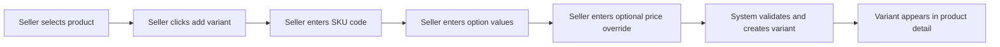

IF the SKU code already exists, THE system SHALL reject the variant creation.
IF the option values are missing, THE system SHALL reject the variant creation.
IF the seller is suspended, THE system SHALL prevent variant creation.
IF the product belongs to another seller, THE system SHALL prevent variant creation.

### Variant Editing Process

WHEN a seller edits a variant, THE system SHALL allow modification of the SKU code.
WHEN a seller edits a variant, THE system SHALL allow modification of option values.
WHEN a seller edits a variant, THE system SHALL allow modification of the price override.
WHEN a seller edits a variant, THE system SHALL create a snapshot of the previous state.
WHEN a seller edits a variant, THE system SHALL preserve the variant's association with the parent product.
WHEN a seller edits a variant, THE system SHALL record the edit timestamp in the snapshot.
WHEN a seller edits a variant, THE system SHALL validate that the new SKU code is not already in use.
WHEN a seller edits a variant, THE system SHALL update the product detail page to reflect changes.

IF the new SKU code is already in use, THE system SHALL reject the edit.
IF the seller is suspended, THE system SHALL prevent variant editing.
IF the variant has pending order items, THE system SHALL allow editing but preserve order snapshots.
IF the variant has pending cancellation requests, THE system SHALL allow editing but preserve order snapshots.
IF the variant has pending refund requests, THE system SHALL allow editing but preserve order snapshots.

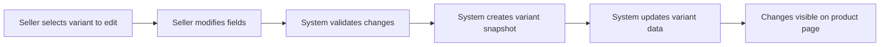

WHEN a seller edits a variant, THE system SHALL maintain the variant's stock quantity unchanged.
WHEN a seller edits a variant, THE system SHALL preserve all inventory history records.

### Variant Snapshot Creation

WHEN a seller edits a variant, THE system SHALL automatically create a variant snapshot.
WHEN a variant snapshot is created, THE system SHALL capture the SKU code before the change.
WHEN a variant snapshot is created, THE system SHALL capture the option values before the change.
WHEN a variant snapshot is created, THE system SHALL capture the price override before the change.
WHEN a variant snapshot is created, THE system SHALL capture the timestamp of the edit.
WHEN a variant snapshot is created, THE system SHALL link the snapshot to the parent product snapshot.
WHEN a variant snapshot is created, THE system SHALL make the snapshot immutable.
WHEN a variant snapshot is created, THE system SHALL associate it with the variant for future reference.

IF a variant is edited multiple times, THE system SHALL create a new snapshot for each edit.
IF a variant is deleted, THE system SHALL preserve all existing variant snapshots.
IF a product is deleted, THE system SHALL preserve all variant snapshots.

WHEN a seller views variant history, THE system SHALL display all variant snapshots in chronological order.
WHEN an administrator views variant history, THE system SHALL display all variant snapshots for any product.

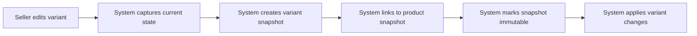

WHEN a variant snapshot is created, THE system SHALL include the seller ID for audit purposes.
WHEN a variant snapshot is created, THE system SHALL store both before and after values for comparison.

### Variant Deletion Workflow

WHEN a seller deletes a variant, THE system SHALL verify that no pending order items exist for that variant.
WHEN a seller deletes a variant, THE system SHALL verify that no pending cancellation requests exist for that variant.
WHEN a seller deletes a variant, THE system SHALL verify that no pending refund requests exist for that variant.
WHEN a seller deletes a variant, THE system SHALL delete all inventory records associated with that variant.
WHEN a seller deletes a variant, THE system SHALL preserve all variant snapshots for that variant.
WHEN a seller deletes a variant, THE system SHALL remove the variant from the product detail page.
WHEN a seller deletes a variant, THE system SHALL check if any variants remain for the product.

IF a variant has pending order items with paid status, THE system SHALL prevent deletion.
IF a variant has pending order items with shipped status, THE system SHALL prevent deletion.
IF a variant has pending cancellation requests, THE system SHALL prevent deletion.
IF a variant has pending refund requests, THE system SHALL prevent deletion.
IF the variant is the only one for the product, THE system SHALL mark the product as unavailable.

WHEN a seller deletes a variant, THE system SHALL remove the variant from cart items for all customers.
WHEN a seller deletes a variant, THE system SHALL mark cart items containing the variant as unavailable.

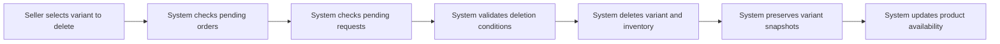

WHEN a seller deletes a variant, THE system SHALL record the deletion timestamp.
WHEN a seller deletes a variant, THE system SHALL maintain order items that reference the deleted variant.

### Variant Selection During Purchase

WHEN a customer views a product detail page, THE system SHALL display all available variants for selection.
WHEN a customer views a product detail page, THE system SHALL show option values for each variant.
WHEN a customer views a product detail page, THE system SHALL display the price for each variant.
WHEN a customer views a product detail page, THE system SHALL indicate stock status for each variant.
WHEN a customer adds a product to cart, THE system SHALL require selection of a specific variant.
WHEN a customer adds a product to cart, THE system SHALL require specification of quantity.
WHEN a customer adds a product to cart, THE system SHALL validate that the variant is in stock.
WHEN a customer adds a product to cart, THE system SHALL validate that the variant is available.

IF a variant is out of stock, THE system SHALL prevent adding it to cart.
IF a variant is deleted, THE system SHALL prevent adding it to cart.
IF a customer does not select a variant, THE system SHALL prevent adding to cart.
IF the requested quantity exceeds available stock, THE system SHALL prevent adding to cart.

WHEN a customer proceeds to checkout, THE system SHALL require variant selection for each cart item.
WHEN a customer proceeds to checkout, THE system SHALL verify variant availability before order creation.

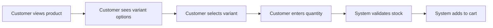

WHEN a customer views search results, THE system SHALL show products with at least one variant.
WHEN a customer views search results, THE system SHALL indicate if a product has multiple variant options.

### SKU Code Management

WHEN a seller creates a variant, THE system SHALL require a unique SKU code.
WHEN a seller edits a variant, THE system SHALL allow updating the SKU code.
WHEN a seller updates a SKU code, THE system SHALL validate uniqueness across all variants.
WHEN a seller updates a SKU code, THE system SHALL prevent duplicates with existing variants.
WHEN a variant is created, THE system SHALL assign the SKU code as a permanent identifier.
WHEN a variant is deleted, THE system SHALL release the SKU code for reuse.

IF a SKU code is already in use, THE system SHALL reject the variant creation or edit.
IF a SKU code is empty, THE system SHALL reject the variant creation or edit.

WHEN a seller views a variant, THE system SHALL display the current SKU code.
WHEN a seller views variant history, THE system SHALL show SKU code changes in snapshots.

WHEN an order item is created, THE system SHALL capture the SKU code at the time of purchase.
WHEN a variant snapshot is created, THE system SHALL preserve the SKU code value.

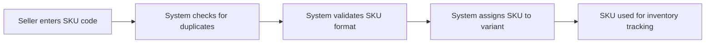

WHEN a variant is edited, THE system SHALL record the old and new SKU codes in the snapshot.
WHEN an administrator views variant history, THE system SHALL display all SKU code changes.

### Option Value Configuration

WHEN a seller creates a variant, THE system SHALL require option values to be specified.
WHEN a seller creates a variant, THE system SHALL allow multiple option values (e.g., color, size).
WHEN a seller creates a variant, THE system SHALL store option values as text.
WHEN a seller edits a variant, THE system SHALL allow modification of option values.
WHEN a seller edits a variant, THE system SHALL validate that option values are not empty.
WHEN a customer views a variant, THE system SHALL display all option values.

IF option values are missing, THE system SHALL reject variant creation.
IF option values are empty, THE system SHALL reject variant editing.

WHEN a seller creates a variant, THE system SHALL allow option values in any format.
WHEN a seller creates a variant, THE system SHALL store option values exactly as entered.
WHEN a variant is displayed, THE system SHALL show option values in a readable format.

WHEN a variant snapshot is created, THE system SHALL preserve the option values.
WHEN an order item is created, THE system SHALL capture the option values at purchase time.

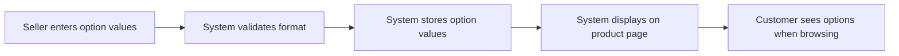

WHEN a customer adds a variant to cart, THE system SHALL preserve the selected option values.
WHEN an order is created, THE system SHALL include option values in the order item snapshot.

### Variant Pricing Management

WHEN a seller creates a variant, THE system SHALL allow an optional price override.
WHEN a seller creates a variant, THE system SHALL use the product base price if no override is specified.
WHEN a seller edits a variant, THE system SHALL allow updating the price override.
WHEN a seller edits a variant, THE system SHALL allow removing the price override.
WHEN a seller removes a price override, THE system SHALL revert to the product base price.
WHEN a customer views a variant, THE system SHALL display the effective price.

IF a price override is specified, THE system SHALL use that price for the variant.
IF no price override is specified, THE system SHALL use the product base price.
IF the price override is negative, THE system SHALL reject the variant creation or edit.

WHEN a variant snapshot is created, THE system SHALL capture the price override value.
WHEN an order item is created, THE system SHALL capture the variant price at purchase time.

WHEN a product base price is changed, THE system SHALL not affect variants with price overrides.
WHEN a product base price is changed, THE system SHALL update variants without price overrides.

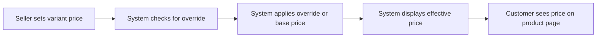

WHEN a seller views product pricing, THE system SHALL show price ranges if variants have different prices.
WHEN a seller edits a variant price, THE system SHALL create a snapshot recording the price change.

### Variant Availability Display

WHEN a customer views a product, THE system SHALL display the stock status for each variant.
WHEN a variant has zero stock, THE system SHALL display it as out of stock.
WHEN a variant has positive stock, THE system SHALL display it as in stock.
WHEN a variant is out of stock, THE system SHALL prevent adding it to cart.
WHEN a variant is in stock, THE system SHALL allow adding it to cart.
WHEN a variant is deleted, THE system SHALL remove it from available options.

IF a variant's stock quantity is zero, THE system SHALL mark it as unavailable.
IF a variant's stock quantity is positive, THE system SHALL mark it as available.
IF a variant is suspended, THE system SHALL mark it as unavailable.

WHEN a customer views search results, THE system SHALL show products with at least one in-stock variant.
WHEN a customer views search results, THE system SHALL filter by in-stock only if requested.

WHEN a seller views variants, THE system SHALL display current stock quantities.
WHEN a seller views variants, THE system SHALL highlight low stock variants.

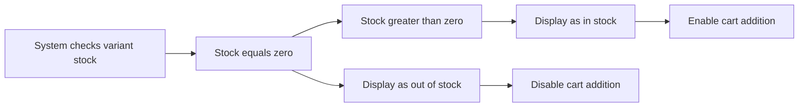

WHEN a customer views a product with no in-stock variants, THE system SHALL display the product as unavailable.
WHEN inventory is updated, THE system SHALL refresh variant availability immediately.

### Product Option Management

WHEN a seller creates a product, THE system SHALL allow defining multiple variants with different options.
WHEN a seller creates variants, THE system SHALL ensure each variant has unique option combinations.
WHEN a seller views a product, THE system SHALL display all variants and their options.
WHEN a seller edits product options, THE system SHALL update all affected variants.
WHEN a seller adds a new option type, THE system SHALL allow creating new variants.
WHEN a customer browses products, THE system SHALL show available option combinations.

IF a product has no variants, THE system SHALL display it as unavailable for purchase.
IF a product has variants, THE system SHALL display it as purchasable.
IF all variants are out of stock, THE system SHALL display the product as temporarily unavailable.

WHEN a seller manages product options, THE system SHALL show which variants use each option.
WHEN a seller deletes a variant, THE system SHALL check if other variants remain.

WHEN a customer views a product, THE system SHALL display all available option selections.
WHEN a customer selects options, THE system SHALL show the corresponding variant.

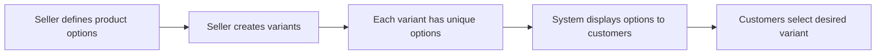

WHEN a seller edits product options, THE system SHALL preserve variant snapshots.
WHEN a product is deleted, THE system SHALL delete all its variants.

## InventoryRecord User Scenarios

Sellers add inventory to variants when new stock arrives or when restocking popular items. Each inventory addition includes a quantity and reason explaining why stock is being added. Sellers subtract inventory for adjustments, losses, or corrections with a documented reason. Order placement automatically creates negative inventory records to track stock consumption from sales. Order cancellations and refunds automatically create positive inventory records to restore available stock. Sellers view full inventory history for each variant to understand stock movement patterns. Current stock levels are calculated by summing all inventory records for accurate availability display. When stock reaches zero, variants show as out of stock and cannot be added to cart. Inventory records provide transparency for sellers managing stock levels across multiple variants. Automatic inventory updates from orders ensure accurate stock tracking without manual intervention.

### Inventory Restocking Workflow

WHEN a seller adds inventory to a product variant, THE system SHALL:
1. Require the seller to specify the quantity being added
2. Require the seller to provide a reason for the restocking
3. Create an inventory record with a positive quantity change
4. Record the timestamp of the inventory addition
5. Update the variant's current stock quantity

WHEN a seller restocks inventory, THE system SHALL:
1. Allow the seller to add stock in any positive quantity
2. Store the reason text for future reference
3. Make the inventory addition visible in the variant's history
4. Immediately reflect the increased stock in product listings

IF the seller provides an empty reason for restocking, THE system SHALL reject the inventory addition.
IF the seller attempts to add a negative quantity during restocking, THE system SHALL reject the request.

WHILE a variant has sufficient stock after restocking, THE system SHALL:
1. Display the variant as available for purchase
2. Allow customers to add the variant to their cart
3. Show the updated stock quantity in seller dashboards

### Inventory Adjustment Process

WHEN a seller subtracts inventory from a product variant, THE system SHALL:
1. Require the seller to specify the quantity being removed
2. Require the seller to provide a reason for the adjustment
3. Create an inventory record with a negative quantity change
4. Record the timestamp of the inventory adjustment
5. Update the variant's current stock quantity

WHEN a seller performs an inventory adjustment, THE system SHALL:
1. Allow the seller to remove stock for reasons such as loss, damage, or correction
2. Store the reason text for audit purposes
3. Make the inventory adjustment visible in the variant's history
4. Immediately reflect the reduced stock in product listings

IF the seller provides an empty reason for adjustment, THE system SHALL reject the inventory subtraction.
IF the seller attempts to subtract more stock than currently available, THE system SHALL reject the request.
IF the adjustment would result in negative stock, THE system SHALL reject the request.

WHILE a variant's stock is reduced through adjustment, THE system SHALL:
1. Update the available quantity for customers
2. Maintain the adjustment record permanently
3. Allow sellers to view the adjustment in inventory history

### Order-Based Inventory Reduction

WHEN a customer places an order successfully, THE system SHALL:
1. Automatically create negative inventory records for each purchased variant
2. Decrease the stock quantity by the ordered amount
3. Record the order reference as the reason for inventory reduction
4. Timestamp the inventory reduction at order creation time
5. Update the variant's current stock quantity immediately

WHEN an order is created, THE system SHALL:
1. Deduct inventory for each order item's variant
2. Create one inventory record per variant (not per order item)
3. Combine quantities from multiple order items of the same variant
4. Make the inventory reduction visible in the variant's history
5. Reflect the reduced stock in product listings immediately

IF payment fails during checkout, THE system SHALL:
1. Not create any inventory records
2. Not deduct any stock from variants
3. Allow the customer to retry the order

IF the variant has insufficient stock for the order, THE system SHALL:
1. Prevent the order from being placed
2. Display an out of stock message to the customer
3. Not create any inventory records

### Cancellation and Refund Inventory Restoration

WHEN an order item is cancelled, THE system SHALL:
1. Automatically create a positive inventory record for the variant
2. Restore the stock quantity by the cancelled amount
3. Record the cancellation reference as the reason for inventory restoration
4. Timestamp the inventory restoration at cancellation approval time
5. Update the variant's current stock quantity immediately

WHEN an order item is refunded, THE system SHALL:
1. Automatically create a positive inventory record for the variant
2. Restore the stock quantity by the refunded amount
3. Record the refund reference as the reason for inventory restoration
4. Timestamp the inventory restoration at refund approval time
5. Update the variant's current stock quantity immediately

WHEN inventory is restored through cancellation or refund, THE system SHALL:
1. Make the restoration visible in the variant's history
2. Immediately reflect the increased stock in product listings
3. Allow the variant to be purchased again if stock is available
4. Maintain the restoration record permanently for audit purposes

IF a cancellation is rejected, THE system SHALL:
1. Not create any inventory records
2. Not restore any stock to the variant
3. Keep the item in its current status

IF a refund is rejected, THE system SHALL:
1. Not create any inventory records
2. Not restore any stock to the variant
3. Keep the item in its current status

### Inventory History Viewing

WHEN a seller views inventory history for a variant, THE system SHALL:
1. Display all inventory records for that variant
2. Show the quantity change for each record (positive or negative)
3. Display the reason for each inventory change
4. Show the timestamp of each inventory record
5. Sort records by timestamp in descending order (newest first)

WHEN a seller monitors inventory history, THE system SHALL:
1. Show restocking records with positive quantity changes
2. Show adjustment records with negative quantity changes
3. Show order-based deductions with negative quantity changes
4. Show cancellation restorations with positive quantity changes
5. Show refund restorations with positive quantity changes

WHILE viewing inventory history, THE system SHALL:
1. Allow sellers to filter records by date range
2. Allow sellers to filter records by change type (addition, subtraction)
3. Display the cumulative effect of all records
4. Show the current stock level calculated from all records

IF a variant has no inventory records, THE system SHALL:
1. Display an empty state message
2. Show the current stock as zero or initial quantity

### Stock Level Calculation and Out of Stock Handling

WHEN the system calculates current stock for a variant, THE system SHALL:
1. Sum all inventory records for that variant
2. Add positive quantity changes (restocking, restoration)
3. Subtract negative quantity changes (adjustments, orders)
4. Use the result as the current available stock quantity
5. Update the calculation whenever a new inventory record is created

WHEN stock levels are displayed, THE system SHALL:
1. Show the calculated current stock quantity
2. Reflect real-time changes from inventory records
3. Display the stock level on product detail pages
4. Display the stock level in seller dashboards
5. Ensure consistency across all views

WHEN a variant's stock reaches zero, THE system SHALL:
1. Display the variant as "out of stock"
2. Prevent customers from adding the variant to their cart
3. Show the variant as unavailable in search results
4. Hide the "Add to Cart" button on product pages
5. Continue displaying the variant in listings with out of stock indicator

WHEN a variant's stock is greater than zero, THE system SHALL:
1. Display the variant as available for purchase
2. Allow customers to add the variant to their cart
3. Show the available quantity or "in stock" indicator
4. Enable the "Add to Cart" button on product pages

IF the calculated stock would be negative, THE system SHALL:
1. Prevent the inventory operation that would cause this
2. Display an error message to the seller
3. Not create the inventory record

## WishlistItem User Scenarios

Customers add products to their wishlist to save items they are interested in purchasing later. The wishlist stores products rather than specific variants, allowing flexibility when ready to buy. Customers view their wishlist to review saved products and make purchasing decisions. The wishlist displays paginated results for customers with many saved items. Customers remove products from their wishlist when they no longer want to track those items. Products deleted by sellers are automatically removed from all customer wishlists to prevent broken references. Customers can add products back to their wishlist if they become interested again after removal. Wishlist management helps customers organize products they want to consider for future purchases. The wishlist serves as a personal shopping list for tracking items of interest across browsing sessions.

### Wishlist Addition Workflow

WHEN a customer views a product detail page, THE system SHALL allow the customer to add the product to their wishlist.

WHEN a customer adds a product to their wishlist, THE system SHALL store the product (not a specific variant) to allow flexibility when ready to purchase.

IF a product is already in the customer's wishlist, THE system SHALL prevent duplicate addition and inform the customer that the product is already saved.

WHEN a customer adds a product to their wishlist, THE system SHALL record the timestamp when the product was added.

WHEN a customer adds a product to their wishlist, THE system SHALL preserve the product reference regardless of future product edits or variant changes.

WHEN a customer adds a product to their wishlist, THE system SHALL allow the customer to track their interest in that product across browsing sessions.

### Wishlist Viewing Experience

WHEN a customer accesses their wishlist, THE system SHALL display all products saved in their wishlist.

WHEN displaying wishlist items, THE system SHALL show the product main image (thumbnail) for each saved product.

WHEN displaying wishlist items, THE system SHALL show the product name for each saved product.

WHEN displaying wishlist items, THE system SHALL show the product price (or price range if variants have different prices) for each saved product.

WHEN displaying wishlist items, THE system SHALL show the seller shop name for each saved product.

WHEN displaying wishlist items, THE system SHALL show the average rating and review count if reviews exist for the product.

WHEN displaying wishlist items, THE system SHALL indicate the stock availability status (in stock or out of stock) for each saved product.

WHEN a customer views their wishlist, THE system SHALL enable the customer to review saved products and make purchasing decisions.

### Wishlist Pagination

WHEN a customer's wishlist contains many products, THE system SHALL display results in paginated format.

WHEN paginating wishlist results, THE system SHALL allow customers to navigate between pages to view all saved products.

WHEN displaying paginated wishlist results, THE system SHALL show the current page number and total number of pages.

WHEN a customer navigates to a different wishlist page, THE system SHALL maintain the same product ordering across pages.

WHEN displaying wishlist pagination, THE system SHALL show a reasonable number of products per page to ensure fast loading and easy navigation.

### Wishlist Removal Process

WHEN a customer removes a product from their wishlist, THE system SHALL delete the wishlist item from the customer's saved products.

WHEN a customer removes a product from their wishlist, THE system SHALL update the wishlist display immediately to reflect the removal.

IF a customer attempts to remove a product not in their wishlist, THE system SHALL handle the request gracefully without error.

WHEN a customer removes a product from their wishlist, THE system SHALL allow the customer to add the same product back to their wishlist later if desired.

WHEN a customer removes a product from their wishlist, THE system SHALL not delete the product itself or affect other customers' wishlists.

### Automatic Wishlist Cleanup

WHEN a seller deletes a product, THE system SHALL automatically remove that product from all customer wishlists.

WHEN a product is removed from a wishlist due to seller deletion, THE system SHALL not notify the customer of the automatic removal.

IF a deleted product is re-added by the seller as a new product, THE system SHALL not automatically restore it to customer wishlists.

WHEN a product is deleted, THE system SHALL clean up all wishlist references to prevent broken links in customer wishlists.

WHEN automatic wishlist cleanup occurs, THE system SHALL maintain data integrity by removing orphaned wishlist items.

### Product Interest Tracking

WHEN a customer views their wishlist, THE system SHALL help the customer organize products they want to consider for future purchases.

WHEN products in the wishlist change price or stock status, THE system SHALL reflect these changes in the wishlist display.

WHEN a customer views their wishlist, THE system SHALL enable the customer to compare multiple products they are interested in.

WHEN a customer views a wishlist item, THE system SHALL allow the customer to navigate to the product detail page for more information.

WHEN a customer manages their wishlist, THE system SHALL preserve the chronological order of product additions.

### Saved Product Management

WHEN a customer removes a product from their wishlist, THE system SHALL allow the customer to add it back later if they become interested again.

WHEN a customer adds a previously removed product back to their wishlist, THE system SHALL create a new wishlist entry with a new timestamp.

WHEN a customer manages their saved products, THE system SHALL provide clear controls for adding and removing products.

WHEN a customer views their wishlist, THE system SHALL show only products that currently exist and are available for purchase.

WHEN a customer manages their wishlist, THE system SHALL treat the wishlist as a personal shopping list for tracking items of interest.

### Wishlist-Based Shopping

WHEN a customer views their wishlist, THE system SHALL enable the customer to make purchasing decisions based on saved products.

WHEN a customer views a wishlist item, THE system SHALL allow the customer to add the product to their cart directly from the wishlist.

WHEN a customer purchases a product from their wishlist, THE system SHALL not automatically remove it from the wishlist.

WHEN a customer uses their wishlist for shopping, THE system SHALL allow the customer to select specific variants during the cart addition process.

WHEN a customer browses their wishlist, THE system SHALL support product discovery by showing related information such as seller details and ratings.

### Product Discovery Saving

WHEN a customer discovers a product during browsing, THE system SHALL allow the customer to save it to their wishlist for later consideration.

WHEN a customer saves a product to their wishlist during product discovery, THE system SHALL preserve the product reference even if the customer navigates away.

WHEN a customer returns to the platform after saving products, THE system SHALL make their wishlist available for review.

WHEN a customer saves products during discovery, THE system SHALL enable the customer to build a collection of items they are interested in purchasing.

WHEN a customer uses the wishlist for product discovery saving, THE system SHALL support the customer's shopping journey across multiple sessions.

## CartItem User Scenarios

Customers add specific variants to their cart with a quantity when they decide to purchase products. When the same variant is added multiple times, quantities are combined into a single cart line item. Customers view their cart to review selected items, quantities, prices, and total cost before checkout. Customers change quantities of items in their cart when they want to adjust order amounts. Customers remove items from their cart when they decide not to purchase certain products. Cart displays warnings when variant stock is less than the quantity in the cart to prevent overselling. Variants that become out of stock or deleted are marked as unavailable in the cart. Cart totals update automatically when quantities change or items are removed. Customers proceed to checkout only with available items that have sufficient stock. Cart management allows customers to review and adjust their order before finalizing purchase.

### Cart Addition and Quantity Combination

WHEN a customer decides to purchase a product, THE system SHALL require selection of a specific product variant before adding to cart.

WHEN a customer adds a product variant to their cart, THE system SHALL require specification of quantity.

WHEN a customer adds the same variant to their cart multiple times, THE system SHALL combine quantities into a single cart line item.

WHEN a customer adds a variant with quantity 1 to their cart, THE system SHALL create a cart item with that quantity.

WHEN a customer adds a variant with quantity greater than 1 to their cart, THE system SHALL create a cart item with the specified quantity.

WHEN a customer adds a variant that is already in their cart, THE system SHALL increase the existing cart item's quantity by the new quantity.

IF a variant has zero stock, THE system SHALL prevent the customer from adding it to the cart.

IF a variant has been deleted by the seller, THE system SHALL prevent the customer from adding it to the cart.

IF a variant's stock is less than the requested quantity, THE system SHALL prevent the customer from adding that quantity to the cart.

WHEN a customer adds a variant to their cart, THE system SHALL record the variant's price at the time of addition.

WHEN a variant is added to cart, THE system SHALL associate the cart item with the customer's account.

WHEN a customer adds a variant to their cart, THE system SHALL create a new cart item record.

WHEN multiple variants from the same product are added to cart, THE system SHALL create separate cart items for each variant.

WHEN a customer adds variants from different products to their cart, THE system SHALL create separate cart items for each variant.

WHEN a customer adds a variant to their cart, THE system SHALL preserve the variant's option values for display.

### Cart Viewing and Stock Display

WHEN a customer views their cart, THE system SHALL display each cart item with product name.

WHEN a customer views their cart, THE system SHALL display each cart item's variant options.

WHEN a customer views their cart, THE system SHALL display each cart item's price.

WHEN a customer views their cart, THE system SHALL display each cart item's quantity.

WHEN a customer views their cart, THE system SHALL display each cart item's subtotal.

WHEN a customer views their cart, THE system SHALL display the total price of all cart items.

WHEN a customer views their cart, THE system SHALL display the main image of each product.

WHEN a variant's stock quantity is less than the cart item's quantity, THE system SHALL display a stock warning.

WHEN a variant's stock quantity is sufficient, THE system SHALL not display a stock warning.

WHEN a variant becomes out of stock, THE system SHALL mark the cart item as unavailable.

WHEN a variant is deleted, THE system SHALL mark the cart item as unavailable.

WHEN a cart item is marked as unavailable, THE system SHALL display it with an unavailable indicator.

WHEN a customer views their cart, THE system SHALL calculate the subtotal for each item by multiplying price by quantity.

WHEN a customer views their cart, THE system SHALL calculate the total by summing all item subtotals.

WHEN cart item quantities change, THE system SHALL recalculate subtotals and total automatically.

WHEN cart items are removed, THE system SHALL recalculate the total automatically.

WHEN a customer views their cart, THE system SHALL display items in the order they were added.

WHEN a customer views their cart, THE system SHALL show the seller's shop name for each item.

### Cart Item Quantity and Removal Management

WHEN a customer wants to adjust their order amount, THE system SHALL allow changing the quantity of items in their cart.

WHEN a customer increases a cart item's quantity, THE system SHALL update the quantity immediately.

WHEN a customer decreases a cart item's quantity, THE system SHALL update the quantity immediately.

WHEN a customer sets a cart item's quantity to zero, THE system SHALL remove the item from the cart.

IF a customer attempts to set a quantity greater than available stock, THE system SHALL prevent the quantity change.

IF a customer attempts to set a negative quantity, THE system SHALL reject the change.

WHEN a customer removes an item from their cart, THE system SHALL delete the cart item.

WHEN a customer removes an item from their cart, THE system SHALL recalculate the cart total.

WHEN a variant becomes unavailable, THE system SHALL prevent quantity increases for that cart item.

WHEN a variant becomes unavailable, THE system SHALL allow the customer to remove the item from their cart.

WHEN a customer changes a cart item's quantity, THE system SHALL validate the new quantity against current stock.

WHEN a customer changes a cart item's quantity, THE system SHALL update the item's subtotal.

WHEN a customer removes all items from their cart, THE system SHALL display an empty cart state.

WHEN a customer removes an unavailable item, THE system SHALL update the cart total accordingly.

WHEN a customer removes an item, THE system SHALL preserve the item's price and variant information for order history.

### Checkout Availability and Order Review

WHEN a customer proceeds to checkout, THE system SHALL verify all cart items are available.

WHEN a customer proceeds to checkout, THE system SHALL verify all cart items have sufficient stock.

IF any cart item is unavailable, THE system SHALL prevent checkout and display the unavailable items.

IF any cart item has insufficient stock, THE system SHALL prevent checkout and display the stock issue.

WHEN a customer reviews their order before placing it, THE system SHALL display a list of items with prices.

WHEN a customer reviews their order before placing it, THE system SHALL display the shipping address.

WHEN a customer reviews their order before placing it, THE system SHALL display the total price.

WHEN a customer reviews their order before placing it, THE system SHALL display each item's variant options.

WHEN a customer reviews their order before placing it, THE system SHALL display each item's quantity.

WHEN a customer reviews their order before placing it, THE system SHALL display each item's subtotal.

WHEN a customer selects a shipping address, THE system SHALL display the address details in the order summary.

WHEN a customer uses their default shipping address, THE system SHALL display that address in the order summary.

WHEN a customer reviews their order, THE system SHALL show the seller's shop name for each item.

WHEN a customer reviews their order, THE system SHALL prevent modification of the shipping address after order placement.

WHEN a customer reviews their order, THE system SHALL show the order summary before payment confirmation.

WHEN a customer reviews their order, THE system SHALL display the number of items in the order.

WHEN a customer reviews their order, THE system SHALL display the number of unique products in the order.

WHEN a customer reviews their order, THE system SHALL display the number of sellers involved in the order.

WHEN a customer reviews their order, THE system SHALL display the order creation date and time.

## Order User Scenarios

Customers proceed to checkout from their cart to finalize their purchase of selected items. During checkout, customers select a shipping address from their saved addresses or use the default. Customers review the order summary including items, prices, shipping address, and total cost before placing the order. Once payment succeeds, an order record is created with all purchased items marked as paid. Stock quantities are decreased for each purchased variant when the order is successfully placed. Items are removed from the customer's cart after successful order placement. Customers view their order history to track all past purchases sorted by newest first. Each order shows the order number, date, total price, and overall status in the history list. Customers view full order details including items, shipping address, and shipment tracking information. Order status reflects the combined state of all items within that order.

### Checkout Workflow

WHEN a customer initiates checkout, THE system SHALL display all items currently in the customer's shopping cart.

WHEN a customer proceeds to checkout, THE system SHALL verify that all cart items are available for purchase.

WHEN a cart item is unavailable (out of stock or deleted), THE system SHALL prevent checkout and display the unavailable item.

WHEN a customer has at least one available item in their cart, THE system SHALL allow the customer to proceed to the shipping address selection step.

WHEN a customer completes all checkout steps successfully, THE system SHALL process payment through the external payment gateway.

WHEN payment succeeds, THE system SHALL create an order record with all purchased items.

WHEN payment fails, THE system SHALL not create an order and allow the customer to retry payment.

IF a customer has no items in their cart, THE system SHALL prevent checkout and display a message indicating the cart is empty.

WHEN a customer is on the checkout page, THE system SHALL maintain the customer's cart state until order placement or checkout abandonment.

WHEN the payment gateway returns a successful payment confirmation, THE system SHALL transition all order items to "paid" status.

### Shipping Address Selection

WHEN a customer proceeds to checkout, THE system SHALL display the customer's saved shipping addresses.

WHEN a customer has a default shipping address, THE system SHALL pre-select it as the shipping address for the order.

WHEN a customer has multiple saved addresses, THE system SHALL allow the customer to select any address for shipping.

WHEN a customer selects a shipping address during checkout, THE system SHALL display the selected address for confirmation.

WHEN a customer does not have any saved addresses, THE system SHALL require the customer to add a new address before proceeding.

WHEN a customer adds a new address during checkout, THE system SHALL save it to their address list for future use.

WHEN a customer confirms the shipping address, THE system SHALL capture the address information as a snapshot for the order.

WHEN an order is successfully created, THE system SHALL preserve the shipping address snapshot and prevent any future modifications to the order's shipping address.

IF a customer attempts to change the shipping address after order placement, THE system SHALL reject the request and inform the customer that the address cannot be modified.

WHEN a customer views their order details, THE system SHALL display the shipping address that was used at the time of purchase.

### Order Summary Review

WHEN a customer reaches the checkout review step, THE system SHALL display a complete order summary before payment.

WHEN displaying the order summary, THE system SHALL show all items with their names, variant options, quantities, and individual prices.

WHEN displaying the order summary, THE system SHALL show the selected shipping address.

WHEN displaying the order summary, THE system SHALL calculate and display the total price of all items.

WHEN displaying the order summary, THE system SHALL allow the customer to review all information before confirming the order.

WHEN a customer reviews the order summary, THE system SHALL ensure all prices reflect the current variant prices at the time of checkout.

WHEN a customer confirms the order summary, THE system SHALL proceed to payment processing.

WHEN a customer chooses not to proceed after reviewing the order summary, THE system SHALL allow the customer to return to modify their cart or shipping address.

IF any item in the order summary becomes unavailable during review, THE system SHALL notify the customer and prevent order placement.

WHEN the order summary is displayed, THE system SHALL show the breakdown of item subtotals and the final total.

### Order Creation Process

WHEN payment succeeds, THE system SHALL create an order record linking the customer to all purchased items.

WHEN an order is created, THE system SHALL assign a unique order number to identify the order.

WHEN an order is created, THE system SHALL record the creation timestamp.

WHEN an order is created, THE system SHALL create an order item for each unique variant purchased.

WHEN multiple quantities of the same variant are purchased, THE system SHALL consolidate them into a single order item with the combined quantity.

WHEN an order item is created, THE system SHALL capture a snapshot of the product information at the time of purchase.

WHEN an order item is created, THE system SHALL capture a snapshot of the variant information at the time of purchase.

WHEN an order item is created, THE system SHALL capture a snapshot of the seller's profile at the time of purchase.

WHEN an order is created, THE system SHALL set all order items to "paid" status.

WHEN an order is created, THE system SHALL calculate and store the total price of the order.

### Stock Reduction on Order

WHEN an order is successfully created, THE system SHALL decrease stock quantities for each purchased variant.

WHEN stock is reduced for an order, THE system SHALL create an inventory record with a negative quantity change.

WHEN an inventory record is created for order stock reduction, THE system SHALL include the order reference as the reason.

WHEN stock is reduced, THE system SHALL update the current available stock for each variant.

WHEN a variant's stock reaches zero after an order, THE system SHALL mark the variant as "out of stock".

WHEN a variant is marked as "out of stock", THE system SHALL prevent customers from adding that variant to their cart.

WHEN multiple order items purchase the same variant, THE system SHALL reduce stock by the total quantity across all items.

WHEN an order is cancelled, THE system SHALL restore the stock quantities through a positive inventory record.

WHEN an order item is refunded, THE system SHALL restore the stock quantities through a positive inventory record.

WHEN stock reduction occurs, THE system SHALL record the timestamp of the inventory change.

### Cart Clearance After Order

WHEN an order is successfully created, THE system SHALL remove all purchased items from the customer's shopping cart.

WHEN cart items are removed after order placement, THE system SHALL clear the entire cart.

WHEN a customer's cart is cleared after successful order placement, THE system SHALL allow the customer to immediately add new items to their cart.

WHEN payment fails and no order is created, THE system SHALL retain all items in the customer's cart.

WHEN a customer abandons checkout before order placement, THE system SHALL retain all items in the customer's cart.

WHEN a customer views their cart after a successful order, THE system SHALL display an empty cart.

WHEN a customer places multiple orders, THE system SHALL clear the cart after each successful order placement.

IF a customer has items in their cart and initiates checkout, THE system SHALL maintain those items until order completion or checkout abandonment.

WHEN a customer successfully places an order, THE system SHALL ensure no duplicate cart items remain from the completed order.

WHEN cart clearance occurs, THE system SHALL immediately reflect the empty cart state to the customer.

### Order History Viewing

WHEN a customer views their order history, THE system SHALL display a list of all orders placed by that customer.

WHEN displaying order history, THE system SHALL sort orders by newest first.

WHEN displaying order history, THE system SHALL paginate the order list for large numbers of orders.

WHEN displaying an order in the history list, THE system SHALL show the order number.

WHEN displaying an order in the history list, THE system SHALL show the order date.

WHEN displaying an order in the history list, THE system SHALL show the total price of the order.

WHEN displaying an order in the history list, THE system SHALL show the overall order status.

WHEN a customer selects an order from the history list, THE system SHALL navigate to the full order details page.

WHEN a customer views their order history, THE system SHALL include orders regardless of their current status.

WHEN order history is displayed, THE system SHALL show orders that have been cancelled or refunded.

### Order Detail Inspection

WHEN a customer views order details, THE system SHALL display all items included in that order.

WHEN displaying order items, THE system SHALL show the product name for each item.

WHEN displaying order items, THE system SHALL show the variant options for each item.

WHEN displaying order items, THE system SHALL show the quantity purchased for each item.

WHEN displaying order items, THE system SHALL show the price paid for each item.

WHEN displaying order items, THE system SHALL show the current status of each item.

WHEN a customer views order details, THE system SHALL display the shipping address used for the order.

WHEN a customer views order details, THE system SHALL display all shipments associated with the order.

WHEN displaying shipments, THE system SHALL show which order items are included in each shipment.

WHEN displaying shipments, THE system SHALL show the tracking carrier and tracking number for each shipment.

WHEN a customer views order details, THE system SHALL show the order number and order date.

WHEN a customer views order details, THE system SHALL show the total price of the order.

### Order Status Tracking

WHEN order items are all in "paid" status, THE system SHALL display the overall order status as "paid".

WHEN any order item transitions to "shipped" status, THE system SHALL update the overall order status to "shipped".

WHEN all order items transition to "delivered" status, THE system SHALL update the overall order status to "delivered".

WHEN all order items transition to "cancelled" status, THE system SHALL update the overall order status to "cancelled".

WHEN all order items transition to "refunded" status, THE system SHALL update the overall order status to "refunded".

WHEN order items have mixed statuses (e.g., some delivered, some refunded), THE system SHALL display the overall order status as "partially completed".

WHEN a customer views their order history, THE system SHALL display the current overall order status for each order.

WHEN an order item status changes, THE system SHALL automatically recalculate the overall order status.

WHEN a customer views order details, THE system SHALL show the individual status of each order item.

WHEN a customer tracks their order, THE system SHALL reflect status changes in real-time or near real-time.

### Purchase Completion Flow

WHEN a customer completes the purchase flow, THE system SHALL have created an order with all items in "paid" status.

WHEN a customer completes the purchase flow, THE system SHALL have removed all items from their shopping cart.

WHEN a customer completes the purchase flow, THE system SHALL have reduced stock quantities for all purchased variants.

WHEN a customer completes the purchase flow, THE system SHALL have created inventory records for all stock reductions.

WHEN a customer completes the purchase flow, THE system SHALL have captured snapshots of all products, variants, and seller profiles.

WHEN a customer completes the purchase flow, THE system SHALL have preserved the shipping address snapshot.

WHEN a customer completes the purchase flow, THE system SHALL allow the customer to view the order in their order history.

WHEN a customer completes the purchase flow, THE system SHALL enable the customer to track their order status.

WHEN a customer completes the purchase flow, THE system SHALL enable sellers to view and process their order items.

WHEN a customer completes the purchase flow, THE system SHALL allow the customer to request cancellation for items still in "paid" status.

WHEN a customer completes the purchase flow, THE system SHALL allow the customer to write reviews after items reach "delivered" status.

WHEN a customer completes the purchase flow, THE system SHALL preserve all order data even if the customer later deletes their account.

## OrderItem User Scenarios

Each order contains one or more order items representing purchased product variants with quantities. If a customer buys multiple quantities of the same variant, they become one order item with that quantity. Order items can come from different sellers within the same order, each managed independently. Each order item has its own status that tracks progress through paid, shipped, delivered, cancelled, or refunded states. Customers can request cancellation for individual items with paid status before they are shipped. Customers can request refunds for individual items with delivered status within seven days of delivery. When items are cancelled or refunded, stock quantities are restored through inventory records. The remaining items in an order continue processing normally when individual items are cancelled or refunded. Order items include snapshots of products, variants, and seller profiles at the time of purchase. Individual item management allows flexible order processing when only some items need attention.

### Order Item Creation and Consolidation

WHEN a customer completes checkout with multiple quantities of the same product variant, THE system SHALL create a single order item with the consolidated quantity.

WHEN a customer purchases products from multiple sellers in one checkout session, THE system SHALL create separate order items for each seller's products within the same order.

WHEN an order is successfully created, THE system SHALL set all order items to "paid" status.

WHEN an order item is created, THE system SHALL capture a snapshot of the product name, description, and category at the time of purchase.

WHEN an order item is created, THE system SHALL capture a snapshot of the variant SKU code, option values, and price at the time of purchase.

WHEN an order item is created, THE system SHALL capture a snapshot of the seller's shop name and logo at the time of purchase.

WHEN an order item is created, THE system SHALL decrease the stock quantity of the purchased variant by the order item quantity.

WHEN an order item is created, THE system SHALL remove the corresponding cart items from the customer's shopping cart.

WHEN an order item is created, THE system SHALL associate the order item with the correct seller who owns the product variant.

IF a customer purchases 5 units of the same variant, THE system SHALL create one order item with quantity 5, not five separate order items.

IF an order contains items from three different sellers, THE system SHALL create three separate order items, one for each seller's products.

IF payment fails during checkout, THE system SHALL not create any order items.

IF a variant's stock is insufficient for the requested quantity, THE system SHALL not create the order item and display an error to the customer.

THE system SHALL preserve order item snapshots even if the product or variant is later deleted by the seller.

THE system SHALL preserve order item snapshots even if the seller's profile is later modified or deleted.

### Item Status Progression and Stock Restoration

WHEN a seller ships one or more order items, THE system SHALL change the status of all items in that shipment to "shipped".

WHEN a customer confirms delivery for a shipment, THE system SHALL change the status of all items in that shipment to "delivered".

WHEN 14 days have passed since a shipment was created without customer confirmation, THE system SHALL automatically change the status of all items in that shipment to "delivered".

WHEN a seller approves a cancellation request for an order item, THE system SHALL change the item status to "cancelled".

WHEN a seller approves a refund request for an order item, THE system SHALL change the item status to "refunded".

WHEN an order item status changes to "cancelled", THE system SHALL restore the stock quantity by adding the cancelled quantity back to the variant's inventory.

WHEN an order item status changes to "refunded", THE system SHALL restore the stock quantity by adding the refunded quantity back to the variant's inventory.

WHILE an order item has "paid" status, THE system SHALL allow the customer to request cancellation.

WHILE an order item has "shipped" status, THE system SHALL prevent cancellation requests from the customer.

WHILE an order item has "delivered" status, THE system SHALL allow the customer to request a refund within 7 days of delivery.

WHILE an order item has "delivered" status, THE system SHALL prevent refund requests after 7 days from the delivery date.

WHILE an order item has "cancelled" status, THE system SHALL prevent refund requests for that item.

WHILE an order item has "refunded" status, THE system SHALL prevent any further status changes.

WHEN an order item status changes, THE system SHALL record the timestamp of the status change.

THE system SHALL allow order items from different sellers to have different statuses within the same order.

### Individual Item Cancellation Workflow

WHEN a customer requests cancellation for an individual order item, THE system SHALL create a cancellation request with the provided reason.

WHEN a seller receives a cancellation request, THE system SHALL notify the seller of the pending request.

WHEN a seller approves a cancellation request, THE system SHALL create a snapshot of the cancellation request state including the approval decision.

WHEN a seller rejects a cancellation request, THE system SHALL create a snapshot of the cancellation request state including the rejection decision.

WHEN a cancellation request is approved, THE system SHALL process a refund for only the cancelled item.

WHEN a cancellation request is approved, THE system SHALL leave all other order items in the order unaffected and continue processing.

IF a customer requests cancellation for an item with "shipped" status, THE system SHALL reject the cancellation request.

IF a customer requests cancellation for an item with "delivered" status, THE system SHALL reject the cancellation request.

IF a customer submits multiple cancellation requests for the same order item, THE system SHALL reject the duplicate request.

IF the cancellation reason is empty, THE system SHALL reject the cancellation request.

IF a seller is suspended, THE system SHALL still allow the seller to respond to cancellation requests for their order items.

THE system SHALL allow customers to view the status and history of their cancellation requests.

THE system SHALL preserve cancellation request snapshots even after the order item is cancelled.

THE system SHALL allow administrators to view all cancellation requests across the platform.

THE system SHALL allow administrators to force-cancel order items without seller approval.

### Individual Item Refund Workflow

WHEN a customer requests a refund for an individual order item, THE system SHALL create a refund request with the provided reason.

WHEN a seller receives a refund request, THE system SHALL notify the seller of the pending request.

WHEN a seller approves a refund request, THE system SHALL create a snapshot of the refund request state including the approval decision.

WHEN a seller rejects a refund request, THE system SHALL create a snapshot of the refund request state including the rejection decision.

WHEN a refund request is approved, THE system SHALL process a refund for only the refunded item.

WHEN a refund request is approved, THE system SHALL leave all other order items in the order unaffected.

IF a customer requests a refund for an item with "paid" status, THE system SHALL reject the refund request.

IF a customer requests a refund for an item with "shipped" status, THE system SHALL reject the refund request.

IF a customer requests a refund more than 7 days after the item was delivered, THE system SHALL reject the refund request.

IF a customer submits multiple refund requests for the same order item, THE system SHALL reject the duplicate request.

IF the refund reason is empty, THE system SHALL reject the refund request.

IF a seller is suspended, THE system SHALL still allow the seller to respond to refund requests for their order items.

THE system SHALL allow customers to view the status and history of their refund requests.

THE system SHALL preserve refund request snapshots even after the order item is refunded.

THE system SHALL allow administrators to view all refund requests across the platform.

THE system SHALL allow administrators to force-refund order items without seller approval.

### Partial Order Processing and Item-Level Management

WHEN an order contains items from multiple sellers, THE system SHALL allow each seller to ship their items independently.

WHEN one seller ships their items, THE system SHALL not affect the status of items from other sellers in the same order.

WHEN one seller's items are cancelled, THE system SHALL continue processing items from other sellers normally.

WHEN one seller's items are refunded, THE system SHALL continue processing items from other sellers normally.

WHEN a customer confirms delivery for one shipment, THE system SHALL not affect items in other shipments from different sellers.

WHEN all order items in an order are cancelled, THE system SHALL set the overall order status to "cancelled".

WHEN all order items in an order are refunded, THE system SHALL set the overall order status to "refunded".

WHEN some order items are delivered and others are cancelled, THE system SHALL set the overall order status to "partially completed".

WHEN some order items are delivered and others are refunded, THE system SHALL set the overall order status to "partially completed".

WHEN some order items are shipped and others are still paid, THE system SHALL set the overall order status to "shipped".

WHEN a customer views order details, THE system SHALL display the status of each order item individually.

WHEN a customer views order details, THE system SHALL display which items belong to which seller.

WHEN a seller views their order items, THE system SHALL display only items for products they own.

WHEN a seller views their order items, THE system SHALL allow filtering by item status.

THE system SHALL allow customers to request cancellation or refund for specific items without affecting other items in the order.

THE system SHALL allow sellers to ship items in multiple shipments over time if needed.

### Order Item Status Flow Diagrams

mermaid
flowchart LR
    A["Order Created"] --> B["All Items: Paid"]
    B --> C1["Seller Ships Items"]
    B --> C2["Customer Cancels Items"]
    B --> C3["All Items Cancelled"]
    C1 --> D1["Items: Shipped"]
    C2 --> D2["Items: Cancelled"]
    C3 --> D3["Order: Cancelled"]
    D1 --> E1["Customer Confirms Delivery"]
    D1 --> E2["14 Days Pass"]
    E1 --> F1["Items: Delivered"]
    E2 --> F1
    F1 --> G1["Customer Requests Refund"]
    F1 --> G2["7 Days Pass"]
    G1 --> H1["Seller Approves"]
    G1 --> H2["Seller Rejects"]
    H1 --> I1["Items: Refunded"]
    H2 --> I2["Request: Rejected"]
    G2 --> I3["Refund Window Closed"]
    I1 --> J1["Some Items Refunded"]
    J1 --> K1["Order: Partially Completed"]
    D2 --> K1
    I3 --> K1
    
    style A fill:#e1f5ff
    style B fill:#e1f5ff
    style D1 fill:#fff4e1
    style D2 fill:#ffe1e1
    style F1 fill:#e1ffe1
    style I1 fill:#ffe1f5
    style K1 fill:#f0f0f0

mermaid
sequenceDiagram
    participant C as Customer
    participant S as System
    participant Sel as Seller
    participant Inv as Inventory
    
    C->>S: Complete checkout with multiple items
    S->>S: Create order items per seller
    S->>Inv: Deduct stock for each item
    S->>S: Capture product/variant/seller snapshots
    S-->>C: Order confirmation
    
    Sel->>S: Ship items with tracking
    S->>S: Update item status to shipped
    S-->>C: Shipment notification
    
    C->>S: Confirm delivery
    S->>S: Update item status to delivered
    S-->>C: Delivery confirmation
    
    C->>S: Request cancellation for item A
    S->>Sel: Notify seller of cancellation request
    Sel->>S: Approve cancellation
    S->>S: Create cancellation snapshot
    S->>Inv: Restore stock for item A
    S->>S: Update item A status to cancelled
    S-->>C: Cancellation approved
    
    Note over C,S: Other items continue processing normally

## Shipment User Scenarios

Sellers create shipments to send order items to customers after payment is confirmed. A shipment can contain one or more order items from the same seller, allowing bundled shipping. Different sellers always ship separately with their own shipments even if items are in the same order. Sellers select which of their items to include in each shipment based on inventory and shipping preferences. Sellers enter tracking information including carrier name and tracking number for each shipment created. All items in the same shipment share the same tracking information for customer reference. When a shipment is created, all items included change status to shipped automatically. Customers view tracking information for each shipment to monitor delivery progress. Customers confirm delivery per shipment rather than per individual item for convenience. Items automatically change to delivered status after fourteen days if customer does not confirm.

### Shipment Creation Workflow

WHEN a seller creates a shipment, THE system SHALL require the seller to select one or more order items from their products.

WHEN a seller creates a shipment, THE system SHALL restrict item selection to only items with status "paid" (not yet shipped).

WHEN a seller creates a shipment, THE system SHALL allow the seller to select multiple items to bundle into a single shipment.

WHEN a seller creates a shipment, THE system SHALL require tracking information including carrier name and tracking number.

WHEN a seller creates a shipment, THE system SHALL record the shipment timestamp automatically.

WHEN a shipment is successfully created, THE system SHALL change the status of all included order items from "paid" to "shipped".

IF a seller attempts to create a shipment without selecting any items, THE system SHALL reject the shipment creation.

IF a seller attempts to include an item that is not in "paid" status, THE system SHALL reject the shipment creation.

IF tracking information is missing or incomplete, THE system SHALL reject the shipment creation.

WHEN a seller creates a shipment, THE system SHALL associate the shipment with the seller's account for record-keeping purposes.

### Multi-Item Shipment Bundling

WHEN a seller bundles multiple items into one shipment, THE system SHALL allow items from the same seller to be combined.

WHEN a seller bundles multiple items into one shipment, THE system SHALL ensure all bundled items share the same tracking information.

WHEN a seller bundles multiple items into one shipment, THE system SHALL update the status of all bundled items to "shipped" simultaneously.

WHEN a customer views a shipment with multiple items, THE system SHALL display all items included in that shipment.

WHEN a customer confirms delivery for a bundled shipment, THE system SHALL update all items in that shipment to "delivered" status.

IF a seller attempts to bundle items from different sellers, THE system SHALL reject the shipment creation.

WHEN a seller creates a shipment, THE system SHALL allow the seller to choose between individual item shipping or bundling multiple items.

WHEN a shipment contains multiple items, THE system SHALL maintain a record of which items are included in that shipment.

WHEN a customer views order details, THE system SHALL show which items are grouped together in each shipment.

### Seller-Specific Shipping Separation

WHEN an order contains items from multiple sellers, THE system SHALL require each seller to create separate shipments.

WHEN a seller creates a shipment, THE system SHALL restrict the seller to only include their own order items.

WHEN a customer views an order with multiple sellers, THE system SHALL display separate shipments for each seller.

WHEN a customer views tracking information, THE system SHALL show tracking details per shipment, not per order.

WHEN a customer confirms delivery, THE system SHALL allow delivery confirmation per shipment rather than per order.

IF a seller attempts to include another seller's items in their shipment, THE system SHALL reject the shipment creation.

WHEN a seller views their order items, THE system SHALL show only items from their products.

WHEN multiple sellers ship items from the same order, THE system SHALL maintain independent tracking information for each seller's shipment.

WHEN a customer receives items from different sellers, THE system SHALL allow separate delivery confirmation for each seller's shipment.

### Tracking Information Entry

WHEN a seller creates a shipment, THE system SHALL require the seller to enter a carrier name.

WHEN a seller creates a shipment, THE system SHALL require the seller to enter a tracking number.

WHEN a seller enters tracking information, THE system SHALL store the carrier name and tracking number with the shipment record.

WHEN a seller creates a shipment, THE system SHALL validate that tracking information is not empty.

WHEN a seller creates a shipment, THE system SHALL associate the tracking information with all items in that shipment.

IF the carrier name is missing, THE system SHALL reject the shipment creation.

IF the tracking number is missing, THE system SHALL reject the shipment creation.

WHEN a seller creates a shipment, THE system SHALL make the tracking information visible to the customer for that order.

### Shipment Tracking Viewing

WHEN a customer views an order, THE system SHALL display tracking information for each shipment in that order.

WHEN a customer views a shipment, THE system SHALL show the carrier name and tracking number.

WHEN a customer views tracking information, THE system SHALL display the shipment timestamp.

WHEN a customer views order details, THE system SHALL show which items are included in each shipment with tracking information.

WHEN a customer views a shipment, THE system SHALL indicate the current delivery status of that shipment.

IF a shipment has no tracking information, THE system SHALL display a message indicating tracking is not available.

WHEN a customer views their order history, THE system SHALL show tracking information for shipped orders.

WHEN a customer views a specific shipment, THE system SHALL display all order items included in that shipment.

### Delivery Confirmation Process

WHEN a customer receives a shipment, THE system SHALL allow the customer to confirm delivery for that shipment.

WHEN a customer confirms delivery, THE system SHALL update all items in that shipment to "delivered" status.

WHEN a customer confirms delivery, THE system SHALL record the delivery confirmation timestamp.

WHEN a customer confirms delivery, THE system SHALL allow the customer to view the confirmation record.

IF a shipment has already been confirmed as delivered, THE system SHALL prevent duplicate delivery confirmation.

IF a shipment is not in "shipped" status, THE system SHALL prevent delivery confirmation.

WHEN a customer confirms delivery for one shipment in an order, THE system SHALL not affect other shipments in the same order.

WHEN a customer confirms delivery, THE system SHALL make the delivery confirmation visible to the seller.

### Automatic Delivery Status

WHEN fourteen days have passed since a shipment was created, THE system SHALL automatically change all items in that shipment to "delivered" status.

WHEN the automatic delivery status is triggered, THE system SHALL record the automatic delivery timestamp.

WHEN a shipment is automatically marked as delivered, THE system SHALL treat it the same as customer-confirmed delivery.

WHEN fourteen days have passed, THE system SHALL apply automatic delivery regardless of whether the customer manually confirmed.

IF a customer confirms delivery before fourteen days, THE system SHALL not apply automatic delivery.

WHEN a shipment is automatically marked as delivered, THE system SHALL enable the customer to write a review for items in that shipment.

WHEN the automatic delivery status is applied, THE system SHALL notify the seller that the shipment was automatically marked as delivered.

IF a shipment has already been manually confirmed, THE system SHALL not apply automatic delivery status change.

### Shipment-Based Status Updates

WHEN a shipment is created, THE system SHALL change all included order items to "shipped" status.

WHEN a customer confirms delivery for a shipment, THE system SHALL change all included order items to "delivered" status.

WHEN automatic delivery is triggered after fourteen days, THE system SHALL change all included order items to "delivered" status.

WHEN a shipment status changes, THE system SHALL update the order status based on the item statuses.

WHEN all items in an order are delivered, THE system SHALL update the order status to "delivered".

WHEN some items are delivered and others are in different states, THE system SHALL update the order status to "partially completed".

WHEN a shipment is created, THE system SHALL make the status change visible to both the customer and the seller.

WHEN an item status changes due to shipment, THE system SHALL record the status change timestamp.

### Carrier Tracking Integration

WHEN a seller creates a shipment, THE system SHALL allow the seller to specify the carrier name.

WHEN tracking information is entered, THE system SHALL store the carrier name for customer reference.

WHEN a customer views tracking information, THE system SHALL display the carrier name prominently.

WHEN a seller creates a shipment, THE system SHALL require a valid tracking number format.

WHEN tracking information is stored, THE system SHALL make it available for customer viewing.

IF the carrier name contains invalid characters, THE system SHALL reject the shipment creation.

WHEN a customer views a shipment, THE system SHALL show the carrier information alongside the tracking number.

WHEN tracking information is entered, THE system SHALL associate it with the shipment for the duration of the delivery process.

### Delivery Timeline Management

WHEN a shipment is created, THE system SHALL start the fourteen-day delivery timeline automatically.

WHEN the delivery timeline starts, THE system SHALL record the shipment timestamp as the starting point.

WHEN the fourteen-day period expires, THE system SHALL automatically update the shipment status to delivered.

WHEN a customer confirms delivery before fourteen days, THE system SHALL stop the automatic delivery timeline.

WHEN a customer views a shipment, THE system SHALL show how many days remain until automatic delivery.

WHEN the delivery timeline is active, THE system SHALL track the elapsed time from shipment creation.

IF the customer confirms delivery, THE system SHALL cancel the automatic delivery timer.

WHEN the automatic delivery occurs, THE system SHALL enable review functionality for items in that shipment.

## Review User Scenarios

Customers write reviews for products they have purchased after the item status becomes delivered. Each review includes a rating from one to five stars and optional text content sharing the customer experience. Customers can write one review per product per order to provide feedback on their purchase. Reviews appear on product detail pages sorted by newest first to help other customers make decisions. Customers edit their own reviews to update their feedback or correct information after writing. Every review edit creates a snapshot preserving the original review content for reference. Customers delete their own reviews when they no longer want their feedback displayed publicly. Product average ratings are calculated from all non-deleted reviews to show overall customer satisfaction. Reviews help build trust and provide social proof for products on the platform. Review snapshots are preserved even after deletion for dispute resolution and historical reference.

### Review Writing Workflow

WHEN a customer views a product detail page, THE system SHALL display a review section showing all reviews for that product.

WHEN a customer has purchased a product and the order item status is "delivered", THE system SHALL enable the customer to write a review for that product.

WHEN a customer attempts to write a review for a product they have not purchased, THE system SHALL prevent review creation.

WHEN a customer attempts to write a review before the order item status becomes "delivered", THE system SHALL prevent review creation.

WHEN a customer has already written a review for a specific product within an order, THE system SHALL prevent duplicate review creation for that same product-order combination.

WHEN a customer submits a review, THE system SHALL require a rating from one to five stars.

WHEN a customer submits a review, THE system SHALL allow optional text content to describe their experience.

WHEN a customer submits a review without text content, THE system SHALL accept the review with only the rating.

WHEN a customer submits a review, THE system SHALL record the creation timestamp.

WHEN a customer submits a review, THE system SHALL associate the review with the corresponding order item and customer account.

WHEN a customer submits a review, THE system SHALL make the review immediately visible on the product detail page.

WHEN a customer writes a review, THE system SHALL preserve the review content for dispute resolution purposes.

### Rating Submission Process

WHEN a customer creates a review, THE system SHALL require a rating value between one and five stars.

WHEN a customer submits a rating, THE system SHALL validate that the rating is a whole number between one and five.

WHEN a customer submits a rating outside the one to five range, THE system SHALL reject the review submission.

WHEN a customer submits a review, THE system SHALL store the rating as an immutable value unless the review is edited.

WHEN a customer views a product with reviews, THE system SHALL display individual ratings for each review.

WHEN a customer views a product with reviews, THE system SHALL display the average rating calculated from all non-deleted reviews.

WHEN a customer submits a review with a rating, THE system SHALL update the product's average rating immediately.

WHEN a customer deletes a review, THE system SHALL recalculate the product's average rating excluding the deleted review.

WHEN a customer edits a review's rating, THE system SHALL update the product's average rating to reflect the new rating value.

WHEN a product has no reviews, THE system SHALL not display an average rating.

### Review Text Content

WHEN a customer creates a review, THE system SHALL allow optional text content to describe their purchase experience.

WHEN a customer submits a review with text content, THE system SHALL store the text content with the review.

WHEN a customer submits a review without text content, THE system SHALL accept the review with only the rating.

WHEN a customer views a review, THE system SHALL display the text content if it exists.

WHEN a customer views a review without text content, THE system SHALL display only the rating.

WHEN a customer edits a review, THE system SHALL allow modification of the text content.

WHEN a customer edits a review's text content, THE system SHALL preserve the original text content in a snapshot.

WHEN a customer deletes a review with text content, THE system SHALL remove the text content from public display.

WHEN a customer deletes a review, THE system SHALL preserve the text content in the review snapshot for dispute resolution.

WHEN a seller views order item reviews, THE system SHALL display the text content for each review.

### Review Editing Workflow

WHEN a customer edits their own review, THE system SHALL allow modification of the rating and text content.

WHEN a customer attempts to edit another customer's review, THE system SHALL prevent the edit operation.

WHEN a customer edits a review, THE system SHALL create a review snapshot preserving the previous state.

WHEN a customer edits a review's rating, THE system SHALL update the product's average rating immediately.

WHEN a customer edits a review's text content, THE system SHALL update the displayed review content immediately.

WHEN a customer edits a review, THE system SHALL record the edit timestamp in the snapshot.

WHEN a customer edits a review, THE system SHALL preserve both before and after values in the snapshot.

WHEN a customer attempts to edit a deleted review, THE system SHALL prevent the edit operation.

WHEN a customer edits a review, THE system SHALL maintain the original creation timestamp of the review.

WHEN an administrator views review snapshots, THE system SHALL display all edit history for the review.

### Review Deletion Process

WHEN a customer deletes their own review, THE system SHALL remove the review from public display on the product detail page.

WHEN a customer attempts to delete another customer's review, THE system SHALL prevent the deletion operation.

WHEN a customer deletes a review, THE system SHALL preserve the review content in a snapshot for dispute resolution.

WHEN a customer deletes a review, THE system SHALL recalculate the product's average rating excluding the deleted review.

WHEN a customer deletes a review, THE system SHALL allow the customer to write a new review for the same product-order combination.

WHEN a customer deletes a review, THE system SHALL preserve the snapshot even after deletion.

WHEN an administrator views deleted reviews, THE system SHALL display the review content from the preserved snapshot.

WHEN a customer deletes a review, THE system SHALL update the total review count for the product.

WHEN a customer deletes a review, THE system SHALL remove the review from the sorted review list on the product page.

WHEN a customer deletes a review, THE system SHALL preserve the association with the original order item for record-keeping purposes.

### Review Snapshot Creation

WHEN a customer edits a review, THE system SHALL automatically create a review snapshot.

WHEN a review snapshot is created, THE system SHALL record the timestamp of the change.

WHEN a review snapshot is created, THE system SHALL capture the rating value before the change.

WHEN a review snapshot is created, THE system SHALL capture the text content before the change.

WHEN a review snapshot is created, THE system SHALL capture the rating value after the change.

WHEN a review snapshot is created, THE system SHALL capture the text content after the change.

WHEN a review snapshot is created, THE system SHALL make the snapshot immutable and non-deletable.

WHEN a customer views their review history, THE system SHALL allow viewing of review snapshots.

WHEN an administrator views review snapshots, THE system SHALL display complete edit history including all snapshots.

WHEN a review is deleted, THE system SHALL preserve all associated snapshots for dispute resolution.

WHEN a product is deleted, THE system SHALL preserve all review snapshots for the product.

WHEN a customer account is deleted, THE system SHALL preserve all review snapshots associated with that customer.

### Average Rating Calculation

WHEN a product has reviews, THE system SHALL calculate the average rating from all non-deleted reviews.

WHEN a product has no reviews, THE system SHALL not display an average rating.

WHEN a customer submits a new review, THE system SHALL immediately recalculate the product's average rating.

WHEN a customer deletes a review, THE system SHALL immediately recalculate the product's average rating excluding the deleted review.

WHEN a customer edits a review's rating, THE system SHALL immediately recalculate the product's average rating.

WHEN a product's average rating is calculated, THE system SHALL use the arithmetic mean of all non-deleted review ratings.

WHEN a product's average rating is displayed, THE system SHALL round the rating to one decimal place.

WHEN a customer views a product detail page, THE system SHALL display the current average rating.

WHEN a customer views a product listing, THE system SHALL display the average rating if reviews exist.

WHEN a product has only one review, THE system SHALL display that review's rating as the average rating.

### Review Display on Product Page

WHEN a customer views a product detail page, THE system SHALL display all non-deleted reviews for that product.

WHEN reviews are displayed on a product detail page, THE system SHALL sort them by newest first.

WHEN reviews are displayed on a product detail page, THE system SHALL show the rating for each review.

WHEN reviews are displayed on a product detail page, THE system SHALL show the text content if it exists.

WHEN reviews are displayed on a product detail page, THE system SHALL show the customer's display name.

WHEN reviews are displayed on a product detail page, THE system SHALL show the review creation date.

WHEN a customer's account is deleted, THE system SHALL display reviews from that customer as "deleted user".

WHEN a customer's account is banned, THE system SHALL continue to display their reviews on product pages.

WHEN reviews are displayed on a product detail page, THE system SHALL show the total number of reviews.

WHEN reviews are displayed on a product detail page, THE system SHALL show the average rating prominently.

WHEN a customer views reviews on a product detail page, THE system SHALL allow filtering by rating value.

WHEN a customer views reviews on a product detail page, THE system SHALL paginate the review list if it exceeds the page limit.

### Customer Feedback Provision

WHEN a customer purchases a product, THE system SHALL enable the customer to provide feedback through reviews after delivery.

WHEN a customer confirms delivery of an order item, THE system SHALL enable the customer to write a review for that product.

WHEN an order item status automatically becomes "delivered" after fourteen days, THE system SHALL enable the customer to write a review for that product.

WHEN a customer writes a review, THE system SHALL allow the customer to share their purchase experience with other customers.

WHEN a customer writes a review, THE system SHALL allow the customer to rate the product quality.

WHEN a customer writes a review, THE system SHALL allow the customer to describe their satisfaction level.

WHEN a customer writes a review, THE system SHALL allow the customer to highlight product strengths or weaknesses.

WHEN a customer writes a review, THE system SHALL preserve the feedback for future reference.

WHEN a customer provides feedback through reviews, THE system SHALL make it visible to help other customers make purchasing decisions.

WHEN a customer provides feedback through reviews, THE system SHALL enable sellers to understand customer satisfaction.

### Review-Based Product Evaluation

WHEN a customer views a product detail page, THE system SHALL enable product evaluation through displayed reviews.

WHEN a customer views a product listing, THE system SHALL enable quick product evaluation through average rating display.

WHEN a customer compares products, THE system SHALL enable evaluation through review counts and ratings.

WHEN a customer reads reviews, THE system SHALL enable evaluation of product quality based on customer experiences.

WHEN a customer reads reviews, THE system SHALL enable evaluation of product value based on customer feedback.

WHEN a customer reads reviews, THE system SHALL enable evaluation of seller reliability based on review patterns.

WHEN a customer reads reviews, THE system SHALL enable evaluation of product suitability for their needs.

WHEN a customer views reviews sorted by newest first, THE system SHALL enable evaluation based on recent customer experiences.

WHEN a customer views reviews with text content, THE system SHALL enable detailed evaluation of product features.

WHEN a customer views reviews with ratings only, THE system SHALL enable quick evaluation of overall satisfaction.

WHEN a customer views the average rating, THE system SHALL enable summary evaluation of product performance.

WHEN a customer views the total review count, THE system SHALL enable evaluation of product popularity and trustworthiness.

## CancellationRequest User Scenarios

Customers request cancellation for individual order items that have paid status and have not been shipped yet. Cancellation requests include a reason explaining why the customer wants to cancel that specific item. Sellers review cancellation requests and can approve or reject them based on their business policies. When a seller responds to a cancellation request, a snapshot of the request state is created for reference. Approved cancellations change the item status to cancelled and trigger a refund for that item only. Cancelled items restore their stock quantities through automatic inventory record creation. The remaining items in the order continue processing normally after individual item cancellation. If all items in an order are cancelled, the entire order status becomes cancelled automatically. Cancellation requests allow customers to modify their orders before items are shipped. Sellers manage cancellation requests through their seller dashboard interface.

### Cancellation Request Submission

WHEN a customer requests cancellation for an order item, THE system SHALL require the item to have paid status.

WHEN a customer requests cancellation for an order item, THE system SHALL verify the item has not been shipped.

WHEN a customer submits a cancellation request, THE system SHALL create a cancellation request record with pending status.

WHEN a customer submits a cancellation request, THE system SHALL associate the request with the specific order item.

WHEN a customer submits a cancellation request, THE system SHALL record the request timestamp.

WHEN a customer submits a cancellation request, THE system SHALL prevent duplicate cancellation requests for the same order item.

WHEN a customer submits a cancellation request, THE system SHALL notify the seller of the order item.

### Cancellation Reason Provision

WHEN a customer submits a cancellation request, THE system SHALL require the customer to provide a reason.

WHEN a customer provides a cancellation reason, THE system SHALL accept text content as the reason.

WHEN a customer submits a cancellation request, THE system SHALL reject the request if no reason is provided.

WHEN a customer provides a cancellation reason, THE system SHALL preserve the reason text in the cancellation request record.

WHEN a seller reviews a cancellation request, THE system SHALL display the cancellation reason provided by the customer.

### Seller Cancellation Review

WHEN a seller views cancellation requests, THE system SHALL display only cancellation requests for items the seller is responsible for.

WHEN a seller views cancellation requests, THE system SHALL show the order item details associated with each request.

WHEN a seller views cancellation requests, THE system SHALL display the cancellation reason provided by the customer.

WHEN a seller views cancellation requests, THE system SHALL show the request status for each cancellation request.

WHEN a seller views cancellation requests, THE system SHALL display the timestamp when each request was submitted.

WHEN a seller views cancellation requests, THE system SHALL group requests by order for easier management.

### Cancellation Approval Workflow

WHEN a seller approves a cancellation request, THE system SHALL change the cancellation request status to approved.

WHEN a seller approves a cancellation request, THE system SHALL change the associated order item status to cancelled.

WHEN a seller approves a cancellation request, THE system SHALL process a refund for the cancelled order item.

WHEN a seller approves a cancellation request, THE system SHALL record the approval timestamp.

WHEN a seller approves a cancellation request, THE system SHALL notify the customer of the approval.

WHEN a seller approves a cancellation request, THE system SHALL prevent further actions on that cancellation request.

### Cancellation Rejection Process

WHEN a seller rejects a cancellation request, THE system SHALL change the cancellation request status to rejected.

WHEN a seller rejects a cancellation request, THE system SHALL keep the order item status unchanged.

WHEN a seller rejects a cancellation request, THE system SHALL record the rejection timestamp.

WHEN a seller rejects a cancellation request, THE system SHALL notify the customer of the rejection.

WHEN a seller rejects a cancellation request, THE system SHALL prevent further actions on that cancellation request.

WHEN a seller rejects a cancellation request, THE system SHALL allow the order item to continue normal processing.

### Cancellation Snapshot Creation

WHEN a seller responds to a cancellation request, THE system SHALL create a cancellation snapshot.

WHEN a cancellation snapshot is created, THE system SHALL preserve the cancellation request state at the time of response.

WHEN a cancellation snapshot is created, THE system SHALL record the cancellation reason.

WHEN a cancellation snapshot is created, THE system SHALL record the request status (approved or rejected).

WHEN a cancellation snapshot is created, THE system SHALL record the response timestamp.

WHEN a cancellation snapshot is created, THE system SHALL make the snapshot immutable.

WHEN a customer views their cancellation request, THE system SHALL allow viewing of associated snapshots.

WHEN an administrator views cancellation requests, THE system SHALL allow viewing of all cancellation snapshots.

### Item Status Cancellation Update

WHEN a cancellation request is approved, THE system SHALL update the order item status from paid to cancelled.

WHEN an order item status changes to cancelled, THE system SHALL prevent further shipping of that item.

WHEN an order item status changes to cancelled, THE system SHALL prevent refund requests for that item.

WHEN an order item status changes to cancelled, THE system SHALL prevent additional cancellation requests for that item.

WHEN an order item status changes to cancelled, THE system SHALL update the order status accordingly.

WHEN an order item status changes to cancelled, THE system SHALL reflect the cancelled status in the customer order history.

### Stock Restoration on Cancellation

WHEN an order item is cancelled, THE system SHALL create an inventory record for the associated variant.

WHEN an order item is cancelled, THE system SHALL record a positive quantity change in the inventory record.

WHEN an order item is cancelled, THE system SHALL use the cancelled item quantity as the inventory restoration amount.

WHEN an order item is cancelled, THE system SHALL record the cancellation as the reason for the inventory change.

WHEN an order item is cancelled, THE system SHALL timestamp the inventory record at the time of cancellation.

WHEN an order item is cancelled, THE system SHALL make the variant available for purchase again if stock is restored.

### Partial Order Cancellation

WHEN some items in an order are cancelled, THE system SHALL continue processing the remaining items normally.

WHEN some items in an order are cancelled, THE system SHALL maintain the original order record.

WHEN some items in an order are cancelled, THE system SHALL reflect mixed item statuses in the order status.

WHEN some items in an order are cancelled, THE system SHALL allow shipment of non-cancelled items.

WHEN some items in an order are cancelled, THE system SHALL calculate refunds only for the cancelled items.

WHEN some items in an order are cancelled, THE system SHALL allow customers to view both cancelled and active items in the order.

### Pre-shipment Cancellation

WHEN a customer requests cancellation, THE system SHALL verify the item has not been shipped.

WHEN an item has shipped status, THE system SHALL prevent cancellation requests for that item.

WHEN an item is in paid status, THE system SHALL allow cancellation requests.

WHEN a seller has not created a shipment for an item, THE system SHALL allow cancellation requests.

WHEN a seller has created a shipment for an item, THE system SHALL block cancellation requests.

WHEN a customer views order items, THE system SHALL indicate which items are eligible for cancellation.

WHEN an item is marked as shipped, THE system SHALL remove cancellation eligibility from that item.

## RefundRequest User Scenarios

Customers request refunds for individual order items that have delivered status within seven days of delivery. Refund requests include a reason explaining why the customer wants a refund for that specific item. Sellers review refund requests and can approve or reject them based on their return policies. When a seller responds to a refund request, a snapshot of the request state is created for reference. Approved refunds change the item status to refunded and process the refund for that item only. Refunded items restore their stock quantities through automatic inventory record creation. The remaining items in the order are unaffected when individual items are refunded. If all items in an order are refunded, the entire order status becomes refunded automatically. Refund requests provide customers with recourse when products do not meet expectations after delivery. Sellers manage refund requests through their seller dashboard interface.

### Refund Request Submission

WHEN a customer requests a refund for an order item, THE system SHALL require that the item has delivered status.

WHEN a customer requests a refund, THE system SHALL verify that the request is submitted within seven days of the item's delivery date.

WHEN a customer submits a refund request, THE system SHALL require the customer to provide a reason for the refund.

WHEN a customer submits a refund request, THE system SHALL associate the request with the specific order item being refunded.

WHEN a customer submits a refund request, THE system SHALL record the submission timestamp.

IF the order item does not have delivered status, THEN THE system SHALL reject the refund request.

IF the refund request is submitted more than seven days after delivery, THEN THE system SHALL reject the refund request.

IF the customer has already submitted a refund request for the same order item, THEN THE system SHALL reject the duplicate request.

IF the refund reason is empty or missing, THEN THE system SHALL reject the refund request.

WHEN a refund request is successfully submitted, THE system SHALL set the request status to pending.

WHEN a refund request is successfully submitted, THE system SHALL notify the seller of the new refund request.

mermaid
flowchart LR
    A["Customer"] -->|"Select delivered item"| B["System"]
    B -->|"Verify delivery status"| C["System"]
    C -->|"Check 7-day window"| D["System"]
    D -->|"Require refund reason"| E["Customer"]
    E -->|"Submit request"| F["System"]
    F -->|"Create pending request"| G["Refund Request Created"]
    G -->|"Notify seller"| H["Seller Dashboard"]

### Seller Refund Review and Decision

WHEN a seller views their seller dashboard, THE system SHALL display pending refund requests for their products.

WHEN a seller reviews a refund request, THE system SHALL display the order item details including product name, variant options, and quantity.

WHEN a seller reviews a refund request, THE system SHALL display the refund reason provided by the customer.

WHEN a seller reviews a refund request, THE system SHALL display the delivery date and request submission date.

WHEN a seller reviews a refund request, THE system SHALL display the refund request status.

WHEN a seller approves a refund request, THE system SHALL change the request status to approved.

WHEN a seller rejects a refund request, THE system SHALL change the request status to rejected.

IF the seller does not own the product in the refund request, THEN THE system SHALL prevent the seller from reviewing the request.

WHEN a seller responds to a refund request, THE system SHALL record the response timestamp.

WHEN a seller approves a refund request, THE system SHALL notify the customer of the approval.

WHEN a seller rejects a refund request, THE system SHALL notify the customer of the rejection.

mermaid
flowchart LR
    A["Seller Dashboard"] -->|"View pending requests"| B["Seller"]
    B -->|"Review request details"| C["Seller"]
    C -->|"Approve"| D["System"]
    C -->|"Reject"| E["System"]
    D -->|"Update status to approved"| F["Refund Approved"]
    E -->|"Update status to rejected"| G["Refund Rejected"]
    F -->|"Notify customer"| H["Customer"]
    G -->|"Notify customer"| H

### Refund Snapshot Creation

WHEN a seller responds to a refund request, THE system SHALL create a refund snapshot.

WHEN a refund snapshot is created, THE system SHALL preserve the request state at the time of the seller's response.

WHEN a refund snapshot is created, THE system SHALL record the refund reason provided by the customer.

WHEN a refund snapshot is created, THE system SHALL record the final request status (approved or rejected).

WHEN a refund snapshot is created, THE system SHALL record the response timestamp.

WHEN a refund snapshot is created, THE system SHALL make the snapshot immutable.

WHEN a refund snapshot is created, THE system SHALL link the snapshot to the refund request.

WHEN a customer views their refund request history, THE system SHALL display available snapshots.

WHEN a seller views their refund request history, THE system SHALL display available snapshots.

WHEN an administrator views refund requests, THE system SHALL display available snapshots for dispute resolution.

### Refund Processing and Stock Restoration

WHEN a seller approves a refund request, THE system SHALL change the order item status to refunded.

WHEN an order item status changes to refunded, THE system SHALL process the refund for that specific item only.

WHEN a refund is processed, THE system SHALL restore the stock quantity for the refunded variant.

WHEN stock is restored on refund, THE system SHALL create an inventory record with a positive quantity change.

WHEN stock is restored on refund, THE system SHALL record the refund as the reason for the inventory adjustment.

WHEN an individual order item is refunded, THE system SHALL leave remaining items in the order unaffected.

WHEN all order items in an order are refunded, THE system SHALL automatically update the overall order status to refunded.

WHEN a refund request is rejected, THE system SHALL leave the order item status unchanged.

WHEN a refund request is rejected, THE system SHALL leave the stock quantity unchanged.

WHEN a customer views their order after a refund, THE system SHALL display the refunded item with refunded status.

WHEN a customer views their order after a partial refund, THE system SHALL display the order status as partially completed.

mermaid
flowchart LR
    A["Seller Approves Refund"] -->|"System"| B["Change item status to refunded"]
    B -->|"System"| C["Process refund payment"]
    C -->|"System"| D["Create inventory record"]
    D -->|"System"| E["Restore stock quantity"]
    E -->|"System"| F["Check all items refunded"]
    F -->|"Yes"| G["Update order status to refunded"]
    F -->|"No"| H["Update order status to partially completed"]

## SellerApprovalRequest User Scenarios

New sellers submit registration requests with email, password, and reason for wanting to sell on the platform. Administrators view the list of pending seller approval requests in their management interface. Administrators review each seller request and decide whether to approve or reject the application. When rejecting a seller request, administrators must provide a reason explaining the rejection decision. Sellers can view their approval status showing pending, approved, or rejected states in their account. Rejected sellers can view the rejection reason provided by administrators to understand the decision. Rejected sellers can submit a new registration request after addressing the issues from their previous rejection. Approved sellers gain access to create products and manage their seller dashboard. Sellers cannot sell products until their account receives administrator approval. The approval process ensures platform quality by vetting new sellers before they can list products.

### Seller Registration Submission

WHEN a new user registers as a seller, THE system SHALL require email and password for account creation.

WHEN a seller submits a registration request, THE system SHALL require a reason explaining why they want to sell on the platform.

WHEN a seller registration request is submitted, THE system SHALL create a pending approval request record.

WHEN a seller registration request is created, THE system SHALL set the approval status to pending.

WHEN a seller submits a registration request, THE system SHALL record the submission timestamp.

IF a seller already has a pending approval request, THE system SHALL prevent submission of another request.

IF a seller's previous request was rejected, THE system SHALL allow them to submit a new registration request.

WHEN a seller registration request is submitted, THE system SHALL notify administrators of the new pending request.

IF the seller registration reason is empty, THE system SHALL reject the request submission.

WHEN a seller submits a registration request, THE system SHALL preserve the request for administrator review.

### Pending Approval Viewing

WHEN an administrator accesses the management interface, THE system SHALL display a list of pending seller approval requests.

WHEN viewing pending approval requests, THE system SHALL show each request with the seller's email and submission date.

WHEN viewing pending approval requests, THE system SHALL display the reason provided by each seller.

WHEN administrators view pending requests, THE system SHALL sort requests by submission date (newest first).

WHEN a pending approval request is displayed, THE system SHALL show the current status as pending.

WHEN administrators access the pending requests list, THE system SHALL filter out already approved or rejected requests.

WHEN multiple administrators view pending requests simultaneously, THE system SHALL ensure consistent request status display.

WHEN a pending request is being reviewed, THE system SHALL prevent duplicate review actions by different administrators.

WHEN administrators view the pending requests list, THE system SHALL show the total count of pending requests.

WHEN a seller approval request status changes, THE system SHALL update the pending requests list accordingly.

### Administrator Review Process

WHEN an administrator reviews a seller approval request, THE system SHALL display the seller's registration information.

WHEN an administrator reviews a seller approval request, THE system SHALL display the reason provided by the seller.

WHEN an administrator reviews a seller approval request, THE system SHALL display the submission timestamp.

WHEN an administrator decides to approve a seller request, THE system SHALL change the approval status to approved.

WHEN an administrator decides to reject a seller request, THE system SHALL change the approval status to rejected.

WHEN an administrator rejects a seller request, THE system SHALL require a reason explaining the rejection.

WHEN an administrator responds to a seller request, THE system SHALL record the response timestamp.

WHEN an administrator approves a seller request, THE system SHALL enable the seller to create products.

WHEN an administrator rejects a seller request, THE system SHALL prevent the seller from creating products.

WHEN an administrator reviews a seller request, THE system SHALL preserve the request state for audit purposes.

### Approval Decision Workflow

WHEN an administrator makes an approval decision, THE system SHALL record the decision as approved or rejected.

WHEN an administrator approves a seller request, THE system SHALL update the seller's approval status to approved.

WHEN an administrator rejects a seller request, THE system SHALL update the seller's approval status to rejected.

WHEN a seller request is approved, THE system SHALL send a notification to the seller.

WHEN a seller request is rejected, THE system SHALL send a notification to the seller.

WHEN an administrator approves a seller request, THE system SHALL grant the seller access to the seller dashboard.

WHEN an administrator rejects a seller request, THE system SHALL display the rejection reason to the seller.

WHEN a seller request status changes, THE system SHALL prevent further administrator actions on that request.

WHEN an administrator responds to a seller request, THE system SHALL create a snapshot of the request state.

WHEN a seller request is approved, THE system SHALL allow the seller to begin onboarding to the platform.

### Rejection Reason Provision

WHEN an administrator rejects a seller request, THE system SHALL require the administrator to provide a rejection reason.

WHEN an administrator provides a rejection reason, THE system SHALL store the reason with the request record.

WHEN an administrator submits a rejection, THE system SHALL validate that the rejection reason is not empty.

WHEN a rejection reason is provided, THE system SHALL make the reason visible to the rejected seller.

WHEN a seller views their rejected request, THE system SHALL display the rejection reason provided by the administrator.

WHEN an administrator edits a rejection reason before final submission, THE system SHALL allow the edit.

WHEN an administrator finalizes a rejection with a reason, THE system SHALL make the reason immutable.

WHEN a rejection reason is stored, THE system SHALL preserve it for future reference.

WHEN a seller views their rejection, THE system SHALL show the rejection reason in a clear and understandable format.

WHEN a rejection reason is provided, THE system SHALL enable the seller to understand the basis for the decision.

### Approval Status Checking

WHEN a seller logs into their account, THE system SHALL display their current approval status.

WHEN a seller views their approval status, THE system SHALL show one of three states: pending, approved, or rejected.

WHEN a seller's approval status is pending, THE system SHALL indicate that their request is under review.

WHEN a seller's approval status is approved, THE system SHALL indicate that they can begin selling.

WHEN a seller's approval status is rejected, THE system SHALL indicate that their request was denied.

WHEN a seller checks their approval status, THE system SHALL show the status in the seller dashboard.

WHEN a seller's approval status changes, THE system SHALL update the displayed status immediately.

WHEN a seller views their approval status, THE system SHALL show the date of the status change.

WHEN a seller's status is pending, THE system SHALL prevent access to product creation features.

WHEN a seller's status is approved, THE system SHALL enable access to all seller features.

### Rejection Reason Viewing

WHEN a seller's request is rejected, THE system SHALL display the rejection reason to the seller.

WHEN a seller views their rejection, THE system SHALL show the reason provided by the administrator.

WHEN a seller views their rejection reason, THE system SHALL display it in the seller account interface.

WHEN a seller views their rejection, THE system SHALL show when the rejection decision was made.

WHEN a seller views their rejection, THE system SHALL show the option to submit a new registration request.

WHEN a seller views their rejection reason, THE system SHALL present the information clearly and respectfully.

WHEN a seller's previous request was rejected, THE system SHALL show the rejection reason before allowing resubmission.

WHEN a seller views their rejection, THE system SHALL preserve the rejection reason for future reference.

WHEN a seller views their rejection reason, THE system SHALL ensure the reason is readable and complete.

WHEN a seller views their rejection, THE system SHALL enable them to understand what issues need to be addressed.

### Resubmission After Rejection

WHEN a seller's previous request was rejected, THE system SHALL allow them to submit a new registration request.

WHEN a rejected seller submits a new request, THE system SHALL create a new pending approval request record.

WHEN a rejected seller submits a new request, THE system SHALL require a reason for the new application.

WHEN a rejected seller submits a new request, THE system SHALL preserve the previous rejection history.

WHEN a rejected seller submits a new request, THE system SHALL notify administrators of the new submission.

WHEN a rejected seller submits a new request, THE system SHALL treat it as a fresh application for review.

WHEN a seller submits multiple requests after rejections, THE system SHALL maintain a history of all requests.

WHEN a rejected seller submits a new request, THE system SHALL allow them to address issues from previous rejections.

WHEN a seller resubmits after rejection, THE system SHALL reset the approval status to pending.

WHEN a rejected seller submits a new request, THE system SHALL enable administrators to review the new application independently.

### Seller Onboarding Process

WHEN a seller completes registration, THE system SHALL initiate the seller onboarding process.

WHEN a seller's registration is approved, THE system SHALL enable them to create their seller profile.

WHEN a seller begins onboarding, THE system SHALL guide them through profile setup steps.

WHEN a seller's onboarding is complete, THE system SHALL allow them to create products.

WHEN a seller's onboarding is incomplete, THE system SHALL prevent product creation.

WHEN a seller is approved but has not created a profile, THE system SHALL prompt them to complete onboarding.

WHEN a seller completes their profile during onboarding, THE system SHALL make their shop visible to customers.

WHEN a seller's onboarding is in progress, THE system SHALL track their completion status.

WHEN a seller completes onboarding, THE system SHALL grant full seller platform access.

WHEN a seller's onboarding is complete, THE system SHALL enable them to manage their shop operations.

### Platform Quality Vetting

WHEN the platform receives a seller registration request, THE system SHALL vet the seller before approval.

WHEN administrators review seller requests, THE system SHALL enable quality assessment of potential sellers.

WHEN a seller request is under review, THE system SHALL prevent the seller from listing products.

WHEN a seller request is approved, THE system SHALL confirm the seller meets platform quality standards.

WHEN a seller request is rejected, THE system SHALL prevent non-compliant sellers from joining the platform.

WHEN administrators reject a seller request, THE system SHALL maintain platform quality by excluding unsuitable sellers.

WHEN the platform vets sellers, THE system SHALL protect customers from unreliable sellers.

WHEN a seller is approved, THE system SHALL ensure they can provide quality products and services.

WHEN the platform maintains seller approval requirements, THE system SHALL preserve marketplace integrity.

WHEN sellers complete the approval process, THE system SHALL ensure only qualified sellers can operate on the platform.

## AdminPromotionRequest User Scenarios

Regular users submit requests to become administrators by providing a reason for their application. Super administrators view the list of pending promotion requests in their management interface. Super administrators review each promotion request and decide whether to approve or reject the application. When approved, users gain regular administrator privileges to manage platform operations. Super administrators can promote regular administrators to super administrator status for expanded responsibilities. Super administrators can demote other super administrators back to regular administrator level when needed. Super administrators cannot demote themselves to maintain system stability and authority. Administrator grade changes affect the permissions and capabilities users have on the platform. The promotion process ensures only trusted users gain elevated platform management privileges. Administrator team management supports platform governance and operational oversight.

### Promotion Request Submission

WHEN a regular user submits a promotion request to become an administrator, THE system SHALL require the user to provide a reason for their application.

WHEN a user submits a promotion request, THE system SHALL record the submission timestamp.

WHEN a user submits a promotion request, THE system SHALL set the request status to "pending".

IF a user already has a pending promotion request, THE system SHALL reject the new submission.

IF the promotion reason is empty or missing, THE system SHALL reject the submission.

WHEN a promotion request is submitted, THE system SHALL associate the request with the submitting user.

WHEN a user who is already an administrator attempts to submit a promotion request, THE system SHALL reject the submission.

WHEN a user who is already a super administrator attempts to submit a promotion request, THE system SHALL reject the submission.

### Pending Promotion Viewing

WHEN a super administrator accesses the management interface, THE system SHALL display a list of all pending promotion requests.

WHEN viewing pending promotion requests, THE system SHALL show the requesting user's information.

WHEN viewing pending promotion requests, THE system SHALL show the submission timestamp for each request.

WHEN viewing pending promotion requests, THE system SHALL show the reason provided by each requesting user.

WHEN viewing pending promotion requests, THE system SHALL show the current status of each request.

WHEN there are no pending promotion requests, THE system SHALL display an empty state indicator.

WHEN a super administrator filters promotion requests, THE system SHALL display only requests matching the filter criteria.

### Super Administrator Review

WHEN a super administrator reviews a pending promotion request, THE system SHALL display the complete request details.

WHEN reviewing a promotion request, THE system SHALL show the requesting user's account history.

WHEN reviewing a promotion request, THE system SHALL show the reason provided by the requesting user.

WHEN a super administrator reviews a promotion request, THE system SHALL present approve and reject options.

WHEN a super administrator rejects a promotion request, THE system SHALL require a rejection reason.

IF the rejection reason is empty or missing, THE system SHALL reject the super administrator's decision.

WHEN a super administrator makes a decision on a promotion request, THE system SHALL record the decision timestamp.

WHEN a super administrator makes a decision on a promotion request, THE system SHALL associate the decision with the super administrator.

### Promotion Approval Workflow

WHEN a super administrator approves a promotion request, THE system SHALL change the request status to "approved".

WHEN a promotion request is approved, THE system SHALL grant regular administrator privileges to the requesting user.

WHEN a promotion request is approved, THE system SHALL create an administrator profile for the user.

WHEN a promotion request is approved, THE system SHALL set the administrator grade to "regular".

WHEN a promotion request is approved, THE system SHALL record the approval timestamp.

WHEN a super administrator rejects a promotion request, THE system SHALL change the request status to "rejected".

WHEN a promotion request is rejected, THE system SHALL preserve the rejection reason for the user to view.

WHEN a promotion request is rejected, THE system SHALL allow the user to submit a new promotion request.

### Regular Administrator Activation

WHEN a promotion request is approved, THE system SHALL enable the user to access administrator functions.

WHEN a newly activated administrator logs in, THE system SHALL display their regular administrator status.

WHEN a newly activated administrator accesses the platform, THE system SHALL grant permissions for seller management.

WHEN a newly activated administrator accesses the platform, THE system SHALL grant permissions for category management.

WHEN a newly activated administrator accesses the platform, THE system SHALL grant permissions for product oversight.

WHEN a newly activated administrator accesses the platform, THE system SHALL grant permissions for order oversight.

WHEN a newly activated administrator accesses the platform, THE system SHALL grant permissions for user management.

WHEN a newly activated administrator accesses the platform, THE system SHALL restrict access to super administrator functions.

### Super Administrator Promotion

WHEN a super administrator promotes a regular administrator, THE system SHALL change the administrator grade to "super".

WHEN a regular administrator is promoted to super administrator, THE system SHALL grant expanded management privileges.

WHEN a super administrator promotes another administrator, THE system SHALL record the promotion action.

WHEN a super administrator promotes another administrator, THE system SHALL record the promotion timestamp.

WHEN a super administrator promotes another administrator, THE system SHALL associate the action with the promoting super administrator.

WHEN a user is promoted to super administrator, THE system SHALL enable access to administrator grade management.

WHEN a user is promoted to super administrator, THE system SHALL enable the ability to promote other administrators.

WHEN a user is promoted to super administrator, THE system SHALL enable the ability to demote other super administrators.

### Administrator Demotion Process

WHEN a super administrator demotes another super administrator, THE system SHALL change the administrator grade to "regular".

WHEN a super administrator is demoted to regular administrator, THE system SHALL revoke super administrator privileges.

WHEN a super administrator demotes another administrator, THE system SHALL record the demotion action.

WHEN a super administrator demotes another administrator, THE system SHALL record the demotion timestamp.

WHEN a super administrator demotes another administrator, THE system SHALL associate the action with the demoting super administrator.

WHEN a super administrator is demoted, THE system SHALL restrict access to administrator grade management.

WHEN a super administrator is demoted, THE system SHALL restrict the ability to promote other administrators.

WHEN a super administrator is demoted, THE system SHALL restrict the ability to demote other super administrators.

### Self-Demotion Prevention

WHEN a super administrator attempts to demote themselves, THE system SHALL reject the demotion request.

WHEN a super administrator attempts to demote themselves, THE system SHALL display an error message explaining self-demotion is not allowed.

WHEN a super administrator attempts to demote themselves, THE system SHALL preserve their super administrator status.

WHEN a super administrator attempts to demote themselves, THE system SHALL log the attempt for audit purposes.

IF there is only one super administrator on the platform, THE system SHALL prevent any demotion that would leave zero super administrators.

### Privilege Escalation Management

WHEN a user is promoted from regular to super administrator, THE system SHALL immediately grant elevated permissions.

WHEN a user is demoted from super to regular administrator, THE system SHALL immediately revoke elevated permissions.

WHEN an administrator's grade changes, THE system SHALL update their access rights in real-time.

WHEN an administrator's grade changes, THE system SHALL log the privilege change for audit purposes.

WHEN an administrator's grade changes, THE system SHALL preserve the previous grade in the audit trail.

WHEN an administrator's grade changes, THE system SHALL notify the affected administrator of the change.

WHEN a user gains administrator privileges, THE system SHALL provide access to the administrator dashboard.

WHEN a user loses administrator privileges, THE system SHALL remove access to the administrator dashboard.

### Administrator Team Governance

WHEN super administrators manage the administrator team, THE system SHALL display all administrator accounts.

WHEN viewing the administrator team, THE system SHALL show each administrator's current grade.

WHEN viewing the administrator team, THE system SHALL show each administrator's promotion history.

WHEN managing the administrator team, THE system SHALL allow super administrators to promote regular administrators.

WHEN managing the administrator team, THE system SHALL allow super administrators to demote other super administrators.

WHEN managing the administrator team, THE system SHALL prevent super administrators from demoting themselves.

WHEN managing the administrator team, THE system SHALL maintain at least one super administrator at all times.

WHEN managing the administrator team, THE system SHALL provide audit logs of all grade changes.

## ProductSnapshot User Scenarios

Product snapshots are automatically created whenever a seller edits their product information. Each snapshot captures all product fields including name, description, category, base price, and images. Product snapshots also include snapshots of all variants at the moment of the product edit. Sellers view snapshots of their own products to review historical changes and previous states. Administrators can view snapshots of any product on the platform for compliance and dispute resolution. Snapshots record when changes were made, what was changed, and the values before and after. Product snapshots are immutable and cannot be deleted to preserve the complete change history. Snapshots are preserved even after product deletion to maintain historical records. Product snapshots support dispute resolution by providing evidence of product state at any point in time. The snapshot system ensures accountability for all product modifications on the platform.

### Automatic Snapshot Creation on Product Edit

WHEN a seller edits a product, THE system SHALL automatically create a product snapshot without requiring explicit action.

WHEN a product snapshot is created, THE system SHALL record the exact timestamp of the change.

WHEN a product snapshot is created, THE system SHALL identify which fields were modified.

WHEN a product snapshot is created, THE system SHALL capture the values of all fields before the change.

WHEN a product snapshot is created, THE system SHALL capture the values of all fields after the change.

WHEN a seller edits product images, THE system SHALL include image changes in the product snapshot.

WHEN a product snapshot is created, THE system SHALL associate it with the product being modified.

WHEN a product snapshot is created, THE system SHALL make it immediately available for viewing.

IF a seller attempts to edit a product, THE system SHALL create a snapshot before applying the changes.

IF a product edit fails, THE system SHALL not create a snapshot.

### Complete Product State Preservation with Variants

WHEN a product snapshot is created, THE system SHALL capture all product fields including name, description, category, and base price.

WHEN a product snapshot is created, THE system SHALL capture all product images and their display order.

WHEN a product is edited, THE system SHALL create variant snapshots for all variants of that product.

WHEN a variant snapshot is created, THE system SHALL link it to the parent product snapshot.

WHEN a variant snapshot is created, THE system SHALL capture the SKU code, option values, and price.

WHEN a variant snapshot is created, THE system SHALL capture the stock quantity at the time of the product edit.

WHEN a product snapshot is created, THE system SHALL preserve the complete state of the product and all its variants.

WHEN a product snapshot is viewed, THE system SHALL display all captured product fields.

WHEN a product snapshot is viewed, THE system SHALL display all variant snapshots included in that product snapshot.

IF a product has no variants, THE system SHALL still create a product snapshot without variant snapshots.

### Seller Snapshot Viewing and History Review

WHEN a seller views their product snapshots, THE system SHALL display all snapshots for products they own.

WHEN a seller views product snapshots, THE system SHALL show snapshots in chronological order with newest first.

WHEN a seller views a product snapshot, THE system SHALL display the change timestamp.

WHEN a seller views a product snapshot, THE system SHALL show which fields were modified.

WHEN a seller views a product snapshot, THE system SHALL display the before values for changed fields.

WHEN a seller views a product snapshot, THE system SHALL display the after values for changed fields.

WHEN a seller views a product snapshot, THE system SHALL show all variant snapshots included in that product snapshot.

WHEN a seller views variant snapshots, THE system SHALL display SKU code, option values, and price changes.

WHEN a seller reviews product history, THE system SHALL provide access to all snapshots for dispute resolution.

IF a seller views a snapshot, THE system SHALL not allow them to modify the snapshot data.

### Administrator Snapshot Access for Oversight

WHEN an administrator views product snapshots, THE system SHALL display snapshots for any product on the platform.

WHEN an administrator views product snapshots, THE system SHALL show snapshots regardless of product ownership.

WHEN an administrator views a product snapshot, THE system SHALL display the complete product state at the time of the snapshot.

WHEN an administrator views a product snapshot, THE system SHALL show all variant snapshots included in that product snapshot.

WHEN an administrator reviews snapshots, THE system SHALL provide access for compliance verification.

WHEN an administrator reviews snapshots, THE system SHALL enable dispute resolution support.

WHEN an administrator compares snapshots, THE system SHALL allow viewing before and after values side by side.

WHEN an administrator investigates product changes, THE system SHALL provide the complete change history through snapshots.

IF an administrator views a snapshot, THE system SHALL not allow them to modify the snapshot data.

IF a product is deleted, THE system SHALL still allow administrators to view its snapshots.

### Snapshot Immutability and Post-Deletion Preservation

WHEN a product snapshot is created, THE system SHALL make it immutable and prevent any modifications.

WHEN a product snapshot is created, THE system SHALL prevent deletion by any user including the product owner.

WHEN a product snapshot is created, THE system SHALL prevent deletion by administrators.

WHEN a product is deleted, THE system SHALL preserve all associated product snapshots.

WHEN a product is deleted, THE system SHALL preserve all variant snapshots linked to that product.

WHEN a product is deleted, THE system SHALL maintain snapshot accessibility for viewing.

WHEN a seller deletes their account, THE system SHALL preserve all product snapshots for their products.

WHEN a seller is suspended, THE system SHALL preserve all product snapshots for their products.

WHEN a dispute arises, THE system SHALL provide snapshot evidence of product state at any point in time.

WHEN a seller needs to reference historical product data, THE system SHALL provide access to all snapshots.

IF a user attempts to modify a snapshot, THE system SHALL reject the modification request.

IF a user attempts to delete a snapshot, THE system SHALL reject the deletion request.

## VariantSnapshot User Scenarios

Variant snapshots are created whenever a seller edits variant details like SKU code, option values, or price. Each variant snapshot captures the complete state of that variant at the moment of modification. Variant snapshots are included within product snapshots to preserve the full product configuration. Sellers view variant snapshots to understand how their product options have changed over time. Administrators can view variant snapshots for any product to investigate issues or disputes. Variant snapshots record when changes were made and what values were modified. Variant snapshots are immutable and cannot be deleted to maintain accurate historical records. Variant snapshots are preserved even after variant or product deletion. Variant snapshots support order accuracy by preserving the exact variant state at purchase time. The variant snapshot system ensures complete product variant history is maintained.

### Variant Snapshot Creation and Triggering

WHEN a seller edits a product variant, THE system SHALL automatically create a variant snapshot.

WHEN a seller changes a variant's SKU code, THE system SHALL create a variant snapshot capturing the previous SKU code.

WHEN a seller modifies option values (e.g., color, size), THE system SHALL create a variant snapshot preserving the previous option values.

WHEN a seller updates a variant's price override, THE system SHALL create a variant snapshot recording the previous price.

WHEN a variant snapshot is created, THE system SHALL include it within the corresponding product snapshot.

WHEN a variant snapshot is created, THE system SHALL record the complete state of the variant at that moment, including SKU code, option values, and price.

IF a variant has no previous snapshot, THE system SHALL create the first variant snapshot when the variant is first edited.

IF a variant is edited multiple times, THE system SHALL create a new variant snapshot for each edit.

WHEN a variant snapshot is created, THE system SHALL link it to the product snapshot that was created at the same time.

### Variant Snapshot Viewing and Access

WHEN a seller views variant snapshots, THE system SHALL display a chronological list of all snapshots for that variant.

WHEN a seller views a variant snapshot, THE system SHALL show the SKU code, option values, and price as they existed at that point in time.

WHEN a seller views variant snapshots, THE system SHALL display the modification timestamp for each snapshot.

WHEN a seller views variant snapshots, THE system SHALL show what values changed between the previous snapshot and the current snapshot.

WHEN a seller views variant snapshots, THE system SHALL allow comparison between any two snapshots.

WHEN an administrator views variant snapshots, THE system SHALL provide access to variant snapshots for any product on the platform.

WHEN an administrator views variant snapshots, THE system SHALL display the same information as seller views, including SKU code, option values, price, and timestamps.

WHEN an administrator investigates a dispute, THE system SHALL allow viewing of variant snapshots to determine what product state existed at purchase time.

WHEN a variant is deleted, THE system SHALL preserve all existing variant snapshots.

WHEN a product is deleted, THE system SHALL preserve all variant snapshots associated with that product.

### Purchase State Accuracy and Order Integrity

WHEN a customer purchases a variant, THE system SHALL create a snapshot of that variant's state at the time of purchase.

WHEN a customer purchases a variant, THE system SHALL include the variant snapshot in the order item record.

WHEN a customer views their order details, THE system SHALL display the variant information as it existed at purchase time, not the current variant state.

WHEN a customer requests a cancellation, THE system SHALL reference the variant snapshot to determine what was purchased.

WHEN a customer requests a refund, THE system SHALL reference the variant snapshot to verify the product state at purchase.

WHEN a seller processes a shipment, THE system SHALL use the variant snapshot to confirm what item should be shipped.

WHEN a dispute arises about product specifications, THE system SHALL use the variant snapshot as the authoritative record of what was purchased.

WHEN a variant is modified after purchase, THE system SHALL NOT affect the variant snapshot stored with the order item.

WHEN a variant is deleted after purchase, THE system SHALL preserve the variant snapshot in the order item for future reference.

WHEN an administrator reviews an order, THE system SHALL display variant information from the snapshot, not the current variant state.

### Variant Snapshot Immutability and Preservation

WHEN a variant snapshot is created, THE system SHALL make it immutable and prevent any modifications.

WHEN a seller attempts to delete a variant snapshot, THE system SHALL reject the request.

WHEN an administrator attempts to modify a variant snapshot, THE system SHALL reject the request.

WHEN a variant snapshot is created, THE system SHALL ensure it cannot be altered by any user or system process.

WHEN a variant snapshot is created, THE system SHALL record the exact timestamp of when the change was made.

WHEN a variant snapshot is created, THE system SHALL preserve the before and after values of all modified fields.

WHEN a variant snapshot is created, THE system SHALL ensure the snapshot data is complete and includes all variant fields.

WHEN a variant snapshot is created, THE system SHALL link it to the variant that was modified.

WHEN a variant snapshot is created, THE system SHALL ensure it remains accessible for the lifetime of the platform.

WHEN a seller or administrator views variant snapshots, THE system SHALL display all snapshots in chronological order.

## SellerProfileSnapshot User Scenarios

Seller profile snapshots are automatically created whenever a seller edits their shop name, description, or logo. Each snapshot captures the complete seller profile state at the moment of modification. Seller profile snapshots are included in order items to preserve the seller identity at purchase time. Sellers view their own profile snapshots to review how their shop identity has evolved. Customers viewing past orders see the seller profile as it existed when they made their purchase. Administrators can view seller profile snapshots for any seller to investigate issues or disputes. Profile snapshots record when changes were made and what information was modified. Seller profile snapshots are immutable and cannot be deleted to maintain accurate historical records. Profile snapshots support order accuracy by preserving seller identity at the time of each transaction. The profile snapshot system ensures complete seller history is maintained for all orders.

### Automatic Profile Snapshot Creation

WHEN a seller edits their shop name, THE system SHALL automatically create a seller profile snapshot before applying the change.

WHEN a seller edits their shop description, THE system SHALL automatically create a seller profile snapshot before applying the change.

WHEN a seller changes their logo image, THE system SHALL automatically create a seller profile snapshot before applying the change.

WHEN a seller profile snapshot is created, THE system SHALL record the complete seller profile state including shop name, shop description, and logo image.

WHEN a seller profile snapshot is created, THE system SHALL record the exact timestamp of when the change was made.

WHEN a seller profile snapshot is created, THE system SHALL record what fields were modified.

WHEN a seller profile snapshot is created, THE system SHALL record the values before the change.

WHEN a seller profile snapshot is created, THE system SHALL record the values after the change.

WHEN a seller profile snapshot is created, THE system SHALL associate the snapshot with the seller's profile.

IF a seller attempts to edit their profile, THE system SHALL create a snapshot before any changes are visible to other users.

WHEN a seller profile snapshot is created, THE system SHALL make the snapshot immutable immediately.

WHEN a seller profile snapshot is created, THE system SHALL ensure the snapshot cannot be modified by any user.

### Shop Identity Change Tracking

WHEN a seller changes their shop name, THE system SHALL track the shop name change in a seller profile snapshot.

WHEN a seller modifies their shop description, THE system SHALL record the description modification in a seller profile snapshot.

WHEN a seller updates their logo image, THE system SHALL preserve the previous logo image in a seller profile snapshot.

WHEN a seller profile snapshot is created due to shop name change, THE system SHALL include the old shop name and the new shop name.

WHEN a seller profile snapshot is created due to description modification, THE system SHALL include the old description and the new description.

WHEN a seller profile snapshot is created due to logo change, THE system SHALL include the old logo image reference and the new logo image reference.

WHEN multiple fields are changed simultaneously in a seller profile edit, THE system SHALL create a single snapshot capturing all changes.

WHEN a seller profile snapshot is created, THE system SHALL preserve the complete state of all editable profile fields at that moment.

WHEN a seller profile snapshot is created, THE system SHALL maintain the integrity of the captured data regardless of future profile changes.

### Seller Profile History Viewing

WHEN a seller views their profile history, THE system SHALL display a list of all seller profile snapshots for that seller.

WHEN a seller views their profile history, THE system SHALL show each snapshot with its creation timestamp.

WHEN a seller views their profile history, THE system SHALL display what fields were modified in each snapshot.

WHEN a seller views their profile history, THE system SHALL show the before and after values for each modified field.

WHEN a seller views their profile history, THE system SHALL order snapshots from newest to oldest.

WHEN a seller views a specific profile snapshot, THE system SHALL display the complete seller profile state at that point in time.

WHEN a seller views their profile history, THE system SHALL allow them to review how their shop identity has evolved over time.

WHEN a seller views their profile history, THE system SHALL show only their own profile snapshots.

### Purchase Time Profile Preservation

WHEN a customer places an order, THE system SHALL create a seller profile snapshot for each seller involved in the order.

WHEN an order item is created, THE system SHALL include a seller profile snapshot preserving the shop name at the time of purchase.

WHEN an order item is created, THE system SHALL include a seller profile snapshot preserving the shop description at the time of purchase.

WHEN an order item is created, THE system SHALL include a seller profile snapshot preserving the logo image at the time of purchase.

WHEN a customer views a past order, THE system SHALL display the seller profile as it existed when the order was placed.

WHEN a customer views a past order, THE system SHALL show the seller's shop name from the order time, not the current shop name.

WHEN a customer views a past order, THE system SHALL show the seller's logo image from the order time, not the current logo image.

WHEN a seller changes their profile after a customer has placed an order, THE system SHALL ensure the customer's order still shows the original seller profile.

WHEN an order is displayed to a customer, THE system SHALL use the seller profile snapshot from the order item, not the current seller profile.

WHEN a seller deletes their account, THE system SHALL preserve seller profile snapshots in all past order items.

### Administrator Profile Snapshot Access

WHEN an administrator views seller profile snapshots, THE system SHALL allow access to any seller's profile snapshots.

WHEN an administrator investigates a dispute, THE system SHALL provide access to seller profile snapshots for the involved seller.

WHEN an administrator reviews a seller's history, THE system SHALL display all profile snapshots for that seller.

WHEN an administrator views a seller profile snapshot, THE system SHALL show the complete profile state at the time of the snapshot.

WHEN an administrator views a seller profile snapshot, THE system SHALL display the modification timestamp.

WHEN an administrator views a seller profile snapshot, THE system SHALL show what fields were modified and their before/after values.

WHEN an administrator investigates an order dispute, THE system SHALL allow viewing of seller profile snapshots from order items.

WHEN an administrator reviews seller activity, THE system SHALL provide access to all seller profile snapshots regardless of seller status.

### Profile Snapshot Immutability

WHEN a seller profile snapshot is created, THE system SHALL make the snapshot immutable.

WHEN a user attempts to modify a seller profile snapshot, THE system SHALL reject the modification.

WHEN a user attempts to delete a seller profile snapshot, THE system SHALL reject the deletion.

WHEN a seller deletes their account, THE system SHALL preserve all seller profile snapshots.

WHEN a seller is suspended, THE system SHALL preserve all seller profile snapshots.

WHEN a seller changes their profile multiple times, THE system SHALL preserve all historical snapshots.

WHEN a seller profile snapshot is created, THE system SHALL ensure the snapshot data cannot be altered by any system process.

WHEN a seller profile snapshot is created, THE system SHALL maintain the snapshot for dispute resolution purposes.

WHEN a seller profile snapshot is created, THE system SHALL ensure the snapshot supports seller identity accuracy for all past orders.

WHEN a seller profile snapshot is created, THE system SHALL maintain complete seller history for the lifetime of the platform.

## ReviewSnapshot User Scenarios

Review snapshots are automatically created whenever a customer edits their review content or rating. Each snapshot captures the complete review state including rating and text content at the moment of modification. Review snapshots record when changes were made and what content was modified. Customers cannot view review snapshots but they are preserved for platform record keeping. Administrators can view review snapshots to investigate disputes or policy violations. Review snapshots are immutable and cannot be deleted to maintain accurate historical records. Review snapshots are preserved even after review deletion to maintain complete change history. Review snapshots support dispute resolution by providing evidence of review content at any point in time. The review snapshot system ensures accountability for all review modifications on the platform. Review snapshots help maintain trust in the review system by preserving original content.

### Review Snapshot Creation

WHEN a customer edits their review rating or text content, THE system SHALL automatically create a review snapshot.

THE system SHALL create a review snapshot before applying any changes to the review.

THE system SHALL capture the complete review state including the rating and text content at the moment of modification.

THE system SHALL record the timestamp when the review snapshot was created.

THE system SHALL preserve the snapshot even if the review is later deleted.

THE system SHALL not allow customers to view review snapshots.

THE system SHALL not allow customers to delete review snapshots.

THE system SHALL not allow customers to modify review snapshots.

### Rating and Text Content Tracking

THE system SHALL track changes to the review rating in the review snapshot.

THE system SHALL track changes to the review text content in the review snapshot.

THE system SHALL record both the previous and new values for any modified field.

THE system SHALL preserve the original rating value in the snapshot even after the review is updated.

THE system SHALL preserve the original text content in the snapshot even after the review is updated.

THE system SHALL create a new snapshot for each separate edit operation.

THE system SHALL maintain a complete history of all rating and text content changes through snapshots.

### Modification Timestamp Recording

THE system SHALL record the exact timestamp when each review modification occurs.

THE system SHALL include the modification timestamp in each review snapshot.

THE system SHALL use the timestamp to determine the chronological order of review changes.

THE system SHALL preserve the modification timestamp even after the review is deleted.

THE system SHALL not allow modification of the timestamp after snapshot creation.

### Administrator Review Snapshot Access

THE system SHALL allow administrators to view review snapshots for any review on the platform.

THE system SHALL allow administrators to view the complete history of review modifications through snapshots.

THE system SHALL allow administrators to view the original content of reviews that have been edited or deleted.

THE system SHALL allow administrators to view the timestamp of each review modification.

THE system SHALL allow administrators to use review snapshots to investigate disputes.

THE system SHALL allow administrators to use review snapshots to investigate policy violations.

THE system SHALL not allow administrators to modify review snapshots.

THE system SHALL not allow administrators to delete review snapshots.

### Snapshot Immutability and Preservation

THE system SHALL make all review snapshots immutable after creation.

THE system SHALL not allow any user to modify a review snapshot after it is created.

THE system SHALL not allow any user to delete a review snapshot after it is created.

THE system SHALL preserve review snapshots even after the associated review is deleted.

THE system SHALL preserve review snapshots even after the associated order item is cancelled or refunded.

THE system SHALL preserve review snapshots for the lifetime of the platform.

THE system SHALL maintain the integrity of all review snapshots to ensure accurate historical records.

### Dispute Resolution Support

THE system SHALL support dispute resolution by preserving review snapshots.

THE system SHALL allow administrators to access review snapshots when investigating customer-seller disputes.

THE system SHALL provide evidence of review content at any point in time through snapshots.

THE system SHALL enable verification of original review content in case of disputes about review tampering.

THE system SHALL support accountability for all review modifications on the platform.

THE system SHALL help maintain trust in the review system by preserving original content.

### Review Accountability

THE system SHALL ensure accountability for all review modifications through snapshots.

THE system SHALL record who made each review modification through the associated review record.

THE system SHALL preserve evidence of all review changes for platform record keeping.

THE system SHALL enable verification of review modification history.

THE system SHALL support platform integrity by maintaining complete review change records.

THE system SHALL ensure that all review modifications are traceable through the snapshot system.

## CancellationSnapshot User Scenarios

Cancellation snapshots are created whenever a seller responds to a cancellation request with approval or rejection. Each snapshot captures the complete cancellation request state including reason and response at the moment of decision. Cancellation snapshots record when the seller made their decision and what response was given. Customers can view cancellation snapshots to understand the history of their cancellation requests. Sellers view cancellation snapshots to review their past decisions and request handling. Administrators can view cancellation snapshots to investigate disputes or policy violations. Cancellation snapshots are immutable and cannot be deleted to maintain accurate historical records. Cancellation snapshots support dispute resolution by providing evidence of the cancellation process. The cancellation snapshot system ensures complete request handling history is maintained. Cancellation snapshots help maintain trust in the cancellation system by preserving all decisions.

### Cancellation Snapshot Creation and Decision Recording

WHEN a customer submits a cancellation request, THE system SHALL preserve the complete request state including reason and current status.

WHEN a seller responds to a cancellation request, THE system SHALL automatically create a snapshot capturing the decision point.

WHEN a seller approves a cancellation request, THE system SHALL record the approval decision with timestamp.

WHEN a seller rejects a cancellation request, THE system SHALL record the rejection decision with timestamp.

WHEN a cancellation snapshot is created, THE system SHALL preserve the request reason text.

WHEN a cancellation snapshot is created, THE system SHALL preserve the seller's decision (approved or rejected).

WHEN a cancellation snapshot is created, THE system SHALL record the exact timestamp of the seller's response.

WHEN a customer views their cancellation history, THE system SHALL display all related snapshots in reverse chronological order.

WHEN a seller reviews their past decisions, THE system SHALL display all snapshots they have created.

WHEN an administrator investigates a dispute, THE system SHALL provide access to all relevant cancellation snapshots.

WHEN a dispute involves a cancellation, THE system SHALL preserve the complete audit trail from request through final decision.

WHEN a cancellation request is modified after snapshot creation, THE system SHALL NOT alter the existing snapshot.

WHEN a cancellation is approved, THE system SHALL mark the snapshot as final and immutable.

WHEN a cancellation is rejected, THE system SHALL mark the snapshot as final and immutable.

WHEN viewing a cancellation snapshot, THE system SHALL show the before and after states clearly.

WHEN a customer disputes a cancellation decision, THE system SHALL provide snapshot evidence for resolution.

WHEN a seller's decision is under review, THE system SHALL protect the original snapshot from modification.

WHEN generating reports on cancellation handling, THE system SHALL include all historical snapshots.

WHEN a seller's account is suspended, THE system SHALL still preserve all their historical cancellation snapshots.

WHEN a customer account is deleted, THE system SHALL retain all associated cancellation snapshots for compliance.

WHEN an order item is cancelled, THE system SHALL maintain the complete request handling history for audit purposes.

### Cancellation Request Handling and Evidence Preservation

WHEN a customer submits a cancellation request, THE system SHALL require a written reason for the request.

WHEN a seller reviews a cancellation request, THE system SHALL display the complete request details including the customer's reason.

WHEN a seller approves a cancellation request, THE system SHALL create a snapshot immediately upon decision submission.

WHEN a seller rejects a cancellation request, THE system SHALL create a snapshot immediately upon decision submission.

WHEN a cancellation decision is made, THE system SHALL timestamp the exact moment of the decision.

WHEN a customer views their active cancellation requests, THE system SHALL show the current status and any associated snapshots.

WHEN a seller reviews their past decisions, THE system SHALL display the decision outcome and timestamp.

WHEN an administrator accesses cancellation records, THE system SHALL show the complete decision history with all snapshots.

WHEN a dispute arises from a cancellation, THE system SHALL provide immutable snapshot evidence.

WHEN a cancellation request is modified post-decision, THE system SHALL preserve the original snapshot unchanged.

WHEN a seller account is deleted, THE system SHALL preserve all historical cancellation snapshots.

WHEN generating compliance reports, THE system SHALL include all cancellation decision snapshots.

WHEN a customer account is deleted, THE system SHALL retain all associated cancellation snapshots for legal compliance.

## RefundSnapshot User Scenarios

Refund snapshots are created whenever a seller responds to a refund request with approval or rejection. Each snapshot captures the complete refund request state including reason and response at the moment of decision. Refund snapshots record when the seller made their decision and what response was given. Customers can view refund snapshots to understand the history of their refund requests. Sellers view refund snapshots to review their past decisions and request handling. Administrators can view refund snapshots to investigate disputes or policy violations. Refund snapshots are immutable and cannot be deleted to maintain accurate historical records. Refund snapshots support dispute resolution by providing evidence of the refund process. The refund snapshot system ensures complete request handling history is maintained. Refund snapshots help maintain trust in the refund system by preserving all decisions.

### Refund Snapshot Creation

WHEN a seller responds to a refund request, THE system SHALL create a refund snapshot automatically.

WHEN a refund snapshot is created, THE system SHALL capture the complete refund request state including the reason text.

WHEN a refund snapshot is created, THE system SHALL capture the seller's response decision (approval or rejection).

WHEN a refund snapshot is created, THE system SHALL record the timestamp of when the seller made their decision.

WHEN a refund snapshot is created, THE system SHALL link the snapshot to the corresponding refund request.

WHEN a refund snapshot is created, THE system SHALL preserve the order item information associated with the refund request.

WHEN a refund snapshot is created, THE system SHALL preserve the customer information who submitted the refund request.

IF the refund request does not exist, THE system SHALL not create a refund snapshot.

IF the seller does not have permission to respond to the refund request, THE system SHALL not create a refund snapshot.

### Decision Recording

WHEN a seller approves a refund request, THE system SHALL record the approval decision in the refund snapshot.

WHEN a seller rejects a refund request, THE system SHALL record the rejection decision in the refund snapshot.

WHEN a seller responds to a refund request, THE system SHALL record the exact timestamp of the response.

WHEN a refund snapshot is created, THE system SHALL capture the status change from pending to approved or rejected.

WHEN a refund snapshot is created, THE system SHALL preserve the original refund reason submitted by the customer.

WHEN a refund snapshot is created, THE system SHALL preserve the response reason provided by the seller.

IF the seller does not provide a response reason when rejecting, THE system SHALL require a reason before creating the snapshot.

IF the response timestamp cannot be determined, THE system SHALL not create the refund snapshot.

### Customer Snapshot Viewing

WHEN a customer views their refund request details, THE system SHALL display all associated refund snapshots.

WHEN a customer views refund snapshots, THE system SHALL show the decision made (approved or rejected).

WHEN a customer views refund snapshots, THE system SHALL show the timestamp of when the decision was made.

WHEN a customer views refund snapshots, THE system SHALL show the reason provided by the seller.

WHEN a customer views refund snapshots, THE system SHALL display snapshots in chronological order (newest first).

WHEN a customer views refund snapshots, THE system SHALL show the status of the refund request at the time of each snapshot.

IF a customer does not have access to the refund request, THE system SHALL not display the refund snapshots.

IF no refund snapshots exist for the request, THE system SHALL indicate that no decisions have been made yet.

### Seller Decision Review

WHEN a seller views their refund requests, THE system SHALL display refund snapshots for requests they have responded to.

WHEN a seller views refund snapshots, THE system SHALL show their past decisions (approval or rejection).

WHEN a seller views refund snapshots, THE system SHALL show the timestamp of when each decision was made.

WHEN a seller views refund snapshots, THE system SHALL show the reason they provided for their decision.

WHEN a seller views refund snapshots, THE system SHALL display snapshots in chronological order.

WHEN a seller reviews refund snapshots, THE system SHALL show the customer's original refund reason.

IF a seller views refund snapshots for another seller's products, THE system SHALL not display those snapshots.

WHEN a seller views refund snapshots, THE system SHALL show the current status of the associated order item.

### Administrator Refund Access

WHEN an administrator views refund requests, THE system SHALL display all refund snapshots regardless of seller.

WHEN an administrator investigates a dispute, THE system SHALL provide access to relevant refund snapshots.

WHEN an administrator reviews refund snapshots, THE system SHALL show the complete decision history.

WHEN an administrator reviews refund snapshots, THE system SHALL display the seller who made each decision.

WHEN an administrator reviews refund snapshots, THE system SHALL show the customer who submitted the refund request.

WHEN an administrator reviews refund snapshots, THE system SHALL display the order item details associated with each snapshot.

WHEN an administrator reviews refund snapshots, THE system SHALL show timestamps for all decisions.

IF the administrator does not have proper authorization, THE system SHALL not grant access to refund snapshots.

### Snapshot Immutability

WHEN a refund snapshot is created, THE system SHALL make the snapshot immutable.

WHEN a refund snapshot exists, THE system SHALL not allow modifications to the snapshot data.

WHEN a refund snapshot exists, THE system SHALL not allow deletion of the snapshot.

WHEN a refund request is deleted, THE system SHALL preserve all associated refund snapshots.

WHEN an order item is deleted, THE system SHALL preserve all associated refund snapshots.

WHEN a seller account is deleted, THE system SHALL preserve all refund snapshots created by that seller.

WHEN a customer account is deleted, THE system SHALL preserve all refund snapshots for that customer's requests.

IF an attempt is made to modify a refund snapshot, THE system SHALL reject the modification.

IF an attempt is made to delete a refund snapshot, THE system SHALL reject the deletion.

### Dispute Resolution Support

WHEN a dispute is initiated regarding a refund decision, THE system SHALL provide access to refund snapshots as evidence.

WHEN a dispute is investigated, THE system SHALL display the complete sequence of refund snapshots.

WHEN a dispute is investigated, THE system SHALL show the original refund request details alongside snapshots.

WHEN a dispute is investigated, THE system SHALL display the decision timeline from all refund snapshots.

WHEN a dispute is investigated, THE system SHALL show the seller's response reason from each snapshot.

WHEN a dispute is investigated, THE system SHALL provide timestamps to verify response timing.

WHEN a dispute is resolved, THE system SHALL preserve all refund snapshots for future reference.

IF refund snapshots are missing for a disputed request, THE system SHALL flag the request for manual review.

### Request Handling History

WHEN a refund request is created, THE system SHALL initialize an empty request handling history.

WHEN a seller responds to a refund request, THE system SHALL add the response to the request handling history.

WHEN a refund snapshot is created, THE system SHALL record it in the request handling history.

WHEN a customer views refund request details, THE system SHALL display the complete request handling history.

WHEN a seller views refund requests, THE system SHALL show the request handling history for each request.

WHEN an administrator views refund requests, THE system SHALL display the complete request handling history.

WHEN the request handling history is displayed, THE system SHALL show all decision timestamps in chronological order.

WHEN the request handling history is displayed, THE system SHALL show the decision maker for each response.

IF the refund request has no responses yet, THE system SHALL indicate that the request is pending.

IF the refund request has multiple responses, THE system SHALL show all responses in the handling history.

# External Integrations

Third-party API contracts, webhook handlers, and integration specifications.

## Integration Contracts

Define external API dependencies, authentication methods, request/response formats, and error handling for third-party integrations.

### Payment Gateway Integration

WHEN a customer places an order, THE system SHALL integrate with an external payment gateway to process the payment.

WHEN payment processing is initiated, THE system SHALL transmit the order total and customer payment information to the external payment gateway.

WHEN the external payment gateway returns a successful payment response, THE system SHALL create the order record.

WHEN the external payment gateway returns a failed payment response, THE system SHALL NOT create the order record.

WHEN payment fails, THE system SHALL allow the customer to retry the payment process.

WHEN payment succeeds, THE system SHALL remove all items from the customer's shopping cart.

WHEN payment succeeds, THE system SHALL decrease stock quantities for each purchased product variant.

WHEN payment succeeds, THE system SHALL create order items with status "paid" for each purchased variant.

WHEN payment succeeds, THE system SHALL create snapshots of each purchased product and variant at the time of purchase.

WHEN payment succeeds, THE system SHALL create snapshots of each seller's profile at the time of purchase.

### Payment Response Handling

WHEN the external payment gateway returns a success response, THE system SHALL confirm the payment to the customer.

WHEN the external payment gateway returns a failure response, THE system SHALL display a payment failure message to the customer.

WHEN the external payment gateway returns a failure response, THE system SHALL preserve the cart contents for retry.

WHEN payment succeeds, THE system SHALL transition all order items to status "paid".

WHEN payment fails, THE system SHALL NOT modify inventory stock quantities.

WHEN payment fails, THE system SHALL NOT create order records or order items.

WHEN payment succeeds, THE system SHALL record the payment confirmation timestamp with the order.

WHEN the customer retries a failed payment, THE system SHALL re-initiate the payment gateway integration with the same cart contents.

### Payment Retry Process

WHEN a customer's payment fails, THE system SHALL allow the customer to retry payment without re-adding items to the cart.

WHEN a customer retries payment, THE system SHALL use the same shipping address selected during the initial checkout attempt.

WHEN a customer retries payment, THE system SHALL recalculate the order total to ensure price accuracy.

WHEN payment succeeds on retry, THE system SHALL process the order creation as a new successful transaction.

WHEN payment fails multiple times, THE system SHALL continue to allow the customer to retry payment.

WHEN a customer abandons checkout after payment failure, THE system SHALL preserve the cart contents for future checkout attempts.

# File Storage

File upload capabilities, media processing, and storage requirements.

## File Upload and Management

Define file upload capabilities, supported formats, processing requirements, and access control for stored files.

### File Upload Capabilities

WHEN a seller uploads a product image, THE system SHALL accept the file for storage.

WHEN a seller uploads a logo image for their shop profile, THE system SHALL accept the file for storage.

THE system SHALL store uploaded files securely and make them accessible to authorized users.

WHEN a file upload is successful, THE system SHALL provide confirmation to the user.

WHEN a file upload fails, THE system SHALL inform the user of the failure.

IF the uploaded file exceeds the maximum allowed size, THEN THE system SHALL reject the upload.

IF the uploaded file format is not supported, THEN THE system SHALL reject the upload.

### Media Format Support

THE system SHALL support image file formats for product images and seller profile logos.

THE system SHALL process uploaded media files to ensure they are viewable by customers.

WHEN a seller uploads a product image, THE system SHALL generate a thumbnail version for listing views.

THE system SHALL preserve the original quality of uploaded media files.

WHEN media files are displayed to customers, THE system SHALL ensure they load efficiently.

IF a media file cannot be processed, THEN THE system SHALL notify the seller of the issue.

### File Storage Management

THE system SHALL provide persistent storage for all uploaded files.

WHEN a seller deletes a product, THE system SHALL remove associated product images from storage.

WHEN a seller deletes a product image, THE system SHALL remove the file from storage.

WHEN a seller updates their logo, THE system SHALL replace the previous logo file in storage.

THE system SHALL ensure uploaded files remain accessible as long as they are referenced by active content.

WHEN a seller's account is deleted, THE system SHALL preserve files referenced in historical order records.

WHEN a product is deleted, THE system SHALL preserve image snapshots in product snapshot records.

### File Attachment Handling

THE system SHALL associate uploaded files with their corresponding business entities (products, seller profiles).

WHEN a product image is uploaded, THE system SHALL link it to the specific product.

WHEN a seller logo is uploaded, THE system SHALL link it to the seller's profile.

THE system SHALL maintain the order of product images as specified by the seller.

WHEN a seller designates a main product image, THE system SHALL use it as the thumbnail for product listings.

IF a seller reorders product images, THEN THE system SHALL update the display order.

WHEN a product is deleted, THE system SHALL remove the association between the product and its images.