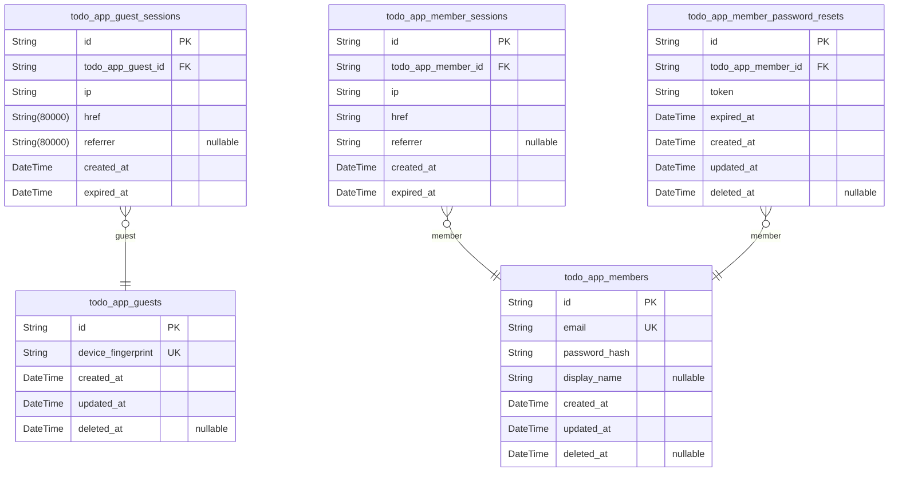
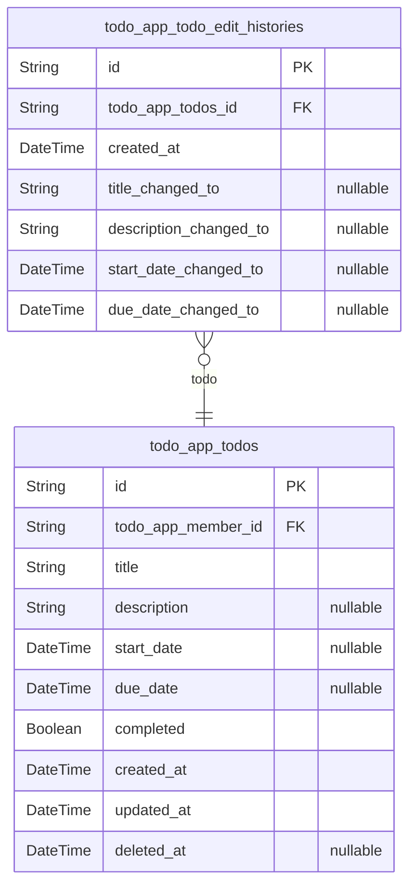

# Prisma Markdown

> Generated by [`prisma-markdown`](https://github.com/samchon/prisma-markdown)

- [Actors](#actors)
- [todo](#todo)

## Actors

### `todo_app_guests`

Temporary guest accounts identified by device fingerprint for anonymous
access to the todo application.

Guest accounts enable unauthenticated users to interact with the system
without email/password credentials. Each guest is uniquely identified by
a device fingerprint that persists across sessions. Guest accounts
support soft delete for data retention policies and can be converted to
member accounts through registration flows.

Guests have limited permissions compared to members, primarily focused on
exploring the application before committing to account creation.

Properties as follows:

- `id`: Primary Key for guest account records.
- `device_fingerprint`
  > Unique device identifier for guest authentication.
  >
  > This fingerprint is generated from browser/device characteristics and
  > serves as the guest's identity across sessions. It enables persistent
  > anonymous access without requiring email or password credentials. The
  > fingerprint must be unique to prevent guest identity collisions.
- `created_at`
  > Timestamp when the guest account was first created.
  >
  > This field records when the guest first accessed the application and was
  > assigned a device fingerprint. Used for tracking guest account age and
  > session history analysis.
- `updated_at`
  > Timestamp when the guest account was last modified.
  >
  > This field is updated whenever guest account metadata changes, such as
  > session activity or device fingerprint updates.
- `deleted_at`
  > Timestamp when the guest account was soft deleted.
  >
  > When set, the guest account is marked as deleted but retained in the
  > database. This supports data retention policies and allows for potential
  > account recovery or audit trail preservation.

### `todo_app_guest_sessions`

Temporary session tokens for guest authentication without credentials.

This table manages guest login sessions for users who access the todo
application anonymously. Each session is tied to a specific guest account
and tracks authentication state, access context, and session validity
period.

Guest sessions enable temporary access to the application without
requiring email/password registration. They are used for previewing
features or testing the application before committing to account
creation.

Properties as follows:

- `id`: Primary Key. Unique identifier for each guest session.
- `todo_app_guest_id`
  > Foreign key to the guest account this session belongs to.
  >
  > This establishes the relationship between a session and its owning guest.
  > Each guest can have multiple active sessions across different devices or
  > browsers. The session is invalidated when the guest account is deleted.
- `ip`
  > IP address from which the guest session was created.
  >
  > This field records the network address of the client device at login
  > time. It is used for security auditing, session anomaly detection, and
  > access logging.
- `href`
  > URL of the page where the guest session was initiated.
  >
  > This field captures the entry point URL when the guest authentication
  > occurred. It helps track user flow patterns and session origins.
- `referrer`
  > Referrer URL that led to the session creation page.
  >
  > This field records the previous page URL that directed the user to the
  > session initiation point. Useful for analytics and user journey tracking.
- `created_at`
  > Timestamp when the guest session was created.
  >
  > This field marks the start time of the session. It is used to calculate
  > session age, enforce expiration policies, and sort sessions
  > chronologically.
- `expired_at`
  > Timestamp when the guest session expires.
  >
  > This field defines the validity period of the session. Guest sessions
  > have a limited lifetime for security purposes. Sessions past this
  > timestamp are considered invalid and require re-authentication.

### `todo_app_members`

Registered member accounts with email and password authentication
credentials.

This table stores authenticated user accounts that can create, manage,
and delete their own todos. Each member has a unique email for login, a
password hash for authentication, and a display name for profile
identification. Members own todos and edit histories in the todo domain.

Members can change their password through the password reset flow managed
by [todo_app_member_password_resets](#todo_app_member_password_resets). Active login sessions are
tracked in [todo_app_member_sessions](#todo_app_member_sessions). When a member deletes their
account, all their todos (including those in trash) are permanently
deleted.

Properties as follows:

- `id`
  > Primary Key for member account identification.
  >
  > This UUID uniquely identifies each registered member account across the
  > system. It is used as a foreign key reference in related tables such as
  > [todo_app_todos](#todo_app_todos) and [todo_app_member_sessions](#todo_app_member_sessions).
- `email`
  > Unique email address used for member authentication and account
  > identification.
  >
  > This field serves as the primary login credential alongside the password.
  > It must be unique across all members to ensure proper authentication. The
  > email is used for password reset flows and account recovery.
- `password_hash`
  > BCrypt hashed password for member authentication.
  >
  > The password is hashed using BCrypt algorithm before storage to ensure
  > security. The hash is compared during login authentication to verify
  > member credentials. Members can change their password through the
  > password reset flow.
- `display_name`
  > Display name shown in the user's profile and todo lists.
  >
  > This is a user-friendly name that appears in the UI instead of the email
  > address. Members can edit their display name at any time. The display
  > name is not required to be unique across members.
- `created_at`
  > Timestamp when the member account was created.
  >
  > This field is set automatically when a new member registers and cannot be
  > modified. It represents the account creation date and is used for sorting
  > and filtering member accounts.
- `updated_at`
  > Timestamp when the member account was last updated.
  >
  > This field is updated automatically whenever any member profile
  > information is modified, including display name changes or password
  > updates. It tracks the most recent modification to the account.
- `deleted_at`
  > Timestamp when the member account was soft deleted.
  >
  > This field is set when a member deletes their account. Soft deletion
  > allows for account recovery within a retention period. When deleted, all
  > associated todos (including those in trash) are permanently deleted. A
  > null value indicates the account is active.

### `todo_app_member_sessions`

JWT session tokens for member authentication with access and refresh
support.

This table manages active login sessions for authenticated members. Each
session is created when a member successfully logs in and remains active
until the member logs out or deletes their account. Sessions are isolated
per user and validated on every authenticated request to ensure secure
access to todos and profile data.

Session lifecycle: Created on successful login, terminated on logout or
account deletion. Invalid or expired sessions are rejected immediately.
The expired_at field ensures sessions have a maximum lifetime for
security purposes.

Properties as follows:

- `id`: Primary Key. Unique identifier for each member session.
- `todo_app_member_id`
  > Foreign key to the member account that owns this session.
  >
  > This establishes the relationship between a session and its owning
  > member. Each session belongs to exactly one member, and a member can have
  > multiple active sessions across different devices or browsers. The
  > session is terminated when the member logs out or deletes their account.
- `ip`
  > IP address from which the member logged in.
  >
  > Records the network address used during authentication for security
  > auditing and session validation purposes.
- `href`
  > URL where the login occurred.
  >
  > Captures the entry point URL during the authentication flow for tracking
  > and security purposes.
- `referrer`
  > Referrer URL indicating where the user came from before logging in.
  >
  > Tracks the source page that led to the login page for analytics and
  > security monitoring.
- `created_at`
  > Timestamp when the session was created.
  >
  > Records the exact time when the member successfully authenticated and the
  > session was established.
- `expired_at`
  > Timestamp when the session expires.
  >
  > Sets the maximum lifetime for the session for security purposes. Sessions
  > are validated against this timestamp on every request to ensure they
  > haven't exceeded their allowed duration.

### `todo_app_member_password_resets`

Password reset tokens with expiration for member account recovery.

This table stores temporary password reset tokens generated when a member
requests to reset their password. Each token is associated with a
specific member account and has an expiration time. Tokens are used to
verify the member's identity during the password reset process.

Tokens are created when a member requests a password reset and become
invalid after expiration or after successful password change. Multiple
tokens can exist for the same member if multiple reset requests are made.

Properties as follows:

- `id`: Primary Key.
- `todo_app_member_id`
  > References the member account requesting password reset.
  >
  > This foreign key establishes the relationship between a password reset
  > token and the member account it belongs to. Each password reset is tied
  > to exactly one member.
- `token`
  > Secure random token for password reset verification.
  >
  > This token is sent to the member's email and must be provided when
  > setting a new password. It serves as proof that the person resetting the
  > password has access to the account's email address.
- `expired_at`
  > Expiration timestamp for the password reset token.
  >
  > Tokens become invalid after this time. The expiration is typically set to
  > a short duration (e.g., 1 hour) for security purposes.
- `created_at`: Timestamp when the password reset token was created.
- `updated_at`: Timestamp when the password reset record was last updated.
- `deleted_at`
  > Timestamp when the password reset record was soft deleted.
  >
  > Nullable field for soft delete support. Deleted tokens are no longer
  > valid for password resets.

## todo

### `todo_app_todos`

Core task items owned by members with title, description, optional dates,
completion status, and soft delete support.

Each todo represents a single task item that a member can create, track,
and manage throughout its lifecycle. Todos support completion toggling,
editing with history tracking, and soft deletion with trash
functionality.

Todos are filtered by completion status (all/complete/incomplete) and
sorted by creation date, start date, or due date. All todos are private
to their owning member with no cross-user visibility.

Properties as follows:

- `id`: Primary Key for todo items.
- `todo_app_member_id`
  > References the member who owns this todo.
  >
  > Each todo belongs to exactly one member. The member has full CRUD access
  > to their own todos and cannot access other members' todos. When a member
  > deletes their account, all their todos are permanently deleted.
- `title`
  > Required title of the todo item.
  >
  > The title is the primary identifier for a todo and is required at
  > creation. It appears in todo lists and can be edited by the member.
- `description`
  > Optional detailed description of the todo item.
  >
  > Members can provide additional context or details about the task. This
  > field can be left empty or updated at any time.
- `start_date`
  > Optional start date for the todo item.
  >
  > Members can set when a task should begin. When sorting by start date,
  > todos without this value appear at the end.
- `due_date`
  > Optional due date for the todo item.
  >
  > Members can set a deadline for task completion. When sorting by due date,
  > todos without this value appear at the end.
- `completed`
  > Completion status of the todo item.
  >
  > Todos are incomplete (false) by default. Members can toggle between
  > complete and incomplete states. This field is used for filtering todos by
  > completion status.
- `created_at`
  > Timestamp when the todo was created.
  >
  > Recorded automatically at todo creation. Used for sorting todos by
  > creation date (newest or oldest first).
- `updated_at`
  > Timestamp when the todo was last modified.
  >
  > Updated automatically on every edit operation. Each edit also creates an
  > entry in todo_app_todo_edit_histories.
- `deleted_at`
  > Timestamp when the todo was soft deleted.
  >
  > When set, the todo moves to trash and no longer appears in normal todo
  > lists. Members can restore the todo (clear this field) or permanently
  > delete it (removes todo and all edit history).

### `todo_app_todo_edit_histories`

Immutable audit trail recording all modifications to todos.

Each entry captures when an edit occurred and what field values were
changed to. This table provides a complete history of all changes made to
a todo's title, description, start date, and due date.

When a todo is permanently deleted, all its edit history entries are
cascade-deleted. History entries are sorted from most recent to oldest
when viewed by users.

Properties as follows:

- `id`: Primary Key.
- `todo_app_todos_id`
  > Foreign key to the todo being edited.
  >
  > Links this edit history entry to its parent todo. All edit histories for
  > a todo can be retrieved by filtering on this field.
- `created_at`
  > Timestamp when this edit was made.
  >
  > Records the exact moment the todo modification occurred. Used for sorting
  > history entries from most recent to oldest.
- `title_changed_to`
  > New title value after the edit.
  >
  > Contains the title value that the todo was changed to during this edit.
  > Null if title was not modified in this edit.
- `description_changed_to`
  > New description value after the edit.
  >
  > Contains the description value that the todo was changed to during this
  > edit. Null if description was not modified in this edit.
- `start_date_changed_to`
  > New start date value after the edit.
  >
  > Contains the start date value that the todo was changed to during this
  > edit. Null if start date was not modified in this edit.
- `due_date_changed_to`
  > New due date value after the edit.
  >
  > Contains the due date value that the todo was changed to during this
  > edit. Null if due date was not modified in this edit.
