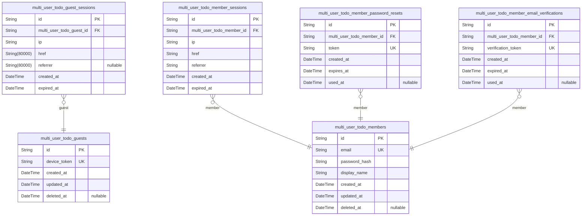
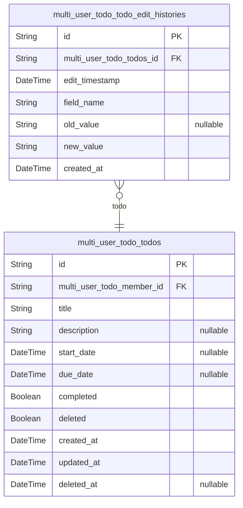

# Prisma Markdown

> Generated by [`prisma-markdown`](https://github.com/samchon/prisma-markdown)

- [Actors](#actors)
- [Todos](#todos)

## Actors

### `multi_user_todo_guests`

Guest user accounts for unauthenticated visitors who have not yet
registered or logged in.

Guest users are identified by temporary device tokens rather than
email/password credentials. This table serves as the foundation for
anonymous user sessions before they transition to registered member
accounts.

Key characteristics:
- Identified by unique device tokens generated on first visit
- No authentication credentials (email/password) required
- Can transition to member accounts through registration
- All guest data is private and isolated per device
- Soft-deletable for data retention and audit purposes

Relationships:
- Has many [multi_user_todo_guest_sessions](#multi_user_todo_guest_sessions) (child table, FK
direction: sessions → guests)
- May convert to [multi_user_todo_members](#multi_user_todo_members) upon registration

Properties as follows:

- `id`: Primary Key.
- `device_token`
  > Unique device token identifying the guest user. Generated automatically
  > on first visit and used for anonymous session tracking before
  > registration.
- `created_at`: Timestamp when the guest account was created on first visit.
- `updated_at`: Timestamp when the guest account was last modified.
- `deleted_at`
  > Timestamp when the guest account was soft-deleted. Null indicates active
  > guest account.

### `multi_user_todo_guest_sessions`

Session tokens for unauthenticated guest access with temporary identifiers.

This table tracks authentication sessions for guest actors who have not
yet registered or logged in as members. Each session records connection
metadata (IP address, href, referrer) and temporal information (creation
time, expiration time) for security auditing and session management.

Key relationships:
- Belongs to [multi_user_todo_guests](#multi_user_todo_guests) (many sessions per guest)
- Stores append-only audit trail of guest login events

Behavioral notes:
- Sessions are created when guests establish temporary access
- Sessions expire automatically for security purposes
- Sessions are invalidated when guests register or log in as members
- This table is append-only and managed through authentication flows, not
direct user CRUD operations

Properties as follows:

- `id`: Primary Key.
- `multi_user_todo_guest_id`: Belonged guest's [multi_user_todo_guests.id](#multi_user_todo_guests).
- `ip`: IP address from which the guest session was established.
- `href`: URL of the page where the guest session was initiated.
- `referrer`: Referrer URL that led to the guest session initiation.
- `created_at`: Timestamp when the guest session was created.
- `expired_at`: Timestamp when the guest session expires.

### `multi_user_todo_members`

Registered member accounts with email authentication, password
credentials, and profile information.

This table represents authenticated users in the multi-user todo
application. Each member has a unique email address for login, a securely
hashed password, and a display name for identification. Members own todo
items and edit history entries, which are stored in separate tables with
foreign key references to this table.

Key relationships:
- One-to-many with [multi_user_todo_member_sessions](#multi_user_todo_member_sessions) for active
login sessions
- One-to-many with [multi_user_todo_todos](#multi_user_todo_todos) for owned todo items
- One-to-many with [multi_user_todo_member_password_resets](#multi_user_todo_member_password_resets) for
password recovery tokens
- One-to-many with [multi_user_todo_member_email_verifications](#multi_user_todo_member_email_verifications) for
email confirmation tokens

Account deletion uses soft delete (deleted_at) to preserve audit trails
while preventing login access.

Properties as follows:

- `id`: Primary Key.
- `email`: Unique email address used for authentication and account identification.
- `password_hash`: BCrypt hashed password for secure authentication credential storage.
- `display_name`: User's public display name shown in the application interface.
- `created_at`: Timestamp when the member account was created.
- `updated_at`: Timestamp when the member account was last modified.
- `deleted_at`
  > Timestamp when the member account was soft deleted. Null indicates active
  > account.

### `multi_user_todo_member_sessions`

JWT session tokens for authenticated member access with refresh rotation.

This table tracks active login sessions for registered members ({@link
multi_user_todo_members}). Each session represents a single authenticated
connection and stores connection metadata for security auditing and
session management.

**Key Characteristics**:
- One member can have multiple concurrent sessions (e.g., mobile + desktop)
- Sessions are append-only audit trail of login events
- Expired sessions are retained for security auditing
- Supports token refresh rotation for enhanced security

**Relationships**:
- Belongs to: [multi_user_todo_members](#multi_user_todo_members) (one-to-many)
- Managed through: Authentication flows, not direct user CRUD

**Security Notes**:
- expired_at is NOT NULL to enforce session expiration
- Connection metadata (ip, href, referrer) supports fraud detection
- Sessions are automatically invalidated on password change or account
deletion

Properties as follows:

- `id`: Primary Key.
- `multi_user_todo_member_id`
  > Belonged member's [multi_user_todo_members.id](#multi_user_todo_members). This foreign key
  > establishes the relationship between the session and the authenticated
  > member account.
- `ip`
  > IP address from which the session was created. Used for security auditing
  > and fraud detection.
- `href`
  > URL of the page that initiated the authentication request. Used for
  > security auditing and session context tracking.
- `referrer`
  > Referrer URL from the authentication request. Used for security auditing
  > and tracking authentication sources.
- `created_at`
  > Timestamp when the session was created (login time). Used for session age
  > calculation and expiration checks.
- `expired_at`
  > Timestamp when the session expires. NOT NULL to enforce mandatory session
  > expiration for security. Used to validate active sessions.

### `multi_user_todo_member_password_resets`

Password reset tokens for member account recovery.

This table stores one-time use tokens that allow members to reset their
forgotten passwords. Each token is associated with a specific member
account and has an expiration time for security. Once a token is used or
expires, it cannot be used again.

Key relationships:
- References [multi_user_todo_members](#multi_user_todo_members) to identify which member
requested the password reset
- Tokens are generated when a member requests a password reset via email
- Used tokens are marked with used_at timestamp to prevent reuse

Properties as follows:

- `id`: Primary Key.
- `multi_user_todo_member_id`
  > Member account requesting password reset. {@link
  > multi_user_todo_members.id}
- `token`
  > Unique one-time use token for password reset verification. Generated
  > securely and sent to member's email.
- `created_at`: Timestamp when the password reset token was generated.
- `expires_at`
  > Timestamp when the password reset token expires. Tokens are invalid after
  > this time for security.
- `used_at`
  > Timestamp when the password reset token was used. Null if token has not
  > been used yet.

### `multi_user_todo_member_email_verifications`

Email verification tokens for new member registration confirmation.

This table stores verification tokens sent to members during the
registration process. When a new member registers with an email address,
a verification token is generated and sent to their email. The member
must click the verification link (containing the token) to confirm their
email address is valid and activate their account.

Each verification token is unique and has an expiration time. Once used,
the token is marked as used and cannot be reused. Members may have
multiple verification tokens if they request new verification emails
before completing the initial verification.

**Key relationships**:
- References [multi_user_todo_members](#multi_user_todo_members) through
multi_user_todo_member_id (1:N relationship - one member can have
multiple verification attempts)

**Business rules**:
- Each token is unique and single-use
- Tokens expire after a set duration for security
- Used tokens cannot be reused
- Multiple tokens may exist for the same member if they request re-sending

Properties as follows:

- `id`: Primary Key.
- `multi_user_todo_member_id`
  > Belonged member's [multi_user_todo_members.id](#multi_user_todo_members). Links this
  > verification token to the member account being verified.
- `verification_token`
  > Unique verification token sent to the member's email. This token is
  > included in the verification link and must be validated when the member
  > clicks to confirm their email address.
- `created_at`
  > Timestamp when this verification token was generated and sent to the
  > member.
- `expired_at`
  > Timestamp when this verification token expires. Tokens cannot be used
  > after this time for security purposes.
- `used_at`
  > Timestamp when this verification token was successfully used to verify
  > the member's email. Null if the token has not yet been used.

## Todos

### `multi_user_todo_todos`

Core todo entity storing task information for member users.

This table represents individual todo items that members create to track
their tasks and responsibilities. Each todo contains a required title,
optional description and dates (start date, due date), completion status,
and soft delete flag for trash management.

Key relationships:
- Owned by [multi_user_todo_members](#multi_user_todo_members) through member_id foreign key
- Has edit history entries in [multi_user_todo_todo_edit_histories](#multi_user_todo_todo_edit_histories)
for audit tracking

Business behaviors:
- Newly created todos are incomplete by default (completed=false)
- Soft delete moves todos to trash (deleted=true) rather than permanent
removal
- Todos can be restored from trash by setting deleted=false
- Only the owning member can access, modify, or delete their todos

Properties as follows:

- `id`: Primary Key.
- `multi_user_todo_member_id`
  > Belonged member's [multi_user_todo_members.id](#multi_user_todo_members). Establishes
  > ownership of the todo item.
- `title`: Required task name or title. Cannot be empty.
- `description`: Optional task details or description. Can be left empty.
- `start_date`: Optional start date for the task. Can be left empty.
- `due_date`: Optional due date for the task. Can be left empty.
- `completed`
  > Completion status of the todo. False indicates incomplete, true indicates
  > complete.
- `deleted`
  > Soft delete flag. False indicates active todo, true indicates todo is in
  > trash.
- `created_at`: Timestamp when the todo was created.
- `updated_at`: Timestamp when the todo was last updated.
- `deleted_at`
  > Timestamp when the todo was soft deleted (moved to trash). Null when todo
  > is active.

### `multi_user_todo_todo_edit_histories`

Edit history audit trail for tracking all modifications to todos.

This table maintains a complete audit log of every field change made to
todo items. Each record represents a single field modification, capturing
the field name, previous value, and new value. This normalized design
enables efficient storage and retrieval of edit history while maintaining
full change tracking capability.

Key relationships:
- Belongs to a single [multi_user_todo_todos](#multi_user_todo_todos) item
- Each row represents exactly one field change (key-value pattern)
- Supports edit history viewing and audit compliance requirements

Properties as follows:

- `id`: Primary Key.
- `multi_user_todo_todos_id`
  > Reference to the todo item that was edited. {@link
  > multi_user_todo_todos.id}
- `edit_timestamp`: Timestamp when this edit occurred.
- `field_name`
  > Name of the field that was changed (e.g., 'title', 'description',
  > 'start_date', 'due_date', 'completed').
- `old_value`
  > Previous value of the field before the edit. Stored as string for
  > flexibility across different field types.
- `new_value`
  > New value of the field after the edit. Stored as string for flexibility
  > across different field types.
- `created_at`: Record creation timestamp.
