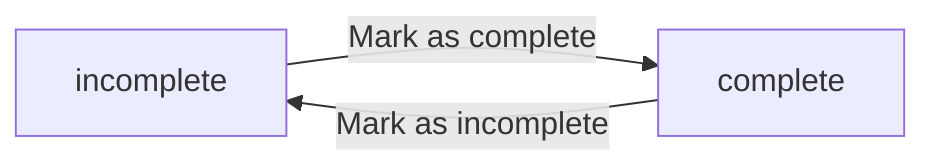
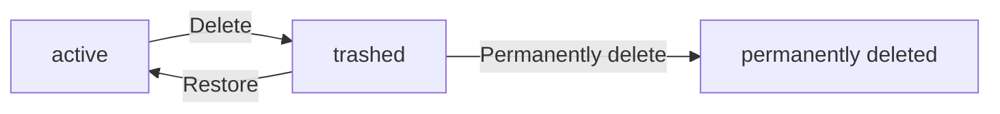
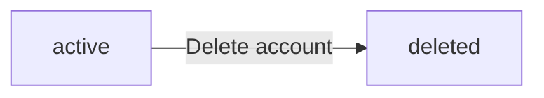

**todoApp — Business concepts, relationships, and states from user perspective**

Business concepts, relationships, and states from user perspective

# Domain Concepts

Describe what each concept means in the business domain and its key attributes.

## User Concept

A User represents an individual account holder in the todo application. Each user is identified by a unique email address used for signing up and logging in. The user maintains a password for secure authentication and account protection. Users have a display name that serves as their visible identity within the application. This display name can be customized by the user to reflect their preferred name. Each user's data is completely private and isolated from other users. Users cannot view or access another user's information or todos. When a user deletes their account, all associated todos including those in trash are permanently removed. The user concept establishes the foundation for account-based access and data ownership in the system.

### User Account Identity

A user account is identified by a unique email address that serves as the primary identifier throughout the system. This email address is used during both account registration and login authentication. The email address must be unique across all user accounts in the system and cannot be changed once the account is created. Each email address corresponds to exactly one user account, establishing a one-to-one relationship between email and user identity.

### Email Based Authentication

Users authenticate to the system using their registered email address combined with their password. During account registration, users provide an email address that becomes their permanent login identifier. During login, users must provide both their registered email address and the correct password to gain access to their account. The email address serves as the username for authentication purposes and is required for all login attempts.

### Password Security

Each user account is protected by a password that the user creates during registration. The password is required for authentication when logging into the account. Users have the ability to change their password after account creation to maintain account security. The password is kept confidential and is not visible to the user or any other party within the system. Password verification is required for all authentication attempts.

### Display Name Customization

Each user has a display name that serves as their visible identity within the application. The display name is separate from the email address used for authentication. Users can edit and update their display name at any time to reflect their preferred name. The display name is used to identify the user within their own interface and for any system-generated references to the user.

### Private User Data

All user data is completely private and accessible only to the account owner. User information including display name, account settings, and associated todos cannot be viewed by other users. The system enforces strict data privacy where each user's information is isolated from all other users. No user can discover, access, or view another user's profile information or account details.

### Account Ownership

Each user account owns all data created within that account. The user who creates a todo becomes the owner of that todo and all associated data including edit history. Account ownership establishes the user as the sole authority over their data. When a user performs actions on their account or todos, they are acting as the owner with full control over their owned items.

### User Isolation

User accounts are completely isolated from each other with no cross-user visibility. Users cannot view, access, or interact with another user's account information or todos. The system maintains strict boundaries between user accounts to ensure complete privacy. There is no mechanism for sharing, viewing, or accessing another user's data under any circumstances.

### Account Deletion Impact

When a user deletes their account, all data associated with that account is permanently removed from the system. This includes all todos created by the user, whether they are in the normal list or in the trash. Edit history for all todos is also permanently deleted when the account is removed. Account deletion is irreversible and results in complete removal of the user and all their data from the system.

### Todo Ownership by User

Every todo in the system is owned by exactly one user account. The user who creates a todo automatically becomes the owner of that todo. Todo ownership is established at creation time and cannot be transferred to another user. Only the owning user can view, edit, complete, delete, or restore their todos. The ownership relationship between user and todo is permanent and exclusive.

## Todo Concept

A Todo represents a task or item that a user needs to complete. Each todo requires a title that identifies the task. Users can optionally add a description to provide additional context or details about the task. A todo can have an optional start date indicating when the task should begin. A todo can also have an optional due date specifying when the task should be completed. Newly created todos are marked as incomplete by default. Users can toggle the completion status between complete and incomplete states. Each todo belongs to exactly one user and cannot be shared or viewed by others. When deleted, todos are moved to trash rather than permanently removed immediately. Deleted todos can be restored from trash or permanently deleted at the user's choice. The todo concept captures the core task management entity in the application.

### Todo as Task Item

A Todo represents a task or item that a user needs to complete. It is the fundamental work unit in the application that captures what needs to be done. Each todo is uniquely identifiable and serves as a standalone task entry that can be managed independently from other todos.

The todo concept encompasses the core attributes needed to define and track a task: identification through a title, optional contextual details through a description, temporal boundaries through start and due dates, and progress tracking through completion status. These attributes work together to provide a complete picture of what the task is, when it should be worked on, and whether it has been finished.

### Todo Attributes

Every todo must have a title that identifies the task. The title is required and cannot be left empty when creating a todo. It serves as the primary identifier and summary of what needs to be accomplished.

A todo may have an optional description that provides additional context or details about the task. The description can be left empty if no additional information is needed.

A todo may have an optional start date that indicates when the task should begin. If no start date is specified, the todo can be worked on at any time.

A todo may have an optional due date that specifies when the task should be completed. If no due date is specified, there is no deadline for the task.

When a todo is first created, it is automatically marked as incomplete by default. The completion status can be toggled between complete and incomplete states as the user works on the task.

### Todo Privacy and Ownership

Each todo belongs to exactly one user who created it. The user who creates a todo owns that todo and has full control over it. Todos are completely private and isolated to their owner.

Users can only view, manage, and interact with their own todos. There is no mechanism to view, access, or interact with another user's todos. This ensures complete privacy and data isolation between users.

The ownership relationship is established when a todo is created and cannot be transferred to another user. The owner maintains exclusive rights to view, edit, complete, delete, and restore their todos throughout the todo's lifecycle.

## EditHistory Concept

An EditHistory entry represents a recorded change made to a todo's attributes. Every time a user edits a todo, a new history entry is automatically created. Each history entry captures when the edit was made with a timestamp. The entry records what the title was changed to if the title was modified. The entry records what the description was changed to if the description was modified. The entry records what the start date was changed to if the start date was modified. The entry records what the due date was changed to if the due date was modified. Users can view the complete edit history of any of their todos. History entries are displayed from most recent to oldest for easy review. When a todo is permanently deleted from trash, its entire edit history is also removed. The edit history concept provides an audit trail of all modifications to todos.

### EditHistory Definition

An EditHistory entry represents a recorded change made to a todo's attributes. Each entry serves as an edit tracking record that captures what was modified during a user's edit action. The edit history concept provides an audit trail of all modifications made to todos throughout their lifecycle. Every time a user edits a todo, a new history entry is automatically created to document the changes.

### History Entry Attributes

Each history entry captures when the edit was made with a timestamp. The entry records what the title was changed to if the title was modified during the edit. The entry records what the description was changed to if the description was modified during the edit. The entry records what the start date was changed to if the start date was modified during the edit. The entry records what the due date was changed to if the due date was modified during the edit. Only attributes that were actually changed are recorded in the history entry.

### History Creation Process

History entries are created automatically whenever a user edits a todo. Users do not need to manually create or manage history entries. The system automatically generates a new history entry each time any attribute of a todo is modified. This automatic history creation ensures complete tracking of all changes without requiring user intervention.

### History Display

Users can view the complete edit history of any of their todos. History entries are displayed from most recent to oldest for easy review. This reverse chronological order allows users to see the most recent changes first when reviewing the edit history of a todo.

### History Deletion

When a todo is permanently deleted from trash, its entire edit history is also removed. History entries are tied to their parent todo and cannot exist independently. Deleting a todo from the normal list does not remove its edit history, as the todo is only moved to trash at that point. Only permanent deletion from trash triggers the removal of the associated edit history.

# Domain Relationships

Describe how concepts relate to each other from a business perspective.

## Conceptual Relationships

Describe how concepts relate to each other in business terms.

### User and Todo Ownership

A User has a one-to-many relationship with Todo items. Each User owns zero or more Todos, and each Todo belongs to exactly one User. This ownership relationship is established when a User creates a Todo and cannot be transferred to another User.

The ownership relationship defines access boundaries: a User can only view, edit, complete, or delete their own Todos. There is no mechanism for sharing or transferring Todo ownership between Users.

When a User deletes their account, all Todos owned by that User are permanently deleted along with their associated edit history. This includes Todos in the trash, ensuring complete data removal for the User.

### Todo and EditHistory Association

A Todo has a one-to-many relationship with EditHistory entries. Each Todo can have zero or more EditHistory records, and each EditHistory entry belongs to exactly one Todo.

The association is created automatically when a User edits a Todo. Every edit operation generates a new EditHistory entry that captures the changes made to the Todo's attributes.

When a Todo is permanently deleted from the trash, all associated EditHistory entries are also permanently deleted. This ensures that no edit history remains for a Todo that no longer exists.

EditHistory entries are immutable once created and cannot be modified or deleted independently of their parent Todo.

## Lifecycle and Retention

Describe concept lifecycle states and transitions only. Detailed retention/recovery policies belong in 05-non-functional. Operation details belong in 03-functional-requirements.

### Todo Lifecycle States

Todos progress through a defined lifecycle from creation to permanent deletion.

When created, a todo enters the active state and is visible in the user's todo list. It remains in this state until deleted.

A todo can be marked as complete or incomplete at any time during its active state. This toggle does not change the todo's lifecycle state—only its completion status.

When deleted, a todo moves from the active state to the trash state. In trash, the todo is no longer visible in the normal todo list but remains recoverable.

From trash, a todo can either be restored (returning to the active state) or permanently deleted (removed from the system entirely).

When a user account is deleted, all associated todos—whether active or in trash—are permanently deleted along with their edit history.

### Soft Delete and Trash

When a user deletes a todo, it is not immediately removed from the system. Instead, it is moved to trash—a holding state that allows recovery.

Deleted todos in trash retain all their properties: title, description, start date, due date, and completion status. They also retain their full edit history.

The trash functions as a temporary storage area for deleted items. Users can view their trash list separately from their active todo list.

Todos in trash do not appear in normal todo list views, regardless of filtering or sorting options applied.

The trash is user-specific and private. Users can only view their own deleted todos, never those of other users.

### Recovery from Trash

Users can restore deleted todos from trash. When restored, a todo returns to its active state and becomes visible in the normal todo list again.

Restoration preserves the todo's current properties exactly as they were when deleted. All edit history is also preserved.

Restored todos reappear in the user's todo list with their original completion status, dates, and content intact.

The restoration operation does not create a new todo or a new history entry—it simply returns the existing todo to the active state.

Users can restore any todo from their trash at any time before permanent deletion occurs.

### Permanent Deletion

Users can permanently delete todos from trash. This action removes the todo from the system entirely and cannot be undone.

When a todo is permanently deleted, all associated data is removed: the todo itself and its complete edit history.

Permanent deletion is irreversible. Once performed, the todo and its history cannot be recovered.

Users can permanently delete any todo from their trash individually.

When a user deletes their account, all their todos are permanently deleted automatically, including those in trash. This also removes all associated edit history.

Permanent deletion of a todo is distinct from soft deletion (moving to trash). Soft deletion preserves data; permanent deletion destroys it.

### Data Retention in Trash

Deleted todos remain in trash until the user takes action: either restoring them or permanently deleting them.

The system does not automatically remove items from trash after a time period. Todos stay in trash indefinitely until the user decides their fate.

Users have full control over how long deleted items remain in trash. There is no system-imposed expiration.

The trash list is paginated, allowing users to browse through their deleted items in manageable groups.

Users can choose to keep deleted items in trash for reference, restore them for continued use, or permanently delete them to free up space.

# Business Categories and State Flows

Business category classifications and state flow definitions.

## Business Category Definitions

Define all business category classifications with their allowed values and descriptions.

### Completion Status Classification

The completion status classification defines whether a todo item has been finished or not. This is a binary classification with two allowed values:

- **Incomplete**: The todo has not been completed. This is the default status when a todo is created.
- **Complete**: The todo has been marked as finished by the user.

The completion status is a fundamental attribute of every todo and determines how the todo appears in filtered views. Users can toggle between these two states at any time for todos they own.

### Deletion Status Classification

The deletion status classification defines whether a todo is actively available or has been moved to trash. This classification has two allowed values:

- **Active**: The todo is in the normal todo list and fully accessible to the user.
- **Deleted**: The todo has been moved to trash and no longer appears in the normal todo list.

When a todo is deleted, it transitions from Active to Deleted status. Deleted todos remain in the system but are segregated in the trash view. Users can restore deleted todos, which returns them to Active status, or permanently delete them, which removes them from the system entirely along with their edit history.

### Filter Category Classification

The filter category classification defines the available filtering options when viewing the todo list. This classification has three allowed values:

- **All**: Shows all active todos regardless of completion status.
- **Complete**: Shows only todos with completion status set to Complete.
- **Incomplete**: Shows only todos with completion status set to Incomplete.

Filter categories apply only to active todos (not deleted todos in trash). The filter selection determines which todos are displayed in the paginated todo list view.

## State Transitions

Define valid state transition paths for stateful concepts.

### Todo Completion State Flow

Todos have a completion status that indicates whether the task has been finished.

A todo is created with an incomplete status by default.

Users can mark a todo as complete, changing its status from incomplete to complete.

Users can mark a complete todo as incomplete, changing its status from complete to incomplete.

This is a simple toggle operation between the two states.

The completion status is independent of the todo's deletion status. A todo can be complete or incomplete whether it is active or in trash.

### Todo Deletion State Flow

Todos have a lifecycle that includes active, trashed, and permanently deleted states.

When a user creates a todo, it enters the active state and appears in the normal todo list.

When a user deletes a todo, it moves to the trashed state (soft delete). The todo no longer appears in the normal todo list but can be viewed in the trash.

When a user restores a todo from trash, it returns to the active state and reappears in the normal todo list.

When a user permanently deletes a todo from trash, it is removed from the system entirely. This action also deletes the todo's edit history.

Once a todo is permanently deleted, it cannot be recovered.

### Account State Flow

User accounts have two states: active and deleted.

When a user signs up, their account is created in the active state.

When a user deletes their account, it moves to the deleted state.

When an account is deleted, all todos owned by that user are permanently deleted, including todos in trash.

Once an account is deleted, it cannot be recovered and all associated data is permanently removed from the system.