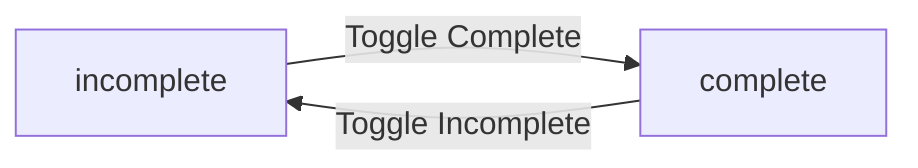
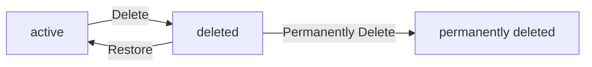

**multiUserTodo — Business concepts, relationships, and states from user perspective**

Business concepts, relationships, and states from user perspective

# Domain Concepts

Describe what each concept means to users and why it exists.

## User Concept

A User represents an individual account holder in the todo application who can create and manage their own tasks. Each user is uniquely identified by their email address, which serves as their primary login credential. Users authenticate with email and password to access their private todo workspace. Each user has a display name that identifies them within their own account, though this is visible only to themselves. Users can update their display name at any time to personalize their experience. Users have the ability to change their password for security purposes. When a user deletes their account, all their todos are permanently removed from the system, including items in trash. Each user's data is completely private and isolated from other users in the application. Users cannot view, access, or interact with other users' profiles or todos. The user account serves as the foundation for all todo ownership and access control in the system.

### User Account Creation

WHEN a new user signs up for the application, THE system SHALL require an email address as the unique identifier.

WHEN a new user signs up for the application, THE system SHALL require a password for authentication.

WHEN a new user signs up for the application, THE system SHALL create a new user account with the provided email and password.

WHEN a user signs up, THE system SHALL associate the user account with a private workspace for managing todos.

IF the email address is already registered, THE system SHALL reject the sign-up request.

IF the email address is invalid or missing, THE system SHALL reject the sign-up request.

IF the password is missing or does not meet security requirements, THE system SHALL reject the sign-up request.

WHEN a user account is successfully created, THE system SHALL allow the user to log in immediately with the provided credentials.

### Email Authentication

WHEN a user attempts to log in, THE system SHALL require the user's registered email address.

WHEN a user attempts to log in, THE system SHALL require the user's password.

WHEN a user provides valid email and password, THE system SHALL authenticate the user and grant access to their private workspace.

IF the email address does not match any registered account, THE system SHALL reject the login attempt.

IF the password does not match the registered password for the email, THE system SHALL reject the login attempt.

IF the login attempt fails, THE system SHALL inform the user of the authentication failure.

WHEN a user successfully authenticates, THE system SHALL create a session for the user.

WHEN a user's session expires, THE system SHALL require re-authentication to access their workspace.

### Display Name Management

WHEN a user logs in, THE system SHALL display their current display name in their profile.

WHEN a user updates their display name, THE system SHALL save the new display name to their profile.

WHEN a user views their profile, THE system SHALL show their display name.

IF the display name is empty or invalid, THE system SHALL reject the update request.

WHEN a user changes their display name, THE system SHALL reflect the change immediately in their workspace.

THE system SHALL allow users to update their display name at any time.

THE system SHALL permit users to personalize their display name to their preference.

WHEN a user's display name is updated, THE system SHALL maintain the updated name across all their sessions.

### Password Security

WHEN a user signs up, THE system SHALL require a secure password for account creation.

WHEN a user wants to enhance security, THE system SHALL allow them to change their password.

WHEN a user changes their password, THE system SHALL require the current password for verification.

WHEN a user changes their password, THE system SHALL require a new password.

IF the current password is incorrect, THE system SHALL reject the password change request.

IF the new password does not meet security requirements, THE system SHALL reject the password change request.

WHEN a user successfully changes their password, THE system SHALL require the new password for future logins.

THE system SHALL protect user passwords with secure storage mechanisms.

THE system SHALL not expose user passwords in any user-facing interface.

### Account Deletion

WHEN a user requests account deletion, THE system SHALL require confirmation before proceeding.

WHEN a user confirms account deletion, THE system SHALL permanently delete the user account.

WHEN a user account is deleted, THE system SHALL permanently delete all todos owned by that user.

WHEN a user account is deleted, THE system SHALL permanently delete all todos in the user's trash.

WHEN a user account is deleted, THE system SHALL permanently delete all edit history associated with the user's todos.

WHEN a user account is deleted, THE system SHALL remove all login credentials associated with that account.

IF a user attempts to log in after account deletion, THE system SHALL reject the authentication attempt.

THE system SHALL not allow recovery of a deleted user account.

THE system SHALL ensure that deleted user data cannot be accessed by any user.

### Private Workspace

WHEN a user logs in, THE system SHALL provide access to their private workspace.

WHEN a user accesses their workspace, THE system SHALL display only their own todos.

WHEN a user views their workspace, THE system SHALL show their profile information.

THE system SHALL ensure that each user has a dedicated workspace for managing their todos.

THE system SHALL allow users to create, view, edit, and delete todos within their private workspace.

WHEN a user is authenticated, THE system SHALL grant them exclusive access to their workspace.

THE system SHALL not allow users to access another user's workspace under any circumstances.

THE system SHALL maintain workspace isolation so that each user's data remains separate from others.

### User Isolation

THE system SHALL ensure that each user's data is completely isolated from other users.

THE system SHALL prevent users from viewing another user's profile information.

THE system SHALL prevent users from accessing another user's todos.

THE system SHALL prevent users from interacting with another user's data.

WHEN a user attempts to access another user's data, THE system SHALL reject the request.

THE system SHALL enforce strict data boundaries between user accounts.

THE system SHALL not provide any mechanism for users to discover other users' accounts.

THE system SHALL maintain user isolation across all operations and features.

THE system SHALL ensure that user isolation cannot be bypassed through any application feature.

### Todo Ownership

WHEN a user creates a todo, THE system SHALL associate the todo with that user's account.

WHEN a user views their todo list, THE system SHALL display only todos owned by that user.

WHEN a user edits a todo, THE system SHALL verify that the user owns the todo before allowing the edit.

WHEN a user deletes a todo, THE system SHALL verify that the user owns the todo before allowing the deletion.

WHEN a user restores a todo from trash, THE system SHALL verify that the user owns the todo before allowing the restoration.

WHEN a user permanently deletes a todo, THE system SHALL verify that the user owns the todo before allowing the permanent deletion.

THE system SHALL ensure that users can only manage todos they own.

THE system SHALL not allow users to view or modify todos owned by other users.

THE system SHALL maintain clear ownership records for all todos in the application.

### Login Credentials

WHEN a user signs up, THE system SHALL establish email and password as their login credentials.

WHEN a user logs in, THE system SHALL validate their email and password credentials.

WHEN a user's credentials are valid, THE system SHALL grant access to their account.

WHEN a user changes their password, THE system SHALL update their login credentials.

IF a user provides invalid credentials, THE system SHALL deny access to their account.

THE system SHALL require valid credentials for all authenticated operations.

THE system SHALL protect login credentials from unauthorized access.

THE system SHALL not expose credentials in any user-facing interface.

THE system SHALL require credentials to be entered securely during authentication.

### Account Privacy

THE system SHALL ensure that each user's account information is completely private.

THE system SHALL not display any user's information to other users.

THE system SHALL not allow users to search for or discover other users.

THE system SHALL not provide any mechanism for sharing user information.

WHEN a user logs in, THE system SHALL only show information related to their own account.

THE system SHALL prevent any form of user profile visibility to other users.

THE system SHALL maintain account privacy as a core principle of the application.

THE system SHALL not expose user email addresses to other users.

THE system SHALL not expose user display names to other users.

THE system SHALL ensure that account privacy cannot be compromised through any application feature.

## Todo Concept

A Todo represents a task or item that a user needs to complete or track within the application. Each todo has a required title that identifies the task and an optional description for additional details. Users can set optional start dates to indicate when a task begins and due dates to track deadlines. Todos have a completion status that toggles between complete and incomplete states. When users create a new todo, it starts in the incomplete state by default. Users can view their todos in a paginated list showing title, completion status, and date information. Each todo can be viewed individually to see all details including the full description. Users can edit any aspect of their todo including title, description, start date, and due date. When a user deletes a todo, it moves to trash rather than being immediately removed. Deleted todos can be restored from trash or permanently deleted by the user. Todos are completely private and only visible to their owner.

### Task Creation and Attributes

WHEN a member creates a todo, THE system SHALL require a title.

WHEN a member creates a todo, THE system SHALL allow an optional description.

WHEN a member creates a todo, THE system SHALL set the completion status to incomplete by default.

WHEN a member creates a todo, THE system SHALL associate the todo with the creating member.

WHEN a member creates a todo, THE system SHALL record the creation date.

### Date Management

WHEN a member creates or edits a todo, THE system SHALL allow an optional start date.

WHEN a member creates or edits a todo, THE system SHALL allow an optional due date.

IF a member sets both start date and due date, THE system SHALL ensure the due date is not earlier than the start date.

### Completion Status

WHEN a member toggles a todo, THE system SHALL change the completion status between complete and incomplete.

WHEN a member marks a todo as complete, THE system SHALL update the completion status to complete.

WHEN a member marks a todo as incomplete, THE system SHALL update the completion status to incomplete.

### Todo Viewing and Pagination

WHEN a member views their todo list, THE system SHALL display only todos owned by that member.

WHEN a member views their todo list, THE system SHALL paginate the results.

WHEN a member views their todo list, THE system SHALL show title, completion status, start date, due date, and creation date for each todo.

WHEN a member views a single todo, THE system SHALL display all details including the full description.

### Todo Editing

WHEN a member edits a todo, THE system SHALL allow modification of title, description, start date, and due date.

WHEN a member edits a todo, THE system SHALL record the edit in the todo's history.

### Todo Deletion and Recovery

WHEN a member deletes a todo, THE system SHALL move it to trash rather than permanently remove it.

WHEN a member deletes a todo, THE system SHALL remove it from the normal todo list.

WHEN a member views the trash, THE system SHALL display only deleted todos owned by that member.

WHEN a member views the trash, THE system SHALL paginate the results.

WHEN a member restores a todo from trash, THE system SHALL return it to the normal todo list.

WHEN a member permanently deletes a todo from trash, THE system SHALL remove it and its edit history.

### Todo Privacy

WHEN a member attempts to view another member's todo, THE system SHALL deny access.

WHEN a member attempts to access another member's todo, THE system SHALL deny access.

WHEN a member attempts to modify another member's todo, THE system SHALL deny access.

THE system SHALL ensure each member's todos are completely private.

## EditHistory Concept

EditHistory represents a chronological record of all changes made to a todo by its owner. Every time a user edits a todo, a new history entry is automatically created and saved. Each history entry captures the exact timestamp when the edit occurred. The history records what each field was changed to, including title, description, start date, and due date. Only fields that were actually modified are recorded in each history entry. Users can view the complete edit history for any of their todos to track changes over time. History entries are displayed in reverse chronological order with the most recent edits first. This audit trail helps users understand how their todos evolved and what changes were made. When a todo is permanently deleted from trash, its entire edit history is also removed. Edit history is private and only accessible to the todo owner. The history serves as a transparent record of all modifications made to tasks.

### Edit Tracking

WHEN a user edits a todo, THE system SHALL automatically create a new edit history entry.

THE system SHALL record every edit made to a todo's title, description, start date, or due date.

THE system SHALL create a history entry only when a field value actually changes.

THE system SHALL associate each edit history entry with the todo that was edited.

THE system SHALL link each edit history entry to the user who owns the todo.

THE system SHALL ensure edit history is created without requiring explicit user action.

THE system SHALL maintain edit history as a permanent record until the todo is permanently deleted.

### Change History Structure

THE system SHALL record the exact timestamp when each edit occurs.

THE system SHALL capture the new title value when the title is changed.

THE system SHALL capture the new description value when the description is changed.

THE system SHALL capture the new start date value when the start date is changed.

THE system SHALL capture the new due date value when the due date is changed.

THE system SHALL record only the fields that were modified in each edit.

THE system SHALL preserve the original values implicitly by recording only the changes.

THE system SHALL maintain a complete chronological record of all field modifications for each todo.

### History Viewing

WHEN a user views a todo's edit history, THE system SHALL display all history entries for that todo.

THE system SHALL present history entries in reverse chronological order with the most recent edits first.

THE system SHALL show the timestamp for each edit in the history view.

THE system SHALL display which fields were changed in each history entry.

THE system SHALL show the new values for all modified fields in each history entry.

THE system SHALL allow users to view the complete edit history for any of their todos.

THE system SHALL make edit history visible only to the todo owner.

THE system SHALL prevent users from viewing edit history for todos they do not own.

### History Deletion

WHEN a todo is permanently deleted from trash, THE system SHALL also delete its entire edit history.

THE system SHALL remove all edit history entries when their associated todo is permanently deleted.

THE system SHALL ensure edit history cannot exist without an associated todo.

THE system SHALL make edit history deletion irreversible once the todo is permanently removed.

THE system SHALL prevent edit history from persisting after the todo it belongs to is deleted.

# Domain Relationships

Describe how concepts relate to each other from a business perspective.

## Conceptual Relationships

Describe how concepts relate to each other in business terms.

### User-Todo Ownership Relationship

THE system SHALL establish an ownership relationship between each User and their Todo items.

WHEN a User creates a Todo, THE system SHALL associate the Todo with the creating User as its owner.

A User has-many Todo items (one User can own multiple Todos).

A Todo belongs-to exactly one User (each Todo has a single owner).

THE system SHALL ensure that a Todo cannot exist without an associated User owner.

WHEN a User is deleted, THE system SHALL remove all Todos owned by that User.

THE system SHALL prevent a Todo from being transferred to a different User owner.

```
flowchart LR
    User["User"] -->|"owns"| Todo["Todo"]
    Todo -->|"belongs-to"| User
```

THE system SHALL maintain the ownership association for the lifetime of the Todo.

A Guest cannot have any Todo ownership relationships.

Only a Member (authenticated User) can establish ownership of Todos.

### Todo-EditHistory Association

THE system SHALL establish an association relationship between each Todo and its EditHistory entries.

WHEN a Todo is edited, THE system SHALL create an EditHistory entry associated with that Todo.

A Todo has-many EditHistory entries (one Todo can have multiple history records).

An EditHistory entry belongs-to exactly one Todo (each history record relates to a single Todo).

THE system SHALL ensure that an EditHistory entry cannot exist without an associated Todo.

WHEN a Todo is permanently deleted, THE system SHALL remove all EditHistory entries associated with that Todo.

THE system SHALL prevent an EditHistory entry from being reassigned to a different Todo.

```
flowchart LR
    Todo["Todo"] -->|"has-many"| EditHistory["EditHistory"]
    EditHistory -->|"belongs-to"| Todo
```

THE system SHALL maintain the association between a Todo and its EditHistory for the lifetime of the Todo.

Each EditHistory entry records changes made to its associated Todo.

The association enables users to view the complete edit history of their Todos.

### User-EditHistory Indirect Ownership

THE system SHALL establish an indirect ownership relationship between a User and EditHistory entries through Todo ownership.

A User owns EditHistory entries that belong to Todos owned by that User.

WHEN a User deletes their account, THE system SHALL delete all EditHistory entries indirectly owned by that User.

THE system SHALL prevent a User from viewing EditHistory entries belonging to Todos owned by other Users.

THE system SHALL maintain the indirect ownership chain: User → Todo → EditHistory.

```
flowchart LR
    User["User"] -->|"owns"| Todo["Todo"]
    Todo -->|"has-many"| EditHistory["EditHistory"]
    User -.->|"indirectly owns"| EditHistory
```

THE system SHALL ensure that EditHistory entries follow the Todo ownership for privacy enforcement.

A User cannot access EditHistory entries from Todos they do not own.

The indirect ownership relationship is automatically maintained through the Todo-User ownership.

## Lifecycle and Retention

Describe business rules for concept lifecycle and data retention from a user perspective.

### Todo Lifecycle States

WHEN a user creates a todo, THE system SHALL create it in active state.

WHILE a todo is in active state, THE system SHALL make it visible in the user's normal todo list.

WHEN a user deletes a todo, THE system SHALL move it from active state to trash state.

WHILE a todo is in trash state, THE system SHALL exclude it from the user's normal todo list.

WHEN a user restores a todo from trash, THE system SHALL move it from trash state back to active state.

WHEN a user permanently deletes a todo from trash, THE system SHALL remove it from the system entirely.

WHILE a todo exists in any state (active or trash), THE system SHALL retain its edit history.

WHEN a todo is permanently deleted, THE system SHALL also delete its associated edit history.

A todo in trash state SHALL be restorable by the user who owns it.

A todo in trash state SHALL be permanently deletable by the user who owns it.

WHEN a user deletes their account, THE system SHALL permanently delete all their todos regardless of state (active or trash).

WHEN a user's account is deleted, THE system SHALL also permanently delete all edit history associated with their todos.

### Todo Deletion Policy

WHEN a user deletes a todo, THE system SHALL perform a soft delete that moves the todo to trash.

A soft-deleted todo SHALL retain all its original data including title, description, dates, and completion status.

A soft-deleted todo SHALL retain its full edit history.

A soft-deleted todo SHALL no longer appear in the user's normal todo list.

A soft-deleted todo SHALL appear in the user's trash list.

WHEN a user permanently deletes a todo from trash, THE system SHALL remove all data associated with that todo.

Permanent deletion of a todo SHALL be irreversible.

Permanent deletion of a todo SHALL also permanently delete its edit history.

A todo in trash state SHALL remain there until the user explicitly restores it or permanently deletes it.

THE system SHALL NOT automatically remove todos from trash after any time period.

THE system SHALL NOT automatically permanently delete todos from trash.

WHEN a user permanently deletes a todo, THE system SHALL remove it from the trash list immediately.

### Trash and Recovery

WHEN a user deletes a todo, THE system SHALL place it in the user's trash.

THE system SHALL maintain a separate trash list for each user.

WHEN a user views their trash, THE system SHALL display all their soft-deleted todos.

THE trash list SHALL be paginated like the normal todo list.

WHEN a user restores a todo from trash, THE system SHALL return it to the normal todo list.

A restored todo SHALL retain its original creation date.

A restored todo SHALL retain its full edit history.

A restored todo SHALL appear in the normal todo list with its completion status preserved.

WHEN a user permanently deletes a todo from trash, THE system SHALL remove it from the trash list.

A permanently deleted todo SHALL no longer be accessible or recoverable by any user.

THE system SHALL allow a user to restore a todo multiple times if they repeatedly delete and restore it.

THE system SHALL allow a user to permanently delete any todo in their trash at any time.

### Permanent Deletion Rules

WHEN a user permanently deletes a todo from trash, THE system SHALL remove the todo and its edit history.

Permanent deletion SHALL be the only way to remove a todo's edit history.

A todo in active state SHALL always retain its edit history.

A todo in trash state SHALL always retain its edit history until permanent deletion.

WHEN a user's account is deleted, THE system SHALL permanently delete all their todos and their edit history.

Account deletion SHALL override the normal deletion policy and permanently remove all associated data.

THE system SHALL NOT retain any user data after account deletion.

THE system SHALL NOT provide any recovery mechanism after account deletion.

Permanent deletion of a todo SHALL occur immediately when the user confirms the action.

THE system SHALL require explicit user confirmation before performing permanent deletion of a todo.

### Account Deletion Impact

WHEN a user's account is deleted, THE system SHALL permanently delete all data associated with that user.

Account deletion SHALL permanently delete all active todos owned by the user.

Account deletion SHALL permanently delete all todos in the user's trash.

Account deletion SHALL permanently delete all edit history for all the user's todos.

Account deletion SHALL be irreversible.

THE system SHALL NOT provide any recovery mechanism after account deletion.

WHEN a user requests account deletion, THE system SHALL require explicit confirmation.

THE system SHALL verify the user's identity before processing account deletion.

Account deletion SHALL remove the user's ability to authenticate with the system.

THE system SHALL remove all references to the deleted user from the system.

WHEN a user's account is deleted, THE system SHALL not retain any personal data for any purpose.

# Business Categories and State Flows

Business category classifications and state flow definitions.

## Business Category Definitions

Define all business category classifications with their allowed values and descriptions.

### Todo Completion Status Category

THE system SHALL recognize Todo completion status as a business category with two allowed values.

THE system SHALL classify every Todo as either "complete" or "incomplete".

THE system SHALL set newly created Todos to "incomplete" status by default.

THE system SHALL allow a Todo's completion status to be toggled between "complete" and "incomplete".

THE system SHALL display the current completion status for each Todo in list views.

WHEN a Todo is marked as complete, THE system SHALL update its completion status to "complete".

WHEN a Todo is marked as incomplete, THE system SHALL update its completion status to "incomplete".

THE system SHALL maintain the completion status independently of other Todo attributes (title, description, dates).

IF a Todo's completion status is changed, THE system SHALL record this change in the Todo's edit history.

THE system SHALL allow filtering of Todo lists by completion status (all, complete only, incomplete only).

```
mermaid
flowchart LR
    A["incomplete"] -->|"Mark Complete"| B["complete"]
    B -->|"Mark Incomplete"| A
```


### Todo Deletion Status Category

THE system SHALL recognize Todo deletion status as a business category with two allowed values.

THE system SHALL classify every Todo as either "active" or "trashed".

THE system SHALL set newly created Todos to "active" status by default.

THE system SHALL move a Todo to "trashed" status when deleted by its owner.

THE system SHALL restore a Todo to "active" status when recovered from trash.

THE system SHALL permanently remove a Todo from the system when deleted from trash.

THE system SHALL exclude "trashed" Todos from normal Todo list views.

THE system SHALL include "trashed" Todos in the dedicated trash view.

WHEN a Todo is deleted, THE system SHALL update its deletion status to "trashed".

WHEN a Todo is restored from trash, THE system SHALL update its deletion status to "active".

WHEN a Todo is permanently deleted from trash, THE system SHALL remove all associated EditHistory entries.

THE system SHALL maintain the deletion status independently of the completion status.

```
mermaid
flowchart LR
    A["active"] -->|"Delete"| B["trashed"]
    B -->|"Restore"| A
    B -->|"Permanent Delete"| C["removed"]
```


## State Transitions

Define valid state transition paths for stateful concepts.

### Todo Completion State Flow

THE system SHALL recognize two completion states for todos: incomplete and complete.

WHEN a todo is created, THE system SHALL set its completion status to incomplete.

WHEN a user toggles a todo's completion status, THE system SHALL change the state from incomplete to complete or from complete to incomplete.

WHILE a todo is in the incomplete state, THE system SHALL allow the user to mark it as complete.

WHILE a todo is in the complete state, THE system SHALL allow the user to mark it as incomplete.

THE system SHALL record the state change in the todo's edit history when the completion status is toggled.



IF a user attempts to toggle completion status on a todo they do not own, THE system SHALL reject the request.

### Todo Deletion and Restoration Workflow

THE system SHALL recognize three deletion states for todos: active, deleted, and permanently deleted.

WHEN a todo is created, THE system SHALL set its deletion status to active.

WHEN a user deletes a todo, THE system SHALL change its state from active to deleted.

WHILE a todo is in the active state, THE system SHALL display it in the normal todo list.

WHILE a todo is in the deleted state, THE system SHALL hide it from the normal todo list and display it in the trash.

WHEN a user restores a deleted todo, THE system SHALL change its state from deleted to active.

WHEN a user permanently deletes a todo from trash, THE system SHALL remove it from the system entirely.

IF a todo is permanently deleted, THE system SHALL also delete all associated edit history entries.



IF a user attempts to delete or restore a todo they do not own, THE system SHALL reject the request.

### Edit History Status Change Tracking

THE system SHALL track status changes in the edit history for each todo.

WHEN a user toggles a todo's completion status, THE system SHALL create a new edit history entry.

WHEN a user deletes a todo, THE system SHALL create a new edit history entry recording the deletion.

WHEN a user restores a deleted todo, THE system SHALL create a new edit history entry recording the restoration.

IF a todo is permanently deleted, THE system SHALL not create any new edit history entries.

THE system SHALL sort edit history entries from most recent to oldest when displaying them to users.

WHILE a todo exists in the system, THE system SHALL preserve all its edit history entries.

IF a user views a todo's edit history, THE system SHALL display all status changes along with field modifications.

### State Transition Constraints

WHILE a todo is in the permanently deleted state, THE system SHALL not allow any further operations on it.

IF a todo is in the deleted state, THE system SHALL not allow editing of its title, description, start date, or due date.

IF a todo is in the deleted state, THE system SHALL not allow toggling its completion status.

WHEN a todo transitions from deleted to active, THE system SHALL restore all its previous attributes including completion status.

THE system SHALL not allow a todo to transition from permanently deleted to any other state.

IF a user attempts an invalid state transition, THE system SHALL reject the request and maintain the current state.