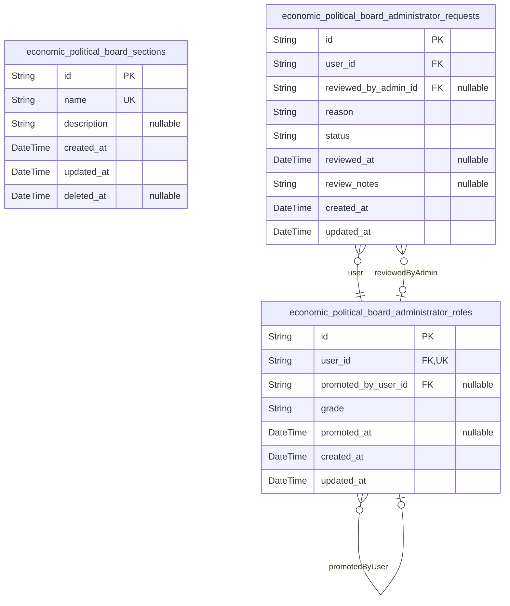
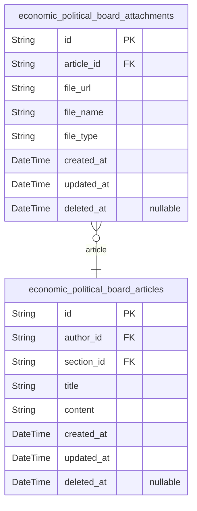
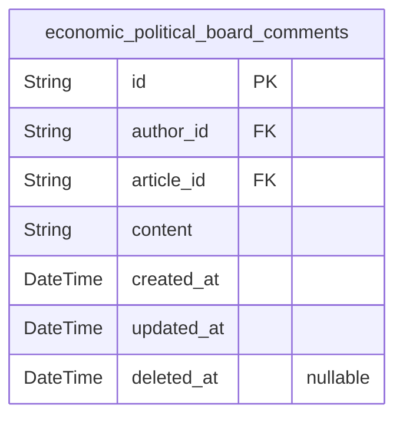
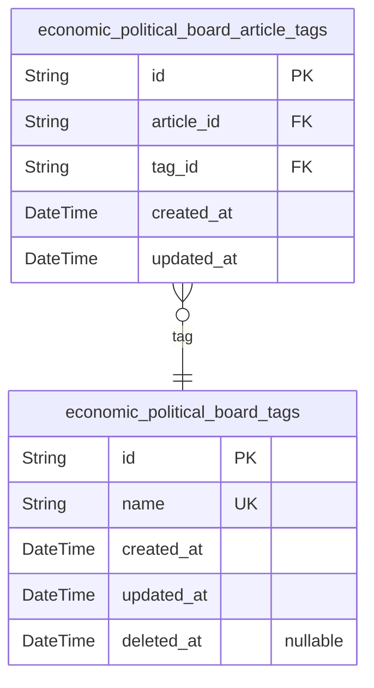
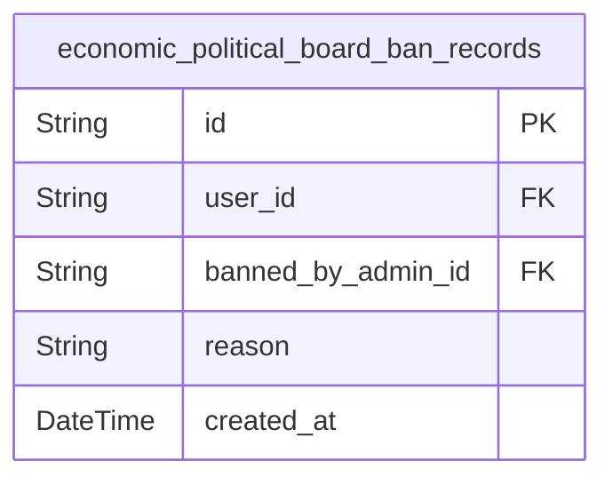

# Prisma Markdown

> Generated by [`prisma-markdown`](https://github.com/samchon/prisma-markdown)

- [Systematic](#systematic)
- [Articles](#articles)
- [Comments](#comments)
- [Tags](#tags)
- [BanRecords](#banrecords)

## Systematic

### `economic_political_board_sections`

Topic categorization sections that organize all articles in the
discussion board.

This table defines the structural backbone of the board, allowing
administrators to create topic areas where members can post articles.
Each section has a unique name and optional description explaining its
purpose.

Sections are created and managed exclusively by administrators. Members
can browse sections and view articles within them, but cannot create or
modify sections. When an article is created, it must be assigned to an
existing section.

[economic_political_board_articles](#economic_political_board_articles) articles belong to sections via
sectionId foreign key.

**Example Usage**:
- 'General Discussion' - Broad topic for general questions
- 'Policy Debates' - Political and economic policy discussions
- 'News Analysis' - Current events and news commentary

**Soft Delete**:
- Sections use soft delete (deleted_at) to preserve historical article
references
- Banned sections are hidden from new article creation but existing
articles remain visible

Properties as follows:

- `id`: Primary Key.
- `name`
  > Unique name identifying this section. Used for URL slugs and section
  > identification.
- `description`: Optional description explaining the section's purpose and scope.
- `created_at`: Timestamp when this section was created.
- `updated_at`: Timestamp when this section was last updated.
- `deleted_at`
  > Timestamp when this section was soft deleted (hidden from new article
  > creation but preserved for historical references).

### `economic_political_board_administrator_requests`

Administrator role escalation requests submitted by members seeking
promotion to administrator privileges.

This table tracks the workflow of users requesting administrator access.
Each request includes a reason for the escalation, status tracking
(pending/approved/rejected), and review metadata when evaluated by
existing administrators.

Key relationships:
- {\@link economic_political_board_administrator_roles} - The member
submitting the request (user_id foreign key)
- {\@link economic_political_board_administrator_roles} - The
administrator who reviews/approves the request (reviewed_by_admin_id
foreign key)

Business workflow:
1. Member submits request with reason
2. Status set to 'pending'
3. Existing administrator reviews and changes status to 'approved' or
'rejected'
4. If approved, user gains administrator privileges via {\@link
economic_political_board_administrator_roles}

Properties as follows:

- `id`: Primary Key.
- `user_id`
  > Requesting member's {\@link
  > economic_political_board_administrator_roles.id} who submitted this
  > request.
- `reviewed_by_admin_id`
  > Reviewing administrator's {\@link
  > economic_political_board_administrator_roles.id}. Nullable until request
  > is reviewed.
- `reason`: Reason for administrator role escalation request.
- `status`: Request status: pending, approved, or rejected.
- `reviewed_at`
  > Timestamp when the request was reviewed by an administrator. Null until
  > reviewed.
- `review_notes`
  > Administrator's review notes or comments on the request. Null until
  > reviewed.
- `created_at`: Creation timestamp.
- `updated_at`: Last update timestamp.

### `economic_political_board_administrator_roles`

Administrator privilege levels (regular, super) for active administrators.

This actor table represents users who have been granted administrative
access to the board system. Each administrator has a grade level that
determines their capabilities:

- **regular** administrators can perform standard administrative duties
- **super** administrators have elevated privileges including
promotion/demotion authority

Key relationships:
- Each administrator references a single user account via {\@link
economic_political_board_administrator_roles.id} (self-referential for
user identity)
- Administrator grades are managed through the {\@link
economic_political_board_administrator_requests} workflow where members
submit requests for elevation
- The {\@link economic_political_board_administrator_roles} table
maintains the active set of administrators and their current privilege
levels

This table is queried to determine user permissions and access control
for administrative features. Users without an entry in this table have no
administrative privileges.

Properties as follows:

- `id`: Primary Key.
- `user_id`
  > User's {\@link economic_political_board_administrator_roles.id} who holds
  > this administrator role. Each user can have at most one administrator
  > role (one-to-one relationship).
- `promoted_by_user_id`
  > User who promoted this administrator to their current grade. Tracks the
  > source of administrative privileges for audit purposes.
- `grade`
  > Administrator grade level. 'regular' for standard administrative access,
  > 'super' for elevated privileges including role management capabilities.
- `promoted_at`
  > Timestamp when this administrator was promoted to their current grade
  > level. Nullable for existing administrators promoted before this field
  > was introduced.
- `created_at`: Timestamp when this administrator role record was created.
- `updated_at`: Timestamp when this administrator role record was last updated.

## Articles

### `economic_political_board_articles`

Core article content entity representing posts in the economic/political
discussion board. Each article contains a title and body content,
authored by a User and categorized within a Section. Articles support
file attachments via the {\@link economic_political_board_attachments}
table and comments via the {\@link economic_political_board_comments}
table. Articles can be tagged for content organization through the
many-to-many relationship with {\@link economic_political_board_tags}.
This table represents the primary content storage for user-generated
discussion posts and supports soft deletion for audit trail purposes.

Key relationships:
- {\@link economic_political_board_administrator_roles}: Article author
(author_id foreign key) - member/admin who created the article
- {\@link economic_political_board_sections}: Section/topic assignment
(section_id foreign key)
- {\@link economic_political_board_attachments}: File attachments
(many-to-one)
- {\@link economic_political_board_comments}: Discussion comments
(one-to-many)
- {\@link economic_political_board_tags}: Content categorization
(many-to-many via junction table)

Properties as follows:

- `id`: Primary Key.
- `author_id`
  > Author's {\@link economic_political_board_administrator_roles.id} -
  > Member or administrator who created this article.
- `section_id`
  > Section's {\@link economic_political_board_sections.id} - Topic category
  > for this article.
- `title`: Article title - required for content identification.
- `content`: Article body content - main text of the discussion post.
- `created_at`: Timestamp when article was created.
- `updated_at`: Timestamp when article was last updated.
- `deleted_at`: Timestamp when article was soft-deleted (null if not deleted).

### `economic_political_board_attachments`

File attachments (images and documents) associated with articles in the
economic/political discussion board.

This table stores metadata and storage references for all files uploaded
with articles, supporting both image and document attachments. Each
attachment is owned by exactly one article and is automatically deleted
when the parent article is deleted (cascade delete). Soft delete support
via deleted_at for audit trail.

**Key Relationships**:
- Belongs to [economic_political_board_articles](#economic_political_board_articles) via article_id
- File metadata includes URL, filename, and type classification

**Usage**:
- Images: article illustrations, charts, screenshots
- Documents: PDF reports, spreadsheets, presentation files
- Public download access for authenticated users

Properties as follows:

- `id`: Primary Key.
- `article_id`
  > Parent article's [economic_political_board_articles.id](#economic_political_board_articles). Cascade
  > delete ensures orphaned attachments are removed when articles are
  > deleted.
- `file_url`: URL path to the stored file in object storage or CDN.
- `file_name`
  > Original filename provided by the user (e.g., 'report.pdf', 'chart.png').
  > Preserves user-facing name for download display.
- `file_type`
  > Categorization of the attachment: 'image' for image files (PNG, JPG, GIF,
  > etc.) or 'file' for documents and other non-image types.
- `created_at`: Timestamp when this attachment was created and uploaded.
- `updated_at`: Timestamp when this attachment was last modified.
- `deleted_at`: Timestamp when this attachment was soft-deleted. NULL means active.

## Comments

### `economic_political_board_comments`

Single-level discussion comments on articles with author attribution and
timestamps.

This model stores user comments attached to articles for community
engagement and discussion. Each comment is authored by a single user and
belongs to exactly one article, creating a simple one-level discussion
structure without nested replies.

Key relationships:
- {\@link economic_political_board_administrator_roles}: Comments are
authored by members/admins via authorId
- {\@link economic_political_board_articles}: Comments belong to articles
via articleId

Important behavioral notes:
- Comments require independent CRUD operations (users can create, edit,
delete their own comments)
- Comments are visible regardless of article status (deleted articles
still show comments for audit)
- Chronological ordering via created_at timestamp
- Soft deletion via deleted_at field for data retention

API endpoints:
- POST /comments - Create new comment on article
- GET /comments - List comments for an article
- GET /comments/:id - Get single comment
- PUT /comments/:id - Update own comment
- DELETE /comments/:id - Delete own comment

Properties as follows:

- `id`: Primary Key.
- `author_id`
  > Author's {\@link economic_political_board_administrator_roles.id} -
  > Member or administrator who created this comment.
- `article_id`
  > Parent article's {\@link economic_political_board_articles.id}. Links
  > this comment to the article being discussed.
- `content`
  > Comment text content. Required field containing the actual discussion
  > message.
- `created_at`: Creation timestamp. Automatically set when the comment is created.
- `updated_at`: Last update timestamp. Automatically updated on each modification.
- `deleted_at`
  > Soft deletion timestamp. Null if comment is active, set when comment is
  > deleted.

## Tags

### `economic_political_board_tags`

Stores unique tag names for content categorization and discovery across
articles in the economic/political discussion board.

Tags provide a flexible keyword-based organization system that
complements section-based categorization. Each tag represents a topic,
theme, or subject that articles can be associated with, enabling users to
discover related content through tag browsing and filtering.

Key characteristics:
- Tag names are unique across the entire system (case-insensitive,
lowercase normalized)
- Tags are created automatically when users assign them to articles
(free-text entry)
- Tags persist even when untagged from articles, unless no articles
reference them
- Primary use case is article categorization and search discoverability

Relationships:
- Many-to-many with [economic_political_board_articles](#economic_political_board_articles) through
[economic_political_board_article_tags](#economic_political_board_article_tags) junction table
- No direct actor ownership; tags are system-wide resources accessible to
all users

Business rules:
- Tag names must contain only letters, numbers, and hyphens
- Names are automatically normalized to lowercase for consistency
- Empty tag names are rejected
- Duplicate tag creation is prevented by reusing existing tags
- Soft delete supported via deleted_at field for archival

Properties as follows:

- `id`: Primary Key.
- `name`
  > The unique tag name used for content categorization. Must contain only
  > letters, numbers, and hyphens. Automatically normalized to lowercase for
  > consistency. Empty names are rejected.
- `created_at`: Timestamp when the tag was first created in the system.
- `updated_at`: Timestamp when the tag was last updated.
- `deleted_at`
  > Timestamp when the tag was soft deleted (null if not deleted). Used for
  > archival purposes.

### `economic_political_board_article_tags`

Junction table for many-to-many relationship between articles and tags.

This table enables articles to have multiple tags and tags to be
associated with multiple articles. Each record represents a unique
article-tag pairing that enables content categorization and discovery
through the tagging system.

Key relationships:
- [economic_political_board_articles](#economic_political_board_articles) - Parent article that the tag
is associated with
- [economic_political_board_tags](#economic_political_board_tags) - Parent tag that categorizes the
article

Business rules:
- Unique constraint prevents duplicate tag assignments to the same article
- Cascade delete ensures data integrity when articles or tags are removed
- Managed through parent entities (Article and Tag), not independently

Properties as follows:

- `id`: Primary Key.
- `article_id`
  > Article's [economic_political_board_articles.id](#economic_political_board_articles). Required foreign
  > key reference to the article this tag belongs to.
- `tag_id`
  > Tag's [economic_political_board_tags.id](#economic_political_board_tags). Required foreign key
  > reference to the tag that categorizes the article.
- `created_at`: Timestamp when this article-tag relationship was created.
- `updated_at`: Timestamp when this article-tag relationship was last modified.

## BanRecords

### `economic_political_board_ban_records`

Records of user bans issued by administrators, including the ban reason,
timestamp, and audit trail.

This table enforces access control by tracking when users are banned from
the system. Each ban record references the banned user via userId and the
administrator who issued the ban via bannedByAdminId. Ban records are
permanent audit entries and are never deleted to maintain accountability.

Key relationships:
- {\@link economic_political_board_administrator_roles}: The banned
user's account (via userId)
- {\@link economic_political_board_administrator_roles}: The
administrator who issued the ban (via bannedByAdminId)

Business behavior:
- Ban records are append-only (never deleted)
- A user may have multiple ban records over time (for historical tracking)
- Admins can unban users by removing ban status, but the record remains
for audit

Properties as follows:

- `id`: Primary Key.
- `user_id`: Banned user's {\@link economic_political_board_administrator_roles.id}.
- `banned_by_admin_id`
  > Administrator's {\@link economic_political_board_administrator_roles.id}
  > who issued this ban.
- `reason`: The reason for the ban. Must be specific and documented.
- `created_at`: Timestamp when the ban was issued.
