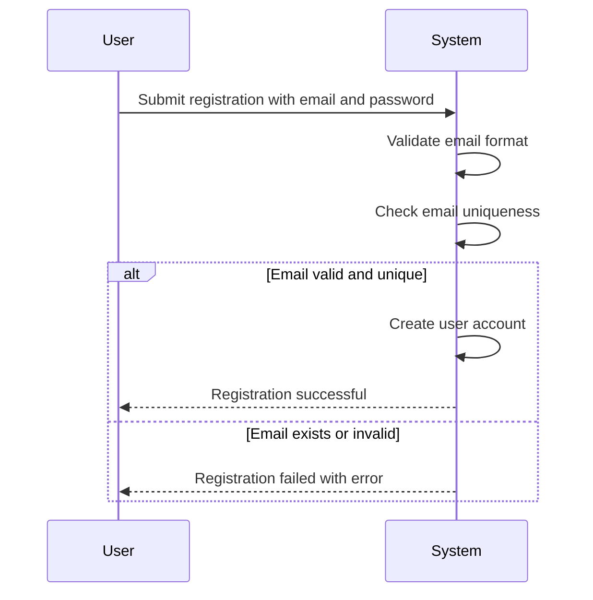
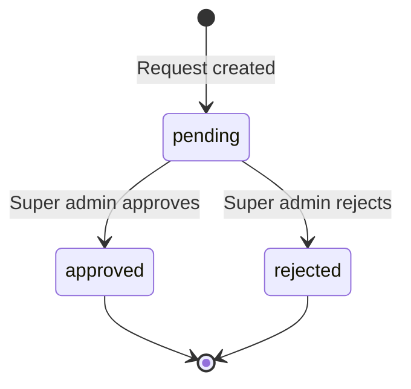
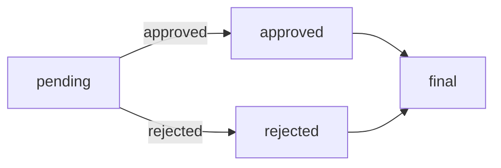
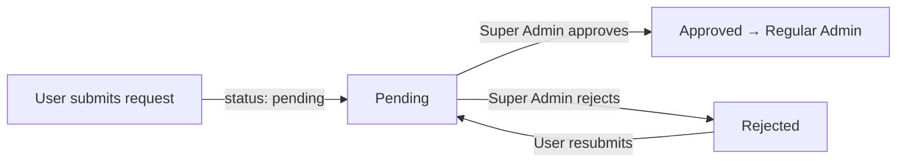
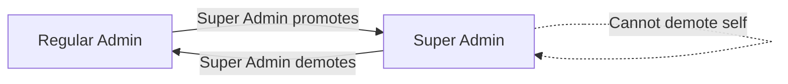
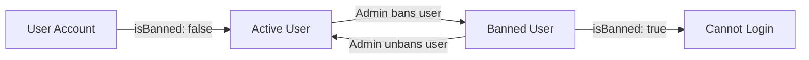
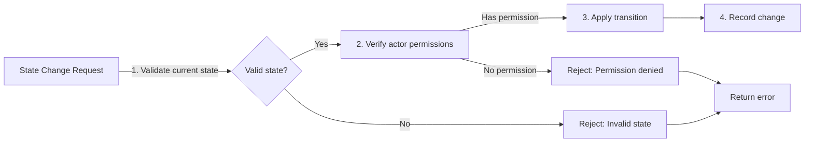

**economicPoliticalBoard — Business concepts, relationships, and states from user perspective**

Business concepts, relationships, and states from user perspective

# Domain Concepts

Describe what each concept means to users and why it exists.

## User Concept

Every person who participates in the discussion board has a user account. Users create their accounts using an email address and password combination. Each account has a unique email that distinguishes it from other accounts. Users authenticate themselves by providing their email and password to access the platform. Users have the ability to update their password whenever they choose to change it. When a user decides to leave the platform completely, they can delete their entire account. Account deletion permanently removes all the user's articles and comments from the board. The user concept represents the fundamental identity for all participants in the community.

### Account Registration

WHEN a user registers for an account, THE system SHALL:
1. Accept an email address as the primary identifier
2. Accept a password for authentication
3. Verify that the email address is unique across all existing accounts
4. Create the account with the provided credentials

IF the email address is already registered, THE system SHALL reject the registration request.
IF the email address format is invalid, THE system SHALL reject the registration request.
IF the password does not meet security requirements, THE system SHALL reject the registration request.

### Email Uniqueness Validation

THE system SHALL ensure that each email address is associated with exactly one user account.

WHEN a user attempts to register with an existing email, THE system SHALL prevent the duplicate registration and inform the user that the email is already in use.

WHEN a user attempts to change their email, THE system SHALL validate that the new email is not already associated with another account.

### Password Management

WHEN a user requests to change their password, THE system SHALL:
1. Verify the current password
2. Accept a new password
3. Validate that the new password meets security requirements
4. Update the account with the new password

IF the current password is incorrect, THE system SHALL reject the password change request.
IF the new password does not meet security requirements, THE system SHALL reject the password change request.
IF the new password is identical to the current password, THE system SHALL reject the password change request.

### User Authentication

WHEN a user attempts to log in, THE system SHALL:
1. Accept an email address and password
2. Verify the credentials against the stored account data
3. Grant access if credentials are valid
4. Reject access if credentials are invalid

IF the email address does not exist in the system, THE system SHALL reject the login request.
IF the password is incorrect for the provided email, THE system SHALL reject the login request.
IF the user account is banned, THE system SHALL reject the login request regardless of credentials.

### Account Deletion

WHEN a user requests to delete their account, THE system SHALL:
1. Confirm the deletion request with the user
2. Delete all articles authored by the user
3. Delete all comments written by the user
4. Remove the user account and all associated data

IF the user has not authenticated, THE system SHALL reject the account deletion request.
IF the user attempts to delete their account while having active sessions, THE system SHALL terminate all sessions before deletion.

### User Identity and Access

THE system SHALL use the email address as the unique identifier for each user account.

WHEN a user accesses the system, THE system SHALL authenticate them using their email and password credentials.

THE system SHALL maintain a mapping between user accounts and their displayed identity in the community.

### Registration Process Flow

## Profile Concept

Each user has a personal profile that showcases their identity within the community. The profile contains a display name that other users see when reading articles or comments. Users can include a bio text to share more information about themselves and their interests. Every user has the ability to edit their display name and bio text at any time. Users can browse through other participants' profiles to learn more about them. A user's profile displays a complete list of articles they have authored. The profile also shows all comments the user has contributed across the board. The profile serves as a personal hub for tracking all user contributions.

### User Display Name

### Profile Identity

WHEN a user creates their profile, THE system SHALL assign a display name that represents the user to other participants.

WHEN other users view a user's profile, THE system SHALL display the user's display name prominently.

WHEN a user writes an article, THE system SHALL show the author's display name on the article.

WHEN a user writes a comment, THE system SHALL show the commenter's display name on the comment.

IF a user attempts to set an empty display name, THE system SHALL reject the request and display an error message.

IF a user attempts to set a display name that exceeds the maximum length limit, THE system SHALL reject the request and display an error message.

THE system SHALL allow display names containing letters, numbers, and common symbols.

THE system SHALL reject display names that are identical to an existing user's display name.

### Profile Bio Text

### Personal Information

WHEN a user creates their profile, THE system SHALL allow the user to provide optional bio text.

WHEN a user views their own profile, THE system SHALL display the user's bio text if one exists.

WHEN a user views another user's profile, THE system SHALL display the other user's bio text if one exists.

IF a user submits an empty bio text, THE system SHALL save the bio as empty and display no bio text.

THE system SHALL allow bio text to contain multiple paragraphs separated by line breaks.

THE system SHALL reject bio text that exceeds the maximum character limit for bio content.

THE system SHALL preserve formatting characters in the bio text for readability.

### Profile Editing Capabilities

### Profile Modification

WHEN a member user accesses their profile settings, THE system SHALL allow the user to edit their display name.

WHEN a member user accesses their profile settings, THE system SHALL allow the user to edit their bio text.

WHEN a member user submits updated profile information, THE system SHALL save the changes and update the profile.

WHEN a member user updates their display name, THE system SHALL reflect the new display name on all previously authored articles and comments.

WHEN a member user updates their bio text, THE system SHALL update the bio text shown on their profile page.

IF a member user is currently banned, THE system SHALL prevent the user from editing their profile.

IF the system detects invalid input during profile editing, THE system SHALL reject the update and request corrected input.

THE system SHALL maintain a history of when profile changes were last made.

### Profile Viewing Permissions

### Profile Access Control

WHEN a guest views a profile page, THE system SHALL display the profile's display name and bio text.

WHEN a guest views a profile page, THE system SHALL display the user's authored articles list.

WHEN a guest views a profile page, THE system SHALL display the user's authored comments list.

WHEN a member views another member's profile, THE system SHALL display the same public information as guests.

WHEN a member views their own profile, THE system SHALL display editing capabilities for profile modifications.

WHEN a user's profile is being viewed, THE system SHALL show the total count of articles authored.

WHEN a user's profile is being viewed, THE system SHALL show the total count of comments authored.

THE system SHALL require user authentication to access profile editing functionality.

### Articles Authored by User

### Article History Display

WHEN viewing a user's profile, THE system SHALL display a chronological list of all articles authored by that user.

WHEN viewing a user's profile, THE system SHALL show the title of each authored article.

WHEN viewing a user's profile, THE system SHALL show the section where each article was published.

WHEN viewing a user's profile, THE system SHALL show the publication date of each article.

WHEN viewing a user's profile, THE system SHALL show the number of comments each article has received.

WHEN viewing a user's profile, THE system SHALL allow navigation to view the full article content.

IF a user has no articles, THE system SHALL display a message indicating no articles have been published.

THE system SHALL exclude deleted articles from the articles list on profiles.

### Comments Authored by User

### Comment History Display

WHEN viewing a user's profile, THE system SHALL display a chronological list of all comments authored by that user.

WHEN viewing a user's profile, THE system SHALL show the article title for each comment.

WHEN viewing a user's profile, THE system SHALL show the comment content for each comment.

WHEN viewing a user's profile, THE system SHALL show the publication date of each comment.

WHEN viewing a user's profile, THE system SHALL show whether the comment has been edited.

WHEN viewing a user's profile, THE system SHALL allow navigation to view the article containing the comment.

IF a user has no comments, THE system SHALL display a message indicating no comments have been written.

THE system SHALL exclude deleted comments from the comments list on profiles.

WHEN a comment is edited, THE system SHALL update the comment shown in the user's profile history.

### Profile Information Management

### Profile Lifecycle

WHEN a user account is created, THE system SHALL automatically create a corresponding profile.

WHEN a user requests to delete their account, THE system SHALL also delete the associated profile.

WHEN a profile is deleted, THE system SHALL remove all profile information from the system.

WHEN a user's account is banned, THE system SHALL preserve the profile information but restrict editing access.

WHEN a user is unbanned, THE system SHALL restore full profile editing capabilities.

THE system SHALL ensure profile information is deleted permanently when the user account is deleted.

THE system SHALL not recover profile information after account deletion.

### Participant Identity Representation

### Community Identity

WHEN users participate in the discussion board, THE system SHALL represent them through their profile information.

WHEN users interact through articles or comments, THE system SHALL display the user's display name as their identifier.

WHEN users view community content, THE system SHALL show the identity of content authors through their profiles.

WHEN multiple users share similar display names, THE system SHALL differentiate them by their unique profile information.

THE system SHALL ensure each participant has a consistent identity representation across all platform interactions.

WHEN a user updates their profile, THE system SHALL update their identity representation throughout the platform.

THE system SHALL maintain the integrity of participant identity to build trust within the community.

## Section Concept

The discussion board is organized into separate sections that categorize different topics. Each section covers a specific area such as Politics, Economy, or Current Affairs. Only administrators have the authority to create new sections on the platform. Administrators can also edit existing sections and remove sections they no longer want. Each section contains a name that identifies its topic and a description explaining its focus. All registered users can view the complete list of available sections. Users browse articles within a specific section to read discussions on that topic. Sections provide the organizational structure for the entire discussion board community.

### Section Creation Process

WHEN an administrator creates a new section, THE system SHALL:
1. Require a section name
2. Require a section description
3. Set the creation timestamp
4. Associate the section with the creating administrator

IF the section name is empty, THE system SHALL reject the request.
IF the section description is empty, THE system SHALL reject the request.

THE system SHALL prevent non-administrators from creating new sections.

WHEN a section is created, THE system SHALL make it immediately available for article creation.

A section exists as a persistent topic category that organizes articles by subject matter.

### Section Management Authority

THE system SHALL restrict section management capabilities to administrators only.

REGULAR USERS CANNOT create, edit, or delete sections.

WHEN an administrator attempts to manage a section, THE system SHALL verify administrator status before proceeding.

IF the user is not an administrator, THE system SHALL reject the request with an access denied message.

ADMINISTRATORS HAVE EXCLUSIVE authority to add, modify, and remove sections from the discussion board.

THE system SHALL track which administrator performed each section management action.

### Section Name and Description Requirements

WHEN creating or editing a section, THE system SHALL require a section name.

WHEN creating or editing a section, THE system SHALL require a section description.

IF the section name exceeds the allowed character limit, THE system SHALL reject the request.

IF the section description exceeds the allowed character limit, THE system SHALL reject the request.

THE system SHALL ensure section names are unique within the discussion board.

IF a duplicate section name is provided, THE system SHALL reject the request.

THE system SHALL preserve the creation timestamp even when a section is edited.

WHEN a section is edited, THE system SHALL update the modification timestamp.

### Section List Browsing

WHEN any user views the section list, THE system SHALL display all available sections.

EACH section in the list SHALL show: name, description, and creation date.

THE system SHALL order sections alphabetically by name.

GUESTS AND REGISTERED USERS CAN view the complete list of sections.

THE list SHALL be displayed in a paginated format when there are more than 20 sections.

WHEN a user clicks on a section, THE system SHALL navigate to the section's article browsing page.

THE system SHALL provide a search function to filter sections by name or description.

### Section-Based Article Organization

WHEN a user creates an article, THE system SHALL require selection of exactly one section.

EVERY article MUST belong to one and only one section.

IF no section is selected during article creation, THE system SHALL reject the request.

WHEN a user browses a section, THE system SHALL display all articles within that section.

THE system SHALL prevent articles from existing without an assigned section.

IF a section is deleted, THE system SHALL require all articles in that section to be reassigned or removed.

WHEN an article is moved between sections, THE system SHALL preserve the article's original creation timestamp.

ARTICLES ARE ORGANIZED STRICTLY by their assigned section with no cross-section visibility.

### Topic Area Categorization

SECTION NAMES REPRESENT DISTINCT TOPIC AREAS of the discussion board.

WHEN a user views an article, THE system SHALL display the section name alongside the article.

THE system SHALL use section information to categorize content by subject matter.

SECTION DESCRIPTIONS EXPLAIN THE FOCUS and intended discussion scope for each topic area.

WHEN viewing a section, THE system SHALL show the section description at the top of the page.

THE system SHALL enable filtering articles by their associated section.

SECTION NAMES SHALL BE descriptive and reflect the topic area content.

THE system SHALL maintain clear separation between different topic areas.

## Article Concept

Users create articles to share their opinions and information on various topics. Every article requires a title and content that cannot be left empty. Users must select which section their article belongs to when creating it. Articles can have multiple files attached for additional supporting materials. Users can also attach images to their articles to enhance the content. Multiple files and images can be included in a single article. Users add tags to their articles to label the content with relevant keywords. Article authors have the ability to edit their articles to update information. Users can delete their own articles if they choose to remove them from the board.

### Article Creation Process

WHEN a user creates an article, THE system SHALL require a title and content to be provided.

WHEN a user creates an article, THE system SHALL require the user to select a section for the article.

WHEN a user creates an article, THE system SHALL associate the article with the creating user as the author.

WHEN a user creates an article, THE system SHALL record the time the article was posted.

IF a user attempts to create an article without providing a title, THE system SHALL reject the request.

IF a user attempts to create an article without providing content, THE system SHALL reject the request.

IF a user attempts to create an article without selecting a section, THE system SHALL reject the request.

### Article Title Requirements

THE system SHALL require a title for every article.

THE system SHALL not allow articles to be created without a title.

THE system SHALL display the article title when showing the article list.

THE system SHALL display the article title when viewing a single article.

IF a user attempts to create an article with an empty title, THE system SHALL reject the request.

### Article Content Requirements

THE system SHALL require content for every article.

THE system SHALL not allow articles to be created without content.

THE system SHALL display the full content when viewing a single article.

THE system SHALL only display the title in the article list, not the full content.

IF a user attempts to create an article with empty content, THE system SHALL reject the request.

WHEN a user creates an article, THE system SHALL store the content as text.

### Section Assignment

WHEN a user creates an article, THE system SHALL require the user to select one section.

THE system SHALL allow users to browse articles within a specific section.

THE system SHALL show the section name when displaying an article.

THE system SHALL ensure each article belongs to exactly one section.

IF a user attempts to create an article without selecting a section, THE system SHALL reject the request.

### File Attachments

WHEN a user creates an article, THE system SHALL allow the user to attach files to the article.

WHEN a user attaches files to an article, THE system SHALL display the attachment options.

WHEN viewing an article, THE system SHALL show all attached files.

WHEN viewing an article, THE system SHALL allow users to download attached files.

WHEN an article is deleted, THE system SHALL remove all attached files.

### Image Attachments

WHEN a user creates an article, THE system SHALL allow the user to attach images to the article.

WHEN a user attaches images to an article, THE system SHALL display the image attachment options.

WHEN viewing an article, THE system SHALL show all attached images.

WHEN viewing an article, THE system SHALL allow users to download attached images.

WHEN an article is deleted, THE system SHALL remove all attached images.

### Multiple File Support

THE system SHALL allow multiple files to be attached to a single article.

THE system SHALL allow multiple images to be attached to a single article.

THE system SHALL allow a combination of files and images to be attached to a single article.

WHEN viewing an article with multiple attachments, THE system SHALL display all attachments.

WHEN an article with multiple attachments is deleted, THE system SHALL remove all attachments.

### Article Tagging System

WHEN a user creates an article, THE system SHALL allow the user to add tags to the article.

WHEN a user adds tags to an article, THE system SHALL allow multiple tags.

WHEN viewing an article, THE system SHALL display all tags associated with the article.

WHEN viewing an article list, THE system SHALL display tags for each article.

THE system SHALL allow users to search articles by tags.

THE system SHALL ensure each tag name is unique across the system.

### Article Editing Permissions

WHILE an article is owned by a user, THE system SHALL allow that user to edit the article.

WHEN a user edits an article, THE system SHALL allow updates to the title.

WHEN a user edits an article, THE system SHALL allow updates to the content.

WHEN a user edits an article, THE system SHALL allow updates to attachments.

WHEN a user edits an article, THE system SHALL allow updates to tags.

WHEN a user edits an article, THE system SHALL update the time of the edit.

### Article Deletion Process

WHILE an article is owned by a user, THE system SHALL allow that user to delete the article.

WHEN a user deletes their article, THE system SHALL remove the article from view.

WHEN an article is deleted, THE system SHALL remove all attached files and images.

WHEN an article is deleted, THE system SHALL remove all associated comments.

IF a user attempts to delete an article they do not own, THE system SHALL reject the request.

### Author Ownership

THE system SHALL ensure each article has exactly one author.

THE system SHALL associate each article with the user who created it.

THE system SHALL only allow article authors to edit their own articles.

THE system SHALL only allow article authors to delete their own articles.

THE system SHALL allow administrators to delete any article regardless of ownership.

WHEN viewing a profile, THE system SHALL show all articles authored by that user.

## Comment Concept

Users can write comments on articles to participate in discussions and share their thoughts. All comments appear on the article where the discussion is taking place. Comments are arranged in chronological order with the oldest appearing first. Each comment shows the author's name, the comment content, and when it was posted. Users have the ability to edit their own comments to correct mistakes or update information. Authors can delete their comments if they wish to remove them from the discussion. Comments follow a single-level structure without nested reply threads. The comment feature enables interactive discussions around published articles.

### Comment Creation and Discussion Participation

WHEN a user writes a comment on an article, THE system SHALL create the comment and associate it with the article.

WHEN a user wants to participate in a discussion, THE system SHALL allow them to write a comment on any article they can view.

IF the comment content is empty, THE system SHALL reject the request.

IF the user is not logged in, THE system SHALL reject the request.

IF the user has been banned, THE system SHALL reject the request.

WHEN a comment is created, THE system SHALL record the current date and time.

WHEN a comment is created, THE system SHALL associate the comment with the authoring user.

### Comment Chronological Ordering and Visibility

WHEN users view comments on an article, THE system SHALL display all comments sorted by date and time with the oldest comment appearing first.

WHEN a new comment is posted on an article, THE system SHALL append it to the end of the existing comment list.

WHEN users view a comment, THE system SHALL display the comment content to all viewers.

ALL comments posted on an article SHALL be visible to any user who can view that article.

IF a user deletes their comment, THE comment SHALL no longer be visible to any user.

### Comment Editing Permissions

WHEN a user attempts to edit their own comment, THE system SHALL allow the update if the comment belongs to that user.

WHEN a user edits a comment, THE system SHALL update the content with the new text.

WHEN a user edits a comment, THE system SHALL NOT change the author information or posting timestamp.

IF a user attempts to edit a comment that does not belong to them, THE system SHALL reject the request.

IF a user attempts to edit a deleted comment, THE system SHALL reject the request.

IF the new comment content is empty, THE system SHALL reject the edit request.

### Comment Deletion Rights and Restrictions

WHEN a user deletes their own comment, THE system SHALL permanently remove the comment from the article.

WHEN a user attempts to delete a comment, THE system SHALL verify that the comment belongs to that user.

IF a user attempts to delete a comment that does not belong to them, THE system SHALL reject the request.

IF a comment has already been deleted, THE system SHALL reject any further deletion requests.

WHEN a comment is deleted, THE system SHALL NOT notify other users of the deletion.

### Comment Author Information Display

WHEN a user views a comment, THE system SHALL display the comment author's display name.

WHEN a user views a comment, THE system SHALL display the comment posting date and time.

WHEN a user views a comment, THE system SHALL display the full comment content.

IF the comment author has been banned, THE system SHALL still display the comment author's original display name.

IF the comment author account has been deleted, THE system SHALL still display the comment with the original author information.

### Single-Level Discussion Structure

WHEN a user writes a comment, THE system SHALL place it at the same level as all other comments on the article.

THE system SHALL NOT support nested replies or threaded discussions.

WHEN a user attempts to reply to a specific comment, THE system SHALL reject the request and instruct them to post a new top-level comment.

ALL comments on an article SHALL be peer comments with no hierarchical relationships.

WHEN users view comments, THE system SHALL display them as a flat list without indentation or reply markers.

### Discussion Engagement Features

WHEN users view an article, THE system SHALL display the total count of comments on that article.

WHEN users view an article list, THE system SHALL display the comment count for each article.

WHEN a user writes a comment, THE system SHALL make that comment immediately visible to all article viewers.

WHEN users engage in discussions, THE system SHALL enable them to contribute their thoughts and opinions on published articles.

WHEN users read comments, THE system SHALL allow them to understand different perspectives on the article topic.

## Attachment Concept

Articles can include attachments that provide additional supporting materials for the content. Users can attach various types of files to their articles when creating or editing them. Multiple files can be attached to a single article to provide comprehensive documentation. Users can attach images as attachments to visually enhance their article content. Article readers can download attached files to view them separately. Attached files remain associated with the article they were uploaded to. The attachment feature allows authors to share documents, spreadsheets, or other file types. Readers can access these attachments to review supporting materials at their convenience.

### File Attachment Creation

WHEN a user creates an article, THE system SHALL allow the user to attach one or more files to the article.

WHEN a user edits an article, THE system SHALL allow the user to add new attachments to the article.

THE system SHALL allow users to attach both documents and images to articles.

IF a user attempts to attach a file, THE system SHALL store the file as an attachment associated with the article.

THE system SHALL allow multiple attachments to be added to a single article.

### Image Attachment Support

WHEN a user attaches an image to an article, THE system SHALL store the image as an attachment.

THE system SHALL allow users to attach images to provide visual content for their articles.

WHEN a user views an article, THE system SHALL display attached images as part of the article content.

THE system SHALL treat images as attachments, just like other file types.

### Multiple File Attachment

WHEN a user creates or edits an article, THE system SHALL allow the user to attach multiple files to the same article.

THE system SHALL support multiple attachment uploads in a single operation.

WHEN multiple attachments are added to an article, THE system SHALL associate each attachment with the same article.

THE system SHALL display all attachments in a list on the article page.

### Article Supporting Materials

WHEN an article includes attachments, THE system SHALL allow those attachments to serve as supporting materials for the article content.

THE system SHALL allow authors to upload documents that provide additional information or evidence related to the article.

WHEN readers view an article, THE system SHALL present attachments as supplementary materials that enhance understanding of the article content.

THE system SHALL maintain the association between articles and their supporting materials.

### File Download Functionality

WHEN a user views an article with attachments, THE system SHALL allow the user to download attached files.

WHEN a user initiates a download, THE system SHALL provide the original file for the user to save.

THE system SHALL allow all users, including guests, to download article attachments.

IF a user requests to download an attachment, THE system SHALL deliver the attached file to the user.

### Attachment Persistence

WHEN an attachment is added to an article, THE system SHALL maintain the attachment as part of the article.

WHEN an article is viewed, THE system SHALL display all attachments that were associated with the article.

THE system SHALL retain attachments for the lifetime of the article.

WHEN an article is deleted, THE system SHALL remove all associated attachments.

### Supplementary Content and Management

WHEN an article has attachments, THE system SHALL allow readers to access supplementary content through the attachment interface.

WHEN an article author wants to update their article, THE system SHALL allow the author to replace or add new attachments.

THE system SHALL allow article authors to remove attachments from their own articles.

WHEN an administrator deletes an article, THE system SHALL remove all attachments associated with that article.

## Tag Concept

Tags are textual labels that users apply to their articles for categorization. Each tag consists of free text entered by the article author. Users can assign multiple tags to a single article to improve discoverability. Tags help organize articles by topics, keywords, or themes. Users can filter the article list by specific tags to find related content. Tags serve as an indexing system for searching and organizing articles. Tag names are unique within the system to prevent duplication. The tagging system enables users to quickly find articles on similar subjects.

### Tag Creation

WHEN a user creates a tag for an article, THE system SHALL: 1. Accept free text input for the tag name 2. Create a new tag if the name does not already exist 3. Store the tag name in lowercase for consistency 4. Ensure the tag name is not empty 5. Ensure the tag name contains only letters, numbers, and hyphens 6. Assign the tag to the article upon creation

IF the tag name is empty, THE system SHALL reject the tag creation.
IF the tag name already exists, THE system SHALL reuse the existing tag instead of creating a duplicate.
IF the tag name contains invalid characters, THE system SHALL reject the tag creation.

Tags are created automatically when users assign them to articles. Users cannot create standalone tags that are not associated with articles.

WHEN a user saves an article with new tags, THE system SHALL create the tags on first use and associate them with the article.

WHEN a user edits an article and adds new tags, THE system SHALL create new tag records if those tag names do not exist.

WHEN a user creates an article with tags, THE system SHALL ensure the tag names meet the uniqueness requirement across all articles in the system.

### Tag Assignment to Articles

WHEN a user assigns a tag to an article, THE system SHALL: 1. Verify the tag exists in the system 2. Create a relationship between the article and the tag 3. Allow multiple tags per article 4. Record the assignment timestamp 5. Update the article's metadata with the tag list

IF the tag does not exist, THE system SHALL create a new tag and assign it to the article.
IF the tag is already assigned to the article, THE system SHALL NOT create a duplicate relationship.

WHEN a user adds a tag to an article, THE system SHALL immediately update the tag index to enable search discoverability.

WHEN a user removes a tag from an article, THE system SHALL: 1. Delete the article-tag relationship 2. Keep the tag in the system if other articles still use it 3. Remove the tag only if no articles remain associated with it

WHEN a user creates a new article, THE system SHALL require at least zero tags (tags are optional).

WHEN a user edits an article's tags, THE system SHALL update all tag relationships in a single operation to maintain consistency.

### Multiple Tag Support

WHEN a user assigns tags to an article, THE system SHALL allow multiple tags per article without limit.

WHEN a user views an article, THE system SHALL display all tags associated with that article.

WHEN a user creates an article with multiple tags, THE system SHALL store all tag relationships separately and maintain them independently.

WHEN a user filters articles by tag, THE system SHALL return articles that have at least one matching tag.

WHEN a user adds a second or additional tag to an article, THE system SHALL append the new tag to the existing tag list without removing previous tags.

WHILE an article has multiple tags, THE system SHALL maintain the independence of each tag relationship, allowing individual tags to be added or removed without affecting others.

WHEN a user browses the article list, THE system SHALL display all tags assigned to each article in the list view.

WHEN a user searches articles by tag, THE system SHALL match articles that have any of the searched tags.

### Tag-Based Filtering

WHEN a user filters articles by tag, THE system SHALL: 1. Return all articles that have the specified tag 2. Display the results in paginated format 3. Sort results according to user's sort preference 4. Show the matching tag in the filter indicator

IF no articles match the selected tag, THE system SHALL return an empty result set with a message indicating no results found.

WHEN a user applies multiple tag filters, THE system SHALL return articles that match ALL selected tags (AND logic).

WHEN a user removes a tag filter, THE system SHALL refresh the article list to show all articles in the section.

WHEN a user clicks on a tag in the article list, THE system SHALL navigate to the filtered article list for that tag.

WHILE the article list is filtered by tag, THE system SHALL maintain the filter state across pagination.

WHEN a user sorts filtered articles, THE system SHALL apply the sort order within the filtered results.

WHEN a user searches with a tag filter, THE system SHALL combine both the search query and tag filter in the results.

### Tag Uniqueness Requirement

WHEN a user creates a tag, THE system SHALL enforce tag name uniqueness across all articles in the system.

IF a user attempts to create a tag with a name that already exists, THE system SHALL reuse the existing tag instead of creating a duplicate.

WHEN a tag name is entered, THE system SHALL normalize the name by converting to lowercase before checking for duplicates.

WHEN a tag is created with the same name as an existing tag (case-insensitive), THE system SHALL return the existing tag reference.

WHEN a user searches for articles by tag, THE system SHALL use the normalized lowercase tag name to find matches.

IF a user tries to create a tag with only whitespace, THE system SHALL reject the tag creation and request a valid name.

WHILE a tag exists in the system, THE system SHALL prevent duplicate tag entries with different capitalization.

WHEN a user imports or copies tags from another article, THE system SHALL validate uniqueness before creating new tag relationships.

### Article Categorization System

WHEN a user views an article, THE system SHALL display all tags that categorize the article.

WHEN a user browses articles in a section, THE system SHALL allow categorization through tags as a secondary organizational method.

WHEN a user wants to find articles on a specific topic, THE system SHALL enable search and filter by tags for keyword indexing.

WHEN a user tags an article, THE system SHALL use the tag as metadata for article categorization and discovery.

WHEN a user creates an article, THE system SHALL allow tags to complement section categorization for more granular organization.

WHILE an article is categorized with multiple tags, THE system SHALL enable users to find the article through any of its category tags.

WHEN an administrator wants to understand article topics, THE system SHALL provide tag statistics showing tag usage frequency.

WHEN a user views tag search results, THE system SHALL show all articles categorized under the selected tag.

### Search Discoverability

WHEN a user searches for articles, THE system SHALL include tag-based search in the keyword indexing.

WHEN a user enters a search term, THE system SHALL search across article titles, content, and tags.

WHEN a user clicks on a tag in search results, THE system SHALL filter results to show only articles with that tag.

WHEN a user filters by tag during search, THE system SHALL narrow results to articles matching both the search term and tag.

WHILE a user searches the system, THE system SHALL rank articles with matching tags as potentially relevant matches.

WHEN a user views popular tags, THE system SHALL display tags based on the number of articles associated with each tag.

WHEN a user searches with multiple keywords, THE system SHALL match articles that have any keyword in title, content, or tags.

IF a search term appears in tags but not in title or content, THE system SHALL still return matching articles with tag match indicator.

### Free Text Tags

WHEN a user enters a tag name, THE system SHALL accept any free text input within reasonable length limits.

WHEN a user creates a tag, THE system SHALL not require predefined tag categories or selection from a limited list.

WHEN a user types a tag, THE system SHALL allow custom tag creation without administrative approval.

WHEN a user views tag creation options, THE system SHALL provide a text input field for free-form tag entry.

WHEN a user saves an article with a new tag, THE system SHALL immediately create the tag record without validation against existing categories.

WHILE a user creates tags, THE system SHALL allow any combination of letters, numbers, and hyphens in tag names.

WHEN a user wants to tag an article with a specific topic, THE system SHALL allow the user to define the tag text themselves.

IF a user enters a very long tag name, THE system SHALL accept it as long as it serves the tagging purpose and meets the uniqueness requirement.

### Keyword Indexing

WHEN a user creates tags on an article, THE system SHALL index the tags for search discoverability.

WHEN a user searches by keyword, THE system SHALL query the tag index to find matching articles.

WHEN a tag is added to an article, THE system SHALL update the keyword index to reflect the new association.

WHEN a tag is removed from an article, THE system SHALL update the keyword index to remove the association.

WHEN a user performs a tag-based search, THE system SHALL return articles quickly using the indexed tag data.

WHILE users search the article database, THE system SHALL maintain the tag index for efficient query performance.

WHEN a user views tag statistics, THE system SHALL count articles from the indexed tag relationships.

IF a tag index is rebuilt, THE system SHALL recalculate all tag-to-article relationships to ensure accuracy.

## ArticleTag Concept

The article tag relationship connects individual articles to their associated tags. Each article can be linked to multiple tags through this relationship. The relationship ensures tags are properly associated with specific articles. When an article is deleted, its tag relationships are also removed from the system. This relationship structure allows efficient querying of articles by tag. The article tag concept enables the filtering and search functionality users rely on. Multiple tags can exist for a single article through these relationships. The system maintains these connections to support organized content discovery.

### Article-Tag Relationship Creation

WHEN a user creates an article, THE system SHALL allow the user to assign multiple tags to the article.

THE system SHALL ensure each tag name is unique across the entire platform.

WHEN a user assigns tags to an article, THE system SHALL store the relationship between the article and each tag.

THE system SHALL allow users to assign any number of tags to a single article.

IF a tag name already exists in the system, THE system SHALL reference the existing tag rather than creating a duplicate.

IF a user provides a tag name that does not yet exist, THE system SHALL create the new tag automatically and associate it with the article.

### Multiple Tag Management

WHEN a user edits an article, THE system SHALL allow the user to modify the list of tags assigned to the article.

THE system SHALL permit users to add new tags to an existing article during editing.

THE system SHALL permit users to remove tags from an article during editing.

THE system SHALL ensure the complete tag list is updated when an article is edited.

IF a user attempts to assign a duplicate tag to an article, THE system SHALL ignore the duplicate assignment.

THE system SHALL maintain all tag relationships when an article is published.

### Tag Relationship Deletion

IF an article is deleted, THE system SHALL remove all tag relationships associated with that article.

WHEN an article is deleted, THE system SHALL NOT delete the tags themselves from the platform.

IF a tag has no articles associated with it after deletions, THE system SHALL retain the tag for future use.

THE system SHALL clean up relationship records immediately when an article is removed.

IF a user deletes their own article, THE system SHALL remove all tag associations while preserving tag definitions.

### Tag-Based Filtering

WHEN a user searches for articles, THE system SHALL allow filtering results by specific tags.

THE system SHALL support filtering articles that have any of the specified tags.

THE system SHALL support filtering articles that have all of the specified tags.

IF no articles match the selected tag filter, THE system SHALL return an empty result set.

WHEN filtering by tags, THE system SHALL display only articles containing at least one of the filtered tags.

THE system SHALL maintain tag filtering across pagination boundaries.

IF a user specifies multiple tags, THE system SHALL allow combining tag filters with other search criteria.

### Tag Querying Support

WHEN viewing an article, THE system SHALL display all tags assigned to that article.

THE system SHALL show tag names in a user-friendly format.

WHEN browsing a section, THE system SHALL allow users to filter articles by tag.

THE system SHALL enable searching for articles using tag-based queries.

IF a tag has no associated articles, THE system SHALL show the tag in tag listings without articles.

THE system SHALL update tag counts when articles are added or removed from the platform.

THE system SHALL ensure tag queries return results in chronological order by default.

### Content Organization Foundation

THE system SHALL use tags to organize content by topic categories.

WHEN users create articles, THE system SHALL require them to assign relevant tags for organization.

THE system SHALL provide users with a list of existing tags to assist in article organization.

THE system SHALL allow users to discover content through tag browsing.

WHEN displaying articles, THE system SHALL show associated tags to help users understand content categories.

THE system SHALL maintain tag relationships to support efficient content retrieval.

IF an article lacks tags, THE system SHALL still allow the article to exist and be searchable.

## AdministratorRequest Concept

Any user can submit a request to become an administrator on the platform. Each request includes a reason explaining why the user wants administrative privileges. Super administrators can view a list of all pending administrator requests. Super administrators have the authority to approve or reject each submitted request. When a request is approved, the requesting user becomes a regular administrator. The request process ensures only qualified users gain administrative access. Users who are not approved cannot assume administrative responsibilities. This mechanism provides controlled access to administrator privileges.

### Administrator Request Submission

WHEN a user submits a request to become an administrator, THE system SHALL:
1. Record the user's identification
2. Prompt the user to specify a reason for the request
3. Create a new administrator request with status "pending"
4. Confirm the request has been submitted

IF the reason field is empty, THE system SHALL reject the request and prompt for completion.
IF the user already has a pending request, THE system SHALL prevent duplicate submissions.

### Request Reason Specification

WHEN a user submits an administrator request, THE system SHALL:
1. Require a reason text explaining why the user wants administrative privileges
2. Store the reason with the request record
3. Allow users to view their submitted reasons
4. Display reasons in pending request reviews

IF the reason exceeds maximum length, THE system SHALL reject the submission.
IF the reason contains inappropriate content, THE system SHALL flag it for review.

### Pending Request Review

WHEN super administrators review pending administrator requests, THE system SHALL:
1. Display a list of all pending requests
2. Show each request's reason text
3. Display the requesting user's identification
4. Allow super administrators to view request submission timestamps

IF no pending requests exist, THE system SHALL display an empty state message.
IF the super administrator lacks authorization, THE system SHALL deny access to the pending request list.

### Administrator Approval Process

WHEN a super administrator approves an administrator request, THE system SHALL:
1. Change the request status from "pending" to "approved"
2. Promote the requesting user from member to regular administrator
3. Record the approval timestamp
4. Notify the user of their new administrative status
5. Allow the newly approved administrator to access administrator capabilities

IF the request has already been processed, THE system SHALL reject the approval action.
IF the user account is banned, THE system SHALL reject the approval and require unbanning first.

### Administrator Rejection Process

WHEN a super administrator rejects an administrator request, THE system SHALL:
1. Change the request status from "pending" to "rejected"
2. Record the rejection decision
3. Allow the requesting user to submit a new request
4. Optionally record a rejection reason for the super administrator's reference

IF the request has already been approved, THE system SHALL reject the rejection action.
IF the user account does not exist, THE system SHALL reject the rejection action.

### Super Administrator Privileges

WHILE a user holds super administrator privileges, THE system SHALL:
1. Allow viewing all pending administrator requests
2. Allow approving or rejecting administrator requests
3. Allow promoting regular administrators to super administrators
4. Allow demoting super administrators to regular administrators
5. Allow demoting other super administrators (but not themselves)

IF a super administrator attempts to demote themselves, THE system SHALL reject the action.
IF a regular administrator attempts to demote super administrators, THE system SHALL deny access.

### Administrative Access Control

WHEN a user receives administrator privileges through request approval, THE system SHALL:
1. Grant access to section management features
2. Grant access to article deletion for any user's articles
3. Grant access to comment deletion for any user's comments
4. Grant access to user ban and unban functionality
5. Enable viewing lists of banned users

IF the user account is banned after becoming an administrator, THE system SHALL restrict all administrator access until unbanned.

### Request Status Tracking

WHEN a user submits an administrator request, THE system SHALL:
1. Assign initial status "pending" to the request
2. Allow users to view the status of their submitted requests
3. Update status to "approved" when approved by super administrator
4. Update status to "rejected" when rejected by super administrator
5. Maintain a record of status changes with timestamps

IF a user views a non-existent request, THE system SHALL indicate the request does not exist.
IF the request status is neither pending nor approved nor rejected, THE system SHALL flag it for data integrity review.

## BanRecord Concept

When an administrator bans a user, a ban record is created to document the action. The ban record stores the reason for the user's ban for transparency. Banned users cannot log in to access the platform while banned. Banned users' existing articles and comments remain visible to all users. Administrators can view the list of all banned users on the platform. The ban reason helps users understand why they were banned if informed. Administrators can see the ban reason when managing banned users. The ban system maintains community standards and user safety.

### Ban Record Creation

WHEN an administrator bans a user, THE system SHALL create a ban record to document the action.

WHEN creating a ban record, THE system SHALL record the administrator who performed the ban action.

WHEN a ban record is created, THE system SHALL automatically prevent the user from logging into the platform.

IF a user is already banned, THE system SHALL reject the request to create a new ban record.

IF the administrator does not have ban management permissions, THE system SHALL reject the ban action.

IF the reason for the ban is not provided, THE system SHALL reject the ban action.

WHEN a ban record is successfully created, THE system SHALL notify the banned user of the action.

THE system SHALL ensure that ban records are created at the moment of the ban action.

THE system SHALL prevent users from creating ban records for themselves.

THE system SHALL ensure that only administrators with appropriate permissions can ban users.

### Ban Reason Documentation

WHEN an administrator creates a ban record, THE system SHALL require a reason for the ban.

THE ban reason SHALL be stored in the ban record for transparency and accountability.

WHEN viewing a ban record, THE system SHALL display the ban reason to authorized administrators.

THE system SHALL prevent ban records from being created without a documented reason.

IF an administrator attempts to modify a ban reason, THE system SHALL maintain a record of the original reason.

THE system SHALL allow administrators to view the complete ban reason history for each banned user.

WHEN a user is unbanned, THE system SHALL preserve the ban record and its reason for historical purposes.

THE system SHALL ensure that ban reasons are stored in a format that allows for clear communication.

THE system SHALL NOT allow administrators to delete ban records once created.

THE system SHALL ensure that ban reasons are accessible to super administrators and regular administrators.

### Login Access Restriction

WHEN a user has an active ban record, THE system SHALL prevent the user from logging in.

IF a banned user attempts to access the platform, THE system SHALL reject the login request.

WHEN a banned user tries to access the platform, THE system SHALL display a message indicating they have been banned.

THE system SHALL ensure that banned users cannot create new articles or comments.

THE system SHALL prevent banned users from updating their profiles.

WHEN a user is unbanned, THE system SHALL immediately restore their login access.

THE system SHALL maintain ban status as an active state until explicitly changed by an administrator.

IF a user's ban record is deleted, THE system SHALL automatically restore their account access.

THE system SHALL prevent banned users from submitting administrator requests.

THE system SHALL ensure that ban restrictions apply to all platform functionality.

### Ban Record Visibility

THE system SHALL allow administrators to view ban records for all banned users.

WHEN viewing a ban record, THE system SHALL show the user's display name, ban reason, and ban date.

Guest users SHALL NOT have visibility into ban records or banned user lists.

THE system SHALL allow regular administrators to view ban records of users they have banned.

THE system SHALL allow super administrators to view all ban records on the platform.

WHEN viewing a list of banned users, THE system SHALL display the total count of banned users.

THE system SHALL ensure that ban record visibility respects administrator role hierarchy.

WHEN a user's ban is lifted, THE system SHALL hide the user from the active banned users list.

THE system SHALL prevent users from viewing ban records of other users except for their own.

THE system SHALL display the name of the administrator who created the ban record.

### Banned User Listing

WHEN an administrator requests a list of banned users, THE system SHALL display all currently banned users.

THE list SHALL show user display names, ban reasons, and dates of each ban.

THE system SHALL allow administrators to filter the banned user list by ban status.

WHEN viewing the banned user list, THE system SHALL paginate results if there are more than 50 users.

THE system SHALL allow administrators to search for banned users by display name.

WHEN a user is unbanned, THE system SHALL automatically remove them from the banned user list.

THE system SHALL ensure that the banned user list is updated in real-time as bans are created or lifted.

THE system SHALL display the administrator who performed each ban action in the list.

THE system SHALL prevent non-administrators from accessing the banned user list.

THE system SHALL allow administrators to view ban history for each user in the list.

### Ban Management Permissions

THE system SHALL allow regular administrators to ban users who violate community guidelines.

THE system SHALL allow regular administrators to unban users when appropriate.

THE system SHALL allow super administrators to ban and unban any user on the platform.

THE system SHALL allow super administrators to promote regular administrators to super administrators.

THE system SHALL allow super administrators to demote super administrators to regular administrators.

THE system SHALL prevent super administrators from demoting themselves.

WHEN an administrator bans a user, THE system SHALL verify that the administrator has active administrative status.

THE system SHALL ensure that banned users cannot promote themselves to administrator.

THE system SHALL allow administrators to view the list of all administrators with their current grades.

THE system SHALL ensure that ban management permissions cannot be transferred between administrators.

# Domain Relationships

Describe how concepts relate to each other from a business perspective.

## Conceptual Relationships

Describe how concepts relate to each other in business terms.

### User-Profile Ownership

WHEN a user creates an account, THE system SHALL automatically create a profile for that user.

THE profile SHALL contain the user's display name and bio text.

WHEN a user updates their profile, THE system SHALL update the display name and/or bio text.

IF a user's account is deleted, THE system SHALL automatically delete the associated profile.

WHEN another user views a user's profile, THE system SHALL show the display name, bio, articles authored, and comments written.

### Article Ownership

WHEN a user creates an article, THE system SHALL associate that article with the creating user as the author.

THE article SHALL be owned by the user who created it.

WHEN an owner deletes their article, THE system SHALL remove the article from the system.

WHEN an owner edits their article, THE system SHALL update the title, content, attachments, and/or tags.

IF a user attempts to delete another user's article, THE system SHALL reject the request.

IF a user attempts to edit another user's article, THE system SHALL reject the request.

### Article-Section Belonging

WHEN a user creates an article, THE system SHALL require the user to assign the article to a section.

EACH article SHALL belong to exactly one section.

THE section SHALL determine the category of the article (e.g., Politics, Economy, Current Affairs).

IF a user attempts to create an article without selecting a section, THE system SHALL reject the request.

WHEN a section is deleted by an administrator, THE articles within that section SHALL remain visible but SHALL no longer be associated with the section.

WHEN viewing a section, THE system SHALL show all articles belonging to that section.

### Article-Comment Has-Many Relationship

WHEN a user comments on an article, THE system SHALL associate that comment with the article.

ONE article SHALL have many comments.

WHEN viewing an article, THE system SHALL show all comments on that article.

COMMENTS SHALL be sorted by oldest first when displayed.

WHEN a comment's owner deletes their comment, THE system SHALL remove that comment from the article.

IF a user attempts to delete another user's comment, THE system SHALL reject the request.

WHEN an article is deleted, THE system SHALL delete all comments associated with that article.

COMMENTS SHALL be single-level only with no nested replies.

### Article-Attachment Has-Many Relationship

WHEN a user creates an article, THE system SHALL allow the user to attach files and images to that article.

ONE article SHALL have many attachments.

EACH attachment SHALL consist of a file name, file URL, and file type.

WHEN viewing an article, THE system SHALL show all attachments associated with that article.

WHEN viewing an article, THE system SHALL allow users to download attached files and images.

WHEN an article's owner deletes an attachment, THE system SHALL remove that attachment from the article.

### Article-Tag Association

WHEN a user creates an article, THE system SHALL allow the user to add tags to that article.

ONE article SHALL have many tags.

ONE tag SHALL be associated with many articles.

TAGS SHALL be free text with multiple tags allowed per article.

TAGS SHALL be unique across the system (no duplicate tag names).

WHEN viewing an article, THE system SHALL show all tags associated with that article.

WHEN searching articles, THE system SHALL allow filtering by tags.

WHEN an article's owner edits an article, THE system SHALL allow updating the tags.

### Administrator Request Ownership

WHEN a user submits a request to become an administrator, THE system SHALL create an administrator request associated with that user.

THE administrator request SHALL include the reason for the request.

THE system SHALL track the status of each administrator request (pending, approved, rejected).

WHEN a user submits a request, THE system SHALL store the submission date.

WHEN a super administrator approves a request, THE system SHALL update the status to approved and the user SHALL become a regular administrator.

WHEN a super administrator rejects a request, THE system SHALL update the status to rejected.

### Ban Record Ownership

WHEN an administrator bans a user, THE system SHALL create a ban record associated with that user.

THE ban record SHALL include the reason for the ban.

THE ban record SHALL record which administrator performed the ban.

THE ban record SHALL record the date the ban was created.

WHEN a user is banned, THE system SHALL prevent the user from logging in.

WHEN a user is banned, THE system SHALL keep the user's articles and comments visible.

WHEN viewing banned users, THE system SHALL show the ban reason for each banned user.

WHEN an administrator unbans a user, THE system SHALL remove the ban record and allow the user to log in.

### Administrator Grade Hierarchy

THE system SHALL have two administrator grades: regular administrator and super administrator.

ONLY super administrators SHALL be able to promote regular administrators to super administrators.

ONLY super administrators SHALL be able to demote super administrators to regular administrators.

A super administrator SHALL NOT be able to demote themselves.

WHEN a regular administrator is promoted to super administrator, THE system SHALL update their administrative privileges.

ADMINISTRATORS SHALL have all the capabilities of regular users in addition to administrative functions.

### Section Management Ownership

ONLY administrators SHALL be able to create sections.

ONLY administrators SHALL be able to edit sections.

ONLY administrators SHALL be able to delete sections.

WHEN an administrator creates a section, THE system SHALL record the section's name and description.

WHEN viewing sections, THE system SHALL show the list of all sections.

WHEN browsing a section, THE system SHALL show all articles belonging to that section, sorted by newest or oldest.

## Lifecycle and Retention

Describe business rules for concept lifecycle and data retention from a user perspective.

### User Account Lifecycle

WHEN a new user signs up, THE system SHALL:
1. Accept an email address and password
2. Ensure the email address is unique
3. Create a new user account
4. Store the password securely using encryption

WHEN a user attempts to log in, THE system SHALL:
1. Validate the provided email address
2. Validate the provided password
3. Grant access if credentials are correct
4. Deny access if credentials are incorrect

IF a user attempts to log in with an incorrect password, THE system SHALL reject the request.

WHEN a user changes their password, THE system SHALL:
1. Validate the current password
2. Validate the new password meets security requirements
3. Update the password in the system
4. Record the password change timestamp

IF the current password is incorrect, THE system SHALL reject the password change request.

WHILE a user account is active, THE system SHALL:
1. Allow the user to log in
2. Allow the user to view and edit their profile
3. Allow the user to create articles and comments

WHILE a user account is banned, THE system SHALL:
1. Prevent the user from logging in
2. Display the ban reason to the user
3. Keep the user's existing articles and comments visible

### Account Deletion Policy

WHEN a user requests to delete their account, THE system SHALL:
1. Confirm the deletion request with the user
2. Delete the user's profile
3. Delete all articles authored by the user
4. Delete all comments written by the user
5. Delete the user's account from the system

IF the user does not confirm the deletion, THE system SHALL NOT delete the account.

IF a user has active administrator requests pending, THE system SHALL delete the requests along with the account.

IF a user is banned, THE system SHALL still allow them to request account deletion.

THE system SHALL permanently delete all user data with no recovery option.

THE system SHALL NOT allow account deletion if the user is a super administrator.

### Article Lifecycle and Deletion

WHEN a user creates an article, THE system SHALL:
1. Require a title
2. Require content text
3. Require selection of a section
4. Allow optional file attachments
5. Allow optional image attachments
6. Allow multiple tags
7. Associate the article with the author
8. Record the creation timestamp

IF the title is missing, THE system SHALL reject the article creation request.

IF the content is missing, THE system SHALL reject the article creation request.

IF the section is not selected, THE system SHALL reject the article creation request.

WHEN a user edits their own article, THE system SHALL:
1. Allow editing of the title
2. Allow editing of the content
3. Allow adding or removing attachments
4. Allow adding or removing tags
5. Record the edit timestamp

IF a user attempts to edit another user's article, THE system SHALL reject the request.

WHEN a user deletes their own article, THE system SHALL:
1. Remove the article from the system
2. Remove all associated attachments
3. Keep associated comments visible

WHEN an administrator deletes any article, THE system SHALL:
1. Remove the article from the system
2. Remove all associated attachments
3. Keep associated comments visible
4. Record the deletion by administrator ID

IF an administrator attempts to delete a non-existent article, THE system SHALL reject the request.

### Comment Lifecycle and Deletion

WHEN a user creates a comment on an article, THE system SHALL:
1. Require comment content text
2. Associate the comment with the author
3. Associate the comment with the article
4. Record the creation timestamp

IF the comment content is missing, THE system SHALL reject the comment creation request.

WHEN a user edits their own comment, THE system SHALL:
1. Allow editing of the comment content
2. Record the edit timestamp
3. Display that the comment was edited

IF a user attempts to edit another user's comment, THE system SHALL reject the request.

WHEN a user deletes their own comment, THE system SHALL:
1. Remove the comment from the system
2. Keep the article visible

WHEN an administrator deletes any comment, THE system SHALL:
1. Remove the comment from the system
2. Keep the article visible
3. Record the deletion by administrator ID

IF an administrator attempts to delete a non-existent comment, THE system SHALL reject the request.

WHILE a user account is deleted, THE system SHALL:
1. Remove the user's comments from public view
2. Mark comments as deleted
3. Keep the article visible with remaining comments

### Administrator Request Lifecycle

WHEN a user requests to become an administrator, THE system SHALL:
1. Accept the request submission
2. Require a reason for the request
3. Set the request status to "pending"
4. Notify super administrators of the request

IF the reason is missing, THE system SHALL reject the administrator request.

WHEN a super administrator views pending requests, THE system SHALL:
1. Display all pending requests
2. Show the requesting user's information
3. Show the reason for each request
4. Show the submission date

WHEN a super administrator approves an administrator request, THE system SHALL:
1. Change the request status to "approved"
2. Grant administrator privileges to the user
3. Notify the user of approval

WHEN a super administrator rejects an administrator request, THE system SHALL:
1. Change the request status to "rejected"
2. Keep the user as a regular member
3. Notify the user of rejection

IF a user is deleted, THE system SHALL delete any pending administrator requests associated with that user.

IF a user deletes their account while an administrator request is pending, THE system SHALL NOT allow the request to be approved.

WHILE a user has a pending administrator request, THE system SHALL:
1. Prevent them from submitting another request
2. Prevent super administrators from approving if they are later banned

### Ban Record Retention

WHEN an administrator bans a user, THE system SHALL:
1. Record the ban with a reason
2. Set the user's isBanned status to true
3. Prevent the user from logging in
4. Keep all user articles and comments visible
5. Record the banning administrator's ID
6. Record the ban timestamp

IF an administrator attempts to ban an already banned user, THE system SHALL reject the request.

IF an administrator attempts to ban a non-existent user, THE system SHALL reject the request.

WHEN an administrator views banned users, THE system SHALL:
1. Display the list of banned users
2. Show the ban reason for each user
3. Show who banned each user
4. Show when each ban was recorded

WHEN an administrator unbans a user, THE system SHALL:
1. Set the user's isBanned status to false
2. Allow the user to log in again
3. Keep all user articles and comments visible
4. Record the unban timestamp

WHILE a user is banned, THE system SHALL:
1. Allow super administrators to view ban records
2. Allow administrators to view ban records
3. Prevent banned users from accessing the platform
4. Keep ban records visible indefinitely

IF an administrator attempts to delete a ban record, THE system SHALL reject the request.

### Data Recovery Policy

IF a user deletes their account, THE system SHALL:
1. Permanently remove all user data
2. NOT provide any recovery option
3. NOT archive the deleted data

IF a user deletes their article, THE system SHALL:
1. Permanently remove the article
2. NOT provide any recovery option
3. NOT archive the deleted article

IF a user deletes their comment, THE system SHALL:
1. Permanently remove the comment
2. NOT provide any recovery option
3. NOT archive the deleted comment

IF an administrator deletes any content, THE system SHALL:
1. Permanently remove the content
2. NOT provide any recovery option for that content

THE system SHALL NOT allow restoration of deleted articles or comments.

THE system SHALL NOT allow restoration of deleted user accounts.

IF a user accidentally deletes content, THE system SHALL inform them that recovery is not possible.

# Enums and State Machines

Enum type definitions and state transitions.

## Enum Definitions

Define all enum types with their allowed values and descriptions.

### AdministratorRequest Status Enum

### AdministratorRequest Status Enumeration

THE AdministratorRequest entity SHALL have a status attribute that defines the current state of the request.

THE status attribute SHALL be an enumerated type with the following allowed values:
- pending: The request has been submitted and is awaiting review
- approved: The request has been approved by a super administrator
- rejected: The request has been rejected by a super administrator

WHEN an AdministratorRequest is created, THE system SHALL set the status to pending.

WHEN a super administrator approves an AdministratorRequest, THE system SHALL update the status to approved.

WHEN a super administrator rejects an AdministratorRequest, THE system SHALL update the status to rejected.

IF a request status is pending, THE system SHALL display the request in the pending requests list for review.

IF a request status is approved or rejected, THE system SHALL NOT display the request in the pending requests list.

### AdministratorRequest Status State Machine

WHILE an AdministratorRequest has status pending, THE system SHALL allow super administrators to change the status.

WHILE an AdministratorRequest has status approved, THE system SHALL NOT allow any further status changes.

WHILE an AdministratorRequest has status rejected, THE system SHALL NOT allow any further status changes.

### Status Type Definitions

### Status Type Enumeration Rules

THE status-type enumeration SHALL define the lifecycle states for domain entities that require state tracking.

WHEN a status-type is assigned to an entity, THE system SHALL prevent assignment of values outside the allowed enumeration set.

IF a status-type value is not in the allowed enumeration, THE system SHALL reject the assignment and record the error.

### AdministratorRequest Status Allowed Values

THE AdministratorRequest.status SHALL ONLY accept the following enumeration values:
- pending (initial state upon creation)
- approved (final state upon approval)
- rejected (final state upon rejection)

WHEN an AdministratorRequest.status is changed from pending to approved, THE system SHALL change the requesting user's role to regular administrator.

WHEN an AdministratorRequest.status is changed from pending to rejected, THE system SHALL notify the requesting user of the rejection reason.

IF the system attempts to set AdministratorRequest.status to a value other than pending, approved, or rejected, THE system SHALL reject the operation.

### Status Transitions

WHEN the system records an AdministratorRequest, THE system SHALL store the status-type as part of the entity record.

THE system SHALL maintain an audit trail of all status-type changes for AdministratorRequest entities.

## State Transitions

Define valid state transition paths for stateful concepts.

### Administrator Request Status Transitions

### Administrator Request Status Transitions

WHEN a user submits an administrator request, THE system SHALL:
1. Create an AdministratorRequest with status "pending"
2. Require a reason (text) for the request
3. Assign the request to the submitting user via userId

WHEN a super administrator reviews a pending administrator request, THE system SHALL:
1. Change the status from "pending" to "approved" OR "rejected"
2. Record the review action in AdministratorRequest
3. If approved, upgrade the user to regular administrator status

IF a pending administrator request is rejected, THE system SHALL:
1. Mark the status as "rejected"
2. Allow the user to submit a new request

WHEN an approved administrator request is processed, THE system SHALL:
1. Update the user's account with regular administrator privileges
2. Record the approval timestamp

THE system SHALL NOT allow a user to submit multiple pending requests simultaneously.

### Administrator Grade Transitions

### Administrator Grade Transitions

WHEN a regular administrator is promoted, THE system SHALL:
1. Change their grade from "regular" to "super"
2. Only be executed by existing super administrators
3. Record the promotion action

WHEN a super administrator is demoted, THE system SHALL:
1. Change their grade from "super" to "regular"
2. Only be executed by another super administrator
3. NOT allow demotion of the super administrator performing the action

IF a super administrator attempts to demote themselves, THE system SHALL:
1. Reject the demotion request
2. Maintain their current super administrator grade

WHILE a user holds regular administrator grade, THE system SHALL:
1. Grant standard administrative privileges
2. Prevent granting super administrator privileges

WHILE a user holds super administrator grade, THE system SHALL:
1. Grant elevated administrative privileges
2. Allow promotion and demotion of other administrators

THE system SHALL maintain administrator grade as a persistent attribute.

### User Ban Status Transitions

### User Ban Status Transitions

WHEN an administrator bans a user, THE system SHALL:
1. Set the user's isBanned status to true
2. Create a BanRecord with the ban reason
3. Record the banning administrator via bannedByAdminId
4. Prevent the user from logging in

WHILE a user has isBanned status true, THE system SHALL:
1. Deny all login attempts
2. Keep all their articles and comments visible
3. Display the ban reason to other administrators

WHEN a user is unbanned, THE system SHALL:
1. Set the user's isBanned status to false
2. Restore login access
3. Keep the BanRecord as historical record

THE system SHALL NOT automatically restore login access for banned users.

WHEN a banned user's articles are deleted by an administrator, THE system SHALL:
1. Remove the article from public view
2. Maintain the user's banned status
3. Keep the ban reason in BanRecord

IF a login attempt is made by a banned user, THE system SHALL:
1. Reject the authentication request
2. Display an appropriate access denied message

### Status Change Workflow

### Status Change Workflow

WHEN an administrator request changes status, THE system SHALL:
1. Transition through exactly one state change path (pending → approved OR pending → rejected)
2. Never revert from approved or rejected back to pending
3. Send appropriate notifications to the requesting user

WHEN a user's ban status changes, THE system SHALL:
1. Update the User entity's isBanned flag
2. Create or update the associated BanRecord
3. Log the status change with timestamp and actor

WHEN an administrator's grade changes, THE system SHALL:
1. Update the user's admin grade attribute
2. Recalculate effective permissions
3. Record the change for audit purposes

IF multiple status changes are requested simultaneously, THE system SHALL:
1. Process them in sequential order
2. Validate each state transition before applying
3. Reject invalid state transitions

THE system SHALL ensure state transitions are idempotent:
- Repeated transition requests with same outcome produce same result
- No duplicate BanRecords for same user
- No duplicate status changes to AdministratorRequest

WHEN a state change is validated, THE system SHALL:
1. Check current state is valid for the transition
2. Verify actor has required permissions
3. Apply transition if both checks pass
4. Return appropriate success or error response

