**economicPoliticalBoard — What operations users can perform, use cases, business workflows**

What operations users can perform, use cases, business workflows

# Core Business Operations

What the system must do for each business concept.

## User Operations

Users can create new accounts by providing an email address and password. Each email address must be unique across all active accounts in the system. When a user logs in, they authenticate using their email and password combination. Users have the ability to change their password if needed for security purposes. A user can permanently delete their account at any time through the settings interface. When an account is deleted, all articles written by that user are also removed from the platform. Comments made by the deleted user are also removed along with their account. The system prevents accidental account deletion by requiring confirmation before the action is completed. Users cannot reuse deleted email addresses for new account creation if there are pending administrator requests.

### Account Creation

WHEN a user submits an account creation request, THE system SHALL: 1. Accept an email address, 2. Accept a password, 3. Generate an account for the user upon successful validation. THE system SHALL validate that the email address follows the standard email format. IF the email address format is invalid, THE system SHALL reject the account creation request. IF the email address is already registered to an active account, THE system SHALL reject the request. IF the password does not meet the password complexity requirements, THE system SHALL reject the request. THE system SHALL create a new account upon successful validation. THE system SHALL associate the new account with a profile containing default display name and empty bio. THE system SHALL NOT allow registration of the same email address more than once across active accounts. THE system SHALL store the account creation timestamp for tracking purposes.

### Email Uniqueness Validation

WHEN a user attempts to register with an email address, THE system SHALL check that the email address is not already in use by another active account. THE system SHALL prevent duplicate registration attempts using the same email address. IF an email address is associated with a deleted account, THE system SHALL prevent re-registration using that email address. IF an email address has a pending administrator request, THE system SHALL prevent re-registration using that email address. THE system SHALL display a clear error message indicating that the email address is already registered. THE system SHALL allow registration with a new, unique email address that has not been previously used. THE system SHALL enforce email uniqueness across all active accounts in the system at the time of registration.

### Password Management

WHEN a user initiates a password change request, THE system SHALL require the user to provide: 1. The current password, 2. A new password. THE system SHALL validate that the current password is correct before allowing a password change. IF the current password is incorrect, THE system SHALL reject the password change request. IF the new password does not meet the password complexity requirements, THE system SHALL reject the password change request. THE system SHALL update the password upon successful validation. THE system SHALL require the new password to be different from the previous password. THE system SHALL reject password change requests where the new password matches the current password. THE system SHALL store the updated password securely. THE system SHALL log the password change event for security auditing purposes. WHEN a user successfully changes their password, THE system SHALL invalidate any existing authenticated sessions.

### Account Deletion

WHEN a user requests to delete their account, THE system SHALL: 1. Require the user to confirm the deletion request, 2. Delete all articles written by the user, 3. Delete all comments made by the user. IF the user has pending administrator requests, THE system SHALL delete those requests along with the account. THE system SHALL prevent deletion of an account that is already deleted. THE system SHALL allow a user to delete their own account at any time through the account settings interface. THE system SHALL permanently remove all user-generated content including articles, comments, attachments, and tags upon account deletion. THE system SHALL allow the user to re-register with the same email address only after the deletion is finalized. THE system SHALL not allow recovery of a deleted account once the deletion is completed. THE system SHALL delete all profile information associated with the account. THE system SHALL log the account deletion event with the deletion timestamp.

### Authentication

WHEN a user submits login credentials, THE system SHALL authenticate the user using their email address and password. THE system SHALL allow users to log in with their registered email address and correct password. IF the email address does not exist in the system, THE system SHALL reject the login attempt. IF the password is incorrect for the provided email address, THE system SHALL reject the login attempt. IF the user account is banned, THE system SHALL reject the login attempt and inform the user of their banned status. THE system SHALL grant access to authenticated users after successful password validation. THE system SHALL maintain user sessions to preserve login state across requests. THE system SHALL require users to be authenticated before accessing protected operations. IF a user account was deleted, THE system SHALL reject any login attempt with that account's credentials. THE system SHALL prevent banned users from accessing any platform features.

## Profile Operations

Each user has a personal profile containing their display name and a bio text field. Users can edit their own display name to change how they appear on the platform. The bio text allows users to provide additional information about themselves or their expertise. Other users can view any profile on the platform without restrictions. A user's profile displays all articles they have authored in chronological order. The profile also shows all comments the user has written across the platform. Users can update their profile information at any time without requiring approval. Public profiles help establish the identity and reputation of community members. Profile visibility extends to both the profile owner and all other registered users.

### Profile Creation Defaults

WHEN a user registers an account, THE system SHALL create a default profile with an empty display name and bio.

THE system SHALL allow users to set their display name and bio immediately after registration.

WHEN a user submits their registration, THE system SHALL ensure the email is unique before creating the account and profile.

IF the user does not provide a display name during registration, THE system SHALL assign a default display name derived from the email address.

IF the user attempts to save an empty display name, THE system SHALL reject the request and prompt for a valid name.

THE system SHALL assign a unique user ID to each profile upon account creation.

### Display Name Editing

WHEN a user updates their display name, THE system SHALL validate that the new name is not empty.

WHEN a user changes their display name, THE system SHALL update all articles and comments authored by that user to reflect the new name.

IF a user attempts to set a display name that is already in use by another user, THE system SHALL reject the request and indicate the name conflict.

WHEN a user updates their display name, THE system SHALL update the updatedAt timestamp on the profile record.

THE system SHALL maintain the historical display name for articles and comments that were published under previous names.

IF the user submits a display name exceeding the maximum allowed length, THE system SHALL reject the request and inform the user of the limit.

### Bio Content Management

WHEN a user submits a bio update, THE system SHALL store the bio text content as provided.

WHEN a user updates their bio, THE system SHALL allow any length of text up to the system-defined maximum.

WHEN a user clears their bio, THE system SHALL store the bio as an empty string.

IF the user submits bio content that contains prohibited text, THE system SHALL reject the update and provide feedback.

THE system SHALL display the bio on the user's profile page when it is available.

WHEN a user edits their bio, THE system SHALL allow the user to preserve existing bio content while making modifications.

### Profile View Permissions

GUEST users SHALL be able to view public profiles of registered users on the platform.

MEMBER users SHALL be able to view their own profile and all other user profiles without restrictions.

WHEN a user accesses another user's profile, THE system SHALL display the profile information without authentication requirement.

THE system SHALL display profile information regardless of the profile owner's ban status.

WHEN a user views a profile, THE system SHALL show the display name, bio, and contribution history of that user.

IF a user attempts to access a profile that no longer exists, THE system SHALL indicate that the profile cannot be found.

### Article List on Profile

WHEN a user views their profile, THE system SHALL display a chronological list of all articles authored by that user.

WHEN a user views another user's profile, THE system SHALL display all articles published by that user.

WHEN articles are listed on a profile, THE system SHALL show the title, section, tags, comment count, and time posted for each article.

WHEN a user is banned, THE system SHALL continue to display their articles on their profile.

WHEN viewing a profile with no articles, THE system SHALL display a message indicating the user has not published any articles.

THE system SHALL paginate the article list on profiles when the user has published more articles than can be displayed on a single page.

WHEN a user views another user's article, THE system SHALL allow them to navigate to the full article content.

### Comment History Display

WHEN a user views their profile, THE system SHALL display a chronological list of all comments authored by that user.

WHEN a user views another user's profile, THE system SHALL display all comments published by that user across the platform.

WHEN comments are listed on a profile, THE system SHALL show the article title, comment content excerpt, and time posted for each comment.

WHEN a user is banned, THE system SHALL continue to display their comments on their profile.

WHEN viewing a profile with no comments, THE system SHALL display a message indicating the user has not written any comments.

THE system SHALL paginate the comment list on profiles when the user has written more comments than can be displayed on a single page.

WHEN a user views a comment on a profile, THE system SHALL allow them to navigate to the full article and view the complete comment.

### Profile Update Workflow

WHEN a user submits profile updates, THE system SHALL validate all changes before applying them.

WHEN a user updates their display name and bio simultaneously, THE system SHALL process both updates in a single transaction.

WHEN a user submits an update while already editing, THE system SHALL reject the request and prompt them to save or discard pending changes.

WHEN a user profile update succeeds, THE system SHALL reflect the changes immediately across all articles and comments authored by that user.

IF the user submits an update while their account is banned, THE system SHALL reject the request and prevent profile modifications.

WHEN a user updates their profile, THE system SHALL update the updatedAt timestamp on the profile record to reflect the modification time.

### Public Profile Visibility

ALL user profiles SHALL be publicly accessible without authentication requirement.

WHEN any user accesses the platform, THE system SHALL allow them to view the profile page of any registered user.

THE system SHALL display profile information consistently regardless of whether the viewing user is authenticated or not.

WHEN a profile is updated, THE system SHALL reflect the changes to all subsequent visitors of that profile.

IF a user deletes their account, THE system SHALL remove their profile from public view and all associated articles and comments.

THE system SHALL NOT restrict profile viewing based on the relationship between the viewer and the profile owner.

WHEN searching for users, THE system SHALL display their display name from their profile as part of the search results.

## Section Operations

The discussion board is organized into sections such as Politics, Economy, and Current Affairs. Only administrators have the authority to create new sections on the platform. Each section includes a name and a description explaining its purpose and scope. Users can view the complete list of all available sections. Regular users can browse and read articles within any specific section. Administrators can edit existing sections to modify their name or description. Administrators can also delete sections, which removes all articles within those sections. Users cannot directly create or modify sections themselves through the interface. Section organization helps categorize discussions and makes navigation more intuitive.

### Section Creation

WHEN an administrator creates a new section, THE system SHALL:
1. Require a section name
2. Require a section description
3. Ensure the section name is unique across all sections
4. Associate the section with the creating administrator

IF the section name already exists, THE system SHALL reject the creation request.
IF the section name is empty or contains only whitespace, THE system SHALL reject the creation request.
IF the user is not an administrator, THE system SHALL reject the creation request.

The system SHALL track the creation timestamp for each section.

### Section Listing

WHEN a user views the section list, THE system SHALL display all available sections with their name and description.

GUESTS can view the complete list of all sections.
MEMBERS can view the complete list of all sections.

The system SHALL display sections in alphabetical order by name.
The system SHALL display the creation date for each section.

WHEN viewing sections, THE system SHALL NOT display which sections an administrator has created unless explicitly requested.

### Section Browsing Articles

WHEN a user browses articles within a section, THE system SHALL display a list of all articles belonging to that section.

GUESTS can browse articles in any section.
MEMBERS can browse articles in any section.

The system SHALL display article title, author name, tags, comment count, and posting time.
The system SHALL NOT display full article content in the list view.
The system SHALL support pagination when the article list exceeds display limits.

WHEN browsing section articles, THE system SHALL sort articles by newest first by default.
WHEN requested, THE system SHALL sort articles by oldest first.

### Section Name and Description

EACH section SHALL have a unique name that identifies the topic category.
EACH section SHALL have a description explaining the scope and purpose of the section.

SECTION names SHALL be required when creating a section.
SECTION descriptions SHALL be required when creating a section.
SECTION names SHALL be unique across the entire discussion board.

GUESTS can view section names and descriptions.
MEMBERS can view section names and descriptions.

WHEN a section is created, THE system SHALL enforce that the section name does not exceed 100 characters.
WHEN a section is created, THE system SHALL enforce that the section description does not exceed 500 characters.

### Section Editing

WHEN an administrator edits a section, THE system SHALL allow modification of the section name.
WHEN an administrator edits a section, THE system SHALL allow modification of the section description.

WHEN an administrator edits a section, THE system SHALL validate that the new section name is unique.

IF the new section name conflicts with an existing section, THE system SHALL reject the edit request.
IF the user is not an administrator, THE system SHALL reject the edit request.

WHEN editing a section, THE system SHALL update the modification timestamp.
WHEN editing a section, THE system SHALL NOT affect the articles already within that section.

REGULAR ADMINISTRATORS can edit any section.
SUPER ADMINISTRATORS can edit any section.

### Section Deletion

WHEN an administrator deletes a section, THE system SHALL permanently remove the section from the discussion board.

WHEN a section is deleted, THE system SHALL permanently delete all articles within that section.
WHEN a section is deleted, THE system SHALL permanently delete all comments on those articles.

IF the user is not an administrator, THE system SHALL reject the deletion request.

REGULAR ADMINISTRATORS can delete any section.
SUPER ADMINISTRATORS can delete any section.

WHEN deleting a section, THE system SHALL log the deletion with the administrator ID and timestamp.

The system SHALL NOT allow deletion of sections if they contain active articles unless explicitly confirmed.
The system SHALL display a warning before proceeding with section deletion.

## Article Operations

Any registered user can create a new article by selecting a section and providing content. Every article requires a title and main content text to be published. Users must choose one section when creating an article, and cannot leave this field empty. Multiple files and images can be attached to a single article for supporting materials. Users can add multiple tags to their articles using free text entry. The author can edit their own article's title, content, attachments, and tags at any time. Authors can delete their own articles if they no longer wish to publish them. When viewing a list of articles, only the title is shown, not the full content. The article creation and editing process allows users to express their views on various topics.

### Article Creation

WHEN a registered user creates a new article, THE system SHALL:
1. Require the user to select one section from the available sections
2. Require a title for the article
3. Require content text for the article
4. Associate the article with the creating user as author
5. Record the creation timestamp

WHEN a user creates an article, THE system SHALL reject the request IF:
- The title field is empty or missing
- The content field is empty or missing
- No section has been selected
- The selected section does not exist
- The user account has been banned

IF the article creation request is valid, THE system SHALL publish the article immediately with status "published".

### Section Selection Requirement

WHEN a user creates an article, THE system SHALL require the user to select exactly one section from the list of available sections.

WHEN a user attempts to create an article without selecting a section, THE system SHALL reject the request and display an error message.

IF a section is deleted by an administrator, THE system SHALL prevent users from creating new articles in that section.

THE system SHALL display all available sections to users when they navigate to the article creation page.

WHEN viewing articles in a section list, THE system SHALL show articles grouped under their respective sections.

### Title and Content Fields

WHEN a user creates or edits an article, THE system SHALL require both title and content fields to be populated.

THE system SHALL reject the article creation or update IF the title field contains only whitespace characters.

THE system SHALL reject the article creation or update IF the content field contains only whitespace characters.

WHEN an article is displayed in a list view, THE system SHALL show only the title, not the full content.

WHEN an article is displayed in a single view, THE system SHALL show both the title and the full content text.

IF a user attempts to create an article with an empty title or content, THE system SHALL display a validation error indicating the missing required field.

### File and Image Attachments

WHEN a user creates or edits an article, THE system SHALL allow the user to attach multiple files to the article.

WHEN a user creates or edits an article, THE system SHALL allow the user to attach multiple images to the article.

WHEN an article is viewed, THE system SHALL display all attached files and images with download options.

WHEN a user attempts to download an attached file, THE system SHALL provide the file for download.

WHEN a user deletes their article, THE system SHALL also delete all associated file and image attachments.

IF a user does not own the article, THE system SHALL prevent them from viewing or downloading the article's attachments.

### Tag Management System

WHEN a user creates an article, THE system SHALL allow the user to add multiple tags using free text input.

WHEN a user edits an article, THE system SHALL allow the user to modify, add, or remove tags.

THE system SHALL allow duplicate tag names across different articles.

WHEN a user searches for articles, THE system SHALL allow filtering by selected tags.

WHEN viewing an article, THE system SHALL display all tags associated with the article.

IF a user creates a tag that already exists in the system, THE system SHALL reference the existing tag rather than creating a duplicate.

WHEN an article is deleted, THE system SHALL remove the association between the article and all its tags.

### Article Editing Permissions

WHEN an article author edits their own article, THE system SHALL allow modifications to:
1. The article title
2. The article content
3. The attached files and images
4. The associated tags

WHEN a user who does not own an article attempts to edit it, THE system SHALL reject the request.

WHEN an article author attempts to edit their article after the article has been deleted, THE system SHALL reject the request.

IF an administrator deletes an article, THE system SHALL prevent any user, including the original author, from editing the article.

WHEN a user successfully edits an article, THE system SHALL update the article's modification timestamp.

### Article Deletion Ownership

WHEN an article author deletes their own article, THE system SHALL permanently remove the article from the system.

WHEN an article is deleted by its author, THE system SHALL also delete all comments written on that article.

WHEN an article is deleted by its author, THE system SHALL also delete all file and image attachments associated with the article.

WHEN an administrator deletes any article, THE system SHALL permanently remove the article from the system.

WHEN an administrator deletes an article, THE system SHALL also delete all comments written on that article regardless of comment author.

IF a banned user attempts to delete their article, THE system SHALL reject the deletion request.

IF a user attempts to delete an article they do not own (and are not an administrator), THE system SHALL reject the request.

## Comment Operations

Registered users can write comments on articles to participate in discussions. Comments support single-level organization without nested replies or threaded conversations. Users can view all comments associated with a specific article on its page. Comments are displayed in chronological order with the oldest appearing first. Each comment displays the author's name, the comment content, and when it was posted. Comment authors can edit their own comments to correct mistakes or add information. Users can delete their own comments if they wish to remove them from the discussion. Comments enhance engagement and allow users to interact with the article content and other users.

### Comment Posting Workflow

WHEN a registered user posts a comment on an article, THE system SHALL:
1. Require the user to be authenticated
2. Verify the target article exists
3. Require comment content (non-empty text)
4. Associate the comment with the posting user and target article
5. Record the creation timestamp

IF the user is not authenticated, THE system SHALL reject the comment creation.
IF the target article does not exist, THE system SHALL reject the comment creation.
IF the comment content is empty or missing, THE system SHALL reject the comment creation.

WHEN a comment is posted, THE system SHALL display it in the article's comment section after successful creation.

### Single-Level Comment Structure

THE system SHALL support only single-level comment organization without nested replies or threaded conversations.

WHEN a user attempts to create a nested reply to another comment, THE system SHALL reject the request and inform the user that only top-level comments are supported.

WHEN a user posts a comment on an article, THE system SHALL associate the comment directly with the article only, not with any other comment.

IF the system receives a request to create a nested comment structure, THE system SHALL maintain the flat hierarchy by rejecting the nested reply.

### Comment Listing and Display

WHEN a user views an article with comments, THE system SHALL display all comments associated with that article.

THE system SHALL show each comment with: author's display name, comment content, and time posted.

THE system SHALL paginate comment lists when the number of comments exceeds the display limit.

IF there are no comments on an article, THE system SHALL display an appropriate message indicating no comments exist.

### Chronological Comment Sorting

WHEN a user views comments on an article, THE system SHALL sort comments by creation time in chronological order with oldest first.

THE system SHALL display the creation timestamp for each comment to maintain chronological clarity.

IF multiple comments are posted at the same timestamp, THE system SHALL maintain the order of creation as recorded in the system.

WHEN new comments are posted, THE system SHALL insert them at the appropriate chronological position in the list.

### Comment Author Visibility

WHEN a comment is displayed, THE system SHALL show the comment author's display name from their profile.

WHEN viewing comments on an article, THE system SHALL display the author's current profile information.

IF the comment author's profile is deleted or the user is banned, THE system SHALL still display the comment with the author's display name as it was at comment creation time.

THE system SHALL allow users to view the comment author's full profile by clicking on their display name.

### Comment Editing Rights

WHEN a user edits a comment, THE system SHALL verify that the user is the original author of that comment.

IF the user attempting to edit is not the original author, THE system SHALL reject the edit request.

WHEN a comment is edited by its author, THE system SHALL update the comment content and record the edit timestamp.

THE system SHALL display an indicator that a comment has been edited to inform other users.

IF the user is not authenticated, THE system SHALL reject any edit request.

### Comment Deletion Ownership

WHEN a user requests to delete a comment, THE system SHALL verify that the user is the original author of that comment.

IF the user attempting to delete is not the original author, THE system SHALL reject the deletion request.

WHEN a comment is deleted by its author, THE system SHALL permanently remove the comment from the system.

THE system SHALL NOT allow deletion of comments on behalf of other users unless the user has administrator privileges.

IF the user is not authenticated, THE system SHALL reject any deletion request.

### Discussion Engagement

WHEN a user posts a comment, THE system SHALL make the comment immediately visible to other users viewing the article.

THE system SHALL increment the comment count displayed in the article list for articles with new comments.

WHEN users view comments, THE system SHALL enable them to read and understand the discussion context.

THE system SHALL maintain comment visibility for all users including guests once comments are posted.

WHEN an article has multiple comments, THE system SHALL provide a clear indication of the total number of comments to encourage engagement.

## Attachment Operations

Users can attach files to their articles to provide additional supporting documents. Users can also attach images to their articles to include visual content. Multiple file attachments can be added to a single article without restriction. Multiple image attachments can also be added to enhance the article presentation. Users have the ability to download attached files and images when viewing articles. Attachments are tied to the article they were uploaded with and persist with the article. When an article is deleted, all its attachments are also removed from the system. The attachment feature allows users to enrich their articles with supporting materials and evidence.

### File Attachment Creation

WHEN a member creates an article, THE member SHALL be able to attach files to provide supporting materials.

WHEN a member attaches a file to an article, THE system SHALL:
1. Store the file with its original file name
2. Associate the file with the article
3. Record the file type for proper handling
4. Make the file available for download when viewing the article

IF the member is not logged in, THE system SHALL reject the file attachment request.

IF the article does not exist, THE system SHALL reject the file attachment request.

IF the file is empty, THE system SHALL reject the file attachment request.

Members can attach files of any type to their articles to provide supporting documents and evidence for their discussions.

### Image Attachment Support

WHEN a member creates an article, THE member SHALL be able to attach images to provide visual content enrichment.

WHEN a member attaches an image to an article, THE system SHALL:
1. Store the image file
2. Associate the image with the article
3. Record the image file type (e.g., JPEG, PNG, GIF)
4. Make the image available for download when viewing the article

IF the member uploads an image file, THE system SHALL accept the image regardless of format.

Members can attach images to their articles to include charts, diagrams, photographs, or any visual content that supports their article's topic.

Image attachments are handled the same way as file attachments and are fully downloadable when the article is viewed.

### Multiple Attachments

WHEN a member creates an article, THE member SHALL be able to attach multiple files without restriction.

WHEN a member creates an article, THE member SHALL be able to attach multiple images without restriction.

A single article may have any number of file attachments simultaneously.

A single article may have any number of image attachments simultaneously.

File attachments and image attachments can be mixed together on the same article.

THE system SHALL allow members to add attachments at any time after article creation, provided they own the article.

Members can progressively enhance their articles by adding supporting materials and visual content after the initial article creation.

### Attachment Download Access

WHEN any user views an article with attachments, THE user SHALL be able to download each attached file.

WHEN any user views an article with attachments, THE user SHALL be able to download each attached image.

GUESTS can download attachments from articles they can view.

MEMBERS can download attachments from articles they can view.

THE system SHALL provide a download option for each attachment displayed on the article page.

THE system SHALL allow downloading attachments without requiring the user to have created the article.

All attachments on an article are available for download to anyone who can view that article. The download functionality is provided for every attachment regardless of who owns the article.

### Attachment Article Linkage

WHEN a file attachment is created, THE attachment SHALL be linked to the article it was uploaded with.

THE attachment SHALL persist with the article for as long as the article exists.

THE system SHALL display all attachments associated with an article when the article is viewed.

THE system SHALL maintain the association between each attachment and its parent article.

A user who owns an article can manage the attachments on that article through the article editing interface.

Only the owner of an article can modify or remove attachments on that article.

THE attachment article linkage ensures that supporting materials and visual content remain with the article they were uploaded with throughout the article's lifecycle.

### Attachment Removal on Deletion

WHEN an article is deleted by its owner, THE system SHALL automatically remove all attachments associated with that article.

WHEN an article is deleted by an administrator, THE system SHALL automatically remove all attachments associated with that article.

WHEN an article is deleted, THE system SHALL permanently delete all file attachments.

WHEN an article is deleted, THE system SHALL permanently delete all image attachments.

THE attachments SHALL be removed immediately when the article is deleted.

NO attachments SHALL remain in the system after the associated article is deleted.

Members cannot recover attachments after their article is deleted.

Administrators cannot recover attachments after their article deletion action.

THE attachment removal on deletion ensures data consistency and prevents orphaned files from remaining in storage.

## Tag Operations

Users can add tags to their articles using free text entry without pre-defined constraints. Multiple tags can be associated with a single article to categorize its content. Tag names are unique and cannot be duplicated across the entire system. Tags help users discover related articles through search and filtering functionality. Users can see all tags that have been used across all articles on the platform. Tag management is handled automatically when articles are created or modified. When articles are deleted, their associated tags may persist if used by other articles.

### Tag Creation on Articles

WHEN a user creates a new article, THE system SHALL allow the user to add tags using free text entry without requiring pre-defined tag selections.

WHEN a user adds a tag to an article, THE system SHALL create the tag if it does not already exist in the system.

IF a user provides a tag name during article creation, THE system SHALL automatically generate the tag with that exact name.

WHERE a user enters a tag with leading or trailing whitespace, THE system SHALL trim the whitespace before storing the tag name.

WHEN a user creates an article without specifying any tags, THE system SHALL save the article without any tag associations.

THE system SHALL allow users to add up to 20 tags to a single article.

IF a user attempts to add more than 20 tags to an article, THE system SHALL reject additional tags and notify the user of the limit.

WHEN a user edits an article, THE system SHALL allow the user to modify existing tags and add new tags.

IF a user removes a tag from an article during editing, THE system SHALL remove that tag association while preserving the tag if it is used by other articles.

WHEN a user creates an article, THE system SHALL record the creation timestamp of the article along with its associated tags.

### Multiple Tag Association

WHEN a user creates an article, THE system SHALL allow the user to associate multiple tags with that single article.

WHEN a tag is associated with multiple articles, THE system SHALL maintain the relationship for each article independently.

IF a user views an article page, THE system SHALL display all tags associated with that article in a visible list format.

WHERE multiple users create articles with the same tag, THE system SHALL display the tag once on each article but track the usage count across all articles.

WHEN a user browses articles filtered by a specific tag, THE system SHALL display all articles that have that tag associated, regardless of which user created them.

IF an article is deleted, THE system SHALL remove all tag associations for that article from the relationship records.

WHERE a tag exists in the system but no articles have that tag associated, THE system SHALL allow the tag to persist in the system for future use.

WHEN a user searches for articles by tag, THE system SHALL return all articles that have the searched tag associated with them.

IF a tag is associated with at least one article, THE system SHALL allow that tag to appear in the global tag listing.

THE system SHALL support the display of tag counts next to each tag when showing tag filtering options.

### Tag Uniqueness Enforcement

WHEN a user attempts to create a new tag with a name that already exists in the system, THE system SHALL use the existing tag instead of creating a duplicate.

IF two users attempt to create articles with tags that have the same name (case-insensitive), THE system SHALL associate both articles with the same tag record.

WHERE a user attempts to create a tag named 'economy' and another user has already created 'Economy', THE system SHALL treat them as the same tag and merge the associations.

THE system SHALL enforce that each tag name is unique across the entire platform, regardless of case.

WHEN a user edits an article and changes a tag name to a name that already exists, THE system SHALL reassign the tag association to the existing tag.

IF a user attempts to create a tag with a name that differs only in capitalization from an existing tag, THE system SHALL use the existing tag name format.

WHERE the system detects duplicate tag names during bulk article import, THE system SHALL consolidate all duplicate associations to a single tag record.

THE system SHALL maintain a single canonical tag name for each unique tag, using the first-created version as the canonical form.

IF a tag uniqueness conflict occurs during tag creation, THE system SHALL NOT create a new tag but SHALL automatically link to the existing tag.

WHEN displaying tags, THE system SHALL show only one version of each unique tag, using the canonical name.

### Tag Search Functionality

WHEN a user searches for articles by tag, THE system SHALL allow the user to specify a tag name as a search criterion.

IF a user searches for articles with a specific tag, THE system SHALL return all articles that have that tag associated, including the search results be paginated.

WHERE a user searches for tags using partial text matching, THE system SHALL find tags whose names contain the search text.

WHEN a user performs a tag-based search, THE system SHALL display the matching articles sorted by newest first as the default order.

IF a tag name is entered with special characters during search, THE system SHALL match articles based on exact tag name matching.

THE system SHALL allow users to combine tag search with other search criteria such as article title or content text.

WHERE a user searches for a tag that does not exist in the system, THE system SHALL return an empty list of articles with no error.

WHEN a user searches for articles by multiple tags, THE system SHALL return articles that have any of the specified tags associated.

IF a user searches for articles by a specific tag and the search results are empty, THE system SHALL display a message indicating no articles found with that tag.

THE system SHALL provide autocomplete suggestions for tag names as the user types during search input.

### Tag Filtering Capability

WHEN a user browses articles in a section, THE system SHALL allow the user to filter the article list by selecting one or more tags.

IF a user applies tag filters to the article list, THE system SHALL display only articles that match the selected tag criteria.

WHERE a user filters articles by a tag and then changes the filter, THE system SHALL update the article list to reflect the new filter criteria.

WHEN a user filters articles by multiple tags, THE system SHALL display articles that have at least one of the selected tags.

IF a user clears all tag filters, THE system SHALL display all articles in the section without tag-based filtering.

THE system SHALL show the count of articles for each available tag when displaying tag filter options.

WHERE a tag has no associated articles, THE system SHALL display the tag in the filter list with a count of zero.

WHEN a user applies tag filters, THE system SHALL maintain the current pagination state and apply the filter to the paginated results.

IF a user filters articles by a tag and then changes the sorting order, THE system SHALL preserve the tag filter while applying the new sort order.

THE system SHALL allow users to combine tag filters with other section-based filters such as date range or author.

### Tag Visibility and Persistence

WHEN a user views any article page, THE system SHALL display all tags associated with that article in a clearly visible section.

IF a tag is associated with multiple articles across different sections, THE system SHALL allow the tag to be viewed and accessed from any of those articles.

WHERE a user creates an article with tags, THE system SHALL store those tags persistently in the system database.

WHEN an article is deleted, THE system SHALL remove the tag associations for that article but SHALL NOT delete the tag itself if it is used by other articles.

IF a tag is associated with only one article and that article is deleted, THE system SHALL allow the tag to remain in the system for future use.

THE system SHALL allow all registered users to view and search for any tag that exists in the system, regardless of who created it.

WHERE a user searches for articles by tag, THE system SHALL allow users without account registration to view tag search results.

WHEN a user edits an article, THE system SHALL preserve the user's ability to see all existing tags associated with that article.

IF a tag becomes unused (no articles associated) for an extended period, THE system SHALL keep the tag available for future article associations.

THE system SHALL maintain the ability to see all tags used across the entire platform in a global tag listing accessible to all users.

### Tag Relationship Management

WHEN a user creates an article, THE system SHALL automatically create the relationship record between the article and each specified tag.

IF a user deletes an article, THE system SHALL delete all relationship records connecting that article to its associated tags.

WHERE an article is restored from deletion, THE system SHALL recreate the relationship records between the article and its original tags.

WHEN a user modifies tag associations on an article, THE system SHALL update the relationship records to reflect the current state.

IF a tag is created as part of article creation, THE system SHALL create both the tag and the relationship record in a single atomic operation.

THE system SHALL maintain referential integrity between articles and their associated tags in all relationship operations.

WHERE multiple users simultaneously edit tag associations on the same article, THE system SHALL prevent conflicting updates by using last-write-wins logic.

WHEN a user views the article-tag relationship, THE system SHALL display the relationship as read-only without allowing direct modification of the relationship itself.

IF a tag relationship is orphaned (article deleted but tag record exists), THE system SHALL automatically clean up the relationship records.

THE system SHALL allow users to search for articles using tag relationships as a query criterion without requiring direct access to relationship data.

## ArticleTag Operations

Each article can be linked to multiple tags through a relationship structure. When users add tags to their articles, the system creates connections between them. The article-tag relationship allows for flexible categorization of content. Users benefit from being able to filter articles by any tag they are interested in. Administrators can view all tag associations across the entire platform. Deleting an article removes all its associated tag relationships. Adding or removing tags from an article updates the relationship automatically.

### Article Tag Association

WHEN a user creates or edits an article, THE system SHALL allow the user to associate multiple tags with the article.

WHEN a user associates tags with an article, THE system SHALL create relationships between the article and each tag.

THE system SHALL ensure that each article can have zero or more tag associations.

THE system SHALL allow users to associate free-text tag names with articles.

IF the user attempts to create a tag that already exists in the system, THE system SHALL create a relationship to the existing tag rather than creating a duplicate.

IF the tag name already exists, THE system SHALL NOT create a new tag entity but SHALL link the article to the existing tag.

### Tag Discovery Through Articles

WHEN a user views an article, THE system SHALL display all tags associated with that article.

WHEN a user views a tag from an article, THE system SHALL allow the user to discover all other articles sharing that tag.

THE system SHALL enable users to click on a tag and see a filtered list of articles containing that tag.

WHEN a user filters articles by tag, THE system SHALL show all articles that have the selected tag associated.

THE system SHALL allow users to view tag associations across multiple articles for tag discovery purposes.

IF a user searches by tag, THE system SHALL return articles that contain the searched tag.

### Tag Association Management

WHEN an article owner edits an article, THE system SHALL allow the owner to add new tags to the article.

WHEN an article owner edits an article, THE system SHALL allow the owner to remove existing tags from the article.

WHEN a tag is removed from an article, THE system SHALL delete the relationship between that article and tag.

WHEN a user views the list of tags on an article, THE system SHALL show each tag as clickable for discovery.

THE system SHALL allow article owners to change tag associations at any time before article publication.

IF the article owner modifies tag associations, THE system SHALL update the article's tag list immediately.

### Relationship Deletion on Article

WHEN an article is deleted, THE system SHALL automatically delete all tag relationships associated with that article.

WHEN a tag relationship is deleted due to article deletion, THE system SHALL NOT delete the tag entity itself.

WHEN multiple articles share a tag and one article is deleted, THE system SHALL preserve the tag for remaining articles.

IF an article is deleted, THE system SHALL remove all ArticleTag entries for that article.

THE system SHALL ensure tag entities persist even when no articles reference them.

WHEN an article deletion occurs, THE system SHALL cascade delete all tag associations for that article.

### Multi-Tag Flexibility

WHEN a user associates tags with an article, THE system SHALL allow multiple independent tag associations.

THE system SHALL support any number of tags being associated with a single article.

WHEN viewing an article, THE system SHALL display all associated tags without limiting the count.

THE system SHALL treat each tag as an independent categorization category for the article.

IF a user wants to categorize an article with multiple topics, THE system SHALL allow multiple tag associations.

THE system SHALL not impose artificial limits on the number of tags per article.

### Categorization System

THE system SHALL provide a tag-based categorization system for organizing articles.

WHEN users browse articles, THE system SHALL allow filtering by one or more tags.

THE system SHALL enable users to discover articles through tag-based categorization.

WHEN users create tags, THE system SHALL enforce unique tag names across the platform.

THE system SHALL allow administrators to view all tag associations across the entire platform.

WHEN users search for content, THE system SHALL support tag-based search as part of the categorization system.

### Tag Filtering

WHEN a user views article lists, THE system SHALL allow filtering by selected tags.

WHEN a user applies tag filters, THE system SHALL show only articles containing all selected tags.

WHEN a user filters articles by tag, THE system SHALL maintain pagination for results.

THE system SHALL allow users to clear tag filters and return to unfiltered results.

IF a tag filter returns no results, THE system SHALL display an appropriate empty state message.

WHEN multiple tags are selected for filtering, THE system SHALL require articles to match all selected tags.

## AdministratorRequest Operations

Any regular user can submit a request to become an administrator on the platform. The request includes a reason text field explaining why the user wants administrator privileges. Super administrators can view all pending administrator requests from users. Super administrators have the ability to approve or reject each administrator request. When a request is approved, the requesting user becomes a regular administrator. Administrators can see the list of pending requests and their associated reasons. The approval workflow ensures that only qualified individuals become administrators. Users can only have one pending request at a time.

### Administrator Request Submission

WHEN a regular user submits an administrator request, THE system SHALL:
1. Allow the user to submit a request for administrator privileges
2. Require the user to provide a reason for the request
3. Create the request with status "pending"
4. Record the submission timestamp

WHEN a user submits a request, THE system SHALL verify that the user is currently logged in as a regular member.

IF a user has an existing pending request, THE system SHALL reject the new submission with the message "You already have a pending administrator request."

IF a user's account is banned, THE system SHALL reject the request submission.

IF the reason field is empty or contains only whitespace, THE system SHALL reject the request and display a validation error.

### Request Reason Documentation

WHEN a user submits an administrator request, THE system SHALL store the reason text provided by the user.

THE system SHALL allow reasons up to 500 characters in length.

THE system SHALL require the reason to contain meaningful text (not just whitespace or symbols).

WHEN an administrator reviews a request, THE system SHALL display the submitted reason to the reviewer.

THE system SHALL permanently record the reason text with the request for audit purposes.

IF a request is approved or rejected, THE system SHALL retain the original reason text with the request record.

### Pending Request Visibility

WHEN a super administrator views the administrator requests list, THE system SHALL display all pending administrator requests.

THE system SHALL show the requesting user's display name for each pending request.

THE system SHALL show the request reason for each pending request.

THE system SHALL show the submission timestamp for each pending request.

WHEN no pending requests exist, THE system SHALL display a message indicating there are no pending requests.

THE system SHALL sort pending requests by submission timestamp, with oldest requests appearing first.

THE system SHALL NOT display rejected or approved requests in the pending list.

### Request Approval Workflow

WHEN a super administrator approves an administrator request, THE system SHALL:
1. Change the request status to "approved"
2. Promote the requesting user from member to regular administrator
3. Record the approval timestamp
4. Record which super administrator performed the approval

WHEN a user's request is approved, THE system SHALL notify the user that their administrator privileges have been granted.

WHEN a user becomes an administrator after approval, THE system SHALL allow them to access administrator features immediately.

IF the requesting user's account was previously banned, THE system SHALL NOT approve the request.

### Request Rejection Process

WHEN a super administrator rejects an administrator request, THE system SHALL:
1. Change the request status to "rejected"
2. Record the rejection timestamp
3. Record which super administrator performed the rejection

WHEN a request is rejected, THE system SHALL notify the user that their request was denied.

IF a request is rejected, THE system SHALL allow the same user to submit a new administrator request.

IF a request is rejected, THE system SHALL retain the original reason text with the rejected request record.

THE system SHALL display which super administrator rejected the request.

### Administrator Grade Transition

WHEN a super administrator approves an administrator request, THE system SHALL promote the user to regular administrator status.

THE system SHALL allow regular administrators to continue using all member features in addition to their new administrator privileges.

WHEN a user is promoted from member to administrator, THE system SHALL NOT delete or modify any of the user's existing articles or comments.

THE system SHALL record the date and time when the administrator promotion took effect.

THE system SHALL allow promoted administrators to view administrator-specific pages and features.

### Super Administrator Review

WHEN a super administrator reviews pending administrator requests, THE system SHALL display the list of all pending requests.

THE system SHALL provide approval and rejection options for each pending request.

THE system SHALL require super administrator authentication before displaying the request list.

WHEN viewing requests, THE system SHALL NOT allow regular administrators to access the request review interface.

THE system SHALL show which super administrators have reviewed existing requests (but this is for audit purposes only).

THE system SHALL allow super administrators to review requests in any order without enforced sequence.

### Request Limitation Rules

WHEN a user submits an administrator request, THE system SHALL ensure only one pending request exists per user at any time.

IF a user has a pending request, THE system SHALL prevent them from submitting another request until the first is approved or rejected.

THE system SHALL allow users to resubmit requests after their previous request has been approved or rejected.

WHEN a user has a pending request, THE system SHALL indicate this status on the user's profile.

THE system SHALL NOT allow banned users to submit administrator requests.

IF a pending request exists and the user account is subsequently banned, THE system SHALL retain the pending request but prevent further action on it until the ban is lifted.

## BanRecord Operations

Administrators can ban users who violate platform rules or engage in inappropriate behavior. When banning a user, administrators must provide a reason for the ban. Banned users cannot log in to the platform while their ban is active. Existing articles and comments from banned users remain visible to other users. Administrators can view a list of all currently banned users on the platform. The ban reason is recorded and can be viewed by other administrators. Administrators have the ability to unban users if the situation warrants it. Ban records provide transparency and accountability for enforcement actions.

### User Ban Initiation

### Ban Workflow Initiation

WHEN an administrator initiates a user ban, THE system SHALL:
1. Require the administrator to select a user from the platform
2. Require the administrator to provide a ban reason
3. Create a new ban record linked to the selected user
4. Record the timestamp of when the ban was initiated
5. Record which administrator initiated the ban
6. Set the ban status to active

IF the selected user is already banned, THE system SHALL reject the request.
IF the administrator attempting the ban is the user themselves, THE system SHALL reject the request.

### Ban Reason Requirement

### Ban Reason Documentation

WHEN an administrator bans a user, THE system SHALL:
1. Require a ban reason to be provided (text field)
2. Validate that the ban reason is not empty
3. Store the ban reason with the ban record
4. Make the ban reason visible to other administrators

IF the ban reason field is empty, THE system SHALL reject the ban request.
IF the administrator does not provide a reason, THE system SHALL prompt for the reason before proceeding.

### Login Restriction Enforcement

### Access Control for Banned Users

WHILE a user's ban record is active, THE system SHALL:
1. Reject all login attempts from the banned user
2. Display an appropriate message indicating the account is banned
3. Show the ban reason to the banned user on login attempt
4. Prevent the user from accessing any platform features

IF a banned user attempts to access a protected resource, THE system SHALL redirect to a ban notification page.
IF a ban record is removed, THE system SHALL immediately restore the user's login capability.

### Banned User Visibility

### Banned User Listing

THE system SHALL:
1. Allow administrators to view a list of all currently banned users
2. Display the display name of each banned user
3. Display the email of each banned user
4. Display the reason for each ban
5. Display the date when the ban was initiated
6. Display which administrator initiated the ban
7. Display whether the ban is currently active

WHEN an administrator views the banned user list, THE system SHALL show all active bans sorted by ban date.

### Ban Record Transparency

### Ban Record Accessibility

WHEN an administrator views ban details, THE system SHALL:
1. Display the full ban reason provided
2. Display the timestamp of when the ban was created
3. Display the administrator who created the ban
4. Display any notes added to the ban record
5. Display the current status of the ban (active or resolved)

WHEN multiple administrators view the same ban record, THE system SHALL show identical information.
IF a ban record has been updated, THE system SHALL display the update history.

### Ban Unban Capability

### Unban User Operation

WHEN an administrator unbans a user, THE system SHALL:
1. Locate the ban record for the selected user
2. Change the ban status to inactive/resolved
3. Record the timestamp of when the ban was lifted
4. Record which administrator performed the unban
5. Immediately restore the user's login capability

IF the user is not currently banned, THE system SHALL reject the unban request.
IF the unban attempt is successful, THE system SHALL notify the user of the unban.

### Banned Content Retention

### Existing Content Preservation

WHILE a user's ban record is active, THE system SHALL:
1. Maintain all articles created by the banned user
2. Maintain all comments written by the banned user
3. Keep the articles and comments visible to other users
4. Display the original author name on all content
5. Prevent the banned user from editing their content
6. Prevent the banned user from creating new content

IF a banned user attempts to access their own content, THE system SHALL display the content in read-only mode.
IF a banned user submits new content, THE system SHALL reject the submission.

### Enforcement Accountability

### Administrator Accountability for Bans

THE system SHALL:
1. Require each ban to be initiated by an administrator
2. Record the administrator ID for every ban
3. Make all ban records visible to other administrators
4. Require a reason for each ban action
5. Maintain a history of all ban and unban actions
6. Allow super administrators to review all ban decisions

IF an administrator creates a ban without providing a reason, THE system SHALL reject the action.
IF a ban record is deleted or modified, THE system SHALL log the change with administrator ID and timestamp.

# Business Actions and Workflows

Business actions and workflows beyond basic CRUD.

## User Actions

Users can create new accounts using their email address and password. Once registered, users log in with the same credentials to access the discussion board. Users may change their password at any time if they wish to update their security credentials. Users have the ability to delete their own account, which permanently removes all their articles and comments from the system. Account deletion is irreversible and all user content is removed along with the account. When users log in, they can participate in discussions by posting articles and comments. Users must remain logged in to perform any writing or editing actions. Failed login attempts may be restricted to prevent unauthorized access attempts.

### User Registration

### User Registration

WHEN a new user registers with an email address and password, THE system SHALL:
1. Create a new user account
2. Require a unique email address
3. Store the password securely
4. Set the initial isBanned flag to false

IF the email address is already registered, THE system SHALL reject the registration.
THE system SHALL prevent duplicate email addresses across all user accounts.
WHEN registration succeeds, THE system SHALL create a default profile with the email address as the display name.

### Login Authentication

WHEN a user attempts to log in with email and password, THE system SHALL:
1. Verify the email exists in the system
2. Validate the password against the stored hash
3. Create a new session if credentials are valid
4. Check that the user is not banned

IF the user is banned, THE system SHALL reject the login attempt and display a ban notification.
IF the credentials are incorrect, THE system SHALL reject the login attempt.
WHEN login succeeds, THE system SHALL grant access to the discussion board features.

### Session Management

WHILE a user is logged in, THE system SHALL:
1. Maintain an active session for authenticated operations
2. Require authentication for writing and editing actions
3. Allow the user to perform all member-level operations
4. Track session validity for security purposes

WHEN a user logs out, THE system SHALL terminate the active session.
THE system SHALL require the user to log in again for any restricted operations after session termination.

### Password Management

### Failed Login Handling

WHEN a login attempt fails due to incorrect credentials, THE system SHALL:
1. Reject the login request
2. Display an error message without revealing whether the email exists
3. Allow the user to retry the login

WHEN multiple consecutive failed login attempts occur, THE system SHALL implement rate limiting.
THE system SHALL NOT disclose whether an email address exists in the system during failed login attempts.
IF the user is banned, THE system SHALL display a ban notification rather than a generic error.

### Password Change Workflow

WHEN a user requests to change their password, THE system SHALL:
1. Require the current password for verification
2. Require the new password to be entered twice for confirmation
3. Validate that both new password entries match
4. Update the password hash upon successful validation

IF the current password is incorrect, THE system SHALL reject the password change request.
IF the new password entries do not match, THE system SHALL reject the password change request.
WHEN the password is successfully changed, THE system SHALL require re-authentication on all active sessions.

### Account Deletion

### Account Deletion Request

WHEN a user requests to delete their account, THE system SHALL:
1. Require confirmation of the deletion action
2. Display a warning about the consequences of deletion
3. Verify the user is the account owner

IF the user is not the account owner, THE system SHALL reject the deletion request.
IF the user cancels the deletion, THE system SHALL retain the account and all data.

### Irreversible Account Removal

WHEN account deletion is confirmed, THE system SHALL:
1. Permanently delete the user account
2. Remove the user's profile
3. Delete all articles authored by the user
4. Delete all comments written by the user
5. Cancel any pending administrator requests

THE system SHALL NOT allow recovery of the account or any of its content after deletion.
WHEN deletion is complete, THE system SHALL terminate all active sessions for the deleted account.

### User Content Removal

UPON account deletion, THE system SHALL remove:
1. All articles authored by the user
2. All comments written by the user
3. All attachments associated with the user's articles
4. All tags the user added to articles

WHEN articles are deleted, THE system SHALL remove all associated attachments and tags.
WHEN comments are deleted, THE system SHALL preserve the comments of other authors on the same articles.

## Profile Actions

Each user maintains a profile with a display name and bio text. Users can edit their own display name and bio to keep their information current. Users can view other users' profiles to learn more about the community members. A user's profile displays their display name, bio, and a list of all articles they have written. The profile also shows a comprehensive list of all comments the user has posted. When viewing another user's profile, visitors can see all their public contributions. Profile information helps build community identity and allows users to establish their presence. Users have full control over their own profile information while others can only view it.

### Profile Display Name Editing

WHEN a member edits their own profile display name, THE system SHALL: 1. Accept the new display name as input, 2. Verify the display name meets length requirements, 3. Save the updated display name to the profile, 4. Reflect the new display name across all the user's articles and comments.

WHEN a member submits a display name change, THE system SHALL reject the request if the display name is empty or contains only whitespace.

WHEN a member changes their display name, THE system SHALL update the display name immediately for all existing articles and comments where that user is the author.

THE system SHALL enforce that each display name is unique across all members in the system.

IF another member already has the requested display name, THE system SHALL reject the change and indicate the name is already in use.

WHEN displaying a member's articles or comments, THE system SHALL show the display name as authored at that time, using the current display name associated with the profile.

THE system SHALL prevent members from changing their display name to a name that was previously used by a banned member for a period of 30 days.

Display name changes take effect immediately and are visible to all users without requiring approval.

WHEN a member edits their display name, THE system SHALL record the change in the profile update timestamp.

Members retain full control over their display name and can change it as often as desired within system constraints.

### Bio Text Management

WHEN a member edits their own profile bio, THE system SHALL: 1. Accept the bio text as input, 2. Validate the bio meets maximum length requirements, 3. Save the updated bio to the profile, 4. Display the updated bio to other users viewing the profile.

WHEN a member submits a bio change, THE system SHALL reject the request if the bio text exceeds the maximum character limit.

WHEN a member sets or updates their bio, THE system SHALL allow empty or null bio values, indicating no bio information is provided.

WHEN a member views another user's profile, THE system SHALL display that user's bio if one exists, or show an appropriate placeholder if no bio has been provided.

WHEN a member edits their own bio, THE system SHALL save the updated bio immediately without requiring administrative approval.

THE system SHALL strip any disallowed content from bio text (such as HTML tags or script content) to maintain security.

WHEN a member deletes their account, THE system SHALL permanently remove their bio from the profile.

THE system SHALL preserve the bio text format as plain text and preserve line breaks and whitespace within the allowed character limit.

Members can update their bio at any time to reflect current information about themselves.

Bio text is private to each member and only the profile owner can edit their own bio.

### Viewing Other User Profiles

WHEN any user views another user's profile, THE system SHALL display: 1. The profile owner's display name, 2. The profile owner's bio, 3. A list of articles authored by that user, 4. A list of comments made by that user.

WHEN a guest views another user's profile, THE system SHALL display all public profile information including display name, bio, articles, and comments.

WHEN a member views another user's profile, THE system SHALL display all public profile information including display name, bio, articles, and comments.

WHEN a user views their own profile, THE system SHALL provide additional editing capabilities for display name and bio.

WHEN viewing another user's profile, THE system SHALL show the total number of articles and comments that user has authored.

WHEN a profile owner has been banned, THE system SHALL still display their profile information and all their articles and comments.

WHEN viewing another user's profile, THE system SHALL indicate if the profile owner is currently banned, if applicable.

WHEN a member's account is deleted, THE system SHALL no longer allow viewing their profile, and the profile page SHALL show that the user no longer exists.

THE system SHALL display articles and comments in chronological order on the viewed profile.

Guests and members have equal viewing rights to all public profile information without restriction.

### Profile Article Listing

WHEN a user views their own profile OR another user's profile, THE system SHALL display a complete list of all articles authored by that user.

WHEN displaying articles on a profile, THE system SHALL show: 1. Article title, 2. Publication date and time, 3. Section to which the article belongs, 4. Number of comments on each article.

WHEN displaying articles on a profile, THE system SHALL NOT show the full article content, only the title.

WHEN a user views their profile, THE system SHALL list all articles including drafts if applicable.

WHEN a user views another user's profile, THE system SHALL only display published articles authored by that user.

WHEN an article is deleted by the author or an administrator, THE system SHALL immediately remove that article from all profile listings.

WHEN viewing a profile with many articles, THE system SHALL paginate the article list to improve loading performance.

WHEN a user is banned, THE system SHALL continue to display their articles on their profile and on other user profiles.

WHEN viewing articles on a profile, THE system SHALL allow clicking on an article title to navigate to the full article view.

THE system SHALL ensure that articles listed on profiles are sorted by publication date with newest articles appearing first.

### Profile Comment Listing

WHEN a user views their own profile OR another user's profile, THE system SHALL display a complete list of all comments authored by that user.

WHEN displaying comments on a profile, THE system SHALL show: 1. The article title where the comment was made, 2. The comment content, 3. Date and time the comment was posted.

WHEN displaying comments on a profile, THE system SHALL sort comments chronologically with oldest comments appearing first.

WHEN a comment is deleted by the author or an administrator, THE system SHALL immediately remove that comment from all profile listings.

WHEN viewing a profile with many comments, THE system SHALL paginate the comment list to improve loading performance.

WHEN viewing another user's comments on a profile, THE system SHALL provide a link to the article where each comment was made.

WHEN a user is banned, THE system SHALL continue to display their comments on their profile and on other user profiles.

WHEN the article containing a comment is deleted, THE system SHALL still display the comment on the user's profile with an indication that the article is no longer available.

WHEN a user deletes their account, THE system SHALL remove all comments from the user's profile.

THE system SHALL ensure that only the comment content is displayed, not the full article where the comment was made.

Users can navigate from their profile's comment list to view the original article and other comments on that article.

### Profile Information Control

WHEN a member edits their profile, THE system SHALL require the member to be authenticated with valid credentials.

WHEN a member attempts to edit another user's profile, THE system SHALL reject the request and display an access denied message.

WHEN a user's account is deleted, THE system SHALL permanently remove all profile information including display name, bio, and contribution history.

WHEN a user is banned, THE system SHALL restrict the user from making any profile edits while the ban is active.

WHEN a member views another user's profile, THE system SHALL provide read-only access to that profile information.

THE system SHALL enforce that display name changes are visible to all users across the entire system.

THE system SHALL allow users to maintain full ownership and control over their own profile information.

WHEN a super administrator modifies a user's profile, THE system SHALL log the modification with administrator identification and timestamp.

Profile information visibility is public to all authenticated and unauthenticated users with editing restricted to profile owners.

THE system SHALL prevent deleted or banned users from reclaiming or modifying their profile information through any means.

## Section Actions

The discussion board is organized into sections such as Politics, Economy, and Current Affairs. Only administrators can create new sections to maintain proper topic organization. Each section has a name and description that explains its purpose to users. Regular users can view the complete list of all available sections on the board. Users can browse articles within a specific section to find relevant discussions. Section browsing helps users focus on topics that interest them most. The section structure enables organized categorization of diverse political and economic topics. Section management remains exclusive to administrators to maintain quality and relevance.

### Section Creation Workflow

WHEN an administrator creates a new section, THE system SHALL:
1. Require a section name
2. Require a section description
3. Ensure the section name is unique across all sections
4. Record the creation timestamp

IF the section name is missing, THE system SHALL reject the request.
IF the section description is missing, THE system SHALL reject the request.
IF the section name already exists, THE system SHALL reject the request.
IF the requesting user is not an administrator, THE system SHALL reject the request.

### Section Management Permissions

ONLY administrators SHALL create, edit, or delete sections.
GUESTS AND MEMBERS SHALL NOT have the ability to modify sections.
REGULAR ADMINISTRATORS SHALL create, edit, and delete sections.
SUPER ADMINISTRATORS SHALL create, edit, and delete sections.

WHEN a non-administrator attempts to create a section, THE system SHALL reject the request.
WHEN a non-administrator attempts to edit a section, THE system SHALL reject the request.
WHEN a non-administrator attempts to delete a section, THE system SHALL reject the request.

### Section Naming and Description

WHEN creating or editing a section, THE system SHALL require both a name and description.
THE system SHALL enforce unique section names across the entire board.
WHEN displaying a section, THE system SHALL show both the section name and description.

IF the section name contains only whitespace, THE system SHALL reject the request.
IF the section name duplicates an existing section, THE system SHALL reject the request.
IF the section description is too short to convey meaningful information, THE system SHALL warn the user but allow the operation.

### Viewing Section List

WHEN any user views the section list, THE system SHALL display all available sections.
THE system SHALL show each section's name and description in the list.
GUESTS SHALL be able to view the complete list of sections.
MEMBERS SHALL be able to view the complete list of sections.

WHEN the section list is empty, THE system SHALL display an appropriate message indicating no sections are available.
WHEN retrieving the section list, THE system SHALL include the creation timestamp for each section.

### Browsing Section Articles

WHEN a user views a specific section, THE system SHALL display all articles within that section.
THE system SHALL show article summaries including title, author name, tags, comment count, and time posted.
THE system SHALL NOT display full article content in the section browsing view.
GUESTS AND MEMBERS SHALL be able to browse articles in any section.

IF the section contains no articles, THE system SHALL display a message indicating the section is currently empty.
WHEN browsing section articles, THE system SHALL paginate the results to improve performance.
WHEN viewing articles in a section, THE system SHALL allow users to sort by newest first or oldest first.

### Topic Organization Structure

THE system SHALL organize all articles into sections for topic categorization.
WHEN creating an article, THE system SHALL require the user to select exactly one section.
WHEN viewing an article, THE system SHALL display the section name where the article belongs.
THE system SHALL maintain the relationship between sections and their articles.

IF the user attempts to create an article without selecting a section, THE system SHALL reject the request.
IF the article's section is deleted by an administrator, THE system SHALL retain the article and its content.
WHEN displaying an article list, THE system SHALL group articles by their assigned section.

### Section Content Filtering

WHEN browsing section articles, THE system SHALL support filtering by article tags.
WHEN viewing a section, THE system SHALL allow users to filter articles by specific tags.
THE system SHALL support searching for articles within a section by title or content.

IF a user applies a tag filter, THE system SHALL display only articles containing that tag.
IF no articles match the applied filter criteria, THE system SHALL display a message indicating no results found.
WHEN filtering by tag in a section, THE system SHALL maintain the current pagination state.

### Section Deletion Process

WHEN an administrator deletes a section, THE system SHALL:
1. Remove the section from the section list
2. Retain all articles that were in the section
3. Display the articles as unassigned or in a default section
4. Record the deletion timestamp and administrator

IF the section contains no articles, THE system SHALL allow the deletion.
IF the section contains articles, THE system SHALL retain those articles and their comments.
WHEN deleting a section, THE system SHALL ensure users cannot navigate to the deleted section.

## Article Actions

Users can create new articles in any available section on the discussion board. Every article must have a title and content, both of which are required fields. Users can attach multiple files and images to their articles for additional context. Users can add tags to their articles to help organize and categorize content. Users can edit their own articles to update the title, content, attachments, or tags. Users can delete their own articles if they no longer wish to keep them. Articles are associated with a specific section that determines their visibility in browsing. Multiple attachments enhance articles with supporting documentation and visual materials.

### Article Creation Workflow

WHEN a user creates an article, THE system SHALL:

1. Require a title for the article
2. Require content text for the article
3. Require selection of one section from available sections
4. Allow attachment of multiple files to the article
5. Allow attachment of multiple images to the article
6. Allow addition of multiple tags to the article
7. Associate the article with the creating user
8. Record the creation timestamp

IF the title is missing, THE system SHALL reject the article creation.
IF the content is missing, THE system SHALL reject the article creation.
IF no section is selected, THE system SHALL reject the article creation.

The article list displays: title, author, tags, comment count, and time posted. Full content is not shown in the list view.

### Article Editing Process

WHEN a user edits their own article, THE system SHALL:

1. Allow editing of the article title
2. Allow editing of the article content
3. Allow editing of article attachments
4. Allow editing of article tags
5. Permit addition of new files to the article
6. Permit addition of new images to the article
7. Permit addition of new tags to the article
8. Permit removal of existing files from the article
9. Permit removal of existing images from the article
10. Permit removal of existing tags from the article

IF the user attempting to edit is not the article author, THE system SHALL reject the edit request.
IF the article does not exist, THE system SHALL reject the edit request.

The system SHALL record the edit timestamp to track modifications.

### Article Deletion Request

WHEN a user requests deletion of their own article, THE system SHALL:

1. Delete the article from the system
2. Delete all attachments associated with the article
3. Delete all comments associated with the article
4. Delete all tag associations for the article
5. Record the deletion timestamp
6. Remove the article from all section listings
7. Update comment counts on affected articles

IF the user attempting to delete is not the article author, THE system SHALL reject the deletion request.
IF the article does not exist, THE system SHALL reject the deletion request.

Once deleted, THE article SHALL be permanently removed and CANNOT be recovered.

### Title Requirement Validation

THE system SHALL require a title for every article creation.

IF a title is not provided during article creation, THE system SHALL reject the request and prompt for a valid title.

The title SHALL be visible in:
- Article list view
- Article detail view
- User profile article listing
- Search results

The title SHALL be required for all articles regardless of section.

### Content Text Field

WHEN an article is created, THE system SHALL require content text.

THE content field SHALL support:
- Multi-line text input
- Rich text formatting
- Paragraph structure

IF the content field is empty during article creation, THE system SHALL reject the request.

The content SHALL be:
- Displayed in full on the article detail page
- Indexed for search functionality
- Stored as text data

Guests can view article content after logging in. Members can view all article content.

### Multiple File Attachment

WHEN creating or editing an article, THE system SHALL:

1. Allow users to attach multiple files to the article
2. Permit multiple uploads in a single operation
3. Associate each file with the article ID
4. Store file name for identification
5. Store file URL for download access
6. Store file type for proper handling

IF the user is not the article author, THE system SHALL reject the attachment request.
IF the article does not exist, THE system SHALL reject the attachment request.

Users SHALL be able to download attached files from the article detail page.

### Image Attachment Handling

WHEN an image is attached to an article, THE system SHALL:

1. Accept image file uploads
2. Store image file metadata
3. Associate images with the article
4. Allow multiple images per article
5. Enable image download functionality

IF the file is not a valid image format, THE system SHALL reject the upload.
IF the user is not the article author, THE system SHALL reject the image attachment.

Images SHALL be displayed alongside other file attachments in the article detail view.

### Tag Assignment Workflow

WHEN a user assigns tags to an article, THE system SHALL:

1. Allow multiple tags per article
2. Accept free-text tag input
3. Store tag name as unique value
4. Link tags to the article
5. Enable tag-based filtering
6. Enable tag-based search

IF the article does not exist, THE system SHALL reject the tag assignment.
IF the user is not the article author, THE system SHALL reject the tag modification.

Tags SHALL be displayed on:
- Article list view
- Article detail view
- User profile article listing
- Search results

Users SHALL be able to filter articles by specific tags.

## Comment Actions

Users can write comments on any article to participate in discussions. Comments are displayed at a single level without nested reply structures. All comments on an article can be viewed by any visitor to the page. Comments are displayed in chronological order with the oldest comments appearing first. Each comment shows the author's name, the comment content, and the posting time. Users can edit their own comments to correct mistakes or update information. Users can delete their own comments if they no longer wish to keep them visible. The comment system encourages active participation and discussion among community members.

### Comment Writing Process

WHEN a member writes a comment on an article, THE system SHALL:
1. Accept the comment content as required text
2. Associate the comment with the commenting user
3. Associate the comment with the target article
4. Record the posting timestamp
5. Make the comment visible to all visitors

IF the target article does not exist, THE system SHALL reject the comment request.

WHERE a user is banned, THE system SHALL reject the comment request and prevent the user from participating in discussions.

### Single-Level Comment Structure

THE system SHALL support only single-level comments without nested reply structures.

WHEN a user attempts to reply to an existing comment, THE system SHALL reject the request.

IF a comment has no parent comment field, THE system SHALL display all comments at the same hierarchical level.

THE system SHALL not support nested or threaded comment threads.

### Comment Chronological Ordering

WHEN users view comments on an article, THE system SHALL display comments sorted by oldest first.

THE system SHALL order comments by their creation timestamp in ascending order.

WHERE multiple comments have the same creation timestamp, THE system SHALL maintain insertion order as secondary sort.

IF a new comment is posted, THE system SHALL insert it at the end of the comment list.

### Comment Editing Workflow

WHEN a member edits their own comment, THE system SHALL:
1. Accept the updated comment content
2. Update the comment content in the system
3. Record the edit timestamp for transparency
4. Preserve the original comment author attribution

WHERE a user attempts to edit another user's comment, THE system SHALL reject the request.

IF the comment does not exist, THE system SHALL reject the edit request.

THE system SHALL allow unlimited edits to a user's own comments.

### Comment Deletion Request

WHEN a member requests to delete their own comment, THE system SHALL:
1. Remove the comment from public view
2. Delete the comment permanently from the system
3. Not preserve any deleted comment in the archive

WHERE a user attempts to delete another user's comment, THE system SHALL reject the request.

IF an administrator requests to delete any comment, THE system SHALL:
1. Allow deletion of comments from any user
2. Record the deletion action

THE system SHALL NOT support comment restoration after deletion.

### Comment Visibility Controls

WHEN users view an article with comments, THE system SHALL display all non-deleted comments to all visitors.

THE system SHALL show comments from banned users to maintain discussion history transparency.

WHERE a comment has been deleted, THE system SHALL remove it from all views.

IF a user is banned, THE system SHALL prevent new comment posting but retain existing comments.

THE system SHALL display comment content in full without truncation.

### Discussion Participation

WHEN a member writes a comment on an article, THE system SHALL enable participation in the article's discussion.

THE system SHALL allow any logged-in member to contribute comments to any article.

WHEN guests view an article, THE system SHALL display existing comments but not allow new comment creation.

THE system SHALL encourage active discussion by displaying comment count on article listings.

WHERE an article has no comments, THE system SHALL show no comments section content.

### Comment Author Attribution

WHEN users view comments, THE system SHALL display the comment author's display name.

THE system SHALL show the author's profile information linked to their comments.

WHEN a user views their own comments, THE system SHALL attribute them to the user account.

THE system SHALL display the posting timestamp for each comment alongside author attribution.

IF a comment author's account is deleted, THE system SHALL preserve comment author attribution by display name.

## Attachment Actions

Users can attach files to their articles when creating or editing content. Multiple files can be attached to a single article to provide supporting materials. Users can attach images to articles as well as other file types. Attached files are displayed on the article page for viewers to access. Users can download attached files and images when viewing the article. The attachment feature allows articles to include supporting documentation and visual content. Multiple attachments enhance the richness of article content and provide additional context. File attachments remain with the article even after the article is edited.

### File Attachment Workflow

WHEN a user creates an article, THE system SHALL allow the user to attach files to the article.

WHEN a user edits an article, THE system SHALL allow the user to add, update, or remove file attachments.

WHEN a user attaches a file, THE system SHALL associate the file with the article being created or edited.

IF the user does not own the article, THE system SHALL reject the request to modify attachments.

THE system SHALL require a file name for each attachment.

IF the user submits an attachment with an empty file, THE system SHALL reject the attachment.

THE system SHALL allow the user to view and manage their own article attachments.

THE system SHALL not allow users to modify attachments on articles they do not own.

### Multiple File Upload

WHEN a user attaches files to an article, THE system SHALL allow multiple files to be attached to a single article.

WHEN a user uploads files, THE system SHALL support uploading multiple files in a single operation.

THE system SHALL allow users to attach multiple images to a single article.

THE system SHALL allow users to attach multiple non-image files to a single article.

THE system SHALL allow users to attach a mixture of images and non-image files to a single article.

IF the user attempts to attach more files than permitted, THE system SHALL reject the excess attachments.

THE system SHALL maintain all attachments on the article even when the article is edited.

WHEN a user removes an attachment, THE system SHALL delete that specific attachment while preserving others.

### Image Attachment Support

WHEN a user attaches an image to an article, THE system SHALL support image file types.

THE system SHALL display attached images on the article page when viewing the article.

WHEN a user uploads an image, THE system SHALL allow the image to be viewed inline on the article page.

IF the uploaded file is not an image, THE system SHALL reject it as an image attachment.

THE system SHALL allow users to include multiple images in a single article.

THE system SHALL display image thumbnails or previews when viewing the article.

WHEN a user views an article with images, THE system SHALL provide access to the full-size images.

### Article File Association

WHEN a user attaches a file to an article, THE system SHALL create a relationship between the file and the article.

THE system SHALL maintain the file association even when the article is updated.

THE system SHALL ensure files are associated with the correct article.

IF the article is deleted, THE system SHALL also remove all associated file attachments.

THE system SHALL allow files to be uniquely identified within the article context.

WHEN a user views an article, THE system SHALL display all files associated with that article.

THE system SHALL track which user created each attachment.

### File Download Capability

WHEN a user views an article with attachments, THE system SHALL allow the user to download attached files.

WHEN a user views an article with images, THE system SHALL allow the user to download the images.

THE system SHALL provide a download mechanism for each attached file.

WHEN a user requests to download a file, THE system SHALL provide access to the file content.

IF the user viewing the article does not have access to the article, THE system SHALL reject the download request.

THE system SHALL allow guests to download publicly accessible article attachments.

THE system SHALL allow members to download attachments on articles they can view.

WHEN downloading a file, THE system SHALL preserve the original file name.

### Attachment Persistence

WHEN an article is edited, THE system SHALL preserve all existing file attachments unless explicitly removed.

WHEN a file is attached to an article, THE system SHALL maintain the attachment indefinitely.

THE system SHALL not automatically remove attachments from articles.

WHEN a user deletes their account, THE system SHALL also delete all file attachments associated with their articles.

IF an article is deleted, THE system SHALL remove all file attachments associated with that article.

THE system SHALL maintain file integrity for all active attachments.

WHEN a user reopens an article after editing, THE system SHALL restore all previous attachments.

### Supporting Material Upload

WHEN a user creates an article, THE system SHALL allow the user to upload supporting documentation files.

THE system SHALL allow users to attach non-image files such as documents, spreadsheets, or archives.

WHEN a user attaches a file, THE system SHALL categorize it as supporting material for the article.

THE system SHALL allow users to include multiple types of supporting materials in a single article.

WHEN a user views an article, THE system SHALL distinguish between image attachments and supporting documents.

THE system SHALL allow users to reference supporting materials when discussing article content.

WHEN a user downloads a supporting file, THE system SHALL provide the original file without modification.

### Visual Content Integration

WHEN a user views an article with images, THE system SHALL integrate the images into the article page layout.

THE system SHALL display images alongside the article content in a visual manner.

WHEN multiple images are attached, THE system SHALL display them in a organized visual presentation.

THE system SHALL allow users to preview images before deciding to download them.

WHEN a user uploads visual content, THE system SHALL ensure it renders correctly on the article page.

THE system SHALL maintain visual consistency when displaying attachments on article pages.

WHEN a user comments on an article with images, THE system SHALL reference the image attachments appropriately.

## Tag Actions

Users can add tags to their articles using free text input. Multiple tags can be assigned to a single article for better categorization. Tags help organize articles and enable users to find content by topic. Tags are created on-demand when users enter them for the first time. Tag names should be relevant to the article content for effective discovery. Users can search for articles by filtering through specific tags. Tags improve content discoverability across the discussion board. The tag system is flexible allowing users to create custom categorizations.

### Tag Creation Workflow

WHEN a user creates an article, THE system SHALL allow them to add tags to categorize the content.

WHEN a user enters a tag name for the first time, THE system SHALL create a new tag record with that name.

IF a user attempts to create a tag that already exists, THE system SHALL reuse the existing tag instead of creating a duplicate.

IF the tag name is empty, THE system SHALL reject the tag creation request.

IF the tag name exceeds 50 characters, THE system SHALL reject the tag creation request.

WHEN a tag is created, THE system SHALL ensure the tag name is unique across all articles.

WHEN a user edits an article, THE system SHALL allow them to modify the assigned tags.

WHEN a user adds a new tag to an existing article, THE system SHALL establish the relationship between the article and the tag.

IF a user submits a tag with special characters, THE system SHALL normalize the tag name for consistency.

THE system SHALL support unlimited tag creation by different users for the same topic.

### Multiple Tag Assignment

WHEN a user creates an article, THE system SHALL allow them to assign multiple tags to that article.

IF a user wants to categorize an article under multiple topics, THE system SHALL accept all provided tags simultaneously.

THE system SHALL maintain a many-to-many relationship between articles and tags.

WHEN an article is deleted, THE system SHALL automatically remove all tag associations from that article.

IF a user removes a tag from an article, THE system SHALL update the article-tag relationship accordingly.

WHEN a tag is deleted (by administrator), THE system SHALL remove that tag from all associated articles.

THE system SHALL display all assigned tags when viewing an article.

IF an article has no tags assigned, THE system SHALL display an empty tag list.

WHEN a user views their own articles, THE system SHALL show all tags associated with each article.

THE system SHALL allow users to reorganize tags on an article by removing some and adding others.

### Tag-Based Content Filtering

WHEN a user applies a tag filter to the article list, THE system SHALL display only articles that have the selected tag.

IF a user selects multiple tags for filtering, THE system SHALL show articles that have at least one of the selected tags.

WHEN a user filters by tag and navigates to a section, THE system SHALL respect both the section and tag filters simultaneously.

IF no articles match the selected tag filter, THE system SHALL display an empty results message.

WHEN the article list is filtered by tag, THE system SHALL maintain pagination controls.

IF a tag has no associated articles, THE system SHALL indicate this in the tag search results.

WHEN a user removes a tag filter, THE system SHALL restore the full article list for that section.

THE system SHALL show the count of articles for each tag in the filtering interface.

IF a user searches by tag while viewing a section, THE system SHALL narrow results to articles within that section that also have the tag.

WHEN filtering by tag, THE system SHALL preserve any active sort order (newest first, oldest first).

### Tag Search Functionality

WHEN a user searches for articles by tag, THE system SHALL display all articles associated with that tag.

IF a user enters a partial tag name, THE system SHALL show matching tags for selection.

WHEN a user selects a tag from search results, THE system SHALL display all articles with that tag.

IF a tag search returns no results, THE system SHALL show a message indicating no articles found with that tag.

WHEN a user searches for articles using tag criteria, THE system SHALL paginate the results.

THE system SHALL allow users to search for articles by entering a tag name in the search field.

IF a user searches with multiple tag terms, THE system SHALL show articles matching any of the terms.

WHEN a tag search is performed, THE system SHALL include the search term in the results display.

IF a user searches for a non-existent tag, THE system SHALL prompt them to create that tag.

THE system SHALL maintain search history for frequently used tags to improve discovery.

### Tag Discovery and Organization

WHEN a user views an article page, THE system SHALL display all tags associated with that article prominently.

IF a user clicks on a tag displayed on an article page, THE system SHALL navigate to a list of all articles with that tag.

WHEN a user browses a section, THE system SHALL show popular tags from articles in that section.

THE system SHALL allow users to discover new tags by viewing tags from related articles.

IF an article has no tags, THE system SHALL suggest relevant tags to the author.

WHEN a user views another user's profile, THE system SHALL show the unique tags used across all their articles.

THE system SHALL enable users to explore content through tag-based navigation paths.

IF a tag is trending (used by many articles), THE system SHALL highlight it in the tag discovery interface.

WHEN a user searches for content, THE system SHALL recommend related tags based on their search query.

THE system SHALL support free-text tag input allowing users to create custom categorizations as needed.

## ArticleTag Actions

Tags are associated with articles through the ArticleTag relationship. Each article can have multiple tags linked to it for comprehensive categorization. The association between articles and tags is maintained when articles are edited. When an article is deleted, its associated tags are no longer linked but the tags themselves may persist. The ArticleTag relationship enables flexible tagging without creating duplicate tag entries. Tag associations are managed automatically when users add or remove tags from articles. This relationship structure ensures efficient storage of tag-to-article mappings. The system maintains referential integrity between articles and their assigned tags.

### Tag Association to Articles

WHEN a user adds a tag to an article, THE system SHALL associate the tag with that article through the ArticleTag relationship.

WHEN a user creates an article with tags, THE system SHALL create ArticleTag entries linking each tag to the article.

IF the tag does not exist, THE system SHALL create the tag and then associate it with the article.

IF the tag already exists, THE system SHALL create the ArticleTag entry without duplicating the tag name.

THE system SHALL ensure that the same tag can be associated with multiple articles.

THE system SHALL maintain referential integrity between articles and their associated tags.

WHEN a user views an article, THE system SHALL display all tags associated with that article.

IF a tag has been used across multiple articles, THE system SHALL show the tag name consistently on each article.

### Tag Link Maintenance on Article Edit

WHEN a user edits an article, THE system SHALL preserve the existing tag associations unless the user explicitly modifies them.

IF the user adds new tags during editing, THE system SHALL create ArticleTag entries for the new tags.

IF the user removes tags during editing, THE system SHALL delete the corresponding ArticleTag entries.

THE system SHALL allow removal of all tags from an article, resulting in an article with no tags.

WHEN a user saves an article edit, THE system SHALL verify all tag associations are correctly maintained.

IF the user attempts to add a tag with a name that already exists, THE system SHALL use the existing tag rather than creating a duplicate.

THE system SHALL ensure that tag changes during editing are persisted atomically with the article content changes.

### Tag Relationship on Article Deletion

WHEN an article is deleted, THE system SHALL delete all ArticleTag entries associated with that article.

WHEN an article is deleted, THE system SHALL preserve the tag entries themselves in the system.

IF a tag was associated with multiple articles, THE tag SHALL remain in the system after one article is deleted.

IF a tag was associated with only one article and that article is deleted, THE tag SHALL remain in the system but become unassociated.

THE system SHALL not delete a tag solely because its only associated article was deleted.

WHEN a user searches by tag after an article is deleted, THE system SHALL return results from remaining articles that have that tag.

IF the system attempts to reference an ArticleTag entry after its article is deleted, THE system SHALL reject the reference and ensure no orphaned ArticleTag entries exist.

THE system SHALL ensure tag persistence strategy maintains tag uniqueness regardless of article deletion.

### Many-to-Many Relationship Management

THE system SHALL support a many-to-many relationship between articles and tags where one article can have multiple tags.

THE system SHALL support a many-to-many relationship between articles and tags where one tag can be associated with multiple articles.

WHEN a tag is created, THE system SHALL track the count of articles that use that tag.

THE system SHALL use an associative data structure (ArticleTag) to manage the many-to-many relationship efficiently.

IF a user tries to add the same tag twice to the same article, THE system SHALL prevent duplicate ArticleTag entries.

WHEN a tag is queried, THE system SHALL return all articles associated with that tag through the ArticleTag relationship.

THE system SHALL maintain the ArticleTag structure to enable efficient filtering and sorting by tag.

IF multiple users use the same tag name, THE system SHALL treat them as the same tag and link them to the same tag entity.

### Tag Article Mapping and Discovery

WHEN a user browses articles filtered by a tag, THE system SHALL return all articles that have that tag through ArticleTag entries.

IF a user searches by tag, THE system SHALL use the tag article mapping to find matching articles.

WHEN a tag page is viewed, THE system SHALL display all articles associated with that tag.

THE system SHALL ensure that tag article mapping supports efficient search and filter operations.

IF a user clicks on a tag from an article page, THE system SHALL navigate to the tag's article list view.

WHEN an article is created or edited, THE system SHALL update the tag article mapping to reflect the current associations.

THE system SHALL maintain accurate tag article mapping to enable tag-based discovery of content.

IF a tag has no articles associated, THE system SHALL display zero results when browsing that tag.

WHEN users view a tag, THE system SHALL show the tag name and the count of associated articles.

## AdministratorRequest Actions

Any user can submit a request to become an administrator of the discussion board. Each admin request must include a reason explaining why the user wants administrator privileges. Super administrators can view a list of all pending administrator requests. Super administrators have the authority to approve or reject each admin request. When a request is approved, the user gains regular administrator status. The approval process ensures that only qualified individuals become administrators. Requests can be rejected if the reason provided is insufficient or inappropriate. This workflow maintains control over who has administrative access to the system.

### Administrator Request Submission

WHEN a user submits a request to become an administrator, THE system SHALL:
1. Require the user to provide a reason text explaining why they want administrator privileges
2. Record the submission timestamp
3. Set the request status to pending
4. Notify super administrators of the new pending request

IF the reason text is empty or insufficient, THE system SHALL reject the request.

IF the user is banned, THE system SHALL reject the administrator request submission.

### Pending Request Listing

THE system SHALL display a list of all pending administrator requests to super administrators.

EACH pending request in the list SHALL show:
- User display name
- User email address
- Request reason text
- Submission date and time

WHEN super administrators view the pending request list, THE system SHALL order requests by submission date (newest first).

IF no pending requests exist, THE system SHALL display an empty list with a message indicating no pending requests.

### Request Approval Process

WHEN a super administrator approves a pending administrator request, THE system SHALL:
1. Change the request status from pending to approved
2. Upgrade the user to regular administrator status
3. Record the approval timestamp
4. Notify the user of their new administrator privileges

WHEN a super administrator rejects a pending administrator request, THE system SHALL:
1. Change the request status from pending to rejected
2. Record the rejection timestamp
3. Notify the user of the rejection

IF the super administrator approves a request that is not in pending status, THE system SHALL reject the approval action.

### Administrative Status Upgrade

WHEN a user's administrator request is approved, THE system SHALL:
1. Grant the user regular administrator privileges
2. Allow the user to create, edit, and delete sections
3. Allow the user to delete any article or comment
4. Allow the user to ban and unban other users
5. Allow the user to view banned users

THE regular administrator SHALL retain all member privileges including article creation and comment posting.

IF a regular administrator's account becomes banned, THE system SHALL revoke all administrator privileges until the account is unbanned.

### Request Review Process

WHEN a super administrator reviews an administrator request, THE system SHALL:
1. Allow viewing the full request details including reason text
2. Allow access to the user's profile for review
3. Allow comparison with other pending requests

THE system SHALL maintain a complete audit trail showing:
- Request submission details
- Review actions taken (approved/rejected)
- Review timestamps
- Super administrator who performed the review

IF the same request is reviewed multiple times, THE system SHALL maintain all review records with their timestamps.

### Administrative Access Control

THE system SHALL restrict administrator request viewing and actions to super administrators only.

REGULAR administrators SHALL NOT be able to:
- View pending administrator requests
- Approve or reject administrator requests
- Create or modify administrator requests

SUPER administrators SHALL have exclusive access to:
- View all pending administrator requests
- Approve or reject administrator requests
- View administrator request audit logs

IF a regular administrator attempts to access pending administrator requests, THE system SHALL reject the access attempt.

## BanRecord Actions

Administrators can ban users who violate community guidelines or terms of service. When a user is banned, they cannot log in to access the discussion board. A ban reason must be recorded when a user is banned for transparency. Banned users' existing articles and comments remain visible to maintain discussion history. Administrators can view the list of all banned users on the platform. The ban reason is visible to administrators for reference and accountability. Administrators can unban users if they wish to restore their access. Ban records track when and why users were restricted from the platform.

### User Ban Workflow

WHEN an administrator initiates a user ban, THE system SHALL:
1. Require a ban reason to be provided
2. Create a ban record linking the user to the ban action
3. Record the administrator who performed the ban
4. Mark the user as banned in the system

IF the administrator does not provide a ban reason, THE system SHALL reject the ban request.
WHEN a ban is created, THE system SHALL immediately restrict the user's login access.

The ban workflow begins when an administrator identifies a user who has violated community guidelines or terms of service.
THE administrator SHALL select the user to ban from the banned user listing interface.
WHEN the ban is confirmed, THE system SHALL create the ban record and apply the restriction immediately.

### Ban Reason Documentation

WHEN an administrator creates a ban record, THE system SHALL require a ban reason to be documented.
IF the ban reason is empty or missing, THE system SHALL reject the ban creation request.

THE system SHALL store the ban reason permanently as part of the ban record.
THE ban reason text SHALL be editable by super administrators only.

The ban reason provides transparency and accountability for enforcement actions.
ALL ban records MUST include a meaningful reason that explains why the user was restricted.
THE system SHALL validate that the ban reason contains sufficient detail before saving.

### Login Restriction Enforcement

WHILE a user has an active ban record, THE system SHALL prevent the user from logging in.
WHEN a banned user attempts to authenticate, THE system SHALL reject the login request.

THE system SHALL validate the user's ban status before completing any login operation.
IF the user is banned, THE system SHALL deny access regardless of correct credentials.

THE system SHALL display a clear message indicating that the user is banned when login is attempted.
THE ban restriction SHALL take effect immediately upon ban record creation.
THE login restriction SHALL remain in place until the user is explicitly unbanned by an administrator.

### Existing Content Preservation

WHEN a user is banned, THE system SHALL preserve all existing articles created by that user.
WHEN a user is banned, THE system SHALL preserve all existing comments written by that user.

THE system SHALL maintain the visibility of banned users' content to all other users.
THE content SHALL remain attributed to the original author in all displays.

THE system SHALL NOT delete or hide any content when a user is banned.
THE preserved content SHALL continue to participate in discussions normally.
THE ban SHALL only restrict login access, not content ownership or visibility.

### Banned User Listing

WHEN an administrator views the banned users list, THE system SHALL display all users with active ban records.
THE system SHALL show the ban reason for each banned user in the listing.

THE system SHALL display the date when each ban was created.
THE system SHALL show the administrator who performed each ban.

IF there are no banned users, THE system SHALL display an empty list message.
THE list SHALL be sorted by ban creation date with most recent first.
THE system SHALL allow administrators to search the banned users list by user display name.

### Ban Visibility Controls

ADMINISTRATORS SHALL be able to view all ban reasons for banned users.
SUPER ADMINISTRATORS SHALL be able to view all ban records created on the platform.

THE system SHALL show the ban reason to any administrator viewing the banned user list.
THE ban reason SHALL be visible in the detailed view of each ban record.

BANNED USERS SHALL NOT be able to view the ban reason or details of their own ban.
THE system SHALL prevent banned users from accessing ban record information.

THE system SHALL restrict ban record access to administrator accounts only.
Regular members SHALL NOT have any visibility into ban records or banned user information.

### User Unban Process

WHEN an administrator initiates a user unban, THE system SHALL remove the ban restriction from the user.
WHEN a user is unbanned, THE system SHALL restore their ability to log in to the platform.

WHEN a ban is removed, THE ban record SHALL remain in the system for audit purposes.
THE system SHALL update the ban record to reflect the unban action and date.

IF the user is currently logged in when unbanned, THE system SHALL maintain their current session.
IF the user is not logged in when unbanned, THE system SHALL allow them to log in normally.

THE unban process SHALL be performed by an administrator through the banned user listing interface.
WHEN an unban is confirmed, THE system SHALL immediately lift the login restriction.

### Ban Record Management

EACH ban record SHALL contain the user ID of the banned user.
EACH ban record SHALL contain the ID of the administrator who created the ban.
EACH ban record SHALL contain the ban reason text.
EACH ban record SHALL contain the creation date and timestamp.

THE system SHALL allow administrators to view all ban records for reference and accountability.
THE ban record SHALL be immutable once created except for status updates on unban.

THE system SHALL prevent super administrators from banning themselves.
THE system SHALL prevent administrators from banning other administrators without proper authorization.

BAN RECORDS SHALL be used for auditing and compliance purposes.
THE system SHALL maintain all ban records permanently even after unbanning.

# Error Scenarios and Edge Cases

Business-level error scenarios, edge case coverage, and expected system behaviors for exceptional conditions.

## User Error Scenarios

Users may attempt to register with an email address that already exists in the system. Duplicate registration attempts are blocked to prevent account conflicts. Users can change their password by providing the current password and a new password. Attempting to change a password with an incorrect current password is rejected. Account deletion removes the user's profile, all articles, and all comments permanently. Users cannot recover deleted articles or comments after account deletion. Login attempts with non-existent email addresses are handled gracefully. Failed login attempts do not reveal whether an account exists. Users whose accounts have been banned cannot log in to the platform. Banned users' existing content remains visible to other users. Password changes require the old password for security verification. System prevents password reuse if same password is recently used. Account deletion cannot be undone once confirmed.

### Duplicate Email Registration

WHEN a user attempts to register with an email address, THE system SHALL check if that email already exists in the system.

IF the email address is already registered, THE system SHALL reject the registration request and inform the user that the email is already in use.

IF the registration succeeds, THE system SHALL create a new user account and log the user in automatically.

THE system SHALL prevent duplicate email addresses to maintain account uniqueness.

### Password Change Validation

WHEN a user requests to change their password, THE system SHALL require both the current password and the new password to be provided.

IF the current password is incorrect, THE system SHALL reject the password change request.

IF the new password does not meet complexity requirements, THE system SHALL reject the password change request.

THE system SHALL NOT reveal the old password format requirements before submission.

### Current Password Verification

WHEN a user submits a password change request, THE system SHALL verify the current password against the stored password hash.

IF the current password verification fails, THE system SHALL NOT indicate whether the old password was wrong or if another error occurred.

IF the current password verification succeeds, THE system SHALL proceed to update the password with the new value.

THE system SHALL hash the new password before storing it.

### Permanent Account Deletion

WHEN a user requests to delete their account, THE system SHALL remove all associated data including the user profile, all articles, and all comments.

IF the deletion request is confirmed by the user, THE system SHALL permanently delete the account and all related content.

IF the account deletion succeeds, THE system SHALL log the user out and invalidate any active sessions.

THE system SHALL mark the deletion as irreversible in the system.

### Recovery After Deletion

IF a user account has been permanently deleted, THE system SHALL NOT provide any mechanism to recover the account.

IF the account owner attempts to create a new account with the same email address after deletion, THE system SHALL allow the new registration.

THE system SHALL NOT preserve deleted articles or comments for any recovery purpose.

THE system SHALL make it clear to users that account deletion is permanent before the deletion is executed.

### Graceful Failed Login

WHEN a user attempts to log in with incorrect credentials, THE system SHALL display a generic error message without indicating whether the email or password was wrong.

IF the login fails, THE system SHALL NOT reveal which part of the credentials was incorrect.

THE system SHALL prevent automated attackers from determining valid email addresses through login attempts.

THE system SHALL log failed login attempts for security monitoring purposes.

### Account Existence Hiding

WHEN a user attempts to log in with a non-existent email address, THE system SHALL display the same error message as if the password was incorrect.

IF a user attempts to register with an email that already exists, THE system SHALL indicate the email is already registered.

THE system SHALL NOT differentiate error responses between account not found and password incorrect during login.

THE system SHALL protect user privacy by hiding whether an account exists for a given email.

### Login with Banned Status

WHEN a user who has been banned attempts to log in to the platform, THE system SHALL reject the login request.

IF the user's account has a ban record with an active status, THE system SHALL prevent the login regardless of correct credentials.

THE system SHALL inform the banned user that their account has been banned without revealing the specific ban reason to others.

THE system SHALL display the ban reason to the banned user if they contact administrator support.

### Existing Content Visibility

WHEN a user's account is banned, THE system SHALL keep all their previously posted articles and comments visible on the platform.

IF a banned user's content is displayed to other users, THE system SHALL show the content with the original author name and timestamp.

THE system SHALL NOT delete or hide the content of banned users to preserve discussion history.

THE system SHALL prevent banned users from creating new content while allowing their existing content to remain visible.

### Password Reuse Prevention

WHEN a user attempts to change their password, THE system SHALL check if the new password has been recently used by that user.

IF the new password matches a previously used password within a specified history, THE system SHALL reject the password change.

THE system SHALL maintain a history of recently used passwords for each user.

THE system SHALL inform the user that the password cannot be reused without revealing the specific historical passwords.

### Deletion Confirmation Requirement

WHEN a user requests to delete their account, THE system SHALL require explicit confirmation before proceeding with deletion.

IF the user confirms the deletion after being warned of the consequences, THE system SHALL execute the permanent deletion.

IF the user does not confirm the deletion, THE system SHALL abort the deletion process and preserve the account.

THE system SHALL present clear warnings about the permanent nature of account deletion including loss of all articles and comments.

## Profile Error Scenarios

Users can update their display name and bio at any time. Display names must be unique across all users. Attempting to use an already-taken display name is rejected. Bio text can be empty or updated freely. Users cannot view profiles of accounts they do not have access to. Users cannot edit profiles belonging to other users. Profile viewing by unauthorized users shows limited information only. A user's profile article list includes all their published articles. Deleting a user's profile automatically removes their article list from their profile. Comment list in profile shows all comments across all articles. Users cannot access another user's comments through that user's profile. Profile updates do not affect existing articles or comments authored by the user.

### Display Name Uniqueness

WHEN a user creates a new account profile, THE system SHALL assign a display name that is unique across all users in the system.

WHEN a user updates their display name, THE system SHALL verify that the new display name is not already in use by another user.

IF a user attempts to create a profile with a display name that conflicts with an existing user's display name, THE system SHALL reject the request.

IF a user attempts to update their display name to one already taken by another user, THE system SHALL reject the request.

IF the system cannot resolve a display name conflict, THE system SHALL return an error indicating the display name is unavailable.

THE system SHALL ensure that each display name is unique at all times during the profile lifecycle.

### Profile Edit Permissions

WHEN a user edits their own profile, THE system SHALL allow the user to update their display name.

WHEN a user edits their own profile, THE system SHALL allow the user to update their bio text.

WHEN a user attempts to edit another user's profile, THE system SHALL reject the request.

IF a user is banned, THE system SHALL still allow the user to edit their own profile.

IF a user attempts to update their display name to an empty value, THE system SHALL reject the request.

IF a user attempts to update their bio to an empty value, THE system SHALL accept the empty bio.

WHEN a profile is edited, THE system SHALL update the modified timestamp.

### Cross-User Profile Access

WHEN a user views another user's profile, THE system SHALL display the profile information that is publicly accessible.

WHEN a guest views any user's profile, THE system SHALL display publicly available profile information.

WHEN a member views another user's profile, THE system SHALL display publicly available profile information.

IF a user attempts to edit a profile that they do not own, THE system SHALL reject the request.

IF a user attempts to view another user's profile who has restricted visibility, THE system SHALL display limited information only.

WHEN a user views their own profile, THE system SHALL display complete profile information including edit capabilities.

THE system SHALL verify that the requesting user owns the profile before allowing edit operations.

### Article List Synchronization

WHEN a user creates a new article, THE system SHALL automatically add the article to the user's profile article list.

WHEN a user edits an article, THE system SHALL maintain the article's presence in the user's profile article list.

WHEN a user deletes an article, THE system SHALL remove the article from the user's profile article list.

WHEN a user's article is deleted by an administrator, THE system SHALL remove the article from the user's profile article list.

IF a user has no articles, THE system SHALL display an empty article list in their profile.

WHEN a new user creates their profile, THE system SHALL initialize the article list as empty.

THE system SHALL ensure that the article list in the profile accurately reflects all articles authored by the user.

### Profile Deletion Cascade

WHEN a user deletes their account, THE system SHALL delete the user's profile record.

WHEN a user deletes their account, THE system SHALL delete all articles authored by the user.

WHEN a user deletes their account, THE system SHALL delete all comments written by the user.

WHEN a user deletes their account, THE system SHALL remove the user's profile from all other users' article comment lists.

WHEN a user's account is deleted, THE system SHALL ensure no orphaned comments or articles remain in the system.

IF a user attempts to view their own profile after account deletion, THE system SHALL reject the request.

THE system SHALL permanently remove all profile-related data when the user account is deleted.

### Comment List Visibility

WHEN a user views their own profile, THE system SHALL display a list of all comments the user has written across all articles.

WHEN a user views another user's profile, THE system SHALL display a list of comments that user has written.

WHEN a guest views any user's profile, THE system SHALL display the comment list for that user.

WHEN a user's comment is deleted by an administrator, THE system SHALL remove the comment from the user's profile comment list.

IF a user has no comments, THE system SHALL display an empty comment list in their profile.

WHEN a new user creates their profile, THE system SHALL initialize the comment list as empty.

THE system SHALL ensure that the comment list in the profile accurately reflects all comments written by the user.

IF a user views a profile with no comments, THE system SHALL display a message indicating no comments exist.

## Section Error Scenarios

Only administrators can create new sections on the platform. Regular users cannot create sections regardless of their activity level. Section names must be unique across the board. Duplicate section name creation is rejected. Sections with no articles can still be browsed and displayed. Attempting to browse a section with zero articles shows an empty list. Sections are required when creating new articles. Selecting a non-existent section for an article is not allowed. Administrators can edit section names and descriptions at any time. Deleting a section does not delete the articles within it. Articles in deleted sections become unassigned and require reassignment. Section deletion requires administrator privileges only. Users viewing deleted sections receive error messages indicating the section no longer exists.

### Section Creation Permissions

WHEN a user attempts to create a new section, THE system SHALL verify that the user has administrator privileges.

IF the user is not an administrator, THE system SHALL reject the section creation request and display an error message indicating that only administrators can create sections.

IF a regular member attempts to create a section, THE system SHALL prevent the action regardless of their activity level or account age.

IF a guest user attempts to create a section, THE system SHALL reject the request and prompt them to log in or register before attempting section management.

ONLY administrators can initiate the section creation process on the platform.

### Section Name Uniqueness Validation

WHEN a new section is being created, THE system SHALL check that the section name does not already exist in the platform.

IF the proposed section name is already in use, THE system SHALL reject the section creation and display an error indicating the name is not unique.

IF a section name conflict occurs, THE system SHALL suggest alternative naming options based on the requested name.

IF two administrators attempt to create sections with identical names simultaneously, THE system SHALL reject one of the requests with a uniqueness validation error.

Section names must be unique across the entire board, not just within administrative groups.

### Empty Section Browsing Behavior

WHEN a user browses a section with zero articles, THE system SHALL display the section with an empty article list.

IF a section exists but contains no articles, THE system SHALL still render the section description and navigation elements.

IF a user attempts to view articles in an empty section, THE system SHALL display a message indicating no articles are currently available in that section.

THE system SHALL NOT hide or remove sections from the section list simply because they have zero articles.

Sections with no articles remain browseable and accessible to all users.

### Article Section Assignment Requirement

WHEN a user creates a new article, THE system SHALL require them to select exactly one section for the article.

IF a user attempts to create an article without selecting a section, THE system SHALL reject the article creation and display an error indicating section selection is mandatory.

IF a user selects no section from the available section list, THE system SHALL prevent the article submission.

THE system SHALL validate that a valid section exists before allowing article creation to proceed.

Every article must be associated with exactly one section at the time of creation.

### Non-Existent Section Handling

WHEN a user attempts to assign a non-existent section to an article, THE system SHALL validate the section ID before proceeding.

IF the specified section does not exist in the platform, THE system SHALL reject the article creation request with an error indicating the section is not available.

IF a user selects a section from a stale list where that section has been deleted, THE system SHALL display an error and refresh the available sections.

THE system SHALL NOT allow article creation with an invalid or missing section reference.

Section existence must be verified before any article can be created.

### Section Edit Permissions

WHEN a user attempts to edit section name or description, THE system SHALL verify that the user has administrator privileges.

IF a regular member or guest user attempts to modify a section, THE system SHALL reject the edit request and indicate that section editing is restricted to administrators.

IF an administrator edits a section, THE system SHALL update the name and description immediately upon successful validation.

IF multiple administrators attempt to edit the same section simultaneously, THE system SHALL process the most recent edit and warn about the conflict.

ONLY administrators can modify section names and descriptions at any time.

### Section Deletion Impact on Articles

WHEN an administrator deletes a section, THE system SHALL NOT delete the articles contained within that section.

IF a section is removed from the platform, THE system SHALL mark all articles in that section as unassigned.

IF articles become unassigned due to section deletion, THE system SHALL flag them for reassignment by an administrator.

THE system SHALL preserve all article content, attachments, tags, and comments during section deletion.

Article ownership and authorship remain unchanged when their section is deleted.

### Unassigned Article Scenario Management

WHEN an article becomes unassigned after section deletion, THE system SHALL display a warning to administrators that the article requires reassignment.

IF an unassigned article is viewed, THE system SHALL show the article content but indicate that it is missing a section assignment.

IF a user attempts to create a new article while articles are unassigned, THE system SHALL recommend reviewing unassigned articles first.

THE system SHALL allow unassigned articles to remain in the system until an administrator reassigns them to a valid section.

Unassigned articles are visible in search results but may be flagged in administrative dashboards.

### Section Access Validation

WHEN a user attempts to view a section, THE system SHALL validate that the section exists and is accessible.

IF a user clicks on a deleted section link, THE system SHALL display an error indicating the section no longer exists.

IF a section is deleted while users have bookmarked it, THE system SHALL invalidate those bookmarks on next access.

THE system SHALL prevent navigation to non-existent sections from all entry points including section lists, search results, and direct URLs.

Section access must be validated before rendering any section content.

### Administrator-Only Section Operations

WHEN a user attempts any section management operation (create, edit, delete), THE system SHALL check their administrator status first.

IF the user does not have administrator privileges, THE system SHALL block the operation and display an access denied message.

IF a user has regular administrator privileges, THE system SHALL allow section creation, editing, and deletion within their permission scope.

IF a user has super administrator privileges, THE system SHALL allow all section operations including the ability to promote other administrators.

All section management operations require explicit administrator verification.

### Section View Error Handling

WHEN a user views a deleted or invalid section, THE system SHALL display a user-friendly error message indicating the section is unavailable.

IF a section cannot be found, THE system SHALL suggest browsing the section list to find available sections.

IF the error occurs during article list retrieval for a section, THE system SHALL display an empty state with a message that no articles are available.

THE system SHALL log all section view errors for administrative review and troubleshooting.

Error messages for section view failures should guide users to available content rather than displaying technical details.

### Section Browsing and Navigation

WHEN a user browses sections to find articles, THE system SHALL display all active sections regardless of administrator status.

IF a user clicks on a section to view its articles, THE system SHALL load the article list for that section with pagination.

IF a section has no articles, THE system SHALL display the section header and description with a message that no articles are available.

THE system SHALL ensure section navigation does not break when articles are unassigned due to section deletion.

Users can freely browse and explore all sections in the platform.

## Article Error Scenarios

Article titles and content are required fields that cannot be empty. Creating an article without a title is rejected by the system. Articles must be assigned to exactly one section. Unassigned articles are prevented from being created. Users can only edit articles they have authored themselves. Attempting to edit another user's article results in access denial. Users can delete only their own articles, not others'. Deleted articles are permanently removed without recovery option. Authors can edit article tags to add or remove classification. Deleting an article removes all its attached files and images. Articles with attachments can still be deleted by the author. Article content cannot contain prohibited material that violates policies. Articles remain accessible even when the author's account is deleted. Editors cannot delete articles published by other users regardless of edits.

### Required Title Validation

WHEN a user creates an article, THE system SHALL require a title field.
IF the title field is empty or contains only whitespace, THE system SHALL reject the article creation request.
IF the user attempts to update an article title to empty or whitespace, THE system SHALL reject the update request.

THE system SHALL validate that the title contains at least one non-whitespace character before accepting it.

### Required Content Validation

WHEN a user creates an article, THE system SHALL require the content field.
IF the content field is empty or contains only whitespace, THE system SHALL reject the article creation request.
IF the user attempts to update article content to empty or whitespace, THE system SHALL reject the update request.

THE system SHALL ensure the content contains meaningful text before accepting it.

### Section Assignment Necessity

WHEN a user creates an article, THE system SHALL require assignment to exactly one section.
IF no section is selected during article creation, THE system SHALL reject the creation request.
IF an article has no section assigned, THE system SHALL prevent it from being published or made visible.

THE system SHALL validate that the section exists and is active before allowing assignment.

### Ownership Edit Restriction

WHEN a user attempts to edit an article, THE system SHALL verify that the user is the article author.
IF the user is not the author of the article, THE system SHALL reject the edit request.
IF the article has been deleted, THE system SHALL reject all edit attempts regardless of user identity.

THE system SHALL enforce that only the original author can modify article content.

### Cross-User Article Editing

THE system SHALL deny any user the ability to edit articles created by other users.
IF a user attempts to modify an article owned by another user, THE system SHALL reject the request.
Editors and regular administrators SHALL NOT have permission to edit articles they did not create.

Super administrators SHALL NOT have permission to edit article content, only delete.

### Author-Only Deletion

WHEN a user attempts to delete an article, THE system SHALL verify that the user is the article author.
IF the user is not the author of the article, THE system SHALL reject the deletion request.
IF the article author account has been deleted, THE system SHALL reject any deletion attempts by other users.

THE system SHALL ensure only article authors can initiate deletion of their own articles.

### Permanent Article Removal

WHEN an article is deleted, THE system SHALL permanently remove it from the database.
IF a user requests article deletion, THE system SHALL provide no recovery or restoration option.
THE system SHALL confirm to the user that deletion is irreversible before proceeding.

Deleted articles SHALL NOT appear in any search results, lists, or archives.

### Article Tag Management

WHEN a user creates an article, THE system SHALL allow the user to add tags to the article.
WHEN a user edits their own article, THE system SHALL allow the user to add, modify, or remove tags.
IF a user attempts to modify tags on an article they do not own, THE system SHALL reject the request.

THE system SHALL validate that each tag name contains at least one character before accepting it.

### Attachment Cleanup on Deletion

WHEN an article is deleted, THE system SHALL remove all attached files and images associated with that article.
WHEN a user deletes an article, THE system SHALL permanently delete all file attachments regardless of file type.
IF the article deletion succeeds, THE system SHALL ensure all attachment files are no longer accessible.

THE system SHALL clean up attachment records from the database when the parent article is deleted.

### Prohibited Content Filtering

THE system SHALL reject article submissions that contain prohibited content.
IF the article title or content violates platform policies, THE system SHALL reject the submission.
THE system SHALL log prohibited content attempts for administrator review.

THE system SHALL NOT publish articles that fail content policy validation.

### Author Deletion Independence

WHEN a user account is deleted, THE system SHALL preserve all articles and comments created by that user.
IF an article author's account is deleted, THE system SHALL keep the articles visible on the platform.
IF a comment author's account is deleted, THE system SHALL keep the comments visible on the platform.

THE system SHALL display the last known display name or anonymized identifier for deleted user content.

### Editor Deletion Boundaries

THE system SHALL NOT allow editors to delete articles they did not create.
WHEN a user with editor privileges attempts to delete another user's article, THE system SHALL reject the request.
WHEN a regular administrator attempts to delete another user's article, THE system SHALL permit the deletion.

THE system SHALL clearly distinguish between author deletion rights and administrator deletion rights.

## Comment Error Scenarios

Users can only comment on articles that exist in the system. Commenting on non-existent articles is prevented. Comments are single-level and do not support nested replies. Attempting to create a nested comment structure is rejected. Users can edit their own comments within reasonable time limits. Editing comments on other users' articles is not permitted. Comment deletion is restricted to the comment author only. Administrators can delete any comment regardless of authorship. Comments remain visible even after the author's account is deleted. Banned users cannot create new comments on any articles. Deleted comments are permanently removed from the system. Comment timestamps are used for ordering from oldest to newest. Users cannot reorder comments after creation. Comment authors cannot modify the article content in their comments.

### Comment Article Validation

WHEN a user attempts to create a comment on an article, THE system SHALL validate that the article exists in the system.

IF the referenced article does not exist, THE system SHALL reject the comment creation request.

IF the referenced article has been deleted, THE system SHALL reject the comment creation request.

THE system SHALL display an appropriate error message when the article is not found.

THE system SHALL prevent comment creation on articles that are in draft status if draft articles are not publicly accessible.

### Comment Structure Enforcement

WHEN a user creates a comment, THE system SHALL enforce single-level comment structure only.

WHEN a user attempts to create a nested reply comment, THE system SHALL reject the nested comment structure.

IF the comment contains a reference to a parent comment ID, THE system SHALL reject the request.

THE system SHALL NOT support threaded or nested comment functionality.

Users can only create top-level comments associated directly with articles.

WHEN displaying comments, THE system SHALL show all comments at the same hierarchy level under each article.

### Comment Editing Permissions

WHEN a user attempts to edit a comment, THE system SHALL validate that the user is the author of that comment.

IF the user attempting to edit is not the comment author, THE system SHALL reject the edit request.

THE system SHALL allow users to edit only their own comments.

IF the user attempts to edit another user's comment, THE system SHALL deny the request.

THE system SHALL prevent modification of comment author attribution during edits.

WHEN editing is successful, THE system SHALL update the modification timestamp.

IF the comment content is empty after edit, THE system SHALL reject the edit.

### Comment Deletion Rules

WHEN a user requests to delete a comment, THE system SHALL verify that the user is the comment author.

IF the user is not the comment author, THE system SHALL reject the deletion request.

THE system SHALL allow comment authors to delete their own comments.

THE system SHALL NOT allow users to delete comments written by other users.

WHEN an administrator requests to delete a comment, THE system SHALL allow deletion regardless of authorship.

WHEN an administrator deletes a comment, THE system SHALL remove it from the system permanently.

IF the comment author's account is deleted, THE system SHALL preserve existing comments and display them with author information.

THE system SHALL NOT automatically delete comments when the author's account is deleted.

### Comment Persistence and Access Control

WHEN a user is banned, THE system SHALL prevent the user from creating new comments on any articles.

WHEN a user is banned, THE system SHALL allow the user's existing comments to remain visible on articles.

THE system SHALL preserve all comments made by banned users before the ban was applied.

WHEN a comment is deleted by the author or administrator, THE system SHALL remove it permanently from the system.

THE system SHALL NOT allow restoration of deleted comments.

IF a user attempts to comment while banned, THE system SHALL reject the request.

THE system SHALL display a restriction message to banned users attempting to comment.

### Comment Ordering and Display Rules

WHEN displaying comments on an article, THE system SHALL sort all comments from oldest first.

WHEN displaying comments, THE system SHALL order comments by their creation timestamp in ascending order.

WHEN comments are created, THE system SHALL assign them a creation timestamp that determines their position in the sorted list.

THE system SHALL NOT allow users to manually reorder or reorder comments.

THE system SHALL prevent any manipulation of comment display order by users.

WHEN displaying comments, THE system SHALL show the comment content associated with the article.

THE system SHALL ensure that comments cannot modify or alter the original article content.

THE system SHALL maintain isolation between comment content and article content.

## Attachment Error Scenarios

Users can attach multiple files and images to a single article. Each attachment requires a file name to be stored. Empty file attachments are rejected by the system. Users can only manage attachments on articles they have authored. Attaching files to articles owned by other users is prevented. Deleting an article automatically removes all its attachments. Users cannot delete individual attachments without deleting the entire article. Attaching files to articles in deleted sections is allowed. File download is available for all attached files regardless of status. Corrupted files during upload result in attachment rejection. Attaching extremely large files may be limited by system policies. Users can replace attachments by removing old and adding new ones. Attachment metadata is preserved even if the original article is deleted. Downloaded attachments retain their original file names.

### Multiple Attachment Support

WHEN a user uploads files to an article, THE system SHALL support attaching multiple files to the same article.

WHEN a user attaches images to an article, THE system SHALL support multiple image attachments per article.

WHEN a user uploads multiple attachments, THE system SHALL store each attachment independently.

IF a user attempts to attach files to an article, THE system SHALL allow unlimited file attachments unless policy limits apply.

WHEN multiple attachments are uploaded, THE system SHALL display all attachments in the article view.

IF multiple attachments exist on an article, THE system SHALL allow downloading each attachment individually.

WHEN a user uploads attachments, THE system SHALL associate each attachment with the target article.

### File Name Requirement

WHEN a user uploads a file, THE system SHALL require a file name to be provided.

IF an uploaded file lacks a file name, THE system SHALL reject the attachment.

WHEN an attachment is stored, THE system SHALL preserve the original file name.

IF a user downloads an attachment, THE system SHALL present the original file name.

WHEN uploading a file without a valid name, THE system SHALL reject the upload and request a name.

IF multiple files are uploaded, THE system SHALL require a file name for each individual attachment.

### Empty File Validation

WHEN a user uploads a file attachment, THE system SHALL validate that the file is not empty.

IF an uploaded file has zero bytes, THE system SHALL reject the attachment.

IF an empty file is submitted, THE system SHALL display an error indicating the file is empty.

WHEN a file passes empty validation, THE system SHALL accept the attachment.

IF a file contains only metadata with no content, THE system SHALL treat it as empty and reject it.

WHEN uploading an empty file, THE system SHALL NOT create an attachment record.

### Attachment Ownership Control

WHEN a user attempts to attach a file to an article, THE system SHALL verify the user owns the article.

IF the user does not own the article, THE system SHALL reject the attachment.

WHEN a user attaches a file to their own article, THE system SHALL allow the attachment.

IF a user attempts to modify attachments on an article they do not own, THE system SHALL reject the request.

WHEN a user deletes their own article, THE system SHALL automatically remove all attachments.

IF a user uploads an attachment, THE system SHALL record the attaching user as the owner of the attachment.

### Cross-User Attachment Prevention

WHEN a user attempts to attach a file to an article owned by another user, THE system SHALL reject the operation.

IF a user does not own an article, THE system SHALL prevent them from adding attachments.

WHEN a user tries to upload to another user's article, THE system SHALL display an access denied error.

IF authentication succeeds but ownership fails, THE system SHALL reject the attachment.

WHEN a user uploads to their own article, THE system SHALL allow the operation.

IF cross-user attachment is attempted, THE system SHALL log the violation attempt.

### Article Deletion Cascading

WHEN a user deletes an article they own, THE system SHALL automatically delete all associated attachments.

IF an article is deleted, THE system SHALL remove all attachment records from the system.

WHEN an article is deleted, THE system SHALL NOT preserve attachment files in storage.

IF an article is deleted, THE system SHALL invalidate any pending attachment downloads.

WHEN an article deletion occurs, THE system SHALL confirm all attachments are removed.

IF a user deletes an article, THE system SHALL record the deletion but not restore attachments.

### Individual Attachment Deletion

IF the system supports individual attachment deletion, WHEN a user attempts to delete an attachment, THE system SHALL verify article ownership.

WHEN a user owns an article, THE system SHALL allow deletion of individual attachments on that article.

IF a user attempts to delete an attachment on an article they do not own, THE system SHALL reject the request.

WHEN an attachment is deleted individually, THE system SHALL remove only that specific attachment.

IF an article is deleted, THE system SHALL prevent individual attachment deletion attempts.

WHEN an attachment is deleted, THE system SHALL free the associated storage space.

### Section Deletion Independence

WHEN a section is deleted by an administrator, THE system SHALL allow existing article attachments to remain accessible.

IF a section is deleted, THE system SHALL NOT remove attachments from articles in that section.

WHEN a section is deleted, THE system SHALL preserve attachment file integrity.

IF an article exists after its section is deleted, THE system SHALL allow attachment downloads.

WHEN a section is deleted, THE system SHALL record the section deletion but maintain attachment records.

IF a section is deleted, THE system SHALL allow article attachments to be accessed regardless of section status.

### Universal File Download

WHEN a user requests to download an attachment, THE system SHALL verify the attachment exists.

WHEN an attachment exists, THE system SHALL allow downloading regardless of article status.

IF a user attempts to download an attachment, THE system SHALL provide the file content.

WHEN an attachment is downloaded, THE system SHALL preserve the original file name.

IF multiple attachments exist, THE system SHALL allow downloading each one individually.

WHEN an attachment is downloaded, THE system SHALL verify the requesting user has access to the article.

IF an article is deleted, THE system SHALL still allow attachment downloads if the attachment record exists.

WHEN a user downloads an attachment, THE system SHALL serve the complete file content.

### Upload Corruption Handling

WHEN a user uploads a file, THE system SHALL validate the file is not corrupted.

IF an uploaded file is corrupted, THE system SHALL reject the attachment.

WHEN a corrupted file is detected, THE system SHALL display an upload error to the user.

IF a file fails integrity validation, THE system SHALL NOT create an attachment record.

WHEN a corrupted file is rejected, THE system SHALL provide a clear error message.

IF a file upload is interrupted, THE system SHALL treat it as corrupted and reject it.

### File Size Policy Limits

WHEN a user uploads a file, THE system SHALL validate the file size against policy limits.

IF an uploaded file exceeds the maximum size limit, THE system SHALL reject the attachment.

WHEN a file passes size validation, THE system SHALL accept the attachment.

IF a file is near the size limit, THE system SHALL warn the user before upload completes.

WHEN uploading large files, THE system SHALL enforce the maximum policy limit.

IF a file exceeds size limits, THE system SHALL display the policy restriction to the user.

### Attachment Replacement Process

WHEN a user replaces an attachment on an article, THE system SHALL first remove the old attachment.

WHEN a user adds a new attachment to replace an existing one, THE system SHALL create a new attachment record.

IF a user replaces an attachment, THE system SHALL delete the old attachment file.

WHEN an attachment is replaced, THE system SHALL preserve article linkage.

IF a user replaces an attachment, THE system SHALL maintain the attachment's position in the list.

WHEN a user replaces an attachment, THE system SHALL require the new file to pass all validations.

### Metadata Persistence

WHEN an attachment is created, THE system SHALL store metadata including file name and type.

IF an article is deleted, THE system SHALL preserve attachment metadata for potential audit.

WHEN an attachment metadata is stored, THE system SHALL record the creation timestamp.

IF metadata exists for an attachment, THE system SHALL maintain it through attachment lifecycle.

WHEN an attachment is accessed, THE system SHALL retrieve associated metadata.

IF attachment metadata exists, THE system SHALL allow querying by attachment properties.

WHEN an attachment record is deleted, THE system SHALL remove its metadata.

### Download File Naming

WHEN a user downloads an attachment, THE system SHALL preserve the original file name.

IF a file is downloaded, THE system SHALL NOT modify the file name in the download.

WHEN a user downloads an attachment, THE system SHALL use the stored file name.

IF an attachment has been renamed during upload, THE system SHALL use the final stored name.

WHEN multiple users download the same attachment, THE system SHALL use consistent file naming.

IF a file name contains special characters, THE system SHALL preserve them in the download.

WHEN a download is initiated, THE system SHALL serve the file with its original extension.

# End-to-End User Scenarios

Cross-domain user scenarios, multi-step business flows, and end-to-end use cases.

## User User Scenarios

Users create accounts by providing an email address and password to join the discussion board. Once registered, users can log in with their credentials to access all platform features. Users have the ability to change their password if they forget it or want to update security. When users decide to leave the platform, they can delete their entire account, which permanently removes all their articles and comments from the system. The account lifecycle includes registration, authentication, credential management, and potential account deletion. Users must be authenticated to perform actions like posting articles or comments. Password changes require users to verify their identity before updating credentials. Account deletion is irreversible and removes all user-generated content associated with that account.

### Account Registration Process

WHEN a user registers for an account, THE system SHALL:
1. Require a valid email address
2. Require a password
3. Check that the email address is not already registered
4. Create a new user account if the email is unique
5. Require the user to verify their email address before full access

IF the email address is already in use, THE system SHALL reject the registration request and inform the user that the email is already registered.

IF the password does not meet security requirements, THE system SHALL reject the registration and display the password requirements to the user.

A user must complete email verification before they can create articles or post comments.

### User Authentication Flow

WHEN a user attempts to log in, THE system SHALL:
1. Require email address and password credentials
2. Validate the provided credentials against stored account data
3. Create a login session for authenticated users
4. Redirect the user to the platform homepage upon successful authentication

IF the email address does not exist, THE system SHALL reject the login attempt and display a generic authentication error message.

IF the password is incorrect, THE system SHALL reject the login attempt and display a generic authentication error message.

IF the user account is banned, THE system SHALL reject the login attempt and display a message indicating that the account has been suspended.

WHEN a user successfully authenticates, THE system SHALL maintain an active login session until the user logs out or the session expires.

### Password Management Workflow

WHEN a user requests to change their password, THE system SHALL:
1. Require the user to be logged in
2. Require the current password for verification
3. Require the new password to meet security requirements
4. Update the user's password upon successful verification
5. Invalidate all existing login sessions after password change

IF the current password provided is incorrect, THE system SHALL reject the password change request and display an error message.

IF the new password does not meet security requirements, THE system SHALL reject the password change and display the password requirements to the user.

WHEN a user changes their password, THE system SHALL require the user to log in again with the new password on all devices.

A user can only change their password if they know their current password.

### Account Deletion Implications

WHEN a user requests to delete their account, THE system SHALL:
1. Require the user to be logged in
2. Require password verification before deletion
3. Display a warning about the permanent consequences of deletion
4. Delete the user account permanently upon confirmation
5. Delete all articles created by the user
6. Delete all comments written by the user
7. Delete the user's profile information

IF the password verification fails, THE system SHALL reject the account deletion request.

IF the user cancels the deletion request before final confirmation, THE system SHALL retain the account with all associated data.

ONCE an account is deleted, THE system SHALL NOT allow the same email address to be re-registered.

THE system SHALL permanently delete all user-generated content when an account is deleted, including articles, comments, attachments, and profile data.

### User Lifecycle Stages

A user account exists in the following lifecycle stages:

1. Registered: User has created an account but not verified email
2. Verified: User has verified email and has full access
3. Banned: User account is suspended by an administrator
4. Deleted: User account has been permanently removed

WHEN a new user registers, THE system SHALL place the account in the 'registered' stage.

WHEN a user verifies their email, THE system SHALL update the account to the 'verified' stage.

WHEN an administrator bans a user, THE system SHALL update the account to the 'banned' stage and prevent login.

ONCE a user deletes their account, THE system SHALL update the account status to 'deleted' and permanently remove all data.

### Credential Security Updates

WHEN updating user credentials, THE system SHALL ensure:

1. Password changes require current password verification
2. Account deletion requires password verification
3. Email address changes require re-verification of the new email
4. All credential updates are logged with timestamp and user action

IF a user attempts to change their email address, THE system SHALL require the user to verify ownership of the new email address.

IF a user requests to update multiple credentials simultaneously, THE system SHALL process each credential change separately and verify each change individually.

WHEN credential information is updated, THE system SHALL notify the user via email about the change.

### Account Permanence Consequences

WHEN a user account is deleted, THE system SHALL:

1. Permanently remove the user account from the system
2. Permanently delete all articles authored by the user
3. Permanently delete all comments made by the user
4. Permanently remove profile information
5. Make the user's email address unavailable for new registration

IF an article or comment is associated with a deleted user, THE system SHALL remove the user attribution from remaining content while preserving the content itself where permitted.

WHEN a user account is deleted, THE system SHALL NOT maintain any backup or recovery capability for the deleted data.

AN administrator cannot restore a deleted user account or recover deleted content associated with that account.

### Login Session Management

WHEN a user logs in, THE system SHALL:

1. Create a new login session with a session identifier
2. Associate the session with the user account
3. Set a session expiration time
4. Allow the user to maintain multiple active sessions

IF a user logs out, THE system SHALL terminate the current login session immediately.

IF a session expires, THE system SHALL require the user to log in again to access protected features.

WHEN a user changes their password, THE system SHALL terminate all existing login sessions.

A user can view their active sessions and choose to terminate specific sessions remotely.

### Account Registration State Transitions

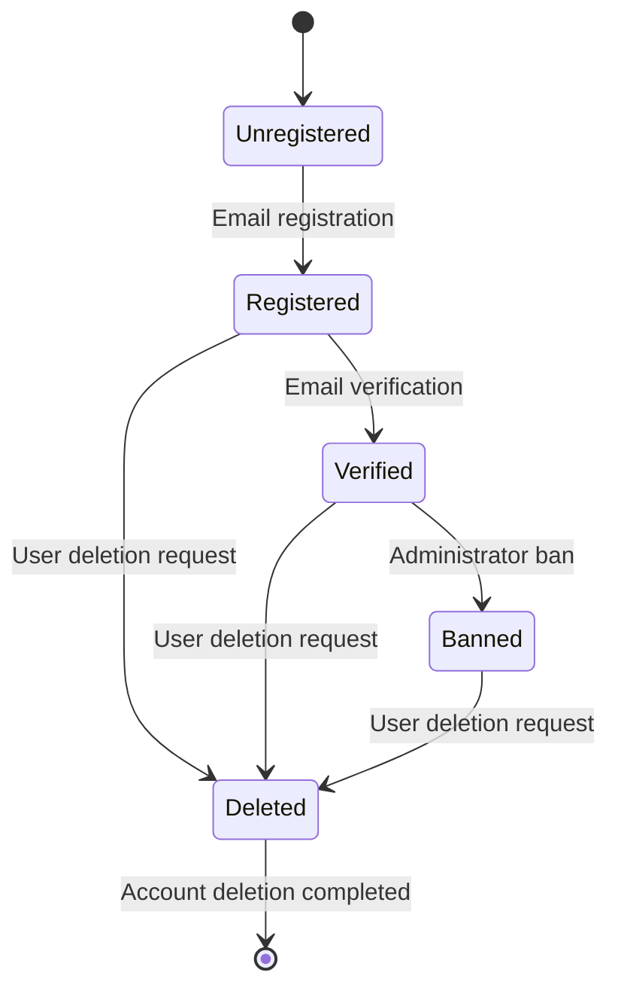

WHEN a user initiates registration, THE system SHALL create an account in the 'registered' state.

WHEN a user verifies their email address, THE system SHALL transition the account to the 'verified' state.

WHEN an administrator bans a user, THE system SHALL transition the account to the 'banned' state.

WHEN a user deletes their account, THE system SHALL transition the account to the 'deleted' state and permanently remove all data.

### Authentication Session Flow

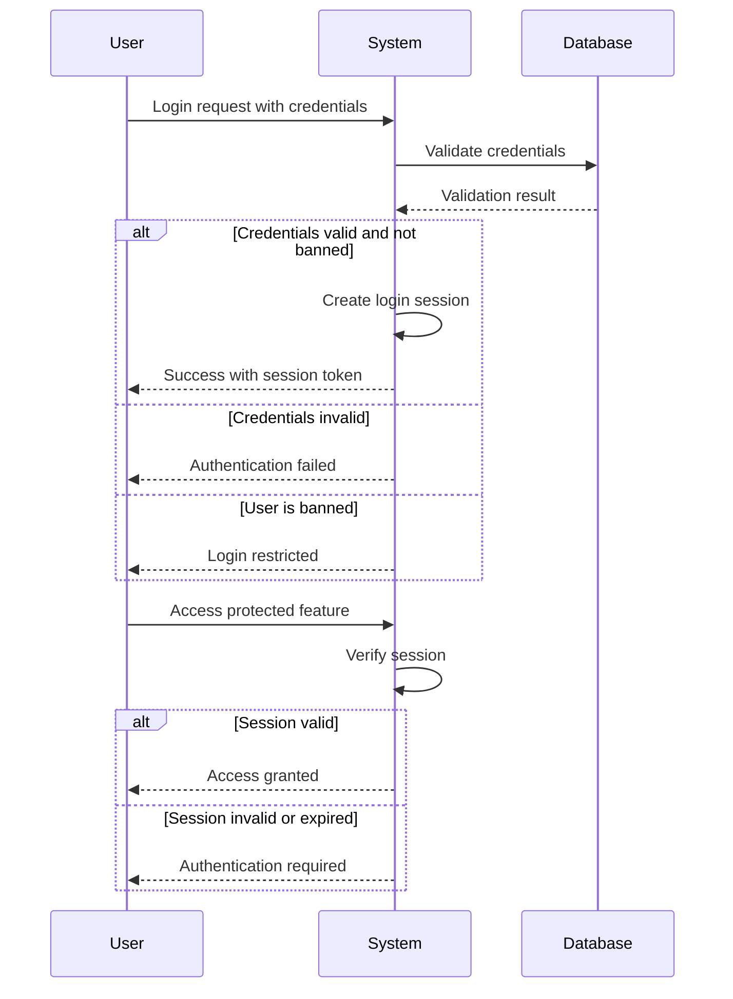

## Profile User Scenarios

Each user maintains a public profile that displays their display name and bio text to other community members. Users can update their display name and bio at any time through their profile settings page. Other users can view any user's profile to learn about their background and contributions. When viewing a user's profile, visitors see their display name, bio, a complete list of articles they have authored, and all comments they have posted. Users can navigate to other community members' profiles to read their perspectives and review their content history. Profile pages serve as personal hubs showing all user contributions to the discussion board. Users control their personal branding through their display name and bio text updates. The profile acts as a comprehensive view of a user's participation in the community.

### Profile Editing

WHEN a user updates their profile, THE system SHALL: 1. Allow updating the display name 2. Allow updating the bio text 3. Require the display name to be provided 4. Preserve the existing display name if no update is provided 5. Preserve the existing bio if no update is provided

IF the display name is empty, THE system SHALL reject the update request.
IF the user attempts to update another user's profile, THE system SHALL reject the request.

### Display Name Management

WHEN a user sets or updates their display name, THE system SHALL: 1. Store the display name publicly on the user's profile 2. Require a unique display name across all users 3. Display the display name to all other users

IF the requested display name is already in use by another user, THE system SHALL reject the request and indicate the display name is taken.
WHILE the display name is being edited, THE system SHALL validate uniqueness against all existing profiles.

### Bio Text Customization

WHEN a user updates their bio, THE system SHALL: 1. Allow text content for the bio 2. Store the bio publicly on the user's profile 3. Display the bio to all other users 4. Allow the bio to be empty

IF the user attempts to update another user's bio, THE system SHALL reject the request.
WHILE the bio is being saved, THE system SHALL validate the text content.

A user can view the bio of any other user on their profile page.

### Public Profile Visibility

THE system SHALL allow any guest or member to view any user's public profile.

WHEN a user views another user's profile, THE system SHALL display: 1. The user's display name 2. The user's bio text 3. A list of articles authored by the user 4. A list of comments written by the user

WHEN a user views their own profile, THE system SHALL display all information visible to other users plus editing controls for display name and bio.
IF a user's profile does not exist, THE system SHALL indicate the profile is unavailable.

### User Contribution History View

WHEN viewing a user's profile, THE system SHALL display a complete history of contributions:
1. All articles authored by the user, shown in chronological order 2. All comments written by the user, shown in chronological order

IF the user has no articles, THE system SHALL display an empty list with a message indicating no articles.
IF the user has no comments, THE system SHALL display an empty list with a message indicating no comments.

THE list of articles SHALL include: title, section name, tags, comment count, and time posted.
THE list of comments SHALL include: the comment content, the article title it was written on, and time posted.

### Profile Navigation Patterns

WHEN viewing any article or comment, THE system SHALL allow navigation to the author's profile.

IF a user clicks on an author's display name on an article or comment, THE system SHALL navigate to that user's profile page.

IF a user clicks on the back button from a profile page, THE system SHALL return to the previous page.

WHEN a user views another user's profile, THE system SHALL display a link to return to the content that led to the profile (article list, comment section, etc.).

### Personal Content Aggregation

WHEN a user views their own profile, THE system SHALL aggregate all personal contributions:
1. All articles written by the user, organized by section 2. All comments written by the user, sorted by creation date

THE system SHALL show the total count of articles and comments on the profile header.

IF a user deletes an article, THE system SHALL automatically remove it from their profile's article list.
IF a user deletes a comment, THE system SHALL automatically remove it from their profile's comment list.

A user can navigate between their articles list and comments list on their own profile.

### Profile Information Privacy

WHEN a user views any profile, THE system SHALL only display public information:
1. Display name 2. Bio text 3. Article titles and content 4. Article metadata (section, tags, comment count, time posted) 5. Comment content 6. Comment metadata (article title, time posted)

THE system SHALL NOT display on any profile: 1. Email address 2. Password information 3. Account creation timestamp 4. Last login timestamp 5. Administrative records or ban status

WHEN a user is banned, THE system SHALL still display their profile information to other users but shall restrict login access.

IF a user deletes their account, THE system SHALL remove all profile information from public view.

## Section User Scenarios

The discussion board is organized into sections such as Politics, Economy, and Current Affairs for topic categorization. Administrators exclusively create and manage all sections, while regular users can only view and browse them. Users can view the complete list of all available sections on the platform. Each section has a name and description that helps users understand what topics belong there. Users can browse through all articles within a specific section to find relevant discussions. Sections provide the primary navigation structure for users to explore content by topic area. Users rely on section descriptions to determine where to post their articles and which sections to visit for reading. Section management is restricted to maintain content organization and quality standards.

### Section Browsing

WHEN a user views the list of sections, THE system SHALL display all available sections with their names and brief descriptions.

WHEN a user views a specific section, THE system SHALL display the section name, full description, and the list of articles within that section.

GUESTS and MEMBERS SHALL have read-only access to browse all sections on the platform.

WHEN a section contains no articles, THE system SHALL still display the section in the list with a message indicating no articles are available.

THE system SHALL allow users to navigate from the section list to view individual articles within that section.

IF a user attempts to browse a non-existent section, THE system SHALL display an appropriate error message and return the user to the section list.

WHEN users view a section, THE system SHALL sort articles within that section by newest first by default.

THE system SHALL ensure section descriptions are visible to all users without requiring authentication.

### Section Topic Categorization

WHEN the system displays sections, THE system SHALL organize sections by topic area to facilitate content organization.

EACH section SHALL have a unique name that clearly identifies the topic area it covers.

WHEN viewing a section, THE system SHALL display the section description to help users understand what topics belong in that area.

THE system SHALL use sections as the primary navigation structure for users to explore content by topic.

WHEN users browse the platform, THE system SHALL allow navigation between different topic areas via the section list.

EACH section SHALL serve as a container for articles within that specific topic area.

THE system SHALL ensure section names are consistent with their intended topic categorization.

WHEN users search for articles, THE system SHALL use sections as the first level of content organization structure.

### Administrator Section Creation

WHEN an administrator creates a new section, THE system SHALL require a name and description for the section.

IF a section with the same name already exists, THE system SHALL reject the section creation request.

ONLY ADMINISTRATORS SHALL have permission to create new sections on the platform.

IF a non-administrator attempts to create a section, THE system SHALL reject the request with an access denied message.

WHEN an administrator creates a section, THE system SHALL record the creation timestamp.

WHEN an administrator edits an existing section, THE system SHALL allow updates to the name and description.

WHEN an administrator deletes a section, THE system SHALL handle associated articles appropriately (articles remain visible but unassigned to a section).

IF an administrator attempts to delete a section that contains articles, THE system SHALL still allow deletion but flag the articles as unassigned.

THE system SHALL validate that section names are not empty before creating or updating a section.

ADMINISTRATORS SHALL be able to view a list of all sections they have created or modified.

### Section-Based Content Filtering

WHEN users view articles, THE system SHALL allow filtering articles by section.

WHEN users browse a specific section, THE system SHALL display only articles belonging to that section.

THE system SHALL allow users to switch between different sections to view articles from different topic areas.

WHEN users search for articles, THE system SHALL support filtering search results by section.

IF a user applies section-based filtering, THE system SHALL update the article list to show only matching articles.

THE system SHALL maintain section filters when users navigate between pages in a section view.

WHEN users sort articles within a section, THE system SHALL respect the section filter along with the sort order.

THE system SHALL allow users to clear section-based filters and return to viewing all sections or articles.

WHEN viewing search results, THE system SHALL display the current section filter if one is applied.

## Article User Scenarios

Users can create new articles by selecting a section and providing a title and content text. Every article must include a required title, required content text, and a selected section assignment. Users can attach multiple files and images to their articles to enhance the discussion with supporting materials. Users can add multiple tags to their articles using free text to categorize and organize content. After publishing, users can edit their own articles to update the title, content, attachments, and tags. Users have the ability to delete their own articles when they no longer want them published. The article creation process includes selecting content location and enriching with media and categorization tags. Article ownership remains with the original creator throughout the article's lifecycle.

### Article Creation Workflow

WHEN a user creates an article, THE system SHALL:
1. Require a title for the article
2. Require content text for the article
3. Require selection of a section for the article
4. Associate the article with the creating user as the author
5. Record the creation timestamp

IF the title is missing, THE system SHALL reject the article creation.
IF the content is missing, THE system SHALL reject the article creation.
IF no section is selected, THE system SHALL reject the article creation.

WHEN a user views the section list, THE system SHALL display all available sections.
WHEN a user selects a section during article creation, THE system SHALL present that section as the selected option.

THE system SHALL prevent article creation when the user's account is banned.

### Content Authoring Process

WHEN a user writes article content, THE system SHALL store the complete text content.
WHEN a user previews their article before publishing, THE system SHALL display the entered title and content.

THE system SHALL preserve all whitespace and formatting within the content text.
WHEN a user saves a draft article, THE system SHALL store the incomplete content for later completion.

WHEN a user submits an article, THE system SHALL make it immediately visible to other users.
THE system SHALL not allow articles with empty or whitespace-only content to be published.

WHEN viewing an article, THE system SHALL display the full content text to all users.
WHEN editing article content, THE system SHALL preserve the original creation timestamp while updating the edit timestamp.

### File Attachment Management

WHEN a user attaches a file to an article, THE system SHALL:
1. Store the file with its original file name
2. Record the file type or format
3. Link the file to the containing article
4. Associate the file with the creating user

WHEN a user views an article with attachments, THE system SHALL display a list of all attached files.
WHEN a user clicks on an attached file, THE system SHALL allow the user to download the file.

THE system SHALL support multiple file attachments per article.
WHEN a user removes an attachment, THE system SHALL delete the file from storage.

THE system SHALL ensure files can only be deleted by the article owner or an administrator.
IF an article is deleted, THE system SHALL automatically delete all attached files.

### Image Upload Capabilities

WHEN a user uploads an image to an article, THE system SHALL store it as a file attachment.
WHEN a user views an article with images, THE system SHALL display images inline or as downloadable attachments.

THE system SHALL allow multiple images per article.
THE system SHALL support common image file formats including JPEG, PNG, and GIF.

WHEN an image attachment is added, THE system SHALL validate the file is a valid image format.
IF the uploaded file is not a valid image, THE system SHALL reject the upload and notify the user.

WHEN an article is deleted, THE system SHALL delete all image attachments associated with it.
THE system SHALL allow image attachment downloads by any user viewing the article.

### Tag Addition and Editing

WHEN a user adds a tag to an article, THE system SHALL:
1. Accept the tag name as free text input
2. Create a tag if it does not already exist
3. Associate the tag with the article
4. Allow the same tag to be associated with multiple articles

WHEN a user views an article, THE system SHALL display all tags associated with the article.
WHEN a user searches for articles, THE system SHALL allow filtering by tag.

THE system SHALL enforce unique tag names (case-insensitive).
WHEN a user removes a tag from an article, THE system SHALL maintain the tag in the system for other articles.

WHEN an article is deleted, THE system SHALL remove the tag associations but keep the tag if used by other articles.
THE system SHALL allow users to edit the tags on their own articles.

### Article Editing Permissions

WHEN the article owner edits their article, THE system SHALL:
1. Allow updating the title
2. Allow updating the content text
3. Allow adding new attachments
4. Allow removing existing attachments
5. Allow updating tags

WHEN a non-owner attempts to edit an article, THE system SHALL reject the edit request.
WHEN an administrator edits an article, THE system SHALL allow all edits regardless of ownership.

WHEN an article is edited, THE system SHALL update the edit timestamp.
THE system SHALL preserve the original creation timestamp when editing.

IF the section is changed during editing, THE system SHALL allow the change.
WHEN the title or content is edited, THE system SHALL update the article list view accordingly.

### Article Deletion Rights

WHEN the article owner deletes their article, THE system SHALL:
1. Remove the article from public view
2. Remove the article from search results
3. Delete all comments on the article
4. Delete all attachments associated with the article

WHEN an administrator deletes an article, THE system SHALL remove it from public view regardless of ownership.
WHEN a banned user's article is viewed, THE system SHALL continue to display the article and its content.

THE system SHALL NOT delete articles when a user account is deleted.
WHEN an article is deleted by its owner, THE system SHALL prompt for confirmation before removal.

IF a user attempts to delete an article they do not own, THE system SHALL reject the deletion.
THE system SHALL not allow deletion of articles that have been archived or locked by administrators.

### Section Assignment Requirements

WHEN creating an article, THE system SHALL require the user to select exactly one section.
WHEN viewing articles in a section, THE system SHALL display only articles assigned to that section.

THE system SHALL prevent article creation without a section assignment.
WHEN changing an article's section, THE system SHALL move the article to the new section.

THE system SHALL ensure sections have names and descriptions.
WHEN a section is deleted by an administrator, THE system SHALL prompt the administrator to reassign articles to another section.

THE system SHALL allow users to browse articles grouped by their section.
WHEN viewing the article list, THE system SHALL show the section name for each article.

## Comment User Scenarios

Users can write comments on articles to participate in discussions and share their perspectives. Comments are single-level only with no nested reply functionality within the system. Users can view all comments posted on any article to read the complete discussion thread. Comments are displayed in chronological order from oldest to newest to maintain discussion flow. Each comment shows the author's name, the comment content text, and when it was posted. Users can edit their own comments to correct mistakes or update their thoughts. Users can delete their own comments when they no longer want them visible to others. Comment management allows users to maintain control over their contributions to discussions.

### Comment Posting Process

### Comment Creation

WHEN a member creates a comment on an article, THE system SHALL:
1. Require the member to be logged in
2. Associate the comment with the logged-in member as the author
3. Associate the comment with the target article
4. Store the comment content as text
5. Record the timestamp when the comment is created

IF the member is not logged in, THE system SHALL reject the comment request.
IF the target article does not exist, THE system SHALL reject the comment request.
IF the comment content is empty, THE system SHALL reject the comment request.

WHEN a member submits a comment, THE system SHALL validate that the article exists before accepting the submission.

### Single-Level Discussion Structure

WHILE processing a comment creation request, THE system SHALL:
1. Allow only top-level comments on articles
2. Reject any attempt to create nested or reply comments
3. Store comments without parent-child relationships
4. Display comments in a flat list without hierarchy

IF a user attempts to reply to an existing comment, THE system SHALL reject the request and inform the user that replies are not supported.
WHEN the system receives a comment with a parent comment ID, THE system SHALL reject the request as nested comments are not supported.

A discussion thread contains only direct comments on articles, with no hierarchical reply structure.

### Comment Viewing Experience

WHEN a member or guest views an article, THE system SHALL:
1. Display a list of all comments on that article
2. Show each comment with the author's display name
3. Show the comment content text
4. Show when each comment was posted
5. Sort comments from oldest to newest
6. Allow scrolling through all comments

IF the article has no comments, THE system SHALL display a message indicating no comments exist.
WHEN a comment is loaded for display, THE system SHALL ensure the author information is available and visible.

### Chronological Comment Ordering

WHEN the system displays comments on an article, THE system SHALL:
1. Order comments by creation timestamp
2. Display oldest comments first
3. Show newer comments after older comments
4. Maintain chronological order when new comments are added

WHILE comments are being sorted, THE system SHALL ensure the timestamp from creation is used as the sort key.
IF multiple comments have the same timestamp, THE system SHALL display them in an undefined order.

### Comment Editing Capabilities

WHEN a member edits their own comment, THE system SHALL:
1. Require the member to be logged in
2. Allow editing only comments authored by that member
3. Update the comment content with new text
4. Record the timestamp when the edit was made

IF the member attempts to edit a comment they did not author, THE system SHALL reject the request.
IF the comment does not exist, THE system SHALL reject the request.
IF the member is not logged in, THE system SHALL reject the request.

WHILE a comment is being edited, THE system SHALL validate that the comment content is not empty after the edit.

### Comment Deletion Rights

WHEN a member deletes their own comment, THE system SHALL:
1. Require the member to be logged in
2. Allow deletion only of comments authored by that member
3. Permanently remove the comment from the article
4. Make the comment invisible to all users

IF the member attempts to delete a comment they did not author, THE system SHALL reject the request.
IF the comment does not exist, THE system SHALL reject the request.
IF the member is not logged in, THE system SHALL reject the request.

WHEN a comment is deleted, THE system SHALL ensure the comment count for the article is updated.

### Discussion Participation Workflow

WHEN a user wants to participate in a discussion, THE system SHALL:
1. Display the article with its content
2. Provide a comment input field
3. Show existing comments below the article
4. Allow submission of new comments
5. Display the newly submitted comment after posting

IF the user is not logged in, THE system SHALL prompt for login before allowing comment submission.
WHEN a comment is successfully submitted, THE system SHALL refresh the comment list to include the new comment.

### Comment Content Visibility

WHEN a comment is displayed to users, THE system SHALL:
1. Show the author's display name from their profile
2. Show the full comment content text
3. Show the creation timestamp
4. Ensure the comment is visible to all users (members and guests)
5. Hide deleted comments from all views

IF a comment has been deleted, THE system SHALL not display it in any comment list.
WHEN a user views comments, THE system SHALL display them with complete author attribution.

THE system SHALL ensure that comment visibility follows the article's visibility (all users can see comments on any article).

### Error Handling for Comments

THE system SHALL reject the request when the target article does not exist.
THE system SHALL reject the request when the user is not logged in.
THE system SHALL reject the request when attempting to edit or delete another user's comment.
THE system SHALL reject the request when the comment content is empty.

### Comment Creation Workflow

### Comment Submission Flow

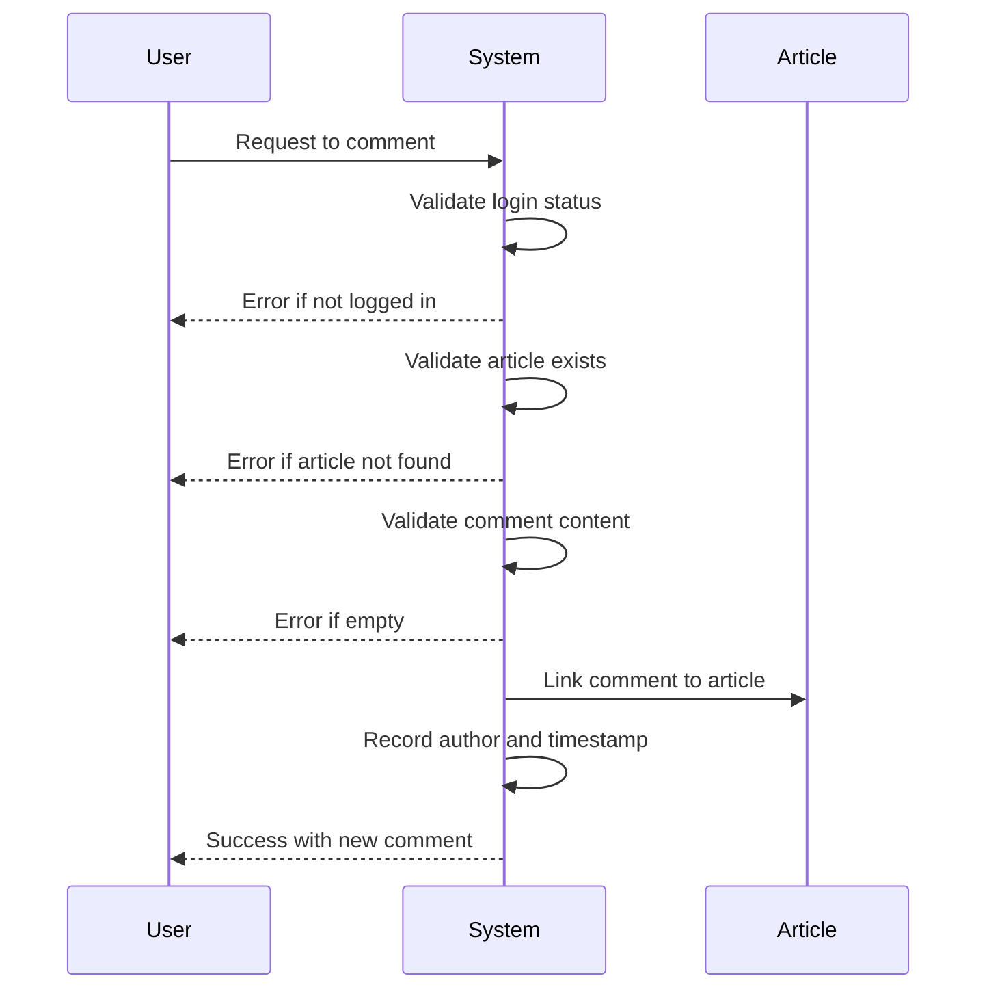

### Comment State Management

### Comment Lifecycle States

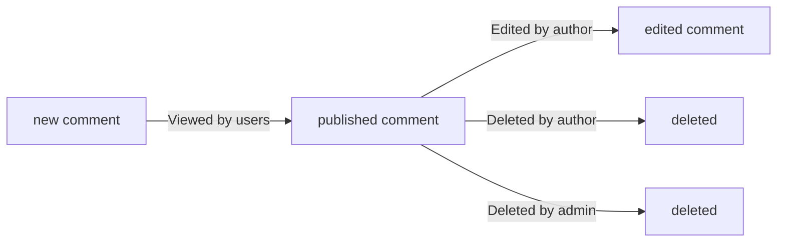

### Admin Comment Management

### Administrator Comment Actions

WHEN an administrator manages comments, THE system SHALL:
1. Allow deletion of any comment on any article
2. Display the comment content for review
3. Record the administrator who performed the deletion
4. Make the deleted comment invisible to all users

IF the comment does not exist, THE system SHALL reject the request.
WHEN an administrator deletes a comment, THE system SHALL not require any reason or justification.

### Admin Comment Deletion Workflow

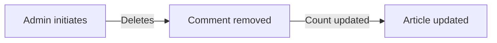

## Attachment User Scenarios

Users can attach files to their articles to provide supporting documents and reference materials. Multiple files can be attached to a single article to include comprehensive supporting content. Users can attach images to articles to add visual elements to their written content. Multiple images can be attached alongside regular files to enrich article presentation. Users can download attached files and images when viewing articles to access the materials offline. The attachment system allows users to share documents, spreadsheets, and other file types. File and image attachments are managed as part of the article content structure. Users retain control over attachments through their article editing and deletion capabilities.

### File Upload Capabilities

WHEN a user uploads a file to an article, THE system SHALL accept the file for attachment.

WHEN a user creates an article, THE system SHALL allow the user to attach files to the article.

WHEN a user edits an article, THE system SHALL allow the user to add new file attachments.

IF a user attempts to upload a file, THE system SHALL reject the request if the article does not exist.

IF a user attempts to attach a file to an article they do not own, THE system SHALL reject the request.

THE system SHALL require a file name for each uploaded file.

THE system SHALL associate each uploaded file with the article it was attached to.

WHEN a user uploads a file, THE system SHALL record the file type to enable proper handling.

IF a user uploads an empty file, THE system SHALL reject the upload request.

THE system SHALL allow users to attach supporting documents to articles for reference materials.

### Multiple Attachment Support

WHEN a user attaches files to an article, THE system SHALL allow multiple files to be attached to a single article.

THE system SHALL enable users to attach multiple documents to provide comprehensive supporting content.

WHEN a user adds multiple attachments, THE system SHALL store all attachments independently.

IF a user attempts to attach multiple files, THE system SHALL accept all valid file attachments.

THE system SHALL maintain a list of all attachments associated with an article.

WHEN viewing an article, THE system SHALL display all attachments that have been uploaded to it.

THE system SHALL allow users to have different file types attached to the same article.

IF a user uploads multiple images to an article, THE system SHALL store all images separately.

THE system SHALL support attaching both regular files and images to a single article.

WHEN displaying attachments, THE system SHALL show each attachment as an individual item in the list.

### Image Attachment Handling

WHEN a user uploads an image to an article, THE system SHALL accept the image file for attachment.

THE system SHALL support uploading multiple images to a single article.

WHEN an image is attached to an article, THE system SHALL store the image for later download.

IF a user attaches an image to an article, THE system SHALL associate the image with that article.

THE system SHALL allow images to be used alongside regular files in article attachments.

WHEN a user uploads images, THE system SHALL enable visual content enrichment through the attached images.

IF a user attempts to upload an image to a non-existent article, THE system SHALL reject the request.

THE system SHALL allow users to upload various image formats as article attachments.

WHEN an article has image attachments, THE system SHALL provide access to view and download them.

THE system SHALL treat image attachments as a subset of all file attachments with special handling for display purposes.

### File Download Functionality

WHEN a user views an article with attachments, THE system SHALL allow the user to download attached files.

WHEN a user downloads an attachment, THE system SHALL provide the original file to the user.

WHEN a user downloads an image attachment, THE system SHALL provide the image file for offline access.

IF a user attempts to download an attachment from an article they cannot view, THE system SHALL reject the request.

THE system SHALL allow users to download individual attachments one at a time.

WHEN a user downloads a file, THE system SHALL use the original file name for the downloaded file.

IF a user attempts to download an attachment that has been deleted, THE system SHALL reject the download request.

THE system SHALL preserve the file type during download to enable proper file opening.

WHEN multiple users view the same article, THE system SHALL allow each user to download the attachments independently.

THE system SHALL enable users to save attached files to their local devices for offline reference.

### Attachment Management Controls

WHEN a user edits their article, THE system SHALL allow the user to add new attachments to the article.

WHEN a user edits their article, THE system SHALL allow the user to remove existing attachments.

IF a user attempts to delete an attachment from an article they do not own, THE system SHALL reject the request.

WHEN a user deletes an article, THE system SHALL automatically delete all attachments associated with that article.

THE system SHALL allow users to manage attachments only on articles they have created.

WHEN a user modifies article attachments, THE system SHALL update the attachment list to reflect changes.

IF a user attempts to add an attachment to an article with existing attachments, THE system SHALL accept the new attachment alongside existing ones.

THE system SHALL prevent users from modifying attachments on other users' articles.

WHEN an article is deleted, THE system SHALL remove all file and image attachments permanently.

THE system SHALL provide users with complete control over their article attachments through the article editing interface.

### Supporting Document Sharing

WHEN a user creates an article, THE system SHALL allow the user to attach supporting documents to their article.

WHEN a user shares an article with attachments, THE system SHALL enable readers to access the supporting documents.

THE system SHALL allow users to share various document types as article attachments for reference.

IF a user shares an article with attachments, THE system SHALL make the attachments available to users who can view the article.

WHEN a user attaches documents to an article, THE system SHALL store them as part of the article content.

THE system SHALL enable users to include comprehensive supporting content through multiple file attachments.

WHEN readers view an article, THE system SHALL display all supporting documents that have been attached.

IF a user attempts to attach a document to an article they do not own, THE system SHALL reject the request.

THE system SHALL allow users to share documents for educational and reference purposes through article attachments.

WHEN an article is deleted, THE system SHALL remove all supporting documents attached to it from the system.

### Visual Content Enrichment

WHEN a user uploads images to an article, THE system SHALL enable visual content enrichment through the attachments.

THE system SHALL allow users to add images to articles to enhance visual presentation.

WHEN an article has image attachments, THE system SHALL provide users with the ability to view and download the images.

IF a user attempts to add images to an article for visual enrichment, THE system SHALL accept the images as attachments.

THE system SHALL support multiple image attachments to enable rich visual content in articles.

WHEN users view an article with images, THE system SHALL allow them to download the images for offline reference.

THE system SHALL treat images as attachments that contribute to article content presentation.

IF a user uploads images to an article, THE system SHALL associate the images with that specific article.

WHEN an article contains image attachments, THE system SHALL maintain the images as part of the article's content structure.

THE system SHALL enable authors to use images as visual elements to complement their written content.

### Attachment Persistence

WHEN a user attaches files or images to an article, THE system SHALL persist the attachments to the storage system.

WHEN an article is saved, THE system SHALL persist all attachments associated with the article.

THE system SHALL maintain attachment persistence across article edits and updates.

IF a user edits an article with existing attachments, THE system SHALL preserve the attachments unless explicitly removed.

WHEN an article is deleted, THE system SHALL permanently remove all attachments associated with it.

THE system SHALL ensure that attachments persist even when users are not actively viewing the article.

IF a user uploads an attachment, THE system SHALL store it persistently so it remains available for future access.

WHEN multiple users access the same article, THE system SHALL ensure all attachments remain available to all authorized users.

THE system SHALL maintain attachment persistence as part of the article's content structure.

WHEN an article is archived or moved, THE system SHALL preserve all its attachments with the article.

## Tag User Scenarios

Users can add tags to their articles using free text to categorize content by topics and themes. Multiple tags can be applied to a single article to support various classification approaches. Users can search for articles by filtering results based on specific tags of interest. Tags help users discover related articles across different sections of the discussion board. When viewing search results, users can filter by tags to narrow down relevant content. Tag management allows flexible content organization without rigid categorization structures. Users rely on tags to understand article topics at a glance from the article list view. Tag-based filtering enhances content discovery and navigation efficiency.

### Tag Creation Flexibility

### Tag Creation Flexibility

WHEN a user creates an article, THE system SHALL allow them to create tags using free text input without predefined options.

WHEN a user adds tags to an article, THE system SHALL accept any text string as a valid tag.

WHEN multiple users create the same tag for different articles, THE system SHALL treat them as a single unique tag entity.

IF a tag already exists with the same text, THE system SHALL associate the article with the existing tag rather than creating a duplicate.

THE system SHALL enforce uniqueness of tag names across the entire discussion board.

### Tag Uniqueness Management

WHEN a user attempts to create a tag that already exists, THE system SHALL merge the article's tag list with the existing tag.

IF a tag is deleted because its owner deletes their article, THE system SHALL check if other articles still reference the tag before deletion.

WHEN the last article referencing a tag is deleted, THE system SHALL remove the tag from the system.

### Tag Creation Validation

IF the tag text is empty or contains only whitespace, THE system SHALL reject the tag.
IF the tag text exceeds reasonable length limits, THE system SHALL truncate or reject the tag.

WHEN a user submits tags with an article, THE system SHALL validate all tags before creating the article.

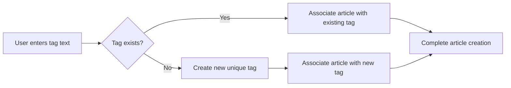

### Multiple Tag Assignment

### Multiple Tag Assignment

WHEN a user creates an article, THE system SHALL allow them to assign multiple tags to the article.

WHEN a user adds tags to an article, THE system SHALL support unlimited tag quantity per article.

IF a user assigns a tag that is already associated with the article, THE system SHALL NOT create a duplicate tag assignment.

WHEN a user edits an article, THE system SHALL allow them to add additional tags or remove existing tags.

WHEN a user updates article tags, THE system SHALL preserve tags that were not explicitly modified.

### Tag Association Management

WHEN a user deletes an article, THE system SHALL remove all tag associations for that article.

IF an article is deleted, THE system SHALL NOT remove the tags themselves unless no other articles reference them.

WHEN a tag is deleted from an article, THE system SHALL check if the tag is still referenced by other articles.

WHEN a tag is no longer referenced by any article, THE system SHALL remove the tag from the system.

### Tag Association Validation

IF a tag does not exist when a user attempts to assign it, THE system SHALL create the tag first before assignment.

WHEN a user submits multiple tags, THE system SHALL validate and process each tag individually.

THE system SHALL maintain the article-to-tag relationships even when the parent article is archived or modified.

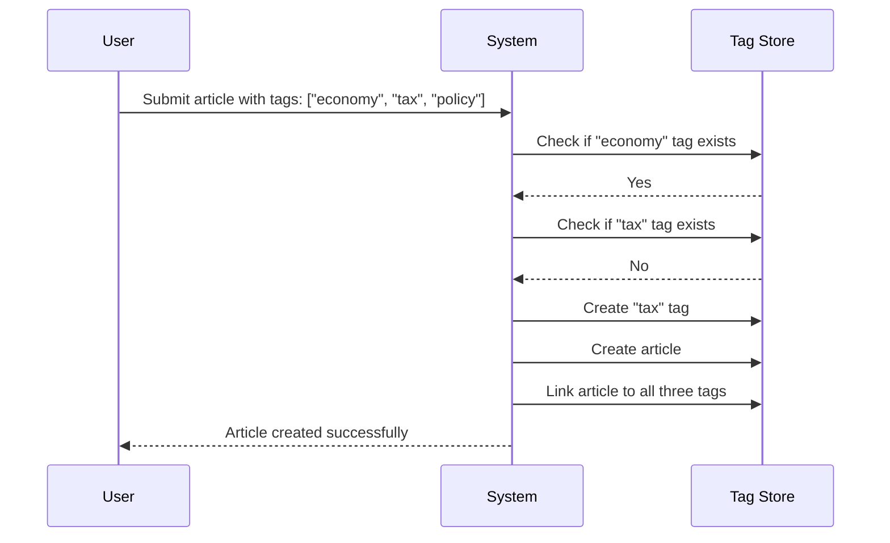

### Tag-Based Content Filtering

### Tag Filtering on Article Lists

WHEN a user views articles in a section, THE system SHALL provide an option to filter articles by specific tags.

WHEN a user applies tag filters, THE system SHALL display only articles that contain all selected tags.

WHEN multiple tags are selected for filtering, THE system SHALL require articles to have all specified tags.

IF no articles match the tag filter criteria, THE system SHALL display an empty results message.

### Tag Filtering Behavior

WHEN a user clears tag filters, THE system SHALL return to showing all articles in the section.

WHEN a user changes the filter from one tag to another, THE system SHALL update the article list immediately.

WHEN a user applies tag filters to search results, THE system SHALL narrow the existing search results.

WHEN tag-filtered articles are paginated, THE system SHALL count only articles matching the tag filter.

### Tag Filter Display

WHEN displaying filtered articles, THE system SHALL indicate which tags are currently applied.

WHEN a user hovers over a filter tag indicator, THE system SHALL show the selected tag names.

WHEN a user removes a filter tag, THE system SHALL update the article list to include previously excluded articles.

### Tag Filter Validation

IF the selected tag no longer exists, THE system SHALL remove the filter automatically.

IF an article is deleted while it was in a filtered view, THE system SHALL remove it from the list.

WHEN a user views tag-filtered articles, THE system SHALL maintain the filter when navigating between pages.

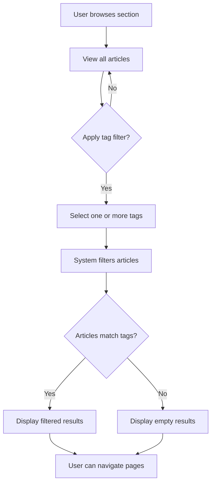

### Tag Search Functionality

### Tag Search Interface

WHEN a user searches for articles, THE system SHALL provide an option to filter results by tag.

WHEN a user views the search page, THE system SHALL display a list of available tags for filtering.

WHEN a user searches with a tag filter, THE system SHALL search only within articles matching that tag.

WHEN a user searches across all articles, THE system SHALL include the tag filter as an additional constraint.

### Tag Search Behavior

WHEN a user searches by tag name, THE system SHALL match articles containing that tag exactly.

WHEN a user searches with multiple tags, THE system SHALL find articles containing all specified tags.

WHEN a user searches articles by tags, THE system SHALL paginate results if they exceed the display limit.

WHEN search results contain articles with the searched tag, THE system SHALL highlight the matching tag in the list.

### Tag Search Results Display

WHEN displaying search results with tag filters, THE system SHALL show the applied filter tags prominently.

WHEN a user clicks a tag in search results, THE system SHALL filter to show only articles with that tag.

WHEN search results are empty due to tag filtering, THE system SHALL suggest removing the tag filter.

### Tag Search Integration

WHEN a user combines keyword search with tag filtering, THE system SHALL return articles matching both criteria.

WHEN a tag has no articles matching the search criteria, THE system SHALL notify the user of no results.

WHEN a user modifies a search query, THE system SHALL maintain the tag filter across query changes.

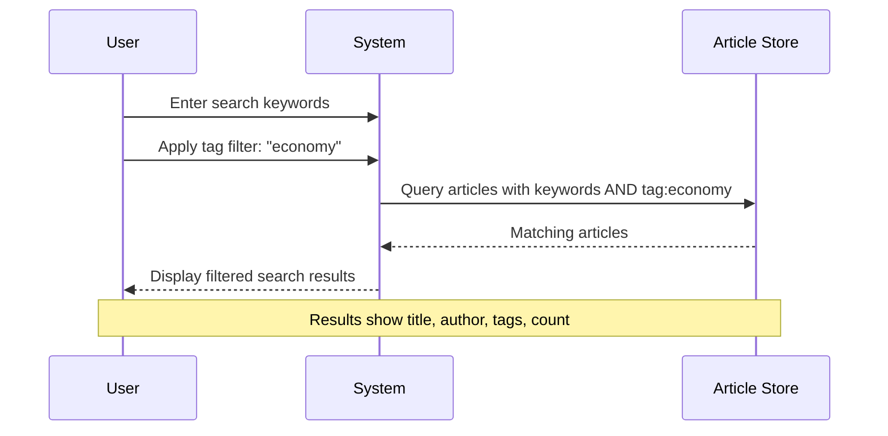

### Topic Categorization Approach

### Topic Categorization Philosophy

WHEN users view articles, THE system SHALL allow topics to be organized through flexible tags rather than rigid categories.

WHEN a user creates an article, THE system SHALL NOT force them to select from predefined topic categories.

WHEN users browse articles, THE system SHALL display tags as topic indicators on each article.

THE system SHALL support overlapping topics through multiple tag assignment per article.

### Topic Categorization Flexibility

WHEN a user assigns tags to an article, THE system SHALL allow the same tag to appear across different sections.

WHEN users navigate by tag, THE system SHALL show articles with that tag regardless of their section.

WHEN a tag is commonly used, THE system SHALL display the tag with an article count indicator.

WHEN users create articles with similar tags, THE system SHALL naturally group related content.

### Topic Organization Benefits

WHEN users browse articles by tag, THE system SHALL enable discovery across section boundaries.

WHEN a user explores a tag, THE system SHALL show all articles sharing that topic.

WHEN users search for articles, THE system SHALL prioritize articles with relevant tags.

WHEN tag popularity varies, THE system SHALL display tags with usage frequency information.

### Topic Categorization Rules

IF a tag is rarely used, THE system SHALL still allow it to exist for future content.

IF a tag is commonly used, THE system SHALL ensure quick access through search and filtering.

WHEN users view an article, THE system SHALL display tags as the primary topic indicators.

THE system SHALL NOT enforce a hierarchy or relationship between tags.

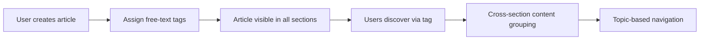

### Tag Discovery Patterns

### Tag Discovery in Article Lists

WHEN users view an article list, THE system SHALL display each article's tags for quick topic identification.

WHEN a user scans article titles, THE system SHALL show tags adjacent to the title for easy discovery.

WHEN a user hovers over an article, THE system SHALL emphasize the tag information.

WHEN a user clicks a tag in an article list, THE system SHALL navigate to tag-filtered search results.

### Tag Discovery on Article Detail Page

WHEN users view an article detail, THE system SHALL display all associated tags prominently.

WHEN a user reads an article, THE system SHALL show tags near the title for context.

WHEN a user views an article, THE system SHALL provide links to each tag for exploration.

WHEN a user clicks a tag on an article page, THE system SHALL navigate to articles with that tag.

### Related Tag Discovery

WHEN a user views a tag page, THE system SHALL suggest similar tags based on article co-occurrence.

WHEN a user explores articles by tag, THE system SHALL display other tags found in the same articles.

WHEN a user creates content with a tag, THE system SHALL suggest tags from similar articles.

WHEN a user searches for tags, THE system SHALL show tags from articles they have viewed.

### Tag Discovery Analytics

WHEN a tag is frequently viewed, THE system SHALL prioritize it in discovery interfaces.

WHEN a tag is associated with popular articles, THE system SHALL highlight it in recommendations.

WHEN users browse a tag, THE system SHALL show the number of articles with that tag.

WHEN a tag gains popularity, THE system SHALL increase its visibility in discovery patterns.

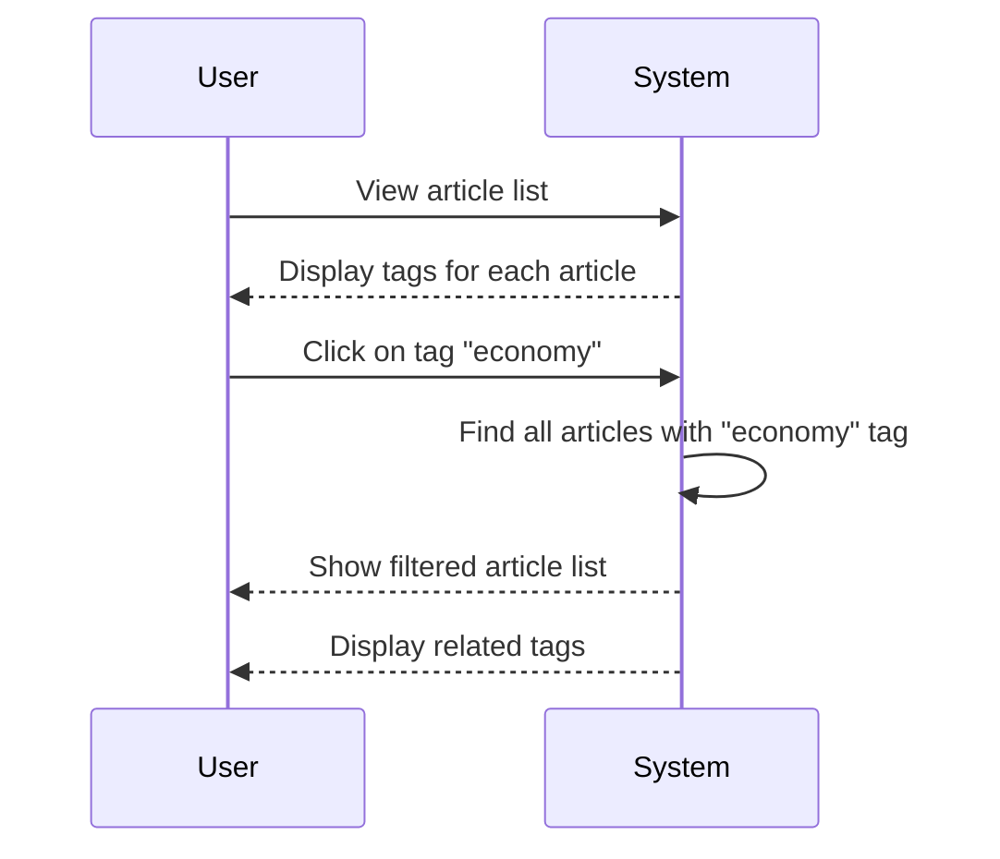

### Flexible Content Organization

### Flexible Organization Principles

WHEN users create articles, THE system SHALL allow topic organization through multiple independent tags.

WHEN users browse content, THE system SHALL NOT enforce a single organizational structure.

WHEN a user organizes articles by topic, THE system SHALL allow the same article to have multiple topics.

WHEN content organization evolves, THE system SHALL allow tags to be added or removed freely.

### Tag Addition and Modification

WHEN a user edits an article, THE system SHALL allow adding new tags to the existing article.

WHEN a user edits an article, THE system SHALL allow removal of tags no longer relevant.

WHEN a user updates article tags, THE system SHALL preserve the article while modifying tags.

WHEN multiple users discuss similar topics, THE system SHALL use common tags for organization.

### Cross-Section Organization

WHEN users browse sections, THE system SHALL allow articles to be discovered through tags across sections.

WHEN a tag spans multiple sections, THE system SHALL maintain the article in its original section.

WHEN users search by tag, THE system SHALL include articles from all sections containing the tag.

WHEN a tag connects topics, THE system SHALL facilitate cross-section navigation.

### Organization Preservation

WHEN a user deletes an article, THE system SHALL remove only that article's tag associations.

WHEN tags are updated, THE system SHALL preserve tag data across the platform.

WHEN an article is moved between sections, THE system SHALL maintain all original tags.

WHEN content is archived, THE system SHALL preserve tag associations for historical reference.

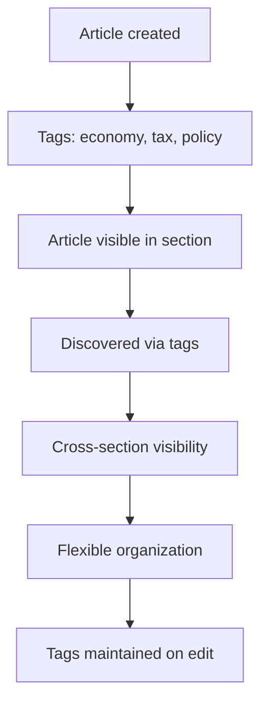

### Tag Navigation Efficiency

### Navigation Performance Standards

WHEN a user filters articles by tag, THE system SHALL display results within acceptable response time limits.

WHEN a user searches by tag, THE system SHALL return results with efficient pagination.

WHEN a user navigates to a tag page, THE system SHALL load the tag's article list immediately.

WHEN a user clicks a tag from an article, THE system SHALL navigate to filtered results without delay.

### Navigation Interface Efficiency

WHEN users browse article lists, THE system SHALL display tags with minimal layout overhead.

WHEN a user applies tag filters, THE system SHALL update the view with efficient UI transitions.

WHEN users paginate tag-filtered results, THE system SHALL maintain filter state across pages.

WHEN a user navigates between tags, THE system SHALL preserve their current browsing context.

### Tag Navigation Features

WHEN users view tag information, THE system SHALL show article count for quick assessment.

WHEN users browse tags, THE system SHALL display recently active tags prominently.

WHEN a user searches with tag filters, THE system SHALL show how many results match.

WHEN users explore tags, THE system SHALL provide clear navigation paths to related content.

### Tag Navigation Best Practices

WHEN a tag has many articles, THE system SHALL paginate results efficiently.

WHEN a tag has few articles, THE system SHALL display all articles on a single page.

WHEN users navigate by tag, THE system SHALL maintain breadcrumb or history for easy return.

WHEN a user bookmarks a tag view, THE system SHALL preserve the tag filter and pagination.

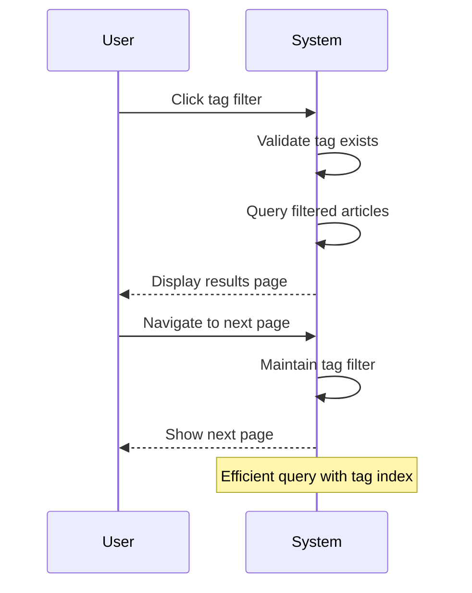

## ArticleTag User Scenarios

The relationship between articles and tags is managed through article-tag associations. Each article can have multiple tags associated with it through these relationships. Tag associations are visible to users when viewing article details and search results. Users see tag information as part of the article listing to understand content focus. The article-tag relationship enables flexible content discovery through tag filtering and searching. Tags are independent entities that can be shared across multiple articles by different users. Users interact with tags as a feature without directly managing the underlying tag associations. Article-tag relationships power the search and filter functionality throughout the platform.

### Article Tag Association Management

WHEN a user creates an article, THE system SHALL allow the user to add multiple tags to classify the article content.

WHEN a user creates an article, THE system SHALL allow the user to enter tags as free text input.

WHEN a user adds a tag to an article, THE system SHALL create an association between the article and the tag.

WHEN a user edits an article, THE system SHALL allow the user to modify the tag associations.

WHEN a user edits an article, THE system SHALL allow the user to remove existing tags from the article.

WHEN a user edits an article, THE system SHALL allow the user to add new tags to the article.

IF a user attempts to create an article without any tags, THE system SHALL save the article with no tag associations.

IF a user attempts to add duplicate tags to an article, THE system SHALL prevent the duplicate association.

IF a user attempts to add a tag that already exists in the system, THE system SHALL associate the existing tag with the article.

IF a user attempts to add a tag that does not exist in the system, THE system SHALL create the new tag and associate it with the article.

WHEN a user deletes an article, THE system SHALL remove all tag associations for that article.

IF a user does not own an article, THE system SHALL reject requests to modify the article's tags.

IF a tag contains special characters or is empty, THE system SHALL reject the tag association request.

### Tag Visibility in Article Listings

WHEN a user views an article listing in a section, THE system SHALL display the tags associated with each article.

WHEN a user views an article in a listing view, THE system SHALL show tag labels or indicators without requiring detailed tag metadata.

WHEN a user views a single article page, THE system SHALL display all tags associated with the article prominently.

WHEN a user views an article page, THE system SHALL show the tag names in a visually distinct manner from the article content.

WHEN a user views an article listing, THE system SHALL display the article title as the primary identifier.

WHEN a user views an article page, THE system SHALL show the author information alongside the article content.

IF an article has no tags, THE system SHALL display an empty or placeholder indicator for tags.

IF the article listing view is paginated, THE system SHALL display tags for each article on the current page.

IF a user filters articles by tag, THE system SHALL show the filtered results with tag-based relevance indicators.

### Shared Tag Discovery Across Articles

WHEN a user views a tag association on an article, THE system SHALL provide navigation to view other articles with the same tag.

WHEN a user clicks on a tag in an article listing, THE system SHALL display a list of all articles sharing that tag.

WHEN a user clicks on a tag in an article detail view, THE system SHALL show articles classified with that tag for discovery purposes.

WHEN a user searches articles by tag, THE system SHALL return articles that contain the specified tag.

WHEN a user views multiple articles with the same tag, THE system SHALL display tag counts or association indicators.

WHEN a user discovers articles through tag navigation, THE system SHALL maintain the original article listing context.

IF a tag has no associated articles, THE system SHALL indicate that no articles exist for that tag.

IF a user searches for a tag that does not exist, THE system SHALL return empty search results.

IF a user attempts to navigate to a tag with no articles, THE system SHALL display a helpful message indicating no articles found.

### Tag Association Persistence

WHEN a user creates an article with tags, THE system SHALL persist the tag associations for the lifetime of the article.

WHEN a user edits an article's tags, THE system SHALL update the existing tag associations.

WHEN a user modifies tag associations, THE system SHALL maintain the relationship between the article and tags.

WHEN an article is published, THE system SHALL persist all tag associations with the article.

WHEN an article is archived, THE system SHALL maintain the tag associations for historical reference.

WHEN an article is deleted, THE system SHALL remove all tag associations from the system.

IF a tag is deleted from the system, THE system SHALL remove the tag from all associated articles.

IF a tag is renamed, THE system SHALL update the tag name across all articles using that tag.

WHEN a user views the article history, THE system SHALL show the tag associations that existed at each point in time.

IF the system experiences a data recovery scenario, THE system SHALL restore tag associations from backup data.

### Multi-Tag Article Classification

WHEN a user creates an article, THE system SHALL allow the user to assign multiple tags to the same article simultaneously.

WHEN a user creates an article, THE system SHALL support at least one tag association.

WHEN a user classifies an article with tags, THE system SHALL allow unlimited tag additions.

WHEN a user views an article with multiple tags, THE system SHALL display all tags without truncation.

WHEN a user searches by multiple tags, THE system SHALL return articles matching any of the specified tags.

WHEN a user filters articles by multiple tags, THE system SHALL show articles that contain all selected tags.

WHEN a user classifies an article, THE system SHALL prioritize the most relevant tags based on article content.

IF a user assigns excessive tags to an article, THE system SHALL allow the associations but may display them in a condensed format.

WHEN a user views tag statistics, THE system SHALL show the number of articles associated with each tag.

WHEN a user browses by tag category, THE system SHALL display articles organized by their primary tag associations.

## AdministratorRequest User Scenarios

Any user can submit a request to become an administrator by providing a reason for their request. Submitted requests include a text explanation describing why the user wants administrator privileges. Super administrators can view all pending administrator requests from users seeking elevated privileges. Super administrators have the ability to approve or reject each administrator request. When a request is approved, the requesting user gains administrator status and capabilities. Approved users become regular administrators who can perform administrative duties on the platform. The request workflow ensures administrator privileges are granted through a controlled approval process. Pending requests remain visible to super administrators until a decision is made.

### Administrator Request Submission

WHEN a user submits an administrator request, THE system SHALL create a new request record with status "pending".

WHEN a user submits an administrator request, THE system SHALL associate the request with the submitting user's account.

THE system SHALL require a reason text field when a user submits an administrator request.

THE system SHALL record the submission timestamp for each administrator request.

IF the requesting user already has a pending administrator request, THE system SHALL prevent duplicate submission until the existing request is resolved.

IF the requesting user is already an administrator or super administrator, THE system SHALL reject the administrator request submission.

IF the requesting user has been banned, THE system SHALL reject the administrator request submission.

WHEN an administrator request is submitted, THE system SHALL notify super administrators of the new pending request.

### Request Reason Documentation

WHEN a user submits an administrator request, THE system SHALL require a reason text field with a minimum length of 50 characters.

THE system SHALL allow the reason text to contain any text content including special characters and formatting.

WHEN a user submits an administrator request, THE system SHALL store the reason text as part of the request record.

IF the reason text does not meet the minimum length requirement, THE system SHALL reject the request submission.

WHEN a super administrator reviews a pending request, THE system SHALL display the submitted reason text.

IF a user submits a new administrator request after a previous one was approved or rejected, THE system SHALL retain the new reason text while discarding the previous request.

THE system SHALL allow users to modify the reason text only for pending requests.

### Pending Request Visibility

THE system SHALL display all pending administrator requests to super administrators only.

WHEN a super administrator views pending requests, THE system SHALL show the requesting user's display name.

WHEN a super administrator views pending requests, THE system SHALL show the requesting user's email address.

WHEN a super administrator views pending requests, THE system SHALL show the submitted reason text for each request.

WHEN a super administrator views pending requests, THE system SHALL show the submission timestamp for each request.

THE system SHALL sort pending administrator requests by submission timestamp with the most recent first.

THE system SHALL paginate pending administrator request lists with 20 requests per page.

WHEN a pending administrator request is approved or rejected, THE system SHALL immediately remove it from the pending list.

### Super Administrator Approval Process

WHEN a super administrator approves an administrator request, THE system SHALL change the request status from "pending" to "approved".

WHEN a super administrator approves an administrator request, THE system SHALL record the approval timestamp.

WHEN a super administrator approves an administrator request, THE system SHALL record which super administrator performed the approval.

WHEN a super administrator approves an administrator request, THE system SHALL promote the requesting user to regular administrator status.

WHEN a super administrator approves an administrator request, THE system SHALL notify the requesting user of the approval.

WHEN an administrator request is approved, THE system SHALL grant the user all regular administrator capabilities.

IF the approving super administrator is not a super administrator, THE system SHALL reject the approval action.

### Administrator Request Rejection

WHEN a super administrator rejects an administrator request, THE system SHALL change the request status from "pending" to "rejected".

WHEN a super administrator rejects an administrator request, THE system SHALL record the rejection timestamp.

WHEN a super administrator rejects an administrator request, THE system SHALL record which super administrator performed the rejection.

WHEN an administrator request is rejected, THE system SHALL notify the requesting user of the rejection.

IF a super administrator rejects an administrator request, THE system SHALL prevent the user from submitting another request for 30 days.

WHEN a super administrator rejects an administrator request, THE system SHALL display the rejection confirmation.

IF the rejecting super administrator is not a super administrator, THE system SHALL reject the rejection action.

### Administrator Status Upgrade

WHEN a user's administrator request is approved, THE system SHALL update the user's status to regular administrator.

WHEN a user is upgraded to administrator, THE system SHALL add the administrator capability flag to the user account.

WHEN a user is upgraded to administrator, THE system SHALL retain all existing user capabilities (articles, comments, profile, etc.).

WHEN a user is upgraded to administrator, THE system SHALL enable section management capabilities.

WHEN a user is upgraded to administrator, THE system SHALL enable article deletion capability.

WHEN a user is upgraded to administrator, THE system SHALL enable comment deletion capability.

WHEN a user is upgraded to administrator, THE system SHALL enable user ban capability.

THE system SHALL prevent regular administrators from promoting users to super administrator.

### Administrator Role Acquisition

WHEN a user acquires administrator role, THE system SHALL grant the user ability to create sections.

WHEN a user acquires administrator role, THE system SHALL grant the user ability to edit any section.

WHEN a user acquires administrator role, THE system SHALL grant the user ability to delete any section.

WHEN a user acquires administrator role, THE system SHALL grant the user ability to delete any article.

WHEN a user acquires administrator role, THE system SHALL grant the user ability to delete any comment.

WHEN a user acquires administrator role, THE system SHALL grant the user ability to ban users.

WHEN a user acquires administrator role, THE system SHALL grant the user ability to unban users.

WHEN a user acquires administrator role, THE system SHALL grant the user ability to view banned users list.

WHEN a user acquires administrator role, THE system SHALL allow the user to submit administrator requests (though unnecessary as they are already administrators).

IF a super administrator demotes an administrator to regular user, THE system SHALL remove all administrator capabilities.

## BanRecord User Scenarios

When a user violates platform rules, administrators can ban the user from accessing the platform. Banned users cannot log in to the platform and lose access to all features. When banning a user, administrators must record a reason for the ban action. Banned users' existing articles and comments remain visible to other users even after the ban. Administrators can view the list of all banned users and their associated ban reasons. Regular administrators and super administrators both have the capability to ban users. Administrators can also unban previously banned users to restore their platform access. The ban system provides administrators with a tool for maintaining community standards and safety.

### User Ban Execution

WHEN an administrator bans a user, THE system SHALL:
1. Require a reason for the ban to be documented
2. Record the banning administrator's identity
3. Prevent the banned user from accessing the platform
4. Preserve all existing content created by the banned user

IF the administrator does not provide a ban reason, THE system SHALL reject the ban request.
IF the user to be banned does not exist, THE system SHALL reject the ban request.

WHILE a user is banned, THE system SHALL prevent all platform access including article viewing, commenting, and profile viewing by the banned user.

THE system SHALL record the timestamp when the ban is executed.

### Ban Reason Documentation

WHEN an administrator bans a user, THE system SHALL require a reason to be documented in text format.

IF the ban reason is empty or missing, THE system SHALL reject the ban request.

THE system SHALL make the ban reason viewable to administrators for transparency.

WHEN an administrator unbans a user, THE system SHALL preserve the original ban reason in the ban history.

THE system SHALL store the ban reason permanently as part of the ban record.

### Banned User Login Restriction

WHEN a user has an active ban record, THE system SHALL prevent that user from logging in to the platform.

IF a banned user attempts to log in, THE system SHALL reject the authentication request.

WHILE a user is banned, THE system SHALL deny all platform access regardless of authentication attempt.

THE system SHALL inform users that they are banned when they attempt to access the platform.

THE system SHALL enforce the login restriction for all types of content access including articles, comments, and profiles.

### Existing Content Visibility Post-Ban

WHEN a user is banned, THE system SHALL preserve all articles written by that user.

WHEN a user is banned, THE system SHALL preserve all comments written by that user.

THE system SHALL make the existing articles of banned users visible to other users.

THE system SHALL make the existing comments of banned users visible to other users.

THE system SHALL display the original author information on content even after the author is banned.

WHEN viewing an article or comment by a banned user, THE system SHALL show the same information as if the user were active.

### Administrator Ban Capability

WHEN a regular administrator logs in, THE system SHALL provide the capability to ban users.

WHEN a super administrator logs in, THE system SHALL provide the capability to ban users.

WHILE a user is an administrator, THE system SHALL allow them to ban any user on the platform.

THE system SHALL allow administrators to ban users for any violation of platform rules.

IF a non-administrator user attempts to ban another user, THE system SHALL reject the request.

### User Unban Restoration

WHEN an administrator unbans a user, THE system SHALL restore the user's platform access.

WHEN a user is unbanned, THE system SHALL allow that user to log in to the platform.

WHEN a user is unbanned, THE system SHALL restore the user's ability to create articles and comments.

WHEN an administrator unbans a user, THE system SHALL preserve the original ban record and reason.

IF a banned user requests to be unbanned, THE system SHALL allow administrators to review and approve the request.

WHILE a user has an active ban record, THE system SHALL prevent administrators from unbanning the user without review.

### Ban Reason Record Keeping

THE system SHALL maintain a complete record of all ban actions including reasons.

WHEN an administrator bans a user, THE system SHALL create a permanent ban record.

WHEN a user is unbanned, THE system SHALL preserve the original ban record with reason.

THE system SHALL allow administrators to view the ban reason for each banned user.

THE system SHALL store the ban reason as text that is viewable by administrators.

THE system SHALL maintain ban records even after a user is unbanned.

### Banned User List Management

WHEN an administrator logs in, THE system SHALL provide a list of all banned users.

THE system SHALL display the ban reason for each user in the banned user list.

THE system SHALL display the date when each ban was executed.

WHEN an administrator views the banned user list, THE system SHALL show the administrator who performed the ban.

THE system SHALL allow administrators to filter the banned user list.

THE system SHALL allow administrators to sort the banned user list by ban date.

IF no users are currently banned, THE system SHALL show an empty list.

# File Storage

File upload capabilities, media processing, and storage requirements.

## File Upload and Management

Define file upload capabilities, supported formats, processing requirements, and access control for stored files.

### File Upload Workflow

WHEN a user uploads a file as an attachment to an article, THE system SHALL:
1. Accept the file upload request
2. Store the file in the system storage
3. Associate the file with the article
4. Record the file metadata (name, type, size)
5. Make the file available for download

THE system SHALL reject the upload request when the user is not logged in.
THE system SHALL reject the upload request when the user does not own the article.
THE system SHALL reject the upload request when the file exceeds the maximum allowed size.
THE system SHALL reject the upload request when the file type is not supported.

### Media Attachment Support

WHEN a user attaches media to an article, THE system SHALL:
1. Accept image file uploads as attachments
2. Accept document file uploads as attachments
3. Accept other file types as defined in system configuration
4. Associate multiple media files with a single article
5. Display media attachments on the article page

THE system SHALL allow users to attach multiple media files to one article.
THE system SHALL store all attached media files in the system storage.
THE system SHALL display attachment icons next to the article content.

### Attachment Management

WHEN a user creates an article, THE system SHALL allow attachment of files to the article.
WHEN a user edits an article, THE system SHALL allow adding new attachments to the article.
WHEN a user edits an article, THE system SHALL allow removing existing attachments from the article.
WHEN an article is deleted, THE system SHALL delete all associated attachments.

WHEN a user attempts to attach a file to an article they do not own, THE system SHALL reject the attachment operation.
WHEN a file upload fails, THE system SHALL notify the user of the failure.
WHEN attachments reach the maximum limit, THE system SHALL reject additional attachments.

### Attachment Download Access

WHEN a user views an article with attachments, THE system SHALL display download options for each attachment.
WHEN a user clicks on a download option, THE system SHALL provide access to download the file.
WHEN a user is not logged in, THE system SHALL allow downloading publicly visible article attachments.
WHEN a user is logged in, THE system SHALL allow downloading all article attachments.

THE system SHALL record download activity for audit purposes.
THE system SHALL serve attachments with appropriate content-type headers.
THE system SHALL ensure only authorized users can download attachments.

### Storage Management

WHEN files are uploaded as attachments, THE system SHALL store them in the designated storage location.
WHEN files are uploaded, THE system SHALL track the storage usage associated with the article owner.
WHEN articles are deleted, THE system SHALL reclaim the storage space used by attachments.

THE system SHALL enforce storage limits per user account.
THE system SHALL notify users when their storage usage approaches the limit.
WHEN storage quota is exceeded, THE system SHALL reject new file upload requests.

THE system SHALL maintain file integrity during storage operations.
THE system SHALL ensure attachments persist for the lifetime of the associated article.