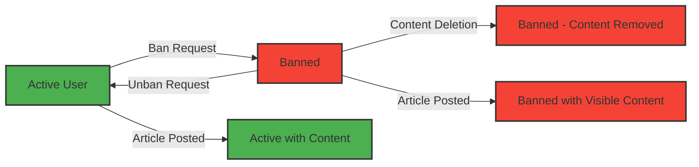
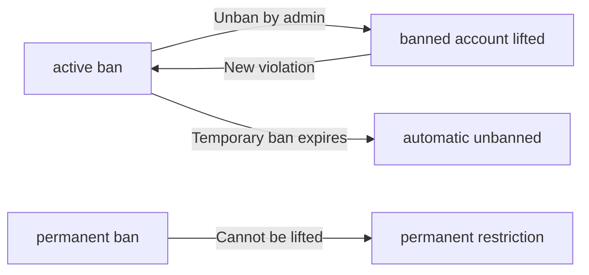

**economicPoliticalBoard — Data isolation, business rules, filtering/sorting/pagination, error catalog**

Data isolation, business rules, filtering/sorting/pagination, error catalog

# Data Isolation and Ownership

Data ownership rules and tenant/user-level isolation policies.

## Ownership and Isolation Rules

Define data ownership semantics and isolation boundaries for multi-user access.

### User Data Ownership

WHEN a user creates an article, THE user SHALL own that article.

WHEN a user creates a comment, THE user SHALL own that comment.

WHEN a user creates a profile, THE user SHALL own that profile.

IF a user deletes their account, THE system SHALL delete all articles owned by that user.

IF a user deletes their account, THE system SHALL delete all comments written by that user.

IF a user deletes their account, THE system SHALL delete the user's profile.

THE system SHALL NOT allow any user to modify or delete data owned by another user.

THE system SHALL allow article authors to edit their own articles.

THE system SHALL allow comment authors to edit their own comments.

THE system SHALL allow article authors to delete their own articles.

THE system SHALL allow comment authors to delete their own comments.

### Data Isolation Between Users

THE system SHALL isolate each user's private data from other users.

GUEST users SHALL NOT see private data belonging to specific members.

MEMBER users SHALL NOT see private data belonging to other members.

ADMIN users SHALL have access to data across all users within their scope.

THE system SHALL display banned users' articles and comments publicly.

THE system SHALL prevent banned users from logging in and creating new content.

THE system SHALL record the reason when a user is banned.

### Multi-User Access Levels

GUEST users SHALL view articles within sections.

GUEST users SHALL view profiles of registered members.

GUEST users SHALL view comments on articles.

MEMBER users SHALL create articles in sections.

MEMBER users SHALL write comments on articles.

MEMBER users SHALL create and manage their profile.

ADMIN users SHALL perform all member operations.

ADMIN users SHALL manage sections, articles, comments, and user access.

### Article Access Control

WHEN viewing an article, THE system SHALL display the article to all authenticated users.

WHEN viewing an article, THE system SHALL display the article to guest users.

WHEN viewing an article, THE system SHALL show the article title to all users.

WHEN viewing an article, THE system SHALL show the full content to all users.

WHEN viewing an article, THE system SHALL show the author's display name to all users.

WHEN viewing an article, THE system SHALL show all attached files to all users.

THE system SHALL allow all users to download attached files from articles.

IF an article is deleted, THE system SHALL remove the article from all lists.

### Comment Access Control

WHEN viewing comments on an article, THE system SHALL display all comments to all users.

WHEN viewing comments on an article, THE system SHALL sort comments by oldest first.

WHEN viewing comments on an article, THE system SHALL show the comment author's display name.

WHEN viewing comments on an article, THE system SHALL show the time each comment was posted.

WHEN viewing comments on an article, THE system SHALL show the comment content to all users.

THE system SHALL allow comment authors to edit their own comments.

THE system SHALL allow comment authors to delete their own comments.

THE system SHALL allow any user to delete any comment.

### Profile Visibility Rules

WHEN viewing a user profile, THE system SHALL display the profile owner's display name.

WHEN viewing a user profile, THE system SHALL display the profile owner's bio.

WHEN viewing a user profile, THE system SHALL display all articles written by the profile owner.

WHEN viewing a user profile, THE system SHALL display all comments written by the profile owner.

WHEN viewing a user profile, THE system SHALL display this information to all authenticated users.

WHEN viewing a user profile, THE system SHALL display this information to guest users.

THE system SHALL allow profile owners to edit their own profile information.

THE system SHALL allow profile owners to update their display name.

THE system SHALL allow profile owners to update their bio.

### Administrator Data Access

REGULAR administrators SHALL create new sections.

REGULAR administrators SHALL edit existing sections.

REGULAR administrators SHALL delete sections.

REGULAR administrators SHALL delete any article on the platform.

REGULAR administrators SHALL delete any comment on the platform.

REGULAR administrators SHALL ban users.

REGULAR administrators SHALL unban users.

REGULAR administrators SHALL view the list of banned users.

SUPER administrators SHALL approve administrator requests.

SUPER administrators SHALL reject administrator requests.

SUPER administrators SHALL promote regular administrators to super administrators.

SUPER administrators SHALL demote super administrators to regular administrators.

SUPER administrators SHALL NOT demote themselves.

# Domain Business Rules

Per-concept business rules, validation logic, and domain constraints.

## User Rules

Users can create accounts using their email address and password credentials. Users authenticate by entering their email and password to access the platform. Users have the ability to change their password at any time through their account settings. When a user requests account deletion, all their articles and comments are permanently removed from the platform. The system tracks when user accounts are created for audit and verification purposes. Only verified users can create posts and participate in discussions. Each user maintains a unique account tied to their email address. User accounts remain active until the user chooses to delete them or gets banned by an administrator.

### Account Creation

WHEN a user creates an account, THE system SHALL:
1. Require a valid email address
2. Require a password meeting minimum length requirements
3. Verify the email address is not already registered
4. Create a new user account with the provided credentials
5. Store the account creation timestamp for audit purposes

IF the email address is already registered, THE system SHALL reject the request and inform the user.
IF the password does not meet minimum length requirements, THE system SHALL reject the request and indicate the specific requirement.
IF the email format is invalid, THE system SHALL reject the request and request a properly formatted email.

THE system SHALL enforce that each email address can be used to register only one account.
THE system SHALL create the user account in an active state upon successful registration.
THE system SHALL require all account creation fields to be provided before processing the request.
THE system SHALL track the account creation timestamp for verification and audit purposes.
THE system SHALL automatically create a user profile with default values upon account creation.

### Email Authentication

WHEN a user attempts to authenticate, THE system SHALL:
1. Accept an email address and password combination
2. Validate the provided credentials against stored account data
3. Grant access if credentials are valid and account is not banned
4. Reject access if credentials are invalid or account is banned

IF the email address is not found in the system, THE system SHALL reject the authentication attempt.
IF the password does not match the stored password hash, THE system SHALL reject the authentication attempt.
IF the user account is banned, THE system SHALL reject the authentication attempt regardless of credential validity.
IF the account is in a pending verification state (if applicable), THE system SHALL require email verification before granting access.

THE system SHALL maintain authentication session state to allow continued access during the session duration.
THE system SHALL support multiple simultaneous authentication sessions per user.
THE system SHALL allow users to authenticate using their registered email address regardless of case.
THE system SHALL lock accounts after a configurable number of failed authentication attempts.

### Password Management

WHEN a user requests to change their password, THE system SHALL:
1. Require authentication with the current password
2. Validate the new password meets all password complexity requirements
3. Update the account with the new password hash
4. Invalidate all active sessions and require re-authentication

IF the current password is incorrect, THE system SHALL reject the password change request.
IF the new password does not meet minimum length requirements, THE system SHALL reject the request.
IF the new password matches a previously used password, THE system SHALL reject the request.
IF the new password is too similar to the username or email, THE system SHALL reject the request.

THE system SHALL enforce password complexity rules including minimum length and character variety.
THE system SHALL hash all passwords using a secure, one-way cryptographic algorithm.
THE system SHALL never store or display passwords in plain text.
THE system SHALL allow users to change their password at any time from their account settings.

WHEN a user requests account recovery, THE system SHALL:
1. Accept the user's registered email address
2. Send a password recovery link to the registered email
3. Allow password reset when the link is used within a valid time window
4. Invalidate the recovery link after it is used

IF the email address does not match any account, THE system SHALL not indicate whether the account exists and shall send a generic success message.
IF the recovery link has expired, THE system SHALL reject the password reset attempt.
IF the recovery link has already been used, THE system SHALL reject the password reset attempt.

### Account Deletion

WHEN a user requests account deletion, THE system SHALL:
1. Require confirmation of the deletion request
2. Remove all articles written by the user
3. Remove all comments written by the user
4. Permanently delete the user account
5. Delete the associated user profile

IF the user is an administrator or super administrator, THE system SHALL prevent account deletion until the role is relinquished or transferred.
IF the account has pending administrator requests, THE system SHALL prevent deletion until those requests are resolved.

THE system SHALL permanently delete all user-generated content upon account deletion.
THE system SHALL cascade delete all content associated with the deleted user account.
THE system SHALL remove the user from all ban records and administrator request records.
THE system SHALL not allow account deletion to be undone once completed.
THE system SHALL record the account deletion timestamp for audit purposes.
THE system SHALL ensure that deletion of user content does not affect other users' accounts.
THE system SHALL prevent account deletion if the user is currently banned.

### User Verification & Persistence

WHEN a user account is created, THE system SHALL mark the account as verified by default.
THE system SHALL persist user account data for as long as the account remains active.
THE system SHALL maintain user account data even during periods of inactivity.

IF a user account is banned, THE system SHALL prevent the user from creating new articles or comments.
IF a user account is banned, THE system SHALL prevent the user from modifying any content.
IF a user account is banned, THE system SHALL prevent the user from updating their profile.

THE system SHALL allow banned users to read articles and comments during their ban period.
THE system SHALL display the ban reason to administrators when viewing banned user accounts.
THE system SHALL track the ban creation timestamp and the administrator who issued the ban.
THE system SHALL maintain account persistence records for regulatory and audit compliance.
THE system SHALL ensure that user accounts remain unique and do not contain duplicate email addresses.
THE system SHALL allow account data to be accessed for the purpose of account recovery.

## Profile Rules

Each user has a profile that displays their display name and bio text for other users to see. Users can update their display name and bio information at any time through their account settings. Users are able to view other users' profiles to learn about their contributions and activities. A user's profile page shows their display name, bio text, all articles they've written, and all comments they've posted. Profiles are publicly accessible to all platform users without restrictions. Display names must be visible to others in the community for transparency. Users cannot hide their profile information from the platform or other users. A user's profile listing includes both their articles and comments in separate sections.

### Profile Visibility and Access

## Profile Visibility Rules

THE system SHALL make all user profiles publicly accessible to all platform users.

THE system SHALL NOT require authentication to view another user's profile.

WHEN a user accesses another user's profile, THE system SHALL display the profile information regardless of the viewer's account status.

GUEST users can view the display name, bio, article list, and comment list of any user's profile.

MEMBER users can view the display name, bio, article list, and comment list of any user's profile.

ADMIN users can view the display name, bio, article list, and comment list of any user's profile.

## Profile Access Restrictions

THE system SHALL display profiles even for users who are banned from the platform.

THE system SHALL display profiles even for users who have deleted their account (if profile data persists).

THE system SHALL prevent modification of another user's profile through the viewing interface.

IF a user account has been deleted, THE system SHALL still allow viewing of the historical profile data where it exists.

### Profile Editing Operations

## Profile Edit Permissions

ONLY the profile owner can edit their own profile information.

WHEN a non-owner attempts to edit another user's profile, THE system SHALL reject the request.

WHEN a deleted account owner attempts to edit their profile, THE system SHALL reject the request.

WHEN a banned user attempts to edit their profile, THE system SHALL reject the request.

THE system SHALL allow profile editing only after successful authentication.

## Edit Process Rules

WHEN a user edits their profile, THE system SHALL update the profile information immediately.

WHEN a user submits profile edits, THE system SHALL validate all fields before accepting the changes.

THE system SHALL retain the original display name and bio if validation fails.

WHEN profile editing is successful, THE system SHALL update the timestamp to reflect the last modification time.

## Self-Edit Confirmation

WHEN a user submits profile edit requests, THE system SHALL verify the user is the profile owner.

IF the user is not the profile owner, THE system SHALL reject the edit request and display an access error.

IF the user session has expired, THE system SHALL require re-authentication before accepting edits.

### Display Name Updates

## Display Name Edit Rules

WHEN a user updates their display name, THE system SHALL validate the new display name against length constraints.

THE system SHALL prevent duplicate display names that match existing users (case-insensitive comparison).

WHEN a display name update succeeds, THE system SHALL propagate the new name to all associated articles and comments.

THE system SHALL require at least one character for the display name.

THE system SHALL allow a maximum display name length of 50 characters.

## Display Name Validation

THE system SHALL reject display names containing only whitespace characters.

THE system SHALL reject display names that impersonate system administrators or platform roles.

THE system SHALL reject display names that contain prohibited offensive language as defined in content moderation rules.

IF a user attempts to change their display name to an existing display name, THE system SHALL reject the change and request a different name.

IF the display name exceeds the maximum length, THE system SHALL reject the update and show a length validation error.

## Display Name Change History

WHEN a display name is updated, THE system SHALL record the change timestamp.

THE system SHALL maintain the ability to view when a user last updated their display name.

### Bio Editing

## Bio Edit Rules

WHEN a user updates their bio, THE system SHALL validate the bio text content.

THE system SHALL allow an empty bio (no text required).

THE system SHALL allow a maximum bio length of 500 characters.

WHEN a bio update succeeds, THE system SHALL immediately update the display on all profile pages.

## Bio Content Validation

THE system SHALL reject bio updates containing only whitespace.

THE system SHALL allow any text characters in the bio field.

THE system SHALL preserve formatting characters and line breaks in the bio text.

IF the bio exceeds the maximum length, THE system SHALL reject the update and show a character count error.

WHEN a user submits a bio update, THE system SHALL sanitize any HTML markup before storing.

## Bio Display Rules

THE system SHALL display the bio text on the user's profile page.

THE system SHALL truncate the bio to 200 characters when showing preview summaries on article and comment listings.

THE system SHALL show the full bio text when viewing the complete profile.

### Profile Viewing and Contributions

## Profile Viewing Rules

WHEN a user views another user's profile, THE system SHALL display the profile owner's display name and bio.

THE system SHALL display a list of all articles written by the profile owner.

THE system SHALL display a list of all comments written by the profile owner.

THE system SHALL separate the article list and comment list into distinct sections on the profile page.

## Contributions Listing

THE system SHALL order articles by publication date with newest first.

THE system SHALL order comments by creation date with newest first.

THE system SHALL display the article title for each article in the contributions list.

THE system SHALL display the comment content preview for each comment in the contributions list.

THE system SHALL show the count of total articles and comments on the profile header.

## Contribution Visibility

THE system SHALL display articles even if the author is banned.

THE system SHALL display articles even if the author's account is deleted.

WHEN viewing profile contributions, THE system SHALL paginate the article and comment lists if the count exceeds 20 items per list.

THE system SHALL allow viewing of individual article and comment pages from the contributions list.

### Profile Content Organization

## Profile Structure Requirements

THE system SHALL display the profile in a consistent layout with sections for: display name, bio, article list, and comment list.

THE system SHALL show the display name as the primary header of the profile.

THE system SHALL show the bio text directly below the display name.

THE system SHALL display the article and comment sections in a tabbed or accordion interface.

## Profile Content Arrangement

WHEN displaying a profile, THE system SHALL show the display name prominently at the top of the page.

THE system SHALL show bio information immediately below the display name.

THE system SHALL display article and comment sections below the bio information.

THE system SHALL separate articles and comments into distinct sections with clear headings.

## Profile Summary Display

THE system SHALL show article and comment counts in the profile header.

THE system SHALL display the profile owner's account creation date.

THE system SHALL show the last profile update timestamp when available.

## Section Rules

The discussion board is organized into topic-based sections such as Politics, Economy, and Current Affairs. Sections are created and managed exclusively by administrators with special privileges. Each section includes a name and description for user reference and understanding. All users can view the complete list of available sections on the platform homepage. Users can browse and read articles within any specific section they choose. Sections provide the organizational structure for the entire discussion board platform. Only administrators have permission to modify or reorganize the section structure. Section names and descriptions are visible to all platform users for navigation purposes.

### Section Creation Rules

WHEN an administrator creates a new section, THE system SHALL:
1. Require a section name
2. Require a section description
3. Ensure the section name is unique across all sections
4. Associate the section with the creating administrator

IF the section name already exists, THE system SHALL reject the request.
IF the section name is missing, THE system SHALL reject the request.
IF the section description is missing, THE system SHALL reject the request.

THE system SHALL reject the request when the user attempting to create a section is not an administrator.

### Section Management Rules

WHEN an administrator edits a section, THE system SHALL:
1. Allow updating the section name
2. Allow updating the section description
3. Preserve existing articles within the section
4. Update the section's modification timestamp

WHEN an administrator deletes a section, THE system SHALL:
1. Require confirmation of deletion
2. Transfer all articles in the section to a default section or mark them as unassigned
3. Delete the section definition
4. Remove the section from all navigation and listings

IF an article has no section after deletion, THE system SHALL mark it as unassigned.
IF a user without administrator privileges attempts to edit or delete a section, THE system SHALL reject the request.

### Topic Organization Structure

WHEN a user views the discussion board, THE system SHALL display sections organized by topic categories.

THE system SHALL ensure each section represents a distinct topic category such as Politics, Economy, or Current Affairs.

IF a section becomes empty (contains no articles), THE system SHALL still display the section in the listing.

THE system SHALL allow sections to have hierarchical organization through naming conventions, but SHALL NOT enforce nested section structures.

### Section Listing Visibility

WHEN any user accesses the platform, THE system SHALL display a complete list of all sections.

THE system SHALL show each section with: name, description, and article count.

THE system SHALL display the list of sections on the platform homepage.

THE system SHALL update the section list in real-time when new sections are created or existing sections are modified.

IF a user is banned, THE system SHALL still allow them to view the section listing but SHALL NOT allow browsing or article access.

### Section Browsing Rules

WHEN a user browses articles within a section, THE system SHALL:
1. Display only articles assigned to that section
2. Show paginated results
3. Allow sorting by newest or oldest first
4. Display article metadata: title, author, tags, comment count, and time posted

IF the section does not exist, THE system SHALL return an empty article list with an appropriate error message.

THE system SHALL NOT show full article content in the section browsing list; only the article title SHALL be displayed.

### Administrator-Only Section Operations

THE system SHALL restrict all section creation, editing, and deletion operations to administrators only.

IF a regular member or guest attempts to create, edit, or delete a section, THE system SHALL reject the request.

IF a regular administrator attempts to perform super-administrator operations on sections, THE system SHALL reject the request.

THE system SHALL log all section management actions with the administrator's identity and timestamp.

### Section Visibility and Access Control

WHEN any user accesses the section listing, THE system SHALL display all sections regardless of user status (guest, member, admin, or banned).

IF a user views articles within a section, THE system SHALL check user access rights for each article.

THE system SHALL allow guests to view public articles within sections.
THE system SHALL allow members and administrators to view both public and private articles within sections.

IF a user attempts to access a section with no articles, THE system SHALL display an appropriate empty state message.

## Article Rules

Users can create articles in any available section of the discussion board. Every article must include a title and content, both of which are required fields. Users can attach multiple files and images to their articles when creating or editing. Users can add free-text tags to categorize their articles with multiple tags allowed per article. Users retain the ability to edit their own articles to update titles, content, attachments, and tags. Users can delete their own articles when they no longer want them published. All articles must be associated with exactly one section for proper organization. Articles remain on the platform until the author or an administrator removes them.

### Article Creation and Required Fields

WHEN a user creates an article, THE system SHALL require a title.

WHEN a user creates an article, THE system SHALL require content text.

WHEN a user creates an article, THE system SHALL require selection of exactly one section.

IF the title is missing or empty, THE system SHALL reject the article creation request.

IF the content is missing or empty, THE system SHALL reject the article creation request.

IF no section is selected, THE system SHALL reject the article creation request.

WHEN a user creates an article, THE system SHALL associate the article with the creating user as the author.

WHEN a user creates an article, THE system SHALL record the creation timestamp.

### Section Assignment and Assignment Rules

WHEN a user creates an article, THE system SHALL require the article to be assigned to one section.

WHEN an article is created, THE system SHALL validate that the selected section exists.

IF the selected section does not exist, THE system SHALL reject the article creation request.

WHEN an article is created, THE system SHALL make the article visible within the assigned section.

WHEN an article is edited, THE system SHALL allow the article to be reassigned to a different section.

IF the target section for reassignment does not exist, THE system SHALL reject the section reassignment.

WHEN a section is deleted by an administrator, THE system SHALL remove the section assignment from all articles in that section.

### File and Image Attachments

WHEN a user creates an article, THE system SHALL allow the user to attach files to the article.

WHEN a user creates an article, THE system SHALL allow the user to attach images to the article.

WHEN a user creates an article, THE system SHALL allow multiple file and image attachments to be added.

WHEN a user creates an article, THE system SHALL associate each attachment with the article.

WHEN a user views an article, THE system SHALL display all attached files and images.

WHEN a user views an article, THE system SHALL allow the user to download attached files.

WHEN a user views an article, THE system SHALL allow the user to download attached images.

WHEN an article is deleted, THE system SHALL remove all associated file and image attachments.

### Tag Management and Multiple Tags

WHEN a user creates an article, THE system SHALL allow the user to add tags to the article.

WHEN a user creates an article, THE system SHALL allow multiple tags to be added to a single article.

WHEN a user creates an article, THE system SHALL allow tags to be free text input.

WHEN a user edits an article, THE system SHALL allow the user to add new tags to the article.

WHEN a user edits an article, THE system SHALL allow the user to remove existing tags from the article.

WHEN a user edits an article, THE system SHALL allow the user to modify existing tags on the article.

WHEN an article is deleted, THE system SHALL remove all tag associations from that article.

IF a tag name already exists in the system, THE system SHALL use the existing tag rather than creating a duplicate.

### Article Ownership and Authorship

WHEN an article is created, THE system SHALL record the creating user as the article author.

WHEN an article is created, THE system SHALL establish ownership of the article by the creating user.

ONLY the article author SHALL be able to edit the article content.

ONLY the article author SHALL be able to delete the article.

WHEN a user attempts to edit another user's article, THE system SHALL reject the edit request.

WHEN a user attempts to delete another user's article, THE system SHALL reject the delete request.

WHEN an administrator deletes an article, THE system SHALL NOT change the original author recorded on the article.

WHEN a user deletes their account, THE system SHALL delete all articles owned by that user.

### Article Editing and Modifications

WHEN an article author edits an article, THE system SHALL allow the author to update the title.

WHEN an article author edits an article, THE system SHALL allow the author to update the content.

WHEN an article author edits an article, THE system SHALL allow the author to add file attachments.

WHEN an article author edits an article, THE system SHALL allow the author to add image attachments.

WHEN an article author edits an article, THE system SHALL allow the author to remove file attachments.

WHEN an article author edits an article, THE system SHALL allow the author to remove image attachments.

WHEN an article author edits an article, THE system SHALL allow the author to modify tags.

WHEN an article author edits an article, THE system SHALL update the edit timestamp.

### Article Deletion Rules

WHEN an article author deletes their article, THE system SHALL remove the article from all article lists.

WHEN an article author deletes their article, THE system SHALL remove the article from the assigned section.

WHEN an article author deletes their article, THE system SHALL delete all associated comments.

WHEN an article author deletes their article, THE system SHALL remove all associated attachments.

WHEN an administrator deletes an article, THE system SHALL remove the article from all article lists.

WHEN an administrator deletes an article, THE system SHALL remove the article from the assigned section.

WHEN an article is deleted by the author or administrator, THE system SHALL NOT make the article accessible for viewing.

### Article Persistence and Data Retention

WHEN an article is created, THE system SHALL persist the article data for indefinite storage.

WHEN an article is created, THE system SHALL preserve the original creation timestamp.

WHEN an article is edited, THE system SHALL preserve the article content history.

WHEN a user deletes their account, THE system SHALL delete all articles created by that user.

WHEN an administrator deletes an article, THE system SHALL permanently remove the article from the platform.

WHEN a user is banned, THE system SHALL preserve the user's existing articles and comments.

WHEN an article exists on the platform, THE system SHALL ensure the article remains accessible until explicitly removed.

## Comment Rules

Users can write comments on any article published on the discussion board platform. Comments exist at a single level only, meaning no nested replies are supported in the system. Users can view all comments associated with an article in chronological order. Comments are automatically sorted by oldest first when displayed on the article page. Each comment displays the author's name, comment content, and timestamp when posted. Users can edit their own comments to correct mistakes or update their content. Users can delete their own comments if they want to remove them from the article. Comments are permanently associated with the article they were posted on.

### Comment Creation

WHEN a user submits a comment on an article, THE system SHALL:
1. Require non-empty comment content
2. Associate the comment with the article being commented on
3. Associate the comment with the creating user as author
4. Record the current timestamp when the comment was posted
5. Persist the comment to the system for viewing by other users

IF the comment content is empty, THE system SHALL reject the request and notify the user that content is required.
IF the user is not logged in, THE system SHALL reject the request and prompt the user to authenticate.
IF the target article does not exist, THE system SHALL reject the request and notify the user that the article was not found.

### Comment Viewing

WHEN a user views an article page, THE system SHALL display all comments associated with that article.
WHEN comments are displayed, THE system SHALL show the comment author's display name, comment content, and timestamp of when it was posted.

WHERE a user is authenticated as a member or admin, THE system SHALL show edit and delete options for their own comments.
WHERE a user is viewing as a guest, THE system SHALL show only the author name, content, and timestamp without edit or delete options.
IF the article has no comments, THE system SHALL display a message indicating there are no comments yet.

### Comment Editing

WHEN an authenticated user edits their own comment, THE system SHALL:
1. Allow updating the comment content
2. Preserve the original creation timestamp
3. Update the comment to reflect the changes
4. Associate the updated content with the same article

IF the comment does not belong to the authenticated user, THE system SHALL reject the edit request.
IF the user is logged out, THE system SHALL reject the edit request and redirect to authentication.
IF the user attempts to edit a comment they did not create, THE system SHALL reject the request and indicate insufficient permissions.

### Comment Deletion

WHEN an authenticated user deletes their own comment, THE system SHALL:
1. Permanently remove the comment from the article
2. Reduce the comment count displayed for the article
3. Ensure the comment is no longer visible to any user

IF the comment does not belong to the authenticated user, THE system SHALL reject the deletion request.
IF the user is logged out, THE system SHALL reject the deletion request and redirect to authentication.
IF the comment has already been deleted, THE system SHALL indicate that the comment no longer exists.

### Single-Level Comments

WHEN a user creates a comment, THE system SHALL ensure the comment exists at a single level only.
WHEN the system displays comments on an article, THE system SHALL NOT show nested replies or threaded conversations.

IF a user attempts to create a reply to an existing comment, THE system SHALL reject the request and indicate that nested comments are not supported.
WHERE the system processes comment data, THE system SHALL maintain flat structure without parent-child relationships between comments.

### Comment Sorting

WHEN the system displays comments on an article page, THE system SHALL sort comments by timestamp in ascending order (oldest first).
WHERE multiple comments exist, THE system SHALL order them chronologically from the earliest timestamp to the latest.

IF comments have identical timestamps, THE system SHALL use comment creation order as a secondary sort criterion.
WHERE comments are retrieved from the system, THE system SHALL ensure chronological ordering is applied consistently across all users.

### Comment Ownership

ONLY the user who created a comment shall have permission to edit or delete that comment.
GUEST users shall NOT be able to edit or delete any comments on the platform.

IF a user attempts to edit or delete a comment created by another user, THE system SHALL reject the request and indicate insufficient permissions.
ADMINISTRATOR users shall have the capability to delete any comment regardless of ownership.

### Comment Timestamps

WHEN a comment is created, THE system SHALL record and store the timestamp of creation.
WHEN a comment is viewed, THE system SHALL display the original creation timestamp (not modification timestamp).

IF a comment is edited, THE system SHALL NOT update the original creation timestamp.
THE system SHALL store timestamps in a consistent format readable to users across all timezones.

### Comment Persistence

WHEN a comment is created, THE system SHALL persist it to storage for long-term availability.
IF a user deletes their account, THE system SHALL NOT automatically delete existing comments they authored (comments remain visible but author may be anonymized per system policy).

IF a user is banned by an administrator, THE system SHALL NOT automatically delete their existing comments (comments remain visible).
WHERE a comment is created, THE system SHALL maintain data integrity ensuring the comment persists until explicitly deleted by the author or administrator.

### Chronological Ordering

WHEN comments are displayed on an article, THE system SHALL order them from oldest to newest based on creation timestamp.
THE system SHALL ensure chronological ordering applies consistently across all article comment sections.

IF comments span multiple time periods, THE system SHALL maintain chronological order without interruption.
WHERE comments are retrieved for display, THE system SHALL guarantee that the oldest comment appears first and the newest comment appears last in the list.

## Attachment Rules

Users can attach files to their articles when creating or editing their content. Multiple files can be attached to a single article for supporting materials. Users can also attach images to their articles separately from regular file attachments. Users can download attached files and images when viewing articles on the platform. Both files and images count toward the total attachment allowance per article. Attachments are permanently associated with the article they are attached to and persist with the article. Users can manage their attachments when editing articles but not after deletion. Downloaded attachments remain accessible as long as the article remains on the platform.

### File Attachment Creation

WHEN a user creates a new article, THE system SHALL allow the user to attach one or more files to the article.
WHEN a user attaches files during article creation, THE system SHALL require each file to have a valid filename.
WHEN a user attaches files during article creation, THE system SHALL require each file to have a valid content type.
IF a user attempts to attach a file that exceeds the maximum file size, THE system SHALL reject the attachment.
IF a user attempts to attach a file with an unsupported file type, THE system SHALL reject the attachment.
THE system SHALL count each file attachment toward the total attachment allowance for the article.

WHEN a user creates a new article, THE system SHALL allow the user to attach one or more images to the article.
WHEN a user attaches images during article creation, THE system SHALL require each image to have a valid filename.
WHEN a user attaches images during article creation, THE system SHALL require each image to be in an supported image format.
IF a user attempts to attach an image that exceeds the maximum file size, THE system SHALL reject the image.
IF a user attempts to attach an image with an unsupported image format, THE system SHALL reject the image.
THE system SHALL count each image attachment toward the total attachment allowance for the article.

### Multiple Attachments Rule

THE system SHALL allow multiple file attachments to be attached to a single article simultaneously.
THE system SHALL allow multiple image attachments to be attached to a single article simultaneously.
THE system SHALL allow a combination of files and images to be attached to a single article.
IF the total number of attachments (files + images) exceeds the maximum attachment count, THE system SHALL reject all new attachments.
IF the total size of all attachments (files + images) exceeds the maximum total attachment size, THE system SHALL reject the new attachments.
THE system SHALL store each attachment as a separate entity associated with the article.

WHEN a user attempts to add more attachments than allowed, THE system SHALL reject the request and inform the user of the remaining capacity.
WHEN a user attempts to add attachments that would exceed the total size limit, THE system SHALL reject the request and inform the user of the remaining space.
THE system SHALL enforce the attachment limits before creating the article or updating it.

### Attachment Download

WHEN a user views an article with attachments, THE system SHALL display all file and image attachments to the user.
WHEN a user views an article with attachments, THE system SHALL provide a download option for each attachment.
WHEN a user clicks the download option for an attachment, THE system SHALL provide the attachment for download.
WHEN a user downloads a file attachment, THE system SHALL preserve the original filename.
WHEN a user downloads an image attachment, THE system SHALL preserve the original filename.

WHERE the article is visible to the user, THE system SHALL allow the user to download all attached files and images.
WHERE the user does not have access to the article, THE system SHALL prevent the user from downloading the attachments.
WHEN an article is deleted, THE system SHALL revoke access to all attached files and images.

### Attachment Management

WHEN a user edits their own article, THE system SHALL allow the user to add new file attachments to the article.
WHEN a user edits their own article, THE system SHALL allow the user to add new image attachments to the article.
WHEN a user edits their own article, THE system SHALL allow the user to remove existing file attachments from the article.
WHEN a user edits their own article, THE system SHALL allow the user to remove existing image attachments from the article.
WHEN a user edits their own article, THE system SHALL allow the user to modify the list of attached files and images.

IF the user does not own the article, THE system SHALL prevent the user from modifying attachments.
IF the user is not the author of the article, THE system SHALL prevent the user from modifying attachments.
IF the article has been deleted, THE system SHALL prevent the user from modifying attachments.
WHEN a user removes an attachment, THE system SHALL permanently remove that attachment from the article.

### Attachment Persistence

THE system SHALL persist all file attachments with the article for the lifetime of the article.
THE system SHALL persist all image attachments with the article for the lifetime of the article.
WHEN an article is created, THE system SHALL persist all attached files and images immediately.
WHEN an article is updated, THE system SHALL persist the updated list of attachments.
WHEN an article is deleted, THE system SHALL delete all associated file and image attachments.

WHERE an article is archived or moved to a different section, THE system SHALL maintain all attached files and images.
WHEN an article is recovered from deletion, THE system SHALL restore all previously attached files and images.
THE system SHALL ensure attachments are accessible as long as the article remains on the platform.

### Attachment Visibility

WHEN a user views an article, THE system SHALL display all file and image attachments that are attached to that article.
WHEN a user views an article, THE system SHALL show the filename for each attachment.
WHEN a user views an article, THE system SHALL indicate which attachments are images and which are regular files.
THE system SHALL display the attachment count on the article listing view.

WHERE a user has access to the article, THE system SHALL display all attachments to that user.
WHERE a user does not have access to the article, THE system SHALL not display any attachments to that user.
WHEN viewing an article, THE system SHALL prevent unauthorized users from accessing attachment download functionality.

### Attachment File Types

THE system SHALL support document file attachments including PDF, DOC, DOCX, TXT, and RTF formats.
THE system SHALL support spreadsheet file attachments including XLS, XLSX, and CSV formats.
THE system SHALL support presentation file attachments including PPT and PPTX formats.
THE system SHALL support image file attachments including JPG, JPEG, PNG, GIF, and WEBP formats.

IF a user attempts to attach a file type that is not in the supported list, THE system SHALL reject the attachment.
IF a user attempts to attach an image format that is not in the supported list, THE system SHALL reject the image.
THE system SHALL validate the file content type matches the actual file content.

### Supporting Materials Rule

WHEN a user attaches files or images to an article, THE system SHALL treat them as supporting materials for the article content.
THE system SHALL allow users to attach multiple supporting materials to provide additional context to their article.
THE system SHALL display all supporting materials on the article viewing page.
THE system SHALL enable users to download supporting materials for reference.

WHERE users want to add supplementary information to their article, THE system SHALL allow them to attach relevant supporting materials.
WHEN users reference external documents in their article, THE system SHALL allow them to attach those documents as supporting materials.
THE system SHALL support multiple supporting materials to enhance article comprehensiveness.

## Tag Rules

Users can add tags to their articles to help categorize and organize content. Tags are entered as free text by the user, with no predefined tag list required. Multiple tags are allowed per article for flexible categorization and discovery. Tags help organize and discover articles across the entire platform system. Tag names must be unique across the system to avoid duplication and confusion. Tags appear on articles and can be used for filtering search results effectively. Users can add or modify tags when creating or editing their articles. Tag names should be meaningful to help other users find relevant articles.

### Tag Creation and Naming

### Tag Creation

WHEN a user creates an article with tags, THE system SHALL accept free-text tag names entered by the user.

WHEN a user creates a new tag, THE system SHALL validate that the tag name meets minimum length requirements of 1 character.

WHEN a user creates a new tag, THE system SHALL validate that the tag name does not exceed maximum length of 50 characters.

WHEN a user creates a tag, THE system SHALL reject tag names containing only whitespace characters.

WHEN a user creates a tag, THE system SHALL normalize tag names to a consistent case (case-insensitive matching).

### Tag Naming Conventions

THE system SHALL allow alphanumeric characters, spaces, hyphens, and underscores in tag names.

THE system SHALL reject tag names containing special characters other than hyphens and underscores.

WHEN a user enters a tag name with leading or trailing whitespace, THE system SHALL trim the whitespace automatically.

IF a user attempts to create a tag that already exists (case-insensitive), THE system SHALL reuse the existing tag instead of creating a duplicate.

THE system SHALL ensure all tag names are meaningful and descriptive to help users discover relevant articles.

### Tag Uniqueness Management

### System-Wide Tag Uniqueness

THE system SHALL enforce tag name uniqueness across the entire platform system.

WHEN a tag is created, THE system SHALL check for existing tags with the same name (case-insensitive).

IF a duplicate tag attempt is detected, THE system SHALL link the article to the existing tag instead of creating a new one.

WHEN a user edits an article and changes a tag, THE system SHALL update the article-tag association to the new or existing tag.

THE system SHALL prevent duplicate tag entries through case-insensitive comparison of tag names.

WHEN a tag is deleted, THE system SHALL remove the tag from all articles that reference it.

### Tag Persistence

WHEN an article is created with tags, THE system SHALL persist the tag associations in the database.

WHEN an article is edited, THE system SHALL maintain the existing tag associations unless explicitly modified by the user.

THE system SHALL preserve tag names even if no articles currently use them (for historical reference).

WHEN a tag is no longer associated with any article, THE system SHALL still allow it to be viewed for search purposes.

### Multiple Tags Per Article

### Article-Tag Associations

WHEN a user creates an article, THE system SHALL allow the user to assign multiple tags to the article.

THE system SHALL support up to 10 tags per article maximum.

IF a user attempts to assign more than 10 tags to an article, THE system SHALL reject the request with an appropriate error message.

WHEN a user views an article, THE system SHALL display all tags associated with that article.

THE system SHALL allow users to add tags incrementally when editing an existing article.

WHEN a user removes a tag from an article, THE system SHALL update the article-tag association without deleting the tag itself.

### Tag Uniqueness Pairs

THE system SHALL prevent duplicate tag-article pairs (same tag cannot appear twice on the same article).

WHEN a user attempts to add a tag that is already associated with the article, THE system SHALL not create a duplicate association.

THE system SHALL validate that each tag-reference pair is unique within an article.

### Tag Removal

WHEN a user deletes an article, THE system SHALL remove all tag associations for that article.

THE system SHALL not delete tags that are still associated with other articles when one article is deleted.

WHEN a tag is completely removed from all articles, THE system SHALL allow it to be reused in the future.

### Tag Filtering and Search

### Tag Filtering

WHEN a user filters articles by tag, THE system SHALL return all articles that have the selected tag.

WHEN a user applies multiple tag filters, THE system SHALL return articles that have ALL of the selected tags (AND logic).

THE system SHALL allow users to filter articles by a single tag at a time.

IF no articles exist with the filtered tag, THE system SHALL display an empty results page.

WHEN filtering by tag, THE system SHALL preserve pagination settings.

### Tag Search

WHEN a user searches articles by tag, THE system SHALL search for articles containing the specified tag name.

THE system SHALL perform case-insensitive tag name matching in search queries.

WHEN a tag search term does not match any existing tags, THE system SHALL display a message indicating no matching articles were found.

THE system SHALL support partial tag name matching in search queries.

### Sorting with Tag Filters

WHEN articles are filtered by tag, THE system SHALL allow users to sort results by newest first.

WHEN articles are filtered by tag, THE system SHALL allow users to sort results by oldest first.

THE system SHALL maintain tag filter state when changing sort order.

### Tag Visibility and Discovery

### Tag Visibility

THE system SHALL display tags on the article list page for each article.

WHEN viewing a single article, THE system SHALL display all tags associated with that article.

THE system SHALL display tags in a readable format on all article views.

GUEST users SHALL be able to view tags on public articles.

### Tag Categorization

WHEN a user creates a tag, THE system SHALL allow the tag to categorize articles by topic or subject matter.

THE system SHALL enable tag-based organization of articles across all sections.

WHEN viewing articles in a section, THE system SHALL show tags that categorize articles in that section.

### Tag Discovery

THE system SHALL make all tags discoverable through the tag filtering interface.

WHEN a user filters by tag, THE system SHALL show the tag name clearly in the filter options.

THE system SHALL enable users to discover articles through tag exploration.

WHEN a user clicks on a tag in the article view, THE system SHALL navigate to a list of all articles with that tag.

### Tag Search Integration

WHEN searching articles by title or content, THE system SHALL also search by tag names.

THE system SHALL include tag names in the overall article search results.

IF a search term matches a tag name, THE system SHALL return articles with that tag in search results.

WHEN users browse by tag, THE system SHALL show the total count of articles for each tag.

## ArticleTag Rules

Articles can be associated with multiple tags simultaneously for flexible organization. Each article-tag relationship is uniquely tracked in the system to prevent duplicates. Tags can be added or removed from articles by the article author at any time. Tag relationships persist as long as the article exists on the platform system. Multiple tags can be applied to the same article without any numerical restriction. Tag-article associations enable content filtering and discovery for users browsing articles. When an article is deleted, all its tag associations are automatically removed. Tag relationships are maintained independently from the article content itself.

### Article-Tag Association Creation

WHEN an article author creates an article with tags, THE system SHALL create article-tag associations for each tag provided.

WHEN an article author adds a new tag to an existing article, THE system SHALL create a unique article-tag association.

IF the tag does not exist in the system, THE system SHALL reject the tag creation for the article.

IF the user attempting to create the association is not the article author, THE system SHALL reject the association creation.

THE system SHALL validate that each tag name exists in the tag catalog before creating the association.

THE system SHALL prevent duplicate article-tag associations by ensuring each tag can only appear once per article.

WHEN an article is created, THE system SHALL automatically create article-tag associations for all provided tags.

IF the article does not exist, THE system SHALL reject the tag association request.

THE system SHALL record the timestamp when each article-tag association is created.

### Multiple Tag Management

WHEN an article author adds tags to an article, THE system SHALL allow multiple tags to be associated with the same article.

THE system SHALL support unlimited number of tags per article without numerical restrictions.

WHEN multiple tags are added to an article, THE system SHALL maintain all associations independently.

THE system SHALL allow users to view all tags associated with an article in article listings.

IF a user attempts to add a tag that already exists on the article, THE system SHALL not create a duplicate association.

THE system SHALL display all article tags in a sortable list on the article detail page.

WHEN tags are managed on an article, THE system SHALL preserve the order in which tags were added for display purposes.

THE system SHALL allow filtering articles by any tag associated with articles in the system.

IF the article has zero tags, THE system SHALL still display the article in tag-based searches.

### Tag Removal Rules

WHEN an article author removes a tag from their article, THE system SHALL delete the corresponding article-tag association.

IF a non-author attempts to remove a tag from an article, THE system SHALL reject the removal request.

THE system SHALL allow article authors to remove all tags from their article simultaneously.

WHEN a tag is removed from an article, THE system SHALL not delete the tag itself from the tag catalog.

IF the article is deleted, THE system SHALL automatically remove all tag associations for that article.

WHEN a tag is removed, THE system SHALL update the article's tag display immediately.

THE system SHALL allow partial tag removal where only specific tags are removed while others remain.

IF the article author no longer exists, THE system SHALL allow administrators to remove tags from the article.

THE system SHALL not allow tag removal through batch operations without specifying which tags to remove.

### Tag Association Persistence

WHEN an article-tag association is created, THE system SHALL persist the association indefinitely as long as the article exists.

THE system SHALL maintain article-tag associations across all system updates and migrations.

IF the tag is deleted from the catalog, THE system SHALL preserve existing article-tag associations and prevent new associations with the deleted tag.

THE system SHALL ensure article-tag associations remain visible and accessible in article listings.

WHEN the system restores from backup, THE system SHALL restore all article-tag associations to their previous state.

THE system SHALL track when each tag association was last modified for auditing purposes.

IF the system experiences data corruption, THE system SHALL maintain article-tag associations with error recovery procedures.

THE system SHALL allow administrators to query all tags associated with articles for reporting purposes.

### Article Categorization Rules

WHEN an article is created, THE system SHALL enable article categorization through multiple tag associations.

THE system SHALL allow users to discover articles by browsing tags associated with articles.

WHEN a user searches by tag, THE system SHALL return all articles associated with that tag.

THE system SHALL enable cross-categorization where an article can belong to multiple categories simultaneously.

IF an article has no tags, THE system SHALL still display the article in general article listings.

THE system SHALL provide tag-based filtering in article list views.

WHEN an article is moved between sections, THE system SHALL preserve all existing tag associations.

THE system SHALL allow administrators to view articles grouped by their tag associations for moderation.

IF an article is deleted, THE system SHALL not remove the tag itself from the tag catalog, only the article-tag associations.

## AdministratorRequest Rules

Any user can submit a request to become an administrator on the discussion board platform. Administrator requests must include a reason explaining why the user wants administrative access. Super administrators can view a list of all pending administrator requests in the system. Super administrators have the authority to approve or reject administrator requests. When approved, the user becomes a regular administrator with administrative privileges. Request status is tracked until a decision is made by super administrators. Users can submit only one pending request at a time for processing. Administrator requests remain in the system until approved or rejected by super administrators.

### Administrator Request Submission

WHEN a user submits an administrator request, THE system SHALL: 
1. Require the user to provide a reason explaining why they want administrative access 
2. Allow only one pending administrator request per user at any time 
3. Track the submission timestamp and assign a unique request identifier 
4. Store the request in pending status until reviewed by a super administrator 

IF a user already has a pending administrator request, THE system SHALL prevent submission of a new request until the existing request is resolved. 

THE system SHALL reject the request if the user is already an administrator. 

THE system SHALL reject the request if the user is banned. 

THE reason for the administrator request SHALL be required and SHALL contain at least 50 characters. 

THE reason SHALL NOT contain external links. 

THE reason SHALL NOT be generic or templated content (e.g., "I want admin access").

### Request Reason Validation

WHEN a user submits an administrator request, THE system SHALL validate the provided reason. 

IF the reason contains fewer than 50 characters, THE system SHALL reject the request and inform the user to provide a more detailed explanation. 

IF the reason contains more than 500 characters, THE system SHALL truncate the reason to 500 characters or reject the request. 

IF the reason contains an external link (HTTP or HTTPS URL), THE system SHALL reject the request and inform the user to remove external links. 

IF the reason is determined to be generic or non-specific, THE system SHALL reject the request. 

THE system SHALL allow approved users to resubmit a request after rejection with an improved reason. 

THE reason SHALL be stored in the system for review by super administrators. 

WHEN a request is approved or rejected, THE system SHALL retain the original reason in the request record for audit purposes.

### Pending Request Management

WHEN a user submits a valid administrator request, THE system SHALL: 
1. Assign the request a status of "pending" 
2. Display the pending request to super administrators in a dedicated management interface 
3. Prevent the user from submitting additional requests while the current request remains pending 

SUPER ADMINISTRATORS SHALL be able to view a list of all pending administrator requests. 

THE list of pending requests SHALL include: submission date, user identification, reason summary, and current status. 

PENDING administrator requests SHALL remain in the system indefinitely until explicitly approved or rejected by a super administrator. 

THE system SHALL NOT automatically expire or remove pending administrator requests. 

WHEN viewing pending requests, SUPER ADMINISTRATORS SHALL be able to filter by submission date range. 

THE system SHALL order pending requests by submission date with newest submissions appearing first.

### Administrator Approval Process

WHEN a super administrator approves an administrator request, THE system SHALL: 
1. Change the request status to "approved" 
2. Grant the user regular administrator privileges 
3. Record the approval timestamp and the ID of the super administrator who approved the request 
4. Allow the newly appointed administrator to immediately access administrative features 

WHEN a super administrator rejects an administrator request, THE system SHALL: 
1. Change the request status to "rejected" 
2. Record the rejection timestamp and the ID of the super administrator who rejected the request 
3. Notify the user that their request has been rejected 
4. Allow the user to submit a new administrator request after rejection 

SUPER ADMINISTRATORS SHALL be the only actors authorized to approve or reject administrator requests. 

THE approval or rejection action SHALL be logged in the system for audit purposes. 

WHEN a pending request is resolved (approved or rejected), THE system SHALL prevent further actions on that specific request. 

THE system SHALL notify super administrators when a user resubmits a request after a previous rejection.

### Administrator Status Tracking

WHEN a user submits an administrator request, THE system SHALL track the request status throughout its lifecycle. 

THE possible administrator request statuses SHALL be: "pending", "approved", and "rejected". 

WHILE a user has a pending administrator request, THE system SHALL: 
1. Display the current status to the user 
2. Prevent the user from submitting duplicate requests 
3. Indicate when the user can resubmit if the request was rejected 

SUPER ADMINISTRATORS SHALL be able to view the complete history of administrator requests submitted by each user. 

THE system SHALL record the following information for each administrator request: 
- Unique request identifier 
- Submitting user ID 
- Request reason 
- Submission timestamp 
- Review status (pending, approved, or rejected) 
- Timestamp of approval or rejection 
- ID of super administrator who reviewed the request 

WHEN a user's administrator request is approved, THE system SHALL update the user's administrator status to "regular administrator". 

WHEN viewing administrator requests, SUPER ADMINISTRATORS SHALL be able to filter by status (pending, approved, or rejected).

### Administrator Privileges After Approval

WHEN a user's administrator request is approved, THE system SHALL grant the user regular administrator privileges. 

REGULAR ADMINISTRATORS SHALL be able to: 
1. Create, edit, and delete sections 
2. Delete any article on the platform 
3. Delete any comment on the platform 
4. Ban users from the platform 
5. Unban users from the platform 
6. View the list of banned users 
7. Perform all operations available to regular members 

SUPER ADMINISTRATORS SHALL have all regular administrator privileges plus additional capabilities: 
1. Promote regular administrators to super administrators 
2. Demote super administrators to regular administrators 
3. Cannot demote themselves 
4. Approve or reject administrator requests 

WHEN a user becomes a regular administrator, THE system SHALL preserve all existing content authored by the user. 

THE system SHALL maintain a record of when a user was promoted to administrator status. 

SUPER ADMINISTRATORS SHALL be able to distinguish between regular administrators and super administrators in the administration interface.

## BanRecord Rules

Administrators can ban users from the platform when they violate platform rules. When a user is banned, they cannot log in to the platform anymore. Banned users' existing articles and comments remain visible to other users. A ban reason must be recorded when a user is banned for transparency. Administrators can view the ban reason for each banned user in the system. Administrators can unban users to restore their access to the platform. Ban records are permanently stored for audit and tracking purposes. Banned users' ban status persists until an administrator removes the ban.

### Administrator Banning Power

WHEN an administrator bans a user, THE system SHALL require a reason for the ban.
IF an administrator attempts to ban themselves, THE system SHALL reject the request.
IF an administrator attempts to ban a user without providing a ban reason, THE system SHALL reject the request.
THE administrator SHALL have the power to ban any user from the platform.
THE administrator SHALL have the power to unban any banned user from the platform.

### Ban Reasons and Transparency

WHEN an administrator creates a ban record, THE system SHALL record the reason for the ban.
THE ban reason SHALL be visible to all administrators viewing the ban record.
WHEN a user views their own account status, THE system SHALL display the ban reason if the user is banned.
THE system SHALL display the administrator ID who created the ban record.
THE ban reason SHALL be stored permanently for audit and tracking purposes.

### Login Restrictions and Access Control

WHEN a banned user attempts to log in to the platform, THE system SHALL reject the login attempt.
WHEN a banned user submits login credentials, THE system SHALL display a message that their account is banned.
THE system SHALL prevent banned users from creating new articles or comments.
THE system SHALL prevent banned users from editing their profile information.
WHILE a user has active ban status, THE system SHALL block all login attempts regardless of password validity.

### Ban Visibility and Content Retention

WHEN a user is banned, THE system SHALL preserve all articles and comments written by that user.
BANNED users' articles SHALL remain visible to other users on the platform.
BANNED users' comments SHALL remain visible to other users on articles.
THE system SHALL display the author name for articles and comments written by banned users.
THE system SHALL maintain visibility of content written by banned users until those articles or comments are deleted by an administrator.

### Ban Removal and Ban History

WHEN an administrator unbans a user, THE system SHALL restore the user's access to the platform.
WHEN a user is unbanned, THE system SHALL allow the user to log in with their existing credentials.
THE system SHALL preserve the ban history record even after the user is unbanned.
THE ban history SHALL be permanently stored and cannot be modified or deleted.
WHEN an administrator removes a ban, THE system SHALL record the time of the ban removal.

### Ban Persistence and System Behavior

WHEN a user is banned, THE system SHALL maintain the ban status until explicitly removed by an administrator.
THE ban status SHALL persist across all system sessions and device logins.
THE system SHALL prevent any automatic ban expiration without administrator action.
WHEN a user is unbanned, THE system SHALL immediately restore full platform access.
THE ban record SHALL remain in the system even after the ban is lifted for transparency and audit purposes.

### Ban State Lifecycle

# Detailed Validation Rules

Detailed validation rules with boundary values and format requirements.

## User Validation Rules

Users must provide a valid email address when signing up. Email addresses must follow standard format conventions with a domain suffix. Each email address must be unique across all active user accounts in the system. Users cannot reuse an email that was previously registered and then deleted. Passwords must contain at least eight characters to ensure adequate security. Passwords must include both uppercase and lowercase letters. Passwords must contain at least one numeric digit. Passwords must include at least one special character from the allowed set. Users cannot use passwords that match their email address or display name. Password changes require authentication with the current password first. Deleted user accounts cannot have their email addresses reactivated for a period of time after deletion.

### Email Format Validation

WHEN a user submits an email address during sign-up, THE system SHALL validate that the email follows standard format conventions with a local part and domain suffix separated by the @ symbol.

WHEN a user submits an email address, THE system SHALL validate that the domain portion contains at least one period separating the domain name from the top-level domain.

THE system SHALL reject the registration request when the email address does not conform to standard email format.

IF the email address is missing the local part before the @ symbol, THE system SHALL reject the request.

IF the email address is missing the domain part after the @ symbol, THE system SHALL reject the request.

WHEN a user changes their password, THE system SHALL validate that the new email format conforms to standard email conventions if the email is being updated.

### Email Uniqueness Check

WHEN a user attempts to register with an email address, THE system SHALL check if that email address is already registered to an active account.

IF the email address is already associated with an active user account, THE system SHALL reject the registration request.

THE system SHALL ensure that each email address is unique across all active user accounts in the system.

WHEN a user submits a new email address during account settings update, THE system SHALL verify that the email is not already in use by another account.

IF the email address is already registered to another user account, THE system SHALL reject the email update request.

### Password Minimum Length

WHEN a user creates a new account, THE system SHALL require the password to contain at least eight characters.

WHEN a user submits a password during sign-up, THE system SHALL validate that the password meets the minimum length requirement of eight characters.

IF the password is shorter than eight characters, THE system SHALL reject the registration request.

WHEN a user changes their password, THE system SHALL enforce the same minimum length requirement of eight characters.

THE system SHALL reject a password change request when the new password does not meet the minimum length requirement.

### Password Character Requirements

WHEN a user creates a password, THE system SHALL validate that the password includes both uppercase and lowercase letters.

WHEN a user submits a password during registration, THE system SHALL require at least one numeric digit to be present.

WHEN a user submits a password, THE system SHALL require at least one special character from the allowed set.

IF the password lacks uppercase letters, THE system SHALL reject the password during sign-up.

IF the password lacks lowercase letters, THE system SHALL reject the password during sign-up.

IF the password lacks numeric digits, THE system SHALL reject the password during sign-up.

IF the password lacks special characters, THE system SHALL reject the password during sign-up.

### Password Complexity Rules

WHEN a user creates a password, THE system SHALL validate that the password meets all complexity requirements simultaneously.

THE system SHALL reject a password that does not satisfy all character requirements: uppercase, lowercase, numeric, and special characters.

WHEN a user submits a password for change, THE system SHALL validate the new password against all complexity rules.

IF the password contains only one type of character class, THE system SHALL reject the password as insufficiently complex.

THE system SHALL provide specific feedback indicating which character requirements were not satisfied when validation fails.

### Password Reuse Prevention

WHEN a user changes their password, THE system SHALL prevent the new password from matching any of their previously used passwords.

IF the new password is identical to a previously used password, THE system SHALL reject the password change request.

THE system SHALL maintain a history of the user's recent passwords to detect reuse attempts.

WHEN a user attempts to reuse an old password, THE system SHALL inform them that password reuse is not permitted.

IF the password matches their last five used passwords, THE system SHALL explicitly reject the change.

### Password Change Authentication

WHEN a user requests to change their password, THE system SHALL require authentication with their current password first.

IF the user cannot provide the correct current password, THE system SHALL reject the password change request.

THE system SHALL validate the current password against the stored password hash before allowing any password modifications.

WHEN authentication with the current password fails, THE system SHALL NOT proceed with password update.

IF the user provides an incorrect current password, THE system SHALL reject the request and indicate authentication failure.

### Deleted Email Retention Period

WHEN a user deletes their account, THE system SHALL prevent the associated email address from being reused for a specified retention period.

THE system SHALL enforce that deleted email addresses cannot be reactivated for registration within the retention period.

IF a user attempts to register with an email address that was previously deleted and is within the retention period, THE system SHALL reject the request.

WHEN the retention period expires, THE system SHALL allow the previously deleted email address to be used for new registration.

THE system SHALL track the deletion timestamp for each deleted account to enforce the retention policy.

### Email Domain Validation

WHEN a user submits an email address during sign-up, THE system SHALL validate that the domain portion contains a properly formatted domain name.

IF the email domain does not contain at least one valid character for a domain name, THE system SHALL reject the email address.

WHEN a user registers with an email, THE system SHALL ensure the domain suffix conforms to standard top-level domain formats.

THE system SHALL reject email addresses with domains that do not follow standard naming conventions.

IF the email domain contains invalid characters or formatting, THE system SHALL reject the registration request.

### Password Matching Prevention

WHEN a user creates a password during registration, THE system SHALL validate that the password does not match the email address.

WHEN a user changes their password, THE system SHALL ensure the new password does not match their current email address.

IF the password is identical to the user's email address, THE system SHALL reject the password.

IF the password is identical to the user's display name, THE system SHALL reject the password.

WHEN the password matches any part of the email address, THE system SHALL reject the password as insufficiently secure.

### Password Change Validation Sequence

WHEN a user submits a password change request, THE system SHALL first validate the current password authentication.

WHEN authentication is successful, THE system SHALL validate the new password against all complexity rules.

IF any validation step fails, THE system SHALL reject the password change request and indicate the specific failure reason.

THE system SHALL NOT update the password when any validation condition is not satisfied.

WHEN all validations pass, THE system SHALL update the password and invalidate all existing active sessions.

## Profile Validation Rules

Each user must have a display name when setting up their profile. Display names must be between two and fifty characters in length. Display names can contain letters, numbers, spaces, and common punctuation marks. Display names cannot consist entirely of numbers or special characters. Users must provide a bio text of at least twenty characters when creating their profile. The bio text can extend up to five hundred characters maximum. The bio can contain multiple paragraphs of text. Bio text cannot contain HTML tags or script content. Display names must be unique among all user profiles in the system. Users cannot use display names that impersonate other users or administrators. Bio text cannot include personal contact information like phone numbers or private email addresses.

### Display Name Minimum Length

WHEN a user creates a profile, THE system SHALL validate that the display name contains at least two characters.

WHEN a user attempts to change their display name, THE system SHALL reject requests where the new display name has fewer than two characters.

IF the display name consists of only one character, THE system SHALL display an error message indicating the minimum length requirement.

THE system SHALL enforce this validation before persisting any display name changes to the database.

IF a user attempts to set an empty string as their display name, THE system SHALL reject the request with an appropriate error.

### Display Name Maximum Length

WHEN a user creates a profile, THE system SHALL validate that the display name does not exceed fifty characters in length.

WHEN a user attempts to update their display name, THE system SHALL truncate or reject display names that exceed the fifty character limit.

IF the display name exceeds fifty characters, THE system SHALL reject the request and inform the user of the maximum allowed length.

THE system SHALL count display name characters including spaces and punctuation marks.

IF a user submits a display name that is too long, THE system SHALL NOT save any partial information and SHALL return a complete validation error.

### Display Name Character Restrictions

WHEN a user provides a display name, THE system SHALL accept only letters, numbers, spaces, and common punctuation marks.

WHEN a display name contains characters outside the allowed set, THE system SHALL reject the request with a validation error.

IF a display name contains entirely numeric characters, THE system SHALL reject the request.

IF a display name contains entirely special characters without any letters or numbers, THE system SHALL reject the request.

THE system SHALL allow spaces within display names, but display names cannot begin or end with spaces.

Common punctuation marks include periods, commas, hyphens, underscores, and apostrophes.

### Display Name Uniqueness

WHEN a user attempts to create a profile, THE system SHALL verify that the proposed display name is not already in use by another user.

WHEN a user attempts to change their display name, THE system SHALL verify that the new display name is unique across all user profiles.

IF the display name is already taken, THE system SHALL reject the request and inform the user that the name is unavailable.

THE system SHALL compare display names in a case-insensitive manner to ensure uniqueness.

IF a user successfully sets a display name, THE system SHALL make that name reserved and unavailable to other users.

### Display Name Impersonation Prevention

WHEN a user attempts to set a display name, THE system SHALL check if the name resembles or matches administrator display names.

IF a display name is determined to impersonate an administrator, THE system SHALL reject the request.

WHEN a user attempts to use a display name that matches or closely resembles the profile name of another user, THE system SHALL reject the request.

THE system SHALL maintain a list of reserved names that cannot be used for impersonation purposes.

IF the system detects potential impersonation, THE system SHALL prevent the display name change and log the attempt for review.

### Bio Minimum Length

WHEN a user creates a profile, THE system SHALL require that the bio text contains at least twenty characters.

WHEN a user attempts to update their bio, THE system SHALL validate that the new bio text is at least twenty characters long.

IF the bio text contains fewer than twenty characters, THE system SHALL reject the update request.

IF a user submits an empty bio or a bio with insufficient content, THE system SHALL display an error message requiring at least twenty characters.

THE system SHALL count bio characters including spaces and line breaks when validating minimum length.

### Bio Maximum Length

WHEN a user creates or updates a profile, THE system SHALL validate that the bio text does not exceed five hundred characters in length.

WHEN a bio text exceeds five hundred characters, THE system SHALL reject the request.

IF the bio is too long, THE system SHALL inform the user of the maximum allowed length and reject the change.

THE system SHALL count all characters in the bio, including spaces, punctuation, and line breaks.

IF a user submits a bio that exceeds the limit, THE system SHALL NOT save any portion of the content and SHALL return a validation error.

### Bio Paragraph Formatting

WHEN a user provides bio text, THE system SHALL allow multiple paragraphs in the bio content.

WHEN a bio contains paragraph breaks, THE system SHALL preserve the formatting when displaying the profile.

THE system SHALL not limit the number of paragraphs a user can include in their bio.

IF a bio uses multiple paragraph breaks, THE system SHALL render them appropriately on the profile page.

WHEN a user updates their bio with new paragraph breaks, THE system SHALL maintain the paragraph structure in the stored content.

### Bio Content Restrictions

WHEN a user submits bio text, THE system SHALL reject any bio containing HTML tags.

IF a bio contains script content or JavaScript code, THE system SHALL reject the request entirely.

THE system SHALL strip or reject bio text that contains executable code or markup language.

IF the bio contains prohibited HTML tags such as <script>, <iframe>, or event handlers, THE system SHALL reject the update.

WHEN bio content violates restrictions, THE system SHALL return an error message indicating that HTML and script content are not permitted.

### Bio Contact Information Prevention

WHEN a user submits bio text, THE system SHALL scan for personal contact information patterns.

IF the bio contains phone number patterns, THE system SHALL reject the request or require the content to be modified.

WHEN the bio includes private email addresses, THE system SHALL prevent the submission of such information.

THE system SHALL allow public contact information but shall reject personal phone numbers and private email addresses.

IF contact information is detected, THE system SHALL inform the user that personal contact information should not be included in their bio.

## Section Validation Rules

Only administrators can create new sections for the discussion board. Section names must be between three and one hundred characters. Section names cannot contain HTML tags or script content. Section names must not include offensive or inappropriate language. Section descriptions must be between ten and five hundred characters. Section descriptions can contain multiple paragraphs for detailed information. Section descriptions can include basic formatting like line breaks. Section descriptions cannot contain HTML tags or executable code. Section names must be unique across all sections in the system. Section names should not be identical to existing section names with only case differences. Administrators can modify section names and descriptions at any time.

### Section Name Validation

WHEN an administrator creates a new section, THE system SHALL require the section name to be between three and one hundred characters.

WHEN an administrator modifies a section name, THE system SHALL validate that the new name is between three and one hundred characters.

IF a section name is less than three characters, THE system SHALL reject the request and display an error message.

IF a section name exceeds one hundred characters, THE system SHALL reject the request and display an error message.

THE system SHALL validate that section names are unique across all sections in the system.

IF a requested section name already exists, THE system SHALL reject the creation request.

IF a requested section name differs from an existing name only by case, THE system SHALL reject the creation request.

THE system SHALL not allow section names that contain HTML tags.

THE system SHALL not allow section names that contain script content or executable code.

IF a section name contains HTML tags or script content, THE system SHALL reject the request and display a security error message.

### Section Description Validation

WHEN an administrator creates a new section, THE system SHALL require the section description to be between ten and five hundred characters.

WHEN an administrator modifies a section description, THE system SHALL validate that the new description is between ten and five hundred characters.

IF a section description is less than ten characters, THE system SHALL reject the request and display an error message.

IF a section description exceeds five hundred characters, THE system SHALL reject the request and display an error message.

THE system SHALL allow section descriptions to contain multiple paragraphs.

THE system SHALL allow section descriptions to include line breaks for formatting.

THE system SHALL not allow section descriptions to contain HTML tags.

THE system SHALL not allow section descriptions to contain executable code.

IF a section description contains HTML tags or executable code, THE system SHALL reject the request and display a security error message.

WHERE a section description contains multiple paragraphs, THE system SHALL preserve paragraph structure when displaying the description.

### Section Creation Permissions

ONLY administrators can create new sections for the discussion board.

WHEN a non-administrator attempts to create a section, THE system SHALL reject the request and display an access denied message.

WHEN a guest user attempts to create a section, THE system SHALL reject the request and display an authentication required message.

WHEN a member user attempts to create a section, THE system SHALL reject the request and display an insufficient permissions message.

THE system SHALL log all section creation attempts including the user identity and timestamp.

### Section Modification Permissions

ONLY administrators can modify section names and descriptions.

WHEN an administrator modifies a section, THE system SHALL update the section name and/or description.

WHEN a non-administrator attempts to modify a section, THE system SHALL reject the request and display an access denied message.

THE system SHALL record the administrator identity when a section is modified.

THE system SHALL record the modification timestamp when a section is modified.

Administrators can modify section names and descriptions at any time without restriction.

### Section Uniqueness Validation

THE system SHALL ensure that section names are unique across all sections in the system.

THE system SHALL perform case-insensitive comparison when checking for duplicate section names.

IF a requested section name duplicates an existing name (regardless of case), THE system SHALL reject the request.

THE system SHALL display the existing section name when rejecting a duplicate section creation request.

THE system SHALL not allow renaming a section to match another existing section's name.

### Section Security Filtering

THE system SHALL filter section names to prevent HTML injection attacks.

THE system SHALL filter section names to prevent script injection attacks.

THE system SHALL filter section descriptions to prevent HTML injection attacks.

THE system SHALL filter section descriptions to prevent executable code injection.

IF a section name or description contains script tags, THE system SHALL reject the request and display a security violation message.

IF a section name or description contains potentially malicious content, THE system SHALL reject the request and log the security event.

## Article Validation Rules

Users must provide a title for every article they create. Article titles must be between five and two hundred characters. Article content must be present and cannot be empty. Article content must be at least fifty characters for substantial discussion. Article content can extend up to fifty thousand characters. Article content can include multiple paragraphs of text. Article content can be formatted with line breaks between paragraphs. Users must select exactly one section when creating an article. Each article can have up to ten file attachments. Each article can have up to fifty image attachments. Users can add up to ten tags to each article. Tag names must be between two and thirty characters. Tag names cannot contain spaces or special characters. Tag names must not be duplicate across the same article.

### Article Title Validation

WHEN a user creates an article, THE system SHALL require a title for the article.

THE system SHALL reject an article if the title is missing.

WHEN a user provides an article title, THE system SHALL validate that the title is between five and two hundred characters.

IF an article title is shorter than five characters, THE system SHALL reject the request with an error message.

IF an article title exceeds two hundred characters, THE system SHALL reject the request with an error message.

THE system SHALL allow article titles to contain spaces and special characters.

THE system SHALL trim leading and trailing whitespace from article titles before validation.

### Article Content Validation

WHEN a user creates an article, THE system SHALL require content for the article.

THE system SHALL reject an article if the content is empty.

WHEN a user provides article content, THE system SHALL validate that the content is at least fifty characters.

IF article content is shorter than fifty characters, THE system SHALL reject the request with an error message.

WHEN a user provides article content, THE system SHALL validate that the content does not exceed fifty thousand characters.

IF article content exceeds fifty thousand characters, THE system SHALL reject the request with an error message.

THE system SHALL allow article content to include multiple paragraphs of text.

THE system SHALL preserve line breaks between paragraphs in article content.

THE system SHALL allow article content to include HTML formatting tags.

### Article Section Selection

WHEN a user creates an article, THE system SHALL require the user to select exactly one section.

THE system SHALL reject an article creation if no section is selected.

IF a user selects more than one section for an article, THE system SHALL reject the request with an error message.

THE system SHALL ensure that an article is associated with only one section.

IF the selected section does not exist, THE system SHALL reject the request with an error message.

IF the selected section has been deleted, THE system SHALL reject the request with an error message.

### Article File Attachment Limits

WHEN a user creates an article with file attachments, THE system SHALL enforce a maximum limit of ten file attachments per article.

IF a user attempts to attach more than ten files to an article, THE system SHALL reject the additional files with an error message.

THE system SHALL allow users to attach different file types to articles.

WHEN a user adds a file attachment, THE system SHALL validate that each file meets size and type requirements.

IF a file attachment exceeds the allowed size limit, THE system SHALL reject the file with an error message.

IF a file type is not in the allowed list, THE system SHALL reject the file with an error message.

### Article Image Attachment Limits

WHEN a user creates an article with image attachments, THE system SHALL enforce a maximum limit of fifty image attachments per article.

IF a user attempts to attach more than fifty images to an article, THE system SHALL reject the additional images with an error message.

THE system SHALL allow multiple images to be attached to a single article.

WHEN a user adds an image attachment, THE system SHALL validate the image format.

IF an image format is not supported, THE system SHALL reject the image with an error message.

THE system SHALL preserve the original quality of image attachments during upload.

### Article Tag Validation Rules

WHEN a user creates an article with tags, THE system SHALL allow up to ten tags per article.

IF a user attempts to add more than ten tags to an article, THE system SHALL reject the additional tags with an error message.

WHEN a user provides a tag name, THE system SHALL validate that the tag name is between two and thirty characters.

IF a tag name is shorter than two characters, THE system SHALL reject the tag with an error message.

IF a tag name exceeds thirty characters, THE system SHALL reject the tag with an error message.

WHEN a user provides a tag name, THE system SHALL validate that the tag name does not contain spaces.

IF a tag name contains spaces, THE system SHALL reject the tag with an error message.

WHEN a user provides a tag name, THE system SHALL validate that the tag name does not contain special characters.

IF a tag name contains special characters, THE system SHALL reject the tag with an error message.

### Article Tag Uniqueness

WHEN a user creates tags for an article, THE system SHALL enforce uniqueness of tag names within the same article.

IF a user attempts to add a duplicate tag name to the same article, THE system SHALL reject the duplicate tag with an error message.

THE system SHALL allow the same tag name to exist across different articles.

THE system SHALL perform case-insensitive comparison for tag uniqueness validation.

IF a user adds a tag with different casing but identical name (e.g., "Politics" and "politics") to the same article, THE system SHALL reject it as a duplicate.

WHEN tags are removed from an article, THE system SHALL update the article's tag count accordingly.

## Comment Validation Rules

Users can only comment on articles in the discussion board. Comment content must be present and cannot be empty. Comments must be at least five characters to prevent spam. Comments can extend up to two thousand characters per comment. Comments can contain multiple paragraphs of text. Comment content cannot include HTML tags or executable code. Comment content cannot contain links to external websites. Each comment must be associated with exactly one article. Users can edit their own comments within seven days of posting. Users can delete their own comments at any time after posting. Comments cannot be posted by users who have been banned. Comment authors are identified by their display name on the comment.

### Comment Length Validation

WHEN a user creates a comment, THE system SHALL validate that the comment content is at least five characters in length to prevent spam.

IF the comment content is less than five characters, THE system SHALL reject the comment creation request.

WHEN a user creates a comment, THE system SHALL validate that the comment content does not exceed two thousand characters in length.

IF the comment content exceeds two thousand characters, THE system SHALL reject the comment creation request.

WHEN a user edits a comment, THE system SHALL apply the same minimum length validation (five characters) to the edited content.

WHEN a user edits a comment, THE system SHALL apply the same maximum length validation (two thousand characters) to the edited content.

IF an edited comment falls below the minimum length after modification, THE system SHALL reject the edit request.

### Comment Content Formatting

WHEN a user creates a comment, THE system SHALL validate that the comment content does not contain HTML tags.

IF the comment content contains HTML tags, THE system SHALL reject the comment creation request.

WHEN a user creates a comment, THE system SHALL validate that the comment content does not contain executable code.

IF the comment content contains executable code, THE system SHALL reject the comment creation request.

WHEN a user creates a comment, THE system SHALL validate that the comment content does not contain links to external websites.

IF the comment content contains links to external websites, THE system SHALL reject the comment creation request.

WHEN a user edits a comment, THE system SHALL apply the same content formatting restrictions to the edited content.

IF an edited comment violates any content formatting rules, THE system SHALL reject the edit request.

### Comment Ownership Rules

WHEN a comment is created, THE system SHALL associate the comment with exactly one article.

IF a comment cannot be associated with exactly one article, THE system SHALL reject the comment creation request.

WHEN a comment is displayed, THE system SHALL identify the comment author by their display name.

IF the comment author's display name has been updated since the comment was posted, THE system SHALL display the current display name.

WHEN a user attempts to edit a comment, THE system SHALL verify that the user is the original author of the comment.

IF the user is not the original author, THE system SHALL reject the edit request.

WHEN a user attempts to delete a comment, THE system SHALL verify that the user is the original author of the comment.

IF the user is not the original author, THE system SHALL reject the delete request.

### Comment Edit Time Window

WHEN a user attempts to edit a comment, THE system SHALL verify that the edit request is made within seven days of the comment's creation.

IF the seven-day edit window has expired, THE system SHALL reject the edit request.

WHEN the seven-day edit window is calculated, THE system SHALL use the comment's creation timestamp as the reference point.

IF a user attempts to edit a comment exactly at the seven-day boundary, THE system SHALL allow the edit.

IF a user attempts to edit a comment one day after the seven-day window has expired, THE system SHALL reject the edit request.

### Comment Deletion Permissions

WHEN a user attempts to delete their own comment, THE system SHALL allow the deletion at any time after posting.

IF the user is the original author, THE system SHALL permanently delete the comment and all associated data.

WHEN a user attempts to delete a comment owned by another user, THE system SHALL reject the deletion request.

IF the requesting user is not the original author, THE system SHALL prevent the deletion.

A deleted comment SHALL NOT be accessible to any user after deletion.

THE system SHALL maintain the deletion audit record for administrative purposes.

### Banned User Comment Restriction

WHEN a user attempts to create a comment, THE system SHALL verify that the user is not banned.

IF the user has an active ban record, THE system SHALL reject the comment creation request.

IF a banned user attempts to create a comment, THE system SHALL provide a message indicating that the user account is banned.

WHEN a user is banned after posting comments, THE system SHALL retain the existing comments in their visible state.

IF a user's ban is later lifted, THE system SHALL allow the user to create new comments again.

### Comment Article Association

WHEN a comment is created, THE system SHALL require the comment to be associated with exactly one article.

IF no article is specified during comment creation, THE system SHALL reject the request.

IF multiple articles are specified during comment creation, THE system SHALL reject the request.

WHEN a comment is displayed, THE system SHALL show the article title and author alongside the comment.

IF the associated article is deleted, THE system SHALL display the comment with a note that the article is no longer available.

THE system SHALL maintain the association between comments and articles for the lifetime of both entities.

### Comment Author Identification

WHEN a comment is displayed, THE system SHALL show the author's current display name.

WHEN a comment is displayed, THE system SHALL show the comment creation timestamp.

IF the comment author has changed their display name since posting the comment, THE system SHALL display the current name.

THE system SHALL NOT display the original display name from the time of posting.

Users viewing comments SHALL be able to see the author's profile link to view their current profile information.

## Attachment Validation Rules

Users can attach files to their articles during creation or editing. Each individual file must not exceed ten megabytes in size. Total attachments per article cannot exceed one hundred megabytes combined. Allowed file types include documents, images, and archives. Supported document formats include PDF and text files. Supported image formats include JPEG, PNG, and GIF files. Supported archive formats include ZIP and TAR files. File names must contain only alphanumeric characters and underscores. File names cannot start with a period or underscore. File names cannot contain HTML tags or script content. Uploaded files are scanned for malicious content before storage. Files matching banned file extensions are rejected during upload.

### File Size Limits

WHEN a user attaches a file to an article, THE system SHALL reject the attachment if the individual file size exceeds ten megabytes.

WHEN a user attaches multiple files to an article, THE system SHALL reject the operation if the combined total size of all attachments exceeds one hundred megabytes.

IF an attachment file exceeds the size limit, THE system SHALL display an error message indicating the file is too large.

IF the total attachment size exceeds the limit, THE system SHALL display an error message indicating the total size limit has been reached.

THE system SHALL calculate file sizes at upload time before storing any files.

### Allowed File Types

WHEN a user uploads a file to an article, THE system SHALL only accept document files, image files, and archive files for attachment.

WHEN a user uploads a file with an unsupported file type, THE system SHALL reject the upload and display an appropriate error message.

THE system SHALL validate file types based on their file extensions and MIME types.

### Document Format Support

WHEN a user uploads a document file, THE system SHALL only accept PDF files and plain text files.

THE system SHALL accept PDF files with .pdf file extensions.

THE system SHALL accept plain text files with .txt or .text file extensions.

IF a document file has an unsupported format, THE system SHALL reject the upload.

### Image Format Support

WHEN a user uploads an image file, THE system SHALL only accept JPEG, PNG, and GIF image files.

THE system SHALL accept JPEG images with .jpeg or .jpg file extensions.

THE system SHALL accept PNG images with .png file extensions.

THE system SHALL accept GIF images with .gif file extensions.

IF an image file has an unsupported format, THE system SHALL reject the upload.

### Archive Format Support

WHEN a user uploads an archive file, THE system SHALL only accept ZIP and TAR archive files.

THE system SHALL accept ZIP archives with .zip file extensions.

THE system SHALL accept TAR archives with .tar file extensions.

IF an archive file has an unsupported format, THE system SHALL reject the upload.

### File Name Character Restrictions

WHEN a user specifies a file name, THE system SHALL only accept alphanumeric characters and underscores in the file name.

IF a file name contains characters other than alphanumeric characters and underscores, THE system SHALL reject the file upload.

THE system SHALL display an error message if the file name contains invalid characters.

### File Name Prefix Rules

WHEN a user specifies a file name, THE system SHALL reject the file if the file name starts with a period character.

WHEN a user specifies a file name, THE system SHALL reject the file if the file name starts with an underscore character.

IF a file name violates the prefix rules, THE system SHALL display an error message indicating the file name format is invalid.

### File Name Content Security

WHEN a user uploads a file, THE system SHALL scan the file name for HTML tags.

WHEN a user uploads a file, THE system SHALL scan the file name for script content patterns.

IF a file name contains HTML tags or script content, THE system SHALL reject the file upload.

THE system SHALL display an error message if malicious content is detected in the file name.

### Malware Scanning

WHEN a user uploads any file, THE system SHALL scan the file for malware and malicious content before storing the file.

IF malware is detected during the scan, THE system SHALL reject the file upload and remove any partially uploaded data.

IF malware is detected, THE system SHALL log the incident for security review.

THE system SHALL display an error message if a file is rejected due to malware detection.

### Banned File Extension Filter

WHEN a user uploads a file, THE system SHALL check the file extension against a list of banned file extensions.

IF a file has a banned extension, THE system SHALL reject the file upload.

THE system SHALL display an error message if the file extension is on the banned list.

THE system SHALL maintain a current and up-to-date list of banned file extensions for security purposes.

## Tag Validation Rules

Tags are used to categorize and organize articles in the discussion board. Tag names must be between two and thirty characters. Tag names can contain letters and numbers only. Tag names cannot contain spaces or special characters. Tag names are case-insensitive for uniqueness purposes. Each tag name must be unique across the entire system. Tag names cannot be offensive or inappropriate content. Tag names cannot be identical to existing tags with different casing. Administrators can merge duplicate tags when necessary. Users can suggest new tags but administrators approve them. Tags are displayed as clickable links in article listings.

### Tag Name Minimum Length

WHEN a user creates a tag, THE tag name SHALL have a minimum length of two characters.

IF the tag name has fewer than two characters, THE system SHALL reject the tag creation.

THE system SHALL display an error message indicating the minimum length requirement when tag creation is rejected.

IF the tag name is empty, THE system SHALL reject the tag creation.

WHEN a tag is created during article submission, THE system SHALL validate the minimum length requirement before saving the tag.

### Tag Name Maximum Length

WHEN a user creates a tag, THE tag name SHALL have a maximum length of thirty characters.

IF the tag name exceeds thirty characters, THE system SHALL reject the tag creation.

THE system SHALL display an error message indicating the maximum length limit when tag creation is rejected.

WHEN a tag is created during article submission, THE system SHALL validate the maximum length requirement before saving the tag.

IF the tag name is truncated due to maximum length, THE system SHALL reject the tag creation rather than automatically shortening the name.

### Tag Name Character Restrictions

WHEN a user creates a tag, THE tag name SHALL contain letters and numbers only.

IF the tag name contains spaces, THE system SHALL reject the tag creation.

IF the tag name contains special characters, THE system SHALL reject the tag creation.

THE system SHALL display an error message indicating the character restrictions when tag creation is rejected.

WHEN a tag is created during article submission, THE system SHALL validate character restrictions before saving the tag.

### Tag Name Case Insensitivity

WHEN the system checks tag uniqueness, THE system SHALL perform case-insensitive comparison.

IF a tag name exists with different casing, THE system SHALL reject the duplicate tag creation.

THE system SHALL display an error message indicating that the tag already exists when case-insensitive duplicate is detected.

WHEN a user creates a tag with different casing than an existing tag, THE system SHALL treat them as identical for uniqueness purposes.

THE system SHALL allow viewing and searching tags regardless of the casing used.

### Tag Name Uniqueness System-Wide

WHEN a tag is created, THE tag name SHALL be unique across the entire system.

IF the tag name already exists anywhere in the system, THE system SHALL reject the tag creation.

THE system SHALL display an error message indicating the tag already exists when uniqueness validation fails.

WHEN an administrator merges duplicate tags, THE system SHALL preserve the unique tag name.

IF a tag is deleted, THE tag name SHALL become available for reuse by other users.

### Tag Name Content Filters

WHEN a user creates a tag, THE tag name SHALL not contain offensive or inappropriate content.

IF the tag name contains offensive language, THE system SHALL reject the tag creation.

IF the tag name contains inappropriate content, THE system SHALL reject the tag creation.

THE system SHALL display an error message indicating the content filter violation when tag creation is rejected.

Administrators SHALL have the ability to update the content filter rules for tag names.

### Tag Merging Process

WHEN an administrator merges duplicate tags, THE system SHALL preserve the primary tag and redirect all associated articles to it.

IF duplicate tags exist, THE administrator SHALL select which tag name to preserve.

WHEN tags are merged, THE system SHALL update all article-tag associations to use the preserved tag.

THE administrator SHALL be notified after the tag merge operation is completed.

THE system SHALL log the tag merge operation for audit purposes.

### Tag Suggestion Workflow

WHEN a user suggests a new tag, THE system SHALL collect the suggested tag name and optional reason.

WHEN a user submits a tag suggestion, THE system SHALL store the suggestion in pending status.

IF the suggested tag already exists in the system, THE system SHALL reject the suggestion immediately.

THE system SHALL display a confirmation message to the user when tag suggestion is submitted.

WHEN a tag suggestion is rejected, THE system SHALL notify the user with the rejection reason.

### Tag Approval by Administrators

WHEN a tag suggestion is submitted, THE system SHALL make it available for administrator review.

WHEN an administrator approves a tag suggestion, THE system SHALL create the new tag.

WHEN an administrator rejects a tag suggestion, THE system SHALL mark the suggestion as rejected.

THE administrator SHALL provide a reason for tag suggestion rejection.

WHEN a tag suggestion is approved, THE system SHALL notify the user who submitted the suggestion.

### Tag Link Functionality

WHEN an article tag is displayed, THE system SHALL render it as a clickable link.

WHEN a user clicks a tag link, THE system SHALL display the list of all articles with that tag.

THE tag link SHALL be accessible to all users including guests.

WHEN a tag has no articles, THE tag link SHALL display an empty results message.

WHEN a user clicks a tag link from an article, THE system SHALL filter and show articles containing that specific tag.

## ArticleTag Validation Rules

Each article can be associated with multiple tags simultaneously. Article-tag associations are automatically created when tags are added. Each article-tag pair must be unique and cannot be duplicated. Users cannot assign more than ten tags to a single article. Tags assigned to an article must exist in the tag system. Tag names must match exactly including case when assigning. Users cannot assign tags that have been marked as deprecated. When an article is deleted, all associated tags remain in the system. When a tag is deleted, all article associations are removed. Tag associations can be modified when editing articles. Duplicate tag assignments are automatically prevented during creation.

### Article Tag Assignment Limits

WHEN a user assigns tags to an article, THE system SHALL allow up to ten tags to be associated with that article.

IF the article already has ten tags, THE system SHALL reject any attempt to add additional tags.

IF a user attempts to add a duplicate tag to an article, THE system SHALL not create a duplicate association and SHALL return a message indicating the tag is already assigned.

THE system SHALL automatically prevent duplicate tag assignments during the creation of article-tag associations.

### Article Tag Uniqueness and Duplicate Prevention

Each article-tag pair MUST be unique within the system.

THE system SHALL enforce uniqueness constraints on article-tag associations to prevent duplicate pairs.

IF a user attempts to assign a tag to an article that already has that tag, THE system SHALL reject the duplicate assignment.

WHEN multiple users attempt to assign the same tag to the same article simultaneously, THE system SHALL ensure only one association is created.

THE system SHALL maintain the integrity of article-tag relationships by validating uniqueness before creating any association.

### Tag Existence Validation

WHEN a user assigns tags to an article, THE system SHALL verify that each tag exists in the tag system.

IF a tag does not exist in the system, THE system SHALL reject the tag assignment request.

THE system SHALL validate tag existence before creating any article-tag association.

IF a user references a non-existent tag during article creation, THE system SHALL reject the entire article creation request.

THE system SHALL NOT create implicit tags; only pre-existing tags can be assigned to articles.

### Tag Name Case Matching

WHEN a user assigns tags to an article, THE system SHALL require exact case matching for tag names.

IF a user attempts to assign a tag with different casing than the existing tag name, THE system SHALL reject the assignment.

THE system SHALL treat tag names as case-sensitive when validating assignments.

A tag named "Economy" is distinct from a tag named "economy" in the system.

WHEN displaying tags, THE system SHALL use the original casing defined when the tag was created.

### Deprecated Tag Prevention

WHEN a user attempts to assign tags to an article, THE system SHALL check if any of the tags have been marked as deprecated.

IF a tag has been marked as deprecated, THE system SHALL reject the assignment of that tag.

THE system SHALL NOT allow deprecated tags to be assigned to new articles.

IF a user attempts to add a deprecated tag to an existing article, THE system SHALL reject the request.

WHEN editing an article, THE system SHALL prevent the addition of deprecated tags while allowing existing deprecated tags to remain.

### Article Deletion Tag Impact

WHEN an article is deleted, THE system SHALL remove all article-tag associations for that article.

WHEN an article is deleted, the tags themselves SHALL remain in the tag system and SHALL NOT be deleted.

THE system SHALL preserve all tags even if an article is removed from the platform.

Tags that were associated with a deleted article SHALL remain available for assignment to other articles.

THE system SHALL NOT cascade delete tags when articles are deleted.

### Tag Deletion Article Impact

WHEN a tag is deleted, THE system SHALL remove all article-tag associations for that tag.

WHEN a tag is deleted, all articles that had that tag SHALL remain visible and accessible.

THE system SHALL remove the association but SHALL NOT affect the articles themselves.

IF a tag is deleted, THE system SHALL update all associated articles to reflect the removal of that tag.

THE system SHALL ensure article integrity is maintained when tags are removed.

### Tag Association Modification

WHEN a user edits an article, THE system SHALL allow modification of tag associations.

WHEN editing an article, users SHALL be able to add new tags to existing article-tag associations.

WHEN editing an article, users SHALL be able to remove tags from existing article-tag associations.

THE system SHALL validate tag limits during article editing (maximum ten tags per article).

WHEN modifying tag associations, THE system SHALL maintain uniqueness constraints and prevent duplicates.

THE system SHALL ensure tag existence validation occurs when modifying article tags.

### Duplicate Tag Assignment Prevention

WHEN a user submits a tag assignment request, THE system SHALL check for existing associations before creating new ones.

IF an article-tag association already exists, THE system SHALL not create a duplicate entry.

THE system SHALL automatically deduplicate tag assignments during batch processing.

IF a user attempts to assign the same tag multiple times in a single request, THE system SHALL process it as a single assignment.

THE system SHALL log and track all attempted duplicate tag assignments for audit purposes.

### Tag Association Integrity

THE system SHALL maintain referential integrity between articles and tags through all operations.

WHEN any tag association is modified, THE system SHALL validate that both the article and tag exist.

THE system SHALL prevent orphaned tag associations that reference non-existent articles or tags.

WHEN a tag or article is removed, THE system SHALL clean up all related associations.

THE system SHALL ensure tag associations remain consistent across all user-facing operations.

## AdministratorRequest Validation Rules

Any registered user can submit a request to become an administrator. Administrator requests require a reason explaining why the user wants admin access. The reason text must be at least fifty characters long. The reason text can extend up to one thousand characters maximum. The reason must be meaningful and cannot contain only generic statements. The reason cannot contain HTML tags or script content. The reason cannot include links to external websites. Each user can submit only one administrator request at a time. Duplicate requests are automatically rejected until the previous one is processed. Approved requests cannot be submitted again by the same user. Pending requests can be cancelled by the requesting user at any time.

### Administrator Request Reason Length

WHEN a user submits an administrator request, THE system SHALL validate that the reason text is at least fifty characters long.

IF the reason text is fewer than fifty characters, THE system SHALL reject the request.

IF the reason text exceeds one thousand characters, THE system SHALL reject the request.

### Reason Content Quality Validation

WHEN a user submits an administrator request, THE system SHALL validate that the reason is meaningful and substantive.

IF the reason consists only of generic statements without specific justification, THE system SHALL reject the request.

WHEN validating reason quality, THE system SHALL check for at least three distinct reasons or justifications provided by the user.

### Generic Content Prevention

WHEN processing an administrator request, THE system SHALL identify and block generic or template-like reasons.

IF the reason contains generic phrases such as "I want admin access" or "Please make me an admin" without specific justification, THE system SHALL reject the request.

THE system SHALL flag and reject requests where the reason appears to be a copied template without personalized content.

### External Link Prevention

WHEN a user submits an administrator request, THE system SHALL scan the reason text for external links.

IF the reason contains URLs or hyperlinks to external websites, THE system SHALL reject the request.

IF the reason contains email addresses, THE system SHALL reject the request.

THE system SHALL prevent any external resource references from being included in administrator request reasons.

### HTML and Script Content Restriction

WHEN a user submits an administrator request, THE system SHALL scan the reason text for HTML tags and script content.

IF the reason contains HTML tags, THE system SHALL reject the request.

IF the reason contains JavaScript or other script content, THE system SHALL reject the request.

THE system SHALL sanitize and reject any formatted content that includes markup or executable code.

### Single Active Request Limit

WHEN a user submits an administrator request, THE system SHALL check if the user already has a pending request.

IF the user has an active pending administrator request, THE system SHALL reject the new submission.

A user can only have one pending administrator request at any given time.

WHEN a user has a pending request, THE system SHALL prevent them from submitting additional requests until the existing one is resolved.

### Duplicate Request Rejection

WHEN a user submits an administrator request, THE system SHALL check for duplicate submissions.

IF a user submits a request while another request from the same user is still pending, THE system SHALL automatically reject the duplicate.

THE system SHALL maintain a queue and prevent multiple concurrent submissions from the same user.

WHEN a duplicate is detected, THE system SHALL inform the user that they must wait for their existing request to be processed.

### Pending Request Cancellation

WHILE a user has a pending administrator request, THE system SHALL allow the user to cancel their own request.

WHEN a user cancels their pending request, THE system SHALL mark the request as cancelled and free up the slot for future submissions.

A cancelled request can be replaced with a new request after cancellation is processed.

THE system SHALL confirm the cancellation to the user and update the request status accordingly.

### Approved Request Restriction

WHEN a user who has had an administrator request approved attempts to submit a new request, THE system SHALL reject the submission.

ONCE an administrator request is approved, THE system SHALL prevent the same user from submitting any additional administrator requests.

IF the user's previous request was approved, THE system SHALL inform the user that no further requests are necessary or permitted.

THE restriction applies regardless of whether the user has accepted or declined any subsequent offers.

### Rejected Request Resubmission

WHEN a user whose administrator request was rejected attempts to submit a new request, THE system SHALL allow the submission.

A user whose request was rejected may submit a new request after the rejection is processed.

THE system SHALL allow a new request only after the previous rejected request has been fully processed.

WHEN processing a new request after rejection, THE system SHALL require a substantively different reason explaining the user's renewed interest.

## BanRecord Validation Rules

Banned users are prevented from logging into the platform. Only administrators can create ban records for users. The ban reason must be documented and cannot be left blank. The ban reason must be at least ten characters long. The ban reason can extend up to five hundred characters. The ban reason must be specific and cannot be vague. The ban reason must not contain personal information about the user. The ban reason can include dates and relevant incident details. The administrator creating the ban is recorded in the system. Administrators can view all ban records and their associated reasons. Banned users retain access to their previously created content. The ban duration can be permanent or temporary as determined by administrators.

### Ban Reason Length Requirements

WHEN an administrator creates a ban record, THE system SHALL ensure the ban reason contains at least ten characters.

IF the ban reason is fewer than ten characters, THE system SHALL reject the ban record creation and display an error message indicating the minimum length requirement.

THE ban reason SHALL be limited to a maximum of five hundred characters.

IF the ban reason exceeds five hundred characters, THE system SHALL reject the submission and indicate that the reason is too long.

WHEN a ban reason is submitted, THE system SHALL automatically trim any trailing whitespace before storing the reason.

### Ban Reason Specificity Requirements

WHEN an administrator submits a ban reason, THE system SHALL validate that the reason is specific and descriptive.

THE system SHALL reject ban reasons that are vague or generic, such as "violation" or "other reasons" without additional context.

IF a ban reason is flagged as vague by the administrator creating it, THE system SHALL prevent the ban record from being created until a more specific reason is provided.

WHEN a ban is applied, THE system SHALL require the administrator to indicate the type of violation in the reason (e.g., spam, harassment, policy violation).

### Ban Reason Content Restrictions

WHEN an administrator enters a ban reason, THE system SHALL validate that the reason contains appropriate language.

THE system SHALL reject ban reasons that contain profanity, hate speech, or inflammatory language.

IF a ban reason contains prohibited content, THE system SHALL display an error message and prevent the ban record from being created.

WHEN a ban reason includes external links, THE system SHALL strip or mask any URLs before storing the reason.

### Ban Reason User Data Protection

WHEN an administrator creates a ban record, THE system SHALL ensure the ban reason does not contain personal identifiable information about the banned user.

IF a ban reason includes personal data such as home addresses, phone numbers, or social security numbers, THE system SHALL reject the ban record and alert the administrator.

WHEN a ban record is submitted, THE system SHALL scan the reason for patterns that may indicate personal information and flag them for review.

THE system SHALL require administrators to focus ban reasons on user behavior rather than personal characteristics.

### Ban Administrator Identification

WHEN an administrator creates a ban record, THE system SHALL automatically record the identity of the administrator who issued the ban.

THE system SHALL store the administrator's user ID and display name in the ban record for audit purposes.

IF an attempt is made to modify the ban record, THE system SHALL preserve the original administrator identification for transparency.

WHEN a ban record is viewed, THE system SHALL display both the ban reason and the name of the administrator who created it.

### Ban Record Visibility Rules

THE system SHALL allow all administrators to view the list of all ban records on the platform.

WHEN an administrator views ban records, THE system SHALL display the user who was banned, the ban reason, and the administrator who issued the ban.

GUEST users SHALL NOT have access to view any ban records or banned user information.

THE system SHALL provide filtering capabilities for administrators to view ban records by date range, administrator, or user status.

### Banned User Content Access Retention

WHEN a user is banned, THE system SHALL maintain visibility of their previously created articles on the platform.

WHEN a user is banned, THE system SHALL maintain visibility of their previously written comments on articles.

BANNED users SHALL NOT be able to create new articles or comments after the ban is applied.

WHEN a banned user attempts to log in, THE system SHALL reject the authentication request and indicate that the account is banned.

THE ban reason SHALL be displayed to administrators reviewing the ban but SHALL NOT be displayed to other users viewing the content.

### Ban Duration Options

WHEN an administrator creates a ban record, THE system SHALL allow the administrator to specify the ban duration.

THE system SHALL support permanent ban duration, which prevents the user from accessing the platform indefinitely.

THE system SHALL support temporary ban duration, which includes a specific end date for the ban.

IF a temporary ban is applied, THE system SHALL automatically restore the user's access when the ban end date is reached.

### Ban Reason Incident Documentation

WHEN an administrator creates a ban record, THE system SHALL encourage the inclusion of dates and incident details in the ban reason.

THE system SHALL allow administrators to reference specific incident dates and times in the ban reason text.

IF a ban involves multiple incidents, THE system SHALL allow the administrator to document all relevant dates and circumstances in the ban reason.

WHEN viewing a ban record, THE system SHALL make the documented incident details searchable within the ban reason text for audit and review purposes.

### Ban Record State Transitions

# Filtering, Sorting, and Pagination

List query specifications for filtering, sorting, and pagination.

## List Query Specifications

Define filtering, sorting, and pagination rules for list operations.

### Article List Filtering

WHEN a user views articles in a section, THE system SHALL:
1. Show only articles belonging to the selected section
2. Allow filtering by tags if the user specifies tag(s)
3. Allow filtering by search terms in title or content
4. Exclude articles from banned users from visible results

IF the user provides multiple tags, THE system SHALL show articles containing all specified tags.
IF the user provides a search term, THE system SHALL match against article title AND article content.

THE system SHALL reject the request when a specified tag does not exist in the system.
THE system SHALL reject the request when a banned user tries to view articles.

### Article List Sorting

WHEN a user requests to sort articles, THE system SHALL:
1. Support sorting by newest first (by article creation time)
2. Support sorting by oldest first (by article creation time)
3. Support sorting by comment count (descending order)

IF the user does not specify a sort order, THE system SHALL use newest first as default.

THE system SHALL ensure all articles in a section are sortable regardless of their comment count.
THE system SHALL maintain sort stability when multiple articles share the same timestamp.

### Article List Pagination

WHEN a user requests an article list, THE system SHALL:
1. Return a paginated subset of articles (not all articles at once)
2. Use page number and page size parameters
3. Return a maximum of 50 articles per page
4. Return metadata including total page count and current page number

IF the requested page number exceeds available pages, THE system SHALL return the last page.
IF the page size exceeds 50, THE system SHALL cap it at 50 articles.

WHEN viewing the article list, THE system SHALL show: title, author, tags, comment count, and time posted (as specified in Article List requirements).

THE system SHALL NOT return full article content in list views (only titles as specified).

### Comment List Rules

WHEN a user views comments on an article, THE system SHALL:
1. Show all comments belonging to that article
2. Sort comments by oldest first by default
3. Support sorting by newest first as an option

IF the article has no comments, THE system SHALL return an empty list.

THE system SHALL show for each comment: author name, comment content, and time posted.

WHEN a user is banned, THE system SHALL still display their historical comments on articles but with a "[Banned]" label.

THE system SHALL reject the request when a user tries to view comments on a deleted article.
THE system SHALL reject the request when a banned user tries to view comments on articles.

### Search Query Rules

WHEN a user performs a search, THE system SHALL:
1. Search across all articles in the system (unless restricted by section filter)
2. Match search terms in article title AND article content
3. Support searching by tags using "tag:" prefix
4. Return paginated search results

IF a search term contains fewer than 2 characters, THE system SHALL reject the query.
IF a search query exceeds 100 characters, THE system SHALL reject the query.

WHEN searching by tag, THE system SHALL only show articles that have the specified tag.

THE system SHALL ensure search results are paginated with a maximum of 50 results per page.

THE system SHALL return results sorted by newest first by default.
THE system SHALL allow sorting search results by newest first or oldest first.

### Tag Filtering Rules

WHEN a user filters articles by tags, THE system SHALL:
1. Accept multiple tag names as filter criteria
2. Show articles that match ALL specified tags (AND logic)
3. Display the matching tag names as selected filters

IF the user specifies a tag that does not exist, THE system SHALL exclude results for that tag.

WHEN filtering by tags, THE system SHALL apply pagination to the filtered result set.

THE system SHALL ensure tag names are case-insensitive when matching.
THE system SHALL display all matching tag names in the filtered article list.

### Query Validation and Errors

THE system SHALL reject the request when the article does not exist.
THE system SHALL reject the request when the user does not have access to the article or section.
THE system SHALL reject the request when the specified pagination parameters are invalid.

IF the user is banned, THE system SHALL reject all article list and search requests.

THE system SHALL show a clear error message when no articles match the filter criteria.
THE system SHALL show a clear error message when no search results are found.

THE system SHALL NOT expose internal error codes to end users.

THE system SHALL ensure all queries return a valid response structure even when results are empty.

# Error Conditions

Business error scenarios and how the system should respond.

## Error Scenarios

Describe error conditions and expected system responses in natural language.

### Article Operations Error Scenarios

WHEN a user attempts to view an article that does not exist, THE system SHALL reject the request.
WHEN a user attempts to edit an article that does not exist, THE system SHALL reject the request.
WHEN a user attempts to delete an article that does not exist, THE system SHALL reject the request.
IF a user attempts to edit another user's article, THE system SHALL reject the request.
IF a user attempts to delete another user's article, THE system SHALL reject the request.
IF a user attempts to create an article without providing a title, THE system SHALL reject the request.
IF a user attempts to create an article without providing content, THE system SHALL reject the request.
IF a user attempts to create an article without selecting a section, THE system SHALL reject the request.
IF a user attempts to create an article in a section that does not exist, THE system SHALL reject the request.

### Comment Operations Error Scenarios

WHEN a user attempts to view a comment that does not exist, THE system SHALL reject the request.
WHEN a user attempts to edit a comment that does not exist, THE system SHALL reject the request.
WHEN a user attempts to delete a comment that does not exist, THE system SHALL reject the request.
WHEN a user attempts to comment on an article that does not exist, THE system SHALL reject the request.
IF a user attempts to edit another user's comment, THE system SHALL reject the request.
IF a user attempts to delete another user's comment, THE system SHALL reject the request.

### Profile Operations Error Scenarios

WHEN a user attempts to edit their profile with a display name that is too short, THE system SHALL reject the request.
WHEN a user attempts to edit their profile with a display name that is too long, THE system SHALL reject the request.
IF a display name is already taken by another user, THE system SHALL reject the request.
WHEN a user attempts to view a profile that does not exist, THE system SHALL reject the request.

### Section Operations Error Scenarios

WHEN a regular user attempts to create a section, THE system SHALL reject the request.
WHEN a regular user attempts to edit a section, THE system SHALL reject the request.
WHEN a regular user attempts to delete a section, THE system SHALL reject the request.
WHEN a user attempts to create a section with a name that already exists, THE system SHALL reject the request.
WHEN a user attempts to create a section without providing a name, THE system SHALL reject the request.
WHEN a user attempts to create a section without providing a description, THE system SHALL reject the request.
WHEN a user attempts to view a section that does not exist, THE system SHALL reject the request.

### Attachment Operations Error Scenarios

WHEN a user attempts to attach a file that exceeds the maximum file size, THE system SHALL reject the request.
WHEN a user attempts to attach a file with an unsupported file type, THE system SHALL reject the request.
IF the total size of all attachments exceeds the maximum limit, THE system SHALL reject the request.
WHEN a user attempts to add a file attachment to an article that does not exist, THE system SHALL reject the request.
WHEN a user has reached the maximum number of attachments for an article, THE system SHALL reject the request.

### Tag Operations Error Scenarios

WHEN a user attempts to add a tag that is too short, THE system SHALL reject the request.
WHEN a user attempts to add a tag that is too long, THE system SHALL reject the request.
WHEN a user attempts to add a tag with invalid characters, THE system SHALL reject the request.
IF an article has reached the maximum number of tags allowed, THE system SHALL reject the request.
WHEN a user attempts to create a tag without providing a name, THE system SHALL reject the request.

### Authentication Error Scenarios

WHEN a user provides an incorrect email address, THE system SHALL reject the authentication request.
WHEN a user provides an incorrect password, THE system SHALL reject the authentication request.
WHEN a user attempts to log in with an account that does not exist, THE system SHALL reject the request.
WHEN a banned user attempts to log in, THE system SHALL reject the request and display the ban reason.
IF a user's password is incorrect after multiple attempts, THE system SHALL lock the account temporarily.

### Administrator Request Error Scenarios

WHEN a user submits an administrator request with a reason that is too short, THE system SHALL reject the request.
WHEN a user submits an administrator request with a reason that is too long, THE system SHALL reject the request.
IF a user already has a pending administrator request, THE system SHALL reject the new request.
WHEN a super administrator attempts to approve or reject an administrator request that does not exist, THE system SHALL reject the request.

### User Ban Error Scenarios

WHEN an administrator attempts to ban a user who is already banned, THE system SHALL reject the request.
WHEN an administrator attempts to ban a user without providing a reason, THE system SHALL reject the request.
WHEN an administrator attempts to unban a user who is not banned, THE system SHALL reject the request.
WHEN a banned user attempts to access any protected resource, THE system SHALL reject the request.
WHEN an administrator attempts to view ban records for a user who has no ban record, THE system SHALL return empty results.
WHEN an administrator attempts to ban themselves, THE system SHALL reject the request.

### Administrator Grade Operation Error Scenarios

WHEN a regular administrator attempts to promote another administrator to super administrator, THE system SHALL reject the request.
WHEN a regular administrator attempts to demote another administrator, THE system SHALL reject the request.
WHEN a super administrator attempts to demote themselves to regular administrator, THE system SHALL reject the request.
WHEN a user attempts to view administrator requests without proper permissions, THE system SHALL reject the request.

### Section Browsing and List Query Error Scenarios

WHEN a user attempts to browse articles in a section that does not exist, THE system SHALL return an empty list with no error.
IF a user attempts to search for articles with an empty search query, THE system SHALL return all articles without filtering.
IF a user attempts to sort by a field that is not supported, THE system SHALL use default sorting (newest first).
WHEN a user attempts to paginate with invalid page numbers, THE system SHALL return the first page of results.
WHEN a user attempts to filter by a tag that does not exist, THE system SHALL return an empty list.

# File Validation Rules

Validation rules and policies for file uploads and storage.

## File Validation and Policies

Define file type restrictions, virus scanning requirements, content validation, and retention policies for uploaded files.

### File Type Validation

WHEN a user attaches a file to an article, THE system SHALL validate that the file type is in the allowed list.

The system SHALL allow the following file types:
- PDF documents (.pdf)
- Microsoft Word documents (.doc, .docx)
- Microsoft Excel spreadsheets (.xls, .xlsx)
- Image files: JPEG (.jpg, .jpeg), PNG (.png), GIF (.gif), WEBP (.webp)

IF the file type is not in the allowed list, THE system SHALL reject the attachment.

IF the user attempts to upload an executable file type (.exe, .bat, .sh, .cmd), THE system SHALL reject the attachment immediately without storing the file.

THE system SHALL validate file extensions match the declared file type.
IF file extension does not match the actual file type, THE system SHALL reject the attachment.

THE system SHALL prevent users from bypassing type validation by renaming files.

WHEN a file passes type validation, THE system SHALL store the validated file type information for display purposes.

### Virus Scanning Requirements

WHEN a user uploads a file to an article, THE system SHALL automatically scan the file for malware and viruses before storing it.

THE system SHALL perform virus scanning on all file uploads, regardless of file type.

IF the virus scan detects malware or suspicious content, THE system SHALL:
1. Reject the file immediately
2. Not store the file on disk
3. Log the security event
4. Notify the uploading user that the file was rejected for security reasons

IF a virus scan cannot complete within the timeout period, THE system SHALL reject the file.

THE system SHALL maintain an updated virus signature database.

IF the virus scanning service is unavailable, THE system SHALL reject all file uploads until the service is restored.

THE system SHALL log all virus scan attempts and results for audit purposes.

WHEN a user has their files repeatedly rejected for security violations, THE system SHALL flag the account for administrator review.

### File Size Limits

WHEN a user attaches a file to an article, THE system SHALL validate that the file size is within acceptable limits.

Each individual attachment SHALL not exceed 25 MB in size.

THE system SHALL enforce the 25 MB limit per file.

IF an individual file exceeds 25 MB, THE system SHALL reject the attachment.

THE system SHALL validate file size before accepting the upload.

WHEN multiple files are uploaded simultaneously, THE combined total size SHALL not exceed 100 MB.

IF the combined total size of all attachments in a single upload exceeds 100 MB, THE system SHALL reject all attachments in that upload.

THE system SHALL display the remaining upload quota to users before file upload begins.

IF a file size validation fails, THE system SHALL inform the user of the specific limit that was exceeded.

### Attachment Count Limits

WHEN a user attaches files to an article, THE system SHALL enforce maximum attachment counts.

Each article SHALL be allowed a maximum of 10 attachments.

THE system SHALL enforce the 10 attachment limit per article.

IF a user attempts to exceed 10 attachments on a single article, THE system SHALL reject additional attachments.

WHEN an article reaches 10 attachments, THE system SHALL display a message indicating no more attachments can be added.

THE system SHALL count all attachment types (images, documents, other files) toward the 10 attachment maximum.

IF a user deletes an attachment to make room for new ones, THE count SHALL decrease and new attachments SHALL be allowed.

WHEN a user tries to add attachments beyond the limit, THE system SHALL inform the user that they have reached the maximum number of attachments for this article.

### File Retention Policy

WHEN an article is deleted by its author, THE system SHALL permanently delete all attached files associated with that article.

WHEN an article is deleted by an administrator, THE system SHALL permanently delete all attached files associated with that article.

WHEN a user account is deleted, THE system SHALL permanently delete all articles and their associated attachments created by that user.

THE system SHALL not allow restoration of files after article deletion.

WHEN an article is deleted, THE system SHALL remove the file from storage and invalidate any direct access URLs.

THE system SHALL log all file deletions for audit trail purposes.

WHEN an attachment cannot be found during download, THE system SHALL inform the user that the file no longer exists.

THE system SHALL clean up orphaned files that are no longer associated with any article.

WHEN files are deleted, THE system SHALL free up the associated storage space immediately.