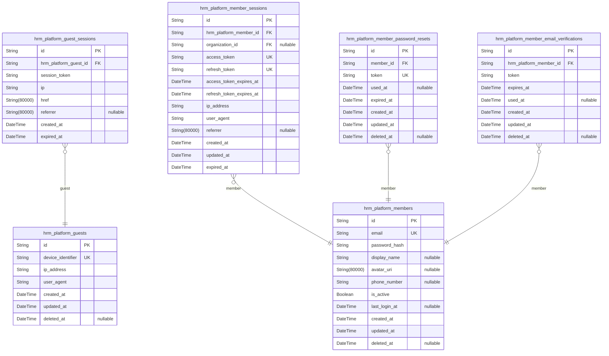
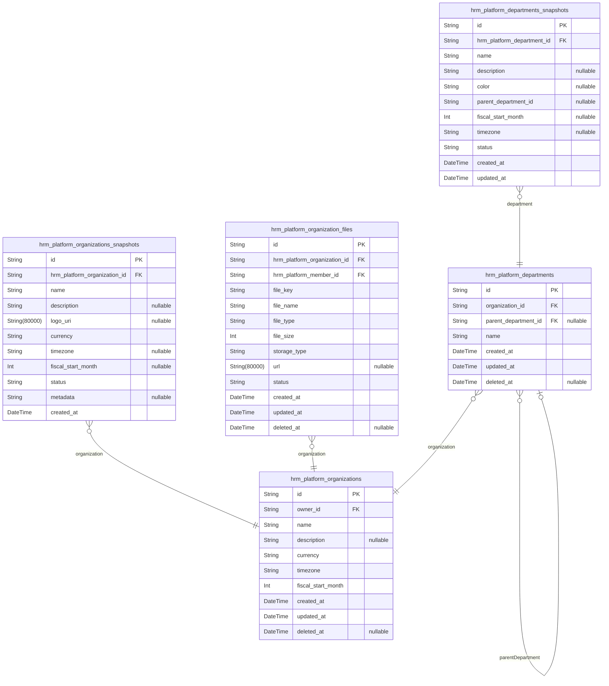
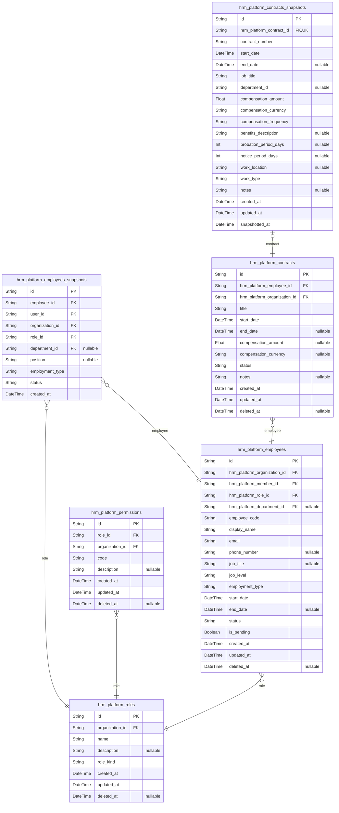
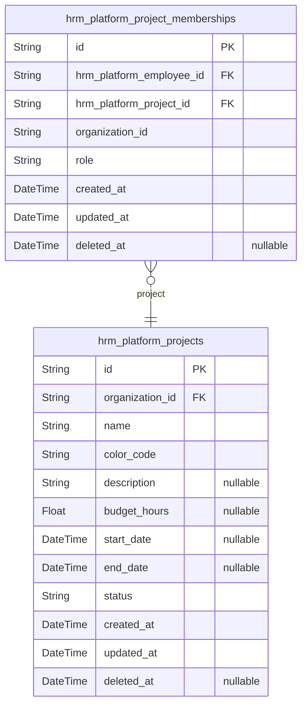
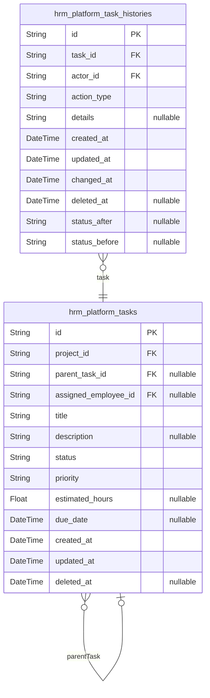
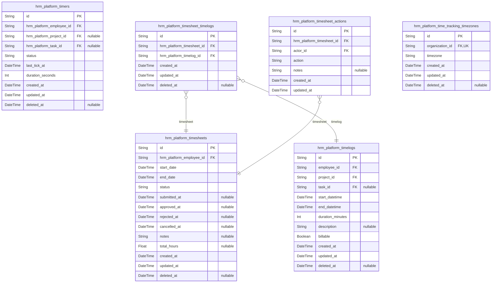
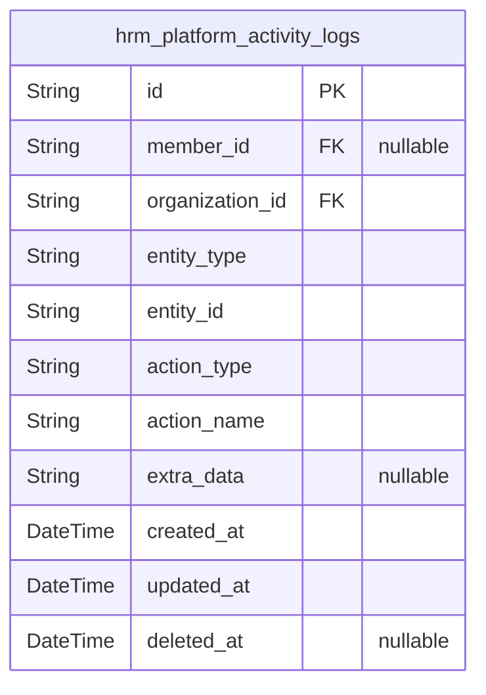
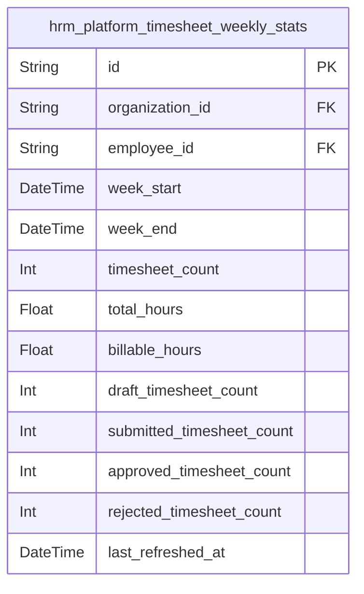

# Prisma Markdown

> Generated by [`prisma-markdown`](https://github.com/samchon/prisma-markdown)

- [auth](#auth)
- [organization](#organization)
- [employee](#employee)
- [project](#project)
- [task](#task)
- [timetracking](#timetracking)
- [system](#system)
- [default](#default)

## auth

### `hrm_platform_guests`

Temporary guest accounts identified by device for unauthenticated
platform access before registration.

Guests represent unauthenticated visitors who can sign up for new
accounts. Each guest is identified by a unique device identifier
generated from device fingerprinting. The table includes comprehensive
temporal tracking for audit purposes with soft delete support.

Properties as follows:

- `id`: Primary Key.
- `device_identifier`
  > Unique device fingerprint identifying the guest's browser/device
  > combination.
- `ip_address`: IP address used by the guest during their session.
- `user_agent`: Browser and OS user agent string for device identification.
- `created_at`: Timestamp when the guest account was created.
- `updated_at`: Timestamp when the guest account was last updated.
- `deleted_at`: Timestamp when the guest account was soft-deleted (nullable).

### `hrm_platform_guest_sessions`

Temporary session tokens for guest device access without permanent
credentials.

This table stores active and expired session records for guests who have
not yet created permanent member accounts. Each session is tied to a
specific guest account (identified by email/device) and includes
authentication metadata for audit purposes.

Properties as follows:

- `id`: Primary Key.
- `hrm_platform_guest_id`
  > Foreign key reference to the guest account this session belongs to.
  >
  > A guest can have multiple sessions over time (e.g., from different
  > devices or browser sessions). This relationship is 1:N, with sessions
  > being the child entity that references the parent guest.
- `session_token`: The session identifier token used for authentication and authorization.
- `ip`
  > The IP address from which the session was created or last accessed.
  > Useful for security auditing and detecting suspicious activity.
- `href`: The URL (href) where the guest was redirected after authentication.
- `referrer`
  > The referrer URL from the guest's browser, captured at session creation
  > for analytics and security purposes.
- `created_at`
  > The timestamp when the session was created. Used for session lifetime
  > calculations and audit trails.
- `expired_at`
  > The timestamp when the session expires. Sessions are not persistent
  > across restarts and are invalidated when expired.

### `hrm_platform_members`

Registered member accounts with email and password authentication
credentials for system access.

This table stores authenticated user identities with their login
credentials, display profile information, and organization ownership.
Each member can own one primary organization and be employed in multiple
organizations as an employee. The account lifecycle includes
registration, authentication, profile management, and account deletion
with soft-delete support for compliance.

### Authentication and Credentials

Members authenticate using email and password. The password_hash field
stores bcrypt-hashed credentials securely. Email addresses must be unique
across all registered members and verified before full access is granted.

Properties as follows:

- `id`: Primary Key.
- `email`
  > Unique email address used for authentication and communication.
  >
  > Email addresses must be valid, unique across all members, and verified
  > before full account access. The email serves as the primary identifier
  > for login and password recovery operations.
- `password_hash`
  > Bcrypt-hashed password for secure authentication.
  >
  > Passwords must be hashed using bcrypt with appropriate work factor before
  > storage. The hash is never stored in plaintext and is used to verify
  > credentials during login.
- `display_name`
  > Publicly visible name for the member account.
  >
  > Used in activity logs, employee records, and team directories. If not
  > provided, may default to the email address local part.
- `avatar_uri`
  > URL to the member's profile avatar image.
  >
  > Stored as a reference to external or internal file storage. Used for
  > display in UI elements, activity logs, and employee profiles.
- `phone_number`
  > Contact phone number for the member.
  >
  > Used for two-factor authentication, account recovery, and communication.
  > Format may vary by region.
- `is_active`
  > Indicates whether the member account is actively enabled.
  >
  > When false, the account is disabled and cannot authenticate. Used for
  > temporary suspension pending review or compliance actions.
- `last_login_at`
  > Timestamp of the member's most recent successful login.
  >
  > Tracked for security monitoring, session management, and activity
  > analysis.
- `created_at`
  > Timestamp when the member account was created.
  >
  > Immutable timestamp marking the account creation event for audit purposes.
- `updated_at`
  > Timestamp when the member account was last modified.
  >
  > Updated on every write operation including profile changes, credential
  > updates, and status modifications.
- `deleted_at`
  > Timestamp when the member account was soft-deleted.
  >
  > Null indicates active account. When set, marks the account for deletion
  > while preserving data for compliance and audit requirements.

### `hrm_platform_member_sessions`

JWT session tokens for member authentication with access and refresh
token management.

Each session represents an authenticated device or browser instance.
Members can maintain multiple concurrent sessions across different
devices. Sessions include access tokens for API authentication and
refresh tokens for token renewal. The current organization context is
stored to support seamless switching between organizations without
re-authentication.

**Token Management**:
Sessions track separate expiration times for access tokens (short-lived)
and refresh tokens (longer-lived). This enables token rotation patterns
where access tokens can be invalidated while maintaining the session
through refresh tokens.

**Organization Context**:
Members can switch between organizations without logging out. The
`organization_id` field stores the current working context, ensuring all
session-scoped operations are properly scoped.

**Security**:
Client identification (IP address, user agent) enables session auditing
and detection of suspicious activity. Token expiration is mandatory to
prevent unlimited session duration.

Properties as follows:

- `id`: Primary Key.
- `hrm_platform_member_id`
  > Member account that owns this session.
  >
  > Each session is tied to exactly one member account. Members can have
  > multiple concurrent sessions across different devices or browsers.
  >
  > **Session Lifecycle**:
  > When a member logs in, a new session is created with JWT tokens. Sessions
  > expire based on `refresh_token_expires_at`. The member must
  > re-authenticate after refresh token expiration.
- `organization_id`
  > Current organization context for the session.
  >
  > Members can switch between organizations without logging out. This field
  > stores the currently selected organization, ensuring all session-scoped
  > operations are properly scoped.
  >
  > **Cross-Organization Access**:
  > The system enforces that operations can only access data from the current
  > `organization_id`. If the member has multiple organizations, they can
  > switch context by updating this field, but never access multiple
  > organizations simultaneously.
- `access_token`
  > JWT access token for API authentication. Short-lived token used for
  > requesting protected resources.
- `refresh_token`
  > JWT refresh token for obtaining new access tokens. Longer-lived token
  > used to renew access without re-authentication.
- `access_token_expires_at`
  > Timestamp when the access token expires. After this time, the access
  > token is invalid and must be refreshed.
- `refresh_token_expires_at`
  > Timestamp when the refresh token expires. After this time, the member
  > must re-authenticate with email/password.
- `ip_address`
  > Client's IP address at session creation. Used for session auditing and
  > security monitoring.
- `user_agent`
  > Browser or client user agent string. Used for device identification and
  > security analysis.
- `referrer`
  > Referring URL from the login request. Captures where the user came from
  > before authentication.
- `created_at`: Timestamp when the session was created.
- `updated_at`: Timestamp when the session was last updated.
- `expired_at`
  > Timestamp when the refresh token expires. Sessions without expired_at
  > null are considered expired.

### `hrm_platform_member_password_resets`

Password reset tokens with expiration for member account recovery.

Each password reset token is a temporary authentication credential
generated when a member requests password recovery. The token must be
used within its expiration window to reset the password, and becomes
invalid once used.

Tokens are single-use only - once consumed for a password reset, the
token is marked as used and cannot be reused. This prevents token replay
attacks and ensures security. The table is managed automatically via
authentication flows when members request password recovery.

Properties as follows:

- `id`: Primary Key.
- `member_id`
  > References the member account requesting password reset.
  >
  > Each password reset token belongs to exactly one member account. This
  > relationship enables tracking password reset requests per member and
  > invalidating other tokens when a member's password is changed.
- `token`
  > Unique password reset token string.
  >
  > This token is generated when a password reset is requested and must be
  > provided by the member to complete the password reset process. The token
  > is single-use and becomes invalid after being used.
- `used_at`
  > Timestamp when the reset token was consumed.
  >
  > This field is null when the token is unused and set to the timestamp when
  > the token is successfully used for a password reset. Once used, the token
  > cannot be reused.
- `expired_at`
  > Timestamp when the reset token expires.
  >
  > Tokens expire after a fixed period (typically 1 hour) from creation.
  > Expired tokens cannot be used for password reset and should be cleaned up
  > periodically.
- `created_at`
  > Record creation timestamp.
  >
  > This timestamp indicates when the password reset token was generated and
  > becomes available for use.
- `updated_at`
  > Record last update timestamp.
  >
  > Updated whenever the token state changes (e.g., when it is used).
- `deleted_at`
  > Soft delete timestamp for the token record.
  >
  > Set when the token is permanently removed, allowing for audit trail and
  > recovery.

### `hrm_platform_member_email_verifications`

Email verification tokens for member registration validation with
expiration and single-use support.

### Overview
This table stores temporary email verification tokens sent to members
when they register their accounts. Each token is tied to a specific
member, has an expiration time, and can only be used once for email
verification.

### Token Lifecycle
- Tokens are created when a member registers and email verification is
required
- Tokens expire based on the expires_at timestamp (typically 24-48 hours)
- Once a token is used for verification, used_at is set and the token
becomes invalid
- Expired or used tokens are soft-deleted for audit purposes

### Security Features
- Tokens are UUIDs to prevent guessing attacks
- Single-use constraint prevents token reuse
- Expiration ensures tokens don't remain valid indefinitely
- Tied to member account for verification integrity

### References
- [hrm_platform_members](#hrm_platform_members) - member accounts that own these
verification tokens

Properties as follows:

- `id`: Primary Key.
- `hrm_platform_member_id`
  > Reference to the member account that owns this verification token.
  >
  > This foreign key establishes a 1:N relationship where each member can
  > have multiple verification tokens over time (for different registration
  > attempts), but only one active token at a time. When the member is
  > deleted, all associated verification tokens are cascaded deleted.
- `token`
  > The email verification token value.
  >
  > This is a unique UUID that is sent to the member's email address. When
  > the member clicks the verification link, the token is validated against
  > this value. Each token can only be used once - after successful
  > verification, the used_at timestamp is set and the token becomes invalid.
  > Tokens should be generated securely using a cryptographically random UUID
  > generator.
- `expires_at`
  > The timestamp when this verification token expires.
  >
  > Tokens should typically expire within 24-48 hours to prevent security
  > risks from stale tokens. Queries frequently filter by expires_at > NOW()
  > to find active tokens, so an index on this field is included for
  > performance. Expired tokens should be periodically cleaned up from the
  > database.
- `used_at`
  > The timestamp when this verification token was used.
  >
  > When the member successfully verifies their email address, this timestamp
  > is set to the current time. Once used_at is populated, the token is
  > considered consumed and cannot be used again. This field is NULL when the
  > token is unused and pending verification. NULL values are indexed to
  > support queries for unused tokens.
- `created_at`
  > The timestamp when this verification token record was created.
  >
  > This is the time when the token was generated and sent to the member's
  > email address. It serves as the baseline for calculating token age and
  > expiration.
- `updated_at`
  > The timestamp when this verification token record was last updated.
  >
  > This is automatically updated on any record modification, including when
  > used_at is set upon successful verification. It helps track when tokens
  > were last accessed or modified.
- `deleted_at`
  > The timestamp when this verification token was soft-deleted.
  >
  > Soft deletion is used to maintain audit trail of verification attempts,
  > even for failed or expired tokens. Records with non-NULL deleted_at are
  > excluded from active queries but retained for compliance and debugging
  > purposes.

## organization

### `hrm_platform_organizations`

Main organization entity that serves as the tenant boundary for the HRM
platform.

Organizations represent independent business entities with their own
employees, projects, roles, settings, and data isolation. Each
organization is owned by a member and has a unique name within that
owner's context.

The organization provides the foundational business structure for all
other entities including departments, employees, projects, tasks, and
time tracking records.

Properties as follows:

- `id`: Primary Key.
- `owner_id`
  > Reference to the member who owns this organization.
  >
  > Only one member can be the owner of an organization. The owner has full
  > access to all organization features and can transfer ownership to another
  > member in the organization. This relation enables organization-level
  > ownership tracking and ownership transfer operations.
  >
  > The inverse relation is accessed through the member's ownedOrganizations
  > field.
- `name`
  > The organization's display name.
  >
  > Must be unique within the owner's context. Users can have multiple
  > organizations with different names. This name is used throughout the
  > platform for identification purposes.
- `description`
  > A brief description of the organization's business or purpose.
  >
  > Optional text field that provides context about the organization. Can be
  > used in directory listings and organizational overviews.
- `currency`
  > The organization's primary currency classification.
  >
  > Determines the monetary units for all financial data including pay rates
  > and budget calculations. Common values include USD, EUR, and KRW. This
  > setting applies to all financial operations within the organization.
- `timezone`
  > The organization's timezone identifier.
  >
  > Used for time tracking, timesheet calculations, and display formatting.
  > Follows IANA timezone database format (e.g., 'Asia/Seoul',
  > 'America/New_York').
- `fiscal_start_month`
  > The starting month of the organization's fiscal year.
  >
  > Used for financial reporting and fiscal period calculations. Must be a
  > value between 1 (January) and 12 (December). This value helps organize
  > the organization's financial cycles.
- `created_at`
  > The timestamp when this organization record was created.
  >
  > Automatically set to the current time when the organization is first
  > created. This provides an audit trail for organizational lifecycle.
- `updated_at`
  > The timestamp when this organization record was last updated.
  >
  > Automatically updated on every modification to the organization. Used to
  > track the most recent changes and support soft delete workflows.
- `deleted_at`
  > The timestamp when this organization was soft-deleted.
  >
  > Nullable field that is set when the organization is deleted. When
  > present, indicates the organization is marked for deletion. Soft delete
  > preserves historical data while preventing active access.

### `hrm_platform_organizations_snapshots`

Point-in-time snapshots of organization records for audit trail and
historical analysis.

---

### Purpose

This table captures the complete state of an organization at specific
points in time, providing an immutable audit trail of organizational
changes. Each snapshot represents a frozen moment showing exactly what
the organization's data looked like at that time, including name,
description, settings, and status.

Properties as follows:

- `id`: Primary Key.
- `hrm_platform_organization_id`
  > References the organization this snapshot belongs to.
  >
  > Enables retrieval of an organization's complete snapshot history for
  > audit purposes.
- `name`: Organization name at the time of snapshot.
- `description`: Organization description at the time of snapshot.
- `logo_uri`: URL to organization logo at the time of snapshot.
- `currency`: Organization currency code (e.g., USD, EUR, KRW) at the time of snapshot.
- `timezone`: Organization timezone at the time of snapshot.
- `fiscal_start_month`: First month of organization's fiscal year (1-12) at the time of snapshot.
- `status`: Organization status at the time of snapshot (active, suspended, archived).
- `metadata`: Additional JSON metadata stored at the time of snapshot.
- `created_at`
  > Timestamp when this snapshot was created, representing the point in time
  > this snapshot represents.

### `hrm_platform_organization_files`

Stores file metadata (logos, documents) for organizations with external
storage references.

Each record tracks a file's location, properties, and lifecycle status.
Files are subsidiary to organizations and are managed through the
organization context rather than standalone endpoints.

Properties as follows:

- `id`: Primary key for unique file identification.
- `hrm_platform_organization_id`
  > Reference to the organization this file belongs to.
  >
  > Files are subsidiary to organizations and cannot exist without an owning
  > organization. This creates a one-to-many relationship where one
  > organization can have multiple associated files.
  >
  > The inverse relation is accessed through the organization's files field.
- `hrm_platform_member_id`
  > Reference to the member who uploaded this file.
  >
  > Provides audit trail for file ownership and modification tracking.
- `file_key`
  > Unique storage key for the file in external object storage (e.g., S3 key).
  >
  > This key is unique per organization and used to retrieve the actual file
  > content.
- `file_name`
  > Original filename as uploaded by the user.
  >
  > Preserves user-provided naming for display purposes.
- `file_type`
  > MIME type or file category (e.g., 'image/png', 'application/pdf', 'logo',
  > 'document').
  >
  > Used for content validation and rendering decisions.
- `file_size`
  > File size in bytes.
  >
  > Used for storage quota calculations and upload validation.
- `storage_type`
  > Storage backend type (e.g., 's3', 'local', 'gcs').
  >
  > Indicates which storage system hosts the file.
- `url`
  > Public or pre-signed URL for accessing the file.
  >
  > May be an absolute URL or relative path depending on storage
  > configuration.
- `status`
  > File lifecycle status with allowed values: 'active', 'deleted',
  > 'archived'.
  >
  > 'active' = file is currently in use
  > 'deleted' = file marked for deletion (soft delete)
  > 'archived' = file retained for compliance but not actively used
- `created_at`
  > Timestamp when this file record was created.
  >
  > Used for ordering and auditing file creation.
- `updated_at`
  > Timestamp when this file record was last updated.
  >
  > Used for detecting changes and caching invalidation.
- `deleted_at`
  > Timestamp when this file record was soft-deleted.
  >
  > Null when file is active, set when file is deleted or archived.

### `hrm_platform_departments`

Department with hierarchical parent-child structure within an organization.

Departments organize employees into functional groups within an
organization. Each department can have a parent department to form a
hierarchical tree structure, enabling multi-level organizational
subdivisions.

{\@link hrm_platform_organizations} owns departments and enforces data
isolation boundaries.

Properties as follows:

- `id`: Primary Key.
- `organization_id`
  > Organization that owns this department.
  >
  > Departments belong to an organization and inherit its data isolation
  > boundaries. All department operations are scoped to the organization.
- `parent_department_id`
  > Optional parent department for hierarchical structure.
  >
  > When set, creates a parent-child relationship enabling multi-level
  > organizational tree. Departments without a parent are root-level
  > departments.
- `name`
  > Unique name of the department within its organization.
  >
  > The name must be unique within the organization but can be duplicated
  > across different organizations.
- `created_at`: Timestamp when the department was created.
- `updated_at`: Timestamp when the department was last updated.
- `deleted_at`
  > Timestamp when the department was soft-deleted.
  >
  > Null indicates the department is active. Soft deletion preserves
  > historical references.

### `hrm_platform_departments_snapshots`

Point-in-time snapshots of department records for audit trail and
historical analysis.

This table stores immutable snapshots of department state at specific
moments in time, enabling historical queries and audit capabilities. Each
snapshot captures all department fields as they existed when the snapshot
was created, denormalized for efficient read operations.

[hrm_platform_departments](#hrm_platform_departments) is the source table from which snapshots
are generated. The organization can query this table to understand how
department names, structures, and attributes have evolved over time.

Properties as follows:

- `id`: Primary Key.
- `hrm_platform_department_id`
  > References the department this snapshot belongs to.
  >
  > Enables querying all historical snapshots for a specific department. The
  > foreign key relationship ensures referential integrity with the {@link
  > hrm_platform_departments} table.
- `name`
  > Department name recorded at snapshot time.
  >
  > This is the department name as it existed when the snapshot was created.
  > It may differ from the current department name if the name has been
  > updated since this snapshot.
- `description`
  > Department description recorded at snapshot time.
  >
  > Optional descriptive text about the department's purpose, scope, or
  > function. May differ from current description if updated since snapshot.
- `color`
  > Department color code recorded at snapshot time.
  >
  > Visual identifier used in UI to distinguish departments, stored as a hex
  > color code (e.g., #3B82F6). May differ from current color if updated
  > since snapshot.
- `parent_department_id`
  > Parent department ID recorded at snapshot time.
  >
  > References the parent department in the organizational hierarchy at the
  > time of snapshot. NULL if the department has no parent (root-level
  > department). This value may differ from current parent if the department
  > was reorganized.
- `fiscal_start_month`
  > Fiscal start month recorded at snapshot time.
  >
  > Optional month (1-12) indicating when the department's fiscal year
  > begins. NULL if not set. May differ from current value if fiscal period
  > was changed since snapshot.
- `timezone`
  > Department timezone recorded at snapshot time.
  >
  > Optional timezone string (e.g., 'Asia/Seoul', 'America/New_York') for
  > department scheduling. NULL if not set. May differ from current timezone
  > if changed since snapshot.
- `status`
  > Department status recorded at snapshot time.
  >
  > Current status of the department: 'active' or 'inactive'. This reflects
  > the department's operational state at the time of snapshot and may differ
  > from current status.
- `created_at`
  > Snapshot creation timestamp.
  >
  > When this snapshot was created, capturing the point in time when this
  > department state was recorded.
- `updated_at`
  > Department state update timestamp.
  >
  > The updated_at value from the [hrm_platform_departments](#hrm_platform_departments) table at
  > the time this snapshot was created. Represents when the department state
  > being captured was last modified.

## employee

### `hrm_platform_employees`

Employee records representing individuals employed by an organization.

Employees are the core workforce entity with role, department, and
project assignments. Each employee has a unique global identity through
their member account and is scoped to their organization. The table
tracks employment details including job title, employment type, and
status.

The employee lifecycle includes pending invitation (awaiting role
assignment), active employment, on-leave status, and resigned status.
Historical contracts are tracked separately in {@link
hrm_platform_contracts} to maintain employment history. Project
assignments are managed through [hrm_platform_project_memberships](#hrm_platform_project_memberships).

Properties as follows:

- `id`: Primary Key.
- `hrm_platform_organization_id`
  > The organization to which this employee belongs. All employee data is
  > scoped to their organization.
  >
  > Employees can only access and manage data within their own organization.
  > This foreign key enforces data isolation boundaries.
- `hrm_platform_member_id`
  > The global member account that owns this employee record.
  >
  > Employees are linked to member accounts for authentication. A single
  > member account can have multiple employee records across different
  > organizations. The member's global profile (display name, avatar) is
  > shared across all organizations.
- `hrm_platform_role_id`
  > The role assignment that defines this employee's permissions and access
  > level.
  >
  > Roles determine what operations the employee can perform within their
  > organization. Employees inherit all permissions from their assigned role.
- `hrm_platform_department_id`
  > The department this employee belongs to, if applicable.
  >
  > Departments organize employees by functional area. An employee may not
  > have a department assignment if they are newly hired or between
  > department assignments. The optional relationship allows employees
  > without department to exist.
- `employee_code`
  > Unique employee identifier code assigned by the organization for internal
  > tracking.
  >
  > This code is human-readable and can be used for quick identification
  > (e.g., EMP-001, DEV-042). It is unique within the organization but may be
  > duplicated across different organizations.
- `display_name`
  > Display name for the employee, shown in UI elements like task
  > assignments, timesheet entries, and activity logs.
  >
  > This is separate from the global member profile name. Employees can have
  > different display names per organization if needed, though typically it
  > mirrors their global profile.
- `email`
  > Email address of the employee.
  >
  > This is the email address associated with the member account used for
  > login. It is used as the primary identifier for authentication and
  > password recovery.
- `phone_number`
  > Phone number of the employee.
  >
  > Used for emergency contacts and organizational communication. Can be
  > updated as the employee's contact information changes.
- `job_title`
  > Job title or position of the employee.
  >
  > Describes the employee's role or position (e.g., 'Software Engineer',
  > 'Product Manager'). This is optional and can be updated as the employee's
  > role changes.
- `job_level`
  > Job level or seniority designation of the employee.
  >
  > Indicates the employee's level within the organization (e.g., 'junior',
  > 'mid-level', 'senior', 'principal'). Used for organizational hierarchy
  > and compensation planning.
- `employment_type`
  > Employment type classification of the employee.
  >
  > Determines the employee's work arrangement: full-time, part-time, or
  > contract. This affects benefits eligibility, work hour expectations, and
  > compensation structure.
- `start_date`
  > The date when the employee started working for the organization.
  >
  > Required for active and resigned employees. Used for calculating tenure,
  > benefits eligibility, and employment history.
- `end_date`
  > The date when the employee's employment ended (if applicable).
  >
  > Nullable for active employees. When populated, indicates the employee has
  > resigned or been terminated. Used for employment history and compliance.
- `status`
  > Current employment status of the employee.
  >
  > Indicates the employee's current state: active (currently employed),
  > on-leave (temporary absence), resigned (employment ended), or invited
  > (pending acceptance).
- `is_pending`
  > Flag indicating if the employee record is pending role assignment.
  >
  > When true, the employee has been invited to the organization but not yet
  > accepted or assigned a role. When false, the employee is an active member
  > with a confirmed role.
- `created_at`
  > Timestamp when this employee record was created.
  >
  > Automatically set by the database on insert. Immutable after creation.
- `updated_at`
  > Timestamp when this employee record was last updated.
  >
  > Automatically set by the database on each update. Used for tracking
  > record modifications.
- `deleted_at`
  > Timestamp when this employee record was soft-deleted.
  >
  > Nullable for active records. When populated, indicates the employee has
  > been deleted but retained for audit purposes.

### `hrm_platform_employees_snapshots`

Point-in-time snapshots of employee records for audit trail.

This table captures a complete state of an employee record at a specific
moment, storing all relevant employee information in a denormalized
format. Each snapshot is immutable once created and serves as a permanent
audit record of the employee's state at that point in time.

Properties as follows:

- `id`: Primary Key.
- `employee_id`
  > Reference to the source employee record being snapshot.
  >
  > Each snapshot represents a point-in-time state of this employee. The
  > relationship enables retrieval of the current employee record while
  > maintaining historical context.
- `user_id`
  > Reference to the member account associated with the employee.
  >
  > Denormalized from the employee record to maintain user identity context
  > even if the employee record is modified or deleted.
- `organization_id`
  > Reference to the organization where the employee works.
  >
  > Denormalized from the employee record to preserve organizational context
  > at the time of the snapshot.
- `role_id`
  > Reference to the role assigned to the employee within the organization.
  >
  > Denormalized from the employee record to maintain role assignment history
  > for auditing purposes.
- `department_id`
  > Reference to the department assigned to the employee, if any.
  >
  > Denormalized from the employee record. Nullable since employees may not
  > always have a department assignment. Preserves department context at
  > snapshot time.
- `position`
  > Job title or position description of the employee.
  >
  > Nullable field representing the employee's role or title within the
  > organization. Captured at snapshot time to preserve historical position
  > assignments.
- `employment_type`
  > Employment classification of the employee.
  >
  > One of: full-time, part-time, contractor, intern. Captured at snapshot
  > time to maintain historical employment type tracking for reporting and
  > analytics.
- `status`
  > Current status of the employee (active or deactivated).
  >
  > Captured at snapshot time to preserve historical status information.
  > Active employees can perform work-related actions while deactivated
  > employees retain historical records.
- `created_at`
  > Timestamp when this snapshot was created.
  >
  > Immutable creation time marking when this point-in-time record was
  > captured. Used for ordering snapshots chronologically and determining
  > audit timeline.

### `hrm_platform_contracts`

Employment contracts with compensation details, dates, and notes for
tracking employee work history.

Contracts represent the employment relationship between an employee and
organization, including compensation, contract period, and terms.

### Lifecycle

Each contract has a status indicating whether it is active or ended. Only
one contract per employee can be active at any time. When a new contract
is created, the previous active contract is automatically ended.

### Relationship with Employee

Contracts belong to employees and are managed through employee records.
Employees can view their own contracts. Users with employee view
permission can view any employee's contract history.

Properties as follows:

- `id`: Primary Key.
- `hrm_platform_employee_id`
  > References the employee this contract belongs to. Each contract is tied
  > to one employee.
  >
  > Contracts are accessed through [hrm_platform_employees](#hrm_platform_employees). Employees
  > can have multiple contracts over their employment history.
- `hrm_platform_organization_id`
  > References the organization this contract belongs to for data isolation.
  >
  > Ensures contracts are scoped to the correct organization. Organization ID
  > is derived from the employee's organization.
- `title`
  > Contract title or description providing a brief summary of the employment
  > terms.
- `start_date`
  > The date when the contract becomes effective. This marks the beginning of
  > the employment period.
- `end_date`
  > The date when the contract ends. Can be null for ongoing contracts
  > without a fixed end date.
- `compensation_amount`: The compensation amount specified in the contract.
- `compensation_currency`: The currency code for the compensation amount (e.g., USD, KRW).
- `status`
  > Contract lifecycle status.
  >
  > Values: active, ended
  >
  > Only one contract per employee can have status active at any time.
- `notes`: Additional notes or terms for the contract.
- `created_at`: Timestamp when the contract record was created.
- `updated_at`: Timestamp when the contract record was last updated.
- `deleted_at`: Timestamp when the contract was soft-deleted.

### `hrm_platform_contracts_snapshots`

Immutable point-in-time snapshots of employment contract records for
audit trail and historical analysis.

This table stores denormalized snapshots of contract data at specific
moments in time, providing an immutable audit trail that preserves the
exact state of contracts as they existed when the snapshot was created.
Each snapshot is linked to the original contract record, enabling
traceability and historical analysis of contract changes over time.

Properties as follows:

- `id`: Primary key for the contract snapshot record.
- `hrm_platform_contract_id`
  > Reference to the original contract record this snapshot represents.
  >
  > Establishes a 1:1 relationship between the snapshot and its source
  > contract. This allows tracing snapshots back to the current or historical
  > contract record for auditing purposes.
- `contract_number`
  > Unique contract identifier assigned to the employment contract.
  >
  > This is the contract's reference number used for identification and
  > tracking purposes.
- `start_date`
  > The date when the employment contract became effective.
  >
  > Marks the beginning of the contract period and establishes when the
  > employee's terms and conditions became active.
- `end_date`
  > The date when the employment contract expires or ends (if applicable).
  >
  > This field may be null for contracts without a defined end date or
  > open-ended employment agreements.
- `job_title`
  > The employee's job title or position as specified in the contract.
  >
  > Describes the role and responsibilities associated with the employment.
- `department_id`
  > Reference to the department where the employee works.
  >
  > Identifies the organizational unit the contract is associated with.
- `compensation_amount`
  > The base compensation amount specified in the contract.
  >
  > Represents the primary salary or wage agreed upon in the employment
  > contract.
- `compensation_currency`
  > The currency code for the compensation amount (e.g., USD, EUR, KRW).
  >
  > Indicates the monetary unit for the compensation amount.
- `compensation_frequency`
  > The frequency at which compensation is paid (e.g., monthly, annually,
  > hourly).
  >
  > Describes the payment schedule specified in the contract.
- `benefits_description`
  > Description of benefits and additional compensation terms in the contract.
  >
  > Includes information about health insurance, bonuses, stock options, and
  > other benefits.
- `probation_period_days`
  > The length of the probation period in days, if applicable.
  >
  > Indicates the trial period duration before the employee achieves regular
  > employment status.
- `notice_period_days`
  > The required notice period in days for contract termination.
  >
  > Specifies how much advance notice is required from either party to end
  > the contract.
- `work_location`
  > The primary work location or address specified in the contract.
  >
  > Indicates where the employee is expected to perform their duties.
- `work_type`
  > The employment type classification (e.g., full-time, part-time, contract).
  >
  > Describes the nature of the employment arrangement.
- `notes`
  > Additional notes or special conditions specified in the contract.
  >
  > Contains any supplementary terms or annotations related to the employment
  > agreement.
- `created_at`
  > Timestamp when this snapshot record was created.
  >
  > Records the exact moment the snapshot was captured for audit purposes.
- `updated_at`
  > Timestamp when this snapshot record was last updated.
  >
  > For immutable snapshots, this typically equals created_at and serves as
  > an audit reference.
- `snapshotted_at`
  > The point-in-time when the original contract state was captured.
  >
  > Records when the snapshot was taken, which may differ from created_at if
  > snapshots are batched.

### `hrm_platform_roles`

Role definitions with built-in (Owner/Manager/Employee) and custom roles
for permission management.

Roles are organization-scoped entities that define permission sets. Each
role has a unique name within its organization and can be either built-in
(protected) or custom (user-defined). Built-in roles cannot be deleted
while custom roles can be removed when no employees are assigned.

Role Types:
- **Built-in Roles**: Owner, Manager, and Employee - permanently
protected and always available
- **Custom Roles**: User-defined roles with flexible permission combinations

Relationships:
- Each role belongs to exactly one [hrm_platform_organizations](#hrm_platform_organizations)
(many-to-one)
- Each role is assigned to many [hrm_platform_employees](#hrm_platform_employees) (one-to-many)

Fields:
- `name`: Unique within organization
- `description`: Optional context about the role
- `role_kind`: Classification (built_in/custom)

Properties as follows:

- `id`: Primary Key.
- `organization_id`
  > Organization this role belongs to. Enforces organization-scoped role
  > management.
  >
  > Each organization maintains its own set of roles. A role name is unique
  > only within its parent organization. Roles are never shared across
  > organizations.
- `name`
  > Role name. Must be unique within the organization.
  >
  > Used to identify roles in the UI and for role assignment. Built-in roles
  > have fixed names: Owner, Manager, Employee. Custom roles can have any
  > name as long as it is unique within the organization.
- `description`
  > Optional description of the role's purpose and responsibilities.
  >
  > Provides context about the role's intended use. Can be updated at any
  > time by users with organization management permissions.
- `role_kind`
  > Role classification: 'built_in' for Owner/Manager/Employee, 'custom' for
  > user-defined roles.
  >
  > Built-in roles are protected from deletion. Custom roles can be deleted
  > when no employees are assigned to them.
- `created_at`
  > Timestamp when this role was created.
  >
  > Used for auditing and tracking role creation timeline.
- `updated_at`
  > Timestamp when this role was last updated.
  >
  > Used for tracking modifications to role definitions.
- `deleted_at`
  > Timestamp when this role was soft-deleted. NULL when active.
  >
  > Used for implementing soft delete, allowing roles to be marked as deleted
  > without permanently removing them from the database.

### `hrm_platform_permissions`

Permission codes that define granular access rights for roles within an
organization.

This table stores individual permission identifiers that are assigned to
roles. Each permission represents a specific action or capability (e.g.,
'organization.create', 'employee.view', 'project.manage') that can be
granted or denied through role assignments. Permissions are scoped to
organizations to enforce multi-tenancy isolation.

### Role Integration

Permissions are associated with roles via the [hrm_platform_roles](#hrm_platform_roles)
foreign key. When a role is created, it is given a set of permission
codes that define what actions that role can perform within the
organization.

Properties as follows:

- `id`: Primary Key.
- `role_id`
  > Role that this permission belongs to.
  >
  > Permissions define what actions a role can perform. This foreign key
  > establishes the relationship between the permission and its parent role.
  > A role can have multiple permissions, and each permission is owned by
  > exactly one role.
- `organization_id`
  > Organization that this permission belongs to.
  >
  > Multi-tenancy is enforced by scoping permissions to organizations. A
  > permission code may exist in multiple organizations, but each instance is
  > scoped to a specific organization. This ensures that permission checks
  > are always performed within the correct organizational context.
- `code`
  > Unique permission identifier code.
  >
  > The code follows a dot-notation convention (e.g., 'organization.create',
  > 'employee.view', 'project.manage') to represent the resource and action.
  > This code is used by the authorization middleware to grant or deny access
  > to specific operations. The code must be unique within each organization
  > to prevent permission conflicts.
- `description`
  > Human-readable description of the permission.
  >
  > This field provides context for what the permission code represents,
  > making it easier for administrators to understand and assign appropriate
  > permissions when creating or editing roles.
- `created_at`: Timestamp when this permission was created.
- `updated_at`: Timestamp when this permission was last updated.
- `deleted_at`
  > Timestamp when this permission was soft-deleted (if applicable).
  >
  > Soft delete enables the system to preserve permission history for audit
  > purposes while excluding deleted permissions from active role
  > assignments.

## project

### `hrm_platform_projects`

Organization-owned project entities that serve as containers for tasks,
timesheets, and team members.

A project represents a specific piece of work or initiative the
organization is undertaking. Each project tracks effort, budget, and
timeline information while maintaining association with the organization
that owns it.

**Core Attributes**:
- Name: Unique identifier within the organization, used for project
identification and navigation
- Color code: Visual indicator for project display in UI components
- Description: Optional text providing context about the project scope
and objectives
- Budget hours: Optional total estimated hours for project resource planning
- Start and end dates: Optional timeline markers for project scheduling
and duration calculation
- Status: Workflow state controlling whether the project can receive new
timelogs (active, archived, completed)

Properties as follows:

- `id`: Primary key identifier for the project entity.
- `organization_id`
  > References the organization that owns this project. All project data is
  > strictly isolated within its organization context. Projects cannot be
  > shared between organizations.
  >
  > Organization context determines data access boundaries — employees can
  > only view projects from their selected organization.
- `name`
  > Project name used for identification and display. Must be unique within
  > the organization.
  >
  > Project names are human-readable identifiers that help users quickly
  > locate and distinguish projects within their organization context.
- `color_code`
  > Hex color code used for visual identification of the project in UI
  > components. Helps users quickly distinguish projects in lists and
  > dashboards.
  >
  > Color codes follow standard hex format (e.g., #FF5733) and are used for
  > badges, icons, and visual markers.
- `description`
  > Optional text field providing context about the project scope,
  > objectives, or additional details.
  >
  > This field supports rich project documentation and can contain
  > longer-form text describing the project purpose, deliverables, or
  > important notes.
- `budget_hours`
  > Optional total estimated hours for the project, used for budget tracking
  > and resource planning.
  >
  > When set, the system tracks actual hours logged against the project and
  > enables budget utilization reporting. Projects without budget hours are
  > excluded from budget-focused reports.
- `start_date`
  > Optional date when the project is expected to begin. Used for timeline
  > tracking and project duration calculations.
  >
  > Start date is independent of project status and can be set or updated
  > during project editing. If unset, the project has no scheduled start
  > date.
- `end_date`
  > Optional date when the project is expected to complete. Used for timeline
  > tracking and deadline management.
  >
  > End date is independent of project status and can be set or updated
  > during project editing. If unset, the project has no scheduled end date.
- `status`
  > Current workflow state of the project that controls user actions and
  > system behavior.
  >
  > Allowed values:
  > - active: Project can receive new timelogs and tasks
  > - archived: Project is preserved for historical reference, no new
  > timelogs allowed
  > - completed: Project has finished, no new timelogs allowed
  >
  > Archived and completed projects cannot be converted back to active
  > status. Both states preserve all existing data while preventing further
  > activity.
- `created_at`
  > Timestamp when the project was initially created. Used for audit trail
  > and chronological sorting.
- `updated_at`
  > Timestamp when the project was last modified. Used to track recent
  > changes and support sorting by recency.
- `deleted_at`
  > Timestamp when the project was soft-deleted. Projects can only be deleted
  > if they have no associated timelogs.
  >
  > Soft deletion preserves the project record for audit purposes while
  > marking it as removed from active views. Projects with deleted_at set are
  > excluded from standard listings but can be accessed for historical
  > review.

### `hrm_platform_project_memberships`

Junction table that associates employees with projects and defines their
role in each project.

A project membership records which employee is assigned to which project
and in what capacity. Memberships define the role an employee plays
within the project, either as a member or as a project lead. The same
employee can be a member of multiple projects simultaneously, with each
membership being independent.

Project membership roles:
- **Member**: Standard role for employees who contribute work to the
project but do not have management responsibilities.
- **Project Lead**: Special role for employees who have management
responsibilities within the project, including task management
capabilities.

Memberships are scoped to organization context to ensure data isolation.
When a membership is removed, the employee is no longer associated with
that project for future work, but retains their historical work
(timelogs, task history).

Properties as follows:

- `id`: Primary Key.
- `hrm_platform_employee_id`
  > References the employee who is a member of this project.
  >
  > The employee must belong to the same organization as the project. This
  > ensures that only employees within the organization can be assigned to
  > its projects.
- `hrm_platform_project_id`
  > References the project that this employee is assigned to.
  >
  > The project belongs to the same organization as the employee. This
  > relationship enables employees to work on multiple projects and allows
  > projects to track their team composition.
- `organization_id`
  > Organization context for data isolation.
  >
  > This field enforces organizational boundaries by ensuring that
  > memberships are scoped to a specific organization. The organization
  > should match the organization of both the employee and the project. This
  > enables efficient organization-scoped queries and maintains data security
  > by preventing cross-organization access.
- `role`
  > The role assigned to this employee within the project.
  >
  > Valid values are:
  > - **member**: Standard contributor role. Can log time, view tasks, and
  > contribute to project deliverables.
  > - **project_lead**: Management role. Can manage tasks within the project,
  > including creating, editing, and changing task status.
  >
  > The role determines the scope of actions the employee can perform on the
  > project.
- `created_at`
  > Timestamp when this membership was created.
  >
  > This timestamp records when the employee was first assigned to the
  > project and is used for tracking membership history and auditing
  > purposes.
- `updated_at`
  > Timestamp when this membership was last modified.
  >
  > This timestamp is updated whenever the membership details change,
  > including role changes or deactivation. It enables tracking of the most
  > recent modification to the membership.
- `deleted_at`
  > Timestamp when this membership was soft-deleted.
  >
  > A null value indicates an active membership. A non-null value indicates
  > the membership has been removed. Soft delete enables audit trail and
  > potential recovery of membership history without permanent data loss.

## task

### `hrm_platform_tasks`

Main task entity representing the smallest unit of work within projects,
with hierarchical parent-child structure, status tracking, and assignment
capabilities.

### Task Hierarchy

Tasks can be organized in a hierarchical tree structure through
self-referencing parent-child relationships. Root tasks have no parent,
while child tasks reference their parent task. This enables breaking down
complex work into manageable subtasks.

### Status and Priority Workflow

Tasks follow a status workflow (TODO → IN_PROGRESS → IN_REVIEW → DONE)
and have priority levels (LOW, MEDIUM, HIGH, CRITICAL) that determine
work ordering. Estimated hours help with time tracking and resource
planning.

Properties as follows:

- `id`: Primary Key.
- `project_id`
  > References the project that owns this task.
  >
  > A task always belongs to exactly one project. Projects contain multiple
  > tasks that represent work items within that project.
- `parent_task_id`
  > References the parent task in the hierarchical task structure.
  >
  > Root tasks have no parent (nullable). Child tasks reference their parent,
  > enabling tree-structured task breakdown. This creates a 1:N relationship
  > where one parent can have multiple child tasks.
- `assigned_employee_id`
  > References the employee assigned to this task.
  >
  > Task assignment is optional. When assigned, tracks which employee is
  > responsible for completing the task. Can be updated as work progresses or
  > tasks are reassigned.
- `title`
  > Task title or name.
  >
  > Short descriptive title that identifies the task at a glance. Required
  > for task creation and displayed in task lists.
- `description`
  > Task description with detailed information.
  >
  > Optional detailed description of the task, including requirements,
  > acceptance criteria, or additional context. Can contain rich text or
  > markdown formatting.
- `status`
  > Current task status in the workflow.
  >
  > Allowed values:
  > - `TODO`: Task is created but not started
  > - `IN_PROGRESS`: Work has begun on the task
  > - `IN_REVIEW`: Work is complete and under review
  > - `DONE`: Task is completed
  >
  > Status transitions are tracked in [hrm_platform_task_histories](#hrm_platform_task_histories).
- `priority`
  > Task priority level.
  >
  > Allowed values:
  > - `LOW`: Lowest priority
  > - `MEDIUM`: Medium priority (default)
  > - `HIGH`: High priority
  > - `CRITICAL`: Highest priority, immediate attention required
- `estimated_hours`
  > Estimated work hours for task completion.
  >
  > Optional estimate of hours required to complete the task. Used for time
  > tracking, resource planning, and project estimation. Compared against
  > actual time logged in [hrm_platform_timelogs](#hrm_platform_timelogs).
- `due_date`
  > Task deadline.
  >
  > Optional date by which the task should be completed. Used for deadline
  > tracking and prioritization. Can be used to identify overdue tasks.
- `created_at`
  > Task creation timestamp.
  >
  > Automatically set when the task is created. Used for sorting and auditing.
- `updated_at`
  > Task last update timestamp.
  >
  > Automatically updated on each task modification. Used for tracking recent
  > changes.
- `deleted_at`
  > Task soft deletion timestamp.
  >
  > When null, the task is active. When set, the task is soft-deleted and
  > hidden from normal queries but retained for audit purposes.

### `hrm_platform_task_histories`

Audit trail table recording point-in-time snapshots of task changes
including status transitions, assignments, and modifications.

This table maintains an immutable history of all significant changes to
tasks, enabling audit, debugging, and compliance requirements. Each
record captures what changed, when it changed, and who made the change.

### Fields

- `id`: Unique identifier for this history entry
- `task_id`: Foreign key reference to the task being audited
- `actor_id`: ID of the member who made the change
- `action_type`: Category of change (status, assignment, title, etc.)
- `status_before`: Previous status value before the change
- `status_after`: New status value after the change
- `details`: Structured change data for non-status changes
- `changed_at`: Timestamp when the change occurred
- `created_at`: Record creation timestamp
- `updated_at`: Record update timestamp
- `deleted_at`: Record deletion timestamp (soft delete)

### Relationships

- References [hrm_platform_tasks](#hrm_platform_tasks) for the audited task
- References [hrm_platform_members](#hrm_platform_members) for the actor who made the change

Properties as follows:

- `id`: Primary Key.
- `task_id`
  > Reference to the task being audited.
  >
  > Links this history entry to the parent task in {@link
  > hrm_platform_tasks}. Enables querying all changes for a specific task.
- `actor_id`
  > Reference to the member who made the change.
  >
  > Identifies the user account that performed the action. This enables
  > attribution of changes to specific users for audit and accountability
  > purposes.
- `action_type`
  > Category of change being recorded.
  >
  > Supported action types: status_change, assignment_change, title_change,
  > description_change, priority_change, parent_change, due_date_change,
  > start_date_change.
- `details`
  > Structured change data for non-status actions.
  >
  > JSON-formatted string containing before/after values for specific change
  > types. For assignment changes, may include old_assignee_id and
  > new_assignee_id. For date changes, may include old_date and new_date
  > values.
- `created_at`
  > Record creation timestamp.
  >
  > Automatically set when this history entry is inserted into the database.
- `updated_at`
  > Record update timestamp.
  >
  > Timestamp of the last modification to this history record.
- `changed_at`
  > Timestamp when the change occurred.
  >
  > Records the exact moment the change was applied to the task. This is the
  > authoritative timestamp for audit purposes, distinguishing it from when
  > the history record was created in this table.
- `deleted_at`
  > Soft delete timestamp.
  >
  > NULL if the record is active. Set to a timestamp when the record is soft
  > deleted.
- `status_after`
  > New status value after the change.
  >
  > Only populated when action_type is status_change. Contains the new status
  > string value after the transition occurred.
- `status_before`
  > Previous status value before the change.
  >
  > Only populated when action_type is status_change. Contains the previous
  > status string value (e.g., 'open', 'in_progress', 'completed').

## timetracking

### `hrm_platform_timers`

Active timer sessions that track elapsed time spent on projects and tasks
by employees.

Timer records represent user-initiated time tracking sessions where an
employee starts, pauses, or stops tracking time for work performed on a
specific project and/or task. Each timer captures the start time, current
status, and last tick timestamp to calculate elapsed time accurately.

### Lifecycle

Timers follow a state machine pattern: a timer is created when an
employee starts tracking time (status: `started`), transitions to
`paused` when the user pauses tracking, and finally reaches `stopped`
when time tracking is completed. Stopped timers become read-only
historical records that cannot be modified.

### Data Retention

Stopped timers with zero elapsed time may be automatically purged after
24 hours to reduce storage. Active timers and completed timers with
logged time are retained indefinitely as part of timesheet data.

Properties as follows:

- `id`: Primary Key.
- `hrm_platform_employee_id`
  > References the employee who owns this timer session.
  >
  > An employee can have multiple timers over time (e.g., multiple sessions
  > per day across different projects). Each timer belongs to exactly one
  > employee, and the employee record is never deleted while timers exist
  > (soft delete only). This foreign key enforces organization boundaries as
  > employees are scoped to a single organization.
  >
  > **Relation**: One employee owns many timers. The inverse relation on
  > `hrm_platform_employees` is named `timers`.
- `hrm_platform_project_id`
  > References the project that the timer is tracking time for.
  >
  > When a timer is associated with a project, all timelog entries derived
  > from this timer will be attributed to the same project. This relationship
  > is optional because an employee may track time without associating it
  > with a specific project (e.g., administrative work or meetings).
  >
  > **Relation**: One project can have many timers from various employees.
  > The inverse relation on `hrm_platform_projects` is named `timers`.
- `hrm_platform_task_id`
  > References the specific task within a project that the timer is tracking
  > time for.
  >
  > Tasks represent granular work items within a project. When a timer is
  > associated with a task, the time is attributed to that specific task
  > rather than the project as a whole. This relationship is optional and may
  > be null if the employee is tracking time at the project level only.
  >
  > **Relation**: One task can have many timers from various employees. The
  > inverse relation on `hrm_platform_tasks` is named `timers`.
- `status`
  > Current state of the timer indicating its lifecycle phase.
  >
  > Allowed values:
  > - `started`: Timer is actively running and counting elapsed time
  > - `paused`: Timer has been paused by the user, elapsed time is frozen
  > - `stopped`: Timer has been stopped, elapsed time is finalized
  >
  > Status transitions follow the path: started → paused → started → stopped.
  > Once stopped, the timer becomes read-only and cannot be modified. This
  > field is required and must always have one of the three allowed values.
- `last_tick_at`
  > Timestamp of the most recent elapsed time calculation tick.
  >
  > The system periodically updates this field (e.g., every 10 seconds) while
  > the timer is in `started` or `paused` status to accurately calculate
  > elapsed time. For stopped timers, this field represents the time when the
  > timer was stopped. This enables the system to display real-time elapsed
  > time to users and calculate total duration when a timer is stopped.
- `duration_seconds`
  > Total elapsed time in seconds accumulated while the timer was in
  > `started` or `paused` status.
  >
  > This value is calculated by summing all intervals between `last_tick_at`
  > updates. The duration accumulates across pause/resume cycles. For stopped
  > timers, this value becomes final and cannot be modified. For active
  > timers, this value is continuously updated to reflect current elapsed
  > time.
- `created_at`: Timestamp when this timer was created and time tracking was initiated.
- `updated_at`: Timestamp of the most recent modification to this timer record.
- `deleted_at`
  > Timestamp when this timer was soft-deleted.
  >
  > If null, the timer is active and visible in the system. A non-null value
  > indicates the timer has been removed and should be excluded from active
  > queries. Soft deletion preserves historical data for timesheet reports
  > and audit trails.

### `hrm_platform_timelogs`

Individual work entries recording time spent on projects and tasks by
employees.

This is the core entity in the time tracking workflow, representing
discrete work sessions that employees perform. Each timelog entry
captures when work started and ended, what project and task were worked
on, how long it took, and whether the work is billable.

Timelogs are aggregated into timesheets for periodic approval. They form
the foundation of time reporting, project cost analysis, and billable
hour calculations. Multiple timelogs can be associated with the same
project and task, representing different work sessions over time.

Properties as follows:

- `id`: Primary Key.
- `employee_id`
  > References the employee who performed this work.
  >
  > This establishes the employee's association with the time entry. The
  > employee owns this timelog and is responsible for its accuracy. Used for
  > filtering timelogs by employee when browsing time records or generating
  > employee-specific reports.
- `project_id`
  > References the project that this work was performed on.
  >
  > This establishes the project context for the timelog. All timelogs must
  > be associated with a project to enable project cost tracking and time
  > reports. Used for filtering timelogs by project when analyzing project
  > progress or calculating project costs.
- `task_id`
  > References the specific task within the project that this work was
  > performed on.
  >
  > This provides granular tracking of work at the task level. The task is
  > optional because some work may not be tied to a specific task but still
  > needs to be recorded against a project. When present, enables detailed
  > task-level time analysis.
- `start_datetime`
  > The timestamp when the work session started.
  >
  > This marks the beginning of the work period and is used to calculate
  > duration and organize timelogs chronologically. Combined with
  > end_datetime, it determines the actual time spent on work.
- `end_datetime`
  > The timestamp when the work session ended.
  >
  > This marks the completion of the work period. Together with
  > start_datetime, it defines the exact time window for this work entry.
- `duration_minutes`
  > The total duration of work in minutes.
  >
  > This is a calculated field derived from (end_datetime - start_datetime)
  > and represents the actual time spent on work. Stored as an integer to
  > avoid floating-point precision issues and enable efficient aggregation in
  > reports.
- `description`
  > A brief description of the work performed during this session.
  >
  > Provides context for what work was done. This field is optional and can
  > be left empty if no specific description is needed. Used for reference
  > when reviewing past work entries.
- `billable`
  > Indicates whether this work is billable to a client or customer.
  >
  > Billable work can be charged to clients and is typically tracked
  > separately from internal work. This flag is used in financial reports and
  > client billing calculations.
- `created_at`
  > Timestamp when this timelog was created.
  >
  > Records the exact time the work entry was first recorded in the system.
  > Used for audit purposes and to track when time entries were logged.
- `updated_at`
  > Timestamp when this timelog was last modified.
  >
  > Records the last time this work entry was updated. Used to track
  > modifications to timelog data for audit purposes.
- `deleted_at`
  > Timestamp when this timelog was soft-deleted.
  >
  > Used for soft-delete pattern to preserve historical records while
  > indicating the entry is no longer active. When not null, the timelog is
  > considered deleted but retained for historical reference.

### `hrm_platform_timesheets`

Weekly collections of timelogs submitted by employees for approval workflow.

Each timesheet represents a work week's time tracking data, aggregated
from individual timelogs. Employees submit their timesheets weekly, and
managers review and approve or reject them. The table tracks the complete
workflow lifecycle with status transitions and timestamps for audit
purposes.

Properties as follows:

- `id`: Primary Key.
- `hrm_platform_employee_id`
  > Foreign key reference to the employee who owns this timesheet.
  >
  > Employees are responsible for submitting their own timesheets. This field
  > establishes the 1:N relationship where one employee can have multiple
  > timesheets over time, each covering a different work week.
- `start_date`
  > The start date of the work week covered by this timesheet.
  >
  > Typically represents the Monday of the work week. Used for date range
  > filtering, reporting, and calculating weekly totals.
- `end_date`
  > The end date of the work week covered by this timesheet.
  >
  > Typically represents the Sunday of the work week. Combined with
  > start_date, it defines the exact 7-day period this timesheet covers.
- `status`
  > Current workflow status of the timesheet.
  >
  > Allowed values:
  > - `pending`: Initial state after creation, not yet submitted
  > - `submitted`: Employee has submitted for approval, awaiting manager
  > review
  > - `approved`: Manager has approved the timesheet
  > - `rejected`: Manager has rejected the timesheet with feedback
  > - `cancelled`: Employee or manager has cancelled the timesheet
  >
  > This field drives the approval workflow and access control rules.
- `submitted_at`
  > Timestamp when the employee submitted the timesheet for approval.
  >
  > NULL when status is `pending`. Updated when status transitions from
  > `pending` to `submitted`.
- `approved_at`
  > Timestamp when the timesheet was approved by a manager.
  >
  > NULL when status is not `approved`. Updated when status transitions to
  > `approved`.
- `rejected_at`
  > Timestamp when the timesheet was rejected by a manager.
  >
  > NULL when status is not `rejected`. Updated when status transitions to
  > `rejected`.
- `cancelled_at`
  > Timestamp when the timesheet was cancelled.
  >
  > NULL when status is not `cancelled`. Updated when status transitions to
  > `cancelled`.
- `notes`
  > Optional notes or comments on the timesheet.
  >
  > Can contain employee explanations, manager feedback, or other contextual
  > information about the timesheet contents.
- `total_hours`
  > Sum of all hours from timelogs included in this timesheet.
  >
  > Calculated aggregate value for quick reference. Can be recalculated from
  > constituent timelogs if needed.
- `created_at`
  > Record creation timestamp.
  >
  > Automatically set when the timesheet record is first created.
- `updated_at`
  > Record last update timestamp.
  >
  > Automatically updated on every modification to the timesheet record.
- `deleted_at`
  > Soft delete timestamp.
  >
  > NULL when the record is active. Set when the timesheet is soft-deleted
  > for archival and audit purposes.

### `hrm_platform_timesheet_timelogs`

Junction table linking timesheets to their constituent timelogs for the
timesheet approval workflow.

This table implements the many-to-many relationship between
hrm_platform_timesheets and hrm_platform_timelogs, enabling each
timesheet to aggregate multiple timelogs while maintaining referential
integrity. The unique composite constraint prevents duplicate
associations between the same timesheet and timelog.

The table supports soft delete through deleted_at, preserving historical
data for audit and reporting purposes. It is a subsidiary entity managed
through its parent tables rather than having standalone CRUD operations.

Properties as follows:

- `id`: Primary Key.
- `hrm_platform_timesheet_id`
  > References the timesheet that this timelog belongs to. Each record links
  > a specific timelog to its parent timesheet for aggregation and approval
  > workflow.
  >
  > The relationship enables querying all timelogs included in a timesheet,
  > which is essential for calculating total hours and processing timesheet
  > approval.
- `hrm_platform_timelog_id`
  > References the timelog entry that is included in this timesheet. Each
  > timelog can only appear in one timesheet at a time, ensuring clean
  > separation between weekly reporting periods.
  >
  > This relationship maintains the link between the detailed work entry
  > (timelog) and its aggregated period (timesheet) for timesheet lifecycle
  > tracking and approval workflows.
- `created_at`
  > Timestamp when this timesheet-timelog association record was created.
  >
  > This provides audit trail for when timelogs were first included in
  > timesheets during the timesheet creation or approval process.
- `updated_at`
  > Timestamp when this timesheet-timelog association record was last
  > modified.
  >
  > Tracks changes to the association, such as when a timelog is moved
  > between timesheets or when the relationship is updated during timesheet
  > approval workflows.
- `deleted_at`
  > Timestamp when this timesheet-timelog association was soft deleted.
  >
  > If present, indicates the association has been removed. Soft delete
  > preserves historical data for audit and reporting while allowing the
  > record to be excluded from active queries.

### `hrm_platform_timesheet_actions`

Audit log for timesheet lifecycle actions (submit, approve, reject).

Tracks all state changes to timesheets from creation through approval or
rejection. Each entry records the actor who performed the action,
timestamp, and optional notes. This provides complete audit trail for
compliance and dispute resolution.

Properties as follows:

- `id`: Primary Key.
- `hrm_platform_timesheet_id`
  > References the timesheet this action belongs to.
  >
  > Foreign key to hrm_platform_timesheets, establishing the timesheet
  > context for each lifecycle event.
- `actor_id`
  > References the member who performed this action.
  >
  > Foreign key to hrm_platform_members, identifying who submitted, approved,
  > or rejected the timesheet. This enables full audit trail attribution.
- `action`
  > The type of action performed on the timesheet.
  >
  > Enum values: submit (employee submits for approval), approve (manager
  > approves), reject (manager rejects with feedback). Each status change
  > generates an action record.
- `notes`
  > Optional notes or feedback accompanying the action.
  >
  > Used for rejection reasons, approval comments, or additional context.
  > Managers may provide feedback when rejecting a timesheet, explaining what
  > needs revision.
- `created_at`
  > Timestamp when this action record was created.
  >
  > Records when the action occurred, used for audit trail chronological
  > ordering and reporting.
- `updated_at`
  > Timestamp when this record was last updated.
  >
  > Maintained for consistency with other business entity tables, though
  > snapshot tables are typically append-only.

### `hrm_platform_time_tracking_timezones`

Organization timezone configuration for time calculations.

This table stores the timezone setting for each organization to ensure
consistent time tracking and timesheet calculations across different
geographical regions.

Properties as follows:

- `id`: Primary Key.
- `organization_id`
  > References the organization this timezone configuration belongs to.
  >
  > Each organization has exactly one timezone setting that applies to all
  > time tracking operations (timers, timelogs, timesheets) within that
  > organization.
- `timezone`
  > IANA timezone identifier used for time calculations.
  >
  > Stores standard timezone strings like 'Asia/Seoul', 'America/New_York',
  > 'Europe/London'. Used to convert timestamps between storage UTC and local
  > time for display, reporting, and timesheet calculations.
- `created_at`: Creation timestamp of this timezone configuration record.
- `updated_at`: Last update timestamp of this timezone configuration record.
- `deleted_at`
  > Soft delete timestamp when this timezone configuration is removed. NULL
  > when active.

## system

### `hrm_platform_activity_logs`

Central audit trail recording all system-wide activities and actions
across all business domains for compliance, debugging, and historical
tracking.

## Core Purpose

This table stores immutable audit records for every significant system
operation, enabling complete visibility into who did what, when, and on
which entity. It serves as the single source of truth for system activity
across all business domains (organization, employee, project, task,
timetracking, etc.).

## Data Model Design

Each activity log entry contains polymorphic references to the affected
entity through entity_type and entity_id fields, allowing a single table
to audit events from all domain tables without requiring multiple foreign
keys. The organization_id field enforces data isolation boundaries,
ensuring users only see activity within their organizations.

## Query Patterns

Common queries include: filtering by entity type (e.g., "show all project
changes"), filtering by action type (e.g., "show all approvals"),
time-range queries within an organization, and searching metadata via the
extra_data JSON field.

Properties as follows:

- `id`: Primary Key.
- `member_id`
  > Reference to the member who performed the action.
  >
  > Used for audit trail attribution. When the action is performed by a
  > system operation (background job, automated process), this field may be
  > null. Member context is established through the active session at the
  > time of the action.
- `organization_id`
  > Reference to the organization that owns this activity record.
  >
  > Enforces multi-tenant data isolation. Activity logs are scoped to
  > organizations, ensuring users can only view activity within their
  > authorized organizations. Cross-organization activity (if any) is
  > explicitly tagged with the relevant organization_id.
- `entity_type`
  > Type of business entity that was affected by this action.
  >
  > Examples: 'organization', 'user', 'employee', 'contract', 'department',
  > 'project', 'task', 'timelog', 'timesheet', 'timer', 'role', 'permission'.
  > Used for filtering and aggregating activity by entity type.
- `entity_id`
  > UUID of the specific business entity that was affected.
  >
  > Polymorphic reference: when combined with entity_type, uniquely
  > identifies the affected record across all domain tables. Enables
  > efficient queries without requiring entity-specific foreign keys.
- `action_type`
  > Category of action performed on the entity.
  >
  > Examples: 'create', 'update', 'delete', 'restore', 'approve', 'reject',
  > 'transfer'. Provides high-level categorization for filtering and
  > reporting.
- `action_name`
  > Specific action name providing detailed context.
  >
  > Examples: 'create_project', 'update_employee_status',
  > 'approve_timesheet', 'delete_task'. Enables precise filtering and audit
  > trail reconstruction.
- `extra_data`
  > Optional JSON field for additional context and metadata.
  >
  > Stores structured data beyond the core fields: before/after state
  > snapshots, changed fields list, IP address, user agent, reference IDs for
  > related actions, or any other contextual information needed for audit
  > purposes.
- `created_at`
  > Timestamp when the activity was recorded.
  >
  > Immutable creation time, set once when the audit log entry is created.
  > Used for time-range queries and audit trail reconstruction.
- `updated_at`
  > Timestamp when the activity record was last modified.
  >
  > Updated on any change to the record. Enables tracking of audit log
  > modifications themselves.
- `deleted_at`
  > Timestamp when the activity record was soft-deleted.
  >
  > Null when active. When set, indicates the record is marked for deletion
  > but retained for audit compliance. Enables gradual purge of old audit
  > data.

## default

### `hrm_platform_timesheet_weekly_stats`

Precomputed weekly aggregated statistics for timesheet dashboards
providing efficient read access to timesheet metrics.

This materialized view aggregates timesheet and timelog data by employee
and week period, storing computed statistics that would otherwise require
expensive JOINs and aggregations at query time. It is designed
specifically for dashboard performance, enabling fast retrieval of weekly
timesheet summaries for any organization or employee.

**Aggregation Scope**

Each record represents one employee's timesheet activity for a single
week (Monday to Sunday). The view pre-computes total hours, status
counts, and other metrics across all timesheets within that week for the
employee. This eliminates the need for runtime aggregation queries.

**Refresh Strategy**

The view is refreshed periodically (e.g., nightly or on-demand) to
reflect changes to underlying timesheets and timelogs. Administrators can
force refresh when immediate accuracy is required after bulk operations.

Properties as follows:

- `id`: Primary Key.
- `organization_id`
  > References the organization that owns the employee and timesheets in this
  > weekly aggregation.
  >
  > All timesheets aggregated in this record belong to employees within this
  > organization. This enables organization-scoped dashboard queries and
  > multi-tenant data isolation. When an organization is deleted, these
  > statistics are cascadingly removed to maintain referential integrity.
  >
  > [hrm_platform_organizations](#hrm_platform_organizations)
- `employee_id`
  > References the employee who owns the timesheets aggregated in this weekly
  > record.
  >
  > Each record represents timesheet activity for exactly one employee during
  > one week. The employee must belong to the referenced organization. If the
  > employee is deleted or deactivated, the weekly statistics are cascadingly
  > removed to maintain data consistency.
  >
  > [hrm_platform_employees](#hrm_platform_employees)
- `week_start`
  > The Monday of the week covered by this aggregation (in organization's
  > timezone).
  >
  > This defines the start of the weekly period (inclusive) for which the
  > aggregated statistics apply. The week runs from Monday 00:00 to Sunday
  > 23:59:59. This field is used for time-based filtering, grouping, and
  > dashboard date range selection.
  >
  > Timesheets are created for specific week periods starting from the Monday
  > date. This week_start value corresponds to that period and enables users
  > to filter timesheet statistics by date range.
- `week_end`
  > The Sunday of the week covered by this aggregation (in organization's
  > timezone).
  >
  > This defines the end of the weekly period (inclusive) that corresponds to
  > the week_start Monday. Together, week_start and week_end define the exact
  > time range covered by this aggregated statistics record. The week_end is
  > always exactly 6 days after week_start.
- `timesheet_count`
  > Total number of timesheets for this employee within the week period.
  >
  > Counts all timesheets (regardless of status) that fall within the
  > week_start to week_end range. This includes draft, submitted, approved,
  > and rejected timesheets. A single employee can have multiple timesheets
  > for the same week if they were submitted and rejected, then resubmitted
  > (though typically only the latest exists in most scenarios).
  >
  > This count is used in dashboards to indicate how many timesheet
  > submissions exist for the week and can help identify employees with
  > multiple submission attempts.
- `total_hours`
  > Sum of all timelog durations (in hours) across all timesheets in this
  > week.
  >
  > Calculated by summing the duration field from all timelogs included in
  > timesheets that fall within the week period. The duration is stored in
  > minutes in the source timelogs table and converted to hours for this
  > aggregated view (rounded to 2 decimal places for readability). This is
  > the primary metric used for payroll calculations, reporting, and
  > dashboard visualizations.
  >
  > Total hours represents actual worked time and is the key metric for
  > timesheet approval and compensation processing.
- `billable_hours`
  > Sum of billable timelog durations (in hours) across all timesheets in
  > this week.
  >
  > Calculated by summing the duration of only those timelogs where the
  > billable flag is true. Billable hours represent time that can be charged
  > to clients or projects and are typically used for billing calculations
  > and project profitability analysis. Non-billable hours (project work,
  > internal meetings, training) are excluded from this count but included in
  > total_hours.
  >
  > This field enables distinction between billable and non-billable work in
  > dashboards and financial reports.
- `draft_timesheet_count`
  > Number of timesheets in draft status within this week period.
  >
  > Counts timesheets that are currently being prepared and not yet submitted
  > for approval. Draft timesheets can still be modified by the employee and
  > are not included in total_hours for approval purposes until submitted.
  > This count helps managers identify employees who have not yet submitted
  > their timesheets for the week.
  >
  > In a weekly workflow, this count being greater than zero indicates
  > pending employee action.
- `submitted_timesheet_count`
  > Number of timesheets in submitted status within this week period.
  >
  > Counts timesheets that have been submitted by the employee and are
  > awaiting manager approval. Submitted timesheets cannot be modified by the
  > employee and their total_hours are included in the weekly metrics. This
  > count is used in dashboards to track pending approvals and manager
  > workload.
  >
  > A high submitted_timesheet_count may indicate a manager needs to review
  > multiple timesheets.
- `approved_timesheet_count`
  > Number of timesheets in approved status within this week period.
  >
  > Counts timesheets that have been reviewed and approved by authorized
  > personnel. Approved timesheets are locked from modification and their
  > hours are considered final for payroll and reporting purposes. This is
  > the primary metric for completed timesheet work.
  >
  > Approved timesheets contribute their total_hours to payroll calculations
  > and organizational reporting. Multiple approved timesheets for the same
  > week should not occur in normal workflow.
- `rejected_timesheet_count`
  > Number of timesheets in rejected status within this week period.
  >
  > Counts timesheets that have been rejected and returned to draft status.
  > Rejected timesheets contain a rejection reason and must be modified and
  > resubmitted. This count helps identify timesheets that require employee
  > attention and manager follow-up.
  >
  > Rejected timesheets are not included in payroll calculations until they
  > are resubmitted and approved. This count can be used to track rejection
  > rates and identify problematic timesheet patterns.
- `last_refreshed_at`
  > Timestamp indicating when this aggregated record was last computed or
  > refreshed.
  >
  > This timestamp is used to determine the freshness of the aggregated data
  > and whether a refresh is needed. Materialized views are typically
  > refreshed on a schedule (e.g., nightly) or on-demand after bulk data
  > operations. Dashboard queries can use this timestamp to decide whether to
  > trust the cached data or trigger a refresh.
  >
  > The refresh strategy is managed externally and this field is updated by
  > the refresh process, not by direct user operations.
