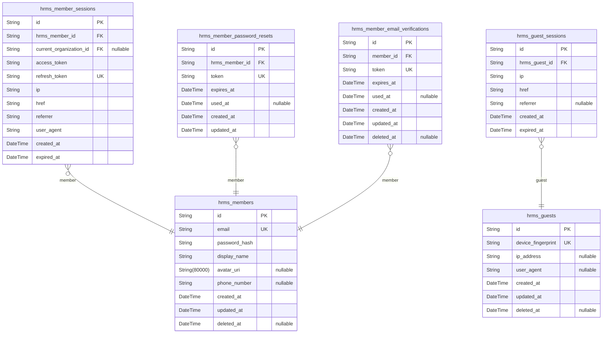
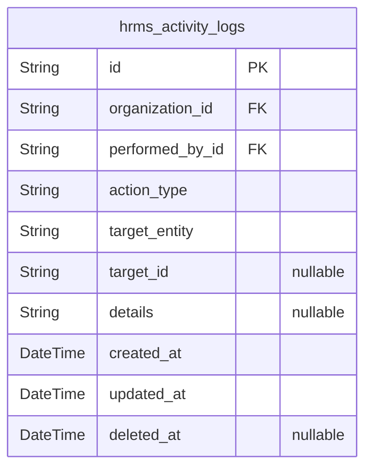
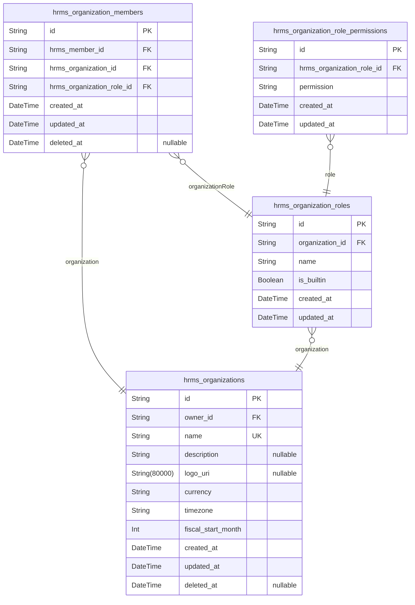
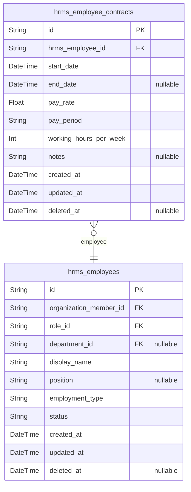
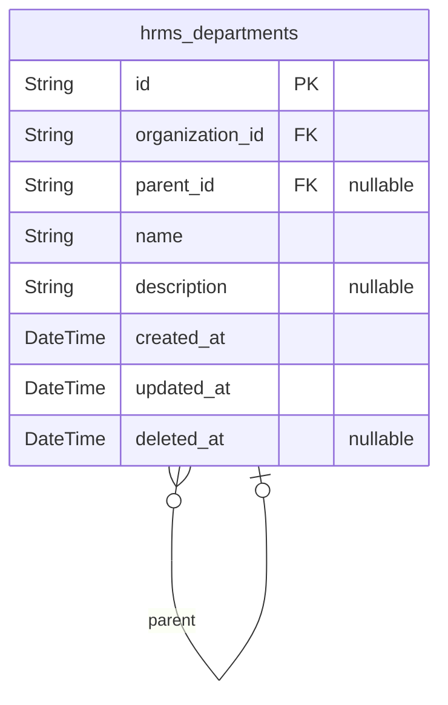
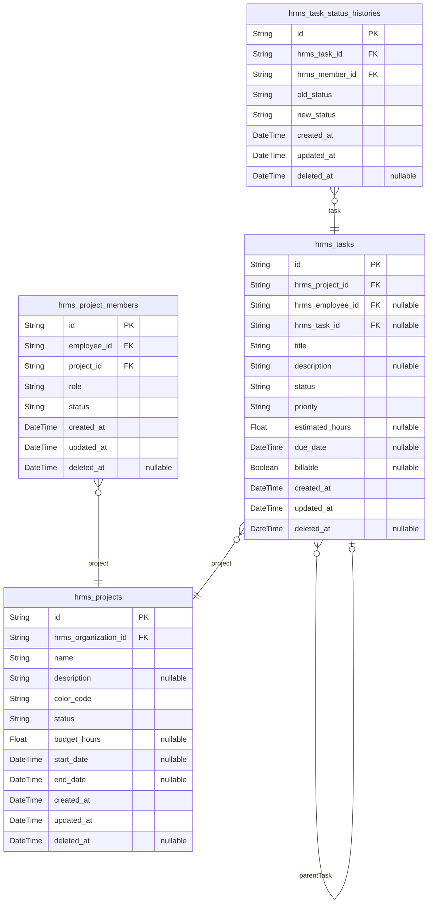
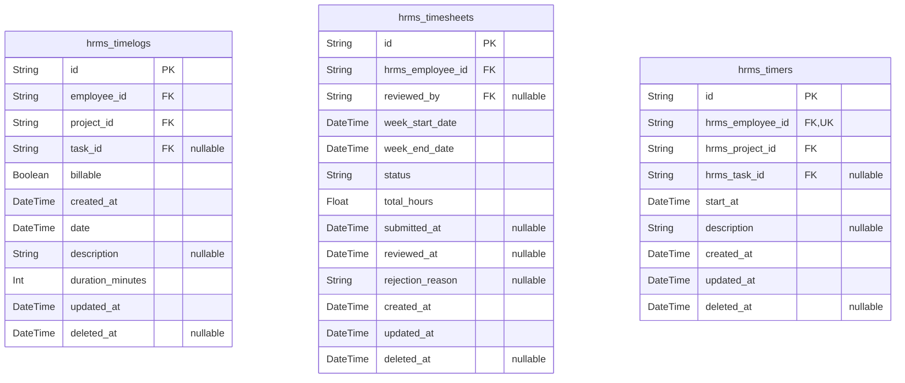
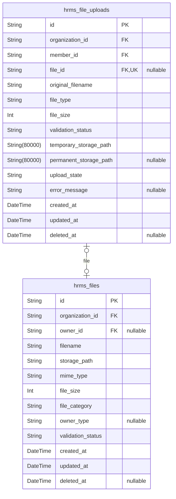

# Prisma Markdown

> Generated by [`prisma-markdown`](https://github.com/samchon/prisma-markdown)

- [Actors](#actors)
- [Systematic](#systematic)
- [Organizations](#organizations)
- [Employees](#employees)
- [Departments](#departments)
- [Projects](#projects)
- [TimeTracking](#timetracking)
- [FileStorage](#filestorage)

## Actors

### `hrms_members`

Registered member accounts with email/password credentials and global
profile information.

This table serves as the primary actor identity for authenticated users
in the system. Each member has a unique email address and password hash
for authentication. The member record contains a global profile (display
name, avatar, phone number) that is shared across all organizations the
user belongs to.

Key relationships:
- [hrms_organization_members](#hrms_organization_members) — One member can have multiple
organization memberships across different organizations
- [hrms_member_sessions](#hrms_member_sessions) — One member can have multiple active
sessions for tracking logins
- [hrms_member_password_resets](#hrms_member_password_resets) — One member can have multiple
password reset requests (expired tokens)
- [hrms_member_email_verifications](#hrms_member_email_verifications) — One member can have multiple
email verification requests
- [hrms_employees](#hrms_employees) — One member may be linked to an employee record
in organizations they belong to
- [hrms_activity_logs](#hrms_activity_logs) — One member can perform many actions logged
in activity logs (via performed_by_id reference)

Behavioral notes:
- Email must be unique across all members
- Members can belong to multiple organizations simultaneously
- Members can have multiple sessions active at once (different
devices/browsers)
- Soft delete via deleted_at for account deletion workflow
- Password hash is never stored in plaintext

Properties as follows:

- `id`: Primary Key.
- `email`
  > Unique email address used for authentication. Must be unique across all
  > members.
- `password_hash`: BCrypt or similar hashed password. Never stored in plaintext.
- `display_name`
  > User's display name shown across the platform. Used for identification in
  > activity logs and member lists.
- `avatar_uri`: URL to the user's avatar image. Optional profile customization.
- `phone_number`: User's phone number. Optional contact information.
- `created_at`: Timestamp when the member account was created.
- `updated_at`: Timestamp when the member record was last updated.
- `deleted_at`: Timestamp when the member account was soft-deleted. NULL means active.

### `hrms_member_sessions`

JWT session tokens with access and refresh tokens for member
authentication. Tracks member login sessions with organization context
switching capability.

Each session stores the JWT access token and refresh token used for API
authentication, along with connection metadata (IP address, referrer URL,
current page URL) and the organization context selected by the member.
Members can have multiple active sessions (different devices or browsers)
and can switch between organizations without logging out.

Sessions are automatically expired based on expiration timestamps.
Members can also manually terminate specific sessions through logout
operations. This table is a child entity of the [hrms_members](#hrms_members)
actor table and supports many-to-one relationship (one member, many
sessions).

Properties as follows:

- `id`: Primary Key.
- `hrms_member_id`
  > Referenced member's [hrms_members.id](#hrms_members). Belongs to the member actor
  > who initiated this session.
- `current_organization_id`
  > Currently selected organization context for this session. When null, the
  > member has not selected an organization yet.
- `access_token`
  > JWT access token for API authentication. This token is sent with each API
  > request for authorization.
- `refresh_token`
  > JWT refresh token for renewing expired access tokens. Used when the
  > access token expires but the session is still valid.
- `ip`
  > Client IP address from which the session was initiated. Used for security
  > auditing and detecting suspicious access patterns.
- `href`
  > Page URL where the member was logged in from. Provides context about the
  > navigation path during login.
- `referrer`
  > Referrer URL from the HTTP request during login. Useful for analytics and
  > security auditing.
- `user_agent`
  > Browser and device user agent string. Used for identifying the client
  > device and browser type.
- `created_at`: Session creation timestamp when the member successfully logged in.
- `expired_at`
  > Session expiration timestamp. Sessions are invalidated when current time
  > exceeds this value.

### `hrms_member_password_resets`

Password reset tokens for member account recovery.

This table captures all password reset requests made by members,
providing an audit trail for account recovery attempts. Each record
contains a unique reset token with expiration timestamp and usage status.

Key relationships:
- Belongs to [hrms_members](#hrms_members) via hrms_member_id (member who
requested the reset)
- The token is sent to the member's email for verification
- Tokens are one-time use and expire after a set duration

Business rules:
- Each reset token is unique and can only be used once
- Tokens automatically expire after the expiration time
- Used tokens are marked with used_at timestamp for audit purposes
- Members can have multiple pending reset tokens (only the newest is
typically used)
- This table serves as an audit trail for security and compliance

Note: Email address is accessed via [hrms_members](#hrms_members) FK reference;
storing email separately would violate 3NF normalization.

Properties as follows:

- `id`: Primary Key.
- `hrms_member_id`: Member's [hrms_members.id](#hrms_members) who requested the password reset.
- `token`: Unique reset token sent to member's email for verification.
- `expires_at`: Expiration timestamp when the reset token becomes invalid.
- `used_at`
  > Timestamp when the token was successfully used to reset password
  > (nullable if not yet used).
- `created_at`: Creation timestamp of the password reset request.
- `updated_at`: Last update timestamp (updated when token is used).

### `hrms_member_email_verifications`

Email verification tokens for member registration validation.

This table stores one-time use verification tokens sent to members' email
addresses during account registration. Each verification token is unique,
time-limited, and marked as used once the email is confirmed.

Key relationships:
- Belongs to a single [hrms_members](#hrms_members) member account
- Multiple verification attempts can exist for the same member (e.g.,
resend verification)
- Tokens are single-use and expire after a set period

Behavioral notes:
- Only one active (unused, not expired) verification token should exist
per member at a time
- Used tokens are retained for audit purposes but marked with deleted_at
- Token generation and verification are handled by the authentication
service

Properties as follows:

- `id`: Primary Key.
- `member_id`: Member account's [hrms_members.id](#hrms_members).
- `token`: Unique verification token (hash of email + random salt).
- `expires_at`: Token expiration timestamp after which verification is invalid.
- `used_at`
  > Timestamp when the token was used to verify the email address. Null if
  > token is unused.
- `created_at`: Record creation timestamp.
- `updated_at`: Record last update timestamp.
- `deleted_at`: Record deletion timestamp for soft delete (used tokens are soft deleted).

### `hrms_guests`

Temporary guest accounts for unauthenticated visitors, identified by
device fingerprint.

Guest accounts represent temporary visitor sessions that do not have
authentication credentials (email/password). Each guest account is
uniquely identified by a device fingerprint, which combines
browser/device characteristics to maintain session continuity across
requests.

Key characteristics:
- Temporary accounts that exist for the duration of a visitor session
- No email or password authentication required
- Identified by device fingerprint for session persistence
- Can be soft-deleted when the session expires or is cleared
- Sessions are stored in the separate [hrms_guest_sessions](#hrms_guest_sessions) table

This table serves as the canonical identity record for guest actors in
the system, with one-to-many relationships to session tokens. Guest
accounts are typically short-lived and are automatically cleaned up when
sessions expire.

Properties as follows:

- `id`: Primary Key.
- `device_fingerprint`
  > Unique device fingerprint that identifies this guest account. Generated
  > by combining browser characteristics (user agent, screen resolution,
  > timezone, etc.) to create a persistent identifier for the device.
- `ip_address`
  > IP address of the guest's last known location. Used for security and
  > session tracking.
- `user_agent`
  > Browser user agent string from the last request. Helps identify
  > device/browser characteristics.
- `created_at`: Timestamp when this guest account was created.
- `updated_at`: Timestamp when this guest account was last updated.
- `deleted_at`: Timestamp when this guest account was soft-deleted. NULL means active.

### `hrms_guest_sessions`

Temporary session tokens for guest access with device-based identification.

Each guest session is identified by a UUID and stores connection metadata
including IP address, browser referrer information, and expiration
timestamp. Sessions are append-only audit records that track when guests
access the system with their device fingerprint.

This table is a child of the [hrms_guests](#hrms_guests) actor table and supports
the guest actor's session pattern. Sessions expire automatically based on
security requirements and cannot be edited directly.

Related entities:
- Parent: [hrms_guests](#hrms_guests) - Guest account with device fingerprint
- Session management is handled through authentication flows, not direct
CRUD operations

Properties as follows:

- `id`: Primary Key.
- `hrms_guest_id`
  > Guest account's [hrms_guests.id](#hrms_guests). Identifies which guest this
  > session belongs to.
- `ip`: IP address of the device that created this session.
- `href`: Browser referrer URL or landing page that initiated the session.
- `referrer`: Full referrer header information from the browser request.
- `created_at`: Timestamp when this session was created.
- `expired_at`
  > Expiration timestamp for this session. Sessions are temporary and must
  > expire for security.

## Systematic

### `hrms_activity_logs`

Centralized audit trail capturing all significant system actions per
organization.

This table serves as the system-wide event log for compliance and
debugging. Each entry records an action performed by a user within an
organization context, including:

- Employee lifecycle events: invited, deactivated, reactivated
- Contract events: created, edited
- Project events: created, archived, completed, deleted
- Task events: status changed
- Timesheet events: submitted, approved, rejected
- Role events: assigned, changed

Users with org:manage permission can view the full activity log for their
organization.

[hrms_organizations](#hrms_organizations) - Each log entry belongs to exactly one
organization.
[hrms_members](#hrms_members) - Records which user performed the action.
[hrms_employees](#hrms_employees) - Referenced for employee-related actions.
[hrms_projects](#hrms_projects) - Referenced for project-related actions.
[hrms_tasks](#hrms_tasks) - Referenced for task-related actions.
[hrms_timesheets](#hrms_timesheets) - Referenced for timesheet-related actions.
[hrms_organization_roles](#hrms_organization_roles) - Referenced for role-related actions.

Properties as follows:

- `id`: Primary Key.
- `organization_id`: Organization that this activity belongs to. [hrms_organizations.id](#hrms_organizations)
- `performed_by_id`: User who performed the action. [hrms_members.id](#hrms_members)
- `action_type`
  > Type of action performed. Values: 'employee.invited',
  > 'employee.deactivated', 'employee.reactivated', 'contract.created',
  > 'contract.edited', 'project.created', 'project.archived',
  > 'project.completed', 'project.deleted', 'task.status_changed',
  > 'timesheet.submitted', 'timesheet.approved', 'timesheet.rejected',
  > 'role.assigned', 'role.changed'.
- `target_entity`
  > Type of entity that was affected. Values: 'employee', 'contract',
  > 'project', 'task', 'timesheet', 'role', 'user'.
- `target_id`
  > ID of the target entity (nullable if action doesn't target a specific
  > entity).
- `details`: Additional details about the action (e.g., field changes, reasons).
- `created_at`: Timestamp when the action was performed.
- `updated_at`: Timestamp when the record was last updated.
- `deleted_at`: Soft delete timestamp (nullable means not deleted).

## Organizations

### `hrms_organizations`

Multi-tenant organization entities with settings and owner reference.

Organizations represent independent tenants in the system, each with its
own employees, projects, tasks, and data. Organizations are created by
users during initial sign-up and operate as isolated units with
organization-specific settings including currency, timezone, and fiscal
calendar.

Organizations are owned by a single user (organization owner) who has
full control over organization settings, member management, and role
configuration. Owners can delete organizations only when all pending
timesheets are resolved and no active employee contracts exist. When an
organization is deleted, all associated employees, projects, tasks,
timelogs, and timesheets are permanently deleted, but the owner's account
remains (unassociated with any organization).

Related entities: [hrms_organization_members](#hrms_organization_members), {@link
hrms_organization_roles}, [hrms_employees](#hrms_employees), [hrms_projects](#hrms_projects)

Properties as follows:

- `id`: Primary Key.
- `owner_id`
  > Organization owner's member account reference. The owner has full control
  > over organization settings and member management.
- `name`: Organization display name. Must be unique across all organizations.
- `description`: Optional organization description.
- `logo_uri`: Organization logo image URL.
- `currency`: Organization currency code (e.g., USD, EUR, KRW).
- `timezone`: Organization timezone (e.g., Asia/Seoul, America/New_York).
- `fiscal_start_month`: Fiscal year start month (1-12, where 1=January).
- `created_at`: Organization creation timestamp.
- `updated_at`: Organization last update timestamp.
- `deleted_at`: Organization soft delete timestamp (null if not deleted).

### `hrms_organization_members`

Links users (members) to organizations with role assignment, supporting
multi-organization membership.

Each organization member represents a user's participation in a specific
organization with an assigned role. Users can belong to multiple
organizations, each with potentially different roles and permissions.

Key relationships:
- [hrms_members](#hrms_members) — The user account this membership belongs to
- [hrms_organizations](#hrms_organizations) — The organization this membership is for
- [hrms_organization_roles](#hrms_organization_roles) — The role assigned within this
organization

Business rules:
- A member can only have one membership per organization (enforced by
unique constraint)
- Role determines the permissions and access level within the organization
- Deactivated employees are still linked via this table but with status
flag in hrms_employees

Properties as follows:

- `id`: Primary Key.
- `hrms_member_id`
  > Member's [hrms_members.id](#hrms_members). The user account this organization
  > membership belongs to.
- `hrms_organization_id`
  > Organization's [hrms_organizations.id](#hrms_organizations). The organization this
  > membership is for.
- `hrms_organization_role_id`
  > Role's [hrms_organization_roles.id](#hrms_organization_roles). The role assigned to this
  > member within the organization.
- `created_at`: Record creation timestamp.
- `updated_at`: Record last update timestamp.
- `deleted_at`: Soft delete timestamp. Null means active, non-null means deleted.

### `hrms_organization_roles`

Custom role definitions within each organization, including built-in
roles (Owner, Manager, Employee) and user-created custom roles.

Each organization maintains its own set of roles with permission sets.
Organization owners can create, edit, and delete custom roles. Built-in
roles (Owner, Manager, Employee) cannot be deleted. Each organization
member is assigned exactly one role from this organization's role set.

This table supports the multi-tenancy architecture where permissions and
roles are organization-specific. Related entities include {@link
hrms_organization_members} (which references roles), {@link
hrms_organizations} (parent organization), and {@link
hrms_organization_role_permissions} (normalized permission storage).

Properties as follows:

- `id`: Primary Key.
- `organization_id`
  > Belonging organization's [hrms_organizations.id](#hrms_organizations). Each organization
  > has its own independent set of roles.
- `name`
  > Role name (e.g., Owner, Manager, Employee, or custom name). Must be
  > unique within the organization.
- `is_builtin`
  > Whether this is a built-in role (Owner, Manager, Employee) that cannot be
  > deleted. Custom roles have this set to false.
- `created_at`: Role creation timestamp.
- `updated_at`: Last role update timestamp.

### `hrms_organization_role_permissions`

Normalized storage of role permissions for 1NF compliance.

Stores one permission code per row (e.g., "employee:manage",
"time:approve") to avoid storing arrays or JSON in the role table. Each
role can have multiple permissions, enabling flexible permission sets per
custom role.

**Relationships**:
- Belongs to a single [hrms_organization_roles](#hrms_organization_roles) - each permission
is associated with exactly one role
- Permissions are managed exclusively through the role entity, not
independently

**Data Integrity**:
- Unique constraint prevents duplicate permissions for the same role
- All permission codes follow the format "category:action" (e.g.,
"org:manage", "employee:view")

Properties as follows:

- `id`: Primary Key.
- `hrms_organization_role_id`
  > Role's [hrms_organization_roles.id](#hrms_organization_roles). Each permission belongs to
  > exactly one role.
- `permission`
  > Permission code following the format "category:action" (e.g.,
  > "org:manage", "employee:view", "time:approve", "project:manage",
  > "report:view"). Defines a specific action a role can perform.
- `created_at`: Timestamp when this permission record was created.
- `updated_at`: Timestamp when this permission record was last updated.

## Employees

### `hrms_employees`

Employee records linking user accounts to organizational roles,
departments, and employment details.

This table represents employees within the multi-tenant organization
system. Each employee record connects to an organization member record,
establishing the relationship between a user and their role within a
specific organization. Employees have employment-specific attributes
including department assignment, position title, and employment type
classification.

Key relationships:
- Each employee belongs to exactly one organization member record ({@link
hrms_organization_members.id})
- Each employee has one role assignment within their organization ({@link
hrms_organization_roles.id})
- Employees may belong to an optional department ({@link
hrms_departments.id})
- Employees can have multiple historical contracts ({@link
hrms_employee_contracts})
- Employees can create timelogs ([hrms_timelogs](#hrms_timelogs)) and timesheets
([hrms_timesheets](#hrms_timesheets))

The employee record serves as the core employment entity, separate from
the authentication user account. This allows the system to track
employment history, contracts, and organizational role assignments
independently of user login credentials.

Properties as follows:

- `id`: Primary Key.
- `organization_member_id`
  > Organization member record that connects this employee to a user account
  > and organization. [hrms_organization_members.id](#hrms_organization_members).
- `role_id`
  > Role assigned to this employee within the organization. Determines
  > permissions and access levels. [hrms_organization_roles.id](#hrms_organization_roles).
- `department_id`
  > Optional department assignment for organizational structure. {@link
  > hrms_departments.id}.
- `display_name`
  > Display name for the employee, separate from the user's global profile
  > name.
- `position`
  > Job title or position within the organization (e.g., Senior Developer,
  > Marketing Manager).
- `employment_type`: Employment classification: full-time, part-time, contractor, intern.
- `status`
  > Employment status: active or deactivated. Deactivated employees cannot
  > log time or submit timesheets.
- `created_at`: Record creation timestamp.
- `updated_at`: Record last update timestamp.
- `deleted_at`: Soft delete timestamp. NULL means record is active.

### `hrms_employee_contracts`

Historical employment contract records that track the terms of employment
for employees over time.

This table stores contract history for each employee, including pay rate,
pay period, working hours, and contract dates. At any given time, only
one contract can be active for an employee. When a new contract is
created, the previous active contract is automatically terminated.

**Key Features**:

- Historical record of employment terms with immutable past contracts
- One-to-many relationship with [hrms_employees](#hrms_employees) (one employee,
many contracts)
- Active contract tracking through date ranges (start_date, end_date)
- Pay rate and pay period configuration for compensation tracking
- Working hours per week specification for time tracking calculations

**Business Rules**:

- Only one contract can be active at a time per employee
- Creating a new contract automatically ends the previous active contract
- Past contracts are immutable and cannot be edited
- Employees can view their own contracts
- Users with `employee:view` permission can view any employee's contracts

Properties as follows:

- `id`: Primary Key.
- `hrms_employee_id`
  > Employee's [hrms_employees.id](#hrms_employees). Belongs to one employee who may
  > have multiple contracts over time.
- `start_date`: Contract start date and time. Required for all contracts.
- `end_date`
  > Contract end date and time. Nullable for ongoing contracts without an end
  > date.
- `pay_rate`: Pay rate numeric value. Required for compensation tracking.
- `pay_period`: Pay period classification: hourly, daily, weekly, or monthly.
- `working_hours_per_week`
  > Working hours per week specification, e.g., 40 for full-time. Required
  > for time tracking calculations.
- `notes`: Optional notes or additional contract terms. Can be null.
- `created_at`: Record creation timestamp.
- `updated_at`: Record last update timestamp.
- `deleted_at`: Soft delete timestamp. Nullable for undeleted records.

## Departments

### `hrms_departments`

Organizational department units with parent-child hierarchy support
within each organization.

Departments represent the organizational structure of an organization,
allowing departments to be organized in a hierarchy with optional
parent-child relationships (one level of nesting). Each department
belongs to exactly one organization and can have an optional parent
department, creating a two-level organizational chart.

Key relationships:
- Belongs to [hrms_organizations](#hrms_organizations) via organization_id
- Parent-department relationship via parent_id (self-referencing FK)
- Employees reference this table via hrms_employees.department_id

Behavioral notes:
- When a department is deleted, all employee records in that department
have their department_id set to NULL
- Department names must be unique within each organization
- Supports soft delete via deleted_at for audit purposes

Properties as follows:

- `id`: Primary Key.
- `organization_id`: Organization this department belongs to. [hrms_organizations.id](#hrms_organizations)
- `parent_id`
  > Parent department for hierarchy (one level nesting). {@link
  > hrms_departments.id}
- `name`: Department name. Must be unique within the organization.
- `description`: Optional department description or details.
- `created_at`: Timestamp when the department was created.
- `updated_at`: Timestamp when the department was last updated.
- `deleted_at`: Timestamp when the department was soft deleted (nullable = not deleted).

## Projects

### `hrms_projects`

Work initiatives that employees track time against. Projects organize
work with budget tracking, date ranges, and status management. Each
project belongs to an organization and can have multiple tasks, project
members, and associated timelogs. Archived or completed projects cannot
receive new timelog entries but preserve historical data. Project status
transitions control workflow: active projects accept time entries, while
archived/completed projects are closed to new work. Organization owners
and project managers can create, edit, archive, complete, and delete
projects (with timelog constraints).

Properties as follows:

- `id`: Primary Key.
- `hrms_organization_id`
  > Belonging organization's [hrms_organizations.id](#hrms_organizations). Organization
  > provides multi-tenancy isolation for all project data.
- `name`
  > Project name. Required for identification and display in project lists
  > and task assignments.
- `description`
  > Optional project description with details about scope, objectives, and
  > deliverables.
- `color_code`
  > Hex color code (e.g., #3498db) for UI display and project visualization.
  > Required for color-coded project boards and timers.
- `status`
  > Project status: 'active' (accepting time entries), 'archived' (closed,
  > preserved), 'completed' (finished work). Active projects allow new
  > timelogs; archived/completed projects preserve historical data only.
- `budget_hours`
  > Total estimated hours for the project. Used for budget tracking and
  > utilization reporting. Projects without budget are excluded from budget
  > reports.
- `start_date`: Optional project start date for timeline planning and reporting.
- `end_date`: Optional project end date for timeline planning and reporting.
- `created_at`: Creation timestamp when the project was first created.
- `updated_at`: Last update timestamp for the project record.
- `deleted_at`
  > Soft delete timestamp. When present, project is marked as deleted but
  > preserved for audit purposes.

### `hrms_project_members`

Employee-project membership assignments that link employees to projects
with role designation.

This table tracks which employees are assigned to which projects and
their role within that project (member or project-lead). Each membership
represents a one-to-one relationship between an employee and a project -
an employee can have multiple project memberships across different
projects, but only one membership per project.

Project leads can manage tasks within their project, while regular
members can view and work on tasks. Users with `project:manage`
permission can assign employees to projects, change their roles, or
remove them entirely.

**Key Relationships**:
- Belongs to [hrms_employees](#hrms_employees) - The employee who is a member of the
project
- Belongs to [hrms_projects](#hrms_projects) - The project that includes this
employee as a member

**Status Management**:
- Active memberships allow the employee to work on the project
- Inactive memberships preserve historical assignment data without active
participation
- Memberships can be reactivated by users with `project:manage` permission

Properties as follows:

- `id`: Primary Key.
- `employee_id`
  > Employee's [hrms_employees.id](#hrms_employees). The employee who is assigned to
  > this project.
- `project_id`
  > Project's [hrms_projects.id](#hrms_projects). The project that this employee is a
  > member of.
- `role`
  > Role within the project: 'member' or 'project-lead'. Project leads can
  > manage tasks within their project, while members can view and work on
  > tasks.
- `status`
  > Membership status: 'active' or 'inactive'. Active memberships allow the
  > employee to work on the project. Inactive memberships preserve historical
  > data without active participation.
- `created_at`: Timestamp when this membership was created.
- `updated_at`: Timestamp when this membership was last updated.
- `deleted_at`: Timestamp when this membership was soft-deleted (optional).

### `hrms_tasks`

Work items within projects that employees track time against. Tasks
support optional parent-child hierarchy for subtasks and track status
through a workflow (open → in-progress → completed → closed).

Tasks are independently managed by users with project:manage permission -
they can create, search, filter, and delete tasks regardless of project
context. Each task belongs to exactly one project and may be assigned to
an employee. Tasks have estimated hours, due dates, priority levels, and
a billable flag for time tracking purposes.

Related entities:
- [hrms_projects](#hrms_projects) - Each task belongs to exactly one project
- [hrms_employees](#hrms_employees) - Optional assignment to an employee (must be a
project member)
- [hrms_task_status_histories](#hrms_task_status_histories) - Audit trail of status changes
(managed in same component but generated separately)

Properties as follows:

- `id`: Primary Key.
- `hrms_project_id`: Project that this task belongs to. [hrms_projects.id](#hrms_projects)
- `hrms_employee_id`: Employee assigned to this task. [hrms_employees.id](#hrms_employees)
- `hrms_task_id`: Parent task for subtasks. [hrms_tasks.id](#hrms_tasks)
- `title`: Task title. Required field for task identification.
- `description`: Task description with optional details about the work item.
- `status`: Task status: open, in-progress, completed, or closed.
- `priority`: Task priority level: low, medium, high, or urgent.
- `estimated_hours`: Estimated hours required to complete the task.
- `due_date`: Optional due date for task completion.
- `billable`: Whether this task time is billable to client.
- `created_at`: Timestamp when the task was created.
- `updated_at`: Timestamp when the task was last updated.
- `deleted_at`: Timestamp when the task was soft-deleted.

### `hrms_task_status_histories`

Audit trail table that captures all status changes made to tasks in the
system. This is a snapshot table that records point-in-time status
transitions for compliance and historical tracking purposes.

Each entry represents a single status change event, capturing the
previous status (old_status), the new status (new_status), the timestamp
of the change, and the user (member) who initiated the change. This
enables complete auditability of task lifecycle and allows reconstruction
of task history.

Relationships:
- Belongs to a [hrms_tasks](#hrms_tasks) task that had its status changed
- Performed by a [hrms_members](#hrms_members) user who has project management
permissions

This table is append-only and read-only from the user perspective. Status
history is automatically created by the system when task status is
modified through the project management workflow.

Properties as follows:

- `id`: Primary Key.
- `hrms_task_id`: Reference to the [hrms_tasks.id](#hrms_tasks) that had its status changed.
- `hrms_member_id`: Reference to the [hrms_members.id](#hrms_members) who made the status change.
- `old_status`
  > The previous status value before the change (open, in-progress,
  > completed, closed).
- `new_status`
  > The new status value after the change (open, in-progress, completed,
  > closed).
- `created_at`: Timestamp when the status change occurred.
- `updated_at`: Last update timestamp for soft delete tracking.
- `deleted_at`: Soft delete timestamp (nullable, null means active).

## TimeTracking

### `hrms_timelogs`

Individual time entries that employees create to track work done on
projects and tasks.

This is a primary business entity representing discrete time logged by
employees. Each timelog records the date worked, duration in minutes,
which project and task (if any) the time was spent on, a description of
work performed, and whether the time is billable to clients.

Timelogs can only be created for projects the employee is assigned to.
Employees can manage their own timelogs (edit/delete only if not in an
approved timesheet). Users with the `time:manage` permission can modify
any employee's timelogs. Timelogs are automatically included in weekly
timesheets and become locked once those timesheets are approved.

**Key relationships**:
- Belongs to a single employee (`[hrms_employees](#hrms_employees)`) who logged the
time
- Belongs to a single project (`[hrms_projects](#hrms_projects)`) the time was
spent on
- Optionally belongs to a task (`[hrms_tasks](#hrms_tasks)`) within that project
- Referenced by timesheets (`[hrms_timesheets](#hrms_timesheets)`) which group
timelogs by week

**Business rules**:
- Employees can only create timelogs for themselves
- Employees can only edit/delete their own timelogs that are not in
submitted or approved timesheets
- Project and task must belong to a project the employee is assigned to
- Duration is stored in minutes for precise time tracking

Properties as follows:

- `id`: Primary Key.
- `employee_id`: Employee who logged this time. [hrms_employees.id](#hrms_employees)
- `project_id`: Project this time was spent on. [hrms_projects.id](#hrms_projects)
- `task_id`
  > Optional task within the project this time was spent on. {@link
  > hrms_tasks.id}
- `billable`: Whether this time is billable to clients. Default is true.
- `created_at`: When this timelog was created.
- `date`: The date this work was performed (stored as datetime at midnight).
- `description`: Description of what work was performed during this time entry.
- `duration_minutes`: Duration of this time entry in minutes.
- `updated_at`: When this timelog was last updated.
- `deleted_at`: Soft delete timestamp. NULL means the record is active.

### `hrms_timesheets`

Weekly collections of timelogs with approval workflow for employee
timesheet management.

A timesheet represents all timelogs for a specific employee within a
calendar week (Monday to Sunday). Timesheets follow an approval workflow
with states: draft (editable), submitted (pending approval), approved
(locked and final), or rejected (return to draft with reason).

Key relationships:
- Belongs to [hrms_employees](#hrms_employees) - Each timesheet is owned by a single
employee who logs time against it
- Reviewed by [hrms_members](#hrms_members) - Managers or approvers (member
accounts) who approve or reject timesheets

Business rules:
- Only the owning employee can create and edit draft timesheets
- A timesheet cannot be submitted if it has no timelogs
- Each employee can have only one submitted or approved timesheet per week
- Approved timesheets lock all included timelogs (cannot be edited or
deleted)
- Rejected timesheets include a rejection reason and return to draft status

This table enables the weekly timesheet approval workflow central to the
time tracking system.

Properties as follows:

- `id`: Primary Key.
- `hrms_employee_id`
  > Employee who owns this timesheet and logged the time entries. {@link
  > hrms_employees.id}
- `reviewed_by`
  > Member (manager/approver) who approved or rejected this timesheet. {@link
  > hrms_members.id}
- `week_start_date`
  > The Monday start date of the week covered by this timesheet. Timesheets
  > are always organized by calendar weeks (Monday to Sunday).
- `week_end_date`
  > The Sunday end date of the week covered by this timesheet. Calculated as
  > week_start_date + 6 days.
- `status`
  > Approval workflow status of the timesheet: draft (editable), submitted
  > (pending approval), approved (locked and final), rejected (returned to
  > draft with reason).
- `total_hours`
  > Total hours logged in this timesheet, calculated as the sum of durations
  > from all associated timelogs. Stored as a denormalized value for
  > reporting efficiency.
- `submitted_at`
  > Timestamp when the employee submitted this timesheet for approval. Null
  > for draft timesheets.
- `reviewed_at`
  > Timestamp when the timesheet was approved or rejected by an approver.
  > Null for draft and submitted timesheets.
- `rejection_reason`
  > Reason for rejection provided by the approver. Required when status is
  > rejected, null otherwise.
- `created_at`: Creation timestamp of this timesheet record.
- `updated_at`: Last update timestamp of this timesheet record.
- `deleted_at`: Soft deletion timestamp. Null if the timesheet is not deleted.

### `hrms_timers`

Live timer tracking sessions for real-time employee time tracking.

Employees can start a timer to track time in real-time. Each employee can
have at most one active timer at a time. Starting a timer requires
selecting a project and optionally a task. When the timer is stopped, it
automatically creates a timelog entry with the calculated duration.
Employees can also discard their timer without creating a timelog.

Key relationships:
- Belongs to a single [hrms_employees](#hrms_employees) employee (owner)
- References a [hrms_projects](#hrms_projects) project (required) - the project
being tracked against
- Optionally references a [hrms_tasks](#hrms_tasks) task within the selected
project
- Many timers can be stopped and converted to [hrms_timelogs](#hrms_timelogs) over
the employee's lifetime

Properties as follows:

- `id`: Primary Key.
- `hrms_employee_id`: Employee owner of this timer. [hrms_employees.id](#hrms_employees)
- `hrms_project_id`: Project being tracked. [hrms_projects.id](#hrms_projects)
- `hrms_task_id`: Optional task being tracked. [hrms_tasks.id](#hrms_tasks)
- `start_at`: Timer start timestamp when the timer was started.
- `description`
  > Optional description of what the employee is working on during this timer
  > session.
- `created_at`: Record creation timestamp.
- `updated_at`: Record last update timestamp.
- `deleted_at`: Soft deletion timestamp (NULL means active, not deleted).

## FileStorage

### `hrms_files`

File metadata for organization logos, user avatars, and document
attachments with storage path and organization context.

This table serves as the central repository for all uploaded files in the
system, including organization logos, user profile avatars, and document
attachments. Files are associated with organizations for multi-tenancy
isolation and can be owned by different entity types (organizations or
members) through polymorphic ownership.

The table supports the complete file upload workflow from temporary
validation to permanent storage. Each file record includes validation
status tracking, MIME type detection, and size constraints to ensure data
integrity and security. Files are soft-deleted to preserve historical
references while marking them as inaccessible.

Properties as follows:

- `id`: Primary Key.
- `organization_id`
  > The organization that owns this file. All files are scoped to their
  > parent organization for multi-tenancy isolation.
- `owner_id`
  > Polymorphic owner reference for files. When owner_type is 'member',
  > references a user's profile avatar via [hrms_members.id](#hrms_members). When
  > null, the file belongs to the organization directly (e.g., organization
  > logo, shared documents).
- `filename`: Original filename as uploaded by the user, preserved for display purposes.
- `storage_path`
  > Internal storage path or URL where the file content is stored, used for
  > retrieval.
- `mime_type`
  > MIME type of the file detected during upload (e.g., image/jpeg,
  > application/pdf).
- `file_size`: File size in bytes, recorded at upload time.
- `file_category`
  > Category classification: 'organization_logo' for org logos, 'user_avatar'
  > for profile pictures, 'document' for general attachments.
- `owner_type`
  > Type of owner for polymorphic association: 'member' for user avatars,
  > null for organization-owned files.
- `validation_status`
  > Current validation status: 'pending' (awaiting virus scan), 'validated'
  > (passed security checks), 'rejected' (failed validation).
- `created_at`: Timestamp when the file was created and initially stored.
- `updated_at`: Timestamp when the file record was last updated with new metadata.
- `deleted_at`
  > Soft delete timestamp. When null, file is active. When set, file is
  > marked for deletion but retained for historical references.

### `hrms_file_uploads`

Tracks the file upload workflow from temporary storage to permanent
storage, including validation status and ownership assignment.

This table supports the file upload process by maintaining:
- Original filename and upload metadata
- Temporary and permanent storage paths
- Upload state (pending, validating, completed, failed)
- Error tracking for failed uploads

When a file is uploaded:
1. A record is created with pending state
2. File is scanned and validated
3. Upon success, file metadata is stored in hrms_files and upload record
is updated to completed
4. If validation fails, upload state is set to failed with error message

Referenced by:
- [hrms_files](#hrms_files) - The uploaded file's permanent metadata
- [hrms_organizations](#hrms_organizations) - Organization context for the upload
- [hrms_members](#hrms_members) - Member who initiated the upload

Properties as follows:

- `id`: Primary Key.
- `organization_id`: Organization context for the file upload. [hrms_organizations.id](#hrms_organizations)
- `member_id`: Member who initiated the file upload. [hrms_members.id](#hrms_members)
- `file_id`
  > The uploaded file's permanent metadata after successful validation.
  > [hrms_files.id](#hrms_files)
- `original_filename`: Original filename provided by the user during upload.
- `file_type`: MIME type of the uploaded file (e.g., image/png, application/pdf).
- `file_size`: File size in bytes.
- `validation_status`
  > Validation result: pending, valid, invalid. Used for virus scanning and
  > content validation.
- `temporary_storage_path`: Path to temporary storage location before permanent storage is assigned.
- `permanent_storage_path`: Path to permanent storage location after successful upload and validation.
- `upload_state`: Current upload workflow state: pending, validating, completed, failed.
- `error_message`: Error description if upload or validation failed.
- `created_at`: Upload request timestamp.
- `updated_at`: Last update timestamp.
- `deleted_at`: Soft deletion timestamp.
