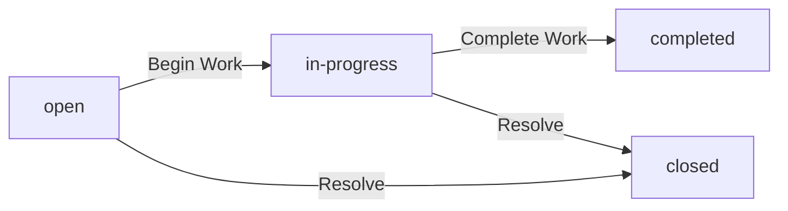
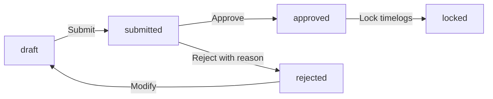
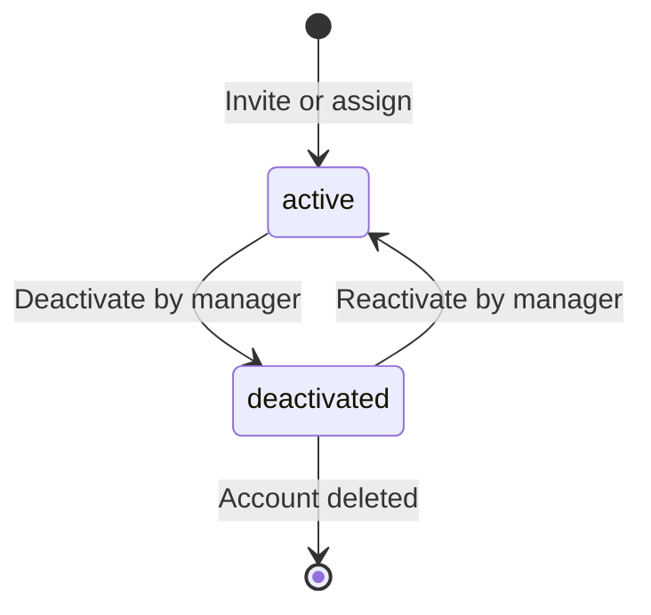
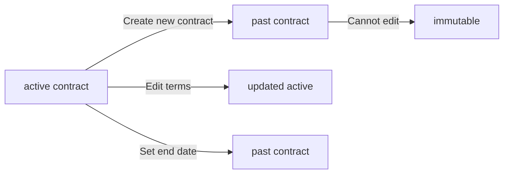

**hrmPlatform — Business concepts, relationships, and states from user perspective**

Business concepts, relationships, and states from user perspective

# Domain Concepts

Describe what each concept means in the business domain and its key attributes.

## Organization Concept

An organization represents a company or business entity that operates independently within the platform. Each organization maintains its own separate set of employees, projects, and all related business data. Organizations are identified by a unique name and can include a descriptive overview about the business. Organizations display their brand through a logo image that appears throughout the system. Each organization operates under a specific currency that determines how financial amounts are displayed and calculated. Organizations function within a designated timezone that affects how dates and times are interpreted for scheduling and reporting. The fiscal calendar begins on a specific month that determines how business periods are defined for financial tracking.

### Organization as Business Entity

An organization represents a distinct business entity that operates independently within the platform. Each organization functions as a self-contained unit with its own employees, projects, tasks, time tracking data, and business operations. The organization concept forms the foundation of the platform's multi-tenancy structure, ensuring complete separation between different companies or business units.

The organization serves as the primary business entity that owns and controls all associated data. Employees, projects, contracts, departments, and all other organizational data belong to this entity. This ownership model ensures that business data remains properly grouped and accessible only to members of the same organization.

### Organization Identification Attributes

Each organization is identified by a unique name that distinguishes it from all other organizations in the platform. The organization name serves as the primary identifier for business identification and is displayed throughout the system.

Organizations include a description field that provides additional context about the business, such as industry, size, or primary activities. This description helps users understand the nature of the organization when viewing employee lists or project directories.

Organizations display their brand identity through a logo image that appears in user interfaces, reports, and communications. The logo is stored as an image file and is used to visually identify the organization across the platform.

### Organization Financial and Time Configuration

Organizations operate with a designated currency that determines how all financial amounts are displayed, calculated, and reported. This currency setting applies to pay rates, budget hours values, and any other monetary data within the organization.

Organizations function within a specific timezone that affects how all dates and times are interpreted throughout the system. The timezone setting ensures that work hours, deadlines, and timesheet periods are calculated correctly for the organization's location.

### Multi-Tenancy and Data Isolation

The platform uses a multi-tenancy structure where each organization maintains complete data isolation from all other organizations. Employees, projects, tasks, timelogs, timesheets, and all other business data are strictly scoped to their parent organization.

Company data isolation ensures that no user can access or view data belonging to a different organization. This isolation is enforced at every level of the system, from user authentication to data retrieval and reporting. Users may belong to multiple organizations, but they can only see and interact with data from their currently selected organization.

Each organization operates independently, with its own set of employees, roles, permissions, projects, and business processes. Organizations can be created, managed, and deleted without affecting other organizations in the system. This independent operation model supports platforms serving multiple clients or parent companies with subsidiary organizations.

### Organization Membership Structure

Users can belong to multiple organizations simultaneously, with each membership establishing the user's role and permissions within that organization. When accessing the platform, users select which organization context to work in, and all subsequent actions are scoped to that selection.

Users can switch between their organizational memberships without logging out or losing their current session. This seamless switching allows users who work across multiple organizations to manage their responsibilities efficiently while maintaining clear data boundaries between organizations.

Each user has a unique relationship with each organization they belong to, including their assigned role, employment status, and access permissions. These organizational memberships are managed separately from the user's global profile and account credentials.

## User Concept

A user represents an individual person who has an account in the platform system. Users authenticate themselves to access the platform using their email address and password. Each user maintains a global profile that is shared across all organizations they belong to. The user profile includes a display name that appears in the system for identification purposes. Users can have their profile image to personalize their presence in the platform. Users provide their phone number as part of their contact information in the profile. A single user can be associated with multiple organizations, allowing them to work across different business entities. The user account serves as the foundation for tracking all actions and activity across the platform.

### User Account

A user account represents an individual's access credential in the platform system. Users authenticate themselves using an email address and password. The email address serves as the primary identifier for the account and is used for all authentication operations. Each user account is uniquely identified by the email address.

Users can create an account by providing an email address and password during sign-up. The email address must not already be in use by another account.

Users can change their password from their profile settings at any time. After changing the password, all active sessions for that account are invalidated, requiring users to log in again with the new password.

Users can delete their account. If the user is the sole owner of an organization, they must transfer ownership or delete the organization first before account deletion. When a user's account is deleted, their employee records in other organizations are marked as deactivated.

Error conditions:
- If the email address is already registered, the account creation is rejected.
- If the password does not meet complexity requirements, the account creation or password change is rejected.
- If the user is the sole owner of an organization, account deletion is rejected until ownership is transferred or the organization is deleted.

### User Profile

Each user maintains a global profile that contains their personal information. The profile is shared across all organizations the user belongs to, meaning it is not organization-specific.

The user profile includes:
- **Display Name**: A human-readable name that appears throughout the system for identification. This is the name other users see when viewing activity, timesheets, and project work.
- **Avatar Image**: A profile image that represents the user visually in the interface. Users may upload an image file to personalize their presence in the platform.
- **Phone Number**: A contact telephone number that users may provide as part of their profile information. This is optional.

Users can edit their profile information at any time. Changes to the display name, avatar image, or phone number are immediately reflected across all organizations the user is a member of.

Error conditions:
- If the profile image file exceeds the maximum allowed size, the upload is rejected.

### User Identity

A user account serves as the unique identity for an individual across the entire platform. The email address is the authoritative identifier that links all user activity and records.

All actions in the system are attributed to a user identity. This includes:
- Creating or modifying employees, projects, tasks, and contracts
- Logging time and submitting timesheets
- Approving or rejecting timesheets
- Changing roles or permissions
- Any administrative or organizational changes

The user identity is referenced throughout the platform to maintain an audit trail of who performed each action. Activity logs, task history, and contract records all reference the user identity.

When a user belongs to multiple organizations, their identity remains the same, but their role and permissions are scoped to each organization separately. For example, a user might be an Owner in one organization and an Employee in another, but their underlying account identity does not change.

Error conditions:
- If a user account has been deleted or deactivated, their identity can no longer be referenced for new actions.

### Multi-Organization Membership

A single user can be associated with multiple organizations in the platform. This allows individuals to work across different business entities while maintaining a single account.

When a user logs in, they select which organization to work in. This selection establishes the organization context for all subsequent actions. The user's profile remains global and is shared across organizations, but their permissions, roles, and data access are scoped to the selected organization.

Users can switch between organizations without logging out. When switching organizations, the system loads the new organization context and displays data relevant only to that organization. All data is strictly isolated per organization—users cannot see data from organizations they are not currently working in.

A user may have different roles in different organizations. For example, a user might be an Owner in one organization and an Employee in another. The role and associated permissions are organization-specific.

Error conditions:
- If the selected organization does not exist or is inaccessible, the organization switch is rejected.
- If a user has no organizations associated with their account, they must be invited to at least one organization before accessing platform features.

## Role Concept

A role represents a set of permissions and responsibilities assigned within an organization. Each role has a unique name that identifies its purpose and level of access. Roles define what actions a person can perform when working within the organization. Every organization has three built-in roles that cannot be deleted: owner, manager, and employee. Organization owners have the ability to create custom roles tailored to their specific business needs. Each custom role consists of a name and a collection of permissions that determine access rights. Roles are assigned to employees within an organization to grant them appropriate access levels. The permission set for each role controls what areas of the system the role can access and modify.

### Built-in Roles

Each organization has three built-in roles that cannot be deleted: owner, manager, and employee. These roles provide the foundational access structure for all organizations.

### Owner Role

The owner role has full access to all features within the organization. Owners can manage organization settings, create and manage custom roles, and assign or change roles for all employees. Owners can view all employee records, contracts, projects, tasks, timelogs, and timesheets across the entire organization. Owners can also delete their organization, but only if all pending timesheets are resolved and there are no active employee contracts.

### Manager Role

The manager role can manage employees, projects, and timesheets. Managers can add, edit, and deactivate employee records. They can create, edit, and delete projects and tasks. Managers can approve or reject timesheets submitted by employees. Managers can view all reports for the organization. However, managers cannot manage organization settings or create custom roles.

### Employee Role

The employee role is the standard role for regular users. Employees can track time by creating timelogs and submitting timesheets for approval. They can view their own employee record, contracts, timelogs, and timesheets. Employees can view tasks in projects they are assigned to. However, employees cannot view or manage other employees' data, projects, timesheets, or organization settings.

These built-in roles are always available and cannot be removed from the system. Organization owners cannot delete or modify these core roles, but they can assign them to employees and create additional custom roles.

### Custom Roles

Organization owners can create custom roles tailored to their specific business needs. Custom roles allow organizations to define granular access levels beyond the three built-in roles.

### Creating Custom Roles

Organization owners can create a new custom role by specifying a name for the role. The name must be unique within the organization. After creating the role, the owner assigns a set of permissions to define what actions the role can perform.

### Managing Custom Roles

Organization owners can edit the name and permission set of existing custom roles. Owners can reassign employees to different custom roles as organizational needs change.

### Deleting Custom Roles

Organization owners can delete custom roles, but only if no employees are currently assigned to that role. If employees are assigned to the custom role, it cannot be deleted until those employees are reassigned to different roles.

### Custom Role Limitations

Custom roles cannot override or modify the three built-in roles. Each custom role is independent and has its own permission set. An employee in an organization is assigned exactly one role, which can be any combination of built-in or custom roles.

### Permission Definitions

Each role has a set of permissions that define what actions the role can perform. The following permissions are available in the system:

### Organization Management

**Edit Organization Settings (`org:manage`)** — Allows the role to modify organization settings such as name, description, logo, currency, timezone, and fiscal start month.

### Employee Management

**Add, Edit, Deactivate Employees (`employee:manage`)** — Allows the role to invite new employees, edit employee records (department, position, employment type), and deactivate or reactivate employees.

**View Employee List and Details (`employee:view`)** — Allows the role to view the list of all employees in the organization and access their employee records, contracts, and related information.

### Project Management

**Create, Edit, Delete Projects and Tasks (`project:manage`)** — Allows the role to create new projects and tasks, edit existing ones, archive or complete projects, and delete projects (if they have no timelogs).

**View Projects and Tasks (`project:view`)** — Allows the role to view all projects and tasks in the organization, including their details and members.

### Time Management

**Edit or Delete Any Employee's Timelogs (`time:manage`)** — Allows the role to create, edit, or delete timelogs for any employee in the organization.

**Approve or Reject Timesheets (`time:approve`)** — Allows the role to review submitted timesheets, approve them (which locks the included timelogs), or reject them with a reason (which returns them to draft status).

**View All Employees' Timelogs and Timesheets (`time:view_all`)** — Allows the role to view timelogs and timesheets for all employees in the organization.

### Reporting

**View Organization Reports (`report:view`)** — Allows the role to access and view all organization-level reports, including time reports, project budget reports, and weekly summary reports.

Each custom role is configured with a specific combination of these permissions. The permission set determines the scope of actions the role can perform within the system.

### Role Assignment

Each employee in an organization is assigned exactly one role. This role determines what actions the employee can perform and what data they can access.

### Assigning Roles to Employees

Users with the `employee:manage` permission can assign roles to employees. When an employee is invited to the organization, they are initially assigned the employee role by default. The role can be changed later by users with `employee:manage` permission.

### Changing Employee Roles

The role assignment for an employee can be changed by users with `employee:manage` permission. When an employee's role is changed, they immediately gain or lose access to features based on their new role's permission set.

### Multiple Organizations

A user can belong to multiple organizations and be assigned different roles in each organization. For example, a user might be an owner in one organization and a manager in another. The role is scoped to each organization independently.

### Role Assignment Constraints

When an employee is deactivated, their role assignment remains in the system to preserve the historical record. Reactivating an employee restores their previous role assignment. An employee cannot be assigned a role that has been deleted.

### Access Control

Access control in the system is determined by the permissions assigned to each role. The permission set for a role defines what actions can be performed and what data can be accessed.

### Permission-Based Access

Every action in the system requires the user to have the appropriate permission. When a user attempts to perform an action, the system checks if their assigned role includes the required permission. If the permission is not present, the action is rejected.

### Role Hierarchy

There is no automatic hierarchy between roles. Each role's permissions are explicitly defined. For example, having `time:manage` permission does not automatically grant `project:manage` permission. Each permission must be explicitly included in a role's permission set.

### Access Scope

Permissions apply to the currently selected organization. A user's permissions are evaluated based on their role in the organization they are currently working in. Switching to a different organization changes the permission context, as the user may have a different role in that organization.

### Permission Enforcement

The system enforces access control at the action level. When a user tries to view, create, edit, or delete any resource, the system validates that the user's role has the necessary permission. Actions that require permissions the user does not have are blocked, and the user receives an appropriate error message indicating they do not have access to perform the action.

## Employee Concept

An employee represents a person who works within an organization and has been added to the system. Each employee record links to a user account that authenticates their access to the platform. Employees are assigned a role within the organization that determines their level of access and permissions. Employees can be organized into departments that group them by function or team within the organization. Each employee has a position or title that describes their job role and responsibilities. Employees are categorized by their employment type, which can be full-time, part-time, contractor, or intern. The status of an employee indicates whether they are currently active in the organization or deactivated. Deactivated employees retain their historical data but cannot perform work-related actions while deactivated.

### Employee

An employee represents a person who works within an organization and has been added to the system. Each employee record is linked to a user account that authenticates their access to the platform. The user account contains global profile information including display name, avatar image, phone number, email, and password. The user account is shared across all organizations the user belongs to, while employee-specific information is stored separately per organization.

Each employee is assigned exactly one role within the organization that determines their level of access and permissions. The role assignment specifies what actions the employee can perform and what data they can access. Three built-in roles exist: Owner (full access to all features including role and member management), Manager (can manage employees, projects, approve timesheets, view reports), and Employee (can track time, submit timesheets, view own data). Organization owners can also create custom roles with specific permission sets.

Employees are organized within departments that group them by function or team within the organization. Each department has a name, description, and optional parent department that allows for one level of hierarchical structure. Each employee may be assigned to a department, which can be updated by users with employee management permissions.

Each employee has a position or title that describes their job role and responsibilities within the organization. The position field is optional and can be updated by users with employee management permissions.

Employees are categorized by employment type, which describes the nature of their working relationship with the organization. The employment type is used for organizational reporting and workforce analytics. The four employment types are full-time (employees who work the standard number of hours per week), part-time (employees who work fewer hours than the standard full-time schedule), contractor (external contractors who work on a temporary or project basis), and intern (students or trainees engaged for a limited period).

### Employee Status

The status of an employee indicates whether they are currently active in the organization or deactivated. This status controls what actions the employee can perform and is used for workforce management and reporting.

**Active Employee**:
An active employee is a person who is currently working within the organization and is permitted to perform work-related actions. Active employees can:
- Log time entries and create timelogs
- Create and submit timesheets for approval
- View and work on assigned projects and tasks
- View their own timesheet history
- Access and work on the timer for real-time time tracking
- Participate in activities according to their role permissions

**Deactivated Employee**:
A deactivated employee is a person who is no longer actively working within the organization. Deactivated employees retain all their historical records but cannot perform work-related actions while deactivated. They cannot:
- Log time entries or create new timelogs
- Create or submit new timesheets
- Modify existing timesheets or timelogs
- Participate in activities that require active status

**Deactivation and Reactivation**:
Employee status can be changed by users with employee management permissions. When an employee is deactivated, their historical data remains intact and viewable: past timelogs and timesheets, contract history, employee record information, activity log entries, and task assignments from when they were active. Deactivated employees can be reactivated, at which point they regain full access to perform work-related actions. Reactivation preserves all historical data that remains associated with their employee record.

**Employee Categorization**:
Employees are categorized within the organization based on multiple attributes that provide context for their role, responsibilities, and working relationship. These categorizations include employment type, department assignment, position title, employee status, and role assignment. Multiple categorizations work together to provide a complete picture of an employee's organizational context. For example, an employee might be categorized as: a full-time, active software engineer in the Engineering department with a Manager role. Users with employee viewing permissions can filter and search the employee list by department, employment type, status, and name.

## Contract Concept

A contract represents an employment agreement between an employee and the organization. Each contract defines the terms of employment for a specific period of time. Contracts have a start date that marks when the employment terms begin to apply. Contracts may have an end date, or remain ongoing if no end date is specified. Every contract includes a pay rate that specifies how much the employee earns. The pay period defines how frequently the pay rate applies, which can be hourly, daily, weekly, or monthly. Contracts specify the number of working hours per week expected from the employee. Contracts can include additional notes that provide context or special terms for the employment arrangement. Each employee can have multiple contracts throughout their time with the organization to track employment history.

### Contract Concept

A contract represents an employment agreement between an employee and the organization. This agreement defines the terms under which the employee works, including compensation and working conditions. The contract serves as the official record of the employment relationship for a specific time period. Each contract is linked to a specific employee within the organization and tracks that employee's employment terms.

### Contract Dates

Every contract has a start date that marks when the employment terms begin to apply. This date is required and must be a valid calendar date. The contract may also have an end date that marks when the employment terms expire. If no end date is specified, the contract is considered ongoing, meaning the employment continues indefinitely until a new contract begins or the employment is otherwise terminated. The end date is optional and can be null to indicate an ongoing contract.

### Compensation Details

Each contract specifies a pay rate, which is a numeric value that determines how much the employee earns. The pay rate is required and must be a positive number. The pay period defines how frequently the pay rate applies to calculate compensation. The pay period can be one of four values: hourly, daily, weekly, or monthly. The combination of pay rate and pay period determines the employee's actual earnings for any given time period. Each contract also specifies working hours per week, which indicates the expected number of hours the employee should work each week. This is required and typically a whole number such as 40.

### Contract Notes

Contracts can include optional notes that provide additional context or special terms for the employment arrangement. These notes may contain important information such as probationary period details, special bonuses, equipment provisions, or other conditions that apply to the employment. Notes are optional and may be left blank if there are no special terms to document. When present, notes provide a space for organization-specific information that doesn't fit into the structured fields of the contract.

### Active Contract

At any given time, only one contract can be active for an employee. The active contract represents the current employment terms that apply to the employee. An active contract begins on its start date and remains active until an end date is reached or until a new contract is created. When a new contract is created for an employee, the previous active contract automatically ends on the day before the new contract's start date. This ensures there is always exactly one active contract per employee while maintaining a complete historical record of all previous contracts.

### Contract History

Each employee can have multiple contracts throughout their time with the organization, creating a complete employment history. Each contract is preserved as a historical record even after it is no longer active. Past contracts cannot be edited once they have ended, ensuring the integrity of the historical employment record. This contract history allows the organization to track how employment terms have changed over time and provides a complete audit trail of the employee's tenure. Employees can view their own contracts, and users with appropriate permissions can view any employee's contracts to understand their employment history.

### Multiple Contracts

The system allows each employee to have multiple contracts over time, creating a chronological record of their employment with the organization. Each contract represents a distinct period of employment with its own terms and conditions. The contracts are organized chronologically by their start dates, with the most recent active contract appearing first. The historical contracts remain accessible as reference but are marked as inactive once superseded by a new contract. This structure ensures that all employment terms are documented and retrievable throughout the employee's tenure with the organization.

## Department Concept

A department represents a functional division or team within an organization. Each department has a name that identifies its purpose and a description that explains its role in the business. Departments can be organized in a hierarchical structure with parent departments and child departments. The relationship between parent and child departments represents one level of nesting to show organizational structure. Departments help organize employees by their functional area or team within the organization. Employees are associated with departments to indicate which functional group they belong to. When a department is removed, employees previously assigned to it retain their association but with no department specified.

### Department Overview

A department represents a functional division or team within an organization. Departments organize employees by their functional area or team. Each department has a unique name that identifies its purpose and a description that explains its role in the business. Users with organization management permission can create, edit, and delete departments within their organization.

### Department Name and Description

Each department must have a name that identifies its purpose within the organization. The name is required and must be provided when creating a department. Each department has an optional description that provides additional context about the department's role, responsibilities, and function within the organization. The description can be updated at any time by users with organization management permission. When a department is created, both the name and description establish the department's identity within the organizational structure.

### Department Hierarchy and Parent Department

Departments can be organized in a hierarchical structure to represent the organizational structure. Each department can have at most one parent department, establishing a one-level nesting relationship. A parent department is a department that contains child departments under it. Child departments are departments that have a parent department assigned. The parent department relationship is optional — a department may exist without a parent department, in which case it is a top-level department. This hierarchy allows organizations to represent divisions, sub-divisions, or nested team structures within the organization.

### Department Structure

The department structure allows for a flat or hierarchical organization of departments. A department structure can include top-level departments without parents, and departments with a single parent. Each department belongs to exactly one organization. The one-level nesting limit means a child department cannot have its own parent-child hierarchy beyond the immediate parent. This simplifies the organizational structure while still allowing representation of most common departmental arrangements. Users can view the complete department structure to understand the organizational layout.

### Employee Department Assignment

Each employee record includes an assignment to a department. Employees are associated with a department to indicate which functional group they belong to. The department assignment is optional — an employee may not have a department assigned. When a department is deleted, all employees previously assigned to that department retain their employee records but their department assignment is cleared (set to null). Users can view their department assignment as part of their employee record. The department can be updated by users with employee management permission for individual employees.

## Project Concept

A project represents a specific piece of work or initiative that the organization is undertaking. Each project has a name that identifies what work is being done and a description that explains the scope. Projects are visually distinguished by a color code that helps with identification and organization in the interface. Projects exist in one of several states that indicate their current progress or status. Organizations can set a budget of hours to estimate how much work a project will require. Projects have a start date when work is scheduled to begin and an end date when work is expected to be completed. The status of a project indicates whether it is active, archived, or completed. Archived or completed projects maintain their historical data but do not accept new time entries.

### Project Concept

A project represents a specific piece of work or initiative that the organization is undertaking. Projects are created to organize and track work across the organization. Each project serves as a container for tasks and timesheets, enabling the organization to monitor progress, manage resources, and track effort against planned work. Projects belong to a single organization and cannot be shared between organizations. Employees who are assigned to a project can log time against it and view its details. The organization owns all project data, and projects are visible to employees based on their role permissions.

### Project Name and Description

Every project has a name that uniquely identifies it within the organization. The project name serves as the primary identifier and is displayed throughout the system when referring to the project. A project also has an optional description that provides additional context about the project's purpose, scope, or objectives. The description can include details such as project goals, key deliverables, or important notes that help team members understand the work involved. When creating a project, the name must be provided, while the description is optional and may be left blank if no additional information is needed.

### Project Color Code

Each project is assigned a color code that is used for visual identification in the user interface. The color code helps users quickly distinguish between different projects when viewing lists, dashboards, or reports. Colors are displayed alongside project names in menus, filters, and tables to provide visual cues. The color assignment is required when creating a project, ensuring every project has a distinct visual identifier. Users cannot change the color code after the project is created, as it is an immutable attribute set at creation time.

### Active Project

An active project is a project that is currently in progress and fully operational within the organization. Active projects accept new tasks, can have employees assigned to them, and allow team members to log time against them. When a project is active, it appears in project lists and dashboards by default. Active projects can be transitioned to either archived or completed status when the work is finished or when the project is suspended. The active state represents the normal working state of a project where all project management activities can occur.

### Archived Project

An archived project is a project that has been temporarily suspended or is no longer in active use but needs to be preserved for historical reference. When a project is archived, it cannot receive any new timelogs, but all existing timelogs, tasks, and project data remain intact and viewable. Archived projects do not appear in default project lists but can be shown when users specifically request to view archived projects. Archive is typically used when a project is on hold or will be revisited later. Archived projects can be restored to active status if needed.

### Completed Project

A completed project is a project that has finished all its work and is no longer active. Like archived projects, completed projects cannot receive new timelogs, but all their data is preserved for record-keeping and reporting purposes. Completed projects are typically used when work has been fully delivered and the project has reached its natural conclusion. Once a project is marked as completed, it can be viewed in historical reports and audits but cannot be modified or have new work added. The completed status indicates the project has achieved its objectives.

### Budget Hours

Each project may have budget hours that represent the total estimated hours allocated for the project work. Budget hours serve as a planning tool to estimate how much effort a project is expected to require. Organizations set budget hours when creating or editing a project to establish a baseline for tracking project progress against planned effort. The budget hours value is optional and may be left unspecified if the organization does not use budget tracking for that particular project. When budget hours are set, the system can calculate and display how much of the budget has been consumed by comparing logged time against the budget.

### Project Dates

Projects may have start date and end date that indicate when work is scheduled to begin and when it is expected to be completed. The start date marks when work on the project is planned to commence, while the end date indicates the planned completion date. Both dates are optional, and a project can exist without either date if the timing is not yet determined. When both dates are specified, they provide a timeline for the project that can be used for planning and reporting. These dates do not automatically change project status but help stakeholders understand the intended schedule.

### Project Tracking

Projects serve as the primary unit for tracking work effort and progress within the organization. Through project tracking, organizations can monitor how much time is being spent on each initiative, compare actual effort against planned budgets, and generate reports on project performance. All timelogs must be associated with a project, making projects the central mechanism for organizing and analyzing work data. Project tracking enables managers to see which projects are consuming the most resources, identify projects that are behind or ahead of schedule, and make informed decisions about resource allocation. The system aggregates timelog data by project to provide visibility into project-level effort and progress.

## ProjectMembership Concept

Project membership represents the association between an employee and a project they work on. Each membership records which employee is assigned to which project. Memberships define the role an employee plays within the project, either as a member or as a project lead. Project leads have special responsibilities for managing tasks within their assigned project. The same employee can be a member of multiple projects simultaneously. Memberships track which employees are working on which projects and in what capacity. When a membership is removed, the employee is no longer associated with that project but retains their historical work on it.

### Project Membership Overview

Project membership represents the association between an employee and a project they work on. Each membership records which employee is assigned to which project and in what capacity. Memberships define the role an employee plays within the project, either as a member or as a project lead. The same employee can be a member of multiple projects simultaneously, with each membership being independent. Memberships track which employees are working on which projects and in what capacity. When a membership is removed, the employee is no longer associated with that project for future work, but retains their historical work on the project (timelogs, timesheets, task history).

### Member and Project Lead Roles

Project memberships have two possible roles:

**Project Member**: Standard role for employees who contribute work to the project but do not have management responsibilities. Members can log time, view tasks, and contribute to project deliverables.

**Project Lead**: Special role for employees who have management responsibilities within the project. Project leads can manage tasks within their assigned project, including creating, editing, and changing task status. Project leads are responsible for organizing work, assigning tasks to team members, and ensuring project progress.

The membership role is set when an employee is assigned to a project and can be changed when the assignment role is updated. Only users with the employee management permission can assign or change roles on project memberships.

### Project Assignment and Multiple Memberships

Employees can be assigned to multiple projects simultaneously. Each project assignment creates a separate membership record with its own role (member or lead). An employee may be a project lead on some projects while being a regular member on others. The system maintains separate membership records for each employee-project combination, allowing different roles across different projects.

Employees can view which projects they are assigned to and their role on each project. The assignment is visible in the project list, where employees can see all their project memberships with the assigned role clearly indicated. Project assignments enable employees to contribute to multiple initiatives across the organization while maintaining clear role boundaries on each project.

### Membership Removal

Project memberships can be removed when an employee is no longer needed on a project. Removing a membership disconnects the employee from future project activities — they will no longer be able to log time, view new tasks, or contribute to the project.

Membership removal preserves all historical data:
- Existing timelogs remain associated with the project
- Task assignments and task history are retained
- Timesheets and approval records remain intact

Removal of a project membership is performed by users with the project management permission. When a project lead is removed, their project lead responsibilities end immediately, but their historical contributions remain visible in the project.

## Task Concept

A task represents an individual piece of work that needs to be completed within a project. Each task has a title that summarizes what work needs to be done and an optional description that provides details. Tasks exist in various states that indicate their current status in the workflow. Tasks have a priority level that indicates how urgent or important they are relative to other work. Projects can estimate how many hours a task will require to complete. Tasks can have a due date when the work should be finished. Tasks can be assigned to a specific employee who is responsible for completing them. Tasks must belong to a project and the assigned employee must be a member of that project. Tasks can have parent tasks to create a structure of subtasks for organizing work.

### Task Concept

A task represents an individual piece of work that needs to be completed within a project. Each task has a unique identifier within its project and serves as the fundamental unit of work tracking and assignment. Tasks are the primary mechanism for breaking down project work into manageable units that can be assigned, tracked, and completed by team members.

Tasks have lifecycle states that reflect their progress through the work process. Tasks can be created, assigned to employees, worked on, and eventually completed or closed. Each task maintains a history of status changes to provide audit trail and visibility into work progression.

Tasks must be associated with exactly one project, and they cannot exist independently outside of a project context. The project context determines which employees have permission to view and work on the task based on their membership in that project.

### Task Title

Each task has a title that provides a concise summary of the work to be performed. The title should be descriptive enough that team members can quickly understand what the task involves without reading additional details.

The title is a required field for all tasks and cannot be empty. It should be short enough to display clearly in lists and views while still conveying the essential nature of the work.

The title can be edited by task owners, project leads, and users with project management permissions. When the title is changed, the change is recorded in the task history for audit purposes.

### Task Description

Each task has an optional description that provides additional details about the work to be performed. The description can include context, requirements, acceptance criteria, or any other information that helps the assigned employee understand what needs to be done.

The description supports longer, more detailed explanations than the title and may include references to documents, specifications, or other project materials. It can be formatted with paragraphs, lists, or other structure to organize information.

The description is optional and can be empty, though it is recommended to provide sufficient detail to enable proper execution of the task.

### Task Status

Each task has a status that indicates its current state in the workflow. The available statuses are: open, in_progress, completed, and closed.

Open tasks are created but have not yet been started. In progress tasks are actively being worked on. Completed tasks have finished all required work but remain open for review or final acceptance. Closed tasks are no longer active and cannot be modified.

Status changes are tracked in the task history, recording when the change occurred, what the previous status was, what the new status is, and which user made the change.

### Task Priority

Each task has a priority level that indicates the relative urgency and importance of completing the work. The available priority levels are: low, medium, high, and urgent.

Urgent tasks should be addressed before all other work. High priority tasks should be completed before medium priority work. Low priority tasks can be worked on when capacity is available.

Priority is used to help team members and project leads sequence their work effectively and ensure critical work is completed first.

### Estimated Hours

Each task may have an estimated number of hours that represents how long the work is expected to take to complete. This estimate helps with project planning, resource allocation, and tracking actual performance against expectations.

The estimated hours is an optional field and may be left unset if the effort is unknown or not applicable to the task type. Estimates can be provided in hours or partial hours.

The estimated hours can be updated as the work progresses or when new information becomes available about the scope of work.

### Due Date

Each task may have a due date that specifies when the work should be completed. The due date provides a deadline against which task progress can be measured.

The due date is optional and may be left unset if there is no specific deadline for the task. Tasks without due dates can still be tracked and completed.

Tasks with approaching due dates may be surfaced in reports and dashboards to alert the assigned employee and project team.

### Task Assignment

Each task may be assigned to a specific employee who is responsible for completing the work. The assigned employee must be a member of the project that contains the task.

Only employees who are project members can be assigned to tasks. This ensures that employees have the necessary project context and permissions to complete the work.

A task can be unassigned, which makes it available for assignment to any project member. When a task is assigned, the assignment is recorded for tracking and reporting purposes.

### Task Owner

The task owner refers to the employee who has created or is responsible for maintaining the task. The task owner may differ from the assigned employee if multiple people are involved in the work.

The task owner has the ability to update the task details, change assignments, and update the status as work progresses. The owner is accountable for ensuring the task moves through its lifecycle appropriately.

Task ownership is distinct from assignment and can be transferred between employees when team composition changes or responsibilities are reassigned.

### Subtask

A subtask is a task that is nested under a parent task to break down larger pieces of work into smaller, more manageable units. Subtasks provide a hierarchy for organizing related work within a project.

Each task can have at most one parent task, allowing for a single level of nesting. Subtasks inherit the project context from their parent task and must belong to the same project.

Subtasks allow project leads to decompose complex work items into actionable pieces that can be assigned, tracked, and completed independently.

### Parent Task

Each task may have a parent task that serves as the parent in a subtask relationship. The parent task organizes work by grouping related subtasks together under a common work item.

The parent task relationship is established when creating or editing a task by selecting a parent task from within the same project. A parent task can have multiple subtasks associated with it.

The parent task and subtask relationship supports hierarchical organization of work without allowing deeply nested structures beyond one level.

### Task Within Project

Every task must belong to exactly one project. The project provides the organizational context for the task and determines which employees have access to view and work on it.

Tasks cannot be created outside of a project context, and they cannot be moved between projects. The project context remains constant for the lifetime of the task.

Project membership determines task access: only employees who are members of the project can be assigned to its tasks, and the same employees can view all tasks within the project.

## TaskHistory Concept

Task history represents a record of changes made to a task over time. Each history entry captures when a change occurred with a specific timestamp. History entries record what the previous state was before a change was made. History entries also record what the new state is after the change was applied. Every change includes information about which person made the modification to the task. Task history specifically tracks changes to task status as part of the workflow. The history provides a complete audit trail of how a task has progressed from creation to completion.

### Task History Overview

Task history is a record that tracks all changes made to a task over time. Each change to a task creates a new history entry that captures when the change occurred. History entries provide a complete audit trail showing how a task has progressed through different states. The history is automatically maintained by the system and cannot be manually edited by users. This audit trail helps users understand the full lifecycle of a task from creation to completion.

### History Entry Record

Each history entry represents a single change to a task. Every history entry includes a precise timestamp indicating when the change was made. The entry records what the previous state was before the change occurred. The entry also records what the new state is after the change was applied. Each entry identifies which user made the modification to the task. Entries are created automatically whenever a task status is changed. The history maintains entries in chronological order from oldest to newest.

### Status Change Tracking

Task history specifically tracks all changes to task status. When a task status changes from one state to another, a history entry is automatically created. The status change tracking records the previous status value and the new status value. Status changes that are tracked include: open to in-progress, in-progress to completed, completed to closed, and any other status transitions. Each status change is recorded as a separate history entry. The tracking provides visibility into the workflow progression of tasks.

### Change Author Attribution

Every change recorded in the task history identifies the user who made the modification. The change author is the person who initiated the status change or edit. This attribution applies to all status changes made by project leads or users with edit permissions. The system automatically records which user performed the action at the time of the change. Change attribution cannot be manually altered after the entry is created. This ensures accountability and provides clarity on who made each modification to the task.

### Audit Trail Purpose

The task history serves as an audit trail for task modifications. The audit trail enables users to review the complete history of a task. It shows when status changes occurred and who made those changes. The audit trail helps teams understand how a task has evolved over time. It provides visibility into task workflow for project managers and team members. The history is used for reporting on task progress and accountability. Users with appropriate permissions can view the complete audit trail for any task.

## Timelog Concept

A timelog represents a record of time that an employee has worked on a project task. Each timelog specifies the date when the work was performed. Timelogs record the duration of work in minutes for accurate time tracking. Every timelog must be associated with a specific project that the employee is assigned to. Timelogs can optionally reference a task within that project to specify what work was done. Each timelog can include a description that explains what work was accomplished during that time. Timelogs have a billable flag that indicates whether the time worked can be charged to a client. Timelogs are created by employees to track their work against projects and tasks. The system maintains timelogs as historical records of all time spent working.

### Timelog Core Concept

A timelog represents a time entry that records work performed by an employee on a project task. Each timelog captures when the work was done, how long it took, and what work was accomplished.

A timelog is created by an employee to track their time against specific projects and tasks. Every timelog is owned by exactly one employee and serves as a historical record of work performed.

The core attributes of a timelog are:
- Work date: The specific date when the work was performed
- Duration in minutes: The total time spent on the work
- Project: The project where the work was performed; the employee must be assigned to this project
- Task: The specific task within the project where work was performed (optional)
- Description: What work was accomplished during this time (optional)

### Work Details Recording

The work date is required for all timelogs and represents the specific day when the work was performed. The date enables filtering and reporting by specific time periods.

The duration is measured in minutes to provide accurate tracking of time worked. This allows for precise reporting and timesheet calculations based on actual time logged.

Each timelog must be associated with a project that the employee is assigned to. The project association is required to establish which project the work relates to.

A timelog can optionally reference a task within the selected project. The task must belong to the selected project. Task association enables more granular reporting and task-level time analysis.

Descriptions are optional but recommended. They provide context for the time entry and help reviewers understand the nature of the work performed.

### Billable Flag and Time Tracking Record

A billable flag indicates whether the time worked can be charged to a client. When set to true, the time can be included in client invoicing. When set to false, the time is recorded as non-billable time for internal tracking purposes, such as training, administrative work, or internal meetings.

Timelogs are maintained as immutable historical time tracking records once included in a submitted or approved timesheet. The system preserves all timelog records to maintain an accurate audit trail of work performed.

Employees can view their own timelogs to review their time entry history. Timelogs can be filtered by date range, project, task, and billable status to support various reporting needs.

## Timesheet Concept

A timesheet represents a collection of timelogs grouped by week for submission and approval. Each timesheet is owned by an employee and covers a specific week from Monday to Sunday. Timesheets have a start date that marks the Monday of the covered week and an end date for the Sunday. Timesheets exist in different states that indicate their current position in the approval workflow. The total hours on a timesheet is calculated by summing all the included timelog durations. When a timesheet is submitted, it records the timestamp of when it was submitted for approval. Approved timesheets record when they were reviewed and by whom the approval was granted. Rejected timesheets include a reason that explains why the submission was not accepted.

### Timesheet Concept

A timesheet represents a collection of timelogs grouped by week for submission and approval. Each timesheet is owned by a single employee and covers a specific week period from Monday to Sunday. Timesheets are used to consolidate time work records for payroll and reporting purposes. Only the timesheet owner can view, edit, and submit their own timesheet. Managers and organization owners can view all employees' timesheets based on their permissions.

### Weekly Structure

A timesheet covers a fixed weekly period from Monday to Sunday. Each timesheet has a week start date that marks the Monday of the covered week and a week end date that marks the Sunday. The week period is fixed and cannot be changed once the timesheet is created. Creating a draft timesheet automatically includes all timelogs for that employee within the specified week period. Timesheets cannot overlap in time with other timesheets for the same employee.

### Timelog Association

Each timesheet contains a collection of timelogs belonging to the same employee. Timelogs are automatically associated with a timesheet when they fall within the week period. Employees can add new timelogs to a draft timesheet. Employees can remove timelogs from a draft timesheet. Once a timesheet is submitted for approval or approved, timelogs cannot be added or removed.

### Timesheet Status

Timesheets exist in one of four status states: draft, submitted, approved, or rejected. Draft timesheets are being prepared and can be edited freely by the owner. Submitted timesheets are pending approval and cannot be edited by the owner. Approved timesheets have been validated and lock all included timelogs from further modification. Rejected timesheets have been declined and can be reworked and resubmitted.

### Total Hours

Each timesheet has a total hours field that represents the sum of all duration values from included timelogs. The total hours is automatically calculated and updated whenever timelogs are added or removed from a draft timesheet. The total hours is used for approval decisions and organizational reporting. Timesheets with zero total hours cannot be submitted for approval.

### Approval Lifecycle

When a draft timesheet is submitted, the system records a submission timestamp indicating when the submission occurred. Only draft timesheets can be submitted. A timesheet can only be submitted once—once submitted, it cannot be resubmitted unless rejected. Users with time approval permission can view all submitted timesheets and perform approval reviews. When a timesheet is reviewed, the system records a review timestamp indicating when the review was completed and which user performed the review.

### Rejection Handling

When a timesheet is rejected, a rejection reason must be provided. The rejection reason is text that explains why the submission was not accepted and guides the employee on what needs correction. Rejected timesheets return to draft status and can be modified. The employee can view the rejection reason and resubmit after making changes. The rejection reason appears in activity logs for audit purposes.

## Timer Concept

A timer represents an active session where an employee is currently working on a project task. Each timer records when the work session started with a start timestamp. The timer tracks which project the employee is currently working on. The timer can optionally track which specific task within the project is being worked on. Timers include a description that explains what work is being done during the current session. Employees can have only one active timer running at any given time. When a timer is stopped, it automatically creates a timelog with the calculated duration. The duration is rounded to the nearest minute when the timelog is created from the timer.

### Timer Concept

A timer represents an active work session where an employee is currently tracking time in real-time. The timer serves as a live tool for employees to capture time spent on project work without manual entry of start and stop times.

The timer maintains a work session that runs until explicitly stopped or discarded by the employee. During an active timer session, the system continuously tracks the elapsed time from the start moment.

When an employee stops a timer, the system automatically converts the timer into a timelog entry with the calculated duration rounded to the nearest minute.

### Active Timer

An active timer is a timer that is currently running and tracking elapsed time. Each employee can have only one active timer at any given time.

When starting a timer, the system creates an active timer instance. While active, the timer continues running indefinitely until the employee explicitly stops it or discards it. There is no automatic stop mechanism, even if the employee forgets to stop it.

Employees can view their currently running timer to see the elapsed time and other details.

### Work Session

A work session in the timer context represents a continuous period of work that an employee tracks using the timer feature. The timer captures the real-time duration of this work session.

The work session begins when the employee starts the timer and ends when they stop or discard it. During the work session, employees can track which project and optionally which specific task they are working on.

Work sessions can span any duration, and the system records the exact start moment to calculate duration when the session ends.

### Start Timestamp

Each timer records a start timestamp that captures when the work session began. The start timestamp is automatically recorded at the moment the employee starts the timer.

The start timestamp serves as the reference point for calculating the timer duration when the timer is stopped. It enables accurate tracking of elapsed time.

The system continues counting from the start timestamp until the timer is stopped.

### Project Selection

Starting a timer requires the employee to select a project. This selection associates the timer with a specific project that the employee is assigned to.

Project selection is mandatory when starting a timer. The employee must choose which project their current work session relates to.

The selected project remains associated with the timer until it is stopped, and this project information is included when the timer is converted to a timelog.

### Task Selection

Task selection is optional when starting a timer. If selected, the task must belong to the project chosen in the project selection.

The optional task selection allows employees to track which specific task within a project they are working on during the current work session.

Employees can change the project or task selection while the timer is still running.

### Timer Description

The timer includes a description field where employees can note what work they are doing during the current work session. The description is optional when starting the timer.

The timer description provides context for the time being tracked and helps explain the nature of the work performed.

Employees can edit the description while the timer is running to update their notes about the current work session.

### Single Active Timer

Each employee is limited to having only one active timer at any given time. This constraint prevents multiple concurrent work sessions from being tracked by the same employee.

If an employee attempts to start a timer while another timer is already running, the existing timer must first be stopped or discarded before starting a new one.

This single active timer limit ensures clarity in time tracking and prevents confusion about which work session is currently being tracked.

### Timer Duration

The timer duration is calculated from the start timestamp when the timer is stopped. The system computes the elapsed time between the start moment and the stop moment.

When the timer is converted to a timelog, the duration is rounded to the nearest minute. This rounding applies to the final timelog entry created from the timer.

The calculated duration becomes the duration value in the resulting timelog entry.

### Timer to Timelog Conversion

Stopping a timer triggers the timer to timelog conversion process. The system creates a new timelog entry with the timer's recorded information.

The conversion includes: the start timestamp (converted to work date), the calculated and rounded duration, the selected project, the optional task, and the description.

The created timelog follows the standard timelog rules, including that it cannot be edited or deleted if it becomes part of an approved timesheet.

### Current Timer Status

Employees can view their currently running timer to see the elapsed time and associated details. The current timer status display shows whether a timer is active and its information.

The current timer view displays the elapsed time since the start timestamp, the selected project, the optional task, and the description.

This allows employees to monitor their active work session and make any needed adjustments before stopping the timer.

### Discard Timer

Employees can discard their active timer without creating a timelog. Discarding a timer ends the work session without recording any time entry.

When a timer is discarded, no timelog is created and no work time is recorded. The work session simply ends.

Discarded timers cannot be recovered or converted to timelogs after discarding.

### Edit Running Timer

Employees can edit certain information on a running timer. The editable information includes the description, project, and task.

Editing the project or task while a timer is running updates the association for that timer. These changes are preserved when the timer is stopped and converted to a timelog.

Once a timer is stopped and converted to a timelog, the information becomes fixed and cannot be edited.

### Timer and Timelog Relationship

Each timer that is stopped becomes a timelog entry. This relationship is one-to-one — a single timer conversion results in a single timelog.

The timer serves as a temporary tracking mechanism that transitions into a permanent timelog once stopped.

Timelogs created from timers carry all the information from the timer including project, task, description, and calculated duration.

## ActivityLog Concept

Activity log represents a record of significant actions performed within the organization. Each activity log entry captures when an action occurred with a timestamp. The log records which user performed the action that is being documented. Each entry specifies the type of action that was taken, such as inviting an employee or changing a task status. Activity logs identify the target entity that the action affected, such as a specific employee or project. The log includes details that provide context about what the action entailed. The system records various types of actions including employee management, contract changes, project updates, task status changes, and timesheet approvals or rejections.

### Activity Log Overview

The activity log tracks significant actions performed within the organization. Each log entry captures a record of an important business action that occurred. The system maintains a chronological record of actions for auditing and review purposes. All activity log entries are associated with the current organization and cannot be seen by users from other organizations.

### Action Record Structure

Each activity log entry contains a timestamp indicating when the action occurred. The entry records which user performed the action that is being documented. Each entry specifies the type of action that was taken, such as inviting an employee or changing a task status. The log identifies the target entity that the action affected, such as a specific employee, project, or task. The log includes details that provide context about what the action entailed, including any relevant changes or information.

### Employee Actions

The activity log records when an employee is invited to join the organization. When an employee's account is deactivated, this action is logged. The system logs when a deactivated employee is reactivated. The activity log captures when an employee's role is assigned or changed within the organization. When user permissions on employee management are modified, this action is recorded. The log includes which user initiated the employee action and when it occurred.

### Contract Actions

The activity log records when a new employment contract is created for an employee. When the current active contract is edited, this action is logged. The system logs when a contract is ended by creating a new overlapping contract. The activity log captures the details of contract changes including the pay rate update and working hours changes. When viewing employee contracts by users with permission, this access is not logged as it is considered a passive action rather than an active change.

### Project Actions

The activity log records when a new project is created within the organization. When a project is archived, this action is logged. The system logs when a project status is changed to completed. When a project is deleted, this action is recorded if it meets the deletion criteria. The activity log captures who performed the project action and the date and time it occurred. The log includes the project name and details about the action taken.

### Task Actions

The activity log records when a new task is created within a project. When a task status changes, this action is logged along with the previous and new status values. The system logs when a task is assigned to an employee within the project. The activity log captures who made the task change and when it occurred. The log includes details about what aspect of the task was modified, such as title, description, priority, or due date.

### Timesheet Actions

The activity log records when an employee submits a timesheet for approval. When a timesheet is approved by an authorized user, this action is logged. The system logs when a timesheet is rejected with a reason provided. The activity log captures who performed the timesheet action and the date and time of the action. The log includes the week period covered by the timesheet and the final status of the action.

### Role Actions

The activity log records when a custom role is created by an organization owner. When an existing custom role is edited, this action is logged. The system logs when a custom role is deleted if no employees are assigned to it. The activity log captures the role name and the user who performed the role management action. The log includes when the role action occurred and which permissions were modified if any.

## Permission Concept

A permission represents a specific capability or right that can be granted to a role within an organization. Each permission has a unique code that identifies it and a description that explains what it allows. Permissions control access to different areas and actions within the platform. Organizations can assign permissions to roles to define what each role can do. Permissions include managing organization settings and managing employees. Permissions cover viewing and managing projects and tasks. Permissions control the ability to edit time entries and approve timesheets. Permissions allow viewing all employee time data and viewing organizational reports.

### Permission Codes

Each permission has a unique code that identifies it within the organization's role system. The platform defines eight standard permissions that can be granted to roles:

- org:manage — Edit organization settings
- employee:manage — Add, edit, and deactivate employees
- employee:view — View employee list and details
- project:manage — Create, edit, and delete projects and tasks
- project:view — View projects and tasks
- time:manage — Edit or delete any employee's timelogs
- time:approve — Approve or reject timesheets
- time:view_all — View all employees' timelogs and timesheets
- report:view — View organization reports

These codes are the only way to reference permissions when assigning them to custom roles. Custom roles can be assigned any combination of these permissions.

Organization owners can define custom permission names that map to these codes, but the codes themselves cannot be changed or deleted.

### Permission Rights by Functional Area

Permissions grant specific rights across different functional areas of the platform. Each permission enables users with that right to perform certain business actions.

Organization Management Rights:
- The org:manage permission allows users to edit organization settings, including name, description, logo, currency, timezone, and fiscal start month.

Employee Management Rights:
- The employee:manage permission allows users to invite new employees, edit employee records (department, position, employment type), and deactivate or reactivate employees.
- The employee:view permission allows users to view the employee list and individual employee details.

Project and Task Management Rights:
- The project:manage permission allows users to create, edit, and delete projects and tasks, as well as archive or complete projects.
- The project:view permission allows users to view projects and tasks but not modify them.

Time Management Rights:
- The time:manage permission allows users to edit or delete timelogs for any employee.
- The time:approve permission allows users to approve or reject timesheets.
- The time:view_all permission allows users to view all employees' timelogs and timesheets.

Reporting Rights:
- The report:view permission allows users to access organization reports including time reports, project budget reports, and weekly summary reports.

### Permission Assignment to Roles

Permissions are assigned to roles, and roles are assigned to employees within an organization. This two-level assignment system allows flexible permission management.

Role-Based Assignment:
- Each organization has three built-in roles (Owner, Manager, Employee) with predefined permission sets that cannot be deleted.
- Organization owners can create custom roles with custom names.
- Each custom role can be assigned any combination of the available permissions.
- Organization owners can edit custom roles to change their permission assignments.
- Custom roles can be deleted only if no employees are assigned to them.

Employee Role Assignment:
- Each employee in an organization is assigned exactly one role.
- Users with the employee:manage permission can change an employee's role assignment.
- An employee's permissions are determined solely by their assigned role.

Permission Inheritance:
- Built-in roles have fixed permission sets. The Owner role includes all permissions. The Manager role includes employee:manage, employee:view, project:manage, project:view, time:approve, and report:view. The Employee role includes only project:view.
- Custom roles can have any subset of permissions assigned to them.

### Permission Validation and Constraints

Permissions are subject to several validation rules and constraints that ensure data integrity and security.

Assignment Validation:
- A permission can only be assigned to roles, not directly to individual users.
- Custom roles can have any combination of permissions, but the organization must have at least one employee assigned to each custom role to allow its deletion.
- Role permission assignments can only be modified by users with the org:manage permission.

Permission Conflict Resolution:
- If an employee is assigned a role with conflicting permissions (e.g., can edit and can only view), the more permissive permission takes effect.
- All permissions in a role are granted together when the role is assigned to an employee.

Built-in Role Protection:
- The three built-in roles (Owner, Manager, Employee) cannot be deleted.
- The permissions for built-in roles are fixed and cannot be modified.
- Organizations must maintain at least one Owner role with full permissions to ensure administrative access.

Permission Scope:
- All permissions are scoped to the organization. A permission granted in one organization does not apply to other organizations.
- Users with multiple organization memberships must have the appropriate role and permissions in each organization separately.

# Domain Relationships

Describe how concepts relate to each other from a business perspective.

## Conceptual Relationships

Describe how concepts relate to each other in business terms.

### User and Organization Ownership

Users can own one organization as the account owner. During initial sign-up, users create their organization by providing the organization name, description, logo, currency, timezone, and fiscal start month. Users can be associated with multiple organizations as employees, members, or owners. A user's ownership relationship with their created organization is permanent and cannot be transferred except through an explicit ownership transfer process. Organization owners have administrative privileges over their organization including the ability to edit organization settings and manage members. The ownership relationship is established at account creation and defines the user's primary organizational context.

### Organization and Employee Association

Each organization has many employees associated with it. Employees are user accounts that have been added to the organization with a specific role assignment. One employee record exists per user per organization — a user can be an employee in multiple organizations simultaneously, but each employee record is unique to one organization. Employees belong to their organization through an invitation or registration process. The organization-employee association includes the employee's role, department assignment, position title, employment type, and status within that organization.

### Employee and Role Assignment

Each employee is assigned exactly one role within their organization. The role determines the employee's permissions and access level. Roles are organizational entities defined within each organization — a role in one organization is separate from a role with the same name in another organization. Users with employee management permissions can assign or change an employee's role. The role assignment creates a relationship where the employee inherits all permissions defined in that role. Built-in roles (owner, manager, employee) cannot be deleted, but custom roles created by organization owners can be deleted if no employees are assigned to them.

### Organization and Department Structure

Each organization can have multiple departments. Departments are organizational units that group employees together. Each department has a name, description, and optional parent department reference. A department can have one parent department, creating one level of hierarchical nesting. This parent-child relationship allows for department hierarchies such as "Engineering" as a parent of "Frontend Development". When a department is deleted, all employees in that department have their department field set to null, but the employees are not deleted. Only users with organization management permissions can create, edit, or delete departments.

### Organization and Project Association

Each organization has many projects associated with it. Projects belong to the organization and contain project-specific data including tasks, project members, and timelogs. A project is created by users with project management permissions and is scoped to the organization context. Projects cannot be shared between organizations — all project data is isolated within its organization. Each project has a status (active, archived, or completed) that controls whether new timelogs can be added to it.

### Project and Task Hierarchy

Each project has many tasks associated with it. Tasks are work items that exist within the context of a project. A task belongs to exactly one project. Tasks can have a parent task, creating one level of nesting for subtasks. This parent-child relationship is limited to one level — a subtask cannot have its own subtasks. Tasks within a project can be assigned to project members, filtered by status and priority, and sorted by various criteria including due date and creation date.

### Employee and Project Membership

Employees can be assigned to multiple projects within their organization. Each employee-project assignment creates a project membership record. Project membership defines the employee's role within that specific project (member or project lead). Project leads have additional capabilities to manage tasks within their project. Project management permissions allow users to assign employees to projects or remove them from projects. An employee can be a member or lead on multiple projects simultaneously.

### Employee and Contract History

Each employee can have multiple contracts associated with it, forming a historical record of employment terms. At any given time, only one contract can be active for an employee. Each contract has a start date and an optional end date. Creating a new contract for an employee automatically ends the previous active contract by setting its end date to the day before the new contract starts. Employees can view their own contracts, and users with employee view permissions can view any employee's contracts in the organization.

### Employee and Timelog Relationship

Each employee has many timelogs associated with it. A timelog represents a time entry recorded by an employee for work done on a specific date. Timelogs belong to the employee who created them and include the date, duration in minutes, project worked on, task worked on (optional), description, and billable flag. Employees can only create timelogs for themselves. Timelogs are associated with projects that the employee is assigned to and can be optionally associated with tasks within those projects.

### Timelog and Timesheet Collection

Timelogs are collected into timesheets by week. A timesheet is a collection of timelogs for a specific week (Monday to Sunday) belonging to one employee. Each timesheet has a unique week period defined by its start and end dates. Timelogs within a timesheet can be added or removed while the timesheet is in draft status. Once a timesheet is submitted for approval, the timelogs it contains become locked and cannot be edited or deleted. Approved timesheets permanently lock their timelogs. Rejected timesheets return to draft status and their timelogs can be modified again.

### Employee and Timer Session

Each employee can have at most one active timer at a time. The timer represents a real-time work session being tracked by the employee. Starting a timer requires selecting a project and optionally a task within that project. The timer records its start timestamp, selected project, selected task (if any), and a description. Employees can stop their timer to create a timelog, or discard it without creating any record. If a timer is not stopped, it continues running indefinitely — there is no automatic stop mechanism.

### User and Activity Log Recording

Each user generates many activity log entries throughout their use of the system. Activity logs record significant actions taken by users including employee invitations, contract changes, project modifications, task status changes, timesheet submissions, and role assignments. Each activity log entry has a timestamp, the user who performed the action, the action type, the target entity affected, and details about the action. Users with organization management permissions can view the full activity log filtered by action type, user, or date range.

### Role and Permission Set

Each role has many permissions associated with it. A permission is a discrete right such as "edit organization settings" or "approve timesheets". Roles define a set of permissions that, when assigned to an employee, grant those permissions to that employee. Permissions include organization management, employee management and viewing, project management and viewing, time management and approval, time viewing for all employees, and report viewing. Custom roles created by organization owners can have any combination of these permissions assigned to them.

### Organization Data Isolation

All data in the system is strictly isolated per organization. Employees in one organization cannot see or access data from another organization, even if the same user account belongs to multiple organizations. When a user belongs to multiple organizations, they must explicitly select which organization context to work in. All subsequent actions, views, and data accesses are scoped to the selected organization. The organization context is enforced at the application level to maintain data isolation boundaries.

### Task Status Change Tracking

Each task maintains a history of status changes. When a task status changes, a change record is created that captures the timestamp of the change, the old status, the new status, and the user who made the change. This task history provides an audit trail of how the task moved through its workflow states (open, in_progress, completed, closed). Only project leads or users with project management permissions can change task status.

## Lifecycle and Retention

Describe concept lifecycle states and transitions only. Detailed retention/recovery policies belong in 05-non-functional. Operation details belong in 03-functional-requirements.

### Organization Lifecycle

An organization can be in one of the following states:

- active: The organization is operating normally and all features are available
- deleted: The organization has been permanently deleted and no longer exists in the system

An organization owner can delete their organization when:
- All pending timesheets are resolved (approved or rejected)
- There are no active employee contracts

When an organization is deleted, all employees, projects, tasks, timelogs, and timesheets associated with it are permanently deleted. The owner's account remains in the system but is no longer associated with any organization.

Once an organization is deleted, it cannot be recovered.

### Employee Lifecycle

An employee record can be in one of the following states:

- active: The employee is currently working and can log time, submit timesheets, and access organization data
- deactivated: The employee has left the organization but historical data is preserved

Employees with employee management permission can deactivate employee records. When an employee is deactivated:
- They cannot log new time or submit timesheets
- Their historical data (timelogs, timesheets, contracts) is preserved
- They can be reactivated at any time

When a user account is deleted:
- If the user is the sole owner of an organization, they must transfer ownership or delete the organization first
- Their employee records in other organizations are marked as deactivated
- Historical data is preserved for reporting purposes

### Contract Lifecycle

Each employment contract can be in one of the following states:

- active: The contract is currently in effect
- ended: The contract has been completed or terminated

Only one contract can be active for an employee at any time. When a new contract is created for an employee:
- The previous active contract is automatically ended (end date set to the day before the new contract starts)
- The new contract becomes active

Past contracts cannot be edited—they are immutable historical records. Employees can view their own contracts. Users with employee view permission can view any employee's contract history.

### Project Lifecycle

A project can be in one of the following states:

- active: The project is currently ongoing and can receive new timelogs
- archived: The project has been archived and cannot receive new timelogs
- completed: The project has been completed and cannot receive new timelogs

Projects with project management permission can transition a project to archived or completed state. When a project is archived or completed:
- No new timelogs can be added to the project
- Existing timelogs are preserved for historical records

A project can be deleted only if it has no timelogs associated with it. Once deleted, all task and timesheet data associated with the project is removed.

### Task Lifecycle

A task can be in one of the following states:

- open: The task is available for work
- in-progress: Work has started on the task
- completed: The task has been finished
- closed: The task is closed and no longer active

Task status changes are recorded in task history. Each history entry records the timestamp, old status, new status, and the user who made the change.

A task can have one level of nesting as a subtask under a parent task. When a parent task is closed, all associated subtasks are also affected according to their individual status.

Project leads or users with project management permission can create and edit tasks within their project. Employees can view tasks in projects they are assigned to.

### Timesheet Lifecycle

A timesheet can be in one of the following states:

- draft: The timesheet is being prepared and can be modified
- submitted: The timesheet has been submitted for approval
- approved: The timesheet has been approved and is locked
- rejected: The timesheet has been rejected and returns to draft status

Employees can create a draft timesheet for a specific week. Creating a draft automatically includes all timelogs for that employee in that week. Employees can add or remove timelogs from a draft timesheet.

A timesheet cannot be submitted if it has no timelogs. A timesheet cannot be submitted if another timesheet for the same week is already submitted or approved.

When a timesheet is approved, all included timelogs are locked and cannot be edited or deleted.

When a timesheet is rejected, it returns to draft status. The employee can modify the rejected timesheet and resubmit it.

### Timer Lifecycle

A timer can be in one of the following states:

- stopped: No timer is currently running
- running: A timer is actively tracking time

Each employee can have at most one active timer at a time. Starting a timer requires selecting a project and optionally a task. The timer records the start timestamp, project, task, and description.

Employees can stop their timer. Stopping the timer creates a timelog with the calculated duration, rounded to the nearest minute.

Employees can discard their timer. Discarding the timer deletes the session without creating a timelog.

If an employee forgets to stop their timer, it continues running indefinitely until manually stopped.

Employees can edit the description and project/task of a running timer.

### Department Lifecycle

A department can be in one of the following states:

- active: The department is currently operating
- (no explicit inactive state; departments are typically retained)

Users with organization management permission can create, edit, and delete departments. When a department is deleted:
- All employees assigned to the department have their department assignment set to null
- No employees are deleted as a result of department deletion
- Department historical references may be preserved for record purposes

Each department can have an optional parent department, allowing one level of nesting for organizational structure.

### Activity Log Retention

The system records significant actions as activity log entries. Each activity log entry contains:

- Timestamp: When the action occurred
- User: The user who performed the action
- Action type: The type of action performed
- Target entity: The entity the action affected
- Details: Additional information about the action

The following actions are logged:
- Employee invited, deactivated, reactivated
- Contract created or edited
- Project created, archived, completed, deleted
- Task status changed
- Timesheet submitted, approved, rejected
- Role assigned or changed

Users with organization management permission can view the full activity log. The activity log is paginated and can be filtered by action type, user, and date range.

### Data Retention and Deletion Policies

Employee data retention:
- Active employee records are retained while employment continues
- Deactivated employee records are preserved indefinitely for historical reporting
- All historical timelogs and timesheets are retained
- Employee account deletion marks employee records as deactivated in other organizations

Project data retention:
- Archived and completed projects retain all timelogs and tasks
- Projects without timelogs can be deleted
- Once deleted, project data cannot be recovered

Task data retention:
- Tasks retain all history entries when their status changes
- Task data is preserved even when tasks are closed

Timesheet data retention:
- All timesheets are retained permanently once submitted
- Approved timesheets lock their timelogs permanently
- Rejected timesheets return to draft status and can be resubmitted

Organization deletion:
- Organization deletion is permanent and irreversible
- All associated data (employees, projects, tasks, timelogs, timesheets) is permanently deleted
- Owner account remains but is unassociated from any organization

### Recovery and Archival

Organization recovery:
- Organizations cannot be recovered after deletion
- This is a permanent action that requires owner confirmation

Employee recovery:
- Deactivated employees can be reactivated at any time
- Reactivation restores ability to log time and submit timesheets
- All historical data remains intact during deactivation

Project recovery:
- Archived projects can be reactivated to active status
- This allows the project to receive new timelogs again
- Completed projects can also be reopened to active status

Task recovery:
- Closed tasks can be reopened to open or in-progress status
- Task history is preserved through all status changes

Timesheet recovery:
- Rejected timesheets return to draft and can be modified and resubmitted
- Approved timesheets cannot be modified (they are locked)
- There is no recovery mechanism for approved timesheets

Timer recovery:
- Running timers cannot be automatically recovered if the user forgets to stop them
- The timer continues running until manually stopped
- Stopped timers that were not converted to timelogs can be discarded without loss

# Business Categories and State Flows

Business category classifications and state flow definitions.

## Business Category Definitions

Define all business category classifications with their allowed values and descriptions.

### Employment Types

Each employee record has an employment type classification that describes the nature of their employment relationship with the organization.

The following employment types are allowed:
- Full-time: Employees working the standard number of hours per week as defined in their contract
- Part-time: Employees working fewer hours than the standard full-time schedule
- Contractor: External professionals engaged for specific work or duration
- Intern: Temporary employees in a training or learning position

The employment type is optional when creating an employee record and can be edited by users with employee management permission.

### Department Classification

Departments can be organized in a hierarchical structure with parent-child relationships.

Department Structure Rules:
- Each department has a name and optional description
- A department can have one parent department (creating one level of nesting)
- Departments with no parent department are considered root-level departments
- A department can have multiple child departments
- When a department is deleted, employees are not deleted; their department assignment is simply set to null

This hierarchical structure allows organizations to organize their workforce by business unit, location, or functional area.

### Project Status Classifications

Projects have a status that indicates their current state in the project lifecycle.

Allowed project statuses:
- Active: The project is currently ongoing and accepting work
- Archived: The project is no longer active but information is being preserved
- Completed: The project has been finished

Status behavior:
- Archived and completed projects cannot receive new timelogs
- Existing timelogs on archived or completed projects are preserved
- Only users with project management permission can change project status
- Users with project management permission can delete projects only if they have no timelogs

### Task Status and Priority

Tasks have two classification dimensions: status and priority.

Task Status:
- Open: The task is available for work
- In_progress: Work on the task is actively happening
- Completed: The task has been finished
- Closed: The task has been closed (either completed or otherwise concluded)

Task Priority:
- Low: Standard priority, can be worked on when time permits
- Medium: Normal priority, should be addressed in regular workflow
- High: Elevated priority, should be addressed soon
- Urgent: Highest priority, requires immediate attention

Task status changes are recorded in task history with timestamp, user information, old and new status values.

### Timesheet Status Types

Timesheets progress through different status types as they move through the approval workflow.

Allowed timesheet statuses:
- Draft: The timesheet is being prepared and is not yet submitted
- Submitted: The timesheet has been submitted for approval and is awaiting review
- Approved: The timesheet has been reviewed and approved
- Rejected: The timesheet was reviewed and rejected with a reason

Status workflow:
- Employees create draft timesheets for specific weeks
- Creating a draft automatically includes all timelogs for that employee in that week
- Employees can add or remove timelogs from draft timesheets
- A draft timesheet cannot be submitted if it has no timelogs
- A draft timesheet cannot be submitted if another timesheet for the same week is already submitted or approved
- Once submitted, timesheets can only be approved or rejected by users with timesheet approval permission
- Approved timesheets lock all included timelogs (cannot be edited or deleted)
- Rejected timesheets return to draft status, allowing the employee to modify and resubmit

### Permission Classifications

Permissions are granular access controls that determine what actions users can perform within the organization.

Available permissions:
- Organization management (org:manage): Edit organization settings, manage organization configuration
- Employee management (employee:manage): Add, edit, deactivate employees, assign and change roles
- Employee viewing (employee:view): View employee list and employee details
- Project management (project:manage): Create, edit, delete projects and tasks, assign members
- Project viewing (project:view): View projects and tasks
- Time management (time:manage): Edit or delete any employee's timelogs
- Time approval (time:approve): Approve or reject timesheets
- Time viewing (time:view_all): View all employees' timelogs and timesheets
- Report viewing (report:view): View organization reports and dashboards

Permission assignment:
- Each custom role has a set of permissions
- Permissions can be combined in custom roles to create appropriate access levels
- Built-in roles (owner, manager, employee) have predefined permission sets
- Users with permission:employee:manage can change role assignments for employees

### Activity Log Classifications

The activity log records significant actions taken within the organization. Each activity log entry has an action type classification.

Logged action types:
- Employee invited: New employee invitation sent
- Employee deactivated: Employee account deactivated
- Employee reactivated: Previously deactivated employee reactivated
- Contract created: Employment contract created for an employee
- Contract edited: Existing employment contract edited
- Project created: New project created
- Project archived: Project status changed to archived
- Project completed: Project status changed to completed
- Project deleted: Project removed from system
- Task status changed: Task status modified
- Timesheet submitted: Timesheet submitted for approval
- Timesheet approved: Timesheet approved by reviewer
- Timesheet rejected: Timesheet rejected with reason
- Role assigned: Employee assigned a role
- Role changed: Employee's role changed

Each entry includes timestamp, user who performed the action, target entity, and details. Users with organization management permission can view the full activity log.

### Project Membership Roles

When employees are assigned to projects, they are assigned a membership role that defines their level of involvement.

Allowed membership roles:
- Member: Standard project participant with access to project tasks
- Project-lead: Project leader with additional privileges to manage tasks within their project

Assignment rules:
- Users with project management permission can assign employees to projects with either role
- Employees can view which projects they are assigned to and their role
- Project leads can manage tasks within their assigned project
- Users with project management permission can remove employees from projects

### Contract Status and Period Classifications

Employment contracts use classifications to track their active status and compensation structure.

Contract Active Status:
- Multiple contracts can exist for an employee (historical record)
- Only one contract can be active at any time
- An ongoing contract has no end date (null end date)
- Creating a new contract automatically ends the previous active contract by setting its end date to the day before the new contract starts
- Past contracts are immutable (cannot be edited)

Pay Period Classifications:
- Hourly: Compensation calculated by hours worked
- Daily: Compensation calculated by days worked
- Weekly: Compensation calculated by week worked
- Monthly: Compensation calculated by month worked

Contract viewing:
- Employees can view their own contracts
- Users with employee viewing permission can view any employee's contracts

### Billable Status Classification

Timelogs have a billable status classification that determines whether the logged time can be billed to clients.

Billable status:
- True (default): The time can be billed to a client or customer
- False: The time is internal and cannot be billed

This classification is used in reports to distinguish between billable hours (which generate revenue) and non-billable hours (internal work, training, administrative tasks).

### Organization Currency Classification

Each organization operates with a single currency classification that determines the monetary units for all financial data.

Allowed currency classifications:
- USD: United States Dollar
- EUR: Euro
- KRW: South Korean Won
- Other major currencies as supported by the system

The currency setting:
- Is set during organization creation
- Can be edited by organization owners
- Applies to all financial calculations including pay rates and budget hours
- Is organization-specific; different organizations can use different currencies

## State Transitions

Define valid state transition paths for stateful concepts.

### Project Status Lifecycle

Projects progress through defined states that control user actions and system behavior.

A project begins as active when created by a user with project management permission. While active, project members can log time to the project and project leads can create and edit tasks within the project.

An active project can be archived by a user with project management permission. When archived, the project cannot receive new timelogs or tasks, but all existing data is preserved for historical reference.

An active project can be completed by a user with project management permission. Completed projects have the same restrictions as archived projects and cannot receive new activity.

A project can be deleted by a user with project management permission only if it has no associated timelogs. Once deleted, all project data is permanently removed.

Mermaid Flowchart:
```mermaid
flowchart LR
    A["active"] -->|Archive| B["archived"]
    A -->|Complete| C["completed"]
    A -->|Delete (no timelogs)| D["deleted"]
    B -->|Preserved| E["preserved"]
    C -->|Preserved| E
```

### Task Status Workflows

Tasks follow a status progression that reflects their completion state and controls task management permissions.

A task is created with open status when first assigned to a project. Project leads and users with project management permission can create tasks.

An open task can transition to in-progress status when work begins. This status indicates the task is actively being worked on.

An in-progress task can transition to completed status when work is finished. Completed tasks can still be viewed by project members.

An open or in-progress task can be closed by project leads and users with project management permission. Closed tasks are marked as not applicable or resolved without completion.

Each status change is recorded in task history with the timestamp, previous status, new status, and the user who made the change.

Mermaid Flowchart:


### Timesheet Approval Process

Timesheets follow a workflow that ensures time entries are reviewed and approved before processing.

A timesheet begins as draft when an employee creates it for a specific week. Draft timesheets automatically include all timelogs the employee has logged for that week.

Employees can modify draft timesheets by adding or removing timelogs. A draft timesheet cannot be submitted if it contains no timelogs.

An employee can submit a draft timesheet for approval. Once submitted, the timesheet status changes to submitted and cannot be modified by the employee.

Users with timesheet approval permission can review submitted timesheets. They can approve the timesheet, which locks all included timelogs from further editing.

Users with timesheet approval permission can reject a submitted timesheet with a required reason. When rejected, the timesheet returns to draft status and the employee can modify and resubmit.

Once a timesheet is approved or rejected, it cannot be resubmitted for the same week. A new timesheet must be created for a different period.

Mermaid Flowchart:


### Employee Status Management

Employee status controls access to time tracking features and determines data visibility within the organization.

An employee record is created with active status when a user is invited to the organization or existing users are assigned to it. Active employees can log time, submit timesheets, and access their assigned projects.

Users with employee management permission can deactivate an employee. When deactivated, the employee cannot create new timelogs or submit timesheets.

Deactivated employees retain access to view their own historical data, including past timelogs and timesheets. Their data remains visible to managers and users with employee viewing permission.

Users with employee management permission can reactivate a deactivated employee. Reactivation restores all time tracking capabilities.

An employee can be assigned exactly one role at a time within an organization. Role changes do not affect employee status but may affect data access permissions.

Mermaid State Diagram:


### Contract Lifecycle Management

Employee contracts track employment terms over time and maintain a historical record of compensation and working arrangements.

Each employee can have multiple contracts, with only one active contract at any time. Active contracts define current employment terms.

A new contract is created with a required start date. When a new active contract is created, the previous active contract is automatically ended by setting its end date to the day before the new contract starts.

Active contracts can be edited by users with employee management permission to adjust terms such as pay rate, working hours, or notes.

Once a contract's end date is set (past or future), it becomes a past contract and cannot be edited. Past contracts serve as immutable historical records.

Employees can view all their own contracts, both active and past. Users with employee viewing permission can view any employee's contract history.

A contract with no end date is considered ongoing. The end date can be set by users with employee management permission to close an active contract.

Mermaid Flowchart:
