**hrms — Business concepts, relationships, and states from user perspective**

Business concepts, relationships, and states from user perspective

# Domain Concepts

Describe what each concept means in the business domain and its key attributes.

## User Concept

A user represents an individual who creates an account to access the platform. Users have a global profile including display name, avatar image, and phone number. A single user can belong to multiple organizations simultaneously. Users maintain one account regardless of how many organizations they participate in. The user account serves as the primary identity across all organizational contexts. Users authenticate using email and password credentials. User profiles are shared across all organizations they belong to.

### User Account Creation and Authentication

Users create an account by providing an email address and a password. The email address must be unique across the platform. After registration, users authenticate by entering their email and password credentials.

Users can maintain a single account that serves as their identity across all organizations they join. This single account is used for authentication regardless of how many organizations the user belongs to.

### User Profile

Each user maintains a global profile that is shared across all organizations they belong to. The profile includes a display name, an avatar image, and a phone number. Users can view and edit their profile information at any time.

The display name is a required field that represents the user's name as shown to other users in the system. The avatar image is an optional image file that represents the user visually. The phone number is an optional field that may be used for communication purposes.

Since the profile is global, any changes made to it are reflected in all organizations the user is associated with.

### Multi-Organization Membership

A single user can belong to multiple organizations simultaneously. Each organization maintains its own independent set of employees, projects, and data.

When logging in, users select which organization context they want to work in. All subsequent actions are scoped to the selected organization only. Users can switch between organizations without logging out, but they can only see data from their currently selected organization at any given time.

Each user's membership in an organization is tracked separately, with their role and status specific to that organization.

### Account Management

Users can change their password at any time through the account management interface.

Users can delete their account. If they are the sole owner of an organization, they must either transfer ownership to another user or delete the organization before their account can be deleted. When an account is deleted, the user's employee records in all other organizations are marked as deactivated.

In organizations where a user's account is deleted or deactivated, they can no longer access that organization's data. Their historical data such as timelogs, timesheets, and activity records are preserved for audit purposes.

## Organization Concept

An organization represents a separate business entity operating independently within the platform. Organizations have distinct identities with names, descriptions, and logos. Each organization operates with its own currency, timezone, and fiscal start month. Organizations maintain completely isolated data from other organizations. Organization owners control organization settings and deletion policies. Deletion requires resolving pending timesheets and removing active employee contracts. When deleted, all employee and project data is permanently removed.

### Organization Overview

The system supports multiple organizations operating independently on the platform. Each organization represents a separate business entity with its own employees, projects, tasks, and time tracking data.

Each organization has a name and description that identify it within the platform. The organization can display a logo image for visual branding.

Organization names must be provided when creating an organization and cannot be empty.

Organizations maintain complete data isolation from all other organizations. Employees in one organization cannot access or view data from any other organization.

All data operations are scoped to the currently selected organization context. Users who belong to multiple organizations only see data for the organization they are currently working in.

When a user signs up, they create their first organization during the initial registration process. The creator becomes the owner of that organization.

### Organization Configuration

Each organization operates with its own currency settings for displaying financial information. The currency must be specified during organization creation and cannot be left blank.

Each organization has its own timezone settings that determine how dates and times are displayed for all users within that organization.

Each organization specifies a fiscal start month, which defines the beginning of its fiscal year for reporting purposes.

Organization owners can edit the organization name, description, logo, currency, timezone, and fiscal start month at any time through the organization settings.

Organization settings can be accessed and modified only by users with ownership privileges for that organization.

### Organization Ownership and Permissions

Each organization has an owner who has full administrative access to all features within that organization.

The organization owner can manage other members and assign roles to employees within the organization.

The organization owner can create custom roles with specific permission sets for other users in the organization.

Organization owners are responsible for organization-level decisions, including deletion and major configuration changes.

An organization owner can delete their organization account only if they have transferred ownership to another user or deleted the organization itself.

When an owner account is deleted, they are removed from all organizations they belonged to, but their personal user account remains active.

All organization permissions and settings are managed exclusively by the organization owner.

### Organization Deletion

An organization owner can delete their organization only when specific conditions are met.

All pending timesheets must be resolved before an organization can be deleted. This means every timesheet in the organization must be either approved or rejected.

There must be no active employee contracts when an organization is deleted. All employment contracts must be ended before deletion proceeds.

When an organization is deleted, all associated data is permanently removed. This includes all employee records, project information, tasks, time logs, and timesheets.

The organization owner's account remains active after deletion, but is no longer associated with any organization.

Organization deletion is a permanent action that cannot be undone. All data associated with the organization is irretrievable after deletion.

## OrganizationMember Concept

OrganizationMember represents the connection between a user and an organization. Each member is assigned exactly one role within their organization. The relationship defines which organization a user participates in. Members are identified by their user account and the organization they belong to. One user can be a member of multiple organizations through separate connections. Each member connection establishes their participation rights within that organization.

### Organization Member Connection

An organization member represents the connection between a user account and an organization. Each member link identifies which organization a user participates in.

A single user account can be connected to multiple organizations through separate member connections. Each connection is independent and maintains its own context within the organization.

Users must select their organization context when logging in. All subsequent actions are scoped to that selected organization. Users can switch between organizations without logging out.

Organization members are identified by their user account email and the organization they belong to. This identification allows the system to track which organization a user is currently working in.

### Role Assignment Within Organizations

Each organization member is assigned exactly one role within their organization. This role defines their permissions and access rights within that specific organization.

Roles are organizational, not global. The same user may have different roles in different organizations they belong to.

Organization owners can assign roles to members through the employee management interface. Only users with employee management permission can change role assignments.

Members retain their assigned role until explicitly changed by an authorized user. The role assignment is permanent unless manually modified.

### Multi-Organization Participation

Users can participate in multiple organizations simultaneously through separate membership connections. Each organization maintains its own independent set of members, employees, projects, and data.

When a user is invited to a new organization, they receive a new membership connection rather than being linked to an existing one. This allows for clean separation of data and permissions across organizations.

Users view and interact with organization data based on their selected organization context. Data from one organization is never visible when viewing another organization's data.

Multi-organization membership enables users to work across different companies or departments while maintaining strict data isolation between organizations.

### Member Status and Organization Linking

Organization members have a status of either active or deactivated. Deactivated members are removed from active participation but their historical data is preserved.

Deactivated members cannot log time, submit timesheets, or access organization resources. Their past timelogs, timesheets, and activity remain visible for historical purposes.

Deactivated members can be reactivated by users with employee management permission. Reactivation restores full access without losing any historical records.

The link between a user account and an organization is established through the membership connection. This link persists even when a user's status changes to deactivated. Account deletion removes the user account entirely, which requires ownership transfer or organization deletion first if the user is the sole owner of an organization.

## Role Concept

Role represents a permission set that defines what actions users can perform within an organization. Each organization has its own independent set of roles. Three built-in roles cannot be deleted: owner, manager, and employee. Owners can create custom roles with specific permission combinations. Custom roles have names and sets of defined permissions. Roles are assigned to organization members to grant specific access levels.

### Role Permission Sets

A role permission set is a collection of permissions that define what actions a user can perform within an organization.

Each permission set contains specific permission names that govern access to features such as employee management, project management, time tracking, and reporting.

Roles are assigned to organization members to grant the permissions contained in their assigned permission set.

Users with the same role have identical permission capabilities across all organization features.

Permission sets cannot be shared across organizations — each organization maintains its own independent set of roles and permissions.

### Built-in Organization Roles

Every organization has three built-in roles that cannot be deleted: owner, manager, and employee.

The owner role provides full access to all organizational features and management capabilities.

The manager role provides access to employee management, project oversight, timesheet approval, and reporting features.

The employee role provides access to time tracking, timesheet submission, and viewing personal data.

These three built-in roles are always available in every organization and serve as the foundation for role-based access control.

Custom roles can be created in addition to these built-in roles, but the built-in roles cannot be removed from any organization.

### Owner Role Permissions

Owners have complete access to all organization features and settings.

Owners can edit organization settings including name, description, logo, currency, timezone, and fiscal start month.

Owners can manage roles including creating custom roles, editing existing custom roles, and deleting custom roles.

Owners can manage members including adding employees, changing roles, and deactivating employees.

Owners can access all projects, tasks, timelogs, timesheets, and reports in the organization.

Owners can view the full activity log showing all significant actions in the organization.

Owners can approve or reject timesheets from any employee.

Owners can delete their own organization when certain conditions are met, including all pending timesheets being resolved and no active employee contracts.

When an organization is deleted by the owner, all employees, projects, tasks, timelogs, and timesheets are permanently removed while the owner's account remains active without an organization association.

### Manager Role Permissions

Managers can manage employees including inviting new employees and editing employee records.

Managers can edit employee department, position title, and employment type.

Managers can deactivate employees preventing them from logging time or submitting timesheets.

Managers can create, edit, and delete projects when no timelogs exist on the project.

Managers can archive or complete projects preventing new timelogs while preserving existing ones.

Managers can assign and remove employees from projects.

Managers can create tasks within any project and edit all tasks in the organization.

Managers can approve or reject timesheets from any employee.

Managers can view all timelogs and timesheets across the organization.

Managers can view organization reports including time reports and budget reports.

Managers can view the activity log filtered by action type, user, and date range.

Managers cannot delete projects with existing timelogs or modify organization settings.

### Employee Role Permissions

Employees can track time by creating timelogs for themselves.

Employees can submit timesheets for weekly time entries for approval.

Employees can view their own personal data including their employee record, contracts, timelogs, and timesheets.

Employees can view tasks assigned to them in projects they are members of.

Employees can start and stop a live timer to track time in real-time.

Employees can edit their own timelogs only if the timelog is not part of an approved timesheet.

Employees can delete their own timelogs only if the timelog is not part of any submitted or approved timesheet.

Employees can view pending timesheets for their current week.

Employees can view their personal dashboard showing hours logged today, this week, and recent timelogs.

Employees can view their own contracts including start date, end date, pay rate, and pay period.

Employees cannot view other employees' data, manage projects or tasks, or access organization reports.

Employees cannot change their own role or manage other employees.

### Custom Role Creation

Organization owners can create custom roles to define specific permission combinations tailored to organizational needs.

Custom roles are organization-specific and do not affect roles in other organizations.

Creating a custom role requires specifying a name for the role.

Custom roles are assigned a set of permissions selected from the available permission definitions.

A custom role can include any combination of available permissions that suits the organization's workflow requirements.

Multiple employees can be assigned to the same custom role.

Custom roles appear alongside the three built-in roles when assigning roles to organization members.

The owner cannot delete custom roles that are currently assigned to employees.

### Custom Role Permissions

Custom role permissions are selected from a predefined set of available permission definitions.

Available permissions include editing organization settings, managing employees, viewing employees, managing projects, viewing projects, managing time entries, approving timesheets, viewing all time data, and viewing reports.

Custom roles can include any subset of available permissions or all available permissions.

A custom role with no permissions effectively creates a read-only role that can only view data it is specifically granted access to.

Custom roles with time management permissions can edit or delete any employee's time entries.

Custom roles with time approval permissions can approve or reject submitted timesheets.

Custom roles with full view permissions can access all time logs and timesheets across the organization.

Custom roles can be granted permission combinations that differ from the built-in roles to accommodate specialized organizational needs.

### Organization-Specific Roles

Each organization maintains its own independent set of roles that are not shared with other organizations.

Roles in one organization have no impact on roles in another organization even if the same user belongs to both.

When a user belongs to multiple organizations, they see different roles and permission combinations in each organization.

Custom roles created in one organization do not exist in other organizations.

Role assignments are scoped to the organization — a user has one role per organization.

Organization owners can modify their organization's roles without affecting roles in other organizations they belong to.

When a user switches organization context, their available permissions change based on the role assigned in the new organization.

### Role Permission Combinations

Permission combinations determine the access scope of a role within the organization.

Each role contains a specific combination of permissions that are activated when assigned to a member.

Permission combinations are additive — having multiple permissions grants access to all features covered by those permissions.

Certain permission combinations enable complete workflows such as employee management requiring both view and manage permissions.

Permission combinations in custom roles are chosen by the organization owner to match business requirements.

Bundled permission sets can be created as custom roles to simplify role assignments for similar job functions.

Permission combinations are evaluated per action — a user can only perform actions covered by at least one permission in their role.

Permission combinations are static once assigned to a custom role until the owner modifies the role.

### Role Deletion Restrictions

Built-in roles including owner, manager, and employee cannot be deleted from any organization.

Custom roles can be deleted only when no employees are currently assigned to them.

Before deleting a custom role, the organization owner must first reassign all employees to other roles.

Attempting to delete a custom role with assigned employees is blocked until all assignments are changed.

Role deletion removes the role from the organization but does not affect existing employee data.

Employees previously assigned to a deleted custom role retain their employee records with no role until reassigned.

Deleted custom roles cannot be recovered — the permission combination is lost permanently.

### Permission Definitions

Edit organization settings permission allows modification of organization name, description, logo, currency, timezone, and fiscal start month.

Manage employees permission allows adding, editing, and deactivating employees in the organization.

View employees permission allows viewing the employee list and individual employee details.

Manage projects permission allows creating, editing, deleting, archiving, and completing projects and tasks.

View projects permission allows viewing projects and their associated tasks.

Manage time permission allows editing or deleting any employee's time logs regardless of ownership.

Approve timesheets permission allows approving or rejecting submitted timesheets for any employee.

View all time permission allows viewing all employees' time logs and timesheets across the organization.

View reports permission allows accessing time reports, project budget reports, weekly summaries, and organization dashboards.

These nine permission definitions are the complete set available for role assignment and custom role creation.

Each permission grants access to specific features and cannot be subdivided into finer permissions.

### Role Management Access

Only organization owners have access to role management features.

Owners can create new custom roles with custom names and permission combinations.

Owners can edit existing custom roles to modify their names and permission sets.

Owners can delete custom roles when no employees are assigned to them.

Owners can assign roles to organization members including the three built-in roles.

Owners can change roles for existing organization members by updating their role assignment.

Users with employee management permission can assign or change employee roles within the organization.

Users without employee management permission cannot modify any role assignments.

Role management is scoped to the organization — owners can only manage roles in organizations they own.

### Built-in Role Immutability

The three built-in roles owner, manager, and employee cannot be deleted from any organization.

The three built-in roles cannot be modified to change their permission sets.

The three built-in roles cannot be renamed or otherwise altered in any way.

These restrictions ensure a consistent baseline of access control exists in every organization.

Built-in role immutability prevents accidental removal of critical access patterns.

Organization owners must create custom roles for any role variations beyond the built-in roles.

Built-in roles remain available even if all custom roles are deleted from the organization.

### Custom Role Name

Custom role names are required when creating a new custom role.

Role names should clearly indicate the job function or responsibility level the role represents.

Common role names include team lead, supervisor, department head, or project coordinator.

Role names are unique within an organization and cannot be duplicated.

Custom role names are visible to all organization members when viewing the employee list.

Role names help members understand permission scope and hierarchy within the organization.

Role names do not affect technical functionality — only the assigned permissions determine access.

Role names can be changed by organization owners as organizational needs evolve.

### Permission Categories

Permissions are organized into logical categories that correspond to organizational features.

The organization settings category includes the edit organization settings permission.

The employee management category includes manage employees and view employees permissions.

The project management category includes manage projects and view projects permissions.

The time tracking category includes manage time, approve timesheets, and view all time permissions.

The reporting category includes the view reports permission.

These five categories help organize permissions for custom role creation and role management.

A single permission belongs to exactly one category and cannot be assigned to multiple categories.

Categories provide a logical grouping for understanding permission scope without exposing technical implementation details.

## Employee Concept

Employee represents an individual working within an organization who can track time and manage work. Each employee record links to a user account and organization. Employees have information like department, position, employment type, and status. Employment types include full-time, part-time, contractor, and intern. Employees can be active or deactivated in the organization. Deactivated employees cannot log time but their historical data is preserved.

### Employee and User Account Link

Each employee record in the organization is linked to a user account. The employee record stores the connection between a person's global user account and their specific role within the organization. A single user can have multiple employee records across different organizations they belong to. Each employee record within an organization is associated with exactly one user account.

The employee record contains key information including the organization membership assignment, which defines the user's single role within that organization (Owner, Manager, Employee, or a custom role). This membership link determines what the employee can access and perform within the organization.

Users can have employee records in multiple organizations simultaneously. When viewing the system, the current organization context is selected, and all employee data is scoped to that selected organization.

### Employee Department Assignment

Each employee record can be assigned to a department within the organization. Department assignment groups employees for organizational structure and reporting purposes.

The department field is optional. If an employee is not assigned to any department, the department remains unassigned.

When a department is deleted, all employees previously assigned to that department have their department assignment removed (set to null), but the employees themselves are not affected.

Employees can view the list of departments and their assigned department.

### Employee Position and Title

Each employee record can have a position or title that describes their role or job function within the organization.

The position or title field is optional. If an employee does not have a position or title, this field remains blank.

Users with employee management permission can edit an employee's position or title.

The position or title is used for organizational reference and reporting purposes.

### Employment Type Classifications

Employees are classified by employment type, which describes the nature of their engagement with the organization. The employment type field is required for each employee record.

There are four employment type classifications:

Full-time: Employees who work the standard number of hours per week as defined in their employment contract.

Part-time: Employees who work fewer hours than full-time employees, with hours defined in their employment contract.

Contractor: Independent contractors engaged for specific work or projects, with their own pay arrangements.

Intern: Temporary employees engaged for training or learning purposes, typically for a limited duration.

Users with employee management permission can edit an employee's employment type classification.

### Employee Active Status

Employees can have one of two status values that determines their eligibility for work activities within the organization.

Active Status: An active employee can log time entries (timelogs), create and submit timesheets, and perform all work-related activities allowed by their role permissions. Active employees appear in reports, timesheet approval queues, and project assignments.

Employees are initially created with active status when they join the organization through invitation or self-registration.

Users with employee management permission can view the status of all employees in the organization.

### Employee Deactivated Status and Data Preservation

Employees can be deactivated by users with employee management permission. Deactivation is used when an employee temporarily or permanently stops working for the organization.

Deactivated Status: A deactivated employee cannot log time entries, cannot create or submit timesheets, and is removed from work assignments. However, their account remains accessible for historical reference.

When an employee is deactivated:
- All existing timelogs and timesheets remain in the system
- The employee's historical data is preserved for reporting and auditing purposes
- The employee's contracts remain accessible

Users with employee management permission can reactivate deactivated employees, restoring their ability to log time and submit timesheets.

## EmployeeContract Concept

EmployeeContract represents the contractual agreement between an employee and organization over time. Each contract has a start date and optional end date. Only one contract can be active at any given time for an employee. Contracts specify pay rate, pay period, and weekly working hours. Past contracts serve as immutable historical records. Contract end dates prevent new contracts from overlapping. New contracts automatically end previous active contracts.

### Contract Structure and Terms

An EmployeeContract represents the employment agreement between an employee and the organization. Each contract must have a start date, which marks when the contract terms begin to apply.

The contract specifies a pay rate, which is the monetary amount the employee receives for their work. The pay rate may be specified for different pay periods:

- Hourly: The pay rate applies per hour of work
- Daily: The pay rate applies per day of work
- Weekly: The pay rate applies per week of work
- Monthly: The pay rate applies per month of work

The contract also specifies the expected weekly working hours, defining how many hours the employee is expected to work each week under this contract.

A contract may have an end date, which marks when the contract terms cease to apply. When the end date is not specified, the contract remains ongoing indefinitely until a new contract is created.

Each contract may include optional notes providing additional context about the agreement terms.

### Active Contract Management

Each employee may have multiple contracts over time, representing the history of their employment agreements with the organization.

At any given time, only one contract can be active for an employee. The active contract represents the current terms of employment that apply to the employee's work and compensation.

When a new contract is created for an employee, the previous active contract is automatically terminated. The end date of the previous contract is set to the day before the new contract's start date, ensuring there is no overlap between contracts.

This automatic termination prevents overlapping contracts and ensures that only one set of employment terms applies at any time. The end date is recorded in the previous contract as part of the contract history.

Employees may view all their contracts, including the current active contract and previous contracts with their end dates recorded. This provides a complete historical record of employment terms.

### Contract History and Immutability

Contracts serve as a historical record of the employee's employment terms with the organization. Each contract is preserved even after it is no longer active.

Past contracts cannot be edited once they have been created. The start date, end date, pay rate, pay period, and weekly working hours are immutable for historical contracts. This immutability ensures the integrity of the employment history.

Users with employee management permission can create new contracts for employees and edit only the current active contract. Once a contract becomes inactive (when a new contract is created), it becomes immutable and cannot be modified.

The contract history provides a complete record of employment terms changes over time, including when each contract started, when it ended, and what the terms were during that period.

## Department Concept

Department represents organizational groupings that organize employees into business units. Each department has a name and optional description. Departments can have one level of parent-child nesting. Employees can be assigned to specific departments. Department deletion does not remove employees but removes department assignments. One level of nesting means departments cannot nest infinitely.

### Department

A department represents an organizational grouping that structures employees into business units within an organization. Each department has a name and an optional description that explains its purpose.

A department can have a parent department, creating a hierarchical structure. This allows organizations to organize departments into parent-child relationships. A department can have multiple child departments but only one parent department.

The parent-child relationship is the only structural hierarchy allowed. A child department cannot have a parent that itself has a parent, limiting the structure to one level of nesting. This restriction ensures organizational clarity and prevents overly complex department hierarchies.

### Employee Department Assignment

Employees are assigned to a single department within an organization. This assignment associates each employee with their business unit for organizational purposes.

The department assignment is optional, meaning employees can exist without a department assignment. This provides flexibility for employees who work across departments or in undefined organizational areas.

The department assignment can be changed to reassign employees to different departments. This allows organizations to reorganize their structure over time.

Employees can view the list of available departments in their organization. This visibility helps employees understand the organizational structure and their place within it.

The department information is stored as part of the employee record and includes a reference to the department entity.

### Department Structure and Deletion

Organization owners can create new departments with a name and optional description. They can also edit existing departments to update their name, description, or parent department relationship.

When a department is deleted, all employees assigned to that department have their department assignment removed. The employees themselves are not deleted and retain their other attributes such as position, employment type, and role.

After deletion, affected employees have no department assignment (null value). This preserves the employee records and their historical data while removing the department association.

One level of nesting is the maximum allowed structure. Departments cannot be nested more deeply than parent-child. This restriction prevents deeply nested organizational hierarchies that could become difficult to manage.

The department structure forms the organizational backbone of the business unit organization, providing a clear framework for employee groupings and reporting lines.

## Project Concept

Project represents work initiatives that employees track time against. Each project has a name, description, and color code for UI. Projects have status as active, archived, or completed. Projects can have optional budget hours and start/end dates. Archived or completed projects prevent new time tracking. Projects cannot be deleted if they have associated timelogs. Projects serve as containers for tasks and time tracking.

### Project Definition and Core Attributes

A project represents a work initiative that employees track time against within an organization.

Every project requires a unique name that identifies the work initiative. The name is used throughout the system for project identification and reporting.

Each project may include a description that provides additional context about the project's purpose, scope, or objectives. The description is optional and may be left empty if not applicable.

Every project requires a color code that is displayed in the user interface. The color code is a standardized format used to visually distinguish projects in dashboards, lists, and time tracking views.

Projects serve as containers for tasks and time tracking entries. All timelogs and tasks within an organization are associated with a specific project.

### Project Status States

A project exists in one of three status states: active, archived, or completed.

An active project is currently underway and accepting time tracking entries. Active projects are visible to all team members with project view permissions.

An archived project is no longer actively being worked on but has not been fully concluded. Archived projects remain viewable for historical reference but cannot receive new timelogs. Archived projects preserve all existing time tracking data and associated tasks.

A completed project has concluded all planned work. Completed projects are treated similarly to archived projects: they cannot receive new timelogs but preserve all historical data for reporting and audit purposes.

Only users with project management permissions can transition a project between these status states.

### Project Budget and Timeline

A project may include budget hours that represent the total estimated hours planned for the project. This budget is used for tracking project consumption against the planned allocation.

Projects may include an optional start date that indicates when the project is expected to commence. The start date is used for timeline planning and reporting but does not enforce any system behavior.

Projects may include an optional end date that indicates when the project is expected to conclude. The end date serves as a planning reference and does not automatically change project status.

The project budget hours and actual hours logged are displayed in the project budget report, which shows the percentage of budget consumed. Projects without budget hours are excluded from this report.

### Project Constraints

Time tracking is prevented on archived and completed projects. New timelogs cannot be created for projects in these statuses. However, existing timelogs on archived or completed projects are preserved and remain accessible for historical reporting.

A project can only be deleted if it has no timelogs associated with it. This deletion condition ensures that historical time tracking data is never lost. If a project has any timelogs, the deletion request is rejected.

Users with project management permissions are authorized to edit project attributes, change project status, assign and remove employees from projects, and delete projects that meet the deletion conditions. Users with project view permissions can view all projects within the organization but cannot modify them.

## ProjectMember Concept

ProjectMember represents the connection between an employee and a project they work on. Each employee can participate in multiple projects simultaneously. Project members have roles as either member or project lead. Project leads can manage tasks within their project. Members are assigned to projects for time tracking purposes. Each membership defines the employee's role and participation level on the project.

### ProjectMember Overview

ProjectMember represents the connection between an employee and a project they work on. Each membership defines an employee's participation in a specific project and their role within that project. An employee can participate in multiple projects simultaneously, with each project membership maintained as a separate record. The membership tracks the employee's role as either a member or project lead, determining their level of access and responsibilities within the project.

### Employee to Project Connection

A project membership establishes a relationship between an employee and a project. This connection enables the employee to log time against the project and view project tasks. The employee must be assigned to the project through a project membership record to participate in project activities. Each membership links one employee to one project, with the employee reference and project reference required for the relationship.

### Multiple Project Assignments

An employee can be assigned to multiple projects simultaneously. Each project assignment is tracked as a separate membership record, allowing employees to participate in multiple projects concurrently. The system maintains all active and historical project memberships for each employee, enabling visibility into their project participation across the organization. Employees can be assigned to projects for different purposes, such as time tracking, task assignment, or collaborative work.

### Project Member Role

Each project membership has a role that defines the employee's level of participation. The member role represents standard project participation, where the employee can log time to the project and view assigned tasks but does not have management privileges. Members contribute to the project by tracking their time and completing assigned tasks. The member role is the default role for employees assigned to projects without lead responsibilities.

### Project Lead Role

The project lead role represents an employee with management responsibilities within the project. Project leads have the ability to manage tasks within their assigned project, including creating, editing, and assigning tasks to other project members. The project lead role provides elevated permissions for project coordination and team management while the employee remains a member of the project. Users with project management permissions can assign employees as project leads when creating or editing project memberships.

### Task Management by Leads

Project leads can manage tasks within their assigned projects. This includes creating new tasks, editing existing tasks, changing task status, and assigning tasks to other employees on the project. Task management capabilities are scoped to the projects where the employee has the project lead role. Leads coordinate project work by organizing tasks, setting priorities, and tracking completion status. The task management responsibility is specific to project memberships where the lead role is assigned.

### Project Membership Assignment

Users with project management permissions can assign employees to projects by creating project memberships. Assignment involves selecting an employee and specifying their role as either member or project lead. The assignment creates a new membership record that links the employee to the project. Users with project management permissions can also remove employees from projects by deleting the membership record, which stops their ability to log time or access project tasks.

### Project Team Membership

A project's team consists of all employees with membership records assigned to that project. Team members collaborate on project work, with project leads coordinating their efforts. The team composition can change over time as employees are assigned or removed from the project. Team members share visibility into project tasks and timelogs, enabling collaboration on shared project objectives. Project tracking and reporting is based on the set of employees assigned to the project.

### Employee Project Participation Tracking

The system tracks each employee's project participation through their membership records. Participation includes time logged to the project, tasks assigned and completed, and involvement in project activities. Employee participation data supports reporting on project effort and team collaboration patterns. Each project membership serves as the authoritative record for which projects an employee participates in and their role within each project.

## Task Concept

Task represents work items that employees execute within a project. Each task has a title and optional description. Tasks have statuses from open to closed through in-progress and completed. Tasks can have priority levels from low to urgent. Tasks have optional estimated hours and due dates. Tasks can have parent-child relationships for subtasks. Task status changes are recorded in history. Employees can be assigned tasks if they are project members.

### Task Overview

A task represents a specific piece of work that employees execute within a project.

Each task must have a title that identifies the work item. The title is required and must be provided when creating a task.

A task may have an optional description that provides additional context about the work to be done. The description is free-form text that can be updated by project leads or users with project management permissions.

A task is always associated with exactly one project. The project association is established when the task is created and defines the context in which the task exists.

### Task Status

Tasks progress through a lifecycle of statuses from creation to completion.

A task begins with open status, indicating it is available to be worked on and has not yet been started.

A task moves to in-progress status when work has begun on the task but is not yet complete. This status indicates active work is in progress.

A task moves to completed status when the work has been finished to satisfaction. This indicates the task is done and ready for review or closure.

A task moves to closed status when it has been officially closed out. This finalizes the task and prevents further modifications.

All task status changes are recorded in the task history. Each history entry captures the timestamp of the change, the previous status, the new status, and the identity of the person who made the change.

Only project leads or users with project management permissions can change task status. The status change is the primary indicator of task progress.

```mermaid
flowchart LR
    A["open"] --> "Work Started" | B["in-progress"]
    B --> "Work Complete" | C["completed"]
    C --> "Finalize" | D["closed"]
    B --> "Closed Without Work" | D
    A --> "Cancelled" | D
```

### Task Priority

Each task must have a priority level that indicates its relative importance within the project.

A task with low priority represents work that can be deferred if resources are constrained or if higher priority items need attention first.

A task with medium priority represents work of moderate importance that should be addressed in the normal course of project work.

A task with high priority represents work that is important and should be addressed before medium and low priority items.

A task with urgent priority represents critical work that must be addressed immediately and takes precedence over all other work.

Priority levels are used to order tasks and help teams understand which work should be addressed first. Priority can be changed as project circumstances change.

### Task Scheduling

Tasks may have scheduling information to help plan and track work timing.

A task may have estimated hours, which represents the amount of time expected to complete the work. This estimate is optional and can be updated as work progresses or estimates become more accurate.

A task may have a due date, which represents the date by which the work should be completed. The due date is optional and is used to track deadlines and plan work scheduling.

The estimated hours and due date work together to help project leads plan resource allocation and track whether tasks are on track to meet their deadlines.

Tasks without estimated hours or due dates have no scheduling constraints and can be worked on based on priority and available resources.

### Task Hierarchy

Tasks can be organized in a parent-child relationship to represent work breakdown structures.

A task can have a parent task, which allows a task to become a subtask. This creates a hierarchy where parent tasks represent larger work items and subtasks represent smaller components of that work.

Tasks can have a parent relationship for one level of nesting only. A subtask cannot itself have subtasks. This maintains a simple two-level hierarchy structure.

When viewing tasks, subtasks can be displayed grouped under their parent task or shown in a flat list. This flexibility supports different ways of viewing the work breakdown.

The parent-subtask relationship helps organize complex projects into manageable components and allows progress on subtasks to roll up to the parent task level.

### Task Assignment

Tasks can be assigned to employees to indicate who will be responsible for completing the work.

A task may be assigned to exactly one employee or remain unassigned. The assigned employee is the primary person responsible for completing the task.

An employee can only be assigned to a task if that employee is a member of the project in which the task exists. This ensures that only people with project access can be assigned to project work.

When a task is assigned, the assignee can view all tasks assigned to them across all projects they participate in. This provides a personal task list for work tracking.

The assignment of a task can be changed by project leads or users with project management permissions. Changing assignment transfers responsibility to a different employee.

Tasks may have history of assignments, showing who was responsible for the task and when assignments changed. This provides visibility into task ownership throughout the project lifecycle.

## Timelog Concept

Timelog represents individual time entries recording work done on projects and tasks. Each timelog has a specific date and duration in minutes. Timelogs are linked to projects and optionally specific tasks. Timelogs can be marked as billable or non-billable. Employees can only create timelogs for themselves. Timelogs support date range filtering and project filtering. Timelogs cannot be edited once part of approved timesheets.

### Timelog Date Entry

Each timelog records the date when work was performed. The date is a required field for every timelog entry. Employees can create timelogs for past dates and future dates as needed for corrections and planning. Individual time entries are recorded separately for each day, even when the same work was done on consecutive days. Timelogs support date range queries for filtering and reporting purposes.

### Timelog Duration Tracking

Each timelog entry records the duration of work in minutes. The duration is a required field and must be a positive number. Total work duration is calculated by summing all timelog durations for a given period, such as daily or weekly summaries. The system rounds timer duration to the nearest minute when automatic timers are stopped.

### Timelog Project Association

Every timelog must be associated with exactly one project. The project must be one that the employee is assigned to as a project member. Timelogs support filtering by project to view all time entries for a specific project. Project association enables tracking of hours spent on each project for billing and budget purposes.

### Timelog Task Association

Timelogs can optionally be associated with a specific task within the selected project. The task must belong to the project that the timelog is linked to. If no task is specified, the timelog records time against the project generally. Timelogs support filtering by task to view time entries for specific work items. Task association enables detailed tracking of time spent on individual tasks within a project.

### Timelog Billing Status

Each timelog has a billable flag that determines whether the time can be billed to a client. The default billing status is billable. Non-billable timelogs record internal work that cannot be charged to clients. The system tracks total billable hours and total non-billable hours separately for reporting purposes. Billing status can be viewed in time reports showing breakdowns of billable and non-billable hours.

### Timelog Creation Permission

Employees can only create timelogs for themselves. Other employees cannot create timelogs on behalf of colleagues. Users with time management permission can create timelogs for any employee in the organization. Timelog creation requires valid date, duration, and project association. The employee creating the timelog is recorded as the owner of the entry.

### Timelog Approval Locking

Timelogs become locked when included in an approved timesheet. Locked timelogs cannot be edited or deleted by any user. Approval locking preserves historical time records and prevents accidental modifications. Users with time management permission can unlock timelogs by first rejecting the associated timesheet. Locked timelogs maintain their original creation and modification history.

## Timesheet Concept

Timesheet represents a weekly collection of timelogs for employee approval. Each timesheet covers a specific week from Monday to Sunday. Timesheets progress through statuses: draft, submitted, approved, rejected. Timesheets include total hours calculated from included timelogs. Timesheets record who reviewed and when they approved or rejected them. Rejection requires a reason. Timesheets prevent duplicate submissions for the same week.

### Timesheet Weekly Structure

A timesheet is a weekly collection of timelogs that covers a specific week from Monday to Sunday. Each timesheet has a week start date (Monday) and week end date (Sunday) that define the time period. The timesheet automatically includes all timelogs for the employee within that date range. This weekly structure provides a standardized period for tracking and approving work time.

The total hours in a timesheet is calculated by summing the duration of all timelogs included in the collection. This calculation is performed automatically based on the timelog entries.

A timesheet can only belong to one employee as its owner. The employee creates and owns their own timesheet. This ownership relationship ensures that each employee is responsible for their own time tracking and approval requests.

### Timesheet Status States

Timesheets progress through four status states during their lifecycle:

- Draft: The initial state when a timesheet is created. In draft status, the employee can add or remove timelogs freely.
- Submitted: The state after the employee submits the timesheet for approval. A submitted timesheet cannot have its timelogs modified.
- Approved: The final state after a manager or approver reviews and accepts the timesheet. Approved timelogs are locked and cannot be edited or deleted.
- Rejected: The state when an approver rejects the timesheet with a reason. Rejected timesheets return to draft status, allowing the employee to modify and resubmit.

A timesheet cannot exist in multiple states simultaneously. Only one timesheet per employee can exist for any given week.

Duplicate prevention ensures that an employee cannot submit or have approved more than one timesheet for the same week. If a timesheet for a specific week is already submitted or approved, a new timesheet for that week cannot be created.

### Timesheet Review and Approval

The approval process involves a user with time approval permissions reviewing submitted timesheets. When a timesheet is submitted, it awaits review by an authorized user.

Each timesheet records when it was submitted and when it was reviewed. These timestamps track the timeline of the approval process. The system records the identity of the reviewer who approved or rejected the timesheet.

When an approver rejects a timesheet, they must provide a rejection reason. This reason is stored with the timesheet and communicated to the employee. The rejection reason explains why the timesheet was not approved and may indicate what modifications are needed before resubmission.

Once a timesheet is approved, the review is complete and the timesheet cannot be changed. The approval locks all included timelogs permanently.

### Timesheet Timelog Collection

A timesheet serves as a collection of timelogs for a specific week. When an employee creates a draft timesheet for a week, all timelogs for that employee within that week are automatically included in the collection.

Employees can add or remove individual timelogs from their draft timesheet. This allows employees to organize their time entries before submission. However, once a timesheet is submitted, the timelog collection is fixed and cannot be modified.

Approved timelogs cannot be edited or deleted. This ensures the integrity of approved time records. Timelogs in rejected timesheets can be modified by the employee when returning to draft status.

The timesheet structure ensures that all timelogs for a given week are grouped together for review, providing a complete view of an employee's work for that period.

## ActivityLog Concept

ActivityLog represents significant actions performed in the system for audit purposes. Each log entry records when an action occurred and who performed it. Activity logs capture employee lifecycle events like invitations and deactivations. Logs track contract creation and project lifecycle changes. Logs record timesheet and task status changes. Owners can view the full activity log for compliance and tracking. Logs include details about the action performed.

### ActivityLog Entry Structure

An activity log entry records significant actions performed in the system for audit and compliance purposes. Each entry includes a timestamp indicating when the action occurred. The entry attributes the action to a specific user who performed it. The entry captures the action type, describing what kind of action was performed. The entry identifies the target entity, which is the business object that was affected by the action (such as an employee, project, or timesheet). Entries include details about the action that provide additional context about what happened.

### Employee Lifecycle Actions

The system records when a new employee is invited to the organization, capturing the invitation event with timestamp and the user who sent the invitation. The system logs when an employee is deactivated, recording when the deactivation occurred and who performed it. The system records when a deactivated employee is reactivated, capturing the reactivation timestamp and the user who performed the reactivation. These actions track the complete employee lifecycle within the organization for audit purposes.

### Contract Actions

The system records when a new contract is created for an employee, capturing the contract creation timestamp and the user who created it. The system logs when an existing contract is edited, recording the edit timestamp, the user who made the change, and details about what was modified. Contract actions create a historical record of all contract changes for compliance and auditing purposes.

### Project Lifecycle Actions

The system records when a new project is created, capturing the creation timestamp and the user who created the project. The system logs when a project is archived, recording the archiving timestamp and the user who performed it. The system records when a project is marked as completed, capturing the completion timestamp and the user who performed it. The system logs when a project is deleted, recording the deletion timestamp and the user who performed the deletion. These actions track the complete project lifecycle for compliance and audit purposes.

### Task and Timesheet Actions

The system records when a task status changes, capturing the timestamp, the user who made the change, the old status, and the new status. The system logs when a timesheet is submitted for approval, recording the submission timestamp and the employee who submitted it. The system records when a submitted timesheet is approved, capturing the approval timestamp and the user who performed the approval. The system logs when a submitted timesheet is rejected, recording the rejection timestamp, the user who rejected it, and the rejection reason. These actions track task and timesheet workflow events for audit purposes.

### Role Assignment Actions

The system records when a role is assigned to an organization member, capturing the assignment timestamp and the user who performed the assignment. The system logs when a member's role is changed, recording the change timestamp, the user who made the change, and the role change details. These actions track role assignment changes for audit and compliance purposes.

## Timer Concept

Timer represents a live time tracking mechanism for real-time work monitoring. Each employee can have only one active timer running at a time. Starting a timer requires selecting a project and optionally a task. The timer records when it started and what work it tracks. Employees can stop timers to create timelogs or discard them. Running timers can have their descriptions and assignments edited. Timer stops calculate duration rounded to the nearest minute.

### Timer Overview

Timer represents a live time tracking mechanism that allows employees to monitor their work sessions in real-time. The timer starts when an employee begins working on a project and runs continuously until stopped or discarded. Employees can start a timer to track time as they work, with the timer displaying elapsed time. The timer is associated with a specific employee and tracks which project and optionally which task the employee is working on during that session.

### Single Active Timer Limit

Each employee can have only one timer running at any given time. This restriction ensures clear tracking of work sessions. If an employee starts a new timer while one is already active, the system requires the existing timer to be stopped or discarded first. This rule applies across all projects the employee is assigned to.

### Timer Creation

Employees initiate a timer by selecting a project from the list of projects they are assigned to. A task may be optionally selected to further specify the work being done. When the timer starts, the system records the start timestamp indicating when the work session began. The timer then begins counting elapsed time in real-time, updating the display as time passes.

### Timer Modifications

Employees can edit the timer's description to update notes about the work being performed during the session. The project assignment can be changed if the employee starts working on a different project. The task assignment can also be updated to reflect changes in the specific work item. These modifications can be made while the timer is running, and all changes are reflected in the timer's current state.

### Timer Stop Action

When an employee stops their timer, the system calculates the duration of the work session based on the elapsed time. This duration is converted into a timelog entry that is permanently stored. The stop action finalizes the timer and creates a time entry with all associated information including the project, task, description, and calculated duration. The employee's work session is then complete.

### Timer Discard Option

Employees can choose to discard their running timer without creating a timelog. This option is useful when a timer was started by mistake or when the work session should not be recorded. Discarding the timer simply removes it from the system without leaving any time entry behind. The employee is then free to start a new timer if needed.

### Timer to Timelog Conversion

When a timer is stopped, the system converts the running session into a timelog record. The duration is calculated from the start timestamp to the stop time, then rounded to the nearest minute for simplicity. The resulting timelog includes the employee, project, task, description, date, and calculated duration. This timelog can then be included in timesheets for approval and reporting purposes.

### Timer Indefinite Running

If an employee forgets to stop their timer, it continues to run without automatically stopping. The timer will keep tracking elapsed time until the employee manually stops it or discards it. There is no built-in timeout or automatic cessation of the timer. This behavior allows for flexibility but requires employees to be mindful of stopping their timers when work is complete.

## Report Concept

Report represents analytical summaries of organizational time and project data. Reports can show hours logged per employee grouped by projects or tasks. Reports can compare budget hours against actual hours logged. Weekly summary reports show aggregate data over time periods. Reports can be filtered by date range, employees, and projects. Available reports include time reports, budget reports, and weekly summaries. Reports show billable and non-billable hour breakdowns.

### Report Overview

Reports are analytical summaries generated from organizational time and project data. Reports provide visibility into how time is spent across employees, projects, and tasks. Users with report viewing permissions can access organization-level reports that aggregate timelog data for business analysis and decision-making. Reports are generated on-demand with configurable parameters and are not stored as permanent data objects.

### Report Types

Time Report shows total hours logged per employee for a specified period. Project Budget Report compares budgeted hours against actual hours logged on projects. Weekly Summary Report displays week-by-week aggregates of hours, timelogs, and employee counts over a date range. Each report type focuses on different analytical perspectives for tracking organizational time utilization and project performance.

### Report Employee Hours Tracking

Reports track hours logged by individual employees within the organization. The time report can display hours grouped by employee, allowing managers to see who logged time and how much during a selected period. This enables monitoring of employee time allocation and workload distribution across the organization.

### Report Project and Task Grouping

Reports support grouping time data by project and by task for detailed analysis. The time report can be grouped by project to see total hours spent on each project. It can also be grouped by task to understand time allocation at the task level within projects. Projects and tasks selected for grouping must exist within the organization's active projects.

### Billable Hours Breakdown

Reports distinguish between billable and non-billable hours in their summaries. Billable hours represent time that can be charged to clients, while non-billable hours represent internal work. Reports show a breakdown of total hours with separate counts for billable and non-billable amounts. Timelogs marked as billable are included in the billable hours calculation.

### Project Budget Comparison

The project budget report compares budgeted hours against actual hours logged on each project. Projects have an optional budget hours value that represents the estimated total hours. The report shows the percentage of budget consumed for each project. Projects without a budget hours value are excluded from this report since there is no budget to compare against.

### Budget Utilization Tracking

Reports track budget utilization as a percentage of budget hours consumed. This metric helps identify projects that are exceeding their estimated hours. The system can highlight projects with budget utilization over 80 percent as a dashboard indicator. Organizations use this tracking to monitor project financial health and identify potential budget overruns.

### Report Weekly Summary

Weekly summary reports display time tracking data organized by calendar weeks. Each week in the report shows total hours logged, number of timelogs created, and number of unique employees who logged time. Reports can span multiple weeks when a date range covers several weeks. Weekly summaries can be filtered by project to show time tracking for specific projects only.

### Report Date Range Filtering

All reports support filtering by a date range to focus on specific periods. Users specify a start date and end date to define the period for analysis. Reports calculate aggregations only for timelogs within the selected date range. Date range filtering applies to all report types and is a primary method for controlling the scope of report data.

### Report Employee Filtering

Reports can be filtered by specific employees to view data for selected individuals. Users can select one or multiple employees from the organization to include in the report. When filtering by employee, the report shows only timelogs logged by those employees. This enables focused analysis on particular team members or contractors.

### Report Project Filtering

Reports support filtering by project to view data for specific projects only. Users can select one or multiple projects from the organization to include in the report. When filtering by project, the report shows only timelogs associated with those projects. This enables project-specific analysis and budget tracking for particular initiatives.

### Report Aggregation Types

Reports support different aggregation methods for displaying time data. The time report can aggregate hours by employee, project, or task as the grouping dimension. Aggregation sums duration minutes from all relevant timelogs and converts the result to hours. Each aggregation type provides a different perspective on how organizational time is distributed.

### Report Generation Parameters

Reports are generated using configurable parameters that define the report scope and format. Parameters include the report type, date range, groupings, and filters. When a report is generated, the system queries timelog data matching the specified parameters and calculates the required aggregations. Reports can be regenerated with different parameters to analyze different time periods or groupings.

### Report Access Permissions

Only users with report viewing permissions can access organization reports. This permission ensures that sensitive time and project data is only visible to authorized personnel. Users without this permission cannot generate or view reports. Report access is enforced at the organization level, so users can only see reports for organizations they belong to.

### Top Employees by Hours

Reports can identify the top employees by hours logged within a specified period. The system ranks employees by their total hours and displays the highest performers. This metric helps organizations recognize workloads and identify team members who are logging significant time. The dashboard displays the top five employees by hours for the current week.

# Domain Relationships

Describe how concepts relate to each other from a business perspective.

## Conceptual Relationships

Describe how concepts relate to each other in business terms.

### User and Organization Association

A user account connects to one or more organizations. When a user joins an organization, they become an organization member. Each member is assigned exactly one role within that organization. A user may belong to multiple organizations simultaneously but works in only one organization context at a time.

### Organization Ownership

Each organization has one owner who created the organization. The owner has full administrative privileges and can manage all aspects of the organization. The owner can transfer ownership to another member or delete the organization under certain conditions. All organization resources—employees, projects, departments, and tasks—belong to the organization.

### Employee and Department Association

An employee belongs to a department within the organization. The department relationship is optional—an employee may not be assigned to any department. Departments can be organized hierarchically with one level of parent-child nesting. When a department is deleted, employees previously in that department retain their employment records but the department field is cleared.

### Employee Contract History

An employee can have multiple employment contracts over time, creating a historical record. Only one contract can be active at any given time. Each contract specifies the pay rate, pay period, working hours, and date range. When a new contract is created, the previous active contract automatically becomes inactive by setting its end date.

### Project Membership and Roles

Employees are assigned to projects as members. An employee can work on multiple projects simultaneously. Each project membership includes a role—either member or project lead. Project leads have additional responsibilities including the ability to manage tasks within their assigned project.

### Project and Task Relationship

Tasks belong to projects. Each task is associated with exactly one project. Tasks can have parent-child relationships for one level of subtask nesting. Tasks can be assigned to employees who are project members. A task's status is tracked through its lifecycle from open to completed.

### Time Logging Structure

Timelogs belong to employees, projects, and optionally to tasks. Each timelog entry records time spent on a specific date for a project and optionally a task within that project. Timelogs are the fundamental unit of time tracking and can be grouped into timesheets for weekly reporting and approval.

### Timesheet Weekly Collection

A timesheet is a weekly collection of timelogs owned by an employee. Each timesheet covers one week from Monday to Sunday. The timesheet aggregates all timelogs for that period and calculates total hours. Timesheets have a lifecycle from draft to submitted, approved, or rejected.

### Timer and Project Association

When an employee starts a timer, they associate it with a project and optionally a task within that project. An employee can have only one active timer at a time. The timer tracks elapsed time and can be stopped to create a timelog entry or discarded without creating any record.

### Activity Log Ownership

Activity logs belong to the organization and record significant actions performed by users. Each activity log entry identifies the user who performed the action, the type of action, and the target entity affected. Activity logs provide an audit trail for compliance and accountability.

### Report Generation

Reports are generated for organizations and can be grouped by employee, project, task, or time period. Report types include time reports, project budget reports, and weekly summaries. Reports use data from timelogs, timesheets, and employee records to provide organizational insights.

## Lifecycle and Retention

Describe concept lifecycle states and transitions only. Detailed retention/recovery policies belong in 05-non-functional. Operation details belong in 03-functional-requirements.

### Organization Lifecycle

An organization is created when a user signs up. The organization owner can edit organization settings at any time. An organization can be deleted only if all pending timesheets are resolved (approved or rejected) and there are no active employee contracts. When an organization is deleted, all employees, projects, tasks, timelogs, and timesheets are permanently deleted. The owner's account remains but is no longer associated with any organization. Organization deletion is permanent and cannot be recovered.

### Employee and Membership Lifecycle

An employee record is created when a user is invited to an organization or joins an existing organization. An employee status can be active or deactivated. Users with employee management permission can deactivate employees. Deactivated employees cannot log time or submit timesheets but their historical data (timelogs, timesheets) is preserved. Deactivated employees can be reactivated by users with employee management permission. When a user deletes their account and is the sole owner of an organization, they must transfer ownership or delete the organization first. Their employee records in other organizations are marked as deactivated but not deleted.

### Employee Contract Lifecycle

An employee contract is created with a required start date, required pay rate, required pay period, and required working hours per week. The end date is optional; null indicates an ongoing contract. Only one contract can be active at a time. When a new contract is created, the previous active contract is automatically ended by setting its end date to the day before the new contract starts. Users with employee management permission can edit the current active contract. Past contracts are immutable historical records that cannot be edited. Employees can view their own contracts, and users with employee view permission can view any employee's contracts.

### Project Lifecycle

A project has status values: active, archived, and completed. Users with project management permission can archive or complete projects. Archived or completed projects cannot receive new timelogs but existing timelogs are preserved. A project can be deleted only if it has no timelogs associated with it. When a project is deleted, the project and its tasks are removed from the system.

### Task Lifecycle

A task has status values: open, in-progress, completed, and closed. Task status changes are recorded in task history with timestamp, old status, new status, and the user who made the change. Task history entries are immutable historical records. Tasks can transition from open to in-progress to completed, or be closed directly. Project leads can edit tasks in their project, and users with project management permission can edit any task.

### Timesheet Lifecycle

A timesheet has status values: draft, submitted, approved, and rejected. Employees create draft timesheets for specific weeks. Draft timesheets automatically include all timelogs for that employee in that week. Employees can add or remove timelogs from a draft timesheet. Employees can submit a draft timesheet for approval. A timesheet cannot be submitted if it has no timelogs or if another timesheet for the same week is already submitted or approved. Users with time approval permission can approve submitted timesheets, which locks all included timelogs (cannot be edited or deleted). Users with time approval permission can reject submitted timesheets with a reason. Rejected timesheets return to draft status and can be modified and resubmitted by the employee.

### Timer Lifecycle

An employee can start a timer, which has an active status. Each employee can have at most one active timer at a time. Starting a timer requires selecting a project; task selection is optional. The timer records start timestamp, project, task, and description. Employees can stop their timer, which creates a timelog with the calculated duration (rounded to the nearest minute). Employees can discard their timer without creating a timelog. Employees can edit the description and project/task of a running timer. If an employee forgets to stop their timer, it continues running indefinitely with no automatic stop.

### Department Lifecycle

A department can be created with a name, description, and optional parent department (one level of nesting only). Departments can be deleted by users with organization management permission. When a department is deleted, employees' department assignments are set to null but the employees are not deleted. Employees can view the list of departments.

### Role Lifecycle

Three built-in roles (Owner, Manager, Employee) cannot be deleted. Organization owners can create custom roles with a name and set of permissions. Custom roles can be edited by organization owners. Custom roles can be deleted only if no employees are assigned to them. Each employee in an organization is assigned exactly one role. Role assignments can be changed by users with employee management permission.

### Activity Log Retention

The system records significant actions as activity log entries. Each entry has a timestamp, user who performed the action, action type, target entity, and details. Logged actions include employee invitations, deactivations, reactivations, contract creations or edits, project actions, task status changes, timesheet submissions, approvals, rejections, and role assignments. Activity log entries are permanent records that cannot be deleted or modified.

### Data Deletion Policy

When an organization is deleted, all associated data is permanently deleted: employees, projects, tasks, timelogs, timesheets, departments, and projects. Organization deletion is irreversible. Employee records are not deleted but marked as deactivated. Deactivated employees retain all historical data. Past employee contracts are immutable and cannot be modified. Projects without timelogs can be deleted. Tasks do not have a separate deletion policy referenced. Timelogs within approved timesheets are locked and cannot be deleted. Timelogs not part of submitted or approved timesheets can be deleted by their owner or users with time management permission. Activity log entries are permanent and cannot be deleted.

### Data Recovery Policy

Employee records can be recovered from deactivated status by reactivation. Timesheets can be recovered from rejected status by modifying and resubmitting. Organization deletion has no recovery option; all data is permanently lost. Past employee contracts cannot be recovered from edits as they are immutable. Archived and completed projects cannot be recovered from their status. There is no automatic recovery mechanism for deleted organizations.

# Business Categories and State Flows

Business category classifications and state flow definitions.

## Business Category Definitions

Define all business category classifications with their allowed values and descriptions.

### Employment Type Classification

Employees are classified by their employment type, which determines their relationship with the organization.

There are four employment type categories:

**Full-time**: Employees who work the standard full schedule for the organization, typically defined in their contract.

**Part-time**: Employees who work fewer hours than full-time employees, with their schedule defined in their contract.

**Contractor**: External professionals engaged for a specific period or project, not regular organization employees.

**Intern**: Temporary employees, typically students or trainees, working for a limited duration.

Each employee must be assigned exactly one employment type when their record is created. The employment type cannot be changed once assigned.

Users with `employee:manage` permission can assign or update an employee's employment type.

### Employment Type Flow

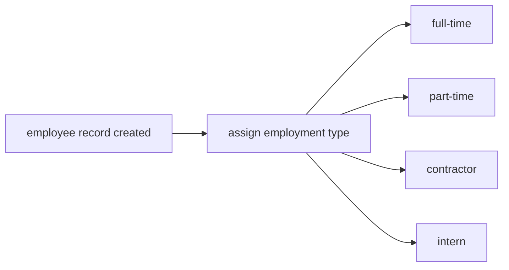


### Employment Status Categories

Employees are classified by their employment status, which indicates whether they are actively working for the organization.

There are two employment status categories:

**Active**: The employee is currently employed and can log time, submit timesheets, and participate in organization activities.

**Deactivated**: The employee is no longer actively employed. They cannot log time or submit timesheets. Their historical data (timelogs, timesheets, contracts) is preserved for reporting and audit purposes.

Each employee must be assigned exactly one status when their record is created, defaulting to active.

Users with `employee:manage` permission can change an employee's status from active to deactivated, or reactivate a deactivated employee.

A deactivated employee can be reactivated if needed.

### Employment Status Flow

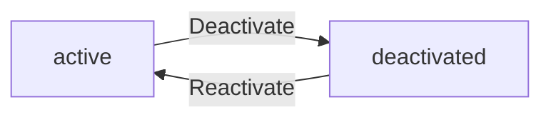


### Contract Time Periods

Employee contracts are defined by their time period, which establishes the duration of employment agreement.

Each contract has a start date and an optional end date:

**Start Date (required)**: The date when the contract becomes effective. This date cannot be in the past when the contract is created.

**End Date (optional)**: The date when the contract expires. If no end date is specified, the contract is considered ongoing with no expiration.

Only one contract can be active at a time for an employee. When a new contract is created, any previous active contract is automatically ended by setting its end date to the day before the new contract starts.

Past contracts become immutable historical records and cannot be edited.

Users with `employee:manage` permission can create new contracts for employees and edit the current active contract.

### Contract Time Period Flow

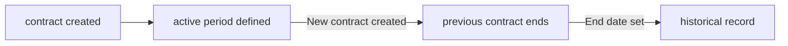


### Pay Period Classifications

Employee pay rates are defined by their pay period, which indicates how frequently payment is calculated.

There are four pay period categories:

**Hourly**: Payment is calculated based on the number of hours worked. Common for part-time, contractor, and hourly wage employees.

**Daily**: Payment is calculated based on the number of days worked. Used for certain contractor or temporary arrangements.

**Weekly**: Payment is calculated based on a weekly total, regardless of hours worked. Common for salaried positions.

**Monthly**: Payment is calculated based on a monthly total. Standard for most full-time salaried employees.

Each employee contract must specify a pay period. The pay period must be consistent with the pay rate specified in the contract.

Users with `employee:manage` permission can assign or update an employee's contract pay period when creating or editing contracts.

### Pay Period Structure

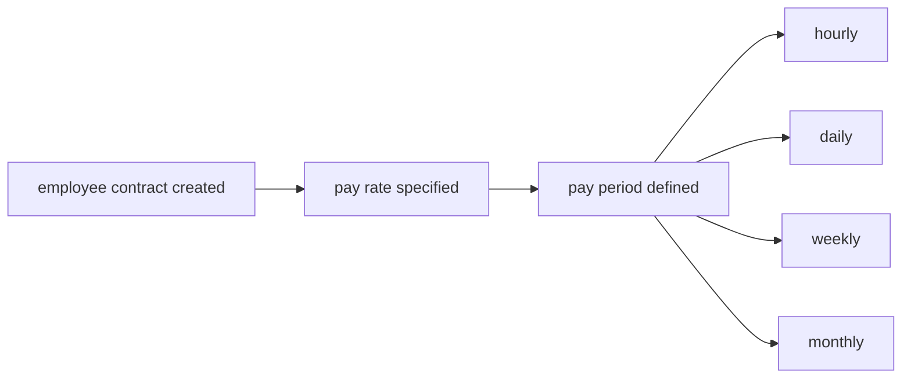


### Project Status Classifications

Projects are classified by their status, which indicates the current phase of the project lifecycle.

There are three project status categories:

**Active**: The project is currently ongoing and can receive new timelogs, tasks, and member assignments.

**Archived**: The project is no longer actively being worked on but has not been fully completed. Archived projects cannot receive new timelogs. Existing data is preserved for historical reference.

**Completed**: The project has been fully completed. Completed projects cannot receive new timelogs. Existing data is preserved for reporting and historical purposes.

Only users with `project:manage` permission can change a project's status.

Users cannot delete a project while it is active. Deletion is only allowed when the project has no associated timelogs.

### Project Status Flow

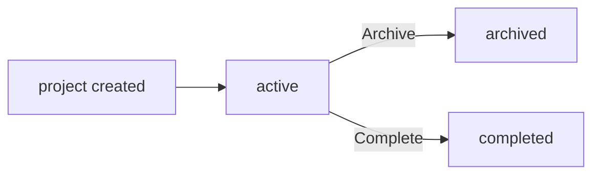


### Project Member Role Classifications

Employees assigned to projects have specific roles that define their responsibilities within the project.

There are two project member role categories:

**Member**: An employee assigned to work on the project. Members can view project tasks and log time against project tasks.

**Project-lead**: An employee with lead responsibilities for the project. Project leads have the ability to manage tasks within their project, in addition to all member privileges.

Each employee assigned to a project must be assigned exactly one role.

Users with `project:manage` permission can assign employees to projects and specify their role. Project leads can manage tasks within their project.

### Project Member Role Structure

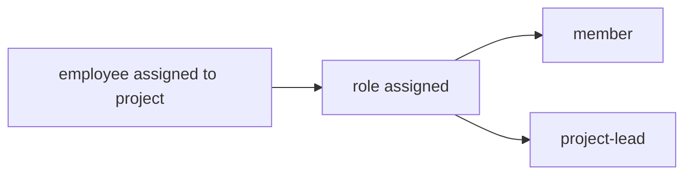


### Task Status Classifications

Tasks within a project are classified by their status, which indicates the current state of task completion.

There are four task status categories:

**Open**: The task has been created but work has not yet started. It is available for assignment.

**In-progress**: Work on the task has started but is not yet complete. Time can be logged against this task.

**Completed**: The work on the task has been finished but may not yet be formally closed.

**Closed**: The task has been formally completed and closed. No further work or time tracking should be done on this task.

Each task must be assigned exactly one status when created, defaulting to open.

Task status changes are recorded in task history, including the timestamp, previous status, new status, and the user who made the change.

Project leads can edit the status of tasks in their project. Users with `project:manage` permission can edit any task's status.

### Task Status Flow

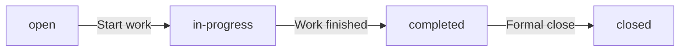


### Task Priority Classifications

Tasks within a project are assigned a priority level that indicates their importance and urgency.

There are four priority categories:

**Low**: Tasks with the lowest priority. These can be worked on after higher priority tasks are completed.

**Medium**: Tasks with standard priority. These should be worked on in regular course after high and urgent tasks.

**High**: Tasks with high priority that should be addressed before lower priority tasks.

**Urgent**: Tasks with the highest priority that require immediate attention.

Each task must be assigned exactly one priority when created. Projects can be filtered and sorted by priority.

Users with `project:manage` permission or project leads can assign or update a task's priority.

Tasks can be sorted by priority to help team members focus on the most important work.

### Task Priority Hierarchy

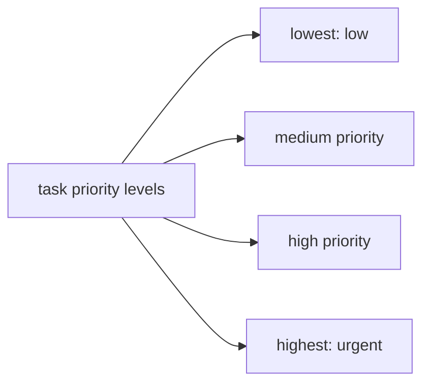


### Timesheet Week Period

Timesheets are organized by week periods that span from Monday to Sunday.

Each timesheet covers exactly one week:

**Week Start Date (required)**: The Monday of the week being covered.

**Week End Date (required)**: The Sunday of the week being covered.

The week period is automatically calculated from the start date, ensuring every timesheet covers a complete Monday-to-Sunday period.

Employees create timesheets for specific weeks by specifying the week start date. The end date is automatically set as the following Sunday.

A timesheet for a specific week cannot be submitted or approved if another timesheet for the same week already exists in submitted or approved status.

Users with `time:approve` permission can view and manage timesheets by week period.

### Timesheet Week Period Structure

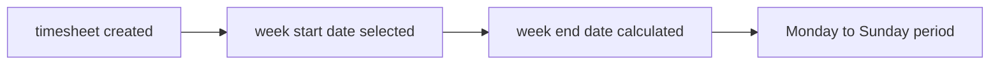


### Timesheet Status Classifications

Timesheets progress through different statuses as they move through the approval workflow.

There are four timesheet status categories:

**Draft**: The timesheet is being prepared by the employee. Timelogs can be added, removed, or edited.

**Submitted**: The employee has submitted the timesheet for approval. No further changes can be made to the timesheet until it is reviewed.

**Approved**: The timesheet has been approved by an authorized user. All timelogs in the timesheet are locked and cannot be edited or deleted.

**Rejected**: The timesheet has been rejected by an authorized user with a reason. The timesheet returns to draft status and the employee can modify and resubmit.

Each timesheet must be assigned exactly one status.

Only users with `time:approve` permission can approve or reject timesheets.

### Timesheet Status Flow

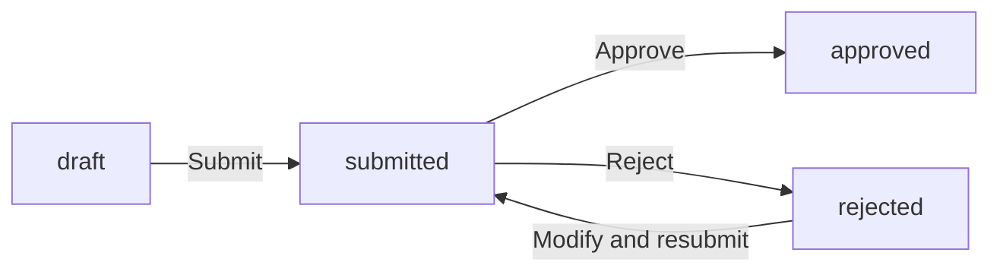


### Billable Status Classification

Timelogs are classified by their billable status, which indicates whether the time logged can be billed to a client or customer.

There are two billable status categories:

**Billable**: The time logged can be billed to a client. This is the default status for new timelogs.

**Non-billable**: The time logged cannot be billed to a client. This is used for internal work, administrative tasks, or non-client activities.

Each timelog must have a billable flag that indicates whether it is billable or non-billable.

Timelogs can be filtered by billable status in reports to provide breakdowns of billable vs. non-billable hours.

Users with `time:manage` permission or the timelog owner can update the billable status of timelogs (if not locked by approval).

### Billable Status Structure

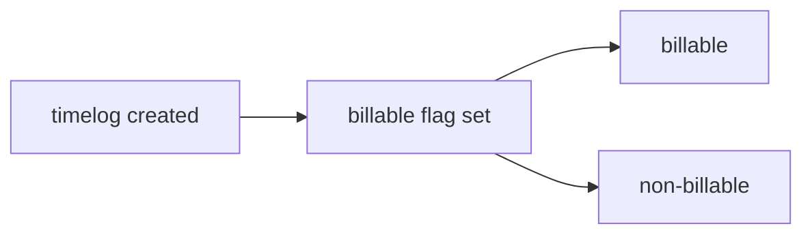


### Role Type Classifications

Organization roles are classified by their type, which determines whether they are built-in system roles or custom roles created by the organization.

There are two role type categories:

**Built-in**: Pre-defined roles that cannot be deleted. There are three built-in roles:
  - **Owner**: Full access to all features, can manage roles and members, and edit organization settings.
  - **Manager**: Can manage employees, projects, approve timesheets, and view reports.
  - **Employee**: Can track time, submit timesheets, and view their own data.

**Custom**: Roles created by organization owners to meet specific needs. Each custom role has a name and a set of permissions selected from the available permissions list.

Built-in roles cannot be deleted or modified. Custom roles can be edited or deleted by organization owners, but can only be deleted if no employees are currently assigned to them.

### Role Type Structure

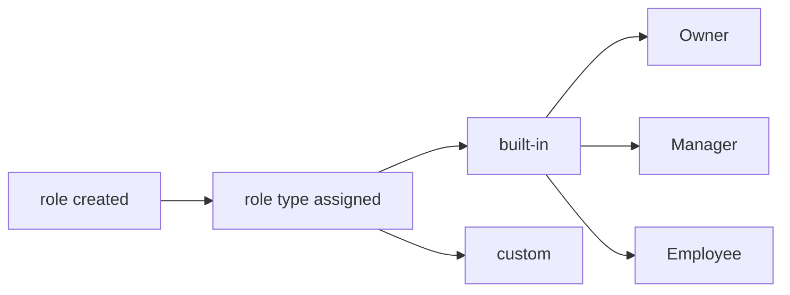


## State Transitions

Define valid state transition paths for stateful concepts.

### Organization State Transitions

An organization enters the system when an owner creates it during initial sign-up. The organization exists in an active state and can be deleted by the owner under specific conditions.

An organization can only be deleted when all pending timesheets are resolved (approved or rejected) and there are no active employee contracts. When an organization is deleted, all employees, projects, tasks, timelogs, and timesheets are permanently deleted. The owner's account remains but is no longer associated with any organization.

Mermaid state flow:

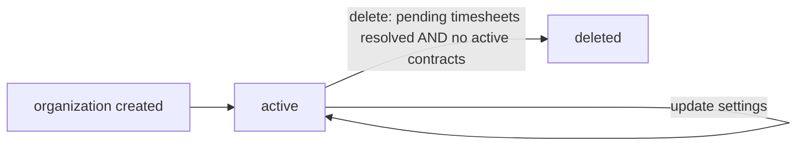

Organization settings can be edited by owners at any time without changing the organization state.

### Organization Member Status Transitions

Users who belong to an organization become organization members. Each member has exactly one role within the organization.

A member can be in an active or deactivated status. When a member's account is deleted, if they are the sole owner of an organization, ownership must be transferred or the organization deleted first. The member's employee records in other organizations are marked as deactivated.

Mermaid state flow:

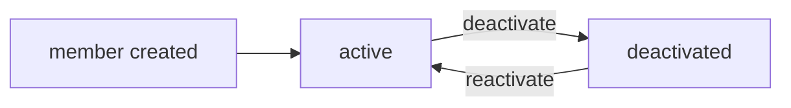

Deactivated members retain their historical data but cannot perform organizational actions.

### Employee Status Transitions

Each employee is linked to a user account and organization membership. Employees can be in an active or deactivated status.

Active employees can log time, submit timesheets, view assigned tasks, and access their contracts. Deactivated employees cannot log time or submit timesheets. Their historical data including timelogs and timesheets is preserved. Deactivated employees can be reactivated by users with employee management permission.

Mermaid state flow:

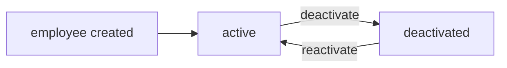

Department, position, and employment type can be modified for both active and deactivated employees.

### Employee Contract Lifecycle

Employees can have multiple contracts that serve as historical records. Only one contract can be active at any time. Each contract has a start date and an optional end date. When the end date is null, the contract is ongoing.

Creating a new contract for an employee automatically ends the previous active contract by setting its end date to the day before the new contract starts. Past contracts cannot be edited and serve as immutable historical records. Employees can view their own contracts. Users with employee view permission can view any employee's contracts.

Mermaid state flow:

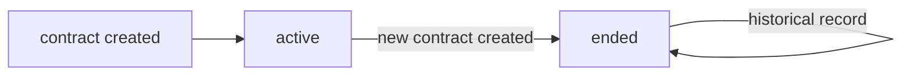

Contract end date is determined when a new contract is created, not when the contract is deleted.

### Department State Management

Departments organize employees within an organization. Each department has a name, description, and optional parent department for one level of nesting.

Departments can be created, edited, and deleted by users with organization management permission. Deleting a department does not delete employees; instead, it sets their department to null. Departments exist in a persistent state and have no active/inactive status.

Mermaid flow:

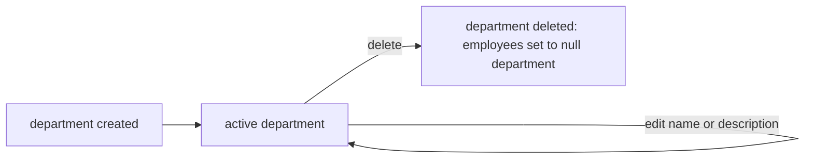

Department deletion is a destructive action that reassigns employees but preserves all employee data.

### Project Status Transitions

Projects can be in one of three states: active, archived, or completed. All projects start in active status when created by users with project management permission.

Active projects can receive new timelogs and have tasks created within them. Archived or completed projects cannot receive new timelogs, but existing timelogs are preserved. Archived projects can potentially be reopened in the future. Completed projects are final and indicate project closure.

Mermaid state flow:

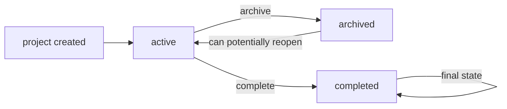

Projects can only be deleted by users with project management permission if they have no timelogs associated with them.

### Task Status Workflows

Tasks within projects progress through a status lifecycle: open, in-progress, completed, and closed. Project leads or users with project management permission can create tasks. Task status changes are recorded in task history.

Open tasks can be assigned to project members and have their status changed to in-progress. In-progress tasks represent work currently being performed. Completed tasks have finished work but may not be finalized. Closed tasks are final and cannot be reopened. Each status change records a timestamp, the user who made the change, and the old and new statuses.

Mermaid state flow:

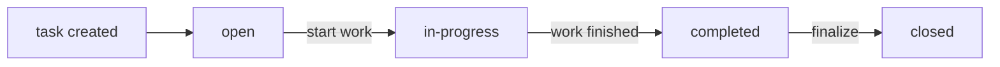

Tasks can be filtered by status, priority, and assigned employee. Sorting is available by due date, priority, and creation date.

### Timesheet Status Transitions

Timesheets collect timelogs for specific weeks from Monday to Sunday. Employees create draft timesheets that automatically include all timelogs for that week. Timesheets can be in one of four states: draft, submitted, approved, or rejected.

Draft timesheets can be modified by adding or removing timelogs. A draft timesheet cannot be submitted if it has no timelogs or if another timesheet for the same week is already submitted or approved. Submitted timesheets await approval from users with time approval permission.

Approved timesheets lock all included timelogs, preventing edits or deletion. Rejected timesheets return to draft status with a required rejection reason. Employees can modify and resubmit rejected timesheets.

Mermaid state flow:

```mermaid
flowchart LR
    A["timesheet created"] --> B["draft"]
    B -->|"submit with timelogs"| C["submitted"]
    C -->|"approve"| D["approved: timelogs locked"]
    C -->|"reject with reason"| B
```

The total hours field is calculated from included timelogs. Timesheets are paginated and can be filtered by status and date range.

### Timer Active State

Employees can start a live timer to track time in real-time. Each employee can have at most one active timer at any time. Starting a timer requires selecting a project and optionally a task.

The timer records its start timestamp, associated project, task, and description. Employees can stop their timer, which creates a timelog with the calculated duration rounded to the nearest minute. Employees can also discard their timer without creating a timelog. If forgotten, the timer continues running indefinitely without automatic stop.

Mermaid state flow:

```mermaid
flowchart LR
    A["no active timer"] -->|"start timer"| B["active timer running"]
    B -->|"stop timer"| C["timelog created: duration calculated"]
    B -->|"discard timer"| D["no timelog created"]
    B -->|"edit description, project, or task"| B
```

Employees can edit the description, project, and task of a running timer. Only one active timer is allowed per employee at any time.