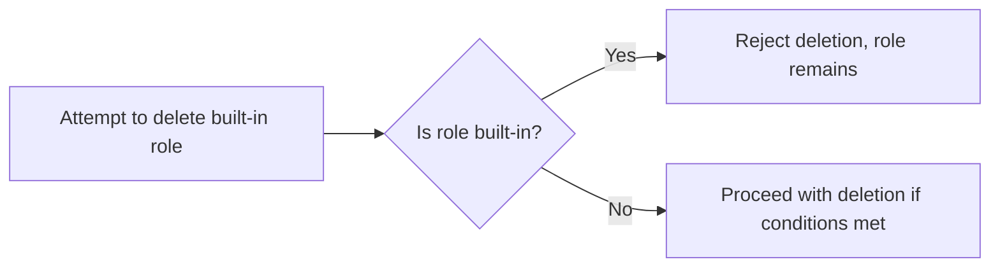
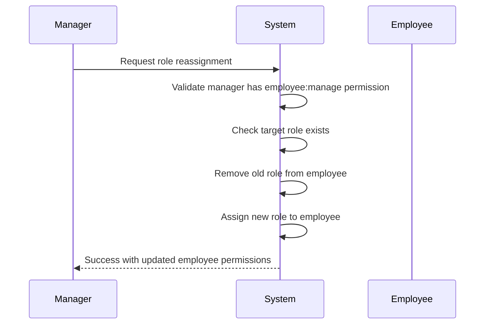

**hrms — What operations users can perform, use cases, business workflows**

What operations users can perform, use cases, business workflows

# Core Business Operations

What the system must do for each business concept.

## User Operations

Users sign up for the platform using an email and password combination. During registration, they create their first organization and become its owner. Users can log in with their email and password, selecting which organization to work in when multiple are available. They can switch between organizations without logging out, and all actions are scoped to the selected organization. Users can update their display name, upload an avatar, and provide a phone number in their global profile, which applies across all organizations. Users can change their password at any time through the security settings. When deleting their account, users who own an organization must either transfer ownership or delete the organization first before proceeding. Their employee records in other organizations are marked as deactivated rather than deleted.

### User Registration

Users can create an account by providing their email address and a password.
The email must be unique across the platform.
During registration, users must create their first organization.
The new organization must have a name and description.
Users can optionally upload a logo image for their organization.
Users must select a currency (e.g., USD, EUR, KRW) for their organization.
Users must select a timezone for their organization.
Users must specify the fiscal start month for their organization.
The user automatically becomes the owner of the organization they created during sign-up.
If the email is already registered, the sign-up request is rejected with an appropriate message.

### User Login

Users can log in to the platform using their email and password.
When a user has only one organization, they are automatically logged in with that organization context.
When a user has multiple organizations, they must select which organization to work in after login.
All actions after login are scoped to the selected organization.
Users with incorrect credentials are denied access with an appropriate error message.
Users with a deactivated account cannot log in.
Successful login creates a session for the user.

### Organization Switching

Users can switch between organizations without logging out.
When switching organizations, the user context changes to the newly selected organization.
All subsequent actions are scoped to the newly selected organization.
Users can only switch to organizations where they are a member.
If a user attempts to switch to an organization they are not a member of, the request is rejected.
Switching organizations does not affect the user's session or require re-authentication.
Users can see a list of all organizations they belong to from the organization switcher interface.

### Global Profile Management

Users can update their display name in their global profile.
Users can update their phone number in their global profile.
The profile is shared across all organizations the user belongs to.
Users can upload an avatar image for their profile.
The avatar image is displayed across all organizations for this user.
Users can view their current profile information.
Users can remove their avatar image, reverting to a default placeholder.
The display name, phone number, and avatar update immediately across all organizations.
If an update fails, the existing profile information remains unchanged.

### Password Management

Users can change their password through the security settings.
Users must provide their current password to verify identity.
Users must enter a new password twice to confirm the change.
The new password must meet the platform's password requirements.
If the current password is incorrect, the password change is rejected.
If the new password entries do not match, the change is rejected.
After successful password change, the user must log in again with the new password.
Users are automatically logged out from all sessions after a password change for security.

### Account Deletion

Users can request to delete their account.
If the user is the sole owner of an organization, they must transfer ownership or delete the organization first.
If the user has pending ownership transfers, they cannot delete their account until the transfer is complete.
When deleting an account, employee records in other organizations are marked as deactivated rather than deleted.
Deactivated employee records preserve historical data (timelogs, timesheets).
After account deletion, the user can no longer log in.
If the user has active sessions across organizations, they are all terminated.
The user's email becomes available for new registrations after account deletion.
Users with only a pending invitation to an organization can delete their account without restrictions.

### Multi-Organization Membership

Users can belong to multiple organizations simultaneously.
Each organization has its own separate data, employees, and projects.
Users can see which organizations they belong to from the profile or settings.
Users are assigned exactly one role in each organization they belong to.
Permission checks are performed per organization context.
Activity performed in one organization is not visible in another organization.
Data isolation is strictly enforced between organizations.
Users can only view and act on data for their currently selected organization.

### Organization Context Scoping

All user actions are scoped to their currently selected organization.
The system enforces organization context on every request.
Users cannot access data from organizations they have not selected.
Users cannot see employee lists from other organizations.
Users cannot view project data from other organizations.
Users cannot access timelogs from other organizations.
Users cannot submit timesheets for other organizations.
When a user switches organizations, all context-related data refreshes to the new organization.

### Owner Account During Deletion

When an organization owner deletes their account, the owner record is removed.
The organization remains active after the owner deletes their account if ownership was transferred first.
If the owner deletes their account without transferring ownership and without deleting the organization, the request is rejected.
The user's account remains in the system after organization deletion but is no longer associated with any organization.
An owner account with no associated organization has no access to any organization features.
An owner with multiple organizations must either transfer or delete all organizations before account deletion if they are the sole owner of any one of them.

## Organization Operations

Organization owners create a new organization during the initial sign-up process with a name, description, and logo image. They can configure organization-specific settings including currency (USD, EUR, KRW), timezone, and fiscal start month. Owners can edit any of these settings through the organization management interface. Deleting an organization is restricted and only permitted when all pending timesheets are resolved and there are no active employee contracts. When deletion occurs, all employees, projects, tasks, timelogs, and timesheets are permanently removed from the system. The owner's account remains active but loses association with the deleted organization. Organizations operate independently with complete data isolation from other organizations.

### Organization Creation

During the initial sign-up process, users create a new organization by providing a name (required), description (optional), and logo image (optional).

The system associates the creating user as the organization owner with full access to all features.

The organization is automatically created with default settings: currency set to USD, timezone set to the user's system default, and fiscal start month set to January.

Users cannot create multiple organizations during the same sign-up session; only one organization is created per account.

Organization names must be unique within the system; if a name is already in use, the sign-up is rejected.

If the name is missing or empty, the organization creation is rejected.

If the logo image is provided but exceeds 5MB or is in an unsupported format (JPEG, PNG, GIF, WebP), the upload is rejected and the user must provide a valid image.

After successful organization creation, the user is logged in and automatically associated with that organization as the context.

The owner can immediately access all organization features and can begin inviting employees, creating departments, and setting up projects.

If the user later deletes or transfers ownership, their account remains but loses the organization association until they join or create a new organization.

Each organization operates independently with complete data isolation from all other organizations in the system.

Organization owners cannot share organizations with other accounts; each organization is owned by exactly one user account.

### Organization Settings Management

Once currency is set, all financial data (pay rates, budget hours) is displayed in that currency.

Changing currency does not automatically convert existing financial values; they remain as-is with the new currency label.

Timezone selection allows owners to set the organization's time zone (e.g., America/New_York, Asia/Seoul, Europe/London).

All dates and times within the organization are displayed in the selected timezone.

Changing timezone does not retroactively convert historical data; it affects only new date/time displays.

Fiscal start month can be set to any month of the year (January through December).

Reports that group data by fiscal period use the selected fiscal start month as the beginning of the fiscal year.

Changing the fiscal start month does not affect the current calendar year reports; it only applies to future fiscal year reports.

Logo images can be updated at any time by uploading a new file.

The previous logo is replaced; the old image is not retained in the system.

All image uploads are validated for format (JPEG, PNG, GIF, WebP) and size (maximum 5MB).

If an image upload fails, the current logo remains unchanged.

Users without owner permission cannot modify any organization settings; the edit interface is not available to them.

All setting changes are logged in the activity log with timestamp, user, and the specific setting modified.

Changes are applied immediately and are visible to all organization members upon their next page refresh or login.

The organization settings interface displays the current values and provides clear save and cancel options.

After saving, a success message confirms the changes were applied. If an error occurs, the message describes what went wrong.

### Organization Deletion

Organization owners can delete their organization only when all pending timesheets are resolved (approved or rejected).

Before deletion, the system validates that no timesheets exist with status pending, submitted, or draft.

If any pending timesheets are found, the deletion is blocked and the owner is informed of the outstanding items.

The owner must review, approve, or reject all pending timesheets before attempting deletion.

Organization deletion is also blocked if any active employee contracts exist in the organization.

An active contract is defined as one with a start date on or before today and no end date (or end date in the future).

If active contracts are found, deletion is blocked until all employees either terminate their contracts or have contract end dates set to the past.

Owners must review all employee contracts and ensure no active contracts remain before deletion can proceed.

When deletion is permitted, the system performs a complete data purge of the organization and all associated records.

All employees associated with the organization are permanently deleted along with their organization membership and employee records.

All projects associated with the organization are permanently deleted, including all tasks and project memberships.

All timelogs associated with the organization's employees are permanently deleted.

All timesheets associated with the organization's employees are permanently deleted.

All departments, roles, and activity logs associated with the organization are permanently deleted.

The organization record itself is permanently removed from the system.

The owner's user account remains active in the system but is no longer associated with any organization.

The owner must create a new organization or be invited to join another organization to use the system again.

Deletion is irreversible; there is no recovery mechanism for deleted organization data.

Before final deletion, the owner must confirm the deletion action and acknowledge that all data will be permanently lost.

The deletion confirmation dialog displays a clear warning about permanent data loss and lists the types of data that will be deleted.

If the deletion fails due to a system error, no data is deleted and the organization remains intact.

### Data Isolation

All data in the system is strictly isolated per organization with no cross-organization data visibility.

Employees in one organization cannot see, access, or interact with data from any other organization.

Users who belong to multiple organizations only see data for their currently selected organization.

The organization context is enforced on every action performed in the system.

API requests and UI actions automatically scope all queries and mutations to the selected organization.

If a user has no organization selected, the system presents an organization selection interface before allowing any actions.

Organization data cannot be exported to another organization; each organization maintains its own independent data set.

Activity logs are scoped to each organization; users cannot view activity logs from organizations they do not belong to.

Reports are scoped to each organization; users cannot generate reports that span multiple organizations.

The system prevents any cross-organization data access attempts by validating organization membership before each operation.

Users who leave an organization (by being deactivated or having their membership removed) immediately lose access to that organization's data.

Even if a user has been an owner of multiple organizations, they can only see one organization's data at a time.

Organization owners cannot transfer ownership of their organization to another user without first ensuring the target user has an account.

Data isolation is enforced at the application level and database query level to prevent any accidental data leakage.

Audit logs track all organization context switches for security and compliance purposes.

If a user attempts to access organization data through an incorrect context, the request is rejected with an access denied error.

## OrganizationMember Operations

Users can belong to multiple organizations simultaneously, with each membership having its own role assignment. Organization owners manage membership by assigning roles to employees within their organization. Each employee in an organization must have exactly one role assigned. Role assignments can be modified by users with the appropriate employee management permissions. When a user joins multiple organizations, they select which one to work in, and all permissions are scoped to that organization. Memberships are tracked with references to the user account, organization, and role. Users can view their current organization membership and switch between organizations without re-authenticating.

### Multi-Organization Membership

Users can belong to multiple organizations simultaneously. Each membership is tracked as a separate record linking the user to a specific organization. Users can view a list of all organizations they are members of. When a user signs up, they create their first organization during the initial registration process. Users can be invited to join additional organizations by organization members with employee management permissions. Once invited, users can accept invitations and join the organization while maintaining their existing memberships in other organizations.

### Role Assignment Per Organization

Each organization membership is associated with exactly one role. Roles define what actions the member can perform within that specific organization. Three built-in roles exist in every organization: Owner, Manager, and Employee. Organization owners can create custom roles with specific permission sets. When a user is invited to an organization, they are assigned a default role (typically Employee) unless otherwise specified. Organization owners can modify the role assigned to any member. Role changes take effect immediately for subsequent actions.

### Single Role Per Employee

Each employee in an organization is assigned exactly one role. This role assignment is one-to-one: one employee record references one role record. An employee cannot hold multiple roles within the same organization. When a role is changed, the previous role assignment is replaced. The single role determines all permissions the employee has within that organization. This simplifies permission management and ensures consistent access control.

### Role Modification by Managers

Users with employee management permissions can modify role assignments for other employees. Role modification includes assigning a new role to an existing employee or changing the role from one to another. Users must have appropriate permissions to perform role modifications. Only organization owners and managers with employee management permissions can change roles. The role change is recorded in the activity log. Role modifications affect the member's permissions immediately for all future actions within the organization.

### Organization Context Switching

Users can switch between organizations without logging out. When logging in, users select which organization to work in. All subsequent actions are scoped to the currently selected organization. Users can change their active organization at any time through the user interface. The selected organization context determines which data and features are visible. Permissions are enforced based on the role in the currently active organization. Switching organizations does not require re-authentication.

### Membership Permissions Scoping

All permissions are scoped to the currently selected organization. A user's permissions in one organization do not carry over to other organizations. The system enforces organization context on every request. Users can only access features and data for which they have permissions in their active organization. Permission checks validate both the user's role and the current organization context. Cross-organization data access is strictly prohibited.

### User Organization List

Users can view a list of all organizations they are members of. Each entry shows the organization name and the user's role in that organization. The list includes organizations where the user is currently active and organizations where they have other roles. Users can select any organization from the list to switch their active context. The list is paginated if the user has many memberships. Each membership shows the role name and status (active or deactivated).

### Membership Reference Tracking

Each organization membership tracks three references: the user account, the organization, and the role. These references form the core membership record. The membership record stores the assignment status (active or deactivated). Users can view their own membership details in any organization. Organization owners can view all membership records for their organization. Membership references are used for permission checks and audit logging. Each reference is validated before any operation is performed.

### Cross-Organization Identity Management

Users maintain a single global identity across all organizations. User account information (email, password, display name, avatar) is shared across all organizations. However, role assignments and permissions are organization-specific. A user can have different roles in different organizations. For example, a user could be an Owner in one organization and an Employee in another. The system manages cross-organization identity by linking multiple memberships to one user account. User preferences and profiles remain consistent across all organizations.

### Role Assignment During Invitation

When an employee is invited to join an organization, a role must be assigned at the time of invitation. The inviting user must have permission to assign roles. Default role assignments are typically Employee unless a different role is explicitly selected. Pending invitations include the assigned role in the invitation record. When the invited user accepts, they receive the pre-assigned role. Role assignment during invitation streamlines the onboarding process.

### Role Status During Account Deletion

When a user deletes their account, all their organization memberships are deactivated across all organizations they belong to. Deactivated memberships do not allow any actions but preserve the membership records for audit purposes. In organizations where the user was the sole owner, the organization must be transferred or deleted before account deletion. Other organizations mark the user's employee record as deactivated. Deactivated employees cannot log time or submit timesheets. Historical data remains accessible for reporting purposes.

## Role Operations

Each organization has three built-in roles that cannot be deleted: Owner with full access, Manager with employee and project management capabilities, and Employee with time tracking permissions. Organization owners can create custom roles with a name and select from available permissions like editing organization settings, managing employees, or approving timesheets. Custom roles can be edited to adjust their permission sets. Owners can delete custom roles only if no employees are currently assigned to them. Each permission controls specific business operations, such as viewing all timesheets, creating projects, or managing timelogs. Role definitions are scoped to the organization and do not carry across organizations.

### Built-in Role Creation

When a new organization is created, three built-in roles are automatically established: Owner, Manager, and Employee. These roles cannot be deleted by any user. Each built-in role comes with a predefined set of permissions that govern what actions that role can perform within the organization.

### Owner Full Access Permissions

The Owner role has complete access to all system features and capabilities. Owners can perform all operations across the entire organization, including creating and managing all other roles, adding or removing organization members, editing any data, approving timesheets, viewing all reports, and managing organization settings. No restrictions apply to Owner actions.

### Manager Capabilities

The Manager role has capabilities to manage employees, projects, and timesheets within the organization. Managers can add and edit employee records, create and manage projects and tasks, approve or reject submitted timesheets, and view all timesheets and timelogs across the organization. Managers cannot delete organizations, modify organization settings, or manage role definitions.

### Employee Time Tracking Permissions

The Employee role is restricted to time tracking activities and viewing their own data. Employees can create and submit timesheets, log time entries, view their own timelogs and timesheets, and view tasks assigned to them. Employees cannot access other employees' data, approve timesheets, manage projects, or modify organization settings.

### Custom Role Creation

Organization owners can create custom roles to meet specific organizational needs. When creating a custom role, the owner provides a name and selects from the available permission set. Custom roles are organization-scoped, meaning they exist only within the organization where they are created and cannot be used in other organizations.

### Permission Selection for Custom Roles

When creating a custom role, owners select from the following permissions: edit organization settings, add and edit employees, view employee list and details, create and manage projects and tasks, view projects and tasks, edit or delete any employee's time logs, approve or reject timesheets, view all employees' time logs and timesheets, and view organization reports. A custom role can have any combination of these permissions.

### Custom Role Editing

Organization owners can edit existing custom roles to change their name or modify their permission set. Any edits to a custom role affect all employees assigned to that role immediately. Editing does not affect the built-in roles (Owner, Manager, Employee), which remain immutable.

### Custom Role Deletion Conditions

Organization owners can delete custom roles only if no employees are currently assigned to them. If any employees have the role assigned, the deletion is rejected. Deleting a custom role does not remove employees from the organization but requires reassigning them to another role first.

### Permission-Based Access Control

The system enforces access control based on the permissions assigned to each user's role. When a user attempts to perform an action, the system checks if their role has the required permission. Actions are only allowed when the permission exists; otherwise, the request is rejected. Permission checks apply to all data and operations within the organization.

### Organization-Scoped Role Definitions

Each organization maintains its own independent set of roles. Roles defined in one organization do not affect or carry over to other organizations. A user who belongs to multiple organizations may have different roles in each organization, and their permissions are evaluated separately for each organization context.

## Employee Operations

Users with employee management permissions invite new employees to the organization via email. If the invited email already has an account, the user is automatically added to the organization. If no account exists, a pending invitation is created that automatically activates upon sign-up. Each employee record includes a reference to their user account, role assignment, department, position, and employment type. Managers can edit department, position, and employment type through the employee management interface. Employees can be deactivated, which prevents time logging while preserving historical data for timelogs and timesheets. Deactivated employees can be reactivated at any time. The employee list supports pagination, filtering by department and employment type, and searching by name.

### Employee Invitation

Users with employee management permissions can invite new employees to the organization via email invitation.

The invitation is sent to the email address provided by the user.

If the email address already has an existing user account, the user is automatically added to the organization upon invitation acceptance.

If the email address does not have an existing account, a pending invitation is created in the system.

When a user signs up with an email address that has a pending invitation, they are automatically added to the organization without requiring a separate invitation.

Users who already belong to the organization cannot be invited again.

If a user has an existing account and already belongs to the organization, the invitation is rejected.

The organization owner can view the status of all pending invitations.

Pending invitations can be cancelled by users with employee management permissions before they are accepted or expire.

### Employee Record Structure

Each employee record contains a reference to their user account from the global user system.

Each employee record contains a reference to their role assignment within the organization.

Each employee record includes a department assignment, which is optional.

Each employee record includes a position or title, which is optional.

Each employee record includes an employment type from the following options: full-time, part-time, contractor, or intern.

Each employee record includes a status field that indicates whether the employee is active or deactivated.

The department assignment can be updated to a different department or set to null (unassigned).

The position title can be updated to reflect changes in the employee's role within the organization.

The employment type can be updated if the employee's working arrangement changes.

The reference to the user account cannot be changed once the employee is added to the organization.

### Employee Record Editing

Users with employee management permissions can edit an employee's department assignment.

Users with employee management permissions can edit an employee's position title.

Users with employee management permissions can edit an employee's employment type.

Users with employee management permissions can change an employee's role assignment within the organization.

Users with employee management permissions can view employee records for all employees in the organization.

The user account reference cannot be edited after the employee record is created.

All edits to employee records are logged in the activity log with the user who made the change and the timestamp.

Changes to department, position, and employment type take effect immediately and are visible to all users with employee viewing permissions.

The system validates that the new role assignment is valid within the organization's role structure.

If an employee has active timesheets or timelogs, editing their record does not affect the historical data.

### Employee Deactivation

Users with employee management permissions can deactivate an employee record.

When an employee is deactivated, they cannot create new timelogs.

When an employee is deactivated, they cannot submit new timesheets.

When an employee is deactivated, they cannot view or edit submitted timesheets.

When an employee is deactivated, they cannot have new tasks assigned to them.

When an employee is deactivated, they cannot be assigned to new projects.

When an employee is deactivated, their department and position can still be viewed by managers.

When an employee is deactivated, their historical timelogs are preserved and remain accessible.

When an employee is deactivated, their historical timesheets are preserved and remain accessible.

When an employee is deactivated, their timesheet approval records are preserved and remain accessible.

Deactivated employees cannot be re-invited to the organization; they must be reactivated first.

Employees with approved timesheets cannot be deactivated until all their timesheets are resolved (approved or rejected).

Employees with pending timesheet submissions cannot be deactivated until the timesheets are resolved.

The deactivation date and the user who performed the deactivation are recorded in the activity log.

### Employee Reactivation

Users with employee management permissions can reactivate a deactivated employee.

When an employee is reactivated, they can immediately resume creating timelogs.

When an employee is reactivated, they can immediately resume submitting timesheets.

When an employee is reactivated, they can be assigned to new projects.

When an employee is reactivated, they can be assigned new tasks.

When an employee is reactivated, their historical data remains unchanged and accessible.

When an employee is reactivated, their previously assigned role within the organization is restored.

The reactivation date and the user who performed the reactivation are recorded in the activity log.

A reactivated employee retains their original employee record reference and history.

Reactivation does not restore any pending or draft timesheets that were created while the employee was deactivated.

### Employee List Operations

Users with employee viewing permissions can access the employee list.

The employee list is paginated to display a limited number of employees per page.

Users can filter the employee list by department.

Users can filter the employee list by employment type.

Users can filter the employee list by employee status (active or deactivated).

Users can search for employees by name.

The employee list displays the employee's name, role, department, position, employment type, and status.

Multiple filters can be combined (for example, filtering by department and employment type simultaneously).

The search functionality performs a case-insensitive name match against the employee's display name.

If no employees match the specified filters, an empty list is returned.

Users can navigate between pages of results using pagination controls.

The employee list does not display information from other organizations the user belongs to.

Changes to the employee list filters and page selection are preserved during the session.

## EmployeeContract Operations

Each employee can maintain multiple contracts as a historical record, with only one contract active at any time. Creating a new contract automatically ends the previous active contract by setting its end date to the day before the new contract begins. Contracts include a required start date, optional end date, pay rate, pay period (hourly, daily, weekly, monthly), and working hours per week. Managers can create new contracts and edit the current active contract, but past contracts remain immutable as historical records. Employees can view their own contracts to see their current and historical terms. Users with employee viewing permissions can view any employee's contract history. Contracts provide a complete audit trail of employment terms over time.

### Multiple Contract History Tracking

Each employee can maintain multiple contracts as a historical record, with contracts stored to track employment terms over time.

The system preserves all past contracts, providing a complete audit trail of an employee's employment terms and compensation history.

Contract history enables employees and managers to review how employment terms have changed throughout the employee's tenure.

### Single Active Contract Rule

Only one contract can be active at any given time for each employee.

The system enforces this rule automatically, ensuring no two contracts have overlapping active periods.

When a new contract becomes active, the previous active contract is automatically marked as ended (see Automatic Previous Contract Closure).

Past contracts cannot be reactivated once they have been closed by the system.

### Contract Creation

Managers with employee management permissions can create new contracts for employees.

Each contract requires a start date, which must be specified at the time of creation.

The contract must include a pay rate, specified as a numeric value.

The contract requires selection of a pay period from the available options: hourly, daily, weekly, or monthly.

The contract requires definition of working hours per week, such as forty hours.

A notes field is optional and may be used to document additional terms or conditions.

When creating a contract, the system validates that the employee exists and the manager has permission to create contracts for that employee.

### Automatic Previous Contract Closure

Creating a new contract for an employee automatically ends the previous active contract.

The system sets the end date of the previous contract to the day before the new contract's start date.

This automatic closure ensures there are no gaps or overlaps in contract periods.

Employees and managers are notified of automatic contract closures through the activity log.

The automatic closure is irreversible; the previous contract's end date cannot be changed.

### Active Contract Editing

Managers with employee management permissions can edit the current active contract for an employee.

Editable fields include: notes, working hours per week, and other terms not affecting the contract period.

Past contracts cannot be edited; they remain immutable as historical records.

Editing the active contract creates a new activity log entry recording the change.

The system prevents editing of past contract fields to maintain historical integrity.

### Contract Viewing

Employees can view their own contracts, including current and past contracts.

Employees can review their employment history and compensation terms through the contract viewing interface.

Users with employee viewing permissions can view any employee's contract history within the organization.

Contract viewing displays all contracts for the employee, with the current active contract clearly identified.

Past contracts are displayed with their start and end dates clearly marked.

### Contract End Date Calculation

When creating a new contract, the system automatically calculates the previous contract's end date.

The previous contract's end date is set to one day before the new contract's start date.

This calculation ensures continuous contract coverage without gaps.

For ongoing contracts without an end date, the end date field remains null until a new contract is created.

### Immutable Historical Contracts

Past contracts cannot be edited or modified once they have been closed.

Historical contracts are preserved exactly as they existed at the time of creation and closure.

The immutable nature of historical contracts ensures audit compliance and accurate record-keeping.

Any changes to employment terms are recorded as new contracts rather than modifications to past contracts.

View-only access is provided to historical contracts to preserve their integrity while allowing review.

## Department Operations

Each organization can organize employees into departments with names and optional descriptions. Departments support one level of nesting through parent department references. Users with organization management permissions can create new departments, edit existing ones, and delete them. When a department is deleted, employee department assignments are set to null rather than removing employees. The department hierarchy is limited to one level, preventing deeper nesting structures. Employees can view the complete department list for their organization. Departments are used to group employees for filtering and reporting purposes.

### Department Creation

Users with organization management permission can create new departments within their organization.

Each department requires a name, which must be unique within the organization. Departments include an optional description field that provides additional context about the department's purpose or function.

When creating a department, the name field is required and cannot be empty. The system validates that the department name does not already exist within the organization before accepting the creation request.

A department can be created without a parent department, establishing it as a top-level department. Alternatively, a department can be assigned to an existing parent department, creating a parent-child relationship.

Only users with organization management permission can initiate department creation. Users without this permission are not presented with the option to create new departments.

### Department Description Management

Each department can have a description that provides additional information about its purpose, scope, or function.

The description field is optional when creating a new department. Users may choose to leave it blank if no additional information is needed.

Department descriptions can be updated at any time by users with organization management permission. Updates to the description are immediate and visible to all organization members.

Department descriptions support free-form text entry without character limits. There are no restrictions on the content of department descriptions.

The description does not affect department functionality or filtering capabilities. It serves primarily as informational metadata for organization members.

### Parent Department Assignment

Departments can be assigned to a parent department, establishing a hierarchical relationship.

When creating a new department, users may select an existing department to serve as the parent department. This creates a one-level parent-child relationship.

The parent department selection is optional. If no parent is selected, the new department becomes a top-level department.

Users can change the parent department assignment for existing departments. This operation is performed by users with organization management permission.

When reassigning a department to a different parent, the previous parent-child relationship is updated. The department is immediately associated with the new parent department.

Parent department selection is limited to departments within the same organization. Cross-organization parent assignments are not supported.

### Department Hierarchy Structure

The department hierarchy supports one level of nesting. Top-level departments have no parent department.

Child departments can only have one parent department. Multiple parent assignments are not supported.

Grandparent relationships are not supported. A child department cannot have a parent that itself has a parent department.

The system prevents the creation of circular references. A department cannot be assigned as its own parent or as a parent of one of its descendants.

Hierarchy structure is displayed to employees when they view the department list. The nesting is visually indicated through indentation or hierarchy markers.

Department filtering operations can be performed at any level of the hierarchy. Filters applied to parent departments also apply to their child departments in some reporting contexts.

### Department Editing

Users with organization management permission can edit existing department information.

Department names can be updated through the edit operation. The new name must be unique within the organization. Name changes take effect immediately.

Department descriptions can be modified at any time. Users with organization management permission can update the description text without restrictions.

Parent department assignments can be changed through the edit operation. This allows departments to be moved between different parent departments or to become top-level departments.

Department edit operations validate that the parent department exists within the same organization. Invalid parent references are rejected.

The edit operation does not affect employee department assignments. Changing a department name or parent does not automatically update employees assigned to that department.

### Department Deletion Process

Users with organization management permission can delete departments from the organization.

When a department is deleted, all employee department assignments referencing that department are set to null. Employees are not deleted or affected beyond their department assignment.

Deleted departments are permanently removed from the system. The deletion is irreversible and cannot be undone.

The deletion process validates that no child departments exist under the department being deleted. Departments with child departments cannot be deleted until all child departments are reassigned or deleted.

Deletion of a department does not affect projects, tasks, or other entities that may reference department information indirectly through employees.

The deletion operation is logged in the activity log, recording the timestamp, user who performed the deletion, and the deleted department name.

### Department List Viewing

All employees within an organization can view the list of departments.

The department list displays department names, descriptions, and parent-child relationships for all departments in the organization.

The department list is paginated when there are many departments. Pagination allows employees to navigate through large lists efficiently.

Employees can filter the department list by various criteria including status and hierarchy level. Filtering helps users find specific departments quickly.

The department list can be sorted by name in ascending or descending order. Sorting is applied across all departments in the organization.

Employees with different roles see the same department list. Role-based permissions do not restrict department list viewing for employees.

### Employee Department Filtering

The department list supports filtering employees by their assigned department.

Users can filter the employee list to show only employees in a specific department or department group.

Department filtering can be combined with other employee filters such as employment type or status.

Filtering by a parent department includes employees from child departments in some reporting contexts. This allows managers to view all employees under a department hierarchy.

The department filter is applied across all employees in the organization. Users can only view employees from their own organization.

Department filtering does not require special permissions beyond employee viewing permissions. Any user who can view employees can filter by department.

### Parent-Child Relationship Management

Parent-child relationships between departments are established through the parent department assignment field.

A parent department can have multiple child departments. The parent relationship supports a one-to-many relationship structure.

Child departments inherit certain organizational properties from their parent department. These properties are used for reporting and filtering purposes.

The system validates that parent-child assignments do not create circular references or violate the one-level nesting constraint.

Parent department information is displayed when viewing child department details. The relationship is clearly visible to organization members.

Department hierarchy can be visualized in organizational charts or tree structures. The parent-child relationships form the basis for such visualizations.

## Project Operations

Users with project management permissions can create new projects with a name, optional description, required color code, and status. Each project tracks budget hours as an optional field to estimate total work. Projects can have optional start and end dates to define timelines. Managers can edit project details, change status to active, archived, or completed, and archive or complete projects to prevent new time tracking. Archived and completed projects preserve existing timelogs but block new entries. Projects can only be deleted if they have no associated timelogs. The project list supports pagination and filtering by status to help users navigate large project catalogs.

### Project Creation

Users with project management permission can create a new project.

Every project must have a name, which is required and cannot be empty.

Users can optionally provide a description to document the project's purpose and scope.

Each project must have a color code, which is required for visual identification in the user interface.

The project is created with an initial status of active, allowing it to receive timelogs immediately.

Users with project management permission can create projects within their organization.

Projects are automatically associated with the creating user and the selected organization.

Users without project management permission cannot create projects; the request is rejected.

The system does not enforce a maximum number of projects per organization.

Project creation is immediately effective and visible to users with project view permission.

### Project Timeline Specification

Users can optionally specify a start date for the project to indicate when work began or is planned to begin.

If a start date is provided, it represents the project's planned or actual commencement.

Users can optionally specify an end date for the project to indicate when work is expected to conclude.

The end date is independent of the project's status; a project can have an end date while still active.

Start dates and end dates are optional and do not affect project creation.

The system does not validate the relationship between start date and end date.

Users with project management permission can modify the start date or end date after project creation.

If no start date or end date is specified, the fields remain empty and do not appear in the project listing.

Users with project view permission can view start date and end date if they are set.

### Project Budget Tracking

Users can optionally specify budget hours for a project to estimate the total work capacity.

Budget hours represent the total number of hours allocated to complete the project.

Budget hours is an optional field; projects can exist without a budget allocation.

If budget hours is set, the system tracks actual hours logged against the project for comparison.

Users with project management permission can modify the budget hours after project creation.

Users with project view permission can view the budget hours for projects they can access.

The budget hours field accepts numeric values representing hours.

The system does not prevent creating projects with zero budget hours.

The budget hours field does not enforce any minimum or maximum value.

### Project Status Changes

Users with project management permission can change a project's status from active to archived.

Users with project management permission can change a project's status from active to completed.

Once a project is archived or completed, its status cannot be changed back to active.

The three valid project statuses are: active, archived, and completed.

A newly created project starts with status active.

Project status changes are effective immediately upon confirmation.

Users with project view permission can view the current status of any project they can access.

The system does not send notifications when project status changes.

Project status is a required field that cannot be left empty.

### Project Archiving

Users with project management permission can archive a project to mark it as no longer active.

When a project is archived, it cannot receive new timelogs.

Existing timelogs on archived projects remain visible and are not deleted.

Archived projects are retained in the system for historical reference.

Users with project management permission can unarchive projects; however, unarchived projects are not permitted to resume receiving timelogs unless they have an active status.

Users with project view permission can view archived projects in the project list.

Archived projects can be deleted only if they have no associated timelogs.

The archiving action does not affect project members or tasks; they remain intact.

### Project Completion

Users with project management permission can complete a project to mark it as finished.

When a project is completed, it cannot receive new timelogs.

Existing timelogs on completed projects remain visible and are not deleted.

Completed projects are retained in the system for historical reference.

Completed projects cannot be reverted to active status.

Users with project view permission can view completed projects in the project list.

Completed projects can be deleted only if they have no associated timelogs.

Completing a project does not affect project members or tasks; they remain intact.

Project completion is a final state; once completed, the project cannot be modified except for deletion under specific conditions.

### Project Deletion

Users with project management permission can delete a project.

A project can only be deleted if it has no timelogs associated with it.

If a project has any timelogs, the deletion request is rejected.

Deletion permanently removes the project from the system.

When a project is deleted, all associated tasks and project memberships are also deleted.

Existing timelogs are not deleted when a project is deleted because deletion is only permitted when no timelogs exist.

Users without project management permission cannot delete projects; the request is rejected.

The system does not send notifications when a project is deleted.

Deleted projects cannot be restored; they are permanently removed.

### Project Editing

Users with project management permission can edit project details after creation.

Editable project fields include: name, description, color code, status, budget hours, start date, and end date.

Users can update any or all editable fields in a single edit operation.

Users with project view permission can view project details but cannot modify them.

Changes to project details are immediately visible to users with project view permission.

The project name cannot be left empty during editing.

The color code cannot be left empty during editing.

Users without project management permission cannot edit projects; the request is rejected.

Project editing does not affect existing timelogs, tasks, or project memberships.

### Project List Navigation

The project list is paginated to handle large numbers of projects.

Users can navigate through pages of projects using pagination controls.

Users with project view permission can view the list of all projects in their organization.

Users can filter the project list by status to see only active, archived, or completed projects.

The status filter is mutually exclusive; users can filter by one status at a time.

Users without project view permission cannot view the project list; the request is rejected.

The system does not support sorting the project list by other fields.

Each page of the project list displays a fixed number of projects.

Users can navigate to the first page, last page, or specific page numbers.

## ProjectMember Operations

Users with project management permissions assign employees to projects as either members or project leads. Each project membership tracks the employee, project, and assigned role. An employee can be assigned to multiple projects simultaneously, and different roles can be assigned across projects. Project leads have special privileges to manage tasks within their assigned project. Managers can remove employees from projects when their involvement is no longer needed. Employees can view the list of projects they are assigned to and their roles within each. Project membership defines task management authority and timelog permissions.

### Project Membership Creation

Users with project management permission can assign employees to projects.
Each assignment creates a project membership that links an employee to a specific project.
The assignment includes a role designation, which can be either member or project lead.
An employee can be assigned to multiple projects simultaneously.
Each project membership is recorded with the employee, project, and assigned role.

### Member Role Assignment

Users with project management permission can assign employees to projects with the member role.
A member can view project details and tasks within the project.
A member can log time to the project if they have been added to the project.
Members do not have task management authority in the project.

### Project Lead Role Assignment

Users with project management permission can assign employees to projects with the project lead role.
A project lead has full task management authority within their assigned project.
A project lead can create, edit, and close tasks within their project.
A project lead can view all timelogs on the project.
A project lead cannot delete the project itself.

### Multiple Project Assignments

An employee can be assigned to multiple projects at the same time.
Each project assignment is independent with its own role designation.
An employee can be a project lead in one project and a member in another.
Project assignments are tracked separately for each project.
An employee's permissions for each project are determined by their role in that project.

### Project Assignment Viewing

Employees can view the list of projects they are assigned to.
Each project assignment displays the employee's role in that project.
Employees with project view permission can see all projects in the organization.
Project assignments show the employee as a member or project lead.
Employees can view tasks in projects to which they are assigned.

### Cross-Project Role Assignments

Employees can hold different roles across multiple projects.
An employee can be a project lead in one project and a member in another simultaneously.
Each project role assignment is independent and does not affect other projects.
Role assignments are managed per project, not globally across all projects.
Cross-project role assignments allow flexible team structuring.

### Task Management by Leads

Project leads can create tasks within their assigned project.
Project leads can edit any task in their project.
Project leads can change task status from open to in-progress to completed to closed.
Project leads can assign tasks to other project members.
Project leads can view all task history entries in their project.
Only project leads or users with project management permission can create tasks.

### Employee Removal from Projects

Users with project management permission can remove employees from projects.
Removing an employee deletes their project membership.
The employee loses access to the project after removal.
The employee can no longer log time to the project.
Task assignments are removed when an employee is removed from a project.
Project leads can still be removed by users with project management permission.

### Project Authority Definition

Project membership defines the authority level an employee has in a project.
Members have read-only access to project tasks.
Members can log time to the project.
Leads have full task management authority.
Leads can manage tasks but not delete the project itself.
Project management permission overrides all role restrictions.

### Timelog Permissions by Membership

Employees can only log time to projects to which they are assigned.
Employees cannot log time to projects without membership.
Members can log time to their assigned projects.
Leads can log time to their assigned projects.
Project management permission allows logging time to any project.
Timelog permissions are evaluated per project membership.

## Task Operations

Project leads or users with project management permissions can create tasks within projects with a required title and optional description. Tasks have status tracking (open, in-progress, completed, closed) and priority levels (low, medium, high, urgent). Tasks can have optional estimated hours and due dates for planning purposes. Each task can be assigned to an employee who must be a project member. Tasks support one level of subtask nesting through parent task references. Status changes are recorded in task history with timestamps, old and new values, and the person who made the change. Project leads can edit tasks in their projects, while users with project management permissions can edit any task. Tasks can be filtered by status, priority, and assigned employee, and sorted by due date, priority, or creation date.

### Task Creation

Project leads or users with project management permissions can create tasks within their projects.

A task requires a title, which must not be empty. Users can optionally provide a description for the task. When creating a task, users must select a status, which can be open, in-progress, completed, or closed. Users must also select a priority level, which can be low, medium, high, or urgent.

If the task title is empty, the creation request is rejected. Only users with the appropriate permissions can create tasks in a project.

### Task Specifications

When creating a task, users can optionally specify estimated hours and a due date.

Estimated hours represent the planned effort required to complete the task. Users can enter a numeric value or leave it unspecified if estimation is not yet available.

The due date indicates when the task should be completed. Users can specify a date or leave it open if no deadline exists.

Both estimated hours and due date are optional fields and may be left blank during task creation.

### Task Assignment

Users can assign a task to an employee when creating or editing the task.

The assigned employee must be a member of the project. Users cannot assign tasks to employees who are not part of the project team.

Task assignment is optional. Tasks may remain unassigned if no specific employee has been designated.

Users can change the assigned employee at any time by editing the task.

### Subtask Support

Tasks support one level of nesting through parent task references.

When creating a task, users can optionally designate an existing task as the parent, creating a subtask relationship. A subtask belongs to its parent task within the same project.

Each task can have at most one parent task. Tasks can have multiple subtasks.

Subtask nesting is limited to one level. Subtasks cannot have their own subtasks.

### Task History Recording

The system records a history entry each time a task's status changes.

Each history entry captures the timestamp of the change, the previous status, the new status, and the user who made the change.

History entries are immutable and cannot be edited or deleted. They provide an audit trail of all status transitions.

History entries are created automatically whenever status changes occur.

### Task Editing by Project Leads

Project leads can edit tasks within their projects.

Project leads can modify any field of a task, including title, description, status, priority, estimated hours, due date, and assigned employee.

When editing a task, the project lead can also change the subtask parent relationship or reassign the employee.

Project leads cannot change task history entries; those remain immutable records of past changes.

### Task Editing by Project Managers

Users with project management permissions can edit any task in the project, regardless of whether they are a project lead.

These users have the same editing capabilities as project leads, including the ability to modify all task fields and change the assigned employee.

Users without project management permissions or project lead status cannot edit tasks.

### Task Browsing

Employees can view tasks in projects they are assigned to.

The task list supports filtering by status, priority, and assigned employee. Users can select one or more status values, one or more priority levels, or a specific employee to filter the results.

The task list supports sorting by due date, priority, or creation date. Users can choose ascending or descending order for each sort criterion.

The task list is paginated to handle large numbers of tasks efficiently.

## Timelog Operations

Employees create timelogs with a required date, duration in minutes, required project, optional task, optional description, and a billable flag. Employees can only create timelogs for themselves on projects they are assigned to. They can edit their own timelogs as long as the timelog is not part of an approved timesheet. Timelogs can be deleted if they are not included in any submitted or approved timesheets. Users with time management permissions can edit or delete any employee's timelogs regardless of approval status. Users with time view all permissions can see all employees' timelogs across the organization. The timelog list supports pagination and filtering by date range, project, task, and billable status.

### Timelog Creation

Employees can create a timelog entry to record time spent on work.

A timelog entry consists of the following information:
- Date: The date when the work was performed. This is required.
- Duration: The total time worked in minutes. This is required and must be a positive number.
- Project: The project associated with the work. This is required. The project must be one the employee is assigned to.
- Task: An optional task within the selected project. If specified, the task must belong to the selected project.
- Description: An optional description of what was worked on.
- Billable: A flag indicating whether the time can be billed to the client. Defaults to true.

When creating a timelog, the system validates that the employee is assigned to the selected project. If the timelog has an assigned task, the system validates that the task belongs to the selected project.

The timelog creation request is rejected if the date is missing or invalid. The request is rejected if the duration is zero or negative. The request is rejected if the specified project does not exist. The request is rejected if the employee is not assigned to the selected project. The request is rejected if the specified task does not exist. The request is rejected if the specified task does not belong to the selected project.

### Timelog Creation Restrictions

Employees can only create timelog entries for themselves. An employee cannot create a timelog on behalf of another employee.

The timelog creation is only allowed if the selected project is in active status. Creating a timelog for an archived or completed project is rejected.

The system records the employee who created the timelog for audit purposes.

Timelog creation is rejected if the employee has been deactivated. Deactivated employees cannot log new time entries.

The system enforces that only one timelog can be created per employee per day for the same project and task combination. If a timelog already exists for the employee on the same date, with the same project and task, the new creation is rejected with a conflict error.

### Timelog Editing

Employees can edit their own timelog entries under certain conditions.

An employee can edit a timelog if and only if the timelog is not part of an approved timesheet. Once a timesheet containing the timelog is approved, the timelog is locked and cannot be modified.

Employees can edit any of the timelog fields: date, duration, project, task, description, and billable flag. All editing rules for creation apply to editing as well.

The edit operation is rejected if the employee does not own the timelog. An employee cannot edit timelogs created by other employees.

The edit operation is rejected if the timelog is part of an approved timesheet. Approved timesheets lock all their timelogs.

The edit operation is rejected if the new project selection is not one the employee is assigned to.

The edit operation is rejected if the new task does not belong to the new project.

The edit operation is rejected if the employee has been deactivated while the timelog exists.

### Timelog Deletion

Employees can delete their own timelog entries under certain conditions.

An employee can delete a timelog if and only if the timelog is not part of any submitted timesheet. Submitted timesheets cannot be modified and their timelogs cannot be deleted.

An employee can also delete a timelog if and only if the timelog is not part of any approved timesheet. Approved timesheets lock all their timelogs.

The delete operation is rejected if the employee does not own the timelog. An employee cannot delete timelogs created by other employees.

The delete operation is rejected if the timelog is part of a submitted timesheet. Submitted timesheets protect all their timelogs.

The delete operation is rejected if the timelog is part of an approved timesheet. Approved timesheets lock all their timelogs.

The delete operation is rejected if the employee has been deactivated while the timelog exists.

### Cross-Employee Timelog Management

Users with time management permission can edit or delete any employee's timelogs regardless of approval status.

Users with time management permission can edit timelogs created by other employees, including timelogs that are part of submitted timesheets (but not approved timesheets).

Users with time management permission can delete timelogs created by other employees, subject to the same rules as self-deletion.

The time management permission bypasses the self-only restriction that regular employees face. This allows managers to correct errors or adjust time records on behalf of their team members.

The management operation is rejected if the user does not have time management permission.

The management operation is rejected if the timelog is part of an approved timesheet. Even managers cannot modify approved timesheets.

### Timelog Viewing and Listing

Employees can view their own timelog entries. Employees can see all timelogs they have created, regardless of timesheet status.

Users with time view all permission can view all employees' timelog entries across the organization. This provides managers with visibility into time tracking across the team.

Timelog listing supports pagination. Large lists of timelogs are displayed in pages to improve performance.

Timelog listing supports the following filters:
- Date Range: Filter timelogs by start date and end date. Shows only timelogs with dates within the specified range.
- Project: Filter timelogs by project. Shows only timelogs associated with the selected project.
- Task: Filter timelogs by task. Shows only timelogs associated with the selected task.
- Billable Status: Filter timelogs by whether they are billable or non-billable.

The listing operation is rejected if the user does not have permission to view timelogs and does not own the timelog.

### Billable Status Filtering

Timelog listings support filtering by billable status to separate billable work from non-billable work.

The billable status filter can be set to "billable only" to show only timelogs marked as billable.

The billable status filter can be set to "non-billable only" to show only timelogs marked as non-billable.

The billable status filter can be set to "all" to show both billable and non-billable timelogs.

Filtering by billable status is combined with other filters. Users can filter by billable status and date range simultaneously, or by billable status and project simultaneously.

The default billable status filter is "all" when no filter is explicitly specified.

## Timesheet Operations

Employees create draft timesheets for specific weeks, with timesheets automatically including all timelogs from that week. Creating a timesheet requires a week start date (Monday) and end date (Sunday). Employees can add or remove timelogs from draft timesheets before submission. Timesheets cannot be submitted if they contain no timelogs or if another timesheet for the same week is already submitted or approved. Once submitted, managers with approval permissions can review and approve or reject timesheets. Rejected timesheets return to draft with a required rejection reason. Approved timesheets lock all included timelogs, preventing further edits or deletions. Managers can view all submitted timesheets with pagination and filtering by status or date range.

### Draft Timesheet Creation

Employees can create a draft timesheet for a specific week.
The timesheet requires a week start date (Monday) and week end date (Sunday).
When creating a draft, all timelogs for that employee within that week are automatically included.
The system records the creation date when the draft is first created.
A timesheet is initially in draft status and remains editable.
Employees can create multiple draft timesheets for different weeks.
Creating a draft does not prevent employees from creating timelogs for that week later.

### Week-Based Timesheet Structure

Timesheets are organized by week with Monday as the start day and Sunday as the end day.
The week structure is fixed and cannot be customized.
The week start and end dates are automatically calculated based on the selected start date.
Each timesheet is uniquely identified by the combination of employee and week start date.
A timesheet covers all days from the week start date through the week end date inclusive.

### Timelog Addition to Timesheet

Employees can add timelogs to a draft timesheet.
Timelogs can be added directly or imported from existing timelogs in the week.
Adding a timelog to a timesheet updates the total hours automatically.
Employees can add timelogs to a draft timesheet until it is submitted.
Timelogs added must belong to the same week as the timesheet.
Timelogs from the selected week that are not yet on a timesheet appear as available to add.

### Timelog Removal from Timesheet

Employees can remove timelogs from a draft timesheet.
Removing a timelog from a timesheet does not delete the timelog from the system.
Removed timelogs remain in the system and can be added to the same or different timesheets.
Removing a timelog updates the timesheet total hours automatically.
Timelogs cannot be removed from a timesheet once it is submitted or approved.

### Timesheet Submission Validation

Employees can submit a draft timesheet for approval.
The system validates the timesheet before submission.
Validation checks ensure all required data is complete and rules are followed.
If validation fails, the submission is blocked with an explanation.
Successful validation changes the timesheet status to submitted.
Only the timesheet owner can submit their own timesheet.

### No Timelogs Submission Block

A timesheet cannot be submitted if it contains no timelogs.
The system checks for at least one timelog before allowing submission.
If no timelogs are present, the submission is rejected with an error message.
Employees must add at least one timelog before submission can proceed.
Draft timesheets with no timelogs remain in draft status until timelogs are added or deleted.

### Duplicate Week Submission Prevention

Only one timesheet per employee per week can be submitted or approved.
The system prevents submitting a second timesheet for the same week.
If a timesheet for the week already exists in submitted or approved status, new submission is blocked.
This rule applies regardless of whether the existing timesheet is draft or submitted.
Employees must use the existing timesheet for that week instead of creating a new one.

### Timesheet Approval Process

Users with approval permissions can view all submitted timesheets in the organization.
Approvers review each submitted timesheet and verify the timelogs.
Approvers can approve the timesheet if it meets requirements.
Approval changes the timesheet status from submitted to approved.
The system records the review date when approval is granted.
Approved timesheets are visible to authorized users for reporting purposes.

### Timesheet Rejection with Reason

Users with approval permissions can reject submitted timesheets.
Rejection requires a reason text to be provided explaining why the timesheet is rejected.
Without a rejection reason, the rejection cannot be processed.
The system validates that a reason is present before allowing rejection.
Rejection reasons are stored with the timesheet for employee reference.

### Rejected Timesheet Return to Draft

Rejected timesheets automatically return to draft status.
Employees can modify the rejected timesheet and resubmit it.
All rejected timelogs remain available for editing.
The rejection reason is preserved with the timesheet for reference.
Rejected timesheets can be resubmitted multiple times until approved or deleted.

### Approved Timesheet Timelog Locking

Approved timesheets lock all included timelogs from further modification.
Locked timelogs cannot be edited or deleted by any user.
Locking prevents changes to timesheet data after approval.
Only unapproved timesheets allow timelog edits and deletions.
Locked timelogs remain accessible for viewing and reporting purposes.

### Timesheet Status Tracking

The system tracks timesheet status through all lifecycle stages.
Status values include: draft, submitted, approved, and rejected.
Status changes are recorded with timestamps for audit purposes.
Employees can view the current status of all their timesheets.
Approvers can view the status of all submitted timesheets.

### Timesheet Submission Date Recording

The system records the submission date when a timesheet is submitted.
The submission date marks when the timesheet entered the approval queue.
This timestamp is immutable once recorded.
Submissions are processed in order of submission date.
The submission date is used for filtering and reporting purposes.

### Timesheet Review Date Tracking

The system records the review date when a timesheet is approved or rejected.
The review date marks when an approver processed the timesheet.
This timestamp is only set when status changes from submitted to approved or rejected.
Review dates are used for tracking approval turnaround time.
Approvers can view review dates on timesheets they processed.

### Timesheet Reviewer Identification

The system identifies the user who approved or rejected each timesheet.
The reviewer's identity is recorded with the approval or rejection action.
Employees can view who reviewed their timesheet and their decision.
Approvers can view their own approval and rejection history.
Reviewer identification enables accountability and audit trails.

### Timesheet Pagination

Timesheets are paginated in list views to improve performance.
Each page displays a manageable number of timesheet records.
Navigation controls allow users to move between pages.
The default page size is configurable by the system.
Total page count is calculated based on the total number of records and page size.

### Timesheet Status Filtering

Users can filter timesheets by status in list views.
Available status filters include: draft, submitted, approved, rejected.
Multiple status filters can be applied simultaneously.
Filtered results update immediately when filter criteria change.
Filtering is combined with date range filtering for precise queries.

## ActivityLog Operations

The system records significant actions automatically as activity log entries with timestamps, the user who performed the action, action type, target entity, and details. Logged actions include employee invitations, deactivations, contract creation and editing, project lifecycle changes, task status modifications, timesheet submissions and approvals, and role assignments. Only users with organization management permissions can view the complete activity log across the organization. The activity log supports pagination for navigating large volumes of entries. Entries can be filtered by action type, specific user, or date range to help investigate historical activities. The activity log serves as an audit trail for compliance and operational oversight.

### Automatic Activity Logging

The system automatically records significant actions as activity log entries without requiring manual intervention.

Every time an employee is invited to an organization, a new activity log entry is created.

When an employee is deactivated or reactivated, the system logs the action.

Creating or editing an employee contract generates an activity log entry.

When a project is created, archived, completed, or deleted, an activity log entry is recorded.

Any change to a task's status is automatically logged.

When a timesheet is submitted, approved, or rejected, the action is logged.

Assigning or changing a role for an employee is logged as an activity.

Activity log entries are immutable once created and cannot be modified or deleted.

### Action Metadata Recording

Each activity log entry includes a timestamp recording when the action occurred.

The system records which user performed each action for attribution purposes.

Every log entry includes the type of action that was performed.

The target entity (e.g., employee, project, task) is tracked for each action.

Details about the action are stored to provide context for the event.

### Logged Action Types

Employee invitation actions are logged with the invited email and inviting user.

Employee deactivation and reactivation actions are logged with the affected employee.

Contract creation and editing actions are logged with the employee and contract details.

Project lifecycle actions include creation, archiving, completion, and deletion.

Task status change actions record the old status and new status.

Timesheet submission actions record the week and employee.

Timesheet approval actions record the approver and review timestamp.

Timesheet rejection actions record the approver, rejection reason, and review timestamp.

Role assignment actions record the employee, new role, and assigning user.

All action types are categorized consistently for filtering and reporting purposes.

### Activity Log Viewing

Users with organization management permissions can view the full activity log across the organization.

Users without organization management permissions cannot access activity log entries.

Each activity log entry displays the timestamp, performing user, action type, target entity, and action details.

The activity log is paginated to handle large volumes of entries.

### Activity Log Filtering

The activity log can be filtered by action type to show specific kinds of events.

The activity log can be filtered by user to show actions performed by a specific person.

The activity log can be filtered by date range to show actions within a specific time period.

Filters can be combined to narrow down the activity log results.

If no filters are applied, the activity log shows all entries for the organization.

## Timer Operations

Employees can start a timer to track time in real-time, which requires selecting a project and optionally a task. Each employee can have only one active timer at any given time. The timer records a start timestamp along with the selected project and task. Employees can stop their timer, which automatically creates a timelog with the calculated duration rounded to the nearest minute. They can discard the timer without creating a timelog if needed. Employees can edit the description, project, and task of a running timer. If a timer is not stopped, it continues running indefinitely without automatic termination. Employees can view their currently running timer status.

### Timer Start

Employees can start a timer to track time in real-time. Starting a timer requires selecting a project from the employee's assigned projects. The task field is optional but if selected must belong to the chosen project. The timer records a start timestamp upon initiation. Each employee can have only one active timer at any given time, and starting a new timer when one is already active is rejected. The start timestamp is recorded as the exact moment the timer begins.

### Single Active Timer Restriction

Each employee can maintain only one active timer simultaneously. When an employee attempts to start a timer while another timer is already running, the system rejects the new timer start request. This restriction applies across all projects and ensures clear time tracking without overlapping sessions. The employee must stop their current timer before starting a new one.

### Timer Stop Creates Timelog

WHEN an employee stops a running timer, THE system SHALL automatically create a new timelog entry. The timelog includes the calculated duration, selected project, selected task (if any), and description from the timer. The created timelog is associated with the employee who stopped the timer. The timelog date defaults to the current date unless modified during timer operation.

### Duration Calculation and Rounding

The system calculates timer duration as the time elapsed between start and stop events. Duration is measured in minutes and rounded to the nearest whole minute. For example, 60.4 minutes rounds to 60 minutes, while 60.6 minutes rounds to 61 minutes. The calculated duration is stored in the created timelog. Duration continues to be calculated in real-time for the currently running timer.

### Timer Discard Without Logging

Employees can discard their running timer without creating a timelog. Discarding permanently removes the timer session and no time entry is recorded. The discarded timer does not create any audit trail or history entry. This action is irreversible once completed. Employees can discard their timer at any time before stopping it.

### Running Timer Editing

Employees can edit the description of a running timer at any time while it is active. Employees can change the project selection of a running timer to another project from their assigned projects list. When changing project, the task is cleared unless the new task belongs to the selected project. Employees can update the task selection of a running timer to any task within the selected project. All edits to description, project, and task take effect immediately while the timer is running.

### Timer View Current Status

Employees can view their currently running timer status at any time. The status display shows the elapsed duration from start time to current moment. The display shows the selected project, selected task (if any), and current description. The timer status includes the start timestamp. Only the employee who owns the timer can view and manage their own timer.

### Timer No Automatic Stop

The timer continues running indefinitely if the employee forgets to stop it. There is no automatic timeout or maximum duration limit for running timers. The timer does not terminate without explicit employee action. If a timer is not stopped before the end of a business day, it continues into subsequent days. The employee is responsible for stopping their timer to complete the time entry.

## Report Operations

Users with report viewing permissions can access organization-level and personal dashboards. The time report shows total hours per employee grouped by employee, project, or task for a specified date range, with breakdowns for billable and non-billable hours. The project budget report compares budget hours to actual logged hours, excluding projects without budget allocation. The weekly summary report displays week-by-week totals including hours, timelog counts, and active employee counts. All reports can be filtered by date range, employee, project, and billable status. The organization dashboard shows total active employees, weekly hours, pending timesheets, high budget utilization projects, and top 5 employees by hours. Reports are generated on demand and display the generation timestamp.

### Time Report

Users with report viewing permission can generate time reports showing total hours logged per employee for a specified date range.

The time report can be grouped by employee, project, or task. When grouped by employee, the report displays total hours for each employee in the selected date range. When grouped by project, the report displays total hours for each project. When grouped by task, the report displays total hours for each task within the selected projects.

The report provides a breakdown of billable and non-billable hours for each grouping. Billable hours represent time logged with the billable flag set. Non-billable hours represent time logged without the billable flag.

The report can be filtered by date range, employee, project, and billable status. The date range specifies the start and end dates for the report. The employee filter limits results to a specific employee. The project filter limits results to a specific project. The billable status filter shows only billable hours, only non-billable hours, or both.

Users with report viewing permission can access the time report. The report displays generation timestamp to indicate when the report was created.

### Project Budget Report

Users with report viewing permission can generate project budget reports comparing budget hours to actual hours logged for each project.

The project budget report shows each project's budget hours against actual hours logged during a specified period. For each project, the report displays the budget hours allocated, the actual hours logged, and the percentage of budget consumed.

Budget utilization percentage is calculated as actual hours divided by budget hours, expressed as a percentage. This allows users to identify projects approaching or exceeding their budget allocation.

Projects without budget hours allocated are excluded from the project budget report. Only projects with a budget hours value are included in the report.

The report can be filtered by date range to show budget utilization within a specific period. The date range specifies the start and end dates for the report generation.

Users with report viewing permission can access the project budget report. The report displays generation timestamp to indicate when the report was created.

### Weekly Summary Report

Users with report viewing permission can generate weekly summary reports showing week-by-week summaries for a specified date range.

The weekly summary report displays each week within the date range with three key metrics: total hours logged, number of timelogs created, and number of employees who logged time during that week. Each week runs from Monday to Sunday.

The report provides an overview of activity patterns over time. Users can identify busy weeks with high hour totals and weeks with limited employee participation.

The report can be filtered by project to show only timelogs from a specific project. When filtered by project, the report displays weekly totals only for that project.

The date range specifies the start and end dates for the report. The report includes all complete weeks within the date range.

Users with report viewing permission can access the weekly summary report. The report displays generation timestamp to indicate when the report was created.

### Report Filtering

All reports can be filtered by date range, employee, and project to narrow the scope of displayed data.

The date range filter specifies the start date and end date for the report. Reports only include data within this date range. The start date must be on or before the end date.

The employee filter limits reports to data from a specific employee. Only timelogs, timesheets, or activities from this employee are included in the report results.

The project filter limits reports to data from a specific project. Only timelogs and activities associated with this project are included in the report results.

Some reports have additional filtering options. The time report can be filtered by billable status to show only billable hours, only non-billable hours, or both types. The weekly summary report can be filtered by project to show activity for a single project.

Users with report viewing permission can apply any of these filters. When filters are applied, the report results are recalculated to reflect the filtered scope.

Users can clear all filters to view the complete report without restrictions.

### Organization Dashboard

Users with report viewing permission can access the organization dashboard showing key metrics for the entire organization.

The organization dashboard displays total number of active employees currently in the organization. This count excludes deactivated employees.

The dashboard shows total hours logged by all employees during the current week. This represents the sum of all timelogs created by all active employees from Monday to Sunday of the current week.

The dashboard displays the number of pending timesheets awaiting approval. This count represents submitted timesheets that have not yet been approved or rejected by users with approval permission.

The dashboard highlights projects with budget utilization over 80 percent. These projects are identified as requiring attention due to approaching budget limits. Projects are excluded from this alert if they have no budget hours allocated.

The dashboard lists the top 5 employees by hours logged during the current week. Employees are ranked from highest to lowest total hours for the week. The list only includes employees who logged time during the week.

The organization dashboard refreshes on demand to show current data. The dashboard displays generation timestamp to indicate when the data was last updated.

Users with report viewing permission can access the organization dashboard. Employees without this permission cannot view organization-level dashboard metrics.

## End-to-End User Scenarios

Employees go through the complete workflow of logging time via the timer, creating timelogs, submitting timesheets, and viewing their dashboard for self-management. Managers handle employee invitations, assign projects and tasks, review and approve timesheets, and access organization reports for oversight. The system supports cross-entity workflows like project membership enabling task assignment, which then enables time tracking on specific tasks. Employee contract management integrates with department assignments to track employment history. Organizations maintain data isolation throughout all operations, ensuring no cross-organization data visibility. The activity log provides traceability across all these workflows for compliance and auditing purposes.

### Employee Time Tracking Workflow

Employees can start a timer to track time in real-time. Starting a timer requires selecting a project. A task selection is optional when starting the timer. Each employee can have at most one active timer at any given time. Starting a new timer while another is running is not allowed. The timer records the start time, selected project, selected task, and an optional description. Employees can edit the description and project or task of a running timer before stopping it. Employees can stop their timer at any time. Stopping the timer creates a time entry with the calculated duration. The duration is rounded to the nearest minute. Employees can discard their running timer without creating a time entry. If an employee forgets to stop their timer, it continues running until manually stopped. Employees can view their currently running timer status and details.

### Time Entry Creation and Editing

Employees can create time entries manually without using the timer. Creating a time entry requires selecting a date and specifying the duration in minutes. A project selection is required when creating a time entry. The project must be one where the employee has been assigned. A task selection is optional and must belong to the selected project. A description of what was done is optional. A billable flag indicates whether the time is billable, defaulting to yes. Employees can only create time entries for themselves. Employees can edit their own time entries only if the entry is not part of an approved timesheet. Employees can delete their own time entries only if the entry is not part of any submitted or approved timesheet. Users with permission to manage time can edit or delete any employee's time entries regardless of approval status.

### Timesheet Submission Workflow

A timesheet is a collection of time entries for a specific week spanning Monday to Sunday. Employees can create a draft timesheet for any week. Creating a draft timesheet automatically includes all of the employee's time entries for that week. Employees can add additional time entries to a draft timesheet. Employees can remove time entries from a draft timesheet. Employees can submit a draft timesheet for approval. A timesheet cannot be submitted if it contains no time entries. A timesheet cannot be submitted if another timesheet for the same week is already submitted or approved. Once submitted, a timesheet can be viewed for approval by authorized users. Employees can view their own submitted timesheets and their current status.

### Timesheet Approval Workflow

Users with approval permission can view all submitted timesheets awaiting review. Users with approval permission can approve submitted timesheets. Approved timesheets lock all included time entries so they cannot be edited or deleted. Users with approval permission can reject submitted timesheets. A rejection reason text is required when rejecting a timesheet. Rejected timesheets return to draft status. The employee who owns the rejected timesheet can modify and resubmit it. The timesheet records when it was submitted and when it was reviewed. The timesheet records which user reviewed and approved or rejected it.

### Project Assignment Workflow

Users with project management permission can assign employees to projects. An employee can be assigned to multiple projects simultaneously. Each project assignment records the employee, the project, and an assigned role. The assigned role is either member or project lead. Project leads can manage tasks within their assigned projects. Users with project management permission can remove employees from projects. Employees can view which projects they are assigned to. Project assignment is required before an employee can create time entries for that project.

### Task Management Workflow

Project leads or users with project management permission can create tasks within a project. Creating a task requires a title. A description is optional for a task. A task has a status that tracks progress: open, in progress, completed, or closed. A priority level can be set: low, medium, high, or urgent. Estimated hours for the task are optional. A due date for the task is optional. An employee can be assigned to a task, and must be a member of the project. A task can have a parent task for subtasks with one level of nesting only. Project leads can edit tasks within their project. Users with project management permission can edit any task. Task status changes are recorded in task history. Each history entry records when the change occurred, the previous status, the new status, and who made the change. Employees can view tasks in projects they are assigned to. Tasks can be filtered by status, priority, and assigned employee. Tasks can be sorted by due date, priority, and creation date.

### Employee Invitation Workflow

Users with employee management permission can invite new employees to the organization. Invitation is done by email address. If the invited email already has an account, the user is added directly to the organization. If the invited email has no account, a pending invitation is created. When the user with that email signs up, they are automatically added to the pending organizations. Each employee record includes a reference to the user account, role in the organization, department, position, employment type, and status. Users with employee management permission can edit employee department, position, and employment type.

### Employee Contract Management Workflow

Each employee can have multiple contracts for historical record keeping. Only one contract can be active at any given time. Creating a new contract automatically ends the previous active contract by setting its end date to the day before the new contract starts. Each contract has a required start date. An end date is optional and null means ongoing. A pay rate numeric value is required for each contract. A pay period is specified: hourly, daily, weekly, or monthly. Working hours per week is required for each contract. Notes for the contract are optional. Users with employee management permission can create contracts for employees. Users with employee management permission can edit the current active contract. Past contracts cannot be edited as they are immutable historical records. Employees can view their own contracts. Users with employee view permission can view any employee's contracts.

### Department Assignment Workflow

Each organization can have departments. Each department has a name, description, and optional parent department. A department can have a parent department allowing one level of nesting. Users with organization management permission can create departments. Users with organization management permission can edit department name and description. Users with organization management permission can delete departments. Deleting a department sets the department for associated employees to null, does not delete employees. Employees can view the list of departments. Employees can be assigned to a department by users with employee management permission.

### Report Generation Workflow

Users with report view permission can access organization reports. A time report shows total hours logged per employee for a given date range. Time reports can be grouped by employee, project, or task. Time reports can be filtered by date range, employee, project, and billable status. Time reports show a breakdown of total hours, billable hours, and non-billable hours. A project budget report shows each project's budget hours versus actual hours logged. The project budget report shows percentage of budget consumed. Projects without budget hours are excluded from the project budget report. A weekly summary report shows a week-by-week summary for a given date range. Each week in the summary shows total hours, number of time entries, and number of employees who logged time. The weekly summary report can be filtered by project.

### Dashboard Self-Service

Each employee has a personal dashboard showing hours logged today. The dashboard shows hours logged this week. The dashboard shows active timer status if a timer is running. The dashboard shows the last five recent time entries. The dashboard shows pending timesheet status for the current week. The dashboard shows tasks assigned to the employee with status open or in progress. Each employee can view their personal dashboard at any time. The dashboard provides self-service visibility for individual time tracking and task management.

### Manager Oversight Dashboard

Users with report view permission see an organization dashboard showing total active employees. The dashboard shows total hours logged this week for all employees. The dashboard shows number of pending timesheets awaiting approval. The dashboard shows projects with budget utilization over eighty percent. The dashboard shows the top five employees by hours logged this week. The organization dashboard provides oversight visibility for management review and decision making.

### Organization Data Isolation

All data is strictly isolated per organization. Employees in one organization cannot see data from another organization. Users who belong to multiple organizations only see data for their currently selected organization. The organization context is applied to every user action. Data isolation is enforced for all read and write operations. Each organization maintains its own independent set of employees, projects, tasks, time entries, timesheets, and reports.

### Activity Log Audit Trail

The system records significant actions as activity log entries. Each activity log entry has a timestamp, the user who performed the action, action type, target entity, and details. Employee invite actions are logged when an employee is invited. Employee deactivate and reactivate actions are logged. Contract create and edit actions are logged. Project create, archive, complete, and delete actions are logged. Task status change actions are logged. Timesheet submit, approve, and reject actions are logged. Role assign and change actions are logged. Users with organization management permission can view the full activity log. The activity log can be filtered by action type, user, and date range. The activity log is paginated for efficient viewing.

### Complete Employee User Journey

A new employee receives an invitation via email. If they do not have an account, they sign up with that email. The system automatically adds them to the organization with a pending invitation. The employee receives a role assignment in the organization. The employee is assigned to a department and given a position title. The employee is assigned to one or more projects. A contract is created for the employee with pay rate and working hours. The employee starts tracking time using the timer or creates time entries. The employee submits a timesheet for the week. A manager reviews and approves the timesheet. The employee views their personal dashboard for self-service oversight.

### Complete Manager User Journey

A manager is assigned the manager role in the organization. The manager invites new employees to the organization by email. The manager assigns employees to projects with appropriate roles. The manager creates tasks within projects and assigns them to employees. The manager reviews submitted timesheets for approval or rejection. The manager views the organization dashboard for oversight. The manager generates reports for team performance analysis. The manager manages employee contracts and department assignments. The manager views the activity log for audit trail review.

### Multi-Step Workflow Integration

Project assignment enables task creation within that project. Task assignment enables time entries on that task. Time entries are collected into timesheets for submission. Timesheet submission triggers manager approval workflow. Timesheet approval locks time entries for integrity. Employee contract management tracks employment history over time. Department assignment provides organizational structure. Report generation aggregates data from multiple sources across projects and employees. Activity logging captures each step of every workflow for compliance and auditing. Dashboard displays aggregate data from time entries, timesheets, tasks, and timer status. All workflows integrate to support the complete human resource management lifecycle within each organization.

### Organization Lifecycle Workflow

A user creates an organization during initial sign-up. The organization is configured with name, description, logo, currency, timezone, and fiscal start month. The organization owner can edit organization settings. The organization owner can delete their organization only if all pending timesheets are resolved. The organization owner can delete their organization only if there are no active employee contracts. When an organization is deleted, all employees, projects, tasks, time entries, and timesheets are permanently deleted. The owner's account remains but is no longer associated with any organization. Organization data isolation ensures no cross-organization data visibility at all times.

# Error Scenarios and Edge Cases

Business-level error scenarios, edge case coverage, and expected system behaviors for exceptional conditions.

## User Error Scenarios

Users can encounter multiple error scenarios when managing their accounts and organization context. When signing up, the system rejects requests where the email address is already registered in the platform. Users cannot log in with incorrect email or password credentials, and the system provides appropriate feedback without revealing which credential was wrong. Password change requests fail when the current password is incorrect or when the new password does not meet requirements. Users cannot delete their account while they are the sole owner of an organization unless they first transfer ownership or delete the organization entirely. When switching between organizations, users cannot access organization data from another organization unless they have been added as a member with appropriate permissions. Users without permission to view certain entities receive error feedback indicating access is denied without revealing sensitive details about those entities. Organization context switching fails if the target organization does not exist or the user has no membership in it.

### Email Already Registered During Signup

When a user attempts to create a new account, the system checks if the email address is already registered in the platform. If the email is already in use, the signup request is rejected with feedback indicating the email is already registered. The user cannot create multiple accounts with the same email address. The user must use a different email address or recover access to their existing account through the password reset mechanism.

### Incorrect Login Credentials Rejection

When a user attempts to log in, the system validates the provided email and password combination. If either the email or password is incorrect, the login request is rejected. The system provides generic feedback without revealing which specific credential was incorrect, to prevent information disclosure about registered email addresses. The user must retry with correct credentials or recover their account through the password reset mechanism.

### Password Change with Wrong Current Password

When a user requests to change their password, the system validates the current password before applying the change. If the current password provided is incorrect, the password change request is rejected. The user must provide the correct current password along with the new password to complete the change. This prevents unauthorized password changes by users who have gained temporary access to an account.

### Account Deletion with Sole Ownership Restriction

When a user requests to delete their account, the system checks if they are the sole owner of any organization. If they are the only owner of an organization, the account deletion request is rejected unless they first complete one of the following: transfer ownership to another member of that organization, or delete the organization entirely. The system prevents account deletion to protect organizational data from being lost when there is no other owner to manage it. The user must complete the ownership transfer or organization deletion before their account can be deleted.

### Organization Switching Without Membership

When a user attempts to switch to a different organization context, the system validates that the user has an active membership in the target organization. If the user is not a member of the target organization, the switch request is rejected. The user cannot access or view any organization data unless they have been explicitly added as a member with appropriate permissions. The user must be invited to and accepted into the organization before switching to it.

### Access Denied to Restricted Entities

When a user attempts to view or modify entities (such as employee records, projects, tasks, or timesheets) that they do not have permission to access, the request is rejected. The system provides access denied feedback without revealing details about the restricted entities, to prevent information leakage about their existence. The specific entities a user can access depend on their assigned role and the permissions granted to that role within the organization.

### Organization Context Switch Failure

When a user attempts to switch their organization context, the system validates both the existence of the target organization and the user's membership in it. The context switch fails if either condition is not met: the organization does not exist, or the user has no membership record in that organization. The user remains in their current organization context when the switch fails and cannot proceed until the issue is resolved by joining the target organization or selecting a different valid organization.

### Multi-Organization Membership Validation

When a user with membership in multiple organizations performs actions, the system validates that the action is scoped to their currently selected organization context. The user can only see and modify data within their selected organization. Attempting to access or modify data from a different organization (one they belong to but is not currently selected) is rejected. The user must explicitly switch organization context before accessing data from a different organization, and the switch must pass all membership validation checks.

## Organization Error Scenarios

Organization creation succeeds only during initial user sign-up and cannot be repeated afterward. Organization settings can be edited by owners, but certain fields may have validation constraints. Organization deletion is only allowed when all pending timesheets are resolved to either approved or rejected status. Owners cannot delete organizations that have active employee contracts still in effect. When an organization is deleted, all associated employee records, projects, tasks, timelogs, and timesheets are permanently removed from the system. The owner's user account remains active but becomes unassociated with any organization. Users cannot perform any organization-scoped actions without having an active organization context selected. Attempts to access organization data from a deleted organization fail and the user is prompted to select or create an organization.

### Organization Creation During Sign-Up

Users can create an organization only during the initial sign-up process when they first register their account.

After the initial sign-up is complete, users cannot create additional organizations.

The organization creation step is mandatory during sign-up and cannot be skipped or delayed to a later time.

Attempting to create a new organization after account creation is rejected.

Each user account is associated with exactly one organization created at sign-up time.

### Pending Timesheets Blocking Organization Deletion

Organization owners cannot delete their organization if any employee timesheets remain in draft or submitted status.

All employee timesheets must be resolved to either approved or rejected status before deletion is allowed.

A pending timesheet is any timesheet that has not been reviewed by an authorized approver.

The system prevents organization deletion and displays a list of unresolved timesheets.

Once all timesheets are approved or rejected, the organization deletion restriction is lifted.

Timesheet approval or rejection must be completed by users with the appropriate approval permissions.

### Active Employee Contracts Blocking Organization Deletion

Organization owners cannot delete their organization if any employee contracts remain active.

An active contract is defined as a contract where the end date is null or the end date is in the future relative to today.

All employee contracts must either have a past end date (expired) or be ended before organization deletion.

The system prevents organization deletion and displays a list of employees with active contracts.

Once all contracts are expired or properly ended, the organization deletion restriction is lifted.

Users with employee management permissions can end active contracts to enable organization deletion.

### Complete Data Deletion on Organization Removal

When an organization is deleted, all employee records within that organization are permanently removed.

All projects associated with the organization are permanently deleted.

All tasks belonging to those projects are permanently deleted.

All timelogs from all employees in the organization are permanently deleted.

All timesheets from all employees in the organization are permanently deleted.

All department records are permanently deleted.

All activity logs for the organization are permanently deleted.

The deletion is irreversible and cannot be undone.

There is no recovery mechanism for deleted organization data.

### Owner Account Persists Without Organization

When an organization is deleted, the owner's user account remains active in the system.

The owner's account is no longer associated with any organization.

The owner can use their account to create a new organization through the sign-up flow.

The owner cannot access any organization-scoped features without being associated with an organization.

The owner's profile information including display name and avatar is preserved.

The owner's historical activity logs outside the deleted organization are preserved.

The owner cannot switch to another organization they were previously a member of, as membership is also deleted with the organization.

### Organization Context Selection Required

Users must have an active organization context selected to perform any organization-scoped operations.

Upon logging in, users are prompted to select which organization to work in if they belong to multiple organizations.

All subsequent actions are automatically scoped to the currently selected organization.

Users can switch between organizations without logging out.

Attempting to access organization data without an active context selection fails.

The system redirects users to organization selection if no context is active.

### Access Attempt to Deleted Organization

Users cannot access data from an organization that has been deleted.

Any attempt to view projects, employees, tasks, or timesheets from a deleted organization is rejected.

The system displays an error message indicating the organization no longer exists.

Users attempting to access deleted organization data are redirected to organization selection.

API requests targeting deleted organization resources return an error indicating the organization is not found.

Deleted organization references in URLs or requests are handled gracefully with appropriate error messaging.

### Owner-Only Organization Deletion Permission

Only organization owners have permission to delete their organization.

Managers and employees cannot delete the organization regardless of their role or tenure.

The system validates that the requesting user is the organization owner before allowing deletion.

Attempted deletion by non-owners is rejected with an unauthorized error.

Ownership is required to make the deletion decision as it affects all organization data.

Owner status cannot be transferred to enable organization deletion without explicit transfer.

## OrganizationMember Error Scenarios

Users without the employee management permission cannot add new members to the organization. Invitation attempts fail if the email address is not in a valid format. When inviting users who already have accounts, the system adds them to the organization if the invitation is valid. Users without proper permissions cannot assign roles to new or existing organization members. Role assignment fails if the selected role does not exist in the organization. Users with insufficient permissions cannot change an existing member's role. Employees cannot change their own roles to higher privilege levels without authorization. Deactivated employees cannot be reactivated by users without appropriate permissions. Organization members cannot be removed if they are the sole owner of the organization.

### Invitation to Non-Existent Email Address

Users with employee management permission can invite new employees by email address.

When an email address does not have an existing account, a pending invitation is created and stored in the system.

The invited user receives an email notification containing a link to complete their account registration.

The pending invitation remains active until the user signs up with that email address.

If the email address format is invalid, the invitation request is rejected with an error message.

Pending invitations can be cancelled by the user who created them, which removes the pending record.

The same email address cannot have multiple pending invitations to the same organization.

Invitation links expire after a set period of time if not used by the recipient.

### User Already Has Account Joining

When an invitation is sent to an email address that already has a user account, the system checks for an existing account.

If an existing account is found, the user is automatically added to the organization without creating a pending invitation.

The user is assigned the role specified in the invitation request.

If the user is already a member of the organization, the invitation request is rejected.

The user receives a notification that they have been added to the organization.

The system records the addition action in the activity log with timestamp and user attribution.

If the user has pending invitations to other organizations, they remain unaffected by this addition.

### Pending Invitation Auto-Join on Signup

When a user signs up with an email address that has a pending invitation to an organization, the system automatically joins them to that organization.

The pending invitation record is removed once the user is successfully added to the organization.

The user is assigned the role that was specified when the invitation was created.

No additional approval or confirmation from the inviter is required for the auto-join to occur.

The user can select which organization to work in during login, including the newly joined organization.

The sign-up process includes the pending invitation data in the user registration flow.

If the organization no longer exists when the user completes signup, the pending invitation is cancelled and the user is not added.

Pending invitations are only valid for the organization they were created for.

### Role Assignment to Existing Member

Users with employee management permission can assign or change roles for existing organization members.

When assigning a role, the system validates that the role exists in the organization's role list.

The role assignment immediately takes effect for the member's access permissions.

The system updates the member's role reference to point to the newly assigned role.

The role change is recorded in the activity log with the actor who made the change.

Existing timesheets and timelogs for the member are not affected by the role change.

The member's historical data remains intact and is not modified by role changes.

### Non-Existent Role Assignment Failure

When attempting to assign a role to an organization member, the system validates the role exists in the organization.

If the specified role does not exist, the role assignment request is rejected.

An error message indicates that the selected role could not be found in the organization.

The member retains their current role if the assignment fails.

The system does not create a placeholder or default role when the assignment fails.

Only roles that belong to the organization can be assigned to its members.

Built-in roles and custom roles from the same organization are both valid assignment targets.

Attempting to assign a role from a different organization results in rejection.

### Member Role Change Permission Check

Users with employee management permission can change other members' roles in the organization.

Users without this permission cannot modify any member's role assignment.

The system checks the requesting user's permissions before allowing a role change.

If the permission check fails, the role change request is rejected with an access denied message.

Only members with employee management permission can perform role modifications.

Role changes cannot be performed by the member whose role is being changed.

The permission check occurs before any changes are applied to the member record.

### Self-Assignment to Privileged Role Blocked

Organization members cannot assign higher privilege roles to themselves.

A member cannot change their own role to any role that grants more permissions than their current role.

Attempts to self-assign a privileged role are rejected by the system.

Only members with employee management permission can assign roles to other members.

The owner role can never be self-assigned without owner-level permissions.

This restriction prevents privilege escalation by unauthorized users.

The system validates that the requesting user does not match the target member for privileged role changes.

### Deactivated Employee Reactivation Restriction

Deactivated employees cannot log time or submit timesheets while deactivated.

Users with employee management permission can reactivate deactivated employees.

Reactivation restores the employee's ability to log time and submit timesheets.

Reactivation does not restore access to timesheets that were submitted while the employee was active.

Historical data for deactivated employees, including timelogs and timesheets, is preserved.

The employee's status changes from deactivated to active upon successful reactivation.

Employees without employee management permission cannot reactivate deactivated members.

### Sole Owner Removal Prevention

Organization owners cannot be removed from the organization if they are the sole owner.

Attempts to remove the sole owner from the organization are rejected.

The owner must transfer ownership to another user before their removal is allowed.

Alternatively, the owner can delete the organization, which removes all associated data.

This restriction prevents the organization from becoming ownerless.

The system validates the ownership count before allowing any removal action.

Multiple owners can exist in an organization, allowing one owner to remove another.

### Organization Member Addition Permission

Users with employee management permission can add new members to the organization.

Users without this permission cannot invite or add new members to the organization.

The invitation process begins with the user providing the new employee's email address.

The system validates the email format before creating the invitation or adding the user.

If the permission check fails, the invitation request is rejected.

Only members with employee management permission can initiate the addition process.

The permission is checked each time an invitation is attempted.

## Role Error Scenarios

Built-in roles cannot be deleted by any user, including organization owners. Custom role creation fails if the role name already exists in the organization. Organization owners can create custom roles with specific permission sets. Custom role editing allows modification of the name and permission assignments. Custom role deletion fails if any employees are currently assigned to that role. Role deletion succeeds only when no employees have that role assigned. Users without permission to manage roles cannot create, edit, or delete any roles. Role changes to employees fail if the target role does not have sufficient permissions for the user making the change. Attempts to assign a role to a user who already has another role in the same organization are validated.

### Built-in Role Immutability

Three built-in roles (Owner, Manager, Employee) cannot be deleted by any user, including organization owners. These roles are system-defined and permanently exist in every organization. Attempts to delete these built-in roles are rejected with an appropriate error. Built-in roles cannot be modified or renamed by any user. The immutability of these roles ensures consistent permission structures across the organization.

### State Transition

### Custom Role Name Duplicate Rejection

When creating a custom role, the organization owner must provide a unique name within the organization. If a custom role with the same name already exists in the organization, the creation request is rejected. The system validates role name uniqueness before creating a new custom role. Each organization can have multiple custom roles, but each must have a distinct name. The error message indicates that a role with that name already exists.

### Validation

- Custom role name must be provided
- Custom role name must be unique within the organization
- Custom role creation fails if name duplicates existing custom role

### Custom Role Permission Set Definition

Organization owners can define custom roles with specific permission sets. When creating a custom role, the owner selects which permissions to include from the available permission list. Available permissions include: edit organization settings, add and edit employees, view employee list and details, create and manage projects, view projects, edit any employee's timelogs, approve or reject timesheets, view all employees' timelogs and timesheets, and view organization reports. The custom role is created with the selected permissions assigned. A custom role with no permissions selected can be created but provides no access to protected features.

### Role Deletion with Assigned Employees

Organization owners can delete custom roles only when no employees are currently assigned to that role. If any employee has the custom role assigned, the deletion request is rejected. The system checks all employee role assignments before allowing role deletion. To delete a custom role, all employees must first be reassigned to different roles. Once no employees have the role assigned, the deletion succeeds. The role is permanently removed from the organization and cannot be recovered.

### Role Assignment Permission Validation

Only users with the employee:manage permission can assign roles to employees in the organization. Users without this permission are prevented from modifying any employee's role assignment. When a user without the employee:manage permission attempts to assign or change a role, the request is rejected. This ensures that role management is controlled by authorized personnel only. Role assignment changes are logged in the activity log with the timestamp, the user who made the change, and the employee affected.

### Non-Owner Role Management Prevention

Only organization owners can create, edit, or delete roles in the organization. Managers and employees are prevented from performing any role management operations. Managers can manage employees and approve timesheets but cannot create or modify roles. Employees can only track time and view their own data, with no role management capabilities. Attempts by non-owners to create custom roles are rejected. Attempts by non-owners to edit custom roles are rejected. Attempts by non-owners to delete custom roles are rejected.

### Employee Role Reassignment to New Role

When reassigning an employee to a different role, the user must select a valid role from the organization's available roles. The employee can be reassigned to any existing role, including built-in or custom roles. The reassignment takes effect immediately. The employee's permissions are updated to match the new role's permission set. The previous role is automatically removed from the employee. The activity log records the role change with the old role and new role details.

### Role Reassignment Flow

### Role Existence Validation Before Assignment

When assigning a role to an employee, the system validates that the target role exists in the organization. If the specified role does not exist, the assignment request is rejected. The system checks the role ID against the organization's role list. Role assignments are only allowed to roles that belong to the same organization as the employee. Cross-organization role assignments are not permitted. The error message indicates that the specified role does not exist or is not available in the organization.

## Employee Error Scenarios

Employees without employee management permission cannot invite new employees to the organization. Invitation process fails if the employee is already a member of the organization. Employees can only be edited by users with employee management permissions. Department changes fail if the target department does not exist in the organization. Deactivating employees fails if the employee has submitted timesheets that are not yet approved or rejected. Deactivated employees cannot log time or submit new timesheets. Employees can be reactivated only by users with appropriate permissions. Employee search and filtering fail if invalid filter parameters are provided. Attempts to add employees to organizations they are already members of are rejected. Employee list pagination handles large numbers of employees gracefully.

### Invitation to Existing Member

Users with employee management permission can invite new employees to the organization via email invitation.

If the email address already has a user account, the system adds that user to the organization and assigns them the specified role.

If the email address has a pending invitation to the organization, the existing invitation is refreshed rather than creating a duplicate.

Attempts to invite an employee who is already a member of the organization are rejected with a clear message indicating the user is already part of the organization.

The invitation process validates that the target email address exists in the system before proceeding with the addition.

### Department Assignment Validation

When assigning a department to an employee, the system validates that the department exists within the organization.

Department assignment fails if the target department identifier does not correspond to an existing department in the organization.

Users without employee management permission cannot change an employee's department assignment.

When a department is deleted, all employees previously assigned to that department have their department set to null, effectively removing the assignment.

Department assignment is an optional field, and employees can exist without being assigned to any department.

### Timesheet Approval and Deactivation Blocking

Deactivating an employee requires that all their timesheets are in a resolved state.

Employees with submitted timesheets awaiting approval or rejection cannot be deactivated.

Employees with rejected timesheets can be deactivated after those timesheets are addressed.

The system validates the timesheet status before allowing deactivation and prevents the action if unresolved timesheets exist.

Once an employee is deactivated, their pending timesheets remain in their current status and cannot be modified.

### Deactivated Employee Time Logging Restrictions

Deactivated employees cannot create new timelogs to record time worked.

Deactivated employees cannot submit new timesheets for time periods they have worked.

Historical timelogs created before deactivation remain visible and unmodified.

Historical timesheets created before deactivation remain in their current status and are preserved.

Deactivated employees retain access to view their own historical data including timelogs, timesheets, and contract information.

### Employee Reactivation Requirements

Only users with employee management permission can reactivate a deactivated employee.

Reactivating an employee restores their ability to create timelogs and submit timesheets.

Upon reactivation, the employee's status changes from deactivated to active in the system.

Employees with submitted timesheets can be reactivated without requiring timesheet resolution.

The system records the reactivation action in the activity log with timestamp and performing user.

### Filter Parameter Validation

Employee list filtering supports parameters for department, employment type, and status.

Invalid filter values that do not correspond to valid options cause the filter operation to fail.

Invalid date range parameters for filtering are rejected with an appropriate error message.

Invalid search query parameters are handled gracefully, returning an empty result set rather than an error.

The system validates all filter parameters before executing the employee list query.

### Duplicate Membership Prevention

Attempts to add an employee to an organization they already belong to are rejected.

The system checks existing membership before processing any invitation or assignment.

If a user already has an active role in the organization, no duplicate member record is created.

Existing organization members cannot be invited again through the invitation process.

Membership status is verified in real-time during the invitation and assignment workflows.

### Employee Record Edit Permissions

Only users with employee management permission can edit employee records.

Department, position, and employment type fields can only be modified by authorized users.

Users without the required permission attempting to edit an employee record receive a permission error.

The system validates the user's permission before applying any changes to the employee record.

Deactivated employees can still have their department, position, and employment type modified by authorized users.

### Employee List Pagination Support

Employee lists support pagination to handle large numbers of employees efficiently.

The system paginates employee results when the total number exceeds the page size limit.

Navigation controls allow users to move between pages of employee records.

Pagination maintains consistency when combined with filter parameters.

The system ensures all employee records are accessible through pagination without performance degradation.

## EmployeeContract Error Scenarios

Creating a contract for an employee fails if the employee does not exist in the organization. Contract creation fails if the start date is before the end date of a previous active contract. When a new contract is created, it automatically ends the previous active contract by setting the end date. Users without employee management permission cannot create contracts for employees. Contract editing fails if the contract is not the current active contract. Past contracts cannot be edited as they are immutable historical records. Contract deletion is not supported; contracts remain as historical records. Employees can view their own contracts regardless of their permissions. Users with employee view permission can view any employee's contracts within their organization. Contract pay period selection is restricted to the supported periods.

### Contract Creation for Non-Existent Employee

Users with employee management permission can create a contract for an employee within their organization. Contract creation fails if the specified employee does not exist in the organization. The system validates that the employee exists and is an active member of the organization before allowing contract creation. If the employee reference is invalid, the request is rejected.

### Contract Start Date Before Previous Contract End Date

When creating a new contract, the system validates that the start date does not precede the end date of any previous active contract for the same employee. If a previous active contract exists and the new contract's start date would create an overlap, the contract creation is rejected. Users must either adjust the start date to follow the previous contract's end date or ensure the previous contract has been properly closed.

### Automatic Previous Contract Closure

When a new contract is created for an employee with an active contract, the system automatically closes the previous active contract. The previous contract's end date is set to the day before the new contract's start date. This ensures only one active contract exists at any given time. The previous contract remains in the system as a historical record with its closure date recorded.

### Contract Creation Permission Validation

Only users with employee management permission can create contracts for employees. Users without this permission are blocked from creating contracts. The system validates the user's permission before allowing contract creation. Users with only employee view permission can view contracts but cannot create them.

### Past Contract Edit Rejection

Only the current active contract can be edited by users with employee management permission. Past contracts cannot be modified as they represent immutable historical records. Any attempt to edit a past contract is rejected with an error. Users can view past contracts but cannot change their dates, pay rates, or other fields.

### Contract Immutability After Activation

Once a contract is created, its historical data remains immutable. Past contracts preserve their original start date, end date, pay rate, and pay period exactly as they were when created. The system prevents any modifications to contract fields after the contract is no longer active. This ensures the integrity of the employment history record.

### Contract Deletion Prevention

Contracts cannot be deleted from the system. All contracts remain as historical records even after they are closed. Deletion operations for contracts are not supported. This preserves the complete employment history for audit and reference purposes. Contracts remain accessible for viewing even when they are no longer active.

### Employee Own Contract View Access

Employees can view their own contract history regardless of their permission level. Each employee can see all contracts associated with their employee record, including active and past contracts. Employees can view the start date, end date, pay rate, pay period, and notes for each of their contracts.

### Multi-Contract Historical Record Support

The system supports multiple contracts per employee to maintain a complete employment history. Employees can have multiple contracts that span different time periods. Only one contract can be active at any given time. The system tracks contract transitions and maintains the chronological sequence of all contracts for each employee.

### Pay Period Validation on Creation

When creating a contract, users must select a valid pay period from the supported options: hourly, daily, weekly, or monthly. The system validates that the selected pay period is one of the supported periods. Invalid pay period selections are rejected, and users must choose a valid option before the contract can be created.

## Department Error Scenarios

Department creation fails if the name already exists within the organization. Creating a parent department fails if a department with that name already exists. Department editing succeeds only for users with organization management permission. Department deletion fails if the department is referenced as a parent department by other departments. When a department is deleted, employee department assignments are set to null rather than failing. Users without organization management permission cannot create new departments. Department hierarchy validation prevents circular parent references. Employees can view the department list regardless of permissions. Department search and filtering operations fail with invalid search criteria. Creating departments with nested parents only supports one level of nesting.

### Department Name Uniqueness

Department names must be unique within each organization. When creating a new department, the system validates that no department with the same name already exists in the organization. If a duplicate name is detected, the creation request is rejected with an error indicating the name is already in use. This validation applies to all departments within the same organization, regardless of parent department relationship. Employees can search or filter departments by name, but duplicate names across different organizations do not cause conflicts due to strict data isolation per organization.

### Parent Department Reference

When creating a department with a parent department, the system validates that the parent department exists within the same organization. The hierarchy reference must point to a valid existing department. Creating a parent department fails if a department with that name already exists in the organization's hierarchy. Users without organization management permission cannot create parent department relationships or modify existing parent assignments. The system prevents creating parent references that would cause circular dependencies, where a department becomes its own ancestor through the hierarchy chain.

### Department Deletion with Child Departments

When deleting a department that has child departments (departments referencing it as parent), the deletion operation fails and prevents removal. The system requires all child departments to be reassigned to a different parent or have their parent set to null before the department can be deleted. This prevents accidental loss of department hierarchy structure. Users with organization management permission are informed of the blocking child departments and must resolve the hierarchy before deletion can proceed. The deletion validation occurs before any destructive operation begins.

### Employee Department Null Assignment

When a department is deleted, all employees currently assigned to that department have their department assignment set to null rather than failing the deletion. Employees retain their other records including employment type, position, contracts, timelogs, and timesheets. The null assignment preserves employee data integrity while removing the orphaned department reference. Users with employee view permission can see employees with null department assignments. Employees with null department assignments retain all their existing permissions and access rights within the organization.

### Non-Manager Department Creation

Users without organization management permission cannot create new departments. The system checks for the appropriate permission before allowing department creation operations. Employees without management permission receive an access denied response when attempting to create departments. This permission requirement applies to all department creation regardless of whether the department will have a parent or be a root-level department. The permission check occurs at the start of the creation operation before any validation logic runs.

### Department List View Permissions

All employees can view the list of departments within their organization, regardless of their role or permissions. Department list viewing does not require organization management or any other special permission. Employees can view department names, descriptions, and parent department relationships. The department list supports pagination and filtering capabilities available to all users. Users can search for departments by name and filter by various attributes. The view operation is available to all organization members as a read-only data access feature.

### Invalid Search Criteria

When searching or filtering departments, the system validates that provided search criteria are valid. Invalid search criteria result in rejection of the search request with an appropriate error message. The system checks for unsupported filter parameters and rejects requests with unrecognized filter types. Date ranges must include valid start and end dates, and end dates must not be before start dates. Text searches must use valid search terms. The search validation occurs before any data retrieval to prevent processing invalid queries. Users receive clear error messages indicating which search criteria were invalid.

## Project Error Scenarios

Project creation fails if the user does not have project management permission. Project creation requires a name and color code; missing these causes failure. Project editing fails if the user lacks project management permission for that project. Project archiving succeeds for active projects but fails if the project is already archived or completed. Projects with associated timelogs cannot be deleted. Project deletion fails if any timelogs exist for that project. Completed or archived projects cannot receive new timelogs. Project completion fails if the project has uncompleted tasks assigned. Project status changes to archived or completed prevent new task assignments. Users without project view permission cannot see the project list.

### Missing Project Name

A project cannot be created if the name is missing. The system rejects the creation request when no project name is provided and displays an error message requiring the name to be entered.

### Missing Color Code

A project cannot be created without a color code. The system rejects the creation request when no color code is specified and displays an error message requiring the color code to be selected before creating the project.

### Non-Manager Project Creation

Users without project management permission cannot create projects. The system rejects the creation request when the user does not have project management permission and displays an error message indicating they lack the required permission to create projects.

### Already Archived Project Change

An archived or completed project cannot have its status changed or be modified in any way. The system rejects any attempt to update an archived or completed project and displays an error message indicating the project status prevents modifications.

### Timelogs Blocking Project Deletion

A project cannot be deleted if it has any timelogs associated with it. The system rejects the deletion request when timelogs exist for the project and displays an error message indicating all timelogs must be removed before deletion is allowed.

### Existing Timelogs Prevented Deletion

A project cannot be deleted if existing timelogs are associated with it. The system prevents project deletion and displays an error message when any timelogs are found linked to the project, requiring timelog removal first.

### Archived Project New Timelog Blocking

New timelogs cannot be created for archived or completed projects. The system rejects timelog creation requests for projects with archived or completed status and displays an error message indicating the project cannot receive new time entries.

### Uncompleted Task Blocking Completion

A project cannot be marked as completed if it has uncompleted tasks assigned to it. The system rejects the completion request when any task in the project has a status other than completed or closed and displays an error message listing the remaining uncompleted tasks.

### Status Change to Archived Complete

Once a project status is changed to archived or completed, it cannot receive new timelogs or have tasks assigned to it. The system restricts time tracking and task assignment operations on archived or completed projects and displays an error message indicating the project status has changed.

### Project View Permission Check

Users without project view permission cannot see the project list or access project details. The system displays an empty project list or shows an access denied error when the user does not have project view permission and attempts to browse projects.

## ProjectMember Error Scenarios

Adding a member to a project fails if the employee is not in the organization. Project member assignment fails if the user lacks project management permission. An employee cannot be added multiple times to the same project. Project membership removal fails if the user lacks the required permission. Employees cannot remove themselves from projects they are assigned to. Project lead assignment can only be done by users with project management permission. Adding a non-project-member to project tasks fails. Project lead tasks management restricted to lead role only. Employee project assignment view limited to assigned projects. Project member role changes require appropriate permissions.

### Non-Organization Employee Assignment

A project member can only be assigned if the employee belongs to the organization. Adding a member to a project fails if the employee is not in the organization. The system validates that the employee is a member of the current organization before allowing project assignment. If the employee does not belong to the organization, the request is rejected with an error indicating the employee is not part of the organization.

### Duplicate Employee Project Membership

An employee cannot be added multiple times to the same project. The system checks for existing project memberships before allowing a new assignment. If the employee already has a membership record in the project, the request is rejected. The employee must be removed from the project before being added again with a different role. This prevents duplicate records and ensures each employee has a single role per project.

### Self-Removal from Project Blocked

Employees cannot remove themselves from projects they are assigned to. Only users with project management permissions can remove employees from projects. This restriction ensures that project assignments cannot be changed without appropriate oversight. If an employee attempts to remove themselves from a project, the request is rejected. Self-removal must be handled by a manager or project lead with the appropriate permissions.

### Non-Manager Project Membership Change

Project membership changes require appropriate permissions. Users without project management permissions cannot modify project member assignments. This includes changing roles, adding members, or removing members from projects. If a user without the required permission attempts to change project memberships, the request is rejected. Only users with the project:manage permission can perform these operations.

### Project Lead Assignment Restriction

Project lead assignment can only be done by users with project management permissions. Employees without project management permissions cannot assign or change project lead roles. The system validates that the user performing the assignment has the required permissions before allowing the role change. If the user lacks project management permissions, the lead assignment request is rejected. This ensures that leadership roles are assigned by authorized personnel only.

### Non-Member Task Assignment Blocking

Tasks can only be assigned to employees who are members of the project. Assigning a task to a non-project member fails validation. The system checks that the assigned employee has a project membership record before allowing the assignment. If the employee is not a member of the project, the task assignment request is rejected. This maintains the relationship between tasks and their assigned project members.

### Lead-Only Task Management

Project leads can manage tasks within their project. Task editing capabilities are restricted based on project membership roles. Only project leads or users with project management permissions can edit tasks in their project. Regular project members without lead status cannot modify tasks they are not assigned to. The system validates the user's role before allowing task modifications. Non-lead members attempting to edit tasks outside their scope will have the request rejected.

### Project Assignment View Scope

Employees can only view projects they are assigned to. The system limits project visibility to assigned projects only. Employees without project membership cannot access project details or information. The project list displayed to employees is filtered to show only their assigned projects. If an employee attempts to view a project they are not assigned to, access is denied. This ensures data isolation and prevents employees from viewing projects outside their scope.

### Role Change Permission Requirement

Role changes on project members require appropriate permissions. Users without project management permissions cannot change member roles. The system validates permissions before allowing role modifications from member to lead or lead to member. If the user lacks the required permissions, the role change request is rejected. This ensures that role assignments are controlled by authorized users only and maintains proper governance of project memberships.

### Member Removal Permission Check

Removing a member from a project requires project management permissions. The system validates that the user performing the removal has the required permissions before allowing the operation. If the user does not have project management permissions, the member removal request is rejected. This restriction ensures that project membership changes are controlled and auditable. Only authorized users can modify project team composition.

## Task Error Scenarios

Task creation fails if the required title is missing or empty. Project leads can only create tasks within their assigned projects. Task creation for non-project members fails. Task editing fails if the user does not have project management permission or is not the project lead. Task status changes that violate workflow rules are rejected. Task status changes are recorded in task history with timestamps and user information. Task deletion fails if the task has associated timelogs. Parent task assignment fails if the parent task belongs to a different project. Subtask nesting is limited to one level only. Task assignment to non-project employees fails. Task filtering fails with invalid filter combinations.

### Empty Title Rejection

Task creation requires a title. The title is a required field and cannot be empty or whitespace-only. If a user attempts to create a task without providing a title, the system rejects the request and displays an error message indicating that the title is required. The task is not created when the title is missing or empty.

### Non-Project Lead Task Creation Restriction

Only project leads or users with project management permission can create tasks within a project. Users who are project members without lead status cannot create tasks. When a non-lead project member attempts to create a task in a project where they are not the lead, the request is rejected with an error indicating insufficient permissions. The system verifies the user's role within the project before allowing task creation.

### Task Edit Permission Check

Task editing requires either project lead status within that project or project management permission. When a user attempts to edit a task, the system verifies whether the user is the project lead for that task's project or has the time management permission. If the user lacks the required permission, the edit request is rejected with an error message. The system enforces this check before allowing any modifications to task fields.

### Task Workflow Status Violation

Task status changes must follow valid workflow transitions. The task status can change from open to in-progress, from in-progress to completed, and from open or in-progress to closed. Attempts to set a task to an invalid status or to transition from a completed status back to an earlier status are rejected. The system validates each status change against the allowed workflow and rejects violations with an appropriate error.

### Task History Change Recording

Every task status change is recorded in the task history with a timestamp, the previous status, the new status, and the user who made the change. The system captures these details when any status transition occurs. If a user attempts to change a task status, the system first records the history entry before applying the change. The history provides an audit trail of all status modifications to the task.

### Timelogs Blocking Task Deletion

A task cannot be deleted if it has any associated timelogs. The system checks for existing timelogs linked to the task before allowing deletion. If any timelogs are found for the task, the deletion request is rejected with an error message indicating that the task has recorded time entries. Users must ensure all timelogs are removed or the task is archived before deletion is possible.

### Cross-Project Parent Assignment Restriction

A parent task must belong to the same project as the subtask being created. When assigning a parent task to a subtask, the system verifies that both tasks are in the same project. If the parent task belongs to a different project, the assignment is rejected with an error. This prevents cross-project task relationships and maintains project boundary integrity.

### Single Level Subtask Nesting Restriction

Subtask nesting is limited to one level only. A task can have a parent task (making it a subtask), but that subtask cannot have its own subtasks. When a user attempts to create a subtask under an existing subtask, the request is rejected with an error indicating that only one level of nesting is allowed. This maintains a flat subtask structure within the project.

### Non-Project Employee Assignment Restriction

A task can only be assigned to an employee who is a member of the project. When assigning a task to an employee, the system verifies that the employee is assigned to the project. If the employee is not a project member, the assignment is rejected with an error indicating that the employee must be added to the project first. This ensures task accountability remains within the project team.

### Invalid Filter Combination Rejection

Task filtering supports combinations of status, priority, and assigned employee filters. If a user attempts to filter with incompatible or invalid filter parameters, the system rejects the request. For example, filtering by a priority value that does not exist for that task, or combining filters that produce contradictory results, triggers a validation error. The system validates filter parameters against available task data before returning results.

## Timelog Error Scenarios

Timelog creation fails if the employee is not assigned to the selected project. Duration must be provided and cannot be zero or negative. Timelog creation for non-employee attempts fails. Employees can only create timelogs for themselves. Timelog editing fails if the timelog is part of an approved timesheet. Timelog deletion fails if the timelog is part of any submitted or approved timesheet. Users with time management permission can edit any employee's timelogs regardless of ownership. Users without time view all permission cannot see other employees' timelogs. Timelog creation fails if the task does not belong to the selected project. Date must be provided and be valid.

### Employee Project Assignment Validation

When an employee attempts to create a timelog, the system validates that the employee is assigned to the selected project. If the employee is not a member of the project, the timelog creation is rejected.

The validation checks the project membership records to confirm the employee has been assigned to the project. This prevents employees from logging time to projects they are not authorized to work on.

The error message indicates that the employee is not assigned to the selected project.

### Duration Value Validation

The duration value for a timelog must be a positive number. Zero duration and negative duration values are rejected.

When creating or editing a timelog, the system validates that the duration is greater than zero. If the duration is zero or negative, the request is rejected.

This ensures that only valid time entries are recorded in the system.

### Self-Only Timelog Creation

Employees can only create timelogs for their own user account. Attempting to create a timelog for another employee is rejected.

The system verifies that the employee creating the timelog matches the employee account specified in the request. If they do not match, the timelog creation is rejected.

This prevents employees from logging time on behalf of other employees.

### Approved Timesheet Edit Blocking

Timelogs that are part of an approved timesheet cannot be edited. Any attempt to modify such timelogs is rejected.

The system checks if the timelog is included in a timesheet with approved status. If it is, the edit request is rejected.

This ensures the integrity of approved timesheets and prevents retroactive changes to billed time.

### Submitted Timesheet Deletion Blocking

Timelogs that are part of any submitted timesheet (draft, submitted, or approved) cannot be deleted. Any deletion attempt is rejected.

The system checks if the timelog is included in a timesheet with any status other than draft. If it is, the deletion request is rejected.

This ensures that submitted timesheets remain intact and cannot be partially deleted.

### Management Permission Override

Users with the time management permission can edit or delete any employee's timelogs, regardless of ownership.

This permission override allows managers and designated time approvers to correct or adjust timelogs for any employee in the organization.

Without this permission, users are limited to their own timelogs only.

### Cross-Employee View Restriction

Users without the time view all permission cannot view timelogs for other employees. They can only view their own timelogs.

The system enforces this restriction when browsing the timelog list. Employees not assigned the view all permission see only their own time entries.

Users with the time view all permission can view all employees' timelogs across the organization.

### Task Project Ownership Validation

When creating a timelog, the selected task must belong to the selected project. If the task is not part of the project, the timelog creation is rejected.

The system validates the task-project relationship before allowing timelog creation. This ensures timelogs are associated with valid task-project pairs.

If the task is not found in the project, the request is rejected.

### Invalid Date Rejection

The date field for a timelog is required and must be a valid calendar date. Invalid dates are rejected.

The system validates that the date is properly formatted and represents a real date. It does not accept future dates or malformed date values.

If the date is invalid, the timelog creation or edit is rejected.

### Timelog Ownership Requirement

Timelog ownership requires that the creating employee is the owner of the timelog. Deletion is only allowed if the user owns the timelog and it is not part of a submitted timesheet.

The system checks ownership before allowing deletion. If the user does not own the timelog, the deletion is rejected unless they have the time management permission.

This ensures proper access control and data integrity.

## Timesheet Error Scenarios

Timesheet creation for a week automatically includes existing timelogs for that week. Timesheet submission fails if there are no timelogs included in the timesheet. Timesheet submission fails if another timesheet for the same week is already submitted or approved. Timesheet approval fails if the timesheet is not in submitted status. Timesheet rejection requires a reason; missing reason causes failure. Rejected timesheets return to draft status and can be modified. Approved timesheets lock all included timelogs preventing edits or deletions. Users without time approve permission cannot view submitted timesheets. Timesheet editing fails if the timesheet has already been submitted. Timesheet date validation ensures week Monday to Sunday alignment.

### Empty Timesheet Submission Blocking

Users cannot submit a timesheet that contains no timelogs. When a user attempts to submit a draft timesheet, the system validates that at least one timelog is included in the timesheet. If the timesheet has zero timelogs, the submission is rejected and the user is notified that at least one time entry is required before submission.

### Duplicate Week Submission Rejection

Users cannot submit a timesheet for a week if another timesheet for the same week already exists in submitted or approved status. The system checks for existing timesheets covering the same Monday-to-Sunday period before allowing submission. If a conflicting timesheet is found, the submission is blocked and the user is informed that a timesheet for this week is already being processed.

### Non-Submitted Timesheet Approval

Only timesheets with submitted status can be approved by managers. When a user with approval permission attempts to approve a timesheet, the system first verifies the timesheet is in submitted status. Timesheets in draft, approved, or rejected status cannot be approved. Attempts to approve timesheets not in submitted status are rejected.

### Missing Rejection Reason Failure

Managers must provide a reason when rejecting a submitted timesheet. When approving or rejecting a timesheet, the system requires the rejection reason field to be filled out if the action is rejection. If a manager attempts to reject a timesheet without providing a reason, the rejection fails and the user is prompted to enter a reason before proceeding.

### Draft Edit After Submission Blocking

Users cannot edit a timesheet once it has been submitted. After submission, the timesheet becomes read-only for the owner until it is either approved or rejected. Draft timesheets can be modified, but submitted timesheets remain locked to preserve data integrity during the approval workflow.

### Approved Timesheet Timelog Lock

Timelogs included in an approved timesheet cannot be edited or deleted. When a timesheet is approved, all timelogs associated with that timesheet are locked. Users cannot modify the duration, project, task, or description of these timelogs, nor can they delete them. This ensures the approved timesheet accurately reflects the recorded work hours.

### Approved Timesheet Lock Prevention

Approved timesheets cannot be modified or reverted to draft status by anyone in the system. Once approved, the timesheet and all its contents are permanently locked. Users with approval permission cannot change an approved timesheet back to submitted or draft status. This prevents accidental or intentional changes to already-approved work records.

### Submit Permission Validation

All employees can submit their own timesheets for approval. No additional permissions beyond employee status are required to submit a timesheet. The system validates that the timesheet belongs to the submitting employee before allowing submission. Employees cannot submit timesheets for other employees.

### Timesheet Week Date Validation

Timesheets must cover a complete calendar week from Monday to Sunday. When creating a draft timesheet, the system automatically calculates the week start date (Monday) and week end date (Sunday) based on any date within that week. Timesheets with invalid date ranges that do not align with Monday-to-Sunday weeks are rejected.

### Rejection Reason Requirement

All rejected timesheets must include a reason explaining why they were rejected. The rejection reason is stored with the timesheet and visible to the employee who owns the timesheet. Rejection reasons cannot be empty or contain only whitespace. The reason is preserved in the timesheet history for record-keeping purposes.

## ActivityLog Error Scenarios

Activity log entries are automatically generated for significant actions and cannot be manually created by users. Activity log viewing fails if the user lacks organization management permission. Activity log filtering fails if invalid filter parameters are provided. Activity log entry creation fails for unsupported action types. Users cannot delete or modify activity log entries. Activity log pagination handles large volumes of entries. Activity log entries are recorded for employee invitations, contract changes, project modifications, task status changes, and timesheet approvals. Attempts to access activity logs outside user permissions fail. Activity log timestamp recording is mandatory for all entries. Cross-organization activity log access is not permitted.

### Activity Log Viewing Permissions

Only users with organization management permission can view activity logs. Users without this permission are denied access to all activity log entries. The system displays a permission error message when a non-manager attempts to access activity logs. This restriction applies regardless of whether the activity log entry involves the requesting user's actions.

### Filter Parameter Validation

Activity log filtering requires valid filter parameters. The system accepts filter parameters for action type, user, and date range. When an invalid filter parameter is provided, the system rejects the request and returns an error. Invalid parameters include unsupported action types, non-existent user identifiers, or improperly formatted date ranges. The system validates all filter parameters before executing the query.

### Action Type Restrictions

Only predefined action types are recorded in activity logs. The system accepts employee invitation, employee deactivation, employee reactivation, contract creation, contract edit, project creation, project archive, project completion, project deletion, task status change, timesheet submission, timesheet approval, timesheet rejection, and role assignment as valid action types. Any attempt to log an action type outside this list is rejected. Unsupported action types are ignored and not recorded in the activity log.

### Activity Log Entry Immutability

Activity log entries cannot be deleted or modified by any user. Once an activity log entry is created, it becomes immutable. Users with organization management permission cannot delete or edit existing activity log entries. This immutability ensures an accurate historical record of all significant organizational actions. The system does not provide any mechanism to alter or remove activity log entries after creation.

### Activity Log Pagination

Activity log entries are paginated when viewing large volumes of records. The system limits the number of entries displayed per page. When the total number of entries exceeds the page limit, the system provides navigation controls to access additional pages. Pagination ensures consistent performance when browsing extensive activity histories. Users can navigate through pages to review historical activity log entries.

### Employee Invitation Logging

Every employee invitation is recorded as an activity log entry. The system logs the invitation with the action type, timestamp, the user who performed the invitation, and details of the invited employee. The activity log entry captures the invitation email address and the role assigned to the new employee. Activity log entries for employee invitations are automatically created when invitations are sent.

### Timesheet Approval Logging

All timesheet approval and rejection actions are recorded in activity logs. When a timesheet is approved, the system creates an activity log entry with the approval timestamp and the approving user. When a timesheet is rejected, the system logs the rejection with the rejection reason and the timestamp. The activity log entry includes the timesheet week date range and the employee who owns the timesheet. Both approval and rejection actions generate immutable activity log records.

### Cross-Organization Access Prevention

Activity log access is strictly scoped to the user's selected organization. Users cannot view activity log entries from organizations they do not belong to. The system enforces organization isolation on all activity log queries. Attempts to access activity logs outside the user's organization context are blocked. Activity log entries only include actions performed within the user's current organization context.

### Timestamp Recording Requirement

Every activity log entry must include an accurate timestamp. The system records the exact timestamp when each action occurs. Timestamps are recorded in the system's timezone configuration. All activity log entries are required to have a timestamp; entries without timestamps are not created. The timestamp indicates when the action was performed and is used for chronological sorting and filtering.

### Activity Log Entry Creation Restriction

Activity log entries are automatically created by the system and cannot be manually created by users. Only system processes can generate activity log entries. Users cannot initiate the creation of activity log entries through any interface. Activity log entries are created exclusively for significant actions including employee lifecycle events, contract changes, project modifications, task status changes, and timesheet approvals. Manual creation attempts are rejected.

## Timer Error Scenarios

Starting a timer fails if the user already has an active timer running. Timer start requires selecting a project; missing project causes failure. Task selection for timer start is optional. Employees cannot start a timer if they are not assigned to the selected project. Timer stop creates a timelog with calculated duration rounded to the nearest minute. Timer discard prevents timelog creation from the running timer. Timer editing of description and project-task is allowed while running. Timer duration continues running if not stopped by the employee. Timer view fails for non-owned timers. Timer validation ensures project assignment before starting.

### Active Timer Restriction

Each employee can have at most one active timer running at any time. When an employee attempts to start a new timer while one is already active, the request is rejected with an error. Only the currently running timer is allowed to be stopped or discarded; all other timer operations require a single active timer. Once the active timer is stopped or discarded, the employee may start a new timer.

### Timer Start Project Requirement

Starting a timer requires selecting a project before the timer can begin. If no project is selected when the employee attempts to start the timer, the request is rejected. The project selection is mandatory for timer creation. The timer records the selected project, start timestamp, and description once successfully started.

### Project Assignment Validation

Employees can only start timers for projects to which they are assigned. If an employee attempts to start a timer for a project where they are not a project member, the request is rejected. Project assignment is validated at timer start time. Project leads and members with project management permissions can create timers for any project within their assigned projects.

### Timer Duration Rounding

When an employee stops a running timer, the duration is automatically calculated by subtracting the start timestamp from the stop timestamp. The calculated duration is rounded to the nearest minute before creating the timelog. For example, 59 seconds rounds to 1 minute, and 150 seconds rounds to 3 minutes. The rounded duration is what gets recorded in the resulting timelog entry.

### Timer Discard Behavior

Employees can discard their currently running timer without creating a timelog. When a timer is discarded, no duration is calculated, no timelog is created, and the timer session is ended without any record in the system. The discarded timer cannot be recovered or restored. Discarding is an alternative to stopping the timer when the employee decides not to log the time.

### Running Timer Editing

While a timer is running, employees can edit the description field to update what they are working on. Employees can also change the selected project and task for the running timer if needed. These edits do not affect the start timestamp or the duration calculation; they only update the metadata associated with the timer. Once the timer is stopped, no further editing is permitted.

### Timer Lifetime Behavior

If an employee forgets to stop their timer, it continues running indefinitely without any automatic stop. The system does not enforce any maximum duration or automatic timeout for running timers. It is the employee's responsibility to stop the timer when the work session ends. The timer will keep accumulating duration until the employee manually stops or discards it.

### Timer Ownership Validation

Employees can only view their own currently running timer. Attempts to view another employee's timer are rejected. The system enforces strict ownership validation for timer view operations. Only the employee who started the timer can view its details, stop it, or discard it.

### Timer Start Validation

Before a timer can be started, the system validates that the employee has appropriate project assignment and that no other timer is currently active for that employee. If validation fails for any reason, the timer start is rejected and no timer session is created. All validation occurs at the point of timer initiation to prevent invalid timer states.

### Timer Stop to Timelog Conversion

Stopping a running timer automatically creates a new timelog entry. The timelog includes the date of the stop, the duration rounded to the nearest minute, the selected project, the selected task (if any), and the description. The employee remains the owner of the created timelog, and it can be subsequently edited or deleted according to standard timelog permissions and restrictions.

## Report Error Scenarios

Report viewing fails if the user lacks report view permission. Report generation fails if the date range is invalid or has end before start. Time report grouping by employee, project, or task must be valid. Project budget report excludes projects without budget hours assigned. Weekly summary report filtering by project fails if the project is not in the organization. Report parameters must match the report type requirements. Report generation fails if no data exists for the specified parameters. Report viewing is organization-scoped and does not show other organizations' data. Report pagination handles large result sets. Report access requires appropriate organization permissions.

### Non-viewer Report Access Blocking

Users can only access reports if they have the report:view permission within their selected organization. When a user without report:view permission attempts to generate or view any report, the request is rejected with an access denied message. The system validates the user's permissions against the requested report type before executing any report generation. Guest users and members without the appropriate permission level cannot access any organization reports.

### Invalid Date Range Rejection

Report generation fails if the provided date range is invalid. A valid date range requires a start date and an end date where the end date is not before the start date. If the user provides a date range with the end date preceding the start date, the system rejects the report request and displays an error message requiring correction of the date range. If the date range is missing entirely, the report request is rejected.

### Unsupported Report Grouping

Time reports must use valid grouping options. The time report can be grouped by employee, by project, or by task. If the user attempts to group a time report by an unsupported category, the request is rejected. Only the three allowed grouping options (employee, project, task) are valid for time reports. Any other grouping specification causes the report generation to fail with a clear error message about supported grouping types.

### Budget Hours Requirement

The project budget report excludes projects without budget hours assigned. Only projects that have a budget hours value can appear in the project budget report. Projects without an assigned budget hours value are automatically filtered out from the report results. This ensures that the budget consumption percentage calculation is meaningful and does not display division errors for projects without defined budgets.

### Project Filter Validity Check

The project filter in reports validates that the selected project belongs to the organization. When filtering a report by project, the system checks that the project exists within the currently selected organization. If the user tries to filter by a project that is not part of their organization, the request is rejected. This prevents cross-organization data leakage and ensures reports only contain relevant organizational data.

### Report Type Parameter Mismatch

Report parameters must match the report type requirements. Each report type has specific parameter requirements that must be satisfied for successful generation. The time report requires a date range, the project budget report requires projects with budget hours, and the weekly summary report requires a date range with weekly intervals. If the provided parameters do not match what the report type requires, the report generation fails with an appropriate error message specifying which parameters are missing or incorrectly formatted.

### No Data Report Generation

Report generation handles scenarios where no data exists for the specified parameters. If a user requests a report with parameters that result in no matching records (for example, a date range with no logged time), the system does not fail. Instead, it returns an empty report with a message indicating that no data was found for the specified criteria. This allows users to confirm their query parameters are correct even when no results exist.

### Organization-Scoped Report Access

Report viewing is strictly organization-scoped and does not show data from other organizations. Users who belong to multiple organizations only see report data for their currently selected organization. The system validates that all data in the report belongs to the active organization context. Cross-organization data leakage is prevented through organization-level isolation in all report queries and result sets.

### Pagination Capacity Handling

Report pagination handles large result sets efficiently. When reports generate many results, the system breaks them into paginated pages rather than displaying all results at once. This ensures performance remains acceptable even with large amounts of time tracking data. Users can navigate through pages to view additional results beyond the initial page. Pagination is applied automatically to all report views that exceed the default page size.

### Permission Requirement Validation

Report access requires appropriate organization permissions. Each report requires the user to have the report:view permission within the organization context. The system validates this permission before allowing any report-related action. Users without report:view permission are blocked from accessing reports regardless of their membership in the organization. This permission check is performed for all report viewing, generation, and filtering operations.

# End-to-End User Scenarios

Cross-domain user scenarios that span multiple concepts, describing complete user journeys.

## Cross-Domain User Scenarios

Define end-to-end user scenarios that span multiple concepts, describing complete user journeys from start to finish.

### Employee Time Tracking Workflow

Employees can start a timer to track time in real-time. When starting the timer, employees must select a project they are assigned to, and optionally select a task within that project. Employees can include a description of what they are working on.

Employees can have at most one active timer at a time. If an employee starts a timer while another timer is running, the existing timer is automatically stopped.

Employees can edit the description, project, and task of a running timer before stopping it.

When employees stop their timer, the system creates a timelog with the calculated duration. Duration is rounded to the nearest minute.

Employees can also discard their timer without creating a timelog. This action does not record any time entry.

Employees can view their currently running timer to check how long it has been active.

If an employee forgets to stop their timer, it continues running indefinitely without automatic stop.

Employees can only create timelogs for themselves. Timelogs can also be created manually by entering date, duration, project, task, and description.

Timelogs are added to draft timesheets for their respective weeks automatically. Employees can review and modify timelogs before submitting their timesheets.

### Timesheet Submission and Approval Workflow

Employees create draft timesheets for specific weeks, defined by a week start date (Monday) and week end date (Sunday).

When creating a draft timesheet, the system automatically includes all timelogs the employee has logged for that week.

Employees can add or remove timelogs from their draft timesheet as needed.

To submit a timesheet, employees must have at least one timelog in the draft timesheet. Timesheets with no timelogs cannot be submitted.

A timesheet cannot be submitted if another timesheet for the same week is already in submitted or approved status. Only one timesheet per week can be in active status.

When employees submit a timesheet, its status changes from draft to submitted. The submission timestamp is recorded.

Users with time approval permission can view all submitted timesheets in their organization.

Approvers can approve submitted timesheets. Once approved, all timelogs included in the timesheet are locked and cannot be edited or deleted.

Approvers can reject submitted timesheets, but must provide a rejection reason. The rejection reason is required and must be recorded.

Rejected timesheets return to draft status. The employee can modify the timesheet and resubmit it for approval.

Approved timesheets cannot be modified or deleted by anyone. The lock is permanent.

Employees can view their own timesheets and see the status of each one (draft, submitted, approved, rejected).

### Project Assignment and Team Collaboration Workflow

Users with project management permission can create new projects. Each project requires a name and color code, and may include an optional description.

Project creators can set optional parameters including budget hours, start date, and end date.

Users with project management permission can assign employees to projects. Each assignment specifies the employee's role: either member or project lead.

An employee can be assigned to multiple projects simultaneously.

Project leads have special capabilities to manage tasks within their assigned projects.

Users with project management permission can remove employees from projects. When removed, the employee loses access to the project and its tasks.

Users with project view permission can view all projects in their organization and see which employees are assigned to each project.

Employees can view the list of projects they are assigned to and see their assigned role in each project.

Users with project management permission can archive or complete projects. Archived or completed projects cannot receive new timelogs, but existing timelogs are preserved.

Projects can only be deleted if they have no timelogs associated with them. Projects with any timelogs cannot be deleted.

Projects can be filtered by status (active, archived, completed) when browsing the project list.

### Task Lifecycle Management Workflow

Project leads or users with project management permission can create tasks within their projects. Task creation requires a title and may include an optional description.

Task creators can set optional parameters: priority (low, medium, high, urgent), estimated hours, due date, and assign an employee from the project members.

Tasks can have a parent task, creating a one-level subtask hierarchy.

When tasks are created, their initial status is set to open.

Task creators and project leads can edit tasks in their project, including title, description, priority, estimated hours, due date, and assigned employee.

Users with project management permission can edit any task within the project they manage.

When task status changes, the system records the change in task history. Each history entry includes the timestamp, old status, new status, and the user who made the change.

Task status can be changed between: open, in-progress, completed, and closed.

Employees can view tasks in projects they are assigned to, including tasks assigned to them and tasks in those projects.

Tasks can be filtered by status, priority, and assigned employee when browsing the task list.

Tasks can be sorted by due date, priority, or creation date.

Task assignment requires the assigned employee to be a member of the project. Tasks cannot be assigned to non-project members.

### Multi-Organization User Journey

Users can create an account during initial sign-up by providing an email and password.

During sign-up, users create an organization as part of the same process. The organization includes a name, description, logo, currency, timezone, and fiscal start month.

Users can belong to multiple organizations simultaneously. Users may join other organizations through employee invitations sent to their email.

When an organization is created, the creator automatically becomes the owner of that organization with full access to all features.

When logging in, users must select which organization to work in. This selection establishes the organization context for all subsequent actions.

All actions are scoped to the selected organization. Users only see data belonging to their currently selected organization.

Users can switch between organizations without logging out. When switching organizations, the system loads the new organization's context and data.

Users with report view permission see an organization dashboard when their organization context is active. The dashboard shows total active employees, total hours logged this week, pending timesheets, and top employees by hours.

Employees see a personal dashboard when their employee context is active. The dashboard shows hours logged today, hours logged this week, active timer status, recent timelogs, pending timesheets, and assigned tasks.

User profile information including display name, avatar, and phone number is shared across all organizations the user belongs to. Profile updates apply globally.

### Timesheet Approval and Approval Hierarchy Workflow

Users with time approval permission can view all submitted timesheets across the organization. This includes timesheets from all employees.

Approvers can filter timesheets by status and date range to find timesheets requiring attention.

When approvers view a submitted timesheet, they see all timelogs included in the timesheet with employee name, date, duration, project, task, and description for each entry.

Approvers can approve timesheets that meet organizational standards. Approval locks all timelogs in the timesheet permanently.

Approvers can reject timesheets only by providing a reason. The rejection reason is recorded and visible to the employee.

Once approved, timesheets cannot be rejected or modified by anyone in the organization.

Employees whose timesheets are approved receive no automatic notification, but the timesheet status reflects the approval in their view.

Employees whose timesheets are rejected can view the rejection reason and modify the timesheet accordingly.

Rejected timesheets maintain a record of the rejection in their history.

Users with time approval permission may approve timesheets for any employee, including those in different departments.

Multiple approvers can exist in an organization. Each timesheet is approved or rejected by a single user, not multiple approvers.

### End-to-End Employee Onboarding Workflow

Organization owners or users with employee management permission can invite new employees to the organization via email.

If the invited email already has an existing account, the user is automatically added to the organization as an employee.

If the invited email has no existing account, a pending invitation is created for that email address.

When the invited user signs up with the invited email address, they are automatically added to the pending organization without further action.

Invited employees are assigned a role in the organization. Each employee must have exactly one role assigned.

New employees can be assigned to a department and given a position or title during invitation or afterward.

New employees are assigned an employment type: full-time, part-time, contractor, or intern.

New employees start with active status and can track time and submit timesheets immediately.

Organization owners can edit employee records after invitation, including department, position, employment type, and role.

Managers can deactivate employee accounts. When deactivated, employees cannot log time or submit timesheets.

Deactivated employees' historical data (timelogs, timesheets) is preserved and remains visible to authorized users.

Deactivated employees can be reactivated by users with employee management permission.

Employees can view their own employee record and see their assigned role, department, position, and employment type.

# File Storage

File upload capabilities, media processing, and storage requirements.

## File Upload and Management

Define file upload capabilities, supported formats, processing requirements, and access control for stored files.

### Organization Logo Upload

Organization owners can upload a logo image when creating or editing their organization.
The logo image is stored with the organization record and displayed in the organization context.
Users can change the organization logo at any time by uploading a new image.
The uploaded logo replaces the previous logo image.
If no logo is uploaded, the organization displays a default placeholder image.

### User Avatar Upload

Users can upload an avatar image in their global profile settings.
The avatar image is shared across all organizations the user belongs to.
Users can update their avatar image at any time by uploading a new image.
The uploaded avatar replaces the previous avatar image.
If no avatar is uploaded, the user displays a default placeholder avatar.
The avatar image is displayed when the user performs actions such as submitting timesheets, changing task status, or being mentioned in activity logs.

### Image File Validation

Uploaded images must be in supported image formats such as PNG, JPEG, or GIF.
The system validates that uploaded files are valid images before storing them.
Images exceeding the maximum file size limit are rejected.
The system prevents uploading of non-image files to the logo or avatar fields.

### Image Storage and Display

All uploaded images are securely stored and associated with the owning entity.
Images are served through secure access controls that enforce organization context.
Employees in one organization cannot access images from another organization.
Cached versions of images are available for faster display in the user interface.
Images are resized and optimized for different display contexts while maintaining visual quality.