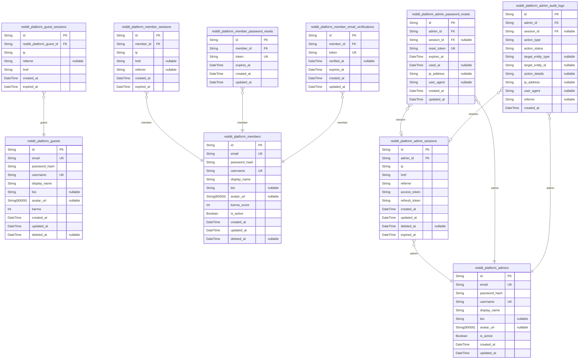
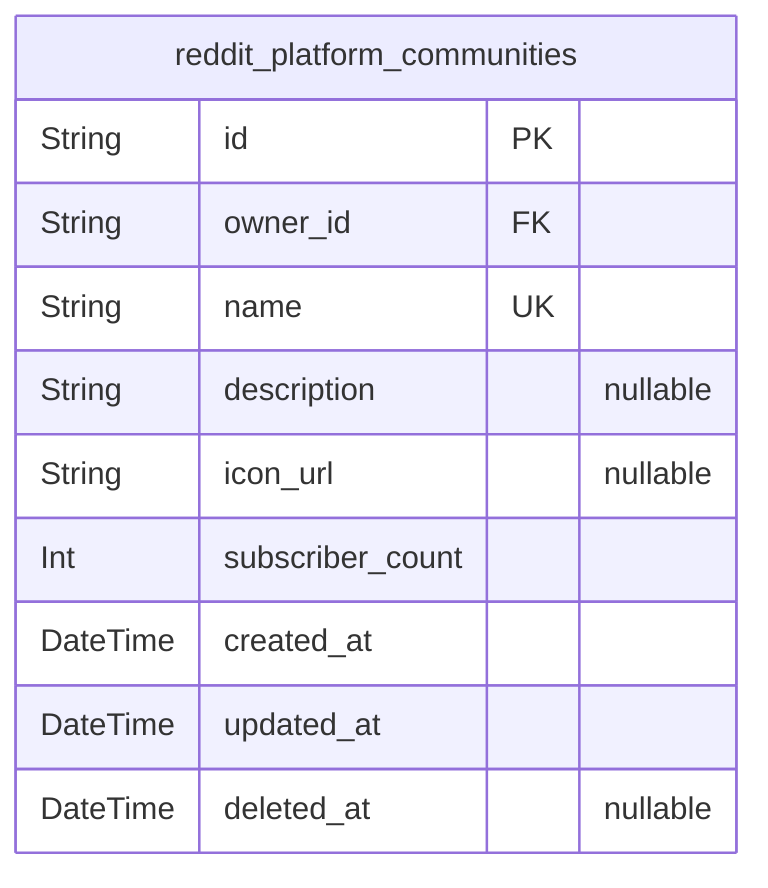
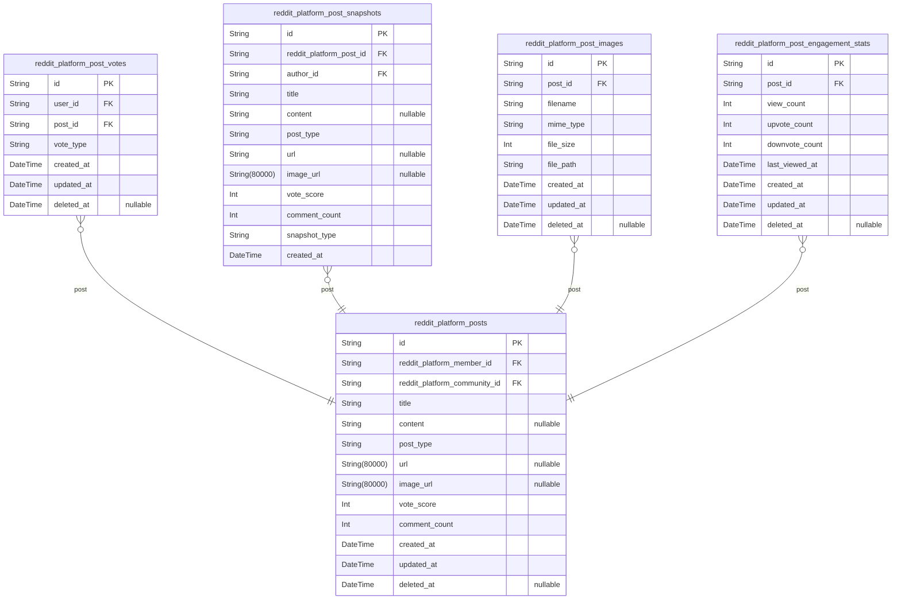
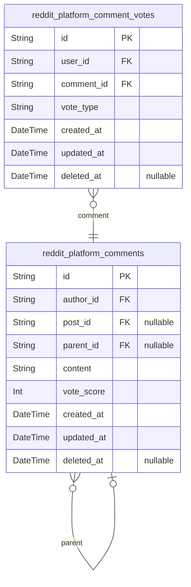
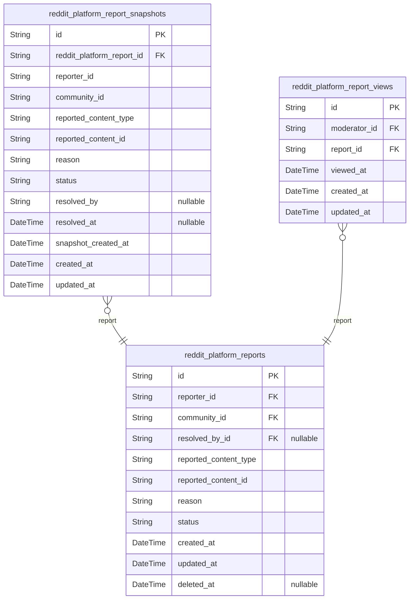
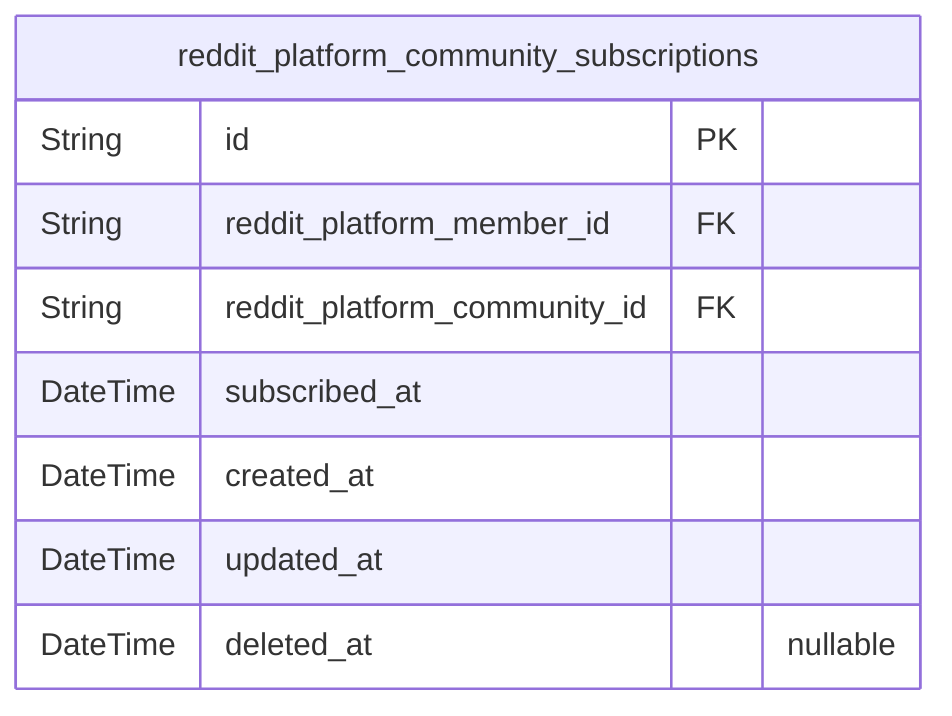
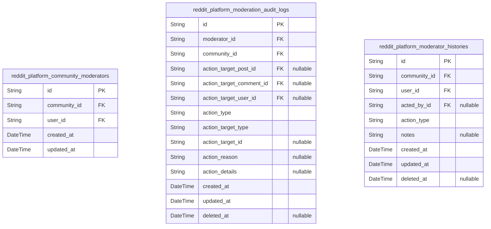
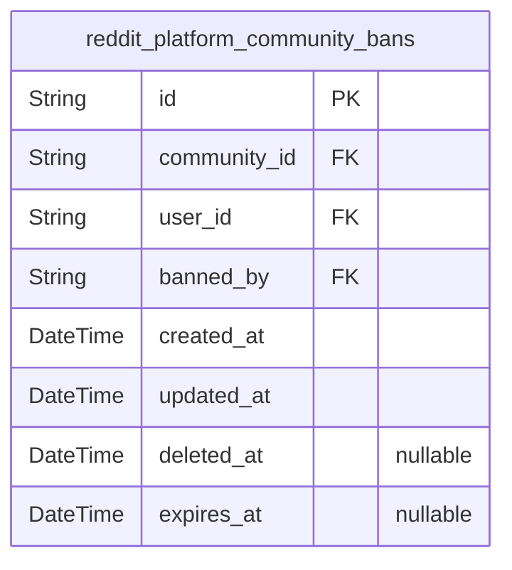

# Prisma Markdown

> Generated by [`prisma-markdown`](https://github.com/samchon/prisma-markdown)

- [Actors](#actors)
- [Communities](#communities)
- [Posts](#posts)
- [Comments](#comments)
- [Reports](#reports)
- [CommunitySubscription](#communitysubscription)
- [CommunityModerator](#communitymoderator)
- [CommunityBan](#communityban)

## Actors

### `reddit_platform_guests`

Temporary guest accounts identified by device fingerprint for anonymous
browsing access.

This actor table represents unauthenticated visitors who create temporary
accounts to browse the platform anonymously. Each guest account is
identified by a combination of email address and device fingerprint,
allowing the system to track anonymous users across sessions without
requiring full registration.

Key relationships:
- [reddit_platform_guest_sessions](#reddit_platform_guest_sessions): One-to-many relationship where
guests have multiple temporary session tokens
- Other domain tables reference this via user_id foreign keys when guests
create content

Business rules:
- Email addresses must be unique per guest account
- Usernames must be unique across all guest accounts
- Karma score is automatically tracked based on upvotes/downvotes received
- Accounts are soft-deleted (deleted_at) rather than permanently removed
for audit purposes
- Password hashing is required even for anonymous accounts for
authentication security

Properties as follows:

- `id`: Primary Key.
- `email`
  > Unique email address used to identify and authenticate guest accounts.
  > Serves as the primary identifier for temporary anonymous users.
- `password_hash`
  > BCrypt-hashed password for guest account authentication. Required even
  > for anonymous accounts to maintain security standards.
- `username`
  > Unique display name for the guest account. Used in content attribution
  > and user identification throughout the platform.
- `display_name`
  > Public-facing display name shown to other users. May differ from username
  > and can be updated by the account owner.
- `bio`: Optional short biography or description text for the guest account.
- `avatar_url`
  > URL to the guest's profile avatar image. Can be an empty string or
  > external image URL.
- `karma`
  > Karma score accumulated from upvotes and downvotes on content. Default
  > value is 0.
- `created_at`: Timestamp when the guest account was created.
- `updated_at`: Timestamp when the guest account was last updated.
- `deleted_at`
  > Timestamp when the guest account was soft-deleted. NULL indicates the
  > account is active.

### `reddit_platform_guest_sessions`

Temporary session tokens for guest access with short expiration.

Guest sessions enable anonymous browsing without authentication. Each
guest session is identified by a device fingerprint hash and stored in
the [reddit_platform_guests](#reddit_platform_guests) table. Sessions contain connection
metadata (IP, referrer, browser) for security auditing and are designed
for short-lived access.

Key characteristics:
- Child entity of [reddit_platform_guests](#reddit_platform_guests) with one-to-many
relationship
- Short expiration (typically 24-48 hours) for security
- Append-only audit trail of login events
- Managed through authentication flows, not direct user CRUD
- Used for tracking anonymous browsing activity

API Generation:
This is a session entity with stance: "session". API endpoints are
generated automatically bound to guest authentication flows for session
lifecycle management (create, refresh, terminate).

Properties as follows:

- `id`: Primary Key.
- `reddit_platform_guest_id`: Belonged guest's [reddit_platform_guests.id](#reddit_platform_guests)
- `ip`: IP address of the guest's device
- `referrer`: Browser referrer URL when session was created
- `href`: Current page URL/href when session is active
- `created_at`: Session creation timestamp
- `expired_at`: Session expiration timestamp - session becomes invalid after this time

### `reddit_platform_members`

Registered member accounts with email/password credentials and profile
information.

This is the primary actor table for authenticated members of the
Reddit-like community platform. It stores user authentication credentials
(email and hashed password), profile data (username, display name, bio,
avatar), and reputation tracking (karma score).

Key relationships:
- [reddit_platform_member_sessions](#reddit_platform_member_sessions) - One member can have multiple
active sessions (JWT tokens)
- [reddit_platform_member_password_resets](#reddit_platform_member_password_resets) - Password reset tokens
linked to members
- [reddit_platform_member_email_verifications](#reddit_platform_member_email_verifications) - Email verification
tokens for member registration
- [reddit_platform_posts](#reddit_platform_posts) - Members create posts in subscribed
communities
- [reddit_platform_comments](#reddit_platform_comments) - Members write comments on posts and
other comments
- [reddit_platform_post_votes](#reddit_platform_post_votes) - Members vote on posts
(upvote/downvote)
- [reddit_platform_comment_votes](#reddit_platform_comment_votes) - Members vote on comments
- [reddit_platform_communities](#reddit_platform_communities) - Members subscribe to communities
as subscribers
- [reddit_platform_community_moderators](#reddit_platform_community_moderators) - Members can be assigned
as moderators
- [reddit_platform_community_bans](#reddit_platform_community_bans) - Members can be banned from
communities
- [reddit_platform_reports](#reddit_platform_reports) - Members can report posts or comments

Behavioral notes:
- Email and username are both unique across all members
- Password is stored as a hash, never in plain text
- Karma score starts at 0 and changes based on votes received
- Soft delete is supported via deleted_at timestamp
- Members can view their own profile and other members' public profiles
- Username is immutable after account creation

Properties as follows:

- `id`: Primary Key.
- `email`
  > Unique email address used for authentication and account recovery. Must
  > be valid email format.
- `password_hash`
  > Bcrypt hash of user's password. Never stored in plain text. Required for
  > login authentication.
- `username`
  > Unique username for member identification. Immutable after account
  > creation. Used in URLs, mentions, and profile references.
- `display_name`
  > User's preferred display name shown on posts, comments, and profile. Can
  > be updated by the member.
- `bio`: Optional user biography text. Can be updated by the member.
- `avatar_url`: URL to user's profile avatar image. Can be updated by the member.
- `karma_score`
  > Accumulated karma points based on votes received from other members.
  > Starts at 0 and adjusts based on upvotes and downvotes on posts and
  > comments.
- `is_active`
  > Account active status. Set to false when account is suspended by
  > moderators or self-deactivated.
- `created_at`: Timestamp when the member account was created.
- `updated_at`: Timestamp when the member profile was last updated.
- `deleted_at`
  > Soft delete timestamp. When not null, the account is marked for deletion
  > but data is preserved for audit purposes.

### `reddit_platform_member_sessions`

JWT session tokens for member authentication with access and refresh
token support.

This table tracks all active login sessions for registered members. Each
session represents a distinct login event with connection metadata
including IP address, referrer, and the last page visited (href).
Sessions have expiration dates for security, and the database maintains
an append-only audit trail of all login events.

**Key Relationships**:
- Belongs to [reddit_platform_members](#reddit_platform_members) via member_id
- One member can have multiple concurrent sessions (multi-device support)
- Sessions are automatically invalidated when expired_at is reached

**Usage**:
- Authentication middleware validates session tokens against this table
- Session termination (logout) marks the session with expired_at
- Security audits can review member login history
- Multi-device support allows members to stay logged in on multiple devices

Properties as follows:

- `id`: Primary Key.
- `member_id`
  > Belonged member's [reddit_platform_members.id](#reddit_platform_members). Identifies which
  > member owns this session.
- `ip`
  > IP address of the client that created this session. Used for security
  > auditing and detecting suspicious login patterns.
- `href`
  > The last page URL visited by the member during this session. Useful for
  > post-login redirect functionality.
- `referrer`
  > The incoming referrer URL that brought the member to the platform. Helps
  > track traffic sources and improve analytics.
- `created_at`
  > Timestamp when this session was created. Used for session lifecycle
  > management and audit trails.
- `expired_at`
  > Timestamp when this session expires. Sessions are automatically
  > invalidated after this time. Not NULL by default for security - all
  > sessions must have expiration.

### `reddit_platform_member_password_resets`

Password reset tokens for member account recovery.

Stores temporary tokens generated when a member requests a password
reset. Each token is linked to a specific member account and has a strict
expiration time for security. Tokens are single-use and must be validated
against the member's identity before allowing password changes.

This table is subsidiary to [reddit_platform_members](#reddit_platform_members) and is
managed through the member authentication workflow. Tokens are
automatically created during the password reset request process and are
either used for authentication or expire naturally. Expired tokens are
not deleted but are ignored by the system.

**Important Security Considerations:**
- Tokens have short expiration times (typically 1 hour)
- Tokens are single-use and revoked immediately after successful password
reset
- All token operations are logged in {@link
reddit_platform_member_audit_logs} for security monitoring

Properties as follows:

- `id`: Primary Key.
- `member_id`
  > Member account's [reddit_platform_members.id](#reddit_platform_members). This token is
  > associated with this member's account recovery process.
- `token`
  > Unique cryptographically secure reset token. Generated using secure
  > random number generator and hashed for storage.
- `expires_at`
  > Timestamp when this reset token expires. Tokens must be used before this
  > time or they become invalid. Security requirement: must not be NULL.
- `created_at`: Token creation timestamp.
- `updated_at`: Token last update timestamp.

### `reddit_platform_member_email_verifications`

Email verification tokens for member registration validation.

Stores one-time use verification tokens that members receive via email
during account registration. Each token is associated with a specific
member account and expires after a set duration (typically 24-48 hours).
Tokens are single-use - once verified, the token record is updated with
the verification timestamp but not deleted to maintain audit trail.

The table supports the member registration workflow where:
- New members create accounts with email/password
- A verification token is generated and sent via email
- Member clicks verification link containing the token
- Token is validated and marks the member's email as verified

**Key relationships:**
- Belongs to [reddit_platform_members](#reddit_platform_members) via member_id
- Each member may have multiple verification tokens during registration
(e.g., re-verification requests)

**Security considerations:**
- Tokens are unique and unguessable (cryptographically secure)
- Tokens expire after a set duration (expires_at field)
- Tokens are single-use (verified_at field marks usage)
- No soft delete - tokens are cleaned up via expiration

Properties as follows:

- `id`: Primary Key.
- `member_id`
  > Member account's [reddit_platform_members.id](#reddit_platform_members) that this
  > verification token belongs to.
- `token`
  > Cryptographically secure verification token string. Unique one-time-use
  > token sent via email.
- `verified_at`
  > Timestamp when the email was successfully verified. Null if token has not
  > been used yet.
- `expires_at`
  > Token expiration timestamp. Tokens expire after 24-48 hours for security.
  > Records with expired tokens should be cleaned up periodically.
- `created_at`: Token creation timestamp.
- `updated_at`: Last update timestamp (e.g., when verified_at is set).

### `reddit_platform_admins`

System administrator accounts with elevated privileges and enhanced
security for platform-wide management capabilities.

This table represents authenticated admin users who perform system
administration tasks across the entire platform, including user account
management, content moderation oversight, and system configuration. Admin
accounts require enhanced security measures due to their privileged
access level.

Admin users serve as the canonical identity record for the administrator
actor type, owning authentication credentials (email, password_hash) and
profile information. This table is referenced by child tables (sessions,
password_resets) and serves as the root of permission and ownership
relationships throughout the system.

Key relationships:
- [reddit_platform_admin_sessions](#reddit_platform_admin_sessions): One-to-many relationship; each
admin has multiple session tokens for authentication
- [reddit_platform_admin_password_resets](#reddit_platform_admin_password_resets): One-to-many
relationship; admin account recovery tokens
- [reddit_platform_admin_audit_logs](#reddit_platform_admin_audit_logs): One-to-many relationship;
audit trail of admin actions for compliance monitoring

Properties as follows:

- `id`: Primary Key.
- `email`: Unique email address used for admin login and account communication.
- `password_hash`
  > BCrypt hashed password for secure authentication. Never stored in
  > plaintext.
- `username`: Unique username identifier for admin accounts, immutable after creation.
- `display_name`: User-friendly display name shown in admin dashboards and interfaces.
- `bio`
  > Administrator biography or description, optionally used to provide
  > context about admin role or responsibilities.
- `avatar_url`: URL to the administrator's profile avatar image.
- `is_active`
  > Whether the admin account is currently active. Suspended accounts cannot
  > authenticate.
- `created_at`: Timestamp when the admin account was created.
- `updated_at`: Timestamp when the admin account was last updated.

### `reddit_platform_admin_sessions`

JWT session tokens for administrator authentication with access and
refresh token support.

This table tracks all active and historical login sessions for
administrator accounts in the Reddit platform. Each session record
contains connection metadata (IP address, referrer, HTTP referrer) and
temporal data for security auditing and session lifecycle management.

Key relationships:
- [reddit_platform_admins](#reddit_platform_admins): Each session belongs to exactly one
administrator actor who initiated the login
- Sessions are managed through authentication flows, not direct CRUD
operations
- Expired or inactive sessions are soft-deleted rather than removed for
audit compliance

Session lifecycle:
- Created: When an administrator successfully authenticates and receives
JWT tokens
- Active: During the token's validity period (access token and refresh
token)
- Expired: When tokens reach their expiration time (tracked by expired_at)
- Deleted: Soft-deleted via deleted_at for security audit trail

Properties as follows:

- `id`: Primary Key.
- `admin_id`
  > Administrator actor's [reddit_platform_admins.id](#reddit_platform_admins) who initiated
  > this session.
- `ip`: IP address of the client that initiated the session connection.
- `href`: Full URL of the page that triggered the authentication request.
- `referrer`: HTTP Referrer header value from the authentication request.
- `access_token`: JWT access token for authenticated API requests.
- `refresh_token`: JWT refresh token for obtaining new access tokens when expired.
- `created_at`: Timestamp when the session was created (login time).
- `updated_at`: Timestamp of the last session record update.
- `deleted_at`: Soft deletion timestamp for security audit trail.
- `expired_at`
  > Timestamp when the session tokens expire (security requirement - always
  > set).

### `reddit_platform_admin_password_resets`

Password reset tokens for administrator account recovery.

Stores secure reset tokens that administrators can use to recover their
accounts when passwords are forgotten or compromised. Each token has a
short expiration window (typically 1-2 hours) and can only be used once
for security.

**Key Relationships**:
- [reddit_platform_admins](#reddit_platform_admins) - The admin account that requested the
password reset (via FK)

**Security Notes**:
- Tokens should be hashed before storage
- Tokens are single-use and invalidated after successful password change
- Expired tokens are automatically cleaned up by scheduled jobs
- All token generation and validation should use secure random generators

Properties as follows:

- `id`: Primary Key.
- `admin_id`
  > Associated administrator's [reddit_platform_admins.id](#reddit_platform_admins). The admin
  > account that initiated the password reset request.
- `session_id`
  > Optional recovery session [reddit_platform_admin_sessions.id](#reddit_platform_admin_sessions)
  > created during the password reset flow. Nullable because tokens can be
  > created without an active session.
- `reset_token`
  > Secure reset token (hashed). Used to validate password reset requests.
  > Should be stored as a hash for security.
- `expires_at`
  > Token expiration timestamp. Tokens expire 2 hours after creation to
  > prevent misuse.
- `used_at`
  > Timestamp when the token was successfully used for password reset. Null
  > if token is still valid and unused.
- `ip_address`
  > IP address where the password reset was requested, for audit and security
  > tracking.
- `user_agent`
  > User agent string from the password reset request, for audit and security
  > tracking.
- `created_at`: Token creation timestamp.
- `updated_at`: Token update timestamp (for audit purposes).

### `reddit_platform_admin_audit_logs`

Audit trail table that records all administrator actions for compliance,
security monitoring, and operational transparency.

Each log entry captures a specific action performed by an administrator,
including the action type, relevant details, affected resources, and
execution context. This table serves as the definitive record for:

- Security incident investigation
- Compliance auditing
- Operational monitoring
- Administrative accountability

**Key Features**:
- Immutable audit records (append-only, never modified or deleted)
- Links to administering [reddit_platform_admins](#reddit_platform_admins) and optional session
- Supports polymorphic targeting via target_entity_type and target_entity_id
- Tracks success/failure status for each action
- Stores request context (IP, user-agent, referrer) for forensic analysis

**Relationships**:
- One administrator can have many audit log entries (via {@link
reddit_platform_admins})
- Optional link to specific [reddit_platform_admin_sessions](#reddit_platform_admin_sessions) for
detailed session tracking
- Target entities are referenced polymorphically (posts, comments, users,
communities, etc.)

Properties as follows:

- `id`: Primary Key.
- `admin_id`: Administrator who performed the action. [reddit_platform_admins.id](#reddit_platform_admins).
- `session_id`
  > Session from which the action was performed. {@link
  > reddit_platform_admin_sessions.id}.
- `action_type`
  > Type of administrative action performed (e.g., 'USER_SUSPEND',
  > 'POST_DELETE', 'COMMUNITY_MODERATE').
- `action_status`: Result of the action (e.g., 'SUCCESS', 'FAILED').
- `target_entity_type`
  > Type of entity targeted by the action (e.g., 'USER', 'POST', 'COMMENT',
  > 'COMMUNITY', 'REPORT').
- `target_entity_id`: ID of the entity targeted by the action.
- `action_details`: JSON-formatted string containing additional action details and parameters.
- `ip_address`: IP address from which the action was performed.
- `user_agent`: User agent string from the request.
- `referrer`: HTTP referrer header value from the request.
- `created_at`: Timestamp when the action was performed.

## Communities

### `reddit_platform_communities`

Community entities representing subreddits or discussion groups where
users can create posts, write comments, and moderate content.

Each community has a unique name, optional description, icon image, and
is owned by a member. Communities track subscriber count for engagement
metrics and support moderation through separate moderator and ban tables.

Related entities:
- Owners: Members who create and own communities (one-to-many posts)
- Subscribers: Users subscribed to communities (via
reddit_platform_community_subscriptions)
- Moderators: Users with elevated permissions (via
reddit_platform_community_moderators)
- Banned users: Users restricted from community access (via
reddit_platform_community_bans)
- Posts: Content created within communities (via
reddit_platform_posts.community_id)

Communities can be soft-deleted (deleted_at set) while preserving
historical posts and comments for audit purposes.

Properties as follows:

- `id`: Primary Key.
- `owner_id`
  > Creator's [reddit_platform_members.id](#reddit_platform_members). The member who created and
  > owns this community, with full administrative privileges.
- `name`
  > Unique community name (e.g., r/reactdev). Used in URLs and display. Must
  > be unique across the platform.
- `description`
  > Optional community description providing context about the community's
  > purpose and topics.
- `icon_url`
  > URL to the community's icon image for visual branding and identification
  > in feeds and lists.
- `subscriber_count`
  > Number of users subscribed to this community. Updated automatically when
  > users subscribe or unsubscribe.
- `created_at`: Timestamp when the community was created.
- `updated_at`: Timestamp when the community was last updated (description, icon changes).
- `deleted_at`
  > Soft delete timestamp. When set, the community is marked as deleted but
  > retains historical data for audit purposes.

## Posts

### `reddit_platform_posts`

Core post entity supporting text, link, and image post types with voting
and engagement metrics.

This table represents the primary content creation unit in the
Reddit-style platform. Each post belongs to a community
(reddit_platform_communities) and is authored by a member
(reddit_platform_members). Posts have three types: TEXT (with content
body), LINK (with external URL), and IMAGE (with uploaded image).

Relationships:
- Author: [reddit_platform_members](#reddit_platform_members) - The member who created this post
- Community: [reddit_platform_communities](#reddit_platform_communities) - The community where
this post is published
- Votes: [reddit_platform_post_votes](#reddit_platform_post_votes) - Individual vote records for
this post
- Snapshots: [reddit_platform_post_snapshots](#reddit_platform_post_snapshots) - Historical versions
for audit
- Images: [reddit_platform_post_images](#reddit_platform_post_images) - Uploaded image files for
IMAGE posts
- Engagement: [reddit_platform_post_engagement_stats](#reddit_platform_post_engagement_stats) - View and
engagement metrics

Post Type Rules:
- TEXT: title + content required, url and image_url null
- LINK: title + url required, content and image_url null
- IMAGE: title + image_url required, content and url null

Properties as follows:

- `id`: Primary Key.
- `reddit_platform_member_id`: Author's [reddit_platform_members.id](#reddit_platform_members). Member who created this post.
- `reddit_platform_community_id`
  > Parent community's [reddit_platform_communities.id](#reddit_platform_communities). Community
  > where this post is published.
- `title`: Post title. Required for all post types. Max 300 characters.
- `content`: Post content body for TEXT posts. Nullable for LINK and IMAGE posts.
- `post_type`
  > Post type: TEXT (content body), LINK (external URL), IMAGE (uploaded
  > image).
- `url`: External URL for LINK posts. Nullable for TEXT and IMAGE posts.
- `image_url`: Uploaded image URL for IMAGE posts. Nullable for TEXT and LINK posts.
- `vote_score`: Net vote score (upvotes minus downvotes). Defaults to 0.
- `comment_count`: Total number of comments on this post. Defaults to 0.
- `created_at`: When this post was created.
- `updated_at`: When this post was last updated.
- `deleted_at`: When this post was soft deleted. Null if not deleted.

### `reddit_platform_post_votes`

Reddit-style upvote/downvote system for posts.

Tracks individual user votes on posts with support for vote changing
(UPVOTE → DOWNVOTE → NULL removal). Each member can cast exactly one vote
per post, enforced via unique constraint. Vote changes update the
vote_type field rather than creating new records, maintaining a clean
audit trail.

This table is referenced by:
- [reddit_platform_members](#reddit_platform_members) - members who cast votes
- [reddit_platform_posts](#reddit_platform_posts) - posts receiving votes
- [reddit_platform_post_engagement_stats](#reddit_platform_post_engagement_stats) - aggregate vote scores

Key behavioral notes:
- Vote changes are atomic updates to vote_type field
- NULL vote_type indicates vote removal (soft delete, not actual deletion)
- Real-time score calculation sums UPVOTE (+1) and DOWNVOTE (-1)
- Feed algorithms use created_at for new/hot ranking
- Never deleted from table - vote history preserved
- Soft delete via deleted_at for audit trail compliance

Properties as follows:

- `id`: Primary Key.
- `user_id`: Member who cast this vote. [reddit_platform_members.id](#reddit_platform_members)
- `post_id`: Post receiving this vote. [reddit_platform_posts.id](#reddit_platform_posts)
- `vote_type`
  > Vote type: UPVOTE (+1), DOWNVOTE (-1), or NULL (vote removed). Always
  > present - vote removal updates to NULL rather than deleting the record.
- `created_at`: Timestamp when this vote was first cast.
- `updated_at`: Timestamp when this vote was last modified (vote change).
- `deleted_at`
  > Timestamp when this vote was soft-deleted (vote removed from active
  > consideration). Soft deletion preserves audit trail.

### `reddit_platform_post_snapshots`

Point-in-time snapshots of posts for audit trails and content history
tracking.

Captures the state of a post at specific moments in time for:
- Audit trails of post modifications
- Content history and rollback capabilities
- Compliance requirements (sections 161, 169)

**Relationships:**
- Belongs to a [reddit_platform_posts](#reddit_platform_posts) parent post via
reddit_platform_post_id
- References the original author via author_id for audit when post author
is deleted
- Each snapshot represents a unique version of the post content

**Behavioral Notes:**
- Immutable historical records - never modified once created
- Append-only design - new snapshots created on post create, edit, or delete
- Used for audit trails, compliance, and potential content restoration
- Snapshot types: CREATE (initial post), EDIT (modification), DELETE
(removal marker)

**Key Design Decisions:**
- All post fields denormalized at time of snapshot (no FK to post content)
- Author stored as snapshot field in case original user account is deleted
- No soft-delete field (snapshots themselves are the history, they
persist forever)

Properties as follows:

- `id`: Primary Key.
- `reddit_platform_post_id`
  > Original post's [reddit_platform_posts.id](#reddit_platform_posts). References the post
  > this snapshot belongs to.
- `author_id`
  > Post author's [reddit_platform_members.id](#reddit_platform_members) at time of snapshot.
  > Preserves author reference even if original user account is deleted.
- `title`: Post title at time of snapshot. Maximum 300 characters.
- `content`: Post content body (for TEXT posts). Null for LINK and IMAGE posts.
- `post_type`: Post type enumeration value: TEXT, LINK, or IMAGE.
- `url`: URL for LINK posts. Null for TEXT and IMAGE posts.
- `image_url`: Image URL for IMAGE posts. Null for TEXT and LINK posts.
- `vote_score`: Vote score at time of snapshot. Can be negative.
- `comment_count`: Number of comments on the post at time of snapshot.
- `snapshot_type`
  > Type of snapshot: CREATE (initial post), EDIT (modification), DELETE
  > (removal marker).
- `created_at`: Timestamp when this snapshot was created.

### `reddit_platform_post_images`

Uploaded image files for image posts, storing file metadata and access
paths.

This subsidiary table tracks all image files associated with image-type
posts in the reddit platform. Each file record contains metadata
including original filename, MIME type, file size in bytes, and storage
path for CDN access.

**Key Relationships:**
- Belongs to [reddit_platform_posts](#reddit_platform_posts) - Each image is associated
with a single post
- Managed through posts - Files are created, accessed, and deleted via
post operations

**Business Rules:**
- Files are only accessible through their parent post
- Image posts can have multiple associated images (1:N relationship)
- File deletion requires parent post to exist (cascade delete on post
deletion)
- File size limits enforced at application layer (max 10MB per image)

Properties as follows:

- `id`: Primary Key.
- `post_id`
  > Parent post's [reddit_platform_posts.id](#reddit_platform_posts). Image file belongs to
  > this post.
- `filename`
  > Original filename of the uploaded image (e.g., 'vacation.jpg'). Stored
  > without path information.
- `mime_type`
  > MIME type of the image file (e.g., 'image/jpeg', 'image/png',
  > 'image/gif'). Used for content validation and CDN serving.
- `file_size`
  > File size in bytes. Used for storage quota tracking and CDN bandwidth
  > calculations.
- `file_path`
  > Storage path to the file (e.g.,
  > 'uploads/posts/123e4567-e89b-12d3-a456-426614174000/vacation.jpg'). Used
  > for CDN access and file retrieval.
- `created_at`: Timestamp when the image file was uploaded and created.
- `updated_at`: Timestamp when the image file metadata was last updated.
- `deleted_at`
  > Soft delete timestamp. When set, indicates the image has been deleted but
  > record preserved for audit trail.

### `reddit_platform_post_engagement_stats`

Post engagement statistics for analytics and feed algorithm ranking.

Tracks view counts, upvote/downvote counts, and timestamps to support
feed algorithms:
- **Hot feed**: Weighted by time (last_viewed_at) + vote activity
- **New feed**: Sorted by created_at (derived from parent post)
- **Top feed**: Sorted by total votes (upvote_count - downvote_count)
- **Controversial feed**: High ratio of opposing votes (upvote_count ≈
downvote_count)

Referenced by the parent [reddit_platform_posts](#reddit_platform_posts) table which owns
the post content. Engagement stats are updated on view and vote actions,
and deleted when the associated post is soft-deleted.

**Aggregation purpose**: This denormalized table provides read-optimized
metrics for feed ranking without requiring expensive real-time
aggregation queries on vote tables.

Properties as follows:

- `id`: Primary Key.
- `post_id`: Referenced post's [reddit_platform_posts.id](#reddit_platform_posts).
- `view_count`: Total number of times this post has been viewed.
- `upvote_count`: Total number of upvotes received by this post.
- `downvote_count`: Total number of downvotes received by this post.
- `last_viewed_at`
  > Timestamp of the most recent view, used for time-weighted feed ranking
  > algorithms.
- `created_at`: Creation timestamp of this engagement record.
- `updated_at`: Last update timestamp of this engagement record.
- `deleted_at`
  > Soft deletion timestamp for tracking post deletion. NULL indicates active
  > record.

## Comments

### `reddit_platform_comments`

Main comment entity storing user-generated content within the Reddit
platform.

Each comment can be a top-level comment on a post or a nested reply to
another comment, supporting unlimited hierarchy depth through the
self-referential parent_id relationship. Comments have their own
independent voting system tracked separately in the {@link
reddit_platform_comment_votes} table, with the aggregated vote_score
stored here.

Comments are primary entities that require independent management
capabilities: users can create, edit, and delete their own comments;
moderators can delete comments across all authors; the system must
support searching across comments, filtering by author, and displaying
comment threads with proper nesting.

Relationships:
- Belongs to a [reddit_platform_members](#reddit_platform_members) author who created the
comment
- Belongs to a [reddit_platform_posts](#reddit_platform_posts) parent post (for top-level
comments) or another comment (for replies)
- Can have nested [reddit_platform_comments](#reddit_platform_comments) replies through the
parent_id self-reference
- Votes are tracked separately in [reddit_platform_comment_votes](#reddit_platform_comment_votes)
and aggregated here as vote_score

This table serves as the core entity for the comment discussion feature,
enabling threaded conversations, independent comment operations, and
moderation workflows.

Properties as follows:

- `id`: Primary Key.
- `author_id`
  > Author member's [reddit_platform_members.id](#reddit_platform_members) who created this
  > comment.
- `post_id`
  > Parent post's [reddit_platform_posts.id](#reddit_platform_posts) for top-level comments.
  > Null for replies to other comments.
- `parent_id`
  > Parent comment's [reddit_platform_comments.id](#reddit_platform_comments) for nested replies.
  > Null for top-level comments.
- `content`
  > The comment text content. Required text field containing the user's
  > message or reply.
- `vote_score`
  > Aggregated vote score from upvotes and downvotes. Calculated from {@link
  > reddit_platform_comment_votes} records. Can be negative.
- `created_at`: Timestamp when the comment was originally created.
- `updated_at`: Timestamp when the comment was last modified.
- `deleted_at`
  > Soft delete timestamp. Null when comment is active, set when deleted by
  > author or moderator.

### `reddit_platform_comment_votes`

Individual vote records for comments tracking user votes
(upvote/downvote) on comment content.

This table implements the Reddit-style voting system where authenticated
members can upvote or downvote comments to influence their visibility in
feeds. Each user can cast exactly one vote per comment, and votes are
immutable audit records that contribute to comment scores and user karma
calculations.

Key relationships:
- Belongs to [reddit_platform_members](#reddit_platform_members) via user_id - the member who
cast the vote
- Belongs to [reddit_platform_comments](#reddit_platform_comments) via comment_id - the
comment being voted on
- Referenced by vote operations for feed algorithms, comment sorting, and
karma tracking

Behavioral notes:
- Single vote per comment enforced via unique index on (user_id, comment_id)
- Vote can be changed by casting a new vote with different type
- Vote can be removed by casting a vote with NULL type
- Votes are immutable once created - no updates or deletions
- Real-time score updates for comment display in feeds
- Contributes to user karma score accumulation

Properties as follows:

- `id`: Primary Key.
- `user_id`: Member who cast the vote. [reddit_platform_members.id](#reddit_platform_members)
- `comment_id`: Comment being voted on. [reddit_platform_comments.id](#reddit_platform_comments)
- `vote_type`: Type of vote cast: UPVOTE, DOWNVOTE, or NULL (removed vote).
- `created_at`: Timestamp when the vote was cast.
- `updated_at`
  > Timestamp when the vote was last modified (e.g., when vote type changed
  > or removed).
- `deleted_at`
  > Soft delete timestamp. NULL when active, set when the vote record is
  > deleted.

## Reports

### `reddit_platform_reports`

Main content moderation report entity that tracks user-submitted content
violations requiring moderator intervention.

Each report represents a user reporting inappropriate content (post or
comment) within a community. Reports follow a workflow: PENDING →
RESOLVED (when moderator approves and deletes content) or DISMISSED (when
moderator finds report invalid).

Key relationships:
- [reddit_platform_members.id](#reddit_platform_members) - The user who submitted the report
(reporter)
- [reddit_platform_communities.id](#reddit_platform_communities) - The community where the
reported content exists
- [reddit_platform_posts.id](#reddit_platform_posts) / [reddit_platform_comments.id](#reddit_platform_comments)
- Polymorphic reference to the reported content
- [reddit_platform_members.id](#reddit_platform_members) - The moderator who resolved the
report (resolved_by)

Behavioral notes:
- One report per user per content item (duplicate prevention via unique
constraint)
- Requires reason text with minimum validation (10 characters per section
592)
- Status transitions only allowed by moderators (section 34:
approve/dismiss authority)
- Supports audit trail through separate snapshot table
- Soft delete for GDPR compliance

Properties as follows:

- `id`: Primary Key.
- `reporter_id`: User who submitted the report. [reddit_platform_members.id](#reddit_platform_members)
- `community_id`
  > Community where the reported content exists. {@link
  > reddit_platform_communities.id}
- `resolved_by_id`: Moderator who resolved the report. [reddit_platform_members.id](#reddit_platform_members)
- `reported_content_type`
  > Type of reported content: POST or COMMENT. Determines which table
  > referenced by reported_content_id.
- `reported_content_id`
  > UUID of the reported post or comment (polymorphic reference). Used
  > together with reported_content_type.
- `reason`
  > Text reason for the report. Required field with minimum 10 character
  > validation (section 592). Maximum 500 characters.
- `status`
  > Current status of the report: PENDING (awaiting moderator review),
  > RESOLVED (moderator approved and content deleted), DISMISSED (moderator
  > found report invalid).
- `created_at`: Timestamp when the report was created.
- `updated_at`: Timestamp when the report was last updated (status changes).
- `deleted_at`
  > Soft delete timestamp. NULL when active, set when report is deleted for
  > GDPR compliance.

### `reddit_platform_report_snapshots`

Point-in-time audit snapshots of reddit_platform_reports changes for
compliance and audit trail purposes.

Stores denormalized copies of report data at each state change, enabling
historical tracking of report lifecycle (pending → resolved/dismissed).
Each report maintains a chain of snapshots documenting status
transitions, resolver identity, and resolution timing.

Key relationships:
- [reddit_platform_reports.id](#reddit_platform_reports) - Parent report this snapshot
belongs to (1:N relationship via report_id FK)
- [reddit_platform_members.id](#reddit_platform_members) - Referenced via reporter_id field
(not stored as FK to avoid circular reference)
- [reddit_platform_members.id](#reddit_platform_members) - Referenced via resolved_by field
when report is resolved (nullable)

Behavioral notes:
- Append-only table: New snapshots created on every status change
(pending→resolved or pending→dismissed)
- Read-only from user perspective: Snapshots are system-maintained for
audit purposes
- Compliance tracking: Maintains complete history of who resolved reports
and when
- Full-text search: GIN index on reason field enables searching reported
content reasons across all snapshots

Properties as follows:

- `id`: Primary Key.
- `reddit_platform_report_id`
  > Referenced report's [reddit_platform_reports.id](#reddit_platform_reports). Identifies the
  > source report this snapshot belongs to.
- `reporter_id`
  > ID of the user who submitted the report. Reference to {@link
  > reddit_platform_members.id} in the main report entity.
- `community_id`
  > ID of the community where the reported content was posted. Reference to
  > [reddit_platform_communities.id](#reddit_platform_communities) in the main report entity.
- `reported_content_type`: Type of content being reported: POST or COMMENT. Stored at snapshot time.
- `reported_content_id`
  > ID of the reported post or comment. Reference to {@link
  > reddit_platform_posts.id} or [reddit_platform_comments.id](#reddit_platform_comments) in the
  > main report entity.
- `reason`
  > Reason text provided by the reporter for the report. Minimum 10
  > characters, maximum 500 characters per validation rules.
- `status`
  > Report status at snapshot time: pending, resolved, or dismissed. Captures
  > state transition.
- `resolved_by`
  > ID of the moderator who resolved the report. Reference to {@link
  > reddit_platform_members.id} in the main report entity. Nullable if status
  > is pending.
- `resolved_at`: Timestamp when the report was resolved. Nullable if status is pending.
- `snapshot_created_at`
  > Timestamp when this snapshot was created. Marks the point-in-time of this
  > audit record.
- `created_at`: Record creation timestamp. Standard temporal field for auditing.
- `updated_at`
  > Record update timestamp. Standard temporal field for auditing (typically
  > same as created_at for snapshots).

### `reddit_platform_report_views`

Tracking records of when moderators view reports for workflow
transparency and reporting analytics.

This subsidiary table captures view events generated by the moderation
workflow, enabling:
- Analysis of report processing times and moderator workload
- Audit trail of report exposure (section 469)
- Identification of reports that may need attention if not viewed within SLA
- Analytics on report queue management (section 232)

Relationships:
- Belongs to a [reddit_platform_admin](#reddit_platform_admin) moderator who viewed the report
- References a [reddit_platform_reports](#reddit_platform_reports) entity that was viewed
- Multiple views can be recorded for the same report (N:1 relationship)

Business Context:
- Views are automatically recorded when moderators open report detail pages
- Supports moderation workflow efficiency monitoring
- Does not affect report status or workflow state
- Stored for analytics and compliance purposes

Properties as follows:

- `id`: Primary Key.
- `moderator_id`: Moderator's [reddit_platform_admins.id](#reddit_platform_admins) who viewed the report.
- `report_id`: Report's [reddit_platform_reports.id](#reddit_platform_reports) that was viewed.
- `viewed_at`: Timestamp when the report was viewed by the moderator.
- `created_at`: Record creation timestamp.
- `updated_at`: Record update timestamp.

## CommunitySubscription

### `reddit_platform_community_subscriptions`

User-community subscription relationships tracking which communities each
user has subscribed to.

This model represents the join relationship between users and
communities, enabling:
- Users to subscribe/unsubscribe from communities
- Communities to track their subscriber count and member list
- Efficient querying of a user's subscribed communities
- Efficient querying of a community's subscribers

**Relationships:**
- Belongs to a [reddit_platform_members](#reddit_platform_members) user as subscriber
- Belongs to a [reddit_platform_communities](#reddit_platform_communities) community as member
- Unique constraint on (user_id, community_id) prevents duplicate
subscriptions

**Business Rules:**
- A user can subscribe to multiple communities
- A community can have multiple subscribers
- Each user-community pair can have only one subscription record
- Subscriptions are tracked with a subscribed_at timestamp
- Soft delete supported for proper subscription lifecycle management

**Use Cases:**
- Display list of communities subscribed by current user
- Show subscriber count and list for a community
- Process subscription/unsubscription actions
- Audit subscription history

Properties as follows:

- `id`: Primary Key.
- `reddit_platform_member_id`
  > Referenced member's [reddit_platform_members.id](#reddit_platform_members). Identifies which
  > user subscribed to this community.
- `reddit_platform_community_id`
  > Referenced community's [reddit_platform_communities.id](#reddit_platform_communities). Identifies
  > which community the user subscribed to.
- `subscribed_at`: Timestamp when the subscription was created.
- `created_at`: Record creation timestamp for audit purposes.
- `updated_at`: Record update timestamp for tracking changes.
- `deleted_at`
  > Soft delete timestamp. Null when active, populated when subscription is
  > deleted.

## CommunityModerator

### `reddit_platform_community_moderators`

Tracks which users have moderator roles in which communities.

This table establishes the relationship between members and communities
where specific members are granted moderator privileges. Moderators have
elevated permissions within their assigned communities including the
ability to delete posts and comments, ban/unban users, and handle content
reports.

Related models: [reddit_platform_communities](#reddit_platform_communities), {@link
reddit_platform_members}, [reddit_platform_moderation_audit_logs](#reddit_platform_moderation_audit_logs) -
the audit log table tracks all moderator actions for compliance purposes.
Community moderators are distinct from community owners and have limited
authority within their assigned communities only.

Properties as follows:

- `id`: Primary Key.
- `community_id`
  > Community for which this user has moderator privileges. {@link
  > reddit_platform_communities.id}.
- `user_id`: Member who holds the moderator role. [reddit_platform_members.id](#reddit_platform_members).
- `created_at`: Timestamp when this moderator appointment was created.
- `updated_at`: Timestamp when this moderator appointment was last updated.

### `reddit_platform_moderation_audit_logs`

Audit log table that tracks all moderator actions within communities for
compliance and transparency purposes.

This table serves as a historical record of every moderation action taken
by community moderators, including:

- Moderator appointment and removal actions (tracked in {@link
reddit_platform_community_moderators})
- Content deletion actions (posts and comments)
- User ban and unban actions (tracked in {@link
reddit_platform_community_bans})
- Report handling actions (approving/dismissing reports)

Each audit log entry captures who performed the action, what was
affected, when it occurred, and any relevant details. This enables:

- Compliance auditing and transparency reporting
- Moderator performance tracking
- Dispute resolution with verifiable action history
- Analytics on moderation patterns across communities

The table uses polymorphic references (action_target_type,
action_target_id) to track actions against different entity types (posts,
comments, users) while maintaining referential integrity through specific
foreign keys where possible.

Properties as follows:

- `id`: Primary Key.
- `moderator_id`: Moderator who performed the action. [reddit_platform_members.id](#reddit_platform_members)
- `community_id`
  > Community where the action occurred. {@link
  > reddit_platform_communities.id}
- `action_target_post_id`: Target post when action was on a post. [reddit_platform_posts.id](#reddit_platform_posts)
- `action_target_comment_id`
  > Target comment when action was on a comment. {@link
  > reddit_platform_comments.id}
- `action_target_user_id`
  > Target user when action was on a user (ban/unban). {@link
  > reddit_platform_members.id}
- `action_type`
  > Type of moderation action performed. Enum values: appoint_moderator,
  > remove_moderator, delete_post, delete_comment, ban_user, unban_user,
  > approve_report, dismiss_report
- `action_target_type`
  > Polymorphic type of target entity: post, comment, or user. Used when
  > specific FK is not applicable.
- `action_target_id`
  > Polymorphic ID reference to target entity when specific FK is not used
  > for cross-referencing.
- `action_reason`
  > Optional reason or context provided for the moderation action by the
  > moderator.
- `action_details`
  > JSON string containing additional structured details about the action
  > (e.g., previous moderator status, ban expiration, report ID).
- `created_at`: Timestamp when the audit log entry was created.
- `updated_at`: Timestamp when the audit log entry was last updated.
- `deleted_at`: Soft delete timestamp for data retention and archival.

### `reddit_platform_moderator_histories`

Historical audit records tracking moderator appointment and removal
actions within communities.

This table maintains a complete history of all moderator role changes,
including when users were appointed as moderators and when they were
removed. The records serve multiple purposes:

- **Audit Trail**: Provides a compliance-ready record of all moderation
role assignments for transparency and accountability
- **Ownership Verification**: Enables verification of past moderator
ownership for community administration purposes
- **Historical Analysis**: Supports analytics on moderator tenure, action
frequency, and community management patterns
- **Governance Tracking**: Documents the evolution of community
moderation teams over time

**Relationships**:
- Belongs to a [reddit_platform_communities](#reddit_platform_communities) community where the
moderator role was assigned or removed
- Records a change to a [reddit_platform_members](#reddit_platform_members) user's moderator
privileges
- Optionally tracked which [reddit_platform_members](#reddit_platform_members) or {@link
reddit_platform_admins} actor performed the action (acted_by)

**Usage Patterns**:
- Query by community to see all moderator history
- Query by user to see their moderator appointment/removal history across
all communities
- Query by acted_by to audit specific admin/moderator actions
- Never query for current moderator status (use
reddit_platform_community_moderators for that)

**Data Characteristics**:
- Append-only historical data (records are never modified after creation)
- Soft deletion supported via deleted_at for compliance scenarios
- Immutable action history (once created, the action record should not be
changed)

Properties as follows:

- `id`: Primary Key.
- `community_id`
  > Community where the moderator action occurred. {@link
  > reddit_platform_communities.id}.
- `user_id`
  > User whose moderator role was affected. {@link
  > reddit_platform_members.id}.
- `acted_by_id`
  > User or admin who performed the moderator action. {@link
  > reddit_platform_members.id}.
- `action_type`
  > Type of moderator action performed. Values: 'APPOINTED' (user was
  > appointed as moderator) or 'REMOVED' (user was removed as moderator).
- `notes`
  > Optional notes about the moderator action. Can include reasons for
  > appointment/removal or other context.
- `created_at`: Timestamp when this history record was created.
- `updated_at`: Timestamp when this record was last updated.
- `deleted_at`: Soft deletion timestamp for compliance and audit preservation.

## CommunityBan

### `reddit_platform_community_bans`

Tracks user bans within communities for content moderation and enforcement.

This table manages the ban lifecycle including who was banned (user_id),
by whom (banned_by), in which community (community_id), and when the ban
expires (expires_at). The ban status is determined by whether deleted_at
is null and whether expires_at is in the future.

Key relationships:
- Belongs to community [reddit_platform_communities.id](#reddit_platform_communities) where the
ban applies
- Banned user is [reddit_platform_members.id](#reddit_platform_members)
- Ban issuer (moderator/admin) is [reddit_platform_members.id](#reddit_platform_members)

Business rules:
- A user can only have one active ban per community (enforced by unique
constraint)
- Bans can be permanent (expires_at null) or time-limited
- Unbanning is performed via soft delete (setting deleted_at)
- Ban checks prevent banned users from posting, commenting, or voting

Properties as follows:

- `id`: Primary Key.
- `community_id`: Community where the ban applies. [reddit_platform_communities.id](#reddit_platform_communities)
- `user_id`: The user who was banned. [reddit_platform_members.id](#reddit_platform_members)
- `banned_by`
  > The moderator or admin who issued the ban. {@link
  > reddit_platform_members.id}
- `created_at`: Timestamp when the ban was issued.
- `updated_at`: Timestamp when the ban record was last updated.
- `deleted_at`: Timestamp when the ban was unbanned (soft delete). Null when active.
- `expires_at`: Optional expiration date for time-limited bans. Null for permanent bans.
