# Prisma Markdown

> Generated by [`prisma-markdown`](https://github.com/samchon/prisma-markdown)

- [Actors](#actors)
- [Communities](#communities)
- [Posts](#posts)
- [Comments](#comments)
- [Votes](#votes)
- [Reports](#reports)
- [Feeds](#feeds)
- [Images](#images)
- [Systematic](#systematic)
- [Users](#users)
- [default](#default)

## Actors

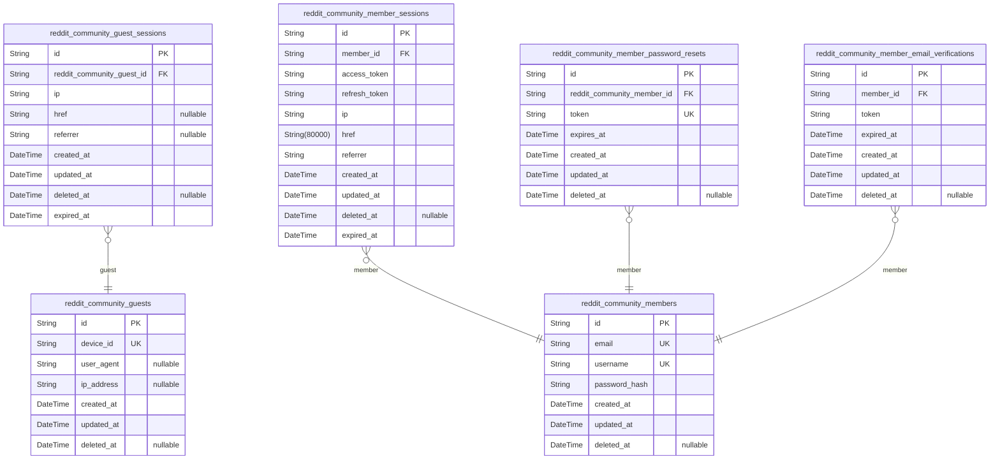

### `reddit_community_guests`

Guest accounts for unauthenticated visitors identified by device
fingerprint.

This table serves as the canonical identity record for guest users who
access the system without logging in. Each guest is uniquely identified
by a combination of device identifier, user agent, and IP address to
provide continuity across browsing sessions while maintaining privacy.

Guest accounts enable tracking of unauthenticated user activity such as
popular feed viewing and community browsing. Sessions for guest accounts
are stored in [reddit_community_guest_sessions](#reddit_community_guest_sessions).

Unlike [reddit_community_members](#reddit_community_members), guest accounts do not have
email/password authentication. Guests cannot create posts or comments,
but can view public content.

Properties as follows:

- `id`: Primary Key.
- `device_id`
  > Unique device identifier that distinguishes this guest from others on the
  > same device.
- `user_agent`
  > Browser and device user agent string for device identification and
  > analytics.
- `ip_address`
  > Last known IP address of the guest visitor for analytics and rate
  > limiting purposes.
- `created_at`: Timestamp when the guest account was first created.
- `updated_at`: Timestamp when the guest account was last updated.
- `deleted_at`
  > Timestamp when the guest account was soft-deleted (nullable - not deleted
  > by default).

### `reddit_community_guest_sessions`

Temporary session tokens for guest access to public feeds.

Each record represents a login session for an unauthenticated visitor
accessing public feed data (popular feed, community pages, public posts).
Sessions track connection metadata including IP address, referrer URL,
and current page for security auditing and session management.

**Key Relationships**:
- Belongs to a [reddit_community_guests](#reddit_community_guests) account identified by
device fingerprint
- Multiple sessions per guest (1:N relationship)
- Session expiration enforces security by limiting session duration

**Behavioral Notes**:
- Sessions are automatically expired based on expired_at timestamp
- Soft deletion allows tracking of session lifecycle
- Append-only pattern for session audit trail

Properties as follows:

- `id`: Primary Key.
- `reddit_community_guest_id`: Belonged guest account's [reddit_community_guests.id](#reddit_community_guests).
- `ip`
  > Client IP address from the request for security auditing and session
  > tracking.
- `href`: Current page/URL visited by the guest for session context.
- `referrer`: Referrer header from the request for traffic source tracking.
- `created_at`: Session creation timestamp.
- `updated_at`: Last session update timestamp.
- `deleted_at`: Soft deletion timestamp for audit trail.
- `expired_at`: Session expiration timestamp - sessions beyond this point are invalid.

### `reddit_community_members`

Registered member accounts with email and password authentication. This
table serves as the core identity record for authenticated users in the
Reddit-like community platform. Members can log in, create accounts,
manage their profiles, and participate in community activities through
posts, comments, and votes.

Key relationships:
- Has one-to-many sessions stored in {@link
reddit_community_member_sessions}
- Has one-to-many password reset tokens stored in {@link
reddit_community_member_password_resets}
- Has one-to-many email verifications stored in {@link
reddit_community_member_email_verifications}
- Has one-to-one profile information stored in {@link
reddit_community_user_profiles}

Members are the primary actors in the system who can subscribe to
communities, create posts and comments, vote on content, and moderate
communities they own.

Properties as follows:

- `id`: Primary Key.
- `email`: Unique email address used for login and account identification.
- `username`
  > Unique display name for the member, used throughout the platform to
  > identify the user in posts, comments, and profiles.
- `password_hash`: BCrypt or similar hash of the user's password for secure authentication.
- `created_at`: Timestamp when the member account was created.
- `updated_at`: Timestamp when the member account was last updated.
- `deleted_at`
  > Soft delete timestamp when the account was deleted. NULL means active
  > account.

### `reddit_community_member_sessions`

JWT session tokens for member authentication with access and refresh
token support.

This table tracks login sessions for authenticated member users. Each
session represents an active authentication instance with associated
connection metadata for security auditing. Members can have multiple
concurrent sessions (e.g., logged in from different devices or browsers).

Key relationships:
- Belongs to [reddit_community_members](#reddit_community_members) - each session is owned by
a single member
- Each member can have many sessions (1:N relationship)

Session lifecycle:
- Sessions are created during member login
- Sessions contain JWT access and refresh tokens
- Sessions expire based on configured token lifetime
- Sessions can be explicitly revoked through logout
- Sessions can be automatically expired based on expired_at timestamp

Security considerations:
- Connection metadata (ip, href, referrer) enables session auditing
- Multiple concurrent sessions supported for better user experience
- Expiration ensures automatic session cleanup for security

Properties as follows:

- `id`: Primary Key.
- `member_id`
  > Member's [reddit_community_members.id](#reddit_community_members). The authenticated user who
  > owns this session.
- `access_token`
  > JWT access token for authenticated API requests. Short-lived token used
  > for authorization.
- `refresh_token`
  > JWT refresh token for obtaining new access tokens. Longer-lived token
  > used for session renewal.
- `ip`
  > Client IP address from which the session was created. Used for security
  > auditing and anomaly detection.
- `href`
  > Referrer URL where the login originated. Provides context for session
  > creation.
- `referrer`
  > HTTP referrer header value from the login request. Additional security
  > context for session tracking.
- `created_at`
  > Timestamp when the session was created. Used for session lifecycle
  > management and expiration calculations.
- `updated_at`
  > Timestamp when the session was last updated. Monitors session activity
  > for security purposes.
- `deleted_at`
  > Timestamp when the session was soft-deleted (logged out or revoked).
  > Enables session history audit trail.
- `expired_at`
  > Timestamp when the session expires. Automatic session cleanup based on
  > configured token lifetime.

### `reddit_community_member_password_resets`

Password reset tokens for member account recovery. Contains temporary
unique tokens that allow members to reset their forgotten password. Each
token is single-use and expires after a configured time period (typically
1 hour). Tokens are invalidated once used or when expired, providing
secure account recovery without exposing the original password.

This table supports the password change functionality defined in the user
account requirements. Tokens are automatically created during password
reset requests and consumed during the reset action. The table maintains
an audit trail through soft deletion.

Properties as follows:

- `id`: Primary Key.
- `reddit_community_member_id`
  > Member account requesting password reset. {@link
  > reddit_community_members.id}
- `token`
  > Unique password reset token. Single-use token that grants temporary
  > password reset capability. Tokens are cryptographically random strings.
- `expires_at`
  > Token expiration timestamp. Token becomes invalid after this time,
  > preventing reuse of old tokens.
- `created_at`: Token creation timestamp.
- `updated_at`: Token last update timestamp.
- `deleted_at`: Token deletion timestamp for soft delete tracking.

### `reddit_community_member_email_verifications`

Email verification tokens for member registration validation. This table
stores verification tokens that members must complete before their
account becomes fully active. Each token is tied to a member account and
expires after a set time period for security purposes. Once verified, the
token is marked as used and cannot be reused.

Properties as follows:

- `id`: Primary Key.
- `member_id`
  > Member account that owns this verification token. {@link
  > reddit_community_members.id}
- `token`
  > Unique verification token string generated for this email verification
  > attempt. Must be cryptographically random and securely hashed.
- `expired_at`
  > Timestamp when this verification token expires. Security requirement:
  > tokens must expire after a set time period.
- `created_at`: Timestamp when this verification token was created.
- `updated_at`: Timestamp when this verification token was last updated.
- `deleted_at`
  > Timestamp when this verification token was deleted (soft delete). Null if
  > token is still valid.

## Communities

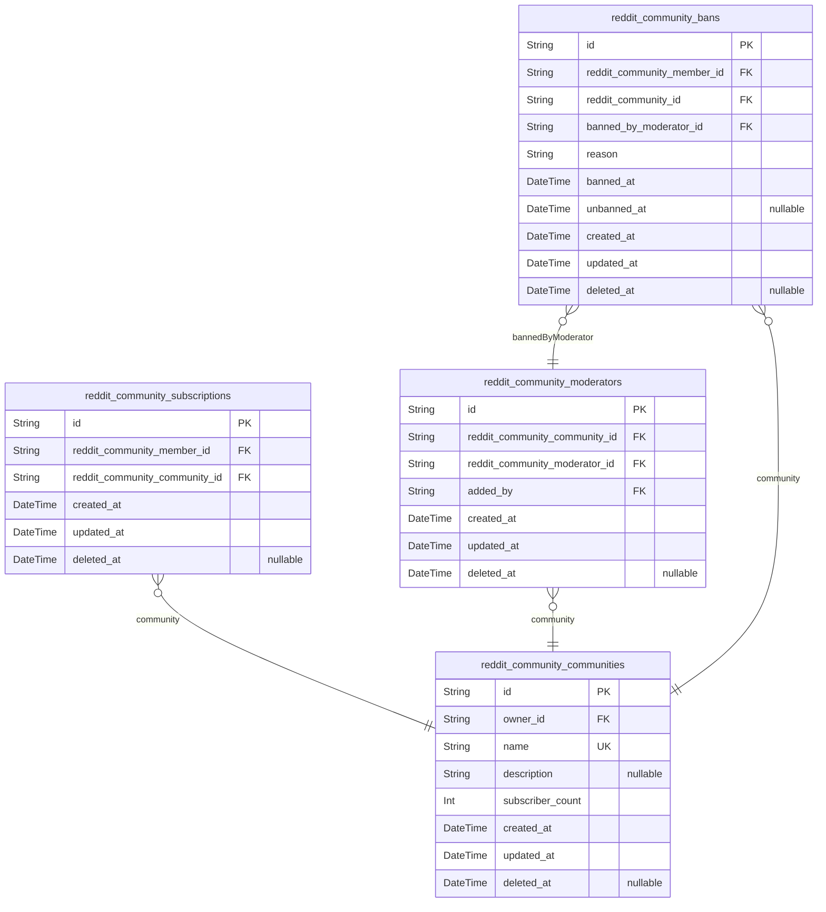

### `reddit_community_communities`

Core community entity representing a subreddit-like discussion forum
within the platform.

This table stores the fundamental information about each community
including its unique name, description, owner reference, and subscriber
count. Communities are primary business entities that users can create,
browse, search, and subscribe to. Each community has a single owner (the
member who created it) and serves as the parent entity for the optional
icon relationship.

Communities serve as containers for posts and comments, and users must
subscribe to a community before creating posts within it. The
subscriber_count field tracks the total number of active subscriptions
for display purposes in community listings and feeds.

Properties as follows:

- `id`: Primary Key.
- `owner_id`
  > Owner member's [reddit_community_members.id](#reddit_community_members). The member who
  > created this community and serves as the initial owner with full
  > moderation privileges.
- `name`
  > Unique name identifier for the community. Used in URLs and search. Must
  > be unique across all communities in the system.
- `description`
  > Optional description text explaining the community's purpose and topics.
  > Displayed on community profile pages.
- `subscriber_count`
  > Total number of active members subscribed to this community. Incremented
  > when users subscribe, decremented when they unsubscribe.
- `created_at`: Timestamp when this community was created.
- `updated_at`: Timestamp when this community was last updated.
- `deleted_at`
  > Timestamp when this community was soft-deleted. Null if community is
  > active.

### `reddit_community_subscriptions`

Many-to-many subscription relationship between members and communities.

This table tracks which members are subscribed to which communities,
which is required for creating posts in those communities. Users can
subscribe to or unsubscribe from any community, and the subscription is
referenced when creating posts to verify the user is a member of that
community.

Relationships:
- Each subscription belongs to a [reddit_community_members](#reddit_community_members) who is
the subscriber
- Each subscription belongs to a [reddit_community_communities](#reddit_community_communities)
that is being subscribed to
- A member can have many subscriptions (one per community)
- A community can have many subscriptions (from different members)

Key behavioral notes:
- Unique constraint on (member_id, community_id) prevents duplicate
subscriptions
- Soft delete (deleted_at) is used when users unsubscribe
- Subscriptions must be active (deleted_at IS NULL) to create posts in
that community

This table is referenced by the Posts component when verifying membership
before post creation.

Properties as follows:

- `id`: Primary Key.
- `reddit_community_member_id`
  > Member's [reddit_community_members.id](#reddit_community_members). The member who is
  > subscribed to the community.
- `reddit_community_community_id`
  > Community's [reddit_community_communities.id](#reddit_community_communities). The community that
  > is being subscribed to.
- `created_at`: Timestamp when the subscription was created.
- `updated_at`: Timestamp when the subscription was last updated.
- `deleted_at`
  > Timestamp when the subscription was deleted (unsubscribed). NULL means
  > active subscription.

### `reddit_community_moderators`

Moderator role assignments within communities, allowing members to be
designated as moderators for specific communities.

This table manages the moderator role separate from community owners.
Moderators can add other moderators to their communities (but cannot
remove each other - only owners can remove moderators). Each assignment
tracks who added the moderator for audit purposes.

Key relationships:
- [reddit_community_communities.id](#reddit_community_communities) - The community where this
member serves as a moderator
- [reddit_community_members.id](#reddit_community_members) - The member who holds the
moderator role
- [reddit_community_members.id](#reddit_community_members) - The member who added this
assignment (added_by)

Behavioral notes:
- Soft delete preserves audit trail of removed moderators
- Unique constraint ensures one moderator role per community-member
combination
- added_by enables tracking of moderation hierarchy and responsibilities

Properties as follows:

- `id`: Primary Key.
- `reddit_community_community_id`
  > The community where this member serves as a moderator. {@link
  > reddit_community_communities.id}
- `reddit_community_moderator_id`
  > The member who holds the moderator role in this community. {@link
  > reddit_community_members.id}
- `added_by`
  > The member who added this moderator assignment. {@link
  > reddit_community_members.id}
- `created_at`: Timestamp when this moderator assignment was created.
- `updated_at`: Timestamp when this moderator assignment was last updated.
- `deleted_at`
  > Timestamp when this moderator assignment was soft deleted (removed). Null
  > if still active.

### `reddit_community_bans`

Tracks user bans within specific communities for moderation purposes.

A ban prevents a member from creating posts or comments in a particular
community while still allowing them to view content. Each ban is scoped
to a single community and tracks which moderator enacted the ban along
with the reason.

Key relationships:
- A ban belongs to one [reddit_community_members](#reddit_community_members) (the banned user)
- A ban belongs to one [reddit_community_communities](#reddit_community_communities) (the
community where the ban applies)
- A ban belongs to one [reddit_community_moderators](#reddit_community_moderators) (the moderator
who issued the ban)

Bans can be lifted (unbanned) by setting unbanned_at timestamp. The
deleted_at field provides an audit trail for permanently removed bans.

Properties as follows:

- `id`: Primary Key.
- `reddit_community_member_id`: Banned member's [reddit_community_members.id](#reddit_community_members).
- `reddit_community_id`: Community where the ban applies [reddit_community_communities.id](#reddit_community_communities).
- `banned_by_moderator_id`: Moderator who issued the ban [reddit_community_moderators.id](#reddit_community_moderators).
- `reason`: Reason for the ban (e.g., 'spam', 'harassment', 'terms violation').
- `banned_at`: Timestamp when the ban was enacted.
- `unbanned_at`: Timestamp when the ban was lifted. Null if still banned.
- `created_at`: Record creation timestamp.
- `updated_at`: Record update timestamp.
- `deleted_at`: Soft delete timestamp for audit trail.

## Posts

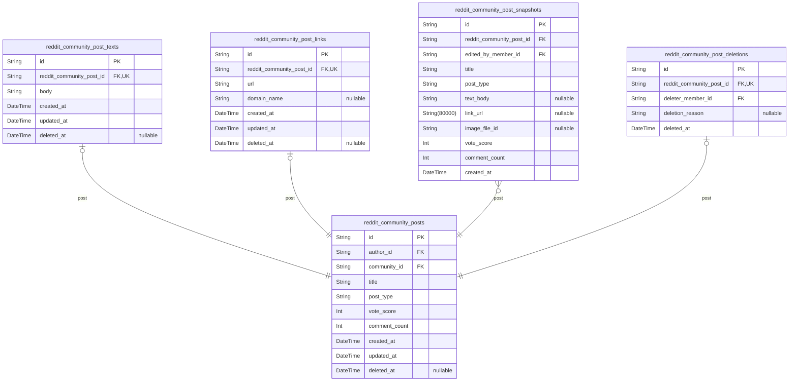

### `reddit_community_posts`

Main post entity storing core post information including title, type
discriminator, author, community, and display metadata.

A post is a piece of content created by members within communities. Posts
can be text posts, link posts, or image posts, with post-specific content
stored in separate child tables (reddit_community_post_texts,
reddit_community_post_links, and post_images).

This table supports the three feed types (Home Feed, Popular Feed,
Community Feed) with denormalized vote_score and comment_count fields for
efficient read operations. Posts are soft-deletable by authors or
moderators.

Related entities:
- [reddit_community_members](#reddit_community_members) - the author who created the post
- [reddit_community_communities](#reddit_community_communities) - the community where the post
belongs
- [reddit_community_votes](#reddit_community_votes) - votes on this post
- [reddit_community_comments](#reddit_community_comments) - comments on this post
- [reddit_community_reports](#reddit_community_reports) - reports of this post
- [reddit_community_post_texts](#reddit_community_post_texts) - text post content
- [reddit_community_post_links](#reddit_community_post_links) - link post URL

Properties as follows:

- `id`: Primary Key.
- `author_id`: Author's [reddit_community_members.id](#reddit_community_members)
- `community_id`
  > Community's [reddit_community_communities.id](#reddit_community_communities) where this post
  > belongs
- `title`: Post title (required, up to 300 characters)
- `post_type`: Post type discriminator: 'text', 'link', or 'image'
- `vote_score`: Current vote score (upvotes minus downvotes) for feed sorting
- `comment_count`: Number of comments on this post
- `created_at`: When the post was created
- `updated_at`: When the post was last updated
- `deleted_at`: When the post was soft deleted (null if not deleted)

### `reddit_community_post_texts`

Text post content body stored separately from post identity.

This subsidiary table contains the actual text content for posts of type
'text'. Each text post has exactly one corresponding record here, linked
to the main reddit_community_posts table via a one-to-one relationship.

The body field stores the full text content of the post, supporting
unlimited length to accommodate various text post formats from short
statements to longer articles. This separation follows normalization
principles by keeping post metadata (title, author, community,
timestamps, vote score) separate from the content body.

The table is managed exclusively through the parent post entity - users
never directly create or modify text records independently. All content
changes flow through post editing operations, which update this table via
the snapshot mechanism (reddit_community_post_snapshots) for audit trail
purposes.

Properties as follows:

- `id`: Primary Key.
- `reddit_community_post_id`: Parent post's [reddit_community_posts.id](#reddit_community_posts).
- `body`
  > Text content body of the post. Supports unlimited length for various text
  > formats from short statements to longer articles.
- `created_at`: Creation timestamp of this text record.
- `updated_at`: Last update timestamp of this text record.
- `deleted_at`: Soft delete timestamp when the parent post is deleted.

### `reddit_community_post_links`

Link post content table storing the URL for link-type posts.

This table is a subsidiary of [reddit_community_posts](#reddit_community_posts), holding the
destination URL for posts classified as link posts. Each link post record
corresponds to exactly one post in the main posts table (1:1 relationship
via post_id). This normalization separates link-specific data from the
common post attributes (title, author, community, timestamps, vote score)
in the parent posts table.

When a post is created with type='link', this table stores the URL that
users will be directed to when clicking the post. The table supports post
editing (updates to URL) and maintains full audit trail through {@link
reddit_community_post_snapshots}.

**Note**: Author information is accessed via the parent post's
`author_id` field, not a duplicate member FK in this table.

Properties as follows:

- `id`: Primary Key.
- `reddit_community_post_id`
  > Parent post identity. Each link post belongs to exactly one post record.
  > This is a 1:1 relationship enforced by the unique constraint.
- `url`
  > The URL string for the link post. Users clicking this post will be
  > redirected to this URL. Must be a valid absolute URL (e.g.,
  > https://example.com/page).
- `domain_name`
  > Parsed domain name extracted from URL (e.g., 'youtube.com' from
  > 'https://youtube.com/watch?v=123'). Used for displaying domain in post
  > list views for quick recognition.
- `created_at`: Record creation timestamp.
- `updated_at`: Record update timestamp.
- `deleted_at`
  > Soft deletion timestamp (nullable). When null, record is active. When
  > set, record is marked for deletion.

### `reddit_community_post_snapshots`

Audit snapshots of posts that capture point-in-time states when content
is edited. Each snapshot records the complete state of a post at a
specific moment in time, providing an immutable historical trail for
moderation, debugging, and content review purposes.

This table stores denormalized copies of all post fields including title,
type, content (text body, link URL, or image file reference), vote score,
and comment count at the time the edit occurred. Snapshots are
append-only records that are never modified or deleted, preserving the
complete history of post modifications.

Key relationships:
- [reddit_community_posts.id](#reddit_community_posts) - The current version of the post
being tracked
- [reddit_community_members.id](#reddit_community_members) - The user who performed the edit
(can be the author or a moderator)

Use cases:
- Moderation audit: Review what content was posted and when
- Content history: Track how posts have evolved over time
- Dispute resolution: Verify original post content
- Debugging: Understand the state of posts at specific points in time

Properties as follows:

- `id`: Primary Key.
- `reddit_community_post_id`
  > Current version of the post this snapshot belongs to. {@link
  > reddit_community_posts.id}.
- `edited_by_member_id`
  > The member who performed the edit that created this snapshot. {@link
  > reddit_community_members.id}.
- `title`: The title of the post at the time of this snapshot.
- `post_type`: The type of post (text, link, or image) at the time of this snapshot.
- `text_body`: The text content of the post for text-type posts.
- `link_url`: The URL for link-type posts.
- `image_file_id`
  > Reference to the image file for image-type posts. Null for text and link
  > posts.
- `vote_score`: The vote score (upvotes minus downvotes) at the time of this snapshot.
- `comment_count`
  > The total comment count (including nested replies) at the time of this
  > snapshot.
- `created_at`
  > The timestamp when this snapshot was created, representing when the edit
  > occurred.

### `reddit_community_post_deletions`

Audit trail table that records deleted posts with deletion metadata.
Tracks when posts were deleted, who deleted them, and why (reason). Used
for moderation oversight, content policy enforcement audit, and
historical record-keeping. References the original post via foreign key
to maintain connection to the deleted content's metadata (title, author,
community) through the post table. The deleter field identifies the
member (user or moderator) who performed the deletion action. This table
is append-only and rarely modified, serving as a permanent record of post
deletion events.

Properties as follows:

- `id`: Primary Key.
- `reddit_community_post_id`
  > Deleted post's [reddit_community_posts.id](#reddit_community_posts). References the original
  > post that was deleted, allowing retrieval of post metadata (title,
  > author, community) even after deletion.
- `deleter_member_id`
  > Member who deleted the post. Can be the post author or a community
  > moderator. References the member who performed the deletion action.
- `deletion_reason`
  > Reason for deletion. Can be empty if no reason provided. Used for
  > moderation audit and policy enforcement tracking.
- `deleted_at`
  > Timestamp when the post was deleted. Point-in-time record of deletion
  > event.

## Comments

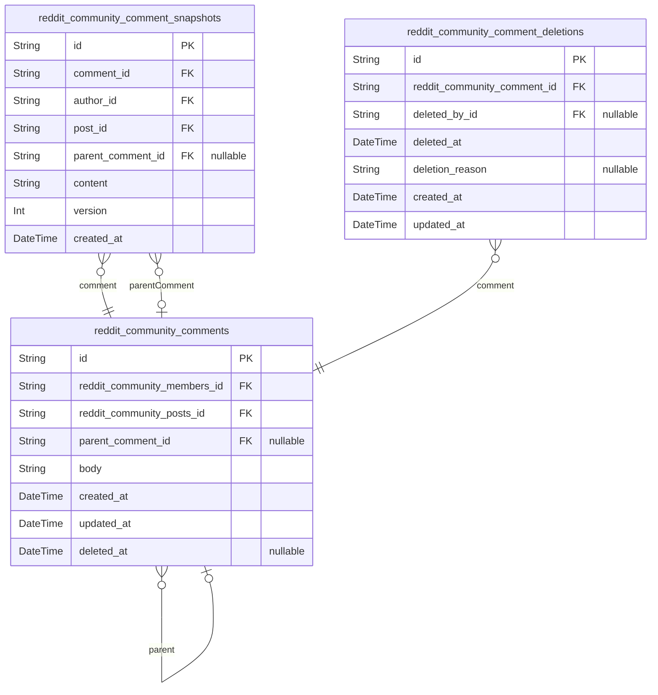

### `reddit_community_comments`

Main comment entity with threaded reply structure supporting unlimited
nesting depth. Users create comments on posts, reply to existing
comments, edit their own comments, and delete their own comments. Each
comment references its author (member), parent post, and optionally a
parent comment for threaded replies. Soft delete via deleted_at enables
moderation tracking without data loss.

Key relationships:
- [reddit_community_members.id](#reddit_community_members) - comment author (required)
- [reddit_community_posts.id](#reddit_community_posts) - parent post (required)
- [reddit_community_comments.id](#reddit_community_comments) - parent comment for replies
(optional, null for top-level comments)

Behavioral notes:
- Unlimited reply depth via self-referential parent_comment_id
- Edit history tracked in [reddit_community_comment_snapshots](#reddit_community_comment_snapshots)
- Deletion audit tracked in [reddit_community_comment_deletions](#reddit_community_comment_deletions)
- Vote score aggregated from [reddit_community_votes](#reddit_community_votes) (filtering by
target_type='comment' and target_id)

Properties as follows:

- `id`: Primary Key.
- `reddit_community_members_id`
  > Author's [reddit_community_members.id](#reddit_community_members). Required for comment
  > attribution and ownership.
- `reddit_community_posts_id`
  > Parent post's [reddit_community_posts.id](#reddit_community_posts). Required - comments
  > always belong to a post.
- `parent_comment_id`
  > Parent comment's [reddit_community_comments.id](#reddit_community_comments). Optional - null
  > for top-level comments on a post, points to another comment for nested
  > replies. Enables unlimited threading depth.
- `body`
  > Comment content text. Required for all comments. Supports plain text with
  > markdown formatting for user-generated content.
- `created_at`: Timestamp when comment was originally created.
- `updated_at`
  > Timestamp when comment was last modified (edit). Updated on each edit
  > operation.
- `deleted_at`
  > Timestamp when comment was soft-deleted. Null means active, non-null
  > means deleted by author or moderator. Enables moderation audit without
  > data loss.

### `reddit_community_comment_snapshots`

Audit trail of comment edits capturing point-in-time content states when
users modify their comments. Stores a complete snapshot of comment data
at the moment of each edit, enabling historical reconstruction of comment
content and context.

Key characteristics:
- Append-only: Snapshots are never modified or deleted once created
- Denormalized: Contains all comment data at snapshot time, including
author and post references
- Traceable: FK to source comment for audit trail linkage
- Historical: Each snapshot represents one version of the comment

Relationships:
- Each snapshot belongs to one comment in {@link
reddit_community_comments} (source of the edit)
- References the comment author at snapshot time via {@link
reddit_community_members.id}
- References the parent post at snapshot time via {@link
reddit_community_posts.id}

Use case: When a user edits a comment, a new snapshot is created with the
updated content. This enables:
- Viewing comment edit history
- Reconstructing past comment states
- Moderation audit trails

Properties as follows:

- `id`: Primary Key.
- `comment_id`
  > Source comment's [reddit_community_comments.id](#reddit_community_comments) - the comment this
  > snapshot belongs to
- `author_id`
  > Comment author's [reddit_community_members.id](#reddit_community_members) at the time of
  > snapshot creation
- `post_id`
  > Parent post's [reddit_community_posts.id](#reddit_community_posts) at the time of snapshot
  > creation
- `parent_comment_id`
  > Parent comment's [reddit_community_comments.id](#reddit_community_comments) for threaded
  > replies (nullable for top-level comments)
- `content`: Comment content text at the time of this snapshot (the edited content)
- `version`
  > Version number of this snapshot (1 for original, increments with each
  > edit)
- `created_at`: Timestamp when this snapshot was created (snapshot time)

### `reddit_community_comment_deletions`

Audit trail table that records deleted comments with deletion metadata
for moderation purposes.

This table captures the historical state of comments that have been
deleted by their author or by community moderators. Each deletion record
includes a reference to the original comment, the timestamp of deletion,
the actor who performed the deletion (via session reference), and an
optional deletion reason.

Key relationships:
- [reddit_community_comments](#reddit_community_comments) - The original comment that was
deleted (1:1 relationship)
- [reddit_community_member_sessions](#reddit_community_member_sessions) - The session of the actor who
performed the deletion (moderator or comment author)

Usage:
- Moderators review deleted comment history for community management
- Audit trail for deletion operations
- Recovery analysis if needed (soft delete tracking)

This is a snapshot table (stance: "snapshot") that should never be
updated or deleted once created. It provides an append-only audit log of
all comment deletion events in the system.

Properties as follows:

- `id`: Primary Key.
- `reddit_community_comment_id`: The deleted comment's [reddit_community_comments.id](#reddit_community_comments).
- `deleted_by_id`
  > The moderator or author session that deleted the comment. {@link
  > reddit_community_member_sessions.id}.
- `deleted_at`: Timestamp when the comment was deleted.
- `deletion_reason`: Optional reason for deletion (e.g., moderator note, spam, harassment).
- `created_at`: Record creation timestamp (same as deleted_at for this audit table).
- `updated_at`: Record update timestamp (immutable for audit purposes).

## Votes

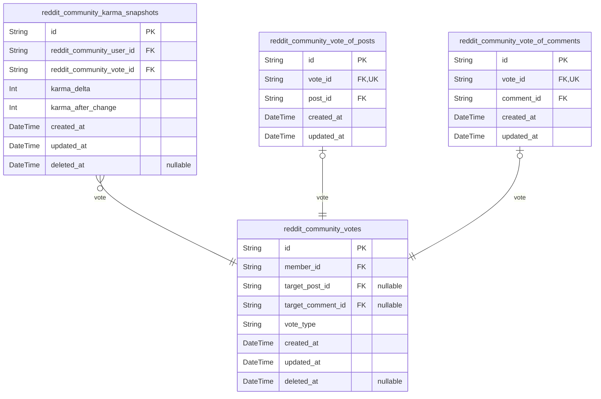

### `reddit_community_votes`

Main voting entity that tracks member votes on posts or comments. Each
vote record represents a single vote action (upvote or downvote) from a
member on either a post or a comment. The vote_type field indicates the
current vote state ('upvote' or 'downvote').

Each member can cast exactly one vote per target (post or comment), and
can change or remove their vote at any time. Vote changes automatically
adjust karma scores, which is tracked separately.

Key relationships:
- Belongs to a [reddit_community_members](#reddit_community_members) who cast the vote
- Targets either a [reddit_community_posts](#reddit_community_posts) or {@link
reddit_community_comments} via subtype tables
- Triggers karma adjustments tracked in {@link
reddit_community_karma_snapshots}

Business rules:
- One vote per member per target (enforced by unique constraint on
subtype tables)
- Vote type can be changed (upvote ↔ downvote) or removed (deleted_at)
- Vote score = total upvotes minus total downvotes

Properties as follows:

- `id`: Primary Key.
- `member_id`: Voting member's [reddit_community_members.id](#reddit_community_members).
- `target_post_id`
  > Target post's [reddit_community_posts.id](#reddit_community_posts). Null when voting on a
  > comment.
- `target_comment_id`
  > Target comment's [reddit_community_comments.id](#reddit_community_comments). Null when voting
  > on a post.
- `vote_type`
  > Type of vote cast: 'upvote' or 'downvote'. Can be changed or removed by
  > the voter.
- `created_at`: Timestamp when the vote was initially cast.
- `updated_at`
  > Timestamp when the vote was last modified (e.g., vote type changed or
  > removed).
- `deleted_at`
  > Timestamp when the vote was deleted (soft delete). Null means vote is
  > active.

### `reddit_community_karma_snapshots`

Historical audit trail tracking karma score changes triggered by vote
operations.

This table captures each time a user's karma score changes due to someone
voting on their post or comment. Each record represents a point-in-time
snapshot of the karma delta and resulting score, enabling historical
analysis and audit of karma changes throughout the system.

Key relationships:
- [reddit_community_users.id](#reddit_community_users) - The user whose karma changed
(receiver of the karma impact)
- [reddit_community_votes.id](#reddit_community_votes) - The vote that triggered this karma
change

This snapshot table is append-only for audit purposes, allowing the
system to reconstruct karma history, identify patterns in karma changes,
and provide transparency about how users earned or lost reputation.

Properties as follows:

- `id`: Primary Key.
- `reddit_community_user_id`
  > User whose karma score changed due to this vote. {@link
  > reddit_community_users.id}
- `reddit_community_vote_id`
  > The vote that triggered this karma change. {@link
  > reddit_community_votes.id}
- `karma_delta`
  > The change in karma score caused by this vote: +1 for upvote, -1 for
  > downvote
- `karma_after_change`: The user's total karma score after applying this delta
- `created_at`: When this karma change was recorded
- `updated_at`: When this record was last updated
- `deleted_at`: Soft deletion timestamp for audit retention

### `reddit_community_vote_of_posts`

Subtype table for votes targeting posts, implementing the polymorphic
ownership pattern.

This table enforces a 1:1 relationship with the main
reddit_community_votes table, ensuring each vote record has exactly one
post target. It contains the foreign key vote_id (unique constraint)
linking back to the vote and post_id referencing the
reddit_community_posts table.

Business context:
- Used to separate vote targeting logic between posts and comments
- Eliminates nullable FK columns that would be required for polymorphic
references
- Each vote_id appears at most once, guaranteeing one-to-one correspondence
- Enables efficient queries: "What posts has a specific vote been cast on?"

Key relationships:
- [reddit_community_votes](#reddit_community_votes) - The parent vote record (1:1 via unique
vote_id)
- [reddit_community_posts](#reddit_community_posts) - The target post for this vote

This table is subsidiary, meaning it's always managed indirectly through
the main votes table. Users never directly create or delete vote_of_posts
records; they only create/delete votes, and the system routes them to the
appropriate subtype table.

Properties as follows:

- `id`: Primary Key.
- `vote_id`
  > The parent vote's [reddit_community_votes.id](#reddit_community_votes). Unique constraint
  > ensures 1:1 relationship with votes.
- `post_id`: The target post's [reddit_community_posts.id](#reddit_community_posts) for this vote.
- `created_at`: When this vote-of-post relationship was created.
- `updated_at`: Last update timestamp for this vote-of-post relationship.

### `reddit_community_vote_of_comments`

Subtype table for votes targeting comments, implementing polymorphic
ownership pattern.

This table contains vote_id (foreign key to reddit_community_votes) and
comment_id (foreign key to reddit_community_comments). The vote_id field
has a unique constraint, enforcing a 1:1 relationship with the main votes
table. This design avoids nullable comment_id fields in the parent table,
following normalization best practices.

Users can upvote or downvote comments through these vote records. The
comment_id establishes which comment received the vote, while the vote_id
links back to the vote record containing voter information (via the
parent reddit_community_votes table). Comments can receive multiple votes
from different users, but each vote record targets exactly one comment.

Properties as follows:

- `id`: Primary Key.
- `vote_id`
  > Associated vote's [reddit_community_votes.id](#reddit_community_votes). Establishes 1:1
  > relationship with vote table.
- `comment_id`
  > Target comment's [reddit_community_comments.id](#reddit_community_comments). Many votes can
  > target one comment.
- `created_at`: When this vote-target relationship was created.
- `updated_at`: When this vote-target relationship was last modified.

## Reports

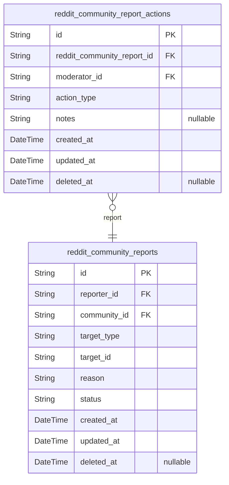

### `reddit_community_reports`

Main report entity tracking reported content, reporter, community scope,
and moderation status.

This table stores content reports submitted by users for moderation
review. Each report can be on a post or a comment (polymorphic
relationship), belongs to a specific community, and has a moderation
status workflow (pending → approved/dismissed).

Reports are community-scoped, meaning only moderators of the associated
community can view and act on them. When a report is approved, moderators
delete the reported content; when dismissed, the content remains.

The report_actions child table (reddit_community_report_actions) tracks
the audit trail of moderator actions on reports.

[reddit_community_members](#reddit_community_members) - reports are submitted by members
[reddit_community_communities](#reddit_community_communities) - reports belong to a specific
community
[reddit_community_post_texts](#reddit_community_post_texts) - reported posts (via
target_type="post")
[reddit_community_comments](#reddit_community_comments) - reported comments (via
target_type="comment")
[reddit_community_report_actions](#reddit_community_report_actions) - audit trail of moderator actions

Properties as follows:

- `id`: Primary Key.
- `reporter_id`: Member who submitted the report. [reddit_community_members.id](#reddit_community_members)
- `community_id`
  > Community where the reported content belongs. {@link
  > reddit_community_communities.id}
- `target_type`
  > Type of reported content: 'post' or 'comment'. Determines which target
  > table the target_id references.
- `target_id`
  > ID of the reported post or comment (depends on target_type). When
  > target_type='post', references a post; when target_type='comment',
  > references a comment.
- `reason`
  > Reason for the report provided by the reporter. Required when submitting
  > a report.
- `status`
  > Current status of the report: 'pending' (awaiting review), 'approved'
  > (content deleted by moderator), or 'dismissed' (content kept by
  > moderator).
- `created_at`: Timestamp when the report was created.
- `updated_at`: Timestamp when the report was last updated.
- `deleted_at`: Soft delete timestamp for report archival. Null means report is active.

### `reddit_community_report_actions`

Audit trail of moderator actions on reports in the community content
moderation workflow.

This table records when moderators approve (delete the reported content)
or dismiss (keep the reported content) each report. It serves as an
immutable audit log of moderation decisions, tracking which moderator
performed each action and when it occurred.

Key relationships:
- [reddit_community_reports](#reddit_community_reports): Each action is linked to a specific
report being moderated
- [reddit_community_moderators](#reddit_community_moderators): Each action is performed by a
moderator with authority over the community

Business context:
- Approve action: Moderator confirms report is valid, resulting in
content deletion
- Dismiss action: Moderator determines report is invalid, content remains
- Only one action per report is typical, but table supports multiple
actions for audit purposes
- Essential for moderation accountability and review

Properties as follows:

- `id`: Primary Key.
- `reddit_community_report_id`: The report being moderated. [reddit_community_reports.id](#reddit_community_reports)
- `moderator_id`
  > The moderator who performed this action. {@link
  > reddit_community_moderators.id}
- `action_type`
  > Type of moderation action: 'approve' (deletes content) or 'dismiss'
  > (keeps content)
- `notes`: Optional moderator notes explaining the action taken
- `created_at`: When this moderation action was performed
- `updated_at`: Last update timestamp for this action record
- `deleted_at`: Soft delete timestamp for audit trail

## Feeds

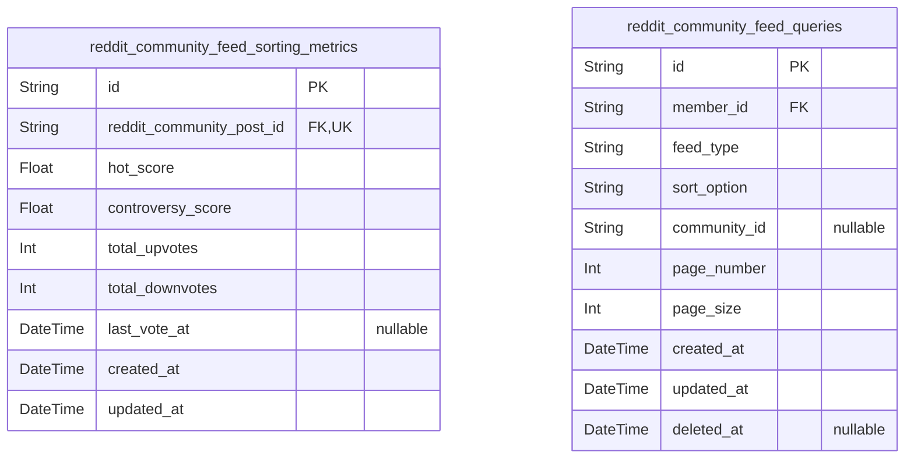

### `reddit_community_feed_sorting_metrics`

Pre-calculated metrics for sorting algorithms (hot and controversial)
applied to posts in feed displays.

Stores vote counts and computed scores that enable efficient feed sorting
without real-time vote aggregation:

- hot_score: Computed score combining vote score and recency factor for
"hot" feed sorting (recent posts with many upvotes appear first)
- controversy_score: Computed metric for controversial sorting (posts
with many votes but score close to zero)
- total_upvotes: Count of upvotes received by the post
- total_downvotes: Count of downvotes received by the post

This table is updated when votes occur to maintain pre-calculated values
for fast feed queries.

Properties as follows:

- `id`: Primary Key.
- `reddit_community_post_id`
  > Referenced post's [reddit_community_posts.id](#reddit_community_posts). One metric entry per
  > post.
- `hot_score`
  > Computed hot score combining vote score and recency factor for hot feed
  > sorting.
- `controversy_score`
  > Computed controversy score for controversial feed sorting (ratio of total
  > votes to score difference from zero).
- `total_upvotes`: Total count of upvotes received by the post.
- `total_downvotes`: Total count of downvotes received by the post.
- `last_vote_at`: Timestamp of the most recent vote on this post.
- `created_at`: Record creation timestamp.
- `updated_at`: Record update timestamp.

### `reddit_community_feed_queries`

Track feed query history for analytics and optimization purposes.

This subsidiary table records every feed query made by users across all
feed types (Home, Popular, Community) and sorting options (Hot, New, Top,
Controversial). Each record captures the pagination parameters (page
number, page size) used in the query.

The table enables:
- Query pattern analysis to optimize feed performance
- User behavior tracking for personalization
- Detection of unusual query patterns for abuse prevention
- Analytics on which feeds and sorting options are most popular

Referenced by the Feeds domain for performance monitoring and
optimization. The table is managed automatically by the feed system and
not directly accessed by users.

Properties as follows:

- `id`: Primary Key.
- `member_id`: Member who made the feed query. [reddit_community_members.id](#reddit_community_members)
- `feed_type`: Type of feed being queried (Home, Popular, Community)
- `sort_option`: Sorting option used for the feed query (Hot, New, Top, Controversial)
- `community_id`
  > Community ID for Community feed type queries, null for Home and Popular
  > feeds
- `page_number`: Page number requested in the pagination (1-indexed)
- `page_size`: Number of posts per page requested
- `created_at`: Timestamp when the feed query was made
- `updated_at`: Timestamp when the record was last updated
- `deleted_at`: Soft delete timestamp for analytics data lifecycle management

## Images

```mermaid
erDiagram
"reddit_community_files" {
  String id PK
  String original_name
  String file_name UK
  String(80000) file_path
  String mime_type
  Int file_size
  String file_type
  DateTime created_at
  DateTime updated_at
  DateTime deleted_at "nullable"
}
"reddit_community_file_thumbnails" {
  String id PK
  String reddit_community_file_id FK
  String(80000) thumbnail_url
  Int width
  Int height
  String format
  String variant
  DateTime created_at
  DateTime updated_at
  DateTime deleted_at "nullable"
}
"reddit_community_user_avatars" {
  String id PK
  String reddit_community_user_id FK,UK
  String file_id FK
  DateTime created_at
  DateTime updated_at
}
"reddit_community_community_icons" {
  String id PK
  String community_id FK,UK
  String file_id FK,UK
  DateTime created_at
  DateTime updated_at
  DateTime deleted_at "nullable"
}
"reddit_community_file_snapshots" {
  String id PK
  String reddit_community_file_id FK,UK
  DateTime snapshot_created_at
  DateTime created_at
  DateTime updated_at
}
"reddit_community_file_cdn_logs" {
  String id PK
  String reddit_community_file_id FK
  String cdn_node_identifier
  String cache_status
  Int http_status_code
  Int response_size_bytes
  Int cache_hit_bytes
  Int origin_fetch_bytes
  DateTime delivered_at
  String user_agent "nullable"
  String ip_address "nullable"
  String region "nullable"
  DateTime created_at
  DateTime updated_at
  DateTime deleted_at "nullable"
}
"reddit_community_file_access_logs" {
  String id PK
  String reddit_community_file_id FK
  String actor_id FK "nullable"
  String actor_type
  String access_type
  Int response_size
  Int response_time_ms
  Int status_code
  String referrer "nullable"
  String user_agent "nullable"
  String ip "nullable"
  DateTime created_at
  DateTime updated_at
  DateTime deleted_at "nullable"
}
"reddit_community_file_of_users" {
  String id PK
  String reddit_community_file_id FK,UK
  String reddit_community_member_id FK
  DateTime created_at
  DateTime updated_at
  DateTime deleted_at "nullable"
}
"reddit_community_file_of_posts" {
  String id PK
  String reddit_community_file_id FK,UK
  String reddit_community_post_id FK
  DateTime created_at
  DateTime updated_at
  DateTime deleted_at "nullable"
}
"reddit_community_file_of_communities" {
  String id PK
  String file_id FK,UK
  String reddit_community_community_id FK
  DateTime created_at
  DateTime updated_at
  DateTime deleted_at "nullable"
}
"reddit_community_file_thumbnails" }o--|| "reddit_community_files" : file
"reddit_community_user_avatars" }o--|| "reddit_community_files" : file
"reddit_community_community_icons" |o--|| "reddit_community_files" : file
"reddit_community_file_snapshots" |o--|| "reddit_community_files" : file
"reddit_community_file_cdn_logs" }o--|| "reddit_community_files" : file
"reddit_community_file_access_logs" }o--|| "reddit_community_files" : file
"reddit_community_file_of_users" |o--|| "reddit_community_files" : file
"reddit_community_file_of_posts" |o--|| "reddit_community_files" : file
"reddit_community_file_of_communities" |o--|| "reddit_community_files" : file
```

### `reddit_community_files`

Core image files with metadata for post images, avatars, and community
icons.

This table stores binary file content references and metadata for all
image assets in the Reddit-like community platform. Each file record
represents a unique uploaded image with its original filename, internal
storage path, MIME type, and file size.

File ownership is tracked through subtype relationships to user profiles
(avatars), posts (post images), and communities (icons). The file_type
discriminator distinguishes between these three categories.

Key relationships:
- [reddit_community_file_of_users.id](#reddit_community_file_of_users) - User avatar records
- [reddit_community_file_of_posts.id](#reddit_community_file_of_posts) - Post image records
- [reddit_community_file_of_communities.id](#reddit_community_file_of_communities) - Community icon records

Files support soft deletion through deleted_at field for audit trail and
garbage collection workflows.

Properties as follows:

- `id`: Primary Key.
- `original_name`
  > Original filename as provided by user during upload (e.g.,
  > "profile_photo.jpg").
- `file_name`
  > Internally generated unique filename for storage (e.g.,
  > "f8e7d6c5-b4a3-2e1f-0a9b-8c7d6e5f4a3b.jpg").
- `file_path`: Storage path or CDN URL where the file content is accessible.
- `mime_type`: MIME type of the file (e.g., "image/jpeg", "image/png").
- `file_size`: File size in bytes.
- `file_type`: Type discriminator: "user_avatar", "post_image", or "community_icon".
- `created_at`: Timestamp when the file was uploaded and created.
- `updated_at`: Timestamp when the file metadata was last updated.
- `deleted_at`: Timestamp when the file was soft-deleted. Null means active.

### `reddit_community_file_thumbnails`

Thumbnail versions of files generated for efficient list view rendering.
Stores optimized, smaller image variants that display faster in feeds and
post lists while preserving the original file for full-resolution
viewing.

This table supports the [reddit_community_files](#reddit_community_files) entity by
providing pre-generated thumbnail variants. Each thumbnail is linked to
its parent file and may include different size variants (e.g., small,
medium) to optimize bandwidth and rendering performance across different
UI contexts.

Thumbnail data includes the stored file URL, dimensions, and format
information. When a parent file is deleted or updated, thumbnails are
managed accordingly through the cascade operations defined in the parent
file's deletion policy.

Properties as follows:

- `id`: Primary Key.
- `reddit_community_file_id`
  > Parent file's [reddit_community_files.id](#reddit_community_files). References the original
  > file this thumbnail was generated from.
- `thumbnail_url`: URL path to the thumbnail image file stored in the file storage system.
- `width`: Width of the thumbnail in pixels.
- `height`: Height of the thumbnail in pixels.
- `format`: Image format of the thumbnail (e.g., 'jpg', 'png', 'webp').
- `variant`
  > Thumbnail variant identifier (e.g., 'small', 'medium', 'large') for
  > different display contexts.
- `created_at`: Timestamp when this thumbnail was created.
- `updated_at`: Timestamp when this thumbnail was last updated.
- `deleted_at`: Soft delete timestamp for cleanup workflows.

### `reddit_community_user_avatars`

User avatar images stored in the centralized file storage system.

Each user has exactly one avatar image, which is stored in the
reddit_community_files table. This table provides the relationship
between a user and their avatar file, enabling efficient lookups when
displaying user profiles. Avatars are managed through user profile
updates, not directly on this table.

Key relationships:
- [reddit_community_users](#reddit_community_users) — Each user has one avatar (1:1
relationship)
- [reddit_community_files](#reddit_community_files) — References the actual file record
storing the image data

Behavioral notes:
- Unique constraint on user_id ensures one avatar per user
- Avatar updates are handled via user profile operations, creating a new
file record
- Deleted avatars are handled by updating the user's avatar_id to null

Properties as follows:

- `id`: Primary Key.
- `reddit_community_user_id`: User's [reddit_community_users.id](#reddit_community_users)
- `file_id`: File's [reddit_community_files.id](#reddit_community_files) where the avatar image is stored
- `created_at`: When this avatar was first uploaded.
- `updated_at`: Last update timestamp for this avatar record.

### `reddit_community_community_icons`

Community icon images with reference to communities and the underlying
file storage.

This table stores the link between a community and its icon image file.
Each community has exactly one icon, which is stored as a file record in
the [reddit_community_files](#reddit_community_files) table. The icon serves as the visual
identity for the community in feed listings, community pages, and UI
elements.

Business relationships:
- One-to-one with [reddit_community_communities](#reddit_community_communities): Each community
has one icon, and each icon belongs to one community
- One-to-one with [reddit_community_files](#reddit_community_files): The actual file content
and metadata are stored in the files table, while this table manages the
business relationship

Properties as follows:

- `id`: Primary Key.
- `community_id`: Community whose icon this is. [reddit_community_communities.id](#reddit_community_communities)
- `file_id`
  > File storage record containing the actual icon image data. {@link
  > reddit_community_files.id}
- `created_at`: Creation timestamp of the icon record.
- `updated_at`: Last update timestamp of the icon record.
- `deleted_at`: Soft deletion timestamp (null if not deleted).

### `reddit_community_file_snapshots`

Audit snapshots of file records when owners update their images (user
avatars, community icons, post images).

This table captures point-in-time states of files for historical tracking
and audit purposes. Each time a file owner updates their image, a
snapshot is created to preserve the previous state.

Key relationships:
- References [reddit_community_files.id](#reddit_community_files) via foreign key
- Append-only table - snapshots are never modified or deleted
- Used for: rollback capability, audit trails, change history, file
comparison

Properties as follows:

- `id`: Primary Key.
- `reddit_community_file_id`
  > Original file's [reddit_community_files.id](#reddit_community_files) that this snapshot
  > represents.
- `snapshot_created_at`: Snapshot creation timestamp (when the update occurred).
- `created_at`: Record creation timestamp.
- `updated_at`: Record update timestamp.

### `reddit_community_file_cdn_logs`

CDN delivery tracking records for cached image content including user
avatars, community icons, and post images.

This table logs CDN cache delivery events for performance monitoring and
analytics. Each record represents a single CDN delivery attempt with
metadata about the cached content, delivery node, response status, and
cache hit/miss status.

Key relationships:
- [reddit_community_files](#reddit_community_files) - References the original file being
delivered via CDN

This is a supporting entity that enables CDN performance monitoring,
cache optimization analysis, and delivery analytics. Records are
append-only (rarely updated or deleted) to maintain a complete delivery
history for the CDN system.

Properties as follows:

- `id`: Primary Key.
- `reddit_community_file_id`: Original file's [reddit_community_files.id](#reddit_community_files).
- `cdn_node_identifier`: CDN node identifier that served this delivery request.
- `cache_status`
  > CDN cache status: HIT (served from cache), MISS (fetched from origin),
  > EXPIRED (expired and refetched).
- `http_status_code`: HTTP response status code (e.g., 200 for success, 404 for not found).
- `response_size_bytes`: Response payload size in bytes.
- `cache_hit_bytes`: Bytes served from CDN cache (0 on cache miss).
- `origin_fetch_bytes`: Bytes fetched from origin server (0 on cache hit).
- `delivered_at`: Timestamp when the CDN delivery was completed.
- `user_agent`: User agent string of the client that requested the delivery.
- `ip_address`: Client IP address that requested the delivery.
- `region`: Geographic region of the delivery request.
- `created_at`: Record creation timestamp.
- `updated_at`: Record last update timestamp.
- `deleted_at`: Record soft deletion timestamp (nullable for soft delete).

### `reddit_community_file_access_logs`

File access analytics tracking for performance monitoring and CDN
optimization.

Records every access to files in the system (post images, user avatars,
community icons) including response metrics and client information. Used
for:

- Performance analysis: track response_time_ms and response_size for CDN
optimization
- Access patterns: identify frequently accessed files and popular content
- Analytics: filter by time range, file ID, actor type, access type
- Debugging: log status codes and client information

Referenced by the Images component for file storage monitoring. Not
independently managed by users—access logs are generated automatically
when files are served.

Related entities:
- [reddit_community_files](#reddit_community_files) - The file that was accessed
- [reddit_community_members](#reddit_community_members) - Member actors who accessed the file
(when actor_type is 'member')
- [reddit_community_guest_sessions](#reddit_community_guest_sessions) - Guest actor sessions who
accessed the file (when actor_type is 'guest')

Properties as follows:

- `id`: Primary Key.
- `reddit_community_file_id`: File that was accessed. Target model's [reddit_community_files.id](#reddit_community_files)
- `actor_id`
  > Actor who accessed the file. When actor_type is 'member' references
  > [reddit_community_members.id](#reddit_community_members). When actor_type is 'guest'
  > references [reddit_community_guest_sessions.id](#reddit_community_guest_sessions)
- `actor_type`
  > Type of actor who accessed the file: 'member' or 'guest'. Determines
  > which actor table the actor_id references.
- `access_type`
  > Type of file access: 'download' (full file), 'view' (inline display),
  > 'thumbnail' (thumbnail version). Used to distinguish CDN caching
  > strategies.
- `response_size`
  > Size of response in bytes served to the client. Used for bandwidth and
  > storage analytics.
- `response_time_ms`
  > Time taken to serve the file in milliseconds. Used for performance
  > monitoring and CDN optimization.
- `status_code`
  > HTTP status code of the response (e.g., 200 for success, 304 for not
  > modified, 404 for not found).
- `referrer`
  > Referrer URL from the client request. Used to track traffic sources and
  > landing pages.
- `user_agent`
  > Client browser/user agent string. Used for analytics and compatibility
  > analysis.
- `ip`
  > Client IP address (anonymized or partial). Used for access pattern
  > analysis and security monitoring.
- `created_at`: Timestamp when the file access was recorded.
- `updated_at`: Timestamp when this access log record was last updated.
- `deleted_at`: Soft delete timestamp for compliance with data retention policies.

### `reddit_community_file_of_users`

Subtype table for user avatar files that establishes a 1:1 relationship
with the reddit_community_files table and tracks the owning member
account.

This table serves as a subtype in the polymorphic file ownership pattern,
specifically for avatar images. Each record represents a file that is
exclusively used as a user's avatar profile image.

The table enforces a 1:1 relationship with the reddit_community_files
table via a unique constraint on file_id, ensuring each file can only be
an avatar for one user. It references the reddit_community_members table
to identify the user account that owns this avatar.

This is a subsidiary entity that is managed through the parent file
entity and does not require independent API endpoints. It provides
context for avatar-specific operations and queries.

Properties as follows:

- `id`: Primary Key.
- `reddit_community_file_id`: The user avatar file's [reddit_community_files.id](#reddit_community_files).
- `reddit_community_member_id`: The owning member's [reddit_community_members.id](#reddit_community_members).
- `created_at`: Timestamp when the user avatar file relationship was created.
- `updated_at`: Timestamp when the user avatar file relationship was last updated.
- `deleted_at`
  > Timestamp when the user avatar file relationship was soft-deleted
  > (nullable).

### `reddit_community_file_of_posts`

Subtype table for post image files, establishing 1:1 relationship with
reddit_community_files table and tracking the owning post.

This table implements the polymorphic ownership pattern for post images,
separating the file metadata (stored in reddit_community_files) from the
business context (post reference). Each post image file has exactly one
owning post, and the unique constraint on reddit_community_file_id
ensures a strict 1:1 relationship.

Used exclusively for post image attachments. User avatars use
reddit_community_file_of_users, and community icons use
reddit_community_file_of_communities.

Related entities:
- Parent: [reddit_community_files](#reddit_community_files) - stores actual file metadata
- Owner: [reddit_community_posts](#reddit_community_posts) - the post that owns this image

Properties as follows:

- `id`: Primary Key.
- `reddit_community_file_id`
  > Post image file's [reddit_community_files.id](#reddit_community_files). Unique constraint
  > enforces 1:1 relationship between files and posts.
- `reddit_community_post_id`
  > Owning post's [reddit_community_posts.id](#reddit_community_posts). Many post images can
  > reference the same post.
- `created_at`: Record creation timestamp.
- `updated_at`: Record last update timestamp.
- `deleted_at`: Soft deletion timestamp for audit trail.

### `reddit_community_file_of_communities`

Subtype table for community icon files that tracks which community each
icon file belongs to.

Establishes a 1:1 relationship with the [reddit_community_files](#reddit_community_files)
table while providing a direct reference to the owning {@link
reddit_community_communities} entity. This table implements the
polymorphic ownership pattern to avoid nullable foreign keys, ensuring
each file record has exactly one community owner.

Used for: Community icon management, file ownership tracking, and
enforcing that each file belongs to a single community. Always managed
through community entities or file updates.

Properties as follows:

- `id`: Primary Key.
- `file_id`
  > Associated file's [reddit_community_files.id](#reddit_community_files). References the core
  > file record containing metadata about the community icon.
- `reddit_community_community_id`
  > Owning community's [reddit_community_communities.id](#reddit_community_communities). Identifies
  > which community this icon file belongs to.
- `created_at`: Record creation timestamp.
- `updated_at`: Record last update timestamp.
- `deleted_at`: Soft delete timestamp (NULL means active).

## Systematic

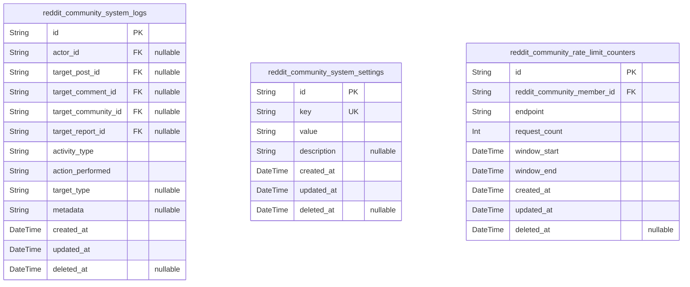

### `reddit_community_system_logs`

Audit logs tracking system-wide activities for investigation, compliance,
and debugging purposes.

Records all significant operations across the platform including user
account activities, post operations (creation, editing, deletion),
comment activities, voting actions, community management, moderation
actions, and report handling. Each log entry captures the actor who
performed the action, the target entity affected (posts, comments,
communities, or reports), the specific operation performed, and
contextual metadata.

Referenced by administrative tools and compliance dashboards. Logs are
append-only immutable records that support temporal queries and
actor-based investigation workflows.

Properties as follows:

- `id`: Primary Key.
- `actor_id`
  > Actor who performed the action [reddit_community_members.id](#reddit_community_members). Can
  > be a member account or guest session.
- `target_post_id`
  > Target post affected by the action [reddit_community_posts.id](#reddit_community_posts).
  > Null if action not related to a post.
- `target_comment_id`
  > Target comment affected by the action {@link
  > reddit_community_comments.id}. Null if action not related to a comment.
- `target_community_id`
  > Target community affected by the action {@link
  > reddit_community_communities.id}. Null if action not related to a
  > community.
- `target_report_id`
  > Target report affected by the action [reddit_community_reports.id](#reddit_community_reports).
  > Null if action not related to a report.
- `activity_type`
  > Category of activity: account_signup, account_login, account_delete,
  > post_create, post_edit, post_delete, comment_create, comment_edit,
  > comment_delete, vote_upvote, vote_downvote, vote_remove,
  > community_create, community_edit, moderator_add, moderator_remove,
  > ban_add, ban_remove, report_create, report_approve, report_dismiss
- `action_performed`: Specific action performed within the activity type category
- `target_type`
  > Type of target entity: member, post, comment, community, report, or null
  > for system-wide actions
- `metadata`
  > JSON string containing additional context such as before/after values,
  > error messages, IP addresses, or other relevant audit details
- `created_at`: Timestamp when the log entry was created
- `updated_at`: Timestamp when the log entry was last updated
- `deleted_at`: Timestamp when the log entry was soft deleted (if applicable)

### `reddit_community_system_settings`

Global system configuration key-value pairs for platform-wide settings
not tied to specific business entities. This table stores system-level
configuration parameters such as feature flags, rate limit thresholds,
platform-wide defaults, and administrative settings. Each configuration
item has a unique key for lookup and a string value for the setting.
Managed by system administrators through dedicated configuration
endpoints.

Key usage scenarios:
- Feature flag toggles for gradual rollouts
- Platform-wide limits (max posts per day, max comments per hour)
- Default sorting preferences
- Moderation thresholds and rules
- System maintenance windows

Properties as follows:

- `id`: Primary Key.
- `key`
  > Unique configuration key identifier for the setting. Used to lookup and
  > retrieve configuration values. Must be unique across all records.
- `value`
  > Configuration value as a string. Can store plain values, JSON strings, or
  > comma-separated lists depending on the configuration type.
- `description`
  > Optional human-readable description of what this configuration setting
  > controls. Helps administrators understand the purpose of the setting.
- `created_at`: Timestamp when this configuration record was created.
- `updated_at`: Timestamp when this configuration record was last updated.
- `deleted_at`
  > Timestamp when this configuration record was soft-deleted (for audit
  > trail). Null if still active.

### `reddit_community_rate_limit_counters`

Rate limiting counters tracking API request counts per user and endpoint
for throttling protection.

This table supports the system-wide rate limiting mechanism that protects
API endpoints from abuse and ensures fair usage across all members. Each
record tracks how many requests a specific user has made to a specific
endpoint within a configurable time window.

Key relationships:
- Belongs to a [reddit_community_members](#reddit_community_members) user who made the requests
- Tracks rate limit state per endpoint (e.g., /api/posts, /api/comments,
/api/votes)

Usage patterns:
- Created when a user first hits a rate-limited endpoint
- Updated (request_count incremented) on each subsequent request within
the same window
- Checked by API middleware before allowing request processing
- Automatically cleaned up when window expires

Properties as follows:

- `id`: Primary Key.
- `reddit_community_member_id`: Member's [reddit_community_members.id](#reddit_community_members) who made the API requests.
- `endpoint`
  > API endpoint path being rate-limited (e.g., /api/posts, /api/comments,
  > /api/votes). Used for efficient endpoint-based queries.
- `request_count`
  > Number of requests made within the current rate limit window. Incremented
  > on each request and reset when window expires.
- `window_start`
  > Start time of the current rate limit window. Requests within
  > [window_start, window_end] are counted toward request_count.
- `window_end`
  > End time of the current rate limit window. When current time >=
  > window_end, counter resets and new window begins.
- `created_at`: Timestamp when this rate limit counter was first created.
- `updated_at`
  > Timestamp when this rate limit counter was last updated (request_count
  > incremented).
- `deleted_at`: Soft delete timestamp for audit trail and cleanup purposes.

## Users

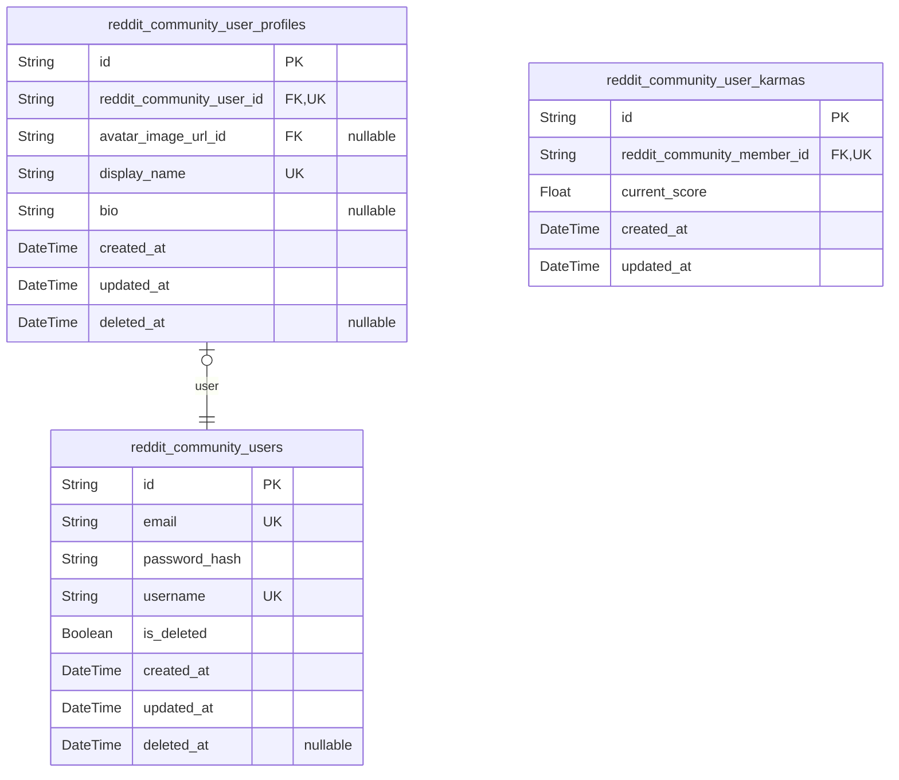

### `reddit_community_user_profiles`

User profile information including display name, bio, and avatar image URL.

This table stores the display attributes for users that are separate from
authentication credentials. Each user has exactly one profile containing
their display name (unique across the platform), optional bio text, and
avatar image reference. Users can independently manage their own profile
information.

**Key relationships**:
- Belongs to a [reddit_community_users](#reddit_community_users) account - the core
authentication user
- References a [reddit_community_user_avatars](#reddit_community_user_avatars) file - the current
avatar image
- Referenced by [reddit_community_user_karmas](#reddit_community_user_karmas) - for user
identification

**Business rules**:
- Display name must be unique across all users
- Bio is optional (can be empty or null)
- Avatar can be updated independently of other profile fields
- Profile supports soft delete for account deletion workflows

Properties as follows:

- `id`: Primary Key.
- `reddit_community_user_id`: Belonged user account's [reddit_community_users.id](#reddit_community_users).
- `avatar_image_url_id`: Referenced avatar file's [reddit_community_user_avatars.id](#reddit_community_user_avatars).
- `display_name`
  > User's display name visible to others. Must be unique across all users.
  > Used in post comments, and profile pages.
- `bio`
  > Optional user biography text. Can be empty or null. Used to provide
  > additional context about the user on their profile page.
- `created_at`: Timestamp when this profile was created.
- `updated_at`: Timestamp when this profile was last updated.
- `deleted_at`
  > Timestamp when this profile was soft deleted. Null if the profile is
  > still active.

### `reddit_community_user_karmas`

Karma score tracking for each user (positive or negative based on votes
received).

Stores the current karma score that users see on their profile page and
in leaderboards. The score is updated in real-time based on votes
received on posts and comments (upvote = +1, downvote = -1).

**Key Relationships**:
- 1:1 relationship with [reddit_community_members](#reddit_community_members) - each member
has exactly one karma record
- References [reddit_community_karma_snapshots](#reddit_community_karma_snapshots) for historical
audit trail of karma changes

**Business Rules**:
- Score can be negative (when user receives more downvotes than upvotes)
- Score starts at 0 when account is created
- Updated whenever a vote on user's content changes
- Used for display on user profile and in community member lists

Properties as follows:

- `id`: Primary Key.
- `reddit_community_member_id`
  > Member's [reddit_community_members.id](#reddit_community_members). 1:1 relationship - each
  > member has exactly one karma record.
- `current_score`
  > Current karma score for the user. Can be positive (more upvotes) or
  > negative (more downvotes). Starts at 0 when account is created.
- `created_at`: Timestamp when this karma record was created.
- `updated_at`: Timestamp when this karma record was last updated.

### `reddit_community_users`

Core user account table storing member identity and authentication
credentials.

This table serves as the primary identity record for member actors in the
Reddit-like community platform. It contains the canonical user account
information including email address, password hash, and unique username
that identify each member.

Key relationships:
- [reddit_community_members](#reddit_community_members) - Registration tracking and
authentication metadata (no direct FK from users)
- [reddit_community_user_profiles](#reddit_community_user_profiles) - One-to-one relationship
storing display attributes (display_name, bio, avatar)
- [reddit_community_user_karmas](#reddit_community_user_karmas) - One-to-one relationship tracking
current karma score
- [reddit_community_posts](#reddit_community_posts) - One-to-many relationship as post author
- [reddit_community_comments](#reddit_community_comments) - One-to-many relationship as comment
author
- [reddit_community_votes](#reddit_community_votes) - One-to-many relationship as voter
- [reddit_community_reports](#reddit_community_reports) - One-to-many relationship as report
creator

Account lifecycle: Users are created via registration (email/password),
can change password via reset workflow, and can delete their account
(soft delete). Deleted accounts preserve username uniqueness to prevent
re-registration while making account content visible as "deleted user".

Properties as follows:

- `id`: Primary Key.
- `email`
  > User's email address used for login and account identification. Must be
  > unique across all accounts.
- `password_hash`: BCrypt hashed password for authentication. Never stored in plaintext.
- `username`
  > Unique display username chosen during registration. Cannot be changed
  > after creation. Used throughout the platform for user identification.
- `is_deleted`
  > Soft delete flag. When true, account is deleted but record preserved for
  > audit trail. Deleted accounts show as 'deleted user' in posts/comments.
- `created_at`: Timestamp when user account was created via registration.
- `updated_at`
  > Timestamp of last account update (password change, username change if
  > allowed).
- `deleted_at`
  > Timestamp when account was deleted (soft delete). Null if account is
  > active.

## default

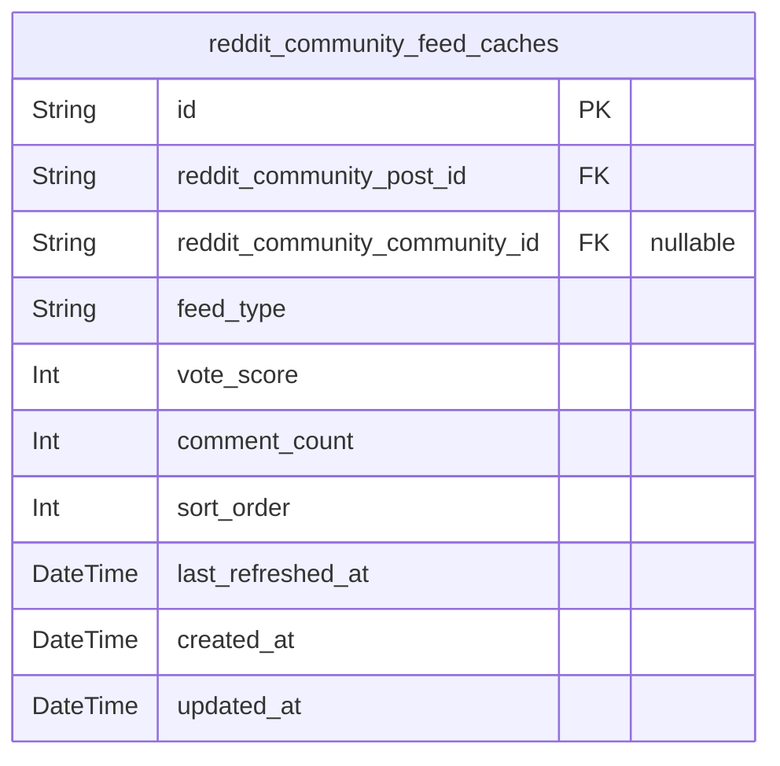

### `reddit_community_feed_caches`

Materialized view for feed performance optimization.

Stores pre-computed post listings for three feed types: home feed
(subscribed communities only), popular feed (all communities), and
community feed (single community). Each cache entry represents a post in
a specific feed context with pre-calculated sort order and metrics.

This is a read-only denormalized table used for fast paginated browsing.
Cache entries are regenerated periodically or on content changes. The
table uses materialized view pattern with @material directive for
PostgreSQL.

Referenced entities:
- [reddit_community_posts](#reddit_community_posts) - Source of post data
- [reddit_community_members](#reddit_community_members) - Author reference
- [reddit_community_communities](#reddit_community_communities) - Community reference for feed
context

Properties as follows:

- `id`: Primary Key.
- `reddit_community_post_id`
  > Source post's [reddit_community_posts.id](#reddit_community_posts). References the post
  > included in the cache.
- `reddit_community_community_id`
  > When feed_type is 'home': the [reddit_community_communities.id](#reddit_community_communities) for
  > the subscribed community. NULL for popular and community feeds.
- `feed_type`
  > Feed type discriminator: 'home' (subscribed communities only), 'popular'
  > (all communities), or 'community' (single community).
- `vote_score`: Pre-calculated vote score (upvotes - downvotes) for sorting.
- `comment_count`: Total comment count on the post for display in feed list.
- `sort_order`
  > Sort order value for pagination. For 'hot' feed: computed from recent
  > activity and votes. For 'new': post created_at. For 'top': aggregated
  > score over time period. For 'controversial': variance-based metric.
- `last_refreshed_at`
  > Timestamp when this cache entry was last refreshed. Used for cache
  > invalidation.
- `created_at`: Cache entry creation timestamp.
- `updated_at`
  > Cache entry update timestamp (always same as created_at for materialized
  > views).
