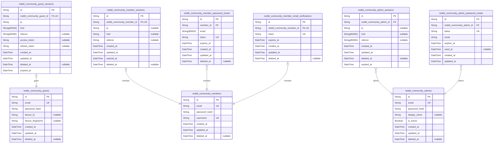
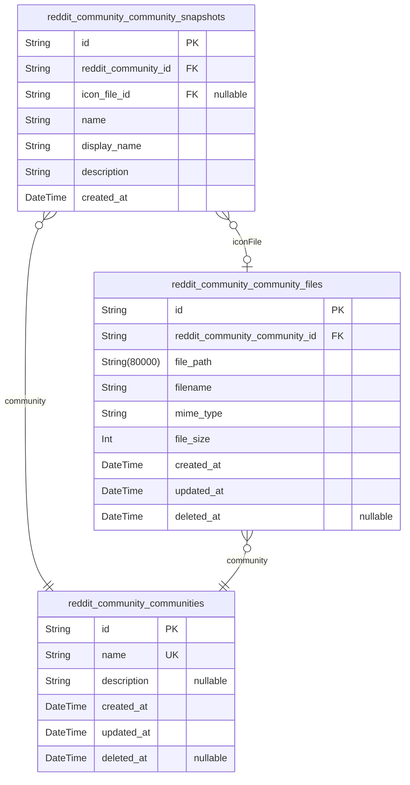
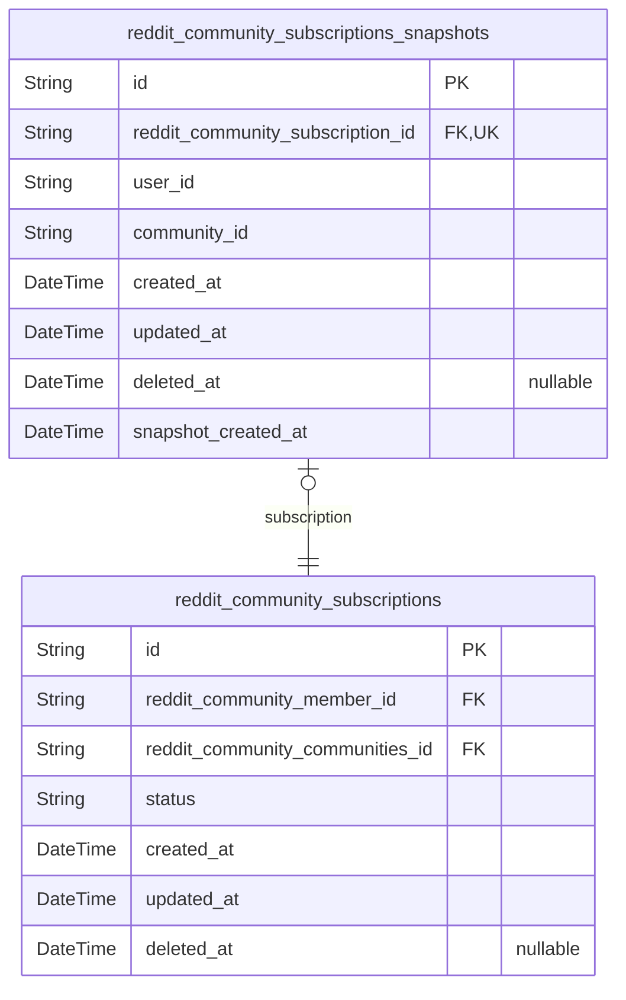
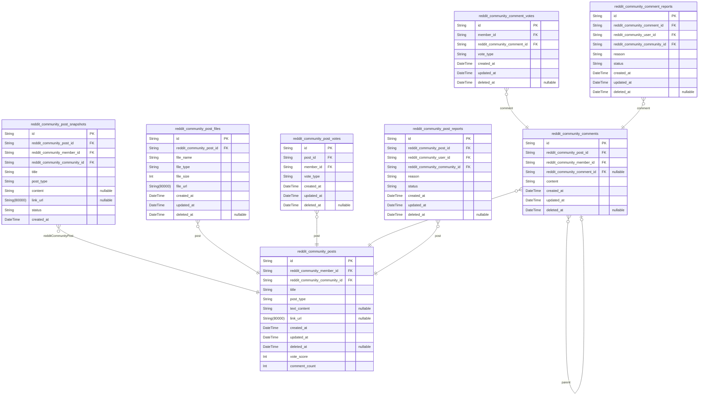
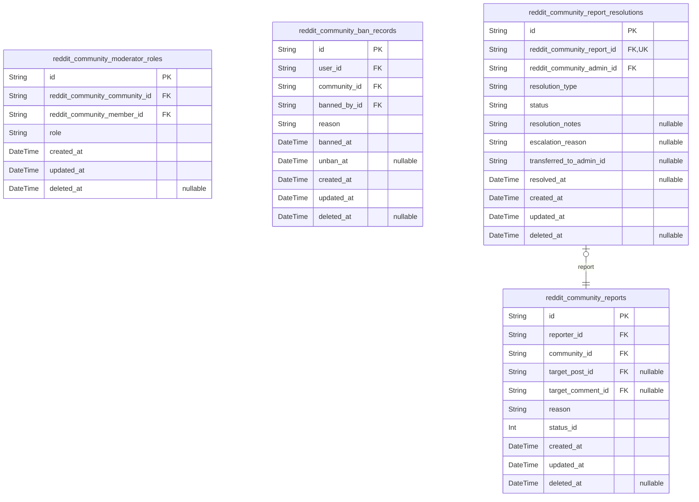

# Prisma Markdown

> Generated by [`prisma-markdown`](https://github.com/samchon/prisma-markdown)

- [reddit_community_auth](#reddit_community_auth)
- [reddit_community_communities](#reddit_community_communities)
- [reddit_community_subscriptions](#reddit_community_subscriptions)
- [reddit_community_posts](#reddit_community_posts)
- [reddit_community_moderation](#reddit_community_moderation)

## reddit_community_auth

### `reddit_community_guests`

Temporary guest accounts identified by device for anonymous browsing.

This table stores anonymous guest user accounts that enable
unauthenticated visitors to browse public content, create temporary
accounts, and participate in limited interactions. Each guest is uniquely
identified by device fingerprint and browser characteristics.

## Authentication Fields
Guest accounts use device-based authentication with email and password
for session management. This enables temporary identity tracking across
visits while maintaining anonymity.

## Device Identification
Device identifiers and fingerprints are stored to detect returning
visitors and prevent duplicate guest accounts from the same device. This
helps maintain consistent anonymous sessions.

## Soft Delete Support
The deleted_at field enables soft deletion, allowing guest accounts to be
logically removed while preserving audit trails and session history.

## Session Management
Guests manage active sessions through the {@link
reddit_community_guest_sessions} table, which links to this actor table
for token validation and session tracking.

Properties as follows:

- `id`: Primary Key.
- `email`
  > Unique email address for guest account identification.
  >
  > Used as the primary identifier for guest accounts, allowing the system to
  > track anonymous users across sessions. Each guest must have a unique
  > email address within the system.
- `password_hash`
  > BCrypt hash of the guest account password.
  >
  > Password is hashed using BCrypt algorithm before storage. Never stored in
  > plaintext. Used for authentication during guest login and password
  > verification.
- `device_id`
  > Device identifier for guest identity tracking.
  >
  > A unique identifier generated from device characteristics (user agent,
  > screen resolution, canvas fingerprint, etc.). Used to detect returning
  > visitors and maintain consistent anonymous sessions across visits.
- `device_fingerprint`
  > Browser fingerprint for device recognition.
  >
  > Combined fingerprint derived from multiple browser and device properties
  > including user agent, timezone, language, screen dimensions, and
  > installed plugins. Used to identify and track anonymous users.
- `created_at`
  > Timestamp of guest account creation.
  >
  > Recorded when the guest account is first created in the system. Used for
  > auditing, session lifetime calculation, and account age tracking.
- `updated_at`
  > Timestamp of last guest account update.
  >
  > Updated whenever the guest account is modified (password change, device
  > fingerprint update, etc.). Used to track account activity and freshness.
- `deleted_at`
  > Timestamp of soft deletion.
  >
  > Nullable field set when the guest account is logically deleted. Accounts
  > with a deleted_at value are considered removed but retained for audit
  > purposes.

### `reddit_community_guest_sessions`

Stores temporary session tokens for guest access management with security
audit metadata.

This session table belongs to the guest actor and tracks anonymous
browsing sessions identified by device fingerprint. Each session records
the guest's access context including IP address, page URL, and referrer
for security auditing and abuse prevention.

Properties as follows:

- `id`: Primary Key.
- `reddit_community_guest_id`
  > References the guest account that owns this session.
  >
  > Establishes a 1:1 relationship with @link{reddit_community_guests}. Each
  > session can only belong to one guest, and the relationship is enforced by
  > a unique constraint on this foreign key field.
- `ip`
  > IP address of the device that created the session.
  >
  > Used for security auditing and abuse detection. Stored as a string to
  > accommodate both IPv4 and IPv6 formats.
- `href`
  > The URL that was accessed when the session was created.
  >
  > Captures the entry point for session tracking and analytics purposes.
- `referrer`
  > The referrer URL that directed the user to the application.
  >
  > Useful for tracking traffic sources and understanding user acquisition
  > paths.
- `access_token`
  > JWT access token for authenticated guest API requests.
  >
  > Used for validating session authenticity in API calls. Regenerated on
  > each access.
- `refresh_token`
  > JWT refresh token for extending session lifetime.
  >
  > Used to obtain new access tokens without requiring re-authentication.
  > Stored hashed for security.
- `created_at`
  > Timestamp when the session was created.
  >
  > Marks the beginning of the session lifecycle and is used for session age
  > calculations.
- `updated_at`
  > Timestamp when the session record was last updated.
  >
  > Tracks when session metadata was modified, useful for audit trails.
- `deleted_at`
  > Timestamp when the session was soft-deleted.
  >
  > Nullable indicator for active sessions; populated when the session is
  > deleted.
- `expired_at`
  > Timestamp when the session expires and becomes invalid.
  >
  > Sessions are time-limited for security; expired sessions cannot be used
  > for authentication.

### `reddit_community_members`

Registered member accounts with email and password credentials for
authentication.

Stores member identity and authentication information. Each member has a
unique username and email address, with password hash stored securely for
login verification. Members can create posts, comments, votes, manage
communities, and interact with the platform.

The email address serves as the primary login credential and must be
valid. The username is the member's chosen display name that must be
unique across all users. Password is stored as a hash (never plaintext)
for secure authentication.

Child tables handle session tokens, password reset, and email
verification for member account lifecycle.

Properties as follows:

- `id`: Primary Key.
- `email`
  > Member's email address used for authentication.
  >
  > Must be a valid email format and unique across all users. Used as the
  > primary login credential along with password.
- `password_hash`
  > Hashed password for secure authentication.
  >
  > Stored using a secure hashing algorithm (e.g., bcrypt). Never stored in
  > plaintext. Updated when member changes password.
- `username`
  > Member's chosen display name that uniquely identifies them.
  >
  > Must be unique across all users in the system. Can be used for profile
  > display and mentions. Cannot be duplicated.
- `created_at`: Timestamp when the member account was created.
- `updated_at`: Timestamp when the member account was last updated.
- `deleted_at`
  > Timestamp when the member account was soft-deleted.
  >
  > Null if the account is active. Used for soft deletion to preserve data
  > integrity while allowing account deletion.

### `reddit_community_member_sessions`

Tracks member login sessions with JWT access and refresh tokens.

This table stores session tokens used for authentication and
authorization in the system. Each member can have multiple sessions
across different devices or browsers, with support for access token and
refresh token pairs.

The session records enable secure user authentication by tracking session
lifecycle including creation time, expiration, and last known activity
location. Sessions are soft-deletable to maintain audit trails while
allowing cleanup of expired tokens.

Properties as follows:

- `id`: Primary key for the session record.
- `reddit_community_member_id`
  > Reference to the member who owns this session.
  >
  > Establishes a 1:1 relationship where each member session belongs to
  > exactly one member account. Used for token validation and session
  > management.
- `ip`
  > IP address of the client when the session was created.
  >
  > Used for security monitoring and detecting suspicious session activity
  > from unusual locations.
- `href`
  > Last known URL accessed by the member during this session.
  >
  > Helps track session activity and can be used for audit purposes.
- `referrer`
  > HTTP referrer header value from the request that created the session.
  >
  > Provides context about how the member arrived at the application.
- `created_at`
  > Timestamp when the session was created and the member logged in.
  >
  > Used for calculating session age and determining validity.
- `updated_at`
  > Timestamp when the session was last updated with activity.
  >
  > Refreshed on each authenticated request to track session freshness.
- `expired_at`
  > Timestamp when this session expires and becomes invalid.
  >
  > Not NULL by default for security - sessions must have explicit
  > expiration. Used for automatic cleanup of stale sessions.
- `deleted_at`
  > Soft delete timestamp for session cleanup.
  >
  > Nullable field allowing sessions to be logically deleted while preserving
  > audit trail.

### `reddit_community_member_password_resets`

Password reset tokens with expiration for member account recovery.

Stores one-time-use reset tokens sent to member email addresses for
password recovery. Each token is uniquely generated, time-limited, and
invalidated after successful use or expiration.

Properties as follows:

- `id`: Primary Key.
- `member_id`
  > References the member requesting the password reset.
  >
  > Links this password reset token to the member account for which the reset
  > is requested. Used to validate ownership and send recovery emails to the
  > correct address.
- `email`
  > Email address at time of password reset request.
  >
  > Backup email captured during token generation for validation and audit
  > purposes. Ensures the reset was requested for the correct address even if
  > member email changes later.
- `token`
  > Secure, randomly generated password reset token.
  >
  > One-time-use credential sent via email to the member. Must be unique
  > across all tokens and invalidated after use or expiration. Generated
  > using cryptographically secure random values.
- `expires_at`
  > Timestamp when this password reset token expires.
  >
  > Tokens are time-limited for security reasons. Once expired, the token
  > cannot be used for password reset. Typical expiration is 1 hour from
  > creation.
- `created_at`
  > Timestamp when this password reset token was created.
  >
  > Used for audit trails and debugging reset token lifecycle.
- `updated_at`
  > Timestamp of the last update to this record.
  >
  > Maintained for audit purposes and cleanup jobs.
- `deleted_at`
  > Timestamp when this record was soft-deleted.
  >
  > Nullable for soft-delete support. Null means active.

### `reddit_community_member_email_verifications`

Email verification tokens for member registration confirmation.

Stores temporary verification tokens generated when members register,
used to verify email ownership before account activation.

Properties as follows:

- `id`: Primary Key.
- `reddit_community_member_id`
  > References the member account this verification token belongs to.
  >
  > Establishes a 1:1 relationship with a single {@link
  > reddit_community_members} record.
- `token`
  > Unique verification token string for email confirmation.
  >
  > Generated during registration, validated when member clicks verification
  > link. Tokens are single-use and invalidated after successful
  > verification.
- `expires_at`
  > Timestamp when the verification token expires.
  >
  > Tokens older than this time are considered invalid and cannot be used for
  > verification.
- `created_at`
  > Record creation timestamp.
  >
  > When the verification token was generated.
- `updated_at`
  > Record last update timestamp.
  >
  > When the record was last modified.
- `deleted_at`
  > Record soft delete timestamp.
  >
  > Nullable indicates the record is active; non-null indicates soft-deleted.

### `reddit_community_admins`

Administrator accounts with elevated system privileges and authentication
credentials.

This table stores administrator user identities, authentication
credentials, and status information. Admin accounts have system-wide
management permissions beyond regular member access.

## Identity and Authentication

Admin accounts use email-based authentication with hashed passwords
stored securely. The display_name provides a human-readable identifier
for admin actions and audit logs.

## Account Management

Admin accounts support soft delete via the deleted_at field, allowing
administrators to deactivate accounts while preserving historical data
for audit purposes. Active status is tracked separately from deletion for
operational flexibility.

## Temporal Tracking

Created and updated timestamps record the account lifecycle. Deletion
timestamps indicate soft-deleted accounts, enabling recovery if needed
and preserving audit trail integrity.

Properties as follows:

- `id`: Primary Key.
- `email`
  > Unique email address used for administrator authentication and account
  > identification.
- `password_hash`
  > Hashed password string for administrator authentication. Must be securely
  > hashed using industry-standard algorithms.
- `display_name`
  > Human-readable display name for the administrator. Used in audit logs and
  > public-facing administrator actions.
- `is_active`
  > Indicates whether the administrator account is currently active and can
  > authenticate.
- `created_at`: Timestamp when the administrator account was created.
- `updated_at`: Timestamp when the administrator account was last updated.
- `deleted_at`
  > Timestamp when the administrator account was soft-deleted. Null if the
  > account is active.

### `reddit_community_admin_sessions`

JWT session tokens with access and refresh support for administrators.

This table tracks active login sessions for admin accounts, storing token
metadata including IP address, last visited page, referrer, and
expiration timestamps. Each session enables JWT authentication and can be
revoked for security purposes.

Properties as follows:

- `id`: Primary Key.
- `reddit_community_admin_id`
  > References the admin account that owns this session.
  >
  > Enables lookup of all active sessions for an admin and supports session
  > revocation at the admin level. Only one admin per session (1:N from admin
  > to sessions).
- `ip`
  > IP address of the client that created this session.
  >
  > Used for security auditing and detecting suspicious login activity from
  > unexpected locations.
- `href`
  > The last page URL visited by the admin during this session.
  >
  > Helps track admin activity and restore session state if needed.
- `referrer`
  > The referrer URL that led to the login page.
  >
  > Useful for analytics and understanding how admins access the system.
- `created_at`
  > Timestamp when this session was created.
  >
  > Marks the session start time for expiration calculation and activity
  > monitoring.
- `updated_at`
  > Timestamp of the last session activity update.
  >
  > Used for session timeout logic and detecting inactive sessions.
- `deleted_at`
  > Timestamp when this session was soft-deleted.
  >
  > Nullable - null means session is active. Non-null indicates revoked or
  > expired session.
- `expired_at`
  > Expiration timestamp for this session.
  >
  > Determines when the JWT token becomes invalid. NOT NULL to enforce
  > session TTL policy.

### `reddit_community_admin_password_resets`

Password reset tokens with expiration for administrator account recovery.

Append-only audit trail for password reset requests, ensuring each token
is single-use and expires securely.

Properties as follows:

- `id`: Primary Key.
- `reddit_community_admin_id`
  > References the administrator requesting password reset.
  >
  > Establishes 1:N relationship where one admin can have multiple password
  > reset tokens over time. Each token is associated with exactly one admin
  > for accountability and audit purposes.
- `token`
  > Unique cryptographic token for password reset.
  >
  > Single-use token that becomes invalid after use. Generated securely when
  > password reset is requested and validated during the reset process.
- `email`
  > Email address of the administrator for password reset notification.
  >
  > Copied from admin profile at time of reset request. Used to verify user
  > identity and send reset instructions.
- `expires_at`
  > Expiration datetime for the reset token.
  >
  > Tokens expire for security reasons and cannot be used after this time.
  > Prevents indefinite token validity and reduces replay attack risk.
- `used_at`
  > Timestamp when the token was used for password reset.
  >
  > Null if token has not been used. Set to current time when token is
  > consumed, marking it as single-use and preventing reuse.
- `created_at`
  > Token creation timestamp.
  >
  > Used for tracking token age, debugging, and audit trail.
- `updated_at`
  > Last update timestamp.
  >
  > Maintained for consistency with other entities, though tokens are
  > typically append-only.

## reddit_community_communities

### `reddit_community_communities`

Core community entity representing a subreddit-like space where members
create posts, engage in discussions, and interact through votes and
comments.

## Identity and Metadata

Each community has a unique name (used as the identifier in URLs), an
optional description that explains the community's purpose.

## Governance

Communities are created by users and can have moderators appointed by the
owner or existing moderators. Only subscribed members can create posts
within a community.

## Lifecycle

Communities are soft-deleted (deleted_at) to preserve referential
integrity with posts, subscriptions, moderator roles, and bans.

Properties as follows:

- `id`: Primary Key.
- `name`
  > Unique community name used in URLs and as the primary identifier.
  >
  > Must be unique across all communities and follow naming rules
  > (alphanumeric, hyphens, underscores). The name is case-insensitive and
  > cannot be empty.
- `description`
  > Optional text description that explains the community's purpose, rules,
  > and topics.
- `created_at`: Timestamp when the community was created.
- `updated_at`: Timestamp when the community was last updated (metadata, icon, etc.).
- `deleted_at`
  > Soft delete timestamp. When set, the community is marked as deleted but
  > remains in the database for referential integrity.

### `reddit_community_community_snapshots`

Point-in-time snapshots of community metadata for audit trail and
historical review.

Stores immutable copies of community state at specific moments, enabling
reconstruction of community history and audit capabilities.

Properties as follows:

- `id`: Primary Key.
- `reddit_community_id`
  > Reference to the community this snapshot represents.
  >
  > Enables retrieval of all historical snapshots for a specific community.
- `icon_file_id`
  > Reference to the icon file captured in this snapshot.
  >
  > May be null if the community had no icon at the time of snapshot.
  > Reference to [reddit_community_community_files](#reddit_community_community_files).
- `name`
  > The community's unique name at the time of snapshot.
  >
  > The internal identifier for the community, used in URLs and system
  > references.
- `display_name`
  > The community's display name shown to users at the time of snapshot.
  >
  > Human-readable name displayed in the user interface.
- `description`
  > The community's description text at the time of snapshot.
  >
  > Brief overview of the community's purpose and topic.
- `created_at`
  > Timestamp when this snapshot was captured.
  >
  > Records the point in time when this snapshot was created.

### `reddit_community_community_files`

File attachments for community branding assets including icons, logos,
and thumbnails.

### Core Purpose

Stores metadata and storage references for community-branded files such
as logo images, icon files, and other visual assets uploaded by community
creators or administrators. Each file record is linked to exactly one
community through a foreign key relationship.

### File Storage Fields

- `file_path`: URI path to the stored file in object storage (e.g., S3, GCS)
- `filename`: Original filename provided by the uploader at upload time
- `mime_type`: MIME type of the file content (e.g., image/png,
image/jpeg, image/svg+xml)
- `file_size`: File size in bytes for validation and display purposes

### Relationship Semantics

Each file belongs to exactly one [reddit_community_communities](#reddit_community_communities)
entity. Communities can have zero or more associated files, allowing for
logo files, banner images, and icon variations. The relationship is 1:N
with cascade delete enabled to remove files when the community is
soft-deleted.

Properties as follows:

- `id`: Primary Key.
- `reddit_community_community_id`
  > Links this file to its parent community entity.
  >
  > Each file belongs to exactly one community. When the community is
  > soft-deleted, associated files are cascaded to maintain referential
  > integrity. This relationship enables efficient lookups of all files for a
  > given community.
- `file_path`
  > Storage path to the file in object storage.
  >
  > Contains the URI or path reference to locate the actual file content in
  > external storage (e.g., S3 bucket path, GCS object URL). Used by file
  > access APIs to retrieve file content.
- `filename`
  > Original filename provided by the uploader.
  >
  > Stores the filename as provided during file upload. This value is used
  > for display purposes and may be preserved for user context, though the
  > actual stored file may have a different internal name.
- `mime_type`
  > MIME type of the file content.
  >
  > Specifies the media type of the file (e.g., image/png, image/jpeg,
  > image/svg+xml, image/gif). Used for content validation, browser display,
  > and storage optimization.
- `file_size`
  > File size in bytes.
  >
  > Stores the exact size of the file in bytes. Used for validation against
  > upload size limits, display of file metadata, and storage quota tracking.
- `created_at`
  > Timestamp when this file record was created.
  >
  > Records the exact date and time when the file was uploaded and this
  > record was first inserted. Used for audit trails and chronological file
  > listing.
- `updated_at`
  > Timestamp when this file record was last updated.
  >
  > Records the exact date and time when this record was most recently
  > modified. Used for detecting changes and supporting optimistic
  > concurrency control.
- `deleted_at`
  > Soft delete timestamp.
  >
  > When set to a non-null value, indicates this file has been soft-deleted
  > and should be excluded from normal queries. The actual file may be
  > retained for backup purposes. NULL indicates the file is active.

## reddit_community_subscriptions

### `reddit_community_subscriptions`

Tracks user-community subscription relationships with status and creation
date.

This table manages the membership relationship between members and
communities, enabling users to subscribe to communities and control which
content appears in their personalized feed.

Properties as follows:

- `id`: Primary Key.
- `reddit_community_member_id`
  > References the member who subscribed to the community.
  >
  > Establishes the user side of the subscription relationship. Each
  > subscription belongs to exactly one member.
- `reddit_community_communities_id`
  > References the community being subscribed to.
  >
  > Establishes the community side of the subscription relationship. Each
  > subscription is for exactly one community.
- `status`
  > Current state of the subscription (active or terminated).
  >
  > Active: User is following the community, can create posts, and appears in
  > subscriber count.
  >
  > Terminated: User has stopped following the community, cannot create new
  > posts.
- `created_at`
  > Timestamp when the subscription was created (subscription start date).
  >
  > Marks when the user first began following this community.
- `updated_at`: Timestamp when the subscription was last updated.
- `deleted_at`: Timestamp when the subscription was soft deleted.

### `reddit_community_subscriptions_snapshots`

Point-in-time snapshots of subscription records for audit and history
tracking.

This table captures a complete copy of subscription data at a specific
moment, enabling historical queries and audit trails without modifying
the current subscription record.

Properties as follows:

- `id`: Primary Key.
- `reddit_community_subscription_id`
  > Reference to the current subscription record being snapshot.
  >
  > This allows linking snapshot history to the active subscription for audit
  > purposes.
- `user_id`
  > User ID who created the subscription.
  >
  > Stored here for historical queries without needing to join to the main
  > subscription table.
- `community_id`
  > Community ID the user is subscribed to.
  >
  > Denormalized for historical queries and audit purposes.
- `created_at`
  > Timestamp when the subscription was created.
  >
  > Captured from the original subscription for historical accuracy.
- `updated_at`
  > Timestamp when the subscription was last updated.
  >
  > Captured at snapshot time for historical accuracy.
- `deleted_at`
  > Timestamp when the subscription was deleted (if soft deleted).
  >
  > May be null if subscription is not deleted at snapshot time.
- `snapshot_created_at`
  > Timestamp when this snapshot was created.
  >
  > Indicates when this particular historical view was captured.

## reddit_community_posts

### `reddit_community_posts`

Main post entity representing user-created content with title, type, and
association to communities and authors.

The post serves as the primary content unit in the community, supporting
three distinct content types: text posts, link posts, and image posts.
Each post is authored by a member and belongs to exactly one community,
establishing clear ownership and context for all content on the platform.

Properties as follows:

- `id`: Primary Key.
- `reddit_community_member_id`
  > Reference to the member who authored this post.
  >
  > Establishes ownership and attribution for the post content. Only the
  > author (owner) can edit or delete their own posts, as defined by the
  > content ownership model.
- `reddit_community_community_id`
  > Reference to the community where this post was created.
  >
  > Determines which subscribers see the post and where it appears in
  > community feeds. The post belongs to its community permanently and cannot
  > be moved to a different community after creation.
- `title`
  > Title identifying the subject matter of the post.
  >
  > Required field that serves as the primary identifier for the post.
  > Appears in all post listings and displays. Cannot be empty when creating
  > a post. Displayed prominently when viewing the full post content.
- `post_type`
  > Classification of the content type determining how the post is displayed.
  >
  > Fixed at creation time and remains unchanged for the post's lifetime.
  > Three types supported: `text` for written content, `link` for external
  > URLs, and `image` for uploaded images. Determines the visual presentation
  > and available content fields.
- `text_content`
  > Written content for text posts.
  >
  > Contains the full text entered by the author for text posts. Null for
  > link posts and image posts. Shows a preview of the first 200 characters
  > in post listings.
- `link_url`
  > External URL reference for link posts.
  >
  > Stores the destination URL for link posts. Null for text posts and image
  > posts. The domain name is displayed in post listings, and users click to
  > navigate to the external content.
- `created_at`
  > Timestamp when the post was created.
  >
  > Displays as relative time (e.g., "3 hours ago") in listings. Provides
  > temporal context for the content and establishes the chronological order
  > of posts within a community.
- `updated_at`
  > Timestamp when the post was last updated.
  >
  > Tracks the most recent modification to the post content or metadata.
  > Updated whenever the post is edited by its author.
- `deleted_at`
  > Timestamp when the post was soft-deleted.
  >
  > Used for soft deletion to preserve data while marking the post as
  > deleted. Null when the post is active, set when the author or moderator
  > deletes the post.
- `vote_score`
  > Net vote score calculated from all user votes on this post.
  >
  > Computed by adding all upvotes and subtracting all downvotes cast by
  > users. Represents the community judgment of the post based on all
  > expressed opinions. Updated incrementally as votes are added or changed.
- `comment_count`
  > Total number of comments on this post.
  >
  > Counts all top-level comments and nested replies associated with the
  > post. Updated incrementally as comments are added or removed. Provides
  > quick visibility of engagement level without querying the comments table.

### `reddit_community_post_snapshots`

Point-in-time snapshots of posts for audit trail and content history.

This table stores immutable historical records of post data at the moment
of each snapshot. Each snapshot captures the complete state of a post
including its title, content, type, and associated author and community
information at that point in time.

Snapshots are created whenever a post is modified, providing a complete
audit trail of content changes. The denormalized structure allows
efficient querying of historical post states without reconstructing data
from related tables. Snapshots remain immutable once created, preserving
the exact content and metadata as it existed at the time of capture.

Properties as follows:

- `id`: Primary Key.
- `reddit_community_post_id`
  > Reference to the original post record this snapshot represents.
  >
  > Each snapshot is linked to exactly one post in the {@link
  > reddit_community_posts} table, even if that post is subsequently deleted
  > or modified. This allows reconstruction of the complete post history over
  > time.
- `reddit_community_member_id`
  > Reference to the post author at the time this snapshot was created.
  >
  > This FK points to the [reddit_community_members](#reddit_community_members) table and
  > preserves the author identity as it existed when the snapshot was taken,
  > even if the original post author is later deleted or changes.
- `reddit_community_community_id`
  > Reference to the community where this post was published at the time of
  > snapshot.
  >
  > This FK points to the [reddit_community_communities](#reddit_community_communities) table and
  > captures the community context as it existed when the snapshot was
  > created, maintaining historical accuracy for content attribution.
- `title`
  > Post title captured at snapshot time.
  >
  > Stores the exact title text as it existed when the snapshot was created.
  > For deleted posts, this preserves the original title for historical
  > reference.
- `post_type`
  > Type classification of the post: text, link, or image.
  >
  > Indicates whether this was a text post (content-only), link post
  > (URL-based), or image post (uploaded file-based). This classification
  > remains immutable in the snapshot even if the original post is modified.
- `content`
  > Text content of text posts captured at snapshot time.
  >
  > Stores the full body text for text posts. For link posts and image posts,
  > this field is NULL. Preserves the exact content as it existed when the
  > snapshot was taken.
- `link_url`
  > URL for link posts captured at snapshot time.
  >
  > Stores the target URL for link posts. For text posts and image posts,
  > this field is NULL. Preserves the original link destination as it existed
  > when the snapshot was created.
- `status`
  > Current status of the post at snapshot time: active or deleted.
  >
  > Tracks whether the post was publicly visible (active) or had been deleted
  > (deleted) at the time this snapshot was captured. Enables historical
  > tracking of post lifecycle state.
- `created_at`
  > Timestamp when this snapshot was created.
  >
  > Marks the exact point in time when this post state was captured. Used for
  > ordering snapshots chronologically and calculating the duration of
  > specific post states.

### `reddit_community_post_files`

File attachments for image posts, storing uploaded file metadata and
storage URLs.

### Parent Relationship

This table maintains a one-to-many relationship with `{@link
reddit_community_posts}`, where each post can have multiple file
attachments. Files are always accessed through their parent post entity.

### File Metadata

Each file record captures essential information about an uploaded file:

- **Original filename**: The file's name as uploaded by the user
- **MIME type**: Content type classification (e.g., image/png, image/jpeg)
- **File size**: Size in bytes for storage tracking and validation
- **Storage URL**: URL path to the actual file in object storage

### Lifecycle Management

Files follow soft-delete semantics through the `deleted_at` timestamp.
When a file is deleted, it is marked for removal but retained in the
database for audit purposes. The file is permanently removed only through
scheduled cleanup jobs.

Properties as follows:

- `id`: Primary Key.
- `reddit_community_post_id`
  > Reference to the parent post that owns this file attachment.
  >
  > Each file belongs to exactly one post and is accessed through the parent
  > post relationship. When a post is deleted, associated files are marked
  > for soft deletion.
- `file_name`
  > Original filename of the uploaded file as provided by the user.
  >
  > This preserves the user's original filename for display purposes. For
  > security, the actual stored file may use a different filename while this
  > field maintains the original name.
- `file_type`
  > MIME type of the uploaded file (e.g., image/png, image/jpeg, image/gif).
  >
  > Used for content validation, display determination, and proper MIME-type
  > serving when downloading the file.
- `file_size`
  > Size of the uploaded file in bytes.
  >
  > Used for storage quota tracking, upload validation, and display purposes.
  > Stored as an integer to represent byte counts.
- `file_url`
  > URL path to the stored file in object storage.
  >
  > This URI points to the actual file location where the file content is
  > stored. Used for downloading and displaying the file.
- `created_at`
  > Timestamp when this file record was created.
  >
  > Records the exact moment the file was uploaded and stored in the system.
- `updated_at`
  > Timestamp when this file record was last updated.
  >
  > Tracks the most recent modification time for cache invalidation and
  > change detection.
- `deleted_at`
  > Timestamp when this file was soft deleted.
  >
  > Nullable field that is populated when the file is marked for deletion.
  > Null values indicate the file is still active.

### `reddit_community_post_votes`

Tracks individual user votes (upvote/downvote) on posts with score
computation support.

**Purpose**
The votes table records each user's opinion on posts, enabling the system
to calculate aggregate scores based on community feedback.

**Vote Uniqueness**
Each member can cast exactly one vote per post. The unique constraint on
(post_id, member_id) ensures a user cannot submit multiple votes for the
same post, preventing vote manipulation.

**Vote Modification**
Members may change their vote direction at any time—switching from upvote
to downvote, or vice versa—or remove their vote entirely. When a vote is
updated, the updated_at timestamp is modified to track the change.

Properties as follows:

- `id`: Primary Key.
- `post_id`
  > References the post that this vote targets.
  >
  > A vote belongs to exactly one post. Deleting a post CASCADE deletes all
  > associated votes.
- `member_id`
  > References the member who cast this vote.
  >
  > A vote is created by exactly one member. Deleting a member CASCADE
  > deletes all votes they submitted.
- `vote_type`
  > The direction of the vote: "upvote" or "downvote".
  >
  > An upvote adds positive value to the post's score, indicating approval. A
  > downvote subtracts value, indicating disapproval. Members can change
  > their vote_type at any time to modify their opinion.
- `created_at`
  > Timestamp when this vote was first submitted.
  >
  > The created_at timestamp captures when the user initially expressed their
  > opinion. This remains unchanged even if the vote_type is later modified
  > or the vote is removed, preserving vote history timing.
- `updated_at`
  > Timestamp of the last modification to this vote record.
  >
  > The updated_at timestamp is updated whenever a member changes their
  > vote_type or removes their vote (soft delete). This enables tracking of
  > when opinions were last modified.
- `deleted_at`
  > Timestamp when this vote was soft deleted.
  >
  > When a member removes their vote, deleted_at is set to the current
  > timestamp. The vote record persists for audit purposes while being
  > excluded from active queries. NULL means the vote is still active.

### `reddit_community_comments`

Threaded comment entity for post discussions with parent-child
relationships.

A comment represents user engagement with post content, supporting nested
replies for threaded discussions. Each comment belongs to exactly one
post and is authored by exactly one member. Comments can have optional
parent references to enable hierarchical reply structures.

{!reddit_community_comments!} supports soft delete via `deleted_at` field
and maintains audit trail through `created_at` and `updated_at`
timestamps.

Properties as follows:

- `id`: Primary Key.
- `reddit_community_post_id`
  > References the post to which this comment belongs. Each comment is
  > associated with exactly one post, enabling post-comment relationship
  > navigation.
  >
  > {!reddit_community_posts!} is the target parent entity. Comments cannot
  > exist without a parent post.
- `reddit_community_member_id`
  > References the member who authored this comment. Identifies the user
  > responsible for the comment content and enables author-based queries.
  >
  > {!reddit_community_members!} is the target actor entity. Every comment
  > must have exactly one author.
- `reddit_community_comment_id`
  > References the parent comment when this is a reply. Nullable for
  > top-level comments. Enables threaded/nested comment discussions through
  > self-referential hierarchy.
  >
  > {!reddit_community_comments!} is the target parent entity. When null,
  > this comment is a top-level comment directly on the post.
- `content`
  > The text content of the comment. Contains the user's written message or
  > reply text.
  >
  > Must be non-empty when creating a comment. Empty or whitespace-only
  > content is rejected during validation.
- `created_at`
  > Timestamp when this comment was originally created. Immutable after
  > creation, used for sorting and audit purposes.
- `updated_at`
  > Timestamp when this comment was last modified. Updated whenever the
  > comment content is edited. Used to track comment modification history.
- `deleted_at`
  > Soft delete timestamp. NULL indicates an active comment. When set, the
  > comment is marked as deleted but retained for audit purposes.

### `reddit_community_comment_votes`

Tracks user votes on comments (upvotes or downvotes) with one vote per
user per comment.

The comment vote system enables community members to express agreement or
disagreement with comment content. Each member can cast exactly one vote
per comment, and can change their vote at any time. The vote status
determines the comment's net score calculation.

## Vote Types

- **upvote**: Indicates agreement or positive feedback with the comment
- **downvote**: Indicates disagreement or negative feedback with the comment

## Data Model

- Each row represents a single vote from a member on a specific comment
- Members can vote on any comment except their own
- A member can have only one vote per comment (upvote or downvote)
- Votes are soft-deleted when the associated member or comment is deleted

## Relationships

- @{link reddit_community_members} - The member who cast the vote
- @{link reddit_community_comments} - The comment that received the vote

Properties as follows:

- `id`: Primary Key.
- `member_id`
  > References the member who cast this vote.
  >
  > A member can vote on any comment except their own. The vote is associated
  > with the member's account and contributes to their karma score.
- `reddit_community_comment_id`
  > References the comment that received this vote.
  >
  > A comment can receive multiple votes from different members, but each
  > member can only vote once per comment. The vote contributes to the
  > comment's net score calculation.
- `vote_type`
  > The type of vote cast: 'upvote' or 'downvote'.
  >
  > Members can change their vote type at any time. The current vote_type
  > determines the comment's net score calculation (upvotes count +1,
  > downvotes count -1).
  >
  > Allowed values:
  > - `upvote`: Indicates agreement or positive feedback
  > - `downvote`: Indicates disagreement or negative feedback
- `created_at`: Timestamp when this vote was first cast.
- `updated_at`: Timestamp when this vote was last modified (e.g., vote type changed).
- `deleted_at`: Timestamp when this vote was soft-deleted. Null if the vote is active.

### `reddit_community_post_reports`

Main post entity representing user-created content with title, type, and
association to communities and authors.

The post serves as the primary content unit in the community, supporting
three distinct content types: text posts, link posts, and image posts.
Each post is authored by a member and belongs to exactly one community,
establishing clear ownership and context for all content on the platform.

{!reddit_community_posts!} supports soft delete via `deleted_at` field
and maintains audit trail through `created_at` and `updated_at`
timestamps.

Properties as follows:

- `id`: Primary Key.
- `reddit_community_post_id`
  > The post being reported. Links to the content that was flagged for review.
  >
  > This foreign key establishes the parent-child relationship where the post
  > is the reported entity and the report is the moderation record tracking
  > the violation flag.
- `reddit_community_user_id`
  > The member who submitted the report. Links to the account that flagged
  > the post.
  >
  > This identifies the reporter for transparency and prevents abuse through
  > rate limiting or pattern analysis.
- `reddit_community_community_id`
  > The community where the reported post exists. Links to the community that
  > owns the reported content.
  >
  > This provides context for moderation decisions and enables
  > community-level report metrics and moderation oversight.
- `reason`
  > The reporter's explanation for filing this report.
  >
  > Members provide a brief description of why they believe the post violates
  > community guidelines or rules. This text aids moderators in understanding
  > the context and making informed decisions.
  >
  > Format: Plain text string, max 500 characters.
- `status`
  > Current moderation status of the report.
  >
  > Reports progress through a lifecycle: pending (awaiting review) →
  > reviewed (resolved). This field enables filtering the moderation queue
  > and tracking report progress.
  >
  > Allowed values: pending, reviewed
- `created_at`
  > Timestamp when the report was submitted.
  >
  > This timestamp is used for sorting reports by submission time,
  > calculating moderation response times, and maintaining audit trails.
- `updated_at`
  > Timestamp when the report status was last updated.
  >
  > This field tracks when moderators reviewed the report or other status
  > changes occurred, enabling SLA monitoring and audit compliance.
- `deleted_at`
  > Timestamp when the report was soft-deleted.
  >
  > Soft deletion preserves report records for audit purposes while hiding
  > them from active workflows. Null indicates the report is still active.

### `reddit_community_comment_reports`

Reports submitted by members to flag comments for moderation review.

Tracks content violations that require moderator attention, linking the
reported comment to the reporting member and the community context. Each
report maintains a status workflow from submission through resolution,
with reason text explaining the violation for moderator decision-making.

This entity is part of the moderation workflow and is managed by
community moderators. Reports are read-only from a member's perspective
(only view their own submissions).

Properties as follows:

- `id`: Primary Key.
- `reddit_community_comment_id`
  > The comment being reported. Links to the content that was flagged for
  > review.
  >
  > This foreign key establishes the parent-child relationship where the
  > comment is the reported entity and the report is the moderation record
  > tracking the violation flag.
  >
  > {!reddit_community_comments!} is the target parent entity. Comments
  > cannot exist without a parent post.
- `reddit_community_user_id`
  > The member who submitted the report. Links to the account that flagged
  > the comment.
  >
  > This identifies the reporter for transparency and prevents abuse through
  > rate limiting or pattern analysis.
- `reddit_community_community_id`
  > The community where the reported comment exists. Links to the community
  > that owns the reported content.
  >
  > This provides context for moderation decisions and enables
  > community-level report metrics and moderation oversight.
- `reason`
  > Text explanation for why the comment was reported.
  >
  > Members must provide a reason when submitting a report. This field
  > captures the violation type, context, or specific concern that led to the
  > report submission. The reason is visible to moderators for review and
  > decision-making.
- `status`
  > Current status of the report in the moderation workflow.
  >
  > Values: pending (awaiting review), reviewed (under review), resolved
  > (action taken).
  >
  > Status transitions follow the moderation workflow and are managed by
  > community moderators.
- `created_at`
  > Timestamp when the report was created.
  >
  > Used to track report age, prioritize pending reports, and analyze
  > moderation workflow efficiency.
- `updated_at`
  > Timestamp when the report status was last updated.
  >
  > Tracks when moderators reviewed or modified the report for workflow audit
  > and response time metrics.
- `deleted_at`
  > Soft delete timestamp for report removal.
  >
  > Allows reports to be logically deleted while preserving audit trail for
  > moderation history and compliance.

## reddit_community_moderation

### `reddit_community_moderator_roles`

Tracks moderator role assignments for communities with owner/moderator
hierarchy.

### Role Types

Each role assignment has a role type: 'owner' for community creators or
'moderator' for assigned moderators. The owner role is established
automatically when a community is created and cannot be transferred to
another user. The owner is the highest authority within the community.

### Constraints

Only one role per user per community is allowed. A user cannot
simultaneously hold both owner and moderator roles for the same
community.

Properties as follows:

- `id`: Primary Key.
- `reddit_community_community_id`
  > References the community where this moderator role applies.
  >
  > Each role is scoped to a specific community. A user can hold different
  > roles across different communities.
- `reddit_community_member_id`
  > References the member (user) who holds this moderator role.
  >
  > The member is the entity that possesses the role within the specified
  > community.
- `role`
  > The role type: 'owner' or 'moderator'.
  >
  > - 'owner': The community creator with highest authority. Automatically
  > assigned at community creation and cannot be transferred.
  > - 'moderator': A user assigned moderator privileges by the owner.
- `created_at`: Timestamp when this role assignment was created.
- `updated_at`: Timestamp when this role assignment was last updated.
- `deleted_at`
  > Timestamp when this role assignment was soft-deleted (nullable for active
  > records).

### `reddit_community_ban_records`

Ban records tracking when users are banned from specific communities for
moderation purposes.

Ban records are created when moderators or community owners ban users
from a community. Each ban is scoped to a specific community - a user can
be banned from one community while remaining active in others. Bans
include reason documentation and timestamps for transparency and audit
trail.

Properties as follows:

- `id`: Primary Key.
- `user_id`
  > User who is banned from the community.
  >
  > References the member account that has been banned. The banned user
  > cannot post or comment in the community while banned, but can still view
  > public content.
- `community_id`
  > Community from which the user is banned.
  >
  > Ban scope is community-specific. A user banned from one community remains
  > active in other communities. The ban prevents posting and commenting
  > within this community only.
- `banned_by_id`
  > User who issued the ban (moderator or owner).
  >
  > References the moderator or community owner who performed the ban action.
  > Used for accountability and moderation audit trail. Cannot be null as
  > bans must always have an issuer.
- `reason`
  > Explanation for why the user was banned.
  >
  > Required field documenting the ban rationale. Used for transparency and
  > to inform the banned user of why access was revoked. Should be specific
  > and professional.
- `banned_at`
  > Timestamp when the ban was issued.
  >
  > Records the exact date and time the ban took effect. Used for tracking
  > ban duration and moderation timeline.
- `unban_at`
  > Timestamp when the ban was lifted (if applicable).
  >
  > Nullable field that is populated when the user is unbanned. If NULL, the
  > ban is still active. Used to track ban duration and current status.
- `created_at`
  > Record creation timestamp.
  >
  > Automatically set when the ban record is first created.
- `updated_at`
  > Record last update timestamp.
  >
  > Automatically updated on any record modification to track when the ban
  > status or details were last changed.
- `deleted_at`
  > Soft delete timestamp.
  >
  > Nullable field for soft delete support. If NULL, record is active. If
  > populated, record is marked for deletion.

### `reddit_community_reports`

Tracks formal content complaints submitted by members against posts or
comments for moderation review.

### Report Lifecycle

A report starts in pending state when a member submits a complaint.
Moderators review the report, then approve it (resulting in content
deletion) or dismiss it (content remains). Once resolved, the report
cannot be reopened.

### Data Integrity

Reports uniquely identify a complaint by reporter, target content, and
community. Each member can submit only one report per piece of content to
prevent abuse. Status transitions are controlled by moderator actions
through the report resolution workflow.

### Resolution Tracking

Resolution details (timestamps and notes) are stored in {@link
reddit_community_report_resolutions} to separate core report data from
resolution audit trail. This maintains 3NF compliance while supporting
comprehensive moderation workflows.

Properties as follows:

- `id`: Primary Key.
- `reporter_id`
  > Reference to the member who submitted this report.
  >
  > Links to [reddit_community_members](#reddit_community_members) to identify the reporter. This
  > establishes accountability and allows tracking of reporter history.
- `community_id`
  > Reference to the community where the reported content exists.
  >
  > Links to [reddit_community_communities](#reddit_community_communities) to identify the community
  > responsible for moderation. This is the community whose moderators will
  > review this report.
- `target_post_id`
  > Reference to a post that is the subject of this report.
  >
  > When reporting a post, this field contains the post UUID. This report
  > cannot target both a post and a comment simultaneously. Links to {@link
  > reddit_community_posts}.
  >
  > {!reddit_community_posts!} is the target parent entity. Each report
  > targets exactly one post.
- `target_comment_id`
  > Reference to a comment that is the subject of this report.
  >
  > When reporting a comment, this field contains the comment UUID. This
  > report cannot target both a post and a comment simultaneously. Links to
  > [reddit_community_comments](#reddit_community_comments).
  >
  > {!reddit_community_comments!} is the target parent entity. Each report
  > targets exactly one comment.
- `reason`
  > The reason provided by the reporter for submitting this complaint.
  >
  > Captures why the content is being reported, as specified by the member.
  > This information helps moderators understand the reported violation.
- `status_id`
  > Current state of this report in the moderation workflow.
  >
  > Integer-encoded status values:
  > - 0: pending - Report submitted, awaiting moderator review
  > - 1: approved - Moderator approved the report, content deleted
  > - 2: dismissed - Moderator dismissed the report, content remains
  >
  > Transitions only occur from pending to resolved states
  > (approved/dismissed). Once resolved, reports cannot be reopened.
- `created_at`: Timestamp when this report was created.
- `updated_at`: Timestamp of the last update to this record.
- `deleted_at`: Timestamp of soft deletion, if applicable.

### `reddit_community_report_resolutions`

Track moderation actions and decisions when reports are reviewed and
resolved.

Each resolution record represents a single moderation action taken on a
report, capturing who performed the action, what decision was made, and
any explanatory notes for audit purposes.

## Relationship with Reports

[reddit_community_report_resolutions](#reddit_community_report_resolutions) has a 1:1 relationship with
[reddit_community_reports](#reddit_community_reports) — each report has at most one
resolution. Once a report is resolved, no additional resolution records
are created; the same record is updated if the moderation decision
changes.

## Moderation Actions

Resolutions are performed by [reddit_community_admins](#reddit_community_admins) acting as
moderators. Each resolution records the action type (resolved, dismissed,
escalated, or transferred) and includes optional explanatory notes for
transparency and audit trails.

## Audit Requirements

The table maintains full temporal tracking via `created_at`,
`updated_at`, and optional `deleted_at` (soft delete) to support
compliance requirements and moderation workflow analysis.

Properties as follows:

- `id`: Primary Key.
- `reddit_community_report_id`
  > References the report being resolved. Enforces 1:1 relationship — each
  > report has at most one resolution.
  >
  > When a report is resolved, this foreign key is set and cannot be changed.
  > The unique constraint on this field ensures no duplicate resolutions
  > exist for the same report.
  >
  > Related model: [reddit_community_reports](#reddit_community_reports)
- `reddit_community_admin_id`
  > References the moderator (admin) who performed the resolution action.
  >
  > This field tracks accountability for moderation decisions. All moderation
  > actions are attributable to a specific admin account for audit and
  > oversight purposes.
  >
  > Related model: [reddit_community_admins](#reddit_community_admins)
- `resolution_type`
  > The type of moderation action taken on the report.
  >
  > Allowed values:
  > - `resolved` — The report content violated community guidelines and was
  > removed
  > - `dismissed` — The report was reviewed and found to not violate
  > guidelines; content kept
  > - `escalated` — The report was escalated to senior admin for further
  > review
  > - `transferred` — The report was transferred to another moderator or
  > admin for handling
  >
  > This field indicates the final disposition of the report from a
  > moderation perspective.
- `status`
  > Current status of the resolution workflow.
  >
  > Allowed values:
  > - `open` — Report is under review by moderator
  > - `resolved` — Moderation action completed; content was removed
  > - `dismissed` — Moderation action completed; content was kept
  > - `escalated` — Report escalated for further review
  > - `transferred` — Report transferred to another moderator
  >
  > Status provides an additional layer of workflow tracking beyond
  > resolution_type.
- `resolution_notes`
  > Free-form text field where moderators explain their decision.
  >
  > This field captures the rationale behind the moderation action, providing
  > context for audit purposes and transparency with users if explanation is
  > required. Moderators should include specific reasons for their decision
  > (e.g., which guideline was violated, what evidence supported the action).
  >
  > The field is indexed for GIN full-text search to enable querying by
  > keywords across all moderation notes.
- `escalation_reason`
  > Optional reason why a report was escalated to senior admin.
  >
  > Only populated when `resolution_type` is `escalated`. Contains the
  > specific grounds for escalation, such as ambiguity in guidelines,
  > potential policy precedent, or content severity requiring higher-level
  > review.
  >
  > This field supports escalation workflow tracking and helps identify
  > patterns that may require policy updates.
- `transferred_to_admin_id`
  > Optional reference to another admin when a report is transferred for
  > handling.
  >
  > Only populated when `resolution_type` is `transferred`. Specifies which
  > admin received the transferred report for further action. This enables
  > tracking of handoffs between moderators and ensures accountability during
  > transfer workflows.
  >
  > Related model: [reddit_community_admins](#reddit_community_admins)
- `resolved_at`
  > Timestamp when the moderation action was completed.
  >
  > Records the exact moment when the moderator finalized their decision.
  > Used for SLA tracking (time to resolve), performance metrics, and
  > chronological audit trails.
- `created_at`
  > Record creation timestamp.
  >
  > Set automatically when the resolution record is first created (when a
  > report enters open resolution status). Used for sorting, filtering, and
  > audit purposes.
- `updated_at`
  > Record last update timestamp.
  >
  > Set automatically on every record modification. Enables tracking of
  > resolution changes, status updates, and notes revisions for audit
  > purposes.
- `deleted_at`
  > Soft delete timestamp.
  >
  > Null when the record is active. When set, indicates the resolution was
  > soft-deleted (e.g., during administrative cleanup or data retention
  > compliance). Soft delete preserves audit history while removing from
  > active workflows.
