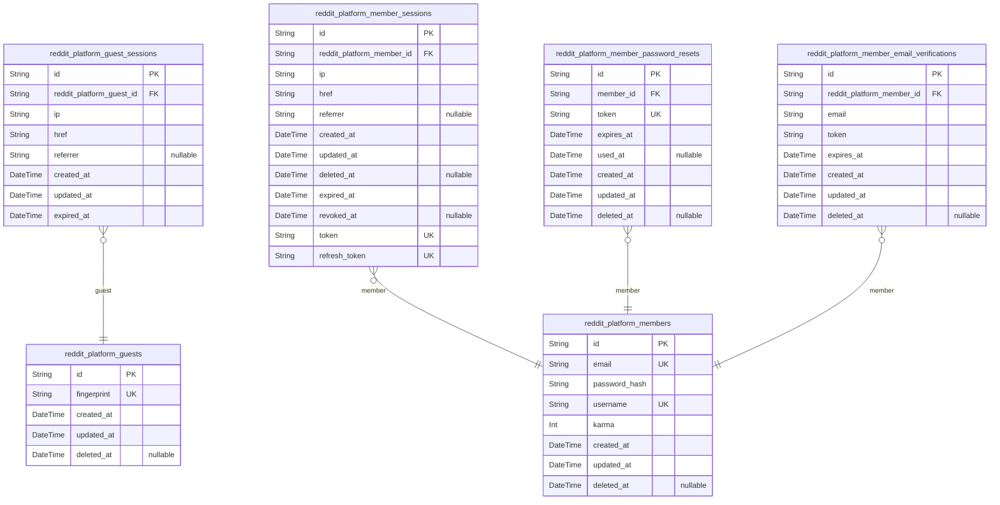
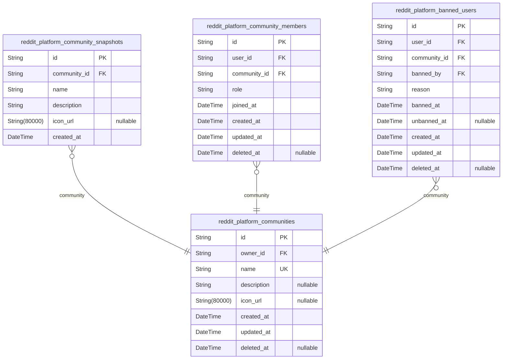
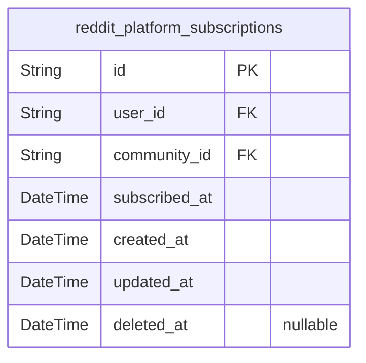
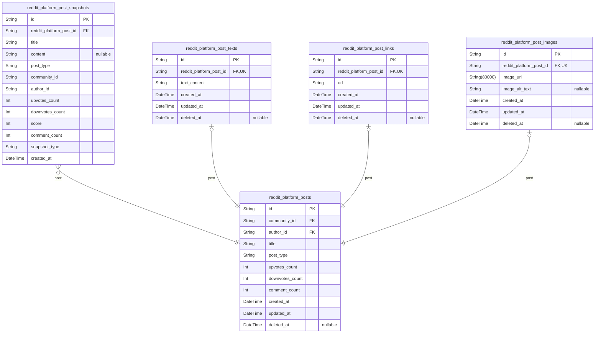
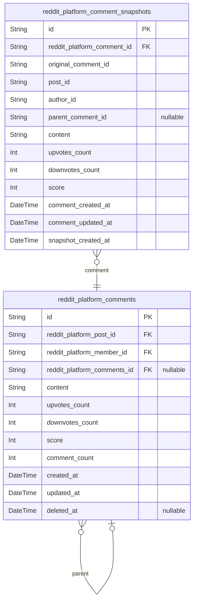
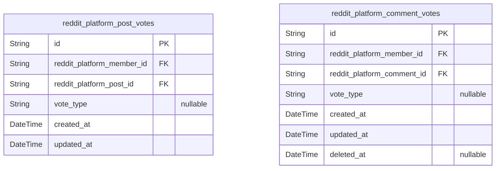
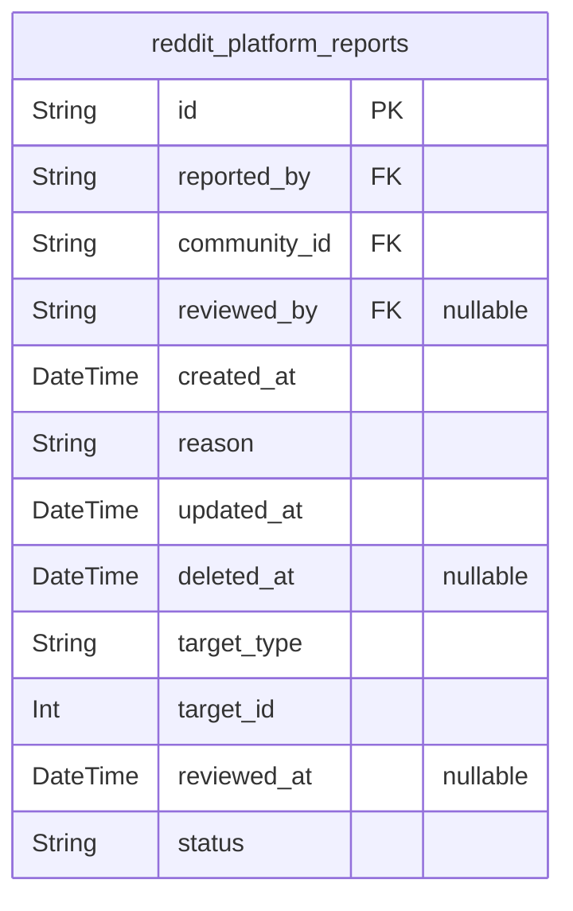
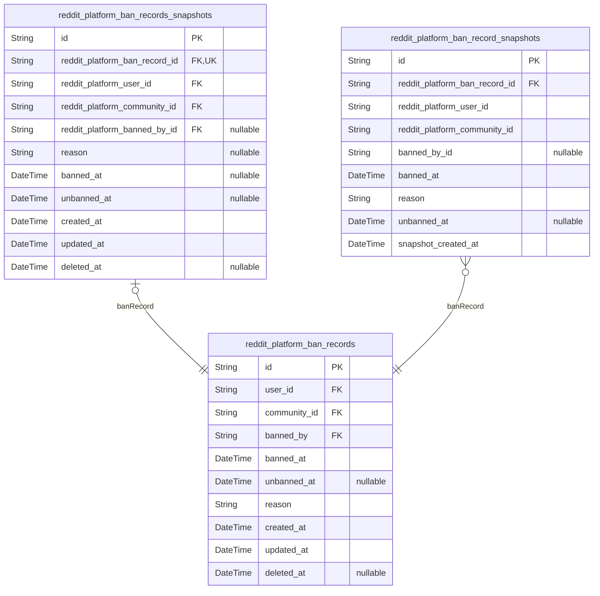

# Prisma Markdown

> Generated by [`prisma-markdown`](https://github.com/samchon/prisma-markdown)

- [auth](#auth)
- [communities](#communities)
- [subscriptions](#subscriptions)
- [posts](#posts)
- [comments](#comments)
- [votes](#votes)
- [reports](#reports)
- [bans](#bans)

## auth



### `reddit_platform_guests`

Temporary guest account entity providing anonymous access to public
content for unauthenticated visitors based on device fingerprint
identity.

## Identity Management
Each guest account is identified by a unique device fingerprint hash
rather than credentials, enabling anonymous content access without
registration requirements.

## Session Management
Guest accounts can have active sessions tracked via the related {@link
reddit_platform_guest_sessions} table. Sessions are accessed through the
reverse relation for access control and audit trail for guest activity.

## Lifecycle
Guest accounts use soft delete (deleted_at) to preserve audit data while
allowing account cleanup. Accounts may also be automatically expired
based on session inactivity.

Properties as follows:

- `id`: Primary Key.
- `fingerprint`
  > Unique device fingerprint hash identifying the guest visitor.
  >
  > ## Identity Basis
  > The fingerprint is a cryptographic hash of device characteristics (user
  > agent, IP, browser features) used as anonymous identity. It enables
  > consistent session recognition without requiring registration.
  >
  > ## Uniqueness
  > Fingerprint must be unique across all guest accounts to prevent duplicate
  > anonymous identities.
- `created_at`
  > Timestamp when the guest account was created.
  >
  > ## Lifecycle Tracking
  > Used to determine account age and for session cleanup policies.
- `updated_at`
  > Timestamp when the guest account was last updated.
  >
  > ## State Management
  > Updated on session changes or activity that modifies guest state.
- `deleted_at`
  > Timestamp when the guest account was soft-deleted.
  >
  > ## Soft Delete Pattern
  > Nullable field for soft delete support. When null, account is active.
  > When set, account is marked for cleanup but preserved for audit purposes.

### `reddit_platform_guest_sessions`

Temporary session tokens providing limited public content access for
guest visitors.

Tracks active guest sessions with authentication metadata including IP
address, referrer URL, current page, and expiration timestamps. Sessions
are short-lived to maintain security for anonymous users.

[reddit_platform_guests](#reddit_platform_guests) Sessions belong to exactly one guest and
are automatically expired after a fixed duration.

Properties as follows:

- `id`: Primary Key.
- `reddit_platform_guest_id`
  > References the guest account that owns this session.
  >
  > Each session belongs to exactly one guest. Sessions are automatically
  > expired when the guest account is deleted.
- `ip`
  > IP address of the client that created this session.
  >
  > Used for session tracking and security monitoring. Captured at session
  > creation time.
- `href`
  > Current page URL when the session was created.
  >
  > Tracks the page the guest was viewing at session start.
- `referrer`
  > Referrer URL that led the guest to the platform.
  >
  > Captured at session creation for analytics and security purposes.
- `created_at`
  > Session creation timestamp.
  >
  > Marks when the guest session was initialized.
- `updated_at`
  > Last update timestamp for the session record.
  >
  > Used for tracking session modifications.
- `expired_at`
  > Session expiration timestamp.
  >
  > Sessions automatically become invalid after this time. Must be set at
  > creation for security.

### `reddit_platform_members`

Registered member accounts with email/password authentication credentials
and profile data.

Stores user identity information including unique email addresses, hashed
passwords, and unique usernames. Each member can be associated with one
profile, maintain a karma score based on community votes, and participate
in communities through subscriptions and memberships.

### Authentication
Members authenticate via email and password. Passwords are stored as
hashes and should never be readable in plaintext. Email addresses must be
unique across all members.

### Profile
Each member has exactly one profile containing display name, bio, avatar,
and other public information. Profile is a separate entity referenced by
the member_id foreign key.

### Karma
Members accumulate karma from upvotes received on their posts and
comments. Karma can be negative if downvotes exceed upvotes. Karma is
automatically updated based on voting activity.

### Lifecycle
Members can be soft-deleted for account removal requests. Soft deletion
preserves data for audit and recovery purposes while preventing further
authentication.

Properties as follows:

- `id`: Primary Key.
- `email`
  > Unique email address used for authentication and account recovery. Email
  > verification is required for new members.
- `password_hash`
  > Password hash stored securely for authentication. Original password is
  > never stored.
- `username`
  > Unique username displayed throughout the platform. Cannot be changed
  > after account creation.
- `karma`
  > Karma score accumulated from upvotes minus downvotes received on posts
  > and comments. Can be negative.
- `created_at`: Timestamp when the member account was created.
- `updated_at`: Timestamp when the member record was last updated.
- `deleted_at`
  > Timestamp when the member account was soft-deleted (nullable = not
  > deleted).

### `reddit_platform_member_sessions`

JWT session tokens with access and refresh support for member
authentication.

This table manages active and expired login sessions for members,
tracking authentication state, session endpoints, and security-related
metadata including IP addresses, referrer URLs, and token lifecycles.

Session Management
Each session is uniquely identified by its token and linked to a member
actor. Sessions have explicit expiration times (expired_at) and can be
manually revoked (revoked_at). The table maintains soft deletes via
deleted_at for audit purposes while supporting automatic cleanup of
expired sessions.

Security Tracking
IP addresses, referrer URLs, and target href endpoints are recorded at
session creation to support security audits and anomaly detection. Token
uniqueness is enforced at the database level to prevent duplicate active
sessions.

Properties as follows:

- `id`
  > Primary key for session records, uniquely identifying each authentication
  > session.
- `reddit_platform_member_id`
  > Foreign key reference to the member who owns this session.
  >
  > Establishes a 1:N relationship where each session belongs to exactly one
  > member. The member_sessions collection in the member model contains all
  > sessions for that member. Cascade delete ensures orphaned sessions are
  > removed when a member account is deleted.
- `ip`
  > IP address of the client that created the session, used for security
  > tracking and anomaly detection.
- `href`
  > Target URL (href) where the session was initiated, used for security
  > auditing and session origin tracking.
- `referrer`
  > Referrer URL from the request that created the session, useful for
  > understanding session sources and detecting suspicious activity.
- `created_at`
  > Timestamp when the session was created and the member successfully
  > authenticated.
- `updated_at`
  > Timestamp of the last update to this session record, used for tracking
  > session modifications.
- `deleted_at`
  > Soft delete timestamp for session cleanup and audit trail. NULL means the
  > session is active.
- `expired_at`
  > Expiration timestamp when the session becomes invalid. NOT NULL by
  > security requirement. Used for automatic session cleanup.
- `revoked_at`
  > Timestamp when the session was manually revoked (logged out or token
  > invalidated). NULL if session is still active.
- `token`
  > JWT access token for the session. Must be unique across all active
  > sessions to prevent duplicate authentication.
- `refresh_token`
  > JWT refresh token for renewing access tokens. Must be unique across all
  > active sessions.

### `reddit_platform_member_password_resets`

Password reset tokens for secure member account recovery.

Stores temporary one-time-use tokens that allow members to reset their
password after requesting account recovery. Each token is
cryptographically generated, linked to a specific member account, and
becomes invalid after first use or expiration. Provides audit trail of
password reset attempts while maintaining security through short token
lifetime and single-use constraints.

Properties as follows:

- `id`: Primary Key.
- `member_id`
  > References the member account requesting password reset.
  >
  > Ensures token is always linked to a valid member. Token cannot be used
  > without this relationship. Enforces that password resets are scoped to
  > specific authenticated accounts.
- `token`
  > Cryptographically generated reset token string.
  >
  > Used for password reset verification. Must be unique across all active
  > tokens. Token is hashed before storage for security. Single-use
  > constraint ensures token becomes invalid after first successful password
  > reset.
- `expires_at`
  > Timestamp when this password reset token expires.
  >
  > Tokens beyond this timestamp cannot be used for password reset. Enforces
  > short token lifetime for security. Must be in the future when token is
  > created.
- `used_at`
  > Timestamp when this token was successfully used for password reset.
  >
  > Nullable - only set when token is consumed. After setting, token becomes
  > invalid for future use. Provides audit trail of successful password
  > resets.
- `created_at`
  > Timestamp when this password reset token was created.
  >
  > Used for tracking token age and debugging. Always set when token is
  > generated.
- `updated_at`
  > Timestamp of the last update to this password reset token.
  >
  > Always set when token is created and when used_at is set.
- `deleted_at`
  > Timestamp when this password reset token was soft deleted.
  >
  > Nullable - indicates token is no longer active. Used for audit trail
  > while allowing query filtering of active vs expired tokens.

### `reddit_platform_member_email_verifications`

Stores email verification tokens for new member registration validation,
ensuring users control the email addresses they register with.

**Authentication Lifecycle**

This table tracks temporary verification tokens sent to users' email
addresses during registration. Each token is associated with a member
account and expires after a defined period, after which it can be cleaned
up to maintain security.

**Token Management**

Tokens are cryptographically secure, single-use identifiers that allow
the system to verify email ownership without storing sensitive data. Once
verified, tokens can be soft-deleted while maintaining an audit trail via
deleted_at.

Properties as follows:

- `id`: Primary Key.
- `reddit_platform_member_id`
  > Links to the member account requesting email verification.
  >
  > This foreign key establishes a 1:N relationship where one member can have
  > multiple email verification attempts (e.g., re-requesting verification).
  > The member must exist in [reddit_platform_members](#reddit_platform_members) and this
  > relationship is required for all verification tokens.
- `email`
  > Email address to verify during registration.
  >
  > This is the email the user claims to own and for which they will receive
  > a verification token. The email must be unique and properly formatted.
  > Once verified, the user can update their member profile with this email
  > address.
- `token`
  > Cryptographically secure verification token sent to user's email.
  >
  > This high-entropy string is generated when the verification is created
  > and sent to the user. Users click the verification link containing this
  > token to prove email ownership. Tokens are single-use and expire after
  > [reddit_platform_member_email_verifications.expires_at](#reddit_platform_member_email_verifications).
- `expires_at`
  > Timestamp when this verification token expires and becomes invalid.
  >
  > Tokens are time-limited for security reasons. After this timestamp, the
  > token cannot be used for verification and should be cleaned up via
  > periodic maintenance tasks.
- `created_at`
  > Timestamp when this verification token was created.
  >
  > Used for audit trails, debugging, and tracking how long tokens have been
  > pending verification.
- `updated_at`
  > Timestamp of the last update to this record.
  >
  > Maintained automatically by the database trigger for audit purposes.
- `deleted_at`
  > Timestamp when this record was soft-deleted.
  >
  > Verifications are never hard-deleted to maintain audit trail. When a
  > token is used or expired, it is soft-deleted by setting this field. Null
  > indicates active status.

## communities



### `reddit_platform_communities`

Topic-based discussion groups with unique name, description, icon, and
owner reference.

## Purpose
Communities are the core organizational units of the Reddit-like platform
where users discuss shared topics. Each community is owned by a single
member who can assign moderator roles to other members.

## Key Attributes
- name: Unique community identifier displayed to users
- description: Community purpose and rules
- icon_url: Community avatar or logo image
- owner_id: Member who created and owns this community

Properties as follows:

- `id`: Primary Key.
- `owner_id`
  > Reference to the member who owns this community. Owner has full
  > management permissions including assigning moderator roles.
  >
  > Referenced by `[reddit_platform_community_members](#reddit_platform_community_members)` for owner role
  > assignments.
- `name`
  > Unique display name for this community. Must be unique across all
  > communities and cannot be changed after creation.
  >
  > Format: alphanumeric with underscores, 3-50 characters.
- `description`
  > Community description explaining its purpose, rules, and scope.
  >
  > Maximum length: 500 characters.
- `icon_url`
  > URL to community icon or avatar image.
  >
  > Accepted formats: HTTP/HTTPS URLs to PNG, JPG, or GIF images.
- `created_at`: Timestamp when this community was created.
- `updated_at`: Timestamp when this community was last updated.
- `deleted_at`: Timestamp when this community was soft-deleted. Null means active.

### `reddit_platform_community_snapshots`

Captures point-in-time versions of community entity changes for audit
trail and historical analysis.

## Purpose

Stores immutable snapshots of reddit_platform_communities entity state at
specific moments in time, enabling historical analysis of community
evolution including name changes, description edits, and icon updates.

## Usage

Queries on this table should always reference the original community via
community_id FK to reconstruct the community's state at any point in
history.

Properties as follows:

- `id`: Primary key for this snapshot record.
- `community_id`
  > References the original community this snapshot represents.
  >
  > Enables reconstruction of community state at any point in history by
  > querying all snapshots ordered by created_at for a given community_id.
- `name`: Community name at the time this snapshot was taken.
- `description`: Community description at the time this snapshot was taken.
- `icon_url`
  > Community icon URL at the time this snapshot was taken. Nullable as
  > community may not have an icon.
- `created_at`
  > Timestamp when this snapshot was created (point-in-time of community
  > state).

### `reddit_platform_community_members`

Tracks community membership roles (owner, moderator, member) linking
users to communities with role-based access control.

This table is the foundation of community governance, enabling role
distinctions between community owners who can create/manage communities,
moderators who can moderate content, and regular members who can
participate. Each user has exactly one role per community to prevent
conflicting permissions.

### Ownership Model

Community owners have exclusive rights to create, update, and delete
their communities. Only one owner is permitted per community, enforced by
application-level validation. The owner role is not enforced by the
unique constraint to allow historical role transitions to be tracked.

Properties as follows:

- `id`: Primary Key.
- `user_id`
  > References the member account holding this role.
  >
  > Enforces that only authenticated members can have community memberships.
  > Guest accounts cannot own roles or participate in community governance.
- `community_id`
  > References the community where this role is assigned.
  >
  > Links the membership to its parent community entity. Each row represents
  > a user's relationship to exactly one community.
- `role`
  > Membership role classification within the community.
  >
  > **owner** - Community creator with full administrative rights. Only one
  > owner permitted per community.
  > **moderator** - Community manager with moderation privileges. Multiple
  > moderators allowed.
  > **member** - Regular community participant with standard permissions.
  > Multiple members allowed.
- `joined_at`: Timestamp when the user joined the community or was assigned this role.
- `created_at`: Record creation timestamp for audit trail.
- `updated_at`: Record last modification timestamp for data freshness.
- `deleted_at`
  > Soft delete timestamp for compliance and audit purposes. Null means
  > active membership.

### `reddit_platform_banned_users`

Community-level user ban records with permanent audit trail tracking who
was banned, why, by whom, and when.

### Ban Record Lifecycle

Tracks permanent records of user restrictions in communities, including
optional unbanning. Each ban is uniquely identified by user-community
pair to prevent duplicate active bans.

### Audit Trail

Ban records are never deleted (soft delete preserves audit integrity).
Even after unbanning, the original ban record remains with unbanned_at
timestamp populated to track when restrictions were lifted.

Properties as follows:

- `id`: Primary Key.
- `user_id`
  > The member who was banned from the community.
  >
  > References the banned user's account. This FK establishes the
  > relationship between ban records and the member being restricted.
- `community_id`
  > The community where the ban was applied.
  >
  > References the community entity. Multiple bans can exist for the same
  > community (different users banned).
- `banned_by`
  > The moderator who issued the ban.
  >
  > References the member who performed the moderation action. This tracks
  > accountability for each ban record.
- `reason`
  > The reason for the ban.
  >
  > Text description explaining why the user was banned. This provides
  > transparency for moderation actions.
- `banned_at`
  > Timestamp when the ban was issued.
  >
  > Records the exact date and time when restrictions were applied to the
  > user in the community.
- `unbanned_at`
  > Optional timestamp when the ban was lifted.
  >
  > Null if the user is currently banned. Populated when a moderator lifts
  > the ban.
- `created_at`: Record creation timestamp.
- `updated_at`: Record last update timestamp.
- `deleted_at`
  > Soft delete timestamp for audit trail preservation.
  >
  > Null when record is active. Populated when record is soft-deleted.

## subscriptions



### `reddit_platform_subscriptions`

Links users to communities with subscription timestamp and status;
enforces unique user-community pairing and tracks active/inactive
subscription states for access control.

This junction table enforces the business rule that users must subscribe
to a community before creating posts. Each subscription record tracks
when a user joined a community via the subscribed_at timestamp. Soft
delete support via deleted_at enables tracking subscription history.

Properties as follows:

- `id`: Primary Key.
- `user_id`
  > References the member who subscribed to the community. Links to {@link
  > reddit_platform_members}.
  >
  > This foreign key enforces that only registered members can subscribe to
  > communities.
- `community_id`
  > References the community that the user subscribed to. Links to {@link
  > reddit_platform_communities}.
  >
  > This foreign key enforces that subscriptions only exist for valid
  > communities.
- `subscribed_at`
  > Timestamp when the user subscribed to the community.
  >
  > This field is used to track subscription history and determine
  > subscription duration if needed for future features like membership
  > tiers.
- `created_at`
  > Record creation timestamp.
  >
  > This field tracks when the subscription record was first created in the
  > database.
- `updated_at`
  > Record last update timestamp.
  >
  > This field is automatically updated on any record modification to track
  > the most recent change.
- `deleted_at`
  > Soft delete timestamp for subscription removal.
  >
  > When this field is set, the subscription is considered inactive. A NULL
  > value indicates an active subscription.

## posts



### `reddit_platform_posts`

Main post entity that forms the backbone of content on the Reddit-like
platform, with each post belonging to exactly one community and authored
by exactly one member.

### Core Attributes

Every post requires a title that describes its content (required field).
Posts are classified into one of three types: text, link, or image, which
determines which content table stores the actual post content. The
post_type enum guides database queries to the appropriate child table
(reddit_platform_post_texts, reddit_platform_post_links,
reddit_platform_post_images) for content retrieval.

### Metric Aggregates

The upvotes_count and downvotes_count fields track aggregate vote totals
for display purposes, allowing the platform to show vote counts without
real-time aggregation from the reddit_platform_post_votes table. The
comment_count field tracks total comments on the post for engagement
metrics.

Properties as follows:

- `id`: Primary key for unique post identification across the platform.
- `community_id`
  > References the community where this post is published and discussed.
  >
  > Every post must belong to exactly one community. The community
  > association is established at post creation and cannot be changed,
  > ensuring posts remain in their intended discussion context. This FK
  > enforces the business rule that posts are always community-bound.
- `author_id`
  > References the member who created this post.
  >
  > The author retains exclusive editing and deletion rights for this post.
  > This FK links posts to the authorization layer (reddit_platform_members)
  > without duplicating user data, maintaining referential integrity while
  > following child-to-parent FK direction.
- `title`
  > The mandatory title that describes the post content and attracts reader
  > attention.
  >
  > Every post must have a title; posts without titles cannot be created. The
  > title is displayed publicly and is the primary text users see when
  > browsing posts.
- `post_type`
  > Classification enum indicating which content table stores the post's
  > content.
  >
  > Allowed values: 'text', 'link', 'image'. This enum determines which child
  > table (reddit_platform_post_texts, reddit_platform_post_links,
  > reddit_platform_post_images) contains the actual content. The post_type
  > is immutable after post creation.
- `upvotes_count`
  > Total count of upvotes received by this post across all users.
  >
  > This aggregate metric is denormalized for performance, allowing the
  > platform to display vote counts without real-time aggregation from the
  > reddit_platform_post_votes table. Updated incrementally when users vote.
- `downvotes_count`
  > Total count of downvotes received by this post across all users.
  >
  > This aggregate metric is denormalized for performance, allowing the
  > platform to display vote counts without real-time aggregation from the
  > reddit_platform_post_votes table. Updated incrementally when users vote.
- `comment_count`
  > Total number of comments on this post, including nested replies.
  >
  > This count updates whenever a comment is added or removed, providing
  > real-time engagement metrics without querying the
  > reddit_platform_comments table.
- `created_at`
  > Timestamp when the post was originally created.
  >
  > This value is immutable and cannot be modified after post creation. It is
  > displayed publicly in relative format (e.g., '3 hours ago', '2 days ago')
  > for user context.
- `updated_at`
  > Timestamp when the post was last modified.
  >
  > This value updates whenever the post is edited by its author. It enables
  > tracking of post edit history and supports audit logging through the
  > reddit_platform_post_snapshots table.
- `deleted_at`
  > Timestamp when the post was soft-deleted by its author or a moderator.
  >
  > When deleted_at is null, the post is active and visible to users. When
  > set, the post is hidden from public views but retained in the database
  > for audit purposes.

### `reddit_platform_post_snapshots`

Audit trail table storing point-in-time snapshots of posts for tracking
edits and deletions over time.

Snapshot Type: `snapshot`
Parent Table: [reddit_platform_posts](#reddit_platform_posts)

Snapshot contents preserve the exact state of a post at a given moment,
including title, content, post type, community, author, and score
metrics. This enables historical review and forensic analysis of post
changes without requiring access to deleted or modified data.

### Audit Capabilities

- Edit history tracking: Each post edit creates a new snapshot record
- Deletion tracking: Soft-deleted posts are captured before removal
- Status auditing: Complete snapshot lifecycle for compliance and review
- Cross-reference integrity: Snapshot data remains valid even after post
deletion

### Query Usage

```typescript
// Get all snapshots for a specific post
reddit_platform_post_snapshots.findMany({
where: { reddit_platform_post_id: "<post-uuid>" },
orderBy: { created_at: "desc" }
})

// Get post state at a specific time
reddit_platform_post_snapshots.findFirst({
where: {
reddit_platform_post_id: "<post-uuid>",
created_at: { lte: new Date("2024-01-15T12:00:00Z") }
},
orderBy: { created_at: "desc" }
})
```

Useful for moderation review, content history auditing, and compliance
reporting.

Properties as follows:

- `id`: Primary Key.
- `reddit_platform_post_id`
  > Foreign key reference to the post this snapshot belongs to.
  >
  > A single post can have multiple snapshots throughout its lifecycle (edit
  > history, deletion tracking). This is a 1:N relationship where the post is
  > the parent and snapshots are the children.
  >
  > **Relationship Semantics**:
  > - Post is the owning entity
  > - Snapshots are child audit records
  > - Relationship is non-nullable (every snapshot must reference a post)
  > - Post can exist without snapshots (new posts with no changes yet)
- `title`
  > Post title as it existed at the time of this snapshot. Stored for
  > historical review and audit purposes.
- `content`
  > Post text content (for text-type posts) as captured in this snapshot. For
  > link or image posts, this field may be null or contain fallback text.
  >
  > Snapshot preserves exact content state at capture time for forensic
  > accuracy.
- `post_type`
  > Post type classification (enum: `text`, `link`, `image`) at time of
  > snapshot.
  >
  > This enum value indicates what category of post this was when the
  > snapshot was taken.
- `community_id`
  > Community ID where this post was published, as recorded at snapshot time.
  >
  > Snapshot captures community reference so the post's context remains valid
  > even if the original post is deleted or moved.
- `author_id`
  > Author (member) ID who created this post, captured at snapshot time.
  >
  > Preserves authorship information for audit trail even after post deletion.
- `upvotes_count`
  > Upvote count as recorded at snapshot time.
  >
  > Snapshot preserves vote metrics state for historical accuracy. This is
  > not calculated from votes—just the raw count value at capture moment.
- `downvotes_count`
  > Downvote count as recorded at snapshot time.
  >
  > Snapshot preserves vote metrics state for historical accuracy.
- `score`
  > Calculated score (upvotes - downvotes) as recorded at snapshot time.
  >
  > Snapshot stores the computed score value to preserve historical state
  > without requiring vote table joins.
- `comment_count`
  > Comment count associated with this post at snapshot time.
  >
  > Snapshot preserves comment count state for historical accuracy.
- `snapshot_type`
  > Type of snapshot event that triggered this record creation.
  >
  > Enum values indicate the nature of the change captured:
  > - `edit`: Post was modified
  > - `delete`: Post was soft-deleted
  > - `initial`: Post was first created
  >
  > This field enables filtering snapshots by event type for audit workflows.
- `created_at`
  > Timestamp when this snapshot was created.
  >
  > Sorted descending for audit trail ordering. Latest snapshot appears
  > first. Used to reconstruct post state at any point in time.

### `reddit_platform_post_texts`

Stores text content for posts with post_type set to 'text'.

This subsidiary table separates text content from the base posts table to
enforce content-type constraints at the table level, avoiding nullable
field proliferation. Each text post has exactly one corresponding record
here, creating a 1:1 relationship with the parent reddit_platform_posts
table.

The unique constraint on reddit_platform_post_id ensures data integrity
and enables efficient JOIN queries to retrieve text content when needed.
Soft delete support via deleted_at field preserves audit trail while
marking deleted records.

Properties as follows:

- `id`: Primary Key.
- `reddit_platform_post_id`
  > References the parent post record this text belongs to.
  >
  > Establishes a 1:1 relationship with reddit_platform_posts. Each post with
  > post_type 'text' has exactly one corresponding record here, enforced via
  > a unique constraint on this field.
- `text_content`
  > The actual text content of the post.
  >
  > Contains the full text body for text-type posts. Stored here separately
  > from the base posts table to maintain clean 1NF structure and avoid
  > nullable content fields across post types.
- `created_at`
  > Timestamp when this text record was created.
  >
  > Used for auditing and tracking when the post content was originally
  > created.
- `updated_at`
  > Timestamp when this text record was last updated.
  >
  > Used to track the most recent modification to the post content.
- `deleted_at`
  > Timestamp when this text record was soft-deleted.
  >
  > Nullable - null means the record is active, non-null means it has been
  > deleted. Preserves audit trail while marking records as deleted.

### `reddit_platform_post_links`

Stores link post URL for link-type posts only, ensuring non-nullable data
through 1NF decomposition.

Relationships

This table has a one-to-one relationship with {@link
reddit_platform_posts}. Each post of type 'link' has exactly one URL
record in this table, enforced by a unique foreign key constraint. The
relationship is managed through the parent post entity, making this a
subsidiary table that never exists without a corresponding post.

Properties as follows:

- `id`: Primary key for link post URL record.
- `reddit_platform_post_id`
  > References the parent post entity. Each link post has exactly one URL
  > record, ensuring one-to-one relationship.
  >
  > Relationship Semantics
  >
  > This foreign key enforces data integrity by guaranteeing that every link
  > URL belongs to a valid post. The unique constraint prevents duplicate
  > link records for the same post, maintaining 1NF normalization where each
  > post type has its own content table.
- `url`
  > The link URL for this link-type post. Contains the destination URL that
  > users are redirected to when clicking the link post.
  >
  > Validation Rules
  >
  > Must be a valid URI format. This is a required field for link posts,
  > ensuring no nullable URL values through 1NF decomposition. The URL is
  > stored as a plain string and can be validated at the application layer
  > for proper HTTP/HTTPS scheme and domain format.
- `created_at`: Timestamp when this link post URL record was created.
- `updated_at`: Timestamp when this link post URL record was last updated.
- `deleted_at`
  > Soft delete timestamp. Null when record is active, non-null when post has
  > been soft-deleted.

### `reddit_platform_post_images`

Image post content storage for image-type posts only, linking to posts table

Stores the image URL and optional alt text for posts classified as image
type. This normalized child table ensures the posts table remains clean
while supporting multiple content types (text, link, image) without
nullable field proliferation.

Properties as follows:

- `id`: Primary key for image post records.
- `reddit_platform_post_id`
  > Reference to the parent post this image content belongs to. Each image
  > post record is linked to exactly one post record.
  >
  > The relationship enforces a 1:1 constraint, ensuring each post has at
  > most one image content record.
- `image_url`
  > The URL of the image content for this post type. Stores the direct image
  > location for display.
  >
  > This field is required for image-type posts and should contain a valid
  > image URL that can be used to display the image content.
- `image_alt_text`
  > Optional alternative text description for the image, used for
  > accessibility purposes.
  >
  > This text provides a textual description of the image content, which is
  > useful for screen readers and when the image cannot be displayed.
- `created_at`: Timestamp indicating when this image post record was created.
- `updated_at`: Timestamp indicating when this image post record was last modified.
- `deleted_at`
  > Soft delete timestamp for tracking when this image post record was
  > deleted.

## comments



### `reddit_platform_comments`

Main comments table with threaded structure supporting unlimited nesting
depth via self-referencing parent_comment_id FK; each comment belongs to
a Post, written by a Member, tracks vote scores and timestamps.

A comment represents user participation in discussions on posts. Comments
can be root comments (no parent) or replies to existing comments,
enabling threaded conversations without depth restrictions. Each comment
contains text content, tracks upvotes and downvotes for scoring, and
maintains a count of reply comments for thread context.

Comments are soft-deletable via deleted_at, preserving the author's
username in discussion context while removing the content. The score
field is calculated from vote tables but stored for performance. Proper
indexing enables efficient comment retrieval by post, author, and reply
hierarchy.

Properties as follows:

- `id`: Primary Key.
- `reddit_platform_post_id`
  > References the Post this comment belongs to. Each comment is always
  > associated with exactly one Post, establishing the discussion context.
  > Cannot be null as comments must belong to a Post.
  >
  > [reddit_platform_posts](#reddit_platform_posts)
- `reddit_platform_member_id`
  > References the Member who authored this comment. Each comment is written
  > by exactly one authenticated Member. Cannot be null as only logged-in
  > members can write comments.
  >
  > [reddit_platform_members](#reddit_platform_members)
- `reddit_platform_comments_id`
  > Self-referencing FK for threaded comments. Points to the parent comment
  > when this is a reply. Null when this is a root comment (no parent).
  > Enables unlimited nesting depth for discussions.
  >
  > [reddit_platform_comments](#reddit_platform_comments)
- `content`
  > Text content of the comment. Always stored as plain text without HTML or
  > rich formatting. Maximum length enforced by application layer. Required
  > field - comments must have content.
- `upvotes_count`
  > Total number of upvotes this comment has received. Incremented when a
  > member upvotes, decremented when the upvote is removed or changed to
  > downvote. Calculated from vote records and cached here for performance.
- `downvotes_count`
  > Total number of downvotes this comment has received. Incremented when a
  > member downvotes, decremented when the downvote is removed or changed to
  > upvote. Calculated from vote records and cached here for performance.
- `score`
  > Net vote score calculated as upvotes_count minus downvotes_count. Can be
  > negative if the comment has more downvotes than upvotes. Score is
  > displayed publicly on the comment and on the user's profile.
  >
  > [reddit_platform_comment_rules#negative-karma-scenarios](#reddit_platform_comment_rules#negative-karma-scenarios) for
  > negative karma scenarios.
- `comment_count`
  > Number of direct replies to this comment. Incremented when a new reply is
  > created, decremented when a reply is deleted. Enables quick display of
  > thread depth without recursive queries.
- `created_at`
  > Timestamp when this comment was created. Automatically set to current
  > time on insert.
- `updated_at`
  > Timestamp when this comment was last modified. Updated on every edit
  > operation.
- `deleted_at`
  > Timestamp when this comment was soft-deleted by its author. When set, the
  > comment content is removed but the author attribution remains visible in
  > discussion context for transparency. Null when the comment is active.

### `reddit_platform_comment_snapshots`

Audit trail table storing point-in-time snapshots of comments for
tracking edits and deletions over time.

This table maintains a complete history of comment states, capturing the
content, vote counts, and metadata at specific points in time. Each
snapshot represents the comment's state when it was last modified,
enabling audit trails and historical analysis of comment changes.

[reddit_platform_comments](#reddit_platform_comments) is the parent table this snapshot
references, containing the current active comment state.

Properties as follows:

- `id`: Primary Key.
- `reddit_platform_comment_id`
  > Foreign key reference to the original comment this snapshot represents.
  >
  > Establishes 1:N relationship where multiple snapshots can exist for a
  > single comment, tracking its evolution over time. Used to retrieve full
  > snapshot history for a specific comment.
- `original_comment_id`
  > The original comment ID captured in this snapshot. This matches the id of
  > the comment in [reddit_platform_comments](#reddit_platform_comments) when the snapshot was
  > created.
- `post_id`
  > The ID of the post this comment belongs to, captured at snapshot time.
  > References [reddit_platform_posts](#reddit_platform_posts).
- `author_id`
  > The ID of the user who authored this comment, captured at snapshot time.
  > References the member account in the authorization layer.
- `parent_comment_id`
  > The ID of the parent comment if this is a reply, captured at snapshot
  > time. Null for root comments. Self-referencing for threaded comment
  > structure.
- `content`
  > The comment content text captured at snapshot time. Contains the full
  > text of the comment as it existed when the snapshot was taken.
- `upvotes_count`
  > The upvote count for this comment at snapshot time. Tracked separately
  > from downvotes for historical accuracy.
- `downvotes_count`
  > The downvote count for this comment at snapshot time. Tracked separately
  > from upvotes for historical accuracy.
- `score`
  > The calculated score (upvotes minus downvotes) for this comment at
  > snapshot time.
- `comment_created_at`
  > The original creation timestamp of this comment, captured at snapshot
  > time.
- `comment_updated_at`
  > The last update timestamp of this comment at snapshot time. Tracked to
  > understand when changes occurred.
- `snapshot_created_at`
  > The timestamp when this snapshot was created. Marks the point in time for
  > this snapshot record.

## votes



### `reddit_platform_post_votes`

Tracks user votes on posts (upvote/downvote) with single vote constraint
per user per post.

### Entity Relationship

Each vote links a [reddit_platform_members](#reddit_platform_members) member to a {@link
reddit_platform_posts} post, recording the vote direction and timestamp.
The composite unique index on (user_id, post_id) ensures members can only
vote once per post, with the ability to change or remove their vote by
deleting and recreating the record.

Properties as follows:

- `id`: Primary Key.
- `reddit_platform_member_id`
  > Reference to the member account who cast this vote.
  >
  > Links [reddit_platform_post_votes](#reddit_platform_post_votes) to {@link
  > reddit_platform_members} (Authorization group). The {@link
  > reddit_platform_member_id} foreign key enables efficient queries to
  > retrieve all votes cast by a specific member across posts.
- `reddit_platform_post_id`
  > Reference to the post that received this vote.
  >
  > Links [reddit_platform_post_votes](#reddit_platform_post_votes) to [reddit_platform_posts](#reddit_platform_posts)
  > (Posts group). The [reddit_platform_post_id](#reddit_platform_post_id) foreign key enables
  > efficient queries to retrieve all votes received by a specific post for
  > calculating aggregate scores.
- `vote_type`
  > Direction of the vote: 'up' for upvote, 'down' for downvote.
  >
  > Allowed values:
  > - 'up': Represents an upvote (positive vote)
  > - 'down': Represents a downvote (negative vote)
  >
  > If null, the vote is considered removed or withdrawn.
- `created_at`
  > Timestamp when this vote was first cast.
  >
  > Used for ordering votes chronologically and tracking vote history.
- `updated_at`
  > Timestamp when this vote record was last modified.
  >
  > Useful for tracking when a member changed their vote (e.g., from upvote
  > to downvote or vice versa).

### `reddit_platform_comment_votes`

Tracks user votes on comments with upvote/downvote support and single
vote constraint per user per comment.

This table enables the Reddit-style voting system for comments, allowing
users to express approval (upvote) or disapproval (downvote) on comment
content. Each user can cast only one vote per comment, which can be
changed or removed at any time. The vote score for each comment is
calculated from the aggregate of all votes stored in this table.

Properties as follows:

- `id`: Primary key for the comment vote record.
- `reddit_platform_member_id`
  > References the member account that cast this vote.
  >
  > Establishes the relationship between the vote and the voting user. Each
  > vote must be attributed to a specific member who has cast the upvote or
  > downvote.
- `reddit_platform_comment_id`
  > References the comment that received this vote.
  >
  > Establishes the relationship between the vote and the target comment.
  > This FK enables retrieving all votes for a specific comment and
  > calculating its vote score.
- `vote_type`
  > The type of vote cast: 'up' for upvote or 'down' for downvote.
  >
  > A value of NULL indicates the user has removed their vote from the
  > comment. When a user votes, this field is set to 'up' or 'down'. When
  > they remove their vote entirely, it is set to NULL. This nullable design
  > allows the single vote constraint to support vote removal without
  > requiring a separate delete operation.
- `created_at`
  > Timestamp when this vote was first cast.
  >
  > Records the original vote submission time for audit purposes and display
  > in vote history.
- `updated_at`
  > Timestamp when this vote was last modified.
  >
  > Updates whenever the user changes their vote (up to down, down to up) or
  > removes their vote (setting vote_type to NULL).
- `deleted_at`
  > Timestamp when this vote was soft-deleted, if applicable.
  >
  > Currently unused as votes are managed via vote_type NULL for removal, but
  > included for future soft-delete requirements.

## reports



### `reddit_platform_reports`

Tracks reports submitted by users against posts or comments with status
lifecycle and moderator review tracking.

### Core Purpose
This table records instances where community members report content
(posts or comments) that violates community guidelines. Reports form the
foundation of the moderation system, enabling users to flag inappropriate
content for review by community moderators.

### Report Lifecycle
Reports begin in `pending` status when first submitted, then transition
to either `approved` (content removed, violator warned/banned) or
`dismissed` (report deemed unfounded) after moderator review. Each report
maintains a complete audit trail including who submitted it, when it was
created, and if/when it was reviewed.

### Polymorphic Target Reference
Reports use a polymorphic reference pattern to target either posts or
comments via the `target_type` enum field combined with `target_id`. This
design eliminates the need for duplicate reporting tables while
maintaining clear semantic meaning through the type discriminator.

Properties as follows:

- `id`: Primary Key.
- `reported_by`
  > User who submitted the report, referencing their authenticated session.
  >
  > This FK enables the system to attribute reports to specific member
  > accounts and enforce business rules around user reporting history.
- `community_id`
  > Community context for the reported content.
  >
  > Reports are scoped to a specific community because moderation policies
  > and review workflows are community-specific. This field enables filtering
  > reports by community and linking them to the appropriate moderation
  > queue.
- `reviewed_by`
  > Moderator who reviewed and resolved the report (if reviewed).
  >
  > This FK references the reviewing moderator's session and is nullable for
  > pending reports. It provides audit trail accountability for moderation
  > decisions.
- `created_at`
  > Timestamp when the report was created.
  >
  > Created automatically on insert. Used for sorting reports by age and
  > tracking response times.
- `reason`
  > Text description of why the content is being reported.
  >
  > Users provide a reason explaining the violation (e.g., harassment, spam,
  > irrelevant content). This field is required and should be validated for
  > length and prohibited content.
- `updated_at`
  > Timestamp of the last update to the report record.
  >
  > Maintained for audit purposes and to track when report metadata changes
  > (e.g., status transitions).
- `deleted_at`
  > Timestamp of soft deletion if the report was deleted.
  >
  > Nullable - reports are soft-deleted rather than hard-deleted to preserve
  > audit trail. Used for data retention and recovery workflows.
- `target_type`
  > Type of content being reported: 'post' or 'comment'.
  >
  > This enum field determines which target table the `target_id` references.
  > It is a critical discriminator for the polymorphic reference pattern.
- `target_id`
  > ID of the post or comment being reported.
  >
  > This integer field references either `reddit_platform_posts.id` or
  > `reddit_platform_comments.id` depending on the `target_type` value. It
  > enables direct lookup of reported content for moderator review.
- `reviewed_at`
  > Timestamp when the report was reviewed and resolved by a moderator.
  >
  > Nullable for pending reports. Populated when status transitions to
  > `approved` or `dismissed`. Used to calculate moderation response time
  > metrics.
- `status`
  > Current status of the report in the moderation workflow.
  >
  > - `pending`: Report submitted, awaiting moderator review
  > - `approved`: Moderator confirmed violation, action taken on reported
  > content
  > - `dismissed`: Moderator determined report was unfounded
  >
  > This enum field drives the moderation queue and reporting dashboards.

## bans



### `reddit_platform_ban_records`

Ban records tracking user restrictions in communities with reason,
timestamps, and optional unbanning for audit purposes.

## Purpose
This table enforces community-level access control by recording when
users are banned from specific communities. Each ban tracks who was
banned, which community banned them, who issued the ban, and when it
occurred.

## Business Rules
A user can have at most one active ban per community. Bans are permanent
by default but can be lifted with an optional unbanned_at timestamp.
Every ban must have a reason recorded to maintain moderation
accountability.

Properties as follows:

- `id`: Primary Key.
- `user_id`
  > The user who was banned from the community. This reference enables access
  > control enforcement to prevent banned users from participating in
  > community activities.
- `community_id`
  > The community where the ban was issued. This reference identifies which
  > community's access was restricted by this ban record.
- `banned_by`
  > The moderator or community owner who issued this ban. This reference
  > maintains an audit trail of who made the moderation decision, enabling
  > accountability and transparency in community management.
- `banned_at`
  > Timestamp when the ban was issued. This marks when the user lost access
  > to the community.
- `unbanned_at`
  > Optional timestamp when the ban was lifted. If null, the ban is
  > permanent. This enables tracking of temporary versus permanent bans while
  > maintaining a complete ban history.
- `reason`
  > The reason for the ban recorded by the moderator. This provides context
  > for the moderation action and helps users understand why they were banned
  > from the community.
- `created_at`
  > Record creation timestamp for tracking when this ban record was added to
  > the system.
- `updated_at`: Last update timestamp for tracking when this ban record was modified.
- `deleted_at`
  > Soft delete timestamp for tracking when this record was logically deleted
  > while preserving the audit trail.

### `reddit_platform_ban_records_snapshots`

Point-in-time snapshot table for audit trail tracking all state changes
to ban records over time.

This snapshot table captures the complete state of ban records at
specific points in time, enabling historical reconstruction and audit
capabilities. Each ban record can have multiple snapshots representing
its state at different moments (initial creation, unbanning, etc.).

Properties as follows:

- `id`: Primary Key.
- `reddit_platform_ban_record_id`
  > Reference to the original ban record that this snapshot represents.
  >
  > Each ban record can have multiple snapshots over its lifetime, tracking
  > state changes such as initial banning, unbanning, or reason updates. The
  > snapshot captures the complete state of the ban record at a specific
  > point in time.
- `reddit_platform_user_id`
  > Reference to the member who was banned from the community.
  >
  > This user is the subject of the ban action and cannot post, comment, or
  > vote in the banned community while the ban is active.
- `reddit_platform_community_id`
  > Reference to the community where the ban was issued.
  >
  > Bans are community-specific; a user can be banned from one community
  > while remaining active in others.
- `reddit_platform_banned_by_id`
  > Reference to the member (moderator or owner) who issued the ban.
  >
  > This tracks which authorized user performed the moderation action,
  > providing accountability in the moderation system.
- `reason`
  > Human-readable reason for the ban as provided by the moderating user.
  >
  > This field captures the explanation for why the ban was issued, which may
  > include policy violations, disruptive behavior, or other community
  > guideline breaches.
- `banned_at`
  > Timestamp when the ban was initially issued.
  >
  > This marks the point in time when the user's access to the community was
  > revoked.
- `unbanned_at`
  > Timestamp when the ban was lifted, if applicable.
  >
  > If nullable, the ban is still active. If set, the user was unbanned at
  > this point in time.
- `created_at`
  > Timestamp when this snapshot was created.
  >
  > Tracks when the point-in-time state was recorded in the audit trail.
- `updated_at`
  > Timestamp when this snapshot was last updated.
  >
  > Since snapshots are immutable records, this typically equals created_at
  > unless the snapshot itself is modified for correction purposes.
- `deleted_at`
  > Timestamp when this snapshot was soft-deleted, if applicable.
  >
  > Snapshots may be deleted for legal compliance (e.g., GDPR data deletion
  > requests) or administrative cleanup.

### `reddit_platform_ban_record_snapshots`

Audit trail table for ban records capturing point-in-time snapshots of
state changes over time.

This table stores historical versions of ban records, enabling compliance
auditing, historical tracking of ban modifications, unbanning events, and
data integrity verification. Each snapshot represents the state of a ban
record at a specific moment in time.

## Key Features

- Append-only design: snapshots are never modified or deleted
- Point-in-time queries: reconstruct ban record state at any historical
timestamp
- Audit compliance: track all changes to ban records for regulatory
requirements

## Relationship with Ban Records

Ban records (`reddit_platform_ban_records`) hold the current state of
bans. When a ban record is created, edited, or unbanned, a new snapshot
is appended to this table. This separation ensures the main ban table
remains optimized for queries while snapshots provide historical context.

Properties as follows:

- `id`: Primary Key.
- `reddit_platform_ban_record_id`
  > Reference to the ban record this snapshot represents.
  >
  > Links to the main `reddit_platform_ban_records` table. Multiple snapshots
  > can reference the same ban record, forming an audit trail of state
  > changes over time.
- `reddit_platform_user_id`
  > The user who was banned from the community.
  >
  > Stores the user_id from the ban record at the time of snapshot.
  > References the `reddit_platform_members` table in the Authorization
  > group.
- `reddit_platform_community_id`
  > The community where the ban was issued.
  >
  > Stores the community_id from the ban record at the time of snapshot.
  > References the `reddit_platform_communities` table in the Communities
  > group.
- `banned_by_id`
  > The moderator who issued the ban.
  >
  > Stores the banned_by FK from the ban record at the time of snapshot.
  > References the `reddit_platform_members` table, identifying which
  > moderator performed the ban action.
- `banned_at`
  > Timestamp when the ban was issued.
  >
  > Stores the banned_at datetime from the ban record at the time of
  > snapshot. This is when the user was initially banned from the community.
- `reason`
  > Reason for the ban.
  >
  > Stores the reason string from the ban record at the time of snapshot.
  > Contains the moderation notes explaining why the ban was issued.
- `unbanned_at`
  > Timestamp when the ban was lifted (if applicable).
  >
  > Stores the unbanned_at datetime from the ban record at the time of
  > snapshot. Null if the ban is still active. This tracks when and if a ban
  > was revoked.
- `snapshot_created_at`
  > Timestamp when this snapshot was created.
  >
  > Records when the snapshot was taken. This differs from the ban timestamps
  > (banned_at, unbanned_at) as it represents when this particular snapshot
  > was created in the audit trail.
