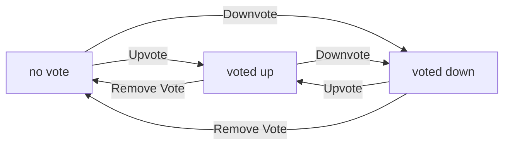

**redditPlatform — Actor definitions, permission matrix, authentication, session, account lifecycle**

Actor definitions, permission matrix, authentication, session, account lifecycle

# Actor Definitions

Define all user actor types with their roles and what they can do.

## guest Actor

Guests are users who have not signed in to their account. They can browse all communities in the platform and view community details including subscriber counts. Guests can view profiles of any registered user including their display name, bio, and karma score. Guests can read posts and comments from any community without restrictions. Guests can view both popular feeds showing all posts and community feeds for specific communities. Guests cannot create posts, comments, or vote on content. Guests cannot subscribe to communities or participate in discussions. Guests can search for communities by name. Guests have read-only access to all public content on the platform. Guests must sign in to view home feeds personalized to their subscribed communities.

### Guest Browsing Access

WHEN a guest accesses the platform, THE system SHALL provide read-only access to all public content.

THE system SHALL allow guests to view community listings without requiring authentication.

THE system SHALL display community names, descriptions, and icon images to guests.

THE system SHALL show subscriber counts for each community to guests.

IF a guest attempts to access restricted content, THE system SHALL display the content in read-only mode.

THE system SHALL restrict guests from viewing home feeds personalized to subscribed communities.

THE system SHALL provide the same community browsing experience to all guests regardless of authentication status.

THE system SHALL track guest browsing activity for analytics purposes without storing personally identifiable information.

GUESTS SHALL NOT be able to access any content that is not marked as publicly visible.

### Read-Only Content Viewing

WHEN a guest views a post, THE system SHALL display the title, author username, community name, vote score, comment count, and posting time.

THE system SHALL show the full content of text posts to guests.

THE system SHALL display image post thumbnails and full images to guests.

THE system SHALL show the domain name of link posts to guests.

WHEN a guest views a comment, THE system SHALL display the author, content, vote score, posting time, and any nested replies.

THE system SHALL allow guests to scroll through post comments without authentication.

THE system SHALL NOT allow guests to edit or delete any content.

THE system SHALL NOT allow guests to create any new content including posts or comments.

IF a guest attempts to perform a write operation, THE system SHALL reject the request and indicate authentication is required.

THE system SHALL serve the same read-only content to all guests without personalization based on reading history.

### Community Listing and Search

WHEN a guest searches for communities, THE system SHALL search by community name.

THE system SHALL return communities matching the search query with name, description, and icon image.

THE system SHALL display the subscriber count for each community in search results.

THE system SHALL provide pagination for community search results.

THE system SHALL allow guests to browse all communities in a paginated list.

THE system SHALL show community details including description and icon when a guest clicks on a community.

THE system SHALL NOT show communities that have been deactivated or deleted.

THE system SHALL allow guests to view the community feed for any publicly available community.

IF no communities match the search query, THE system SHALL display a message indicating no results found.

### Profile Viewing Without Login

WHEN a guest views any user profile, THE system SHALL display the display name, bio, and avatar image.

THE system SHALL show the user's total karma score to guests.

THE system SHALL display a list of all posts created by the profile owner.

THE system SHALL display a list of all comments written by the profile owner.

THE system SHALL allow guests to view profiles of any registered user without authentication.

THE system SHALL show the same profile information to guests as to authenticated members.

THE system SHALL NOT allow guests to edit any user profile information.

WHEN the profile owner has no posts or comments, THE system SHALL display empty lists with an appropriate message.

IF a user profile is private, THE system SHALL indicate limited visibility to guests.

THE system SHALL display the profile owner's username to guests.

### Popular Feed Access

WHEN a guest accesses the popular feed, THE system SHALL display posts from all communities across the platform.

THE system SHALL allow sorting the popular feed by hot, new, top, and controversial.

THE system SHALL allow filtering the top sort by time periods: today, this week, this month, this year, and all time.

THE system SHALL show post list items including title, author, community name, vote score, comment count, and time since posted.

THE system SHALL display post preview content: first 200 characters for text posts, thumbnail for image posts, domain name for link posts.

THE system SHALL paginate the popular feed results.

THE system SHALL allow guests to click on any post to view its full details.

THE system SHALL NOT show posts from communities the guest is not subscribed to in the popular feed (unlike members who see subscribed communities in home feed).

WHEN the popular feed is empty, THE system SHALL display a message indicating no posts are available.

### Community Feed Access

WHEN a guest views a community feed, THE system SHALL display all posts from that specific community.

THE system SHALL allow sorting the community feed by hot, new, top, and controversial.

THE system SHALL allow filtering the top sort by time periods: today, this week, this month, this year, and all time.

THE system SHALL show post list items including title, author, community name, vote score, comment count, and time since posted.

THE system SHALL display post preview content: first 200 characters for text posts, thumbnail for image posts, domain name for link posts.

THE system SHALL paginate the community feed results.

THE system SHALL allow guests to view community feeds for any community regardless of subscription status.

THE system SHALL display the community name and icon at the top of the community feed.

IF a community has no posts, THE system SHALL display a message indicating the community is empty.

### Guest Limitations

THE system SHALL require guests to sign in before creating any post.

THE system SHALL require guests to sign in before writing any comment.

THE system SHALL require guests to sign in before voting on any post.

THE system SHALL require guests to sign in before voting on any comment.

THE system SHALL require guests to sign in before subscribing to any community.

THE system SHALL require guests to sign in before unsubscribing from any community.

THE system SHALL require guests to sign in before editing any post.

THE system SHALL require guests to sign in before deleting any post.

THE system SHALL require guests to sign in before editing any comment.

THE system SHALL require guests to sign in before deleting any comment.

WHEN a guest attempts any restricted action, THE system SHALL display a message prompting authentication.

THE system SHALL NOT allow guests to report any post or comment without authentication.

THE system SHALL NOT allow guests to create or manage any reports.

THE system SHALL redirect guests to the login page when they attempt restricted operations.

## member Actor

Members are registered users who have successfully signed in to their account. Members can create posts in communities they have subscribed to. Members can write comments on any post and reply to other comments with unlimited nesting depth. Members can upvote and downvote posts and comments with single vote per item. Members can change their vote from upvote to downvote or remove their vote entirely. Members can subscribe and unsubscribe from any community. Members can edit their own posts and comments to update content. Members can delete their own posts and comments. Members can view their own profile page with full editing capabilities. Members can view their own karma score and watch it change as others vote on their content. Members can view their subscribed communities list and see new posts from those communities. Members cannot view reports or perform moderation actions. Members must remain in good standing to maintain posting privileges.

### Member Signed-In Capabilities

WHEN a member signs in to the system, THE system SHALL grant access to all member-level features including post creation, commenting, voting, and profile management.

WHEN a member is signed in, THE system SHALL provide access to the personalized home feed showing posts from subscribed communities.

WHEN a member is signed in, THE system SHALL display the member's current karma score on the profile page.

IF a member is not signed in, THE system SHALL restrict all write operations including post creation, commenting, voting, and content management.

THE system SHALL maintain member session state to preserve signed-in status across page navigations and browser sessions according to token policy (defined in Session and Token Policy).

### Post Creation in Subscribed Communities

WHEN a member creates a post, THE system SHALL require a title for the post.

WHEN a member creates a post, THE system SHALL require the post to be one of three types: text post, link post, or image post.

WHEN a member creates a post, THE system SHALL REQUIRE the member to be subscribed to the target community.

IF a member attempts to create a post in a community they are not subscribed to, THE system SHALL reject the request.

WHEN a member creates a text post, THE system SHALL allow the member to enter text content.

WHEN a member creates a link post, THE system SHALL require a valid URL.

WHEN a member creates an image post, THE system SHALL require the member to upload an image file.

WHEN a post is created, THE system SHALL associate the post with the creating member as the author.

WHEN a post is created, THE system SHALL associate the post with the target community.

### Comment Writing with Unlimited Replies

WHEN a member writes a comment, THE system SHALL allow the member to comment on any post in the system.

WHEN a member writes a reply to a comment, THE system SHALL support unlimited nesting depth of replies.

WHEN a member writes a comment or reply, THE system SHALL REQUIRE the member to be signed in.

WHEN a comment is written, THE system SHALL associate the comment with the writing member as the author.

WHEN a comment is written, THE system SHALL associate the comment with the target post.

WHEN a comment is written, THE system SHALL calculate the comment's initial vote score as zero.

IF a banned user attempts to write a comment or reply in a community, THE system SHALL reject the request according to good standing requirements (defined in Good Standing Requirement).

### Vote Management on Posts and Comments

WHEN a member votes on a post or comment, THE system SHALL allow the member to cast an upvote or downvote.

WHEN a member votes on a post or comment, THE system SHALL enforce a single vote per content item per member.

WHEN a member changes their vote from upvote to downvote or vice versa, THE system SHALL update the vote score accordingly.

WHEN a member removes their vote entirely, THE system SHALL adjust the vote score to reflect the removal.

WHEN a member casts an upvote, THE system SHALL increase the content's vote score by 1.

WHEN a member casts a downvote, THE system SHALL decrease the content's vote score by 1.

WHEN a member changes their vote, THE system SHALL update the member's karma score based on their previous and new vote state.

IF a member attempts to cast a second vote on the same content, THE system SHALL reject the request and require the member to change or remove their existing vote first.

### Subscribe and Unsubscribe Communities

WHEN a member subscribes to a community, THE system SHALL add the community to the member's subscribed communities list.

WHEN a member subscribes to a community, THE system SHALL increment the community's subscriber count.

WHEN a member unsubscribes from a community, THE system SHALL remove the community from the member's subscribed communities list.

WHEN a member unsubscribes from a community, THE system SHALL decrement the community's subscriber count.

IF a member attempts to subscribe to a community, THE system SHALL allow the member to subscribe without restriction.

IF a member attempts to unsubscribe from a community, THE system SHALL allow the member to unsubscribe without restriction.

WHEN a member subscribes to a community, THE system SHALL grant the member permission to create posts in that community.

### Edit Own Content

WHEN a member edits their own post, THE system SHALL allow the member to update the post title and content.

WHEN a member edits their own post, THE system SHALL allow the member to change the post type from text to link or image, subject to content validation.

WHEN a member edits their own comment, THE system SHALL allow the member to update the comment content.

WHEN a member edits their own post or comment, THE system SHALL record the edit timestamp for audit purposes.

IF a member attempts to edit another member's post or comment, THE system SHALL reject the request.

IF a member attempts to edit their own content after it has been deleted, THE system SHALL reject the request.

WHEN a post is edited, THE system SHALL display the edited version to all viewers.

### Delete Own Content

WHEN a member deletes their own post, THE system SHALL permanently remove the post from the system.

WHEN a member deletes their own post, THE system SHALL permanently remove all comments associated with that post.

WHEN a member deletes their own comment, THE system SHALL permanently remove the comment from the system.

WHEN a member deletes their own post or comment, THE system SHALL decrement the vote score of the deleted content before removal.

WHEN a member deletes their own post, THE system SHALL update the member's karma score to reflect removal of votes on that post.

IF a member attempts to delete another member's post or comment, THE system SHALL reject the request.

IF a member attempts to delete their own content that has already been deleted, THE system SHALL reject the request.

WHEN content is deleted, THE system SHALL remove it from all feeds and lists where it was previously displayed.

### View and Edit Profile

WHEN a member views their own profile, THE system SHALL display the member's display name, bio, avatar, and karma score.

WHEN a member views another member's profile, THE system SHALL display the other member's display name, bio, avatar, karma score, posts list, and comments list.

WHEN a member edits their own profile, THE system SHALL allow the member to update their display name.

WHEN a member edits their own profile, THE system SHALL allow the member to update their bio text.

WHEN a member edits their own profile, THE system SHALL allow the member to upload or change their avatar image.

IF a member attempts to view or edit another member's profile display name, bio, or avatar, THE system SHALL reject the request.

WHEN a member's profile is updated, THE system SHALL reflect the changes immediately for all viewers.

WHEN a member's display name is updated, THE system SHALL update the author name displayed on all the member's existing posts and comments.

### Karma Score Tracking

WHEN any member casts a vote on a post, THE system SHALL adjust the post author's karma score based on the vote type.

WHEN any member casts a vote on a comment, THE system SHALL adjust the comment author's karma score based on the vote type.

WHEN a vote is removed, THE system SHALL adjust the affected author's karma score to reverse the previous adjustment.

WHEN a member changes their vote from upvote to downvote or vice versa, THE system SHALL adjust the affected author's karma score accordingly.

WHEN a post or comment is deleted, THE system SHALL adjust the author's karma score to remove the impact of all votes on that content.

WHEN a member views their profile, THE system SHALL display their current karma score as a single number.

WHEN a member's karma score changes, THE system SHALL reflect the new score immediately across the system.

THE system SHALL allow karma scores to be negative.

### Personalized Home Feed Access

WHEN a signed-in member accesses the home feed, THE system SHALL display only posts from communities the member has subscribed to.

WHEN a signed-in member accesses the home feed, THE system SHALL SORT posts according to selected sorting options (hot, new, top, controversial).

WHEN a guest accesses the home feed, THE system SHALL redirect the guest to the login page.

WHEN a member accesses the home feed, THE system SHALL display each post with title, author username, community name, vote score, comment count, and time since posted.

WHEN a member accesses the home feed, THE system SHALL display content previews: first 200 characters for text posts, thumbnail for image posts, domain name for link posts.

WHEN a member accesses the home feed, THE system SHALL paginate the results showing a limited number of posts per page.

WHEN a member accesses the home feed, THE system SHALL exclude posts from communities the member has unsubscribed from.

### View Subscribed Communities

WHEN a member views their subscribed communities list, THE system SHALL display all communities the member is currently subscribed to.

WHEN a member views their subscribed communities list, THE system SHALL show the community name and subscriber count for each subscribed community.

WHEN a member views their subscribed communities list, THE system SHALL allow the member to navigate to each community's page.

IF a member has no subscribed communities, THE system SHALL display an empty list or appropriate message.

WHEN a member subscribes to or unsubscribes from a community, THE system SHALL update the subscribed communities list in real-time.

WHEN a member views their subscribed communities list, THE system SHALL order the list by most recently subscribed or alphabetically (by business rule).

### Moderation Reports Access Restriction

IF a member attempts to view moderation reports for any community, THE system SHALL reject the request and restrict access.

WHEN a member attempts to view reported content, THE system SHALL allow the member to view the content but NOT the report details.

IF a member attempts to approve or dismiss a report, THE system SHALL reject the request and indicate the member lacks permission.

WHEN a moderator views reports, THE system SHALL distinguish moderator access from member access.

IF a member attempts to perform any moderation action including banning users or deleting posts, THE system SHALL reject the request.

WHEN a banned user attempts to access the platform, THE system SHALL allow content viewing but restrict posting and commenting according to good standing requirements (defined in Good Standing Requirement).

### Good Standing Requirement

WHEN a member attempts to create a post, THE system SHALL verify the member is in good standing.

WHEN a member attempts to write a comment or reply, THE system SHALL verify the member is in good standing.

WHEN a member attempts to vote on content, THE system SHALL verify the member is in good standing.

IF a member is banned from a community, THE system SHALL allow the member to view content in that community but reject any attempt to create posts or comments.

IF a member is banned from the platform, THE system SHALL reject all write operations including post creation, commenting, and voting across all communities.

WHEN a member is unbanned by a moderator, THE system SHALL restore the member's posting and commenting privileges in that community.

WHEN a member's account is deleted, THE system SHALL remove all the member's posts and comments from the system.

THE system SHALL enforce good standing requirements at the time of each write operation attempt.

### Single Vote Per Content Item

WHEN a member casts a vote on a post or comment, THE system SHALL record that the member has voted on that specific content item.

WHEN a member attempts to cast a second vote on the same post or comment, THE system SHALL reject the request.

WHEN a member attempts to cast a second vote on the same post or comment, THE system SHALL inform the member they must change or remove their existing vote first.

WHEN a member removes their vote, THE system SHALL allow the member to cast a new vote on that content item.

WHEN a member changes their vote, THE system SHALL allow the member to immediately cast a different vote on that content item.

IF multiple members vote on the same content item, THE system SHALL allow each member to cast one vote per content item.

WHEN calculating the vote score, THE system SHALL count only the current vote state of each member, not historical votes.

THE system SHALL ensure exactly one vote per member per content item at all times.

### Member Account Deletion

WHEN a member requests account deletion, THE system SHALL permanently delete the member's account.

WHEN a member requests account deletion, THE system SHALL permanently delete all posts created by the member.

WHEN a member requests account deletion, THE system SHALL permanently delete all comments written by the member.

WHEN a member requests account deletion, THE system SHALL permanently delete all votes cast by the member.

WHEN a member requests account deletion, THE system SHALL NOT restore deleted content or account data.

WHEN a member's account is deleted, THE system SHALL remove the member from all community subscriber lists.

WHEN a member's account is deleted, THE system SHALL update the author display on all remaining content (if any) to indicate deleted author.

WHEN a member requests account deletion, THE system SHALL confirm the action requires understanding that all content will be permanently removed.

### Vote State Transitions

WHEN a member transitions from no vote to upvote, THE system SHALL increase the content score by 1.

WHEN a member transitions from no vote to downvote, THE system SHALL decrease the content score by 1.

WHEN a member transitions from upvote to downvote, THE system SHALL decrease the content score by 2.

WHEN a member transitions from downvote to upvote, THE system SHALL increase the content score by 2.

WHEN a member transitions from any vote state to no vote, THE system SHALL adjust the content score by the opposite of their vote value.

WHEN a member changes their vote, THE system SHALL update the member's karma score based on the vote change impact.

## admin Actor

Admins in this platform are community moderators who manage specific communities. The community creator automatically becomes the owner with highest authority. Owners can add new moderators to their community and remove existing moderators. Owners can also remove other moderators but moderators cannot remove each other or the owner. Moderators can delete any post in their community regardless of who created it. Moderators can delete any comment in their community regardless of who wrote it. Moderators can ban users from their community preventing them from posting or commenting. Moderators can unban previously banned users to restore their posting privileges. Moderators can view the complete list of banned users in their community. Moderators can view all content reports submitted for their community. Moderators can approve reports which deletes the reported content. Moderators can dismiss reports which removes them from the report queue. Moderators cannot ban other moderators and cannot remove the owner role.

### Community Moderator Role Definition

WHEN a user is assigned as a moderator of a community, THE system SHALL grant that user the authority to moderate content within that specific community.

WHEN a user creates a community, THE system SHALL automatically assign that user as the owner with highest authority in the community.

WHILE a user has moderator status in a community, THE system SHALL allow them to delete posts and comments submitted by any user.

WHILE a user has moderator status in a community, THE system SHALL allow them to ban and unban users from participating in that community.

WHILE a user has moderator status in a community, THE system SHALL allow them to view all content reports submitted for that community.

WHILE a user has moderator status in a community, THE system SHALL allow them to approve or dismiss content reports.

IF a user attempts moderator actions outside their assigned communities, THE system SHALL reject the request.

THE system SHALL prevent moderators from banning other moderators in the same community.

THE system SHALL prevent moderators from removing the owner role from the community creator.

### Owner Authority Hierarchy

WHEN a user creates a community, THE system SHALL designate that user as the owner with the highest level of authority in the community.

WHILE a user has owner status in a community, THE system SHALL allow that user to add new moderators to the community.

WHILE a user has owner status in a community, THE system SHALL allow that user to remove existing moderators from the community.

WHILE a user has owner status in a community, THE system SHALL grant them all capabilities available to moderators plus additional privileges.

IF an owner attempts to remove another owner from the community, THE system SHALL reject the request and enforce single-owner rule.

THE system SHALL maintain a permanent owner status that cannot be transferred to another user except through owner-initiated community transfer.

WHILE a user has owner status, THE system SHALL display the owner designation prominently on their profile and community management pages.

IF a moderator attempts actions reserved for owners only, THE system SHALL reject the request and indicate insufficient permissions.

### Adding Moderators

WHEN an owner adds a user as a moderator, THE system SHALL grant that user moderator privileges for that specific community.

WHILE a user has owner status, THE system SHALL allow the owner to select any active member as a potential moderator.

WHEN a user is added as a moderator, THE system SHALL notify that user of their new moderator role and associated responsibilities.

WHEN a user is added as a moderator, THE system SHALL update the community's moderator list and display count.

WHILE a user has moderator status, THE system SHALL allow them to add other users as moderators in the same community.

WHEN a moderator adds a new moderator, THE system SHALL record the action in the community's audit history.

IF a user is added as a moderator while they already have moderator status in another community, THE system SHALL maintain both separate moderator assignments.

THE system SHALL prevent moderators from adding other moderators when they have reached the maximum moderator limit for the community.

IF a user attempt to add a moderator who is already banned from the community, THE system SHALL reject the request.

### Removing Moderators

WHEN an owner removes a moderator, THE system SHALL revoke that user's moderator privileges for the specified community.

WHILE a user has owner status, THE system SHALL allow the owner to remove any moderator from the community.

WHEN a moderator is removed, THE system SHALL update the community's moderator list and display count immediately.

WHEN a moderator is removed, THE system SHALL notify the removed user of their status change.

IF a moderator attempts to remove another moderator, THE system SHALL reject the request and indicate they lack sufficient authority.

IF an owner attempts to remove themselves as the sole owner, THE system SHALL reject the request and require at least one owner remain.

WHILE a moderator is removed, THE system SHALL preserve their historical moderation actions in the audit logs.

IF a user who was removed as a moderator attempts moderator actions, THE system SHALL reject the request.

THE system SHALL not allow removal of the last owner from a community to ensure community ownership persists.

### Deleting Community Posts

WHEN a moderator deletes a post in their community, THE system SHALL permanently remove that post from public view.

WHILE a user has moderator status, THE system SHALL allow them to delete any post submitted to their community regardless of the post author.

WHEN a moderator deletes a post, THE system SHALL record the action in the community's moderation audit log.

WHEN a moderator deletes a post, THE system SHALL increment the community's deleted post count for moderation statistics.

IF a moderator deletes a post, THE system SHALL notify the post author that their content was removed.

WHEN a post is deleted by a moderator, THE system SHALL remove all associated replies from public view while preserving them in the audit log.

IF a user attempts to delete a post in a community where they are not a moderator, THE system SHALL reject the request.

THE system SHALL prevent moderators from deleting posts in communities where they do not have moderator status.

WHEN a moderator deletes a post, THE system SHALL update the post's status to deleted and mark the deletion timestamp.

### Deleting Community Comments

WHEN a moderator deletes a comment in their community, THE system SHALL permanently remove that comment from public view.

WHILE a user has moderator status, THE system SHALL allow them to delete any comment submitted to their community regardless of the comment author.

WHEN a moderator deletes a comment, THE system SHALL record the action in the community's moderation audit log.

WHEN a moderator deletes a comment, THE system SHALL remove all nested replies to that comment from public view.

IF a moderator deletes a comment, THE system SHALL notify the comment author that their content was removed.

WHEN a comment is deleted by a moderator, THE system SHALL update the comment's status to deleted and mark the deletion timestamp.

IF a user attempts to delete a comment in a community where they are not a moderator, THE system SHALL reject the request.

THE system SHALL prevent moderators from deleting comments in communities where they do not have moderator status.

WHEN a moderator deletes a comment that has replies, THE system SHALL preserve the reply chain in the moderation audit log.

### Banning Users from Community

WHEN a moderator bans a user from a community, THE system SHALL prevent that user from creating new posts or comments in the community.

WHILE a user has moderator status, THE system SHALL allow them to ban any user from their community.

WHEN a user is banned, THE system SHALL immediately remove their ability to interact with the community while preserving view-only access.

WHEN a user is banned, THE system SHALL record the ban action in the community's moderation audit log with the banning moderator's identity.

WHEN a user is banned, THE system SHALL notify the banned user that they have been banned from the community.

IF a moderator attempts to ban a user who is already banned, THE system SHALL reject the request and maintain existing ban status.

IF a moderator attempts to ban another moderator in the same community, THE system SHALL reject the request.

IF a moderator attempts to ban the owner of the community, THE system SHALL reject the request.

WHEN a user is banned, THE system SHALL display a banner to that user indicating their banned status when they attempt to interact.

### Unbanning Users

WHEN a moderator unbans a user from a community, THE system SHALL restore that user's ability to create posts and comments in the community.

WHILE a user has moderator status, THE system SHALL allow them to unban previously banned users from their community.

WHEN a user is unbanned, THE system SHALL immediately restore their full interaction capabilities in the community.

WHEN a user is unbanned, THE system SHALL record the unban action in the community's moderation audit log.

WHEN a user is unbanned, THE system SHALL notify the unbanned user that their ban has been lifted.

IF a moderator attempts to unban a user who is not currently banned, THE system SHALL reject the request.

WHEN a user is unbanned, THE system SHALL reset any temporary interaction restrictions that may have been applied.

IF a moderator attempts to unban a user who was banned by a different moderator, THE system SHALL allow the unban action.

WHEN a user is unbanned, THE system SHALL update the community's banned user count to reflect the change.

### Viewing Banned Users List

WHILE a user has moderator status, THE system SHALL display a complete list of all users banned from their community.

WHEN a moderator views the banned users list, THE system SHALL show each banned user's username, ban reason, and ban timestamp.

WHEN a moderator views the banned users list, THE system SHALL show who issued each ban and when it was issued.

WHEN a moderator views the banned users list, THE system SHALL indicate whether each ban is active or has been lifted.

WHILE a user has moderator status, THE system SHALL allow them to filter the banned users list by date range or banning moderator.

WHEN a moderator views the banned users list, THE system SHALL display the total count of currently banned users.

IF a user without moderator status attempts to view the banned users list, THE system SHALL reject the request.

WHEN a moderator views the banned users list, THE system SHALL show when each user can be unbanned if applicable.

WHILE a user has moderator status, THE system SHALL provide export functionality for the banned users list for compliance purposes.

### Viewing Content Reports

WHILE a user has moderator status, THE system SHALL display all content reports submitted for their community.

WHEN a moderator views content reports, THE system SHALL show the reported content (post or comment), the reporter's username, and the report reason.

WHEN a moderator views content reports, THE system SHALL indicate the current status of each report (pending, resolved, dismissed).

WHEN a moderator views content reports, THE system SHALL show when the report was submitted and by whom.

WHILE a user has moderator status, THE system SHALL allow them to filter content reports by status, content type, or reporter.

WHEN a moderator views content reports, THE system SHALL display a total count of pending reports awaiting review.

IF a user without moderator status attempts to view content reports, THE system SHALL reject the request.

WHEN a moderator views content reports, THE system SHALL provide direct links to the reported content for review.

WHILE a user has moderator status, THE system SHALL notify them when new reports are submitted to their community.

### Approving Reports and Deleting Content

WHEN a moderator approves a content report, THE system SHALL delete the reported content permanently.

WHILE a user has moderator status, THE system SHALL allow them to approve any pending report for their community.

WHEN a moderator approves a report, THE system SHALL update the report status to resolved and record the approving moderator's identity.

WHEN a moderator approves a report, THE system SHALL notify the reporter that their report was approved and content was removed.

WHEN a moderator approves a report, THE system SHALL notify the content author that their content was removed due to report approval.

IF a moderator attempts to approve a report that has already been resolved or dismissed, THE system SHALL reject the request.

WHEN a moderator approves a report, THE system SHALL record the approval action in the community's moderation audit log.

IF a moderator approves a report for content they do not have deletion authority on, THE system SHALL reject the request.

WHEN a moderator approves a report, THE system SHALL update the community's resolved report count for statistics.

### Dismissing Reports

WHEN a moderator dismisses a content report, THE system SHALL keep the reported content in place and mark the report as dismissed.

WHILE a user has moderator status, THE system SHALL allow them to dismiss any pending report for their community.

WHEN a moderator dismisses a report, THE system SHALL update the report status to dismissed and record the dismissing moderator's identity.

WHEN a moderator dismisses a report, THE system SHALL remove the report from the active report queue.

WHEN a moderator dismisses a report, THE system SHALL notify the reporter that their report was reviewed and content was not removed.

IF a moderator attempts to dismiss a report that has already been resolved or dismissed, THE system SHALL reject the request.

WHEN a moderator dismisses a report, THE system SHALL record the dismissal action in the community's moderation audit log.

IF a moderator dismisses a report, THE system SHALL display a required reason field to document the dismissal decision.

WHEN a moderator dismisses a report, THE system SHALL update the community's dismissed report count for statistics.

### Owner Protection Rules

IF any user attempts to remove the owner from the community, THE system SHALL reject the request and enforce owner protection.

IF any moderator attempts to perform actions that would remove owner status, THE system SHALL reject the request.

WHILE a community has an owner, THE system SHALL prevent that owner from being removed as a moderator.

IF a user attempts to ban the owner from the community, THE system SHALL reject the request.

IF any user attempts to delete posts made by the owner that were approved by the system, THE system SHALL require owner confirmation for deletion.

THE system SHALL maintain at least one owner for every community to ensure ownership persists.

IF the only owner attempts to leave the community, THE system SHALL prevent the action and require transfer or removal first.

WHILE a user has owner status, THE system SHALL display owner-only options that are not visible to moderators.

### Moderator Protection Rules

IF any moderator attempts to remove another moderator from the community, THE system SHALL reject the request.

IF any moderator attempts to ban another moderator from the community, THE system SHALL reject the request.

IF a moderator attempts to delete posts made by other moderators, THE system SHALL require additional confirmation.

THE system SHALL prevent moderators from changing each other's moderator status without owner authorization.

WHILE a moderator has moderator status, THE system SHALL maintain their previous moderation actions in the audit log.

IF a moderator attempts to perform actions reserved for owners, THE system SHALL reject the request with insufficient authority message.

WHEN a moderator is removed, THE system SHALL immediately revoke all moderator capabilities.

IF a moderator attempts to add or remove other moderators, THE system SHALL allow the action but log it for owner review.

### Community-Level Permissions

WHEN a user performs moderator actions, THE system SHALL verify they have moderator status in that specific community.

WHILE a user has moderator status, THE system SHALL limit their moderation capabilities to only the communities where they are moderators.

IF a user attempts to moderate content in a community where they lack moderator status, THE system SHALL reject the request.

THE system SHALL maintain separate moderator assignments for each community.

WHEN a moderator joins a new community, THE system SHALL require explicit assignment as a moderator before they can perform actions.

IF a moderator's role is changed in one community, THE system SHALL maintain unchanged status in all other communities.

WHILE a user has moderator status, THE system SHALL display only the communities where they have moderation privileges in their dashboard.

THE system SHALL enforce strict isolation between community-level permissions to prevent cross-community moderation.

### Content Moderation Authority

WHEN a moderator reviews content, THE system SHALL grant them authority to delete posts and comments within their community.

WHILE a user has moderator status, THE system SHALL allow them to take action on any content submitted to their community.

IF a moderator attempts to moderate content outside their community scope, THE system SHALL reject the request.

WHEN a moderator performs moderation actions, THE system SHALL record the action in the community's comprehensive audit log.

WHILE a user has moderator status, THE system SHALL provide them with tools to efficiently review and moderate content.

IF multiple moderators attempt to moderate the same content simultaneously, THE system SHALL enforce single-modification priority.

WHEN a moderator performs bulk moderation actions, THE system SHALL record each individual action with its timestamp.

THE system SHALL ensure moderation authority is clearly displayed to community members indicating which users have been granted authority.

# Authentication Flows

Registration, login, session management, and token policies.

## Registration and Login

Define user registration and login flows including validation and error handling.

### User Registration

WHEN a user signs up, THE system SHALL: 1. Accept email and password as required fields 2. Accept a unique username 3. Accept optional display name (defaults to username if not provided) 4. Accept optional bio text 5. Accept optional avatar image upload

IF the email is already registered, THE system SHALL reject the registration request.

IF the username is already taken, THE system SHALL reject the registration request.

IF the password is shorter than 8 characters, THE system SHALL reject the registration request.

IF the email format is invalid, THE system SHALL reject the registration request.

THE system SHALL send a welcome notification to the user after successful registration.

THE system SHALL create a new user account with a default karma score of zero after successful registration.

### User Login

WHEN a user signs in, THE system SHALL: 1. Accept email and password as required credentials 2. Validate the credentials against registered accounts 3. Create an active session for authenticated users 4. Return user profile information upon successful authentication

IF the email is not registered, THE system SHALL reject the login request.

IF the password is incorrect, THE system SHALL reject the login request.

IF the account is deleted, THE system SHALL reject the login request.

IF the account is suspended, THE system SHALL reject the login request.

IF the user has too many failed login attempts, THE system SHALL temporarily lock the account.

THE system SHALL create a session token upon successful authentication.

THE system SHALL require authentication for all member actions including post creation, comment writing, and voting.

### Session Management

WHEN a user authenticates, THE system SHALL create a session that allows continued access across multiple requests.

WHILE a session is active, THE system SHALL allow the user to perform member actions without re-authenticating.

WHEN a session expires, THE system SHALL require the user to sign in again.

THE system SHALL provide a refresh mechanism to extend session validity.

THE system SHALL invalidate all sessions when a user changes their password.

THE system SHALL allow a user to view a list of active sessions.

THE system SHALL allow a user to terminate individual sessions.

THE system SHALL terminate all sessions when a user deletes their account.

### Password Change

WHEN a signed-in user requests to change their password, THE system SHALL: 1. Require the current password for verification 2. Accept a new password as the replacement

IF the current password is incorrect, THE system SHALL reject the password change request.

IF the new password is shorter than 8 characters, THE system SHALL reject the password change request.

IF the new password matches the current password, THE system SHALL reject the password change request.

THE system SHALL invalidate all existing sessions after a successful password change.

THE system SHALL send a confirmation notification to the user after a successful password change.

THE system SHALL require re-authentication with the new password after a password change.

### Account Deletion

WHEN a signed-in user requests to delete their account, THE system SHALL: 1. Require password confirmation 2. Prompt for a confirmation reason 3. Permanently delete all posts created by the user 4. Permanently delete all comments written by the user 5. Remove the user from all communities they own as owner 6. Transfer community ownership or delete communities owned by the user

IF the password confirmation is incorrect, THE system SHALL reject the account deletion request.

IF the user is a moderator in other communities, THE system SHALL transfer moderator privileges to the owner before deleting the account.

IF the user owns communities, THE system SHALL allow the user to assign a new owner before proceeding.

IF the user has unresolved reports, THE system SHALL notify the user that reports will be archived.

THE system SHALL make account deletion irreversible once completed.

THE system SHALL permanently remove the user's profile, avatar, and all associated data.

### Guest Access

GUESTS MAY browse all communities in a list without authentication.

GUESTS MAY search for communities by name without authentication.

GUESTS MAY view any community's page including subscriber count without authentication.

GUESTS MAY view the popular feed of posts from all communities without authentication.

GUESTS MAY view community feeds without authentication.

GUESTS MAY view user profiles of any registered user without authentication.

GUESTS MAY NOT create posts without authentication.

GUESTS MAY NOT create comments without authentication.

GUESTS MAY NOT vote on posts or comments without authentication.

GUESTS MAY NOT subscribe to communities without authentication.

GUESTS MAY NOT report content without authentication.

### Permission Restrictions

MEMBERS MAY create posts only in communities they are subscribed to.

MEMBERS MAY write comments on any post without requiring subscription.

MEMBERS MAY vote on posts and comments they can view.

MEMBERS MAY subscribe or unsubscribe from any community.

MEMBERS MAY view their own profile and edit display name, bio, and avatar.

MEMBERS MAY view any other user's profile as read-only.

OWNERS MAY add moderators to their communities.

OWNERS MAY remove moderators from their communities.

OWNERS MAY delete any post in their communities.

OWNERS MAY delete any comment in their communities.

OWNERS MAY ban users from their communities.

OWNERS MAY unban users from their communities.

OWNERS MAY view the list of banned users in their communities.

### Login Error Handling

THE system SHALL display a generic error message when login credentials are invalid, without revealing whether the email exists.

THE system SHALL log all failed login attempts for security analysis.

THE system SHALL implement rate limiting on login attempts to prevent brute force attacks.

THE system SHALL send a notification when an account is temporarily locked due to failed login attempts.

THE system SHALL allow account recovery through email verification for forgotten passwords.

## Session and Token Policy

Define session duration, token refresh, and expiration policies.

### Session Duration and Lifetime

WHEN a user successfully logs in, THE system SHALL create a new session for that user.

WHEN a session is created, THE system SHALL assign it a unique session identifier.

THE system SHALL limit active sessions per user to a maximum of five concurrent sessions.

IF a user exceeds the maximum concurrent session limit, THE system SHALL invalidate the oldest session.

WHEN a user logs in from a new device, THE system SHALL notify the user of the login event.

WHEN a user logs out, THE system SHALL immediately terminate their session.

### Token Expiration Policy

WHEN a session is created, THE system SHALL generate an access token for authenticated requests.

WHEN an access token is generated, THE system SHALL assign it an expiration time of two hours from creation.

IF a user attempts to access a protected resource with an expired token, THE system SHALL reject the request.

IF an access token expires during an active session, THE system SHALL redirect the user to re-authenticate.

WHEN a session is terminated, THE system SHALL invalidate all tokens associated with that session.

### Token Refresh Mechanism

WHEN an access token expires, THE system SHALL issue a refresh token along with the access token.

WHEN a refresh token is issued, THE system SHALL assign it an expiration time of seven days from creation.

WHEN a refresh token is used, THE system SHALL generate a new access token with a new two-hour expiration.

WHEN a refresh token is used, THE system SHALL invalidate the used refresh token and issue a new one.

IF a refresh token expires, THE system SHALL require the user to log in again.

IF a refresh token has been invalidated, THE system SHALL reject refresh attempts.

### JWT Structure and Claims

WHEN an access token is created, THE system SHALL encode it as a JWT (JSON Web Token).

WHEN a JWT is created, THE system SHALL include the user identifier as a claim.

WHEN a JWT is created, THE system SHALL include the session identifier as a claim.

WHEN a JWT is created, THE system SHALL include the token creation timestamp as a claim.

WHEN a JWT is created, THE system SHALL include the token expiration timestamp as a claim.

WHEN the system validates a JWT, THE system SHALL verify all claims are present and valid.

### Session Termination and Security

WHEN a user deletes their account, THE system SHALL immediately terminate all active sessions for that user.

WHEN a user changes their password, THE system SHALL invalidate all existing sessions for that user.

WHEN a user requests account suspension, THE system SHALL terminate all active sessions immediately.

WHEN the system detects suspicious activity, THE system SHALL terminate active sessions as a security measure.

IF a session is terminated due to security concerns, THE system SHALL notify the user via email.

# Account Lifecycle

Account state transitions and lifecycle management.

## Account States and Transitions

Define account states (active, suspended, deleted) and valid transitions.

### Account Registration

WHEN a user requests to register, THE system SHALL:
1. Validate that the username is unique across all users
2. Validate that the email address is not already associated with an existing account
3. Validate that the email format is valid
4. Create a new user account with the provided email, username, and password
5. Set the account state to "active" immediately upon successful registration

IF the username already exists, THE system SHALL reject the registration request.
IF the email address is already associated with an existing account, THE system SHALL reject the registration request.
IF the email format is invalid, THE system SHALL reject the registration request.

### Account States

THE system SHALL maintain three account states: active, suspended, and deleted.

AN active account has full access to all platform features including creating posts, writing comments, and voting.

A suspended account has restricted access. The user cannot create posts or comments but can still view content and access their profile.

A deleted account has no access to any platform features. All posts and comments associated with the account are also deleted.

A user account is in the "active" state upon successful registration.
A user account transitions to "suspended" state when suspended by an admin.
A user account transitions to "deleted" state when the user requests account deletion.

A suspended account cannot be manually changed to "active" by user action. Only an admin can restore a suspended account.
A deleted account cannot be restored or recovered.

### Account Deactivation

WHEN a user requests account deactivation, THE system SHALL:
1. Verify the user is authenticated and owns the account
2. Change the account state from "active" to "suspended"
3. Prevent the user from creating new posts or comments while the account is suspended
4. Allow the user to view their own profile and content they have created
5. Allow the user to access the platform to request reactivation

IF the user is not authenticated, THE system SHALL reject the deactivation request.

WHEN a user with a suspended account requests reactivation, THE system SHALL:
1. Verify the user is authenticated
2. Change the account state from "suspended" back to "active"
3. Restore full access to all platform features

IF the account state is already "deleted", THE system SHALL reject the reactivation request.

### Account Deletion

WHEN a user requests account deletion, THE system SHALL:
1. Verify the user is authenticated and owns the account
2. Change the account state from "active" to "deleted"
3. Permanently delete all posts created by the user
4. Permanently delete all comments written by the user
5. Remove the user from all communities they are subscribed to
6. Remove all votes made by the user from posts and comments
7. Remove all reports submitted by the user

IF the user is not authenticated, THE system SHALL reject the deletion request.
IF the account state is already "deleted", THE system SHALL reject the deletion request.

Once an account is deleted, all associated content is permanently removed and cannot be recovered.
The username associated with a deleted account becomes available for registration by a new user.

### Account Suspension

WHEN an admin suspends a user account, THE system SHALL:
1. Verify the admin is authenticated and has admin privileges
2. Change the account state from "active" to "suspended"
3. Prevent the user from creating new posts or comments
4. Prevent the user from writing new replies to comments
5. Allow the user to view their own profile and existing content
6. Allow the user to view posts and comments from other users

WHEN an admin restores a suspended account, THE system SHALL:
1. Verify the admin is authenticated and has admin privileges
2. Change the account state from "suspended" back to "active"
3. Restore full access to all platform features including posting, commenting, and voting

IF the user does not have admin privileges, THE system SHALL reject the suspension request.
IF the account state is already "deleted", THE system SHALL reject the suspension request.

A user with a suspended account cannot perform any actions that modify content or voting behavior.