**redditPlatform — Business concepts, relationships, and states from user perspective**

Business concepts, relationships, and states from user perspective

# Domain Concepts

Describe what each concept means to users and why it exists.

## User Concept

Users create accounts using an email address and password, choosing a unique username for identification. Once registered, users log in with their email and password to access the platform. Users can modify their account password when needed for security purposes. Users have the option to delete their entire account, which removes all their posts and comments from the system. Each user maintains a profile containing a display name, bio text, and avatar image. Users can update their own display name, bio, and avatar image at any time. Users can view their own profile to see their information and activity. Users can view other users' profiles to learn about community members. A user's profile displays their display name, bio, avatar, and total karma score. The profile page shows a list of all posts the user has created. The profile page also shows a list of all comments the user has written. Karma represents a user's overall reputation across the platform.

### Account Creation

WHEN a new user creates an account, THE system SHALL:
1. Require an email address
2. Require a password
3. Require a unique username
4. Store the account with default empty display name, bio, and avatar

IF the email address is already registered, THE system SHALL reject the account creation.
IF the username is already taken, THE system SHALL reject the account creation.
IF the password does not meet minimum security requirements, THE system SHALL reject the account creation.

WHEN an account is successfully created, THE system SHALL automatically log the user in.
WHEN an account is created, THE system SHALL initialize the user karma score to zero.

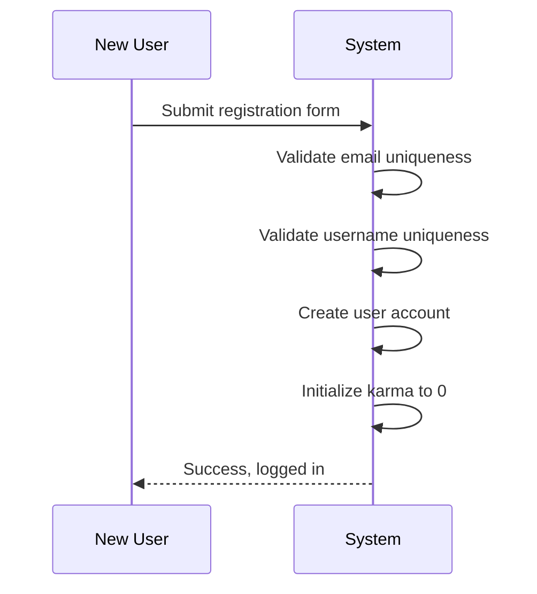

### Login Process

WHEN a registered user attempts to log in, THE system SHALL:
1. Require the user's email address
2. Require the user's password
3. Validate credentials against stored account

IF the email address does not exist in the system, THE system SHALL reject the login attempt.
IF the provided password does not match the stored password, THE system SHALL reject the login attempt.

WHEN login is successful, THE system SHALL create a user session.
WHEN login is successful, THE system SHALL maintain the session until the user logs out or session expires.

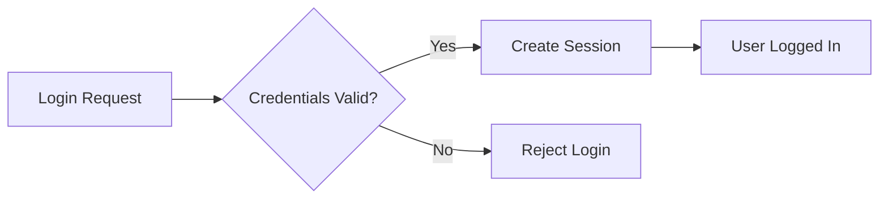

### Password Management

WHEN a logged-in user changes their password, THE system SHALL:
1. Require the current password for verification
2. Require the new password
3. Require confirmation of the new password
4. Update the password only if all fields are correct

IF the current password is incorrect, THE system SHALL reject the password change.
IF the new password does not meet minimum security requirements, THE system SHALL reject the password change.
IF the new password and confirmation do not match, THE system SHALL reject the password change.

WHEN a password is changed, THE system SHALL invalidate all existing user sessions.
WHEN a password is changed, THE system SHALL prompt the user to log in again with the new password.

IF a user forgets their password, THE system SHALL provide a password reset mechanism via email.

### Account Deletion

WHEN a logged-in user requests account deletion, THE system SHALL:
1. Require password re-entry for verification
2. Present confirmation that all content will be permanently deleted
3. Require explicit user confirmation

IF the password verification fails, THE system SHALL reject the account deletion request.
IF the user does not confirm deletion, THE system SHALL abort the process.

WHEN account deletion is confirmed, THE system SHALL:
1. Delete the user account
2. Delete all posts created by the user
3. Delete all comments written by the user

AFTER account deletion, THE system SHALL permanently remove all user data including posts and comments.
AFTER account deletion, THE system SHALL revoke all active user sessions.
WHEN an account is deleted, THE username becomes available for new registration.

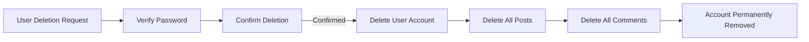

### Display Name Editing

WHEN a logged-in user edits their display name, THE system SHALL:
1. Allow the user to enter a new display name
2. Validate the display name for appropriate length
3. Update the user's profile with the new display name

IF the display name exceeds maximum length, THE system SHALL reject the update.
IF the display name is already in use by another user, THE system SHALL reject the update.
IF the display name contains inappropriate content, THE system SHALL reject the update.

WHEN a display name is successfully updated, THE system SHALL show the new display name on the user's profile.
WHEN a display name is updated, THE system SHALL reflect the new display name on all past posts and comments by that user.

IF a user deletes their account, any subsequent account creation with the same username shall receive a new, unique username if necessary.

### Bio Text Management

WHEN a logged-in user manages their bio text, THE system SHALL:
1. Allow the user to enter or edit bio text
2. Allow the user to clear the bio text entirely
3. Validate the bio text for appropriate length

IF the bio text exceeds maximum length, THE system SHALL reject the update.

WHEN a bio text is successfully updated, THE system SHALL show the new bio on the user's profile.
WHEN a bio is empty, THE system SHALL display a default message indicating no bio is available.

Users with no bio shall still be able to view other users' profiles and see their activity.

### Avatar Image Updates

WHEN a logged-in user updates their avatar image, THE system SHALL:
1. Accept an image file upload
2. Validate the image file format and size
3. Store the avatar image URL for the user profile
4. Display the avatar image on the user's profile and associated content

IF the image file format is not supported, THE system SHALL reject the upload.
IF the image file exceeds maximum size limit, THE system SHALL reject the upload.
IF the image cannot be processed, THE system SHALL reject the upload.

WHEN an avatar is successfully updated, THE system SHALL replace the previous avatar on the user's profile.
WHEN an avatar is updated, THE system SHALL reflect the new avatar on all posts and comments by that user.

WHEN a user has no avatar, THE system SHALL display a default placeholder image.

### Viewing Own Profile

WHEN a logged-in user views their own profile, THE system SHALL:
1. Display the user's display name, bio, and avatar
2. Display the user's total karma score
3. Display a list of all posts created by the user
4. Display a list of all comments written by the user

THE system SHALL provide editing capabilities for display name, bio, and avatar when viewing own profile.

WHEN a user navigates to their profile, THE system SHALL show the most recent posts first.
WHEN a user navigates to their profile, THE system SHALL show the most recent comments first.

IF a user has no posts, THE system SHALL display an appropriate message indicating no posts exist.
IF a user has no comments, THE system SHALL display an appropriate message indicating no comments exist.

### Viewing Other User Profiles

WHEN any user views another user's profile, THE system SHALL:
1. Display the other user's display name, bio, and avatar
2. Display the other user's total karma score
3. Display a list of all posts created by the other user
4. Display a list of all comments written by the other user

WHEN viewing another user's profile, THE system SHALL NOT provide editing capabilities.
WHEN viewing another user's profile, THE system SHALL clearly indicate the profile belongs to a different user.

WHEN a user's account has been deleted, THE system SHALL:
1. Hide the deleted user's display name
2. Replace it with a generic identifier like "Deleted User"
3. Continue showing posts and comments as attributed content

IF a user does not exist, THE system SHALL display an error message.
IF a user's profile is private, THE system SHALL display limited information to unauthorized viewers.

### Profile Karma Score Display

WHEN viewing any user profile, THE system SHALL display the user's total karma score.

THE karma score represents the sum of all upvotes minus downvotes across all posts and comments.

WHEN a user receives an upvote on any post or comment, THE system SHALL increment their karma score by one.
WHEN a user receives a downvote on any post or comment, THE system SHALL decrement their karma score by one.
WHEN a vote is removed from any post or comment, THE system SHALL adjust the user's karma score accordingly.

THE system SHALL allow karma scores to be negative.
THE system SHALL update the karma score in real-time as votes are cast on posts and comments.

WHEN a user account is deleted, THE system SHALL remove the karma score display from the system.

### User Posts List View

WHEN viewing a user's profile, THE system SHALL display a list of all posts created by that user.

THE system SHALL show each post with:
1. Post title
2. Vote score
3. Post type (text, link, or image)
4. Time since posted
5. Community where posted

THE system SHALL show posts ordered by most recent first.
THE system SHALL paginate the posts list when the user has many posts.

IF a post has been deleted by the author or a moderator, THE system SHALL NOT display it in the posts list.
IF a user has no posts, THE system SHALL display a message indicating no posts exist.

WHEN viewing posts on another user's profile, THE system SHALL NOT show edit or delete options.

### User Comments List View

WHEN viewing a user's profile, THE system SHALL display a list of all comments written by that user.

THE system SHALL show each comment with:
1. Comment content (truncated if too long)
2. Vote score
3. Post where commented
4. Time since posted
5. Whether the comment has replies

THE system SHALL show comments ordered by most recent first.
THE system SHALL paginate the comments list when the user has many comments.

IF a comment has been deleted by the author or a moderator, THE system SHALL NOT display it in the comments list.
IF a user has no comments, THE system SHALL display a message indicating no comments exist.

WHEN viewing comments on another user's profile, THE system SHALL NOT show edit or delete options.
THE system SHALL display nested reply structure for each comment when expanded.

### Profile Information Management

WHEN a logged-in user manages their profile information, THE system SHALL provide unified access to:
1. Display name editing
2. Bio text management
3. Avatar image updates
4. Profile viewing settings

THE system SHALL save profile changes immediately upon successful submission.
THE system SHALL display success confirmation after each profile update.
THE system SHALL display error messages when profile updates fail.

WHEN profile information is updated, THE system SHALL show the changes across all profile views immediately.
WHEN profile information is updated, THE system SHALL ensure consistency across all posts and comments attributed to the user.

IF a user cannot access profile editing features, THE system SHALL display an appropriate access denied message.
THE system SHALL validate all profile updates before saving to database.

## Post Concept

Users create posts in communities where they are subscribed members. Every post requires a title as a mandatory element. Posts can be one of three types: text posts with written content, link posts with a URL destination, or image posts with an uploaded image file. Users who create a post can edit its content to make changes or corrections. Users who create a post can delete it from the community at their discretion. When viewing a single post, users see the complete title and content details. The post view displays the author's username and the community where it was posted. Users can see the current vote score showing community reaction to the post. The comment count is displayed to indicate how many responses the post has received. The timestamp shows when the post was originally created and posted to the community. Posts in feeds show preview information including title, author, community name, and vote score. Text post previews show the first portion of the content for context. Image post previews show a thumbnail image to attract viewer interest. Link post previews show the domain name of the linked website.

### Post Creation in Communities

WHEN a member creates a new post, THE system SHALL require the member to be subscribed to the target community.

WHEN a member creates a post, THE system SHALL require a title for the post.

WHEN a member creates a text post, THE system SHALL require the member to enter text content.

WHEN a member creates a link post, THE system SHALL require the member to enter a valid URL.

WHEN a member creates an image post, THE system SHALL require the member to upload an image file.

IF the member is not subscribed to the target community, THE system SHALL reject the post creation request.

IF the post title is missing, THE system SHALL reject the post creation request.

IF the text content is missing for a text post, THE system SHALL reject the post creation request.

IF the URL is missing for a link post, THE system SHALL reject the post creation request.

IF the image file is missing for an image post, THE system SHALL reject the post creation request.

### Post Types and Content Requirements

THE system SHALL support three post types: text posts, link posts, and image posts.

WHEN a member creates a text post, THE system SHALL display the full text content to viewers.

WHEN a member creates a link post, THE system SHALL store and display the URL destination.

WHEN a member creates an image post, THE system SHALL store and display the uploaded image.

THE system SHALL ensure each post is created with exactly one of the three post types.

THE system SHALL not allow a post to have multiple types simultaneously.

THE system SHALL validate that link posts contain valid URL formats.

THE system SHALL validate that image posts contain valid image file formats.

THE system SHALL allow members to choose the post type at creation time.

### Post Editing and Deletion by Author

WHEN a member edits a post they created, THE system SHALL allow them to modify the post content.

WHEN a member deletes a post they created, THE system SHALL remove the post from the community.

THE system SHALL allow a member to edit a post only if they are the post author.

THE system SHALL allow a member to delete a post only if they are the post author.

THE system SHALL preserve the original creation timestamp when a post is edited.

IF a member attempts to edit another member's post, THE system SHALL reject the request.

IF a member attempts to delete another member's post, THE system SHALL reject the request.

WHEN a post is deleted, THE system SHALL remove it from all feed listings.

THE system SHALL not allow deleted posts to be viewed by any users.

### Viewing Single Post Details

WHEN a user views a single post, THE system SHALL display the complete post title.

WHEN a user views a single post, THE system SHALL display the full post content.

WHEN a user views a single post, THE system SHALL display the author's username.

WHEN a user views a single post, THE system SHALL display the community where the post was created.

WHEN a user views a single post, THE system SHALL display the current vote score.

WHEN a user views a single post, THE system SHALL display the total comment count.

WHEN a user views a single post, THE system SHALL display the creation timestamp.

THE system SHALL allow any user (logged-in or guest) to view post details.

THE system SHALL display all post details on the single post view page.

WHEN the vote score is calculated, THE system SHALL show the net score from all votes.

### Feed Post Preview Display

WHEN a user views any feed, THE system SHALL display each post in a compact preview format.

WHEN displaying post previews, THE system SHALL show the post title for all post types.

WHEN displaying post previews, THE system SHALL show the author username for each post.

WHEN displaying post previews, THE system SHALL show the community name for each post.

WHEN displaying post previews, THE system SHALL show the current vote score for each post.

WHEN displaying post previews, THE system SHALL show the comment count for each post.

WHEN displaying post previews, THE system SHALL show the time since the post was created.

### Feed Preview by Post Type

WHEN displaying image post previews in feeds, THE system SHALL show a thumbnail of the uploaded image.

WHEN displaying link post previews in feeds, THE system SHALL show the domain name of the URL.

WHEN displaying text post previews in feeds, THE system SHALL show the first 200 characters of the text content.

THE system SHALL crop content previews that exceed the display limit.

THE system SHALL display truncated content with an indication that more content is available.

WHEN a user clicks on a post preview, THE system SHALL navigate to the full single post view.

THE system SHALL ensure thumbnails are appropriately sized for feed display.

## Comment Concept

Users can write comments on any post to share their thoughts or questions. Users can reply to existing comments to continue conversations directly. Replies can have their own replies with no limit on conversation depth. Users who create a comment can edit it to make corrections or updates. Users who create a comment can delete it to remove their contribution. Each comment displays the author's username for attribution. Comments show the full text content in expanded views. Users can see the vote score for each comment to gauge community reception. The timestamp shows when the comment was originally posted. Comments display nested replies in a tree structure beneath the parent comment. Comments on posts can be sorted to show the most relevant or newest first. Sorting by best shows comments with highest vote scores at the top. Sorting by new shows the most recently written comments first. Sorting by controversial shows comments with many votes but low scores. The comment list provides a threaded view of all discussions on a post.

### Comment Creation

WHEN a user writes a comment on a post, THE system SHALL:
1. Require the user to be authenticated
2. Capture the comment content as text
3. Associate the comment with the post being commented on
4. Associate the comment with the commenting user as author
5. Initialize the comment vote score to zero

IF the user is not authenticated, THE system SHALL reject the comment request and display a login prompt.
IF the comment content is empty, THE system SHALL reject the request and indicate that content is required.

WHEN viewing a post, THE system SHALL display the comment input field for authenticated users to create new comments on that post.

### Comment Replies

WHEN a user replies to an existing comment, THE system SHALL:
1. Associate the reply comment with the parent comment being replied to
2. Capture the reply content as text
3. Associate the reply with the replying user as author
4. Initialize the reply vote score to zero

IF the comment being replied to does not exist, THE system SHALL reject the reply request.
IF the user is not authenticated, THE system SHALL reject the reply request.

WHEN viewing a post, THE system SHALL display all comments with their replies in a nested tree structure to show conversation threads.

### Nested Reply Conversations

WHEN a user writes a comment on a reply, THE system SHALL create a nested reply that belongs to the parent reply comment.

IF a comment is a reply to another comment, THE system SHALL display it indented beneath the parent comment to show the reply hierarchy.

WHEN viewing any comment thread, THE system SHALL display the complete nested conversation structure showing parent comments and all descendant replies in hierarchical order.

WHEN a user views a post, THE system SHALL display comments with their nested replies organized by conversation depth to maintain thread structure.

### Unlimited Reply Depth

WHEN a user writes a reply to a comment at any depth, THE system SHALL accept the reply regardless of how many nesting levels exist.

IF a comment is nested within multiple levels of replies, THE system SHALL allow new replies to be added at that depth without restriction.

WHEN displaying nested comment threads, THE system SHALL render reply chains of unlimited depth with appropriate visual indentation to maintain conversation hierarchy.

THE system SHALL NOT impose any maximum limit on the number of reply levels in a conversation thread.

### Comment Editing by Author

WHEN an author edits their own comment, THE system SHALL:
1. Allow the author to modify the comment content
2. Update the stored comment content with the new text
3. Preserve the original comment's associations with the post, author, and any parent/child replies

IF the user is not the author of the comment, THE system SHALL reject the edit request and indicate insufficient permissions.
IF the comment does not exist, THE system SHALL reject the edit request.

WHEN a comment is edited, THE system SHALL display the edited version to all users viewing the post.

### Comment Deletion by Author

WHEN an author deletes their own comment, THE system SHALL:
1. Remove the comment from public display
2. Remove any replies to that comment from public display
3. Preserve the comment's association with the author for audit purposes

IF the user is not the author of the comment, THE system SHALL reject the deletion request.
IF the comment does not exist, THE system SHALL reject the deletion request.

WHEN a comment is deleted, THE system SHALL remove it from all comment lists and nested reply threads while maintaining the conversation structure.

### Comment Author Display

WHEN displaying any comment, THE system SHALL show the comment author's username for attribution.

WHEN a user views a comment, THE system SHALL display the author's username adjacent to the comment content to establish authorship.

IF a comment is written by a deleted account, THE system SHALL display an indicator that the author is unavailable rather than the original username.

WHEN a user views their own comment, THE system SHALL display their own username as the author.

### Comment Vote Score Viewing

WHEN displaying any comment, THE system SHALL show the current vote score to indicate community reception.

THE system SHALL calculate the vote score as the total number of upvotes minus the total number of downvotes.

WHEN viewing a comment thread, THE system SHALL display each comment's vote score to help users identify quality discussions.

IF a comment has no votes, THE system SHALL display the vote score as zero or indicate no votes.

### Comment Timestamp

WHEN displaying any comment, THE system SHALL show when the comment was originally posted.

THE system SHALL display the timestamp as a relative time description (e.g., "3 hours ago", "2 days ago") based on current time.

WHEN viewing a comment thread, THE system SHALL show the timestamp for each comment to indicate the order of conversation.

IF a comment is edited, THE system SHALL continue to display the original posting timestamp, not the edit time.

### Nested Reply Thread View

WHEN a user views a post, THE system SHALL display all comments and their nested replies in a threaded view showing the complete discussion.

WHEN a user clicks to expand a reply thread, THE system SHALL display all child comments beneath their parent in proper hierarchical order.

THE system SHALL maintain visual hierarchy through indentation to show parent-child relationships between comments.

WHEN viewing a comment with nested replies, THE system SHALL display the full conversation tree including all levels of replies.

### Comment Best Sorting

WHEN users select to sort comments by best, THE system SHALL:
1. Order comments by vote score in descending order
2. Display comments with highest scores at the top
3. Apply best sorting to the entire comment thread on the post

WHEN users view comments sorted by best, THE system SHALL show the most community-approved discussions first.

IF two comments have equal vote scores, THE system SHALL display them in original chronological order.

THE system SHALL apply best sorting to all nested replies within the comment thread.

### Comment New Sorting

WHEN users select to sort comments by new, THE system SHALL:
1. Order comments by posting time in descending order
2. Display the most recently posted comments at the top
3. Apply new sorting to the entire comment thread on the post

WHEN users view comments sorted by new, THE system SHALL show the latest discussions first.

IF two comments have equal timestamps, THE system SHALL display them in their original thread order.

THE system SHALL apply new sorting to all nested replies within the comment thread.

### Comment Controversial Sorting

WHEN users select to sort comments by controversial, THE system SHALL:
1. Order comments by total vote activity (upvotes + downvotes)
2. Show comments with high engagement but low net score first
3. Apply controversial sorting to the entire comment thread on the post

WHEN users view comments sorted by controversial, THE system SHALL show highly debated discussions with mixed reactions at the top.

IF two comments have equal controversy scores, THE system SHALL display them by total vote activity.

THE system SHALL apply controversial sorting to all nested replies within the comment thread.

### Comment Content Display

WHEN displaying any comment, THE system SHALL show the full comment content text.

WHEN a user views a comment thread, THE system SHALL display all comment content without truncation.

IF a comment contains multiple lines of text, THE system SHALL preserve the line breaks in the display.

WHEN viewing a comment, THE system SHALL display the complete content authored by the user.

### Discussion Thread Viewing

WHEN a user views a post, THE system SHALL display all active comments and their nested replies as a discussion thread.

WHEN viewing a discussion thread, THE system SHALL show the complete conversation with proper formatting.

IF a user has no permission to view certain comments, THE system SHALL hide those comments from the discussion thread while maintaining thread structure.

WHEN viewing any post, THE system SHALL display the discussion thread in the order determined by the current sort setting.

### Reply Chain Display

WHEN displaying a comment with replies, THE system SHALL show the complete reply chain with proper indentation.

WHEN viewing a reply chain, THE system SHALL display each reply at the appropriate depth level to maintain conversation structure.

IF a reply chain is very long, THE system SHALL display all replies in the chain with continued nesting.

WHEN users view a post with comments, THE system SHALL display reply chains with visual hierarchy showing parent-child relationships.

### Comment Conversation Structure

WHEN users view any post, THE system SHALL display comments in a structured format showing author, content, votes, timestamp, and nested replies.

WHEN viewing a comment thread, THE system SHALL maintain the hierarchical structure of the conversation showing all relationships between comments.

IF a comment is part of a multi-level reply chain, THE system SHALL display it with appropriate nesting to show its position in the conversation.

WHEN viewing comments, THE system SHALL display the conversation structure with visual indicators for parent comments, replies, and nested replies.

## Community Concept

Any registered user can create a new community for discussion topics. Each community has a unique name that distinguishes it from all other communities. Communities include a description text explaining the community's purpose and focus. Every community has an icon image representing the community visually. The user who creates a community automatically becomes its owner with full authority. Users can browse a list of all communities available on the platform. Users can search for communities using name-based search functionality. Each community displays its current subscriber count to show popularity. Users can view a community's page to learn about its content and members. The community page shows information about posts within that community. Communities organize content by topic areas for focused discussions. Subscribers receive updates about posts in their subscribed communities. Communities serve as hubs for specific interest groups to interact.

### Community Creation

### Community Creation

WHEN a user creates a community, THE system SHALL:
1. Require a unique community name
2. Accept a description text field
3. Accept an icon image upload
4. Assign the creating user as the community owner
5. Initialize the subscriber count to one (the owner)

IF the community name already exists, THE system SHALL reject the request and display a message that the name is already taken.
IF the name is empty or too short, THE system SHALL reject the request.

### Community Name Uniqueness

THE system SHALL ensure each community has a unique name across the entire platform.

THE system SHALL prevent duplicate community names from being created.

### Community Description

WHEN creating a community, THE system SHALL accept a description text that explains the community's purpose and focus.

THE description text field is required for community creation.

### Community Icon

WHEN creating a community, THE system SHALL accept an icon image to represent the community visually.

THE community icon is required for community creation.

### Owner Assignment

WHEN a community is created, THE system SHALL automatically assign the creating user as the owner of that community.

THE owner has the highest authority in the community and can manage moderators.

### Community Discovery

### Browsing All Communities

WHEN a user browses the communities list, THE system SHALL display all available communities on the platform.

THE system SHALL support pagination for the communities list.

THE list SHALL show the community name and subscriber count for each community.

### Community Search

WHEN a user searches for communities by name, THE system SHALL return communities matching the search query.

THE search SHALL be case-insensitive.

THE search SHALL match partial community names.

IF no communities match the search query, THE system SHALL display a message indicating no results were found.

### Subscriber Count Display

WHEN viewing any community, THE system SHALL display the current subscriber count.

THE subscriber count SHALL be updated in real-time as users subscribe or unsubscribe.

### Community Discovery and Browsing

THE system SHALL make all communities visible to registered users.

THE system SHALL allow users to discover communities through browsing and search functionality.

### Topic-Based Organization

COMMUNITIES SHALL be organized by topic areas to facilitate focused discussions.

THE system SHALL allow users to identify communities by their topic focus through the community name and description.

### Community View and Information

### Viewing Community Page

WHEN a user views a community page, THE system SHALL display:
1. Community name
2. Description text
3. Icon image
4. Subscriber count
5. Recent posts from the community
6. Community creation date (if available)

THE system SHALL ensure that the community page is accessible to all users.

### Community Information Display

WHEN viewing a community page, THE system SHALL show all relevant information about the community.

THE information displayed SHALL include the community's purpose as described by the owner.

### Community Member Count

WHEN viewing a community, THE system SHALL display the member count as the subscriber count.

THE member count SHALL represent users who have subscribed to the community.

### Community Content Browsing

WHEN viewing a community page, THE system SHALL display posts from that community.

THE system SHALL show a list of posts with titles and vote scores.

### Interest Group Organization

COMMUNITIES SHALL serve as hubs for specific interest groups to interact and share content.

THE system SHALL enable users to join interest groups by subscribing to relevant communities.

### Community Posts Listing

### Posts in Community

WHEN viewing a community, THE system SHALL display a list of posts from that community.

THE list SHALL show post titles, authors, vote scores, and comment counts.

### Post Listing Display

FOR each post in the community list, THE system SHALL display:
1. Post title
2. Author username
3. Vote score
4. Comment count
5. Time since posted
6. Post type indicator (text, link, or image)

WHEN a user views the community posts, THE system SHALL sort them by hot, new, top, or controversial based on user selection.

### Community Posts Filtering

WHEN viewing community posts, THE system SHALL allow users to filter by time period (today, this week, this month, this year, all time) for the "top" sorting option.

### Community Updates for Subscribers

WHEN a user subscribes to a community, THE system SHALL enable them to see updates about new posts in that community.

THE system SHALL track which communities each user has subscribed to.

### Community Subscription

### Subscribing to Community

WHEN a user subscribes to a community, THE system SHALL add that user to the community's subscriber list.

WHEN a user subscribes, THE system SHALL increment the community's subscriber count.

THE system SHALL prevent duplicate subscriptions (a user cannot subscribe twice to the same community).

### Unsubscribing from Community

WHEN a user unsubscribes from a community, THE system SHALL remove that user from the community's subscriber list.

WHEN a user unsubscribes, THE system SHALL decrement the community's subscriber count.

### Viewing Subscribed Communities

WHEN a user views their subscribed communities list, THE system SHALL display all communities they have subscribed to.

THE list SHALL show the community name and subscriber count for each subscribed community.

### Subscribing Requirement

WHEN a user attempts to create a post in a community, THE system SHALL require that the user is subscribed to that community.

IF the user is not subscribed, THE system SHALL prevent post creation and prompt the user to subscribe first.

### Community Ownership and Moderation

### Owner Role Authority

WHEN a user is the owner of a community, THE system SHALL grant them full authority over that community.

THE owner SHALL be able to add moderators to the community.

THE owner SHALL be able to remove moderators from the community.

### Adding Moderators

WHEN the owner adds a moderator, THE system SHALL grant that user moderator privileges for the community.

THE system SHALL allow the owner to add multiple moderators to a community.

### Removing Moderators

WHEN the owner removes a moderator, THE system SHALL revoke that user's moderator privileges for the community.

THE owner SHALL be able to remove any moderator they have added.

### Moderator Role Privileges

WHEN a user has moderator privileges, THE system SHALL allow them to add other moderators to the community.

THE system SHALL prevent moderators from removing other moderators.

THE system SHALL prevent moderators from removing the owner.

### Owner Removal Protection

WHEN a moderator attempts to remove the owner, THE system SHALL reject the request.

WHEN any user attempts to remove the owner, THE system SHALL reject the request.

## Vote Concept

Users can upvote posts to show support and increase their scores. Users can downvote posts to show disapproval and decrease their scores. Each user can cast only one vote per post at any given time. Users have the ability to change their vote from upvote to downvote or vice versa. Users can completely remove their vote from a post without any score change. The vote score equals the total upvotes minus the total downvotes received. Users can upvote comments to show agreement or appreciation. Users can downvote comments to show disagreement or disapproval. Each user can cast only one vote per comment at any given time. Users can change or remove their vote on comments just like posts. When someone upvotes your post or comment, your personal karma increases by one point. When someone downvotes your post or comment, your personal karma decreases by one point. When someone removes their vote from your content, your karma adjusts accordingly. Karma can become negative if a user receives more downvotes than upvotes. Voting affects both the content score and the author's karma score. Vote tracking ensures fair community-driven content curation.

### Post Upvoting

WHEN a member upvotes a post, THE system SHALL add 1 to the post's vote score.
WHEN a member upvotes a post, THE system SHALL increase the post author's karma score by 1.

IF the member has already voted on the post, THE system SHALL reject the upvote request.
IF the member has downvoted the post, THE system SHALL replace the downvote with an upvote.

THE system SHALL allow members to upvote posts in communities they are subscribed to.
THE system SHALL allow members to upvote posts in communities they are not subscribed to.

GUESTS can view posts but cannot cast upvotes.

### Post Downvoting

WHEN a member downvotes a post, THE system SHALL subtract 1 from the post's vote score.
WHEN a member downvotes a post, THE system SHALL decrease the post author's karma score by 1.

IF the member has already voted on the post, THE system SHALL reject the downvote request.
IF the member has upvoted the post, THE system SHALL replace the upvote with a downvote.

THE system SHALL allow members to downvote posts in communities they are subscribed to.
THE system SHALL allow members to downvote posts in communities they are not subscribed to.

GUESTS can view posts but cannot cast downvotes.

### Single Vote Per Post Rule

THE system SHALL ensure each member can cast only one vote per post at any given time.

IF a member attempts to vote on a post they have already voted on, THE system SHALL reject the duplicate vote.

WHEN a member changes their vote preference on a post, THE system SHALL allow only one active vote per post per member.

THE system SHALL track which members have voted on each post to enforce single vote rule.

### Changing Post Vote Preference

WHEN a member changes their vote from upvote to downvote, THE system SHALL: 
1. Subtract 2 from the post's vote score (remove +1, add -1)
2. Decrease the post author's karma score by 2 (remove +1, add -1)

WHEN a member changes their vote from downvote to upvote, THE system SHALL: 
1. Add 2 to the post's vote score (remove -1, add +1)
2. Increase the post author's karma score by 2 (remove -1, add +1)

IF the member has not yet voted on the post, THE system SHALL reject the vote change request.

THE system SHALL immediately update the vote score and karma scores when vote preferences change.

### Removing Post Vote

WHEN a member removes their vote from a post, THE system SHALL: 
1. Adjust the post's vote score based on the previous vote type (+1 if was upvote, -1 if was downvote)
2. Adjust the post author's karma score based on the previous vote type (+1 if was upvote, -1 if was downvote)

IF the member has not yet voted on the post, THE system SHALL reject the vote removal request.

THE system SHALL mark the post as having no vote from that member after removal.

WHEN a vote is removed, THE system SHALL ensure the vote score reflects the accurate count of remaining votes.

### Comment Upvoting

WHEN a member upvotes a comment, THE system SHALL add 1 to the comment's vote score.
WHEN a member upvotes a comment, THE system SHALL increase the comment author's karma score by 1.

IF the member has already voted on the comment, THE system SHALL reject the upvote request.
IF the member has downvoted the comment, THE system SHALL replace the downvote with an upvote.

THE system SHALL allow members to upvote any comment regardless of community subscription status.

GUESTS can view comments but cannot cast upvotes.

### Comment Downvoting

WHEN a member downvotes a comment, THE system SHALL subtract 1 from the comment's vote score.
WHEN a member downvotes a comment, THE system SHALL decrease the comment author's karma score by 1.

IF the member has already voted on the comment, THE system SHALL reject the downvote request.
IF the member has upvoted the comment, THE system SHALL replace the upvote with a downvote.

THE system SHALL allow members to downvote any comment regardless of community subscription status.

GUESTS can view comments but cannot cast downvotes.

### Single Vote Per Comment Rule

THE system SHALL ensure each member can cast only one vote per comment at any given time.

IF a member attempts to vote on a comment they have already voted on, THE system SHALL reject the duplicate vote.

WHEN a member changes their vote preference on a comment, THE system SHALL allow only one active vote per comment per member.

THE system SHALL track which members have voted on each comment to enforce single vote rule.

### Changing Comment Vote Preference

WHEN a member changes their vote from upvote to downvote on a comment, THE system SHALL: 
1. Subtract 2 from the comment's vote score (remove +1, add -1)
2. Decrease the comment author's karma score by 2 (remove +1, add -1)

WHEN a member changes their vote from downvote to upvote on a comment, THE system SHALL: 
1. Add 2 to the comment's vote score (remove -1, add +1)
2. Increase the comment author's karma score by 2 (remove -1, add +1)

IF the member has not yet voted on the comment, THE system SHALL reject the vote change request.

THE system SHALL immediately update the vote score and karma scores when vote preferences change on comments.

### Removing Comment Vote

WHEN a member removes their vote from a comment, THE system SHALL: 
1. Adjust the comment's vote score based on the previous vote type (+1 if was upvote, -1 if was downvote)
2. Adjust the comment author's karma score based on the previous vote type (+1 if was upvote, -1 if was downvote)

IF the member has not yet voted on the comment, THE system SHALL reject the vote removal request.

THE system SHALL mark the comment as having no vote from that member after removal.

WHEN a comment vote is removed, THE system SHALL ensure the vote score reflects the accurate count of remaining votes.

### Vote Score Calculation

THE system SHALL calculate post vote score as: total upvotes minus total downvotes.
THE system SHALL calculate comment vote score as: total upvotes minus total downvotes.

THE system SHALL ensure vote scores reflect the current state of all votes on the content.

WHEN votes are added, changed, or removed, THE system SHALL recalculate vote scores to maintain accuracy.

THE system SHALL display vote scores as integers that can be positive, negative, or zero.

### Karma Increase on Upvotes

WHEN a user's post receives an upvote, THE system SHALL increase that user's karma score by 1.
WHEN a user's comment receives an upvote, THE system SHALL increase that user's karma score by 1.

IF a user receives multiple upvotes, THE system SHALL accumulate karma increases for each upvote.

THE system SHALL track karma increases from both post upvotes and comment upvotes.

THE system SHALL update karma scores immediately when upvotes are cast on user content.

### Karma Decrease on Downvotes

WHEN a user's post receives a downvote, THE system SHALL decrease that user's karma score by 1.
WHEN a user's comment receives a downvote, THE system SHALL decrease that user's karma score by 1.

IF a user receives multiple downvotes, THE system SHALL accumulate karma decreases for each downvote.

THE system SHALL track karma decreases from both post downvotes and comment downvotes.

THE system SHALL update karma scores immediately when downvotes are cast on user content.

### Karma Adjustment on Vote Removal

WHEN a member removes their upvote from a post or comment, THE system SHALL decrease the author's karma score by 1.
WHEN a member removes their downvote from a post or comment, THE system SHALL increase the author's karma score by 1.

THE system SHALL adjust karma scores to reflect the removal of any previously cast vote.

IF a user's karma score would go below zero, THE system SHALL allow negative karma values.

THE system SHALL maintain accurate karma records even when votes are removed after extended periods.

### Negative Karma Handling

THE system SHALL allow user karma scores to become negative.

WHEN a user receives more downvotes than upvotes on their content, THE system SHALL set their karma to a negative value.

THE system SHALL display negative karma scores to users and in profile views.

THE system SHALL not impose minimum karma thresholds that prevent negative karma accumulation.

### Content Score and Karma Impact

WHEN a vote is cast on a post, THE system SHALL impact both the post's vote score and the author's karma score.
WHEN a vote is cast on a comment, THE system SHALL impact both the comment's vote score and the author's karma score.

THE system SHALL ensure vote scores and karma scores remain synchronized with active votes.

IF a vote is removed, THE system SHALL adjust both the content score and karma score accordingly.

THE system SHALL track the relationship between votes cast and cumulative karma impacts for each user.

### Voting Fairness Principles

THE system SHALL ensure each member can vote only once per content item.

THE system SHALL prevent vote manipulation through single vote enforcement per user per content.

THE system SHALL treat all votes equally regardless of the voter's karma level.

THE system SHALL ensure votes are processed consistently and reliably for all users.

THE system SHALL allow members to verify their current vote status on any content.

## Report Concept

Users can report posts that violate community guidelines or community standards. Users can report comments that contain inappropriate or rule-breaking content. When reporting content, users must provide a reason describing why they are reporting. The reason is entered as text explaining the specific problem with the content. Moderators can view all reports submitted for their communities. Each report shows the reported content so moderators can review it. Reports display who submitted the report for accountability purposes. Reports show the reason provided by the reporting user. Moderators can approve reports to delete the reported content. Moderators can dismiss reports to keep the content in place. Approved reports result in the content being removed from the platform. Dismissed reports are removed from the active report list. Banned users cannot create posts or comments in that community. Moderation actions help maintain community quality and safety. Reporting enables community self-moderation through user participation. Reports provide visibility into content problems for moderators to address.

### Post Reporting

Users can report any post that violates community guidelines or violates community standards.

WHEN a user reports a post, THE system SHALL:
1. Display a report form with a required reason text field
2. Allow the user to enter a reason describing why they are reporting the post
3. Associate the report with the reported post
4. Associate the report with the reporting user
5. Associate the report with the community containing the post
6. Set the initial report status to pending

IF the user has already reported this post, THE system SHALL reject the duplicate report.
IF the post does not exist, THE system SHALL reject the report request.
IF the user is banned from the community, THE system SHALL reject the report request.

THE system SHALL track the total number of reports for each post.
THE system SHALL record the timestamp when the report was submitted.

### Comment Reporting

Users can report any comment that contains inappropriate or rule-breaking content.

WHEN a user reports a comment, THE system SHALL:
1. Display a report form with a required reason text field
2. Allow the user to enter a reason describing why they are reporting the comment
3. Associate the report with the reported comment
4. Associate the report with the reporting user
5. Associate the report with the community containing the parent post
6. Set the initial report status to pending

IF the user has already reported this comment, THE system SHALL reject the duplicate report.
IF the comment does not exist, THE system SHALL reject the report request.
IF the user is banned from the community, THE system SHALL reject the report request.

THE system SHALL track the total number of reports for each comment.
THE system SHALL record the timestamp when the report was submitted.

WHEN a comment is reported, THE system SHALL notify all moderators of the parent post's community.

### Report Reason Requirements

Reporters must provide a reason when submitting a report.

WHEN a user submits a report for a post or comment, THE system SHALL require a reason text entry.

THE report reason SHALL:
1. Contain text explaining the specific problem with the content
2. Be at least 10 characters long
3. Be at most 500 characters long
4. Not contain only whitespace characters

IF the reason is shorter than 10 characters, THE system SHALL reject the report submission.
IF the reason is longer than 500 characters, THE system SHALL reject the report submission.
IF the reason contains only whitespace, THE system SHALL reject the report submission.

THE system SHALL preserve the exact text entered by the user for review by moderators.
THE system SHALL NOT allow modification of the reason after report submission.

### Moderator Report Dashboard

Moderators can view all reports submitted for their communities.

WHEN a moderator accesses the report dashboard, THE system SHALL:
1. Display all reports for communities where the user has moderator privileges
2. Group reports by community for organized viewing
3. Sort reports by submission timestamp (newest first) by default
4. Show a count of pending, approved, and dismissed reports per community

WHILE a moderator is viewing reports, THE system SHALL display only reports from communities where the moderator has authority.

THE system SHALL filter reports to show only those relevant to communities where the moderator serves.

IF the report list is empty, THE system SHALL display an appropriate empty state message.
IF the report list contains more than 100 reports, THE system SHALL paginate the results.

THE system SHALL update the report list in real-time when new reports are submitted to any community.

### Report Information Display

Each report displays comprehensive information for moderator review.

WHEN a moderator views a report, THE system SHALL display:
1. The reported content (post title and text or comment text)
2. The user who submitted the report (reporter identity)
3. The reason provided by the reporting user
4. The timestamp when the report was submitted
5. The current status of the report

THE reported content SHALL be displayed in full so moderators can review it.

THE reporter identity SHALL be displayed as the username of the reporting user.

THE report reason SHALL be displayed exactly as entered by the reporting user.

THE system SHALL display the community name where the reported content exists.

IF the reported content has been deleted, THE system SHALL still display the content in the report for review purposes.

IF the reporter has reported the user previously, THE system SHALL display this context for the moderator.

### Report Approval Process

Moderators can approve reports to delete the reported content.

WHEN a moderator approves a report, THE system SHALL:
1. Change the report status to approved
2. Delete the reported content (post or comment) from the platform
3. Remove all nested replies if a post was deleted
4. Notify the author that their content was removed due to community guidelines violation
5. Record the moderator identity who approved the report
6. Record the timestamp of the approval action

IF the content has already been deleted, THE system SHALL still mark the report as approved.

THE system SHALL cascade the deletion to all nested replies when a post is deleted.

IF the content owner has appealed the deletion, THE system SHALL preserve the appeal in a separate tracking system.

THE approved report SHALL remain visible to moderators with a resolved status.

THE system SHALL log the approval action for audit purposes.

### Report Dismissal Process

Moderators can dismiss reports to keep the content in place.

WHEN a moderator dismisses a report, THE system SHALL:
1. Change the report status to dismissed
2. Remove the report from the active report list
3. Display an option for the moderator to enter an internal note explaining the dismissal reason
4. Record the moderator identity who dismissed the report
5. Record the timestamp of the dismissal action

IF the content violates other community guidelines, THE system SHALL recommend taking alternative moderation action.

THE system SHALL NOT delete the reported content when a report is dismissed.

THE system SHALL keep a record of the dismissal for audit purposes.

THE dismissed report SHALL be removed from the moderator's active report dashboard.

WHEN a dismissed report is viewed in history, THE system SHALL display the internal note if provided.

### Report Resolution Outcomes

Report outcomes determine the fate of reported content and reports.

WHEN a report is approved, THE system SHALL:
1. Remove the reported content from public view
2. Remove the content from all feeds and lists
3. Keep the content in the report record for audit purposes
4. Notify the content author of the removal

WHEN a report is dismissed, THE system SHALL:
1. Keep the reported content visible on the platform
2. Remove the report from the active report dashboard
3. Preserve the report in historical records

THE system SHALL track the resolution outcome for analytics purposes.

THE system SHALL update the content author's notification queue when their content is removed.

THE system SHALL update the reporter's notification queue when their report is resolved.

THE system SHALL maintain a history of all report outcomes for compliance purposes.

### Banned User Reporting Restrictions

Banned users cannot create reports in the banned community.

WHILE a user is banned from a community, THE system SHALL:
1. Prevent the user from creating new posts in that community
2. Prevent the user from creating new comments in that community
3. Prevent the user from creating reports for posts in that community
4. Prevent the user from creating reports for comments in that community
5. Prevent the user from voting on posts in that community
6. Prevent the user from voting on comments in that community

IF a banned user attempts to report content in the banned community, THE system SHALL reject the request.

THE system SHALL display a message informing the banned user they cannot report content in that community.

THE system SHALL log banned user report attempts for moderation review.

IF the ban is lifted, THE system SHALL restore all reporting privileges in that community.

### Banned User Viewing Permissions

Banned users retain viewing permissions in the banned community.

WHILE a user is banned from a community, THE system SHALL:
1. Allow the user to view posts in that community
2. Allow the user to view comments on posts in that community
3. Allow the user to view the community profile
4. Allow the user to see the list of banned users in that community

BUT THE system SHALL NOT allow the banned user to:
1. Create any new posts
2. Create any new comments
3. Reply to existing comments
4. Upvote or downvote posts
5. Upvote or downvote comments
6. Create reports
7. Message community members

IF a banned user attempts to perform restricted actions, THE system SHALL prevent the action and display a ban notification.

THE system SHALL allow banned users to view their ban status and expected expiration date if applicable.

WHEN a ban expires, THE system SHALL automatically restore full community access.

### Moderate Report Management Actions

Moderators can perform various management actions on reports.

WHEN a moderator manages reports, THE system SHALL allow them to:
1. Approve reports for deletion
2. Dismiss reports without action
3. View the complete history of reports for a community
4. Filter reports by status (pending, approved, dismissed)
5. Search reports by reporter username
6. Export report data for external review
7. Bulk approve or dismiss multiple reports

WHEN bulk actions are performed, THE system SHALL:
1. Display a confirmation prompt before executing
2. Show a preview of affected reports
3. Allow cancellation before confirmation
4. Record each action with individual tracking
5. Display a summary of completed bulk actions

IF the moderator lacks required permissions for an action, THE system SHALL reject the request.

THE system SHALL validate that all bulk actions comply with community guidelines.

THE system SHALL log all moderation actions for audit trails.

THE system SHALL provide real-time updates to the report list after each action.

### Community Self-Moderation Workflow

The reporting system enables community self-moderation through user participation.

WHEN a user reports content, THE system SHALL:
1. Add the report to the community's moderation queue
2. Notify all moderators of the new report
3. Display the report in each moderator's dashboard
4. Track the report until a moderator takes action

WHILE the report is pending, THE system SHALL:
1. Allow multiple moderators to review the same report
2. Track how many moderators have viewed the report
3. Allow moderators to add internal notes for other moderators
4. Show a progress indicator for report handling

THE system SHALL support community moderators to identify patterns of problematic content.

THE system SHALL alert moderators when a user has submitted an unusually high number of reports.

THE system SHALL help maintain community quality by enabling community members to flag violations.

THE system SHALL provide reporting analytics to moderators to identify recurring issues.

THE system SHALL ensure content problem visibility so moderators can address violations promptly.

THE system SHALL maintain a transparent review process so moderators can justify their decisions.

## Community Concept

Any registered user can create a new community for discussion topics. Each community has a unique name that distinguishes it from all other communities. Communities include a description text explaining the community's purpose and focus. Every community has an icon image representing the community visually. The user who creates a community automatically becomes its owner with full authority. Users can browse a list of all communities available on the platform. Users can search for communities using name-based search functionality. Each community displays its current subscriber count to show popularity. Users can view a community's page to learn about its content and members. The community page shows information about posts within that community. Communities organize content by topic areas for focused discussions. Subscribers receive updates about posts in their subscribed communities. Communities serve as hubs for specific interest groups to interact.

### Community Creation

WHEN a user creates a new community, THE system SHALL:
1. Require a unique community name
2. Allow an optional description text
3. Allow an optional icon image upload
4. Assign the creating user as the community owner
5. Initialize subscriber count to zero
6. Create the community with default settings

IF the community name already exists, THE system SHALL reject the creation request and display an error message.
IF the user is not logged in, THE system SHALL reject the community creation request.

WHEN a community is created, THE system SHALL:
1. Display the new community in the browsing list
2. Make the community page accessible to all users
3. Grant owner privileges to the creating user

THE system SHALL maintain community uniqueness across all existing communities on the platform.

### Community Identification and Attributes

THE system SHALL require a unique community name for each community.
THE system SHALL ensure no two communities share the same name.

THE system SHALL allow each community to have:
1. A name (unique and required)
2. A description text (optional)
3. An icon image (optional)

WHEN a community is created, THE system SHALL persist all community attributes.

IF a community icon image is uploaded, THE system SHALL store and display the image on the community page.
IF a community description is provided, THE system SHALL display it on the community page.

THE system SHALL maintain the current subscriber count for each community.

THE system SHALL allow the community name to be used for search functionality by users.

### Community Ownership

WHEN a user creates a community, THE system SHALL automatically assign the owner role to that user.

THE owner SHALL have the following authorities:
1. Add moderators to the community
2. Remove moderators from the community
3. Edit community description
4. Upload or change the community icon
5. Delete the community (when no posts exist)

THE system SHALL prevent moderators from removing the owner.
THE system SHALL prevent moderators from removing other moderators.

IF the owner account is deleted, THE system SHALL transfer ownership to a newly appointed moderator (if available).
IF no moderator exists, THE system SHALL mark the community for administration review.

THE system SHALL display the owner's username on the community page.

MODERATORS SHALL NOT have the authority to remove the owner or other moderators.

### Community Discovery and Browsing

WHEN a user browses communities, THE system SHALL display a list of all available communities.

THE system SHALL allow users to search for communities by name.

WHEN users search for communities, THE system SHALL:
1. Match communities by name (case-insensitive)
2. Display matching communities in the results
3. Show the subscriber count for each community

THE system SHALL support browsing without requiring login (for public community listing).

WHEN users view the community list, THE system SHALL display:
1. Community name
2. Community icon (if available)
3. Subscriber count
4. Description (if available)

THE system SHALL paginate the community browsing results.

WHEN the search query returns no results, THE system SHALL display an appropriate "no communities found" message.

### Community Subscription

WHEN a member subscribes to a community, THE system SHALL:
1. Add the user to the community's subscriber list
2. Increment the subscriber count
3. Display the updated subscriber count on the community page

WHEN a member unsubscribes from a community, THE system SHALL:
1. Remove the user from the community's subscriber list
2. Decrement the subscriber count
3. Display the updated subscriber count on the community page

THE system SHALL allow any logged-in member to subscribe to any community.

WHEN a user views their subscribed communities, THE system SHALL display a list of all communities they have subscribed to.

WHEN a user is already subscribed to a community, THE system SHALL display an "Unsubscribe" option on the community page.
WHEN a user is not subscribed to a community, THE system SHALL display a "Subscribe" option on the community page.

THE subscriber count shall be updated immediately upon subscribe or unsubscribe action.

THE system SHALL track and maintain the subscription state for each user-community pair.

### Community Page and Content Viewing

WHEN a user views a community page, THE system SHALL display:
1. Community name
2. Community icon (if available)
3. Community description (if available)
4. Subscriber count
5. List of posts from the community
6. Owner's username
7. Moderator list (if any)

THE system SHALL allow all users (including guests) to view community pages.

WHEN a user views a community page, THE system SHALL show posts from that community in the main content area.

THE system SHALL support pagination for the post list on the community page.

WHEN users browse a community, THE system SHALL display the community's topic focus (via description) for interest group identification.

THE system SHALL allow users to sort community posts by:
1. Hot (recent with many upvotes)
2. New (most recent)
3. Top (highest vote score with time filter)
4. Controversial (many votes, score near zero)

WHEN viewing a community page, THE system SHALL show the community as an interest group organization hub.

THE system SHALL display the total member count (subscriber count) prominently on the community page.

## Vote Concept

Users can upvote posts to show support and increase their scores. Users can downvote posts to show disapproval and decrease their scores. Each user can cast only one vote per post at any given time. Users have the ability to change their vote from upvote to downvote or vice versa. Users can completely remove their vote from a post without any score change. The vote score equals the total upvotes minus the total downvotes received. Users can upvote comments to show agreement or appreciation. Users can downvote comments to show disagreement or disapproval. Each user can cast only one vote per comment at any given time. Users can change or remove their vote on comments just like posts. When someone upvotes your post or comment, your personal karma increases by one point. When someone downvotes your post or comment, your personal karma decreases by one point. When someone removes their vote from your content, your karma adjusts accordingly. Karma can become negative if a user receives more downvotes than upvotes. Voting affects both the content score and the author's karma score. Vote tracking ensures fair community-driven content curation.

### Post Upvoting and Downvoting

WHEN a member votes on a post, THE system SHALL record an upvote to show support for the content.

WHEN a member votes on a post, THE system SHALL record a downvote to show disapproval of the content.

THE vote score for a post equals the total number of upvotes minus the total number of downvotes.

IF a member attempts to cast a second vote on the same post, THE system SHALL reject the request unless the member removes their existing vote first.

IF a member attempts to upvote a post they have already upvoted, THE system SHALL reject the request.

IF a member attempts to downvote a post they have already downvoted, THE system SHALL reject the request.

### Changing Post Vote Preference

WHEN a member has already voted on a post, THE system SHALL allow the member to change their vote from upvote to downvote.

WHEN a member has already voted on a post, THE system SHALL allow the member to change their vote from downvote to upvote.

WHEN a member changes their vote from upvote to downvote, THE system SHALL decrease the post score by 2 (remove +1 and add -1).

WHEN a member changes their vote from downvote to upvote, THE system SHALL increase the post score by 2 (remove -1 and add +1).

WHEN a member changes their vote on a post, THE system SHALL update the author's karma score accordingly.

### Removing Post Vote

WHEN a member removes their vote from a post, THE system SHALL remove the vote entirely without any remaining score impact.

IF a member has upvoted a post and removes their vote, THE system SHALL decrease the post score by 1.

IF a member has downvoted a post and removes their vote, THE system SHALL increase the post score by 1.

IF a member removes their vote from a post, THE system SHALL adjust the author's karma score accordingly (remove -1 or +1).

A member SHALL be able to view whether they have already voted on any given post.

### Comment Upvoting and Downvoting

WHEN a member votes on a comment, THE system SHALL record an upvote to show agreement or appreciation.

WHEN a member votes on a comment, THE system SHALL record a downvote to show disagreement.

THE vote score for a comment equals the total number of upvotes minus the total number of downvotes.

IF a member attempts to cast a second vote on the same comment, THE system SHALL reject the request unless the member removes their existing vote first.

IF a member attempts to upvote a comment they have already upvoted, THE system SHALL reject the request.

IF a member attempts to downvote a comment they have already downvoted, THE system SHALL reject the request.

### Changing Comment Vote Preference

WHEN a member has already voted on a comment, THE system SHALL allow the member to change their vote from upvote to downvote.

WHEN a member has already voted on a comment, THE system SHALL allow the member to change their vote from downvote to upvote.

WHEN a member changes their vote from upvote to downvote, THE system SHALL decrease the comment score by 2.

WHEN a member changes their vote from downvote to upvote, THE system SHALL increase the comment score by 2.

WHEN a member changes their vote on a comment, THE system SHALL update the author's karma score accordingly.

### Removing Comment Vote

WHEN a member removes their vote from a comment, THE system SHALL remove the vote entirely without any remaining score impact.

IF a member has upvoted a comment and removes their vote, THE system SHALL decrease the comment score by 1.

IF a member has downvoted a comment and removes their vote, THE system SHALL increase the comment score by 1.

IF a member removes their vote from a comment, THE system SHALL adjust the author's karma score accordingly.

A member SHALL be able to view whether they have already voted on any given comment.

### Karma Score Calculation

THE system SHALL track each member's total karma score as a single cumulative number.

WHEN a member receives an upvote on their post, THE system SHALL increase their karma score by 1.

WHEN a member receives an upvote on their comment, THE system SHALL increase their karma score by 1.

WHEN a member receives a downvote on their post, THE system SHALL decrease their karma score by 1.

WHEN a member receives a downvote on their comment, THE system SHALL decrease their karma score by 1.

Karma scores SHALL be visible to all users on a member's profile page.

### Negative Karma Possibility

THE system SHALL allow karma scores to become negative if a member receives more downvotes than upvotes.

IF a member's downvotes exceed their upvotes, THE system SHALL display a negative karma value on their profile.

THE system SHALL NOT prevent a member from participating in the platform due to negative karma.

THE system SHALL update karma in real-time as votes are cast on a member's content.

### Voting Fairness and Impact

THE system SHALL ensure one vote per member per content item (post or comment).

WHEN a vote is cast on content, THE system SHALL update both the content score and the author's karma simultaneously.

THE system SHALL track all votes to ensure fairness and prevent manipulation of scores.

WHEN a reported post or comment is deleted by moderation, THE system SHALL preserve the vote counts but the content SHALL no longer be visible.

THE system SHALL NOT hide votes based on content removal or moderation actions.

## Report Concept

Users can report posts that violate community guidelines or community standards. Users can report comments that contain inappropriate or rule-breaking content. When reporting content, users must provide a reason describing why they are reporting. The reason is entered as text explaining the specific problem with the content. Moderators can view all reports submitted for their communities. Each report shows the reported content so moderators can review it. Reports display who submitted the report for accountability purposes. Reports show the reason provided by the reporting user. Moderators can approve reports to delete the reported content. Moderators can dismiss reports to keep the content in place. Approved reports result in the content being removed from the platform. Dismissed reports are removed from the active report list. Banned users cannot create posts or comments in that community. Moderation actions help maintain community quality and safety. Reporting enables community self-moderation through user participation. Reports provide visibility into content problems for moderators to address.

### Post Reporting

WHEN a user reports a post for violating community guidelines, THE system SHALL: 1. Require the user to provide a reason text describing the violation 2. Associate the report with the reported post 3. Associate the report with the reporting user 4. Associate the report with the community containing the post 5. Mark the report status as pending 6. Notify moderators of the community about the report

IF the reason text is empty or missing, THE system SHALL reject the report submission.

WHEN a user submits a post report, THE system SHALL ensure the report cannot be submitted if the user is banned from that community.

IF the post does not exist, THE system SHALL reject the report request.

IF the user is not logged in, THE system SHALL reject the report request.

THE system SHALL prevent duplicate reports from the same user for the same post within the same moderation cycle.

### Comment Reporting

WHEN a user reports a comment for violating community guidelines, THE system SHALL: 1. Require the user to provide a reason text describing the violation 2. Associate the report with the reported comment 3. Associate the report with the reporting user 4. Associate the report with the community containing the comment 5. Mark the report status as pending 6. Notify moderators of the community about the report

IF the reason text is empty or missing, THE system SHALL reject the report submission.

WHEN a user submits a comment report, THE system SHALL ensure the report cannot be submitted if the user is banned from that community.

IF the comment does not exist, THE system SHALL reject the report request.

IF the user is not logged in, THE system SHALL reject the report request.

THE system SHALL prevent duplicate reports from the same user for the same comment within the same moderation cycle.

### Report Reason Entry

THE system SHALL require a reason text field when creating any report.

THE system SHALL validate that the reason text contains at least one character.

THE system SHALL display the reason text entry field prominently to ensure users understand the importance of providing a reason.

WHEN a user enters a reason text, THE system SHALL accept any text value including special characters.

THE system SHALL preserve the exact text entered by the user when storing the report reason.

IF the reason text exceeds reasonable length limits, THE system SHALL display a warning but still accept the submission.

THE system SHALL require the reason text to be completed before the report can be submitted.

### Moderator Report Viewing

WHEN a moderator accesses the report management interface, THE system SHALL display all pending reports for their community.

WHEN displaying a report, THE system SHALL show the reported content (post or comment) so moderators can review it.

WHEN displaying a report, THE system SHALL show the identity of the user who submitted the report.

WHEN displaying a report, THE system SHALL show the reason text provided by the reporting user.

WHEN a moderator views reports, THE system SHALL display the timestamp when each report was submitted.

IF there are no pending reports for a community, THE system SHALL display an empty state message.

THE system SHALL sort reports by submission time with the most recent at the top.

THE system SHALL allow moderators to filter reports by report status (pending, resolved, dismissed).

### Report Resolution

WHEN a moderator approves a report, THE system SHALL: 1. Mark the report status as resolved 2. Delete the reported post or comment from the platform 3. Remove the report from the active report list 4. Record the approval action with moderator identity and timestamp

IF a moderator approves a report for a post, THE system SHALL delete the post from all feeds and views.

IF a moderator approves a report for a comment, THE system SHALL delete the comment from the post's comment thread.

WHEN a moderator dismisses a report, THE system SHALL: 1. Mark the report status as dismissed 2. Keep the reported content in place 3. Remove the report from the active report list 4. Record the dismissal action with moderator identity and timestamp

WHEN a report is dismissed, THE system SHALL remove it from the active report list visible to moderators.

IF the reported content is already deleted when a moderator attempts to resolve the report, THE system SHALL mark the report as resolved without performing deletion.

THE system SHALL allow only moderators of the community to approve or dismiss reports for content in that community.

### Banned User Posting Restrictions

WHEN a banned user attempts to create a post in their banned community, THE system SHALL reject the request.

WHEN a banned user attempts to create a comment in their banned community, THE system SHALL reject the request.

IF a user is banned from a community, THE system SHALL display a message explaining they cannot create posts or comments in that community.

IF a user is banned from a community, THE system SHALL not allow them to submit reports for content in that community.

THE system SHALL maintain a list of banned users for each community that moderators can view.

WHEN a moderator bans a user from a community, THE system SHALL immediately remove the user's ability to post or comment in that community.

### Banned User Viewing Allowance

WHEN a banned user visits their banned community, THE system SHALL allow them to view posts and comments.

WHEN a banned user visits their banned community, THE system SHALL display the same content view as a non-banned user.

WHEN a banned user attempts to create any content in their banned community, THE system SHALL prevent the action while still allowing content viewing.

IF a banned user is logged out and attempts to view their banned community, THE system SHALL allow the view.

THE system SHALL distinguish between banned users and regular users when displaying content to prevent confusion.

WHEN a banned user unblocks from their community, THE system SHALL immediately restore their posting and commenting abilities.

# Domain Relationships

Describe how concepts relate to each other from a business perspective.

## Conceptual Relationships

Describe how concepts relate to each other in business terms.

### User-Post Relationship

### Post Ownership

A post SHALL belong to exactly one user as its author.
A user SHALL own all posts they create.

THE system SHALL track the ownership of each post by the user who created it.

### Post Collection per User

A user SHALL have many posts across all communities.
A user SHALL view their posts collectively on their profile page.

WHEN viewing a user profile, THE system SHALL display all posts authored by that user.

### Post Deletion and Ownership

WHEN a user deletes their account, THE system SHALL delete all posts owned by that user.
WHEN a post is deleted, THE system SHALL remove the post from all user views.

### User-Comment Relationship

### Comment Ownership

A comment SHALL belong to exactly one user as its author.
A user SHALL own all comments they write.

THE system SHALL track the ownership of each comment by the user who created it.

### Comment Collection per User

A user SHALL have many comments across all posts.
A user SHALL view their comments collectively on their profile page.

WHEN viewing a user profile, THE system SHALL display all comments authored by that user.

### Comment Nesting and Relationships

A comment SHALL belong to exactly one parent post.
A comment MAY belong to exactly one parent comment (nested reply).
A comment MAY have many child comments (replies).

WHEN a user writes a comment on a post, THE system SHALL associate the comment with that post.
WHEN a user replies to a comment, THE system SHALL create a nested reply relationship.

### User-Community Relationship

### Community Ownership

A community SHALL have exactly one owner (the user who created it).
An owner SHALL be able to perform all moderator actions in their community.

WHEN a user creates a community, THE system SHALL assign that user as the community owner.

### Community Subscription (Membership)

A user MAY subscribe to many communities.
A community MAY have many subscribers.

WHEN a user subscribes to a community, THE system SHALL add that user to the community's subscriber list.
WHEN a user unsubscribes from a community, THE system SHALL remove that user from the community's subscriber list.

A subscriber SHALL be able to create posts in that community.

WHEN a user attempts to create a post in a community, THE system SHALL verify the user is a subscriber.
IF the user is not subscribed, THE system SHALL reject the post creation.

### User Community Collection

A user SHALL have many communities they are subscribed to.
A user SHALL view their subscribed communities on their profile page.

### User-Report Relationship

### Report Ownership

A report SHALL belong to exactly one user as the reporter.
A report SHALL report exactly one piece of content (post or comment).

WHEN a user reports a post or comment, THE system SHALL create a report associated with that user.

### Report Collection per User

A user MAY have many reports created.
A user SHALL be able to view their submitted reports.

### Report to Community Association

Each report SHALL belong to the community containing the reported content.

WHEN a moderator views reports for their community, THE system SHALL show reports for posts and comments within that community.

### Report Status Flow

A report SHALL have one status: pending, resolved, or dismissed.

WHEN a report is approved by a moderator, THE system SHALL change its status to resolved.
WHEN a report is dismissed by a moderator, THE system SHALL change its status to dismissed.

### Post-Comment Relationship

### Parent-Child Association

A comment SHALL belong to exactly one parent post (direct comment).
A comment MAY belong to one parent comment (nested reply).
A comment MAY have many child comments (replies).

A comment SHALL represent a response to either a post or another comment.

### Comment Depth

There SHALL be no limit to the depth of comment nesting.

WHEN a user replies to a reply, THE system SHALL create another level of nesting.

### Comment Visibility

A comment SHALL be visible when viewing its parent post.
A comment SHALL be visible on the author's profile page.

WHEN viewing a post, THE system SHALL display all comments on that post in nested form.

### Comment Deletion Impact

WHEN a comment is deleted, THE system SHALL remove it from all nested comment views.
WHEN a parent comment is deleted, THE system SHALL hide its child replies from view.

### Vote Relationship

### Vote Ownership

A vote SHALL belong to exactly one user.
A vote SHALL belong to exactly one piece of content (post or comment).

WHEN a user votes on a post or comment, THE system SHALL create a vote record.

### Vote Uniqueness Constraint

A user SHALL have at most one vote per piece of content.
A user SHALL not be able to create multiple votes for the same post or comment.

IF a user attempts to create a vote on content they already voted on, THE system SHALL update the existing vote instead.

### Vote Score Impact

A user's upvote SHALL increase the content score by 1.
A user's downvote SHALL decrease the content score by 1.

WHEN a user removes their vote, THE system SHALL adjust the content score accordingly.

### Vote Association with Content

A post SHALL have many votes from different users.
A comment SHALL have many votes from different users.

WHEN a user views a post or comment, THE system SHALL calculate the score from all votes.

### Post-Community Relationship

### Post Belonging

A post SHALL belong to exactly one community.
A post SHALL be associated with the community where it was created.

WHEN a user creates a post, THE system SHALL associate the post with the selected community.

### Community Post Collection

A community SHALL have many posts created within it.
A community feed SHALL show all posts from that community.

WHEN viewing a community feed, THE system SHALL display all posts belonging to that community.

### Post Visibility Rules

A post SHALL be visible in the popular feed and community feed.
A post SHALL be visible in the home feed only to subscribers of its community.

WHEN a user views the home feed, THE system SHALL filter posts to only include those from subscribed communities.

### Comment-Community Relationship

### Implicit Community Association

A comment SHALL implicitly belong to the community of its parent post.
A comment SHALL NOT have a direct community attribute.

WHEN a comment is associated with a post, THE comment inherits the post's community.

### Community Report Association

Comments SHALL be reportable to their parent community.

WHEN a user reports a comment, THE system SHALL route the report to the community containing the parent post.

### Community Moderation Scope

Moderators SHALL have authority over all comments in their community.

WHEN a moderator deletes a comment, THE system SHALL verify the comment's parent post belongs to the community.
IF the comment belongs to a different community, THE system SHALL reject the deletion.

## Lifecycle and Retention

Describe business rules for concept lifecycle and data retention from a user perspective.

### Account Lifecycle

WHEN a new user creates an account, THE system SHALL:
1. Require a valid email address
2. Require a unique username
3. Require a password
4. Create the account with initial default settings

IF the email is already registered, THE system SHALL reject the registration.
IF the username is already taken, THE system SHALL reject the registration.

WHEN a user requests to delete their account, THE system SHALL:
1. Permanently delete the user account
2. Delete all posts created by the user
3. Delete all comments written by the user
4. Unsubscribe the user from all communities
5. Remove the user from all community moderator lists

THE system SHALL NOT provide a recovery option for deleted accounts.
THE system SHALL NOT allow a previously used email to be registered again.
THE system SHALL NOT allow a previously used username to be registered again.

WHEN a user forgets their password, THE system SHALL provide a password reset mechanism via email.

THE system SHALL retain deleted account data for thirty (30) days before permanent removal from backups.

### Community Lifecycle

WHEN a user creates a community, THE system SHALL:
1. Assign the creator as the community owner
2. Create the community with name, description, and icon
3. Automatically subscribe the owner to their community
4. Set the initial subscriber count to one

WHEN a community owner deletes their community, THE system SHALL:
1. Delete the community
2. Delete all posts in the community
3. Delete all comments in the community posts
4. Remove all subscriber associations
5. Remove all moderator associations

THE system SHALL NOT provide a recovery option for deleted communities.

WHEN a user unsubscribes from a community, THE system SHALL:
1. Remove the user from the subscriber list
2. Decrease the subscriber count by one

WHEN a user is banned from a community, THE system SHALL:
1. Prevent the user from creating posts in that community
2. Prevent the user from creating comments in that community
3. Allow the user to view existing content in that community

WHEN a user is unbanned from a community, THE system SHALL restore posting and commenting privileges in that community.

### Post Lifecycle

WHEN a user creates a post, THE system SHALL:
1. Require a title for the post
2. Require content appropriate to the post type (text, link, or image)
3. Associate the post with the created-by user
4. Associate the post with the selected community
5. Set initial vote score to zero
6. Set initial comment count to zero

WHEN a user deletes their own post, THE system SHALL:
1. Delete the post
2. Delete all comments on that post
3. Remove all votes on that post
4. Decrease the community's post count
5. Decrease the author's karma based on removed votes

IF a post is deleted by a moderator, THE system SHALL:
1. Delete the post
2. Delete all comments on that post
3. Remove all votes on that post
4. Decrease the community's post count

THE system SHALL NOT provide a recovery option for deleted posts.

WHEN a user edits their own post, THE system SHALL:
1. Allow updating the title
2. Allow updating the content (text, link, or image)
3. Preserve the post's creation timestamp
4. Preserve the post's vote score

WHEN a moderator edits a post, THE system SHALL:
1. Allow updating the title
2. Allow updating the content
3. Add an edit attribution indicating moderator edit
4. Preserve the post's creation timestamp
5. Preserve the post's vote score

THE system SHALL retain deleted post data for seven (7) days before permanent removal from backups.

### Comment Lifecycle

WHEN a user creates a comment, THE system SHALL:
1. Associate the comment with the target post
2. Associate the comment with the created-by user
3. Set initial vote score to zero
4. Allow zero or more nested reply children

WHEN a user replies to a comment, THE system SHALL:
1. Create a reply comment
2. Associate the reply with the parent comment
3. Associate the reply with the original post
4. Set initial vote score to zero

WHEN a user deletes their own comment, THE system SHALL:
1. Delete the comment
2. Delete all reply children of that comment
3. Remove all votes on that comment
4. Decrease the author's karma based on removed votes

IF a comment is deleted by a moderator, THE system SHALL:
1. Delete the comment
2. Delete all reply children of that comment
3. Remove all votes on that comment

THE system SHALL NOT provide a recovery option for deleted comments.

WHEN a user edits their own comment, THE system SHALL:
1. Allow updating the comment content
2. Preserve the comment's creation timestamp
3. Preserve the comment's vote score

WHEN a moderator edits a comment, THE system SHALL:
1. Allow updating the comment content
2. Add an edit attribution indicating moderator edit
3. Preserve the comment's creation timestamp
4. Preserve the comment's vote score

THE system SHALL retain deleted comment data for seven (7) days before permanent removal from backups.

### Voting Lifecycle

WHEN a user casts a vote on a post or comment, THE system SHALL:
1. Record the vote type (upvote or downvote)
2. Associate the vote with the voter
3. Associate the vote with the target post or comment
4. Adjust the target's vote score accordingly

WHEN a user changes their vote from upvote to downvote, THE system SHALL:
1. Remove the previous upvote
2. Record the new downvote
3. Decrease the target's vote score by two

WHEN a user changes their vote from downvote to upvote, THE system SHALL:
1. Remove the previous downvote
2. Record the new upvote
3. Increase the target's vote score by two

WHEN a user removes their vote, THE system SHALL:
1. Delete the vote record
2. Adjust the target's vote score back to zero change
3. Adjust the owner's karma accordingly

IF a user attempts to vote on content they have already voted on without changing the vote, THE system SHALL reject the duplicate vote.

IF a user attempts to vote on content that has been deleted, THE system SHALL reject the vote.

THE system SHALL NOT provide a recovery option for removed votes on deleted content.

### Data Retention Policy

THE system SHALL retain user account data for as long as the account is active.

THE system SHALL retain deleted account data in backups for thirty (30) days before permanent removal.

THE system SHALL retain deleted community data in backups for thirty (30) days before permanent removal.

THE system SHALL retain deleted post data in backups for seven (7) days before permanent removal.

THE system SHALL retain deleted comment data in backups for seven (7) days before permanent removal.

THE system SHALL retain deleted vote data for as long as the associated content exists in active storage.

THE system SHALL retain deleted report data for ninety (90) days before permanent removal.

THE system SHALL NOT provide a recovery option for any deleted data after the retention period expires.

THE system SHALL anonymize deleted user data after the retention period by removing personally identifiable information.

THE system SHALL retain activity logs for one hundred eighty (180) days for security and compliance purposes.

# Enums and State Machines

Enum type definitions and state transitions.

## Enum Definitions

Define all enum types with their allowed values and descriptions.

### Post Type Enumeration

### Allowed Post Types

THE system SHALL support exactly three post types: text, link, and image.

WHEN a user creates a post, THE system SHALL require the user to specify one of the allowed post types.

THE system SHALL enforce the following post type rules:

- For text posts, THE system SHALL require text content and SHALL NOT require a URL.
- For link posts, THE system SHALL require a URL and SHALL NOT require text content.
- For image posts, THE system SHALL require an uploaded image and SHALL NOT require a URL.

IF a user attempts to create a post with an invalid post type, THE system SHALL reject the request and display an error message.

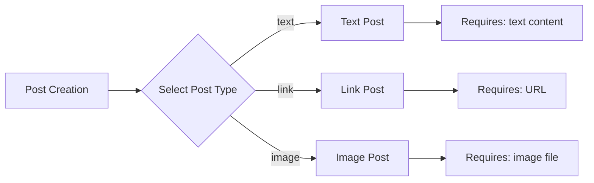

### Post Type Selection

WHILE creating a post, THE system SHALL display the three allowed post type options to the user.

THE system SHALL validate that the selected post type matches the required content for that type.

### Vote Type Enumeration

### Allowed Vote Types

THE system SHALL support exactly two vote types: upvote and downvote.

WHEN a user votes on a post or comment, THE system SHALL require the user to specify one of the allowed vote types.

THE system SHALL enforce the following vote rules:

- An upvote increases the score by 1.
- A downvote decreases the score by 1.
- Each user can only have one vote (either upvote or downvote) per post or comment.
- A user can change their vote from upvote to downvote or vice versa.
- A user can remove their vote entirely.

IF a user attempts to cast a vote with an invalid vote type, THE system SHALL reject the request and display an error message.

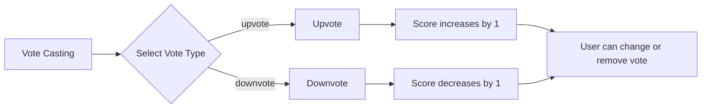

### Vote Type Exclusivity

WHEN a user has already voted on a post or comment, THE system SHALL prevent the user from casting a second vote of any type.

THE system SHALL allow the user to change their vote from one type to the other or remove their vote entirely.

THE system SHALL recalculate the vote score whenever a vote is added, changed, or removed.

### Report Status Enumeration

### Allowed Report Statuses

THE system SHALL support exactly three report statuses: pending, resolved, and dismissed.

WHEN a user reports a post or comment, THE system SHALL create a report with the status set to pending.

THE system SHALL enforce the following report status transitions:

- A report with status pending can be approved by a moderator, changing its status to resolved.
- A report with status pending can be dismissed by a moderator, changing its status to dismissed.
- A report with status resolved or dismissed SHALL NOT be modified or changed.

IF a moderator attempts to change the status of a report in an invalid way, THE system SHALL reject the request and display an error message.

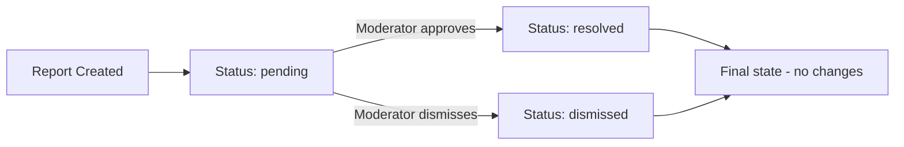

### Report Status Visibility

WHEN viewing reports, THE system SHALL display the report status to moderators.

THE system SHALL show only reports with status pending and resolved to moderators for review.

THE system SHALL hide reports with status dismissed from the moderator report list, but retain them in the database.

### Enum Value Consistency

### Enum Value Stability

THE system SHALL ensure that enum values remain stable and consistent across the entire platform.

THE system SHALL NOT allow addition of new enum values without a formal system update and migration.

THE system SHALL NOT allow modification of existing enum values or their meanings.

### Enum Documentation

THE system SHALL maintain documentation of all enum values and their allowed options.

WHEN displaying any field that uses an enumeration, THE system SHALL show only the allowed values.

THE system SHALL prevent users or moderators from entering values outside the defined enumeration.

### Enum Error Handling

IF the system receives an enumeration value that is not in the allowed list, THE system SHALL treat it as invalid.

THE system SHALL reject any operation that uses an invalid enumeration value and SHALL display a clear error message to the user.

## State Transitions

Define valid state transition paths for stateful concepts.

### Post State Lifecycle

### Post States

A post exists in one of the following states:
- **Active**: The post is visible to users with appropriate permissions
- **Archived**: The post is hidden from feeds but remains accessible for viewing
- **Removed**: The post is deleted by the author or moderator

### Post State Transitions

WHEN a post is created, THE system SHALL set its initial state to active.

WHILE a post is in active state, THE system SHALL:
1. Display it in community feeds
2. Allow comments on the post
3. Allow voting on the post
4. Allow the author to edit the post
5. Allow the author to archive the post
6. Allow moderators to delete the post

IF the post author archives their own post, THE system SHALL transition the post state from active to archived.

IF a moderator deletes a post in their community, THE system SHALL transition the post state from active or archived to removed.

IF the post author deletes their own post, THE system SHALL transition the post state from active or archived to removed.

A post in removed state cannot be restored or transitioned to any other state.

### Post States Flow

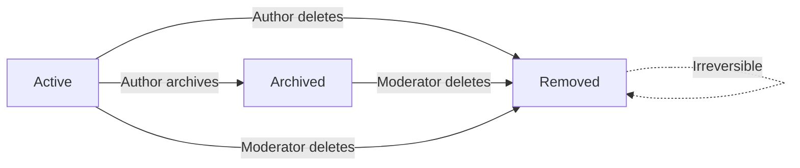

### Vote State Transitions

### Vote States

A vote from a user on a post or comment exists in one of the following states:
- **None**: The user has not voted
- **Upvote**: The user has upvoted the post or comment
- **Downvote**: The user has downvoted the post or comment

### Vote State Transitions

WHEN a user votes on a post or comment for the first time, THE system SHALL create a vote record in the state matching the vote type selected.

IF a user changes their vote from upvote to downvote, THE system SHALL transition the vote state from upvote to downvote and adjust the target's score accordingly.

IF a user changes their vote from downvote to upvote, THE system SHALL transition the vote state from downvote to upvote and adjust the target's score accordingly.

IF a user removes their vote from a post or comment, THE system SHALL transition the vote state from upvote or downvote to none and adjust the target's score accordingly.

THE system SHALL prevent a user from casting multiple votes on the same post or comment simultaneously.

WHILE a user has an active vote on a post or comment, THE system SHALL allow the user to change or remove that vote.

A vote in none state does not affect the target's score.

A vote in upvote state increases the target's score by 1.

A vote in downvote state decreases the target's score by 1.

### Vote States Flow

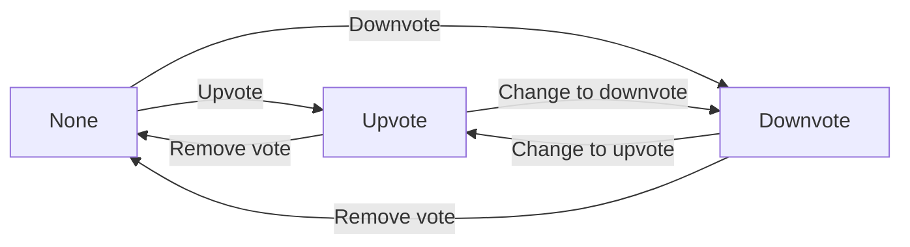

### Comment State Transitions

### Comment States

A comment exists in one of the following states:
- **Active**: The comment is visible to users with appropriate permissions
- **Deleted**: The comment is hidden from the post thread but remains stored

### Comment State Transitions

WHEN a comment is created, THE system SHALL set its initial state to active.

WHILE a comment is in active state, THE system SHALL:
1. Display the comment on the post thread
2. Allow replies to the comment
3. Allow voting on the comment
4. Allow the author to edit the comment
5. Allow the author to delete the comment
6. Allow moderators to delete the comment

IF the comment author deletes their own comment, THE system SHALL transition the comment state from active to deleted.

IF a moderator deletes a comment in their community, THE system SHALL transition the comment state from active to deleted.

A comment in deleted state is hidden from all post threads but remains retrievable for moderation purposes.

A comment in deleted state cannot be restored or transitioned to any other state.

IF a user attempts to view a deleted comment, THE system SHALL hide the comment content and display only a moderation notice.

A comment in deleted state does not contribute to vote counts visible to users.

### Comment States Flow

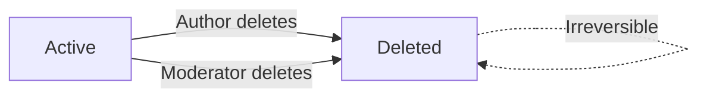

### Report Status Workflow

### Report States

A report on a post or comment exists in one of the following states:
- **Pending**: The report has been submitted and requires moderator review
- **Resolved**: The report has been approved and the reported content has been removed
- **Dismissed**: The report has been reviewed and the content has been kept

### Report Status Transitions

WHEN a user reports a post or comment, THE system SHALL create a report record with state pending.

WHILE a report is in pending state, THE system SHALL:
1. Display the report to moderators of the community
2. Prevent the reported content from being visible to regular users (for severe violations)
3. Allow moderators to approve or dismiss the report

IF a moderator approves a report, THE system SHALL:
1. Transition the report state from pending to resolved
2. Delete the reported post or comment
3. Remove the report from the moderator's pending report list

IF a moderator dismisses a report, THE system SHALL:
1. Transition the report state from pending to dismissed
2. Keep the reported post or comment visible
3. Remove the report from the moderator's pending report list

A report in resolved state indicates the violation was confirmed.

A report in dismissed state indicates the violation was not confirmed.

A report in resolved or dismissed state cannot be reverted to pending state.

### Report Status Workflow

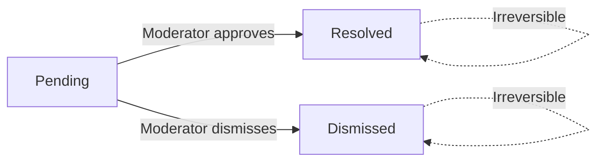

### User Account Lifecycle

### User Account States

A user account exists in one of the following states:
- **Active**: The account is fully functional
- **Deleted**: The account has been permanently deleted

### User Account Transitions

WHEN a new user creates an account, THE system SHALL set the account state to active.

WHILE a user account is in active state, THE system SHALL:
1. Allow the user to log in
2. Allow the user to create posts
3. Allow the user to write comments
4. Allow the user to vote on posts and comments
5. Allow the user to subscribe to communities
6. Allow the user to edit their profile
7. Allow the user to delete their account

IF a user deletes their account, THE system SHALL:
1. Transition the account state from active to deleted
2. Delete all posts authored by the user
3. Delete all comments written by the user
4. Delete all votes cast by the user
5. Unsubscribe the user from all communities
6. Remove the user from all community moderator roles

A user account in deleted state cannot be restored or transitioned to any other state.

A user in deleted state cannot log in or create new content.

When a user account is deleted, any remaining references to that user (in posts or comments that were not deleted) SHALL be anonymized with a generic "deleted user" label.

### User Account Lifecycle Flow

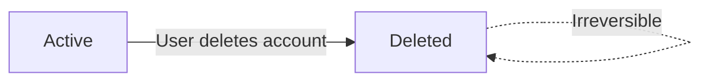

### Community Subscription States

### Subscription States

A user's relationship to a community exists in one of the following states:
- **Unsubscribed**: The user is not a subscriber
- **Subscribed**: The user is a subscriber
- **Banned**: The user has been banned by the community

### Subscription State Transitions

WHEN a new user joins the platform, THE system SHALL set their subscription state to unsubscribed for all communities.

IF a user subscribes to a community, THE system SHALL:
1. Transition the subscription state from unsubscribed to subscribed
2. Increment the community's subscriber count

IF a user unsubscribes from a community, THE system SHALL:
1. Transition the subscription state from subscribed to unsubscribed
2. Decrement the community's subscriber count

IF a community owner or moderator bans a user from the community, THE system SHALL:
1. Transition the subscription state from unsubscribed or subscribed to banned
2. Remove the user from all moderator roles if applicable
3. Prevent the banned user from creating posts or comments in the community

IF a community owner or moderator unbans a user from the community, THE system SHALL:
1. Transition the subscription state from banned to unsubscribed
2. Remove the ban status from the user

A user in banned state cannot subscribe to the community by normal means.

A user in banned state cannot create posts or comments in the banned community.

A user in banned state can still view content in the banned community.

A user in subscribed state must remain subscribed to create posts in that community.

A user in unsubscribed state must subscribe before creating posts in that community.

### Community Subscription States Flow

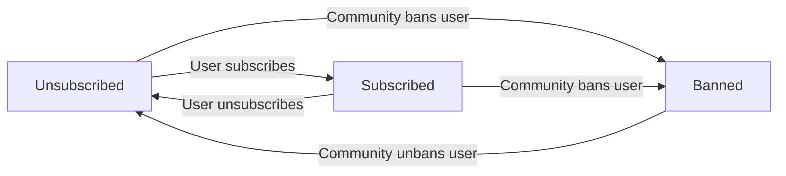