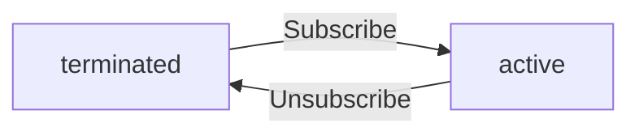
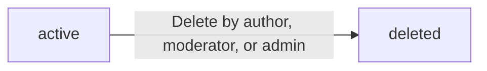
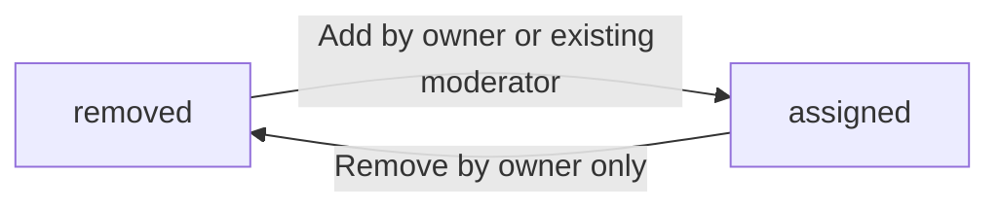
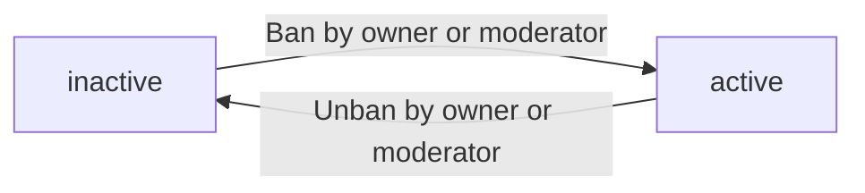
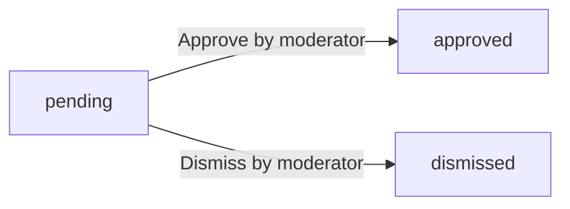

**redditCommunity — Business concepts, relationships, and states from user perspective**

Business concepts, relationships, and states from user perspective

# Domain Concepts

Describe what each concept means in the business domain and its key attributes.

## User Concept

A User is a registered member of the community platform who can participate in discussions, create content, and interact with other members. Each user is identified by a unique username and associated email address. The username serves as the primary public identifier that other users see when viewing posts, comments, and profiles. The email address is used for account authentication and recovery purposes. Users are the foundational actors who create communities, post content, vote on items, and engage in discussions.

### User Registration and Identity

Users register for an account using an email address and a unique username. The username must be unique across the platform and serves as the primary public identifier that other users see. The email address is used for account authentication and recovery purposes. Both the username and email address must be provided during registration.

### Member Identity and Account Holder

A member identity is established when a user successfully registers with a valid email address and unique username. The account holder is the registered user who owns their account and is responsible for all content and actions performed through that account. Account holders have full control over their account settings and content.

### Community Participant

A community participant is a user who actively engages with communities on the platform. Participants can view public community content, subscribe to communities they wish to follow, and interact with content through posts and comments. Participation requires an active account and does not have special privileges beyond other members.

### Content Creator

A content creator is a user who creates posts for communities. Users can create three types of content: text posts with written content, link posts that reference external URLs, and image posts with uploaded images. Only users who are subscribed to a community can create posts in that community. The content creator is the author of all posts they create and retains ownership of their content.

### Discussion Contributor

A discussion contributor is a user who writes comments and replies to comments on posts. Contributors can engage in threaded discussions with nested replies and have no limit on reply depth. Discussion contributors can edit and delete their own comments. Their contributions are visible to other users and contribute to their overall community engagement.

### Voting Member

A voting member is a user who can cast votes on posts and comments. Each user may cast one vote per post or comment, which can be an upvote or downvote. Voting members can change their vote or remove their vote entirely. The voting member's actions contribute to the vote score of content and to their own karma score.

### Profile Owner

A profile owner is a user who maintains their personal profile. The profile includes a display name, bio text, and avatar image. Profile owners can edit their own display name, bio, and avatar. The profile displays the owner's total karma score and shows a list of all posts and comments the owner has created. The profile is viewable by any user on the platform.

## Profile Concept

A Profile represents the public-facing identity of a user on the platform. It contains a display name that appears throughout the community, a bio text that provides additional context about the user, and an avatar image that serves as their visual representation. The profile also tracks the user's total karma score, which aggregates all voting interactions on their content. Each profile page displays the complete history of posts created by that user and all comments they have written. The profile information can be customized by the user to reflect their personal branding or preferences.

### Profile Identity and Visual Elements

A Profile represents the public-facing identity of a user on the platform. It contains three primary visual elements:

**Display Name**
The display name is a customizable text string that appears throughout the community as the user's primary identifier. Users can set and change their display name to reflect their personal branding or preferred name.

**Bio Text**
The bio text is an optional descriptive field that provides additional context about the user. Users can write a personal statement, introduction, or summary in this field to share information about themselves with the community.

**Avatar Image**
The avatar image serves as the user's visual representation across the platform. Users can upload and change their avatar image to personalize their appearance. The avatar displays alongside all user-generated content including posts, comments, and profile information.

These three elements together create the user's public identity and visual representation on the platform.

### Karma Score and Reputation Tracking

Each user maintains a single karma score that serves as a reputation metric aggregating all voting interactions on their content.

**Karma Score as Reputation Metric**
The karma score is a single numerical value that represents the user's accumulated reputation and serves as a visible indicator of community reception to their contributions.

**Aggregated Interactions**
The score tracks aggregated interactions from upvotes and downvotes on the user's posts and comments. Every voting interaction contributes to this unified score.

**Score Calculation**
When someone upvotes a user's post or comment, the user's karma score increases by one point. When someone downvotes a user's post or comment, the karma score decreases by one point. The system tracks all voting interactions and adjusts the karma score accordingly.

**Negative Karma and Adjustments**
The karma score can be negative if the user receives more downvotes than upvotes on their content. When a user removes their vote from a post or comment, the karma score adjusts to reflect this change, adding or subtracting one point as appropriate.

The karma score provides a quick summary of community reception to the user's contributions and serves as a visible reputation indicator on the user's profile page.

### Content History and Portfolio

A user's profile page displays their complete content portfolio, showing all contributions made to the platform.

**Post History**
The profile displays a list of all posts that the user has created. This includes text posts, link posts, and image posts across all communities. Each post entry shows basic information including the title, the community where it was posted, the vote score, comment count, and time since posting.

**Comment History**
The profile displays a list of all comments that the user has written. This includes top-level comments and replies to other comments. Each comment entry shows the comment content preview, vote score, time since posting, and the post to which it belongs.

**Content Summary**
Together, the post history and comment history provide a complete record of the user's activity on the platform. This content portfolio allows other users to understand the user's contributions, interests, and engagement patterns. The content summary provides user statistics about their platform activity.

### Profile Customization and User Preferences

Users have full control over customizing their profile information to reflect their personal preferences and establish their personal branding on the platform.

**Profile Customization**
Users can edit their own display name, bio text, and avatar image at any time. Changes take effect immediately across the platform. Users decide what information to display and how to present themselves to the community.

**User Preferences**
While the profile itself is public, users control all customization decisions. They determine their visual representation, personal branding elements, and the information shown to the community.

**Profile Page Display**
The profile page aggregates all user-customized information along with their karma score and content history in a single view. This consolidated presentation makes it easy for other community members to learn about the user and their contributions.

The profile customization system ensures that each user can maintain a personalized and authentic representation of themselves within the community.

## Community Concept

A Community is a dedicated space within the platform where users with shared interests can gather to discuss specific topics. Each community has a unique name that distinguishes it from all other communities on the platform. The community includes a description text that explains its purpose and what kind of content is appropriate. Every community displays an icon image that provides visual branding for the group. The community structure includes a subscriber count that indicates its popularity and reach. The creator of a community automatically becomes its owner with special administrative privileges.

### Community Identity and Purpose

A Community is a dedicated space within the platform where users with shared interests can gather to discuss specific topics. Each community serves as a topic space for a particular subject or interest area. The community represents a group identity that distinguishes it from all other communities on the platform.

Every community must have a unique name that serves as its unique identifier. No two communities can have the same name. This unique name allows users to identify and reference specific communities.

The community has a purpose, expressed through its description text. The description explains what the community is about and what kind of content is appropriate. This helps users decide whether to join the community.

### Community Attributes

Each community has three core attributes:

1. **Name**: A unique text string that identifies the community (defined above)
2. **Description**: Text content that explains the community's purpose and content guidelines
3. **Icon Image**: An image file that provides visual branding for the community

The name serves as the community's unique identifier and cannot be duplicated across the platform. The description text communicates the community's focus and content guidelines to potential members. The icon image provides visual branding that helps users recognize the community in feeds and lists.

All three attributes are required when creating a community.

### Community Ownership

When a user creates a community, they automatically become its owner. The owner has administrative control over the community and holds owner privileges.

The owner has the highest authority within the community hierarchy. They can add moderators to help manage the community and remove moderators when necessary. Moderators can add other moderators but cannot remove the owner or remove other moderators.

The owner relationship is permanent unless transferred, and the owner retains full administrative control throughout their ownership.

### Community Subscribers

Users can subscribe to communities to follow their content. Each subscription represents a user-community relationship where the user has chosen to receive content from that community.

Subscriptions track the subscriber count for each community, which indicates the community's popularity and reach. The subscriber count is displayed on community pages and in browse lists.

Subscribing to a community is required before a user can create posts in that community. Users can unsubscribe from any community at any time. When viewing feeds, users only see posts from communities they have subscribed to in their home feed.

### Community Content

Communities contain posts and comments created by their members. Each post belongs to exactly one community and is associated with that community's identity.

Posts in a community can be of three types: text posts, link posts, and image posts. Each post includes a title and content specific to its type. The comment count on a post tracks all comments and replies within that post.

Content in a community is subject to moderation by the owner and assigned moderators.

### Community Moderation

Each community has a moderation structure with defined roles and permissions.

The owner has highest authority and can add or remove moderators. Moderators can add other moderators but cannot remove the owner or remove other moderators. This creates a clear hierarchy of administrative control.

Moderators can delete any post or comment in their community, ban users from the community, and view lists of banned users. Banned users cannot create posts or comments in the community but can still view content.

Moderators can also view all reports submitted for their community and approve or dismiss them. Approved reports result in content deletion, while dismissed reports are removed from the report list.

### Community Discovery

Users can browse all communities in a list to discover new topic spaces to join. The browse list shows each community's name and subscriber count.

Users can search for communities by name to find specific communities they are looking for. This search functionality helps users find communities related to their interests.

When viewing a community page, users see the community's display name, description text, icon image, subscriber count, and a list of recent posts. This information helps users understand the community's purpose and content before subscribing.

Communities can be viewed by anyone, including logged-out users, on the popular feed and community feed.

## Subscription Concept

A Subscription represents the relationship between a user and a community when the user chooses to follow that community's content. This relationship has a status that indicates whether the subscription is active or has been terminated. The subscription record captures when the user first subscribed to the community, establishing the timeline of their engagement. Subscribing to a community is a prerequisite for users who want to create posts within that specific community. Users can maintain multiple subscriptions across different communities, creating their personalized content feed.

### Subscription Overview

A Subscription represents the relationship between a user and a community when the user chooses to follow that community's content. This relationship establishes community membership and indicates that the user wants to receive content from that specific community in their personalized feed.

The subscription record captures the subscription date, which marks when the user first began following the community. This date serves as the beginning of the engagement timeline, tracking the user's ongoing relationship with the community.

Each user can maintain multiple subscriptions across different communities, enabling feed customization and content curation based on their interests. Every subscription has a subscription status that reflects the current state of the user-community relationship.

### Subscription Status

A subscription has two possible states:

**Active Subscription**: The user is currently following the community and can view its content, create posts in the community (subject to the post creation prerequisite), and participate in the community's discussions. The user appears in the community's subscriber count.

**Terminated Subscription**: The user has stopped following the community. In this state, the user can no longer create posts in the community, though they may still be able to view existing content depending on other factors such as ban status. The user is removed from the community's subscriber count.

Users can manage their subscriptions by transitioning between active and terminated states. This subscription management allows users to curate their content feed by selecting which communities they want to follow and which they want to stop following.

### Post Creation Prerequisite

Subscribing to a community is a prerequisite for users who want to create posts within that specific community. Before a user can create a post in any community, they must first have an active subscription to that community.

If a user does not have an active subscription to a community, the system prevents them from creating posts in that community. The user must first establish an active subscription by subscribing to the community.

This prerequisite applies to all post types: text posts, link posts, and image posts. The rule ensures that community content is created by engaged members who have chosen to follow that community's content.

### Multiple Subscriptions and Personalized Feed

Users can subscribe to multiple communities simultaneously, creating a collection of communities they follow. This collection of subscriptions forms the basis for the user's personalized feed.

The system displays posts from all communities where the user has active subscriptions. The personalized feed shows content from these subscribed communities, enabling content curation that reflects the user's interests and preferences.

Users can add new subscriptions to expand their personalized feed or remove subscriptions to narrow their content curation. The list of communities a user has subscribed to is always available to them, showing their community following history and current active subscriptions.

### Content Access and Community Membership

Having an active subscription to a community grants the user content access rights for that community. Users with active subscriptions can view posts, read comments, and participate in discussions within their subscribed communities.

Community membership is established through the subscription relationship. The subscription record is the mechanism by which a user becomes a member of a community, distinct from ownership or moderation roles.

The subscriber count displayed for each community reflects the number of users with active subscriptions to that community. This count is visible to all users and provides a measure of the community's membership size and engagement level.

### Engagement Timeline

The subscription date recorded when a user first subscribes to a community serves as the starting point for the engagement timeline. This date tracks the length of time the user has been a member of the community.

The engagement timeline provides context about the user's relationship with the community, indicating whether they are a long-term member or a recent subscriber. This timeline information can be useful for understanding the user's history and engagement pattern within the community.

The engagement timeline is maintained as part of the subscription record and is associated with the user-community relationship. It remains in the system as a record of the user's community following history, even if the subscription status changes to terminated.

## Post Concept

A Post is a piece of content created by a user within a specific community. Each post has a required title that identifies the subject matter. Posts can exist in three distinct types: text posts that contain written content, link posts that reference external URLs, or image posts that include uploaded images. Every post records when it was created, establishing its temporal context within the community. Posts are authored by a specific user and belong to exactly one community. The post structure includes metadata that captures the author, community association, and content type for proper display and organization.

### Post Title

Every post requires a title that identifies the subject matter. The title serves as the primary identifier for the post and appears in all post listings and displays. Titles must be provided when creating a post and cannot be empty. The title is displayed prominently when viewing the full post content.

### Post Types

Posts exist in three distinct categories that determine how content is displayed:

**Text Posts**
- Contain written content entered by the author
- Display the full text when viewed
- Show a preview of the first 200 characters in post listings

**Link Posts**
- Reference an external URL that users can visit
- Display the domain name (e.g., youtube.com) in post listings
- Users click to navigate to the external content

**Image Posts**
- Include an uploaded image file
- Display a thumbnail representation in post listings
- Show the full image when viewing the post

The post type is determined at creation and identifies how the content should be presented.

### Post Author

Each post is authored by a specific user who becomes the content owner. The author's username is displayed with every post, establishing clear attribution. Only the author can edit or delete their own posts. Content ownership grants exclusive modification and removal rights to the post author.

### Community Association

Posts are associated with exactly one community where they are created. This community association determines which subscribers see the post and where it appears in community feeds. A post belongs to its community permanently and cannot be moved to a different community. The community name is displayed alongside each post to provide context.

### Post Metadata

Posts include metadata that enables proper display and organization:

**Creation Timestamp**
- Records when the post was created
- Displays as relative time (e.g., "3 hours ago") in listings
- Provides temporal context for the content

**Content Reference**
- Identifies the post uniquely within the system
- Used for accessing and displaying the post

**Post Display Information**
- Captures vote score and comment count
- Shows author username and community name
- Displays content type (text, link, or image)

Metadata is automatically managed by the system and updated as posts receive votes and comments.

### Content Categorization

Post type classification determines content presentation and user interaction. The categorization occurs at creation and remains fixed for the post's lifetime. Users can identify the content type immediately from post listings through visual indicators and display formats. This categorization ensures consistent user experience when browsing different post types.

## Vote Concept

A Vote represents a user's opinion on a post or comment, expressed through upvoting or downvoting actions. Each vote has a type that indicates whether it is positive (upvote) or negative (downvote). The vote record captures when the user cast their vote, allowing the system to track voting patterns over time. A single user can only have one vote per piece of content, preventing multiple expressions of opinion on the same item. Votes can be changed by the user or removed entirely, allowing for dynamic opinion adjustment. The aggregate of all votes creates a score that reflects the community's collective judgment.

### Vote Types

A vote represents a user's opinion on a post or comment. Users can express their opinion through two types of actions: upvote and downvote. An upvote adds positive value to the content's score, indicating agreement or approval. A downvote subtracts value from the content's score, indicating disagreement or disapproval. These vote types are the only ways users can express opinions on content within the system.

Each vote serves as a form of content rating, allowing the community to collectively judge the quality and relevance of posts and comments. Through these individual expressions of opinion, the system builds up a measure of community feedback that reflects the collective opinion of all users who have interacted with the content.

### Vote Uniqueness

Each user can cast only one vote per piece of content, whether that content is a post or a comment. A user cannot submit multiple votes for the same item. This single vote per user rule ensures that each person's opinion counts equally and prevents vote manipulation through multiple accounts or repeated submissions.

Users may change their vote after casting it. If a user initially upvotes content, they can later change to a downvote, or vice versa. When a user changes their vote, the system updates the score calculation accordingly to reflect the new position. Users can also remove their vote entirely, which removes their opinion from the score calculation. Vote modification is always allowed and can be performed at any time by the original voter.

### Vote Tracking

Each vote is recorded with a timestamp that captures when the user submitted their opinion. This vote timestamp allows the system to track the timing of opinions and analyze voting patterns over time. The timestamp remains on the record even if the user later changes or removes their vote, preserving the history of when opinions were expressed.

The system maintains a complete history of all votes cast on content. This vote history enables the tracking of vote patterns, showing how opinions have shifted over time. Users can see when their own votes were submitted through the vote modification timestamps. The vote tracking ensures that the system has an auditable record of when content received positive or negative feedback from the community.

### Score Computation

A content score is calculated by adding all upvotes and subtracting all downvotes cast by users. The score calculation determines the net value of all opinions expressed on the content. When a user casts a vote, the score impact is immediately applied to the content's total, making the score reflect the current state of community judgment.

The score represents the community judgment of the content based on all expressed opinions. As more users submit votes, the collective opinion becomes more accurate and reliable. The score captures the opinion dynamics of the community, showing how the content is perceived overall. This measure of community feedback helps users identify high-quality content and understand the overall reception of posts and comments within the platform.

## Comment Concept

A Comment is a response written by a user on a post or in reply to another comment. Each comment contains text content that expresses the user's thoughts or responses. Comments can be nested at any depth, allowing for extended threaded discussions without artificial limits. Every comment records when it was created, providing context for the conversation timeline. Comments are authored by a specific user and can be edited or deleted by their owner. The comment structure includes information about the author, parent relationship, and content for proper display within discussions.

### Comment Content and Author

A comment represents a user's response or expression within a discussion. Each comment contains text content written by a specific user, who is identified as the author.

When a comment is created, the system records the creation timestamp, which indicates when the user submitted their response. This timestamp provides context for understanding the flow of conversation over time.

Comments serve as the fundamental unit of discussion participation, allowing users to express their thoughts, ask questions, or respond to others. The comment content is the primary medium through which users engage in dialogue within the platform.

### Threaded Discussions and Nested Structure

Comments are organized in a threaded discussion structure, enabling users to reply to posts or to other comments. This creates a nested reply system that supports extended conversations.

The platform allows replies to comments without limiting reply depth, meaning discussions can continue through multiple levels of nesting. A comment may have parent comments, forming a hierarchical structure that preserves conversation flow and context.

This nested structure enables reply chains, where each comment links back to its parent, creating a discussion thread that users can follow. The hierarchy of comments maintains conversation context, showing which responses belong to which original thoughts. Users can navigate through the nested structure to understand the full scope of a discussion.

### Comment Ownership and Participation

Each comment has a single owner — the user who authored it. Ownership establishes the relationship between the comment and its creator for display and administrative purposes.

Comment owners have the ability to edit their own comments, allowing them to modify content after submission. Owners can also delete their own comments, removing them from the discussion entirely.

Through comment participation, users contribute to ongoing conversations. Their responses become part of the larger discussion thread, visible to others within the platform. The ownership model ensures that users maintain control over their contributions while enabling meaningful discussion participation.

## ModeratorRole Concept

A ModeratorRole represents the administrative authority granted to users within a community. The role hierarchy includes the owner, who has the highest level of authority and control. Moderators are users who have been granted administrative privileges by the owner or other moderators with appropriate permissions. Each role assignment records when the role was granted, establishing the timeline of administrative authority. The role structure defines what actions a user can perform, such as deleting content, banning users, or managing other moderators. Only the owner has the authority to remove moderators, while moderators can add other moderators but cannot remove each other.

### Owner Authority

The owner is the user who creates a community and holds the highest level of authority within that community. The owner has ultimate control over community governance and moderation. The owner can perform all moderation actions available to moderators, plus additional administrative privileges that moderators do not have. The owner cannot be removed as an owner by any other user.

### Moderator Privileges

Moderators have administrative control over community content and users. Moderators can delete any post in their community regardless of who created it. Moderators can delete any comment in their community regardless of who wrote it. Moderators can ban users from the community, preventing them from creating posts or comments. Moderators can unban previously banned users. Moderators can view the complete list of users who have been banned from the community. Moderators cannot ban other moderators or remove them from the community.

### Role Hierarchy

The moderation system uses a two-level authority structure. At the top level is the owner, who has complete authority over the community. Below the owner are moderators, who have delegated administrative powers. The hierarchy is strict: moderators cannot remove other moderators, and moderators cannot remove the owner. Only the owner can remove other moderators from the community. This structure ensures clear lines of authority and prevents power struggles within community governance.

### Moderator Management

The owner has the exclusive ability to add moderators to the community. The owner can also remove moderators from the community at any time. Moderators can add other users as moderators with certain restrictions. When a moderator adds another user, that user receives the same moderator privileges. Moderators cannot remove other moderators they have added. Moderators can only add new moderators; they cannot take away moderator status from existing moderators. This creates a chain of delegation while maintaining the owner's ultimate control.

### Content Deletion Authority

Moderators have the power to remove any content within their community. This includes posts created by any user, including the owner. Moderators can delete comments written by any user. When content is deleted by a moderator, it is removed from the community and is no longer visible to other users. The deletion is final and the content cannot be automatically restored. Moderators use this authority to enforce community guidelines and remove inappropriate content.

### User Banning Authority

Moderators can ban users from the community, which restricts their ability to participate. When a user is banned, they cannot create new posts in the community. Banned users cannot write comments in the community. Banned users can still view existing posts and comments in the community. Moderators can view the list of all banned users and their ban reasons. Moderators can remove a ban, allowing the user to participate in the community again. The ban applies only to the specific community and does not affect the user's ability to use other features of the platform.

### Moderator Additions

The owner can grant moderator status to any user in the community. When the owner adds a moderator, that user immediately gains all moderator privileges. Moderators can also add other users as moderators with restrictions. A moderator cannot add themselves as an administrator. The system records when a moderator was added, creating an administrative timeline. This allows community leaders to track who granted which moderation powers and when. The role assignment date is permanently recorded for audit purposes.

### Owner-Only Removal

Only the owner has the authority to remove moderators from the community. Moderators cannot remove other moderators, regardless of who added them. This restriction prevents moderators from consolidating power or creating conflicts. If the owner removes a moderator, that user immediately loses all moderator privileges and returns to being a regular community member. The removal is immediate and cannot be undone by the affected user. The owner's exclusive removal authority maintains the integrity of the hierarchy.

### Role Permissions Structure

The permission structure separates owner authority from moderator authority. The owner has complete control and can perform all administrative actions including adding and removing moderators. Moderators have delegated authority limited to content moderation and user management. Moderators can perform administrative actions such as deleting content and banning users, but cannot modify the moderator list. The role permissions ensure that moderators can maintain community standards without having full control over community leadership. This separation protects the community from moderator overreach while still enabling effective governance.

## BanRecord Concept

A BanRecord represents the restriction imposed on a user who has been prohibited from participating in a specific community. Each ban record includes a reason that explains why the user was banned from the community. The record captures when the ban was issued, establishing the start of the restriction period. Banned users lose the ability to create posts or comments within the banned community, though they retain the ability to view content. The ban record is specific to a particular community and does not affect the user's standing in other communities.

### Ban Record Definition

A ban record represents the restriction imposed on a user who has been prohibited from participating in a specific community. Each ban record includes a reason that explains why the user was banned from the community. This justification documents the basis for the restriction and serves as a record for the community moderators. The ban record captures when the ban was issued, establishing the timeline of the restriction. This timestamp marks when the user's participation limitation begins.

### Participation Restrictions

When a ban record exists for a user in a community, the user cannot create posts within that community. Similarly, the user cannot write comments on any posts in the banned community. Despite being banned, users retain the ability to view content in the community where they are restricted. This content viewing right allows banned users to see posts, comments, and other community content without being able to participate. The restricted access applies only to content creation, not content consumption.

The ban is specific to a single community. A user banned from one community retains full access to all other communities. The restriction scope is limited to the community where the ban was issued.

### Ban Management

Community owners and moderators manage ban records for their communities. Owners can add moderators to their community. Moderators can ban users from their community and view the list of banned users. Moderators can unban users, removing the ban record and restoring participation rights. The ban record keeping ensures that all restriction actions are tracked and visible to authorized community administrators.

## Report Concept

A Report represents a formal complaint filed by a user about a post or comment that violates community guidelines. Each report includes a reason that explains why the content is being reported. The report record captures when the report was filed, establishing the timeline of the complaint. Reports are directed to moderators of the community where the reported content exists. Moderators can either approve a report, which results in content deletion, or dismiss it, which leaves the content in place. Approved reports lead to content removal, while dismissed reports are removed from the moderator's report list.

### Report as Content Complaint

A report represents a formal content complaint filed by a member against a post or comment that potentially violates community guidelines. Every report captures the specific reason explaining why the content is being reported. The report record includes a timestamp that establishes the exact time when the complaint was submitted, creating an audit trail for the complaint timeline. Reports are directed to the moderators of the community where the reported content exists.

### Report States and Resolution

Each report exists in one of three states: pending, approved, or dismissed. While a report is pending, it remains in the moderator workflow for review and handling. When a moderator takes action to approve a report, this results in content removal of the reported post or comment, and the report status transitions to approved. When a moderator takes action to dismiss a report, the content remains in place and the report is removed from the moderator's report list, transitioning to dismissed state. Report management tracks the progression from filing through resolution.

### Report Management and Workflow

Moderators review all reports filed within their community, seeing the reported content, who submitted the complaint, and the reason provided. Each report supports complaint tracking through its lifecycle from initial submission to final resolution. Moderators perform moderator actions by either approving or dismissing each report. Content moderation is conducted through this report system, where approved reports lead to content removal while dismissed reports are removed from the report list. The system supports violation reporting by allowing members to flag content that violates community guidelines.

# Domain Relationships

Describe how concepts relate to each other from a business perspective.

## Conceptual Relationships

Describe how concepts relate to each other in business terms.

### User and Profile Relationship

Each user has one profile that displays their public information. The profile contains the user's display name, bio text, and avatar image.
The user owns their profile and can edit it at any time. Guests and other members can view any user's profile, including the owner.
When a user is deleted, their profile is also deleted.

### Profile Display

The profile shows the user's: display name, bio, avatar image, total karma score, list of posts they have created, and list of comments they have written.

### User and Community Ownership

Any user can create a community and becomes its owner. The owner has full control over the community, including the ability to add and remove moderators.
The community belongs to the platform, but the owner has exclusive administrative privileges over it.
The owner's username is displayed on the community page as the creator.

### Owner Privileges

The community owner can:
- Add moderators to the community
- Remove moderators from the community
- Delete any post or comment in the community
- Ban or unban users from the community

### Community and Subscriptions

Users can subscribe to communities they want to follow. Each subscription links a user to a community.
A user can have multiple subscriptions, each representing their interest in one community.
Subscribing to a community is required before a user can create posts in that community.

### Subscription Management

Users can:
- Subscribe to any community on the platform
- Unsubscribe from any community they are subscribed to
- View a list of all communities they are subscribed to

### Subscription Status

A subscription can be in one of two states:
- Active: the user is following the community
- Inactive: the user has unsubscribed

### Community and Posts

Each post belongs to exactly one community. The community serves as the container for all posts within it.
A community can have many posts, all submitted by its subscribers.
When a community is deleted, all posts within it are also deleted.

### Post Association

Every post is associated with:
- The community it belongs to
- The user who created it (the author)
- Its vote score (calculated from votes on the post)
- The number of comments it has received

### User and Posts

Each user can create many posts across different communities. A user is the author of all posts they create.
The author relationship allows the user to edit or delete their own posts.

### Post Creation Rules

A user can create a post in a community only if:
- The user is subscribed to that community
- The user is not banned from that community

### Post and Comments

Each post can have many comments. Users can write comments on any post.
Comments can be replies to other comments, creating a threaded discussion with no depth limit.

### Comment Hierarchy

Comments have a parent-child relationship:
- A top-level comment has no parent
- A reply comment has another comment as its parent
- Replies can have their own replies (nested replies)
- There is no limit to the depth of nesting

### Comment Association

Each comment is associated with:
- The post it belongs to
- The user who wrote it (the author)
- Its vote score (calculated from votes on the comment)
- Its parent comment (if it is a reply)
- Its child comments (if there are replies to it)

### User and Comments

Each user can write many comments across different posts. A user is the author of all comments they create.
The author relationship allows the user to edit or delete their own comments.

### Comment Participation

A user can:
- Write a comment on any post
- Reply to any existing comment
- Edit their own comments
- Delete their own comments

### Vote Relationships

Users can vote on posts and comments to express their opinion. Each vote is cast by one user on one piece of content.

### Vote Types

A vote can be one of two types:
- Upvote: increases the score of the post or comment
- Downvote: decreases the score of the post or comment

### Vote Rules

- A user can cast only one vote per post or comment
- A user can change their vote from upvote to downvote or vice versa
- A user can remove their vote entirely
- Vote score is calculated as: total upvotes minus total downvotes
- When a user votes on a post or comment, the author's karma score increases or decreases by 1

### Moderator Roles

Communities can have moderator roles to help manage content and users. The community creator starts as the owner with highest authority.

### Role Hierarchy

- Owner: the user who created the community, has highest authority
- Moderator: a user with administrative privileges in the community

### Role Assignment Rules

- The owner can add other users as moderators
- The owner can remove moderators from the community
- A moderator can add other users as moderators
- Moderators cannot remove the owner
- Moderators cannot remove other moderators (only the owner can remove moderators)

### Moderator Privileges

A moderator can:
- Delete any post in the community
- Delete any comment in the community
- Ban users from the community
- Unban users from the community
- View the list of banned users

### Ban Records

Users can be banned from communities, preventing them from participating in that community.

### Ban Association

Each ban record links:
- A user who is banned
- A community where they are banned
- The reason for the ban
- The date the ban was issued

### Ban Effects

A banned user:
- Cannot create posts in that community
- Cannot write comments in that community
- Can still view content in the community
- Can be unbanned by a moderator

### Report Relationships

Users can report posts or comments they believe violate community standards.

### Report Association

Each report includes:
- The user who submitted the report (the reporter)
- The content being reported (a post or comment)
- The community where the reported content exists
- The reason for the report (provided by the reporter)
- The date the report was submitted

### Report Management

Moderators of the community can:
- View all reports for their community
- See the reported content, who reported it, and the reason
- Approve a report (which deletes the content)
- Dismiss a report (which keeps the content but removes it from the report list)
- Dismissed reports are removed from the report list

### Karma Score Association

Each user has a single karma score that tracks their overall standing on the platform.

### Karma Calculation

- When a user receives an upvote on their post or comment, their karma increases by 1
- When a user receives a downvote on their post or comment, their karma decreases by 1
- When a user removes their vote, the karma adjusts accordingly
- Karma can be negative

### Karma Display

The user's karma score is displayed on their profile page alongside their posts and comments.

## Lifecycle and Retention

Describe concept lifecycle states and transitions only. Detailed retention/recovery policies belong in 05-non-functional. Operation details belong in 03-functional-requirements.

### User Account Lifecycle

A member account begins when a user completes registration with an email address, password, and unique username.

An active account allows the member to participate in the platform by creating posts, comments, and votes.

Members can modify their account by changing their password or updating their profile information.

A member can voluntarily terminate their account at any time. When an account is terminated, all posts and comments authored by the member are permanently deleted along with the account.

Account deletion is irreversible. Once an account is deleted, the member cannot recover their account or any associated content.

Administrators may suspend or restrict accounts that violate platform policies. Suspended accounts cannot participate in the platform until the restriction is lifted.

### Community Lifecycle

A community is created when a member chooses to establish a new community with a unique name, description text, and icon image.

The creator becomes the community owner and has full administrative control over the community.

An active community allows members to subscribe, create posts, and participate in discussions.

The owner can deactivate a community entirely, removing it from public view. All posts and comments within the community remain accessible to viewers.

Administrators may delete communities that violate platform policies. Deleted communities and their content are permanently removed from the platform.

### Post Lifecycle

A post begins in created state when a member publishes content to a community they are subscribed to.

A post can be in active state while visible in feeds and discussions.

The post author can edit their post at any time while it remains active.

The post author can delete their post at any time. When deleted, the post is permanently removed from all feeds and discussions.

Moderators can delete posts that violate community guidelines. Deleted posts are permanently removed from the platform.

When a member deletes their account, all their posts are automatically deleted as part of the account deletion process.

### Comment Lifecycle

A comment begins in created state when a member adds content to a post or reply to another comment.

A comment can be in active state while visible in discussions.

The comment author can edit their comment at any time while it remains active.

The comment author can delete their comment at any time. When deleted, the comment is permanently removed from the discussion thread.

Moderators can delete comments that violate community guidelines. Deleted comments are permanently removed from the platform.

When a post is deleted, all comments on that post are automatically deleted.

When a member deletes their account, all their comments are automatically deleted as part of the account deletion process.

Nested replies maintain their threading structure even when individual comments are deleted. Remaining comments preserve their parent-child relationships.

### Deletion Policy

Member-initiated account deletion permanently removes the member's account, all posts, all comments, and all votes from the platform.

Member-initiated post or comment deletion permanently removes that specific content. Deleted content cannot be recovered by the member.

Moderator-initiated content deletion permanently removes content that violates community guidelines. The content is not visible to any users and cannot be recovered.

Deleted content is immediately removed from public feeds and searches. The deletion takes effect instantly for all users.

When a member deletes their account, all posts and comments authored by the member are automatically deleted along with the account.

# Business Categories and State Flows

Business category classifications and state flow definitions.

## Business Category Definitions

Define all business category classifications with their allowed values and descriptions.

### Post Type Classification

Posts are classified into three distinct categories based on their content format:

**Text Post**
A post that contains written content entered directly into the system. Users write the content themselves, and it displays as text on the platform.

**Link Post**
A post that contains a web address (URL) pointing to external content. When displayed, the system shows the domain name of the URL (e.g., "youtube.com") as metadata.

**Image Post**
A post that contains an image file uploaded by the user. When displayed in feeds, the system shows a thumbnail preview of the image.

The system SHALL enforce that each post belongs to exactly one of these three types. Users SHALL choose the post type when creating a new post, and the choice determines what additional information is required (text content for text posts, URL for link posts, or image file for image posts).

A text post SHALL display up to 200 characters of its content in feed listings.
An image post SHALL display a thumbnail of the uploaded image in feed listings.
A link post SHALL display the domain name of the URL in feed listings.

### Subscription Status

User subscriptions to communities have two possible statuses that track the relationship state:

**Active Subscription**
The user is a subscribed member of the community. An active subscription grants the user the right to create posts in that community and to participate in community discussions.

**Terminated Subscription**
The user has ended their subscription to the community. The user may voluntarily terminate their subscription or have it terminated by a community owner or moderator. A terminated subscription means the user can still view the community's content but cannot create posts in that community.

**Subscription Lifecycle**
When a user first subscribes to a community, their subscription status is "active".
When a user unsubscribes from a community, their subscription status changes to "terminated".
When a user creates a new subscription to a previously terminated community, their subscription status changes back to "active".

The system SHALL enforce that users can only create posts in communities where their subscription status is "active".

### Role Classifications

Community administrative roles are classified into two levels with a defined hierarchy:

**Owner**
The user who creates a community automatically becomes the owner. The owner has the highest authority in the community and can:
- Add moderators to the community
- Remove moderators from the community
- Delete any post or comment in the community
- Ban or unban users in the community
- View the list of banned users
- View all reports for the community

**Moderator**
A user granted moderation privileges by the owner or another moderator (excluding owner-removed moderators). A moderator has administrative control but with limitations:
- Can add other moderators to the community
- Can delete any post or comment in the community
- Can ban or unban users in the community
- Can view the list of banned users
- Can view all reports for the community
- CANNOT remove the owner from the community
- CANNOT remove other moderators from the community (only the owner can remove moderators)

The system SHALL enforce that the owner cannot be removed as a moderator by any other user.

### Vote Classification

Votes are classified by their type, which determines their effect on the vote score:

**Upvote**
A positive vote that increases the vote score by 1. When a user casts an upvote, the system SHALL increase the score by 1.

**Downvote**
A negative vote that decreases the vote score by 1. When a user casts a downvote, the system SHALL decrease the score by 1.

**No Vote**
When a user removes their vote, their classification changes to "no vote". This means the user has not cast any vote on the content, and the vote score is not affected by this user.

**Single Vote Constraint**
Each user SHALL be able to cast only one vote per post or per comment at any time. If a user has already cast a vote and wishes to change it:
- They may change from upvote to downvote
- They may change from downvote to upvote
- They may change to no vote by removing their vote

The vote score is calculated as the total number of upvotes minus the total number of downvotes for that post or comment.

### Report Status Types

User reports on posts and comments have three possible statuses that track the review state:

**Pending**
A report that has been submitted by a user but has not yet been reviewed by a moderator. The report SHALL be visible to moderators of the community where the reported content belongs. Pending reports SHALL show the reported content, who reported it, and the reason provided.

**Approved**
A report that has been reviewed by a moderator and approved. When a report is approved, the system SHALL delete the reported content (the post or comment that was reported). An approved report SHALL be removed from the moderator's active report list.

**Dismissed**
A report that has been reviewed by a moderator and dismissed. When a report is dismissed, the system SHALL keep the reported content and remove the report from the moderator's active report list.

**Report Lifecycle**
When a user submits a report, its initial status is "pending".
When a moderator reviews a pending report, the status SHALL change to either "approved" or "dismissed".
Approved and dismissed reports SHALL be removed from the active report list available to moderators.

The system SHALL enforce that only moderators of the community where the reported content belongs can view and act on the report.

## State Transitions

Define valid state transition paths for stateful concepts.

### Subscription Status Transitions

A subscription between a user and a community can exist in one of two states: active or terminated.

A subscription starts as active when a user subscribes to a community. The subscription date is recorded at this time.

A subscription changes to terminated when the user unsubscribes from the community. This can be initiated by the user at any time.

Once a subscription is terminated, the user must create a new subscription (subscribe again) to become active in the community.

The subscription status determines whether a user can create posts in the community (active only).

### Post Deletion Lifecycle

A post exists in one of two states: active or deleted.

When a post is created, it starts in the active state. It remains active until deleted.

A post transitions to deleted when:
- The author deletes their own post
- A moderator deletes the post (moderator of the same community)
- An administrator deletes the post

Once a post is deleted, it is no longer visible in feeds or the author's profile. The deletion is permanent and cannot be undone.

The post title, author, and creation date are retained for audit purposes even after deletion, but the content is no longer accessible.

### Comment Deletion Lifecycle

A comment exists in one of two states: active or deleted.

When a comment is created, it starts in the active state. It remains active until deleted.

A comment transitions to deleted when:
- The comment author deletes their own comment
- A moderator deletes the comment (moderator of the community containing the post)
- An administrator deletes the comment

Once a comment is deleted, it is no longer visible in the thread. The deletion is permanent and cannot be undone.

The comment author and creation date are retained for audit purposes even after deletion, but the content is no longer accessible.

### Moderator Role Transitions

A moderator role exists in one of two states: assigned or removed.

A moderator role is assigned when:
- The owner adds a user as a moderator
- An existing moderator adds another user as a moderator (for other users, not themselves)

A moderator role transitions to removed when:
- The owner removes the user as a moderator

Role assignment rules:
- Only the owner can remove any moderator
- Moderators cannot remove other moderators
- Moderators cannot remove themselves
- The owner cannot be removed as a moderator (only the owner role itself)

When a moderator role is removed, the user loses all moderator privileges in that community and becomes a regular member.

### Ban Status Transitions

A ban record exists in one of two states: active or inactive.

A ban starts as active when a user is banned from a community. The ban reason and ban date are recorded.

While a ban is active:
- The user cannot create posts in the community
- The user cannot create comments in the community
- The user can still view posts and comments (read-only access)

A ban transitions to inactive when:
- The owner unbans the user
- A moderator unbans the user

When a ban is inactive, the user's full privileges are restored and they can create posts and comments again.

A user can have multiple ban records from different communities, each with independent active/inactive status.

### Report Status Transitions

A report exists in one of three states: pending, approved, or dismissed.

A report starts in pending state when a user submits a report for content. The report includes the reason provided by the user and is assigned to the community's moderation team.

While in pending state:
- The reported content remains visible
- Moderators can view the report in the report list
- Any moderator of the community can review the report

A pending report transitions to approved when:
- A moderator reviews the report and decides the content violates community rules

When approved:
- The reported content is deleted
- The report is removed from the moderator's report list

A pending report transitions to dismissed when:
- A moderator reviews the report and decides the content does not violate rules

When dismissed:
- The reported content remains unchanged
- The report is removed from the moderator's report list

Once a report is resolved (approved or dismissed), it cannot be reopened or re-added to the report list.

