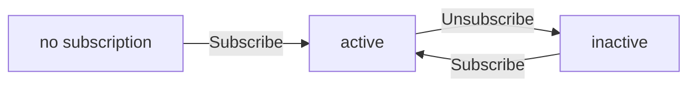
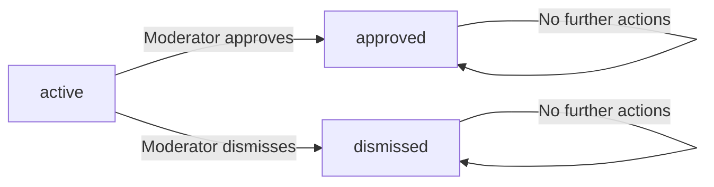
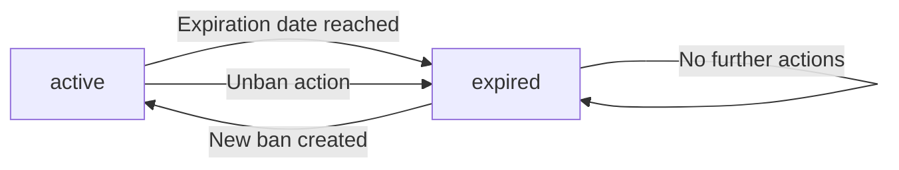
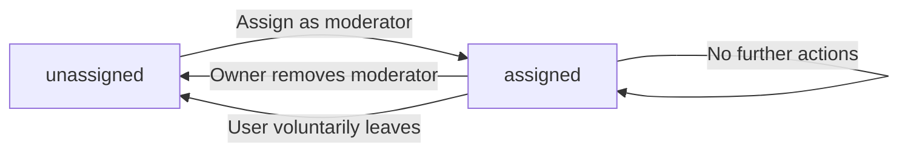

**redditPlatform — Business concepts, relationships, and states from user perspective**

Business concepts, relationships, and states from user perspective

# Domain Concepts

Describe what each concept means in the business domain and its key attributes.

## User Concept

Users are the fundamental actors in the platform who create accounts and interact with all content. Each user registers with a verified email address and selects a unique username for community identification. Users authenticate to access personalized features like creating posts, comments, and managing their account. Every user accumulates a single karma score that reflects their overall community participation and reputation. This karma score increases when other users upvote their posts and comments, and decreases when downvoted. Users maintain this score throughout their account lifetime, which can become negative if they receive more downvotes than upvotes. The user identity system uses both email for authentication purposes and username for public visibility.

### User Account Creation

Users can create an account by providing an email address, selecting a password, and choosing a unique username. The email address must be valid and will be used for account verification and authentication. The username must be unique across the platform and will be visible to other users. During account creation, users agree to the platform terms and conditions.

### Email Verification and Authentication

After account creation, users must verify their email address before they can use the platform. A verification link is sent to the provided email address, and users must click this link to activate their account. Once verified, users can log in by entering their email address and password. Users can change their password at any time through the account settings. If users forget their password, they can request a password reset link to be sent to their verified email address.

### Unique Username Management

Each user must select a unique username during account creation. The username cannot be changed after it is set. The username is the primary identifier visible to other users when creating posts, comments, and interacting on the platform. Users cannot use another existing username, and usernames that are reserved or inappropriate may be rejected by the system.

### User Authentication

Users authenticate by entering their email address and password. After successful authentication, users gain access to personalized features including creating posts, comments, managing subscriptions, and viewing their profile. Guest users who are not authenticated can only browse public content such as posts, communities, and other user profiles, but cannot create content or interact with voting systems.

### Karma Score Accumulation

Every user has a single karma score that represents their overall community participation and reputation. The karma score starts at zero when a user creates their account. The karma score increases by one point when another user upvotes the user's post or comment. The karma score decreases by one point when another user downvotes the user's post or comment. The karma score can accumulate positively or negatively based on community feedback.

### Negative Karma Scenarios

Users can have a negative karma score if they receive more downvotes than upvotes on their posts and comments. A negative karma score does not restrict user functionality — users with negative karma can still create posts, comments, and interact with the platform normally. The karma score is displayed publicly on the user's profile page along with their other profile information.

### User Identity and Profile Relationship

Each user has one associated profile that contains their display name, biographical text, and avatar image. The display name can be changed by the user at any time and is different from the immutable username. The biographical text allows users to share information about themselves. The avatar image is a visual representation displayed next to the user's posts and comments. The profile is viewable by any user on the platform, showing the user's display name, bio, avatar, total karma score, and lists of their posts and comments.

### Email and Username Relationship

A user's email address and username serve different purposes. The email address is private and used solely for authentication, account recovery, and communication with the user. The email address is never displayed to other users. The username is public and serves as the user's visible identifier across the platform. When users create posts or comments, their username (not email) is displayed to the community. The relationship between email and username is one-to-one — each email corresponds to exactly one username, and each username is associated with exactly one email address.

## Profile Concept

Each user maintains a public profile that displays personal information visible to all other platform members. Profiles include a customizable display name that represents the user within the community. Users can add biographical text that provides context about their interests and background. An avatar image serves as a visual identifier for the user across all platform interactions. Profile pages prominently display the user's total karma score as a measure of community engagement and reputation. The profile page shows a complete collection of all posts created by that user for public viewing. Additionally, profiles list all comments written by the user to demonstrate their discussion participation history. Users can edit their display name, bio text, and avatar image to update their public representation.

### Profile Overview

Each user maintains a public profile that displays personal information visible to all other platform members. Every user account has exactly one profile associated with it. The profile serves as the user's primary public representation on the platform. All platform members can view any user's profile, including those who have not logged in. The profile acts as the user's identity marker across all platform interactions. Profile information includes the display name, biographical text, avatar image, and karma score. A user's profile is the authoritative source for their public identity information.

### Profile Information Elements

A profile contains a display name that represents the user within the community. Users select their display name when creating their profile. The display name can be customized at any time by the profile owner. Biographical text allows users to provide context about their interests, background, and participation in the community. The bio is optional and may be left empty. An avatar image serves as a visual identifier for the user across all platform interactions. The avatar is optional and users may choose to use a default image. The karma score represents the user's total community engagement and reputation, calculated as the sum of all upvotes and downvotes received on posts and comments. The karma score can be positive, negative, or zero.

### Profile Content Display

Profile pages show a complete collection of all posts created by the user for public viewing. The post collection includes every post the user has made across all communities. Each post entry displays the title, community name, and vote score. Profile pages also list all comments written by the user to demonstrate their discussion participation history. Comment entries display the comment text, the post being commented on, and the vote score. The comment history includes both top-level comments and replies. Users can see the full history of their contributions through their profile, including content from all communities they have interacted with.

### Profile Editing

Users can edit their own display name, biographical text, and avatar image. Profile editing is limited to the profile owner - users cannot modify other users' profiles. Changes to profile information are immediately reflected across the platform. The profile owner has exclusive rights to update their personal information. When a user deletes their account, their profile and all associated content are removed from the platform. A profile cannot be deleted separately from the user account.

## Community Concept

Communities are topic-based groups where users gather to share and discuss content around specific subjects. Any user can establish a new community by choosing a unique name that identifies the group across the platform. Each community has descriptive text explaining its purpose and subject matter focus. Communities display a distinctive icon image for visual recognition and branding purposes. The user who creates a community automatically becomes its owner with full administrative control over the group. Each community tracks the number of subscribers who follow its content and discussions. Users can browse all communities in a comprehensive list to discover new groups of interest. Communities can be searched by name to help users find relevant discussion groups.

### Community Overview

Communities are topic-based discussion groups where users gather to share and discuss content around specific subjects. Each community is established by a user who chooses a unique name that identifies the group across the platform. The name must be unique and cannot be duplicated by any other community.

When creating a community, the user provides a description text that explains the purpose and subject matter focus of the group. The user also selects or uploads an icon image that serves as visual branding and recognition for the community.

Communities are displayed in browsing lists that users can explore to discover new groups of interest. Users can search for communities by name to help them find relevant discussion groups that match their interests.

### Community Name Uniqueness

Every community on the platform must have a unique name that distinguishes it from all other communities.

When a user attempts to create a community with a name that already exists, the creation request is rejected. The system validates that the proposed community name is not already in use before allowing the community to be established.

Once a community name is assigned, it remains the permanent identifier for that community and cannot be changed. This ensures consistent references to the community across all content and interactions.

### Community Ownership

The user who creates a community automatically becomes its owner. The owner has full administrative control over the community and can manage all aspects of its operation.

The owner can add other users as moderators with limited administrative privileges. The owner can also remove moderators from the community, which revokes their moderator privileges.

Only the owner can remove moderators. Moderators cannot remove other moderators or remove the owner from their position. This ensures clear ownership hierarchy and prevents unauthorized removal of community leadership.

### Community Subscribers

Each community tracks the number of subscribers who follow its content and discussions. This count represents all users who have subscribed to the community.

Subscribers receive access to the community's content and can participate in discussions according to the community's rules and the user's status. Banned users cannot create posts or comments in the community but can still view content.

The subscriber count is publicly visible on the community listing and provides users with information about the community's popularity and activity level.

### Community Discovery

Users can browse all communities in a comprehensive list to discover new groups. The browse list displays key information about each community including its name, description, subscriber count, and icon image.

Users can search for communities by name to find specific groups of interest. The search matches against community names to help users locate relevant discussion groups.

Communities are organized as topic-based discussion groups, allowing users to find and join groups that align with their interests and participation goals. Each community focuses on a specific subject area or topic of discussion.

## Subscription Concept

Subscriptions represent the relationship between users and communities they follow for content. Users subscribe to communities to receive content from those groups in their personalized home feed. Subscription membership is a prerequisite for users who want to create posts within a specific community. Each subscription records the date when the user first joined that community. Users can view their complete list of subscribed communities to track their interests and activity. Users can unsubscribe from any community to stop receiving content from that group. The subscription system maintains active membership status to enable content creation permissions within subscribed communities.

### Subscription Relationship

A subscription represents the connection between a user and a community they follow. When a user subscribes to a community, they indicate interest in receiving content from that group. Each subscription is a one-time relationship — a user can be subscribed to any number of communities, and can unsubscribe from any community at any time. The subscription exists only between a single user and a single community.

Users can view all communities they are currently subscribed to. The system maintains a record of each active subscription to enable content creation permissions and feed filtering.

### Subscription Date Tracking

Each subscription records the date when the user first joined that community. This date marks when the subscription became active and is stored for reference purposes.

The subscription date provides context about how long a user has been a member of a community. This information is displayed on the user's profile and community pages when relevant to show community membership history.

### Active Subscription Status

A subscription has an active status that indicates the user is currently a member of the community. An active subscription allows the user to create posts in that community and receive content in their home feed.

A subscription can become inactive when the user unsubscribes or when the user is banned from the community. The system tracks the status to determine whether the user has access to community features. Only active subscriptions grant the ability to post content.

### Subscribe to Community

Any user can subscribe to any community on the platform. To subscribe, the user selects the community and confirms their subscription. The system then creates a subscription record linking the user to the community with an active status.

The subscription becomes effective immediately after confirmation. The user can view the community in their subscribed communities list and will begin receiving posts from that community in their home feed.

### Unsubscribe from Community

Any user can unsubscribe from any community they are currently subscribed to. To unsubscribe, the user accesses the community page and confirms the unsubscription action. The system then updates the subscription status to inactive.

After unsubscribing, the user can no longer create posts in that community and will no longer see its content in their home feed. The user can later choose to subscribe to the community again if they wish.

### Subscribed Communities List

Users can view a complete list of all communities they are currently subscribed to. The list displays each community's name and shows how many posts have been created since the user last viewed the list.

Users can access this list from their profile page to review their community memberships. The list helps users track which communities they follow and identify communities they may want to unsubscribe from.

### Content Creation Requirement

A subscription is required for users who want to create posts in a specific community. Users can only create posts in communities where they have an active subscription.

When a user attempts to create a post in a community, the system checks if the user is subscribed to that community. If the user is not subscribed, the post creation request is rejected. Users must first subscribe to the community before they can post content there.

### Home Feed Content Filtering

The home feed shows posts only from communities to which the user is actively subscribed. When users view their personalized home feed, the system filters posts to include only those from their subscribed communities.

This filtering ensures that users see content from communities they have chosen to follow. Posts from communities where the user is not subscribed do not appear in the home feed. The filtering applies to all three content types: text posts, link posts, and image posts.

## Post Concept

Posts are the primary content units where users share information, links, or images within communities. Every post requires a title that describes its content and attracts reader attention. Posts exist in three distinct types: text posts with written content, link posts with external web addresses, and image posts with uploaded pictures. Posts are always associated with a specific community where they are published and discussed. Each post shows who the author is and when it was created for attribution purposes. Posts accumulate a vote score based on community feedback through upvotes and downvotes. Posts track their comment count to show discussion engagement levels within the community. Users can edit their own posts to update content or correct information. Users can delete their own posts to remove them from the platform entirely.

### Post Title Requirement

Every post requires a title that describes its content and attracts reader attention. The title is mandatory and must be provided when creating a post. A post without a title cannot be created or submitted to the system.

### Post Content Types

Posts exist in three distinct types, and a post must be one of these types when created:

- Text posts: contain written content that users can read directly
- Link posts: contain a web address (URL) that directs readers to an external website
- Image posts: contain an uploaded image file that displays within the post

Each post type has its own content structure. When creating a post, users must specify which type it is and provide the appropriate content for that type.

### Post Community Association

Every post is associated with exactly one community where it is published and discussed. A post cannot exist independently of a community. When creating a post, users must select the community where the post will be published. The community association is permanent and cannot be changed after the post is created.

### Post Author Attribution

Each post is attributed to a specific user who created it. The post author's username is displayed publicly on the post. The author attribution is established at the time of post creation and remains permanent. The author retains ownership of the post for the purposes of editing and deletion rights.

### Post Vote Score

Every post accumulates a vote score based on community feedback. The vote score is calculated as the total number of upvotes minus the total number of downvotes. Users can upvote posts to increase the score, downvote to decrease it, or remove their vote entirely. The vote score is displayed publicly on each post.

### Post Comment Count

Each post tracks the total number of comments it has received. The comment count is displayed publicly on the post and updates whenever a new comment is added or removed. This metric shows the level of discussion engagement within the community.

### Post Timestamp

Every post is assigned a timestamp at the time of creation. This timestamp indicates when the post was created and is displayed publicly in a relative format (e.g., "3 hours ago", "2 days ago"). The timestamp cannot be modified after creation.

### Post Editing Capability

The author of a post has the right to edit their own post to update content or correct information. Any user can view edited content. Editing is limited to posts that the user created; users cannot edit posts created by others.

### Post Deletion Capability

The author of a post has the right to delete their own post. When a post is deleted, it is removed from the platform entirely and is no longer visible to other users. The author may also delete their own comments, which follow the same deletion rights and visibility rules.

## Comment Concept

Comments are user contributions that respond to posts or other existing comments in discussion threads. Users can write comments to participate in conversations on any post within a community. Comments support nested replies, allowing users to respond to other comments directly in threaded discussions. There is no limit to how deep comment threads can extend for unlimited conversation depth. Each comment shows the author's identity and when it was posted for attribution. Comments have their own vote scores that reflect community perceived value and quality. Comments can be sorted by different criteria to help users navigate discussions efficiently. Users can edit their own comments to correct or update information at any time. Users can delete their own comments to remove them from the discussion.

### Comment Creation on Posts

Users can write a comment on any post within a community. A comment consists of text content that represents the user's response or contribution to the discussion. When creating a comment, the system associates it with the post it responds to and the user who wrote it. The comment appears on the post's discussion page for all users to see. Users must be logged in to write comments on posts. Guests viewing a post cannot write comments.

### Comment Replies and Nested Threads

Users can reply to any existing comment, creating a threaded conversation within the discussion. Each reply is linked to the comment it is responding to, forming a parent-child relationship in the discussion tree. Replies can themselves have replies, creating nested levels of conversation. The system displays replies indented under their parent comments to show the discussion structure. This threading allows users to follow specific conversation branches and respond to particular points raised by other users.

### Unlimited Comment Thread Depth

There is no limit to how deep comment threads can extend. Users can continue replying to replies indefinitely, creating as many levels of nested discussion as needed. The system handles unlimited nesting levels without restrictions on recursion depth. This allows for extended conversations where users can respond to points raised at any level of the discussion hierarchy. The display of deeply nested comments remains clear and readable regardless of nesting depth.

### Comment Author Attribution

Each comment displays the author's username for identification and accountability. The author's profile link is accessible from their username in the comment display. When viewing comments, users can see who wrote each comment to understand who is participating in the discussion. Comment authorship cannot be changed after the comment is created. The original author remains attributed to their comment even if they delete their account or their username changes.

### Comment Vote Score

Each comment has a vote score that reflects community feedback on its quality and relevance. Users can upvote comments they find useful or agree with, increasing the score by 1. Users can downvote comments they find unhelpful or disagree with, decreasing the score by 1. Each user can vote on a comment only once at any time. Users can change their vote from upvote to downvote or vice versa. Users can remove their vote entirely, returning the score to its previous state. The vote score can be negative if downvotes exceed upvotes.

### Comment Sorting Options

Comments on a post can be sorted using three different ordering options to help users navigate discussions. The Best sorting option displays comments with the highest vote scores first. The New sorting option displays the most recently created comments first. The Controversial sorting option displays comments with many votes but scores close to zero, highlighting divisive discussions. Users can select their preferred sorting method when viewing comments on any post. The sorting applies to all comments on the post and persists while the user remains on the page.

### Comment Editing

Users can edit their own comments to correct or update information after posting. Editing a comment updates the displayed content while preserving the original timestamp. The system records that a comment has been edited but does not show the edit history to other users. Only the original author can edit their own comments; other users cannot modify anyone else's content. There is no limit to how many times a user can edit their own comments.

### Comment Deletion

Users can delete their own comments to remove them from the discussion. When a user deletes their comment, the comment content is removed and no longer visible to other users. The comment author's username remains visible in place of the deleted comment to maintain discussion context. Deleted comments cannot be recovered by the original author or other users. Users cannot delete comments written by other users; only the original author can delete their own comments.

### Discussion Participation

Users can participate in discussions by writing comments and replying to existing comments. Participation requires the user to be logged into their account. Users can view all comments on any post regardless of their relationship to the community or other users. Active participation includes creating new comments, replying to comments, voting on comments, and reading discussion threads. Users can participate in discussions across all communities without restrictions on the number of comments they can write.

## Vote Concept

Votes are user expressions of approval or disapproval on posts and comments to indicate content quality. Users can express approval through upvotes for content they find valuable or agree with. Users can express disapproval through downvotes for content they find unhelpful or disagree with. Each user can cast only one vote per piece of content at any given time to prevent manipulation. Users have the ability to change their vote from upvote to downvote or vice versa at any point. Users can remove their vote entirely, leaving the content with no personal vote recorded from that user. Vote scores are calculated by adding total upvotes and subtracting total downvotes for each item. Votes directly affect the karma scores of content creators in the community.

### Vote Expression Mechanism

Users can express their opinion on posts and comments through voting. A vote represents a user's assessment of content quality, helpfulness, or agreement with the content.

Users can approve content by casting an upvote. This indicates the user found the post or comment valuable, helpful, or agreeable.

Users can disapprove content by casting a downvote. This indicates the user found the post or comment unhelpful, misleading, or disagreed with it.

Votes are applied to individual pieces of content — either posts or comments — not to entire threads or discussions.

A vote is tied to both the voting user and the specific piece of content being voted on.

Users must be logged in to cast votes. Guest users cannot participate in voting.

### Single Vote Constraint

Each user can cast only one vote on any given post or comment at any time. This prevents a single user from manipulating the vote score through multiple votes.

When a user attempts to vote on content they have already voted on, the system interprets this as a vote change request rather than a new vote.

The vote constraint applies separately to each piece of content — a user can vote on many different posts and comments, but only one vote per individual item.

### Vote Change Capability

Users can change their vote on a post or comment at any time after initially casting it.

A user who has upvoted content can change their vote to downvote.

A user who has downvoted content can change their vote to upvote.

Changing a vote updates the vote score immediately and recalculates karma for the content owner accordingly.

The vote change is applied to the same piece of content without requiring the original vote to be removed first.

### Vote Removal Option

Users can remove their vote from a post or comment entirely, leaving the content with no personal vote recorded from that user.

Removing a vote cancels the effect of the previous vote on both the vote score and the karma score.

After removing a vote, the user is free to cast a new vote (upvote or downvote) on the same content if desired.

Vote removal is a permanent action — once removed, the vote is no longer counted in the totals.

Users can remove votes at any time without restriction.

### Vote Score Calculation

The vote score of a post or comment is calculated as the total number of upvotes minus the total number of downvotes.

Only votes from authenticated users are counted in the score calculation.

When a vote is changed, the score is recalculated to reflect the new vote state.

When a vote is removed, the score is recalculated to exclude that user's vote.

The vote score can be a positive number (more upvotes than downvotes), negative number (more downvotes than upvotes), or zero (equal upvotes and downvotes).

Vote scores are displayed prominently on each post and comment to show the net community assessment.

### Vote Impact on Karma

Votes directly affect the karma score of content creators in the community.

When a user receives an upvote on their post or comment, their karma score increases by 1.

When a user receives a downvote on their post or comment, their karma score decreases by 1.

When a user changes their vote from upvote to downvote, the content creator's karma decreases by 2 (upvote removed minus downvote added).

When a user changes their vote from downvote to upvote, the content creator's karma increases by 2 (downvote removed plus upvote added).

When a user removes their vote, the content creator's karma adjusts accordingly (increases by 1 if upvote removed, decreases by 1 if downvote removed).

Karma from votes can be negative — there is no minimum threshold for karma scores.

## Report Concept

Reports are formal submissions by users who flag content they believe violates community standards or guidelines. Users can report any post or comment that concerns them as a community member or participant. When reporting, users must provide a text reason explaining why the content should be reviewed by moderators. Each report tracks the reported content, who submitted the report, and the stated reason for the report. Moderators can view all active reports for their community to review flagged content for potential violations. Moderators can approve a report which results in the reported content being deleted. Moderators can dismiss a report which keeps the content active and visible to the community. Dismissed reports are removed from the active report list for the community.

### Report Definition

A report is a formal submission made by a user who flags a post or comment that they believe violates community standards or guidelines. Users can report any post or comment on the platform as community participants. Each report identifies the reported content, records who submitted the report, and captures the reason text provided by the reporter. Reports serve as a mechanism for users to alert moderators about potentially problematic content.

### Reporting Mechanism and Reason Requirement

Users initiate a report by selecting a specific post or comment and submitting a text reason explaining why they believe the content should be reviewed. The report reason text is a required field — the reporting action is rejected if no reason is provided. The reason text must describe the user's concern about the content and serves as the primary information for moderators reviewing the report.

### Reporter Identity and Content Tracking

Each report tracks the reporter's identity (the user who submitted the report) and identifies the reported content (the specific post or comment being flagged). The system maintains this attribution to ensure accountability and to allow moderators to see who reported each item. Reports are associated with the community where the reported post or comment exists.

### Active Report List for Moderators

Moderators of a community can view a list of all active reports for that community. The active report list shows only reports that have not yet been resolved — either approved or dismissed. Each report in the list displays the reported content, the reporter's identity, and the reason text provided. Moderators use this list to review flagged content and decide whether to take action.

### Report Status Workflow

Reports have two possible outcomes when reviewed by a moderator:

**Report Approval**
- When a moderator approves a report, the reported content (post or comment) is deleted from the platform
- The report is marked as approved and removed from the active report list

**Report Dismissal**
- When a moderator dismisses a report, the reported content remains active and visible to the community
- The report is marked as dismissed and removed from the active report list
- Dismissed reports do not appear in the active report list

The system tracks the report status so moderators can distinguish between pending, approved, and dismissed reports.

## Ban Concept

Bans are restrictions imposed on users who violate community rules or platform terms of service. Moderators can ban users from participating in a specific community to prevent further rule violations. Banned users cannot create new posts or comments within the banned community. However, banned users can still view existing content and discussions in the community as passive observers. Each ban records the reason why the user was banned for documentation and transparency. Bans may have an expiration date indicating when restrictions will be automatically lifted. Moderators can unban users to restore their full ability to participate in the community. Banned user lists help moderators track ongoing restrictions and enforcement actions.

### Ban Creation and Documentation

Bans are restrictions imposed on users who violate community rules or platform terms of service. Moderators can ban users from participating in a specific community to prevent further rule violations. Each ban requires documentation of the reason why the user was banned for transparency and record-keeping purposes. The ban reason must be documented as text explaining the circumstances that led to the restriction.

Bans may have an expiration date indicating when restrictions will be automatically lifted. The expiration date is optional; if not specified, the ban remains in effect indefinitely until manually removed. When a ban is created, the system records which user imposed the restriction and the date the ban was applied.

Only moderators with appropriate authority can impose bans on users within their community. The community owner has the highest authority and can ban any user. Moderators can also ban users but cannot remove other moderators or the community owner.

### Ban Enforcement and Access Restrictions

When a ban is active, the system enforces posting restrictions for banned users. Banned users cannot create new posts in the banned community. Banned users cannot write new comments in the banned community. These restrictions apply regardless of whether the banned user has subscriptions to other communities.

Banned users receive view-only access for the banned community. They can view existing posts, comments, and content as passive observers. Banned users retain access to all public community features except content creation.

The ban restriction enforcement begins immediately when the ban is applied. The system checks ban status before allowing any content creation actions in the community.

If a ban has an expiration date and that date has passed, the ban restrictions are automatically lifted and the user regains full posting privileges in that community.

### Ban Management and Tracking

Moderators can perform unban restoration action to remove bans and restore user privileges. When a moderator unbans a user, that user can immediately create posts and comments again in the community. The unban action is immediately effective and requires no additional steps.

Moderators can view the list of banned users in their community. This banned user list tracking feature helps moderators monitor ongoing restrictions and enforcement actions. The list shows each banned user, the reason for their ban, when they were banned, and whether they have an expiration date.

The banned user list includes all users currently under restriction in the community, whether the ban has an expiration date or is indefinite. Moderators can access this list to review past enforcement decisions and manage community membership.

When a user is unbanned or their ban expires, they are removed from the banned user list and their access restrictions are lifted.

## ModeratorRole Concept

Moderator roles represent administrative privileges within communities that enable content management and user moderation. The community creator automatically holds the owner role with highest authority and cannot be removed as moderator. Owners can add other users as moderators to share community management responsibilities. Owners can remove moderators to revoke their administrative privileges from the community. Moderators can add other moderators to their community to expand management capacity. Moderators cannot remove the owner under any circumstances as owners have exclusive removal authority. Moderators cannot remove each other; only the owner can remove moderators from the community. Moderators can delete any posts and comments within their community for content moderation. Moderators can ban and unban users from the community to enforce rules and maintain quality.

### Community Ownership

The user who creates a community automatically becomes its owner with the highest level of authority.

The owner has exclusive rights to manage moderators in their community. Only the owner can assign the moderator role to users in the community. Only the owner can remove the moderator role from users.

The owner role is permanent and cannot be removed by any other user including moderators. The owner remains in control of the community indefinitely unless they choose to stop participating.

### Moderator Role Assignment

The owner has sole authority to assign moderator roles to users in the community.

Assignments can be made to any user who is a member of the community. Each moderator assignment applies only to the specific community where it was granted. A user can be assigned as a moderator in multiple communities, with each assignment being independent.

Once assigned, the user has moderator privileges until the owner removes them. The assignment is permanent until the owner removes it.

### Moderator Privileges

Moderators have specific privileges to help manage community content and enforce rules within their assigned community.

Moderators can delete any posts created within their community, regardless of who created the post. Deletion removes the content from public view immediately.

Moderators can delete any comments within their community, including nested reply threads. Comment deletion also removes the comment and all its replies from public view.

Moderators can ban users from the community to prevent them from creating new posts and comments. Banned users can still view existing content but cannot interact with the community.

Moderators can unban previously banned users to restore their ability to create content.

### Moderator Removal

The owner maintains exclusive authority to remove moderators from their community.

The owner can remove any moderator at any time without requiring approval or providing a reason. When a moderator is removed, all their administrative privileges are revoked immediately.

Once removed, a user cannot regain moderator status without being reassigned by the owner. The removal takes effect immediately when the action is performed.

### Moderator Expansion

Moderators can add other users as moderators to expand the community management team.

This allows moderators to delegate responsibilities and share the workload of community management. Each newly added moderator receives the same privileges as existing moderators.

There is no maximum number of moderators allowed in a community. Both owners and moderators can continue adding moderators as needed.

### Owner Protection

Owners have specific protections that maintain the community hierarchy.

Owners cannot be removed by any moderator, even if other moderators exist in the community. The owner role persists regardless of their activity level in the community.

The owner cannot be demoted to a regular moderator status by other users. The only way an owner role could be removed is through system-level intervention outside the scope of normal operations.

### Moderator Protection

Moderators have protection from removal by other moderators in the same community.

Moderators cannot remove or demote other moderators from their community. Only the owner has the authority to remove moderators from the community.

This creates a clear hierarchy where the owner sits at the top and cannot be challenged by other moderators. No moderator has authority over another moderator; they all have equal standing.

### Moderator Content Deletion

Moderators have the authority to delete posts and comments within their community for content management.

This power applies to all content regardless of who created it, whether normal users or other moderators. The deletion is immediate and removes the content from public view, feeds, and search results.

Moderators can delete any post in their community, including posts by regular users, other moderators, and any content creator. The deletion removes the post title, content, and associated metadata from the community.

### Moderator Ban Management

Moderators have authority to ban users from their community to restrict participation and enforce rules.

Banning prevents users from creating new posts or comments in that community. The ban applies only to the specific community where it was issued. Banned users retain access to view content but cannot create new content.

Moderators can unban users who were previously banned. Unbanning restores the user's ability to post and comment in that community.

# Domain Relationships

Describe how concepts relate to each other from a business perspective.

## Conceptual Relationships

Describe how concepts relate to each other in business terms.

### User and Profile Relationship

Each user owns exactly one profile. A profile belongs to a single user and contains the user's display name, bio text, and avatar image.

The profile is a natural extension of the user account. When a user is created, a profile is automatically associated with that user. The user can edit their own profile, but no other user can modify it.

A user's profile page aggregates data from multiple sources: the profile itself, the user's karma score, and lists of the user's posts and comments.

### User Karma Aggregation

Every user has exactly one karma score, which is calculated by aggregating votes on the user's posts and comments.

The karma score increases by one for each upvote received on any post or comment written by the user. The karma score decreases by one for each downvote received. When a user removes their vote, the karma score is recalculated.

The karma score is a single number visible on the user's profile and is shared across all communities—the user's activity in one community affects their karma everywhere.

### Community Ownership

Any user can create exactly one community at a time, though a user can create multiple communities over time. The user who creates a community becomes its owner.

A community is owned by exactly one user. The owner cannot be removed as owner by any other user. Only the owner can remove moderators or delete the community.

Each community belongs to exactly one owner, and each owner user can own zero or more communities.

### User Community Subscriptions

A user can subscribe to zero or more communities. A community can have zero or more subscribers.

Each subscription is a one-to-many relationship from user to communities: one user has many subscriptions. Each subscription records the subscription date and maintains an active status.

A subscription must exist before a user can create posts in that community. A user can unsubscribe from any community at any time, removing the subscription record.

### Community Post Ownership

A post belongs to exactly one community and is written by exactly one user.

Each post is associated with a single community and created by a single user. A community can have zero or more posts. A user can create zero or more posts across all communities they subscribe to.

The community owns the post in the sense that posts only exist within a community's context. The user owns the post in the sense that the user is the author and can edit or delete it.

### Post Comment Relationships

A comment belongs to exactly one post and is written by exactly one user. A post can have zero or more comments.

A comment can optionally reference another comment as its parent, creating a one-to-many relationship: one parent comment can have many replies, and each reply can itself have many replies.

There is no limit on how many levels deep a comment thread can go. Each comment in the thread is written by a user who may or may not be the original post author.

### User Vote Expressions

A user can cast one vote per piece of content (post or comment). A piece of content can receive many votes from different users.

Each vote represents a one-to-one relationship between a user and a specific piece of content at a point in time. The same user can vote on many different pieces of content.

Users can vote on posts and comments they author, on posts and comments in any community, and on posts and comments from users they do not know.

### Content Reporting Structure

A report is submitted by one user against one piece of content (either a post or a comment).

Each report targets exactly one post or one comment. Each piece of content can have zero or more reports submitted against it. Each user can submit zero or more reports across the platform.

A report is associated with the community where the reported content exists, enabling moderators of that community to review it.

### User Ban Restrictions

A ban applies to one user for one specific community.

A user can be banned from zero or more communities. A community can ban zero or more users. Each ban is a one-to-one relationship between a user and a community at a point in time.

When a user is banned from a community, they cannot create posts or comments in that community but can still view content. A ban may have an expiration date or be permanent.

### Community Moderation Roles

A moderator role is assigned to one user for one specific community.

A user can be a moderator of zero or more communities. A community can have zero or more moderators. Each moderator role assignment is a one-to-one relationship between a user and a community.

A community has exactly one owner who created it. The owner can assign moderator roles to other users. Moderators can also assign moderator roles, creating a chain of assignments.

### Cross-Community Identity

A single user has one identity that spans all communities. The same username and karma score are visible across every community the user participates in.

A user's posts in different communities are aggregated on their profile. A user's comments across different communities are also aggregated on their profile.

Community-specific restrictions (bans, moderator privileges) apply only to that community and do not affect the user's status in other communities.

## Lifecycle and Retention

Describe concept lifecycle states and transitions only. Detailed retention/recovery policies belong in 05-non-functional. Operation details belong in 03-functional-requirements.

### Account Lifecycle

When a user completes registration with an email and password, their account becomes active. Users can update their profile and password while the account is active. Users can delete their account, which permanently removes it from the platform. When a user deletes their account, all their posts and comments are also deleted.

### Post and Comment Lifecycle

Posts and comments exist in an active state once created by their author. The author can edit their post or comment to update its content. The author can delete their post or comment, removing it from the platform. Moderators can also delete any post or comment within their community.

### Report Lifecycle

When a user reports content, the report enters an active state and appears in the moderators' report list for review. Each report shows the reported content, the reporter, and the reason. A moderator can approve the report, which deletes the reported content and removes the report. A moderator can dismiss the report, which keeps the content and removes the report from the list.

### Ban Lifecycle

When a user is banned from a community, their account enters a banned state for that community. A ban can have an expiration date set, after which the ban automatically ends. A moderator can manually remove a ban before expiration, restoring the user's ability to interact with the community. Banned users cannot create posts or comments in the community but can still view content.

# Business Categories and State Flows

Business category classifications and state flow definitions.

## Business Category Definitions

Define all business category classifications with their allowed values and descriptions.

### Business Entities

**User**
A user represents an individual participant in the platform. Each user has an email address, a unique username, and a karma score. The user owns a profile and can create posts, comments, and communities.

**Profile**
A user's profile contains a display name, bio text, and avatar image. A profile belongs to exactly one user.

**Community**
A community is a collection of users gathered around a shared interest. A community has a unique name, description text, and icon image. Each community has one owner and can have multiple moderators.

**Subscription**
A subscription represents a user's connection to a community. The subscription tracks when the user subscribed and the subscription status. Subscribing is required to create posts in that community.

**Post**
A post belongs to one community and is written by one user. A post has a title (required), content, and belongs to one of three types: text, link, or image. A post can have many comments and receives many votes.

**Comment**
A comment belongs to one post and is written by one user. A comment can have many replies (nested discussions with no depth limit). A comment receives many votes.

**Vote**
A vote represents a user's expression of approval (upvote) or disapproval (downvote) for a post or comment. Each user can have only one vote per post or comment.

**Report**
A report is submitted by a user to flag content that violates guidelines. A report includes a reason text and targets one post or comment.

**Ban**
A ban is a restriction applied to a user in a specific community. A ban includes a reason and may have an expiration date. Banned users cannot create posts or comments in that community.

**Moderator Role**
A moderator role is assigned to a user for a specific community. A moderator role has a type (owner or moderator) and tracks when the role was assigned.

### Post Classifications

Posts are classified by their content type, which determines how they are displayed.

**Text Post**
A post containing written text content that users can read directly on the platform. Text posts have no length restriction.

**Link Post**
A post that contains a web address (URL) directing users to external content. The platform displays the domain name of the linked content.

**Image Post**
A post containing an uploaded image. The platform displays a thumbnail preview in post lists.

Each post must be exactly one of these three types.

### Comment Structure

Comments are classified by their relationship to other comments, forming threaded discussions.

**Top-Level Comment**
A comment written directly in response to a post, not as a reply to another comment.

**Reply Comment**
A comment written in response to another comment, creating a nested thread structure.

Replies can have their own replies, with no depth limit. Each comment has exactly one parent comment (or none, if it's a top-level comment).

### Karma Score

Every user has a single karma score, which is one number that can be positive, negative, or zero.

**Karma Increase**
When another user upvotes one of the user's posts or comments, the user's karma score increases by one.

**Karma Decrease**
When another user downvotes one of the user's posts or comments, the user's karma score decreases by one.

**Karma Adjustment**
When another user removes their vote on one of the user's posts or comments, the user's karma score adjusts accordingly.

### Allowed Values: Voting and Sorting

**Vote Direction**
Upvote: Indicates approval or positive engagement.
Downvote: Indicates disapproval or negative engagement.
None: The user has not voted on this content.

**Feed Sorting Options**
Hot: Prioritizes recent posts with high engagement.
New: Prioritizes most recently created posts.
Top: Prioritizes posts by highest vote score, with optional time filters.
Controversial: Prioritizes posts with many votes but scores near zero.

**Time Filters for Top Sorting**
Today: Top posts from the last 24 hours.
This Week: Top posts from the last 7 days.
This Month: Top posts from the last 30 days.
This Year: Top posts from the last 12 months.
All Time: Top posts with no time restriction.

**Comment Sorting Options**
Best: Prioritizes comments by highest vote score.
New: Prioritizes most recently posted comments.
Controversial: Prioritizes comments with many votes but scores near zero.

### Allowed Values: Status Types

**Subscription Status**
Active: The user is currently subscribed to the community and can create posts.
Inactive: The user has unsubscribed from the community.

**Report Status**
Pending: The report has been submitted but not yet reviewed by a moderator.
Resolved: The report has been reviewed and acted upon (content deleted or kept).

**Ban Status**
Active: The user is currently banned from the community and cannot create posts or comments.
Expired: A time-limited ban has ended, and the user's restrictions are removed.

**Moderator Role Type**
Owner: The user who created the community and has full control.
Moderator: A user added by the owner to help moderate the community.

### Entity Relationships

**User to Profile**
Each user has exactly one profile. A profile belongs to one user and contains display information.

**User to Community Subscription**
A user can subscribe to multiple communities. Each subscription is a distinct relationship with its own subscription date and subscription status.

**User to Moderator Role**
A user can be a moderator for zero or more communities. Each moderator role is specific to one community.

**User to Ban**
A user can be banned from zero or more communities. Each ban is specific to one community.

**Community to Posts and Comments**
A community has many posts and comments. Each post belongs to exactly one community. Each comment belongs to exactly one post.

**Post to Comments**
A post has many comments. Each comment belongs to exactly one post.

**Comment to Replies**
A comment can have many replies. Each reply belongs to exactly one parent comment.

**User to Vote**
A user can vote on multiple posts and comments. Each vote is specific to one user and one content item (post or comment).

**User to Report**
A user can submit multiple reports. Each report targets one content item (post or comment) and is associated with one user.

## State Transitions

Define valid state transition paths for stateful concepts.

### Subscription Status Changes

A user subscription to a community has two possible states: active (subscribed) or inactive (unsubscribed).

**Subscription Lifecycle**

When a user subscribes to a community, their subscription status becomes active. This is a one-time transition from no subscription to active subscription.

When a user unsubscribes from a community, their subscription status becomes inactive. The subscription record may remain in the system but is marked as inactive.

A user with an active subscription can post in that community. A user with an inactive (unsubscribed) status cannot create new posts in that community.

A previously unsubscribed user can subscribe again, transitioning back to active status.

**Key Points:**
- Subscription status changes are immediate upon user action
- Active subscriptions are required to create posts in the community
- Users can freely switch between subscribed and unsubscribed states
- The community owner maintains an active subscription by default

### Report Lifecycle

A content report has three possible states: active (pending review), approved, or dismissed.

**Report Lifecycle Workflow**

When a user reports a post or comment, the report is created with active status. This is the initial state for all new reports.

An active report remains in the list of pending reports for moderators of the community where the reported content exists. Moderators can view all active reports and take action.

When a moderator approves a report, the report status changes to approved. The reported content is deleted as part of the approval action.

When a moderator dismisses a report, the report status changes to dismissed. The report is removed from the active report list and the content remains.

A report that is approved or dismissed transitions to a final state and cannot be modified or returned to active status.

**Key Points:**
- Reports require a reason text when submitted
- Moderators of the affected community can view and action the report
- Only one action (approve or dismiss) is taken per report
- Approved reports result in content deletion
- Dismissed reports leave the content unchanged

### Ban Status Management

A ban has two possible states: active or expired.

**Ban Lifecycle Workflow**

When a moderator bans a user from a community, a ban is created with active status. The ban record includes the ban reason.

The ban may have an expiration date. If an expiration date is specified, the ban automatically transitions to expired status on that date. If no expiration date is specified, the ban remains active indefinitely until manually removed.

An active ban restricts the user from creating posts or comments in the community. The banned user can still view content in the community.

A moderator can unban a user, which immediately ends the ban and transitions it to an inactive/expired state. This removes all restrictions.

**Ban Status Transitions**

- Active to Expired: occurs automatically on expiration date or manually via unban action
- Expired to Active: a new ban can be created (separate ban record, not a status change)

**Key Points:**
- Banned users cannot create posts or comments in the community
- Banned users retain ability to view community content
- Ban reason must be documented when a ban is created
- Only moderators can ban or unban users
- Multiple bans can exist for different communities

### Moderation Role Transitions

A moderation role has two possible states: assigned or unassigned.

**Moderator Role Assignment**

When a user is granted moderator privileges for a community, they receive an assigned moderator role. The role record includes the assignment date.

The community owner always has the highest authority and is considered the primary moderator. The owner cannot be removed as moderator.

A moderator with assigned status can perform moderator actions: delete posts, delete comments, ban users, unban users, and view report lists.

A moderator with assigned status can add other users as moderators.

**Moderator Role Removal**

When a moderator's role is removed, their status changes to unassigned. This can occur through:
- Owner removing a moderator
- User voluntarily stepping down (implied from ability to add/remove)

A moderator cannot remove themselves through the system. A moderator cannot remove another moderator (only the owner can remove moderators).

**Role Assignment Transitions**

**Key Points:**
- The owner is automatically a moderator and cannot be removed
- Assigned moderators can add other moderators
- Only the owner can remove moderators
- Removing a moderator does not remove posts or comments they created
- A former moderator can be assigned again if needed