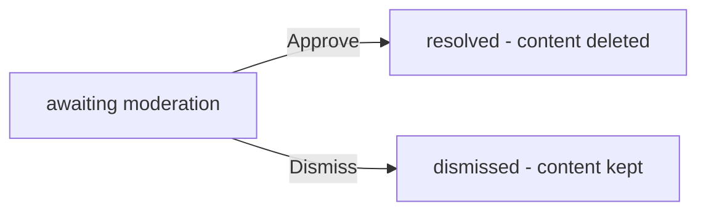
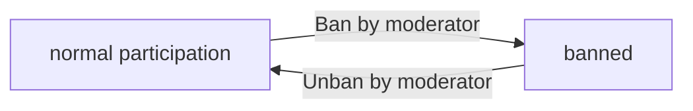
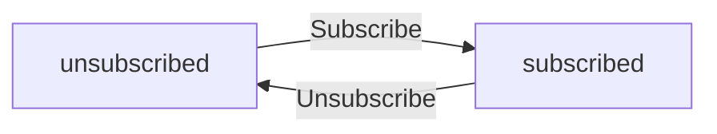
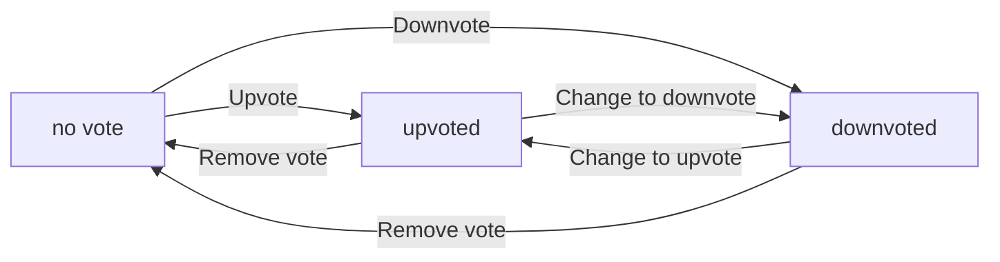

**redditCommunity — Business concepts, relationships, and states from user perspective**

Business concepts, relationships, and states from user perspective

# Domain Concepts

Describe what each concept means in the business domain and its key attributes.

## User Concept

A User represents an individual who participates in the community platform. Each user has a unique username that identifies them throughout the platform. Users can personalize their presence with a display name, which may differ from their username. Users can write a bio text that describes themselves and provides context to their contributions. Users can upload an avatar image that visually represents their identity. Every user accumulates a karma score, which reflects the community's reception of their posts and comments. Users authenticate using an email address and password combination. Users have the ability to modify their password when needed. Users can delete their account, which removes all their posts and comments from the platform.

### User Identity

Every user has a unique username that identifies them throughout the platform. The username is chosen when the account is created and cannot be changed afterward. The username serves as the public identifier visible in all posts and comments. Each user also has an email address that is used for account authentication and recovery. The email address is stored securely and is not displayed publicly on the platform.

### User Profile Attributes

A user profile contains personal information that the user can customize. The display name is a friendly name shown to other users on the platform. The display name is optional and may differ from the unique username. Users can update their display name at any time. The bio text is a short description that users can write about themselves. The bio text is optional and provides context for the user's contributions. The avatar image is an optional picture that visually represents the user's identity. Users can upload a new avatar image at any time. Every user has a karma score that reflects the community's reception of their posts and comments. The karma score is automatically updated when other users vote on posts or comments.

### Authentication Credentials

Users authenticate to the platform using their email address and password. The email address must be valid and unique across all accounts. The password is a secret credential that is required for login and account access. Passwords are stored securely and are never displayed or transmitted in plain text. Only registered members can authenticate and access member-only features. Guests cannot log in and can only view content available to all users.

### Account Management

Users can change their password when needed. The password change requires verification of the current password. Users can delete their account at any time. Account deletion is permanent and cannot be undone. When an account is deleted, all posts and comments created by that user are also removed from the platform. The username becomes available for reuse by other users after account deletion.

## Community Concept

A Community represents a collection of users focused on a specific topic or interest area. Each community has a unique name that distinguishes it from all other communities on the platform. Communities can include a description text that explains the purpose and focus of the community. Each community can have an icon image that provides visual identity. Communities track their subscriber count, showing how many users are interested in the content. The user who creates a community becomes the owner with highest authority. Communities can be browsed in a list across the platform. Communities can be searched by name to find specific ones.

### Community Concept

A Community represents a topic-focused collection of users gathered around a specific interest area or subject. Communities serve as the primary organizational unit where users share content, engage in discussions, and build around common topics. Each community exists as a distinct entity on the platform with its own identity and member base.

### Community Identity Elements

Each Community has a unique name that distinguishes it from all other communities on the platform. The unique community name is the primary identifier used when referencing a specific community. Every Community includes a description text that explains the purpose, focus, and rules of the community. The description text provides context for potential members about what the community is about. Each Community can have an icon image that provides visual identity and brand recognition. The icon image appears in community listings, feeds, and navigation elements to help users quickly identify the community. Together, the unique name, description text, and icon image form the complete community identity.

### Community Ownership

The user who creates a community becomes the community owner. The community owner has the highest authority within the community and is the primary administrator. The owner can perform all moderation actions available to moderators and additionally can add other moderators. The owner relationship is established at the time of community creation and cannot be transferred to another user. Each community has exactly one owner who serves as the ultimate authority for community governance.

### Community Discovery and Listing

Communities are visible to all users on the platform regardless of their account status. All communities can be browsed in a list that shows each community's name, description, and subscriber count. Community listing displays communities sorted by criteria such as activity level or relevance. Users can search for communities by name to find specific communities of interest. Search functionality matches against the community name field to return relevant results. Subscribing to a community is tracked, and each community displays its subscriber count showing the total number of users who have joined. The subscriber count provides visibility into community popularity and engagement levels.

## Subscription Concept

A Subscription represents the relationship between a user and a community they follow. Subscriptions enable users to stay informed about content from communities they care about. Users can subscribe to any community they choose to follow. Users can unsubscribe from communities they no longer wish to follow. Users can maintain a list of communities they are currently subscribed to. Subscribing to a community is required before a user can create posts in that community. A subscription links a user to a community for content aggregation purposes. Users can view their complete list of subscribed communities at any time.

### Subscription Concept

A Subscription represents the relationship between a user and a community they follow. When a user subscribes to a community, they become a member of that community and can access its content. A subscription links a user to a community for content aggregation purposes. Each subscription connects one user to one community. Subscriptions enable users to stay informed about content from communities they care about.

### Subscribe to Community

Any user can subscribe to any community they choose to follow. Users can initiate a subscription at any time without requiring approval from the community owner or moderators. When a user subscribes, they establish a membership relationship with the community. The subscription immediately takes effect, allowing the user to access subscribed-only features.

### Unsubscribe from Community

Users can unsubscribe from any community they are subscribed to at any time. Unsubscribing removes the membership relationship and revokes access to subscriber-only features. When a user unsubscribes, their subscription is terminated and they are removed from the community's subscriber count. Users do not need permission to unsubscribe from a community.

### Subscribed Communities List

Users can view a complete list of all communities they are currently subscribed to. The list shows the communities in a browsable format that allows users to see all their subscriptions in one place. Users can access this list at any time to review their community memberships.

### Subscription Relationship

A subscription creates a bidirectional link between a user and a community. The user side of the relationship tracks the communities the user follows. The community side tracks the user as a subscriber, contributing to the community's total subscriber count. Each subscription is a distinct relationship that can be independently created or removed.

### Following Communities

Users maintain a list of communities they are following through their subscriptions. Following a community means the user has actively chosen to subscribe and wishes to engage with that community's content. Users can follow any number of communities without restriction.

### Community Membership

Membership in a community is established through subscription. When a user subscribes to a community, they become a member with access to view community content. Members can interact with the community based on other permissions granted to them. Non-subscribers are considered guests to the community and have limited access.

### Post Creation Requirement

Subscribing to a community is required before a user can create posts in that community. Users must have an active subscription to the community before they can post content there. This requirement ensures that only committed community members can contribute posts. Users without a subscription cannot create posts regardless of other permissions.

### Subscription Status

Each subscription has a status that indicates whether the user is currently subscribed or not. A user can have multiple active subscriptions across different communities simultaneously. The status is visible in the user's subscribed communities list and reflects their current following state.

### Membership Management

Users have full control over their own subscriptions. They can add or remove themselves from any community's subscriber list without needing approval. Users can manage their subscriptions at any time to update which communities they follow. Subscription management is a self-service feature available to all users.

## Post Concept

A Post represents content that users share within a community. Every post must have a title that identifies its subject. Posts belong to a specific community and are visible within that community. Posts are created by a single user who becomes the author. Posts can be of three different types: text post, link post, or image post. Text posts contain text content that users write. Link posts contain a URL that users want to share. Image posts contain an uploaded image file. Posts track their vote score, which is calculated from upvotes and downvotes. Posts track their comment count, showing how many comments they have received. Posts record when they were posted to show recency.

### Post Overview

A Post represents content that users share within a community. Every post must have a unique identifier that distinguishes it from all other posts in the system. Posts are created by a single user who becomes the author of the post. Posts belong to a specific community and are visible within that community. Posts are the primary method of content sharing on the platform, allowing users to express opinions, share information, or distribute media to their subscribed communities.

### Post Types

Every post must be one of three types: text post, link post, or image post. Users select the post type when creating a post, and this determines what kind of content the post can contain. A post cannot change its type after creation. The system validates that each post contains the appropriate content for its selected type.

### Text Posts

Text posts contain text content written by the author. When creating a text post, the user enters text content that will be displayed in full when the post is viewed. The text can include multiple paragraphs and can be as long as the user wishes to write. All text posts must have content beyond just the title.

### Link Posts

Link posts contain a URL that the author wants to share with the community. When creating a link post, the user enters a complete web address. The system displays the domain name of the URL (such as youtube.com or news.example.com) in the post list. Link posts allow users to share content from external websites while providing context through the post title.

### Image Posts

Image posts contain an uploaded image file. When creating an image post, the user uploads an image that will be displayed within the post. The system creates a thumbnail version of the image for display in post lists, allowing users to quickly preview image content without loading the full-size image.

### Post Author

Every post has exactly one author, who is the user who created the post. The author's username is displayed with the post, allowing the community to identify who shared the content. Only the author can edit or delete their own post. The author relationship cannot be transferred to another user.

### Post Community

Every post belongs to exactly one community, which is the community the author was subscribed to when creating the post. The community name is displayed with the post, allowing users to understand the context of the content. Posts are visible to users who can view the community, whether or not they are subscribed to that community.

### Vote Score

Every post tracks a vote score, which is calculated by subtracting downvotes from upvotes. Each community member can vote on a post once, and the vote can be changed or removed at any time. The vote score updates in real-time as votes are cast or changed. Users can see the current vote score for every post they view.

### Comment Count

Every post tracks the total number of comments it has received. This count includes all top-level comments and nested replies. The comment count is displayed with the post in post lists, giving users an indication of how much discussion the post has generated. The count updates when comments are added or removed.

### Post Timestamps

Every post records when it was created, showing the date and time of creation. This timestamp is displayed with the post, allowing users to understand how recent the content is. The system calculates the time difference between the current moment and the post creation time, displaying it in relative terms such as '3 hours ago' or '2 days ago'.

### Post Visibility

Posts are visible to users based on the visibility settings of their community. Public communities allow anyone to view posts, while restricted communities require users to be subscribed to view posts. Banned users cannot view posts in communities from which they are banned. Posts remain visible until they are deleted by the author or a moderator.

### Post Identity

Each post has a unique identity within the system that prevents duplicate posts from having the same identifier. This identity is created when the post is first saved to the system. Posts cannot have their identity changed or be reassigned to a different post. The unique identity ensures that each piece of content can be referenced consistently throughout the platform.

### Content Sharing Intent

Posts serve as the primary mechanism for content sharing within the platform. Users create posts to share information, opinions, media, or links with their subscribed communities. The post format allows for rich content sharing through text, URLs, or images, each type serving different sharing purposes. Content sharing is the central activity that drives community engagement and discussion.

## Comment Concept

A Comment represents feedback or discussion attached to a post. Comments are written by users to express opinions or ask questions. Comments belong to a specific post and are displayed with that post. Each comment has content text that users write. Comments are authored by a single user. Comments have a vote score that reflects community reception. Comments record their timestamp to show when they were written. Comments can be replied to, allowing threaded discussions. Replies can themselves have replies with no depth limit, enabling nested conversations. Comments can be edited by their author. Comments can be deleted by their author.

### Comment Fundamentals

A Comment represents user feedback or discussion attached to a post. Comments allow users to express opinions, ask questions, or engage in conversation around post content.

Each Comment has the following attributes:
- Content text that the author writes
- Author who created the comment
- Vote score reflecting community reception
- Timestamp showing when the comment was written

Comments belong to a specific post and are displayed with that post. Each comment is authored by exactly one user. The author can be viewed by all users who can see the comment.

The comment content text is the primary element that users write to express their thoughts. Comments are created by users when they want to contribute to a discussion on a post.

Vote score is calculated by adding one point for each upvote and subtracting one point for each downvote. Users can vote on comments with one vote per comment per user. The vote score can be positive, negative, or zero.

The timestamp records when the comment was created and is displayed to all users. This allows users to see how recent or old a comment is.

### Comment Threading and Replies

Comments support threaded discussions where users can reply to existing comments. Replies can themselves have replies, with no depth limit, enabling nested conversations.

A Comment can have multiple replies attached to it. Each reply is also a Comment with the same attributes as the parent comment. This creates a hierarchy of comments within a post.

Discussion threads are organized hierarchically, showing the relationship between parent comments and their replies. Users can view the complete thread structure when reading a post.

Nested comments are comments that appear as replies to other comments, creating multiple levels of conversation depth. There is no limit on how many levels of nesting are allowed.

When viewing a post, all comments are displayed with their reply relationships shown. Users can navigate through discussion threads by expanding or collapsing reply chains.

Comment visibility within a thread is determined by the post visibility and the comment author's relationship to the community. Users who cannot view the post cannot view its comments.

### Comment Lifecycle

Comments can be edited by their author after creation. Editing allows the author to update the content text of their comment.

When a comment is edited, the updated content is shown to all users who can view the comment. The edit history is not tracked for other users to see.

Comments can be deleted by their author after creation. Deletion removes the comment content from view entirely.

When a comment is deleted, it is no longer visible to any users. The comment cannot be recovered once deleted by the author.

Users who can view a post can create new comments on that post. Comment creation requires the user to be logged in.

Comments remain visible indefinitely unless deleted by the author or removed by community moderation actions.

## Vote Concept

A Vote represents a user's opinion on the value of a post or comment. Votes can be either an upvote to indicate positive value or a downvote to indicate negative value. Each user can only cast one vote per post at any given time. Each user can only cast one vote per comment at any given time. Users can change their vote from upvote to downvote or vice versa at any time. Users can remove their vote entirely to withdraw their opinion. The vote score for a post or comment equals total upvotes minus total downvotes. Voting affects a user's karma score by plus or minus one point. Vote score indicates the net community reception of content.

### Vote Concept

A Vote represents a member's opinion on the value of a post or comment. Members can express positive value through an upvote or negative value through a downvote. Each member can only cast one vote per post and one vote per comment at any given time. The vote direction indicates whether the vote is an upvote or downvote.

### Vote Rules

Each member can only have one vote per post at any time. Each member can only have one vote per comment at any time. If a member already has a vote on a post or comment, they cannot cast a second vote.

### Vote Change

Members can change their vote from upvote to downvote or from downvote to upvote at any time. When a vote is changed, the vote direction is updated to reflect the new direction.

### Vote Removal

Members can remove their vote entirely from a post or comment. When a vote is removed, it no longer contributes to the vote score of that post or comment.

### Vote Score Calculation

The vote score for a post or comment equals the total number of upvotes minus the total number of downvotes. This calculation aggregates all votes cast on the content by all members.

### Karma Impact

When a member casts an upvote on another member's post or comment, the recipient's karma score increases by one. When a member casts a downvote on another member's post or comment, the recipient's karma score decreases by one. When a vote is changed, the karma adjustment reflects the difference between the old and new vote. When a vote is removed, the karma adjustment reverses the original impact.

### Community Reception

The vote score indicates the net community reception of a post or comment. A positive vote score shows the community values the content. A negative vote score shows the community disvalues the content. A vote score of zero shows neutral reception from the community.

## Report Concept

A Report represents a community member flagging content that violates community norms. Users can report posts that they believe should be reviewed by moderators. Users can report comments that they believe should be reviewed by moderators. When creating a report, users must provide a reason explaining why the content is being reported. Reports track which content is being reported, whether post or comment. Reports track who reported the content by recording the reporter. Reports track the reason text provided by the reporter. Moderators can view all reports for their community. Moderators can approve a report, which results in deleting the reported content. Moderators can dismiss a report, which keeps the content but removes the report from the list.

### Report Definition

A Report represents a community member flagging content that violates community norms. Reports track which content is being reported, whether post or comment. Reports track who reported the content by recording the reporter. Reports track the reason text provided by the reporter. Each report has a status indicating its current state: pending, approved, or dismissed.

### Reporting Content

Users can report any post in their community that they believe violates community norms. Users can report any comment in their community that they believe violates community norms. When creating a report, users must provide a reason text explaining why the content is being reported. The reason text describes the content violation according to community norms.

### Moderator Review

Moderators can view all reports for their community. Each report shows the reported content, who reported it, and the reason. Moderators can approve a report, which results in deleting the reported content. Moderators can dismiss a report, which keeps the content but removes the report from the list. Dismissed reports are no longer visible to moderators.

## Feed Concept

A Feed represents a curated list of posts presented to users. There are three types of feeds: home feed, popular feed, and community feed. The home feed shows posts from communities the user is subscribed to and is available only to logged-in users. The popular feed shows posts from all communities across the platform and is available to everyone. The community feed shows posts from one specific community and is available to everyone. All feeds display posts in a list format. Feeds are paginated to allow users to navigate through many posts. Each post in a feed shows title, author, community, vote score, comment count, and time posted. Content previews vary by post type with different information displayed.

### Feed Types

There are three types of feeds available in the system: home feed, popular feed, and community feed.

The home feed displays posts from communities that the logged-in user has subscribed to. Only posts from these subscribed communities appear in this feed.

The popular feed displays posts from all communities across the platform. This feed is available to both logged-in users and guests.

The community feed displays posts from a single specific community. Anyone can view the community feed for any community.

All three feed types present posts in a list format and support pagination for browsing through multiple posts.

### Feed Access

Feed access depends on whether the user is logged in or browsing as a guest.

The home feed is available only to logged-in users. Guests cannot access the home feed.

The popular feed is available to all users, including guests who are not logged in.

The community feed is available to all users, including guests.

Subscribing to a community is required before a user can create posts in that community, but not required to view the community feed.

### Post List Display

When viewing any feed, each post in the list displays the following information:

- The post title
- The username of the post author
- The name of the community where the post was published
- The current vote score for the post
- The number of comments on the post
- The time elapsed since the post was created (displayed as "3 hours ago" or similar)

The post preview content varies based on the post type:

- Text posts: the first 200 characters of the post content are displayed
- Image posts: a thumbnail image of the uploaded image is displayed
- Link posts: the domain name of the URL is displayed (for example, "youtube.com")

This consistent display format allows users to quickly scan and compare posts across different feed types.

### Feed Pagination

All feeds are paginated to allow users to navigate through large numbers of posts.

Each page of a feed shows a limited number of posts, with navigation controls to access previous and next pages.

Users can move through multiple pages to browse through historical posts or discover new content.

The pagination mechanism works the same way across all three feed types: home feed, popular feed, and community feed.

Pagination allows users to efficiently browse feeds without loading all posts at once, improving performance and user experience.

### Post Preview Content

The preview content shown in feeds varies depending on the type of post:

- For text posts, the first 200 characters of the post content are displayed as a preview. This gives users a sense of the full content without requiring them to open the post.

- For image posts, a thumbnail version of the uploaded image is displayed in the post list. Users can click to view the full-sized image.

- For link posts, the domain name of the URL is displayed (for example, "youtube.com" or "reddit.com"). This helps users identify the source of the link before clicking.

Each post type has its own preview strategy that optimizes for quick content identification while respecting display constraints in the post list view.

### Feed Sorting Options

All feed types support the same set of sorting options to help users find content in different ways.

The "hot" sort option displays recent posts with many upvotes first. This surfaces currently trending content.

The "new" sort option displays the most recently created posts first. This helps users see the latest content immediately.

The "top" sort option displays posts with the highest vote score first. The "top" sort includes time filter options: today, this week, this month, this year, and all time. This allows users to find the best content within specific time periods.

The "controversial" sort option displays posts that have received many votes but have a score close to zero. This surfaces posts that generated strong reactions from both supporters and detractors.

Sorting options allow users to customize how they browse and discover content across all feed types.

### Feed Filtering and Content Curation

Feed filtering determines which posts appear in each feed type.

The home feed curates content by showing only posts from communities the user has subscribed to. This personalizes the feed to the user's interests.

The popular feed curates content by showing posts from all communities, allowing discovery of content across the entire platform.

The community feed curates content by showing only posts from a single specific community, allowing focused browsing of that community's content.

All feeds apply sorting to determine the order of posts within their filtered results.

The combination of filtering (which posts) and sorting (in what order) creates the curated content experience for each feed type.

The filtering rules are consistent and predictable: home feed shows subscribed communities, popular feed shows all communities, and community feed shows one community.

## Sorting Concept

Sorting represents the method for ordering posts or comments in a feed. The hot sort method ranks posts by combining recency with vote popularity, showing recent posts with many upvotes first. The new sort method ranks posts by creation time, showing most recently created posts first. The top sort method ranks posts by vote score, showing highest voting posts first with additional time filtering options. Time filters for top sort include today, this week, this month, this year, and all time. The controversial sort method ranks posts by vote volume with scores near zero, highlighting divisive content. Comments can be sorted by best, new, or controversial methods. All feeds support sorting by these methods to help users find relevant content.

### Sorting Concept

Sorting determines the order in which posts or comments are displayed in feeds and comment threads. Users can choose different sort methods to find content that matches their preferences, such as the newest content, the most popular content, or controversial discussions. All sorting methods are applied at the feed or comment level to organize content in a meaningful way.

### Feed Sorting Methods

Feeds support four primary sort methods to organize posts. The hot sort method ranks posts by combining recency with vote popularity, showing recent posts with many upvotes first. The new sort method ranks posts by creation time, displaying the most recently created posts first. The top sort method ranks posts by vote score, showing posts with the highest number of upvotes first. The controversial sort method ranks posts by vote volume with scores near zero, highlighting divisive or highly debated content.

### Time Filters for Top Sort

The top sort method includes additional time filter options to narrow the ranking period. Users can filter the top posts to today, this week, this month, this year, or all time. These filters determine which posts are considered when calculating the top ranking. If a user selects today, only posts created within the current day are ranked. If a user selects this week, only posts from the current week are ranked. Similar logic applies to month, year, and all time filters.

### Comment Sorting

Comments on a post can be sorted by different methods to help users find the most relevant discussions. The best comment sort ranks comments by vote score, showing comments with the highest number of upvotes first. The new comment sort ranks comments by creation time, displaying the most recently written comments first. The controversial comment sort ranks comments by vote volume with scores near zero, highlighting contentious discussions. All comments support the same sorting methods to help users navigate the conversation thread.

## Feed Concept

A Feed represents a curated list of posts presented to users. There are three types of feeds: home feed, popular feed, and community feed. The home feed shows posts from communities the user is subscribed to and is available only to logged-in users. The popular feed shows posts from all communities across the platform and is available to everyone. The community feed shows posts from one specific community and is available to everyone. All feeds display posts in a list format. Feeds are paginated to allow users to navigate through many posts. Each post in a feed shows title, author, community, vote score, comment count, and time posted. Content previews vary by post type with different information displayed.

### Feed Overview

A Feed represents a curated list of posts presented to users. There are three types of feeds: home feed, popular feed, and community feed. Each feed displays posts in a paginated list format. The system determines which posts appear in each feed based on access permissions and content curation rules.

### Home Feed

The home feed shows posts from communities the user has subscribed to. Only logged-in members can access the home feed. The system displays posts in chronological order by creation time, sorted according to the selected sort option. Posts from communities the user is not subscribed to do not appear in the home feed. When a user subscribes to a new community, posts from that community begin appearing in their home feed.

### Popular Feed

The popular feed shows posts from all communities across the platform. This feed is available to everyone, including guests who are not logged in. The system curates content to show the most popular posts based on vote scores and recency. Posts from all subscribed and unsubscribed communities appear in the popular feed.

### Community Feed

The community feed shows posts from one specific community selected by the user. This feed is available to everyone, including guests who are not logged in. Users view this feed by navigating to a particular community page. Only posts belonging to the selected community appear in this feed. The feed displays the community name and description at the top.

### Post List Display

When viewing any feed, each post in the list displays specific information in a consistent format. Every post shows the title, author username, community name, vote score, comment count, and time since posted. The time display shows relative time (e.g., "3 hours ago", "2 days ago"). Posts are displayed in order according to the selected sort option. Each post entry is clickable to view the full post details.

### Post Preview by Type

The content preview displayed in feeds varies by post type. Text posts show the first 200 characters of the content. Image posts display a thumbnail of the uploaded image. Link posts show the domain name of the URL (e.g., "youtube.com"). These previews help users quickly identify post content without opening the full post. The preview is truncated with an ellipsis if the content exceeds the limit.

### Feed Pagination

All feeds support pagination to allow users to navigate through large numbers of posts. The system displays a fixed number of posts per page. Users can navigate to subsequent pages using pagination controls. The system loads additional posts when the user requests the next page. There is no end-of-feed indicator; the system continues loading posts as the user navigates through pages.

### Sort Options

All feeds support multiple sorting options to order posts. The hot sort shows recent posts with many upvotes first, balancing recency and vote score. The new sort shows most recently created posts first, regardless of vote score. The top sort shows highest vote score first with time filter options (today, this week, this month, this year, all time). The controversial sort shows posts with many votes but a score close to zero first.

### Feed Access Control

Feed access depends on user authentication status. The home feed requires the user to be logged in as a member. Guests cannot access the home feed. The popular feed and community feed are public and available to all users, including guests. The system checks authentication status before displaying the home feed and redirects or shows an appropriate message for unauthenticated access attempts.

### Content Curation Rules

The system applies content curation rules to determine which posts appear in each feed. For the home feed, posts are curated from the user's subscribed communities only. For the popular feed, posts from all communities are considered. For the community feed, posts are curated from a single community. Deleted posts do not appear in any feed. Posts from banned users may be excluded based on moderation actions.

## Sorting Concept

Sorting represents the method for ordering posts or comments in a feed. The hot sort method ranks posts by combining recency with vote popularity, showing recent posts with many upvotes first. The new sort method ranks posts by creation time, showing most recently created posts first. The top sort method ranks posts by vote score, showing highest voting posts first with additional time filtering options. Time filters for top sort include today, this week, this month, this year, and all time. The controversial sort method ranks posts by vote volume with scores near zero, highlighting divisive content. Comments can be sorted by best, new, or controversial methods. All feeds support sorting by these methods to help users find relevant content.

### Sorting Concept

Sorting represents the method for ordering posts or comments within a feed or list. Users can choose different sort methods to display content in the order that best matches their preferences. All feeds support sorting to help users find relevant, popular, or recent content. The available sort methods differ between posts and comments, with posts supporting four methods and comments supporting three methods.

### Hot Sort Method

The hot sort method ranks posts by combining recency with vote popularity, showing recent posts with many upvotes first. This method helps surface trending content that has gained community engagement while still prioritizing newer submissions. Hot sorting is applied to the home feed, popular feed, and community feed.

### New Sort Method

The new sort method ranks posts by creation time, showing the most recently created posts first. This method ensures users always see the latest content from their subscribed communities or selected communities. New sorting is applied to all three feed types: home feed, popular feed, and community feed.

### Top Sort Method

The top sort method ranks posts by vote score, showing posts with the highest number of upvotes minus downvotes first. This method displays the most popular content according to community votes. The top sort includes additional time filtering options to limit results to specific time periods.

### Time Filter Options

The top sort method includes time filter options that limit results to specific time periods. The available time filter options are: today, this week, this month, this year, and all time. When a time filter is applied, only posts created within that time period are included in the top-sorted results.

### Controversial Sort Method

The controversial sort method ranks posts by vote volume with scores near zero, highlighting divisive content that has received significant both upvotes and downvotes. Posts with many total votes but a score close to zero appear first, surfacing content that generates strong opinions in both directions.

### Best Comment Sort

The best sort method ranks comments by vote score, showing comments with the highest number of upvotes minus downvotes first. This method surfaces the most helpful or well-received comments at the top of the comment section. Comments can be sorted by best method when viewing a single post.

### New Comment Sort

The new sort method ranks comments by creation time, showing the most recently posted comments first. This method ensures users see the latest discussion and responses in chronological order. Comments can be sorted by new method when viewing a single post.

### Controversial Comment Sort

The controversial sort method ranks comments by vote volume with scores near zero, highlighting divisive comments that have received significant both upvotes and downvotes. Comments with many total votes but a score close to zero appear first.

### Feed Sorting Application

All three feed types support the available sort methods for posts. The home feed displays posts only from communities the user is subscribed to. The popular feed displays posts from all communities across the platform. The community feed displays posts from one specific community. Sorting applies consistently across all feed types to provide users with flexible content discovery options.

## User Concept

A User represents an individual who participates in the community platform. Each user has a unique username that identifies them throughout the platform. Users can personalize their presence with a display name, which may differ from their username. Users can write a bio text that describes themselves and provides context to their contributions. Users can upload an avatar image that visually represents their identity. Every user accumulates a karma score, which reflects the community's reception of their posts and comments. Users authenticate using an email address and password combination. Users have the ability to modify their password when needed. Users can delete their account, which removes all their posts and comments from the platform.

### User Identity and Profile

Each user has a unique username that identifies them throughout the platform. The username is chosen during account registration and cannot be changed afterward. Users can also set a display name, which may differ from their username and can be updated at any time. Every user has an email address that is used for authentication and account identification. The email address is verified during registration and serves as the primary login credential.

### Personal Information

Users can write a bio text that describes themselves and provides context to their contributions. The bio text is optional and can be updated at any time. Users can upload an avatar image that visually represents their identity. The avatar image is optional and can be changed at any time. Together, the display name, bio text, and avatar image constitute the user's profile attributes that are visible to other users when viewing their profile.

### Karma Score

Every user has a single karma score that represents the community's reception of their contributions. The karma score increases by 1 when another user upvotes their post or comment. The karma score decreases by 1 when another user downvotes their post or comment. The karma score adjusts accordingly when someone removes their vote. The karma score can be negative. Users can view their own karma score on their profile page, and it is also visible to other users when viewing that user's profile.

### Account Authentication

Users authenticate using an email address and password combination. During registration, users provide their email address and create a password credential. During login, users enter their email address and the corresponding password. The system validates the password credentials against the stored credentials. If the credentials match, the user is granted access to the platform. If the credentials do not match, access is denied.

### Account Management

Users can change their password at any time by providing their current password and entering a new password. The new password must be accepted after successful validation of the current password. Users can delete their account, which permanently removes their account from the platform. When a user deletes their account, all of their posts and comments are also deleted from the platform. After account deletion, the username becomes available for reuse by other users.

# Domain Relationships

Describe how concepts relate to each other from a business perspective.

## Conceptual Relationships

Describe how concepts relate to each other in business terms.

### User-Community Relationships

Users can belong to communities in three distinct roles:

**Owner**: The user who creates a community becomes its owner. The owner has complete authority over the community, including the ability to add and remove moderators.

**Moderator**: Owners can designate other users as moderators. Moderators have special privileges to manage community content and enforce rules, including deleting posts and comments, banning users, and viewing reports. Moderators cannot remove other moderators or remove the owner.

**Subscriber**: Users can subscribe to any community to see its posts in their home feed. Subscribing is a requirement for creating posts within that community.

Each user may own one or more communities, moderate any number of communities, and subscribe to any number of communities.

A user's account can be banned from a community by moderators. Banned users cannot create posts or comments in that community but retain the ability to view content.

### Relationship Types

**belongs-to**: A user owns a community they created. A post belongs to a community where it was published.

**has-many**: A community has many subscribers. A community has many posts. A community has many comments. A community has many moderators. A community has many reports.

**relationship**: A user has a subscription relationship with a community. A user has a moderation relationship with communities they moderate. A user has an ownership relationship with communities they own.

### Association Patterns

The association between user and community is established through creation (ownership), subscription action, or moderator appointment. The association is represented in the system through:
- Community ownership record (single user per community)
- Subscription records (many users per community)
- Moderation assignments (many moderators per community)
- Ban records (users banned from specific communities)

### User-Post Relationships

Posts are created and owned by users, establishing a clear ownership relationship:

**Creation**: Any subscribed user can create a post in a community they belong to. The creating user automatically becomes the owner of that post.

**Ownership**: The post owner is the only user who can edit or delete their own post. Other users, including community moderators, can delete the post through moderation actions.

**Visibility**: Posts authored by a user appear on their profile page. Users can view posts created by any other user on that user's profile.

**Ownership Limitations**: While users own their posts, moderators have authority to delete posts in their communities regardless of ownership. This moderation authority supersedes owner permissions for content removal.

### Association Patterns

**belongs-to**: Each post belongs to exactly one community and exactly one user (the author/owner).

**has-many**: A user has many posts. A community has many posts from its subscribers.

**relationship**: The association between user and post is established through the creation action. The association persists as long as the post exists.

### User Profile Display

A user's profile page displays:
- Their display name, bio text, and avatar image (defined in User Concept)
- Their total karma score (defined in Vote Concept)
- A list of all posts they have created (ordered by recency)
- A list of all comments they have written (ordered by recency)

### User-Comment Relationships

Comments are created and owned by users, establishing ownership and association patterns:

**Creation**: Any user can write a comment on any post. The commenting user automatically becomes the owner of that comment.

**Nested Replies**: Users can reply to any comment, and replies can themselves be replied to. There is no depth limit on nested replies. Each reply establishes a parent-child relationship with the comment being replied to.

**Ownership**: The comment owner is the only user who can edit or delete their own comment. Community moderators can delete any comment in their community regardless of ownership.

**Visibility**: Comments authored by a user appear on their profile page. Comments appear on the post where they were written.

### Association Patterns

**belongs-to**: Each comment belongs to exactly one post and exactly one user (the author/owner). Each comment (except top-level comments) belongs to a parent comment (the reply relationship).

**has-many**: A post has many comments. A parent comment has many replies (child comments). A user has many comments.

**relationship**: The association between user and comment is established through the creation action. The association between comments is established through the reply action.

### Display Order

Comments on a post can be sorted by:
- **Best**: Comments with highest vote scores appear first
- **New**: Most recently created comments appear first
- **Controversial**: Comments with many votes but scores close to zero appear first

### Community-Post Relationships

Posts are intrinsically linked to communities through membership and creation rules:

**Creation Requirement**: Users must be subscribed to a community to create posts in that community. This subscription requirement ensures only community members can contribute content.

**Belonging**: Every post belongs to exactly one community. The community defines where the post appears, what feeds it belongs to (community feed, potentially home feed for subscribers, potentially popular feed), and what moderation rules apply.

**Feed Visibility**: Posts in a community appear in:
- The community's dedicated feed (visible to everyone)
- The home feed of subscribers to that community (visible only to logged-in users)
- The popular feed based on the sorting algorithm (visible to everyone)

**Community Identity**: Posts display the community name where they were created. The community name provides context for the post content.

### Association Patterns

**belongs-to**: Every post belongs to exactly one community.

**has-many**: Every community has many posts from its subscribers.

**relationship**: The association is established when a user (who is subscribed to the community) creates a post. The association defines the post's primary location and visibility scope.

### Content Type Display

When displaying posts in a feed, each post shows:
- Title
- Author username
- Community name
- Vote score
- Comment count
- Time since posted (e.g., "3 hours ago")
- For text posts: first 200 characters of content
- For image posts: thumbnail of the image
- For link posts: the domain name of the URL (e.g., "youtube.com")

### Post-Comment Relationships

Comments exist in relationship to posts and can nest within each other:

**Post Ownership**: Each comment belongs to exactly one post. The post is the parent container for all comments written on it.

**Nested Replies**: Comments can have nested replies, creating a hierarchical thread structure:
- A top-level comment is directly on the post
- A reply comment is on another comment
- Replies can have their own replies with no depth limit
- Each nested level maintains a parent-child relationship

**Display Structure**: Comments are displayed in a threaded or collapsed view, showing:
- The comment content
- The comment author
- The comment vote score
- The time since posted
- Nested replies (if any) displayed beneath the parent comment

**Comment Actions**: Each comment shows:
- Author username
- Content text
- Vote score
- Time since posted
- Nested replies (organized by parent-child relationships)

**Moderation Scope**: Moderators can delete comments from any post within their community. Moderators view reports that reference specific posts and comments.

### Association Patterns

**belongs-to**: Each comment belongs to exactly one post. Each reply comment belongs to exactly one parent comment.

**has-many**: Each post has many comments. Each comment (with replies) has many reply comments.

**relationship**: The association between comment and post is established through the comment creation action. The association between reply and parent comment is established through the reply action.

### Comment Sorting

Comments on a post support sorting algorithms that affect display order:
- **Best**: Highest vote scores first
- **New**: Most recent first
- **Controversial**: Many votes but score close to zero

### Vote-Post Relationships

Votes represent engagement with posts and directly affect post visibility through the sorting algorithms:

**Vote Actions**: Users can perform three vote actions on posts:
- Upvote: Adds 1 to the post's vote score
- Downvote: Subtracts 1 from the post's vote score
- Remove Vote: Returns the post's vote score to its state before that user voted

**Uniqueness**: Each user can have only one vote active on any given post. If a user changes their vote (upvote to downvote or vice versa), the previous vote is replaced.

**Score Calculation**: The post's vote score equals the total number of upvotes minus the total number of downvotes across all users.

**Karma Impact**: When a user's post receives an upvote, their karma score increases by 1. When their post receives a downvote, their karma score decreases by 1. This karma is cumulative and can be negative.

**Sorting Influence**: The vote score directly influences how posts appear in feeds:
- **Hot**: Recent posts with many upvotes appear first
- **Top**: Highest vote scores first (with time filter options)
- **Controversial**: Many votes but scores close to zero appear first

### Association Patterns

**belongs-to**: Each vote belongs to exactly one user (the voter), exactly one post (the target), and exists in the context of one vote direction (upvote or downvote).

**has-many**: A post has many votes (one from each voter). A user has many votes across different posts.

**relationship**: The association between user and post through voting is established when the user casts their first vote. The association persists (as the single active vote) until the user removes their vote.

### Voting on Comments

Comments follow identical voting rules:
- Users can upvote or downvote comments
- One vote per user per comment
- Users can change their vote or remove their vote
- Comment vote scores follow the same calculation and sorting principles

## Lifecycle and Retention

Describe concept lifecycle states and transitions only. Detailed retention/recovery policies belong in 05-non-functional. Operation details belong in 03-functional-requirements.

### User Account Lifecycle

Users can create an account by signing up with an email, password, and unique username. The account remains active until the user chooses to delete it. When a user deletes their account, all posts and comments created by that user are permanently deleted from the system. The account deletion is immediate and irreversible from a user perspective. Once deleted, the username becomes available for registration by another user.

### Community Lifecycle

Any user can create a community by providing a unique community name, description text, and an icon image. The creator becomes the owner of the community with full moderator authority. Communities remain active indefinitely unless deleted by the owner or site administrators. The community maintains its list of subscribers and moderators. Each community displays its current subscriber count, which updates when users subscribe or unsubscribe.

### Content Deletion Policy

Users can delete their own posts and comments at any time after creation. Moderators can delete any post or comment within their community, regardless of authorship. When content is deleted, it is immediately removed from all feeds and profiles where it appeared. Deleted content cannot be recovered by users. Vote scores and comment counts are updated to reflect deleted content. The deletion does not affect the karma scores of other users who interacted with the deleted content.

### Report Lifecycle

Users can report any post or comment by providing a reason in text form. Reports belong to the reported content and the reporter. Moderators can view all reports for their community, including the reported content, reporter identity, and reason text. Moderators can approve a report, which deletes the reported content, or dismiss a report, which removes it from the report list without deleting the content. Dismissed reports are removed from the moderator view but the content remains accessible. Approved reports result in content deletion according to the content deletion policy.

### Data Recovery Policy

Deleted user accounts and their associated content cannot be recovered once the deletion is complete. Moderators cannot restore deleted content after approval of a report. Users should exercise caution before deleting accounts or content as there is no recovery mechanism available. The system does not provide a grace period or temporary archive for deleted items. All data deletion is permanent and immediate.

# Business Categories and State Flows

Business category classifications and state flow definitions.

## Business Category Definitions

Define all business category classifications with their allowed values and descriptions.

### Post Type Classification

Posts are classified into three types based on their content format:

**Text Post**
Contains written content displayed directly in the post.

**Link Post**
Contains a URL that users can click to visit an external website.

**Image Post**
Contains an uploaded image file displayed in the post.

Each post must be exactly one of these three types. The post type determines how the content is displayed in feeds and on the post detail page.

### Feed Type Classification

Feeds are classified into three types based on their content source:

**Home Feed**
Shows posts only from communities the user is subscribed to. Requires the user to be logged in.

**Popular Feed**
Shows posts from all communities across the platform. Available to all users including guests.

**Community Feed**
Shows posts from one specific community. Available to all users including guests.

Each feed type determines which posts are visible and whether authentication is required.

### Sorting Option Classification

Sorting options classify how posts and comments are ordered when displayed:

**Hot**
Sorts by recency combined with vote score. Recent posts with many upvotes appear first.

**New**
Sorts by creation time. Most recently created items appear first.

**Top**
Sorts by vote score only. Items with highest scores appear first. This option includes a time filter.

**Controversial**
Sorts by items with many total votes but scores close to zero. These posts have divided opinions.

**Best**
Sorts by vote score quality. Best-rated content appears first.

Sorting options are available on feeds and on comments within posts.

### Vote Type Classification

Votes are classified into two directions:

**Upvote**
Indicates agreement or positive feedback. Adds 1 to the item's score.

**Downvote**
Indicates disagreement or negative feedback. Subtracts 1 from the item's score.

Each user can have only one vote per item (post or comment). A user may change their vote from upvote to downvote, from downvote to upvote, or remove their vote entirely. When a vote is removed, the score adjusts accordingly.

### Moderator Role Classification

Moderator roles within a community are classified by authority level:

**Owner**
The user who created the community. Has highest authority and can:
- Add moderators to the community
- Remove moderators from the community
- Perform all moderator actions

**Moderator**
A user added by the owner to help manage the community. Has authority to:
- Add other moderators (cannot remove moderators or owner)
- Delete any post in the community
- Delete any comment in the community
- Ban users from the community
- Unban users from the community
- View the list of banned users

The owner cannot be removed by moderators. Moderators cannot remove each other.

### Report Status Classification

Reports are classified into three status states:

**Pending**
The report has been submitted but not yet reviewed. Shows the reported content, who reported it, and the reason.

**Approved**
The moderator has reviewed and confirmed the report. The reported content is deleted.

**Dismissed**
The moderator has reviewed and determined the report is invalid. The reported content remains. The dismissed report is removed from the report list.

Only moderators for a community can view and act on reports related to content in their community. Reports are associated with either a post or a comment.

## State Transitions

Define valid state transition paths for stateful concepts.

### Report Lifecycle

Reports track content that users have flagged for review.

### Initial Report State

A report is created when a user submits a report on a post or comment. The report contains:
- The reported content (post or comment)
- The reporter's identity
- A reason text for the report

The report enters the "awaiting moderation" state.

### Report Resolution

Moderators can approve or dismiss a report:

**Report Approval**
- When a report is approved, the reported content is deleted
- The report is marked as "resolved"
- The reporter is notified

**Report Dismissal**
- When a report is dismissed, the reported content remains unchanged
- The report is removed from the active report list
- The report is marked as "dismissed"

### Report Flow

### Report Retention

Dismissed and resolved reports are removed from the active report list but are retained for moderation history.

### User Moderation State

Users can be moderated within communities, affecting their ability to participate.

### Normal Participation State

A user in normal participation state can:
- View content in the community
- Create new posts
- Write comments
- Vote on posts and comments
- Reply to comments

### Banned State

When a user is banned from a community:
- The user cannot create new posts in the community
- The user cannot write comments in the community
- The user cannot vote on posts or comments
- The user can still view posts and comments

### Unban State

When a user is unbanned from a community:
- The user returns to normal participation state
- All permissions to create posts and comments are restored

### Moderation State Transition

### Post Lifecycle

Posts follow a lifecycle from creation to potential deletion.

### Post Creation State

When a user creates a post:
- The post enters the "published" state
- The post is immediately visible to other users
- The post belongs to its author and the community it was created in
- The post must be created in a community the author is subscribed to

### Post Edit State

In the published state, a post can be edited:
- The author can modify the title
- The author can modify the content (text, link, or image)
- Editing does not change the post's state
- The edit timestamp is recorded

### Post Deletion State

A post can be deleted by:
- The post's author (owner deletion)
- Any moderator of the community (moderator deletion)

When a post is deleted:
- The post is removed from all feeds and lists
- The post's vote score and comment count are removed from the community
- Comments on the deleted post remain unless also deleted

### Comment Lifecycle

Comments follow a lifecycle from creation to potential deletion.

### Comment Creation State

When a user writes a comment:
- The comment enters the "published" state
- The comment is immediately visible under the post
- The comment belongs to its author and the post it was written on

### Comment Reply State

A published comment can have nested replies:
- Users can reply to any comment
- Replies can have their own replies (no depth limit)
- Each reply is a separate comment in its own state

### Comment Edit State

In the published state, a comment can be edited:
- The author can modify the comment content
- Editing does not change the comment's state
- The edit timestamp is recorded

### Comment Deletion State

A comment can be deleted by:
- The comment's author (owner deletion)
- Any moderator of the community where the parent post belongs (moderator deletion)

When a comment is deleted:
- The comment is removed from the comment list
- Nested replies to the deleted comment remain unless also deleted
- The comment's vote score is removed from the total

### Subscription State

Users maintain subscription status for communities they follow.

### Unsubscribed State

A user who is unsubscribed from a community:
- Can view community content and profile
- Can search for the community
- Cannot create posts in the community

### Subscribed State

When a user subscribes to a community:
- The user enters "subscribed" state
- The user can create posts in the community
- The user appears in the community's subscriber count
- The community appears in the user's subscribed communities list

### Unsubscribe State

A user who is subscribed can unsubscribe:
- The user returns to "unsubscribed" state
- The user cannot create posts in the community
- The community is removed from the user's subscribed list
- The subscriber count is decremented

### Subscription State Transition

### Vote State

Users can vote on posts and comments, affecting their vote score.

### No Vote State

A user who has not voted on a post or comment:
- Can cast any vote (upvote or downvote)
- Does not affect the item's vote score

### Upvote State

When a user upvotes a post or comment:
- The vote score increases by 1
- The user is in "upvoted" state
- The user can change to downvote or remove vote

### Downvote State

When a user downvotes a post or comment:
- The vote score decreases by 1
- The user is in "downvoted" state
- The user can change to upvote or remove vote

### Vote Change

Users can change their vote:
- From upvote to downvote: score changes by -2
- From downvote to upvote: score changes by +2
- From upvote to remove: score changes by -1
- From downvote to remove: score changes by +1

### Vote State Transition

### Comment Sorting Workflow

Comments on a post can be displayed using different sorting workflows.

### Best Sort Workflow

Comments are sorted by:
- Highest vote score first
- Within the same score, most recent first
- This surfaces the most popular and relevant comments

### New Sort Workflow

Comments are sorted by:
- Most recently created first
- This shows the latest activity in the thread

### Controversial Sort Workflow

Comments are sorted by:
- Posts with many total votes (upvotes + downvotes)
- But vote score close to zero
- This surfaces comments that divided the community

### Sorting Application

All three sorting workflows apply to:
- The top-level comments on a post
- Nested reply threads maintain their own relative order
- The selected sort applies to all visible comments

### Sorting State

The selected sort is a display state, not a content change:
- Changing the sort order does not modify comments
- Comments remain in their original state
- The sort preference can be changed at any time