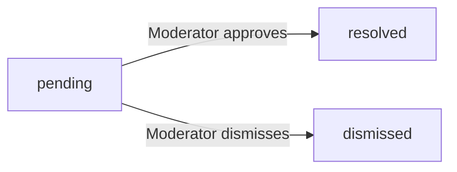
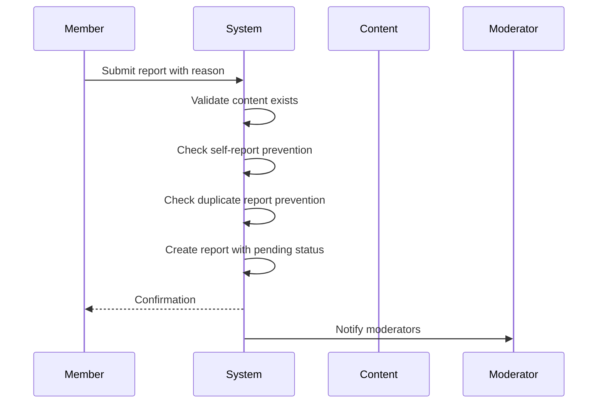
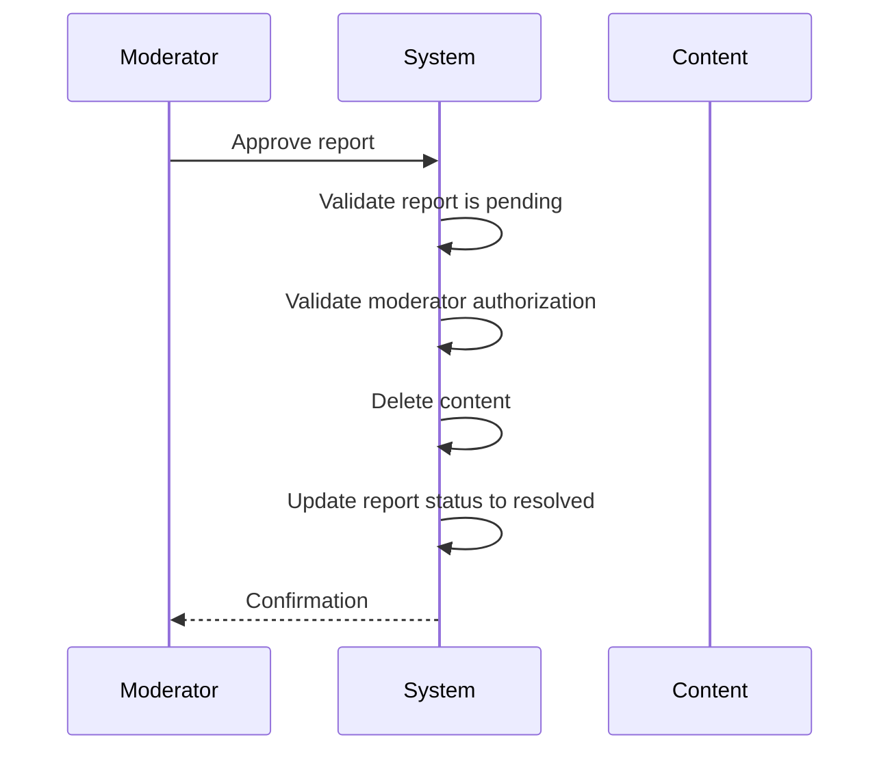
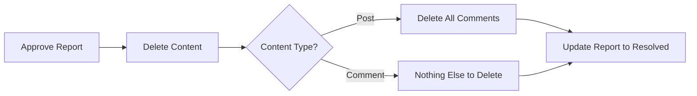
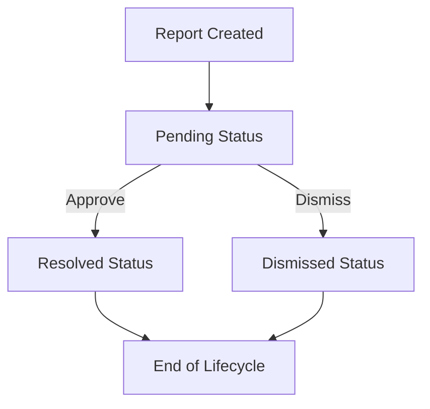
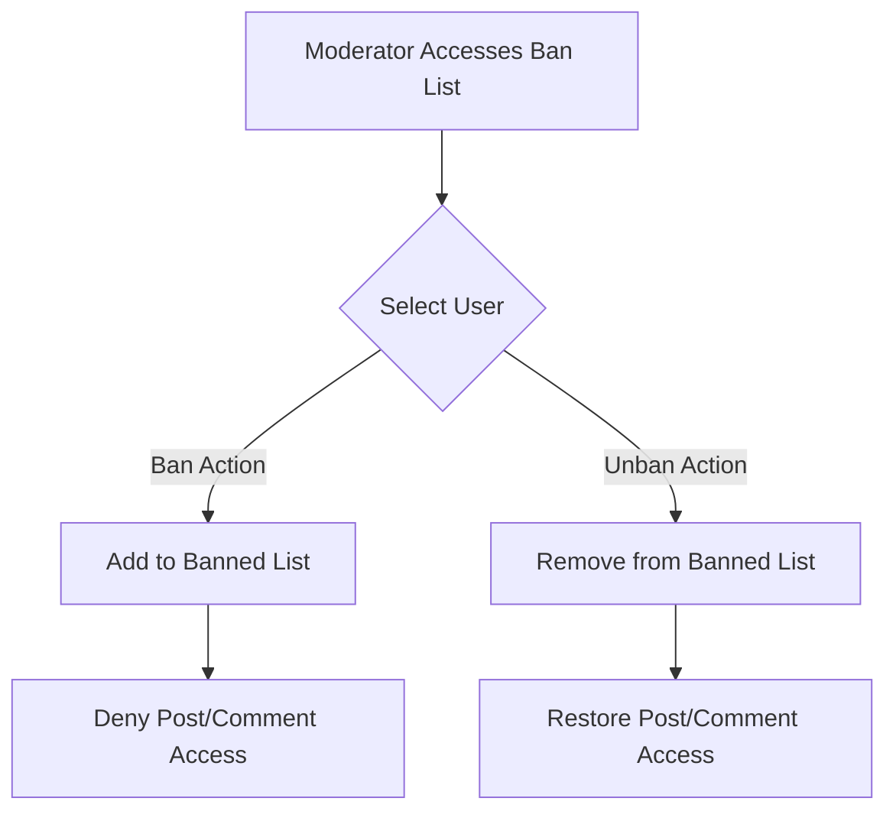
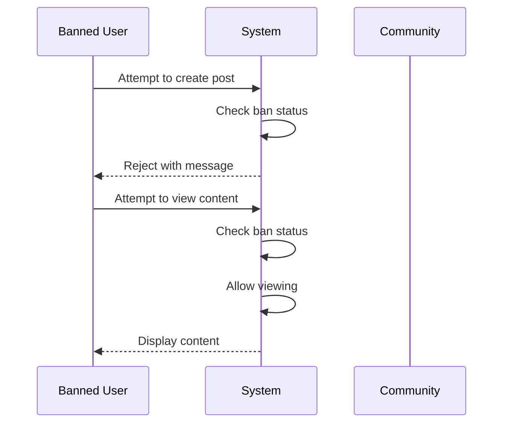

**redditPlatform — What operations users can perform, use cases, business workflows**

What operations users can perform, use cases, business workflows

# Core Business Operations

What the system must do for each business concept.

## User Operations

Users create accounts by providing email, password, and choosing a unique username. During registration, users also set their display name, bio text, and upload an avatar image. Registered users can log in using their email and password credentials. Once logged in, users can update their display name, bio, and avatar at any time. Users have the ability to change their password when needed. If a user wants to permanently leave the platform, they can delete their account. Account deletion removes all associated data including posts and comments. The system prevents duplicate email addresses and duplicate usernames from being used. Users can view their own profile information and statistics like karma score. The platform verifies that each new account has a unique email and username before allowing registration. Users maintain ownership of their profile information and can modify it as needed.

### Account Registration

WHEN a new user creates an account, THE system SHALL:
1. Require an email address, password, and desired username
2. Allow the user to set their display name during registration
3. Allow the user to provide optional bio text during registration
4. Require an avatar image upload during registration
5. Ensure the username is unique before creating the account
6. Ensure the email address is not already in use
7. Verify the email address belongs to the user
8. Create the account only when all validation checks pass

IF the username is already taken, THE system SHALL reject the registration request.
IF the email is already registered, THE system SHALL reject the registration request.
IF the email verification fails, THE system SHALL NOT activate the account.
IF the avatar upload fails, THE system SHALL prompt the user to try again.

### User Login & Authentication

WHEN a registered user logs in, THE system SHALL:
1. Accept email and password as credentials
2. Authenticate the user's identity
3. Allow access to the platform upon successful authentication
4. Prevent login with deleted or inactive accounts
5. Maintain the user's authenticated session

IF the email or password is incorrect, THE system SHALL reject the login request.
IF the account has been deleted, THE system SHALL reject the login request.
IF the email is not verified, THE system SHALL require email verification before login.
IF authentication fails, THE system SHALL NOT reveal whether the email exists.

### Password Management

WHEN a user changes their password, THE system SHALL:
1. Require the current password for validation
2. Accept a new password meeting security requirements
3. Update the user's password securely
4. Invalidate existing authenticated sessions
5. Notify the user of the password change

IF the current password is incorrect, THE system SHALL reject the password change request.
IF the new password does not meet security requirements, THE system SHALL reject the request.
IF the password change is successful, THE system SHALL log the user out of all active sessions.
WHEN a user requests a password reset, THE system SHALL send reset instructions to their email address.

### Profile Editing

WHEN a user edits their profile, THE system SHALL:
1. Allow editing of display name
2. Allow editing of bio text
3. Require the user to own the profile being edited
4. Prevent editing of username after account creation
5. Save all profile updates immediately

IF the user attempts to edit another user's profile, THE system SHALL reject the request.
IF the new display name violates content policies, THE system SHALL reject the change.
IF the bio text exceeds the maximum length, THE system SHALL reject the update.
WHEN profile changes are saved successfully, THE system SHALL make them immediately visible to other users.

### Avatar Upload

WHEN a user uploads or changes their avatar, THE system SHALL:
1. Accept image file uploads for avatar
2. Validate the image file format and size
3. Store the avatar image securely
4. Display the avatar on the user's profile
5. Update the avatar across all user interfaces

IF the image file exceeds the maximum size limit, THE system SHALL reject the upload.
IF the image format is not supported, THE system SHALL reject the upload.
IF the avatar upload fails, THE system SHALL display an error message to the user.
WHEN avatar is successfully uploaded, THE system SHALL update it across all profile views immediately.

### Account Deletion

WHEN a user requests account deletion, THE system SHALL:
1. Require explicit user confirmation
2. Delete the user's account permanently
3. Delete all posts created by the user
4. Delete all comments written by the user
5. Remove the user from all communities

IF the user is a community owner, THE system SHALL require ownership transfer before deletion.
IF there are active subscriptions or pending actions, THE system SHALL warn the user.
IF account deletion is confirmed, THE system SHALL permanently remove all associated data.
IF the user attempts to log in with a deleted account, THE system SHALL reject the login request.

### Karma Score Display

WHEN a user's profile is viewed, THE system SHALL:
1. Display the user's karma score
2. Show karma as a single numerical value
3. Include negative karma scores when applicable
4. Update karma in real-time when votes occur
5. Ensure karma is visible on user profile pages

WHILE a user views another user's profile, THE system SHALL display that user's karma score.
WHEN a vote is cast on a post or comment, THE system SHALL update the karma score accordingly.
IF karma is zero or negative, THE system SHALL still display the value without restrictions.
THE system SHALL display karma scores consistently across all profile views.

### Profile Visibility & Ownership

WHEN viewing user profiles, THE system SHALL:
1. Allow any user to view any profile publicly
2. Show all profile information for non-private accounts
3. Allow users to view their own profile with edit access
4. Display posts and comments on user profiles
5. Ensure profile information matches the account owner

IF the profile owner has set visibility restrictions, THE system SHALL honor those settings.
IF a user views another user's profile, THE system SHALL show their public information.
IF a user views their own profile, THE system SHALL provide edit options.
WHEN posts or comments are deleted, THE system SHALL remove them from the user's profile view.

## Post Operations

Users can create posts in communities they are subscribed to. Each post must have a title and can be one of three types: text, link, or image. Text posts contain written content that is displayed in full when viewing the post. Link posts include a URL that redirects to external content. Image posts allow users to upload photos to share with the community. Users can edit their own posts after creation to update the title or content. Users can delete their own posts to remove them from the platform. When viewing a single post, users see the author, community, vote score, and comment count. The post list display shows a preview with the first 200 characters for text posts. Image posts display thumbnails in the list view. Link posts show the domain name in the list view. Posts are displayed across different feeds based on subscription and sorting preferences. Users can only create posts in communities where they are subscribed.

### Post Creation

WHEN a user creates a post, THE system SHALL:
1. Require that the user is subscribed to the target community
2. Require a title for the post
3. Allow the user to choose one of three post types: text, link, or image
4. Associate the post with the creating user as the author
5. Associate the post with the target community
6. Generate a unique post identifier
7. Record the creation timestamp

IF the user is not subscribed to the community, THE system SHALL reject the post creation request.
IF the title is empty or missing, THE system SHALL reject the post creation request.

FOR a text post, THE system SHALL:
- Require text content from the user
- Store the text content for display

FOR a link post, THE system SHALL:
- Require a valid URL from the user
- Extract and store the domain name from the URL
- Store the full URL for redirection

FOR an image post, THE system SHALL:
- Require an image file from the user
- Store the image for display
- Generate a thumbnail for list view display

WHEN a post is created, THE system SHALL display a vote score of zero.
WHEN a post is created, THE system SHALL display a comment count of zero.

### Post Types and Content

THE system SHALL support three distinct post types:
1. Text posts
2. Link posts
3. Image posts

A post must be exactly one type, not a combination.

FOR text posts, THE system SHALL:
- Allow users to write and submit text content
- Display the full text content when viewing the post
- Show the first 200 characters of content in list view previews

FOR link posts, THE system SHALL:
- Allow users to submit a URL
- Extract the domain name from the URL (e.g., "youtube.com" from "https://youtube.com/watch?v=123")
- Display the domain name in list view instead of the full URL
- Redirect users to the full URL when they click on the post

FOR image posts, THE system SHALL:
- Allow users to upload an image file
- Display the full image when viewing the post
- Display a thumbnail version of the image in list view

THE system SHALL validate that link post URLs are in a valid format before accepting them.
THE system SHALL prevent users from submitting posts without any content (empty text post, missing URL in link post, missing image in image post).

### Post Editing

WHEN a user edits their own post, THE system SHALL:
1. Allow modification of the post title
2. Allow modification of the post content
3. Preserve the original post identifier
4. Record the edit timestamp
5. Maintain the post's association with the author and community

IF the user attempting to edit is not the post owner, THE system SHALL reject the edit request.
IF the user attempting to edit is not authenticated, THE system SHALL reject the edit request.

WHEN a post is edited, THE system SHALL update the edit timestamp.
WHEN a post is edited, THE system SHALL maintain the original creation timestamp.

FOR link posts, THE system SHALL allow updating the URL while preserving the extracted domain.
FOR text posts, THE system SHALL allow updating the text content.
FOR image posts, THE system SHALL allow updating the image file.

IF the post has comments, THE system SHALL:
- Preserve all comments after editing
- Display the post with comments after editing

IF the post has votes, THE system SHALL:
- Preserve all votes after editing
- Maintain the existing vote score after editing

### Post Deletion

WHEN a user deletes their own post, THE system SHALL:
1. Remove the post from all feeds and displays
2. Preserve the author's karma adjustments
3. Delete all comments on the post
4. Delete all votes on the post
5. Record the deletion timestamp

IF the user attempting to delete is not the post owner, THE system SHALL reject the deletion request.
IF the user attempting to delete is not authenticated, THE system SHALL reject the deletion request.

MODERATORS can delete posts in their community regardless of ownership.
OWNERS can delete posts in their own communities regardless of ownership.

IF the post has comments, THE system SHALL delete all comments when the post is deleted.
IF the post has votes, THE system SHALL remove all votes when the post is deleted.

WHEN a post is deleted, THE system SHALL:
- Remove it from all feed displays
- Remove it from the author's profile post list
- Remove it from the community post list

WHEN a post is deleted, karma adjustments from votes on that post remain recorded in user karma totals.

THE system SHALL provide no recovery option once a post is deleted.

### Post Viewing

WHEN a user views a single post, THE system SHALL display:
1. The post title
2. The full post content (text, URL, or image)
3. The author's username
4. The community name
5. The current vote score
6. The comment count
7. The creation timestamp

FOR text posts, THE system SHALL display all text content.
FOR link posts, THE system SHALL display the domain name and provide access to the full URL.
FOR image posts, THE system SHALL display the full image.

IF a post belongs to a community where the viewer is banned, THE system SHALL display the post but disable voting and commenting.
IF a post belongs to a community the user is not subscribed to, THE system SHALL still allow viewing the post.

IF the viewer is not authenticated, THE system SHALL display the post but hide vote controls and comment creation.
IF the viewer is the post owner, THE system SHALL show edit and delete options.

THE system SHALL display the vote score as an integer value (positive, negative, or zero).
THE system SHALL display the comment count as an integer value.

WHEN viewing a post, THE system SHALL allow authenticated users to:
- View the post content
- Vote on the post
- View comments on the post
- Reply to comments (if the user is not banned from the community)

WHEN viewing a post, THE system SHALL prevent banned users from:
- Voting on the post
- Creating comments on the post

IF the post has been deleted by a moderator, THE system SHALL indicate the post was removed.

### Post List Display and Feeds

WHEN displaying posts in any feed, THE system SHALL show for each post:
1. Post title
2. Author username
3. Community name
4. Vote score
5. Comment count
6. Time since posted
7. Content preview based on post type

FOR text posts in list view, THE system SHALL display the first 200 characters of content.
FOR image posts in list view, THE system SHALL display a thumbnail of the image.
FOR link posts in list view, THE system SHALL display the domain name extracted from the URL.

THE system SHALL support three feed types:
1. Home Feed: posts from communities the user is subscribed to (logged-in users only)
2. Popular Feed: posts from all communities (all users)
3. Community Feed: posts from one specific community (all users)

WHEN displaying posts in feeds, THE system SHALL allow filtering by:
- Hot: recent posts with many upvotes appear first
- New: most recently created posts appear first
- Top: highest vote score first (with time filters)
- Controversial: posts with many votes but score close to zero appear first

THE system SHALL paginate feed results.
THE system SHALL allow users to switch between feed types.

IF a user views a post from a community they are not subscribed to, THE system SHALL:
- Allow viewing the post
- Display the subscription prompt
- Require subscription before post creation in that community

IF a post belongs to a community where the viewer is banned, THE system SHALL:
- Exclude the post from feeds where the user cannot view
- Show a restricted access indicator if the post is visible

THE system SHALL update vote scores in real-time when users vote on posts.
THE system SHALL update comment counts in real-time when new comments are added.

### Post Visibility and Subscription Requirements

ALL posts SHALL be visible to:
1. Any authenticated member
2. Any guest (including logged-out users)

EXCEPT in the following cases:
- Posts from communities where the viewer is banned (banned users cannot see posts)
- Posts from communities the viewer has been restricted from viewing

POST CREATION REQUIRES:
- User MUST be subscribed to the target community
- User MUST be authenticated

IF a user is not subscribed to a community, THE system SHALL:
- Allow viewing posts in that community
- Prevent creating posts in that community
- Display a prompt to subscribe before allowing post creation

WHEN a user subscribes to a community, THE system SHALL:
- Allow them to create posts in that community immediately
- Add the community to their Home Feed

WHEN a user unsubscribes from a community, THE system SHALL:
- Remove the community from their Home Feed
- Allow them to continue viewing posts in that community
- Prevent creating new posts in that community

IF a post's community is deleted, THE system SHALL:
- Remove the post from all displays
- Attribute karma changes from the post

IF a user is banned from a community, THE system SHALL:
- Remove all their posts from that community
- Remove all their comments from that community
- Prevent them from viewing posts in that community

POST OWNERSHIP rules:
- Only the post owner can edit or delete their own post
- Moderators of the post's community can delete the post
- Owners of the post's community can delete any post in their community

### Vote Score and Comment Count Display

WHEN displaying any post, THE system SHALL show the current vote score.
WHEN displaying any post, THE system SHALL show the current comment count.

THE vote score SHALL be calculated as:
- Total upvotes minus total downvotes
- Each user's vote counts as +1 (upvote) or -1 (downvote)
- Users can only vote once per post
- Vote changes (upvote to downvote or vice versa) update the score
- Vote removal adjusts the score accordingly

THE comment count SHALL be calculated as:
- Total number of direct comments on the post
- Including all nested replies
- Excluding deleted comments
- Excluding comments on deleted posts

WHEN a user votes on a post, THE system SHALL:
- Update the vote score immediately
- Update the user's karma accordingly
- Allow the user to change their vote at any time

WHEN a comment is added to a post, THE system SHALL:
- Update the comment count immediately
- Include nested replies in the count

WHEN a comment is deleted, THE system SHALL:
- Decrease the comment count
- Preserve the parent post's vote score

WHEN a post is deleted, THE system SHALL:
- Remove the post from all displays
- Set vote score and comment count to zero for that post
- Preserve user karma from the post's votes

FOR authenticated users, THE system SHALL show their own vote on the post (upvote, downvote, or none).
FOR guest users, THE system SHALL show the vote score but hide individual vote indicators.

THE system SHALL prevent vote manipulation by:
- Allowing only one vote per user per post
- Tracking vote changes for audit purposes
- Preventing guests from voting

### Domain Extraction for Link Posts

WHEN a user submits a link post, THE system SHALL:
1. Validate the URL format
2. Extract the domain name from the URL
3. Store both the full URL and the domain name
4. Display the domain name in list views

FOR link post URL extraction, THE system SHALL:
- Accept standard URL formats (http://, https://)
- Extract only the domain portion (e.g., "youtube.com" from "https://www.youtube.com/watch?v=123")
- Preserve the full URL for redirection

FOR domain name display, THE system SHALL:
- Show the extracted domain in list view
- Hide the full URL from list view
- Display the full URL when users click to visit the link

IF the URL is invalid or malformed, THE system SHALL:
- Reject the link post submission
- Display an error message to the user

IF the domain cannot be extracted from the URL, THE system SHALL:
- Reject the link post submission
- Display an error message to the user

FOR link posts with query parameters or fragments, THE system SHALL:
- Extract only the domain (ignore path, query, fragment)
- Store the full URL with all components

WHEN a link post is viewed, THE system SHALL:
- Display the domain name prominently
- Provide a clickable link to the full URL

THE system SHALL normalize domain names for consistent display (lowercase, remove www prefix where appropriate).

## Comment Operations

Users can write comments on any post to share their thoughts or ask questions. Comments can be replied to, creating a threaded conversation structure with no depth limit. Each comment shows the author's username, content, vote score, and time since posting. Users can edit their own comments to correct mistakes or update their message. Users can delete their own comments to remove them from the discussion. Nested replies allow for multi-level conversations within the comment hierarchy. Comment threads can be sorted by best, new, or controversial based on voting patterns. The comment voting system follows the same rules as post voting. Comments display vote scores that reflect community feedback. Banned users cannot create comments in communities they're banned from. Comment deletion removes the content but preserves reply structure. Users can view comments in nested format showing the conversation flow. Comments inherit ownership from the user who created them.

### Comment Creation

WHEN a member creates a comment on a post, THE system SHALL:
1. Require the comment content to be non-empty
2. Associate the comment with the commenting member
3. Associate the comment with the target post
4. Record the creation timestamp

IF the comment content is empty, THE system SHALL reject the creation request.
IF the member does not have an active account, THE system SHALL reject the request.
IF the member is banned from the community containing the post, THE system SHALL reject the request.

THE system SHALL allow members to create comments on posts in any community they can access.
THE system SHALL prevent members from creating comments on posts in communities from which they are banned.
THE system SHALL make newly created comments immediately visible to all users with access to the post.


### Comment Replies and Hierarchy

WHEN a member creates a reply to a comment, THE system SHALL:
1. Associate the reply with the parent comment
2. Create a nested thread structure
3. Maintain the hierarchical relationship between parent and child comments

THE system SHALL allow unlimited nesting depth for replies.
THE system SHALL have no limit on the number of replies a comment can receive.
THE system SHALL allow replies to replies (nested threads of any depth).
THE system SHALL preserve the order of replies in the conversation thread.
THE system SHALL display comments in a nested structure showing parent-child relationships.
WHEN a reply is created, THE system SHALL update the parent comment's reply count.


### Comment Editing

WHEN a member edits their own comment, THE system SHALL:
1. Allow updates to the comment content
2. Record the edit timestamp
3. Preserve the original creation timestamp

IF the comment owner is attempting to edit, THE system SHALL allow the edit.
IF a non-owner is attempting to edit, THE system SHALL reject the edit request.
IF the comment has been deleted by the owner, THE system SHALL prevent editing.
IF the parent post has been deleted, THE system SHALL prevent comment editing.

THE system SHALL show an "edited" indicator when a comment has been modified.
THE system SHALL allow members to edit comments at any time after creation.
THE system SHALL prevent editing of comments where the user is not the author.


### Comment Deletion

WHEN a member deletes their own comment, THE system SHALL:
1. Remove the comment content from public view
2. Preserve the comment in the reply structure
3. Maintain the hierarchical relationships with parent and child comments

IF the comment owner is deleting their own comment, THE system SHALL allow deletion.
IF a non-owner is attempting to delete, THE system SHALL reject the deletion request.
IF the member is banned from the community, THE system SHALL prevent comment creation and deletion.

WHEN a comment is deleted, THE system SHALL preserve the reply structure to maintain conversation flow.
WHEN all replies to a parent comment are deleted, THE system SHALL still maintain the empty thread structure.
THE system SHALL prevent deletion of comments on posts that the user cannot access.
THE system SHALL allow moderators to delete any comment in their community.


### Comment Sorting

WHEN a user views comments on a post, THE system SHALL provide sorting options:
1. Best - comments with highest vote scores appear first
2. New - most recently created comments appear first
3. Controversial - comments with many votes but scores near zero appear first

WHEN Best sorting is selected, THE system SHALL order comments by vote score in descending order.
WHEN New sorting is selected, THE system SHALL order comments by creation timestamp in descending order.
WHEN Controversial sorting is selected, THE system SHALL order comments by total vote count with scores closest to zero.

THE system SHALL allow users to switch between sorting options at any time.
THE system SHALL display the current sorting method to users.
THE system SHALL apply the selected sorting to all visible comments on the post.


### Comment Voting

WHEN a member votes on a comment, THE system SHALL:
1. Record the vote type (upvote or downvote)
2. Update the comment's vote score
3. Associate the vote with the voting member

IF a member upvotes a comment, THE system SHALL increase the vote score by 1.
IF a member downvotes a comment, THE system SHALL decrease the vote score by 1.
IF a member removes their vote, THE system SHALL adjust the score accordingly.
IF a member changes from upvote to downvote, THE system SHALL adjust the score by 2.

THE system SHALL allow each member to cast only one vote per comment.
THE system SHALL prevent members from voting on comments where they are banned.
THE system SHALL allow members to change their vote at any time.
THE system SHALL prevent members from voting on their own comments.
THE system SHALL update the comment score immediately after each vote action.


### Banned User Restrictions

WHEN a user is banned from a community, THE system SHALL:
1. Prevent the user from creating new comments in that community
2. Prevent the user from replying to existing comments in that community
3. Allow the user to view existing comments in that community

IF a banned user attempts to create a comment, THE system SHALL reject the request.
IF a banned user attempts to reply to a comment, THE system SHALL reject the request.
IF a banned user is logged in, THE system SHALL still allow them to browse content.

THE system SHALL apply ban restrictions to all posts in the banned community.
THE system SHALL maintain the user's existing comments even after being banned.
THE system SHALL prevent banned users from editing their existing comments in the community.
THE system SHALL prevent banned users from deleting their existing comments in the community.


### Conversation Structure and Visibility

WHEN a user views a comment thread, THE system SHALL:
1. Display comments in a nested, hierarchical structure
2. Show each comment's author username
3. Show each comment's vote score
4. Show the time since the comment was posted
5. Display reply indentation to show hierarchy

THE system SHALL show all comments to users who can access the parent post.
THE system SHALL hide deleted comments while preserving their position in the thread.
THE system SHALL display the total number of replies for each comment.
THE system SHALL allow users to expand and collapse nested reply threads.
THE system SHALL maintain the chronological order of replies within each thread level.
THE system SHALL prevent users from accessing comments on posts they do not have permission to view.


## Community Operations

Any registered user can create a new community by providing a unique name, description, and icon. The user who creates a community automatically becomes its owner with full administrative privileges. Users can browse all available communities to discover topics of interest. Users can search for communities by name to find specific groups. Each community displays its subscriber count to show community size. Users can subscribe to communities to follow content from that group. Subscribing to a community is required before creating posts in it. Users can unsubscribe from communities at any time. Users can view a list of all communities they are subscribed to. The owner can add other users as moderators to help manage the community. Moderators assist the owner in handling content and user reports. Communities are accessible to both logged-in and logged-out users for viewing. Community feeds show posts from that specific group. Community search returns results based on name matching. Owners have full control over their community's configuration.

### Community Creation

WHEN a registered user creates a community, THE system SHALL:
1. Require a unique community name
2. Require a description text
3. Allow an optional icon image upload
4. Assign the creating user as the community owner with full privileges
5. Create the community with default zero subscribers

IF the community name already exists, THE system SHALL reject the request and inform the user that the name is taken.
IF the description is empty, THE system SHALL reject the request.
IF the user is not logged in, THE system SHALL reject the request and require login first.

THE community owner SHALL have the exclusive right to add moderators.
THE system SHALL prevent modification of the community name after creation.

WHEN a community is created, THE system SHALL:
1. Display the community to other users in the browse list
2. Assign the creator as the sole initial owner
3. Initialize subscriber count to zero

IF a user attempts to create a community without a unique name, THE system SHALL reject the request with a clear error message.

WHEN a user uploads a community icon, THE system SHALL:
1. Validate the image file format
2. Store the image for display in community listings
3. Use the icon when displaying the community to other users

### Community Browsing and Search

WHEN a user browses communities, THE system SHALL display a list of all active communities sorted by subscriber count.

WHEN a user searches for communities by name, THE system SHALL:
1. Perform case-insensitive name matching
2. Display matching communities in the results
3. Show subscriber count for each result

THE system SHALL make all community listings accessible to both logged-in and logged-out users.

WHEN viewing a community listing, THE system SHALL display:
1. Community name
2. Icon image (if uploaded)
3. Subscriber count
4. Description text (if provided)

WHEN a user views a community detail page, THE system SHALL display:
1. Full community name
2. Icon image
3. Description text
4. Subscriber count
5. List of recent posts from the community

IF no communities match a search query, THE system SHALL display a message indicating no results found.

THE system SHALL allow users to discover communities they are not subscribed to.
THE system SHALL update subscriber count in real-time when users subscribe or unsubscribe.

WHEN a community has zero subscribers, THE system SHALL still display it in browse and search results.
THE system SHALL not restrict community visibility based on subscription status.

### Community Subscription

WHEN a logged-in user subscribes to a community, THE system SHALL:
1. Add the user to the community's subscriber list
2. Increment the community's subscriber count by one
3. Make the user able to create posts in that community

WHEN a logged-in user unsubscribes from a community, THE system SHALL:
1. Remove the user from the subscriber list
2. Decrement the community's subscriber count by one
3. Allow the user to continue viewing community content

IF a user attempts to subscribe without being logged in, THE system SHALL reject the request and require login first.

WHEN a user has subscribed to a community, THE system SHALL allow them to create posts in that community.

IF a user has not subscribed to a community, THE system SHALL reject post creation attempts with an error message requiring subscription.

WHEN a user unsubscribes from a community, THE system SHALL allow them to view posts but prevent post creation in that community.

THE system SHALL maintain accurate subscriber counts at all times.

WHEN displaying a subscribed communities list, THE system SHALL:
1. Show all communities the user has subscribed to
2. Include community names and icons
3. Display subscriber counts for each community

IF a user tries to subscribe to a community they are already subscribed to, THE system SHALL inform them they are already subscribed and take no action.

WHEN a user unsubscribes from a community, THE system SHALL preserve their existing posts and comments in that community.

### Community Feed

WHEN a user views the community feed for a specific community, THE system SHALL display all posts from that community sorted by the selected sort option.

THE system SHALL make community feeds accessible to all users, including logged-out users.

WHEN viewing the community feed, THE system SHALL:
1. Display post titles
2. Show vote scores for each post
3. Display comment counts
4. Show author usernames
5. Display time since posted
6. Show post type indicators (text/link/image)

THE system SHALL support sorting posts in the community feed by:
1. Hot (recent posts with many upvotes)
2. New (most recently created)
3. Top (highest vote score with time filters)
4. Controversial (many votes but score near zero)

WHEN a user filters posts by time period (today, this week, this month, this year, all time), THE system SHALL display only posts within that time range for top sorting.

THE system SHALL paginate community feed results to improve loading performance.

IF a community has no posts, THE system SHALL display a message indicating the community has no posts yet.

WHEN viewing a community feed, THE system SHALL only show posts from that specific community.

THE system SHALL display subscriber count on the community feed header to indicate community size.

### Community Management

WHEN a community owner adds a moderator, THE system SHALL:
1. Grant the user moderator privileges for that community
2. Allow the moderator to manage content in the community
3. Enable the moderator to add other moderators

WHEN a community owner removes a moderator, THE system SHALL:
1. Remove all moderator privileges from that user
2. Prevent the user from performing moderator actions
3. Allow the user to remain as a regular community member

THE system SHALL prevent moderators from removing other moderators.

THE system SHALL prevent moderators from removing the community owner.

WHEN a moderator views the community management dashboard, THE system SHALL display:
1. List of banned users
2. List of reports requiring action
3. Community statistics

WHEN a moderator bans a user from a community, THE system SHALL:
1. Prevent the banned user from creating posts in that community
2. Prevent the banned user from commenting in that community
3. Allow the banned user to view existing content
4. Add the user to the banned users list

WHEN a moderator unbans a user, THE system SHALL:
1. Remove the user from the banned list
2. Restore ability to create posts and comments in that community
3. Allow the user to view all content

WHEN a moderator deletes a post in their community, THE system SHALL:
1. Remove the post from all feeds
2. Preserve comment votes but remove comment content
3. Update the community's post count

WHEN a moderator deletes a comment in their community, THE system SHALL:
1. Remove the comment from the discussion
2. Update the comment count on the parent post
3. Preserve the user's karma adjustments

IF a banned user attempts to create a post, THE system SHALL reject the request with a message indicating the user is banned from that community.

IF a banned user attempts to write a comment, THE system SHALL reject the request with a message indicating the user is banned from that community.

WHEN a moderator approves a report, THE system SHALL:
1. Delete the reported content
2. Mark the report as resolved
3. Remove the report from the moderator's dashboard

WHEN a moderator dismisses a report, THE system SHALL:
1. Keep the reported content
2. Mark the report as dismissed
3. Remove the report from the moderator's dashboard

### Owner Privileges

THE system SHALL grant the community owner exclusive privileges including:
1. Adding and removing moderators
2. Removing other moderators from the community
3. Transferring ownership (if applicable in future)

WHEN a user creates a community, THE system SHALL automatically assign them as the owner with all owner privileges.

THE system SHALL allow the owner to view all management reports for their community.

WHEN the owner deletes their account, THE system SHALL:
1. Delete all posts created by the owner
2. Delete all comments written by the owner
3. Delete the community entirely
4. Remove all subscribers from the deleted community

IF a user attempts to perform owner-only actions without being the owner, THE system SHALL reject the request.

WHEN the owner adds multiple moderators, THE system SHALL grant each moderator full moderator privileges.

THE system SHALL ensure only one owner exists for each community at any time.

WHEN a community is deleted by its owner (or by account deletion), THE system SHALL:
1. Remove the community from all browse lists
2. Remove the community from all search results
3. Display a message indicating the community no longer exists

THE system SHALL maintain ownership history for audit purposes.

## Vote Operations

Users can upvote posts and comments to show agreement or appreciation. Users can downvote posts and comments to show disagreement. Each user can cast only one vote per post or comment at a time. Users can change their vote from upvote to downvote or vice versa. Users can remove their vote entirely to withdraw their opinion. The vote score equals total upvotes minus total downvotes for that item. Voting contributes to the user's karma score when they receive votes. Vote scores are displayed on posts and comments for community transparency. Users cannot vote on content from communities they are banned from. Vote changes update the score in real time. Voting is anonymous - other users cannot see who voted. Vote history tracks when votes were cast. Vote scores factor into feed sorting algorithms. Votes affect what content appears in popular and controversial feeds. Voting requires an active account with valid login session. Vote actions are reversible by the same user.

### Post Upvoting

WHEN a user upvotes a post, THE system SHALL:
1. Increment the post's vote score by 1
2. Add 1 to the post author's karma score
3. Record that the user has voted on this post
4. Display the updated vote score immediately

IF the user has already voted on the post, THE system SHALL reject the upvote request and display a message indicating a vote already exists.
IF the user is banned from the community containing the post, THE system SHALL reject the upvote request.
IF the user is not logged in, THE system SHALL reject the upvote request.

### Post Downvoting

WHEN a user downvotes a post, THE system SHALL:
1. Decrement the post's vote score by 1
2. Subtract 1 from the post author's karma score
3. Record that the user has voted on this post
4. Display the updated vote score immediately

IF the user has already voted on the post, THE system SHALL reject the downvote request and display a message indicating a vote already exists.
IF the user is banned from the community containing the post, THE system SHALL reject the downvote request.
IF the user is not logged in, THE system SHALL reject the downvote request.

### Comment Upvoting

WHEN a user upvotes a comment, THE system SHALL:
1. Increment the comment's vote score by 1
2. Add 1 to the comment author's karma score
3. Record that the user has voted on this comment
4. Display the updated vote score immediately

IF the user has already voted on the comment, THE system SHALL reject the upvote request and display a message indicating a vote already exists.
IF the user is banned from the community containing the post with the comment, THE system SHALL reject the upvote request.
IF the user is not logged in, THE system SHALL reject the upvote request.

### Comment Downvoting

WHEN a user downvotes a comment, THE system SHALL:
1. Decrement the comment's vote score by 1
2. Subtract 1 from the comment author's karma score
3. Record that the user has voted on this comment
4. Display the updated vote score immediately

IF the user has already voted on the comment, THE system SHALL reject the downvote request and display a message indicating a vote already exists.
IF the user is banned from the community containing the post with the comment, THE system SHALL reject the downvote request.
IF the user is not logged in, THE system SHALL reject the downvote request.

### Single Vote Per Item

THE system SHALL allow only one vote per user per post or comment.
THE system SHALL prevent a user from casting multiple votes on the same post or comment.

IF a user attempts to vote on a post or comment they have already voted on, THE system SHALL reject the request with an appropriate error message.
THE system SHALL track which items each user has voted on to enforce this constraint.

### Vote Changing

WHEN a user changes their vote on a post or comment, THE system SHALL:
1. Reverse the effect of the previous vote (e.g., changing from upvote to downvote subtracts 2 from the score)
2. Update the post or comment's vote score accordingly
3. Update the author's karma score accordingly
4. Record the new vote type

IF a user attempts to change their vote to the same vote type, THE system SHALL reject the request with an appropriate error message.
IF a user is banned from the community, THE system SHALL reject any vote change request.

### Vote Removal

WHEN a user removes their vote on a post or comment, THE system SHALL:
1. Reverse the effect of their previous vote (add or subtract 1 from the score)
2. Adjust the post or comment's vote score accordingly
3. Adjust the author's karma score accordingly
4. Remove the record of the user's vote on this item

IF a user has not voted on a post or comment, THE system SHALL reject the removal request.
IF a user is banned from the community, THE system SHALL reject any vote removal request.

### Vote Score Calculation

THE vote score for any post or comment SHALL be calculated as the total number of upvotes minus the total number of downvotes.
THE system SHALL recalculate vote scores in real time when any vote is added, changed, or removed.

WHEN displaying a post or comment, THE system SHALL show the current vote score based on all user votes.
IF the vote score cannot be calculated, THE system SHALL display a value of zero.

### Karma Contribution

WHEN a user receives an upvote on their post or comment, THE system SHALL increment their karma score by 1.
WHEN a user receives a downvote on their post or comment, THE system SHALL decrement their karma score by 1.
WHEN a user removes their vote, THE system SHALL adjust the author's karma score to reverse the effect of that vote.

THE system SHALL maintain a single karma score per user that reflects all upvotes and downvotes received across all posts and comments.
Karma scores MAY be negative if a user receives more downvotes than upvotes.

### Vote Anonymity

THE system SHALL NOT display which users have voted on any post or comment.
THE system SHALL NOT display the voting history of users on any post or comment.
THE system SHALL keep all votes anonymous from other users' perspective.

IF a user views a post or comment, THE system SHALL only show the aggregate vote score, not individual voter information.

### Vote History

THE system SHALL record when each vote was cast on posts and comments.
THE system SHALL track the vote type (upvote or downvote) for each user's vote on an item.
THE system SHALL allow vote history retrieval for the user who cast the vote to verify their voting actions.

THE system SHALL maintain vote history only for the purpose of enforcing single-vote constraints and supporting vote changes and removals.

### Vote Session Requirement

WHEN a user attempts to vote on a post or comment, THE system SHALL verify the user has an active login session.
IF a user is not logged in, THE system SHALL reject any voting action and prompt the user to log in.
IF a user's session has expired, THE system SHALL reject any voting action and require re-authentication.

THE system SHALL allow voting only for authenticated users with valid sessions.

### Feed Sorting Influence

WHEN the system sorts posts by "Hot", THE system SHALL weight vote scores more heavily for recent posts.
WHEN the system sorts posts by "Top", THE system SHALL sort by vote score within the selected time filter.
WHEN the system sorts posts by "New", THE system SHALL ignore vote scores and sort by creation time.

THE system SHALL use vote scores as a primary factor in determining which posts appear in feeds.
Votes SHALL directly influence feed ranking and post ordering.

### Controversial Feed Eligibility

WHEN determining if a post is eligible for the controversial feed, THE system SHALL check if the post has a high number of total votes but a score close to zero.
THE system SHALL classify posts as controversial when they have significant disagreement among voters.

A post SHALL appear in the controversial feed if it has sufficient vote activity and its vote score is near zero, indicating balanced upvotes and downvotes.

### Banned User Voting Restrictions

IF a user is banned from a community, THE system SHALL prevent them from voting on any post or comment in that community.
IF a user is banned from a community, THE system SHALL allow them to view posts and comments but not interact with them.

IF a user's ban status changes, THE system SHALL immediately enforce or lift voting restrictions based on current ban status.

### Vote Score Display

WHEN a user views a post or comment, THE system SHALL display the current vote score prominently.
THE system SHALL update the vote score display in real time when votes are added, changed, or removed.

THE vote score SHALL be visible on:
- Post list items in all feeds
- Individual post pages
- Comment list items
- Nested reply displays

### Vote Transparency

THE system SHALL display vote scores on all posts and comments for community transparency.
THE system SHALL ensure users can see the voting results on any content they view.

THE system SHALL NOT hide or obscure vote scores on posts or comments except when content has been deleted.

## Report Operations

Users can report any post or comment that violates community standards. When reporting, users must provide a reason explaining why the content should be removed. Moderators can view all pending reports for their community. Each report displays the reported content, the reporter's username, and the reason provided. Moderators can approve a report to delete the reported content. Moderators can dismiss a report to keep the content visible. Dismissed reports are removed from the moderator's report list. Reports help maintain community quality and enforcement of rules. Users cannot see the status of their reports. Moderators have the authority to remove violating content based on reports. Approved reports result in content deletion from the platform. Banned users can still view reports but cannot create them. Reports are specific to the community where the content appeared. Report handling requires moderator login and appropriate permissions. Report reasons guide moderation decisions on content. Report status transitions from pending to resolved or dismissed.

### Content Reporting

WHEN a user reports content, THE system SHALL allow reporting of posts or comments.

WHEN a user creates a report, THE system SHALL associate the report with the community where the reported content exists.

WHEN a user reports content, THE system SHALL allow the reporter to remain anonymous to other users and moderators.

IF a user is banned from a community, THE system SHALL prevent that user from creating reports for that community.

IF the reported content does not exist, THE system SHALL reject the report creation request.

IF the reported content belongs to a different community than the reporter's current context, THE system SHALL reject the report.

GUEST users (logged-out users) SHALL NOT be able to create reports.

MEMBERS (logged-in users) SHALL be able to create reports on posts and comments within communities they can view.


### Report Creation and Reason Submission

WHEN a user submits a report, THE system SHALL require a reason text explaining why the content violates community standards.

IF the reason text is empty or missing, THE system SHALL reject the report creation request.

IF the reason text exceeds acceptable length, THE system SHALL reject the report creation request.

WHEN a report is created, THE system SHALL assign it a status of "pending".

WHEN a user submits a report, THE system SHALL record the reporter's username for moderator reference while keeping it hidden from the reported content's author.

WHEN a user submits a report, THE system SHALL record the timestamp of the report for queue management.

IF a user attempts to report the same post or comment multiple times, THE system SHALL prevent duplicate reports.

IF a user attempts to report their own content, THE system SHALL reject the report.

WHEN a report is successfully created, THE system SHALL inform the user that their report has been submitted for moderator review.


### Moderator Report View

WHEN a moderator views the report dashboard, THE system SHALL show only reports for communities where the moderator has moderator privileges.

WHEN a moderator views reports, THE system SHALL display the following information for each report:
- The reported content (post or comment)
- The username of the person who submitted the report
- The reason provided for the report
- The status of the report (pending, resolved, or dismissed)
- The timestamp when the report was created

WHEN a moderator views the report queue, THE system SHALL display reports sorted by creation timestamp with pending reports shown first.

WHEN a moderator is not logged in, THE system SHALL prevent access to any report viewing functionality.

WHEN a user is banned from a community, THE system SHALL prevent that user from viewing reports for that community.

ONLY moderators and owners of a community SHALL be able to view reports for that community.

IF a moderator attempts to view reports for a community they do not moderate, THE system SHALL deny access.


### Report Status Management

A report SHALL have one of three possible statuses: "pending", "resolved", or "dismissed".

WHEN a report is first created, THE system SHALL set its initial status to "pending".

WHEN a moderator approves a report, THE system SHALL update the report status to "resolved".

WHEN a moderator dismisses a report, THE system SHALL update the report status to "dismissed".

WHEN a report status changes, THE system SHALL record the timestamp of the status change.

ONLY users with moderator or owner permissions for the relevant community SHALL be able to change report status.

REPORTS with status "resolved" or "dismissed" SHALL be removed from the moderator's active queue view.

THE system SHALL maintain a complete history of all status changes for audit purposes.


### Report Approval and Content Deletion

WHEN a moderator approves a report, THE system SHALL delete the reported content from the platform.

IF the reported content is a post, THE system SHALL delete the post and all its associated replies.

IF the reported content is a comment, THE system SHALL delete the comment but preserve any nested replies as orphaned items.

WHEN content is deleted due to report approval, THE system SHALL prevent the content from being viewed by any users.

WHEN a moderator approves a report, THE system SHALL update the report status to "resolved".

THE system SHALL remove approved reports from the active moderation queue.

WHEN content is deleted via report approval, THE system SHALL record the moderator's username who performed the deletion.

IF the reported content has already been deleted by another moderator or by the original author, THE system SHALL mark the report as resolved without performing deletion.

WHEN a report results in content deletion, THE system SHALL update the post's or comment's vote counts to reflect the deletion.


### Report Dismissal

WHEN a moderator dismisses a report, THE system SHALL keep the reported content visible on the platform.

WHEN a moderator dismisses a report, THE system SHALL update the report status to "dismissed".

WHEN a report is dismissed, THE system SHALL remove it from the moderator's active queue view.

WHEN a moderator dismisses a report, THE system SHALL record the moderator's username who performed the dismissal.

IF a user attempts to access a dismissed report through direct means, THE system SHALL prevent access.

DISMISSED reports SHALL NOT appear in the active moderation workflow.

THE system SHALL maintain a record of dismissed reports for audit purposes.

WHEN a report is dismissed, THE reporter SHALL receive no notification about the outcome.


### Reporter Anonymity and Visibility

WHEN a report is created, THE system SHALL keep the reporter's identity hidden from the reported content's author.

WHEN a moderator views reports, THE system SHALL display the reporter's username to the moderator but not to the reported content's author.

WHEN a report results in content deletion, THE system SHALL NOT notify the reported content's author about who reported the content.

WHEN a user views their own posts or comments, THE system SHALL NOT show whether any reports have been submitted against that content.

THE system SHALL maintain reporter anonymity throughout the moderation workflow.

WHEN a moderator approves or dismisses a report, THE system SHALL notify the reporter of the outcome.

GUEST users SHALL NOT be able to create reports, ensuring reporter anonymity is maintained for authenticated users only.


### Community-Specific Report Handling

WHEN a user reports content, THE system SHALL associate the report with the specific community where the content was posted.

WHEN a moderator views reports, THE system SHALL show only reports from communities where the moderator has privileges.

IF a post or comment is deleted, THE system SHALL preserve the reports associated with that content for historical record.

WHEN a community is deleted, THE system SHALL remove all pending reports associated with that community.

DISMISSED or resolved reports SHALL remain associated with their community for community statistics.

WHEN a user reports content, THE system SHALL enforce community-specific reporting rules and policies.

IF a user is banned from a community, THE system SHALL prevent that user from creating reports for that specific community.

WHEN a moderator is removed from a community, THE system SHALL revoke their ability to view or act on pending reports for that community.


### Banned User Reporting Restrictions

IF a user is banned from a community, THE system SHALL prevent that user from creating reports for that community.

IF a user is banned from a community, THE system SHALL prevent that user from viewing reports for that community.

IF a user is banned from all communities, THE system SHALL prevent that user from creating any reports on the platform.

IF a user's ban is lifted, THE system SHALL restore their ability to create and view reports for the relevant communities.

IF a banned user attempts to access reporting functionality, THE system SHALL deny the request.

WHEN a user is banned from a community, THE system SHALL preserve any reports they submitted prior to the ban.

IF a user attempts to report content in a community they are banned from, THE system SHALL inform the user they cannot report for that community.

THE system SHALL track banned user status to enforce reporting restrictions consistently across all communities.


### Report Queue Management and Moderation Workflow

WHEN moderators access the moderation dashboard, THE system SHALL display pending reports sorted by creation timestamp.

WHEN a report is created, THE system SHALL add it to the moderation queue for review.

WHEN a moderator approves or dismisses a report, THE system SHALL remove it from the active queue.

WHEN a report is processed by a moderator, THE system SHALL update the last modified timestamp.

IF multiple moderators work on the same community, THE system SHALL allow any of them to process reports.

WHEN a report is assigned to a moderator for processing, THE system SHALL prevent other moderators from working on the same report simultaneously.

WHEN all pending reports for a community are processed, THE system SHALL notify community owners that the queue is clear.

THE system SHALL support bulk actions for moderators to approve or dismiss multiple reports at once.

WHEN a report is processed, THE system SHALL log the action in the community's moderation audit trail.


# Business Actions and Workflows

Business actions and workflows beyond basic CRUD.

## User Actions

Users create accounts using email and password along with a unique username. Once registered, users log in with their email and password credentials. Registered users can update their profile information including display name, bio text, and avatar image. Users have the ability to change their password at any time through the account settings. Users can permanently delete their account, which removes all their posts and comments from the platform. Account deletion is irreversible and all associated content disappears immediately. Profile information is visible to other users on their public profile pages. Users cannot share the same username or email address with existing accounts.

### Account Creation

WHEN a new user creates an account, THE system SHALL:
1. Accept email address, password, and username
2. Validate that the username is unique across all accounts
3. Validate that the email address is not already registered
4. Store the account with initial profile settings

IF the username is already taken, THE system SHALL reject the registration and request a different username.
IF the email address is already registered, THE system SHALL reject the registration and indicate that the email is in use.

WHEN a user provides an email address during registration, THE system SHALL validate that it follows standard email format rules.
WHEN a user submits a password during registration, THE system SHALL ensure it meets minimum security requirements.


### Login Authentication

WHEN a registered user attempts to log in, THE system SHALL:
1. Accept email address and password credentials
2. Validate the credentials against the stored account
3. Establish a user session upon successful authentication

IF the email address or password is incorrect, THE system SHALL reject the login attempt and display an appropriate error.

WHEN a user successfully logs in, THE system SHALL redirect them to the home feed with their subscribed communities.
WHEN a user logs in, THE system SHALL persist the session until the user logs out or the session expires.

GUEST users cannot access feeds that require login. MEMBERS who are logged in can access all platform features. Guests can only access public content and the popular feed.

### Password Management

WHEN a logged-in member wants to change their password, THE system SHALL:
1. Require the current password for verification
2. Accept a new password
3. Update the account with the new password
4. Invalidate all existing sessions

IF the current password is incorrect, THE system SHALL reject the password change request.
IF the new password does not meet security requirements, THE system SHALL reject the password change request.

WHEN a password is successfully changed, THE system SHALL require re-authentication with the new password for subsequent sessions.
WHEN a user changes their password, THE system SHALL log out the user from all active sessions.


### Profile Information

EACH user profile SHALL display:
1. Display name (configurable by the user)
2. Bio text (optional)
3. Avatar image (optional)
4. Total karma score
5. List of all posts created by the user
6. List of all comments written by the user

WHEN any user views a profile, THE system SHALL show all profile information regardless of privacy settings.
WHEN a user's profile is viewed, THE system SHALL calculate and display the total karma score.

THE system SHALL display posts and comments on a user's profile in reverse chronological order (newest first).
WHEN viewing a profile, THE system SHALL ensure all posts and comments are publicly visible regardless of their original context.

### Avatar Management

WHEN a member uploads an avatar image, THE system SHALL:
1. Accept the image file from the user
2. Store the image and associate it with the user profile
3. Display the avatar on the user's profile page

IF the uploaded file is not a valid image format, THE system SHALL reject the upload.
IF the uploaded image exceeds size limits, THE system SHALL reject the upload.

WHEN a member successfully uploads an avatar, THE system SHALL immediately update their profile to display the new avatar.
WHEN a member changes their avatar, THE system SHALL update the avatar across all profile pages and posts.
GUEST users cannot upload avatars.

### Profile Editing

WHEN a member edits their own profile, THE system SHALL:
1. Allow updating the display name
2. Allow updating the bio text
3. Allow changing the avatar image

IF a member attempts to edit another user's profile, THE system SHALL reject the edit request.
IF the new display name is already taken by another user, THE system SHALL reject the display name change.

WHEN a member updates their profile, THE system SHALL immediately apply the changes to all profile views.
WHEN a member updates their display name, THE system SHALL update the name on all their posts and comments.


### Account Deletion

WHEN a member requests to delete their account, THE system SHALL:
1. Permanently remove the user account
2. Delete all posts created by the user
3. Delete all comments written by the user
4. Remove all votes cast by the user
5. Unsubscribe from all communities

IF a member confirms account deletion, THE system SHALL irreversibly remove all user data.
WHEN an account is deleted, THE system SHALL prevent the user from logging in with those credentials.

AFTER account deletion, all content created by the user SHALL no longer be accessible on the platform.
AFTER account deletion, the username becomes available for registration by a new user.
Account deletion is permanent and cannot be undone once confirmed.

## Post Actions

Users can create new posts only in communities where they are subscribed. Each post requires a title and can be one of three types: text, link, or image. Text posts contain written content visible to all community members. Link posts include a URL and display the domain name in the post preview. Image posts allow users to upload and share images within the community. Users retain full editing rights for their own posts at any time. Users can delete their own posts at any time, removing them from all feeds. When a post is deleted, it disappears from all community views and feeds. Post deletion is permanent and cannot be undone by the user. The post creator maintains ownership and control over their content throughout its existence.

### Post Creation Requirements

WHEN a user creates a post, THE system SHALL require a post title that is not empty.

WHEN a user creates a post, THE system SHALL ensure the user is subscribed to the target community before allowing submission.

WHEN a user creates a post, THE system SHALL verify the user is logged in as a member before permitting post creation.

IF a user attempts to create a post in a community they have not subscribed to, THE system SHALL reject the request and display a subscription requirement message.

IF a post title is missing or contains only whitespace, THE system SHALL reject the request and prompt for a valid title.

WHEN a post is successfully created, THE system SHALL assign the post to the creating user as the author.

WHEN a post is successfully created, THE system SHALL record the current timestamp as the post creation time.

WHEN a post is successfully created, THE system SHALL make the post immediately visible in the community's feed.

WHEN a post is successfully created, THE system SHALL increment the community's total post count by one.

IF a user attempts to create a post after their account has been deleted, THE system SHALL reject the request and display an account status error message.

WHEN a post is created with an invalid community identifier, THE system SHALL reject the request and display an error message.

WHEN a post is created while the user is banned from the community, THE system SHALL reject the request and display a ban status message.

### Post Type Selection

WHEN a user creates a post, THE system SHALL require selection of exactly one post type: text, link, or image.

WHEN a user selects text post type, THE system SHALL allow them to enter text content for the post.

WHEN a user selects link post type, THE system SHALL allow them to enter a URL for the post.

WHEN a user selects image post type, THE system SHALL allow them to upload an image file for the post.

WHEN a user creates a post, THE system SHALL ensure that only the content fields appropriate for the selected post type are required or allowed.

IF a user attempts to create a post without selecting a post type, THE system SHALL reject the request and prompt for type selection.

IF a user attempts to include content for multiple post types simultaneously (e.g., both URL and text content), THE system SHALL reject the request and allow only the selected type's content.

WHEN a post type is selected, THE system SHALL display the corresponding content input interface for that post type.

WHEN a post is submitted, THE system SHALL validate that the appropriate content fields are populated for the selected post type.

IF a link post is created with an invalid URL format, THE system SHALL reject the request and display a URL validation error message.

IF an image post is created without uploading an image file, THE system SHALL reject the request and prompt for image upload.

WHEN a user changes post type selection during creation, THE system SHALL clear any previously entered content fields.

### Text Post Content

WHEN a user creates a text post, THE system SHALL require text content to be provided.

WHEN a user submits a text post, THE system SHALL accept text content of any reasonable length within business constraints.

WHEN a text post is created, THE system SHALL display the full text content when the post is viewed individually.

WHEN a text post appears in any feed, THE system SHALL display a preview showing the first 200 characters of the content.

WHEN a user edits a text post, THE system SHALL allow them to modify the existing text content.

WHEN a text post is edited, THE system SHALL update the post's edit timestamp to reflect the modification time.

IF a text post contains only whitespace or empty content, THE system SHALL reject the submission and prompt for valid text.

WHEN a text post is viewed in a community feed, THE system SHALL truncate preview content to 200 characters and indicate if additional content exists.

WHEN a text post is deleted, THE system SHALL remove all text content from display in all feeds and community views.

WHEN a user creates a text post in a subscribed community, THE system SHALL make the content visible to all members of that community.

WHEN a user with moderator status views a text post, THE system SHALL allow them to delete it from the community feed.

### Link Post URL Handling

WHEN a user creates a link post, THE system SHALL require a valid URL to be provided.

WHEN a link post is created, THE system SHALL extract and display the domain name of the URL in the post preview (e.g., "youtube.com").

WHEN a link post appears in a feed, THE system SHALL display the domain name prominently for quick recognition.

WHEN a user edits a link post, THE system SHALL allow them to change the URL.

WHEN a URL is updated on an existing link post, THE system SHALL update the displayed domain name accordingly.

IF a link post is created with an invalid or malformed URL, THE system SHALL reject the request and display a URL format error message.

IF a link post is created with a URL that cannot be resolved, THE system SHALL reject the request and display an accessibility error message.

WHEN a link post is deleted, THE system SHALL remove the URL and all associated display information from all feeds.

WHEN a user views a link post individually, THE system SHALL display the full URL as originally submitted.

WHEN a moderator deletes a link post, THE system SHALL remove it from all community views and feeds.

IF a user attempts to create a link post without a valid URL scheme, THE system SHALL reject the request and prompt for a proper URL format.

### Image Post Upload Process

WHEN a user creates an image post, THE system SHALL require an image file to be uploaded.

WHEN an image post is created, THE system SHALL generate and display a thumbnail preview of the uploaded image in feed listings.

WHEN a user uploads an image, THE system SHALL validate the file is a recognized image format.

WHEN a user uploads an image post, THE system SHALL store the image for permanent access when the post exists.

WHEN an image post appears in any feed, THE system SHALL display the generated thumbnail to represent the full image.

WHEN a user edits an image post, THE system SHALL allow them to upload a new image file to replace the existing one.

WHEN an image post is edited with a new image, THE system SHALL update the thumbnail preview accordingly.

IF an image post is created without a valid image file, THE system SHALL reject the request and prompt for image upload.

IF an uploaded image file exceeds acceptable business size limits, THE system SHALL reject the upload and display a file size error message.

WHEN an image post is deleted, THE system SHALL remove the image from storage after the deletion is confirmed.

WHEN a user views an image post individually, THE system SHALL display the full image at full resolution.

WHEN a moderator deletes an image post, THE system SHALL remove the image from all community views and feeds.

### Post Editing Rights

WHEN a user views a post they created, THE system SHALL provide an option to edit the post.

WHEN a user edits a post, THE system SHALL allow modification of the post title and content fields.

WHEN a user edits their own post, THE system SHALL update the post with the new information immediately.

WHEN a post is edited, THE system SHALL record the edit timestamp to track when modifications occurred.

IF a user attempts to edit a post they did not create, THE system SHALL reject the request and display an ownership verification error.

IF a user attempts to edit a post after their account has been deleted, THE system SHALL reject the request and display an account status error.

IF a user attempts to edit a post while banned from the community, THE system SHALL reject the request and display a ban status message.

WHEN a user edits a post, THE system SHALL preserve all original posting metadata (creation timestamp, author, community).

WHEN a post is edited, THE system SHALL maintain the original post in all feeds with the updated content.

WHEN a user successfully edits a post, THE system SHALL notify the post's community that content has been modified.

WHEN a moderator deletes a post, THE system SHALL remove any editing options from the interface for all users.

IF a user attempts to edit a link post, THE system SHALL allow URL modification while preserving the link post type.

### Post Deletion Workflow

WHEN a user deletes their own post, THE system SHALL permanently remove the post from all community feeds.

WHEN a user deletes their own post, THE system SHALL ensure the post is no longer visible in any user's feed or community view.

WHEN a user deletes their own post, THE system SHALL remove the post title, content, and all associated metadata from display.

WHEN a post is deleted by its author, THE system SHALL decrement the community's total post count by one.

IF a user attempts to delete a post they did not create, THE system SHALL reject the request and display an ownership verification error.

IF a user attempts to delete a post after their account has been deleted, THE system SHALL reject the request and display an account status error.

IF a user attempts to delete a post while banned from the community, THE system SHALL reject the request and display a ban status message.

WHEN a post is deleted, THE system SHALL permanently remove the post content with no ability for the user to restore it.

WHEN a moderator deletes a post from their community, THE system SHALL remove it from all feeds and views immediately.

WHEN a moderator deletes a post, THE system SHALL log the deletion action with moderator identification for audit purposes.

WHEN a post is deleted, THE system SHALL preserve all comments and votes attached to the post at deletion time.

WHEN a post is deleted, THE system SHALL ensure the post creator's karma score is adjusted to remove votes associated with that post.

WHEN a user deletes a post, THE system SHALL increment the comment count of associated comments by excluding the deleted post.

### Subscription Requirement for Posting

WHEN a user attempts to create a post, THE system SHALL verify the user is subscribed to the target community.

IF a user is not subscribed to a community, THE system SHALL prevent them from creating posts in that community.

IF a user attempts to create a post in an unsubscribed community, THE system SHALL display a prompt to subscribe first.

WHEN a user subscribes to a community, THE system SHALL immediately grant them posting privileges in that community.

WHEN a user unsubscribes from a community, THE system SHALL allow them to retain posts they have already created in that community.

WHEN a user unsubscribes from a community, THE system SHALL display a warning that new posts in that community require re-subscription.

IF a user's subscription to a community is removed by the community owner, THE system SHALL maintain the user's existing posts while preventing new ones.

WHEN a user attempts to create a post while their subscription is suspended, THE system SHALL reject the request and display a suspension message.

WHEN a user creates a post in a community they just subscribed to, THE system SHALL allow the post to be published immediately.

IF a community is deleted, THE system SHALL remove all posting privileges associated with that community for all users.

WHEN a user has multiple community subscriptions, THE system SHALL allow them to create posts in any subscribed community.

### Post Ownership Verification

WHEN a user attempts to edit a post, THE system SHALL verify the user is the original post author.

WHEN a user attempts to delete a post, THE system SHALL verify the user is the original post author.

WHEN a post is created, THE system SHALL record the creating user's identifier as the post owner.

IF a user attempts to perform an ownership-restricted action on a post they do not own, THE system SHALL reject the request and display an unauthorized access error.

WHEN a post is created, THE system SHALL display the post author's username on the post listing.

WHEN a user views their own posts, THE system SHALL provide editing and deletion options for each post.

WHEN a user views another user's posts, THE system SHALL display the author information but not provide editing or deletion options.

WHEN a post author's account is deleted, THE system SHALL retain the post content but update the author display to indicate the account was removed.

WHEN a post is created, THE system SHALL ensure only the original author can perform ownership-restricted operations on it.

IF a user attempts to claim ownership of a post they did not create, THE system SHALL reject the request and display an identity verification error.

WHEN a post ownership is transferred (owner action), THE system SHALL update the author display and maintain the post in all feeds.

WHEN a post is created by a user, THE system SHALL ensure no other user can claim ownership without administrative intervention.

### Post Content Permanence

WHEN a post is created, THE system SHALL maintain the content for as long as the post exists in the system.

WHEN a post is created, THE system SHALL ensure the title is immutable except by the post owner through editing.

WHEN a post is created, THE system SHALL preserve all content modifications through the edit history.

WHEN a post is deleted, THE system SHALL ensure the content is permanently removed with no recovery option for the user.

WHEN a post exists in the system, THE system SHALL maintain visibility of the content to all authorized users.

WHEN a post is created in a community, THE system SHALL ensure the content remains accessible to subscribed community members.

WHEN a post is edited, THE system SHALL preserve the original content while recording the modification timestamp.

IF a post content is reported and approved for deletion by a moderator, THE system SHALL permanently remove the content from all feeds.

WHEN a post is created, THE system SHALL ensure the content is indexed and searchable within the platform.

WHEN a post is created, THE system SHALL maintain the content association with the post's votes, comments, and reports.

WHEN a post is deleted, THE system SHALL ensure all references to the content are removed from feeds, comments, and notifications.

WHEN a post exists, THE system SHALL preserve the content across all feed views (home, popular, community) where it appears.

## Comment Actions

Users can write comments on any post regardless of their subscription status. Users can reply to existing comments creating nested reply threads. Reply threads have no depth limit allowing unlimited nested conversations. Users maintain editing rights for their own comments after posting. Users can delete their own comments removing them from all threads. Comment deletion removes the comment and all its nested replies from view. Users can edit comments at any time to correct mistakes or update content. Edit history is tracked but original content remains visible for transparency. Comments appear in sorted order on posts with multiple sorting options. Deleted comments and their replies are permanently removed from the platform.

### Comment Creation

### Comment Creation on Posts

WHEN a logged-in user creates a comment on a post, THE system SHALL:
1. Associate the comment with the creating user as author
2. Associate the comment with the target post
3. Store the comment content provided by the user
4. Initialize the vote score to zero
5. Record the creation timestamp

WHEN a user writes a comment on a post, THE system SHALL display the comment to viewers of that post according to visibility rules (defined in Comment Visibility).

IF the post does not exist, THE system SHALL reject the comment creation request.
IF the user is not logged in, THE system SHALL reject the comment creation request.
IF the user has been banned from the community containing the post, THE system SHALL reject the comment creation request.

### Nested Reply Structure

### Nested Reply Thread Structure

WHEN a user replies to an existing comment, THE system SHALL:
1. Associate the reply with the original comment as parent
2. Associate the reply with the same post as the parent comment
3. Associate the reply with the creating user as author
4. Maintain the reply in a nested thread structure under its parent comment

WHILE viewing a post, THE system SHALL display comments and their replies in a nested hierarchical structure showing the parent-child relationships.

The system SHALL support unlimited reply depth allowing users to reply to replies without any maximum nesting limit.

A parent comment and all its nested replies SHALL be displayed together as a single conversation thread.

IF a parent comment is deleted, THE system SHALL mark all nested replies as deleted and remove them from view.

WHEN a user replies to a reply, THE system SHALL maintain the correct parent-child relationship in the thread structure.

WHEN viewing a post with nested replies, THE system SHALL allow users to collapse or expand individual reply threads.

### Comment Editing

### Comment Editing Permissions and History

WHEN an author edits their own comment, THE system SHALL:
1. Update the comment content with the new text
2. Record the edit timestamp
3. Preserve the original content for edit history visibility
4. Maintain the same comment ID and position in the thread

WHILE editing their own comment, THE system SHALL allow the user to modify any part of the comment content.

IF a user attempts to edit a comment they did not create, THE system SHALL reject the edit request.

THE system SHALL display edit history to all viewers showing:
- The original comment content
- When the edit occurred
- That the content was edited

WHEN a comment is edited, THE system SHALL update the display to show the current content to all viewers.

WHEN a comment owner deletes their account, THE system SHALL anonymize their comments removing the username but preserving the comment content for thread continuity.

THE system SHALL allow comment editing at any time after creation.

### Comment Deletion

### Comment Deletion Scope and Reply Thread Removal

WHEN an author deletes their own comment, THE system SHALL:
1. Remove the comment from all views and feeds
2. Remove the comment from the sorted comment list on the post
3. Remove all nested replies under that comment from view
4. Permanently delete the comment and all nested replies from the platform

WHEN a moderator deletes a comment in their community, THE system SHALL:
1. Remove the comment from all views and feeds
2. Remove the comment from the sorted comment list on the post
3. Remove all nested replies under that comment from view
4. Permanently delete the comment and all nested replies from the platform

IF a user attempts to delete a comment they did not create and are not a moderator of the community, THE system SHALL reject the deletion request.

IF the post containing the comment has been deleted, THE system SHALL prevent new comment creation and hide all existing comments on that post.

WHEN a comment is deleted, THE system SHALL not allow recovery of the deleted comment or its nested replies.

WHEN a banned user attempts to create a comment, THE system SHALL prevent the action and display a ban notification.

### Comment Sorting

### Comment Sorting Options on Posts

WHEN a user views comments on a post, THE system SHALL display them sorted according to the selected sorting option.

WHEN a user selects "Best" sorting, THE system SHALL display comments with the highest vote score first.

WHEN a user selects "New" sorting, THE system SHALL display comments with the most recent creation timestamp first.

WHEN a user selects "Controversial" sorting, THE system SHALL display comments with many votes but a score close to zero first.

THE system SHALL provide users with the ability to switch between sorting options at any time while viewing a post.

WHEN switching sorting options, THE system SHALL re-sort the comment list without reloading the page.

THE system SHALL maintain the nested reply structure regardless of the sorting option selected.

IF a comment receives new votes after sorting, THE system SHALL update the sort order when the user refreshes the sorting view.

### Comment Visibility

### Comment Visibility Rules

WHEN a user views a post, THE system SHALL display all non-deleted comments on that post according to visibility rules.

GUEST users SHALL be able to view comments on public posts without authentication.

MEMBER users SHALL be able to view all comments on posts in communities they can access.

BANNED users SHALL be able to view comments on posts in their banned community but SHALL NOT be able to create new comments.

THE system SHALL hide deleted comments from all users including moderators and owners.

THE system SHALL hide comments on deleted posts from all users.

WHEN viewing comments in a community, THE system SHALL display the author's username for each comment.

WHEN a comment author's account is deleted, THE system SHALL display "[Deleted User]" instead of the username but preserve the comment content.

THE system SHALL display the vote score for each comment to all viewers.

### Comment Ownership

### Comment Ownership Tracking

WHEN a comment is created, THE system SHALL permanently associate it with the creating user as author.

THE system SHALL track which user created each comment for all operations including editing and deletion.

WHEN a user edits their own comment, THE system SHALL verify the user is the original author before allowing the edit.

WHEN a user deletes their own comment, THE system SHALL verify the user is the original author or a moderator of the community before allowing the deletion.

THE system SHALL allow users to view their own comments across all posts in the platform through their profile page.

WHEN viewing a user's profile, THE system SHALL display a list of all comments written by that user including comments on posts they authored and comments on posts authored by others.

THE system SHALL track comment ownership even after the comment author's account is deleted.

WHEN a moderator views reports for their community, THE system SHALL show which user created each reported comment.

## Community Actions

Any registered user can create a new community with a unique name, description, and icon. The user who creates a community automatically becomes its owner with full administrative rights. Users can browse a complete list of all communities available on the platform. Users can search for communities using the community name as the search criteria. Users can subscribe to any community to access its posts and participate in discussions. Subscribing to a community is mandatory before users can create posts within that community. Users can unsubscribe from communities at any time through their subscription settings. Users can view a curated list showing all communities they are currently subscribed to. Community subscriber counts update in real-time as users join or leave. Community information including description and icon is publicly viewable without subscription.

### Community Creation

WHEN a user creates a community, THE system SHALL:
1. Require a unique community name
2. Accept a community description as text
3. Accept a community icon image upload
4. Assign the creating user as the community owner
5. Ensure the community name is not already in use

IF the community name already exists, THE system SHALL reject the request with an error.
IF the community name is empty, THE system SHALL reject the request.

THE owner SHALL have full administrative rights over the community including:
- Adding moderators
- Removing moderators
- Deleting posts and comments in the community
- Banning users from the community

### Community Ownership and Transfer

THE owner of a community SHALL be the user who created it.
THE owner SHALL have the authority to add moderators to the community.

WHEN adding a moderator, THE system SHALL:
1. Require the target user to exist
2. Assign the moderator role to that user
3. Allow the new moderator to add other moderators

WHEN removing a moderator, THE system SHALL:
1. Only allow the owner to remove moderators
2. Not allow moderators to remove other moderators
3. Not allow any user to remove the owner

THE community creator SHALL always remain the owner and cannot be removed from the owner role by any other user.

### Community Listing and Browsing

WHEN a user browses all communities, THE system SHALL:
1. Display a list of all communities on the platform
2. Show each community's name
3. Show each community's subscriber count
4. Provide pagination to view communities in batches

IF no communities exist, THE system SHALL display an empty list message.

GUESTS and MEMBERS SHALL both be able to browse all communities.

Each community entry in the list SHALL display:
- Community name
- Subscriber count
- Community icon

### Community Name Search

WHEN a user searches for communities, THE system SHALL:
1. Accept a community name as search input
2. Return communities whose names match the search query
3. Display matching communities in the results

WHEN the search query is empty, THE system SHALL display all communities.

IF no communities match the search query, THE system SHALL display a no results message.

THE search SHALL be case-insensitive.

Each search result SHALL display:
- Community name
- Subscriber count
- Community icon

### Community Subscription Requirement

WHEN a user attempts to create a post in a community, THE system SHALL:
1. Check if the user is subscribed to that community
2. Require the user to be subscribed before allowing post creation

IF the user is not subscribed to the community, THE system SHALL reject the post creation request.

IF the user is subscribed to the community, THE system SHALL allow the post creation.

Users SHALL be able to subscribe to any community by requesting to subscribe.
Users SHALL be able to unsubscribe from any community by requesting to unsubscribe.

### Community Unsubscribe Workflow

WHEN a user unsubscribes from a community, THE system SHALL:
1. Remove the user from the community's subscriber list
2. Update the community's subscriber count
3. Allow the user to view the community content as a non-subscriber

WHEN a user unsubscribes, THE user SHALL no longer be able to create posts in that community.

A user SHALL be able to resubscribe to a community after unsubscribing.

WHEN unsubscribing from a community, THE user SHALL still be able to view existing posts and comments in that community.

IF a user attempts to create a post after unsubscribing, THE system SHALL prompt the user to subscribe first.

### Subscriptions List View

WHEN a logged-in user views their subscriptions list, THE system SHALL:
1. Display all communities the user is currently subscribed to
2. Show the total count of subscribed communities
3. Display each community's name
4. Display each community's subscriber count
5. Display each community's icon

IF the user has no subscribed communities, THE system SHALL display an empty list message.

Only logged-in users SHALL be able to view their subscriptions list.

Each subscription entry SHALL allow the user to:
- View the community
- Unsubscribe from the community

### Subscriber Count Updates

WHEN a user subscribes to a community, THE system SHALL:
1. Add the user to the community's subscriber list
2. Increment the community's subscriber count by one

WHEN a user unsubscribes from a community, THE system SHALL:
1. Remove the user from the community's subscriber list
2. Decrement the community's subscriber count by one

THE subscriber count SHALL be accurate and reflect the total number of users subscribed to the community.

THE subscriber count SHALL be visible on:
- Community listing pages
- Community search results
- Individual community pages
- Subscriptions list view

### Public Community Information

WHEN viewing a community page, THE system SHALL display:
1. Community name
2. Community description
3. Community icon
4. Subscriber count
5. Posts from the community

GUESTS SHALL be able to view public community information without logging in.

MEMBERS SHALL be able to view public community information without logging in.

Only subscribed users SHALL be able to create posts in the community.

The community description and icon SHALL be viewable by all users regardless of subscription status.

Users browsing a community shall see:
- All posts in the community
- All comments on those posts
- Vote scores on posts and comments

### Post Creation in Subscribed Communities

WHEN creating a post in a community, THE system SHALL:
1. Require the user to be subscribed to the community
2. Accept a post title as required input
3. Accept post content based on post type selection

For text posts, THE system SHALL require text content.
For link posts, THE system SHALL require a valid URL.
For image posts, THE system SHALL require an uploaded image file.

IF the user is not subscribed to the community, THE system SHALL display an error message and prevent post creation.

IF the post title is empty, THE system SHALL reject the post creation request.

A user SHALL be able to create a post in any community they are subscribed to.

WHEN a post is created, THE system SHALL associate it with:
- The creating user as author
- The community where it was created
- The selected post type (text, link, or image)

## Vote Actions

Users can upvote posts to increase their score and bring them to the top of feeds. Users can downvote posts to decrease their score and reduce visibility. Each user can only vote once per post at any given time. Users can change their vote from upvote to downvote or vice versa freely. Users can remove their vote entirely leaving the post with their previous vote score removed. Vote scores are calculated as the total number of upvotes minus total downvotes. The same voting rules apply to comments as they do to posts. Users can upvote and downvote comments to influence comment visibility. Comments and posts with high controversy have many votes but near-zero net scores. Voting is anonymous and cannot be seen by other users except for vote counts.

### Post Upvote Mechanism

WHEN a logged-in member submits an upvote on a post, THE system SHALL increase that post's vote score by 1.

WHEN a member upvotes a post, THE system SHALL increment the post's upvote count.

WHEN a member upvotes a post, THE system SHALL add 1 to the post author's karma score.

IF the upvoting user has already voted on this post, THEN THE system SHALL reject the upvote action and require the user to change their existing vote instead.

IF the post has already been deleted, THEN THE system SHALL reject the upvote request.

IF the member attempting to upvote is banned from the post's community, THEN THE system SHALL reject the upvote request.

### Post Downvote Mechanism

WHEN a logged-in member submits a downvote on a post, THE system SHALL decrease that post's vote score by 1.

WHEN a member downvotes a post, THE system SHALL increment the post's downvote count.

WHEN a member downvotes a post, THE system SHALL subtract 1 from the post author's karma score.

IF the downvoting user has already voted on this post, THEN THE system SHALL reject the downvote action and require the user to change their existing vote instead.

IF the post has already been deleted, THEN THE system SHALL reject the downvote request.

IF the member attempting to downvote is banned from the post's community, THEN THE system SHALL reject the downvote request.

### Single Vote Per Post Limit

THE system SHALL allow each member to cast only one vote per post at any given time.

WHEN a member has already voted on a post, THE system SHALL prevent them from casting a second vote of any type.

WHEN a member attempts to vote on a post they have already voted on, THE system SHALL display their current vote status.

THE system SHALL enforce one vote per user per post rule at the business logic level before any score calculation.

IF a member attempts to submit multiple votes on the same post simultaneously, THE system SHALL process only the first vote and reject all subsequent votes.

### Vote Change Flexibility

WHEN a member has already upvoted a post and wishes to change to a downvote, THE system SHALL update the vote to downvote.

WHEN a member changes their vote from upvote to downvote, THE system SHALL decrease the post's vote score by 2.

WHEN a member changes their vote from downvote to upvote, THE system SHALL increase the post's vote score by 2.

WHEN a member changes their vote from upvote to downvote on a post, THE system SHALL decrease the post author's karma score by 2.

WHEN a member changes their vote from downvote to upvote on a post, THE system SHALL increase the post author's karma score by 2.

WHEN a member changes their vote on a post, THE system SHALL update the vote record without creating duplicate entries.

### Vote Removal Option

WHEN a member removes their vote from a post, THE system SHALL decrease the post's vote score by 1 if the previous vote was an upvote.

WHEN a member removes their vote from a post, THE system SHALL increase the post's vote score by 1 if the previous vote was a downvote.

WHEN a member removes their upvote, THE system SHALL decrease the post author's karma score by 1.

WHEN a member removes their downvote, THE system SHALL increase the post author's karma score by 1.

WHEN a member removes their vote, THE system SHALL delete the vote record from that member's voting history.

THE system SHALL allow members to remove their vote at any time without restriction.

### Vote Score Calculation

THE system SHALL calculate a post's vote score as the total number of upvotes minus the total number of downvotes.

THE system SHALL calculate a comment's vote score as the total number of upvotes minus the total number of downvotes.

THE system SHALL recalculate vote scores whenever any vote is added, changed, or removed.

WHEN displaying a post or comment, THE system SHALL show the current vote score as an integer value that can be positive, negative, or zero.

THE system SHALL ensure vote score calculations remain consistent even when multiple votes change simultaneously.

THE system SHALL not store vote scores directly but calculate them dynamically from individual vote records.

### Comment Voting Behavior

WHEN a logged-in member submits an upvote on a comment, THE system SHALL increase that comment's vote score by 1.

WHEN a member upvotes a comment, THE system SHALL add 1 to the comment author's karma score.

WHEN a logged-in member submits a downvote on a comment, THE system SHALL decrease that comment's vote score by 1.

WHEN a member downvotes a comment, THE system SHALL subtract 1 from the comment author's karma score.

WHEN a member votes on a comment, THE system SHALL apply the same single vote per comment limit as with posts.

WHEN a member votes on a comment, THE system SHALL allow the same vote change and removal options as with posts.

### Anonymous Voting System

THE system SHALL not display which specific members voted on any post.

THE system SHALL not display which specific members voted on any comment.

WHEN viewing a post or comment, members SHALL only see the total vote count, not individual voter identities.

THE system SHALL not expose voter identities in any API responses, feeds, or community listings.

THE system SHALL allow vote counts to be visible while keeping voter anonymity preserved.

THE system SHALL maintain vote anonymity even when votes influence karma score calculations.

### Vote Score Increment Rules

WHEN an upvote is cast on a post, THE system SHALL increment the upvote count by exactly 1.

WHEN an upvote is cast on a comment, THE system SHALL increment the upvote count by exactly 1.

WHEN a vote change occurs from downvote to upvote, THE system SHALL increment the upvote count by 1 and decrement the downvote count by 1.

WHEN a vote change occurs from upvote to downvote, THE system SHALL increment the downvote count by 1 and decrement the upvote count by 1.

WHEN a vote is removed, THE system SHALL decrement the appropriate vote count by exactly 1.

THE system SHALL ensure vote count totals remain mathematically accurate at all times.

### Vote Score Decrement Rules

WHEN a downvote is cast on a post, THE system SHALL increment the downvote count by exactly 1.

WHEN a downvote is cast on a comment, THE system SHALL increment the downvote count by exactly 1.

WHEN a vote change occurs from upvote to downvote, THE system SHALL increment the downvote count by 1 and decrement the upvote count by 1.

WHEN a vote change occurs from downvote to upvote, THE system SHALL increment the upvote count by 1 and decrement the downvote count by 1.

WHEN a vote is removed, THE system SHALL decrement the appropriate vote count by exactly 1.

THE system SHALL ensure net vote scores accurately reflect the difference between upvotes and downvotes.

### Vote Karma Adjustment

WHEN another member upvotes a post, THE system SHALL increase the post author's karma score by 1.

WHEN another member downvotes a post, THE system SHALL decrease the post author's karma score by 1.

WHEN another member upvotes a comment, THE system SHALL increase the comment author's karma score by 1.

WHEN another member downvotes a comment, THE system SHALL decrease the comment author's karma score by 1.

WHEN a vote is removed, THE system SHALL adjust the author's karma score by the same amount as the original vote.

WHEN a vote is changed, THE system SHALL adjust the author's karma score by the net difference between old and new vote.

### Vote Feed Integration

WHEN displaying posts in any feed, THE system SHALL show the current vote score for each post.

WHEN displaying comments in any view, THE system SHALL show the current vote score for each comment.

WHEN sorting posts by Hot or Top, THE system SHALL use vote score as a primary or secondary sorting criterion.

WHEN sorting comments by Best, THE system SHALL use vote score as the primary sorting criterion.

THE system SHALL display vote scores as negative, positive, or zero values on feed items.

THE system SHALL update vote scores in real-time when new votes are cast.

## Report Actions

Users can report any post or comment that violates community guidelines or policies. When reporting, users must provide a written reason explaining why the content is inappropriate. Reported content becomes visible to moderators of the community where it appeared. Moderators can view a dedicated list showing all reports for their community. Each report displays the reported content, the user who submitted it, and their stated reason. Moderators can approve a report to delete the reported content from the platform. Moderators can dismiss a report to keep the content while removing it from the report queue. Approved reports result in immediate content deletion without user notification. Dismissed reports are permanently removed from the moderator's report dashboard. Moderators cannot approve or dismiss reports outside their assigned communities.

### Report Submission by Users

WHEN a user reports a post or comment, THE system SHALL:
1. Record the report with the reporter's user identity
2. Record which post or comment is being reported
3. Require a reason text from the reporting user
4. Associate the report with the community where the content appeared
5. Set the initial report status to pending

IF the user provides no reason text, THE system SHALL reject the report.
IF the user attempts to report their own content, THE system SHALL reject the report.


### Report Reason Validation

WHEN a report is submitted, THE system SHALL validate that:
1. The reason text is not empty
2. The reason text contains sufficient detail (minimum 10 characters)

IF the reason text is empty or too short, THE system SHALL reject the report and prompt the user to provide a valid reason.


### Report Status Tracking

WHEN a report is created, THE system SHALL track its status throughout its lifecycle.

THE system SHALL support the following report statuses:
- pending: report submitted, awaiting moderator action
- resolved: report approved and content deleted
- dismissed: report rejected, content kept

WHEN a moderator approves or dismisses a report, THE system SHALL update the report status accordingly.


### Report Visibility to Moderators

WHEN a report is submitted, THE system SHALL make it visible to moderators of the community where the content appeared.

THE system SHALL ensure that moderators can only see reports for communities where they have moderator privileges.

IF a moderator is not assigned to a community, THE system SHALL not display reports from that community to the moderator.


### Moderator Report Dashboard

WHEN a moderator accesses their report dashboard, THE system SHALL display:
1. A list of all pending reports for communities where they are a moderator
2. The reported content (post title or comment text)
3. The identity of the user who submitted the report
4. The reason provided by the reporting user
5. The current status of each report
6. The timestamp when the report was created

THE system SHALL allow moderators to filter reports by status.


### Report Queue Management

WHEN accessing the report dashboard, THE system SHALL present reports in a queue format showing:
1. Pending reports awaiting moderator review
2. Reports ordered by creation timestamp (newest first)
3. Total count of pending reports

WHEN a moderator approves or dismisses a report, THE system SHALL remove it from the pending queue and update its status.


### Report Approval Process

WHEN a moderator approves a report, THE system SHALL:
1. Update the report status to resolved
2. Delete the reported post or comment from the platform
3. Remove the report from all pending queues
4. Record the moderator's identity who performed the approval

IF the approved post already has replies, THE system SHALL mark the post as deleted but preserve the reply hierarchy.
IF the approved comment is a reply, THE system SHALL delete only that specific comment.


### Moderator Approval Authority

WHEN approving or dismissing a report, THE system SHALL enforce the following authority rules:
1. Only moderators can approve or dismiss reports
2. Moderators can only act on reports from communities where they have moderator privileges
3. The community owner has authority over all reports in their community

IF a moderator attempts to act on a report outside their assigned communities, THE system SHALL reject the action.


### Report Dismissal Process

WHEN a moderator dismisses a report, THE system SHALL:
1. Update the report status to dismissed
2. Keep the reported content on the platform
3. Remove the report from the pending queue
4. Record the moderator's identity who performed the dismissal
5. Dismissed reports shall not appear in the active report dashboard

THE system SHALL permanently remove dismissed reports from moderator view after processing.


### Reported Content Deletion

WHEN a report is approved, THE system SHALL delete the reported content from the platform.

IF the reported content is a post, THE system SHALL:
1. Remove the post from all feeds and listings
2. Preserve the comment replies under the deleted post
3. Update the comment count on the post to zero

IF the reported content is a comment, THE system SHALL:
1. Remove the comment and all its replies if it has children
2. Update the parent post's comment count
3. Preserve the post content

THE system SHALL not notify content authors when their content is deleted via report approval.


### Duplicate Report Detection

WHEN a user attempts to submit a report, THE system SHALL check if a report already exists for the same reported content by the same reporter.

IF a duplicate report is detected, THE system SHALL reject the submission and inform the user that the content has already been reported by them.

IF a duplicate report is detected for the same content by a different reporter, THE system SHALL reject the submission and inform the user that the content has already been reported.


### Report Decision Audit

WHEN a moderator approves or dismisses a report, THE system SHALL:
1. Record the action taken (approve or dismiss)
2. Record the moderator's identity
3. Record the timestamp of the decision
4. Store the decision for audit purposes

THE system SHALL preserve decision audit records even after the report status changes.


# Error Scenarios and Edge Cases

Business-level error scenarios, edge case coverage, and expected system behaviors for exceptional conditions.

## User Error Scenarios

Users encounter errors when attempting to register with an email already in use. The system prevents creating duplicate accounts with the same email address. When changing passwords, users cannot set a password identical to their current one. Account deletion permanently removes all user data including posts, comments, and karma. Users who have already deleted their account cannot recover it using the same email. Attempting to log in with a deleted account results in a generic error to protect user privacy. Users cannot change their username once it has been set. Profile updates fail if the display name or bio is empty. Avatar uploads fail when the image file exceeds acceptable size limits. Concurrent profile updates from multiple devices may cause one user's changes to be overwritten. Users cannot view their own profile page after account deletion. Logging in with incorrect credentials is allowed multiple times before temporary restrictions apply.

### Duplicate Email Registration Handling

WHEN a user attempts to register with an email address, THE system SHALL verify that the email is not already associated with an existing account.

IF an email address is already registered, THE system SHALL reject the registration request and notify the user that the email is already in use.

THE system SHALL prevent the creation of duplicate accounts using the same email address.

IF a user attempts to create multiple accounts with different usernames but the same email, THE system SHALL reject all attempts after the first successful registration.

THE system SHALL maintain the original registration timestamp and cannot be overridden by re-registration attempts with the same email.

IF a user requests account recovery for an already registered email, THE system SHALL treat it as a password reset request, not a new registration.

### Password Change Validation Rules

WHEN a user attempts to change their password, THE system SHALL validate that the new password differs from the current password.

IF the new password matches the current password, THE system SHALL reject the password change request.

THE system SHALL require the user to enter their current password as proof of identity before applying any password changes.

IF the password change request lacks current password verification, THE system SHALL reject the request.

WHEN a password change is successful, THE system SHALL invalidate all existing active sessions to require re-authentication.

IF the new password is too weak or does not meet security policy requirements, THE system SHALL reject the request and display the specific policy violations.

### Account Deletion Permanence

WHEN a user requests account deletion, THE system SHALL permanently remove all user data from the system.

IF account deletion is confirmed, THE system SHALL delete all posts created by the user.

IF account deletion is confirmed, THE system SHALL delete all comments written by the user.

IF account deletion is confirmed, THE system SHALL delete the user's karma score.

IF account deletion is confirmed, THE system SHALL delete all community subscriptions owned by the user.

THE system SHALL NOT provide any recovery mechanism for deleted accounts or their associated data.

IF a user attempts to register with a previously deleted account email, THE system SHALL treat it as a new registration and create a new account.

### Deleted Account Login Prevention

WHEN a user attempts to log in with credentials belonging to a deleted account, THE system SHALL reject the login request.

IF a deleted account is accessed during login, THE system SHALL display a generic error message that does not reveal the account was deleted.

THE system SHALL prevent any operations from being performed on a deleted account, including password reset requests.

IF an attempt is made to access a deleted account's profile page, THE system SHALL return a page not found error.

THE system SHALL ensure that no session can be established for a deleted account, even with correct email and password credentials.

WHEN multiple failed login attempts occur for a deleted account, THE system SHALL treat them identically to incorrect password attempts for security.

### Username Immutability Rules

WHEN a user creates their account, THE system SHALL assign a unique username to the user.

IF a user attempts to change their username after initial account creation, THE system SHALL reject the request.

THE system SHALL preserve the username immutably for the entire lifecycle of the account.

IF a username is unavailable due to existing accounts, THE system SHALL reject the registration attempt.

WHEN a user is banned from a community, THE system SHALL retain their username for display purposes in existing content.

THE system SHALL NOT allow username reuse even after the original account holder deletes their account.

### Empty Profile Field Rejection

WHEN a user attempts to update their display name, THE system SHALL validate that the display name is not empty.

IF the display name field is empty, THE system SHALL reject the profile update request.

WHEN a user attempts to update their bio text, THE system SHALL allow empty bio but validate that the update request is properly formed.

IF a user attempts to set display name or bio to only whitespace characters, THE system SHALL reject the request.

THE system SHALL preserve the existing display name if the update attempt fails due to empty field validation.

IF any profile update operation includes an empty required field, THE system SHALL reject only that field and preserve all other valid changes.

### Avatar Upload Size Validation

WHEN a user attempts to upload an avatar image, THE system SHALL validate the file size against acceptable limits.

IF the avatar image file exceeds the maximum size limit, THE system SHALL reject the upload and notify the user.

THE system SHALL accept only approved image file formats for avatar uploads.

IF the image file is in an unsupported format, THE system SHALL reject the upload with an appropriate error message.

WHEN an avatar upload is successful, THE system SHALL store the image URL and associate it with the user profile.

IF the avatar upload fails due to file size or format issues, THE system SHALL maintain the user's existing avatar without changes.

### Concurrent Profile Update Handling

WHEN multiple users attempt to update the same user's profile simultaneously, THE system SHALL process each request independently.

IF two profile updates occur at the same time from different devices, THE system SHALL preserve the last successfully completed update.

THE system SHALL NOT implement optimistic locking that blocks concurrent updates.

IF a user experiences a profile update conflict, THE system SHALL display the most recent version of their profile data.

WHEN concurrent updates cause data conflicts, THE system SHALL not notify the user of the conflict but will show the final persisted state.

THE system SHALL ensure data integrity by applying updates in a consistent order, even when requests arrive simultaneously.

### Profile Visibility After Account Deletion

WHEN a user deletes their account, THE system SHALL make their profile page inaccessible.

IF another user attempts to view a deleted user's profile, THE system SHALL return a page not found or profile unavailable message.

THE system SHALL remove all traces of the deleted user from profile browsing and search results.

IF a deleted user's profile is linked from external sources, THE system SHALL return an appropriate unavailable response.

WHEN displaying a deleted user's posts or comments, THE system SHALL show the content with anonymized author information or hidden author name.

THE system SHALL maintain content integrity by preserving posts and comments even after author account deletion.

### Login Retry Restriction Management

WHEN a user exceeds the maximum number of failed login attempts within a time window, THE system SHALL temporarily restrict further login attempts.

IF login retry limits are exceeded, THE system SHALL display a message indicating temporary account lockout.

THE system SHALL apply a time-based lockout period before allowing new login attempts.

IF a user successfully logs in after a lockout period, THE system SHALL reset the failed attempt counter.

WHEN a lockout is in effect, THE system SHALL treat all login attempts identically, showing the same error message.

THE system SHALL track failed login attempts per account and enforce restrictions consistently across all login methods.

### Email Conflict Resolution Process

WHEN a duplicate email conflict is detected during registration, THE system SHALL inform the user that the email is already in use.

IF email conflict occurs, THE system SHALL guide the user to either recover the existing account or use a different email address.

THE system SHALL NOT display the username or any personal information of the account associated with the conflicting email.

WHEN a user requests to change the email on an existing account, THE system SHALL validate that the new email is not already in use.

IF email change validation fails due to existing registration, THE system SHALL reject the email change and require an unused email.

THE system SHALL maintain one email per user account and prevent any email from being associated with multiple user accounts.

## Post Error Scenarios

Users cannot create posts in communities they have not subscribed to. The system rejects posts with empty titles or missing content. Users cannot edit posts created by other users. Attempting to delete someone else's post is not permitted. Posts become unreadable if the author account is deleted. Users cannot modify posts after deleting and recreating them with the same content. Link posts with invalid or malformed URLs are rejected. Image posts fail when the upload process is interrupted or corrupted. Users cannot repost identical content in the same community within a short timeframe. Posts in deleted communities become inaccessible to all users. Moderators cannot delete posts outside their assigned communities. Editing a post too many times may trigger spam detection warnings. Users cannot create posts while temporarily banned from the community. Post visibility changes if the author removes their account.

### Community Subscription Requirement

WHEN a user attempts to create a post in a community, THE system SHALL verify the user is subscribed to that community.

IF the user has not subscribed to the community, THE system SHALL reject the post creation request.

THE system SHALL display a message indicating that subscription to the community is required before creating posts.

MEMBERS who are not subscribed CAN ONLY view posts and cannot create them.

### Empty Title Rejection

WHEN a user creates a post, THE system SHALL validate that a title is provided.

IF the title field is empty or contains only whitespace, THE system SHALL reject the post creation request.

THE system SHALL display a message indicating that a title is required for all post types.

IF the title exceeds acceptable length limits, THE system SHALL reject the post creation request.

### Unauthorized Post Editing

WHEN a user attempts to edit a post, THE system SHALL verify the user is the original author of the post.

IF the user is not the author, THE system SHALL reject the edit request.

THE system SHALL display a message indicating that only the post author can edit posts.

THE system SHALL NOT allow users to modify posts belonging to other users regardless of relationship or permissions.

### Cross-User Deletion Prevention

WHEN a user attempts to delete a post, THE system SHALL verify the user is the original author of the post or has moderator privileges.

IF the user is not the author or a moderator of the community, THE system SHALL reject the deletion request.

THE system SHALL display a message indicating that only the post author or moderators can delete posts.

THE system SHALL NOT allow cross-user deletion under normal circumstances.

### Orphaned Post Handling

WHEN a user account is deleted, THE system SHALL preserve existing posts created by that user.

THE system SHALL replace the author username with a placeholder indicating the account was deleted.

THE system SHALL continue to display posts with vote scores, content, and timestamps after author deletion.

THE system SHALL NOT delete posts when the associated user account is deleted.

Posts from deleted accounts remain visible to all users who can view the community.

### Invalid URL Validation

WHEN a user creates a link post with a URL, THE system SHALL validate the URL format.

IF the URL is malformed or does not follow valid URL structure, THE system SHALL reject the link post creation.

THE system SHALL display a message indicating the URL format is invalid.

THE system SHALL extract and display the domain name from valid URLs in post previews.

LINK posts with invalid URLs CANNOT be created or published.

### Interrupted Upload Recovery

WHEN a user uploads an image for an image post, THE system SHALL handle upload interruptions gracefully.

IF the upload process is interrupted or fails, THE system SHALL NOT create a post record.

THE system SHALL allow the user to retry the upload from the beginning.

THE system SHALL display an error message indicating the upload failed and prompting retry.

INCOMPLETE uploads SHALL NOT result in partial or corrupted post content.

### Content Reposting Limits

WHEN a user creates a post, THE system SHALL check for duplicate content within the same community.

IF the user attempts to post identical or substantially similar content to a community where they recently posted, THE system SHALL reject or warn about the repost.

THE system SHALL display a warning message about potential duplicate content.

THE system SHALL enforce reasonable time limits between reposting similar content to the same community.

THE system SHALL distinguish between legitimate cross-posting and spam reposting.

### Deleted Community Access

WHEN a community is deleted, THE system SHALL prevent access to all posts within that community.

THE system SHALL display a message indicating the community no longer exists.

THE system SHALL NOT allow users to view posts from deleted communities.

THE system SHALL NOT allow users to comment on posts from deleted communities.

DELETED community posts become inaccessible to all users including authors.

### Moderator Jurisdiction Limits

WHEN a moderator attempts to delete a post, THE system SHALL verify the post belongs to a community where the moderator has authority.

IF the post is in a community where the moderator does not have privileges, THE system SHALL reject the deletion request.

THE system SHALL display a message indicating the moderator lacks jurisdiction over that community.

THE system SHALL NOT allow moderators to manage posts outside their assigned communities.

MODERATOR privileges ARE LIMITED to the communities where they hold moderator status.

### Post Editing Spam Detection

WHEN a user edits a post multiple times within a short timeframe, THE system SHALL evaluate for spam behavior.

IF excessive edits are detected, THE system SHALL display a warning about potential spam activity.

THE system SHALL allow the edits to proceed but may flag the post for moderation review.

THE system SHALL track edit frequency to identify patterns of abuse.

THE system SHALL distinguish between legitimate edits and spammy behavior patterns.

### Community Ban Enforcement

WHEN a banned user attempts to create a post in their banned community, THE system SHALL reject the post creation.

THE system SHALL display a message indicating the user is banned from the community.

THE system SHALL NOT allow banned users to create posts or comments in the banned community.

THE system SHALL allow banned users to view content in the community but restrict their ability to participate.

BANNED users retain ability to access other communities where they are not banned.

### Author Account Removal Impact

WHEN an author deletes their account, THE system SHALL update all their posts to reflect the account removal.

THE system SHALL replace the author's username with a system-generated placeholder.

THE system SHALL preserve all post content, votes, comments, and metadata.

THE system SHALL NOT remove posts created by deleted accounts from communities.

DELETED accounts result in anonymized posts that remain visible and functional.

## Comment Error Scenarios

Users cannot write comments on posts that have been deleted. Attempting to reply to a deleted comment results in an error. Users cannot edit comments created by other users. Deleting a comment removes all nested replies to that comment. Users banned from a community cannot write comments in that community. Comment content with prohibited language may be flagged for moderator review. Users cannot leave empty comments or comments with only whitespace. Reply threads exceeding depth limits will be truncated. Editing a comment may lose previous edit history. Comments on closed or locked posts become read-only. Users cannot comment on their own posts in certain restricted communities. Comment deletion by the author does not notify other users. Comments with excessive length may be rejected. Moderators can delete comments without notifying the author.

### Deleted Post Comment Prevention

WHEN a user attempts to write a comment on a post, THE system SHALL verify that the post exists and has not been deleted.

IF the requested post has been deleted, THE system SHALL reject the comment creation request and display an appropriate error message.

WHEN a user attempts to reply to a comment on a deleted post, THE system SHALL prevent the reply and indicate that the content is no longer available.

THE system SHALL NOT allow comment creation on posts that were deleted by the author, moderators, or administrators.

IF a post is deleted after comments have been written, THE existing comments SHALL remain visible to users with appropriate context.

THE system SHALL record the deletion timestamp when a post is deleted to maintain audit trail for comments on that post.

### Deleted Comment Reply Blocking

WHEN a user attempts to reply to a comment, THE system SHALL check that the parent comment exists and has not been deleted.

IF the parent comment has been deleted, THE system SHALL prevent the reply and display an error message indicating the comment is unavailable.

WHEN a user tries to access a deleted comment for replying, THE system SHALL NOT display the comment content but indicate it has been removed.

THE system SHALL cascade delete all nested replies when a parent comment is deleted by its author.

IF a moderator deletes a comment, THE system SHALL cascade remove all nested replies associated with that comment.

THE system SHALL maintain data integrity by ensuring no orphaned replies exist in the database after cascade deletion.

### Cross-User Comment Editing

WHEN a user attempts to edit a comment, THE system SHALL verify that the user is the author of that comment.

IF the user attempting to edit is not the comment author, THE system SHALL reject the edit request and display an error message.

WHEN a moderator or owner attempts to edit another user's comment, THE system SHALL deny the request unless explicitly granted administrative privileges.

THE system SHALL NOT allow editing of comments created by other users under normal circumstances.

IF a user's account is deleted, THE system SHALL preserve their comments but mark them as belonging to a deleted account.

THE system SHALL log all edit attempts for security auditing purposes, including denied cross-user edit attempts.

### Nested Reply Cascade Deletion

WHEN a comment with nested replies is deleted, THE system SHALL cascade delete all direct and indirect replies to that comment.

IF a user deletes a parent comment, THE system SHALL recursively delete all reply threads beneath it.

WHEN a moderator deletes a comment, THE system SHALL cascade remove all associated nested replies in the same operation.

THE system SHALL maintain referential integrity by ensuring no comment exists without a valid parent or post reference.

IF cascade deletion affects more than 10 nested replies, THE system SHALL process the deletion in batches to prevent timeout.

THE system SHALL NOT prompt for confirmation when cascading deletion of nested replies unless there are more than 50 nested replies.

### Community Ban Comment Blocking

WHEN a user attempts to write a comment in a community, THE system SHALL check if the user is banned from that community.

IF the user is banned from the community, THE system SHALL reject the comment and display a ban notification.

WHEN a banned user attempts to reply to a comment, THE system SHALL prevent the action and show the ban status.

THE system SHALL allow banned users to view existing comments but NOT create new content in that community.

WHEN a user's ban is lifted, THE system SHALL restore their commenting privileges immediately in that community.

THE system SHALL log all ban enforcement actions for moderator audit purposes.

### Prohibited Content Flagging

WHEN a user submits a comment, THE system SHALL scan the content for prohibited language patterns.

IF prohibited content is detected, THE system SHALL flag the comment for moderator review before publication.

WHEN a comment with prohibited content is flagged, THE system SHALL notify community moderators of the flag status.

THE system SHALL allow moderators to approve flagged comments or reject them based on community guidelines.

IF a flagged comment is rejected, THE system SHALL delete the comment and notify the author of the reason.

THE system SHALL maintain a log of all flagged content and moderator decisions for compliance auditing.

### Empty Whitespace Comment Rejection

WHEN a user attempts to create a comment, THE system SHALL validate that the comment content is not empty or whitespace-only.

IF the comment contains only spaces, tabs, or line breaks without any visible characters, THE system SHALL reject the submission.

WHEN a user submits an empty comment, THE system SHALL display an error message requiring at least one character of content.

THE system SHALL trim leading and trailing whitespace before validation to ensure no whitespace-only comments pass.

IF a comment is deleted leaving only the comment ID, THE system SHALL NOT create an empty placeholder record.

THE system SHALL enforce a minimum of 1 character for comment content to maintain community quality standards.

### Reply Depth Limit Enforcement

WHEN a user creates a reply to a comment, THE system SHALL check the current depth of the reply thread.

IF the reply would exceed the maximum depth limit, THE system SHALL truncate the thread and display a message.

WHEN a new reply is created at maximum depth, THE system SHALL display an indicator that no further replies can be added to that thread.

THE system SHALL enforce a maximum reply depth of 10 levels to maintain usability.

WHEN a reply is deleted at a deep level, THE system SHALL NOT automatically extend the depth for remaining replies.

THE system SHALL visually represent reply depth with indentation for all nested conversations up to the maximum limit.

### Comment Edit History Loss

WHEN a user edits a comment, THE system SHALL replace the original content with the new version without preserving edit history.

IF a comment is edited multiple times, THE system SHALL only retain the latest version visible to users.

WHEN viewing an edited comment, THE system SHALL NOT display previous versions or modification timestamps to regular users.

THE system SHALL log edit history for moderators only, accessible through the moderation dashboard.

IF a comment is deleted after being edited, THE system SHALL discard all edit history records.

THE system SHALL NOT notify other users when a comment has been edited by its author.

### Locked Post Comment Restrictions

WHEN a post is locked by the owner or moderator, THE system SHALL prevent all new comments on that post.

IF a user attempts to comment on a locked post, THE system SHALL display a message indicating comments are closed.

WHEN a post is locked after comments exist, THE system SHALL allow existing comments to remain visible but not create new ones.

THE system SHALL NOT allow moderators to re-open a locked post without owner authorization.

IF a post is locked due to controversial activity, THE system SHALL display the reason for locking to users.

THE system SHALL log all lock/unlock actions with timestamps and user information for audit purposes.

### Restricted Community Commenting

WHEN a user attempts to comment in a restricted community, THE system SHALL check if the user is subscribed to that community.

IF the user is not subscribed, THE system SHALL require subscription before allowing comment creation.

WHEN a user subscribes to a restricted community, THE system SHALL immediately enable commenting privileges.

THE system SHALL display a clear message indicating why commenting is restricted until subscription.

IF a user unsubscribes from a community, THE system SHALL immediately disable their ability to create new comments in that community.

THE system SHALL allow users to view all existing comments even if they are not subscribed to the community.

### Author Notification Silence

WHEN a comment is deleted by its author, THE system SHALL NOT send notifications to users who commented in the same thread.

IF a comment is deleted by a moderator, THE system SHALL NOT notify the author or other users of the deletion.

WHEN a reply is deleted, THE system SHALL NOT send any notification to users who might have seen the deleted content.

THE system SHALL log all deletions internally but SHALL NOT generate user-facing notifications for comment deletions.

IF a comment is edited, THE system SHALL NOT notify users who viewed the original version.

THE system SHALL maintain privacy by not broadcasting deletion or editing actions to the community.

### Excessive Length Comment Rejection

WHEN a user submits a comment, THE system SHALL validate the character length does not exceed the maximum limit.

IF the comment exceeds 10,000 characters, THE system SHALL reject the submission and display an error message.

WHEN a comment is too long, THE system SHALL indicate the maximum allowed character count to the user.

THE system SHALL count all characters including spaces and special characters toward the limit.

IF a comment is exactly at the maximum limit, THE system SHALL accept the submission without error.

THE system SHALL display a character counter as the user types to prevent reaching the limit unexpectedly.

### Moderator Deletion Authority

WHEN a moderator attempts to delete a comment in their community, THE system SHALL verify the moderator has authority over that community.

IF the user is a moderator, THE system SHALL allow deletion of any comment within their authorized community.

WHEN a moderator deletes a comment, THE system SHALL NOT require confirmation for deletions under 10 comments.

THE system SHALL require explicit confirmation when a moderator attempts to delete more than 10 comments in a single operation.

IF a moderator attempts to delete a comment in a community where they are not authorized, THE system SHALL reject the action.

THE system SHALL log all moderator deletions with the moderator's ID, timestamp, and affected comment for audit purposes.

## Community Error Scenarios

Users cannot create communities with names already in use. Community owners cannot delete communities with active subscribers. Creating a community requires providing a unique name and description. Users cannot modify the community name after creation. Attempting to subscribe to a community that has been deleted fails. Owners cannot remove themselves as the community owner. Moderators cannot add or remove other moderators in communities they do not own. Users cannot search for communities using invalid or special characters. Community subscriptions are automatically removed when the community owner is deleted. Users cannot view deleted community pages or access their content. Banned users retain view-only access to community content. Community moderators cannot perform actions in other communities. Creating duplicate communities with similar names may trigger verification warnings. Owner identity cannot be transferred to another user.

### Duplicate Community Name Prevention

WHEN a user attempts to create a community, THE system SHALL validate that the community name is unique across all existing communities.

IF a community with the provided name already exists, THE system SHALL reject the creation request and display an error message indicating the name is already in use.

THE system SHALL require the user to choose a different community name before proceeding with creation.

WHEN a user creates a community, THE system SHALL check for exact name matches (case-insensitive) against existing community names.

### Active Subscriber Deletion Blocking

IF a community has one or more active subscribers, THE system SHALL prevent the community owner from deleting the community.

WHEN the community owner attempts to delete a community with active subscribers, THE system SHALL display an error message requiring the owner to remove all subscribers first.

THE system SHALL count all users with active subscription status as active subscribers for deletion blocking purposes.

A community owner must unsubscribe from their own community and ensure no other users remain subscribed before deletion is permitted.

### Community Creation Requirements

WHEN a user creates a community, THE system SHALL require a unique community name.

WHEN a user creates a community, THE system SHALL require a description text.

IF the community name is empty or missing, THE system SHALL reject the creation request.

IF the description text is empty or missing, THE system SHALL reject the creation request.

WHEN a user creates a community, THE system SHALL automatically assign the creator as the community owner with highest authority.

THE system SHALL generate a subscriber count of zero for newly created communities before any users subscribe.

### Post-Creation Name Immutability

AFTER a community is created, THE system SHALL prevent any user from modifying the community name.

WHEN any user attempts to update a community's name field, THE system SHALL reject the update request.

THE system SHALL display an error message indicating that community names cannot be changed after creation.

The community name set during creation becomes permanent and immutable for the lifetime of the community.

### Deleted Community Subscription Handling

WHEN a community is deleted, THE system SHALL automatically remove all user subscriptions to that community.

IF a user attempts to subscribe to a community that has been deleted, THE system SHALL reject the subscription request.

THE system SHALL display an error message indicating the community no longer exists.

WHEN a user views their list of subscribed communities, THE system SHALL exclude any deleted communities from the display.

### Owner Removal Prevention

WHEN a community owner attempts to remove themselves as the owner of their community, THE system SHALL reject the request.

THE system SHALL prevent the community owner from being removed through any removal mechanism.

IF another user attempts to remove the community owner, THE system SHALL reject the removal request.

THE community owner identity is permanent and cannot be transferred or removed until the community is deleted (if deletion is permitted).

### Moderator Addition Authority Limits

ONLY the community owner can add moderators to their community.

WHEN a moderator attempts to add another user as a moderator, THE system SHALL reject the request.

WHEN a moderator attempts to add another user as a moderator in a community they do not own, THE system SHALL reject the request.

THE system SHALL grant moderator authority to add other moderators only to users who have been explicitly assigned as moderators by the owner.

### Invalid Search Character Filtering

WHEN a user searches for communities, THE system SHALL filter out invalid or special characters from the search query.

IF a search query contains only invalid or special characters, THE system SHALL reject the search and display an error message.

THE system SHALL display an error message indicating that valid search terms are required.

WHEN a search query contains invalid characters, THE system SHALL either remove them automatically or reject the query based on severity of invalid content.

### Owner Deletion Cascade Removal

WHEN a user deletes their account, THE system SHALL automatically remove that user from all communities they own.

IF a user owns a community and deletes their account, THE system SHALL mark the community as deleted.

WHEN a community is deleted due to owner account deletion, THE system SHALL remove all user subscriptions to that community.

WHEN a user deletes their account, THE system SHALL ensure all their posts and comments are also deleted (as defined in User Account requirements).

### Deleted Community Access Blocking

WHEN a user attempts to view a deleted community's page, THE system SHALL display an error message indicating the community no longer exists.

IF a user attempts to access content (posts, comments) from a deleted community, THE system SHALL reject the request.

THE system SHALL not display deleted communities in community browse lists or search results.

WHEN a user attempts to perform any action on a deleted community, THE system SHALL reject the request with an appropriate error message.

### Banned User View Permissions

WHEN a user is banned from a community, THE system SHALL prevent them from creating posts in that community.

WHEN a user is banned from a community, THE system SHALL prevent them from creating comments in that community.

WHEN a user is banned from a community, THE system SHALL allow them to view posts and comments in that community.

BANNED USERS RETAIN read-only access to community content including posts, comments, and user profiles.

### Cross-Community Moderator Limits

A moderator can only perform moderation actions in communities where they have been assigned moderator authority.

WHEN a moderator attempts to delete a post in a community where they are not a moderator, THE system SHALL reject the request.

WHEN a moderator attempts to ban a user from a community where they are not a moderator, THE system SHALL reject the request.

THE system SHALL validate moderator authority on a per-community basis before allowing any moderation action.

### Similar Name Duplicate Warnings

WHEN a user attempts to create a community with a name similar to an existing community, THE system SHALL optionally display a warning message.

IF the system detects a similar community name, THE system SHALL present the warning to the user before allowing community creation.

THE user SHALL be informed that their requested name is similar to an existing community and may cause confusion.

A user may proceed with creation despite the similar name warning if they choose to do so.

### Owner Identity Non-Transferability

WHEN a community owner attempts to transfer ownership to another user, THE system SHALL reject the transfer request.

THE system SHALL NOT support transferring community ownership from one user to another.

IF a user wishes for another user to become community owner, the original owner must delete the community and the new owner must create a new community.

Community ownership is permanently tied to the original creator and cannot be reassigned to any other user.

## Vote Error Scenarios

Users cannot vote on posts or comments they created themselves. Voting on the same content multiple times requires removing the previous vote first. Users can remove their vote to reset the score calculation. Changing from upvote to downvote decreases the content score by two points. Users who have voted cannot see which specific vote they submitted. Vote counts update immediately after submission without delay. Users cannot vote on content that has been deleted. Votes on deleted content are automatically removed from the system. Users cannot vote on content outside their subscription permissions. Vote manipulation through automated tools is detected and prevented. Users cannot vote on content in communities where they are banned. Changing votes on controversial content affects its ranking position. Votes from deleted user accounts are removed from the score. Users voting on multiple posts simultaneously may experience processing delays.

### Self-Voting Prevention

WHEN a user attempts to vote on content they created, THE system SHALL reject the voting action.

IF the content being voted on was authored by the same user, THE system SHALL display an error message stating users cannot vote on their own posts or comments.

WHEN viewing a post or comment, THE system SHALL visually distinguish content authored by the current user to prevent accidental self-voting attempts.

### Multiple Vote Removal Requirement

IF a user attempts to submit a vote while they already have a vote on the same content, THE system SHALL first remove the previous vote before applying the new vote.

WHEN changing from upvote to downvote, THE system SHALL automatically remove the upvote and apply the downvote in a single operation.

IF a user changes from downvote to upvote, THE system SHALL automatically remove the downvote and apply the upvote in a single operation.

### Vote Reset Capability

WHEN a user selects the option to remove their vote, THE system SHALL remove the vote and reset the content score accordingly.

IF a user removes an upvote, THE system SHALL decrease the content score by 1.

IF a user removes a downvote, THE system SHALL increase the content score by 1.

WHEN a vote is removed, THE system SHALL immediately recalculate and display the updated score to all users.

### Upvote Downvote Score Adjustment

WHEN a user changes from upvote to downvote, THE system SHALL decrease the content score by 2 points (remove upvote and add downvote).

WHEN a user changes from downvote to upvote, THE system SHALL increase the content score by 2 points (remove downvote and add upvote).

IF the resulting score after vote change would be negative, THE system SHALL allow the negative score to display as part of the normal karma calculation.

### Anonymous Vote Visibility

WHEN a user votes on content, THE system SHALL NOT display which specific vote (upvote or downvote) the user submitted.

IF a user views their own votes on content, THE system SHALL only indicate that a vote exists, without revealing the vote direction.

WHEN viewing vote counts, THE system SHALL display only the total vote score, not individual upvote and downvote counts.

### Real-Time Vote Scoring

WHEN a user submits a vote, THE system SHALL update the vote score immediately and display the new score without requiring a page refresh.

WHEN multiple users vote simultaneously on the same content, THE system SHALL process each vote in sequence and update the score after each vote is confirmed.

IF the system experiences high load during vote processing, THE system SHALL maintain score accuracy even if updates experience slight delays.

### Deleted Content Voting Blocking

IF a post or comment has been deleted, THE system SHALL prevent any user from voting on that content.

WHEN a user attempts to vote on deleted content, THE system SHALL display an error message indicating the content is no longer available.

IF the deleted content was in a community, THE system SHALL still prevent voting on it from the community feed or search results.

### Orphaned Vote Removal

IF a post or comment containing user votes is deleted, THE system SHALL automatically remove all votes associated with that content.

WHEN a user deletes their account, THE system SHALL remove all votes submitted by that user from all content.

IF a vote exists after its associated content is deleted, THE system SHALL treat the vote as orphaned and automatically remove it during cleanup processes.

### Subscription-Based Voting Limits

WHEN a user attempts to vote on content in a community, THE system SHALL verify the user is subscribed to that community before allowing the vote.

IF a user is not subscribed to a community, THE system SHALL allow voting on content in that community without requiring subscription.

WHEN a user's subscription is removed from a community, THE system SHALL maintain any votes they previously submitted on content in that community.

### Vote Manipulation Detection

IF the system detects patterns suggesting automated vote manipulation, THE system SHALL flag the votes for review.

WHEN a user submits votes at an unusually high frequency, THE system SHALL temporarily limit voting to prevent abuse.

IF vote patterns from a single IP address or account suggest manipulation, THE system SHALL prevent further voting until manual review is completed.

### Banned Community Voting Restriction

IF a user is banned from a community, THE system SHALL prevent them from voting on content in that community.

WHEN a banned user attempts to vote, THE system SHALL display an error message indicating the user cannot vote in the banned community.

IF a user is banned after having submitted votes, THE system SHALL preserve their existing votes but prevent future voting in that community.

### Controversial Content Ranking Impact

WHEN a user votes on controversial content (high vote count with score close to zero), THE system SHALL immediately update the content's ranking in controversial feeds.

IF vote changes cause content to no longer meet the controversial threshold, THE system SHALL automatically remove it from controversial feed listings.

WHEN calculating controversial rankings, THE system SHALL factor in the total vote count and the absolute difference from zero score.

### Deleted User Vote Removal

IF a user account is deleted, THE system SHALL remove all votes submitted by that user from posts and comments.

WHEN a deleted user's votes are removed, THE system SHALL recalculate the scores of affected content to reflect the vote removal.

IF the deletion of a user's votes causes content scores to change significantly, THE system SHALL update the ranking of that content in all feeds.

### Simultaneous Vote Processing Delays

WHEN multiple users vote on the same content simultaneously, THE system SHALL queue votes for sequential processing.

IF vote processing experiences delays due to high load, THE system SHALL ensure all votes are processed accurately without data loss.

WHEN a user submits a vote during high-traffic periods, THE system SHALL provide confirmation that the vote was received even if score updates are slightly delayed.

## Report Error Scenarios

Users must provide a text reason when reporting content. Submitting a report with insufficient reason information is rejected. Users cannot report their own content. Reporting the same content multiple times by the same user results in duplicate detection. Moderators can approve or dismiss reports without notifying reporters. Dismissed reports remain in the system but are hidden from active view. Users cannot report content that has already been removed by moderators. Report status changes from pending to resolved automatically when action is taken. Reports on deleted content are automatically removed from the queue. Multiple users reporting the same content may trigger priority review. Moderators cannot approve reports on content outside their community. Report reason text exceeding length limits is truncated. Users cannot view other users' reports against the same content. Reports are processed in chronological order with priority based on reporter reputation.

### Report Reason Submission

WHEN a user submits a report, THE system SHALL require a text reason explaining the reported content.

IF the reason is empty or insufficient, THE system SHALL reject the report submission and display an error message.

IF the reason text exceeds 500 characters, THE system SHALL truncate the reason to 500 characters before storing.

IF the reason contains only whitespace characters, THE system SHALL reject the report as insufficient reason.

THE system SHALL store the exact reason text provided by the reporter without modification unless truncation is required.

THE system SHALL validate that the reason field is not null before accepting a report submission.

### Self-Report Prevention

IF the user attempting to report content is the author of that content, THE system SHALL reject the report submission.

IF a user attempts to report their own post or comment, THE system SHALL display an error message stating that self-reporting is not permitted.

IF a user attempts to report content they own, THE system SHALL prevent the report from being created.

THE system SHALL validate user ownership against reported content before accepting any report submission.

IF the system detects a self-report attempt, THE system SHALL not increment any reporting metrics or statistics.

### Duplicate Report Detection

IF the same user has already reported the same piece of content, THE system SHALL reject the duplicate report submission.

IF a duplicate report is detected, THE system SHALL display a message indicating that the content has already been reported by this user.

THE system SHALL prevent multiple pending reports from the same user against the same content.

IF a report is approved and action is taken, THE same user SHALL be able to submit a new report if the content reappears or violates policies again.

THE system SHALL check for existing reports from the same user before creating a new report record.

### Already-Removed Content Reporting

IF the reported content has already been deleted by moderators, THE system SHALL reject the report submission.

IF a user attempts to report content that no longer exists in the system, THE system SHALL display an error message.

IF the system detects that content was recently deleted, THE system SHALL prevent the report from being created.

WHEN content has been removed, THE system SHALL inform users that the content is no longer available for reporting.

THE system SHALL check content status before accepting a new report against that content.

### Report Status Resolution

WHEN a moderator approves a report and takes action on the content, THE system SHALL automatically change the report status to "resolved".

WHEN a moderator dismisses a report, THE system SHALL automatically change the report status to "dismissed".

IF a report status changes, THE system SHALL update the timestamp to reflect when the status was changed.

THE system SHALL mark reports as resolved immediately when moderator action is confirmed.

IF the reported content is already deleted, THE system SHALL automatically resolve the report without requiring moderator action.

### Deleted Content Report Cleanup

IF the reported content is deleted by any user with deletion permissions, THE system SHALL automatically remove the report from the active queue.

IF a report references content that no longer exists, THE system SHALL mark the report as void and remove it from moderator view.

THE system SHALL perform cleanup of reports referencing deleted content within 24 hours of deletion.

IF a report is removed due to deleted content, THE system SHALL not notify the original reporter.

THE system SHALL permanently store removed reports for audit purposes but hide them from all user views.

### Moderator Report Decision Authority

ONLY moderators of the community WHERE the reported content resides SHALL have authority to approve or dismiss reports.

WHEN a moderator reviews a report, THE system SHALL display the reported content, the reporter's identity, and the reason provided.

IF a moderator approves a report, THE system SHALL execute the appropriate action (typically content deletion) and change report status.

IF a moderator dismisses a report, THE system SHALL keep the content visible and change the report status to dismissed.

THE system SHALL prevent moderators from taking action on reports outside their assigned community.

WHEN a moderator makes a decision, THE system SHALL record the moderator's identity and decision timestamp.

### Cross-Community Report Blocking

IF a moderator attempts to view or act on a report from a different community, THE system SHALL reject the action.

THE system SHALL restrict each moderator's report access to only reports within communities where they hold moderator privileges.

IF a moderator is added to or removed from a community, THE system SHALL immediately update their report access permissions.

WHEN a moderator views the report queue, THE system SHALL only display reports from communities they moderate.

THE system SHALL enforce cross-community report blocking at the API level, not just the UI level.

### Dismissed Report Visibility

WHEN a report is dismissed by a moderator, THE system SHALL hide the report from the active moderator queue.

THE system SHALL keep dismissed reports in the system database for audit purposes but exclude them from active views.

IF a user queries the report list for a specific content, THE system SHALL not show dismissed reports in the results.

THE system SHALL allow system administrators to view dismissed reports for audit purposes.

WHEN a dismissed report is hidden, THE system SHALL not notify the reporter of the dismissal action.

### Multiple Reporter Priority Review

IF multiple users report the same content, THE system SHALL flag the content for priority review by moderators.

WHEN the same content receives three or more reports from different users, THE system SHALL mark it as high priority.

THE system SHALL display the count of total reports against content in the moderator queue.

WHEN multiple reports exist for the same content, THE system SHALL prioritize displaying them together in the moderator interface.

THE system SHALL track unique reporters for priority calculation, counting each reporter only once per content item.

### Chronological Processing Order

WHEN moderators view the report queue, THE system SHALL display reports in chronological order with oldest first.

IF multiple reports exist for the same content, THE system SHALL display them as a grouped view ordered by submission time.

THE system SHALL allow moderators to sort reports by priority level as a secondary sort criterion.

WHEN a report is created, THE system SHALL assign it a timestamp that determines its position in the queue.

THE system SHALL maintain chronological order even when priority sorting is applied.

### Report Visibility Privacy

IF user A reports content owned by user B, THE system SHALL not display this report to user B or any other users.

THE system SHALL protect the identity of reporters from all users except system administrators.

IF a moderator reviews a report, THE system SHALL hide the reporter's identity from other users and moderators.

WHEN a report is resolved, THE system SHALL not expose which user submitted the report to the content author.

THE system SHALL enforce report privacy at all levels: database queries, API responses, and UI displays.

### Report Creation by Community Subscribers

WHEN a user creates a report, THE system SHALL verify that the reported content belongs to a valid community.

IF the content has been moved to a different community, THE system SHALL reject the report with an appropriate error.

THE system SHALL associate each report with the community where the reported content currently resides.

IF a user attempts to report content from a community they do not know about, THE system SHALL still accept the report.

WHEN a report is created, THE system SHALL update the community's pending report count.

### Report Status Transitions

A report SHALL only transition from "pending" to "resolved" or "dismissed" through moderator action.

A report SHALL NOT transition from "resolved" back to "pending" under any circumstances.

IF a moderator approves a report and content is deleted, THE system SHALL mark the report as resolved.

IF a moderator dismisses a report, THE system SHALL mark the report as dismissed permanently.

THE system SHALL track the complete status history of each report for audit purposes.

### Report Reason Validation

WHEN a user submits a report reason, THE system SHALL validate that the text contains at least one non-whitespace character.

IF the reason contains profanity or hate speech, THE system SHALL flag the report for abuse review.

THE system SHALL not allow reports with reasons that are purely generic (e.g., "bad content", "inappropriate").

IF the reason field is too short to convey meaningful information, THE system SHALL request the user to provide more details.

THE system SHALL store all validation checks performed on report reasons for quality monitoring.

### Report Submission Rate Limiting

WHEN a user submits multiple reports in rapid succession, THE system SHALL apply rate limiting to prevent abuse.

IF a user exceeds the maximum reports per hour threshold, THE system SHALL temporarily block additional report submissions.

THE system SHALL inform users of rate limiting status and when they may submit additional reports.

WHEN rate limiting is triggered, THE system SHALL log the user's report activity for review.

THE system SHALL apply rate limits uniformly across all users regardless of their reputation level.

### Report Analytics and Metrics

WHEN a report is submitted, THE system SHALL track the total count of reports per content item.

THE system SHALL calculate and store statistics on report resolution rates per moderator.

WHEN a community reaches a threshold of reported content, THE system SHALL flag the community for review.

THE system SHALL maintain metrics on average time to report resolution for system monitoring.

WHEN reports are aggregated for analytics, THE system SHALL anonymize reporter identities.

## User Error Scenarios

Users encounter errors when attempting to register with an email already in use. The system prevents creating duplicate accounts with the same email address. When changing passwords, users cannot set a password identical to their current one. Account deletion permanently removes all user data including posts, comments, and karma. Users who have already deleted their account cannot recover it using the same email. Attempting to log in with a deleted account results in a generic error to protect user privacy. Users cannot change their username once it has been set. Profile updates fail if the display name or bio is empty. Avatar uploads fail when the image file exceeds acceptable size limits. Concurrent profile updates from multiple devices may cause one user's changes to be overwritten. Users cannot view their own profile page after account deletion. Logging in with incorrect credentials is allowed multiple times before temporary restrictions apply.

### Duplicate Email Registration

WHEN a user attempts to register with an email address, THE system SHALL check if that email is already associated with an existing account.

IF the email is already registered, THE system SHALL reject the registration request and display an error message indicating the email is already in use.

THE system SHALL not allow duplicate email addresses across all user accounts.

IF a user attempts to register with a previously deleted account email, THE system SHALL reject the request unless the account deletion grace period has expired.

### Password Change Validation

WHEN a user requests to change their password, THE system SHALL validate that the new password differs from the current password.

IF the new password matches the current password, THE system SHALL reject the password change request.

WHEN a password change succeeds, THE system SHALL invalidate all existing authentication sessions for that user.

WHEN a password change fails, THE system SHALL display an error message without revealing whether the current password was incorrect or matches the new password.

### Account Deletion Permanence

WHEN a user requests account deletion, THE system SHALL permanently remove all user data including posts, comments, karma score, and profile information.

IF account deletion is initiated, THE system SHALL delete all posts created by the user and all comments written by the user.

THE system SHALL NOT provide any recovery mechanism for deleted accounts.

AFTER account deletion, the username becomes available for reuse by other users.

WHEN account deletion completes, THE system SHALL display a confirmation message and log the user out.

### Deleted Account Login Prevention

WHEN a user attempts to log in with credentials for a deleted account, THE system SHALL reject the login request.

THE system SHALL display a generic error message for deleted account login attempts without explicitly stating that the account was deleted.

WHEN login is attempted with a deleted account email, THE system SHALL NOT indicate whether the account exists or has been deleted.

IF a user attempts to register with an email from a deleted account, THE system SHALL treat it as a new registration attempt subject to duplicate email checks.

### Username Immutability

ONCE a username has been assigned to a user account, THE system SHALL NOT allow the username to be changed.

IF a user attempts to update their username in profile settings, THE system SHALL reject the request.

THE system SHALL display an error message indicating that usernames cannot be changed after account creation.

WHEN a username is immutable, THE system SHALL lock the username field in the profile edit form.

### Empty Profile Field Rejection

WHEN a user attempts to update their profile, THE system SHALL validate that display name is not empty.

IF the display name field is empty, THE system SHALL reject the profile update request.

WHEN a user attempts to update their profile, THE system SHALL validate that bio is not empty.

IF the bio field is empty, THE system SHALL reject the profile update request.

THE system SHALL display an error message indicating which field failed validation.

### Avatar Upload Size Limits

WHEN a user uploads an avatar image, THE system SHALL validate the file size against the maximum allowed limit.

IF the avatar image file exceeds the maximum size limit, THE system SHALL reject the upload request.

WHEN avatar upload fails due to size limits, THE system SHALL display an error message indicating the file is too large.

THE system SHALL accept image files in common formats (JPEG, PNG, GIF) within the size limit.

### Concurrent Profile Updates

WHEN multiple devices attempt to update the same user's profile simultaneously, THE system SHALL process updates sequentially.

IF concurrent profile updates occur, THE system SHALL apply one update and discard conflicting changes from other devices.

WHEN a profile update conflicts with a concurrent change, THE system SHALL notify the user that their changes were not saved due to a conflict.

THE system SHALL display a message prompting the user to refresh and retry their changes.

### Profile Visibility After Deletion

AFTER a user account is deleted, THE system SHALL prevent access to the deleted user's profile page.

WHEN a deleted user attempts to view their own profile, THE system SHALL display an error indicating the account no longer exists.

WHEN any user attempts to view a deleted user's profile, THE system SHALL display a generic error without confirming whether the account was deleted.

THE system SHALL remove all references to the deleted user from karma scores and comment/post author attributions.

### Login Retry Restrictions

WHEN a user enters incorrect login credentials, THE system SHALL allow multiple retry attempts with temporary restrictions.

IF login retry attempts exceed the maximum allowed threshold, THE system SHALL temporarily restrict further login attempts.

DURING the restriction period, THE system SHALL display a message indicating the account is temporarily locked.

AFTER the restriction period expires, THE system SHALL automatically unlock the account and allow new login attempts.

### Email Conflict Resolution

WHEN duplicate email conflicts are detected, THE system SHALL prevent account creation rather than merging existing accounts.

IF a user attempts to register with an email that conflicts with an existing account, THE system SHALL suggest password recovery instead.

THE system SHALL NOT automatically merge user data from accounts sharing email addresses.

WHEN email conflict is resolved through password recovery, THE system SHALL allow the user to access their existing account.

## User Error Scenarios

Users encounter errors when attempting to register with an email already in use. The system prevents creating duplicate accounts with the same email address. When changing passwords, users cannot set a password identical to their current one. Account deletion permanently removes all user data including posts, comments, and karma. Users who have already deleted their account cannot recover it using the same email. Attempting to log in with a deleted account results in a generic error to protect user privacy. Users cannot change their username once it has been set. Profile updates fail if the display name or bio is empty. Avatar uploads fail when the image file exceeds acceptable size limits. Concurrent profile updates from multiple devices may cause one user's changes to be overwritten. Users cannot view their own profile page after account deletion. Logging in with incorrect credentials is allowed multiple times before temporary restrictions apply.

### Duplicate Email Registration

WHEN a user attempts to register with an email address, THE system SHALL validate that the email is not already registered in the system.

IF the email address already exists in the system, THE system SHALL reject the registration request and inform the user that an account with that email already exists.

IF the registration request contains a valid, unregistered email, THE system SHALL proceed with account creation.

THE system SHALL prevent the creation of duplicate accounts with identical email addresses regardless of username variation.

WHEN a duplicate email is detected, THE system SHALL display a clear error message indicating that the email is already in use.

THE system SHALL NOT reveal whether a specific email is registered or not if an error occurs during registration for security purposes.

WHEN a user forgets their password for an existing email, THE system SHALL provide password recovery options instead of attempting registration.

THE system SHALL store the email address in its normalized form (lowercase) to prevent case-sensitive duplicate registrations.

IF a user attempts to register with an email from a blocked domain, THE system SHALL reject the registration and notify the user.

THE system SHALL log all duplicate email registration attempts for security auditing purposes.

### Password Change Validation

WHEN a user requests to change their password, THE system SHALL validate that the new password is different from the current password.

IF the new password matches the current password, THE system SHALL reject the password change request and inform the user.

THE system SHALL require the user to provide their current password as part of the password change process.

WHEN a user successfully changes their password, THE system SHALL invalidate all existing authenticated sessions for that user.

IF the password change request fails validation, THE system SHALL display an error message without confirming which validation rule failed.

THE system SHALL require the new password to meet minimum security requirements before accepting the change.

IF the user provides an incorrect current password during password change, THE system SHALL reject the request.

WHEN a password is successfully changed, THE system SHALL notify the user of the password update via their registered email.

THE system SHALL log password change attempts for security monitoring, including both successful and failed attempts.

IF a user attempts to reset a forgotten password, THE system SHALL require email verification before allowing the password reset.

### Account Deletion Permanence

WHEN a user requests account deletion, THE system SHALL permanently remove all user data from the system.

IF a user confirms account deletion, THE system SHALL delete all posts, comments, and vote records associated with the user.

THE system SHALL permanently delete the user's profile information including display name, bio, and avatar.

IF the account deletion is confirmed, THE system SHALL permanently remove the user's karma score from the system.

WHEN an account is deleted, THE system SHALL update the associated posts and comments to reflect the deletion (marking them as deleted).

THE system SHALL NOT provide any recovery mechanism for deleted accounts or their data.

IF the user attempts to access their profile after deletion, THE system SHALL indicate that the account no longer exists.

WHEN a user deletes their account, THE system SHALL process all dependent data cleanup tasks within a reasonable timeframe.

THE system SHALL log account deletion requests with timestamps for compliance and audit purposes.

IF the account deletion is in progress, THE system SHALL prevent the user from performing any other actions on the platform.

### Deleted Account Login Prevention

WHEN a user attempts to log in with credentials from a deleted account, THE system SHALL reject the login attempt.

IF the login attempt uses a deleted account, THE system SHALL display a generic error message that does not confirm account deletion status.

WHEN a deleted account login is attempted, THE system SHALL NOT reveal whether the account exists or has been deleted for security.

THE system SHALL prevent any session creation for users with deleted accounts.

IF a user with a deleted account has an active session when the account is deleted, THE system SHALL invalidate that session immediately.

WHEN attempting to access deleted account resources, THE system SHALL return a generic access denied response.

THE system SHALL log all login attempts from deleted accounts for security monitoring.

IF a user with a deleted account tries to register a new account with the same email, THE system SHALL reject the registration.

WHEN a deleted account login fails, THE system SHALL NOT provide options to restore the account.

THE system SHALL ensure that deleted accounts cannot participate in any platform activities including voting or commenting.

### Username Immutability

WHEN a user creates their account, THE system SHALL require a unique username to be selected.

IF a user attempts to change their username after account creation, THE system SHALL reject the request.

THE system SHALL NOT allow any modifications to the username once it has been set during account creation.

WHEN displaying user information, THE system SHALL use the username as the primary identifier across all platform features.

IF a user requests to change their username, THE system SHALL inform them that usernames cannot be modified after creation.

THE system SHALL preserve the original username in all posts, comments, and interactions made by the user.

WHEN a user's account is transferred or merged, THE system SHALL maintain the original username integrity.

IF a username becomes unavailable due to policy violations, THE system SHALL suspend the account rather than force username changes.

THE system SHALL validate username uniqueness at registration and prohibit any subsequent changes.

WHEN displaying a user's activity history, THE system SHALL show their original username for all historical content.

### Empty Profile Field Rejection

WHEN a user updates their profile, THE system SHALL validate that the display name field is not empty.

IF the display name is empty during profile update, THE system SHALL reject the update request.

WHEN a user updates their profile, THE system SHALL validate that the bio field is not empty.

IF the bio is empty during profile update, THE system SHALL reject the profile update request.

THE system SHALL allow users to set an empty bio during initial profile setup but NOT during subsequent updates.

WHEN a profile update is rejected due to empty fields, THE system SHALL display specific error messages identifying which fields are invalid.

IF a user attempts to update their avatar with an empty value, THE system SHALL maintain the existing avatar.

WHEN validation fails for empty profile fields, THE system SHALL prevent partial profile updates.

THE system SHALL require at least one of display name or bio to be populated before allowing profile updates.

IF a user tries to update only the avatar field, THE system SHALL accept the update even if display name and bio are empty.

### Avatar Upload Size Limits

WHEN a user uploads an avatar image, THE system SHALL validate the file size against maximum allowed limits.

IF the avatar image file exceeds the maximum size limit, THE system SHALL reject the upload request.

THE system SHALL provide clear feedback to users about the maximum acceptable file size for avatar uploads.

WHEN an avatar upload exceeds size limits, THE system SHALL display an error message specifying the file is too large.

IF the avatar image is successfully validated for size, THE system SHALL proceed with processing the image.

THE system SHALL reject avatar uploads with files that are smaller than the minimum required size.

WHEN an avatar upload fails due to size constraints, THE system SHALL NOT save any partial file data.

IF a user attempts to upload multiple avatar files simultaneously, THE system SHALL process only the first valid file.

THE system SHALL log all avatar upload attempts for monitoring purposes, including size validation results.

WHEN an avatar is successfully uploaded, THE system SHALL compress and optimize the image for web delivery.

### Concurrent Profile Updates

WHEN a user attempts to update their profile from multiple devices simultaneously, THE system SHALL handle the updates in sequence.

IF concurrent profile update requests are received, THE system SHALL process the first received request and reject subsequent requests.

WHEN a profile update is rejected due to concurrency, THE system SHALL display a message indicating that changes may have been made by another device.

THE system SHALL implement version control or optimistic locking for profile data to prevent data loss from concurrent updates.

IF a user has unsaved changes when another update completes, THE system SHALL notify the user that their changes may have been overridden.

WHEN concurrent updates occur, THE system SHALL preserve the most recent changes made by the user.

IF the system cannot determine which update should take precedence, THE system SHALL reject both updates and require the user to refresh and resubmit.

THE system SHALL provide a mechanism for users to view recent profile changes when conflicts occur.

WHEN a profile update conflict is detected, THE system SHALL allow users to review changes before finalizing updates.

IF concurrent updates cannot be reconciled automatically, THE system SHALL prompt the user to manually resolve the conflict.

### Profile Visibility After Deletion

WHEN a user's account is deleted, THE system SHALL make their profile page inaccessible to all users.

IF a user or guest attempts to view a deleted user's profile, THE system SHALL return a generic not found response.

WHEN accessing deleted profile data, THE system SHALL NOT reveal whether the account exists or was deleted.

THE system SHALL prevent any access to deleted user's karma score, post history, or comment history.

IF a link to a deleted profile is shared or bookmarked, THE system SHALL display a generic access denied message.

WHEN a deleted user's content is displayed in feeds, THE system SHALL indicate the content as deleted without showing user information.

THE system SHALL maintain the appearance of deleted content in historical contexts while hiding author information.

IF a user tries to view their own deleted profile, THE system SHALL inform them that they must create a new account.

WHEN displaying community member lists, THE system SHALL exclude deleted users from subscriber counts and member directories.

THE system SHALL ensure deleted user profiles cannot be accessed through any indirect means including search results or activity logs.

### Login Retry Restrictions

WHEN a user attempts to log in with incorrect credentials, THE system SHALL count the failed attempt.

IF a user exceeds the maximum number of login retry attempts within a time window, THE system SHALL temporarily restrict further login attempts.

WHEN login retry limits are exceeded, THE system SHALL display a message indicating temporary access restriction.

THE system SHALL implement a cooldown period during which additional login attempts are blocked.

IF a user's account is temporarily locked due to excessive login failures, THE system SHALL automatically unlock after the cooldown period expires.

WHEN a login restriction is in place, THE system SHALL allow password recovery options to remain accessible.

THE system SHALL log all login retry attempts for security monitoring and pattern detection.

IF the login restriction is triggered, THE system SHALL notify the user of the restriction and expected unlock time.

WHEN a user successfully logs in after a restriction, THE system SHALL reset the retry counter to zero.

THE system SHALL provide users with the option to receive alerts when their account is locked due to repeated login failures.

### Email Conflict Resolution

WHEN a user attempts to register with an email that conflicts with an existing account, THE system SHALL handle the conflict gracefully.

IF an email conflict is detected during registration, THE system SHALL inform the user that the email is already associated with an account.

WHEN an email conflict occurs, THE system SHALL provide the user with options to recover the existing account or use a different email.

THE system SHALL NOT merge email addresses from multiple accounts automatically.

IF a user requests email conflict resolution, THE system SHALL require identity verification before allowing any changes.

WHEN a conflict is detected, THE system SHALL maintain the original account's email and prevent modification by the requesting user.

THE system SHALL allow account administrators to resolve email conflicts through verified support channels.

IF an email conflict arises from system migration or data import, THE system SHALL require manual resolution with proper authorization.

WHEN an email conflict is resolved, THE system SHALL notify all affected parties of the resolution action.

THE system SHALL maintain audit logs of all email conflict resolution actions for compliance purposes.

## User Error Scenarios

Users encounter errors when attempting to register with an email already in use. The system prevents creating duplicate accounts with the same email address. When changing passwords, users cannot set a password identical to their current one. Account deletion permanently removes all user data including posts, comments, and karma. Users who have already deleted their account cannot recover it using the same email. Attempting to log in with a deleted account results in a generic error to protect user privacy. Users cannot change their username once it has been set. Profile updates fail if the display name or bio is empty. Avatar uploads fail when the image file exceeds acceptable size limits. Concurrent profile updates from multiple devices may cause one user's changes to be overwritten. Users cannot view their own profile page after account deletion. Logging in with incorrect credentials is allowed multiple times before temporary restrictions apply.

### Duplicate Email Registration

WHEN a user attempts to register with an email address, THE system SHALL check if that email is already associated with an existing account.

IF an email address is already registered, THE system SHALL reject the registration request.

IF the registration is rejected due to duplicate email, THE system SHALL notify the user that the email address is already in use and prompt them to use a different email or attempt to log in.

IF a user attempts to register with an email that belongs to a deleted account, THE system SHALL check the account deletion status before accepting the new registration.

IF the email belongs to a recently deleted account, THE system SHALL apply a temporary hold period before allowing re-registration to prevent immediate account cloning.

IF a user attempts bulk registration with multiple email addresses, THE system SHALL process each email independently and report duplicate errors individually for each conflicting email.

IF duplicate email detection fails during registration, THE system SHALL maintain account integrity by preventing the creation of accounts with non-unique email addresses.

THE system SHALL NOT allow any user to have multiple active accounts with the same email address.

WHEN registration fails due to duplicate email, THE system SHALL log the attempt for security monitoring without revealing the existence of the existing account to the registrant.

IF a community owner attempts to register with an email that conflicts with their existing owner account, THE system SHALL merge the registration attempt and prompt for password recovery instead of creating a duplicate account.

IF email conflict occurs during account recovery flow, THE system SHALL direct the user to the password recovery workflow rather than the registration workflow.

### Password Change Validation

WHEN a user changes their password, THE system SHALL validate that the new password meets all security requirements.

IF the user attempts to set a new password identical to their current password, THE system SHALL reject the password change request.

IF the password change is rejected, THE system SHALL inform the user that the new password must be different from their current password.

WHEN validating password strength, THE system SHALL check that the password meets minimum complexity requirements including length, character variety, and common password patterns.

IF the new password fails complexity validation, THE system SHALL display the specific requirements that the password must satisfy.

IF a user attempts to change their password while logged in from multiple devices, THE system SHALL update the password across all authenticated sessions.

IF the password change succeeds, THE system SHALL invalidate all active sessions and require re-authentication on all devices.

IF the user cancels the password change after validation begins, THE system SHALL preserve their existing password without making changes.

WHEN password change validation fails, THE system SHALL log the failed attempt for security monitoring.

IF a user attempts more than five consecutive password change failures, THE system SHALL temporarily restrict password change requests to prevent automated attacks.

IF the user attempts to change their password with a password that has been previously used, THE system SHALL allow the change unless explicitly prohibited by security policy.

### Account Deletion Permanence

WHEN a user initiates account deletion, THE system SHALL present a confirmation dialog that clearly states all consequences of deletion.

IF the user confirms account deletion, THE system SHALL permanently delete the user's account from the system.

THE system SHALL delete all posts created by the deleted user.

THE system SHALL delete all comments written by the deleted user.

THE system SHALL remove the user's profile information including display name, bio, and avatar.

THE system SHALL remove the user's karma score from all karma calculations.

IF the user is a community owner, THE system SHALL notify the user that they will lose ownership of all communities they own.

IF the user owns one or more communities, THE system SHALL require the user to transfer ownership or designate a new owner before completing deletion.

IF the user cannot or does not transfer community ownership, THE system SHALL prevent the account deletion.

WHEN a deleted user's posts and comments are removed, THE system SHALL preserve vote counts and karma scores associated with those items for historical accuracy.

THE system SHALL delete the user's subscription data to all communities.

THE system SHALL delete all report submissions and reports made by the user.

IF the account deletion is confirmed, THE system SHALL immediately remove the user from the system and mark the account as deleted.

THE system SHALL make deleted user data unrecoverable after the deletion is complete.

IF a deleted user's content is referenced in community statistics, THE system SHALL adjust those statistics to exclude the deleted user's contributions.

### Deleted Account Login Prevention

WHEN a deleted user attempts to log in with their email and password, THE system SHALL reject the login attempt.

IF a deleted user attempts to log in, THE system SHALL display a generic error message that does not confirm the account's deleted status.

WHEN rejecting a login from a deleted account, THE system SHALL inform the user that the credentials are invalid.

IF a deleted user attempts to register with the same email address they used for the deleted account, THE system SHALL treat it as a new registration request.

IF the new registration with a previously deleted email succeeds, THE system SHALL create a new account with fresh permissions and data.

THE system SHALL prevent deleted users from using password recovery features.

THE system SHALL not send password reset emails to the email address associated with a deleted account.

IF a deleted user attempts to use the "forgot password" feature, THE system SHALL display a generic "account not found" error.

WHEN processing login from a deleted account, THE system SHALL log the attempt for security purposes without revealing account deletion status.

IF a deleted user attempts to access their profile URL directly, THE system SHALL redirect to the general error page.

THE system SHALL prevent any authentication token from being issued to a deleted account.

### Username Immutability

WHEN a user attempts to change their username, THE system SHALL reject the request.

IF a user attempts to modify their username, THE system SHALL inform them that usernames cannot be changed after account creation.

THE system SHALL display a message explaining that the username is immutable and permanent.

WHEN validating username changes, THE system SHALL check if the requested username differs from the existing one.

IF the requested username matches the existing username, THE system SHALL accept the change request without modification.

IF the requested username is different from the existing username, THE system SHALL reject the change and inform the user.

THE system SHALL allow users to update their display name without affecting their immutable username.

IF a deleted account is re-registered with the same email, THE system SHALL automatically generate a new unique username.

WHEN creating a new community, the creator's immutable username is used in all community metadata and links.

THE system SHALL reference users by their immutable username in all post and comment content, author attributions, and social links.

IF a user attempts bulk username updates through an administrative interface, THE system SHALL block all changes and require support intervention.

THE system SHALL preserve the username's immutability across all user sessions and authentication states.

### Empty Profile Field Rejection

WHEN a user attempts to update their profile with empty field values, THE system SHALL validate each field before saving.

IF the user attempts to set their display name to an empty value, THE system SHALL reject the profile update.

IF the user attempts to set their bio to an empty value, THE system SHALL accept the empty value or use a default placeholder based on policy.

IF the user attempts to remove their avatar and leave it empty, THE system SHALL revert to the default avatar.

IF the profile update fails due to empty display name, THE system SHALL display an error message indicating that the display name is required.

IF the profile update fails due to empty bio, THE system SHALL display an error message or accept the empty value based on bio field requirements.

IF any required profile field is empty, THE system SHALL prevent the entire profile update from being saved.

WHEN validating profile updates, THE system SHALL check all fields before committing changes to ensure data integrity.

IF the user submits a profile update with multiple empty required fields, THE system SHALL list all missing fields in the error message.

IF the display name contains only whitespace characters, THE system SHALL treat it as empty and reject the update.

IF a user attempts to update their profile while offline and later reconnects, THE system SHALL validate all pending changes before saving.

THE system SHALL preserve previously saved non-empty values for fields that are submitted as empty during updates.

### Avatar Upload Size Limits

WHEN a user uploads an avatar image, THE system SHALL validate the file size before processing.

IF the avatar image file exceeds the maximum allowed size limit, THE system SHALL reject the upload.

IF the upload is rejected due to size, THE system SHALL inform the user that the file exceeds the maximum allowed size.

THE system SHALL display the maximum allowed file size to users before they attempt the upload.

IF the user attempts to upload an oversized avatar, THE system SHALL not process or store the file.

IF the avatar upload succeeds, THE system SHALL store the image at the optimized size while preserving the original for backup.

IF the user uploads a valid avatar that is significantly smaller than the maximum size, THE system SHALL still resize it to the standard display dimensions.

IF the avatar upload fails due to size, THE system SHALL allow the user to select a different file or cancel the upload.

IF a user uploads an image file with an invalid format, THE system SHALL reject the upload and display the accepted file formats.

IF multiple users attempt to upload oversized avatars simultaneously, THE system SHALL process each request independently and reject all that exceed the limit.

IF the server storage is near capacity, THE system SHALL temporarily reduce the avatar size limit and inform users of the restriction.

THE system SHALL log all avatar upload rejections due to size limits for monitoring and capacity planning.

### Concurrent Profile Updates

WHEN a user updates their profile from multiple devices simultaneously, THE system SHALL detect the concurrent update attempt.

IF two profile updates occur concurrently, THE system SHALL process the first update that arrives at the server.

IF a second concurrent update arrives after the first has been processed, THE system SHALL apply the second update with the most recent timestamp.

IF both updates modify the same field, THE system SHALL use the last update to win, based on server receive time.

IF the user notices a field reverted to its previous value after a concurrent update, THE system SHALL inform them that the update was processed with another concurrent change.

IF a user attempts to update their profile while already in the middle of a profile update, THE system SHALL queue the request and process it sequentially.

IF both concurrent updates complete successfully, THE system SHALL reflect the final combined state in the user's profile.

IF a user is editing their profile and the session times out, THE system SHALL reject the update attempt.

IF the profile update fails due to concurrent modification, THE system SHALL display a message prompting the user to refresh and try again.

IF the user attempts to update conflicting fields across two concurrent updates, THE system SHALL prioritize the more recently submitted update.

THE system SHALL provide real-time indication when another device is actively editing the profile.

IF the user refreshes their profile page during a concurrent update, THE system SHALL show the most current saved state.

### Profile Visibility After Deletion

WHEN a logged-in user attempts to view another user's profile, THE system SHALL check if that user's account is deleted.

IF the viewed user's account has been deleted, THE system SHALL display a generic "user not found" error.

IF the deleted user's profile URL is accessed directly, THE system SHALL redirect to a general error page.

IF the user is the owner of the deleted profile, THE system SHALL still display the "user not found" error upon logging in.

IF a deleted user's name appears in existing posts or comments, THE system SHALL replace the name with a generic "deleted user" label.

IF a deleted user's avatar is displayed in the post or comment list, THE system SHALL show the default avatar placeholder.

IF the deleted user's username appears in URLs or shared links, THE system SHALL redirect to the error page.

IF the user viewing the deleted profile is not logged in, THE system SHALL still display the "user not found" error.

IF the deleted user's post or comment is shared externally, THE system SHALL show the content with the deleted user designation.

IF a user attempts to view their own deleted profile immediately after deletion, THE system SHALL redirect them to the login page with a message.

THE system SHALL remove all references to the deleted user from community pages and statistics.

### Login Retry Restrictions

WHEN a user attempts to log in with incorrect credentials, THE system SHALL reject the login attempt.

IF a user fails to log in three consecutive times with incorrect credentials, THE system SHALL temporarily restrict further login attempts.

IF the user exceeds the maximum number of login retry attempts, THE system SHALL display a message indicating they must wait before trying again.

THE system SHALL enforce a minimum wait period of fifteen minutes after exceeding login retry limits.

IF the user waits the required period and tries again, THE system SHALL reset the retry counter.

IF the user enters the correct credentials after being restricted, THE system SHALL lift the restriction immediately.

IF the user attempts more than ten consecutive login failures, THE system SHALL lock the account for one hour.

IF the account is locked due to failed logins, THE system SHALL notify the user via email that their account has been temporarily locked.

IF a user attempts to log in with an incorrect email address repeatedly, THE system SHALL still apply the retry restriction.

IF the user uses a password recovery feature after being locked, THE system SHALL reset their retry counter.

IF the system detects suspicious login patterns, THE system SHALL require additional verification before allowing successful login.

THE system SHALL log all failed login attempts for security monitoring and fraud detection purposes.

### Email Conflict Resolution

WHEN the system detects an email conflict during any user operation, THE system SHALL identify the specific source of the conflict.

IF an email conflict occurs during registration, THE system SHALL reject the registration and direct the user to login or password recovery.

IF an email conflict occurs during account merge operations, THE system SHALL require manual resolution by administrative staff.

IF a user attempts to change their email to one already associated with another account, THE system SHALL reject the change and inform them of the conflict.

IF the email conflict involves a deleted account, THE system SHALL allow the email to be used after a verification period.

IF the email conflict involves an active account, THE system SHALL prevent the change and suggest contacting support.

IF the email conflict arises from a data migration, THE system SHALL queue the conflict for manual review.

IF a user attempts to register with a modified version of an existing email (different case or plus addressing), THE system SHALL detect it as a conflict.

IF the email conflict cannot be resolved automatically, THE system SHALL create a support ticket for investigation.

THE system SHALL maintain a log of all email conflict resolutions for audit purposes.

IF the email conflict involves community ownership transfer, THE system SHALL require manual confirmation from both parties.

WHEN email conflict is resolved, THE system SHALL notify all affected users that their account information has been updated.

## User Error Scenarios

Users encounter errors when attempting to register with an email already in use. The system prevents creating duplicate accounts with the same email address. When changing passwords, users cannot set a password identical to their current one. Account deletion permanently removes all user data including posts, comments, and karma. Users who have already deleted their account cannot recover it using the same email. Attempting to log in with a deleted account results in a generic error to protect user privacy. Users cannot change their username once it has been set. Profile updates fail if the display name or bio is empty. Avatar uploads fail when the image file exceeds acceptable size limits. Concurrent profile updates from multiple devices may cause one user's changes to be overwritten. Users cannot view their own profile page after account deletion. Logging in with incorrect credentials is allowed multiple times before temporary restrictions apply.

### Duplicate Email Registration Prevention

WHEN a user attempts to register with an email address, THE system SHALL check if that email is already associated with an existing account.

IF the email address is already in use, THE system SHALL reject the registration request.

IF the email address is already in use, THE system SHALL display a message indicating that an account with this email already exists.

IF a user attempts to register with a duplicate email, THE system SHALL NOT create a new account.

IF a user provides an existing email during registration, THE system SHALL NOT reveal whether the account belongs to an active or deleted user.

WHEN a user successfully registers, THE system SHALL associate the email address with the new account.

### Password Change Validation

WHEN a user requests to change their password, THE system SHALL validate that the new password is different from the current password.

IF the new password matches the current password, THE system SHALL reject the password change request.

IF the new password matches the current password, THE system SHALL display a message indicating that the new password must differ from the current password.

IF the new password is provided and differs from the current password, THE system SHALL update the user's password.

WHEN password change succeeds, THE system SHALL require the user to log in again with the new password.

IF password change fails for any reason, THE system SHALL NOT modify the existing password.

### Account Deletion Permanence

WHEN a user requests account deletion, THE system SHALL permanently remove the account and all associated data.

WHEN an account is deleted, THE system SHALL delete all posts created by the user.

WHEN an account is deleted, THE system SHALL delete all comments written by the user.

WHEN an account is deleted, THE system SHALL remove the user from all community subscriptions.

WHEN an account is deleted, THE system SHALL permanently delete the user's karma score.

WHEN an account is deleted, THE system SHALL NOT provide any mechanism to recover the deleted account.

IF a user requests account deletion, THE system SHALL confirm the permanent nature of this action before proceeding.

WHEN account deletion is confirmed, THE system SHALL execute the deletion immediately.

### Deleted Account Login Prevention

IF a user attempts to log in with credentials from a deleted account, THE system SHALL reject the login request.

IF a login attempt fails due to a deleted account, THE system SHALL display a generic error message without indicating the account was deleted.

IF a deleted account attempts to log in, THE system SHALL NOT reveal whether the account existed or was deleted.

WHEN a deleted account login is attempted, THE system SHALL NOT provide any recovery or reactivation option.

IF a user with deleted credentials attempts to access the platform, THE system SHALL redirect them to the registration page.

WHEN a user tries to register with an email from a deleted account, THE system SHALL allow the registration and treat it as a new account.

### Username Immutability

WHEN a user creates an account, THE system SHALL assign a unique username to the user.

IF a user attempts to change their username after initial assignment, THE system SHALL reject the request.

IF a username change is requested, THE system SHALL display a message explaining that usernames cannot be changed.

WHEN an account is created, THE system SHALL lock the username from modification.

IF a user requests username modification, THE system SHALL NOT update the username field.

WHEN displaying user information, THE system SHALL always show the original username assigned at account creation.

IF a user attempts to register with an already-used username, THE system SHALL reject the registration.

### Empty Profile Field Rejection

WHEN a user attempts to update their display name, THE system SHALL validate that the display name is not empty.

IF the display name is empty, THE system SHALL reject the profile update request.

WHEN a user attempts to update their bio, THE system SHALL validate that the bio field is not empty.

IF the bio is empty, THE system SHALL reject the profile update request.

IF an empty profile field is submitted, THE system SHALL display a message indicating that the field cannot be empty.

WHEN a profile update contains any empty required field, THE system SHALL reject the entire update.

IF a user successfully provides a non-empty display name and bio, THE system SHALL update the profile with the new values.

### Avatar Upload Size Validation

WHEN a user uploads an avatar image, THE system SHALL validate the file size of the uploaded image.

IF the avatar image file size exceeds the maximum allowed limit, THE system SHALL reject the upload.

IF the avatar upload exceeds size limits, THE system SHALL display a message indicating the file is too large.

IF the avatar file size is within acceptable limits, THE system SHALL process and save the avatar image.

WHEN avatar upload is rejected due to size, THE system SHALL NOT modify the user's existing avatar.

WHEN a user successfully uploads an avatar, THE system SHALL update their profile with the new avatar image.

IF the avatar upload fails for any reason, THE system SHALL preserve the user's current avatar.

### Concurrent Profile Updates

IF a user updates their profile from multiple devices simultaneously, THE system SHALL process each update sequentially.

IF concurrent profile updates are detected, THE system SHALL NOT merge conflicting changes.

IF a user's profile is updated concurrently, THE system SHALL allow the last successful update to take effect.

IF a profile update is rejected due to concurrent modification, THE system SHALL notify the user to refresh their view.

WHEN a user receives a concurrent update conflict, THE system SHALL display their current profile data.

IF concurrent profile updates cause data loss, THE system SHALL NOT automatically recover the lost changes.

WHEN a profile update succeeds, THE system SHALL refresh the user's profile view.

### Profile Visibility After Deletion

IF a user's account is deleted, THE system SHALL make the user's profile page inaccessible.

IF a deleted user's profile URL is accessed directly, THE system SHALL return an error indicating the profile does not exist.

IF a deleted user's profile is linked from other pages, THE system SHALL display a generic error instead of showing deleted profile content.

IF a user attempts to view their own deleted profile, THE system SHALL redirect them to the login page.

IF a deleted user's profile is shown in search results, THE system SHALL exclude it from all listings.

WHEN a deleted user's profile is accessed, THE system SHALL NOT display any personal information or content.

IF a user views any deleted user's profile, THE system SHALL display a generic "profile not found" message.

### Login Retry Restrictions

IF a user provides incorrect login credentials, THE system SHALL allow a limited number of consecutive failed attempts.

IF the number of failed login attempts exceeds the allowed threshold, THE system SHALL temporarily restrict further login attempts.

IF login attempts are restricted due to excessive failures, THE system SHALL display a message indicating a temporary lockout.

IF a user successfully logs in after being temporarily restricted, THE system SHALL reset the failed attempt counter.

WHEN login restrictions apply, THE system SHALL continue to accept valid credentials after the restriction period expires.

IF a user exceeds the maximum login retry limit, THE system SHALL provide an option to reset credentials via email.

WHEN login restrictions are in place, THE system SHALL allow password reset functionality to work.

### Email Conflict Resolution

IF multiple registration attempts occur for the same email address, THE system SHALL process them sequentially.

IF a second registration attempt uses an email already registered by another user, THE system SHALL reject the duplicate.

IF email conflict occurs during account recovery, THE system SHALL match the email to the existing account.

IF email conflict occurs during password reset, THE system SHALL send reset instructions to the registered email.

WHEN email conflict is detected, THE system SHALL maintain the original account as the primary owner of that email.

IF email conflict resolution is needed for account merging, THE system SHALL require administrator intervention.

WHEN email conflict is resolved successfully, THE system SHALL ensure only one active account uses that email address.

# End-to-End User Scenarios

Cross-domain user scenarios, multi-step business flows, and end-to-end use cases.

## User User Scenarios

Users sign up for an account by providing their email address and choosing a secure password. During registration, users must select a unique username that has not been taken by another account. After signing up, users can log in using their email and password credentials. Users have the ability to change their password at any time if they choose to update their security settings. Users can view and edit their profile information, including their display name, personal bio text, and avatar image. Any user can view the profile pages of other users in the platform to see their content and activity. The profile page displays the user's karma score, which accumulates from upvotes on their posts and comments. A user's profile shows a complete list of all posts they have created across all communities. The profile also displays all comments the user has written on posts throughout the platform. Users who decide to leave the platform can delete their account permanently, which removes all their posts and comments from the system.

### Account Registration

WHEN a user signs up for an account, THE system SHALL:
1. Require an email address
2. Require a password
3. Require a unique username
4. Verify the email has not been registered before
5. Verify the username has not been taken by another user

IF the email address is already registered, THE system SHALL reject the registration.
IF the username is already taken, THE system SHALL reject the registration.
IF the password does not meet security requirements, THE system SHALL reject the registration.

THE system SHALL notify the user of registration success.

User registration requires:
- A valid email address that has not been used before
- A password that meets security requirements
- A unique username that has not been taken by another user

### Email Sign-Up

WHEN a user provides their email during sign-up, THE system SHALL:
1. Validate the email format is correct
2. Verify the email is not already associated with an existing account
3. Store the email as the primary login credential

IF the email format is invalid, THE system SHALL reject the sign-up attempt.
IF the email is already registered to another account, THE system SHALL reject the sign-up attempt.

THE system SHALL allow only one account per email address.

Email validation rules:
- Must be a valid email format
- Must be unique across all user accounts
- Cannot be changed after account creation

### Username Selection

WHEN a user selects a username during registration, THE system SHALL:
1. Verify the username follows naming conventions
2. Check that the username is not already taken
3. Store the username as a permanent identifier

IF the username does not meet naming requirements, THE system SHALL reject the username.
IF the username is already in use, THE system SHALL reject the username.

ONCE a username is assigned to an account, THE system SHALL NOT allow it to be changed.

Username requirements:
- Must be unique across all users
- Must follow platform naming conventions
- Cannot be changed after account creation
- Cannot be reclaimed by other users after deletion

### Password Security

WHEN a user sets their password, THE system SHALL:
1. Enforce minimum password length requirements
2. Require complexity (mixed characters)
3. Prevent the use of commonly compromised passwords

IF the password does not meet security requirements, THE system SHALL reject the password.

WHEN a user changes their password, THE system SHALL:
1. Verify the current password is correct
2. Validate the new password meets security requirements
3. Replace the old password with the new password
4. Invalidate all existing active sessions

IF the current password is incorrect, THE system SHALL reject the password change.
IF the new password does not meet security requirements, THE system SHALL reject the password change.

Password requirements:
- Minimum 8 characters
- Must include uppercase and lowercase letters
- Must include at least one number
- Cannot be the same as a recently used password

### Profile Editing

WHEN a user edits their profile, THE system SHALL:
1. Allow updating the display name
2. Allow updating the bio text
3. Allow updating the avatar image
4. Require the user to be authenticated
5. Require the user owns the profile being edited

IF the user is not authenticated, THE system SHALL reject the edit request.
IF the user does not own the profile, THE system SHALL reject the edit request.

IF the display name already exists on another account, THE system SHALL reject the display name change.

WHEN a user updates their avatar, THE system SHALL:
1. Accept image file uploads
2. Validate image file format and size
3. Store the image URL for the user profile

Profile editable fields:
- Display name (must be unique)
- Bio text (text description)
- Avatar image (uploaded file)

### Profile Viewing

WHEN a user views another user's profile, THE system SHALL:
1. Display the target user's display name
2. Display the target user's bio text
3. Display the target user's avatar image
4. Display the target user's karma score
5. Display the target user's post history
6. Display the target user's comment history

WHEN a user views their own profile, THE system SHALL provide an edit option.

IF the requested user does not exist, THE system SHALL display a not found message.

THE system SHALL display profiles for all authenticated and unauthenticated users.

Profile information displayed:
- Display name
- Bio text
- Avatar image
- Karma score
- All posts created by the user
- All comments written by the user

### Karma Score Display

WHEN displaying a user's profile, THE system SHALL show their current karma score.

WHEN a user receives an upvote on their post or comment, THE system SHALL:
1. Increase their karma score by 1
2. Update the karma score in real-time

WHEN a user receives a downvote on their post or comment, THE system SHALL:
1. Decrease their karma score by 1
2. Update the karma score in real-time

WHEN a vote on a user's post or comment is removed, THE system SHALL:
1. Adjust the karma score accordingly
2. Update the karma score in real-time

Karma score can be a negative number.

Karma is calculated from:
- Each upvote on posts and comments adds 1 point
- Each downvote on posts and comments subtracts 1 point
- Vote removal adjusts the score accordingly

Karma score rules:
- Single integer value per user
- Can be negative
- Updates immediately when votes change

### Post History

WHEN viewing a user's profile, THE system SHALL display a complete list of all posts created by that user.

WHEN displaying post history, THE system SHALL show for each post:
1. Post title
2. Post type (text, link, or image)
3. Community where the post was created
4. Post vote score
5. Post creation timestamp
6. Comment count

WHEN a user deletes their account, THE system SHALL:
1. Remove all posts created by the user
2. Remove all comments written by the user
3. Delete the user account

IF a post has been deleted, THE system SHALL NOT display it in post history.

Post history includes:
- All posts across all communities
- Posts in all states (active, deleted, removed)
- Posts from any time period

### Comment History

WHEN viewing a user's profile, THE system SHALL display a complete list of all comments written by that user.

WHEN displaying comment history, THE system SHALL show for each comment:
1. Comment content
2. Post to which the comment belongs
3. Comment vote score
4. Comment timestamp
5. Whether the comment has replies

WHEN a user's account is deleted, THE system SHALL:
1. Remove all comments written by the user
2. Preserve the discussion structure where possible

IF a comment has been deleted, THE system SHALL NOT display it in comment history.

Comment history includes:
- All comments across all posts
- Comments from any community
- Comments from any time period

### Account Deletion

WHEN a user requests to delete their account, THE system SHALL:
1. Require confirmation from the user
2. Warn that all content will be permanently removed
3. Delete the user account
4. Delete all posts created by the user
5. Delete all comments written by the user

IF the account does not exist, THE system SHALL reject the deletion request.

IF the user is not authenticated, THE system SHALL reject the deletion request.

ONCE an account is deleted, THE system SHALL:
1. Prevent the user from logging in
2. Not allow re-registration with the same email
3. Make the username available for future registration

Account deletion is permanent and cannot be undone.

Deletion includes:
- User account data
- All posts by the user
- All comments by the user
- All votes by the user
- All reports filed by the user

## Post User Scenarios

Users can create new posts in any community they have subscribed to by providing a title and content. When creating posts, users must choose one of three formats: text post, link post, or image post. Text posts require users to write content that will be displayed directly on the post. Link posts require users to provide a URL that will be displayed with the domain name. Image posts require users to upload an image file that will be displayed with a thumbnail preview. Users can edit their own posts after creation to update the title or content at any time. Users have the ability to delete their own posts, which removes them completely from all feeds and community pages. Posts can be viewed in multiple feeds: home feed for subscribed communities, popular feed for trending content, and community-specific feeds. Each post displays important information including the title, author username, community name, vote score, comment count, and when it was created. Users can see preview information in post lists, including the first portion of text content or image thumbnails.

### Post Creation

WHEN a member creates a post in a community, THE system SHALL:
1. Require a title for the post
2. Require the member to be subscribed to the community
3. Validate the post type is one of: text, link, or image
4. Store the post with the creating member as the author
5. Associate the post with the target community

IF the member is not subscribed to the community, THE system SHALL reject the post creation request.
IF the title is empty or missing, THE system SHALL reject the post creation request.

WHEN a member creates a text post, THE system SHALL:
1. Accept text content as the post body
2. Display the full text content when viewing the post details
3. Show the first 200 characters as a preview in post lists

WHEN a member creates a link post, THE system SHALL:
1. Accept a URL for the link destination
2. Extract and display the domain name (e.g., youtube.com) in post lists
3. Store the full URL for the post details page

WHEN a member creates an image post, THE system SHALL:
1. Accept an image file upload
2. Generate a thumbnail preview for post lists
3. Store the full image for the post details page

### Text Post Format

WHEN a member creates a text post, THE system SHALL require text content.

THE system SHALL display the complete text content on the post details page.

THE system SHALL show approximately the first 200 characters of text content in post lists and feeds.

IF a member attempts to create a text post without content, THE system SHALL reject the request.

WHEN a member views a text post, THE system SHALL display:
1. The title of the post
2. The full text content
3. The author's username
4. The community name
5. The vote score
6. The comment count
7. When the post was created

### Link Post Format

WHEN a member creates a link post, THE system SHALL require a valid URL.

THE system SHALL extract and display the domain name of the URL in post lists (e.g., youtube.com, reddit.com).

THE system SHALL display the full URL on the post details page with a clickable link.

IF the provided URL is invalid or malformed, THE system SHALL reject the link post creation request.

WHEN a member views a link post, THE system SHALL display:
1. The title of the post
2. The link destination URL with the domain displayed
3. The author's username
4. The community name
5. The vote score
6. The comment count
7. When the post was created

THE system SHALL allow members to click the link URL to navigate to the external destination.

### Image Post Format

WHEN a member creates an image post, THE system SHALL require an image file upload.

THE system SHALL generate a thumbnail preview of the uploaded image for display in post lists and feeds.

THE system SHALL display the full uploaded image on the post details page.

IF the uploaded file is not a valid image format, THE system SHALL reject the image post creation request.

WHEN a member views an image post, THE system SHALL display:
1. The title of the post
2. The full uploaded image
3. The author's username
4. The community name
5. The vote score
6. The comment count
7. When the post was created

THE system SHALL display the thumbnail preview in post lists and feeds instead of the full image to optimize loading performance.

### Post Editing

WHEN a member edits their own post, THE system SHALL:
1. Allow updating the title
2. Allow updating the content (text, URL, or image)
3. Preserve the original creation timestamp
4. Update the modification timestamp

IF the member attempting to edit is not the author of the post, THE system SHALL reject the edit request.

IF the post does not exist, THE system SHALL reject the edit request.

WHEN a member submits an edit to a post, THE system SHALL:
1. Save the updated title and content
2. Keep the same author and community associations
3. Maintain the existing vote scores and comment counts

THE system SHALL display all posts in editable state only for their authors.

WHEN a member views a post, THE system SHALL indicate whether the member can edit the post based on authorship.

### Post Deletion

WHEN a member deletes their own post, THE system SHALL:
1. Remove the post from all feeds and community pages
2. Remove the post from the author's profile post list
3. Delete all associated comments on the post
4. Remove the post from search results

IF the member attempting to delete is not the author of the post, THE system SHALL reject the deletion request.

IF the post does not exist, THE system SHALL reject the deletion request.

WHEN a member deletes a post, THE system SHALL NOT notify the community of the deletion.

AFTER post deletion, THE system SHALL:
1. Remove the post from the home feed, popular feed, and community feed
2. Update the comment counts on any posts that referenced the deleted post
3. Permanently remove all content associated with the deleted post

WHEN a member deletes a post, THE system SHALL increment a deletion counter for tracking purposes (for admin reporting only).

### Post Feeds

WHEN a member views the home feed, THE system SHALL:
1. Display posts only from communities the member is subscribed to
2. Sort posts according to the selected sorting option
3. Require the member to be logged in to access the home feed

WHEN a member views the popular feed, THE system SHALL:
1. Display posts from all communities across the platform
2. Sort posts according to the selected sorting option
3. Make the feed available to both logged-in and logged-out users

WHEN a member views a community feed, THE system SHALL:
1. Display posts only from the selected community
2. Sort posts according to the selected sorting option
3. Make the feed available to both logged-in and logged-out users

IF the member is logged out, THE system SHALL only allow access to the popular feed and community feeds.

THE system SHALL support sorting options for all three feeds: Hot, New, Top, and Controversial.

THE system SHALL paginate all feed results to display posts in manageable groups.

### Home Feed Viewing

WHEN a logged-in member views the home feed, THE system SHALL display posts only from communities the member has subscribed to.

THE system SHALL prioritize posts from communities the member actively interacts with in the home feed.

IF the member has not subscribed to any communities, THE system SHALL display a message indicating no posts are available.

WHEN the member subscribes to a new community, THE system SHALL begin displaying posts from that community in the home feed within the next feed refresh.

THE system SHALL show posts from all subscribed communities mixed together in chronological order by the sorting algorithm.

THE system SHALL update the home feed automatically when new posts are created in subscribed communities.

### Popular Feed Viewing

WHEN any user views the popular feed, THE system SHALL display posts from all communities across the platform.

THE system SHALL rank posts by popularity using vote scores and recent activity.

THE system SHALL make the popular feed available to both logged-in and logged-out users.

WHEN a user views the popular feed, THE system SHALL sort posts according to the selected sorting option: Hot, New, Top, or Controversial.

THE system SHALL display the same sorting options for popular feed as available for home and community feeds.

THE system SHALL paginate popular feed results to load posts in batches.

### Community Feed Viewing

WHEN any user views a community feed, THE system SHALL display posts only from that specific community.

THE system SHALL show the community name and icon at the top of the community feed.

THE system SHALL make community feeds available to both logged-in and logged-out users.

WHEN a user views a community feed, THE system SHALL sort posts according to the selected sorting option: Hot, New, Top, or Controversial.

IF the user is not subscribed to the community, THE system SHALL still display posts but may require subscription to create posts.

WHEN a user views a community feed, THE system SHALL display the subscriber count for that community.

THE system SHALL update the community feed automatically when new posts are created in the community.

### Post Listing

WHEN the system displays a post list in any feed, THE system SHALL show for each post:
1. Title of the post
2. Author username
3. Community name
4. Vote score
5. Comment count
6. Time since posted (e.g., "3 hours ago")
7. Type-specific preview content

FOR text posts in a list, THE system SHALL display the first 200 characters of the text content.

FOR image posts in a list, THE system SHALL display a thumbnail preview of the image.

FOR link posts in a list, THE system SHALL display the domain name of the URL.

THE system SHALL paginate post lists and show page indicators.

THE system SHALL refresh post lists automatically when new posts are created in the displayed communities.

### Post Details Page

WHEN a user views the post details page, THE system SHALL display:
1. The full title of the post
2. The complete content (full text, full image, or full URL for link posts)
3. The author's username and profile link
4. The community name and link
5. The current vote score
6. The total comment count
7. When the post was created

WHEN a user views a post they authored, THE system SHALL display edit and delete options.

WHEN a user views a post that is not theirs, THE system SHALL display vote up and vote down options.

THE system SHALL display all comments on the post in a nested reply format.

THE system SHALL allow users to add comments to the post from the post details page.

THE system SHALL display the voting history summary for the post showing total upvotes and downvotes.

## Comment User Scenarios

Users can write comments on any post to share their thoughts and engage in discussions. Users are able to reply to existing comments, creating threaded conversations within the comment section. Comment replies can have their own replies, allowing for unlimited depth of discussion threads. Users can edit their own comments after posting to correct mistakes or update their messages. Users can delete their own comments, which removes them from the discussion thread entirely. Each comment displays the author username, the comment content, vote score, and when it was posted. Users can sort comments on a post by different criteria including best rated, newest first, or most controversial. Comment votes affect both the individual comment score and the author's karma total. Users can view the nested structure of replies to understand the flow of conversations. Comment deletion by a user makes the comment unavailable but does not break the thread structure.

### Comment Creation

WHEN a user creates a comment on a post, THE system SHALL:
1. Display the comment form with a text input area
2. Require that the comment has at least one character of content
3. Associate the comment with the commenting user
4. Associate the comment with the target post
5. Display the comment immediately after creation with author username, content, vote score, and time posted

IF the comment content is empty or contains only whitespace, THE system SHALL reject the creation and display an error message.
IF the user is not logged in, THE system SHALL prevent comment creation and prompt for login.
IF the post does not exist, THE system SHALL reject the comment creation and display an error.
IF the user has been banned from the community containing the post, THE system SHALL reject the comment creation.

WHEN a user views a post, THE system SHALL display a comment input area at the top of the comments section.

THE system SHALL update the post's comment count when a new comment is added.

THE system SHALL increment the comment author's karma by 1 if the comment receives an upvote.

THE system SHALL decrement the comment author's karma by 1 if the comment receives a downvote.

THE system SHALL allow users to write comments without requiring them to be subscribed to the community.

### Comment Replies and Threading

WHEN a user replies to an existing comment, THE system SHALL:
1. Display a reply form attached to the parent comment
2. Create a nested reply associated with the parent comment
3. Associate the reply with the responding user
4. Associate the reply with the target post
5. Display the reply indented under the parent comment

WHEN the system displays a comment thread, THE system SHALL show the nested reply structure with proper indentation to indicate reply relationships.

THE system SHALL support unlimited depth of nested replies, allowing replies to have their own replies without restriction.

THE system SHALL display the full discussion thread including all levels of nested replies when a user views a post's comments.

WHEN a user creates a reply, THE system SHALL update the parent comment's reply count to reflect the new reply.

IF a parent comment has been deleted, THE system SHALL prevent new replies from being created to that comment.

IF a user attempts to reply to a deleted comment, THE system SHALL display an error message indicating the comment is unavailable.

WHEN displaying nested replies, THE system SHALL show the author username, content, vote score, and time posted for each reply.

THE system SHALL maintain the chronological order of replies within each thread level unless sorting is applied.

WHEN a user creates a reply, THE system SHALL increment the reply author's karma by 1 if the reply receives an upvote.

THE system SHALL allow users to reply to any comment regardless of whether the user is subscribed to the community.

### Comment Editing

WHEN a user edits their own comment, THE system SHALL:
1. Display the comment content in an editable text area
2. Allow the user to modify the comment content
3. Save the updated content
4. Update the displayed comment with the new content
5. Show an "edited" indicator on the comment

IF the user attempts to edit a comment they did not create, THE system SHALL reject the edit and display an error message.
IF the user attempts to edit a comment on a post they do not own, THE system SHALL reject the edit.
IF the edited content is empty or contains only whitespace, THE system SHALL reject the edit and display an error.
IF the user is not logged in, THE system SHALL prevent comment editing.

WHEN a user edits a comment, THE system SHALL preserve the original creation timestamp while recording the edit timestamp.

THE system SHALL allow users to edit their comments at any time after creation.

THE system SHALL not notify other users when a comment is edited.

WHEN a comment is edited, THE system SHALL display the edit timestamp to inform viewers that the content has been modified.

THE system SHALL allow moderators to edit any comment within their community.

THE system SHALL update the displayed comment immediately after a successful edit.

### Comment Deletion

WHEN a user deletes their own comment, THE system SHALL:
1. Remove the comment from all display locations
2. Remove all nested replies associated with the deleted comment
3. Update the parent comment's reply count
4. Update the post's comment count
5. Preserve the thread structure without orphaned comments

IF the user attempts to delete a comment they did not create, THE system SHALL reject the deletion and display an error message.
IF the user attempts to delete a comment on a post they do not own, THE system SHALL reject the deletion.
IF the user is not logged in, THE system SHALL prevent comment deletion.
IF the comment has already been deleted, THE system SHALL reject the deletion request.

WHEN a user deletes a comment, THE system SHALL preserve the thread structure by hiding the comment while maintaining its position.

WHEN a user deletes a comment, THE system SHALL display a "[deleted]" placeholder in place of the deleted content.

THE system SHALL permanently remove the comment content from public display when deleted.

WHEN a user deletes a comment, THE system SHALL decrement the comment author's karma by the number of upvotes the comment received.

THE system SHALL allow moderators to delete any comment within their community.

WHEN a moderator deletes a comment, THE system SHALL NOT display a "[deleted]" placeholder but remove the content entirely.

THE system SHALL cascade deletion to all nested replies when a parent comment is deleted.

### Comment Voting

WHEN a user upvotes a comment, THE system SHALL:
1. Increment the comment's vote score by 1
2. Increment the comment author's karma by 1
3. Record the user's vote as an upvote
4. Display the updated vote score
5. Show a visual indicator that the user has voted

WHEN a user downvotes a comment, THE system SHALL:
1. Decrement the comment's vote score by 1
2. Decrement the comment author's karma by 1
3. Record the user's vote as a downvote
4. Display the updated vote score
5. Show a visual indicator that the user has voted

WHEN a user changes their vote from upvote to downvote or vice versa, THE system SHALL:
1. Adjust the comment's vote score by 2 in the appropriate direction
2. Adjust the comment author's karma by 2 in the appropriate direction
3. Update the recorded vote type
4. Display the updated vote score

WHEN a user removes their vote from a comment, THE system SHALL:
1. Reset the comment's vote score to the value before the user voted
2. Adjust the comment author's karma to remove the user's vote impact
3. Clear the user's recorded vote
4. Display the updated vote score

IF a user attempts to vote on a comment they have already voted on without changing their vote, THE system SHALL ignore the request.
IF a user attempts to vote on a comment without being logged in, THE system SHALL prevent voting and prompt for login.
IF the comment does not exist, THE system SHALL reject the vote and display an error.
IF the comment has been deleted, THE system SHALL prevent voting.

THE system SHALL ensure each user can only have one vote per comment at any time.

THE system SHALL display the total vote score for each comment prominently.

WHEN a user votes on a comment, THE system SHALL NOT notify the comment author of the vote.

### Comment Sorting

WHEN a user views comments on a post with the "best" sorting option, THE system SHALL:
1. Display comments ordered by vote score in descending order
2. Display highest-voted comments first
3. Show comments with positive scores above neutral scores
4. Include reply nesting within the sorted order

WHEN a user views comments on a post with the "newest" sorting option, THE system SHALL:
1. Display comments ordered by creation timestamp in descending order
2. Display most recently created comments first
3. Maintain reply nesting structure within the chronological order
4. Show newest replies at the top of each thread

WHEN a user views comments on a post with the "controversial" sorting option, THE system SHALL:
1. Display comments with high vote counts but scores close to zero
2. Prioritize comments with many upvotes and downvotes regardless of net score
3. Exclude comments with very few total votes
4. Show comments with the most engagement at the top

WHEN a user changes the comment sorting option, THE system SHALL immediately refresh the comment display with the new order.

THE system SHALL apply the same sorting rules to nested replies within each thread.

WHEN displaying sorted comments, THE system SHALL preserve the ability to view nested replies within each comment.

THE system SHALL display the active sorting option clearly to the user.

IF no comments exist on a post, THE system SHALL show a message indicating no comments are available.

THE system SHALL allow users to switch between sorting options at any time while viewing a post.

THE system SHALL ensure that sorting does not affect the actual vote scores stored for comments.

## Community User Scenarios

Any registered user can create a new community by choosing a unique name, writing a description, and uploading an icon image. The user who creates a community automatically becomes its owner with full administrative privileges. Users can browse a complete list of all communities available on the platform. Users can search for communities using keywords in community names to find topics of interest. Each community displays its subscriber count to show how many users are following that community. Users can subscribe to any community to receive content from that community in their home feed. Users can unsubscribe from communities they no longer want to follow or receive updates from. Subscribing to a community is required before a user can create posts in that community. Users can view a list of all communities they are currently subscribed to for easy access. Community pages show information including the name, description, icon, and subscriber count.

### Community Creation

WHEN a user creates a community, THE system SHALL require a unique community name.

WHEN a user creates a community, THE system SHALL require a community description.

WHEN a user creates a community, THE system SHALL allow the user to upload a community icon image.

IF the community name already exists, THE system SHALL reject the community creation request.

IF the community description is empty, THE system SHALL reject the community creation request.

THE system SHALL automatically designate the community creator as the community owner.

THE community owner SHALL have full administrative privileges over the community.

IF the user is not logged in, THE system SHALL reject the community creation request.

### Community Ownership

THE community owner SHALL have the authority to add moderators to the community.

THE community owner SHALL have the authority to remove moderators from the community.

THE community owner SHALL be able to designate other users as moderators.

Moderators SHALL have the ability to add other moderators to the community.

Moderators SHALL NOT have the ability to remove the community owner.

Moderators SHALL NOT have the ability to remove other moderators.

ONLY the community owner SHALL be able to remove moderators from the community.

### Community Browsing

WHEN a user browses communities, THE system SHALL display a list of all communities.

WHEN a user views a community, THE system SHALL display the subscriber count.

THE subscriber count SHALL reflect the total number of users subscribed to that community.

WHEN viewing the community list, THE system SHALL display community names.

WHEN viewing the community list, THE system SHALL display community descriptions (preview).

THE system SHALL allow users to browse communities without being logged in.

### Community Search

WHEN a user searches for communities, THE system SHALL allow searching by community name.

WHEN a user searches for communities, THE system SHALL return matching communities.

THE search functionality SHALL be case-insensitive.

WHEN no communities match the search query, THE system SHALL display a message indicating no results found.

THE system SHALL support partial name matching in community searches.

### Community Subscription

WHEN a user subscribes to a community, THE system SHALL add the user to the community's subscriber list.

WHEN a user unsubscribes from a community, THE system SHALL remove the user from the community's subscriber list.

WHEN a user subscribes to a community, THE system SHALL update the subscriber count.

WHEN a user unsubscribes from a community, THE system SHALL update the subscriber count.

A user SHALL be able to subscribe to any community on the platform.

A user SHALL be able to unsubscribe from any community they are subscribed to.

### My Subscriptions List

WHEN a logged-in user views their subscriptions, THE system SHALL display a list of all communities they are subscribed to.

WHEN viewing the my subscriptions list, THE system SHALL display community names.

WHEN viewing the my subscriptions list, THE system SHALL display community icons.

WHEN viewing the my subscriptions list, THE system SHALL show the subscriber count for each community.

THE system SHALL allow users to unsubscribe directly from the my subscriptions list.

### Community Details

WHEN a user views a community, THE system SHALL display the community name.

WHEN a user views a community, THE system SHALL display the community description.

WHEN a user views a community, THE system SHALL display the community icon.

WHEN a user views a community, THE system SHALL display the subscriber count.

WHEN a user views a community, THE system SHALL display a list of recent posts from that community.

THE community detail page SHALL be accessible to both logged-in and logged-out users.

### Post Creation Subscription Requirement

WHEN a user attempts to create a post, THE system SHALL verify the user is subscribed to the target community.

IF the user is not subscribed to the community, THE system SHALL reject the post creation request.

IF the user is subscribed to the community, THE system SHALL allow the post creation.

THE subscription requirement SHALL apply to all post types: text, link, and image posts.

WHEN a user's subscription is removed, THE system SHALL prevent them from creating new posts in that community.

## Vote User Scenarios

Users can upvote posts and comments they find valuable or interesting to support their visibility. Users can downvote posts and comments they believe are low quality or inappropriate to reduce their visibility. Each user can only cast one vote per post or comment at any given time. Users have the ability to change their vote from an upvote to a downvote or vice versa at any point. Users can remove their vote entirely if they decide no longer to express an opinion on the content. The vote score for each post and comment is calculated as the total number of upvotes minus downvotes. When users vote on content, the author's karma score increases or decreases accordingly by one point. Karma scores can become negative if users receive more downvotes than upvotes across their content. Users can see the vote score displayed on posts, comments, and their own profile pages. Vote actions are immediate and affect the content's position in various feed rankings.

### Post Upvoting

WHEN a logged-in member upvotes a post, THE system SHALL increase the post's vote score by one.

WHEN a user upvotes a post, THE system SHALL increase the post author's karma score by one.

IF a user has already voted on a post, THE system SHALL reject the upvote and require the user to change their existing vote instead.

IF the post does not exist, THE system SHALL reject the upvote request with an appropriate error.

IF the user has been banned from the post's community, THE system SHALL reject the upvote request.

IF the post has been deleted, THE system SHALL reject the upvote request.

THE system SHALL display the updated vote score immediately after a successful upvote.

THE system SHALL prevent a user from upvoting their own post.

### Post Downvoting

WHEN a logged-in member downvotes a post, THE system SHALL decrease the post's vote score by one.

WHEN a user downvotes a post, THE system SHALL decrease the post author's karma score by one.

IF a user has already voted on a post, THE system SHALL reject the downvote and require the user to change their existing vote instead.

IF the post does not exist, THE system SHALL reject the downvote request with an appropriate error.

IF the user has been banned from the post's community, THE system SHALL reject the downvote request.

IF the post has been deleted, THE system SHALL reject the downvote request.

THE system SHALL display the updated vote score immediately after a successful downvote.

THE system SHALL prevent a user from downvoting their own post.

### Comment Upvoting

WHEN a logged-in member upvotes a comment, THE system SHALL increase the comment's vote score by one.

WHEN a user upvotes a comment, THE system SHALL increase the comment author's karma score by one.

IF a user has already voted on a comment, THE system SHALL reject the upvote and require the user to change their existing vote instead.

IF the comment does not exist, THE system SHALL reject the upvote request with an appropriate error.

IF the parent post has been deleted, THE system SHALL reject the upvote request.

IF the user has been banned from the community where the post resides, THE system SHALL reject the upvote request.

THE system SHALL display the updated vote score immediately after a successful upvote.

THE system SHALL prevent a user from upvoting their own comment.

### Comment Downvoting

WHEN a logged-in member downvotes a comment, THE system SHALL decrease the comment's vote score by one.

WHEN a user downvotes a comment, THE system SHALL decrease the comment author's karma score by one.

IF a user has already voted on a comment, THE system SHALL reject the downvote and require the user to change their existing vote instead.

IF the comment does not exist, THE system SHALL reject the downvote request with an appropriate error.

IF the parent post has been deleted, THE system SHALL reject the downvote request.

IF the user has been banned from the community where the post resides, THE system SHALL reject the downvote request.

THE system SHALL display the updated vote score immediately after a successful downvote.

THE system SHALL prevent a user from downvoting their own comment.

### Vote Changing

WHEN a user changes their vote from upvote to downvote, THE system SHALL adjust the vote score by two points down.

WHEN a user changes their vote from downvote to upvote, THE system SHALL adjust the vote score by two points up.

WHEN a user changes their vote on a post, THE system SHALL adjust the author's karma by two points in the opposite direction of the change.

WHEN a user changes their vote on a comment, THE system SHALL adjust the comment author's karma by two points in the opposite direction of the change.

IF a user has not yet voted on a post or comment, THE system SHALL require the user to cast an initial vote instead of changing.

THE system SHALL update the vote score display immediately after a vote change.

THE system SHALL maintain a record of the user's current vote state at all times.

### Vote Removal

WHEN a user removes their vote from a post, THE system SHALL decrease the post's vote score by one if the vote was an upvote, or increase it by one if the vote was a downvote.

WHEN a user removes their vote from a post, THE system SHALL adjust the post author's karma by one point in the opposite direction of the removed vote.

WHEN a user removes their vote from a comment, THE system SHALL decrease the comment's vote score by one if the vote was an upvote, or increase it by one if the vote was a downvote.

WHEN a user removes their vote from a comment, THE system SHALL adjust the comment author's karma by one point in the opposite direction of the removed vote.

IF a user has not yet voted on a post or comment, THE system SHALL reject the vote removal request.

THE system SHALL update the vote score display immediately after a vote removal.

THE system SHALL return the post or comment to an unvoted state.

### Vote Score Calculation

THE system SHALL calculate each post's vote score as the total number of upvotes minus the total number of downvotes.

THE system SHALL calculate each comment's vote score as the total number of upvotes minus the total number of downvotes.

THE system SHALL recalculate vote scores dynamically whenever a vote is added, changed, or removed.

THE system SHALL display vote scores as positive, negative, or zero integers on all posts and comments.

THE system SHALL display vote scores on feed items and individual content pages.

THE system SHALL ensure vote scores remain consistent across all views and caches.

### Karma Accumulation

WHEN a user's post or comment receives an upvote from another user, THE system SHALL increase that user's karma score by one.

Karma scores shall accumulate across all posts and comments created by a user.

Karma scores shall persist regardless of post or comment edits or deletions until the content is removed.

THE system SHALL update a user's karma score in real-time when they receive upvotes on new content.

WHEN a user's content receives an upvote, THE system SHALL make the updated karma score immediately visible on the user's profile page.

THE system SHALL ensure karma accumulation only occurs from votes cast by other users, not self-votes.

### Karma Reduction

WHEN a user's post or comment receives a downvote from another user, THE system SHALL decrease that user's karma score by one.

Karma scores shall decrease regardless of their current value or whether they are positive or negative.

THE system SHALL update a user's karma score in real-time when their content receives downvotes.

WHEN a user's content receives a downvote, THE system SHALL make the updated karma score immediately visible on the user's profile page.

THE system SHALL ensure karma reduction only occurs from downvotes cast by other users, not self-downvotes.

When a user changes their vote from upvote to downvote, THE system SHALL decrease the author's karma by two points to account for both removing the upvote and adding the downvote.

### Negative Karma

Karma scores CAN become negative when a user receives more downvotes than upvotes across all their content.

THE system SHALL allow karma to decrease below zero without any floor or minimum limit.

THE system SHALL display negative karma scores with a minus sign prefix on user profile pages.

A negative karma score does NOT restrict a user's ability to create posts, comments, or participate in communities.

THE system SHALL track negative karma separately from positive karma internally while displaying a single cumulative value.

THE system SHALL allow karma to return to positive values through additional upvotes when karma is negative.

### Single Vote Limit

A user SHALL be limited to casting only one vote per post at any given time.

A user SHALL be limited to casting only one vote per comment at any given time.

IF a user attempts to cast a second vote on the same post or comment, THE system SHALL reject the action and require the user to use the change vote function instead.

THE system SHALL enforce the single vote limit across all voting attempts regardless of method or timing.

THE system SHALL maintain a single record of each user's vote state per post and per comment.

Guest users SHALL NOT be able to cast any votes and SHALL be prevented from voting regardless of the content status.

### Karma Display

THE system SHALL display each user's total karma score on their profile page.

THE system SHALL display karma scores prominently near the user's display name and bio.

THE system SHALL display karma scores in the post author and comment author metadata sections.

THE system SHALL format karma scores as whole numbers with a plus sign prefix for positive values and a minus sign prefix for negative values.

THE system SHALL update karma displays in real-time as users receive votes.

THE system SHALL prevent users from seeing the karma scores of deleted or banned users.

### Vote Impact

THE system SHALL use vote scores to rank posts in feed rankings.

THE system SHALL use karma scores as a secondary factor in determining content visibility in feeds.

THE system SHALL recalculate feed orderings whenever new votes are cast on content.

Hot rankings SHALL weigh recent votes and engagement velocity alongside total vote scores.

Top rankings SHALL prioritize highest vote scores within specified time periods.

Controversial rankings SHALL surface content with high total votes but scores near zero.

THE system SHALL update feed positions immediately after vote actions take effect.

### Vote Score Display

THE system SHALL display vote scores on all posts visible in feeds and on individual post pages.

THE system SHALL display vote scores on all comments visible in threads and in individual comment sections.

THE system SHALL show vote counts as absolute numbers (upvotes and downvotes) on hover or detail views.

THE system SHALL display the net vote score prominently next to the post title and comment content.

THE system SHALL update vote score displays in real-time without requiring page refresh.

THE system SHALL show vote scores in community feeds, home feeds, and popular feeds consistently.

## Report User Scenarios

Users can report any post or comment that violates community guidelines or contains inappropriate content. When reporting content, users must provide a written reason explaining why they believe the content should be reviewed. Moderators for each community can view all reports submitted for posts and comments in their community. The report system shows moderators the content that was reported, the username who reported it, and the reason provided. Moderators can approve a report, which results in the reported content being deleted from the platform. Moderators can dismiss a report if they believe the content does not warrant removal. Dismissed reports are removed from the active report queue for the moderators. Banned users cannot post or comment in the community where they were banned but can still view content. Moderators have the ability to ban users who violate community rules repeatedly or severely. Moderators can also unbanned previously banned users if they decide the punishment should be lifted.

### Content Reporting

WHEN a member reports a post or comment, THE system SHALL:
1. Display a form requesting the member to provide a reason for reporting
2. Require a text reason of at least 10 characters
3. Record the report with a "pending" status
4. Associate the report with the reported content and the reporting member

IF a member attempts to report the same content they created, THE system SHALL reject the report.

IF a member has already reported a specific piece of content, THE system SHALL prevent them from submitting another report for that same content.

WHEN a report is submitted, THE system SHALL notify all moderators of the community where the content is located.

THE system SHALL assign each report a unique identifier for tracking purposes.

IF the reported content does not exist, THE system SHALL reject the report request.

IF the report reason is less than 10 characters, THE system SHALL display an error and reject the submission.

WHILE a report has "pending" status, THE system SHALL track when it was submitted and which moderators have viewed it.

THE system SHALL prevent members who are banned from a community from submitting reports in that community.

### Report Status Transitions



### Report Creation Flow



### Moderator Report View

WHEN a moderator views the reports dashboard for their community, THE system SHALL display all reports with "pending" status for posts and comments in that community.

WHEN viewing a report, THE system SHALL show the moderator:
1. The reported content (post or comment)
2. The username of the member who submitted the report
3. The reason text provided by the reporter
4. The timestamp when the report was created
5. The current status of the report

IF a moderator clicks on a report to view details, THE system SHALL update the report status to indicate it has been viewed by a moderator.

WHEN filtering reports, THE system SHALL allow moderators to filter by:
1. Content type (post or comment)
2. Submission date range
3. Reporter username

IF a moderator searches for a report by content ID, THE system SHALL display matching reports.

WHILE a report has "pending" status, THE system SHALL display the time elapsed since submission.

THE system SHALL show moderators how many total reports their community has received.

IF the community has no pending reports, THE system SHALL display a message indicating no reports are currently awaiting review.

WHEN a moderator refreshes the reports dashboard, THE system SHALL show the most current pending reports.

THE system SHALL NOT show moderators reports for content outside their community.

### Moderator Report View Interface

```mermaid
flowchart TD
    A[Moderator Accesses Dashboard] --> B{Reports Available?}
    B -->|Yes| C[Display Report List]
    B -->|No| D[Show "No Reports" Message]
    C --> E[Select Report for Review]
    E --> F[Display Report Details]
    F --> G[Review Content and Reason]
    G --> H{Take Action}
```

### Report Approval and Content Removal

WHEN a moderator approves a report, THE system SHALL delete the reported content (post or comment) from the platform.

WHEN a report is approved, THE system SHALL:
1. Change the report status to "resolved"
2. Remove all associated metadata including reporter and timestamp
3. Display a confirmation message to the moderator

IF the reported content was a post, THE system SHALL ensure all comments on that post are removed.

IF the reported content was already deleted, THE system SHALL update the report status to "resolved" without performing deletion.

WHEN a moderator approves a report, THE system SHALL record the moderator's action with timestamp for audit purposes.

IF a moderator attempts to approve a report that has already been resolved or dismissed, THE system SHALL reject the action and display an error.

WHILE a post is being removed due to report approval, THE system SHALL ensure no new comments can be added to that post.

IF the reported content belongs to a community where the moderator is not authorized, THE system SHALL reject the approval action.

THE system SHALL notify the member who submitted the report that their report has been resolved.

IF the reported content was the only post in a community, THE system SHALL mark the community as inactive rather than deleting it.

### Report Resolution Flow



### Content Removal Consequences



### Report Dismissal

WHEN a moderator dismisses a report, THE system SHALL update the report status to "dismissed" and remove it from the active reports list.

WHEN a moderator dismisses a report, THE system SHALL:
1. Record the dismissal with timestamp and moderator ID
2. Keep the reported content visible on the platform
3. Remove the report from the pending queue

IF a moderator attempts to dismiss a report that has already been resolved, THE system SHALL reject the action.

IF a moderator attempts to dismiss a report that has already been dismissed, THE system SHALL reject the action.

WHEN a report is dismissed, THE system SHALL NOT notify the member who submitted the report.

THE system SHALL allow moderators to search for dismissed reports using archive search.

WHILE a report has "dismissed" status, THE system SHALL prevent any further actions on that report.

IF a moderator dismisses a report, THE system SHALL log the dismissal reason for audit purposes.

WHEN filtering reports, dismissed reports should be excluded from the default view unless specifically requested.

IF a moderator dismisses a report due to insufficient reason, THE system SHALL update the report metadata accordingly.

THE system SHALL show moderators how many reports they have dismissed in their moderation session.

### Report Status Changes



### Community Moderation - Bans

WHEN a moderator bans a user from a community, THE system SHALL:
1. Prevent the user from creating new posts in the community
2. Prevent the user from creating new comments in the community
3. Allow the user to continue viewing existing content
4. Add the user to the community's banned users list

WHEN a user is banned, THE system SHALL associate the ban with the banning moderator and include a timestamp.

WHEN a moderator unbans a user from a community, THE system SHALL:
1. Remove the user from the banned users list
2. Restore the user's ability to create posts and comments
3. Update the ban record with unban timestamp

WHILE a user is banned from a community, THE system SHALL prevent the user from viewing the ban list of that community.

WHEN a moderator views the banned users list, THE system SHALL display:
1. The username of each banned user
2. The date when the user was banned
3. The moderator who performed the ban

IF a banned user attempts to create a post in the banned community, THE system SHALL reject the action with a clear message.

IF a banned user attempts to create a comment in the banned community, THE system SHALL reject the action with a clear message.

IF a moderator attempts to ban a user who is already banned from the community, THE system SHALL display an error and reject the action.

IF a moderator attempts to unban a user who is not banned from the community, THE system SHALL display an error and reject the action.

WHEN a user is banned, THE system SHALL NOT remove their existing posts and comments from the community.

IF the owner of a community bans a user, THE system SHALL record the action as being performed by the owner.

IF a user who is banned attempts to report content in the community, THE system SHALL reject the report.

### Ban Management Flow



### Banned User Restrictions



# File Storage

File upload capabilities, media processing, and storage requirements.

## File Upload and Management

Define file upload capabilities, supported formats, processing requirements, and access control for stored files.

### Avatar Upload

### Avatar Upload

WHEN a member uploads an avatar image, THE system SHALL:
1. Accept common image formats including JPEG, PNG, and GIF
2. Validate that the file size does not exceed 5 megabytes
3. Store the uploaded image in the system media storage
4. Update the user's profile with the new avatar URL

IF the file size exceeds 5 megabytes, THE system SHALL reject the upload.
IF the file is not a supported image format, THE system SHALL reject the upload.

A member SHALL NOT upload an avatar for an account that has been deleted.

### Avatar Display

WHEN displaying a user profile, THE system SHALL show the user's current avatar image.
WHEN a user has no avatar, THE system SHALL display a default placeholder image.

### Avatar Update

WHEN a member updates their avatar, THE system SHALL replace the previous avatar image.
The old avatar image SHALL remain in storage for reference until replaced by the next upload.

### Avatar Deletion

WHEN a member deletes their account, THE system SHALL remove the user's avatar image from storage.

### Avatar Permissions

Members can only upload and update their own avatar.
Members cannot upload avatars for other users.
Guests cannot upload avatars.

### Community Icon Upload

### Community Icon Upload

WHEN a member creates a new community, THE system SHALL:
1. Accept an optional community icon image
2. Validate that the file size does not exceed 5 megabytes
3. Store the uploaded image in the system media storage
4. Associate the icon with the new community

IF the community creator skips the icon upload, THE system SHALL assign a default icon.
IF the file size exceeds 5 megabytes, THE system SHALL reject the upload.
IF the file is not a supported image format, THE system SHALL reject the upload.

### Community Icon Update

WHEN a community owner updates the community icon, THE system SHALL:
1. Accept a new image file
2. Replace the previous community icon
3. Update the icon URL for all views of the community

WHEN a community owner deletes the community icon, THE system SHALL:
1. Remove the icon from the community
2. Revert to the default icon display

### Community Icon Permissions

Only the community owner can update or delete a community's icon.
Other members, including moderators, cannot change the community icon.

### Community Icon Deletion

WHEN a community is deleted, THE system SHALL remove the community icon image from storage.

### Image Post Upload

### Image Post Creation

WHEN a member creates an image post in a subscribed community, THE system SHALL:
1. Accept an image file upload
2. Validate that the file size does not exceed 10 megabytes
3. Store the uploaded image in the system media storage
4. Associate the image with the new post
5. Set the post type to "image"

IF the member is not subscribed to the target community, THE system SHALL reject the post creation.
IF the file size exceeds 10 megabytes, THE system SHALL reject the upload.
IF the file is not a supported image format, THE system SHALL reject the upload.

### Image Post Update

WHEN a member updates an image post they own, THE system SHALL:
1. Accept a new image file
2. Replace the previous image
3. Update the image URL for the post

WHEN a member removes the image from a post, THE system SHALL:
1. Delete the image from storage
2. Convert the post to a text post (if text content exists)
3. Remove the image reference from the post

### Image Post Permissions

Only the post author can update or delete their image post.
Moderators can delete posts from their community regardless of author.
Owners can manage any post in their community.

### Image Post Deletion

WHEN an image post is deleted, THE system SHALL remove the image file from storage.

### Media Processing

### Image Thumbnail Generation

WHEN an image is uploaded for an avatar, community icon, or post, THE system SHALL:
1. Generate a thumbnail version of the image
2. Store the thumbnail alongside the original image
3. Use the thumbnail in feed listings to save bandwidth

The thumbnail SHALL be optimized for display in post lists and community views.

### Image Optimization

WHEN an image is stored, THE system SHALL:
1. Optimize the image for web display
2. Maintain reasonable quality while reducing file size
3. Serve the optimized version to users

### Image Format Validation

THE system SHALL only accept images in JPEG, PNG, or GIF formats.
THE system SHALL reject images in unsupported formats.

### Thumbnail Display

WHEN displaying posts in a feed, THE system SHALL show the image thumbnail for image posts.
WHEN viewing a full post, THE system SHALL show the full-size image.

### Media Loading

WHEN loading a page with multiple images, THE system SHALL:
1. Load thumbnails first for quick page rendering
2. Lazy-load full-size images as users scroll
3. Cache images for subsequent page loads

### File Storage Access

### Image Viewing

WHEN a user views a post containing an image, THE system SHALL:
1. Display the full-size image
2. Allow the user to zoom or expand the image
3. Provide access to download the original image

### Avatar Viewing

WHEN viewing any user profile, THE system SHALL display the user's avatar.
AVATAR images SHALL be visible to all users including guests.

### Community Icon Viewing

WHEN viewing any community, THE system SHALL display the community icon.
COMMUNITY icons SHALL be visible to all users including guests.

### File Access Permissions

All uploaded images (avatars, community icons, post images) SHALL be publicly accessible.
Image files SHALL be served through the system media server.

### Offline Access

WHEN a user views a post with an image, THE system SHALL ensure the image loads reliably.
THE system SHALL handle failed image loads gracefully with error fallback.

### Image Caching

THE system SHALL cache images to improve loading performance.
Cache rules SHALL follow standard web caching practices.

### File Storage Lifecycle

WHEN a user account is deleted, THE system SHALL:
1. Remove the user's avatar from storage
2. Handle orphaned images according to storage policies

WHEN a community is deleted, THE system SHALL:
1. Remove the community icon from storage
2. Remove all post images from storage
3. Remove all comment images from storage

WHEN a post is deleted, THE system SHALL:
1. Remove the image from storage
2. Clean up associated thumbnails

### Attachment Handling

### Post Attachments

WHEN viewing a post, THE system SHALL display any attached image or link.

For text posts, THE system SHALL show only text content.
For link posts, THE system SHALL show the domain name and preview information.
For image posts, THE system SHALL show the image attachment.

### Comment Attachments

Comments SHALL NOT support image attachments.
Comments SHALL only support text content and nested replies.

### File Upload Limits

Each user SHALL be limited to 5 megabytes per avatar upload.
Each user SHALL be limited to 10 megabytes per image post upload.
Community icon uploads SHALL be limited to 5 megabytes.

### Concurrent Uploads

A member SHALL be able to upload multiple files simultaneously.
THE system SHALL handle concurrent uploads without conflicts.

### Upload Progress

WHEN a large file is being uploaded, THE system SHALL:
1. Show upload progress to the user
2. Allow the user to cancel the upload
3. Provide feedback on upload success or failure

### File Name Preservation

WHEN uploading an image, THE system SHALL preserve the original file name for reference.
THE system SHALL generate a unique identifier for storage purposes.

### Multiple Image Posts

A post SHALL contain only one image attachment.
Users SHALL create separate posts for multiple images.

### Attachment Validation

WHEN uploading an image, THE system SHALL validate:
1. File is an image (not a video or document)
2. File meets format requirements
3. File size is within limits
4. File is not corrupted or malformed

THE system SHALL reject any attachment that fails validation.

# External Integrations

Third-party API contracts, webhook handlers, and integration specifications.

## Integration Contracts

Define external API dependencies, authentication methods, request/response formats, and error handling for third-party integrations.

### OAuth Provider Integration

THE system SHALL support authentication through external OAuth providers.

WHEN a user selects to authenticate via OAuth provider, THE system SHALL:
1. Redirect the user to the configured OAuth provider's authentication page
2. Receive an authentication token from the OAuth provider
3. Create or associate a user account based on the OAuth identity
4. Redirect the user back to the platform upon successful authentication

THE system SHALL support multiple OAuth providers simultaneously.

IF an OAuth provider authentication fails, THE system SHALL present an error message to the user and allow them to retry or choose an alternative authentication method.

THE system SHALL NOT store OAuth provider passwords or credentials.

WHEN a user links an OAuth account to an existing email-based account, THE system SHALL merge the accounts and preserve all user data.

IF a user's OAuth account is disconnected, THE system SHALL:
1. Remove the OAuth association
2. Require the user to authenticate via email/password if no alternative method exists
3. Preserve all user data and content


### Third-Party API Integration

THE system SHALL integrate with external third-party services to extend platform functionality.

WHEN the system needs to consume a third-party API, THE system SHALL:
1. Authenticate with the third-party service using configured credentials
2. Request the necessary data or action from the third-party API
3. Handle the response according to the integration contract
4. Log the integration request for audit purposes

THE system SHALL respect third-party API rate limits and retry failed requests with exponential backoff.

IF a third-party API returns an error, THE system SHALL display a user-friendly error message without exposing technical details.

THE system SHALL cache third-party API responses where appropriate to reduce redundant requests and improve performance.

WHEN a third-party service becomes unavailable, THE system SHALL degrade gracefully and continue providing core functionality.

THE system SHALL provide administrators the ability to configure third-party API credentials securely.


### Webhook Event Management

THE system SHALL generate webhook events to notify external systems of platform activity.

WHEN a platform event occurs, THE system SHALL:
1. Create a webhook event with the relevant data payload
2. Queue the webhook for delivery to configured endpoints
3. Attempt to deliver the webhook event to each registered endpoint
4. Track delivery status and retry on failure

WHEN a user or administrator registers a webhook endpoint, THE system SHALL:
1. Validate the endpoint URL format
2. Send a verification request to confirm ownership
3. Store the endpoint configuration securely
4. Generate a webhook secret for request verification

THE system SHALL support multiple webhook endpoints for the same event type.

IF a webhook delivery fails, THE system SHALL:
1. Retry the delivery up to 5 times with exponential backoff
2. Mark the webhook as failed after all retries are exhausted
3. Notify the administrator of the persistent delivery failure

THE system SHALL include a timestamp and unique event ID in each webhook payload for deduplication and tracing.


### Payment Integration

THE system SHALL support payment processing through third-party payment providers for monetization features.

WHEN a user initiates a payment, THE system SHALL:
1. Present available payment options to the user
2. Redirect the user to the payment provider's checkout flow
3. Receive payment confirmation from the payment provider
4. Update the user's account status based on payment completion
5. Send confirmation to the user

THE system SHALL support multiple payment methods through the payment provider.

IF a payment fails, THE system SHALL:
1. Display an error message to the user
2. Allow the user to retry with the same or different payment method
3. Log the failure reason for debugging purposes

THE system SHALL protect payment-related data and not store sensitive payment information such as credit card numbers.

WHEN a subscription payment is due, THE system SHALL:
1. Attempt automatic renewal through the payment provider
2. Notify the user of the renewal
3. Handle payment failures according to the payment provider's retry policy
4. Suspend paid features if payment cannot be completed after retry attempts

THE system SHALL provide administrators the ability to configure payment provider credentials securely.


### Integration Health Monitoring

THE system SHALL monitor the health of all external integrations.

WHEN an integration status changes, THE system SHALL:
1. Update the integration health dashboard
2. Notify administrators of critical integration failures
3. Log the status change with timestamp and error details

THE system SHALL provide real-time visibility into the status of all configured integrations.

IF an OAuth provider becomes unavailable, THE system SHALL:
1. Disable OAuth authentication options
2. Allow authentication via email/password only
3. Notify administrators of the service disruption

IF a payment provider experiences an outage, THE system SHALL:
1. Display maintenance messages to users attempting to complete payments
2. Queue payment attempts for retry when the service is restored
3. Notify administrators and affected users of the expected resolution time

THE system SHALL maintain an integration activity log for audit and debugging purposes.

WHEN integrating with a new third-party service, THE system SHALL:
1. Validate the integration configuration before activation
2. Perform a test connection to verify credentials are valid
3. Only enable the integration after successful validation


# Background Processing

Asynchronous job definitions, queue specifications, and scheduled task configurations.

## Job Specifications

Define background jobs, queue configurations, retry policies, and scheduling rules for asynchronous processing.

### Karma Update Background Jobs

WHEN a user votes on a post, THE system SHALL schedule a background job to update the post author's karma score.

WHEN a user votes on a comment, THE system SHALL schedule a background job to update the comment author's karma score.

IF the vote is an upvote, THE system SHALL increase karma by 1.
IF the vote is a downvote, THE system SHALL decrease karma by 1.
IF a user removes their vote, THE system SHALL adjust karma accordingly.

WHILE a background karma job is processing, THE system SHALL maintain data consistency to prevent score corruption.

IF multiple votes occur simultaneously, THE system SHALL queue karma updates to process in order.

THE system SHALL ensure karma scores can be negative values.

IF a karma background job fails, THE system SHALL retry the update operation.

IF a karma background job fails after all retries, THE system SHALL log the failure for administrator review.


### Content Report Processing Queue

WHEN a user reports a post or comment, THE system SHALL create a report entry in the moderation queue.

WHEN a report is created, THE system SHALL make it visible to moderators of the containing community.

THE system SHALL store the reason provided by the user who created the report.

WHEN a moderator reviews a report, THE system SHALL allow the moderator to approve or dismiss the report.

IF a moderator approves a report, THE system SHALL delete the reported content.
IF a moderator dismisses a report, THE system SHALL remove the report from the moderation queue.

THE system SHALL prevent moderators from viewing reports for communities they do not moderate.

WHEN a report is approved and content is deleted, THE system SHALL notify the user who created the report.

IF a report is dismissed, THE system SHALL permanently remove it from the report list.

THE system SHALL ensure reports remain in the queue until a moderator makes a decision.


### Community Subscriber Count Queue

WHEN a user subscribes to a community, THE system SHALL schedule a background job to update the community's subscriber count.

WHEN a user unsubscribes from a community, THE system SHALL schedule a background job to update the community's subscriber count.

WHILE subscriber count background jobs are processing, THE system SHALL maintain accurate counts.

IF multiple subscription changes occur simultaneously, THE system SHALL queue updates to process sequentially.

THE system SHALL ensure the subscriber count reflects all active subscriptions.

IF a subscriber count update job fails, THE system SHALL retry the operation.

IF a subscriber count update job fails after all retries, THE system SHALL log the failure for review.

THE system SHALL update subscriber counts in real-time within the user interface.


### Post Engagement Metrics Processing

WHEN a comment is created on a post, THE system SHALL schedule a background job to update the post's comment count.

WHEN a comment is deleted, THE system SHALL schedule a background job to update the post's comment count.

WHEN a post is created, THE system SHALL schedule a background job to update the post's vote score.

WHEN a post is deleted, THE system SHALL schedule a background job to update the community's total post metrics.

WHILE engagement metrics are being updated, THE system SHALL maintain accurate display values.

IF engagement metric update jobs fail, THE system SHALL retry the update operation.

IF engagement metric update jobs fail after all retries, THE system SHALL log the failure.

THE system SHALL ensure comment counts reflect all active comments on a post.

THE system SHALL update engagement metrics visible to all users viewing the post.


### Scheduled Content Cleanup Tasks

WHEN a user deletes their account, THE system SHALL schedule a scheduled task to delete all posts created by that user.

WHEN a user deletes their account, THE system SHALL schedule a scheduled task to delete all comments written by that user.

IF a scheduled cleanup task encounters orphaned content, THE system SHALL preserve the content integrity.

WHEN a community is deleted, THE system SHALL schedule a task to delete all posts in that community.

WHEN a community is deleted, THE system SHALL schedule a task to delete all comments in that community.

THE system SHALL ensure that content cleanup tasks complete all deletions before the task is marked complete.

IF a content cleanup task encounters errors, THE system SHALL log them for administrator review.

THE system SHALL ensure that account deletion is permanent and all associated content is removed.

THE system SHALL verify that all related data is removed when content is deleted.