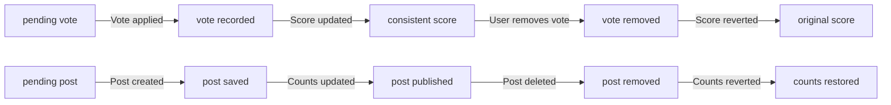
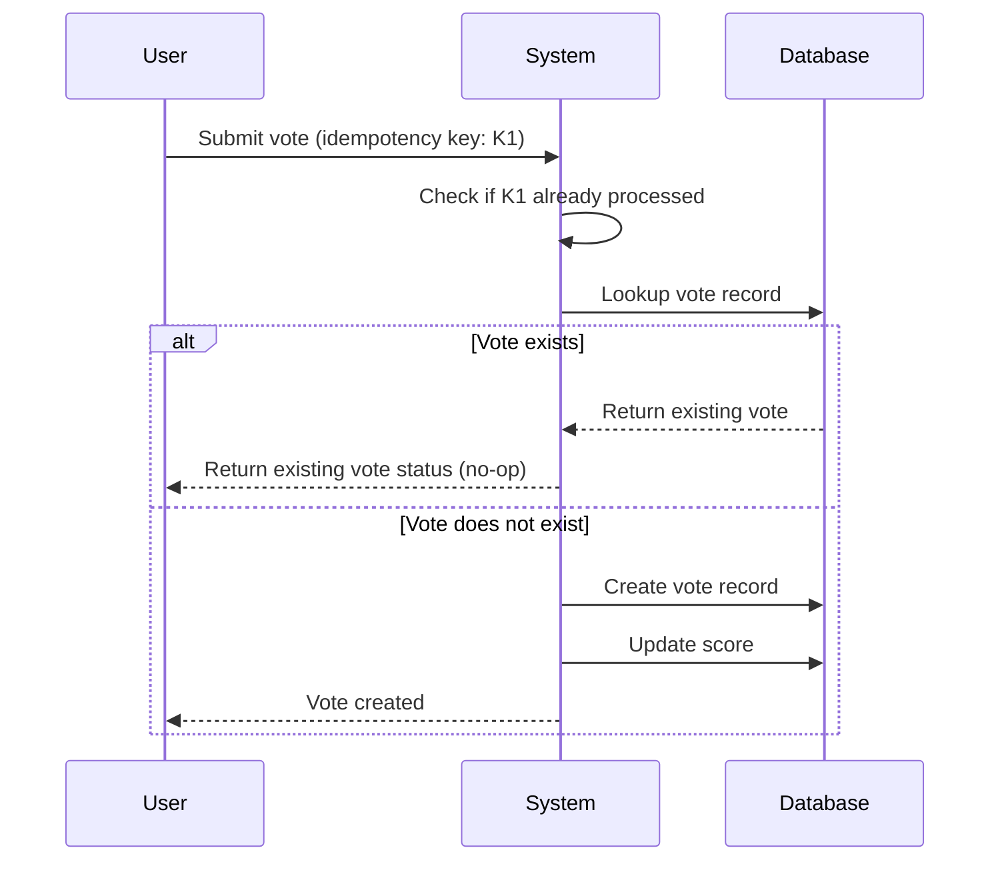
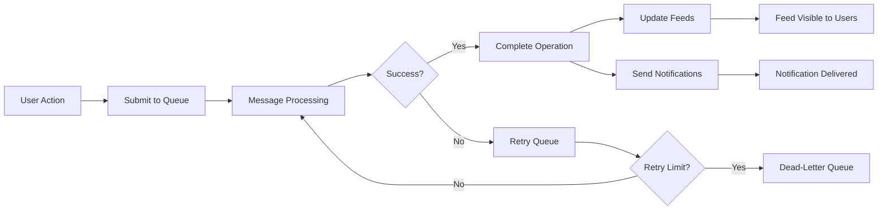

**redditPlatform — Performance SLOs, security policies, data integrity, storage requirements**

Performance SLOs, security policies, data integrity, storage requirements

# Performance Requirements

Performance SLOs and scalability targets.

## Performance SLOs

Define response time targets, throughput limits, and scalability requirements.

### API Response Time Targets

THE system SHALL respond to all read operations within 200 milliseconds at the 95th percentile.

THE system SHALL respond to all write operations within 500 milliseconds at the 95th percentile.

WHEN a user requests a feed, THE system SHALL deliver the first page of results within 500 milliseconds at the 95th percentile.

WHEN a user views a single post or comment, THE system SHALL display the content within 300 milliseconds at the 95th percentile.

WHEN a user performs a search operation, THE system SHALL return results within 1 second at the 95th percentile.

IF the system cannot meet the response time target for an operation, THE system SHALL return a response within 1 second indicating the operation is being processed.

THE system SHALL maintain response time targets during normal load conditions with up to 100,000 concurrent users.

WHEN the system is operating above normal load, THE system SHALL prioritize read operations over write operations to maintain response times.

THE system SHALL document any degradation in response time that exceeds 50% of the target threshold.

WHEN a user experiences response time exceeding the target, THE system SHALL log the request for performance analysis.

### Throughput and Scalability Requirements

THE system SHALL support a minimum of 1,000 read requests per second across all endpoints.

THE system SHALL support a minimum of 100 write requests per second across all endpoints.

WHEN the system scales to handle 100,000 concurrent users, THE system SHALL maintain the defined response time targets.

THE system SHALL automatically scale horizontally when CPU utilization exceeds 70% for more than 5 minutes.

THE system SHALL automatically scale horizontally when memory utilization exceeds 80% for more than 5 minutes.

WHEN scaling occurs, THE system SHALL maintain zero downtime for all user operations.

THE system SHALL support up to 10 million posts in the database without performance degradation.

THE system SHALL support up to 100 million comments in the database without performance degradation.

THE system SHALL support up to 50 million communities in the database without performance degradation.

IF a single community exceeds 100,000 subscribers, THE system SHALL optimize feed generation to maintain response time targets.

WHEN a user subscribes to a new community, THE system SHALL update their home feed within 1 second at the 95th percentile.

THE system SHALL maintain throughput capacity with up to 5 data centers distributed globally.

THE system SHALL provide automatic failover between data centers within 30 seconds.

WHEN a data center becomes unavailable, THE system SHALL continue serving read operations without user impact.

THE system SHALL allow manual scaling during anticipated traffic events (e.g., viral content, platform announcements).

### Karma and Vote Score Calculation

WHEN a user votes on a post or comment, THE system SHALL update the karma score within 1 second at the 95th percentile.

THE system SHALL calculate vote scores for posts in real-time, not cached for more than 5 seconds.

WHEN multiple users vote on the same post simultaneously, THE system SHALL accurately reflect all votes without data loss.

THE system SHALL aggregate vote counts for the top 1,000 most-voted posts within 10 seconds at the 95th percentile.

WHEN a user changes their vote from upvote to downvote, THE system SHALL update the score within 500 milliseconds at the 95th percentile.

IF a user removes their vote, THE system SHALL immediately decrement the karma score of the affected content.

THE system SHALL ensure vote operations are idempotent, preventing duplicate votes from the same user.

WHEN calculating controversy scores, THE system SHALL use data no older than 24 hours.

THE system SHALL cache vote statistics for up to 10 minutes before refreshing from the database.

IF vote calculation cannot complete within the target time, THE system SHALL return cached statistics with a timestamp indicator.

THE system SHALL support vote score display for posts with up to 100,000 votes without performance degradation.

WHEN a user views a post with vote score, THE system SHALL display the score within 100 milliseconds at the 95th percentile.

THE system SHALL ensure karma calculations for new users start at zero and increment immediately upon receiving votes.

THE system SHALL provide real-time karma updates to the user profile page within 2 seconds of vote activity.

WHEN a user posts content that receives immediate votes, THE system SHALL reflect their updated karma score within 5 seconds.

### Feed Generation Performance

THE system SHALL generate a home feed for a user with up to 100 subscribed communities within 500 milliseconds at the 95th percentile.

WHEN a user requests a feed, THE system SHALL return up to 50 posts per page within 500 milliseconds at the 95th percentile.

THE system SHALL support pagination for feeds with up to 1 million total posts without performance degradation.

WHEN sorting by hot, THE system SHALL recalculate scores for posts within the last 7 days within 1 second.

WHEN sorting by top, THE system SHALL calculate aggregate scores for the selected time period within 2 seconds.

WHEN sorting by controversial, THE system SHALL identify controversial posts within 2 seconds.

WHEN sorting by new, THE system SHALL return posts in reverse chronological order within 500 milliseconds.

THE system SHALL support feed requests with sorting options applied without additional latency penalty.

WHEN a user switches sorting options on a feed, THE system SHALL apply the new sort within 500 milliseconds.

IF a community feed exceeds 10,000 posts, THE system SHALL optimize the query to maintain response time targets.

THE system SHALL cache generated feeds for up to 30 seconds for logged-in users.

THE system SHALL allow users to refresh their feed manually to bypass cache.

WHEN a new post is published to a subscribed community, THE system SHALL include it in the user's feed within 1 minute.

THE system SHALL support up to 1,000 feed refreshes per user per day without performance degradation.

WHEN feed generation fails for a user, THE system SHALL display a partial feed with cached content or an empty state.

THE system SHALL maintain feed performance for users with up to 1,000 subscribed communities.

WHEN loading subsequent pages of a feed, THE system SHALL maintain response time targets within 500 milliseconds.

THE system SHALL optimize database queries for feed generation to minimize join operations.

IF feed generation cannot complete within 2 seconds, THE system SHALL return the most recent posts first.

THE system SHALL measure and report feed generation latency for all feed requests.

### Search Performance

WHEN a user searches for communities, THE system SHALL return results within 500 milliseconds at the 95th percentile.

WHEN a user searches for posts by keyword, THE system SHALL return results within 1 second at the 95th percentile.

THE system SHALL support fuzzy matching for search queries within 500 milliseconds.

WHEN searching with filters applied (e.g., subreddit, date range, sorting), THE system SHALL return results within 1.5 seconds.

THE system SHALL return zero results within 200 milliseconds if no matches exist.

WHEN autocomplete is enabled for search, THE system SHALL suggest up to 10 results within 300 milliseconds.

THE system SHALL index all searchable content within 5 minutes of creation.

WHEN a search query exceeds 200 characters, THE system SHALL return an error message within 100 milliseconds.

THE system SHALL support search queries with up to 10 million indexed items without performance degradation.

IF search cannot return results within the target time, THE system SHALL return partial results sorted by relevance.

THE system SHALL maintain search performance for users performing up to 100 searches per day.

WHEN searching communities by name, THE system SHALL match case-insensitively within 500 milliseconds.

THE system SHALL support searching by user username within 500 milliseconds.

WHEN multiple search terms are provided, THE system SHALL use AND logic for all terms within 1 second.

THE system SHALL cache frequent search queries for up to 5 minutes to improve response time.

## Rate Limiting and Throttling

Define rate limiting policies and abuse prevention requirements.

### Rate Limit Policies

THE system SHALL impose rate limits on all authenticated requests to prevent abuse.

WHEN a user makes a request, THE system SHALL:
1. Track the number of requests within a sliding time window
2. Reject the request with an appropriate error if the limit is exceeded
3. Inform the user of the remaining request quota and when it resets

IF a user exceeds their rate limit, THE system SHALL:
1. Reject the request immediately
2. Return a message indicating the rate limit was exceeded
3. Include the time when the rate limit will reset

THE system SHALL enforce different rate limits based on the following actions:

| Action | Limit | Time Window |
|--------|-------|-------------|
| Login attempts | 5 | 5 minutes |
| Registration attempts | 3 | 1 hour |
| Post creation | 10 | 1 hour |
| Comment creation | 30 | 1 hour |
| Vote actions | 60 | 1 minute |
| Report submissions | 5 | 1 hour |
| Profile updates | 10 | 1 hour |

IF a guest user makes requests, THE system SHALL enforce stricter rate limits:

| Action | Limit | Time Window |
|--------|-------|-------------|
| Feed viewing | 60 | 1 minute |
| Community browsing | 30 | 1 minute |
| Profile viewing | 20 | 1 minute |

THE system SHALL reset rate limit counters automatically when the time window expires.

### Abuse Prevention and Throttling

WHEN the system detects abusive behavior patterns, THE system SHALL apply throttling to slow down subsequent requests.

Abusive behavior patterns include:
- Rapid repeated actions on the same content
- Automated-style request patterns
- Requests from suspected bot accounts
- Excessive reporting activity on a single content item

IF the system detects abusive behavior, THE system SHALL:
1. Gradually increase the delay between accepted requests
2. Require additional verification if the pattern continues
3. Temporarily suspend the ability to perform certain actions
4. Notify the user that throttling has been applied

THE system SHALL apply throttling for a minimum cooldown period of 10 minutes.

WHILE throttling is active, THE system SHALL:
1. Continue to accept requests but with increased latency
2. Display a message to the user indicating their actions are being slowed
3. Allow only critical actions (e.g., account access) to proceed normally

THE system SHALL automatically remove throttling after the cooldown period expires without requiring user action.

IF a user appeals the throttling decision, THE system SHALL:
1. Allow the user to submit an appeal through customer support
2. Review the appeal within 24 hours
3. Either lift the throttling or maintain it based on the review outcome

### Cooldown Periods and Escalation

WHEN a user's rate limit is exceeded, THE system SHALL apply an escalating cooldown period.

THE system SHALL use the following cooldown escalation schedule:

| Violation Count | Cooldown Duration |
|-----------------|-------------------|
| 1st violation | 10 minutes |
| 2nd violation (within 24 hours) | 30 minutes |
| 3rd violation (within 24 hours) | 2 hours |
| 4th violation (within 24 hours) | 8 hours |
| 5th violation (within 24 hours) | 24 hours |

IF the cooldown period expires, THE system SHALL reset the violation counter.

IF the user commits a 6th violation within 7 days of the initial violation, THE system SHALL:
1. Suspend the account for 7 days
2. Send a notification to the user's registered email
3. Allow the user to appeal the suspension

THE system SHALL track violations within a sliding 24-hour window for escalating cooldowns.

IF a user requests to disable a post, comment, or community after receiving a violation, THE system SHALL:
1. Still apply the cooldown period
2. Not provide an exception based on self-censorship

WHILE a cooldown period is active, THE system SHALL:
1. Allow read-only access to view content
2. Block all write operations (posts, comments, votes, reports)
3. Allow account recovery operations (password reset, email verification)

THE system SHALL notify users via email when a cooldown period is applied.

# Security Requirements

Security policies, encryption, and compliance requirements.

## Security Policies

Define security policies including encryption, input validation, and compliance.

### Authentication Security

WHEN a user attempts to log in, THE system SHALL validate the provided email and password.

WHEN a user signs up, THE system SHALL verify the email format and username uniqueness.

WHEN a user attempts to change their password, THE system SHALL validate the new password meets complexity requirements.

THE system SHALL enforce a minimum password length of 8 characters.

THE system SHALL require passwords to contain at least one uppercase letter, one lowercase letter, one number, and one special character.

WHEN authentication fails more than 5 times within 15 minutes, THE system SHALL temporarily block the account.

THE system SHALL send a notification to the user when their account is locked due to failed login attempts.

WHEN a session expires, THE system SHALL require the user to authenticate again before accessing protected resources.

IF a user's account is deleted, THE system SHALL immediately invalidate all active sessions for that user.

THE system SHALL support password change for users who have forgotten their password through a secure email-based recovery process.

### Data Encryption

WHEN storing user credentials, THE system SHALL encrypt passwords using industry-standard hashing algorithms.

WHEN transmitting sensitive data, THE system SHALL use TLS encryption for all communications.

THE system SHALL encrypt personally identifiable information (PII) at rest.

WHEN storing posts, comments, and messages, THE system SHALL encrypt any user-provided content that may contain sensitive information.

THE system SHALL use secure key management practices for all encryption operations.

WHEN transferring data between services, THE system SHALL ensure encryption is maintained end-to-end.

THE system SHALL rotate encryption keys periodically according to security best practices.

WHEN backing up data, THE system SHALL encrypt the backup files using separate encryption keys.

THE system SHALL not store encryption keys in the same location as the encrypted data.

### Compliance Requirements

THE system SHALL comply with applicable data protection regulations including GDPR and CCPA.

WHEN a user requests data deletion, THE system SHALL remove all personal data within 30 days.

WHEN a user requests access to their personal data, THE system SHALL provide a complete export within 7 days.

THE system SHALL maintain records of all data access and modifications for audit purposes.

WHEN processing user data, THE system SHALL obtain explicit consent where required by regulation.

THE system SHALL provide users with the ability to download all their data in a machine-readable format.

WHEN handling reports of content violations, THE system SHALL document the action taken and maintain an audit trail.

THE system SHALL notify users of any data breaches within 72 hours of discovery.

THE system SHALL retain data only for the period necessary to fulfill the service purpose.

THE system SHALL allow users to export their community membership history and subscription preferences.

### Input Validation

WHEN receiving user input, THE system SHALL validate all input against expected formats and constraints.

THE system SHALL reject input containing potentially malicious script tags or executable code.

WHEN a user provides text content, THE system SHALL enforce a maximum length of 10,000 characters.

THE system SHALL sanitize all HTML content to prevent cross-site scripting attacks.

WHEN a user uploads an image, THE system SHALL validate the file type matches the declared type.

THE system SHALL limit image uploads to 10 MB per file.

THE system SHALL validate URLs to ensure they are properly formatted and secure (HTTPS preferred).

WHEN a user submits a comment or post, THE system SHALL check for rate of submissions to prevent abuse.

THE system SHALL reject requests with malformed or oversized payloads.

THE system SHALL validate all numeric inputs to prevent integer overflow attacks.

### OWASP Security Controls

THE system SHALL implement controls to prevent OWASP Top 10 vulnerabilities.

THE system SHALL protect against SQL injection by using parameterized queries for all database operations.

THE system SHALL implement CSRF protection for all state-changing operations.

THE system SHALL prevent clickjacking by implementing appropriate security headers.

THE system SHALL implement proper authorization checks on all endpoints to prevent broken access control.

THE system SHALL use Content Security Policy headers to restrict resource loading.

THE system SHALL implement secure session management with appropriate timeout values.

THE system SHALL prevent insecure deserialization by validating all serialized data.

THE system SHALL log all security events for monitoring and incident response.

THE system SHALL implement rate limiting to prevent brute force attacks and abuse.

## Availability and Reliability

Define availability targets, reliability expectations, and failover policies.

### System Availability Targets

THE system SHALL maintain 99.9% availability during business hours (8:00 AM to 10:00 PM in all time zones).

WHEN a user attempts to access the platform, THE system SHALL respond within 2 seconds for 95% of requests.

THE system SHALL ensure that no single community moderator action can cause service degradation affecting the entire platform.

IF any system component fails, THE system SHALL redirect user requests to available components without data loss.

THE system SHALL maintain at least 99.5% availability during non-business hours (10:00 PM to 8:00 AM in all time zones).

IF a data center becomes unavailable, THE system SHALL automatically fail over to a secondary data center within 5 minutes.

### Uptime Measurement and Reporting

THE system SHALL measure and record uptime metrics continuously for all public-facing features.

WHEN a service experiences downtime exceeding 1 minute, THE system SHALL generate an incident alert for the operations team.

THE system SHALL provide a public status page showing current uptime percentages for the past 30 days.

IF a scheduled maintenance window occurs, THE system SHALL notify all subscribed users at least 24 hours in advance.

THE system SHALL track and report downtime by geographic region to identify localized issues.

THE system SHALL provide monthly uptime reports to account owners upon request.

### Error Budget Management

THE system SHALL allocate an error budget of 0.1% per month for planned and unplanned downtime.

WHEN the error budget for a month exceeds 50% of the available budget, THE system SHALL disable non-critical feature deployments.

IF the error budget is exhausted, THE system SHALL enter a protected state where only bug fixes and security patches can be deployed.

THE system SHALL calculate and display the remaining error budget on the internal monitoring dashboard.

WHEN the error budget is projected to be exhausted before month-end, THE system SHALL alert the engineering leadership team.

THE system SHALL reset the error budget calculation on the first day of each month.

### Reliability Standards

THE system SHALL ensure that post votes are persisted immediately and never lost.

WHEN a user performs an action (create post, comment, vote), THE system SHALL guarantee the action is not lost even if a server crashes.

THE system SHALL ensure that a user's karma score is always accurate and never deviates from the actual vote count.

IF two users simultaneously vote on the same post, THE system SHALL resolve the conflict and record both votes correctly.

THE system SHALL guarantee that no user's posts or comments are deleted unless explicitly done by the user, a moderator, or through account deletion.

WHEN a community is deleted, THE system SHALL preserve all posts and comments for 30 days before permanent deletion.

# Data Integrity and Storage

Data integrity constraints and storage requirements.

## Data Integrity and Storage

Define backup policies, data retention, and storage tier requirements.

### Data Integrity Constraints

WHEN a user account is created, THE system SHALL ensure the username is unique across all users.

WHEN a post or comment is deleted, THE system SHALL cascade the deletion to remove all associated votes and replies.

WHEN a community is deleted, THE system SHALL delete all posts, comments, and votes within that community.

THE system SHALL maintain referential integrity by preventing deletion of a user who has existing posts or comments unless all associated data is also removed.

IF a report references content that no longer exists, THE system SHALL mark the report as resolved automatically.

WHEN a vote is cast, THE system SHALL atomically update both the vote record and the associated post or comment score.

IF a user attempts to vote on content they have already voted on, THE system SHALL update their existing vote rather than create a duplicate.

THE system SHALL ensure that karma scores always reflect the current state of all votes on a user's content.

WHEN a community's description or icon is updated, THE system SHALL immediately reflect this change across all community listings.

IF a post is moved between communities, THE system SHALL preserve all votes, comments, and metadata associated with the post.

THE system SHALL prevent creation of duplicate communities with the same unique name.

WHEN a user's display name is changed, THE system SHALL update the author name displayed on all their posts and comments.

IF an operation violates data integrity constraints, THE system SHALL reject the entire operation without partial changes.

WHEN multiple users vote simultaneously on the same content, THE system SHALL ensure all votes are recorded accurately without loss or duplication.

THE system SHALL prevent orphaned records where votes, comments, or reports reference non-existent users, posts, or communities.

### Backup Policies

WHEN a backup is initiated, THE system SHALL create a complete snapshot of all user data, posts, comments, votes, and reports.

THE system SHALL perform incremental backups daily and full backups weekly.

WHEN a backup completes successfully, THE system SHALL store the backup for a minimum retention period.

THE system SHALL encrypt all backup data before storage to protect sensitive user information.

IF a backup fails, THE system SHALL automatically retry the backup operation and notify administrators.

WHEN a user requests account deletion, THE system SHALL mark their data for removal from future backups while maintaining the current backup until its natural expiration.

THE system SHALL verify backup integrity by performing checksum validation on all backup files.

WHEN restoring from a backup, THE system SHALL maintain data consistency by using transactionally consistent backup snapshots.

THE system SHALL allow restoration of individual user data without restoring the entire database.

IF a backup verification detects corruption, THE system SHALL discard the corrupted backup and use the last known good backup.

WHEN a community owner requests data export, THE system SHALL include all posts, comments, and moderation data in the exported backup.

THE system SHALL maintain at least three generations of backup copies to enable recovery from recent failures.

BACKUP RETENTION: THE system SHALL retain daily backups for 30 days, weekly backups for 90 days, and monthly backups for 365 days.

### Data Retention Policies

WHEN a user account is deleted, THE system SHALL permanently remove all associated posts, comments, votes, and reports.

IF a user account is inactive for 365 days, THE system SHALL notify the user before initiating account deletion.

WHEN a report is dismissed, THE system SHALL retain the report record for 90 days before automatic archival.

IF a report is resolved, THE system SHALL archive the report record after the reported content is removed.

THE system SHALL retain audit logs of all moderation actions for a minimum of 1 year.

WHEN a community is deleted, THE system SHALL retain anonymized analytics data for platform improvement purposes.

IF a post is deleted by its author, THE system SHALL preserve vote counts but remove the content after 30 days.

WHEN a user requests data export, THE system SHALL provide all historical data including deleted content where applicable.

THE system SHALL retain deleted posts metadata for 30 days to support recovery and analytics.

IF a user's avatar is replaced, THE system SHALL retain the previous version for 7 days before deletion.

WHEN a community description is updated, THE system SHALL preserve the previous version for 30 days for audit purposes.

THE system SHALL automatically archive reports older than 90 days with no moderation action taken.

IF the platform is acquired or transferred, THE system SHALL provide data retention and migration guarantees as specified in the transfer agreement.

### Storage Requirements

WHEN a user uploads an image post, THE system SHALL store the image at a size optimized for web display while preserving the original file.

THE system SHALL generate multiple thumbnail sizes for all uploaded images to support various display contexts.

IF an uploaded file exceeds the maximum size limit, THE system SHALL reject the upload and notify the user.

THE system SHALL store images in a content delivery network for optimal global distribution performance.

WHEN a link post is created, THE system SHALL cache the domain name and preview information for rapid display.

THE system SHALL use tiered storage for posts, with active content on high-performance storage and archived content on cost-optimized storage.

IF storage capacity reaches 85% utilization, THE system SHALL alert administrators for capacity planning.

WHEN a user subscribes to a community, THE system SHALL store the subscription relationship with a timestamp.

THE system SHALL store comment nesting depth up to unlimited levels without performance degradation.

IF multiple image posts are created in quick succession, THE system SHALL process uploads asynchronously without blocking user actions.

WHEN a post is created in a community with over 10,000 subscribers, THE system SHALL prioritize storage allocation for that community's posts.

THE system SHALL ensure that image storage supports a minimum of 5MB per image for user-uploaded content.

WHEN a user's bio contains an avatar URL, THE system SHALL validate that the URL is accessible before accepting the profile update.

### Consistency Guarantees

WHEN a vote is cast on a post, THE system SHALL update the vote score immediately and consistently across all user views of that post.

IF a user updates their profile, THE system SHALL ensure the new display name and bio are immediately visible to all users viewing their profile.

WHEN a community's subscriber count changes, THE system SHALL update the count consistently across all community listings.

IF a moderator deletes a post, THE system SHALL ensure the post is immediately invisible to all users including the author.

WHEN a report is submitted, THE system SHALL ensure the report is immediately visible to moderators of the target community.

THE system SHALL ensure that a user's subscription status is consistent when they attempt to create a post in a community.

IF a user is banned from a community, THE system SHALL immediately prevent them from posting or commenting.

WHEN a comment with nested replies is created, THE system SHALL ensure all parent and child comments are visible together.

THE system SHALL maintain eventual consistency for aggregate metrics like karma scores, with updates propagated within 60 seconds.

IF a user changes their vote, THE system SHALL ensure the new vote score is reflected on both the content and the voter's karma within 10 seconds.

WHEN a community is created, THE system SHALL ensure the creator is immediately recognized as the owner across all operations.

THE system SHALL ensure that feed sorting produces consistent results for all users viewing the same feed at the same time.

IF a post receives multiple votes simultaneously, THE system SHALL ensure the final vote count is accurate regardless of vote timing.

WHEN a user's account status changes, THE system SHALL propagate this status to all dependent operations within 30 seconds.

THE system SHALL maintain strong consistency for all user-specific operations including votes, posts, and comments.

## Audit and Observability

Define audit logging, monitoring, alerting, and observability requirements.

### Section 1: Audit Trail Requirements

THE system SHALL maintain an audit trail for all critical user actions including account creation, password changes, content deletion, and moderation actions.

WHEN a user account is created, THE system SHALL record the creation timestamp and the email address used for registration.

WHEN a user changes their password, THE system SHALL record the change timestamp and the previous password's last modification time.

WHEN a user deletes their account, THE system SHALL record the deletion timestamp, the user's username, and confirm that all associated posts and comments are scheduled for deletion.

WHEN a moderator deletes a post or comment, THE system SHALL record the moderator's username, the deleted content ID, the reason for deletion, and the timestamp.

WHEN a user reports content, THE system SHALL record the reporter's username, the reported content ID, the reason provided, and the timestamp.

IF a moderator approves a report, THE system SHALL record the approval action with the approving moderator's username and timestamp.

IF a moderator dismisses a report, THE system SHALL record the dismissal action with the dismissing moderator's username and timestamp.

THE system SHALL retain audit records for a minimum of 90 days for compliance and security review purposes.

THE system SHALL ensure audit records cannot be modified or deleted by any user including administrators.

### Section 2: Logging Standards

THE system SHALL log all authentication attempts including successful logins and failed login attempts.

WHEN an authentication attempt fails, THE system SHALL record the email address, the number of consecutive failures, and the timestamp.

THE system SHALL log all content creation events including post creation, comment creation, and community creation with timestamps and user identifiers.

WHEN a user subscribes or unsubscribes from a community, THE system SHALL log the action with the community name and timestamp.

THE system SHALL log all vote actions on posts and comments including upvotes, downvotes, vote changes, and vote removals.

THE system SHALL log all moderation actions including user bans, unban actions, and moderator role changes.

IF a content moderation action results in user ban, THE system SHALL log the banned user's username, the banning moderator's username, the duration of the ban, and the reason.

THE system SHALL ensure that all logs include sufficient context to reconstruct the sequence of events for a given user or content item.

THE system SHALL separate logs by severity level including information, warning, and error categories.

THE system SHALL ensure that sensitive data such as passwords and email addresses are not logged in plain text.

### Section 3: Monitoring Requirements

THE system SHALL monitor system availability with real-time tracking of uptime status.

THE system SHALL track the total number of active users, posts, comments, and communities daily.

WHEN the system experiences an error that affects user-facing functionality, THE system SHALL immediately generate an error event for monitoring.

THE system SHALL monitor the average response time for user-facing operations including post feeds, comment views, and vote actions.

THE system SHALL track the number of content reports per hour and generate warnings when reporting spikes are detected.

THE system SHALL monitor the success rate of authentication operations including login success and failure rates.

THE system SHALL track the number of posts and comments deleted per day for moderation oversight.

WHEN a moderation action is taken against multiple users in a short time period, THE system SHALL flag the activity for review.

THE system SHALL provide metrics on community subscription activity including new subscriptions and cancellations per day.

THE system SHALL ensure monitoring data is available for at least 30 days for trend analysis.

### Section 4: Alerting Configuration

THE system SHALL send an alert when the system uptime drops below 99.9% over a 24-hour period.

WHEN a critical error occurs affecting user-facing functionality, THE system SHALL send an immediate alert to the operations team.

THE system SHALL send an alert when the average response time exceeds 2 seconds for more than 5 consecutive minutes.

WHEN the number of failed login attempts exceeds 100 within a 5-minute window, THE system SHALL send an alert for potential security incidents.

THE system SHALL send an alert when the daily content deletion rate exceeds 10% of the total posted content for that day.

WHEN the number of new content reports exceeds 500 within one hour, THE system SHALL send an alert for review.

THE system SHALL send an alert when a user's account is deleted with notification of the affected content count.

THE system SHALL ensure alerts include the affected system component, the severity level, and the timestamp of the triggering event.

THE system SHALL provide an acknowledgment mechanism for all generated alerts to confirm team response.

THE system SHALL escalate unacknowledged alerts according to a defined priority-based escalation policy.

# Concurrency and Data Consistency

Concurrency control policies, race condition handling, and data consistency guarantees.

## Concurrency Control Policies

Define optimistic/pessimistic locking strategies, conflict resolution, and retry semantics for concurrent operations.

### Concurrent Vote Processing

WHEN multiple users vote on the same post or comment concurrently, THE system SHALL process each vote independently and ensure the final score accurately reflects all votes.

WHEN a user submits a vote that conflicts with an existing vote for the same content, THE system SHALL update the vote state atomically without losing the previous vote information.

IF two vote requests arrive simultaneously for the same user-content pair, THE system SHALL process the most recent request and discard the earlier one.

IF a vote operation fails due to concurrent modification, THE system SHALL retry the operation up to three times with exponential backoff before rejecting the request.

### Post Content Locking

WHEN a user is editing a post, THE system SHALL lock the post content to prevent concurrent edits from the same user.

WHEN another user attempts to edit a post that is currently locked by a different user, THE system SHALL reject the request with a clear message indicating the post is being edited.

IF the user with the active lock does not submit changes within five minutes, THE system SHALL automatically release the lock.

IF a lock cannot be acquired due to contention, THE system SHALL wait up to ten seconds before timing out and rejecting the request.

### Community Subscription Conflicts

WHEN a user subscribes to a community while simultaneously unsubscribing, THE system SHALL ensure the final state accurately reflects the latest action.

IF two subscription operations occur at the same time for the same user-community pair, THE system SHALL apply the operation with the later timestamp.

IF a subscription update conflicts with a pending moderation action, THE system SHALL defer the subscription change until the moderation action is resolved.

IF concurrent subscription operations cause a race condition in subscriber count updates, THE system SHALL recalculate the count and apply the corrected value.

### Conflict Resolution for Voting

WHEN vote conflicts are detected, THE system SHALL resolve them by applying the most recent vote operation based on server timestamp.

IF the resolution results in an inconsistent score, THE system SHALL recalculate the total score from all individual votes and update the content score accordingly.

IF a vote conflict cannot be resolved automatically, THE system SHALL log the conflict for manual review and maintain the last known consistent state.

WHILE a vote conflict is being resolved, THE system SHALL display the last known consistent score to all users viewing the content.

### Retry Semantics for Failed Operations

WHEN a concurrent operation fails due to a transient conflict, THE system SHALL retry the operation up to three times with exponential backoff.

IF all retry attempts fail, THE system SHALL reject the operation and inform the user that their action could not be completed.

FOR vote operations, THE system SHALL not retry if the failure is due to authentication or authorization errors.

FOR post deletion operations, THE system SHALL immediately retry once before proceeding with the deletion to ensure all references are properly cleaned up.

IF a retry succeeds after previous failures, THE system SHALL NOT notify the user of the retry unless the user explicitly requested status feedback.

### Race Condition Prevention

WHEN creating a new post, THE system SHALL ensure no duplicate posts can be created with identical content by the same user within one minute.

WHEN multiple users attempt to ban the same user from a community simultaneously, THE system SHALL process only the first request and reject subsequent ones.

IF a user deletes a comment while another user is replying to it, THE system SHALL prevent the reply from being created and inform the user that the parent comment no longer exists.

WHEN removing a vote, THE system SHALL ensure the operation cannot be performed if the vote has already been removed by a concurrent request.

## Data Consistency Guarantees

Define consistency models, transactional boundary requirements, and idempotency guarantees.

### Consistency Model

### Data Consistency Model

WHEN a user performs any action that modifies shared data, THE system SHALL ensure data consistency across all user views within 5 seconds.

WHEN a user votes on a post or comment, THE system SHALL ensure their vote is visible to other users viewing the same content within 5 seconds.

WHEN a user subscribes to a community, THE system SHALL ensure subscription status is consistent across the platform within 5 seconds.

THE system SHALL provide eventual consistency for karma scores, allowing a delay of up to 30 seconds before all users see updated karma values.

THE system SHALL provide eventual consistency for subscriber counts, allowing a delay of up to 30 seconds before all users see updated subscription counts.

WHEN a post is created, THE system SHALL ensure the post appears in the creator's profile within 5 seconds.

WHEN a comment is created, THE system SHALL ensure the comment appears in the post's comment list within 5 seconds.

### Consistency Trade-offs

THE system SHALL prioritize data availability over strong consistency during periods of network partitions.

THE system SHALL maintain consistency for user authentication tokens, ensuring they are synchronized within 1 second.

### Consistency Verification

THE system SHALL allow users to verify their own vote status immediately after voting.

THE system SHALL provide users with a "refresh" option to manually trigger consistency updates for feeds.

### Transaction Boundaries

### Post Creation Transaction

WHEN a user creates a post, THE system SHALL create the post record, associate it with the community, and update the community's post count as a single atomic operation.

IF the post creation fails at any step, THE system SHALL roll back all partial changes and ensure no orphaned records are created.

WHEN a user creates a post, THE system SHALL ensure the post author's karma score is not updated until the post is fully saved.

WHEN a user creates a post, THE system SHALL ensure the community's post count is not updated until the post is fully saved.

### Comment Creation Transaction

WHEN a user creates a comment, THE system SHALL create the comment record, associate it with the post, and update the post's comment count as a single atomic operation.

IF the comment creation fails at any step, THE system SHALL roll back all partial changes and ensure no orphaned records are created.

WHEN a user replies to a comment, THE system SHALL create the reply record and update parent comment's reply count as a single atomic operation.

### Vote Transaction

WHEN a user votes on a post or comment, THE system SHALL update the user's vote record and the target's vote score as a single atomic operation.

IF a user changes their vote from upvote to downvote, THE system SHALL update both records in a single transaction.

IF a user removes their vote, THE system SHALL update both records in a single transaction.

### Deletion Transaction

WHEN a user deletes a post, THE system SHALL delete the post, all associated comments, and update the community's post count as a single atomic operation.

WHEN a user deletes their account, THE system SHALL delete all their posts, comments, votes, and report submissions as a single atomic operation.

WHEN a moderator deletes a post, THE system SHALL delete the post and all associated comments as a single atomic operation.

### Atomicity Guarantees

### Vote Atomicity

WHEN a user casts a vote, THE system SHALL ensure the vote is either fully applied or fully rejected with no partial state.

IF a vote request fails after the user's vote record is created, THE system SHALL reject the operation and rollback the vote.

IF a vote request fails after the target's score is updated, THE system SHALL reject the operation and rollback the score change.

WHEN a user changes their vote, THE system SHALL ensure the old vote is removed and the new vote is created atomically.

### Subscription Atomicity

WHEN a user subscribes to a community, THE system SHALL ensure the subscription record and subscriber count are updated atomically.

IF the subscription fails after the record is created, THE system SHALL rollback and ensure no orphaned subscription exists.

IF the subscription fails after the count is updated, THE system SHALL rollback and ensure the count remains unchanged.

WHEN a user unsubscribes, THE system SHALL ensure the subscription record is removed and the subscriber count is decremented atomically.

### Karma Atomicity

WHEN karma is updated due to voting, THE system SHALL ensure karma changes are applied atomically.

IF a karma update fails, THE system SHALL reject the operation and ensure no partial karma adjustment occurs.

WHEN multiple votes are cast on the same content, THE system SHALL ensure each vote's karma impact is applied atomically and independently.

### Account Deletion Atomicity

WHEN a user deletes their account, THE system SHALL ensure all associated data (posts, comments, votes, reports) is deleted atomically.

IF account deletion fails mid-operation, THE system SHALL rollback all changes and ensure no partial deletion occurs.

WHEN a user's account is deleted, THE system SHALL ensure their username becomes available for reuse atomically with the deletion.

### Idempotency Policies

### Vote Idempotency

WHEN a user casts the same vote twice, THE system SHALL treat the second vote as a no-op and not update the score again.

WHEN a user requests the same vote submission multiple times (e.g., due to network retry), THE system SHALL ensure only one vote is recorded.

THE system SHALL provide a unique idempotency key per vote operation that, if repeated, prevents duplicate voting.

WHEN a user changes their vote and then changes it back to the original, THE system SHALL not create duplicate vote records.

### Comment Re-submission Idempotency

WHEN a user attempts to submit the same comment twice (e.g., due to UI retry), THE system SHALL prevent duplicate comments from being created.

WHEN a user submits a comment and the system returns an error, THE system SHALL allow the user to retry without creating duplicates.

### Post Re-submission Idempotency

WHEN a user attempts to create a duplicate post in the same community within 1 minute, THE system SHALL detect and prevent the duplicate.

WHEN a user submits a post creation request multiple times (e.g., due to UI retry), THE system SHALL ensure only one post is created.

### Subscription Idempotency

WHEN a user subscribes to the same community multiple times, THE system SHALL treat subsequent subscriptions as no-ops.

WHEN a user's subscription request is retried, THE system SHALL ensure only one subscription record exists.

### Comment Reply Idempotency

WHEN a user submits the same reply to a comment multiple times, THE system SHALL prevent duplicate replies from being created.

WHEN a user attempts to reply to the same parent comment within 1 second of a previous reply, THE system SHALL detect and reject the duplicate.

### State Consistency Diagram

### State Transition Consistency

WHEN a vote state transitions from pending to recorded, THE system SHALL ensure both states are consistent within the same transaction.

WHEN a post state transitions from pending to published, THE system SHALL ensure all associated counts are consistent.

WHEN a subscription state changes, THE system SHALL ensure the subscriber count remains consistent.

### Idempotency State Diagram

WHEN a request with an idempotency key is received, THE system SHALL check if the operation was already completed.

IF an operation with the same idempotency key exists, THE system SHALL return the previous result without re-executing.

THE system SHALL allow idempotency keys to remain valid for 10 minutes after the initial operation.

# Storage Capacity

Storage capacity planning and CDN requirements.

## Storage Capacity Requirements

Define storage requirements and capacity planning for file storage.

### File Storage Capacity

## Image Storage Requirements

THE system SHALL support storing images uploaded by users as profile avatars.

THE system SHALL support storing images uploaded by users as post content.

WHEN a user uploads an image, THE system SHALL validate the image file type before storage.

THE system SHALL store up to 50MB per image file.

IF an uploaded image exceeds 50MB, THE system SHALL reject the file.

## Post and Comment Storage

THE system SHALL store all text posts with their full content.

THE system SHALL store all comments with their full content and nested replies.

THE system SHALL store link posts with their URL and metadata.

WHEN a user creates a post, THE system SHALL persist the post content permanently.

WHEN a user creates a comment, THE system SHALL persist the comment content permanently.

## File Upload Limits

THE system SHALL limit the number of images per post to one.

WHEN a user attempts to upload multiple images as a single post, THE system SHALL reject the request.

THE system SHALL process uploaded files within 30 seconds of submission.

IF file processing exceeds 30 seconds, THE system SHALL reject the request.

### CDN and Media Distribution

## Media Delivery via CDN

WHEN a user requests to view an image, THE system SHALL deliver it through the content delivery network.

THE system SHALL cache image files at CDN edge locations worldwide.

WHEN a user views a post with an image, THE system SHALL return the image within 100 milliseconds from the CDN.

THE system SHALL use the CDN for all profile avatar images.

THE system SHALL use the CDN for all post content images.

## CDN Caching Strategy

WHEN an image is uploaded, THE system SHALL push it to the CDN immediately.

THE system SHALL cache images for a minimum of 24 hours at CDN edge locations.

WHEN an image is updated (replaced), THE system SHALL invalidate the CDN cache entry.

THE system SHALL allow up to 5 cached images per user profile at any time.

## Media Access Control

THE system SHALL enforce access control before serving media through the CDN.

IF a user has been banned from a community, THE system SHALL prevent them from viewing images in posts from that community.

WHEN a post is deleted, THE system SHALL remove the associated image from the CDN cache.

THE system SHALL serve images only to users with appropriate permissions.

### Storage Capacity Scaling

## Growth Capacity Planning

THE system SHALL scale storage capacity to accommodate 1 million users in the first year.

WHEN storage usage reaches 80% capacity, THE system SHALL alert administrators.

THE system SHALL automatically provision additional storage when usage exceeds 80%.

THE system SHALL handle up to 10 million posts at peak capacity.

THE system SHALL handle up to 100 million comments at peak capacity.

## Storage Tiering

THE system SHALL store recent posts (last 3 months) in primary storage.

THE system SHALL archive older posts to secondary storage.

WHEN a user requests a post from the last 3 months, THE system SHALL retrieve it from primary storage.

WHEN a user requests an archived post, THE system SHALL retrieve it from secondary storage.

THE system SHALL return archived posts within 5 seconds of the request.

## Capacity Monitoring

THE system SHALL track total storage used by all media files.

THE system SHALL track storage used per user.

THE system SHALL report storage metrics to administrators weekly.

WHEN storage usage increases by more than 10% in a week, THE system SHALL notify administrators.

### Content Retention Policy

## Permanent Content Storage

WHEN a user creates a post, THE system SHALL store it permanently unless deleted.

WHEN a user creates a comment, THE system SHALL store it permanently unless deleted.

THE system SHALL preserve post and comment history for all users.

WHEN a user views their profile, THE system SHALL display their complete post history.

WHEN a user views their profile, THE system SHALL display their complete comment history.

## Deletion and Data Lifecycle

WHEN a user deletes their account, THE system SHALL delete all their posts permanently.

WHEN a user deletes their account, THE system SHALL delete all their comments permanently.

WHEN a user deletes their account, THE system SHALL remove their profile image from storage.

WHEN a moderator deletes a post, THE system SHALL remove the post content permanently.

WHEN a moderator deletes a comment, THE system SHALL remove the comment content permanently.

## Storage Consistency

THE system SHALL ensure posts are not lost during system operations.

THE system SHALL ensure comments are not lost during system operations.

WHEN a vote is cast on a post, THE system SHALL persist the vote immediately.

WHEN a vote is cast on a comment, THE system SHALL persist the vote immediately.

THE system SHALL maintain at least 99.9% data durability for all stored content.

# External Dependency SLOs

Service level objectives for external dependency availability.

## External Dependency SLOs

Define availability expectations, timeout thresholds, and degradation policies for external service dependencies.

### External Service Availability Requirements

THE system SHALL maintain an availability target of 99.9% for all external services.

WHEN an external dependency service experiences downtime, THE system SHALL:
1. Log the incident with timestamp and service identifier
2. Alert the operations team according to severity level
3. Implement fallback behavior as defined in degradation policies

IF an external service becomes unavailable, THE system SHALL NOT expose raw error messages to end users.

THE system SHALL provide users with a clear message when required external services are unavailable.

WHEN a critical external service is down, THE system SHALL notify users that functionality may be limited.

THE system SHALL record all external service availability incidents in audit logs.

THE system SHALL maintain at least two independent external service providers for critical dependencies.

IF the primary external service provider fails, THE system SHALL automatically switch to the secondary provider.

WHEN external services recover, THE system SHALL log the recovery time and notify the operations team.

### Post External Service Failure

THE system SHALL automatically resume normal operation once external dependencies become available.

WHEN all external services return to normal operation, THE system SHALL clear all failure notifications.

IF multiple external services are unavailable simultaneously, THE system SHALL prioritize which services to restore first based on business criticality.

### External Service Communication

THE system SHALL maintain a status page that displays the availability of all external services.

WHEN an external service experiences degraded performance, THE system SHALL update the status page to reflect the current state.

THE system SHALL provide users with estimated time of recovery when external service issues are known.

### Service Level Agreement Compliance

THE system SHALL track and report on external service availability against agreed SLOs.

WHEN an external service availability target is not met, THE system SHALL generate a compliance report for review.

THE system SHALL maintain historical records of external service availability for audit purposes.

### External Service SLO Targets

THE system SHALL ensure that all storage services maintain 99.5% availability.

THE system SHALL ensure that all caching services maintain 99.9% availability.

THE system SHALL ensure that all authentication services maintain 99.8% availability.

THE system SHALL ensure that all content processing services maintain 99.0% availability.

WHEN a service SLO target is not met, THE system SHALL notify the service management team.

THE system SHALL measure and report SLO compliance on a weekly basis.

IF a service falls below its SLO threshold for more than one hour, THE system SHALL escalate to management.

THE system SHALL define SLO targets for all external dependencies in a documented requirements file.

WHEN an external service provider changes their SLO, THE system SHALL review and update corresponding requirements.

THE system SHALL maintain SLO targets that meet or exceed customer expectations.

### SLO Measurement and Reporting

THE system SHALL measure availability as the percentage of successful requests over total requests.

THE system SHALL exclude planned maintenance windows from SLO calculations.

WHEN an external service has multiple endpoints, THE system SHALL measure SLO per endpoint.

THE system SHALL aggregate SLO metrics across all regions and data centers.

IF SLO measurement infrastructure fails, THE system SHALL use backup measurement methods.

THE system SHALL provide SLO reports to stakeholders on a monthly basis.

### SLO Error Budget

THE system SHALL allocate an error budget for each external service based on its SLO target.

WHEN a service consumes its error budget, THE system SHALL trigger enhanced monitoring.

IF a service exhausts its error budget, THE system SHALL initiate a service review process.

THE system SHALL prevent new non-critical features from being deployed when error budgets are exhausted.

THE system SHALL restore error budgets on a monthly basis based on current SLO performance.

### SLO Review and Adjustment

THE system SHALL review all external service SLOs on a quarterly basis.

WHEN business requirements change, THE system SHALL adjust SLO targets accordingly.

THE system SHALL document the rationale for all SLO target changes.

IF an external service is no longer critical, THE system SHALL downgrade its SLO target.

THE system SHALL ensure SLO targets align with overall platform availability goals.

THE system SHALL communicate SLO changes to all stakeholders at least two weeks before implementation.

### Timeout Requirements

WHEN communicating with external services, THE system SHALL use a maximum timeout of 5 seconds per request.

THE system SHALL enforce different timeout thresholds for different types of external operations.

WHEN an external request exceeds its timeout threshold, THE system SHALL mark the request as failed.

THE system SHALL NOT allow external requests to hang indefinitely.

IF an external service does not respond within the timeout period, THE system SHALL retry the request according to retry policies.

### Timeout Configuration by Operation Type

THE system SHALL use appropriate timeout thresholds based on operation requirements.

THE system SHALL log all timeout events with operation type and duration.

IF timeout occurs, THE system SHALL provide users with a retry option.

THE system SHALL distinguish between timeout errors and other failure types in user messages.

### Retry Behavior on Timeout

WHEN an external service times out, THE system SHALL retry the request up to 3 times.

THE system SHALL wait exponentially longer between each retry attempt.

WHEN all retry attempts fail due to timeout, THE system SHALL mark the operation as failed.

THE system SHALL NOT retry on timeout if the operation is idempotent.

IF a timeout occurs during a transaction, THE system SHALL roll back all changes.

THE system SHALL track total number of timeout retries in request metrics.

### Timeout Monitoring and Alerting

THE system SHALL alert when timeout rate exceeds 1% of total requests.

WHEN timeout rate increases, THE system SHALL investigate the affected external service.

THE system SHALL measure average response time for all external services.

IF average response time exceeds 80% of timeout threshold, THE system SHALL trigger a warning alert.

THE system SHALL provide administrators with timeout configuration options.

THE system SHALL enforce timeout configuration limits to prevent misconfiguration.

### Timeout User Experience

WHEN an external service times out, THE system SHALL inform users that the operation is taking longer than expected.

THE system SHALL NOT timeout during critical user actions without user confirmation.

IF a timeout occurs, THE system SHALL offer users to continue or cancel the operation.

THE system SHALL maintain a queue of timed-out requests for later retry.

WHEN timed-out requests are retried successfully, THE system SHALL notify users of completion.

THE system SHALL ensure timeout behavior does not result in duplicate operations.

### Emergency Timeout Override

WHEN emergency procedures are activated, THE system SHALL allow administrators to adjust timeout settings.

THE system SHALL require dual approval for emergency timeout configuration changes.

WHEN emergency timeout settings are applied, THE system SHALL log the change and the approving administrators.

THE system SHALL automatically revert emergency timeout settings after 24 hours.

THE system SHALL validate that emergency timeout adjustments do not compromise system stability.

### Service Degradation Policy

WHEN an external service experiences partial failure, THE system SHALL degrade gracefully rather than fail completely.

THE system SHALL define priority levels for different external service dependencies.

WHEN resources are constrained, THE system SHALL maintain only critical external service functionality.

THE system SHALL automatically disable non-critical external features during service outages.

WHEN an external service is degraded, THE system SHALL prioritize operations for verified users.

THE system SHALL provide users with information about degraded functionality.

THE system SHALL track the degree of degradation for each external service.

### Fallback Service Provisioning

WHEN the primary external service fails, THE system SHALL activate a fallback service.

THE system SHALL maintain at least one fallback service for all critical external dependencies.

WHEN activating a fallback service, THE system SHALL notify the operations team.

THE system SHALL synchronize data between primary and fallback services.

WHEN the primary service recovers, THE system SHALL automatically switch back to it.

THE system SHALL test fallback service activation weekly to ensure readiness.

THE system SHALL document the specific behaviors of each fallback service.

### Caching for External Dependencies

WHEN an external service is unavailable, THE system SHALL serve cached content when available.

THE system SHALL cache user profile data for up to 15 minutes.

THE system SHALL cache community information for up to 30 minutes.

THE system SHALL invalidate cache entries when external services recover.

WHEN cache expires during external service outage, THE system SHALL display a stale content indicator.

THE system SHALL NOT cache sensitive user data during external service failures.

THE system SHALL limit cache size to prevent memory exhaustion.

### Reduced Functionality Mode

WHEN multiple external services fail, THE system SHALL enter reduced functionality mode.

THE system SHALL disable non-essential features in reduced functionality mode.

WHEN in reduced functionality mode, THE system SHALL prioritize content viewing over content creation.

THE system SHALL notify users when entering reduced functionality mode.

THE system SHALL automatically exit reduced functionality mode when services recover.

THE system SHALL limit the number of concurrent requests in reduced functionality mode.

WHEN in reduced functionality mode, THE system SHALL disable external service-dependent features.

### Circuit Breaker Implementation

WHEN an external service fails multiple times in succession, THE system SHALL open the circuit breaker.

THE system SHALL immediately return failures to users when circuit breaker is open.

THE system SHALL periodically test the external service when circuit breaker is open.

WHEN the circuit breaker closes, THE system SHALL resume normal operations.

THE system SHALL track circuit breaker state for each external dependency.

THE system SHALL reset circuit breakers after 30 minutes of successful operation.

WHEN circuit breaker trips, THE system SHALL alert the operations team.

### Degradation Monitoring and Recovery

THE system SHALL monitor the health of all external service fallback mechanisms.

WHEN a fallback service degrades, THE system SHALL activate the next available fallback.

THE system SHALL log all degradation events and recovery actions.

WHEN all fallback options are exhausted, THE system SHALL display a service unavailable message to users.

THE system SHALL provide administrators with visibility into current degradation state.

THE system SHALL require manual approval to disable all fallback mechanisms.

WHEN degradation persists for more than 1 hour, THE system SHALL escalate to emergency response team.

### Continuous Health Monitoring

THE system SHALL continuously monitor the health of all external service endpoints.

THE system SHALL check external service health at least every 30 seconds.

WHEN an external service becomes unhealthy, THE system SHALL alert the operations team immediately.

THE system SHALL track availability metrics for each external service endpoint.

WHEN health check fails, THE system SHALL attempt to verify with alternative endpoint.

THE system SHALL maintain health check history for at least 90 days.

THE system SHALL aggregate health metrics across all regions.

### Health Check Methodology

THE system SHALL verify external service availability through functional tests, not just connectivity checks.

THE system SHALL simulate actual user operations during health checks.

THE system SHALL monitor response times during health checks.

WHEN a health check detects performance degradation, THE system SHALL trigger an investigation.

THE system SHALL verify that authentication services respond correctly during health checks.

THE system SHALL confirm that data services return valid responses during health checks.

THE system SHALL exclude health checks from rate limiting calculations.

### External Service Dashboard

THE system SHALL provide a real-time dashboard showing external service status.

THE system SHALL display current availability percentage for each external service.

THE system SHALL show historical availability trends on the dashboard.

WHEN a service goes down, THE system SHALL display the incident timeline on the dashboard.

THE system SHALL allow administrators to customize dashboard views.

THE system SHALL provide access to the dashboard for operations team members.

THE system SHALL export dashboard data for compliance reporting.

### Alert Configuration

THE system SHALL send alerts when external service availability drops below 99%.

THE system SHALL send escalation alerts when availability drops below 95%.

THE system SHALL send emergency alerts when availability drops below 90%.

WHEN an alert threshold is met, THE system SHALL notify relevant stakeholders.

THE system SHALL categorize alerts by severity and required response time.

THE system SHALL ensure alerts are delivered through multiple channels.

WHEN an alert is acknowledged, THE system SHALL stop sending repeat notifications.

### Incident Management Integration

THE system SHALL automatically create incidents when external services fail.

THE system SHALL link related incidents when multiple external services fail simultaneously.

THE system SHALL update incident status as external services recover.

WHEN an incident is closed, THE system SHALL generate a post-incident report.

THE system SHALL track mean time to detect (MTTD) for external service failures.

THE system SHALL track mean time to resolve (MTTR) for external service failures.

THE system SHALL integrate external service alerts with existing incident management tools.

### Compliance and Audit

THE system SHALL maintain logs of all external service health checks for compliance.

THE system SHALL provide audit trails for external service incident responses.

WHEN external service issues affect user data, THE system SHALL document the impact.

THE system SHALL retain external service monitoring data for at least 1 year.

THE system SHALL provide external service availability reports for customer compliance.

THE system SHALL ensure external service monitoring meets regulatory requirements.

WHEN external service audits are required, THE system SHALL provide access to all relevant logs.

# Queue Performance

Performance requirements for message queues and background processing.

## Queue Performance SLOs

Define performance requirements for background job processing.

### Queue Throughput Capacity

### Message Queue Throughput

THE system SHALL process at least 10,000 messages per second on the message queue.

WHEN the system experiences peak load, THE system SHALL maintain a queue depth of at least 100,000 pending messages without data loss.

THE system SHALL ensure that all submitted messages are processed within the configured queue processing window.

### Queue Processing Reliability

WHEN a message is submitted to the queue, THE system SHALL guarantee that the message is processed at least once.

THE system SHALL retry failed message processing according to the configured retry policy before marking a message as failed.

IF a message fails processing after all retry attempts, THE system SHALL route the message to a dead-letter queue for manual investigation.

### Message Priority Processing

WHEN a message is marked as high priority, THE system SHALL process it before messages with standard priority.

THE system SHALL maintain separate processing queues for high-priority and standard-priority messages.

### Processing Latency Guarantees

### Background Job Processing Time

WHEN a background job is submitted to the processing queue, THE system SHALL complete the job within 30 seconds for standard operations.

WHEN a background job is submitted for time-sensitive operations (e.g., vote score updates), THE system SHALL complete the job within 5 seconds.

THE system SHALL ensure that 99% of standard background jobs are processed within 60 seconds of submission.

### Real-Time Feed Updates

WHEN a user creates a post, THE system SHALL make the post appear in relevant feeds within 10 seconds.

WHEN a user votes on a post or comment, THE system SHALL update the vote score in all affected feeds within 5 seconds.

WHEN a user subscribes to a community, THE system SHALL begin including that community's posts in the user's home feed within 15 seconds.

### Notification Delivery

WHEN a user receives a notification (e.g., reply to comment, upvote), THE system SHALL deliver the notification within 10 seconds.

THE system SHALL ensure that notification delivery latency does not exceed 30 seconds during peak load periods.

### Queue Processing Flow

