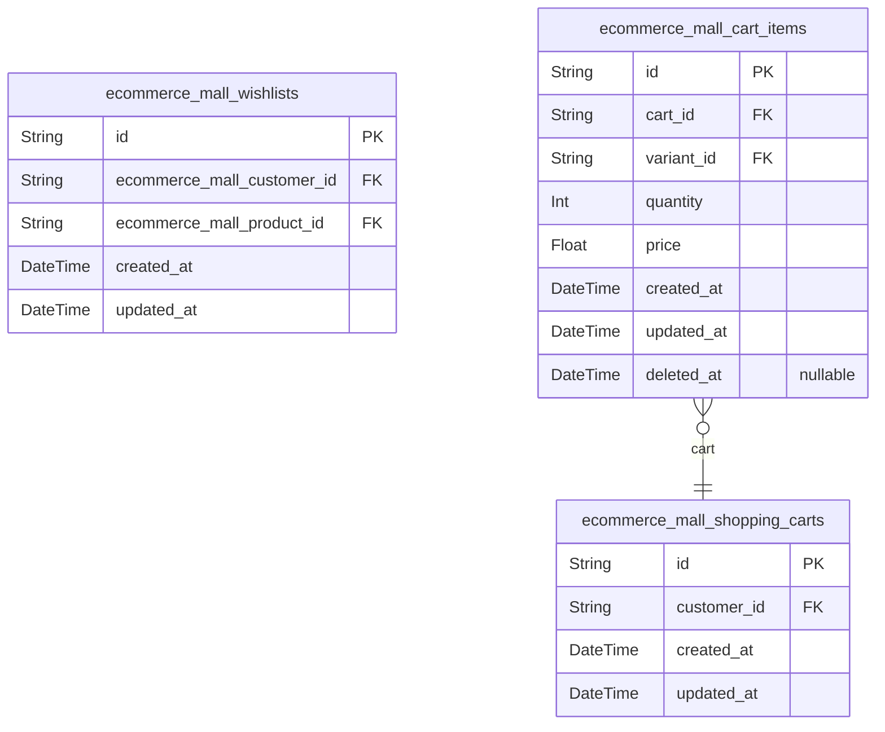
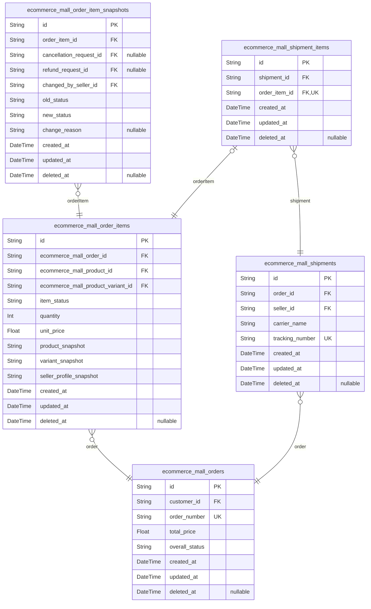
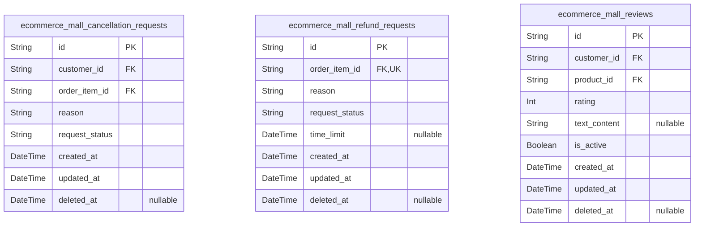
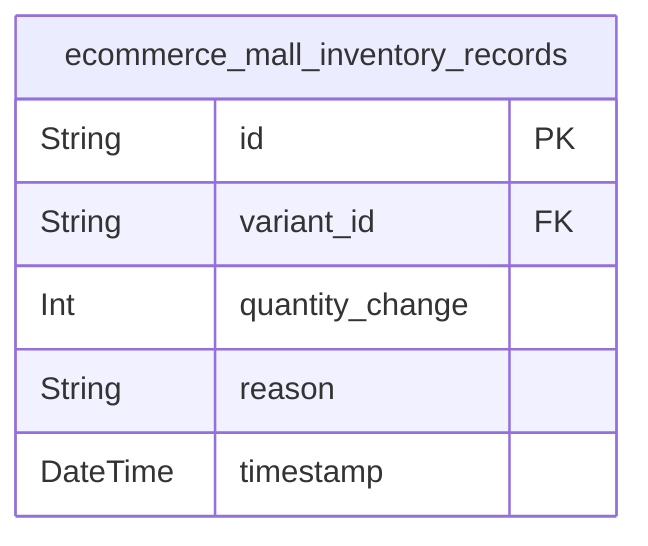
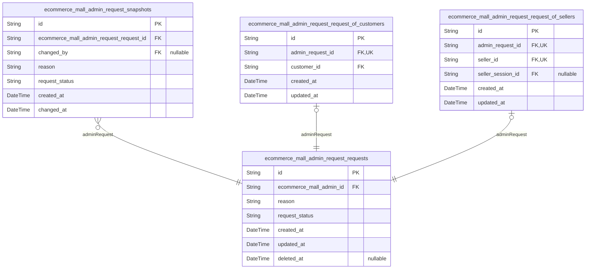
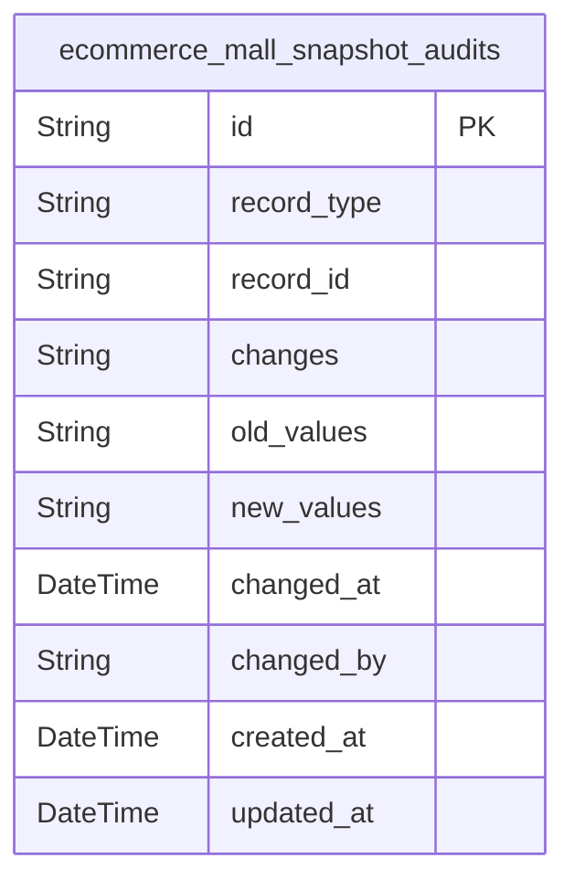
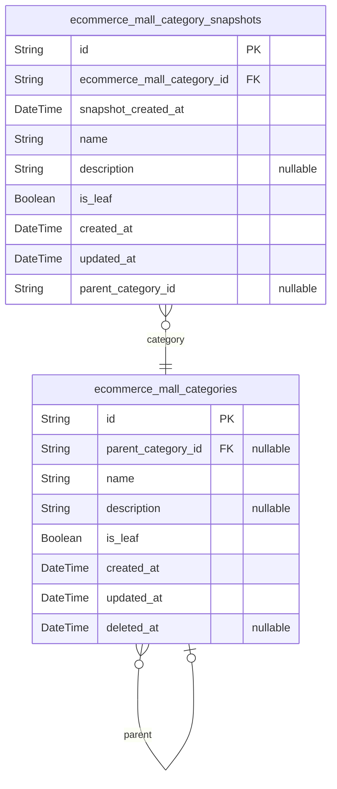
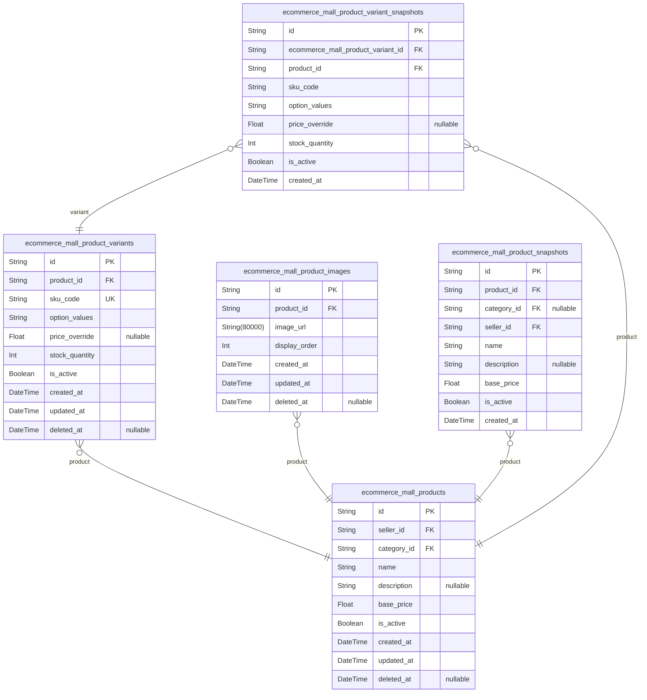

# Prisma Markdown

> Generated by [`prisma-markdown`](https://github.com/samchon/prisma-markdown)

- [Actors](#actors)
- [Shopping](#shopping)
- [Orders](#orders)
- [CustomerService](#customerservice)
- [Inventory](#inventory)
- [Administration](#administration)
- [Systematic](#systematic)
- [Categories](#categories)
- [Products](#products)

## Actors

```mermaid
erDiagram
"ecommerce_mall_customers" {
  String id PK
  String email UK
  String password_hash
  Boolean is_banned
  String ban_reason "nullable"
  DateTime created_at
  DateTime updated_at
  DateTime deleted_at "nullable"
}
"ecommerce_mall_customer_sessions" {
  String id PK
  String customer_id FK
  String ip
  String href
  String referrer
  DateTime created_at
  DateTime expired_at
}
"ecommerce_mall_customer_password_resets" {
  String id PK
  String customer_id FK
  String token UK
  DateTime expired_at
  DateTime created_at
}
"ecommerce_mall_customer_email_verifications" {
  String id PK
  String customer_id FK
  String token
  DateTime expires_at
  DateTime used_at "nullable"
  DateTime created_at
  DateTime updated_at
  DateTime deleted_at "nullable"
}
"ecommerce_mall_sellers" {
  String id PK
  String email UK
  String password_hash
  String approval_status
  String rejection_reason "nullable"
  Boolean is_suspended
  Boolean is_banned
  DateTime created_at
  DateTime updated_at
  DateTime deleted_at "nullable"
}
"ecommerce_mall_seller_sessions" {
  String id PK
  String seller_id FK
  String ip
  String href
  String referrer
  DateTime created_at
  DateTime expired_at
}
"ecommerce_mall_seller_password_resets" {
  String id PK
  String seller_id FK,UK
  String reset_token
  DateTime expired_at
  DateTime created_at
}
"ecommerce_mall_seller_email_verifications" {
  String id PK
  String seller_id FK
  String token UK
  DateTime expires_at
  DateTime used_at "nullable"
  DateTime created_at
  DateTime updated_at
  DateTime deleted_at "nullable"
}
"ecommerce_mall_admins" {
  String id PK
  String email UK
  String password_hash
  Boolean is_banned
  String ban_reason "nullable"
  DateTime created_at
  DateTime updated_at
}
"ecommerce_mall_admin_sessions" {
  String id PK
  String admin_id FK
  String ip
  String href
  String referrer
  DateTime created_at
  DateTime expired_at
}
"ecommerce_mall_admin_password_resets" {
  String id PK
  String admin_id FK
  String token UK
  DateTime expires_at
  DateTime created_at
  DateTime updated_at
  DateTime deleted_at "nullable"
}
"ecommerce_mall_admin_email_verifications" {
  String id PK
  String admin_id FK
  String token UK
  String email
  String status
  DateTime expires_at
  DateTime used_at "nullable"
  DateTime created_at
  DateTime updated_at
  DateTime deleted_at "nullable"
}
"ecommerce_mall_admin_audit_logs" {
  String id PK
  String admin_id FK
  String action_type
  String target_entity_type
  String target_entity_id "nullable"
  String changes "nullable"
  String previous_values "nullable"
  String new_values "nullable"
  String request_id "nullable"
  String ip_address "nullable"
  String user_agent "nullable"
  DateTime created_at
  DateTime updated_at
}
"ecommerce_mall_customer_sessions" }o--|| "ecommerce_mall_customers" : customer
"ecommerce_mall_customer_password_resets" }o--|| "ecommerce_mall_customers" : customer
"ecommerce_mall_customer_email_verifications" }o--|| "ecommerce_mall_customers" : customer
"ecommerce_mall_seller_sessions" }o--|| "ecommerce_mall_sellers" : seller
"ecommerce_mall_seller_password_resets" |o--|| "ecommerce_mall_sellers" : seller
"ecommerce_mall_seller_email_verifications" }o--|| "ecommerce_mall_sellers" : seller
"ecommerce_mall_admin_sessions" }o--|| "ecommerce_mall_admins" : admin
"ecommerce_mall_admin_password_resets" }o--|| "ecommerce_mall_admins" : admin
"ecommerce_mall_admin_email_verifications" }o--|| "ecommerce_mall_admins" : admin
"ecommerce_mall_admin_audit_logs" }o--|| "ecommerce_mall_admins" : admin
```

### `ecommerce_mall_customers`

Registered customer accounts with email/password authentication
credentials and ban status tracking.

This is an actor table representing customer users who can browse the
catalog, manage wishlists and shopping carts, place orders, track
deliveries, write product reviews, and manage their profile and shipping
addresses.

**Key Relationships**:
- Owns [ecommerce_mall_customer_profiles](#ecommerce_mall_customer_profiles) (one-to-one)
- Owns multiple [ecommerce_mall_shipping_addresses](#ecommerce_mall_shipping_addresses) (one-to-many)
- Has multiple [ecommerce_mall_orders](#ecommerce_mall_orders) (one-to-many)
- Owns multiple [ecommerce_mall_wishlists](#ecommerce_mall_wishlists) (one-to-many)
- Writes multiple [ecommerce_mall_reviews](#ecommerce_mall_reviews) (one-to-many)

**Business Rules**:
- Email must be unique across all customers
- Password hashes are stored securely (bcrypt or equivalent)
- Banned customers cannot log in; ban reason is optional
- Soft delete supported via deleted_at for legal compliance and data
retention

**Security Considerations**:
- Password hashes must never be exposed in API responses
- Banned status prevents authentication
- Account deletion requires careful handling to preserve order history
and reviews

Properties as follows:

- `id`: Primary Key.
- `email`: Unique email address used for authentication and communication
- `password_hash`
  > Securely hashed password (bcrypt or equivalent)
  >
  > Must meet minimum security standards as defined in security policies
- `is_banned`
  > Whether the customer account is banned from the system
  >
  > Banned customers cannot authenticate. This is a hard business constraint
  > that blocks all login attempts.
- `ban_reason`
  > Reason for account ban if the account is banned
  >
  > Optional field used for internal tracking and compliance. May be null if
  > no ban reason was documented.
- `created_at`
  > Timestamp when the customer account was created
  >
  > Immutable audit field for tracking account age and creation source.
- `updated_at`
  > Timestamp when the customer account was last updated
  >
  > Tracks when account data was most recently modified.
- `deleted_at`
  > Timestamp when the customer account was soft deleted
  >
  > Null if account is active. Enables legal compliance for data retention
  > and preserves order/review history.

### `ecommerce_mall_customer_sessions`

JWT session tokens for customer authentication with access and refresh
token support.

Tracks customer login sessions for security auditing and session
management. Each customer can have multiple concurrent sessions (e.g.,
from different devices or browsers). Session validity is determined by
the expired_at timestamp, after which the session becomes invalid and
requires re-authentication.

Key relationships:
- Belongs to [ecommerce_mall_customers.id](#ecommerce_mall_customers) - one customer may have
many active sessions
- Sessions are automatically expired via expired_at - no manual deletion
needed
- Connection metadata (ip, referrer, href) captured for security audit
and troubleshooting

Used by the authorization system to validate JWT tokens and manage
customer authentication state across multiple devices.

Properties as follows:

- `id`: Primary Key.
- `customer_id`: Customer's [ecommerce_mall_customers.id](#ecommerce_mall_customers).
- `ip`: IP address of the client making the request.
- `href`: Page URL where the session was created (captured from browser history).
- `referrer`: HTTP referrer header from the client's browser.
- `created_at`: Session creation timestamp.
- `expired_at`
  > Session expiration timestamp. After this time, the session becomes
  > invalid and requires re-authentication.

### `ecommerce_mall_customer_password_resets`

Password reset tokens for customer account recovery with expiration.

Stores secure, single-use tokens that customers can use to reset their
password when they forget it or their account has been compromised. Each
token is uniquely generated, tied to a specific customer account, and
expires after a set time period for security.

Key relationships:
- Belongs to [ecommerce_mall_customers](#ecommerce_mall_customers) - each token is associated
with the customer who requested the password reset
- Tokens are used once and then become invalid, or expire based on
expired_at timestamp
- Used by the password recovery workflow initiated through customer
authentication flows

Properties as follows:

- `id`: Primary Key.
- `customer_id`
  > Customer account requesting password reset. {@link
  > ecommerce_mall_customers.id}
- `token`
  > Secure, single-use password reset token. This token is sent to the
  > customer's registered email address and must be used exactly once to
  > complete password reset.
- `expired_at`
  > Timestamp when this password reset token expires. Tokens are valid only
  > until this time and must be used before expiration for security.
- `created_at`: When this password reset token was created and sent to the customer.

### `ecommerce_mall_customer_email_verifications`

Email verification tokens for customer registration validation.

Stores temporary verification tokens generated during customer
registration to confirm email ownership. Each token is tied to a specific
customer account and expires after a short period for security. Once used
(email verified), the token is marked as used and cannot be reused. The
table supports multiple verification attempts per customer by allowing
multiple records, with only the latest unexpired token being valid.

Key relationships:
- [ecommerce_mall_customers](#ecommerce_mall_customers) - Each verification token belongs to a
customer account and enables email confirmation during registration.

Business rules:
- Tokens expire after a short period (typically 24 hours) for security
- Used tokens cannot be reused - a new token must be generated
- Multiple tokens may exist per customer (for retry attempts) but only
one should be active at a time
- Expired tokens are marked deleted and purged periodically

Properties as follows:

- `id`: Primary Key.
- `customer_id`
  > Belonged customer's [ecommerce_mall_customers.id](#ecommerce_mall_customers). Links the email
  > verification token to the customer account being registered.
- `token`
  > Unique verification token string generated for email confirmation. This
  > is a cryptographically secure random value that customers must enter to
  > verify their email address.
- `expires_at`
  > Timestamp when this verification token expires. Tokens expire after a
  > short period (typically 24 hours) for security. Expired tokens are marked
  > deleted and cannot be used.
- `used_at`
  > Timestamp when this token was successfully used to verify the customer's
  > email address. Null if the token has not yet been used.
- `created_at`: Creation timestamp of this verification token record.
- `updated_at`: Last update timestamp of this verification token record.
- `deleted_at`
  > Soft deletion timestamp for expired or invalid tokens. Tokens are marked
  > deleted when they expire or are replaced by new tokens.

### `ecommerce_mall_sellers`

Seller accounts that require administrator approval before selling
products on the ecommerce platform.

This table serves as the authentication and identity foundation for
seller actors in the system. Each seller record contains email/password
credentials, approval status tracking (pending, approved, or rejected),
and account state flags for suspension and banning.

**Key Relationships**:
- Owns a [ecommerce_mall_seller_profiles](#ecommerce_mall_seller_profiles) table (1:1) for shop
branding and profile data
- Owns multiple [ecommerce_mall_products](#ecommerce_mall_products) that this seller lists
for sale
- Has multiple [ecommerce_mall_order_items](#ecommerce_mall_order_items) representing products
sold through orders
- Creates multiple [ecommerce_mall_shipments](#ecommerce_mall_shipments) to deliver purchased
items to customers

**Business Rules**:
- Sellers cannot activate their shop until approved by an administrator
- Rejected sellers receive a rejection reason and may resubmit
- Suspended sellers lose selling privileges but retain historical data
- Banned sellers are permanently blocked from the platform
- Account deletion is restricted to prevent loss of order history and
seller profile snapshots

Properties as follows:

- `id`: Primary Key.
- `email`
  > Unique email address used for seller authentication and account
  > identification. Must be unique across all seller accounts and follow
  > standard email format validation.
- `password_hash`
  > Hashed password stored securely using industry-standard password hashing
  > algorithms (e.g., bcrypt). Used for authentication during seller login.
- `approval_status`
  > Current approval status of the seller account. Allowed values: 'pending'
  > (awaiting administrator review), 'approved' (approved and can sell),
  > 'rejected' (application rejected with reason). Sellers cannot sell until
  > status is 'approved'.
- `rejection_reason`
  > Optional reason provided by administrator when rejection status is set.
  > Explains why the seller application was rejected and can be viewed by the
  > seller for resubmission.
- `is_suspended`
  > Flag indicating whether the seller account is temporarily suspended by
  > administrators. Suspended sellers retain their products and order history
  > but cannot create new products or fulfill orders.
- `is_banned`
  > Flag indicating whether the seller account is permanently banned from the
  > platform. Banned sellers are blocked from all operations and account
  > deletion is restricted.
- `created_at`
  > Timestamp when the seller account was initially created during
  > registration.
- `updated_at`: Timestamp of the last update to this seller record.
- `deleted_at`
  > Timestamp when the seller account was soft-deleted. Allows preservation
  > of historical order data and seller profile snapshots even after account
  > deletion.

### `ecommerce_mall_seller_sessions`

JWT session tokens for seller authentication with access and refresh
token support.

This table tracks login sessions for the Seller actor, storing connection
metadata including IP address, browser information, and token expiration.
Each session record represents a distinct login event for a seller
account.

Business Context:
- Enables sellers to authenticate and maintain active sessions across
multiple devices
- Supports concurrent login from different locations (e.g., admin
dashboard, mobile app)
- Tracks session metadata for security auditing and abuse detection
- Sessions expire automatically based on token lifetime policy
- Session invalidation occurs when seller is banned, deletes account, or
manually logs out

Key Relationships:
- Belongs to [ecommerce_mall_sellers](#ecommerce_mall_sellers) via seller_id
- One seller can have multiple active sessions (1:N relationship)
- Sessions are managed through authentication flows, not direct user
operations
- Expired sessions are automatically purged by background jobs

Behavioral Notes:
- Session data is immutable - once created, cannot be modified (security)
- expired_at field enforces token lifetime policy - sessions cannot be
extended
- Seller ban status triggers immediate session invalidation
- Password change invalidates all active sessions for security

Properties as follows:

- `id`: Primary Key.
- `seller_id`: Seller's [ecommerce_mall_sellers.id](#ecommerce_mall_sellers) this session belongs to.
- `ip`
  > Client IP address at session creation for security auditing and
  > geo-tracking.
- `href`
  > Browser User-Agent or referrer URL at session creation for device
  > identification.
- `referrer`: Referrer URL at session creation to track login source.
- `created_at`: Session creation timestamp (login time).
- `expired_at`: Session expiration timestamp when tokens become invalid.

### `ecommerce_mall_seller_password_resets`

Password reset tokens for seller account recovery with expiration.

This table stores temporary reset tokens generated when a seller requests
password recovery. Each token is uniquely associated with a seller
account and contains a hashed token value and expiration timestamp.
Tokens are single-use and must be consumed or expired before a new reset
request can be made.

**Key relationships**:
- Belongs to [ecommerce_mall_sellers](#ecommerce_mall_sellers) - each token is tied to a
specific seller account

**Business behavior**:
- Generated on seller password reset request
- Valid for limited time window (configurable, typically 1 hour)
- Consumed on successful password change
- Automatically invalidated after expiration
- Only one active token per seller at any time

**Security notes**:
- Tokens should be hashed before storage
- Token generation uses cryptographically secure random values
- Token lookup uses secure comparison to prevent timing attacks

Properties as follows:

- `id`: Primary Key.
- `seller_id`: Seller account's [ecommerce_mall_sellers.id](#ecommerce_mall_sellers).
- `reset_token`
  > Hashed password reset token. Token is hashed before storage for security.
  > Used to verify the reset request matches the generated token.
- `expired_at`
  > Token expiration timestamp. After this time, the token becomes invalid
  > and cannot be used for password reset. This field is NOT NULL - tokens
  > must have defined expiration.
- `created_at`: Token creation timestamp when the password reset request was initiated.

### `ecommerce_mall_seller_email_verifications`

Email verification tokens for seller registration validation.

This table stores temporary verification tokens sent to seller email
addresses during registration. Each token is single-use and expires after
a short period (typically 24 hours). Once used or expired, tokens cannot
be reused.

**Key Relationships**:
- [ecommerce_mall_sellers](#ecommerce_mall_sellers) - Each token belongs to a seller account
and references the seller's email

**Business Rules**:
- Tokens are generated on seller registration and must be validated
before account activation
- Single-use: A token becomes invalid after being used once
- Expiration: Tokens expire after a set time period for security
- Soft delete: Tokens are soft-deleted after expiration for audit purposes

Properties as follows:

- `id`: Primary Key.
- `seller_id`: Seller account's [ecommerce_mall_sellers.id](#ecommerce_mall_sellers).
- `token`: Unique verification token hash sent to seller's email address.
- `expires_at`
  > Timestamp when the verification token expires (typically 24 hours from
  > creation).
- `used_at`
  > Timestamp when the token was used for email verification. Null if not yet
  > used.
- `created_at`: Timestamp when the verification token was created.
- `updated_at`: Timestamp when the verification token was last updated.
- `deleted_at`: Timestamp when the verification token was soft-deleted (after expiration).

### `ecommerce_mall_admins`

Administrator accounts with elevated system privileges for managing
sellers, categories, orders, and user accounts. Admins can approve/reject
seller registrations, manage categories, oversee orders and products,
ban/unban users, and promote/demote admin grades. This table stores
authentication credentials and account status for administrator actors.
Admins require super administrator approval for access requests and
maintain their own session tracking in ecommerce_mall_admin_sessions.
Each admin account is independent and has one or more login sessions
recorded in the session table. The table supports account banning with
optional reason tracking for audit purposes.

Properties as follows:

- `id`: Primary Key.
- `email`
  > Unique email address used for administrator authentication. Must be
  > unique across all admin accounts.
- `password_hash`
  > Bcrypt or Argon2 hashed password for administrator authentication.
  > Required field for login.
- `is_banned`
  > Whether the administrator account is currently banned from system access.
  > Banned admins cannot log in or perform administrative operations.
- `ban_reason`
  > Optional reason for administrator account ban. Provides context for ban
  > decision and audit trail.
- `created_at`
  > Timestamp when the administrator account was created. Required for audit
  > trail.
- `updated_at`
  > Timestamp when the administrator account was last updated. Required for
  > tracking changes.

### `ecommerce_mall_admin_sessions`

JWT session tokens for administrator authentication with access and
refresh token support.

This table tracks all active login sessions for administrator accounts.
Each session records connection metadata including IP address, request
URL (href), and referrer for security auditing and concurrent session
management. Sessions have expiration times and support multiple
concurrent sessions per administrator.

Key relationships:
- Belongs to [ecommerce_mall_admins](#ecommerce_mall_admins) via admin_id
- Referenced by authentication middleware for session validation

Properties as follows:

- `id`: Primary Key.
- `admin_id`: Administrator's [ecommerce_mall_admins.id](#ecommerce_mall_admins).
- `ip`: IP address of the connection for security auditing.
- `href`: Request URL (href) at session creation for connection context.
- `referrer`: Referrer URL from the request for session origin tracking.
- `created_at`: Timestamp when the session was created.
- `expired_at`
  > Timestamp when the session expires. Sessions must be revoked upon
  > expiration for security.

### `ecommerce_mall_admin_password_resets`

Password reset tokens for administrator account recovery with expiration.

This table stores temporary password reset tokens that are generated when
an administrator requests to reset their password. Each token is uniquely
associated with an admin account and has a short expiration window for
security purposes.

Key characteristics:
- Tokens are single-use and become invalid after password reset completion
- Tokens expire after a configured time window (typically 1-2 hours)
- Expired or used tokens are soft-deleted for security audit trail
- Each token is uniquely identified by a UUID and a secure random string

Related entities:
- Belongs to a single [ecommerce_mall_admins](#ecommerce_mall_admins) account
- Tokens are generated during the password reset workflow initiated by
the admin
- Token validation occurs through the admin authentication flow
- Stance: subsidiary (supporting entity for admin actor, not a session
entity)

Properties as follows:

- `id`: Primary Key.
- `admin_id`
  > Administrator account's [ecommerce_mall_admins.id](#ecommerce_mall_admins) that initiated
  > the password reset request.
- `token`
  > Secure random string used for password reset validation. Must be
  > cryptographically secure and unique.
- `expires_at`
  > Timestamp when this password reset token expires. Tokens must be used
  > before this time.
- `created_at`: Timestamp when this password reset token was generated.
- `updated_at`: Timestamp of the last update to this password reset token record.
- `deleted_at`
  > Timestamp when this password reset token was soft-deleted (used, expired,
  > or manually revoked).

### `ecommerce_mall_admin_email_verifications`

Email verification tokens for administrator registration validation.

This table stores temporary verification tokens that are generated when
an administrator account is first created. The token is sent to the
administrator's email address for email ownership verification. Once
verified, the token is marked as used and can no longer be used for
verification.

**Key Relationships**:
- [ecommerce_mall_admins.adminEmailVerifications](#ecommerce_mall_admins) - Each admin can
have multiple verification attempts
- [ecommerce_mall_admins](#ecommerce_mall_admins) - The admin account being verified

**Behavioral Notes**:
- Tokens expire after a short time window (typically 24-48 hours)
- Once a token is used for verification, it cannot be reused
- Expired tokens are automatically marked as unused and can be refreshed
- Soft delete support for cleanup of old tokens

Properties as follows:

- `id`: Primary Key.
- `admin_id`: Referenced administrator's [ecommerce_mall_admins.id](#ecommerce_mall_admins).
- `token`: Unique verification token for email validation.
- `email`: Email address being verified (stored for reference).
- `status`: Verification token status: pending, used, expired.
- `expires_at`: Token expiration timestamp after which the token becomes invalid.
- `used_at`
  > Timestamp when the token was successfully used for verification (null if
  > pending).
- `created_at`: Token creation timestamp.
- `updated_at`: Last update timestamp.
- `deleted_at`: Soft deletion timestamp for token cleanup.

### `ecommerce_mall_admin_audit_logs`

Immutable audit log entries that track all administrator actions for
security monitoring and compliance.

Stores the complete context of admin activities including:
- Which admin performed the action (admin_id)
- What type of action was performed (action_type: e.g., "user_ban",
"category_create", "seller_approve")
- Which entity was affected (target_entity_type, target_entity_id)
- What changed (changes, previous_values, new_values as JSON strings for
before-after tracking)
- Request tracking information (request_id for audit correlation)
- Client context (ip_address, user_agent for security forensics)

Related to [ecommerce_mall_admins](#ecommerce_mall_admins) - Each log entry references the
admin who performed the action. Used for security incident investigation,
compliance audits, and change history tracking.

Properties as follows:

- `id`: Primary Key.
- `admin_id`: Admin who performed the action. [ecommerce_mall_admins.id](#ecommerce_mall_admins)
- `action_type`
  > Type of action performed (e.g., "user_ban", "category_create",
  > "seller_approve", "product_delete", "admin_promote").
- `target_entity_type`
  > Type of entity that was affected (e.g., "ecommerce_mall_customers",
  > "ecommerce_mall_sellers", "ecommerce_mall_categories",
  > "ecommerce_mall_products", "ecommerce_mall_admins").
- `target_entity_id`
  > ID of the entity that was affected by the action. Can be null if action
  > doesn't target a specific entity.
- `changes`
  > Summary of changes made during this action. Provides high-level
  > description of what was modified (JSON string).
- `previous_values`
  > State of affected entity before the action (for undo/dispute resolution)
  > (JSON string).
- `new_values`
  > State of affected entity after the action (for audit verification) (JSON
  > string).
- `request_id`
  > Unique request identifier for audit correlation and tracing related
  > actions.
- `ip_address`: IP address from which the admin action was performed.
- `user_agent`: User agent string from the admin's browser/client.
- `created_at`: Timestamp when the audit log entry was created.
- `updated_at`
  > Timestamp of the last update to this audit log entry (should rarely
  > change as logs are immutable).

## Shopping

### `ecommerce_mall_wishlists`

Customer wishlists tracking products saved for future purchase
consideration.

This table implements the Wishlist concept from the domain model,
establishing a many-to-many relationship between customers and products.
Each record represents a customer's decision to bookmark a product for
potential future purchase.

Key behaviors:
- Customers can add or remove products from their wishlist independently
- Products remain in wishlist even if out of stock (section 643 allows
out-of-stock products)
- Automatic cleanup occurs when products are deleted (section 639:
Deleted Product Auto-Removal)
- One customer can wishlist the same product only once (enforced by
unique constraint)

Related entities:
- [ecommerce_mall_customers](#ecommerce_mall_customers) - customers who own wishlists
- [ecommerce_mall_products](#ecommerce_mall_products) - products saved for future consideration

Properties as follows:

- `id`: Primary Key.
- `ecommerce_mall_customer_id`
  > Customer's [ecommerce_mall_customers.id](#ecommerce_mall_customers) who owns this wishlist
  > entry
- `ecommerce_mall_product_id`: Product's [ecommerce_mall_products.id](#ecommerce_mall_products) saved in wishlist
- `created_at`: When the product was added to the customer's wishlist
- `updated_at`: Last update timestamp (used for caching optimization)

### `ecommerce_mall_shopping_carts`

Shopping cart metadata tracking per-customer cart sessions. This table
represents the cart container that holds CartItems for a customer. Each
cart session is associated with a specific customer and tracks
creation/update timestamps for session management. The cart itself does
not store variant quantities or prices—those are stored in the related
CartItems table. Multiple carts per customer are supported to enable
session tracking across different devices or time periods.

Properties as follows:

- `id`: Primary Key.
- `customer_id`: Belonged customer's [ecommerce_mall_customers.id](#ecommerce_mall_customers).
- `created_at`: Cart session creation timestamp.
- `updated_at`: Last cart modification timestamp.

### `ecommerce_mall_cart_items`

Individual cart line items tracking variant quantities and prices at
addition time.

This is a subsidiary entity that represents a single product variant
selected by a customer in their shopping cart session. Each cart item
records the quantity of variants chosen and captures the price at the
time of addition to ensure consistent pricing during checkout.

The table supports the shopping workflow where customers can browse
products, select specific variants (with options like size, color, etc.),
adjust quantities, and remove items before completing their purchase.
Cart items are transient business data that can be modified or deleted at
any point before checkout.

**Key Relationships:**

- Belongs to a [ecommerce_mall_shopping_carts](#ecommerce_mall_shopping_carts) cart session (1:N
relationship)
- References a specific [ecommerce_mall_product_variants](#ecommerce_mall_product_variants) variant
with unique SKU
- The variant's current stock level is validated at cart addition time
but the cart item tracks the price at that moment

**Behavioral Notes:**

- Prices are captured at addition time, not calculated dynamically, to
ensure customers see consistent pricing throughout their cart session
- Composite unique constraint on (cart_id, variant_id) prevents adding
the same variant multiple times to the same cart
- Cart items are soft-deleted when removed from cart, preserving audit trail
- No independent CRUD endpoints - all operations occur through the parent
cart entity

Properties as follows:

- `id`: Primary Key.
- `cart_id`
  > Shopping cart's [ecommerce_mall_shopping_carts.id](#ecommerce_mall_shopping_carts). References the
  > customer's active cart session.
- `variant_id`
  > Product variant's [ecommerce_mall_product_variants.id](#ecommerce_mall_product_variants). References
  > the specific variant (option combination) selected for the cart item.
- `quantity`: Quantity of this variant in the cart. Must be at least 1.
- `price`
  > Price per unit at time of cart addition. Captured to ensure consistent
  > checkout pricing.
- `created_at`: Timestamp when this cart item was added to the cart.
- `updated_at`: Timestamp of the last modification to this cart item.
- `deleted_at`: Soft delete timestamp when cart item is removed. NULL if active.

## Orders

### `ecommerce_mall_orders`

Main order transaction records representing completed customer purchases.
Each order contains a unique order number, references the purchasing
customer, tracks total price at purchase time, and maintains overall
order status derived from individual OrderItem statuses.

Business Context:
- Orders are created during checkout when customer completes payment
- Orders remain soft-deleted for order history preservation (section
04-business-rules: Order Rules - Order History Preservation)
- Overall status is derived from OrderItem statuses
(paid/shipped/delivered/cancelled/refunded/partiallyCompleted) per
section 02-domain-model Order Concept
- Contains OrderItems (referenced in ecommerce_mall_order_items table)
and Shipments (referenced in ecommerce_mall_shipments table)

Key Relationships:
- Belongs to: [ecommerce_mall_customers](#ecommerce_mall_customers) (customer placed order)
- Contains: [ecommerce_mall_order_items](#ecommerce_mall_order_items) (order items with purchase
snapshots)
- Has: [ecommerce_mall_shipments](#ecommerce_mall_shipments) (delivery tracking per seller)

Properties as follows:

- `id`: Primary Key.
- `customer_id`: Customer who placed this order. [ecommerce_mall_customers.id](#ecommerce_mall_customers)
- `order_number`
  > Unique order identifier (e.g., ORD-20240307-001234) for customer-facing
  > order tracking and reference.
- `total_price`
  > Total order price at time of purchase, calculated from OrderItem unit
  > prices and quantities.
- `overall_status`
  > Overall order status derived from OrderItem statuses. Values:
  > paid|shipped|delivered|cancelled|refunded|partiallyCompleted. Status
  > changes as OrderItems transition through fulfillment stages.
- `created_at`: Timestamp when order was created at checkout.
- `updated_at`: Timestamp of last order status or metadata update.
- `deleted_at`
  > Soft delete timestamp for order history preservation. NULL when order is
  > active, set when order is logically deleted.

### `ecommerce_mall_order_items`

Individual products within an order with purchase-time snapshots, item
status tracking, and quantity information. Each order item represents a
unique product variant purchased in an order, with denormalized snapshots
of product, variant, and seller profile data at the time of purchase.
Items progress through status workflow: paid → shipped → delivered →
(optional) cancelled or refunded. Supports individual item cancellation
and refund operations independent of other items in the same order. Total
price should be computed in queries (unit_price × quantity) rather than
stored.

**Key relationships**: Belongs to [ecommerce_mall_orders](#ecommerce_mall_orders),
references [ecommerce_mall_products](#ecommerce_mall_products) and {@link
ecommerce_mall_product_variants} with snapshots preserved at purchase
time.

Properties as follows:

- `id`: Primary Key.
- `ecommerce_mall_order_id`
  > Belonged order's [ecommerce_mall_orders.id](#ecommerce_mall_orders). Links order item to
  > its parent order transaction.
- `ecommerce_mall_product_id`
  > Referenced product's [ecommerce_mall_products.id](#ecommerce_mall_products). The product that
  > was purchased (snapshot preserved at purchase time).
- `ecommerce_mall_product_variant_id`
  > Referenced product variant's [ecommerce_mall_product_variants.id](#ecommerce_mall_product_variants).
  > The specific variant options purchased (snapshot preserved at purchase
  > time).
- `item_status`
  > Current status of the order item. Values: 'paid' (payment confirmed,
  > awaiting shipment), 'shipped' (seller created shipment), 'delivered'
  > (customer confirmed or 14 days auto-confirmed), 'cancelled' (customer
  > cancellation approved), 'refunded' (refund request approved).
  > Transitions: paid→shipped→delivered→cancelled|refunded.
- `quantity`
  > Number of units of this variant purchased. Quantities are combined if
  > same variant added multiple times to cart before checkout (section 183).
- `unit_price`
  > Price per unit at the time of purchase. Immutable snapshot preserved even
  > if variant price changes later.
- `product_snapshot`
  > Immutable product data snapshot at time of purchase. Contains product
  > name, description, category, base price, and images as JSON string.
  > Preserved even if original product is deleted (section 186).
- `variant_snapshot`
  > Immutable variant data snapshot at time of purchase. Contains SKU code,
  > option values, and price as JSON string. Preserved even if variant is
  > deleted or modified (section 186).
- `seller_profile_snapshot`
  > Immutable seller profile snapshot at time of purchase. Contains shop name
  > and logo as JSON string. Preserved even if seller profile is modified
  > (section 186).
- `created_at`: Timestamp when this order item was created (order placed).
- `updated_at`: Timestamp of the last status change or update.
- `deleted_at`: Timestamp of soft deletion if the order item was removed. NULL if active.

### `ecommerce_mall_shipments`

Shipment records created by sellers for tracking delivery of order items.
Each shipment contains one or more order items from the same seller and
is associated with an order. Shipment tracking includes carrier name and
tracking number for customer visibility. Shipments trigger the 14-day
auto-delivery process when items are not manually confirmed.

Key relationships:
- Belongs to one [ecommerce_mall_orders](#ecommerce_mall_orders) (the order containing
items in this shipment)
- Created by one [ecommerce_mall_sellers](#ecommerce_mall_sellers) (the seller shipping the
items)
- Contains multiple [ecommerce_mall_order_items](#ecommerce_mall_order_items) via {@link
ecommerce_mall_shipment_items} junction table

Behavioral notes:
- Once created, shipment status is 'shipped' and tracking information is
immutable
- All order items in a shipment share the same carrier and tracking number
- 14-day auto-delivery: if customer doesn't confirm delivery, items
automatically marked as 'delivered' after 14 days
- Delivery confirmation happens at shipment level, updating all items in
that shipment to 'delivered' status
- Sellers can create multiple shipments for their order items if they
wish to ship items separately

API Requirements:
- Independent CRUD operations for shipment management
- Search and filter shipments by order, seller, status
- Display tracking information to customers

Properties as follows:

- `id`: Primary Key.
- `order_id`
  > Order's [ecommerce_mall_orders.id](#ecommerce_mall_orders) that contains the order items in
  > this shipment.
- `seller_id`: Seller's [ecommerce_mall_sellers.id](#ecommerce_mall_sellers) who created this shipment.
- `carrier_name`
  > Name of the shipping carrier (e.g., USPS, FedEx, DHL). Required for
  > shipment creation.
- `tracking_number`
  > Tracking number provided by the carrier for package tracking. Required
  > for shipment creation. Immutable after shipment creation.
- `created_at`
  > Shipment creation timestamp. Used to track the 14-day auto-delivery
  > period.
- `updated_at`: Last update timestamp for the shipment record.
- `deleted_at`: Soft deletion timestamp. NULL means the shipment is active.

### `ecommerce_mall_order_item_snapshots`

Immutable audit snapshots of order item status changes triggered by
cancellation or refund request approvals/rejections. Preserves
before-after status values for dispute resolution and historical
tracking.

Each snapshot records:
- The order item that underwent a status change
- The old status before the change
- The new status after the change
- The triggering request (cancellation or refund)
- The seller who processed the change
- Timestamp of the change

This table supports order item status history tracking, dispute
resolution by preserving exact status states at each change point, and
audit trails for compliance requirements.

Referenced by: [ecommerce_mall_order_items](#ecommerce_mall_order_items), {@link
ecommerce_mall_cancellation_requests}, {@link
ecommerce_mall_refund_requests}, [ecommerce_mall_sellers](#ecommerce_mall_sellers)

Properties as follows:

- `id`: Primary Key.
- `order_item_id`
  > The order item whose status changed. {@link
  > ecommerce_mall_order_items.id}.
- `cancellation_request_id`
  > Optional: Cancellation request that triggered this status change. {@link
  > ecommerce_mall_cancellation_requests.id}. Null if triggered by refund
  > request.
- `refund_request_id`
  > Optional: Refund request that triggered this status change. {@link
  > ecommerce_mall_refund_requests.id}. Null if triggered by cancellation
  > request.
- `changed_by_seller_id`
  > The seller who processed the cancellation or refund request. {@link
  > ecommerce_mall_sellers.id}.
- `old_status`
  > The order item status before the change. Enum values: 'paid', 'shipped',
  > 'delivered', 'cancelled', 'refunded'.
- `new_status`
  > The order item status after the change. Enum values: 'paid', 'shipped',
  > 'delivered', 'cancelled', 'refunded'.
- `change_reason`
  > Reason for the status change, captured when the cancellation or refund
  > request is processed.
- `created_at`: Timestamp when this snapshot was created (status change occurred).
- `updated_at`
  > Timestamp of the last update to this snapshot (should match created_at
  > for immutable snapshots).
- `deleted_at`
  > Soft deletion timestamp. Snapshots are typically never deleted, but this
  > field is provided for consistency with other tables.

### `ecommerce_mall_shipment_items`

Junction table for the many-to-one relationship between shipments and
order items. Each order item belongs to exactly one shipment for delivery
tracking purposes. This table is managed through the parent shipment and
order_item entities and does not require independent CRUD operations.

Properties as follows:

- `id`: Primary Key.
- `shipment_id`
  > Shipment's [ecommerce_mall_shipments.id](#ecommerce_mall_shipments). References the delivery
  > shipment containing this order item.
- `order_item_id`
  > Order item's [ecommerce_mall_order_items.id](#ecommerce_mall_order_items). References the order
  > item being shipped. Unique constraint ensures each order item belongs to
  > exactly one shipment.
- `created_at`: Timestamp when the shipment-item association was created.
- `updated_at`: Timestamp when the shipment-item association was last updated.
- `deleted_at`: Timestamp when the shipment-item association was soft deleted (nullable).

## CustomerService

### `ecommerce_mall_cancellation_requests`

Customer cancellation requests for order items that haven't been shipped
yet.

This table manages the cancellation workflow where customers can request
to cancel individual order items before they are shipped. Each request
includes a reason and goes through a seller approval process.

Key relationships:
- Belongs to a [ecommerce_mall_customers](#ecommerce_mall_customers) who initiates the
cancellation
- References an [ecommerce_mall_order_items](#ecommerce_mall_order_items) item that is being
cancelled
- Seller response (approval/rejection) creates a snapshot in {@link
ecommerce_mall_snapshot_audits}

Business rules:
- Requests start with pending status
- Seller must approve or reject the request
- Approved cancellations restore stock to product variants
- Rejected requests can be resubmitted by the customer
- Records are preserved for dispute resolution even after order completion
- Soft delete support via deleted_at for audit trail preservation

Properties as follows:

- `id`: Primary Key.
- `customer_id`
  > Customer who requested the cancellation. {@link
  > ecommerce_mall_customers.id}
- `order_item_id`: Order item being cancelled. [ecommerce_mall_order_items.id](#ecommerce_mall_order_items)
- `reason`
  > Customer-provided reason for the cancellation request. Required field
  > explaining why the item should be cancelled.
- `request_status`
  > Current status of the cancellation request. Values: 'pending' (awaiting
  > seller response), 'approved' (seller approved), 'rejected' (seller
  > denied).
- `created_at`: Timestamp when the cancellation request was created.
- `updated_at`
  > Timestamp when the cancellation request was last updated (e.g., when
  > seller responded).
- `deleted_at`
  > Timestamp when the cancellation request was soft-deleted. Nullable for
  > active records, set when logically removed while preserving for audit.

### `ecommerce_mall_refund_requests`

Customer refund requests for delivered order items within 7-day delivery
window.

Allows customers to submit refund requests for specific order items after
delivery. Each request tracks the reason, status
(pending/approved/rejected), and response timeline. Seller can approve or
reject requests, with response actions creating snapshots for audit
trail. Refund requests require delivered item status and are valid within
7 days of delivery confirmation.

**Key Relationships**:
- Belongs to a specific order item via orderItem relationship
- Refunds affect orderItem status and inventory restoration
- Responses create snapshot records in ecommerce_mall_snapshot_audits

**Workflow**:
1. Customer submits request with reason (status: pending)
2. Seller reviews and approves/rejects (creates snapshot on response)
3. Approved refunds restore stock quantity and update orderItem status

Properties as follows:

- `id`: Primary Key.
- `order_item_id`: Referenced order item's [ecommerce_mall_order_items.id](#ecommerce_mall_order_items).
- `reason`: Customer's reason for requesting the refund.
- `request_status`: Current status of the refund request: pending, approved, or rejected.
- `time_limit`
  > 7-day deadline after delivery when refund request expires (calculated
  > from orderItem's delivery confirmation).
- `created_at`: Timestamp when the refund request was created.
- `updated_at`: Timestamp of the last update to this refund request.
- `deleted_at`: Soft delete timestamp for audit trail.

### `ecommerce_mall_reviews`

Customer product reviews with star ratings and optional text content.
Reviews are created by customers after purchasing and receiving products,
and can be edited with snapshots preserved for audit trails.

This table represents the primary review entity where customers express
their satisfaction with purchased products. Each review links to a
customer (author) and a product (subject), with a star rating from 1-5
and optional written feedback.

Key behavioral rules:
- One review per customer per product (enforced via unique constraint)
- Reviews can be active or inactive (soft delete via deleted_at)
- Edits preserve historical snapshots via the global
ecommerce_mall_snapshot_audits table
- Product must have been purchased by customer (business validation in
service layer)

Relationships:
- [ecommerce_mall_customers](#ecommerce_mall_customers) - Review author
- [ecommerce_mall_products](#ecommerce_mall_products) - Product being reviewed
- [ecommerce_mall_product_variants](#ecommerce_mall_product_variants) - Referenced for
variant-specific reviews (if needed)
- [ecommerce_mall_order_items](#ecommerce_mall_order_items) - Purchase history validation

Properties as follows:

- `id`: Primary Key.
- `customer_id`: Customer's [ecommerce_mall_customers.id](#ecommerce_mall_customers) who wrote this review.
- `product_id`: Product's [ecommerce_mall_products.id](#ecommerce_mall_products) being reviewed.
- `rating`: Star rating from 1 to 5, where 1 is lowest and 5 is highest satisfaction.
- `text_content`
  > Optional written review content. Can be null if customer only provides
  > star rating.
- `is_active`
  > Whether this review is currently visible and active. Set to false when
  > soft-deleted.
- `created_at`: Timestamp when this review was first created.
- `updated_at`: Timestamp when this review was last modified.
- `deleted_at`: Timestamp when this review was soft-deleted. Null if still active.

## Inventory

### `ecommerce_mall_inventory_records`

Append-only inventory history tracking all stock changes for product
variants. Records every quantity change (positive for restocking,
negative for orders/cancellations/refunds) with timestamps and reasons
for stock calculation and audit trails. Referenced by
product_variants.stock_quantity for current stock status, used in cart
validation, order fulfillment, and inventory reports.

Properties as follows:

- `id`: Primary Key.
- `variant_id`
  > Product variant's [ecommerce_mall_product_variants.id](#ecommerce_mall_product_variants). Tracks
  > which variant's stock was changed.
- `quantity_change`
  > Quantity change amount (positive for restocking, negative for
  > orders/cancellations/refunds). Used to calculate current stock by summing
  > all records.
- `reason`
  > Reason for stock change: order_fulfillment, cancellation, refund,
  > restocking, adjustment. Categorizes the type of inventory operation.
- `timestamp`
  > When the stock change occurred. Used for chronological history viewing
  > and stock calculation at specific points in time.

## Administration

### `ecommerce_mall_admin_request_snapshots`

Immutable audit snapshots of administrative access requests that preserve
state changes when requests are approved or rejected by super
administrators.

This table captures point-in-time state of {@link
ecommerce_mall_admin_request_requests} for dispute resolution, audit
trails, and change history tracking. Each snapshot records the reason,
request status, and creation timestamp at the moment of status change
(approval or rejection).

Business context:
- Created when admin requests transition from pending to approved or
rejected
- Used for compliance, dispute resolution, and historical analysis
- Immutable records that cannot be modified or deleted

Relationships:
- Belongs to: [ecommerce_mall_admin_request_requests](#ecommerce_mall_admin_request_requests) - one
snapshot per status change event
- Modified by: [ecommerce_mall_admins](#ecommerce_mall_admins) (nullable) - super
administrator who approved or rejected the request

Properties as follows:

- `id`: Primary Key.
- `ecommerce_mall_admin_request_request_id`: Admin request's [ecommerce_mall_admin_request_requests.id](#ecommerce_mall_admin_request_requests).
- `changed_by`
  > Super administrator who approved or rejected the request. {@link
  > ecommerce_mall_admins.id}.
- `reason`
  > Original reason text for the administrative access request as recorded at
  > the time of the snapshot.
- `request_status`
  > Request status (pending|approved|rejected) as of when this snapshot was
  > created.
- `created_at`: Timestamp when the original admin request was created.
- `changed_at`
  > Timestamp when this snapshot was created (typically when status changed
  > to approved or rejected).

### `ecommerce_mall_admin_request_requests`

Administrative access requests from users (customers or sellers)
requesting admin privileges.

This table represents the core admin request entity that initiates the
privilege escalation workflow. Users submit requests with a reason, which
are then reviewed by super administrators for approval or rejection.

### Relationships

- [ecommerce_mall_admins](#ecommerce_mall_admins) - Request is linked to admin actor via FK
- [ecommerce_mall_admin_request_request_of_customers](#ecommerce_mall_admin_request_request_of_customers) - Requester
is a customer (1:1 relationship)
- [ecommerce_mall_admin_request_request_of_sellers](#ecommerce_mall_admin_request_request_of_sellers) - Requester is
a seller (1:1 relationship)
- [ecommerce_mall_admin_request_snapshots](#ecommerce_mall_admin_request_snapshots) - Immutable snapshots of
status changes

### Status Workflow

- pending: Initial state after submission, awaiting super admin review
- approved: Super administrator approved, user granted admin privileges
- rejected: Super administrator rejected, user may resubmit

Properties as follows:

- `id`: Primary Key.
- `ecommerce_mall_admin_id`: Admin actor's [ecommerce_mall_admins.id](#ecommerce_mall_admins) who created the request.
- `reason`
  > The reason why the user is requesting administrative access. Required
  > field explaining the need for elevated privileges.
- `request_status`
  > Current status of the admin request. Enum values: pending, approved,
  > rejected.
- `created_at`: Timestamp when the admin request was created.
- `updated_at`: Timestamp when the admin request was last updated.
- `deleted_at`: Soft delete timestamp for administrative request records.

### `ecommerce_mall_admin_request_request_of_customers`

Subtype table linking admin requests to customer requesters.

This table implements the polymorphic ownership pattern for AdminRequest
entities, where requests can originate from either customers or sellers.
It stores the relationship between an admin request and the requesting
customer account.

**Relationships**:
- Belongs to a single admin request via adminRequest (1:1)
- Belongs to a single customer from the Actors component

**Usage**:
- Used by AdminRequest to determine the requester type
- Enables seller-specific and customer-specific workflows
- Maintains audit trail of which customer submitted each request

**References**:
- Admin request: [ecommerce_mall_admin_request_requests.id](#ecommerce_mall_admin_request_requests)
- Customer: [ecommerce_mall_customers.id](#ecommerce_mall_customers)

Properties as follows:

- `id`: Primary Key.
- `admin_request_id`
  > Admin request's [ecommerce_mall_admin_request_requests.id](#ecommerce_mall_admin_request_requests) this
  > customer request is associated with.
- `customer_id`
  > Customer's [ecommerce_mall_customers.id](#ecommerce_mall_customers) who submitted the admin
  > access request.
- `created_at`: Timestamp when this customer request record was created.
- `updated_at`: Timestamp when this customer request record was last updated.

### `ecommerce_mall_admin_request_request_of_sellers`

Links admin requests to seller requesters with a 1:1 relationship.

This table stores the seller-side context for administrative access
requests, enabling the polymorphic AdminRequest entity to reference
either a customer or seller requester. Each admin request is linked to
exactly one seller when the requester is a seller.

Relationships:
- [ecommerce_mall_admin_request_requests](#ecommerce_mall_admin_request_requests): 1:1 relationship - each
record references exactly one admin request
- [ecommerce_mall_sellers](#ecommerce_mall_sellers): 1:1 relationship - each record
references exactly one seller

Behavioral Notes:
- Created when an admin request is submitted by a seller
- Seller session tracking for audit purposes
- Part of the Administration component for admin access governance

Properties as follows:

- `id`: Primary Key.
- `admin_request_id`
  > Admin request's [ecommerce_mall_admin_request_requests.id](#ecommerce_mall_admin_request_requests) that
  > this seller requested access for.
- `seller_id`
  > Requesting seller's [ecommerce_mall_sellers.id](#ecommerce_mall_sellers) who submitted the
  > admin access request.
- `seller_session_id`
  > Seller's [ecommerce_mall_seller_sessions.id](#ecommerce_mall_seller_sessions) session context when
  > the admin request was made.
- `created_at`: Timestamp when this seller-request linkage was created.
- `updated_at`: Timestamp when this record was last updated.

## Systematic

### `ecommerce_mall_snapshot_audits`

Immutable audit trail storing before-after snapshots of all entity
changes across Products, ProductVariants, SellerProfiles, OrderItems,
Reviews, CancellationRequests, and RefundRequests for dispute resolution
and compliance.

This polymorphic audit table enables tracking of state changes for any
business entity type without requiring separate snapshot tables for each
entity. It preserves historical accuracy for:

- Dispute resolution: Review what values existed before and after edits
- Audit trails: Track who changed what and when across all domains
- Compliance: Maintain immutable records of all significant changes
- Change history: Enable administrators and users to review modification
history

**Entity Types Tracked**:
- Products: Product edits (name, description, price, status changes)
- ProductVariants: Variant edits (SKU, stock, price override changes)
- SellerProfiles: Shop profile edits (shop name, description, logo changes)
- OrderItems: Purchase snapshots (product/variant/seller state at time of
purchase)
- Reviews: Review edits (rating or text content changes)
- CancellationRequests: Seller approval/rejection responses
- RefundRequests: Seller approval/rejection responses

**Immutability**:
- Records are never updated or deleted once created
- Append-only pattern ensures data integrity
- Queries should use snapshot records for historical accuracy

**Key Relationships**:
- Each record references a target entity via polymorphic fields
(record_type, record_id)
- changed_by stores the actor ID who made the change (customer, seller,
or admin ID)
- All changes are timestamped with changed_at for chronological ordering

Properties as follows:

- `id`: Primary Key.
- `record_type`
  > Type of entity being audited. Must be one of: product, product_variant,
  > seller_profile, order_item, review, cancellation_request, refund_request.
  > Used to identify the domain entity type.
- `record_id`
  > UUID of the entity being audited. References the primary key of the
  > target entity depending on record_type.
- `changes`
  > JSON string containing the specific changes made to the entity. Structure
  > varies by entity type but typically includes a list of modified fields
  > and their new values.
- `old_values`
  > JSON string containing the entity state before the change. Preserves
  > before values for dispute resolution and audit comparison.
- `new_values`
  > JSON string containing the entity state after the change. Preserves after
  > values to enable reconstruction of entity state at any point in time.
- `changed_at`
  > Timestamp when the change occurred. Automatically set to the current time
  > at creation. Used for chronological ordering and audit trail sequencing.
- `changed_by`
  > ID of the actor who made the change (customer, seller, or admin). Stores
  > the actor's UUID for audit trail attribution.
- `created_at`
  > Record creation timestamp. Immutable, equals changed_at for snapshot
  > records.
- `updated_at`
  > Record update timestamp. For immutable snapshot records, always equals
  > created_at.

## Categories

### `ecommerce_mall_categories`

Main category entity for hierarchical product catalog organization.
Categories can be nested with parent-child relationships (one level of
nesting as specified) to organize products into a tree structure.
Administrators create, edit, and delete categories to manage product
organization. Customers browse categories to discover products.

Categories have a name that must be unique within their parent level (or
at root if no parent). The is_leaf flag indicates whether a category has
no children (leaf node) or may contain subcategories. Root categories
have null parent_category, while child categories reference their parent
via parent_category_id.

This table is referenced by the ecommerce_mall_products table for product
categorization. Category changes are audited via
ecommerce_mall_category_snapshots.

Properties as follows:

- `id`: Primary Key.
- `parent_category_id`
  > Parent category's [ecommerce_mall_categories.id](#ecommerce_mall_categories). Null for root
  > categories. Enables hierarchical tree structure.
- `name`
  > Category name. Must be unique within the same parent level (or at root).
  > Used for customer browsing and product organization.
- `description`: Optional category description providing context for product browsing.
- `is_leaf`
  > Whether this category has no child subcategories. True for leaf nodes,
  > false for parent categories that may contain children.
- `created_at`: Timestamp when the category was created.
- `updated_at`: Timestamp when the category was last updated.
- `deleted_at`: Timestamp when the category was soft-deleted. Null if not deleted.

### `ecommerce_mall_category_snapshots`

Immutable audit snapshots of categories preserved on every edit to track
changes for dispute resolution and change history.

This table stores point-in-time states of category entities, capturing
all field values at the moment of each edit. Snapshots are created
automatically when a category is modified, providing an immutable record
of historical changes.

Key relationships:
- Referenced by [ecommerce_mall_categories](#ecommerce_mall_categories) via snapshot history
- Each snapshot represents a specific version of a category at a point in
time
- Used for audit trails, dispute resolution, and change history viewing

Properties as follows:

- `id`: Primary Key.
- `ecommerce_mall_category_id`
  > Reference to the original category [ecommerce_mall_categories.id](#ecommerce_mall_categories)
  > whose edit history is being captured.
- `snapshot_created_at`
  > Creation timestamp for this snapshot record (when the snapshot was
  > created)
- `name`: Category name at the time of this snapshot
- `description`: Category description at the time of this snapshot
- `is_leaf`
  > Flag indicating if this category is a leaf node (has no children) at the
  > time of this snapshot
- `created_at`
  > Creation timestamp recorded in the snapshot (when the category was
  > originally created)
- `updated_at`
  > Last update timestamp recorded in the snapshot (when the category was
  > last modified)
- `parent_category_id`
  > Reference to parent category [ecommerce_mall_categories.id](#ecommerce_mall_categories) at the
  > time of this snapshot (allows hierarchy tracking through history)

## Products

### `ecommerce_mall_products`

Main product catalog entries that sellers create and manage for customer
browsing and purchase.

This table stores core product information including the product name,
description, base price, and active status for search visibility. Each
product belongs to a single seller (who owns and manages it) and a single
category (for product organization and customer browsing).

Key relationships:
- [ecommerce_mall_sellers](#ecommerce_mall_sellers) - Products are owned by sellers who
create and manage them
- [ecommerce_mall_categories](#ecommerce_mall_categories) - Products are organized into
hierarchical categories for product discovery and browsing
- [ecommerce_mall_product_variants](#ecommerce_mall_product_variants) - Products have multiple
variants with option combinations
- [ecommerce_mall_product_images](#ecommerce_mall_product_images) - Products have multiple images
for visual presentation
- [ecommerce_mall_product_snapshots](#ecommerce_mall_product_snapshots) - Historical snapshots
preserved on each edit for audit trails and dispute resolution (section
562, 979)
- [ecommerce_mall_wishlists](#ecommerce_mall_wishlists) - Customers save products to their
wishlists for future purchase consideration
- [ecommerce_mall_cart_items](#ecommerce_mall_cart_items) - Products (via variants) are added
to shopping carts
- [ecommerce_mall_order_items](#ecommerce_mall_order_items) - Products are purchased through
order items with purchase-time snapshots

Behavioral notes:
- Products can be deactivated (isActive=false) to remove from search
results while preserving historical data
- Product deletion triggers snapshot creation and removes from active
listings (section 618, 1147)
- Products must have at least one variant before becoming searchable
(section 1146)
- Base price is the default price used when variants don't have price
overrides (section 1144)

Properties as follows:

- `id`: Primary Key.
- `seller_id`
  > Seller's [ecommerce_mall_sellers.id](#ecommerce_mall_sellers). Products are owned by sellers
  > who create and manage them in their seller dashboard.
- `category_id`
  > Category's [ecommerce_mall_categories.id](#ecommerce_mall_categories). Products are organized
  > into categories for customer product discovery and browsing.
- `name`
  > Product name. Maximum 500 characters. Required for product listing
  > display and customer product identification.
- `description`
  > Product description with details about features, specifications, and
  > usage. Optional but recommended for customer product understanding.
- `base_price`
  > Base price of the product in the store's currency. Positive value
  > required. Used as default when variants don't have price overrides.
- `is_active`
  > Whether the product is active and visible in search results. Deactivated
  > products remain in order history but are hidden from customer browsing
  > and search.
- `created_at`
  > Timestamp when the product was created. Required for product
  > chronological ordering and seller product management.
- `updated_at`
  > Timestamp when the product was last updated. Required for tracking
  > product changes and displaying update history.
- `deleted_at`
  > Timestamp when the product was soft-deleted. Nullable - only set when
  > product is deleted. Enables historical data preservation for order
  > fulfillment and dispute resolution.

### `ecommerce_mall_product_variants`

Product variant entity representing specific option combinations (e.g.,
Size: Large, Color: Red) with unique SKU codes, stock quantities, and
optional price overrides. Variants are directly managed by sellers
through product management interfaces and browsed by customers during
product discovery. Each variant belongs to a parent product and is
referenced by OrderItems when purchased and by InventoryRecords for stock
history tracking. Variants use an isActive flag for availability control
rather than soft deletion, with inactive variants removed from search
results (section 318, 986). The optionValues field stores
variant-specific option combinations as JSON for flexible product
configuration support (section 130-136, 311-318).

This model represents the primary variant entity for an ecommerce product
catalog, enabling sellers to create and manage multiple variants per
product with independent stock tracking and pricing.

Properties as follows:

- `id`: Primary Key.
- `product_id`
  > Parent product's [ecommerce_mall_products.id](#ecommerce_mall_products). Variants are option
  > combinations belonging to a specific product.
- `sku_code`
  > Unique Stock Keeping Unit code identifying this specific variant
  > combination (maximum 50 characters). Used for inventory tracking and
  > order fulfillment.
- `option_values`
  > JSON object storing variant-specific option combinations (e.g.,
  > {"size":"Large","color":"Red"}). Enables flexible product configuration
  > across different product types.
- `price_override`
  > Optional price override amount that overrides the parent product's base
  > price for this specific variant. When null, the base product price is
  > used.
- `stock_quantity`
  > Current available stock quantity for this variant. Used for cart
  > validation, inventory tracking, and display of availability status (out
  > of stock marking).
- `is_active`
  > Whether this variant is active and available for purchase. Inactive
  > variants are hidden from product listings but preserved for historical
  > order references.
- `created_at`: Timestamp when this variant was created.
- `updated_at`: Timestamp when this variant was last updated.
- `deleted_at`
  > Soft deletion timestamp. When present, the variant is marked as deleted
  > but preserved for audit purposes.

### `ecommerce_mall_product_images`

Product images storing visual product photography for catalog display and
customer browsing.

Each product has one or more images with a display order that determines
thumbnail presentation. The first image (displayOrder = 0 or lowest)
serves as the main product thumbnail in search results and listings.
Images are managed by sellers through product editing operations and are
automatically preserved in snapshots when products are modified.

**Relationships**:
- Belongs to a single [ecommerce_mall_products](#ecommerce_mall_products) product (1:N
relationship)
- Images can be ordered via displayOrder field for visual presentation
- Deleted when associated product is removed from catalog

Properties as follows:

- `id`: Primary Key.
- `product_id`
  > Associated product's [ecommerce_mall_products.id](#ecommerce_mall_products). First image in
  > display order serves as main product thumbnail.
- `image_url`
  > URL/URI pointing to the product image file. Must be a valid absolute URL.
  > Images are used for product visual presentation in search results,
  > product detail pages, and shopping cart displays.
- `display_order`
  > Display order integer for image sequencing. Lower values appear first in
  > the product image gallery. The first image (lowest displayOrder) serves
  > as the main product thumbnail in catalog listings. Sellers can reorder
  > images by adjusting this value.
- `created_at`: Timestamp when the image was created and attached to the product.
- `updated_at`
  > Timestamp when the image was last updated. Used for tracking changes and
  > cache invalidation.
- `deleted_at`
  > Soft delete timestamp. NULL means the image is active. When set,
  > indicates the image has been deleted but data is preserved for audit
  > purposes.

### `ecommerce_mall_product_snapshots`

Immutable audit snapshots of product state changes for dispute
resolution, audit trails, and historical accuracy.

This table captures complete product state at the time of each edit,
including product details, pricing, category assignment, and seller
information. Snapshots are append-only historical records that cannot be
modified or deleted, ensuring data integrity for customer disputes,
compliance audits, and change history tracking.

Key characteristics:
- Denormalized structure containing all product fields at snapshot time
- References original product via [ecommerce_mall_products.id](#ecommerce_mall_products)
- Tracks who made the change via [ecommerce_mall_sellers.id](#ecommerce_mall_sellers) (for
seller edits)
- Immutable records created automatically on product edit
- Used for dispute resolution to show product state at specific points in
time
- Supports audit trails and regulatory compliance requirements

Properties as follows:

- `id`: Primary Key.
- `product_id`
  > Original product this snapshot represents. {@link
  > ecommerce_mall_products.id}
- `category_id`: Category at time of snapshot. [ecommerce_mall_categories.id](#ecommerce_mall_categories)
- `seller_id`: Seller at time of snapshot. [ecommerce_mall_sellers.id](#ecommerce_mall_sellers)
- `name`
  > Product name at time of snapshot. Same as product name but preserved
  > immutably.
- `description`
  > Product description at time of snapshot. Preserves historical product
  > information.
- `base_price`
  > Base product price at time of snapshot. Used for historical pricing
  > accuracy.
- `is_active`: Product active status at time of snapshot. Preserves visibility state.
- `created_at`: Timestamp when this snapshot was created (edit time).

### `ecommerce_mall_product_variant_snapshots`

Immutable snapshots of product variants captured on each edit for audit
trails, dispute resolution, and historical accuracy. Preserves the
complete variant state including SKU code, option values, price override,
stock quantity, and active status at the moment of modification. This
table enables tracking of price and inventory changes over time,
supporting regulatory compliance and customer-seller dispute
investigations. Each snapshot is linked to the original {@link
ecommerce_mall_product_variants.id} and references the parent {@link
ecommerce_mall_products.id} for efficient product-level audit queries.

**Key Characteristics:**
- Append-only: Records are never modified after creation
- Immutable: Provides a tamper-proof historical record
- Denormalized: Includes product_id for efficient product-level snapshot
lookups
- Audit-ready: Supports before-after comparisons and change analysis

Properties as follows:

- `id`: Primary Key.
- `ecommerce_mall_product_variant_id`: Referenced variant's [ecommerce_mall_product_variants.id](#ecommerce_mall_product_variants).
- `product_id`: Parent product's [ecommerce_mall_products.id](#ecommerce_mall_products).
- `sku_code`: Unique SKU code at the time of snapshot.
- `option_values`
  > JSON string of variant option values (e.g., color, size) at the time of
  > snapshot.
- `price_override`
  > Custom price override at the time of snapshot, if one was set. Null if
  > using base price.
- `stock_quantity`: Stock quantity at the time of snapshot.
- `is_active`: Whether the variant was active at the time of snapshot.
- `created_at`: Timestamp when the snapshot was created.
