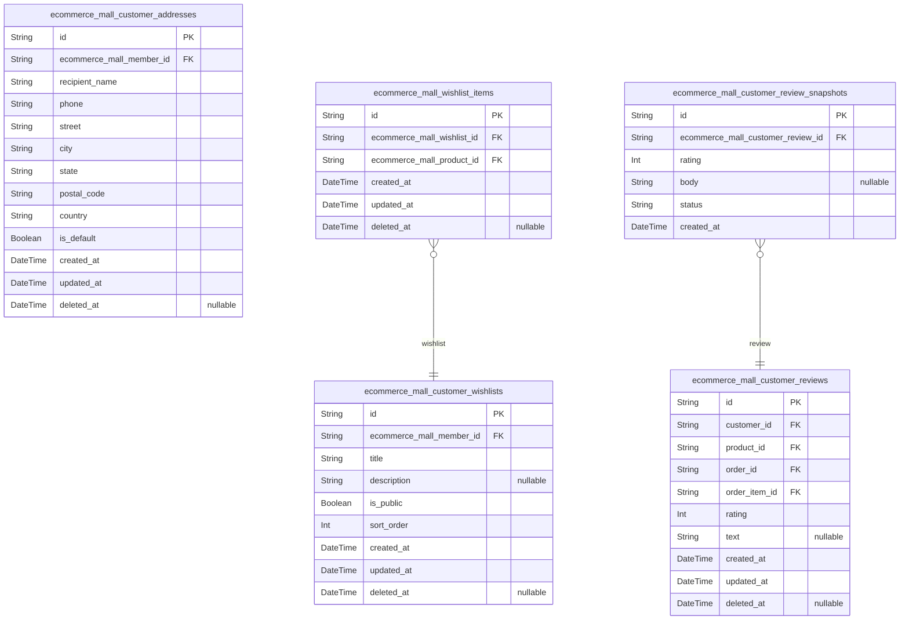
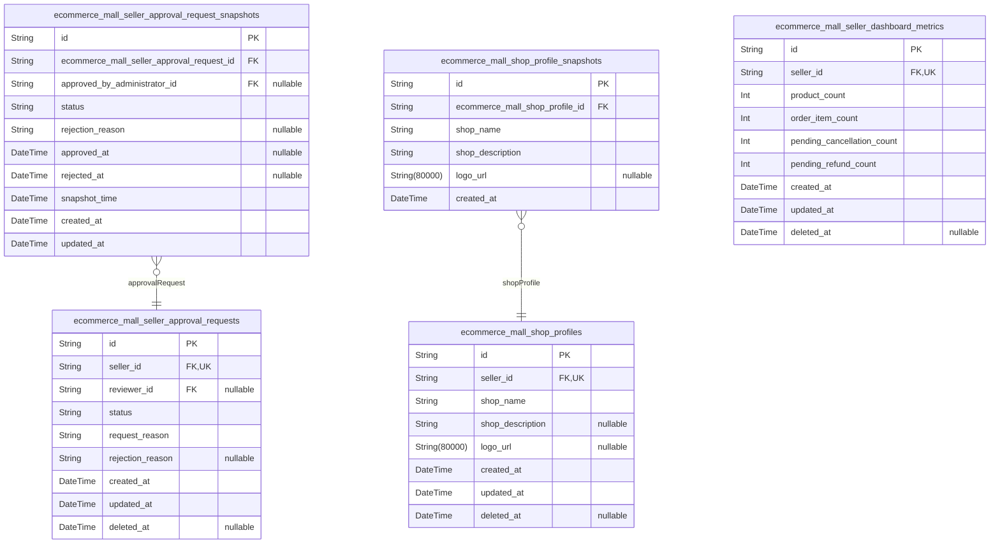
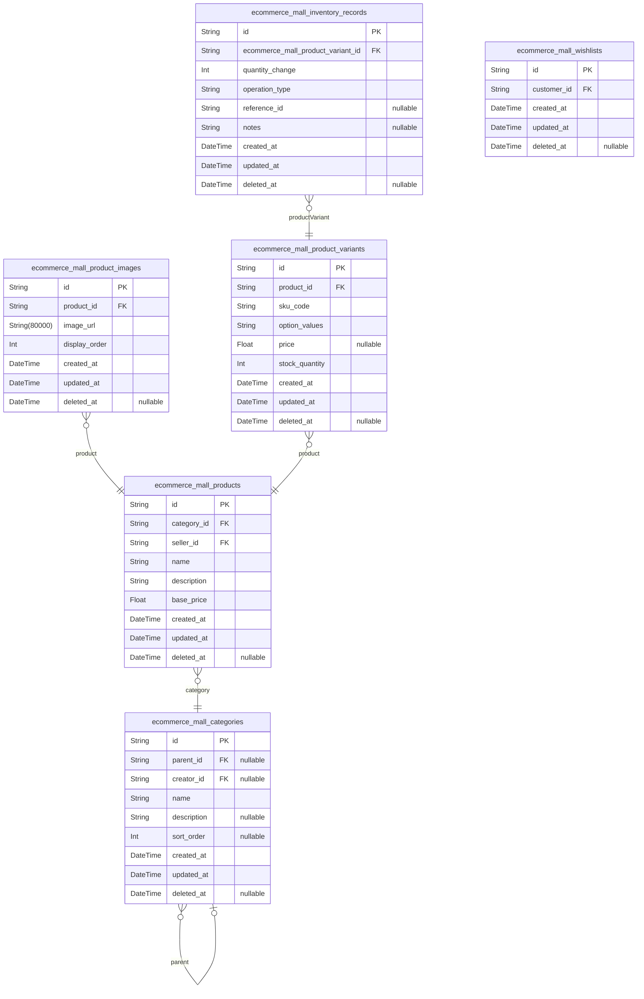
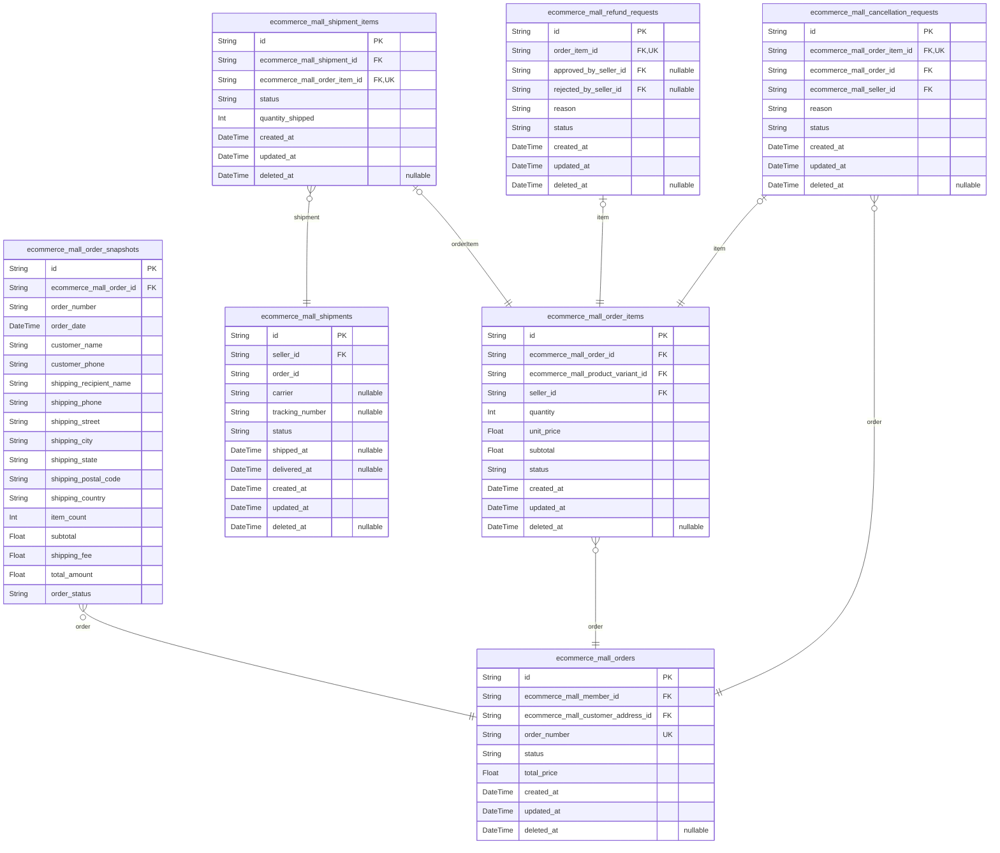
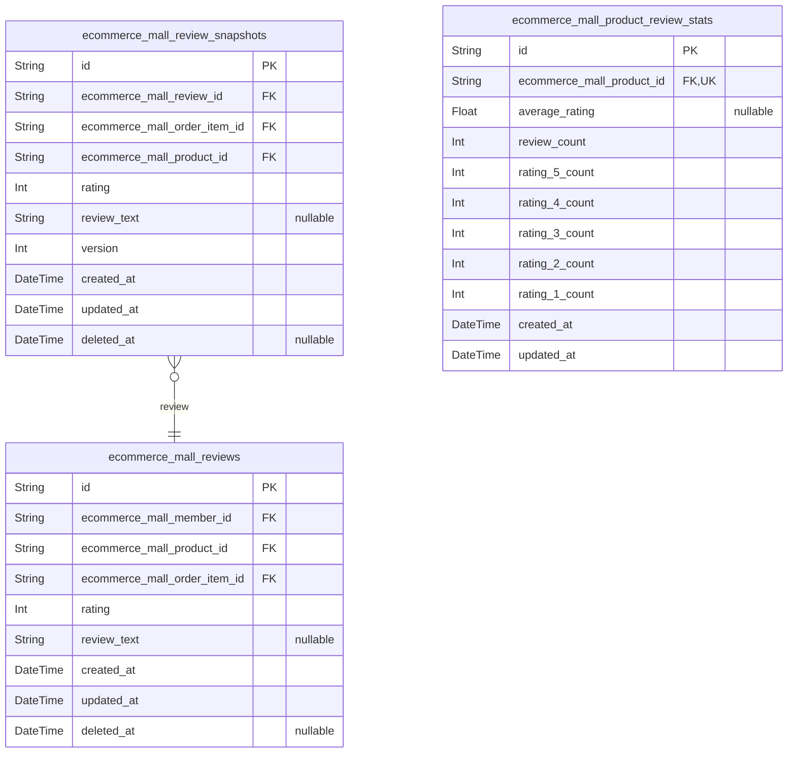
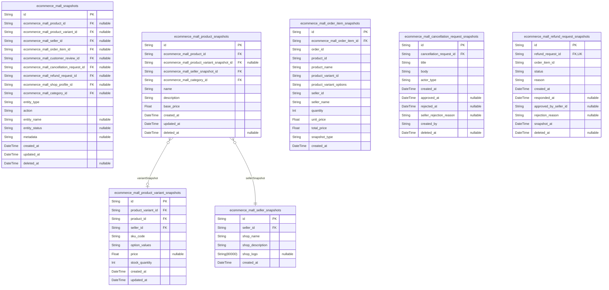

# Prisma Markdown

> Generated by [`prisma-markdown`](https://github.com/samchon/prisma-markdown)

- [authorization](#authorization)
- [customer](#customer)
- [seller](#seller)
- [product](#product)
- [order](#order)
- [review](#review)
- [snapshot](#snapshot)
- [admin](#admin)

## authorization

```mermaid
erDiagram
"ecommerce_mall_guests" {
  String id PK
  String fingerprint UK
  DateTime created_at
  DateTime updated_at
  DateTime deleted_at "nullable"
}
"ecommerce_mall_guest_sessions" {
  String id PK
  String ecommerce_mall_guest_id FK,UK
  String ip
  String(80000) href
  String(80000) referrer "nullable"
  DateTime created_at
  DateTime updated_at
  DateTime deleted_at "nullable"
  DateTime expired_at
}
"ecommerce_mall_members" {
  String id PK
  String email UK
  String password_hash
  String display_name "nullable"
  String phone_number "nullable"
  DateTime created_at
  DateTime updated_at
  DateTime deleted_at "nullable"
}
"ecommerce_mall_member_sessions" {
  String id PK
  String ecommerce_mall_member_id FK
  String access_token UK
  String refresh_token
  String ip
  String(80000) href "nullable"
  String(80000) referrer "nullable"
  DateTime created_at
  DateTime updated_at
  DateTime expired_at
}
"ecommerce_mall_member_password_resets" {
  String id PK
  String ecommerce_mall_member_id FK
  String email
  String token UK
  DateTime expires_at
  DateTime used_at "nullable"
  DateTime created_at
  DateTime updated_at
  DateTime deleted_at "nullable"
}
"ecommerce_mall_member_email_verifications" {
  String id PK
  String ecommerce_mall_member_id FK
  String token UK
  String email
  String status
  DateTime created_at
  DateTime updated_at
  DateTime used_at "nullable"
  DateTime expired_at
  DateTime deleted_at "nullable"
}
"ecommerce_mall_sellers" {
  String id PK
  String email UK
  String password_hash
  String display_name
  String approval_status
  String rejection_reason "nullable"
  Boolean is_suspended
  DateTime created_at
  DateTime updated_at
  DateTime deleted_at "nullable"
}
"ecommerce_mall_seller_sessions" {
  String id PK
  String ecommerce_mall_seller_id FK
  String access_token
  String refresh_token
  String ip
  String href
  String referrer
  DateTime created_at
  DateTime updated_at
  DateTime deleted_at "nullable"
  DateTime expired_at
}
"ecommerce_mall_seller_password_resets" {
  String id PK
  String seller_id FK
  String token UK
  DateTime expires_at
  DateTime used_at "nullable"
  DateTime created_at
  DateTime updated_at
  DateTime deleted_at "nullable"
}
"ecommerce_mall_seller_email_verifications" {
  String id PK
  String ecommerce_mall_seller_id FK
  String token
  String token_hash
  String email
  Boolean verified
  DateTime verified_at "nullable"
  DateTime expires_at
  DateTime created_at
  DateTime updated_at
  DateTime deleted_at "nullable"
}
"ecommerce_mall_administrators" {
  String id PK
  String email UK
  String password_hash
  String display_name
  String grade
  Boolean is_banned
  DateTime created_at
  DateTime updated_at
  DateTime deleted_at "nullable"
}
"ecommerce_mall_administrator_sessions" {
  String id PK
  String administrator_id FK
  String access_token
  String refresh_token
  String ip
  String(80000) href
  String(80000) referrer
  DateTime created_at
  DateTime updated_at
  DateTime deleted_at "nullable"
  DateTime expired_at
}
"ecommerce_mall_administrator_password_resets" {
  String id PK
  String administrator_id FK
  String token UK
  DateTime expires_at
  DateTime created_at
  DateTime updated_at
  DateTime deleted_at "nullable"
}
"ecommerce_mall_super_administrators" {
  String id PK
  String email UK
  String password_hash
  String display_name
  DateTime created_at
  DateTime updated_at
  DateTime deleted_at "nullable"
  DateTime banned_at "nullable"
}
"ecommerce_mall_super_administrator_sessions" {
  String id PK
  String ecommerce_mall_super_administrator_id FK
  String ip
  String href
  String referrer
  DateTime created_at
  DateTime expired_at
}
"ecommerce_mall_super_administrator_password_resets" {
  String id PK
  String ecommerce_mall_super_administrator_id FK,UK
  String token UK
  DateTime expired_at
  DateTime used_at "nullable"
  DateTime created_at
  DateTime updated_at
  DateTime deleted_at "nullable"
}
"ecommerce_mall_guest_sessions" |o--|| "ecommerce_mall_guests" : guest
"ecommerce_mall_member_sessions" }o--|| "ecommerce_mall_members" : member
"ecommerce_mall_member_password_resets" }o--|| "ecommerce_mall_members" : member
"ecommerce_mall_member_email_verifications" }o--|| "ecommerce_mall_members" : member
"ecommerce_mall_seller_sessions" }o--|| "ecommerce_mall_sellers" : seller
"ecommerce_mall_seller_password_resets" }o--|| "ecommerce_mall_sellers" : seller
"ecommerce_mall_seller_email_verifications" }o--|| "ecommerce_mall_sellers" : seller
"ecommerce_mall_administrator_sessions" }o--|| "ecommerce_mall_administrators" : administrator
"ecommerce_mall_administrator_password_resets" }o--|| "ecommerce_mall_administrators" : administrator
"ecommerce_mall_super_administrator_sessions" }o--|| "ecommerce_mall_super_administrators" : superAdministrator
"ecommerce_mall_super_administrator_password_resets" |o--|| "ecommerce_mall_super_administrators" : superAdministrator
```

### `ecommerce_mall_guests`

Temporary guest accounts identified by device fingerprint for
pre-registration browsing.

These lightweight accounts enable unauthenticated users to browse the
platform before completing registration. Each guest is uniquely
identified by a device fingerprint string that represents the user's
browser/device combination.

Guest accounts are managed automatically by the system and are removed
after registration or expiration. They maintain a reference to temporary
session tokens that enable brief platform access without full
authentication.

Properties as follows:

- `id`: Primary Key.
- `fingerprint`
  > Device fingerprint string uniquely identifying the guest's browser/device
  > combination for tracking without authentication.
- `created_at`: Timestamp when this guest account was created.
- `updated_at`: Timestamp of the last modification to this guest account.
- `deleted_at`: Timestamp when this guest account was soft deleted, if applicable.

### `ecommerce_mall_guest_sessions`

Temporary session tokens for guest browsing without authentication.

Tracks guest user sessions for analytics and session management purposes
without requiring registration or login. Each session has an expiration
time for security and data retention.

Properties as follows:

- `id`: Primary Key.
- `ecommerce_mall_guest_id`
  > References the guest account associated with this session.
  >
  > Establishes a 1:1 relationship where each guest can have at most one
  > active session at a time. Used to track which guest account a session
  > belongs to.
- `ip`: IP address of the client establishing the session.
- `href`: Current page URL when session was created.
- `referrer`: Referrer URL from previous page visit.
- `created_at`: Timestamp when the session was created.
- `updated_at`: Timestamp when the session was last updated.
- `deleted_at`: Timestamp when the session was soft-deleted.
- `expired_at`: Timestamp when the session expires and becomes invalid.

### `ecommerce_mall_members`

Customer accounts with email/password credentials and editable profile
information for the e-commerce platform.

Customers are authenticated members who can browse products, add items to
cart and wishlist, place orders, write reviews after delivery, and manage
their profile and shipping addresses. Each customer account requires
email verification before use and maintains a history of sessions and
password resets.

## Profile Fields

Customers can set a display name and phone number, both of which are
editable. When either profile field is modified, a snapshot record is
created in the [ecommerce_mall_customer_review_snapshots](#ecommerce_mall_customer_review_snapshots) audit
table to preserve the previous state for compliance and troubleshooting
purposes.

## Account Lifecycle

Customer accounts can be deleted by the account owner, but deletion is
prevented if the customer has active orders, pending cancellations, or
pending refunds. When a customer deletes their account, all related data
(addresses, wishlists, orders) is soft-deleted with a deletion timestamp
for potential recovery.

Properties as follows:

- `id`: Primary key for customer accounts.
- `email`
  > Unique email address used for customer login and communication.
  >
  > Customers must provide a valid email during registration. The email is
  > verified via an email verification token stored in {@link
  > ecommerce_mall_member_email_verifications} before the account becomes
  > fully active. Once verified, the email cannot be changed to prevent
  > account hijacking.
- `password_hash`
  > BCrypt-hashed password for customer authentication.
  >
  > Passwords are never stored in plain text. When a customer changes their
  > password via [ecommerce_mall_member_password_resets](#ecommerce_mall_member_password_resets), a new hash is
  > generated and stored here. The previous hash becomes invalid immediately
  > upon password update.
- `display_name`
  > Customer's public-facing name displayed on reviews and order
  > confirmations.
  >
  > Customers can update their display name through profile management. Each
  > modification creates an immutable snapshot record to preserve the name
  > history for audit purposes.
- `phone_number`
  > Customer's mobile phone number for order notifications and account
  > recovery.
  >
  > Customers can update their phone number through profile management. Each
  > modification creates an immutable snapshot record to preserve the phone
  > number history for audit purposes. The phone number is used for SMS
  > notifications during delivery and for account recovery via password
  > reset.
- `created_at`: Timestamp when the customer account was created.
- `updated_at`: Timestamp when the customer account profile was last updated.
- `deleted_at`
  > Soft delete timestamp for account removal.
  >
  > When a customer requests account deletion, this field is set to the
  > current timestamp. The account and all related data become inaccessible
  > for normal operations but can be recovered within the retention period
  > defined in [ecommerce_mall_data_retention_and_recovery](#ecommerce_mall_data_retention_and_recovery).

### `ecommerce_mall_member_sessions`

JWT session tokens with access and refresh support for customer
authentication. Tracks active login sessions for member customers,
enabling multi-device authentication and secure token rotation. Each
session represents a distinct login instance with its own expiration
timeline.

Properties as follows:

- `id`: Primary Key.
- `ecommerce_mall_member_id`
  > References the member customer who owns this authentication session. Each
  > session instance belongs to exactly one member, though members can
  > maintain multiple concurrent sessions across different devices or
  > browsers.
- `access_token`
  > JWT access token for API authentication. Used to verify user identity and
  > authorize requests. Token should be included in Authorization header.
- `refresh_token`
  > JWT refresh token for obtaining new access tokens without
  > re-authentication. Used when access token expires but session is still
  > valid.
- `ip`
  > Client IP address where the session was created. Used for security
  > auditing and detecting suspicious login activity.
- `href`
  > URL of the page the user was on when the session was created. Used for
  > tracking user navigation patterns.
- `referrer`
  > HTTP referrer header value from the login request. Used for analytics and
  > security tracking.
- `created_at`
  > Timestamp when the session was created (user logged in). Marks the
  > beginning of the session lifecycle.
- `updated_at`
  > Timestamp when the session was last updated. Updated when refresh token
  > is used or session metadata changes.
- `expired_at`
  > Timestamp when the session expires. Session is invalid after this time.
  > Critical for security - sessions must have expiration.

### `ecommerce_mall_member_password_resets`

Password reset tokens for customer account recovery, containing temporary
tokens with expiration to enable secure password reset functionality.

Token Management:

Each password reset request generates a unique token with an expiration
time. The token is used to verify password reset requests and can be
consumed only once. The email address is stored separately to enable
token lookup without requiring the token to be decrypted first, which
improves security.

Lifecycle:

Tokens are created when a customer requests a password reset. Once used,
the token is marked as consumed and cannot be reused. Expired tokens are
automatically invalid and should be cleaned up periodically. The table
supports soft delete for audit purposes.

Properties as follows:

- `id`: Primary Key.
- `ecommerce_mall_member_id`
  > References the customer account that requested the password reset.
  >
  > Allows tracking which customer initiated each reset request and enables
  > querying all reset tokens for a specific account.
- `email`
  > Email address associated with the password reset request.
  >
  > Stored separately from the member_id to enable token lookup without
  > requiring the member_id to be known first. This is useful when a user
  > requests a reset via email without being logged in.
- `token`
  > Unique password reset token.
  >
  > The actual token value that must be provided to complete the password
  > reset. Each token is unique and can only be used once. Tokens are hashed
  > for security.
- `expires_at`
  > Timestamp when the token expires and becomes invalid.
  >
  > Tokens are temporary credentials and must expire to prevent long-term
  > security risks. Expired tokens cannot be used for password reset.
- `used_at`
  > Timestamp when the token was successfully used for password reset.
  >
  > Once used, the token becomes invalid and cannot be reused. This field is
  > null when the token has not been used yet.
- `created_at`: Timestamp when the password reset token was created.
- `updated_at`: Timestamp when the password reset token record was last updated.
- `deleted_at`
  > Timestamp when the password reset token was soft deleted.
  >
  > Used for audit purposes. Records are soft deleted rather than hard
  > deleted to preserve audit trail.

### `ecommerce_mall_member_email_verifications`

Email verification tokens sent to customers during registration for
validating email ownership.

Tokens are single-use, expire after 24 hours, and are automatically
archived when used or expired. Each customer can have at most one active
verification token at a time. Upon successful verification, the token is
marked as used and archived.

Properties as follows:

- `id`: Primary Key.
- `ecommerce_mall_member_id`
  > References the customer account that needs email verification.
  >
  > Customers must verify their email before full account activation. Once
  > verified, the token is marked as used.
- `token`
  > Unique verification token sent to customer email.
  >
  > Tokens are randomly generated, single-use, and expire 24 hours after
  > creation. Used tokens are archived for audit purposes.
- `email`
  > Customer email address being verified.
  >
  > This is the email to which the verification token was sent. Used for
  > display and audit purposes.
- `status`
  > Current verification token status.
  >
  > Values: 'pending', 'used', 'expired', 'archived'. Tokens start as
  > 'pending', become 'used' upon successful verification, or 'expired' after
  > 24 hours.
- `created_at`: Token creation timestamp.
- `updated_at`: Token last update timestamp (e.g., when status changed).
- `used_at`
  > Timestamp when the token was used for email verification. Null if token
  > is still pending or expired.
- `expired_at`: Token expiration timestamp (24 hours after creation).
- `deleted_at`: Soft delete timestamp for archival purposes.

### `ecommerce_mall_sellers`

Seller accounts with email/password credentials and approval workflow
state for the e-commerce platform.

Sellers must register and receive administrator approval before they can
list products and fulfill orders. Each seller has a unique email address
for authentication and maintains an approval status that tracks their
onboarding progress through the platform.

Properties as follows:

- `id`: Primary key for seller account identification.
- `email`
  > Seller's unique email address used for authentication and communication.
  >
  > Must be unique across all seller accounts. Used as the primary identifier
  > for login and password recovery workflows.
- `password_hash`
  > BCrypt-hashed password for secure authentication.
  >
  > Never store plaintext passwords. Hash with BCrypt using minimum 12 cost
  > factor.
- `display_name`
  > Public-facing name shown to customers browsing products.
  >
  > Different from shop name. Used in order confirmations, reviews, and
  > product listings to identify the seller.
- `approval_status`
  > Current approval state in the seller onboarding workflow.
  >
  > Allowed values:
  > - `pending`: Registration submitted, awaiting administrator review
  > - `approved`: Approved to sell products and fulfill orders
  > - `rejected`: Application denied, can reapply after addressing issues
  >
  > Default value: "pending"
- `rejection_reason`
  > Administrator-provided reason when approval_status is "rejected".
  >
  > Explains why the seller application was denied. Only populated when
  > approval_status = "rejected". Can be edited by administrators.
- `is_suspended`
  > Whether the seller account is currently suspended by administrators.
  >
  > True when seller is banned from selling. Suspension is tracked separately
  > with timestamps and reasons in seller_suspensions table for audit
  > purposes.
- `created_at`: Timestamp when seller account was created.
- `updated_at`: Timestamp of last seller account update.
- `deleted_at`
  > Soft delete timestamp when seller account is deleted.
  >
  > When deleted_at is null, seller is active. When populated, seller is
  > soft-deleted and cannot authenticate.

### `ecommerce_mall_seller_sessions`

JWT session tokens with access and refresh support for seller
authentication.

Stores session information for sellers who have authenticated to the
platform. Each session is associated with a single seller and includes IP
address, URL, and referrer data for security auditing and session
management.

Properties as follows:

- `id`: Primary Key.
- `ecommerce_mall_seller_id`
  > Reference to the seller who owns this session.
  >
  > Establishes a 1:N relationship where a seller can have multiple active
  > sessions across different devices. The seller must be an authenticated
  > member with valid account status.
- `access_token`
  > JWT access token for authentication requests.
  >
  > Token is valid until expired_at timestamp and must be included in
  > Authorization header for authenticated API requests.
- `refresh_token`
  > JWT refresh token for obtaining new access tokens.
  >
  > Can be used to generate a new access_token without re-authenticating.
  > Also subject to expired_at constraint.
- `ip`
  > IP address of the client device making the login request.
  >
  > Used for security auditing and to detect suspicious login activity from
  > unusual locations.
- `href`
  > Original URL from the request that initiated the session.
  >
  > Captures the landing page or action that triggered authentication for
  > session analysis.
- `referrer`
  > Referrer URL from the client request headers.
  >
  > Provides context about the source page or external site that directed the
  > user to the authentication flow.
- `created_at`
  > Session creation timestamp in UTC.
  >
  > Marks when the seller successfully authenticated and the session was
  > established.
- `updated_at`
  > Last update timestamp in UTC.
  >
  > Tracks the most recent modification to the session record.
- `deleted_at`
  > Soft delete timestamp in UTC for session cleanup.
  >
  > Nullable - null when session is active, set when session is revoked or
  > expired.
- `expired_at`
  > Session expiration timestamp in UTC.
  >
  > Session becomes invalid after this timestamp. Access tokens should be
  > refreshed before expiration.

### `ecommerce_mall_seller_password_resets`

Password reset tokens for seller account recovery with expiration and
one-time use validation.

This table stores temporary tokens generated when sellers request
password resets. Each token is unique, time-limited, and can only be used
once to ensure account security during the recovery process.

## Token Security

Tokens are cryptographically secure random strings that:
- Expire after a short period (typically 1-24 hours)
- Can only be used once, then become invalid
- Are uniquely indexed to prevent duplicates
- Have full audit trail via created_at/updated_at/deleted_at

## Relationship to Seller

Each password reset token is associated with exactly one seller account.
Sellers can have multiple password reset requests in their history.

Properties as follows:

- `id`: Primary Key.
- `seller_id`
  > References the seller account requesting password reset.
  >
  > Establishes the relationship between password reset tokens and seller
  > accounts. A seller can have multiple password reset requests in their
  > history.
- `token`
  > Cryptographically secure random token for password reset.
  >
  > A unique random string generated for each reset request. This token is
  > sent to the seller via email and must match for password reset to
  > proceed.
- `expires_at`
  > Token expiration timestamp for security.
  >
  > Defines when this password reset token becomes invalid. Tokens should
  > expire after a short period to minimize security risks.
- `used_at`
  > Timestamp when this token was successfully used for password reset.
  >
  > Set when the password reset is completed. Once used, the token becomes
  > invalid and cannot be reused.
- `created_at`: Record creation timestamp.
- `updated_at`: Record last update timestamp.
- `deleted_at`: Soft delete timestamp for audit trail.

### `ecommerce_mall_seller_email_verifications`

Email verification tokens for seller registration validation and account
activation.

Stores one-time verification tokens sent to sellers' email addresses
during the registration process. Each token is associated with a seller
account and expires after a configurable time period. Tokens are
validated once during email verification and then soft-deleted to prevent
reuse.

Purpose:

- Validate seller email ownership during registration
- Provide secure one-time verification mechanism
- Support seller account activation workflow

Lifecycle:

Token is created when seller submits registration with email. The token
is sent to the email address. When seller clicks the verification link,
the token is validated and the seller account is activated. The token is
then soft-deleted. If the token expires before use, it is also
soft-deleted.

Properties as follows:

- `id`: Primary key for email verification token record.
- `ecommerce_mall_seller_id`
  > Reference to the seller account that owns this email verification token.
  >
  > Links to the seller account being registered. The token cannot be used to
  > verify a different seller account.
- `token`
  > Unique verification token string sent via email.
  >
  > This is a cryptographically secure random string that validates the
  > verification request. The token should be hashed before storage for
  > security.
- `token_hash`
  > Hashed version of the verification token for secure comparison.
  >
  > The actual token is hashed (e.g., using SHA-256) before storage. The
  > plaintext token is only sent in the email and verified by comparing the
  > hash.
- `email`
  > Email address that needs verification.
  >
  > This is the seller's email address provided during registration. The
  > verification token is sent to this address.
- `verified`
  > Flag indicating whether the email has been verified.
  >
  > True when the token has been successfully used for verification. False
  > when the token is still valid and waiting to be used.
- `verified_at`
  > Timestamp when the email was verified.
  >
  > Null if not yet verified. Populated when the token is successfully
  > validated.
- `expires_at`
  > Expiration timestamp for the verification token.
  >
  > Tokens expire after a configurable period (e.g., 24 hours) for security.
  > Expired tokens cannot be used for verification.
- `created_at`
  > Record creation timestamp.
  >
  > When the email verification token record was created.
- `updated_at`
  > Record update timestamp.
  >
  > When the email verification token record was last modified.
- `deleted_at`
  > Soft delete timestamp.
  >
  > Null when the record is active. Populated when the record is soft-deleted
  > after verification or expiration.

### `ecommerce_mall_administrators`

Platform administrator accounts with email/password credentials and grade
classification for role-based access control.

Authentication & Identity

Each administrator has a unique email address and password hash for
secure authentication. The display_name field provides a public-facing
identifier shown in admin dashboards and system logs.

Grade Classification

Administrators are classified into two grades: 'regular' for standard
platform oversight duties, and 'super' for elevated privileges including
administrator management and grade promotion/demotion capabilities. Super
administrators cannot demote themselves.

Account Management

The is_banned flag tracks account suspension status. Soft delete via
deleted_at enables reversible account removal. Temporal fields
(created_at, updated_at) support audit trails and lifecycle tracking.

Properties as follows:

- `id`: Primary Key.
- `email`
  > Unique email address for administrator authentication and communication.
  > Used for login, password resets, and system notifications.
- `password_hash`
  > Bcrypt hashed password for secure authentication. Never stored in
  > plaintext.
- `display_name`
  > Public-facing name displayed in admin dashboard, system logs, and audit
  > trails. Used to identify administrators in user-facing contexts.
- `grade`
  > Administrator grade classification. Values: 'regular' for standard admin
  > access with seller/category/product/order/user oversight, 'super' for
  > elevated privileges including administrator management and grade
  > promotion/demotion capabilities. Super administrators cannot demote
  > themselves.
- `is_banned`
  > Indicates whether the administrator account is currently banned from
  > platform access. When true, the administrator cannot authenticate or
  > perform any administrative actions.
- `created_at`: Timestamp when the administrator account was created.
- `updated_at`
  > Timestamp of the last administrator account modification. Updated on
  > every profile change.
- `deleted_at`
  > Timestamp for soft delete. Null when account is active, set when account
  > is deleted to preserve audit trail without permanent removal.

### `ecommerce_mall_administrator_sessions`

JWT session tokens with access and refresh support for administrator
authentication.

This table records all active and expired authentication sessions for
platform administrators. Each session represents a unique login event
with cryptographic token credentials that grant administrative access to
the system.

The table maintains complete session history for security auditing,
including connection metadata such as originating IP address, requested
URL, and HTTP referrer. Sessions have explicit expiration timestamps to
enforce automatic logout and prevent indefinite access.

Properties as follows:

- `id`: Primary Key.
- `administrator_id`
  > References the administrator account that created this session.
  >
  > A session always belongs to exactly one administrator account. This
  > foreign key enforces that only administrators with valid accounts can
  > generate authentication sessions. The relationship is non-nullable,
  > meaning every session must be associated with an administrator.
- `access_token`
  > JWT access token for API authentication.
  >
  > Cryptographic token issued upon successful login. Used for authenticating
  > administrative requests to protected API endpoints. Tokens are
  > short-lived for security and should be refreshed before expiration.
- `refresh_token`
  > JWT refresh token for obtaining new access tokens.
  >
  > Cryptographic token that allows administrators to obtain new access
  > tokens without re-authenticating. Longer-lived than access tokens but
  > still has expiration. Compromised refresh tokens should be revoked by
  > deleting the session record.
- `ip`
  > IP address of the client that initiated the session.
  >
  > Captures the originating IP address for security auditing and abuse
  > detection. Used to identify multiple sessions from the same location and
  > detect suspicious access patterns.
- `href`
  > URL of the page where the login request originated.
  >
  > Stores the requested URL path for tracking administrative access patterns
  > and debugging access issues.
- `referrer`
  > HTTP referrer header value from the login request.
  >
  > Captures the previous page URL for security analysis and to understand
  > user navigation flow before authentication.
- `created_at`
  > Timestamp when the session was created.
  >
  > Records the exact moment the administrator successfully authenticated and
  > the session token was generated. Used for session age calculations and
  > identifying old or stale sessions.
- `updated_at`
  > Timestamp of the last session update.
  >
  > Currently mirrors created_at for simplicity. May be updated if session
  > metadata changes during the session lifetime.
- `deleted_at`
  > Timestamp when the session was logically deleted or expired.
  >
  > Nullable soft-delete marker. When a session expires or is revoked by the
  > administrator, this field is populated with the deletion timestamp while
  > preserving the record for audit purposes.
- `expired_at`
  > Timestamp when the session expires and becomes invalid.
  >
  > Defines the session lifetime. Sessions expire automatically after this
  > timestamp, requiring re-authentication. Never null by default as expired
  > sessions lose all access privileges.

### `ecommerce_mall_administrator_password_resets`

Password reset tokens with expiration for administrator account recovery.

Stores temporary authentication tokens generated when an administrator
requests password reset. Each token is valid for a limited time and can
be used once to reset the administrator's password. Tokens are
soft-deleted after successful redemption or expiration for audit trail.

Properties as follows:

- `id`: Primary Key.
- `administrator_id`
  > References the administrator account requesting password reset.
  >
  > Establishes 1:N relationship where one administrator can have multiple
  > password reset tokens over time (for audit trail of password reset
  > requests).
- `token`
  > Unique password reset token string generated for this reset request.
  >
  > Token is used to validate password reset requests. Should be
  > cryptographically secure (UUID or random string). Application marks token
  > as used after successful redemption.
- `expires_at`
  > Timestamp when this password reset token expires.
  >
  > Tokens are typically valid for 1 hour from creation. After expiration,
  > token becomes invalid and administrator must request new reset token.
- `created_at`: Timestamp when this password reset token record was created.
- `updated_at`: Timestamp when this password reset token record was last updated.
- `deleted_at`
  > Timestamp when this password reset token was soft-deleted.
  >
  > Null when token is active. Set when token is redeemed, expired, or
  > manually revoked.

### `ecommerce_mall_super_administrators`

Super administrator accounts with highest privilege access and
email/password credentials for platform oversight operations.

---

**Authentication & Identity**

Super administrators authenticate using email and password credentials,
identical to other actor types but with elevated permissions. The email
address serves as the unique account identifier for login and password
reset operations. Passwords are stored as secure hashes.

**Profile & Display**

Each super administrator has a display name that appears in platform
records, including admin action logs, approval decisions, and seller
communications. This name distinguishes the administrator from their
email address when viewing administrative actions.

**Account Status**

Accounts support soft deletion via deleted_at for record preservation.
The banned_at field tracks administrative bans when necessary, with
removal indicating unban. Account creation and updates are tracked
through standard temporal fields.

Properties as follows:

- `id`: Primary Key.
- `email`
  > Email address used as the unique account identifier for login and
  > authentication.
  >
  > The email is required for super administrator account access and must be
  > provided during registration. It serves as the primary means of
  > identifying the account for login, password recovery, and platform
  > communications.
- `password_hash`
  > Securely hashed password for authentication.
  >
  > This field stores the password in hashed form using a secure hashing
  > algorithm. The hash is created during registration and password changes,
  > and is used to verify the password during login. The original password is
  > never stored.
- `display_name`
  > The name displayed to other users when the super administrator performs
  > actions on the platform.
  >
  > This name appears in administrative action logs, approval/rejection
  > decisions, and seller communications. It serves as the public-facing
  > identity of the super administrator separate from their email address.
- `created_at`
  > Timestamp when the super administrator account was created.
  >
  > This field records the exact moment the account was registered and
  > becomes effective for platform access.
- `updated_at`
  > Timestamp when the super administrator account was last updated.
  >
  > This field is updated on every account modification including profile
  > changes, password updates, and status changes.
- `deleted_at`
  > Timestamp when the super administrator account was soft-deleted.
  >
  > When set, this indicates the account has been marked for deletion but
  > preserved for audit and compliance purposes. A null value indicates the
  > account is active.
- `banned_at`
  > Timestamp when the super administrator account was banned by platform
  > action.
  >
  > When set, this indicates the account has been suspended from performing
  > administrative actions. The ban can be lifted by setting this field to
  > null (unban). This field is managed by the {@link
  > ecommerce_mall_user_bans} table.

### `ecommerce_mall_super_administrator_sessions`

JWT session tokens with access and refresh support for super
administrator authentication.

Each session represents a logged-in super administrator with their
authentication context including IP address, browsing context (href), and
source referrer. Sessions are append-only audit records managed
automatically by the authentication flow and naturally expire via the
expired_at field.

Properties as follows:

- `id`: Primary Key.
- `ecommerce_mall_super_administrator_id`
  > References the super administrator who created this session.
  >
  > This foreign key establishes the ownership relationship between the
  > session and its parent [ecommerce_mall_super_administrators](#ecommerce_mall_super_administrators) actor.
  > Each session belongs to exactly one super administrator and cannot exist
  > independently.
- `ip`
  > IP address of the client that created this session.
  >
  > Captures the network address for security auditing and anomaly detection.
  > Useful for identifying suspicious login patterns or unauthorized access
  > attempts from unexpected locations.
- `href`
  > URL path of the page where login occurred.
  >
  > Records the browsing context at the time of authentication for audit
  > trail purposes. Helps trace user activity flow and understand entry
  > points to the system.
- `referrer`
  > Referrer URL from the login request.
  >
  > Captures the source page or external link that directed the user to the
  > login page. Useful for analytics and security monitoring.
- `created_at`
  > Timestamp when this session was created.
  >
  > Marks the moment of successful authentication. Used for session age
  > calculations, audit trail, and identifying the earliest active session
  > for a super administrator.
- `expired_at`
  > Timestamp when this session expires and becomes invalid.
  >
  > Defines the JWT token expiration boundary for security. Sessions are
  > automatically considered invalid after this time and require
  > re-authentication. Never NULL for security reasons.

### `ecommerce_mall_super_administrator_password_resets`

Password reset tokens with expiration for super administrator account
recovery.

Stores secure, single-use tokens that enable super administrators to
reset their passwords when authentication credentials are compromised or
forgotten. Each token is bound to a specific super administrator account
and expires after a defined period for security.

Properties as follows:

- `id`: Primary Key.
- `ecommerce_mall_super_administrator_id`
  > References the super administrator account requesting password reset.
  >
  > Establishes a 1:1 relationship where each password reset token is
  > associated with exactly one super administrator. The super administrator
  > table never holds foreign keys to this table, maintaining proper FK
  > direction from child to parent.
- `token`
  > Secure, random token string for password reset authentication.
  >
  > A cryptographically secure random string that serves as proof of identity
  > for password reset requests. The token is single-use and invalidated
  > after successful use or expiration.
- `expired_at`
  > Timestamp when this password reset token expires.
  >
  > Tokens expire after a fixed period (typically 1 hour) to prevent
  > unauthorized long-term access. The token becomes invalid after this
  > timestamp.
- `used_at`
  > Timestamp when this token was used for password reset.
  >
  > Records when the token successfully validated a password reset request.
  > Used for audit trail and to confirm single-use policy. Null if token has
  > not been used yet.
- `created_at`: Timestamp when this password reset token was created.
- `updated_at`: Timestamp when this record was last updated.
- `deleted_at`: Timestamp when this record was soft-deleted.

## customer

### `ecommerce_mall_customer_addresses`

Customer shipping addresses with recipient details and default selection.

Each customer can maintain multiple shipping addresses. One address can
be marked as default for convenient checkout. Addresses are soft-deleted
to preserve historical order data.

Properties as follows:

- `id`: Primary Key.
- `ecommerce_mall_member_id`
  > Reference to the customer who owns this address.
  >
  > Addresses cannot exist without a customer. Each address belongs to
  > exactly one customer.
- `recipient_name`: Name of the person who will receive the package.
- `phone`: Phone number of the recipient for delivery contact.
- `street`: Street address including building number and street name.
- `city`: City or municipality name.
- `state`: State, province, or region name.
- `postal_code`: Postal or ZIP code for the address.
- `country`: Country name or ISO country code.
- `is_default`
  > Whether this is the customer's default shipping address. Only one address
  > per customer can be default.
- `created_at`: Timestamp when this address was created.
- `updated_at`: Timestamp when this address was last modified.
- `deleted_at`: Timestamp when this address was soft-deleted. NULL means active.

### `ecommerce_mall_customer_wishlists`

Customer wishlists for saving and organizing desired products across
multiple collections.

Stores individual wishlist entities that customers create to organize
products they want to purchase. Each customer can have multiple wishlists
(e.g., 'Gift Ideas', 'Birthday List', 'Future Purchases') with custom
titles and descriptions. Wishlist items are stored in the
ecommerce_mall_wishlist_items junction table, maintaining a many-to-many
relationship between customers and products through this wishlist entity.

Properties as follows:

- `id`: Primary Key.
- `ecommerce_mall_member_id`
  > Customer account that owns this wishlist.
  >
  > References the member account that created and manages this wishlist.
  > Each customer can own multiple wishlists.
- `title`
  > Display name of the wishlist.
  >
  > Short title shown in the customer's wishlist list. Unique per customer to
  > allow organization into multiple named wishlists.
- `description`
  > Optional detailed description of the wishlist purpose.
  >
  > Allows customers to provide context about the wishlist (e.g., 'Christmas
  > gifts for family', 'Birthday presents').
- `is_public`
  > Whether the wishlist is visible to other users.
  >
  > When true, the wishlist can be shared and viewed by other customers. When
  > false, only the owner can access it.
- `sort_order`
  > Display order priority among the customer's wishlists.
  >
  > Lower numbers appear first in the customer's wishlist list. Used for
  > custom ordering.
- `created_at`
  > Timestamp when the wishlist was created.
  >
  > Immutable creation timestamp recorded at insert time.
- `updated_at`
  > Timestamp when the wishlist was last modified.
  >
  > Updated on title, description, or is_public changes. Always newer than
  > created_at.
- `deleted_at`
  > Soft delete timestamp for wishlist removal.
  >
  > Nullable until deleted. When set, indicates the wishlist is soft-deleted
  > but data is preserved.

### `ecommerce_mall_wishlist_items`

Junction table linking customer wishlists to products (many-to-many
relationship).

This table enables customers to add products to their wishlists. Each row
represents one product in one customer's wishlist. The composite unique
constraint ensures a product can only appear once per wishlist.

**Relationships:**
- Belongs to one customer wishlist via {@link
ecommerce_mall_customer_wishlists}
- References one product via [ecommerce_mall_products](#ecommerce_mall_products)
- Managed through the parent wishlist entity

Properties as follows:

- `id`: Primary Key.
- `ecommerce_mall_wishlist_id`
  > Foreign key reference to the customer's wishlist that owns this item.
  >
  > Each wishlist item belongs to exactly one wishlist. The relationship is
  > non-optional as items cannot exist without a parent wishlist.
- `ecommerce_mall_product_id`
  > Foreign key reference to the product that is wishlisted.
  >
  > Points to the core product entity. Allows fetching product details (name,
  > price, images) for wishlist display. The product may exist independently
  > of the wishlist.
- `created_at`
  > Timestamp when this wishlist item was added. Automatically set by
  > database on insert.
- `updated_at`
  > Timestamp of the last modification to this wishlist item. Updated on any
  > change.
- `deleted_at`
  > Soft delete timestamp. NULL when active, set when item is removed from
  > wishlist.

### `ecommerce_mall_customer_reviews`

Customer product reviews with ratings and text after delivery.

This table stores customer product reviews that can only be written after
the purchased item has been delivered. Each customer is limited to one
review per product per order to ensure reviews are tied to actual
purchases and prevent review spam.

Properties as follows:

- `id`: Primary Key.
- `customer_id`
  > References the {ecommerce_mall_members} account that wrote this review.
  >
  > Ensures ownership tracking and enables customer-specific review
  > management including edit and delete operations.
- `product_id`
  > References the {ecommerce_mall_products} that is being reviewed.
  >
  > Enables product-level review aggregation and display on product detail
  > pages. Used to calculate average ratings from non-deleted reviews.
- `order_id`
  > References the {ecommerce_mall_orders} that contains this reviewed order
  > item.
  >
  > Used to enforce the one-review-per-product-per-order constraint and
  > verify order completion status.
- `order_item_id`
  > References the specific {ecommerce_mall_order_items} that was delivered
  > and reviewed.
  >
  > Required to verify the item has delivered status before allowing review
  > creation. Enables tracking of which purchase was reviewed.
- `rating`
  > Customer rating from 1 to 5 stars.
  >
  > Required field representing the numeric rating given to the product. Used
  > to calculate average ratings across all non-deleted reviews for a
  > product.
- `text`
  > Optional written review text from the customer.
  >
  > Customer's detailed feedback about the product experience. Can be null
  > for ratings without written comments.
- `created_at`
  > Timestamp when the review was created.
  >
  > Immutable creation timestamp for audit and sorting purposes.
- `updated_at`
  > Timestamp of the last review modification.
  >
  > Tracks when the review was last edited for audit trail purposes.
- `deleted_at`
  > Soft delete timestamp for review removal.
  >
  > When null, the review is active. When set, the review is deleted but
  > preserved in snapshots for audit purposes. Used to filter out deleted
  > reviews from average calculations.

### `ecommerce_mall_customer_review_snapshots`

Immutable audit snapshots of customer review modifications preserving
review state at each edit point for compliance and transparency.

### Audit Trail

Each snapshot captures the complete mutable state of a review when it is
modified, creating an immutable historical record. The main {@link
ecommerce_mall_customer_reviews} table holds the current review state,
while this snapshot table maintains a chronological history of all
changes.

### Snapshot Content

Every snapshot includes the review's rating value, review body text, and
status flag as they existed at the moment of modification. This enables
tracking when ratings changed, what review text was displayed during
specific periods, and the evolution of review deletion states.

### Use Cases

- Compliance verification for review moderation history
- Dispute resolution with full modification timeline
- Product owner insights into how customer feedback evolved
- Audit requirements for platform transparency

Properties as follows:

- `id`: Primary Key.
- `ecommerce_mall_customer_review_id`
  > Reference to the main customer review that this snapshot represents.
  >
  > Each snapshot is tied to exactly one review in the {@link
  > ecommerce_mall_customer_reviews} table. The relationship enables
  > retrieving the complete modification history for a specific review by
  > querying all snapshots with the same review_id ordered by created_at.
- `rating`
  > Review rating value (1-5 scale) at the time this snapshot was created.
  >
  > Captures the customer's star rating as it existed during this version of
  > the review. Changes to the rating over time are preserved as separate
  > snapshot records, enabling historical rating analysis.
- `body`
  > Review text content at the time this snapshot was created.
  >
  > Stores the customer's written feedback as it existed when this snapshot
  > was captured. Multiple snapshots may have different body text reflecting
  > review edits made by the customer over time.
- `status`
  > Review status (active/deleted) at the time this snapshot was created.
  >
  > Records whether the review was active or deleted when this snapshot was
  > generated. This is essential for audit compliance as it preserves the
  > state even if the main review is later modified or the status changes
  > again.
- `created_at`
  > Timestamp when this snapshot was created, representing the point-in-time
  > of the review state.
  >
  > Always set automatically by the database when the snapshot record is
  > inserted. Never updated or deleted as snapshots are immutable audit
  > records.

## seller

### `ecommerce_mall_seller_approval_requests`

Seller registration approval requests requiring administrator review
before selling is allowed.

Each seller can have one active approval request. The request is reviewed
by an administrator who can approve or reject it. Rejected sellers can
submit a new request after making changes.

The approval status controls whether a seller can begin listing products
and fulfilling orders on the platform.

Properties as follows:

- `id`: Primary Key.
- `seller_id`
  > References the seller who submitted this approval request.
  >
  > A seller can have only one active approval request at a time. If a
  > request is rejected, the seller can submit a new request. Approved or
  > deleted requests cannot be reused.
- `reviewer_id`
  > References the administrator who reviewed and acted on this approval
  > request.
  >
  > Set to null when status is 'pending'. Updated to the administrator ID
  > when status changes to 'approved' or 'rejected'.
- `status`
  > Current approval status of the request.
  >
  > - pending: awaiting administrator review
  > - approved: seller is approved and can start selling
  > - rejected: request was rejected, seller must reapply
- `request_reason`
  > Reason provided by seller for wanting to join the platform.
  >
  > This helps administrators understand the seller's business intent and
  > evaluate their suitability.
- `rejection_reason`
  > Reason for rejection if the request was denied.
  >
  > Provided to the seller so they understand what needs improvement before
  > resubmitting.
- `created_at`: Timestamp when this approval request was created.
- `updated_at`: Timestamp of the last update to this record.
- `deleted_at`
  > Timestamp when this record was soft-deleted.
  >
  > Set when the record is marked as deleted but not permanently removed.

### `ecommerce_mall_seller_approval_request_snapshots`

Point-in-time snapshots of seller approval request status changes for
audit trail.

This table captures immutable records of seller approval request states
at specific moments, enabling full audit history of approval workflow
decisions including pending, approved, and rejected statuses. Each
modification to the parent
[`ecommerce_mall_seller_approval_request`](ecommerce_mall_seller_approval_request)
creates a new snapshot record preserving the exact values at that time.

### Snapshot Fields

- **id**: Primary key for snapshot record
- **ecommerce_mall_seller_approval_request_id**: Reference to the
approval request being snapshot
- **status**: Current approval status (pending/approved/rejected)
- **rejection_reason**: Reason if status is rejected
- **approved_by_administrator_id**: Reference to administrator who approved
- **approved_at**: Timestamp of approval decision
- **rejected_at**: Timestamp of rejection decision
- **snapshot_time**: When this snapshot state was captured

Properties as follows:

- `id`: Primary Key.
- `ecommerce_mall_seller_approval_request_id`
  > Reference to the seller approval request whose state is being captured in
  > this snapshot.
  >
  > Establishes a many-to-one relationship from snapshot back to the source
  > approval request. Each snapshot uniquely corresponds to one approval
  > request's state at a specific point in time.
- `approved_by_administrator_id`
  > Reference to the administrator who approved this seller approval request,
  > if applicable.
  >
  > Populated only when approval status changes to approved. Links the
  > snapshot to the administrator entity that made the approval decision.
- `status`
  > Current approval status of the seller request.
  >
  > Allowed values: pending, approved, rejected. This field captures the
  > status state at the time this snapshot was created.
- `rejection_reason`
  > Reason for rejection if the approval status is rejected.
  >
  > Only populated when status is 'rejected'. Null otherwise.
- `approved_at`
  > Timestamp when the approval decision was made (if approved).
  >
  > Populated only when status is 'approved'. Null otherwise.
- `rejected_at`
  > Timestamp when the rejection decision was made (if rejected).
  >
  > Populated only when status is 'rejected'. Null otherwise.
- `snapshot_time`
  > When this snapshot state was captured.
  >
  > Typically identical to the updated_at of the source approval request at
  > time of snapshot creation.
- `created_at`
  > Record creation timestamp.
  >
  > Automatically set when this snapshot record is inserted.
- `updated_at`
  > Record last update timestamp.
  >
  > Automatically updated on every modification to this record.

### `ecommerce_mall_shop_profiles`

Shop profile containing shop name, description, and logo image for seller
public identity.

Each seller has exactly one shop profile that serves as their public
business identity. Sellers can update profile fields which triggers
snapshot creation in the snapshot component for audit trail. The logo is
stored as a URI reference.

Properties as follows:

- `id`: Primary Key.
- `seller_id`
  > References the seller who owns this shop profile. Each seller can have
  > exactly one active shop profile, enforced by unique constraint.
- `shop_name`: Name of the seller's shop displayed to customers.
- `shop_description`: Detailed description of the shop's business, products, and policies.
- `logo_url`: URL reference to the shop's logo image file.
- `created_at`: Timestamp when the shop profile was created.
- `updated_at`: Timestamp when the shop profile was last updated.
- `deleted_at`: Timestamp when the shop profile was soft-deleted. Null if still active.

### `ecommerce_mall_shop_profile_snapshots`

Immutable audit records of shop profile modifications preserving previous
state on each edit.

This snapshot table captures point-in-time versions of {link
ecommerce_mall_shop_profiles} when the shop name, shop description, or
logo image is modified. Each modification event creates a new immutable
snapshot record that preserves the exact values at that moment, enabling
audit trails, change history review, and comparison across time.

Snapshots are created automatically whenever the seller updates their
shop profile through the shop profile management interface. The snapshot
includes the shop name, shop description, and logo URL as they existed at
the time of modification, along with a timestamp marking when the
snapshot was created.

Because snapshots represent permanent audit records, they are never
soft-deleted. The snapshot history for a shop profile grows over time as
the seller continues to modify their shop profile attributes.

Properties as follows:

- `id`: Primary Key.
- `ecommerce_mall_shop_profile_id`
  > References the shop profile that this snapshot belongs to.
  >
  > This foreign key establishes the relationship between the snapshot record
  > and the {link ecommerce_mall_shop_profiles} table. A shop profile can
  > have multiple snapshots over time, creating a one-to-many relationship
  > where each snapshot represents a different version of the shop profile
  > state.
- `shop_name`
  > Shop name at the time this snapshot was created.
  >
  > The shop name is the public-facing name that appears on all products,
  > order confirmations, and customer-facing pages. This field captures the
  > exact value of the shop name as it existed when the snapshot was created,
  > regardless of subsequent modifications.
- `shop_description`
  > Shop description at the time this snapshot was created.
  >
  > The shop description provides background information about the seller's
  > business, products, or policies. This field preserves the description
  > text exactly as it was written when the snapshot was recorded.
- `logo_url`
  > Logo image URL at the time this snapshot was created.
  >
  > The logo image is a visual representation of the seller's brand that
  > appears in product listings, seller profiles, and order-related
  > communications. This field stores the logo URL value as it existed when
  > the snapshot was created, allowing historical review of logo changes over
  > time.
- `created_at`
  > Timestamp when this snapshot was created.
  >
  > This datetime field records the exact moment when a shop profile
  > modification occurred and the snapshot was generated. Snapshots are
  > ordered by this timestamp to show the chronological history of shop
  > profile changes.

### `ecommerce_mall_seller_dashboard_metrics`

Seller dashboard metrics aggregating product counts, order counts, and
pending requests for reporting.

This table provides summary statistics that sellers can view on their
dashboard to understand their business performance at a glance. Metrics
are calculated from related entities (products, order_items,
cancellation_requests, refund_requests) and updated when those records
change.

Properties as follows:

- `id`: Primary Key.
- `seller_id`
  > Reference to the seller account this metric record belongs to.
  >
  > Each seller has exactly one dashboard metrics record. Foreign key
  > relationship to [ecommerce_mall_sellers](#ecommerce_mall_sellers).
- `product_count`
  > Total number of products listed by this seller.
  >
  > Count of active products in [ecommerce_mall_products](#ecommerce_mall_products) where
  > seller_id matches.
- `order_item_count`
  > Total number of order items purchased from this seller.
  >
  > Count of all order items in [ecommerce_mall_order_items](#ecommerce_mall_order_items) where
  > seller_id matches.
- `pending_cancellation_count`
  > Number of pending cancellation requests awaiting seller response.
  >
  > Count of [ecommerce_mall_cancellation_requests](#ecommerce_mall_cancellation_requests) with status
  > 'pending' and seller_id matches.
- `pending_refund_count`
  > Number of pending refund requests awaiting seller response.
  >
  > Count of [ecommerce_mall_refund_requests](#ecommerce_mall_refund_requests) with status 'pending' and
  > seller_id matches.
- `created_at`: Timestamp when this dashboard metrics record was created.
- `updated_at`: Timestamp when this dashboard metrics record was last updated.
- `deleted_at`
  > Timestamp when this dashboard metrics record was soft deleted (null =
  > active).

## product

### `ecommerce_mall_products`

Core product listings that represent sellable items in the ecommerce
catalog, owned by sellers and organized within categories.

Products form the foundation of the product catalog with their name,
description, base price, and categorical organization. Each product is
associated with exactly one seller and one category, enabling seller
product management and category-based browsing.

Soft delete is supported through the nullable deleted_at timestamp, with
application-level constraints preventing deletion of products with
pending orders, cancellations, or refunds. Product modifications trigger
snapshot creation in the ecommerce_mall_product_snapshots table for audit
trail purposes.

Properties as follows:

- `id`: Primary Key.
- `category_id`
  > References the category that organizes this product in the catalog
  > hierarchy.
  >
  > Products belong to exactly one category, enabling category-based browsing
  > and filtering. The category provides organizational structure for the
  > product catalog and supports hierarchical subcategory relationships
  > through the parent category reference.
- `seller_id`
  > References the seller who owns and manages this product listing.
  >
  > Products are owned by sellers, establishing the seller's responsibility
  > for product content, pricing, and inventory. The seller relationship
  > enables seller-specific product listings and supports seller dashboard
  > metrics including product count.
- `name`
  > Product name for display in product listings and detail views.
  >
  > The product name appears in category browse pages, search results,
  > product cards, and wishlist displays. It serves as the primary identifier
  > for customers browsing or searching the catalog.
- `description`
  > Detailed product description with specifications, features, and usage
  > information.
  >
  > Product descriptions appear on the product detail page and may be
  > summarized in listing views. They provide customers with comprehensive
  > information about the product to support purchase decisions.
- `base_price`
  > Base price of the product in the platform currency.
  >
  > The base price applies when no variant override is set. Product variants
  > may have individual prices that override this base price. The base price
  > is used for price range display and comparison shopping.
- `created_at`: Timestamp when the product was created.
- `updated_at`: Timestamp of the last product modification.
- `deleted_at`
  > Soft delete timestamp; null means the product is active.
  >
  > When set, indicates the product has been soft-deleted. Products with
  > active orders, pending cancellations, or pending refunds cannot be
  > soft-deleted (enforced at application level).

### `ecommerce_mall_categories`

Product category entity with one-level subcategory hierarchy, managed by
administrators for catalog organization.

**Hierarchy**:
Categories support a single level of parent-child relationships via
parent_id. Top-level categories have NULL parent_id. Child categories
reference their parent via FK constraint. This design prevents deep
nesting while allowing logical grouping.

**Management**:
Only administrators can create, update, or delete categories. Categories
are soft-deleted (deleted_at) to preserve product relationships.
Categories with no products can be safely removed.

Properties as follows:

- `id`: Primary key identifier for the category.
- `parent_id`
  > Reference to parent category for one-level hierarchy.
  >
  > **Relationship**:
  > - Parent → Children: One category can have multiple child categories
  > - Child → Parent: Each child references exactly one parent
  >
  > **Constraints**:
  > - Nullable: Top-level categories have NULL parent_id
  > - Self-referencing: Both parent and child reference
  > ecommerce_mall_categories
- `creator_id`
  > Administrator who created this category for audit trail.
  >
  > **Relationship**:
  > Links to ecommerce_mall_administrators table.
  >
  > **Semantics**:
  > - Tracks which administrator created the category
  > - Used for accountability and change tracking
- `name`
  > Display name of the category.
  >
  > **Constraints**:
  > - Required: Must be provided
  > - Unique per parent: Combined with parent_id, must be unique
  > - Max length: 100 characters
  > - Searchable: Used in catalog browsing and full-text search
- `description`
  > Optional detailed description of the category.
  >
  > **Usage**:
  > - Provided for SEO and user guidance
  > - Nullable: Top-level categories may omit
  > - Searchable: Indexed for full-text search
  > - Max length: 500 characters
- `sort_order`
  > Display order priority within parent category.
  >
  > **Semantics**:
  > - Lower values appear first
  > - Default: 0 if not specified
  > - Allows manual ordering of categories
  > - Nullable: Auto-ordered if NULL
- `created_at`
  > Timestamp when category was created.
  >
  > **Semantics**:
  > - Immutable: Set once at creation
  > - Used for audit trail and chronological browsing
  > - Always present (NOT NULL)
- `updated_at`
  > Timestamp of last category modification.
  >
  > **Semantics**:
  > - Updated on any field change
  > - Tracks when category was last modified
  > - Always present (NOT NULL)
- `deleted_at`
  > Soft delete timestamp for category removal.
  >
  > **Semantics**:
  > - NULL = active category
  > - Non-NULL = soft-deleted (preserved for history)
  > - Categories with products should be soft-deleted
  > - Deleted categories excluded from active catalogs

### `ecommerce_mall_product_images`

Multiple images per product with display order for main image.

Each product can have multiple product images stored here. The image with
display_order = 1 is the main image shown in listings.

Properties as follows:

- `id`: Primary key for product images.
- `product_id`
  > Reference to the parent product this image belongs to.
  >
  > Images are managed through the product entity and have no independent
  > lifecycle.
- `image_url`
  > URL to the image storage location.
  >
  > Supports both local and external storage providers.
- `display_order`
  > Display position of the image.
  >
  > Images with lower display_order values appear first. The image with
  > display_order = 1 is shown as the main image in product listings.
- `created_at`: Timestamp when the product image record was created.
- `updated_at`: Timestamp when the product image record was last updated.
- `deleted_at`
  > Timestamp when the product image record was soft deleted.
  >
  > NULL means the image is active.

### `ecommerce_mall_product_variants`

Product variants (SKUs) that define specific product options with unique
SKU codes, optional price overrides, and stock quantities for inventory
tracking.

### Variant Identification
Each variant represents a unique combination of product options (e.g.,
color, size) identified by a SKU code that is unique within its parent
product. Variants enable customers to select specific configurations when
purchasing products.

### Pricing and Stock
Variants may override the base product price with variant-specific
pricing. Stock quantity tracks available inventory for each variant,
preventing overselling and enabling out-of-stock detection.

Properties as follows:

- `id`: Primary Key.
- `product_id`
  > Reference to the parent product that this variant belongs to.
  >
  > A product can have multiple variants representing different option
  > combinations (e.g., same shirt in different sizes or colors). Deleting a
  > product also deletes all its variants.
- `sku_code`
  > Unique Stock Keeping Unit identifier for this variant.
  >
  > SKU codes must be unique within their parent product. This code is used
  > for inventory management, order tracking, and supply chain operations.
- `option_values`
  > JSON-formatted option values for this variant (e.g., {"color": "red",
  > "size": "L"}).
  >
  > Stores the specific option combination that defines this variant (colors,
  > sizes, materials, etc.). Used to display variant options to customers and
  > filter search results.
- `price`
  > Optional price override for this variant.
  >
  > When present, this price overrides the base product price. If null, the
  > variant uses the parent product's base price. Prices are stored as
  > decimal values representing currency amounts.
- `stock_quantity`
  > Current available stock quantity for this variant.
  >
  > Represents the number of units available for purchase. Stock is
  > automatically decreased on order placement and restored on cancellations
  > or refunds. Variants with zero stock cannot be added to cart.
- `created_at`: Timestamp when this variant was created.
- `updated_at`: Timestamp when this variant was last updated.
- `deleted_at`
  > Timestamp when this variant was soft-deleted.
  >
  > Soft deletion allows recovery of variants before permanent removal.
  > Deleted variants are excluded from customer-facing listings but remain in
  > the database for order history and audit purposes.

### `ecommerce_mall_inventory_records`

Operational stock change history tracking all inventory movements for
product variants.

This table records every stock change (positive or negative) as an
immutable transaction log. The current stock level for any product
variant is calculated as the sum of all quantity_change values across all
records for that variant. This design supports inventory auditing, stock
level calculation, and provides traceability for all stock movements
without creating snapshot duplicates.

### Stock Movement Types
Records support multiple operation types: RESTOCK (manual inventory
addition), ADJUSTMENT (correction for damaged/lost items), LOSS
(unaccounted stock loss), ORDER_DEDUCTION (automatic stock reduction on
order placement), REFUND_RETURN (automatic stock restoration on refund
approval), CANCELLATION_RETURN (automatic stock restoration on order
cancellation approval).

### Audit and Traceability
Each record links to the triggering event via reference_id, enabling full
traceability. Negative values indicate stock leaving inventory (orders),
positive values indicate stock entering (restocks, refunds,
cancellations). All records are immutable—corrections are made via new
records, not updates.

### Business Rules
- Variants with zero stock cannot be added to cart (enforced at
application layer)
- Current stock calculation: `SUM(quantity_change) GROUP BY
product_variant_id`
- Deleted records are soft-deleted but preserved for audit integrity

[ecommerce_mall_product_variants](#ecommerce_mall_product_variants)

Properties as follows:

- `id`: Primary key for inventory record identification.
- `ecommerce_mall_product_variant_id`
  > Reference to the product variant whose stock is being tracked.
  >
  > Every inventory movement must be associated with a specific variant. This
  > FK enables calculating current stock levels and querying variant-specific
  > inventory history. The product_variant_id uniquely identifies which SKU
  > this stock change applies to.
  >
  > [ecommerce_mall_product_variants](#ecommerce_mall_product_variants)
- `quantity_change`
  > Amount of stock change for this transaction (positive or negative).
  >
  > Positive values indicate stock entering inventory (restock, refund
  > return, cancellation return). Negative values indicate stock leaving
  > inventory (order placement, adjustments). The current stock level for a
  > variant is calculated as `SUM(quantity_change)` across all records for
  > that variant. Zero is not allowed—every record must represent an actual
  > stock movement.
  >
  > ### Examples:
  > - `quantity_change: 100` → restock of 100 units
  > - `quantity_change: -1` → one unit sold via order
  > - `quantity_change: -5` → adjustment reducing stock by 5 units
  > - `quantity_change: 0` → NOT ALLOWED (no transaction occurred)
- `operation_type`
  > Category of stock movement operation.
  >
  > Defines the business reason for this inventory change. This field
  > categorizes the movement type for reporting, filtering, and analytics
  > purposes.
  >
  > ### Allowed values:
  > - `RESTOCK`: Manual inventory addition (warehouse receiving)
  > - `ADJUSTMENT`: Stock correction for damaged/lost items
  > - `LOSS`: Unaccounted stock loss (theft, damage, discrepancy)
  > - `ORDER_DEDUCTION`: Automatic stock reduction on order placement
  > - `REFUND_RETURN`: Automatic stock restoration on refund approval
  > - `CANCELLATION_RETURN`: Automatic stock restoration on order
  > cancellation approval
  >
  > ### Usage:
  > - `ORDER_DEDUCTION`: Automatically triggered when order is placed
  > (negative)
  > - `REFUND_RETURN`: Automatically triggered when refund is approved
  > (positive)
  > - `CANCELLATION_RETURN`: Automatically triggered when cancellation is
  > approved (positive)
  > - `RESTOCK/ADJUSTMENT/LOSS`: Manually triggered by inventory operations
- `reference_id`
  > Optional reference to the triggering transaction for traceability.
  >
  > Links this inventory record to the source event that caused the stock
  > change. For automatic movements (ORDER_DEDUCTION, REFUND_RETURN,
  > CANCELLATION_RETURN), this references the order_item_id. For manual
  > operations (RESTOCK, ADJUSTMENT, LOSS), this may reference an
  > inventory_adjustment_id or be null if no specific document exists.
  >
  > ### Examples:
  > - `reference_id: order_item_uuid` → order placement triggered this
  > deduction
  > - `reference_id: null` → manual restock without associated document
  > - `reference_id: inventory_adjustment_id` → adjustment operation
  >
  > ### Usage:
  > - Enables full audit trail from stock change back to source transaction
  > - Supports reconciliation and investigation of stock discrepancies
  > - Optional field allows manual operations without a specific reference
  > document
- `notes`
  > Optional notes or additional context for this inventory movement.
  >
  > Free-form text field for documenting special circumstances, user
  > comments, or additional information about this stock change. Useful for
  > manual operations (RESTOCK, ADJUSTMENT, LOSS) where context may be
  > important for auditing or investigation purposes.
  >
  > ### Examples:
  > - "Q4 restock from supplier XYZ"
  > - "Damaged during warehouse inspection"
  > - "Stock discrepancy resolved during annual count"
  >
  > ### Best Practices:
  > - Keep notes concise and factual
  > - Include relevant dates, quantities, or reasons
  > - Use for manual operations that lack structured reference documents
- `created_at`
  > Timestamp when this inventory record was created.
  >
  > Marks the exact time this stock movement was recorded in the system. Used
  > for chronological ordering, audit trails, and calculating inventory
  > history timelines. All records have this field and it is never nullable.
  >
  > ### Usage:
  > - Chronological queries: `ORDER BY created_at DESC`
  > - Audit timeline reconstruction
  > - Stock movement history visualization
  > - Period-based inventory reporting
- `updated_at`
  > Timestamp of last update to this inventory record.
  >
  > Always equals created_at for inventory records (no updates occur after
  > creation). Stock movements are immutable—corrections are made via new
  > records, not by modifying existing ones. This field is maintained for
  > consistency with other business entities and to support soft-delete
  > tracking.
  >
  > ### Note:
  > Inventory records are never modified after creation. This field exists
  > for uniformity across the schema and to support soft-delete operations.
  >
  > ### Best Practices:
  > - Never update inventory records directly
  > - Create new records for corrections or adjustments
- `deleted_at`
  > Timestamp when this inventory record was soft-deleted (nullable).
  >
  > Inventory records are soft-deleted rather than hard-deleted to preserve
  > audit integrity and historical accuracy. A null value indicates the
  > record is active. A non-null value indicates the record has been deleted
  > and should be excluded from current stock calculations.
  >
  > ### Soft-Delete Semantics:
  > - `deleted_at = NULL`: Record is active and included in stock calculations
  > - `deleted_at = datetime`: Record is deleted and excluded from
  > calculations
  >
  > ### Audit Requirement:
  > Soft-deletion is mandatory for inventory records. Never perform
  > hard-deletes on this table as it would corrupt the audit trail and make
  > stock reconciliation impossible.
  >
  > ### Usage:
  > - Filter active records: `WHERE deleted_at IS NULL`
  > - Calculate current stock: `SUM(quantity_change) WHERE deleted_at IS NULL`
  > - Audit trail preservation: soft-deleted records remain queryable

### `ecommerce_mall_wishlists`

Customer product wishlists that store collections of desired products for
later purchase consideration.

This table enables customers to create multiple wishlists (e.g.,
"Favorites", "Birthday List", "Work Items") and populate them with
products. Each wishlist is owned by a single customer and maintains an
audit trail via created_at, updated_at, and deleted_at timestamps.
Product references are stored in the ecommerce_mall_wishlist_items
junction table to maintain 1NF compliance and enable flexible wishlist
management.

Properties as follows:

- `id`: Primary Key.
- `customer_id`
  > References the customer who owns this wishlist.
  >
  > A customer can create multiple wishlists to organize their desired
  > products. This is a required foreign key that cannot be null. The
  > relationship is 1:N from customer to wishlists.
- `created_at`: Timestamp when this wishlist was created.
- `updated_at`: Timestamp when this wishlist was last updated.
- `deleted_at`
  > Timestamp when this wishlist was soft-deleted. NULL if the wishlist is
  > active.

## order

### `ecommerce_mall_orders`

Main order records tracking sales transactions from customer perspective
with order number, date, customer reference, shipping address, and
payment status.

An order is created when a customer completes checkout with successful
payment processing. Each order contains one or more order_items that can
be from different sellers. The order status is derived from the aggregate
state of all its items (paid, shipped, delivered, cancelled, refunded, or
partially_completed).

The shipping address is frozen at order creation time to preserve the
customer's address information at purchase. Orders serve as the central
transaction entity linking customers to their purchased items and
shipments.

Properties as follows:

- `id`: Primary Key.
- `ecommerce_mall_member_id`
  > References the customer who placed this order.
  >
  > Links to [ecommerce_mall_members](#ecommerce_mall_members) to establish order ownership.
  > Only authenticated customers can create orders.
- `ecommerce_mall_customer_address_id`
  > References the shipping address used for this order.
  >
  > Links to [ecommerce_mall_customer_addresses](#ecommerce_mall_customer_addresses) to store the
  > customer's delivery address at order creation time. This address is
  > frozen and preserved for the order's lifetime.
- `order_number`
  > Business-readable unique order identifier generated at checkout.
  >
  > Format: typically includes date and sequence number (e.g.,
  > ORD-20240106-001234). Used for customer-facing order lookup and support
  > inquiries.
- `status`
  > Current fulfillment state derived from aggregate order item statuses.
  >
  > Possible values:
  > - `paid`: All items paid, not yet shipped
  > - `shipped`: At least one item shipped
  > - `delivered`: All items delivered
  > - `cancelled`: All items cancelled
  > - `refunded`: All items refunded
  > - `partially_completed`: Mixed states (some items delivered, some pending)
  >
  > See [ecommerce_mall_order_items](#ecommerce_mall_order_items) for individual item statuses that
  > determine this aggregate status.
- `total_price`
  > Total order amount in principal currency at time of purchase.
  >
  > Sum of all order_item prices including variant pricing, discounts, and
  > taxes. This price is frozen at order creation and does not change even if
  > product prices are updated later.
- `created_at`
  > Timestamp when order was created at successful checkout.
  >
  > Marks the beginning of order lifecycle. Used for sorting order history by
  > date.
- `updated_at`
  > Timestamp of last order modification.
  >
  > Updated when order status changes due to item status transitions (e.g.,
  > item shipped, item delivered, item cancelled).
- `deleted_at`
  > Soft delete timestamp for order archival.
  >
  > Orders are soft-deleted when customer requests deletion. Full order data
  > is preserved in [ecommerce_mall_order_snapshots](#ecommerce_mall_order_snapshots) for audit
  > purposes.

### `ecommerce_mall_order_snapshots`

Immutable point-in-time snapshots of order state for audit trail and
historical reconstruction.

Stores denormalized order data including customer details, shipping
address, and financial totals at the moment of each snapshot. Enables
historical queries, dispute resolution, and business intelligence without
impacting production queries on current order data.

Properties as follows:

- `id`: Primary Key.
- `ecommerce_mall_order_id`
  > References the order this snapshot captures.
  >
  > Each snapshot belongs to exactly one order. The order may continue to
  > evolve with new snapshots created on state changes.
- `order_number`
  > Human-readable order number assigned at order creation.
  >
  > Frozen at snapshot time and never changes, enabling historical order
  > identification even if order number is regenerated.
- `order_date`
  > Timestamp when the order was created or the snapshot was taken.
  >
  > Captures the order creation date for historical reference.
- `customer_name`
  > Customer name at snapshot time.
  >
  > Preserved even if customer later updates their display name in their
  > profile.
- `customer_phone`
  > Customer phone number at snapshot time.
  >
  > Preserved even if customer later updates their phone number in their
  > profile.
- `shipping_recipient_name`
  > Recipient name on shipping address at snapshot time.
  >
  > Captures delivery address details frozen for historical reference.
- `shipping_phone`
  > Recipient phone number on shipping address at snapshot time.
  >
  > Captures delivery contact information frozen for historical reference.
- `shipping_street`
  > Street address at snapshot time.
  >
  > Includes house number and street name, frozen at snapshot.
- `shipping_city`
  > City at snapshot time.
  >
  > Captures the delivery city frozen for historical reference.
- `shipping_state`
  > State/province at snapshot time.
  >
  > Captures the delivery state frozen for historical reference.
- `shipping_postal_code`
  > Postal/zip code at snapshot time.
  >
  > Captures the delivery postal code frozen for historical reference.
- `shipping_country`
  > Country at snapshot time.
  >
  > Captures the delivery country frozen for historical reference.
- `item_count`
  > Number of order items in the snapshot.
  >
  > Calculated count of distinct order items at snapshot time.
- `subtotal`
  > Sum of item prices before shipping at snapshot time.
  >
  > Calculated as: item_price * item_quantity for each order item.
- `shipping_fee`
  > Shipping cost at snapshot time.
  >
  > Captures the shipping fee that was applied to this order.
- `total_amount`
  > Grand total including shipping at snapshot time.
  >
  > Calculated as: subtotal + shipping_fee.
- `order_status`
  > Overall order status at snapshot time.
  >
  > Values: 'paid', 'shipped', 'delivered', 'cancelled', 'refunded',
  > 'partially_completed'.

### `ecommerce_mall_order_items`

Individual line items within orders representing purchased product
variants with status tracking.

Each order item records a specific quantity of a product variant at the
time of purchase, with its own lifecycle status independent of other
items in the same order.

Properties as follows:

- `id`: Primary Key.
- `ecommerce_mall_order_id`
  > Reference to the parent order containing this item.
  >
  > This item belongs to exactly one order. An order can contain multiple
  > items from different sellers, each with independent status and shipment
  > tracking.
- `ecommerce_mall_product_variant_id`
  > Reference to the product variant (SKU) that was purchased.
  >
  > This links to the product_variant table to maintain reference to the
  > specific variant's options and structure. The unit_price field preserves
  > the actual price paid, which may differ from the current variant price.
- `seller_id`
  > Reference to the seller who owns this item's product variant.
  >
  > Denormalized from the product variant for efficient seller-based queries,
  > filtering, and dashboard metrics. Used for determining which seller
  > receives the order item in shipments.
- `quantity`: Number of units of the product variant purchased in this order item.
- `unit_price`
  > Price per unit at the time of purchase.
  >
  > This value is preserved immutably even if the product variant's current
  > price changes. Used for accurate order history, refunds, and financial
  > reporting.
- `subtotal`
  > Total price for this item (quantity × unit_price).
  >
  > Calculated at order creation time and preserved immutably for audit
  > purposes.
- `status`
  > Current lifecycle state of this order item.
  >
  > Allowed values: 'paid', 'shipped', 'delivered', 'cancelled', 'refunded'.
  >
  > Transitions:
  > - paid → shipped: When shipment is created with this item
  > - shipped → delivered: When customer confirms delivery or auto-deliver
  > after 14 days
  > - paid → cancelled: When cancellation request is approved
  > - delivered → refunded: When refund request is approved
  >
  > The parent order's status is derived from aggregating all its items'
  > statuses.
- `created_at`
  > Timestamp when this order item was created.
  >
  > Immutable record of when the item was added to its parent order during
  > checkout.
- `updated_at`
  > Timestamp when this order item was last updated.
  >
  > Used to track when status changes or other modifications occur.
- `deleted_at`
  > Timestamp when this order item was soft-deleted.
  >
  > Null until soft deletion, which preserves the record for audit purposes.

### `ecommerce_mall_shipments`

Tracks shipping operations for order items within orders. Each shipment
represents a physical package from one seller that can contain multiple
order items from the same order. Shipments enable tracking delivery
status, carrier information, and automatic delivery confirmation.

## Core Functionality

A shipment is created when a seller fulfills order items for a customer
order. It tracks the package through its journey: creation, shipping, and
delivery confirmation. Different sellers in the same order create
separate shipments, allowing independent tracking and fulfillment.

## Status Lifecycle

Shipments progress through defined states: shipped, delivered. Sellers
mark shipments as shipped when they provide tracking information.
Customers confirm delivery, or the system auto-confirms after 14 days of
no response.

## Delivery Tracking

Delivery status is tracked per shipment with explicit customer
confirmation and an automatic 14-day timeout mechanism. This ensures
orders don't remain in uncertain states indefinitely while giving
customers reasonable time to confirm receipt.

Properties as follows:

- `id`: Primary Key.
- `seller_id`
  > References the seller who created and fulfilled this shipment. Each
  > shipment belongs to exactly one seller, as shipments represent physical
  > packages shipped from seller to customer.
- `order_id`
  > References the order containing the items being shipped. Multiple
  > shipments can belong to the same order when items come from different
  > sellers.
- `carrier`
  > Shipping carrier name (e.g., FedEx, DHL, USPS). Used for customer
  > reference and tracking.
- `tracking_number`
  > Tracking number provided by the shipping carrier. Enables customers to
  > track package location online.
- `status`
  > Current shipment status: 'shipped' (items dispatched, tracking provided),
  > 'delivered' (customer confirmed or auto-delivered after 14 days).
- `shipped_at`
  > Timestamp when seller marked shipment as shipped and provided tracking
  > information.
- `delivered_at`
  > Timestamp when delivery was confirmed, either by customer or
  > automatically after 14-day timeout.
- `created_at`: Timestamp when shipment record was created (seller initiated shipment).
- `updated_at`
  > Timestamp of last modification to shipment record (status changes,
  > tracking updates).
- `deleted_at`: Soft delete timestamp. NULL if active, set when shipment is deleted.

### `ecommerce_mall_shipment_items`

Junction table linking shipments to order items for shipment fulfillment
tracking.

Each record represents an order item included in a shipment. A shipment
can contain multiple order items, and an order item can appear in at most
one shipment (shipped once). This table enables tracking which items are
packaged together and their shipment status.

Properties as follows:

- `id`: Primary Key.
- `ecommerce_mall_shipment_id`
  > Foreign key reference to the shipment containing this order item.
  >
  > Enables querying all order items in a shipment. The shipment must exist
  > and cannot be deleted while this record exists.
- `ecommerce_mall_order_item_id`
  > Foreign key reference to the order item being shipped.
  >
  > Links to the order item record that this shipment contains. Each order
  > item can only appear in one shipment (unique constraint ensures item is
  > shipped only once).
- `status`
  > Current shipment status of this order item.
  >
  > Tracks the fulfillment state: 'pending' (order placed but not shipped),
  > 'shipped' (in transit), 'delivered' (customer confirmed), 'cancelled'
  > (order cancelled before shipment). Status updates when shipment is
  > created, tracking info added, or delivery confirmed.
- `quantity_shipped`
  > Quantity of this order item included in this shipment.
  >
  > May differ from original order quantity if partial shipments are allowed.
  > Must be greater than zero and cannot exceed original order quantity.
- `created_at`
  > Record creation timestamp.
  >
  > Automatically set when this shipment item record is created (when item is
  > added to a shipment).
- `updated_at`
  > Last update timestamp.
  >
  > Automatically updated on any record modification to track the most recent
  > change.
- `deleted_at`
  > Soft delete timestamp.
  >
  > Nullable - null means record is active. Set when record is soft-deleted
  > for audit trail compliance.

### `ecommerce_mall_cancellation_requests`

Cancellation requests for order items with approval status and reason.

This table tracks customer-initiated cancellation requests for order
items with status 'paid'. Each request must include a reason and requires
seller approval before the item is cancelled and refund processed. One
active request is allowed per order item, enforced via unique constraint.

Properties as follows:

- `id`: Primary Key.
- `ecommerce_mall_order_item_id`
  > References the order item being cancelled.
  >
  > Each order item can have only one active cancellation request (pending
  > status). When the request is approved or rejected, the order item status
  > is updated accordingly.
- `ecommerce_mall_order_id`
  > References the order containing this order item.
  >
  > Provides quick access to order-level queries without joining order items.
- `ecommerce_mall_seller_id`
  > References the seller who must approve or reject the cancellation request.
  >
  > The seller's dashboard displays pending cancellation requests for their
  > order items.
- `reason`
  > Customer-provided reason for the cancellation request.
  >
  > Required field. Customer must specify why they want to cancel the order
  > item (e.g., changed mind, wrong item, delivery issue).
- `status`
  > Current approval status of the cancellation request.
  >
  > Allowed values: pending, approved, rejected. When approved, the order
  > item is cancelled, refund is processed, and stock is restored. When
  > rejected, the order continues normally.
- `created_at`: Timestamp when the cancellation request was created.
- `updated_at`: Timestamp of the last update to this cancellation request.
- `deleted_at`: Timestamp of soft deletion if the request is deleted.

### `ecommerce_mall_refund_requests`

Refund request records for order items with approval workflow and status
tracking.

**Purpose**

This table captures refund requests from customers for delivered order
items, enabling the seller approval process and maintaining an audit
trail of each request's lifecycle.

**Business Rules**

- One refund request per order item (enforced by unique constraint on
order_item_id)
- Only items with status "delivered" can be refunded
- 7-day window from delivery date (enforced at application layer)
- Reason field is required and must be provided by customer
- Seller must approve or reject the request
- When approved, stock is restored and item status changes to "refunded"
- Other items in the same order remain unaffected

Properties as follows:

- `id`: Primary Key.
- `order_item_id`
  > References the order item being refunded.
  >
  > This is the core relationship that ties the refund request to the
  > original purchase. The order item must have status "delivered" before a
  > refund request can be created. One refund request per order item
  > (enforced by unique constraint).
- `approved_by_seller_id`
  > References the seller who approved the refund request.
  >
  > Populated when status transitions to "approved". Allows audit trail of
  > which seller authorized the refund and stock restoration.
- `rejected_by_seller_id`
  > References the seller who rejected the refund request.
  >
  > Populated when status transitions to "rejected". Provides accountability
  > for rejection decisions and allows sellers to track which requests they
  > denied.
- `reason`
  > Customer-provided reason for the refund request.
  >
  > Must describe why the customer is requesting a refund. This field is
  > required and cannot be empty. Indexed for searchability by sellers
  > managing their refund requests.
- `status`
  > Current approval status of the refund request.
  >
  > Allowed values: "pending", "approved", "rejected". Initial status is
  > "pending" when created. Transitions to "approved" or "rejected" when
  > seller takes action.
- `created_at`: Timestamp when the refund request was created by the customer.
- `updated_at`
  > Timestamp when the refund request was last updated (status change or
  > edit).
- `deleted_at`: Timestamp when the refund request was soft deleted (if applicable).

## review

### `ecommerce_mall_reviews`

Customer product reviews and ratings that can be written after product
delivery, with edit and delete audit trail.

### Purpose

Stores customer-generated reviews for products, including star ratings
and optional text content. Reviews can only be written for delivered
order items and support editing and deletion with snapshot preservation.

### Relationships

- `[ecommerce_mall_members](#ecommerce_mall_members)` - The customer who wrote the review
(reviewer)
- `[ecommerce_mall_products](#ecommerce_mall_products)` - The product being reviewed
- `[ecommerce_mall_order_items](#ecommerce_mall_order_items)` - The order item that was
delivered, enabling review

### Business Rules

- One review per product per customer (enforced by unique constraint on
member_id and product_id)
- Rating must be between 1 and 5 stars
- Review can only be written for delivered order items
- Edit operations create snapshots in `{@link
ecommerce_mall_review_snapshots}`
- Delete operations preserve snapshots for audit trail
- Average rating calculation excludes deleted reviews

Properties as follows:

- `id`: Primary key identifier for the review.
- `ecommerce_mall_member_id`
  > References the customer who wrote this review.
  >
  > This foreign key establishes the reviewer identity and enables retrieval
  > of all reviews by a member.
- `ecommerce_mall_product_id`
  > References the product being reviewed.
  >
  > This foreign key links the review to the product, enabling display of
  > reviews on product detail pages and calculation of product-wide ratings.
- `ecommerce_mall_order_item_id`
  > References the order item that was delivered, enabling review submission.
  >
  > This foreign key enforces the business rule that reviews can only be
  > written for delivered items, and provides context for the purchase
  > transaction.
- `rating`
  > Star rating from 1 to 5, where 1 is lowest and 5 is highest.
  >
  > Required field that must be between 1 and 5 inclusive. This rating
  > contributes to the product's average rating calculation.
- `review_text`
  > Optional text content of the review written by the customer.
  >
  > Can be null or empty. When present, provides detailed feedback about the
  > product experience.
- `created_at`
  > Timestamp when the review was initially created.
  >
  > Immutable timestamp that records when the customer first submitted this
  > review.
- `updated_at`
  > Timestamp of the last modification to this review.
  >
  > Updated whenever the customer edits the review text or rating. Triggers
  > snapshot creation in `[ecommerce_mall_review_snapshots](#ecommerce_mall_review_snapshots)`.
- `deleted_at`
  > Timestamp marking when this review was soft-deleted.
  >
  > If present, indicates the review has been deleted by the customer.
  > Deleted reviews are excluded from average rating calculations but
  > preserved in snapshots.

### `ecommerce_mall_review_snapshots`

Immutable historical snapshots of customer product reviews for edit and
delete audit trail.

Stores a complete copy of review data at the time of each modification,
enabling complete audit history of review changes. Each edit or deletion
creates a new snapshot record with a unique version number.

This table is part of the `ecommerce_mall_reviews` snapshot component and
supports the audit requirement that all data modifications must create
immutable snapshots.

Properties as follows:

- `id`: Primary Key.
- `ecommerce_mall_review_id`
  > References the original review that this snapshot represents. Allows
  > tracing snapshot back to the review entity.
- `ecommerce_mall_order_item_id`
  > References the order item that was reviewed at the time of this snapshot.
  > Used to track which purchase triggered the review.
- `ecommerce_mall_product_id`
  > References the product that was reviewed at the time of this snapshot.
  > Preserves product context even if product is later deleted or modified.
- `rating`
  > Star rating (1-5) of the review at the time of this snapshot. Preserved
  > value that may differ from current review rating if review was edited.
- `review_text`
  > Review text content at the time of this snapshot. Captures the exact text
  > as it existed when this snapshot was created.
- `version`
  > Version number of this snapshot. Increments with each edit to the review,
  > enabling version tracking and chronological ordering.
- `created_at`
  > Timestamp when this snapshot was created, indicating when this review
  > version existed.
- `updated_at`: Timestamp when this snapshot record was last updated.
- `deleted_at`: Soft delete timestamp for this snapshot record.

### `ecommerce_mall_product_review_stats`

Pre-calculated review statistics for each product to enable efficient
rating display and product search performance.

This table stores aggregated review metrics per product, including
average rating (rounded to 2 decimal places), total review count, and the
distribution of ratings across the 5-star scale. Statistics are
maintained as a denormalized cache derived from the review table, updated
automatically when reviews are created, modified, or deleted. Designed to
optimize product detail pages and search results by avoiding expensive
real-time aggregations.

[ecommerce_mall_products](#ecommerce_mall_products) - Each product has exactly one stats record
[ecommerce_mall_reviews](#ecommerce_mall_reviews) - Statistics are derived from non-deleted
reviews

Properties as follows:

- `id`: Primary Key.
- `ecommerce_mall_product_id`
  > References the product for which these review statistics are calculated.
  >
  > This is a 1:1 relationship - each product has exactly one stats record.
  > The unique constraint on product_id enforces this cardinality.
- `average_rating`
  > Average rating from all non-deleted reviews for this product, rounded to
  > 2 decimal places.
  >
  > Range: 0.0 to 5.0. Calculated as sum(rating) / count(rating) for all
  > reviews where deleted_at is NULL. If no reviews exist, this field is
  > NULL.
- `review_count`
  > Total count of non-deleted reviews for this product.
  >
  > Only counts reviews where deleted_at is NULL. If no reviews exist, this
  > value is 0.
- `rating_5_count`: Number of 5-star reviews for this product (non-deleted only).
- `rating_4_count`: Number of 4-star reviews for this product (non-deleted only).
- `rating_3_count`: Number of 3-star reviews for this product (non-deleted only).
- `rating_2_count`: Number of 2-star reviews for this product (non-deleted only).
- `rating_1_count`: Number of 1-star reviews for this product (non-deleted only).
- `created_at`
  > Timestamp when this stats record was created (first time a review was
  > added for this product).
- `updated_at`
  > Timestamp when this stats record was last updated (any review
  > create/edit/delete for this product).

## snapshot

### `ecommerce_mall_snapshots`

Main polymorphic snapshot table for audit trail across all entities.

This table captures point-in-time states for all snapshot-capable
entities including products, product variants, sellers, order items,
reviews, cancellation requests, refund requests, shop profiles, and
categories. Each snapshot records when a change occurred, what type of
entity was modified, and stores key metadata about the entity state at
that point in time.

[ecommerce_mall_products](#ecommerce_mall_products) products with snapshots
[ecommerce_mall_product_variants](#ecommerce_mall_product_variants) product variants with snapshots
[ecommerce_mall_sellers](#ecommerce_mall_sellers) seller accounts with snapshots
[ecommerce_mall_order_items](#ecommerce_mall_order_items) order items with snapshots
[ecommerce_mall_customer_reviews](#ecommerce_mall_customer_reviews) customer reviews with snapshots
[ecommerce_mall_cancellation_requests](#ecommerce_mall_cancellation_requests) cancellation requests with
snapshots
[ecommerce_mall_refund_requests](#ecommerce_mall_refund_requests) refund requests with snapshots
[ecommerce_mall_shop_profiles](#ecommerce_mall_shop_profiles) shop profiles with snapshots
[ecommerce_mall_categories](#ecommerce_mall_categories) categories with snapshots

Properties as follows:

- `id`: Primary Key.
- `ecommerce_mall_product_id`
  > References the product entity when entity_type is PRODUCT.
  >
  > Used to quickly lookup the original product entity for detailed state
  > inspection.
- `ecommerce_mall_product_variant_id`
  > References the product variant entity when entity_type is PRODUCT_VARIANT.
  >
  > Used to quickly lookup the original product variant entity for detailed
  > state inspection.
- `ecommerce_mall_seller_id`
  > References the seller entity when entity_type is SELLER.
  >
  > Used to quickly lookup the original seller entity for detailed state
  > inspection.
- `ecommerce_mall_order_item_id`
  > References the order item entity when entity_type is ORDER_ITEM.
  >
  > Used to quickly lookup the original order item entity for detailed state
  > inspection.
- `ecommerce_mall_customer_review_id`
  > References the customer review entity when entity_type is REVIEW.
  >
  > Used to quickly lookup the original review entity for detailed state
  > inspection.
- `ecommerce_mall_cancellation_request_id`
  > References the cancellation request entity when entity_type is
  > CANCELLATION_REQUEST.
  >
  > Used to quickly lookup the original cancellation request entity for
  > detailed state inspection.
- `ecommerce_mall_refund_request_id`
  > References the refund request entity when entity_type is REFUND_REQUEST.
  >
  > Used to quickly lookup the original refund request entity for detailed
  > state inspection.
- `ecommerce_mall_shop_profile_id`
  > References the shop profile entity when entity_type is SHOP_PROFILE.
  >
  > Used to quickly lookup the original shop profile entity for detailed
  > state inspection.
- `ecommerce_mall_category_id`
  > References the category entity when entity_type is CATEGORY.
  >
  > Used to quickly lookup the original category entity for detailed state
  > inspection.
- `entity_type`
  > Type of entity being snapshot (e.g., PRODUCT, PRODUCT_VARIANT, SELLER,
  > ORDER_ITEM, REVIEW, CANCELLATION_REQUEST, REFUND_REQUEST, SHOP_PROFILE,
  > CATEGORY).
  >
  > Used as a discriminator to determine which foreign key field is valid and
  > which child snapshot table to query for detailed entity-specific data.
- `action`
  > Type of action that triggered this snapshot (e.g., CREATE, UPDATE,
  > DELETE).
  >
  > Track the nature of the change: CREATE for new entity, UPDATE for
  > modifications, DELETE for removal.
- `entity_name`
  > Human-readable name of the entity at time of snapshot.
  >
  > Example: Product name, seller shop name, order number. Preserved for easy
  > identification without joining to original entity.
- `entity_status`
  > Status of the entity at time of snapshot.
  >
  > Example: Product status (ACTIVE, DELETED), order item status (PAID,
  > SHIPPED, DELIVERED), approval status (PENDING, APPROVED, REJECTED).
- `metadata`
  > Optional JSON metadata string for additional snapshot context.
  >
  > Example: Can store change reason, user ID who made change, source of
  > change (API, admin panel, automated). Stored as JSON-encoded string due
  > to Prisma type restrictions.
- `created_at`
  > Timestamp when this snapshot was created.
  >
  > Represents the point-in-time state captured by this snapshot record.
- `updated_at`
  > Timestamp when this snapshot record was last modified.
  >
  > For snapshots, this should typically match created_at unless the snapshot
  > itself was corrected.
- `deleted_at`
  > Timestamp when this snapshot was soft deleted (if applicable).
  >
  > Snapshots are typically immutable and permanently retained, but this
  > field allows for audit trail retention policies.

### `ecommerce_mall_product_snapshots`

Immutable point-in-time snapshots of product modifications for audit trail.

Captures the complete state of a product at each change event, including
nested variant snapshot data. This enables full reconstruction of product
history and supports compliance requirements for data modification
tracking.

Each snapshot records:
- All product fields as they existed at modification time
- Reference to the variant snapshot state at that moment
- Reference to the seller profile snapshot at that moment
- Timestamps capturing the original product's lifecycle

Properties as follows:

- `id`: Primary key for product snapshot record.
- `ecommerce_mall_product_id`
  > References the original product this snapshot belongs to.
  >
  > Used to reconstruct product history and link snapshots to current product
  > state.
- `ecommerce_mall_product_variant_snapshot_id`
  > References the product variant snapshot captured at the time of product
  > modification.
  >
  > This nested snapshot preserves the exact state of all variants within the
  > product when the change occurred, enabling complete historical
  > reconstruction.
- `ecommerce_mall_seller_snapshot_id`
  > References the seller profile snapshot captured at the time of product
  > modification.
  >
  > Preserves seller information (name, status, approval state) as it existed
  > when the product was changed.
- `ecommerce_mall_category_id`
  > References the category the product belonged to at the time of snapshot
  > creation.
  >
  > Preserves category assignment even if product is later moved to a
  > different category.
- `name`: Product name at time of snapshot.
- `description`: Product description at time of snapshot.
- `base_price`: Base product price at time of snapshot.
- `created_at`: Timestamp when the original product was created.
- `updated_at`
  > Timestamp of the last update to the product before this snapshot was
  > created.
- `deleted_at`: Timestamp when the product was deleted, if applicable.

### `ecommerce_mall_product_variant_snapshots`

Point-in-time snapshots of product variant modifications for audit trail
and historical analysis.

Captures all variant attributes at the time of each change, including SKU
code, option values, pricing, and stock quantities. Enables tracking of
price history, inventory changes, and configuration modifications across
the variant lifecycle. Snapshots are created whenever a product variant
is modified, providing immutable records of all state changes.

References the original variant via {@link
ecommerce_mall_product_variant_snapshots.product_variant} while
denormalizing product and seller references for independent analysis.

Properties as follows:

- `id`: Primary key identifier for this variant snapshot.
- `product_variant_id`
  > Reference to the original product variant that was modified.
  >
  > Establishes the relationship to the parent variant being audited. Allows
  > tracing back to the current variant state while maintaining historical
  > snapshot integrity.
- `product_id`
  > Reference to the parent product at the time of this snapshot.
  >
  > Denormalized product reference for independent analysis without requiring
  > joins to the variants table. Ensures snapshots remain valid even if the
  > variant reference is removed.
- `seller_id`
  > Reference to the product seller at the time of this snapshot.
  >
  > Denormalized seller reference for historical seller attribution.
  > Preserves the seller identity even if the variant is reassigned to a
  > different seller.
- `sku_code`
  > Unique SKU code for this variant at the time of snapshot.
  >
  > The stock keeping unit identifier that was active for this variant. Used
  > to track SKU changes and ensure unique product identification across the
  > snapshot history.
- `option_values`
  > JSON string of variant option values (e.g., color, size).
  >
  > Stores the variant configuration options as a JSON object. Captures the
  > specific combination of attributes (such as color='red', size='L') that
  > define this variant at the time of the snapshot.
- `price`
  > Override price for this variant, null if using base product price.
  >
  > The variant-specific price that overrides the base product price. Null
  > when the variant uses the base product price. Enables tracking of variant
  > pricing changes over time.
- `stock_quantity`
  > Stock quantity for this variant at the time of snapshot.
  >
  > The inventory level of this variant when the snapshot was created.
  > Enables historical analysis of stock levels and inventory fluctuations
  > across the variant lifecycle.
- `created_at`
  > Timestamp when this snapshot was created.
  >
  > The point in time when this variant state was captured. All snapshots are
  > append-only and cannot be modified, preserving the immutable audit trail.
- `updated_at`
  > Timestamp of this snapshot creation.
  >
  > Identical to created_at since snapshots are immutable. Required field for
  > all business entities to track record creation time.

### `ecommerce_mall_seller_snapshots`

Immutable point-in-time snapshots of seller shop profile modifications
for audit trail.

Captures the complete state of a seller's shop profile (shop name,
description, logo) at each modification event, preserving historical data
for compliance and dispute resolution.

Each snapshot records when a modification occurred and what the profile
looked like at that moment. These snapshots are append-only and never
modified, providing a complete audit history of all shop profile changes.

Properties as follows:

- `id`: Primary Key.
- `seller_id`
  > References the seller whose shop profile was modified.
  >
  > Links this snapshot to the original seller record in the
  > ecommerce_mall_sellers table, enabling retrieval of the seller's current
  > profile alongside historical snapshots.
- `shop_name`
  > The seller's shop name at the time this snapshot was created.
  >
  > This is a captured value from when the shop profile was modified,
  > preserving the exact state for audit purposes. The shop name is required
  > and cannot be null in snapshots.
- `shop_description`
  > The seller's shop description at the time this snapshot was created.
  >
  > This field captures the full text description of the seller's shop as it
  > existed at the modification point. Preserved for historical tracking and
  > dispute resolution.
- `shop_logo`
  > The seller's shop logo URL at the time this snapshot was created.
  >
  > Captures the logo image URL as it was when the profile was modified. This
  > field is nullable for initial snapshots where no logo may have been set
  > yet.
- `created_at`
  > Timestamp when this snapshot was created.
  >
  > Marks the exact point-in-time when the shop profile modification
  > occurred. This immutable timestamp is critical for reconstructing the
  > timeline of profile changes and is always set to the current time at
  > creation.

### `ecommerce_mall_order_item_snapshots`

Immutable snapshots of order items capturing their state at key lifecycle
events (checkout, cancellation, refund) for audit trail and historical
tracking.

This table preserves point-in-time data including product details,
variant options, seller information, quantity, and unit price. Snapshots
are created automatically whenever order item state changes, enabling
complete audit history without modifying the current order item record.

Properties as follows:

- `id`: Primary Key.
- `ecommerce_mall_order_item_id`
  > References the order item that this snapshot represents.
  >
  > Enables retrieving all historical snapshots for a specific order item.
  > The FK relationship allows tracking the evolution of an order item's
  > state through checkout, potential cancellation, and potential refund
  > events. This snapshot table captures read-only historical data.
- `order_id`
  > Order reference for quick lookup without joining order_items.
  >
  > Captured at snapshot time to maintain referential integrity even if the
  > order item is deleted. Useful for auditing all snapshots related to a
  > specific order.
- `product_id`
  > Product reference at the time of snapshot.
  >
  > Allows querying snapshots by product without needing to resolve through
  > order_items. Preserved at snapshot time for historical accuracy.
- `product_name`
  > Product name at the time of snapshot.
  >
  > Denormalized from the product entity to preserve historical state.
  > Product names may change over time, but the snapshot retains the name as
  > it appeared during the purchase event.
- `product_variant_id`
  > Product variant (SKU) reference at the time of snapshot.
  >
  > Captures which specific variant was purchased. This allows tracking
  > variant-level changes across snapshots.
- `product_variant_options`
  > Variant option values (e.g., color, size) as JSON string at snapshot time.
  >
  > Denormalized option values from the variant to avoid joins. Stored as
  > JSON to capture all variant attributes regardless of schema changes.
- `seller_id`
  > Seller reference at the time of snapshot.
  >
  > Captures which seller fulfilled this item. Preserved for historical
  > accuracy even if the item is later cancelled or refunded.
- `seller_name`
  > Shop name at the time of snapshot.
  >
  > Denormalized seller shop name to avoid joins. Enables reporting and
  > filtering by seller without resolving through seller relationship.
- `quantity`
  > Ordered quantity at the time of snapshot.
  >
  > Captures how many units were purchased or cancelled. This value remains
  > fixed in the snapshot to preserve the historical transaction state.
- `unit_price`
  > Unit price per item at the time of snapshot.
  >
  > Denormalized price from the variant to preserve the exact price paid.
  > Allows calculating historical revenue without resolving to current
  > variant data.
- `total_price`
  > Total price (quantity * unit_price) at the time of snapshot.
  >
  > Pre-calculated field for convenience, storing the line item total at
  > snapshot time. Ensures historical accuracy even if prices change later.
- `snapshot_type`
  > Type of event that triggered this snapshot.
  >
  > Values: 'checkout' (order creation), 'cancellation' (item cancelled),
  > 'refund' (item refunded). This categorization enables filtering snapshots
  > by the event type that created them.
- `created_at`
  > Snapshot creation timestamp.
  >
  > Records when the snapshot was created. This timestamp marks the exact
  > point in time for this snapshot's data. Used for sorting snapshots
  > chronologically and determining snapshot sequence.

### `ecommerce_mall_cancellation_request_snapshots`

Immutable snapshot records of cancellation requests capturing
point-in-time state for seller decision audit and dispute resolution.

Each snapshot preserves the complete cancellation request state (title,
body, actor type, timestamps) when seller responds with approval or
rejection. This enables historical tracking of seller decisions and
preserves original request details even after the main
cancellation_request record is modified or deleted.

Properties as follows:

- `id`: Primary Key.
- `cancellation_request_id`
  > References the parent cancellation request that was approved or rejected.
  >
  > This foreign key establishes the snapshot's relationship to the original
  > cancellation request, preserving the request's identity across its
  > lifecycle even if the main record is modified.
- `title`
  > The title of the cancellation request at the time of snapshot.
  >
  > Captured when seller approves or rejects the cancellation request,
  > preserving the original request title for audit purposes.
- `body`
  > The detailed body text of the cancellation request at snapshot time.
  >
  > Contains the customer's reason for requesting cancellation, captured
  > immutably when seller responds.
- `actor_type`: The actor type making the cancellation request (customer).
- `created_at`: Original cancellation request creation timestamp, preserved in snapshot.
- `approved_at`
  > Timestamp when seller approved this cancellation request, if applicable.
  >
  > Null if the request was rejected or still pending.
- `rejected_at`
  > Timestamp when seller rejected this cancellation request, if applicable.
  >
  > Null if the request was approved or still pending.
- `seller_rejection_reason`
  > Seller's detailed reason for rejecting the cancellation request.
  >
  > Only populated when seller rejections reason is provided during rejection
  > decision.
- `created_by`: The user ID who created this snapshot record.
- `deleted_at`
  > Soft delete timestamp for the snapshot record.
  >
  > Used to mark the snapshot as deleted without permanent data loss.

### `ecommerce_mall_refund_request_snapshots`

Immutable snapshots capturing point-in-time state of refund requests for
audit trail and seller decision tracking.

Each snapshot represents a specific state of a refund request,
particularly when the seller responds (approves or rejects). These
snapshots preserve the exact values at the time of the state change,
enabling historical tracking of refund approval workflows and providing
an immutable audit log of seller decisions on customer refund requests.

Properties as follows:

- `id`: Primary Key.
- `refund_request_id`
  > References the parent refund request entity that this snapshot represents.
  >
  > This is a unique 1:1 relationship where each refund request can have
  > multiple snapshots over its lifecycle, but each snapshot is tied to
  > exactly one refund request. The snapshot captures the state of the refund
  > request at a specific point in time, enabling audit trail and historical
  > tracking of approval/rejection decisions.
- `order_item_id`
  > References the order item that this refund request applies to.
  >
  > Copied from the parent refund request at snapshot time to preserve the
  > association even if the parent record is modified or deleted. This allows
  > independent access to snapshot history without requiring the parent
  > record.
- `status`
  > The status of the refund request at the time of this snapshot.
  >
  > Possible values: 'pending', 'approved', 'rejected'. This represents the
  > state after any changes that led to this snapshot being created. For
  > example, a snapshot created when a seller approves the request will have
  > status 'approved'.
- `reason`
  > The refund reason provided by the customer at the time of this snapshot.
  >
  > Copied from the parent refund request to preserve the original reason
  > even if it changes. This is the customer's explanation for why they are
  > requesting the refund.
- `created_at`
  > The timestamp when the original refund request was created.
  >
  > Copied from the parent refund request at snapshot time. This represents
  > the initial creation time of the refund request, not the snapshot
  > creation time.
- `responded_at`
  > The timestamp when the seller responded to the refund request (approved
  > or rejected).
  >
  > Copied from the parent refund request at snapshot time. This is null if
  > the snapshot was taken while the request was still pending approval.
- `approved_by_seller_id`
  > References the seller who approved the refund request.
  >
  > Only populated when the snapshot status is 'approved'. Represents the
  > seller who made the approval decision. This enables tracking which seller
  > approved each refund request for accountability and audit purposes.
- `rejection_reason`
  > The reason provided by the seller for rejecting the refund request.
  >
  > Only populated when the snapshot status is 'rejected'. Represents the
  > seller's explanation for why they denied the refund. This provides
  > transparency to the customer about rejection reasons.
- `snapshot_at`
  > The timestamp when this snapshot record was created.
  >
  > This represents the exact moment in time when the snapshot was taken,
  > which is typically triggered when the refund request state changes (e.g.,
  > when seller responds with approval or rejection). This is distinct from
  > the refund request's created_at and responded_at fields.
- `deleted_at`
  > Soft delete timestamp for the refund request at the time of this snapshot.
  >
  > Copied from the parent refund request to preserve the deletion state.
  > This allows snapshots to accurately reflect whether the parent record was
  > deleted at the time of the snapshot.

## admin

```mermaid
erDiagram
"ecommerce_mall_administrator_grades" {
  String id PK
  String administrator_id FK
  String changed_by FK
  String grade
  String previous_grade "nullable"
  String reason "nullable"
  DateTime created_at
  DateTime updated_at
  DateTime deleted_at "nullable"
}
"ecommerce_mall_administrator_grades_snapshots" {
  String id PK
  String ecommerce_mall_administrator_grade_id FK
  String old_grade
  String new_grade
  DateTime created_at
  DateTime deleted_at "nullable"
}
"ecommerce_mall_administrator_approval_requests" {
  String id PK
  String requesting_member_id FK "nullable"
  String requesting_seller_id FK "nullable"
  String reviewing_super_admin_id FK "nullable"
  String created_admin_id FK "nullable"
  String status
  String reason
  DateTime created_at
  DateTime updated_at
  DateTime deleted_at "nullable"
}
"ecommerce_mall_administrator_approval_requests_snapshots" {
  String id PK
  String ecommerce_mall_administrator_approval_request_id FK
  String reviewed_by_administrator_id FK "nullable"
  String requester_id
  String requester_type
  String request_reason
  String status
  String approved_grade "nullable"
  String review_reason "nullable"
  DateTime created_at
}
"ecommerce_mall_seller_approval_requests_snapshots" {
  String id PK
  String ecommerce_mall_seller_approval_request_id FK,UK
  String seller_id FK
  String reviewer_id FK "nullable"
  String request_reason
  String rejection_reason "nullable"
  String status
  DateTime created_at
  DateTime updated_at
  DateTime deleted_at "nullable"
}
"ecommerce_mall_categories_snapshots" {
  String id PK
  String category_id FK
  String parent_category_id FK "nullable"
  String modified_by_id FK
  String entity_type
  String entity_id
  String name
  String description
  DateTime created_at
}
"ecommerce_mall_seller_suspensions" {
  String id PK
  String seller_id FK
  String suspended_by_admin_id FK
  DateTime suspended_at
  DateTime resolved_at "nullable"
  String reason
  DateTime created_at
  DateTime updated_at
  DateTime deleted_at "nullable"
}
"ecommerce_mall_user_bans" {
  String id PK
  String administrator_id FK
  String user_type
  String reason
  DateTime banned_at
  DateTime created_at
  DateTime updated_at
  DateTime deleted_at "nullable"
}
"ecommerce_mall_user_ban_of_customers" {
  String id PK
  String ban_id FK,UK
  String customer_id FK
  DateTime created_at
  DateTime updated_at
  DateTime deleted_at "nullable"
}
"ecommerce_mall_user_ban_of_sellers" {
  String id PK
  String ecommerce_mall_user_ban_id FK,UK
  String seller_id FK
  DateTime created_at
  DateTime updated_at
  DateTime deleted_at "nullable"
}
"ecommerce_mall_administrator_grades_snapshots" }o--|| "ecommerce_mall_administrator_grades" : administratorGrade
"ecommerce_mall_administrator_approval_requests_snapshots" }o--|| "ecommerce_mall_administrator_approval_requests" : approvalRequest
"ecommerce_mall_user_ban_of_customers" |o--|| "ecommerce_mall_user_bans" : ban
"ecommerce_mall_user_ban_of_sellers" |o--|| "ecommerce_mall_user_bans" : ban
```

### `ecommerce_mall_administrator_grades`

Tracks administrator grade changes including promotions and demotions
with complete audit trail.

This subsidiary table records every grade change event for
administrators, maintaining a chronological history of grade transitions.
Each record captures the grade after the change, the previous grade
before the change, and who made the modification. The table enforces one
grade change per administrator per timestamp through a composite unique
constraint.

The {changedBy} field tracks which administrator initiated the grade
change (can be the administrator themselves for self-promotion requests,
or another super administrator for approval-based changes). The
{administrator} field references the target administrator whose grade is
being changed.

{\@link ecommerce_mall_administrators} is the parent entity managing all
administrator accounts on the platform.

Properties as follows:

- `id`: Primary key for this administrator grade change record.
- `administrator_id`
  > References the administrator whose grade is being changed.
  >
  > This foreign key establishes the 1:N relationship where one administrator
  > can have multiple grade change records over their career. The
  > administrator entity ({\@link ecommerce_mall_administrators}) is the
  > parent in this relationship.
- `changed_by`
  > References the administrator who initiated this grade change.
  >
  > This is typically a super administrator who has promotion/demotion
  > authority. Can be the same administrator for self-promotion requests, or
  > a different super administrator for approval-based grade changes. The
  > referenced administrator must have sufficient grade level to make the
  > change.
- `grade`
  > The new grade after this change was applied.
  >
  > Allowed values: 'regular' (standard administrator), 'super' (super
  > administrator with elevated permissions including admin management). This
  > represents the administrator's grade after the change event was
  > completed.
- `previous_grade`
  > The grade before this change was applied.
  >
  > Can be null for the initial grade assignment when an administrator
  > account is first created. Otherwise contains the previous grade value
  > ('regular' or 'super') before the change.
- `reason`
  > Optional reason for this grade change.
  >
  > Can be used to document business justifications for promotions,
  > demotions, or administrative overrides. Left null when no specific reason
  > is provided.
- `created_at`: Timestamp when this grade change record was created.
- `updated_at`: Timestamp of the last update to this record.
- `deleted_at`: Timestamp when this record was soft deleted. Null if still active.

### `ecommerce_mall_administrator_grades_snapshots`

Point-in-time snapshots of administrator grade changes for audit trail.

This table captures immutable records of when an administrator's grade is
changed (promoted or demoted). Each snapshot preserves the old grade
value and the new grade value at the moment of change, along with
timestamps.

Snapshots are immutable audit records that cannot be modified once
created. They support historical tracking of grade transitions and enable
auditing of who received what grade change and when. Deleted snapshots
are soft-deleted to preserve historical reference.

Properties as follows:

- `id`: Primary Key.
- `ecommerce_mall_administrator_grade_id`
  > Reference to the administrator grade record that was changed.
  >
  > This foreign key establishes a many-to-one relationship with the parent
  > administrator grade record. Each snapshot is tied to a specific grade
  > change event for a particular administrator grade record.
- `old_grade`
  > The grade value before the change.
  >
  > This field captures the administrator's previous grade (e.g., 'regular'
  > or 'super') immediately prior to the grade transition.
- `new_grade`
  > The grade value after the change.
  >
  > This field captures the administrator's new grade (e.g., 'regular' or
  > 'super') immediately after the grade transition.
- `created_at`
  > Timestamp when this snapshot was created.
  >
  > This marks the exact point in time when the grade change occurred.
- `deleted_at`
  > Soft delete timestamp for this snapshot.
  >
  > Null indicates the snapshot is still active. A non-null value indicates
  > the snapshot has been soft-deleted.

### `ecommerce_mall_administrator_approval_requests`

Tracks user requests to become platform administrators, requiring super
administrator review and approval.

### Purpose
Captures when a user (customer or seller) submits a request to become an
administrator, including their reason and the review outcome. Maintains
complete audit trail of admin approval workflow.

### Workflow
- Users submit requests with reason for seeking admin status
- Super administrators review pending requests
- Approved requests result in new administrator account creation
- Rejected requests remain in system for audit purposes

### Status Flow
- pending → approved (becomes administrator)
- pending → rejected (request denied)

Properties as follows:

- `id`: Primary Key.
- `requesting_member_id`
  > References the member (customer) requesting admin status. NULL if
  > requester is a seller.
  >
  > This field creates a one-to-many relationship where one member can have
  > multiple approval requests in different statuses.
- `requesting_seller_id`
  > References the seller requesting admin status. NULL if requester is a
  > member.
  >
  > This field creates a one-to-many relationship where one seller can have
  > multiple approval requests in different statuses.
- `reviewing_super_admin_id`
  > References the super administrator who reviewed this request.
  >
  > NULL for pending requests, set when a super admin approves or rejects the
  > request.
- `created_admin_id`
  > References the administrator account created when request was approved.
  >
  > NULL for pending or rejected requests. Contains the ID of the new
  > administrator record created upon approval.
- `status`
  > Current status of the approval request.
  >
  > - pending: Request submitted, awaiting review
  > - approved: Request approved, admin account created
  > - rejected: Request denied by super administrator
- `reason`
  > Reason provided by user for requesting administrator status.
  >
  > User explains why they believe they should have admin privileges. Used by
  > super administrators to evaluate the request.
- `created_at`: Timestamp when the approval request was submitted.
- `updated_at`
  > Timestamp when the request was last updated (status change or
  > modification).
- `deleted_at`: Timestamp when the request was soft deleted. NULL means request is active.

### `ecommerce_mall_administrator_approval_requests_snapshots`

Immutable audit trail snapshots capturing point-in-time states of
administrator approval requests.

Each snapshot is created when an administrator approval request is
created, approved, or rejected. Snapshots preserve the complete state at
that moment for compliance and dispute resolution purposes. These
snapshots are immutable and cannot be modified or deleted once created.

See: [ecommerce_mall_administrator_approval_requests](#ecommerce_mall_administrator_approval_requests)

Properties as follows:

- `id`: Primary key identifier for each snapshot record.
- `ecommerce_mall_administrator_approval_request_id`
  > Foreign key reference to the original administrator approval request
  > being snapshot.
  >
  > Establishes the relationship between this snapshot and its source
  > approval request. Each snapshot is tied to exactly one approval request,
  > and an approval request may have multiple snapshots over its lifecycle
  > (created, approved, rejected).
- `reviewed_by_administrator_id`
  > Foreign key reference to the super administrator who reviewed and made a
  > decision on the approval request (if the request was approved or
  > rejected).
  >
  > Nullable because snapshots may be created before a decision is made
  > (pending status). When status is 'approved' or 'rejected', this field
  > will contain the super administrator's ID.
- `requester_id`
  > Identifier of the user requesting administrator access.
  >
  > This is a polymorphic reference: the actual user type is determined by
  > requester_type field. When requester_type is 'member', this references an
  > ecommerce_mall_member. When 'seller', it references an
  > ecommerce_mall_seller.
- `requester_type`
  > Type classification of the requester (user seeking administrator access).
  >
  > Allowed values: 'member' (customer requesting admin access), 'seller'
  > (seller requesting admin access). This field enables polymorphic
  > referencing to the requester without needing separate FK fields for each
  > actor type.
- `request_reason`
  > The reason provided by the requester for wanting administrator access.
  >
  > This text captures the requester's justification for admin privileges and
  > is preserved in snapshots to maintain historical context of why access
  > was granted or denied.
- `status`
  > Current status of the administrator approval request at the time of
  > snapshot.
  >
  > Allowed values: 'pending', 'approved', 'rejected'. This field reflects
  > the decision state when this snapshot was created and is immutable
  > (snapshots are point-in-time records).
- `approved_grade`
  > The administrator grade being approved if the request was approved.
  >
  > Allowed values: 'regular' (standard administrator with limited scope),
  > 'super' (super administrator with full platform control). Nullable when
  > status is 'pending' or 'rejected'.
- `review_reason`
  > Reason provided by the super administrator for approving or rejecting the
  > request.
  >
  > Nullable when status is 'pending'. Contains the administrator's
  > explanation when status is 'approved' or 'rejected'.
- `created_at`
  > Timestamp when this snapshot was created (point-in-time record).
  >
  > Represents the exact moment this state of the approval request was
  > captured for audit purposes. This field is never modified after snapshot
  > creation.

### `ecommerce_mall_seller_approval_requests_snapshots`

Point-in-time snapshots of seller approval requests capturing status
changes and rejection details for audit trail.

Each snapshot represents a version of a seller approval request at a
specific moment in time, typically created when the request status
changes from pending to approved or rejected. Snapshots preserve the
request reason, reviewer assignment, rejection reason (if applicable),
and other state information at the time of the status transition.

This audit trail enables historical analysis of the approval process,
supports compliance requirements, and allows administrators to review the
progression of seller approval requests. Snapshots are immutable records
that cannot be modified after creation, ensuring data integrity for
regulatory and operational purposes.

The snapshot is linked to the parent {@link
ecommerce_mall_seller_approval_requests} entity through a unique foreign
key, enabling retrieval of the full request history when needed.

Properties as follows:

- `id`: Primary Key.
- `ecommerce_mall_seller_approval_request_id`
  > References the parent seller approval request that this snapshot belongs
  > to.
  >
  > Each snapshot is uniquely associated with one version of a seller
  > approval request. The relationship is 1:1 with a unique constraint,
  > ensuring exactly one snapshot per request version. This foreign key
  > enables efficient retrieval of all snapshots for a given approval request
  > when auditing the approval history.
  >
  > The snapshot captures the state of the request at a point in time,
  > allowing historical analysis of status changes, rejection reasons, and
  > reviewer actions.
- `seller_id`
  > References the seller who submitted the approval request.
  >
  > This field is denormalized from the parent seller_approval_request for
  > query performance, allowing direct access to seller information without
  > joining to the parent table. The seller_id enables reporting on approval
  > metrics by seller and supports queries that need to filter snapshots by
  > seller identity.
- `reviewer_id`
  > References the administrator who reviewed and processed the approval
  > request.
  >
  > Only populated when the request status is approved or rejected. For
  > pending requests, this field is null as no reviewer has been assigned
  > yet. The reviewer_id provides accountability by tracking which
  > administrator made the approval or rejection decision, supporting
  > performance reviews and audit requirements.
- `request_reason`
  > The reason provided by the seller for requesting administrator access.
  >
  > This is the original request reason submitted by the seller when creating
  > the approval request. It captures the seller's motivation and
  > justification for wanting administrative privileges. The reason is
  > preserved in the snapshot to maintain historical context of why the
  > request was made, regardless of the final decision.
- `rejection_reason`
  > The reason provided by the administrator when rejecting a seller approval
  > request.
  >
  > Only populated when the request status is rejected. This field captures
  > the administrator's justification for denying the seller's request to
  > become an administrator. The reason may include missing documentation,
  > policy violations, or other disqualifying factors. For approved or
  > pending requests, this field is null.
- `status`
  > The approval request status at the time this snapshot was created.
  >
  > The status can be one of the following values:
  > - "pending": The request has been submitted but not yet reviewed by an
  > administrator
  > - "approved": The administrator has approved the request and the seller
  > has been promoted to administrator
  > - "rejected": The administrator has rejected the request with a provided
  > rejection reason
  >
  > The status field enables filtering snapshots by approval state and
  > tracking the progression of requests through the approval workflow.
- `created_at`
  > The timestamp when this snapshot was created.
  >
  > This timestamp represents the point in time when the snapshot was
  > generated, typically coinciding with a status change event on the parent
  > approval request. The created_at field enables chronological ordering of
  > snapshots and supports temporal queries that need to retrieve the state
  > of an approval request at a specific time.
- `updated_at`
  > The timestamp when this snapshot record was last updated.
  >
  > For snapshots, this field typically remains unchanged as snapshots are
  > intended to be immutable audit records. However, the field is maintained
  > for consistency with the temporal field requirements across all business
  > entities.
- `deleted_at`
  > The timestamp when this snapshot was soft deleted, if applicable.
  >
  > Snapshots are typically preserved for compliance and audit purposes, so
  > deletion is rare. If soft deletion is enabled, this field records when
  > the snapshot was marked for deletion. Null indicates the snapshot is
  > active and in use.

### `ecommerce_mall_categories_snapshots`

Immutable point-in-time records of category modifications for audit trail.

Captures the complete state of categories whenever administrators make
changes, including name, description, parent assignment, or any other
attribute. Each record is immutable once created, providing a complete
history of category evolution.

This table supports compliance requirements and enables reviewing
historical category states. Snapshots are created on every modification
to the referenced categories.

Properties as follows:

- `id`: Primary key for category snapshot record.
- `category_id`
  > Reference to the category that was modified.
  >
  > Maintains referential integrity with the source ecommerce_mall_categories
  > record.
- `parent_category_id`
  > Reference to the parent category in the snapshot state.
  >
  > Captures the parent-child relationship at modification time. May be null
  > if the category has no parent at that time.
- `modified_by_id`
  > Reference to the administrator who made the modification.
  >
  > Identifies which admin user triggered this snapshot for accountability
  > and audit purposes.
- `entity_type`
  > Type identifier for the snapshot target entity.
  >
  > Always set to 'category' to distinguish snapshot type.
- `entity_id`
  > The ID of the category at the time of snapshot creation.
  >
  > Matches the category_id for internal consistency.
- `name`
  > Category name as it existed at the time of modification.
  >
  > Preserved value when the snapshot was created.
- `description`
  > Category description as it existed at the time of modification.
  >
  > Preserved value when the snapshot was created.
- `created_at`
  > Timestamp when the snapshot was created.
  >
  > Represents the exact point in time for this immutable record.

### `ecommerce_mall_seller_suspensions`

Records seller suspensions and unsuspensions performed by administrators
for platform oversight.

This table tracks when sellers are suspended or unsuspended, including
the reason for suspension and timestamps for when actions occurred. Each
suspension record is immutable and preserved as part of the audit trail.

Properties as follows:

- `id`: Primary Key.
- `seller_id`
  > References the seller who is being suspended or unsuspended.
  >
  > This FK establishes the relationship between suspension records and
  > seller entities. A single seller may have multiple suspension records in
  > the audit trail if they are suspended and unsuspended multiple times.
- `suspended_by_admin_id`
  > References the administrator who performed the suspension or unsuspension
  > action.
  >
  > This FK tracks which administrator took the action, providing
  > accountability in the audit trail. The administrator must exist in
  > ecommerce_mall_administrators.
- `suspended_at`
  > Timestamp when the suspension took effect.
  >
  > This marks the beginning of the suspension period. For unsuspensions,
  > this may represent when the previous suspension was resolved, depending
  > on how records are structured.
- `resolved_at`
  > Timestamp when the suspension was resolved (unsettled or unsuspended).
  >
  > Nullable field - if null, the seller is currently suspended. If
  > populated, the seller has been unsuspended.
- `reason`
  > Human-readable explanation for the suspension or unsuspension action.
  >
  > This field captures the reason why the seller was suspended or
  > unsuspended, such as policy violations, customer complaints, or
  > administrative review decisions.
- `created_at`: Timestamp when this suspension record was created.
- `updated_at`: Timestamp when this suspension record was last updated.
- `deleted_at`
  > Timestamp when this suspension record was soft-deleted.
  >
  > Nullable field for soft delete support. If null, the record is active.

### `ecommerce_mall_user_bans`

Track bans issued to customers and sellers by administrators with
timestamps and reasons.

This table maintains an audit trail of user bans across both customer and
seller accounts. Each ban record documents when a user was banned, who
issued the ban, and the reason for the ban.

### Purpose

Captures administrative decisions to restrict user access to the
platform. Supports both customer and seller entities through polymorphic
foreign key design with subtype tables.

### Fields

- `id`: Primary key
- `user_type`: Discriminator for customer vs seller
- `administrator_id`: Administrator who issued the ban
- `reason`: Written explanation for the ban
- `banned_at`: Timestamp when ban became effective
- `created_at`, `updated_at`, `deleted_at`: Temporal fields

Properties as follows:

- `id`: Primary Key.
- `administrator_id`
  > Administrator who issued the ban.
  >
  > References the administrator responsible for the ban decision, enabling
  > accountability and audit trail for administrative actions.
- `user_type`
  > Discriminator for user type: 'customer' or 'seller'.
  >
  > Determines which subtype table holds the polymorphic reference. Enables
  > single table to track bans for both customer and seller entities.
- `reason`
  > Written explanation for why the user was banned.
  >
  > Required field documenting the business justification for the ban. Used
  > for audit trail and transparency.
- `banned_at`
  > Timestamp when the ban became effective.
  >
  > Marks the exact moment the restriction was applied to the user account.
- `created_at`: Record creation timestamp.
- `updated_at`: Record last update timestamp.
- `deleted_at`: Soft delete timestamp. NULL means active ban.

### `ecommerce_mall_user_ban_of_customers`

Customer ban subtype that references banned customers in the polymorphic
user ban system.

This table is part of the ban management infrastructure that tracks when
customers are banned from the platform. It maintains a 1:1 relationship
with the main {{ecommerce_mall_user_bans}} table, where the main table
stores ban metadata (created_at, updated_at, deleted_at, reason) and this
subtype table stores the specific customer reference.

Bans are created when administrators or super administrators ban
customers for policy violations, and are managed through the main bans
table with this subtype providing customer-specific context.

Properties as follows:

- `id`: Primary Key.
- `ban_id`
  > References the main ban record in {{ecommerce_mall_user_bans}}. This is a
  > 1:1 relationship ensuring exactly one customer ban subtype per ban
  > record.
  >
  > The unique constraint on this field enforces the 1:1 relationship,
  > preventing multiple subtype records from referencing the same ban.
- `customer_id`
  > References the {{ecommerce_mall_members}} table for the banned customer
  > account.
  >
  > This field identifies which customer account is being banned and is
  > managed exclusively through ban operations from the administrator or
  > super administrator interface.
- `created_at`
  > Timestamp when this ban subtype record was created.
  >
  > This timestamp is typically the same as the parent ban's created_at but
  > is stored here for independent audit queries on customer bans
  > specifically.
- `updated_at`
  > Timestamp when this ban subtype record was last modified.
  >
  > For bans, updates typically occur when the ban is lifted (soft delete) or
  > when additional metadata is added.
- `deleted_at`
  > Timestamp when this ban subtype record was soft deleted (ban lifted).
  >
  > Null value indicates the customer is currently banned. When set,
  > indicates the ban has been removed and the customer account restored.

### `ecommerce_mall_user_ban_of_sellers`

Seller subtype table for polymorphic user ban records, establishing a 1:1
relationship with [ecommerce_mall_user_bans](#ecommerce_mall_user_bans).

Properties as follows:

- `id`: Primary Key.
- `ecommerce_mall_user_ban_id`
  > Unique reference to the parent ban record that this seller-specific
  > details augment.
  >
  > Establishes a 1:1 relationship with [ecommerce_mall_user_bans](#ecommerce_mall_user_bans). The
  > unique constraint on this field ensures each seller can only have one
  > active ban at a time.
- `seller_id`
  > Reference to the seller account that is banned.
  >
  > Points to [ecommerce_mall_sellers](#ecommerce_mall_sellers). Tracks which seller account is
  > subject to the ban.
- `created_at`
  > Record creation timestamp.
  >
  > Automatically set when this ban subtype record is created.
- `updated_at`
  > Last update timestamp.
  >
  > Automatically updated on every record modification.
- `deleted_at`
  > Soft delete timestamp.
  >
  > Nullable - set when the ban subtype record is logically deleted, allowing
  > for data recovery.
