# Prisma Markdown

> Generated by [`prisma-markdown`](https://github.com/samchon/prisma-markdown)

- [Actors](#actors)
- [Categories](#categories)
- [Products](#products)
- [Inventory](#inventory)
- [Orders](#orders)
- [Shipments](#shipments)
- [Reviews](#reviews)
- [Systematic](#systematic)
- [Addresses](#addresses)
- [Wishlist](#wishlist)
- [Snapshots](#snapshots)
- [CancellationRequest](#cancellationrequest)
- [RefundRequest](#refundrequest)
- [SellerApprovalRequest](#sellerapprovalrequest)

## Actors

```mermaid
erDiagram
"ecommerce_mall_guests" {
  String id PK
  String device_fingerprint UK
  String ip
  String email "nullable"
  String user_agent "nullable"
  DateTime created_at
  DateTime updated_at
  DateTime deleted_at "nullable"
}
"ecommerce_mall_guest_sessions" {
  String id PK
  String ecommerce_mall_guest_id FK
  String ip
  String href
  String referrer
  DateTime created_at
  DateTime expired_at
}
"ecommerce_mall_customers" {
  String id PK
  String email UK
  String password_hash
  String status
  DateTime created_at
  DateTime updated_at
  DateTime deleted_at "nullable"
}
"ecommerce_mall_customer_sessions" {
  String id PK
  String ecommerce_mall_customer_id FK
  String access_token
  String refresh_token
  String ip
  String(80000) href
  String(80000) referrer "nullable"
  DateTime created_at
  DateTime updated_at
  DateTime deleted_at "nullable"
  DateTime expired_at
}
"ecommerce_mall_customer_password_resets" {
  String id PK
  String customer_id FK
  String token UK
  DateTime expires_at
  DateTime created_at
  DateTime updated_at
}
"ecommerce_mall_customer_email_verifications" {
  String id PK
  String customer_id FK
  String email
  String token
  String token_type
  DateTime expires_at
  Boolean is_used
  DateTime created_at
  DateTime updated_at
  DateTime deleted_at "nullable"
}
"ecommerce_mall_sellers" {
  String id PK
  String email UK
  String password_hash
  DateTime created_at
  DateTime updated_at
  DateTime deleted_at "nullable"
}
"ecommerce_mall_seller_sessions" {
  String id PK
  String seller_id FK
  String access_token
  String refresh_token
  String ip
  String(80000) href
  String referrer
  DateTime created_at
  DateTime expired_at
}
"ecommerce_mall_seller_password_resets" {
  String id PK
  String ecommerce_mall_seller_id FK
  String token UK
  String email
  DateTime expired_at
  DateTime used_at "nullable"
  DateTime created_at
  DateTime updated_at
  DateTime deleted_at "nullable"
}
"ecommerce_mall_seller_email_verifications" {
  String id PK
  String seller_id FK "nullable"
  String email
  String token
  String status
  DateTime expires_at
  DateTime verified_at "nullable"
  String ip_address "nullable"
  String user_agent "nullable"
  DateTime created_at
  DateTime updated_at
  DateTime deleted_at "nullable"
}
"ecommerce_mall_admins" {
  String id PK
  String email UK
  String password_hash
  String status
  DateTime created_at
  DateTime updated_at
  DateTime deleted_at "nullable"
}
"ecommerce_mall_admin_sessions" {
  String id PK
  String admin_id FK
  String ip
  String href
  String referrer "nullable"
  DateTime created_at
  DateTime expired_at
}
"ecommerce_mall_admin_password_resets" {
  String id PK
  String admin_id FK
  String token UK
  DateTime expires_at
  DateTime created_at
  DateTime updated_at
}
"ecommerce_mall_super_admins" {
  String id PK
  String email UK
  String password_hash
  String full_name
  String display_name
  Int grade
  String status
  DateTime created_at
  DateTime updated_at
  DateTime deleted_at "nullable"
}
"ecommerce_mall_super_admin_sessions" {
  String id PK
  String super_admin_id FK
  String ip
  String href
  String referrer
  DateTime created_at
  DateTime updated_at
  DateTime deleted_at "nullable"
  DateTime expired_at
}
"ecommerce_mall_super_admin_password_resets" {
  String id PK
  String super_admin_id FK
  String token UK
  DateTime expires_at
  DateTime created_at
  DateTime updated_at
  DateTime deleted_at "nullable"
}
"ecommerce_mall_guest_sessions" }o--|| "ecommerce_mall_guests" : guest
"ecommerce_mall_customer_sessions" }o--|| "ecommerce_mall_customers" : customer
"ecommerce_mall_customer_password_resets" }o--|| "ecommerce_mall_customers" : customer
"ecommerce_mall_customer_email_verifications" }o--|| "ecommerce_mall_customers" : customer
"ecommerce_mall_seller_sessions" }o--|| "ecommerce_mall_sellers" : seller
"ecommerce_mall_seller_password_resets" }o--|| "ecommerce_mall_sellers" : seller
"ecommerce_mall_seller_email_verifications" }o--o| "ecommerce_mall_sellers" : seller
"ecommerce_mall_admin_sessions" }o--|| "ecommerce_mall_admins" : admin
"ecommerce_mall_admin_password_resets" }o--|| "ecommerce_mall_admins" : admin
"ecommerce_mall_super_admin_sessions" }o--|| "ecommerce_mall_super_admins" : superAdmin
"ecommerce_mall_super_admin_password_resets" }o--|| "ecommerce_mall_super_admins" : superAdmin
```

### `ecommerce_mall_guests`

Temporary guest accounts for unauthenticated platform browsing,
identified by device fingerprint and IP address.

This actor table represents unregistered visitors who access the platform
without permanent credentials. Each guest account is created when a
device first visits the site, identified by a unique device fingerprint
and IP address combination.

Key relationships:
- [ecommerce_mall_guest_sessions](#ecommerce_mall_guest_sessions) - One guest can have multiple
active sessions across different devices/browsers
- Guest accounts are temporary and subject to expiration based on
platform retention policies

Business purpose: Enables anonymous browsing, product viewing, and
limited platform interaction while providing a basis for session tracking
and analytics.

Properties as follows:

- `id`: Primary Key.
- `device_fingerprint`
  > Unique device identifier derived from browser characteristics
  > (User-Agent, screen resolution, installed fonts, etc.) for guest
  > identification across sessions.
- `ip`: IP address of the guest's device for tracking and security purposes.
- `email`
  > Optional email address provided by guest during browsing, may be used for
  > account conversion or communications.
- `user_agent`: Browser User-Agent string for device type identification and analytics.
- `created_at`: Timestamp when the guest account was created.
- `updated_at`: Timestamp when the guest account was last updated.
- `deleted_at`: Timestamp when the guest account was soft-deleted, if applicable.

### `ecommerce_mall_guest_sessions`

Temporary JWT session tokens for guest access without permanent
credentials. This table tracks active sessions for unauthenticated users
(guests) identified by device fingerprint and temporary identifiers. Each
session contains connection metadata including IP address, request
headers, and referrer information for security auditing. Sessions have
expiration times and are automatically invalidated when expired. The
table serves as an append-only audit trail of guest login events, managed
through authentication flows rather than direct user CRUD operations.

Key relationships:
- Belongs to [ecommerce_mall_guests](#ecommerce_mall_guests) - Each session references a
specific guest account
- One guest can have many active sessions (guest_id → sessions[])

Behavioral notes:
- Sessions are immutable once created (no updates, only expiration)
- Expired sessions should be periodically cleaned up
- Session data is used for security analysis and abuse detection

Properties as follows:

- `id`: Primary Key.
- `ecommerce_mall_guest_id`
  > Guest account's [ecommerce_mall_guests.id](#ecommerce_mall_guests). References the guest
  > this session belongs to.
- `ip`
  > IP address of the client making the request. Used for security auditing
  > and abuse detection.
- `href`
  > The href (URL path) of the request that created or updated the session.
  > Captures the entry point for the guest session.
- `referrer`
  > HTTP referrer header value from the request. Helps track how the guest
  > arrived at the platform.
- `created_at`: Session creation timestamp. Marks when the guest session was initiated.
- `expired_at`
  > Session expiration timestamp. Session is invalidated after this time. NOT
  > NULL by default (security).

### `ecommerce_mall_customers`

Registered customer accounts with email/password authentication credentials.

This table stores the canonical identity for all customer users in the
ecommerce mall platform. Each customer has a unique email address and
password hash for secure authentication. The table maintains account
lifecycle status including active, suspended (for policy violations or
disputes), and deleted (soft-deleted accounts).

Customers are authenticated actors that can:
- Browse and search products
- Manage personal profiles and shipping addresses
- Create and track orders
- Maintain wishlists
- Write product reviews

The customer entity serves as the root of a hierarchical data structure
with one-to-many relationships to:
- customer_profiles (display information, phone number)
- addresses (shipping locations)
- orders (purchase history)
- wishlist_items (saved products)
- reviews (product feedback)

Account deletion is soft (deleted_at) to preserve order history and legal
records, with permanent data removal possible only after retention period
compliance.

Properties as follows:

- `id`: Primary Key.
- `email`
  > Unique email address used for authentication and account identification.
  > Must be valid email format and unique across all customers.
- `password_hash`
  > BCrypt hash of the customer's password. Never stored in plain text. Used
  > for authentication during login.
- `status`
  > Current account status. Possible values: active (normal operation),
  > suspended (temporarily disabled pending review), deleted (soft-deleted).
  > Default is active.
- `created_at`: Timestamp when the customer account was created.
- `updated_at`: Timestamp of the last update to the customer account record.
- `deleted_at`
  > Timestamp when the customer account was soft-deleted. NULL if account is
  > active or suspended.

### `ecommerce_mall_customer_sessions`

JWT session tokens with access and refresh tokens for customer
authentication.

This table tracks customer login sessions with connection metadata and
JWT token management. Each session represents an authenticated customer
access to the platform, storing access tokens for API authentication and
refresh tokens for token rotation.

Key relationships:
- Belongs to [ecommerce_mall_customers](#ecommerce_mall_customers) — Each session is owned by
exactly one customer
- Multiple sessions per customer allowed — Customers can maintain
multiple concurrent sessions (e.g., mobile app, web browser)

Session lifecycle:
- Created upon successful customer login
- Tokens rotated on refresh
- Expired automatically after configured TTL
- Can be revoked manually by customer or admin
- Tracked for security audit and active session management

Properties as follows:

- `id`: Primary Key.
- `ecommerce_mall_customer_id`: Customer who owns this session. [ecommerce_mall_customers.id](#ecommerce_mall_customers)
- `access_token`
  > JWT access token for API authentication. Short-lived token used for
  > requesting protected resources.
- `refresh_token`
  > JWT refresh token for token rotation. Long-lived token used to obtain new
  > access tokens without re-authentication.
- `ip`: Client IP address for session origin tracking and security auditing.
- `href`: Original request URL from which the session was initiated.
- `referrer`: Referrer URL from the client's HTTP headers for tracking session origin.
- `created_at`: Session creation timestamp when customer successfully authenticated.
- `updated_at`: Last session update timestamp for token refresh or metadata changes.
- `deleted_at`: Soft delete timestamp for session cleanup tracking.
- `expired_at`
  > Session expiration timestamp. After this time, tokens are invalid and
  > session must be refreshed or re-authenticated. Required for security
  > enforcement.

### `ecommerce_mall_customer_password_resets`

Password reset tokens for customer account recovery workflow. Each token
is generated when a customer requests password reset, contains a unique
verification code, and expires after a security-defined period. Tokens
are single-use and are automatically invalidated after successful
password reset or expiration. This table enables secure account recovery
without compromising account security through token expiration and
uniqueness constraints.

**Parent relationship**: Each password reset token belongs to a customer
account via foreign key relationship to [ecommerce_mall_customers](#ecommerce_mall_customers).
Access customer information through FK join, never duplicate customer
fields.

Properties as follows:

- `id`: Primary Key.
- `customer_id`
  > Customer account that owns this password reset token. {@link
  > ecommerce_mall_customers.id}
- `token`
  > Unique password reset token code. Generated cryptographically secure
  > random string for verification.
- `expires_at`
  > Token expiration timestamp. After this time, the token becomes invalid
  > and customer must request new reset token.
- `created_at`: Token creation timestamp.
- `updated_at`: Token last update timestamp.

### `ecommerce_mall_customer_email_verifications`

Email verification tokens for customer registration and email address
changes. This table stores temporary tokens that customers must confirm
to verify their email ownership during account creation or when updating
their email address. Each customer can have multiple pending
verifications (e.g., for email changes), but only one active verification
at a time. Tokens expire after a short period for security. The
customer_id references the customer who initiated the verification, and
the email field stores the target email being verified. This enables the
system to send verification emails and validate that customers control
the email addresses they claim to own.

Properties as follows:

- `id`: Primary Key.
- `customer_id`
  > Belonged customer's [ecommerce_mall_customers.id](#ecommerce_mall_customers). The customer who
  > initiated this email verification request.
- `email`: The email address being verified for ownership.
- `token`: Secure random verification token sent via email.
- `token_type`
  > Type of verification: 'registration' for initial registration,
  > 'email_change' for email address updates.
- `expires_at`: Token expiration timestamp - tokens expire after 24 hours for security.
- `is_used`: Whether this token has been successfully used for verification.
- `created_at`: Creation timestamp of this email verification record.
- `updated_at`: Last update timestamp of this email verification record.
- `deleted_at`: Soft deletion timestamp for audit trail.

### `ecommerce_mall_sellers`

Registered seller accounts with email/password authentication credentials.

Sellers are authenticated actors who can list products, manage inventory,
process orders, and operate their online stores on the ecommerce_mall
platform. Each seller account is uniquely identified by email and
password_hash for secure authentication.

Key relationships:
- Owns many products via [ecommerce_mall_products.seller_id](#ecommerce_mall_products)
- Owns many shipments via [ecommerce_mall_shipments.seller_id](#ecommerce_mall_shipments)
- Has many approval requests via {@link
ecommerce_mall_seller_approval_requests}
- Has many sessions via [ecommerce_mall_seller_sessions](#ecommerce_mall_seller_sessions)
- Has many password resets via [ecommerce_mall_seller_password_resets](#ecommerce_mall_seller_password_resets)
- Has many email verifications via {@link
ecommerce_mall_seller_email_verifications}

This table serves as the canonical identity record for sellers in the
system, with authentication managed through email/password credentials.
Seller profile information is stored in a separate profile table to
support snapshot-based audit trails for business-critical seller data
changes.

Properties as follows:

- `id`: Primary Key.
- `email`
  > Unique email address used for seller account authentication and
  > communication.
- `password_hash`: Bcrypt or Argon2 hashed password for secure authentication.
- `created_at`: Timestamp when the seller account was created.
- `updated_at`: Timestamp when the seller account was last updated.
- `deleted_at`: Timestamp when the seller account was soft-deleted (null if active).

### `ecommerce_mall_seller_sessions`

JWT session tokens with access and refresh tokens for seller authentication.

This table tracks active login sessions for seller actors in the
ecommerce_mall system. Each seller can have multiple concurrent sessions
across different devices or browsers.

Key features:
- Stores JWT access tokens and refresh tokens for authentication
- Captures connection metadata (IP address, referrer, href) for security
auditing
- Uses expiration-based session lifecycle rather than soft delete
- Maintains audit trail of seller login events for security and compliance

Related models:
- [ecommerce_mall_sellers](#ecommerce_mall_sellers) - The seller actor who owns this session

Behavioral notes:
- Session tokens should be rotated on refresh
- Expired sessions should be cleaned up periodically
- Multiple active sessions per seller are supported for multi-device access
- Session data is append-only for security auditing

Properties as follows:

- `id`: Primary Key.
- `seller_id`: Seller actor's [ecommerce_mall_sellers.id](#ecommerce_mall_sellers) who owns this session.
- `access_token`: JWT access token for authenticated API requests
- `refresh_token`: JWT refresh token for obtaining new access tokens
- `ip`: Client IP address for connection tracking and security auditing
- `href`: Origin URL from which the login request originated
- `referrer`: HTTP referrer header value for tracking login source
- `created_at`: Timestamp when the session was created
- `expired_at`: Timestamp when the session expires and becomes invalid

### `ecommerce_mall_seller_password_resets`

Password reset tokens with expiration for seller account recovery.

This table tracks temporary authentication tokens issued when sellers
request password recovery. Each token is a one-time use credential that
allows a seller to reset their account password securely.

**Relationships**:
- Belongs to [ecommerce_mall_sellers.id](#ecommerce_mall_sellers) - Each reset token is
associated with a specific seller account
- Tokens are invalidated after first use or expiration for security

**Security Considerations**:
- Tokens have automatic expiration to prevent unauthorized long-term access
- One-time use tokens prevent replay attacks
- Tokens are invalidated upon successful password reset

**Workflow**:
1. Seller requests password reset via email
2. System generates unique token with expiration
3. Token sent to seller's registered email
4. Seller uses token to verify identity and set new password
5. Token invalidated after successful use or expiration

Properties as follows:

- `id`: Primary Key.
- `ecommerce_mall_seller_id`
  > Seller account's [ecommerce_mall_sellers.id](#ecommerce_mall_sellers) that requested
  > password reset.
- `token`
  > Unique encrypted token for password reset verification. Generated
  > securely and invalidated after first use.
- `email`
  > Seller's email address where reset instructions are sent. Stored for
  > verification and audit purposes.
- `expired_at`
  > Timestamp when the password reset token expires. Tokens beyond this time
  > are invalid for security.
- `used_at`
  > Timestamp when the token was successfully used for password reset. NULL
  > if token is still pending.
- `created_at`: Timestamp when the password reset token was created.
- `updated_at`: Timestamp when the password reset token record was last updated.
- `deleted_at`
  > Timestamp when the password reset token was soft deleted. NULL if still
  > active.

### `ecommerce_mall_seller_email_verifications`

Email verification tokens for seller registration and email confirmation.

This table stores one-time email verification tokens used during the
seller registration process and for email address changes. Each seller
can have multiple pending or expired verification records, supporting the
email confirmation workflow.

**Key Relationships**:
- [ecommerce_mall_sellers](#ecommerce_mall_sellers) - Each verification is associated with a
seller account (many-to-one relationship)
- [ecommerce_mall_seller_sessions](#ecommerce_mall_seller_sessions) - After email verification, the
seller can authenticate and create sessions

**Behavioral Notes**:
- Tokens are one-time use and expire after a configured time period
- Multiple pending verifications can exist for the same email (e.g.,
during registration or email change attempts)
- Expired or revoked tokens are marked with status updates rather than
immediately deleted for audit purposes
- Soft deletion (deleted_at) enables historical tracking while hiding
from active queries

Properties as follows:

- `id`: Primary Key.
- `seller_id`
  > Belonged seller's [ecommerce_mall_sellers.id](#ecommerce_mall_sellers). Links this
  > verification to the seller account undergoing email verification.
- `email`
  > The email address being verified. This is the target email that the
  > seller needs to confirm ownership of.
- `token`
  > Encrypted verification token. This one-time token is sent to the seller's
  > email and must be provided to complete verification.
- `status`
  > Verification status: pending, verified, expired, or revoked. Tracks the
  > lifecycle state of this verification attempt.
- `expires_at`
  > Token expiration timestamp. Tokens expire after a configured time period
  > (e.g., 24 hours) for security.
- `verified_at`
  > Timestamp when the email was successfully verified. Null if verification
  > is pending or not yet completed.
- `ip_address`
  > IP address where the verification request originated. Used for security
  > auditing and fraud detection.
- `user_agent`
  > Browser user agent string from the verification request. Used for
  > security auditing.
- `created_at`: Record creation timestamp.
- `updated_at`: Record update timestamp.
- `deleted_at`: Soft deletion timestamp. Null if record is active.

### `ecommerce_mall_admins`

Platform administrator accounts with elevated security credentials and
management privileges.

Administrators have access to manage sellers, categories, products,
orders, and user accounts across the entire platform. This table stores
authentication credentials (email and password hash) and account status
for admin login and access control.

**Key relationships**:
- [ecommerce_mall_admin_sessions](#ecommerce_mall_admin_sessions) - Many sessions per admin account
- [ecommerce_mall_admin_password_resets](#ecommerce_mall_admin_password_resets) - Password reset tokens
for account recovery

**Important behavioral notes**:
- Admins can ban/unban customer and seller accounts
- Banned accounts cannot log in to the platform
- Admins have elevated privileges for platform-wide operations
- Account deletion is permanent and cannot be undone

Properties as follows:

- `id`: Primary Key.
- `email`: Unique email address used for administrator login and authentication.
- `password_hash`: Bcrypt hash of the administrator's password for secure authentication.
- `status`
  > Account status: 'active' (can manage platform), 'suspended' (temporarily
  > disabled by super admin), 'banned' (permanently disabled).
- `created_at`: Timestamp when the administrator account was created.
- `updated_at`: Timestamp when the administrator account was last updated.
- `deleted_at`
  > Timestamp when the administrator account was soft-deleted (null if
  > active).

### `ecommerce_mall_admin_sessions`

JWT session tokens with access and refresh tokens for administrator
authentication.

This table tracks active login sessions for platform administrators. Each
record represents a single authenticated session containing JWT access
tokens, refresh tokens, and connection metadata (IP address, request
origin, referrer). Sessions expire after a defined period and are
automatically invalidated upon expiration. Used for secure administrator
access across the platform.

Key relationships:
- Belongs to one [ecommerce_mall_admins](#ecommerce_mall_admins) (admin actor)
- Multiple sessions per admin allowed for concurrent logins
- Session lifecycle managed through authentication middleware
- Expired sessions automatically invalidated

Properties as follows:

- `id`: Primary Key.
- `admin_id`: Administrator's [ecommerce_mall_admins.id](#ecommerce_mall_admins).
- `ip`: IP address of the client connecting to the platform.
- `href`: Origin URL or application entry point from the session.
- `referrer`: Referrer URL from the initial login request.
- `created_at`: Timestamp when the session was created.
- `expired_at`: Timestamp when the session expires and access tokens become invalid.

### `ecommerce_mall_admin_password_resets`

Password reset tokens for administrator account recovery.

This table stores temporary reset tokens that allow administrators to
recover their accounts when passwords are forgotten or compromised. Each
token is linked to a specific admin account and has an expiration time
for security.

**Key Relationships**:
- Belongs to an admin account via [ecommerce_mall_admins.id](#ecommerce_mall_admins)
- Tokens are single-use and expire after a short period (typically 1 hour)
- Multiple reset requests can exist for the same admin (older tokens
invalidated)

**Security Considerations**:
- Tokens are generated cryptographically secure random strings
- Expired tokens are automatically invalidated
- Each successful reset invalidates any pending tokens for the same admin

**Business Context**:
- Part of the administrator account security and recovery infrastructure
- Supports the authentication workflow for admins who lose access
- Audit trail maintained through admin_sessions table for login events

Properties as follows:

- `id`: Primary Key.
- `admin_id`
  > Administrator account that requested password reset. {@link
  > ecommerce_mall_admins.id}
- `token`
  > Cryptographically secure random token for password reset. Used to verify
  > the reset request is legitimate.
- `expires_at`: Timestamp when this reset token expires and becomes invalid.
- `created_at`: When this password reset token was created.
- `updated_at`: Last update timestamp for this password reset token.

### `ecommerce_mall_super_admins`

Super administrator accounts with elevated privileges and admin
management access.

This actor table represents platform super administrators who have the
highest level of access, including the ability to promote and demote
other administrators. Super admins can manage the entire platform
including user accounts, categories, products, orders, and other super
admin accounts.

Key characteristics:
- Owns credentials and actor-specific profile data
- Has one-to-many sessions stored in {@link
ecommerce_mall_super_admin_sessions}
- Used as the root of permission and ownership relationships
- Supports administrative hierarchy through grade field

API Requirements:
- Authentication endpoints for login/logout
- Profile management endpoints
- Account status management (suspend/resume)
- Grade change operations (promotion/demotion)

Properties as follows:

- `id`: Primary Key.
- `email`: Unique email address used for authentication and communication.
- `password_hash`: Bcrypt hashed password for secure authentication.
- `full_name`: Full legal name of the super administrator for display purposes.
- `display_name`: Public-facing name shown in the platform UI.
- `grade`
  > Administrative grade level used for promotion/demotion hierarchy (higher
  > number = higher privilege).
- `status`
  > Account status: 'active', 'suspended', 'banned'. Determines access
  > permissions.
- `created_at`: Timestamp when the super administrator account was created.
- `updated_at`: Timestamp when the super administrator account was last updated.
- `deleted_at`
  > Timestamp when the super administrator account was soft-deleted (null =
  > active).

### `ecommerce_mall_super_admin_sessions`

JWT session tokens with access and refresh tokens for super administrator
authentication.

This session table tracks all login sessions for the super_admin actor.
Each session represents a connection point for authenticated super_admin
access, storing connection metadata (IP address, referrer) and temporal
data for security auditing.

Key relationships:
- Belongs to [ecommerce_mall_super_admins](#ecommerce_mall_super_admins) actor table (one
super_admin can have many sessions)
- Session lifecycle is managed through authentication flows, not direct
user CRUD
- Append-only audit trail of login events for security monitoring
- Sessions are terminated automatically when expired_at is reached

Properties as follows:

- `id`: Primary Key.
- `super_admin_id`: Super administrator's [ecommerce_mall_super_admins.id](#ecommerce_mall_super_admins).
- `ip`: Client IP address for connection tracking and security auditing.
- `href`: HTTP request URL at session creation for session origin tracking.
- `referrer`: HTTP referrer header value for connection source tracking.
- `created_at`: Session creation timestamp.
- `updated_at`: Last update timestamp.
- `deleted_at`: Soft deletion timestamp for session archival.
- `expired_at`: Session expiration timestamp for automatic termination.

### `ecommerce_mall_super_admin_password_resets`

Password reset tokens with expiration for super administrator account
recovery.

This table stores temporary password reset tokens generated when a super
administrator requests to reset their password. Each token is valid for a
limited time period and can only be used once for account recovery.

Key relationships:
- [ecommerce_mall_super_admins.id](#ecommerce_mall_super_admins) - The super administrator who
requested the password reset

This table follows the standard password reset pattern used across all
actor types (customer, seller, admin, super_admin) for consistent
security token management.

Properties as follows:

- `id`: Primary Key.
- `super_admin_id`
  > Super administrator's [ecommerce_mall_super_admins.id](#ecommerce_mall_super_admins) who
  > requested the password reset.
- `token`
  > Secure random token for password reset verification. Generated using
  > cryptographically secure random number generator.
- `expires_at`: Timestamp when this password reset token expires and becomes invalid.
- `created_at`: Creation timestamp when password reset token was generated.
- `updated_at`: Last update timestamp for this password reset token.
- `deleted_at`: Soft delete timestamp for audit trail compliance. Null means active.

## Categories

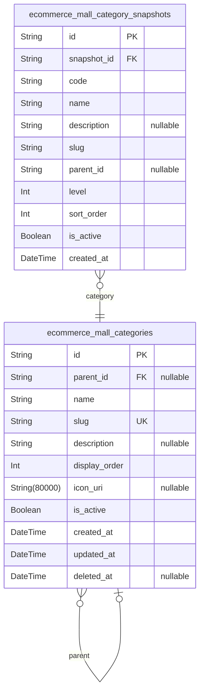

### `ecommerce_mall_categories`

Hierarchical product categories with parent-child relationships for
organizing the product catalog.

Categories form the organizational structure that customers use to browse
and discover products. Each category can have a parent category, enabling
nested categorization. Categories support metadata including display
order for ranking, optional icons for visual branding, and active status
for toggling visibility without deletion.

**Key Relationships**:
- Self-referencing parent_id creates category hierarchy (parent-child)
- Referenced by [ecommerce_mall_products](#ecommerce_mall_products) for product classification
- Snapshots tracked in [ecommerce_mall_category_snapshots](#ecommerce_mall_category_snapshots) for
audit trail

**Business Behavior**:
- Slug is unique across all categories for URL routing
- Display order determines category ranking within parent
- Active flag allows soft-deactivation without losing associated products
- Categories can have multiple child categories up to the defined nesting
limit

Properties as follows:

- `id`: Primary Key.
- `parent_id`
  > Parent category's [ecommerce_mall_categories.id](#ecommerce_mall_categories). Enables
  > hierarchical category structure.
- `name`
  > Human-readable display name of the category. Must be unique within the
  > same parent level.
- `slug`
  > URL-friendly unique identifier for the category. Used for routing and
  > SEO. Must be unique across all categories.
- `description`: Detailed description of the category for display on category pages.
- `display_order`
  > Numeric ordering value for displaying categories. Lower values appear
  > first.
- `icon_uri`: Optional URI for category icon image or emoji character.
- `is_active`: Whether the category is currently active and visible to customers.
- `created_at`: Timestamp when the category was created.
- `updated_at`: Timestamp when the category was last updated.
- `deleted_at`: Timestamp when the category was soft-deleted. Null if not deleted.

### `ecommerce_mall_category_snapshots`

Point-in-time snapshots of category changes for audit trail and
historical reference.

Captures the complete state of a category at a specific moment in time,
enabling audit trails, dispute resolution, and historical analysis. Each
snapshot is immutable and references the original category via
snapshot_id.

This snapshot table stores denormalized copies of all category fields,
providing a complete record of the category's state when the snapshot was
created. The table supports historical queries such as "what was the
category structure at time X" or "how did the category hierarchy evolve
over time."

[ecommerce_mall_categories](#ecommerce_mall_categories) - Parent category table that this
snapshot references.

Properties as follows:

- `id`: Primary Key.
- `snapshot_id`
  > The category this snapshot represents. {@link
  > ecommerce_mall_categories.id}
- `code`: Unique category code for identification.
- `name`: Display name of the category.
- `description`: Detailed description of the category.
- `slug`: URL-friendly identifier for the category.
- `parent_id`
  > Reference to the parent category in hierarchical structure (null for root
  > categories).
- `level`: Hierarchy level of the category in the tree structure.
- `sort_order`: Display order of the category within its parent.
- `is_active`: Whether the category is active and visible.
- `created_at`: Timestamp when this snapshot was created.

## Products

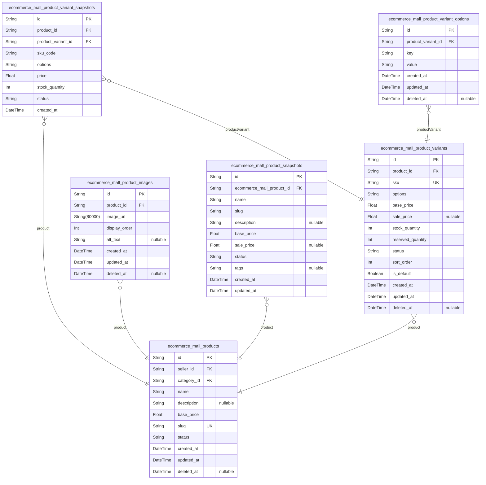

### `ecommerce_mall_products`

Main product catalog representing sellable items owned by sellers in the
marketplace.

Products form the core inventory of the e-commerce platform, representing
items that customers can browse, search, and purchase. Each product is
owned by exactly one seller (the ecommerce_mall_seller who created and
manages it) and belongs to a single product category for organizational
classification.

Products support multiple variants (ecommerce_mall_product_variants) for
different option combinations like size, color, or capacity. Each variant
has its own SKU, pricing, and stock quantity, but the product itself has
a base_price that serves as a reference point.

Products include multiple images (ecommerce_mall_product_images) for
customer visualization, with a designated thumbnail for listing displays.
The product status tracks availability: active (for sale), inactive
(paused or disabled), or out_of_stock (no variant has inventory).

The product entity preserves historical state through snapshots
(ecommerce_mall_product_snapshots) for audit trails and dispute
resolution. When products are deleted, soft deletion preserves data for
historical order references and seller account audits.

Relationships:
- Belongs to ecommerce_mall_seller (owner) - sellers manage their products
- Belongs to ecommerce_mall_category (classification) - hierarchical
product organization
- Has many ecommerce_mall_product_variants (option combinations)
- Has many ecommerce_mall_product_images (visual assets)
- Referenced by ecommerce_mall_order_items (purchases),
ecommerce_mall_reviews (customer feedback), ecommerce_mall_wishlist_items
(saved items)

Properties as follows:

- `id`: Primary Key.
- `seller_id`
  > Owner seller's [ecommerce_mall_sellers.id](#ecommerce_mall_sellers). Each product is
  > exclusively owned by one seller who manages inventory, pricing, and
  > product details.
- `category_id`
  > Product classification category's [ecommerce_mall_categories.id](#ecommerce_mall_categories).
  > Products belong to exactly one category for browsing and navigation
  > hierarchy.
- `name`
  > Product display name shown to customers. Short, descriptive title that
  > identifies the product in search results and product pages.
- `description`
  > Detailed product description providing full specifications, features, and
  > usage information. May contain HTML formatting for rich text display.
- `base_price`
  > Base price of the product in platform currency. Serves as reference price
  > when variants have different pricing. Displayed when no variant is
  > selected.
- `slug`
  > URL-friendly unique identifier for product pages. Automatically generated
  > from product name, can be customized. Used for SEO-friendly URLs and
  > product linking.
- `status`
  > Product availability status. Values: 'active' (visible for sale),
  > 'inactive' (hidden but preserved), 'out_of_stock' (no variant has
  > inventory). Controls product visibility in customer browsing.
- `created_at`
  > Timestamp when product was created. Immutable creation date for audit
  > purposes.
- `updated_at`
  > Timestamp when product was last updated. Tracks latest modification for
  > cache invalidation and change notifications.
- `deleted_at`
  > Timestamp when product was soft-deleted. Null for active products, set
  > when deleted for archival and historical order references.

### `ecommerce_mall_product_variants`

Product variant combinations representing specific option sets (e.g.,
size: Large, color: Red) with unique SKU codes, individual pricing, and
stock quantity tracking.

Each variant belongs to a parent product and can have multiple inventory
records tracking stock movements over time. Variants are referenced in
order items at purchase time for historical accuracy and in shipment
fulfillment.

Variants support seller product management operations including creation,
price updates, stock adjustments, and status changes
(active/inactive/discontinued). The status field enables soft product
discontinuation without losing historical order data.

[ecommerce_mall_products](#ecommerce_mall_products) - Parent product
[ecommerce_mall_inventory_records](#ecommerce_mall_inventory_records) - Stock movement history
[ecommerce_mall_order_items](#ecommerce_mall_order_items) - Purchase references
[ecommerce_mall_product_variant_snapshots](#ecommerce_mall_product_variant_snapshots) - Audit trail

Properties as follows:

- `id`: Primary Key.
- `product_id`: Parent product's [ecommerce_mall_products.id](#ecommerce_mall_products).
- `sku`
  > Unique Stock Keeping Unit code for this variant. Must be unique across
  > all variants.
- `options`
  > JSON string storing variant option key-value pairs (e.g., {"size":
  > "Large", "color": "Red"}). Stored for backward compatibility; new
  > implementations should use ecommerce_mall_product_variant_options child
  > table.
- `base_price`: Base price of this variant in cents (stored as integer for precision).
- `sale_price`: Sale/promotional price in cents. Null if no active sale.
- `stock_quantity`: Current available stock quantity for this variant.
- `reserved_quantity`: Quantity reserved for pending orders but not yet shipped.
- `status`: Variant availability status: active, inactive, discontinued.
- `sort_order`: Display order for variants in product listing (lower numbers first).
- `is_default`: Whether this variant is the default selection for the product.
- `created_at`: Variant creation timestamp.
- `updated_at`: Last update timestamp.
- `deleted_at`: Soft delete timestamp. Null if not deleted.

### `ecommerce_mall_product_images`

Product images for catalog display with multiple images per product and
thumbnail ordering.

This subsidiary entity supports seller product management by storing
image URLs for product catalog display. Each product can have multiple
images, with one designated as the primary thumbnail based on display
order.

**Relationships**:
- Belongs to [ecommerce_mall_products](#ecommerce_mall_products) - each image references
exactly one product
- Referenced in [ecommerce_mall_product_snapshots](#ecommerce_mall_product_snapshots) - images are
included in product snapshots for historical accuracy

**Business Context**:
- Images are managed through product CRUD operations, not independently
- Display order determines which image appears as the product thumbnail
in catalogs
- Alt text provides accessibility support for screen readers

**Data Ownership**:
- Owned by product owner (seller)
- Images are deleted when product is deleted (soft delete cascades
logically)

Properties as follows:

- `id`: Primary Key.
- `product_id`: Product's [ecommerce_mall_products.id](#ecommerce_mall_products) to which this image belongs.
- `image_url`: URL or path to the product image file.
- `display_order`
  > Display order for thumbnail selection - lower values appear first, with 0
  > typically being the primary thumbnail.
- `alt_text`: Alternative text for accessibility support and SEO.
- `created_at`: Timestamp when this product image record was created.
- `updated_at`: Timestamp when this product image record was last modified.
- `deleted_at`
  > Timestamp when this product image was soft deleted (optional, null means
  > active).

### `ecommerce_mall_product_snapshots`

Point-in-time snapshots of product catalog entries for audit trails,
dispute resolution, and historical reference.

This table captures the complete state of a product as it existed at a
specific moment in time, including all core attributes and variant
references. Unlike the main `ecommerce_mall_products` table which tracks
current state, snapshots provide immutable historical records essential
for:

- Order disputes: Verify product details (name, description, price,
variants) at time of purchase via
`ecommerce_mall_order_items.product_snapshot_id`
- Audit trails: Track all modifications to product information
- Price change analysis: Historical pricing data for business intelligence
- Variant relationship history: See which variants were associated with
product at specific times

**Key Relationships**:

- Belongs to a product: [ecommerce_mall_products.id](#ecommerce_mall_products)
- Referenced by order items: {@link
ecommerce_mall_order_items.product_snapshot_id}
- Referenced by variant snapshots: {@link
ecommerce_mall_product_variant_snapshots.product_snapshot_id}

**Important Notes**:

- Always append-only (rarely modified or deleted)
- Contains denormalized data for efficient querying
- Used for read-only historical data access
- Maintains data integrity through foreign key references to current product

Properties as follows:

- `id`: Primary Key.
- `ecommerce_mall_product_id`
  > Reference to the product this snapshot belongs to. Links snapshot to
  > current product state for context.
- `name`: Product display name as it existed at snapshot time
- `slug`: URL-friendly unique identifier for product
- `description`: Detailed product description as it existed at snapshot time
- `base_price`: Base price of the product at snapshot time
- `sale_price`: Sale/discounted price at snapshot time (null if no sale)
- `status`: Product status (draft, active, discontinued) at snapshot time
- `tags`: Comma-separated tags associated with product at snapshot time
- `created_at`: When this snapshot was created (capture timestamp)
- `updated_at`: When this snapshot was last modified (for tracking changes)

### `ecommerce_mall_product_variant_snapshots`

Point-in-time snapshots of ProductVariants for audit trail and dispute
resolution.

This table captures the complete state of each ProductVariant at specific
moments in time, including sku_code, display options, pricing, stock
quantity, and availability status. When a product owner (seller) modifies
a variant, a new snapshot is created and appended, preserving the
historical values for audit purposes and dispute resolution.

The snapshot architecture enables:
- Historical tracking of variant changes (price changes, option
modifications, stock adjustments)
- Dispute resolution by providing immutable records of variant state at
time of order
- Audit trails for compliance and business analytics

Key relationships:
- [ecommerce_mall_products.id](#ecommerce_mall_products) accessed via product_id
- [ecommerce_mall_product_variants.id](#ecommerce_mall_product_variants) accessed via product_variant_id
- [ecommerce_mall_snapshots](#ecommerce_mall_snapshots) central aggregation table

Note: options field stores JSON string of variant option values (e.g.,
{"color": "red", "size": "L"}) - this is intentional denormalization for
snapshot tables to preserve complete state without join dependencies.

Properties as follows:

- `id`: Primary Key.
- `product_id`: Parent product's [ecommerce_mall_products.id](#ecommerce_mall_products).
- `product_variant_id`: Source product variant's [ecommerce_mall_product_variants.id](#ecommerce_mall_product_variants).
- `sku_code`: Unique SKU code for this variant at time of snapshot.
- `options`
  > JSON string of variant option values (e.g., {"color": "red", "size":
  > "L"}).
- `price`: Variant price at time of snapshot.
- `stock_quantity`: Stock quantity at time of snapshot.
- `status`: Availability status (available, discontinued, out_of_stock).
- `created_at`: Timestamp when this snapshot was created.

### `ecommerce_mall_product_variant_options`

Key-value storage for ProductVariant option attributes such as size,
color, material, and other customization options.

This table implements First Normal Form (1NF) normalization by storing
variant options as atomic key-value pairs instead of JSON strings or
comma-separated values. Each row represents a single option attribute for
a specific product variant.

The table supports efficient querying of variants by specific options
(e.g., "find all shirts with size Large") through a composite unique
constraint on product_variant_id and key, ensuring each variant has at
most one value per option type.

Relationships:
- [ecommerce_mall_product_variants.id](#ecommerce_mall_product_variants) - Each option belongs to
exactly one product variant

This table is managed through the ProductVariant entity and has no
independent CRUD operations.

Properties as follows:

- `id`: Primary Key.
- `product_variant_id`
  > Parent product variant's [ecommerce_mall_product_variants.id](#ecommerce_mall_product_variants). Each
  > option belongs to exactly one variant.
- `key`
  > Option attribute name (e.g., 'size', 'color', 'material', 'pattern').
  > Represents the type of customization option.
- `value`
  > The actual value for the option (e.g., 'Large', 'Red', 'Cotton',
  > 'Striped'). The normalized option value.
- `created_at`: Record creation timestamp.
- `updated_at`: Record last update timestamp.
- `deleted_at`: Soft delete timestamp for record removal.

## Inventory

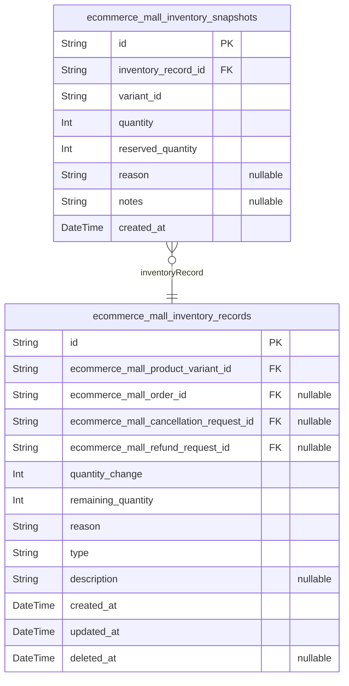

### `ecommerce_mall_inventory_records`

Tracks all stock movements for product variants including quantity
changes, reasons, and timestamps. This table provides an immutable audit
trail of inventory changes triggered by restocking, sales, returns,
cancellations, and manual adjustments.

Each record represents a single stock movement event with the
quantity_change field indicating whether stock increased (positive) or
decreased (negative). The reason field categorizes the type of movement
(RESTOCK, SALE, RETURN, CANCELLATION, ADJUSTMENT, etc.) and the type
field distinguishes between incoming, outgoing, or adjustment
transactions.

This table references the product variant that the movement applies to
via ecommerce_mall_product_variant_id, and optionally links to related
orders, cancellation requests, or refund requests when the stock movement
is triggered by those transactions. The remaining_quantity field
preserves the inventory level after each movement for historical
reference.

Relationships:
- Belongs to [ecommerce_mall_product_variants](#ecommerce_mall_product_variants) - the product
variant being tracked
- Optionally references [ecommerce_mall_orders](#ecommerce_mall_orders) - when stock is
sold/reserved for orders
- Optionally references [ecommerce_mall_cancellation_requests](#ecommerce_mall_cancellation_requests) -
when stock is restored due to cancellations
- Optionally references [ecommerce_mall_refund_requests](#ecommerce_mall_refund_requests) - when
stock is restored due to refunds
- Referenced by [ecommerce_mall_inventory_snapshots](#ecommerce_mall_inventory_snapshots) - for
point-in-time audit trails

Properties as follows:

- `id`: Primary Key.
- `ecommerce_mall_product_variant_id`: Product variant being tracked. [ecommerce_mall_product_variants.id](#ecommerce_mall_product_variants).
- `ecommerce_mall_order_id`
  > Optional reference to order when stock movement is triggered by order.
  > [ecommerce_mall_orders.id](#ecommerce_mall_orders).
- `ecommerce_mall_cancellation_request_id`
  > Optional reference to cancellation request when stock is restored. {@link
  > ecommerce_mall_cancellation_requests.id}.
- `ecommerce_mall_refund_request_id`
  > Optional reference to refund request when stock is restored. {@link
  > ecommerce_mall_refund_requests.id}.
- `quantity_change`
  > Quantity change for this stock movement. Positive for incoming stock
  > (restocks, returns), negative for outgoing stock (sales, cancellations).
- `remaining_quantity`: Inventory quantity remaining after this stock movement.
- `reason`
  > Categorization of the stock movement reason (RESTOCK, SALE, RETURN,
  > CANCELLATION, ADJUSTMENT, DAMAGE, LOSS, etc.).
- `type`: Transaction type classification (INCOMING, OUTGOING, ADJUSTMENT).
- `description`: Optional additional context or notes about this stock movement.
- `created_at`: Timestamp when this inventory record was created.
- `updated_at`: Timestamp when this inventory record was last updated.
- `deleted_at`: Soft delete timestamp for data preservation.

### `ecommerce_mall_inventory_snapshots`

Point-in-time snapshots of inventory records for audit and rollback
capabilities.

This snapshot table captures the state of inventory records at specific
moments in time, enabling audit trails, historical analysis, and rollback
operations. Each snapshot represents a complete state of an inventory
record including variant reference, quantity, reserved quantity, reason,
and notes.

Key relationships:
- [ecommerce_mall_inventory_records](#ecommerce_mall_inventory_records) - Parent table storing current
inventory record state
- [ecommerce_mall_product_variants](#ecommerce_mall_product_variants) - Referenced via denormalized
variant_id for historical tracking

Behavioral notes:
- Append-only table - once created, snapshots are never modified or deleted
- Denormalized structure for efficient historical queries without joins
- Each inventory record can have multiple snapshots over its lifetime
- Used for dispute resolution, stock reconciliation, and compliance auditing

Properties as follows:

- `id`: Primary Key.
- `inventory_record_id`: Referenced inventory record's [ecommerce_mall_inventory_records.id](#ecommerce_mall_inventory_records).
- `variant_id`
  > Denormalized product variant ID at time of snapshot for historical
  > tracking without joins.
- `quantity`: Stock quantity at time of snapshot.
- `reserved_quantity`: Reserved stock quantity at time of snapshot.
- `reason`
  > Reason code for the inventory change (e.g., RESTOCK, ORDER_DEDUCTION,
  > REFUND_RESTORATION).
- `notes`: Additional notes or context for the inventory change.
- `created_at`: Timestamp when this snapshot was created.

## Orders

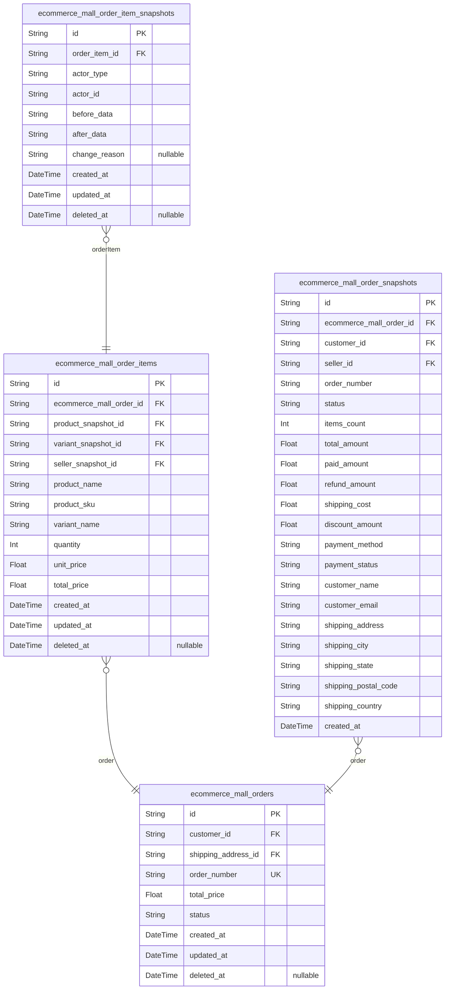

### `ecommerce_mall_orders`

Customer purchase transactions representing complete orders with status
tracking and financial totals.

An order is created when a customer completes the checkout process after
successful payment processing through an external payment gateway. Each
order is permanently associated with exactly one customer who created it
and contains one or more order items from one or more sellers.

Key relationships:
- Belongs to a customer via [ecommerce_mall_customers.id](#ecommerce_mall_customers) -
customers can view all their orders in order history
- Contains many order items (managed in ecommerce_mall_order_items table)
- each item represents a specific product variant purchase
- References shipping address via [ecommerce_mall_addresses.id](#ecommerce_mall_addresses) -
the delivery location selected at checkout
- Contains many shipments (managed in ecommerce_mall_shipments table) -
physical delivery of items

The overall order status is automatically derived from the statuses of
all order items within the order per section 136. If all items are paid,
order is paid; if any item shipped, order is shipped; if all items
delivered, order is delivered; if all items cancelled or refunded, order
reflects that status; if mixed item statuses, order is partially
completed.

Order creation is irreversible - once created, the order cannot be
modified or cancelled by the customer. Orders become immediately visible
to relevant sellers for fulfillment. Customer can cancel or refund
individual items within the order (section 142-143), not the entire
order.

Each order is assigned a unique order number at creation for
identification, customer reference, and support inquiries (section 129).
The order number is included in order confirmations and is visible to the
customer and relevant sellers.

Properties as follows:

- `id`: Primary Key.
- `customer_id`: Customer who created this order. [ecommerce_mall_customers.id](#ecommerce_mall_customers)
- `shipping_address_id`: Shipping address selected at checkout. [ecommerce_mall_addresses.id](#ecommerce_mall_addresses)
- `order_number`
  > Unique order number for identification and reference. Generated at order
  > creation.
- `total_price`: Total price of the order (sum of all order item prices).
- `status`
  > Overall order status derived from item statuses: paid, shipped,
  > delivered, cancelled, refunded, or partially_completed.
- `created_at`: Date and time when the order was successfully created.
- `updated_at`: Last update timestamp when any order field was modified.
- `deleted_at`: Soft delete timestamp. Null if order is active.

### `ecommerce_mall_order_items`

Order line items representing individual products purchased within an order.

This table captures immutable historical data at order time, including
snapshot references to the product, variant, and seller as they existed
when the order was placed. Each order item tracks quantity, unit price,
and total price at purchase time.

Business Context:
- Order items form the bridge between orders and products
- Support order cancellations via {@link
ecommerce_mall_cancellation_requests}
- Support refunds via [ecommerce_mall_refund_requests](#ecommerce_mall_refund_requests)
- Reference product variants in [ecommerce_mall_product_variants](#ecommerce_mall_product_variants)
through snapshot references
- Linked to shipments in [ecommerce_mall_shipments](#ecommerce_mall_shipments) via junction table
- Enable historical reporting of what was actually purchased

Key Relationships:
- Belongs to one [ecommerce_mall_orders](#ecommerce_mall_orders) parent order
- References product snapshot in [ecommerce_mall_snapshots](#ecommerce_mall_snapshots) for
immutable product state
- References product variant snapshot in [ecommerce_mall_snapshots](#ecommerce_mall_snapshots)
for immutable variant state
- References seller snapshot in [ecommerce_mall_snapshots](#ecommerce_mall_snapshots) for
immutable seller state at order time

Stance: primary - Order items require independent management for customer
order history, seller sales reports, cancellation processing, refund
processing, and shipment fulfillment. Users need to search/filter order
items independently across their orders.

Properties as follows:

- `id`: Primary Key.
- `ecommerce_mall_order_id`
  > Belonged order's [ecommerce_mall_orders.id](#ecommerce_mall_orders). Each order item is
  > part of exactly one order.
- `product_snapshot_id`
  > Product snapshot's [ecommerce_mall_snapshots.id](#ecommerce_mall_snapshots). Captures product
  > state (name, description, base price) at order time for immutable order
  > history.
- `variant_snapshot_id`
  > Product variant snapshot's [ecommerce_mall_snapshots.id](#ecommerce_mall_snapshots). Captures
  > variant state (SKU, specific price, specific stock) at order time for
  > immutable order history.
- `seller_snapshot_id`
  > Seller snapshot's [ecommerce_mall_snapshots.id](#ecommerce_mall_snapshots). Captures seller
  > information at order time for immutable order history, enabling disputes
  > to reference seller as they were.
- `product_name`
  > Product name at time of purchase. Denormalized from snapshot for
  > immutable order history - never changes even if product is renamed.
- `product_sku`
  > Product variant SKU at time of purchase. Denormalized from snapshot for
  > immutable order history.
- `variant_name`
  > Variant name/description at time of purchase. Captures the specific
  > variant option selected (e.g., 'Red, Large').
- `quantity`
  > Number of units purchased. Must be positive integer. Used to calculate
  > total_price and for inventory deduction.
- `unit_price`
  > Price per unit at time of purchase in USD. Denormalized from variant
  > snapshot for immutable order history. Reflects price at order time, not
  > current product price.
- `total_price`
  > Total price for this line item (quantity × unit_price) at time of
  > purchase in USD. Calculated field denormalized for order totals.
- `created_at`: Timestamp when this order item was created.
- `updated_at`: Timestamp when this order item was last updated.
- `deleted_at`: Soft delete timestamp. NULL when active, set when logically deleted.

### `ecommerce_mall_order_snapshots`

Point-in-time snapshots of orders capturing complete transaction state at
creation and modification.

This table implements the snapshot pattern to preserve historical order
states for audit trails, dispute resolution, and historical reporting.
Each snapshot contains a full denormalized copy of the order's data at a
specific point in time, enabling read-back of historical states without
accessing the current order data.

Key relationships:
- References [ecommerce_mall_orders](#ecommerce_mall_orders) - the parent order being tracked
- Each order can have multiple snapshots as it transitions through states
(pending, confirmed, shipped, completed, cancelled)
- Used for: dispute resolution, historical reporting, audit compliance,
rollback capabilities

Behavioral notes:
- Append-only table (rarely modified or deleted)
- Denormalized structure captures order data as it existed at snapshot time
- Useful for tracking order number changes, amount recalculations, status
transitions
- Complements the central [ecommerce_mall_snapshots](#ecommerce_mall_snapshots) table which
tracks cross-domain state changes

Properties as follows:

- `id`: Primary Key.
- `ecommerce_mall_order_id`
  > Parent order's [ecommerce_mall_orders.id](#ecommerce_mall_orders). Reference to the order
  > this snapshot belongs to.
- `customer_id`
  > Customer who placed the order [ecommerce_mall_customers.id](#ecommerce_mall_customers).
  > Denormalized for historical accuracy.
- `seller_id`
  > Seller who owns the products in this order {@link
  > ecommerce_mall_sellers.id}. Denormalized for historical accuracy.
- `order_number`
  > Unique order number identifier. May change over time but snapshot
  > preserves the value at snapshot time.
- `status`
  > Order status at snapshot time (pending, confirmed, shipped, completed,
  > cancelled).
- `items_count`: Number of items in this order at snapshot time.
- `total_amount`: Total order amount including all items, shipping, and discounts.
- `paid_amount`: Amount paid by customer at snapshot time.
- `refund_amount`: Total refund amount for this order at snapshot time.
- `shipping_cost`: Shipping cost for this order at snapshot time.
- `discount_amount`: Total discount applied to this order at snapshot time.
- `payment_method`: Payment method used for this order (credit_card, bank_transfer, etc.).
- `payment_status`: Payment status at snapshot time (pending, paid, failed, refunded).
- `customer_name`: Customer name at snapshot time. Denormalized for historical accuracy.
- `customer_email`: Customer email at snapshot time. Denormalized for historical accuracy.
- `shipping_address`
  > Shipping address as string at snapshot time. Denormalized for historical
  > accuracy.
- `shipping_city`: Shipping city at snapshot time. Denormalized for historical accuracy.
- `shipping_state`: Shipping state at snapshot time. Denormalized for historical accuracy.
- `shipping_postal_code`
  > Shipping postal code at snapshot time. Denormalized for historical
  > accuracy.
- `shipping_country`: Shipping country at snapshot time. Denormalized for historical accuracy.
- `created_at`: Timestamp when this snapshot was created.

### `ecommerce_mall_order_item_snapshots`

Immutable snapshot table capturing point-in-time state of order items for
audit trail and historical reference.

This table records changes to order items (ecommerce_mall_order_items) as
they occur, preserving the before and after values of modified fields.
Each snapshot represents a specific moment in the order item's lifecycle
and is never modified or deleted.

Key relationships:
- [EcommerceMallOrderItemSnapshot.orderItem](#EcommerceMallOrderItemSnapshot) - References the order
item being captured
- [EcommerceMallOrderItemSnapshot.actorType](#EcommerceMallOrderItemSnapshot) + {@link
EcommerceMallOrderItemSnapshot.actorId} - Identifies which actor made the
change (customer, seller, or admin)

Use cases:
- Dispute resolution: View what the order item looked like at any point
in time
- Audit compliance: Track who changed what and when
- Historical analysis: Analyze order item modifications across the platform

Properties as follows:

- `id`: Primary Key.
- `order_item_id`: Order item this snapshot belongs to. [EcommerceMallOrderItem.id](#EcommerceMallOrderItem)
- `actor_type`
  > Type of actor who made the change (customer, seller, admin). Used with
  > actor_id to identify the actor.
- `actor_id`
  > ID of the actor who made the change (references appropriate actor table
  > based on actor_type).
- `before_data`
  > JSON representation of order item state before the change. Captures
  > original values for audit comparison.
- `after_data`
  > JSON representation of order item state after the change. Captures new
  > values for audit trail.
- `change_reason`: Optional reason for the change when provided by the actor.
- `created_at`: Timestamp when this snapshot was created.
- `updated_at`: Timestamp when this snapshot was last updated.
- `deleted_at`: Soft delete timestamp for data retention and archival.

## Shipments

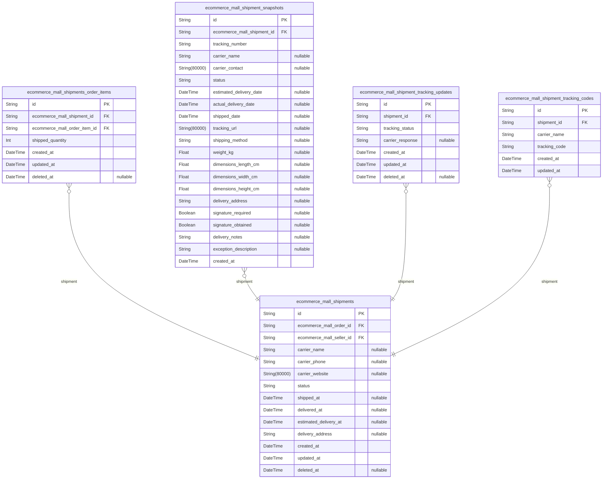

### `ecommerce_mall_shipments`

Main shipment entity tracking physical delivery logistics for order
fulfillment.

This table represents shipments that coordinate the delivery of order
items from sellers to customers. Each shipment is associated with an
order and fulfilled by a seller. The table tracks carrier information
(carrier name, phone, website), and delivery status throughout the
shipping lifecycle.

Shipments are managed by sellers (who create them when fulfilling orders)
and admins (who monitor logistics performance). Customers can track their
shipments via tracking codes stored in the associated tracking codes
table.

Related entities:
- [ecommerce_mall_orders](#ecommerce_mall_orders) - The order being shipped (one order may
have multiple shipments if items ship separately)
- [ecommerce_mall_sellers](#ecommerce_mall_sellers) - The seller fulfilling the shipment
- [ecommerce_mall_shipment_tracking_codes](#ecommerce_mall_shipment_tracking_codes) - Child table storing
multiple carrier tracking codes per shipment (replaces comma-separated
tracking_numbers)
- [ecommerce_mall_shipment_snapshots](#ecommerce_mall_shipment_snapshots) - Audit trail for shipment
state changes

Key fields:
- carrier_name, carrier_phone, carrier_website: Single carrier reference
(the primary carrier for this shipment)
- status: Current delivery lifecycle state
- shipped_at, delivered_at, estimated_delivery_at: Temporal tracking for
delivery milestones

Properties as follows:

- `id`: Primary Key.
- `ecommerce_mall_order_id`: The order being shipped. [ecommerce_mall_orders.id](#ecommerce_mall_orders)
- `ecommerce_mall_seller_id`: The seller fulfilling this shipment. [ecommerce_mall_sellers.id](#ecommerce_mall_sellers)
- `carrier_name`: Primary shipping carrier name (e.g., FedEx, UPS, DHL).
- `carrier_phone`: Carrier customer service phone number.
- `carrier_website`: Carrier's official website URL for tracking.
- `status`
  > Current delivery status: pending, in-transit, delivered, failed,
  > cancelled.
- `shipped_at`: When the shipment was marked as shipped (carrier pickup or dispatch).
- `delivered_at`: When the shipment was successfully delivered to customer.
- `estimated_delivery_at`: Estimated delivery date provided by carrier.
- `delivery_address`: Final delivery address for this shipment.
- `created_at`: Record creation timestamp.
- `updated_at`: Record update timestamp.
- `deleted_at`: Soft delete timestamp for order cancellations or returns.

### `ecommerce_mall_shipments_order_items`

Junction table linking shipments to order items for fulfillment tracking.

This table represents the many-to-many relationship between shipments and
order items, recording which order items are included in each shipment
and the quantity shipped. A shipment can contain multiple order items
from the same seller, and an order item may be split across multiple
shipments if partial fulfillment is required.

Business purpose:
- Tracks order item fulfillment within shipments
- Records shipped quantity (may differ from original order quantity for
partial shipments)
- Enables query for all order items in a shipment or all shipments
containing a specific order item
- Supports inventory deduction and tracking workflows

Relationships:
- BelongsTo [ecommerce_mall_shipments](#ecommerce_mall_shipments) - Each line item is part of
one shipment
- BelongsTo [ecommerce_mall_order_items](#ecommerce_mall_order_items) - Each line item
references the original order item being fulfilled

Managed through parent entities: Users do not independently create or
delete records; they are automatically generated during shipment creation
and fulfillment processes.

Properties as follows:

- `id`: Primary Key.
- `ecommerce_mall_shipment_id`
  > Shipment's [ecommerce_mall_shipments.id](#ecommerce_mall_shipments) that contains this order
  > item.
- `ecommerce_mall_order_item_id`
  > Order item's [ecommerce_mall_order_items.id](#ecommerce_mall_order_items) being fulfilled in
  > this shipment.
- `shipped_quantity`
  > Quantity of this order item being shipped. May differ from original order
  > quantity if partial shipment.
- `created_at`: Record creation timestamp.
- `updated_at`: Record last update timestamp.
- `deleted_at`: Soft delete timestamp (null if active).

### `ecommerce_mall_shipment_snapshots`

Audit trail snapshots capturing point-in-time state of shipments for
dispute resolution and historical reference.

Each snapshot records the complete state of a shipment at a specific
moment, including carrier information, tracking details, status, and
timestamps. Snapshots are immutable historical records used for:

- Dispute resolution: Verify shipment state at specific points in time
- Audit trail: Track all state changes and tracking updates
- Historical analysis: Analyze shipment lifecycle patterns
- Regulatory compliance: Maintain permanent records of delivery status

References the parent [ecommerce_mall_shipments](#ecommerce_mall_shipments) entity and
indirectly references [ecommerce_mall_orders](#ecommerce_mall_orders) and {@link
ecommerce_mall_sellers} through the shipment relationship.

Properties as follows:

- `id`: Primary Key.
- `ecommerce_mall_shipment_id`: Belonged shipment's [ecommerce_mall_shipments.id](#ecommerce_mall_shipments)
- `tracking_number`: Carrier-assigned tracking number for package identification
- `carrier_name`: Name of the shipping carrier (e.g., FedEx, UPS, DHL)
- `carrier_contact`: Carrier customer service contact information or website
- `status`
  > Current shipment status (pending, in transit, out for delivery,
  > delivered, exception, returned)
- `estimated_delivery_date`: Originally estimated delivery date
- `actual_delivery_date`: Actual delivery completion timestamp (null if not delivered)
- `shipped_date`: Date and time when package was handed to carrier
- `tracking_url`: URL for tracking package status with carrier
- `shipping_method`: Shipping service level (standard, express, overnight, economy)
- `weight_kg`: Package weight in kilograms
- `dimensions_length_cm`: Package length in centimeters
- `dimensions_width_cm`: Package width in centimeters
- `dimensions_height_cm`: Package height in centimeters
- `delivery_address`
  > Complete delivery address including recipient name, street, city, state,
  > postal code, country
- `signature_required`: Whether signature was required for delivery
- `signature_obtained`: Whether a signature was actually obtained for delivery
- `delivery_notes`: Delivery notes such as 'Left at front door', 'Signed by recipient', etc.
- `exception_description`
  > Description of any delivery exception (weather delay, address issue,
  > failed delivery attempt)
- `created_at`: Timestamp when this snapshot was created

### `ecommerce_mall_shipment_tracking_updates`

Carrier tracking status updates for shipment delivery lifecycle tracking.

This subsidiary table records all tracking status changes pushed by
carriers or shipping systems. Each update represents a state transition
in the shipment's delivery journey (pending → in_transit →
out_for_delivery → delivered).

Relationships:
- Belongs to [ecommerce_mall_shipments](#ecommerce_mall_shipments) - one shipment has many
tracking updates
- Used by customers and sellers to monitor delivery progress
- Read-only from user perspective - automatically created by carrier API
integration

Temporal fields:
- created_at: when tracking update was recorded
- updated_at: last modification timestamp (for consistency)
- deleted_at: soft delete (optional)

Properties as follows:

- `id`: Primary Key.
- `shipment_id`
  > Shipment's [ecommerce_mall_shipments.id](#ecommerce_mall_shipments) this tracking update
  > belongs to.
- `tracking_status`
  > Current tracking status from carrier (pending, in_transit,
  > out_for_delivery, delivered, failed, exception).
- `carrier_response`
  > JSON payload from carrier API containing full tracking event data. Stored
  > as string due to external-integration feature requirement.
- `created_at`: When this tracking update was recorded.
- `updated_at`: Last modification timestamp.
- `deleted_at`: Soft delete timestamp (nullable for active records).

### `ecommerce_mall_shipment_tracking_codes`

Child table storing multiple carrier tracking codes per shipment.

Supports one shipment having multiple carrier tracking codes (e.g.,
primary carrier code plus additional tracking from sub-carriers). Each
record contains the carrier name and tracking code separately for proper
1NF normalization.

This subsidiary table is managed through the parent
ecommerce_mall_shipments entity and is not independently created or
modified by users. Tracking codes are permanently retained for audit and
dispute resolution purposes.

Related entities: [ecommerce_mall_shipments](#ecommerce_mall_shipments) (parent shipment)

Properties as follows:

- `id`: Primary Key.
- `shipment_id`: Parent shipment's [ecommerce_mall_shipments.id](#ecommerce_mall_shipments).
- `carrier_name`
  > Name of the carrier providing the tracking service (e.g., FedEx, UPS,
  > DHL, USPS).
- `tracking_code`: Unique tracking code provided by the carrier for this shipment segment.
- `created_at`: Timestamp when this tracking code record was created.
- `updated_at`: Timestamp when this tracking code record was last updated.

## Reviews

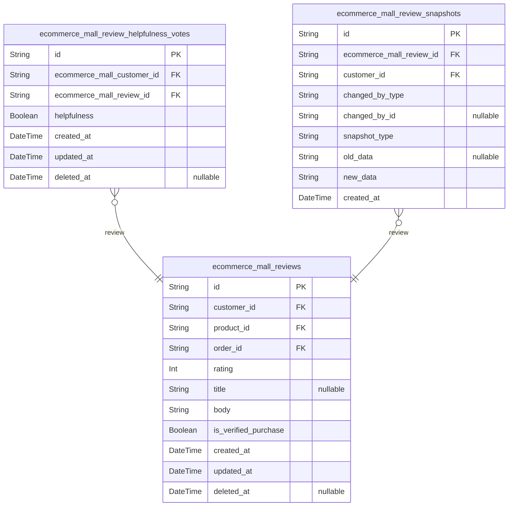

### `ecommerce_mall_reviews`

Customer product reviews with ratings and text content.

Reviews represent customer feedback on purchased products, enabling
social proof and product quality assessment. Each review is tied to a
specific customer (author), product (subject), and order (verification
proof for verified purchase status).

Customers can create, edit, and delete their own reviews. Reviews support
helpfulness voting via ecommerce_mall_review_helpfulness_votes table.
Review content can be searched across the platform for product discovery.

Relationships:
- Belongs to [ecommerce_mall_customers.id](#ecommerce_mall_customers) (customer who wrote review)
- Belongs to [ecommerce_mall_products.id](#ecommerce_mall_products) (product being reviewed)
- Belongs to [ecommerce_mall_orders.id](#ecommerce_mall_orders) (proof of purchase for
verification)
- Has many [ecommerce_mall_review_helpfulness_votes.id](#ecommerce_mall_review_helpfulness_votes)
(helpfulness votes)
- Has many [ecommerce_mall_review_snapshots.id](#ecommerce_mall_review_snapshots) (audit trail)

Properties as follows:

- `id`: Primary Key.
- `customer_id`: Customer who wrote this review. [ecommerce_mall_customers.id](#ecommerce_mall_customers)
- `product_id`: Product being reviewed. [ecommerce_mall_products.id](#ecommerce_mall_products)
- `order_id`
  > Order containing this product (proof of purchase). {@link
  > ecommerce_mall_orders.id}
- `rating`: Rating from 1 to 5 stars (1 = worst, 5 = best)
- `title`: Optional review title or summary
- `body`: Review text content describing customer experience
- `is_verified_purchase`: Whether this review is from a verified purchase (order was completed)
- `created_at`: Review creation timestamp
- `updated_at`: Last review modification timestamp
- `deleted_at`: Review deletion timestamp (soft delete for moderation)

### `ecommerce_mall_review_helpfulness_votes`

Customer votes indicating whether a review was helpful for quality
assessment and sorting.

This table tracks helpfulness votes from customers on individual reviews,
enabling the platform to:
- Calculate helpfulness scores for review sorting
- Assess review quality through community feedback
- Prevent duplicate votes from the same customer on the same review

Key relationships:
- [ecommerce_mall_customers.id](#ecommerce_mall_customers) - The customer casting the
helpfulness vote
- [ecommerce_mall_reviews.id](#ecommerce_mall_reviews) - The review being evaluated for
helpfulness

Business rules:
- Each customer can vote ONCE per review (enforced by unique constraint
on customer_id + review_id)
- Votes are boolean (helpful/not helpful) for simplicity in aggregation
- Soft delete enabled for data recovery when needed

Properties as follows:

- `id`: Primary Key.
- `ecommerce_mall_customer_id`
  > Customer who cast the helpfulness vote. {@link
  > ecommerce_mall_customers.id}
- `ecommerce_mall_review_id`: Review being evaluated for helpfulness. [ecommerce_mall_reviews.id](#ecommerce_mall_reviews)
- `helpfulness`: Whether the review was helpful (true) or not helpful (false).
- `created_at`: Timestamp when the helpfulness vote was cast.
- `updated_at`: Timestamp of the last update to this helpfulness vote.
- `deleted_at`: Soft delete timestamp for data recovery.

### `ecommerce_mall_review_snapshots`

Immutable audit trail snapshots of review state changes for historical
tracking and dispute resolution.

Captures point-in-time states when reviews are created, modified, or have
their helpfulness votes updated. Each snapshot records the complete state
of the review at that moment, enabling historical verification and
dispute resolution.

Related entities: [ecommerce_mall_reviews](#ecommerce_mall_reviews), {@link
ecommerce_mall_customers}

Properties as follows:

- `id`: Primary Key.
- `ecommerce_mall_review_id`
  > Referenced review's [ecommerce_mall_reviews.id](#ecommerce_mall_reviews). This foreign key
  > links the snapshot to the specific review it documents.
- `customer_id`
  > Customer's [ecommerce_mall_customers.id](#ecommerce_mall_customers) who wrote or modified this
  > review. This foreign key identifies the actor associated with this
  > snapshot.
- `changed_by_type`
  > Type of actor who triggered this snapshot (e.g., 'customer', 'system',
  > 'moderator'). Used for audit trail purposes.
- `changed_by_id`
  > UUID of the actor who triggered this snapshot change. If changed_by_type
  > is 'system', this may be null.
- `snapshot_type`
  > Type of change captured (e.g., 'created', 'modified',
  > 'helpfulness_updated', 'deleted'). Categorizes the snapshot for efficient
  > querying.
- `old_data`
  > JSON string containing the previous state of the review before this
  > change. Stores null for initial creation snapshots.
- `new_data`
  > JSON string containing the complete review state after this change.
  > Required for all snapshots.
- `created_at`
  > Timestamp when this snapshot was created, representing the point-in-time
  > state captured.

## Systematic

```mermaid
erDiagram
"ecommerce_mall_notifications" {
  String id PK
  String title
  String body
  String type UK
  String status UK
  DateTime created_at
  DateTime updated_at
  DateTime deleted_at "nullable"
}
"ecommerce_mall_notification_recipients" {
  String id PK
  String notification_id FK
  String recipient_type
  String recipient_id
  String read_status
  DateTime read_at "nullable"
  DateTime created_at
  DateTime updated_at
  DateTime deleted_at "nullable"
}
"ecommerce_mall_activity_logs" {
  String id PK
  String actor_type
  String entity_type
  String entity_id
  String action_type
  String action_description
  String ip_address "nullable"
  String user_agent "nullable"
  DateTime created_at
  DateTime updated_at
  DateTime deleted_at "nullable"
}
"ecommerce_mall_platform_configurations" {
  String id PK
  String configuration_key
  String description
  String configuration_type
  String scope
  String default_value "nullable"
  Boolean is_active
  DateTime created_at
  DateTime updated_at
  DateTime deleted_at "nullable"
}
"ecommerce_mall_search_indices" {
  String id PK
  String entity_id
  String entity_type
  String title
  String searchable_text
  String status
  String metadata "nullable"
  DateTime created_at
  DateTime updated_at
  DateTime deleted_at "nullable"
}
"ecommerce_mall_activity_log_of_customers" {
  String id PK
  String ecommerce_mall_activity_log_id FK,UK
  String ecommerce_mall_customer_id FK
  String ecommerce_mall_customer_session_id FK
  DateTime created_at
  DateTime updated_at
  DateTime deleted_at "nullable"
}
"ecommerce_mall_activity_log_of_sellers" {
  String id PK
  String ecommerce_mall_activity_log_id FK,UK
  String ecommerce_mall_seller_id FK
  String ecommerce_mall_seller_session_id FK "nullable"
  DateTime created_at
  DateTime updated_at
  DateTime deleted_at "nullable"
}
"ecommerce_mall_activity_log_of_admins" {
  String id PK
  String activity_log_id FK,UK
  String admin_id FK
  String admin_session_id FK "nullable"
  DateTime created_at
  DateTime updated_at
  DateTime deleted_at "nullable"
}
"ecommerce_mall_activity_log_of_super_admins" {
  String id PK
  String ecommerce_mall_activity_log_id FK
  String ecommerce_mall_super_admin_id FK
  String ecommerce_mall_super_admin_session_id FK "nullable"
  DateTime created_at
  DateTime updated_at
  DateTime deleted_at "nullable"
}
"ecommerce_mall_platform_configuration_values" {
  String id PK
  String ecommerce_mall_platform_configuration_id FK
  String key
  String value
  String environment_scope
  DateTime created_at
  DateTime updated_at
  DateTime deleted_at "nullable"
}
"ecommerce_mall_notification_of_customers" {
  String id PK
  String ecommerce_mall_notification_id FK,UK
  String ecommerce_mall_customer_id FK
  String ecommerce_mall_customer_session_id FK "nullable"
  DateTime created_at
  DateTime updated_at
  DateTime deleted_at "nullable"
}
"ecommerce_mall_notification_of_sellers" {
  String id PK
  String notification_id FK,UK
  String seller_id FK
  String seller_session_id FK "nullable"
  DateTime created_at
  DateTime updated_at
  DateTime deleted_at "nullable"
}
"ecommerce_mall_notification_of_admins" {
  String id PK
  String notification_id FK,UK
  String admin_id FK
  String admin_session_id FK "nullable"
  DateTime created_at
  DateTime updated_at
}
"ecommerce_mall_notification_of_super_admins" {
  String id PK
  String notification_id FK,UK
  String super_admin_id FK
  DateTime created_at
  DateTime updated_at
}
"ecommerce_mall_notification_of_guests" {
  String id PK
  String notification_id FK,UK
  String guest_id FK
  String guest_session_id FK "nullable"
  DateTime created_at
  DateTime updated_at
}
"ecommerce_mall_notification_of_admin_snapshots" {
  String id PK
  String notification_admin_id FK,UK
  String snapshot_id FK,UK
  String admin_id FK
  String admin_session_id FK
  String before_values "nullable"
  String after_values "nullable"
  DateTime created_at
  DateTime updated_at
  DateTime deleted_at "nullable"
}
"ecommerce_mall_notification_recipients" }o--|| "ecommerce_mall_notifications" : notification
"ecommerce_mall_activity_log_of_customers" |o--|| "ecommerce_mall_activity_logs" : activityLog
"ecommerce_mall_activity_log_of_sellers" |o--|| "ecommerce_mall_activity_logs" : activityLog
"ecommerce_mall_activity_log_of_admins" |o--|| "ecommerce_mall_activity_logs" : activityLog
"ecommerce_mall_activity_log_of_super_admins" }o--|| "ecommerce_mall_activity_logs" : activityLog
"ecommerce_mall_platform_configuration_values" }o--|| "ecommerce_mall_platform_configurations" : configuration
"ecommerce_mall_notification_of_customers" |o--|| "ecommerce_mall_notifications" : notification
"ecommerce_mall_notification_of_sellers" |o--|| "ecommerce_mall_notifications" : notification
"ecommerce_mall_notification_of_admins" |o--|| "ecommerce_mall_notifications" : notification
"ecommerce_mall_notification_of_super_admins" |o--|| "ecommerce_mall_notifications" : notification
"ecommerce_mall_notification_of_guests" |o--|| "ecommerce_mall_notifications" : notification
"ecommerce_mall_notification_of_admin_snapshots" |o--|| "ecommerce_mall_notification_of_admins" : notificationAdmin
```

### `ecommerce_mall_notifications`

System-wide notification messages for actors across all domains including
customers, sellers, administrators, and guests.

This table serves as the central notification entity for cross-domain
messaging infrastructure. Each notification contains title, body, and
metadata for display to actors.

Key relationships:
- [ecommerce_mall_notification_of_customers](#ecommerce_mall_notification_of_customers) - Customer-specific
notification references
- [ecommerce_mall_notification_of_sellers](#ecommerce_mall_notification_of_sellers) - Seller-specific
notification references
- [ecommerce_mall_notification_of_admins](#ecommerce_mall_notification_of_admins) - Administrator-specific
notification references
- [ecommerce_mall_notification_of_super_admins](#ecommerce_mall_notification_of_super_admins) - Super
administrator-specific notification references
- [ecommerce_mall_notification_of_guests](#ecommerce_mall_notification_of_guests) - Guest-specific
notification references
- [ecommerce_mall_notification_recipients](#ecommerce_mall_notification_recipients) - Junction table for
multi-recipient notifications

Notifications support status tracking (read/unread) and are soft-deleted
to preserve audit trail. Used for system-wide alerts, order updates,
seller approvals, and platform announcements.

Properties as follows:

- `id`: Primary Key.
- `title`: Notification title or subject line for display in notification lists.
- `body`: Full notification content message body displayed to actors.
- `type`
  > Notification type/category (e.g., 'order_update', 'seller_approval',
  > 'platform_announcement', 'system_alert') for filtering and routing.
- `status`
  > Notification status: 'unread' or 'read' for tracking actor notification
  > consumption.
- `created_at`: Timestamp when the notification was created.
- `updated_at`: Timestamp when the notification was last updated.
- `deleted_at`: Timestamp when the notification was soft deleted.

### `ecommerce_mall_notification_recipients`

Many-to-many junction table tracking which actors received which
notifications.

This table serves as the subscription link between notifications and
their recipient actors. Each record represents a single delivery of a
notification to a specific actor, with status tracking to indicate
whether the recipient has read or acknowledged the notification.

Key relationships:
- [ecommerce_mall_notifications.notifications](#ecommerce_mall_notifications) - Parent
notification that was delivered
- [ecommerce_mall_customers](#ecommerce_mall_customers) - Customer recipients (via
recipient_type='customer')
- [ecommerce_mall_sellers](#ecommerce_mall_sellers) - Seller recipients (via
recipient_type='seller')
- [ecommerce_mall_admins](#ecommerce_mall_admins) - Administrator recipients (via
recipient_type='admin')
- [ecommerce_mall_super_admins](#ecommerce_mall_super_admins) - Super Administrator recipients
(via recipient_type='superAdmin')
- [ecommerce_mall_guests](#ecommerce_mall_guests) - Guest recipients (via
recipient_type='guest')

Business usage:
- Tracks notification delivery to all actor types through polymorphic
ownership pattern
- Enables querying notifications by recipient actor (e.g., "show all
unread notifications for customer X")
- Supports read status tracking and notification engagement analytics
- Maintains audit trail of notification delivery and read events

Properties as follows:

- `id`: Primary Key.
- `notification_id`
  > Reference to the notification that was delivered. {@link
  > ecommerce_mall_notifications.id}
- `recipient_type`
  > Type of actor receiving the notification. Allowed values: 'customer',
  > 'seller', 'admin', 'superAdmin', 'guest'. This polymorphic pattern
  > enables a single table to track notifications for all actor types.
- `recipient_id`
  > ID of the actor recipient, referenced based on recipient_type. References
  > ecommerce_mall_customers.id when recipient_type='customer',
  > ecommerce_mall_sellers.id when recipient_type='seller',
  > ecommerce_mall_admins.id when recipient_type='admin',
  > ecommerce_mall_super_admins.id when recipient_type='superAdmin', or
  > ecommerce_mall_guests.id when recipient_type='guest'.
- `read_status`
  > Read status of the notification for this recipient. Values: 'unread'
  > (default), 'read' (opened by recipient), 'acknowledged' (confirmed
  > read/action taken).
- `read_at`
  > Timestamp when the recipient marked the notification as read. Null until
  > the notification is opened or acknowledged.
- `created_at`: Timestamp when this notification delivery record was created.
- `updated_at`: Timestamp of the last update to this record.
- `deleted_at`: Soft delete timestamp for notification delivery records.

### `ecommerce_mall_activity_logs`

Centralized audit trail table tracking all system activities across
domains including customer actions, seller operations, admin tasks, and
system events.

This table serves as the primary source of truth for compliance auditing,
security monitoring, and troubleshooting. Each log entry records the
actor who performed an action, the type of action, the affected entity,
and contextual information.

The audit log is append-only (never updated) and uses soft deletion for
retention control. Actor references use subtype pattern to support
multiple actor types (customer, seller, admin, super_admin) without
nullable FKs.

Properties as follows:

- `id`: Primary Key.
- `actor_type`
  > Type of actor who performed the action: 'customer', 'seller', 'admin', or
  > 'super_admin'.
- `entity_type`
  > Type of entity that was affected: 'order', 'product', 'review',
  > 'shipment', etc.
- `entity_id`: ID of the entity that was affected by this action.
- `action_type`
  > Type of action performed: 'created', 'updated', 'deleted', 'approved',
  > 'rejected', etc.
- `action_description`: Human-readable description of the action performed.
- `ip_address`: IP address from which the action was performed for security auditing.
- `user_agent`: User agent string from the request for device/browser identification.
- `created_at`: Timestamp when this audit log entry was created.
- `updated_at`: Timestamp of the last update to this audit log entry.
- `deleted_at`: Soft deletion timestamp for audit retention control.

### `ecommerce_mall_platform_configurations`

Platform-wide system settings and configuration metadata. This table
stores the definition of configuration keys including their descriptions,
types, and scope (global, staging, production). Administrators manage
these configurations to control system behavior without code changes.

Key relationships:
- Has many [ecommerce_mall_platform_configuration_values](#ecommerce_mall_platform_configuration_values) for
actual configuration values
- Used by [ecommerce_mall_activity_logs](#ecommerce_mall_activity_logs) for audit trail of
configuration changes

Properties as follows:

- `id`: Primary Key.
- `configuration_key`
  > Unique identifier for the configuration (e.g., "max_upload_size",
  > "enable_guest_access")
- `description`: Human-readable description of what this configuration controls
- `configuration_type`: Type of configuration value: string, integer, boolean, json
- `scope`
  > Environment scope: global, staging, production. Determines which
  > environments can use this configuration
- `default_value`: Default value for this configuration when not explicitly set
- `is_active`: Whether this configuration is currently active in the system
- `created_at`: Configuration record creation timestamp
- `updated_at`: Last modification timestamp
- `deleted_at`: Soft deletion timestamp for audit trail

### `ecommerce_mall_search_indices`

Cross-domain search index for fast product and content discovery across
multiple business domains.

This table provides unified search capabilities by indexing entities from
Products, Categories, Reviews, and other domains into a single searchable
structure. Users query this table to find relevant content regardless of
the source entity type.

The table uses a polymorphic reference pattern (entity_type + entity_id)
to maintain relationships with source entities across different domains
without requiring numerous foreign key columns. Each indexed entity is
tracked with searchable text, status indicators, and metadata for
efficient filtering and ranking.

Key relationships:
- References to source entities via [ecommerce_mall_products](#ecommerce_mall_products),
[ecommerce_mall_categories](#ecommerce_mall_categories), [ecommerce_mall_reviews](#ecommerce_mall_reviews), etc.
through polymorphic entity_id field
- System-managed index entries that are created when entities are indexed
and updated on changes

This is a primary entity because users independently query and browse
search results across all domains through a unified search interface.

Properties as follows:

- `id`: Primary Key.
- `entity_id`
  > UUID reference to the source entity being indexed (product, category,
  > review, etc.). Polymorphic reference - type determined by entity_type
  > field.
- `entity_type`
  > Type of entity being indexed (e.g., 'product', 'category', 'review').
  > Used to filter search results by domain.
- `title`: Primary searchable title or name of the indexed entity.
- `searchable_text`
  > Full text content for search indexing including title, description, and
  > relevant metadata.
- `status`
  > Index status: 'active' (ready for search), 'pending' (waiting for
  > indexing), 'error' (indexing failed).
- `metadata`
  > JSON metadata for search ranking and filtering (e.g., relevance score,
  > category hierarchy, seller information).
- `created_at`: Timestamp when this index entry was created.
- `updated_at`: Timestamp when this index entry was last updated.
- `deleted_at`: Timestamp when this index entry was soft deleted.

### `ecommerce_mall_activity_log_of_customers`

Customer actor reference table for system-wide activity logs with session
tracking.

This table implements the polymorphic ownership pattern for activity
logs, enabling attribution of system activities to specific customer
sessions. Each record represents a single activity log entry linked to a
customer's session at the time of the activity.

Key relationships:
- [ecommerce_mall_activity_logs](#ecommerce_mall_activity_logs): One activity log entry per record
(1:1 via unique FK)
- [ecommerce_mall_customers](#ecommerce_mall_customers): Customer actor identity reference (1:N)
- [ecommerce_mall_customer_sessions](#ecommerce_mall_customer_sessions): Session tracking for audit
trail (1:N)

This subtype entity enables activity logs to support multiple actor types
(customers, sellers, admins, super admins) through separate subtype
tables while maintaining 3NF compliance.

Users can browse, filter, and manage customer activity logs independently
via the actor relationship.

Properties as follows:

- `id`: Primary Key.
- `ecommerce_mall_activity_log_id`: Activity log reference. [ecommerce_mall_activity_logs.id](#ecommerce_mall_activity_logs)
- `ecommerce_mall_customer_id`: Customer actor reference. [ecommerce_mall_customers.id](#ecommerce_mall_customers)
- `ecommerce_mall_customer_session_id`
  > Customer session reference for audit trail. {@link
  > ecommerce_mall_customer_sessions.id}
- `created_at`: Record creation timestamp.
- `updated_at`: Record last update timestamp.
- `deleted_at`: Soft delete timestamp for audit trail removal.

### `ecommerce_mall_activity_log_of_sellers`

Seller actor reference for activity log entries.

This table provides seller-specific context for the polymorphic
activity_logs table, enabling the system to track which seller performed
or was associated with each system activity. It follows the subtype
pattern for polymorphic ownership, maintaining proper 1:1 relationships
with the parent activity log and the seller actor.

Key relationships:
- [ecommerce_mall_activity_logs](#ecommerce_mall_activity_logs) - Each record links to exactly one
activity log entry
- [ecommerce_mall_sellers](#ecommerce_mall_sellers) - References the seller who performed
the activity
- [ecommerce_mall_seller_sessions](#ecommerce_mall_seller_sessions) - Tracks the seller's session
context at time of activity

This subsidiary table is managed indirectly through the parent
activity_logs and is never queried independently.

Properties as follows:

- `id`: Primary Key.
- `ecommerce_mall_activity_log_id`: Parent activity log's [ecommerce_mall_activity_logs.id](#ecommerce_mall_activity_logs)
- `ecommerce_mall_seller_id`: Seller actor's [ecommerce_mall_sellers.id](#ecommerce_mall_sellers)
- `ecommerce_mall_seller_session_id`
  > Seller's session [ecommerce_mall_seller_sessions.id](#ecommerce_mall_seller_sessions) at time of
  > activity
- `created_at`: Record creation timestamp.
- `updated_at`: Last update timestamp.
- `deleted_at`: Soft delete timestamp for audit trail preservation.

### `ecommerce_mall_activity_log_of_admins`

Administrator actor reference table for system activity logs with session
tracking.

This table implements the polymorphic ownership pattern for activity
logs, providing actor-specific references for administrators. Each record
links an activity log entry to a specific administrator actor and
optionally captures the session context for audit purposes.

Key relationships:
- [ecommerce_mall_activity_logs](#ecommerce_mall_activity_logs) - One-to-many parent (many
activity_log_of_admins per activity_log)
- [ecommerce_mall_admins](#ecommerce_mall_admins) - One-to-many parent (many
activity_log_of_admins per admin)
- [ecommerce_mall_admin_sessions](#ecommerce_mall_admin_sessions) - Optional one-to-many parent for
session tracking

The table enables cross-domain activity tracking by providing typed actor
references while maintaining referential integrity through foreign key
constraints. Session context (when available) allows correlation of
activities with specific login sessions for security auditing.

Properties as follows:

- `id`: Primary Key.
- `activity_log_id`
  > Activity log's [ecommerce_mall_activity_logs.id](#ecommerce_mall_activity_logs) that references
  > this administrator.
- `admin_id`: Administrator's [ecommerce_mall_admins.id](#ecommerce_mall_admins) who performed the action.
- `admin_session_id`
  > Optional administrator session's [ecommerce_mall_admin_sessions.id](#ecommerce_mall_admin_sessions)
  > for session tracking and audit correlation.
- `created_at`: Record creation timestamp.
- `updated_at`: Record update timestamp.
- `deleted_at`: Soft delete timestamp for activity log actor references.

### `ecommerce_mall_activity_log_of_super_admins`

Super administrator actor reference for activity logs with session tracking.

This subsidiary table links activity logs to specific super admin actors
who performed system-wide administrative actions. It provides audit trail
capability by tracking which super admin was responsible for each
activity, including session information for security logging.

Key relationships:
- [ecommerce_mall_activity_logs](#ecommerce_mall_activity_logs) - Many activity logs can reference
a super admin
- [ecommerce_mall_super_admins](#ecommerce_mall_super_admins) - References the super admin actor
account
- [ecommerce_mall_super_admin_sessions](#ecommerce_mall_super_admin_sessions) - Tracks the session
context for the activity

Properties as follows:

- `id`: Primary Key.
- `ecommerce_mall_activity_log_id`
  > Activity log's [ecommerce_mall_activity_logs.id](#ecommerce_mall_activity_logs). Links this super
  > admin reference to the parent activity log.
- `ecommerce_mall_super_admin_id`
  > Super administrator's [ecommerce_mall_super_admins.id](#ecommerce_mall_super_admins). Identifies
  > which super admin performed the activity.
- `ecommerce_mall_super_admin_session_id`
  > Super admin session's [ecommerce_mall_super_admin_sessions.id](#ecommerce_mall_super_admin_sessions).
  > Tracks the session context for security audit trail.
- `created_at`: Record creation timestamp.
- `updated_at`: Record last update timestamp.
- `deleted_at`: Soft delete timestamp for audit trail.

### `ecommerce_mall_platform_configuration_values`

Stores actual configuration values for each configuration key and
environment scope.

This child table enables multiple value instances per configuration
(e.g., different values for staging vs production environments) and
supports historical tracking through temporal fields.

Key design features:
- Each configuration can have multiple value records, one per environment
scope
- Key field identifies the configuration parameter name (e.g.,
"max_order_value", "email_smtp_host")
- Environment scope field distinguishes values across deployment
environments (e.g., "staging", "production", "development")
- Unique constraint prevents duplicate key+scope combinations within a
configuration

Relationships:
- Belongs to [ecommerce_mall_platform_configurations](#ecommerce_mall_platform_configurations) through
configuration_id foreign key
- Deleted records are soft-deleted via deleted_at field for audit trail

Use Case: Platform administrators update system settings through this
table, where the same configuration key can have different values
depending on the deployment environment.

Properties as follows:

- `id`: Primary Key.
- `ecommerce_mall_platform_configuration_id`
  > Parent configuration's [ecommerce_mall_platform_configurations.id](#ecommerce_mall_platform_configurations).
  > Defines which configuration definition this value record belongs to.
- `key`
  > Configuration parameter name (e.g., "max_order_value", "email_smtp_host",
  > "feature_flag_enabled"). Must be unique within the configuration and
  > environment scope combination.
- `value`
  > The actual configuration value as a string. Values can represent various
  > types (numbers, booleans, URLs, etc.) and are stored as strings for
  > flexibility.
- `environment_scope`
  > Deployment environment identifier (e.g., "staging", "production",
  > "development", "testing"). Enables environment-specific configuration
  > values for the same configuration key.
- `created_at`: Record creation timestamp.
- `updated_at`: Record last update timestamp.
- `deleted_at`: Soft delete timestamp for audit trail. NULL means active record.

### `ecommerce_mall_notification_of_customers`

Customer actor reference table for polymorphic notification relationships.

This table enables notifications to reference customer actors while
maintaining a 1:1 relationship constraint with the main notification
entity. Each notification can have at most one customer reference (via
unique constraint on notification_id), enabling customers to receive
system notifications while preserving the polymorphic notification
pattern.

Key relationships:
- Belongs to [ecommerce_mall_notifications](#ecommerce_mall_notifications) - each record
references exactly one notification via 1:1 constraint
- Belongs to [ecommerce_mall_customers](#ecommerce_mall_customers) - tracks which customer
received the notification
- Optional [ecommerce_mall_customer_session_id](#ecommerce_mall_customer_session_id) - session context
for the notification delivery

This subsidiary table follows the polymorphic ownership pattern where the
main notification entity remains agnostic of actor types, and subtype
tables (notification_of_customers, notification_of_sellers, etc.) handle
specific actor references. The unique constraint on notification_id
ensures a notification is delivered to at most one customer actor.

Properties as follows:

- `id`: Primary Key.
- `ecommerce_mall_notification_id`
  > The notification [ecommerce_mall_notifications.id](#ecommerce_mall_notifications) this customer
  > reference belongs to. Unique constraint enforces 1:1 relationship with
  > notification.
- `ecommerce_mall_customer_id`
  > The customer [ecommerce_mall_customers.id](#ecommerce_mall_customers) who received this
  > notification.
- `ecommerce_mall_customer_session_id`
  > Optional session [ecommerce_mall_customer_sessions.id](#ecommerce_mall_customer_sessions) context for
  > notification delivery tracking.
- `created_at`: Timestamp when this customer notification reference was created.
- `updated_at`: Timestamp when this record was last updated.
- `deleted_at`: Soft delete timestamp for cleanup workflows.

### `ecommerce_mall_notification_of_sellers`

Actor subtype table that establishes the 1:1 relationship between the
polymorphic ecommerce_mall_notification entity and the seller actor.

This table exists to support the polymorphic notification design pattern
where a single notification table can be linked to different actor types
(customers, sellers, admins, guests). When a notification is specifically
for a seller, this record links the notification to the seller's identity
in the ecommerce_mall_sellers actor table.

The 1:1 relationship (enforced by unique constraint on notification_id)
means each notification can belong to at most one seller, and each seller
notification subtype record references exactly one notification. This is
the seller-specific variant of the polymorphic notification reference
pattern.

**Key Relationships**:
- [ecommerce_mall_notifications](#ecommerce_mall_notifications) - The main notification entity
this table references
- [ecommerce_mall_sellers](#ecommerce_mall_sellers) - The seller actor table this subtype
links to
- [ecommerce_mall_seller_sessions](#ecommerce_mall_seller_sessions) - Optional session tracking for
audit trail

Properties as follows:

- `id`: Primary Key.
- `notification_id`
  > The notification this seller subtype record references. Enforces 1:1
  > relationship with [ecommerce_mall_notifications.id](#ecommerce_mall_notifications).
- `seller_id`
  > The seller actor who received this notification. References {@link
  > ecommerce_mall_sellers.id}.
- `seller_session_id`
  > The seller session context at notification delivery time, if available.
  > Optional for audit trail. References {@link
  > ecommerce_mall_seller_sessions.id}.
- `created_at`: Timestamp when this notification subtype record was created.
- `updated_at`: Timestamp when this notification subtype record was last updated.
- `deleted_at`
  > Soft deletion timestamp for this notification subtype record (null if not
  > deleted).

### `ecommerce_mall_notification_of_admins`

Administrator actor reference table for polymorphic notification
references with 1:1 constraint to main notification entity.

This subsidiary table enables the polymorphic ownership pattern for
notifications directed to administrators. Each notification can have
exactly one admin reference (via unique constraint on notification_id),
allowing the system to track which administrator a notification is
associated with.

Key relationships:
- Belongs to one notification via 1:1 relationship with {@link
ecommerce_mall_notifications.id}
- Belongs to one admin via 1:N relationship with {@link
ecommerce_mall_admins.id}
- Belongs to one admin session via 1:1 relationship with {@link
ecommerce_mall_admin_sessions.id}
- Has one snapshot via 1:N relationship with {@link
ecommerce_mall_notification_of_admin_snapshots.id} for audit trail

Used by notification delivery workflows to track admin-specific
notifications and maintain accountability through session tracking.

Properties as follows:

- `id`: Primary Key.
- `notification_id`
  > Notification's [ecommerce_mall_notifications.id](#ecommerce_mall_notifications). Unique 1:1
  > reference to main notification entity.
- `admin_id`
  > Admin's [ecommerce_mall_admins.id](#ecommerce_mall_admins). Reference to administrator
  > actor.
- `admin_session_id`
  > Admin session's [ecommerce_mall_admin_sessions.id](#ecommerce_mall_admin_sessions). Reference to
  > session context for accountability.
- `created_at`: Timestamp when this admin reference record was created.
- `updated_at`: Timestamp when this admin reference record was last updated.

### `ecommerce_mall_notification_of_super_admins`

Super administrator actor reference for polymorphic notification
distribution.

This subsidiary table links notifications to super admin actors, enabling
the system to notify specific super admins about platform events. It
establishes a 1:1 relationship with the main notification entity while
also tracking which super admin the notification is intended for.

**Key relationships**:
- [ecommerce_mall_notifications](#ecommerce_mall_notifications): One notification can be
distributed to multiple super admins, each represented by a separate
record in this table
- [ecommerce_mall_super_admins](#ecommerce_mall_super_admins): References the super admin actor
who is the recipient of the notification

Properties as follows:

- `id`: Primary Key.
- `notification_id`
  > Target notification's [ecommerce_mall_notifications.id](#ecommerce_mall_notifications).
  > Establishes 1:1 relationship with notification entity.
- `super_admin_id`
  > Target super administrator's [ecommerce_mall_super_admins.id](#ecommerce_mall_super_admins).
  > Identifies which super admin receives this notification.
- `created_at`: Timestamp when this notification reference was created.
- `updated_at`: Timestamp when this notification reference was last updated.

### `ecommerce_mall_notification_of_guests`

Guest actor reference table for polymorphic notification references.

This subsidiary table implements the subtype pattern for guest
notifications, linking the main notification entity to guest actors. It
enables audit trails and tracking of which guest received which
notification.

The table maintains a 1:1 relationship with ecommerce_mall_notifications
via the unique notification_id constraint, ensuring each guest
notification reference has exactly one corresponding notification record.
Guest identity is tracked through the guest_id foreign key referencing
ecommerce_mall_guests actor table, and session context is preserved via
guest_session_id referencing ecommerce_mall_guest_sessions.

This design supports the polymorphic notification pattern where different
actor types (guests, customers, sellers, admins) have separate subtype
tables for their notification references while sharing the common
ecommerce_mall_notifications entity.

Properties as follows:

- `id`: Primary Key.
- `notification_id`
  > Reference to the notification entity. {@link
  > ecommerce_mall_notifications.id}
- `guest_id`
  > Reference to the guest actor who received the notification. {@link
  > ecommerce_mall_guests.id}
- `guest_session_id`
  > Reference to the guest session context when notification was received.
  > [ecommerce_mall_guest_sessions.id](#ecommerce_mall_guest_sessions)
- `created_at`: Timestamp when this notification reference was created.
- `updated_at`: Timestamp when this notification reference was last updated.

### `ecommerce_mall_notification_of_admin_snapshots`

Snapshot table for tracking state changes to admin notification
references with before/after values and actor reference.

This table serves as the admin subtype in the polymorphic snapshot
pattern for notification_of_admins. It captures point-in-time state
changes when notification references are created, updated, or deleted,
providing audit trail capabilities for dispute resolution and compliance.

The table maintains a 1:1 relationship with the main
notification_of_admins entity via a unique constraint on
notification_admin_id, ensuring one snapshot record per admin
notification reference. It also references the central
ecommerce_mall_snapshots table for cross-domain audit aggregation and the
admin/admin_session tables for actor context.

Key relationships:
- @link ecommerce_mall_notification_of_admins - The admin notification
reference being tracked
- @link ecommerce_mall_snapshots - Central snapshot table for
cross-domain aggregation
- @link ecommerce_mall_admins - The admin actor who made the change
- @link ecommerce_mall_admin_sessions - The admin session context for the
change

Properties as follows:

- `id`: Primary Key.
- `notification_admin_id`
  > Reference to the admin notification entity. Unique constraint ensures 1:1
  > relationship with notification_of_admins.
- `snapshot_id`
  > Reference to the central snapshot table. Links this subtype snapshot to
  > the main snapshot record for cross-domain audit aggregation.
- `admin_id`
  > Reference to the admin actor who made the change. Used for audit trail
  > and accountability.
- `admin_session_id`
  > Reference to the admin session during which the change occurred. Provides
  > session context for the change.
- `before_values`
  > JSON string containing the state before the change. Captures all relevant
  > fields for comparison.
- `after_values`
  > JSON string containing the state after the change. Captures all relevant
  > fields for comparison.
- `created_at`: Timestamp when the snapshot was created.
- `updated_at`: Timestamp when the snapshot was last updated.
- `deleted_at`: Soft delete timestamp for purge capability.

## Addresses

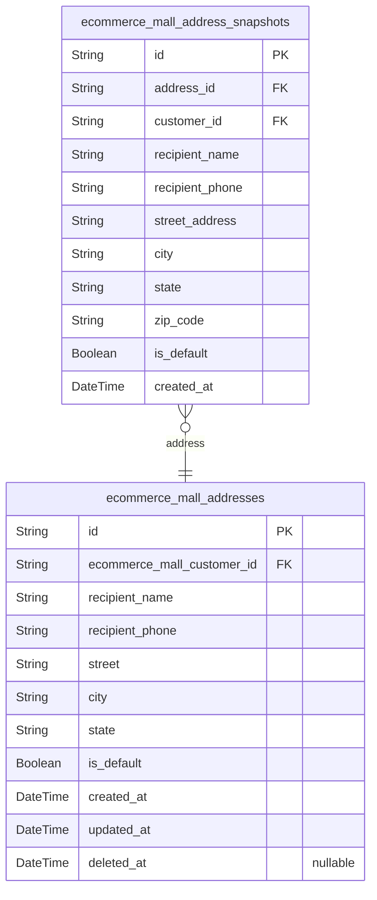

### `ecommerce_mall_addresses`

Customer shipping addresses for order delivery and fulfillment.

Each customer can have multiple shipping addresses, with at most one
default address designated for regular deliveries. Addresses store
recipient information (name and phone), complete street address details
(street, city, state), and are referenced by Orders during checkout.

Key relationships:
- Belongs to [ecommerce_mall_customers](#ecommerce_mall_customers) - one customer has many
addresses
- Referenced by [ecommerce_mall_orders](#ecommerce_mall_orders) during order placement
- Snapshot history tracked in [ecommerce_mall_address_snapshots](#ecommerce_mall_address_snapshots)
for audit trail

Business rules:
- Each customer may designate one address as default for convenience
- Addresses are soft-deleted to preserve order history integrity
- Recipient phone number required for delivery contact

Properties as follows:

- `id`: Primary Key.
- `ecommerce_mall_customer_id`: Customer who owns this address. [ecommerce_mall_customers.id](#ecommerce_mall_customers)
- `recipient_name`
  > Name of the person who will receive the delivery at this address.
  > Required for shipping labels and delivery notifications.
- `recipient_phone`
  > Phone number of the recipient for delivery contact and notifications. May
  > include country code.
- `street`
  > Street address including building number and street name. May include
  > apartment/suite number.
- `city`: City or municipality where the address is located.
- `state`: State, province, or region where the address is located.
- `is_default`
  > Whether this is the customer's default address. Only one address per
  > customer can be marked as default. Default addresses are pre-selected
  > during checkout for convenience.
- `created_at`: Timestamp when this address record was created.
- `updated_at`: Timestamp when this address record was last modified.
- `deleted_at`: Timestamp when this address was soft-deleted. Null if address is active.

### `ecommerce_mall_address_snapshots`

Point-in-time snapshots of customer shipping addresses for audit trail
and historical reference.

This table captures immutable snapshots of address state changes,
providing an audit trail for dispute resolution, order fulfillment
verification, and historical analysis. Each snapshot records the complete
address state at the time of creation or modification.

**Key relationships**:
- Belongs to [ecommerce_mall_addresses](#ecommerce_mall_addresses) - References the original
address record that was snapshot
- Business context: Used to verify address state at order creation time
for dispute resolution
- Immutable: Snapshots are append-only and never modified

**Snapshot architecture**:
- Denormalized: Contains all address fields for historical completeness
- Read-only: Cannot be updated after creation
- Audit trail: Enables tracking of address changes over time

Properties as follows:

- `id`: Primary Key.
- `address_id`: Original address's [ecommerce_mall_addresses.id](#ecommerce_mall_addresses).
- `customer_id`: Customer's [ecommerce_mall_customers.id](#ecommerce_mall_customers).
- `recipient_name`: Name of the recipient at the delivery address.
- `recipient_phone`: Phone number of the recipient at this address.
- `street_address`: Street address (line 1) for delivery.
- `city`: City or municipality name.
- `state`: State or province name.
- `zip_code`: Postal or ZIP code.
- `is_default`: Whether this was the customer's default address at snapshot time.
- `created_at`: Timestamp when this snapshot was created.

## Wishlist

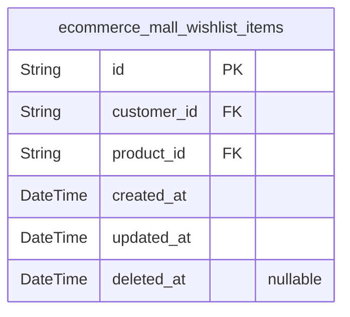

### `ecommerce_mall_wishlist_items`

Customer wishlists for saved products, tracking which products each
customer wants to consider later.

This table represents a many-to-many relationship between customers and
products where customers can save products to their wishlist for future
purchase consideration. Each row represents a single customer-product
relationship indicating the customer wants this specific product.

**Key Relationships:**
- [ecommerce_mall_customers](#ecommerce_mall_customers) - Customer who owns this wishlist item
(FK reference)
- [ecommerce_mall_products](#ecommerce_mall_products) - Product saved in the customer's
wishlist (FK reference)

**Business Context:**
- Customers can add multiple products to their wishlist
- The same product can appear in multiple customers' wishlists
- No transactional commitment - wishlist items are informational
- Soft delete support for account deletion scenarios

**Access Pattern:**
- Customers view their own wishlist items
- Products page may show "Add to Wishlist" functionality

Properties as follows:

- `id`: Primary Key.
- `customer_id`
  > Customer's [ecommerce_mall_customers.id](#ecommerce_mall_customers). The customer who saved
  > this product to their wishlist.
- `product_id`
  > Product's [ecommerce_mall_products.id](#ecommerce_mall_products). The product that was saved
  > to the customer's wishlist.
- `created_at`: When this product was added to the customer's wishlist.
- `updated_at`: Last update timestamp for this wishlist item.
- `deleted_at`: Soft delete timestamp when the wishlist item is removed.

## Snapshots

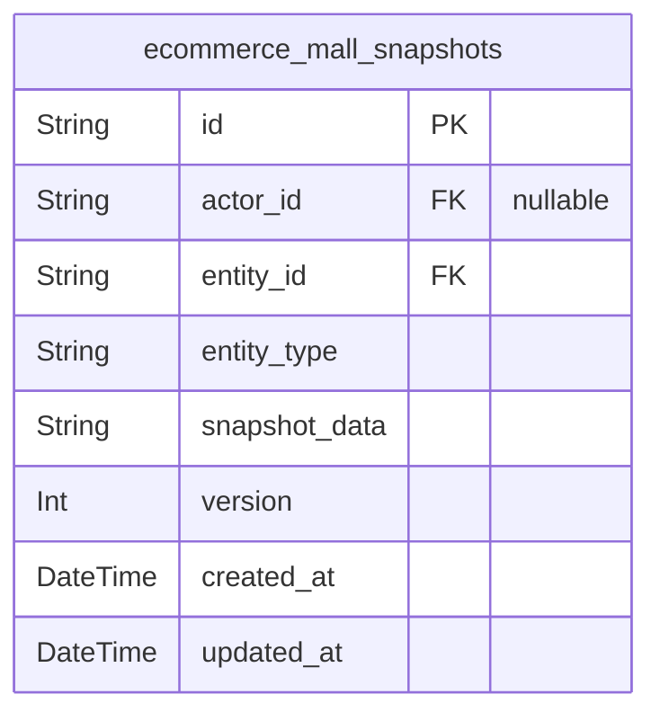

### `ecommerce_mall_snapshots`

Centralized snapshot table tracking point-in-time state changes across
products, variants, reviews, cancellation requests, and refund requests.

This table serves as an audit trail for all historical state changes in
the ecommerce system, enabling:

- Historical state reconstruction: Rebuild entity state at any point in time
- Audit compliance: Track who made changes and when
- Dispute resolution: Reference immutable snapshots for customer/seller
disputes
- Rollback capabilities: Restore previous states when needed

The table uses a polymorphic reference pattern with entity_type and
entity_id fields to support tracking changes across multiple entity types
(products, product_variants, reviews, cancellation_requests,
refund_requests). Each actor (customer, seller, admin, super_admin) can
generate snapshots for their actions.

Related entities:
- [ecommerce_mall_products](#ecommerce_mall_products): Product snapshots track product changes
- [ecommerce_mall_product_variants](#ecommerce_mall_product_variants): Variant snapshots track
variant changes
- [ecommerce_mall_reviews](#ecommerce_mall_reviews): Review snapshots track review changes
- [ecommerce_mall_cancellation_requests](#ecommerce_mall_cancellation_requests): Cancellation request
snapshots track status changes
- [ecommerce_mall_refund_requests](#ecommerce_mall_refund_requests): Refund request snapshots track
status changes
- [ecommerce_mall_customers](#ecommerce_mall_customers): Customer-generated snapshots
- [ecommerce_mall_sellers](#ecommerce_mall_sellers): Seller-generated snapshots
- [ecommerce_mall_admins](#ecommerce_mall_admins): Admin-generated snapshots
- [ecommerce_mall_super_admins](#ecommerce_mall_super_admins): Super admin-generated snapshots

Properties as follows:

- `id`: Primary Key.
- `actor_id`
  > Actor who made the change. Can be customer, seller, admin, or
  > super_admin. For automated snapshots, this may be null.
- `entity_id`
  > ID of the entity being snapshotted (product, variant, review,
  > cancellation_request, or refund_request). References depend on
  > entity_type.
- `entity_type`
  > Type of entity being snapshotted: 'product', 'product_variant', 'review',
  > 'cancellation_request', or 'refund_request'. Determines which entity_id
  > references.
- `snapshot_data`
  > JSON string containing the complete state of the entity at the time of
  > snapshot. Includes all field values for reconstructing the entity state.
- `version`
  > Sequential version number for this specific entity, incrementing with
  > each snapshot
- `created_at`: Timestamp when the snapshot was created
- `updated_at`: Timestamp of the last update to this snapshot record

## CancellationRequest

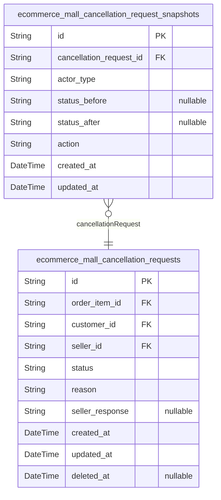

### `ecommerce_mall_cancellation_requests`

Customer cancellation requests for order items before shipping.

This table stores cancellation requests initiated by customers for
specific order items. When a customer wants to cancel an item before it
ships, they create a cancellation request with a reason. The seller can
then approve or reject the request with a response. The system tracks the
request status throughout this workflow.

Business purpose:
- Allow customers to request item cancellation before shipment
- Enable sellers to approve or reject cancellation requests with
justification
- Track cancellation workflow status (pending, approved, rejected)
- Preserve customer reasons and seller responses for dispute resolution

Key relationships:
- [EcommerceMallOrderItem](#EcommerceMallOrderItem) - The specific order item being cancelled
- [EcommerceMallCustomer](#EcommerceMallCustomer) - The customer who initiated the
cancellation request
- [EcommerceMallSeller](#EcommerceMallSeller) - The seller who must respond to the
request (via order item's seller_id)

Workflow states:
- pending: Request awaiting seller response
- approved: Seller approved, order item will be cancelled
- rejected: Seller denied the request with explanation

Soft delete enabled to maintain audit trail while removing from active
workflows.

Properties as follows:

- `id`: Primary Key.
- `order_item_id`
  > The order item this cancellation request targets. {@link
  > EcommerceMallOrderItem.id}
- `customer_id`
  > The customer who created this cancellation request. {@link
  > EcommerceMallCustomer.id}
- `seller_id`
  > The seller who must respond to this cancellation request. {@link
  > EcommerceMallSeller.id}
- `status`
  > Current status of the cancellation request. Values: pending, approved,
  > rejected.
- `reason`: Customer's reason for requesting cancellation.
- `seller_response`
  > Seller's response when rejecting the request. NULL if approved or still
  > pending.
- `created_at`: When the cancellation request was created.
- `updated_at`: Last update timestamp for the cancellation request.
- `deleted_at`: Soft delete timestamp. NULL if not deleted.

### `ecommerce_mall_cancellation_request_snapshots`

Immutable audit trail table recording point-in-time state changes for
cancellation requests when sellers approve or reject them.

This snapshot table serves as an historical record for dispute resolution
and audit purposes. Each record captures the complete state of a
cancellation request at a specific moment, including the status before
and after the change, the actor type performing the action, and the type
of action taken.

Key relationships:
- [ecommerce_mall_cancellation_requests.id](#ecommerce_mall_cancellation_requests) - Parent cancellation
request being tracked
- Actor type tracking to identify which actor performed the action

Snapshots are append-only and never modified, ensuring a reliable
historical trail of all cancellation request lifecycle events.

Note: This table does not duplicate parent entity fields (status, reason,
seller_response) as they are accessed via the {@link
ecommerce_mall_cancellation_requests} FK reference.

Properties as follows:

- `id`: Primary Key.
- `cancellation_request_id`
  > Referenced cancellation request's {@link
  > ecommerce_mall_cancellation_requests.id}.
- `actor_type`: Type of actor performing the action (e.g., 'seller').
- `status_before`
  > Cancellation request status before the state change (e.g., 'pending',
  > 'approved', 'rejected').
- `status_after`: Cancellation request status after the state change.
- `action`: Type of action performed (e.g., 'approved', 'rejected').
- `created_at`: Timestamp when the snapshot was created.
- `updated_at`
  > Timestamp when the snapshot was last updated (same as created_at for
  > snapshots).

## RefundRequest

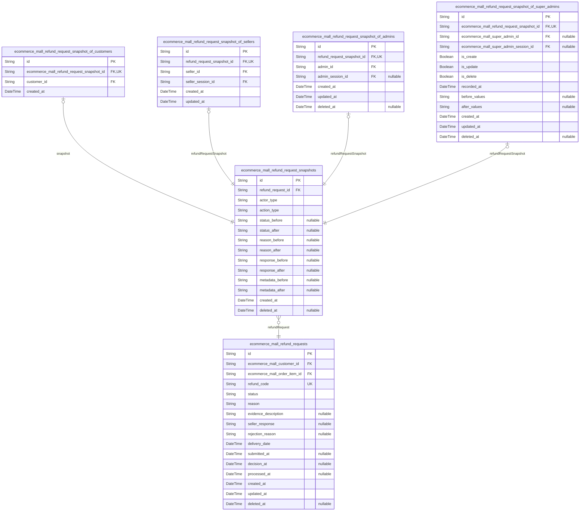

### `ecommerce_mall_refund_requests`

Main refund request entity tracking customer refund requests for
individual delivered order items.

This table represents the core business entity for the refund workflow
where customers can request refunds for delivered items within a 7-day
window after delivery. Each refund request is tied to a specific order
item and customer, with comprehensive status tracking from submission
through resolution.

Key relationships:
- Belongs to [ecommerce_mall_customers](#ecommerce_mall_customers) (customer who initiated the
refund)
- Belongs to [ecommerce_mall_order_items](#ecommerce_mall_order_items) (the specific order item
being refunded)
- Has associated [ecommerce_mall_refund_request_snapshots](#ecommerce_mall_refund_request_snapshots) for
audit trail

The refund workflow progresses through states:
pending→approved/rejected→processed (if approved). The table captures
customer reasons, seller responses, and eligibility data for dispute
resolution and audit purposes.

Properties as follows:

- `id`: Primary Key.
- `ecommerce_mall_customer_id`
  > Customer who initiated the refund request. {@link
  > ecommerce_mall_customers.id}.
- `ecommerce_mall_order_item_id`
  > The specific order item being refunded. {@link
  > ecommerce_mall_order_items.id}.
- `refund_code`: Unique refund request identifier.
- `status`: Current status of the refund request in the workflow.
- `reason`: Customer-provided reason for the refund request with detailed explanation.
- `evidence_description`: Customer-provided evidence description or upload reference (optional).
- `seller_response`: Seller's response to the refund request if provided.
- `rejection_reason`: Reason why seller rejected the refund request if applicable.
- `delivery_date`
  > Date when the delivery was completed (used to verify 7-day eligibility
  > window).
- `submitted_at`: Date and time when the refund request was submitted.
- `decision_at`: Date and time when seller approved or rejected the request.
- `processed_at`: Date and time when the refund was processed and funds returned.
- `created_at`: Date and time when the refund request was created.
- `updated_at`: Date and time when the refund request was last updated.
- `deleted_at`: Date and time when the refund request was soft-deleted (null if active).

### `ecommerce_mall_refund_request_snapshots`

Immutable audit trail capturing point-in-time states of refund requests
for historical tracking and dispute resolution.

Each snapshot record represents a complete state of an {@link
ecommerce_mall_refund_requests} entity at the moment of change. Snapshots
are append-only and serve as the authoritative source for:

- Approval/rejection decision history
- Status transition tracking (pending → approved/rejected)
- Reason and response change documentation
- Actor accountability (who made each change)
- Before/after value comparison for audit purposes

This table is critical for dispute resolution, compliance audits, and
maintaining data integrity in post-delivery refund workflows. Customers
can request refunds for delivered items within 7-day windows, and sellers
respond with approval/rejection decisions. Snapshots preserve this entire
interaction history.

**Key Relationships**:
- Belongs to one [ecommerce_mall_refund_requests](#ecommerce_mall_refund_requests) (parent refund
request)
- Associated with one actor (customer, seller, or admin) via subtype
polymorphic reference through {@link
ecommerce_mall_refund_request_snapshot_of_customers}, {@link
ecommerce_mall_refund_request_snapshot_of_sellers}, {@link
ecommerce_mall_refund_request_snapshot_of_admins}, {@link
ecommerce_mall_refund_request_snapshot_of_super_admins}
- Used by [ecommerce_mall_refund_requests](#ecommerce_mall_refund_requests) for audit trail access

**Access Pattern**:
- Read-only from user perspective (append-only)
- Accessed for dispute investigation and historical reference
- Indexed by refund_request_id, actor_id, and created_at for efficient
querying

Properties as follows:

- `id`: Primary Key.
- `refund_request_id`
  > Parent refund request's [ecommerce_mall_refund_requests.id](#ecommerce_mall_refund_requests). Many
  > snapshots per one refund request to maintain complete audit trail.
- `actor_type`
  > Type of actor who made this change. Possible values: 'customer',
  > 'seller', 'admin', 'super_admin'. Used to determine which subtype
  > snapshot table this record belongs to.
- `action_type`
  > Type of action captured in this snapshot. Possible values: 'created',
  > 'status_changed', 'reason_updated', 'approved', 'rejected',
  > 'response_added'.
- `status_before`
  > Refund request status before this change. Null for newly created
  > snapshots. Possible values: 'pending', 'approved', 'rejected',
  > 'refunded'.
- `status_after`
  > Refund request status after this change. Null if status was unchanged.
  > Possible values: 'pending', 'approved', 'rejected', 'refunded'.
- `reason_before`: Refund reason text before this change. Null if reason was not modified.
- `reason_after`: Refund reason text after this change. Null if reason was not modified.
- `response_before`
  > Seller/admin response text before this change. Null if response was not
  > modified.
- `response_after`
  > Seller/admin response text after this change. Null if response was not
  > modified.
- `metadata_before`
  > JSON metadata snapshot before this change. Captures other field changes
  > not tracked separately. Used for comprehensive before/after comparison.
- `metadata_after`
  > JSON metadata snapshot after this change. Captures other field changes
  > not tracked separately. Used for comprehensive before/after comparison.
- `created_at`: Timestamp when this snapshot was created (point in time of change).
- `deleted_at`: Soft delete timestamp for audit trail cleanup. Null if record is active.

### `ecommerce_mall_refund_request_snapshot_of_customers`

Customer subtype snapshot for refund request audit trail. Links main
snapshot record to customer actor who made the change. Enforces 1:1
relationship with main snapshot table via unique constraint on
refund_request_id. This table supports the polymorphic ownership pattern
where snapshot changes can be attributed to different actor types
(customers, sellers, admins, super admins).

Properties as follows:

- `id`: Primary Key.
- `ecommerce_mall_refund_request_snapshot_id`
  > Parent snapshot's [ecommerce_mall_refund_request_snapshots.id](#ecommerce_mall_refund_request_snapshots).
  > References the main snapshot table that stores all snapshot data.
- `customer_id`
  > Customer's [ecommerce_mall_customers.id](#ecommerce_mall_customers). The customer actor who
  > made the snapshot change.
- `created_at`: Record creation timestamp.

### `ecommerce_mall_refund_request_snapshot_of_sellers`

Seller subtype snapshot for refund request audit trail. Links main
snapshot record to seller actor who made the change. Enforces 1:1
relationship with main snapshot table via unique constraint on
refund_request_id.

This table provides accountability for seller actions on refund requests
by tracking which seller (and which session) performed the action. It's
part of the audit trail infrastructure that enables dispute resolution
and historical tracking of refund request states.

Properties as follows:

- `id`: Primary Key.
- `refund_request_snapshot_id`
  > Reference to the main refund request snapshot {@link
  > ecommerce_mall_refund_request_snapshots.id}. Enforces 1:1 relationship
  > via unique constraint.
- `seller_id`
  > Seller actor [ecommerce_mall_sellers.id](#ecommerce_mall_sellers) who performed the action
  > on the refund request.
- `seller_session_id`
  > Seller session [ecommerce_mall_seller_sessions.id](#ecommerce_mall_seller_sessions) at time of
  > action for accountability and audit trail.
- `created_at`: When this audit record was created.
- `updated_at`: Last update timestamp.

### `ecommerce_mall_refund_request_snapshot_of_admins`

Admin subtype snapshot for refund request audit trail.

Links main refund request snapshot records to the admin actor who made
the change, providing actor-specific audit context. Each snapshot record
has exactly one admin actor reference via 1:1 relationship enforced by
unique constraint on refund_request_snapshot_id.

Used for:
- Tracking which administrator approved or rejected a refund request
- Auditing admin actions for dispute resolution
- Maintaining complete change history with actor attribution

Properties as follows:

- `id`: Primary Key.
- `refund_request_snapshot_id`
  > Refund request snapshot's {@link
  > ecommerce_mall_refund_request_snapshots.id}. 1:1 relationship with unique
  > constraint.
- `admin_id`: Administrator who made the change. [ecommerce_mall_admins.id](#ecommerce_mall_admins).
- `admin_session_id`
  > Admin session context at time of change. {@link
  > ecommerce_mall_admin_sessions.id}.
- `created_at`: Record creation timestamp.
- `updated_at`: Last update timestamp.
- `deleted_at`: Soft delete timestamp (null if active).

### `ecommerce_mall_refund_request_snapshot_of_super_admins`

Super admin subtype snapshot for refund request audit trail. Links main
snapshot record to super admin actor who made the change. Enforces 1:1
relationship with main snapshot table via unique constraint on
refund_request_id. This table is part of the polymorphic subtype pattern
where each actor type (customer, seller, admin, super_admin) has their
own subtype snapshot table tracking which actor made the state change at
a point in time.

Properties as follows:

- `id`: Primary Key.
- `ecommerce_mall_refund_request_snapshot_id`
  > Belonged refund request's {@link
  > ecommerce_mall_refund_request_snapshots.id}. Unique constraint enforces
  > 1:1 relationship between this subtype snapshot and the main snapshot
  > record.
- `ecommerce_mall_super_admin_id`
  > Belonged super admin's [ecommerce_mall_super_admins.id](#ecommerce_mall_super_admins). Identifies
  > which super admin made the change.
- `ecommerce_mall_super_admin_session_id`
  > Session ID of the super admin who made the change, if available. Captures
  > the session context for audit purposes.
- `is_create`
  > Whether this is a create operation. True when a new refund request is
  > created.
- `is_update`
  > Whether this is an update operation. True when a refund request is
  > modified.
- `is_delete`
  > Whether this is a delete operation. True when a refund request is
  > soft-deleted.
- `recorded_at`: Timestamp when this snapshot was recorded.
- `before_values`: Before values snapshot as JSON (for updates).
- `after_values`: After values snapshot as JSON (for updates).
- `created_at`: Timestamp when the refund request was originally created.
- `updated_at`: Timestamp when this record was last updated.
- `deleted_at`: Timestamp when this record was soft-deleted (null if not deleted).

## SellerApprovalRequest

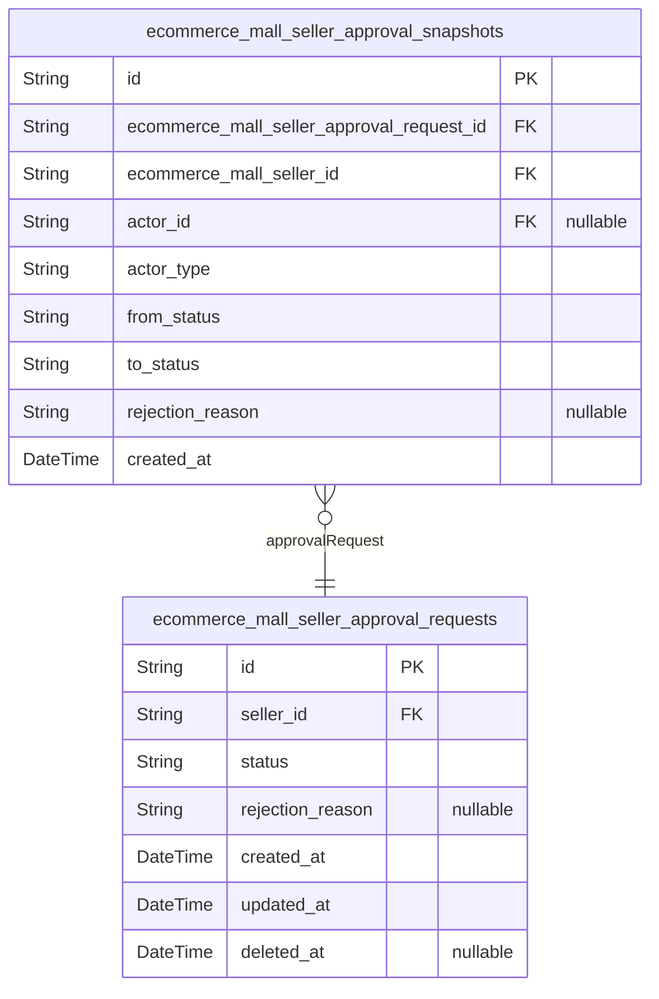

### `ecommerce_mall_seller_approval_requests`

Seller registration approval requests tracking the onboarding workflow.

This table captures seller registration requests that require
administrator approval before the seller can begin selling on the
platform. Each request represents a new seller account awaiting review.

Key relationships:
- Belongs to a single [ecommerce_mall_seller](#ecommerce_mall_seller) actor who submitted
the registration
- Has many snapshots recorded in {@link
ecommerce_mall_seller_approval_snapshots} for audit trail

Status workflow:
- pending: Initial state when seller submits registration
- approved: Administrator has approved, seller can now sell
- rejected: Administrator rejected with reasons in rejection_reason field

Resubmission:
- When rejected, sellers can submit new approval requests
- Each rejection is tracked in snapshot history for audit purposes

Properties as follows:

- `id`: Primary Key.
- `seller_id`: Seller actor's [ecommerce_mall_sellers.id](#ecommerce_mall_sellers).
- `status`: Approval request status: pending, approved, or rejected.
- `rejection_reason`
  > Administrator's reason for rejecting the approval request. Only populated
  > when status is rejected.
- `created_at`: Timestamp when the approval request was created.
- `updated_at`: Timestamp when the approval request was last updated.
- `deleted_at`: Soft delete timestamp for record archival.

### `ecommerce_mall_seller_approval_snapshots`

Immutable audit trail recording point-in-time state changes of seller
approval requests for dispute resolution and historical reference.

This snapshot table captures the complete state of a seller approval
request at specific moments (approval, rejection, resubmission). Each
snapshot is immutable and serves as an authoritative record of what the
approval request looked like at that point in time.

Business Context:
- Records state transitions between pending, approved, and rejected statuses
- Captures rejection reasons when administrators reject registrations
- Links to the main approval request through
ecommerce_mall_seller_approval_request_id
- Links to the seller (ecommerce_mall_seller_id) for audit ownership
- Links to the actor who made the change (admin or superAdmin) for
accountability

Relationships:
- Belongs to one approval request: {@link
ecommerce_mall_seller_approval_requests}
- Belongs to one seller: [ecommerce_mall_sellers](#ecommerce_mall_sellers)
- Belongs to one actor who made the change: polymorphic reference via
actor_type and actor_id

Properties as follows:

- `id`: Primary Key.
- `ecommerce_mall_seller_approval_request_id`
  > Reference to the seller approval request this snapshot belongs to. {@link
  > ecommerce_mall_seller_approval_requests.id}
- `ecommerce_mall_seller_id`
  > Reference to the seller whose approval request this snapshot records.
  > [ecommerce_mall_sellers.id](#ecommerce_mall_sellers)
- `actor_id`
  > Reference to the admin or superAdmin who made the approval/rejection
  > decision. [ecommerce_mall_admins.id](#ecommerce_mall_admins) or {@link
  > ecommerce_mall_super_admins.id}
- `actor_type`
  > Type of actor who made the decision: admin or superAdmin. Used with
  > actor_id for polymorphic ownership pattern.
- `from_status`
  > Status of the approval request before this state change: pending,
  > approved, or rejected
- `to_status`
  > Status of the approval request after this state change: pending,
  > approved, or rejected
- `rejection_reason`
  > Administrator-provided rejection reason when the approval request was
  > rejected. Nullable for approved or pending states.
- `created_at`
  > Timestamp when this snapshot was created, recording the point in time of
  > the state change.
