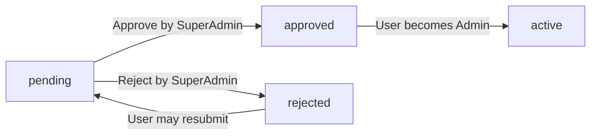

**ecommerceMall — Actor definitions, permission matrix, authentication, session, account lifecycle**

Actor definitions, permission matrix, authentication, session, account lifecycle

# Actor Definitions

Define all user actor types with their roles and what they can do.

## customer Actor

Customers are registered users who browse the marketplace and make purchases. Every customer must complete registration with email and password before accessing any platform features. Customers can browse all product listings and search using filters for category, price range, and stock availability. They add products to their wishlist and place orders through the shopping cart system. Each customer maintains a profile with a display name and phone number, plus multiple saved shipping addresses with one marked as default. When purchasing items, customers receive order confirmations and can track shipments with tracking numbers. They can request cancellations for items that haven't shipped yet and request refunds for delivered items within seven days. Customers write product reviews after delivery and can edit or delete their own reviews. They can change their password and delete their account when no orders are pending.

### Account Registration and Access

WHEN a customer registers for an account, THE system SHALL require an email address and password. IF the email is already in use, THE system SHALL reject the registration. GUESTS SHALL NOT be able to browse products, add items to cart, or place orders. ALL authenticated customers SHALL be able to access the product catalog. WHEN a customer registers, THE system SHALL create a customer profile with default values. THE customer SHALL be required to set a display name during or after registration.

### Login and Session Management

WHEN a customer logs in with their email and password, THE system SHALL authenticate the credentials and create an active session. IF the customer is banned, THE system SHALL reject the login attempt and display the ban reason. WHILE a session is active, THE system SHALL maintain the customer's authentication state. IF the session expires, THE system SHALL require the customer to log in again. THE system SHALL provide a logout function that ends the current session.

### Password Management

WHEN a customer requests to change their password, THE system SHALL require the current password and the new password. IF the current password is incorrect, THE system SHALL reject the change request. IF the new password does not meet security requirements, THE system SHALL reject the change. WHEN password is changed successfully, THE system SHALL invalidate all existing sessions and require re-login with the new password. THE system SHALL NOT allow a new password that matches the previous three passwords.

### Profile Management

WHEN a customer edits their profile, THE system SHALL allow updates to display name and phone number. IF the display name exceeds 100 characters, THE system SHALL reject the update. WHEN profile is updated, THE system SHALL update the modification timestamp. THE display name SHALL be visible to other users in orders and reviews. THE phone number SHALL be used for shipping address entries and verification.

### Shipping Address Management

WHEN a customer adds a shipping address, THE system SHALL require recipient name, phone number, street address, city, and state/province. WHEN a customer adds an address, THE system SHALL allow the customer to set it as the default shipping address. IF an address already exists as default, THE system SHALL update the default flag. WHILE checking out, THE system SHALL display all saved addresses for selection. THE system SHALL allow customers to delete any address that is not the default. IF the customer attempts to delete their only address, THE system SHALL prevent deletion until another address is added.

### Product Browsing

WHEN a customer browses the product catalog, THE system SHALL display products from all sellers. EACH product listing SHALL show the main image, product name, base price, seller shop name, and average rating. IF a product has no variants, THE system SHALL display it as unavailable with a clear message. THE system SHALL paginate product listings with a reasonable page size. CUSTOMERS SHALL be able to navigate to individual product detail pages.

### Product Search and Filtering

WHEN a customer searches for products by name, THE system SHALL return products where the name matches the search term. WHILE browsing search results, THE system SHALL allow filtering by category. WHILE browsing search results, THE system SHALL allow filtering by minimum and maximum price. WHILE browsing search results, THE system SHALL allow filtering for in-stock products only. WHEN customers apply filters, THE system SHALL update the results in real-time. IF no products match the search criteria, THE system SHALL display a message indicating no results found.

### Product Search Sorting

WHEN viewing search or category results, THE system SHALL allow sorting by newest first. WHEN viewing search or category results, THE system SHALL allow sorting by price from low to high. WHEN viewing search or category results, THE system SHALL allow sorting by price from high to low. THE default sort order SHALL be newest first. WHILE sorting is applied, THE system SHALL maintain all other active filters.

### Wishlist Management

WHEN a customer adds a product to their wishlist, THE system SHALL save the product reference for that customer. WHEN viewing their wishlist, THE system SHALL display products that the customer added. IF the same product is already in the wishlist, THE system SHALL prevent duplicate entries. WHEN a product is deleted by the seller, THE system SHALL automatically remove it from all customer wishlists. WHEN a customer removes a product from their wishlist, THE system SHALL permanently delete that wishlist entry. THE wishlist SHALL be paginated when displaying many products.

### Shopping Cart Operations

WHEN a customer adds a product variant to their cart, THE system SHALL require selection of a specific variant and quantity. IF the variant stock is insufficient for the requested quantity, THE system SHALL prevent addition and display a stock warning. IF the same variant already exists in the cart, THE system SHALL combine the quantities rather than adding a duplicate entry. WHEN a customer updates cart quantity, THE system SHALL recalculate the item subtotal. IF the cart quantity exceeds available stock, THE system SHALL display a warning. IF a variant is deleted or goes out of stock, THE system SHALL mark it as unavailable in the cart.

### Checkout Process

WHEN a customer proceeds to checkout, THE system SHALL verify that all cart items are available and in stock. IF unavailable items exist, THE system SHALL prevent checkout and list the unavailable items. WHILE checking out, THE system SHALL require selection of a shipping address from saved addresses. WHEN reviewing the order, THE system SHALL display the list of items with prices, shipping address, and total price. ONCE an order is placed, THE system SHALL prevent any changes to the shipping address.

### Order Placement

WHEN a customer confirms and places an order, THE system SHALL process payment through the external gateway. IF payment fails, THE system SHALL NOT create an order and SHALL notify the customer. IF payment succeeds, THE system SHALL create an order record and decrease stock quantities. WHEN order is placed successfully, THE system SHALL remove all items from the customer's cart. THE system SHALL create a snapshot of each product and variant at the time of purchase. THE system SHALL create a snapshot of each seller profile at the time of purchase.

### Order History and Tracking

WHEN a customer views their order history, THE system SHALL display orders sorted by newest first with pagination. EACH order listing SHALL show order number, date, total price, and overall order status. WHEN viewing an order detail, THE system SHALL display all order items with product names, variants, quantities, and item status. WHEN viewing an order detail, THE system SHALL display the shipping address used. WHEN viewing an order detail, THE system SHALL display all shipments with tracking information.

### Order Status Monitoring

WHEN an order item status changes to shipped, THE system SHALL display shipment tracking information. WHILE an item status is shipped, THE system SHALL allow the customer to confirm delivery. IF the customer confirms delivery, THE system SHALL change the item status to delivered. IF the customer does not confirm delivery, THE system SHALL automatically change the status to delivered after 14 days. WHILE item status is delivered, THE system SHALL allow the customer to write a review.

### Cancellation Request Workflow

WHEN a customer requests cancellation for an order item, THE system SHALL require the customer to provide a reason for cancellation. CANCELLATION SHALL ONLY be allowed for items with status paid (not yet shipped). WHEN a cancellation request is submitted, THE system SHALL notify the seller and wait for their response. IF the seller approves the cancellation, THE system SHALL cancel the item and process a refund. IF the seller rejects the cancellation, THE system SHALL notify the customer. WHEN a seller responds to a cancellation request, THE system SHALL create a snapshot of the request state.

### Refund Request Policy

WHEN a customer requests a refund for an order item, THE system SHALL require the customer to provide a reason for the refund. REFUND SHALL ONLY be allowed for items with status delivered within seven days of delivery. WHEN a refund request is submitted, THE system SHALL notify the seller and wait for their response. IF the seller approves the refund, THE system SHALL process the refund and restore stock. IF the seller rejects the refund, THE system SHALL notify the customer. WHEN a seller responds to a refund request, THE system SHALL create a snapshot of the request state.

### Product Review System

WHEN a customer writes a review for a product, THE system SHALL require the customer to have received that product as delivered. THE system SHALL allow only one review per product per order. WHEN writing a review, THE system SHALL require a rating between one and five stars. THE system SHALL allow optional text content in the review. THE system SHALL display reviews sorted by newest first. WHEN a customer edits their review, THE system SHALL create a snapshot of the original review. WHEN a customer deletes their review, THE system SHALL preserve a snapshot showing it was deleted. THE system SHALL calculate product average rating from all non-deleted reviews.

### Account Deletion Process

WHEN a customer requests to delete their account, THE system SHALL first verify that no orders are pending. IF pending orders exist, THE system SHALL reject the deletion request. IF pending cancellations or refunds exist, THE system SHALL reject the deletion request. WHEN account is deleted, THE system SHALL delete all profile information including display name and phone number. WHEN account is deleted, THE system SHALL preserve all order history and order records. WHEN account is deleted, THE system SHALL preserve reviews but mark them as from a deleted user. THE system SHALL NOT allow re-registration with the same email address after deletion.

## seller Actor

Sellers register to operate their own shops on the platform and must receive administrator approval before they can list products. Approved sellers can create products with images, descriptions, and variants including different option combinations like colors and sizes. Each seller manages their own inventory levels and can restock products when quantities reach low levels. When customers place orders, sellers receive notification of items they must ship to customers. Sellers create shipments by selecting items and providing tracking information to customers. They can approve or reject cancellation requests from customers for items awaiting shipment. Sellers also respond to refund requests for delivered items within the return window. Their shop profile includes a shop name, description, and logo image that customers can view. Sellers can view their dashboard with summary statistics and filter order items by status. They can delete their account only when no pending orders or refund requests exist.

### Seller Registration and Approval

WHEN a seller submits a registration request, THE system SHALL store the request with status 'pending' and prevent access to selling features.

WHEN an administrator views pending seller requests, THE system SHALL display the seller's email and submission date.

IF a seller submits multiple registration requests while one is pending, THE system SHALL reject the new request until the previous one is resolved.

WHEN an administrator approves a seller registration, THE system SHALL change the approval status to 'approved' and enable all selling features.

IF an administrator rejects a seller registration, THE system SHALL change the approval status to 'rejected' and store the rejection reason.

WHEN a rejected seller views their account, THE system SHALL display the rejection reason.

WHEN a rejected seller submits a new registration request, THE system SHALL store it as a new request with 'pending' status.

IF a pending seller attempts to log in, THE system SHALL allow login but restrict access to selling features until approval.

WHEN a pending seller attempts to create a product, THE system SHALL reject the request and display a message that approval is required.

IF a pending seller attempts to view their shop profile, THE system SHALL allow viewing but indicate the shop is not yet visible to customers.

THE seller approval status SHALL be one of: pending, approved, or rejected.

### Product Creation and Management

WHEN an approved seller creates a product, THE system SHALL require a product name, description, category, and base price.

IF the product name is missing or empty, THE system SHALL reject the creation request.

IF the product description is missing or empty, THE system SHALL reject the creation request.

IF the product does not have a category assigned, THE system SHALL reject the creation request.

IF the base price is missing or not a valid number, THE system SHALL reject the creation request.

WHEN a seller successfully creates a product, THE system SHALL associate the product with the seller's account.

THE product SHALL be visible in search and category listings immediately after creation.

WHEN an approved seller edits an existing product, THE system SHALL create a snapshot recording the previous state.

IF a seller attempts to delete a product with pending order items, THE system SHALL reject the deletion request.

IF a seller attempts to delete a product with pending cancellation requests, THE system SHALL reject the deletion request.

IF a seller attempts to delete a product with pending refund requests, THE system SHALL reject the deletion request.

WHEN a seller successfully deletes a product, THE system SHALL remove it from all search and category listings.

WHEN a seller successfully deletes a product, THE system SHALL delete all variants and inventory records associated with the product.

WHEN an approved seller views a product snapshot, THE system SHALL display the complete state of the product at the time the snapshot was created.

IF the system administrator deletes any product, THE system SHALL preserve all snapshots of that product for record purposes.

### Variant and SKU Management

WHEN a seller creates a product, THE system SHALL require at least one variant before the product becomes purchasable.

WHEN a seller adds a variant to a product, THE system SHALL require an SKU code, option values, and stock quantity.

IF the SKU code is missing or empty, THE system SHALL reject the variant creation request.

IF the SKU code already exists for another product, THE system SHALL reject the variant creation request.

IF the stock quantity is missing or not a valid number, THE system SHALL reject the variant creation request.

WHEN a seller edits a variant's SKU code, option values, or price, THE system SHALL create a snapshot of the variant's previous state.

IF a seller attempts to delete a variant with pending order items, THE system SHALL reject the deletion request.

IF a seller attempts to delete a variant with pending cancellation requests, THE system SHALL reject the deletion request.

IF a seller attempts to delete a variant with pending refund requests, THE system SHALL reject the deletion request.

WHEN a product has no variants, THE system SHALL display the product as 'unavailable' in search and category listings.

WHEN a product has variants but none have stock available, THE system SHALL display all variants as 'out of stock'.

WHEN a variant's stock reaches zero, THE system SHALL prevent customers from adding it to their cart.

IF a variant has a price override specified, THE system SHALL use the override price for cart and checkout calculations.

IF a variant has no price override, THE system SHALL use the product's base price for cart and checkout calculations.

### Product Image Management

WHEN a seller uploads an image for a product, THE system SHALL store the image with a display order value.

WHEN a seller uploads multiple images for a product, THE system SHALL allow reordering to set which image appears first.

IF a seller sets the first image in the display order, THE system SHALL use it as the main or thumbnail image.

WHEN a seller deletes a product image, THE system SHALL remove it from the product's image list.

WHEN a seller edits any product attribute, THE system SHALL include the current images in the product snapshot.

IF a seller adds a new image to a product, THE system SHALL include it in subsequent product snapshots.

WHEN viewing a product detail page, customers SHALL see all images in their specified display order.

THE first image in display order SHALL be shown as the main product thumbnail in search results and category listings.

### Inventory Management

WHEN a seller restocks inventory for a variant, THE system SHALL require a quantity to add and a reason for the restock.

IF the restock quantity is not a positive number, THE system SHALL reject the restock operation.

WHEN a seller restocks inventory, THE system SHALL create an inventory record with the quantity change, reason, and timestamp.

WHEN a variant is ordered and payment is confirmed, THE system SHALL automatically create a negative inventory record.

WHEN a cancellation request is approved, THE system SHALL automatically create a positive inventory record to restore stock.

WHEN a refund request is approved, THE system SHALL automatically create a positive inventory record to restore stock.

WHEN a seller adjusts inventory due to loss or damage, THE system SHALL require a quantity and reason.

IF the adjustment quantity is not valid, THE system SHALL reject the adjustment operation.

WHEN a seller views inventory history for a variant, THE system SHALL display all inventory records with timestamps and reasons.

THE current stock quantity SHALL be calculated by summing all inventory records for a variant.

### Order Fulfillment

WHEN a seller views order items, THE system SHALL display items from the seller's products that need shipping or response.

IF an order item has status 'paid', THE system SHALL allow the seller to create a shipment for that item.

IF an order item has status 'shipped' or 'delivered', THE system SHALL prevent shipment creation.

IF an order item has status 'cancelled' or 'refunded', THE system SHALL prevent shipment creation.

WHEN a seller creates a shipment, THE system SHALL allow selection of one or more of their order items to include.

WHEN a shipment is created, THE system SHALL change the status of all included items to 'shipped'.

A shipment SHALL contain order items only from the same seller.

WHEN a seller views the seller dashboard, THE system SHALL display total number of products.

WHEN a seller views the seller dashboard, THE system SHALL display total number of order items for their products.

WHEN a seller views the seller dashboard, THE system SHALL display number of pending cancellation requests.

WHEN a seller views the seller dashboard, THE system SHALL display number of pending refund requests.

### Shipping and Tracking

WHEN a seller creates a shipment, THE system SHALL require carrier name and tracking number.

IF the carrier name is missing or empty, THE system SHALL reject the shipment creation.

IF the tracking number is missing or empty, THE system SHALL reject the shipment creation.

WHEN multiple order items are included in the same shipment, THE system SHALL share the same tracking information.

WHEN a customer views an order, THE system SHALL display all shipments with their tracking information.

WHEN a customer confirms delivery for a shipment, THE system SHALL change the status of all items in that shipment to 'delivered'.

IF a customer does not confirm delivery within 14 days of shipping, THE system SHALL automatically change the status to 'delivered'.

WHEN a customer views a shipment's tracking information, THE system SHALL display the carrier name and tracking number provided by the seller.

### Cancellation Request Handling

WHEN a customer requests cancellation of an order item, THE system SHALL require a reason text.

IF the cancellation reason is empty, THE system SHALL reject the cancellation request.

Cancellations SHALL only be allowed for items with status 'paid' that have not been shipped.

WHEN a cancellation request is submitted, THE system SHALL create the request with status 'pending' and store the reason.

WHEN a seller views pending cancellation requests, THE system SHALL display the customer's reason and order item details.

IF a seller approves a cancellation request, THE system SHALL change the request status to 'approved' and the item status to 'cancelled'.

IF a seller rejects a cancellation request, THE system SHALL change the request status to 'rejected'.

WHEN a seller responds to a cancellation request, THE system SHALL create a snapshot of the request state.

IF a cancellation request is approved, THE system SHALL restore the item's stock quantity via inventory record.

IF all items in an order are cancelled, THE system SHALL change the overall order status to 'cancelled'.

### Refund Request Handling

WHEN a customer requests a refund for an order item, THE system SHALL require a reason text.

IF the refund reason is empty, THE system SHALL reject the refund request.

Refunds SHALL only be allowed for items with status 'delivered' within 7 days of delivery.

IF a refund request is submitted after 7 days of delivery, THE system SHALL reject the request.

WHEN a refund request is submitted, THE system SHALL create the request with status 'pending' and store the reason.

WHEN a seller views pending refund requests, THE system SHALL display the customer's reason and order item details.

IF a seller approves a refund request, THE system SHALL change the request status to 'approved' and the item status to 'refunded'.

IF a seller rejects a refund request, THE system SHALL change the request status to 'rejected'.

WHEN a seller responds to a refund request, THE system SHALL create a snapshot of the request state.

IF a refund request is approved, THE system SHALL restore the item's stock quantity via inventory record.

IF all items in an order are refunded, THE system SHALL change the overall order status to 'refunded'.

### Shop Profile Management

WHEN a seller creates their shop profile, THE system SHALL require a shop name.

IF the shop name is missing or empty, THE system SHALL reject the profile creation request.

IF the shop name exceeds 100 characters, THE system SHALL reject the profile creation request.

WHEN a seller uploads a shop logo, THE system SHALL store the image file.

WHEN a seller edits their shop name, description, or logo, THE system SHALL create a snapshot of the previous state.

WHEN a customer views a seller profile, THE system SHALL display the shop name, description, and logo image.

IF a seller is suspended by an administrator, THE system SHALL prevent editing of the shop profile.

WHEN a seller deletes their account, THE system SHALL preserve the shop name in past orders.

### Seller Dashboard

WHEN a seller views their dashboard, THE system SHALL display summary statistics for their shop.

WHEN a seller views their dashboard, THE system SHALL display the total number of products they have created.

WHEN a seller views their dashboard, THE system SHALL display the total number of order items for their products.

WHEN a seller views their dashboard, THE system SHALL display the count of pending cancellation requests.

WHEN a seller views their dashboard, THE system SHALL display the count of pending refund requests.

WHEN a seller views their order items list, THE system SHALL allow filtering by item status.

WHEN a seller filters order items by status, THE system SHALL show only items matching the selected status.

The order item statuses available for filtering SHALL be: paid, shipped, delivered, cancelled, and refunded.

### Pending Seller Approval Status

WHEN a seller with pending approval status views their account, THE system SHALL display the current approval status as 'pending'.

WHEN a seller with pending approval status views their account, THE system SHALL indicate that selling features are not yet accessible.

IF a seller with pending approval status attempts to create a product, THE system SHALL prevent the action and display a message requiring approval.

IF a seller with pending approval status attempts to edit their shop profile, THE system SHALL allow viewing but prevent saving.

WHEN a seller's approval status changes from pending to approved, THE system SHALL enable all selling features.

WHEN a seller's approval status changes to rejected, THE system SHALL disable all selling features and display the rejection reason.

THE system SHALL allow rejected sellers to submit new registration requests after resolution of the rejection.

### Seller Account Deletion

WHEN a seller requests account deletion, THE system SHALL first check for pending order items with status 'paid' or 'shipped'.

IF the seller has any pending order items with status 'paid' or 'shipped', THE system SHALL reject the deletion request.

WHEN a seller requests account deletion, THE system SHALL check for pending cancellation requests.

IF the seller has any pending cancellation requests, THE system SHALL reject the deletion request.

WHEN a seller requests account deletion, THE system SHALL check for pending refund requests.

IF the seller has any pending refund requests, THE system SHALL reject the deletion request.

WHEN a seller account is successfully deleted, THE system SHALL delete all products from listings.

WHEN a seller account is successfully deleted, THE system SHALL preserve order history and snapshots for record purposes.

WHEN a seller account is successfully deleted, THE system SHALL preserve the shop name in past orders.

### Product Visibility and Order Filtering

WHEN an approved seller creates a product, THE system SHALL make it immediately visible in search and category listings.

IF an administrator suspends a seller account, THE system SHALL hide all the seller's products from search and category listings.

IF an administrator suspends a seller account, THE system SHALL prevent new purchases of the seller's products.

WHEN a seller is suspended, THE system SHALL allow them to process existing orders and ship items.

WHEN a seller is suspended, THE system SHALL prevent creation of new products.

WHEN a seller is suspended, THE system SHALL prevent editing of existing products.

IF an administrator unsuspends a seller account, THE system SHALL make all products visible again in search and category listings.

WHEN a seller is banned by an administrator, THE system SHALL prevent the seller from logging in.

WHEN a seller is banned by an administrator, THE system SHALL allow existing orders to continue processing.

## admin Actor

Administrators oversee the platform and manage both seller and customer accounts. Users can submit requests to become administrators, which regular administrators can approve. Super administrators have additional privileges to promote or demote other administrators. Administrators review and approve or reject seller registration requests with detailed reasons for rejections. They can suspend seller accounts, which hides their products but allows existing orders to continue processing. Administrators create, edit, and delete product categories for organizing the marketplace. They can view all products and forcibly delete items that violate platform policies. Administrators have full visibility into all orders and can force-cancel or force-refund orders when necessary. They can ban or unban both customer and seller accounts when violations occur. Product and order snapshots are available for dispute resolution and audit purposes. Regular administrators cannot perform super administrator actions like promoting other admins.

### Administrator Access Request Workflow

### Administrator Access Request Creation

WHEN a user (customer or seller) wants to become an administrator, THE system SHALL:
1. Display a form requesting the reason for the request
2. Require a reason text (minimum 10 characters)
3. Store the request with status "pending"
4. Notify super administrators of the new request

IF the reason is missing or too short, THE system SHALL reject the request and display an error.

### Administrator Approval Process

WHEN a super administrator reviews an administrator access request, THE system SHALL:
1. Display the requester's user type, email, and request reason
2. Allow approval or rejection with optional comments
3. Upon approval, assign the user the regular administrator role
4. Upon rejection, record the rejection decision and notification

IF the requester already has an admin role, THE system SHALL reject the request.

### Pending Request Visibility

WHEN a regular administrator views pending admin requests, THE system SHALL only show the list of requests without approval/rejection options.

WHEN a super administrator views pending admin requests, THE system SHALL show the list with approve and reject options.

### Request State Transitions



### Super Administrator Privileges

### Grade System Definition

THE system SHALL maintain two administrator grades: regular administrator and super administrator.

WHEN a user has super administrator grade, THE system SHALL grant the following exclusive privileges:
1. Promote regular administrators to super administrator
2. Demote other super administrators to regular administrator
3. View all administrator requests and pending seller approvals
4. Perform all regular administrator operations

### Administrator Grade Changes

WHEN a super administrator promotes a regular administrator, THE system SHALL:
1. Change the regular administrator's grade to super administrator
2. Create a snapshot recording the grade change
3. Notify the promoted administrator

IF the target administrator is already a super administrator, THE system SHALL reject the promotion.

### Self-Protection Rules

WHEN a super administrator attempts to demote themselves, THE system SHALL:
1. Reject the action
2. Display an error message indicating self-demotion is not allowed

WHEN a super administrator attempts to promote another user who is not an administrator, THE system SHALL:
1. Reject the action
2. Display an error message indicating the user must be an administrator first

### Grade Change Snapshots

WHEN an administrator grade is changed, THE system SHALL create an immutable snapshot including:
1. Previous grade
2. New grade
3. Performing super administrator
4. Timestamp of the change
5. Reason for the change (if provided)

### Privilege Enforcement

WHEN a regular administrator attempts a super administrator-only operation, THE system SHALL:
1. Check the requesting user's grade
2. Reject the operation
3. Display an error message: "Super administrator privileges required for this operation"

### Super Administrator Removal Protection

WHEN the last super administrator on the system is attempting to demote another super administrator to regular, THE system SHALL:
1. Validate at least one super administrator will remain
2. Prevent the demotion if no super administrator would remain
3. Display an error message: "At least one super administrator must remain on the system"

### Administrator Activity Audit

WHEN a super administrator requests administrator activity logs, THE system SHALL display:
1. All grade change events with timestamps
2. Which super administrator performed each change
3. All admin access requests and their outcomes
4. Filter options by date range and activity type

### Seller Approval Management

### Seller Registration Submission

WHEN a seller submits a registration request, THE system SHALL:
1. Create the seller account with status "pending"
2. Store the seller's profile (shop name, description, logo)
3. Send notification to administrators
4. Display pending status to the seller

### Seller Approval Review

WHEN an administrator reviews a pending seller registration, THE system SHALL:
1. Display the seller's profile, shop name, and email
2. Show the registration timestamp
3. Allow approve or reject action

### Seller Approval Decision

WHEN an administrator approves a seller registration, THE system SHALL:
1. Change the seller's status to "approved"
2. Create a snapshot recording the approval
3. Notify the seller of approval
4. Allow the seller to begin selling

IF the seller already has an "approved" or "rejected" status, THE system SHALL reject the duplicate approval request.

### Seller Rejection Process

WHEN an administrator rejects a seller registration, THE system SHALL:
1. Change the seller's status to "rejected"
2. Store the rejection reason (required, minimum 5 characters)
3. Create a snapshot recording the rejection decision
4. Notify the seller with the rejection reason

IF the rejection reason is missing or too short, THE system SHALL reject the rejection action.

### Rejected Seller Resubmission

WHEN a rejected seller submits a new registration request, THE system SHALL:
1. Delete the previous rejection record
2. Create a new seller account with status "pending"
3. Allow the seller to update their profile
4. Reset the approval workflow

### Seller Status Snapshots

WHEN a seller's approval status changes, THE system SHALL create a snapshot including:
1. Previous status (pending, approved, rejected)
2. New status
3. Administrator who made the decision
4. Timestamp
5. Rejection reason (if rejected)

### Pending Seller List

WHEN an administrator views pending seller approvals, THE system SHALL:
1. Show all sellers with "pending" status
2. Display shop name, registered date, and profile summary
3. Allow sorting by registration date
4. Enable bulk approval or rejection operations

### Seller Approval Timeline

WHEN viewing a seller's approval history, THE system SHALL:
1. Show all approval attempts with dates
2. Display which administrator handled each request
3. Record approval or rejection decisions
4. Indicate if the seller resubmitted after rejection

### Seller Suspension and Unsuspension

### Seller Suspension Initiation

WHEN an administrator suspends a seller account, THE system SHALL:
1. Set the seller's "isSuspended" flag to true
2. Hide all the seller's products from search and category listings
3. Disable new product creation and editing
4. Create a snapshot recording the suspension
5. Notify the seller of the suspension

### Product Visibility During Suspension

WHILE a seller is suspended, THE system SHALL:
1. Hide all products from search results
2. Hide all products from category pages
3. Prevent customers from purchasing any products
4. Keep products accessible via direct URL (but not purchasable)

### Existing Order Processing

WHILE a seller is suspended, THE system SHALL:
1. Allow the seller to view their existing orders
2. Allow the seller to ship items in existing orders
3. Allow the seller to respond to cancellation requests
4. Allow the seller to respond to refund requests

### Suspension Duration

WHEN a seller is suspended, THE system SHALL:
1. Not set an automatic expiration date
2. Require manual unsuspension by an administrator
3. Maintain suspension status indefinitely until unsuspended

### Seller Unsuspension Process

WHEN an administrator unsuspends a seller account, THE system SHALL:
1. Set the seller's "isSuspended" flag to false
2. Restore product visibility in search and categories
3. Restore the seller's ability to create and edit products
4. Create a snapshot recording the unsuspension
5. Notify the seller that the account is active

### Suspension Snapshot Requirements

WHEN a seller account is suspended or unsuspended, THE system SHALL create an immutable snapshot including:
1. Seller's name and shop name
2. Action performed (suspend or unsuspend)
3. Administerator who performed the action
4. Timestamp of the action
5. Suspension reason (if provided)
6. Duration of suspension (if applicable)

### Suspension List Visibility

WHEN an administrator views suspended sellers, THE system SHALL:
1. Show all sellers with "isSuspended" = true
2. Display shop name and suspension date
3. Show who suspended the seller and why
4. Allow filtering by suspension date range
5. Enable bulk unsuspension operations

### Suspension Notification

WHEN a seller is suspended or unsuspended, THE system SHALL:
1. Send an email notification to the seller
2. Include the action taken and reason (if provided)
3. Include information about their current account status
4. Include contact information for support

### Category Management and Organization

### Category Creation

WHEN an administrator creates a category, THE system SHALL:
1. Require a category name (text, required)
2. Allow an optional description
3. Allow selection of a parent category (one level nesting only)
4. Set isLeaf flag based on whether subcategories will be added
5. Create the category with current timestamp

IF the parent category is specified but is not a leaf category, THE system SHALL reject the creation.

### Category Editing

WHEN an administrator edits an existing category, THE system SHALL:
1. Allow modification of name and description
2. Allow changing the parent category (if it's a leaf category)
3. Create a snapshot recording the change
4. Preserve the category's ID and creation timestamp

IF the category has products assigned and the parent is being removed, THE system SHALL warn the administrator.

### Category Deletion Rules

WHEN an administrator attempts to delete a category, THE system SHALL:
1. Check if the category has any products
2. If products exist, move them to "uncategorized" status
3. Delete the category and all its properties
4. Create a snapshot recording the deletion
5. Notify administrators of the product reassignment

IF the category is a parent category with subcategories, THE system SHALL:
1. Require deletion of all subcategories first
2. Display a validation error if subcategories exist

### Category Navigation Structure

WHEN a customer browses categories, THE system SHALL:
1. Display all categories in a hierarchical tree
2. Show parent categories with expandable children
3. Allow clicking to view products in a category
4. Display category count of products

### Category Search

WHEN searching for categories, THE system SHALL:
1. Match by category name (case-insensitive)
2. Match by category description
3. Return categories sorted by name
4. Show parent-child relationships in results

### Category Snapshot Requirements

WHEN a category is created, edited, or deleted, THE system SHALL create a snapshot including:
1. Category name before and after
2. Description before and after
3. Parent category reference before and after
4. Administrator who made the change
5. Timestamp of the change
6. Products affected (if category deleted)

### Category Ordering

WHEN an administrator views categories for management, THE system SHALL:
1. Sort categories by name alphabetically
2. Allow sorting by creation date
3. Show parent categories before their children
4. Indicate leaf vs. parent status

### Subcategory Limit Validation

WHEN creating a subcategory, THE system SHALL:
1. Validate the parent category exists
2. Verify one level of nesting is enforced
3. Prevent creating subcategories of subcategories
4. Display error: "Subcategories can only have categories as parents, not subcategories"

## customer Actor

### Customer Account Registration

WHEN a new customer registers, THE system SHALL:
1. Require a valid email address that is unique across all users
2. Require a password that meets security requirements
3. Create a customer account with approval status "pending"
4. Verify the email address before allowing account activation

IF the email address is already registered, THE system SHALL reject the registration request.
IF the password does not meet security requirements, THE system SHALL reject the registration request and display the required criteria.


### Customer Authentication

WHEN a customer attempts to log in, THE system SHALL:
1. Accept email and password credentials
2. Validate the credentials against stored customer data
3. Grant access to the customer account upon successful authentication
4. Create a session token for the authenticated customer

IF the email or password is incorrect, THE system SHALL reject the login attempt and display an error message.
IF the customer account is banned, THE system SHALL reject the login attempt and display the ban reason.
IF the customer account is not verified, THE system SHALL require email verification before granting access.


### Customer Profile Management

WHEN a customer edits their profile, THE system SHALL:
1. Allow updating the display name (1-100 characters)
2. Allow updating the phone number (optional field)
3. Save changes immediately with an updated timestamp
4. Create a snapshot of the previous profile state when changes are made

IF the display name exceeds 100 characters, THE system SHALL reject the update and request a shorter name.
IF the customer attempts to edit another customer's profile, THE system SHALL reject the request.
WHILE a customer's account is active, THE system SHALL allow the customer to update their profile information at any time.


### Password Management

WHEN a customer requests to change their password, THE system SHALL:
1. Require the current password for verification
2. Accept a new password that meets security requirements
3. Update the password hash immediately upon validation
4. Invalidate all existing session tokens for the customer

IF the current password is incorrect, THE system SHALL reject the password change request.
IF the new password does not meet security requirements, THE system SHALL reject the update and display the required criteria.
IF the new password matches the current password, THE system SHALL reject the change and request a different password.


### Account Deletion

WHEN a customer requests account deletion, THE system SHALL:
1. Verify the customer's identity through password confirmation
2. Delete all profile information (display name, phone number, addresses)
3. Preserve all order history and order records
4. Preserve all reviews but mark them as "deleted user"
5. Remove the customer from the active user database
6. Create a final snapshot of the customer account before deletion

IF the customer has active bans, THE system SHALL require administrator approval before deletion.
IF the account deletion cannot be completed due to data integrity requirements, THE system SHALL inform the customer of the reason.


### Shipping Address Management

WHEN a customer manages shipping addresses, THE system SHALL:
1. Allow adding new addresses with recipient name, phone number, street address, city, state/province, postal code, and country
2. Allow editing existing addresses
3. Allow deleting addresses
4. Allow setting one address as the default shipping address
5. Store all addresses securely and associate them with the customer account

IF the customer has no shipping addresses, THE system SHALL prompt the customer to add at least one during checkout.
IF the customer attempts to set multiple addresses as default, THE system SHALL reject all but one and update the default status.
IF the customer deletes their only address, THE system SHALL require them to add a new address before proceeding with checkout.
WHILE a customer is managing addresses, THE system SHALL validate all address fields for required information.


### Product Browsing and Catalog View

WHEN a customer browses products, THE system SHALL:
1. Display products from all sellers in the catalog
2. Show each product with main image, name, base price (or price range), seller shop name, and average rating
3. Allow customers to browse all categories
4. Allow customers to view products within a selected category
5. Paginate product listings to improve performance

IF a product has no available variants, THE system SHALL display the product as "unavailable" in listings.
IF the customer has no valid session, THE system SHALL require them to log in before viewing products.
WHEN a product is deleted by the seller, THE system SHALL immediately remove it from all product listings.


### Product Search and Filtering

WHEN a customer searches for products, THE system SHALL:
1. Accept search terms for product names
2. Display search results from all sellers
3. Allow filtering by category, price range, and in-stock status
4. Allow sorting by newest first, price (low to high), and price (high to low)
5. Paginate search results

IF no products match the search criteria, THE system SHALL display a "no results found" message.
IF the customer selects invalid price range values (minimum greater than maximum), THE system SHALL reject the filter request.
IF the customer searches with an empty query, THE system SHALL return all products or display a search prompt.
WHEN the customer applies multiple filters, THE system SHALL combine all filter conditions and display matching results.


### Product Detail View

WHEN a customer views a product detail page, THE system SHALL:
1. Display all product images
2. Display product name and description
3. Display product category
4. Display seller shop name (with link to seller profile)
5. Display all available variants with prices and stock status
6. Display average rating and total review count
7. Display all reviews for the product
8. Sort reviews by newest first

IF a product variant is out of stock, THE system SHALL display it as "out of stock" and prevent adding it to cart.
IF a product has no reviews, THE system SHALL display "no reviews yet" and hide the review section.
IF the seller profile is not available, THE system SHALL display the shop name without the link.


### Wishlist Management

WHEN a customer manages their wishlist, THE system SHALL:
1. Allow adding products to the wishlist
2. Allow viewing the paginated wishlist
3. Allow removing products from the wishlist
4. Display products (not specific variants) in the wishlist

IF the customer attempts to add a product that is already in the wishlist, THE system SHALL not create a duplicate entry.
IF a product is deleted by the seller, THE system SHALL automatically remove it from all customer wishlists.
IF the wishlist exceeds the maximum pagination limit, THE system SHALL display additional pages for navigation.


### Shopping Cart Operations

WHEN a customer manages their shopping cart, THE system SHALL:
1. Allow adding specific product variants to the cart with quantity selection
2. Combine quantities if the same variant is already in the cart
3. Allow viewing cart contents with product name, variant options, price, quantity, and subtotal
4. Allow changing the quantity of cart items
5. Allow removing items from the cart
6. Display the total price of all cart items
7. Show warnings if variant stock is less than cart quantity
8. Mark unavailable items (deleted or out of stock) in the cart

IF the customer attempts to add a variant with stock quantity of 0, THE system SHALL prevent adding it to the cart.
IF the customer adds more quantity than available stock, THE system SHALL allow the addition but display a warning message.
IF the customer's cart contains unavailable items, THE system SHALL prevent checkout until the items are removed.
WHEN the customer changes cart quantity, THE system SHALL update the subtotal immediately.


### Checkout Process

WHEN a customer proceeds to checkout, THE system SHALL:
1. Allow checkout only with available (non-unavailable) cart items
2. Require selection of a shipping address (or use default)
3. Display order summary with list of items, prices, shipping address, and total price
4. Prevent modification of the shipping address after order placement
5. Allow customers to review and confirm all order details before submission

IF the customer has no valid shipping addresses, THE system SHALL require them to add one before checkout.
IF the cart contains unavailable items at checkout time, THE system SHALL remove them and inform the customer.
IF the customer cancels checkout, THE system SHALL preserve the cart contents for future checkout.


### Payment Processing

WHEN a customer confirms order placement, THE system SHALL:
1. Process payment through external payment gateway
2. Allow retry if payment fails
3. Create the order only if payment succeeds
4. Display payment success or failure message to the customer

IF the payment fails, THE system SHALL NOT create an order and SHALL allow the customer to retry.
IF the payment succeeds, THE system SHALL create the order and remove cart items.
IF the payment gateway returns an unknown error, THE system SHALL display a generic payment error and allow retry.


### Order History Viewing

WHEN a customer views their order history, THE system SHALL:
1. Display a paginated list of all customer orders
2. Sort orders by newest first
3. Show each order with order number, date, total price, and overall status
4. Allow viewing full details of each order
5. Display order items with product name, variant, quantity, price, and item status
6. Display shipping address for the order
7. Display shipments with tracking information for each order

IF the customer has no orders, THE system SHALL display "no orders found" message.
IF the customer has orders but none match current filters, THE system SHALL display "no orders found" message.
WHEN the customer views order details, THE system SHALL show all shipments with their tracking numbers and carrier information.


### Review and Rating Management

WHEN a customer writes or manages reviews, THE system SHALL:
1. Allow writing reviews only for products where the customer has purchased items with status "delivered"
2. Allow one review per product per order
3. Require a rating of 1 to 5 stars
4. Allow optional text content for the review
5. Allow editing own reviews (creates snapshot)
6. Allow deleting own reviews (preserves snapshot)
7. Display reviews on product detail page sorted by newest first
8. Calculate product average rating from all non-deleted reviews

IF the customer attempts to write a review for a product without a delivered item, THE system SHALL reject the review submission.
IF the customer has already written a review for that product in that order, THE system SHALL prevent duplicate review submission.
IF the customer attempts to write a review with invalid rating (outside 1-5 range), THE system SHALL reject the submission.
WHEN a customer deletes a review, THE system SHALL update the product's average rating to exclude the deleted review.
WHEN a customer edits a review, THE system SHALL preserve the previous review state as a snapshot.


## seller Actor

### Seller Registration and Approval

WHEN a user submits a seller registration request, THE system SHALL require an email address and password.

WHEN a seller registration request is submitted, THE system SHALL set the approval status to "pending".

WHEN a seller registration request is submitted, THE system SHALL notify administrators for review.

WHEN an administrator approves a seller registration, THE system SHALL update the approval status to "approved".

WHEN an administrator rejects a seller registration, THE system SHALL update the approval status to "rejected" and record a rejection reason.

IF the approval status is "rejected", THE system SHALL allow the seller to view the rejection reason.

IF the approval status is "rejected", THE system SHALL allow the seller to submit a new registration request.

THE system SHALL NOT allow a seller with "pending" or "rejected" status to list products or receive orders.

### Seller Login and Authentication

WHEN a seller attempts to log in, THE system SHALL require an email address and password.

IF the seller's approval status is "pending", THE system SHALL allow login but restrict selling capabilities.

IF the seller's approval status is "approved", THE system SHALL grant full seller access.

IF the seller's approval status is "rejected", THE system SHALL allow login but restrict selling capabilities.

IF the seller's account is suspended by an administrator, THE system SHALL allow login but restrict product creation and editing.

IF the seller's account is banned, THE system SHALL prevent login entirely.

### Seller Profile Management

WHEN a seller edits their shop name, THE system SHALL create a snapshot of the previous shop name.

WHEN a seller edits their shop description, THE system SHALL create a snapshot of the previous description.

WHEN a seller uploads or changes their logo image, THE system SHALL create a snapshot of the previous logo.

THE system SHALL require a shop name when creating a seller profile.

THE system SHALL allow an optional shop description.

THE system SHALL allow an optional logo image.

WHEN a customer views a seller profile, THE system SHALL display the current shop name, description, and logo.

WHEN a customer views a seller profile, THE system SHALL allow customers to view all seller information.

### Seller Account Deletion

WHEN a seller requests to delete their account, THE system SHALL verify there are no pending orders with paid or shipped status.

IF there are pending orders with paid or shipped status, THE system SHALL reject the account deletion request.

WHEN a seller requests to delete their account, THE system SHALL verify there are no pending cancellation or refund requests.

IF there are pending cancellation or refund requests, THE system SHALL reject the account deletion request.

IF all deletion conditions are satisfied, THE system SHALL delete the seller account.

WHEN a seller account is deleted, THE system SHALL delete all products from listings.

WHEN a seller account is deleted, THE system SHALL preserve order history and snapshots.

WHEN a seller account is deleted, THE system SHALL preserve the shop name in past orders.

THE system SHALL NOT allow a seller to delete their account while the account is suspended.

### Seller Profile Snapshot Preservation

WHEN any editable seller profile field is modified, THE system SHALL create a snapshot record.

THE snapshot SHALL record the timestamp of the change.

THE snapshot SHALL record what field was changed.

THE snapshot SHALL record the values before the change.

THE snapshot SHALL record the values after the change.

THE system SHALL make snapshots accessible to the seller and administrators.

THE system SHALL NOT allow snapshots to be deleted.

THE system SHALL preserve snapshots even after seller account deletion.

## admin Actor

### Administrator Access Request Workflow

WHEN a customer or seller submits an administrator access request, THE system SHALL: 1. Record the request with a reason provided by the user 2. Set the request status to "pending" 3. Notify super administrators of the new request 4. Allow the requester to view their request status 5. Prevent the requester from performing administrative actions until approved  
WHEN a super administrator approves an administrator access request, THE system SHALL: 1. Change the request status to "approved" 2. Grant administrative privileges to the requesting user 3. Set the user's role to "regular administrator" 4. Allow the user to access the administrator dashboard  
IF a super administrator rejects an administrator access request, THEN THE system SHALL: 1. Change the request status to "rejected" 2. Record the rejection reason 3. Notify the requester of the rejection 4. Prevent the user from submitting another request within 30 days  
IF a user who has been rejected attempts to submit a new administrator request, THE system SHALL: 1. Allow the submission if 30 days have passed since rejection 2. Create a new request with status "pending" 3. Require the user to provide a new reason  
IF a regular administrator is promoted to super administrator, THEN THE system SHALL: 1. Change the user's role to "super administrator" 2. Grant all super administrator privileges 3. Record the promotion with timestamp and promoting admin  
IF a super administrator demotes another super administrator to regular administrator, THEN THE system SHALL: 1. Change the user's role to "regular administrator" 2. Remove super administrator privileges 3. Record the demotion with timestamp and performing admin  
IF a super administrator attempts to demote themselves to regular administrator, THEN THE system SHALL reject the request and display an error message.

### Super Administrator Privileges

ONLY super administrators can promote regular administrators to super administrator.  
ONLY super administrators can demote other super administrators to regular administrator.  
Super administrators cannot demote themselves under any circumstances.  
Super administrators can view all pending administrator access requests.  
Super administrators can approve or reject any administrator access request regardless of who submitted it.  
Super administrators can view audit logs of all administrative actions performed by all admins.  
Super administrators have access to all system configuration options.  
Super administrators can suspend or unsuspend any seller account.  
Super administrators can ban or unban any customer or seller account.  
Super administrators can force-cancel or force-refund any order item or entire order.  
Regular administrators cannot perform super administrator actions and shall receive an access denied error if they attempt.

### Seller Approval and Suspension Management

Administrators can view the list of pending seller registration requests.  
WHEN an administrator approves a seller registration request, THE system SHALL: 1. Change the seller's approval status to "approved" 2. Allow the seller to create and manage products 3. Notify the seller of the approval  
WHEN an administrator rejects a seller registration request, THE system SHALL: 1. Change the seller's approval status to "rejected" 2. Require the administrator to provide a rejection reason 3. Notify the seller of the rejection with the reason 4. Allow the seller to submit a new registration request  
IF a seller submits a new registration request after rejection, THE system SHALL: 1. Clear the previous rejection status 2. Set the new request status to "pending" 3. Allow the seller to provide updated information  
WHEN an administrator suspends a seller account, THE system SHALL: 1. Hide all the seller's products from search results 2. Hide all the seller's products from category listings 3. Prevent new purchases of the seller's products 4. Allow the seller to continue processing existing orders 5. Prevent the seller from creating new products 6. Prevent the seller from editing existing products 7. Record the suspension with reason and timestamp  
WHEN an administrator unsuspends a seller account, THE system SHALL: 1. Restore visibility of the seller's products in search 2. Restore visibility of the seller's products in categories 3. Allow new purchases of the seller's products 4. Allow the seller to create new products 5. Allow the seller to edit existing products  
IF a seller account is suspended, THE system SHALL NOT allow the seller to delete their account.

### Category Management

ONLY administrators can create new categories and subcategories.  
WHEN an administrator creates a category, THE system SHALL: 1. Require a category name 2. Require a category description 3. Allow optional selection of a parent category for subcategories 4. Set the category status to "active" 5. Record the creation with timestamp and creating admin  
WHEN an administrator edits a category name or description, THE system SHALL: 1. Preserve the category and any associated products 2. Record the edit as a snapshot 3. Update the category display across the platform  
WHEN an administrator deletes a category, THE system SHALL: 1. Move all products in the category to "uncategorized" 2. Preserve the category history in snapshots 3. Prevent the category from being recovered 4. Record the deletion with timestamp and deleting admin  
Categories can have one level of nesting only (parent categories with subcategories).  
A category with parent category is a subcategory.  
A category without a parent category is a top-level category.  
Deleted categories cannot be restored by any user.

### Product Oversight and Policy Enforcement

Administrators can view all products across the platform regardless of ownership.  
Administrators can view snapshots of any product from any seller.  
WHEN an administrator deletes a product for policy violations, THE system SHALL: 1. Remove the product from all search results 2. Remove the product from all category listings 3. Preserve product snapshots for dispute resolution 4. Notify the product's seller of the deletion 5. Record the deletion with reason and timestamp  
Administrators can view the complete history of product snapshots.  
Administrators can view which products have been deleted and by whom.  
Deleted products no longer appear in customer search or category browsing.  
Product snapshots are preserved even after product deletion and can be accessed by administrators indefinitely.  
Administrators have full visibility into all product data including inventory levels and variant details.  
Product deletion by administrators does not delete order history or order items.

### Order Oversight

Administrators can view all orders across the platform regardless of customer ownership.  
WHEN an administrator force-cancels an order item, THE system SHALL: 1. Change the item status to "cancelled" 2. Process a refund to the customer 3. Restore the variant's stock quantity 4. Record the cancellation with administrator reason and timestamp  
WHEN an administrator force-cancels an entire order, THE system SHALL: 1. Cancel all items in the order 2. Process refunds for all items 3. Restore stock quantities for all variants 4. Update order status to "cancelled" 5. Record the cancellation with administrator reason and timestamp  
WHEN an administrator force-refunds an order item, THE system SHALL: 1. Change the item status to "refunded" 2. Process a refund to the customer 3. Restore the variant's stock quantity 4. Record the refund with administrator reason and timestamp  
WHEN an administrator force-refunds an entire order, THE system SHALL: 1. Refund all items in the order 2. Process refunds to the customer 3. Restore stock quantities for all variants 4. Update order status to "refunded" 5. Record the refund with administrator reason and timestamp  
Force cancellation and force refund operations are only available to administrators.

### User Account Management

Administrators can view all customer accounts on the platform.  
Administrators can view all seller accounts on the platform.  
WHEN an administrator bans a customer account, THE system SHALL: 1. Prevent the customer from logging in 2. Preserve the customer's orders and order history 3. Preserve the customer's wishlist 4. Mark the customer as banned with reason and timestamp  
WHEN an administrator unban a customer account, THE system SHALL: 1. Allow the customer to log in again 2. Restore all customer account functionality 3. Record the unbanning with timestamp and admin  
WHEN an administrator bans a seller account, THE system SHALL: 1. Prevent the seller from logging in 2. Preserve the seller's existing orders 3. Preserve the seller's products (already hidden) 4. Mark the seller as banned with reason and timestamp  
WHEN an administrator unbans a seller account, THE system SHALL: 1. Allow the seller to log in again 2. Allow the seller to manage existing products 3. Record the unbanning with timestamp and admin  
A banned user cannot submit administrator access requests while banned.

# Authentication Flows

Registration, login, session management, and token policies.

## Registration and Login

Define user registration and login flows including validation and error handling.

### Customer Registration and Signup

### Account Registration

WHEN a customer creates an account, THE system SHALL:
1. Require a valid email address
2. Require a password
3. Create a new customer account
4. Mark the account as active upon successful registration

IF the email address is already registered, THE system SHALL reject the registration and display an error.
IF the email format is invalid, THE system SHALL reject the registration and display an error.

### Registration Validation

WHEN validating a customer registration, THE system SHALL:
1. Verify the email address format
2. Verify the password meets minimum security requirements
3. Ensure the email is not already associated with an existing account

IF the password is too weak, THE system SHALL reject the registration and display validation feedback.

### Account Activation

WHEN a customer account is created successfully, THE system SHALL:
1. Immediately activate the account
2. Allow the customer to log in with their credentials
3. Display the customer profile page upon first successful login

### Login After Registration

WHEN a newly registered customer attempts to log in, THE system SHALL:
1. Accept email and password credentials
2. Authenticate the user against stored credentials
3. Establish an active session
4. Redirect to the customer dashboard

IF authentication fails, THE system SHALL display an error and offer password recovery options.

### Seller Registration and Approval Workflow

### Seller Registration Initiation

WHEN a seller submits a registration request, THE system SHALL:
1. Require a valid email address
2. Require a password
3. Create a seller account with pending approval status
4. Display the seller's approval status immediately after registration

IF the email address is already registered, THE system SHALL reject the registration and display an error.
IF the email format is invalid, THE system SHALL reject the registration and display an error.

### Approval Status Display

WHEN a seller logs into their account, THE system SHALL display the current approval status:
1. Pending: awaiting administrator review
2. Approved: can sell and manage products
3. Rejected: cannot sell, must resubmit registration

WHILE a seller's account status is pending, THE system SHALL:
1. Prevent the seller from creating products
2. Prevent the seller from processing orders
3. Display a notification that approval is required

### Approval Process

WHEN an administrator approves a seller registration, THE system SHALL:
1. Change the seller's approval status to approved
2. Notify the seller of approval
3. Enable the seller to create products and process orders

WHEN an administrator rejects a seller registration, THE system SHALL:
1. Change the seller's approval status to rejected
2. Record and display the rejection reason to the seller
3. Allow the seller to submit a new registration request

### Resubmission After Rejection

WHEN a rejected seller submits a new registration request, THE system SHALL:
1. Create a new registration record with pending status
2. Preserve the previous rejection reason for reference
3. Notify the administrator for review

IF the seller attempts to sell before approval, THE system SHALL reject all seller operations.

### Login and Authentication

### Authentication Requirements

WHEN a customer or seller attempts to log in, THE system SHALL:
1. Accept email and password credentials
2. Verify credentials against stored account data
3. Create an authenticated session upon successful validation
4. Return access to authenticated features

IF the credentials are invalid, THE system SHALL:
1. Display a generic authentication failure message
2. NOT reveal whether the email exists in the system
3. Log the failed attempt for security monitoring

IF the account is banned, THE system SHALL reject authentication and display a ban notification.
IF the account is suspended (seller only), THE system SHALL allow login but restrict selling operations.

### Session Management

WHEN a user logs in successfully, THE system SHALL:
1. Create a new authenticated session
2. Set session expiration according to security policies
3. Allow the user to access authenticated features

WHEN a user has an active session, THE system SHALL:
1. Maintain authentication state across page navigation
2. Require re-authentication when session expires
3. Allow the user to terminate the session manually

### Logout Functionality

WHEN a user logs out, THE system SHALL:
1. Terminate the active session
2. Clear authentication tokens
3. Redirect to the login page
4. Require re-authentication for subsequent access

IF a user attempts to access authenticated features while logged out, THE system SHALL redirect to the login page.

### Account Deletion Policies

### Customer Account Deletion

WHEN a customer requests account deletion, THE system SHALL:
1. Require confirmation of the deletion request
2. Delete all profile information (display name, phone number, addresses)
3. Preserve order records and order history
4. Mark reviews as "deleted user" but preserve the review content

IF the customer has open orders in progress, THE system SHALL:
1. Allow deletion to proceed
2. Ensure orders remain accessible for seller records

### Seller Account Deletion

WHEN a seller requests account deletion, THE system SHALL:
1. Verify no pending orders exist with paid or shipped status
2. Verify no pending cancellation or refund requests exist
3. Require confirmation of the deletion request

IF the seller has pending orders or requests, THE system SHALL:
1. Reject the deletion request
2. Display which items are blocking deletion
3. Allow deletion once all items are resolved

### Seller Deletion Consequences

WHEN a seller account is deleted, THE system SHALL:
1. Delete all products from active listings
2. Preserve order history and order item snapshots
3. Preserve shop name in past orders for transaction records
4. Prevent the seller from re-registering with the same email

WHILE an order exists, THE system SHALL:
1. Keep order snapshots immutable
2. Allow viewing of historical order data
3. Preserve all transaction information for legal compliance

### Password Management

### Password Change Initiation

WHEN a customer or seller requests to change their password, THE system SHALL:
1. Require current password for verification
2. Require new password confirmation
3. Validate new password meets security requirements
4. Update password upon successful validation

IF the current password is incorrect, THE system SHALL:
1. Reject the password change request
2. Display an authentication error
3. NOT modify the existing password

### Password Validation

WHEN validating a new password, THE system SHALL:
1. Enforce minimum complexity requirements
2. Confirm new password matches confirmation input
3. Ensure new password differs from recent password history

IF the password validation fails, THE system SHALL:
1. Display specific validation feedback
2. Require password to be entered again
3. Prevent password change until requirements are met

### Password Recovery

WHEN a user requests password recovery, THE system SHALL:
1. Accept the account email address
2. Send recovery instructions to the registered email
3. Allow password reset through the recovery link
4. Invalidate all existing sessions upon password reset

IF the email address is not found, THE system SHALL:
1. Display a generic recovery email sent message
2. NOT confirm whether the email exists
3. Maintain security by not revealing account existence

## Session and Token Policy

Define session duration, token refresh, and expiration policies.

### Session Duration

### Session Duration Policy

```yaml
actors:
  - name: customer
    kind: member
  - name: seller
    kind: member
  - name: admin
    kind: admin
session_duration:
  default_idle_timeout_minutes: 30
  max_consecutive_refreshes: 10
  refresh_window_minutes: 5
  remember_me_duration_days: 7
constraints:
  - active_session_requires_authentication
  - expired_session_requires_relogin
  - session_invalidation_on_account_action
```

WHEN a user logs in successfully, THE system SHALL create an active session for that user.

WHILE a session is active, THE system SHALL allow the user to perform authenticated operations without requiring re-authentication.

THE system SHALL maintain session activity by recording the timestamp of the last user activity.

IF the time since the last user activity exceeds 30 minutes, THE system SHALL invalidate the current session and redirect the user to the login page.

WHEN a session expires due to inactivity, THE system SHALL display a message to the user indicating that their session has expired and prompt them to log in again.

THE system SHALL reject any authenticated request made with an expired or invalid session token.

WHEN a user successfully logs in again after session expiration, THE system SHALL create a new session and preserve the user's cart contents (if any were stored before logout).

### Token Refresh

### Token Refresh Policy

```yaml
token_refresh:
  refresh_warning_threshold_minutes: 5
  refresh_extension_minutes: 30
  consecutive_refresh_limit: 10
  minimum_idle_minutes_before_reauth: 10
constraints:
  - user_confirmation_required_for_refresh
  - refresh_requires_recent_activity
  - old_token_invalidated_on_new_token_issue
```

WHEN a session is approaching expiration (less than 5 minutes remaining), THE system SHALL offer the user an option to refresh their session.

IF the user confirms they want to refresh their session, THE system SHALL create a new session token and extend the session duration by 30 minutes from the current time.

THE system SHALL NOT automatically extend sessions without explicit user confirmation to ensure security.

IF the refresh request is made while no user activity has occurred for more than 10 minutes, THE system SHALL reject the refresh and require re-authentication.

WHEN a session is refreshed, THE system SHALL invalidate the previous session token and issue a new token.

THE system SHALL track the number of consecutive refreshes and reject further refresh attempts after 10 consecutive refreshes without full login.

IF a user requests a refresh after the 10 consecutive refresh limit is reached, THE system SHALL require them to log in again with their credentials.

THE system SHALL display a message to the user when their session is successfully refreshed.

### Account Deletion and Session Termination

### Account Deletion and Session Termination Policy

```yaml
account_actions:
  - action: customer_delete
    session_effect: invalidate_all_sessions
  - action: seller_rejected
    session_effect: invalidate_all_sessions
  - action: seller_suspended
    session_effect: invalidate_all_sessions_and_block_new
  - action: customer_banned
    session_effect: invalidate_all_sessions_and_block_new
constraints:
  - session_invalidation_immediate
  - order_history_preserved_after_deletion
  - email_recovery_delay_days: 30
```

WHEN a customer requests to delete their account, THE system SHALL immediately invalidate all active sessions for that customer account.

WHEN a customer deletes their account, THE system SHALL display a confirmation that the deletion is pending and that they cannot log in during the pending period.

WHEN a seller account is rejected by an administrator, THE system SHALL immediately invalidate all active sessions for that seller account.

WHEN a seller account is suspended by an administrator, THE system SHALL immediately invalidate all active sessions for that seller account and prevent any new sessions until unsuspended.

WHEN a customer account is banned by an administrator, THE system SHALL immediately invalidate all active sessions for that customer account and prevent any new sessions until unbanned.

WHEN a seller account is deleted, THE system SHALL invalidate all active sessions and preserve order history and snapshots for legal purposes.

IF a session is invalidated due to account deletion, suspension, or ban, THE system SHALL display an appropriate error message when the user attempts to use the invalidated token.

THE system SHALL NOT allow a user to create a new account using the same email address that was used to delete an account for at least 30 days.

### Concurrent Session Management

### Concurrent Session Management Policy

```yaml
concurrent_sessions:
  customer_max_concurrent: 5
  seller_max_concurrent: 3
  customer_mobile_concurrent: 1
  termination_policy: oldest_first
  notification_on_termination: true
  manual_termination_allowed: true
constraints:
  - concurrent_limit_by_actor_type
  - automatic_termination_of_oldest_session
  - user_can_view_and_manage_sessions
```

A customer account SHALL support up to 5 concurrent active sessions across different devices or browsers.

A seller account SHALL support up to 3 concurrent active sessions across different devices or browsers.

A customer account SHALL support up to 1 concurrent active session for mobile app access.

IF a user attempts to log in from a new device and exceeds the concurrent session limit, THE system SHALL automatically terminate the oldest session and create a new session for the new device.

IF a user attempts to log in from a new device and exceeds the concurrent session limit for mobile app access, THE system SHALL reject the new login and display a message indicating that they must log out from another device first.

WHEN a session is automatically terminated due to exceeding concurrent limits, THE system SHALL display a notification to the user on that session indicating the session has been terminated.

THE system SHALL allow a user to manually terminate all other sessions from their account settings page.

### Token Security and Revocation

### Token Security and Revocation Policy

```yaml
token_security:
  unique_token_per_session: true
  token_reuse_after_invalidation: false
  token_rotation_hours: 24
  audit_logging: true
password_change_effect:
  sessions_invalidated_except_current: true
administrator_force_termination: true
constraints:
  - token_must_be_unique_and_non_guessable
  - all_sessions_invalidated_on_password_change
  - suspicious_activity_requires_verification
```

THE system SHALL generate unique, non-guessable tokens for each authenticated session.

WHEN a user requests to change their password, THE system SHALL immediately invalidate all active sessions for that user account except the current one.

WHEN a user explicitly logs out from a session, THE system SHALL invalidate that specific session token.

WHEN a user explicitly logs out from all sessions, THE system SHALL invalidate all active session tokens for that user account.

THE system SHALL NOT allow a session token to be reused after it has been invalidated.

IF a suspicious login activity is detected (e.g., login from a new geographic location), THE system SHALL require additional verification before creating a new session.

THE system SHALL record the timestamp and device information for each active session for security auditing purposes.

IF an administrator suspects account compromise, THE system SHALL allow them to force-terminate all sessions for a specific user account.

### Session Persistence Options

### Session Persistence Options Policy

```yaml
session_persistence:
  remember_me_enabled: true
  remember_me_duration_days: 7
  browser_session_only: true
  cookie_type: http_only
  storage_options:
    - persistent_session_with_remember_me
    - browser_session_only_without_remember_me
user_visibility:
  view_active_sessions: true
  terminate_individual_sessions: true
  display_last_activity: true
  display_device_type: true
constraints:
  - user_choice_for_persistence
  - persistent_expiration_after_7_days
  - cookie_clearing_invalidates_browser_sessions
```

WHEN a user logs in, THE system SHALL offer the option to remember the login session for up to 7 days.

IF the user selects the "remember me" option, THE system SHALL create a persistent session that expires after 7 days of inactivity.

IF the user does not select the "remember me" option, THE system SHALL create a browser-session-only token that expires when the browser is closed.

WHEN a persistent session expires after 7 days, THE system SHALL require the user to log in again, even if they had selected "remember me" previously.

WHEN a user clears their browser cookies, THE system SHALL invalidate any browser-session-only tokens associated with that browser.

THE system SHALL allow users to view and manage their active sessions from their account settings page, including the option to terminate individual sessions.

THE system SHALL display the last activity time and device type for each active session to help users identify unauthorized access.

### Authentication Token Validation

### Authentication Token Validation Policy

```yaml
token_validation:
  validate_before_processing: true
  reject_expired_tokens: true
  reject_revoked_tokens: true
  reject_malformed_tokens: true
  information_leakage_protection: true
  rate_limiting: true
  logging_of_failures: true
validation_response:
  generic_error_message: true
  no_disclosure_of_failure_reason: true
post_failure_action:
  create_new_session_on_successful_auth: true
  invalidate_previous_sessions_from_device: true
```

WHEN the system receives an authenticated request with a session token, THE system SHALL validate the token before processing the request.

IF the session token is expired, THE system SHALL reject the request and prompt the user to refresh or re-authenticate.

IF the session token has been revoked (due to password change, logout, or account action), THE system SHALL reject the request immediately.

IF the session token is malformed or cannot be decoded, THE system SHALL reject the request and prompt the user to log in again.

WHEN a token validation fails, THE system SHALL NOT disclose whether the token was expired, revoked, or malformed to prevent information leakage.

THE system SHALL rate-limit token validation attempts to prevent brute-force attacks on authentication endpoints.

IF a user successfully authenticates after a failed token validation attempt, THE system SHALL create a new session and invalidate any previous sessions from that device.

THE system SHALL log all failed token validation attempts for security monitoring and incident response purposes.

### Session Invalidation Due to Security Events

### Session Invalidation Due to Security Events Policy

```yaml
security_events:
  - event: account_compromise_reported
    session_effect: invalidate_all_sessions
  - event: multiple_failed_logins
    threshold: 5_attempts
    window_minutes: 15
    lockout_minutes: 30
    session_effect: invalidate_all_sessions
  - event: suspicious_transaction
    session_effect: invalidate_all_sessions_for_order_actions
  - event: security_question_change
    session_effect: invalidate_all_sessions
  - event: two_factor_authentication_added
    session_effect: invalidate_all_sessions
  - event: seller_policy_violation_flagged
    session_effect: invalidate_all_sessions_pending_review
  - event: customer_fraud_activity_flagged
    session_effect: invalidate_all_sessions
audit_logging:
  session_invalidation_events: true
user_notification:
  security_event_invalidation: true
  guidance_provided: true
```

WHEN a user reports their account as compromised, THE system SHALL immediately invalidate all active sessions for that account.

IF the system detects multiple failed login attempts (more than 5 attempts within 15 minutes), THE system SHALL temporarily lock the account for 30 minutes and invalidate any existing session.

WHEN a suspicious transaction is detected on an order, THE system SHALL invalidate all active sessions for that account and require re-authentication for order-related actions.

IF a user changes their security question or adds two-factor authentication, THE system SHALL invalidate all existing sessions and require re-login for enhanced security.

WHEN a seller account is flagged for policy violation review, THE system SHALL invalidate all active sessions for that seller account pending investigation.

IF a customer account is flagged for fraudulent activity, THE system SHALL immediately invalidate all active sessions for that account.

THE system SHALL notify users when their sessions have been invalidated due to security events and provide guidance on securing their account.

WHEN a session is invalidated due to a security event, THE system SHALL record the event details for audit and compliance purposes.

### Token Storage and Transmission

### Token Storage and Transmission Policy

```yaml
token_storage:
  secure_encrypted_connection_only: true
  client_side_storage:
    allowed_locations:
      - http_only_cookie
    prohibited_locations:
      - localStorage
      - sessionStorage
      - URL_parameters
      - referer_headers
      - server_logs
  remember_me_storage:
    cookie_type: http_only
    secure_flag: true
    expiration_days: 7
token_transmission:
  https_required: true
  no_url_inclusion: true
token_rotation:
  enabled: true
  interval_hours: 24
```

WHEN the system issues a session token to a user, THE system SHALL transmit the token over a secure encrypted connection only.

THE system SHALL recommend users not share their session tokens with anyone.

THE system SHALL NOT store session tokens in localStorage or other client-side storage that persists beyond the browser session unless the user explicitly selects "remember me."

IF the user selects "remember me", THE system SHALL store the token in a secure, HTTP-only cookie with appropriate expiration.

THE system SHALL NOT include session tokens in URLs, referer headers, or server logs.

THE system SHALL rotate session tokens after 24 hours of continuous use to minimize the impact of token compromise.

WHEN a session token is rotated, THE system SHALL issue a new token while maintaining the user's session state.

THE system SHALL require re-authentication if a session token cannot be verified during rotation.

### Account Recovery and Session

### Account Recovery and Session Policy

```yaml
account_recovery:
  recovery_session_type: temporary
  recovery_abandonment_effect: invalidate_recovery_session
  email_notification_on_password_change: true
  recovery_limit_per_day: 3
  recovery_window_hours: 24
  alternative_verification_required: true
post_recovery_actions:
  invalidate_all_sessions: true
  require_relogin: true
  display_security_warning: true
  allow_session_review: true
  allow_termination_of_unauthorized_sessions: true
constraints:
  - all_sessions_invalidated_on_recovery
  - limit_to_prevent_abuse
  - notification_sent_to_user
```

WHEN a user requests account recovery due to forgotten password, THE system SHALL invalidate all active sessions except the current recovery request session.

WHEN a user successfully completes the password recovery process, THE system SHALL invalidate all active sessions for that account and require re-login with the new password.

IF a password recovery request is abandoned without completing the recovery, THE system SHALL invalidate any temporary recovery session created.

WHEN a user requests account recovery but does not have access to their registered email, THE system SHALL require alternative verification methods and invalidate all sessions pending verification completion.

THE system SHALL send a notification email to the registered email address when a password is changed, indicating that all sessions have been invalidated.

IF a user successfully completes account recovery after their account was compromised, THE system SHALL allow them to review their active sessions and terminate any unauthorized sessions.

THE system SHALL limit password recovery requests to 3 per 24 hours to prevent abuse of the recovery process.

WHEN a password recovery is successful, THE system SHALL display a security warning to the user advising them to review their account for any unauthorized changes.

# Account Lifecycle

Account state transitions and lifecycle management.

## Account States and Transitions

Define account states (active, suspended, deleted) and valid transitions.

### Customer Account States

**Account States**

Customer accounts exist in one of the following states:
- **Active**: Account is fully functional
- **Banned**: Account is deactivated by administrator
- **Deleted**: Account profile is deleted (orders and reviews preserved)

**State Transitions**

WHEN a customer account is first created, THE system SHALL set the initial state to "active".

WHILE an account is in "active" state, THE system SHALL allow the customer to:
1. Browse product catalog
2. Search and filter products
3. Add products to wishlist
4. Add variants to shopping cart
5. Complete checkout and place orders
6. Write reviews for delivered items
7. Edit their profile information

IF an administrator bans a customer account, THE system SHALL transition the account state from "active" to "banned".

WHILE an account is in "banned" state, THE system SHALL:
1. Prevent the customer from logging in
2. Preserve order history and reviews
3. Preserve wishlist items
4. Preserve shopping cart data

IF an administrator unbans a customer account, THE system SHALL transition the account state from "banned" to "active".

WHEN a customer requests account deletion, THE system SHALL validate that:
1. The account is in "active" or "banned" state
2. No mandatory conditions are violated

IF all deletion conditions are met, THE system SHALL transition the account state from "active" or "banned" to "deleted".

WHEN an account transitions to "deleted" state, THE system SHALL:
1. Remove the customer profile information (display name, phone number)
2. Preserve all order records and order history
3. Preserve all reviews but mark them as "deleted user"
4. Remove wishlist items associated with the customer
5. Prevent any future login attempts

THE system SHALL reject any action from a deleted account.


### Seller Account Registration Workflow

**Initial Registration State**

WHEN a seller submits a registration request, THE system SHALL set the account state to "pending".

WHILE a seller account is in "pending" state, THE system SHALL:
1. Allow the seller to log in
2. Allow the seller to view their approval status
3. Prevent the seller from creating products
4. Prevent the seller from selling or processing orders
5. Prevent the seller from editing their shop profile

WHEN an administrator approves a seller registration, THE system SHALL transition the account state from "pending" to "approved".

WHEN an administrator rejects a seller registration, THE system SHALL transition the account state from "pending" to "rejected" and store the rejection reason.

WHILE a seller account is in "rejected" state, THE system SHALL:
1. Display the rejection reason to the seller
2. Allow the seller to submit a new registration request
3. Prevent the seller from accessing seller features

IF a rejected seller submits a new registration request, THE system SHALL transition the account state from "rejected" to "pending".

ONLY accounts in "approved" state shall be allowed to:
1. Create products
2. Edit their shop profile
3. Manage product variants
4. Process order items
5. Create shipments


### Seller Account Suspension and Deactivation

**Suspension State**

WHEN an administrator suspends a seller account, THE system SHALL transition the account state to include the "suspended" flag.

WHILE a seller account is in "suspended" state, THE system SHALL:
1. Hide all products from search and category listings
2. Prevent customers from purchasing any products from this seller
3. Allow the seller to process existing orders (ship items, respond to cancellation/refund requests)
4. Prevent the seller from creating new products
5. Prevent the seller from editing existing products

THE system SHALL preserve all order history and snapshots for suspended sellers.

WHEN an administrator unsuspends a seller account, THE system SHALL transition the account state from "suspended" to active selling status.

WHILE unsuspended, THE system SHALL:
1. Make all products visible in search and category listings
2. Allow customers to purchase products from this seller
3. Allow the seller to create new products
4. Allow the seller to edit existing products

IF a seller account is deleted, THE system SHALL preserve order history and snapshots even if the account was suspended.


### Account Deletion Rules

**Customer Account Deletion**

WHEN a customer requests account deletion, THE system SHALL verify the deletion conditions.

IF the deletion conditions are met, THE system SHALL:
1. Delete the customer profile information (display name, phone number)
2. Preserve all order records with customer association
3. Preserve all reviews but mark as "deleted user"
4. Remove all wishlist entries
5. Permanently remove the account credentials

IF deletion conditions are NOT met, THE system SHALL reject the deletion request.

**Seller Account Deletion**

WHEN a seller requests account deletion, THE system SHALL verify the deletion conditions.

IF any pending order exists (paid or shipped status), THE system SHALL reject the deletion request.

IF any pending cancellation request exists, THE system SHALL reject the deletion request.

IF any pending refund request exists, THE system SHALL reject the deletion request.

IF all deletion conditions are met, THE system SHALL:
1. Delete all product listings from active catalog
2. Preserve all order history and snapshots
3. Preserve shop name in past order records
4. Remove seller profile and credentials
5. Set account state to "deleted"

WHEN a seller account transitions to "deleted" state, THE system SHALL:
1. Preserve all order items with snapshots of products and variants at time of purchase
2. Preserve all cancellation and refund request snapshots
3. Prevent any future login attempts
4. Maintain audit trail for legal compliance


### Administrator Account States

**Administrator Account States**

Administrator accounts exist in one of the following states:
- **Regular Administrator**: Standard administrative privileges
- **Super Administrator**: Elevated privileges including admin management

**Account State Transitions**

WHEN a user submits an administrator access request, THE system SHALL create an admin request record with "pending" status.

WHEN a super administrator approves an admin request, THE system SHALL:
1. Transition the requesting user to administrator role
2. Assign the role as "regular administrator"

WHEN a regular administrator is promoted by a super administrator, THE system SHALL transition their role to "super administrator".

WHEN a super administrator demotes another super administrator, THE system SHALL transition their role to "regular administrator".

THE system SHALL NOT allow a super administrator to demote themselves.

WHILE an account is in "banned" state (for any actor), THE system SHALL prevent login regardless of administrator role.

**Administrator Privilege Levels**

Regular Administrators SHALL be able to:
1. Approve or reject seller registrations
2. Suspend or unsuspend seller accounts
3. Manage categories and subcategories
4. View all products and order history
5. Ban or unban customer accounts
6. Ban or unban seller accounts
7. Force-cancel or force-refund orders

Super Administrators SHALL have all regular administrator privileges PLUS:
1. Approve or reject administrator access requests
2. Promote regular administrators to super administrators
3. Demote super administrators to regular administrators
4. Cannot be demoted by other super administrators


### Deactivation and Inactive States

**Account Deactivation Rules**

WHEN an account is deactivated, THE system SHALL prevent all active operations while preserving data integrity.

**Customer Deactivation**

WHEN a customer account is deactivated (banned), THE system SHALL:
1. Prevent login attempts
2. Preserve all order history
3. Preserve all reviews with "deleted user" or "banned user" designation
4. Preserve wishlist items (visible only until ban is lifted)
5. Preserve shopping cart data (accessible after unban)

**Seller Deactivation**

WHEN a seller account is deactivated (suspended or banned), THE system SHALL:
1. Hide all products from public catalog
2. Prevent new purchases
3. Allow processing of existing orders
4. Preserve all order history and snapshots
5. Preserve shop profile for historical records

**Account Reactivation**

IF a banned customer is unbanned by an administrator, THE system SHALL restore full account access.

IF a suspended seller is unsuspended by an administrator, THE system SHALL restore all seller features.

IF a rejected seller submits a new registration, THE system SHALL reset the account to "pending" state for re-evaluation.

**Data Preservation During Deactivation**

THE system SHALL preserve all:
1. Order records and order items
2. Product snapshots at time of transaction
3. Seller profile snapshots at time of transaction
4. Review records (with user designation changes)
5. Cancellation and refund request records
6. Inventory history records
7. Shipping and tracking information

Data preserved during deactivation SHALL remain immutable and accessible for legal and dispute resolution purposes.