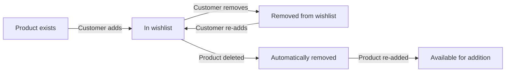
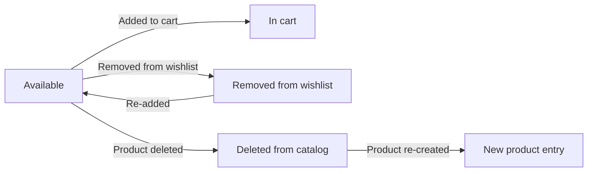
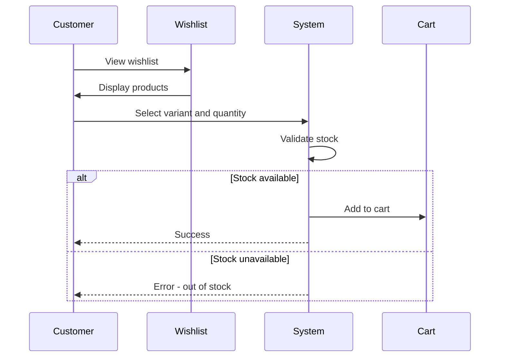
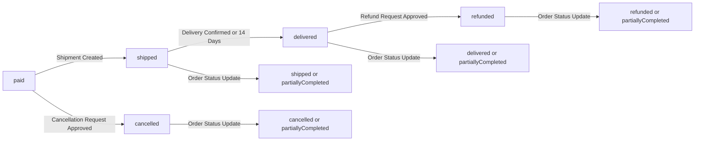
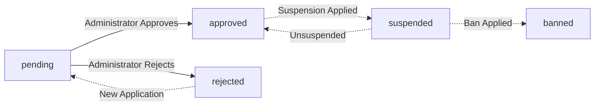
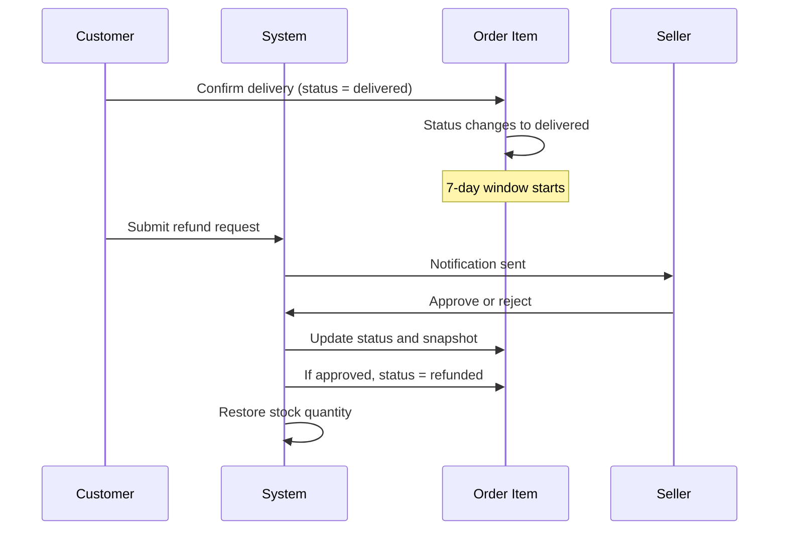
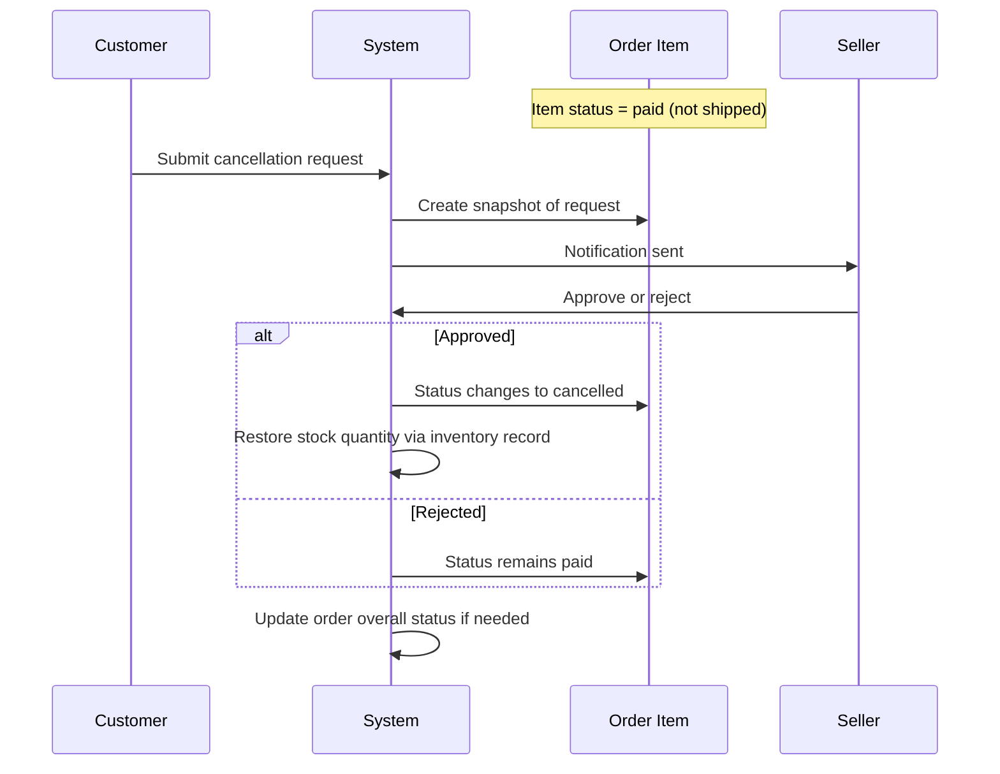

**ecommerceMall — Business concepts, relationships, and states from user perspective**

Business concepts, relationships, and states from user perspective

# Domain Concepts

Describe what each concept means to users and why it exists.

## Customer Concept

Customers are registered users who can browse products, make purchases, and manage their accounts on the platform. Every customer must create an account with an email and password to access any features. There is no guest browsing allowed. Customers can log in with their credentials to access their personalized experience. They have the ability to change their password if needed. Customers can also delete their entire account when they no longer wish to use the service. When deleting an account, their profile information is removed but their order history is preserved for legal and seller record purposes. Reviews left by deleted users remain visible but are marked as from a deleted user account.

### Customer Registration

WHEN a new user creates a customer account, THE system SHALL:
1. Require an email address
2. Require a password
3. Ensure the email address is not already registered
4. Create a new customer record with authentication credentials
5. Set the customer status as active upon successful registration

IF the email address is already registered, THE system SHALL reject the registration request.

THE system SHALL NOT allow guest browsing or access to any platform features without a registered account.

### Customer Authentication

WHEN a customer logs in, THE system SHALL:
1. Accept email and password credentials
2. Validate the credentials against stored authentication data
3. Create an authenticated session for the customer
4. Grant access to customer-only features

IF the email or password is incorrect, THE system SHALL reject the login attempt.

IF the customer account is banned, THE system SHALL reject the login attempt regardless of credentials.

### Password Management

WHEN a customer changes their password, THE system SHALL:
1. Require the current password for verification
2. Accept a new password
3. Validate the new password meets security requirements
4. Update the authentication credentials
5. Invalidate any existing sessions

IF the current password is incorrect, THE system SHALL reject the password change.

IF the new password is the same as the current password, THE system SHALL reject the password change.

### Account Deletion Request

WHEN a customer requests to delete their account, THE system SHALL:
1. Verify the customer's identity through authentication
2. Confirm the deletion request with the customer
3. Process the account deletion according to data retention rules

IF the customer confirms account deletion, THE system SHALL proceed with the deletion process.

IF the customer cancels the deletion request, THE system SHALL maintain the account active.

### Account Deletion Data Handling

WHEN a customer account is deleted, THE system SHALL:
1. Delete the customer's profile information including display name and phone number
2. Delete all saved shipping addresses
3. Remove the customer from the wishlist
4. Empty the customer's shopping cart
5. Preserve all order records and order history
6. Preserve all reviews but mark them as from a deleted user

IF the deletion affects seller records, THE system SHALL maintain order snapshots for business purposes.

THE system SHALL NOT delete order data that is required for legal or seller record purposes.

### Review Visibility After Account Deletion

WHEN a deleted customer's review is displayed, THE system SHALL:
1. Show the review content and rating
2. Mark the review as from a deleted user
3. Hide the customer's name and profile information

IF a customer deletes their account, THEIR existing reviews SHALL remain visible on products.

THE system SHALL preserve review snapshots for dispute resolution purposes.

### Customer Identity Management

WHEN a customer manages their identity, THE system SHALL:
1. Allow the customer to view their account information
2. Allow the customer to update their display name
3. Allow the customer to update their phone number
4. Validate all identity information before saving

IF the display name is empty, THE system SHALL reject the update.

IF the phone number format is invalid, THE system SHALL reject the update.

### No Guest Browsing

WHEN a user attempts to access any platform feature, THE system SHALL:
1. Check if the user has an active authenticated session
2. Redirect unauthenticated users to the login page
3. Require registration for new users

IF the user is not authenticated, THE system SHALL deny access to all platform features.

IF a user attempts to browse products without logging in, THE system SHALL display a registration or login prompt.

## CustomerProfile Concept

Each customer maintains a profile containing their display name and phone number for communication purposes. Customers can edit their display name to show their preferred name to other users on the platform. The phone number field allows customers to provide contact information for order notifications and support. Both display name and phone number are optional additions to the core customer account. Customers have full control to update their profile information whenever they choose. The profile serves as a way for customers to present themselves in the marketplace. Other users and sellers can see the display name when customers leave reviews or have transactions.

### Display Name Customization

WHEN a customer creates their account, THE system SHALL allow them to set a display name.

WHEN a customer wants to change their display name, THE system SHALL accept the new display name.

IF the display name contains only whitespace, THE system SHALL reject the change.

IF the display name exceeds 100 characters, THE system SHALL reject the change.

IF the display name contains offensive content as determined by moderation rules, THE system SHALL reject the change.

WHEN a customer sets or changes their display name, THE system SHALL save the display name for future use.

WHEN the display name is changed, THE system SHALL update the display name visible to other users.

THE customer SHALL be able to view their current display name at any time.

THE customer SHALL be able to update their display name multiple times without restriction.

### Phone Number Management

WHEN a customer creates their account, THE system SHALL allow them to optionally provide a phone number.

WHEN a customer wants to update their phone number, THE system SHALL accept the new phone number.

IF the phone number contains invalid characters, THE system SHALL reject the phone number.

IF the phone number does not match the expected format for the customer's country, THE system SHALL reject the phone number.

WHEN a customer provides a phone number, THE system SHALL use it for order notifications and support communication.

WHEN a customer updates their phone number, THE system SHALL update the phone number for future communications.

THE customer SHALL be able to view their current phone number in their profile settings.

THE system SHALL use the most recent phone number for all customer communications.

IF the customer has no phone number on file, THE system SHALL use email as the primary contact method.

### Profile Editing Capability

WHEN a logged-in customer accesses their profile settings, THE system SHALL display their current display name and phone number.

WHEN a customer edits their profile, THE system SHALL allow them to update the display name and/or phone number.

WHEN a customer submits profile changes, THE system SHALL validate all provided fields.

IF validation fails for any field, THE system SHALL reject the entire profile update.

IF validation succeeds, THE system SHALL save all changes and update the profile.

WHEN profile changes are saved, THE system SHALL record the timestamp of the update.

THE customer SHALL receive confirmation when their profile is successfully updated.

THE customer SHALL be able to cancel profile editing before submitting changes.

THE system SHALL maintain the previous display name and phone number values for reference.

### Customer Identity Presentation

WHEN a customer writes a review, THE system SHALL display their display name with the review.

WHEN another user views a customer's reviews, THE system SHALL show the customer's display name.

WHEN a customer places an order, THE system SHALL show their display name in order communications.

THE system SHALL use the most current display name for all customer-facing displays.

IF a customer deletes their account, THE system SHALL preserve the display name in review history as "deleted user".

THE system SHALL NOT display a customer's phone number to other users or sellers.

THE system SHALL display the customer's display name on the customer's profile page.

THE system SHALL ensure the display name is visible in the order confirmation email.

### Contact Information for Orders

WHEN a customer places an order, THE system SHALL use their phone number for order notifications if one is provided.

WHEN an order requires support communication, THE system SHALL use the customer's phone number as the contact method.

WHEN a customer updates their phone number, THE system SHALL use the new number for future orders.

IF a customer has no phone number, THE system SHALL use email for all order communications.

WHEN order status changes occur, THE system SHALL send notifications using the customer's phone number if available.

THE system SHALL store the phone number associated with each order for future reference.

WHEN a customer requests support, THE system SHALL use the phone number from their profile.

THE system SHALL NOT share the customer's phone number with sellers without explicit consent.

### Privacy Control for Profile Data

WHEN a customer views their own profile, THE system SHALL display all their profile information.

WHEN a customer views another customer's reviews, THE system SHALL show only that customer's display name.

THE system SHALL NEVER display a customer's phone number to sellers.

THE system SHALL NEVER display a customer's phone number to other customers.

THE system SHALL allow customers to update their phone number at any time.

THE system SHALL allow customers to update their display name at any time.

WHEN a customer deletes their account, THE system SHALL hide their phone number from all displays.

THE system SHALL require authentication before allowing any profile modifications.

THE system SHALL NOT show the customer's phone number in public listings or search results.

### Profile Update Process

WHEN a customer submits profile changes, THE system SHALL create a snapshot of the old display name and phone number.

WHEN profile changes are saved, THE system SHALL record when the change was made.

WHEN profile changes are saved, THE system SHALL record what fields were changed.

WHEN profile changes are saved, THE system SHALL preserve the old values in the snapshot.

THE snapshot SHALL be immutable and cannot be deleted.

WHEN a customer views their profile update history, THE system SHALL show all previous display names and phone numbers.

THE system SHALL allow administrators to view profile update history for all customers.

WHEN a customer updates their profile, THE system SHALL update the profile's last update timestamp.

IF a profile update fails due to validation error, THE system SHALL NOT create a snapshot.

## ShippingAddress Concept

Customers can store multiple shipping addresses to facilitate faster checkout for future orders. Each address includes recipient name, phone number, street address, city, state, postal code, and country. Customers have the ability to add new addresses as needed for different delivery locations. They can edit existing addresses to update information when moves occur or details change. Addresses can be deleted when they are no longer needed or are outdated. Customers can designate one address as their default shipping address for convenience. During checkout, customers select from their saved addresses or enter a new one if needed.

### Address Creation and Storage

WHEN a customer creates a new shipping address, THE system SHALL:
1. Accept recipient name
2. Accept phone number
3. Accept street address
4. Accept city
5. Accept state/province
6. Accept postal code
7. Accept country

IF any required field is missing, THE system SHALL reject the address creation request.

THE system SHALL store the address with a timestamp indicating when it was created.

THE system SHALL allow customers to create unlimited shipping addresses.

### Multiple Address Management

WHEN a customer manages their addresses, THE system SHALL:
1. Display all saved addresses in a list
2. Show recipient name and city for each address
3. Indicate which address is set as default

THE system SHALL enable customers to add as many addresses as needed.

THE system SHALL support customers having multiple addresses for different delivery locations.

THE system SHALL allow customers to view all their saved addresses at any time.

### Default Address Selection

WHEN a customer sets a default shipping address, THE system SHALL:
1. Mark the selected address as the default
2. Remove the default designation from the previously selected address
3. Confirm the selection to the customer

IF a customer has no addresses saved, THE system SHALL prevent default selection.

IF a customer attempts to set an address as default, THE system SHALL validate that the address exists in their account.

THE system SHALL automatically use the default address during checkout when no specific selection is made.

THE system SHALL allow only one address to be designated as default at any time.

### Address Editing

WHEN a customer edits an existing address, THE system SHALL:
1. Allow modification of recipient name
2. Allow modification of phone number
3. Allow modification of street address
4. Allow modification of city
5. Allow modification of state/province
6. Allow modification of postal code
7. Allow modification of country

IF the edited address becomes the default, THE system SHALL maintain the default designation.

IF the edited address was the default, THE system SHALL preserve the default status after editing.

THE system SHALL save the edited address immediately upon confirmation.

THE system SHALL reject edits that would leave any required field empty.

### Address Deletion

WHEN a customer deletes a shipping address, THE system SHALL:
1. Remove the address from their saved list
2. If the deleted address was the default, THE system SHALL deselect any default address
3. Confirm the deletion to the customer

IF a customer attempts to delete their only address, THE system SHALL still allow the deletion but ensure no default address exists.

IF a customer attempts to delete an address that is in use for a pending order, THE system SHALL allow the deletion but warn that the address is associated with active orders.

THE system SHALL permanently remove the address from the customer's account upon deletion.

THE system SHALL not allow deletion of addresses belonging to other customers.

### Checkout Address Selection

WHEN a customer proceeds to checkout, THE system SHALL:
1. Present all saved shipping addresses as options
2. Pre-select the default address if one exists
3. Allow selection of any saved address
4. Allow creation of a new address during checkout

IF the customer has no saved addresses, THE system SHALL prompt them to add a new address.

IF the customer selects a saved address, THE system SHALL confirm the selection before proceeding.

THE system SHALL display complete shipping information for the selected address during checkout review.

THE system SHALL lock the shipping address once the order is placed, preventing further changes.

### Address Completeness Requirements

THE system SHALL require recipient name for all shipping addresses.

THE system SHALL require phone number for all shipping addresses.

THE system SHALL require street address for all shipping addresses.

THE system SHALL require city for all shipping addresses.

THE system SHALL require state/province for all shipping addresses.

THE system SHALL require postal code for all shipping addresses.

THE system SHALL require country for all shipping addresses.

IF any required field is invalid or empty, THE system SHALL display an error message indicating which field needs correction.

THE system SHALL validate phone number format during address creation and editing.

THE system SHALL validate postal code format according to the selected country.

## Seller Concept

Sellers are registered merchants who list products for sale on the platform. Sellers must sign up with email and password credentials similar to customers. Unlike customers, seller accounts require administrator approval before they can begin selling. Sellers can monitor their approval status to see if they are pending, approved, or rejected. When rejected, sellers can view the specific reason provided by administrators. Rejected sellers have the opportunity to submit a new registration request to appeal the decision. Sellers can delete their account only if they have no pending orders or cancellation requests. When deleting, their product listings are removed but order history remains preserved.

### Seller Registration

THE system SHALL provide a registration page where sellers can enter their email address and password.

WHEN a seller submits a registration request, THE system SHALL:
1. Create a new seller account with approval status "pending"
2. Store the seller's email and password securely
3. Prevent duplicate registration with the same email address

IF the email address is already registered, THE system SHALL display an error message indicating the email is taken.
IF the password does not meet security requirements, THE system SHALL display an error message specifying the requirements.

WHEN a seller successfully registers, THE system SHALL send a verification email to the provided email address.

WHEN a seller clicks the verification link, THE system SHALL mark the email as verified and allow login attempts.

THE system SHALL track the seller's registration timestamp for audit purposes.

### Administrator Approval Requirement

WHEN a seller account is created, THE system SHALL set the initial approval status to "pending".

THE system SHALL prevent sellers with "pending" approval status from:
- Listing any products
- Creating product variants
- Modifying their seller profile
- Viewing seller dashboard metrics

THE system SHALL allow sellers with "pending" status to:
- View their approval status
- Edit their seller profile information
- Prepare product information for review

WHEN an administrator approves a seller, THE system SHALL:
1. Change the approval status to "approved"
2. Enable the seller to list products
3. Notify the seller via email that their account is approved

WHEN an administrator rejects a seller, THE system SHALL:
1. Change the approval status to "rejected"
2. Record the rejection reason provided by the administrator
3. Notify the seller via email with the rejection reason

THE system SHALL allow rejected sellers to submit new registration requests after receiving approval.

### Approval Status Monitoring

WHEN a seller logs into their account, THE system SHALL display their current approval status in the dashboard header.

WHEN a seller navigates to their account settings, THE system SHALL show:
- Current approval status (pending, approved, or rejected)
- For pending status: estimated review timeframe
- For rejected status: the rejection reason provided
- For approved status: confirmation that selling is enabled

WHEN a seller's approval status changes, THE system SHALL send an email notification within 5 minutes.

WHEN a seller is approved, THE system SHALL update the status to "approved" on their seller profile page.

WHEN a seller is rejected, THE system SHALL:
- Display the rejection reason prominently in the dashboard
- Provide a link to view the reason in detail
- Show a button to submit a new registration request

THE system SHALL maintain a log of all approval status changes with timestamps for administrator audit purposes.

### Rejection Process and Reason Visibility

WHEN an administrator rejects a seller registration, THE system SHALL require the administrator to provide a detailed rejection reason.

THE system SHALL display the rejection reason to the seller within their account dashboard.

WHEN a seller views their rejected status, THE system SHALL show:
- The rejection date
- The administrator's rejection reason
- Instructions on how to resubmit

IF a seller receives a rejection without a reason, THE system SHALL display a default message indicating administrator discretion and provide a contact option.

WHEN a rejected seller submits a new registration request, THE system SHALL:
- Link the new request to the previous rejected account
- Allow the seller to provide additional information
- Flag the account for review priority

THE system SHALL prevent sellers with "rejected" status from listing products until they submit a new approved registration.

WHEN a seller resubmits after rejection, THE system SHALL reset the approval process with a new pending status.

### Account Deletion Restrictions

WHEN a seller requests account deletion, THE system SHALL check for pending orders in "paid" or "shipped" status associated with that seller.

IF pending orders exist, THE system SHALL display an error message:
"Account deletion cannot be processed while you have orders in progress. Please complete all pending orders before requesting deletion."

IF pending cancellation or refund requests exist, THE system SHALL display an error message:
"Account deletion cannot be processed while you have pending cancellation or refund requests."

IF no restrictions exist, THE system SHALL proceed with account deletion by:
1. Deleting the seller account credentials
2. Removing all product listings from visibility
3. Deleting all product variants from listings
4. Preserving order history and snapshots
5. Preserving shop name in completed orders

WHEN account deletion is completed, THE system SHALL send a confirmation email to the seller's registered email address.

THE system SHALL maintain a log of deleted seller accounts with timestamps for compliance purposes.

### Pending Order Protection

THE system SHALL define "pending orders" as orders with status "paid" or "shipped" that belong to the seller.

THE system SHALL define "pending cancellation requests" as cancellation requests with status "pending" that reference the seller's order items.

THE system SHALL define "pending refund requests" as refund requests with status "pending" that reference the seller's order items.

WHEN checking for deletion eligibility, THE system SHALL verify:
- No order items in "paid" status for the seller's products
- No order items in "shipped" status for the seller's products
- No cancellation requests with "pending" status for the seller's order items
- No refund requests with "pending" status for the seller's order items

IF any pending orders exist, THE system SHALL prevent seller account deletion and display a list of affected order IDs.

IF any pending cancellation or refund requests exist, THE system SHALL prevent seller account deletion and display a list of affected request IDs.

THE system SHALL allow sellers to view their pending orders and requests as part of the deletion check process.

WHEN all pending items are resolved, THE system SHALL update the deletion eligibility status to "allowed".

### Seller Identity Verification

THE system SHALL require sellers to provide their email address as the primary identity identifier.

THE system SHALL verify email uniqueness at registration by checking against existing seller accounts.

THE system SHALL create a unique seller account ID for each seller upon registration.

THE system SHALL display the seller's email address (masked for security) in their account settings for verification purposes.

WHEN a seller updates their shop name, THE system SHALL verify the new name is not already in use by another approved seller.

IF the shop name is already taken, THE system SHALL display an error: "This shop name is already in use. Please choose a different name."

THE system SHALL maintain seller identity integrity by preventing:
- Multiple active accounts with the same email
- Identity spoofing through duplicate shop names
- Account takeover through email changes without verification

WHEN a seller account is suspended or deleted, THE system SHALL prevent immediate re-registration with the same email for 30 days to prevent abuse.

THE system SHALL require password authentication before allowing sellers to view or modify their seller profile information.

## SellerProfile Concept

Each seller maintains a shop profile that includes a shop name, description, and logo image. The shop name identifies the seller's business to customers browsing the marketplace. Sellers can edit their shop name, description, and logo whenever they want to update their branding. Every edit to the shop profile automatically creates a snapshot to preserve the previous state. Customers can view seller profiles when browsing products or reviewing order history. The profile information helps customers understand which seller they are purchasing from. Shop details are also preserved in order snapshots even after profile changes or seller account deletion.

### Shop Name Customization

### Shop Name Customization

WHEN a seller creates a new shop profile, THE system SHALL require a shop name that identifies the business.

WHEN a seller updates their shop name, THE system SHALL allow text input with a maximum length of 100 characters.

IF a seller provides a shop name that is empty or null, THE system SHALL reject the update request.

IF a seller provides a shop name that exceeds 100 characters, THE system SHALL reject the update request.

IF a seller attempts to use shop name characters that violate content policy, THE system SHALL reject the update request.

### Business Description Management

WHEN a seller creates a shop profile, THE system SHALL allow an optional business description.

WHEN a seller updates their shop description, THE system SHALL allow multi-line text input.

IF a seller provides a description that is empty, THE system SHALL accept the empty description as valid.

IF a seller updates their description, THE system SHALL preserve the description in the snapshot.

### Logo Image Upload

WHEN a seller creates a shop profile, THE system SHALL allow uploading a logo image file.

WHEN a seller updates their logo, THE system SHALL allow replacing the existing logo image.

IF a seller uploads a logo image, THE system SHALL store the image URL for display.

IF a seller removes their logo, THE system SHALL set the logo image to null.

IF a logo image file exceeds maximum allowed size, THE system SHALL reject the upload request.

### Seller Branding Updates

WHEN a seller updates their shop name, description, or logo, THE system SHALL create a snapshot of the previous state.

WHEN a seller updates their shop branding, THE system SHALL record the timestamp of the change.

WHEN a seller updates their shop branding, THE system SHALL record who made the change.

IF a seller makes multiple updates in sequence, THE system SHALL create separate snapshots for each update.

### Profile Edit History Tracking

WHEN a seller requests to view their edit history, THE system SHALL display all previous profile versions.

WHEN displaying edit history, THE system SHALL show the change timestamp for each version.

WHEN displaying edit history, THE system SHALL show which fields were changed in each update.

WHEN displaying edit history, THE system SHALL show the old values and new values for each change.

THE system SHALL preserve edit history even after shop profile updates.

THE system SHALL make edit history visible only to the shop owner.

### Customer Visibility of Shop Info

WHEN a customer views a product, THE system SHALL display the seller's current shop name.

WHEN a customer views a product, THE system SHALL display the seller's current logo image.

WHEN a customer views a seller profile page, THE system SHALL display the shop name, description, and logo.

WHEN a customer views order history, THE system SHALL display the seller's shop name at the time of purchase.

WHEN a customer views product details, THE system SHALL provide a link to the seller's profile.

### Shop Snapshot Preservation

WHEN a shop profile is created, THE system SHALL create an initial snapshot.

WHEN a shop profile is edited, THE system SHALL create a snapshot with old values and new values.

WHEN a seller deletes their account, THE system SHALL preserve shop snapshots for order history.

WHEN a seller is banned, THE system SHALL preserve shop snapshots for dispute resolution.

THE system SHALL make snapshots immutable and unreadable.

IF a dispute arises regarding shop information, THE system SHALL provide snapshot records to administrators.

### Shop Snapshot Structure

### Product Snapshot Structure

WHEN a product snapshot is created, THE system SHALL include all product fields (name, description, category, base price, images).

WHEN a product snapshot is created, THE system SHALL include snapshots of all variants at that moment.

WHEN a product is deleted, THE system SHALL preserve the snapshot of the product.

WHEN a product variant is deleted, THE system SHALL preserve the snapshot of the variant.

THE system SHALL preserve snapshots even after the product or seller is deleted.

### Shop Profile Snapshot Structure

WHEN a shop profile snapshot is created, THE system SHALL capture the shop name.

WHEN a shop profile snapshot is created, THE system SHALL capture the shop description.

WHEN a shop profile snapshot is created, THE system SHALL capture the logo image URL.

WHEN a shop profile snapshot is created, THE system SHALL capture the creation timestamp.

WHEN a shop profile snapshot is created, THE system SHALL capture the last update timestamp.

### Order Item Snapshot Structure

WHEN an order is created, THE system SHALL create a snapshot of each seller's profile with the order item.

WHEN an order is created, THE system SHALL capture the seller's shop name at the time of purchase.

WHEN an order is created, THE system SHALL capture the seller's logo at the time of purchase.

WHEN an order is created, THE system SHALL capture the seller's description at the time of purchase.

THE system SHALL preserve order item snapshots even after seller profile changes.

THE system SHALL preserve order item snapshots even after seller account deletion.

## Category Concept

Products are organized into categories to help customers browse and find items of interest. Each category has a name and description that explain what products belong there. Categories can have subcategories, allowing for one level of organizational hierarchy. Administrators are the only users who can create, edit, or delete categories. Customers can view the complete list of all available categories on the platform. From category pages, customers can browse all products within that category. Categories provide a structured navigation system for the marketplace. Deleted categories leave products without a category assignment rather than removing them.

### Category Structure and Organization

WHEN a product is created, THE system SHALL require the seller to select a category from the available categories.

THE system SHALL allow products to be assigned to either a parent category or a subcategory.

WHEN a category is created, THE system SHALL require a name and an optional description.

THE system SHALL enforce that each category has a unique name within its parent category level.

THE system SHALL display the category name and description on category browse pages to help customers understand the products within.

IF a seller attempts to create a product without selecting a category, THE system SHALL reject the request and require category selection.

IF a category name already exists within the same parent category, THE system SHALL reject the category creation with an error indicating the name is already in use.

### Subcategory Relationships

THE system SHALL allow categories to have one level of subcategory nesting.

WHEN a category is created, THE system SHALL allow the creator to optionally select a parent category.

THE system SHALL enforce that categories cannot be nested more than one level deep.

A subcategory SHALL belong to exactly one parent category.

A parent category CAN have multiple subcategories.

WHEN browsing products in a parent category, THE system SHALL show products from that parent category and its subcategories.

THE system SHALL display the hierarchical relationship in category listings (e.g., "Electronics > Phones").

IF an attempt is made to create a subcategory of a subcategory, THE system SHALL reject the request.

### Category Administration

ONLY administrators CAN create new categories on the platform.

ONLY administrators CAN edit existing categories, including name and description changes.

ONLY administrators CAN delete categories from the platform.

WHEN an administrator edits a category, THE system SHALL record when the change was made and what values changed.

THE system SHALL require administrators to provide a reason when deleting a category.

IF a user without administrator privileges attempts to create a category, THE system SHALL reject the request.

IF a user without administrator privileges attempts to edit a category, THE system SHALL reject the request.

### Customer Category Navigation

THE system SHALL provide customers with a complete list of all available categories.

CUSTOMERS CAN browse the category list to discover products organized by category.

WHEN a customer clicks on a category, THE system SHALL display all products within that category and its subcategories.

THE system SHALL sort the category list alphabetically by category name.

THE system SHALL display the number of products in each category when browsing the category list.

WHEN a customer is viewing products in a category, THE system SHALL show the category name and description at the top of the page.

THE system SHALL provide navigation breadcrumbs showing the category hierarchy path.

### Uncategorized Product Handling

WHEN a category is deleted, THE system SHALL preserve the products that were in that category.

THE system SHALL automatically remove the deleted category reference from all products that were in that category.

PRODUCTS with no category assignment SHALL be considered uncategorized.

UNCATEGORIZED products SHALL remain visible in product search results.

UNCATEGORIZED products SHALL NOT appear when browsing any specific category.

THE system SHALL allow sellers to reassign uncategorized products to a valid category.

THE system SHALL indicate on the product detail page when a product has no category assignment.

### Category Listing and Hierarchy Display

THE system SHALL display categories in a tree structure showing parent and subcategory relationships.

THE system SHALL allow customers to expand parent categories to view their subcategories.

WHEN a subcategory is selected, THE system SHALL show only products in that specific subcategory.

THE system SHALL prevent customers from viewing products that belong to a deleted category.

THE system SHALL ensure that category listings are responsive and display properly on all screen sizes.

WHEN a category is deleted, THE system SHALL automatically update all category listings to reflect the change.

## Product Concept

Products are the core items that sellers list for customers to purchase. Every product requires a name, description, category selection, and base price. Products belong exclusively to the seller who created them. Sellers have full control to edit their own product information whenever they need updates. Each product edit automatically creates a snapshot to preserve the previous product state. Sellers can delete their products only when there are no pending orders or cancellation requests. When deleted, products no longer appear in search results or category listings. Administrators can view all products and their snapshots on the platform for oversight purposes.

### Product Listing Creation

WHEN a seller creates a product, THE system SHALL:
1. Require a product name (maximum 500 characters)
2. Require a product description
3. Require selection of a category or subcategory
4. Require a base price
5. Associate the product with the creating seller
6. Display the product in search results and category listings immediately upon creation

IF the product name exceeds 500 characters, THE system SHALL reject the creation request.
IF the product description is missing, THE system SHALL reject the creation request.
IF a category is not selected, THE system SHALL reject the creation request.
IF a base price is not provided, THE system SHALL reject the creation request.

A seller SHALL be able to create unlimited products for their shop.

### Seller Product Ownership

WHEN a product is created, THE system SHALL associate the product exclusively with the creating seller.

THE seller shall be the only user with permission to:
- Edit the product
- Delete the product
- Add variants to the product
- Manage product images
- View product snapshots

A product SHALL NOT be transferable between sellers.
A product created by a seller SHALL remain associated with that seller even if the seller account is suspended or deleted.
Administrators SHALL be able to view products from all sellers but SHALL NOT be able to change product ownership.

### Product Information Editing

WHEN a seller edits their product, THE system SHALL allow modifications to:
1. Product name (maximum 500 characters)
2. Product description
3. Base price
4. Category or subcategory

A seller SHALL ONLY be able to edit their own products.
A seller SHALL NOT be able to edit products created by other sellers.

IF the seller is suspended, THE system SHALL prevent product editing.
IF the new name exceeds 500 characters, THE system SHALL reject the update request.
IF a new category is selected, THE system SHALL apply the category immediately.

### Edit Snapshot Creation

WHEN a seller edits any field of their product, THE system SHALL create an immutable snapshot that includes:
1. The timestamp of the edit
2. The specific fields that were changed
3. The values before the change
4. The values after the change
5. The seller's profile snapshot at the time of edit

The product snapshot SHALL be preserved even after:
- The product is deleted
- The seller account is deleted
- The product variants are modified

THE snapshot SHALL be viewable by:
- The product owner (the creating seller)
- Administrators (for any product on the platform)

THE snapshot SHALL NOT be editable or deletable by any user.

### Product Deletion Restrictions

THE system SHALL allow a seller to delete a product ONLY if:
1. There are no pending order items with status 'paid' or 'shipped' for any variant of the product
2. There are no pending cancellation requests for any variant of the product
3. There are no pending refund requests for any variant of the product

IF any of the above conditions exist, THE system SHALL reject the deletion request with a clear reason.

WHEN a product is successfully deleted, THE system SHALL:
1. Delete all product variants
2. Delete all inventory records
3. Remove the product from all search results
4. Remove the product from all category listings
5. Preserve all existing snapshots
6. Automatically remove the product from all customer wishlists

A deleted product SHALL NOT be recoverable.
Administrators SHALL be able to delete products for policy violations regardless of order status.

### Search Visibility Management

WHEN a product is deleted, THE system SHALL:
1. Immediately remove it from all search results
2. Remove it from all category listings
3. Mark it as unavailable in any existing shopping carts
4. Remove it from all customer wishlists

WHEN a product's variants all reach stock quantity of zero, THE system SHALL:
1. Mark the product as 'out of stock' in search results
2. Prevent customers from adding variants to shopping cart
3. Keep the product visible in search and category listings

WHEN a seller is suspended, THE system SHALL:
1. Hide all the seller's products from search results
2. Hide all the seller's products from category listings
3. Prevent customers from purchasing variants of the suspended seller's products
4. Allow the suspended seller to continue processing existing orders

WHEN a seller is unsuspended, THE system SHALL restore product visibility in search and category listings.

### Administrator Product Oversight

ADMINISTRATORS SHALL have the following product oversight capabilities:
1. View all products from all sellers on the platform
2. View complete product snapshots for any product
3. Delete products for policy violations
4. View product edit history for any product
5. View inventory history for any product variant

WHEN an administrator deletes a product for policy violations, THE system SHALL:
1. Remove the product from search and category listings
2. Delete all product variants
3. Preserve all existing snapshots
4. Notify affected sellers of the action

SUPER ADMINISTRATORS SHALL also be able to:
1. Promote regular administrators to super administrator
2. Demote other super administrators to regular administrator
3. Demote regular administrators (but not themselves)

THE system SHALL log all administrator product oversight actions for audit purposes.

## ProductVariant Concept

Products can have multiple variants representing different combinations of options like color and size. Each variant has a unique SKU code, option values, optional price override, and stock quantity. Variants allow customers to choose specific variations of a product when making a purchase. Sellers can add new variants to their products as they expand their offerings. Sellers can edit variant details including SKU codes, option values, and pricing. Every variant edit creates a snapshot to preserve the previous variant state. A product must have at least one variant to be purchasable by customers. Variants with zero stock appear as out of stock and cannot be added to cart.

### Variant Option Selection

WHEN a customer selects a variant to add to their shopping cart, THE system SHALL require the customer to choose a specific variant, not just a generic product.

WHEN displaying variants on the product detail page, THE system SHALL show each variant with its option values (e.g., "Red", "Large", "Size: XL").

IF a product has multiple variants, THE system SHALL present all variants to the customer for selection before allowing cart addition.

WHEN a customer adds a variant to cart, THE system SHALL record the selected variant's SKU code, option values, and price.

IF the customer attempts to add a product without selecting a variant, THE system SHALL display an error requiring variant selection.

### SKU Code Uniqueness

WHEN a seller creates a new variant, THE system SHALL require a unique SKU code for that variant.

IF a seller attempts to create a variant with a SKU code that already exists for another variant, THE system SHALL reject the request and display an error message.

THE system SHALL ensure SKU codes are unique across all variants for a product.

WHEN a seller edits a variant's SKU code, THE system SHALL validate that the new SKU code is not already in use by another variant.

IF the seller attempts to change a SKU code to a value that already exists, THE system SHALL reject the edit and require a unique SKU code.

### Variant Price Customization

WHEN a seller creates a variant, THE system SHALL allow the seller to optionally set a price that overrides the product's base price.

IF a seller does not specify a variant price, THE system SHALL use the product's base price for that variant.

WHEN a seller edits a variant's price, THE system SHALL allow the price to be set higher or lower than the base price.

IF a variant has a price override, THE system SHALL display that custom price on the product detail page and in search results.

WHEN a variant is added to cart, THE system SHALL use the variant's price (either custom or base) for price calculations.

### Stock Quantity Tracking

WHEN a seller creates a variant, THE system SHALL require a stock quantity (starting at 0 by default).

WHEN a customer places an order, THE system SHALL automatically decrease the stock quantity for each purchased variant.

IF a variant's stock quantity reaches zero, THE system SHALL mark the variant as "out of stock".

WHEN a variant is out of stock, THE system SHALL prevent the customer from adding that variant to their shopping cart.

WHEN an order item is cancelled or refunded, THE system SHALL automatically increase the stock quantity for that variant.

### Variant Edit History

WHEN a seller edits a variant (SKU code, option values, or price), THE system SHALL create a snapshot of the previous variant state.

THE system SHALL record the timestamp of when the variant edit was made.

THE system SHALL capture the values that were changed in the snapshot.

THE system SHALL preserve the "before" and "after" values for all edited fields.

SELLERS CAN view their variant edit history to see all snapshots of changes made to their variants.

### Out of Stock Handling

WHEN a variant's stock quantity reaches zero, THE system SHALL display the variant as "out of stock" on the product detail page.

IF a variant is out of stock, THE system SHALL prevent customers from adding that variant to their shopping cart.

IF a customer already has an out-of-stock variant in their cart, THE system SHALL mark that item as "unavailable" with a warning message.

WHEN a seller restocks a variant (increases stock quantity above zero), THE system SHALL update the variant's status from "out of stock" to "in stock".

A product with at least one out-of-stock variant can still be viewed, but customers cannot purchase out-of-stock variants.

### Variant Purchase Requirements

FOR a product to be purchasable, THE system SHALL require the product to have at least one variant with positive stock quantity.

IF a product has no variants, THE system SHALL display the product in search results but mark it as "unavailable" for purchase.

IF a product has variants but all variants are out of stock, THE system SHALL display the product as "out of stock".

WHEN a customer attempts to purchase a variant that does not exist, THE system SHALL reject the order with an error.

A product without any variants cannot be added to shopping cart or purchased.

## ProductImage Concept

Sellers can upload multiple images for each product to showcase it from different angles. Images can be reordered to change which image appears as the main thumbnail. The first image in the list serves as the primary visual representation for the product. Sellers can delete individual images from their product listings when they become irrelevant. Image changes are automatically included in product snapshots to preserve visual history. Customers see all uploaded images when viewing a product's detail page. The main image appears in search results and category listings to attract customer attention.

### Multiple Image Upload

WHEN a seller uploads images for a product, THE system SHALL allow uploading multiple images per product.

IF a seller attempts to upload an image, THE system SHALL store the image with a unique identifier.

THE system SHALL reject the upload request if the image exceeds acceptable file size limits.

THE system SHALL reject the upload request if the image file format is not supported.

### Image Ordering Flexibility

WHEN a seller reorders images, THE system SHALL update the display order for all images in the product.

THE system SHALL allow sellers to drag and drop images to change their sequence.

THE system SHALL save the new order configuration immediately.

IF a seller reorders images, THE system SHALL update the main image designation if the first position changes.

WHEN viewing a product's detail page, THE system SHALL display images in the order specified by the seller.

### Main Image Designation

THE first image in the list SHALL be designated as the main image.

THE main image SHALL serve as the primary visual representation for the product.

WHEN the seller reorders images, THE main image SHALL automatically become the first image in the sequence.

THE system SHALL NOT allow sellers to manually assign a different main image; order determines designation.

IF a product has only one image, THAT image SHALL be the main image.

### Image Deletion Capability

WHEN a seller deletes an image from their product, THE system SHALL remove that image from the product listing.

IF the deleted image is the main image, THE system SHALL automatically promote the first remaining image to main image.

IF a product becomes image-less after deletion, THE system SHALL reject the deletion request.

THE system SHALL display a warning if the seller attempts to delete the last remaining image.

IF an image deletion fails, THE system SHALL preserve the original image and display an error message.

### Search Result Thumbnail

WHEN generating search results or category listings, THE system SHALL display the main image as the thumbnail.

THE system SHALL load the thumbnail image only when the product appears in search results.

IF a product has no images, THE system SHALL display a placeholder image in search results.

WHEN a customer views a product detail page, THE system SHALL load all images including the main image.

THE thumbnail SHALL be an appropriately sized version optimized for listing display.

### Image Snapshot Preservation

WHEN a seller edits a product, THE system SHALL include all image changes in the product snapshot.

THE snapshot SHALL record the image URLs present at the time of the edit.

IF an image is deleted, THE snapshot SHALL preserve the record of the deleted image URL.

WHEN viewing a product snapshot, THE system SHALL display the images that existed at that point in time.

THE system SHALL preserve image history even after the product is deleted.

### Visual Presentation Control

THE system SHALL allow sellers to preview how images appear in search results before publishing.

WHEN a seller uploads new images, THE system SHALL show a preview of the image arrangement.

THE system SHALL validate that at least one image exists before a product can be published.

IF a product has multiple images, THE system SHALL allow customers to navigate between images on the detail page.

THE system SHALL maintain image quality standards for all uploaded product images.

## Wishlist Concept

Customers can save products to their wishlist to easily find them later for potential purchase. The wishlist contains products rather than specific variants, so customers select variants when adding to cart. Customers can view their complete wishlist which is displayed in paginated lists. Products can be removed from the wishlist when customers no longer wish to track them. If a seller deletes a product, it is automatically removed from all customer wishlists. The wishlist serves as a personal collection of desired items for future shopping. Customers can add products back to their wishlist if they are later re-added by sellers.

### Product Bookmarking

### Adding Products to Wishlist

WHEN a customer adds a product to their wishlist, THE system SHALL:
1. Associate the product with the customer's wishlist
2. Record the timestamp of when the product was added
3. Display the product in the customer's wishlist view

IF the product already exists in the customer's wishlist, THE system SHALL reject the request with a duplicate message.
IF the product does not exist in the catalog, THE system SHALL reject the request.

WHILE a product is in a customer's wishlist, THE system SHALL allow the customer to view complete product information including name, images, base price, and seller shop name.

### Wishlist Item Display

THE system SHALL show each wishlist item with:
- Product main image (thumbnail)
- Product name
- Base price or price range (if variants have different prices)
- Seller shop name
- Average rating if reviews exist

THE system SHALL NOT store variant-specific information in the wishlist; customers select specific variants when adding to cart.

### Product Bookmark Limit

THE system SHALL allow customers to add unlimited products to their wishlist.
THE system SHALL paginate wishlist items when displaying large wishlists to customers.

### Duplicate Detection

IF a customer attempts to add the same product to their wishlist a second time, THE system SHALL prevent duplication and show a message indicating the product is already bookmarked.

### Wishlist Viewing Capability

### Wishlist Access

WHEN a customer accesses their wishlist, THE system SHALL display all products they have bookmarked.
THE system SHALL show the products in order of most recently added.

WHILE a customer is viewing their wishlist, THE system SHALL provide pagination controls to navigate through products.

### Wishlist List Display

THE system SHALL display each wishlist item with:
- Product main image (thumbnail)
- Product name
- Base price or price range
- Seller shop name
- Average rating (if reviews exist)
- Current stock status (in stock or out of stock)

THE system SHALL allow customers to add products from their wishlist to their shopping cart by selecting a specific variant.

### Wishlist Sorting

THE system SHALL allow customers to sort their wishlist by:
- Date added (newest first, default)
- Date added (oldest first)
- Product name (alphabetically)
- Price (low to high)
- Price (high to low)

THE system SHALL respect the customer's selected sort order when displaying the wishlist.

### Wishlist Quantity Limit

WHEN a customer views their wishlist, THE system SHALL paginate the results to display a maximum of 50 products per page.
THE system SHALL show the total number of products in the wishlist and current page number.

### Product Removal from Wishlist

### Manual Removal

WHEN a customer removes a product from their wishlist, THE system SHALL:
1. Remove the product from the customer's wishlist
2. Make the product no longer visible in that customer's wishlist view
3. Allow the customer to add the product to their wishlist again in the future

IF the customer attempts to remove a product that does not exist in their wishlist, THE system SHALL show an error message.

### Removal Confirmation

WHEN a customer initiates product removal from their wishlist, THE system SHALL display a confirmation dialog asking the customer to confirm the removal.

### Bulk Removal

THE system SHALL NOT support bulk removal of multiple wishlist items at once; customers must remove items individually.

### Removal Persistence

AFTER a customer removes a product from their wishlist, THE system SHALL NOT restore the product to the wishlist without explicit customer action.

### Variant Independence

THE system SHALL allow customers to add a product back to their wishlist even if they previously removed it after selecting a variant for cart addition.
THE system SHALL maintain variant selection as a cart operation, not a wishlist operation.

### Automatic Wishlist Cleanup

### Deleted Product Handling

WHEN a seller deletes a product, THE system SHALL:
1. Automatically remove the product from all customer wishlists
2. Preserve the deletion event for audit purposes
3. Prevent customers from viewing the deleted product details

IF a customer attempts to access a wishlist item that has been deleted, THE system SHALL redirect the customer to the product search page with a message indicating the product is no longer available.

### Product Unavailability

WHEN a product becomes unavailable (suspended by admin, out of stock permanently), THE system SHALL show a clear indicator in the wishlist that the product is unavailable.
THE system SHALL prevent customers from adding unavailable products to their cart directly from the wishlist.

### Product Re-addition

IF a deleted product is re-added to the catalog by a seller, THE system SHALL allow customers to add the product to their wishlist again.
THE system SHALL display the re-added product with current pricing, images, and seller information.

### Cleanup Notification

THE system SHALL NOT send notifications to customers when products are automatically removed from their wishlists.
THE system SHALL track deleted product removals in customer activity logs for customer service support if needed.

### Variant Selection Timing

### Wishlist vs Cart Distinction

THE system SHALL distinguish between wishlist (product-level) and shopping cart (variant-level) operations.

WHEN a customer adds a product to their wishlist, THE system SHALL record only the product identifier, not variant information.

WHEN a customer adds an item to their shopping cart from their wishlist, THE system SHALL require the customer to select a specific variant and quantity.

### Variant Selection Requirement

WHEN a customer attempts to proceed from their wishlist to the shopping cart, THE system SHALL present a variant selection modal or screen.
THE system SHALL require customers to select:
- A specific variant (SKU)
- The quantity to add

### Stock Validation

WHEN a customer selects a variant to add to cart from their wishlist, THE system SHALL validate that sufficient stock is available.
IF the selected variant is out of stock, THE system SHALL show an error message and prevent cart addition.

### Wishlist Persistence Independence

THE system SHALL maintain the product in the customer's wishlist regardless of variant selection or cart operations.
THE system SHALL NOT remove products from wishlists due to inventory status changes.

### Wishlist Persistence

### Account Association

WHEN a customer creates a wishlist item, THE system SHALL associate the item with the customer account permanently.

IF a customer's account is deleted, THE system SHALL remove all wishlist items associated with that customer.

### Session Independence

THE system SHALL persist wishlist items across different devices and browsers.

WHEN a customer logs in from a different device, THE system SHALL display their complete wishlist with all bookmarked products.

### Wishlist Data Retention

THE system SHALL retain wishlist items for the lifetime of the customer account.
THE system SHALL NOT automatically purge wishlist items after a period of inactivity.

### Cross-Device Synchronization

WHEN a customer adds a product to their wishlist on one device, THE system SHALL sync the addition to all other devices where the customer is logged in.

WHEN a customer removes a product from their wishlist on one device, THE system SHALL sync the removal to all other devices.

### Deleted Product Handling

### Automatic Wishlist Cleanup

WHEN a product is deleted by its seller, THE system SHALL automatically remove that product from all customer wishlists.

THE system SHALL record the deletion event with timestamp, seller identity, and affected customer count for audit purposes.

### Customer Viewing Experience

WHEN a customer views their wishlist and a product has been deleted, THE system SHALL:
1. Not display the deleted product in the wishlist list
2. Not show any placeholder or removed indicator
3. Adjust the pagination to reflect the reduced product count

IF a customer has a direct link to a wishlist item that has been deleted, THE system SHALL redirect to the product search page.

### Deleted Product Recovery

IF a seller re-creates a product with the same attributes as a previously deleted product, THE system SHALL treat it as a new product in wishlists.
THE system SHALL allow customers to add the re-created product to their wishlists.

### Admin-Deleted Products

WHEN an administrator deletes a product due to policy violations, THE system SHALL apply the same automatic wishlist removal rules as seller deletions.

THE system SHALL preserve the deletion record for compliance and dispute resolution purposes.

### Wishlist State Transitions

### Wishlist Item Lifecycle

### Product Availability States

### Variant Selection Flow

## ShoppingCart Concept

Customers use the shopping cart to temporarily store items they plan to purchase. Each cart item must specify a particular product variant and desired quantity. When the same variant is added multiple times, quantities are combined into a single line item. Customers can view their cart contents including product names, variants, prices, and quantities. They can adjust quantities for items already in their cart or remove items entirely. The cart calculates and displays the total price of all items. If a variant goes out of stock or is deleted, it is marked as unavailable in the cart. Cart contents persist across shopping sessions for customer convenience.

### Variant Selection for Cart

WHEN a customer adds a product to their cart, THE system SHALL require selection of a specific product variant with defined option values.

WHEN a customer adds a variant to their cart, THE system SHALL record the selected quantity.

IF a customer attempts to add a product without selecting a variant, THE system SHALL reject the request and require variant selection.

IF a variant is out of stock, THE system SHALL prevent the customer from adding it to the cart.

IF a customer adds a variant that already exists in their cart, THE system SHALL combine the quantities into a single line item rather than creating a duplicate entry.

WHEN a variant's stock level changes after being added to the cart, THE system SHALL display a warning if the cart quantity exceeds available stock.

IF a variant is deleted by the seller after being added to a customer's cart, THE system SHALL mark the variant as unavailable in the cart.

### Cart Quantity Management

WHEN a customer adjusts the quantity of a cart item, THE system SHALL allow the customer to increase or decrease the quantity.

IF a customer sets a cart item quantity to zero or less, THE system SHALL remove the item from the cart.

IF a customer attempts to increase a cart item's quantity beyond available stock, THE system SHALL display a stock limitation warning.

WHEN a customer changes a cart item's quantity, THE system SHALL recalculate the subtotal for that item based on the new quantity and current unit price.

IF a variant's price changes after being added to the cart, THE system SHALL use the price at the time of cart addition for the subtotal calculation.

IF a customer adds a second cart item with the same variant as the first, THE system SHALL combine the quantities and recalculate the combined subtotal.

### Cart Item Removal

WHEN a customer removes an item from their cart, THE system SHALL immediately remove the variant and its quantity from the cart.

IF a customer removes a variant that has a combined quantity from multiple additions, THE system SHALL remove all instances of that variant from the cart.

IF a customer attempts to remove an item that no longer exists (deleted by seller), THE system SHALL handle the removal gracefully without error.

WHEN a cart item is removed, THE system SHALL recalculate the cart total to reflect the removal.

IF a cart item is removed due to being out of stock or unavailable, THE system SHALL notify the customer of the removal reason.

WHEN a customer checks out with unavailable items present, THE system SHALL remove those items from the cart automatically before processing the order.

### Cart Total Price Calculation

WHEN displaying the cart, THE system SHALL show the subtotal for each line item (unit price multiplied by quantity).

WHEN displaying the cart, THE system SHALL show the total price of all items in the cart.

IF a cart contains multiple variants from different sellers, THE system SHALL calculate the total as the sum of all item subtotals.

IF a cart contains an item with a variant price override, THE system SHALL use the variant's override price for the subtotal calculation.

IF a cart contains items that are partially unavailable, THE system SHALL calculate the total only for available items.

WHEN a cart item's quantity changes, THE system SHALL update the total price to reflect the change immediately.

IF a cart contains items with different shipping requirements, THE system SHALL calculate shipping costs separately from the item total.

### Unavailable Item Handling

IF a variant is out of stock, THE system SHALL mark it as unavailable in the cart and prevent checkout.

IF a variant is deleted by the seller after being added to a cart, THE system SHALL mark it as unavailable and notify the customer.

IF a cart contains any unavailable items, THE system SHALL prevent the customer from proceeding to checkout.

WHEN a customer views a cart with unavailable items, THE system SHALL display clear indicators for each unavailable item.

IF a customer attempts to checkout with unavailable items, THE system SHALL require the customer to remove or replace unavailable items first.

IF a variant becomes unavailable due to seller suspension, THE system SHALL mark it as unavailable in the cart.

WHEN a customer attempts to increase the quantity of an unavailable variant, THE system SHALL prevent the increase and show an out-of-stock message.

### Cart Persistence and Session Management

WHEN a customer logs out, THE system SHALL preserve the cart contents for the customer's account.

WHEN a customer logs back in, THE system SHALL restore all cart items from the previous session.

IF a customer browses the platform without logging in, THE system SHALL store cart items temporarily for that session.

WHEN a customer logs in, THE system SHALL merge the temporary cart with the customer's account cart.

IF a customer adds items to their cart on one device and logs in on another, THE system SHALL show all cart items across devices.

WHEN a customer's cart exceeds a reasonable size, THE system SHALL notify the customer of the cart capacity but still preserve all items.

IF a customer's cart becomes inactive for an extended period, THE system SHALL retain the cart contents but may send reminder notifications.

### Checkout Preparation

WHEN a customer proceeds to checkout from their cart, THE system SHALL display a summary of all cart items with their variants.

WHEN a customer proceeds to checkout, THE system SHALL validate that all cart items are available for purchase.

WHEN a customer proceeds to checkout, THE system SHALL display the total price for confirmation.

IF a cart contains items from multiple sellers, THE system SHALL inform the customer that items will be shipped separately.

WHEN a customer proceeds to checkout, THE system SHALL require selection or confirmation of a shipping address.

IF a cart contains only unavailable items, THE system SHALL prevent checkout and notify the customer to clear the cart.

WHEN a customer finalizes checkout, THE system SHALL lock cart quantities at that moment for inventory reservation purposes.

## CartItem Concept

Each cart item represents a specific product variant that a customer wants to purchase. Cart items link a customer to a particular variant along with the desired quantity. When customers add the same variant multiple times, quantities merge rather than creating duplicate lines. Cart items include product name, variant options, unit price, and calculated line subtotal. Customers can modify the quantity of any cart item to increase or decrease their order amount. Cart items are removed when customers proceed to checkout or manually remove them. Unavailable items in the cart are flagged so customers know they cannot be purchased.

### Cart Item Structure

WHEN a customer adds a product variant to their cart, THE system SHALL create a cart item record that links the customer to that specific variant.

THE cart item SHALL contain:
- The product name and description at the time of adding to cart
- The variant's SKU code and option values
- The unit price at the time of adding to cart
- The selected quantity
- A timestamp of when the item was added

WHEN a customer views their cart, THE system SHALL display each cart item with:
- Product name
- Variant options (e.g., color: Red, size: Large)
- Unit price
- Quantity selected
- Line subtotal (unit price × quantity)

IF the product or variant has been deleted after the cart item was created, THE system SHALL mark the cart item as unavailable but keep it in the cart for checkout completion.

### Variant Quantity Merging

WHEN a customer adds the same product variant to their cart that already exists, THE system SHALL merge the quantities instead of creating a duplicate cart item line.

IF the new quantity is 2 and the existing cart item has quantity 3, THE system SHALL update the cart item to quantity 5.

IF the same variant is added to multiple different carts (customer has multiple carts), THE quantities SHALL be tracked separately per cart.

WHEN a cart item is merged, THE system SHALL preserve the original addition timestamp and update only the quantity field.

IF a customer removes an item completely from the cart and then re-adds the same variant, THE system SHALL create a new cart item record with a new timestamp.

### Item Quantity Modification

WHEN a customer modifies the quantity of a cart item, THE system SHALL update the quantity field and recalculate the line subtotal.

IF the customer sets quantity to 0 or attempts to remove an item, THE system SHALL delete that cart item from the cart.

IF the requested quantity exceeds the available stock, THE system SHALL reject the update and display a warning message.

WHEN a customer increases quantity, THE system SHALL validate that the new total quantity does not exceed available stock at that moment.

IF the variant is out of stock, THE system SHALL prevent the customer from increasing the quantity beyond the currently available amount.

### Line Subtotal Calculation

THE system SHALL calculate the line subtotal as: unit price × quantity for each cart item.

IF a variant has a price override set, THE system SHALL use the variant's override price rather than the product's base price.

IF a variant has no price override, THE system SHALL use the product's base price.

WHEN a customer views their cart, THE system SHALL display the calculated line subtotal for each item.

THE system SHALL calculate the cart total as the sum of all line subtotals.

IF a cart item becomes unavailable (variant deleted or stock depleted to zero), THE system SHALL display the line subtotal but mark it as unavailable.

### Cart Item Removal

WHEN a customer manually removes a cart item, THE system SHALL delete that cart item record from the cart.

IF the same variant exists in multiple cart items (due to merging issue), THE system SHALL remove all instances of that variant.

A cart item SHALL be automatically removed when:
- The customer proceeds to checkout with that item
- The variant is deleted by the seller
- The product is deleted by the seller

IF a cart item is removed, THE system SHALL recalculate the cart total.

WHEN all cart items are removed, THE system SHALL display an empty cart message.

### Item Availability Validation

THE system SHALL validate the availability of each cart item when the customer views the cart.

IF a variant's stock quantity is 0, THE system SHALL mark the cart item as unavailable and prevent checkout.

IF a variant is deleted by the seller after it was added to the cart, THE system SHALL mark the cart item as unavailable.

IF a product is deleted by the seller, THE system SHALL mark all cart items containing variants of that product as unavailable.

WHEN an item is unavailable, THE system SHALL display a warning to the customer indicating the item cannot be purchased.

IF any cart item is unavailable, THE system SHALL prevent the customer from proceeding to checkout until all unavailable items are removed.

### Checkout Item Selection

WHEN a customer proceeds to checkout, THE system SHALL validate that all cart items are available for purchase.

IF any cart item is unavailable, THE system SHALL redirect the customer back to the cart page with an error message.

WHEN an available cart item is selected for checkout, THE system SHALL confirm the variant selection and quantity.

IF a customer has items from multiple sellers in their cart, THE system SHALL allow checkout but note that shipments will be separated by seller.

WHEN the customer confirms checkout, THE system SHALL reserve the selected quantities temporarily and prevent other customers from purchasing the reserved stock.

IF the checkout is abandoned or timed out, THE system SHALL release the reserved quantities back to available stock.

## Order Concept

Orders represent completed purchases where customers have paid for their selected items. An order can contain multiple order items from different sellers within a single transaction. Each order has a unique order number for identification and tracking purposes. Orders include all items purchased along with the shipping address and total price. When an order is placed, stock quantities are automatically decreased for each variant purchased. Order items are removed from the customer's cart once the order is successfully created. Customers can view their complete order history sorted by most recent first. The overall order status is derived from the combined status of all its items.

### Order Creation Process

WHEN a customer completes checkout, THE system SHALL:
1. Create a new order record
2. Create order items for each variant in the cart
3. Deduct stock quantities for all purchased variants
4. Remove all items from the customer's cart
5. Save snapshots of products, variants, and seller profiles for each order item
6. Set the initial overall order status to "paid"

WHEN payment processing fails, THE system SHALL:
1. Reject the order creation request
2. Allow the customer to retry payment with the same cart

THE system SHALL reject the order creation request when any variant in the cart is unavailable or out of stock.
THE system SHALL reject the order creation request when the customer does not have a valid shipping address selected.
THE system SHALL set the order creation timestamp to the moment of successful payment confirmation.

IF a customer has multiple unavailable items in their cart, THE system SHALL display all unavailable items before checkout and allow removal of only the unavailable ones.
IF a customer attempts to checkout with all cart items unavailable, THE system SHALL prevent checkout and display a message to update the cart.

### Multi-Item Transaction

AN order SHALL contain one or more order items from the same customer.
AN order SHALL allow order items from different sellers within a single transaction.
WHEN an order contains items from multiple sellers, THE system SHALL create separate shipments for each seller's items.

EVERY order item in a multi-item order SHALL maintain its individual status independently.
WHEN one order item is cancelled, THE system SHALL continue processing the remaining items normally.
WHEN one order item is refunded, THE system SHALL leave the remaining items unaffected.

IF all order items in an order have status "paid", THE system SHALL set the overall order status to "paid".
IF any order item has status "shipped" and none have status "delivered", THE system SHALL set the overall order status to "shipped".
IF all order items have status "delivered", THE system SHALL set the overall order status to "delivered".
IF all order items have status "cancelled", THE system SHALL set the overall order status to "cancelled".
IF all order items have status "refunded", THE system SHALL set the overall order status to "refunded".
WHEN an order contains mixed item statuses (e.g., some delivered, some refunded), THE system SHALL set the overall order status to "partially completed".

THE system SHALL group all variants with the same product and variant ID as a single order item with combined quantity.
A customer purchasing 3 of the same variant SHALL have one order item with quantity 3, not three separate order items.

### Unique Order Identification

EVERY order SHALL have a unique order number for identification and tracking.
THE system SHALL generate order numbers automatically when an order is created.

THE order number SHALL be human-readable and unique across all orders.
EVERY order in the customer's order history SHALL display the order number.

WHEN viewing order details, THE system SHALL display the order number prominently.
CUSTOMERS SHALL be able to reference the order number when contacting support.

THE system SHALL use the order number as the primary reference for all order-related communications.
EVERY order history entry SHALL display the order number alongside the order date and total price.

### Stock Deduction at Purchase

WHEN an order is successfully created, THE system SHALL decrease stock quantities for each purchased variant.
THE stock deduction SHALL be recorded in the inventory record for each variant.

EACH inventory record SHALL include: quantity change (negative for orders), reason ("order"), and timestamp.
THE current stock quantity SHALL be calculated by summing all inventory records for each variant.

THE system SHALL create negative inventory records when orders are placed.
THE system SHALL create positive inventory records when orders are cancelled or refunded.

WHEN a variant's stock reaches 0, THE system SHALL mark the variant as "out of stock".
OUT OF STOCK variants SHALL NOT be available for cart addition or order creation.

IF a variant's stock is insufficient to fulfill the cart quantity, THE system SHALL display a warning during checkout.
WHEN an order is cancelled, THE system SHALL restore the stock quantity via inventory record.

### Cart Item Removal

WHEN an order is successfully created, THE system SHALL remove all items from the customer's cart.
THE cart SHALL be emptied immediately after successful order creation.

IF order creation fails, THE system SHALL keep the cart items intact.
THE customer shall be able to retry checkout with the same cart contents.

WHEN a variant is deleted by the seller, THE system SHALL mark the item as unavailable in the cart.
WHEN a variant becomes out of stock, THE system SHALL mark the item as unavailable in the cart.

THE system SHALL prevent checkout for unavailable cart items.
CUSTOMERS SHALL be able to remove unavailable items from their cart.

WHEN cart items are removed due to product deletion or stock change, THE system SHALL notify the customer of the removal.

### Order History Viewing

CUSTOMERS SHALL be able to view a list of all their orders.
THE order list SHALL be paginated.
THE order list SHALL be sorted by newest first (by order creation date).

EACH order entry in the history list SHALL display: order number, order date, total price, and overall order status.
CUSTOMERS SHALL be able to click on an order entry to view full order details.

WHEN viewing full order details, THE system SHALL display:
1. List of order items with: product name, variant options, quantity, unit price, and item status
2. Shipping address selected at checkout
3. List of shipments with tracking information for each shipment
4. Each shipment SHALL show which items are included in that shipment

CUSTOMERS SHALL be able to view tracking information for each shipment.
CUSTOMERS SHALL be able to confirm delivery for shipments that have been marked as shipped.

IF a customer has no orders, THE system SHALL display an empty order history list.
THE system SHALL preserve all order history even after customer account deletion.

### Order Item Status Tracking

EVERY order item SHALL have its own status independent of other items.
The available item statuses are: "paid", "shipped", "delivered", "cancelled", "refunded".

WHEN payment completes for an item, THE item status SHALL be set to "paid".
WHEN a seller creates a shipment for an item, THE item status SHALL change to "shipped".
WHEN a customer confirms delivery or 14 days pass since shipping, THE item status SHALL change to "delivered".
WHEN a cancellation request is approved, THE item status SHALL change to "cancelled".
WHEN a refund request is approved, THE item status SHALL change to "refunded".

EVERY order item SHALL include: quantity, unit price, product name, variant options, and item status.
THE system SHALL track all status changes for order items.

AN order item SHALL only be eligible for cancellation when its status is "paid".
AN order item SHALL only be eligible for refund when its status is "delivered".

### Order Snapshot Preservation

WHEN an order is created, THE system SHALL save a snapshot of each purchased product.
The product snapshot SHALL include: product name, description, and category at the time of purchase.

WHEN an order is created, THE system SHALL save a snapshot of each purchased variant.
The variant snapshot SHALL include: SKU code, option values, and price at the time of purchase.

WHEN an order is created, THE system SHALL save a snapshot of each seller's profile.
The seller profile snapshot SHALL include: shop name and logo at the time of purchase.

THE product, variant, and seller snapshots SHALL be preserved with each order item.
THE snapshots SHALL remain immutable and accessible even if the product is later deleted.
THE snapshots SHALL enable accurate order history viewing even after product changes.

THE system SHALL use snapshots to display correct product information in order history.
THE system SHALL use snapshots for dispute resolution and customer support.

EVERY order item SHALL contain its associated product, variant, and seller snapshots.
THE snapshots SHALL include the timestamp when the order was created.

### Shipment Creation and Tracking

A shipment SHALL represent a package sent by a seller.
A shipment SHALL contain one or more order items from the same seller.

DIFFERENT sellers SHALL always create separate shipments (different shipments per seller).
A seller SHALL be able to bundle multiple order items from the same seller into one shipment.
A seller SHALL be able to ship order items individually as separate shipments.

WHEN a seller creates a shipment, THE system SHALL set all items in that shipment to status "shipped".
ALL items in the same shipment SHALL share the same tracking information.

WHEN creating a shipment, THE seller SHALL provide: carrier name and tracking number.
CUSTOMERS SHALL be able to view tracking information for each shipment.

WHEN a customer confirms delivery for a shipment, THE system SHALL set all items in that shipment to status "delivered".
IF the customer does not confirm delivery, THE system SHALL automatically set items to "delivered" after 14 days from shipment creation.

A shipment SHALL display: carrier name, tracking number, creation date, and list of included items.
CUSTOMERS SHALL be able to view shipment details in their order history.

### Cancellation and Refund Process

CUSTOMERS SHALL be able to request cancellation for individual order items with status "paid".
CANCELLATION REQUESTS SHALL include a reason (text).

SELLERS SHALL be able to view cancellation requests for their order items.
SELLERS SHALL be able to approve or reject cancellation requests.
WHEN a seller responds, THE system SHALL create a snapshot of the cancellation request state.

IF a cancellation request is approved, THE system SHALL:
1. Cancel that specific order item
2. Process refund for that item only
3. Restore the stock quantity via inventory record
4. Continue processing remaining items normally

CUSTOMERS SHALL be able to request refund for individual order items with status "delivered".
REFUND REQUESTS SHALL include a reason (text).

CUSTOMERS SHALL be able to request refund only within 7 days of that item being delivered.
SELLERS SHALL be able to approve or reject refund requests.
WHEN a seller responds, THE system SHALL create a snapshot of the refund request state.

IF a refund request is approved, THE system SHALL:
1. Mark that specific order item as "refunded"
2. Process refund for that item only
3. Restore the stock quantity via inventory record
4. Leave other items unaffected

WHEN all items in an order are cancelled, THE system SHALL set the order status to "cancelled".
WHEN all items in an order are refunded, THE system SHALL set the order status to "refunded".

### Order Date and Identification Display

EVERY order SHALL have a creation timestamp recorded at order creation.
THE order creation date SHALL be displayed in the order history list.

THE order date SHALL be displayed in the customer's local timezone (Asia/Seoul).
THE order date SHALL be formatted in a human-readable format (e.g., "March 7, 2026, 2:34 PM").

EVERY order detail page SHALL display:
- Order number
- Order date and time
- Order items list
- Shipping address
- Shipments with tracking
- Overall order status
- Total price

CUSTOMERS SHALL be able to sort their order history by order date (default: newest first).
CUSTOMERS SHALL be able to filter orders by overall order status.

THE system SHALL preserve all order date information even if the customer account is deleted.
ORDER HISTORY SHALL remain accessible to support administrators even for deleted customer accounts.

### Shipping Address Management in Orders

WHEN a customer checks out, THE customer SHALL select a shipping address from their saved addresses.
CUSTOMERS SHALL be able to use their default shipping address during checkout.

ONCE AN ORDER IS PLACED, THE SHIPPING ADDRESS CANNOT BE CHANGED.
THE system SHALL preserve the selected shipping address with the order permanently.

EVERY order SHALL display the shipping address as it was at the time of order creation.
THE shipping address SHALL include: recipient name, phone number, street address, city, state, and country.

CUSTOMERS SHALL be able to view the shipping address in their order history.
CUSTOMERS SHALL be able to view the shipping address in full order details.

IF a customer deletes their shipping address after placing an order, THE system SHALL still display the address in the order history.
THE shipping address snapshot SHALL be preserved independently of the customer's address management.

### Order Price and Total Calculation

EVERY order SHALL include a total price calculated from all order items.
THE total price SHALL be the sum of all item subtotals (quantity × unit price).

WHEN an order is created, THE system SHALL record the total price at that moment.
THE recorded total price SHALL remain unchanged even if the customer purchases the same product later at a different price.

EVERY order item SHALL have a unit price recorded at the time of purchase.
THE unit price SHALL be captured from the variant's price at order creation time.

CUSTOMERS SHALL be able to view the total price in the order history list.
CUSTOMERS SHALL be able to view itemized pricing in full order details.

IF an order item is cancelled or refunded, THE system SHALL NOT recalculate the order total.
THE order total SHALL reflect the original purchase amount for historical accuracy.

### Multi-Seller Order Handling

WHEN a customer adds items from multiple sellers to their cart, THE system SHALL maintain a single order that spans all sellers.
WHEN the customer proceeds to checkout, THE system SHALL create one order containing all items.

EVERY ORDER ITEM SHALL track which seller it belongs to.
EVERY SHIPMENT SHALL track which seller created it.

IF one seller cancels their item, THE system SHALL NOT cancel items from other sellers.
IF one seller ships their item, THE system SHALL NOT affect shipping status of items from other sellers.

### Order Status Derivation Rules

THE overall order status SHALL be derived from the status of all order items.
THE order status SHALL reflect the collective state of all items.

IF ALL order items have status "paid", THE order status SHALL be "paid".
IF ANY order item has status "shipped" and NONE have status "delivered", THE order status SHALL be "shipped".
IF ALL order items have status "delivered", THE order status SHALL be "delivered".
IF ALL order items have status "cancelled", THE order status SHALL be "cancelled".
IF ALL order items have status "refunded", THE order status SHALL be "refunded".
WHEN order items have mixed statuses (e.g., some delivered, some refunded, some shipped), THE order status SHALL be "partially completed".

THE system SHALL recalculate the order status whenever any item status changes.
THE order status SHALL update in real-time when item statuses change.

CUSTOMERS SHALL be able to see the current order status in their order history.
CUSTOMERS SHALL be able to see the status of each individual item in the order details.

AN order with "partially completed" status shall indicate that some items are completed while others are still being processed.

### Order Number Format and Generation

THE system SHALL automatically generate a unique order number for each order.
THE order number SHALL be human-readable and suitable for customer support references.

THE order number format SHALL include: order prefix, timestamp, and unique sequence number.
THE system SHALL ensure no two orders have the same order number.

EVERY order number SHALL be unique across the entire platform.
THE order number SHALL remain unchanged throughout the order lifecycle.

CUSTOMERS SHALL see the order number prominently on order confirmation.
CUSTOMERS SHALL see the order number in all order history views.

WHEN an order is created, THE system SHALL record the order number immediately.
THE system SHALL NOT reuse order numbers even if an order is cancelled.

THE order number SHALL be visible in customer support communications.
THE order number SHALL be referenced in all order-related email notifications.

## OrderItem Concept

Order items represent individual products purchased within an order with their specific quantity. Each item can have its own status that progresses through paid, shipped, delivered, cancelled, or refunded. Order items from the same product variant are grouped together with their total quantity. Items can be from different sellers and may ship separately to the customer. Each order item preserves a snapshot of the product and seller at the time of purchase. Cancellation and refund requests are handled at the order item level, not the entire order. The status of all items determines the overall order status for the customer.

### Item Status Tracking

WHEN an order item is created, THE system SHALL set its status to "paid".

WHEN a seller ships an order item, THE system SHALL change the item status to "shipped".

WHEN a customer confirms delivery of a shipment, THE system SHALL change the status of all items in that shipment to "delivered".

IF a customer does not confirm delivery within 14 days of shipping, THE system SHALL automatically change the status of all items in that shipment to "delivered".

IF a cancellation request for an order item is approved, THE system SHALL change the item status to "cancelled".

IF a refund request for an order item is approved, THE system SHALL change the item status to "refunded".

THE system SHALL reject a cancellation request if the order item status is not "paid".

THE system SHALL reject a refund request if the order item status is not "delivered".

THE system SHALL reject a refund request if more than 7 days have passed since the item was delivered.

WHEN an order item status changes, THE system SHALL update the overall order status based on all item statuses.

### Quantity Grouping

WHEN a customer adds the same product variant to their cart multiple times, THE system SHALL combine the quantities into a single cart item.

WHEN an order is created, THE system SHALL group identical product variants into a single order item with the total quantity.

IF a customer purchases 3 units of the same variant, THE system SHALL create one order item with quantity 3, not three separate items.

WHEN a cancellation or refund is requested, THE system SHALL handle it for the specific order item, which may contain multiple quantities of the same variant.

THE system SHALL display the total quantity for each order item in the order details page.

IF only some quantities of an order item are cancelled or refunded, THE system SHALL adjust the quantity field accordingly.

### Individual Item Cancellation

WHEN a customer requests cancellation of an order item, THE system SHALL require a reason (text).

WHEN a cancellation request is submitted for an order item with status "paid", THE system SHALL set the request status to "pending".

WHEN a seller responds to a cancellation request, THE system SHALL change the request status to either "approved" or "rejected".

WHEN a cancellation request is approved, THE system SHALL change the order item status to "cancelled".

WHEN a cancellation is processed, THE system SHALL restore the stock quantity for that variant via an inventory record.

WHEN a seller rejects a cancellation request, THE system SHALL preserve the rejection reason and the item continues processing normally.

IF all items in an order are cancelled, THE system SHALL change the overall order status to "cancelled".

IF some items in an order are cancelled, THE system SHALL change the order status to "partially completed".

WHEN a cancellation request is approved or rejected, THE system SHALL create a snapshot of the request state.

WHEN a cancellation is processed, THE remaining items in the order shall continue processing without interruption.

### Individual Item Refund

WHEN a customer requests a refund for an order item, THE system SHALL require a reason (text).

WHEN a refund request is submitted for an order item with status "delivered", THE system SHALL set the request status to "pending".

WHEN a seller responds to a refund request, THE system SHALL change the request status to either "approved" or "rejected".

WHEN a refund request is approved, THE system SHALL change the order item status to "refunded".

WHEN a refund is processed, THE system SHALL restore the stock quantity for that variant via an inventory record.

WHEN a seller rejects a refund request, THE system SHALL preserve the rejection reason and the item remains in "delivered" status.

IF all items in an order are refunded, THE system SHALL change the overall order status to "refunded".

IF some items in an order are refunded, THE system SHALL change the order status to "partially completed".

WHEN a refund request is approved or rejected, THE system SHALL create a snapshot of the request state.

WHEN a refund is processed, THE remaining items in the order shall continue to be unaffected.

### Purchase Snapshots

WHEN an order is placed successfully, THE system SHALL create a product snapshot for each order item.

THE product snapshot SHALL include the product name, description, category, base price, and images at the time of purchase.

WHEN an order is placed successfully, THE system SHALL create a product variant snapshot for each order item.

THE product variant snapshot SHALL include the SKU code, option values, and price at the time of purchase.

WHEN an order is placed successfully, THE system SHALL create a seller profile snapshot for each order item.

THE seller profile snapshot SHALL include the shop name and logo at the time of purchase.

THE system SHALL preserve all snapshots even if the original product is later deleted.

THE system SHALL preserve all snapshots even if the original seller profile is later deleted.

CUSTOMERS SHALL be able to view product and seller snapshots in their order details.

SELLERS SHALL be able to view snapshots of products they sold in their order history.

ADMINISTRATORS SHALL be able to view snapshots of any product on the platform for oversight purposes.

### Mixed Status Order Handling

WHEN all order items have status "paid", THE system SHALL set the overall order status to "paid".

WHEN any order item has status "shipped" and no items have status "delivered", THE system SHALL set the overall order status to "shipped".

WHEN all order items have status "delivered", THE system SHALL set the overall order status to "delivered".

WHEN all order items have status "cancelled", THE system SHALL set the overall order status to "cancelled".

WHEN all order items have status "refunded", THE system SHALL set the overall order status to "refunded".

WHEN order items have mixed statuses (e.g., some delivered, some refunded, some shipped), THE system SHALL set the overall order status to "partially completed".

WHEN an order item status changes, THE system SHALL recalculate and update the overall order status.

THE overall order status SHALL be displayed prominently on the order details page.

CUSTOMERS SHALL be able to see the individual status of each item within their order.

SELLERS SHALL be able to see which of their items in an order require their attention (e.g., pending shipment, pending cancellation response).

## Shipment Concept

Ships represent packages sent by sellers to deliver ordered products to customers. A shipment can contain one or more order items from the same seller. Different sellers always create separate shipments for their items since they ship independently. Sellers choose which items to include in each shipment when they prepare orders for delivery. Sellers enter tracking information including carrier name and tracking number for each shipment. All items in the same shipment share identical tracking information for the customer to monitor. Customers confirm delivery for shipments, which then marks all items in that shipment as delivered.

### Shipment Creation Process

WHEN a seller creates a shipment, THE system SHALL:
1. Allow the seller to select one or more order items from their own products that have status "paid"
2. Ensure only order items belonging to the same seller are included in a single shipment
3. Create a shipment record that groups the selected order items together
4. Change the status of all order items in the shipment to "shipped"
5. Record the shipment creation timestamp

THE system SHALL reject shipment creation when the seller attempts to include order items from a different seller.
THE system SHALL reject shipment creation when any selected order item does not have status "paid".
THE system SHALL prevent multiple shipments from being created for the same order item simultaneously.

A shipment can contain multiple order items from the same seller.
Different sellers always create separate shipments for their order items.
Order items can only be shipped once; a shipped order item cannot be included in another shipment.

### Multi-Item Bundling

WHEN a seller creates a shipment, THE system SHALL:
1. Allow the seller to select multiple order items from their products to bundle together
2. Include each selected order item in the shipment with its original quantity
3. Maintain a list of which order items are included in each shipment
4. Allow the seller to bundle multiple order items from different products into one shipment

THE system SHALL preserve the individual status of each order item within a shipment.
THE system SHALL track all order items included in a shipment for customer visibility.

A shipment can contain one or more order items from the same seller.
Multiple order items in a shipment share the same tracking information.
Order items from different sellers cannot be bundled into the same shipment.
The seller decides whether to ship items individually or bundle them together.

### Tracking Information Assignment

WHEN a seller creates a shipment, THE system SHALL:
1. Require the seller to enter a carrier name for the shipment
2. Require the seller to enter a tracking number for the shipment
3. Associate the carrier name and tracking number with the shipment record
4. Display the tracking information to the customer who placed the order

IF the carrier name is missing, THE system SHALL reject the shipment creation.
IF the tracking number is missing, THE system SHALL reject the shipment creation.
IF the carrier name or tracking number exceeds 2000 characters, THE system SHALL reject the entry.

ALL order items in the same shipment share identical tracking information.
The customer can view the carrier name and tracking number on their order details page.
Tracking information cannot be changed once the shipment is created.
A shipment must have valid carrier information before it can be created.

### Delivery Confirmation Process

WHEN a customer confirms delivery, THE system SHALL:
1. Change the status of all order items in the confirmed shipment to "delivered"
2. Record the delivery confirmation timestamp
3. Display a confirmation message to the customer
4. Allow the customer to confirm delivery for each shipment individually

IF the customer confirms delivery, THE system SHALL update all items in that shipment to "delivered" status.
IF the customer does not confirm delivery, THE system SHALL automatically mark items as "delivered" after 14 days from the shipment creation date.

Customers can view tracking information for each shipment on their order details page.
Customers can only confirm delivery for shipments that have status "shipped".
Delivery confirmation is done at the shipment level, not at the individual order item level.
Each shipment's delivery status is tracked independently.
Once all items in a shipment are marked as "delivered", customers cannot confirm delivery again.

### Shipment-Level Tracking

WHEN a customer views their order, THE system SHALL:
1. Display all shipments associated with the order
2. Show the carrier name for each shipment
3. Show the tracking number for each shipment
4. Show which order items are included in each shipment
5. Show the current delivery status of each shipment

WHEN a customer clicks on a shipment, THE system SHALL display detailed tracking information including:
1. Carrier name
2. Tracking number
3. Shipment creation date
4. Delivery confirmation date (if applicable)
5. List of order items in the shipment

IF a shipment has tracking information, THE system SHALL provide a link for customers to track their package with the carrier.
IF a shipment is delivered, THE system SHALL show the delivery confirmation date.
IF a shipment is shipped but not yet delivered, THE system SHALL show the number of days since shipment creation.

The customer can view shipment tracking information without logging in if they have the order number.
Shipment tracking information is immutable once created.
All order items in a shipment can be tracked together using the same tracking number.

## CancellationRequest Concept

Customers can request cancellation for individual order items that have not yet been shipped. Cancellation requests must include a reason explaining why the customer wants to cancel. Only items with paid status can be cancelled before they move to shipped status. Sellers can approve or reject cancellation requests for their items when they receive them. When a seller responds, a snapshot of the cancellation request state is created for records. If approved, the item is cancelled and a refund is processed for that specific item only. Cancelled items have their stock quantities restored through inventory records. The remaining items in the order continue processing normally unless all items are cancelled.

### Item Cancellation Request

WHEN a customer requests cancellation for an order item, THE system SHALL:
1. Verify the item status is "paid" (not yet shipped)
2. Require a cancellation reason in text format
3. Create a cancellation request record with status "pending"
4. Associate the request with the specific order item

IF the order item status is not "paid", THE system SHALL reject the cancellation request.
IF the cancellation reason is empty or missing, THE system SHALL reject the request.

WHEN a cancellation request is submitted, THE system SHALL notify the seller of that item about the pending request.

### Cancellation Reason Submission

WHEN a customer submits a cancellation request, THE system SHALL require a textual reason explaining why the item is being cancelled.

THE cancellation reason SHALL be a text field with a minimum length of 10 characters.
THE cancellation reason SHALL be visible to the seller when they review the request.

IF the customer attempts to submit a cancellation without a reason, THE system SHALL display an error message requiring the customer to provide an explanation.

THE system SHALL preserve the cancellation reason in the request record for dispute resolution purposes.

### Paid Status Requirement

WHEN a customer requests to cancel an order item, THE system SHALL verify that the item status is "paid".

IF the item status is "shipped", "delivered", "cancelled", or "refunded", THE system SHALL prevent the customer from requesting cancellation and display an appropriate error message.

IF the item has already moved to "shipped" status, THE system SHALL inform the customer that cancellation is no longer available and they should instead request a refund after delivery.

THE system SHALL allow cancellation requests only for items with "paid" status. Items in any other status SHALL be ineligible for customer-initiated cancellation.

### Seller Approval Process

WHEN a cancellation request is created, THE seller of that item SHALL be able to view and respond to the request.

THE seller SHALL have two response options: approve or reject.

WHEN the seller approves a cancellation request, THE system SHALL:
1. Change the order item status to "cancelled"
2. Process a refund for that specific item only
3. Create a snapshot of the cancellation request state
4. Restore the item's stock quantity through an inventory record
5. Continue processing remaining items in the order normally

WHEN the seller rejects a cancellation request, THE system SHALL:
1. Change the request status to "rejected"
2. Notify the customer of the rejection
3. Keep the order item in "paid" status
4. Create a snapshot of the cancellation request state

IF all items in an order are cancelled, THE system SHALL change the overall order status to "cancelled".

### Cancellation Snapshot Creation

WHEN the seller responds to a cancellation request (either approve or reject), THE system SHALL create a snapshot of the cancellation request state.

THE snapshot SHALL record:
1. The timestamp when the response was made
2. The action taken (approve or reject)
3. The cancellation reason provided by the customer
4. The seller's response and any associated notes
5. The order item status before and after the response

THE snapshot SHALL be immutable and cannot be deleted or modified.

THE snapshot SHALL be accessible to:
1. The customer who made the request
2. The seller who responded
3. Any administrator for dispute resolution purposes

WHEN a cancellation is processed, THE snapshot SHALL be preserved even if the order item or request is later modified.

### Partial Refund Processing

WHEN a cancellation request is approved, THE system SHALL process a refund for that specific item only, not for the entire order.

THE refund amount SHALL be calculated based on the unit price of the cancelled item and its quantity.

WHEN a partial refund is processed, THE system SHALL:
1. Update the order item status to "cancelled"
2. Issue the refund for the specific item
3. Leave remaining items in the order unaffected
4. Continue normal processing of other items

IF some items are cancelled and others remain active, THE order status SHALL remain in its current state or transition to "partially completed" based on the remaining item statuses.

THE system SHALL maintain a record of all partial refunds for financial reporting and audit purposes.

### Stock Restoration on Cancellation

WHEN a cancellation request is approved, THE system SHALL restore the cancelled item's stock quantity to available inventory.

THE system SHALL create a negative inventory record with a positive quantity change to reflect the restoration.

WHEN stock is restored, THE system SHALL:
1. Update the variant's current stock quantity
2. Record the reason as "cancelled" in the inventory history
3. Include the timestamp of the restoration
4. Reference the cancellation request ID

WHEN a product variant becomes available again due to stock restoration, THE system SHALL:
1. Allow the variant to appear as "in stock" in product listings
2. Enable customers to add the variant to their cart
3. Update the inventory count visible to the seller

IF the restoration causes the stock to reach a previously unavailable level, THE variant SHALL immediately become purchasable.

## RefundRequest Concept

Customers can request refunds for individual items that have already been delivered. Refund requests must include a reason describing the issue with the delivered product. Refunds can only be requested within 7 days of the item being delivered to the customer. Sellers can approve or reject refund requests submitted by their customers. When a seller responds, a snapshot of the refund request state is created for dispute resolution. If approved, the item is refunded and its stock quantities are restored. The remaining items in the order are unaffected by the refund of individual items. If all items in an order are refunded, the entire order status becomes refunded.

### Refund Request Eligibility

WHEN a customer submits a refund request, THE system SHALL validate that the item status is "delivered".

WHEN a customer submits a refund request, THE system SHALL validate that the request is made within 7 days of the item delivery date.

IF the item status is not "delivered", THE system SHALL reject the refund request.

IF the request is submitted after the 7-day window has expired, THE system SHALL reject the refund request.

WHEN a customer submits a refund request, THE system SHALL verify that the customer is the purchaser of the item.

THE system SHALL prevent customers from submitting refund requests for items that have been cancelled.

THE system SHALL prevent customers from submitting refund requests for items that are still in "paid", "shipped", or "partially completed" status.

### Refund Request Submission

WHEN a customer submits a refund request, THE system SHALL require the customer to provide a reason for the refund.

WHEN a customer submits a refund request, THE system SHALL capture the submission timestamp.

WHEN a customer submits a refund request, THE system SHALL associate the request with the specific order item.

WHEN a customer submits a refund request, THE system SHALL record the current item status and product information.

IF the refund reason is empty or incomplete, THE system SHALL reject the request.

WHEN a customer submits a refund request, THE system SHALL display the 7-day refund window deadline to the customer.

WHEN a customer submits a refund request, THE system SHALL show any applicable refund policies to the customer.

### Seller Response Process

WHEN a refund request is submitted, THE system SHALL notify the seller of that order item.

WHEN a seller responds to a refund request, THE system SHALL allow the seller to approve or reject the request.

WHEN a seller responds to a refund request, THE system SHALL create a snapshot of the request state at the moment of response.

WHEN a seller approves a refund request, THE system SHALL update the request status to "approved".

WHEN a seller rejects a refund request, THE system SHALL update the request status to "rejected".

THE system SHALL allow sellers to respond to refund requests for their order items only.

THE system SHALL prevent customers from modifying refund requests after the seller has responded.

### Refund Approval and Processing

WHEN a refund request is approved, THE system SHALL mark the associated order item as "refunded".

WHEN a refund request is approved, THE system SHALL restore the stock quantities for the refunded variant.

WHEN a refund request is approved, THE system SHALL record the approval timestamp and the approving seller.

IF a refund request is rejected, THE system SHALL preserve the order item status as "delivered".

IF a refund request is rejected, THE system SHALL record the rejection timestamp and the rejecting seller.

THE system SHALL allow multiple refund requests for items from the same order, but each request must be for a different order item.

WHEN a refund is processed, THE system SHALL update the order's overall status to reflect the refund state.

### Refund Request State Management

WHEN a refund request is created, THE system SHALL set its status to "pending".

WHEN a refund request is approved or rejected, THE system SHALL update its status to reflect the decision.

WHEN a refund request status changes, THE system SHALL record the timestamp of the status change.

WHEN a customer views their refund requests, THE system SHALL show the current status of each request.

WHEN a seller views pending refund requests, THE system SHALL show only requests for their order items.

THE system SHALL allow customers to view the history of their submitted refund requests.

THE system SHALL allow sellers to view the history of refund requests they have responded to.

### Partial Order Refund

WHEN an order contains multiple items and one item is refunded, THE system SHALL keep the other items in their original status.

WHEN an order contains multiple items and one item is refunded, THE system SHALL preserve the status of items that are not part of the refund request.

WHEN all items in an order are refunded, THE system SHALL update the overall order status to "refunded".

WHEN some items in an order are refunded and some remain active, THE system SHALL set the order status to "partially completed".

WHEN a refund is processed for one item, THE system SHALL continue processing other items in the order normally.

THE system SHALL allow customers to submit refund requests for individual items while other items remain in "delivered" or "shipped" status.

### Stock Restoration and Preservation

WHEN a refund request is approved, THE system SHALL create an inventory record with a positive quantity change.

WHEN a refund request is approved, THE system SHALL restore the stock quantity for the specific variant.

WHEN a refund request is rejected, THE system SHALL not modify any inventory records.

WHEN a refund request is approved, THE system SHALL preserve a snapshot of the product, variant, and seller profile at the time of the order.

WHEN a refund request is approved, THE system SHALL preserve a snapshot of the refund request state at the time of seller response.

THE system SHALL not allow deletion of refund request snapshots.

WHEN a refund is processed, THE system SHALL update the variant's current stock level based on all inventory records.

### Delivery Confirmation Requirement

WHEN a customer views available orders for refund, THE system SHALL only show items with status "delivered".

WHEN a customer attempts to submit a refund request for an item, THE system SHALL confirm the delivery date.

THE system SHALL require that at least 7 days have not passed since the delivery confirmation date.

WHEN a shipment is confirmed as delivered, THE system SHALL update all items in that shipment to "delivered" status.

WHEN an automatic delivery confirmation occurs (after 14 days without customer confirmation), THE system SHALL mark items as "delivered".

WHEN a customer views refund eligibility, THE system SHALL show the countdown to the end of the 7-day window.

THE system SHALL prevent refund requests for items that have been delivered but the 7-day window has expired.

## Review Concept

Customers can write reviews for products they have purchased and received. Reviews can only be written after an item's status reaches delivered. Each review includes a star rating from 1 to 5 and optional text content. Customers can write one review per product per order they completed. Reviews are displayed on product detail pages to help other customers make informed decisions. Customer reviews are sorted by newest first when viewing product pages. Customers can edit their own reviews, with each edit creating a snapshot of changes. Customers can delete their reviews while the snapshots remain preserved for historical records.

### Review Eligibility Requirements

**Review Eligibility Requirements**

WHEN a customer attempts to write a review, THE system SHALL verify that the customer has purchased the product in question.

WHEN a customer attempts to write a review, THE system SHALL verify that the order item has reached delivered status.

IF the customer has not purchased the product, THE system SHALL reject the review creation request.

IF the order item status is not delivered, THE system SHALL reject the review creation request.

IF the customer has already written a review for this product in this order, THE system SHALL reject the duplicate review creation request.

WHEN a customer attempts to write a review, THE system SHALL verify that the customer is not banned from the platform.

IF the customer is banned, THE system SHALL reject the review creation request with appropriate messaging.

THE system SHALL display a list of eligible products that the customer can review on their review dashboard.

THE system SHALL prevent customers from writing reviews for products that have been deleted from the platform.

THE system SHALL allow customers to write reviews within 90 days of delivery confirmation.

IF the 90-day review window has expired, THE system SHALL prevent review submission.

WHEN viewing a product detail page, THE system SHALL show a "Write a Review" button only to eligible customers.

THE system SHALL display eligibility requirements to customers attempting to write reviews.

### Star Rating Submission

**Star Rating Submission**

WHEN a customer submits a review, THE system SHALL require a star rating value between 1 and 5.

WHEN a customer submits a review, THE system SHALL allow star ratings as integers only (1, 2, 3, 4, or 5).

IF the star rating is not provided, THE system SHALL reject the review submission.

IF the star rating is outside the range of 1 to 5, THE system SHALL reject the review submission.

WHEN a customer selects a star rating, THE system SHALL display the rating visually (star icon display).

THE system SHALL require customers to select at least one star before submission.

WHEN a review is submitted, THE system SHALL calculate the product's average rating including the new review.

THE system SHALL prevent customers from submitting the same rating multiple times for the same product.

WHEN calculating average ratings, THE system SHALL round to one decimal place for display purposes.

THE system SHALL display the total number of reviews alongside the average rating on product pages.

IF a product has no reviews, THE system SHALL display "No reviews yet" instead of an average rating.

WHEN viewing a product, THE system SHALL show a breakdown of ratings (number of 5-star, 4-star, etc.).

THE system SHALL update the product's average rating immediately upon review submission approval.

### Review Text and Editing

**Review Text and Editing**

WHEN a customer writes a review, THE system SHALL allow optional text content in addition to the star rating.

WHEN a customer submits a review with text, THE system SHALL preserve the text exactly as submitted.

THE system SHALL allow customers to submit reviews with star rating only and no text content.

WHEN a customer edits their review, THE system SHALL create a snapshot of the previous state.

WHEN a review edit is submitted, THE system SHALL record the timestamp of the edit in the snapshot.

WHEN a customer views their review edit history, THE system SHALL show all previous versions chronologically.

THE system SHALL allow customers to edit their own reviews at any time after submission.

WHEN viewing a review, THE system SHALL display the original submission date and last edit date.

THE system SHALL allow customers to delete reviews they have written.

WHEN a review is edited, THE system SHALL update the current version while preserving all snapshots.

THE system SHALL allow up to 1000 characters of text content in review text fields.

IF a customer attempts to submit text exceeding 1000 characters, THE system SHALL reject the submission.

THE system SHALL preserve review snapshots even after the original review is deleted.

WHEN viewing product reviews, THE system SHALL show reviews in newest-first order by default.

THE system SHALL allow sorting reviews by rating (highest to lowest or lowest to highest).

### Review Deletion with Snapshots

**Review Deletion with Snapshots**

WHEN a customer deletes their review, THE system SHALL preserve a snapshot of the deleted review.

WHEN a review is deleted, THE system SHALL mark it as deleted but not remove it from the database.

WHEN viewing product reviews, THE system SHALL show deleted reviews as "Deleted User" instead of the customer name.

THE system SHALL preserve all snapshot information including rating, text, and timestamps for deleted reviews.

WHEN calculating average ratings, THE system SHALL exclude deleted reviews from the calculation.

WHEN a review is deleted, THE system SHALL update the product's average rating to reflect the deletion.

THE system SHALL allow customers to view their own review deletion history.

WHEN viewing review edit history, THE system SHALL show snapshots from before deletion.

THE system SHALL prevent customers from restoring deleted reviews.

WHEN a customer account is deleted, THE system SHALL preserve all review snapshots for historical purposes.

WHEN displaying reviews from deleted accounts, THE system SHALL show "Review by deleted user" in place of the customer name.

THE system SHALL allow administrators to view all review snapshots including deleted ones.

WHEN processing disputes, THE system SHALL make deleted review snapshots available to relevant parties.

THE system SHALL never permanently delete review data from the database.

### Product Rating Calculation

**Product Rating Calculation**

WHEN calculating product average rating, THE system SHALL include only non-deleted reviews.

WHEN calculating product average rating, THE system SHALL include reviews from all customers regardless of account status.

WHEN calculating product average rating, THE system SHALL sum all star ratings and divide by review count.

WHEN displaying average rating, THE system SHALL round to one decimal place.

THE system SHALL recalculate product average rating whenever a new review is submitted.

THE system SHALL recalculate product average rating whenever a review is deleted.

THE system SHALL recalculate product average rating whenever a review edit changes the star rating.

WHEN a product has no reviews, THE system SHALL display average rating as "Not yet rated" or similar messaging.

THE system SHALL prevent division by zero errors in rating calculations.

WHEN displaying rating distribution, THE system SHALL count reviews for each star level (5, 4, 3, 2, 1).

THE system SHALL show rating distribution as a percentage of total reviews.

WHEN calculating ratings, THE system SHALL exclude reviews from cancelled orders.

THE system SHALL recalculate ratings in real-time as reviews are added or removed.

WHEN a product is deleted, THE system SHALL preserve the historical average rating in product snapshots.

THE system SHALL not affect other products' ratings when calculating one product's average.

## InventoryRecord Concept

Inventory records track every change to product stock quantities over time. Each record contains the quantity change, reason for the change, and timestamp. Positive changes represent restocking while negative changes represent orders or adjustments. Current stock levels are calculated by summing all inventory records for a variant. Order placement automatically creates negative inventory records to reduce available stock. Order cancellations and refunds automatically create positive records to restore stock. Sellers can manually add inventory when restocking or adjust for losses with documented reasons. Sellers can view the complete inventory history for each variant to track stock movements.

### Stock Level Tracking

WHEN a product variant exists, THE system SHALL track its stock quantity using inventory records.

THE system SHALL calculate current stock level by summing all quantity changes from inventory records for that variant.

THE system SHALL mark a variant as "out of stock" when its calculated stock quantity equals zero.

WHEN a variant's stock level is queried, THE system SHALL return the current stock calculated from the sum of all inventory records.

THE system SHALL prevent customers from adding out-of-stock variants to their shopping cart.

IF a variant's stock level falls below a user-configured threshold, THE system SHALL flag the variant for restocking.

THE system SHALL allow customers to view whether a variant is in stock or out of stock on the product detail page.

### Inventory History Viewing

WHEN a seller requests inventory history for a variant, THE system SHALL display all inventory records associated with that variant.

WHEN viewing inventory history, THE system SHALL display: quantity change amount, reason for change, and timestamp for each record.

THE system SHALL order inventory history records by timestamp, showing newest records first.

THE system SHALL display positive quantity changes (restocking) separately from negative changes (orders, adjustments, cancellations, refunds).

THE system SHALL include inventory records created by order placement, order cancellation, order refund, manual restocking, and manual adjustments in the inventory history.

WHEN a seller views inventory history, THE system SHALL allow filtering by date range.

THE system SHALL display a running balance showing cumulative stock level after each inventory record.

### Restocking Process

WHEN a seller initiates a restock for a variant, THE system SHALL create a positive inventory record.

WHEN creating a restock record, THE system SHALL require the seller to specify: quantity to add and reason for restocking.

THE system SHALL require the reason field for restocking records to contain descriptive text explaining why inventory is being added.

WHEN a restock inventory record is created, THE system SHALL update the variant's current stock level by adding the quantity.

THE system SHALL record the timestamp when the restock was processed.

WHEN the restock process completes, THE system SHALL display confirmation showing: quantity added, new total stock, and timestamp.

WHEN a seller restocks a previously out-of-stock variant, THE system SHALL automatically mark the variant as in-stock and available for purchase.

THE system SHALL allow sellers to view the results of restocking immediately after completion.

### Order Stock Deduction

WHEN a customer successfully places an order, THE system SHALL create negative inventory records for each purchased variant.

WHEN creating order stock deduction records, THE system SHALL calculate the quantity as: variant quantity in order × -1.

WHEN creating order stock deduction records, THE system SHALL record the reason as "order placed" with the order number.

WHEN order stock deduction records are created, THE system SHALL update each variant's current stock level by subtracting the purchased quantity.

IF a variant has insufficient stock after deduction would be applied, THE system SHALL reject the order creation.

WHEN an order is created, THE system SHALL create a separate inventory record for each distinct variant in the order.

THE system SHALL record the exact timestamp when the order was placed and stock was deducted.

THE system SHALL preserve the unit price and variant details in the inventory record metadata for audit purposes.

### Cancellation Stock Restoration

WHEN a customer's cancellation request for an order item is approved, THE system SHALL create a positive inventory record.

WHEN creating a cancellation restoration record, THE system SHALL calculate the quantity as: variant quantity in cancelled item × 1.

WHEN creating a cancellation restoration record, THE system SHALL record the reason as "order cancelled" with the cancellation request ID.

WHEN a cancellation restoration record is created, THE system SHALL update the variant's current stock level by adding the cancelled quantity.

IF a variant is out of stock but is partially restored via cancellation, THE system SHALL mark the variant as in-stock if stock becomes greater than zero.

THE system SHALL record the timestamp when the cancellation was approved and stock was restored.

WHEN stock is restored via cancellation, THE system SHALL make the variant available for new purchases according to its new stock level.

THE system SHALL preserve the original unit price and variant details in the cancellation restoration record for audit purposes.

### Adjustment Reason Documentation

WHEN a seller manually adjusts inventory (adds or subtracts), THE system SHALL require documentation of the adjustment reason.

THE system SHALL require the adjustment reason field to contain descriptive text explaining the reason for the adjustment.

THE system SHALL accept both positive adjustments (loss correction, return not via order) and negative adjustments (damage, loss, error correction).

WHEN creating an adjustment record, THE system SHALL record the reason as "manual adjustment" with additional detail from the seller.

THE system SHALL prevent sellers from creating inventory records without a documented reason.

THE system SHALL allow administrators to view and review all manual adjustments for compliance purposes.

THE system SHALL record the timestamp when the manual adjustment was made.

WHEN a negative adjustment is made, THE system SHALL update the variant's stock level accordingly even if it results in zero stock.

### Stock Calculation Method

THE system SHALL calculate current stock level for a variant by summing all quantity change values from its inventory records.

THE system SHALL treat positive quantity change values as increases to stock level.

THE system SHALL treat negative quantity change values as decreases to stock level.

THE system SHALL calculate current stock as: the sum of all initial stock quantity plus all subsequent quantity changes.

WHEN calculating current stock, THE system SHALL include all inventory records regardless of their creation source.

THE system SHALL recalculate current stock dynamically from all inventory records when stock is queried.

THE system SHALL display the current stock level rounded to the nearest whole number for variants (no fractional units).

THE system SHALL store the calculated stock value as the variant's active stock quantity field for display purposes.

WHEN inventory records are added, THE system SHALL automatically recalculate and update the variant's current stock level.

THE system SHALL ensure stock calculations are consistent across all queries by using the same formula for all variants.

## AdminRequest Concept

Any user can submit a request to become an administrator of the platform. Each request must include a reason explaining why the user wants administrator privileges. Super administrators view and manage all pending administrator requests on the platform. Super administrators can approve or reject these administrator access requests. When approved, the requesting user becomes a regular administrator with platform management capabilities. The request system allows the platform to control who has administrative access. Rejected users can submit new requests if they wish to try again later.

### Administrator Access Request

WHEN a user submits a request to become an administrator, THE system SHALL create an administrator access request record.

IF a user already has a pending administrator request, THE system SHALL reject the new submission.

IF a user's previous request was approved or rejected, THE system SHALL allow a new submission.

THE system SHALL ensure only non-admin users can submit administrator access requests.

THE system SHALL record the submitting user's identity in the request.

THE system SHALL allow both customer and seller users to submit administrator access requests.

### Reason Submission Requirement

WHEN a user submits an administrator access request, THE system SHALL require a reason text field.

IF the reason field is empty or missing, THE system SHALL reject the submission.

IF the reason text is less than 10 characters, THE system SHALL reject the submission.

IF the reason text exceeds 500 characters, THE system SHALL reject the submission.

THE system SHALL store the reason text permanently with the request.

THE system SHALL display the reason to super administrators for review purposes.

### Super Administrator Approval

WHEN a super administrator views pending administrator requests, THE system SHALL display all requests with their reasons.

WHEN a super administrator approves a request, THE system SHALL grant administrator role to the requesting user.

WHEN a super administrator approves a request, THE system SHALL create a snapshot of the approval action.

IF a super administrator rejects a request, THE system SHALL record the rejection timestamp.

IF a super administrator rejects a request, THE system SHALL update the request status to rejected.

THE system SHALL log which super administrator performed the approval or rejection.

THE system SHALL prevent regular administrators from approving or rejecting requests.

### Request Status Tracking

WHEN an administrator request is submitted, THE system SHALL set the initial status to "pending".

THE system SHALL allow users to view the current status of their administrator access requests.

WHEN the status changes, THE system SHALL update the request status tracking record.

IF a request is approved, THE system SHALL update the status to "approved" and grant administrator privileges.

IF a request is rejected, THE system SHALL update the status to "rejected".

THE system SHALL maintain a complete status history for each administrator request.

THE system SHALL prevent status changes for already approved or rejected requests.

### Administrator Role Assignment

WHEN a super administrator approves an administrator request, THE system SHALL assign the administrator role to the user.

WHEN a user becomes an administrator, THE system SHALL immediately grant administrator privileges.

IF a user already has administrator privileges, THE system SHALL not create duplicate administrator requests.

THE system SHALL prevent super administrators from promoting themselves.

THE system SHALL preserve all previous user permissions after role assignment.

THE system SHALL notify the user when their administrator request is approved.

### Rejection Handling

WHEN a super administrator rejects an administrator access request, THE system SHALL update the request status to rejected.

IF the request is rejected, THE system SHALL preserve the rejection record for future reference.

IF the request is rejected, THE user SHALL receive notification of the rejection.

THE system SHALL prevent users from modifying or resubmitting while a request is pending.

IF a user's request is rejected, THE system SHALL allow them to submit a new request later.

THE system SHALL maintain the original request data for audit purposes.

### Request Resubmission

WHEN a user's administrator request is rejected, THE system SHALL allow them to submit a new request.

WHEN a user wants to resubmit an administrator request, THE system SHALL create a new request record.

IF a user submits a resubmission, THE system SHALL link it to their previous request history.

THE system SHALL reset the status of the new request to "pending".

WHEN a resubmission occurs, THE system SHALL require a new reason submission.

THE system SHALL display the resubmission history to super administrators.

THE system SHALL allow unlimited resubmissions as long as the previous requests were not approved.

## Snapshot Concept

Snapshots preserve the state of data at the moment it was created for dispute resolution and audit purposes. Every editable item creates a snapshot when its information changes. Snapshots record when changes were made, what was changed, and the values before and after. Snapshots are immutable and cannot be deleted once created. Relevant parties like owners and administrators can view snapshots for their records. Products, variants, seller profiles, order items, reviews, and cancellation requests all maintain snapshots. Snapshots are preserved even after the original data is deleted. This ensures complete historical records of all business transactions and modifications.

### Snapshot Creation on Edit

WHEN a seller edits their product information, THE system SHALL create a snapshot that records the previous state of the product before the changes are applied.

WHEN a seller modifies a product variant's option values, THE system SHALL create a snapshot containing the variant's state prior to the edit.

WHEN a seller updates their shop name, description, or logo, THE system SHALL create a snapshot of the seller profile with the pre-edit values.

WHEN a customer edits their review text or rating, THE system SHALL create a snapshot preserving the original review content.

WHEN a seller submits a cancellation request with a reason, THE system SHALL create a snapshot of the request state when the seller responds.

WHEN a seller responds to a refund request with approval or rejection, THE system SHALL create a snapshot of the request state at the time of response.

THE system SHALL create snapshots for all product edits regardless of whether the changes are minor or major.

THE system SHALL create snapshots for all variant edits including SKU code changes, price modifications, and option value updates.

WHEN a customer deletes their account, THE system SHALL preserve snapshots of their orders, reviews, and profile information for legal purposes.

WHEN a seller deletes their account, THE system SHALL preserve snapshots of their products, shop profile, and order history for dispute resolution.

### Snapshot Immutability

ONCE a snapshot is created, THE system SHALL ensure it cannot be modified in any way.

ONCE a snapshot is created, THE system SHALL prevent any user including administrators from deleting or altering the snapshot data.

THE system SHALL maintain snapshot integrity so that the recorded values remain exactly as they were at the time of creation.

WHEN a product is deleted, THE system SHALL ensure its snapshots remain accessible and unchanged.

WHEN a seller account is suspended, THE system SHALL preserve all snapshots created by that seller for future reference.

WHEN an order is cancelled or refunded, THE system SHALL ensure the related snapshots remain immutable for audit purposes.

THE system SHALL verify snapshot integrity during retrieval to confirm no tampering has occurred.

THE system SHALL log all attempts to access snapshots for security and audit trail purposes.

WHEN a dispute is opened, THE system SHALL provide access to the relevant snapshots in their original unaltered form.

### Change Timestamp Recording

WHEN a snapshot is created, THE system SHALL record the exact timestamp of when the edit or change occurred.

THE system SHALL record the timestamp in a standardized format that can be used for chronological ordering.

THE system SHALL record the timestamp in the seller's local timezone when they make the edit.

THE system SHALL record the timestamp with sufficient precision to distinguish between rapid consecutive edits.

WHEN a snapshot is retrieved, THE system SHALL display the recorded timestamp to the relevant party.

THE system SHALL record the timestamp for product snapshots, variant snapshots, and profile snapshots.

WHEN reviewing cancellation requests, THE system SHALL display the timestamp of when each snapshot was created.

WHEN reviewing refund requests, THE system SHALL display the timestamp of when the seller's response snapshot was created.

THE system SHALL record timestamps for all snapshots including those created during account deletion processes.

WHEN resolving disputes, THE system SHALL use snapshot timestamps to establish the chronological order of events.

### Before-After Preservation

WHEN a snapshot is created, THE system SHALL record both the values before the change and the values after the change.

THE system SHALL preserve the complete product information in the before state including name, description, and category.

THE system SHALL preserve the variant details in the before state including SKU code, option values, and price.

THE system SHALL preserve the seller profile information in the before state including shop name, description, and logo reference.

WHEN viewing a snapshot, THE system SHALL clearly display what values were before the change and what values became after the change.

THE system SHALL highlight the specific fields that changed between the before and after states.

WHEN a product price is modified, THE system SHALL preserve both the old price and new price in the snapshot.

WHEN variant options are modified, THE system SHALL preserve the complete set of old options and new options.

WHEN a review is edited, THE system SHALL preserve the original rating and text alongside the new rating and text.

THE system SHALL maintain before-and-after data for all snapshots created during the dispute resolution process.

### Dispute Resolution Support

WHEN a customer files a dispute about a product purchase, THE system SHALL provide access to all relevant snapshots for that transaction.

WHEN a seller contests a cancellation request, THE system SHALL provide the original cancellation request snapshot with the customer's stated reason.

WHEN a customer disputes a refund outcome, THE system SHALL provide the seller's response snapshot showing the approval or rejection decision.

THE system SHALL use snapshots as evidence to verify claims about product conditions at the time of purchase.

WHEN an administrator mediates a dispute, THE system SHALL present snapshot records to show the actual state of products and prices.

THE system SHALL preserve snapshots for a minimum of 7 years to support long-term dispute resolution needs.

WHEN a product is reported as defective, THE system SHALL provide snapshots showing the product description and variants at the time of order.

THE system SHALL enable dispute reviewers to compare before-and-after states to verify if changes were legitimate or fraudulent.

WHEN a seller account is investigated, THE system SHALL provide access to all snapshots related to that seller's activities.

THE system SHALL maintain snapshot records in a format that can be presented in formal dispute proceedings.

### Snapshot Accessibility

WHEN a product owner views their product history, THE system SHALL provide access to all snapshots they created for that product.

WHEN a seller reviews their shop profile changes, THE system SHALL allow them to view all snapshots of their seller profile.

WHEN an administrator reviews a dispute, THE system SHALL provide the administrator access to view snapshots for any product or user on the platform.

CUSTOMERS SHALL be able to view snapshots of reviews they have written including previous versions of their ratings and text.

THE system SHALL ensure snapshot accessibility is immediate with no delay between request and display.

WHEN viewing snapshots, THE system SHALL show only the information relevant to the requesting party's role and permissions.

WHEN a customer requests order history, THE system SHALL include snapshots of products and variants at the time of purchase.

THE system SHALL provide snapshot accessibility in a format that is readable without requiring technical expertise.

WHEN a seller requests product edit history, THE system SHALL display all snapshots in chronological order for that product.

THE system SHALL ensure snapshot accessibility even after the original product or profile has been deleted.

### Deleted Data Preservation

WHEN a product is deleted by its seller, THE system SHALL preserve all snapshots of that product for future reference.

WHEN a variant is deleted, THE system SHALL ensure its snapshots remain accessible for dispute resolution purposes.

WHEN a seller account is deleted, THE system SHALL preserve snapshots of all products and profiles previously owned by that seller.

WHEN a customer account is deleted, THE system SHALL preserve snapshots of their reviews, orders, and profile information.

WHEN an order is cancelled, THE system SHALL preserve all snapshots of the order items for audit purposes.

WHEN a review is deleted by its author, THE system SHALL preserve the review snapshots showing the original rating and content.

THE system SHALL maintain deleted data preservation for a minimum period to comply with legal and business requirements.

WHEN retrieving deleted product information for disputes, THE system SHALL display the most recent snapshot available for that product.

WHEN a dispute involves deleted products, THE system SHALL provide snapshots showing the complete product state before deletion.

THE system SHALL ensure deleted data preservation does not compromise security by restricting snapshot access to authorized parties only.

# Domain Relationships

Describe how concepts relate to each other from a business perspective.

## Conceptual Relationships

Describe how concepts relate to each other in business terms.

### Customer Account Relationships

### Customer and Profile Association

THE system SHALL allow each customer to own exactly one customer profile that contains their display name and phone number.

WHEN a customer registers, THE system SHALL create a customer profile associated with that customer account.

THE system SHALL ensure that a customer profile belongs exclusively to one customer and cannot be shared.

### Customer and Address Relationships

THE system SHALL allow each customer to own multiple shipping addresses.

WHEN a customer adds an address, THE system SHALL create a new shipping address record linked to that customer.

THE system SHALL allow each customer to designate exactly one address as their default shipping address.

WHEN a customer changes their default address, THE system SHALL update the default designation for the new address.

THE system SHALL require that a shipping address belongs to the customer who created it.

### Customer and Order Relationships

THE system SHALL allow each customer to create multiple orders over time.

WHEN a customer places an order, THE system SHALL create an order record linked to that customer.

THE system SHALL ensure that all order items in an order belong to the same customer.

THE system SHALL preserve all orders in a customer's history even after the customer account is deleted.

### Customer and Wishlist Relationships

THE system SHALL allow each customer to own multiple wishlist entries.

WHEN a customer adds a product to their wishlist, THE system SHALL create a wishlist entry linking the customer to that product.

WHEN a seller deletes a product, THE system SHALL automatically remove that product from all customers' wishlists.

### Customer and Review Relationships

THE system SHALL allow each customer to write multiple reviews.

WHEN a customer writes a review, THE system SHALL link that review to both the customer and the product being reviewed.

THE system SHALL require that a review belongs to the customer who wrote it.

WHEN a customer deletes their account, THE system SHALL preserve their reviews but mark them as "deleted user".

### Customer Account Deletion Impact

WHEN a customer requests account deletion, THE system SHALL delete the customer's profile information.

THE system SHALL preserve all orders and order history belonging to the deleted customer for legal and seller record purposes.

THE system SHALL preserve all reviews written by the deleted customer with a "deleted user" designation.

### Customer Profile Edit Tracking

WHEN a customer edits their profile, THE system SHALL create a snapshot recording the previous display name and phone number values.

THE system SHALL ensure that all profile edits are tracked in immutable snapshot records.

### Seller Account Relationships

THE system SHALL allow each seller to own exactly one seller profile containing shop name, description, and logo.

WHEN a seller registers, THE system SHALL create a seller profile associated with that seller account.

THE system SHALL require that a seller profile belongs exclusively to one seller account.

### Seller Approval Status Relationship

WHEN a seller submits a registration request, THE system SHALL set the seller's approval status to "pending".

THE system SHALL allow sellers to view their approval status at all times.

WHEN an administrator rejects a seller registration, THE system SHALL set the approval status to "rejected" and provide a rejection reason.

WHEN a rejected seller submits a new registration, THE system SHALL reset the approval status to "pending".

### Seller and Product Relationships

THE system SHALL allow each seller to own multiple products.

WHEN a seller creates a product, THE system SHALL create a product record linked to that seller.

THE system SHALL ensure that each product belongs exclusively to the seller who created it.

THE system SHALL require that only the owning seller can edit or delete their own products.

### Seller and Order Item Relationships

THE system SHALL allow sellers to own multiple order items through their products.

WHEN a customer purchases a product, THE system SHALL create an order item linked to the seller's product.

THE system SHALL ensure that order items reference the seller who owns the underlying product.

### Seller Profile Edit Tracking

WHEN a seller edits their profile (shop name, description, or logo), THE system SHALL create a snapshot recording all previous profile values.

THE system SHALL ensure that all seller profile edits are preserved in immutable snapshot records.

### Product and Category Relationships

THE system SHALL allow categories to have a parent-child hierarchical relationship with one level of nesting.

WHEN a category is created, THE system SHALL allow it to optionally belong to a parent category.

THE system SHALL ensure that each product belongs to exactly one category or subcategory.

THE system SHALL allow customers to browse products within any category they select.

WHEN a category is deleted, THE system SHALL mark all products in that category as uncategorized.

### Product and Variant Relationships

THE system SHALL allow each product to own multiple product variants.

WHEN a seller creates a product variant, THE system SHALL link the variant to its parent product.

THE system SHALL ensure that each variant belongs exclusively to one product.

THE system SHALL require that a product has at least one variant to be purchasable.

### Product and Image Relationships

THE system SHALL allow each product to own multiple images.

WHEN a seller uploads images for a product, THE system SHALL link each image to that product.

THE system SHALL ensure that each image belongs exclusively to one product.

THE system SHALL allow sellers to reorder images, where the first image serves as the main/thumbnail image.

WHEN product images are modified, THE system SHALL include the changes in the product snapshot.

### Product and Seller Ownership

THE system SHALL ensure that each product has a single owner who is the seller who created it.

WHEN a seller account is deleted, THE system SHALL delete all products owned by that seller from listings.

THE system SHALL preserve product snapshots from deleted products for administrative oversight.

### Product Variant and Inventory Relationships

THE system SHALL allow each product variant to be tracked by multiple inventory records.

WHEN stock is adjusted (restock, order, cancellation), THE system SHALL create an inventory record for that variant.

THE system SHALL calculate the current stock quantity by summing all inventory records for a variant.

THE system SHALL ensure that inventory records belong exclusively to one product variant.

### Product Snapshot Tracking

WHEN any product field is edited, THE system SHALL create a product snapshot capturing all field values before and after the change.

THE system SHALL include all product variants in the snapshot at the moment of editing.

THE system SHALL ensure that product snapshots are immutable and cannot be deleted.

### Order and Order Item Relationships

THE system SHALL allow each order to contain one or more order items.

WHEN a customer places an order, THE system SHALL create order items for each purchased variant.

THE system SHALL group multiple quantities of the same variant into a single order item.

THE system SHALL ensure that all order items in an order belong to the same customer.

### Order Item and Product References

WHEN an order item is created, THE system SHALL save a snapshot of the product and variant at the time of purchase.

THE system SHALL ensure that each order item references the original product and variant through snapshots.

THE system SHALL preserve order item snapshots even after the original product is deleted or modified.

### Order Item and Seller Relationships

THE system SHALL ensure that each order item references the seller who owns the underlying product.

THE system SHALL allow order items from different sellers to exist within the same order.

### Order and Shipment Relationships

THE system SHALL allow each order to have multiple shipments.

WHEN a seller ships items, THE system SHALL create a shipment containing order items from that seller.

THE system SHALL ensure that each shipment belongs to one order and contains items from one seller only.

THE system SHALL allow different sellers' items to be in separate shipments within the same order.

### Shipment and Order Item Relationships

THE system SHALL allow a shipment to contain one or more order items.

WHEN items are included in a shipment, THE system SHALL update their status to "shipped".

THE system SHALL ensure that all items in the same shipment share identical tracking information.

### Cancellation Request and Order Item Relationships

THE system SHALL allow each order item to have multiple cancellation requests over time.

WHEN a customer requests cancellation, THE system SHALL create a cancellation request linked to that order item.

THE system SHALL require that cancellation requests can only be created for items with status "paid".

WHEN a seller responds to a cancellation request, THE system SHALL create a snapshot of the request state.

### Refund Request and Order Item Relationships

THE system SHALL allow each order item to have multiple refund requests over time.

WHEN a customer requests a refund, THE system SHALL create a refund request linked to that order item.

THE system SHALL require that refund requests can only be created for items with status "delivered".

THE system SHALL enforce that refund requests must be made within 7 days of delivery.

WHEN a seller responds to a refund request, THE system SHALL create a snapshot of the request state.

### Review and Product Relationships

THE system SHALL allow each product to receive multiple reviews.

WHEN a customer writes a review, THE system SHALL link the review to both the customer and the product.

THE system SHALL require that a review belongs to the customer who wrote it.

THE system SHALL ensure that each review references the product being reviewed.

### Review Eligibility and Order Item

WHEN an order item status changes to "delivered", THE system SHALL enable the customer to write a review for that product.

THE system SHALL allow one review per product per customer per order.

THE system SHALL ensure that reviews can only be written after the item status is "delivered".

### Review Edit Tracking

WHEN a customer edits their review, THE system SHALL create a snapshot recording the previous rating and text content.

THE system SHALL preserve all review snapshots even after the review is deleted.

### Admin Request and User Relationships

THE system SHALL allow any user (customer or seller) to submit one administrator request at a time.

WHEN a user submits an admin request, THE system SHALL create an admin request record linked to that user.

THE system SHALL ensure that each admin request belongs exclusively to one user account.

THE system SHALL allow super administrators to approve or reject admin requests.

WHEN an admin request is approved, THE system SHALL grant the requesting user administrator privileges.

### Snapshot Entity Relationships

THE system SHALL allow snapshots to be created for: products, product variants, seller profiles, order items, reviews, cancellation requests, and refund requests.

WHEN a snapshottable record is modified, THE system SHALL create a snapshot linking to that record.

THE system SHALL ensure that each snapshot belongs exclusively to one record type and record ID.

THE system SHALL preserve all snapshots immutably even after the original record is deleted.

### Category Management Relationships

THE system SHALL allow administrators to create categories with parent-child relationships.

WHEN a category is edited, THE system SHALL ensure the hierarchy relationship is maintained.

THE system SHALL ensure that each category belongs to exactly one parent category or is a root category.

### User Ban Relationships

THE system SHALL allow administrators to ban customer or seller accounts.

WHEN a user is banned, THE system SHALL prevent that user from logging in to the platform.

THE system SHALL preserve all user data including orders and history for banned users.

THE system SHALL allow administrators to unban previously banned users.

## Lifecycle and Retention

Describe business rules for concept lifecycle and data retention from a user perspective.

### Customer Account Lifecycle

WHEN a customer registers, THE system SHALL create a customer account and customer profile with the provided email and password.

WHEN a customer requests account deletion, THE system SHALL:
1. Delete the customer's profile information (display name and phone number)
2. Preserve all order records and order history
3. Preserve all reviews but mark them as from "deleted user"

IF the customer has no orders or reviews, THE system SHALL only delete the profile information.

WHEN a customer account is banned, THE system SHALL prevent the customer from logging in.

WHEN an administrator unbans a customer, THE system SHALL restore the customer's ability to log in.

### Seller Account Lifecycle

WHEN a seller registers, THE system SHALL create a seller account with approval status "pending".

WHEN an administrator approves a seller registration, THE system SHALL change the approval status to "approved".

WHEN an administrator rejects a seller registration, THE system SHALL:
1. Set the approval status to "rejected"
2. Record the rejection reason

WHEN a seller account is rejected, THE seller SHALL be able to submit a new registration request.

WHEN a seller requests account deletion, THE system SHALL reject the request IF:
- The seller has any pending orders (paid or shipped status)
- The seller has any pending cancellation or refund requests

WHEN a seller account is successfully deleted, THE system SHALL:
1. Delete the seller's products from active listings
2. Preserve order history and order snapshots
3. Preserve the seller's shop name in past orders

WHEN an administrator suspends a seller, THE system SHALL:
- Hide the seller's products from search and category listings
- Prevent new purchases of the seller's products
- Allow the seller to continue processing existing orders
- Prevent the seller from creating new products or editing existing products

WHEN an administrator unsuspends a seller, THE system SHALL restore product visibility.

### Product Lifecycle

WHEN a seller creates a product, THE system SHALL associate the product with the seller's account and a category.

WHEN a seller edits a product, THE system SHALL create a product snapshot preserving the previous state.

WHEN a seller requests product deletion, THE system SHALL reject the request IF:
- Any variant of the product has pending order items (paid or shipped status)
- Any variant of the product has pending cancellation or refund requests

WHEN a product is successfully deleted, THE system SHALL:
1. Delete all variants and inventory records for that product
2. Remove the product from all search and category listings
3. Preserve snapshots of the product (accessible by seller and administrators)

WHEN a product is deleted, THE system SHALL automatically remove it from all customer wishlists.

WHEN an administrator deletes a product, THE system SHALL preserve snapshots even after deletion.

WHEN an administrator deletes a category, THE system SHALL move all products in that category to "uncategorized" status.

### Product Variant Lifecycle

WHEN a seller creates a variant for a product, THE system SHALL assign a unique SKU code and initial stock quantity.

WHEN a seller edits a variant, THE system SHALL create a variant snapshot preserving the previous state.

WHEN a seller requests variant deletion, THE system SHALL reject the request IF:
- The variant has pending order items (paid or shipped status)
- The variant has pending cancellation or refund requests

WHEN a variant is successfully deleted, THE system SHALL remove all inventory records for that variant.

A product SHALL remain visible in search even if it has no variants, but SHALL be shown as "unavailable".

A product SHALL only be purchasable IF it has at least one active variant with available stock.

### Order Lifecycle

WHEN a customer successfully places an order, THE system SHALL:
1. Decrease stock quantities for each purchased variant
2. Remove the purchased variants from the customer's cart
3. Create an order record with unique order number
4. Create order items with status "paid" for each variant
5. Save snapshots of each purchased product and variant with the order item
6. Save snapshots of each seller's profile with the order item

WHEN an order item is shipped, THE system SHALL change the item status to "shipped".

WHEN a customer confirms delivery of a shipment, THE system SHALL change all items in that shipment to "delivered" status.

WHEN a shipment is created and no delivery confirmation occurs, THE system SHALL automatically change all items in that shipment to "delivered" after 14 days.

IF all items in an order are delivered, THE system SHALL set the overall order status to "delivered".

IF all items in an order are cancelled, THE system SHALL set the overall order status to "cancelled".

IF all items in an order are refunded, THE system SHALL set the overall order status to "refunded".

### Order Item Status Transitions

AN order item SHALL only transition from "paid" to "shipped" when a shipment containing that item is created.

AN order item SHALL only transition from "shipped" to "delivered" when delivery is confirmed or after 14 days.

AN order item SHALL only transition from "paid" to "cancelled" when a cancellation request is approved.

AN order item SHALL only transition from "delivered" to "refunded" when a refund request is approved.

AN order item with status "shipped" CANNOT be cancelled by the customer.

AN order item with status "paid" CANNOT be refunded by the customer.

### Snapshot and Archival Policy

WHEN any editable data is modified, THE system SHALL create a snapshot recording the previous state.

SNAPSHOTS SHALL include: the timestamp of the change, the fields that were modified, the values before the change, and the values after the change.

SNAPSHOTS ARE immutable and CANNOT be deleted by any user or administrator.

SNAPSHOTS ARE created for the following entities:
- Products (all fields including images and variants)
- Product variants (SKU code, option values, price)
- Seller profiles (shop name, description, logo)
- Order items (product, variant, and seller profile state at purchase)
- Reviews (rating and text content)
- Cancellation requests (reason and status changes)
- Refund requests (reason and status changes)

WHEN a seller edits their profile, THE system SHALL create a snapshot of the previous shop name, description, and logo.

WHEN a customer edits a review, THE system SHALL create a snapshot of the previous rating and text content.

CUSTOMERS CAN view snapshots of their own products and reviews.

ADMINISTRATORS CAN view snapshots of any product on the platform.

SNAPSHOTS ARE used for dispute resolution and preserved even after the original entity is deleted.

### Inventory History vs Snapshots

INVENTORY RECORDS ARE append-only history records (NOT snapshots) that track quantity changes over time.

INVENTORY RECORDS SHALL include: the quantity change (positive for restocking, negative for orders/adjustments), the reason for the change, and the timestamp.

CURRENT stock quantity IS calculated by summing all inventory records for a variant.

WHEN an order is placed, THE system SHALL automatically create a negative inventory record for each purchased variant.

WHEN a cancellation is approved, THE system SHALL automatically create a positive inventory record to restore stock.

WHEN a refund is approved, THE system SHALL automatically create a positive inventory record to restore stock.

SELLERS CAN view the complete inventory history of each variant.

### Cancellation Request Lifecycle

WHEN a customer requests cancellation, THE system SHALL require a reason (text).

A cancellation request CAN ONLY be submitted for order items with status "paid" (not yet shipped).

WHEN a cancellation request is submitted, THE system SHALL create a snapshot of the request state.

THE seller of the order item CAN approve or reject the cancellation request.

WHEN a seller approves a cancellation request, THE system SHALL:
1. Change the order item status to "cancelled"
2. Process a refund for that item only
3. Create a positive inventory record to restore stock
4. Keep other items in the order processing normally

WHEN a seller responds to a cancellation request (approve or reject), THE system SHALL create a snapshot of the request state.

IF all items in an order are cancelled, THE system SHALL set the overall order status to "cancelled".

### Refund Request Lifecycle

WHEN a customer requests a refund, THE system SHALL require a reason (text).

A refund request CAN ONLY be submitted for order items with status "delivered".

A refund request CAN ONLY be submitted within 7 days of the item being delivered.

WHEN a refund request is submitted, THE system SHALL create a snapshot of the request state.

THE seller of the order item CAN approve or reject the refund request.

WHEN a seller approves a refund request, THE system SHALL:
1. Change the order item status to "refunded"
2. Process the refund
3. Create a positive inventory record to restore stock
4. Keep other items in the order unaffected

WHEN a seller responds to a refund request (approve or reject), THE system SHALL create a snapshot of the request state.

IF all items in an order are refunded, THE system SHALL set the overall order status to "refunded".

### Review Lifecycle

A customer CAN ONLY write a review for a product IF the customer has purchased that product.

A customer CAN ONLY write a review after the order item's status is "delivered".

A customer CAN write only one review per product per order.

A review SHALL include a rating (1 to 5 stars, required) and optional text content.

WHEN a customer edits a review, THE system SHALL create a snapshot of the previous rating and text content.

WHEN a customer deletes their own review, THE system SHALL:
1. Remove the review from the product's review list
2. Preserve the review snapshot for dispute resolution
3. Recalculate the product's average rating excluding deleted reviews

CUSTOMERS CAN view snapshots of their own reviews.

### Wishlist Deletion Policy

WHEN a product is deleted by its seller, THE system SHALL automatically remove it from all customer wishlists.

WHEN a customer removes a product from their wishlist, THE system SHALL delete only that wishlist entry (no snapshot created).

A wishlist entry SHALL be removed automatically IF:
- The associated product is deleted
- The product's seller account is suspended

CUSTOMERS CAN view their wishlist with products (not specific variants).

CUSTOMERS CAN remove products from their wishlist at any time.

### Administrator Account Lifecycle

WHEN any user (customer or seller) submits an administrator request, THE system SHALL:
1. Create an admin request record with status "pending"
2. Require a reason (text) for the request
3. Assign the request to super administrators for review

WHEN a super administrator approves an admin request, THE system SHALL:
1. Grant the user administrator role
2. Change the request status to "approved"

WHEN a super administrator rejects an admin request, THE system SHALL:
1. Change the request status to "rejected"
2. No role change occurs

SUPER ADMINISTRATORS CAN promote regular administrators to super administrator.

SUPER ADMINISTRATORS CAN demote super administrators to regular administrator.

SUPER ADMINISTRATORS CANNOT demote themselves.

ADMINISTRATORS CAN ban or unban customer accounts.

ADMINISTRATORS CAN ban or unban seller accounts.

# Enums and State Machines

Enum type definitions and state transitions.

## Enum Definitions

Define all enum types with their allowed values and descriptions.

### Approval Status Enumerations

### Seller Approval Status

The system SHALL use the following allowed values for seller approval status:

- **pending**: Seller registration has been submitted and is awaiting administrator review
- **approved**: Seller account has been approved and can begin selling
- **rejected**: Seller registration was rejected; seller must submit a new application

WHEN a seller submits a registration, THE system SHALL set their approval status to "pending".

WHEN an administrator approves a seller, THE system SHALL update their approval status to "approved".

WHEN an administrator rejects a seller, THE system SHALL update their approval status to "rejected" and require a rejection reason.

IF a seller's approval status is "pending", THE system SHALL prevent them from creating products or listing them for sale.

IF a seller's approval status is "rejected", THE system SHALL display the rejection reason to the seller.

IF a seller's approval status is "rejected", THE system SHALL allow them to submit a new registration request.

### Cancellation Request Status

The system SHALL use the following allowed values for cancellation request status:

- **pending**: Cancellation request has been submitted and awaits seller response
- **approved**: Seller has approved the cancellation; refund will be processed
- **rejected**: Seller has rejected the cancellation; order item remains active

WHEN a customer requests cancellation for a paid order item, THE system SHALL set the cancellation request status to "pending".

WHEN a seller approves a cancellation request, THE system SHALL update its status to "approved" and create a snapshot of the request state.

WHEN a seller rejects a cancellation request, THE system SHALL update its status to "rejected" and create a snapshot of the request state.

WHEN a cancellation request is approved, THE system SHALL change the order item status to "cancelled" and restore its stock quantity.

IF a cancellation request status is "pending", THE system SHALL prevent the customer from submitting another cancellation request for the same order item.

### Refund Request Status

The system SHALL use the following allowed values for refund request status:

- **pending**: Refund request has been submitted and awaits seller response
- **approved**: Seller has approved the refund; refund will be processed
- **rejected**: Seller has rejected the refund; order item remains delivered

WHEN a customer requests a refund for a delivered order item, THE system SHALL set the refund request status to "pending".

WHEN a seller approves a refund request, THE system SHALL update its status to "approved" and create a snapshot of the request state.

WHEN a seller rejects a refund request, THE system SHALL update its status to "rejected" and create a snapshot of the request state.

WHEN a refund request is approved, THE system SHALL change the order item status to "refunded" and restore its stock quantity.

IF a refund request status is "pending", THE system SHALL prevent the customer from submitting another refund request for the same order item.

### Admin Request Status

The system SHALL use the following allowed values for administrator access request status:

- **pending**: Administrator request has been submitted and awaits super administrator review
- **approved**: Request has been approved; user gains administrator privileges
- **rejected**: Request has been rejected; user cannot request again immediately

WHEN a user submits an administrator access request, THE system SHALL set the request status to "pending".

WHEN a super administrator approves an admin request, THE system SHALL update its status to "approved" and grant the user administrator role.

WHEN a super administrator rejects an admin request, THE system SHALL update its status to "rejected".

IF a user's admin request status is "pending", THE system SHALL prevent them from accessing administrator functions.

IF a user's admin request status is "rejected", THE system SHALL notify them of the rejection.

### Admin Grade

The system SHALL distinguish between two administrator grades:

- **regular**: Standard administrator with standard administrative privileges
- **super**: Super administrator with elevated privileges including grade management

WHEN a user is promoted to super administrator, THE system SHALL assign them the "super" grade.

WHEN a super administrator promotes a regular administrator, THE system SHALL update their grade to "super".

WHEN a super administrator demotes another super administrator, THE system SHALL update their grade to "regular".

A regular administrator SHALL NOT have permission to demote super administrators.

WHEN a user is demoted from super administrator to regular, THE system SHALL remove their elevated privileges.

### Order Status Enumerations

### Order Item Status

The system SHALL use the following allowed values for order item status:

- **paid**: Payment completed, waiting for seller to ship
- **shipped**: Seller has shipped the item via a shipment
- **delivered**: Customer has confirmed delivery or 14 days have passed since shipping
- **cancelled**: Item was cancelled (customer or admin initiated)
- **refunded**: Item was refunded (customer or admin initiated)

WHEN an order is placed successfully, THE system SHALL set all order item statuses to "paid".

WHEN a shipment is created containing an order item, THE system SHALL update its status to "shipped".

WHEN a customer confirms delivery for a shipment, THE system SHALL update all items in that shipment to "delivered".

IF no delivery confirmation occurs, THE system SHALL automatically change items to "delivered" 14 days after shipping.

WHEN a cancellation request is approved, THE system SHALL set the order item status to "cancelled".

WHEN a refund request is approved, THE system SHALL set the order item status to "refunded".

WHEN an administrator force-cancels an order item, THE system SHALL set its status to "cancelled".

WHEN an administrator force-refunds an order item, THE system SHALL set its status to "refunded".

IF an order item status is "shipped", THE system SHALL prevent the customer from requesting cancellation.

IF an order item status is not "delivered", THE system SHALL prevent the customer from requesting a refund.

### Order Overall Status

The system SHALL derive the order status from its item statuses:

- **paid**: All items are in "paid" status
- **shipped**: At least one item is "shipped" and no items are delivered
- **delivered**: All items are in "delivered" status
- **cancelled**: All items are in "cancelled" status
- **refunded**: All items are in "refunded" status
- **partiallyCompleted**: Mixed statuses (some delivered, some refunded, etc.)

WHEN all order items are "paid", THE system SHALL set the order status to "paid".

WHEN any order item transitions to "shipped" and no items are delivered, THE system SHALL update the order status to "shipped".

WHEN all order items are "delivered", THE system SHALL update the order status to "delivered".

WHEN all order items are "cancelled", THE system SHALL update the order status to "cancelled".

WHEN all order items are "refunded", THE system SHALL update the order status to "refunded".

WHEN an order has mixed item statuses, THE system SHALL set the order status to "partiallyCompleted".

IF an order status is "cancelled", THE system SHALL prevent any further shipping or delivery actions.

IF an order status is "refunded", THE system SHALL prevent any further shipping or delivery actions.

### Rating and Availability Enumerations

### Review Rating

The system SHALL use the following allowed values for review ratings:

- **1**: Lowest possible rating (poor experience)
- **2**: Below average experience
- **3**: Average or satisfactory experience
- **4**: Above average experience
- **5**: Highest possible rating (excellent experience)

WHEN a customer writes a review, THE system SHALL require a rating between 1 and 5 stars.

IF a customer attempts to submit a rating below 1 or above 5, THE system SHALL reject the submission.

THE system SHALL calculate the product average rating from all non-deleted reviews.

WHEN a review is edited, THE system SHALL update its rating value and create a snapshot.

WHEN a review is deleted, THE system SHALL exclude it from average rating calculations.

### Product Variant Availability

The system SHALL use the following allowed values for product variant availability:

- **true**: Variant is active and available for purchase
- **false**: Variant is inactive and cannot be added to cart

WHEN a product variant is created, THE system SHALL set its availability to "true".

WHEN stock quantity reaches 0, THE system SHALL set the variant availability to "false".

WHEN a variant's stock quantity is greater than 0, THE system SHALL set its availability to "true".

IF a variant's availability is "false", THE system SHALL prevent customers from adding it to their cart.

WHEN a customer removes all items of a variant from their cart and stock is restored, THE system SHALL set the variant availability to "true".

### Product Image Display Order

The system SHALL use integer values to determine product image display order:

- Images SHALL be displayed in ascending order by display order value
- The image with the lowest display order value SHALL be shown as the main/thumbnail image
- Lower numbers indicate higher display priority

WHEN a seller uploads multiple product images, THE system SHALL assign display order values.

WHEN a seller reorders product images, THE system SHALL update their display order values.

THE system SHALL use the image with display order 0 (or the lowest value) as the main thumbnail.

IF a seller deletes an image, THE system SHALL remove it from all product listings.

### Account Status Enumerations

### Seller Suspension Status

The system SHALL use the following allowed values for seller suspension status:

- **true**: Seller account is suspended and cannot create/edit products
- **false**: Seller account is active and can operate normally

WHEN an administrator suspends a seller, THE system SHALL set their suspension status to "true".

WHEN a seller's suspension status is "true", THE system SHALL hide their products from search and category listings.

WHEN a seller's suspension status is "true", THE system SHALL prevent them from creating new products.

WHEN a seller's suspension status is "true", THE system SHALL prevent them from editing existing products.

WHEN a seller's suspension status is "true", THE system SHALL allow them to process existing orders (ship, respond to cancellation/refund requests).

WHEN an administrator unsuspends a seller, THE system SHALL set their suspension status to "false".

WHEN a seller's suspension status is "false", THE system SHALL restore their products to search and category listings.

### Customer Ban Status

The system SHALL use the following allowed values for customer ban status:

- **true**: Customer account is banned and cannot log in
- **false**: Customer account is active and can log in normally

WHEN an administrator bans a customer, THE system SHALL set their ban status to "true".

WHEN a customer's ban status is "true", THE system SHALL prevent them from logging into their account.

WHEN a customer's ban status is "true", THE system SHALL preserve their order history for legal purposes.

WHEN a customer's ban status is "true", THE system SHALL preserve their reviews but show them as "deleted user".

WHEN an administrator unbans a customer, THE system SHALL set their ban status to "false".

WHEN a customer's ban status is "false", THE system SHALL allow them to log in normally.

### Seller Ban Status

The system SHALL use the following allowed values for seller ban status:

- **true**: Seller account is banned and cannot log in
- **false**: Seller account is active and can log in normally

WHEN an administrator bans a seller, THE system SHALL set their ban status to "true".

WHEN a seller's ban status is "true", THE system SHALL prevent them from logging into their account.

WHEN a seller's ban status is "true", THE system SHALL hide their products from search and category listings.

WHEN a seller's ban status is "true", THE system SHALL preserve existing order processing capabilities.

WHEN an administrator unbans a seller, THE system SHALL set their ban status to "false".

WHEN a seller's ban status is "false", THE system SHALL allow them to log in and restore product visibility.

### Inventory Change Type Enumerations

### Inventory Record Reason Type

The system SHALL use the following allowed values for inventory record reason types:

- **restock**: Inventory increased by seller manually (positive change)
- **order**: Inventory decreased due to customer purchase (negative change)
- **cancellation**: Inventory restored due to order cancellation (positive change)
- **refund**: Inventory restored due to order refund (positive change)
- **adjustment**: Inventory adjusted for error correction (positive or negative)
- **loss**: Inventory decreased due to damage/loss (negative change)

WHEN a customer places an order, THE system SHALL create an inventory record with reason type "order" and negative quantity.

WHEN a cancellation is approved, THE system SHALL create an inventory record with reason type "cancellation" and positive quantity.

WHEN a refund is approved, THE system SHALL create an inventory record with reason type "refund" and positive quantity.

WHEN a seller manually restocks inventory, THE system SHALL create an inventory record with reason type "restock" and positive quantity.

WHEN a seller adjusts inventory for error correction, THE system SHALL create an inventory record with reason type "adjustment" and the quantity difference.

WHEN inventory is lost due to damage, THE system SHALL create an inventory record with reason type "loss" and negative quantity.

WHEN stock quantity reaches 0, THE system SHALL prevent customers from adding the variant to cart.

WHEN inventory is restored through cancellation or refund, THE system SHALL update the variant availability based on the new stock quantity.

WHEN a seller views inventory history, THE system SHALL display all inventory records for that variant sorted by timestamp.

### State Transition Diagrams

### Order Item Status Transitions

### Approval Status Transitions

### Refund Request Timeline

### Cancellation Request Timeline

## State Transitions

Define valid state transition paths for stateful concepts.

### Order State Machine

### Order Overall Status

A derived status based on the collective status of all order items.

WHEN an order contains only paid items, THE system SHALL set the order status to "paid".
WHEN an order contains only delivered items, THE system SHALL set the order status to "delivered".
WHEN an order contains any shipped items (with none delivered), THE system SHALL set the order status to "shipped".
WHEN an order contains only cancelled items, THE system SHALL set the order status to "cancelled".
WHEN an order contains only refunded items, THE system SHALL set the order status to "refunded".
WHEN an order contains mixed states (e.g., some delivered and some refunded), THE system SHALL set the order status to "partially completed".
IF all items in an order are cancelled, THE system SHALL update the order status to "cancelled".
IF all items in an order are refunded, THE system SHALL update the order status to "refunded".

### Status Derivation Logic

The order status is automatically derived from item statuses.

IF a customer delivers all items, THE system SHALL change the order status to "delivered".
IF any item status changes, THE system SHALL recalculate the overall order status.
IF the order has multiple items with different statuses, THE system SHALL set the order to "partially completed".

### OrderItem State Transitions

### Valid Item Status Values

Each order item tracks its own status independently.

Valid status values for order items are: "paid", "shipped", "delivered", "cancelled", "refunded".

The system SHALL maintain one status value per order item.

### Status Transition Rules

A paid order item transitions to shipped when a shipment is created.

WHEN a seller creates a shipment containing an order item, THE system SHALL change the item status from "paid" to "shipped".
WHEN a customer confirms delivery of a shipment, THE system SHALL change all shipped items in that shipment to "delivered".
WHEN the 14-day auto-delivery period expires without customer confirmation, THE system SHALL change the item status to "delivered".
WHEN a cancellation request for a paid item is approved, THE system SHALL change the item status from "paid" to "cancelled".
WHEN a refund request for a delivered item is approved, THE system SHALL change the item status from "delivered" to "refunded".

### Forbidden Transitions

THE system SHALL reject any status change that does not follow valid transition paths.

A paid item CANNOT be marked as delivered without first being shipped.
A cancelled item CANNOT be refunded.
A refunded item CANNOT be cancelled.
An item with "delivered" status CANNOT be cancelled by the customer.

### Shipment Delivery Workflow

### Shipment Creation

Shipment creation is the trigger for items transitioning to shipped status.

WHEN a seller creates a shipment, THE system SHALL assign the same tracking information to all items in that shipment.
WHEN a shipment is created, THE system SHALL change the status of all items in the shipment to "shipped".
WHEN a shipment includes items from multiple order items, THE system SHALL maintain the same tracking number for all items in that shipment.

### Delivery Confirmation

Customers can confirm delivery for shipments.

WHEN a customer confirms delivery of a shipment, THE system SHALL change all items in that shipment to "delivered".
WHEN a customer confirms delivery, THE system SHALL record the confirmation timestamp.
WHEN a customer confirms delivery, THE system SHALL update the overall order status based on the new item statuses.

### Auto-Delivery

Items are automatically marked as delivered after 14 days.

WHEN 14 days have passed since shipment creation, THE system SHALL automatically change all shipped items in that shipment to "delivered".
THE system SHALL send a notification to the customer when auto-delivery occurs.
THE customer CANNOT confirm delivery for items already set to "delivered" by auto-delivery.

### Cancellation Request Workflow

### Cancellation Request Creation

Customers can request cancellation of paid items.

WHEN a customer submits a cancellation request for a paid item, THE system SHALL set the request status to "pending".
WHEN a cancellation request is created, THE system SHALL require the customer to provide a reason (text).
WHEN a cancellation request is created, THE system SHALL create a snapshot of the request state.

### Seller Cancellation Response

Sellers can approve or reject cancellation requests.

WHEN a seller approves a cancellation request, THE system SHALL change the request status from "pending" to "approved".
WHEN a seller rejects a cancellation request, THE system SHALL change the request status from "pending" to "rejected".
WHEN a seller responds to a cancellation request, THE system SHALL create a snapshot of the request with the response.

### Cancellation Effect

Approved cancellations affect item status and inventory.

WHEN a cancellation request is approved, THE system SHALL change the item status from "paid" to "cancelled".
WHEN a cancellation request is approved, THE system SHALL restore the stock quantity for that item via an inventory record.
WHEN a cancellation request is rejected, THE item status remains "paid" and continues processing.

### Refund Request Workflow

### Refund Request Eligibility

Refunds are only allowed for delivered items within a time limit.

THE system SHALL allow a refund request only for items with status "delivered".
WHEN a customer requests a refund, THE system SHALL verify that the item was delivered within the last 7 days.
IF the item was delivered more than 7 days ago, THE system SHALL reject the refund request.
WHEN a refund request is created, THE system SHALL require the customer to provide a reason (text).
WHEN a refund request is created, THE system SHALL create a snapshot of the request state.

### Seller Refund Response

Sellers can approve or reject refund requests.

WHEN a seller approves a refund request, THE system SHALL change the request status from "pending" to "approved".
WHEN a seller rejects a refund request, THE system SHALL change the request status from "pending" to "rejected".
WHEN a seller responds to a refund request, THE system SHALL create a snapshot of the request with the response.

### Refund Effect

Approved refunds affect item status and inventory.

WHEN a refund request is approved, THE system SHALL change the item status from "delivered" to "refunded".
WHEN a refund request is approved, THE system SHALL restore the stock quantity for that item via an inventory record.
WHEN a refund request is rejected, THE item status remains "delivered" and the product remains active.

### Review State Transitions

### Review Creation Eligibility

Reviews can only be written for delivered items.

WHEN a customer writes a review for a product, THE system SHALL verify that the item has status "delivered".
IF the item has not been delivered, THE system SHALL reject the review creation.
WHEN a customer submits a review, THE system SHALL set the review status to "active".

### Review Edit and Deletion

Customers can edit or delete their reviews.

WHEN a customer edits a review, THE system SHALL create a snapshot of the previous state.
WHEN a customer deletes a review, THE system SHALL change the review status to "deleted" but preserve snapshots.
WHEN a review is deleted, THE system SHALL remove the review from the product rating calculation.
WHEN a review is edited, THE system SHALL recalculate the product average rating.

### Snapshot Creation

Every review edit creates an immutable snapshot.

WHEN a review is edited, THE system SHALL record the timestamp of the edit.
WHEN a review is edited, THE system SHALL preserve the original rating, text, and author information in the snapshot.
WHEN a review is deleted, THE system SHALL preserve the snapshot showing the deleted content.

### Seller Approval Workflow

### Registration Approval States

Seller accounts have an approval lifecycle.

A new seller account starts with approval status "pending".
WHEN an administrator approves a seller registration, THE system SHALL change the approval status from "pending" to "approved".
WHEN an administrator rejects a seller registration, THE system SHALL change the approval status from "pending" to "rejected".
WHEN a seller registration is approved, THE system SHALL enable the seller to create products and receive orders.
WHEN a seller registration is rejected, THE system SHALL display the rejection reason to the seller.

### Rejection and Re-approval

Rejected sellers can resubmit their application.

WHEN a rejected seller submits a new registration request, THE system SHALL create a new pending registration.
WHEN a seller is approved after a previous rejection, THE system SHALL allow the seller to access all seller features.
WHEN a seller account is suspended by an administrator, THE system SHALL change the seller's isSuspended flag to true.
WHEN a suspended seller is unsuspended, THE system SHALL allow the seller to create new products.

### Account Deletion Restrictions

Sellers can only delete accounts under specific conditions.

IF a seller has any items with status "paid" or "shipped", THE system SHALL reject the account deletion request.
IF a seller has any pending cancellation or refund requests, THE system SHALL reject the account deletion request.
IF all pending transactions are complete, THE system SHALL allow the seller to delete their account.

### Product and Variant Deletion Workflow

### Product Deletion Restrictions

Sellers can only delete products that have no active transactions.

IF a product has any item with status "paid" or "shipped", THE system SHALL reject the product deletion.
IF a product has any pending cancellation or refund requests, THE system SHALL reject the product deletion.
WHEN a product is deleted, THE system SHALL delete all variants and inventory records for that product.
WHEN a product is deleted, THE system SHALL remove the product from all search results.
WHEN a product is deleted, THE system SHALL remove the product from all customer wishlists.

### Variant Deletion Restrictions

Variants have the same deletion restrictions as products.

IF a variant has any item with status "paid" or "shipped", THE system SHALL reject the variant deletion.
IF a variant has any pending cancellation or refund requests, THE system SHALL reject the variant deletion.
WHEN a variant is deleted, THE system SHALL remove the variant from the product listing.
WHEN a variant is deleted, THE system SHALL preserve snapshots of the deleted variant.

### Product Visibility States

Products can have different visibility states based on status.

A product with no variants shall be shown as "unavailable" in search results.
A product with no active variants shall be shown as "unavailable" but remain in search.
A suspended seller's products shall be hidden from search and category listings.