**ecommerceMall — Business concepts, relationships, and states from user perspective**

Business concepts, relationships, and states from user perspective

# Domain Concepts

Describe what each concept means in the business domain and its key attributes.

## Customer Concept

A customer is a registered user who can browse and purchase products on the e-commerce platform. Every customer must create an account using an email address and password to access any platform features. Each customer account is uniquely identified by their email address. Customers maintain personal profiles that include a display name and phone number. Their profile information can be viewed and edited by the customer themselves. When a customer account is deleted, their personal profile information is removed from the system. However, all orders placed and order history remain preserved in the system for record-keeping purposes. Customer reviews submitted on products are also preserved even after account deletion, but they appear as written by a deleted user. The platform does not allow guest browsing — all interactions require an authenticated customer account.

### Customer Account Registration

A customer account is the primary identifier for individuals who use the e-commerce shopping mall platform. Every customer must create an account before accessing any features—there is no guest browsing capability. Account registration requires an email address and password. The email address serves as the unique identifier for the account and is used for all email communications. Each customer account is linked to their profile, orders, reviews, and wishlist items. An account must be created and authenticated before a user can perform any platform actions.

### Email-Based Authentication

Customer authentication uses email and password credentials. Customers log in by entering their registered email address and password. The system validates the credentials and grants access if they match. Password changes are supported through the platform account settings. Authentication is required for all customer actions including browsing products, adding items to cart, and making purchases.

### Customer Profile Information

Each customer maintains a personal profile containing a display name and phone number. The display name is the public-facing name shown to other users and sellers. The phone number is used for order notifications and shipping contact. Both the display name and phone number are editable by the customer through their account settings. The profile is associated with the customer account and remains linked even if the account is deleted.

### Account Deletion and Data Preservation

Customers may delete their accounts through account settings. When a customer deletes their account, their profile information (display name and phone number) is removed from the system. However, certain data is preserved for legal and business record purposes: all orders placed and order history remain in the system, and all reviews submitted on products are preserved but displayed as written by a deleted user. This ensures transaction records and product feedback remain available while protecting customer privacy.

### No Guest Browsing

The platform does not allow any browsing or interaction without an authenticated customer account. All customers must create an account and log in before they can view products, search items, or access any platform features. There is no guest mode or anonymous browsing capability. This requirement applies to all platform sections including product browsing, category exploration, and search functionality.

## CustomerProfile Concept

A customer profile contains the publicly visible personal information associated with a customer account. Each customer profile is linked to exactly one customer account. The profile includes a display name that customers can choose to represent themselves. A phone number is stored in the profile for contact and order notification purposes. Both the display name and phone number can be modified by the customer at any time. The display name serves as the primary identifier shown to other users and sellers. The phone number is used for important communications about orders and account security. Customer profiles are essential for maintaining a personalized shopping experience.

### Customer Display Name

Each customer account has a display name that represents their public identity on the platform.

The display name is a required field that customers must provide when creating their customer profile.

The display name is the primary identifier that customers are known by when interacting with sellers and other customers.

The display name is visible to all users browsing the platform, including in order history, reviews, and product search results.

The display name can contain letters, numbers, spaces, and common punctuation marks.

The display name is subject to content policies and must not contain offensive or prohibited terms.

The display name can be updated by the customer at any time through profile settings.

A history of display name changes is preserved in snapshot records for dispute resolution purposes.

When a customer's account is deleted, their display name appears as "deleted user" in order history and reviews.

The display name must be unique across all customer accounts on the platform.

### Customer Phone Number

Each customer profile includes a phone number for contact and order notification purposes.

The phone number is a required field that customers must provide during profile creation or initial registration.

The phone number is used by sellers to contact customers regarding order issues, shipping concerns, or cancellation requests.

The phone number is used by the platform to send important account security notifications.

The phone number is not publicly visible to other customers or sellers under normal browsing.

The phone number is only accessible to system administrators and the customer who owns it.

The phone number can be updated by the customer at any time through profile settings.

The phone number is stored in encrypted format for security purposes.

A customer's phone number is associated with their order history for verification purposes.

The phone number must follow a valid international format.

### Profile Editable Information

Customers can modify their display name and phone number at any time through the profile editing interface.

When a customer updates their display name, a snapshot of the change is automatically created and preserved.

When a customer updates their phone number, a snapshot of the change is automatically created and preserved.

The snapshot records the previous value, the new value, and the timestamp of the change.

Snapshots of profile edits are immutable and cannot be deleted by any user.

Snapshot records of profile changes are accessible to the profile owner and administrators.

The profile editing interface validates that all required fields are provided before saving changes.

The system does not allow customers to delete their display name or phone number once set.

All profile edits are logged for audit and dispute resolution purposes.

The snapshot principle ensures that historical profile information is preserved even after changes.

### Public Profile Identity

The customer profile serves as the public identity representation for each customer account on the platform.

The display name is the primary public-facing identifier in all customer interactions.

When customers write reviews, their display name appears alongside the review content.

When customers leave shipping information, their display name appears on order documentation.

The public profile identity is derived from the customer profile, not the account credentials.

The display name can be customized by the customer to reflect their preferred public persona.

The profile identity remains consistent across all platform features and order transactions.

Even when a customer account is deleted, the profile identity persists in order history as "deleted user".

The public profile identity is essential for building trust between buyers and sellers.

Profile identity information is used in customer feedback and rating systems.

### Profile Customer Relationship

Each customer account has exactly one associated customer profile.

The customer profile cannot exist without an associated customer account.

The customer account is the primary entity that owns and controls the profile.

The relationship between customer and profile is mandatory and cannot be null.

When a customer account is deleted, the customer profile is also deleted.

A customer profile is only owned by one customer account and cannot be shared.

The profile contains the contact and identification information for the customer account.

The profile serves as the bridge between the customer account and their shopping activities.

The customer profile is updated by the account holder or administrators.

Profile data is synchronized across all customer orders and transactions.

## Address Concept

An address represents a shipping destination where customers can have products delivered. Each customer can maintain multiple addresses for different delivery locations. Every address includes a recipient name specifying who will receive the package. A phone number is associated with each address for delivery coordination. The street address provides the precise physical location. City, state or province, postal code, and country define the geographic location. Each address must have all required fields populated to be valid for shipping. Customers can designate one address as their default shipping address for convenience. Multiple addresses allow customers to shop for themselves and others at different locations.

### Multiple Address Storage

Customers can add multiple shipping addresses to their account. Each address represents a separate delivery location where products can be sent. Customers can have any number of addresses stored for different delivery needs, such as home, work, or gift recipients. Multiple addresses allow customers to manage deliveries to various locations without re-entering information each time.

### Recipient Name

Each address includes a recipient name field that identifies who will receive the package at that location. The recipient name should specify the person or entity responsible for accepting delivery. This name appears on shipping labels and delivery confirmations.

### Address Phone Number

Each address has an associated phone number for delivery coordination. The phone number allows delivery personnel to contact the recipient if needed. This number is stored separately for each address and can differ from the customer's account phone number.

### Street Address Location

The street address field contains the complete physical location for delivery. This includes building numbers, street names, apartment numbers, and any other specific location details needed for delivery. The street address is the primary field used for locating the delivery destination.

### City and State

Each address includes city and state or province information. The city specifies the municipality where the address is located. The state or province field captures the regional designation, using the standard name for that region in the specified country.

### Postal Code

Each address has a postal code field for geographic sorting and delivery routing. The postal code format follows the standard used in the specified country. This code enables accurate delivery to the correct geographic area.

### Country Specification

Each address includes a country specification field identifying the nation where delivery will occur. The country name is stored in a standardized format to ensure accurate shipping and customs documentation. Changing the country may affect shipping costs and delivery timeframes.

### Default Shipping Address

Customers can designate one address as their default shipping address. The default address is automatically selected when customers proceed to checkout without explicitly choosing a different address. Only one address can be marked as default at any time.

## Seller Concept

A seller is a registered user who can list and sell products on the e-commerce platform. Sellers must create an account using an email address and password to access seller features. Each seller account is uniquely identified by their email address. Sellers must receive administrator approval before they can begin selling products. The approval status indicates whether a seller can actively list products or is awaiting review. Approved sellers can create products, manage inventory, and fulfill customer orders. If a seller registration is rejected, they can submit a new registration request. A seller account can be deleted if certain conditions are met regarding pending orders and refund requests. When a seller account is deleted, their product listings are removed from public view.

### Seller Account Registration

Sellers must register an account using an email address and password to access seller features. The email address serves as the unique identifier for each seller account. During registration, sellers provide their email and create a secure password. The account is initially created with a pending approval status, awaiting administrator review before any selling activities can begin. Sellers cannot list products, manage inventory, or process orders until their account is approved by an administrator. Each seller account is uniquely identified by their registered email address.

### Email-Based Seller Authentication

Sellers authenticate using their registered email address and password. The email address entered during login must match the email on file for the account. Sellers can change their password after initial registration to maintain account security. Password changes require the seller to provide their current password and enter a new password. The system validates the password format and updates the seller's credentials securely. Failed authentication attempts are tracked to prevent unauthorized access attempts. Sellers can access the seller dashboard and all seller features only when successfully authenticated.

### Seller Approval Workflow

When a seller submits a registration request, the account status is set to pending, indicating the seller is awaiting administrator review. Administrators review each pending seller registration request and make approval decisions. When an administrator approves a seller registration request, the seller account status changes to approved, and the seller gains full selling capabilities including product listing and order management. When an administrator rejects a seller registration request, the seller account status changes to rejected and the rejection reason is provided to the seller. Rejected sellers can view the rejection reason and submit a new registration request with corrected information. The approval request remains associated with the seller account throughout its lifecycle.

### Approval Status Pending

A seller account with pending status has completed registration but is awaiting administrator approval. While in pending status, sellers can view their account status and access basic seller profile settings but cannot list products, manage inventory, or process orders. Sellers with pending status can update their shop name, shop description, and upload a shop logo image, but these changes will not be visible to customers until the account is approved. Sellers can view their approval request status in their account settings dashboard. The pending status is the initial state for all newly registered seller accounts until an administrator reviews the account.

### Approval Status Approved

A seller account with approved status has been reviewed and accepted by an administrator. Approved sellers can create product listings, manage product variants, and add images to their products. Approved sellers can manage inventory for their product variants and respond to customer orders. Approved sellers can view and respond to cancellation and refund requests for their products. Approved sellers can access all seller dashboard features including order management, inventory tracking, and sales reporting. The approved status is required for any selling activities on the platform. Sellers maintain their approved status until they voluntarily delete their account or are suspended by an administrator.

### Approval Status Rejected

A seller account with rejected status has been reviewed by an administrator and determined not to meet platform requirements. When a seller account is rejected, the system stores the rejection reason provided by the administrator. Sellers with rejected status can view their account status and the rejection reason but cannot perform any selling activities. Rejected sellers can submit a new registration request to reapply for seller status. The new registration request is evaluated independently of the previous rejection. Sellers may modify their shop profile information when resubmitting their registration request to address the reasons for previous rejection.

### Seller Product Management

Sellers can create new product listings by providing a product name, description, category, and base price. Each product must have a unique name within the seller's catalog. Products belong to the seller who created them and are displayed under the seller's shop name. Sellers can edit their existing products to update product information such as name, description, and price. Each product edit creates a snapshot that records the previous state of the product. Sellers can add product images to their listings and reorder images to set which image appears as the main thumbnail. Sellers can delete their own products from their catalog if certain conditions are met. Sellers can view snapshots of their own products for historical records and dispute resolution.

### Seller Deletion Conditions

Sellers can delete their seller account only when specific conditions are satisfied to protect customer and platform interests. A seller account can be deleted only if there are no pending orders with paid or shipped status for any of the seller's products. A seller account can be deleted only if there are no pending cancellation or refund requests associated with the seller's order items. When a seller account is deleted, all active product listings are removed from the platform and are no longer visible to customers. When a seller account is deleted, order history and product snapshots are preserved for legal and record-keeping purposes. When a seller account is deleted, the seller's shop name is preserved in past order records to maintain transaction history. Sellers must ensure all orders are fulfilled and all pending requests are resolved before initiating account deletion.

### Seller Account Status

A seller account exists in one of four possible statuses: pending, approved, rejected, or suspended. The pending status indicates the seller is awaiting administrator approval of their registration request. The approved status indicates the seller is authorized to list products and conduct sales on the platform. The rejected status indicates the seller's registration request was denied, and the seller may reapply. The suspended status indicates an administrator has temporarily disabled the seller's account due to policy violations. Suspended sellers can process existing orders and fulfill shipments but cannot create new products or edit existing product listings. Administrators can suspend seller accounts for violations of platform policies. Administrators can unsuspend seller accounts, restoring full selling capabilities. The account status determines which seller features and activities are accessible.

## SellerProfile Concept

A seller profile represents the public face of a seller's shop on the platform. Each seller profile is linked to exactly one seller account. The shop name is the primary public identifier for the seller's business. A shop description provides customers with information about what the seller offers. A logo image visually represents the seller's brand identity. All three elements — shop name, description, and logo — can be edited by the seller. Every modification to the profile creates a snapshot to preserve the previous state. Customers can view seller profiles when browsing products or viewing order details. The seller profile information is preserved in snapshots even after the seller account is deleted.

### Shop Identity Components

A seller profile serves as the public identity of a seller's shop on the platform. It consists of three core components that together form the seller's brand representation: shop name, shop description, and shop logo image.

The shop name is the primary public identifier for the seller's business. It appears on all product listings, order confirmations, and seller profile pages. The shop name is required and must be unique across the platform.

The shop description provides customers with information about what the seller offers. This optional text field gives context about the seller's business, product range, or specialty. The description is visible to customers on the seller profile page and can be updated by the seller.

The shop logo image visually represents the seller's brand identity. This image appears alongside the shop name on product listings and order confirmations. The logo is stored as a URL reference to an image file uploaded by the seller.

These three components collectively form the seller's public presence on the platform. Every customer interaction with the seller's products displays the shop name, and may also display the shop logo and description depending on the page context.

### Seller Profile Editing

Sellers have full control over their profile information and may edit the shop name, shop description, and shop logo image at any time.

When a seller initiates an edit to any profile component, the system creates a snapshot before applying the change. This snapshot preserves the previous state of the profile for audit and dispute resolution purposes.

The shop name can be updated to reflect rebranding or business name changes. The shop description can be revised to update product offerings or business information. The shop logo image can be replaced with a new image when the seller's branding changes.

After editing, the updated profile becomes immediately visible to customers browsing products or viewing order details. The previous version of the profile is preserved in the modification history as a snapshot.

### Profile Snapshot Creation

Every modification to a seller profile triggers the creation of a profile snapshot. This snapshot captures the complete state of the profile at the time of the change.

Each snapshot records:
- The timestamp when the change was made
- Which profile components were modified (shop name, shop description, or shop logo image)
- The values before the change
- The values after the change

Snapshots are immutable and cannot be deleted. They serve as an audit trail for profile modifications and are preserved even if the seller account is deleted. This ensures that historical order information always displays the seller's profile as it appeared at the time of purchase.

Sellers can view their own modification history, reviewing all past changes to their profile. Administrators can view snapshots of any seller profile on the platform for oversight and dispute resolution purposes.

### Customer View of Seller Profiles

Customers can view seller profiles when browsing products or viewing order details. The displayed profile includes the current shop name, shop logo image (if available), and shop description (if available).

On product listing pages, the shop name and logo appear alongside each product to identify the seller. On the product detail page, customers can click the shop name to navigate to the full seller profile page.

On order confirmation and order history pages, the seller profile information is displayed as a snapshot from the time of purchase. This ensures that customers always see the seller identity as it existed when they made their purchase, even if the seller has since changed their profile.

The public seller identity displayed to customers cannot be edited by anyone except the seller who owns the profile. Administrators may suspend a seller account, which hides the shop from new product discovery, but existing order history continues to display the seller profile snapshot from the time of purchase.

## Category Concept

A category is a classification that organizes products in the e-commerce platform. Each category has a name that describes the type of products it contains. A description provides additional context about what products belong in this category. Categories can have subcategories, allowing for one level of hierarchical organization. A category can be linked to exactly one parent category if it is a subcategory. Products are associated with categories to enable browsing and filtering by product type. Categories are managed exclusively by administrators and cannot be created or modified by sellers or customers. Customers can browse the full list of available categories. When a category is deleted, products in that category become uncategorized.

### Category Definition

A category is a classification that organizes products in the e-commerce platform. Each category has a unique name that describes the type of products it contains, such as "Electronics", "Clothing", or "Home & Garden". Products are associated with categories to enable browsing and filtering by product type. Categories help customers discover products by organizing them into logical groupings based on product type or characteristics.

### Category Attributes

Each category has a name that provides a clear, recognizable title for the classification. Each category also has a description that provides additional context about what products belong in this category. The description can include examples of product types or special characteristics of products in the category.

### Category Hierarchy

Categories can have subcategories, allowing for hierarchical organization of products. A subcategory is linked to exactly one parent category, establishing a one-level nesting structure. Categories that do not have a parent category are called root categories and form the top level of the hierarchy. A category cannot have a subcategory that itself has subcategories — only one level of nesting is allowed.

### Category Browsing

Customers can browse the full list of all available categories on the platform. When browsing categories, customers can view the list of root categories and their associated subcategories. Customers can click on a category to view all products within that category or its subcategories. Products in subcategories appear in the parent category's product list.

### Category Management

Categories are created and managed exclusively by administrators. Only administrators can create new categories and subcategories. Only administrators can edit category names and descriptions. Only administrators can delete categories. When a category is deleted, products that were associated with it become uncategorized and remain visible in search results.

### Product Category Association

When a seller creates a product, they must select a category for the product. A product can be associated with only one category at a time. Sellers can select either a root category or a subcategory when creating a product. Products are displayed in the category page of their assigned category and its parent categories (if it is a subcategory). Categories are required when creating a new product.

## Product Concept

A product is an item that sellers list for sale on the e-commerce platform. Each product is created and owned by a specific seller. Every product must have a name that identifies the item to customers. A description provides detailed information about the product features and specifications. Each product belongs to exactly one category or subcategory. A base price is set for the product, which serves as the starting price for variants. Products may have multiple variants representing different options or specifications. Each variant has its own SKU code, price, and stock quantity. A product must have at least one variant to be purchasable. Products without variants are visible but marked as unavailable for purchase.

### Product Listing

Products appear in search results and category listings on the platform.

Each product displays:
- Main thumbnail image (the first product image)
- Product name
- Base price or price range (if variants have different prices)
- Seller shop name
- Average customer rating (if reviews exist)

Products are shown to customers only if they belong to active seller accounts. Products from suspended or rejected sellers do not appear in search or category listings.

The product listing shows products from all sellers on the platform. Customers can browse products by category, search by name, or filter by price range and availability status.

### Product Name

Every product must have a name that identifies the item to customers.

The product name is required and must be provided when creating a product.
The product name is used for:
- Displaying the product in search results
- Identifying the product on the product detail page
- Referencing the product in order history and receipts

The product name is editable by the product owner. When the name is changed, a snapshot of the previous name is preserved for dispute resolution.

### Product Description

Every product must have a description that provides detailed information about the product.

The product description is required and must be provided when creating a product. The description includes:
- Product features and specifications
- Materials and construction details
- Usage instructions or recommendations
- Size, weight, or other relevant attributes

The product description is editable by the product owner. When the description is changed, a snapshot of the previous description is preserved for dispute resolution. Customers rely on the description to make purchasing decisions.

### Product Owner Seller

Every product is created and owned by a specific seller on the platform.

The relationship between product and seller:
- The seller who creates the product becomes the product owner
- Only the product owner can edit or delete the product
- Products remain associated with their owner seller even after deletion (order history preservation)
- Product snapshots include the seller's shop name and logo at the time of purchase

A seller can create multiple products. Each product belongs to exactly one seller. Products cannot be transferred between sellers.

### Product Category

Every product belongs to exactly one category or subcategory.

Category structure:
- Categories are organized in a hierarchy with one level of nesting (parent category and subcategories)
- Each product is assigned to a single category or subcategory
- Categories have names and descriptions for customer browsing
- Categories are managed by administrators only

Product-category relationship:
- When a product is created, it must be assigned to a category
- The product owner can change the category of their product
- If a category is deleted, products in that category become uncategorized
- Customers browse products by filtering by category

A product cannot belong to multiple categories simultaneously. Products with invalid or deleted categories are excluded from search and category listings.

### Product Base Price

Every product has a base price that serves as the starting price for variants.

The base price:
- Is required when creating a product
- Is displayed to customers as the starting price or price range
- May differ from variant prices if variants have custom pricing
- Is editable by the product owner
- Is included in product snapshots for dispute resolution

The base price represents the standard pricing for the product before any variant-specific adjustments. When all variants have custom prices, the product listing shows the price range from minimum to maximum variant price.

### Product Variants

A product can have multiple variants, each representing a specific combination of options.

Each variant has:
- SKU code: A unique identifier for the variant
- Option values: Specific options such as color, size, material, etc.
- Price: Can override the base price (optional)
- Stock quantity: The available quantity for that specific variant

Variant-product relationship:
- A product can have zero or more variants
- All variants belong to the same parent product
- Variants share the same product name, description, and category
- Each variant can have different pricing and stock levels

Example: A T-shirt product might have variants:
- Red, Size Large: SKU "TSHIRT-RED-L", $25, 50 in stock
- Blue, Size Large: SKU "TSHIRT-BLUE-L", $25, 30 in stock
- Red, Size Small: SKU "TSHIRT-RED-S", $25, 20 in stock

### Product Availability Status

Products have availability status based on their variants' stock levels.

Availability states:
- Available: Product has at least one variant with stock greater than zero
- Out of Stock: Product has variants but none have available stock
- Unavailable: Product has no variants at all

Status display:
- Available products can be added to cart (if variant stock permits)
- Out of stock products show as unavailable but remain in search
- Unavailable products are shown in search but cannot be purchased

Stock tracking:
- Each variant tracks its own stock quantity independently
- Current stock is calculated from inventory records
- When a variant's stock reaches zero, it is marked as out of stock
- Out of stock variants cannot be added to cart

### Product-Purchasable Requirement

A product must have at least one variant to be purchasable.

Purchasable conditions:
- Product must have at least one variant defined
- At least one variant must have available stock (greater than zero)
- The product owner's account must be in approved status
- The product must belong to a valid category

If a product has no variants:
- The product is visible in search and category listings
- The product is shown as unavailable for purchase
- The product cannot be added to cart or ordered

When a product's last variant is deleted or all variants reach zero stock:
- The product becomes unavailable for purchase
- Existing order items for that product are not affected
- The product remains in order history and receipts

This requirement ensures customers can always select specific options when purchasing.

## ProductVariant Concept

A product variant represents a specific combination of product options that customers can purchase. Each variant is associated with exactly one parent product. A unique SKU code identifies each variant distinctly across the platform. Option values describe the specific attributes of this variant, such as color or size. The price for a variant can differ from the product's base price. Stock quantity tracks how many units of this variant are available. Each variant has its own inventory management separate from other variants. Variants are what customers actually select and add to their shopping cart. A product may have multiple variants offering different choices to customers.

### Variant SKU Code and Uniqueness

Each product variant has a unique SKU code that serves as its identifier across the platform. This SKU code must be unique across all products in the system. The SKU code is required and is created when a seller adds a variant to a product. Customers and systems use this unique SKU code to reference specific variants when placing orders.

### Variant Options and Parent Product

A product variant represents a specific combination of product options, such as color and size. Option values describe the attributes that distinguish this variant from other variants of the same product. Each variant belongs to exactly one parent product. A single product can have multiple variants, each with different option value combinations. When viewing a product, customers can see all available variant options and their details.

### Variant Pricing and Stock Quantity

Each variant has its own price, which can differ from the product's base price. If no price is specified for a variant, the product's base price applies. Stock quantity is tracked separately for each variant. The stock quantity indicates how many units of this specific variant are available for purchase. Each variant starts with a stock quantity of zero when created by the seller.

### Variant Selection and Availability

Customers must select a specific variant (not just a product) when adding items to their shopping cart. Customers specify the quantity of the selected variant they wish to purchase. A variant must have at least one variant available for the product to be purchasable. Products with no variants are visible but shown as unavailable. If a variant's stock quantity reaches zero, it is marked as out of stock and cannot be added to the cart. If a variant is deleted by the seller, it becomes unavailable to customers.

## ProductImage Concept

A product image represents a visual representation of a product for customer viewing. Each product can have multiple associated images. Each image has a display order that determines its sequence in the product listing. The first image in display order serves as the main or thumbnail image. An image URL stores the location where the image file is hosted. Sellers can reorder images to change which one appears as the main image. Images can be added or removed from a product. Changes to product images are included in product snapshots for audit purposes. Multiple images help customers make informed purchasing decisions.

### Product Image Definition

A product image is a visual representation of a product used for customer viewing in the shopping platform.

Each product image stores a URL that points to the location where the image file is hosted. This URL is the only identifier for the image file itself.

Every product image is associated with exactly one product. Multiple images can be associated with the same product to provide customers with different views of the same product.

### Multiple Images per Product

Each product can have one or more associated images uploaded by the seller.

There is no limit to the number of images that can be associated with a product.

Customers can view all images when viewing a product detail page.

All images associated with a product are available for the same customer browsing session.

### Main Thumbnail Image

The first image in display order is designated as the main image for the product.

The main image serves as the thumbnail image in all product listings, including search results and category pages.

The main image is the first image customers see when viewing a product detail page.

Sellers can change which image is the main image by reordering the image display order.

The main image provides the first visual impression of the product to potential customers.

### Image Display Order

Each product image has a display order value that determines its sequence among all images for that product.

The display order is a numeric value that defines the visual sequence.

Images with lower display order values appear before images with higher display order values.

The image with the lowest display order value is the main thumbnail image.

When images are added to a product, they receive a display order value that places them at the end of the sequence.

### Image Reordering

Sellers can change the display order of images associated with their products.

Reordering images changes the sequence in which customers view the images on the product detail page.

Reordering images changes which image serves as the main thumbnail image.

Image reordering is performed by sellers through the product management interface.

Changes to image display order are saved immediately and affect all customer views.

### Image-Product Association

Each product image belongs to exactly one product.

A product image cannot exist without an associated product.

When a product is deleted, all associated product images are deleted as well.

The association between an image and its product is permanent once created.

Sellers can only add, reorder, or delete images for products they own.

### Image Snapshot Inclusion

All changes to product images are included in product snapshots.

When a product snapshot is created, it captures the complete set of associated images at that moment.

Each product snapshot includes the image URL and display order for all images.

Image changes (additions, deletions, reordering) are preserved in snapshots for audit purposes.

Product snapshots with images can be viewed by product owners and administrators even after the product is deleted.

## InventoryRecord Concept

An inventory record tracks each change to the stock quantity of a product variant. Each record is associated with exactly one product variant. A quantity change value indicates whether stock increased or decreased. A reason describes why the inventory change occurred, such as restocking or an order. A timestamp records when the inventory change was made. The current stock level for a variant is calculated by summing all inventory records. Inventory records provide an immutable history of stock movements. Each variant maintains its own separate inventory history. Negative changes occur when orders are placed or items are adjusted. Positive changes occur when stock is restocked or refunds are processed.

### Inventory Record Purpose

An inventory record tracks each individual change to the stock quantity of a product variant. Every modification to the available stock creates a new inventory record. Each record is associated with exactly one product variant, and a variant maintains its own separate history of inventory records. Inventory records are immutable — once created, they cannot be deleted or modified. This ensures a complete audit trail of all stock movements.

### Quantity Change Values

Each inventory record contains a quantity change value that indicates the direction and magnitude of the stock movement. A positive quantity change represents stock increasing, such as when items are restocked or returned to inventory. A negative quantity change represents stock decreasing, such as when items are purchased or adjusted. The system records the exact number of units involved in each change.

### Change Reason Description

Every inventory record includes a reason that explains why the stock change occurred. This reason describes the business context of the change. Typical reasons include restocking, order fulfillment, cancellation, refund, and manual adjustment. The reason field provides context for inventory auditors and seller support personnel to understand the source of each stock movement.

### Timestamp Recording

Each inventory record includes a timestamp that records the exact moment the stock change occurred. This timestamp is automatically generated by the system when the record is created. The timestamp enables chronological tracking of inventory movements and supports dispute resolution when investigating stock discrepancies. The timestamp cannot be modified after record creation.

### Stock Level Calculation

The current stock level for any product variant is calculated by summing all inventory records associated with that variant. The system starts with an initial stock value and applies each quantity change in chronological order. This calculation includes both positive changes (restocks) and negative changes (orders and adjustments). The calculated stock level is displayed to customers and used to determine product availability.

### Restock Operations

Sellers can manually increase inventory by creating inventory records with positive quantity changes. This operation is called restocking and is used when new stock arrives from suppliers. When restocking, the seller specifies the quantity being added and provides a reason such as supplier delivery or returned items. Each restock creates a new inventory record with the positive change value.

### Order Inventory Deduction

When a customer successfully places an order, the system automatically creates negative inventory records for each purchased variant. The quantity change equals the quantity ordered. This deduction reduces the available stock shown to other customers. The inventory deduction occurs at the moment the order is confirmed and payment succeeds.

### Refund Inventory Restoration

When a cancellation or refund is approved for an order item, the system automatically creates positive inventory records to restore the stock. The quantity change equals the quantity being cancelled or refunded. This restores the items to available inventory for other customers. The restoration occurs when the seller approves the cancellation or refund request.

### Inventory History Access

Sellers can view the complete inventory history for each of their product variants. The history shows all inventory records in chronological order with their quantity changes, reasons, and timestamps. This historical view enables sellers to audit stock movements and identify patterns. Administrators can also view inventory history records for oversight purposes.

## Order Concept

An order represents a complete purchase transaction placed by a customer. Each order is created by exactly one customer account. A unique order number identifies the order for reference and tracking. The creation date and time are recorded when the order is placed. An order contains multiple order items, where each item represents a specific product variant purchase. Different order items in the same order may be from different sellers. Each order has an overall status derived from the statuses of its individual items. The overall order status can be paid, shipped, delivered, cancelled, refunded, or partially completed. The shipping address is recorded when the order is placed and cannot be changed afterward. An order becomes the central record linking customer purchases with seller fulfillments.

### Order Creation

An order is created when a customer completes the checkout process.
A customer places an order by confirming items in their cart and selecting a shipping address.
Orders are created only after successful payment processing through an external payment gateway.
If payment fails, no order is created and the customer can retry the checkout.
Once an order is successfully created, the selected variants are removed from the customer's cart.
The stock quantities for each purchased variant are decreased at the moment of order creation.
An order snapshot is created for each order item, preserving the product name, description, variant options, and price at the time of purchase.
A seller profile snapshot is also saved with each order item, preserving the shop name and logo at the time of purchase.
Order creation is irreversible — once created, the order cannot be modified or cancelled by the customer.
Orders become immediately visible to the relevant sellers for fulfillment.

### Order Identification

Each order is assigned a unique order number for identification and reference.
The order number is generated when the order is created.
The order number is used for customer reference and support inquiries.
The order number is included in order confirmations and customer communications.
Orders can be retrieved and viewed using their unique order number.
The order number is visible to the customer who placed the order.
The order number is also visible to sellers for order items within their orders.

### Customer Order Relationship

Each order is created by exactly one customer account.
A customer can have multiple orders over time.
The order is permanently associated with the customer who created it.
Customers can view all their own orders in the order history.
Only the customer who created an order can view the complete order details.
Order information is not visible to other customers.
If a customer account is deleted, their orders are preserved for record-keeping purposes.
The customer order relationship cannot be changed after order creation.

### Order Timestamp

Each order records the date and time when it was created.
The creation timestamp is recorded when the order is successfully placed.
The timestamp is used for order history sorting, with newest orders appearing first.
The timestamp cannot be modified after order creation.
The timestamp is visible to the customer in the order details.
The timestamp is used for calculating time windows, such as the 7-day refund request window.
The timestamp is preserved in order snapshots for historical reference.

### Order Items Grouping

An order can contain one or more order items.
Each order item represents a specific product variant purchase.
When a customer purchases multiple quantities of the same variant, it becomes a single order item with the total quantity.
Order items in an order can be from different sellers.
Each order item has its own individual status (paid, shipped, delivered, cancelled, refunded).
Order items are grouped together under the same order for unified order tracking.
Different order items within the same order can have different shipment groupings.
Each order item shows the product name, variant options, quantity, and price.
Order items from the same seller can be bundled into the same shipment.

### Overall Order Status

Each order has an overall status that represents the state of the entire order.
Order statuses include: paid, shipped, delivered, cancelled, refunded, or partially completed.
Customers can view the overall status of their orders.
The overall status provides a quick summary of the order's fulfillment state.
The order status is derived from the statuses of all order items within the order.
Order status can change over time as items progress through the fulfillment lifecycle.
Orders are displayed in order history sorted by status and creation date.

### Shipping Address

Each order records the shipping address selected by the customer at checkout.
The shipping address includes recipient name, phone number, street address, city, state/province, postal code, and country.
The shipping address is recorded and locked when the order is created.
The shipping address cannot be changed after order creation.
If a customer wants to ship to a different address, they must create a new order.
The shipping address is visible to the customer in the order details.
The shipping address is visible to the seller for shipment preparation.
The shipping address is preserved in order history even if the customer updates their saved addresses.

### Multi-Seller Orders

An order can contain order items from multiple different sellers.
Different sellers always ship their items separately, creating different shipments within the same order.
Customers receive tracking information for each seller's shipment independently.
Each order item is associated with exactly one seller.
Customers can view which seller is responsible for each item in their order.
Order cancellations and refunds are handled per item, not per entire order.
If one item from a seller is cancelled, the remaining items continue processing normally.
Customers must communicate with different sellers for different items in the same order.
The order total price is the sum of all order item prices across all sellers.

### Order Status Derivation

The overall order status is automatically derived from the statuses of all order items.
If all items have status paid, the order status is paid.
If any item has status shipped and no items are delivered, the order status is shipped.
If all items have status delivered, the order status is delivered.
If all items have status cancelled, the order status is cancelled.
If all items have status refunded, the order status is refunded.
If items have mixed statuses (e.g., some delivered, some refunded, some shipped), the order status is partially completed.
The order status updates automatically when any order item status changes.
Customers see the current derived status in their order history and details.
Order status derivation ensures consistent status representation across the platform.

## OrderItem Concept

An order item represents a single line item in an order for a specific product variant. Each order item is associated with exactly one order and one product variant. A quantity indicates how many units of this variant were purchased. A snapshot of the product is saved with the order item, preserving its state at purchase time. A snapshot of the variant is also saved with the order item. A snapshot of the seller's profile is included to preserve shop information. Each order item has its own independent status separate from other items. Items can have statuses of paid, shipped, delivered, cancelled, or refunded. Each item can be individually cancelled or refunded without affecting other items. Different order items in the same order may have different statuses at any given time.

### Order Item Quantity

Each order item represents a specific quantity of a product variant that was purchased. The quantity field indicates how many units of that variant were included in the purchase. When a customer buys multiple units of the same variant, they appear as a single order item with a quantity greater than one, rather than multiple separate line items.

The quantity is an integer value that must be at least one. This quantity remains fixed after the order is placed and represents the original purchase amount.

### Order Item Status

Each order item has its own independent status that reflects the current state of that specific item. The possible statuses are:

- Paid: The item has been paid for and is waiting to be shipped by the seller.
- Shipped: The seller has shipped the item and tracking information has been provided.
- Delivered: The customer has confirmed delivery or the automatic delivery confirmation period has passed.
- Cancelled: The item was cancelled either by the customer or by an administrator.
- Refunded: The item was refunded to the customer after delivery.

An order can contain multiple items with different statuses at any given time. The overall order status is derived from combining the statuses of all its items.

### Product Snapshot Preservation

When an order is placed, a snapshot of the purchased product is preserved with each order item. This snapshot captures the product's state at the time of purchase, including the product name and description.

This snapshot remains immutable and is preserved even if the seller later edits or deletes the product from the shop. This ensures that customers can always reference what they actually purchased, regardless of subsequent changes to the product listing.

Administrators can view snapshots of any product included in orders for dispute resolution and oversight purposes.

### Variant Snapshot Preservation

Each order item includes a snapshot of the specific product variant that was purchased. This variant snapshot captures all variant-specific information at the time of purchase, including the SKU code, option values (such as color and size), and the price paid.

The variant snapshot is immutable and cannot be modified after the order is placed. This preserves the exact variant that the customer selected and purchased, even if the seller later changes the variant options or prices.

The snapshot includes the price that was charged for that variant at purchase time, which may differ from the current variant price if it has been updated since the order was placed.

### Seller Profile Snapshot

Each order item includes a snapshot of the seller's profile at the time of purchase. This snapshot captures the shop name and logo image that was displayed when the customer made their purchase.

This snapshot ensures that historical orders accurately reflect the shop identity at the time of purchase, even if the seller later changes their shop name or uploads a new logo. The snapshot is immutable and preserved for the lifetime of the order item.

Customers can view seller profile snapshots in their order history to see which shop they purchased from, and administrators can view these snapshots for oversight and dispute resolution.

### Item Cancellation

Individual order items can be cancelled without affecting other items in the same order. Cancellation is available for items with status "paid" that have not yet been shipped.

To request cancellation, the customer provides a reason for the cancellation. The seller of that specific item can then approve or reject the cancellation request. When the seller responds to the request, a snapshot of the cancellation request state is created.

If the cancellation is approved, the item status changes to "cancelled" and the stock quantities for that variant are restored through an inventory record. The remaining items in the order continue processing normally. If all items in an order are cancelled, the entire order status becomes "cancelled".

### Item Refund

Individual order items can be refunded without affecting other items in the same order. Refund requests are available for items with status "delivered" and must be made within 7 days of that item being delivered.

To request a refund, the customer provides a reason for the refund. The seller of that specific item can then approve or reject the refund request. When the seller responds to the request, a snapshot of the refund request state is created.

If the refund is approved, the item status changes to "refunded" and the stock quantities for that variant are restored through an inventory record. The remaining items in the order continue unaffected. If all items in an order are refunded, the entire order status becomes "refunded".

### Order Item Independence

Each order item operates independently from other items in the same order. This means that actions performed on one item do not automatically affect other items, except for the overall order status derivation.

For example, cancelling one item does not cancel other items in the order. Refunding one item does not refund other items in the order. Each item can have a different status at any given time.

This independence allows customers to manage individual items according to their needs while keeping the order as a single transaction record. The overall order status is a summary state derived from combining all individual item statuses.

### Order Item Grouping

Order items are grouped into the same order based on the customer's purchase decision. Multiple items from different sellers can appear in the same order. Each order item retains its association with the specific seller who sold that item.

Order items are also grouped into shipments based on the seller. Each shipment contains one or more order items from the same seller. A seller can choose to ship items individually or bundle multiple items from their products into a single shipment.

All items in the same shipment share the same tracking information and delivery confirmation status. When a customer confirms delivery for a shipment, all items in that shipment change to "delivered" status simultaneously.

### Order Item Structure

An order item represents a single line item in an order for a specific product variant. The order item structure includes references to the order, the product, the variant, and the seller profile.

The order item records the quantity purchased, the price per unit at purchase time, and the total price for that item. It maintains links to the product snapshot, variant snapshot, and seller profile snapshot that were captured at order creation.

Each order item can have associated cancellation requests and refund requests. It can also be part of one or more shipments when the seller ships their items. These relationships allow for complete tracking of the item's lifecycle from purchase through delivery or cancellation.

## Shipment Concept

A shipment represents a physical package sent by a seller to a customer. Each shipment is associated with exactly one order and one seller. A shipment can contain multiple order items from the same seller. A single seller can create multiple shipments for a single order. Different sellers always ship separately — one shipment per seller per order. When a shipment is created, all items in it share the same tracking information. Tracking carrier identifies the shipping service used for the package. A tracking number allows customers to follow the package delivery progress. Shipment creation changes the status of all items in it to shipped. Customers confirm delivery for each shipment separately, not for individual items.

### Shipment and Order Relationship

A shipment represents a physical package sent by a seller to a customer. Each shipment is associated with exactly one order and represents items from that order being delivered together. A single order can contain multiple shipments when different sellers fulfill items from the same order.
The order serves as the master record containing all items purchased, while shipments represent the actual delivery units. The order status reflects the aggregate state of all shipments within it.

### Shipment and Seller Relationship

Each shipment is associated with exactly one seller who fulfilled it. A shipment cannot contain items from multiple sellers. The seller who owns the shipment is responsible for providing tracking information and handling delivery-related customer service.
When a shipment is created, the system records which seller fulfilled it. Sellers can view all shipments they have created and manage tracking information for their shipments. Different sellers always ship separately — one shipment per seller per order.

### Shipment Item Grouping

A shipment can contain one or more order items, all from the same seller. Sellers can choose to ship items individually or bundle multiple items into one shipment based on their fulfillment preferences.
When creating a shipment, sellers select which of their order items to include in that shipment. All items in the same shipment share the same tracking information and shipping date. Once items are grouped into a shipment, they cannot be moved to a different shipment.

### Shipment Tracking Information

Each shipment must have tracking information consisting of a tracking carrier and a tracking number. The tracking carrier identifies the shipping service used (e.g., FedEx, UPS, USPS, DHL). The tracking number is the unique identifier provided by the carrier that allows customers to follow the package delivery progress.
Tracking information is entered when the seller creates the shipment. Both the tracking carrier and tracking number are required fields. Customers can view this tracking information from their order details to monitor delivery status.

### Shipment Creation Process

Shipment creation is initiated by the seller of the order items being shipped. Sellers view their order items with status paid and select which items to include in a shipment.
When creating a shipment, the seller must provide tracking carrier and tracking number. Once the shipment is created, all items in it change to status shipped. This marks that the seller has fulfilled their delivery obligation. The shipment creation process does not require customer approval.

### Multiple Shipments per Order

A single order can contain multiple shipments when the order includes items from different sellers. Each seller creates their own shipment independently. Even when an order contains multiple items from the same seller, the seller may choose to create multiple shipments rather than one consolidated shipment.
This flexibility allows sellers to manage their fulfillment workflow while keeping customers informed about each separate delivery. Customers can track each shipment independently using its unique tracking number.

### Seller Separation Rule

Different sellers always ship separately — one shipment per seller per order. A shipment cannot contain order items from multiple sellers. This rule ensures that tracking information, delivery responsibility, and shipping costs are properly attributed to the correct seller.
When an order contains items from multiple sellers, each seller creates their own shipment. Items from the same seller may be grouped into a single shipment or split across multiple shipments based on the seller's fulfillment decisions.

### Delivery Confirmation Process

Delivery confirmation is handled at the shipment level, not at the individual item level. Customers confirm delivery for each shipment separately, indicating that they have received the package.
When the customer confirms delivery for a shipment, all items in that shipment change to status delivered. If the customer does not confirm delivery, items automatically change to delivered after 14 days from the shipment creation date. This automatic confirmation ensures orders are properly completed even when customers do not actively confirm receipt.

## WishlistItem Concept

A wishlist item represents a product that a customer has saved for future consideration. Each wishlist item links a customer to exactly one product. The creation date records when the customer added the product to their wishlist. Wishlist items are specific to each customer — different customers have separate wishlists. Wishlist items reference products, not specific variants, allowing flexibility when variants change. If a product is deleted by a seller, it is automatically removed from all customer wishlists. Customers can remove products from their wishlists at any time. Wishlists provide a way for customers to bookmark interesting products. The wishlist is a personalized feature maintained separately for each customer.

### Wishlist Item Definition

A wishlist item represents a product that a customer has saved for future consideration. Each wishlist item links a customer to exactly one product, creating a one-to-many relationship where a customer can have multiple wishlist items but each item references only a single product. Wishlist items reference products rather than specific variants, providing flexibility when product variants change or new variants are added. Customers maintain personalized wishlists separate from other customers, and each customer has their own independent collection of saved products.

### Wishlist Creation and Dating

When a customer adds a product to their wishlist, the system records the creation date as a timestamp. This creation date marks when the customer first saved the product for future reference. Each customer maintains a separate wishlist that is independent from other customers' wishlists, even if multiple customers save the same product to their wishlists. The creation date helps customers organize their saved products chronologically and can be used to display wishlist items sorted by when they were added.

### Wishlist Product Reference

Wishlist items reference products at the product level, not at the variant level. This means customers bookmark products rather than specific combinations of options like size or color. When customers view a product from their wishlist, they see all available variants for that product. If the seller adds new variants to a product after it was added to a wishlist, those new variants become immediately available to the customer when they view the product details. The wishlist product relationship allows customers to revisit interesting products without needing to specify exact variant combinations at the time of saving.

### Wishlist Deletion and Removal

Customers can remove products from their wishlists at any time, deleting their wishlist item records. When a product is deleted by the seller from the platform, it is automatically removed from all customer wishlists. This automatic deletion ensures that wishlists only contain products that are available for purchase. After removal or automatic deletion, the product no longer appears in the customer's wishlist, but the removal action itself is not retained in any history. Wishlist deletion is a clean removal operation without preservation of removal history.

## Review Concept

A review is customer feedback submitted after purchasing and receiving a product. Each review is associated with a customer, a product, and the order containing that product. A rating from 1 to 5 stars represents the customer's satisfaction level. Text content allows customers to provide detailed written feedback. A review can only be written after the corresponding order item status is delivered. Each customer can write one review per product per order. Reviews are displayed on the product detail page for other customers to see. The average rating for a product is calculated from all non-deleted reviews. Customers can edit their own reviews, with each edit creating a snapshot. Reviews can be deleted by customers, but snapshots are preserved.

### Review Overview

A review is customer feedback submitted after purchasing and receiving a product. Reviews are displayed on the product detail page for other customers to see. Each review contains a rating from 1 to 5 stars and optional text content. The average rating for a product is calculated from all non-deleted reviews and displayed alongside the product information.

### Customer-Product-Order Relationships

Each review is associated with three entities: the customer who wrote it, the product being reviewed, and the order containing the purchased product. A review can only be written by a customer who has purchased that specific product in an order. Each customer can write one review per product per order. The order reference ensures the customer actually received the product before being eligible to review it.

### Rating and Text Content

A review contains a rating from 1 to 5 stars, where 1 represents the lowest satisfaction and 5 represents the highest. The rating is required and must be provided when submitting a review. Text content is optional and allows customers to provide detailed written feedback about their purchase experience. Customers can edit the text content of their reviews at any time.

### Review Eligibility and Limits

A review can only be written after the corresponding order item status is delivered. Customers cannot write reviews for products that are still being processed, shipped, or cancelled. Each customer can submit only one review per product per order to prevent duplicate feedback. If a customer purchases the same product in multiple orders, they can write a separate review for each order.

### Review Editing

Customers can edit their own reviews at any time. Every edit creates a snapshot that preserves the previous state of the review, including the old rating and text content. The snapshot records when the change was made, what was changed, and the values before and after. Customers can change both the rating and text content in a single edit.

### Review Deletion with Snapshot

Customers can delete their own reviews. When a review is deleted, a snapshot is created and preserved showing the review's rating and text content before deletion. The deleted review no longer appears on the product detail page or contributes to the average rating calculation. The snapshot remains visible to administrators for dispute resolution and is never deleted.

### Average Rating Calculation

The average rating for a product is calculated from all non-deleted reviews. Reviews that have been deleted by customers are excluded from the calculation. The average is displayed on the product detail page and in product listing views. The average rating updates automatically when new reviews are submitted or existing reviews are edited. Reviews are sorted by newest first when displayed.

## Snapshot Concept

A snapshot is a record of the state of data at the time a change was made. Snapshots are created whenever editable data is modified on the platform. Each snapshot includes the entity type, entity ID, and type of change made. The change type can be created, updated, or deleted. Snapshots preserve the values of data before and after modifications. Snapshots are immutable and cannot be deleted once created. Relevant parties can view snapshots for dispute resolution and audit purposes. Product snapshots include all product fields and their variant snapshots at the moment of change. Seller profile snapshots capture shop information at modification time. Order item snapshots preserve product and seller data at purchase time.

### Snapshot Overview

A snapshot captures the state of any editable entity at a specific point in time. Every snapshot records the entity type (such as product, product variant, seller profile, order item, or review) and a unique entity identifier for that item.

Snapshots are automatically created when a change occurs to an entity. The change type indicates whether the entity was created, updated, or deleted. Every modification to an entity results in a new snapshot being recorded.

All entity types on the platform can be snapshotted, including products, product variants, product images, seller profiles, order items, and reviews. Each snapshot uniquely identifies which entity it represents and what type of change occurred.

### Snapshot Structure and Data Capture

Each snapshot preserves the complete state of the entity at the moment the change occurred. For product snapshots, the captured data includes the product name, description, category, base price, and all associated product images. When a product has variants, the snapshot also captures all variant details including SKU codes, option values, prices, and stock quantities at that time.

For seller profile snapshots, the captured data includes the shop name, shop description, and logo image URL at the time of modification.

For order item snapshots, the captured data includes the product name and description, variant options and price, and the seller's shop name and logo image. This preserves what the customer purchased exactly as it appeared at checkout time.

For review snapshots, the captured data includes the rating and text content at the time of the edit or deletion.

Each snapshot maintains a complete record of all relevant fields, enabling full reconstruction of any entity's state at any point in history.

### Snapshot Immutability and Preservation

Once a snapshot is created, it becomes immutable and cannot be modified or deleted. This ensures that historical records remain intact for verification purposes.

Snapshots are preserved indefinitely, even after the original entity is deleted from the system. When a product is deleted, all snapshots of that product remain accessible. When a customer account is deleted, all snapshots of their reviews remain accessible.

The immutability and preservation of snapshots guarantee that historical data cannot be altered or erased, providing trust in the platform's record-keeping system.

### Dispute Resolution and Audit Trail

Relevant parties can access snapshots to resolve disputes and verify transaction history. Customers, sellers, and administrators can view snapshots of entities they own or are involved with.

Snapshots serve as the official audit trail for all modifications made on the platform. Each snapshot is timestamped, enabling users to verify exactly when changes occurred.

In case of disputes regarding product details at purchase time, pricing changes, or review modifications, the snapshot record provides authoritative evidence of what was recorded at each moment. This supports transparent dispute resolution and builds trust between buyers and sellers.

### Product and Variant Snapshots

When a product is modified, a comprehensive product snapshot is created that captures all aspects of the product's state at that time. This includes the product name, description, category selection, base price, and all product images.

Importantly, each product snapshot also includes snapshots of all associated variants. When a variant is edited (such as price changes or stock quantity updates), that variant's snapshot is included within the product's snapshot context. This creates a complete picture of the product and all its variants as they existed at the moment of change.

This structure ensures that anyone reviewing the snapshot can see not just the main product details, but also every variant option that was available, with their specific prices and stock levels at that point in time.

### Order Purchase Snapshots

When an order is placed, snapshots are created for each order item to preserve what the customer purchased. These snapshots capture the product details, variant options, prices, and seller shop information at the exact moment of purchase.

This snapshot preservation ensures that even if the product is later modified, deleted, or if the seller changes their shop name, the original purchase details remain intact. The order history displays these preserved snapshots, showing customers exactly what they bought.

These order snapshots are critical for dispute resolution, returns, and refunds, as they provide definitive proof of the transaction terms at the time of purchase. They cannot be altered, ensuring consistency and trust in the order records.

### Modification History Tracking

The platform maintains a complete modification history for all snapshottable entities. Users can view the chronological sequence of snapshots for their own entities, showing how the entity has evolved over time.

For products, sellers can view the history of all product edits, seeing the state of the product and its variants at each point of modification. For reviews, customers can see the history of review edits.

For seller profiles, sellers can view the history of all shop profile changes. For order items, administrators can view the history of snapshot changes when disputes arise.

Each entry in the modification history shows when the change was made, what type of change occurred (created, updated, or deleted), and provides access to the snapshot for detailed comparison. This enables users to track all changes to their business assets and understand the evolution of their data over time.

## CancellationRequest Concept

A cancellation request is a customer request to cancel a purchased order item. Each cancellation request is associated with exactly one order item and one customer. The customer provides a reason explaining why they want the cancellation. Cancellation requests can only be submitted for items with status paid, before they are shipped. The seller of the requested item can approve or reject the cancellation request. When the seller responds, a snapshot of the request state is created. If approved, the item is cancelled and a refund is processed for that item only. The stock quantity for that variant is restored when cancellation is approved. Other items in the same order continue processing normally unless all items are cancelled.

### Cancellation Request and Order Item Relationship

A cancellation request is created by a customer to cancel a specific order item. Each cancellation request is associated with exactly one order item and cannot be submitted for the entire order. The order item must have status paid and must not yet be shipped. A customer can submit a cancellation request for an item when the order item status is paid, before the seller has shipped the item. Once an order item status becomes shipped, cancelled, refunded, or delivered, the item is no longer eligible for cancellation requests.

### Cancellation Request Customer

The customer who purchased the order item can submit a cancellation request. Only the customer associated with the order item has the right to request cancellation. The customer provides the cancellation request along with a reason explaining why they want the cancellation. The system tracks which customer submitted the request and when the request was created. Customers cannot submit cancellation requests for items that were not purchased in their account.

### Cancellation Request Reason

Customers must provide a text reason when submitting a cancellation request. The reason field is required and cannot be empty. The reason helps the seller understand why the customer wants the cancellation and supports decision-making for approval or rejection. The customer can view the reason they submitted if they need to edit or update it before the seller responds.

### Eligibility: Paid Status Only

Cancellation requests can only be submitted for order items with status paid. Once an order item status changes to shipped, cancelled, refunded, or delivered, the item is no longer eligible for cancellation requests. This restriction ensures that items already in the shipping process or completed cannot be cancelled through this workflow. The system validates the order item status before accepting a cancellation request.

### Seller Response Approval

The seller of the requested order item can respond to a cancellation request by approving it. When the seller approves the cancellation request, the order item status changes to cancelled and a refund is processed for that item only. The remaining items in the same order continue processing normally. If all items in an order are cancelled, the entire order status becomes cancelled. A snapshot of the cancellation request state is created when the seller responds.

### Seller Response Rejection

The seller of the requested order item can respond to a cancellation request by rejecting it. When the seller rejects the cancellation request, the order item status remains unchanged and continues in its current state. The customer receives notification of the rejection but the item remains in the order for normal processing. A snapshot of the rejection response is created for dispute resolution and audit purposes.

### Cancellation Request Snapshot

A snapshot is created when the seller responds to a cancellation request, regardless of whether the response is approval or rejection. The snapshot records the previous state of the cancellation request, the seller's response, and the timestamp of the response. Snapshots are immutable and cannot be deleted. Snapshots are visible to both the customer and the seller for dispute resolution. The snapshot preserves the complete history of how the cancellation request was handled.

### Stock Quantity Restoration

When a cancellation request is approved, the stock quantity for the variant associated with the cancelled item is restored. An inventory record is created to record this positive quantity change with the reason being the cancellation. The variant's available stock increases by the quantity that was cancelled. This restoration allows the product to be available for purchase again. If the variant was out of stock, it becomes available again after the cancellation is approved.

### Partial Cancellation in Orders

Cancellation is handled at the order item level, not the entire order level. Customers can cancel individual items within an order while other items continue processing normally. Each order item can have its own cancellation request independently of other items in the same order. Different order items from different sellers in the same order can have different statuses, with some cancelled while others are shipped or delivered. The order overall status updates based on the aggregate status of all its items.

## RefundRequest Concept

A refund request is a customer request to receive a refund for a purchased order item. Each refund request is associated with exactly one order item and one customer. The customer provides a reason explaining why they want a refund. Refund requests can only be submitted for items with status delivered. A refund can only be requested within 7 days of the item being delivered. The seller of the requested item can approve or reject the refund request. When the seller responds, a snapshot of the request state is created. If approved, the item is refunded and stock quantity is restored. Other items in the same order are unaffected by the refund.

### Refund Request and Order Item

A refund request is always associated with exactly one order item. The order item must be in "delivered" status before a customer can submit a refund request for it. Each order item can have at most one active refund request at any time. When a refund request is created, it references the specific order item and cannot be transferred to another order item. If an order contains multiple items, a customer may submit separate refund requests for different items, but each request remains tied to its original item.

### Refund Request Customer

Each refund request is associated with exactly one customer who purchased the item. Only the customer who originally purchased the order item can submit a refund request for it. The customer provides their contact information as part of the request. When viewing refund requests, the customer can see the status of their own requests and the seller's response. Other customers cannot view or interact with a refund request that does not belong to them.

### Refund Request Reason

When submitting a refund request, the customer must provide a reason explaining why they want the refund. The reason is entered as free-text and can include details about the product condition, delivery issues, or other concerns. The reason is visible to the seller when they review the refund request. The customer can update their reason if needed, and each update creates a snapshot to preserve the history of reason changes.

### Eligibility: Delivered Status

A refund request can only be submitted for order items that have status "delivered". Items in other statuses such as "paid", "shipped", or "cancelled" cannot be refunded until they reach delivered status. The system automatically prevents customers from submitting refund requests for items that are not delivered. If a customer attempts to request a refund for a non-delivered item, the request is rejected.

### Eligibility: 7-Day Time Window

A refund request must be submitted within 7 days of the order item being marked as delivered. The time window is counted from the delivery date to the submission date. If more than 7 days have passed since the item was delivered, the customer cannot submit a new refund request for that item. The system calculates the time window based on the timestamp when the item status changed to "delivered".

### Seller Response Approval

When a refund request is submitted, the seller of the corresponding order item receives a notification and can respond with approval or rejection. If the seller approves the refund request, the item status changes to "refunded", the customer receives their refund, and the stock quantity for the product variant is restored. A snapshot of the approval action is created, recording who approved, when, and the reason for approval.

### Seller Response Rejection

When a refund request is submitted, the seller of the corresponding order item can reject the request. When rejecting, the seller must provide a reason explaining why the refund was denied. If the seller rejects the request, the item status remains "delivered" and no refund is issued. A snapshot of the rejection action is created, recording who rejected, when, and the reason for rejection. The customer can view the rejection reason and may choose to escalate or contact support.

### Refund Request Snapshot

Whenever a seller responds to a refund request, a snapshot of the request state is created. The snapshot records the request status at that moment, the seller's decision, the reason provided, and the timestamp of the response. The snapshot is immutable and cannot be deleted. Snapshots of refund requests can be viewed by the customer, the seller, and administrators for dispute resolution purposes.

### Stock Quantity Restoration

When a refund request is approved, the stock quantity for the associated product variant is automatically restored. This restoration is recorded through an inventory record, not a snapshot, to maintain a complete history of all stock movements. The inventory record includes the positive quantity change, the reason (linked to the refund request), and the timestamp. This ensures accurate inventory counts are maintained for the variant.

### Partial Refund Behavior

Refunds are processed per order item, not per entire order. Each item in an order can be refunded independently of other items. If some items in an order are refunded while others remain delivered, the order status becomes "partially completed". Refunding one item does not affect the status or processing of other items in the same order. The order continues normal processing for non-refunded items.

## SellerApprovalRequest Concept

A seller approval request is a request submitted by a user to become a seller on the platform. Each seller approval request is associated with exactly one seller account. The request must be submitted before the seller can begin selling products. Administrators can approve or reject the request. When a request is rejected, a rejection reason must be provided. The rejection reason is visible to the seller who can address it and resubmit. If approved, the seller account becomes active and can list products. Rejected sellers can submit new registration requests. The approval status tracks whether a seller is pending, approved, rejected, or suspended. Sellers can view their current approval status in their account.

### Seller Approval Request

A seller approval request is submitted by a user who wants to become a seller on the platform. Each approval request is associated with exactly one seller account. The request must be submitted before the seller account can begin selling products. The request contains the seller's information and must be reviewed by an administrator. Users who submit approval requests can view the status of their request at any time.

### Approval Status Pending

When a seller approval request is first submitted, its status is pending. In this state, the request is waiting for review by an administrator. The seller can view that their request is pending but cannot list products or access seller-specific features. The request remains in pending status until an administrator reviews it and takes action.

### Approval Status Approved

When an administrator approves a seller approval request, its status changes to approved. An approved seller account becomes active and can begin listing products on the platform. The seller gains access to the seller dashboard and can create products, manage inventory, and process orders. The approval status remains approved unless the account is later suspended or terminated by an administrator.

### Approval Status Rejected

When an administrator rejects a seller approval request, its status changes to rejected. A rejected seller account cannot list products or access seller-specific features. The rejection reason is recorded and displayed to the seller who submitted the request. The seller can review the rejection reason to understand why the request was denied and what changes might be needed.

### Rejection Reason

When a seller approval request is rejected, an administrator must provide a rejection reason. This reason is visible to the seller who submitted the request and explains why the request was denied. The rejection reason helps the seller understand what issues need to be addressed. Without a rejection reason, the request cannot be formally rejected.

### Seller Resubmission

A seller whose approval request was rejected can submit a new registration request. The seller may address the issues mentioned in the rejection reason before resubmitting. The new request follows the same review process as the original request. A rejected seller can resubmit multiple times until their request is approved or until they choose to stop.

### Active Seller Status

An active seller is a seller account with approval status approved. Only active sellers can create products, manage product listings, process orders for their products, and use seller-specific features. The seller can maintain their active status indefinitely unless an administrator takes action to suspend or terminate the account. Active sellers can view their shop information and performance metrics.

### Administrator Approval

Administrator approval is required for a seller account to become active. Only users with administrator permissions can review and approve seller approval requests. The administrator reviews the seller's information and decides whether to approve or reject the request. The decision is permanent unless the seller resubmits a new request or an administrator changes the status later.

### Suspended Seller Status

A suspended seller is a seller account that was previously approved but has been suspended by an administrator. In suspended status, the seller's products are hidden from search and category listings, and their products cannot be purchased. However, the suspended seller can still process existing orders, ship items, and respond to cancellation or refund requests. The suspended seller cannot create new products or edit existing products while suspended. An administrator can unsuspend the account, making the products visible again.

# Domain Relationships

Describe how concepts relate to each other from a business perspective.

## Conceptual Relationships

Describe how concepts relate to each other in business terms.

### Customer Relationships

A customer account owns a customer profile that contains the display name and phone number.

Each customer account owns multiple shipping addresses. One address is designated as the default shipping address for checkout.

A customer owns multiple orders. Each order contains one or more order items.

A customer owns a wishlist containing products. The wishlist stores product references but not specific variants.

A customer owns reviews written for products they have purchased. Each review can only be written for a product from an order the customer completed.

When a customer account is deleted, the profile information is removed, but orders, wishlist items, and reviews are preserved for business records.

### Seller Relationships

A seller account owns a seller profile that contains the shop name, description, and logo image.

A seller owns multiple products. Each product includes name, description, category assignment, base price, and associated images and variants.

A seller can be rejected during approval and may submit a new registration request.

A seller owns multiple approval requests. Rejected sellers can resubmit requests after viewing the rejection reason.

When a seller account is deleted, products are removed from listings but order history and snapshots are preserved.

Suspended sellers have products hidden from search but can still process existing orders.

### Product Relationships

Each product belongs to a single seller who owns it.

Each product belongs to exactly one category. Categories can have parent categories, creating a hierarchy where subcategories belong to parent categories.

A product owns multiple images. The first image in display order is the main thumbnail.

A product owns multiple variants (SKUs). Each variant represents a specific option combination with its own SKU code, price, and stock quantity.

A product must have at least one variant to be purchasable.

Products are included in snapshots when edited, preserving all fields including images and variants.

### Category Hierarchy

Categories have a parent category relationship. A parent category can have multiple subcategories.

Categories exist independently and do not belong to sellers or customers.

Administrators create and manage all categories on the platform.

When a category is deleted, products in that category become uncategorized but remain active.

Customers browse categories and view products within each category.

### Order Relationships

An order belongs to a single customer who placed it.

An order contains multiple order items. Each order item represents a purchased product variant with a specific quantity.

Items in an order can be from different sellers, creating separate shipments per seller.

An order owns multiple shipments. Each shipment contains items from a single seller.

An order has a derived status based on its items: paid, shipped, delivered, cancelled, refunded, or partially completed.

When an order is placed successfully, the customer's cart is cleared and inventory is updated.

### Order Item Relationships

An order item belongs to an order and references a product and variant at the time of purchase.

Each order item owns a product snapshot preserving product details (name, description, category, price) as they existed when purchased.

Each order item owns a variant snapshot preserving variant details (SKU code, option values, price) as they existed when purchased.

Each order item owns a seller profile snapshot preserving the shop name and logo at the time of purchase.

An order item can have multiple cancellation requests. Only paid items (not yet shipped) can be cancelled.

An order item can have multiple refund requests. Refunds can only be requested within 7 days of delivery.

When all items in an order are cancelled, the entire order becomes cancelled. When all items are refunded, the order becomes refunded.

### Shipment Relationships

A shipment belongs to an order and is associated with a single seller.

A shipment contains one or more order items from the same seller. Different sellers always create separate shipments.

A seller creates shipments when shipping items. Items can be shipped individually or bundled together.

All items in a shipment share the same tracking carrier and tracking number.

When a shipment is created, all contained items change to shipped status.

A customer confirms delivery per shipment. Confirmation changes all items in the shipment to delivered status.

If delivery is not confirmed, items automatically change to delivered after 14 days from shipping.

### Review Relationships

A review belongs to a customer who wrote it.

A review belongs to a product being reviewed.

A review belongs to an order that contains the purchased product. One review per product per order is allowed.

A review can only be written after the order item status is delivered.

Each review owns multiple snapshots. Every edit creates a snapshot preserving the previous rating and text.

Reviews are deleted upon customer request but snapshots are preserved for dispute resolution.

The product's average rating is calculated from all non-deleted reviews.

### Wishlist Relationships

A wishlist belongs to a single customer.

Each wishlist item belongs to a customer and references a product.

Wishlist items reference products, not specific variants. Customers add products to their wishlist, not variants.

When a product is deleted by the seller, it is automatically removed from all customer wishlists.

The wishlist is paginated when displaying products to customers.

### Inventory Relationship

Inventory records belong to product variants.

Each inventory record tracks a quantity change (positive for restocking, negative for orders or adjustments).

Inventory records include a reason description and timestamp.

Current stock quantity is calculated by summing all inventory records for a variant.

When an order is placed, inventory records automatically decrease for purchased variants.

When orders are cancelled or refunded, inventory records automatically increase to restore stock.

When stock reaches zero, the variant is shown as out of stock and cannot be added to cart.

### Snapshot System

Snapshots record entity changes for all editable data. Each snapshot identifies the entity type and entity ID.

Snapshot change types are created, updated, or deleted, capturing when the change occurred.

Snapshots store previous values in JSON format for dispute resolution.

Entities captured in snapshots include: products, variants, seller profiles, order items, reviews, and cancellation/refund requests.

Snapshots are immutable and cannot be deleted once created.

Owners and administrators can view snapshots to review historical changes.

Product snapshots include all product fields plus snapshots of all variants at that moment.

### Cancellation Request Relationships

A cancellation request belongs to an order item. Only paid items can be cancelled.

A cancellation request belongs to the customer who requested it.

The seller of the order item approves or rejects the cancellation request.

When a seller responds, a snapshot of the request state is created.

If approved, the item is cancelled, stock is restored, and the order item status changes to cancelled.

If all items in an order are cancelled, the entire order status becomes cancelled.

The remaining items in a partially cancelled order continue processing normally.

### Refund Request Relationships

A refund request belongs to an order item. Only delivered items can be refunded.

A refund request belongs to the customer who requested it.

Refunds can only be requested within 7 days of the item being delivered.

The seller of the order item approves or rejects the refund request.

When a seller responds, a snapshot of the request state is created.

If approved, the item is refunded and stock is restored via inventory record.

If all items in an order are refunded, the entire order status becomes refunded.

### Seller Approval Request Relationships

A seller approval request belongs to a seller account seeking approval.

Requests have status: pending, approved, or rejected.

When rejected, the request includes a rejection reason that the seller can view.

Rejected sellers can submit a new approval request.

Administrators view all pending seller requests and approve or reject them.

When approving, the seller can begin selling on the platform. When rejecting, the seller cannot sell.

### Administrator and Super Administrator Relationships

Any user can submit a request to become an administrator. Requests include a reason.

Super administrators can approve administrator requests, converting users to regular administrators.

There are two administrator grades: regular administrator and super administrator.

Super administrators can promote regular administrators to super administrators.

Super administrators can demote other super administrators but cannot demote themselves.

Administrators manage sellers, categories, products, orders, and user accounts.

Administrators can suspend sellers, ban customers, and delete products for policy violations.

## Lifecycle and Retention

Describe concept lifecycle states and transitions only. Detailed retention/recovery policies belong in 05-non-functional. Operation details belong in 03-functional-requirements.

### Account Lifecycle

**Customer Account**

Customers can register using an email address and password. Registration requires email verification before the account becomes active.

A customer account remains active until the customer deletes it. When a customer deletes their account:
- All profile information (display name, phone number) is permanently removed
- All orders and order history are preserved for legal and seller record purposes
- All reviews are preserved but displayed as "deleted user" with no link to the original customer

Customers can recover a deleted account only by creating a new registration with a different email address. Account deletion is irreversible.

**Seller Account**

Sellers can register using an email address and password. Registration places the account in "pending" approval status.

A seller account must receive administrator approval before the seller can list products or receive orders. Approval statuses are:
- Pending: awaiting administrator review
- Approved: seller can operate normally
- Rejected: seller cannot list products; a rejection reason is provided

When rejected, sellers can submit a new registration request. The new request is treated as a fresh registration.

A seller can delete their account only if:
- There are no pending orders (orders in paid or shipped status)
- There are no pending cancellation or refund requests for any of their products

When a seller deletes their account:
- All active product listings are removed from the marketplace
- All order history and order snapshots are preserved
- Shop names in past orders remain visible to customers

**Account Deletion Conditions**

An account deletion request is rejected if the account has any pending transactions or disputes. This protects both buyers and sellers from incomplete business relationships.

**Password Changes**

Both customers and sellers can change their account password at any time. Password changes do not require approval or create historical records.

### Product Lifecycle

**Product Creation**

Sellers can create a new product. A product must include:
- A name (required)
- A description (required)
- A category (required; can select a subcategory)
- A base price (required)

A product cannot be created without at least one variant. Products without variants are visible in search but marked as "unavailable" for purchase.

**Product Editing**

Sellers can edit any of their own products. Every edit operation preserves the complete state including images, prices, and option values. Edited products remain visible in search and category listings.

**Product Deletion**

Sellers can delete their own products only if:
- No variants have pending order items (paid or shipped status)
- No variants have pending cancellation or refund requests

When a product is deleted:
- All variants and inventory records for that product are removed
- The product no longer appears in search or category listings
- All snapshots of the product are preserved permanently
- Snapshots can be viewed by the seller and administrators

**Product Visibility States**

A product can be in one of these visibility states:
- Available: variants exist with stock > 0
- Unavailable: variants exist but all have stock = 0
- No Variants: product exists but has no variants (shown as unavailable in search)
- Deleted: product removed from marketplace (snapshots preserved)

**Variant Lifecycle**

Sellers can add, edit, or delete variants for their products:
- Each variant requires a unique SKU code
- Each variant requires a stock quantity (starts at 0)
- Each variant has option values (e.g., color, size)
- Price can override the base price (optional)

Variants follow the same deletion conditions as products. A product must have at least one variant to be purchasable.

**Category Assignment**

Products are assigned to a category at creation. Sellers can change a product's category assignment, including moving to a different subcategory. Category changes do not create snapshots.

### Order and Shipment Lifecycle

**Order Creation**

Customers can create an order by placing items from their shopping cart. Order creation requires:
- Selection of a shipping address
- Successful payment processing
- All variants in cart have sufficient stock

When an order is created:
- Stock quantities are decreased for each purchased variant
- Purchased items are removed from the customer's cart
- An order number is generated
- A snapshot of each purchased product is saved
- A snapshot of each variant is saved
- A snapshot of each seller's profile is saved
- Each order item starts with status "paid"

**Order Status Progression**

An order's overall status is derived from its order items:
- All items paid → Order status: "paid"
- Any item shipped (none delivered) → Order status: "shipped"
- All items delivered → Order status: "delivered"
- All items cancelled → Order status: "cancelled"
- All items refunded → Order status: "refunded"
- Mixed states → Order status: "partially completed"

**Order Item Status**

Each order item has its own status:
- Paid: payment completed, waiting for seller to ship
- Shipped: seller has shipped the item
- Delivered: item has been delivered to customer
- Cancelled: item was cancelled by customer or admin
- Refunded: item was refunded to customer

**Shipment Creation**

Sellers can create shipments for their order items. Rules:
- A shipment contains items from the same seller only
- A shipment can contain one or multiple order items
- A seller can ship items individually or bundle them

When a shipment is created:
- All items in the shipment change status to "shipped"
- The seller provides tracking carrier and tracking number
- All items in the shipment share the same tracking information

**Delivery Confirmation**

Customers can confirm delivery for each shipment. When delivery is confirmed:
- All items in that shipment change status to "delivered"

If the customer does not confirm delivery:
- Items automatically change to "delivered" after 14 days from shipment creation

**Order Modification Restrictions**

Once an order is placed:
- The shipping address cannot be changed
- Order items cannot be individually removed
- Only cancellation or refund requests can modify the order

### Review and Request Lifecycle

**Review Lifecycle**

Customers can write a review for a product they have purchased. Review requirements:
- Can only be written after the order item status is "delivered"
- One review allowed per product per order
- Rating required (1 to 5 stars)
- Text content is optional

A review can be in one of these states:
- Active: visible on the product page
- Edited: customer modified the content (snapshot preserved)
- Deleted: removed from display but snapshot preserved permanently

Product average ratings are calculated from all active (non-deleted) reviews.

**Review Edit**

Customers can edit their own reviews. Every edit creates a snapshot with the previous rating and text content, then updates the current review with new values. The original snapshot is preserved for dispute resolution.

**Review Deletion**

Customers can delete their own reviews. When deleted:
- The review no longer appears on the product page
- The snapshot is preserved permanently with original values
- The review cannot be recovered

**Cancellation Request Lifecycle**

Customers can request cancellation for individual order items with status "paid" (not yet shipped). Requirements:
- Request includes a reason (text field)
- Only items in "paid" status can be cancelled

Cancellation request states:
- Pending: awaiting seller response
- Approved: item will be cancelled
- Rejected: cancellation denied by seller

When a seller responds to a cancellation request:
- A snapshot of the request state is created
- If approved, the item is cancelled and refunded
- Stock quantities are restored via inventory record
- If rejected, the item remains in the order

If all items in an order are cancelled, the entire order status becomes "cancelled".

**Refund Request Lifecycle**

Customers can request a refund for individual order items with status "delivered". Requirements:
- Request must be made within 7 days of the item being delivered
- Request includes a reason (text field)

Refund request states:
- Pending: awaiting seller response
- Approved: refund will be processed
- Rejected: refund denied by seller

When a seller responds to a refund request:
- A snapshot of the request state is created
- If approved, the item is refunded
- Stock quantities are restored via inventory record
- If rejected, the item remains in delivered status

If all items in an order are refunded, the entire order status becomes "refunded".

### Data Retention and Archival

**Snapshot Archival**

Snapshots are created for the following entities on any modification:
- Products (all fields including images and variants)
- Product variants (SKU code, option values, price)
- Seller profiles (shop name, description, logo)
- Order items (product, variant, and seller profile at purchase time)
- Reviews (rating and text content)
- Cancellation requests (reason and status changes)
- Refund requests (reason and status changes)

Each snapshot records:
- When the change was made
- What was changed
- The values before and after the change

Snapshots are immutable and cannot be deleted under any circumstances.

**Customer Account Deletion Retention**

When a customer deletes their account:
- Profile information is deleted immediately
- All orders and order history are preserved permanently
- All reviews are preserved but shown as "deleted user"
- All snapshots related to the customer's purchases are preserved

**Seller Account Deletion Retention**

When a seller deletes their account:
- Active product listings are removed from marketplace
- Order history and all order snapshots are preserved permanently
- Shop names in past orders are preserved
- All product snapshots are preserved even after product deletion

**Product Deletion Retention**

When a product is deleted:
- The product is removed from all search and category listings
- All product snapshots are preserved permanently
- Order items containing the product retain their snapshots
- The product cannot be recovered or recreated with the same ID

**Category Deletion Retention**

When an administrator deletes a category:
- Products in the deleted category become uncategorized
- Category snapshots are preserved permanently
- Products can be reassigned to a new category

**Order Data Retention**

All order data is retained permanently:
- Order records with status changes
- Order snapshots at purchase time
- Shipments and tracking information
- Cancellation and refund requests
- All associated snapshots

Orders are retained for legal compliance and seller record-keeping purposes.

**Inventory History Retention**

Inventory records are retained permanently:
- Each record shows quantity change, reason, and timestamp
- Current stock is calculated by summing all inventory records
- Historical stock levels can be reconstructed from the complete history

**Review Retention**

All reviews are retained permanently:
- Active reviews are displayed on product pages
- Deleted reviews are shown as "deleted user" (for customer accounts) or preserved in snapshots
- Reviews cannot be recovered after deletion
- Snapshots preserve all deleted review content

# Business Categories and State Flows

Business category classifications and state flow definitions.

## Business Category Definitions

Define all business category classifications with their allowed values and descriptions.

### Product Categories

Products are classified into business categories that provide organizational structure for the product catalog.

A category is a business entity with a name and description that identifies the types of products it contains. Categories support hierarchical organization, where each category can have a parent category to form a tree structure. Categories are the primary classification mechanism for products on the platform.

The Category entity represents a business classification that products belong to. Each category has a name and description attribute that identify the category and explain its contents.

### Category Classification

Every product is associated with exactly one category at the time of creation. The Category entity is referenced by the Product entity through a foreign key relationship.

Categories are organized hierarchically:
- Each category can have one parent category (nullable for top-level categories)
- A parent category can have multiple subcategories
- Categories form a tree structure for organizing products

The Category entity is self-referential through the parentCategoryId foreign key, enabling hierarchical relationships between categories.

### Seller Approval Status

Seller accounts have status values that indicate their approval state in the seller onboarding process.

The Seller entity includes a status attribute that reflects the current state of the seller's registration and approval process. Status values indicate whether a seller account is pending review, approved to sell, or rejected from the platform.

### Administrator Approval Status

Administrator user accounts have status values that indicate their approval state for elevated access.

Administrator users have status values that reflect their current authorization level. Status values indicate whether an administrator user account is pending approval, approved for administrator access, or rejected from the platform.

### Order Status

Orders have status values that indicate their current state in the purchase lifecycle.

The Order entity includes a status attribute that reflects the overall state of the purchase. Status values indicate the current progress of the order from creation through delivery or cancellation.

### Order Item Status

Order items have status values that indicate their current state within an order.

The OrderItem entity includes a status attribute that reflects the state of each individual item. Status values indicate the current progress of the item from purchase through delivery or cancellation.

### Cancellation Request Status

Cancellation requests have status values that indicate their processing state.

The CancellationRequest entity includes a status attribute that reflects the current state of the cancellation request. Status values indicate whether the request is pending seller response, has been approved, or has been rejected.

### Refund Request Status

Refund requests have status values that indicate their processing state.

The RefundRequest entity includes a status attribute that reflects the current state of the refund request. Status values indicate whether the request is pending seller response, has been approved, or has been rejected.

### Shipment Status

Shipments have status values that indicate their delivery state.

The Shipment entity includes a status attribute that reflects the current state of the delivery process. Status values indicate whether the shipment is in transit or has been delivered.

## State Transitions

Define valid state transition paths for stateful concepts.

### Seller Approval Workflow

## Seller Account States

Seller accounts exist in one of three approval states that determine their selling privileges on the platform.

**Approval States**
- **Pending**: The seller account has been created but awaits administrator approval
- **Approved**: The seller account has been approved and can create products and receive orders
- **Rejected**: The seller account has been rejected and cannot sell

**State Relationships**
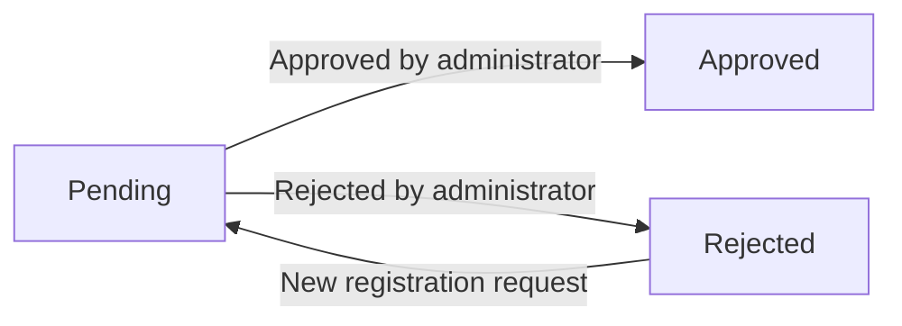

**Additional States**
- **Suspended**: An approved seller can be suspended by administrators for policy violations
- **Unsuspended**: A suspended seller can be restored to approved status

Sellers in suspended or rejected status cannot create new products or edit existing products, but may still process existing orders.

### Order Item Status Transitions

## Order Item States

Each order item exists in one of several states that track its fulfillment lifecycle.

**Item States**
- **Paid**: Payment has been completed, awaiting seller shipment
- **Shipped**: Seller has created a shipment with tracking information
- **Delivered**: Customer has confirmed receipt or delivery timeframe has elapsed
- **Cancelled**: Item was cancelled before or during fulfillment
- **Refunded**: Item was refunded after delivery

**State Relationships**
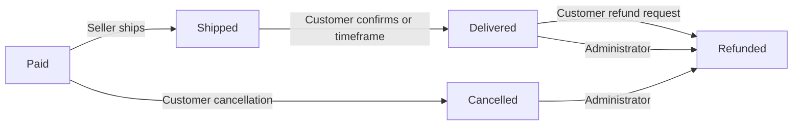

**Key Relationships**
- Each item tracks its journey from payment through delivery or cancellation/refund
- Stock quantities are managed through inventory records when items are cancelled or refunded
- Every state change creates a snapshot record for audit purposes

### Order Status Derivation

## Order States

The overall order status is derived from the aggregate status of all its constituent order items.

**Order States**
- **Paid**: All order items have status "paid"
- **Shipped**: At least one item is "shipped" with no items "delivered"
- **Delivered**: All order items have status "delivered"
- **Cancelled**: All order items have status "cancelled"
- **Refunded**: All order items have status "refunded"
- **Partially Completed**: Items have mixed statuses

**Derivation Logic**
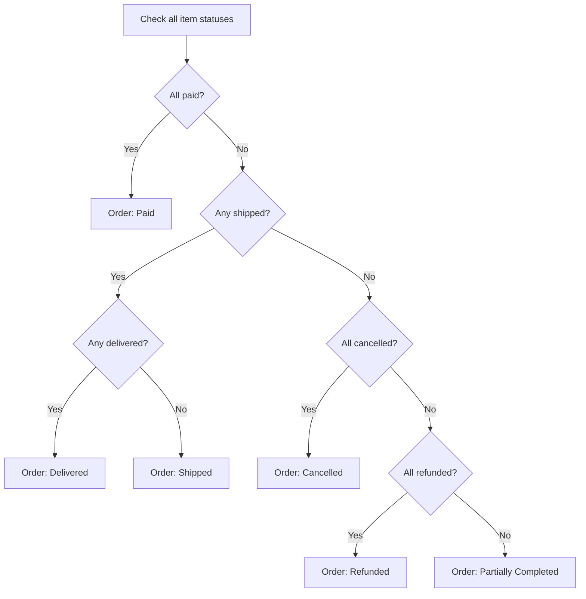

**Derivation Rules**
- Order status updates automatically when any item status changes
- This ensures consistency between item and order states
- No manual status assignment is performed on orders

### Shipment Status Flow

## Shipment States

A shipment represents a physical package sent by a seller containing one or more order items from that seller.

**Shipment States**
- **Created**: The seller has initiated the shipment with tracking information
- **In Transit**: The shipment has been created and items are in transit
- **Delivered**: Customer has confirmed delivery or delivery timeframe has elapsed

**State Relationships**
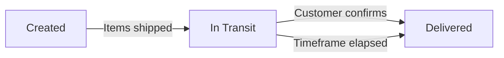

**Shipment Rules**
- Sellers create shipments for their products containing multiple order items
- Each shipment includes tracking carrier and tracking number
- All items in the same shipment share the same tracking information
- When a shipment is created, all included items change to "shipped" status
- Delivery confirmation updates all items in that shipment to "delivered" status
- Different sellers create separate shipments for their products

### Cancellation Request Workflow

## Cancellation Request States

Cancellation requests track customer requests to cancel order items before shipment.

**Request States**
- **Pending**: Customer has submitted a cancellation request awaiting seller response
- **Approved**: Seller has approved the cancellation
- **Rejected**: Seller has rejected the cancellation

**State Relationships**
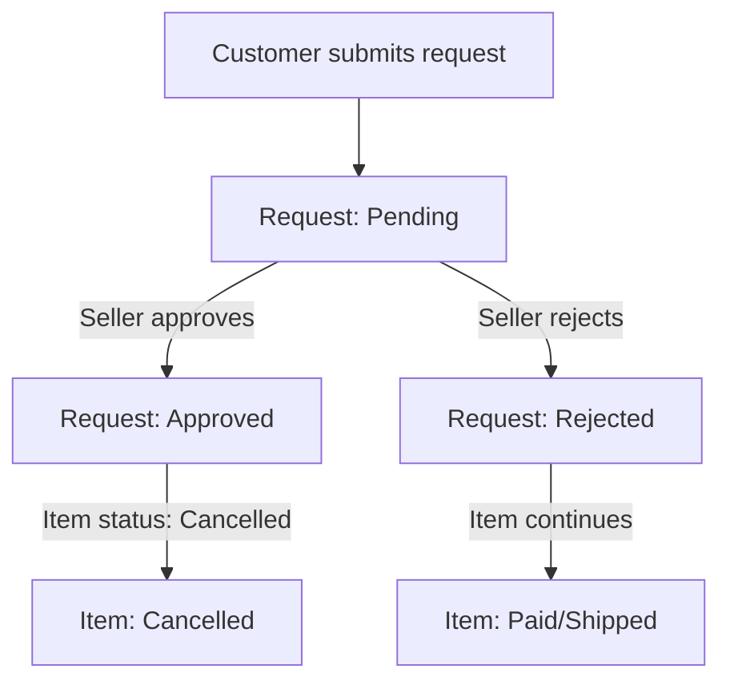

**Cancellation Rules**
- Customers can request cancellation for items awaiting shipment
- Each request includes a reason for cancellation
- The seller of the item approves or rejects the request
- When approved, the item status changes to "cancelled"
- Stock quantities are restored via inventory records for cancelled items
- Remaining order items continue processing normally
- Administrators can also cancel items and orders

### Refund Request Workflow

## Refund Request States

Refund requests track customer requests to refund delivered items.

**Request States**
- **Pending**: Customer has submitted a refund request awaiting seller response
- **Approved**: Seller has approved the refund
- **Rejected**: Seller has rejected the refund request

**State Relationships**
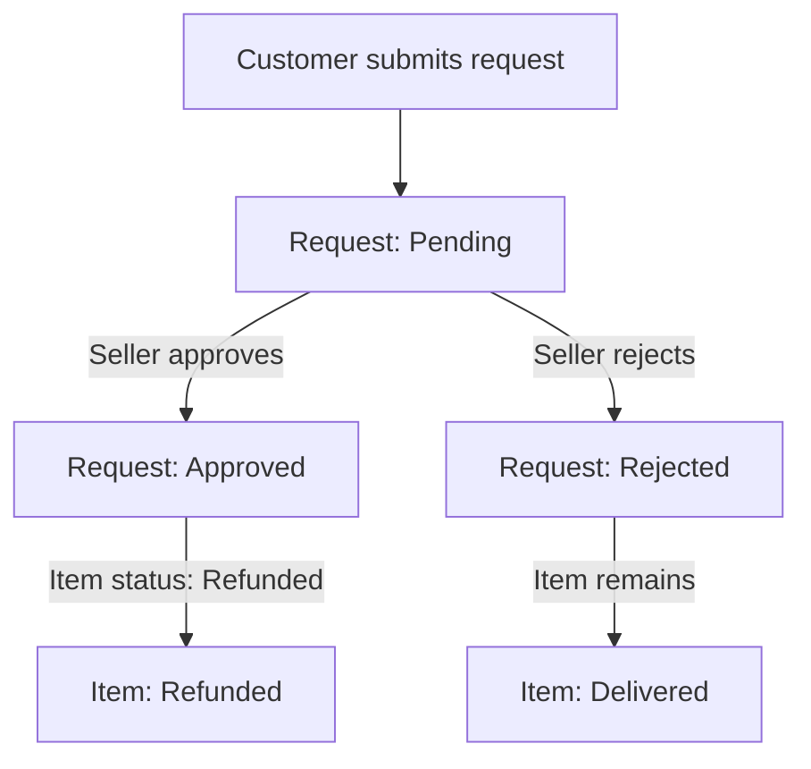

**Refund Rules**
- Customers can request refunds for delivered items
- Each request includes a reason for the refund
- The seller of the item approves or rejects the request
- When approved, the item status changes to "refunded"
- Stock quantities are restored via inventory records for refunded items
- Remaining order items are unaffected
- Administrators can also refund items and orders

### Product Availability States

## Product Availability States

Products have availability states that determine whether they can be purchased and their visibility on the platform.

**Availability States**
- **Available**: The product has at least one variant with stock quantity greater than zero
- **Unavailable**: The product has no variants or all variants have zero stock
- **Hidden**: The product has been deleted or belongs to a suspended seller

**Availability Logic**
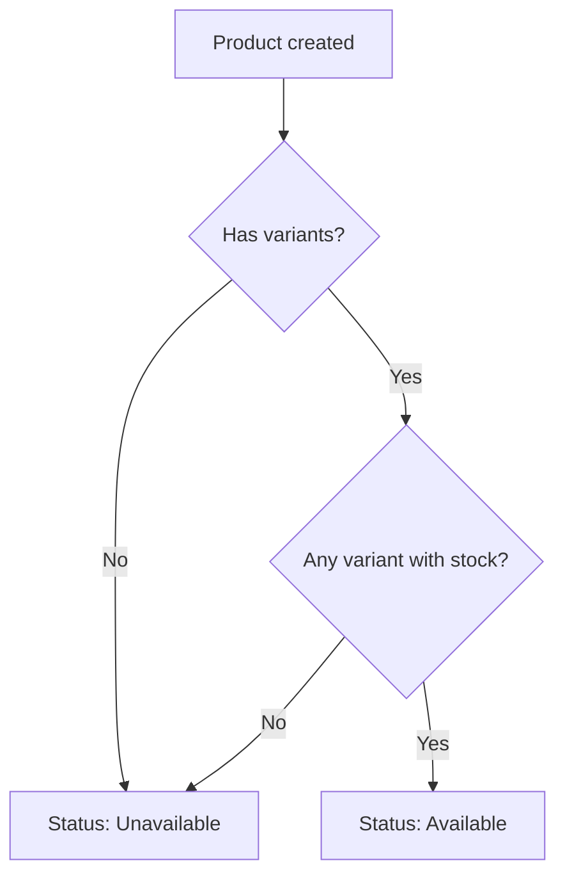

**Availability Rules**
- A product must have at least one variant to be purchasable
- Products with no variants are visible but shown as unavailable
- When a variant's stock reaches zero, it cannot be added to cart
- When all variants are out of stock, the product becomes unavailable
- Deleted products are removed from wishlists
- Suspended sellers' products are hidden from search and listings
- Hidden products remain accessible to administrators

### Review Status Changes

## Review States

Customer reviews for products exist in states that control their visibility and contribution to ratings.

**Review States**
- **Active**: The review is visible on the product detail page and contributes to average rating
- **Deleted**: The customer has deleted the review, hidden from public view

**State Relationships**
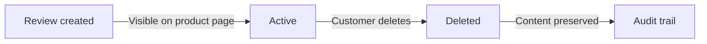

**Review Rules**
- A customer can write a review after the item is delivered
- A customer can write one review per product per order
- Reviews are displayed on the product detail page
- Customers can edit their own reviews
- Every review edit creates a snapshot preserving previous content
- Customers can delete their own reviews
- Deleted reviews are hidden from the product page
- Deleted reviews are not included in average rating calculations
- Product average rating is calculated from active reviews only
- Deleted reviews leave snapshots for dispute resolution

### Administrator Request Lifecycle

## Administrator Request States

User requests to become administrators exist in states that track their approval process.

**Request States**
- **Pending**: A user has submitted an administrator request awaiting review
- **Approved**: A super administrator has approved the request

**State Relationships**
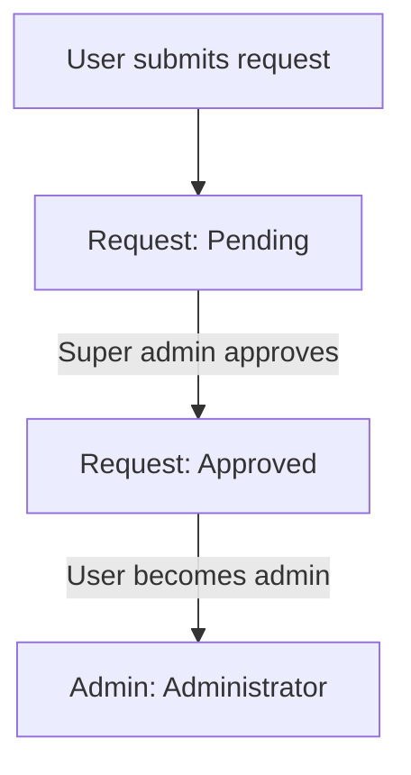

**Administrator Request Rules**
- Any user can submit a request to become an administrator
- The request includes a reason for the request
- Super administrators review pending requests
- Super administrators approve or reject requests
- When approved, the user becomes a regular administrator
- Regular administrators cannot promote users to administrator
- Super administrators can promote regular administrators to super administrator
- Super administrators can demote other super administrators to regular administrator

### Product Snapshot Transitions

## Product Snapshot States

Product snapshots preserve the state of products at specific points in time for audit and dispute resolution.

**Snapshot States**
- **Created**: When a product is first created by a seller
- **Updated**: When any product field is modified
- **Deleted**: When a product is deleted by the seller or administrator

**Snapshot Lifecycle**
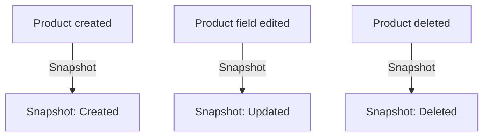

**Snapshot Rules**
- Every product edit creates a snapshot including all fields
- Product snapshots include variants at the time of the edit
- Snapshots are immutable and cannot be deleted
- Sellers can view snapshots of their own products
- Administrators can view snapshots of any product
- Snapshots are preserved even after product deletion
- Product images are included in snapshots when modified
- This snapshot history enables audit trails and dispute resolution

### Variant Snapshot Transitions

## Variant Snapshot States

Product variant snapshots preserve the state of variants at specific points in time.

**Snapshot States**
- **Created**: When a variant is first added to a product
- **Updated**: When SKU code, option values, or price are modified
- **Deleted**: When a variant is deleted

**Variant Snapshot Lifecycle**
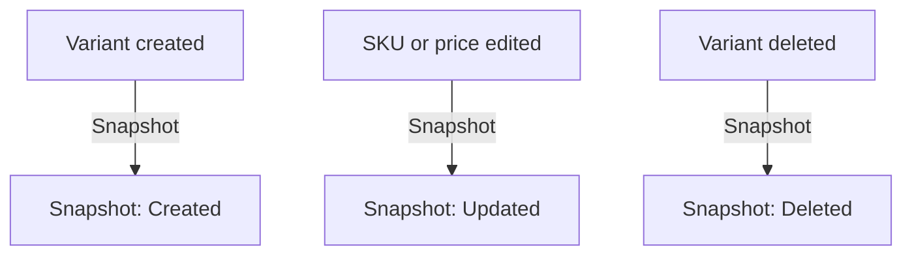

**Snapshot Rules**
- Every variant edit creates a snapshot including complete state
- Snapshot includes: SKU code, option values, price at time of edit
- Snapshots are immutable and cannot be deleted
- Sellers can view snapshots of their own variants
- Variant snapshots are included in product snapshots when products are edited
- This ensures complete traceability of pricing and option changes
- Deleted variants cannot have pending order items, cancellation requests, or refund requests