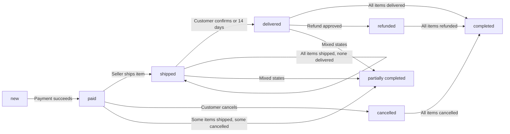
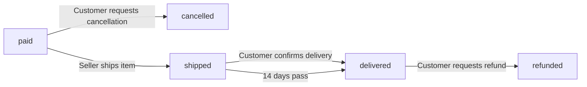
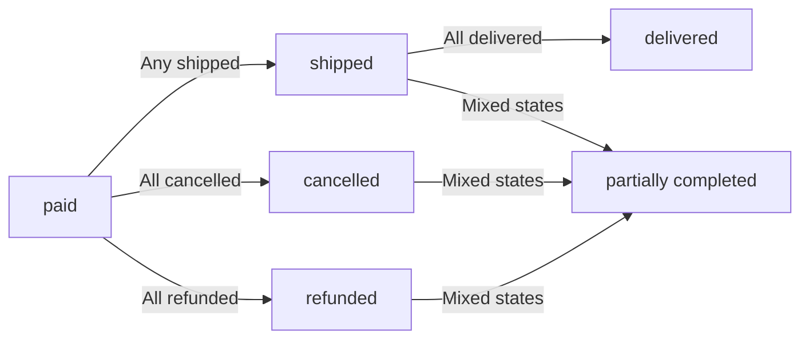
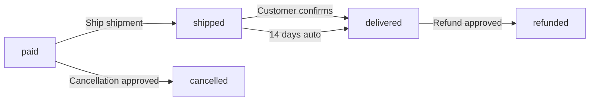
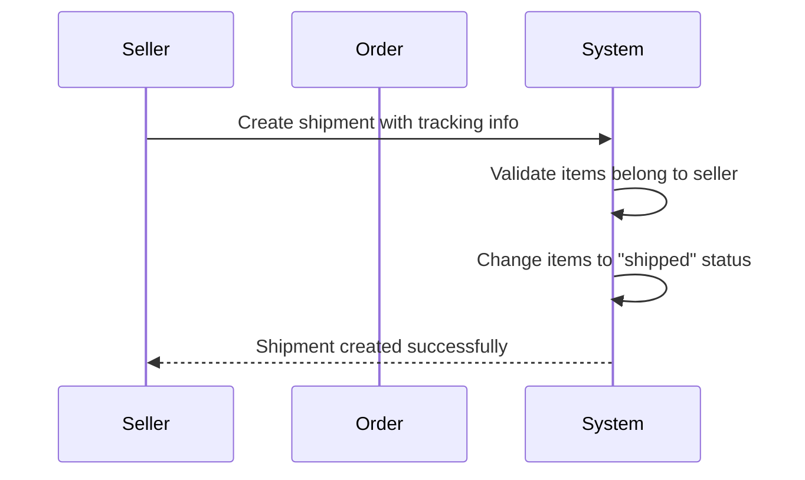
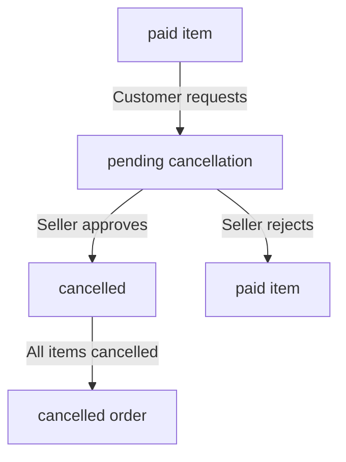
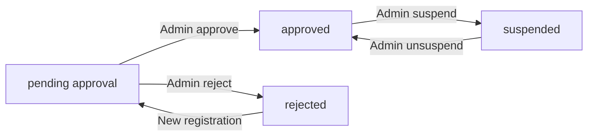

**ecommerceMall — Business concepts, relationships, and states from user perspective**

Business concepts, relationships, and states from user perspective

# Domain Concepts

Describe what each concept means in the business domain and its key attributes.

## Customer Concept

A Customer represents a registered user who engages in shopping activities on the platform. Each customer maintains personal profile information including a display name and phone number. Customers store multiple shipping addresses for delivery destinations. The customer identity is tied to registered account credentials for secure access. Order history is preserved as a record of all past purchases regardless of account status. Customer reviews and ratings contribute to product feedback on the platform. When account deletion occurs, profile information is removed while orders and reviews are retained for business continuity.

### Customer Identity and Registration

The Customer represents a registered user who can shop on the platform. Registration is required for all platform features; guest browsing is not available. Customers create accounts using email and password credentials. The Customer identity is the basis for all shopping activities, order history, and reviews on the platform.

### Customer Profile Attributes

Each Customer maintains a profile containing personal information. The profile includes a display name used to identify the Customer in the system. The profile also includes a phone number for contact purposes. Customers can edit their display name and phone number at any time.

### Shipping Address Management

Customers can store multiple shipping addresses for delivery destinations. Each shipping address contains: recipient name, phone number, street address, city, state or province, postal code, and country. Customers can add new addresses to their collection. Customers can edit existing addresses to update information. Customers can delete addresses they no longer need. Customers can designate one address as the default shipping address for checkout. The default address is automatically selected during checkout unless the customer chooses otherwise.

### Order History

All orders placed by the Customer are recorded in their order history. The order history is preserved as a complete record of all past purchases, even if the Customer account is later deleted. Each order contains details about items purchased, prices, and order status. The order history includes orders from before account deletion to maintain business records and legal compliance.

### Customer Reviews

Customers can write reviews for products they have purchased. Each review includes a rating from 1 to 5 stars and optional text content. Reviews contribute to the product's overall rating displayed to other customers. Customers can edit their own reviews to update ratings or text content. Customers can delete their own reviews when desired. Even when deleted, review snapshots are preserved for dispute resolution. Reviews are displayed on product detail pages.

### Account Deletion

Customers can request deletion of their account. When account deletion occurs: the Customer's profile information (display name and phone number) is deleted from the system. All order history records are preserved and not deleted. All reviews written by the Customer are preserved but displayed as "deleted user". The Customer identity cannot be reused after deletion. Deletion requires confirmation from the Customer.

## Seller Concept

A Seller represents an individual or business entity that offers products for sale on the platform. Each seller maintains a shop profile containing a shop name, description, and logo image. Sellers are subject to administrator approval before they can list and sell products. The seller identity is linked to registered account credentials for secure access. Shop profile changes are recorded through snapshot creation for transparency and dispute resolution. Product ownership is associated with the seller who created each product. Order history and product snapshots are preserved even when seller accounts are deleted.

### Seller Identity

A Seller represents an individual or business entity that offers products for sale on the ecommerceMall platform. Each seller is registered with an account using an email address and password. The seller identity is tied to this registered account and cannot be transferred to another person or business. Only the registered seller can access and manage their shop profile and products. The seller's email address serves as their unique identifier for login and communication purposes. Sellers maintain their own separate account from customer accounts, with different permissions and capabilities.

### Shop Profile Attributes

Each seller maintains a shop profile containing three key attributes: a shop name, a shop description, and a logo image. The shop name is the public-facing name that appears on all products, order confirmations, and customer-facing pages. The shop description provides background information about the seller's business, products, or policies. The logo image is a visual representation of the seller's brand that appears in product listings, seller profiles, and order-related communications. These three attributes together constitute the shop profile and define the seller's public identity on the platform. The shop name, shop description, and logo image are defined collectively as the shop profile.

### Shop Profile Management

Sellers can edit their shop profile at any time to update their shop name, shop description, or logo image. When any part of the shop profile is modified, a new snapshot is created that captures the previous values for record-keeping. This snapshot record includes when the change was made, what fields were changed, and the values before and after the modification. Shop profile edits are visible to customers who view the seller's profile. The shop profile is separate from the seller's account credentials (email and password) which are managed through the account settings.

### Seller Approval Process

New seller accounts require administrator approval before the seller can list products or conduct any sales activities. When a seller registers, their account is created with a pending approval status. During this pending state, the seller can view their approval status and cannot create products or accept orders. Administrators review pending seller approval requests and either approve or reject them. If approved, the seller's status changes to approved and they can immediately begin selling. If rejected, the seller can view the reason for rejection and may submit a new registration request to reapply for seller status. The approval status is visible to the seller at all times.

### Product Ownership

Every product created on the platform belongs exclusively to the seller who created it. Product ownership cannot be transferred to another seller through normal platform operations. When a product is created, it is automatically associated with the creating seller's account. The seller who owns a product is responsible for managing its variants, inventory, images, and pricing. Only the owning seller can edit or delete their own products. Product ownership is established at creation time and persists even if the seller's account is later deleted—in that case, the products are removed from listings but the ownership relationship is recorded in the deletion snapshot.

### Seller Account Deletion

Sellers can delete their seller account only if specific conditions are met. Deletion is permitted only when the seller has no pending orders (orders with paid or shipped status) and no pending cancellation or refund requests for their products. When a seller account is deleted, the following occurs: all active products are removed from public listings, order history and product snapshots are preserved for legal and business record purposes, and the seller's shop name is preserved in past order records. Deleted seller accounts cannot be restored. The deletion process ensures that transaction records remain intact for compliance and dispute resolution.

### Shop Snapshots

Shop profile changes are recorded through shop snapshots that preserve the state of the shop at any point in time. Each shop snapshot is created whenever the shop name, shop description, or logo image is modified. The snapshot captures when the change was made, which fields were changed, and the values before and after the modification. Shop snapshots are immutable and cannot be deleted. Shop snapshots can be viewed by the shop owner (seller) and by administrators for dispute resolution or audit purposes. These snapshots serve as an audit trail for all changes to the seller's public identity on the platform.

## Product Concept

A Product represents an item available for purchase on the platform, created and owned by a seller. Each product contains a name, description, and is assigned to a category or subcategory. Products have a base price that may be overridden by specific variant pricing. Multiple images can be associated with a product, with the first image serving as the main thumbnail. Products can have multiple variants representing different option combinations. Product ownership is restricted to the creating seller, who maintains exclusive control over modifications and deletion. Every product modification creates a snapshot preserving the previous state.

### Product Name and Description

A product has a name that serves as its primary identifier. The name is required for all products and must be provided when creating a product.

A product also has a description that provides details about the item. The description is required and explains the product's features, specifications, or use cases.

Both name and description are part of the product's core identity and are displayed to customers when browsing or viewing product details.

### Category Assignment

Every product is assigned to a category or subcategory. This assignment organizes products for customer browsing and search.

Categories have a hierarchical structure where subcategories can belong to parent categories. A product can be assigned to any category level in the hierarchy.

Category assignment is required when creating a product. Products without a category assignment cannot be created.

### Base Price

Each product has a base price that represents the standard price for the item. The base price is required and must be provided when creating the product.

The base price serves as the starting point for pricing. Individual product variants may override this base price with their own specific pricing.

The base price is displayed to customers in product listings and searches when variants have the same price.

### Product Images

A product can have multiple images associated with it. These images display the product from different angles or in different contexts.

Images are ordered, with the first image serving as the main thumbnail for product listings and search results.

Sellers can upload, reorder, and delete images. All image changes are recorded in product snapshots to preserve the visual history.

### Main Thumbnail

The main thumbnail is the first image in the product's image sequence. It is displayed as the primary visual representation of the product in all listings and search results.

The main thumbnail can be changed by reordering images, moving any image to the first position.

The main thumbnail is included in product snapshots, ensuring the visual identity is preserved at any point in time.

### Product Ownership

Products are owned by the seller who created them. Ownership grants the seller exclusive rights to modify, delete, or manage the product.

Sellers can only edit or delete their own products. Other sellers cannot access or modify another seller's products.

Product ownership persists even if the seller's account is suspended or deleted. The product's association with its owner is preserved in historical records.

### Product Variants

A product can have multiple variants representing different option combinations such as color, size, or other features. Each variant is a purchasable version of the product.

Every variant has a unique SKU code that identifies it within the seller's catalog. The SKU code is required and must be unique.

Each variant has option values that describe its specific configuration, such as "Red, Large" or "Blue, Small". Variants may have their own price that overrides the product's base price.

Variants also have stock quantities that track available inventory. A product must have at least one variant to be purchasable.

### Product Snapshots

Every modification to a product creates a snapshot that records the previous state. Snapshots preserve the complete product state at the time of change.

Each snapshot records when the change occurred, what fields were modified, and the values before and after the change.

Product snapshots include all product fields, all associated images, and all product variants as they existed at that moment. These snapshots are immutable and cannot be deleted.

Product ownership allows sellers to view their own product snapshots. Administrators can view snapshots of any product on the platform.

### Seller Products

A seller's products are all products created by that seller. The seller maintains exclusive control over their product catalog.

Sellers can view their complete product list, including products, variants, and inventory for each product.

Products are created under the seller's account and are associated with the seller's shop identity. When customers view product details, the seller's shop name is displayed.

Products remain associated with their creator seller even if the seller account is deleted. The seller's shop name and information are preserved in order records.

## ProductVariant Concept

A ProductVariant represents a specific configuration of a product defined by option combinations such as size, color, or other selections. Each variant is uniquely identified by a SKU code for inventory tracking. Variants contain option values that specify the exact configuration. Individual variant pricing can override the product base price when needed. Stock quantity is managed at the variant level to track availability. Every variant modification creates a snapshot to preserve historical states. Products must have at least one variant to be purchasable by customers.

### Product Variant Definition

A product variant represents a specific configuration of a product defined by option combinations such as size, color, or other selections. Each variant is a distinct purchasable item within a product. A product must have at least one variant to be purchasable by customers. Products with no variants are visible in search but shown as unavailable. Each variant belongs to exactly one product.

### Variant SKU Code

Each variant is uniquely identified by a SKU code (stock keeping unit). The SKU code is required for all variants and serves as the unique identifier for inventory tracking and order processing. The SKU code distinguishes one variant from all other variants across the entire platform.

### Variant Option Values

Each variant contains option values that specify the exact configuration, such as color, size, material, or other product attributes. Option values define what makes this variant different from other variants of the same product. For example, a shirt variant might have option values of color: "Red" and size: "Large". The combination of all option values creates the variant configuration.

### Variant Pricing

Each variant has its own price, which can override the product's base price. The base price is the default price for a product when no variant-specific pricing is set. When a variant has a specific price, that price is used instead of the base price. Variant pricing is optional, allowing products to have consistent pricing across all variants.

### Stock Quantity

Each variant tracks its own stock quantity independently. Stock quantity indicates how many units of that specific variant are available for purchase. Stock quantity is required for all variants and starts at zero when a variant is first created. Stock quantity changes when inventory is added or removed through inventory management.

### Variant Configuration

A variant configuration is the complete set of option values that defines a specific variant. Configuration combinations represent all possible options for a product, such as "Red / Large", "Blue / Small", or "Black / Medium". Each unique combination of option values creates a distinct variant configuration that customers can select when purchasing.

### Variant Availability

A variant is available for purchase when its stock quantity is greater than zero. When stock reaches zero, the variant is shown as out of stock and cannot be added to cart. Variant availability status is visible to customers and determines whether the variant can be selected during shopping. Products with no available variants are shown as unavailable.

### Variant Inventory Records

Each variant maintains inventory records that track all stock quantity changes. Inventory records contain: the quantity change (positive for restocking, negative for orders or adjustments), the reason for the change, and the timestamp. Current stock is calculated by summing all inventory records. Inventory records are created when orders are placed, when orders are cancelled or refunded, or when sellers manually adjust stock.

### Variant Snapshots

Every modification to a variant creates a snapshot to preserve the previous state. A variant snapshot includes: the SKU code, option values, price, and the timestamp of the change. Snapshots record what was changed and the values before and after. Snapshots are immutable and cannot be deleted. Sellers can view snapshots of their own variants, and administrators can view snapshots of any variant. Snapshots are preserved even after variant or product deletion.

## Category Concept

A Category represents an organizational structure used to group products for browsing and discovery. Categories can contain subcategories, creating a one-level nesting hierarchy. Each category is defined by a name and descriptive content. Administrators maintain exclusive control over category creation, editing, and deletion. Customers browse products by selecting categories or subcategories for filtering. Products assigned to categories appear in category listings and search results. Categories organize the product catalog and support product discoverability.

### Category Definition

A Category is a business concept used to organize products into meaningful groups for browsing and discovery. Each category is defined by a unique name and a descriptive text that explains what type of products belong in that category. The category name serves as the primary identifier for the category and is displayed to customers throughout the platform. The category description provides additional context about the category's purpose and helps customers understand what products to expect when browsing that category.

### Category Hierarchy

Categories can be organized in a hierarchical structure to support product classification. Each category can have one parent category, creating a parent-child relationship. This structure allows for one level of nesting, where a subcategory belongs to a single parent category. A product can be assigned to a subcategory, and the parent category is automatically associated through the hierarchy. The hierarchy supports intuitive navigation, allowing customers to browse from broad categories to more specific subcategories. Categories at the top level have no parent and serve as the entry point for product browsing.

### Category Management

Category creation, editing, and deletion is exclusively controlled by administrators. Customers cannot create, modify, or remove categories. Administrators define the category structure and maintain its accuracy over time. When administrators edit a category name or description, the change applies to all products within that category and its subcategories. Administrators can delete categories; when a category is deleted, products within that category are marked as uncategorized and must be reassigned to a valid category. Category management operations are logged for audit purposes.

### Product Categorization

Every product must be assigned to exactly one category or subcategory at the time of creation. This categorization is a required attribute and cannot be omitted. Products are associated with their category and appear in all category listings and search results filtered by that category. When a customer browses a category, they see all products assigned to that category and any subcategories within it. Products can be moved between categories by the seller who owns the product. A product removed from a category must be assigned to another category before it can remain active on the platform.

### Category Browsing and Discovery

Customers can browse the complete list of categories displayed on the platform. The category listing shows all top-level categories and allows customers to expand subcategories under their parent. Customers can click on any category to view all products within that category, including products in subcategories. Category names are displayed prominently, and category descriptions are visible on category detail pages. Categories support filtering, allowing customers to restrict product searches to a specific category or subcategory. Category browsing is a primary method for customers to discover products when they do not have a specific product in mind.

## Order Concept

An Order represents a customer purchase containing one or more order items. Each order includes a single shipping address that cannot be changed after placement. The overall order status derives from the collective status of all contained items. Orders track total price and maintain a chronological record of purchase events. Different order items within an order can originate from different sellers and may ship separately. Order status reflects the completion state of the entire purchase transaction. Order details include item lists, shipping information, and shipment tracking.

### Order Identification and Chronology

Each order receives a unique order number for identification and reference. The order number is generated when the order is created and remains constant throughout the order's lifecycle.

Every order has an order date that records when the order was placed. The order date is used for chronological organization of orders, with orders displayed from newest to oldest in order history lists.

Orders are arranged chronologically in all views, with the most recent orders appearing first. This chronology enables customers to track their purchase history over time and allows the system to identify new versus historical orders.

### Order Pricing

Each order has a total price that represents the sum of all order item prices, including any applicable fees or adjustments.

The order total price is calculated at the time of order placement and includes:
- The price of each variant at the time of purchase
- Any quantity discounts applied
- Shipping costs if applicable

The order total price is recorded as a snapshot at order creation and cannot be modified, ensuring price integrity for financial records and dispute resolution.

### Order Status

Orders have an overall status that reflects the collective state of all contained items. The order status is derived from the statuses of individual order items.

Order status values:
- **Paid**: All items have payment completed, waiting for shipping
- **Shipped**: At least one item has been shipped, none delivered yet
- **Delivered**: All items have been delivered
- **Cancelled**: All items have been cancelled
- **Refunded**: All items have been refunded
- **Partially Completed**: Mixed states exist (e.g., some items delivered, some refunded)

The order status automatically updates when any contained item changes status, ensuring the order status always reflects the current state of the purchase.

### Order Items

An order consists of one or more order items. Each order item represents a single product variant purchased at a specific quantity.

Each order item includes:
- The product name and description at time of purchase
- The variant option values (e.g., color, size)
- The variant price at time of purchase
- The quantity purchased
- The item status (paid, shipped, delivered, cancelled, refunded)

When a customer purchases multiple units of the same variant, it becomes a single order item with the total quantity. Order items from different sellers may be included in the same order, each tracking their own shipping and fulfillment process.

### Shipping Address

Each order is associated with a single shipping address that is selected at checkout. The shipping address contains:
- Recipient name
- Phone number
- Street address
- City, state/province
- Postal code
- Country

The shipping address is frozen at order placement and cannot be modified after the order is created. This ensures shipping accuracy and provides a permanent record of where items were delivered. The original address is preserved even if the customer updates their default address later.

### Order Grouping

Orders group multiple order items into a single purchase transaction, but items within an order can be handled independently.

Key grouping rules:
- Items from the same seller are grouped into the same shipments
- Different sellers ship their items separately, creating multiple shipments for one order
- Individual order items can be cancelled or refunded without affecting other items in the order
- Shipments track which items are being shipped together

This grouping allows customers to purchase from multiple sellers in one transaction while maintaining independent tracking and fulfillment for each seller's contribution.

### Order Transaction Process

An order represents a complete purchase transaction with the following lifecycle:

1. **Cart**: Items are selected and reviewed in the shopping cart
2. **Checkout**: Customer selects shipping address and reviews order summary
3. **Payment**: Customer confirms and payment is processed
4. **Paid**: Payment succeeds, order is created, stock is reserved
5. **Shipped**: Seller ships one or more items with tracking
6. **Delivered**: Customer confirms delivery or 14 days pass after shipping
7. **Completed**: All items reach final state (delivered, cancelled, or refunded)

The transaction creates permanent records including snapshots of products, variants, and seller profiles at the time of purchase.

### Order Details

Customers can view complete order details including:

- Order number and order date
- Total price breakdown
- List of all order items with:
  - Product name and image
  - Variant options and price
  - Quantity and item status
- Shipping address used for delivery
- Shipment list with tracking information for each shipment:
  - Carrier name and tracking number
  - Which items are included in each shipment
- Order status
- History of status changes and important events

Order details provide a complete view of the purchase transaction, enabling customers to track delivery, manage returns or cancellations, and maintain purchase records.

### Order Status State Transitions



The order status transitions automatically based on changes to contained order items. Mixed states (some items in different statuses) result in "partially completed" status until all items reach a final state.

## OrderItem Concept

An OrderItem represents an individual product variant purchased within an order. Each item maintains its own independent status separate from the overall order. Order items record the product name, variant details, quantity, and price at time of purchase. Seller association is preserved with each order item for accountability. Order items can be individually cancelled or refunded without affecting other items. Product and seller snapshots are saved with order items to preserve historical states. Item status progression reflects the fulfillment journey from purchase to delivery or cancellation.

### Order Item Overview

An order item represents a single product variant purchased as part of an order. Each order item records the specific product name, variant options, quantity purchased, and price at the time of purchase. The item maintains its own independent status separate from the overall order status, allowing individual items to be cancelled or refunded without affecting other items in the same order. Each order item is associated with the seller who provided the product variant.

### Order Item Status

Each order item maintains an independent status that reflects its fulfillment state. Item statuses include:

• Paid: payment has been completed and the item is awaiting shipment from the seller
• Shipped: the seller has shipped the item and provided tracking information
• Delivered: the item has been received by the customer (either through delivery confirmation or automatic confirmation after 14 days from shipping)
• Cancelled: the item has been cancelled (by customer request with seller approval, or by administrator force cancellation)
• Refunded: the item has been refunded (by customer request with seller approval, or by administrator force refund)

The overall order status is derived from the statuses of all items within it. If all items are paid, the order is paid. If any item is shipped, the order is shipped. If all items are delivered, the order is delivered. If all items are cancelled, the order is cancelled. If all items are refunded, the order is refunded. Mixed states result in "partially completed" status.

### Item Quantity

The quantity represents how many units of a specific product variant were purchased. If a customer buys 3 units of the same variant, it becomes one order item with quantity of 3. When an order is placed, the quantity is subtracted from the variant's available stock. When an item is cancelled or refunded, the quantity is added back to available stock through inventory records. The item quantity remains constant throughout the item's lifecycle; it is only the stock quantity that changes in response to order item events.

### Item Price

The price represents the actual price paid for this specific order item at the time of purchase. This price is captured in a snapshot with the order item and remains unchanged even if the product's current price changes later. For variants with custom pricing that differs from the base product price, the variant price is captured. The item price is used to calculate the order total and is preserved for historical reference, dispute resolution, and refund calculations.

### Item Product

Each order item is associated with a specific product that was purchased. The product name, description, and category at the time of purchase are captured in a snapshot and preserved with the order item. This snapshot ensures that even if the seller later changes the product name, description, or moves the product to a different category, the historical record of what was purchased remains accurate and immutable.

### Item Variant

Each order item represents a specific product variant (SKU) that was selected and purchased. The variant's option values (such as color, size, or other options) and the variant's price are captured in a snapshot and preserved with the order item. This snapshot includes the complete variant configuration as it existed at the time of purchase, preserving the exact product specification that the customer bought.

### Item Seller

Each order item is associated with the seller who provided and fulfilled the product. The seller's shop name and logo at the time of purchase are captured in a snapshot and preserved with the order item. This seller association remains even if the seller later changes their shop name, updates their logo, or modifies their shop description. The historical snapshot ensures accountability and accurate seller attribution for disputes.

### Item Snapshots

Every modification to an order item's related data (product, variant, seller profile, cancellation request, refund request) creates an immutable snapshot. Snapshots record when the change was made, what was changed, and the values before and after. Snapshots cannot be deleted and are preserved even after the order item or related entity is deleted. Snapshots are viewable by the order item owner, the seller, and administrators for dispute resolution and audit purposes.

### Individual Item Cancellation

Customers can request cancellation for individual order items with status "paid" (not yet shipped). The cancellation request includes a reason as text. The seller of that specific item can approve or reject the cancellation request. When the seller responds, a snapshot of the request state is created. If approved, the item is cancelled and the refund is processed for that item only. Cancelled items restore their stock quantities through inventory records. The remaining items in the order continue processing normally. If all items in an order are cancelled, the entire order status becomes "cancelled".

### Individual Item Refund

Customers can request a refund for individual order items with status "delivered". The refund request includes a reason as text. Refunds can only be requested within 7 days of that item being delivered. The seller of that specific item can approve or reject the refund request. When the seller responds, a snapshot of the request state is created. If approved, the item is refunded and the refund is processed for that item only. Refunded items restore their stock quantities through inventory records. The remaining items in the order are unaffected. If all items in an order are refunded, the entire order status becomes "refunded".

### Order Item Fulfillment

Order item fulfillment involves the seller shipping the item and the customer receiving it. Sellers can view order items for their products that need shipping. When shipping, sellers select one or more of their items to include in a shipment and enter tracking information including the carrier name and tracking number. All items in the same shipment share the same tracking information. When a shipment is created, all items in it change to status "shipped". Customers can view tracking information for each shipment and confirm delivery. When delivery is confirmed, all items in that shipment change to status "delivered". If delivery is not confirmed, items automatically change to "delivered" after 14 days from shipping.

## Shipment Concept

A Shipment represents a package sent by a seller containing one or more order items from the same seller. Different sellers always ship separately, creating distinct shipments per seller. Shipment tracking information includes carrier name and tracking number. All items within the same shipment share identical tracking details. Customers confirm delivery per shipment rather than per individual item. Item statuses transition to delivered upon shipment confirmation or automatic timeout. Shipment structure reflects the physical delivery organization of order items.

### Shipment Tracking Information

Each shipment includes tracking information that allows customers to monitor delivery progress. The tracking information consists of two components: carrier name and tracking number.

The carrier name identifies the shipping company or service that handles the delivery (e.g., DHL, FedEx, local postal service).

The tracking number is a unique identifier assigned by the carrier to this specific shipment. This number is used by customers and the system to look up the shipment's current status and location with the carrier.

When a seller creates a shipment, they must provide both the carrier name and tracking number. These values cannot be changed after the shipment is created, as they are immutable records of what was sent.

### Shipment Items and Composition

A shipment contains one or more order items that are being sent together to the customer.

Each order item in a shipment represents a product variant that was purchased. For example, if a customer ordered a Red Large shirt and a Blue Large shirt from the same seller, both items can be included in the same shipment.

All order items in a single shipment share the same tracking information (carrier name and tracking number) and the same shipping address, as they are being delivered together in one package.

Customers can view the list of items contained in each shipment when viewing order details. The shipment view shows the product name, variant options, and quantity for each item included in that shipment.

### Shipment Grouping Rules

Shipment grouping follows specific business rules to ensure proper delivery organization.

Different sellers always ship separately. A single order can contain products from multiple sellers, but each seller's products will be in separate shipments. For example, if a customer orders Item A from Seller X and Item B from Seller Y, there will be two separate shipments—one from Seller X and one from Seller Y.

A single seller can bundle multiple order items into one shipment when convenient. The seller decides which items to group together based on practical considerations such as package size, shipping costs, and warehouse organization.

A shipment can only contain order items from one seller. It is not possible to create a shipment that includes items from different sellers.

### Shipment Status

Each shipment has a status that reflects its current state in the delivery process.

Shipment status is derived from the status of the order items contained within it. When a shipment is first created, all items in it transition to "shipped" status.

The shipment status tracks the overall delivery state. When all items in a shipment have been delivered (confirmed by the customer or after the 14-day automatic delivery period), the shipment is considered delivered.

Shipment status cannot be manually changed by the seller after shipment creation. The status advances based on the customer's delivery confirmation or automatic timeout.

### Delivery Confirmation

Customers confirm delivery on a per-shipment basis, not on a per-item basis.

When a customer views a shipment's tracking information, they can confirm that they have received the shipment. This confirmation applies to all order items in that shipment simultaneously.

Once a customer confirms delivery for a shipment, all order items contained in that shipment transition to "delivered" status. The confirmation is recorded with the date and time of confirmation.

If the customer does not actively confirm delivery, the system automatically marks all items in the shipment as delivered 14 days after the shipment's creation date. This automatic delivery occurs without requiring customer action.

Once delivery is confirmed (either manually or automatically), the shipment status cannot be reversed. The delivery confirmation is an immutable record.

### Seller Shipment Creation

Sellers are responsible for creating shipments when they ship order items to customers.

A seller can view a list of order items that require shipping. These are items for which they have not yet created a shipment.

When creating a shipment, the seller selects one or more of their order items to include. The seller must provide the carrier name and tracking number at the time of shipment creation.

After a shipment is created, the seller cannot modify the list of items in that shipment. The shipment composition is fixed at creation time.

Sellers can view the complete history of shipments they have created for their order items.

## Address Concept

An Address represents a shipping destination with complete location details for orders. Each address stores recipient name, phone number, and street address information. Geographic attributes include city, state or province, postal code, and country. Customers maintain multiple addresses with one designated as the default shipping address. Address information is captured and preserved in orders at the time of purchase. Default address designation provides convenience for repeat customers. Shipping addresses remain unchanged after order placement for delivery accuracy.

### Address Overview

An Address represents a shipping destination where orders will be delivered. Each address captures the complete location information needed for delivery, including recipient details and geographic location data. Addresses are owned by customers and can be used when placing orders. Once an order is placed, the shipping address is preserved in the order record and cannot be changed, ensuring delivery accuracy for the specific transaction.

### Address Fields

Each address contains seven required fields that together define a complete shipping destination:

- Recipient Name: The name of the person who will receive the delivery at this address
- Phone Number: A contact phone number for delivery coordination
- Street Address: The physical street address including building number and street name
- City: The city or municipality where the address is located
- State Province: The state, province, or region where the address is located
- Postal Code: The postal or zip code for the address
- Country: The country where the address is located

All seven fields are required when creating an address. The address information is captured and preserved in orders at the time of purchase.

### Multiple Addresses

Customers can maintain multiple addresses in their account. Each customer can add as many addresses as needed for different delivery locations. Multiple addresses provide flexibility for deliveries to different locations such as home, work, or other delivery points. All addresses belong to a single customer account and are only accessible by that customer. Each address in the list is independent and can be edited or deleted separately.

### Default Address

Customers can designate one address as their default shipping address. The default address is automatically selected as the delivery location when placing new orders, providing convenience for repeat customers. Customers can change which address is designated as default at any time. The default address designation does not affect existing orders—only new orders use the default address. Having a default address simplifies the checkout process by pre-filling the shipping address field.

## Review Concept

A Review represents customer feedback on purchased products after delivery. Each review includes a star rating from one to five and optional text content. Customers can write one review per product per order. Reviews are associated with the specific product and customer who wrote them. Review edits create snapshots to preserve the original feedback state. Deleted reviews remain accessible as snapshots for dispute resolution purposes. Product average ratings are calculated from all non-deleted customer reviews. Reviews contribute to product reputation and purchasing decisions.

### Review Rating

A review rating represents customer satisfaction using a one to five star scale. Each star level corresponds to a satisfaction level: one star indicates lowest satisfaction, five stars indicates highest satisfaction. The rating is a required field for every review. Customers select their rating when creating or editing a review. The rating contributes to the product's average rating calculation, which customers view when browsing products.

### Review Text Content

Review text content is optional written feedback that complements the star rating. Customers may share their experience with the product, including usage insights, quality observations, or purchase recommendations. The text can describe product features, shipping experience, or overall satisfaction. Empty text is allowed as long as a star rating is provided. Text content can be modified when editing the review. The text is displayed alongside the rating on product detail pages.

### Review Customer

The review customer is the account holder who purchased the product and wrote the review. Each review is associated with exactly one customer who verified the purchase. Customers can only write reviews for products they have successfully received. Customers may edit their own reviews or delete them. When a customer deletes their account, their reviews remain visible but display as written by a deleted user, with all content and rating preserved as snapshots.

### Review Product Association

Every review is linked to a specific product. The review appears on that product's detail page among other customer feedback. Products can accumulate multiple reviews from different customers over time. A review remains tied to the product even if the seller later modifies or removes the product from listings. This association helps customers find all feedback relevant to their product interest.

### Review Order Verification

A review requires verification that the customer received the product through an order. Customers can only write a review for a product after the corresponding order item shows delivered status. One review is allowed per product per order to ensure authentic feedback from verified purchasers. Reviews cannot be created for orders that were cancelled, refunded, or otherwise never delivered.

### Review Edit History Snapshots

Each time a customer edits a review, the system creates a snapshot preserving the previous state. The snapshot records the change timestamp, the rating before and after, and the text content before and after. Snapshots cannot be deleted or modified, even if the review itself is deleted. Administrators and review owners can view the edit history for dispute resolution purposes.

### Review Deletion

Customers may delete their own reviews entirely at any time. When a review is deleted, it no longer counts toward the product's average rating calculation. Deleted reviews remain accessible through snapshots for audit purposes. Only the original review author or administrators may delete reviews. After deletion, the product shows one fewer review in the public display.

### Review Editing

Customers may update their review rating and text content at any time after purchase. Each edit creates a new snapshot of the previous version. Customers can change a one star rating to five stars, or update their written feedback. The updated review appears immediately on the product detail page. Editing does not change the original review timestamp, but creates a new edit timestamp visible in snapshots.

### Average Rating Calculation

Products display an average rating calculated from all non-deleted customer reviews. The system sums all star ratings and divides by the total number of active reviews. The average is displayed on product listing pages and product detail pages. Only reviews that have not been deleted contribute to this calculation. The average rating helps customers assess product quality before purchasing.

### Product Feedback Reputation

Product feedback represents a product's collective reputation based on all customer reviews. The average rating, review count, and written feedback together inform purchasing decisions. Products with higher average ratings and more reviews tend to receive more customer trust. Review content sorted by newest first helps customers understand recent product quality. Product feedback directly influences customer purchase confidence and seller performance.

## Wishlist Concept

A Wishlist represents a customer's collection of desired products for future purchase consideration. Wishlist entries reference products rather than specific variants, allowing flexibility in variant selection at purchase time. Customers maintain personal wishlists containing their curated product selections. Products deleted by sellers are automatically removed from customer wishlists. Wishlist functionality supports product discovery and purchase planning. The wishlist serves as a personal recommendation list managed by each customer.

### Customer Wishlist Creation and Ownership

Each customer maintains a personal wishlist for storing products of interest. The wishlist is owned by the customer and accessible only through their authenticated account. A customer cannot view or manage another customer's wishlist.

Wishlist items reference products rather than specific product variants, providing customers flexibility in choosing the right variant at purchase time. When a product is added to a wishlist, the system records the customer's preference for that product.

The wishlist serves as a personal collection that customers build over time as they browse and discover products they may want to purchase in the future. Customers can view their complete wishlist at any time to review their saved products.

### Product Selection in Wishlist

Wishlists contain product entries that represent items customers are considering for future purchase. Each product in the wishlist is identified by its product identity, not by a specific variant combination.

When viewing products in a wishlist, customers can see the product name, main image thumbnail, seller shop name, base price or price range, and average rating if reviews exist. This information helps customers evaluate which products to keep in their wishlist or proceed to purchase.

Multiple products can be stored in a single customer's wishlist, forming a curated collection of items for potential purchase. There is no specified maximum limit on the number of products a customer can store in their wishlist.

### Wishlist Flexibility and Variant Selection

The wishlist operates at the product level, allowing customers to save interest in products without committing to specific variant options at the time of saving. This provides flexibility for customers who may be unsure which variant combination best suits their needs.

When a customer decides to purchase a product from their wishlist, they can select from all available variants of that product. Variant options may include variations such as color, size, material, or other product-specific attributes.

The variant selection at purchase time allows customers to update their wishlist selections if product variants become available or if their preferences change. This flexibility supports better purchase planning by deferring variant decisions until the customer is ready to buy.

### Product Deletion from Wishlist

When a seller deletes a product from the platform, the product is automatically removed from all customer wishlists that contain it. This ensures wishlists remain consistent with available inventory.

Customers can also manually remove products from their wishlist at any time. When a product is removed, it no longer appears in the customer's wishlist list or in search results filtered to wishlist items.

Products that become unavailable due to deletion are completely removed from wishlists. Customers will not see deleted products or receive notifications about their removal from wishlists. The system maintains wishlist integrity by keeping it synchronized with product availability.

### Wishlist Management and Curation

Customers manage their wishlist by adding products of interest, removing products no longer desired, and reviewing the collection periodically. The wishlist is paginated to efficiently handle large collections of saved products.

Customers can sort and browse their wishlist to find specific products or review all items in their collection. This curation capability supports purchase planning by allowing customers to organize their interests over time.

The wishlist remains private and is only accessible to the owning customer. Other users, including sellers and administrators, cannot view another customer's wishlist. This privacy ensures customers can curate personal product lists without external visibility.

### Wishlist Storage and Retrieval

Wishlist entries are stored as persistent records associated with each customer account. The system maintains the complete wishlist history and state for each customer across all sessions.

When customers log in, their wishlist is automatically retrieved and displayed. The wishlist content is synchronized across sessions, ensuring customers see the same saved products regardless of when or how they access their account.

Wishlist data is retained for as long as the customer account remains active. If a customer deletes their account, the wishlist is deleted along with the account profile, consistent with the platform's data retention policies.

## Snapshot Concept

A Snapshot represents an immutable record capturing data state at the moment of change. Snapshots preserve information about when changes occurred and what values existed before and after modifications. Snapshots are created whenever editable data is modified, including products, variants, seller profiles, orders, reviews, and cancellation or refund requests. All parties with relevant access can view snapshots for dispute resolution and transparency. Snapshots remain preserved even when original data is deleted. Snapshots support audit trails and business continuity requirements for monetary transactions.

### Snapshot Timestamp

Every snapshot captures the exact time when a change occurred, recorded as a timestamp in the system.

The timestamp represents when the modification was made and preserved in the snapshot record.

Timestamps are used to establish chronological order for all snapshots and enable users to view the history of changes over time.

### Snapshot Changes

Snapshots record what specific data elements were modified when changes occur.

For products, the recorded changes include name, description, category, base price, and all images.

For product variants, the recorded changes include SKU code, option values, and price.

For seller profiles, the recorded changes include shop name, shop description, and logo image.

For order items, the recorded changes include product details, variant details, and seller profile information at the time of purchase.

For reviews, the recorded changes include rating and text content.

For cancellation and refund requests, the recorded changes include the reason and all status updates made during the request lifecycle.

### Before and After Values

Each snapshot preserves both the values that existed before the change and the values after the change.

This before-and-after comparison allows users and administrators to see exactly what was different between states.

For example, when a product price is changed, the snapshot shows both the old price and the new price.

When a seller profile is updated, the snapshot shows both the old shop name and the new shop name.

This comparison capability is essential for dispute resolution and accountability.

### Immutable Records

All snapshots are immutable and cannot be deleted or modified once created.

This immutability ensures the integrity of the audit trail for monetary transactions.

Once a snapshot is recorded, it remains preserved in the system permanently.

The immutable nature of snapshots means that historical records of all data changes are always available for review.

This property is critical for maintaining trust in the platform's transaction history.

### Snapshot Preservation

Snapshots are preserved even when the original data is deleted from the platform.

When a product is deleted, all its snapshots remain accessible.

When a seller deletes their account, all snapshots of their products remain preserved.

When a review is deleted, the snapshots of that review remain preserved.

This preservation ensures that historical business records are never lost, regardless of data modifications or deletions.

Preserved snapshots can be accessed by relevant parties for audit and dispute resolution purposes.

### Snapshot Viewing

Relevant parties can view snapshots based on their access rights and relationship to the data.

Product owners can view snapshots of their own products.

Administrators can view snapshots of any product on the platform.

Customers can view snapshots of order items from their own purchases.

Administrators can view snapshots of cancellation and refund requests related to orders.

The viewing of snapshots is logged for security and compliance purposes.

### Snapshot Edit Creation

Every edit to editable data automatically creates a new snapshot.

When a product is edited by its seller, a product snapshot is created.

When a product variant is edited by its seller, a variant snapshot is created.

When a seller profile is edited, a seller profile snapshot is created.

When a review is edited by its customer, a review snapshot is created.

When a cancellation or refund request status changes, a request snapshot is created.

These snapshots are created at the exact moment the edit is committed to the system.

### Snapshot Dispute Resolution

Snapshots serve as the authoritative record for resolving disputes between buyers and sellers.

When there is a disagreement about product specifications, snapshots show the exact product state at the time of purchase.

When there is a disagreement about pricing, snapshots show the exact price at the time of transaction.

When there is a disagreement about review content, snapshots show the original review text.

Administrators use snapshots to make informed decisions during dispute resolution processes.

The immutable nature of snapshots ensures that neither party can alter historical records to their advantage.

### Snapshot Audit Trail

The collection of all snapshots forms a complete audit trail of platform activity.

The audit trail shows when changes were made, who made them, and what changed.

Administrators can review the audit trail to track platform compliance.

The audit trail can be queried by date range, user, entity type, or specific entity.

All snapshot records contribute to the overall compliance and transparency of the e-commerce platform.

The audit trail supports regulatory requirements and internal governance policies.

### Snapshot Data Structure

A snapshot contains the following data:

- Timestamp of when the change occurred
- Identifier of the entity being modified
- Type of entity (product, variant, seller profile, order item, review, cancellation request, refund request)
- Before values (all field values prior to the change)
- After values (all field values after the change)
- Identifier of the user who made the change (where applicable)

This structure ensures that every snapshot is self-contained and can be understood independently of other records.

### Snapshot Hierarchy

Product snapshots contain nested variant snapshots, creating a hierarchical structure.

When a product snapshot is created, it includes snapshots of all variants as they existed at that moment.

This product-snapshot to variant-snapshot relationship preserves the complete state of a product with all its variants.

The hierarchical structure ensures that the entire product context is captured in each snapshot.

This is essential for accurately representing what was sold to customers at any point in time.

### Snapshots and Order Integrity

Order items include snapshots of the product, variant, and seller profile at the time of purchase.

These snapshots preserve the product name, description, variant options, price, seller shop name, and seller logo.

The snapshots ensure that historical order records remain accurate even if the original product data is later modified or deleted.

This integrity is critical for customer support, returns, and dispute resolution.

Order snapshots cannot be modified after the order is placed, ensuring the integrity of transaction records.

### Snapshots for Inventory Adjustments

Inventory changes are tracked through inventory records rather than snapshots.

Inventory records capture quantity changes (positive for restocking, negative for orders or adjustments), the reason for the change, and the timestamp.

Current stock quantity is calculated by summing all inventory records.

While inventory records are similar to snapshots in tracking changes, they serve a different purpose and are not considered snapshots.

The distinction between inventory records and snapshots ensures appropriate data handling for operational versus historical purposes.

### Snapshot Lifecycle

Snapshots are created at the moment of change and persist indefinitely.

The lifecycle of a snapshot begins when a modification is made and ends only when the system is decommissioned.

Snapshots have no expiration date or retention period.

The perpetual preservation of snapshots supports long-term business intelligence and compliance requirements.

The snapshot lifecycle is designed to support the platform's commitment to data integrity and transparency.

## InventoryRecord Concept

An InventoryRecord represents a transaction tracking stock quantity changes for product variants. Each record contains a quantity adjustment that can be positive for restocking or negative for orders and adjustments. Inventory records include a reason for the quantity change and timestamp of the event. Current stock quantity is calculated by summing all inventory records for a variant. Order placement creates negative inventory records automatically. Order cancellation and refund create positive inventory records. Sellers maintain complete inventory history visibility for each variant.

### Inventory Record Structure

An InventoryRecord represents a single transaction that tracks a change to stock quantity for a product variant. Each record captures a quantity adjustment event that affects the current available stock level. Inventory records serve as an immutable audit trail for all stock movements on the platform.

Each inventory record contains the following information:

- Quantity Change: A numeric value indicating the amount of stock adjustment. Positive values represent stock increases, such as when inventory is restocked by the seller. Negative values represent stock decreases, such as when items are purchased in orders or removed through inventory adjustments.

- Reason: A field describing why the quantity change occurred. Common reasons include restocking orders, customer purchases, inventory corrections, damaged goods, and lost items. The reason field provides context for auditing and helps sellers understand stock movement patterns.

- Timestamp: A record of when the quantity change occurred. The timestamp is set at the moment the transaction is created and remains fixed for audit purposes.

The quantity change value is recorded at the moment the transaction occurs and cannot be modified afterward.

### Inventory Sum and History

The current stock quantity for a variant is calculated by summing all inventory records associated with that variant. The calculation includes all positive and negative quantities from the complete history of transactions. This sum represents the actual available stock that can be sold to customers.

Inventory history is maintained as a complete chronological list of all records for each variant. The history shows every quantity change event in the order it occurred, including the transaction type, quantity change, reason, and timestamp. This complete audit trail allows sellers to trace stock movements over time and investigate any discrepancies in their inventory counts.

When stock reaches zero based on the inventory sum, the variant is marked as out of stock. Out of stock variants cannot be added to customers' shopping carts.

## CancellationRequest Concept

A CancellationRequest represents a customer's request to cancel a specific order item before shipment. Each request includes a reason text explaining the cancellation intent. The associated seller reviews and responds to cancellation requests with approval or rejection. Approval or rejection decisions create snapshots of the request state. Approved cancellations result in item cancellation and refund processing for that specific item. Cancellation requests preserve snapshots even after resolution. Cancelled items restore their stock quantities through inventory records.

### Cancellation Request Overview

A CancellationRequest represents a customer's request to cancel a specific order item before the item has been shipped. Each cancellation request applies to a single order item, not to an entire order. Customers can request cancellation for items with status "paid" but not for items with status "shipped" or "delivered". The request remains pending until the seller of that item reviews and responds to it.

### Cancellation Request Reason

Each cancellation request must include a reason text field where the customer explains why they want to cancel the item. The reason is required and provides context for the seller to evaluate the cancellation request. The reason text can be any descriptive message explaining the customer's intent, such as accidental purchase, wrong item selection, or change of mind.

### Cancellation Request Status

A cancellation request has one of the following statuses:

- Pending: The request has been submitted by the customer but the seller has not yet responded
- Approved: The seller has approved the cancellation request
- Rejected: The seller has rejected the cancellation request

A request moves from Pending to Approved or Rejected when the seller responds. Once a request reaches Approved or Rejected status, it cannot change back to Pending.

### Seller Cancellation Response

The seller of the order item can respond to a cancellation request by either approving or rejecting it. When responding, the seller selects one of the two options: approval or rejection. The response can only be made once per cancellation request. After the seller responds, the request status changes from Pending to the corresponding response status.

### Cancellation Approval

When a seller approves a cancellation request, the order item status changes to "Cancelled" and the item is removed from the pending fulfillment workflow. The cancellation approval creates a snapshot of the request state at the time of approval, preserving the reason and all relevant context for dispute resolution. The customer receives the cancellation confirmation and the item no longer ships.

### Cancellation Rejection

When a seller rejects a cancellation request, the order item continues in its normal fulfillment flow. The cancellation request status changes to "Rejected" and the item remains in its original status. The rejection creates a snapshot of the request state at the time of rejection, preserving the reason for future reference. The customer can view the rejection but cannot submit another cancellation request for the same item.

### Cancellation Snapshots

Every cancellation request creates snapshots at key decision points to preserve the state of the request. When a seller responds (approve or reject), a snapshot is created containing the request reason, the response decision, the timestamp of the response, and the user who made the response. These snapshots are immutable and cannot be deleted, even if the request is later resolved. Snapshots can be viewed by the customer, the seller, and administrators for dispute resolution and audit purposes.

### Cancellation Refund

When a cancellation is approved, a refund is automatically processed for the cancelled item. The refund covers the full price paid for that specific order item, including any applicable shipping costs allocated to that item. The refund is processed to the original payment method used for the order. The refund amount is calculated based on the item price at the time of purchase, not the current product price.

### Cancellation Stock Restoration

When a cancellation is approved, the stock quantity of the cancelled variant is restored through an inventory record. A positive inventory record is created with the quantity that was cancelled, with the reason noted as "cancellation". This restores the variant's available stock for future purchases. The inventory history record preserves when the restoration occurred and links it to the cancelled order item.

### Cancellation Request Resolution

A cancellation request is considered resolved when the seller has responded with either approval or rejection. Once resolved, the request status cannot change and the cancellation workflow is complete. If all items in an order are cancelled through individual cancellation requests, the entire order status changes to "Cancelled". If only some items are cancelled, the remaining items continue processing normally with their original order status maintained.

## RefundRequest Concept

A RefundRequest represents a customer's request for refund of a delivered order item. Each request includes a reason text describing the refund justification. Refunds can only be requested within seven days after item delivery confirmation. The seller associated with the item reviews and responds to refund requests. Decision outcomes create snapshots preserving the request state. Approved refunds result in item refund and stock restoration. Refund requests maintain snapshots even after the request is resolved.

### RefundRequest Overview

A RefundRequest represents a customer's request for refund of a delivered order item. Refund requests are processed per order item, not per entire order. Each refund request is associated with a single order item that has been delivered to the customer. The customer initiates the refund request by providing a reason. The seller associated with the order item reviews and responds to refund requests.

### Refund Request Reason

Each refund request includes a reason text describing the refund justification. The reason is required and must be provided when submitting a refund request. The reason text allows the customer to explain why they are requesting a refund (e.g., damaged item, incorrect item, not as described). The seller reviews the reason when making their decision. The reason is preserved in the refund request snapshot.

### Refund Request Status

A refund request has a status that tracks its lifecycle from submission to resolution. Status values include: pending, approved, rejected. When first submitted, the status is pending. When the seller responds, the status changes to either approved or rejected. Once resolved, the status cannot be changed. The status is visible to both the customer and seller.

### Refund Time Limit

A refund request can only be submitted within seven days after the order item is delivered. The seven-day period starts from the delivery confirmation date. Refund requests submitted after the time limit are rejected. The system tracks the delivery date to enforce this time limit. If the time limit has expired, the customer cannot submit a new refund request for that item.

### Refund Request Resolution

Refund requests are resolved when the seller responds with either approval or rejection. The seller reviews the refund reason and makes a decision. When the seller responds, the refund request status changes from pending to either approved or rejected. Once resolved, the status cannot be changed. Resolution is irreversible except through administrator intervention.

### Refund Approval and Rejection

When a seller approves a refund request, the order item is refunded to the customer. Approved refunds result in stock restoration for the variant. The customer receives a refund for the item price. When a seller rejects a refund request, no refund is processed. The rejected item remains unchanged. The customer cannot submit another refund request for the same item after rejection.

### Refund Snapshots

Every refund request has a snapshot that records its state. The snapshot includes: the refund reason, the request status, the associated order item, and timestamps. Every seller response creates a snapshot of the request state at the time of the decision. Snapshots are immutable and cannot be deleted. Snapshots are preserved even after the refund request is resolved. Relevant parties (customer, seller, administrators) can view snapshots for dispute resolution.

### Refund Stock Restoration

When a refund is approved, the stock quantity for the associated product variant is restored. Stock restoration is recorded through an inventory record with a positive quantity change and reason 'refund'. The inventory record includes the timestamp of the restoration. This ensures accurate stock levels are maintained after refunds.

### Seller Refund Response

Only the seller associated with the order item can respond to a refund request. The seller reviews the refund reason and decides whether to approve or reject. The seller's response is final and cannot be overridden. The seller response action changes the refund request status and creates a snapshot of the resolved state. Administrators can view all refund requests and their responses.

## Administrator Concept

An Administrator represents a user with elevated privileges for platform management and oversight. Administrators can view and manage seller accounts, products, orders, and user accounts. Administrative powers include seller approval, product oversight, and user account management. Administrators can perform force cancellations and force refunds when necessary. Regular administrators can be promoted to super administrator status by super administrators. Administrator actions are subject to approval processes and audit requirements.

### Administrator Overview

An Administrator represents a user with elevated privileges for platform management and oversight. Administrators have the ability to view and manage all aspects of the platform including seller accounts, products, orders, and customer accounts.

Administrators perform key functions including:
- Reviewing and approving seller registration requests
- Overseeing product quality and policy compliance
- Managing order integrity and customer protection
- Managing user accounts and access control
- Performing force actions when necessary

All administrator actions are subject to audit requirements to ensure accountability and transparency.

### Administrator Grades

The platform recognizes two grades of administrators with distinct levels of authority.

Regular Administrators have oversight capabilities including:
- Viewing and approving or rejecting seller registration requests
- Viewing and managing products on the platform
- Viewing and managing orders on the platform
- Viewing and managing customer accounts
- Viewing and managing seller accounts
- Performing force cancellations and force refunds on orders
- Creating, editing, and deleting product categories

Super Administrators have all regular administrator privileges plus additional governance powers:
- Promoting regular administrators to super administrator status
- Demoting other super administrators to regular administrator status
- Cannot demote themselves
- Full platform governance oversight
- Viewing audit logs of all administrator actions

The grade distinction ensures appropriate separation of powers in platform administration.

### Becoming an Administrator

Administrator privileges are earned through a formal approval process.

Becoming an Administrator:
- Any user on the platform (customer or seller) can submit a request to become an administrator
- The request must include a reason for seeking administrator status
- Super administrators review pending requests in a dedicated queue
- Super administrators can approve or reject the request
- Upon approval, the user becomes a regular administrator with standard privileges
- Upon rejection, the user can view the rejection reason and is free to submit a new request

This controlled process ensures only qualified individuals gain administrative access to platform management functions.

### Seller Management

Administrators oversee the seller onboarding and ongoing management process.

Seller Approval Process:
- Administrators can view the list of pending seller registration requests
- Administrators can approve or reject each registration request
- When rejecting a registration, administrators must provide a detailed reason
- Rejected sellers can submit a new registration request after viewing the reason

Ongoing Seller Oversight:
- Administrators can view all registered seller accounts on the platform
- Administrators can suspend seller accounts when necessary
  - When suspended, the seller's products are hidden from search and category listings
  - Suspended seller products cannot be purchased
  - Suspended sellers can still process existing orders (ship items, respond to cancellation/refund requests)
  - Suspended sellers cannot create new products or edit existing products
- Administrators can unsuspend seller accounts when appropriate (products become visible again)
- Administrators can ban seller accounts for severe policy violations
  - Banned sellers cannot log in to the platform
  - Existing orders remain active and can still be fulfilled
- Administrators can unban sellers when appropriate

All seller management actions require appropriate justification and are subject to audit review.

### Product Oversight

Administrators have comprehensive oversight of all products on the platform regardless of seller.

Product Oversight Functions:
- View all products listed on the platform
- View historical snapshots of any product (preserves previous states)
  - Snapshots include product name, description, category, base price, and images
  - Snapshots include all variants and their configurations at the time captured
- Delete products for policy violations

Product Snapshot Viewing:
- Administrators can view snapshots to track product evolution over time
- Snapshots show who made each change and when
- Snapshots are immutable and preserved even after product deletion

This oversight ensures product quality and policy compliance across the entire platform. Products that are deleted for policy violations no longer appear in search or category listings.

### Order Oversight

Administrators have complete visibility and control over all orders on the platform.

Order Oversight Functions:
- View all orders from all customers
- View order details including items, prices, and statuses
- View shipments and tracking information for orders
- View inventory records to understand stock movements

Administrators can perform force actions on orders:
- Force-cancel individual items or entire orders
- Force-refund individual items or entire orders
- Force actions immediately refund the customer
- Force actions restore stock quantities
- All relevant records are updated automatically
- Order status reflects the force action

This oversight capability ensures order integrity and customer protection when standard processes are insufficient, such as in cases of disputed orders, system errors, or policy enforcement.

### User Management

Administrators manage user accounts to maintain platform integrity.

Customer Account Management:
- View all customer accounts on the platform
- Ban customer accounts for policy violations
  - Banned customers cannot log in to the platform
  - Existing orders and order history remain accessible to customers
  - Order history is preserved for legal and record-keeping purposes
  - Preserved reviews are shown with "deleted user" designation
- Unban customers when appropriate

Seller Account Management:
- View all seller accounts on the platform
- Ban seller accounts for policy violations
  - Banned sellers cannot log in to the platform
  - Existing orders remain active and can still be fulfilled
  - Seller shop name is preserved in past orders
- Unban sellers when appropriate

All user management actions are logged for audit purposes. Account bans are typically reserved for severe or repeated policy violations.

### Force Actions

Administrators can perform force actions when standard processes are insufficient to resolve issues.

Force Cancellation:
- Cancel individual order items or entire orders
- Immediately refund the customer for cancelled items
- Restore stock quantities through inventory records
- Update item and order statuses appropriately
- Notify relevant parties of the cancellation

Force Refund:
- Refund individual order items or entire orders
- Immediately refund the customer for refunded items
- Restore stock quantities through inventory records
- Update item and order statuses appropriately
- Notify relevant parties of the refund

Force actions are typically used for:
- Resolving disputed orders when standard processes fail
- Correcting system errors that affect orders
- Enforcing platform policies when necessary
- Protecting customer interests in exceptional circumstances

All force actions are logged with complete audit trails including who performed the action, when it was performed, and the justification.

### Category Management

Administrators control the platform's product categorization structure.

Category Management Functions:
- Create new categories and subcategories (one level of nesting only)
- Edit existing category names and descriptions
- Delete categories when necessary

When a category is deleted:
- Products in the deleted category become uncategorized
- Products remain accessible but lose their category association
- Category management is administrator-only

This structure allows administrators to organize products effectively and make updates as the platform evolves. Categories can be browsed by customers to find products.

### Audit and Governance

Administrator activities are subject to comprehensive audit requirements to ensure accountability.

Audit Requirements:
- All administrative actions are logged with complete details
- Audit records include: who performed the action, when it was performed, what was affected, and what changes were made
- Snapshots are created when administrative decisions affect requests (cancellation requests, refund requests, seller approval requests)
- Audit logs are immutable and cannot be deleted or modified
- Super administrators have visibility into all administrator actions including other super administrators

Audit Purposes:
- Tracking administrative decision-making for transparency
- Resolving disputes with documented evidence
- Ensuring accountability across all administrative actions
- Compliance verification with platform policies
- Reviewing force actions and their justifications

Platform administration ensures fair, secure, and compliant operation with proper oversight and accountability.

## SuperAdministrator Concept

A SuperAdministrator represents the highest tier of administrator with enhanced privileges for platform governance. Super administrators can promote regular administrators to super administrator status. Super administrators can demote other super administrators to regular administrator status. Super administrators cannot demote themselves, preventing unilateral power concentration. Super administrators oversee all administrative functions and can manage administrator grade changes. Administrator requests to become administrator are viewed and acted upon by super administrators. Super administrators maintain ultimate oversight authority over platform administration.

### Super Administrator Definition

A SuperAdministrator represents the highest tier of administrator on the platform with comprehensive oversight authority. Super administrators possess all administrative privileges including seller management, category management, product oversight, order oversight, and user management. They have the unique capability to manage administrator grades by promoting regular administrators to super administrator status and demoting super administrators to regular administrator status. This elevated privilege level ensures proper governance and accountability for the platform's administrative operations.

### Administrator Grade Management

Administrator grades consist of two levels: regular administrator and super administrator. Grade management refers to the process of changing a user's administrator grade between these two levels. Super administrators have the authority to promote regular administrators to super administrator grade, which upgrades their access rights to include grade management capabilities. Super administrators can also demote other super administrators to regular administrator status, which removes their grade management capabilities but retains their administrative oversight privileges.

### Super Administrator Governance and Restrictions

Super administrators cannot demote themselves to regular administrator status, preventing unilateral power concentration. To change a super administrator's own grade, another super administrator must perform the demotion action, creating a system of checks and balances. Super administrators provide the primary governance layer for the platform, overseeing all administrative operations and maintaining ultimate control over administrative actions. They review and act on administrator requests submitted by users seeking administrative privileges, ensuring proper execution of administrative functions and maintaining platform integrity through their oversight capabilities. Super administrators oversee all other administrators and administrative actions, monitoring seller management activities, category changes, product modifications, order interventions, and user restrictions.

## SellerApprovalRequest Concept

A SellerApprovalRequest represents a seller's application for permission to sell on the platform. Each request has a status reflecting whether it is pending, approved, or rejected. When rejected, a reason is provided explaining the decision. Rejected sellers may submit new registration requests for reconsideration. Administrators review and respond to seller approval requests with approval or rejection decisions. Response actions create snapshots of the request state for transparency. Approved sellers gain the ability to create and sell products on the platform.

### Seller Registration Application

A seller must submit a registration request before they can sell products on the platform.
The registration request includes the seller's email address, password, and shop information.
The shop information includes shop name, shop description, and logo image.
The registration request is submitted for administrator review before the seller can begin selling.
The seller cannot create or publish products until their registration request is approved.
The seller can view the current status of their registration request at any time.
The registration request becomes a permanent record that cannot be deleted.

### Approval Status and States

Each seller registration request has an approval status that reflects its current state.
The approval status can be pending, approved, or rejected.
When a seller first submits registration, the status is set to pending.
A status of pending means the request is waiting for administrator review.
A status of approved means the seller has been granted permission to sell on the platform.
A status of rejected means the seller's request was not approved.
The approval status determines what actions the seller can perform on the platform.
Only sellers with approved status can create products and accept customer orders.
Sellers with pending status can only view their registration status.
Sellers with rejected status cannot sell but can submit a new registration request.

### Approval Reasons

When an administrator rejects a seller registration request, a reason must be provided.
The rejection reason explains why the seller's request was not approved.
The approval reason is visible to the seller who submitted the request.
The approval reason provides transparency about the platform's approval criteria.
The approval reason is a text field that allows for detailed explanation.
The approval reason is stored as part of the registration request record.
The approval reason helps sellers understand what improvements are needed.
The approval reason is immutable once the request is submitted.

### Approval Reconsideration

When a seller registration request is rejected, the seller may submit a new registration request.
The new registration request is treated as a fresh application for consideration.
The previous rejection status does not prevent the seller from submitting again.
The seller can update their shop information when submitting a new request.
The new request will have a pending status and require new administrator review.
The platform encourages sellers to address the rejection reason in their new application.
The seller can view the history of all their registration requests.
The seller can view the reasons provided for any previous rejections.
The seller can submit as many reconsideration requests as needed.

### Approval Snapshots

When an administrator responds to a seller registration request, a snapshot is created.
The snapshot captures the state of the request at the moment of the administrator's decision.
The snapshot records when the response was made and by whom.
The snapshot is immutable and cannot be deleted or modified.
The snapshot preserves transparency in the approval process.
The snapshot can be viewed by the seller, administrators, and super administrators.
The snapshot serves as an audit record for dispute resolution.
The snapshot is part of the approval history for the registration request.

### Administrator Seller Review Process

Administrators can view the list of all pending seller registration requests.
Administrators can review the details of each registration request.
The details include the seller's information and shop details.
Administrators can approve or reject each pending request.
When rejecting, the administrator must provide a reason for the rejection.
Only administrators can respond to seller registration requests.
Super administrators have the same review capabilities as regular administrators.
The review process must be completed within a reasonable time.
Administrators should provide clear and helpful feedback to rejected sellers.
The approval decision creates a snapshot of the request state.

### Seller Permissions After Approval

When a seller registration request is approved, the seller gains selling permissions.
Approved sellers can create new products on the platform.
Approved sellers can edit their own products.
Approved sellers can manage inventory for their products.
Approved sellers can view and process customer orders for their products.
Approved sellers can respond to cancellation requests for their items.
Approved sellers can respond to refund requests for their items.
Approved sellers can manage their shop profile and information.
Approved sellers can view reports about their shop performance.
Approved sellers retain their permissions even if their shop is suspended, with some restrictions.

# Domain Relationships

Describe how concepts relate to each other from a business perspective.

## Conceptual Relationships

Describe how concepts relate to each other in business terms.

### Customer Relationships

**Ownership**
A customer owns their profile, shipping addresses, wishlist, orders, and reviews. These items are created by and belong to the customer.

**Address Association**
A customer can have multiple shipping addresses. Each address belongs to one customer. A customer can set one address as their default shipping address.

**Order Ownership**
A customer places orders. Each order belongs to the customer who placed it. The customer owns the order history and can view all their orders.

**Wishlist Ownership**
A customer owns a wishlist containing products they are interested in. The wishlist belongs to the customer. If a product is deleted by the seller, it is automatically removed from all customer wishlists.

**Review Ownership**
A customer can write reviews for products they have purchased. Each review belongs to the customer who wrote it. A customer can only write one review per product per order, and only after the order item status is "delivered".

### Seller Relationships

**Product Ownership**
A seller owns the products they create. Each product belongs to the seller who created it. The seller can only edit or delete their own products.

**Order Fulfillment**
A seller fulfills order items for their products. When an order contains items from a seller's products, that seller becomes responsible for shipping those items and responding to cancellation and refund requests.

**Shop Profile**
A seller owns their shop profile, which includes the shop name, description, and logo image. Every edit to the shop profile creates a snapshot preserving the previous state.

**Approval Status**
A seller account has an approval status (pending, approved, rejected) determined by administrators. Sellers can view their approval status and rejection reason if rejected. Rejected sellers can submit a new registration request.

### Product Relationships

**Category Association**
Products belong to categories. Each product is assigned to one category, which can be a subcategory (one level of nesting only). The category determines where the product appears in browsing and search results.

**Variant Relationship**
A product can have multiple variants. Each variant belongs to one product and represents a specific combination of options (e.g., "Red / Large"). A product must have at least one variant to be purchasable.

**Image Ownership**
A seller owns the images uploaded for their products. Each product can have multiple images. The first image is the main/thumbnail image. Sellers can reorder images and delete them from their products.

**Snapshot Ownership**
Every product has snapshots that record when the product was modified, what was changed, and the values before and after. Sellers can view snapshots of their own products. Administrators can view snapshots of any product. Snapshots are preserved even after product deletion.

### Order Relationships

**Order Item Belonging**
An order contains one or more order items. Each order item belongs to one order and represents a purchased product variant with a specific quantity. If a customer buys multiple quantities of the same variant, it becomes one order item with that quantity.

**Seller Association**
Order items can be from different sellers. Each order item belongs to the seller whose product was purchased. Different sellers ship their items separately, creating different shipments.

**Shipment Relationship**
Order items are grouped into shipments when shipped. A shipment can contain one or more order items from the same seller. All items in the same shipment share the same tracking information and shipping date.

**Order Status Derivation**
The overall order status is derived from its items. If all items are paid, the order is paid. If any item is shipped (and none delivered yet), the order is shipped. If all items are delivered, the order is delivered. If all items are cancelled, the order is cancelled. If all items are refunded, the order is refunded. Mixed states result in "partially completed" status.

### Product Variant Relationships

**Inventory Record Association**
Each product variant has its own inventory records. Inventory records track stock changes: positive for restocking, negative for orders and adjustments. The current stock is calculated by summing all inventory records for that variant.

**Order Item Association**
Product variants appear in order items when purchased. When an order is placed, a snapshot of the product variant (including SKU code, option values, and price) is saved with the order item, preserving the state at the time of purchase.

**Price Relationship**
A product variant has a price that can override the base product price. If all variants have the same price, the base price is shown. If variants have different prices, a price range is shown in listings.

**Stock Relationship**
A product variant has a stock quantity that changes over time. When stock reaches zero, the variant is shown as "out of stock" and cannot be added to cart. Out of stock variants can appear in wishlists but are marked as unavailable.

### Category Relationships

**Hierarchy Structure**
Categories can have parent-child relationships, creating one level of nesting (subcategory structure). A subcategory belongs to a parent category. Categories contain products. Customers can browse categories and view products within each category.

**Administrator Ownership**
Categories are created and managed by administrators only. Administrators can create subcategories, edit category names and descriptions, and delete categories. When a category is deleted, products in that category become uncategorized.

**Product Association**
Products belong to categories for organization and search purposes. Each product is assigned to one category (which may be a subcategory). Customers can filter search results by category and browse products within a category.

### Review Relationships

**Product Association**
Reviews belong to products. Reviews are displayed on the product detail page, sorted by newest first. The product's average rating is calculated from all non-deleted reviews.

**Order Requirement**
Reviews require a delivered order item. A customer can only write a review for a product after they have purchased it and the order item status is "delivered". Each review is associated with the order in which the product was purchased.

**Ownership and Editing**
A customer owns their own reviews. Customers can edit their reviews, and every edit creates a snapshot preserving the previous rating and text content. Customers can delete their reviews, but snapshots are preserved. Deleted reviews are not included in average rating calculations.

**Snapshot Preservation**
Review snapshots record the rating, text content, and timestamp of each version. These snapshots are immutable and cannot be deleted, allowing for dispute resolution.

### Snapshot Relationships

**Business Data Association**
Snapshots capture changes to business data across multiple entities. Snapshots are created when:
- Product is edited (including images and all variant information)
- Product variant is edited (SKU code, option values, price)
- Seller profile is edited (shop name, description, logo)
- Order item is created (product, variant, seller profile at time of purchase)
- Review is edited
- Cancellation request status changes
- Refund request status changes

**Immutability**
Snapshots are immutable and cannot be deleted. They preserve the state of data at specific points in time, including before and after values for all changed fields. Relevant parties (owners and administrators) can view snapshots for dispute resolution.

**Post-Deletion Preservation**
Snapshots are preserved even after the associated entity is deleted. This includes product snapshots, seller profile snapshots, and order item snapshots that were created before product or seller deletion. This ensures historical data integrity for orders and disputes.

### Cancellation and Refund Relationships

**Order Item Association**
Cancellation requests and refund requests apply to order items, not entire orders. Each request targets a single order item, allowing partial cancellation or refund within an order.

**Cancellation Requirements**
Customers can request cancellation for order items with status "paid" (not yet shipped). The cancellation request includes a reason (text). The seller of that item can approve or reject the request. When a seller responds, a snapshot of the request state is created.

**Refund Requirements**
Customers can request a refund for order items with status "delivered". The refund request must be made within 7 days of that item being delivered and includes a reason. The seller of that item can approve or reject the request. When a seller responds, a snapshot of the request state is created.

**Item-Only Impact**
Cancellation or refund affects only the requested item. Cancelled items restore their stock quantities via inventory records. Refunded items also restore stock. The remaining items in the order continue processing normally. If all items in an order are cancelled, the entire order becomes "cancelled". If all items are refunded, the order becomes "refunded".

### Inventory Relationships

**Variant Ownership**
Inventory records belong to product variants. Each variant has its own inventory history that tracks stock changes over time. Sellers can view the full inventory history of each variant.

**Stock Change Triggers**
Inventory records are created for:
- Restocking: seller adds inventory with quantity and reason
- Orders: order placement automatically creates negative inventory records
- Adjustments: seller subtracts inventory with quantity and reason
- Cancellations: order cancellation creates positive inventory records
- Refunds: order refund creates positive inventory records

**Calculation Method**
The current stock quantity for a variant is calculated by summing all inventory records for that variant. The system does not store stock as a static value but calculates it from the inventory history.

**Stock Status Relationship**
When stock reaches zero, the variant is shown as "out of stock" and cannot be added to cart. However, variants with zero stock can still appear in wishlists and product listings, marked as unavailable.

### Shipment Relationships

**Order Item Grouping**
Shipment items are order items grouped together for shipping. Different sellers always ship separately, creating different shipments. A single seller can bundle multiple order items from the same order into one shipment, or ship them individually.

**Tracking Association**
A shipment has tracking information: carrier name and tracking number. All items in the same shipment share the same tracking information and shipping date. Customers can view tracking information for each shipment.

**Delivery Confirmation**
Delivery confirmation applies to shipments, not individual items. When a customer confirms delivery for a shipment, all items in that shipment change to "delivered" status. If the customer does not confirm, items automatically change to "delivered" after 14 days from shipping.

**Seller Responsibility**
Sellers create shipments for order items belonging to their products. Sellers select which items to include in each shipment when they process shipping. The shipment status updates all items in it to "shipped" when created.

### Administrator Relationships

**Seller Management**
Administrators can view pending seller approval requests and approve or reject them. When rejecting, administrators must provide a reason. Administrators can suspend seller accounts (hiding products, preventing new product creation/editing while allowing existing order processing) and unsuspend them.

**Product Oversight**
Administrators can view all products on the platform and view snapshots of any product. Administrators can delete any product for policy violations. Deleted products no longer appear in search or category listings.

**User Management**
Administrators can view all customer and seller accounts. Administrators can ban customers (preventing login) and unban them. Administrators can ban sellers (preventing login while existing orders remain) and unban them.

**Order Oversight**
Administrators can view all orders on the platform. Administrators can force-cancel individual items or entire orders (refunding the customer and restoring stock) and force-refund individual items or entire orders.

**Category Management**
Administrators create and manage categories and subcategories. Administrators edit category names and descriptions and can delete categories (products become uncategorized).

### Super Administrator Relationships

**Administrator Management**
Super administrators have exclusive privileges to manage other administrators. Super administrators can promote regular administrators to super administrator and demote other super administrators to regular administrator. Super administrators cannot demote themselves.

**All Administrator Privileges**
Super administrators have all privileges of regular administrators: seller management, product oversight, user management, order oversight, and category management.

**Administrator Request Review**
Any user (customer or seller) can submit a request to become an administrator, including a reason. Super administrators can view pending requests and approve or reject them. When approved, the user becomes a regular administrator.

### Seller Approval Relationships

**Request Submission**
A seller account starts with "pending" approval status after registration. The seller can view their approval status. Rejected sellers can view the rejection reason and submit a new registration request.

**Administrator Review**
Administrators review seller approval requests. Administrators can approve or reject pending requests. When approving, the seller becomes active and can start selling. When rejecting, administrators must provide a reason.

**Account Deletion Constraints**
Sellers can delete their account only if they have no pending orders (paid or shipped status) and no pending cancellation or refund requests. When a seller deletes their account, their products are deleted from listings, but order history and snapshots are preserved. The shop name in past orders is preserved.

## Lifecycle and Retention

Describe concept lifecycle states and transitions only. Detailed retention/recovery policies belong in 05-non-functional. Operation details belong in 03-functional-requirements.

### Customer Account Lifecycle

Customer accounts exist in active state from registration until deletion.

When a customer deletes their account, their profile information including display name and phone number is permanently removed from the system.

Their order history and order records are preserved even after account deletion. These records remain accessible to administrators for seller records and legal compliance purposes.

Customer reviews are preserved after account deletion but are displayed with deleted user attribution instead of the customer's name.

A customer cannot delete their account while they have active orders that have been paid or shipped.

Customers must complete all pending transactions before requesting account deletion.

### Seller Account Lifecycle

Seller accounts progress through approval states before becoming active.

New seller accounts start in pending state when registration is submitted.

Administrators review each pending seller account and approve or reject the registration.

When approved, the seller account becomes active and the seller can begin listing products.

When rejected, the seller account remains inactive and shows the rejection reason provided by the administrator.

Rejected sellers can submit a new registration request using the same contact information.

Seller accounts are suspended by administrators for policy violations. When suspended, the seller's products are hidden from customer view and cannot be purchased, but the seller retains ability to process existing orders.

A seller account can be deleted only when all conditions are met:
- No pending orders in paid or shipped status
- No pending cancellation requests for their order items
- No pending refund requests for their order items

When a seller deletes their account, their active product listings are removed from the platform. Their order history and order snapshots are preserved with their shop name retained in past orders.

### Product Lifecycle

Products exist in active state once created by a seller.

Products can be edited multiple times, with each edit creating a snapshot that preserves the previous state.

A product can be deleted only when no variants of that product have pending order items in paid or shipped status.

A product can be deleted only when no variants of that product have pending cancellation or refund requests.

When a product is deleted, all its variants and associated inventory records are also deleted.

Deleted products no longer appear in customer search results or category listings.

Product snapshots are preserved even after product deletion. These snapshots can be viewed by the product owner and by administrators.

Products without variants are visible in search results but displayed as unavailable for purchase.

### Order Item Lifecycle

Order items progress through specific status states from purchase to completion.

An order item starts in paid status when the customer's payment is confirmed.

The item moves to shipped status when the seller creates a shipment and provides tracking information.

The item moves to delivered status when the customer confirms delivery or after 14 days from the ship date.

An item moves to cancelled status when a cancellation request is approved by the seller.

An item moves to refunded status when a refund request is approved by the seller.

The overall order status is derived from the combined states of all its items:
- If all items are paid, the order is in paid status
- If any item is shipped but none delivered, the order is in shipped status
- If all items are delivered, the order is in delivered status
- If all items are cancelled, the order is in cancelled status
- If all items are refunded, the order is in refunded status
- If items have mixed states, the order is in partially completed status

Items that are cancelled or refunded restore their stock quantities through inventory records.




### Review Lifecycle

Reviews follow a lifecycle tied to order delivery.

A review can only be created after the associated order item has delivered status.

A customer can write one review per product per order.

Reviews can be edited by their author, with each edit creating a snapshot.

Reviews can be deleted by their author, but the review content is preserved in snapshot form.

Deleted reviews continue to appear in snapshot history for dispute resolution.

Product average ratings are calculated only from non-deleted reviews.

Reviews are displayed sorted by newest first on product detail pages.

When the customer who wrote a review deletes their account, the review is shown with deleted user attribution but remains in the system.

Product snapshots include review information at the time the product snapshot was created, preserving the review rating and text content for historical accuracy.

### Snapshot Retention Policy

Snapshot records capture all data modifications for dispute resolution.

Product snapshots include all product fields and snapshots of all variants at the time of modification.

Product variant snapshots include SKU code, option values, and price.

Seller profile snapshots include shop name, description, and logo.

Order item snapshots include product name, description, variant options, price, and seller profile snapshot.

Cancellation request snapshots include the request state at the time of seller response.

Refund request snapshots include the request state at the time of seller response.

Review snapshots include rating and text content at the time of editing.

All snapshots are immutable and cannot be modified or deleted.

Snapshots can be viewed by relevant parties: owners, administrators, and customers for dispute resolution.

Product snapshots remain preserved even after the product itself is deleted.

Snapshots create a complete audit trail of all data changes for business disputes.

### Inventory Record Retention

Inventory records track stock quantity changes but are not snapshots.

Each inventory record contains quantity change (positive for restocking, negative for orders), reason for change, and timestamp.

Current stock quantity is calculated by summing all inventory records for a variant.

Inventory records are preserved indefinitely for historical tracking.

When a product is deleted, its inventory records are deleted along with the product.

Order placement automatically creates negative inventory records.

Order cancellation or refund automatically creates positive inventory records that restore stock.

Sellers can view the complete inventory history for each variant.

Sellers can add inventory (restock) by creating a new inventory record with positive quantity and reason.

Sellers can adjust inventory (loss/adjustment) by creating a new inventory record with negative quantity and reason.

### Cancellation Request Lifecycle

Cancellation requests follow a specific lifecycle tied to order item status.

Customers can request cancellation only for items in paid status (not yet shipped).

Cancellation requests include a reason text field.

The seller of the item reviews the cancellation request.

When the seller responds (approve or reject), a snapshot of the request state is created.

If approved, the item status changes to cancelled and its stock is restored.

If rejected, the item remains in its current status and the request is closed.

Cancellation requests can be viewed by both the customer and the seller.

Snapshots of cancellation requests are preserved even after the order item is completed.

### Refund Request Lifecycle

Refund requests follow a specific lifecycle tied to order item delivery.

Customers can request a refund only for items with delivered status.

Refund requests must be made within 7 days of the item's delivery date.

Refund requests include a reason text field.

The seller of the item reviews the refund request.

When the seller responds (approve or reject), a snapshot of the request state is created.

If approved, the item status changes to refunded and its stock is restored.

If rejected, the item remains in delivered status and the request is closed.

Refund requests can be viewed by both the customer and the seller.

Snapshots of refund requests are preserved even after the order item status changes.

### Category Retention Policy

Categories are managed by administrators and can be deleted or modified.

When a category is deleted, products in that category become uncategorized.

Categories themselves are preserved in snapshot form for historical accuracy.

Subcategory relationships are preserved in product snapshots.

Administrators can view the history of category changes through snapshots.

### Shipment Lifecycle

Shipments are created by sellers when they ship order items.

Each shipment contains one or more order items from the same seller.

Shipments are associated with tracking information including carrier name and tracking number.

Shipments remain associated with their order items permanently.

Shipment records are preserved even after all items in the shipment are delivered or cancelled.

Customers can view shipment tracking information for completed shipments.

# Business Categories and State Flows

Business category classifications and state flow definitions.

## Business Category Definitions

Define all business category classifications with their allowed values and descriptions.

### Order Status Classifications

An order has an overall status that reflects the collective state of all its order items.

The following order statuses exist:

**Paid** - The order status is "paid" when all order items have payment completed and none have been shipped yet.

**Shipped** - The order status is "shipped" when at least one order item has been shipped and none have been delivered yet.

**Delivered** - The order status is "delivered" when all order items have been delivered.

**Cancelled** - The order status is "cancelled" when all order items have been cancelled.

**Refunded** - The order status is "refunded" when all order items have been refunded.

**Partially Completed** - The order status is "partially completed" when the order contains a mix of different item statuses (e.g., some items delivered, some refunded, some still in transit).

The order status is automatically derived from the statuses of its items and cannot be set directly.

### Order Item Status Classifications

Each order item has its own individual status that tracks the fulfillment progress of that specific product variant.

The following order item statuses exist:

**Paid** - Payment for the item has been completed. The item is waiting for the seller to ship.

**Shipped** - The seller has shipped the item and provided tracking information.

**Delivered** - The item has been delivered to the customer (either confirmed by customer or automatically after 14 days from shipping).

**Cancelled** - The item cancellation request was approved and the item was cancelled.

**Refunded** - The item refund request was approved and the item was refunded.

Only items with "paid" status can be cancelled. Only items with "delivered" status can have a refund requested.

### Shipment Status

A shipment represents a package containing one or more order items from the same seller.

The following shipment states exist:

**Pending** - The shipment has been created but items have not yet been shipped (this is the initial state after items are grouped for shipment).

**Shipped** - The seller has entered tracking information and the shipment is in transit.

**Delivered** - The customer has confirmed delivery of the shipment, or 14 days have passed since the shipment was marked as shipped.

When an item is included in a shipment, its status changes to match the shipment status. All items in the same shipment share the same tracking number and delivery timeline.

### Seller Approval Status

When a seller creates an account, their approval status must be verified before they can begin selling.

The following seller approval statuses exist:

**Pending** - The seller has submitted their registration request and is awaiting administrator review.

**Approved** - An administrator has approved the seller's registration. The seller can now list products and receive orders.

**Rejected** - An administrator has rejected the seller's registration and provided a reason. The rejected seller can submit a new registration request.

Only sellers with "approved" status can create products and receive orders. Sellers with "pending" or "rejected" status cannot list products.

### Product Categories

Products are organized into a hierarchical category structure.

The following category classifications exist:

**Category** - A top-level or subcategory that groups related products. Each category has a name and description.

**Parent Category** - A category that contains one or more subcategories. Categories can have one parent category only.

**Subcategory** - A child category that belongs to a parent category. Each category can have any number of subcategories.

Categories are created and managed by administrators only. Customers can browse the list of all categories and view products within each category. When a category is deleted, products in that category become uncategorized.

### Review Ratings

Customers can rate products they have purchased on a scale from one to five stars.

The following rating values exist:

**One Star** - The lowest rating, indicating poor product quality or dissatisfaction.

**Two Stars** - Below average rating indicating significant dissatisfaction.

**Three Stars** - Average or neutral rating indicating moderate satisfaction.

**Four Stars** - Good rating indicating satisfaction with the product.

**Five Stars** - The highest rating indicating excellent product quality and complete satisfaction.

Ratings are required when writing a review. The product's average rating is calculated from all non-deleted reviews written by customers.

### Administrator Grades

Administrators have different levels of privileges based on their grade.

The following administrator grades exist:

**Regular Administrator** - Has full administrative privileges to manage sellers, categories, products, orders, and users. Can approve or reject seller registrations and perform oversight functions.

**Super Administrator** - Has all regular administrator privileges plus the ability to promote regular administrators to super administrator and demote super administrators to regular administrator. Cannot demote themselves.

Any user (customer or seller) can submit a request to become an administrator. Super administrators approve these requests and manage the grade levels of administrators.

## State Transitions

Define valid state transition paths for stateful concepts.

### Order Status Transition

An order progresses through states based on the status of its items.

When all order items are in "paid" status, the order status is "paid".
When any order item is "shipped" and none are "delivered" yet, the order status is "shipped".
When all order items are "delivered", the order status is "delivered".
When all order items are "cancelled", the order status is "cancelled".
When all order items are "refunded", the order status is "refunded".
When order items are in mixed states (e.g., some delivered, some refunded), the order status is "partially completed".

The order status is automatically derived from its items and cannot be set independently.



### Order Item Status Transition

Each order item in an order has its own status that progresses independently.

Order items start in "paid" status when the order is successfully placed.
An item with "paid" status can transition to "shipped" when a seller creates a shipment containing that item.
An item with "shipped" status can transition to "delivered" when the customer confirms delivery.
An item with "shipped" status automatically transitions to "delivered" 14 days after shipping if no confirmation is provided.
An item with "paid" status can transition to "cancelled" when a cancellation request is approved.
An item with "delivered" status can transition to "refunded" when a refund request is approved.



Items cannot skip statuses. An item must be "shipped" before it can be "delivered", and must be "delivered" before it can be "refunded".

### Shipment Workflow

A shipment represents a package sent by a seller containing one or more order items from the same seller.

A shipment is created when a seller selects one or more of their order items with "paid" status and provides tracking information (carrier name and tracking number).
When a shipment is created, all items in that shipment change to "shipped" status.
A shipment can contain items that are shipped individually or bundled together.
Different sellers always create separate shipments for their items.



### Cancellation Request Workflow

Customers can request cancellation for order items with "paid" status only.

A cancellation request must include a reason (text description).
The seller of that item can review and approve or reject the cancellation request.
When the seller responds (approve or reject), a snapshot of the request state is created.
If the request is approved, the item status changes to "cancelled" and stock is restored.
The request cannot be modified after the seller responds.

If all items in an order are cancelled, the entire order status becomes "cancelled".



### Refund Request Workflow

Customers can request a refund for order items with "delivered" status only.

A refund request must include a reason (text description).
A refund can only be requested within 7 days of that item being delivered.
The seller of that item can review and approve or reject the refund request.
When the seller responds (approve or reject), a snapshot of the request state is created.
If the request is approved, the item status changes to "refunded" and stock is restored.
The request cannot be modified after the seller responds.

If all items in an order are refunded, the entire order status becomes "refunded".

```mermaid
flowchart TD
    A["delivered item"] -->|Customer requests<br/>(within 7 days)| B["pending refund"]
    B -->|Seller approves| C["refunded"]
    B -->|Seller rejects| D["delivered item"]
    C -->|All items refunded| E["refunded order"]
```

### Product Availability Status

A product has an availability status based on its variants.

A product is "available" if it has at least one variant with stock quantity greater than 0.
A product is "unavailable" if all its variants have stock quantity of 0 or if the product has no variants.

An "unavailable" product is still visible in search and category listings but is shown as "unavailable" and cannot be added to cart.

A product's availability status changes automatically when:
- A variant's stock quantity changes from 0 to greater than 0 (becomes "available")
- A variant's stock quantity changes from greater than 0 to 0, and all variants are at 0 (becomes "unavailable")
- A variant is deleted and the product has no remaining variants (becomes "unavailable")
- A product is deleted (no longer appears in listings)

### Seller Approval Status Transition

A new seller registration request goes through approval states managed by administrators.

When a seller registers, their account status is "pending approval".
Administrators can approve the request, changing the status to "approved".
Administrators can reject the request with a reason, changing the status to "rejected".
A rejected seller can submit a new registration request.
Once approved, the seller can begin listing products and receiving orders.
A suspended seller retains their current status but cannot perform new actions.



### Review Lifecycle

A review is written by a customer for a product they have purchased.

A review can only be created after the corresponding order item status is "delivered".
A customer can write one review per product per order.

After creation, a review can be:
- Edited by the customer (creates a snapshot)
- Deleted by the customer (but snapshots are preserved)

A review's content is preserved even after deletion through snapshots.
Reviews are sorted by newest first on the product detail page.

A customer cannot delete another customer's review or delete a review without creating a snapshot.