**ecommerceMall — What operations users can perform, use cases, business workflows**

What operations users can perform, use cases, business workflows

# Core Business Operations

What the system must do for each business concept.

## Customer Operations

Customers must register with email and password before accessing any platform features. Guest browsing is not permitted. Customers authenticate using email and password credentials. Password changes are allowed through secure account management. Customers may delete their accounts, which removes profile information while preserving order history and reviews. Deleted accounts display as deleted user in reviews to maintain purchase transparency. Registration attempts are protected against abuse through rate limiting. The system maintains unique email addresses across active accounts.

### Customer Registration

WHEN a new customer registers for an account, THE system SHALL:
1. Require an email address
2. Require a password
3. Verify the email is not already registered
4. Create a customer account with approval status active

IF the email is already registered, THE system SHALL display an error message indicating the email is in use.
THE system SHALL enforce rate limiting on registration attempts to prevent abuse.

THE customer account SHALL be created with a unique email address as the primary identifier.
WHEN registration is successful, THE system SHALL require email verification before account activation.


### Email Password Authentication

WHEN a customer attempts to log in, THE system SHALL:
1. Accept email and password credentials
2. Validate the credentials match an active account
3. Create a secure session for authenticated users
4. Display the customer dashboard upon successful authentication

IF the email or password is incorrect, THE system SHALL reject the login attempt and display a generic error message.
IF the customer account is banned, THE system SHALL reject the login attempt and display an access denied message.

THE system SHALL require all users to be authenticated before accessing any platform features.
Guest browsing is NOT permitted on the platform.
WHEN authentication is successful, THE system SHALL redirect the customer to their account dashboard.


### Password Change

WHEN a customer changes their password, THE system SHALL:
1. Require the current password for verification
2. Require a new password meeting complexity requirements
3. Require password confirmation matching the new password
4. Update the password hash in the system

IF the current password is incorrect, THE system SHALL reject the password change request.
IF the new passwords do not match, THE system SHALL reject the password change request.
IF the new password does not meet complexity requirements, THE system SHALL display an error message.

WHEN password change is successful, THE system SHALL invalidate all existing sessions and require re-authentication.
THE system SHALL display a confirmation message upon successful password update.
Customers SHALL be able to change their password at any time after logging in.


### Account Deletion

WHEN a customer requests account deletion, THE system SHALL:
1. Require password confirmation for verification
2. Delete the customer profile information
3. Preserve all order history and order details
4. Preserve all reviews but mark them as from deleted user
5. Delete all shipping addresses
6. Delete the wishlist
7. Delete the shopping cart

IF the customer has pending orders with paid or shipped status, THE system SHALL reject the account deletion request.
IF the password confirmation is incorrect, THE system SHALL reject the account deletion request.

THE system SHALL preserve order history for legal and seller record purposes.
THE system SHALL preserve reviews but display them as "deleted user" to maintain purchase transparency.
AFTER successful account deletion, THE system SHALL immediately revoke all active sessions.
Customers CANNOT reactivate a deleted account. A new registration is required.


### Mandatory Registration Requirement

WHEN a user attempts to access any platform feature, THE system SHALL:
1. Check if the user is authenticated
2. Require login if not authenticated
3. Redirect unauthenticated users to the login page

IF a user is not logged in and attempts to view product details, THE system SHALL display the product information only (public content).
IF a user is not logged in and attempts to perform any account-related action, THE system SHALL require authentication.

ALL platform features except public product browsing require customer registration.
THE system SHALL enforce authentication for cart access, order history, and checkout operations.
Users SHALL NOT be able to add items to cart without registration.
Users SHALL NOT be able to place orders without registration.


## CustomerProfile Operations

Each customer maintains a profile containing display name and phone number. Customers can update their display name to personalize their shopping experience. Phone number updates are available for communication purposes. The system preserves customer identity through profile modifications. Display names are visible to other users in reviews and order history. Phone numbers remain private except where shipping requires them. Profile updates are tracked for accountability.

### Display Name Management

WHEN a customer creates an account, THE system SHALL assign a default display name derived from their email address.

WHEN a customer edits their display name, THE system SHALL:
1. Validate the display name is between 1 and 100 characters
2. Check for uniqueness across all customers
3. Create a snapshot of the previous display name
4. Update the current display name across all references (reviews, order history)

IF the display name already exists, THE system SHALL reject the update and display an error.

IF the display name exceeds 100 characters, THE system SHALL reject the update.

THE system SHALL display the current display name on the customer's profile page.

THE system SHALL show the display name in customer reviews on product detail pages.

THE system SHALL show the display name in order history for all past orders.

WHEN a customer account is deleted, THE system SHALL preserve the display name in order history as "deleted user".

THE system SHALL prevent customers from setting an empty display name.

THE system SHALL prevent customers from setting a display name containing only whitespace.

THE system SHALL allow special characters in display names.

THE system SHALL display the most recent display name in all customer-facing locations.

WHEN a customer views their profile, THE system SHALL show their current display name.

THE system SHALL NOT display display names of deleted accounts except in historical records.

THE system SHALL track display name changes in profile modification history.

### Phone Number Storage

WHEN a customer creates a profile, THE system SHALL allow them to optionally provide a phone number.

WHEN a customer provides a phone number, THE system SHALL store it securely with encryption.

WHEN a customer updates their phone number, THE system SHALL create a snapshot of the previous phone number.

THE system SHALL validate phone number format according to international standards.

THE system SHALL allow phone number updates with a maximum of 15 characters.

THE system SHALL hide phone numbers from other users except during checkout.

WHEN a customer adds a shipping address, THE system SHALL allow the phone number to be overridden at the address level.

THE system SHALL display phone numbers in shipping address forms.

THE system SHALL NOT display phone numbers on customer profiles or in reviews.

WHEN a customer account is deleted, THE system SHALL remove the phone number from the profile.

THE system SHALL preserve order history with phone numbers at the time of purchase.

THE system SHALL validate that phone numbers contain only digits, spaces, hyphens, plus signs, and parentheses.

THE system SHALL allow customers to clear their phone number (set to null).

WHEN a customer provides a phone number, THE system SHALL store it for shipping contact purposes.

THE system SHALL NOT use the phone number for marketing communications without explicit consent.

### Profile Editing Operations

WHEN a customer edits their profile, THE system SHALL create a snapshot of all changed fields.

WHEN a customer edits their display name, THE system SHALL update the name across all references.

WHEN a customer edits their phone number, THE system SHALL update it in the profile record.

THE system SHALL allow profile edits while the customer has active orders.

THE system SHALL allow profile edits while the customer has pending shipments.

WHEN a customer successfully edits their profile, THE system SHALL display a confirmation message.

THE system SHALL allow customers to edit their profile at any time after registration.

WHEN a customer attempts to edit their profile while banned, THE system SHALL allow the edit but restrict login access.

THE system SHALL prevent concurrent profile edits by different sessions (last write wins).

WHEN a profile edit fails validation, THE system SHALL display specific error messages.

THE system SHALL preserve old profile values in snapshots even after deletion.

WHEN a customer deletes their account, THE system SHALL delete the current profile information.

THE system SHALL show profile change history to the customer.

THE system SHALL timestamp all profile edits with the modification date and time.

WHEN a snapshot is created, THE system SHALL record the previous values and new values.

### Customer Identity and Personalization

WHEN a customer registers, THE system SHALL establish a unique customer identity based on email.

THE system SHALL use the display name as the primary identifier for customer-facing interactions.

THE system SHALL preserve customer identity across all orders and transactions.

THE system SHALL allow customers to personalize their shopping experience through profile settings.

WHEN a customer writes a review, THE system SHALL display their display name alongside the review.

THE system SHALL show the customer's display name on their profile page.

THE system SHALL NOT display the customer's email address to other users.

WHEN a customer deletes their account, THE system SHALL replace their display name with "deleted user" in all historical records.

THE system SHALL maintain customer identity for order history preservation.

WHEN viewing order history, THE system SHALL show the customer's display name from the time of purchase.

THE system SHALL allow customers to view their complete profile information.

THE system SHALL use the display name in customer support communications.

THE system SHALL maintain a consistent customer identity across all platform features.

### Review Visibility

WHEN a customer writes a review, THE system SHALL display their display name alongside the review text.

THE system SHALL show the display name on product detail pages for all reviews.

THE system SHALL display the review count and average rating on product listing pages.

WHEN a customer deletes their account, THE system SHALL preserve their reviews but replace the display name with "deleted user".

THE system SHALL NOT show customer phone numbers in reviews.

THE system SHALL allow customers to edit their reviews, displaying the current display name.

WHEN a review is edited, THE system SHALL create a snapshot showing the previous and new display name.

THE system SHALL sort reviews by newest first on product pages.

THE system SHALL display the rating (1-5 stars) alongside each review.

THE system SHALL calculate the average rating from all non-deleted reviews.

WHEN a product has no reviews, THE system SHALL show "No reviews yet".

THE system SHALL allow only customers who have purchased the product to write reviews.

THE system SHALL limit reviews to one per product per order.

THE system SHALL display reviews with the date they were written.

WHEN a review is deleted, THE system SHALL preserve it in snapshots for dispute resolution.

### Shipping Contact Information

WHEN a customer adds a shipping address, THE system SHALL capture recipient name and phone number for that address.

THE system SHALL allow customers to override the profile phone number at the address level.

WHEN a customer selects a shipping address during checkout, THE system SHALL use that address's phone number for shipping contact.

THE system SHALL display the selected shipping address's phone number on the order summary.

THE system SHALL use the shipping phone number for delivery notifications.

WHEN a customer changes their profile phone number, THE system SHALL NOT automatically update existing shipping addresses.

THE system SHALL allow customers to view all their saved shipping addresses.

THE system SHALL require recipient name and phone number for each shipping address.

THE system SHALL allow customers to set one address as the default shipping address.

WHEN the default address is deleted, THE system SHALL allow the customer to select a new default.

THE system SHALL show the shipping phone number in order tracking information.

THE system SHALL NOT display shipping phone numbers on public product pages.

THE system SHALL preserve shipping address information in order history.

### Privacy and Profile Settings

WHEN a customer deletes their account, THE system SHALL delete the display name and phone number from the active profile.

THE system SHALL preserve profile information in historical snapshots.

THE system SHALL allow banned customers to edit their profile information.

WHEN a customer is banned, THE system SHALL prevent login while allowing profile edits.

THE system SHALL NOT display profile information of deleted accounts except in historical contexts.

THE system SHALL allow customers to view their own profile information.

THE system SHALL NOT allow customers to view other customers' profiles (except through public reviews).

THE system SHALL protect customer phone numbers from public display.

WHEN a profile is viewed by the owner, THE system SHALL show all profile fields.

THE system SHALL require authentication to view or edit a customer's profile.

WHEN a customer requests data export, THE system SHALL include their profile information.

THE system SHALL store profile modification history for accountability.

THE system SHALL allow profile deletion only after the customer confirms the action.

WHEN a customer deletes their account, THE system SHALL preserve order history with anonymized profile data.

## ShippingAddress Operations

Customers can maintain multiple shipping addresses for different delivery locations. Each address includes recipient name, phone number, street address, city, state, postal code, and country information. Customers designate one address as their default for convenience during checkout. Address information is editable at any time to accommodate moves or changes. Customers can remove outdated addresses to keep their list current. Default address selection streamlines the checkout process. All addresses support international delivery requirements.

### Multiple Address Management

WHEN a customer adds a shipping address, THE system SHALL create a new address record associated with that customer.

WHEN a customer manages their shipping addresses, THE system SHALL allow up to 20 addresses per customer account.

THE system SHALL prevent the creation of duplicate shipping addresses that have identical recipient name, phone number, and complete street address.

IF a customer attempts to add more than 20 addresses, THE system SHALL reject the request and display a message indicating the maximum limit.

THE system SHALL allow customers to view all their saved shipping addresses in a single list view.

THE system SHALL support international shipping addresses with fields for country, state/province, and postal code.

IF a customer provides country information, THE system SHALL display appropriate state/province fields for that country.

WHEN a customer adds an address, THE system SHALL validate that all required fields are provided.

### Address Creation

WHEN a customer creates a new shipping address, THE system SHALL require recipient name, phone number, street address, city, state/province, postal code, and country.

IF the recipient name is missing or empty, THE system SHALL reject the address creation request.

IF the phone number is missing or empty, THE system SHALL reject the address creation request.

IF the street address is missing or empty, THE system SHALL reject the address creation request.

IF the city is missing or empty, THE system SHALL reject the address creation request.

IF the postal code is missing or empty, THE system SHALL reject the address creation request.

IF the country is missing or empty, THE system SHALL reject the address creation request.

IF the customer provides a state/province field, THE system SHALL validate that it matches the selected country's format.

THE system SHALL store the shipping address with a timestamp indicating when it was created.

WHEN a shipping address is successfully created, THE system SHALL display a confirmation message to the customer.

### Default Address Selection

WHEN a customer views their address list, THE system SHALL display one address marked as the default shipping address if one exists.

IF no default address exists, THE system SHALL show no default marked and prompt the customer to select one.

WHEN a customer selects an address as their default, THE system SHALL update any existing default to no longer be the default.

THE system SHALL enforce that exactly one address can be the default at any given time.

WHEN a customer adds a new address and marks it as default, THE system SHALL set it as the default and clear any previous default.

IF the customer deletes their default address, THE system SHALL either require them to select a new default or automatically select the remaining address with the oldest creation date.

IF all addresses are deleted, THE system SHALL not have a default address.

WHEN the customer proceeds to checkout without a default address, THE system SHALL prompt them to select or create a shipping address.

THE system SHALL display the default address clearly on the checkout page for convenience.

### Address Editing

WHEN a customer edits a shipping address, THE system SHALL require all required fields to be provided.

THE system SHALL allow customers to modify recipient name, phone number, street address, city, state/province, postal code, and country.

IF the customer attempts to edit a shipping address, THE system SHALL validate that all required fields are provided before saving.

IF the recipient name field is empty after editing, THE system SHALL reject the update request.

IF the phone number field is empty after editing, THE system SHALL reject the update request.

IF the street address field is empty after editing, THE system SHALL reject the update request.

IF the city field is empty after editing, THE system SHALL reject the update request.

IF the postal code field is empty after editing, THE system SHALL reject the update request.

IF the country field is empty after editing, THE system SHALL reject the update request.

WHEN a shipping address is successfully updated, THE system SHALL display a confirmation message to the customer.

WHEN a customer updates an address, THE system SHALL save the new timestamp indicating when it was modified.

THE system SHALL preserve the address's unique identifier during edit operations.

### Address Deletion

WHEN a customer deletes a shipping address, THE system SHALL remove it from their list of available addresses.

IF a customer attempts to delete their default address, THE system SHALL require them to select a new default address before deletion or confirm deletion without a default.

IF a shipping address is referenced in a pending order, THE system SHALL prevent its deletion and display an error message.

IF a shipping address is referenced in a shipped order, THE system SHALL prevent its deletion and display an error message explaining it is required for order history.

IF the customer has only one shipping address and attempts to delete it, THE system SHALL prevent deletion and require them to add a replacement address first.

THE system SHALL allow customers to delete shipping addresses that are not referenced in any order.

WHEN a shipping address is successfully deleted, THE system SHALL remove it from all address lists and the checkout address selector.

IF a deleted address is referenced in an order, THE system SHALL preserve the address snapshot within that order record.

### Recipient Information Validation

WHEN a customer provides recipient name, THE system SHALL allow text values up to 100 characters in length.

WHEN a customer provides phone number, THE system SHALL accept international phone number formats.

THE system SHALL validate phone numbers using a standard international format when possible.

WHEN a customer provides street address, THE system SHALL allow text values up to 500 characters in length.

WHEN a customer provides city name, THE system SHALL allow text values up to 100 characters in length.

WHEN a customer provides state or province name, THE system SHALL allow text values up to 100 characters in length.

WHEN a customer provides postal code, THE system SHALL allow text values up to 20 characters in length.

WHEN a customer provides country name, THE system SHALL validate it against a list of supported countries.

IF the recipient name contains only whitespace characters, THE system SHALL reject the address creation or edit request.

IF the phone number contains only non-digit characters and spaces, THE system SHALL reject the address creation or edit request.

### Checkout Address Selection

WHEN a customer proceeds to checkout, THE system SHALL display their default shipping address if one exists.

IF a customer has no default address, THE system SHALL present a form to create a new shipping address.

THE system SHALL allow customers to select any of their saved addresses for checkout.

WHEN a customer selects an address for checkout, THE system SHALL display the complete address information for confirmation.

IF a customer selects an address that no longer exists, THE system SHALL prevent checkout and display an error message.

IF a customer modifies the address during checkout, THE system SHALL require them to save it to their address list first.

THE system SHALL prevent changes to the shipping address after the order is placed.

WHEN a customer completes checkout, THE system SHALL preserve the selected shipping address in the order record.

IF a customer's default address has been deleted, THE system SHALL use their last used address for checkout if available, otherwise prompt for new address entry.

## Seller Operations

Sellers register with email and password credentials separate from customer accounts. All seller accounts require administrator approval before going live. Sellers monitor their approval status through the platform dashboard. Rejected applications display the specific reason for rejection. Rejected sellers may submit new registration requests after addressing concerns. Account deletion is restricted to sellers without active financial obligations. Sellers cannot delete accounts with pending orders or unresolved cancellation/refund requests. Order history and product snapshots remain accessible after deletion.

### Seller Registration

WHEN a seller submits a registration request, THE system SHALL create a seller account with email and password credentials.

WHEN a seller account is created, THE system SHALL set the approval status to "pending".

THE system SHALL prevent seller accounts from selling until approved by an administrator.

IF the email is already registered as a seller, THE system SHALL reject the registration request.

IF the email already exists as a customer account, THE system SHALL allow seller registration with the same email.

WHEN registration is successful, THE system SHALL notify the seller that their account is awaiting administrator approval.

### Administrator Approval Process

WHEN an administrator reviews a seller registration request, THE system SHALL display the seller's email and registration timestamp.

WHEN an administrator approves a seller, THE system SHALL change the approval status to "approved".

WHEN an administrator rejects a seller, THE system SHALL require a rejection reason before approval.

IF the administrator provides no reason for rejection, THE system SHALL prevent the rejection.

WHEN approval is granted, THE system SHALL notify the seller that their account is now active.

WHEN a seller is rejected, THE system SHALL send notification to the seller with the rejection reason.

THE system SHALL preserve the rejection reason for the seller to view later.

### Approval Status Tracking

WHEN a seller logs into their account, THE system SHALL display their current approval status.

WHEN the approval status is "pending", THE system SHALL indicate that the account is awaiting administrator review.

WHEN the approval status is "approved", THE system SHALL enable the seller to list products and receive orders.

WHEN the approval status is "rejected", THE system SHALL display the rejection reason to the seller.

THE system SHALL prevent sellers with "pending" status from creating products.

THE system SHALL prevent sellers with "rejected" status from creating products.

THE system SHALL display approval status on the seller dashboard.

### Rejection Reasons and Resubmission

WHEN a seller's account is rejected, THE system SHALL display the rejection reason clearly on the dashboard.

WHEN a rejected seller submits a new registration request, THE system SHALL create a new approval request with "pending" status.

WHEN a seller resubmits their registration, THE system SHALL allow them to use the same email address.

THE system SHALL preserve the previous rejection reason in the seller's account history.

WHEN a resubmission request is created, THE system SHALL notify the seller that their new request is under review.

IF the resubmission is approved, THE system SHALL change the approval status to "approved".

THE system SHALL track each registration attempt for each seller account.

### Account Deletion Restrictions

WHEN a seller requests to delete their account, THE system SHALL first check for pending orders.

IF the seller has any orders with "paid" status, THE system SHALL reject the account deletion.

IF the seller has any orders with "shipped" status, THE system SHALL reject the account deletion.

IF the seller has any pending cancellation requests, THE system SHALL reject the account deletion.

IF the seller has any pending refund requests, THE system SHALL reject the account deletion.

THE system SHALL inform the seller of all restrictions preventing account deletion.

WHEN all deletion conditions are satisfied, THE system SHALL allow the seller to proceed with account deletion.

### Pending Order Verification

WHEN checking for pending orders, THE system SHALL verify both paid and shipped order statuses.

WHEN a seller has pending orders, THE system SHALL list each pending order with its status and date.

WHEN a seller has pending cancellation requests, THE system SHALL list each request with the requesting customer's name.

WHEN a seller has pending refund requests, THE system SHALL list each request with the requesting customer's name.

THE system SHALL calculate the total number of pending orders before allowing deletion.

WHEN no pending orders exist, THE system SHALL display a confirmation message.

WHEN pending orders exist, THE system SHALL explain that orders must complete before account deletion.

### Seller Account Lifecycle

WHEN a seller account is created, THE system SHALL mark it with "pending" approval status.

WHEN a seller account is approved, THE system SHALL transition the status to "approved".

WHEN a seller account is rejected, THE system SHALL mark it as "rejected" and store the rejection reason.

WHEN a seller deletes their account, THE system SHALL preserve order history and snapshots.

WHEN a seller account is deleted, THE system SHALL remove all active product listings.

WHEN a seller deletes their account, THE system SHALL preserve shop name in past orders.

WHEN a seller account is deleted, THE system SHALL remove seller's products from search results.

THE system SHALL maintain a complete history of the seller's account lifecycle events.

## SellerProfile Operations

Sellers maintain shop profiles with name, description, and logo image. Shop names are publicly visible to customers browsing products. Shop descriptions provide business information and branding. Logo images represent the seller visually on the platform. Every profile modification creates an immutable snapshot for dispute resolution. Customer viewing of seller profiles is unrestricted. Profile snapshots preserve historical shop information even after changes. Shop name appears in order history to identify past purchases.

### Shop Profile Creation

WHEN a seller registers, THE system SHALL create a seller profile with a shop name.

WHEN a seller creates their profile, THE system SHALL:
1. Require a shop name (unique identifier for the shop)
2. Allow an optional shop description
3. Allow an optional logo image upload
4. Record the creation timestamp

IF the shop name is missing, THE system SHALL reject the profile creation.
IF the shop name already exists, THE system SHALL reject the duplicate.

Every new seller profile SHALL be created with approval status "pending" until administrator approval is granted.

### Shop Name Management

WHEN a seller updates their shop name, THE system SHALL:
1. Validate the shop name is not empty
2. Create a snapshot of the previous shop name before the change
3. Update the shop name in the profile
4. Preserve the shop name in the snapshot for historical records

IF a shop name is modified, THE system SHALL ensure the new name reflects in all customer-facing displays including product listings, search results, and order history.

Customers viewing seller profiles SHALL always see the current shop name.
Customers viewing order history SHALL see the shop name as it was at the time of purchase (from snapshot).

### Shop Description Editing

WHEN a seller edits their shop description, THE system SHALL:
1. Accept a text description up to 1000 characters
2. Create a snapshot preserving the previous description
3. Update the profile with the new description
4. Record the modification timestamp

IF the description exceeds the maximum length, THE system SHALL reject the update and display an error.

The shop description SHALL be displayed publicly on the seller profile page for customers to view.
The description SHALL appear on product detail pages next to the seller shop name.

### Logo Image Management

WHEN a seller uploads a logo image, THE system SHALL:
1. Accept image files in standard formats (JPEG, PNG, GIF)
2. Validate the file size does not exceed the maximum limit
3. Create a snapshot including the previous logo image reference
4. Update the profile with the new logo URL
5. Store the upload timestamp

IF the file format is not supported, THE system SHALL reject the upload.
IF the file size exceeds the limit, THE system SHALL reject the upload.

When a logo is changed, THE system SHALL preserve the previous logo URL in the snapshot.
Customers viewing the seller profile SHALL always see the current logo.
Customers viewing past orders SHALL see the logo as it was at the time of purchase (from snapshot).

### Profile Snapshot Creation

WHENEVER a seller profile is modified, THE system SHALL create an immutable snapshot.

WHEN a snapshot is created, THE system SHALL:
1. Record the exact timestamp of the modification
2. Capture the values before the change (shop name, description, logo URL)
3. Capture the values after the change
4. Mark the snapshot as immutable (cannot be deleted or modified)
5. Store the snapshot for dispute resolution purposes

Snapshot records SHALL be viewable by:
- The seller who owns the profile
- Administrators of the platform

EVERY modification to any profile field SHALL create exactly one snapshot record.

### Customer Profile Viewing

WHEN a customer views a seller profile, THE system SHALL display:
1. The current shop name
2. The current shop description
3. The current logo image
4. A list of products from that seller
5. The seller's approval status (if visible)

CUSTOMERS SHALL be able to view ALL seller profiles without authentication.

WHEN a customer views a seller profile from an order history page, THE system SHALL display the snapshot values at the time of purchase if the profile has been modified since then.

CUSTOMERS CAN click on the seller shop name from product listings to view the full profile.

### Historical Snapshot Preservation

WHEN a seller profile is edited, THE system SHALL preserve the previous snapshot even after the edit.

Snapshot records SHALL be retained indefinitely for:
- Dispute resolution between buyers and sellers
- Historical reference for order verifications
- Audit trail for compliance purposes

Snapshots SHALL NOT be deleted under any circumstances, even when the seller account is deleted.

ORDER ITEMS containing seller profile snapshots SHALL preserve the shop name, description, and logo at the time of purchase.

CUSTOMERS viewing order details SHALL see the seller profile information exactly as it existed when the order was placed, regardless of any subsequent profile changes by the seller.

## Category Operations

Products are organized into hierarchical categories for easy browsing. Categories support one level of subcategory nesting. Each category contains name and description for customer understanding. Category management is restricted to administrator accounts only. Customers browse all available categories to discover products. Products within categories are searchable and filterable. Administrators can modify category names and descriptions as needed. Category deletions transfer products to an uncategorized status. Customers maintain full read access to browse the complete category structure.

### Category Hierarchy Structure

WHEN the system displays categories, THE system SHALL show a hierarchical structure with one level of subcategory nesting.

THE system SHALL allow categories to have a parent category, creating a parent-child relationship.

WHEN a category has a parent category, THE system SHALL display it as a subcategory under the parent.

IF a category has no parent category, THE system SHALL display it as a top-level category.

IF a subcategory is added to a category, THE system SHALL prevent the creation of deeper nesting levels beyond one level.

IF a user attempts to create a subcategory of a subcategory, THE system SHALL reject the request and display an error message.

THE system SHALL allow each category to have a name for identification.

THE system SHALL allow each category to have a description for customer understanding.

IF a category is created without a name, THE system SHALL reject the creation request.

IF a category is created without a description, THE system SHALL allow the creation with an empty description.

WHEN the category list is displayed to customers, THE system SHALL show only the top-level categories with their subcategories displayed beneath them.

### Administrator Category Creation

WHEN an administrator creates a category, THE system SHALL require a name for the category.

WHEN an administrator creates a category, THE system SHALL allow an optional description for the category.

WHEN an administrator creates a category, THE system SHALL allow selection of an optional parent category for subcategory creation.

IF the requested parent category does not exist, THE system SHALL reject the category creation request.

IF the parent category already has a parent category (is a subcategory itself), THE system SHALL reject the creation of a child subcategory.

IF the category name already exists at the same parent level, THE system SHALL reject the creation request.

THE system SHALL validate that the category name contains between 1 and 200 characters.

THE system SHALL store the administrator account that created the category.

WHEN a category is successfully created, THE system SHALL assign it a unique category identifier.

IF the administrator does not have admin privileges, THE system SHALL reject the category creation request.

### Administrator Category Editing

WHEN an administrator edits a category, THE system SHALL allow modification of the category name.

WHEN an administrator edits a category, THE system SHALL allow modification of the category description.

WHEN an administrator edits a category, THE system SHALL allow reassignment of the parent category.

IF the administrator reassigns a category to a new parent, THE system SHALL ensure the new parent does not already exist as a child of the category (prevents circular reference).

IF the administrator changes a category from having no parent to having a parent, THE system SHALL ensure the new parent does not already have a parent (prevents nesting beyond one level).

IF the requested new parent category does not exist, THE system SHALL reject the category edit request.

IF the category name already exists at the same parent level (excluding the current category), THE system SHALL reject the edit request.

THE system SHALL validate that the updated category name contains between 1 and 200 characters.

WHEN a category is edited, THE system SHALL record the timestamp of the edit.

IF the administrator does not have admin privileges, THE system SHALL reject the category edit request.

### Administrator Category Deletion

WHEN an administrator deletes a category, THE system SHALL move all products in that category to an uncategorized status.

IF a category has products, THE system SHALL confirm with the administrator before proceeding with deletion.

IF a category has no products, THE system SHALL allow immediate deletion without confirmation.

IF a category is a parent of other categories (has subcategories), THE system SHALL require the administrator to delete or reassign all subcategories first.

IF the category deletion fails due to active subcategories, THE system SHALL display a list of subcategories that must be handled first.

WHEN a category is deleted, THE system SHALL permanently remove the category from the system.

THE system SHALL preserve the products that were in the deleted category, marking them as uncategorized.

IF the administrator does not have admin privileges, THE system SHALL reject the category deletion request.

IF a product is uncategorized, THE system SHALL still allow the product to be displayed in the product listing with an "Uncategorized" label.

WHEN a deleted category no longer exists, THE system SHALL prevent any new products from being assigned to it.

### Category Browsing Display

WHEN a customer browses categories, THE system SHALL display all top-level categories with their names and descriptions.

WHEN a customer views a top-level category, THE system SHALL display any subcategories contained within it.

WHEN a customer clicks on a subcategory, THE system SHALL display the products within that subcategory.

WHEN a customer clicks on a top-level category, THE system SHALL display the products from all subcategories under it.

THE system SHALL allow customers to view the count of products within each category and subcategory.

IF a category has no products, THE system SHALL still display the category but show a product count of zero.

THE system SHALL allow customers to navigate back to the parent category from any subcategory view.

IF a category is deleted while customers are viewing it, THE system SHALL redirect the customer to the uncategorized products view.

WHEN displaying categories, THE system SHALL order them by creation date with newest first as default.

WHEN a customer searches for products within a category, THE system SHALL filter the search results to show only products in that category.

### Product Category Assignment

WHEN a seller creates a product, THE system SHALL require assignment of a category to the product.

WHEN a seller creates a product, THE system SHALL allow selection of a subcategory if available.

WHEN a seller edits a product, THE system SHALL allow reassignment of the category to a different category or subcategory.

IF the selected category does not exist, THE system SHALL reject the product creation or edit request.

IF a product is assigned to a subcategory, THE system SHALL also include the product in its parent category listing.

IF a category is deleted, THE system SHALL automatically move the products from that category to uncategorized status.

WHEN a product is uncategorized, THE system SHALL display it with an "Uncategorized" label in category listings.

IF a seller attempts to assign a product to a deleted category, THE system SHALL reject the assignment.

THE system SHALL prevent a product from being assigned to multiple categories simultaneously.

WHEN a product category is changed, THE system SHALL update the product's visibility in category listings immediately.

### Uncategorized Product Handling

WHEN a product becomes uncategorized due to category deletion, THE system SHALL display the product in an "Uncategorized" section.

THE system SHALL allow customers to filter search results to show only uncategorized products.

WHEN a product is uncategorized, THE system SHALL still allow the product to be searched and displayed in search results.

THE system SHALL prevent customers from browsing products by uncategorized status as a category filter.

WHEN an administrator views all products, THE system SHALL allow filtering by "uncategorized" status.

WHEN a seller views their products, THE system SHALL show uncategorized products with a warning to assign a category.

IF a product is uncategorized, THE system SHALL allow the seller to assign it to any available category.

WHEN a product is assigned to a category from uncategorized status, THE system SHALL immediately update its visibility in that category.

THE system SHALL display a warning to sellers when they attempt to delete a product that is uncategorized.

WHEN a customer searches without a category filter, THE system SHALL include uncategorized products in the search results by default.

## Product Operations

Sellers create products with required name, description, category, and base price. Products belong exclusively to the creating seller. Product editing requires snapshot creation to preserve historical state. Sellers may delete products only without pending order items or disputes. Deleted products disappear from search and category listings. Product deletion removes all associated variants and inventory records. Sellers and administrators view product snapshots for auditing purposes. Snapshots remain preserved even after product deletion. Products without variants display as unavailable in search results.

### Product Creation

WHEN a seller creates a product, THE system SHALL:
1. Require a product name (1-500 characters)
2. Require a product description
3. Require category assignment (including subcategory selection)
4. Require a base price
5. Associate the product with the creating seller
6. Require at least one variant for the product to be purchasable

IF the product name is missing, THE system SHALL reject the creation request.
IF the description is missing, THE system SHALL reject the creation request.
IF the category is not selected, THE system SHALL reject the creation request.
IF the base price is missing, THE system SHALL reject the creation request.

THE system SHALL create the product with initial status available for viewing but not purchasable until variants are added.
THE system SHALL automatically set the product to unavailable in search if no variants exist.

### Seller Product Ownership

THE system SHALL assign product ownership exclusively to the seller who created the product.

WHEN a seller views products, THE system SHALL only show products owned by that seller.

ONLY the owning seller (or an administrator) SHALL have permission to edit or delete a product.

THE system SHALL prevent a seller from viewing products created by other sellers.

WHEN a product is deleted, THE system SHALL permanently remove it from the owning seller's product list.

Administrators SHALL have full visibility to view all products on the platform regardless of ownership.

### Product Editing Snapshots

WHEN a seller edits any field of a product, THE system SHALL create a snapshot to preserve the previous state.

THE system SHALL record in the snapshot:
- The timestamp when the change was made
- All fields that were changed
- The values before the change
- The values after the change

THE system SHALL include all product fields in the snapshot: name, description, category, base price, images, and all variant information.

THE system SHALL include snapshots of all product variants at the moment of editing (product-snapshot to product-snapshot-SKU relationship).

THE system SHALL prevent deletion of snapshots - they are immutable.

THE system SHALL allow the product owner and administrators to view the snapshot history of a product.

### Product Deletion Restrictions

THE system SHALL prevent a seller from deleting a product if any variant has pending order items with status "paid" or "shipped".

THE system SHALL prevent a seller from deleting a product if any variant has pending cancellation requests.

THE system SHALL prevent a seller from deleting a product if any variant has pending refund requests.

IF the deletion restrictions are met, THE system SHALL reject the deletion request and display the blocking conditions.

WHEN a product is successfully deleted, THE system SHALL:
1. Delete all variants associated with the product
2. Delete all inventory records for the variants
3. Remove all product images

The product SHALL no longer appear in search results after deletion.
The product SHALL no longer appear in category listings after deletion.

THE system SHALL preserve all snapshots created before the product deletion.

### Variant Management

WHEN a seller adds a variant to a product, THE system SHALL:
1. Require a unique SKU code
2. Require option values (e.g., color, size)
3. Require initial stock quantity (starts at 0)
4. Allow optional price override from base price

WHEN a seller edits a variant, THE system SHALL create a snapshot of the variant.

THE system SHALL prevent deletion of a variant if:
- Any order item for that variant has status "paid" or "shipped"
- Any cancellation request is pending for that variant
- Any refund request is pending for that variant

WHEN a product has no variants, THE system SHALL mark the product as unavailable in search.

THE system SHALL require at least one variant for a product to be purchasable.

SELLERS SHALL be able to edit the SKU code, option values, and price of variants.

### Snapshot Preservation

WHEN a product is deleted, THE system SHALL preserve all snapshots created for that product.

THE system SHALL allow product owners and administrators to view snapshots of deleted products.

THE system SHALL NOT allow deletion of any snapshot - they are immutable.

THE system SHALL record in each snapshot:
- The record type (Product, ProductVariant, etc.)
- The record ID
- The timestamp of the change
- The fields that changed
- The values before and after the change

THE system SHALL preserve snapshots for dispute resolution purposes.

THE system SHALL provide access to snapshots for relevant parties based on ownership and administrative privileges.

### Search Listing Removal

WHEN a product is deleted, THE system SHALL immediately remove it from all search results.

WHEN a product is deleted, THE system SHALL immediately remove it from all category listings.

THE system SHALL ensure that customers cannot access deleted products through search navigation.

WHEN a seller is suspended, THE system SHALL remove all their products from search and category listings.

WHEN a seller is suspended, THE system SHALL prevent customers from purchasing their products.

SUSPENDED sellers SHALL still be able to process existing orders (ship items, respond to cancellation/refund requests).

THE system SHALL restore product visibility when a suspended seller account is unsuspended.

### Unavailable Product Display

WHEN a product has no variants, THE system SHALL display the product as "unavailable" in search results.

WHEN a product has no variants, THE system SHALL NOT allow customers to add it to the cart.

THE system SHALL show products without variants in search and category listings but mark them as unavailable.

WHEN all variants of a product are out of stock, THE system SHALL mark the product as out of stock.

WHEN a variant is out of stock, THE system SHALL prevent customers from adding it to the cart.

THE system SHALL display out-of-stock status on product detail pages.

THE system SHALL allow customers to view product details even when all variants are out of stock.

### Seller Product Management

WHEN a seller views their products, THE system SHALL show a list of all products owned by that seller.

THE system SHALL allow sellers to filter and sort their product list.

WHEN a seller views product snapshots, THE system SHALL show the complete history of edits.

THE system SHALL allow sellers to edit products they own.

THE system SHALL allow sellers to delete products they own (subject to deletion restrictions).

Administrators SHALL be able to view all products on the platform.

Administrators SHALL be able to view snapshots of any product.

Administrators SHALL be able to delete any product for policy violations.

## ProductVariant Operations

Products offer multiple variants representing different option combinations like size or color. Each variant requires unique SKU code and option values. Variants specify optional price overrides beyond the base product price. Stock quantity starts at zero for each new variant. Sellers add variants to products to expand offerings. Variant edits create snapshots of the previous state. Variants with pending orders cannot be deleted. Products require at least one variant to be purchasable. Out of stock variants display availability warnings to customers.

### Variant Creation and SKU Code Management

WHEN a seller creates a product variant, THE system SHALL:
1. Require a unique SKU code to identify the variant
2. Associate the variant with a specific product
3. Assign the variant to the creating seller's product
4. Store the SKU code for inventory tracking and order fulfillment
5. Validate that the SKU code is unique across all variants

IF a SKU code already exists, THE system SHALL reject the variant creation and inform the seller that the code must be unique.

WHEN a seller creates a new variant, THE system SHALL initialize the stock quantity to zero until the seller adds inventory.

THE system SHALL preserve the variant's SKU code in order item snapshots when the variant is purchased.

### Option Value Configuration

WHEN a seller creates a product variant, THE system SHALL record the option values that define the specific combination (e.g., color: "Red", size: "Large").

THE system SHALL allow sellers to define any combination of options as long as they meaningfully describe the variant.

WHEN a variant is displayed to customers, THE system SHALL show the complete option combination (e.g., "Red / Large") to help customers identify the correct variant.

IF the same variant combination already exists for a product, THE system SHALL prevent duplicate creation and inform the seller.

THE system SHALL store option values in a structured format that enables clear display of the option combination on product pages.

### Price Override Management

WHEN a seller creates a variant, THE system SHALL allow an optional price override that differs from the product's base price.

IF a seller does not specify a price override, THE system SHALL use the product's base price for that variant.

WHEN a seller updates a variant's price override, THE system SHALL record the previous price in a variant snapshot.

THE system SHALL calculate the variant's current price from the most recent price override.

IF a seller removes a price override, THE system SHALL revert the variant's price to match the product's base price.

### Stock Quantity Initialization and Tracking

WHEN a seller creates a new variant, THE system SHALL initialize its stock quantity to zero.

A variant with zero stock shall be displayed as "out of stock" to customers.

WHEN a variant is out of stock, THE system SHALL prevent customers from adding that variant to their shopping cart.

THE system SHALL calculate current stock by summing all inventory records associated with the variant.

WHEN an order is placed for a variant, THE system SHALL create a negative inventory record to decrease stock.

WHEN a cancellation or refund is processed for a variant, THE system SHALL create a positive inventory record to restore stock.

### Variant Snapshot Creation

WHEN a seller edits a variant's SKU code, option values, or price override, THE system SHALL create a snapshot of the variant's previous state.

The variant snapshot SHALL record: when the change was made, what fields were changed, and the values before and after the edit.

THE system SHALL preserve variant snapshots even after the variant is deleted.

THE system SHALL allow the product's seller to view snapshots of their own variants.

THE system SHALL allow administrators to view snapshots of any variant on the platform.

WHEN a variant is edited, THE system SHALL NOT modify the original variant record; instead, it SHALL append a new snapshot to the variant's history.

### Variant Deletion Restrictions

THE system SHALL prevent a seller from deleting a variant if any order items for that variant have status "paid" or "shipped".

THE system SHALL prevent a seller from deleting a variant if any pending cancellation or refund requests exist for that variant.

IF a seller attempts to delete a variant with pending order items, THE system SHALL reject the request and display which orders are blocking deletion.

IF a seller attempts to delete a variant with pending cancellation or refund requests, THE system SHALL reject the request and display the pending requests.

WHEN a variant is deleted, THE system SHALL delete the variant record along with its current inventory record (not historical inventory records).

THE system SHALL delete all product variants when a product is deleted.

### Minimum Variant Requirement

THE system SHALL require a product to have at least one variant before the product can be purchased.

IF a product has zero variants, THE system SHALL display the product in search and category listings but mark it as "unavailable for purchase".

WHEN a seller deletes their last remaining variant for a product, THE system SHALL prevent the deletion if there are pending orders or cancellation/refund requests.

THE system SHALL allow products with variants to be visible in search and category pages regardless of stock status.

THE system SHALL require customers to select a specific variant before they can add a product to their shopping cart.

### Out of Stock Display and Availability

WHEN a variant's stock quantity reaches zero, THE system SHALL mark the variant as "out of stock".

THE system SHALL display out-of-stock variants on product detail pages with a clear "out of stock" indicator.

WHEN a variant is out of stock, THE system SHALL prevent customers from adding it to their shopping cart.

IF a customer removes items from their cart causing a variant to become out of stock, THE system SHALL mark the cart item as "unavailable" with a warning message.

THE system SHALL automatically update the stock status when inventory records are added or removed.

THE system SHALL allow customers to view out-of-stock variants on product pages but prevent checkout for those variants.

## ProductImage Operations

Sellers upload multiple images per product for customer viewing. The first image serves as the main thumbnail in listings. Sellers can reorder images to change display priority. Image changes are captured in product snapshots. Sellers may delete unwanted product images. Multiple images enhance product presentation and customer confidence. Thumbnail display optimizes listing page performance. All images support product snapshot preservation.

### Image Upload

WHEN a seller uploads images for a product, THE system SHALL:
1. Accept multiple image files for a single product
2. Assign a display order to each image (ascending integers starting from 1)
3. Set the first uploaded image as the main/thumbnail image by default
4. Validate that the image URL is a valid URL format
5. Associate each image with the product that uploaded it

IF the image URL is invalid, THE system SHALL reject the upload request.
IF the image file count exceeds the maximum allowed per product, THE system SHALL reject the upload request.

WHEN multiple images are uploaded simultaneously, THE system SHALL process them sequentially and assign display order incrementally (1, 2, 3, ...).

A product SHALL support unlimited image uploads within system storage capacity limits.

THE system SHALL preserve the display order of images when listing product images.


### Thumbnail Selection

WHEN a product has multiple images, THE system SHALL display the image with displayOrder = 1 as the thumbnail/main image.

THE thumbnail image SHALL be used for:
1. Product listing pages
2. Search result cards
3. Category browsing pages
4. Wishlist displays

WHEN viewing a product detail page, THE system SHALL display all images in display order with the thumbnail shown first.

CUSTOMERS can view all product images from the product detail page by navigating through the image gallery.

IF a product has no images, THE system SHALL show a placeholder image on listing and detail pages.

WHEN the thumbnail image is deleted or removed, THE system SHALL automatically promote the next image (displayOrder = 2) to become the new thumbnail.


### Image Reordering

WHEN a seller reorders product images, THE system SHALL update the displayOrder values for all affected images.

THE system SHALL allow sellers to drag-and-drop or use numeric fields to change image sequence.

WHEN display order is modified, THE system SHALL:
1. Update the display order values for all reordered images
2. Maintain sequential ordering (no gaps in display order sequence)
3. Update the thumbnail if the first position changes

WHEN image reordering occurs, THE system SHALL create a snapshot of the product with the updated image order.

IF a seller attempts to reorder images while they are being accessed by customers, THE system SHALL ensure the display order is consistent (no partial updates).

THE system SHALL validate that display order values are positive integers starting from 1.


### Image Deletion

WHEN a seller deletes an image from a product, THE system SHALL:
1. Remove the image from the product's image list
2. Update display order values of remaining images (resequence to maintain sequential order)
3. Create a snapshot of the product reflecting the image deletion

IF the deleted image is the thumbnail (displayOrder = 1), THE system SHALL automatically promote the next image to become the new thumbnail.

IF the product has only one image remaining after deletion, THE system SHALL keep that single image as the thumbnail.

A product SHALL maintain at least one image at all times for listing display purposes.

WHEN an image is deleted, THE system SHALL preserve the image file for historical/snapshot reference but remove it from active product display.

IF a seller attempts to delete all images from a product, THE system SHALL prevent deletion of the final image.


### Product Image Management

THE system SHALL provide sellers with a product image management interface showing:
1. All uploaded images with current display order
2. Visual preview of each image
3. Edit options (reorder, delete, set as thumbnail)
4. Image count indicator

WHEN viewing product images, THE system SHALL display images in display order (ascending).

SELLERS can manage product images independently from other product properties.

WHEN managing product images, THE system SHALL show real-time count of images per product.

THE system SHALL support batch operations for image reordering (multiple images at once).

ALL image management operations SHALL be available to the product owner (seller).


### Listing Display

ON product listing pages (search results, category pages, seller shop pages), THE system SHALL display:
1. Product thumbnail image (image with displayOrder = 1)
2. Product name
3. Base price or price range
4. Seller shop name
5. Average rating (if reviews exist)

THE thumbnail image SHALL be displayed at consistent dimensions across all listing pages.

WHEN displaying product thumbnails, THE system SHALL use optimized/compressed versions of images for performance.

IF a product has no active images, THE system SHALL display a generic product placeholder on listings.

THE system SHALL lazy-load product images on listing pages to optimize page load performance.

WHEN product images are updated, THE system SHALL update the thumbnail on listing pages in real-time.


### Snapshot Inclusion

WHEN any product image operation occurs (upload, reorder, delete), THE system SHALL create a snapshot of the product.

PRODUCT SNAPSHOTS SHALL include:
1. Complete image list with display order values
2. All image URLs at time of snapshot
3. Timestamp of the change
4. Seller who made the change

IMMUTABLE IMAGE SNAPSHOTS SHALL be created for:
1. Initial product image upload
2. Each image reordering operation
3. Each image deletion operation
4. Thumbnail promotion after deletion

SUPER ADMINISTRATORS can view snapshots of any product's image history.

PRODUCT OWNERS can view snapshots of their own products' image history.

IMAGE SNAPSHOTS SHALL be preserved even after the product is deleted.


### Multiple Image Support

A product SHALL support multiple images (minimum 1, no maximum specified).

EVERY product created SHALL have at least one image associated with it.

WHEN adding images to a product, THE system SHALL allow unlimited additional images beyond the minimum.

CUSTOMERS can view all product images (not limited to a specific count) on the product detail page.

SELLERS can manage unlimited images per product within storage capacity.

THE system SHALL handle multiple images simultaneously (batch upload, bulk reorder).


### Image Priority

THE first image (displayOrder = 1) SHALL have highest priority for all display purposes.

IMAGE PRIORITY RULES:
1. displayOrder = 1: Thumbnail/main image (all listings, search results)
2. displayOrder = 2 onwards: Secondary images (gallery view on detail page)

WHEN display order is modified, IMAGE PRIORITY is automatically recalculated based on displayOrder values.

IF multiple operations occur simultaneously, THE system SHALL maintain consistent image priority based on the final displayOrder.

CUSTOMERS SHALL always see the same image priority across all platform views (consistent experience).

SELLERS CAN control image priority by setting the desired displayOrder value.

WHEN a product image is deleted, THE system SHALL automatically reassign priority to maintain sequential order.


## Wishlist Operations

Customers save products to personal wishlists for future consideration. Wishlists display products without requiring variant selection. Customers view their complete wishlist through paginated display. Products can be removed from wishlists at any time. Deleted products automatically disappear from all wishlists. Wishlist functionality helps customers track items of interest. Product removal from wishlists is immediate and irreversible. Wishlist content reflects available products only.

### Product Saving to Wishlist

WHEN a customer saves a product to their wishlist, THE system SHALL:
1. Create a wishlist entry for that product
2. Store the product reference for future viewing
3. Allow customers to save multiple products to their wishlist
4. Associate each saved product with the customer who saved it

IF a customer attempts to save a product that already exists in their wishlist, THE system SHALL add it to the existing entry without creating duplicates.

IF a customer attempts to save a deleted product to their wishlist, THE system SHALL reject the request.

IF a customer attempts to save an out-of-stock product to their wishlist, THE system SHALL allow the addition and show the stock status in the wishlist display.

WHEN a product variant is saved, THE system SHALL store the product reference without requiring specific variant selection.

THE system SHALL enable customers to view which products are saved in their wishlist.

Customers can add products from any seller to their personal wishlist.

The system SHALL preserve wishlist entries even when customers log out or close the session.

### Wishlist Display and Browsing

WHEN a customer views their wishlist, THE system SHALL display a list of all saved products.

THE system SHALL show each wishlist item with:
- Product main image (thumbnail)
- Product name
- Base price (or price range if variants have different prices)
- Seller shop name
- Average rating (if reviews exist)
- Stock status indicator

WHEN customers view their wishlist, THE system SHALL sort products by the date they were added to the wishlist (newest first by default).

THE system SHALL indicate if a product is out of stock with appropriate visual indicators.

WHEN a customer clicks on a wishlist item, THE system SHALL navigate to the product detail page.

THE system SHALL show the seller shop name as a clickable link that navigates to the seller's profile page.

Customers SHALL be able to identify which products in their wishlist are currently available for purchase versus out of stock.

THE system SHALL display the total count of products in the customer's wishlist.

### Product Removal from Wishlist

WHEN a customer removes a product from their wishlist, THE system SHALL permanently delete that wishlist entry.

IF a customer requests to remove a product that does not exist in their wishlist, THE system SHALL reject the request.

WHEN a product is removed from the wishlist, THE system SHALL immediately update the display to reflect the removal.

THE system SHALL not require confirmation before removing a product from the wishlist (single-click removal).

WHEN a customer removes all products from their wishlist, THE system SHALL display an empty wishlist state with appropriate messaging.

Customers SHALL be able to remove products from their wishlist at any time.

THE system SHALL preserve the wishlist history for audit purposes but remove the product from the active wishlist display.

WHEN a product is removed, THE system SHALL not retain any data that could be used to restore the product to the wishlist.

### Automatic Deletion Handling

WHEN a product is deleted by the seller, THE system SHALL automatically remove that product from all customer wishlists.

IF a product is deleted while in multiple wishlists, THE system SHALL remove it from all wishlists simultaneously.

WHEN a deleted product is removed from a wishlist, THE system SHALL not show an error to the customer viewing their wishlist.

THE system SHALL ensure that deleted products never appear in any customer's active wishlist.

WHEN a product is permanently deleted from the platform, THE system SHALL immediately purge all wishlist references to that product.

Customers SHALL be notified (implicitly) that a product has been removed from their wishlist when they attempt to view it.

THE system SHALL not preserve deleted products in wishlists for any period.

WHEN a wishlist entry references a deleted product, THE system SHALL treat it as if the entry never existed.

### Wishlist Pagination and Limits

WHEN a customer views their wishlist, THE system SHALL paginate the product list.

THE system SHALL display a maximum of 20 products per page.

WHEN a customer's wishlist exceeds the page limit, THE system SHALL provide pagination controls to view additional pages.

WHEN navigating between wishlist pages, THE system SHALL maintain the current sort order.

THE system SHALL indicate the current page and total number of pages in the pagination display.

IF a customer's wishlist is empty or has fewer products than the page limit, THE system SHALL show only the products without pagination controls.

THE system SHALL allow customers to navigate forward and backward through wishlist pages.

WHEN the last product in a wishlist is removed and it reduces the total below the page limit, THE system SHALL update the pagination controls immediately.

### Future Purchase Tracking

WHEN a customer adds products to their wishlist, THE system SHALL enable customers to track products for future purchase consideration.

THE system SHALL allow customers to keep wishlist entries across multiple shopping sessions.

WHEN a customer returns to the platform, THE system SHALL display all previously saved products in their wishlist.

THE system SHALL enable customers to identify wishlist products they are interested in purchasing at a later date.

WHEN a product in the wishlist goes on sale or changes price, THE system SHALL maintain the current display showing that product.

Customers SHALL be able to review their wishlist to plan future purchases.

THE system SHALL support customers maintaining a wishlist for extended periods (weeks or months).

WHEN a customer views their wishlist, THE system SHALL show the date each product was added to help prioritize purchase decisions.

### Product Availability Sync

WHEN a customer views their wishlist, THE system SHALL display the current stock status for each saved product.

IF a product's stock status changes after being added to a wishlist, THE system SHALL reflect the updated status on the next wishlist view.

WHEN a product is out of stock, THE system SHALL indicate this status in the wishlist display.

IF an out-of-stock product in a wishlist becomes available again, THE system SHALL update the stock indicator to show availability.

THE system SHALL not prevent customers from saving products to their wishlist regardless of current stock levels.

WHEN a customer attempts to add a product to their cart from the wishlist, THE system SHALL validate current stock availability.

Customers SHALL be able to see whether products in their wishlist are currently purchasable.

THE system SHALL sync wishlist product data with the current product catalog on each wishlist view.

### Customer Wishlist Management

WHEN a customer accesses their wishlist, THE system SHALL enable full wishlist management capabilities.

THE system SHALL allow customers to view, edit, and delete products from their wishlist.

WHEN a customer has no wishlist entries, THE system SHALL display an empty state with appropriate messaging.

THE system SHALL associate all wishlist entries exclusively with the customer account (not shared between accounts).

WHEN a customer deletes their account, THE system SHALL permanently delete all wishlist entries.

Customers SHALL be able to manage their wishlist without requiring approval from any other party.

THE system SHALL allow customers to add products to their wishlist from product detail pages and search results.

WHEN a customer creates multiple accounts, THE system SHALL treat each wishlist as independent and account-specific.

## ShoppingCart Operations

Customers add specific variants to shopping carts with selected quantities. Cart combines quantities of identical variants rather than duplicating lines. The cart displays product name, variant options, price, quantity, and subtotal per item. Customers modify quantities directly within the cart interface. Items can be removed from carts at any point. Cart totals calculate automatically based on item prices and quantities. Stock warnings display when cart quantity exceeds availability. Deleted or unavailable variants are marked in the cart.

### Variant Addition to Cart

WHEN a customer adds a variant to the shopping cart, THE system SHALL:
1. Accept a specific variant ID (not just a product ID)
2. Accept a quantity quantity (minimum 1)
3. Associate the item with the logged-in customer
4. Validate that the variant is currently active

IF the variant does not exist, THE system SHALL reject the addition and display an error.
IF the variant is inactive, THE system SHALL reject the addition and display an error.
IF the quantity is less than 1, THE system SHALL reject the addition and display an error.

WHEN adding a variant to cart, THE system SHALL validate stock availability.
IF the requested quantity exceeds available stock, THE system SHALL display a warning and allow the addition with reduced quantity.

WHEN a customer adds a variant to the cart, THE system SHALL record the unit price at the time of addition for display purposes.
THE system SHALL NOT store the price permanently in the cart item.

IF the variant has zero stock, THE system SHALL NOT allow the variant to be added to the cart.

### Cart Quantity Management

WHEN a customer updates the quantity of a cart item, THE system SHALL:
1. Accept the new quantity value
2. Validate that the quantity is at least 1
3. Validate that the quantity does not exceed available stock
4. Recalculate the subtotal for that item

IF the new quantity is less than 1, THE system SHALL reject the update and display an error.
IF the new quantity exceeds available stock, THE system SHALL reject the update and display an error with the maximum available quantity.
WHEN quantity is updated, THE system SHALL recalculate and display the updated subtotal (unit price × quantity).

WHILE a cart item is in the cart, THE system SHALL allow the customer to increase or decrease the quantity in single-unit increments.
THE system SHALL NOT allow negative quantities.

IF a customer attempts to update quantity when the variant is no longer available (deleted or out of stock), THE system SHALL mark the item as unavailable and prevent further quantity changes.

### Quantity Combination for Identical Variants

IF a customer adds a variant to the cart that already exists in the cart, THE system SHALL combine the quantities rather than creating a duplicate line item.

WHEN quantities are combined, THE system SHALL:
1. Sum the existing quantity with the new quantity
2. Validate the combined quantity against available stock
3. Display the combined total quantity

IF the combined quantity exceeds available stock, THE system SHALL:
1. Cap the quantity at the maximum available stock
2. Display a warning to the customer
3. Show the adjusted quantity in the cart

WHEN two customers share a shopping cart session, THE system SHALL combine quantities for identical variants from both customers.
THE system SHALL preserve the original addition timestamps for inventory tracking purposes.

IF a cart item reaches zero quantity after removal of other items, THE system SHALL automatically remove that item from the cart.

### Cart Item Removal

WHEN a customer requests to remove a cart item, THE system SHALL:
1. Delete the specific cart item from the cart
2. Recalculate the cart total
3. Update the cart item count

IF the cart item has already been removed by another process (e.g., session expiration), THE system SHALL display a message that the item is no longer available.

IF a customer removes a cart item, THE system SHALL NOT restore the stock quantity (stock is only restored on order cancellation or refund).

WHEN a customer removes all items from the cart, THE system SHALL clear the cart and display an empty cart interface.

IF a variant in the cart is deleted by the seller, THE system SHALL mark that cart item as unavailable and prevent checkout of that item.
THE system SHALL NOT automatically remove deleted variants from the cart; they remain visible with an "unavailable" status.

IF a customer attempts to checkout with unavailable items, THE system SHALL exclude those items from the order and display a warning that unavailable items were removed.

### Price Calculation and Subtotal

WHEN displaying a cart item, THE system SHALL show:
1. Product name
2. Variant options (e.g., color, size)
3. Unit price at time of addition
4. Quantity
5. Subtotal (unit price × quantity)

IF the unit price of a variant changes after it was added to the cart, THE system SHALL continue to display the original price from time of addition.

WHEN calculating cart subtotals, THE system SHALL:
1. Multiply unit price by quantity for each item
2. Round to two decimal places
3. Display the subtotal in the customer's currency

IF a cart item has a variant with a price override, THE system SHALL use the override price rather than the base price.

WHEN calculating subtotals, THE system SHALL include any applicable taxes or fees according to regional tax rules.

IF a variant becomes unavailable after being added to the cart, THE system SHALL still display the original price but mark the item as unavailable.

### Stock Warning Display

WHEN the stock quantity of a cart variant is less than the cart quantity, THE system SHALL display a warning message indicating insufficient stock.

IF the stock quantity reaches zero while the variant is in the cart, THE system SHALL:
1. Display an "out of stock" indicator
2. Mark the item as unavailable for checkout
3. Prevent the item from being included in the order

IF a customer attempts to increase quantity beyond available stock, THE system SHALL display a warning and cap the quantity at the available amount.

WHEN displaying stock warnings, THE system SHALL show the current available stock quantity to inform the customer.

IF stock is replenished for an out-of-stock variant, THE system SHALL:
1. Remove the out-of-stock indicator
2. Update the maximum allowable quantity
3. Allow the customer to increase quantity within new limits

THE system SHALL NOT reserve or hold stock when items are added to the cart (stock is only reserved at checkout/Order creation).

### Unavailable Product Marking

IF a variant is deleted by the seller after being added to the cart, THE system SHALL:
1. Mark the cart item as "unavailable"
2. Display a message explaining the variant is no longer available
3. Prevent checkout of that specific item

IF a variant goes out of stock after being added to the cart, THE system SHALL:
1. Mark the cart item as "out of stock"
2. Display the current stock status
3. Prevent checkout of that item

WHEN displaying unavailable items in the cart, THE system SHALL:
1. Use a distinct visual indicator (e.g., strikethrough text, red badge)
2. Show the reason for unavailability
3. Keep the item in the cart for customer review

IF all items in a cart become unavailable, THE system SHALL:
1. Display a clear message that no items can be purchased
2. Disable the checkout button
3. Allow the customer to remove items from the cart

WHEN an unavailable item is removed from the cart, THE system SHALL recalculate the cart total and update the item count.

### Cart Total Display

WHEN displaying the shopping cart, THE system SHALL show:
1. List of all items with details (name, variant, price, quantity, subtotal)
2. Individual item subtotals
3. Subtotal of all items combined
4. Tax calculation (if applicable)
5. Shipping cost (if applicable)
6. Grand total

WHEN calculating cart totals, THE system SHALL:
1. Sum all item subtotals
2. Add applicable taxes
3. Add shipping costs (if determined)
4. Round to two decimal places
5. Display in the customer's selected currency

IF a cart contains items from multiple sellers, THE system SHALL calculate totals for all items combined.
THE system SHALL NOT split totals by seller for display purposes.

WHEN the cart is empty, THE system SHALL:
1. Display an empty cart message
2. Show zero for all totals
3. Display a "continue shopping" link or button

IF the cart total changes due to price updates, stock warnings, or item removal, THE system SHALL immediately update and display the new total.

### Cart Maintenance Operations

WHEN a customer views their shopping cart, THE system SHALL:
1. Display all cart items with current availability status
2. Show updated stock levels
3. Allow quantity adjustments for available items
4. Show unavailable items with appropriate indicators
5. Display accurate cart totals

WHEN a customer's cart session expires, THE system SHALL:
1. Preserve cart items in the database
2. Allow the customer to restore items upon next login
3. Notify the customer of preserved items

IF a customer creates multiple cart sessions (e.g., from different devices), THE system SHALL merge cart items based on customer account.

WHEN saving cart items, THE system SHALL:
1. Record the timestamp of addition
2. Store the unit price at time of addition
3. Associate items with the customer account

IF a customer is logged out, THE system SHALL display an empty cart or require login to view cart contents.

WHEN a customer checks out, THE system SHALL:
1. Validate all items are still available
2. Remove unavailable items with a warning
3. Proceed with remaining valid items
4. Clear the cart after successful order creation

IF the cart contains only unavailable items, THE system SHALL prevent checkout and prompt the customer to remove items or wait for stock replenishment.

## CartItem Operations

Cart items represent individual variant selections within the customer cart. Each item tracks product name, variant options, unit price, and quantity. Customers update quantities for individual cart items. Removing items from cart deletes the cart item record. Item quantities cannot exceed available stock without warnings. Cart items calculate subtotals based on unit price and quantity. Items from the same variant merge into a single cart item. Cart items persist until checkout or removal.

### Cart Item Creation

WHEN a customer adds a product variant to their shopping cart, THE system SHALL:
1. Require selection of a specific product variant (not just a product)
2. Require a quantity specification (minimum 1 unit)
3. Create a new cart item record for that customer and variant combination
4. Display the product name, variant options, and unit price in the cart
5. Store the unit price at the time of addition to the cart

IF the customer selects a variant that is out of stock, THE system SHALL reject the addition to cart.
IF the customer does not provide a quantity, THE system SHALL reject the request.
IF the customer attempts to add a deleted product variant, THE system SHALL reject the request.

WHEN adding a variant that already exists in the customer's cart, THE system SHALL:
1. Combine the quantities of the existing cart item with the new quantity
2. NOT create a duplicate cart item record for the same variant
3. Update the subtotal based on the combined quantity and unit price

IF the customer adds a variant to a cart that does not yet exist, THE system SHALL automatically create a cart session for that customer.

### Quantity Updates

WHEN a customer updates the quantity of a cart item, THE system SHALL:
1. Allow the customer to increase or decrease the quantity
2. Recalculate the subtotal for that item based on the new quantity and unit price
3. Recalculate the cart total after any quantity change
4. Validate that the new quantity does not exceed available stock without displaying a warning

IF the customer attempts to set quantity to zero or less, THE system SHALL reject the change and maintain the minimum quantity of 1.
IF the customer increases quantity beyond available stock, THE system SHALL display a warning message indicating the maximum available quantity.
IF the customer changes quantity and the variant becomes out of stock, THE system SHALL mark that item as unavailable.

WHEN a customer decreases a cart item quantity, THE system SHALL:
1. Recalculate the item subtotal immediately
2. Update the cart total
3. Maintain the ability to adjust quantity back up as long as the item remains available

IF a cart item quantity adjustment causes the variant to go out of stock, THE system SHALL display a stock warning on the cart page.

### Item Removal

WHEN a customer removes a cart item, THE system SHALL:
1. Delete the cart item record for that specific variant and customer combination
2. Recalculate the cart total after removal
3. Remove the item from the customer's cart display immediately
4. NOT affect any order history or saved products

IF the customer removes all items from their cart, THE system SHALL display an empty cart message.
IF the customer removes a cart item and proceeds to checkout, THE system SHALL only process the remaining items.
IF the customer removes an item that was marked as unavailable due to stock issues, THE system SHALL allow the removal without restrictions.

WHEN a customer removes a cart item, THE system SHALL:
1. Immediately update the cart subtotal for that item to zero
2. Recalculate the overall cart total
3. Preserve the customer's ability to add the same variant again later

IF a product variant is deleted by the seller while in a customer's cart, THE system SHALL mark that cart item as unavailable and allow removal.

### Subtotal Calculation

WHEN the system calculates cart item subtotals, THE system SHALL:
1. Multiply the unit price by the quantity for each cart item
2. Display the subtotal for each individual cart item
3. Sum all item subtotals to calculate the cart total
4. Update the subtotal immediately after any quantity change

IF a cart item's unit price was set at time of addition and has not changed, THE system SHALL use the original unit price for subtotal calculation.
IF a cart item's unit price has changed since addition, THE system SHALL continue using the price recorded at the time the item was added.
IF the cart contains multiple cart items from different variants, THE system SHALL calculate a separate subtotal for each item.

WHEN the system displays the cart total, THE system SHALL:
1. Sum all item subtotals
2. Display the total price clearly to the customer
3. Update the total immediately after any cart item modification

IF a cart item is marked as unavailable due to stock deletion, THE system SHALL NOT include that item's subtotal in the cart total calculation.

### Variant Identification

WHEN a customer selects a variant to add to cart, THE system SHALL:
1. Require explicit selection of a specific variant (not just the product)
2. Display the variant option values (e.g., color, size, model)
3. Store the variant identifier in the cart item record
4. Show the variant options in the cart display for each item

IF a product has no available variants, THE system SHALL prevent adding that product to cart and display an unavailable message.
IF a customer attempts to add a product without specifying which variant, THE system SHALL reject the request.
IF a variant has been deleted or is no longer available, THE system SHALL prevent cart addition.

WHEN the system displays cart items, THE system SHALL:
1. Show the product name
2. Show all selected variant option values
3. Show the variant-specific price
4. Show the stock status for that variant

IF a customer views their cart, THE system SHALL allow them to see which specific variant they selected for each item.

### Price Tracking

WHEN a customer adds a variant to their cart, THE system SHALL:
1. Store the unit price at the exact time of addition
2. Preserve that price even if the seller modifies the variant price later
3. Use the stored price for all cart subtotal calculations

IF a seller increases the price of a variant after a customer added it to cart, THE system SHALL continue using the original cart price.
IF a seller decreases the price of a variant after a customer added it to cart, THE system SHALL continue using the original cart price (no automatic discount for items already in cart).
IF the system detects a price change on a variant in the customer's cart, THE system SHALL NOT update the stored cart price.

WHEN displaying the cart, THE system SHALL:
1. Show the price that was recorded at addition time
2. NOT show any reference to current variant price
3. Display the subtotal based on the stored price

IF a customer removes a cart item and re-adds the same variant later, THE system SHALL use the current variant price at the time of re-addition.

### Stock Validation

WHEN a customer adds a variant to cart, THE system SHALL:
1. Check the current stock quantity for that variant
2. Prevent addition if stock quantity is zero
3. Display a warning if requested quantity exceeds available stock
4. Allow addition with a stock warning when quantity exceeds stock

IF a variant has zero stock quantity, THE system SHALL mark it as "out of stock" and prevent cart addition.
IF a customer attempts to add more units than available stock, THE system SHALL display a warning message with the maximum available quantity.
IF the stock of a variant decreases while items are in the cart, THE system SHALL update the stock warning message.

WHEN a customer views their cart, THE system SHALL:
1. Display current stock status for each variant in cart
2. Show warning messages when cart quantity exceeds available stock
3. Prevent checkout for items marked as unavailable due to stock issues

IF a variant's stock reaches zero after items are in cart, THE system SHALL mark those cart items as unavailable and prevent checkout.

### Cart Item Persistence

WHEN a customer creates a cart item, THE system SHALL:
1. Store the cart item record persistently for that customer
2. Maintain the cart item across browser sessions
3. Keep cart items until the customer checks out or removes them
4. Allow cart items to persist indefinitely if not checked out

IF a customer logs out and logs back in, THE system SHALL restore their cart items from persistent storage.
IF a customer completes checkout, THE system SHALL remove all items from their cart.
IF a customer does not checkout, THE system SHALL preserve cart items until explicitly removed.

WHEN the system persists cart items, THE system SHALL:
1. Associate each cart item with the customer identifier
2. Store the timestamp when the item was added
3. Store the timestamp of the last update to the cart item
4. Allow retrieval of cart items by customer when they return

IF a customer's account is deleted, THE system SHALL delete their cart items.

### Individual Item Management

WHEN a customer manages individual cart items, THE system SHALL:
1. Allow independent quantity updates for each cart item
2. Allow independent removal of each cart item
3. Allow re-adding of removed items
4. Allow moving between different carts (if multiple cart sessions exist)

IF a customer wants to modify only one cart item without affecting others, THE system SHALL allow individual item operations.
IF a customer removes a cart item, THE system SHALL allow that same item to be re-added later as a new cart item.
IF a customer has multiple cart items, THE system SHALL allow updating quantities independently for each item.

WHEN a customer performs individual item operations, THE system SHALL:
1. Update only the affected cart item
2. Recalculate totals after each individual item operation
3. Maintain the state of other cart items unchanged
4. Provide confirmation of successful individual item operations

IF a customer performs operations on one cart item, THE system SHALL NOT affect other cart items' quantities or availability status.

## Order Operations

Orders are created when customers successfully complete checkout and payment. Orders contain multiple items that may come from different sellers. Each order receives a unique order number for tracking. Customer views order history through paginated lists. Orders display order number, date, total price, and status. Detailed order pages show items, shipping address, and shipment information. Order status derives from individual item statuses. Orders cannot be modified after creation except through cancellation or refund requests. Deleted products and seller profiles are preserved in order snapshots.

### Order Creation

### Order Creation from Cart

WHEN a customer proceeds to checkout from their shopping cart, THE system SHALL:
1. Validate that all cart items are available and in stock
2. Display unavailable items with a warning message
3. Require the customer to remove or adjust unavailable items before proceeding
4. Show the complete order summary including all items, prices, and total
5. Present the customer's saved shipping addresses for selection
6. Allow the customer to select an existing address or add a new one
7. Lock the selected shipping address for the duration of order processing
8. Calculate and display shipping costs based on the selected address

IF any cart item is unavailable, THE system SHALL prevent the customer from proceeding to checkout.

WHEN a customer confirms and places the order, THE system SHALL:
1. Process the payment through the external payment gateway
2. Create the order record with a unique order number
3. Decrease stock quantities for all purchased variants
4. Create order items with status "paid" for each variant
5. Preserve product, variant, and seller snapshots at the time of purchase
6. Remove all purchased items from the customer's cart
7. Record the timestamp of order creation

IF payment processing fails, THE system SHALL NOT create the order and SHALL display an appropriate error message.
IF payment processing succeeds, THE system SHALL create the order and display a success confirmation.

### Multi-Seller Order Handling

WHEN an order contains items from different sellers, THE system SHALL:
1. Group order items by their seller for shipment processing
2. Generate separate tracking information for each seller's shipment
3. Allow different sellers to ship their items independently
4. Track the status of each seller's items separately

WHEN a customer places an order with items from multiple sellers, THE system SHALL display a summary showing each seller's items and their individual shipment tracking.

### Checkout Address Selection

WHEN a customer selects a shipping address during checkout, THE system SHALL:
1. Allow selection from previously saved addresses
2. Provide the option to add a new shipping address
3. Validate that all required address fields are complete
4. Store the selected address with the order permanently

IF the customer selects a new address, THE system SHALL create it in their address book and use it for the order.

### Payment Processing

WHEN the system processes payment for an order, THE system SHALL:
1. Send payment request to the external payment gateway
2. Handle payment success response by creating the order
3. Handle payment failure response by displaying an error
4. Allow customers to retry payment on failure
5. Not reduce inventory until payment succeeds

IF the payment gateway times out or returns an unknown error, THE system SHALL display a retry message and not create an order.

### Order Creation Summary

THE system SHALL create exactly one order record when payment succeeds.
THE system SHALL preserve the shipping address exactly as selected by the customer.
THE system SHALL ensure all purchased variants have their stock quantities properly decreased.


## OrderItem Operations

Order items represent purchased variants within orders. Each item tracks quantity, unit price, and individual status. Items can transition through paid, shipped, delivered, cancelled, or refunded statuses. Customers and sellers view individual item statuses. Order items may be individually cancelled or refunded. Item cancellation restores stock quantities automatically. Item refunds process monetary returns while keeping order intact. Snapshot data preserves product and seller information at purchase time. Item status changes trigger order status recalculation.

### Order Item Creation

WHEN a customer completes payment for an order, THE system SHALL create an order item for each purchased product variant.

WHEN creating an order item, THE system SHALL:
1. Record the product name, description, and category as captured at purchase time
2. Store the variant SKU code, option values, and price as captured at purchase time
3. Capture the seller's shop name and logo as they existed at purchase time
4. Set the initial status to "paid"
5. Record the quantity purchased and unit price

IF the product or seller has been modified since purchase, THE system SHALL preserve the original values in the snapshot rather than reflecting current changes.

WHEN an order item is created, THE system SHALL ensure that:
- The item quantity matches the quantity specified in the cart
- The unit price equals the variant price at the time of purchase
- All snapshot data is immutable and cannot be modified

### Status Tracking

THE system SHALL track the status of each order item independently from other items in the same order.

WHEN a shipment is created for an order item, THE system SHALL change the item status from "paid" to "shipped".

WHEN delivery is confirmed for a shipment, THE system SHALL change all order items in that shipment from "shipped" to "delivered".

WHEN automatic delivery confirmation occurs (14 days after shipping), THE system SHALL change the status of all unconfirmed items in that shipment to "delivered".

THE system SHALL maintain status visibility for:
- Customers viewing their order history
- Sellers managing items for their products
- Administrators overseeing order operations

THE system SHALL reject status changes that conflict with the current state (e.g., marking an item as "delivered" when it is already "shipped").

### Individual Item Cancellation

WHEN a customer requests cancellation of an order item, THE system SHALL:
1. Accept a reason for the cancellation (text input, required)
2. Create a cancellation request with status "pending"
3. Associate the request with the specific order item
4. Preserve the request state in a snapshot

IF the order item status is not "paid", THE system SHALL reject the cancellation request.

WHEN a seller reviews a cancellation request, THE system SHALL allow approval or rejection.

IF the seller approves the cancellation, THE system SHALL:
1. Change the order item status to "cancelled"
2. Process a refund for that item only
3. Restore the stock quantity for the variant through an inventory record
4. Update the order status based on remaining items

IF the seller rejects the cancellation, THE system SHALL:
1. Change the cancellation request status to "rejected"
2. Leave the order item status unchanged
3. Preserve the rejection reason in the snapshot

THE system SHALL allow cancellation requests only before the item status becomes "shipped".

### Item Refund Requests

WHEN a customer requests a refund for a delivered order item, THE system SHALL:
1. Accept a reason for the refund (text input, required)
2. Create a refund request with status "pending"
3. Verify the item status is "delivered"
4. Check that the refund request is within 7 days of delivery
5. Create a snapshot of the request state

IF the refund request exceeds 7 days from delivery, THE system SHALL reject the request.

IF the item status is not "delivered", THE system SHALL reject the refund request.

WHEN a seller reviews a refund request, THE system SHALL allow approval or rejection.

IF the seller approves the refund, THE system SHALL:
1. Change the order item status to "refunded"
2. Process a monetary refund for that item only
3. Restore the stock quantity for the variant through an inventory record
4. Leave other items in the order unaffected

IF the seller rejects the refund, THE system SHALL:
1. Change the refund request status to "rejected"
2. Preserve the rejection reason in the snapshot
3. Leave the order item status unchanged

### Stock Restoration

WHEN an order item is cancelled, THE system SHALL create an inventory record with a positive quantity change.

WHEN a refund request is approved, THE system SHALL create an inventory record with a positive quantity change.

WHEN stock restoration occurs, THE system SHALL:
1. Increase the variant's stock quantity by the cancelled/refunded quantity
2. Record the reason for the adjustment
3. Timestamp the inventory record
4. Make the restored stock available for future orders

IF an order item is cancelled or refunded, THE system SHALL update the variant's current stock by summing all inventory records.

THE system SHALL reject stock restoration attempts for items that are already cancelled or refunded.

### Snapshot Preservation

WHEN an order item is created, THE system SHALL create snapshots of:
- The product (name, description, category, base price, images)
- The variant (SKU code, option values, price)
- The seller profile (shop name, logo)

WHEN a cancellation request is submitted, APPROVED, or REJECTED, THE system SHALL create a snapshot of the request state.

WHEN a refund request is submitted, APPROVED, or REJECTED, THE system SHALL create a snapshot of the request state.

THE system SHALL preserve snapshots even after the original product or seller is deleted.

WHEN viewing order details, THE system SHALL display snapshot data rather than current product or seller information.

THE system SHALL allow relevant parties to view snapshots:
- Customers viewing their order history
- Sellers managing their products
- Administrators with oversight privileges

SNAPSHOTS SHALL be immutable and cannot be deleted or modified.

### Status Transitions

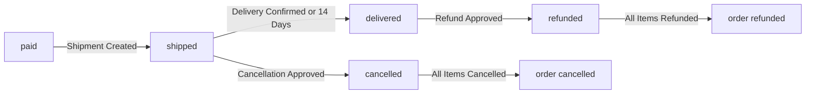

WHEN an order item transitions to "shipped", THE system SHALL:
1. Update the item status to "shipped"
2. Associate the shipment with the item
3. Record the carrier name and tracking number

WHEN an order item transitions to "delivered", THE system SHALL:
1. Update the item status to "delivered"
2. Enable the customer to write a review for the product
3. Lock the item from further cancellation or refund requests

WHEN an order item transitions to "cancelled" or "refunded", THE system SHALL:
1. Update the item status accordingly
2. Trigger stock restoration
3. Trigger order status recalculation

THE system SHALL prevent invalid status transitions (e.g., "paid" to "delivered" without passing through "shipped").

### Order Recalculation Triggers

WHEN any order item status changes, THE system SHALL recalculate the overall order status.

THE system SHALL determine order status based on the following rules:
- If all items are "paid" → order is "paid"
- If any item is "shipped" (and none delivered) → order is "shipped"
- If all items are "delivered" → order is "delivered"
- If all items are "cancelled" → order is "cancelled"
- If all items are "refunded" → order is "refunded"
- If items have mixed completed statuses → order is "partially completed"

WHEN the last item in an order transitions to "cancelled", THE system SHALL set the order status to "cancelled".

WHEN the last item in an order transitions to "refunded", THE system SHALL set the order status to "refunded".

WHEN an order status changes, THE system SHALL notify relevant parties of the change.

THE system SHALL recalculate order status immediately upon any item status change, before displaying order details to users.

### Item Status Management

THE system SHALL allow sellers to view order items for their products and filter by status.

THE system SHALL allow customers to view the status of all items in their orders.

THE system SHALL allow administrators to view all order items across the platform.

WHEN a seller responds to a cancellation or refund request, THE system SHALL create a snapshot of the response.

THE system SHALL prevent status changes for order items that are part of an active shipment unless:
- The shipment is cancelled by administrator
- The item is cancelled before shipment creation
- The item is refunded after delivery

WHEN viewing order items, THE system SHALL display:
- Product name and variant from snapshot
- Item status
- Quantity and unit price
- Shipment tracking information (if shipped)

THE system SHALL maintain audit trail for all status changes including who initiated the change and when.

## Shipment Operations

Ships represent packages sent by sellers containing order items. Sellers group order items into shipments for delivery. Different sellers create separate shipments for their products. Sellers enter carrier name and tracking number per shipment. All items in a shipment share identical tracking information. Customer confirms delivery per shipment rather than per item. Delivery confirmation marks all shipment items as delivered. Items automatically mark delivered after 14 days if unconfirmed. Shipment creation updates item statuses to shipped.

### Shipment Creation

WHEN a seller creates a shipment, THE system SHALL:
1. Allow selection of one or more order items from the same seller
2. Require tracking number entry
3. Require carrier name entry
4. Create a shipment record that groups the selected items
5. Mark all items in the shipment as "shipped" status
6. Preserve the seller identity in the shipment record

IF the seller attempts to include order items from different sellers, THE system SHALL reject the request and display an error.
IF the seller has no order items in "paid" status for their products, THE system SHALL prevent shipment creation.

A shipment represents a physical package being sent to a customer containing multiple order items.
Different sellers must create separate shipments for their products.
One seller may create multiple shipments for their order items if they wish to ship items separately.

The shipment creation process is independent of order cancellation or refund requests.
Sellers can still create shipments even if there are pending cancellation or refund requests for other items in the same order.

### Carrier and Tracking Information

WHEN a seller enters carrier information, THE system SHALL:
1. Require a carrier name (e.g., shipping company name)
2. Require a tracking number for the shipment
3. Store both values in the shipment record
4. Display the carrier name and tracking number to the customer

IF the tracking number is missing, THE system SHALL reject the shipment creation.
IF the carrier name is missing, THE system SHALL reject the shipment creation.

The tracking number must be unique per shipment.
Multiple shipments from the same seller may use the same carrier name.
A carrier name may be an empty string if no carrier is specified.

The tracking information allows customers to monitor their package delivery.
Customers can view tracking information from the order detail page.
Tracking information becomes available once the shipment is created.

### Order Item Grouping

WHEN a seller groups order items into a shipment, THE system SHALL:
1. Allow multiple order items to be included in one shipment
2. Ensure all items in a shipment belong to the same seller
3. Allow items from different products to be in the same shipment
4. Create a shipment that references all included order items

IF the seller attempts to group items from different sellers, THE system SHALL display an error and prevent grouping.
IF a seller groups all items from a seller into one shipment, THE system SHALL ensure the shipment includes all eligible items.

Each shipment has a unique identifier.
A shipment may contain a single order item or multiple order items.
The grouping is determined by the seller's shipping decision, not by system rules.

Items in a shipment share the same tracking information and carrier.
When a shipment is created, all items in it receive identical status updates.
Order items from different sellers cannot be grouped into the same shipment.

### Delivery Confirmation

WHEN a customer confirms delivery of a shipment, THE system SHALL:
1. Mark all order items in the shipment as "delivered" status
2. Record the confirmation timestamp
3. Send a delivery confirmation notification to the seller

IF the customer attempts to confirm delivery for a shipment already confirmed, THE system SHALL reject the request.
IF a shipment has already auto-delivered (14 days elapsed), THE system SHALL reject the manual confirmation.

Each customer can confirm delivery once per shipment.
Delivery confirmation is mandatory when items are delivered.
The confirmation must be done by the customer who placed the order.

A shipment cannot be confirmed for delivery if any item in it has already been cancelled or refunded.
Delivery confirmation is independent of payment status.
Sellers can view which shipments have been confirmed for delivery.

### Automatic Delivery

WHEN 14 days have elapsed since a shipment was created, THE system SHALL:
1. Automatically mark all order items in the shipment as "delivered" status
2. Send a notification to the customer that delivery is confirmed
3. Send a notification to the seller that delivery is auto-confirmed

IF any order item in the shipment has been cancelled or refunded before the 14 days elapse, THE system SHALL NOT auto-deliver.
IF the customer has already manually confirmed delivery before 14 days elapse, THE system SHALL NOT auto-deliver.

The 14-day period starts from the shipment creation timestamp.
The automatic delivery cannot be disabled by any party.
The auto-delivery is a safety mechanism to ensure order completion.

After auto-delivery, the shipment is treated identically to manually confirmed delivery.
Sellers can view the auto-delivery timestamp in their dashboard.
Auto-delivered shipments cannot be manually reconfirmed.

### Shipment Status Updates

WHEN a shipment status changes, THE system SHALL:
1. Update the status of all order items in the shipment
2. Update the overall order status if necessary
3. Record the status change in the order item history
4. Notify the customer of the status change

IF an order item in a shipment is cancelled or refunded, THE system SHALL NOT update that item's status based on shipment status changes.
IF an order item has already reached a final status (cancelled or refunded), THE system SHALL preserve that status.

Order item statuses are: "paid", "shipped", "delivered", "cancelled", "refunded".
The shipment status is always "shipped" after creation.
Shipment status does not have its own state transitions.

The order status is derived from the collection of order item statuses:
- If all items are paid → order is "paid"
- If any item is shipped (and none delivered) → order is "shipped"
- If all items are delivered → order is "delivered"
- If all items are cancelled → order is "cancelled"
- If all items are refunded → order is "refunded"
- Mixed states → order is "partially completed"

Status updates cascade from shipment to items to order.

### Seller Shipment Separation

WHEN processing multi-seller orders, THE system SHALL:
1. Create separate shipments for each seller's order items
2. Prevent sellers from viewing or accessing other sellers' shipments
3. Allow each seller to manage only their own shipments
4. Maintain independent shipment lifecycles per seller

IF a seller attempts to view another seller's shipments, THE system SHALL deny access.
IF a seller attempts to modify another seller's shipments, THE system SHALL reject the request.

Each seller manages their own shipments independently.
Sellers cannot bundle order items from different sellers into one shipment.
Sellers must create shipments for their products regardless of other sellers' shipping schedules.
The customer receives multiple shipments from one order if multiple sellers are involved.

A seller's shipment lifecycle is independent of other sellers in the same order.
A cancellation or refund for one seller's items does not affect other sellers' shipments.
All shipments from the same seller may be created on the same day or on different days.

### Tracking Visibility

WHEN a customer views order details, THE system SHALL:
1. Display all shipments associated with the order
2. Show carrier name and tracking number for each shipment
3. Show which order items are included in each shipment
4. Show the shipment creation date and status
5. Show whether the shipment has been delivered or auto-delivered

IF a shipment has no tracking information (tracking number is empty), THE system SHALL display a placeholder message.
IF the customer has not placed any orders yet, THE system SHALL show an empty order history.

All order items from the same seller share identical tracking information.
Tracking information is visible only to the customer who placed the order.
Tracking information is visible to the seller who created the shipment.
Administrators can view tracking information for all shipments.

Customers can view tracking information on the order detail page.
Customers cannot edit tracking information for existing shipments.
Sellers can update tracking information only at the time of shipment creation.
Once a shipment is created, tracking information becomes immutable.

## CancellationRequest Operations

Customers request cancellation for items with paid status before shipping. Cancellation requests require a text reason for the seller. Sellers approve or reject cancellation requests per item. Approved cancellations process refunds for the cancelled item only. Cancelled items restore stock quantities automatically. Request state snapshots preserve approval decisions. Remaining order items continue processing normally. All item cancellations mark the entire order as cancelled. Request rejection maintains original order status.

### Cancellation Request Creation

WHEN a customer requests cancellation for an order item, THE system SHALL:
1. Require the item status to be "paid" (not yet shipped)
2. Accept a required text reason for the cancellation
3. Associate the request with the specific order item
4. Set the initial request status to "pending"
5. Record the creation timestamp

IF the order item status is not "paid", THE system SHALL reject the cancellation request and notify the customer.

IF the order item is already marked as "shipped" or any status other than "paid", THE system SHALL prevent the customer from submitting a cancellation request.

WHEN a customer submits a cancellation request, THE system SHALL validate that the item has not already been cancelled.

IF a cancellation request has already been approved or rejected for the item, THE system SHALL reject duplicate requests for the same item.

WHEN a cancellation request is successfully created, THE system SHALL notify the seller responsible for that order item.

IF the seller account is suspended, THE system SHALL still accept the cancellation request but mark it for super administrator review.

Customers can only submit cancellation requests for items they purchased, not for other customers' orders.

IF the customer's account is banned, THE system SHALL reject the cancellation request.

WHEN a customer views their cancellation requests, THE system SHALL display all pending requests sorted by newest first.

IF the customer deletes their account, THE system SHALL preserve all active cancellation requests with the customer shown as "deleted user".

### Cancellation Reasons

WHEN a customer submits a cancellation request, THE system SHALL require a text reason field.

THE system SHALL accept any text input for the cancellation reason without character limits.

THE system SHALL display the cancellation reason to the seller when they review the request.

WHEN a seller approves or rejects a cancellation request, THE system SHALL record the approval decision timestamp.

IF the customer provides an empty or whitespace-only reason, THE system SHALL reject the cancellation request.

THE system SHALL preserve the original cancellation reason in the request snapshot when the seller responds.

WHEN a customer views their cancellation request details, THE system SHALL display the reason they submitted.

IF the cancellation request is rejected by the seller, THE system SHALL allow the customer to view the original reason again.

WHEN an order item is cancelled, THE system SHALL reference the original cancellation reason in the order history.

THE system SHALL NOT allow customers to edit the cancellation reason after submission.

WHEN an administrator force-cancels an item, THE system SHALL create a system-generated cancellation reason noting the force action.

IF the seller rejects a cancellation request, THE system SHALL allow the customer to submit a new cancellation request with a different reason only after rejection.

### Seller Approval Process

WHEN a seller receives a cancellation request for their order item, THE system SHALL display the request in the seller dashboard.

THE seller SHALL have the option to approve or reject the cancellation request.

WHEN a seller approves a cancellation request, THE system SHALL process the refund for that specific item.

WHEN a seller rejects a cancellation request, THE system SHALL maintain the original order item status as "paid".

IF a seller responds to a cancellation request, THE system SHALL create a snapshot of the request state at the time of response.

WHEN a seller views cancellation requests, THE system SHALL show requests sorted by submission date with pending requests first.

IF multiple sellers have items in the same order, THE system SHALL present each seller with only their own order item cancellation requests.

WHEN a seller approves a cancellation request, THE system SHALL mark the request status as "approved" and notify the customer.

WHEN a seller rejects a cancellation request, THE system SHALL mark the request status as "rejected" and notify the customer.

IF the seller account is suspended, THE system SHALL prevent the seller from approving or rejecting cancellation requests.

WHEN a suspended seller's pending cancellation requests exist, THE system SHALL escalate them to a super administrator for review.

THE system SHALL prevent a seller from approving a cancellation request after the order item status has changed to "shipped".

IF a seller has no pending cancellation requests, THE system SHALL display an empty state with instructional text.

WHEN a seller responds to a cancellation request, THE system SHALL update the updatedAt timestamp on the request record.

### Item Cancellation

WHEN a cancellation request is approved, THE system SHALL change the order item status to "cancelled".

IF an order item status is "cancelled", THE system SHALL prevent further shipping actions on that item.

WHEN an order item is cancelled, THE system SHALL remove the item from the customer's active orders view.

IF a customer cancels only some items in an order, THE system SHALL keep the remaining items in normal processing.

WHEN all items in an order are cancelled, THE system SHALL change the overall order status to "cancelled".

IF some items in an order are cancelled while others are still "paid" or "shipped", THE system SHALL set the order status to "partially completed".

THE system SHALL prevent a customer from cancelling an order item that has status other than "paid".

WHEN an order item is cancelled, THE system SHALL record the cancellation in the order history log.

IF a seller cancels an order item without a customer request (force cancellation), THE system SHALL flag it as an administrator action.

WHEN a cancellation request is approved, THE system SHALL initiate the refund process for the cancelled item.

IF a refund cannot be processed for an approved cancellation, THE system SHALL mark the cancellation as failed and notify both parties.

WHEN an order item is cancelled, THE system SHALL preserve the item in the order detail view with cancelled status.

IF an order item has status "cancelled", THE system SHALL not allow it to be included in any shipment.

### Refund Processing

WHEN a cancellation request is approved, THE system SHALL initiate a refund for the cancelled item amount.

THE system SHALL calculate the refund amount based on the unit price at the time of purchase.

IF the original payment method is no longer available, THE system SHALL issue the refund to the customer's primary payment method on file.

WHEN a refund is processed, THE system SHALL record the refund transaction in the order history.

THE system SHALL notify the customer when their refund has been successfully processed.

IF the refund processing fails, THE system SHALL notify the customer and the seller with the error details.

WHEN a refund is processed, THE system SHALL restore the stock quantity for the cancelled item variant.

IF a customer cancels multiple items in one order, THE system SHALL process refunds separately for each item.

WHEN a refund is processed, THE system SHALL update the order item status to "refunded".

IF a partial refund is issued (admin override), THE system SHALL record the refund amount and reason in the order history.

WHEN a seller rejects a cancellation request, THE system SHALL NOT process any refund for that item.

IF the order was paid with a promotional discount, THE system SHALL calculate the refund proportionally to reflect the discount.

WHEN all items in an order are refunded, THE system SHALL set the order status to "refunded".

THE system SHALL preserve refund transaction records even after account deletion.

### Stock Restoration

WHEN a cancellation request is approved, THE system SHALL increase the stock quantity for the cancelled item variant.

THE system SHALL create an inventory record documenting the stock restoration with reason "cancellation".

WHEN stock is restored, THE system SHALL update the variant's current stock quantity by summing all inventory records.

IF the restored stock brings a variant from out-of-stock to available, THE system SHALL make it purchasable again.

THE system SHALL record the timestamp of when the stock was restored.

WHEN a customer cancels multiple units of the same variant, THE system SHALL restore the stock quantity for all cancelled units.

IF a cancellation request is rejected, THE system SHALL NOT modify the stock quantity.

WHEN a cancellation request is approved, THE system SHALL update the inventory history with a positive quantity change.

THE system SHALL prevent the stock quantity from going negative after restoration.

IF the restored stock exceeds the maximum allowed stock for the variant, THE system SHALL clamp the quantity to the maximum limit.

WHEN stock is restored due to cancellation, THE system SHALL NOT create a snapshot of the inventory record (inventory history is append-only).

IF a variant has no remaining stock after cancellation restoration, THE system SHALL check if other inventory records bring it to available.

THE system SHALL allow customers to view the updated stock availability after a cancellation is processed.

WHEN stock restoration fails, THE system SHALL flag the cancellation as incomplete and notify the seller.

### Snapshot Preservation

WHEN a seller approves or rejects a cancellation request, THE system SHALL create an immutable snapshot of the request state.

THE snapshot SHALL record: the request ID, the action taken (approved/rejected), the decision timestamp, and the decision maker.

WHEN a snapshot is created, THE system SHALL store the old values of the request before the change.

WHEN a snapshot is created, THE system SHALL store the new values of the request after the change.

IF a cancellation request is deleted after being approved, THE system SHALL preserve the snapshot of the approval decision.

THE system SHALL allow the customer to view snapshots of their cancellation requests.

THE system SHALL allow the seller to view snapshots of cancellation requests they responded to.

THE system SHALL allow super administrators to view snapshots of all cancellation requests for dispute resolution.

WHEN a cancellation request snapshot exists, THE system SHALL prevent deletion of that snapshot.

THE system SHALL preserve snapshot records even when the associated cancellation request is modified.

IF a customer deletes their account, THE system SHALL preserve all cancellation request snapshots.

WHEN a seller is suspended, THE system SHALL preserve snapshots of cancellation requests handled while the seller was active.

THE system SHALL store the reason text from the cancellation request in the snapshot.

WHEN a snapshot is created for dispute resolution, THE system SHALL make it searchable in the administrator system.

### Order Status Updates

WHEN a cancellation request is approved, THE system SHALL update the order item status to "cancelled".

IF all items in an order are cancelled, THE system SHALL change the overall order status to "cancelled".

IF some items in an order are cancelled while others remain in active states, THE system SHALL set the order status to "partially completed".

WHEN an order status changes, THE system SHALL notify both the customer and all affected sellers.

IF an order status becomes "partially completed", THE system SHALL continue processing the remaining active items.

WHEN a customer views their order history, THE system SHALL display the current order status derived from item statuses.

IF an order has status "cancelled" or "refunded", THE system SHALL prevent customers from submitting new cancellation requests for that order.

WHEN a seller views order items, THE system SHALL show which items have been cancelled versus remaining active.

IF an order status changes due to cancellation, THE system SHALL record the change in the order status history log.

WHEN all items in an order reach cancelled status, THE system SHALL mark the order as no longer eligible for shipment.

IF an order has mixed item statuses (some paid, some cancelled, some shipped), THE system SHALL display "partially completed" as the order status.

WHEN the order status changes, THE system SHALL update the customer's order list view immediately.

IF a customer requests to view an order with cancelled items, THE system SHALL display the full history including cancelled items.

THE system SHALL preserve order status change history even after customer account deletion.

## RefundRequest Operations

Customers request refunds for delivered items within 7 days of delivery. Refund requests include text explaining the reason. Sellers review and approve or reject refund requests. Approved refunds process monetary returns for items only. Refunded items restore their stock quantities. Request state snapshots document seller decisions. Other order items remain unaffected by refunds. All item refunds mark the order as refunded. 7-day window restricts refund eligibility.

### Refund Request Creation

WHEN a customer requests a refund, THE system SHALL:
1. Verify the customer owns the order item
2. Verify the order item status is "delivered"
3. Verify the delivery date is within 7 days of the request date
4. Require a refund reason (text field)
5. Create the refund request with status "pending"

IF the order item status is not "delivered", THE system SHALL reject the refund request.
IF the delivery date exceeds 7 days from the request date, THE system SHALL reject the refund request.
IF the refund reason is missing or empty, THE system SHALL reject the refund request.
IF the customer does not own the order item, THE system SHALL reject the refund request.

### Delivery Time Window Enforcement

WHEN a customer attempts to create a refund request, THE system SHALL calculate the time elapsed since the order item was delivered.

IF the elapsed time exceeds 7 days, THE system SHALL display the eligibility error and prevent the refund request creation.

The 7-day window is calculated from the delivery confirmation date (when the customer confirms delivery or when 14 days auto-delivery triggers).

WHILE the order item is outside the 7-day window, THE system SHALL not display the refund request option to the customer.

IF the customer attempts to bypass the window restriction, THE system SHALL reject the request and log the violation attempt.

### Refund Approval Workflow

WHEN a seller reviews a refund request, THE system SHALL:
1. Display the refund request details (reason, order item, delivery date)
2. Allow the seller to approve or reject the request
3. If approved, trigger refund processing
4. If rejected, require a rejection reason
5. Create a snapshot of the request state

IF the seller approves, THE system SHALL change the request status to "approved" and initiate refund processing.
IF the seller rejects, THE system SHALL change the request status to "rejected" and require a rejection reason.

WHILE the refund request is pending, THE system SHALL lock the request for modification.

IF another seller account attempts to modify a pending request, THE system SHALL reject the modification.

### Item-Level Refund Processing

WHEN a refund request is approved, THE system SHALL process the refund for the specific order item only.

The system SHALL:
1. Initiate monetary refund for the item quantity and unit price
2. Change the order item status to "refunded"
3. Restore stock quantity for the variant
4. Create an inventory record with positive quantity change
5. Notify the customer of the refund approval

IF the refund processing fails, THE system SHALL change the request status to "rejected" and notify the seller.

IF the order item has already been partially refunded, THE system SHALL calculate the remaining refundable amount based on the original order amount.

WHILE the refund is processing, THE system SHALL mark the order item as "pending refund" to prevent duplicate processing attempts.

### Stock Quantity Restoration

WHEN a refund request is approved and processed, THE system SHALL restore the stock quantity for the associated variant.

The system SHALL:
1. Calculate the quantity to restore (based on refund quantity)
2. Create an inventory record with positive quantity change and reason "refund"
3. Update the variant's current stock quantity by adding the restored amount
4. Mark the variant as in-stock if it was previously out of stock

IF the variant's stock already exceeds the pre-purchase level, THE system SHALL log a warning but still process the restoration.

WHEN the restoration completes, THE system SHALL update the variant's availability status for future purchases.

### Request State Snapshots

WHENEVER a refund request changes state, THE system SHALL create an immutable snapshot recording the change.

Snapshots SHALL be created when:
1. A refund request is created (status: pending)
2. A seller approves a refund request (status: approved)
3. A seller rejects a refund request (status: rejected)
4. A refund is successfully processed (status: completed)
5. A refund processing fails (status: failed)

The snapshot SHALL record:
- Timestamp of the change
- Old request state and new request state
- The reason for the state change
- The user who initiated the change (customer or seller)

IF a snapshot creation fails, THE system SHALL NOT allow the state change to complete.

### Order Status Impact

WHEN an order item is refunded, THE system SHALL recalculate the overall order status.

The system SHALL determine the new order status as follows:
- If all items are refunded → order status is "refunded"
- If some items are refunded and others are delivered → order status is "partially completed"
- If some items are refunded and others are shipped → order status is "partially completed"
- If some items are refunded and others are cancelled → order status is "partially completed"

IF all items in an order are refunded, THE system SHALL change the order status to "refunded" and notify the customer.

WHILE the order has mixed statuses, THE system SHALL maintain the "partially completed" status.

IF a refund request is rejected, THE system SHALL recalculate the order status based on the remaining item statuses.

### Refund Processing Integration

WHEN a refund request is approved, THE system SHALL integrate with the payment processing system to complete the monetary refund.

The system SHALL:
1. Transmit the refund amount (quantity × unit price)
2. Reference the original payment transaction ID
3. Wait for payment system confirmation
4. Update the request status based on confirmation result

IF the payment system confirms the refund, THE system SHALL update the request to "completed".
IF the payment system rejects or fails, THE system SHALL update the request to "failed" and notify both seller and customer.

IF the payment system returns an error (e.g., account closed, insufficient funds), THE system SHALL log the error and allow the seller to reattempt the refund once.

WHILE the refund is being processed, THE system SHALL display the refund status to the customer.

### Refund Eligibility Validation

WHEN a customer views available actions for an order item, THE system SHALL validate refund eligibility.

Eligibility requirements:
- The order item status must be "delivered"
- The delivery date must be within 7 days
- The refund request must not already exist
- The item must not already be fully refunded

IF any eligibility requirement is not met, THE system SHALL hide or disable the refund request button.

IF a customer attempts to create a duplicate refund request, THE system SHALL reject the request and display an error.

IF the delivery date is not yet known (e.g., customer has not confirmed and 14-day window hasn't passed), THE system SHALL not show the refund option.

WHILE checking eligibility, THE system SHALL display clear messaging about why the refund option is unavailable.

## Review Operations

Customers write reviews only for delivered product items. Each review includes a 1-5 star rating and optional text. Customers can write one review per product per order. Reviews display on product detail pages sorted by newest. Customers may edit their own reviews to correct content. Review edits create snapshots preserving original text and rating. Customers can delete their reviews while snapshots remain. Average ratings calculate from non-deleted reviews only. Review eligibility requires item delivery confirmation.

### Review Creation

WHEN a customer writes a review for a purchased product item, THE system SHALL:
1. Verify the order item status is "delivered"
2. Require a rating between 1 and 5 stars
3. Allow an optional text content
4. Associate the review with the customer and the purchased product

IF the order item status is not "delivered", THE system SHALL reject the review creation.
IF no rating is provided, THE system SHALL reject the review creation.

A customer can write one review per product per order only.
IF a review already exists for the same customer, product, and order combination, THE system SHALL reject the new review.
WHEN a review is created, THE system SHALL mark the product review as active and visible.

Customers can only write reviews for products they have purchased and received.
THE system SHALL not allow review creation for items with status other than "delivered".

### Rating Submission

WHEN a customer submits a rating, THE system SHALL:
1. Accept only integer values from 1 to 5 stars
2. Display rating options as visual star buttons
3. Require a rating value before allowing submission
4. Store the rating as part of the review record

IF the submitted rating is not an integer, THE system SHALL reject the submission.
IF the submitted rating is less than 1 or greater than 5, THE system SHALL reject the submission.

Every review must have exactly one rating value.
Ratings are mandatory field when creating a new review.
Customer can update their rating value when editing the review.
THE average rating calculation includes all active (non-deleted) reviews.

### Review Editing

WHEN a customer edits their own review, THE system SHALL:
1. Verify the customer owns the review
2. Create a snapshot of the review state before the edit
3. Allow editing of both rating and text content
4. Update the review with new values
5. Preserve the original review record

IF the customer does not own the review, THE system SHALL reject the edit request.
WHEN a review is edited, THE system SHALL create an immutable snapshot record.

Customers can edit only their own reviews.
Editors cannot edit reviews written by other customers.
Administrators cannot directly edit customer reviews.
THE snapshot records: when the change was made, what was changed, and the values before and after.

The review timestamp is updated to reflect the edit time.
Edited reviews maintain their association with the same customer and product.
Original review content is preserved in the snapshot for dispute resolution.

### Review Deletion

WHEN a customer deletes their own review, THE system SHALL:
1. Verify the customer owns the review
2. Mark the review as inactive (deleted)
3. Preserve the snapshot of the deleted review
4. Remove the review from average rating calculations

IF the customer does not own the review, THE system SHALL reject the deletion request.
WHEN a review is deleted, THE system SHALL NOT delete the underlying data record.

Customers can delete only their own reviews.
Deleted reviews are not visible on product detail pages.
Deleted reviews are excluded from average rating calculations.
THE system SHALL preserve the deletion snapshot for audit and dispute resolution.

Administrators can view deleted reviews through snapshot records.
Deleted review snapshots cannot be modified or deleted.
THE average rating is recalculated to exclude deleted review ratings.

### Review Display and Sorting

WHEN displaying reviews on a product detail page, THE system SHALL:
1. Show only active (non-deleted) reviews
2. Sort reviews by newest first
3. Display the rating (1-5 stars) and text content
4. Show the customer's display name
5. Display total review count

THE system SHALL sort reviews by creation timestamp in descending order (newest first).
THE system SHALL exclude deleted reviews from all review listings.

Every product page displays the average rating calculated from active reviews.
The average rating is displayed as a decimal value (e.g., 4.3 stars).
Total review count excludes deleted reviews.
Reviews are displayed with the customer's current display name.

CUSTOMERS can view all reviews for a product they are browsing.
THE average rating is calculated as the sum of all ratings divided by the count of active reviews.
Ratings are displayed as star icons with the numerical value.

## InventoryRecord Operations

Inventory records track stock quantity changes over time. Positive changes represent restocking while negative changes represent orders. Each record includes quantity change amount and reason description. Current stock calculates from the sum of all inventory records. Sellers restock with quantity and reason explanations. Order placement automatically generates negative inventory records. Cancellation and refunds automatically generate positive inventory records. Sellers view complete inventory history per variant. Stock reaching zero marks variants as out of stock. Inventory prevents adding out-of-stock items to carts.

### Inventory Record Creation

WHEN a seller adds inventory to a product variant, THE system SHALL:
1. Create an inventory record with a positive quantity change
2. Require a reason for the restocking
3. Record the timestamp when the restocking occurs
4. Update the variant's current stock quantity

WHEN a seller adjusts inventory for a product variant, THE system SHALL:
1. Create an inventory record with a negative quantity change
2. Require a reason for the adjustment
3. Record the timestamp when the adjustment occurs
4. Update the variant's current stock quantity

THE system SHALL reject restocking requests with a quantity of zero or less.
THE system SHALL reject adjustment requests that would result in negative stock unless explicitly authorized for loss reporting.

### Order Inventory Deductions

WHEN a customer successfully places an order, THE system SHALL:
1. Create a negative inventory record for each purchased variant
2. Record the quantity as the negative of the order quantity
3. Include the order number as the reason for the deduction
4. Record the timestamp of the order placement
5. Decrease the variant's current stock quantity by the order amount

THE system SHALL create inventory records BEFORE removing items from the cart.
THE system SHALL create inventory records IMMEDIATELY after payment confirmation.
IF the inventory record creation fails, THE system SHALL roll back the order creation and notify the customer of the failure.

### Refund and Cancellation Inventory Additions

WHEN a cancellation request for an order item is approved, THE system SHALL:
1. Create a positive inventory record restoring the cancelled quantity
2. Record the cancellation request ID as the reason
3. Record the timestamp of the approval
4. Increase the variant's current stock quantity by the cancelled amount

WHEN a refund request for a delivered item is approved, THE system SHALL:
1. Create a positive inventory record restoring the refunded quantity
2. Record the refund request ID as the reason
3. Record the timestamp of the approval
4. Increase the variant's current stock quantity by the refunded amount

THE system SHALL restore stock only to the original purchase quantity, not additional amounts.
THE system SHALL ensure refunds do not restore more stock than was originally purchased.

### Stock Quantity Calculations

WHEN calculating the current stock quantity for a product variant, THE system SHALL:
1. Sum all inventory records for that variant
2. Use the quantity change values (positive and negative) from all records
3. Return the total as the current available stock
4. Update the calculation in real-time as new records are added

THE system SHALL ensure stock quantities reflect only pending and completed inventory records.
THE system SHALL not include cancelled or failed inventory operations in stock calculations.
IF a variant has no inventory records, THE system SHALL display the stock quantity as zero.
THE system SHALL calculate stock from the initial restocking value and all subsequent changes.

### Inventory History Viewing

WHEN a seller views the inventory history for a product variant, THE system SHALL:
1. Display all inventory records for that variant
2. Show each record with: quantity change, reason, and timestamp
3. Sort records with newest first
4. Include the running total stock after each record
5. Allow scrolling through historical records without pagination limits

THE system SHALL provide full inventory history to the variant's owning seller only.
THE system SHALL not allow sellers to edit or delete existing inventory records.
THE system SHALL mark automatic inventory records (from orders, cancellations, refunds) with system-generated reasons.
THE system SHALL allow filtering history by date range and reason type.

### Stock Status Display

WHEN displaying product variants to customers, THE system SHALL:
1. Show 'In Stock' when the calculated stock quantity is greater than zero
2. Show 'Out of Stock' when the calculated stock quantity equals zero
3. Display the exact stock quantity when it is greater than zero
4. Hide the stock quantity when the status is 'Out of Stock'

THE system SHALL update stock status display in real-time as inventory changes occur.
THE system SHALL prevent customers from viewing inventory details for variants owned by other sellers.
THE system SHALL display 'Out of Stock' status immediately when stock reaches zero.
WHEN a variant shows 'Out of Stock', THE system SHALL indicate this on the product detail page.

### Cart Stock Restrictions

WHEN a customer attempts to add a product variant to their shopping cart, THE system SHALL:
1. Check the current calculated stock quantity for the variant
2. Reject the addition if the stock quantity is zero
3. Display a message indicating the variant is out of stock
4. Prevent the variant from being added to the cart

WHEN a customer modifies the quantity of a variant in their cart, THE system SHALL:
1. Check if the new quantity exceeds the current stock
2. Display a warning if the requested quantity exceeds available stock
3. Prevent checkout if the total quantity exceeds available stock
4. Allow the cart item to remain with the warning

IF a variant's stock changes after being added to the cart, THE system SHALL:
1. Update the stock status indicator in the cart
2. Mark the item as 'limited availability' when stock is low
3. Mark the item as 'out of stock' when stock reaches zero
THE system SHALL prevent adding variants to the wishlist that have no stock restrictions.

### Inventory Timestamp Requirements

WHEN creating any inventory record, THE system SHALL:
1. Record the exact timestamp when the inventory change occurs
2. Use the server's timezone for timestamp consistency
3. Include the timestamp in the inventory history view
4. Sort inventory records by timestamp (newest first)

THE system SHALL record timestamps with at least second-level precision.
THE system SHALL ensure all inventory records use the same timezone format.
THE system SHALL record the timestamp BEFORE any stock quantity calculations are performed.
WHEN viewing inventory history, THE system SHALL display timestamps in a user-friendly format (date and time).
THE system SHALL preserve the original timestamp even if inventory records are reviewed or audited later.
THE system SHALL record timestamps in chronological order for audit purposes.

## AdminRequest Operations

Any platform user may request administrator status with text reason. Super administrators view pending admin request lists. Requests are approved or rejected by super administrators. Approved requests promote users to regular administrator. Regular administrators cannot promote themselves. Super administrators can promote regular to super administrator. Super administrators cannot demote themselves. Request rejections prevent further requests until submission. Administrator grade levels control permission access.

### Admin Request Creation

### Admin Request Submission

WHEN a platform user submits an administrator request, THE system SHALL:
1. Require a text reason for the request
2. Create an AdminRequest record with status "pending"
3. Store the requester's identity and request timestamp

IF the reason field is missing, THE system SHALL reject the request.

WHEN a user submits an admin request, THE system SHALL ensure only one pending request exists per user.
IF a pending request already exists, THE system SHALL reject the new submission.

WHEN an admin request is approved, THE system SHALL change the requester's role from member to regular administrator.

### Request Validation

THE system SHALL validate that the request reason contains at least one character.
THE system SHALL prevent users from submitting admin requests while their account is banned.

### Super Administrator Review

### Pending Request View

WHEN a super administrator views pending admin requests, THE system SHALL display:
1. Requester's identity (email or display name)
2. Submission timestamp
3. Request reason text
4. Current user role (customer or seller)

THE system SHALL list pending requests sorted by submission date, newest first.
THE system SHALL paginate the list of pending requests.

### Review Actions

WHEN a super administrator reviews a pending admin request, THE system SHALL allow approval or rejection.

WHEN an admin request is approved, THE system SHALL:
1. Change request status to "approved"
2. Promote the requester to regular administrator role
3. Record the approval timestamp

WHEN an admin request is rejected, THE system SHALL:
1. Change request status to "rejected"
2. Record the rejection timestamp
3. Prevent the requester from submitting new requests until approved (rejection is final for that request)

### Admin Approval Process

### Approval Workflow

ONLY super administrators can approve or reject admin requests.
Regular administrators cannot view or manage admin requests.

WHEN a super administrator approves an admin request, THE system SHALL immediately grant regular administrator privileges to the requester.

WHEN an admin request is rejected, THE system SHALL prevent the requester from submitting a new request until they submit fresh credentials (re-authenticate).

### Request Lifecycle

Admin requests follow this state transition:

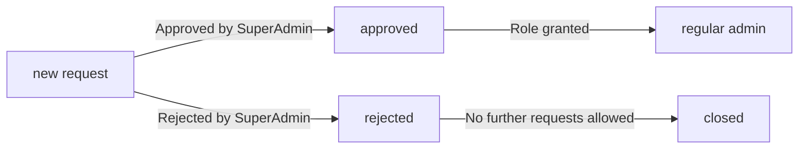

### Notification Requirements

THE system SHALL notify the requester when their admin request is approved.
THE system SHALL notify the requester when their admin request is rejected.

### Admin Grade Levels

### Grade Structure

The system SHALL support two administrator grades:
1. Regular Administrator
2. Super Administrator

Regular administrators SHALL have limited administrative privileges.
Super administrators SHALL have elevated administrative privileges.

### Grade Distinctions

WHEN a user becomes an administrator through approved admin request, THE system SHALL assign regular administrator grade.

ONLY super administrators can change a user's admin grade level.
Regular administrators cannot change admin grades.

THE system SHALL track each user's current admin grade.

### Grade-Based Actions

Regular administrators CANNOT:
1. Approve or reject admin requests
2. Promote other administrators to super administrator
3. Demote super administrators

Super administrators CAN:
1. Approve or reject admin requests
2. Promote regular administrators to super administrator
3. Demote super administrators to regular administrator (except themselves)

### Self-Promotion Restrictions

### Self-Promotion Rules

A regular administrator CANNOT promote themselves to super administrator.
A super administrator CANNOT demote themselves to regular administrator.

WHEN a super administrator attempts to self-demote, THE system SHALL reject the action.
WHEN a regular administrator attempts to self-promote, THE system SHALL reject the action.

### Promotion Target Restrictions

THE system SHALL prevent any administrator from modifying their own admin grade level.

Admin grade modifications MUST involve a different user than the actor performing the action.

### Security Controls

THE system SHALL enforce that only super administrators can promote users to super administrator.
THE system SHALL log all grade modification attempts with actor identity and target identity.

### Permission Escalation

### Escalation Process

Permission escalation from member to admin occurs through the admin request approval workflow.
Permission escalation from regular admin to super admin occurs through super administrator promotion.

WHEN a user is promoted to super administrator, THE system SHALL grant all super administrator privileges immediately.

WHEN a user is demoted from super administrator to regular administrator, THE system SHALL:
1. Revoke super administrator privileges
2. Retain regular administrator privileges
3. Change the user's grade to regular administrator

### Privilege Scope

Regular administrators CANNOT perform super administrator actions:
1. Approve/reject admin requests
2. Change admin grade levels

Super administrators CAN perform all administrative actions plus grade management.

### Grade Modification

WHEN a super administrator promotes a regular administrator, THE system SHALL:
1. Change the target user's grade to super administrator
2. Record the promotion timestamp
3. Create a snapshot of the grade change

WHEN a super administrator demotes a super administrator, THE system SHALL:
1. Change the target user's grade to regular administrator
2. Record the demotion timestamp
3. Create a snapshot of the grade change

## Snapshot Operations

Snapshots preserve immutable records of all data modifications. Each snapshot records when changes occurred and what changed. Snapshots capture values before and after modifications. Snapshots are never deletable for audit purposes. Relevant parties access snapshots for dispute resolution. Product snapshots include all product fields and variants. Order snapshots preserve seller profiles at purchase time. Review snapshots maintain original text and ratings. Cancellation and refund snapshots document approval states. Snapshots support legal and business accountability requirements.

### Snapshot Creation Triggers

WHEN a product is edited, THE system SHALL create a snapshot recording all field changes including images and variants.

WHEN a product variant is edited, THE system SHALL create a snapshot recording the SKU code, option values, price override, and stock quantity changes.

WHEN a seller profile is edited (shop name, description, or logo), THE system SHALL create a snapshot recording the previous and new values.

WHEN a review is edited, THE system SHALL create a snapshot recording the original and new rating and text content.

WHEN a cancellation request status changes (pending to approved or rejected), THE system SHALL create a snapshot recording the request state.

WHEN a refund request status changes (pending to approved or rejected), THE system SHALL create a snapshot recording the request state.

THE system SHALL reject the request to create a snapshot for records not requiring snapshots.

IF the snapshot creation fails, THE system SHALL log the failure and notify administrators.

### Product Snapshots

WHEN a product snapshot is created, THE system SHALL capture all product fields: name, description, category assignment, and base price.

WHEN a product snapshot is created, THE system SHALL include snapshots of all product variants at that moment, capturing their SKU codes, option values, prices, and stock quantities.

THE system SHALL preserve product snapshots even after the product is deleted.

Sellers SHALL be able to view snapshots of their own products.

Administrators SHALL be able to view snapshots of any product on the platform.

THE system SHALL capture the timestamp when the product snapshot was created.

THE system SHALL record what fields changed in the product snapshot (before values and after values).

IF a product has no variants at the time of snapshot, THE system SHALL create a product snapshot without variant data.

### Order Item Snapshots

WHEN an order is created, THE system SHALL create snapshots of each purchased product with all fields at the time of purchase.

WHEN an order is created, THE system SHALL create snapshots of each variant with SKU code, option values, and price at the time of purchase.

WHEN an order is created, THE system SHALL create snapshots of each seller profile with shop name and logo at the time of purchase.

Order item snapshots SHALL be immutable and preserved even if the product or seller is later modified or deleted.

THE system SHALL use order item snapshots to display historical purchase information.

Administrators SHALL be able to view order item snapshots for dispute resolution.

THE system SHALL capture the order number and item status associated with each order item snapshot.

IF a product or seller is deleted, THE system SHALL preserve order item snapshots for legal and dispute purposes.

### Review Snapshots

WHEN a review is edited, THE system SHALL create a snapshot recording the original rating and text content.

THE system SHALL preserve review snapshots even after the review is deleted.

Customers SHALL be able to view snapshots of their own reviews.

Administrators SHALL be able to view snapshots of any review on the platform.

THE system SHALL capture the timestamp when the review snapshot was created.

THE system SHALL record what fields changed in the review snapshot (rating and/or text content).

Average product ratings SHALL be calculated from non-deleted reviews.

IF a customer deletes their review, THE system SHALL mark it as deleted but preserve the snapshot.

### Cancellation and Refund Snapshots

WHEN a cancellation request is approved or rejected by a seller, THE system SHALL create a snapshot recording the approval state.

WHEN a refund request is approved or rejected by a seller, THE system SHALL create a snapshot recording the approval state.

THE system SHALL capture the timestamp when the cancellation or refund snapshot was created.

THE system SHALL record the reason provided in the cancellation or refund request.

THE system SHALL record who responded to the request (which seller) and when.

THE system SHALL preserve cancellation and refund snapshots for dispute resolution.

THE system SHALL include the order item reference in the snapshot.

IF a cancellation or refund request is withdrawn before response, THE system SHALL create a snapshot of the withdrawal.

### Snapshot Immutability

THE system SHALL prevent deletion of any snapshot once created.

THE system SHALL prevent modification of any snapshot once created.

THE system SHALL maintain snapshots indefinitely for audit and dispute resolution purposes.

THE system SHALL log any attempted deletion or modification of snapshots.

THE system SHALL reject any request to delete or modify a snapshot.

THE system SHALL ensure snapshots remain accessible even after their associated records are deleted.

THE system SHALL preserve snapshot integrity for legal compliance.

Administrators SHALL receive notifications of any attempted snapshot tampering.

### Snapshot Access Permissions

Product owners SHALL be able to view their own product snapshots.

Administrators SHALL be able to view snapshots of any product on the platform.

Seller accounts SHALL be able to view their own seller profile snapshots.

Customers SHALL be able to view snapshots of their own reviews.

Administrators SHALL be able to view snapshots of any review on the platform.

Order participants (customer and relevant sellers) SHALL be able to view order item snapshots.

Administrators SHALL be able to view cancellation and refund request snapshots for dispute resolution.

THE system SHALL restrict snapshot access to authorized parties only.

### Before and After Values

WHEN a snapshot is created, THE system SHALL record all field values before the change.

WHEN a snapshot is created, THE system SHALL record all field values after the change.

THE system SHALL clearly indicate which fields were modified in the snapshot.

THE system SHALL display side-by-side comparison of before and after values for changed fields.

UNCHANGED fields SHALL be noted in the snapshot for completeness.

THE system SHALL capture the exact timestamp of the change in both time zone and UTC.

THE system SHALL record who made the change (user ID and role).

THE system SHALL provide a searchable interface to view before and after values for dispute resolution.

### Change Tracking

THE system SHALL create a snapshot for every editable data modification.

THE system SHALL track which user made each change.

THE system SHALL track the timestamp of each change.

THE system SHALL track which fields changed in each modification.

THE system SHALL maintain a chronological list of snapshots for each record.

THE system SHALL allow viewing of the complete change history for each record.

THE system SHALL preserve snapshots for audit compliance.

THE system SHALL ensure snapshots cannot be deleted or altered for audit purposes.

### Dispute Resolution Usage

THE system SHALL provide snapshot viewing capabilities for dispute resolution.

Administrators SHALL be able to access snapshots from any user account for dispute investigation.

THE system SHALL display complete before and after values for dispute resolution analysis.

THE system SHALL include timestamps for all changes in dispute resolution context.

THE system SHALL provide snapshot export capabilities for dispute documentation.

THE system SHALL preserve snapshots for a minimum of 7 years for dispute resolution.

THE system SHALL ensure snapshots remain readable and accessible for disputes.

Administrators SHALL be able to generate reports from snapshots for dispute evidence.

### Audit Trail Preservation

THE system SHALL preserve all snapshots indefinitely for audit purposes.

THE system SHALL maintain snapshot integrity for legal compliance.

THE system SHALL provide audit trail access to administrators for all snapshots.

THE system SHALL record when each snapshot was created and by whom.

THE system SHALL ensure snapshots cannot be altered after creation.

THE system SHALL provide searchable audit trail queries for compliance purposes.

THE system SHALL maintain separate audit logs for snapshot access.

THE system SHALL ensure snapshots remain available even during system failures.

# Business Actions and Workflows

Business actions and workflows beyond basic CRUD.

## Customer Actions

Customers must create an account before accessing any platform features. Registration requires a valid email address and password that meets security standards. Customers authenticate by providing their email and password credentials. Account holders can update their password at any time for security purposes. Customers have the option to permanently delete their account from the platform. When deleting an account, personal profile information is removed but order history is preserved for legal compliance. Deleted user accounts are marked as such but their reviews remain visible with appropriate labeling. All account-related actions require authentication to ensure security. Password recovery mechanisms are available for customers who forget their credentials.

### Customer Registration

WHEN a customer registers on the platform, THE system SHALL:
1. Require a valid email address
2. Require a password that meets security standards
3. Create a customer account with approval status "pending"
4. Verify email address before account activation
5. Prevent duplicate email registration

IF the email address format is invalid, THE system SHALL reject the registration request.
IF the password does not meet security standards, THE system SHALL reject the registration request.
IF the email address is already registered, THE system SHALL reject the registration request.

THE system SHALL require customers to complete registration before accessing any platform features.
GUEST users SHALL NOT be able to browse products or view product details.

### Email Authentication

WHEN a customer authenticates, THE system SHALL:
1. Accept email and password as credentials
2. Validate credentials against stored customer data
3. Create an authenticated session upon successful authentication
4. Provide session management for authenticated customers

IF the email or password is incorrect, THE system SHALL reject the authentication request.
IF the customer account is banned, THE system SHALL reject the authentication request.
IF the customer account is not yet verified, THE system SHALL prompt email verification.

THE system SHALL maintain session state for authenticated customers across browsing sessions.
THE system SHALL enforce security authentication policies to protect customer accounts.

### Password Update

WHEN a customer updates their password, THE system SHALL:
1. Require authentication with current password
2. Accept new password meeting security standards
3. Validate new password matches confirmation input
4. Update password hash in customer record

IF the current password is incorrect, THE system SHALL reject the password update request.
IF the new password does not meet security standards, THE system SHALL reject the password update request.
IF the new password and confirmation do not match, THE system SHALL reject the password update request.

WHILE the customer is authenticated, THE system SHALL allow password updates.
THE system SHALL invalidate all existing sessions upon password change to prevent unauthorized access.

### Password Recovery

WHEN a customer requests password recovery, THE system SHALL:
1. Accept the registered email address
2. Generate a secure recovery token
3. Send recovery instructions to the email address
4. Allow password reset using the recovery token
5. Invalidate the recovery token after successful use

IF the email address is not registered, THE system SHALL NOT reveal this information to the requester.
IF the recovery token is expired, THE system SHALL reject the password reset request.
IF the recovery token is already used, THE system SHALL reject the password reset request.

WHEN a password is successfully recovered, THE system SHALL update the password hash.
WHEN a password is recovered, THE system SHALL invalidate all existing customer sessions.

### Account Deletion Process

WHEN a customer requests account deletion, THE system SHALL:
1. Verify the customer is authenticated
2. Require password confirmation for deletion
3. Remove customer profile information
4. Remove customer shipping addresses
5. Remove wishlist entries

IF the customer has pending orders in paid or shipped status, THE system SHALL prevent account deletion.

UPON account deletion, THE system SHALL:
1. Preserve order history and records
2. Remove profile display name and phone number
3. Anonymize customer reviews by marking as "deleted user"
4. Remove cart items
5. Mark customer account as deleted in the system

THE system SHALL allow customers to delete their accounts only when no orders are actively being processed.

### Profile and Order Preservation

UPON customer account deletion, THE system SHALL preserve:
1. All order records with customer order history
2. Order transaction records for legal compliance
3. Product snapshots associated with purchased items
4. Seller profiles as referenced in orders

WHEN a customer account is deleted, THE system SHALL anonymize reviews by:
1. Changing display name to "deleted user"
2. Removing customer attribution from reviews
3. Preserving review text content and ratings
4. Maintaining review visibility on products

THE system SHALL ensure order history retention for a period of 5 years after account deletion.
THE system SHALL allow order history to be viewed by other users for product reputation purposes.

### Security Authentication Requirements

THE system SHALL enforce security authentication policies for all customer operations.
THE system SHALL protect customer credentials using secure hashing algorithms.
THE system SHALL implement rate limiting on authentication attempts.

WHEN authentication fails multiple times, THE system SHALL implement temporary account lockout.
THE system SHALL log authentication attempts for security monitoring.

THE system SHALL NOT expose customer password information in any response.
THE system SHALL use HTTPS encryption for all authentication communications.

WHEN a customer session expires, THE system SHALL require re-authentication.
THE system SHALL allow customers to remain logged in across browser sessions when requested.

## CustomerProfile Actions

Each customer account includes a profile containing display name and phone number information. Customers can modify their display name to control their public-facing identity on the platform. Phone number updates are available for contact verification and communication purposes. Profile modifications are immediately reflected across the platform for customer visibility. Profile information can be edited at any time by the account holder. Changes to profile data do not affect order history or account status. Customers maintain full control over their personal profile information.

### Display Name Management

WHEN a customer sets a display name for their profile, THE system SHALL: 1. Require a display name value 2. Enforce a length limit of 1 to 100 characters 3. Store the display name as the customer's public-facing identity on the platform

IF a customer submits an empty display name, THE system SHALL reject the request with an appropriate error message.

IF a customer submits a display name exceeding 100 characters, THE system SHALL reject the request and indicate the maximum length is 100 characters.

WHEN a customer changes their display name, THE system SHALL immediately update the display name across all platform features and customer-facing interfaces.

WHEN a customer updates their display name, THE system SHALL reflect the new display name in: 1. Order history 2. Review authorship 3. Any other places where the customer is identified by their display name.

### Phone Number Management

WHEN a customer provides a phone number in their profile, THE system SHALL: 1. Accept the phone number as a text value 2. Allow the phone number to be updated by the customer at any time 3. Use the phone number for contact verification and communication purposes

IF a customer provides a phone number, THE system SHALL make it available for customer-visible locations such as order confirmations and shipping addresses.

WHEN a customer updates their phone number, THE system SHALL immediately propagate the updated phone number to all customer-facing displays.

WHEN a customer removes their phone number from their profile, THE system SHALL preserve the last known phone number for order fulfillment communication purposes.

WHEN a customer creates a shipping address, THE system SHALL allow the customer to copy their profile phone number into the address phone number field to simplify address creation.

### Profile Editing Process

WHEN a customer edits their profile, THE system SHALL: 1. Allow editing of the display name 2. Allow editing of the phone number 3. Save changes immediately upon customer submission

WHEN a customer updates their profile information, THE system SHALL make the updated information available across the platform in real time.

IF a customer attempts to edit their profile while logged out, THE system SHALL redirect the customer to the login page and preserve the edit context.

WHEN a customer saves profile changes, THE system SHALL show a confirmation message indicating that the profile has been successfully updated.

WHILE a customer has pending edits in the profile form, THE system SHALL prevent navigation away from the edit page without saving or discarding the changes.

### Profile Visibility

WHEN a customer views their own profile, THE system SHALL display: 1. The customer's current display name 2. The customer's current phone number (if provided) 3. Account creation and last update timestamps

WHEN other users view a customer's profile in order history or reviews, THE system SHALL display: 1. The customer's current display name 2. For deleted accounts, display "Deleted User" instead of the display name

WHEN a customer deletes their account, THE system SHALL preserve the customer's display name as it appeared in historical orders for record-keeping purposes.

WHEN a customer's account is banned by an administrator, THE system SHALL prevent the customer from viewing or editing their profile until the ban is lifted.

WHEN the system displays a customer's display name on product reviews, THE system SHALL show the display name at the time the review was written.

### Personal Information Control

THE customer SHALL have full control over their personal profile information and can update display name and phone number at any time while the account is active.

WHEN a customer requests to delete their account, THE system SHALL: 1. Delete the customer's profile information immediately 2. Preserve order history and order details for legal and seller record purposes 3. Preserve reviews but mark them as "Deleted User"

IF a customer's account is banned, THE system SHALL prevent the customer from modifying their profile until the administrator lifts the ban.

WHEN a customer edits their display name, THE system SHALL NOT require re-authentication for the change.

THE system SHALL allow customers to edit their profile information without requiring verification of their email address.

## ShippingAddress Actions

Customers can store multiple shipping addresses for different delivery locations. Each address record includes recipient name, phone number, street address, city, state, postal code, and country information. Customers have the ability to edit existing addresses to correct errors or update delivery locations. Address deletion removes the address from the customer's saved list permanently. One address can be designated as the default for checkout convenience. Default address selections apply to new orders until changed by the customer. Address management is available from the customer account settings. Customers must have at least one valid address to complete checkout.

### Multiple Address Storage

WHEN a customer creates their account, THE system SHALL allow the customer to store multiple shipping addresses for different delivery locations.

WHEN a customer needs to store shipping addresses, THE system SHALL permit storage of multiple addresses (no artificial limit specified).

IF a customer has multiple addresses stored, THE system SHALL maintain each address independently with complete information.

### Address Creation

WHEN a customer creates a new shipping address, THE system SHALL require the following information:
1. Recipient name
2. Phone number
3. Street address
4. City
5. State/province
6. Postal code
7. Country

THE system SHALL create a new address record with a unique identifier.

WHEN an address is created, THE system SHALL allow the customer to immediately set it as the default shipping address.

IF any required field is missing during address creation, THE system SHALL reject the request and indicate which field is required.

### Address Editing

WHEN a customer edits an existing shipping address, THE system SHALL allow modification of all address fields.

WHEN a customer updates their shipping address, THE system SHALL update the address record with the new information.

IF a customer attempts to edit an address, THE system SHALL validate that the customer owns the address before allowing the update.

WHEN an address edit is successful, THE system SHALL update the last modified timestamp.

IF an address edit fails validation, THE system SHALL reject the request and indicate the error.

### Address Deletion

WHEN a customer deletes a shipping address, THE system SHALL permanently remove the address from their saved list.

WHEN a customer deletes a shipping address, THE system SHALL remove it from future checkout selection.

IF a customer deletes an address that is set as default, THE system SHALL require the customer to select a new default address before proceeding.

IF a customer attempts to delete an address, THE system SHALL verify that the customer owns the address before allowing deletion.

WHEN an address is deleted, THE system SHALL not restore it automatically.

### Default Address Selection

WHEN a customer sets an address as default, THE system SHALL mark that address as the default shipping address for the customer.

WHEN a customer selects an address as default, THE system SHALL ensure that only one address can be the default at any time.

WHEN a customer proceeds to checkout, THE system SHALL pre-select the default shipping address.

WHEN a customer changes the default address, THE system SHALL update the default selection immediately.

IF a customer deletes the current default address, THE system SHALL require selection of a new default address.

WHEN an address is set as default, THE system SHALL apply it to new orders until changed by the customer.

### Shipping Location Management

WHEN a customer manages their shipping addresses, THE system SHALL provide a complete view of all stored addresses.

WHEN a customer views their saved addresses, THE system SHALL indicate which address is currently set as default.

WHEN a customer manages shipping locations, THE system SHALL allow them to reorder or reorganize their address list.

WHEN a customer adds a new address, THE system SHALL allow immediate use for checkout.

WHEN a customer manages addresses, THE system SHALL provide search or filtering capabilities if multiple addresses exist.

## Seller Actions

Sellers register with email and password credentials similar to customer accounts. All new seller accounts enter a pending approval state before they can list products. Seller accounts require administrator approval before becoming active on the platform. Sellers can check their approval status to know when they can begin selling. Rejected applications include a reason that helps sellers address issues for reapplication. After rejection, sellers may submit a new registration request with corrections. Account deletion is restricted until all pending orders and requests are resolved. When deleting, product listings are removed but historical order data is preserved for record-keeping. Seller shop information in completed orders remains visible for transparency.

### Seller Registration

WHEN a new seller registers, THE system SHALL:
1. Require email and password
2. Create a seller account with pending approval status
3. Prevent product listing until approval is granted

IF the email is already registered as a seller, THE system SHALL reject the registration.

THE system SHALL preserve the registration timestamp for audit purposes.

### Approval Workflow

WHEN an administrator reviews a seller registration, THE system SHALL:
1. Allow approval or rejection of the application
2. If approved, change status from pending to approved
3. If rejected, require a rejection reason
4. Notify the seller of the decision

WHEN a seller account is approved, THE system SHALL:
1. Enable product creation capabilities
2. Allow the seller to configure their shop profile
3. Make the shop visible in the platform

IF an administrator rejects a seller registration without a reason, THE system SHALL reject the action.

### Pending Status Management

WHILE a seller account has pending status, THE system SHALL:
1. Display the pending status clearly to the seller
2. Prevent product creation and editing
3. Allow profile creation but with pending designation
4. Allow password changes

WHEN a seller with pending status attempts to create a product, THE system SHALL reject the request.

THE system SHALL maintain the pending status until an administrator makes a decision.

### Rejection Reasons

WHEN an administrator rejects a seller application, THE system SHALL:
1. Require a text reason for the rejection
2. Store the rejection reason with the seller record
3. Display the rejection reason to the seller
4. Allow the seller to view rejection history

WHEN a rejected seller submits a new registration, THE system SHALL:
1. Link the new request to the previous rejection
2. Allow modification of information from the original application
3. Mark the new application as a reapplication

IF no rejection reason is provided, THE system SHALL not allow the rejection action.

### Seller Reapplication Process

WHEN a rejected seller submits a new registration request, THE system SHALL:
1. Accept the new request even with the same email
2. Create a new pending application record
3. Allow the seller to update information from the rejected application
4. Reset the approval workflow for the new application

WHEN a seller successfully reapplies and is approved, THE system SHALL:
1. Activate the seller account
2. Associate previous registration attempts with the approved account
3. Clear the rejection flag

THE system SHALL limit reapplications to prevent abuse (reasonable frequency limits apply).

### Account Deletion Restrictions

WHEN a seller requests account deletion, THE system SHALL:
1. Check for pending paid or shipped orders
2. Check for pending cancellation requests
3. Check for pending refund requests

IF any pending orders or requests exist, THE system SHALL:
1. Reject the deletion request
2. Display which orders or requests are blocking deletion

IF no pending items exist, THE system SHALL:
1. Proceed with account deletion
2. Remove the seller from the active seller list
3. Preserve order history and snapshots

WHEN a seller account is deleted, THE system SHALL:
1. Delete active product listings
2. Preserve order history with seller name and shop information
3. Maintain all order item snapshots for dispute resolution

### Order History Preservation

WHEN a seller account is deleted or the seller is banned, THE system SHALL:
1. Preserve all order records containing seller products
2. Preserve order items with complete product and variant snapshots
3. Preserve shipment records
4. Maintain cancellation and refund request records

WHEN viewing order history after seller deletion, THE system SHALL:
1. Display the seller name as it was at order time
2. Display the shop logo as it was at order time
3. Show all order details without error

THE system SHALL preserve order history for legal and dispute resolution purposes even after account deletion.

### Shop Information Retention

WHEN a seller account is deleted, THE system SHALL:
1. Preserve shop name in all historical order records
2. Preserve shop description in order snapshots
3. Preserve shop logo in order snapshots
4. Display shop information as it existed at order time

WHEN a customer views order details after seller deletion, THE system SHALL:
1. Show the original shop name
2. Show the original shop logo
3. Not show any deletion or error messages

THE system SHALL ensure shop information retention for customer reference and dispute resolution.

### Seller Approval Status Display

WHEN a seller logs into their account, THE system SHALL:
1. Display the current approval status (pending, approved, or rejected)
2. If approved, show all seller dashboard features
3. If pending, show status and pending message
4. If rejected, show status and rejection reason

WHEN a seller views their account status, THE system SHALL:
1. Show clear status indicators
2. Display relevant information based on status
3. Show next steps for pending or rejected accounts

THE system SHALL update the displayed status in real-time when administrators change the approval state.

## SellerProfile Actions

Every seller maintains a shop profile with shop name, description, and logo image. Sellers can update their shop name to reflect business changes or rebranding efforts. Shop descriptions are editable to provide updated information about products or services. Logo images can be changed to refresh shop branding. Each profile modification automatically creates a snapshot of the previous state for dispute resolution. Customers browse seller profiles when making purchasing decisions. Profile snapshots preserve historical changes for transparency and accountability.

### Shop Name Management

WHEN a seller updates their shop name, THE system SHALL: 1. Require a new shop name value 2. Validate the shop name length is between 1 and 100 characters 3. Create a snapshot of the previous shop name 4. Update the shop name to the new value 5. Record the timestamp of the change

IF the shop name length exceeds 100 characters, THE system SHALL reject the update.

IF the seller attempts to update a shop name while their account is suspended, THE system SHALL reject the update.

THE system SHALL preserve the old shop name in a snapshot even after the update.

WHEN a customer views a seller profile, THE system SHALL display the current shop name.

WHEN a customer views an order from the past, THE system SHALL display the shop name that was active at the time of purchase.

### Shop Description Editing

WHEN a seller updates their shop description, THE system SHALL: 1. Require a new description value 2. Create a snapshot of the previous description 3. Update the shop description to the new value 4. Record the timestamp of the change

IF the seller attempts to update a shop description while their account is suspended, THE system SHALL reject the update.

THE system SHALL allow an empty description (no minimum length requirement).

WHEN a customer views a seller profile, THE system SHALL display the current shop description.

WHEN a customer views an order from the past, THE system SHALL display the shop description that was active at the time of purchase.

THE system SHALL preserve the old shop description in a snapshot even after the update.

### Logo Updates

WHEN a seller updates their shop logo, THE system SHALL: 1. Accept a new logo image file 2. Validate the image format is supported (JPEG, PNG, or WebP) 3. Validate the file size does not exceed the allowed limit 4. Create a snapshot of the previous logo image reference 5. Update the shop logo to the new image 6. Record the timestamp of the change

IF the image format is not supported, THE system SHALL reject the upload.

IF the file size exceeds the allowed limit, THE system SHALL reject the upload.

IF the seller attempts to update a logo while their account is suspended, THE system SHALL reject the update.

THE system SHALL preserve the old logo image reference in a snapshot even after the update.

WHEN a customer views a seller profile, THE system SHALL display the current shop logo.

WHEN a customer views an order from the past, THE system SHALL display the shop logo that was active at the time of purchase.

### Profile Snapshot Creation

WHEN any seller profile field is modified, THE system SHALL: 1. Create an immutable snapshot before the change 2. Record the change timestamp 3. Capture all modified fields with their old and new values 4. Store the complete snapshot for dispute resolution

WHEN a seller edits their shop name, shop description, or logo, THE system SHALL create exactly one snapshot per edit operation.

THE system SHALL NOT allow deletion of any profile snapshot.

THE system SHALL allow sellers to view snapshots of their own profile.

THE system SHALL allow administrators to view snapshots of any seller's profile.

THE system SHALL store snapshots for at least 7 years for legal compliance.

WHEN a product is deleted, THE system SHALL preserve the seller's profile snapshot as referenced in order items.

WHEN a seller account is deleted, THE system SHALL preserve all profile snapshots associated with that seller.

### Shop Information Visibility

WHEN a customer browses the platform, THE system SHALL display seller shop names in product listings.

WHEN a customer views a product detail page, THE system SHALL display the seller's current shop name and logo.

WHEN a customer clicks on a seller shop name, THE system SHALL navigate to the seller's full profile page.

WHEN a customer views a seller profile page, THE system SHALL display: 1. Current shop name 2. Current shop description 3. Current shop logo 4. Seller approval status

WHEN a customer views an order detail, THE system SHALL display the seller's shop name and logo as they existed at the time of purchase.

THE system SHALL NOT display seller profile information to unauthenticated users.

WHEN a seller is suspended, THE system SHALL still display their shop information in order histories but hide it from search results.

### Historical Profile Changes

WHEN a seller views their own profile, THE system SHALL display a list of all previous snapshots in chronological order.

WHEN viewing a snapshot, THE system SHALL show: 1. Timestamp of the change 2. Which fields were modified 3. Old values before the change 4. New values after the change

WHEN a customer views order history, THE system SHALL display the shop information as it existed at the time of each purchase.

WHEN a product is deleted, THE system SHALL preserve all historical profile snapshots that were captured while the product was active.

WHEN a seller account is deleted, THE system SHALL preserve all historical profile snapshots for administrative review.

WHEN an administrator reviews a dispute, THE system SHALL provide access to all historical profile snapshots for that seller.

THE system SHALL allow searching historical snapshots by date range.

THE system SHALL allow filtering historical snapshots by modified field (shop name, description, or logo).

### Seller Branding Consistency

WHEN a seller submits a shop name that is identical to an existing seller's shop name, THE system SHALL allow the change but display a warning.

WHEN a seller updates their branding (shop name, description, or logo), THE system SHALL preserve the previous branding in snapshots for brand continuity tracking.

WHEN a customer views a product's review section, THE system SHALL NOT display seller branding information.

WHEN a seller creates a new product, THE system SHALL associate it with the seller's current branding.

WHEN a seller's branding changes after a product is created, THE system SHALL NOT retroactively change the branding shown in existing product listings.

WHEN a customer views order history, THE system SHALL show the branding that was present when the order was placed.

THE system SHALL display branding snapshots only to: 1. The profile owner (seller) 2. Administrators with oversight privileges

## Category Actions

Product categories organize merchandise into logical groupings for customer browsing. Categories can have one level of subcategories for structured navigation. Category administrators create, edit, and manage the category structure across the platform. Customers browse categories to discover products within specific product types. Products can be assigned to categories during creation or by administrators. Category structure enables efficient product discovery through hierarchical navigation. Customers view products filtered by selected categories when shopping. Category changes are managed exclusively by platform administrators.

### Category Structure Definition

## Category Structure

THE platform SHALL support a category hierarchy with one level of subcategories.

WHEN a category is created, THE category SHALL have:
1. A name
2. A description
3. An optional parent category

IF a category has a parent category, THE parent category SHALL be at the first level (no grandparent).
IF a category has no parent category, THE category SHALL be a top-level category.

WHEN a subcategory is created, THE system SHALL validate that the parent category exists.
IF the parent category does not exist, THE system SHALL reject the creation request.

WHILE a category exists, THE system SHALL maintain the one-level subcategory hierarchy.
IF a user attempts to create a second-level subcategory, THE system SHALL reject the request.

THE system SHALL support up to three levels of categorization:
1. Top-level categories
2. Subcategories (children of top-level)
3. Products (within subcategories or top-level)

Categories are managed exclusively by administrators. Customers cannot create, edit, or delete categories.

## Category Relationships

A category can have multiple subcategories.
A subcategory can have only one parent category.
A product can belong to one category or subcategory.

WHEN a product is assigned to a category, THE product SHALL display within that category's product listing.
IF a product's category is removed, THE product SHALL be moved to uncategorized status.

### Administrator Category Creation

## Category Creation Process

ONLY administrators SHALL create new categories.

WHEN an administrator creates a category, THE system SHALL:
1. Require a category name
2. Require a category description
3. Allow an optional parent category selection
4. Assign a unique category identifier

IF the category name is empty, THE system SHALL reject the creation.
IF the category description is empty, THE system SHALL reject the creation.
IF the selected parent category does not exist, THE system SHALL reject the creation.

WHEN creating a subcategory, THE system SHALL validate that the parent is a top-level category.
IF the parent is already a subcategory, THE system SHALL reject the creation and display an error.

## Administrator Control

Administrators SHALL have exclusive control over category structure.
Customers SHALL have read-only access to view categories.

WHEN an administrator accesses the category management interface, THE system SHALL display all existing categories and subcategories.
WHEN an administrator attempts category creation, THE system SHALL show a form with name, description, and optional parent category fields.

The category creation snapshot SHALL record:
- Category name
- Category description
- Parent category reference
- Creation timestamp
- Creating administrator

Administrators can view all category creation history through administrative tools.

### Category Editing

## Category Name and Description Editing

WHEN an administrator edits a category, THE system SHALL allow modification of:
1. Category name
2. Category description
3. Parent category assignment

IF a category name is changed, THE system SHALL create a snapshot of the previous name.
IF a category description is changed, THE system SHALL create a snapshot of the previous description.
IF a parent category is reassigned, THE system SHALL create a snapshot of the previous parent reference.

WHEN editing a top-level category's parent assignment, THE system SHALL convert it to a subcategory.
WHEN editing a subcategory's parent assignment to null, THE system SHALL convert it to a top-level category.

IF a category has subcategories, THE system SHALL prevent parent category changes that would create circular references.
IF a category has products assigned, THE system SHALL allow name and description edits but display products continue to be accessible.

## Category Management

Administrators SHALL manage category assignments.
WHEN an administrator assigns a product to a category, THE product SHALL be visible in that category's listing.
WHEN an administrator removes a product from a category, THE product SHALL no longer appear in that category's listing.

Categories can be edited without affecting assigned products.
Products retain their association with categories until explicitly changed.

## Category Structure Snapshots

Every category edit SHALL create an immutable snapshot.
The snapshot SHALL include:
- Timestamp of the change
- Previous and new category name
- Previous and new category description
- Previous and new parent category
- Administrator who made the change

Snapshots are preserved even after category deletion.
Super administrators and regular administrators can view category edit history.

### Category Browsing

## Customer Category View

WHEN a customer accesses the category page, THE system SHALL display all available categories.
WHEN a customer views a category, THE system SHALL show:
1. Category name
2. Category description
3. List of products within the category
4. Count of products in the category

Customers SHALL have read-only access to all categories.
Customers CANNOT create, edit, or delete categories.

## Category Listing

WHEN displaying categories, THE system SHALL:
1. Show top-level categories first
2. Display subcategories indented or nested under their parent
3. Hide categories with no products (optional based on business rule)
4. Provide pagination if category count exceeds limit

Each category listing SHALL include:
- Category name
- Product count
- Optional: subcategory count

WHEN a category has subcategories, THE system SHALL allow navigation to view subcategories.
WHEN a category has no products, THE system SHALL display "No products available" message.

### Category Navigation and Product Discovery

## Category Navigation

WHEN a customer clicks on a category, THE system SHALL display products within that category.
WHEN a customer navigates to a subcategory, THE system SHALL display:
1. The subcategory name
2. Subcategory description
3. Products within the subcategory

Customers SHALL be able to navigate up the category hierarchy.
WHEN on a subcategory page, THE system SHALL provide a link to the parent category.

## Product Discovery Through Categories

WHEN a customer views a category, THE system SHALL show products sorted by relevance or date.
WHEN filtering products by category, THE system SHALL display only products matching the selected category.

Customers can browse products through:
1. Top-level category navigation
2. Subcategory navigation
3. Category-based product listings

## Product Categorization Display

WHEN displaying product details, THE system SHALL show the product's category.
WHEN displaying a category product listing, THE system SHALL show each product with:
- Product name
- Category name
- Seller shop name
- Price
- Main image

Categories enable efficient product discovery through structured navigation.
Customers can explore products by selecting categories of interest.

## Product Actions

Sellers create products with name, description, category assignment, and base price. Products must be assigned to at least one category for customer discovery. Every product belongs exclusively to the seller who created it. Sellers can edit their products to update information or correct errors. Each product edit automatically generates a snapshot preserving the previous state. Products can be deleted only when no pending orders or cancellation requests exist. Deleted products are removed from all search results and category listings. Product snapshots remain accessible even after product deletion for historical records. Sellers review product snapshots to track changes over time. All product modifications maintain a complete audit trail through snapshots.

### Product Creation

WHEN a seller creates a product, THE system SHALL:
1. Require a product name (required)
2. Require a product description (required)
3. Require category assignment (required)
4. Require base price (required)
5. Associate the product with the creating seller
6. Require at least one variant to be added

IF the product name is missing, THE system SHALL reject the creation.
IF the description is missing, THE system SHALL reject the creation.
IF no category is selected, THE system SHALL reject the creation.
IF the base price is not provided, THE system SHALL reject the creation.
IF no variant is added, THE system SHALL prevent the product from being purchasable.

WHEN a seller creates a product, THE system SHALL create the initial product snapshot recording all created values.

### Product Editing

WHEN a seller edits an existing product, THE system SHALL:
1. Allow updates to name, description, category, and base price
2. Allow updates to product images
3. Allow updates to variant details
4. Create a snapshot before applying the changes
5. Preserve the previous state in the snapshot

IF the product has pending order items with paid or shipped status, THE system SHALL allow editing but restrict deletion.
IF the product is deleted by the seller, THE system SHALL preserve all snapshots for historical records.

WHEN a product edit is completed, THE system SHALL record when the change was made, what was changed, and the values before and after in the snapshot.

### Product Deletion

WHEN a seller requests to delete a product, THE system SHALL:
1. Check for pending order items with paid or shipped status
2. Check for pending cancellation requests
3. Check for pending refund requests

IF any pending order items exist, THE system SHALL reject the deletion request.
IF any pending cancellation requests exist for any variant, THE system SHALL reject the deletion request.
IF any pending refund requests exist for any variant, THE system SHALL reject the deletion request.

IF the deletion is allowed, THE system SHALL:
1. Delete all variants associated with the product
2. Delete all inventory records for the variants
3. Remove the product from all search and category listings
4. Preserve all snapshots created during the product's lifecycle

A deleted product shall no longer appear in customer search results or category browsing.

### Category Assignment

WHEN a seller creates a product, THE system SHALL assign the product to a category.
WHEN a seller edits a product, THE system SHALL allow changing the category assignment.

IF the product category is changed, THE system SHALL create a snapshot of the product including the category change.
IF the assigned category is deleted by an administrator, THE system SHALL mark the product as uncategorized.

A product shall always be associated with exactly one category or be marked as uncategorized.
Customers can browse products by viewing products within a selected category.

### Product Visibility

WHEN a product is created, THE system SHALL make it visible in search results and category listings.

IF a product has no variants, THE system SHALL display it in search results but mark it as "unavailable".
IF a product is deleted, THE system SHALL remove it from all search results and category listings.

IF a seller account is suspended by an administrator, THE system SHALL:
1. Hide the seller's products from search and category listings
2. Prevent customers from purchasing the seller's products
3. Allow the seller to process existing orders
4. Prevent the seller from creating new products

IF a seller account is unsuspended, THE system SHALL make the seller's products visible again in search and listings.

### Product Snapshot Tracking

WHEN any editable product field is modified, THE system SHALL automatically create a product snapshot.

Product snapshots shall record:
1. When the change was made (timestamp)
2. What fields were changed
3. The values before the change
4. The values after the change

Product snapshots shall be immutable and cannot be deleted.
Sellers can view snapshots of their own products.
Administrators can view snapshots of any product on the platform.

Snapshots shall include all product fields: name, description, category, base price, and images.
Product snapshots shall also include snapshots of all variants at the time of the change.

### Product Change History

WHEN a seller views their product change history, THE system SHALL display all snapshots in chronological order.

WHEN a product is deleted, THE system SHALL preserve all snapshots created during the product's lifecycle.
Sellers can review the complete history of changes to their products.

The change history shall show:
1. Timestamp of each change
2. Which fields were modified
3. Previous and new values for each change

Administrators can access the change history of any product on the platform for oversight purposes.

### Product Ownership

WHEN a seller creates a product, THE system SHALL assign ownership of that product exclusively to the creating seller.

IF a seller attempts to access another seller's product, THE system SHALL restrict access to view-only snapshots (for administrators only).

A product shall remain owned by the original creator throughout its lifecycle.
Products cannot be transferred to another seller.

Sellers can only edit products they own.
Sellers can only delete products they own (subject to deletion restrictions).
Sellers can only view snapshots of products they own (administrators can view all).

### Search Visibility Management

WHEN a customer searches for products, THE system SHALL show products from all sellers.

Customers can filter search results by:
1. Category selection
2. Price range (minimum and maximum)
3. In-stock only option

Customers can sort search results by:
1. Newest first
2. Price (low to high)
3. Price (high to low)

Search results shall display each product with:
- Main image (thumbnail)
- Product name
- Base price or price range
- Seller shop name
- Average rating (if reviews exist)

WHEN a variant goes out of stock, THE system SHALL mark it as unavailable in search results and prevent addition to cart.

## ProductVariant Actions

Products support multiple variants representing different option combinations like size or color. Each variant requires a unique SKU code for identification and inventory tracking. Variants can have option values that define the specific characteristics. Variant prices can override the product base price for special pricing. Stock quantities are tracked independently for each variant. Sellers add variants to products as they expand their inventory options. Variant editing creates snapshots preserving previous option values and prices. Variants can be deleted only when no pending orders exist for that variant. Products require at least one variant to be purchasable by customers. Products without variants display as unavailable in search results.

### Variant Creation

WHEN a seller creates a product variant, THE system SHALL:
1. Require a unique SKU code
2. Accept option values defining the variant characteristics (e.g., color, size)
3. Accept a base price that can be overridden
4. Require initial stock quantity
5. Create the variant with stock quantity starting at 0

IF the SKU code already exists for another variant, THE system SHALL reject the request with an error indicating SKU uniqueness violation.

A product MUST have at least one variant to be considered purchasable by customers.

WHEN a new variant is created, THE system SHALL create an inventory record with the initial stock quantity as a positive change.

IF the stock quantity is set to 0 during creation, THE system SHALL mark the variant as out of stock and prevent customers from adding it to cart.


### SKU Management

THE system SHALL enforce uniqueness of SKU codes across all variants in the platform.

WHEN a seller attempts to edit a variant's SKU code, THE system SHALL verify the new SKU code is not already in use by another variant.

IF a SKU code change would cause a conflict, THE system SHALL reject the request and display the conflict to the seller.

EVERY variant MUST have a valid SKU code assigned; variants without SKU codes are not visible to customers.

WHEN a variant is deleted, THE system SHALL make its SKU code available for reuse by other variants.

THE system SHALL display SKU codes to sellers in all variant management interfaces for easy identification and reference.

SKU codes are case-sensitive and must be alphanumeric with allowed special characters as defined in system constraints.


### Option Value Configuration

WHEN creating or editing a variant, sellers MUST specify option values that define the variant's characteristics.

THE system SHALL accept option values as a structured JSON format allowing multiple option types (e.g., color, size, material).

WHEN displaying variants to customers, THE system SHALL show the option values as human-readable labels (e.g., "Red / Large").

THE system SHALL allow sellers to define multiple option types per product (e.g., color AND size).

IF a seller provides invalid or malformed option values, THE system SHALL reject the variant creation or edit request.

OPTION values can be edited at any time, and each edit creates a snapshot preserving the previous option configuration.

THE system SHALL validate that each variant has at least one option value defined before allowing creation.


### Variant Pricing

WHEN creating a variant, THE system SHALL accept a base price that may differ from the product's base price.

THE system SHALL allow sellers to override the base price with a variant-specific price.

IF no variant price override is specified, THE system SHALL use the product's base price for that variant.

WHEN setting a variant price override, THE system SHALL validate that the price is a valid positive number.

IF a price override is removed, THE system SHALL revert the variant to using the product's base price.

EVERY variant edit, including price changes, SHALL create a snapshot preserving the previous price value.

CUSTOMERS SHALL see the variant-specific price on product detail pages; if no override exists, the product base price is displayed.

WHEN a variant is purchased, THE system SHALL record the variant's price at that moment in the order item snapshot.


### Stock Tracking

THE system SHALL track stock quantity independently for each variant through inventory records.

EVERY inventory change (restocking, order deduction, adjustment, refund restoration) SHALL create an inventory record with:
- The quantity change amount
- The reason for the change
- A timestamp of when the change occurred

THE system SHALL calculate current stock by summing all inventory records for a variant.

WHEN an order is placed, THE system SHALL automatically create a negative inventory record reducing stock by the purchased quantity.

WHEN a cancellation is approved, THE system SHALL automatically create a positive inventory record restoring stock.

WHEN a refund is approved, THE system SHALL automatically create a positive inventory record restoring stock.

WHEN a variant's stock reaches 0, THE system SHALL automatically mark the variant as "out of stock".

WHEN a variant is out of stock, THE system SHALL prevent customers from adding it to their shopping cart.


### Variant Editing

WHEN a seller edits a variant, THE system SHALL create a snapshot preserving all previous values including:
- SKU code
- Option values
- Price override

EVERY variant edit SHALL record when the change was made and what fields were modified.

THE system SHALL allow sellers to edit SKU codes, option values, and price overrides for their own variants.

WHEN a variant is edited, THE system SHALL validate that all required fields remain present and valid.

IF a variant edit would violate business rules (e.g., duplicate SKU), THE system SHALL reject the edit and explain the violation.

CUSTOMERS viewing a product SHALL see the current variant configuration; previous configurations are only accessible via snapshots.

SELLERS can view the complete edit history (snapshots) of their own variants for auditing purposes.


### Variant Deletion Restrictions

WHEN a seller attempts to delete a variant, THE system SHALL first check for pending order items with status "paid" or "shipped" for that variant.

IF any pending order items exist, THE system SHALL reject the deletion request and inform the seller that variants with active orders cannot be deleted.

WHEN a seller attempts to delete a variant, THE system SHALL check for pending cancellation or refund requests for that variant.

IF any pending cancellation or refund requests exist, THE system SHALL reject the deletion request.

IF all restrictions are satisfied, THE system SHALL delete the variant along with all its inventory records.

WHEN a variant is deleted, THE system SHALL remove it from all product listings and search results.

THE system SHALL automatically remove the variant from any customer's shopping cart if it exists there.


### Purchasable Requirements

A product is considered purchasable only when it has at least one variant that is active and has stock quantity greater than 0.

WHEN a customer views a product detail page, THE system SHALL display all available variants with their prices and stock status.

IF a product has no variants, THE system SHALL display the product as "unavailable" in search and category listings.

IF a product has variants but none are in stock, THE system SHALL display the product as "unavailable" in search and category listings.

WHEN a product has variants with mixed stock status, THE system SHALL show in-stock variants as available and out-of-stock variants as unavailable.

CUSTOMERS CANNOT add a product to their cart without first selecting a specific variant.

WHEN a product becomes unavailable (all variants deleted or out of stock), THE system SHALL remove it from customers' wishlists automatically.


### Unavailable Product Display

WHEN a product has no variants, THE system SHALL display it in search results and category listings with an "unavailable" indicator.

WHEN viewing a product detail page, THE system SHALL clearly indicate which variants are in stock and which are out of stock.

OUT OF STOCK variants SHALL be visually distinguished from in-stock variants with appropriate labeling.

WHEN a customer attempts to add an out-of-stock variant to their cart, THE system SHALL prevent the action and display an availability error.

PRODUCTS WITH ALL VARIANTS OUT OF STOCK SHALL still be visible in search but clearly marked as unavailable for purchase.

WHEN stock is replenished for an out-of-stock variant, THE system SHALL automatically update the display to show it as available.

CUSTOMERS can view out-of-stock products to see when they might become available again, but cannot purchase them until stock is available.


### Variant Inventory History

WHEN a seller views a variant's inventory history, THE system SHALL display all inventory records for that variant in chronological order.

EVERY inventory record SHALL show the quantity change amount, reason for change, and timestamp.

THE system SHALL calculate and display the current stock level based on all historical inventory records.

SELLERS can view inventory history for all their variants from their dashboard.

WHEN a seller adds inventory (restocks), THE system SHALL create a new inventory record with the positive quantity change.

WHEN a seller performs an inventory adjustment or records a loss, THE system SHALL create a new inventory record with the negative quantity change.

INVENTORY records are immutable and cannot be deleted or modified once created.

SELLERS can filter and search inventory history by date range and reason type for auditing purposes.


## ProductImage Actions

Sellers upload multiple images to showcase each product from different angles. Image uploads support various product photography to display items clearly. The first image is displayed as the main thumbnail in search results. Sellers can reorder images to control which image appears as the primary view. Product images can be deleted to remove outdated or incorrect photography. Image changes are included in product snapshots for complete state preservation. Image management allows sellers to maintain fresh product presentation. Customers view all uploaded images when examining product details. Thumbnail selection impacts how products appear in search listings.

### Image Upload

WHEN a seller uploads images for a product, THE system SHALL:
1. Accept multiple images in a single upload operation
2. Validate image format (JPEG, PNG, GIF, WebP)
3. Record upload timestamp for each image
4. Display uploaded images in the product image gallery

IF an image file is missing, THE system SHALL reject the upload.
IF an image file exceeds the size limit, THE system SHALL reject the upload.
IF an image format is not supported, THE system SHALL reject the upload.

THE system SHALL display a thumbnail preview for each uploaded image.
THE system SHALL allow sellers to upload images to showcase products from different angles.

WHEN a product has no images, THE system SHALL show a placeholder image in listings.

### Image Reordering

WHEN a seller reorders product images, THE system SHALL:
1. Allow sellers to change the display sequence of images
2. Update the display order for all images in the product
3. Save the new order sequence

IF a seller attempts to reorder images, THE system SHALL validate that at least one image remains.

THE system SHALL persist the reordering immediately upon save.
THE system SHALL display images in the new order on the product detail page.
THE system SHALL use the first image in the sequence as the main thumbnail.

### Thumbnail Selection

WHEN a seller manages product images, THE system SHALL:
1. Automatically designate the first image in the sequence as the main/thumbnail image
2. Display the thumbnail image in search results and category listings
3. Show the full image gallery on the product detail page

IF a seller reorders images, THE system SHALL update the thumbnail to the new first image.

THE system SHALL use the thumbnail image for product previews in all listing contexts.
THE system SHALL maintain image order consistency across the platform.
THE system SHALL show the main image prominently when customers view product details.

### Image Deletion

WHEN a seller deletes product images, THE system SHALL:
1. Allow removal of individual images from the product gallery
2. Remove the deleted image from all display contexts
3. Recalculate the display sequence after deletion
4. Maintain at least one image in the product gallery

IF a seller attempts to delete the last remaining image, THE system SHALL prevent deletion.

WHEN an image is deleted, THE system SHALL update the first image as the new thumbnail if it was the deleted image.
THE system SHALL include image deletions in product snapshots for complete state preservation.
THE system SHALL immediately reflect the deletion across all search results and listings.

IF a product becomes uncategorized due to image deletion, THE system SHALL NOT affect product visibility.

### Multiple Image Display

WHEN customers view a product, THE system SHALL:
1. Display all uploaded images in a gallery format
2. Show the main thumbnail image as the primary view
3. Allow customers to browse through all images
4. Maintain image display order as configured by the seller

WHEN a product has multiple images, THE system SHALL enable image browsing functionality.
THE system SHALL show all images when customers examine product details.
THE system SHALL preserve the image order defined by the seller during product creation.

IF a product has only one image, THE system SHALL display that image as the main view without gallery navigation.
THE system SHALL load images efficiently to support rapid customer browsing.

### Product Photography Management

WHEN sellers manage product images, THE system SHALL:
1. Enable upload of multiple images to showcase products clearly
2. Support various product photography angles and styles
3. Allow sellers to update product images over time
4. Maintain image quality for customer viewing

WHEN a seller updates product images, THE system SHALL include all image changes in product snapshots.
THE system SHALL preserve image history for dispute resolution purposes.
THE system SHALL allow sellers to remove outdated or incorrect photography.

IF product images are updated, THE system SHALL reflect changes in all product listings immediately.
THE system SHALL ensure product photography accurately represents the item being sold.
THE system SHALL support re-uploading images to improve product presentation.

### Image Snapshot Inclusion

WHEN product images are modified, THE system SHALL:
1. Create a snapshot that includes all image changes
2. Record when the change was made (timestamp)
3. Preserve old image URLs and new image URLs in the snapshot
4. Keep snapshots immutable for dispute resolution

WHEN a product is deleted, THE system SHALL preserve all image snapshots associated with that product.

THE system SHALL allow administrators to view snapshots of any product's images.
THE system SHALL allow sellers to view snapshots of their own product images.
THE system SHALL maintain snapshot integrity for legal and business purposes.

IF image changes are made to a product, THE system SHALL include the complete image state in the snapshot.
THE system SHALL record all image URLs before and after modification.

### Primary Image Management

WHEN managing product images, THE system SHALL:
1. Ensure the first image serves as the primary thumbnail in listings
2. Display the primary image in search results and category pages
3. Update the primary image automatically when the first image changes
4. Maintain consistency of the primary image across all platform surfaces

WHEN a seller reorders images, THE system SHALL automatically designate the new first image as primary.

THE system SHALL use the primary image for all product preview contexts.
THE system SHALL ensure the primary image represents the product accurately.
THE system SHALL allow sellers to control which image appears as the thumbnail.

IF the primary image is deleted, THE system SHALL automatically set the next image as the new primary.
THE system SHALL maintain at least one primary image for every product.

## Wishlist Actions

Customers add products to wishlists for later consideration or purchase planning. Wishlists contain products rather than specific variants for flexible saving. Customers browse their wishlists to review saved items. Products in wishlists are paginated for manageable viewing. Customers can remove products from wishlists when no longer interested. Deleted products are automatically removed from all customer wishlists. Wishlists remain private to the account holder. Wishlist management allows customers to curate products they may purchase later.

### Wishlist Creation and Product Saving

WHEN a customer creates a wishlist entry, THE system SHALL allow the customer to select a product from the available products.

WHEN a customer adds a product to their wishlist, THE system SHALL:
1. Create a wishlist entry for that customer
2. Associate the product with the customer's wishlist
3. Prevent duplicate entries for the same product

IF the same product is already in the customer's wishlist, THE system SHALL reject the duplicate addition.

IF the product does not exist, THE system SHALL reject the wishlist creation request.

WHEN a customer saves a product to their wishlist, THE system SHALL record the timestamp of when the product was saved.

WHEN a customer views the product listing, THE system SHALL indicate which products are already saved in the customer's wishlist.

Wishlist entries are created for purchase planning purposes, allowing customers to save products for later consideration or future purchase decisions.

Customer profiles can have multiple wishlist entries, each representing one product that the customer wants to review before purchasing.

The wishlist contains products rather than specific variants, providing flexibility for customers who want to see all available options at a later time.

IF a customer is not logged in, THE system SHALL not allow wishlist creation or modification.

Products in the wishlist are not reserved or held; they remain available for purchase by other customers.

### Wishlist Privacy

Wishlist entries are private to the customer who owns them.

THE system SHALL prevent other users from viewing another customer's wishlist.

Wishlist data is only accessible to the customer who created the entries and administrators for support purposes.

### Wishlist Display Configuration

WHEN a customer views their wishlist, THE system SHALL display products in paginated format.

THE system SHALL show each wishlist entry with:
- Product main image (thumbnail)
- Product name
- Base price (or price range if variants have different prices)
- Seller shop name
- Average rating (if reviews exist)

WHEN pagination is applied, THE system SHALL limit the number of products displayed per page.

Customers can navigate through multiple pages of their wishlist using pagination controls.

THE system SHALL maintain the customer's position in the wishlist when adding or removing products.

### Wishlist Removal and Product Deletion Handling

WHEN a customer removes a product from their wishlist, THE system SHALL delete that wishlist entry.

THE system SHALL allow customers to remove individual products from their wishlist without affecting other entries.

WHEN a customer removes a product from their wishlist, THE system SHALL update the timestamp of when the removal occurred.

WHEN a seller deletes a product from the platform, THE system SHALL automatically remove that product from all customer wishlists.

IF a product in a customer's wishlist is deleted by the seller, THE system SHALL not display the deleted product when the customer views their wishlist.

THE system SHALL preserve the wishlist entry structure even when the associated product is deleted, maintaining referential integrity.

Wishlists are designed for purchase planning, allowing customers to curate products they may want to consider for future purchase.

The automatic removal of deleted products from wishlists prevents customers from viewing unavailable products when browsing their saved items.

Deleted product handling ensures wishlists remain current and useful for purchase planning purposes.

IF a customer attempts to add a deleted product to their wishlist, THE system SHALL reject the request and indicate the product is no longer available.

Wishlist removal is permanent; customers must add the product again if they wish to save it after removal.

THE system SHALL not notify sellers when their products are added to or removed from customer wishlists.

Wishlist entries can be created and removed freely without restrictions on the number of products or frequency of changes.

WHEN a customer views a product detail page, THE system SHALL indicate whether that product is currently saved in the customer's wishlist.

Product visibility in the wishlist reflects current product availability and seller status on the platform.

### Purchase Planning Features

Wishlists support customer purchase planning by allowing them to save products for later review and decision-making.

Customers can browse their wishlist to compare products, check prices, and plan future purchases.

THE system SHALL allow customers to view their complete wishlist history, including products that have been removed.

Wishlist management tools help customers organize their purchase intentions and track products of interest.

Products saved in wishlists can be easily accessed for quick review during future shopping sessions.

## ShoppingCart Actions

Customers add product variants to their shopping cart with selected quantities. Cart items track product name, variant options, unit price, quantity, and subtotal. Duplicate variants in the cart are combined rather than added as separate lines. Customers can modify quantities of cart items during shopping sessions. Cart contents are removed when items are deleted from the cart. Cart displays total price of all items for purchase planning. Stock warnings appear when item quantity exceeds available inventory. Deleted or out-of-stock variants are marked as unavailable in the cart. Customers view cart contents before proceeding to checkout.

### Cart Addition

WHEN a customer adds a product variant to their shopping cart, THE system SHALL:
1. Create a new cart item with the selected variant reference
2. Record the quantity specified by the customer
3. Store the product name at time of addition
4. Store the variant option values at time of addition
5. Store the unit price at time of addition
6. Create a cart item record with the customer reference

IF the customer does not have an active shopping cart, THE system SHALL create one.
IF the variant is already in the cart, THE system SHALL skip creation and update quantity instead.
IF the variant stock quantity is 0, THE system SHALL reject the addition request and display "Out of stock".

When adding a variant to the cart, THE system SHALL:
- Store the variant's SKU code for item identification
- Verify the variant is currently active and purchasable
- Check current stock availability
- Display the main product image associated with the product

### Variant Selection

BEFORE a customer can add an item to their shopping cart, THE system SHALL:
1. Require selection of a specific variant from available options
2. Display all variant options for the selected product
3. Show stock status for each variant
4. Disable selection of out-of-stock variants
5. Display the variant price (base price or override)

WHEN a customer views a product detail page, THE system SHALL:
1. List all available variants with their option values
2. Show current stock quantity for each variant
3. Mark out-of-stock variants with an "Unavailable" indicator
4. Require variant selection before "Add to Cart" becomes active

IF a customer attempts to add a product without selecting a variant, THE system SHALL display "Please select a variant before adding to cart."
IF all variants of a product are out of stock, THE system SHALL display "This product is currently unavailable."

### Cart Item Combination

WHEN a customer adds the same variant to cart that already exists, THE system SHALL:
1. Locate the existing cart item with matching variant reference
2. Add the new quantity to the existing cart item quantity
3. NOT create a duplicate cart item entry
4. Update the cart item timestamp to reflect the new addition

WHEN a cart item is combined, THE system SHALL:
- Preserve the original product name snapshot
- Preserve the original variant option values snapshot
- Preserve the original unit price snapshot
- Calculate new subtotal as: combined quantity × unit price

IF a customer adds quantity 1 of a variant with 2 already in cart, THE system SHALL update the cart item to quantity 3.
IF the updated quantity exceeds current stock, THE system SHALL display a stock warning but allow the combination.
IF a product variant is deleted while in cart, THE system SHALL mark the cart item as unavailable.

### Quantity Management

WHEN a customer modifies a cart item quantity, THE system SHALL:
1. Accept positive integer quantities only
2. Reject zero or negative quantity changes
3. Update the cart item quantity field
4. Recalculate the item subtotal
5. Recalculate the cart total

WHEN a customer decreases a cart item quantity, THE system SHALL:
- Maintain the minimum quantity of 1
- If quantity goes to 0 or below, remove the cart item instead
- Return the freed quantity to available stock display

WHEN a customer increases a cart item quantity beyond current stock, THE system SHALL:
- Display a stock availability warning
- Allow the quantity update to proceed
- Mark the cart item as exceeding available stock

IF a customer enters an invalid quantity (non-integer, negative, or zero), THE system SHALL display "Please enter a valid quantity (1 or more)."
IF the cart item quantity exceeds the product variant's available stock, THE system SHALL display "Only [X] items available in stock."

### Cart Item Removal

WHEN a customer removes a cart item, THE system SHALL:
1. Delete the cart item record from the shopping cart
2. Remove the item from cart display immediately
3. Recalculate the cart total
4. Update the cart item count

IF a product variant is deleted by the seller, THE system SHALL:
1. Mark the cart item as "Unavailable"
2. Prevent checkout with the unavailable item
3. Display "This item is no longer available" on cart view
4. Allow customer to remove the unavailable item manually

IF a product variant's stock reaches 0 after being added to cart, THE system SHALL:
1. Mark the cart item as "Out of stock"
2. Display a warning next to the unavailable item
3. Prevent checkout while the item remains in cart
4. Allow the customer to remove or reduce the quantity

WHEN a customer removes all items from cart, THE system SHALL:
- Display an empty cart message
- Show "Your cart is empty"
- Disable checkout button until items are added

### Stock Availability Warnings

WHEN a cart item's quantity exceeds available stock, THE system SHALL:
1. Display a stock warning badge on the cart item
2. Show "Only [X] items available" next to the item
3. Highlight the cart item in a warning color
4. Prevent checkout until quantity is reduced to available amount

WHEN a customer views their cart, THE system SHALL:
1. Check stock levels for all cart items
2. Display warnings for items with insufficient stock
3. Show unavailable items separately from available items
4. Sort items with warnings to the top of the list

WHEN a customer attempts checkout with insufficient stock, THE system SHALL:
1. Display a validation message listing all problematic items
2. Require removal or quantity adjustment before proceeding
3. Allow checkout of available items only

IF the stock of a cart item changes during the cart session, THE system SHALL:
- Refresh the stock display on the next cart view
- Update any warnings or availability status
- Notify the customer of stock changes

### Cart Total Calculation

WHEN displaying the shopping cart, THE system SHALL:
1. Calculate subtotal for each item: unit price × quantity
2. Sum all item subtotals to get cart total
3. Display the cart total prominently
4. Show item count for each product variant

WHEN a cart item is added, updated, or removed, THE system SHALL:
1. Recalculate all affected subtotals
2. Update the cart total immediately
3. Display the updated total to the customer
4. Update the cart item count indicator

WHEN a product variant price changes, THE system SHALL:
1. Preserve the original price in the cart item
2. NOT update the cart item with the new price
3. Allow checkout at the price when the item was added
4. Display the original unit price in the cart

IF a cart contains items from multiple sellers, THE system SHALL:
- Calculate subtotal for each seller's items separately
- Display the grand total across all sellers
- Show seller breakdown on the cart page

The system SHALL ensure cart total calculations are accurate to two decimal places.

### Cart View

WHEN a customer views their shopping cart, THE system SHALL display:
1. Each cart item with product name (snapshot)
2. Each cart item with variant options (snapshot)
3. Each cart item with unit price at time of addition
4. Each cart item with current quantity
5. Each cart item with line subtotal
6. Overall cart total price
7. Total number of cart items
8. Available actions (edit quantity, remove)
9. Stock warnings for items exceeding available stock
10. Availability status for all items

WHEN a cart item is unavailable, THE system SHALL:
1. Display "Unavailable" status on the item
2. Disable the "Remove" button for unavailable items
3. Show "Out of stock" if stock is zero
4. Prevent checkout with unavailable items

IF the cart is empty, THE system SHALL:
1. Display "Your cart is empty"
2. Provide a link to continue shopping
3. Hide the checkout button
4. Show product recommendations as alternatives

### Checkout Preparation

BEFORE a customer can proceed to checkout, THE system SHALL:
1. Verify all cart items are available (not unavailable)
2. Verify stock quantities are sufficient for cart quantities
3. Verify cart contains at least one item
4. Verify cart total is calculated correctly
5. Require customer to have a shipping address selected or created

WHEN a customer proceeds to checkout, THE system SHALL:
1. Create a shipping address selection if not already done
2. Display the order summary with all items
3. Show the selected shipping address
4. Display the total price breakdown
5. Lock the shipping address from modification
6. Present payment method options

IF checkout fails due to unavailable items, THE system SHALL:
1. Return the customer to the cart view
2. Display a list of items that prevent checkout
3. Allow the customer to remove or adjust items
4. Re-enable checkout after items are corrected

AFTER successful checkout, THE system SHALL:
1. Remove all items from the shopping cart
2. Create an order record with all cart items
3. Deduct stock quantities for each variant
4. Create inventory records for the order deduction
5. Display order confirmation to the customer

## CartItem Actions

Each cart item represents a specific product variant with associated quantity. Cart items are linked to the customer's shopping cart session. Item quantities can be increased or decreased during browsing. Cart items are removed when customers delete them from the cart. Duplicate variant additions merge quantities into single cart items. Cart items track current pricing at the time of cart addition. Unavailable variants are flagged in the cart for customer awareness. Cart items exist only for the duration of the shopping session.

### CartItem Quantity Adjustment

WHEN a customer adjusts the quantity of a cart item, THE system SHALL:
1. Allow quantity increase by any positive integer
2. Allow quantity decrease by any positive integer
3. Reject quantity changes that result in zero or negative quantities
4. Update the cart subtotal accordingly
5. Validate that the requested quantity does not exceed available stock
6. Show a warning when requested quantity exceeds available stock

IF the requested quantity exceeds available stock, THE system SHALL:
- Display a warning message indicating the maximum available quantity
- Maintain the cart quantity at the maximum available quantity unless customer confirms otherwise

IF the requested quantity would result in zero items, THE system SHALL:
- Automatically remove the cart item from the cart
- NOT require customer confirmation for zero-quantity removal

WHILE a cart item variant is out of stock, THE system SHALL:
- Prevent any quantity increase above the current quantity
- Allow quantity reduction only if it does not exceed available stock

### Variant Association

WHEN a customer adds a product to their cart, THE system SHALL:
- Require selection of a specific product variant (not just the product)
- Associate the cart item with the selected variant's unique identifier
- Display the variant's option values (e.g., "Red / Large") to the customer

WHEN a customer views a cart item, THE system SHALL:
- Show the product name
- Show the variant's option values
- Show the variant-specific price
- Show the variant's current stock status

IF a variant's option values change after a customer has added it to their cart, THE system SHALL:
- Update the cart item's display to reflect the new option values
- Preserve the price at the time the item was added to the cart

WHEN a customer proceeds to checkout, THE system SHALL:
- Verify that the variant associated with each cart item still exists
- Mark the cart item as unavailable if the variant has been deleted

IF the stock level for a variant changes after a cart item is added, THE system SHALL:
- Display a stock warning to the customer if the requested quantity exceeds current available stock
- Prevent checkout if any cart items cannot be fulfilled due to insufficient stock

### Cart Session Management

WHEN a customer logs into their account, THE system SHALL:
- Merge any guest cart items into the customer's account cart
- Combine quantities for duplicate variants across guest and logged-in carts

WHEN a customer creates an order, THE system SHALL:
- Remove all successfully ordered items from the cart
- Keep unavailable items in the cart for customer review

IF a customer does not complete checkout within 24 hours, THE system SHALL:
- Preserve the cart items for future checkout attempts
- NOT automatically remove cart items due to session expiration

WHILE a customer has an active cart session, THE system SHALL:
- Track the last update time for each cart item
- Update the timestamp whenever a cart item is modified

THE system SHALL ensure cart items are associated with the correct customer account when logged in.

## Order Actions

Orders are created when customers complete the checkout process successfully. Each order receives a unique order number for identification and tracking. Orders contain multiple items that may come from different sellers. Order status reflects the collective state of all items within it. Customer can view order history sorted by most recent first. Orders display total price, date, and overall status in order lists. Individual orders are accessible through detailed order view. Order status transitions occur as items progress through shipping and delivery. Order creation permanently records the transaction for customer and seller records.

### Order Creation Process

WHEN a customer completes the checkout process successfully, THE system SHALL create an order record with all purchased items.

WHEN payment succeeds, THE system SHALL:
1. Decrease stock quantities for each purchased variant
2. Remove purchased items from the customer's cart
3. Create an order record with a unique order number
4. Create order items for each purchased variant
5. Save snapshots of each product and variant at the time of purchase
6. Save a snapshot of each seller's profile at the time of purchase

IF payment fails, THE system SHALL NOT create an order record and the customer MAY retry payment.

THE system SHALL lock the shipping address once the order is placed (no changes allowed).

THE system SHALL assign a unique order number to each newly created order for identification and tracking purposes.

IF stock becomes unavailable for a variant during checkout, THE system SHALL display a clear warning message to the customer and prevent the checkout from completing until the issue is resolved.

### Order Number Assignment and Transaction Recording

THE system SHALL assign a unique, immutable order number to each order at creation time.

WHEN an order is created, THE system SHALL record the complete transaction for both customer and seller records.

THE transaction recording SHALL include:
- Order number and creation timestamp
- Customer information
- All order items with product names, variant options, and unit prices
- Shipping address used
- Total price paid

Snapshots created during order creation SHALL be immutable and CANNOT be deleted.

THE system SHALL preserve product and variant information in the order even if the original product is later deleted or modified.

THE system SHALL preserve seller shop name and logo information in the order even if the seller's profile is later modified or deleted.

THE system SHALL enable both customers and sellers to view recorded transaction details for legal and business purposes.

### Order History Viewing

WHEN a customer views their order history, THE system SHALL display a paginated list of all orders.

THE order history list SHALL be sorted by newest first.

Each order in the history list SHALL show:
- Order number
- Creation date
- Total price
- Overall order status

THE system SHALL filter order history to show only orders belonging to the authenticated customer.

WHEN viewing order history, THE system SHALL show orders containing items from multiple sellers.

THE system SHALL allow customers to access full details of any order from the history list.

IF a customer has no orders, THE system SHALL display an empty order history with appropriate messaging.

### Order Detail Access

WHEN a customer accesses an order detail page, THE system SHALL display:
- Complete list of order items with product names, variant options, quantities, and prices
- Each item's individual status
- Shipping address used for the order
- List of shipments with tracking information
- Overall order status and total price

THE system SHALL show which items are included in each shipment.

THE system SHALL allow customers to view tracking information for each shipment.

THE system SHALL display item statuses: paid, shipped, delivered, cancelled, or refunded.

THE system SHALL show the overall order status as: paid, shipped, delivered, cancelled, refunded, or partially completed.

IF an order contains items from multiple sellers, THE system SHALL group them by seller with separate shipment information for each.

### Multi-Seller Order Processing

WHEN a customer purchases items from multiple sellers in a single transaction, THE system SHALL create one order containing items from all sellers.

THE system SHALL automatically group order items by seller for shipment purposes.

DIFFERENT SELLERS SHALL always ship items separately (different shipments with separate tracking numbers).

A seller can view only the order items belonging to their products.

THE system SHALL calculate the total price by summing all item prices across all sellers.

THE system SHALL allow items from the same order to be cancelled or refunded independently.

THE system SHALL preserve the ability to track the complete customer purchase as one transaction while maintaining separate seller fulfillments.

### Order Status Derivation

THE overall order status SHALL be derived from the collective state of all items within the order.

THE system SHALL apply the following order status derivation rules:

- IF all items have status "paid" AND no items are shipped → order status is "paid"
- IF any item has status "shipped" AND no items are delivered yet → order status is "shipped"
- IF all items have status "delivered" → order status is "delivered"
- IF all items have status "cancelled" → order status is "cancelled"
- IF all items have status "refunded" → order status is "refunded"
- IF items have mixed statuses (e.g., some delivered, some refunded) → order status is "partially completed"

WHEN an item status changes, THE system SHALL automatically recalculate and update the overall order status.

THE system SHALL maintain accurate order status at all times to reflect the true state of the order.

THE system SHALL display the derived order status to both customers and relevant sellers.

### Order Status Tracking and Transitions

THE system SHALL track order item statuses through their complete lifecycle:
- Paid: payment completed, waiting for seller to ship
- Shipped: seller has shipped the item with tracking information
- Delivered: item has been delivered (confirmed or auto-confirmed after 14 days)
- Cancelled: item was cancelled by customer or administrator
- Refunded: item was refunded by seller or administrator

WHEN a shipment is created by a seller, THE system SHALL change all items in that shipment to status "shipped".

WHEN a customer confirms delivery for a shipment, THE system SHALL change all items in that shipment to status "delivered".

IF a customer does not confirm delivery, THE system SHALL automatically change items to "delivered" after 14 days from the shipment creation date.

THE system SHALL allow customers to view the current status of each order item.

THE system SHALL notify relevant parties when order item statuses change.

### Order Status Flow

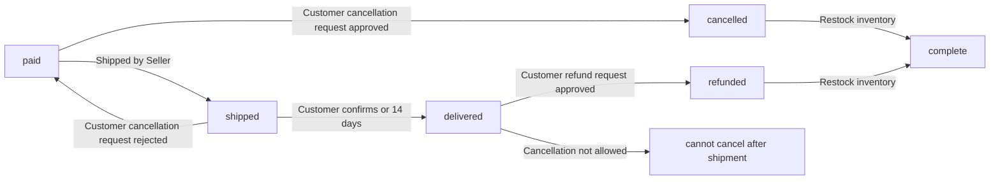

WHEN an order item is in "paid" status, THE system SHALL allow customer cancellation requests.

WHEN an order item is in "shipped" status, THE system SHALL NOT allow customer cancellation requests (must wait for delivery then request refund).

WHEN an order item reaches "delivered" status, THE system SHALL allow customers to write reviews and request refunds.

WHEN an order item reaches "cancelled" or "refunded" status, THE system SHALL restore stock quantities via inventory records.

## OrderItem Actions

Each order item represents a purchased product variant with specific quantity. Order items belong to individual sellers even when in the same order. Item statuses include paid, shipped, delivered, cancelled, and refunded states. Individual items can be cancelled or refunded independently of other items. Order item status determines the overall order status calculation. Cancellation requests apply to individual items with paid status. Refund requests apply to individual items with delivered status. Item snapshots preserve product and seller information at time of purchase. Inventory adjustments occur automatically based on item status changes. Customers can track the status of each item separately.

### Order Item Status Tracking

THE system SHALL track the status of each order item independently.

Item statuses are: paid, shipped, delivered, cancelled, refunded.

WHEN an order item is created, THE system SHALL set its status to "paid".
WHEN a seller ships an order item, THE system SHALL update its status to "shipped".
WHEN a customer confirms delivery of a shipment, THE system SHALL update all items in that shipment to status "delivered".
IF 14 days pass since an item was shipped without delivery confirmation, THE system SHALL automatically update the item status to "delivered".
WHEN an order item is cancelled, THE system SHALL update its status to "cancelled".
WHEN an order item is refunded, THE system SHALL update its status to "refunded".

### Individual Item Cancellation

Customers can request cancellation of individual order items.

WHEN a customer requests cancellation for an order item, THE system SHALL:
1. Verify the item status is "paid" (not yet shipped)
2. Require a cancellation reason (text field)
3. Create a cancellation request with "pending" status

THE system SHALL notify the seller of the cancellation request.
WHEN a seller approves a cancellation request, THE system SHALL:
1. Update the order item status to "cancelled"
2. Create an inventory record to restore stock quantity
3. Process refund for that item only

WHEN a seller rejects a cancellation request, THE system SHALL update the request status to "rejected".
IF the order item status is not "paid", THE system SHALL reject the cancellation request.
IF all items in an order are cancelled, THE system SHALL update the order status to "cancelled".

### Individual Item Refund

Customers can request refund for individual order items.

WHEN a customer requests a refund for an order item, THE system SHALL:
1. Verify the item status is "delivered"
2. Verify the request is within 7 days of delivery
3. Require a refund reason (text field)
4. Create a refund request with "pending" status

THE system SHALL notify the seller of the refund request.
WHEN a seller approves a refund request, THE system SHALL:
1. Update the order item status to "refunded"
2. Create an inventory record to restore stock quantity
3. Process refund for that item only

WHEN a seller rejects a refund request, THE system SHALL update the request status to "rejected".
IF the order item status is not "delivered", THE system SHALL reject the refund request.
IF the request is outside the 7-day window, THE system SHALL reject the refund request.
IF all items in an order are refunded, THE system SHALL update the order status to "refunded".

### Purchase Snapshot Creation

WHEN an order is placed, THE system SHALL create snapshots for each purchased order item.

Each purchase snapshot includes:
- Product name and description at time of purchase
- Variant options and price at time of purchase
- Seller shop name and logo at time of purchase

THE system SHALL create a separate snapshot for each product, variant, and seller profile referenced in the order item.
THE snapshot SHALL be immutable and cannot be modified after creation.
THE system SHALL store the snapshot with the order item permanently, even if the original product is deleted.
THE system SHALL preserve the snapshot for dispute resolution and historical reference.
CUSTOMERS can view snapshots of their purchased items in order details.
SELLERS can view snapshots of their products as purchased by customers.
ADMINISTRATORS can view snapshots of any product in the platform.

### Inventory Adjustment

WHEN an order item status changes, THE system SHALL automatically adjust inventory.

WHEN an order item is created (paid status), THE system SHALL:
1. Create an inventory record with negative quantity
2. Reduce the variant's stock quantity

WHEN a cancellation request is approved, THE system SHALL:
1. Create an inventory record with positive quantity
2. Restore the variant's stock quantity

WHEN a refund request is approved, THE system SHALL:
1. Create an inventory record with positive quantity
2. Restore the variant's stock quantity

INVENTORY records SHALL be append-only and immutable.
CURRENT stock quantity is calculated by summing all inventory records.
SELLERS can view the complete inventory history of each variant.
WHEN stock reaches 0, THE system SHALL mark the variant as "out of stock".
OUT of stock variants cannot be added to the shopping cart.

### Status Derivation

THE system SHALL calculate the overall order status based on its items.

IF all items are "paid" → THE order status SHALL be "paid".
IF any item is "shipped" and none are delivered → THE order status SHALL be "shipped".
IF all items are "delivered" → THE order status SHALL be "delivered".
IF all items are "cancelled" → THE order status SHALL be "cancelled".
IF all items are "refunded" → THE order status SHALL be "refunded".
IF items have mixed statuses (e.g., some delivered, some refunded) → THE order status SHALL be "partially completed".

THE system SHALL recalculate order status whenever an item status changes.
THE system SHALL NOT allow manual override of order status.
ORDER status SHALL always reflect the current state of its items.

### Item-Level Tracking

CUSTOMERS can track the status of each order item individually.

WHEN viewing order details, THE system SHALL display:
- List of all items with their individual status
- Product name and variant options for each item
- Price and quantity for each item
- Shipping address associated with the order

WHEN viewing shipment details, THE system SHALL show:
- Which items are included in each shipment
- Carrier name and tracking number for each shipment
- Delivery confirmation status per shipment

CUSTOMERS SHALL be able to request cancellation or refund for specific items only.
CUSTOMERS SHALL be able to confirm delivery per shipment, not per item.
SHIPPING items from different sellers SHALL always be in separate shipments.
SELLERS SHALL be able to view only order items for their products.

### Shipment Item Grouping

A shipment is a package sent by a seller containing one or more order items.

WHEN a seller creates a shipment, THE system SHALL:
1. Allow selection of one or more items from their products
2. Require carrier name and tracking number
3. Update all selected items to "shipped" status

DIFFERENT sellers SHALL always ship in separate shipments.
A SINGLE seller may ship items individually or bundle multiple items.
ALL items in the same shipment SHALL share the same tracking information.
WHEN a customer confirms delivery, THE system SHALL update all items in that shipment to "delivered".
IF 14 days pass without delivery confirmation, THE system SHALL automatically mark all items as "delivered".

## Shipment Actions

Sellers create shipments containing one or more items from their own products. Each shipment groups items that ship together under one tracking number. Sellers enter carrier name and tracking number when creating a shipment. Items in the same shipment share identical tracking information. Shipment creation changes item status from paid to shipped. Customers view tracking information to monitor delivery progress. Delivery confirmation marks all items in a shipment as delivered. Automatic delivery confirmation occurs after 14 days without customer action. Different sellers always create separate shipments even for same-customer orders. Shipment management enables sellers to bundle or split items during fulfillment.

### Shipment Creation

WHEN a seller creates a shipment, THE system SHALL:
1. Allow the seller to select order items from their own products only
2. Require the seller to enter a carrier name
3. Require the seller to enter a tracking number
4. Group the selected order items into a single shipment
5. Change the status of all items in the shipment to "shipped"
6. Preserve a snapshot of the shipment creation event

IF the seller attempts to select order items from other sellers, THE system SHALL reject the shipment creation.
IF the carrier name is empty, THE system SHALL reject the shipment creation.
IF the tracking number is empty, THE system SHALL reject the shipment creation.
IF the order items have status other than "paid", THE system SHALL reject the shipment creation.

### Tracking Information Management

WHEN a seller enters tracking information for a shipment, THE system SHALL:
1. Store the carrier name as text
2. Store the tracking number as text
3. Make the tracking information visible to the customer who placed the order
4. Associate the tracking information with the specific order

IF the carrier name exceeds 100 characters, THE system SHALL reject the tracking information.
IF the tracking number exceeds 200 characters, THE system SHALL reject the tracking information.
IF the shipment has already been delivered, THE system SHALL not allow updating the tracking information.

THE system SHALL NOT allow a seller to enter tracking information for order items that do not belong to their shop.

### Carrier Assignment

WHEN a seller assigns a carrier to a shipment, THE system SHALL:
1. Record the carrier name at the time of assignment
2. Link the carrier to the specific shipment
3. Allow the carrier name to be viewed by the customer

IF the seller provides an invalid carrier name format, THE system SHALL accept the carrier name as entered without validation.
THE system SHALL NOT require the seller to use a predefined list of carriers.
THE system SHALL record the carrier assignment timestamp for audit purposes.

THE system SHALL ensure that all items in a shipment share the same carrier and tracking information.

### Item Grouping Rules

WHEN a seller groups order items into a shipment, THE system SHALL:
1. Ensure all items in the shipment belong to the same seller
2. Allow one or more order items to be included in a single shipment
3. Preserve the original order number association for each item
4. Group items that will be shipped together under one tracking number

IF the seller attempts to group items from different sellers into one shipment, THE system SHALL reject the grouping.
IF the seller attempts to include an order item with status other than "paid" in a shipment, THE system SHALL exclude that item from the shipment.
THE system SHALL ensure that an order item can appear in only one shipment.

WHILE an order item is included in a shipment, THE system SHALL prevent the item from being added to another shipment.
WHEN an order item is delivered, THE system SHALL mark it as no longer eligible for shipment modification.

### Shipment Bundling

WHEN a seller bundles multiple order items into one shipment, THE system SHALL:
1. Allow the seller to combine items from the same order into a single package
2. Allow the seller to combine items from different orders in the same shipment
3. Display the bundled items to the customer with shared tracking information
4. Calculate shipping logistics based on the bundled shipment

IF a customer has multiple orders with the same seller, THE system SHALL allow the seller to bundle items across those orders into one shipment.
THE system SHALL ensure that the tracking number is associated with all items in the bundled shipment.
THE system SHALL display the list of all bundled items to the customer when they view tracking information.

WHEN the seller unbundles a shipment, THE system SHALL create a new shipment for the separated items.
WHEN the seller unbundle a shipment, THE system SHALL update the tracking information accordingly.

### Delivery Confirmation Process

WHEN a customer confirms delivery of a shipment, THE system SHALL:
1. Change the status of all order items in that shipment to "delivered"
2. Record the delivery confirmation timestamp
3. Notify the seller that delivery has been confirmed
4. Prevent further modification of the shipment status

IF the customer attempts to confirm delivery for a shipment that has already been delivered, THE system SHALL reject the confirmation.
IF the shipment status is "shipped" or higher, THE system SHALL allow the customer to confirm delivery.
IF the shipment status is "cancelled" or "refunded", THE system SHALL prevent the customer from confirming delivery.

WHILE the shipment is not marked as delivered, THE system SHALL allow the customer to confirm delivery.
WHEN delivery is confirmed, THE system SHALL create a snapshot of the delivery confirmation event.

### Automatic Delivery Confirmation

WHEN fourteen (14) days have elapsed since a shipment was created, THE system SHALL:
1. Automatically change the status of all order items in the shipment to "delivered"
2. Record the automatic delivery timestamp
3. Notify the customer that the shipment has been automatically delivered
4. Notify the seller that the shipment has been automatically delivered

IF the customer has already confirmed delivery for the shipment, THE system SHALL not perform automatic delivery confirmation.
IF the shipment status is "cancelled" or "refunded", THE system SHALL not perform automatic delivery confirmation.
IF the customer marks the shipment as unavailable, THE system SHALL not perform automatic delivery confirmation.

WHILE the shipment is within the fourteen-day period, THE system SHALL allow the customer to manually confirm delivery.
WHEN automatic delivery occurs, THE system SHALL create a snapshot of the automatic delivery event.

THE system SHALL count fourteen (14) days from the shipment creation timestamp, not from the shipment creation date.

### Shipment Tracking Visibility

WHEN a customer views shipment tracking information, THE system SHALL:
1. Display the carrier name for the shipment
2. Display the tracking number for the shipment
3. Display the list of all order items included in the shipment
4. Display the current status of each order item in the shipment
5. Display the shipment creation timestamp
6. Display the delivery confirmation timestamp (if delivered)

IF the customer views tracking for a shipment they do not own, THE system SHALL prevent access to the tracking information.
IF the shipment has no tracking information entered, THE system SHALL display "tracking information pending".
IF the shipment is from a different seller, THE system SHALL display the seller's shop name.

WHEN a customer views their order details, THE system SHALL display all shipments associated with that order.
WHEN a customer views shipment tracking, THE system SHALL provide a link to the carrier's tracking page if available.
THE system SHALL ensure that customers can only view tracking information for shipments they are associated with.

### Shipment Status Transitions

WHEN an order item's status changes, THE system SHALL:
1. Transition from "paid" to "shipped" when the seller creates a shipment
2. Transition from "shipped" to "delivered" when the customer confirms delivery
3. Transition from "shipped" to "delivered" automatically after fourteen days
4. Maintain status independence for each order item even within the same shipment

IF an order item is cancelled after being shipped, THE system SHALL change its status to "cancelled".
IF an order item is refunded after being shipped, THE system SHALL change its status to "refunded".
WHILE an order item is in the "shipped" state, THE system SHALL prevent the item from being cancelled or refunded without seller approval.

THE system SHALL update the overall order status based on the statuses of all order items in the order.
IF all items in an order are shipped and none are delivered, THE system SHALL mark the order as "shipped".
IF all items in an order are delivered, THE system SHALL mark the order as "delivered".

MERMAID
flowchart LR
    A["paid"] -->|Create shipment| B["shipped"]
    B -->|Customer confirms delivery| C["delivered"]
    B -->|14 days elapsed| C
    B -->|Cancelled| D["cancelled"]
    B -->|Refunded| E["refunded"]
    D -->|Order level| F["cancelled"]
    E -->|Order level| G["refunded"]
    C -->|Order level| H["delivered"]


## CancellationRequest Actions

Customers submit cancellation requests for items that have been paid but not yet shipped. Cancellation requests require a reason text explaining the cancellation motivation. Sellers review and approve or reject cancellation requests from customers. Cancellation request state changes create snapshots for dispute resolution. Approved cancellations process refunds for the specific cancelled item only. Cancelled items restore their stock quantities back to available inventory. The remaining items in an order continue processing normally after cancellation. If all items in an order are cancelled, the order status becomes cancelled. Sellers can respond to cancellation requests based on their fulfillment status.

### Cancellation Request Submission

WHEN a customer submits a cancellation request for an order item, THE system SHALL:
1. Require the order item to have status "paid"
2. REQUIRE the customer to provide a reason text explaining the cancellation
3. Create the cancellation request with status "pending"
4. Associate the request with the specific order item

IF the order item status is not "paid", THE system SHALL reject the cancellation request.
IF the reason text is missing or empty, THE system SHALL reject the cancellation request.
IF the order item status is already "shipped" or later, THE system SHALL reject the cancellation request.

WHEN a cancellation request is submitted, THE system SHALL display the request as pending until the seller responds.

### Cancellation Reason Requirements

WHEN a customer submits a cancellation request, THE system SHALL:
1. Accept any text as the cancellation reason
2. Display the reason to the seller reviewing the request
3. Store the reason permanently with the request

THE system SHALL require the reason field to contain at least one character.
THE system SHALL allow customers to review their submitted cancellation requests.
THE system SHALL display the cancellation reason in the seller dashboard.

IF the customer deletes their account after submitting a cancellation request, THE system SHALL preserve the cancellation request and its reason text.
IF the customer submits a new cancellation request for the same order item while a previous request is pending, THE system SHALL reject the new request and prompt the customer to wait for the seller's response.

### Seller Response Workflow

WHEN a seller reviews a cancellation request, THE system SHALL:
1. Display the order item details to the seller
2. Display the customer's cancellation reason
3. Allow the seller to approve or reject the request

WHEN a seller responds to a cancellation request, THE system SHALL:
1. Create a snapshot of the request state (before and after response)
2. Record who made the response (seller account)
3. Record the timestamp of the response

IF the seller approves the cancellation request, THE system SHALL change the request status to "approved".
IF the seller rejects the cancellation request, THE system SHALL change the request status to "rejected".

WHILE a cancellation request has status "pending", THE system SHALL allow the seller to respond.
WHEN a cancellation request has status "approved" or "rejected", THE system SHALL prevent the seller from modifying the response.

### Approved Cancellation Processing

WHEN a cancellation request is approved, THE system SHALL:
1. Change the order item status to "cancelled"
2. Create a refund for the cancelled item only
3. Create a positive inventory record to restore stock
4. Record the reason for stock restoration as "cancelled item"

WHEN a refund is processed for a cancelled item, THE system SHALL:
1. Process the refund through the payment gateway
2. Record the refund amount (item quantity × unit price)
3. Preserve the refund record for dispute resolution

IF a cancellation request is approved, THE system SHALL restore stock quantity by creating an inventory record with negative quantityChange (positive value restores stock).
IF the order item was the last variant of a product and is now cancelled, THE product remains visible but with updated inventory.

WHEN a cancellation request is rejected, THE system SHALL:
1. Leave the order item status unchanged
2. Not create any refund
3. Not create any inventory record
4. Display the rejection to the customer

### Partial Order Handling

WHEN one or more but not all items in an order are cancelled, THE system SHALL:
1. Process the cancelled item independently
2. Leave other order items in their current status
3. Continue processing the remaining items normally

WHEN an order has multiple order items from different sellers, THE system SHALL:
1. Process each cancellation request individually per seller
2. Allow one item to be cancelled while other items continue
3. Keep the order in "partially completed" status

IF all order items in an order are cancelled, THE system SHALL:
1. Change the overall order status to "cancelled"
2. Stop any further processing on the order
3. Generate a single cancellation report for the entire order

IF some items are cancelled and others are delivered, THE system SHALL:
1. Keep the overall order status as "partially completed"
2. Display which items are cancelled and which are delivered
3. Allow cancelled items to have refund processing

WHEN an order status becomes "cancelled" (all items cancelled), THE system SHALL:
1. Prevent any new shipments from being created
2. Mark all pending shipment requests as cancelled
3. Preserve the order record for historical purposes

### Cancellation Snapshot Requirements

WHEN a seller responds to a cancellation request, THE system SHALL:
1. Create an immutable snapshot of the cancellation request state
2. Record the seller's response decision (approved or rejected)
3. Include the timestamp of the response
4. Include the seller who responded

WHEN a snapshot is created for a cancellation request, THE system SHALL:
1. Preserve the old values (request status before response)
2. Preserve the new values (request status after response)
3. Make the snapshot immutable and non-deletable
4. Allow relevant parties to view the snapshot

THE system SHALL preserve cancellation request snapshots even after the order is completed or closed.
THE system SHALL allow administrators to view snapshots of any cancellation request on the platform.

IF a customer attempts to modify a cancellation request that already has a response snapshot, THE system SHALL reject the modification and reference the existing snapshot.
IF a seller attempts to change their response after creating a snapshot, THE system SHALL reject the change and indicate that the decision is final.

## RefundRequest Actions

Customers submit refund requests for delivered items they want to return or dispute. Refund requests must be made within 7 days of item delivery. Requesters provide a reason text describing the refund justification. Sellers review refund requests and approve or reject them. Refund request state changes are snapshotted for dispute resolution. Approved refunds process refunds to the customer for the specific item. Refunded items restore their stock quantities back to available inventory. Other items in the same order remain unaffected by refunds. Refund requests require delivered item status before submission.

### Refund Request Submission

WHEN a customer submits a refund request, THE system SHALL:
1. Verify the associated order item status is "delivered"
2. Verify the item was delivered within the last 7 days
3. Require a reason text describing the refund justification
4. Create a refund request record with status "pending"
5. Associate the refund request with the specific order item

IF the order item status is not "delivered", THE system SHALL reject the refund request.
IF the delivery occurred more than 7 days ago, THE system SHALL reject the refund request.
IF the refund reason is empty, THE system SHALL reject the refund request.

THE system SHALL display the 7-day eligibility window to customers before submission.
THE system SHALL show which items are eligible for refund based on delivery date.
THE system SHALL prevent submission for items with status "cancelled" or "refunded".

### Refund Eligibility Validation

WHEN a customer attempts to submit a refund request, THE system SHALL validate:
1. The order item has status "delivered"
2. The delivery timestamp is within 7 days from the current time
3. No refund request already exists for this order item
4. The customer who placed the order is the one submitting the request

IF the delivery timestamp exceeds 7 days, THE system SHALL display: "Refund window expired"
IF another refund request exists for this item, THE system SHALL display: "Refund request already submitted"
IF the order item is not delivered, THE system SHALL display: "Item must be delivered before refund request"
IF the customer is not the order owner, THE system SHALL reject the request with access error.

### Refund Request Reason Management

WHEN a customer submits a refund request, THE system SHALL:
1. Require a reason text field with minimum 10 characters
2. Allow the reason to contain text, numbers, and special characters
3. Display the reason to the seller for review
4. Include the reason in the refund request snapshot

IF the reason text is less than 10 characters, THE system SHALL display: "Reason must be at least 10 characters"

WHEN a seller views the refund request, THE system SHALL display:
- The order item details (product name, variant, price)
- The delivery date
- The customer's refund reason
- The time since submission

THE system SHALL prevent customers from editing the refund reason after submission.

### Seller Refund Request Review

WHEN a seller reviews a refund request, THE system SHALL:
1. Display the refund request details including customer reason
2. Show the order item and delivery information
3. Provide approve and reject action buttons
4. Require a response within 14 days of submission

WHEN a seller approves a refund request, THE system SHALL:
1. Change refund request status to "approved"
2. Create a snapshot of the request state at approval time
3. Process the refund to the customer
4. Restore stock quantities for the refunded variant
5. Change the order item status to "refunded"

WHEN a seller rejects a refund request, THE system SHALL:
1. Change refund request status to "rejected"
2. Create a snapshot of the request state at rejection time
3. Notify the customer of the rejection
4. Preserve the request record for dispute resolution

THE system SHALL notify the customer when their refund request is approved or rejected.

### Refund Processing and Stock Restoration

WHEN a refund request is approved, THE system SHALL:
1. Process the refund payment to the customer
2. Create a positive inventory record for the variant
3. Update the order item status to "refunded"
4. Create a snapshot of the refund request state
5. Update the order overall status if all items are refunded

IF the refund request is for the last item in an order, THE system SHALL change the order status to "refunded".
IF the order has multiple items and only some are refunded, THE system SHALL change the order status to "partially completed".

THE system SHALL ensure stock is restored before the refund completes.
THE system SHALL record the inventory change with reason "refund approved".
THE system SHALL calculate the refund amount based on the unit price at time of purchase (preserved in snapshot).

WHEN stock is restored, THE variant becomes available for purchase again immediately.
THE system SHALL prevent new orders for this variant while refund processing is in progress.

### Order Impact Isolation

WHEN a refund is processed for an order item, THE system SHALL:
1. Only affect the specific order item being refunded
2. Leave other items in the same order unchanged
3. Preserve the status of other items
4. Update the order overall status only if all items are affected

WHEN multiple items in an order are refunded separately, THE system SHALL:
1. Track each refund request independently
2. Update order status after each refund processing
3. Show separate refund requests in order history

IF an order item is refunded, THE system SHALL:
1. NOT cancel or modify other items in the same order
2. NOT affect shipments containing other items
3. NOT change the shipping address for remaining items

THE system SHALL allow customers to continue receiving non-refunded items in an order while awaiting refund processing.

### Refund Request Snapshot Preservation

WHEN a refund request state changes, THE system SHALL:
1. Create an immutable snapshot record
2. Record the old status and new status
3. Include the refund reason in the snapshot
4. Record the timestamp of the state change
5. Record which actor (customer or seller) made the change

WHEN a seller approves or rejects a refund request, THE system SHALL:
1. Create a snapshot capturing the response action
2. Record the actor's decision and timestamp
3. Preserve the reason and order item details
4. Make the snapshot viewable by relevant parties

THE system SHALL preserve refund request snapshots even after:
- The refund is completed
- The order is deleted
- The seller account is deleted

THE system SHALL prevent deletion or modification of refund snapshots.

### Refund Snapshot for Dispute Resolution

WHEN a refund dispute arises, THE system SHALL:
1. Allow administrators to view all refund request snapshots
2. Display the complete state history of the refund request
3. Show snapshots for each status change (pending → approved/rejected)
4. Include timestamps and actor information for each change

WHEN an administrator reviews a refund request snapshot, THE system SHALL:
1. Show the refund request at the point in time
2. Display the customer's original reason
3. Show the seller's response (approval or rejection)
4. Include inventory records related to the refund

THE system SHALL provide snapshot access to:
- The customer who submitted the refund request
- The seller who processed the refund request
- Administrators with oversight privileges

THE system SHALL never allow snapshots to be deleted or edited, regardless of dispute outcome.

### Refund Request Status Transitions

MERMAID:
flowchart LR
    A["pending"] -->|"seller approves"| B["approved"]
    A -->|"seller rejects"| C["rejected"]
    style A fill:#f9f,stroke:#333
    style B fill:#9f9,stroke:#333
    style C fill:#f99,stroke:#333

## Review Actions

Customers write reviews for products after receiving delivered items. Each review includes a star rating from 1 to 5 stars. Text content is optional but enhances review usefulness. Customers can only write one review per product per order. Reviews appear on product detail pages for other customers to see. New reviews are sorted with most recent first for relevance. Customers can edit their own reviews to correct mistakes or update opinions. Every review edit creates a snapshot of the previous version. Customers may delete their reviews but snapshots are preserved permanently. Product ratings calculate from all non-deleted reviews.

### Review Creation and Star Rating

WHEN a customer writes a review for a purchased product, THE system SHALL require a star rating from 1 to 5 stars.

WHEN a customer submits a review, THE system SHALL allow optional text content.

WHEN a customer writes a review, THE system SHALL verify the customer has received the delivered item.

IF the item status is not delivered, THE system SHALL prevent the customer from writing a review.

IF the customer has already written a review for this product in a previous order, THE system SHALL reject the review request.

THE system SHALL display an error message when a customer attempts to write a second review for the same product.

THE system SHALL require that at least one order item for the product has been delivered to the customer.

IF multiple order items exist for the same product, THE system SHALL allow one review for the product (not per item).

THE system SHALL capture the timestamp when the review is created.

WHEN creating a review, THE system SHALL associate it with the customer and product.

### Review Editing and Changes

WHEN a customer edits their own review, THE system SHALL allow updating the star rating and text content.

WHEN a customer edits a review, THE system SHALL create a snapshot of the previous review version.

THE system SHALL record the edit timestamp and preserve the original creation timestamp.

WHEN a customer edits a review, THE system SHALL display the current version for modification.

IF the customer is not the review owner, THE system SHALL reject the edit request.

IF the customer attempts to edit a review written by another user, THE system SHALL display an access denied message.

WHEN editing, THE system SHALL allow the star rating to be changed to any value from 1 to 5 stars.

WHEN editing, THE system SHALL allow the text content to be modified or cleared entirely.

THE system SHALL NOT allow customers to edit reviews for items not delivered to them.

THE system SHALL preserve the original review creation date in the snapshot metadata.

### Review Deletion and Preservation

WHEN a customer deletes their own review, THE system SHALL remove it from public display.

WHEN a customer deletes a review, THE system SHALL preserve the review snapshot permanently.

WHEN deleting a review, THE system SHALL record the deletion timestamp in the snapshot.

THE system SHALL NOT allow customers to delete reviews written by other users.

IF a customer attempts to delete another user's review, THE system SHALL reject the request.

WHEN a review is deleted, THE system SHALL recalculate the product's average rating excluding deleted reviews.

THE system SHALL preserve deleted reviews in snapshots for dispute resolution purposes.

WHEN viewing deleted reviews, THE system SHALL show "deleted user" instead of the customer name.

THE system SHALL allow administrators to view deleted reviews in snapshots.

THE system SHALL NOT permanently remove review data when customers delete their reviews.

### Review Snapshot Preservation

WHEN a review is edited, THE system SHALL create an immutable snapshot of the previous version.

WHEN a review is created, THE system SHALL record the star rating and text content in the snapshot.

WHEN a review is deleted, THE system SHALL create a snapshot documenting the deletion.

THE system SHALL preserve snapshots of reviews even after the customer deletes their account.

WHEN viewing review history, THE system SHALL show all snapshots with timestamps and change descriptions.

THE system SHALL record old values and new values for each review snapshot.

WHEN a customer requests to view their review snapshots, THE system SHALL display complete change history.

THE system SHALL prevent any user from modifying or deleting review snapshots.

WHEN creating snapshots, THE system SHALL record the reviewer's user ID for traceability.

THE system SHALL preserve snapshots for all reviews regardless of deletion status.

### Review Visibility and Display

WHEN displaying reviews on a product detail page, THE system SHALL show only non-deleted reviews.

WHEN customers browse a product detail page, THE system SHALL sort reviews by newest first.

WHEN displaying reviews, THE system SHALL show the star rating with visual star indicators.

WHEN displaying reviews, THE system SHALL show the review text content if provided.

WHEN displaying reviews from deleted users, THE system SHALL show "deleted user" instead of the name.

WHEN a product has no reviews, THE system SHALL display "No reviews yet" message.

THE system SHALL show the review creation date for each review.

WHEN a customer views a product, THE system SHALL display the average rating prominently.

THE system SHALL allow customers to write reviews only for products they have received.

WHEN a review is deleted, THE system SHALL immediately update the displayed average rating.

### Product Rating Calculation

WHEN calculating product average rating, THE system SHALL include all non-deleted reviews.

WHEN calculating average rating, THE system SHALL exclude reviews from deleted users' snapshots.

THE system SHALL round the average rating to one decimal place for display.

WHEN a new review is submitted, THE system SHALL recalculate the product's average rating.

WHEN a review is edited, THE system SHALL recalculate the product's average rating.

WHEN a review is deleted, THE system SHALL recalculate the product's average rating excluding the deleted review.

THE system SHALL display the total count of reviews alongside the average rating.

IF a product has no non-deleted reviews, THE system SHALL show "No rating" or equivalent.

WHEN reviewing a product, THE system SHALL show the rating distribution (number of 5-star, 4-star reviews, etc.).

THE system SHALL NOT include deleted review ratings in any average calculation.

### One Review Restriction Enforcement

WHEN a customer attempts to write a review for a product, THE system SHALL check if they already have a review for that product.

IF the customer has an existing review for the product from any previous order, THE system SHALL prevent new review creation.

THE system SHALL enforce one review per product regardless of the number of times purchased.

WHEN a customer tries to submit a duplicate review, THE system SHALL display "You have already reviewed this product."

THE system SHALL allow the customer to edit their existing review instead of creating a new one.

IF a customer purchases the same product multiple times, THE system SHALL count it as one product for review purposes.

WHEN viewing a customer's review history, THE system SHALL show only one review per product.

THE system SHALL prevent customers from writing reviews for products they have not received.

IF a customer attempts to bypass the one-review restriction, THE system SHALL reject the request.

THE system SHALL maintain a lookup table tracking which customers have reviewed which products.

## InventoryRecord Actions

Inventory records track all stock quantity changes for product variants. Each record contains the quantity change amount and reason for the change. Positive quantities indicate restocking while negative quantities indicate sales or adjustments. Inventory records have timestamps showing when changes occurred. Sellers manually add inventory when restocking products. Order placement automatically creates negative inventory records. Order cancellations and refunds automatically create positive inventory records. Sellers review inventory history to monitor stock movements. Current stock is calculated by summing all inventory records. Stock depletion marks variants as out of stock to customers.

### Inventory Tracking

WHEN a product variant is created, THE system SHALL create an initial inventory record showing the starting stock quantity with reason "initial stock".

WHEN a product variant is updated, THE system SHALL NOT modify existing inventory records. Instead, THE system SHALL create a new inventory record with the quantity change amount and reason "manual adjustment".

WHEN an inventory record is created, THE system SHALL record the exact timestamp of when the change occurred.

WHEN a quantity change is made, THE system SHALL record whether it is positive (restock) or negative (sale/adjustment).

THE system SHALL preserve all inventory records permanently. Inventory records are immutable and cannot be modified or deleted.

IF a user attempts to modify an existing inventory record, THE system SHALL reject the request and indicate that inventory history is immutable.

### Quantity Changes

WHEN a seller adds inventory through restocking, THE system SHALL create a positive quantity change record with reason "restocking".

WHEN a customer places an order, THE system SHALL create negative quantity change records for each variant in the order with reason "order placed".

WHEN an order item is cancelled, THE system SHALL create positive quantity change records to restore stock with reason "order cancelled".

WHEN a refund request is approved, THE system SHALL create positive quantity change records to restore stock with reason "refund processed".

WHEN inventory is manually adjusted, THE system SHALL require the seller to provide a reason for the adjustment.

IF a quantity change would result in negative total stock, THE system SHALL allow the change only if the seller provides an adjustment reason.

### Restocking Records

WHEN a seller initiates restocking, THE system SHALL require a positive quantity value.

WHEN a seller initiates restocking, THE system SHALL require a reason description.

WHEN restocking is confirmed, THE system SHALL create an inventory record with the quantity change and reason "restocking".

WHEN restocking is completed, THE system SHALL update the variant's displayed stock quantity to reflect the new total.

IF the restocking quantity is zero or negative, THE system SHALL reject the restocking request.

IF the restocking reason is empty, THE system SHALL reject the restocking request.

### Sales Deduction

WHEN an order payment succeeds, THE system SHALL deduct stock quantities for all order items.

WHEN stock is deducted for an order, THE system SHALL create a negative inventory record with reason "order placed".

IF the variant has insufficient stock at order time, THE system SHALL prevent the order from being placed.

IF stock becomes unavailable after a customer adds items to cart but before payment, THE system SHALL mark those cart items as unavailable.

WHEN an order is successfully placed, THE system SHALL update the variant's displayed stock quantity to reflect the deduction.

IF stock calculation results in a value below zero, THE system SHALL flag this for administrator review.

### Adjustment Recording

WHEN a seller needs to adjust inventory for loss, damage, or correction, THE system SHALL require a reason for the adjustment.

WHEN an adjustment is negative, THE system SHALL record it as a stock reduction with reason "adjustment".

WHEN an adjustment is positive, THE system SHALL record it as stock correction with reason "adjustment".

WHEN an adjustment is completed, THE system SHALL create an inventory record with the change amount and reason.

IF an adjustment reason is missing, THE system SHALL reject the adjustment request.

WHEN an adjustment is made, THE system SHALL notify the seller of the updated stock quantity.

### Inventory History Viewing

WHEN a seller views inventory history for a variant, THE system SHALL display all inventory records chronologically.

WHEN inventory history is displayed, THE system SHALL show the quantity change amount, reason, and timestamp for each record.

WHEN inventory history is displayed, THE system SHALL show the running total stock after each record.

WHEN viewing inventory history, THE system SHALL allow sellers to filter by date range.

WHEN viewing inventory history, THE system SHALL allow sellers to filter by reason type.

IF a seller requests inventory history, THE system SHALL display the complete immutable history without modification.

### Stock Calculation

WHEN calculating current stock for a variant, THE system SHALL sum all inventory record quantity changes.

WHEN stock is calculated, THE system SHALL use the initial stock quantity as the starting point.

WHEN stock is calculated, THE system SHALL include all inventory records regardless of their reason.

WHEN stock is calculated, THE system SHALL NOT include deleted or modified records (as they are immutable).

WHEN stock calculation is complete, THE system SHALL display the current stock quantity to sellers.

IF the calculated stock is zero or below, THE system SHALL mark the variant as "out of stock".

### Out of Stock Management

WHEN a variant's stock reaches zero, THE system SHALL mark it as "out of stock" in product listings.

WHEN a variant is marked "out of stock", THE system SHALL prevent customers from adding it to the cart.

WHEN a customer attempts to add an out of stock variant to the cart, THE system SHALL display a warning message.

WHEN a variant is out of stock and added to cart (before stock depletion), THE system SHALL mark it as unavailable in the cart.

WHEN stock is replenished through restocking, THE system SHALL automatically change the status from "out of stock" to "in stock".

WHEN viewing a product detail page, THE system SHALL indicate which variants are out of stock.

## AdminRequest Actions

Users can submit requests to become platform administrators. Requests include a reason explaining why the user wants administrative access. Super administrators review and approve or reject admin requests. Approved requests grant regular administrator privileges to the user. Regular administrators cannot promote themselves to super administrator status. Super administrators can promote regular administrators to super administrator. Super administrators can demote other super administrators but not themselves. Admin requests maintain approval state history for accountability.

### Admin Request Submission

WHEN a user submits a request to become an administrator, THE system SHALL:
1. Require the user to provide a reason explaining why they want administrative access
2. Associate the request with the requesting user's account
3. Set the initial request status to "pending"
4. Record the submission timestamp

IF the reason field is empty or contains only whitespace, THE system SHALL reject the submission.

THE system SHALL allow any user (customer or seller) to submit an admin request.

THE system SHALL display a confirmation message after successful request submission.

### Super Administrator Review

WHEN a super administrator reviews pending admin requests, THE system SHALL:
1. Display the list of all pending admin requests
2. Show the requester's account information (email, user type)
3. Display the reason provided by the requester
4. Show the submission date for each request

WHEN a super administrator approves a pending admin request, THE system SHALL:
1. Change the request status to "approved"
2. Grant regular administrator privileges to the requesting user
3. Record the approval timestamp
4. Notify the user of their new administrator status

WHEN a super administrator rejects a pending admin request, THE system SHALL:
1. Change the request status to "rejected"
2. Record the rejection timestamp
3. Notify the user of the rejection

THE system SHALL require super administrators to actively review and respond to pending requests.

### Administrative Privilege Assignment

WHEN an admin request is approved, THE system SHALL:
1. Change the requesting user's role to "regular administrator"
2. Grant access to administrator dashboard features
3. Enable the user to view seller approval requests
4. Enable the user to manage categories
5. Enable the user to view all products on the platform

THE regular administrator SHALL NOT be able to:
1. Promote themselves to super administrator
2. Promote other administrators to super administrator
3. Promote regular administrators to super administrator

WHEN a user has regular administrator status, THE system SHALL restrict access to customer-facing features (browsing products, making purchases, writing reviews) to prevent role conflicts.

### Grade Promotion Workflow

WHEN a super administrator promotes a regular administrator to super administrator, THE system SHALL:
1. Require explicit approval action from the super administrator
2. Change the user's grade from "regular administrator" to "super administrator"
3. Record the promotion timestamp
4. Enable the user to perform super administrator-only actions

SUPER administrators SHALL NOT be able to promote themselves to super administrator status.

THE promotion action SHALL be recorded in the request history as an immutable log entry.

THE system SHALL display the current grade of each administrator in the user management interface.

### Grade Demotion Workflow

WHEN a super administrator demotes another super administrator to regular administrator, THE system SHALL:
1. Require explicit demotion action from the super administrator
2. Change the target user's grade from "super administrator" to "regular administrator"
3. Record the demotion timestamp
4. Remove super administrator-only privileges from the demoted user

SUPER administrators SHALL NOT be able to demote themselves to regular administrator.

WHEN a super administrator is demoted, THE system SHALL:
1. Revoke their ability to promote or demote other administrators
2. Revoke their ability to approve or reject admin requests
3. Retain their regular administrator permissions

THE demotion action SHALL be recorded in the request history as an immutable log entry.

### Request History Tracking

WHEN any action is taken on an admin request (approval, rejection, promotion, demotion), THE system SHALL:
1. Create an immutable history record
2. Record the action type (approved, rejected, promoted, demoted)
3. Record the timestamp of the action
4. Record the administrator who performed the action
5. Preserve the original request data

THE system SHALL display the complete history of admin requests for:
1. The requesting user (their submission and response)
2. All administrators (viewing pending requests)
3. Super administrators (full oversight of all requests)

THE system SHALL ensure that request history records cannot be deleted or modified.

WHEN viewing request history, THE system SHALL show the progression from submission through any status changes.

### Administrative Privilege Management

WHEN a user's administrator privileges are removed (through demotion or other means), THE system SHALL:
1. Immediately revoke all administrative access
2. Prevent the user from performing administrative actions
3. Maintain all previous administrative activity in audit logs

THE system SHALL require authentication to view administrator-managed content.

WHEN an administrator accesses the platform, THE system SHALL:
1. Validate their current grade level
2. Display appropriate administrative features based on grade
3. Restrict access to grade-inappropriate functions

THE system SHALL log all administrator actions for audit purposes.

REGULAR administrators SHALL be able to:
1. View pending seller approval requests
2. Approve or reject seller registrations
3. Create, edit, and delete categories
4. View all products on the platform
5. Delete products for policy violations

SUPER administrators SHALL additionally be able to:
1. Approve or reject admin requests
2. Promote regular administrators to super administrator
3. Demote super administrators to regular administrator (except themselves)

### Request Submission Validation

WHEN a user submits an admin request, THE system SHALL validate that:
1. The user account exists and is active
2. The user is not already an administrator
3. The reason field contains meaningful text

IF the user is already an administrator, THE system SHALL reject the submission.

IF the user account is banned, THE system SHALL reject the admin request.

IF the request is being resubmitted after a previous rejection, THE system SHALL:
1. Allow the new submission
2. Link it to the previous rejection record for context
3. Create a new request ID

THE system SHALL allow users to view the status of their pending admin requests.

THE system SHALL prevent duplicate simultaneous requests from the same user.

## Snapshot Actions

Snapshots are created whenever editable data is modified to preserve history. Each snapshot records when the change occurred and what was changed. Snapshots capture both the old values and new values for comparison. Snapshots are immutable and cannot be deleted under any circumstances. Product snapshots include all fields including images and variants. Seller profile snapshots preserve shop information at different points in time. Order item snapshots maintain product and seller data at purchase moment. Review snapshots track content changes over time. Relevant parties can view snapshots for dispute resolution. Snapshots ensure data integrity across the entire platform.

### Product Snapshot Creation

WHEN a seller edits a product, THE system SHALL create a product snapshot that records all changed fields including name, description, category, base price, and images.

WHEN a seller edits a product, THE system SHALL preserve the state of all variants at the moment of the product edit in the snapshot.

IF a product is deleted by its seller, THE system SHALL preserve the product snapshot for dispute resolution and order reference.

IF a product edit affects multiple fields, THE system SHALL record the complete before-and-after comparison of all fields in a single snapshot.

THE system SHALL create a snapshot for every product edit operation, regardless of whether the change is significant or minor.

IF the product has no existing variants, THE system SHALL still create a product snapshot documenting the product state at that time.

### ProductVariant Snapshot Creation

WHEN a seller edits a product variant's SKU code, THE system SHALL create a variant snapshot containing the old and new SKU values.

WHEN a seller edits a product variant's option values, THE system SHALL create a variant snapshot documenting the option change.

WHEN a seller changes a variant's price override, THE system SHALL create a variant snapshot with the before and after price values.

IF a variant is deleted by its seller, THE system SHALL preserve the variant snapshot even after deletion for order reference.

WHEN a variant is edited, THE system SHALL include the stock quantity at the time of the edit in the snapshot.

IF multiple variant edits occur simultaneously, THE system SHALL create separate snapshots for each edit with distinct timestamps.

THE system SHALL ensure variant snapshots are traceable to their parent product for complete historical tracking.

### SellerProfile Snapshot Creation

WHEN a seller edits their shop name, THE system SHALL create a seller profile snapshot with the old and new shop name.

WHEN a seller edits their shop description, THE system SHALL create a seller profile snapshot documenting the description change.

WHEN a seller uploads a new logo image, THE system SHALL create a seller profile snapshot containing the previous logo reference.

IF a seller's profile is edited, THE system SHALL record the exact timestamp of each change in the snapshot.

THE system SHALL preserve seller profile snapshots even after the seller account is deleted or suspended.

WHEN viewing past orders, THE system SHALL display the seller profile snapshot that was active at the time of purchase.

IF a seller makes multiple consecutive edits, THE system SHALL create a separate snapshot for each edit operation.

### OrderItem Snapshot Creation

WHEN a customer places an order, THE system SHALL create a snapshot of each purchased product variant with all its properties at the time of purchase.

WHEN an order is placed, THE system SHALL create a snapshot of the seller profile for each order item.

WHEN an order is placed, THE system SHALL record the unit price of each variant in the order item snapshot.

IF a product is edited after an order is placed, THE order item snapshot SHALL preserve the original product name and description.

THE system SHALL link each order item snapshot to its corresponding order for complete traceability.

WHEN an order is cancelled or refunded, THE system SHALL reference the original order item snapshot for accurate refund processing.

IF the same product is purchased in multiple orders, THE system SHALL create a separate snapshot for each order item.

### Review Snapshot Creation

WHEN a customer edits their review, THE system SHALL create a review snapshot containing the old and new rating value.

WHEN a customer edits their review, THE system SHALL create a review snapshot containing the old and new text content.

IF a customer deletes their review, THE system SHALL preserve the review snapshot for dispute resolution.

WHEN creating a review snapshot, THE system SHALL record the timestamp of the edit operation.

THE system SHALL allow viewing of review snapshots to track how review content changed over time.

IF a review is edited multiple times, THE system SHALL create a separate snapshot for each edit with chronological ordering.

WHEN displaying reviews on a product page, THE system SHALL show only the current version, with snapshots available for audit purposes.

### Request Snapshot Creation

WHEN a seller approves a cancellation request, THE system SHALL create a snapshot of the request state at the moment of approval.

WHEN a seller rejects a cancellation request, THE system SHALL create a snapshot of the request state at the moment of rejection.

WHEN a seller approves a refund request, THE system SHALL create a snapshot of the request state at the moment of approval.

WHEN a seller rejects a refund request, THE system SHALL create a snapshot of the request state at the moment of rejection.

THE system SHALL record the seller's response action and the timestamp in each request snapshot.

IF a cancellation or refund request is modified, THE system SHALL create a new snapshot documenting the state change.

THE system SHALL preserve all request snapshots even after the associated order is completed or refunded.

### Snapshot Viewing and Access

THE owner of a product SHALL have access to view all snapshots of their own products.

THE owner of a seller profile SHALL have access to view all snapshots of their shop profile.

THE customer who created an order SHALL have access to view the order item snapshots for their orders.

THE customer who wrote a review SHALL have access to view snapshots of their own reviews.

ADMINISTRATORS SHALL have access to view snapshots of any product on the platform.

ADMINISTRATORS SHALL have access to view snapshots of any seller profile on the platform.

THE system SHALL provide access to snapshots only to relevant parties as defined by ownership and role permissions.

### Snapshot Immutable Enforcement

THE system SHALL prevent any modification to existing snapshots once they are created.

THE system SHALL prevent any deletion of snapshots under any circumstances.

IF a user attempts to modify a snapshot, THE system SHALL reject the operation with an appropriate error.

IF a user attempts to delete a snapshot, THE system SHALL reject the operation with an appropriate error.

THE system SHALL ensure snapshots remain unchanged even if the original record they reference is deleted or modified.

THE system SHALL maintain snapshot integrity across all system operations and data restoration procedures.

WHEN viewing a snapshot, THE system SHALL clearly indicate that the record is immutable and cannot be modified.

### Dispute Resolution Support

THE system SHALL provide dispute resolution access to snapshots for customers, sellers, and administrators involved in a dispute.

WHEN a dispute arises, THE system SHALL present the relevant snapshots showing the state of records at the time of the transaction.

THE system SHALL enable before-and-after comparison of snapshots to understand what changed and when.

WHEN a dispute is escalated, THE system SHALL provide complete audit trails from snapshots including timestamps and change records.

THE system SHALL preserve snapshots indefinitely for potential dispute resolution needs.

WHEN reviewing a dispute, THE system SHALL display snapshots in chronological order to show the sequence of events.

THE system SHALL ensure snapshots are available even when original records have been deleted for dispute resolution purposes.

### Change Audit Trail

THE system SHALL record the exact timestamp of every snapshot creation in the audit trail.

THE system SHALL document what specific fields changed in each snapshot for complete change tracking.

THE system SHALL maintain a chronological sequence of snapshots for each record to track changes over time.

THE system SHALL ensure the audit trail includes both the old values and new values for every change.

THE system SHALL make the audit trail viewable by relevant parties for transparency and accountability.

WHEN viewing an audit trail, THE system SHALL show the relationship between consecutive snapshots for complete history.

THE system SHALL ensure all snapshots are included in the audit trail without omission or redaction.

# Error Scenarios and Edge Cases

Business-level error scenarios, edge case coverage, and expected system behaviors for exceptional conditions.

## Customer Error Scenarios

Customers must provide valid credentials when logging in. If an account has been deleted, login attempts are rejected with a clear message indicating the account no longer exists. Password changes require entering the current password before setting a new one. If the current password is incorrect, the change request fails. Account deletion permanently removes profile information but preserves order history for legal and seller record purposes. Review ratings from deleted customers display as from a deleted user to maintain review counts. Registration attempts exceeding the rate limit are temporarily blocked to prevent abuse. Email addresses must be unique among active accounts during registration. Customers cannot log in while their account is banned by an administrator. If a customer's account is suspended due to policy violations, they receive an explanation before login is blocked.

### Login Validation Failures

WHEN a customer attempts to log in, THE system SHALL validate the provided email address format.

WHEN a customer attempts to log in, THE system SHALL validate the provided password matches an existing account.

IF the email address format is invalid, THE system SHALL reject the login attempt.

IF the password does not match any account, THE system SHALL reject the login attempt.

IF the email address does not exist in the system, THE system SHALL reject the login attempt.

IF the account exists but has no password set, THE system SHALL reject the login attempt.

IF the account has been deleted, THE system SHALL reject the login attempt.

IF the account has been banned, THE system SHALL reject the login attempt with a message indicating the account is suspended.

IF login attempts fail more than the allowed threshold, THE system SHALL temporarily block further attempts for a specified duration.

### Deleted Account Handling

WHEN a deleted account attempts to log in, THE system SHALL reject the authentication request.

IF an account has been deleted, THE system SHALL NOT allow any login attempts with the associated email.

IF a customer tries to access a deleted account, THE system SHALL return a message indicating the account no longer exists.

WHEN a deleted account attempts to reset their password, THE system SHALL reject the password reset request.

WHEN a deleted account attempts to register again, THE system SHALL create a new account if the email is available.

IF an account was deleted within the last 30 days, THE system SHALL notify the customer during login that the account was deleted.

THE system SHALL preserve order history associated with deleted accounts for legal and seller record purposes.

THE system SHALL NOT allow deleted accounts to create new orders or access their shopping cart.

WHEN a deleted account's email is used for new registration, THE system SHALL treat it as a fresh account.

### Password Change Conflicts

WHEN a customer requests to change their password, THE system SHALL require the current password for verification.

IF the current password provided is incorrect, THE system SHALL reject the password change request.

IF the new password does not meet complexity requirements, THE system SHALL reject the password change request.

IF the new password matches the current password, THE system SHALL reject the password change request.

IF the customer enters an incorrect current password three times, THE system SHALL temporarily block password change attempts.

WHEN a password change is successful, THE system SHALL invalidate all existing sessions for that account.

WHEN a password change is successful, THE system SHALL create a snapshot of the password change for audit purposes.

IF a password change fails due to system error, THE system SHALL allow the customer to retry.

WHEN a password change succeeds, THE system SHALL notify the customer via email of the successful change.

### Rate Limiting Enforcement

WHEN a customer exceeds the maximum number of registration requests within the time window, THE system SHALL temporarily block further registration attempts.

WHEN a customer exceeds the maximum number of login attempts within the time window, THE system SHALL temporarily block further login attempts.

IF a customer is rate-limited, THE system SHALL display a message indicating when they can try again.

WHEN a customer is rate-limited, THE system SHALL log the event for security monitoring purposes.

RATE LIMITS SHALL be enforced at the email address level, not the account level.

WHEN a rate-limited customer successfully authenticates, THE system SHALL reset their rate limit counters.

IF a customer attempts to register with an email that already exists in the system, THE system SHALL skip rate limit counting.

WHEN a rate-limited customer tries to reset their password, THE system SHALL apply the same rate limiting rules.

THE system SHALL NOT expose the exact number of attempts remaining to prevent abuse of the rate limiting mechanism.

### Unique Email Validation

WHEN a customer attempts to register, THE system SHALL validate that the email address is not already in use.

IF an email address is already associated with an active account, THE system SHALL reject the registration request.

IF an email address is associated with a deleted account, THE system SHALL allow the new registration.

IF an email address is associated with a banned account, THE system SHALL reject the registration request.

WHEN a customer attempts to change their email, THE system SHALL validate the new email is not already in use.

IF the new email address is already in use by another account, THE system SHALL reject the email change request.

IF the new email address is already in use by a deleted account, THE system SHALL allow the email change.

WHEN a customer deletes their account, THE system SHALL mark their email as available for new registration.

THE system SHALL store the email address in lowercase format to ensure uniqueness comparison.

### Ban Status Blocking

WHEN a customer has been banned by an administrator, THE system SHALL prevent the customer from logging in.

WHEN a banned customer attempts to log in, THE system SHALL display a message indicating their account is suspended.

IF a customer's account is banned, THE system SHALL prevent them from accessing their profile.

IF a customer's account is banned, THE system SHALL prevent them from creating new orders.

IF a customer's account is banned, THE system SHALL preserve their order history for viewing purposes.

IF a customer's account is banned, THE system SHALL prevent them from adding items to their shopping cart.

WHEN an administrator bans a customer, THE system SHALL record the ban reason for reference.

WHEN an administrator unbans a customer, THE system SHALL restore the customer's ability to log in.

THE system SHALL allow banned customers to view their existing orders and order details.

### Account Deletion Consequences

WHEN a customer requests account deletion, THE system SHALL require confirmation of the deletion.

WHEN a customer deletes their account, THE system SHALL remove their profile information including display name and phone number.

WHEN a customer deletes their account, THE system SHALL preserve their order history and order details.

WHEN a customer deletes their account, THE system SHALL preserve all reviews written by the customer.

WHEN a customer deletes their account, THE system SHALL mark their reviews as written by "deleted user".

WHEN a customer deletes their account, THE system SHALL preserve their shipping addresses for order history reference.

WHEN a customer deletes their account, THE system SHALL create a snapshot of the deleted account state.

WHEN a customer deletes their account, THE system SHALL remove their active shopping cart items.

WHEN a customer deletes their account, THE system SHALL remove any products from their wishlist.

IF a customer has pending orders, THE system SHALL allow the account deletion but preserve order data.

### Review Display Updates

WHEN a customer's account is deleted, THE system SHALL update all their reviews to display as from "deleted user".

WHEN a customer's account is deleted, THE system SHALL preserve the rating and text content of their reviews.

WHEN a customer's account is deleted, THE system SHALL recalculate the average rating of products that had their reviews.

WHEN a customer deletes a review, THE system SHALL preserve the snapshot of the deleted review.

WHEN a customer deletes a review, THE system SHALL recalculate the average rating of the product.

WHEN a customer edits a review, THE system SHALL create a snapshot of the review before and after changes.

WHEN a review is deleted, THE system SHALL NOT remove it from the product review list but mark it as deleted.

WHEN calculating the average rating, THE system SHALL exclude reviews from deleted customers.

WHEN a customer rewrites a review after deletion, THE system SHALL count it as a new review, not an edit.

## CustomerProfile Error Scenarios

Customers can update their display name and phone number at any time. The system validates that display names contain appropriate characters and do not exceed length limits. If a customer attempts to use a display name that conflicts with existing formats, the update is rejected. Phone number updates are validated for proper formatting before saving. Profile changes are committed immediately without requiring approval. Customers cannot delete their profile while orders are in progress. Profile editing does not affect historical order records. If a customer's profile is deleted, their name is replaced with a generic placeholder in past orders. Edit conflicts during concurrent updates are resolved by keeping the latest submission.

### Display Name Validation

WHEN a customer attempts to update their display name, THE system SHALL validate that the display name meets format requirements.

IF the display name contains special characters other than spaces, hyphens, or apostrophes, THE system SHALL reject the update.
IF the display name exceeds 100 characters, THE system SHALL reject the update.
IF the display name consists only of spaces or is empty, THE system SHALL reject the update.

THE system SHALL reject the request when the display name format violates character rules.
THE system SHALL reject the request when the display name is too long.
THE system SHALL reject the request when the display name is invalid or missing.

### Phone Number Format Errors

WHEN a customer updates their phone number, THE system SHALL validate the phone number format.

IF the phone number contains non-numeric characters (excluding country code prefix), THE system SHALL reject the update.
IF the phone number is shorter than the minimum required length, THE system SHALL reject the update.
IF the phone number exceeds the maximum allowed length, THE system SHALL reject the update.

THE system SHALL reject the request when the phone number format is invalid.
THE system SHALL reject the request when the phone number exceeds length limits.
WHEN the phone number update succeeds, THE system SHALL immediately save the validated phone number.

Error conditions for phone number updates:
- Invalid format containing non-numeric characters
- Phone number below minimum length
- Phone number above maximum length

### Concurrent Edit Conflicts

WHEN multiple customers attempt to update the same profile simultaneously, THE system SHALL resolve edit conflicts.

IF two or more edit requests are received for the same profile at the same time, THE system SHALL accept the latest submission.
IF a concurrent edit conflict occurs, THE system SHALL reject older submissions and keep the most recent changes.

THE system SHALL resolve edit conflicts by keeping the latest submission.
THE system SHALL notify customers when their edit was rejected due to a concurrent update.
IF the customer's session is stale, THE system SHALL warn them before allowing an update.

Error handling for concurrent edits:
- Automatic resolution to latest submission
- Rejection of stale edits
- Warning notifications for stale sessions

### Profile Deletion Restrictions

WHEN a customer attempts to delete their account, THE system SHALL check for pending orders.

IF the customer has any orders with paid or shipped status, THE system SHALL reject the account deletion request.
IF the customer has any pending cancellation or refund requests, THE system SHALL reject the account deletion request.

THE system SHALL reject the request when the customer has active orders.
THE system SHALL reject the request when the customer has pending disputes.
WHEN account deletion is permitted, THE system SHALL require explicit customer confirmation before proceeding.

Deletion restriction conditions:
- Orders with paid status
- Orders with shipped status
- Pending cancellation requests
- Pending refund requests

### Order History Preservation

WHEN a customer deletes their account, THE system SHALL preserve their order history.

THE system SHALL delete the customer's profile information but retain all order records.
THE system SHALL preserve all order items with their complete purchase details.
THE system SHALL replace the customer's display name with a placeholder in all order history.

IF the customer account is deleted, THE system SHALL maintain order records for legal and seller record purposes.
IF the customer account is deleted, THE system SHALL replace customer names with "Deleted User" in historical orders.

Order history preservation behavior:
- Profile data is deleted
- Orders and order items are preserved
- Display names are replaced with placeholder
- Order history remains accessible for legal purposes

### Name Placeholder Updates

WHEN a customer's account is deleted, THE system SHALL update their name across all order history.

IF the customer has completed orders, THE system SHALL replace their display name with "Deleted User" in all order records.
IF the customer has written reviews, THE system SHALL mark the reviews as written by "Deleted User" while preserving review content.

THE system SHALL ensure that deleted customer names appear as "Deleted User" in all historical contexts.
THE system SHALL preserve the content of reviews while updating the author name to "Deleted User".

Name placeholder behavior:
- Replaced with "Deleted User" in order history
- Reviews marked as by "Deleted User"
- Content preserved while identity removed

### Character Format Rules

WHEN a customer enters a display name, THE system SHALL enforce character format rules.

IF the display name contains invalid characters (such as @, #, $, %), THE system SHALL reject the input.
IF the display name is entirely numeric, THE system SHALL reject the input.
IF the display name is less than 2 characters, THE system SHALL reject the input.

THE system SHALL validate that display names follow character format rules before saving.
THE system SHALL provide error messages indicating which characters are not allowed.

Character format validation rules:
- Only spaces, letters, hyphens, and apostrophes allowed
- Minimum 2 characters required
- No purely numeric names
- No special characters except hyphens and apostrophes

### Immediate Save Behavior

WHEN a customer submits a profile update (display name or phone number), THE system SHALL immediately save the changes.

THE system SHALL NOT require approval or confirmation before saving profile changes.
THE system SHALL commit the update to the database immediately upon validation.

IF the profile update is successful, THE system SHALL reflect the changes instantly across all user views.
THE system SHALL NOT store pending or draft profile changes.

Immediate save behavior:
- Changes committed without approval
- No draft or pending state for profile updates
- Instant visibility of changes
- No review workflow required

### Profile Update Workflow

WHEN a customer submits a profile update, THE system SHALL validate input before saving.

IF the display name or phone number validation fails, THE system SHALL reject the entire update.
IF any field fails validation, THE system SHALL return specific error messages for that field.

THE system SHALL update both display name and phone number in a single transaction or reject both.
IF the profile update succeeds, THE system SHALL update the updatedAt timestamp.

Error conditions for profile updates:
- Invalid display name format
- Invalid phone number format
- Field-specific error messages
- Transaction rollback on partial failure

### Profile Snapshot on Deletion

WHEN a customer's account is marked for deletion, THE system SHALL create a final snapshot of their profile.

THE system SHALL record the display name and phone number at the time of deletion.
THE system SHALL mark the snapshot as final and immutable.

THE system SHALL preserve a record of the profile state before deletion for dispute resolution.
IF the account deletion is later reversed, THE system SHALL reference the snapshot for recovery.

Snapshot creation timing:
- Created just before account deletion
- Contains all profile fields
- Immutable and preserved indefinitely

## ShippingAddress Error Scenarios

Customers can manage multiple shipping addresses with recipient name, phone, street address, city, state, postal code, and country. Each address field is validated for completeness and format before saving. If required fields are missing, the address creation fails with specific error messages. Customers can set one address as their default for checkout convenience. Default address assignments override any previous defaults for the same customer. Address deletion fails if the address is currently used in pending orders. Addresses in completed orders remain visible in order history but cannot be edited. Changing an address in a pending order before shipment does not affect shipped items. Invalid postal codes or country combinations are rejected with suggestions for corrections.

### Address Field Validation

WHEN a customer adds a shipping address, THE system SHALL validate all required address fields for completeness and format.

Addresses require: recipient name, phone number, street address, city, state/province, postal code, and country.

THE system SHALL reject address creation when any required field is missing or empty.

THE system SHALL reject address creation when recipient name contains only whitespace characters.

THE system SHALL reject address creation when phone number does not match the expected format for the selected country.

THE system SHALL reject address creation when postal code does not match the expected format for the selected country.

THE system SHALL reject address creation when city is missing.

THE system SHALL reject address creation when state/province is missing for countries that require it.

THE system SHALL reject address creation when country is not selected.

IF the recipient name exceeds 100 characters, THE system SHALL reject the request with a character limit message.

IF the phone number contains invalid characters, THE system SHALL reject the request and show the expected format.

THE system SHALL provide format hints for postal codes based on the selected country.

THE system SHALL provide format hints for phone numbers based on the selected country.

### Required Field Conflicts

WHEN a customer submits address information, THE system SHALL detect and reject required field conflicts before saving.

THE system SHALL reject addresses where the country does not support the selected state/province format.

THE system SHALL reject addresses where the postal code format is invalid for the selected country.

THE system SHALL reject addresses where the phone number format is invalid for the selected country.

IF a customer tries to save an address with required fields missing, THE system SHALL display validation errors for each missing field.

IF a customer tries to save an address with format violations, THE system SHALL display validation errors explaining the expected format.

THE system SHALL NOT allow address submission until all validation errors are resolved.

THE system SHALL allow customers to view previously entered data after validation failures.

WHEN address validation fails, THE system SHALL highlight the specific fields with errors in the form.

### Default Address Conflicts

WHEN a customer sets a shipping address as default, THE system SHALL ensure only one default address exists per customer.

WHEN a customer sets a new address as default, THE system SHALL automatically remove the default status from the previous default address.

THE system SHALL allow customers to set at least one address as default.

THE system SHALL automatically use the default address during checkout when available.

THE system SHALL display the current default address as selected on the address selection form.

WHEN a customer deletes their default address, THE system SHALL NOT require them to select a new default immediately.

IF a customer has no default address selected, THE system SHALL require them to select one during checkout.

WHEN setting an address as default, THE system SHALL create a snapshot of the address change.

THE system SHALL show the customer how many addresses they have before and after setting the default.

### Pending Order Usage Restrictions

WHEN a customer attempts to delete a shipping address, THE system SHALL check if the address is used in any pending orders.

THE system SHALL prevent address deletion if the address is used in any orders with status: paid, shipped, or delivered.

THE system SHALL prevent address deletion if the address is used in any pending cancellation or refund requests.

WHEN address deletion is blocked due to pending orders, THE system SHALL display the list of orders using that address.

THE system SHALL allow address deletion only after all orders using that address are completed (all items delivered, cancelled, or refunded).

THE system SHALL preserve the address information in completed orders even after the address is deleted from the customer's address book.

THE system SHALL allow customers to create a new address when deleting an address blocked by pending orders.

WHEN an order is completed, THE system SHALL automatically check if the deleted address was the default and assign a new default if needed.

### Postal Code and Country Validation

WHEN a customer selects a country for their shipping address, THE system SHALL validate the postal code format for that country.

THE system SHALL display country-specific postal code format requirements to the customer.

THE system SHALL reject postal codes that do not match the expected format for the selected country.

THE system SHALL show validation errors when postal code and country combination is invalid.

THE system SHALL allow customers to view valid postal code examples for their selected country.

IF the customer changes the country selection, THE system SHALL revalidate the postal code field.

IF the postal code is invalid, THE system SHALL show the customer the correct format for the selected country.

THE system SHALL prevent address submission when postal code and country combination fails validation.

### Order History Address Visibility

WHEN a customer views their order history, THE system SHALL show the shipping addresses used for each completed order.

THE system SHALL preserve and display address information from deleted addresses in order history.

THE system SHALL show the complete address information as it was at the time of order placement.

THE system SHALL NOT show deleted address information in the customer's active address book.

THE system SHALL allow customers to view shipping address details from all their historical orders.

WHEN an order contains multiple shipments, THE system SHALL show the shipping address for each shipment.

THE system SHALL display addresses from cancelled orders in order history.

THE system SHALL display addresses from refunded orders in order history.

THE system SHALL show addresses from orders that are partially delivered or partially refunded.

THE system SHALL preserve address snapshots even after the address is deleted from the customer's address book.

## Seller Error Scenarios

Seller accounts require administrator approval before they can list or sell products. Pending sellers cannot access seller dashboard features until approval is granted. If a registration is rejected, sellers receive a detailed reason explaining why. Rejected sellers can submit a new registration request with updated information. Sellers cannot delete accounts with pending orders in paid or shipped status. Account deletion requires all orders and refund requests to be fully resolved. Seller login is blocked for accounts that have been banned by administrators. If a seller is suspended, existing order processing continues but new product creation stops. Approval status changes are communicated immediately to seller dashboards. Rejected sellers can resubmit with corrections to the original application.

### Approval Workflow Blocks

WHEN a seller registers, THE seller SHALL NOT be able to create products until approval status is "approved".

WHEN a seller registers, THE seller SHALL NOT be able to access the seller dashboard until approval status is "approved".

WHEN a seller registers, THE system SHALL display "pending" approval status on the seller's account page.

IF a seller attempts to create a product while approval status is "pending", THE system SHALL reject the request with a message indicating approval is required.

IF a seller attempts to edit their shop profile while approval status is "pending", THE system SHALL allow the edit but products cannot be published.

THE seller SHALL NOT be able to list products in category browsable views until approval status is "approved".

WHEN approval status changes from "pending" to "approved", THE system SHALL notify the seller of the approval.

WHEN approval status changes from "pending" to "rejected", THE system SHALL notify the seller of the rejection with reason.

THE system SHALL prevent all sales-related operations for sellers with approval status other than "approved".

### Rejection Reason Display

WHEN a seller registration is rejected, THE system SHALL display the rejection reason to the seller.

IF a seller registration is rejected, THE rejection reason SHALL be required and cannot be empty.

WHEN viewing rejection reason, THE system SHALL display the full text of the reason provided by the administrator.

IF a seller views their rejected registration, THE system SHALL display the rejection date and administrator name.

WHEN viewing rejection reason, THE seller SHALL be able to download or print the reason for their records.

IF a seller views a rejected registration more than once, THE system SHALL display the same rejection reason without modification.

THE rejection reason SHALL remain visible to the seller until they submit a new registration request.

IF a seller submits a new registration after rejection, THE system SHALL clear the previous rejection reason from display.

WHEN a new registration is submitted, THE system SHALL allow the seller to view the new approval status but NOT the previous rejection reason.

### Pending Order Restrictions

WHEN a seller has order items with status "paid" or "shipped", THE system SHALL prevent the seller from deleting their account.

IF a seller attempts to delete their account with pending orders, THE system SHALL display a list of all pending order items.

WHEN a seller has pending cancellation requests, THE system SHALL prevent account deletion until all requests are resolved.

WHEN a seller has pending refund requests, THE system SHALL prevent account deletion until all requests are completed.

IF a seller attempts to delete products while related orders are pending, THE system SHALL reject the deletion.

WHEN viewing pending orders, THE system SHALL show the order number, item details, and current status.

THE system SHALL prevent sellers from modifying product prices while related orders are in "paid" status.

IF a seller tries to edit product details while orders are pending, THE system SHALL allow editing but warn about potential issues.

WHEN all pending orders are completed, THE system SHALL automatically notify the seller that account deletion is now permitted.

THE system SHALL track all restrictions and display which pending operations are blocking account deletion.

### Account Deletion Constraints

WHEN a customer requests account deletion, THE system SHALL delete profile information including display name and phone number.

WHEN a customer requests account deletion, THE system SHALL preserve all order history and order records.

WHEN a customer requests account deletion, THE system SHALL preserve all reviews but mark the reviewer as "deleted user".

IF a customer requests seller account deletion, THE system SHALL verify no pending orders exist before proceeding.

WHEN a seller account is deleted, THE system SHALL delete all product listings from active searches.

IF a seller account is deleted, THE system SHALL preserve shop name in all historical order records.

WHEN a seller account is deleted, THE system SHALL preserve order snapshots and historical product data.

IF a customer with orders requests account deletion, THE system SHALL allow deletion after confirming order preservation.

WHEN account deletion is complete, THE system SHALL permanently remove personal identifying information from the system.

THE system SHALL prevent account deletion if there are active disputes or open administrative cases.

### Ban Status Enforcement

WHEN a customer is banned by an administrator, THE system SHALL prevent the customer from logging in.

WHEN a seller is banned by an administrator, THE system SHALL prevent the seller from logging in.

WHEN a user is banned, THE system SHALL display a message indicating the account is banned.

IF a banned user attempts to access any feature, THE system SHALL reject the request immediately.

WHEN a ban is applied, THE system SHALL record the ban reason in the user record.

WHEN a user is unbanned by an administrator, THE system SHALL restore full access to the account.

IF a banned user has existing orders, THE system SHALL allow those orders to continue normally.

WHEN viewing banned users, administrators SHALL see the ban reason and ban date.

THE system SHALL prevent banned users from creating new orders, even if they can access order history.

WHEN a user account is deleted after being banned, THE system SHALL maintain the ban status in records.

### Suspension Product Limits

WHEN a seller account is suspended, THE system SHALL hide all products from search results.

WHEN a seller account is suspended, THE system SHALL hide all products from category browsing views.

WHEN a seller account is suspended, THE system SHALL prevent the seller from creating new products.

WHEN a seller account is suspended, THE system SHALL prevent the seller from editing existing products.

WHEN a seller account is suspended, THE system SHALL allow the seller to process existing orders normally.

WHEN a seller account is suspended, THE system SHALL allow the seller to ship pending order items.

WHEN a seller account is suspended, THE system SHALL allow the seller to respond to cancellation requests.

WHEN a seller account is suspended, THE system SHALL allow the seller to respond to refund requests.

IF a seller account is unsuspended, THE system SHALL immediately make products visible in search and categories.

WHEN viewing a suspended seller's shop, customers SHALL see a message indicating the seller is currently unavailable.

### Dashboard Access Restrictions

WHEN a seller has approval status "pending", THE system SHALL restrict dashboard access to view only status information.

WHEN a seller has approval status "approved", THE system SHALL grant full access to the seller dashboard.

WHEN a seller is banned, THE system SHALL prevent access to any dashboard features.

WHEN a seller is suspended, THE system SHALL limit dashboard access to order processing only.

IF a seller with no products attempts to access dashboard features, THE system SHALL display appropriate messaging.

WHEN viewing dashboard, THE system SHALL show relevant summary statistics based on seller status.

IF a seller attempts to create products from dashboard while pending, THE system SHALL block the operation.

WHEN accessing dashboard, THE system SHALL display any pending administrative actions that require attention.

THE system SHALL prevent dashboard access for users who are not logged in as the seller.

WHEN a seller's account is deleted, THE system SHALL immediately revoke all dashboard access.

### Resubmission Workflow

WHEN a seller registration is rejected, THE system SHALL allow the seller to submit a new registration request.

WHEN a seller submits a new registration after rejection, THE system SHALL reset approval status to "pending".

IF a seller resubmits registration, THE system SHALL allow updated information to be provided.

WHEN viewing previous rejections, THE seller SHALL be able to see the rejection reason for reference.

IF a seller submits multiple registration requests, THE system SHALL only process the most recent request.

WHEN a new registration is submitted, THE system SHALL invalidate all previous pending or rejected requests.

WHEN a resubmitted registration is approved, THE system SHALL grant full seller access to all features.

IF a resubmitted registration is rejected, THE system SHALL display the new rejection reason.

WHEN a seller resubmits registration, THE system SHALL preserve any previously approved seller profile data.

THE system SHALL track all resubmission attempts and display the attempt count to the seller.

## SellerProfile Error Scenarios

Shop names must be unique across the platform to avoid customer confusion. When shop names conflict, the seller receives an error indicating the name is unavailable. Shop descriptions and logo updates are saved immediately without approval. Each profile edit creates a snapshot for dispute resolution purposes. Logo image upload fails if the file exceeds size or format limits. Sellers cannot delete profiles while products are active on the platform. Profile deletion requires all products to be removed first. Customer view of seller profiles always shows current information plus snapshot history. Profile changes during active orders preserve the original seller name in those orders.

### Shop Name Uniqueness Validation

### Shop Name Uniqueness Validation

WHEN a seller creates a new seller profile, THE system SHALL ensure the shop name is unique across all sellers on the platform.

IF a seller attempts to set a shop name that already exists, THE system SHALL reject the request with a clear error message indicating the shop name is unavailable.

WHEN a seller attempts to update their existing shop name to a different name, THE system SHALL check if that new name conflicts with another seller's shop name.

IF the new shop name conflicts with another seller's shop name, THE system SHALL reject the change and inform the seller that the name is already in use.

The system SHALL allow shop name changes if the seller's current name will be replaced, as this creates no conflict.

IF a seller attempts to register with a shop name that duplicates an existing seller's name, THE system SHALL prevent the registration and request a different shop name.

WHEN a seller deletes their account, THE shop name becomes available for use by new sellers only after all orders containing that shop name have been fully processed (delivered, refunded, or cancelled).

SHOPS SHALL be searchable by shop name with uniqueness enforced at creation and update time.

THE system SHALL validate shop name uniqueness before any profile creation or update operation is completed.

### Logo File Validation

### Logo File Validation

WHEN a seller uploads a logo image for their profile, THE system SHALL validate the file format against approved image types.

IF the uploaded logo file exceeds the maximum allowed size, THE system SHALL reject the upload and inform the seller of the size limit.

THE system SHALL accept standard image formats including JPEG, PNG, and WebP for profile logos.

IF the uploaded file is not a valid image format, THE system SHALL reject it with an appropriate error message.

WHEN a logo file passes all validation checks, THE system SHALL immediately save the logo to the profile.

IF a seller attempts to upload a corrupted or unreadable image file, THE system SHALL reject the upload and notify the seller to try again.

THE system SHALL display the current logo on the seller's profile page after successful upload.

WHEN a seller replaces an existing logo with a new one, THE system SHALL update the profile immediately and create a snapshot of the change.

### Snapshot Creation Timing

### Snapshot Creation Timing

WHEN a seller edits their seller profile (shop name, description, or logo), THE system SHALL immediately create a snapshot of the change.

THE snapshot SHALL record: the timestamp of the change, the specific field(s) modified, the values before the change, and the values after the change.

WHEN a seller profile snapshot is created, THE system SHALL store it as an immutable record that cannot be deleted or modified.

THE snapshot SHALL be viewable by the profile owner (the seller) for dispute resolution purposes.

THE system SHALL create a snapshot each time any editable field in the seller profile is modified.

WHEN a shop name is changed, THE snapshot SHALL capture both the old and new shop name values.

WHEN a logo image is replaced, THE snapshot SHALL record the change event with before/after reference to the logos.

WHEN a shop description is updated, THE snapshot SHALL capture the previous and new description text.

THE system SHALL preserve all snapshots even after the associated profile or seller account is deleted.

Administrators SHALL be able to view snapshots of any seller profile on the platform.

### Active Product Restrictions

### Active Product Restrictions

WHEN a seller has active products (products with stock and available for purchase), THE system SHALL allow normal profile editing operations.

IF a seller attempts to delete their profile while active products exist, THE system SHALL block the deletion and inform the seller that all products must be removed first.

WHEN a seller attempts to delete a profile, THE system SHALL check if any of their products are currently listed and available.

IF any product variant is in the "active" state (available for purchase), THE system SHALL prevent profile deletion.

WHEN a seller profile is edited while orders containing that seller are in progress, THE system SHALL preserve the original shop name in those order records.

THE system SHALL update the current profile immediately after editing, but order history SHALL retain snapshots of the shop name at the time of purchase.

IF a seller deletes all their products, THE system SHALL allow the profile to be deleted.

WHEN an administrator suspends a seller, THE system SHALL hide the seller's products from search and listings while preserving the profile.

THE system SHALL allow sellers with suspended status to continue processing existing orders and responding to cancellation/refund requests.

### Profile Deletion Blocks

### Profile Deletion Blocks

WHEN a seller requests to delete their seller profile, THE system SHALL first verify that all products associated with the profile have been deleted.

IF the seller has any products remaining, THE system SHALL reject the deletion request and inform the seller that products must be removed first.

IF the seller has any pending orders (paid or shipped status), THE system SHALL block the profile deletion.

IF the seller has any pending cancellation or refund requests, THE system SHALL block the profile deletion.

WHEN all blocking conditions are cleared, THE system SHALL allow the seller profile to be deleted.

IF the deletion is approved, THE system SHALL delete all products from listings but preserve order history and snapshots.

THE system SHALL preserve the seller's shop name in all historical order records even after profile deletion.

WHEN a profile is deleted, THE system SHALL create a snapshot of the deletion event for audit purposes.

THE system SHALL allow a deleted seller to create a new registration after profile deletion.

### Order History Preservation

### Order History Preservation

WHEN a seller profile is edited, THE system SHALL preserve the original shop name and logo in all historical order records.

IF a seller deletes their profile, THE system SHALL ensure all order history remains accessible to customers and administrators.

THE system SHALL create a snapshot of the seller's shop name at the time each order is placed.

WHEN viewing order details, customers SHALL see the shop name as it existed at the time of purchase, not the current shop name.

WHEN a seller changes their shop name, THE new name SHALL only affect new orders, not historical orders.

THE system SHALL preserve the seller's logo snapshot in all historical order records.

IF a seller's profile is deleted, THE order history SHALL continue to display the preserved shop name and snapshot.

ADMINISTRATORS SHALL be able to view the complete order history regardless of seller profile deletion.

THE system SHALL maintain snapshot records for dispute resolution even after the original seller profile no longer exists.

## Category Error Scenarios

Only administrators can create, edit, or delete categories and subcategories. Customers cannot add products to categories that do not exist. Category deletion is blocked if products are assigned to that category. When a category is deleted, products become uncategorized and appear in a separate listing. Subcategories cannot have more than one level of nesting. Category name conflicts during administrator creation are rejected with suggestions. Category descriptions can be empty but names must not be blank. Customers browsing uncategorized products see them in a dedicated section. Category editing updates immediately for customer visibility.

### Administrator-Only Category Management

WHEN a customer attempts to create a category, THE system SHALL reject the request and inform the user that category creation is restricted to administrators.

WHEN a seller attempts to create a category, THE system SHALL reject the request and inform the user that category creation is restricted to administrators.

WHEN an administrator creates a category, THE system SHALL:
1. Accept a category name
2. Accept an optional description
3. Accept an optional parent category reference
4. Create the category with status active

IF the requesting user is not an administrator, THE system SHALL reject category creation with the message "Only administrators can create categories."

WHEN an administrator edits a category, THE system SHALL:
1. Accept updated name
2. Accept updated description
3. Accept updated parent category reference
4. Update the category immediately

WHEN an administrator deletes a category, THE system SHALL first check for assigned products before allowing deletion.

### Product Assignment Validation

WHEN a seller creates a product, THE system SHALL require the seller to select a valid category.

IF the seller selects a category that does not exist, THE system SHALL reject the product creation and display a message requesting a valid category selection.

IF the selected category is deleted after the product is created, THE system SHALL automatically mark the product as uncategorized and move it to the uncategorized listing.

WHEN a seller attempts to edit a product's category, THE system SHALL:
1. Accept a new category selection
2. Validate the category exists
3. Update the product assignment
4. Create a snapshot of the change

IF the new category does not exist, THE system SHALL reject the category update and preserve the current category assignment.

WHEN a product is created without a category, THE system SHALL reject the creation and require category selection before the product can be saved.

IF a seller attempts to assign a product to a subcategory that belongs to a deleted parent category, THE system SHALL reject the assignment and display a message requesting valid category selection.

### Category Deletion Constraints

WHEN an administrator attempts to delete a category, THE system SHALL first check if the category has any products assigned to it.

IF the category has products assigned to it, THE system SHALL reject the deletion and display a message listing the number of products that must be moved or deleted first.

IF the category has no products assigned to it, THE system SHALL allow the deletion and permanently remove the category.

WHEN a category is deleted, THE system SHALL:
1. Move all assigned products to uncategorized status
2. Make products visible in the uncategorized listing
3. Preserve product data including name, description, variants, and images
4. Create a snapshot of the deletion event

IF the category being deleted is a parent category, THE system SHALL:
1. Move all subcategories to uncategorized status
2. Move all products to uncategorized status
3. Create snapshots of all affected entities
4. Preserve all product and subcategory data

WHEN an administrator attempts to delete a subcategory, THE system SHALL:
1. Check if products are directly assigned to the subcategory
2. Reject deletion if products exist with no move option
3. Require product reassignment before deletion

IF the administrator attempts to delete a category that has been deleted, THE system SHALL reject the operation and display a message stating the category no longer exists.

### Uncategorized Product Handling

WHEN products become uncategorized (due to category deletion), THE system SHALL display them in a dedicated uncategorized section.

WHEN a customer browses the category list, THE system SHALL show an "Uncategorized" option for customers to view uncategorized products.

IF a customer searches for products, THE system SHALL include uncategorized products in search results by default.

WHEN a seller views their product list, THE system SHALL show a clear indicator that products are uncategorized.

IF a seller attempts to create a product, THE system SHALL require category selection before the product can be created.

WHEN an administrator views uncategorized products, THE system SHALL provide options to:
1. Assign products to a category
2. Move multiple products to the same category
3. Delete products that should not exist

IF a product remains uncategorized for more than 30 days, THE system SHALL display a notification to the product owner recommending category assignment.

WHEN a category is created, THE system SHALL NOT automatically assign existing uncategorized products to it.

### Subcategory Nesting Limits

WHEN an administrator creates a subcategory, THE system SHALL require selection of a parent category.

IF the selected parent category is already a subcategory (has a parent), THE system SHALL reject the creation and display an error message stating that subcategories can only be one level deep.

IF the administrator attempts to create a subcategory under a subcategory, THE system SHALL prevent the operation and display the message "Subcategories can only be one level deep. Please select a parent category without subcategories."

WHEN viewing the category hierarchy, THE system SHALL display categories with their direct subcategories, but shall not show nested subcategories beyond the first level.

IF an administrator attempts to edit a subcategory's parent to another subcategory, THE system SHALL reject the change and display an error message.

WHEN a subcategory is deleted, THE system SHALL:
1. Move products directly under that subcategory to the grandparent category
2. Delete the subcategory itself
3. Not affect products in the grandparent category

IF a subcategory has no products and no sub-subcategories, THE system SHALL allow its deletion.

WHEN displaying categories, THE system SHALL indicate which categories have subcategories using visual indicators (e.g., expandable menus or arrows).

### Category Name Conflicts

WHEN an administrator creates a category with a name that already exists at the same level, THE system SHALL check for exact name match.

IF an exact name match exists at the same parent level, THE system SHALL reject the category creation and display a message stating "A category with this name already exists under the same parent. Please choose a different name."

IF the name conflict exists at a different parent level, THE system SHALL allow the creation, as category names are scoped by parent.

WHEN an administrator edits a category name, THE system SHALL check for conflicts with other categories at the same parent level.

IF the new name conflicts with an existing category, THE system SHALL reject the edit and display the conflict message.

IF an administrator attempts to rename a category to match another category's name while temporarily hiding it from the database, THE system SHALL still reject the operation and require a unique name.

WHEN the system detects a name conflict, THE system SHALL suggest alternative names by appending a number or modifier.

IF a category name conflict occurs during bulk import, THE system SHALL skip conflicting categories and log them for administrator review.

### Empty Description Allowance

WHEN an administrator creates a category, THE system SHALL accept a category without a description.

IF the description field is left empty during category creation, THE system SHALL accept the category and store it with an empty description value.

WHEN viewing a category with no description, THE system SHALL display an empty field or placeholder text such as "No description available."

WHEN an administrator edits a category description, THE system SHALL accept leaving the description field empty.

IF the description is already present and the administrator clears it, THE system SHALL update the category with an empty description.

WHEN displaying category listings, THE system SHALL handle empty descriptions gracefully without breaking the layout.

IF a customer searches for categories, THE system SHALL include categories with empty descriptions in search results if the search term matches other fields.

WHEN an administrator exports category data, THE system SHALL include categories with empty descriptions as valid records.

### Immediate Category Updates

WHEN an administrator creates a category, THE system SHALL make the category immediately visible to all customers.

WHEN an administrator edits a category name or description, THE system SHALL update the display for all customers in real-time.

WHEN an administrator deletes a category, THE system SHALL immediately stop showing the category in all customer views and move products to uncategorized.

WHEN an administrator changes a category's parent, THE system SHALL immediately reflect the change in all category listings and navigation.

IF a customer has a cached view of the category structure, THE system SHALL invalidate the cache and reload the updated structure on the next page load.

WHEN an administrator creates a category while customers are browsing, THE system SHALL ensure the new category appears on the next page refresh.

IF a category update conflicts with an ongoing customer session, THE system SHALL prioritize the administrator change and inform the customer of the update on their next interaction.

WHEN an administrator makes multiple category changes, THE system SHALL apply them in order of submission and maintain data consistency across all views.

## Product Error Scenarios

Sellers cannot delete products with pending orders in paid or shipped status. Product deletion requires all variants to have no pending order activity. Products with zero variants appear as unavailable in search but remain visible. Product editing without variants creates an error requiring at least one variant. Category assignments must be valid and exist in the system. Base price must be provided and cannot be removed from existing products. Product name conflicts do not prevent creation but may cause customer confusion. Deleted products are immediately removed from search results. Product snapshots are preserved even after deletion for dispute resolution. Invalid category selections are rejected with a list of available options.

### Product Deletion Restrictions

Sellers can delete their products only when no variants have pending order activity.

WHEN a seller attempts to delete a product, THE system SHALL check all variants for pending order items in paid or shipped status.
IF any variant has a pending order item in paid or shipped status, THE system SHALL reject the deletion request and display the associated order numbers.
IF the product has pending cancellation requests for any variant, THE system SHALL reject the deletion request.
IF the product has pending refund requests for any variant, THE system SHALL reject the deletion request.

THE system SHALL allow deletion only when all variants have no pending order items, no pending cancellations, and no pending refunds.
WHEN deletion is allowed, THE system SHALL remove the product from all search results and category listings.
WHEN deletion is allowed, THE system SHALL mark the product as deleted while preserving all snapshots.

THE system SHALL NOT allow deletion of products that are referenced in active shipments.
THE system SHALL NOT allow deletion of products with delivered items unless all those items have been refunded or cancelled.
THE system SHALL display a summary of blocking factors when deletion is rejected (e.g., "3 pending orders prevent deletion").

### Variant Requirement Validation

Every product must have at least one variant to be purchasable.

WHEN a seller creates a product without any variants, THE system SHALL allow product creation but mark it as unavailable for purchase.
WHEN a seller attempts to make a product purchasable without variants, THE system SHALL display an error requiring at least one variant.

IF the last variant of a product is deleted, THE system SHALL automatically mark the product as unavailable.
IF all variants of a product are deleted or marked inactive, THE system SHALL remove the product from search results.

WHEN a product has no variants, THE system SHALL show "unavailable" status on product detail pages.
WHEN a product has no variants, THE system SHALL still allow the product to appear in search results with unavailable indicator.

THE system SHALL allow product editing even when no variants exist.
THE system SHALL NOT allow order creation for products without variants.
THE system SHALL display a validation error: "Product requires at least one variant before it can be added to cart."

### Zero Stock Visibility

Products with zero stock are shown as unavailable to customers.

WHEN a variant's stock quantity reaches zero, THE system SHALL automatically mark that variant as out of stock.
WHEN a variant is marked out of stock, THE system SHALL prevent customers from adding it to their shopping cart.

IF a customer attempts to add an out-of-stock variant to cart, THE system SHALL display: "This item is currently out of stock."
IF a variant becomes out of stock after being added to cart, THE system SHALL mark that cart item as unavailable.

THE system SHALL display out-of-stock status on product detail pages for variants with zero quantity.
THE system SHALL allow out-of-stock products to remain visible in search results with "out of stock" indicator.

WHEN inventory is restocked, THE system SHALL automatically make the variant available for purchase again.
WHEN a variant has zero stock, THE system SHALL still allow the product to be viewed and reviewed.
THE system SHALL NOT prevent customers from browsing or viewing out-of-stock products.

### Category Assignment Errors

Products must be assigned to valid categories during creation and editing.

WHEN a seller creates a product, THE system SHALL require selection of a category or subcategory.
IF the selected category does not exist in the system, THE system SHALL display an error with available category options.

IF the selected category is deleted after product assignment, THE system SHALL automatically assign the product as uncategorized.
IF a seller attempts to assign a product to a non-existent category, THE system SHALL reject the change and list available categories.

THE system SHALL validate that categories exist before allowing product assignment.
THE system SHALL provide a list of available categories when validation fails.
THE system SHALL display an error: "Invalid category selected. Please choose from the available categories list."

IF subcategory hierarchy is violated (e.g., parent category not selected), THE system SHALL reject the assignment.
THE system SHALL allow products to be unassigned from a category (become uncategorized).
THE system SHALL NOT allow deletion of a category if products are assigned to it without first reassigning them.

### Price Field Requirements

Base price is required for all products and cannot be removed.

WHEN a seller creates a product, THE system SHALL require a base price value.
IF base price is missing or zero during product creation, THE system SHALL reject the request.

WHEN a seller edits a product, THE system SHALL allow price modification but SHALL NOT allow removal of base price.
IF a seller attempts to remove base price from an existing product, THE system SHALL display an error requiring a valid price.

THE system SHALL validate that base price is a positive numeric value.
THE system SHALL reject negative price values with error: "Price must be greater than zero."

IF base price is set to zero on an existing product, THE system SHALL reject the change.
THE system SHALL preserve the minimum price constraint even during bulk operations.

Variant price overrides can be null (meaning use base price) but cannot be negative.
THE system SHALL display validation errors for invalid price formats (e.g., negative numbers, non-numeric values).

### Search Visibility Changes

Deleted products are immediately removed from search results.

WHEN a product is deleted, THE system SHALL immediately remove it from all search results.
WHEN a product is deleted, THE system SHALL remove it from all category listings.

IF a customer searches for a deleted product, THE system SHALL display no results for that product.
IF a product is deleted while in a customer's shopping cart, THE system SHALL mark the cart item as unavailable.

WHEN a product is deleted, THE system SHALL NOT show any trace of the product in active search.
WHEN a product is deleted, THE system SHALL preserve the product data for snapshot viewing by administrators.

IF a seller attempts to recreate a product with the same name as a deleted product, THE system SHALL allow it.
IF a deleted product was in a customer's wishlist, THE system SHALL automatically remove it from the wishlist.

THE system SHALL provide immediate search index updates when products are deleted.
THE system SHALL NOT display deleted products in paginated search results.

### Snapshot Preservation After Deletion

All product snapshots are preserved even after product deletion.

WHEN a product is deleted, THE system SHALL preserve all snapshots associated with that product.
WHEN a product is deleted, THE system SHALL allow administrators to view snapshots of the deleted product.

THE system SHALL allow sellers to view snapshots of their deleted products for dispute resolution.
THE system SHALL NOT delete snapshots when the associated product is deleted.

WHEN a product is deleted, THE system SHALL preserve snapshots of all variants that were part of the product.
THE system SHALL preserve snapshot history showing all changes made before deletion.

THE system SHALL maintain snapshots for dispute resolution and audit purposes.
WHEN viewing product snapshot history for a deleted product, THE system SHALL show: "This product has been deleted but snapshots are preserved for dispute resolution."

THE system SHALL allow super administrators to view all snapshots regardless of product deletion status.
THE system SHALL NOT make deleted products visible in normal browsing or search.

### Available Category List

When category validation fails, system displays list of available categories.

WHEN a category selection is invalid, THE system SHALL display a list of all available categories for selection.
WHEN a product requires category assignment and validation fails, THE system SHALL show the available category list.

THE system SHALL include all active categories in the available category list.
THE system SHALL show category hierarchy (parent categories and subcategories) in the available list.

IF a category is deleted, THE system SHALL exclude it from the available category list.
WHEN displaying available categories, THE system SHALL sort them alphabetically by name.

THE system SHALL allow searching within the available category list.
THE system SHALL show parent category relationships to help sellers understand category structure.

IF the available category list is empty, THE system SHALL prompt users to contact administrator.
THE system SHALL provide category path information (e.g., "Electronics > Phones") in the available list.

WHEN adding a product to a category, THE system SHALL validate category existence against the available list.

## ProductVariant Error Scenarios

Sellers cannot delete variants with pending orders or active inventory. SKU codes must be unique per product to avoid order confusion. Variant editing creates snapshots that preserve original pricing and stock levels. Variants with negative stock after order placement create immediate errors. Sellers cannot remove the last variant if the product is still purchasable. SKU code changes that conflict with existing codes are rejected. Price override values cannot be removed from existing variants. Out-of-stock variants are automatically marked unavailable in customer views. Variant edits do not affect already placed order items. SKU validation occurs before variant creation or update.

### Variant Deletion Restrictions

Sellers cannot delete product variants that have pending order items with paid or shipped status.

THE system SHALL reject a variant deletion request when pending order items exist for that variant.

THE system SHALL reject a variant deletion request when pending cancellation requests exist for that variant.

THE system SHALL reject a variant deletion request when pending refund requests exist for that variant.

IF a deletion request includes a variant with order items in shipped status, THE system SHALL reject the entire deletion request.

IF a deletion request includes a variant with order items in paid status, THE system SHALL reject the entire deletion request.

IF any order item for the variant has a pending cancellation request, THE system SHALL reject the deletion request.

IF any order item for the variant has a pending refund request, THE system SHALL reject the deletion request.

THE system SHALL prevent deletion of variants that are currently out of stock but have pending orders.

THE system SHALL display the count of conflicting order items when rejecting a deletion request.

THE system SHALL list the specific order item IDs that prevent deletion.

WHEN a seller attempts to delete a restricted variant, THE system SHALL show which deletion conditions are violated.

### SKU Uniqueness Validation

SKU codes must be unique within a product to avoid order confusion.

THE system SHALL reject variant creation when the SKU code already exists for that product.

THE system SHALL reject variant updates when the new SKU code conflicts with another variant in the same product.

THE system SHALL validate SKU uniqueness before creating any variant record.

WHEN a seller submits a variant with a duplicate SKU, THE system SHALL display an error listing all conflicting SKU codes.

THE system SHALL allow the same SKU code across different products.

THE system SHALL enforce case-sensitive SKU code validation.

IF a variant edit changes the SKU code to match an existing one, THE system SHALL reject the update.

THE system SHALL preserve SKU uniqueness across all snapshot versions of variants.

WHEN creating multiple variants in a single batch, THE system SHALL validate uniqueness across all submitted SKUs.

IF any SKU in a batch is duplicated, THE system SHALL reject the entire batch creation.

THE system SHALL provide real-time validation feedback when sellers enter SKU codes during variant creation.

THE system SHALL not allow SKU codes to be modified to empty or null values.

### Out-of-Stock Auto-Marking

When stock reaches zero, the variant must be automatically marked as unavailable for purchase.

WHEN the stock quantity reaches 0, THE system SHALL automatically mark the variant as out of stock.

THE system SHALL display out-of-stock variants as unavailable in all customer-facing views.

THE system SHALL prevent adding out-of-stock variants to the shopping cart.

IF a customer attempts to add an out-of-stock variant to their cart, THE system SHALL reject the request with an unavailable error.

THE system SHALL show a visible "out of stock" indicator on product detail pages for zero-stock variants.

THE system SHALL exclude out-of-stock variants from search results when the "in-stock only" filter is applied.

THE system SHALL not allow checkout if the selected variant has reached zero stock.

WHEN inventory is restocked for an out-of-stock variant, THE system SHALL automatically mark it as available.

THE system SHALL prevent the variant from being purchased even if it was previously in stock.

IF a variant is added to a cart with available stock but stock reaches zero before checkout, THE system SHALL mark the cart item as unavailable.

THE system SHALL show a warning message to customers when their cart contains unavailable out-of-stock items.

THE system SHALL maintain the out-of-stock status across all customer sessions until inventory is restocked.

### Price Override Removal

Price override values cannot be removed from existing variants once set.

THE system SHALL allow sellers to modify price overrides on existing variants.

THE system SHALL prevent sellers from clearing a price override field to null or empty.

IF a seller attempts to remove a price override value, THE system SHALL reject the change.

WHEN a price override is removed, THE system SHALL revert the variant price to the base product price.

THE system SHALL display the base product price as the fallback when price override is cleared.

IF a variant has no price override, THE system SHALL use the base product price for all transactions.

THE system SHALL preserve the price override in snapshots even if it is conceptually removed.

WHEN viewing a variant snapshot with a price override, THE system SHALL show the override value that was in effect at that time.

THE system SHALL allow setting a price override equal to the base product price.

IF the base product price is changed, THE system SHALL not affect existing price overrides on variants.

WHEN displaying variant pricing, THE system SHALL show which variants have custom price overrides.

THE system SHALL validate that price overrides are not negative or zero when set.

### Last Variant Requirements

A product must have at least one variant to be purchasable.

THE system SHALL prevent deletion of the last variant of a product.

THE system SHALL display a product as unavailable if it has no variants.

WHEN a seller attempts to delete the final variant, THE system SHALL reject the deletion with an error.

THE system SHALL allow products to exist without variants for catalog purposes.

THE system SHALL mark products with no variants as "no variants available" in search results.

IF a seller deletes all variants except one, THE system SHALL allow the last variant to remain.

THE system SHALL require at least one variant before enabling the purchase flow for a product.

WHEN viewing product details with no variants, THE system SHALL show an unavailable status.

THE system SHALL prevent order creation for products that have no variants.

IF all variants of a product reach zero stock, THE system SHALL mark the product as out of stock.

THE system SHALL allow sellers to add new variants to products that have no variants.

WHEN creating a new product, THE system SHALL require at least one variant to be added before making it purchasable.

### Pending Order Conflicts

Variants with pending orders cannot be modified in ways that affect order fulfillment.

THE system SHALL prevent variant editing that changes the SKU code when pending orders exist.

THE system SHALL prevent variant editing that changes option values when pending orders exist.

WHEN a variant has pending order items, THE system SHALL lock the SKU code from modification.

WHEN a variant has pending order items, THE system SHALL lock the option values from modification.

THE system SHALL allow price override changes on variants with pending paid orders.

THE system SHALL allow stock quantity changes on variants with pending shipped orders.

IF a variant has both paid and shipped order items, THE system SHALL prevent SKU and option changes.

THE system SHALL display the list of pending orders when blocking a variant edit.

WHEN a seller attempts an edit that conflicts with pending orders, THE system SHALL explain which fields are locked.

THE system SHALL allow deleting variants only when all pending orders are completed or cancelled.

IF an order item is cancelled, THE system SHALL immediately unlock the variant for modification.

IF an order item is shipped or delivered, THE system SHALL maintain the locked state for SKU and options.

### Snapshot Pricing Preservation

Variant edits create snapshots that preserve original pricing and stock levels.

WHEN a seller edits a variant, THE system SHALL create a snapshot of the variant state.

THE system SHALL record the price override value at the time of edit in the snapshot.

THE system SHALL record the stock quantity at the time of edit in the snapshot.

THE system SHALL preserve the exact price for variant purchases made before edits.

WHEN an order is placed, THE system SHALL save the variant snapshot including the current price.

THE system SHALL ensure that subsequent variant edits do not affect prices in existing order items.

IF a variant's price override is changed after an order is placed, THE system SHALL use the snapshot price for that order.

THE system SHALL record all price changes in variant snapshots for dispute resolution.

WHEN viewing an order item, THE system SHALL show the variant snapshot that was captured at purchase time.

THE system SHALL preserve the price override in snapshots even after the variant is deleted.

IF a seller edits a variant multiple times, THE system SHALL create a snapshot for each edit.

THE system SHALL allow administrators to view the full pricing history through variant snapshots.

### SKU Conflict Detection

SKU validation occurs before variant creation or update to prevent conflicts.

THE system SHALL validate SKU uniqueness before any variant creation operation.

THE system SHALL validate SKU uniqueness before any variant update operation.

WHEN a SKU conflict is detected during variant creation, THE system SHALL reject the request immediately.

WHEN a SKU conflict is detected during variant update, THE system SHALL reject the update immediately.

THE system SHALL check for conflicts against all existing variants in the product.

THE system SHALL NOT check for conflicts across different products.

IF a duplicate SKU is detected, THE system SHALL display which existing SKU it conflicts with.

THE system SHALL provide immediate validation feedback during variant form submission.

IF a batch of variants is submitted, THE system SHALL validate all SKUs before creating any.

WHEN creating variants, THE system SHALL lock the SKU field after successful creation.

THE system SHALL prevent SKU codes from being changed to match any other variant in the product.

IF a product has no variants yet, THE system SHALL allow any SKU code to be created.

## ProductImage Error Scenarios

Product images must be uploaded in supported formats before display. Image upload failures due to size limits are rejected with maximum size information. Sellers can reorder images with the first image becoming the main thumbnail. Image deletion is blocked if the image is the only one on a product. Reordering errors occur when attempting invalid sequence positions. Image changes are included in product snapshots for historical tracking. Display order conflicts when dragging images to invalid positions are corrected automatically. Deleted images are immediately removed from customer product views. Invalid image URLs in the system trigger replacement prompts.

### Image Upload Validation

### Image Format Requirements

WHEN a seller uploads an image for a product, THE system SHALL:
1. Validate that the file is in a supported format (JPEG, PNG, or WebP)
2. Reject uploads with unsupported file formats
3. Display the list of supported formats to the seller

IF the uploaded file format is not JPEG, PNG, or WebP, THE system SHALL reject the upload and display an error indicating only supported formats are accepted.

### File Size Constraints

WHEN a seller uploads an image for a product, THE system SHALL:
1. Check the file size against the maximum allowed limit
2. Reject files that exceed the size limit
3. Display the maximum allowed file size to the seller

IF the uploaded file size exceeds the maximum limit, THE system SHALL reject the upload and display an error indicating the maximum file size constraint.

### Image Upload Validation Flow

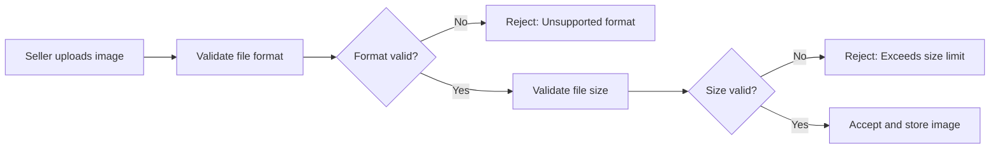

### Image Deletion Restrictions

### Single Image Deletion Block

WHEN a seller attempts to delete an image from a product, THE system SHALL:
1. Check if the product currently has only one image
2. Block deletion if there is only one image remaining
3. Display an error message explaining that at least one image is required

IF a product has only one image, THE system SHALL reject the deletion request and indicate that at least one image must be maintained for the product.

### Required Minimum Image

WHEN a seller deletes an image from a product, THE system SHALL:
1. Ensure the product maintains a minimum of one image at all times
2. Preserve the last remaining image even during deletion operations
3. Display a warning before attempting to delete the final image

IF the deletion would result in zero images, THE system SHALL prevent the deletion and retain the last image.

### Deletion Confirmation Flow

```mermaid
sequenceDiagram
    participant S as Seller
    participant S2 as System
    participant DB as Database
    S->>S2: Request image deletion
    S2->>DB: Check image count
    DB-->>S2: Return current count
    S2->>S2{"Has >1 image?"}
    S2-->>S2|No| S: Reject: One image required
    S2-->>S2|Yes| S2: Proceed with deletion
    S2->>DB: Delete image record
    S2-->>S: Success confirmation
```

### Thumbnail Position Rules

### Primary Image Designation

WHEN a seller views their product images, THE system SHALL:
1. Mark the first image in display order as the main/thumbnail image
2. Display the main image prominently in product listings
3. Show other images as secondary images in a gallery

THE system SHALL use the image with display order position 1 as the primary thumbnail for all product listings and search results.

### Thumbnail Selection Rules

WHEN a seller reorders images, THE system SHALL:
1. Update the display order of all images
2. Automatically designate the new first image as the thumbnail
3. Preserve the previous thumbnail as the second image

IF the display order is changed, THE system SHALL immediately update which image serves as the product thumbnail in all customer-facing views.

### Position Value Constraints

WHEN a seller changes image positions, THE system SHALL:
1. Ensure all position values are positive integers starting from 1
2. Prevent position values of 0 or negative numbers
3. Automatically correct invalid position values

IF an invalid position value is provided, THE system SHALL reject it and assign the image to the nearest valid position.

### Thumbnail Display Flow

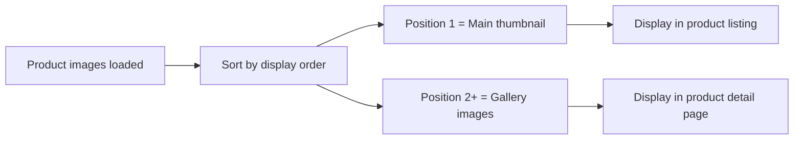

### Sequence Reordering Errors

### Valid Position Sequence

WHEN a seller reorders images, THE system SHALL:
1. Ensure all image positions form a complete sequence from 1 to N
2. Reject reordering that creates gaps in the sequence
3. Automatically rearrange images to maintain a valid sequence

IF the reordering would create duplicate positions or gaps, THE system SHALL rearrange images to form a valid 1, 2, 3, ... N sequence.

### Position Validation Rules

WHEN a seller attempts to move an image to a new position, THE system SHALL:
1. Validate that the target position is within valid range
2. Ensure no two images share the same position value
3. Shift other images to accommodate the move

IF the target position equals an existing position, THE system SHALL shift the existing image and all subsequent images by one position.

### Invalid Position Handling

WHEN a seller provides an out-of-range position value, THE system SHALL:
1. Detect positions greater than the total image count
2. Detect positions less than 1
3. Reject the request and display an error

IF the position is out of range, THE system SHALL reject the reordering operation and indicate the valid position range.

### Reordering Error Flow

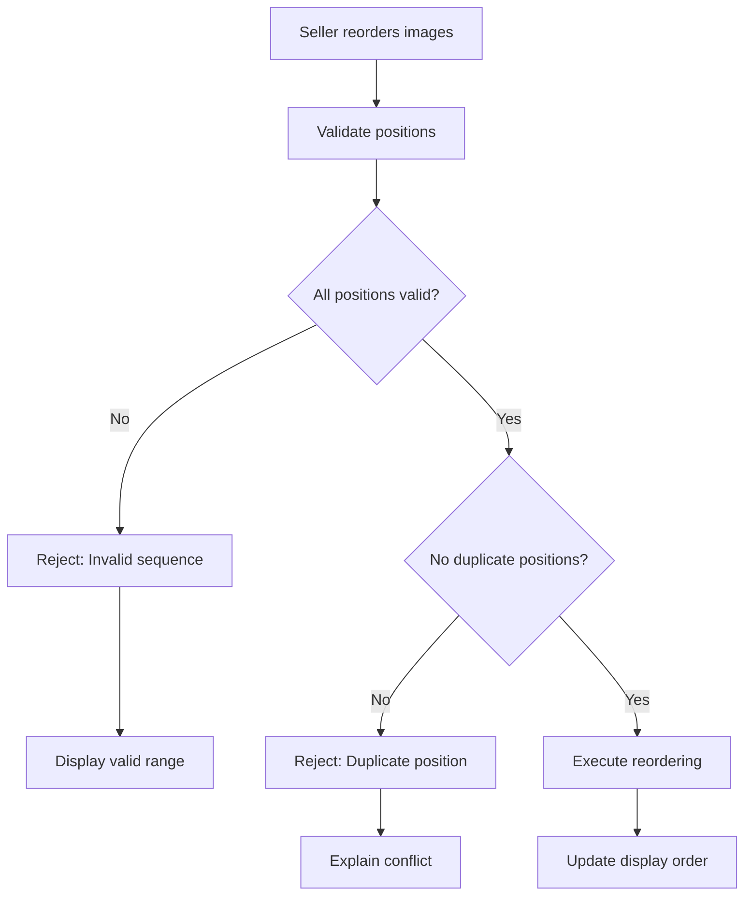

### Snapshot Integration and Display Updates

### Snapshot Creation on Image Changes

WHEN a seller adds an image to a product, THE system SHALL:
1. Create a product snapshot immediately after the image is added
2. Include the new image details in the snapshot
3. Record the timestamp and user who made the change

IF a new image is added, THE system SHALL automatically create a snapshot preserving the complete product state including the new image.

### Snapshot Content for Images

WHEN a product snapshot is created due to image changes, THE system SHALL:
1. Record all image URLs in the snapshot
2. Include the display order of all images
3. Preserve the state before and after the change

THE system SHALL include both oldValues (previous images) and newValues (current images after change) in every product snapshot.

### Invalid URL Detection

WHEN the system loads product images for display, THE system SHALL:
1. Validate that image URLs are accessible and valid
2. Detect broken or unreachable image URLs
3. Flag invalid URLs for seller review

IF an image URL is detected as invalid or broken, THE system SHALL display a placeholder image and alert the seller that the image needs to be replaced.

### Immediate Display Updates

WHEN an image operation completes successfully, THE system SHALL:
1. Update the product view immediately for all customers
2. Refresh the image gallery in real-time
3. Remove deleted images instantly from customer views

AFTER an image is added, updated, or deleted, THE system SHALL immediately reflect the change in all customer-facing product views without delay.

### Snapshot and Display Flow

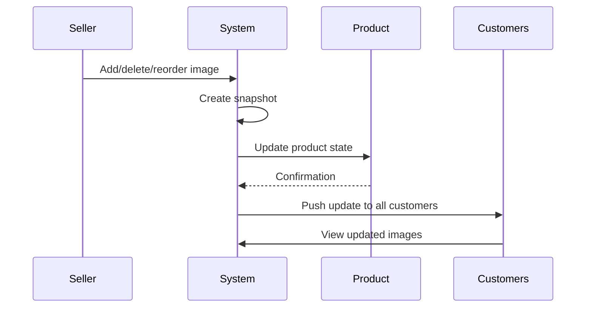

## Wishlist Error Scenarios

Customers cannot add products that have been deleted by sellers. Deleted products are automatically removed from all customer wishlists. Wishlists are paginated to prevent performance issues with large collections. Duplicate product additions to wishlists are prevented automatically. Wishlist removals are immediate and cannot be undone. Customers cannot wishlist variants; only products are saved. Products out of stock can still be added to wishlists. Wishlist pagination prevents showing all products at once. If a product is unavailable, wishlisting still succeeds for future availability.

### Deleted Product Auto-Removal

WHEN a seller deletes a product that exists in a customer's wishlist, THE system SHALL automatically remove that product from all customer wishlists.

WHEN a customer views their wishlist, THE system SHALL exclude any products that have been deleted by sellers.

IF a product is deleted, THE system SHALL permanently remove it from all wishlists without notification to customers.

IF a deleted product appears in a customer's wishlist due to caching, THE system SHALL remove it upon the next wishlist refresh.

### Duplicate Product Prevention

WHEN a customer attempts to add a product to their wishlist that is already present, THE system SHALL prevent the duplicate addition.

IF a product already exists in a customer's wishlist, THE system SHALL reject the duplicate addition request.

IF a customer tries to add the same product multiple times, THE system SHALL keep only one wishlist entry per product.

THE system SHALL not create duplicate wishlist entries for the same product and customer combination.

WHEN displaying the wishlist, THE system SHALL show each product only once, regardless of how many times it was attempted to be added.

### Wishlist Pagination Limits

WHEN a customer views their wishlist, THE system SHALL paginate the results to display products in pages.

IF a customer's wishlist exceeds the pagination limit, THE system SHALL show only a subset of products per page.

THE system SHALL provide navigation controls (page numbers, next/previous) to allow customers to view all wishlist products.

WHEN paginating wishlists, THE system SHALL maintain the same product order across all pages.

THE system SHALL not display more than the defined maximum products per page to ensure performance.

### Variant Wishlist Restrictions

WHEN a customer adds a product to their wishlist, THE system SHALL store the product, not a specific variant.

IF a customer selects a specific variant during wishlisting, THE system SHALL save only the product reference.

WHEN displaying wishlisted products, THE system SHALL show all available variants of the product, not just the one viewed.

CUSTOMERS CANNOT wishlist a specific variant independently from the product.

IF all variants of a wishlisted product are deleted, THE product shall be removed from the wishlist (see Deleted Product Auto-Removal).

### Out-of-Stock Product Allowance

WHEN a product is out of stock, THE system SHALL still allow customers to add it to their wishlist.

IF all variants of a product are out of stock, THE system SHALL permit the product to be wishlisted.

WHEN displaying an out-of-stock wishlisted product, THE system SHALL show the out-of-stock status.

IF a wishlisted product's variants become in-stock, THE system SHALL mark the product as available for purchase.

CUSTOMERS CAN wishlist products regardless of their current stock status for future availability.

### Immediate Removal Behavior

WHEN a customer removes a product from their wishlist, THE system SHALL immediately delete the wishlist entry.

IF a customer confirms wishlist removal, THE system SHALL permanently remove the product from the wishlist without confirmation delay.

A wishlist removal CANNOT be undone or recovered once completed.

THE system SHALL provide a confirmation message after successful wishlist removal.

WHEN removing from wishlist, THE system SHALL immediately update the wishlist count and display.

### Product-Only Wishlisting Rule

WHEN wishlisting, THE system SHALL require customers to select a product, not a variant.

IF a customer attempts to wishlist a specific variant from the product detail page, THE system SHALL redirect to add the entire product to the wishlist.

THE wishlist SHALL show products with all their available variants, not variant-specific entries.

WHEN viewing a wishlisted product, THE system SHALL display all variants that can be added to cart separately.

CUSTOMERS MUST understand that wishlisting saves the product for future consideration of any available variant.

### Availability Notification

IF a wishlisted product was previously out of stock but becomes available, THE system SHALL mark it as available for purchase.

WHEN a customer views their wishlist, THE system SHALL indicate which products have become available since last viewed.

IF a wishlisted product was unavailable due to variant stock issues but variants are restocked, THE system SHALL notify the customer upon wishlist view.

THE system SHALL not send automatic external notifications (email, SMS) for availability changes to maintain user control.

WHEN a previously deleted wishlisted product becomes available again through seller relisting, THE system SHALL remove it from wishlist due to product ID change.

## ShoppingCart Error Scenarios

Cart quantity adjustments fail when exceeding available stock levels. Cart updates during concurrent sessions keep the most recent changes. Unavailable variants are marked in the cart but remain until customer removal. Cart quantity reductions that exceed current stock are immediately adjusted. Customers cannot checkout with unavailable items in their cart. Cart removal of variants does not affect wishlist entries. Stock warnings appear when cart quantities approach available inventory. Cart updates while products are deleted trigger removal prompts. Cart total calculations exclude unavailable item quantities.

### Cart Addition - Stock Limit Violations

WHEN a customer adds a variant to the cart, THE system SHALL check if the requested quantity exceeds available stock.

IF the requested quantity exceeds available stock, THE system SHALL reject adding that quantity to the cart.

IF the requested quantity exceeds available stock, THE system SHALL inform the customer of the maximum available quantity.

IF the customer requests a quantity that exceeds available stock, THE system SHALL limit the added quantity to the available stock.

THE system SHALL display an error message when a customer attempts to add more units than available in stock.

IF a variant is completely out of stock, THE system SHALL prevent adding that variant to the cart.

### Cart Updates - Concurrent Session Conflicts

WHEN a customer updates their cart, THE system SHALL process the most recent change if multiple sessions update the same cart.

IF two sessions update the same cart simultaneously, THE system SHALL apply the last received change.

IF a cart update conflicts with an existing session, THE system SHALL keep the most recent modification.

IF a customer attempts to update a cart item while another session modifies the same item, THE system SHALL process based on update timestamp.

THE system SHALL not merge conflicting cart changes from concurrent sessions.

WHEN cart updates conflict, THE system SHALL not display error messages to the customer.

### Cart Display - Unavailable Item Marking

WHEN a customer views their cart, THE system SHALL mark any variant that has become unavailable since the item was added.

IF a variant's stock reaches zero after being added to the cart, THE system SHALL display the item as unavailable.

IF a product is deleted after a variant is added to the cart, THE system SHALL mark that cart item as unavailable.

WHEN a cart item becomes unavailable, THE system SHALL show a warning indicator next to that item.

IF a customer attempts to checkout with unavailable items, THE system SHALL highlight which items are unavailable.

THE system SHALL allow customers to keep unavailable items in the cart until they remove them.

### Checkout - Restriction Blocks

WHEN a customer proceeds to checkout, THE system SHALL verify that all cart items are available.

IF the cart contains unavailable items, THE system SHALL prevent the customer from completing checkout.

IF checkout is blocked due to unavailable items, THE system SHALL inform the customer which items cannot be purchased.

WHEN a cart contains only unavailable items, THE system SHALL show an error message and prevent order submission.

THE system SHALL require the customer to remove or reduce quantities of unavailable items before checkout.

IF a cart item becomes unavailable during checkout, THE system SHALL abort the checkout process and return to the cart view.

### Cart Quantity - Adjustment Rules

WHEN a customer adjusts cart quantity, THE system SHALL update the total price for that line item.

IF the new quantity exceeds available stock, THE system SHALL limit the quantity to the available amount.

IF a customer reduces cart quantity, THE system SHALL update the cart subtotal immediately.

IF a customer sets quantity to zero, THE system SHALL remove that item from the cart.

WHEN cart quantity is increased, THE system SHALL display an updated total price.

IF increasing cart quantity would exceed stock, THE system SHALL display a stock warning and prevent the increase.

THE system SHALL validate all cart quantity changes against current stock levels.

### Cart - Wishlist Independence

WHEN a customer adds a product to their wishlist, THE system SHALL NOT automatically add it to the shopping cart.

IF a customer removes an item from the cart, THE system SHALL NOT affect that product's presence in the wishlist.

IF a customer removes an item from the wishlist, THE system SHALL NOT affect that product's presence in the cart.

WHEN a product is deleted, THE system SHALL keep existing cart items visible but mark them as unavailable.

IF a customer modifies cart quantities, THE system SHALL NOT update the wishlist.

THE system SHALL maintain independent state for shopping cart and wishlist.

### Cart - Stock Warning Triggers

WHEN a customer adds items to the cart, THE system SHALL display a stock warning if the requested quantity approaches available stock.

IF the cart quantity equals the available stock, THE system SHALL display a low stock warning.

WHEN a variant's stock becomes critically low (one or two units), THE system SHALL alert the customer.

IF a customer increases quantity and stock drops to zero during the session, THE system SHALL update the warning immediately.

THE system SHALL show stock warnings as informational messages that do not block cart actions.

IF stock warnings are shown, THE system SHALL indicate the current available quantity.

### Cart Items - Deleted Product Removal

WHEN a product is deleted by a seller, THE system SHALL automatically remove that product from all customer carts.

IF a cart contains a deleted product's variant, THE system SHALL display a notification to the customer.

WHEN a cart item becomes unavailable due to product deletion, THE system SHALL offer the customer to remove it.

IF a customer attempts to checkout with a deleted product, THE system SHALL force removal of that item.

THE system SHALL preserve the ability to remove deleted products from the cart with one click.

WHEN a deleted product is removed from the cart, THE system SHALL update the cart total immediately.

## CartItem Error Scenarios

Adding identical variants combines quantities rather than creating duplicate items. Cart item quantity cannot be zero or negative. Quantity changes that exceed stock are blocked with available amount displayed. Cart items cannot be added for products without active variants. Removing cart items does not trigger refund processing. Cart item removal from deleted products prompts customer confirmation. Quantity increases during checkout trigger availability warnings. Cart item price reflects current variant pricing at time of addition. Stock-based quantity restrictions apply per variant, not per product.

### Duplicate Variant Combination

WHEN a customer attempts to add a variant to their cart, THE system SHALL check if that same variant already exists in the cart.

IF the same variant already exists in the cart, THE system SHALL combine the quantities rather than creating a duplicate cart item.

IF a customer adds the same variant again with a different quantity, THE system SHALL add the new quantity to the existing quantity.

THE system SHALL display the total combined quantity for that variant in the cart.

WHEN quantities are combined, THE system SHALL NOT create multiple cart item entries for the same variant.

WHEN duplicate variants are combined, THE system SHALL NOT update the price per unit.

THE system SHALL show a single line item with the combined quantity and subtotal.

IF a customer removes all quantity from a cart item, THE system SHALL delete that cart item.

THE system SHALL preserve the variant's option values and SKU code when combining quantities.

### Zero Quantity Blocks

THE system SHALL block cart item creation when quantity is zero.

WHEN a customer attempts to set cart item quantity to zero, THE system SHALL reject the request.

WHEN a customer attempts to remove all quantity from a cart item through quantity adjustment, THE system SHALL delete the cart item instead of setting quantity to zero.

THE system SHALL NOT allow cart items with negative quantities.

WHEN a customer attempts to decrease cart item quantity below zero, THE system SHALL reject the request and maintain minimum quantity of one.

WHEN a customer attempts to set quantity to an empty value, THE system SHALL reject the request.

IF a customer removes a cart item entirely, THE system SHALL NOT create a cart item with quantity zero as an intermediate state.

THE system SHALL display an error message when zero quantity is requested.

THE system SHALL prevent zero quantity cart items from being added to checkout.

WHEN cart item quantity cannot be zero, THE system SHALL show the minimum allowed quantity.

### Stock-Based Quantity Limits

WHEN a customer adds a variant to their cart, THE system SHALL check the current stock quantity of that variant.

IF the requested cart quantity exceeds available stock, THE system SHALL reject the request.

WHEN a customer increases cart item quantity, THE system SHALL compare the new total quantity against available stock.

IF the total quantity exceeds available stock, THE system SHALL reject the quantity increase.

THE system SHALL display the maximum available quantity when rejecting excessive requests.

THE system SHALL show the current available stock quantity on the product detail page.

WHEN a customer views their cart, THE system SHALL show the available stock for each item.

IF a customer attempts to checkout with quantity exceeding stock, THE system SHALL reject the checkout.

THE system SHALL update available stock in real-time to reflect other customer cart additions.

WHEN stock decreases, THE system SHALL immediately update available quantity indicators in the cart.

THE system SHALL enforce stock limits per variant, not per product.

### Variant Availability Checks

WHEN a customer attempts to add a product variant to their cart, THE system SHALL verify the variant is active.

IF the variant is marked as inactive, THE system SHALL reject the addition to cart.

WHEN a product has no active variants, THE system SHALL prevent the product from being added to cart.

THE system SHALL display products without active variants as unavailable in search results.

IF all variants of a product become inactive, THE system SHALL show the product as unavailable.

WHEN a customer views a product detail page, THE system SHALL show only available variants for cart addition.

THE system SHALL mark unavailable variants with an out-of-stock indicator.

WHEN a customer attempts to checkout with unavailable variants, THE system SHALL block the checkout.

THE system SHALL notify customers which variants are unavailable before checkout.

IF a variant becomes inactive during the cart session, THE system SHALL mark the cart item as unavailable.

### Price at Time of Addition

WHEN a variant is added to the cart, THE system SHALL record the current price of that variant.

THE system SHALL display the recorded price in the cart, regardless of subsequent price changes.

IF the variant price is changed by the seller after the item is added to cart, THE system SHALL maintain the original price.

THE system SHALL update the subtotal based on the recorded price at time of addition.

WHEN a customer views their cart, THE system SHALL show the price per unit and subtotal based on the recorded price.

THE system SHALL NOT update cart item prices when the variant price changes.

IF the variant price changes while in cart, THE system SHALL show the price difference to the customer.

THE system SHALL use the recorded price for total price calculation at checkout.

WHEN a cart item is removed, THE system SHALL NOT affect the recorded price for other items.

IF a price override is set on a variant, THE system SHALL use the override price when adding to cart.

### Quantity Increase Warnings

WHEN a customer attempts to increase cart item quantity and the new quantity exceeds available stock, THE system SHALL display a warning message.

THE system SHALL show the maximum available quantity in the warning message.

IF the quantity increase would exceed stock, THE system SHALL prevent the increase.

WHEN a customer views their cart, THE system SHALL display a warning icon if quantity is close to stock limit.

THE system SHALL provide an option to reduce quantity if stock is insufficient.

WHEN a customer proceeds to checkout with quantities near stock limits, THE system SHALL re-validate availability.

IF stock decreases during checkout, THE system SHALL display availability warnings.

THE system SHALL show which items have quantity warnings during checkout review.

WHEN a customer increases quantity during checkout, THE system SHALL validate against current stock immediately.

THE system SHALL prevent checkout completion until all quantity warnings are resolved.

### Product Variant Dependency

WHEN a customer adds an item to their cart, THE system SHALL require selection of a specific variant, not just the product.

THE system SHALL NOT allow adding products without specifying which variant.

WHEN a customer views a product detail page, THE system SHALL display all available variants for selection.

THE system SHALL show variant option values (e.g., color, size) when adding to cart.

IF a customer attempts to add a product without selecting a variant, THE system SHALL reject the request.

THE system SHALL record which variant's SKU code was added to the cart.

WHEN a product has only one active variant, THE system SHALL pre-select that variant for cart addition.

THE system SHALL display variant-specific information in the cart (option values, SKU).

IF a product has no variants, THE system SHALL prevent it from appearing as purchasable.

WHEN a variant becomes unavailable, THE system SHALL prevent that variant from being added to cart.

### Checkout Availability Triggers

WHEN a customer proceeds to checkout, THE system SHALL verify all cart items are available.

IF any cart item is unavailable, THE system SHALL block the checkout process.

THE system SHALL display a list of unavailable items before checkout can proceed.

WHEN a customer reviews their order summary, THE system SHALL show availability status for each item.

IF a variant's stock becomes zero during checkout, THE system SHALL mark that item as unavailable.

THE system SHALL require customers to remove unavailable items before completing checkout.

WHEN a customer removes an unavailable item, THE system SHALL recalculate the order total.

IF all items become unavailable during checkout, THE system SHALL display an error and prevent order creation.

THE system SHALL show alternative available variants when an item becomes unavailable.

WHEN checkout is blocked due to availability issues, THE system SHALL suggest reducing quantities or removing items.

### Cart Item Removal and Refund Separation

WHEN a customer removes an item from their cart, THE system SHALL NOT trigger any refund processing.

THE system SHALL only remove the item from the cart without affecting any financial records.

WHEN a cart item is removed before order placement, THE system SHALL NOT create any refund transaction.

THE system SHALL not display refund-related information when removing cart items.

IF a customer removes a cart item, THE system SHALL update the cart subtotal immediately.

THE system SHALL preserve the product and variant information for potential future cart additions.

WHEN a cart item is removed, THE system SHALL NOT notify any seller or create audit records beyond cart activity.

THE system SHALL allow customers to remove items at any time before checkout.

WHEN a cart item is removed, THE system SHALL NOT restore any inventory since no order was placed.

THE system SHALL display confirmation when a cart item is removed.

## Order Error Scenarios

Order creation fails if payment processing fails before finalization. Customers cannot checkout with unavailable items in their cart. Order numbers are automatically generated and cannot be manually assigned. Order total cannot be negative or zero at creation. Orders with all items cancelled automatically transition to cancelled status. Partial order completion is supported for items from different sellers. Order status updates automatically when all items reach delivery status. Payment failures prevent order creation and retain cart contents. Customers cannot change shipping addresses after order placement. Order creation snapshots preserve product and seller information.

### Payment Failure Handling

WHEN a customer initiates payment during checkout, THE system SHALL validate the payment method before creating an order.

IF payment processing fails before finalization, THE system SHALL prevent order creation and retain the customer's shopping cart contents.

IF payment processing succeeds, THE system SHALL create the order record and decrease stock quantities for each purchased variant.

THE system SHALL display a clear error message to the customer when payment fails, including instructions to retry payment or correct payment information.

IF payment fails, THE system SHALL NOT create any order records, snapshots, or inventory records.

THE system SHALL allow customers to retry payment without requiring them to re-add items to their cart.

IF payment processing encounters a timeout, THE system SHALL treat this as a failure and prevent order creation.

THE system SHALL ensure that no partial order is created when payment fails.

WHEN payment is retried, THE system SHALL validate current stock availability before processing.

IF payment succeeds on retry, THE system SHALL create the order with all previously selected items.

THE system SHALL prevent duplicate order creation if payment is processed multiple times for the same attempt.

### Unavailable Checkout Blocking

WHEN a customer attempts to proceed to checkout, THE system SHALL verify that all items in the shopping cart are available for purchase.

IF any cart item is out of stock, THE system SHALL mark that item as unavailable and prevent checkout completion.

IF any cart item has been deleted by the seller, THE system SHALL mark that item as unavailable and prevent checkout completion.

THE system SHALL display a warning to the customer indicating which items are unavailable before checkout.

THE system SHALL allow the customer to remove unavailable items and continue checkout with remaining valid items.

IF a customer removes unavailable items, THE system SHALL recalculate the cart total before allowing checkout.

WHEN a customer adds items to cart, THE system SHALL validate current stock availability.

IF stock is less than the requested quantity, THE system SHALL show a warning but allow the item to remain in cart with a limit indication.

IF a variant becomes unavailable after cart addition but before checkout, THE system SHALL automatically mark it as unavailable in the cart.

THE system SHALL prevent checkout if any required item has an unavailable status.

THE system SHALL require customers to resolve unavailability issues before completing checkout.

### Automatic Status Transitions

WHEN all order items reach delivered status, THE system SHALL automatically transition the overall order status to delivered.

WHEN all order items are cancelled, THE system SHALL automatically transition the overall order status to cancelled.

WHEN all order items are refunded, THE system SHALL automatically transition the overall order status to refunded.

IF any item status changes to shipped and no items are yet delivered, THE system SHALL transition the overall order status to shipped.

IF order items are in mixed states (e.g., some delivered, some pending, some cancelled), THE system SHALL set the overall order status to partially completed.

WHEN a customer confirms delivery for a shipment, THE system SHALL automatically transition all items in that shipment to delivered status.

IF a customer does not confirm delivery within 14 days of shipping, THE system SHALL automatically transition all items in that shipment to delivered status.

THE system SHALL NOT allow manual status changes that contradict the automatic transition rules.

WHEN an order item status changes, THE system SHALL recalculate the overall order status based on all item statuses.

THE system SHALL ensure order status transitions are consistent and cannot result in invalid states.

WHEN all items in an order are cancelled during shipping processing, THE system SHALL still maintain the shipping records for audit purposes.

### Partial Order Completion

WHEN an order contains items from multiple sellers, THE system SHALL allow each seller to manage their items independently.

IF some items in an order are delivered while others are still pending, THE system SHALL set the order status to partially completed.

THE system SHALL allow customers to view and manage each seller's shipments separately within an order.

IF one item in an order is cancelled after other items are shipped, THE system SHALL allow the cancelled item to be cancelled while other items continue processing.

IF one item in an order is refunded after other items are delivered, THE system SHALL allow the refund while maintaining delivery status for other items.

THE system SHALL track order completion status based on the proportion of items completed (not just overall status).

WHEN items from different sellers are shipped, THE system SHALL create separate shipments for each seller even within the same order.

THE system SHALL allow customers to confirm delivery for partial shipments without affecting other seller items.

IF an order has partially completed status, THE system SHALL continue processing until all items reach a final state (delivered, cancelled, or refunded).

THE system SHALL ensure that partial completion states are clearly visible to customers in their order history.

### Shipping Address Locks

WHEN an order is successfully created, THE system SHALL lock the shipping address and prevent any further changes.

IF a customer attempts to change the shipping address after order creation, THE system SHALL reject the request and display an error.

THE system SHALL preserve the original shipping address in the order record permanently.

IF a customer needs a different shipping address for an order item, THE system SHALL require a new separate order to be placed.

WHEN an order is cancelled or refunded, THE system SHALL NOT unlock the original shipping address for modification.

THE system SHALL show the original shipping address on all order-related documents and communications.

IF an order has multiple shipments to the same address, THE system SHALL use the locked address for all shipments.

IF an order has multiple shipments to different addresses (e.g., partial shipment scenarios), THE system SHALL preserve each original shipping address used.

THE system SHALL prevent customers from editing shipping addresses for orders in any status except cancelled before payment.

WHEN viewing order details, THE system SHALL display the locked shipping address clearly to the customer.

### Order Total Validation

WHEN an order is created, THE system SHALL validate that the order total is greater than zero.

IF the calculated order total is zero or negative, THE system SHALL reject the order creation.

THE system SHALL recalculate the order total at each step of checkout to ensure accuracy.

IF item prices change between cart and checkout, THE system SHALL use the current prices for order total calculation.

THE system SHALL display the total price clearly to customers before order placement.

IF a promotional discount or coupon reduces the order total to zero, THE system SHALL allow order creation with zero total.

THE system SHALL validate that order total remains consistent throughout the payment process.

WHEN an item is removed from cart before checkout, THE system SHALL recalculate and display the updated order total.

IF a variant with zero stock is somehow included in the cart, THE system SHALL exclude it from the order total calculation.

THE system SHALL ensure that order total validation occurs before payment processing begins.

### Snapshot Preservation Timing

WHEN an order is successfully created, THE system SHALL create snapshots of each purchased product and variant at the time of purchase.

THE system SHALL preserve product name, description, category, and all variant options in the order item snapshot.

THE system SHALL preserve the product and variant price as it existed at the time of purchase.

WHEN an order is created, THE system SHALL create a snapshot of each seller's profile including shop name and logo.

IF a product is deleted or modified after order creation, THE system SHALL preserve the snapshot for reference.

THE system SHALL make snapshots immutable and prevent any modifications after creation.

WHEN a customer or administrator views order details, THE system SHALL display the snapshot values, not current product values.

THE system SHALL retain snapshots permanently even after the original product, variant, or seller profile is deleted.

IF an order item snapshot is required for dispute resolution, THE system SHALL allow administrators to access it.

THE system SHALL create snapshots at the moment of order finalization, before any status changes occur.

WHEN a product snapshot is created, THE system SHALL include the base price, any price overrides, and all option values.

### Cart Retention on Failure

WHEN payment processing fails during checkout, THE system SHALL retain all cart items without removing them.

IF order creation fails for any reason, THE system SHALL NOT modify cart contents.

THE system SHALL preserve the exact quantity and selection state of each cart item when failure occurs.

IF a customer returns to their cart after a failed order attempt, THE system SHALL display all previously added items.

THE system SHALL maintain the original prices shown in cart even if item prices have changed on the platform.

WHEN a customer retries order placement after failure, THE system SHALL use the existing cart contents without requiring re-addition.

IF a product in cart becomes unavailable after payment failure, THE system SHALL mark it as unavailable but not remove it.

THE system SHALL clear the cart only when customer explicitly removes items or completes a successful order.

WHEN displaying cart after failed order, THE system SHALL indicate the items remain for retry or removal.

THE system SHALL preserve cart session data for a reasonable period to allow customer return for retry.

## OrderItem Error Scenarios

Order items cannot be cancelled after shipment has begun. Cancelled items restore stock quantities automatically through inventory records. Refunded items also restore stock through negative inventory reversal. Order item status changes are tracked with timestamps for dispute resolution. Individual item cancellation does not affect other items in the same order. Item deletion requires all orders to be fully processed. Partial refunds for items are supported with remaining balance tracking. Item status changes trigger notifications to relevant parties. Seller responses to cancellation and refund requests are logged with snapshots. Order item cancellation before shipping creates immediate inventory updates.

### Cancellation Before Shipment

WHEN a customer requests cancellation for an order item with status "paid", THE system SHALL accept the request.

WHEN a customer requests cancellation for an order item with status "shipped", "delivered", "cancelled", or "refunded", THE system SHALL reject the request.

WHEN an order item status changes to "shipped", THE system SHALL block any cancellation requests for that item.

IF the shipment has been created for an order item, THEN THE system SHALL prevent cancellation of that item.

THE system SHALL allow cancellation only for order items in "paid" status (payment completed but not yet shipped).

IF the order item status is not "paid", THE system SHALL reject the cancellation request with an appropriate error message.

### Automatic Stock Restoration

WHEN a cancellation request is approved, THE system SHALL automatically restore the stock quantity for that item's variant.

WHEN a refund request is approved, THE system SHALL automatically restore the stock quantity for that item's variant.

THE system SHALL create an inventory record with a positive quantity change when a cancellation or refund is approved.

IF a variant is marked as "out of stock" due to orders/adjustments, THE system SHALL update the stock when a cancellation or refund restores inventory.

THE stock restoration SHALL occur immediately upon approval of cancellation or refund, before any other order processing.

IF the variant stock quantity becomes greater than zero after restoration, THE system SHALL make the variant available for purchase again.

### Status Change Tracking

WHEN an order item status changes, THE system SHALL record the timestamp of the status change.

WHEN an order item status changes, THE system SHALL store the reason for the status change.

THE system SHALL track all status transitions: paid → shipped, shipped → delivered, paid → cancelled, delivered → refunded.

WHEN a dispute arises about an order item's status, THE system SHALL provide the complete status change history.

THE status change tracking SHALL be immutable and preserved even after order item deletion.

IF multiple status changes occur, THE system SHALL maintain the chronological order of all transitions.

### Independent Item Cancellation

WHEN a customer requests cancellation for one order item in an order, THE system SHALL process that cancellation independently.

IF an order contains multiple items and one item is cancelled, THE system SHALL continue processing the remaining items.

THE cancellation of one order item SHALL NOT affect the status of other order items in the same order.

IF all items in an order are cancelled, THEN THE system SHALL update the order status to "cancelled".

IF some items are cancelled and others remain active, THEN THE system SHALL update the order status to "partially completed".

THE system SHALL preserve the order integrity while allowing individual item cancellations.

### Partial Refund Support

WHEN a customer requests a refund for one order item with status "delivered", THE system SHALL accept the request for that specific item.

WHEN a refund request is approved for one item, THE system SHALL process the refund only for that item.

THE refund amount SHALL be calculated based on the item's unit price and quantity at the time of purchase.

IF an order has multiple delivered items, THE system SHALL allow separate refund requests for each item.

THE refund of one item SHALL NOT trigger a refund for other items in the same order.

IF all items in an order are refunded, THEN THE system SHALL update the order status to "refunded".

### Inventory Update Timing

WHEN a cancellation request is approved, THE system SHALL create the inventory record immediately.

WHEN a refund request is approved, THE system SHALL create the inventory record immediately.

THE inventory update SHALL occur before any notification is sent to the customer or seller.

IF the inventory update fails, THE system SHALL abort the cancellation or refund approval and notify the administrator.

WHEN an order is cancelled, THE system SHALL update inventory BEFORE the order status changes to "cancelled".

THE inventory quantity change SHALL be recorded with a timestamp matching the approval time.

### Response Snapshot Logging

WHEN a seller approves or rejects a cancellation request, THE system SHALL create a snapshot of the request state.

WHEN a seller approves or rejects a refund request, THE system SHALL create a snapshot of the request state.

THE snapshot SHALL record: the seller's response (approved/rejected), the timestamp of the response, and the request's previous state.

THE snapshot SHALL be immutable and cannot be deleted after creation.

BOTH the requester and the responding seller SHALL be able to view the snapshot.

ADMINISTRATORS SHALL be able to view all response snapshots for dispute resolution.

### Cross-Item Independence

WHEN one order item's status changes, THE system SHALL NOT automatically change the status of other items in the same order.

IF an order contains items from multiple sellers, THE system SHALL track each seller's items independently.

SHIPPING of one item SHALL NOT affect the ability to cancel or refund other items in the same order.

A DELIVERY confirmation for one shipment SHALL NOT trigger delivery confirmation for other shipments in the same order.

REFUND approval for one item SHALL NOT trigger cancellation or refund for other items.

THE system SHALL maintain independent status tracking for each order item within an order.

## Shipment Error Scenarios

Shipment creation requires tracking information before items can be marked shipped. Different sellers always create separate shipments for their items. Tracking number conflicts are prevented by platform validation. Shipment updates are locked after customer delivery confirmation. Customer delivery confirmation auto-sets items to delivered after 14 days. Multiple items can be bundled into one shipment by the seller. Shipment cancellation before delivery requires seller-initiated action. Tracking information changes are visible to customers immediately. Shipment items cannot be moved between shipments once created. Delivery confirmation timing triggers automatic status updates.

### Tracking Information Validation

WHEN a seller creates a shipment, THE system SHALL:
1. Require a carrier name
2. Require a tracking number
3. Validate the tracking number format

IF the carrier name is missing, THE system SHALL reject the shipment creation.
IF the tracking number is missing, THE system SHALL reject the shipment creation.
IF the tracking number format is invalid, THE system SHALL reject the shipment creation.

WHEN a seller provides tracking information, THE system SHALL validate the carrier against supported carriers.

IF the carrier is not supported, THE system SHALL reject the shipment creation and display an error.

THE system SHALL allow empty tracking number for future tracking updates, but shipping status cannot be set until tracking is provided.

### Cross-Seller Shipment Separation

WHEN a seller creates a shipment, THE system SHALL only include order items from that seller.

IF a seller attempts to include order items from another seller, THE system SHALL reject the shipment creation.

THE system SHALL prevent any shipment from containing items from multiple sellers.

WHEN viewing available items for shipment, THE system SHALL only show items belonging to the viewing seller.

THE system SHALL enforce this separation at both the UI and business logic levels.

### Tracking Number Conflicts

WHEN a seller creates a shipment with tracking information, THE system SHALL validate uniqueness of the tracking number.

IF the tracking number has already been used for another shipment, THE system SHALL reject the shipment creation.

IF the tracking number format appears to be a duplicate of an existing tracking number, THE system SHALL warn the seller before confirmation.

THE system SHALL allow the same carrier name with different tracking numbers across multiple shipments.

WHEN a tracking number conflict is detected, THE system SHALL display the conflicting shipment details to help identify the issue.

### Delivery Confirmation Locks

WHEN a customer confirms delivery for a shipment, THE system SHALL lock the shipment from further updates.

AFTER delivery confirmation, THE system SHALL prevent any tracking information changes.

AFTER delivery confirmation, THE system SHALL prevent any item status changes for items in that shipment.

AFTER delivery confirmation, THE system SHALL prevent shipment deletion.

IF a customer attempts to change delivery confirmation, THE system SHALL reject the change and display a message that delivery is final.

THE system SHALL preserve the delivery confirmation timestamp for audit purposes.

### 14-Day Auto-Delivery

WHEN a shipment status is "shipped" and the customer has not confirmed delivery, THE system SHALL track the number of days elapsed.

IF 14 days have elapsed since the shipment was marked as shipped without customer confirmation, THE system SHALL automatically mark all items in that shipment as delivered.

WHEN auto-delivery occurs, THE system SHALL notify the customer that their order has been marked as delivered.

IF the customer attempts to confirm delivery after auto-delivery, THE system SHALL display a message that delivery is already confirmed.

THE system SHALL calculate the 14-day period based on the shipping confirmation date.

THE system SHALL allow sellers to override auto-delivery only before the 14-day period expires.

### Shipment Bundling Rules

WHEN a seller creates a shipment, THE system SHALL allow multiple order items from the same seller to be bundled into one shipment.

WHEN a seller bundles multiple items into a shipment, ALL items in the shipment SHALL share the same tracking information.

WHEN a seller bundles multiple items, THE system SHALL allow the seller to choose which items to include.

THE system SHALL allow sellers to ship items individually or bundle multiple items as they choose.

IF a seller attempts to change which items are included in a shipment AFTER shipment creation, THE system SHALL reject the change.

WHEN bundling items, THE system SHALL preserve the ability to track each individual item within the shipment.

### Shipment Movement Restrictions

AFTER a shipment is created, THE system SHALL prevent moving items between shipments.

IF a seller attempts to move an item from one shipment to another, THE system SHALL reject the action.

IF a seller attempts to remove an item from a shipment after creation, THE system SHALL reject the action.

IF a seller attempts to add an item to an existing shipment after creation, THE system SHALL reject the action.

THE system SHALL require the seller to cancel the existing shipment and create a new one if item reorganization is needed (only allowed before shipment confirmation).

WHEN shipment creation is confirmed, THE system SHALL lock the item-to-shipment mapping.

### Immediate Visibility Updates

WHEN a shipment is created with tracking information, THE system SHALL immediately update the tracking visibility for the customer.

AFTER shipment creation, THE system SHALL make tracking information immediately visible on the order detail page.

WHEN a seller updates tracking information for an existing shipment, THE system SHALL immediately reflect the changes to the customer.

WHEN a shipment status changes, THE system SHALL immediately update the order status display.

THE system SHALL provide real-time notifications to customers when tracking information becomes available.

IF tracking information is updated, THE system SHALL preserve the update timestamp for audit purposes.

### Shipment Creation Error Scenarios

IF a seller attempts to create a shipment for an order item with status "delivered", THE system SHALL reject the shipment creation.

IF a seller attempts to create a shipment for an order item with status "cancelled", THE system SHALL reject the shipment creation.

IF a seller attempts to create a shipment for an order item with status "refunded", THE system SHALL reject the shipment creation.

IF a seller attempts to create a shipment for an order item that was never paid for, THE system SHALL reject the shipment creation.

THE system SHALL only allow shipment creation for order items with status "paid".

IF an order item has multiple shipments, THE system SHALL prevent creating an additional shipment for the same item.

## CancellationRequest Error Scenarios

Cancellation requests are only allowed for paid items not yet shipped. Requested cancellations fail if items have already been shipped. Cancellation reasons are required text fields for all requests. Sellers cannot approve cancellations after items are shipped. Cancellation approval creates a snapshot of the request state. Cancelled items restore stock quantities automatically. Rejected cancellation requests remain visible with seller's response reason. Cancellation requests can be resubmitted after seller rejection. All items in an order can be cancelled individually. Partial cancellations do not affect remaining order items.

### Cancellation Eligibility by Item Status

WHEN a customer requests cancellation for an order item, THE system SHALL validate that the item status is "paid" (not yet shipped).

IF the order item status is "shipped", "delivered", "cancelled", or "refunded", THE system SHALL reject the cancellation request.

IF the order item status is not in the "paid" state, THE system SHALL display the current status and explain that cancellation is only available for unpaid items.

WHEN a customer attempts to cancel an order item, THE system SHALL verify the item has not been grouped into a shipment.

IF an order item is already part of a shipment, THE system SHALL prevent cancellation and inform the customer that the item is in transit.

THE system SHALL reject cancellation requests for order items with status "shipped" regardless of payment confirmation.

IF multiple items in the same order are in mixed statuses, THE system SHALL allow cancellation only for items with "paid" status.

WHEN processing a cancellation request, THE system SHALL confirm the item has not moved to "shipped" status since the request was initiated.

### Payment-to-Shipment Window

Cancellations are only permitted during the window between successful payment and shipment creation.

WHEN a cancellation request is submitted, THE system SHALL verify the current time falls within the payment-to-shipment window.

IF more than 14 days have passed since order payment without shipment, THE system SHALL display a warning that the item may have been automatically shipped.

THE system SHALL reject cancellation requests if the order item has already been assigned to a shipment record.

WHEN a shipment is created for an order item, THE system SHALL immediately invalidate any pending cancellation requests for that item.

IF the customer submits a cancellation request while the seller is preparing the shipment, THE system SHALL queue the request and check shipment status upon seller response.

THE system SHALL display a countdown timer showing hours remaining for cancellation before automatic shipment processing.

IF a cancellation request is submitted after shipment confirmation, THE system SHALL redirect the customer to the refund request workflow instead.

### Required Cancellation Reason

WHEN a customer creates a cancellation request, THE system SHALL require a reason text field with a minimum of 10 characters.

IF the cancellation reason is empty or contains only whitespace, THE system SHALL reject the request and prompt for a valid reason.

IF the cancellation reason exceeds 500 characters, THE system SHALL truncate to 500 characters and display a warning to the customer.

WHEN submitting a cancellation request, THE system SHALL validate that the reason does not contain prohibited content (profanity, personal information, URLs).

IF the cancellation reason fails content validation, THE system SHALL display specific guidance on acceptable reason formats.

THE system SHALL save the cancellation reason permanently with the request and make it visible to both the customer and seller.

WHEN a seller responds to a cancellation request, THE system SHALL display the original reason text in the response interface.

IF a customer edits their cancellation reason before seller response, THE system SHALL create a snapshot of the original reason for dispute resolution.

### Seller Approval Timing

WHEN a cancellation request is submitted, THE system SHALL notify the seller of the pending request immediately.

IF the seller does not respond within 48 hours, THE system SHALL send a reminder notification to the seller.

IF the seller does not respond within 7 days, THE system SHALL automatically approve the cancellation request.

WHEN a seller responds to a cancellation request (approve or reject), THE system SHALL record the response timestamp.

THE system SHALL prevent sellers from approving cancellation requests for order items that have already been shipped.

IF a seller attempts to approve a cancellation after the item has been shipped, THE system SHALL reject the approval and display an error.

WHEN a seller approves a cancellation request, THE system SHALL immediately cancel the order item and create the refund process.

IF the order item status changes to "shipped" after seller approval but before processing, THE system SHALL flag the item for manual review by an administrator.

THE system SHALL display pending approval time limits to sellers on their dashboard for all pending cancellation requests.

### Snapshot Creation on Seller Response

WHEN a seller responds to a cancellation request (approve or reject), THE system SHALL create a snapshot of the request state.

THE snapshot SHALL record: request ID, customer name, order item ID, original reason, seller response, response timestamp, and seller name.

IF a cancellation request is approved, THE snapshot SHALL preserve the exact state of the request before the approval action.

IF a cancellation request is rejected, THE snapshot SHALL preserve the seller's rejection reason along with the original customer reason.

THE system SHALL make snapshots visible to both the customer and seller for dispute resolution purposes.

THE system SHALL preserve snapshots even after the cancellation request is completed or the order is deleted.

WHEN an administrator reviews a disputed cancellation, THE system SHALL display all snapshots created during the request lifecycle.

THE system SHALL NOT allow modification or deletion of cancellation request snapshots under any circumstances.

IF a seller resubmits a new cancellation request after rejection, THE system SHALL create a separate snapshot for the new request.

### Automatic Stock Restoration

WHEN a cancellation request is approved and processed, THE system SHALL automatically restore the cancelled item's stock quantity.

THE system SHALL create an inventory record with positive quantity change to restore stock levels.

THE inventory record SHALL record: quantity restored, reason "cancellation approval", timestamp, and variant ID.

WHEN stock is restored, THE system SHALL update the variant's current stock quantity to reflect the cancellation.

IF a variant reaches maximum stock limit after restoration, THE system SHALL display the updated stock level to customers.

THE system SHALL restore stock even if the original product has been deleted or discontinued.

WHEN multiple items from the same variant are cancelled, THE system SHALL restore the combined stock quantity.

IF stock restoration fails due to system error, THE system SHALL notify an administrator to manually adjust inventory.

THE system SHALL NOT allow negative stock quantities after cancellation restoration.

### Rejection Reason and Resubmission

WHEN a seller rejects a cancellation request, THE system SHALL require a rejection reason with a minimum of 20 characters.

IF the rejection reason is empty or insufficient, THE system SHALL reject the seller's response and prompt for a valid reason.

THE system SHALL display the seller's rejection reason to the customer in the order detail page.

WHEN a cancellation request is rejected, THE system SHALL allow the customer to resubmit a new cancellation request for the same item.

IF a customer resubmits after rejection, THE system SHALL create a new cancellation request record with a new request ID.

THE system SHALL prevent resubmission if the item status is no longer "paid" at the time of resubmission attempt.

WHEN a customer resubmits a cancellation request, THE system SHALL display the previous rejection reason and suggest addressing it.

THE system SHALL track the number of cancellation request submissions per order item and alert administrators after 5 submissions.

IF a cancellation request is resubmitted within 24 hours of rejection, THE system SHALL escalate the request for seller priority review.

THE system SHALL preserve all rejection reasons in the order history for future reference and dispute resolution.

### Edge Cases and Special Scenarios

IF a customer deletes their account after submitting a cancellation request, THE system SHALL preserve the cancellation request and continue the approval process.

IF a seller account is suspended after a cancellation request is submitted, THE system SHALL assign the cancellation request to administrator review.

WHEN a product is deleted by a seller during an active cancellation request, THE system SHALL complete the cancellation using product snapshot data.

IF the order item price changes after cancellation request submission, THE system SHALL use the original price from the product snapshot for refund calculation.

WHEN multiple customers request cancellation for the same order item (e.g., group order), THE system SHALL process only the first valid cancellation request.

IF a cancellation request is submitted for an order that has already been refunded, THE system SHALL reject the request and explain that the order is in refunded status.

WHEN a shipment tracking number is updated after cancellation request approval, THE system SHALL cancel the shipment and create a return shipment workflow.

IF the system detects fraudulent cancellation patterns, THE system SHALL temporarily block the customer's ability to submit cancellation requests pending review.

THE system SHALL provide cancellation status updates to customers via email notifications at each workflow stage.

## RefundRequest Error Scenarios

Refund requests are only allowed within 7 days of item delivery. Items not delivered cannot have refund requests submitted. Refund reasons are required text fields for all requests. Request timing beyond 7 days is automatically rejected. Sellers can approve or reject refunds with detailed responses. Approved refunds restore stock quantities through inventory records. Refund request snapshots are created when seller responds. Rejected requests can be resubmitted with new reasons. Individual item refunds do not affect order status. Refund approval timing is tracked for dispute resolution.

### Refund Request Creation Window

WHEN a customer requests a refund for an order item, THE system SHALL reject the request if more than 7 days have passed since the item's status changed to "delivered".

WHEN a customer requests a refund for an order item, THE system SHALL check that the item's current status is "delivered".

IF the item status is not "delivered" (e.g., "paid", "shipped", "cancelled"), THE system SHALL reject the refund request.

IF the 7-day window has expired from the delivery timestamp, THE system SHALL reject the refund request with a clear error message indicating the deadline has passed.

THE system SHALL calculate the 7-day window starting from the moment the shipment containing the item was marked as delivered (either by customer confirmation or automatic 14-day expiry).

IF a shipment has multiple items, each item's 7-day refund window is calculated independently based on when THAT specific item's shipment was delivered.

WHEN a refund request is rejected due to timing, THE system SHALL record the rejection reason as "outside refund window" in the request history.

### Required Refund Reason

WHEN a customer submits a refund request, THE system SHALL require the customer to provide a reason as text content.

IF the refund reason is empty or contains only whitespace, THE system SHALL reject the request.

THE system SHALL store the refund reason with the request and make it visible to the seller when reviewing the request.

WHEN a seller approves or rejects a refund request, THE system SHALL record the seller's response alongside the customer's original reason.

THE system SHALL preserve the refund reason immutably even if the customer deletes or edits the request.

IF a customer deletes their own refund request, THE system SHALL preserve the request records including the reason for audit purposes.

### Delivery Requirement Validation

WHEN a customer attempts to create a refund request, THE system SHALL verify that the order item status is "delivered".

IF the order item status is "paid" or "shipped" (not yet delivered), THE system SHALL reject the refund request and explain that delivery confirmation is required.

IF the order item has already been cancelled, THE system SHALL reject the refund request.

IF the order item has already been refunded, THE system SHALL reject the refund request.

THE system SHALL display clear messaging indicating which items are eligible for refunds based on their current status.

WHEN a shipment is confirmed as delivered, THE system SHALL enable refund requests for all items within that shipment.

### Seller Approval Response Timing

WHEN a seller receives a refund request, THE system SHALL notify the seller of the pending request.

THE system SHALL track the creation timestamp of each refund request for dispute resolution purposes.

IF a seller does not respond to a refund request within 30 days, THE system SHALL automatically mark the request as rejected.

WHEN a seller responds to a refund request (either approve or reject), THE system SHALL record the response timestamp.

THE system SHALL allow sellers to view the creation date of refund requests to assess urgency.

THE system SHALL provide sellers with tools to filter refund requests by creation date or response deadline.

### Snapshot Creation on Approval Response

WHEN a seller approves a refund request, THE system SHALL create an immutable snapshot of the request state before processing the refund.

WHEN a seller rejects a refund request, THE system SHALL create an immutable snapshot of the request state before recording the rejection.

THE snapshot SHALL include: the request creation timestamp, the customer's reason, the seller's response (approve/reject), the response timestamp, and the order item details.

THE snapshot SHALL be created immediately when the seller submits their approval or rejection decision.

THE snapshot SHALL be viewable by both the customer and the seller for dispute resolution.

THE snapshot SHALL be preserved even if the order or items are later deleted from the system.

### Automatic Stock Quantity Restoration

WHEN a refund request is approved, THE system SHALL automatically create a positive inventory record for the refunded variant.

THE quantity of the inventory record SHALL equal the quantity of the refunded order item.

WHEN an inventory record is created from an approved refund, THE system SHALL record the reason as "refund approved".

THE system SHALL update the variant's current stock quantity by summing all inventory records after the refund is processed.

IF the refund restores stock, THE system SHALL make the variant available for purchase again (if it was out of stock).

WHEN a refund request is rejected, THE system SHALL NOT create any inventory records or modify stock quantities.

THE system SHALL track all inventory adjustments from refunds for seller reporting and dispute resolution.

### Rejection Resubmission Rights

WHEN a seller rejects a refund request, THE system SHALL allow the customer to submit a new refund request for the same order item.

IF a customer resubmits a refund request, THE system SHALL allow a new reason to be provided.

THE system SHALL link the new refund request to the original rejected request for audit purposes.

WHEN a customer resubmits a refund request within the 7-day window, THE system SHALL allow the submission.

WHEN a customer attempts to resubmit a refund request after the 7-day window has expired, THE system SHALL reject the request.

THE system SHALL maintain a history of all refund request submissions and rejections for the customer and seller to review.

### Individual Item Refund Processing

WHEN a refund request is approved for an order item, THE system SHALL refund ONLY that specific item, not the entire order.

THE system SHALL process refunds on a per-item basis, allowing partial refunds within a single order.

WHEN one item in an order is refunded, THE system SHALL maintain the status of all other items unchanged.

IF all items in an order are refunded, THE system SHALL update the overall order status to "refunded".

IF some items are refunded and others remain active, THE system SHALL mark the order status as "partially completed".

THE system SHALL calculate the refund amount based on the unit price of the order item at the time of purchase (from the snapshot).

THE system SHALL NOT process refunds for items that have been cancelled or were never delivered.

### Refund Request Visibility and Tracking

WHEN a customer creates a refund request, THE system SHALL allow the customer to view the status of their request (pending, approved, rejected).

WHEN a seller receives a refund request, THE system SHALL display the request in a seller dashboard for review.

THE system SHALL show the 7-day window countdown for pending refund requests on the seller dashboard.

THE system SHALL provide filtering for refund requests by status, creation date, and response status.

WHEN a refund request status changes (pending → approved/rejected), THE system SHALL notify both the customer and seller.

THE system SHALL maintain a complete history of refund request status changes for dispute resolution.

## Review Error Scenarios

Reviews can only be written after items reach delivered status. Customers can write one review per product per order. Rating values must be between 1 and 5 stars. Review text content is optional but required ratings cannot be missing. Review editing creates snapshots preserving original content. Review deletion does not remove review count from product average. Deleted reviews show as from deleted user in product listings. Customers cannot review products they have not purchased. Review edits are immediate and visible to other customers. Reviews from cancelled items are not eligible for submission.

### Delivery Requirement Blocking

WHEN a customer attempts to write a review, THE system SHALL verify that the order item status is 'delivered'.

WHEN the order item status is not 'delivered', THE system SHALL prevent the customer from writing a review.

WHEN an order item status changes to 'delivered', THE system SHALL make the customer eligible to write a review for that product.

WHEN a customer attempts to write a review before delivery, THE system SHALL display a message indicating the item must be delivered first.

IF the shipment is still in transit (status 'shipped' but not 'delivered'), THE system SHALL reject the review submission.

IF the customer confirms delivery, THE system SHALL create a 14-day window from the shipping date during which auto-delivery is triggered.

THE system SHALL NOT allow review writing for items with status 'paid', 'shipped', or 'cancelled'.

### One-Review-Per-Product Rule

WHEN a customer writes a review for a product, THE system SHALL check if a review already exists for that product from the same order.

WHEN a customer has already written a review for a product in a given order, THE system SHALL prevent additional review submissions for that product.

THE system SHALL enforce one review limit per product per order, regardless of quantity purchased.

IF a customer purchases the same product multiple times in different orders, THE system SHALL allow a new review for each order.

IF a customer attempts to write multiple reviews for the same product in one order, THE system SHALL reject all but the first review.

THE system SHALL track which products have been reviewed by each customer across all their orders.

IF the customer's existing review has been deleted, THE system SHALL allow the customer to write a new review for that product in the same order.

### Rating Value Constraints

WHEN a customer submits a review, THE system SHALL require a rating value between 1 and 5 stars.

THE system SHALL reject reviews with rating values outside the range of 1 to 5 stars.

WHEN the rating value is less than 1, THE system SHALL display an error message indicating the minimum acceptable rating.

WHEN the rating value exceeds 5, THE system SHALL display an error message indicating the maximum acceptable rating.

IF the rating field is empty or missing, THE system SHALL reject the review submission.

THE system SHALL NOT allow null or undefined values for the rating field.

THE system SHALL validate the rating value before processing the review submission.

WHEN a customer submits an invalid rating, THE system SHALL NOT create a review record.

### Snapshot Editing Timing

WHEN a customer edits their review, THE system SHALL create a snapshot of the review state before applying changes.

THE system SHALL record the exact timestamp when the review edit was made.

THE system SHALL capture the previous rating value in the snapshot.

THE system SHALL capture the previous text content in the snapshot.

WHEN a review is edited, THE system SHALL store both old values and new values in the snapshot record.

THE system SHALL make snapshot records immutable after creation.

WHEN a snapshot is created during edit, THE system SHALL NOT update the original review record until the snapshot is saved.

THE system SHALL preserve the original submission timestamp in the snapshot.

WHEN an administrator or relevant party reviews the snapshot, THE system SHALL display before and after values for dispute resolution.

### Deleted Review Preservation

WHEN a customer deletes their review, THE system SHALL preserve the review data in the database.

THE system SHALL mark deleted reviews as belonging to a 'deleted user' in product listings.

WHEN a deleted review is accessed for display, THE system SHALL show placeholder text indicating the user deleted their review.

THE system SHALL create a snapshot before marking a review as deleted.

THE system SHALL NOT allow deletion of reviews by other users or administrators.

WHEN a deleted review is accessed via snapshot viewing, THE system SHALL display the original content.

THE system SHALL exclude deleted reviews from average rating calculations for the product.

WHEN a deleted review exists, THE system SHALL maintain the total review count excluding deleted reviews.

### Purchase Validation

WHEN a customer attempts to write a review, THE system SHALL verify the customer has purchased the product.

THE system SHALL check that the customer has an order item for the product being reviewed.

WHEN the customer has no order history with the product, THE system SHALL prevent review submission.

THE system SHALL verify the order item status before allowing review creation.

IF the customer's order has been cancelled, THE system SHALL NOT allow review writing.

IF the order item has been refunded, THE system SHALL allow review writing if the item was previously delivered.

THE system SHALL validate that the customer owns the account associated with the purchase.

WHEN a review is submitted, THE system SHALL associate it with the specific order that contained the product.

### Immediate Edit Visibility

WHEN a customer edits their review, THE system SHALL make the updated content immediately visible to all users.

THE system SHALL NOT require approval or moderation for review edits.

WHEN a review is edited, THE system SHALL update the product's average rating immediately.

WHEN a review text is modified, THE system SHALL replace the old content without delay.

THE system SHALL ensure all users viewing the product page see the most recent review version.

WHEN multiple users access the product page simultaneously, THE system SHALL display consistent review content.

THE system SHALL NOT queue or batch review edit updates.

WHEN a review is edited, THE system SHALL invalidate any cached review data to ensure immediate visibility.

### Cancelled Item Exclusion

WHEN a customer attempts to write a review, THE system SHALL check if the order item status is 'cancelled'.

THE system SHALL prevent review submission for items with 'cancelled' status.

WHEN an order item status changes to 'cancelled', THE system SHALL remove any pending review submission for that item.

THE system SHALL NOT allow review writing for items that were cancelled before delivery.

IF an order is partially cancelled (some items cancelled, others delivered), THE system SHALL only allow reviews for delivered items.

WHEN a customer tries to submit a review for a cancelled item, THE system SHALL display a message explaining the item was cancelled.

THE system SHALL verify item eligibility before showing the review form.

WHEN an item is cancelled after payment but before shipping, THE system SHALL block all review-related functionality for that item.

## InventoryRecord Error Scenarios

Inventory adjustments require valid reasons for all changes. Negative stock levels are prevented through validation checks. Order placement automatically creates negative inventory records. Order cancellation creates positive inventory records to restore stock. Inventory history cannot be deleted for audit purposes. Quantity changes are tracked with timestamps and user attribution. Stock calculations include all historical inventory records. Invalid reason fields cause inventory adjustment failures. Stock reaching zero marks variants as out of stock. Inventory adjustments that would create negative balances are rejected.

### Inventory Adjustment Validation

WHEN a seller attempts to adjust inventory, THE system SHALL require a reason field with text content.

WHEN a seller adjusts inventory for a product variant, THE system SHALL record the timestamp of the adjustment.

WHEN a seller provides an empty or invalid reason, THE system SHALL reject the inventory adjustment request.

IF the reason field is missing or empty, THE system SHALL display an error message requiring a valid reason.

IF the reason does not describe the type of adjustment (restocking, order, adjustment, loss), THE system SHALL reject the request.

### Negative Stock Prevention

WHEN a seller attempts to reduce stock quantity, THE system SHALL calculate the projected stock level.

IF the projected stock level would be less than zero, THE system SHALL reject the inventory adjustment.

IF the requested quantity to subtract exceeds available stock, THE system SHALL display an error showing available quantity.

THE system SHALL prevent any inventory adjustment that would result in negative stock balance.

WHEN a customer attempts to add an out-of-stock variant to cart, THE system SHALL reject the request.

### Automatic Order Stock Deduction

WHEN an order is successfully placed and payment is confirmed, THE system SHALL automatically create inventory records.

WHEN an order is placed, THE system SHALL create negative inventory records for each variant purchased.

WHEN a negative inventory record is created, THE system SHALL record the reason as 'order placement' with the order number.

WHEN an inventory record is created by order placement, THE system SHALL record the timestamp at order confirmation.

WHEN order items are cancelled, THE system SHALL automatically create positive inventory records to restore stock.

### Historical Record Preservation

WHEN an inventory record is created, THE system SHALL mark it as immutable.

WHEN any user attempts to delete an inventory record, THE system SHALL reject the request.

WHEN a seller requests to modify historical inventory records, THE system SHALL reject the modification.

THE system SHALL preserve all inventory records for audit and dispute resolution purposes.

IF a variant is deleted, THE system SHALL preserve its inventory history as read-only records.

### Timestamp and Audit Tracking

WHEN an inventory record is created, THE system SHALL record the exact timestamp of the adjustment.

WHEN an inventory adjustment is made, THE system SHALL record which user initiated the change.

WHEN a seller views inventory history, THE system SHALL display all records sorted by timestamp.

WHEN an inventory record is created for order placement, THE system SHALL record the order identifier.

THE system SHALL preserve timestamp accuracy across all inventory history queries.

### Stock Calculation and Accuracy

WHEN the system displays current stock quantity, THE system SHALL calculate it by summing all inventory records.

WHEN a variant's stock is queried, THE system SHALL include all historical inventory records in the calculation.

WHEN new inventory records are added, THE system SHALL recalculate the current stock immediately.

IF the calculated stock shows zero or negative, THE system SHALL mark the variant as out of stock.

THE system SHALL ensure stock calculation accuracy by including all record types (restocking, orders, adjustments, refunds).

### Out-of-Stock Status Triggers

WHEN inventory quantity reaches zero, THE system SHALL automatically mark the variant as out of stock.

WHEN a variant is marked out of stock, THE system SHALL display this status on the product detail page.

WHEN a variant is out of stock, THE system SHALL prevent customers from adding it to cart.

WHEN a variant is out of stock and a customer attempts checkout, THE system SHALL mark the item as unavailable.

WHEN stock is replenished above zero, THE system SHALL automatically mark the variant as in stock.

### Balance Adjustment Rejections

IF an inventory adjustment would create a negative balance, THE system SHALL reject the adjustment.

IF a seller attempts to subtract more quantity than available, THE system SHALL reject the subtraction.

THE system SHALL not allow manual adjustments to result in negative inventory levels.

IF the seller enters a quantity adjustment that would exceed available stock, THE system SHALL display an error.

THE system SHALL validate all adjustments before creating any inventory records.

## AdminRequest Error Scenarios

Any user can submit administrator requests with a reason field. Super administrators can promote regular administrators to super level. Promotion requests cannot be made by the administrator themselves. Super administrators cannot be demoted by other super administrators. Demotion requests require super administrator authorization. Request reasons are required text fields for all submissions. Pending requests are visible to super administrators only. Approved requests take effect immediately without confirmation. Super administrators can reject requests with detailed reasons. Request history is preserved for audit and dispute resolution.

### Required Reason Submission

WHEN a user submits an administrator request, THE system SHALL require a text reason field.

IF the reason field is empty or contains only whitespace, THE system SHALL reject the request.

IF the reason field exceeds 1000 characters, THE system SHALL reject the request.

THE system SHALL validate that the reason field contains meaningful text before submission.

WHEN a request is submitted without a valid reason, THE system SHALL display an error message: "A reason for becoming an administrator is required."

IF a user attempts to modify a pending request, THE system SHALL treat it as a new submission with an updated reason.

WHEN a super administrator approves a request, THE system SHALL store the original reason in the approval snapshot.

WHEN a super administrator rejects a request, THE system SHALL require a rejection reason in the rejection snapshot.

THE system SHALL preserve all submitted reasons in immutable snapshot records for audit purposes.

IF a request is submitted with an invalid reason format, THE system SHALL reject the request and return a validation error.

WHEN a pending request is resubmitted after rejection, THE system SHALL create a new request record with the updated reason.

IF a super administrator views a request history, THE system SHALL display all submitted reasons for each request.

WHEN a request is approved, THE system SHALL create a snapshot containing the original submission reason.

IF a system error occurs during request submission, THE system SHALL rollback any partial data creation.

WHEN a user submits a request while already pending, THE system SHALL reject the duplicate request.

IF a request is cancelled after approval, THE system SHALL display an error: "Approved requests cannot be cancelled."

WHEN a request is rejected, THE system SHALL create a snapshot with the rejection reason provided by the super administrator.

IF the reason field contains prohibited content (profanity, personal attacks), THE system SHALL flag the request for review.

WHEN a user's request is under review, THE system SHALL prevent submission of duplicate requests.

IF a user attempts to submit a request after their account is banned, THE system SHALL reject the request.

WHEN a request is successfully submitted, THE system SHALL display a confirmation message with the reason preview.

IF a request fails validation, THE system SHALL highlight the reason field and display a specific validation error.

WHEN a user edits their profile, THE system SHALL preserve the submitted reason in the request snapshot.

IF a request reason exceeds character limits, THE system SHALL display a character count warning before submission.

WHEN a super administrator views pending requests, THE system SHALL display each request's reason for review.

### Cross-Grade Promotion Rules

WHEN a regular administrator requests promotion to super administrator, THE system SHALL allow the submission.

IF a regular administrator attempts to promote another regular administrator, THE system SHALL reject the request.

WHEN a super administrator requests to promote another super administrator, THE system SHALL display an error: "Cannot promote super administrators."

IF a regular administrator submits a promotion request, THE system SHALL create a request of type "regular-to-super-promotion".

WHEN a super administrator approves a regular administrator's promotion, THE system SHALL create a promotion snapshot.

IF a promotion request is pending, THE system SHALL prevent the applicant from being promoted through any other method.

WHEN a promotion request is rejected, THE system SHALL create a snapshot with the rejection reason.

IF a promotion request is approved, THE system SHALL immediately grant super administrator privileges without confirmation.

WHEN a super administrator views promotion requests, THE system SHALL display only regular-to-super promotion requests.

IF a promotion request is created while the applicant is suspended, THE system SHALL reject the request.

WHEN a promotion request is resubmitted after rejection, THE system SHALL create a new request record.

IF an administrator's promotion request is approved, THE system SHALL log the promotion event with timestamp and approver ID.

WHEN a promotion request fails due to system constraints, THE system SHALL rollback the request creation.

IF a super administrator attempts to create a cross-grade promotion for another super administrator, THE system SHALL reject the request.

WHEN a promotion request is under review, THE system SHALL prevent the applicant from submitting duplicate requests.

IF a promotion request is submitted with incomplete applicant information, THE system SHALL reject the request.

WHEN a promotion request is successfully approved, THE system SHALL update the applicant's grade level.

IF a promotion request is rejected, THE system SHALL create a snapshot showing the original and rejected state.

WHEN a promotion request is pending, THE system SHALL display the status as "awaiting super administrator approval".

IF a promotion request is cancelled after approval, THE system SHALL display an error: "Promoted users cannot be demoted by the original approver."

WHEN a promotion request is processed, THE system SHALL create an immutable snapshot of the promotion decision.

IF a promotion request exceeds system processing time, THE system SHALL timeout and require resubmission.

WHEN a promotion request is rejected, THE system SHALL allow the applicant to resubmit with a new reason.

IF a promotion request is approved by multiple super administrators, THE system SHALL record only the first approval.

WHEN a promotion request is under consideration, THE system SHALL display a pending status indicator to all administrators.

IF a promotion request involves an admin with active system violations, THE system SHALL flag the request for review.

### Self-Demotion Prevention

WHEN an administrator attempts to self-demote, THE system SHALL reject the demotion request.

IF a regular administrator requests demotion to a lower grade, THE system SHALL reject the request with error: "Cannot demote yourself."

WHEN a super administrator attempts to self-demote to regular administrator, THE system SHALL display an error message.

IF a regular administrator attempts to self-demote by submitting a demotion request, THE system SHALL block the operation.

WHEN a demotion request involves self-reference, THE system SHALL reject the request immediately.

IF a user's ID matches the requested administrator ID in a demotion operation, THE system SHALL reject the request.

WHEN a regular administrator views their own grade level, THE system SHALL display the current grade without demotion options.

IF a super administrator views demotion rules, THE system SHALL display: "Self-demotion is not permitted."

WHEN a user attempts to modify their own administrator request to include self-demotion, THE system SHALL reject the modification.

IF a demotion request is submitted through an API call with self-reference, THE system SHALL reject the request.

WHEN a regular administrator requests any action that would reduce their privileges, THE system SHALL reject the request.

IF a user attempts to bypass self-demotion prevention through duplicate requests, THE system SHALL block all attempts.

WHEN a demotion request involves multiple administrators including the requester, THE system SHALL reject the entire request.

IF a self-demotion prevention rule is violated, THE system SHALL create an audit log entry.

WHEN a regular administrator attempts to self-demotion after approval, THE system SHALL display an error.

IF a demotion request is approved before the self-demotion check fails, THE system SHALL rollback the approval.

WHEN a super administrator views all demotion requests, THE system SHALL filter out self-demotion attempts.

IF a user attempts to self-demotion through a scheduled process, THE system SHALL reject the request.

WHEN a self-demotion request is blocked, THE system SHALL display: "You cannot demote yourself. Super administrators require special authorization."

IF a demotion request is rejected due to self-reference, THE system SHALL create a snapshot of the rejection reason.

WHEN a regular administrator views their request history, THE system SHALL show all self-demotion attempts as rejected.

IF a demotion request involves the user's own account, THE system SHALL reject the request with validation error.

WHEN a self-demotion prevention rule is triggered, THE system SHALL prevent any grade level reduction.

IF a demotion request is rejected due to self-reference, THE system SHALL display the error to the administrator.

WHEN a user attempts to bypass self-demotion through indirect methods, THE system SHALL maintain the prevention rule.

### Super-Admin Authority Limits

WHEN a regular administrator attempts to perform super administrator actions, THE system SHALL reject the request.

IF a regular administrator requests to demote a super administrator, THE system SHALL reject the request.

WHEN a regular administrator attempts to approve administrator requests, THE system SHALL display an error.

IF a super administrator attempts to promote themselves, THE system SHALL reject the request.

WHEN a super administrator views their own permissions, THE system SHALL display: "Cannot promote yourself."

IF a super administrator attempts to demote another super administrator, THE system SHALL reject the request.

WHEN a super administrator attempts to create a promotion request for their own account, THE system SHALL reject the request.

IF a super administrator attempts to modify their own promotion status, THE system SHALL prevent the modification.

WHEN a super administrator attempts to bypass their authority limits, THE system SHALL block the operation.

IF a super administrator tries to promote themselves through a work-around, THE system SHALL reject the request.

WHEN a regular administrator views promotion requests, THE system SHALL display only requests they can act upon.

IF a super administrator attempts to approve a request that would make themselves super administrator, THE system SHALL reject the request.

WHEN a super administrator attempts to demote the last super administrator, THE system SHALL reject the request.

IF a super administrator attempts to modify their own grade level, THE system SHALL display an error.

WHEN a super administrator views all authority limits, THE system SHALL display: "Super administrators cannot self-promote or self-demote."

IF a super administrator attempts to override system authority limits, THE system SHALL reject the request.

WHEN a super administrator attempts to create a special exception for themselves, THE system SHALL reject the request.

IF a super administrator's promotion request is pending, THE system SHALL prevent other super administrators from approving it.

WHEN a super administrator attempts to grant privileges beyond their authority, THE system SHALL reject the request.

IF a super administrator attempts to bypass promotion workflow, THE system SHALL enforce the standard approval process.

WHEN a super administrator views their limitations, THE system SHALL display: "Cannot promote or demote yourself."

IF a super administrator attempts to approve their own promotion request, THE system SHALL reject the request.

WHEN a super administrator's authority limits are exceeded, THE system SHALL log the violation attempt.

IF a super administrator attempts to modify another super administrator's status without authorization, THE system SHALL reject the request.

WHEN a super administrator views their role permissions, THE system SHALL display the current limits.

### Pending Request Visibility

WHEN a user views pending requests, THE system SHALL only display requests with pending status.

IF a regular administrator views pending requests, THE system SHALL display only requests relevant to their grade.

WHEN a super administrator views pending requests, THE system SHALL display all pending requests regardless of applicant grade.

IF a pending request exists, THE system SHALL display the request details including reason and applicant information.

WHEN a pending request is submitted, THE system SHALL immediately mark it as visible to appropriate administrators.

IF a pending request is pending, THE system SHALL display the status as "pending" to the applicant.

WHEN a super administrator views pending requests, THE system SHALL sort them by creation date (newest first).

IF a pending request is approved, THE system SHALL remove it from the pending requests list.

WHEN a pending request is rejected, THE system SHALL remove it from the pending requests list.

IF a pending request has not been approved or rejected within 30 days, THE system SHALL display a timeout warning.

WHEN a super administrator views pending requests, THE system SHALL display the request submission timestamp.

IF a pending request is under review, THE system SHALL display the reviewer information if available.

WHEN a user views their own pending request, THE system SHALL display their reason and current status.

IF a pending request is submitted while a previous request is still pending, THE system SHALL reject the duplicate.

WHEN a pending request is approved, THE system SHALL display a confirmation message to the applicant.

IF a pending request is rejected, THE system SHALL display the rejection reason to the applicant.

WHEN a super administrator views pending requests, THE system SHALL display the applicant's current role and grade.

IF a pending request involves a suspended user, THE system SHALL mark the request as ineligible for approval.

WHEN a pending request is viewed by an administrator, THE system SHALL log the view event.

IF a pending request exceeds maximum pending limit, THE system SHALL reject new submissions.

WHEN a pending request is pending, THE system SHALL display it in the pending requests dashboard.

IF a pending request is submitted after the applicant is suspended, THE system SHALL display: "This request cannot be processed."

WHEN a super administrator views pending requests, THE system SHALL display each request's reason for review.

IF a pending request is cancelled, THE system SHALL remove it from the pending requests list.

WHEN a pending request is approved, THE system SHALL create a snapshot of the approval action.

### Immediate Approval Effect

WHEN an administrator request is approved, THE system SHALL grant the new privileges immediately.

IF a request is approved, THE system SHALL apply the privileges without requiring additional confirmation.

WHEN a promotion request is approved, THE system SHALL update the applicant's grade level instantly.

IF a request is approved by a super administrator, THE system SHALL execute the approval without delay.

WHEN a promotion approval is processed, THE system SHALL create an immediate snapshot of the change.

IF a request is approved, THE system SHALL grant the new privileges to the applicant's current session.

WHEN a promotion is approved, THE system SHALL update the applicant's role level immediately.

IF a request is approved, THE system SHALL display a confirmation message: "Your request has been approved."

WHEN an approval is processed, THE system SHALL log the approval with timestamp and approver ID.

IF a request is approved, THE system SHALL prevent the approval from being revoked.

WHEN a promotion is approved, THE system SHALL update all cached permission data immediately.

IF a request is approved, THE system SHALL grant the new privileges to all existing user sessions.

WHEN a request approval is processed, THE system SHALL create a promotion snapshot for audit purposes.

IF a request is approved, THE system SHALL send a notification to the applicant.

WHEN an approval is executed, THE system SHALL update the applicant's status in real-time.

IF a request is approved, THE system SHALL apply the new grade level to future operations.

WHEN a promotion approval is processed, THE system SHALL immediately update the applicant's access level.

IF a request is approved, THE system SHALL create an immutable record of the approval action.

WHEN a request approval is completed, THE system SHALL update the applicant's dashboard permissions.

IF a request is approved, THE system SHALL display the new role in the applicant's profile.

WHEN a promotion is approved, THE system SHALL grant the privileges to pending requests that were awaiting approval.

IF a request is approved, THE system SHALL update the approval status immediately.

WHEN an approval is processed, THE system SHALL log the action for audit and dispute resolution.

IF a request is approved, THE system SHALL ensure the privileges are available immediately for all operations.

WHEN a promotion approval is executed, THE system SHALL update all relevant system permissions in real-time.

### Request Rejection Reasons

WHEN a super administrator rejects a request, THE system SHALL require a rejection reason text field.

IF a rejection reason is not provided, THE system SHALL prevent the rejection action.

WHEN a request is rejected, THE system SHALL display the rejection reason to the applicant.

IF a rejection reason is provided, THE system SHALL create a snapshot containing the reason.

WHEN a rejection is processed, THE system SHALL display: "Your request has been rejected. Reason: [rejection reason]".

IF a rejection reason exceeds 500 characters, THE system SHALL reject the rejection action.

WHEN a super administrator rejects a request, THE system SHALL log the rejection with the reason.

IF a rejection reason contains only whitespace, THE system SHALL reject the rejection action.

WHEN a rejection is processed, THE system SHALL create a snapshot with the rejection reason for audit.

IF a rejection reason is invalid, THE system SHALL display an error: "Rejection reason is required."

WHEN a rejection is submitted, THE system SHALL notify the applicant with the rejection reason.

IF a rejection reason contains prohibited content, THE system SHALL flag it for review.

WHEN a rejection is processed, THE system SHALL update the request status to "rejected".

IF a rejection reason is missing, THE system SHALL display: "A reason for rejection is required."

WHEN a super administrator views past rejections, THE system SHALL display the rejection reasons.

IF a rejection is processed, THE system SHALL create a rejection snapshot for dispute resolution.

WHEN a rejection is submitted, THE system SHALL allow the applicant to resubmit with a new reason.

IF a rejection reason contains personal attacks, THE system SHALL flag it for administrator review.

WHEN a rejection is processed, THE system SHALL prevent the applicant from submitting a new request immediately.

IF a rejection reason is too brief, THE system SHALL display: "Please provide a more detailed reason for rejection."

WHEN a rejection is submitted, THE system SHALL create an audit log entry with the reason.

IF a rejection reason is submitted through an API, THE system SHALL validate the reason field.

WHEN a rejection is processed, THE system SHALL display the rejection reason in the applicant's notification.

IF a rejection reason is missing required information, THE system SHALL reject the rejection action.

WHEN a super administrator views all rejections, THE system SHALL display the rejection reason for each request.

IF a rejection reason is invalid, THE system SHALL prevent the rejection from being completed.

### History Preservation Rules

WHEN an administrator request is processed, THE system SHALL preserve all request history in immutable snapshots.

IF a request is approved or rejected, THE system SHALL create a snapshot containing the decision.

WHEN a request history is viewed, THE system SHALL display the complete request lifecycle.

IF a request is deleted, THE system SHALL preserve the request history in snapshots.

WHEN a request is modified, THE system SHALL create a snapshot of the before and after states.

IF a request history is accessed, THE system SHALL display all previous states and changes.

WHEN a request is approved, THE system SHALL preserve the original submission, approval, and current state snapshots.

IF a request is rejected, THE system SHALL preserve the submission, rejection, and current state snapshots.

WHEN a request history is viewed by an administrator, THE system SHALL display all snapshot records.

IF a request is resubmitted after rejection, THE system SHALL preserve both the original and resubmitted request snapshots.

WHEN a request is processed, THE system SHALL create snapshots for all state changes.

IF a request history is exported, THE system SHALL include all snapshot records.

WHEN a request is viewed for audit, THE system SHALL display the complete history including all snapshots.

IF a request is deleted from the active list, THE system SHALL preserve it in snapshot storage.

WHEN a request history is reviewed, THE system SHALL display all approval and rejection snapshots.

IF a request is modified multiple times, THE system SHALL create snapshots for each modification.

WHEN a request is processed, THE system SHALL preserve the submission timestamp in the snapshot.

IF a request history is requested for dispute resolution, THE system SHALL provide all snapshot records.

WHEN a request is processed, THE system SHALL preserve the approver/rejector ID in the snapshot.

IF a request is viewed after deletion, THE system SHALL display the snapshot with the deletion reason.

WHEN a request history is audited, THE system SHALL preserve all snapshots for the complete lifecycle.

IF a request is processed, THE system SHALL preserve the applicant information in the snapshot.

WHEN a request history is reviewed, THE system SHALL display all changes including reason submissions.

IF a request is deleted, THE system SHALL ensure the snapshot remains immutable and unchangeable.

WHEN a request history is exported, THE system SHALL include all preservation records.

## Snapshot Error Scenarios

Snapshots are immutable records that cannot be modified or deleted. Snapshot creation occurs automatically on all data modifications. Access to snapshots is restricted to relevant parties and administrators. Snapshot deletion attempts are blocked for compliance reasons. Snapshot view permissions depend on record type and ownership. Historical snapshots remain visible after original data is deleted. Snapshot records include timestamp and change description for audit. System errors during snapshot creation trigger rollback procedures. Snapshot integrity is verified during dispute resolution processes. Snapshot retrieval failures are logged with error details.

### Snapshot Immutability Enforcement

WHEN a user attempts to modify a snapshot record, THE system SHALL reject the modification request and display an error message indicating that snapshots are immutable.

WHEN a user attempts to delete a snapshot record, THE system SHALL reject the deletion request and display an error message stating that snapshot records cannot be deleted for compliance purposes.

IF a user attempts to create a duplicate snapshot record for the same change event, THE system SHALL reject the request and maintain a single snapshot record per change.

THE system SHALL preserve all snapshot records permanently in the database even if the associated original record is deleted.

IF an administrator attempts to force-delete a snapshot record, THE system SHALL reject the operation and require super administrator authorization with documented business justification.

WHEN a dispute resolution process is initiated, THE system SHALL provide read-only access to all historical snapshots related to the disputed record.

### Automatic Snapshot Creation Timing

WHEN a seller edits their shop name, shop description, or logo image, THE system SHALL automatically create a snapshot record before the edit is applied.

WHEN a seller modifies any product field (name, description, category, base price), THE system SHALL automatically create a product snapshot record with the previous values.

WHEN a seller edits a product variant (SKU code, option values, price), THE system SHALL automatically create a product variant snapshot record with the previous state.

WHEN a customer edits their review (rating or text content), THE system SHALL automatically create a review snapshot record before the edit is applied.

IF a user requests to cancel an order item or request a refund, THE system SHALL automatically create a snapshot of the cancellation or refund request when the seller responds (approves or rejects).

WHEN a product is deleted, THE system SHALL create final snapshot records for all associated product variants and inventory history before removing the product from active listings.

IF snapshot creation fails due to a system error, THE system SHALL roll back the edit operation and display an error message to the user indicating the change was not saved.

### Snapshot Access Restriction Rules

THE system SHALL restrict snapshot access to the record owner and administrators based on the record type.

A customer can view only snapshots of their own products, reviews, cancellations requests, and refund requests.

A seller can view only snapshots of their own shop profile, products, product variants, and cancellation/refund requests related to their products.

Administrators can view snapshot records for any record type on the platform.

WHEN a snapshot belongs to a deleted user (customer or seller), THE system SHALL display the snapshot with a "deleted user" indicator while preserving the historical data.

IF a user requests access to a snapshot they do not own or lack permissions for, THE system SHALL deny access and display an appropriate error message.

THE system SHALL log all snapshot access attempts for audit purposes, including the user, accessed record type, and timestamp.

### Deletion Attempt Blocking for Snapshots

WHEN any user (including administrators) attempts to delete a snapshot record through the user interface, THE system SHALL block the deletion and display a compliance message stating that snapshots are immutable records.

IF an API request attempts to delete a snapshot, THE system SHALL reject the request with an error code indicating immutability.

WHEN a data retention policy review is conducted, THE system SHALL exclude all snapshot records from deletion processing.

IF a backup or restore operation includes snapshot records, THE system SHALL preserve all snapshots during the restore process even if the original records are not restored.

THE system SHALL prevent bulk deletion operations from including snapshot records in any batch delete request.

IF a legal compliance request requires data retention, THE system SHALL ensure all snapshots are included in the retained data set.

### Ownership-Based Snapshot Permissions

WHEN a customer creates a review, THE system SHALL grant the customer ownership of that review and its associated snapshots.

WHEN a seller creates a product, THE system SHALL grant the seller ownership of all product snapshots and variant snapshots.

WHEN a seller modifies a seller profile, THE system SHALL grant the seller ownership of all shop profile snapshots.

IF a customer account is banned, THE system SHALL preserve the customer's ownership of their review snapshots while restricting access to the original review record.

WHEN a seller account is suspended, THE system SHALL maintain the seller's ownership of their product snapshots while restricting edit access to the active products.

IF a record owner transfers ownership (e.g., seller account acquisition), THE system SHALL create a snapshot of the ownership change event and update the ownership records accordingly.

### Post-Deletion Snapshot Visibility

WHEN a product is deleted by its seller, THE system SHALL preserve all historical product snapshots and make them viewable by the seller and administrators.

IF a product variant is deleted, THE system SHALL preserve all variant snapshots and make them accessible to the product owner and administrators.

WHEN a review is deleted by a customer, THE system SHALL preserve the review snapshot and make it viewable to the original reviewer and administrators.

IF a seller profile is deleted, THE system SHALL preserve all shop profile snapshots and allow administrators to view historical shop information.

WHEN an order item is created, THE system SHALL preserve snapshots of the product, variant, and seller profile even after the seller deletes their account or product.

THE system SHALL maintain a read-only index of deleted records with associated snapshots for dispute resolution and audit purposes.

### Audit Timestamp Recording

WHEN a snapshot is created, THE system SHALL record an immutable timestamp indicating the exact moment the change was made.

WHEN a snapshot records a change, THE system SHALL capture the old values and new values at the timestamp of the change event.

IF a snapshot is accessed, THE system SHALL record the access timestamp and accessing user ID in the audit log.

WHEN multiple changes occur in rapid succession, THE system SHALL assign unique timestamps to each snapshot to maintain chronological order.

IF a system clock adjustment occurs, THE system SHALL use synchronized time servers to ensure all snapshot timestamps remain consistent across the platform.

THE system SHALL ensure that snapshot timestamps cannot be modified, edited, or tampered with by any user or administrator.

### Snapshot Integrity Verification Processes

WHEN a dispute resolution case is initiated, THE system SHALL perform an integrity verification check on all snapshots related to the disputed transaction.

WHEN a snapshot is accessed for dispute review, THE system SHALL verify that the snapshot has not been modified since its creation timestamp.

IF a snapshot integrity check detects any modification, THE system SHALL flag the snapshot as compromised and notify administrators immediately.

WHEN historical snapshots are retrieved for audit purposes, THE system SHALL verify the integrity of the entire snapshot chain to ensure no records have been altered.

THE system SHALL create a checksum or hash value for each snapshot record upon creation and verify it during integrity checks.

IF an integrity verification process fails for any snapshot, THE system SHALL prevent the use of that snapshot in dispute resolution and generate an incident report for investigation.

# End-to-End User Scenarios

Cross-domain user scenarios, multi-step business flows, and end-to-end use cases.

## Customer User Scenarios

Customers must register with email and password to access any platform features. After registration, customers log in using their email and password credentials. Customers can change their password through account security settings. Customers can request account deletion, which removes their profile information while preserving order history and reviews. When a customer deletes their account, their reviews remain but are displayed as from a deleted user. Customer accounts support secure authentication with email and password only, no guest browsing is allowed.

### Customer Registration and Access

WHEN a customer registers with email and password, THE system SHALL create a new customer account and customer profile.

WHEN a customer completes registration, THE system SHALL assign a display name (derived from email if not provided) and allow the customer to update it.

THE system SHALL prevent guest browsing of any platform features without authentication.

IF a customer attempts to access any feature without being logged in, THE system SHALL redirect the customer to the login page.

IF a customer attempts to register with an email address that is already registered, THE system SHALL reject the registration request.

IF the email format is invalid during registration, THE system SHALL reject the request and display a validation error.

IF the password does not meet security requirements during registration, THE system SHALL reject the request and display the requirements.

WHEN a customer account is created, THE system SHALL record the registration date and time in the customer record.

IF the display name provided during registration exceeds 100 characters, THE system SHALL reject it and limit to maximum allowed length.

### Email Authentication

WHEN a customer enters their email and password, THE system SHALL validate the credentials against the stored customer account.

IF the email and password combination is correct, THE system SHALL grant the customer access to the platform.

IF the email or password is incorrect, THE system SHALL reject the login attempt with a generic authentication error.

IF the customer account is banned, THE system SHALL reject the login attempt and display the ban reason.

IF the customer account does not exist, THE system SHALL reject the login attempt and display a generic authentication error.

WHEN a customer successfully authenticates, THE system SHALL create an active session for the customer.

IF multiple failed login attempts occur within a short time period, THE system SHALL temporarily restrict further login attempts.

WHEN a customer has an active session, THE system SHALL maintain access to authenticated features until the session expires or is explicitly ended.

### Password Management

WHEN a customer requests to change their password, THE system SHALL validate the current password before allowing changes.

WHEN a customer provides a new password that meets security requirements, THE system SHALL update the customer account password.

IF the new password is the same as the current password, THE system SHALL reject the password change request.

IF the new password does not meet security requirements, THE system SHALL reject the request and display the requirements.

IF the current password provided is incorrect, THE system SHALL reject the password change request.

WHEN a password is changed, THE system SHALL invalidate all existing customer sessions.

IF a customer loses access to their account, THE system SHALL provide a password recovery mechanism through email.

WHEN a customer requests password recovery, THE system SHALL send a secure recovery link to the registered email address.

IF the recovery link is expired or has already been used, THE system SHALL reject the password reset request.

### Account Deletion Process

WHEN a customer requests to delete their account, THE system SHALL verify the customer's identity before proceeding.

WHEN a customer confirms account deletion, THE system SHALL initiate the account deletion process.

IF the customer has banned status, THE system SHALL still allow account deletion but preserve all data.

THE system SHALL notify the customer of what data will be preserved and what will be removed before deletion.

WHEN a customer deletes their account, THE system SHALL delete the customer's profile information including display name and phone number.

WHEN a customer deletes their account, THE system SHALL delete all shipping addresses associated with the account.

IF the customer has active shopping cart items, THE system SHALL allow deletion but clear the cart items.

IF the customer has wishlist items, THE system SHALL remove the customer from all wishlist associations.

WHEN a customer account is deleted, THE system SHALL mark the customer as deleted in all review records while preserving the reviews.

### Profile Data Removal

WHEN a customer account is deleted, THE system SHALL permanently remove the customer's profile information.

IF a deleted customer's display name appears in past communications, THE system SHALL replace it with "deleted user".

IF a deleted customer's email address is referenced in order records, THE system SHALL maintain the email for reference while marking the account as deleted.

IF a deleted customer's phone number was used for shipping addresses, THE system SHALL remove the phone number from all preserved order records.

WHEN a customer account is deleted, THE system SHALL remove the customer from all active administrative processes.

IF a customer account is deleted, THE system SHALL remove the customer from any pending cancellation or refund requests.

WHEN profile data is removed, THE system SHALL ensure no personal identifiable information remains accessible through customer account lookup.

### Order History Preservation

WHEN a customer account is deleted, THE system SHALL preserve all order records associated with the account.

WHEN a customer account is deleted, THE system SHALL preserve all order items and their snapshots with the order.

IF a deleted customer's orders are accessed by administrators, THE system SHALL display the orders with the customer marked as "deleted user".

WHEN a customer account is deleted, THE system SHALL preserve all order shipment records associated with the orders.

IF a seller needs to access a deleted customer's order for dispute resolution, THE system SHALL provide access to the preserved order records.

WHEN a customer account is deleted, THE system SHALL maintain the integrity of order financial records for legal and tax purposes.

IF a deleted customer's orders contain disputed items, THE system SHALL preserve all cancellation and refund request records.

### Review Attribution

WHEN a customer account is deleted, THE system SHALL preserve all reviews written by the customer.

WHEN a deleted customer's review is displayed, THE system SHALL show the reviewer as "deleted user" instead of the original display name.

IF a deleted customer's reviews are included in product average rating calculations, THE system SHALL exclude deleted reviews from the calculation.

WHEN a deleted customer's review is displayed, THE system SHALL show the review text and rating if it was not deleted.

IF a deleted customer had a review that was marked inactive, THE system SHALL continue to show the review as inactive.

WHEN a deleted customer's review text is retrieved, THE system SHALL provide the original review content.

IF a customer account is deleted while a review is pending approval, THE system SHALL cancel the review submission and notify the product owner.

### Guest Browsing Restriction

IF a user attempts to access any platform feature without being authenticated, THE system SHALL block access and require authentication.

THE system SHALL prevent viewing of product details without customer authentication.

THE system SHALL prevent viewing of seller profiles without customer authentication.

IF an unauthenticated user attempts to access a product category page, THE system SHALL redirect to the login page.

IF an unauthenticated user attempts to access order-related pages, THE system SHALL redirect to the login page.

IF an unauthenticated user attempts to access wishlist or shopping cart pages, THE system SHALL redirect to the login page.

IF an unauthenticated user attempts to use any form submission, THE system SHALL require authentication first.

THE system SHALL ensure all API endpoints and views require valid authentication before processing requests.

### Account Security Settings

WHEN a customer updates their security settings, THE system SHALL require re-authentication for sensitive changes.

WHEN a customer changes their password, THE system SHALL log the password change event with timestamp.

IF a customer has multiple devices logged in, THE system SHALL provide an option to end sessions on all devices.

WHEN a customer requests session termination, THE system SHALL invalidate the current session immediately.

IF a suspicious login pattern is detected, THE system SHALL notify the customer of the security event.

WHEN a customer enables security features, THE system SHALL enforce those settings across all future login attempts.

IF a customer attempts to authenticate from a new device or location, THE system SHALL apply security policies.

WHEN a customer's account is compromised, THE system SHALL allow immediate password change to secure the account.

### Customer Access Control

IF a customer account is banned, THE system SHALL prevent the customer from logging into the platform.

IF a customer account is banned, THE system SHALL display the ban reason to the customer.

WHEN a customer account is unbanned, THE system SHALL restore full access to all customer features.

IF a banned customer attempts to access the platform, THE system SHALL log the access attempt for security monitoring.

WHEN a customer account is suspended by an administrator, THE system SHALL provide a reason for the suspension.

IF a customer's account is suspended, THE system SHALL prevent the customer from performing any new purchases.

IF a customer's account is suspended, THE system SHALL allow the customer to view their order history.

WHEN a customer account is reinstated, THE system SHALL send notification to the customer about the reinstatement.

## CustomerProfile User Scenarios

Each customer has a profile containing their display name and phone number. Customers can edit their display name at any time to personalize their account. Customers can update their phone number for contact purposes and order notifications. Profile information is stored securely and used across the platform for order communications. Display names appear on reviews, wishlists, and order confirmations. Profile edits are tracked through snapshots to maintain an audit trail of changes.

### Display Name Management

WHEN a customer creates an account, THE system SHALL require them to set a display name.

WHEN a customer wants to update their display name, THE system SHALL allow them to enter a new display name.

IF the display name is missing when required, THE system SHALL reject the request.

IF the display name contains invalid characters, THE system SHALL reject the request.

IF the display name exceeds the maximum length of 100 characters, THE system SHALL reject the request.

THE system SHALL validate that display names contain only text characters and do not include special prohibited symbols.

WHEN a display name is updated, THE system SHALL create a snapshot recording the change.

THE system SHALL preserve the snapshot immutably for audit and dispute resolution purposes.

THE display name shall be visible to other customers on reviews and order confirmations.

WHEN a customer views their profile, THE system SHALL display their current display name.

THE system SHALL prevent display name changes that violate platform policies.

IF a customer attempts to change to a display name that is already in use, THE system SHALL allow the change (display names are not required to be unique).

WHEN a customer account is deleted, THE system SHALL preserve the display name in historical order records.

THE display name shall be used as the primary identifier when displaying customer activity on the platform.

### Phone Number Management

WHEN a customer sets up their profile, THE system SHALL allow them to enter a phone number.

THE phone number field is optional and customers may choose to leave it blank.

WHEN a customer provides a phone number, THE system SHALL validate the format.

IF the phone number format is invalid, THE system SHALL reject the entry and prompt for correction.

WHEN a customer updates their phone number, THE system SHALL replace the previous value.

WHEN an update occurs, THE system SHALL create a snapshot recording the old and new phone numbers.

THE phone number shall be used for order communication and delivery notifications.

WHEN an order is placed, THE system SHALL include the customer's phone number in the order confirmation.

THE system SHALL protect phone number privacy by limiting visibility to order-related parties only.

WHEN a customer deletes their account, THE system SHALL preserve the phone number in order records for legal compliance.

IF a customer requests to update their phone number, THE system SHALL update it immediately without requiring re-verification.

THE system SHALL allow customers to clear their phone number by entering a blank value.

WHEN a phone number is entered, THE system SHALL store it securely and encrypt it at rest.

THE system SHALL use the phone number for two-factor authentication when enabled.

### Profile Information Editing

WHEN a customer accesses their profile page, THE system SHALL display their current display name and phone number.

WHEN a customer wants to edit their profile, THE system SHALL present a form to update display name and phone number.

THE system SHALL allow customers to update display name and phone number independently.

WHEN a customer submits profile updates, THE system SHALL validate all fields before saving.

IF validation fails for any field, THE system SHALL display the specific error for that field.

WHEN profile updates are successful, THE system SHALL save the changes immediately.

THE system SHALL create a snapshot for each profile edit containing the old and new values.

WHEN profile information is edited, THE system SHALL update the timestamp to reflect the change date.

WHEN a customer views their profile, THE system SHALL display the last update timestamp.

THE system SHALL prevent simultaneous edits by handling concurrent modification attempts gracefully.

IF a customer attempts to save with empty required fields, THE system SHALL reject the request.

WHEN profile updates are processed, THE system SHALL broadcast the changes to affected data views (reviews, wishlists, orders).

THE system SHALL maintain a complete history of all profile changes through snapshots.

WHEN a snapshot is created, THE system SHALL record who made the change and when it occurred.

### Customer Identity and Personalization

WHEN a customer registers, THE system SHALL require them to provide a display name for their identity.

THE display name shall serve as the customer's public-facing identity on the platform.

WHEN a customer logs in, THE system SHALL associate their display name with their account.

THE system SHALL display the customer's display name in their personal dashboard.

WHEN a customer personalizes their profile, THE system SHALL allow them to control what information is visible.

THE system SHALL use the display name consistently across all customer-facing features.

WHEN a customer writes a review, THE system SHALL attribute the review to their display name.

THE system SHALL show the display name on wishlists to distinguish between customers.

WHEN viewing order history, THE system SHALL display the customer's display name on order confirmations.

THE system SHALL allow customers to maintain their identity even when updating profile information.

WHEN a customer is banned, THE system SHALL still display their display name in order records for audit purposes.

THE display name shall be the primary way customers identify themselves to other users.

WHEN a customer account is deleted, THE system SHALL preserve the display name in all historical records.

THE system SHALL enable customers to create a consistent personal brand through their display name.

### Review Attribution Display

WHEN a customer writes a review for a product, THE system SHALL display their display name as the review author.

THE review attribution shall show the display name at the time the review was written.

WHEN a customer edits their review, THE system SHALL update the attribution to reflect the new display name.

THE system SHALL preserve the old display name in review snapshots for historical accuracy.

WHEN a review is displayed on a product page, THE system SHALL show the customer's display name prominently.

WHEN a customer deletes their account, THE system SHALL mark their display name as "deleted user" in all reviews.

WHEN reviewing order history, THE system SHALL show which products were reviewed using the display name.

THE system SHALL ensure review attribution remains consistent across all product pages.

WHEN a customer is banned, THE system SHALL continue to display their display name on reviews.

WHEN displaying reviews, THE system SHALL show the display name alongside the rating and review text.

THE system SHALL allow customers to see their own reviews with their display name attribution.

WHEN a review is submitted, THE system SHALL associate the display name with the review permanently.

WHEN the display name changes, THE system SHALL update all active review attributions to the new name.

THE system SHALL ensure that review attribution supports dispute resolution by maintaining snapshot records.

WHEN customers browse product pages, THE system SHALL display review attributions with customer display names.

## ShippingAddress User Scenarios

Customers can add multiple shipping addresses for different delivery locations. Each address includes recipient name, phone number, street address, city, state, postal code, and country. Customers can edit existing addresses to update delivery information. Customers can delete addresses they no longer need. One address can be designated as the default for checkout convenience. Address selection is required during checkout to specify delivery location.

### Multiple Shipping Addresses

WHEN a customer manages their shipping addresses, THE system SHALL allow the customer to add multiple shipping addresses.

THE system SHALL enable each customer to store multiple shipping addresses for different delivery locations.

WHEN a customer views their address book, THE system SHALL display all saved addresses.

IF a customer has no saved addresses, THE system SHALL prompt the customer to add their first address.

THE system SHALL maintain address association with the customer who created each address.

WHEN a customer logs in, THE system SHALL automatically load their saved shipping addresses for quick access.

THE system SHALL enforce a maximum limit on the number of addresses per customer (maximum 20 addresses).

### Address Creation

WHEN a customer creates a new shipping address, THE system SHALL require the following fields:
1. Recipient name
2. Phone number
3. Street address
4. City
5. State or province
6. Postal code
7. Country

WHEN a customer submits a new address, THE system SHALL validate that all required fields contain valid data.

IF the recipient name is missing or contains only whitespace, THE system SHALL reject the address creation request.

IF the phone number does not match a valid phone number format, THE system SHALL reject the address creation request.

IF the street address is missing, THE system SHALL reject the address creation request.

IF the city is missing, THE system SHALL reject the address creation request.

IF the state or province is missing, THE system SHALL reject the address creation request.

IF the postal code does not match the expected format for the selected country, THE system SHALL reject the address creation request.

IF the country is missing or invalid, THE system SHALL reject the address creation request.

### Address Editing

WHEN a customer edits an existing shipping address, THE system SHALL allow modification of all address fields.

WHEN a customer updates address information, THE system SHALL validate the changes before saving.

IF the recipient name is changed to an invalid format, THE system SHALL reject the update request.

IF the phone number is changed to an invalid format, THE system SHALL reject the update request.

IF the street address is changed to be empty, THE system SHALL reject the update request.

IF the city is changed to be empty, THE system SHALL reject the update request.

IF the state or province is changed to be empty, THE system SHALL reject the update request.

IF the postal code is changed to an invalid format for the selected country, THE system SHALL reject the update request.

THE system SHALL preserve the original creation date when an address is edited.

THE system SHALL update the last modified timestamp whenever an address is edited.

### Address Deletion

WHEN a customer requests to delete a shipping address, THE system SHALL require confirmation before permanent removal.

THE system SHALL allow deletion of any address that is not the default address.

IF a customer attempts to delete the default address, THE system SHALL prevent deletion and prompt the customer to select a new default address first.

IF a customer attempts to delete an address that has pending orders, THE system SHALL prevent deletion and display an error message.

IF a customer attempts to delete an address that has shipped or delivered orders, THE system SHALL allow deletion.

IF the customer is deleting an address that is the only saved address, THE system SHALL prevent deletion and require adding a new address first.

THE system SHALL remove the address from all active cart and checkout sessions.

THE system SHALL preserve the address in the order history for historical records.

### Default Address Selection

WHEN a customer has multiple saved addresses, THE system SHALL allow selection of one address as the default shipping address.

WHEN a customer sets an address as default, THE system SHALL mark that address with a default flag.

IF a customer attempts to delete the default address, THE system SHALL require selection of a replacement default address before deletion.

THE system SHALL automatically use the default address during checkout if the customer does not select a different address.

IF a customer has no default address set, THE system SHALL require manual address selection during checkout.

WHEN a new address is created, THE system SHALL allow immediate setting of that address as the default.

THE system SHALL prevent customers from having multiple default addresses simultaneously.

WHEN a customer updates the default address, THE system SHALL immediately apply the change to all future orders.

### Checkout Address Selection

WHEN a customer proceeds to checkout, THE system SHALL require selection of a shipping address.

IF the customer has a default address, THE system SHALL pre-select it as the default option.

IF the customer has no default address, THE system SHALL prompt the customer to select an address or add a new one.

WHEN a customer selects an address for checkout, THE system SHALL display the complete address information for confirmation.

IF the customer has no saved addresses, THE system SHALL prevent checkout until an address is added.

WHEN a customer selects a shipping address, THE system SHALL lock that address for the current order.

IF the customer changes their mind before payment confirmation, THE system SHALL allow reselection of a different address.

ONCE payment is confirmed, THE system SHALL prevent any further changes to the shipping address for that order.

### Delivery Location Management

WHEN a customer manages delivery locations, THE system SHALL provide tools to organize and prioritize addresses.

THE system SHALL allow customers to add nicknames or labels to addresses for easier identification (e.g., "Home", "Office", "Parents' House").

WHEN a customer views their address book, THE system SHALL display addresses sorted by most recently modified.

THE system SHALL show which address is marked as default in the address list view.

IF an address has not been used for orders in the past 2 years, THE system SHALL optionally flag it as potentially inactive.

THE system SHALL allow customers to quickly apply a saved address to a new order without re-entering details.

WHEN a customer is shopping, THE system SHALL persist address selections across multiple browsing sessions until changed.

THE system SHALL display the country name prominently in the address view to avoid international shipping confusion.

## Seller User Scenarios

Sellers register with email and password to access seller features. Sellers log in using their email and password credentials. Seller accounts require administrator approval before selling is enabled. Sellers can view their approval status showing pending, approved, or rejected state. If rejected, sellers can review the rejection reason provided by administrators. Rejected sellers can submit new registration requests after addressing concerns. Sellers can delete their account only if they have no pending orders or refund requests.

### Seller Registration Process

WHEN a seller registers for a seller account, THE system SHALL:
1. Require an email address and password
2. Validate the email format and uniqueness
3. Store the password securely as a hash
4. Create the seller account with approval status "pending"
5. Store the registration timestamp

IF the email is already registered, THE system SHALL reject the registration.
IF the password does not meet security requirements, THE system SHALL reject the registration.

THE system SHALL display a message indicating that the account requires administrator approval before selling is enabled.

WHEN a seller registers, THE system SHALL NOT grant any selling privileges until the account is approved by an administrator.

### Seller Authentication

WHEN a registered seller attempts to log in, THE system SHALL:
1. Accept the seller's email and password
2. Validate the credentials against stored records
3. Grant access only if the account is approved and not banned

IF the email does not exist in the system, THE system SHALL reject the login attempt.
IF the password is incorrect, THE system SHALL reject the login attempt.
IF the account is not approved, THE system SHALL reject the login attempt.
IF the account is banned by an administrator, THE system SHALL reject the login attempt.

WHEN login is successful, THE system SHALL create an active session for the seller.
WHEN a seller logs out, THE system SHALL terminate the session.

THE system SHALL allow sellers to change their password after successful login.
THE system SHALL require the current password when changing to a new password.

### Seller Approval Workflow

WHEN an administrator reviews a pending seller registration, THE system SHALL:
1. Display all pending seller registration requests
2. Allow the administrator to approve or reject each request
3. Record the timestamp of the decision

IF the administrator approves a seller, THE system SHALL:
1. Change the approval status to "approved"
2. Grant the seller selling privileges
3. Allow the seller to create products and sell

IF the administrator rejects a seller, THE system SHALL:
1. Change the approval status to "rejected"
2. Require the administrator to provide a rejection reason
3. Prevent the seller from selling until a new registration is approved

WHEN a seller account is approved, THE system SHALL notify the seller that they can now sell.
WHEN a seller account is rejected, THE system SHALL notify the seller with the rejection reason.

### Approval Status Monitoring

WHEN a seller views their account status, THE system SHALL:
1. Display the current approval status (pending, approved, or rejected)
2. Show the date and time when the status was set

IF the approval status is "pending", THE system SHALL indicate that the seller must wait for administrator approval.
IF the approval status is "approved", THE system SHALL indicate that the seller can begin selling.
IF the approval status is "rejected", THE system SHALL provide a link to view the rejection reason.

THE system SHALL allow approved sellers to create products, manage inventory, and process orders.
THE system SHALL prevent pending sellers from accessing any selling features.

WHEN an administrator changes a seller's approval status, THE system SHALL update the seller's visible status immediately.

### Rejection Reason Review and Resubmission

WHEN a seller with "rejected" status views their account details, THE system SHALL:
1. Display the rejection reason provided by the administrator
2. Allow the seller to read but not modify the reason

THE system SHALL allow rejected sellers to submit a new registration request after receiving rejection.
WHEN a rejected seller submits a new registration, THE system SHALL:
1. Create a new pending registration request
2. Link it to the same email address
3. Notify the administrator of the new request

IF a seller submits a duplicate registration request while one is pending, THE system SHALL reject the duplicate request.
THE system SHALL preserve the original rejection reason for administrative review.

WHEN a seller resubmits after rejection, THE system SHALL reset the approval status to "pending".

### Seller Account Deletion

WHEN a seller requests to delete their account, THE system SHALL:
1. Check if the seller has any pending orders with paid or shipped status
2. Check if the seller has any pending cancellation or refund requests

IF the seller has pending orders, THE system SHALL reject the account deletion.
IF the seller has pending cancellation or refund requests, THE system SHALL reject the account deletion.

IF the seller has no pending orders or refund requests, THE system SHALL:
1. Delete the seller profile information (shop name, description, logo)
2. Delete all products from listings
3. Preserve order history and order item snapshots
4. Preserve seller name in past orders as "deleted seller"

WHEN a seller account is deleted, THE system SHALL:
1. Invalidate any active sessions
2. Prevent the email from registering a new seller account
3. Keep all order records for legal and seller record purposes

THE system SHALL require seller confirmation before proceeding with account deletion.

### Seller Access Control

WHEN an administrator views the seller management interface, THE system SHALL:
1. Display all seller accounts with their approval status
2. Show the current number of products each seller has
3. Display any pending orders or refund requests for each seller

THE system SHALL allow administrators to:
1. View all seller accounts regardless of approval status
2. Approve or reject seller registration requests
3. Suspend or unsuspend seller accounts
4. Ban or unban seller accounts

IF a seller is suspended, THE system SHALL:
1. Hide the seller's products from search and category listings
2. Prevent customers from purchasing the seller's products
3. Allow the seller to process existing orders (ship items, respond to cancellation/refund requests)
4. Prevent the seller from creating new products or editing existing products

IF a seller is banned, THE system SHALL:
1. Prevent the seller from logging in
2. Allow existing orders to continue processing
3. Preserve all order history and records

THE system SHALL log all access control changes for audit purposes.

### Seller Account Suspension Management

WHEN an administrator suspends a seller account, THE system SHALL:
1. Change the seller's suspended status to true
2. Hide all products from search and category listings
3. Mark all products as unavailable for purchase
4. Allow the seller to log in and access their dashboard
5. Permit the seller to ship existing order items
6. Permit the seller to respond to cancellation and refund requests
7. Prevent the seller from creating new products
8. Prevent the seller from editing existing products

WHEN an administrator unsuspends a seller account, THE system SHALL:
1. Change the seller's suspended status to false
2. Restore product visibility in search and category listings
3. Enable normal purchasing for the seller's products
4. Allow the seller to create new products
5. Allow the seller to edit existing products

IF a suspended seller attempts to create a product, THE system SHALL reject the request.
IF a suspended seller attempts to edit a product, THE system SHALL reject the request.

THE system SHALL display a warning to sellers when their account is suspended indicating the restrictions.

### Seller Account Ban Management

WHEN an administrator bans a seller account, THE system SHALL:
1. Change the seller's banned status to true
2. Prevent the seller from logging in to the system
3. Display an error message if the seller attempts login
4. Preserve all existing orders and order items
5. Preserve all shipment and tracking records

WHEN an administrator unbans a seller account, THE system SHALL:
1. Change the seller's banned status to false
2. Allow the seller to log in again
3. Restore access to the seller dashboard
4. Allow the seller to process pending orders

IF a banned seller has pending orders, THE system SHALL allow those orders to be completed.
IF a banned seller has shipments in transit, THE system SHALL continue tracking those shipments.

THE system SHALL log the ban reason and the administrator who performed the ban.
THE system SHALL allow unbanning only by administrators (not self-unbanning).

## SellerProfile User Scenarios

Each seller has a shop profile containing shop name, description, and logo image. Sellers can edit their shop name, description, and logo image at any time. Every profile edit creates a snapshot preserving the previous state. Customers can view seller profiles when browsing products. Shop information appears on product listings and order confirmations. Profile edits are visible to customers and create an audit trail through snapshots.

### Shop Name Management

WHEN a seller updates their shop name, THE system SHALL: 
1. Accept a new shop name between 1 and 100 characters
2. Create a snapshot of the previous shop name before the update
3. Immediately reflect the new shop name in product listings
4. Update the shop name in all existing order confirmations via snapshot preservation

WHEN a seller attempts to update their shop name, THE system SHALL reject the request IF the shop name contains only whitespace.

WHEN a seller attempts to update their shop name, THE system SHALL reject the request IF the shop name exceeds 100 characters.

WHEN multiple sellers attempt to set identical shop names, THE system SHALL reject duplicate shop names to maintain unique shop identities.

WHEN a seller updates their shop name, THE system SHALL notify customers viewing the seller's profile that the name has been updated.

WHEN a seller deletes their account, THE system SHALL preserve the shop name in all historical order records and snapshots.

IF the shop name contains inappropriate content, THE system SHALL reject the update and require the seller to provide an acceptable shop name.

WHEN a seller's shop is suspended by an administrator, THE system SHALL maintain the current shop name but prevent further name changes until unsuspended.

### Shop Description Editing

WHEN a seller updates their shop description, THE system SHALL: 
1. Accept any text content for the description
2. Create a snapshot of the previous description before the update
3. Preserve the old description in snapshots for dispute resolution
4. Display the updated description immediately to customers

WHEN a seller attempts to update their shop description, THE system SHALL reject the request IF the request includes required approval that is not present.

WHEN a seller updates their shop description, THE system SHALL allow unlimited text length to accommodate comprehensive shop information.

WHEN a seller updates their shop description, THE system SHALL create a snapshot record containing the previous description, update timestamp, and seller identifier.

WHEN a seller's shop is suspended by an administrator, THE system SHALL maintain the current description but prevent further description changes.

WHEN viewing a seller's profile, THE system SHALL display the most recent shop description that has not been deleted by the seller.

IF a seller updates their description multiple times within a short period, THE system SHALL create separate snapshots for each update with accurate timestamps.

WHEN a seller deletes their account, THE system SHALL preserve the shop description snapshot in historical order records for customer reference.

### Logo Image Management

WHEN a seller uploads a new logo image, THE system SHALL: 
1. Accept the image file for the logo
2. Create a snapshot of the previous logo before the update
3. Replace the existing logo with the new logo immediately
4. Include the logo change in the product snapshot structure

WHEN a seller attempts to upload a logo, THE system SHALL reject the request IF the image file exceeds the maximum file size limit.

WHEN a seller attempts to upload a logo, THE system SHALL reject the request IF the image file format is not supported.

WHEN a seller uploads a new logo, THE system SHALL update the logo display across all product listings and seller profiles.

WHEN a seller's shop is suspended by an administrator, THE system SHALL maintain the current logo but prevent logo changes.

WHEN a seller deletes their account, THE system SHALL preserve the logo snapshot in historical order records.

IF a logo upload fails due to storage issues, THE system SHALL reject the update and notify the seller to retry.

WHEN a seller changes their logo, THE system SHALL create a snapshot record containing the previous logo reference, new logo reference, and update timestamp.

THE system SHALL ensure logo images are accessible to customers viewing seller profiles and product listings.

### Seller Profile Visibility

WHEN a customer views a seller profile, THE system SHALL: 
1. Display the shop name
2. Display the shop description
3. Display the logo image
4. Show the seller's approval status if applicable

WHEN a seller's account is pending approval, THE system SHALL display the profile with approval status marked as "pending" to customers.

WHEN a seller's account is rejected, THE system SHALL display the profile with approval status marked as "rejected" and show the rejection reason.

WHEN a seller's account is approved, THE system SHALL display the full profile to customers with all shop information.

WHEN a seller's account is suspended by an administrator, THE system SHALL display the profile but mark it as suspended with an appropriate notice.

WHEN a seller deletes their account, THE system SHALL preserve their shop identity in historical orders through snapshot records.

WHEN viewing a seller profile, THE system SHALL show products from that seller if their account is approved and not suspended.

IF a seller's account is banned, THE system SHALL prevent customers from viewing the seller profile and display an access denied message.

WHEN a customer clicks on a seller shop name from a product listing, THE system SHALL navigate to the seller's profile page with full shop information.

### Profile Snapshot Creation

WHEN a seller profile is modified, THE system SHALL: 
1. Create an immutable snapshot record
2. Record the timestamp of the change
3. Store the values before the change
4. Store the values after the change
5. Include the seller identifier in the snapshot

WHEN a seller updates their shop name, THE system SHALL create a snapshot immediately before applying the change.

WHEN a seller updates their shop description, THE system SHALL create a snapshot immediately before applying the change.

WHEN a seller updates their logo image, THE system SHALL create a snapshot immediately before applying the change.

WHEN a snapshot is created, THE system SHALL make the snapshot immutable so it cannot be deleted or modified.

WHEN viewing profile change history, THE system SHALL display snapshots sorted by timestamp with newest changes first.

WHEN a snapshot is created, THE system SHALL include the actor who made the change (the seller account identifier).

IF a profile modification fails partway through, THE system SHALL NOT create a snapshot to preserve data integrity.

WHEN a seller account is deleted, THE system SHALL preserve all profile snapshots for historical reference and dispute resolution.

### Shop Branding Updates

WHEN a seller updates any branding element (name, description, or logo), THE system SHALL: 
1. Apply the update immediately
2. Create snapshots for audit purposes
3. Update all public-facing displays
4. Maintain consistency across all product listings

WHEN multiple branding elements are updated simultaneously, THE system SHALL create separate snapshots for each change with accurate individual timestamps.

WHEN a seller updates their branding, THE system SHALL ensure the changes are visible to customers within a reasonable timeframe.

WHEN a seller's branding is updated, THE system SHALL preserve the previous branding state in snapshots for dispute resolution.

WHEN a seller suspends their shop, THE system SHALL prevent further branding updates until the shop is unsuspended.

WHEN a seller's branding changes affect order confirmations, THE system SHALL ensure old confirmations retain the branding snapshot from the time of order creation.

IF a branding update causes inconsistency across product listings, THE system SHALL reject the update and require the seller to retry.

WHEN a branding update is rejected by an administrator review, THE system SHALL revert to the previous branding state and notify the seller.

### Profile Change History

WHEN a seller views their profile change history, THE system SHALL: 
1. Display a list of all profile modifications
2. Show the type of change made (name, description, or logo)
3. Show the timestamp of each change
4. Show the old and new values for each change
5. Sort changes by timestamp with newest first

WHEN a seller views their profile change history, THE system SHALL display snapshots in a paginated format if the history exceeds the display limit.

WHEN a seller accesses profile change history, THE system SHALL ONLY show their own profile changes, not other sellers' changes.

WHEN viewing profile change history, THE system SHALL display the seller account identifier who made each change.

WHEN a seller requests to view their profile change history, THE system SHALL retrieve all snapshots associated with their seller profile.

WHEN a snapshot exists for a profile change, THE system SHALL preserve the snapshot even after the seller deletes their account.

IF the profile change history is empty, THE system SHALL display a message indicating no changes have been made to the profile.

WHEN viewing profile change history, THE system SHALL allow sellers to download or export their change history for their records.

### Customer View Access

WHEN a customer attempts to view a seller profile, THE system SHALL: 
1. Verify the seller account exists
2. Check the seller's approval status
3. Check the seller's suspension status
4. Display the profile if access is permitted

WHEN a customer views a seller profile, THE system SHALL display the shop name, description, and logo image.

WHEN a seller's account is not approved, THE system SHALL display the profile with appropriate approval status indicators to customers.

WHEN a seller's account is suspended, THE system SHALL display the profile but indicate the suspended status to customers.

WHEN a seller's account is banned, THE system SHALL prevent customers from accessing the profile and display an access denied message.

WHEN a customer views a seller profile, THE system SHALL show the seller's product listings if the seller is approved and active.

IF the seller profile does not exist or has been deleted, THE system SHALL display an error message indicating the profile is unavailable.

WHEN a customer views a seller profile, THE system SHALL display the average rating and total review count if reviews exist for the seller's products.

WHEN accessing a seller profile, THE system SHALL log the access for audit purposes while protecting customer privacy.

### Shop Identity Display

WHEN a seller shop identity is displayed, THE system SHALL: 
1. Show the current shop name
2. Show the current logo image
3. Show the current shop description
4. Display this identity consistently across all customer-facing surfaces

WHEN a shop identity is displayed in product listings, THE system SHALL show the shop name and logo as the primary identifier.

WHEN a shop identity is displayed in order confirmations, THE system SHALL show the shop identity snapshot from the time of order creation.

WHEN a shop identity is displayed on the product detail page, THE system SHALL include a link to the seller profile for customers to view full shop information.

WHEN a shop identity is displayed in search results, THE system SHALL show the shop name and logo for each product.

WHEN a shop identity is displayed in the seller dashboard, THE system SHALL show the current identity with approval status indicators.

IF a shop identity is updated while a customer is viewing it, THE system SHALL immediately refresh the display to show the new identity.

WHEN displaying shop identity, THE system SHALL ensure the logo image loads properly and is accessible to all customers.

WHEN a shop identity changes, THE system SHALL ensure the new identity is reflected in all product listings within a reasonable timeframe.

### Profile Audit Trail

WHEN a profile audit trail is generated, THE system SHALL: 
1. Compile all snapshots associated with the seller profile
2. Include timestamp, change type, old values, and new values
3. Include the seller account identifier who made each change
4. Present the audit trail in chronological order

WHEN viewing the profile audit trail, THE system SHALL display snapshots sorted by timestamp with the oldest changes first.

WHEN an administrator views a seller profile audit trail, THE system SHALL display all snapshots including those that may affect dispute resolution.

WHEN a snapshot is created for a profile change, THE system SHALL ensure the snapshot is included in the audit trail permanently.

WHEN a seller account is deleted, THE system SHALL preserve the complete audit trail for legal and dispute resolution purposes.

WHEN viewing the profile audit trail, THE system SHALL allow filtering by change type (name, description, or logo).

IF the audit trail contains more entries than can be displayed, THE system SHALL paginate the results for efficient viewing.

WHEN an auditor requests the profile audit trail, THE system SHALL provide a downloadable format for external review and compliance purposes.

WHEN a snapshot in the audit trail is examined, THE system SHALL preserve its immutability so it cannot be modified or deleted.

## Category User Scenarios

Products are organized into categories with one level of subcategory nesting. Each category has a name and description for product organization. Categories are created and managed exclusively by administrators. Customers can browse the complete list of available categories. Customers can view all products within a selected category. Category structure helps customers navigate and discover products efficiently.

### Category Browsing

WHEN a customer browses categories, THE system SHALL display a complete list of all top-level categories.

WHEN a customer selects a category, THE system SHALL show the list of products within that category.

WHEN a category has subcategories, THE system SHALL display them in a nested structure.

IF a category contains no products, THE system SHALL display an empty category view indicating no products available.

THE system SHALL allow customers to browse categories without authentication.

IF a category is deleted, THE system SHALL redirect customers to the uncategorized product view.

### Subcategory Navigation

WHEN a customer clicks on a category with subcategories, THE system SHALL expand to show the subcategories.

WHEN a customer selects a subcategory, THE system SHALL display only products assigned to that specific subcategory.

THE system SHALL maintain breadcrumb navigation showing the path: Category > Subcategory.

WHEN viewing a subcategory page, THE system SHALL provide a link to return to the parent category.

IF a subcategory is deleted, THE system SHALL automatically move all products in that subcategory to the parent category.

WHEN navigating subcategories, THE system SHALL display the subcategory name and description.

### Category Listing View

WHEN displaying a category listing, THE system SHALL show the category name.

WHEN displaying a category listing, THE system SHALL show the category description.

WHEN a category contains products, THE system SHALL display the total product count.

WHEN a category has subcategories, THE system SHALL display the subcategory count.

WHEN viewing the category listing, THE system SHALL organize categories alphabetically by default.

THE system SHALL allow customers to sort the category listing by product count (ascending or descending).

THE system SHALL display categories that have no products.

### Product Organization

WHEN a product is created, THE system SHALL require selection of a category (top-level or subcategory).

WHEN viewing products in a category, THE system SHALL display the category name above the product list.

A product may appear in only one category or subcategory at any given time.

WHEN a product's category is changed, THE system SHALL update all search and category listings immediately.

WHEN browsing products by category, THE system SHALL show products from all sellers.

THE system SHALL display the average rating of products in the category listing.

### Category Structure Management

WHEN an administrator creates a category, THE system SHALL require a category name.

WHEN an administrator creates a category, THE system SHALL allow an optional description.

WHEN an administrator creates a subcategory, THE system SHALL require selection of a parent category.

WHEN an administrator edits a category name, THE system SHALL preserve all product assignments.

WHEN an administrator edits a category description, THE system SHALL NOT change the product assignments.

IF an administrator deletes a category with products, THE system SHALL mark all products as uncategorized.

### Administrative Category Control

ONLY administrators can create new categories.

ONLY administrators can edit existing categories.

ONLY administrators can delete categories.

WHEN an administrator deletes a category, THE system SHALL create a snapshot of the category structure.

WHEN an administrator changes a subcategory's parent category, THE system SHALL update all products in that subcategory.

THE system SHALL allow administrators to view the full category hierarchy.

### Customer Category Access

WHEN a logged-in customer browses categories, THE system SHALL display all public categories.

WHEN a customer browses categories, THE system SHALL display categories even if they contain no products.

THE system SHALL allow customers to view product details from any category without purchase restrictions.

IF a customer clicks on a deleted category link, THE system SHALL display a category not found message.

THE system SHALL track which categories each customer has browsed for personalization (optional feature, not in requirements).

THE system SHALL allow customers to access category pages directly via URL.

### Product Discovery Paths

WHEN a customer browses categories, THE system SHALL provide direct links to all subcategories.

WHEN viewing a product in a category, THE system SHALL show a link to view all products in that same category.

THE system SHALL display related products from the same category on the product detail page.

WHEN a customer searches for products, THE system SHALL include category filter options.

THE system SHALL allow customers to discover products through the category breadcrumb path.

THE system SHALL display the total number of products in each category on the category listing page.

### Category Naming Conventions

WHEN creating or editing a category, THE system SHALL require a category name that is 2-100 characters.

WHEN creating or editing a category, THE system SHALL allow the name to contain letters, numbers, spaces, and common punctuation.

THE system SHALL prevent creation of duplicate category names within the same parent level.

WHEN displaying categories, THE system SHALL capitalize the first letter of each category name.

WHEN a category name is too short or contains only whitespace, THE system SHALL display a validation error.

THE system SHALL allow category names to include international characters and unicode text.

### Category Hierarchy Limits

WHEN an administrator attempts to create a subcategory, THE system SHALL allow selection of only one parent category.

THE system SHALL prevent creation of subcategories under subcategories (maximum one level of nesting).

WHEN an administrator tries to nest a subcategory deeper than one level, THE system SHALL reject the operation.

THE system SHALL display the parent category name when creating a subcategory.

THE system SHALL validate that a parent category cannot be its own child.

WHEN attempting to change a subcategory's parent, THE system SHALL prevent circular reference.

## Product User Scenarios

Sellers can create products with name, description, category, and base price. Every product belongs to the seller who created it. Sellers can edit their own products at any time. Each product edit creates a snapshot of the previous state. Sellers can delete products only if no pending orders or refund requests exist. Deleted products no longer appear in search or category listings. Sellers can view snapshots of their own products. Administrators can view snapshots of any product on the platform.

### Product Creation Workflow

WHEN a seller creates a product, THE system SHALL:
1. Require a product name
2. Require a product description
3. Require a category selection (including subcategory option)
4. Require a base price
5. Associate the product with the creating seller
6. Require at least one product variant
7. Allow multiple product images
8. Initialize variant stock quantities

IF the product name is missing, THE system SHALL reject the creation request.
IF the product description is missing, THE system SHALL reject the creation request.
IF no category is selected, THE system SHALL reject the creation request.
IF no base price is provided, THE system SHALL reject the creation request.
IF no variants are created, THE system SHALL reject the creation request.
IF the base price is zero or negative, THE system SHALL reject the creation request.

The system SHALL automatically assign a unique product identifier to each created product.

### Product Editing Process

WHEN a seller edits their own product, THE system SHALL:
1. Create a snapshot of the product state before changes
2. Allow editing of product name
3. Allow editing of product description
4. Allow editing of base price
5. Allow editing of product category
6. Include image changes in the snapshot
7. Allow editing of product variants
8. Create a snapshot of each variant edit

WHEN a seller edits product variants, THE system SHALL:
1. Allow editing of SKU codes
2. Allow editing of option values
3. Allow editing of price overrides
4. Allow editing of stock quantities

IF the seller is not the product owner, THE system SHALL reject the edit request.
IF the seller's account is suspended, THE system SHALL reject the edit request.
IF the seller is banned, THE system SHALL reject the edit request.

IF an edit attempt modifies the product after a snapshot has been created, THE system SHALL create a new snapshot capturing the before and after values.

### Product Deletion Rules

WHEN a seller requests product deletion, THE system SHALL:
1. Check for pending order items with paid or shipped status
2. Check for pending cancellation requests
3. Check for pending refund requests
4. Verify no variants have pending orders

IF any variant has pending order items (paid or shipped status), THE system SHALL reject the deletion request.
IF any variant has pending cancellation requests, THE system SHALL reject the deletion request.
IF any variant has pending refund requests, THE system SHALL reject the deletion request.

When a product is successfully deleted, THE system SHALL:
1. Delete the product from all listings
2. Remove the product from search results
3. Delete all product variants
4. Delete all inventory records for the variants
5. Delete all product images
6. Preserve all snapshots for audit purposes

The system SHALL preserve all product snapshots even after the product is deleted, allowing administrators to view the complete history.

### Product Ownership Management

THE system SHALL assign product ownership exclusively to the seller who creates the product.

WHEN a seller edits or deletes a product, THE system SHALL:
1. Verify the seller is the product owner
2. Allow the operation only if the seller owns the product

IF the seller is not the product owner, THE system SHALL reject any edit or delete operation.

The system SHALL enforce that each product belongs to exactly one seller. Products cannot be transferred between sellers.

WHEN a seller's account is suspended, THE system SHALL:
1. Hide all the seller's products from search and category listings
2. Prevent customers from purchasing the products
3. Allow the seller to process existing orders (ship items, respond to cancellation/refund requests)
4. Prevent the seller from creating new products
5. Prevent the seller from editing existing products

WHEN a seller's account is unsuspended, THE system SHALL restore the visibility of all products in search and category listings.

### Product Snapshot History

WHEN a product is edited, THE system SHALL automatically create a product snapshot that records:
1. The timestamp of the change
2. All modified fields with their before and after values
3. All product images at the time of change
4. All product variants with their option values, prices, and stock quantities
5. The seller who made the change

THE system SHALL preserve snapshots of products even after the product is deleted.

WHEN a variant is edited, THE system SHALL create a variant snapshot that records:
1. The timestamp of the change
2. The SKU code before and after
3. Option values before and after
4. Price override before and after
5. Stock quantity before and after

Administrators SHALL be able to view snapshots of any product on the platform, regardless of ownership.

The system SHALL mark all snapshots as immutable, preventing any modifications or deletions.

Snapshots SHALL be accessible for dispute resolution purposes by relevant parties including product owners and administrators.

### Search Visibility Control

WHEN a product is deleted, THE system SHALL:
1. Remove the product from all search results immediately
2. Remove the product from all category listings
3. Prevent the product from appearing in any customer-facing searches

WHEN a seller's account is suspended, THE system SHALL:
1. Hide all products from the seller in search results
2. Hide all products from the seller in category listings
3. Remove the products from recommendation systems

WHEN a product has no variants, THE system SHALL:
1. Show the product in search and category listings
2. Display the product as "unavailable" to customers

WHEN a variant's stock reaches zero, THE system SHALL:
1. Mark the variant as "out of stock" in search and category listings
2. Prevent customers from adding the variant to cart
3. Display the out-of-stock status to customers

Customers SHALL be able to search products across all sellers on the platform.

Search results SHALL include products from all categories and all sellers, except those hidden due to seller suspension or product deletion.

## ProductVariant User Scenarios

Sellers can add multiple variants to their products representing different option combinations. Each variant has a SKU code, option values, optional price override, and required stock quantity. Sellers can edit variants including SKU codes, option values, and prices. Each variant edit creates a snapshot. Sellers can delete variants only if no pending orders or refund requests exist. Products require at least one variant to be purchasable. Products without variants display as unavailable in search results.

### Variant Creation Process

WHEN a seller creates a product variant, THE system SHALL:
1. Require a unique SKU code for the variant
2. Allow configuration of option values (e.g., color, size)
3. Accept an optional price override (if not provided, uses base price)
4. Require a starting stock quantity (minimum 0)
5. Create an inventory record with the initial stock as a positive adjustment
6. Associate the variant with the seller's product
7. Mark the variant as inactive if stock quantity is 0

IF the SKU code already exists for any product, THE system SHALL reject the variant creation and display an error message.
IF the product has no other variants and this is the last variant to be deleted, THE system SHALL require at least one variant to exist.
WHEN the product has its first variant with stock quantity greater than 0, THE product SHALL become available for purchase.

### SKU Code Management

THE system SHALL require a unique SKU code for each product variant within a product.
THE system SHALL allow SKU codes up to 50 characters in length.
THE system SHALL accept alphanumeric characters, hyphens, and underscores in SKU codes.

IF a seller attempts to create a variant with a duplicate SKU code for the same product, THE system SHALL reject the request and prompt for a unique code.
IF a seller attempts to change a variant's SKU code to one that already exists, THE system SHALL reject the update and maintain the original SKU code.
THE system SHALL display the SKU code prominently on the product detail page and in inventory reports.

WHEN a variant is deleted, THE system SHALL NOT recycle or reuse its SKU code for new variants.
WHEN a seller searches for products, THE system SHALL allow filtering by SKU code when viewing the seller's own products.

### Option Combination Selection

WHEN a seller defines a product variant, THE system SHALL allow configuration of multiple option values (e.g., color, size, material).
THE system SHALL store option values as structured data for easy display and filtering.
THE system SHALL display all available option combinations on the product detail page.

WHEN a customer views a product detail page, THE system SHALL show each variant with its option values (e.g., "Red / Large").
THE system SHALL require at least one variant to be marked as active for the product to be purchasable.
WHEN a customer selects a specific variant option combination, THE system SHALL display the variant's price and stock status.

IF a variant has stock quantity of 0, THE system SHALL display it as "out of stock" and prevent cart addition.
IF all variants of a product are out of stock, THE system SHALL mark the entire product as unavailable in search results.
THE system SHALL allow variants to share the same option value (e.g., both "Red / Large" and "Blue / Large" can have "Large" as size).

### Variant Price Overrides

WHEN a seller creates a variant, THE system SHALL allow the seller to specify a price that differs from the product's base price.
IF no price override is specified for a variant, THE system SHALL use the product's base price.
THE system SHALL allow price overrides to be higher or lower than the base price.

WHEN a customer views a product, THE system SHALL display each variant's individual price.
THE system SHALL show a price range on the product listing (minimum to maximum variant price).
THE system SHALL preserve the variant's price in the order item snapshot at the time of purchase.

IF a seller updates a variant's price override, THE system SHALL create a snapshot of the price change.
IF a customer has items in their cart and a variant's price is updated, THE system SHALL retain the original price at time of cart addition.
THE system SHALL display the variant price prominently during the checkout process.
WHEN a variant is deleted, THE system SHALL NOT affect the prices recorded in existing order items.

### Stock Quantity Tracking

WHEN a variant is created with an initial stock quantity, THE system SHALL create a positive inventory record.
WHEN a customer places an order, THE system SHALL create a negative inventory record for each purchased variant, reducing stock quantity.
WHEN a cancellation is approved, THE system SHALL create a positive inventory record, restoring the variant's stock.
WHEN a refund is approved, THE system SHALL create a positive inventory record, restoring the variant's stock.

THE system SHALL calculate current stock quantity by summing all inventory records for the variant.
THE system SHALL update the variant's stock quantity display in real-time as inventory changes occur.
WHEN stock quantity reaches 0, THE system SHALL automatically mark the variant as out of stock.

IF a customer attempts to add more quantity to cart than available stock, THE system SHALL prevent the addition and show an error message.
IF a seller restocks a variant, THE system SHALL allow the variant to become available for purchase immediately.
THE system SHALL maintain a complete inventory history showing all quantity changes with timestamps and reasons.

### Variant Editing Workflow

WHEN a seller edits a variant's SKU code, option values, or price override, THE system SHALL create a snapshot preserving the previous state.
WHEN a seller edits a variant's stock quantity (restocking), THE system SHALL create an inventory record rather than a snapshot.
THE system SHALL allow sellers to edit variants at any time, subject to deletion restrictions.

IF a variant has pending order items (paid or shipped status), THE system SHALL allow SKU code and option value edits but prevent deletion.
IF a variant has pending cancellation or refund requests, THE system SHALL prevent deletion of the variant.
WHEN a variant is edited, THE system SHALL update the product listing with the new variant information.

THE system SHALL allow sellers to view the full edit history for each variant through snapshots.
THE system SHALL preserve variant snapshots even after the associated product is deleted.
WHEN a variant is deleted, THE system SHALL mark it as inactive and remove it from all listings and search results.

### Variant Deletion Restrictions

IF a variant has any pending order items with status "paid" or "shipped", THE system SHALL prevent deletion of the variant.
IF a variant has any pending cancellation requests, THE system SHALL prevent deletion of the variant.
IF a variant has any pending refund requests, THE system SHALL prevent deletion of the variant.

WHEN all order items for a variant have status "delivered", "cancelled", or "refunded" and no pending requests exist, THE system SHALL allow variant deletion.
WHEN a variant is deleted, THE system SHALL remove it from the product's variant list.
THE system SHALL NOT delete the variant's inventory history or snapshots.

IF a product has no variants after deletion attempt, THE system SHALL prevent the deletion and require at least one variant to remain.
WHEN a variant is deleted, THE system SHALL remove it from all customer wishlists.
THE system SHALL log the deletion action with timestamp, seller ID, and deletion reason for audit purposes.

### Product Variant Visibility

WHEN a product has at least one variant with stock quantity greater than 0, THE system SHALL display the product in search results.
WHEN all variants of a product have stock quantity of 0, THE system SHALL mark the product as "out of stock" in search results.
WHEN a product has no variants at all, THE system SHALL display the product as "unavailable" in search results.

WHEN a variant is created with stock greater than 0, THE system SHALL make the product visible for purchase immediately.
WHEN a product's last variant is deleted, THE system SHALL mark the entire product as unavailable.
WHEN a seller edits a variant's stock quantity to 0, THE system SHALL immediately update the product listing to show out of stock status.

THE system SHALL allow customers to filter search results to show "in stock only" variants.
THE system SHALL display variant availability status on product listing cards (in stock, out of stock, unavailable).
WHEN a product is suspended by an administrator, THE system SHALL hide all variants from search and category listings.

### Unavailable Product Handling

WHEN a product has no variants, THE system SHALL display the product with an "unavailable" status message.
WHEN a product has no variants with stock quantity greater than 0, THE system SHALL display the product as "out of stock".
THE system SHALL prevent customers from adding unavailable products to their shopping cart.

IF a product becomes unavailable after being in a customer's cart (variant deleted or all variants out of stock), THE system SHALL mark the affected cart items as "unavailable".
THE system SHALL prevent checkout if the cart contains any unavailable items.
WHEN a customer views an unavailable product, THE system SHALL display the reason (no variants, or all variants out of stock).

THE system SHALL preserve unavailable products in the seller's product list for editing and future restocking.
WHEN a seller adds a new variant to an unavailable product with stock quantity greater than 0, THE system SHALL make the product available for purchase.
WHEN a product is deleted by an administrator, THE system SHALL automatically remove it from all customer wishlists.

WHEN a product is deleted, THE system SHALL mark all wishlist entries containing that product as removed.
THE system SHALL notify sellers if their products become unavailable due to deleted variants.

### Variant Snapshot History

WHEN a seller edits any field of a product variant, THE system SHALL create a snapshot capturing the before and after values.
WHEN a variant is deleted, THE system SHALL preserve the final snapshot showing the deleted state.
WHEN a product is deleted, THE system SHALL preserve all variant snapshots associated with that product.

THE system SHALL allow sellers to view the complete snapshot history for each of their variants.
THE system SHALL display snapshots to administrators for dispute resolution and oversight.
THE system SHALL preserve snapshots even after the associated product and seller are deleted.

WHEN viewing a variant snapshot, THE system SHALL show: when the change was made, who made it, what fields changed, and the old and new values.
THE system SHALL make snapshots immutable - they cannot be edited or deleted under any circumstances.
WHEN a seller deletes their account, THE system SHALL preserve all product variant snapshots for order history preservation.

THE system SHALL display snapshot information for dispute resolution, allowing administrators to review variant changes during investigations.

## ProductImage User Scenarios

Sellers can upload multiple images for each product listing. Sellers can reorder images to control which image appears as the main thumbnail. The first image in the list serves as the product thumbnail. Sellers can delete images from their product listings. Image changes are included in product snapshots for full audit tracking. Customers see all uploaded images when viewing product details.

### Image Upload Process

### Image Upload Process

WHEN a seller uploads images for a product, THE system SHALL:
1. Accept multiple image files in a single upload operation
2. Validate each image for correct format (JPEG, PNG, WebP)
3. Validate each image against maximum file size limits
4. Display a preview of each uploaded image
5. Assign a default display order (sequential based on upload time)

IF an image file exceeds the maximum size limit, THE system SHALL reject that image and display an error message.
IF an image file is in an unsupported format, THE system SHALL reject that image and display an error message.

THE seller SHALL be able to upload a minimum of one image when creating a new product.
THE seller SHALL be able to add additional images to an existing product after initial creation.

The following workflow describes the image upload process:

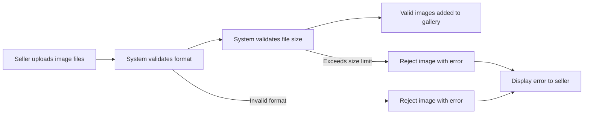

### Multiple Image Management

WHEN a seller manages product images, THE system SHALL:
1. Allow sellers to view all uploaded images in a gallery layout
2. Enable sellers to upload additional images to existing products
3. Track the total number of images per product
4. Prevent upload when image count reaches maximum limit

IF the maximum number of images has been reached, THE system SHALL prevent additional uploads and display a warning.

THE system SHALL support up to 10 images per product.
THE seller SHALL receive clear feedback when attempting to exceed the maximum image limit.

### Image Reordering and Thumbnail Selection

### Image Reordering Process

WHEN a seller reorders product images, THE system SHALL:
1. Allow sellers to drag and drop images to change their sequence
2. Update the display order immediately upon reorder completion
3. Preserve the new order for future product displays

IF a seller attempts to reorder images, THE system SHALL validate that the reorder is completed before saving.
THE seller SHALL be able to reorder images at any time after upload.

The following workflow describes the image reordering process:

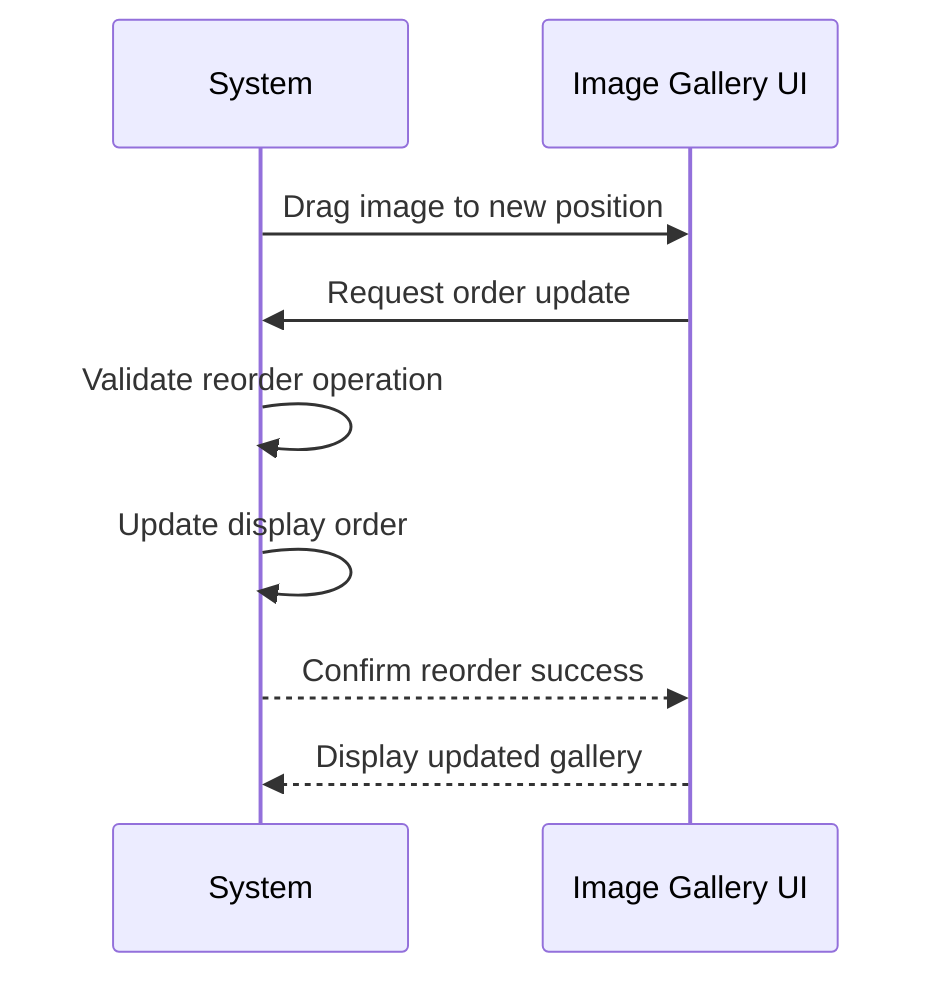

### Main Thumbnail Selection

WHEN a product image gallery is displayed, THE system SHALL:
1. Use the first image in the display order as the main thumbnail
2. Display the main thumbnail in product listing views
3. Highlight the main thumbnail in the image gallery editor

IF the first image in the gallery is deleted, THE system SHALL automatically promote the next image in the sequence to become the main thumbnail.

THE main thumbnail SHALL be the primary visual representation of a product in search results and category listings.
THE seller SHALL have full control over which image serves as the main thumbnail through the reorder interface.

### Image Deletion and Management

### Image Deletion Workflow

WHEN a seller deletes an image from a product, THE system SHALL:
1. Remove the image from the product's gallery
2. Recalculate the display order of remaining images
3. Update the main thumbnail if the deleted image was the first in the sequence
4. Preserve the deletion event in product change snapshots

IF a product has only one image remaining, THE system SHALL prevent deletion of that last image.
IF a seller attempts to delete the main thumbnail, THE system SHALL automatically select the next image as the new main thumbnail.

THE system SHALL provide a confirmation dialog before deleting an image.
THE seller SHALL receive immediate visual confirmation when an image is successfully deleted.

The following workflow describes the image deletion process:

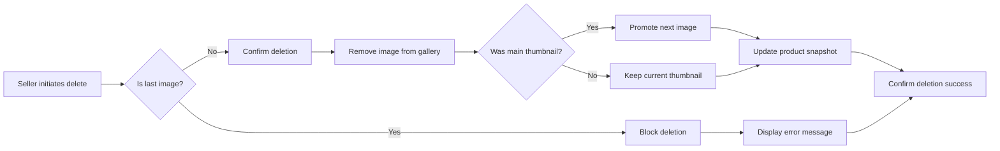

### Image Gallery Structure

THE product gallery SHALL display all uploaded images in their assigned display order.
THE gallery SHALL support both thumbnail view (grid layout) and full-screen view for detailed inspection.
THE system SHALL maintain image sequence integrity across all product views and modifications.

### Product Visual Display and Gallery

### Product Listing Display

WHEN customers view product listings, THE system SHALL:
1. Display the main thumbnail image in search results
2. Show the main thumbnail image in category listings
3. Limit displayed images to the main thumbnail only for listing views
4. Provide visual feedback when images are loading

WHEN customers view a product detail page, THE system SHALL:
1. Display all uploaded images in an accessible gallery format
2. Allow customers to view images in full-screen mode
3. Enable customers to navigate through all images sequentially
4. Show the image count (e.g., "3 of 10") in the gallery interface

THE product detail page SHALL display the main thumbnail as the primary image.
THE customer SHALL be able to click on any image to expand it for detailed viewing.

The following workflow describes product image display to customers:

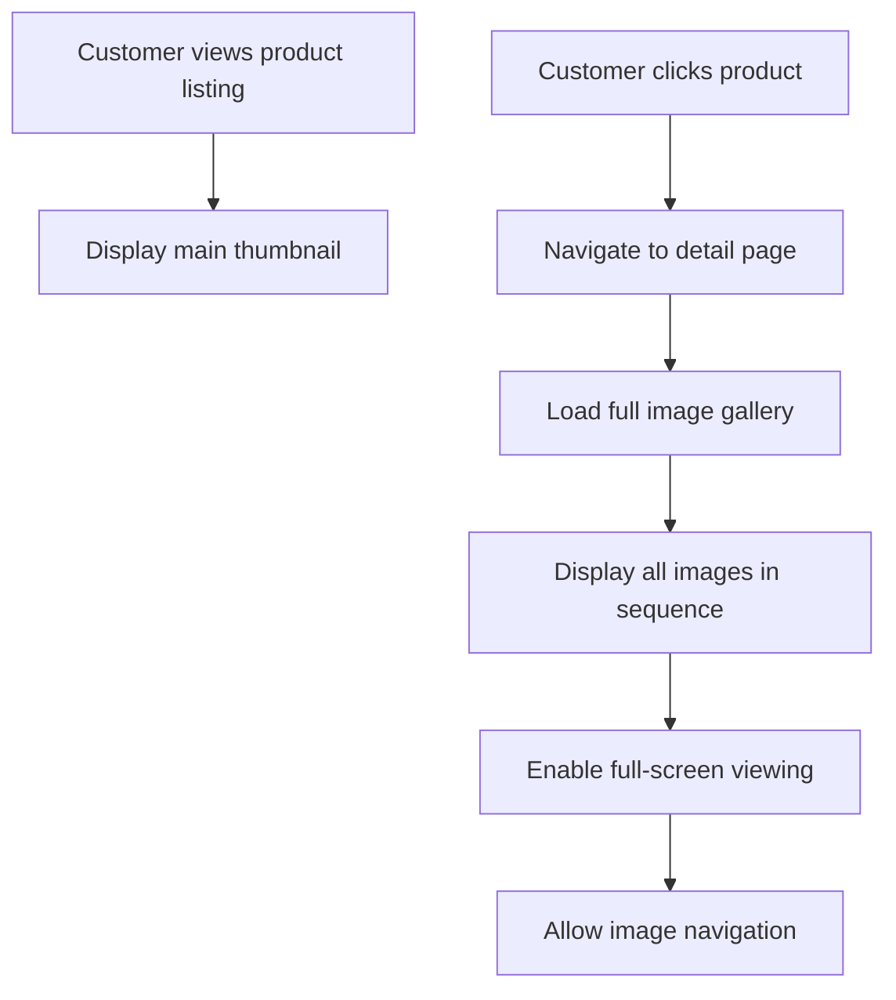

### Image Gallery Navigation

WHEN customers browse the product image gallery, THE system SHALL:
1. Enable left/right navigation between images
2. Support keyboard navigation (arrow keys) for image browsing
3. Maintain gallery state during customer sessions
4. Preserve the current image position if the customer leaves and returns

THE gallery SHALL provide visual indicators showing the current image position within the total collection.
THE system SHALL ensure smooth transitions between images during customer navigation.

### Image Snapshot and Audit Tracking

### Image Change Snapshot Creation

WHEN a product image is uploaded, modified in order, or deleted, THE system SHALL:
1. Create a snapshot of the product state including all image changes
2. Record the timestamp of each image modification
3. Document the previous image order and new image order
4. Include the image URL changes in the snapshot record

IF a product image is modified (order change, deletion), THE system SHALL create an immutable snapshot that cannot be altered.

THE system SHALL preserve image snapshots even after the product itself is deleted.
THE snapshot SHALL be viewable by the product owner and administrators for dispute resolution.

The following diagram illustrates the snapshot creation process:

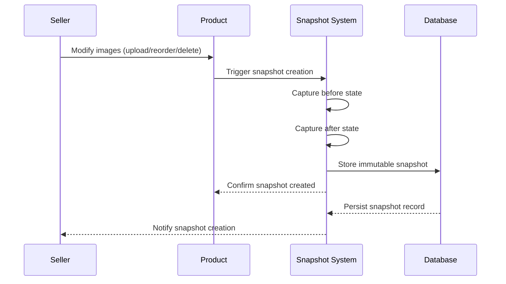

### Image Audit Tracking

WHEN relevant parties need to audit product image changes, THE system SHALL:
1. Provide access to image change history for product owners
2. Provide access to image change history for administrators
3. Display the complete before-and-after state for each snapshot
4. Preserve all image snapshots indefinitely for audit purposes

THE snapshot record SHALL include: change type, timestamp, user ID, previous values, and new values.
THE system SHALL support filtering and sorting of snapshot records by date and change type.

THE snapshot shall be the authoritative source for all product image modification history.
Administrators SHALL be able to view snapshots of any product's image changes across the platform.

## Wishlist User Scenarios

Customers can add products to their personal wishlist for future consideration. Customers can view their complete wishlist with pagination support. Wishlists show products rather than specific variants. Customers can remove individual products from their wishlist. If a seller deletes a product, it is automatically removed from all customer wishlists. Wishlist items help customers track products they're interested in purchasing later.

### Wishlist Creation

### Wishlist Creation

WHEN a registered customer creates a wishlist, THE system SHALL:
1. Create an empty wishlist associated with the customer account
2. Record the creation timestamp
3. Display the empty wishlist with a count of zero products

IF the customer already has a wishlist, THE system SHALL reject the creation request.

IF the customer account is banned, THE system SHALL reject the creation request.

THE system SHALL allow customers to create their wishlist immediately after successful registration.

WHEN a wishlist is created, THE system SHALL associate it permanently with the customer's account.

THE system SHALL preserve the wishlist even if the customer deletes their account and re-registers with the same email.

IF the wishlist creation fails due to system error, THE system SHALL log the error and display a generic error message to the customer.

### Wishlist Viewing

### Wishlist Viewing

WHEN a customer views their wishlist, THE system SHALL:
1. Display all products in the wishlist
2. Show product details including: thumbnail image, product name, base price, seller shop name
3. Display average rating and review count for each product
4. Show stock status for the most common variant of each product

IF a product has no variants, THE system SHALL display it as "unavailable".

IF a product has variants with different prices, THE system SHALL show the price range.

WHEN viewing the wishlist, THE system SHALL sort products by the date they were added (newest first).

THE system SHALL only display products from sellers who are not suspended.

IF a product is deleted by the seller, THE system SHALL remove it from the wishlist automatically.

WHEN a customer views their wishlist, THE system SHALL show the total number of products in the wishlist.

THE system SHALL allow customers to view their wishlist without any time limit or expiration.

### Product Wishlist Adding

### Product Wishlist Adding

WHEN a customer adds a product to their wishlist, THE system SHALL:
1. Associate the product with the customer's wishlist
2. Record the timestamp of addition
3. Display the product in the wishlist immediately

IF the same product is already in the wishlist, THE system SHALL reject the addition request.

IF the product does not exist in the system, THE system SHALL reject the addition request.

IF the product has no variants, THE system SHALL add it to the wishlist but mark it as unavailable.

IF the customer's account is banned, THE system SHALL reject the addition request.

WHEN adding a product to the wishlist, THE system SHALL store only the product ID, not the variant.

THE system SHALL allow customers to add products even if they are out of stock.

WHEN a product is added to the wishlist, THE system SHALL notify the customer of successful addition.

THE system SHALL allow customers to add products from any seller on the platform.

IF the wishlist reaches maximum capacity, THE system SHALL display an error message to the customer.

### Wishlist Removal Process

### Wishlist Removal Process

WHEN a customer removes a product from their wishlist, THE system SHALL:
1. Remove the product association from the wishlist
2. Update the product count immediately
3. Refresh the wishlist view to reflect the removal

IF the product is not in the wishlist, THE system SHALL reject the removal request.

IF the customer's account is banned, THE system SHALL reject the removal request.

WHEN removing a product from the wishlist, THE system SHALL allow the customer to add it back at any time.

THE system SHALL record the timestamp of removal for audit purposes.

WHEN a product is removed from the wishlist, THE system SHALL display a confirmation message to the customer.

IF the removal fails due to system error, THE system SHALL display an error message and not modify the wishlist.

THE system SHALL allow customers to remove multiple products from the wishlist in a single operation.

WHEN all products are removed from a wishlist, THE system SHALL maintain the empty wishlist structure.

THE system SHALL NOT delete the wishlist when all products are removed; it should remain as an empty container.

### Automatic Wishlist Cleanup

### Automatic Wishlist Cleanup

WHEN a product is deleted by the seller, THE system SHALL:
1. Remove the product from all customer wishlists
2. Record the deletion in system audit logs
3. Update the product count for affected customers

IF a seller suspends their account, THE system SHALL hide their products from wishlists.

IF a product's seller is banned, THE system SHALL remove the product from all wishlists.

WHEN a product is deleted, THE system SHALL NOT notify customers whose wishlists were affected.

THE system SHALL perform automatic cleanup immediately when a product deletion is confirmed.

IF the automatic cleanup fails for a specific customer, THE system SHALL retry the cleanup operation.

WHEN a product is moved to an uncategorized state, THE system SHALL NOT remove it from wishlists.

THE system SHALL allow customers to add back previously deleted products to their wishlists.

IF a variant is deleted, THE system SHALL NOT remove the product from wishlists; only the product deletion triggers removal.

THE system SHALL maintain the integrity of wishlists during automatic cleanup operations.

### Wishlist Pagination

### Wishlist Pagination

WHEN a customer views a paginated wishlist, THE system SHALL:
1. Display products in pages of 20 items per page
2. Show page navigation controls (previous, next, page numbers)
3. Display the total number of pages
4. Show current page number

IF the wishlist contains fewer than 20 products, THE system SHALL display all products on a single page.

IF the wishlist contains more than 20 products, THE system SHALL require customer to navigate pages.

WHEN a customer navigates to a specific page, THE system SHALL display products from that page only.

THE system SHALL maintain the same sort order across all paginated views.

IF the customer clicks to the next page and there are no more products, THE system SHALL show a "no more products" message.

WHEN a product is deleted while customer is viewing pagination, THE system SHALL refresh the affected page.

THE system SHALL allow customers to jump to any valid page number.

WHEN the wishlist is sorted by newest first, THE system SHALL apply the sort across all pages.

IF the pagination control is clicked and the request fails, THE system SHALL display an error message and remain on the current page.

THE system SHALL NOT limit the total number of products a customer can have in their wishlist.

### Product Versus Variant

### Product Versus Variant

WHEN a customer adds a product to their wishlist, THE system SHALL:
1. Store only the product identifier, not any variant information
2. Display the product's base price or price range
3. Show the product's main thumbnail image

WHEN displaying products in the wishlist, THE system SHALL show the product-level information only.

IF a product has multiple variants, THE system SHALL display the price range of all variants.

IF a product has only one variant, THE system SHALL show that variant's price.

WHEN a variant's price changes, THE system SHALL update the displayed price in all wishlists containing that product.

IF a variant goes out of stock, THE system SHALL mark the product as unavailable in wishlists if all variants are out of stock.

WHEN a new variant is added to a product, THE system SHALL update the wishlist display to include the new variant in the price range.

IF a customer clicks on a product in the wishlist, THE system SHALL navigate to the full product detail page.

THE system SHALL allow customers to view which variants are available when viewing a product in their wishlist.

WHEN a variant is deleted, THE system SHALL update the wishlist to reflect remaining variants.

### Wishlist Management

### Wishlist Management

WHEN a customer manages their wishlist, THE system SHALL:
1. Allow addition of products to the wishlist
2. Allow removal of products from the wishlist
3. Allow sorting of wishlist contents
4. Allow filtering of wishlist by product status

IF the customer wants to sort by price, THE system SHALL allow sorting by price ascending or descending.

IF the customer wants to filter by availability, THE system SHALL show only in-stock or only out-of-stock products.

WHEN a customer wants to view wishlist management options, THE system SHALL display all available actions.

IF a customer tries to manage a banned account's wishlist, THE system SHALL deny the operation.

WHEN multiple customers share a device, THE system SHALL maintain separate wishlists for each logged-in customer.

THE system SHALL allow customers to export their wishlist data for personal backup.

IF the wishlist management operation fails, THE system SHALL display an error message and preserve the wishlist state.

WHEN a customer updates their wishlist, THE system SHALL save the changes immediately.

THE system SHALL provide visual feedback during wishlist management operations.

IF a customer logs out and logs back in, THE system SHALL restore their wishlist exactly as it was left.

### Future Purchase Tracking

### Future Purchase Tracking

WHEN a customer uses their wishlist for future purchase tracking, THE system SHALL:
1. Display products they intend to purchase later
2. Show price changes over time for tracked products
3. Send notifications when tracked products go on sale

IF a tracked product's price decreases, THE system SHALL update the displayed price.

IF a tracked product goes out of stock, THE system SHALL mark it as unavailable.

IF a tracked product comes back in stock, THE system SHALL mark it as available and notify the customer.

WHEN a customer reviews their wishlist, THE system SHALL show products they might want to purchase.

THE system SHALL allow customers to move products from wishlist to cart directly.

WHEN a product in the wishlist is about to go out of stock, THE system SHALL display a warning.

IF a customer purchases a product from their wishlist, THE system SHALL automatically remove it from the wishlist.

THE system SHALL allow customers to set personal notes on wishlist items.

WHEN a tracked product receives new reviews, THE system SHALL update the review count and average rating in the wishlist.

THE system SHALL maintain the wishlist as a tracking mechanism indefinitely unless deleted by the customer.

### Deleted Product Handling

### Deleted Product Handling

WHEN a product is deleted from the platform, THE system SHALL:
1. Remove the product from all customer wishlists automatically
2. Log the deletion with timestamp and affected customer count
3. Update the wishlist product counts for all affected customers

IF a product is deleted but the wishlist still shows it, THE system SHALL refresh the wishlist display.

IF the deletion occurs while a customer is viewing their wishlist, THE system SHALL remove the product immediately.

WHEN a product is deleted, THE system SHALL NOT preserve it in the wishlist as a "deleted product" placeholder.

IF a customer tries to add a previously deleted product to their wishlist, THE system SHALL add it as a new product.

WHEN a product is deleted, THE system SHALL update any product recommendations based on wishlist data.

IF the product deletion is due to policy violation, THE system SHALL NOT notify customers whose wishlists were affected.

WHEN a product is deleted and later re-added by the same seller, THE system SHALL treat it as a new product.

IF a product is deleted and a customer had it in their cart, THE system SHALL mark it as unavailable in the cart.

WHEN a product is deleted, THE system SHALL remove it from any automated alerts or notifications.

THE system SHALL ensure deleted products cannot reappear in wishlists without being re-added by a customer.

## ShoppingCart User Scenarios

Customers can add specific product variants to their shopping cart with chosen quantities. The same variant added multiple times combines quantities into one line item. Customers can view their cart with item details and subtotals. Customers can adjust quantities of items already in the cart. Customers can remove individual items from their cart. Cart displays the total price of all items. If a variant's stock is lower than cart quantity, a warning is shown. Deleted or out-of-stock variants are marked as unavailable in the cart.

### Variant Addition to Cart

WHEN a customer adds a product variant to their shopping cart, THE system SHALL:
1. Require the customer to be authenticated (registered user)
2. Require selection of a specific variant (not just the product)
3. Require specification of quantity to add
4. Verify the variant exists and is active
5. Check available stock quantity

IF the customer is not authenticated, THE system SHALL redirect to login.
IF the variant does not exist or is inactive, THE system SHALL reject the request.
IF the stock quantity is less than the requested quantity, THE system SHALL reject the request.

WHEN a variant is successfully added to the cart, THE system SHALL:
1. Create a cart item record
2. Record the variant's current price at time of addition
3. Associate the item with the customer's cart
4. Display confirmation of successful addition

### Cart Item Combination

WHEN a customer adds the same variant to their cart multiple times, THE system SHALL combine quantities into a single cart item line.

WHEN combining quantities, THE system SHALL:
1. Sum the added quantity with existing quantity for that variant
2. Verify the combined quantity does not exceed available stock
3. Update the cart item record with the new total quantity
4. Recalculate the item subtotal

IF the combined quantity exceeds available stock, THE system SHALL:
1. Reject the addition
2. Display a warning indicating maximum allowable quantity
3. Show current stock availability

EVERY cart item combination operation SHALL be recorded in the cart session for audit purposes.

Products can be in the cart multiple times only if they have different variants selected (not the same SKU code).

### Cart Viewing Process

WHEN a customer views their shopping cart, THE system SHALL:
1. Display all cart items with product information
2. Show product name and main image thumbnail
3. Display variant options and SKU code
4. Show price per unit and quantity selected
5. Calculate and display subtotal for each item
6. Display cart total of all items
7. Show out-of-stock warnings where applicable

EVERY cart item displayed SHALL include:
- Product name
- Product variant options (e.g., color: Red, size: Large)
- Unit price at time of addition
- Selected quantity
- Item subtotal
- Stock status indicator
- Availability warning if applicable

THE cart page SHALL be accessible only to authenticated customers.

THE cart view SHALL refresh to show current stock availability.

WHEN the cart is empty, THE system SHALL display a message indicating no items and suggest browsing products.

### Cart Quantity Adjustment

WHEN a customer adjusts the quantity of a cart item, THE system SHALL:
1. Accept new quantity input
2. Validate the new quantity is at least 1
3. Verify the quantity does not exceed available stock
4. Recalculate the item subtotal
5. Update the cart total

IF the requested quantity is less than 1, THE system SHALL reject the change.
IF the requested quantity exceeds available stock, THE system SHALL:
1. Reject the adjustment
2. Display current stock limit
3. Show maximum allowable quantity

WHEN quantity is reduced, THE system SHALL:
1. Update the cart item record
2. Free up the excess quantity for other customers
3. Recalculate cart totals

EVERY quantity adjustment SHALL update the cart's last modified timestamp.

QUANTITY adjustments SHALL persist across browser sessions for the customer.

### Cart Item Removal

WHEN a customer removes an item from their cart, THE system SHALL:
1. Remove the cart item record
2. Update the cart's last modified timestamp
3. Recalculate the cart total
4. Display confirmation of removal

IF the customer requests to remove an item that no longer exists in the system, THE system SHALL:
1. Automatically remove it from the cart
2. Mark it as unavailable
3. Display a notification to the customer

EVERY cart removal operation SHALL be logged for session tracking.

CUSTOMERS CAN remove ALL items from their cart, leaving it empty.

THE cart SHALL update immediately upon item removal without requiring page refresh.

IF the last item in the cart is removed, THE system SHALL display the empty cart state.

### Cart Total Calculation

WHEN calculating cart totals, THE system SHALL:
1. Sum the subtotal of all cart items
2. Apply any applicable discounts or promotions
3. Calculate shipping estimates where applicable
4. Display breakdown of charges
5. Round totals to appropriate currency decimal places

EVERY cart item subtotal SHALL be calculated as: unit price × quantity.

THE cart total SHALL include all charges except taxes and shipping until checkout.

WHEN cart contents change, THE system SHALL recalculate totals automatically.

IF a cart item's price has changed since addition, THE system SHALL:
1. Use the price at time of addition for cart calculation
2. Display current price separately if different
3. Allow customer to proceed with original cart price

THE cart total display SHALL update in real-time as items are added, removed, or modified.

CURRENCY formatting SHALL follow the customer's selected regional settings.

### Stock Quantity Warnings

WHEN displaying cart items, THE system SHALL check stock availability for each variant.

IF a variant's available stock is less than the cart quantity, THE system SHALL:
1. Display a warning message for that item
2. Show current available stock quantity
3. Allow the customer to proceed with checkout
4. Warn that stock may not be available at checkout

WHEN stock becomes zero while an item is in the cart, THE system SHALL:
1. Mark the item as unavailable
2. Display out-of-stock warning
3. Prevent checkout with unavailable items
4. Prompt customer to adjust quantity or remove item

THE system SHALL:
1. Validate stock availability before checkout
2. Prevent order creation for unavailable quantities
3. Require customer to modify cart before completing purchase

STOCK warnings SHALL be clearly visible and distinguishable from regular content.

### Unavailable Item Handling

WHEN a variant in the cart becomes unavailable, THE system SHALL:
1. Mark the item as unavailable in the cart display
2. Prevent checkout if unavailable items exist
3. Display reason for unavailability (deleted, out of stock, discontinued)

IF a product is deleted by the seller, THE system SHALL:
1. Mark all cart items referencing that product as unavailable
2. Display notification about product deletion
3. Allow customer to remove the unavailable item
4. Prevent checkout with deleted products

IF a variant is deleted by the seller, THE system SHALL:
1. Remove the cart item from the cart
2. Display notification about variant deletion
3. Show remaining items in cart
4. Recalculate cart total

UNAVAILABLE ITEMS SHALL NOT be included in checkout totals.

CUSTOMERS SHALL BE REQUIRED to resolve unavailable items before proceeding to checkout.

THE system SHALL provide option to continue shopping when unavailable items are encountered.

### Cart Session Tracking

WHEN a customer adds items to their cart, THE system SHALL:
1. Create a cart session linked to the customer account
2. Record timestamp of each cart operation
3. Track last modified time
4. Associate items with customer account

FOR unauthenticated browsing, THE system SHALL:
1. Store cart items in session storage
2. Display cart icon with item count
3. Prompt login when checkout is initiated

WHEN an authenticated customer logs in, THE system SHALL:
1. Merge session cart with account cart if both exist
2. Combine quantities for duplicate variants
3. Display merged cart contents

CART DATA SHALL persist across browser sessions for the duration of customer's account.

UPON account deletion, THE system SHALL:
1. Preserve order history
2. Remove cart session data
3. Not preserve cart items from inactive session

CART SESSIONS SHALL expire after a period of inactivity as defined by platform policy.

## CartItem User Scenarios

Each cart item represents a specific variant with selected quantity. Cart items are tied to the customer's shopping cart. Customers can view cart items showing product name, variant options, price, and quantity. Cart items are updated when stock levels change. Cart items are removed from the cart during checkout. Cart items can be marked unavailable if the variant is deleted. Cart item quantities can be adjusted before checkout.

### Cart Item Visibility

WHEN a customer views their shopping cart, THE system SHALL display all cart items with the following information:
1. Product name
2. Variant options (e.g., "Red / Large")
3. Price at the time the item was added to cart
4. Quantity of the variant in cart
5. Subtotal (price × quantity)
6. Stock status indicator
7. Seller shop name (linking to seller profile)

IF the customer has no cart items, THE system SHALL display an empty cart message.

THE system SHALL display each cart item as a distinct line item with clear separation from other items.

### Variant Selection for Cart

WHEN a customer adds a product to their cart, THE system SHALL require selection of a specific variant (not just the product).

IF a customer attempts to add a product without selecting a variant, THE system SHALL prompt them to choose a variant before proceeding.

WHEN a customer selects a variant to add to cart, THE system SHALL show available stock quantity for that variant.

IF the selected variant has zero stock, THE system SHALL prevent the customer from adding it to cart and display an "out of stock" message.

THE system SHALL only allow adding variants that are currently active and available for purchase.

### Cart Item Quantity Management

WHEN a customer adds a variant to cart, THE system SHALL create a new cart item with the specified quantity.

IF the same variant already exists in the cart, THE system SHALL combine the quantities instead of creating a duplicate line item.

WHEN a customer changes the quantity of a cart item, THE system SHALL update the cart item quantity and recalculate the subtotal.

IF a customer attempts to set quantity to zero or below, THE system SHALL either reset to minimum quantity of one or remove the item from cart.

THE system SHALL display a minimum quantity of one for all cart items.

IF the requested quantity exceeds available stock, THE system SHALL display a warning and limit the quantity to available stock.

WHEN cart item quantity is changed, THE system SHALL immediately recalculate the cart total price.

### Cart Item Updates and Stock Notifications

WHEN stock levels change for a variant in a customer's cart, THE system SHALL automatically update the cart item to reflect current stock status.

IF a variant's stock becomes lower than the cart quantity, THE system SHALL display a warning message to the customer.

WHEN stock is depleted (reaches zero) for a variant in cart, THE system SHALL mark that cart item as unavailable.

THE system SHALL not automatically remove unavailable items from cart.

WHEN a customer refreshes their cart view, THE system SHALL show the latest stock status for all cart items.

IF a variant becomes unavailable after being added to cart, THE system SHALL clearly mark that item as unavailable with an explanatory message.

### Cart Item Removal and Deletion

WHEN a customer removes a cart item, THE system SHALL delete that cart item from their shopping cart.

IF a customer removes a cart item, THE system SHALL immediately recalculate the cart total price.

WHEN a product is deleted by the seller, THE system SHALL mark all cart items for that product as unavailable.

IF a variant is deleted by the seller, THE system SHALL remove that variant's cart item from the customer's cart.

THE system SHALL NOT allow cart items to be deleted automatically without customer action, except when the variant or product is deleted.

WHEN a cart item is removed, THE system SHALL provide confirmation to the customer.

### Cart Item Pricing

WHEN a cart item is created, THE system SHALL capture and store the price at the time of addition to cart.

IF a product's price changes after a variant has been added to cart, THE system SHALL NOT update the price in the cart item.

WHEN displaying cart items, THE system SHALL show the original price at which the item was added to cart.

IF a variant has a price override, THE system SHALL display the override price in cart (not the base product price).

THE system SHALL calculate cart totals based on the prices stored in cart items, not current product prices.

IF a cart item is marked unavailable due to stock or deletion, THE system SHALL still show the original price with a visual indicator.

### Unavailable Cart Items

WHEN a cart item becomes unavailable, THE system SHALL mark that item clearly as unavailable on the cart page.

IF a customer attempts to checkout with unavailable items, THE system SHALL prevent checkout and prompt removal of unavailable items.

WHEN a variant is deleted by the seller, THE system SHALL automatically remove that variant's cart items from the customer's cart.

IF a product is deleted by the seller, THE system SHALL automatically remove all cart items for that product from the customer's cart.

THE system SHALL allow customers to view unavailable items in cart for informational purposes.

WHEN an unavailable item is removed, THE system SHALL not charge the customer for that item.

### Checkout Preparation

WHEN a customer proceeds to checkout from cart, THE system SHALL verify all cart items are available for purchase.

IF cart contains unavailable items, THE system SHALL prevent checkout and highlight the unavailable items for removal.

WHEN a customer initiates checkout, THE system SHALL lock the cart to prevent modifications during checkout.

THE system SHALL display an order summary showing all cart items with quantities, prices, and subtotals.

WHEN a customer selects a shipping address during checkout, THE system SHALL validate the address is complete and valid.

IF a customer leaves the cart page without completing checkout, THE system SHALL retain cart items for a reasonable session duration.

### Cart Item Deletion Scenarios

WHEN a customer deletes a cart item individually, THE system SHALL delete only that specific variant from cart.

IF a customer wants to clear all cart items, THE system SHALL provide a "clear cart" option to remove all items at once.

WHEN a cart item is deleted, THE system SHALL preserve the price information for that item if referenced in order history.

IF a variant's stock becomes depleted after cart items are added, THE system SHALL keep the items in cart but mark them unavailable.

THE system SHALL NOT automatically remove cart items due to inactivity alone without explicit user action.

WHEN cart items are cleared, THE system SHALL provide confirmation and display an empty cart view.

## Order User Scenarios

Customers can view a paginated list of all their orders sorted by newest first. Each order contains multiple order items from potentially different sellers. Customers can view full order details including items, shipping address, and shipments. Order status is derived from the collective status of all order items. Mixed item statuses result in partially completed order status. Order details include tracking information for each shipment. Order history is preserved even after account deletion.

### Order History Viewing

WHEN a customer views their order history, THE system SHALL display a paginated list of all orders associated with that customer.

WHEN a customer views their order history, THE system SHALL show the following information for each order:
1. Order number
2. Order date
3. Total price
4. Overall order status

WHEN a customer has no orders, THE system SHALL display an empty list with a message indicating no orders exist.

IF a customer deletes their account, THE system SHALL preserve all order records for legal and seller record purposes.

IF a customer's account is deleted, THE system SHALL still display their order history with the order details intact.

THE system SHALL ensure that customers can only view orders that belong to their account.

### Order List Pagination

WHEN a customer views their order list, THE system SHALL display orders in paginated format.

WHEN a customer navigates to subsequent pages of their order list, THE system SHALL maintain the current sort order.

THE system SHALL limit the number of orders displayed per page to a consistent, reasonable amount for user browsing.

WHEN an order list is paginated, THE system SHALL indicate the current page number and total number of pages.

IF a customer deletes an order item from the platform, THE system SHALL reflect that change in their order history.

WHEN filtering order lists, THE system SHALL preserve pagination across different filter states.

### Order Detail Access

WHEN a customer accesses an order detail page, THE system SHALL display the complete order information.

WHEN a customer views order details, THE system SHALL show:
1. List of items with product name, variant, quantity, and price
2. Shipping address used for the order
3. List of shipments with tracking information for each seller

WHEN a customer clicks on an order from their order history list, THE system SHALL navigate to the full order detail page.

IF a customer requests to view an order that does not belong to them, THE system SHALL reject the access request.

IF a customer requests to view an order that has been deleted, THE system SHALL indicate that the order is no longer accessible.

THE system SHALL ensure that order detail pages load completely before displaying any partial content.

### Order Status Determination

THE system SHALL determine the overall order status based on the collective status of all order items within that order.

WHEN all order items have status "paid", THE system SHALL set the order status to "paid".

WHEN any order item has status "shipped" and none have status "delivered", THE system SHALL set the order status to "shipped".

WHEN all order items have status "delivered", THE system SHALL set the order status to "delivered".

WHEN all order items have status "cancelled", THE system SHALL set the order status to "cancelled".

WHEN all order items have status "refunded", THE system SHALL set the order status to "refunded".

WHEN order items have mixed statuses (e.g., some delivered, some refunded, some cancelled), THE system SHALL set the order status to "partially completed".

THE system SHALL automatically update the order status when any order item status changes.

### Multi-Seller Orders

WHEN a customer places an order containing products from multiple sellers, THE system SHALL create a single order record with multiple order items.

WHEN a customer views an order with items from different sellers, THE system SHALL group order items by seller for clarity.

WHEN an order contains items from multiple sellers, THE system SHALL create separate shipments for each seller.

WHEN a seller ships their items, THE system SHALL create a shipment containing only that seller's order items.

IF a customer cancels an order item, THE system SHALL cancel only that specific item, not the entire order.

IF an order contains items from multiple sellers and some items are cancelled, THE system SHALL preserve the remaining items for normal processing.

THE system SHALL allow customers to track each seller's shipment independently within the same order.

### Order Tracking Information

WHEN a shipment is created by a seller, THE system SHALL display the carrier name and tracking number to the customer.

WHEN a customer views an order detail, THE system SHALL show tracking information for each shipment in the order.

WHEN multiple order items are included in the same shipment, THE system SHALL display the same tracking information for all items in that shipment.

WHEN a customer confirms delivery of a shipment, THE system SHALL update the status of all items in that shipment to "delivered".

IF a customer does not confirm delivery, THE system SHALL automatically mark items as "delivered" after 14 days from the shipment creation date.

WHEN a shipment tracking number changes, THE system SHALL update the tracking information displayed to the customer.

THE system SHALL preserve tracking information even after the order status changes to "delivered" or "refunded".

### Order History Preservation

WHEN a customer deletes their account, THE system SHALL preserve all order history records permanently.

WHEN a seller's account is deleted, THE system SHALL preserve all order snapshots and transaction records.

WHEN a product is deleted by a seller, THE system SHALL preserve the product information in order item snapshots.

WHEN an order item is cancelled, THE system SHALL preserve the cancellation request snapshot including the reason provided.

WHEN an order item is refunded, THE system SHALL preserve the refund request snapshot including the reason provided.

IF a customer requests to view their order history after deleting their account (before the account is actually deleted), THE system SHALL still display all order records.

THE system SHALL ensure that order history snapshots remain immutable and cannot be deleted by any user.

### Order Date Sorting

WHEN a customer views their order history list, THE system SHALL display orders sorted by date with the newest orders appearing first.

WHEN a customer refreshes their order history list, THE system SHALL maintain the current sort order by newest first.

WHEN new orders are placed by a customer, THE system SHALL add those orders to the top of the order history list.

WHEN a customer filters their order list, THE system SHALL preserve the date sort order across all filter combinations.

IF a customer attempts to change the sort order, THE system SHALL default back to newest first as the primary sort method.

THE system SHALL use the order creation date as the basis for all date sorting operations.

### Order Item Grouping

WHEN a customer views an order, THE system SHALL group order items by seller for clear organization.

WHEN a customer purchases multiple quantities of the same variant, THE system SHALL group those items into a single order item record with quantity > 1.

WHEN an order contains items from a single seller, THE system SHALL create a single shipment for all items in that order.

WHEN an order contains items from multiple sellers, THE system SHALL create separate shipment records for each seller.

WHEN a customer views shipment details, THE system SHALL display all order items included in that shipment.

IF a customer cancels one item from a multi-item shipment, THE system SHALL preserve the shipment for the remaining items.

THE system SHALL ensure that order items from different sellers are never included in the same shipment.

### Order Status Derivation

THE system SHALL calculate the overall order status by analyzing all order item statuses within the order.

WHEN an order has no items, THE system SHALL display the order status as "empty" or "invalid".

WHEN an order has items with statuses "paid" and "shipped", THE system SHALL set the order status to "shipped" (the higher state takes precedence).

WHEN an order has items with statuses "delivered" and "refunded", THE system SHALL set the order status to "partially completed".

WHEN an order has items with statuses "cancelled" and "paid", THE system SHALL set the order status to "partially completed".

WHEN all items in an order are in the same status, THE system SHALL set the order status to that same status.

THE system SHALL recalculate the order status whenever any item status changes, ensuring the order status always accurately reflects the collective item states.

### Order Tracking Workflow

WHEN a seller creates a shipment for order items, THE system SHALL mark all items in that shipment as "shipped".

WHEN a shipment is created, THE system SHALL require the seller to enter carrier name and tracking number.

WHEN a customer views tracking information, THE system SHALL display the carrier name, tracking number, and shipment date.

WHEN a customer confirms delivery for a shipment, THE system SHALL update all items in that shipment to "delivered" status.

IF a customer confirms delivery after 14 days from shipment creation, THE system SHALL still update the item status to "delivered".

IF a shipment tracking number is missing or invalid, THE system SHALL prevent the customer from confirming delivery.

WHEN all shipments for an order are confirmed as delivered, THE system SHALL automatically update the order status to "delivered".

### Order Cancellation and Refund Workflow

WHEN a customer requests to cancel an order item with status "paid", THE system SHALL create a cancellation request with a reason field.

WHEN a customer requests to cancel an order item with status "shipped", THE system SHALL reject the cancellation request.

WHEN a seller approves a cancellation request, THE system SHALL update the order item status to "cancelled".

WHEN a seller approves a cancellation request, THE system SHALL process a refund for that specific item only.

WHEN a seller rejects a cancellation request, THE system SHALL update the cancellation request status to "rejected" with a reason.

WHEN an order item is cancelled, THE system SHALL restore the stock quantity via an inventory record.

IF all order items in an order are cancelled, THE system SHALL update the entire order status to "cancelled".

WHEN a customer requests a refund for a delivered item, THE system SHALL verify that the refund request is within 7 days of delivery.

IF a refund request is outside the 7-day window, THE system SHALL reject the refund request.

WHEN all order items in an order are refunded, THE system SHALL update the entire order status to "refunded".

### Order Snapshot Preservation

WHEN an order is created, THE system SHALL create snapshots of all products and variants included in the order items.

WHEN an order is created, THE system SHALL create snapshots of each seller's profile at the time of purchase.

WHEN a customer or seller views an order detail, THE system SHALL display the product information as it existed at the time of purchase.

WHEN a product is edited after being ordered, THE system SHALL display the original product snapshot in the order, not the current product state.

WHEN a seller deletes their shop after fulfilling orders, THE system SHALL preserve the shop name and logo in order item snapshots.

WHEN an order item is cancelled or refunded, THE system SHALL preserve all snapshot data for dispute resolution purposes.

THE system SHALL ensure that order snapshots cannot be modified or deleted after the order is created.

### Order Payment Processing

WHEN a customer places an order after reviewing the order summary, THE system SHALL process the payment through the external payment gateway.

WHEN payment processing fails, THE system SHALL not create an order record and SHALL notify the customer of the failure.

WHEN payment processing succeeds, THE system SHALL create an order record with initial status "paid".

WHEN an order is created successfully, THE system SHALL decrease stock quantities for each purchased variant.

WHEN an order is created successfully, THE system SHALL remove all items from the customer's shopping cart.

WHEN a customer retries payment after a failure, THE system SHALL allow the customer to place the same order again.

IF the customer's cart items are modified before retrying payment, THE system SHALL prevent the retry and require a new order creation.

## OrderItem User Scenarios

Each order item represents a purchased product variant with quantity and price. Order items can have individual statuses: paid, shipped, delivered, cancelled, or refunded. Order items from the same seller can be bundled into shipments. Individual items can be cancelled before shipment. Individual items can be refunded after delivery within the policy period. Order items include snapshots of products and variants at purchase time. Order items from different sellers are processed independently.

### Order Item Status Tracking

WHEN an order item is created during checkout, THE system SHALL set its initial status to "paid".

WHEN a seller creates a shipment containing order items, THE system SHALL change the status of all items in that shipment to "shipped".

WHEN a customer confirms delivery of a shipment, THE system SHALL change the status of all items in that shipment to "delivered".

WHEN 14 days have passed since a shipment was created without delivery confirmation, THE system SHALL automatically change the status of all items in that shipment to "delivered".

THE system SHALL allow customers to view the status of all order items in their order history.

THE system SHALL allow sellers to view the status of order items for their products.

IF an order item status changes, THE system SHALL record the change timestamp for audit purposes.

WHEN an order item is cancelled or refunded, THE system SHALL update the inventory quantity to restore stock.

THE system SHALL display the current status of each order item on the order detail page.

WHEN viewing order history, THE system SHALL show the most recent status for each order item.

### Individual Item Cancellation

WHEN a customer requests cancellation of an order item with status "paid", THE system SHALL create a cancellation request requiring a reason.

THE system SHALL reject cancellation requests for order items with status other than "paid" (e.g., "shipped", "delivered", "cancelled", "refunded").

WHEN a seller receives a cancellation request, THE system SHALL allow them to approve or reject the request.

IF a seller approves a cancellation request, THE system SHALL change the item status to "cancelled" and restore the inventory quantity.

IF a seller rejects a cancellation request, THE system SHALL keep the item status as "paid" and notify the customer.

WHEN a seller responds to a cancellation request, THE system SHALL create a snapshot of the request state.

IF all items in an order are cancelled, THE system SHALL change the overall order status to "cancelled".

IF some items in an order are cancelled while others remain active, THE system SHALL maintain the order status based on remaining item statuses.

THE system SHALL allow customers to view the status of their cancellation requests.

THE system SHALL preserve cancellation request history even after items are cancelled or refunded.

### Individual Item Refund

WHEN a customer requests a refund for an order item with status "delivered", THE system SHALL create a refund request requiring a reason.

THE system SHALL reject refund requests for order items that have not been delivered (status: "paid", "shipped", "cancelled").

IF a refund request is submitted more than 7 days after the item was delivered, THE system SHALL reject the request.

WHEN a seller receives a refund request, THE system SHALL allow them to approve or reject the request.

IF a seller approves a refund request, THE system SHALL change the item status to "refunded" and restore the inventory quantity.

IF a seller rejects a refund request, THE system SHALL keep the item status as "delivered" and notify the customer.

WHEN a seller responds to a refund request, THE system SHALL create a snapshot of the request state.

IF all items in an order are refunded, THE system SHALL change the overall order status to "refunded".

IF some items in an order are refunded while others remain active, THE system SHALL maintain the order status based on remaining item statuses.

THE system SHALL allow customers to view the status of their refund requests.

### Order Item Snapshots

WHEN an order is created, THE system SHALL create snapshots of each purchased product, variant, and seller profile.

THE product snapshot SHALL preserve the product name, description, category, and base price at the time of purchase.

THE variant snapshot SHALL preserve the SKU code, option values, and price at the time of purchase.

THE seller profile snapshot SHALL preserve the shop name and logo at the time of purchase.

THE system SHALL store snapshots as immutable records that cannot be deleted or modified.

THE system SHALL allow customers to view snapshots of products and variants in their order history.

THE system SHALL allow sellers to view snapshots of products and variants in their order items.

THE system SHALL allow administrators to view snapshots of any product or variant in order items.

IF a product is deleted after an order is placed, THE system SHALL preserve the product snapshot in the order item.

IF a product is edited after an order is placed, THE system SHALL NOT update the snapshot in existing order items.

### Item Status Independence

THE system SHALL allow each order item in an order to have an independent status (paid, shipped, delivered, cancelled, or refunded).

THE system SHALL derive the overall order status from the collective statuses of all order items.

IF all items in an order have status "paid", THE system SHALL set the order status to "paid".

IF any item in an order has status "shipped" and no item has status "delivered", THE system SHALL set the order status to "shipped".

IF all items in an order have status "delivered", THE system SHALL set the order status to "delivered".

IF all items in an order have status "cancelled", THE system SHALL set the order status to "cancelled".

IF all items in an order have status "refunded", THE system SHALL set the order status to "refunded".

IF an order contains items with mixed statuses (e.g., some delivered, some refunded), THE system SHALL set the order status to "partially completed".

THE system SHALL allow customers to cancel or refund individual items without affecting other items in the same order.

THE system SHALL allow customers to view the individual status of each item alongside the overall order status.

### Seller Item Grouping

WHEN a seller ships order items, THE system SHALL allow them to group multiple items from the same seller into a single shipment.

THE system SHALL ensure that items from different sellers are always in separate shipments.

WHEN a seller creates a shipment, THE system SHALL require carrier name and tracking number.

ALL items in the same shipment SHALL share the same tracking information.

WHEN a shipment is created, THE system SHALL change the status of all items in that shipment to "shipped".

WHEN a customer confirms delivery of a shipment, THE system SHALL change the status of all items in that shipment to "delivered".

THE system SHALL allow customers to view which items are grouped in each shipment.

THE system SHALL allow sellers to view their shipments and the items contained within.

WHEN an item is cancelled or refunded, THE system SHALL only affect that specific item, not other items in the same shipment.

THE system SHALL allow shipments to be created for items with status "paid" or "delivered" confirmation pending.

### Purchase Time Preservation

WHEN an order item is created, THE system SHALL preserve the exact product name at the time of purchase.

IF a product name is changed after an order is placed, THE system SHALL display the original product name in the order history.

WHEN an order item is created, THE system SHALL preserve the exact variant option values at the time of purchase.

WHEN an order item is created, THE system SHALL preserve the exact unit price at the time of purchase.

IF a product description is changed after an order is placed, THE system SHALL preserve the original description in the order item snapshot.

IF a product category is changed after an order is placed, THE system SHALL preserve the original category in the order item snapshot.

IF a seller shop name is changed after an order is placed, THE system SHALL preserve the original shop name in the order item snapshot.

IF a variant price is changed after an order is placed, THE system SHALL preserve the original variant price in the order item snapshot.

THE system SHALL allow customers to view all preserved purchase time details on the order detail page.

THE system SHALL allow administrators to audit purchase time data for dispute resolution.

### Order Item Quantities

WHEN a customer adds a variant to the cart, THE system SHALL require them to specify a quantity.

WHEN an order is created, THE system SHALL create one order item per variant per seller combination.

IF a customer purchases 3 of the same variant, THE system SHALL create one order item with quantity 3.

THE system SHALL calculate the item subtotal as quantity multiplied by unit price.

THE system SHALL display the quantity of each item in the order detail page.

THE system SHALL allow customers to view their order quantities in the order history.

IF an order item is cancelled, THE system SHALL restore the inventory quantity equal to the cancelled item quantity.

IF an order item is refunded, THE system SHALL restore the inventory quantity equal to the refunded item quantity.

THE system SHALL allow customers to see their total quantity purchased per product in the order history.

THE system SHALL preserve the original quantity in the order item snapshot even if product variants are later deleted.

### Item Status Transitions

WHEN an order item is created, THE system SHALL set the initial status to "paid".

WHEN a seller creates a shipment, THE system SHALL transition item status from "paid" to "shipped".

WHEN a customer confirms delivery OR 14 days pass, THE system SHALL transition item status from "shipped" to "delivered".

WHEN a cancellation request is approved for a paid item, THE system SHALL transition item status from "paid" to "cancelled".

WHEN a refund request is approved for a delivered item, THE system SHALL transition item status from "delivered" to "refunded".

THE system SHALL reject status transitions that violate the order logic (e.g., "delivered" cannot transition to "shipped").

THE system SHALL prevent cancellation of items with status "shipped", "delivered", or "cancelled".

THE system SHALL prevent refund requests for items with status other than "delivered".

THE system SHALL allow automatic status transitions (14-day delivery) without user intervention.

THE system SHALL record all status transition events for audit and dispute resolution purposes.

### Order Item Visibility

THE system SHALL show all order items from an order to the customer who placed the order.

THE system SHALL show all order items from an order to the seller who owns the products in those items.

THE system SHALL show all order items from an order to administrators with appropriate permissions.

WHEN viewing order history, THE system SHALL display order items sorted by newest order first.

THE system SHALL allow customers to filter order items by status in their order history.

THE system SHALL show only visible order items to the respective customer and seller.

THE system SHALL allow customers to view item details including product name, variant options, and price on the order detail page.

THE system SHALL allow sellers to view items they are responsible for shipping, cancelling, or refunding.

THE system SHALL allow administrators to view all order items across all orders on the platform.

WHEN an item is cancelled or refunded, THE system SHALL continue to display the item in order history with its final status.

## Shipment User Scenarios

Sellers can create shipments containing multiple order items from their products. Each shipment has carrier name and tracking information. All items in a shipment share the same tracking number. Customers can view tracking information for each shipment. Customers confirm delivery per shipment, not per individual item. Delivery confirmation changes shipment items to delivered status. Unconfirmed shipments auto-convert to delivered after 14 days. Different sellers always create separate shipments.

### Shipment Creation Process

WHEN a seller creates a shipment, THE system SHALL:
1. Display all unshipped order items for products belonging to that seller
2. Allow the seller to select one or more order items to include in the shipment
3. Require a carrier name to be entered
4. Require a tracking number to be entered
5. Create a single shipment containing all selected order items
6. Record the creation timestamp on the shipment

IF no order items are selected, THE system SHALL reject the shipment creation request.
IF the seller attempts to include items from different orders, THE system SHALL allow it.
IF the seller attempts to include items already in another shipment, THE system SHALL reject the request.

WHEN a shipment is created, THE system SHALL update all included order items to status "shipped".

### Tracking Number Management

THE system SHALL require a valid tracking number for every shipment.
THE system SHALL accept any alphanumeric tracking number format.
THE system SHALL allow carriers and tracking numbers to be updated before shipment confirmation.
THE system SHALL reject duplicate tracking numbers across all shipments.

IF a tracking number is missing, THE system SHALL reject the shipment creation.
IF an existing tracking number is being used, THE system SHALL reject the shipment creation.

WHEN tracking information is updated, THE system SHALL preserve the original tracking information in the shipment record for audit purposes.

### Delivery Confirmation Workflow

WHEN a shipment is created, THE system SHALL display tracking information to the customer.
THE customer SHALL be able to view carrier name and tracking number for each shipment.

WHEN a customer confirms delivery for a shipment, THE system SHALL:
1. Change the status of all order items in that shipment to "delivered"
2. Record the delivery confirmation timestamp
3. Create a snapshot of the shipment state at confirmation

WHEN a customer does not confirm delivery, THE system SHALL automatically mark all items as "delivered" after 14 days from the shipment creation date.

IF a shipment has already been marked as delivered (either by confirmation or automatic conversion), THE system SHALL reject any further delivery confirmation attempts.

### Shipment Item Grouping Rules

THE system SHALL allow multiple order items from the same seller to be grouped into a single shipment.
THE system SHALL allow multiple order items from different orders to be grouped into a single shipment if they belong to the same seller.
THE system SHALL require that all items in a shipment belong to the same seller.

IF a seller attempts to create a shipment with items from different sellers, THE system SHALL reject the request and display an error.
IF a seller attempts to create a shipment containing only a single order item, THE system SHALL allow it.

WHEN items are grouped into a shipment, THE system SHALL create a single shipment record containing all selected items.

### Automatic Delivery Conversion

WHEN a shipment is created, THE system SHALL start a 14-day countdown.
WHEN 14 days have elapsed since shipment creation without delivery confirmation, THE system SHALL automatically mark all items in that shipment as "delivered".

IF a customer confirms delivery before the 14-day period expires, THE system SHALL use the confirmation timestamp and prevent automatic conversion.
IF a shipment is marked as cancelled or refunded before the 14-day period expires, THE system SHALL cancel the automatic delivery conversion.

THE system SHALL notify the customer when automatic delivery conversion has been applied.
THE system SHALL record the automatic conversion timestamp in the shipment history.

### Seller Shipment Separation

THE system SHALL ensure that different sellers always create separate shipments for their items.
THE system SHALL never allow items from different sellers to appear in the same shipment.

IF a customer orders products from multiple sellers, THE system SHALL create separate shipments for each seller.

WHEN an order contains items from multiple sellers, THE system SHALL:
1. Group items by seller
2. Create a separate shipment for each seller
3. Track each shipment independently with its own tracking number

IF a shipment contains items that belong to different sellers, THE system SHALL reject the shipment creation.

### Shipment Status and Visibility

THE system SHALL maintain status for each shipment: pending, shipped, delivered, or cancelled.

WHEN a shipment is created, THE system SHALL set its status to "shipped".
WHEN delivery is confirmed OR automatic conversion occurs, THE system SHALL set the shipment status to "delivered".
WHEN all items in an order are cancelled or refunded, THE system SHALL set the shipment status to "cancelled".

THE system SHALL display shipment status to both customers and sellers.
THE system SHALL display tracking information to customers for all shipments with status other than "cancelled".

THE system SHALL update the overall order status based on the statuses of all shipments in the order.
IF all shipments in an order are delivered, THE system SHALL set the order status to "delivered".
IF any shipment is shipped (and none delivered), THE system SHALL set the order status to "shipped".

## CancellationRequest User Scenarios

Customers can request cancellation for individual items with paid status. Cancellation requests require a reason text from the customer. The seller can approve or reject the cancellation request. When the seller responds, a snapshot of the request state is created. Approved cancellations restore stock quantities through inventory records. Cancelled items have their refund processed immediately. The remaining order items continue normal processing. Requests include snapshots showing state changes.

### Cancellation Request Submission

WHEN a customer submits a cancellation request for an order item, THE system SHALL require the customer to provide a reason text.

WHEN a customer submits a cancellation request, THE system SHALL allow cancellation only for order items with status "paid" (not yet shipped).

IF the order item status is "shipped" or higher, THE system SHALL reject the cancellation request submission.

IF the order item status is "cancelled" or "refunded", THE system SHALL reject the cancellation request submission.

THE system SHALL display the product name, variant options, quantity, and unit price to the customer when they submit a cancellation request.

THE system SHALL allow customers to submit cancellation requests through the order history detail view or order detail view.

THE system SHALL show a confirmation screen before the cancellation request is finalized, displaying the item details and the provided reason.

IF the customer cancels the submission on the confirmation screen, THE system SHALL not create a cancellation request.

WHEN a cancellation request is submitted, THE system SHALL assign it a unique identifier.

WHEN a cancellation request is submitted, THE system SHALL record the submission timestamp.

### Seller Cancellation Review and Approval

WHEN a seller views their order items dashboard, THE system SHALL display pending cancellation requests for their products.

WHEN a seller reviews a cancellation request, THE system SHALL show the customer-provided reason text and all relevant order item details.

THE system SHALL allow sellers to approve cancellation requests for their own products only.

WHEN a seller approves a cancellation request, THE system SHALL immediately mark the cancellation request as "approved".

WHEN a seller approves a cancellation request, THE system SHALL immediately mark the order item status as "cancelled".

WHEN a seller approves a cancellation request, THE system SHALL process the refund for that item only.

WHEN a seller rejects a cancellation request, THE system SHALL immediately mark the cancellation request as "rejected".

WHEN a seller rejects a cancellation request, THE system SHALL allow the seller to optionally provide an explanation for the rejection.

THE system SHALL notify the customer when their cancellation request is approved or rejected.

IF the seller responds to a cancellation request (approve or reject), THE system SHALL create a snapshot of the request state showing before and after values.

THE system SHALL record the timestamp of when the seller responds to the cancellation request.

THE system SHALL prevent customers from submitting a new cancellation request for an order item that has already been cancelled or refunded.

### Stock Restoration and Order Processing

WHEN a cancellation request is approved, THE system SHALL automatically create an inventory record with a positive quantity change to restore stock.

THE system SHALL calculate the restored quantity based on the order item quantity and variant stock quantity.

WHEN a cancellation request is approved, THE system SHALL restore the stock quantity so the variant can be purchased again.

WHEN an order item is cancelled, THE system SHALL update the order status if all items in the order are cancelled.

IF all order items in an order are cancelled, THE system SHALL mark the overall order status as "cancelled".

IF some order items are cancelled but others remain, THE system SHALL mark the order status as "partially completed".

WHEN a cancellation request is approved, THE system SHALL process the refund immediately for that specific item only.

WHEN a cancellation occurs, THE system SHALL preserve the original product snapshot and variant snapshot in the order item.

THE system SHALL allow the remaining order items to continue their normal processing workflow without interruption.

THE system SHALL allow other order items to be shipped, delivered, or refunded independently of the cancelled item.

WHEN a cancellation request is rejected, THE system SHALL preserve the order item in its current "paid" status for continued processing.

THE system SHALL ensure that rejected cancellation requests do not affect the item's stock quantity.

IF a customer attempts to submit a cancellation request after the order item status changes to "shipped" or higher, THE system SHALL reject the request and display an error explaining the item status restriction.

THE system SHALL allow sellers to view the full history of cancellation requests for their products.

## RefundRequest User Scenarios

Customers can request refunds for delivered items within 7 days of delivery. Refund requests require a reason text from the customer. The seller can approve or reject the refund request. When the seller responds, a snapshot of the request state is created. Approved refunds restore stock quantities through inventory records. Refunded items have their refund processed for that item only. Other order items remain unaffected. Requests include snapshots documenting the process.

### Refund Request Submission

WHEN a customer wants to request a refund for a delivered item, THE system SHALL allow the customer to submit a refund request for that specific order item.

WHEN a customer submits a refund request, THE system SHALL require the customer to provide a reason for the refund as text content.

IF the order item status is not 'delivered', THE system SHALL reject the refund request submission.

IF the customer has not received the item (status is not 'delivered'), THE system SHALL display an error and prevent submission.

THE system SHALL display the refund request form only for order items with status 'delivered'.

THE system SHALL display a warning if the 7-day window has expired or is about to expire.

### Refund Eligibility Time Window

WHEN a customer requests a refund, THE system SHALL verify that the refund request is submitted within 7 days of the item being delivered.

IF the 7-day window from delivery date has elapsed, THE system SHALL reject the refund request and display the time window expiration.

WHEN a customer views their order items, THE system SHALL display the deadline date for refund requests for each delivered item.

IF the order item was delivered more than 7 days ago, THE system SHALL hide the refund request option for that item.

THE system SHALL count days from the delivery confirmation date or the automatic 14-day delivery date.

IF the customer requests a refund on the 7th day, THE system SHALL accept the request before midnight on that day.

### Refund Reason Provision

WHEN a customer submits a refund request, THE system SHALL require a reason field as mandatory text input.

IF the customer attempts to submit a refund request without providing a reason, THE system SHALL reject the request and display a validation error.

THE system SHALL display the reason field with a placeholder text explaining what information is needed.

THE system SHALL allow the customer to provide up to 1000 characters for the refund reason.

IF the reason field is empty when submission is attempted, THE system SHALL mark the form as invalid.

THE system SHALL save the reason text as part of the refund request record permanently.

### Seller Review and Response

WHEN a refund request is submitted, THE system SHALL notify the seller of that order item about the pending refund request.

WHEN a seller views pending refund requests, THE system SHALL display the refund reason provided by the customer.

WHEN a seller reviews a refund request, THE system SHALL allow the seller to either approve or reject the request.

THE seller SHALL review the refund request within their dashboard interface.

IF the seller attempts to respond to a refund request, THE system SHALL require a response action (approve or reject).

THE system SHALL display the order item details including product name, price, and delivery date to assist the seller's review.

### Refund Approval Workflow

WHEN a seller approves a refund request, THE system SHALL change the refund request status to 'approved'.

WHEN a refund request is approved, THE system SHALL initiate the refund process for that specific order item.

WHEN a refund request is approved, THE system SHALL process the refund for the customer without requiring additional confirmation.

WHEN a refund is processed, THE system SHALL create a snapshot of the refund request state at the moment of approval.

THE system SHALL preserve the approval timestamp and the seller who approved the request in the snapshot.

WHEN a refund is approved, THE system SHALL notify the customer that their refund has been processed.

### Refund Rejection Handling

WHEN a seller rejects a refund request, THE system SHALL change the refund request status to 'rejected'.

WHEN a refund request is rejected, THE system SHALL notify the customer of the rejection.

WHEN a refund request is rejected, THE system SHALL create a snapshot of the refund request state at the moment of rejection.

THE system SHALL preserve the rejection timestamp and the seller who rejected the request in the snapshot.

THE system SHALL allow the customer to view the rejection status but NOT submit a new refund request for the same order item.

IF the customer views a rejected refund request, THE system SHALL display the rejection status clearly.

### Stock Restoration on Refund

WHEN a refund is approved and processed, THE system SHALL create a positive inventory record to restore the stock quantity.

WHEN a refund is processed, THE system SHALL increase the stock quantity of the variant by the refunded item quantity.

WHEN a refund creates an inventory record, THE system SHALL record the reason as 'refund' in the inventory history.

THE system SHALL preserve all inventory record details including timestamp, quantity change, and reason.

WHEN stock is restored, THE system SHALL update the variant's current stock availability for future purchases.

IF the refund quantity is 1, THE system SHALL add exactly 1 to the variant's stock quantity.

### Partial Refund Processing

WHEN a customer requests a refund, THE system SHALL process the refund for only that specific order item, NOT the entire order.

WHEN multiple order items in an order each have separate refund requests, THE system SHALL process each refund independently.

WHEN a refund is processed for one item in an order, THE system SHALL leave other order items unaffected.

THE system SHALL update the order status based on the combination of all item statuses after a partial refund.

IF some items are refunded and others are still 'delivered', THE system SHALL set the order status to 'partially completed'.

WHEN a refund is processed for only some items, THE system SHALL preserve the status of non-refunded items.

### Snapshot Creation on Response

WHEN a seller responds to a refund request (approve or reject), THE system SHALL create a snapshot of the refund request state.

WHEN a snapshot is created for a refund response, THE system SHALL record when the change was made.

WHEN a snapshot is created, THE system SHALL record what was changed (the response action and status change).

THE system SHALL record the values before and after the response in the snapshot.

THE system SHALL make the snapshot viewable by both the customer and the seller who responded.

WHEN a snapshot is created, THE system SHALL preserve the snapshot even if the refund request is later deleted or modified.

### Order Item Independence

WHEN a refund is processed for one order item, THE system SHALL NOT affect other order items in the same order.

WHEN a customer has multiple order items from different sellers, THE system SHALL process refunds independently for each item.

WHEN a refund is processed for an item, THE system SHALL update only that item's status to 'refunded'.

THE system SHALL allow multiple refund requests to exist simultaneously for different items in the same order.

WHEN a refund request is rejected for one item, THE system SHALL allow refund requests to proceed for other items.

THE system SHALL calculate the overall order status based on the individual statuses of all order items.

## Review User Scenarios

Customers can write reviews for products they have purchased after delivery. Each customer can write one review per product per order. Reviews require a rating of 1 to 5 stars. Reviews can include optional text content. Reviews appear on product detail pages sorted by newest first. Customers can edit their own reviews. Every review edit creates a snapshot. Customers can delete their own reviews while snapshots are preserved. Product average rating excludes deleted reviews.

### Review Creation Process

### Review Creation Process

**PURCHASE VERIFICATION REQUIREMENT**

WHEN a customer attempts to write a review, THE system SHALL verify that the customer has purchased the product in question.

WHEN a customer has not purchased the product, THE system SHALL display a message indicating the product cannot be reviewed.

**DELIVERY VERIFICATION REQUIREMENT**

WHEN a customer attempts to write a review, THE system SHALL verify that the order item status is "delivered".

WHILE the order item status is not "delivered", THE system SHALL prevent the customer from writing a review for that product.

**ONE REVIEW PER PRODUCT RULE**

WHEN a customer attempts to write a review for a product, THE system SHALL check if the customer has already written a review for that product.

IF the customer has already written a review for the product, THE system SHALL prevent the creation of a duplicate review.

IF the customer has already written a review for the product, THE system SHALL direct the customer to edit their existing review instead.

**RATING REQUIREMENT**

WHEN a customer creates a review, THE system SHALL require a rating value between 1 and 5 stars.

IF the rating value is less than 1 or greater than 5, THE system SHALL reject the review creation.

IF no rating is provided, THE system SHALL reject the review creation.

**REVIEW TEXT CONTENT**

WHEN a customer creates a review, THE system SHALL allow optional text content.

IF no text content is provided, THE system SHALL accept the review with only the rating value.

IF text content is provided, THE system SHALL store it with the review.

**REVIEW CREATION FLOW**

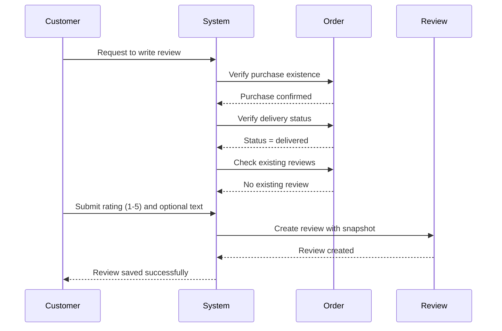

**SNAPSHOT ON CREATION**

WHEN a review is created, THE system SHALL create an initial snapshot recording the rating and text content at creation time.

WHEN a review is created, THE system SHALL record the timestamp of creation in the snapshot.

### Review Display and Sorting

**REVIEW VISIBILITY ON PRODUCTS**

WHEN a customer views a product detail page, THE system SHALL display all active reviews for that product.

WHEN a customer views a product detail page, THE system SHALL exclude reviews from deleted or banned customers.

WHEN a customer views a product detail page, THE system SHALL display the number of reviews for that product.

**REVIEW DISPLAY SORTING**

WHEN displaying reviews on a product page, THE system SHALL sort reviews by newest first by default.

WHEN displaying reviews on a product page, THE system SHALL show the creation date for each review.

**AVERAGE RATING CALCULATION**

WHEN displaying a product's average rating, THE system SHALL calculate it from all active (non-deleted) reviews.

WHEN calculating the average rating, THE system SHALL exclude deleted reviews from the calculation.

WHEN a product has no active reviews, THE system SHALL display a placeholder or "No reviews yet" message.

**REVIEW DISPLAY CONTENT**

WHEN displaying reviews, THE system SHALL show the customer's display name or "deleted user" if the account is deleted.

WHEN displaying reviews, THE system SHALL show the star rating and text content (if provided).

WHEN displaying reviews, THE system SHALL show the review creation date.

**RATING DISTRIBUTION DISPLAY**

WHEN displaying product reviews, THE system SHALL show the distribution of ratings (how many 5-star, 4-star, etc.).

WHEN calculating rating distribution, THE system SHALL only count active reviews.

### Review Editing Process

**EDITING PERMISSION**

WHEN a customer attempts to edit a review, THE system SHALL verify that the customer is the original reviewer.

IF the customer is not the original reviewer, THE system SHALL reject the edit request.

IF the customer is not the original reviewer, THE system SHALL display an access denied message.

**EDITING PROCESS**

WHEN a customer edits a review, THE system SHALL allow changes to the rating and/or text content.

WHEN a customer edits a review, THE system SHALL save the previous version before applying changes.

WHEN a customer edits a review, THE system SHALL update the modification timestamp.

**SNAPSHOT ON EDITING**

WHEN a review is edited, THE system SHALL create a snapshot containing old values and new values.

WHEN a review is edited, THE system SHALL record which fields were changed in the snapshot.

WHEN a review is edited, THE system SHALL preserve the original creation timestamp in the snapshot.

**EDIT LIMITATIONS**

WHEN a customer edits a review, THE system SHALL NOT allow editing after the review is deleted.

WHEN a customer edits a review, THE system SHALL prevent simultaneous edits from multiple sessions.

**EDIT CONFIRMATION**

WHEN a customer saves review edits, THE system SHALL display a confirmation message.

WHEN a customer saves review edits, THE system SHALL refresh the review display with updated content.

### Review Deletion and Preservation

**DELETION PERMISSION**

WHEN a customer attempts to delete a review, THE system SHALL verify that the customer is the original reviewer.

IF the customer is not the original reviewer, THE system SHALL reject the deletion request.

IF the customer is not the original reviewer, THE system SHALL display an access denied message.

**DELETION PROCESS**

WHEN a customer deletes a review, THE system SHALL mark the review as inactive.

WHEN a review is marked as inactive, THE system SHALL remove it from product review listings.

WHEN a review is marked as inactive, THE system SHALL recalculate the average rating.

**SNAPSHOT PRESERVATION**

WHEN a review is deleted, THE system SHALL create a snapshot of the review's final state.

WHEN a review is deleted, THE system SHALL preserve the snapshot forever (immutable).

WHEN a review is deleted, THE system SHALL retain the snapshot's old values and new values.

**DELETED USER DISPLAY**

WHEN a customer deletes their account, THE system SHALL preserve their reviews.

WHEN displaying deleted user reviews, THE system SHALL show "deleted user" instead of the display name.

WHEN displaying deleted user reviews, THE system SHALL exclude them from average rating calculations.

**SNAPSHOT ACCESS**

WHEN viewing review snapshots, THE system SHALL restrict access to the original reviewer and administrators.

WHEN viewing review snapshots, THE system SHALL display the changes, old values, and new values.

WHEN viewing review snapshots, THE system SHALL show the snapshot creation timestamp.

**RECOVERY FROM DELETION**

WHEN a review is deleted, THE system SHALL provide an option to restore only to administrators.

WHEN a review is deleted, THE system SHALL log the deletion action with administrator ID (if restored by admin).

WHEN restoring a deleted review, THE system SHALL reactivate the review and recalculate average rating.

**DELIVERY REQUIREMENT MAINTAINED**

WHEN a review is restored after deletion, THE system SHALL maintain the requirement that delivery status must be "delivered".

WHEN a review is restored after deletion, THE system SHALL ensure the order item still has "delivered" status.

## InventoryRecord User Scenarios

Each variant has inventory history tracking all quantity changes. Sellers can add inventory through restocking with a quantity and reason. Sellers can adjust inventory through loss or adjustment entries. Order placement automatically creates negative inventory records. Order cancellation creates positive inventory records. Order refund creates positive inventory records. Sellers can view the complete inventory history for each variant. Current stock is the sum of all inventory records. Zero stock variants display as out of stock.

### Inventory Quantity Tracking

THE system SHALL track the current stock quantity for each product variant.

WHEN a product variant is created, THE system SHALL initialize its stock quantity to the value specified by the seller.

WHEN any inventory change occurs, THE system SHALL create a corresponding inventory record with the quantity change amount.

WHEN a customer places an order, THE system SHALL create negative inventory records for all purchased variants.

WHEN an order item is cancelled, THE system SHALL create positive inventory records to restore the stock quantity.

WHEN a refund is approved, THE system SHALL create positive inventory records to restore the stock quantity.

IF a product variant has no inventory records, THE system SHALL display its stock quantity as zero.

THE system SHALL calculate the current stock quantity by summing all inventory records for each variant.

THE system SHALL preserve all inventory records permanently without allowing deletion.

THE system SHALL record the timestamp for each inventory change.

### Restocking Process

WHEN a seller restocks inventory, THE system SHALL create a new inventory record with a positive quantity.

WHEN a seller performs restocking, THE system SHALL require a restock reason to be provided.

THE system SHALL accept restock quantity as a positive integer value.

WHEN restocking is completed, THE system SHALL add the quantity to the variant's current stock calculation.

THE system SHALL reject restock requests if the seller does not own the variant.

THE system SHALL record the restock reason in the inventory record.

THE system SHALL timestamp the restock record with the time of the transaction.

THE system SHALL allow sellers to perform multiple restock operations on the same variant.

WHEN restocking, THE system SHALL validate that the quantity is greater than zero.

THE system SHALL make restock records visible to the variant owner only.

### Inventory Adjustment Entries

WHEN a seller adjusts inventory, THE system SHALL create a new inventory record with the adjusted quantity change.

WHEN performing inventory adjustment, THE system SHALL require a reason to be provided.

THE system SHALL accept adjustment quantity as both positive (restock) and negative (loss) values.

WHEN an adjustment is negative, THE system SHALL prevent the adjustment from reducing stock below zero.

THE system SHALL reject adjustment requests if the seller does not own the variant.

THE system SHALL record the adjustment reason in the inventory record.

THE system SHALL timestamp the adjustment record with the time of the transaction.

WHEN adjustment causes stock to reach zero, THE system SHALL mark the variant as out of stock.

THE system SHALL allow sellers to adjust inventory regardless of pending orders.

THE system SHALL make adjustment records visible to the variant owner only.

### Order Inventory Deduction

WHEN an order is successfully placed and payment is confirmed, THE system SHALL create negative inventory records for all order items.

THE system SHALL calculate the negative quantity as the product of variant unit quantity and item quantity.

WHEN inventory deduction occurs, THE system SHALL record the reason as "Order".

THE system SHALL timestamp each inventory deduction record with the order placement time.

WHEN a variant's stock reaches zero after deduction, THE system SHALL mark the variant as out of stock.

THE system SHALL prevent orders from being placed for variants with zero stock.

WHEN an order is cancelled, THE system SHALL create positive inventory records to restore the original quantities.

WHEN a refund is approved, THE system SHALL create positive inventory records to restore the original quantities.

THE system SHALL preserve all inventory deduction records permanently.

THE system SHALL prevent duplicate inventory deduction for the same order item.

### Cancellation Inventory Restoration

WHEN a cancellation request is approved, THE system SHALL create positive inventory records to restore the cancelled item quantities.

THE system SHALL calculate the positive quantity as the product of variant unit quantity and cancelled item quantity.

WHEN inventory restoration occurs due to cancellation, THE system SHALL record the reason as "Cancellation".

THE system SHALL timestamp each restoration record with the cancellation approval time.

WHEN a variant's stock increases from zero after restoration, THE system SHALL mark the variant as available for purchase.

THE system SHALL allow partial cancellations to restore only the cancelled item quantities.

WHEN all items in an order are cancelled, THE system SHALL restore all associated inventory quantities.

THE system SHALL preserve all cancellation restoration records permanently.

THE system SHALL prevent restoration of inventory for already delivered or refunded items.

THE system SHALL ensure restoration only occurs for items with "paid" or "shipped" status.

### Refund Inventory Restoration

WHEN a refund request is approved, THE system SHALL create positive inventory records to restore the refunded item quantities.

THE system SHALL calculate the positive quantity as the product of variant unit quantity and refunded item quantity.

WHEN inventory restoration occurs due to refund, THE system SHALL record the reason as "Refund".

THE system SHALL timestamp each restoration record with the refund approval time.

WHEN a variant's stock increases from zero after restoration, THE system SHALL mark the variant as available for purchase.

THE system SHALL allow partial refunds to restore only the refunded item quantities.

WHEN all items in an order are refunded, THE system SHALL restore all associated inventory quantities.

THE system SHALL preserve all refund restoration records permanently.

THE system SHALL prevent restoration of inventory for items not in "delivered" status.

THE system SHALL ensure restoration only occurs for items within the 7-day refund window.

### Inventory History Viewing

WHEN a seller views inventory history, THE system SHALL display all inventory records for that seller's variants.

THE system SHALL show each record with: quantity change, reason, and timestamp.

THE system SHALL sort inventory history by timestamp with newest records first.

WHEN viewing history, THE system SHALL display the current stock calculation prominently.

THE system SHALL allow sellers to view history for all their product variants.

THE system SHALL group inventory records by variant for clear organization.

THE system SHALL prevent customers from viewing other sellers' inventory histories.

THE system SHALL allow sellers to view their own inventory history after product deletion.

WHEN viewing history, THE system SHALL show the type of change (restock, order, adjustment, cancellation, refund).

THE system SHALL make inventory history read-only and immutable.

### Stock Calculation Method

THE system SHALL calculate current stock quantity by summing all inventory records for each variant.

THE system SHALL include all inventory record types in the calculation (positive and negative changes).

THE system SHALL display the calculated stock quantity on product variant listings.

THE system SHALL update stock calculations in real-time when inventory records are created.

THE system SHALL prevent negative stock quantities from being displayed.

WHEN stock is calculated as zero, THE system SHALL display the variant as "out of stock".

THE system SHALL recalculate stock when any inventory record is added or modified.

THE system SHALL preserve the calculated stock value at the time of order creation.

THE system SHALL use the calculated stock for availability checks during cart operations.

THE system SHALL display the calculated stock in seller inventory management interfaces.

### Out of Stock Display

WHEN a variant's stock quantity is zero, THE system SHALL display it as "out of stock".

THE system SHALL prevent out of stock variants from being added to the shopping cart.

THE system SHALL display "out of stock" status in product listing pages.

THE system SHALL display "out of stock" status in product detail pages.

THE system SHALL visually indicate out of stock variants with a distinct badge or label.

WHEN an out of stock variant is in a cart, THE system SHALL mark it as unavailable.

THE system SHALL show "out of stock" status even for products with remaining variants.

THE system SHALL update the out of stock display immediately when stock is restocked.

THE system SHALL display "out of stock" in search results for affected variants.

THE system SHALL allow viewing out of stock variants in wishlist without error.

### Inventory Change Reasons

WHEN creating any inventory record, THE system SHALL require a reason to be provided.

THE system SHALL accept "Order" as a valid automatic reason for negative changes.

THE system SHALL accept "Cancellation" as a valid automatic reason for positive changes.

THE system SHALL accept "Refund" as a valid automatic reason for positive changes.

WHEN a seller performs restocking, THE system SHALL require the seller to provide a custom reason.

WHEN a seller performs adjustment, THE system SHALL require the seller to provide a custom reason.

THE system SHALL store the reason text with each inventory record permanently.

THE system SHALL display the reason in inventory history viewing interfaces.

THE system SHALL reject inventory records without a reason field.

THE system SHALL allow the reason field to contain up to 500 characters.

## AdminRequest User Scenarios

Any user can submit a request to become an administrator with a reason. Super administrators can view all pending admin requests. Super administrators can approve or reject admin requests. Approved users become regular administrators. Regular administrators cannot promote themselves. Super administrators can promote regular administrators to super administrator. Super administrators can demote other super administrators. Self-demotion is not permitted. Requests include snapshots of status changes.

### Admin Request Submission

WHEN a user submits a request to become an administrator, THE system SHALL:

1. Require the user to provide a reason (text field)
2. Record the submission timestamp
3. Create a new AdminRequest record with status "pending"
4. Associate the request with the requesting user
5. Notify super administrators of the new pending request

IF the reason field is empty, THE system SHALL reject the submission and display a validation error.
IF the user already has a pending admin request, THE system SHALL reject the submission and indicate that a previous request is under review.

WHEN a user submits an admin request, THE system SHALL create a snapshot of the request state for audit purposes.

### Pending Request Review

WHEN a super administrator views pending admin requests, THE system SHALL:

1. Display a list of all pending admin requests
2. Show each request's requester name and email
3. Display the request submission date
4. Display the reason provided by the requester
5. Show the requester's current account type (customer or seller)
6. Sort the list by submission date, newest first

WHEN a super administrator reviews a pending request, THE system SHALL display the complete request details including all submission information.

WHEN a user with no pending or approved admin request submits a new request, THE system SHALL validate and create the request record.

### Admin Request Approval

WHEN a super administrator approves an admin request, THE system SHALL:

1. Update the AdminRequest status to "approved"
2. Create a snapshot of the request approval state
3. Grant the requesting user administrator privileges
4. Set the user's admin grade to "regular administrator"
5. Record the approval timestamp and approving super administrator
6. Notify the user of their new administrator status

IF the request was previously rejected, THE system SHALL require the user to submit a new request (approval does not override rejection).
WHEN approval occurs, THE system SHALL preserve all historical admin request records in immutable snapshot format.

### Admin Request Rejection

WHEN a super administrator rejects an admin request, THE system SHALL:

1. Update the AdminRequest status to "rejected"
2. Create a snapshot of the rejection state
3. Record the rejection timestamp and rejecting super administrator
4. Notify the user of the rejection

WHEN rejecting an admin request, THE system SHALL:
1. Require a rejection reason (text field)
2. Store the rejection reason in the request record
3. Allow the user to view the rejection reason
4. Permit the user to submit a new admin request after rejection

IF the super administrator does not provide a rejection reason, THE system SHALL reject the action and display a validation error.

### Super Administrator Privileges

ONLY super administrators SHALL have the following privileges:

1. View all pending admin requests on the platform
2. Approve or reject admin requests
3. Promote regular administrators to super administrators
4. Demote other super administrators to regular administrators
5. Access all system-wide administrative functions

Regular administrators SHALL:
1. NOT be able to view pending admin requests
2. NOT be able to approve or reject admin requests
3. NOT be able to promote or demote any administrators

WHEN a user performs an action requiring super administrator privileges, THE system SHALL verify the user's current admin grade before allowing the action.

### Admin Promotion Workflow

WHEN a super administrator promotes a regular administrator to super administrator, THE system SHALL:

1. Update the target user's admin grade from "regular administrator" to "super administrator"
2. Create a snapshot of the promotion state including old and new grade
3. Record the promotion timestamp and promoting super administrator
4. Notify the promoted user of their new privileges
5. Grant the user all super administrator privileges immediately

WHEN promoting an administrator, THE system SHALL:
1. Allow the super administrator to select any regular administrator to promote
2. NOT allow self-promotion (super administrators cannot promote themselves)
3. Ensure the target user is currently a regular administrator before promotion

IF the target user is already a super administrator, THE system SHALL reject the promotion action and display an error.

### Admin Demotion Workflow

WHEN a super administrator demotes another super administrator to regular administrator, THE system SHALL:

1. Update the target user's admin grade from "super administrator" to "regular administrator"
2. Create a snapshot of the demotion state including old and new grade
3. Record the demotion timestamp and demoting super administrator
4. Notify the demoted user of their changed privileges
5. Revoke super administrator privileges from the target user

WHEN demoting an administrator, THE system SHALL:
1. Allow the super administrator to select any other super administrator to demote
2. NOT allow self-demotion (super administrators cannot demote themselves)
3. Ensure the target user is currently a super administrator before demotion
4. Prevent the demoting super administrator from being the same as the target

IF a super administrator attempts to demote themselves, THE system SHALL reject the action and display a validation error.

### Self-Promotion Restriction

THE system SHALL enforce the following self-promotion restrictions:

1. Super administrators CANNOT promote themselves to super administrator
2. Super administrators CANNOT demote themselves to regular administrator
3. Regular administrators CANNOT promote themselves to super administrator
4. The system SHALL prevent any user from granting themselves higher privileges

WHEN a user attempts to self-promote or self-demote, THE system SHALL:
1. Compare the requesting user ID with the target user ID
2. Reject the action if they match
3. Display an error message: "Self-administration changes are not permitted"
4. Log the attempted self-administration action in the audit log

THE system SHALL maintain this restriction even during emergency situations or role transitions.

### Request Snapshot Tracking

WHEN any status change occurs on an AdminRequest, THE system SHALL create an immutable snapshot:

1. Snapshot shall include: request ID, user ID, old status, new status, timestamp, responsible administrator ID
2. Snapshot shall include the reason provided during submission
3. Snapshot shall include rejection reason if status is "rejected"
4. Snapshot shall be immutable and cannot be deleted or modified
5. Snapshot shall be viewable by super administrators and the requesting user

WHEN viewing admin request history, THE system SHALL:
1. Display all snapshots associated with the request
2. Show chronological sequence of status changes
3. Include timestamps and responsible administrator names
4. Allow viewing of snapshot details

IF a user attempts to delete an admin request or its snapshots, THE system SHALL reject the action and preserve all historical records.

### Admin Status Transitions

Admin requests SHALL follow these state transitions:

"pending" → "approved" (when super administrator approves)
"pending" → "rejected" (when super administrator rejects with reason)

WHEN transitioning from "pending" to "approved":
1. User gains regular administrator privileges
2. Request becomes non-editable
3. Snapshot is created and preserved
4. User can no longer submit new admin requests

WHEN transitioning from "pending" to "rejected":
1. Request becomes non-editable
2. Snapshot is created with rejection reason
3. User can view rejection reason
4. User may submit a new admin request after rejection

IF a user attempts to change a request that is already "approved" or "rejected", THE system SHALL reject the action and display an error indicating the request is in final state.

### Administrator Grade Management

THE system SHALL manage two administrator grades with the following rules:

Regular Administrator:
1. CANNOT promote or demote any administrators
2. CANNOT view pending admin requests
3. CANNOT access super administrator-only functions
4. SHALL be promoted to super administrator by super administrator action only

Super Administrator:
1. SHALL be able to promote regular administrators to super administrators
2. SHALL be able to demote other super administrators to regular administrators
3. SHALL be able to view all pending admin requests
4. SHALL have full administrative access to all system functions

WHEN grade change occurs, THE system SHALL:
1. Create a snapshot of the grade change with before/after values
2. Immediately apply or revoke privileges accordingly
3. Notify the affected user of the change
4. Record the action in the audit log

## Snapshot User Scenarios

Every editable data change creates a snapshot recording the previous state. Snapshots capture when changes were made and what was changed. Snapshots record values before and after each modification. Snapshots are immutable and cannot be deleted. Snapshots are visible to relevant parties like owners and administrators. Snapshots apply to products, variants, seller profiles, order items, reviews, and requests. Snapshots are preserved even after the original data is deleted. Customers can view snapshots of their reviews. Sellers can view snapshots of their products. Snapshots support dispute resolution.

### Snapshot Creation Trigger

WHEN a product is edited, THE system SHALL create a product snapshot.

WHEN a product variant is edited, THE system SHALL create a product variant snapshot.

WHEN a seller profile is edited, THE system SHALL create a seller profile snapshot.

WHEN a review is edited, THE system SHALL create a review snapshot.

WHEN a cancellation request is approved or rejected, THE system SHALL create a cancellation request snapshot.

WHEN a refund request is approved or rejected, THE system SHALL create a refund request snapshot.

IF a customer deletes their account, THE system SHALL preserve all review snapshots but mark them as "deleted user".

IF a seller deletes a product, THE system SHALL preserve all product snapshots associated with that product.

WHEN an order is placed, THE system SHALL create snapshots of the purchased products, variants, and seller profiles.

THE system SHALL record the timestamp of when each snapshot was created.

THE system SHALL record which user created each snapshot.

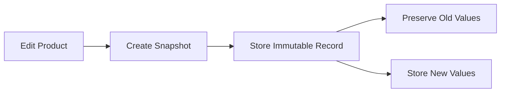

### Immutable Snapshot Records

THE system SHALL ensure snapshots cannot be modified after creation.

THE system SHALL prevent deletion of any snapshot record.

THE system SHALL maintain snapshot records for all time.

IF a user attempts to modify a snapshot, THE system SHALL reject the modification request.

IF a user attempts to delete a snapshot, THE system SHALL reject the deletion request.

WHEN a snapshot is created, THE system SHALL mark it as immutable.

WHEN accessing a snapshot, THE system SHALL display it without any modification options.

THE system SHALL preserve snapshots even when the original record is deleted.

THE system SHALL not allow rollback to a previous snapshot state.

WHEN a snapshot is created, THE system SHALL generate a unique identifier for the snapshot record.

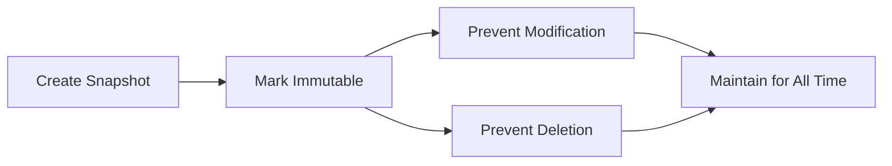

### Snapshot Viewable Parties

WHEN viewing a product snapshot, THE system SHALL allow the product owner to view it.

WHEN viewing a product snapshot, THE system SHALL allow administrators to view it.

WHEN viewing a seller profile snapshot, THE system SHALL allow the seller owner to view it.

WHEN viewing a seller profile snapshot, THE system SHALL allow administrators to view it.

WHEN viewing a review snapshot, THE system SHALL allow the review owner to view it.

WHEN viewing a review snapshot, THE system SHALL allow administrators to view it.

WHEN viewing an order snapshot, THE system SHALL allow the order owner to view it.

WHEN viewing an order snapshot, THE system SHALL allow administrators to view it.

WHEN viewing a cancellation request snapshot, THE system SHALL allow the order owner and the seller of that order item to view it.

WHEN viewing a refund request snapshot, THE system SHALL allow the order owner and the seller of that order item to view it.

IF a user attempts to view a snapshot they do not have access to, THE system SHALL reject the request.

THE system SHALL display "deleted user" for snapshots owned by deleted customer accounts.

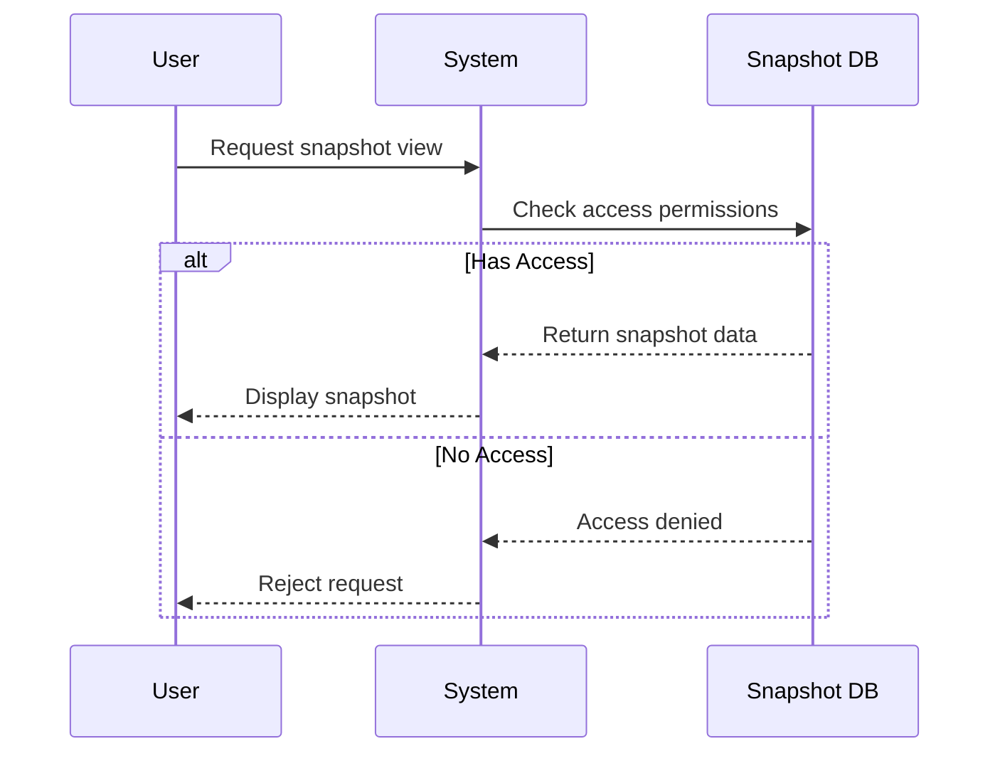

### Snapshot Preservation on Deletion

WHEN a product is deleted, THE system SHALL preserve all product snapshots.

WHEN a product is deleted, THE system SHALL preserve all product variant snapshots.

WHEN a seller profile is deleted, THE system SHALL preserve all seller profile snapshots.

WHEN a review is deleted, THE system SHALL preserve all review snapshots.

WHEN a seller account is deleted, THE system SHALL preserve all order snapshots.

WHEN a customer account is deleted, THE system SHALL preserve all order snapshots.

WHEN a product is deleted, THE system SHALL maintain snapshots accessible to administrators.

WHEN an order is placed, THE system SHALL preserve snapshots of products and variants even after order completion.

THE system SHALL preserve snapshots for dispute resolution purposes.

IF a product is deleted and then recreated, THE system SHALL maintain all previous product snapshots.

WHEN deleting a seller profile, THE system SHALL preserve snapshots showing shop name and logo for past orders.

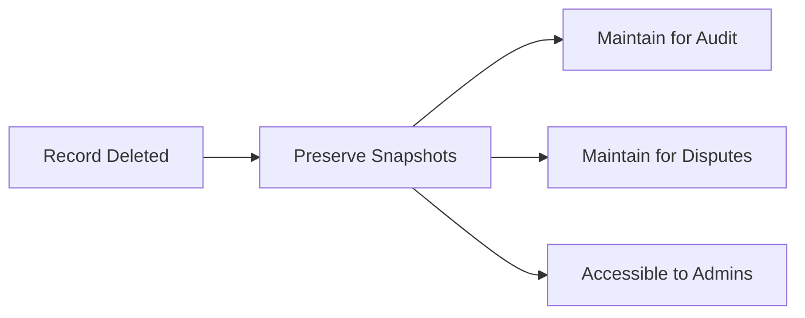

### Snapshot Dispute Resolution

WHEN a dispute arises, THE system SHALL provide snapshot records to relevant parties.

WHEN a dispute involves product information, THE system SHALL display the product snapshot at the time of purchase.

WHEN a dispute involves seller information, THE system SHALL display the seller profile snapshot at the time of purchase.

WHEN a dispute involves a review, THE system SHALL display the review snapshot to show original content.

WHEN a dispute involves cancellation or refund, THE system SHALL display the request snapshot showing approval or rejection state.

WHEN a dispute is escalated, THE system SHALL allow administrators to review all relevant snapshots.

THE system SHALL preserve snapshots for dispute resolution even after all records are deleted.

WHEN a dispute involves pricing, THE system SHALL show the snapshot to verify price at time of purchase.

WHEN a dispute involves product options, THE system SHALL show the variant snapshot to confirm option values.

THE system SHALL maintain snapshots for a minimum period to support dispute resolution.

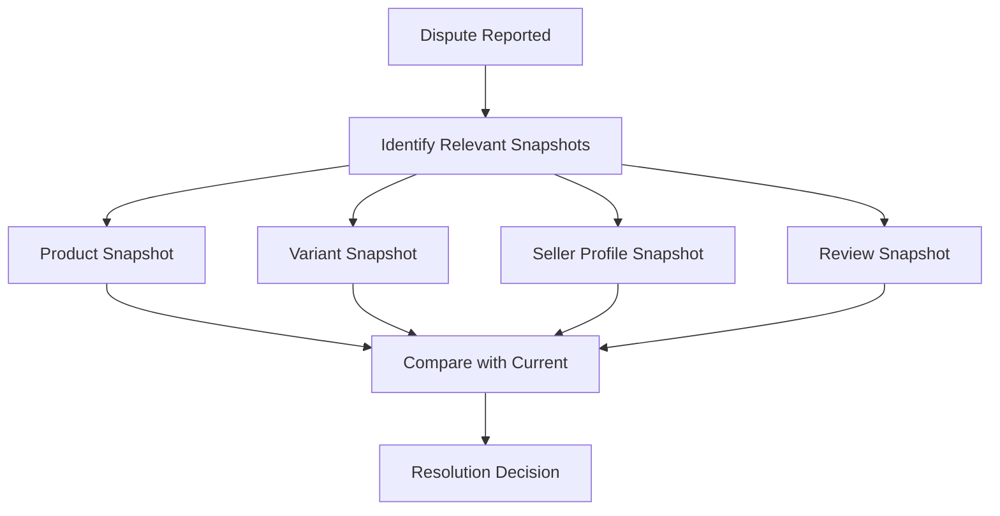

### Snapshot Review History

WHEN a customer edits a review, THE system SHALL create a review snapshot.

WHEN a customer views their review history, THE system SHALL show the current review.

WHEN a customer views their review history, THE system SHALL provide option to view previous snapshots.

WHEN a customer deletes a review, THE system SHALL preserve the review snapshots.

THE system SHALL allow customers to view all snapshots of their own reviews.

WHEN a review snapshot is viewed, THE system SHALL show the timestamp of the snapshot.

WHEN a review snapshot is viewed, THE system SHALL show what fields were changed.

WHEN a review snapshot is viewed, THE system SHALL show the old value and new value for each changed field.

WHEN a customer writes a new review, THE system SHALL create a snapshot of that initial review.

IF a review is edited multiple times, THE system SHALL maintain a complete history of all snapshots.

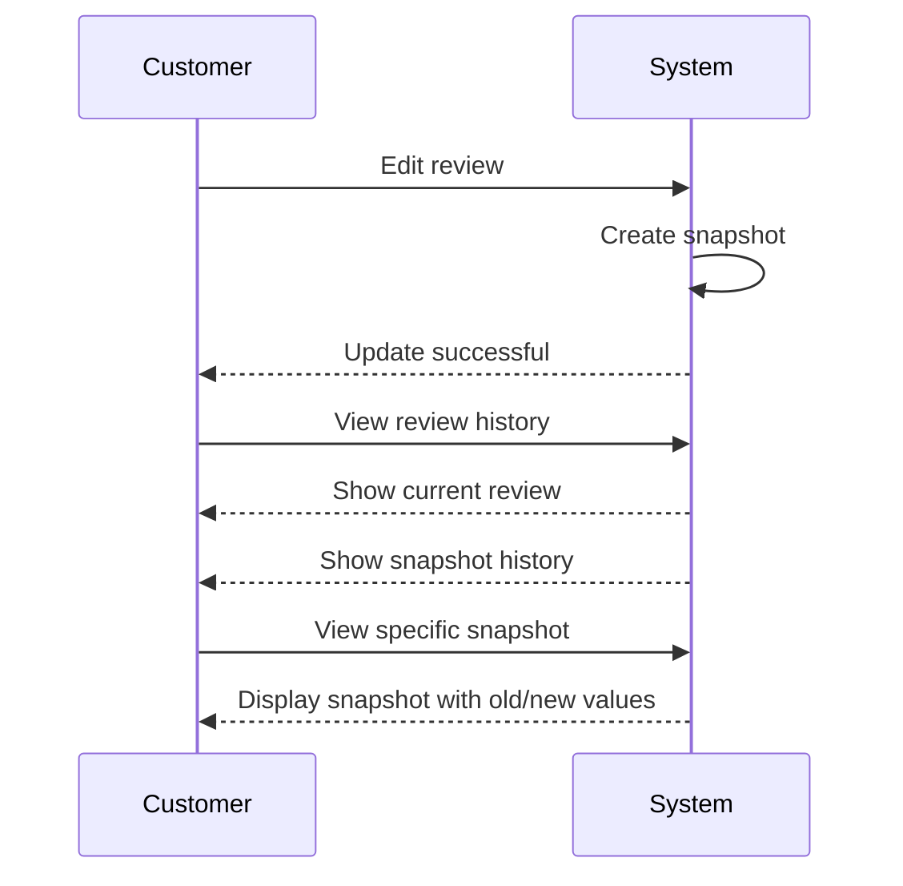

### Product Snapshot Access

WHEN a seller views their product, THE system SHALL show all product snapshots.

WHEN a seller views their product, THE system SHALL show when each snapshot was created.

WHEN a seller views their product, THE system SHALL show what fields were changed in each snapshot.

WHEN a seller views their product, THE system SHALL show the old and new values for each change.

WHEN an administrator views any product, THE system SHALL show all product snapshots.

WHEN a product is deleted, THE system SHALL still allow administrators to view its snapshots.

WHEN viewing a product snapshot, THE system SHALL show all variant snapshots included in that product snapshot.

WHEN viewing a product snapshot, THE system SHALL show product images at the time of the snapshot.

WHEN a seller deletes a product, THE system SHALL preserve all product snapshots for administrative access.

WHEN viewing product snapshots, THE system SHALL sort them by creation timestamp (newest first).

THE system SHALL prevent sellers from deleting their product snapshots.

```mermaid
flowchart LR
    A["Seller Views Product"] --> B["Show Current State"]
    A --> C["Show Snapshot History"]
    C --> D["List Timestamps"]
    C --> E["List Changes"]
    C --> F["Show Old/New Values"]
    C --> G["Show Included Variant Snapshots"]
```

### Order Snapshot Visibility

WHEN a customer views their order, THE system SHALL show snapshots of all purchased products.

WHEN a customer views their order, THE system SHALL show snapshots of all purchased variants.

WHEN a customer views their order, THE system SHALL show snapshots of seller profiles at time of purchase.

WHEN an administrator views any order, THE system SHALL show all order snapshots.

WHEN viewing an order snapshot, THE system SHALL display the exact price at time of purchase.

WHEN viewing an order snapshot, THE system SHALL display the exact product description at time of purchase.

WHEN viewing an order snapshot, THE system SHALL display the exact variant options at time of purchase.

WHEN viewing an order snapshot, THE system SHALL show the shop name from the seller profile snapshot.

WHEN an order is cancelled, THE system SHALL preserve all order snapshots.

WHEN an order is refunded, THE system SHALL preserve all order snapshots.

WHEN viewing order snapshots, THE system SHALL allow comparison with current product data.

```mermaid
flowchart LR
    A["Customer Views Order"] --> B["Show Product Snapshots"]
    A --> C["Show Variant Snapshots"]
    A --> D["Show Seller Profile Snapshots"]
    B --> E["Display Original Name"]
    B --> F["Display Original Description"]
    C --> G["Display Original Price"]
    C --> H["Display Original Options"]
    D --> I["Display Original Shop Name"]
```

### Change Tracking Snapshots

WHEN a snapshot is created, THE system SHALL record what field was changed.

WHEN a snapshot is created, THE system SHALL record the old value of the changed field.

WHEN a snapshot is created, THE system SHALL record the new value of the changed field.

WHEN a snapshot is created, THE system SHALL record the timestamp of the change.

WHEN a snapshot is created, THE system SHALL record which user made the change.

WHEN viewing a snapshot, THE system SHALL show a list of all changed fields.

WHEN viewing a snapshot, THE system SHALL display each change as "old value" to "new value".

WHEN viewing a product snapshot, THE system SHALL show changes to product name, description, price, and images.

WHEN viewing a variant snapshot, THE system SHALL show changes to SKU code, option values, and price.

WHEN viewing a seller profile snapshot, THE system SHALL show changes to shop name, description, and logo.

WHEN multiple fields change simultaneously, THE system SHALL create one snapshot with all changes recorded.

```mermaid
flowchart TD
    A["User Makes Change"] --> B["Record Timestamp"]
    B --> C["Record User Who Changed"]
    C --> D["Record Old Values"]
    D --> E["Record New Values"]
    E --> F["List Changed Fields"]
    F --> G["Store as Immutable Snapshot"]
```

### Snapshot Audit Trail

WHEN an administrator views the audit trail, THE system SHALL show all snapshots created in the system.

WHEN an administrator views the audit trail, THE system SHALL show who created each snapshot.

WHEN an administrator views the audit trail, THE system SHALL show when each snapshot was created.

WHEN an administrator views the audit trail, THE system SHALL show what type of record was snapshotted.

WHEN an administrator views the audit trail, THE system SHALL show what fields were changed.

WHEN an administrator views the audit trail, THE system SHALL filter snapshots by record type.

WHEN an administrator views the audit trail, THE system SHALL filter snapshots by creator.

WHEN an administrator views the audit trail, THE system SHALL filter snapshots by date range.

WHEN an administrator views the audit trail, THE system SHALL sort snapshots by timestamp.

WHEN an administrator views the audit trail, THE system SHALL provide pagination for large result sets.

THE system SHALL maintain audit trail snapshots for dispute resolution and compliance purposes.

```mermaid
sequenceDiagram
    participant A as Administrator
    participant S as System
    participant DB as Snapshot Database
    A->>S: Request audit trail
    S->>S: Filter by date range
    S->>S: Filter by record type
    S->>S: Filter by creator
    S->>DB: Query all snapshots
    DB-->>S: Return snapshot records
    S-->>A: Display audit trail
    A->>S: View specific snapshot
    S-->>A: Show full snapshot details
```

# External Integrations

Third-party API contracts, webhook handlers, and integration specifications.

## Integration Contracts

Define external API dependencies, authentication methods, request/response formats, and error handling for third-party integrations.

### Payment Gateway Integration

WHEN a customer places an order, THE system SHALL initiate payment processing through an external payment gateway.

WHEN payment is initiated, THE system SHALL send the order total amount, currency, and customer identifiers to the payment gateway.

IF the payment gateway responds with success, THE system SHALL create the order and mark it as paid.

IF the payment gateway responds with failure, THE system SHALL NOT create the order and SHALL display an appropriate error message to the customer.

IF the payment gateway response times out, THE system SHALL retry the payment request up to three times before failing.

IF all retry attempts fail, THE system SHALL NOT create the order and SHALL display a retry option to the customer.

WHEN a customer retries a failed payment, THE system SHALL re-initiate the payment process for the same order details.

IF a payment transaction is disputed by the customer, THE system SHALL maintain the original order status until the dispute is resolved.

WHEN a payment gateway integration error occurs, THE system SHALL record the error details for administrative review.

IF the payment gateway is unavailable, THE system SHALL display a maintenance message and prevent customers from placing orders.

THE system SHALL support multiple payment methods as configured in the payment gateway (credit card, debit card, digital wallet).

IF a payment method is unsupported by the payment gateway, THE system SHALL display a message indicating the payment method is unavailable.

WHEN payment succeeds, THE system SHALL generate a payment reference number and store it with the order.

IF a customer attempts to checkout with payment method errors, THE system SHALL highlight the specific payment method field requiring correction.

THE system SHALL maintain payment success/failure logs for each order for reconciliation purposes.

### Payment Webhook Handling

WHEN the payment gateway sends a payment status notification, THE system SHALL receive and process the webhook event.

WHEN a payment success webhook is received, THE system SHALL verify the webhook signature before processing the event.

IF the webhook signature is invalid, THE system SHALL reject the webhook and SHALL log the verification failure.

WHEN a payment success webhook is verified, THE system SHALL update the order status to paid if not already paid.

WHEN a payment failure webhook is received, THE system SHALL update the order status to failed and SHALL notify the customer.

WHEN a refund webhook is received from the payment gateway, THE system SHALL update the order item status to refunded.

WHEN a dispute webhook is received, THE system SHALL update the order status to pending dispute and SHALL freeze the order processing.

IF a webhook event is processed successfully, THE system SHALL return a success acknowledgment to the payment gateway.

IF a webhook event fails to process, THE system SHALL retry the processing up to three times before marking the event as failed.

WHEN a webhook processing failure persists after retries, THE system SHALL alert administrators through the notification system.

THE system SHALL maintain a log of all webhook events received, including timestamps and processing results.

IF duplicate webhook events are received, THE system SHALL ignore subsequent duplicates and SHALL NOT update the order status again.

WHEN a webhook contains incomplete information, THE system SHALL reject the event and SHALL request the payment gateway to resend the complete data.

THE system SHALL validate that webhook events match existing orders before updating order status.

IF a webhook references an order that does not exist, THE system SHALL log the event as invalid and SHALL NOT create the order automatically.

THE system SHALL process webhooks asynchronously without blocking the main checkout flow.

### Third-Party OAuth Provider Integration

WHEN a user chooses to register or login through a third-party OAuth provider, THE system SHALL redirect the user to the OAuth provider's authentication page.

WHEN the OAuth provider authenticates the user, THE system SHALL receive an authorization code and exchange it for an access token.

IF the OAuth provider authentication succeeds, THE system SHALL create or link the user account to the authenticated identity.

IF the OAuth provider authentication fails, THE system SHALL display an error message and SHALL allow the user to retry or use email password authentication.

WHEN an OAuth token expires, THE system SHALL refresh the token automatically when the next user action requires it.

IF the OAuth token refresh fails, THE system SHALL require the user to re-authenticate through the OAuth provider.

WHEN a user links their email password account to an OAuth provider, THE system SHALL verify the email address ownership before completing the link.

IF a user's OAuth provider account is deactivated, THE system SHALL prevent login through that provider and SHALL notify the user.

WHEN a customer uses OAuth login, THE system SHALL create a corresponding customer account with the email from the OAuth provider.

WHEN a seller uses OAuth login, THE system SHALL create a corresponding seller account pending administrator approval.

IF the OAuth provider requires additional verification (such as two-factor authentication), THE system SHALL handle the additional step before completing login.

THE system SHALL store OAuth provider identifiers to enable future login without requiring email password.

WHEN a user deletes their account, THE system SHALL unlink all OAuth provider connections.

IF the OAuth provider integration is unavailable, THE system SHALL display an error message and SHALL allow users to use email password authentication instead.

THE system SHALL support multiple OAuth providers as configured (for example: Google, Facebook, Apple).

WHEN a new OAuth provider is added to the system, THE system SHALL require administrator configuration before it becomes available to users.

### Integration Contract Management

WHEN an external integration is added to the system, THE system SHALL document the integration contract with required parameters and expected responses.

WHEN an integration contract is modified, THE system SHALL notify administrators before deploying the changes.

IF an integration endpoint changes its API format, THE system SHALL update the integration contract and SHALL version the contract.

WHEN a third-party API changes its authentication method, THE system SHALL update the integration contract and SHALL update all affected integrations.

THE system SHALL maintain an integration registry that lists all active third-party integrations and their status.

WHEN an integration is scheduled for maintenance by the third-party provider, THE system SHALL display advance notice to affected users.

IF a third-party API becomes unavailable, THE system SHALL enter fallback mode and SHALL notify administrators.

WHEN an integration returns an error, THE system SHALL log the error with sufficient context for troubleshooting.

THE system SHALL monitor integration health and SHALL alert administrators when error rates exceed acceptable thresholds.

IF an integration consistently fails over a time period, THE system SHALL automatically disable the integration and SHALL notify administrators.

WHEN a new integration version is released by the third-party provider, THE system SHALL require administrator approval before adopting the new version.

THE system SHALL maintain backward compatibility with previous integration versions during transition periods.

IF an integration requires certificate or key updates, THE system SHALL notify administrators before the certificates expire.

WHEN an integration contract specifies data format changes, THE system SHALL validate incoming data against the contract before processing.

THE system SHALL document all integration endpoints with their purpose, input requirements, and output formats in the system documentation.

### Shipment Tracking Integration

WHEN a seller creates a shipment with tracking information, THE system SHALL store the carrier name and tracking number.

WHEN tracking information is updated by the carrier, THE system SHALL receive and process tracking updates through the carrier's API.

IF the carrier API indicates a delivery exception (for example: address issue, weather delay), THE system SHALL notify the customer about the exception.

WHEN a shipment shows delivered status from the carrier, THE system SHALL update the shipment status to delivered and SHALL notify the customer.

IF the carrier API returns an error while fetching tracking updates, THE system SHALL retry the fetch request up to three times before marking the update as failed.

WHEN a shipment tracking update fails after retries, THE system SHALL log the failure and SHALL continue with the last known status.

THE system SHALL support multiple shipping carriers as configured (for example: FedEx, UPS, DHL, local carriers).

WHEN a customer views their order details, THE system SHALL display current tracking information for each shipment.

IF a shipment is in transit for more than 14 days without updates, THE system SHALL flag the shipment for administrative review.

WHEN a seller cancels a shipment before it is handed to the carrier, THE system SHALL update the order item status back to paid.

THE system SHALL allow customers to confirm delivery receipt even if the carrier has not confirmed delivery.

IF the carrier API integration is unavailable, THE system SHALL display the last known tracking status and SHALL allow customers to proceed with the order.

WHEN a shipment tracking number becomes invalid, THE system SHALL notify the seller to verify the tracking information.

THE system SHALL maintain historical tracking records for each shipment for customer reference and dispute resolution.

# File Storage

File upload capabilities, media processing, and storage requirements.

## File Upload and Management

Define file upload capabilities, supported formats, processing requirements, and access control for stored files.

### Product Image Upload

WHEN a seller uploads product images, THE system SHALL:
1. Accept multiple image files per product
2. Assign a display order to each image (first image becomes the main thumbnail)
3. Store each image with a unique URL
4. Include image metadata in product snapshots

IF a seller attempts to upload an image exceeding the size limit, THE system SHALL reject the upload.
IF the image format is not supported, THE system SHALL reject the upload.

WHEN a seller updates product images, THE system SHALL:
1. Update the display order as specified
2. Remove any deleted images from the product
3. Create a snapshot of the image configuration

IF a seller deletes all images from a product, THE system SHALL mark the product as having no visual display.

### Seller Logo Upload

WHEN a seller uploads a shop logo, THE system SHALL:
1. Accept a single logo image file
2. Validate the file format and size
3. Store the logo with a unique URL
4. Include the logo in seller profile snapshots

IF a seller uploads an invalid logo file, THE system SHALL reject the upload.
IF a seller replaces an existing logo, THE system SHALL create a profile snapshot.

WHEN a seller updates their shop profile, THE system SHALL:
1. Preserve the previous logo in the snapshot
2. Update the current logo image
3. Maintain logo URL history

IF a seller deletes their account, THE system SHALL remove the logo from active storage but preserve snapshots.

### File Storage and Access

WHEN files are uploaded to the system, THE system SHALL:
1. Store images in a secure file storage system
2. Generate persistent URLs for each file
3. Enforce access controls based on file type and owner

ALL uploaded files SHALL comply with the platform's file size limits.
ALL file URLs SHALL be accessible only through authorized system calls.

WHEN a product or seller profile is deleted, THE system SHALL:
1. Preserve file URLs in snapshots
2. Remove active file references
3. Maintain file access for snapshot viewing

WHEN a seller's products are hidden due to suspension, THE system SHALL:
1. Hide product images from search results
2. Allow existing order item snapshots to display images
3. Maintain image storage integrity

IF a file storage system experiences errors, THE system SHALL:
1. Log the failure
2. Alert administrators
3. Preserve any successfully uploaded files
4. Allow the user to retry the upload.

# Background Processing

Asynchronous job definitions, queue specifications, and scheduled task configurations.

## Job Specifications

Define background jobs, queue configurations, retry policies, and scheduling rules for asynchronous processing.

### Background Job Creation

WHEN a user triggers an action that requires asynchronous processing, THE system SHALL create a background job.

THE system SHALL assign a unique job identifier to each background job.

THE system SHALL categorize background jobs by type (e.g., order processing, notification sending, inventory update).

WHEN a background job is created, THE system SHALL record the creation timestamp.

IF a job requires priority handling, THE system SHALL mark the job as high priority.

IF a job is dependent on another job, THE system SHALL establish a parent-child relationship.

THE system SHALL reject background job creation if the required data for processing is incomplete.

THE system SHALL reject background job creation if the triggering action violates business rules.

THE system SHALL preserve job metadata including: job type, priority, creation timestamp, and dependent job references.

### Queue Management

THE system SHALL organize background jobs into processing queues based on job type.

WHEN a queue is overloaded, THE system SHALL route new jobs to an alternate queue.

THE system SHALL maintain job order within each queue (first-in-first-out).

THE system SHALL reject queue operations if the queue does not exist.

THE system SHALL reject queue operations if the user lacks permission for that queue.

WHEN a job is processed, THE system SHALL remove it from the queue.

IF a job fails processing, THE system SHALL return it to the queue for retry.

THE system SHALL allow administrative users to pause queue processing.

THE system SHALL allow administrative users to resume paused queue processing.

THE system SHALL provide visibility into queue status for administrative monitoring.

### Cron Schedule Configuration

WHEN a user defines a scheduled task, THE system SHALL create a cron schedule entry.

THE system SHALL store cron schedule expressions in standard format.

THE system SHALL validate cron schedule expressions for correctness.

IF a cron schedule expression is invalid, THE system SHALL reject it and provide error details.

WHEN a scheduled task is configured, THE system SHALL show the next expected execution time.

THE system SHALL allow users to edit cron schedule expressions for existing tasks.

IF a user modifies a cron schedule, THE system SHALL update the next execution time immediately.

THE system SHALL prevent deletion of scheduled tasks that have pending executions.

THE system SHALL preserve cron schedule history for audit purposes.

THE system SHALL allow users to activate or deactivate scheduled tasks without deleting them.

### Async Job Execution

WHEN a background job is ready for processing, THE system SHALL execute it asynchronously.

THE system SHALL process background jobs without blocking the requesting user's action.

WHEN async processing completes, THE system SHALL notify the requesting user if requested.

IF async processing fails, THE system SHALL retry the job according to retry policy.

THE system SHALL track the number of retry attempts for each failed job.

IF a job exceeds maximum retry attempts, THE system SHALL mark it as permanently failed.

THE system SHALL allow administrative users to manually retry failed jobs.

THE system SHALL allow administrative users to cancel pending async jobs.

THE system SHALL provide execution logs for failed async jobs.

THE system SHALL not expose internal async processing errors to end users.

### Scheduled Task Processing

WHEN a cron schedule time is reached, THE system SHALL trigger the associated scheduled task.

THE system SHALL execute scheduled tasks at their scheduled time even if the user is offline.

WHEN a scheduled task fails, THE system SHALL log the failure and attempt retry.

IF a scheduled task is configured for one-time execution, THE system SHALL disable it after execution.

IF a scheduled task is recurring, THE system SHALL schedule the next execution automatically.

THE system SHALL allow scheduled tasks to be rescheduled to a later time.

THE system SHALL allow scheduled tasks to be temporarily paused.

IF a scheduled task is paused, THE system SHALL skip its execution until resumed.

THE system SHALL notify task owners when scheduled tasks fail.

THE system SHALL provide a view of past scheduled task executions for auditing.