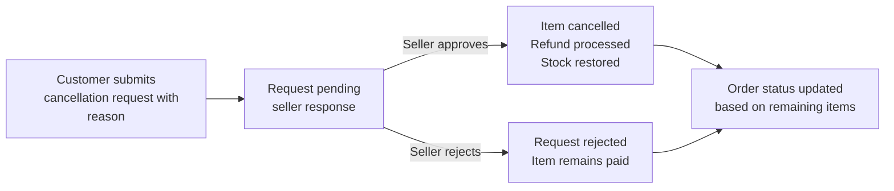

**ecommerceMall — Business rules, validation constraints, data browsing expectations, error scenarios**

Business rules, validation constraints, data browsing expectations, error scenarios

# Domain Business Rules

Per-concept business rules, validation logic, and domain constraints.

## Customer Rules

Customers must register with email and password before accessing any platform features—guest browsing is not allowed. Customers can update their password when needed. Customer profiles include a display name and phone number, both of which can be edited. When deleting their account, customers' profile information is removed but their orders and order history remain preserved for seller records and legal compliance. Deleted customer accounts appear as 'deleted user' in their reviews, but the reviews themselves are retained.

### No Guest Browsing Requirement

Access to all platform features requires a registered customer account. Guest users cannot browse products, view categories, search items, or access any part of the shopping experience. Users must complete registration with a valid email address and password before they can perform any action on the platform.

### Email and Password Authentication

Customer authentication uses email and password credentials.

When logging in, the system validates the email and password combination.
If the email is not registered, the login request is rejected.
If the password is incorrect, the login request is rejected.
If the account has been deleted, the login request is rejected.
If the account has been banned by an administrator, the login request is rejected.

### Password Change Requirement

Customers can update their password at any time after logging in.

When changing password, customers provide their current password and a new password.
If the current password is incorrect, the password change request is rejected.
If the new password matches the current password, the password change request is rejected.
The system accepts the new password and updates the account credentials.

### Display Name Management

Customer profiles include a display name that identifies the customer to other users.

When creating an account, customers must provide a display name.
Customers can edit their display name after registration.
If the display name is empty, the profile update request is rejected.
If the display name contains prohibited characters or content, the profile update request is rejected.
When the display name is changed, a snapshot is created recording the previous and new values.

### Phone Number Management

Customer profiles include a phone number for contact purposes.

When creating an account, customers may optionally provide a phone number.
Customers can update their phone number after registration.
If the phone number format is invalid, the profile update request is rejected.
When the phone number is changed, a snapshot is created recording the previous and new values.

### Account Deletion Policy

Customers may delete their personal account from the platform.

When deleting an account, the customer's profile information is permanently removed.
This includes the display name, phone number, and authentication credentials.
Account deletion can only be requested by the account owner.
If the request is not from the account owner, the deletion request is rejected.
If the account does not exist, the deletion request is rejected.

### Order History Preservation After Account Deletion

When a customer deletes their account, order history is preserved.

All past orders remain accessible to sellers for business record purposes.
All past orders remain accessible to administrators for oversight.
Order details, including purchased items, prices, and shipping addresses, are retained.
The customer can no longer access their order history after account deletion.
Deleted accounts are marked in order records but orders themselves remain intact.

### Review Retention After Account Deletion

When a customer deletes their account, their reviews are retained.

All written reviews remain on the product pages.
Each review from a deleted customer is displayed with the label 'deleted user'.
The review text and rating remain visible to other customers.
Review snapshots are preserved for dispute resolution purposes.
The review content cannot be modified after account deletion.

### Deleted User Display in Reviews

When viewing reviews from a deleted customer, the system displays 'deleted user' instead of the customer's name.

The display name field shows 'deleted user' for all reviews from deleted accounts.
Ratings and review text remain unchanged from when they were written.
Review timestamps remain visible.
The review remains sorted with other reviews based on its original creation date.
Deleting a customer account does not remove any historical review data.

## Seller Rules

Sellers must register with email and password and require administrator approval before they can begin selling. Sellers can monitor their approval status showing pending, approved, or rejected states. If rejected, sellers can view the rejection reason and submit a new registration request. Sellers can delete their account only when they have no pending orders in paid or shipped status and no pending cancellation or refund requests. When a seller deletes their account, their products are removed from listings but order history and product snapshots are preserved, and their shop name in past orders remains visible.

### Seller Account Approval Requirement

All sellers must complete the account approval process before they can begin selling on the platform. A seller account remains in a pending state until an administrator approves the registration request. While in pending status, the seller cannot list products, accept orders, or perform any selling activities.

The approval workflow begins when a seller submits a registration request. An administrator reviews the request and determines whether to approve or reject it. If approved, the seller account becomes active and the seller can begin creating products and fulfilling orders. If rejected, the seller receives a notification with the rejection reason and can submit a new registration request.

Once approved, seller accounts can be suspended by administrators if policy violations occur. When suspended, the seller's products are hidden from search results but existing orders can still be processed. Reinstated accounts become fully active again with products visible to customers.

The system tracks all approval-related communications and decisions for audit purposes. This includes the original application, approval or rejection decisions, and any re-submissions.

### Admin Approval Workflow

When a seller submits a registration request, it enters a pending approval state. Administrators can view a list of all pending seller registration requests with basic information including the shop name and registration date.

An administrator reviews each request and makes a binary decision: approve or reject. The decision is final and takes effect immediately upon confirmation. Upon approval, the seller's account status changes from pending to active, enabling full selling privileges.

When rejecting a request, the administrator must provide a detailed reason explaining why the registration was denied. This reason is visible to the seller and explains the specific deficiency or policy violation that caused the rejection.

The approval workflow maintains a complete audit trail including the date and time of submission, the administrator who made the decision, the decision itself, and the rejection reason (if applicable). This record cannot be modified or deleted.

### Approval Status Viewing

Sellers can view their current approval status at any time from their account dashboard. The status displays as one of three values: pending, approved, or rejected.

While in pending status, sellers see a message indicating their account is awaiting administrator review and can view the submission date. No selling activities are available during this period.

When approved, sellers see their active status and all selling features become available. They can create products, manage inventory, and view orders.

When rejected, sellers see their rejected status along with the specific rejection reason provided by the administrator. The rejected status remains visible even if the seller submits a new registration request.

The approval status is always current and reflects the most recent administrative decision on the seller's account.

### Rejection Reason Visibility

When an administrator rejects a seller registration, the rejection reason is required and must be provided in text format. This reason explains the specific grounds for denial, such as incomplete information, policy violation, or eligibility concerns.

The rejection reason is stored in the system and cannot be modified after submission. It remains permanently associated with the rejection record for audit and dispute resolution purposes.

Sellers can view the full rejection reason in their account dashboard. The reason is displayed prominently when viewing rejected status. This allows sellers to understand what needs to be corrected before submitting a new registration.

The rejection reason is not visible to other sellers or customers. It is confidential between the seller, the approving administrator, and the system audit log.

### Re-Registration After Rejection

Sellers whose registration requests have been rejected may submit a new registration request at any time. The new request initiates a fresh approval workflow with a new pending status.

When submitting a new request, sellers can address the issues that led to the previous rejection. The system retains the previous rejection reason visible to the seller for reference.

Each new registration request is treated independently. A previous rejection does not prevent a new submission, and previous approval decisions do not carry over to new applications.

The system tracks all registration attempts including approved, rejected, and pending submissions. This history is visible to administrators but not to the seller.

### Account Deletion Prerequisites

Sellers can initiate account deletion only when all of the following conditions are met: no pending orders, no pending cancellation requests, and no pending refund requests. The system validates these conditions before allowing the deletion process to proceed.

Pending orders are defined as orders with paid or shipped status. If any such orders exist for the seller, account deletion is blocked until those orders are fully resolved.

Pending cancellation requests include any cancellation requests that have been submitted by customers but not yet approved or rejected by the seller. If such requests exist, account deletion is blocked.

Pending refund requests include any refund requests that have been submitted by customers for delivered items but not yet approved or rejected by the seller. If such requests exist, account deletion is blocked.

All three conditions must be satisfied simultaneously for account deletion to be permitted.

### No Pending Orders Condition

The no pending orders condition requires that all order items for the seller's products have status other than paid or shipped. Orders in delivered, cancelled, or refunded status do not prevent account deletion.

A pending order item with paid status indicates payment has been processed but shipment has not occurred. These items must be completed before account deletion.

A pending order item with shipped status indicates the seller has shipped the items but delivery confirmation has not been received. These items must be completed before account deletion.

Once an order item reaches delivered, cancelled, or refunded status, it is considered complete and does not block account deletion.

### No Pending Cancellation Condition

The no pending cancellation condition requires that all cancellation requests for the seller's order items have been resolved. A cancellation request is resolved when the seller has either approved or rejected it.

A pending cancellation request exists when a customer has submitted a cancellation request for an order item that has not yet received a seller response. This blocks account deletion.

The seller must actively respond to all pending cancellation requests before account deletion can proceed. This includes both approved and rejected responses.

The system automatically checks for unresolved cancellation requests when a seller attempts to delete their account.

### No Pending Refund Condition

The no pending refund condition requires that all refund requests for the seller's order items have been resolved. A refund request is resolved when the seller has either approved or rejected it.

A pending refund request exists when a customer has submitted a refund request for a delivered item that has not yet received a seller response. This blocks account deletion.

The refund window for customers is 7 days from the item delivery date. Pending refund requests within this window block account deletion until the seller responds.

The system automatically checks for unresolved refund requests when a seller attempts to delete their account.

### Product Deletion on Account Closure

When a seller deletes their account, all products they have created are immediately removed from active listings. These products no longer appear in search results or category browsing.

Product removal is permanent at the seller account level. The seller cannot restore deleted products after account deletion is completed.

Product snapshots are preserved even after products are deleted. Administrators can view these snapshots for audit and dispute resolution purposes.

The product deletion includes all associated data such as images, variants, and inventory history. This data becomes inaccessible to the general public but remains available to administrators.

### Order History Preservation

All order history for a seller is preserved when their account is deleted. This includes completed orders, cancelled orders, and refunded orders.

Order snapshots containing product information, variant details, and transaction amounts are preserved as part of the order record.

Order history remains accessible to administrators for compliance and audit purposes. Sellers who have previously deleted their accounts cannot regain access to order history.

The preservation of order history ensures that legal and compliance requirements are met even after account closure.

### Shop Name Preservation in Orders

When a seller's account is deleted, their shop name is preserved in all order records associated with their products. This shop name appears in customer order histories and receipts.

The preserved shop name maintains the transaction record integrity. Customers can see which shop they purchased from even after the seller has deleted their account.

Shop name preservation is permanent and cannot be modified after account deletion. The original shop name from the time of purchase is retained.

This preservation applies to all historical orders regardless of when they were placed relative to the seller's account deletion.

## Product Rules

Sellers can create products that require a name, description, category, and base price. Products must belong to the seller who created them. Every product edit creates a snapshot to preserve the previous state. Sellers can delete their products only when there are no pending order items with paid or shipped status and no pending cancellation or refund requests for any variant. Deleted products disappear from search and category listings but all product snapshots are preserved even after deletion. Products with no variants are visible in search but displayed as unavailable.

### Product Creation Requirements

Sellers can create new products on the platform.

A product must have a name, which is required. The name identifies the product to customers.

A product must have a description, which is required. The description provides details about the product to customers.

A product must be assigned to a category when created. The category can be a subcategory (one level of nesting is supported). Category selection is required.

A product must have a base price when created. The base price is required and represents the default price before any variant-specific pricing.

Every product is owned by the seller who creates it. A seller cannot create products on behalf of other sellers.

If the product name is missing, the creation request is rejected.

If the product description is missing, the creation request is rejected.

If no category is selected, the creation request is rejected.

If the base price is missing or not provided, the creation request is rejected.

### Product Edit and Snapshot Requirements

Sellers can edit their own products to update information.

Every product edit creates a snapshot that preserves the previous state of the product.

The snapshot records when the change was made, what fields were changed, and the values before and after the change.

The snapshot includes all product fields: name, description, category, base price, and images.

The snapshot also includes snapshots of all variants at the time of the edit, capturing their SKU codes, option values, and prices.

Snapshots are immutable and cannot be deleted.

Only the product owner (the seller) and administrators can view product snapshots.

If a product has no previous state to snapshot (first edit), a snapshot is still created capturing the current values.

The snapshot is created immediately when the edit is submitted, regardless of whether the product is visible to customers.

### Product Deletion Conditions

Sellers can delete their own products only when specific conditions are met.

A product can be deleted only if there are no pending order items with paid status for any variant of the product.

A product can be deleted only if there are no pending order items with shipped status for any variant of the product.

A product can be deleted only if there are no pending cancellation requests for any variant of the product.

A product can be deleted only if there are no pending refund requests for any variant of the product.

If any pending order items exist, the deletion request is rejected.

If any pending cancellation requests exist, the deletion request is rejected.

If any pending refund requests exist, the deletion request is rejected.

When a product is deleted, all its variants are also deleted.

When a product is deleted, all its inventory records are also deleted.

Deleted products no longer appear in search results or category listings.

### Product Availability and Display Requirements

A product must have at least one variant to be purchasable by customers.

Products with no variants are visible in search results but are displayed as unavailable.

Unavailable products cannot be selected for purchase by customers.

When a product is deleted, it is automatically removed from all customer wishlists.

If a product has no variants with available stock, the product is displayed as unavailable in listings.

The product name, base price, and seller shop name are shown in product listings.

The main image (first image) is shown as the thumbnail in product listings.

If the product has variants with different prices, the price range is shown in listings instead of a single price.

The average rating is shown in listings if the product has reviews.

## ProductVariant Rules

A product can have multiple variants, each representing a specific combination of options. Every variant requires a unique SKU code, option values, stock quantity, and can optionally override the base price. Stock quantity starts at zero when created. Sellers can edit variant SKU codes, option values, and prices—every edit creates a snapshot. Variants can only be deleted when there are no pending order items with paid or shipped status and no pending cancellation or refund requests. A product must have at least one variant to be purchasable, and out-of-stock variants cannot be added to cart.

### Variant Creation

Sellers can create product variants when adding products to the platform.

A variant must have a unique SKU code, option values, and stock quantity. The stock quantity starts at zero when the variant is created. Sellers can optionally set a price override for the variant.

If the SKU code is missing, the variant creation request is rejected.
If the option values are missing, the variant creation request is rejected.
If the stock quantity is missing, the variant creation request is rejected.

### SKU Code Requirement

Each product variant must have a SKU code that uniquely identifies it within the platform.

The SKU code is required when creating a variant and cannot be empty.

Every SKU code must be unique across all products in the platform.

If a SKU code is not provided, or if it already exists for another variant, the variant creation request is rejected.

### Option Values

Each product variant represents a specific combination of options (e.g., color, size, material).

Option values are required when creating a variant and must describe the specific characteristics of that variant.

The option values must be provided as a set of attribute-value pairs.

If option values are not provided, the variant creation request is rejected.

### Optional Price Override

Sellers can set an optional price for each product variant that may differ from the base product price.

If no price override is set, the variant uses the base product price.

If a price override is set, that price is used for that specific variant instead of the base price.

### Variant Edit Snapshot

Whenever a seller edits a product variant, a snapshot is created to preserve the previous state.

The snapshot records when the change was made, what fields were changed, and the values before and after the edit.

The following fields create snapshots when edited: SKU code, option values, and price.

Snapshots are immutable and cannot be deleted.

Sellers can view snapshots of their own variants.

Administrators can view snapshots of any variant.

### Variant Deletion Conditions

Sellers can delete variants only when certain conditions are met to protect order integrity.

A variant cannot be deleted if any of the following conditions exist:
- There are pending order items with paid or shipped status for that variant
- There are pending cancellation requests for that variant
- There are pending refund requests for that variant

If any of these conditions exist, the deletion request is rejected.

The seller must complete all pending orders, cancellations, and refunds before deleting the variant.

### Minimum One Variant Rule

A product must have at least one variant to be purchasable.

Products without any variants are visible in search results but are shown as unavailable.

Customers cannot add products without variants to their cart.

Sellers can create products without variants, but customers cannot purchase them until at least one variant is added.

### Out of Stock Cart Exclusion

Variants with zero stock quantity cannot be added to the shopping cart.

When a customer attempts to add an out of stock variant to their cart, the request is rejected.

The system shows the variant as "out of stock" when the stock quantity is zero.

If a variant's stock reaches zero while in a customer's cart, the variant is marked as unavailable in the cart.

### Cart Stock Validation

When a customer has variants in their cart, the system validates stock availability.

If a variant's current stock is less than the quantity in the cart, a warning is shown to the customer.

Customers are prevented from completing checkout if unavailable items are present in the cart.

Unavailable items must be removed from the cart before checkout can proceed.

## Category Rules

Products are organized into categories with a single level of subcategory nesting. Each category requires a name and description. Only administrators can create and manage categories including editing names and descriptions. Customers can browse the full list of categories and view products within any category. Categories can be deleted by administrators, in which case products in deleted categories become uncategorized.

### Category Hierarchy Structure

Categories can be organized in a hierarchical structure with parent and child relationships.

Each category can have one parent category, which makes it a subcategory. A category without a parent is a top-level category.

Subcategories can only belong to one parent category at a time. A category cannot be a child of multiple categories simultaneously.

Categories can have zero or more child categories (subcategories), forming a tree structure.

The hierarchy allows customers to browse categories from any level, from top-level categories down to subcategories.

There is no limit to the number of top-level categories that can be created.

There is no limit to the number of subcategories under any single parent category.

### Subcategory Nesting Limit

Categories support exactly one level of nesting.

A subcategory must belong to a top-level category directly. Subcategories cannot have their own subcategories.

If a top-level category has a subcategory, that subcategory cannot have children of its own.

Only top-level categories can have subcategories beneath them.

This two-level structure (parent and immediate child) is the maximum nesting depth allowed.

Category creation and editing must validate that no more than one level of nesting exists.

Any attempt to create a subcategory of a subcategory is rejected.

### Category Name Requirement

Every category must have a name.

The category name is required when creating a new category.

The category name is required when editing an existing category.

A category name cannot be empty or contain only whitespace characters.

The system rejects category creation if the name field is missing or blank.

The system rejects category editing that would result in an empty or blank name.

Category names are used to display categories to customers in browsing views.

Category names are used as the primary identifier in category listings and navigation.

Changes to a category name create a snapshot of the change.

### Category Description Requirement

Every category must have a description.

The category description is required when creating a new category.

The category description is required when editing an existing category.

A category description can be empty text only if explicitly allowed by the system.

The system rejects category creation if the description field is missing.

The system rejects category editing that would result in a missing description.

The description provides context about the category's contents for customers.

The description appears when customers view category details.

Changes to a category description create a snapshot of the change.

### Administrator-Only Category Creation

Only administrators can create new categories.

Customers cannot create categories under any circumstances.

Sellers cannot create categories under any circumstances.

Guest users cannot create categories.

The system checks the user's role before allowing category creation.

Category creation requests from non-administrators are rejected.

The rejection message indicates that administrator privileges are required.

Super administrators can create categories with the same privileges as regular administrators.

### Administrator-Only Category Management

Only administrators can edit category names and descriptions.

Only administrators can delete categories.

Customers cannot edit categories under any circumstances.

Sellers cannot edit categories under any circumstances.

Guest users cannot edit or delete categories.

The system checks the user's role before allowing category edits or deletion.

Category management requests from non-administrators are rejected.

Regular administrators and super administrators have equal category management privileges.

Changes to category attributes create snapshots of the changes.

### Category Browsing by Customers

Customers can view a list of all categories on the platform.

Customers can browse top-level categories and subcategories.

Customers can view category names and descriptions while browsing.

Category browsing is available to all logged-in customers.

Guest users cannot browse categories as registration is required.

The category list can be paginated for large numbers of categories.

Customers can navigate through the category hierarchy by clicking on category names.

The system displays the full category structure to customers.

Categories are displayed in a tree or hierarchical format when browsing.

### Category Product Viewing

Customers can view all products within a category when browsing.

Customers can view products within a subcategory when that subcategory is selected.

Product listings show products organized by their assigned category.

Each product appears in exactly one category at any given time.

Products in subcategories are accessible through the parent category navigation.

The system displays product count for each category.

Customers can filter and sort products within category listings.

Products with no category assignment do not appear in category listings.

Deleting a category does not delete the products; it removes them from the category listing.

### Category Deletion Policy

Only administrators can delete categories.

When a category is deleted, all products in that category become uncategorized.

Deleted categories no longer appear in category browsing views.

Deleted categories are permanently removed from the system.

The system preserves all products that were in the deleted category.

Products that become uncategorized can be re-categorized by sellers.

Category deletion is permanent and cannot be undone.

The system records which products were affected by the category deletion.

Deleting a category creates a snapshot of the category's final state.

### Uncategorized Product State

Products can exist without a category assignment (uncategorized state).

Uncategorized products do not appear in any category browsing views.

Uncategorized products can still be found through search functionality.

Sellers can assign a category to products that are currently uncategorized.

When a category is deleted, its products enter the uncategorized state.

Uncategorized products remain in the system and are not deleted.

Sellers cannot delete products solely because they are uncategorized.

Uncategorized products can be purchased by customers.

The uncategorized state is a temporary condition that can be resolved by adding a category.

## Order Rules

Orders contain one or more order items that can be from different sellers. The overall order status is automatically derived from its item statuses. When an order is successfully placed, stock quantities decrease for each purchased variant, items are removed from the cart, and product and seller profile snapshots are saved with each order item. Order statuses include paid, shipped, delivered, cancelled, refunded, and partially completed based on item states. Once an order is placed, the shipping address cannot be changed.

### Multi-Item Order Structure

An order contains one or more order items. Each order item represents a purchased product variant with a quantity.

If a customer purchases 3 units of the same variant, it becomes one order item with quantity 3 (not three separate line items).

Order items can be from different sellers within the same order.

### Cross-Seller Order Items

A single order may contain order items from multiple different sellers.

Each order item maintains its own independent status (paid, shipped, delivered, cancelled, or refunded).

Different sellers can have different statuses for their respective order items within the same order.

### Order Status Derivation

The overall order status is automatically derived from the statuses of its order items.

The order has the following statuses: paid, shipped, delivered, cancelled, refunded, and partially completed.

The order status is calculated based on the state of all its order items, not set independently.

### Stock Reduction on Order Placement

When an order is placed successfully, stock quantities are immediately decreased for each purchased variant.

The stock reduction happens at the moment of order placement, before the seller ships the item.

Each order item reduces stock by its quantity at the time of purchase.

### Cart Removal on Order Placement

When an order is successfully placed, all order items are removed from the customer's shopping cart.

The cart is cleared for the variants included in the placed order.

Items that are not part of the order remain in the cart unchanged.

### Snapshot Preservation at Purchase

When an order is placed, a snapshot is saved for each order item that captures:
- The purchased product (name, description, category, images at that moment)
- The purchased variant (SKU code, option values, price at that moment)
- The seller's profile (shop name, logo at that moment)

These snapshots are immutable and preserved even if the product, variant, or seller profile is later edited or deleted.

Snapshots ensure the exact state of the purchase is recorded for dispute resolution.

### Shipping Address Immutability

Once an order is placed, the shipping address cannot be changed by the customer.

The shipping address at the time of order placement is locked and becomes part of the order record.

Only administrators may modify shipping addresses for exceptional circumstances.

### Order Status Calculation Logic

The order status is calculated using the following hierarchy:

- If all order items are delivered → order status is delivered
- If any item is shipped (and none delivered yet) → order status is shipped
- If all items are paid → order status is paid
- If all items are cancelled → order status is cancelled
- If all items are refunded → order status is refunded
- If items have mixed states (e.g., some delivered, some refunded, some shipped) → order status is partially completed

The status calculation always considers ALL order items in the order.

### Partial Completion Status

The partially completed status applies when an order has order items in different states.

Examples that trigger partially completed:
- Some items delivered, some still shipped
- Some items delivered, some cancelled
- Some items shipped, some cancelled
- Any other combination where not all items share the same status

Partially completed orders allow customers to track different stages of fulfillment for items within the same order.

### Order Status Hierarchy

Order statuses follow a logical progression:

1. paid: payment completed, awaiting shipment
2. shipped: seller has shipped at least one item
3. delivered: all items have been delivered
4. cancelled: all items were cancelled (can occur from paid or shipped state)
5. refunded: all items were refunded (typically after delivery)
6. partially completed: items are in mixed states

The order status can transition between states based on changes to individual order items.

Once an order reaches delivered, shipped, cancelled, or refunded, it may still become partially completed if additional items change state.

## OrderItem Rules

Each order item represents a purchased product variant with its own individual status. Item statuses include paid, shipped, delivered, cancelled, and refunded. Items can be individually cancelled when status is paid (not yet shipped). Cancellation requests require a reason and must be approved by the seller. Refund requests can only be made for delivered items within 7 days of delivery and require a reason with seller approval. When cancelled or refunded, items restore their stock quantities and the order status updates accordingly.

### Individual Item Status Tracking

Each order item maintains its own independent status, separate from the overall order status.

Item statuses are: paid, shipped, delivered, cancelled, and refunded.

The overall order status is derived from the statuses of all items within that order. The order status reflects the collective state of its items.

### Paid Item Status

An order item has status "paid" when payment for that item has been successfully processed.

When an item status is paid, the seller is notified to prepare the item for shipping.

A paid item may be cancelled by the customer upon request, pending seller approval.

A paid item cannot be refunded until it has been delivered.

### Shipped Item Status

An order item has status "shipped" when the seller has created a shipment containing that item and provided tracking information.

All items in the same shipment share the same shipped status.

A shipped item may be delivered to the customer.

Once shipped, the item cannot be cancelled by the customer.

### Delivered Item Status

An order item has status "delivered" when the customer confirms delivery of the shipment containing the item.

If the customer does not confirm delivery, the item automatically changes to delivered status 14 days after the shipment status changed to shipped.

A delivered item may be reviewed by the customer.

A delivered item may be refunded by the customer upon request.

### Cancelled Item Status

An order item has status "cancelled" when a cancellation request for that item has been approved by the seller.

A cancelled item restores its stock quantity through an inventory record.

Cancellation of one item does not affect the status of other items in the same order.

A cancelled item cannot be delivered, refunded, or reviewed.

### Refunded Item Status

An order item has status "refunded" when a refund request for that item has been approved by the seller.

A refunded item restores its stock quantity through an inventory record.

Refund of one item does not affect the status of other items in the same order.

A refunded item cannot be delivered again or reviewed.

### Per-Item Cancellation Eligibility

Customers may request cancellation for individual order items, not for entire orders.

Cancellation requests are made on a per-item basis.

Only items with status "paid" are eligible for cancellation request.

Items with status "shipped", "delivered", "cancelled", or "refunded" cannot be cancelled.

### Paid Status Cancellation Window

A cancellation request can only be made while the item status is "paid".

Once the item status changes to "shipped", the cancellation window closes and the item is no longer eligible for cancellation.

The cancellation request must be submitted before the seller ships the item.

### Seller Approval for Cancellation

All cancellation requests require approval from the seller of the item.

The seller reviews the cancellation request and may approve or reject it.

When the seller responds to the cancellation request, a snapshot of the request state is created.

Only after seller approval does the item status change to "cancelled".

### Per-Item Refund Eligibility

Customers may request refund for individual order items, not for entire orders.

Refund requests are made on a per-item basis.

Only items with status "delivered" are eligible for refund request.

Items with status "paid", "shipped", "cancelled", or "refunded" cannot be refunded.

### Delivered Status Refund Requirement

A refund request can only be made for items that have status "delivered".

The customer must confirm delivery before requesting a refund.

Items in transit or not yet delivered cannot be refunded.

### 7-Day Refund Window

A refund request must be made within 7 days from the date the item status changed to "delivered".

Refund requests submitted after the 7-day window expires are rejected.

The 7-day period begins on the day the item is marked as delivered.

### Seller Approval for Refund

All refund requests require approval from the seller of the item.

The seller reviews the refund request and may approve or reject it.

When the seller responds to the refund request, a snapshot of the request state is created.

Only after seller approval does the item status change to "refunded".

### Stock Restoration on Cancellation

When a cancellation request is approved, the item status changes to "cancelled" and its stock quantity is restored.

Stock restoration occurs through an inventory record with a positive quantity change.

The reason for the inventory change is recorded as "cancellation".

The restored stock becomes available for other customers to purchase.

### Stock Restoration on Refund

When a refund request is approved, the item status changes to "refunded" and its stock quantity is restored.

Stock restoration occurs through an inventory record with a positive quantity change.

The reason for the inventory change is recorded as "refund".

The restored stock becomes available for other customers to purchase.

### Cancellation Request Reason Requirement

All cancellation requests must include a reason (text).

The reason provides context for the seller to evaluate the cancellation request.

Cancellation requests without a reason are rejected.

### Refund Request Reason Requirement

All refund requests must include a reason (text).

The reason provides context for the seller to evaluate the refund request.

Refund requests without a reason are rejected.

### Order Status Derived from Items

If all items in an order have status "paid", the order status is "paid".

If any item has status "shipped" and no items have status "delivered", the order status is "shipped".

If all items in an order have status "delivered", the order status is "delivered".

If all items in an order have status "cancelled", the order status is "cancelled".

If all items in an order have status "refunded", the order status is "refunded".

If items have mixed statuses (e.g., some delivered, some refunded), the order status is "partially completed".

### Item Cancellation Does Not Affect Other Items

Cancelling one order item only affects that specific item.

Other items in the same order continue processing normally.

The order may remain active if not all items are cancelled.

If all items in an order are cancelled, the entire order status becomes "cancelled".

### Item Refund Does Not Affect Other Items

Refunding one order item only affects that specific item.

Other items in the same order continue with their current status.

The order may remain active if not all items are refunded.

If all items in an order are refunded, the entire order status becomes "refunded".

### Shipment Delivery Confirmation

Delivery confirmation is per shipment, not per individual item.

When the customer confirms delivery of a shipment, all items in that shipment change to "delivered" status.

Items in different shipments are confirmed independently.

Customers can confirm delivery for a shipment even if other shipments are still in transit.

## Shipment Rules

A shipment is a package from a single seller containing one or more order items. Different sellers always ship in separate shipments. Sellers can bundle multiple items into one shipment or ship them individually. When shipping, sellers enter tracking information including carrier name and tracking number. All items in a shipment share the same tracking information and status changes to shipped when the shipment is created. Customers confirm delivery per shipment, which marks all items as delivered. If customers do not confirm, items automatically become delivered after 14 days from shipping.

### Shipment Composition

A shipment is a package that contains one or more order items from a single seller. Each shipment is associated with exactly one seller, and all items within the shipment must belong to products sold by that seller.

Different sellers never ship in the same shipment. If an order contains items from multiple sellers, each seller creates separate shipments for their own items. These shipments may be shipped at different times, in different packages, with different tracking information.

A seller can choose to bundle multiple order items from their products into a single shipment. When creating a shipment, the seller selects which of their order items to include. All selected items become part of the same shipment and share the same shipment identifier.

A seller can also choose to ship each order item individually. In this case, each item becomes a separate shipment with its own tracking information and status. There is no requirement to bundle items; the seller has the option to ship individually or bundle multiple items together.

When a shipment is created, all order items included in that shipment are grouped together. The grouping means the items share tracking information, status updates, and delivery confirmation for that shipment. Items grouped into the same shipment cannot have different tracking numbers or different shipping carriers.

### Tracking Information

Every shipment must have tracking carrier information. When creating a shipment, the seller must specify which shipping carrier or logistics company is handling the delivery (for example, "DHL Express", "Korea Post", "Amazon Logistics"). A shipment cannot be created without specifying a carrier.

Every shipment must have a tracking number. The tracking number is the unique identifier provided by the shipping carrier for tracking the package. A shipment cannot be created without entering a tracking number. The tracking number must be provided at the time of shipment creation.

All order items within the same shipment share identical tracking information. This means all items in a shipment have the same carrier name and the same tracking number. It is not possible for items in the same shipment to have different tracking information.

Tracking information is provided by the seller when creating the shipment. Once a shipment is created with tracking information, that tracking information is associated with all items in the shipment and cannot differ between items within the same shipment.

### Shipment Status and Delivery

When a seller creates a shipment, the status of all order items in that shipment changes to "shipped". The shipment creation triggers this status update automatically for all grouped items.

Delivery confirmation is handled per shipment, not per individual order item. When a shipment is created, the tracking information becomes visible to the customer who placed the order containing those items.

The customer can confirm delivery for each shipment. When the customer confirms delivery, the status of all order items within that shipment changes to "delivered". The confirmation is made at the shipment level, and confirming one shipment does not affect shipments for the same order from other sellers.

If the customer does not manually confirm delivery, the system automatically changes the status of all order items in the shipment to "delivered" after 14 days from the date the shipment was created (the shipping date). This automatic delivery occurs regardless of customer confirmation.

The 14-day automatic delivery period begins from the shipment creation date, not from any other date. This period is fixed and applies to all shipments.

### Shipment Validation Rules

A seller can only create a shipment for order items that they own. Attempting to create a shipment for order items belonging to another seller is rejected.

All order items included in a shipment must belong to the same seller. The system validates that all selected items for a shipment belong to one seller before allowing shipment creation.

Tracking information (carrier and tracking number) is required when creating a shipment. If the seller omits the carrier name or tracking number, the shipment creation is rejected.

A shipment cannot be created for order items with status other than "paid". Only order items with "paid" status can be shipped. Items with status "cancelled", "delivered", "refunded", or "shipped" cannot be included in a new shipment.

Once a shipment is created, the tracking information cannot be changed. If the seller needs to update tracking information, they must contact customer support.

If a shipment is created but the customer never confirms delivery, the automatic delivery after 14 days still applies. The shipment does not remain in "shipped" status indefinitely.

## Address Rules

Customers can maintain multiple shipping addresses in their account. Each address requires a recipient name, phone number, street address, city, state/province, postal code, and country. Customers can edit and delete their addresses. Customers can designate one address as their default shipping address. During checkout, customers must select a shipping address or use their default. Once an order is placed, the shipping address cannot be modified.

### Address Creation and Required Fields

Customers can add multiple shipping addresses to their account. There is no limit to the number of addresses a customer can maintain.

Each shipping address must include the following required fields:

- Recipient name: The full name of the person who will receive the package
- Phone number: A valid contact phone number for the recipient
- Street address: The complete street address including building and unit number
- City: The city or municipality for delivery
- State or province: The state, province, or region
- Postal code: The postal or ZIP code for the delivery area
- Country: The country for delivery

All required fields must be provided when creating a new address. If any required field is missing, the address creation request is rejected.

### Address Editing and Deletion

Customers can edit their existing addresses to update any field.

When editing an address, all field requirements remain the same. If any required field becomes missing or invalid after editing, the address update request is rejected.

Customers can delete their addresses from the system. A customer may delete any of their addresses unless that address is actively associated with a pending order. If a customer attempts to delete an address that is currently used in an order that has not been completed, the deletion request is rejected.

A customer must maintain at least one address in their account. If deleting an address would leave the customer with no addresses, the deletion request is rejected.

### Default Address Designation

Customers can designate one address as their default shipping address. Only one address can be marked as default at any given time.

When a customer designates an address as default, any previously default address is automatically unset.

Customers can change their default address at any time by selecting a different address from their list.

If all of a customer's addresses are deleted, the default address designation is cleared.

When a customer adds a new address, they may choose to set it as their default address during the creation process.

### Checkout and Address Immutability

During checkout, customers must select a shipping address for their order. Customers may select any of their saved addresses or use their default address.

If a customer has no saved addresses, they must create at least one address before proceeding with checkout. The checkout process cannot be completed without selecting a valid shipping address.

Once an order is successfully placed, the shipping address cannot be modified. The address selected at checkout becomes permanently associated with that order.

Customers who need to change the delivery address for an existing order must contact customer service or the seller directly. The system does not provide self-service address modification after order placement.

## Review Rules

Customers can write a review only for products they have purchased and only after the item status is delivered. Each customer can write one review per product per order. Reviews require a rating from 1 to 5 stars, and text content is optional. Customers can edit their reviews—every edit creates a snapshot. Customers can delete their reviews, but snapshots are preserved. Product average ratings are calculated from all non-deleted reviews. Reviews display on the product detail page sorted by newest first.

### Review Purchase Requirement

WHEN a customer attempts to write a review for a product, THE system SHALL verify that the customer has purchased that product. THE system SHALL require a purchase record linking the customer to the product before allowing review creation. WHERE no purchase record exists for the customer and the product, THE system SHALL reject the review creation request. A review can only be written for products associated with a completed purchase transaction.

### Review Delivered Status Requirement

WHEN a customer attempts to write a review for a product, THE system SHALL check the status of the corresponding order item. THE system SHALL require the order item status to be delivered before allowing review creation. WHERE the order item status is not delivered, THE system SHALL reject the review creation request. Reviews can only be written after the delivered status is reached for the specific order item.

### One Review Per Product Per Order

THE system SHALL enforce a limit of one review per product per order per customer. WHEN a customer attempts to write a second review for the same product in the same order, THE system SHALL reject the request. A customer can write separate reviews for the same product across different orders. THE system SHALL track reviews per product per order to enforce this limit. WHERE a review already exists for the same product in the same order, THE system SHALL prevent additional review creation.

### Review Rating Requirement

EVERY review SHALL include a rating from 1 to 5 stars. THE rating 1 to 5 requirement is mandatory and cannot be omitted. WHERE a rating value outside the range of 1 to 5 is submitted, THE system SHALL reject the request. THE system SHALL validate that the rating is an integer within the range of 1 to 5. A review cannot be created without a valid rating.

### Optional Review Text

WHERE text content is provided, a customer may submit it with a review. THE text content is optional, and a review can be submitted without any text. THE system SHALL accept reviews where the text content field is empty. Customers may choose to submit only a rating without providing written text. THE system SHALL accept a review submission even when text content is not provided.

### Review Editing Capability

A customer SHALL edit their own review at any time. WHEN a customer submits an edit request for a review, THE system SHALL apply the changes if the customer owns the review. THE system SHALL reject any request to edit a review that the customer does not own. A customer can edit the rating, text content, or both. THE edit capability is restricted to review owners only.

### Review Edit Snapshot Creation

WHEN a review is edited, THE system SHALL create a snapshot recording the state before the change. THE snapshot SHALL record the rating and text content before and after the edit, along with the change timestamp. THE system SHALL capture the complete review state including rating and text content. WHEN an edit is performed, the snapshot is created automatically. THE snapshot is immutable and cannot be deleted. Every review edit triggers automatic snapshot creation.

### Review Deletion Capability

A customer SHALL delete their own review at any time. WHEN a customer submits a deletion request for a review, THE system SHALL remove the review from public view if the customer owns the review. THE system SHALL reject any request to delete a review that the customer does not own. A customer can delete any review they have written. The deletion capability is restricted to review owners only. Once deleted, a review no longer appears in public listings.

### Review Snapshot Preservation

WHEN a review is deleted, THE system SHALL preserve the snapshot of the review state. THE snapshot SHALL NOT be deleted even if the original review is deleted. THE snapshot SHALL remain accessible for dispute resolution. THE system SHALL retain all review snapshots permanently. Snapshots are preserved even after review deletion and cannot be removed. THE snapshot ensures review history is retained regardless of deletion.

### Average Rating Calculation

THE system SHALL calculate the average rating from all non-deleted reviews for a product. WHERE a review has been deleted, THE system SHALL exclude it from the average rating calculation. THE average rating shall NOT include ratings from deleted reviews. WHEN a new review is created or edited, THE system SHALL recalculate the average rating. Reviews that have been deleted do not contribute to the average rating calculation. THE system SHALL include only non-deleted reviews in the calculation.

### Review Display Sort Order

THE system SHALL display reviews sorted by newest first. WHEN displaying reviews, THE system SHALL order them with the most recently written or edited reviews at the top. THE system SHALL present reviews in reverse chronological order. THE newest review appears at the top of the list. Reviews are always displayed in newest-first order. The sort order ensures customers see the most recent reviews first.

### Product Page Review Display

THE system SHALL display reviews on the product detail page. Reviews SHALL appear below the product information and variants. THE system SHALL show the rating (as stars or numerical value), the text content if provided, the review date, and the customer display name. THE total number of reviews and average rating SHALL be shown on the product detail page. The product page displays all non-deleted reviews for that product in newest-first order. Customers can read all reviews for the product on the product detail page.

## Wishlist Rules

Customers can add products to their personal wishlist and view the complete list. The wishlist is paginated and shows products rather than specific variants. Customers can remove products from their wishlist at any time. If a seller deletes a product, it is automatically removed from all customer wishlists. The wishlist displays product information including main image, name, price, and seller shop name.

### Wishlist Addition

Customers can add products to their personal wishlist from the product detail page or search results.

A customer adds a product by selecting it from a product listing.
The product is added to the customer's wishlist regardless of current stock status.
The same product can appear only once in a customer's wishlist.
If the product is already in the wishlist, the addition is rejected.
The product must exist and be active (not deleted) to be added to the wishlist.

### Wishlist Viewing

Customers can view their complete wishlist from the wishlist page.
The wishlist shows all products the customer has added.
Products in the wishlist display the main image thumbnail, product name, base price, seller shop name, and average rating.
The wishlist shows the current stock status of the product's variants.

### Paginated Wishlist Display

The wishlist display is paginated.
Each page shows a limited number of wishlist items.
Navigation controls allow customers to view previous and next pages.
The system displays page numbers and current position.

### Product Level Wishlist

Wishlist items are at the product level, not the variant level.
A single product can be in the wishlist even if the customer has not selected a specific variant.
The wishlist does not store which variant was being viewed when added.
Products are shown in the wishlist without variant selection required.

### Wishlist Removal

Customers can remove products from their wishlist at any time.
Removal is immediate and permanent.
The customer confirms the removal action before the product is removed.
Once removed, the product no longer appears in the customer's wishlist.

### Automatic Removal on Product Deletion

When a seller deletes a product from the platform, the product is automatically removed from all customer wishlists.
Customers cannot add a deleted product back to their wishlist.
The deletion propagates to all wishlists immediately.
No notification is sent to customers when their wishlist item is removed due to product deletion.

### Wishlist Product Display

Each product in the wishlist displays the following information:
- Main image (product thumbnail)
- Product name
- Base price or price range (if variants have different prices)
- Seller shop name
- Average rating (if reviews exist)
- Stock status indicator (in stock or out of stock)

### Product Deletion Propagation

When a product is deleted, all references to that product are cleaned up:
- The product is removed from all customer wishlists
- The product is removed from search results
- The product is removed from category listings
- The product becomes unavailable for purchase
- Product snapshots are preserved for historical reference

## Snapshot Rules

Every modification to editable data creates a snapshot that records when the change was made, what was changed, and the before and after values. Snapshots are immutable and cannot be deleted under any circumstances. Relevant parties such as data owners and administrators can view snapshots for dispute resolution. Snapshots are created for product edits, variant edits, seller profile edits, order item purchases, review edits, and cancellation/refund request responses. Snapshots include all fields at the time of change and are preserved even after the original data is deleted.

### Edit Snapshot Creation Rule

Every modification to editable data creates a snapshot that records the change.

Products: When a seller edits any product field (name, description, category, base price, images), a product snapshot is created.

Product Variants: When a seller edits a variant (SKU code, option values, price), a variant snapshot is created.

Seller Profiles: When a seller edits their shop name, description, or logo, a seller profile snapshot is created.

Reviews: When a customer edits their review (rating or text content), a review snapshot is created.

Cancellation Requests: When a seller approves or rejects a cancellation request, a snapshot of the request state is created.

Refund Requests: When a seller approves or rejects a refund request, a snapshot of the request state is created.

Order Items: When an order is placed, snapshots of the purchased products, variants, and seller profiles are created with the order item.

### Snapshot Immutability

All snapshots are immutable and cannot be modified after creation.

Once a snapshot is created, its content is permanently fixed and cannot be changed under any circumstances.

This immutability ensures that the historical record of changes is preserved exactly as it was at the time of the change.

The immutable nature of snapshots provides a trusted source of truth for dispute resolution and audit purposes.

### Snapshot Non-Deletion Policy

Snapshots cannot be deleted under any circumstances.

Neither data owners nor administrators have the ability to delete snapshots.

Even when the original data (product, variant, review, etc.) is deleted, the associated snapshots remain in the system.

This non-deletion policy ensures that historical records are preserved for legal, audit, and dispute resolution purposes.

### Before and After Value Recording

Every snapshot records both the state before and after the change.

For products: The snapshot captures all product fields (name, description, category, base price, images) both before and after the edit.

For variants: The snapshot captures SKU code, option values, and price both before and after the edit.

For seller profiles: The snapshot captures shop name, description, and logo both before and after the edit.

For reviews: The snapshot captures rating and text content both before and after the edit.

For cancellation and refund requests: The snapshot captures the request state, including reason and status, both before and after the response.

### Change Timestamp Recording

Every snapshot records when the change was made.

The timestamp includes the exact date and time of the modification.

This timestamp is recorded in a consistent format and cannot be modified after the snapshot is created.

The timestamp allows parties to determine the chronological order of changes and verify when specific modifications occurred.

### Snapshot Viewing Permissions

Snapshot viewing is restricted to relevant parties based on the type of snapshot.

Product snapshots: Product owners (sellers) can view snapshots of their own products. Administrators can view snapshots of any product.

Variant snapshots: Product owners can view snapshots of variants they own. Administrators can view snapshots of any variant.

Seller profile snapshots: The seller can view snapshots of their own shop profile. Administrators can view snapshots of any seller profile.

Review snapshots: The review author can view snapshots of their own reviews. Administrators can view snapshots of any review.

Cancellation request snapshots: The customer who created the request and the seller can view the request state snapshots. Administrators can view all cancellation request snapshots.

Refund request snapshots: The customer who created the request and the seller can view the request state snapshots. Administrators can view all refund request snapshots.

Order item snapshots: The customer who placed the order can view the order item snapshots. Administrators can view order item snapshots.

### Product Snapshot Preservation

Product snapshots preserve all product fields at the time of the edit.

This includes product name, description, category selection, base price, and all product images.

When a product has variants, the snapshot also includes snapshots of all variants that existed at the time of the product edit.

Product snapshots remain accessible even after the product is deleted from the system.

Administrators can view product snapshots to verify past states during disputes or audits.

### Variant Snapshot Preservation

Variant snapshots preserve all variant fields at the time of the edit.

This includes SKU code, option values (such as color, size), price, and stock quantity.

Variant snapshots are nested within product snapshots when the product is edited, preserving the complete variant state at that moment.

Variant snapshots remain accessible even after the variant is deleted from the product.

Administrators can view variant snapshots to verify past states during disputes or audits.

### Seller Profile Snapshot

Seller profile snapshots preserve the shop profile state at the time of each edit.

This includes shop name, shop description, and logo image.

Every edit to the seller profile creates a new snapshot, building a complete history of profile changes.

Seller profile snapshots remain accessible even after the seller account is deleted.

Order items include a snapshot of the seller's profile at the time of purchase, preserving the shop name and logo as they appeared when the transaction occurred.

### Order Item Snapshot at Purchase

When an order is placed, snapshots are created for each order item.

Each order item snapshot captures:
- The product at the time of purchase (name, description, category, images)
- The variant at the time of purchase (SKU code, option values, price)
- The seller's profile at the time of purchase (shop name, logo)

These snapshots preserve the complete state of what the customer purchased, including the price paid and product details available at the time of the transaction.

Order item snapshots remain accessible for the entire lifetime of the order, even if the original product or seller is later deleted.

### Review Snapshot Preservation

Review snapshots preserve the review state at the time of each edit.

This includes the rating (1 to 5 stars) and text content both before and after each edit.

Every time a customer edits their review, a new snapshot is created.

When a customer deletes their review, the review data is removed from the main review list, but all snapshots are preserved.

The average rating calculation excludes deleted reviews, but snapshot records of deleted reviews remain for dispute resolution purposes.

### Cancellation Request Snapshot

Cancellation request snapshots preserve the request state at the time of seller response.

When a seller approves or rejects a cancellation request, a snapshot of the request is created.

The snapshot includes the cancellation reason, current status, and the timestamp of the response.

Cancellation request snapshots remain accessible after the cancellation is completed.

Both the customer and the seller can view the snapshot to verify what was requested and how it was responded to.

### Refund Request Snapshot

Refund request snapshots preserve the request state at the time of seller response.

When a seller approves or rejects a refund request, a snapshot of the request is created.

The snapshot includes the refund reason, current status, the delivery date of the item, and the timestamp of the response.

The 7-day refund window restriction is enforced based on the item's delivery date recorded in the system.

Refund request snapshots remain accessible after the refund is completed.

### Post-Deletion Snapshot Preservation

Snapshots remain preserved even after the associated data is deleted from the system.

When a product is deleted, all product snapshots and variant snapshots that were created are preserved.

When a seller account is deleted, all seller profile snapshots and order item snapshots that reference that seller are preserved.

When a review is deleted, all review snapshots are preserved.

Post-deletion snapshot preservation ensures that historical records are maintained for legal, audit, and dispute resolution purposes, regardless of whether the original data remains in the system.

### Dispute Resolution Snapshots

Snapshots serve as evidence for dispute resolution between customers, sellers, and administrators.

Customers can view snapshots to verify what was purchased, the state of products at purchase time, and seller profile information at transaction time.

Sellers can view snapshots to verify cancellation and refund request history, and to confirm product and variant states when disputes arise.

Administrators can view all snapshots to investigate disputes, conduct audits, or verify transaction history.

The immutable and non-deletable nature of snapshots ensures that all parties have access to trusted historical records that cannot be altered or removed.

## InventoryRecord Rules

Each variant maintains its own stock quantity through inventory history records. Inventory records track quantity changes—positive values for restocking and negative values for orders or adjustments. Each record includes the reason for the change and timestamp. Current stock is calculated by summing all inventory records for a variant. Sellers can manually add inventory with a quantity and reason. Order placement automatically creates negative inventory records. Cancellation and refund automatically create positive inventory records. When stock reaches zero, the variant displays as out of stock and cannot be added to cart.

### Variant-Level Inventory Tracking

Each product variant maintains its own independent stock quantity. Stock is tracked at the variant level, not the product level, so different variants of the same product can have different stock quantities. The stock quantity represents the number of units available for purchase.

### Inventory History Records

Each variant maintains a complete history of all inventory changes through inventory records. Every time the stock quantity changes, a new inventory record is created and stored permanently. Inventory records are immutable—once created, they cannot be modified or deleted. Each record serves as an audit trail for tracking stock movements.

### Restocking with Quantity

Sellers can manually add inventory to a variant through restocking. When restocking, the seller specifies the quantity to add, which must be a positive number. Each restocking action creates a new inventory record with a positive quantity change. The seller must provide a reason for the restocking (e.g., "new shipment received" or "quarterly restock").

### Adjustment with Quantity

Sellers can adjust inventory manually for reasons other than restocking, such as damaged goods, loss, or counting discrepancies. When adjusting inventory, the seller specifies the quantity change, which can be negative (for loss/damage) or positive (for correction). Each adjustment creates a new inventory record with the specified quantity change. The seller must provide a reason for the adjustment.

### Positive Inventory Changes

A positive inventory change increases the variant's stock quantity. Positive changes occur through manual restocking by the seller, order cancellation, or order refund. All positive inventory records indicate units entering the inventory pool and become available for purchase.

### Negative Inventory Changes

A negative inventory change decreases the variant's stock quantity. Negative changes occur when customers place orders (deducting ordered quantities) or through manual adjustments for loss or damage. All negative inventory records indicate units leaving the inventory pool and no longer available for purchase.

### Inventory Change Reason

Every inventory record must include a reason field that explains why the change occurred. Valid reasons include: restocking, order placement, order cancellation, order refund, damage, loss, or other. The reason field is required and cannot be empty. Inventory reasons are immutable and cannot be changed after the record is created.

### Inventory Change Timestamp

Every inventory record captures the exact timestamp when the change occurred. The timestamp is automatically generated by the system and cannot be modified. This timestamp enables precise tracking of when stock levels changed and supports audit and dispute resolution.

### Stock Calculation from Records

The current stock quantity for each variant is calculated by summing all inventory records for that variant. The system calculates current stock by adding all positive quantity changes and subtracting all negative quantity changes. The calculation is always performed dynamically from the complete inventory record history.

### Manual Restocking Capability

Sellers have the capability to manually restock inventory for their product variants. This feature is available only for products owned by the seller. When restocking, the seller must specify both the quantity to add and a reason for the restocking. Restocking immediately increases the variant's available stock.

### Automatic Order Inventory Deduction

When a customer successfully places an order, the system automatically deducts the ordered quantities from each variant's stock. This creates a negative inventory record for each variant in the order, with the reason "order placement". The deduction occurs at order creation time, immediately after payment succeeds. If the variant does not have sufficient stock, the order cannot be placed.

### Automatic Cancellation Inventory Restoration

When a cancellation request for an order item is approved, the system automatically restores the cancelled quantities to the variant's stock. This creates a positive inventory record with the reason "cancellation". The restored quantities become available for purchase immediately after the cancellation is approved.

### Automatic Refund Inventory Restoration

When a refund request for an order item is approved, the system automatically restores the refunded quantities to the variant's stock. This creates a positive inventory record with the reason "refund". The restored quantities become available for purchase immediately after the refund is approved.

### Zero Stock Out of Stock Display

When a variant's current stock quantity reaches zero, the system displays it as "out of stock" in all product listings. Out of stock variants are clearly marked to inform customers that the item is currently unavailable. The out of stock status is automatically updated when the stock calculation reaches zero.

### Out of Stock Cart Exclusion

Customers cannot add out of stock variants to their shopping cart. When attempting to add an out of stock variant to the cart, the system rejects the request and displays a message indicating the item is unavailable. Out of stock variants can only be added to the cart after stock is restored through restocking.

### Inventory History Viewing

Sellers can view the complete inventory history for each of their product variants. The history displays all inventory records in chronological order, showing the timestamp, quantity change, running total, and reason for each record. This audit trail helps sellers track stock movements and resolve disputes.

## CancellationRequest Rules

Customers can request cancellation for individual order items that have paid status but have not yet shipped. Cancellation requests require a text reason. The seller of that item can approve or reject the cancellation request. When the seller responds, a snapshot of the request state is created. Approved cancellations cancel the item, process a refund for that item only, and restore stock quantities. Remaining items in the order continue processing normally. If all items in an order are cancelled, the entire order status becomes cancelled.

### Per-Item Cancellation Eligibility

Customers may request cancellation for individual order items only, not for entire orders at once.

Cancellation eligibility is determined at the order item level. Each order item represents a purchased product variant with its own independent status and cancellation state.

An order item is eligible for cancellation if and only if:
- The item status is "paid"
- The item has not been shipped
- The item has not already been cancelled or refunded

Items with status "shipped", "delivered", "cancelled", or "refunded" are not eligible for customer-initiated cancellation requests.

### Paid Status Requirement

An order item must have "paid" status to be eligible for cancellation.

An order item has "paid" status when:
- Payment for the order has succeeded
- The item has not yet been shipped by the seller

Items that have transitioned to "shipped" status are no longer eligible for customer cancellation. Once an item is marked as shipped, the cancellation process can no longer be initiated by the customer.

### Pre-Shipment Cancellation

Cancellation requests are only accepted before the seller ships the order item.

The system enforces a pre-shipment restriction: customers cannot request cancellation once the item status changes to "shipped".

This restriction exists because:
- Shipped items are physically in transit
- Shipping costs may have been incurred
- Return processes apply instead of cancellation after shipment

Sellers may still approve or reject cancellation requests submitted by customers while items remain in "paid" status. Once the seller creates a shipment for an item, the cancellation option becomes unavailable.

### Cancellation Reason Requirement

Cancellation requests must include a text reason provided by the customer.

The reason field is required and cannot be empty when submitting a cancellation request.

Customers can provide a reason for the cancellation, such as:
- Changed mind
- Ordered wrong variant
- No longer need the item
- Price concern

The cancellation reason is preserved in the request snapshot and can be reviewed by the seller when deciding whether to approve or reject.

### Seller Approval Requirement

A cancellation request requires seller approval before any changes occur.

The customer's cancellation request does not automatically cancel the item. Instead, the request is submitted to the seller of that specific item for review.

Only the seller who fulfilled the order item can approve or reject the cancellation request. Other sellers or system processes cannot approve the request.

The seller's approval action is required to transition the order item from "paid" status to "cancelled" status.

### Seller Rejection Capability

Sellers have the capability to reject cancellation requests.

When a seller rejects a cancellation request:
- The order item remains in "paid" status
- No refund is processed
- Stock quantities remain unchanged
- The request state is snapshotted with the rejection decision

Sellers may reject requests for various business reasons, such as:
- Items are being prepared for shipment
- Customer has cancelled too frequently
- Rejection reason is provided for transparency

Sellers may provide an optional rejection reason for customer transparency.

### Cancellation Response Snapshot

When a seller responds to a cancellation request (approve or reject), a snapshot of the request state is created.

The snapshot records:
- The response action taken (approved or rejected)
- The response timestamp
- The seller who made the decision
- Any rejection reason provided by the seller
- The state of the cancellation request immediately before the response

This snapshot is immutable and cannot be deleted. It serves as an audit record for dispute resolution and can be viewed by both the customer and relevant administrators.

### Partial Refund on Cancellation

When a cancellation is approved, a refund is processed only for the cancelled item.

The refund amount corresponds to the price of the cancelled order item.

Other items in the same order are not affected by the cancellation:
- They remain in their current status
- No refunds are issued for other items
- Payment for other items is retained

This partial refund approach allows customers to cancel unwanted items while maintaining their other purchases.

### Stock Restoration on Cancellation

When a cancellation is approved, stock quantities for the cancelled variant are restored.

The system creates an inventory record that increases the variant's stock quantity by the cancelled amount. This record includes:
- The quantity being restored
- The reason for the inventory change (order item cancellation)
- The timestamp of the restoration

Stock restoration occurs only after the seller approves the cancellation. The restored stock becomes available for other customers to purchase immediately.

### Remaining Items Unaffected

Cancellation of one order item does not affect other items in the same order.

When an order item is cancelled:
- Other order items in the same order continue processing normally
- Shipping timelines for other items are not impacted
- The order's overall status is recalculated based on remaining items
- Other items maintain their original purchase conditions

This per-item cancellation approach allows customers to remove unwanted items while keeping desired items in the order.

### Order Cancellation on All Items

When all order items in an order are cancelled, the entire order status becomes cancelled.

The system monitors order-level cancellation states:
- If every item in an order transitions to cancelled status
- The order status automatically changes to "cancelled"
- No further shipment or delivery actions occur for the order

Partial cancellations (some items cancelled, others remaining) result in a partially completed order status rather than a fully cancelled order. Only when all items are cancelled does the entire order become cancelled.

### Cancellation Request Flow

The cancellation request process follows a defined workflow.

The process ensures all cancellation requests are reviewed by the seller before any changes occur.

### Cancellation Eligibility States

Only order items with specific statuses are eligible for cancellation.

Eligible:
- "paid": Payment succeeded, waiting for seller to ship

Not Eligible:
- "shipped": Item is in transit, cancellation no longer possible
- "delivered": Item received, refund request process applies
- "cancelled": Item already cancelled, no further action
- "refunded": Item already refunded, no further action

Customers cannot request cancellation for items outside the eligible status range.

### Cancellation Error Scenarios

The system handles cancellation requests with appropriate error conditions.

Error Conditions:
- If the order item does not exist, the request is rejected
- If the order item has already been cancelled, the request is rejected
- If the order item has been shipped, the request is rejected
- If the order item has status "delivered", the request is rejected
- If the order item is not in "paid" status, the request is rejected
- If the cancellation reason is empty, the request is rejected

The customer receives feedback indicating why the cancellation request could not be submitted.

## RefundRequest Rules

Customers can request refunds for individual order items that have delivered status. Refund requests must be made within 7 days of the item being delivered and require a text reason. The seller can approve or reject the refund request. When the seller responds, a snapshot of the request state is created. Approved refunds refund the item and restore stock quantities. Refunded items do not affect other items in the order. If all items in an order are refunded, the entire order status becomes refunded.

### Per-Item Refund Eligibility

Refund requests are handled on a per-order-item basis, not on the entire order. Each order item can have its own refund request independently from other items in the same order.

If an order contains multiple items from different sellers, each item can have a separate refund request handled independently by its respective seller.

The refund request is associated with a specific order item, and the refund amount equals the price paid for that specific order item at the time of purchase.

Only one refund request can exist for an order item at any time. If a customer attempts to submit a second refund request for an item with an existing pending request, the new request is rejected. If a customer attempts to submit a refund request for an item with an approved or rejected refund request, the new request is rejected. Customers cannot submit refund requests for items that have already been refunded or cancelled.

### Delivered Status Requirement

Customers can request a refund for an individual order item only if that item has the status "delivered".

Items with other statuses (paid, shipped, cancelled, refunded) are not eligible for refund requests.

The delivered status is determined by customer delivery confirmation or automatic 14-day delivery confirmation after shipping.

### 7-Day Refund Window

Refund requests must be made within 7 days of the item being delivered. The 7-day window starts from the delivery date of the order item.

The delivery date is determined by the shipment's delivery confirmation date or the automatic 14-day delivery confirmation (if the customer does not confirm delivery manually).

If a refund request is submitted after the 7-day window has expired, the request is rejected.

When the refund window expires, no further refund requests can be submitted for that order item.

### Refund Reason Requirement

Every refund request must include a text reason explaining why the refund is being requested.

If the reason field is empty when submitting a refund request, the request is rejected.

The reason text field has no minimum or maximum length constraint.

The reason is visible to both the customer and the seller when reviewing the refund request.

### Seller Approval and Rejection

All refund requests require seller approval before the refund can be processed.

The seller of the product associated with the order item is responsible for reviewing and responding to the refund request.

Sellers can approve or reject any refund request for any reason.

A refund request remains in pending status until the seller explicitly approves or rejects it.

The system does not auto-approve or auto-reject refund requests; manual seller action is required.

When rejecting a refund request, the seller must provide a rejection reason (text field). If the rejection reason field is empty when rejecting, the rejection action is rejected.

### Refund Response Snapshot

When the seller responds to a refund request (either approve or reject), a snapshot of the request state is created.

The snapshot records: when the response was made, who made the response, what decision was made, and the decision reason.

Snapshots are immutable and cannot be deleted or modified.

Both the customer and relevant administrators can view the refund response snapshot.

### Stock Restoration on Refund

When a refund is approved, the stock quantity for the refunded product variant is restored.

Stock restoration is recorded through an inventory record with a positive quantity change and reason "refund".

The current stock level is recalculated by summing all inventory records for that variant.

Restored stock becomes available for future orders immediately after the refund is processed.

### Order Refund on All Items

If all items in an order are refunded, the entire order status automatically changes to "refunded".

The order status derivation checks all order items: if every item has refunded status, the order becomes refunded.

If some items are refunded and others are in different statuses, the order shows a mixed status (not refunded).

Once an order is fully refunded, no further actions can be taken on any items in that order.

### Refund Request Visibility

Customers can view their own refund requests and their current status.

Sellers can view all refund requests for order items belonging to their products.

Administrators can view all refund requests on the platform.

Customers can see the seller's response reason when a refund request is rejected.

Refund requests are sorted by creation date, newest first.

## Administrator Rules

Any user can submit a request to become an administrator with a reason. Super administrators view pending requests and approve or reject them. Administrators can manage seller approvals by viewing, approving, or rejecting registrations with required rejection reasons. Administrators can suspend seller accounts, which hides their products from search and purchase but allows processing of existing orders. Administrators can unsuspend accounts to make products visible again. Administrators can create and manage categories, view all products and snapshots, force-cancel or force-refund orders, and ban or unban customers and sellers.

### Administrator Request Submission

Any user (customer or seller) may submit a request to become an administrator by providing a reason for their request.

When submitting the request, the user must provide a text reason explaining why they want administrator privileges.

The request cannot be submitted without a reason; if the reason field is empty, the request is rejected.

Once submitted, the request enters a pending state until reviewed by a super administrator.

A user can have only one pending administrator request at a time.

If a pending request is rejected, the user may submit a new request with a different reason.

The system stores the submission timestamp for each request for audit purposes.

### Super Administrator Approval Workflow

Super administrators can view a list of all pending administrator requests.

The pending requests list includes the requester's name, role (customer or seller), submission date, and the reason provided.

Super administrators can approve a pending request, which converts the user to a regular administrator.

Super administrators can reject a pending request.

When approved, the user immediately gains regular administrator privileges.

The approval action is recorded with a timestamp and the approving super administrator's identity.

A pending request that is not yet acted upon remains in the list until approved or rejected.

### Pending Request Viewing

Pending administrator requests are visible to all super administrators.

Regular administrators cannot view pending administrator requests.

The view of pending requests can be filtered by submission date range.

The view can be sorted by submission date (newest first).

Each pending request entry displays the requester's current role, name, and the reason text.

If no pending requests exist, an empty state is shown.

### Seller Approval Management

Administrators can view a list of pending seller approval requests.

The seller approval list includes the seller's shop name, registration date, and current status.

Administrators can approve a pending seller registration request.

Administrators can reject a pending seller registration request.

When a seller registration is approved, the seller can begin listing products and processing orders.

Seller approval decisions are recorded with the administrator's identity and timestamp.

### Rejection Reason Requirement

When rejecting a seller registration, the administrator must provide a rejection reason in text format.

The rejection reason cannot be empty; if left blank, the rejection is not processed.

The rejection reason is visible to the rejected seller.

The rejection reason is recorded in the seller's account history for transparency.

A rejected seller may submit a new registration request after addressing the reason for rejection.

### Seller Suspension Capability

Administrators can suspend a seller's account.

When a seller is suspended, their products are hidden from search and category listings.

Suspended sellers cannot create new products.

Suspended sellers cannot edit existing products.

Suspended sellers can still process existing orders (ship items, respond to cancellation and refund requests).

A suspended seller cannot log in to create or edit products; they can only access order-related functions.

The suspension takes effect immediately upon administrator action.

### Product Hiding on Suspension

When a seller is suspended, all their products are hidden from all customer-facing search results.

Products from suspended sellers are hidden from all category browse pages.

Products from suspended sellers cannot be added to the shopping cart.

Products from suspended sellers cannot be purchased through checkout.

Existing orders containing suspended seller's items are not affected; fulfillment continues normally.

Product snapshots remain accessible to administrators for oversight purposes.

### Seller Unsuspension

Administrators can unsuspend a previously suspended seller's account.

When unsuspended, the seller's products become visible in search and category listings again.

The seller regains the ability to create and edit products after unsuspension.

Unsuspending takes effect immediately.

The unsuspension action is recorded with the administrator's identity and timestamp.

A previously suspended seller's account history retains the suspension record for audit purposes.

### Category Creation and Editing

Administrators can create new categories with a name and description.

The category name is required; creation is rejected if the name is empty.

The category description is required; creation is rejected if the description is empty.

Categories can have one level of subcategory nesting.

Administrators can edit existing category names and descriptions.

Edit actions create a snapshot of the category state before the change.

The change is recorded with the administrator's identity and timestamp.

### Category Deletion

Administrators can delete categories.

When a category is deleted, all products previously in that category become uncategorized.

Products that become uncategorized remain visible in the system but are not assigned to any category.

Deleted categories cannot be recovered.

The deletion action is recorded with the administrator's identity and timestamp.

The deletion does not affect existing orders containing products from the deleted category.

### Product Oversight

Administrators can view all products on the platform, regardless of seller.

Administrators can search products by name across all sellers.

Administrators can view product details including seller name, category, price, and variants.

Product oversight allows administrators to identify policy violations or problematic listings.

Administrators can access product oversight without affecting customer visibility or functionality.

### Product Snapshot Viewing

Administrators can view snapshots of any product on the platform.

Product snapshots include all fields (name, description, category, base price, images) at the time of each edit.

Administrators can view snapshots of all variants including SKU code, option values, and price at the time of snapshot.

Product snapshots are accessible regardless of the product's current deletion status.

Deleted products' snapshots remain available to administrators for dispute resolution.

Each snapshot entry shows the timestamp and the administrator or seller who made the edit.

### Product Deletion

Administrators can delete products for policy violations or other valid reasons.

When a product is deleted by an administrator, it is removed from all search and category listings.

Deleted products cannot be purchased.

Deleting a product also deletes all its variants and inventory records.

Product snapshots are preserved even after deletion for audit purposes.

Existing orders containing the deleted product remain valid; order items retain the product snapshot.

### Order Force Cancellation

Administrators can force-cancel individual order items or entire orders.

Force cancellation refunds the customer for the canceled items.

Force cancellation restores stock quantities via inventory records for each canceled item.

The force cancellation action is recorded with the administrator's identity and timestamp.

Force-canceling an order item does not affect other items in the same order.

If all items in an order are force-cancelled, the entire order status becomes cancelled.

### Order Force Refund

Administrators can force-refund individual order items or entire orders.

Force refund refunds the customer for the refunded items.

Force refund restores stock quantities via inventory records for each refunded item.

The force refund action is recorded with the administrator's identity and timestamp.

Force-refunding an order item does not affect other items in the same order.

If all items in an order are force-refunded, the entire order status becomes refunded.

### Customer Ban Capability

Administrators can ban customer accounts.

When a customer is banned, they cannot log in to the platform.

Banned customers' existing orders remain valid and accessible for order history viewing.

Banned customers' existing cart contents are cleared upon ban.

The ban action is recorded with the administrator's identity and timestamp.

Banned customers cannot place new orders or perform any platform activities while banned.

### Customer Unban Capability

Administrators can unban previously banned customer accounts.

When unbanned, the customer can log in to the platform again.

The unban action takes effect immediately.

The unban action is recorded with the administrator's identity and timestamp.

The customer's account history retains the ban record for audit purposes.

### Seller Ban Capability

Administrators can ban seller accounts.

When a seller is banned, they cannot log in to the platform.

Existing orders from banned sellers remain valid and can continue processing.

Banned sellers cannot create new products or edit existing products.

The ban action is recorded with the administrator's identity and timestamp.

Banned seller products remain visible to customers; existing orders can still be fulfilled.

### Seller Unbanning

Administrators can unban previously banned seller accounts.

When unbanned, the seller can log in to the platform again.

The unban action takes effect immediately.

The unban action is recorded with the administrator's identity and timestamp.

The seller's account history retains the ban record for audit purposes.

### Super Administrator Promotion and Demotion

Super administrators can promote regular administrators to super administrator status.

Super administrators can demote other super administrators to regular administrator.

Super administrators cannot demote themselves.

Promotion grants the administrator super administrator privileges immediately.

Demotion removes super administrator privileges but retains regular administrator status.

All promotion and demotion actions are recorded with the acting super administrator's identity and timestamp.

### User Management Overview

Administrators can view all customer accounts on the platform.

Administrators can view all seller accounts on the platform.

User management includes viewing account details, status, and history.

Administrator actions on user accounts are recorded for audit purposes.

User management does not expose sensitive credential information (passwords).

### Administrator Authority Hierarchy

Super administrators have all powers of regular administrators.

Super administrators can manage other administrators (promote and demote).

Regular administrators cannot promote or demote other administrators.

Super administrator status is required for managing administrator accounts.

The hierarchy ensures that critical administrative actions require elevated privileges.

## SuperAdministrator Rules

Super administrators have elevated privileges including promoting regular administrators to super administrator status. Super administrators can also demote other super administrators to regular administrator status but cannot demote themselves. Super administrators can perform all regular administrator functions for seller management, category management, product oversight, order oversight, and user management. The inability to demote self prevents complete loss of super administrator access.

### Super Administrator Privilege Level

Super administrators have complete access to all system functions including all regular administrator functions.

Regular administrator functions include:
- Seller management (approve/reject registrations, suspend/unsuspend accounts, ban/unban sellers)
- Category management (create/edit/delete categories and subcategories)
- Product oversight (view all products, view product snapshots, delete products for policy violations)
- Order oversight (view all orders, force-cancel items or entire orders, force-refund items or entire orders)
- User management (view all customer and seller accounts, ban/unban customers and sellers)

In addition to regular administrator functions, super administrators have exclusive privileges to manage administrator accounts, including promoting regular administrators to super administrator status and demoting other super administrators to regular administrator status.

### Administrator Promotion Rule

Only super administrators can promote regular administrators to super administrator status.

Regular administrators cannot promote themselves or other regular administrators.

The promotion applies the super administrator role to the target user account immediately.

A user can only hold one administrator role at a time - either regular administrator or super administrator.

### Administrator Demotion Rule

Only super administrators can demote other super administrators to regular administrator status.

Super administrators cannot demote regular administrators.

Demotion reduces the target super administrator's privileges from complete system access to regular administrator access only.

The demoted user retains all regular administrator functions but loses the ability to manage administrator accounts (promotion and demotion of other administrators).

### Self-Demotion Prohibition

Super administrators cannot demote themselves under any circumstances.

This prohibition is absolute and cannot be overridden.

The self-demotion prohibition prevents a super administrator from accidentally or intentionally removing their own super administrator access.

If a super administrator account is banned by administrator action, their super administrator privileges are retained but access to the system is restricted until the ban is lifted.

### Administrative Hierarchy

The administrator hierarchy has two levels: regular administrator and super administrator.

Super administrators sit at the top of the hierarchy and have complete system access.

Regular administrators have restricted access limited to system management functions, excluding administrator account management.

The hierarchy ensures that administrator account management is controlled by a single point of authority (super administrators only).

When a super administrator is demoted to regular administrator, they immediately lose all super administrator-specific privileges and functions.

### Access Protection Rules

Super administrator privileges are protected from complete removal through the self-demotion prohibition.

Super administrators can only be demoted by other super administrators, not by regular administrators.

Super administrators can only be banned by other super administrators or by super administrator actions (not by regular administrators).

A super administrator who is banned from the system retains their super administrator role but cannot log in until the ban is lifted by another super administrator.

The access protection rules prevent any single entity from having unilateral power to remove all super administrator access from the system.

## SellerApprovalRequest Rules

When sellers register, their accounts enter a pending approval state. Administrators must approve these requests before sellers can begin selling. Administrators can reject requests and must provide a rejection reason. Rejected sellers can view the reason and submit a new registration request. The system tracks approval status showing pending, approved, or rejected states. A seller cannot sell until their approval request transitions to approved status.

### Seller Registration Approval Workflow

When a seller registers on the platform, their account enters a pending approval state. The seller submits their registration request through the seller sign-up process. Administrators review each registration request and decide whether to approve or reject it. When an administrator approves a request, the seller account transitions to an approved state and the seller can begin selling. When an administrator rejects a request, the seller account transitions to a rejected state and the seller cannot sell until they submit a new registration request.

The approval workflow requires an administrator action - sellers cannot activate their selling capabilities without administrator approval. The system tracks the approval status and displays it to the seller at all times.

### Pending Approval State

Upon registration, every seller account begins in a pending approval state. While in this state, the seller cannot list products for sale, cannot view order information, and cannot perform any selling-related activities. The seller can only view their approval status and the rejection reason if they were rejected.

During the pending state, the seller's shop does not appear in search results or category listings. The seller account exists in the system but is restricted to a non-functional state for selling operations.

### Administrator Approval Required

Every seller registration request requires administrator approval before the seller can begin selling. Administrators are the only actors who can approve or reject seller registration requests. The approval decision is final and cannot be overridden by automated processes.

When an administrator approves a request, the seller's account immediately transitions to an approved state. When an administrator rejects a request, the seller's account transitions to a rejected state. Administrators can view a list of all pending seller approval requests and review each one before making a decision.

### Selling Restriction on Pending

Sellers in pending approval state are strictly prohibited from selling activities. This includes:
- Cannot create new products
- Cannot edit existing products
- Cannot view or manage orders
- Cannot respond to customer inquiries
- Cannot process shipments
- Cannot view seller dashboard statistics

The system prevents all selling-related operations while the account is in pending state. The restriction is enforced at the system level - sellers attempting to access restricted features receive an appropriate error message indicating their account requires approval.

### Approval Status Viewing

Sellers can view their current approval status at any time after registration. The status display shows one of three possible states: pending, approved, or rejected. When viewing their status, sellers can also see when the status was last updated.

For sellers in pending state, the display shows that approval is still required and provides an estimated review time if available. For sellers in approved state, the display shows that the seller can begin selling. For sellers in rejected state, the display shows the rejection status and provides a link to the rejection reason (if available).

### Rejection with Reason Requirement

When an administrator rejects a seller registration request, the rejection MUST include a reason. The reason field is required - administrators cannot reject a request without providing a justification. The reason is stored with the rejection record and cannot be modified after submission.

The rejection reason must be descriptive enough to help the seller understand what requirements or information were missing or inadequate in their original registration. This ensures transparency and provides guidance for future re-registration attempts.

### Rejection Reason Visibility

Sellers whose registration was rejected can view the full rejection reason provided by the administrator. The reason is visible on the seller's approval status page and cannot be hidden or redacted.

The rejection reason is stored permanently with the rejection record and cannot be deleted. This ensures that sellers have access to the feedback they received and can use it to improve their re-registration submissions. The reason remains visible even if the seller submits a new registration request.

### Re-registration Capability

Sellers whose registration was rejected can submit a new registration request. There is no restriction on the number of times a seller can re-register after rejection. However, each new registration is treated as a fresh request and undergoes the complete review process.

When a rejected seller submits a new registration request, the system creates a new approval request record. The previous rejection record remains in the system as a historical record. The new request starts in pending state and must be approved before the seller can sell.

### New Request After Rejection

When a rejected seller submits a new registration request, the following occurs:
- A new approval request is created with status pending
- The previous rejection record remains unchanged and visible to the seller
- The seller can still view the original rejection reason on their approval status page
- The new request is added to the administrator's pending approval queue
- The new request is reviewed independently of the previous rejection

The system tracks the number of registration attempts for each seller, though this information is only visible to administrators for review purposes. The seller sees only the current status and any pending request details.

### Approval Status States

Seller approval status has exactly three states: pending, approved, and rejected.

Pending: The seller has registered but has not yet been approved or rejected. The account is non-functional for selling.

Approved: The seller's registration has been approved by an administrator. The account is fully functional and the seller can begin selling.

Rejected: The seller's registration was rejected by an administrator. The account cannot sell until a new registration request is submitted and approved.

Once a status transitions to approved or rejected, it cannot be reverted to pending. The state transitions are final except for the rejected state, which can be reset to pending through re-registration.

### Selling Activation on Approval

When a seller approval request transitions from pending to approved, the seller account is immediately activated for selling operations. The following capabilities are unlocked:
- Create new products
- Edit existing products
- View and manage orders for their products
- Process shipments
- Respond to customer inquiries
- Access seller dashboard and statistics
- Receive payments for sold items

The activation is immediate - no additional confirmation or action is required from the seller. The seller can begin selling activities right after approval. The seller's shop becomes visible in search results and category listings (subject to other visibility rules).

# Data Browsing Expectations

Business expectations for how users browse, find, and navigate through lists of data.

## List Browsing Expectations

Define business expectations for how users find, filter, and browse lists.

### Product Search and Listing Rules

Customers can search products by name. Search results include products from all sellers on the platform.

Customers can filter search results by:
- Category (select from the list of all categories)
- Price range (set minimum and maximum values)
- In-stock only (show only variants with stock quantity greater than zero)

Customers can sort search results by:
- Newest first (products sorted by creation date, most recent first)
- Price from low to high
- Price from high to low

When viewing a list of products (from search results or category pages), each product entry displays:
- Main image (thumbnail)
- Product name
- Base price or price range (if variants have different prices)
- Seller shop name
- Average rating (if the product has reviews)

Products with no available variants are shown in search results but marked as "unavailable". Products deleted by sellers no longer appear in search or category listings. If a product is removed from a customer's wishlist due to deletion, no error is shown.

Search results are paginated. Each page displays a consistent number of products per page.

### Order History Browsing Rules

Customers can view a paginated list of all their orders. The list is sorted by newest order first.

Each order entry in the list displays:
- Order number
- Order date
- Total price
- Overall order status

Customers can view the full details of any order, including:
- List of items with product name, variant, quantity, price, and item status
- Shipping address used for the order
- List of shipments with tracking information (showing which items are included in each shipment)

Orders are grouped by order, not by individual items. When an order contains items from multiple sellers, each item can have a different status, but the overall order status reflects the combined state of all items.

If all items in an order have the same status, the order status matches that status. If items have mixed statuses, the order is shown as "partially completed". Order history is paginated with a consistent number of orders per page.

### Wishlist Browsing Rules

Customers can view their personal wishlist as a paginated list.

Each wishlist entry displays:
- Product main image (thumbnail)
- Product name
- Base price or price range
- Seller shop name
- Average rating (if the product has reviews)

The wishlist contains products, not specific variants. When viewing a product in the wishlist, customers can navigate to the product detail page to see variant options and add a specific variant to their cart.

If a product is deleted by the seller, it is automatically removed from all wishlists. No error or notification is shown when this happens. Customers can remove products from their wishlist at any time.

Wishlist entries are paginated. Each page displays a consistent number of products per page.

### Seller Dashboard Browsing Rules

Sellers can view a summary of their shop, including:
- Total number of products
- Total number of order items (for their products)
- Number of pending cancellation requests
- Number of pending refund requests

Sellers can view a list of all order items for their products. This list can be filtered by item status. The available statuses for filtering are:
- Paid
- Shipped
- Delivered
- Cancelled
- Refunded

Order items can be from different orders. Each order item entry displays:
- Order number
- Product name
- Variant options
- Quantity
- Price
- Item status
- Customer name

Seller dashboard lists are paginated. Each page displays a consistent number of order items per page.

### Administrator Browsing Rules

Administrators can view lists of system-wide data:

**Seller Approvals**: Administrators can view pending seller registration requests. Each request shows the seller's email, shop name, request date, and status.

**Categories**: Administrators can view all categories with their names, descriptions, and parent-child relationships.

**Products**: Administrators can view all products on the platform with product name, seller shop name, category, base price, and status.

**Orders**: Administrators can view all orders on the platform with order number, customer name, order date, total price, and overall order status.

**Customers**: Administrators can view all customer accounts with customer email, display name, registration date, and ban status.

**Sellers**: Administrators can view all seller accounts with seller email, shop name, approval status, and ban status.

**Cancellation Requests**: Administrators can view all pending cancellation requests.

**Refund Requests**: Administrators can view all pending refund requests.

Administrator lists support filtering and sorting. Categories support viewing hierarchical structure. All administrator lists are paginated with a consistent number of items per page.

### Filtering Rules

When filtering search results or lists, the following rules apply:

**Category Filtering**: Customers can select one or multiple categories to filter products. Selecting a category includes all products within that category and its subcategories.

**Price Range Filtering**: Customers can set minimum and maximum price values. Products with base prices outside the range are excluded from results. If variants have different prices, the price range includes all variant prices.

**In-Stock Filtering**: When filtering for in-stock only, products with at least one variant having stock quantity greater than zero are included. Products where all variants have zero stock are excluded.

**Status Filtering**: Lists that support status filtering allow selection of one or multiple status values. Items not matching any selected status are excluded.

**Invalid Filter Combinations**: If filter values are invalid (e.g., minimum price greater than maximum price, category does not exist), the request is rejected and no results are returned. The system does not display invalid filter values as selected.

**Empty Results**: When filtering returns no results, an appropriate message is shown indicating no matching items were found.

**Filter Persistence**: Selected filters are maintained when paginating through results. Changing the page does not reset filters.

### Sorting Rules

When sorting lists, the following rules apply:

**Newest First**: Items are sorted by creation date, with the most recently created items first.

**Price Low to High**: Items are sorted by price in ascending order. Items with equal prices maintain their original relative order.

**Price High to Low**: Items are sorted by price in descending order. Items with equal prices maintain their original relative order.

**Default Sorting**: If no sort option is selected, the default is "newest first". Default sorting applies consistently across all list views.

**Sorting Persistence**: Selected sort order is maintained when paginating through results. Changing the page does not reset the sort order.

**Multi-Level Sorting**: When prices are equal in price-based sorting, a secondary sort by creation date (newest first) is applied to maintain consistent ordering.

**Invalid Sorting**: If an invalid sort option is selected, the system falls back to the default sort order. The default sort option is always available.

### Pagination Rules

All browsable lists in the system use pagination:

**Page Size**: Each page displays a consistent, fixed number of items. The page size is constant across all list types.

**Navigation**: Users can navigate between pages using previous and next controls. The first and last pages are accessible directly. Page numbers are displayed for easy navigation.

**Total Count**: The pagination controls display the total number of items and the current page range (e.g., "Showing 1-10 of 45 items").

**Empty Lists**: When a list contains no items, the pagination controls are hidden and an appropriate message is shown.

**Invalid Page Numbers**: If a user requests an invalid page number (negative, zero, or beyond total pages), the system returns the first page or the last page as appropriate.

**Per-Page Consistency**: The number of items displayed per page is consistent across all list views within the same module or section. Page sizes do not vary based on filter or sort criteria.

**Back Button**: When users navigate to a new page using filters, sorting, or pagination controls, the browser back button returns to the previous view state.

# Error Conditions

Business error scenarios and how the system should respond.

## Error Scenarios

Describe error conditions and expected system responses in natural language.

### Account Registration Rejections

Customer registration requests are rejected if the email is already registered. Customer registration requests are rejected if the email format is invalid. Customer registration requests are rejected if the password is empty. Customer registration requests are rejected if the password is less than 8 characters. Seller registration requests are rejected if the email is already registered. Seller registration requests are rejected if the email format is invalid. Seller registration requests are rejected if the password is empty. Seller registration requests are rejected if the password is less than 8 characters. Seller registration requests are rejected if the shop name is empty. Seller registration requests are rejected if the shop name is less than 3 characters. Seller registration requests are rejected if the shop name is more than 50 characters. Customer deletion requests are rejected if the customer has no account. Seller deletion requests are rejected if the seller has pending orders with paid or shipped status. Seller deletion requests are rejected if the seller has pending cancellation or refund requests. Account change password requests are rejected if the new password is empty. Account change password requests are rejected if the new password is less than 8 characters. Account change password requests are rejected if the new password matches the current password.

### Product Management Rejections

Product creation requests are rejected if the product name is empty. Product creation requests are rejected if the product description is empty. Product creation requests are rejected if the category is not selected. Product creation requests are rejected if the base price is not provided. Product creation requests are rejected if the base price is zero or negative. Product creation requests are rejected if the seller does not have an approved account. Product editing requests are rejected if the product does not exist. Product editing requests are rejected if the product belongs to a different seller. Product editing requests are rejected if the new product name is empty. Product editing requests are rejected if the new product description is empty. Product editing requests are rejected if the base price is zero or negative. Product deletion requests are rejected if the product does not exist. Product deletion requests are rejected if the product belongs to a different seller. Product deletion requests are rejected if any variant has pending order items with paid or shipped status. Product deletion requests are rejected if any variant has pending cancellation or refund requests. Product deletion requests are rejected if the seller account is suspended.

### Variant Management Rejections

Variant creation requests are rejected if the product does not exist. Variant creation requests are rejected if the product does not belong to the seller. Variant creation requests are rejected if the SKU code is empty. Variant creation requests are rejected if the SKU code already exists for the product. Variant creation requests are rejected if the option values are empty. Variant creation requests are rejected if the stock quantity is negative. Variant creation requests are rejected if the variant price is zero or negative. Variant editing requests are rejected if the variant does not exist. Variant editing requests are rejected if the variant does not belong to the seller. Variant editing requests are rejected if the new SKU code is empty. Variant editing requests are rejected if the new SKU code already exists for the product. Variant editing requests are rejected if the new option values are empty. Variant editing requests are rejected if the new stock quantity is negative. Variant editing requests are rejected if the new price is zero or negative. Variant deletion requests are rejected if the variant does not exist. Variant deletion requests are rejected if the variant does not belong to the seller. Variant deletion requests are rejected if the variant has pending order items with paid or shipped status. Variant deletion requests are rejected if the variant has pending cancellation or refund requests. Variant deletion requests are rejected if the product has no other variants (must have at least one).

### Cart and Checkout Failures

Adding a variant to the cart is rejected if the variant does not exist. Adding a variant to the cart is rejected if the variant does not exist in the product. Adding a variant to the cart is rejected if the variant is out of stock. Adding a variant to the cart is rejected if the requested quantity exceeds available stock. Adding a variant to the cart is rejected if the product is no longer available. Adding a variant to the cart is rejected if the customer is not logged in. Adding a variant to the cart is rejected if the variant has been deleted. Adding a variant to the cart is rejected if the seller account is suspended. Cart quantity update requests are rejected if the variant does not exist in the cart. Cart quantity update requests are rejected if the new quantity is zero or negative. Cart quantity update requests are rejected if the new quantity exceeds available stock. Cart quantity update requests are rejected if the product is no longer available. Cart removal requests are rejected if the variant is not in the cart. Checkout requests are rejected if the cart contains unavailable items. Checkout requests are rejected if the customer has no valid shipping address. Checkout requests are rejected if the selected shipping address is invalid. Checkout requests are rejected if payment processing fails. Checkout requests are rejected if the customer is not logged in.

### Order Processing Failures

Order placement is rejected if the customer does not have a valid shipping address. Order placement is rejected if the cart contains items that are no longer available. Order placement is rejected if the cart contains items that are out of stock. Order placement is rejected if the total price calculation fails. Order placement is rejected if payment processing fails. Order placement is rejected if the customer is not logged in. Inventory reservation is rejected if stock becomes insufficient during checkout. Inventory reservation is rejected if a variant has no variants (product has no purchasable variants). Order status transition is rejected if the item status does not allow the transition. Order status transition is rejected if the seller account is suspended.

### Shipment and Tracking Errors

Shipment creation is rejected if no order items are selected. Shipment creation is rejected if order items belong to different sellers. Shipment creation is rejected if order items do not belong to the seller. Shipment creation is rejected if order items are not in paid status. Shipment creation is rejected if the carrier name is empty. Shipment creation is rejected if the tracking number is empty. Shipment update requests are rejected if the shipment does not exist. Shipment update requests are rejected if the shipment does not belong to the seller. Shipment update requests are rejected if the order items in the shipment have been delivered. Shipment update requests are rejected if the order items in the shipment have been cancelled. Delivery confirmation is rejected if the shipment has already been confirmed. Delivery confirmation is rejected if the shipment does not exist. Delivery confirmation is rejected if the customer does not own the order. Delivery confirmation is rejected if the shipment has already been marked as delivered.

### Cancellation Request Rejections

Cancellation request creation is rejected if the order item does not exist. Cancellation request creation is rejected if the order item does not belong to the customer. Cancellation request creation is rejected if the order item status is not paid. Cancellation request creation is rejected if the order item status is shipped or delivered. Cancellation request creation is rejected if the cancellation reason is empty. Cancellation request creation is rejected if the order item has already been cancelled. Cancellation request creation is rejected if the order item has already been refunded. Cancellation request approval is rejected if the seller does not own the order item. Cancellation request approval is rejected if the cancellation request does not exist. Cancellation request approval is rejected if the cancellation request has already been approved. Cancellation request approval is rejected if the cancellation request has already been rejected. Cancellation request rejection is rejected if the seller does not own the order item. Cancellation request rejection is rejected if the cancellation request does not exist. Cancellation request rejection is rejected if the cancellation request has already been approved. Cancellation request rejection is rejected if the cancellation request has already been rejected. Cancellation request withdrawal is rejected if the customer does not own the cancellation request. Cancellation request withdrawal is rejected if the cancellation request has already been approved or rejected.

### Refund Request Rejections

Refund request creation is rejected if the order item does not exist. Refund request creation is rejected if the order item does not belong to the customer. Refund request creation is rejected if the order item status is not delivered. Refund request creation is rejected if the order item has already been refunded. Refund request creation is rejected if the order item has already been cancelled. Refund request creation is rejected if the refund reason is empty. Refund request creation is rejected if 7 days have passed since the item was delivered. Refund request creation is rejected if the 7-day refund window has expired. Refund request approval is rejected if the seller does not own the order item. Refund request approval is rejected if the refund request does not exist. Refund request approval is rejected if the refund request has already been approved. Refund request approval is rejected if the refund request has already been rejected. Refund request rejection is rejected if the seller does not own the order item. Refund request rejection is rejected if the refund request does not exist. Refund request rejection is rejected if the refund request has already been approved. Refund request rejection is rejected if the refund request has already been rejected. Refund request withdrawal is rejected if the customer does not own the refund request. Refund request withdrawal is rejected if the refund request has already been approved or rejected.

### Review Submission and Management Errors

Review creation is rejected if the customer has not purchased the product. Review creation is rejected if the customer has no delivered order item for the product. Review creation is rejected if the customer has already written a review for the product in this order. Review creation is rejected if the rating is less than 1. Review creation is rejected if the rating is greater than 5. Review creation is rejected if the customer is not logged in. Review editing is rejected if the review does not exist. Review editing is rejected if the review does not belong to the customer. Review editing is rejected if the new rating is less than 1. Review editing is rejected if the new rating is greater than 5. Review deletion is rejected if the review does not exist. Review deletion is rejected if the review does not belong to the customer. Review deletion is rejected if the customer is not logged in. Product average rating calculation fails if no valid reviews exist for the product.

### Address Management Errors

Address creation is rejected if the customer is not logged in. Address creation is rejected if the recipient name is empty. Address creation is rejected if the phone number is empty. Address creation is rejected if the street address is empty. Address creation is rejected if the city is empty. Address creation is rejected if the postal code is empty. Address creation is rejected if the country is empty. Address editing is rejected if the address does not exist. Address editing is rejected if the address does not belong to the customer. Address editing is rejected if the new recipient name is empty. Address editing is rejected if the new phone number is empty. Address editing is rejected if the new street address is empty. Address editing is rejected if the new city is empty. Address editing is rejected if the new postal code is empty. Address editing is rejected if the new country is empty. Address deletion is rejected if the address does not exist. Address deletion is rejected if the address does not belong to the customer. Address deletion is rejected if the address is set as the default shipping address. Address setting as default is rejected if the address does not exist. Address setting as default is rejected if the address does not belong to the customer.

### Category and Product Oversight

Category creation is rejected if the administrator is not authorized. Category creation is rejected if the category name is empty. Category creation is rejected if the category name exceeds 50 characters. Category creation is rejected if the parent category is a subcategory (max one level nesting). Category editing is rejected if the category does not exist. Category editing is rejected if the administrator is not authorized. Category editing is rejected if the new category name exceeds 50 characters. Category deletion is rejected if the category has products in it. Category deletion is rejected if the administrator is not authorized. Product viewing is rejected if the product is deleted. Product viewing is rejected if the seller account is suspended and the customer is not the seller. Product deletion by administrator is rejected if the product does not exist. Product deletion by administrator is rejected if the administrator is not authorized.

### Seller Account and Approval Errors

Seller approval request viewing is rejected if the seller is not logged in. Seller approval status viewing is rejected if the seller is not logged in. Seller re-registration is rejected if there is no previous rejection record. Seller re-registration is rejected if the seller account was banned. Seller suspension is rejected if the seller does not exist. Seller suspension is rejected if the administrator is not authorized. Seller unsuspension is rejected if the seller is not suspended. Seller unsuspension is rejected if the administrator is not authorized. Seller banning is rejected if the seller does not exist. Seller banning is rejected if the administrator is not authorized. Seller unbanning is rejected if the seller is not banned. Seller unbanning is rejected if the administrator is not authorized. Administrator request submission is rejected if the user has already submitted a request. Administrator request submission is rejected if the user already has an administrator account. Administrator request approval is rejected if the administrator is not a super administrator. Administrator request approval is rejected if the request does not exist. Administrator request rejection is rejected if the administrator is not a super administrator. Administrator request rejection is rejected if the request does not exist. Administrator promotion is rejected if the administrator does not exist. Administrator promotion is rejected if the administrator is already a super administrator. Administrator promotion is rejected if the requesting administrator is not a super administrator. Administrator demotion is rejected if the administrator does not exist. Administrator demotion is rejected if the administrator is not a regular administrator. Administrator demotion is rejected if the requesting administrator is not a super administrator. Administrator demotion is rejected if the target administrator is a super administrator attempting to demote themselves.

# Integration Error Handling

Error handling and retry policies for external integrations.

## Integration Failure Policies

Define retry strategies, circuit breaker policies, fallback behavior, and error escalation for external service failures.

### Payment Retry Behavior

When payment processing fails, the order is not created and the customer can retry the payment.

A payment retry can be initiated immediately after a failure.

Each failed payment attempt is recorded for audit purposes.

If payment succeeds on any retry attempt, the order is created with the payment status set to complete.

### External Service Fallback Rules

When an external integration service (such as payment gateway or shipping provider) is unavailable, the system displays a service availability error to the user.

If a required external service fails during checkout, the customer receives an error message and is returned to the cart page.

The customer can retry the checkout after the service issue is resolved.

Orders cannot be partially created when an integration failure occurs during checkout.

If a non-critical external service fails (such as email notification), the order process continues and the failure is logged for later resolution.

### Circuit Behavior for External Services

When multiple consecutive external service failures are detected, the system limits subsequent retry attempts for that service.

If a service failure pattern indicates a persistent outage, customers receive a service unavailable message.

Administrators can view the current status of external service integrations.

When an external service becomes available again, the system automatically resumes normal operation.

The system logs all service unavailability events for monitoring and analysis.

### Integration Error Handling

When an external service returns an error, the system captures the error details and presents a user-friendly message to the affected party.

For integration errors that affect order processing, the system logs the error with timestamp, service name, and error description.

Customers are notified of integration errors that prevent order completion with instructions to retry.

Administrators can view a log of integration errors for troubleshooting purposes.

Integration errors do not create partial or incomplete orders in the system.

When an integration error is detected, the system prevents any financial transactions from being completed until resolution.

# File Validation Rules

Validation rules and policies for file uploads and storage.

## File Validation and Policies

Define file type restrictions, virus scanning requirements, content validation, and retention policies for uploaded files.

### Product Image Upload

Sellers can upload multiple images for each product. Each product must have at least one image to be displayed in listings. The first uploaded image is designated as the main or thumbnail image for the product. Images are displayed on the product detail page and in search results. If a product has no images, it may still be visible in search but cannot be properly displayed on the product detail page.

### Product Image Management

Sellers can reorder images for their products. The order of images determines display priority, with the first image shown as the main product image. Sellers can delete images from their products. When images are deleted or reordered, a product snapshot is created to record the change. If a product is deleted, all associated images are also deleted. Deleted images are permanently removed from the system.

### Seller Profile Image Upload

Sellers can upload a logo image for their seller profile. The logo is displayed on the seller profile page and in product listings. Sellers can update their logo image at any time. When the logo is updated, a seller profile snapshot is created to preserve the previous logo state. The logo change is visible to all customers viewing the seller profile or products from that seller.

### Image Validation Rules

Product images and seller profile images must be associated with valid products or seller accounts. Customers cannot upload or modify images. Only the owner of a product can upload, reorder, or delete images for that product. Only the seller can upload or modify their own seller profile logo. Image operations are only available to logged-in users with appropriate permissions.

### Image Snapshot Preservation

All image changes are captured in snapshots. When a product image is added, reordered, or deleted, the product snapshot records the change. When a seller logo is updated, the seller profile snapshot preserves the previous logo. Snapshots of images cannot be deleted and are preserved even after the associated product or seller profile is deleted. This ensures historical records of product appearance and seller branding remain available for dispute resolution.

### Image Deletion and Availability

When a product is deleted, all associated product images are also deleted. When a product is deleted by the seller, it is automatically removed from all customer wishlists. If a product image is deleted but the product remains active, the product may display without images until new images are added. Sellers must ensure products have at least one image for proper display in search and category listings.

### Image Change Records

Every image modification creates a record in the product snapshot or seller profile snapshot. The record includes when the change was made, what was changed (added, removed, reordered), and the state of images before and after the change. These records are immutable and cannot be modified or deleted. Administrators can view snapshot records for any product or seller profile.