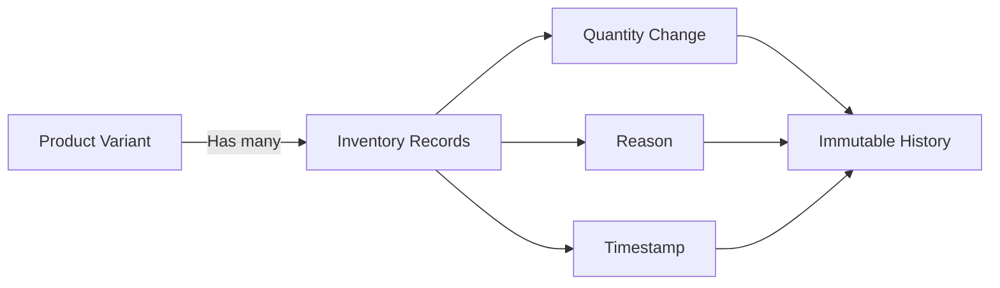

**ecommerceMall — Data ownership, privacy, retention, and recovery policies**

Data ownership, privacy, retention, and recovery policies

# Data Policies

Data ownership, privacy, retention, and recovery policies from a business perspective.

## Data Ownership and Privacy

Define who owns what data, who can access it, and privacy boundaries between users.

### Data Ownership

Customers own all data they create on the platform, including their profile information, shipping addresses, orders, wishlist items, and reviews.

Sellers own all data they create on the platform, including their shop profile, products, product images, and product variants.

Administrators do not own user data but have oversight access for platform management purposes.

When a customer deletes their account, they retain ownership of the data structure, but their profile information is deleted while orders, order history, and reviews are preserved for legal and record-keeping purposes.

When a seller deletes their account, they retain ownership of order history and product snapshots for legal purposes, while their active products are removed from listings.

Snapshots created during data modifications preserve the historical state of products, seller profiles, order items, reviews, and requests. These snapshots remain immutable and cannot be deleted once created.

Customer reviews are displayed publicly on product detail pages, making them visible to all platform users including guests.

### Data Privacy Boundaries

Customer personal information including phone numbers and shipping addresses are private and only accessible to the customer who created them, relevant sellers for order fulfillment, and administrators for platform management.

Order details including purchased items, prices, and shipping addresses are visible to the customer who placed the order and the seller who fulfilled the order.

Product information including name, description, images, price, and variants is publicly visible to all users including guests.

Seller shop profiles including shop name, description, and logo are publicly visible to all users including guests.

Customer reviews are publicly visible on product detail pages and display the customer's display name or "deleted user" for deleted accounts.

Customer wishlists are private and only visible to the customer who created them.

Seller approval requests and account status are private between the seller and administrators.

Guest users can only view public information including product listings, categories, product details, and seller profiles, but cannot access any personal customer or seller data.

### Access Control

Customers can view and edit their own profile information, shipping addresses, orders, wishlist items, and reviews.

Customers cannot view other customers' personal information, orders, wishlists, or reviews unless explicitly shared.

Customers can view all products listed on the platform and all seller shop profiles.

Sellers can view and edit their own shop profile, products, product variants, and inventory records.

Sellers can view all orders for products they have created, including order items and shipping information.

Sellers cannot view other sellers' products, orders, or shop profiles.

Sellers can view seller approval requests related to their own account and submit new registration requests if rejected.

Regular administrators can view all orders, all products, all customer accounts, and all seller accounts on the platform.

Super administrators have all regular administrator capabilities plus the ability to promote and demote administrators.

Only customers who have purchased a product and have a delivered order item can write reviews for that product.

Only customers can write reviews for products they have purchased; sellers cannot write reviews for their own products.

Sellers can approve or reject cancellation and refund requests only for order items from their own products.

### Data Isolation

Each customer's personal data is isolated and accessible only by that customer, relevant sellers for fulfillment, and administrators.

Each seller's products are isolated and only editable by that seller, visible to all users including guests.

Each customer's orders are isolated and only visible to that customer and the sellers who fulfilled orders.

Each seller's orders are isolated and only visible to that seller and customers who purchased from them.

Each customer's wishlist is completely isolated and only visible to that customer.

Each customer's reviews are linked to their account but displayed publicly; deleted accounts show as "deleted user" to maintain isolation of personal identity.

Order items from different sellers are grouped within the same customer order but processed separately by each seller.

Shipment records are isolated by seller and contain only order items from that seller.

Product snapshots are isolated by product and accessible to the product owner (seller), relevant customers for disputes, and administrators.

Cancellation and refund requests are isolated by order item and only visible to the requesting customer, the seller who owns the product, and administrators.

Inventory records for each product variant are accessible only to the seller who owns that product.

## Data Retention and Recovery

Define what happens to deleted data, how long it is retained, and how users can recover it.

### Customer Account Retention

When a customer account is deleted, the customer's profile information including display name and phone number is permanently removed from the system.

All order history associated with the customer account is preserved indefinitely. Order records remain accessible for legal compliance and seller record-keeping purposes.

Reviews written by the deleted customer are preserved but displayed with the attribution "deleted user" instead of the original customer name. The review content, rating, and timestamps remain visible on product pages.

Wishlist items are automatically removed from the system when the customer account is deleted.

### Seller Account Retention

When a seller account is deleted, the seller's shop name, description, and logo are permanently removed from active listings.

All order history and order snapshots associated with the seller are preserved indefinitely. This includes purchase records from customers who bought from this seller.

The seller's shop name and logo remain visible in order snapshots and historical records for products that were purchased before the account deletion.

Seller profile snapshots are preserved even after the seller account is deleted. These snapshots can be viewed by administrators for dispute resolution purposes.

A seller account cannot be deleted if the seller has any pending orders with paid or shipped status. A seller account cannot be deleted if there are any pending cancellation or refund requests.

### Product Data Retention

When a product is deleted by its seller, the product is permanently removed from all search results and category listings.

The product no longer appears in search results or category browsing. The product becomes inaccessible to customers.

Product snapshots are preserved even after the product is deleted. Each snapshot captures the complete state of the product including name, description, category, base price, images, and all variant information at the time of the change.

Snapshots can be viewed by the product owner (seller) and by administrators. Snapshots are immutable and cannot be modified or deleted after creation.

Product variants are deleted along with the parent product. All inventory records for the deleted variants are preserved for audit purposes.

### Order Data Retention

All orders are preserved indefinitely after creation. Order records cannot be deleted by customers, sellers, or regular administrators.

Each order contains snapshots of the purchased products, variants, and seller profiles at the time of purchase. These snapshots preserve the exact product name, description, variant options, and prices that were in effect when the order was placed.

Order items retain their status history. Items can have statuses including paid, shipped, delivered, cancelled, or refunded. The status history is preserved for dispute resolution.

Cancellation requests and refund requests are preserved with their status (pending, approved, rejected) and the reason provided. Snapshots of request state changes are created when sellers respond to these requests.

Customer shipping addresses are preserved with each order, even after the customer account is deleted.

### Snapshot Recovery

All data modifications create immutable snapshots that can be used to recover previous states of the data.

Snapshots include the following information: the timestamp when the change was made, what field was changed, the value before the change, and the value after the change.

Snapshots are created for the following editable data:
- Product edits (name, description, category, base price, images, variants)
- Product variant edits (SKU code, option values, price)
- Seller profile edits (shop name, description, logo)
- Order items at time of purchase (product state, variant state, seller profile state)
- Review edits (rating, text content)
- Cancellation request status changes (reason, pending/approved/rejected)
- Refund request status changes (reason, pending/approved/rejected)

Snapshots can be viewed by:
- The owner of the data (customer views their profile snapshots, seller views their product snapshots)
- Administrators (view any snapshot on the platform)
- Relevant parties for dispute resolution (parties to a cancellation or refund request)

Snapshots cannot be deleted after creation. They serve as immutable records for audit and dispute resolution.

### Soft-Delete Behavior

Products deleted by sellers follow a soft-delete pattern where the product is immediately removed from all customer-facing views but preserved in the system.

Deleted products do not appear in search results, category listings, or product detail pages. The product becomes invisible to customers immediately upon deletion.

Deleted products remain in the system's internal database with their full history preserved. Product snapshots continue to exist and can be queried by administrators.

Order items that reference deleted products continue to display correctly. The order item snapshot contains a copy of the product state at time of purchase, so historical orders show the original product name and description.

Wishlist items automatically disappear from a customer's wishlist when the referenced product is deleted by the seller. The wishlist item is removed without creating a separate deletion record.

### Permanent Deletion Policy

Data that is marked for permanent deletion from customer-facing views follows a preservation rule where operational records are kept indefinitely.

Customer profile data is permanently deleted when the customer requests account deletion. This includes display name and phone number.

Seller shop data is permanently removed from active listings when the seller requests account deletion. The shop name, description, and logo are no longer displayed.

Product data is permanently removed from browsing and search when the seller requests product deletion. The product becomes inaccessible to customers.

Review data can be deleted by the customer who wrote it. However, the review content and metadata are preserved in snapshots even after the customer deletes the review.

Order data is never permanently deleted. Orders, order items, shipments, and all associated snapshots are retained indefinitely for legal compliance and dispute resolution.

Snapshots are never permanently deleted. All snapshots created for any entity remain in the system indefinitely and cannot be removed.

# External Dependency SLOs

Service level objectives for external dependency availability.

## External Dependency SLOs

Define availability expectations, timeout thresholds, and degradation policies for external service dependencies.

### External Dependency Assumptions

The platform assumes integration with external payment gateway services for processing customer payments during checkout. The payment gateway is an external service that handles payment authorization and transaction processing. The platform relies on this external service to complete payment operations successfully or fail gracefully when the service is unavailable.

### Dependency Availability Expectations

External service availability is expected to follow the service level agreements of the respective external providers. The platform design accounts for potential external service unavailability and provides appropriate user messaging when services are temporarily unavailable. Customers are notified when payment processing fails due to external service issues, with the ability to retry the transaction.

### Timeout Behavior

External service calls include timeout mechanisms to prevent indefinite waiting for responses from external providers. When an external service exceeds its configured timeout threshold, the operation is terminated and the user is informed of the failure. The specific timeout values are determined by the external service provider's capabilities and service level agreements. Customers may retry failed operations after timeout events.

### Service Degradation Policy

When external services experience degradation or temporary unavailability, the platform implements graceful degradation patterns. Critical operations such as order placement may be blocked when external services are unavailable, with appropriate user messaging explaining the temporary limitation. Non-critical operations that depend on external services will fail gracefully and retryable errors are surfaced to the user. The platform does not cache or store sensitive data from external services beyond what is necessary for order processing.

### External Service Recovery

External service failures are handled with automatic retry mechanisms where appropriate. When an external service becomes available again, the platform resumes normal operations. Failed operations that cannot be automatically retried present the user with options to retry or modify their action. External service status monitoring informs the platform when services transition from degraded to normal operation.

# Storage Capacity

Storage capacity planning and CDN requirements.

## Storage Capacity Requirements

Define storage requirements and capacity planning for file storage.

### Data Preservation and Retention

**Snapshot Retention**

All snapshots are preserved indefinitely for dispute resolution and legal compliance. Snapshots cannot be deleted by any user or administrator. Snapshots are created whenever editable data is modified, including product details, product variants, seller profiles, order items, reviews, cancellation requests, and refund requests.

**Order Data Retention**

All order records and order history are preserved indefinitely, even after customer account deletion or seller account deletion. This preserves records for legal compliance, seller business records, and dispute resolution. When a customer deletes their account, their personal profile information is deleted, but their order history remains accessible for reference.

When a seller account is deleted, their product listings are removed from the platform, but their order history and order snapshots are preserved. The seller's shop name in past orders remains unchanged.

**Product Image Retention**

Product images are retained as long as the product exists on the platform. When a product is deleted by the seller, all associated product images are also deleted from active storage.

Seller logo images follow the same retention policy as product images.

**Review Retention**

All reviews are preserved indefinitely, even when a customer deletes their account. When a customer account is deleted, their reviews are shown with the author name replaced by "Deleted User" to maintain review integrity on product pages. Reviews that are deleted by the customer are preserved in snapshot history.

**Inventory History Retention**

Inventory history records are preserved indefinitely for auditing and dispute resolution. Each inventory record contains the quantity change, reason, and timestamp. This history cannot be modified or deleted.

---

### Inventory History

---

### Data Recovery and Backup

**Backup Policy**

The platform performs automated backups of all critical data including:
- All order records and order items
- All product data and variants
- All customer and seller account data
- All snapshots and snapshot history
- All inventory records
- All reviews and review history

**Data Restore Verification**

After any restore operation, the platform verifies data integrity by comparing checksums of restored data with backup records. Any discrepancies are reported to administrators for manual investigation.

**Disaster Recovery**

In the event of system failure or data corruption, the platform can be restored from backups. During restoration:
- All data is restored to its last known good state
- Orders placed during the outage window are processed after system restoration
- Customers are notified of any disruption and data restoration