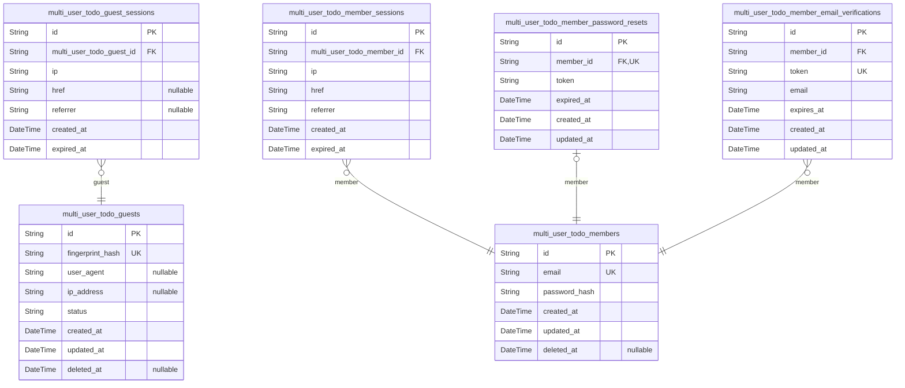
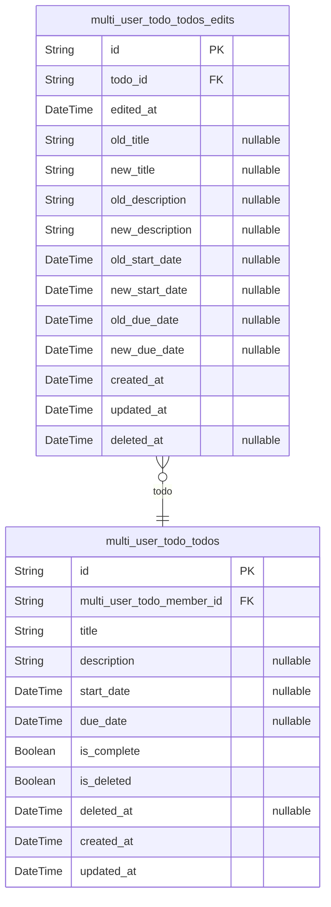

# Prisma Markdown

> Generated by [`prisma-markdown`](https://github.com/samchon/prisma-markdown)

- [auth](#auth)
- [todo](#todo)

## auth

### `multi_user_todo_guests`

Temporary guest accounts identified by device fingerprint for
unauthenticated access.

This table stores guest user sessions that allow unauthenticated visitors
to access the system without creating a full member account. Each guest
is uniquely identified by a device fingerprint combination.

Guest accounts are temporary and may be cleaned up periodically. They
enable basic functionality for users who have not yet registered or
logged in.

Properties as follows:

- `id`: Primary key for the guest account.
- `fingerprint_hash`
  > Hashed device fingerprint used to uniquely identify guest sessions.
  >
  > Combined from user agent, IP address, and browser characteristics to
  > create a persistent identifier for unauthenticated users.
- `user_agent`: Browser user agent string captured at session creation.
- `ip_address`: Client IP address captured at session creation.
- `status`
  > Current status of the guest session.
  >
  > Values: active, expired, deleted.
- `created_at`: Timestamp when the guest account was created.
- `updated_at`: Timestamp of the last update to this guest account.
- `deleted_at`: Timestamp when the guest account was soft deleted.

### `multi_user_todo_guest_sessions`

Temporary session tokens for guest access without full authentication.

Maintains audit trail of guest device and access information with
explicit expiration. Each session belongs to exactly one guest account
and is managed through the guest's lifecycle.

Properties as follows:

- `id`: Primary Key.
- `multi_user_todo_guest_id`
  > Reference to the guest account that owns this session.
  >
  > Each session belongs to exactly one guest and is deleted when the guest
  > account is deleted (cascade delete).
- `ip`: IP address of the device that created this session.
- `href`: URL of the page where the guest session was initiated.
- `referrer`
  > Referrer URL from the guest's browser, indicating how they arrived at the
  > site.
- `created_at`: Timestamp when this session was created.
- `expired_at`
  > Expiration timestamp for this session. Sessions become invalid after this
  > time.

### `multi_user_todo_members`

Registered member accounts with email and password authentication
credentials for the multi-user todo application.

## Identity and Authentication

Stores user login credentials including unique email address and
bcrypt-hashed password. Used exclusively for member actor authentication
and authorization.

Properties as follows:

- `id`: Primary Key.
- `email`
  > Unique email address for user authentication and identification.
  >
  > Must be lowercase, unique across all accounts, and used as the primary
  > login identifier.
- `password_hash`
  > Bcrypt-hashed password for secure authentication.
  >
  > Never stored in plaintext. Updated when user changes password during
  > account management flows.
- `created_at`: Timestamp when the member account was created.
- `updated_at`: Timestamp when the member account was last updated.
- `deleted_at`
  > Soft delete timestamp. Null when account is active, set when account is
  > deleted to mark for permanent removal.

### `multi_user_todo_member_sessions`

JWT session tokens for member authentication with access and refresh
token support.

Stores active login sessions for authenticated members. Each session is
associated with exactly one member account and includes client context
(IP, referrer, last URL). Sessions expire automatically and are cascaded
when the member account is deleted.

Properties as follows:

- `id`: Primary Key.
- `multi_user_todo_member_id`
  > Foreign key reference to the member account that owns this session.
  >
  > Establishes a 1:N relationship where each session belongs to exactly one
  > member. When the member account is deleted, all associated sessions are
  > automatically deleted (cascade). This ensures orphaned sessions are never
  > created or left behind when accounts are removed.
- `ip`
  > Client IP address when the session was created.
  >
  > Used for security auditing and detecting suspicious login activity from
  > different locations.
- `href`
  > Last visited URL path when the session was active.
  >
  > Provides context about which page the member was viewing when the session
  > token was generated or last used.
- `referrer`
  > HTTP Referrer header value when the session was created.
  >
  > Indicates which page or external site the member came from when logging
  > in or creating the session.
- `created_at`
  > Timestamp when the session was first created.
  >
  > Records the exact moment the member logged in and the session token was
  > issued.
- `expired_at`
  > Timestamp when the session expires and becomes invalid.
  >
  > Used for automatic session cleanup and security. Sessions must be
  > refreshed or re-authenticated before this time.

### `multi_user_todo_member_password_resets`

Password reset tokens for member account recovery, providing secure
temporary access to reset forgotten passwords.

This table stores one-time use tokens that members receive via email
after requesting a password reset. Each token is tied to a specific
member account and expires after a predetermined time period for
security. Once a token is used to reset a password, it is immediately
invalidated and marked for deletion.

Properties as follows:

- `id`: Primary Key.
- `member_id`
  > References the member account requesting the password reset.
  >
  > This foreign key ensures each reset token is associated with exactly one
  > member account. The relationship is 1:1 - a member can have at most one
  > active password reset token at any time. When the member account is
  > deleted, all associated reset tokens are cascaded and deleted.
- `token`
  > Unique secure token string for password reset.
  >
  > A cryptographically random token (at least 32 characters, typically 64+
  > characters using random string generation) that is sent to the member's
  > registered email address. The member includes this token in the password
  > reset form submission. Tokens are single-use only - once a token is
  > successfully used, it is immediately invalidated and cannot be reused.
- `expired_at`
  > Timestamp when this password reset token expires.
  >
  > The token becomes invalid after this datetime passes. Tokens typically
  > expire after 1-24 hours depending on security policy. The system must
  > reject any token whose expired_at timestamp is in the past, even if the
  > token has not been used yet. This prevents long-term security risks from
  > compromised or leaked tokens.
- `created_at`
  > Timestamp when this password reset token was created.
  >
  > Used to track token age and enforce expiration policy. The difference
  > between created_at and current time should not exceed the allowed token
  > lifetime window.
- `updated_at`
  > Timestamp when this password reset token was last updated.
  >
  > For token tables, this field is typically not updated after creation as
  > tokens should be immutable until deletion. However, it is included here
  > to maintain consistency with the temporal field pattern used across all
  > business entity tables.

### `multi_user_todo_member_email_verifications`

Email verification tokens for registration confirmation and validation.

Each token is a one-time use code that expires after a short period to
prevent unauthorized verification. Tokens are created during registration
and must be validated before the user account becomes fully active.

Relationships:
- Belongs to exactly one [multi_user_todo_members](#multi_user_todo_members) through
member_id foreign key
- Tokens are invalidated after verification or expiration

Indexes optimize lookup by email, member, and expiration for security
token cleanup.

Properties as follows:

- `id`: Primary Key.
- `member_id`
  > References the member account associated with this email verification
  > token.
  >
  > Each email verification is tied to exactly one member account. The token
  > is used to verify ownership of the email address associated with that
  > member.
  >
  > Deleted at cascade: When a member account is deleted, all associated
  > email verification tokens are permanently removed to maintain data
  > integrity and prevent orphaned records.
- `token`
  > Unique verification token used to confirm email ownership during
  > registration.
  >
  > This is a secure, randomly generated string that must be submitted to
  > verify the email address. Each token can only be used once for
  > verification.
- `email`
  > Email address being verified during the registration process.
  >
  > This matches the email address provided when creating the member account.
  > Used as a reference to identify which email is being verified.
- `expires_at`
  > Timestamp when this verification token expires.
  >
  > Tokens are short-lived for security purposes. Expired tokens cannot be
  > used for verification and will be periodically cleaned up by the system
  > to prevent accumulation of stale tokens.
- `created_at`
  > Timestamp when this verification token was created.
  >
  > Used to determine token age and for audit trail purposes.
- `updated_at`
  > Timestamp when this verification token record was last updated.
  >
  > Used to track when verification attempts or token refreshes occur.

## todo

### `multi_user_todo_todos`

Main todo entity with lifecycle tracking including completion status,
soft delete, and date fields.

Business entities representing individual tasks or to-do items that users
can create and manage. Each todo belongs to exactly one member user and
can track its completion state, soft deletion status, and optional date
fields for scheduling.

Lifecycle Management: Todos support a soft-delete pattern where deleted
todos move to trash (is_deleted=true, deleted_at set). They can be
restored from trash (is_deleted=false, deleted_at=null) or permanently
deleted. Completion status is tracked with is_complete boolean flag that
can be toggled.

Date Fields: Optional start_date and due_date fields enable basic
scheduling and filtering. Todos without start_date appear at the end when
sorted by start_date. Todos without due_date appear at the end when
sorted by due_date.

Data Ownership: Each todo is owned by exactly one member user and is
private - users can only access their own todos.

See [multi_user_todo_member_sessions](#multi_user_todo_member_sessions) for session management,
[multi_user_todo_todos_edits](#multi_user_todo_todos_edits) for edit history audit trail.

Properties as follows:

- `id`: Primary key identifier for the todo.
- `multi_user_todo_member_id`
  > References the member user who owns this todo.
  >
  > Cascade delete ensures all todos are removed when a member account is
  > deleted. Users can only access their own todos through this foreign key
  > relationship.
- `title`
  > Todo title or name.
  >
  > Required field with a maximum length of 255 characters to ensure concise
  > task identification. This is the primary identifier shown in todo lists.
- `description`
  > Optional todo description or additional details.
  >
  > Can be empty or null if no additional context is provided. Supports
  > flexible todo item definitions.
- `start_date`
  > Optional start date when the todo begins.
  >
  > When sorting by start_date, todos without a start date appear at the end
  > of the list. Enables basic task scheduling and chronological
  > organization.
- `due_date`
  > Optional due date when the todo should be completed.
  >
  > When sorting by due_date, todos without a due date appear at the end of
  > the list. Enables deadline tracking and priority management.
- `is_complete`
  > Completion status flag for the todo.
  >
  > Defaults to false when created. Can be toggled to true when the todo is
  > finished. Users can mark todos as complete or return them to incomplete
  > status.
- `is_deleted`
  > Soft delete flag indicating trash status.
  >
  > Defaults to false. When true, the todo is in trash but not permanently
  > deleted. Enables trash functionality for accidental deletion recovery.
- `deleted_at`
  > Timestamp when the todo was soft deleted to trash.
  >
  > Null when the todo is active. Set to current time when is_deleted becomes
  > true. Can be cleared (set to null) when restoring from trash.
- `created_at`
  > Timestamp when the todo was created.
  >
  > Always set to the current time on create. Used for ordering and audit
  > purposes.
- `updated_at`
  > Timestamp when the todo was last updated.
  >
  > Always set to the current time on create and each update. Enables
  > tracking of most recently modified todos.

### `multi_user_todo_todos_edits`

Audit trail table recording all field changes to todos including old and
new values for title, description, and date fields.

This table provides an immutable history of todo modifications, capturing
what values existed before and after each edit. Each edit record is
created only when at least one field actually changes during a todo
update operation.

Properties as follows:

- `id`: Primary Key.
- `todo_id`
  > Foreign key reference to the todo that was edited.
  >
  > When the referenced todo is permanently deleted, this edit record is
  > cascade deleted to maintain referential integrity.
- `edited_at`
  > Timestamp when the todo was last edited. Used for sorting edit history
  > from most recent to oldest.
- `old_title`
  > The todo title value before the edit. Null if title was not part of this
  > edit.
- `new_title`
  > The todo title value after the edit. Null if title was not part of this
  > edit.
- `old_description`
  > The todo description value before the edit. Null if description was not
  > part of this edit.
- `new_description`
  > The todo description value after the edit. Null if description was not
  > part of this edit.
- `old_start_date`
  > The todo start_date value before the edit. Null if start_date was not
  > part of this edit.
- `new_start_date`
  > The todo start_date value after the edit. Null if start_date was not part
  > of this edit.
- `old_due_date`
  > The todo due_date value before the edit. Null if due_date was not part of
  > this edit.
- `new_due_date`
  > The todo due_date value after the edit. Null if due_date was not part of
  > this edit.
- `created_at`: Timestamp when this edit record was created. Automatically set on insert.
- `updated_at`
  > Timestamp when this edit record was last updated. Always matches
  > created_at for append-only edit records.
- `deleted_at`
  > Timestamp when this edit record was soft deleted. Null if not deleted.
  > Used for soft delete support.
