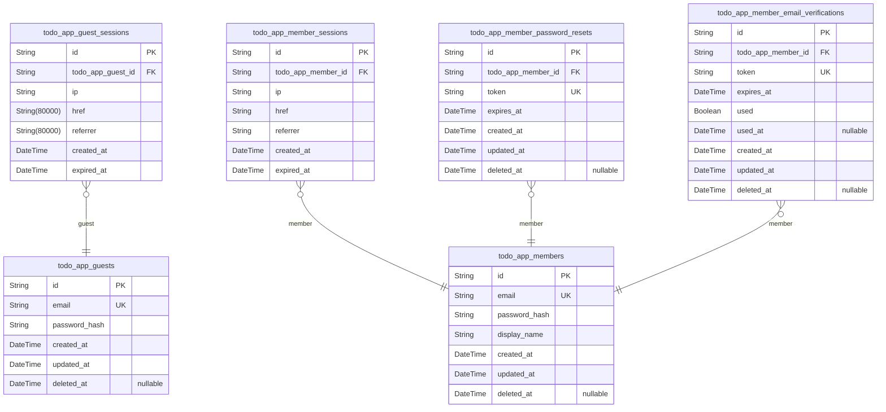
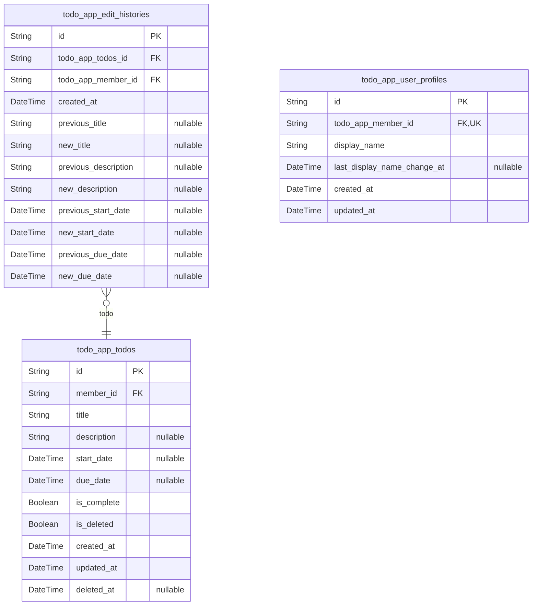

# Prisma Markdown

> Generated by [`prisma-markdown`](https://github.com/samchon/prisma-markdown)

- [Actors](#actors)
- [Todos](#todos)

## Actors

### `todo_app_guests`

Temporary guest accounts for unauthenticated visitors identified by
device email address.

This actor table represents users who have registered with a guest
account but have not yet upgraded to full member status. Guest accounts
allow temporary access to the todo application with standard
authentication capabilities including email/password login, password
change, and account deletion.

**Relationships**:
- One-to-many sessions: Each guest may have multiple {@link
todo_app_guest_sessions} records for different login sessions
- Account lifecycle: Guests can upgrade to member status by completing
registration or can delete their account entirely

**Business Rules**:
- Each guest account is identified by a unique email address
(case-insensitive)
- Guest accounts support full authentication: login, password change,
account deletion
- Soft delete enabled for cleanup of inactive guest accounts
- All authentication credentials are hashed for security compliance

Properties as follows:

- `id`: Primary Key.
- `email`
  > Unique email address used for guest account authentication.
  > Case-insensitive for login validation. Must be unique across all guest
  > accounts.
- `password_hash`
  > BCrypt-hashed password for guest account authentication. Stored securely
  > with appropriate cost factor.
- `created_at`: Timestamp when the guest account was created.
- `updated_at`
  > Timestamp when the guest account was last updated (includes password
  > changes, email updates).
- `deleted_at`
  > Timestamp when the guest account was soft-deleted. Null indicates active
  > account.

### `todo_app_guest_sessions`

Temporary session tokens for guest access with device-based identification.

This table tracks login sessions for unauthenticated guest visitors in
the todo application. Each session represents a temporary authenticated
state associated with a guest account identified by device
characteristics.

Sessions are managed through authentication flows rather than direct user
CRUD operations. They serve as an append-only audit trail of login
events, storing connection metadata including IP address, request
context, and expiration timestamps for security purposes.

Related entities:
- [todo_app_guests](#todo_app_guests) - The parent guest account this session belongs to

Properties as follows:

- `id`: Primary Key.
- `todo_app_guest_id`: Belonged guest's [todo_app_guests.id](#todo_app_guests).
- `ip`: Client IP address from the request.
- `href`: Request URL from the incoming request.
- `referrer`: Referrer URL from the request headers.
- `created_at`: Session creation timestamp.
- `expired_at`: Session expiration timestamp.

### `todo_app_members`

Registered member accounts with email/password credentials for
authentication.

This table represents the primary identity record for authenticated
members in the private todo application. Each member account has a unique
email address used for login and authentication, with a securely hashed
password stored for credential verification.

Members can manage their private todos, view edit history, and maintain
profile information including a display name. This actor table serves as
the foundation for all member-specific operations and authentication
flows.

Related tables:
- [todo_app_member_sessions](#todo_app_member_sessions) - Stores JWT session tokens for member
authentication
- [todo_app_member_password_resets](#todo_app_member_password_resets) - Contains password reset
tokens for account recovery
- [todo_app_member_email_verifications](#todo_app_member_email_verifications) - Manages email
verification tokens for registration

Each member owns a set of private todos that are completely isolated from
other members' data.

Properties as follows:

- `id`: Primary Key.
- `email`
  > Unique email address used for member authentication and login. Stored in
  > lowercase for case-insensitive comparison. Required for account creation
  > and must be unique across all members.
- `password_hash`
  > Securely hashed password for authentication. Never stored in plain text.
  > Updated when member changes their password.
- `display_name`
  > Public-facing display name shown in the todo application. Used for
  > identifying the member in UI and audit trails. Members can update their
  > display name.
- `created_at`
  > Timestamp when the member account was created. Immutable creation time
  > for audit purposes.
- `updated_at`
  > Timestamp of the last update to the member account. Automatically updated
  > on any modification to email, password_hash, or display_name.
- `deleted_at`
  > Timestamp when the member account was soft deleted. Null indicates active
  > account. When non-null, the account is marked for permanent deletion and
  > all associated todos will be purged.

### `todo_app_member_sessions`

JWT session tokens for member authentication with access and refresh
token support.

Tracks login sessions for registered members, storing connection metadata
and temporal fields for session lifecycle management. Each session
represents a distinct authentication event with full audit trail for
security and compliance.

Key relationships:
- Belongs to [todo_app_members](#todo_app_members) - one member can have multiple
concurrent sessions (multi-device access)
- Session is managed through member authentication flows, not direct user
CRUD

Session lifecycle:
- Sessions are created automatically upon successful member login
- Sessions expire based on configured token policy (access tokens
typically short-lived, refresh tokens longer-lived)
- Session records remain in the database as an audit trail of login events

Properties as follows:

- `id`: Primary Key.
- `todo_app_member_id`
  > Belonged member's [todo_app_members.id](#todo_app_members). Reference to the
  > authenticated member account that created this session.
- `ip`
  > Client IP address from the login request. Used for session security and
  > anomaly detection.
- `href`
  > Request URL from the login request. Captures the page or endpoint where
  > authentication occurred.
- `referrer`
  > Referrer header from the login request. Helps track user journey and
  > authentication source.
- `created_at`
  > Session creation timestamp. Records when the member successfully
  > authenticated.
- `expired_at`
  > Session expiration timestamp. When the session token expires and becomes
  > invalid. Critical for security - sessions must have defined expiration.

### `todo_app_member_password_resets`

Password reset tokens for member account recovery.

This table stores temporary reset tokens that allow members to securely
reset their passwords after losing access to their current credentials.
Each password reset request creates a new entry with a unique token and
expiration timestamp.

The token is invalidated after successful password reset or expiration,
ensuring only one active reset token per request. Members can request
multiple password resets, creating separate entries in this table, though
typically only one valid token should exist per active reset request.

Related entities:
- [todo_app_members](#todo_app_members) - Member accounts that can request password
resets
- [todo_app_member_sessions](#todo_app_member_sessions) - Similar session-based temporary
token storage

This is an authentication support table with session stance, meaning it
is managed through the password reset authentication flow rather than
direct user CRUD operations. Entries are created when a member requests a
password reset and are automatically invalidated after use or expiration.

Properties as follows:

- `id`: Primary Key.
- `todo_app_member_id`
  > Member account's [todo_app_members.id](#todo_app_members) that requested the password
  > reset. This relationship is mandatory as every password reset token must
  > be associated with a member account.
- `token`
  > Unique password reset token. This is a cryptographically secure random
  > string that must be unique across all active reset tokens. The token is
  > used in password reset URLs and is validated against the database entry.
- `expires_at`
  > Token expiration timestamp. After this time, the reset token becomes
  > invalid and cannot be used to reset the password. Tokens typically expire
  > within a short window (e.g., 1-24 hours) for security reasons.
- `created_at`: Record creation timestamp. When the password reset token was generated.
- `updated_at`: Record last update timestamp. For auditing and tracking token usage.
- `deleted_at`
  > Soft delete timestamp for cleanup. Used to track when tokens should be
  > permanently removed from the database after expiration or successful use.

### `todo_app_member_email_verifications`

Email verification tokens for member registration validation.

This table stores temporary verification tokens generated when a new
member account is created. Each token is tied to a member account and
expires after a set time period. Tokens are consumed when the member
verifies their email address, after which they are marked as used and
cannot be reused.

Key relationships:
- Belongs to [todo_app_members](#todo_app_members) actor account
- Tokens are automatically created during member registration
- Tokens are automatically consumed during email verification

Behavioral notes:
- Each token can only be used once
- Expired tokens are considered invalid
- Cleanup queries may remove old unused tokens

Properties as follows:

- `id`: Primary Key.
- `todo_app_member_id`
  > Member account's [todo_app_members.id](#todo_app_members) that owns this verification
  > token.
- `token`
  > Unique verification token string. Generated during registration, used
  > during email verification.
- `expires_at`: Token expiration timestamp. Tokens after this time are invalid.
- `used`
  > Whether this verification token has been consumed. Once used, the token
  > cannot be reused.
- `used_at`
  > Timestamp when the token was used. Null if the token has not yet been
  > used.
- `created_at`: Record creation timestamp.
- `updated_at`: Record update timestamp.
- `deleted_at`
  > Soft deletion timestamp for cleanup purposes. Null if the record is
  > active.

## Todos

### `todo_app_todos`

Main todo entity storing task title, description, dates, completion
status, and soft delete flag with user reference.

This table represents individual todo items in the private todo
application. Each todo is owned by a single member user and can be
viewed, edited, completed, and deleted (soft delete to trash) by its
owner only.

Key relationships:
- Belongs to a [todo_app_members](#todo_app_members) via member_id (1:N from user
perspective)
- Has many [todo_app_edit_histories](#todo_app_edit_histories) entries when edited

Behavioral notes:
- Soft delete pattern: is_deleted flag marks deleted todos, which are
moved to trash
- Deleted todos have deleted_at timestamp set, others remain null
- is_deleted todos don't appear in normal todo list, only in trash view
- New todos are incomplete (is_complete: false) by default
- Only the todo owner can view, edit, or delete their todos (privacy
isolation)

Properties as follows:

- `id`: Primary Key.
- `member_id`
  > Owner member's [todo_app_members.id](#todo_app_members). Each todo belongs to exactly
  > one member user.
- `title`: Task title. Required field, cannot be empty or whitespace.
- `description`: Task description. Optional field that can be left empty.
- `start_date`: Planned start date for the task. Optional, can be left empty.
- `due_date`: Deadline date for the task. Optional, can be left empty.
- `is_complete`
  > Completion status. false = incomplete (default for new todos), true =
  > complete. Simple toggle between two states.
- `is_deleted`
  > Soft delete flag. false = active todo (visible in normal list), true =
  > deleted todo (moved to trash). Defaults to false for new todos.
- `created_at`: Timestamp when this todo was created.
- `updated_at`: Timestamp when this todo was last modified.
- `deleted_at`
  > Timestamp when this todo was soft deleted (moved to trash). Null if not
  > deleted.

### `todo_app_edit_histories`

Edit history tracking every todo modification with previous and new
values for all fields plus audit timestamp.

This is a subsidiary table that is automatically created when a todo is
edited. Each entry records:
- When the edit was made (created_at)
- Which member made the edit (todo_app_member_id)
- What the previous values were for each field
- What the new values are for each field

Users can view the full edit history of any of their todos to see the
complete audit trail of changes. History entries are immutable once
created and are automatically deleted when their parent todo is
permanently deleted.

Properties as follows:

- `id`: Primary Key.
- `todo_app_todos_id`: Todo's [todo_app_todos.id](#todo_app_todos) that this edit history entry belongs to.
- `todo_app_member_id`: Member's [todo_app_members.id](#todo_app_members) who made this edit.
- `created_at`: When this edit was made.
- `previous_title`: Title value before this edit (if title was changed).
- `new_title`: Title value after this edit (if title was changed).
- `previous_description`: Description value before this edit (if description was changed).
- `new_description`: Description value after this edit (if description was changed).
- `previous_start_date`: Start date value before this edit (if start date was changed).
- `new_start_date`: Start date value after this edit (if start date was changed).
- `previous_due_date`: Due date value before this edit (if due date was changed).
- `new_due_date`: Due date value after this edit (if due date was changed).

### `todo_app_user_profiles`

User profile metadata table storing display name and validation
timestamps for business rule enforcement.

This subsidiary table extends the member actor identity with
profile-specific information required for the todo application's business
logic. Each registered member (todo_app_member) has exactly one profile
record that stores their public display name and tracks when it was last
modified to enforce rate limiting policies (maximum one change per day).

The profile is a 1:1 relationship with todo_app_members - the FK has a
unique constraint to ensure one profile per member. Display names are
visible within the user's own todo list (e.g., in edit history) but
cannot be viewed by other users since this is a private todo application.

Key business rules enforced at the application layer:
- Display name must not be empty or contain only whitespace
- Display name can be changed at most once per 24-hour period (validated
using last_display_name_change_at)
- Display name is private - no cross-user visibility

[todo_app_members](#todo_app_members) for the member actor identity.
[todo_app_edit_histories](#todo_app_edit_histories) for edit history tracking that references
user display names.

Properties as follows:

- `id`: Primary Key.
- `todo_app_member_id`
  > Member's [todo_app_members.id](#todo_app_members). Unique 1:1 relationship - each
  > member has exactly one profile.
- `display_name`
  > User's public display name visible in the todo application (e.g., in edit
  > history). Cannot be empty or contain only whitespace. Subject to 24-hour
  > change rate limiting.
- `last_display_name_change_at`
  > Timestamp of the most recent display name change. Used to enforce the
  > rate limiting policy of maximum one change per 24-hour period. Nullable
  > for newly created profiles before any display name change.
- `created_at`
  > Record creation timestamp. Automatically set by the database when the
  > profile is created.
- `updated_at`
  > Record last update timestamp. Automatically updated by the database on
  > every profile modification.
