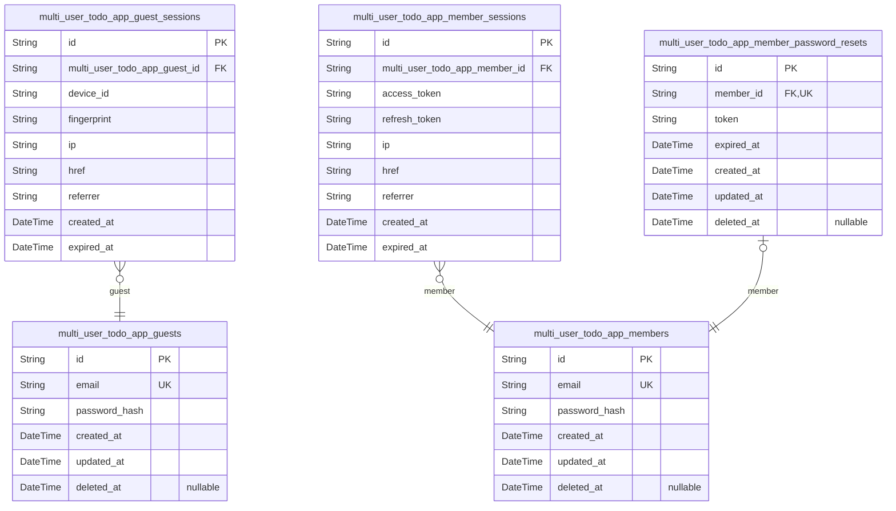
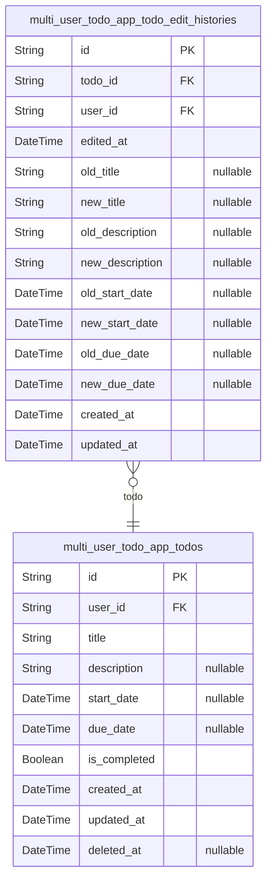

# Prisma Markdown

> Generated by [`prisma-markdown`](https://github.com/samchon/prisma-markdown)

- [Actors](#actors)
- [Todos](#todos)

## Actors

### `multi_user_todo_app_guests`

Guest user accounts for unauthenticated visitors to the multi-user todo
application.

This table stores temporary guest identities identified by email and
password, allowing unauthenticated users to access the system before
completing registration. Each guest account is associated with a specific
device through session tracking in the multi_user_todo_app_guest_sessions
table.

Key relationships:
- One-to-many with multi_user_todo_app_guest_sessions for session tracking
- Guests can upgrade to member accounts via email/password registration

Business context:
- Guest accounts serve as entry point for unauthenticated users
- Guest data is isolated from member data
- Guest accounts are created during initial app access
- Passwords are hashed for security before storage
- Soft delete capability for account lifecycle management

Properties as follows:

- `id`: Primary Key.
- `email`: Guest email address used for identification and authentication.
- `password_hash`: Hashed password for guest account authentication.
- `created_at`: Timestamp when the guest account was created.
- `updated_at`: Timestamp of the last guest account update.
- `deleted_at`: Timestamp of soft deletion, null when active.

### `multi_user_todo_app_guest_sessions`

Temporary session tokens for guest access using device_id and fingerprint.

This table tracks unauthenticated visitor sessions to maintain state
across requests before guest registration. Each session is linked to a
guest account via device fingerprint for session continuity and security.

Key relationships:
- Belongs to [multi_user_todo_app_guests](#multi_user_todo_app_guests) - one guest can have
multiple active sessions
- Sessions expire based on expired_at timestamp for security
- Managed through authentication middleware, not direct user CRUD

Properties as follows:

- `id`: Primary Key.
- `multi_user_todo_app_guest_id`
  > Guest account this session belongs to. {@link
  > multi_user_todo_app_guests.id}
- `device_id`: Device identifier for guest session continuity across requests.
- `fingerprint`: Device fingerprint hash for session security and fraud detection.
- `ip`: Client IP address for session tracking and security auditing.
- `href`: Last known page URL for session context.
- `referrer`: Referrer URL from the request for session source tracking.
- `created_at`: Session creation timestamp.
- `expired_at`: Session expiration timestamp for security cleanup.

### `multi_user_todo_app_members`

Registered member user accounts with email/password authentication
credentials.

This table serves as the primary identity record for authenticated
members in the system. Each member account stores the email address and
hashed password required for authentication, along with temporal tracking
fields for audit and soft delete capabilities.

Members are distinct from guests in that they have persistent accounts
that can be authenticated and can access their private todo list, edit
history, and trash functionality. This table is referenced by the
multi_user_todo_app_member_sessions table for session management and
multi_user_todo_app_member_password_resets for password reset flows.

Properties as follows:

- `id`: Primary Key.
- `email`: Unique email address used for member login and account identification.
- `password_hash`
  > Bcrypt-hashed password string for member authentication. Never stored in
  > plaintext.
- `created_at`: Timestamp when the member account was created.
- `updated_at`: Timestamp when the member account was last updated.
- `deleted_at`
  > Soft delete timestamp. NULL indicates active account, non-NULL indicates
  > deleted account awaiting permanent removal.

### `multi_user_todo_app_member_sessions`

JWT session tokens for member authentication with access and refresh
token support.

This table tracks all active member login sessions, storing
authentication tokens and connection metadata for security auditing. Each
session represents a single authenticated device/browser combination with
a unique JWT access token and refresh token pair.

**Key Relationships:**
- Belongs to one member: [multi_user_todo_app_members](#multi_user_todo_app_members) (via
multi_user_todo_app_member_id)
- Multiple sessions per member allowed (mobile, web, tablet)
- Sessions are append-only audit records - never modified after creation

**Session Lifecycle:**
- Created on successful member login
- Tokens stored for refresh and re-authentication
- Expired sessions are identified by expired_at timestamp
- Member logout or password changes may invalidate sessions

**Security Considerations:**
- Access tokens used for API authentication
- Refresh tokens used to obtain new access tokens
- Connection metadata (IP, referrer) stored for fraud detection
- Multiple concurrent sessions supported per member

**Usage Pattern:**
- Members can maintain multiple active sessions simultaneously
- Sessions are managed through authentication flows, not direct CRUD
- Expired_at field enables automatic cleanup of stale sessions

Properties as follows:

- `id`: Primary Key.
- `multi_user_todo_app_member_id`
  > Belonged member's [multi_user_todo_app_members.id](#multi_user_todo_app_members). Required for
  > session ownership and token validation.
- `access_token`
  > JWT access token for API authentication. Used to authorize member
  > requests. Stored as hash for security.
- `refresh_token`
  > JWT refresh token for obtaining new access tokens. Valid until expired_at
  > timestamp.
- `ip`
  > Client IP address from request headers. Used for connection metadata and
  > security auditing.
- `href`
  > Request URL path from browser. Captures which page/route triggered the
  > login.
- `referrer`
  > HTTP referrer header value. Used to track login source and detect
  > suspicious redirects.
- `created_at`
  > Session creation timestamp. When the member successfully authenticated
  > and this session was created.
- `expired_at`
  > Session expiration timestamp. After this time, tokens are invalid.
  > Security: NOT NULL by default.

### `multi_user_todo_app_member_password_resets`

Password reset tokens for member account recovery flow.

Stores temporary cryptographic tokens that members receive when
requesting password reset via email. Each token is tied to a specific
member account and expires after a configured time window (typically 1-24
hours). This table enables secure password recovery without exposing the
member's actual password.

Key relationships:
- Belongs to exactly one [multi_user_todo_app_members](#multi_user_todo_app_members) account via
member_id
- Tokens are single-use: when a reset is completed, the token is marked
as deleted
- Expired tokens remain in the table until garbage collection (soft
delete pattern)

Behavioral notes:
- Only one active reset token per member at a time (enforced by unique
member_id constraint)
- Requesting a new reset automatically invalidates previous tokens
- Tokens are never stored in plain text; only hashed values are used for
comparison
- The table maintains audit trail of all reset attempts including
successful, expired, and unused tokens

Properties as follows:

- `id`: Primary Key.
- `member_id`
  > Member account's [multi_user_todo_app_members.id](#multi_user_todo_app_members) that requested
  > the password reset.
- `token`
  > Cryptographic reset token value. This is a hashed representation of the
  > actual token sent to the member's email. The plain token is generated
  > during reset request and compared against this hashed value during
  > validation.
- `expired_at`
  > Timestamp when this reset token expires and becomes invalid. Tokens
  > typically expire after 1-24 hours depending on security configuration.
  > Must not be null to enforce token lifecycle.
- `created_at`
  > Creation timestamp when this reset token was generated and sent to the
  > member.
- `updated_at`: Last update timestamp for this reset token record.
- `deleted_at`
  > Soft delete timestamp. When null, token is active. When set, token has
  > been consumed (password reset completed), expired, or manually
  > invalidated.

## Todos

### `multi_user_todo_app_todos`

Main todo entity for authenticated member accounts.

Represents individual todo items that members create and manage in their
private todo list. Each todo has a title, optional description, optional
start date, optional due date, and completion status. Supports soft
delete for trash functionality where deleted todos are hidden from normal
list but can be restored or permanently removed.

Key relationships:
- Belongs to one member via user_id [multi_user_todo_app_members.id](#multi_user_todo_app_members)
- Has many edit history entries {@link
multi_user_todo_app_todo_edit_histories.id}

Behavioral notes:
- Soft delete: deleted_at is null for active todos, non-null for trash items
- New todos are created with is_completed = false by default
- Members can only see and manage their own todos (enforced by user_id
foreign key)

Properties as follows:

- `id`: Primary Key.
- `user_id`: Owner member's [multi_user_todo_app_members.id](#multi_user_todo_app_members).
- `title`: Todo title. Required field.
- `description`: Optional todo description. Defaults to empty string.
- `start_date`: Optional start date for the todo.
- `due_date`: Optional due date for the todo.
- `is_completed`: Whether the todo is completed. Defaults to false.
- `created_at`: Todo creation timestamp.
- `updated_at`: Last todo update timestamp.
- `deleted_at`: Soft delete timestamp. Null for active todos, non-null for trash items.

### `multi_user_todo_app_todo_edit_histories`

Audit trail table that captures every edit made to todos, storing before
and after values for all editable fields.

This snapshot table serves as a complete history log for todo
modifications, enabling users to review changes over time. Each edit
creates a new history entry with old and new values for title,
description, start_date, and due_date fields.

The table maintains referential integrity through foreign keys to the
owning todo and the user who performed the edit. Entries are typically
queried in descending order by edited_at to show the most recent changes
first.

Properties as follows:

- `id`: Primary Key.
- `todo_id`: The todo that was edited. [multi_user_todo_app_todos.id](#multi_user_todo_app_todos)
- `user_id`: The user who performed the edit. [multi_user_todo_app_members.id](#multi_user_todo_app_members)
- `edited_at`
  > Timestamp when the edit occurred. Used for sorting history entries by
  > recency.
- `old_title`: Title value before the edit. Null if title was added in this edit.
- `new_title`: Title value after the edit. Null if title was removed in this edit.
- `old_description`
  > Description value before the edit. Null if description was added in this
  > edit.
- `new_description`
  > Description value after the edit. Null if description was removed in this
  > edit.
- `old_start_date`
  > Start date value before the edit. Null if start_date was added or was
  > null before this edit.
- `new_start_date`
  > Start date value after the edit. Null if start_date was removed or set to
  > null in this edit.
- `old_due_date`
  > Due date value before the edit. Null if due_date was added or was null
  > before this edit.
- `new_due_date`
  > Due date value after the edit. Null if due_date was removed or set to
  > null in this edit.
- `created_at`: Record creation timestamp. Used for auditing and chronological ordering.
- `updated_at`
  > Record last update timestamp. Maintained for consistency with other
  > tables.
