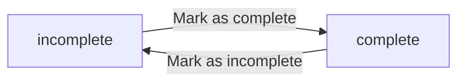
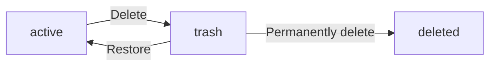
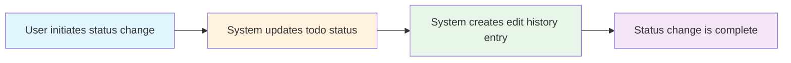

**multiUserTodoApp — Business concepts, relationships, and states from user perspective**

Business concepts, relationships, and states from user perspective

# Domain Concepts

Describe what each concept means in the business domain and its key attributes.

## User Concept

Users are the individuals who have accounts in the todo application system. Each user is identified by a unique email address that they provide when creating their account. Users have a display name that represents their personal identity within the application. Every user has a password that protects their account and keeps their information private. Users can update their display name whenever they wish to change how they are known in the system. Users have the ability to change their password to maintain account security over time. Each user's account is completely separate from all other users' accounts. The display name serves as the personal identifier that users choose for themselves.

### User Account Identity

A user is an individual who has created an account in the todo application system. Each user account is identified by a unique email address that the user provides during account creation. The email address serves as the primary identifier for the user and is used for logging into the system. Every user has a unique account that is completely separate from all other users' accounts. Users are the only individuals who can access their own todo items and account information.

### Display Name

Each user has a display name that represents their personal identity within the application. The display name is a personal identifier that users choose for themselves when creating their account. Users can update their display name whenever they wish to change how they are known in the system. The display name is not used for identification purposes; it is purely for personalization and appearance. Users cannot view other users' display names since this is a private todo application where users can only see their own data.

### Password Security

Every user has a password that protects their account and keeps their information private. The password is established when the user creates their account and is required for authentication. The password must be kept secure and is only known to the user. The system stores a secure representation of the password to verify user identity during login attempts. Only the account owner can know and use their password to access their account.

### Password Change

Users can change their password at any time to maintain account security. When a user changes their password, the new password becomes the required credential for future login attempts. The old password is no longer valid once the password change is completed. This allows users to update their credentials regularly or in response to security concerns.

### Account Isolation

Each user's account is completely isolated from all other users' accounts. Users cannot view, access, or interact with any data belonging to other users. There is no way for one user to see another user's todos, profile information, or account settings. This isolation ensures that all todo items and account information remain completely private to their respective owners.

## Todo Concept

Todos are task items that users want to track and organize in their personal todo list. Each todo has a title that describes what the task or item is about. Users can optionally add a description to provide additional context or details about the todo. Every todo can have a start date indicating when the user plans to begin the task. Todos may have a due date that specifies when the task should be completed. Every todo has a completion status that indicates whether the task is done or pending. Users can have multiple todos in their list to manage various tasks and obligations. Todos represent the core work items that users track within the application.

### Todo Definition

Todos are task items that users create to track and organize their personal work and obligations. Each todo represents a single action, task, or item that the user wants to remember and complete.

Every todo must have a title, which is the required information that briefly describes what the task is about. The title serves as the primary identifier for the todo in lists and views.

Each todo may optionally include a description, which provides additional context, details, or instructions about the task. The description can be left empty if no additional information is needed.

Todos can have a start date, which indicates when the user plans to begin working on the task. The start date is optional and can be left empty if the user has not determined when to begin.

Todos can have a due date, which specifies when the task should be completed. The due date is optional and can be left empty if there is no specific deadline for the task.

Every todo has a completion status that indicates whether the task is done or pending. This status tracks the progress of the todo and allows users to distinguish between tasks that need attention and those that have been completed.

Users can create multiple todos to manage various tasks and obligations. Each todo is owned by a single user and remains private to that user.

### Todo States and Lifecycle

Todos exist in two primary completion states: incomplete and complete. The completion status is a simple toggle between these two states.

When a todo is first created, it starts in an incomplete state. Users can mark a todo as complete when they have finished the task, changing its status from incomplete to complete.

Users can also mark a completed todo as incomplete if they need to reopen the task or if it was marked complete by mistake. This allows the completion status to toggle back from complete to incomplete.

Users can delete a todo when they no longer need it. Deleted todos are not immediately removed from the system. Instead, they are moved to the trash where they can be viewed separately from the normal todo list.

From the trash, users can restore a deleted todo, which returns it to the normal todo list with its original status. Users can also permanently delete a todo from the trash, which removes it and its edit history from the system entirely.

User cannot create a todo without a title, and the title is required for all todo operations.

Todos without a start date appear at the end when sorting by start date. Todos without a due date appear at the end when sorting by due date.

The following diagram shows the completion status states:

The following diagram shows the deletion and restoration lifecycle:

### Todo Relationships

Each todo is owned by a single user. Users can only view, edit, or delete their own todos. There is no way to view, access, or share another user's todos, as each user's todos are completely private.

Every todo can have multiple edit history entries. Each history entry records when an edit was made and what fields were changed. This allows users to track all modifications made to their todos over time.

The edit history includes the following information for each entry:
- When the edit was made (edit timestamp)
- What the title was changed to, if changed
- What the description was changed to, if changed
- What the start date was changed to, if changed
- What the due date was changed to, if changed

All history entries are sorted from most recent to oldest, so users see the latest changes first when viewing the edit history.

Todos support filtering by completion status. Users can view all todos, only complete todos, or only incomplete todos in their todo list.

Users can sort their todo list by creation date (newest first or oldest first), start date (earliest first or latest first), or due date (earliest first or latest first). Todos without dates are handled appropriately during sorting as described in the states and lifecycle section.

The todo list and trash list are both paginated, allowing users to browse their todos in manageable chunks rather than viewing all todos at once.

## EditHistoryEntry Concept

Edit history entries are records that document every change made to todos over time. Each edit history entry contains a timestamp showing when the modification was made. When a todo's title is changed, the new title value is captured in the history entry. Changes to the todo description are recorded with the updated description content. If the start date is modified, the new start date value is stored in the history. When the due date is changed, the updated due date is captured for tracking purposes. Multiple history entries can exist for a single todo as it undergoes various edits. These entries provide a chronological record of todo evolution and modifications.

### Edit History Tracking

Edit history tracking maintains a record of all modifications made to todos over time. Every time a todo is edited by its owner, the system creates a new edit history entry. This entry captures the complete state of the modification at that moment, allowing users to see how the todo has evolved through multiple changes. The edit history serves as a chronological audit trail that documents the complete modification history of each todo item.

### History Entry Information

Each edit history entry records the modification timestamp, which indicates the exact time when the edit was made. The entry also captures what fields were changed during that edit session. If the todo title was modified, the new title value is recorded in the history entry. When the todo description is updated, the new description content is logged. If the start date is changed, the new start date value is captured. Similarly, any modification to the due date is recorded with the updated due date value. Each entry only records the values that were changed during that specific edit. A single todo can have multiple edit history entries as it undergoes various modifications over time, with each entry representing one distinct editing session.

### Edit Chronology and Audit

The collection of edit history entries forms a complete chronology of todo evolution. All history entries for a todo are stored together and can be viewed as a group. The entries are organized in chronological order, with the most recent edit appearing first and older entries following in descending order. This chronological arrangement allows users to trace the full evolution of a todo from its creation through all subsequent modifications. The edit history serves as an audit record, providing visibility into when changes were made and what the values were changed to. Users can access the complete edit history of any todo they own to review its modification timeline.

# Domain Relationships

Describe how concepts relate to each other from a business perspective.

## Conceptual Relationships

Describe how concepts relate to each other in business terms.

### User and Todo Relationship

Each todo belongs to exactly one user. A user owns all the todos they create. Todos are private and cannot be accessed by other users. When a user deletes their account, all their todos are permanently removed from the system.

The relationship between a user and their todos is one-to-many: one user can have many todos, but each todo belongs to only one user. This ownership relationship is enforced at the account level, ensuring complete data isolation between users.

### User and Edit History Relationship

Each edit history entry belongs to exactly one user through its parent todo. A user owns the edit history for all their todos. When a user's account is deleted, all their edit history entries are also permanently removed.

The relationship is one-to-many: one user can have many edit history entries across all their todos, but each edit history entry is associated with exactly one user's todo. Edit history entries are created automatically whenever a todo is modified, recording who made the change and what changed.

### Todo and Edit History Relationship

Each todo has an associated edit history that tracks all modifications. A todo owns its edit history entries. Each edit history entry belongs to exactly one todo.

The relationship is one-to-many: one todo can have many edit history entries over its lifetime, but each edit history entry refers to exactly one todo. Edit history entries are sorted by edit timestamp in descending order, showing the most recent changes first. When a todo is permanently deleted from trash, its entire edit history is also deleted.

## Lifecycle and Retention

Describe concept lifecycle states and transitions only. Detailed retention/recovery policies belong in 05-non-functional. Operation details belong in 03-functional-requirements.

### Todo Lifecycle

A todo exists in one of three lifecycle states:

• Active: The todo is in the normal todo list and is visible to the user
• Deleted (Soft Deleted): The todo has been removed from the normal todo list and placed in the trash
• Permanently Deleted: The todo and its edit history have been removed from the system

A todo starts in the Active state when created. It can transition to Deleted state when the user deletes it. From the Deleted state, it can either transition back to Active (recovered) or to Permanently Deleted (permanently removed). Once a todo reaches Permanently Deleted, it cannot be recovered.

### Deletion Policy

When a user deletes a todo, it is not immediately removed from the system. Instead, it is moved to the trash in a soft deleted state. This means:

• The todo no longer appears in the normal todo list
• The todo is visible in the trash list
• The todo's edit history is preserved while in the trash
• The todo remains in the trash until the user chooses to restore it or permanently delete it

A todo can only be permanently deleted when it is in the trash (Deleted state). Permanent deletion removes both the todo and all its edit history entries from the system. There is no way to restore a permanently deleted todo or its edit history.

### Recovery from Trash

A user can restore a deleted todo from the trash. When a todo is restored:

• The todo transitions from Deleted back to Active state
• The todo returns to the normal todo list
• The todo's full edit history is preserved and remains accessible
• All of the todo's original information (title, description, start date, due date) is maintained

A user can restore multiple deleted todos from the trash. Each restore operation is independent, and the user can choose which todos to restore and when to restore them. Once restored, the todo behaves identically to any other active todo and can be edited, completed, or deleted again.

# Business Categories and State Flows

Business category classifications and state flow definitions.

## Business Category Definitions

Define all business category classifications with their allowed values and descriptions.

### Todo Completion Status

**Business Category**: Todo Completion Status

**Classification**: Indicates whether a todo has been finished or not.

**Allowed Values**:

**Incomplete**: The todo has not yet been completed. This is the default state when a todo is created. The user can mark the todo as complete to change its status.

**Complete**: The todo has been marked as finished by the user. The user can mark the todo as incomplete again to change its status back.

A todo's completion status can be toggled between incomplete and complete at any time by the todo's owner.

### Todo Deletion Status

**Business Category**: Todo Deletion Status

**Classification**: Indicates whether a todo is visible in the normal todo list or has been deleted.

**Allowed Values**:

**Active**: The todo is visible in the normal todo list. This is the default state when a todo is created. Users can see and work with active todos.

**In Trash**: The todo has been deleted by its owner and no longer appears in the normal todo list. It is stored in the trash where it can be viewed and restored. Users can restore a todo from trash to return it to active status.

**Permanently Deleted**: The todo has been removed from trash and no longer exists in the system. This occurs when a user permanently deletes a todo from trash. The todo and its edit history cannot be recovered.

A todo transitions from active to in trash when deleted, and from in trash to permanently deleted when the user chooses to permanently delete it from trash.

### User Account Status

**Business Category**: User Account Status

**Classification**: Indicates whether a user account is active or has been deleted.

**Allowed Values**:

**Active**: The user account is in normal operation. The user can log in, create and manage todos, and access all features of the application.

**Deleted**: The user account has been deleted by the user. All of the user's todos, including those in trash, are permanently deleted along with their edit history. The user can no longer log in or access the application.

When a user account is deleted, all associated data is removed from the system and cannot be recovered.

### Todo List Classification

**Business Category**: Todo List Classification

**Classification**: Categorizes which set of todos the user is viewing.

**Allowed Values**:

**Normal Todo List**: Shows all active todos that have not been deleted. This is the primary view where users see their active todo items.

**Trash List**: Shows all todos that are currently in trash (soft-deleted). Users can view these todos and choose to restore or permanently delete them.

Users can switch between viewing the normal todo list and the trash list to manage their todos.

## State Transitions

Define valid state transition paths for stateful concepts.

### Todo Completion Status

A todo has a completion status with two possible states: incomplete and complete.

Newly created todos are always set to the incomplete state by default.

Users can toggle a todo's completion status between incomplete and complete states. There is no third state or additional status values.

Each todo exists in exactly one completion state at any given time.

### Completion States

**Incomplete**: The todo has not been marked as done. This is the initial state for all new todos.

**Complete**: The todo has been marked as done by the user.

### State Transition Diagram

### Edit History State

Edit history entries do not have states. Each entry is created when a todo is edited and remains unchanged after creation. History entries are immutable records of what changed, when it changed, and what the new values are.

### Status Change Workflow

Users change a todo's status through a simple toggle action.

### Status Change Process

When a user marks a todo as complete:
- The todo's completion status changes from incomplete to complete
- The status change is immediately reflected in the todo list
- The completion change is recorded in the todo's edit history

When a user marks a todo as incomplete:
- The todo's completion status changes from complete to incomplete
- The status change is immediately reflected in the todo list
- The incomplete change is recorded in the todo's edit history

### Edit History Recording

Every status change creates an edit history entry that records:
- The timestamp when the status was changed
- Which field was changed (completion status)
- The new value of the completion status

Users can view the complete history of all edits made to their todos, including all status changes.

### Status-Change Workflow

