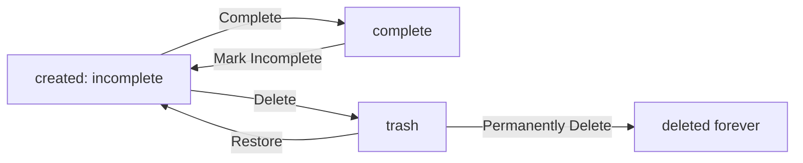

**multiUserTodo — Business concepts, relationships, and states from user perspective**

Business concepts, relationships, and states from user perspective

# Domain Concepts

Describe what each concept means in the business domain and its key attributes.

## User Concept

Users are the individuals who use the Todo application to manage their personal task lists. Each user has an email address for authentication purposes and a password for security. Users also have a display name that represents them within the application. The application ensures each user's data remains completely private — users cannot see other users' information. Users can delete their entire account, which results in permanent removal of all their data including todos currently in trash. Users are the sole owners of all todos they create and can only access their own tasks.

### User Identity and Email-Based Account

Each user is identified by a unique email address. The email address serves as the primary identifier for account creation and authentication. Users register by providing their email address and creating a password. The email address becomes the permanent identifier for the user account and cannot be changed.

Users authenticate by providing their email address and password. The system verifies the credentials and grants access to the user's personal data.

User identity is tied exclusively to the account email address. There is no separate username or other identifier — the email address is the sole means of identifying a user within the system.

### User Display Name

Each user has a display name that represents them within the application. The display name is visible in the user's todo lists, edit history entries, and wherever user identity is shown.

Users can edit their display name at any time. When a display name is changed, the updated name is reflected in all user-related references going forward. Historical data retains the display name that was current at the time of each action.

### Account Security and Password

Each user account is secured with a password. The password is required during authentication alongside the email address.

Users can change their password at any time. When a password is changed, it replaces the previous password for all future authentication attempts. The system does not retain access to the user's previous passwords.

Password security is maintained through secure storage mechanisms that prevent unauthorized access to user credentials.

### Private Data and User Ownership

Each user's data is completely private and isolated from other users. Users can only view and access their own todos, edit history, and profile information. There is no capability to view, access, or interact with another user's data.

User account ownership means the user has exclusive rights to all todos they create. Each todo is permanently associated with its creating user and cannot be transferred to another user.

Personal task management is exclusive to each user — the application serves as an individual task management tool where no data sharing or collaboration between users is possible.

### Account Lifecycle and Deletion

Users can delete their entire account at any time. Account deletion is a permanent and irreversible action.

When an account is deleted, all data associated with that user is permanently removed. This includes todos currently in the normal todo list, todos in the trash, and all edit history entries for those todos.

Once an account is deleted, there is no recovery mechanism. The user identity, email address, and all associated data are completely removed from the system.

## Todo Concept

Todos represent individual tasks or items that users want to track and complete. Each todo has a title that must be provided, making it the most important identifying information. Users can optionally add a description for additional context about the todo. Start date and due date are optional fields that help users organize their tasks by time. The system tracks the creation date of each todo automatically when it's first created. Todos have a completion status that indicates whether the task is finished or still pending. Every todo belongs exclusively to its creator and cannot be accessed by other users. Todos can be deleted but remain recoverable from trash until permanently removed.

### Todo Overview

Todos represent individual tasks or items that users want to track and complete. Each todo serves as a container for task information and maintains its state throughout its lifecycle.

A todo must have a title, which is the primary identifying information for the task. The title is required and must be provided when creating a todo.

Todos may have an optional description that provides additional context or details about the task. Users can leave the description empty if no additional information is needed.

Todos track their creation date automatically when they are first created. This date is recorded by the system and cannot be modified.

### Todo Dates

Todos support time-based tracking through optional date fields for start date and due date.

A start date indicates when a task is expected to begin. This field is optional and can be left empty if the start date is not relevant.

A due date indicates when a task is expected to be completed. This field is optional and can be left empty if there is no specific deadline.

Todos without a start date or due date are valid and can be created without these fields populated.

When todos are sorted by date, any todos without a date are displayed at the end of the list (end_of_list).

### Todo Completion Status

Todos have a completion status that tracks whether the task is finished or still pending.

Newly created todos are incomplete by default. The completion status indicates the current state of the task.

Users can toggle the completion status between complete and incomplete. This simple two-state system allows users to mark tasks as they work through them.

The completion status is visible when viewing a todo and is part of the todo's key attributes.

### Todo Ownership and Privacy

Each todo is owned exclusively by the user who created it. Ownership establishes who can view, edit, and manage the todo.

Todos are completely private. Users can only see their own todos and cannot view, access, or share another user's todos.

Todo ownership cannot be transferred between users. A todo remains associated with its original creator throughout its entire lifecycle.

The privacy model ensures that each user's todo list contains only their own tasks, with no possibility of accessing other users' content.

### Todo Lifecycle and Deletion

Todos follow a lifecycle that includes active state and deleted state (trash).

When a todo is deleted, it is not permanently removed. Instead, it moves to a trash state where it is recoverable.

Deleted todos no longer appear in the normal todo list but remain accessible through the trash.

Users can restore a deleted todo from the trash, returning it to the active todo list. The todo's attributes and status are preserved during restoration.

Users can permanently delete a todo from the trash. Once permanently deleted, the todo and all its edit history are removed and cannot be recovered.

### Edit History

Every todo maintains an edit history that tracks all modifications made to the todo.

Each time a todo is edited, a history entry is created automatically. The history records when the edit was made, which fields were changed, and what the values were before and after the edit.

Users can view the full edit history of any todo they own. The edit history includes all changes to the title, description, start date, and due date.

When a todo is permanently deleted from the trash, its edit history is also permanently deleted and cannot be recovered.

### Todo Visibility

Todo visibility is restricted to the owning user only. No other user can view any aspect of a todo that does not belong to them.

The system does not provide any mechanism to browse, search, or discover other users' todos. All todos remain private to their owners.

Todo visibility is tied to user authentication. Only authenticated users can access their own todos.

When viewing a todo list, users only see their own todos with no visibility into other users' content.

## EditHistory Concept

EditHistory tracks every modification made to a todo throughout its lifetime within the application. Each edit record captures when a change was made to the todo information. The history records what the title was changed to if the title was modified. When the description is updated, that new value is stored in the edit history. Changes to start date and due date are also captured in each history entry. Users can review the complete edit history of any todo to see all modifications over time. Edit history entries are organized with the most recent changes appearing first in the list. When a todo is permanently deleted, its edit history is also removed from the system.

### EditHistory Concept

EditHistory represents a complete record of every modification made to a todo throughout its lifetime in the application. Each edit history entry captures a single editing event, documenting when the change occurred and what specific fields were modified.

Every time a user modifies a todo, a new edit history entry is automatically created. The system records the exact date and time when each edit was made. The history entry preserves information about which fields were changed, including title modifications, description updates, and any start date or due date adjustments.

Each edit history entry records both the previous value and the new value for any changed fields, creating before/after snapshots of the modifications. This allows users to see the complete evolution of a todo over time, comparing previous versions with current versions. The edit history provides a transparent record of all changes made to todo information.

All edit history entries for a todo are stored together and can be reviewed as a complete history. Users have the ability to view the full edit history of any todo they own. The entries are organized in reverse chronological order, making it easy to see the latest changes immediately.

The edit history concept applies to all todos created by the user. Every todo maintains its own independent edit history that tracks only modifications to that specific todo. The history remains with the todo throughout its lifecycle until permanent deletion.

### Edit History Relationship and Deletion

Each edit history entry is associated with exactly one todo. The relationship is such that when a todo exists, its associated edit history entries also exist. The edit history belongs to and is owned by the todo it describes.

Users can review the complete modification history of any todo they own. This includes all title changes, description updates, and date modifications that have ever been made to that todo. The history provides a complete audit trail of how the todo has evolved over time.

When a todo is permanently deleted from the trash, all of its associated edit history entries are also permanently deleted from the system. This means the historical record of changes is removed at the same time as the todo itself. There is no way to recover edit history separately from the todo.

The deletion of edit history follows the same rules as todo deletion. If a todo is moved to the trash (soft delete), its edit history remains in the system. Only when the todo is permanently deleted does its edit history get removed. This ensures that edit history is preserved for as long as the todo exists in any form.

Edit history entries cannot be viewed for todos that do not belong to the user. Users only have access to edit history for todos they own. This maintains the privacy of todo information across all users.

# Domain Relationships

Describe how concepts relate to each other from a business perspective.

## Conceptual Relationships

Describe how concepts relate to each other in business terms.

### User-Todo Ownership

Each todo is owned by exactly one user. Users have complete ownership of their todos, including the right to view, edit, delete, and manage all associated data. A single user may have multiple todos in the system.

The relationship between user and todo is one-to-many: one user owns many todos, but each todo is owned by only one user. This ownership relationship establishes data access boundaries—users can only access, modify, or delete their own todos. No user can access another user's todos under any circumstances.

When a user creates a todo, the system automatically establishes the ownership relationship between that user and the newly created todo. This ownership is permanent unless the user explicitly deletes the todo.

### Todo Edit History Association

Each todo maintains a history of all edits made to it. Every time a todo's title, description, start date, or due date is modified, a new edit history entry is created.

The relationship between todo and edit history is one-to-many: one todo can have many edit history entries over its lifetime, but each edit history entry belongs to exactly one todo. Edit history entries record when the edit was made and what values the modified fields had before and after the change.

Edit history entries are maintained for the entire lifecycle of a todo, including while the todo is in the trash. However, when a todo is permanently deleted from the trash, its associated edit history entries are also permanently deleted.

### Edit History Creation

Every edit history entry is created by the user who made the edit to their todo. Each entry captures:

- The timestamp when the edit was made
- Which fields were modified (title, description, start date, due date)
- The previous values of the modified fields (if they existed)
- The new values of the modified fields

Edit history entries are automatically generated whenever a user modifies their todo. Users cannot manually create, modify, or delete edit history entries—these are system-managed records of todo modifications.

Users can view the complete edit history of any todo they own. Edit history entries are displayed with the most recent entry appearing first.

### User and Profile Relationship

Each user has exactly one profile containing a display name. The display name is a user-editable attribute that represents the user's public identity within the system.

Users can update their display name at any time, and the updated name is immediately reflected in the system. The profile is private—each user can only view and edit their own profile. Users cannot view or access other users' profiles.

The profile is intrinsically tied to the user account: when a user account is deleted, the associated profile is also deleted. Profile information is stored as part of the user account and cannot exist independently.

### Data Access and Privacy

All data in the system is private and accessible only by its owner. Users can only access, view, modify, or delete their own todos and their own profile.

There are no mechanisms for users to share, export, or grant access to their todos with other users. Each user's todos are completely isolated from other users' data. The system provides no way to view, access, or browse another user's todos.

The only exception is the system administrators, who may have access for operational purposes such as troubleshooting or account management. Regular users have no visibility into other users' data whatsoever.

## Lifecycle and Retention

Describe concept lifecycle states and transitions only. Detailed retention/recovery policies belong in 05-non-functional. Operation details belong in 03-functional-requirements.

### Todo Lifecycle States

A todo exists in one of three states throughout its lifecycle: active, in trash, or deleted.

When a todo is first created, it is in the active state. It appears in the normal todo list and can be viewed, edited, completed, or deleted.

When a user deletes a todo, it moves to the trash state. In this state, the todo no longer appears in the normal todo list but can be restored or permanently deleted.

When a todo is permanently deleted from the trash, it is removed from the system entirely and cannot be recovered.

A todo in the trash state can be restored to the active state, at which point it returns to the normal todo list.

### Edit History Retention

Each todo maintains a complete history of all edits made to it.

Every time a todo is edited, a history entry is created that records:
- The timestamp of when the edit was made
- The new title value (if the title was changed)
- The new description value (if the description was changed)
- The new start date value (if the start date was changed)
- The new due date value (if the due date was changed)

History entries are stored in order from most recent to oldest and can be viewed by the todo's owner.

When a todo is permanently deleted, its complete edit history is also deleted and cannot be recovered.

### Trash and Archival

Deleted todos are moved to a trash area rather than being immediately removed from the system.

The trash contains all todos that have been soft-deleted by their owner. These todos no longer appear in the normal todo list but remain accessible through the trash view.

Each user can view their own trash as a paginated list showing deleted todos with their title, completion status, original due date, and the date they were moved to trash.

Users can restore any todo from the trash, which moves it back to the active state and returns it to the normal todo list with all its original properties intact.

### Deletion Policy

Todos have two levels of deletion: soft delete and permanent delete.

Soft delete is the first level of deletion. When a todo is soft-deleted:
- It moves to the trash
- It no longer appears in the normal todo list
- It can be restored from the trash
- All data including edit history is retained

Permanent delete is the final level of deletion. When a todo is permanently deleted from the trash:
- The todo is removed from the system entirely
- The todo's complete edit history is also removed
- The deletion cannot be undone
- No recovery is possible

Users can also permanently delete their entire account, which removes all their todos (including those in trash) and all edit histories in a single operation.

### Recovery and Restoration

Todos in the trash can be recovered through restoration.

When a user restores a todo from the trash:
- The todo moves from trash state back to active state
- It returns to the normal todo list immediately
- All original properties are preserved including title, description, dates, and completion status
- The edit history remains intact

The original creation date of the todo is preserved during restoration; only the deletion date is cleared when the todo returns to active state.

Once a todo is permanently deleted, no recovery mechanism exists. The todo and all its associated edit history are irretrievably removed from the system.

### Account Deletion

Users can permanently delete their entire account at any time.

When a user account is deleted:
- All todos owned by the user are permanently deleted
- This includes todos in active state, trash state, and any scheduled deletions
- All edit history associated with the user's todos is also deleted
- The deletion is immediate and irreversible
- No data from the deleted account remains in the system

Account deletion cannot be undone. Users must create a new account to use the system again.

# Business Categories and State Flows

Business category classifications and state flow definitions.

## Business Category Definitions

Define all business category classifications with their allowed values and descriptions.

### Todo Completion Status Type

Todos have a completion status that classifies whether the task is done or pending.

The completion status is a binary classification with two allowed values:
- Incomplete: The todo has not been finished yet
- Complete: The todo has been finished

Users can toggle a todo between these two states. When a todo is created, it starts with the Incomplete status by default.

When viewing todos, the completion status is displayed to indicate which tasks are done and which remain to be completed.

### Trash Status Classification

Todos are classified by their trash status, which determines whether they are visible in the normal todo list or in the trash.

The trash status is a classification with two allowed values:
- Active: The todo is visible in the normal todo list
- Deleted: The todo is moved to the trash and does not appear in the normal todo list

When a todo is deleted, its status changes from Active to Deleted. Deleted todos remain in the trash until they are either restored or permanently removed.

When a deleted todo is restored, its status changes from Deleted back to Active.

When a todo is permanently deleted from the trash, it is completely removed from the system and no longer exists.

### Filtering Category

Users can filter their todo list by completion status using the following allowed categories:
- All: Shows todos regardless of their completion status
- Only Complete: Shows only todos with Complete status
- Only Incomplete: Shows only todos with Incomplete status

These categories help users quickly find todos matching their current needs, such as viewing tasks that still need to be done or reviewing completed tasks.

## State Transitions

Define valid state transition paths for stateful concepts.

### Todo Completion Status

Every todo exists in one of two states: incomplete or complete. When a todo is created, it starts as incomplete by default. Users can toggle the completion status at any time, switching between incomplete and complete states.

### Todo Lifecycle States

A todo can be moved from the active list to the trash when a user deletes it. Once in trash, a todo can be restored back to the active list. A todo in trash can also be permanently deleted, which removes it from the system along with its edit history.

### Edit History Creation

Every time a todo is edited, an edit history entry is created. The history entry records when the edit occurred and which fields were changed. History entries are created for changes to title, description, start date, and due date. Edit history entries are immutable and sorted in reverse_chronological order by timestamp.

### Optional Date Handling

A todo without a start date can be created. When sorting by start date, todos without a start date appear at the end_of_list. A todo without a due date can be created. When sorting by due date, todos without a due date appear at the end_of_list.

### Deletion Permissions

A todo can be deleted from the active list only by its owner. A todo in trash can be restored only by the user who deleted it. A todo in trash can be permanently deleted by the same user. An owner cannot delete a todo that has already been permanently deleted.

### Todo State Flow Diagram

The todo lifecycle follows a clear flow from creation through completion, deletion, and potential restoration.

