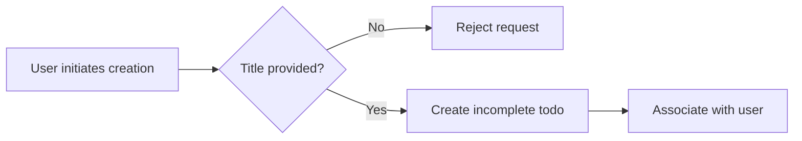
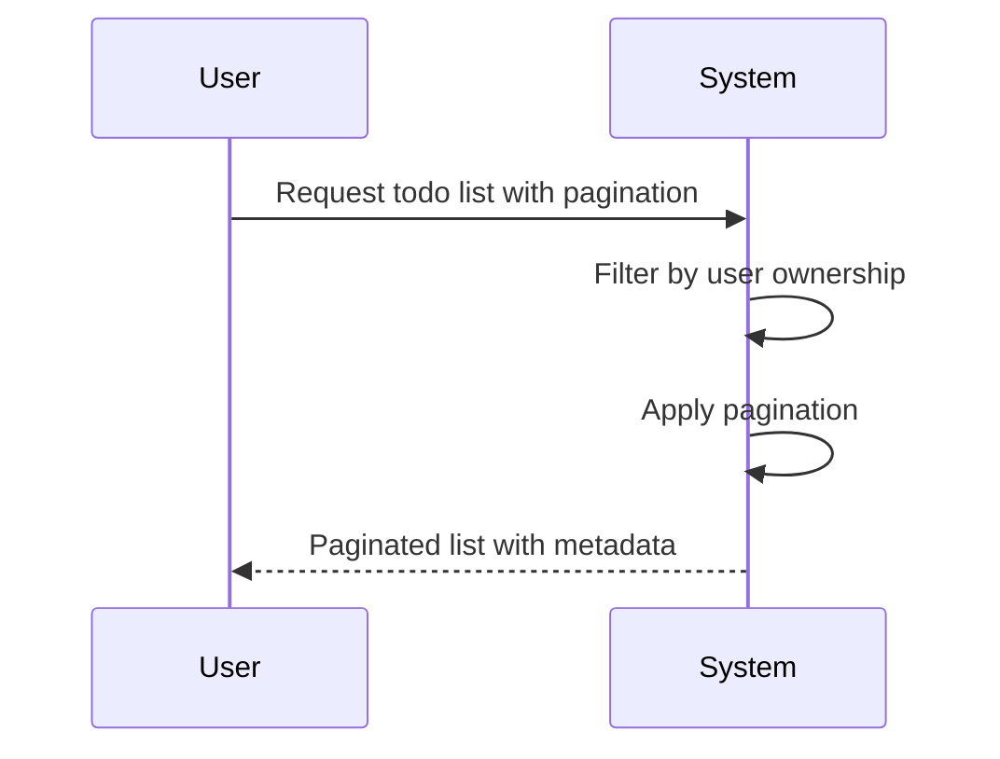
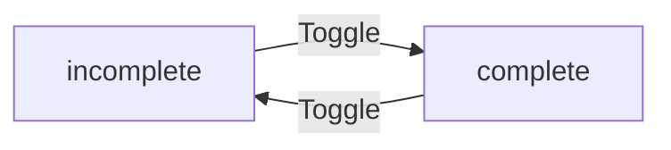
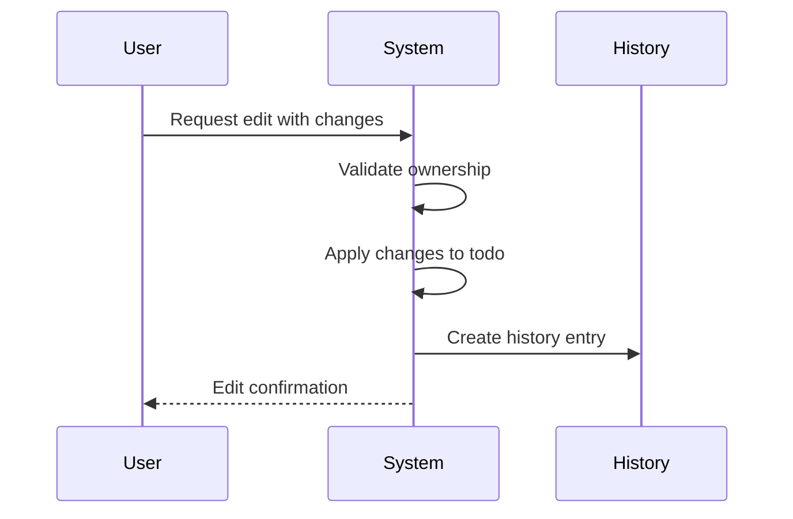
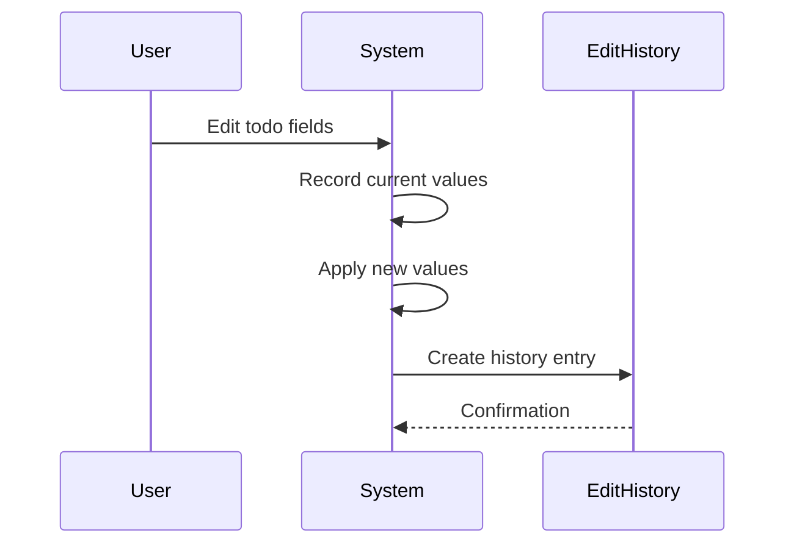
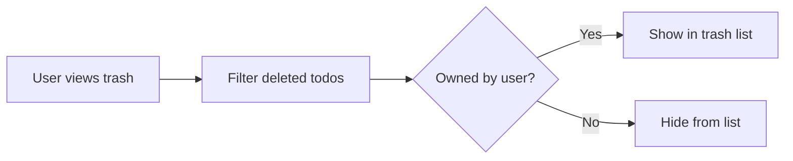
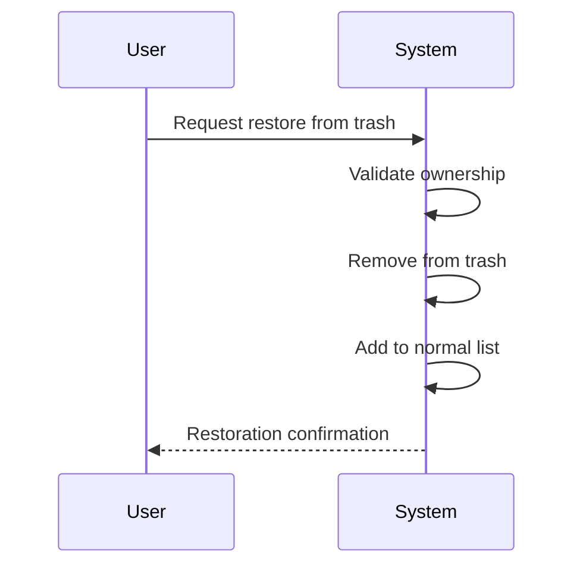
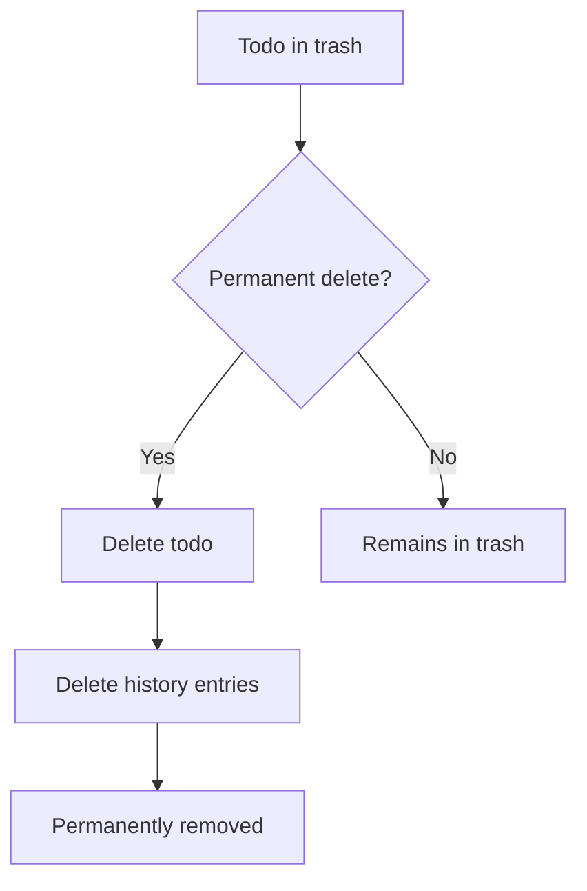
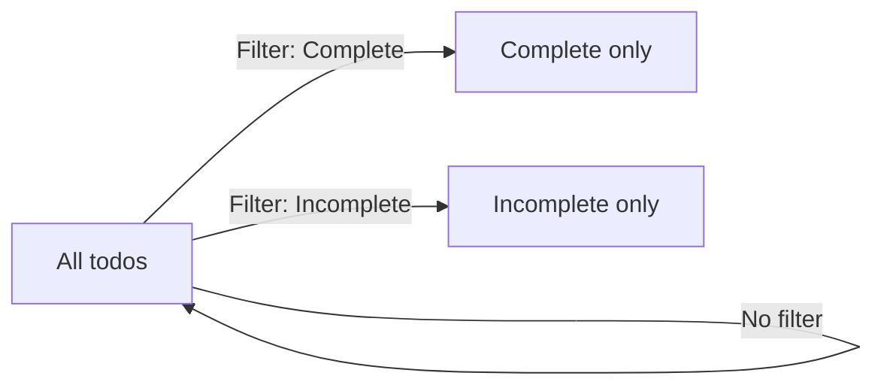
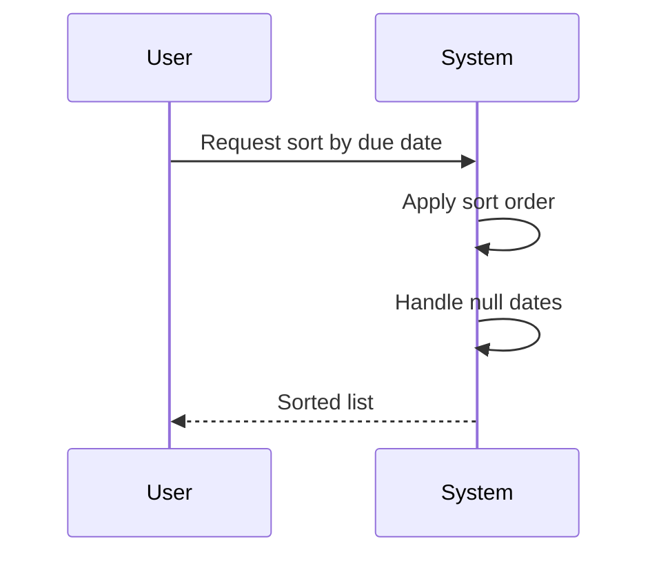

**todoApp — What operations users can perform, use cases, business workflows**

What operations users can perform, use cases, business workflows

# Core Business Operations

What the system must do for each business concept.

## User Operations

Users create accounts by providing an email address and password. Each email address can only be associated with one active account at a time. During registration, users receive a verification email to confirm their email ownership. After verification, users can log in using their registered email and password. Users may change their password at any time through a secure password update process. Users have the option to delete their entire account, which permanently removes all associated todos including those in the trash bin. Each user profile includes a display name that can be customized and updated at any time. Profile information is private and users cannot view other users' profiles. The application maintains complete privacy between users with no cross-user data visibility.

### Account Registration

### Account Registration

WHEN a user registers a new account, THE system SHALL:
1. Accept an email address and password as required fields
2. Validate that the email format is valid
3. Ensure the email address has not been previously registered
4. Create a new user account upon successful validation

IF the email address is already registered, THE system SHALL reject the registration and display an error message indicating the email is already in use.

WHEN a user provides an invalid email format, THE system SHALL reject the registration request and prompt the user to provide a valid email address.

THE system SHALL NOT allow multiple active accounts associated with the same email address.

### Email Verification

### Email Verification

WHEN a user completes account registration, THE system SHALL send a verification email to the provided email address.

WHEN a user receives the verification email, THE system SHALL require the user to verify their email address before accessing application features.

IF a user attempts to log in without verified email, THE system SHALL prompt the user to complete email verification before proceeding.

WHEN a user clicks the verification link in the email, THE system SHALL verify the link is valid and not expired, then mark the user's email as verified.

IF the verification link has expired or has already been used, THE system SHALL display an appropriate error message and offer to resend a new verification email.

### Login Authentication

### Login Authentication

WHEN a user attempts to log in, THE system SHALL:
1. Accept an email address and password as credentials
2. Validate the provided credentials against the stored user account
3. Grant access to the application upon successful authentication
4. Create a session for the authenticated user

IF the provided email or password is incorrect, THE system SHALL deny access and display an error message indicating invalid credentials.

IF the user's email has not been verified, THE system SHALL require email verification before allowing login.

WHEN a user logs in successfully, THE system SHALL maintain the session until the user explicitly logs out or the session expires according to security policy.

GUEST users cannot access any todo functionality and must authenticate as a member before performing any operations.

### Password Security

### Password Security

WHEN a user changes their password, THE system SHALL:
1. Require the user to provide their current password for verification
2. Accept a new password that meets security requirements
3. Replace the stored password with the new password hash
4. Invalidate all existing sessions upon password change

IF the provided current password is incorrect, THE system SHALL reject the password change request and display an error message.

WHEN a user provides a new password that does not meet security requirements, THE system SHALL reject the request and indicate the specific requirements not met.

THE system SHALL store passwords as securely hashed values and NEVER store passwords in plain text.

AFTER a password change, THE system SHALL require the user to log in again with the new password using any active sessions.

### Account Deletion

### Account Deletion

WHEN a user requests account deletion, THE system SHALL:
1. Require explicit confirmation of the deletion request
2. Permanently delete all user data including all todos
3. Delete all todos in the trash bin permanently
4. Delete all edit history entries associated with the user's todos
5. Remove the user account from the system

IF the user confirms account deletion, THE system SHALL permanently remove all associated data and provide confirmation of successful deletion.

IF the user cancels or does not confirm the deletion request, THE system SHALL NOT delete any account data.

WHEN account deletion is completed, THE system SHALL NOT allow the user to recover any deleted data.

Users can only delete their own account and cannot delete accounts belonging to other users.

### Display Name Management

### Display Name Management

WHEN a user creates an account, THE system SHALL assign a display name that can be customized.

WHEN a user wants to update their display name, THE system SHALL:
1. Accept the new display name as input
2. Validate the display name meets requirements
3. Update the user's profile with the new display name
4. Reflect the change across all user-related operations

IF the user provides an empty or invalid display name, THE system SHALL reject the update and prompt the user to provide a valid display name.

WHEN a user updates their display name, THE system SHALL apply the change immediately and reflect it in all todo-related displays where the user's name appears.

Users CAN edit their display name at any time without restrictions on the number of updates.

### Private Profile Isolation

### Private Profile Isolation

WHEN a user views profile information, THE system SHALL ONLY display the viewing user's own profile information.

IF a user attempts to access another user's profile, THE system SHALL deny access and display an error indicating insufficient permissions.

WHEN displaying todos associated with users, THE system SHALL show only user identifiers without exposing private profile details.

THE system SHALL maintain complete isolation between user profiles with NO mechanism for cross-user profile access.

All todo ownership information SHALL remain private and users SHALL only see their own todos and cannot discover other users' todos through any means.

## Todo Operations

Users create new todos with a required title and optional description, start date, and due date. Newly created todos are automatically marked as incomplete and appear in the user's personal todo list. The todo list is paginated to handle large collections efficiently. Each todo in the list displays its title, completion status, start date, due date, and creation date. Users can view a single todo to see its complete information including the full description. Users can toggle todo completion status between complete and incomplete states. Todos can be edited to update the title, description, start date, or due date. When users delete todos, they are moved to a trash bin rather than being permanently removed. Users can view their deleted todos in a dedicated trash section that is also paginated. Deleted todos can be restored back to the normal todo list from the trash. Users can permanently delete todos from the trash, which removes them and their edit history permanently. Users can filter their todo list by completion status to show all todos, only complete todos, or only incomplete todos. Todos can be sorted by creation date, start date, or due date with options for ascending or descending order. Todos without dates appear at the end when sorting by start or due date.

### Todo Creation

WHEN a user creates a todo, THE system SHALL:
1. Require a title for the todo
2. Allow an optional description that can be left empty
3. Allow an optional start date that can be left empty
4. Allow an optional due date that can be left empty
5. Automatically mark the new todo as incomplete
6. Associate the todo with the creating user

IF the title is missing or empty, THE system SHALL reject the todo creation request.

IF the due date is before the start date, THE system SHALL reject the todo creation request.

WHEN todo creation succeeds, THE system SHALL display the new todo in the user's todo list with completion status marked as incomplete.

THE system SHALL not display another user's todos to any user.

### Todo Creation Flow

mermaid
flowchart LR
    A["User submits todo"] --> B{"Title present?"}
    B -->|No| C["Reject: Title required"]
    B -->|Yes| D{"Valid dates?"}
    D -->|No| E["Reject: Invalid dates"]
    D -->|Yes| F["Create todo"]
    F --> G["Mark as incomplete"]
    G --> H["Show in todo list"]

### Todo List Viewing and Pagination

WHEN a user views their todo list, THE system SHALL display only that user's todos.

WHEN a user views their todo list, THE system SHALL show each todo with: title, completion status, start date (if set), due date (if set), and creation date.

THE system SHALL paginate the todo list to display a limited number of todos per page.

THE system SHALL provide navigation controls to move between pages of the todo list.

IF a user attempts to view a todo list for another user, THE system SHALL reject the request.

THE system SHALL sort todos by creation date (newest first) as the default order.

WHEN the todo list is paginated, THE system SHALL display page numbers and current page information.

### Todo List View

mermaid
sequenceDiagram
    participant U as User
    participant S as System
    U->>S: Request todo list with page number
    S->>S: Filter by user ownership
    S->>S: Apply pagination
    S->>S: Sort by creation date
    S-->>U: Return paginated todo list

### Todo Detail Viewing

WHEN a user views a single todo detail, THE system SHALL display all todo fields including full description.

WHEN a user views a todo detail, THE system SHALL show: title, description, start date, due date, completion status, and creation date.

WHEN a todo detail is incomplete, THE system SHALL indicate the completion status clearly.

WHEN a todo detail is complete, THE system SHALL indicate the completion status clearly.

IF a user attempts to view a todo they do not own, THE system SHALL reject the request.

IF a todo does not exist, THE system SHALL reject the request to view the todo detail.

THE system SHALL ensure users cannot access another user's todo through any means.

WHEN viewing a todo, THE system SHALL allow the user to mark it complete or incomplete.

WHEN viewing a todo, THE system SHALL allow the user to edit the todo.

WHEN viewing a todo, THE system SHALL allow the user to delete the todo.

WHEN viewing a todo, THE system SHALL allow the user to view its edit history.

### Completion Status Toggle

WHEN a user toggles a todo's completion status, THE system SHALL change it from incomplete to complete.

WHEN a user toggles a todo's completion status, THE system SHALL change it from complete to incomplete.

THE toggle operation SHALL be a simple state change between two states.

WHEN a todo is marked complete, THE system SHALL record the completion timestamp.

WHEN a todo is marked incomplete, THE system SHALL record the reversion timestamp.

IF a user attempts to toggle another user's todo, THE system SHALL reject the request.

IF the todo does not exist, THE system SHALL reject the toggle request.

WHEN a todo is marked complete, THE system SHALL update the todo list to reflect the new status.

WHEN a todo is marked incomplete, THE system SHALL update the todo list to reflect the new status.

### Completion Status State Transition

mermaid
flowchart LR
    A["incomplete"] -->|Mark Complete| B["complete"]
    B -->|Mark Incomplete| A

### Todo Editing and History

WHEN a user edits a todo, THE system SHALL allow updating the title.

WHEN a user edits a todo, THE system SHALL allow updating the description.

WHEN a user edits a todo, THE system SHALL allow updating the start date.

WHEN a user edits a todo, THE system SHALL allow updating the due date.

WHEN a todo is edited, THE system SHALL automatically create an edit history entry.

THE edit history entry SHALL record when the edit was made.

THE edit history entry SHALL record what the title was changed to (if changed).

THE edit history entry SHALL record what the description was changed to (if changed).

THE edit history entry SHALL record what the start date was changed to (if changed).

THE edit history entry SHALL record what the due date was changed to (if changed).

IF a user attempts to edit another user's todo, THE system SHALL reject the request.

IF a todo does not exist, THE system SHALL reject the edit request.

THE system SHALL maintain a complete history of all edits made to each todo.

WHEN viewing edit history, THE system SHALL sort entries from most recent to oldest.

### Edit History Flow

mermaid
sequenceDiagram
    participant U as User
    participant S as System
    U->>S: Edit todo fields
    S->>S: Validate ownership
    S->>S: Record previous values
    S->>S: Apply changes
    S->>S: Create history entry
    S-->>U: Success with history

### Soft Delete Mechanism

WHEN a user deletes a todo, THE system SHALL move it to the trash instead of permanently removing it.

A deleted todo SHALL no longer appear in the normal todo list.

WHEN a todo is deleted, THE system SHALL preserve all its data including edit history.

THE deleted todo SHALL remain associated with its owner user.

IF a user attempts to delete another user's todo, THE system SHALL reject the request.

IF a todo does not exist, THE system SHALL reject the delete request.

WHEN a todo is deleted, THE system SHALL mark it with a deletion timestamp.

THE soft delete operation SHALL be reversible via the trash restoration feature.

WHEN viewing deleted todos, THE system SHALL show them in a separate trash list.

### Soft Delete Flow

mermaid
flowchart LR
    A["Normal todo list"] -->|Delete| B["Trash"]
    B -->|Restore| A

### Trash Management

WHEN a user views the trash, THE system SHALL display only that user's deleted todos.

THE trash list SHALL be paginated to handle large numbers of deleted todos.

WHEN a user views the trash, THE system SHALL show each deleted todo with its title, original creation date, and deletion date.

WHEN a user restores a todo from trash, THE system SHALL move it back to the normal todo list.

WHEN a todo is restored from trash, THE system SHALL preserve all its edit history.

WHEN a todo is restored from trash, THE system SHALL preserve its completion status.

IF a user attempts to restore a todo that does not exist in trash, THE system SHALL reject the request.

IF a user attempts to restore another user's deleted todo, THE system SHALL reject the request.

WHEN viewing the trash, THE system SHALL provide pagination controls.

THE system SHALL allow users to permanently delete todos from the trash.

WHEN permanently deleting a todo from trash, THE system SHALL also delete its edit history.

WHEN permanently deleting a todo from trash, THE system SHALL remove it from all user views.

### Trash Management Flow

mermaid
sequenceDiagram
    participant U as User
    participant S as System
    U->>S: View trash list
    S->>S: Filter deleted todos by user
    S->>S: Apply pagination
    S-->>U: Return trash list
    U->>S: Restore todo
    S->>S: Validate ownership
    S->>S: Remove from trash
    S->>S: Add to normal list
    S-->>U: Success

### Filter by Completion Status

WHEN a user filters their todo list, THE system SHALL allow selecting to show all todos.

WHEN a user filters their todo list, THE system SHALL allow selecting to show only complete todos.

WHEN a user filters their todo list, THE system SHALL allow selecting to show only incomplete todos.

THE filter SHALL apply across the entire paginated todo list.

WHEN a completion status filter is applied, THE system SHALL update the todo list to show only matching todos.

IF a user attempts to filter another user's todos, THE system SHALL reject the request.

WHEN filtering is active, THE system SHALL display the current filter selection.

THE completion status filter SHALL work in conjunction with sorting options.

WHEN the filter is reset to show all todos, THE system SHALL return todos to their default order.

### Completion Status Filter

mermaid
flowchart LR
    A["All todos"] -->|Filter| B["All todos"]
    A -->|Filter| C["Complete only"]
    A -->|Filter| D["Incomplete only"]
    B -->|Reset| A
    C -->|Reset| A
    D -->|Reset| A

### Sort by Date

WHEN a user sorts their todo list by creation date, THE system SHALL allow newest first.

WHEN a user sorts their todo list by creation date, THE system SHALL allow oldest first.

WHEN a user sorts their todo list by start date, THE system SHALL allow earliest first.

WHEN a user sorts their todo list by start date, THE system SHALL allow latest first.

WHEN a user sorts their todo list by due date, THE system SHALL allow earliest first.

WHEN a user sorts their todo list by due date, THE system SHALL allow latest first.

WHEN sorting by start date, todos without a start date SHALL appear at the end of the list.

WHEN sorting by due date, todos without a due date SHALL appear at the end of the list.

THE default sort order SHALL be by creation date (newest first).

IF a user attempts to sort another user's todos, THE system SHALL reject the request.

WHEN a sort is applied, THE system SHALL display the current sort option.

WHEN sorting is reset, THE system SHALL return todos to the default creation date sort order.

### Sort Behavior

mermaid
flowchart TD
    A["Default: Creation newest first"] -->|Sort| B["Creation oldest first"]
    A -->|Sort| C["Start date earliest first"]
    A -->|Sort| D["Start date latest first"]
    A -->|Sort| E["Due date earliest first"]
    A -->|Sort| F["Due date latest first"]
    C -->|No date| G["End of list"]
    D -->|No date| G
    E -->|No date| H["End of list"]
    F -->|No date| H

## EditHistory Operations

Every time a user edits a todo, the system automatically creates a history entry to track the changes. Each history entry records the timestamp when the edit occurred and which user made the edit. History entries capture the previous and new values for every field that was modified during the edit. If the title was changed, the history entry records both the old title and the new title. If the description was changed, the history entry records both the old description and the new description. If the start date was changed, the history entry records both the old start date and the new start date. If the due date was changed, the history entry records both the old due date and the new due date. When a todo is permanently deleted from trash, its associated edit history is also permanently deleted. Users can view the complete edit history for any of their todos. Edit history entries are always displayed sorted from the most recent edit to the oldest. The history provides a complete audit trail of all changes made to each todo.

### Automatic Edit Recording

WHEN a user edits a todo, THE system SHALL automatically create an edit history entry to record the change.

WHEN a user edits a todo, THE system SHALL record the exact timestamp when the edit occurred.

WHEN a user edits a todo, THE system SHALL record which user made the edit.

IF a todo is being edited, THE system SHALL ensure the edit history is created before the todo is updated.

### Title Change Tracking

WHEN a user changes a todo's title, THE system SHALL record the previous title value in the history entry.

WHEN a user changes a todo's title, THE system SHALL record the new title value in the history entry.

IF a todo's title is not changed during an edit, THE system SHALL NOT include title values in the history entry.

THE system SHALL ensure that title changes are always logged when the title is modified.

### Description Change Tracking

WHEN a user changes a todo's description, THE system SHALL record the previous description value in the history entry.

WHEN a user changes a todo's description, THE system SHALL record the new description value in the history entry.

IF a todo's description is not changed during an edit, THE system SHALL NOT include description values in the history entry.

IF a todo has no description, THE system SHALL record the absence of description as the previous value.

### Start Date Change Tracking

WHEN a user changes a todo's start date, THE system SHALL record the previous start date value in the history entry.

WHEN a user changes a todo's start date, THE system SHALL record the new start date value in the history entry.

IF a todo's start date is not changed during an edit, THE system SHALL NOT include start date values in the history entry.

IF a todo has no start date and a start date is set, THE system SHALL record the absence as the previous value.

### Due Date Change Tracking

WHEN a user changes a todo's due date, THE system SHALL record the previous due date value in the history entry.

WHEN a user changes a todo's due date, THE system SHALL record the new due date value in the history entry.

IF a todo's due date is not changed during an edit, THE system SHALL NOT include due date values in the history entry.

IF a todo has no due date and a due date is set, THE system SHALL record the absence as the previous value.

### History View Capability

WHEN a user requests to view edit history for a todo they own, THE system SHALL display all edit history entries for that todo.

IF a user requests to view edit history for a todo they do not own, THE system SHALL reject the request.

THE system SHALL ensure that all fields that were modified in an edit are captured in the history entry.

### History Sorting

WHEN a user views edit history for a todo, THE system SHALL display history entries sorted from most recent to oldest.

WHEN a user views edit history for a todo, THE system SHALL display the timestamp for each edit entry.

THE system SHALL ensure that history entries are always presented in reverse chronological order.

### Permanent Deletion Impact

WHEN a todo is permanently deleted from trash, THE system SHALL also permanently delete all associated edit history entries.

WHEN a todo is permanently deleted from trash, THE system SHALL ensure that no edit history can be retrieved after deletion.

IF a user attempts to view edit history for a permanently deleted todo, THE system SHALL indicate that the todo no longer exists.

# Business Actions and Workflows

Business actions and workflows beyond basic CRUD.

## User Actions

Users can create new accounts by providing an email address and password during registration. After registration, users authenticate by entering their email and password to access their account. Users may change their password at any time to maintain account security. Each user has a profile containing a display name that can be edited through the profile settings. Users are able to permanently delete their account, which removes all their todos including those in trash with no possibility of recovery. The system maintains complete privacy where users only have access to their own data. All user actions are tied to their authenticated account to ensure proper access control.

### Account Registration

WHEN a user registers a new account, THE system SHALL:
1. Accept an email address and password
2. Verify the email address format is valid
3. Ensure the email address is not already registered
4. Create a new user account with the provided credentials
5. Set the display name as empty until the user edits it

IF the email address format is invalid, THE system SHALL reject the registration request.
IF the email address is already registered, THE system SHALL reject the registration request with an appropriate message.
IF the password does not meet security requirements, THE system SHALL reject the registration request.

### Email and Password Authentication

WHEN a user attempts to authenticate, THE system SHALL:
1. Accept an email address and password
2. Verify the email address exists in the system
3. Verify the password matches the stored credentials
4. Grant access to the user's account upon successful authentication
5. Create an authenticated session for the user

IF the email address does not exist, THE system SHALL reject the authentication request.
IF the password is incorrect, THE system SHALL reject the authentication request.
IF the authentication fails, THE system SHALL NOT reveal whether the email exists or not for security purposes.

### Password Change Workflow

WHEN a user requests to change their password, THE system SHALL:
1. Require the user to provide their current password for verification
2. Accept a new password from the user
3. Verify the new password meets security requirements
4. Update the user's password to the new value
5. Invalidate all existing sessions after password change

IF the current password is incorrect, THE system SHALL reject the password change request.
IF the new password is identical to the current password, THE system SHALL reject the password change request.
IF the new password does not meet security requirements, THE system SHALL reject the password change request.
AFTER successful password change, THE system SHALL prevent the user from logging in until re-authentication with the new password.

### Profile Display Name Editing

WHEN a user updates their display name, THE system SHALL:
1. Accept a new display name value from the user
2. Store the updated display name in the user profile
3. Reflect the updated display name in all user-visible contexts

IF the display name is empty, THE system SHALL reject the update request.
IF the display name exceeds the maximum length limit, THE system SHALL reject the update request.
AFTER updating the display name, THE system SHALL persist the change immediately and make it visible to the user.

### Account Deletion with Data Purge

WHEN a user requests to delete their account, THE system SHALL:
1. Require explicit confirmation from the user
2. Permanently delete all todos associated with the user
3. Permanently delete all todos in trash associated with the user
4. Permanently delete all edit history entries for the user's todos
5. Permanently delete the user account and profile

BEFORE account deletion, THE system SHALL warn the user that this action is irreversible and all data will be permanently lost.
AFTER account deletion, THE system SHALL ensure no user data remains recoverable.
IF the user cancels the deletion request, THE system SHALL abort the process and retain all account data.

### Authenticated Session Management

WHEN a user authenticates successfully, THE system SHALL:
1. Create an authenticated session for the user
2. Maintain session state throughout the user's activity
3. Allow the user to perform actions within their permission scope
4. Track session expiration and enforce timeout policies

WHEN a session expires, THE system SHALL require the user to re-authenticate.
WHEN the user logs out, THE system SHALL invalidate the session immediately.
IF a user attempts to access a protected resource without a valid session, THE system SHALL redirect to the authentication page.
THE system SHALL support concurrent sessions from multiple devices for the same user.

### User Privacy Enforcement

WHEN a user performs any action, THE system SHALL:
1. Verify the user is authenticated
2. Ensure the user can only access their own data
3. Prevent access to other users' todos and profile information

IF a user attempts to access another user's data, THE system SHALL reject the request.
IF a user attempts to view or modify another user's todo, THE system SHALL deny the operation.
IF a user attempts to view another user's profile, THE system SHALL deny the request.
THE system SHALL enforce strict data isolation where users have zero visibility into other users' data regardless of authentication status.
ALL data access requests SHALL include ownership verification before processing.

## Todo Actions

Users can create new todos with a required title and optional description, start date, and due date. Newly created todos are marked as incomplete by default. Users can view a paginated list of their todos showing key information including completion status and dates. Users can view individual todos to see complete details including full description text. Users can toggle the completion status of any todo between complete and incomplete states. Users can edit the title, description, start date, and due date of their todos. Deleted todos move to a trash area where they can be viewed in a separate paginated list. Users can restore deleted todos from trash back to their normal todo list. Users can also permanently delete items from trash, which removes them along with their edit history. Users can filter their todo list to show all todos, only complete todos, or only incomplete todos. Users can sort their todo list by creation date, start date, or due date with newest or oldest first options. Todos without start or due dates appear at the end when sorting by those fields.

### Todo Creation

WHEN a user creates a new todo, THE system SHALL:
1. Require a title field that cannot be empty
2. Allow an optional description that can be left empty
3. Allow an optional start date that can be left empty
4. Allow an optional due date that can be left empty
5. Set the initial completion status to incomplete

IF the title is empty or missing, THE system SHALL reject the creation request.

Every new todo SHALL be automatically associated with the creating user.

MERMAID DIAGRAM:

### Todo List Viewing

WHEN a user views their todo list, THE system SHALL:
1. Display only todos owned by that user
2. Paginate the results to show a subset per page
3. Show each todo with: title, completion status, start date (if set), due date (if set), and creation date

IF a user attempts to view todos they do not own, THE system SHALL return only their own todos.

Every paginated list SHALL include navigation information indicating total pages and current page.

WHEN a user requests a specific page, THE system SHALL return only the todos on that page.

MERMAID DIAGRAM:

### Individual Todo Detail View

WHEN a user views a single todo, THE system SHALL display:
1. The complete title
2. The full description text including any formatting
3. The completion status
4. The start date if set
5. The due date if set
6. The creation date

IF the requested todo does not exist, THE system SHALL reject the request.

IF the user does not own the requested todo, THE system SHALL reject the request.

Users SHALL NOT be able to view other users' todos even with the todo identifier.

Every todo detail view SHALL confirm the viewer is the owner of that todo.

### Completion Status Toggle

WHEN a user toggles the completion status of a todo, THE system SHALL:
1. Change an incomplete todo to complete
2. Change a complete todo to incomplete

WHILE a todo is complete, THE system SHALL indicate this status to the user in all views.

WHILE a todo is incomplete, THE system SHALL indicate this status to the user in all views.

IF the user does not own the todo, THE system SHALL reject the toggle request.

Every status change SHALL be immediate and persist to the system.

MERMAID DIAGRAM:

### Todo Content Editing

WHEN a user edits a todo, THE system SHALL:
1. Allow updating the title (new value must be provided)
2. Allow updating the description (can be empty)
3. Allow updating the start date (can be removed)
4. Allow updating the due date (can be removed)

IF the user does not own the todo, THE system SHALL reject the edit request.

IF the todo does not exist, THE system SHALL reject the edit request.

Users CAN leave any field unchanged while editing other fields.

Every edit SHALL be recorded in the todo's edit history (defined in Edit History Recording section).

MERMAID DIAGRAM:

### Edit History Recording

WHEN a todo is edited, THE system SHALL automatically create an edit history entry with:
1. Timestamp of when the edit was made
2. Previous and new title values (if title changed)
3. Previous and new description values (if description changed)
4. Previous and new start date values (if start date changed)
5. Previous and new due date values (if due date changed)

IF only some fields are changed, THE system SHALL only record the changed fields.

IF a field was not changed, THE system SHALL not include that field in the history entry.

Every history entry SHALL reference the todo being edited and the user who made the edit.

MERMAID DIAGRAM:

### Todo Soft Delete

WHEN a user deletes a todo, THE system SHALL:
1. Mark the todo as deleted (soft delete)
2. Remove it from the normal todo list view
3. Move it to the user's trash area
4. Preserve all todo data including edit history

IF the user does not own the todo, THE system SHALL reject the delete request.

IF the todo does not exist, THE system SHALL reject the delete request.

Deleted todos SHALL remain accessible only through the trash view.

Every soft deleted todo SHALL retain its association with the original user.

### Trash View

WHEN a user views their trash, THE system SHALL:
1. Display only deleted todos belonging to that user
2. Paginate the trash results
3. Show each todo with: title, completion status, deletion date, and original creation date

IF a user attempts to view trash for another user, THE system SHALL return empty results.

Every paginated trash list SHALL include navigation information.

Deleted todos in trash SHALL remain visible until permanently deleted or restored.

MERMAID DIAGRAM:

### Todo Restoration

WHEN a user restores a todo from trash, THE system SHALL:
1. Remove the todo from the trash
2. Return the todo to the normal todo list
3. Restore all todo data including completion status and edit history

IF the user does not own the todo in trash, THE system SHALL reject the restore request.

IF the todo no longer exists, THE system SHALL reject the restore request.

Every restored todo SHALL appear in the normal todo list with its original data intact.

MERMAID DIAGRAM:

### Permanent Deletion

WHEN a user permanently deletes a todo from trash, THE system SHALL:
1. Remove the todo from all views permanently
2. Delete the todo's edit history entries
3. Free up storage space for the todo data

IF the user does not own the todo in trash, THE system SHALL reject the permanent delete request.

IF the todo has already been permanently deleted, THE system SHALL reject the request.

Once permanently deleted, THE todo and its history SHALL NOT be recoverable.

MERMAID DIAGRAM:

### Completion Status Filtering

WHEN a user filters their todo list, THE system SHALL:
1. Allow filtering by all todos (no filter)
2. Allow filtering to show only complete todos
3. Allow filtering to show only incomplete todos

IF a user applies a completion status filter, THE system SHALL return only todos matching that filter.

IF no filter is specified, THE system SHALL return all todos for that user.

Filtering SHALL work in combination with sorting when both are applied.

Every filtered result SHALL indicate which filter is currently active.

MERMAID DIAGRAM:

### Todo Sorting

WHEN a user sorts their todo list, THE system SHALL:
1. Allow sorting by creation date (newest first or oldest first)
2. Allow sorting by start date (earliest first or latest first)
3. Allow sorting by due date (earliest first or latest first)

WHEN sorting by start date, todos without a start date SHALL appear at the end of the list.

WHEN sorting by due date, todos without a due date SHALL appear at the end of the list.

IF a user applies a sort order, THE system SHALL return todos in that sorted order.

Sorting SHALL work in combination with filtering when both are applied.

MERMAID DIAGRAM:

## EditHistory Actions

Every time a todo is edited, the system automatically records an edit history entry for that todo. Each history entry captures when the edit was made by the user. The history entry records what the title was changed to if it was modified. The history entry records what the description was changed to if it was modified. The history entry records what the start date was changed to if it was modified. The history entry records what the due date was changed to if it was modified. Users can view the complete edit history of any todo they own. History entries are displayed with the most recent edits appearing first. The edit history provides a complete audit trail of all changes made to a todo. When a todo is permanently deleted from trash, its entire edit history is also deleted. Users cannot view edit history of todos owned by other users due to privacy restrictions. The history system ensures users maintain visibility into their todo modification patterns.

### Automatic Edit Recording

WHEN a user edits any field of a todo, THE system SHALL automatically create an edit history entry for that todo.

THE edit history entry SHALL record the exact timestamp when the edit was made.

THE edit history entry SHALL be linked to the todo that was edited.

THE edit history entry SHALL be associated with the user who made the edit.

IF a todo has no prior edits, THE first edit SHALL create the initial edit history entry.
IF a todo is edited multiple times, THE system SHALL create a separate edit history entry for each edit.

### Title Change History

WHEN a user changes a todo's title, THE system SHALL record the previous title in the edit history entry.

WHEN a user changes a todo's title, THE system SHALL record the new title in the edit history entry.

IF the title is not changed during an edit, THE system SHALL NOT record previous or new title values in the edit history entry.

IF a user edits a todo without changing the title, THE edit history entry SHALL still be created for other modified fields.

### Description Change History

WHEN a user changes a todo's description, THE system SHALL record the previous description in the edit history entry.

WHEN a user changes a todo's description, THE system SHALL record the new description in the edit history entry.

IF the description is not changed during an edit, THE system SHALL NOT record previous or new description values in the edit history entry.

IF a todo previously had no description and a user adds a description, THE system SHALL record empty string as previous description.

### Date Field Change History

WHEN a user changes a todo's start date, THE system SHALL record the previous start date in the edit history entry.

WHEN a user changes a todo's start date, THE system SHALL record the new start date in the edit history entry.

WHEN a user changes a todo's due date, THE system SHALL record the previous due date in the edit history entry.

WHEN a user changes a todo's due date, THE system SHALL record the new due date in the edit history entry.

IF a date field is not changed during an edit, THE system SHALL NOT record previous or new date values in the edit history entry for that field.

IF a todo previously had no start date and a user adds a start date, THE system SHALL record null as previous start date.

IF a todo previously had no due date and a user adds a due date, THE system SHALL record null as previous due date.

### View Edit History

WHEN a user views a todo they own, THE system SHALL display the complete edit history for that todo.

THE system SHALL display all edit history entries in chronological order with most recent edits appearing first.

THE system SHALL display the timestamp of each edit in the edit history entry.

THE system SHALL display which user made each edit in the edit history entry.

IF a todo has no edit history, THE system SHALL display an empty list or appropriate message.

IF a todo is owned by another user, THE system SHALL NOT display any edit history for that todo.

THE system SHALL show all field changes that were made during each edit, including title, description, start date, and due date changes.

### Edit Audit Trail Completeness

THE system SHALL maintain a complete audit trail of all edits made to a todo.

THE system SHALL ensure every edit is recorded and cannot be removed without permanent deletion of the todo.

THE system SHALL preserve all historical values for each field that was modified.

THE system SHALL allow users to review the full modification history of any todo they own.

THE system SHALL ensure edit history entries are immutable once created.

### History Deletion on Permanent Delete

WHEN a user permanently deletes a todo from trash, THE system SHALL delete the todo's entire edit history.

WHEN a todo is permanently deleted, THE system SHALL remove all edit history entries associated with that todo.

THE system SHALL NOT retain any edit history for permanently deleted todos.

IF a todo is restored from trash, THE system SHALL NOT restore its edit history from a previous permanent deletion.

WHEN a todo is moved to trash (soft delete), THE system SHALL NOT delete its edit history.

### Edit History Privacy and Access

THE system SHALL restrict edit history access to the owner of the todo only.

THE system SHALL prevent users from viewing edit history of todos owned by other users.

THE system SHALL enforce privacy restrictions that users cannot access another user's todo modifications.

THE system SHALL ensure edit history visibility follows the same privacy rules as todo visibility.

WHEN a todo is permanently deleted by its owner, THE system SHALL ensure no user can access its edit history.

# Error Scenarios and Edge Cases

Business-level error scenarios, edge case coverage, and expected system behaviors for exceptional conditions.

## User Error Scenarios

Users attempting to register with an email that already exists in the system receive an error and cannot create a duplicate account. Login attempts with incorrect email or password are rejected without revealing which credential was wrong. Password changes require the user to authenticate their current password first, preventing unauthorized modifications. If a user provides an old password that matches their previous one, the system declines the update. Account deletion permanently removes all user data including todos, trashed items, and edit history, with no recovery option available. Users cannot access or view another user's profile information since the application is designed for private todo management. Attempting to access another user's todos triggers an access denied response without exposing any data about that user's existence. Registration and login endpoints implement rate limiting to prevent brute force attacks and automated abuse.

### Duplicate Email Registration

WHEN a user attempts to register with an email address, THE system SHALL check if that email already exists in the user database.

IF a user tries to register with an email that is already registered, THE system SHALL reject the registration request and inform the user that an account with this email already exists.

THE system SHALL NOT reveal whether an email exists during failed login attempts to prevent user enumeration attacks.

WHEN registration is rejected due to duplicate email, THE system SHALL NOT create a partial account or store any information about the attempted registration.

### Invalid Login Credentials

WHEN a user attempts to log in, THE system SHALL validate the provided email and password combination.

IF the email does not exist in the system, THE system SHALL reject the login attempt with a generic error message.

IF the password does not match the stored password hash for the provided email, THE system SHALL reject the login attempt with a generic error message.

WHEN login fails due to invalid credentials, THE system SHALL NOT indicate whether the email or password was incorrect.

THE system SHALL log all failed login attempts for security monitoring purposes.

### Password Change Validation

WHEN a user requests to change their password, THE system SHALL validate that the new password meets all security requirements defined in the credential security policy.

IF the new password is identical to the user's current password, THE system SHALL reject the password change request.

IF the new password does not meet minimum complexity requirements, THE system SHALL reject the password change and inform the user of the specific requirements.

IF the new password is a previously used password from the user's password history, THE system SHALL reject the password change request.

THE system SHALL ensure that password changes are logged in the audit trail with timestamp and confirmation of success.

### Current Password Verification

WHEN a user requests to change their password, THE system SHALL require the user to provide their current password.

IF the user cannot provide their current password, THE system SHALL reject the password change request.

WHEN current password verification fails, THE system SHALL NOT reveal whether the current password is incorrect or if any other step failed.

THE system SHALL require current password verification before ANY password change operation, including password recovery and password updates.

IF the user fails current password verification multiple times, THE system SHALL trigger rate limiting on password change requests.

### Permanent Account Deletion

WHEN a user requests to delete their account, THE system SHALL present the user with a confirmation dialog warning that all data will be permanently deleted.

WHEN a user confirms account deletion, THE system SHALL permanently delete:
1. All the user's todos including incomplete and complete todos
2. All the user's deleted todos in trash
3. All edit history entries associated with the user's todos
4. The user's profile information and display name
5. The user's account authentication credentials

IF account deletion is confirmed, THE system SHALL NOT provide any recovery option or restore capability.

THE system SHALL immediately invalidate all active sessions associated with the deleted account.

IF account deletion fails due to system errors, THE system SHALL NOT partially delete user data and SHALL preserve the account in its original state.

### Access Denied Scenarios

WHEN a user attempts to view a todo that does not belong to them, THE system SHALL deny access and return an access denied error.

WHEN a user attempts to update or delete a todo that does not belong to them, THE system SHALL deny the operation and return an access denied error.

WHEN a user attempts to view the edit history of a todo they do not own, THE system SHALL deny access and return an access denied error.

THE system SHALL NOT reveal whether a todo exists when access is denied - it shall return the same error regardless of whether the todo exists or the user lacks permission.

IF a user is authenticated but lacks permission for the requested operation, THE system SHALL return an authenticated access denied error rather than an unauthenticated error.

### Cross-User Data Isolation

WHEN any user requests data from the system, THE system SHALL ensure the user can only access their own data.

THE system SHALL enforce strict separation between all user data including todos, edit history, and profile information.

WHEN a user views their todo list, THE system SHALL ONLY return todos belonging to that user, regardless of any URL manipulation or parameter changes.

THE system SHALL prevent any query or operation that could return another user's data, even through API parameter manipulation.

IF any request attempts to access cross-user data, THE system SHALL silently filter out or reject the request without exposing data about other users.

THE system SHALL NOT provide any search, browse, or discovery functionality that could reveal other users' existence or data.

### Rate Limiting Enforcement

WHEN a user makes authentication requests (login or registration), THE system SHALL track the number of requests from that user's IP address.

IF the number of requests within a time window exceeds the configured threshold, THE system SHALL temporarily block further requests from that IP address.

WHEN rate limiting is triggered, THE system SHALL inform the user that they have made too many requests and must wait before trying again.

THE system SHALL apply different rate limiting thresholds for login attempts versus registration attempts.

IF rate limiting is triggered multiple times in succession, THE system SHALL progressively increase the blocking duration.

THE system SHALL implement rate limiting at the API gateway level to prevent abuse before requests reach application logic.

### Credential Security

THE system SHALL store all user passwords as cryptographic hashes using a secure hashing algorithm with salt.

THE system SHALL NEVER store or log passwords in plain text anywhere in the system.

WHEN transmitting credentials over the network, THE system SHALL use encrypted connections (HTTPS/TLS).

THE system SHALL implement session tokens with expiration to limit the window of potential credential theft.

IF a credential breach is detected or suspected, THE system SHALL provide the ability to invalidate all sessions for affected users.

THE system SHALL automatically expire sessions after a period of inactivity to reduce the risk of session hijacking.

WHEN displaying any credential-related information to users, THE system SHALL NEVER show full passwords or reveal password characters.

## Todo Error Scenarios

Creating a todo without a title is rejected as title is a required field for all new todos. Editing a todo with empty title after modification results in validation failure and the edit is not saved. Todos without due dates appear at the end of the list when sorting by due date in either direction. Similarly, todos without start dates are positioned at the end when sorting by start date. Users attempting to view, edit, or delete another user's todo receive access denied errors. Restoring a todo from trash returns it to the normal todo list with its original metadata intact. Attempting to permanently delete a todo from trash also removes its entire edit history without separate confirmation. Filtering by completion status correctly excludes completed from incomplete lists and vice versa. Paginated todo lists handle edge cases where filtering and sorting combinations produce empty result sets. All todo operations are scoped to the logged-in user's private data with no cross-user visibility.

### Todo Title Validation

### Missing Required Title

WHEN a user creates a todo, THE system SHALL require a title field.
IF the title field is missing when creating a todo, THE system SHALL reject the request and prompt the user to provide a title.
IF a user attempts to create a todo with an empty title, THE system SHALL display an error message and prevent the todo from being created.

### Empty Title Validation on Edit

WHEN a user edits an existing todo, THE system SHALL validate that the title is not empty.
IF a user modifies a todo and the resulting title is empty, THE system SHALL reject the edit and preserve the previous title value.
IF a user submits an edit with an empty title field, THE system SHALL display a validation error and refuse to save the changes.

### Title Content Requirements

THE system SHALL allow titles containing any characters that are valid for display in the user interface.
THE system SHALL reject todo creation or edit submissions where the title field contains only whitespace characters.

### Date Sorting Behavior

### Null Date Sorting Behavior

WHEN users sort their todo list by date fields, THE system SHALL position todos without values at the end of the list.
IF a todo does not have a start date, THE system SHALL place it after all todos with start dates when sorting by start date.
IF a todo does not have a due date, THE system SHALL place it after all todos with due dates when sorting by due date.

### Due Date Sort Ordering

WHEN a user sorts todos by due date in ascending order, THE system SHALL order todos from earliest due date to latest due date.
WHEN a user sorts todos by due date in descending order, THE system SHALL order todos from latest due date to earliest due date.
Todos without due dates SHALL appear at the end of the list regardless of sort direction.

### Start Date Sort Ordering

WHEN a user sorts todos by start date in ascending order, THE system SHALL order todos from earliest start date to latest start date.
WHEN a user sorts todos by start date in descending order, THE system SHALL order todos from latest start date to earliest start date.
Todos without start dates SHALL appear at the end of the list regardless of sort direction.

### Cross-User Access Prevention

### Cross-User Access Prevention

IF a user attempts to view another user's todo, THE system SHALL reject the request and display an access denied message.
IF a user attempts to edit another user's todo, THE system SHALL reject the request and display an access denied message.
IF a user attempts to delete another user's todo, THE system SHALL reject the request and display an access denied message.
IF a user attempts to view the edit history of another user's todo, THE system SHALL reject the request and display an access denied message.

### Scoped User Data Access

WHEN a user views their todo list, THE system SHALL only display todos belonging to that user.
THE system SHALL ensure that no todo from one user can be accessed by viewing or manipulating another user's todo identifiers.
WHEN a user performs any todo operation, THE system SHALL scope the operation to the authenticated user's data only.

### Todo Ownership Validation

BEFORE processing any todo operation, THE system SHALL verify that the authenticated user owns the target todo.
IF the ownership verification fails, THE system SHALL reject the operation and display an unauthorized access error.
WHEN a user creates a todo, THE system SHALL automatically associate it with the creating user's account.

### Trash Restore Process

### Trash Restore Process

WHEN a user restores a deleted todo from the trash, THE system SHALL move the todo back to the normal todo list.
WHEN a todo is restored from trash, THE system SHALL preserve all original todo metadata including title, description, dates, and completion status.
IF a user restores a todo that was deleted more than 30 days ago, THE system SHALL display a warning but allow the restoration to proceed.

### Trash Restore Behavior

A todo restored from trash SHALL appear in the normal todo list filtered by the current view.
A todo restored from trash SHALL retain its original creation date rather than being assigned a new creation timestamp.
WHEN a todo is restored from trash, THE system SHALL remove it from the trash list view.

### Restored Todo Functionality

A restored todo SHALL regain full functionality for editing, completing, and deleting.
WHEN a user performs operations on a restored todo, THE system SHALL treat it identically to a todo that was never deleted.

### Permanent Deletion Cascade

### Permanent Deletion from Trash

WHEN a user permanently deletes a todo from trash, THE system SHALL remove the todo from the system completely.
WHEN a todo is permanently deleted from trash, THE system SHALL also delete all associated edit history entries.
IF a user permanently deletes a todo from trash, THE system SHALL not display any option to recover it afterward.

### Edit History Cascade Deletion

THE system SHALL automatically cascade the deletion of edit history when a todo is permanently deleted from trash.
WHEN a todo is permanently deleted, THE system SHALL remove every edit history entry that references that todo.
IF a user attempts to view edit history for a permanently deleted todo, THE system SHALL display a message indicating the todo no longer exists.

### Permanent Deletion Confirmation

BEFORE permanently deleting a todo from trash, THE system SHALL require explicit confirmation from the user.
THE system SHALL inform the user that permanent deletion will remove the todo and its entire edit history.

### Filter by Completion Status

### Filter by Completion Status - All Todos

WHEN a user selects the "All Todos" filter, THE system SHALL display todos with both complete and incomplete status.
WHEN a user applies the "All Todos" filter, THE system SHALL include all todos regardless of their completion state.

### Filter by Completion Status - Complete Only

WHEN a user selects the "Only Complete Todos" filter, THE system SHALL display only todos with completion status set to complete.
WHEN a user applies the "Only Complete Todos" filter, THE system SHALL exclude all todos with incomplete completion status.

### Filter by Completion Status - Incomplete Only

WHEN a user selects the "Only Incomplete Todos" filter, THE system SHALL display only todos with completion status set to incomplete.
WHEN a user applies the "Only Incomplete Todos" filter, THE system SHALL exclude all todos with complete completion status.

### Filter Combination Behavior

THE system SHALL allow users to combine filtering by completion status with sorting options.
WHEN a filter and sort are applied simultaneously, THE system SHALL filter first, then sort the filtered results.

### Pagination Empty Results

### Pagination Empty Results Handling

WHEN a filtered or sorted todo list contains no matching todos, THE system SHALL display an empty state message.
THE system SHALL not display pagination controls when there are no results to paginate.
WHEN the active filter or sort produces no todos, THE system SHALL display a user-friendly message indicating no todos match the current criteria.

### Pagination Edge Cases

WHEN a user applies filters that result in zero todos, THE system SHALL return an empty todo list rather than an error.
IF a user is viewing the trash with no deleted todos, THE system SHALL display a message indicating the trash is empty.
THE system SHALL maintain the current filter and sort settings when displaying empty result states.

### Pagination User Experience

WHEN navigating through paginated todo lists, THE system SHALL preserve the active filter and sort preferences across pages.
THE system SHALL clearly indicate the current page number and total number of available pages when results exist.

## EditHistory Error Scenarios

Every modification to a todo creates a new history entry that cannot be edited or removed individually. Users can only view edit history for todos they own and have access to. When a todo is permanently deleted from trash, its associated edit history is also permanently removed without separate user interaction. Users viewing edit history see entries sorted chronologically from most recent edit to oldest. History entries only record changes when a field's value actually differs from its previous state. Unchanged fields do not generate new history entries even if the edit action was initiated. The system maintains complete edit history for every todo throughout its lifecycle in the normal list and trash. Viewers cannot modify or delete individual history entries through any interface option. Access attempts to another user's edit history are blocked with appropriate denial messages. After account deletion, all associated edit history for that user is erased along with their todos.

### History Entry Immutability

WHEN a todo is edited, THE system SHALL create a new history entry that records the changes made.

IF a history entry exists, THE system SHALL NOT allow any user to modify its content.

IF a history entry exists, THE system SHALL NOT allow any user to delete it individually.

THE system SHALL reject any request to alter an existing history entry.

THE system SHALL reject any request to restore a deleted history entry.

History entries remain fixed once created and cannot be altered through any interface option or operation.

### Ownership-Based History Viewing

WHEN a user requests to view edit history for a todo, THE system SHALL verify that the user owns the todo.

IF a user does not own a todo, THE system SHALL deny access to its edit history.

IF a user attempts to view another user's edit history, THE system SHALL display an access denied message.

THE system SHALL only show history entries for todos that the requesting user owns or has permission to access.

WHEN viewing edit history, THE system SHALL display information about who made each edit.

Users cannot view edit history for todos they do not own, regardless of how they obtained the todo reference.

### Cascade History Deletion

WHEN a todo is permanently deleted from trash, THE system SHALL automatically delete its associated edit history.

IF a todo is permanently removed from trash, THE system SHALL remove all its history entries in the same operation.

Users do not see history deletion as a separate action when deleting a todo.

THE system SHALL permanently remove both the todo and its history when the user confirms permanent deletion.

Once a todo is permanently deleted, its history cannot be recovered separately.

THE system SHALL ensure that deleting a todo and its history occurs as a single atomic operation.

### Chronological History Ordering

WHEN a user views edit history for a todo, THE system SHALL display history entries sorted from most recent to oldest.

WHEN displaying edit history, THE system SHALL order entries by their creation timestamp in descending order.

THE system SHALL show the timestamp of when each edit was made in each history entry.

History entries SHALL be sorted so that the most recent edit appears first in the list.

THE system SHALL maintain the chronological ordering of history entries at all times.

Users cannot request a different sort order for edit history; chronological ordering is fixed.

### Changed Field Recording

WHEN a todo is edited, THE system SHALL only record changes for fields that were actually modified.

IF a field value is changed, THE system SHALL record both the previous value and the new value in the history entry.

IF a field value remains unchanged during an edit, THE system SHALL NOT record that field in the history entry.

THE system SHALL create a history entry even if only one field was changed.

History entries SHALL contain null or empty values for fields that were not modified in that edit.

THE system SHALL record the complete previous and new values for title, description, start date, and due date fields when they change.

### Complete Lifecycle History

WHEN a todo is created, THE system SHALL maintain a history log for all its edits from creation forward.

THE system SHALL preserve edit history for todos while they exist in the normal todo list.

THE system SHALL preserve edit history for todos after they are moved to trash.

THE system SHALL maintain complete edit history throughout the todo's entire lifecycle until permanent deletion.

History SHALL be maintained for todos in all states: active, completed, and in trash.

THE system SHALL NOT discard or compress history entries as a todo ages or moves between states.

# End-to-End User Scenarios

Cross-domain user scenarios, multi-step business flows, and end-to-end use cases.

## User User Scenarios

Users create accounts using email and password credentials to gain access to their personal todo workspace. New accounts begin in an unverified state until email confirmation is completed successfully. Users log in with their registered email and password to access their account and view their todos. When users forget their password, they can request a password reset through the recovery process. Users have the ability to change their password at any time for security purposes. Users can delete their account, which permanently removes all their data including todos and edit history. After account deletion, users can create a new account with the same email address if they wish to return. Account privacy ensures that each user's data remains completely private and inaccessible to other users.

### Account Creation

WHEN a new user creates an account, THE system SHALL:
1. Accept an email address and password as required credentials
2. Require both email and password fields to be provided
3. Ensure the email address is unique across all accounts
4. Create the account in an unverified state awaiting email confirmation

IF the email address is already registered, THE system SHALL reject the registration and prompt the user to use a different email or recover their existing account.

IF the password does not meet minimum security requirements, THE system SHALL reject the registration and display appropriate guidance.

IF the email format is invalid, THE system SHALL reject the registration and request a properly formatted email address.

### Email Verification

WHEN a new account is created, THE system SHALL send a verification email containing a unique verification link.

WHEN a user receives the verification email and clicks the verification link, THE system SHALL verify the account and transition it to an active verified state.

WHEN a verified user attempts to access the system, THE system SHALL grant immediate access to their personal workspace.

IF the verification link has expired, THE system SHALL reject the verification attempt and offer the user an option to request a new verification email.

IF the verification link has already been used, THE system SHALL inform the user that their account is already verified.

IF the verification token is invalid or corrupted, THE system SHALL reject the verification attempt and guide the user to request a new verification link.

### Login Authentication

WHEN a user attempts to log in, THE system SHALL authenticate them using their registered email address and password.

WHEN authentication is successful, THE system SHALL grant the user access to their personal todo workspace from any device.

WHEN authentication fails due to incorrect credentials, THE system SHALL NOT disclose whether the email address exists or the password is wrong to prevent user enumeration.

IF the user account is not yet verified, THE system SHALL reject the login attempt and prompt the user to verify their email address first.

IF the user account has been deleted, THE system SHALL reject the login attempt and direct the user to create a new account if they wish to return.

IF multiple consecutive login attempts fail, THE system SHALL temporarily lock the account and require additional verification before allowing further attempts.

### Password Recovery

WHEN a user forgets their password, THE system SHALL allow them to request a password recovery email by providing their registered email address.

WHEN the user provides their email address for password recovery, THE system SHALL send a secure recovery email containing a unique password reset link.

WHEN a user receives the password reset link and enters a new password, THE system SHALL update their password and grant them immediate access.

IF the email address is not registered in the system, THE system SHALL NOT confirm or deny the existence of the account and shall provide generic feedback.

IF the password reset link has expired, THE system SHALL reject the reset attempt and prompt the user to request a new recovery email.

IF the password reset link has already been used, THE system SHALL inform the user that their password has already been reset.

### Password Change

WHEN a logged-in user wants to change their password, THE system SHALL require the current password for verification before allowing the new password.

WHEN a user successfully changes their password, THE system SHALL update the password immediately and maintain access across all authenticated sessions.

IF the current password provided does not match the user's existing password, THE system SHALL reject the password change request and request the correct current password.

IF the new password does not meet the minimum security requirements, THE system SHALL reject the change and display appropriate guidance on password requirements.

IF the new password is identical to the current password, THE system SHALL reject the change and inform the user that no change is needed.

### Account Deletion

WHEN a user chooses to delete their account, THE system SHALL permanently remove the user account and all associated data.

WHEN an account is deleted, THE system SHALL permanently delete all todos belonging to that user, including todos in the trash.

WHEN an account is deleted, THE system SHALL also permanently delete all edit history entries associated with the user's todos.

IF the user provides incorrect current password during deletion, THE system SHALL reject the account deletion request.

AFTER account deletion is complete, the user email becomes available for new account registration.

IF the user is currently logged in from multiple devices, THE system SHALL invalidate all active sessions for that account upon deletion.

### Cross-Device Access

WHEN a user logs in from any device, THE system SHALL provide access to their complete todo list and account data.

WHEN a user logs in from multiple devices simultaneously, THE system SHALL maintain synchronized access to their account across all active sessions.

IF a user changes their password, THE system SHALL invalidate all previously authenticated sessions across all devices and require re-authentication.

IF a user deletes their account, THE system SHALL immediately terminate all active sessions from all devices.

WHEN a user accesses their account from a new device, THE system SHALL automatically grant access without additional verification steps.

IF a user logs out from one device, THE system SHALL maintain active sessions on other devices that remain logged in.

### Private Account Ownership

WHEN a user accesses their account, THE system SHALL display only their own todos and edit history.

WHEN a user attempts to view another user's data, THE system SHALL deny access and display an appropriate message.

WHEN a user attempts to access another user's account through any method, THE system SHALL prevent unauthorized access.

IF a user tries to share their todo list with another user, THE system SHALL reject the sharing request as this functionality is not supported.

WHEN a guest attempts to access user-specific data, THE system SHALL deny access and redirect to login or registration.

AFTER account deletion, THE system SHALL ensure all deleted user data is completely purged and cannot be accessed or recovered by any user.

## Todo User Scenarios

Users create new todos with a title and optional details like description and dates for task tracking. Newly created todos start as incomplete items in the user's personal list. Users can view their todos in a paginated list showing key information at a glance. Individual todos can be viewed to see full details including the complete description and all dates. Users can mark todos as complete or incomplete by toggling their status back and forth. Users can edit todo information including title, description, and dates to reflect changing requirements. Users can filter their todo list by completion status to see specific subsets like all todos or only incomplete items. Users can sort their todos by creation date, start date, or due date with flexibility for different views. Users can delete todos, which moves them to the trash rather than permanently removing them immediately. Users can view deleted todos in the trash and restore them back to their normal list if needed. Users can permanently delete todos from the trash, which also removes their edit history entirely.

### Todo Creation

WHEN a user creates a todo, THE system SHALL:
1. Require a title field with a minimum length of one character
2. Allow an optional description that can be left empty
3. Allow an optional start date that can be left empty
4. Allow an optional due date that can be left empty
5. Mark the newly created todo as incomplete by default

IF the title is missing or empty, THE system SHALL reject the request and prompt the user to provide a title.

IF the due date is earlier than the start date, THE system SHALL reject the request and display an error message.

Every created todo SHALL be associated only with the creating user.

### Todo Viewing

WHEN a user requests to view their todos, THE system SHALL display a paginated list of the user's own todos.

THE system SHALL show each todo in the list with:
- Title
- Completion status
- Start date (if set)
- Due date (if set)
- Creation date

WHEN a user requests to view a single todo, THE system SHALL display all details including the full description and all dates.

IF the user requests to view a todo that does not exist, THE system SHALL reject the request.

IF the user requests to view a todo that does not belong to them, THE system SHALL reject the request.

The system SHALL only return todos belonging to the authenticated user.

Users SHALL NOT be able to view other users' todos under any circumstances.

### Status Toggling

WHEN a user marks a todo as complete, THE system SHALL change its completion status from incomplete to complete.

WHEN a user marks a todo as incomplete, THE system SHALL change its completion status from complete to incomplete.

The status change SHALL be a simple toggle between two states.

Every status change SHALL be immediately reflected in the todo list view.

WHEN a user toggles a todo's status, THE system SHALL record the timestamp of the change.

IF the user attempts to toggle a todo that does not exist, THE system SHALL reject the request.

IF the user attempts to toggle a todo that does not belong to them, THE system SHALL reject the request.

### Todo Editing

WHEN a user edits a todo, THE system SHALL allow changes to the title, description, start date, and due date.

WHEN a todo is edited, THE system SHALL create a new edit history entry that records:
- The timestamp of the edit
- The previous title (if changed)
- The new title (if changed)
- The previous description (if changed)
- The new description (if changed)
- The previous start date (if changed)
- The new start date (if changed)
- The previous due date (if changed)
- The new due date (if changed)

IF a field is not changed during an edit, THE system SHALL NOT record changes for that field.

IF the user attempts to edit a todo that does not exist, THE system SHALL reject the request.

IF the user attempts to edit a todo that does not belong to them, THE system SHALL reject the request.

Every edit SHALL be recorded regardless of whether the changes are significant.

### Filtering by Status

WHEN a user filters their todo list, THE system SHALL support the following filter options:
- All todos
- Only complete todos
- Only incomplete todos

THE system SHALL return todos matching the selected filter criteria.

IF no filter is selected, THE system SHALL default to showing all todos.

The filter SHALL apply only to the user's own todos.

IF the user applies a filter to an empty list, THE system SHALL display an empty list message.

### Sorting Options

WHEN a user sorts their todo list, THE system SHALL support the following sort options:
- Creation date (newest first or oldest first)
- Start date (earliest first or latest first)
- Due date (earliest first or latest first)

WHEN sorting by start date, todos without a start date SHALL appear at the end of the list.

WHEN sorting by due date, todos without a due date SHALL appear at the end of the list.

THE system SHALL apply the selected sort order to the user's own todos only.

IF the user attempts to sort a todo that does not exist, THE system SHALL reject the request.

Sort options SHALL be independent of filter options and can be used together.

### Soft Deletion

WHEN a user deletes a todo, THE system SHALL move the todo to the trash rather than permanently removing it.

Deleted todos SHALL no longer appear in the normal todo list.

The deleted todo SHALL retain all its information including title, description, dates, and edit history.

WHEN a todo is in the trash, it SHALL remain in the trash until restored or permanently deleted.

IF the user attempts to delete a todo that does not exist, THE system SHALL reject the request.

IF the user attempts to delete a todo that does not belong to them, THE system SHALL reject the request.

### Trash Management

WHEN a user views the trash, THE system SHALL display a paginated list of the user's deleted todos.

THE system SHALL show each deleted todo in the trash with the same information as the normal todo list.

WHEN a user restores a todo from the trash, THE system SHALL move the todo back to the normal todo list.

WHEN a user permanently deletes a todo from the trash, THE system SHALL remove the todo and all its edit history.

IF the user attempts to view a todo in the trash that does not belong to them, THE system SHALL reject the request.

IF the user attempts to restore a todo that does not exist, THE system SHALL reject the request.

IF the user attempts to permanently delete a todo that does not exist, THE system SHALL reject the request.

### Permanent Deletion

WHEN a user permanently deletes a todo from the trash, THE system SHALL:
1. Remove the todo from the trash
2. Remove all edit history entries associated with the todo
3. Ensure no trace of the todo remains in the system

IF the user attempts to permanently delete a todo that has already been permanently deleted, THE system SHALL reject the request.

IF the user attempts to permanently delete a todo that does not belong to them, THE system SHALL reject the request.

Permanent deletion SHALL be irreversible.

WHEN a todo is permanently deleted, THE system SHALL update the count of remaining items in the trash.

### Restore from Trash

WHEN a user restores a todo from the trash, THE system SHALL move the todo back to the normal todo list.

The restored todo SHALL retain all its information including original title, description, dates, and edit history.

The restored todo SHALL maintain its original creation date and status.

IF the user attempts to restore a todo that has already been permanently deleted, THE system SHALL reject the request.

IF the user attempts to restore a todo that does not belong to them, THE system SHALL reject the request.

The restore action SHALL be immediately reflected in the normal todo list view.

### Completion Tracking

WHEN a user completes a todo, THE system SHALL record the completion timestamp.

WHEN a user marks a todo as incomplete, THE system SHALL clear the completion timestamp.

THE system SHALL track the total number of completed todos for each user.

THE system SHALL track the total number of incomplete todos for each user.

Completion status SHALL be the primary indicator of whether a todo has been finished.

IF the user attempts to view completion tracking for another user, THE system SHALL reject the request.

### Date Management

WHEN a user sets a start date on a todo, THE system SHALL store the date without time component.

WHEN a user sets a due date on a todo, THE system SHALL store the date without time component.

WHEN a user clears a start date, THE system SHALL remove the date from the todo.

WHEN a user clears a due date, THE system SHALL remove the date from the todo.

THE system SHALL allow dates to be in the past, present, or future.

IF the user attempts to set a start date after the due date, THE system SHALL allow it but display a warning.

IF the user attempts to set a due date before the start date, THE system SHALL allow it but display a warning.

## EditHistory User Scenarios

Each time a user modifies a todo, an edit history entry is automatically created to track the change. Edit history records when modifications were made and what values were changed. Users can view the complete edit history for any of their todos to see all past modifications. History entries show previous values for title, description, start date, and due date when they were changed. The edit history is organized chronologically with the most recent changes appearing first. When users permanently delete a todo from the trash, its associated edit history is also removed. Edit history provides visibility into how todos have evolved over time in the user's workspace. Users can reference past todo states through the historical records to understand changes. The edit history is private to each user and cannot be shared or viewed by others. Each history entry includes a timestamp showing exactly when the edit occurred.

### Edit History Creation

WHEN a user creates a new todo, THE system SHALL automatically create the first edit history entry to establish a baseline record.

WHEN a user modifies a todo's title, THE system SHALL create an edit history entry that records:
1. The timestamp of when the change was made
2. The previous title value
3. The new title value

WHEN a user modifies a todo's description, THE system SHALL create an edit history entry that records:
1. The timestamp of when the change was made
2. The previous description value (if it existed)
3. The new description value

WHEN a user modifies a todo's start date, THE system SHALL create an edit history entry that records:
1. The timestamp of when the change was made
2. The previous start date value (if it existed)
3. The new start date value

WHEN a user modifies a todo's due date, THE system SHALL create an edit history entry that records:
1. The timestamp of when the change was made
2. The previous due date value (if it existed)
3. The new due date value

IF a todo is edited multiple times, THE system SHALL create a separate edit history entry for each edit.

IF a user is the owner of a todo, THE system SHALL allow that user to create edit history entries when modifying their todo.

IF a user attempts to modify a todo they do not own, THE system SHALL reject the modification and NOT create an edit history entry.

THE system SHALL record edit history immediately when a todo is modified, not in batch or deferred processing.

THE system SHALL ensure that edit history entries are immutable once created - they cannot be modified or deleted.

### Viewing Edit History

WHEN a user requests to view edit history for a todo they own, THE system SHALL display the complete list of all edit history entries for that todo.

WHEN a user views edit history, THE system SHALL show each history entry with:
1. The timestamp of when the edit occurred
2. The field that was changed (title, description, start date, or due date)
3. The previous value before the change (if applicable)
4. The new value after the change (if applicable)

IF a user requests to view edit history for a todo they do not own, THE system SHALL reject the request.

IF a user requests to view edit history for a todo that has no edit history (e.g., newly created and never modified), THE system SHALL display an empty list.

THE system SHALL allow users to view edit history for any of their todos, including:
1. Active todos in the normal todo list
2. Completed todos
3. Deleted todos currently in the trash

THE system SHALL display edit history in a format that clearly shows the progression of changes over time.

IF a user deletes a todo permanently from the trash, THE system SHALL ensure that the edit history for that todo is no longer viewable.

THE system SHALL NOT allow users to view edit history for todos belonging to other users, regardless of any relationship or connection.

WHEN viewing edit history, THE system SHALL indicate which field was changed for each entry using clear labeling.

### Historical Values Recording

WHEN a user changes a todo's title, THE system SHALL record both the previous title value and the new title value in the edit history entry.

WHEN a user changes a todo's description, THE system SHALL record both the previous description value and the new description value in the edit history entry.

WHEN a user changes a todo's start date, THE system SHALL record both the previous start date value and the new start date value in the edit history entry.

WHEN a user changes a todo's due date, THE system SHALL record both the previous due date value and the new due date value in the edit history entry.

IF a todo field did not have a value before the change, THE system SHALL record a null or empty indicator for the previous value.

IF a todo field is changed to have no value (deleted), THE system SHALL record a null or empty indicator for the new value.

WHEN multiple fields are changed in a single edit operation, THE system SHALL create a single edit history entry that includes changes to all modified fields.

THE system SHALL preserve the exact values of fields at the time of editing, including empty strings and null values.

THE system SHALL ensure that historical values remain accessible even after the todo has been edited multiple times.

IF a todo's title was changed from "Meeting" to "Appointment", THEN the edit history entry SHALL show "Meeting" as the previous value and "Appointment" as the new value.

### Chronological Ordering

WHEN a user views edit history, THE system SHALL display history entries sorted from most recent to oldest.

WHEN a user views edit history, THE system SHALL use the edit timestamp as the primary sort key for ordering entries.

IF multiple edit history entries have the exact same timestamp, THE system SHALL order them by their creation sequence (earliest created first).

THE system SHALL ensure that chronological ordering is maintained when displaying edit history to users.

WHEN a user views edit history for a todo, THE system SHALL show the complete chronological sequence from the first edit to the most recent edit.

THE system SHALL NOT allow users to manually reorder or re-sort edit history entries; the order is fixed by timestamp.

IF a user paginates through edit history entries, THE system SHALL maintain chronological order within each page and across pages.

WHEN viewing edit history, THE system SHALL display a clear date and time for each history entry to enable chronological understanding.

THE system SHALL ensure that chronological ordering accurately reflects the actual sequence of edits that occurred.

IF a user references a specific edit in the history, THE system SHALL display that edit entry with its proper chronological position.

### Privacy and Access Control

WHEN a user attempts to view edit history for a todo, THE system SHALL verify that the user owns that todo before displaying the history.

IF a user does not own a todo, THE system SHALL NOT allow that user to view any edit history for that todo, even if the history was created.

THE system SHALL ensure that edit history is completely private to each user and is not visible to any other users.

THE system SHALL NOT allow users to share, export, or grant access to their edit history with other users.

THE system SHALL enforce that edit history viewing permissions follow the same access rules as todo viewing permissions.

IF a user account is deleted, THE system SHALL permanently delete all edit history entries associated with todos owned by that user.

THE system SHALL ensure that edit history cannot be accessed through any indirect means or workarounds.

WHEN a todo is deleted from the normal list (moved to trash), THE system SHALL still allow the owner to view the edit history while the todo remains in trash.

IF a user is a guest (not logged in), THE system SHALL NOT allow access to any edit history.

THE system SHALL ensure that edit history access is always validated against the current authenticated user's identity.

### Deletion and Retention

WHEN a todo is permanently deleted from the trash, THE system SHALL also permanently delete all edit history entries associated with that todo.

WHEN a todo is permanently deleted, THE system SHALL remove all historical values, timestamps, and change records for that todo.

IF a todo is moved from trash to the normal todo list (restored), THE system SHALL preserve all edit history entries for that todo.

IF a todo is deleted (moved to trash), THE system SHALL keep all edit history entries associated with the todo.

WHEN a user account is permanently deleted, THE system SHALL permanently delete all edit history entries for todos owned by that user.

THE system SHALL ensure that once edit history is deleted, it cannot be recovered or restored.

IF a todo is permanently deleted before any edits have been made, THE system SHALL NOT create any orphaned edit history entries.

THE system SHALL ensure that history retention follows the same rules as todo retention:
1. In trash: history is retained
2. In normal list: history is retained
3. Permanently deleted: history is deleted

WHEN permanently deleting a todo, THE system SHALL delete its edit history in the same operation as the todo deletion.

IF a user attempts to view edit history for a permanently deleted todo, THE system SHALL indicate that the todo and its history no longer exist.