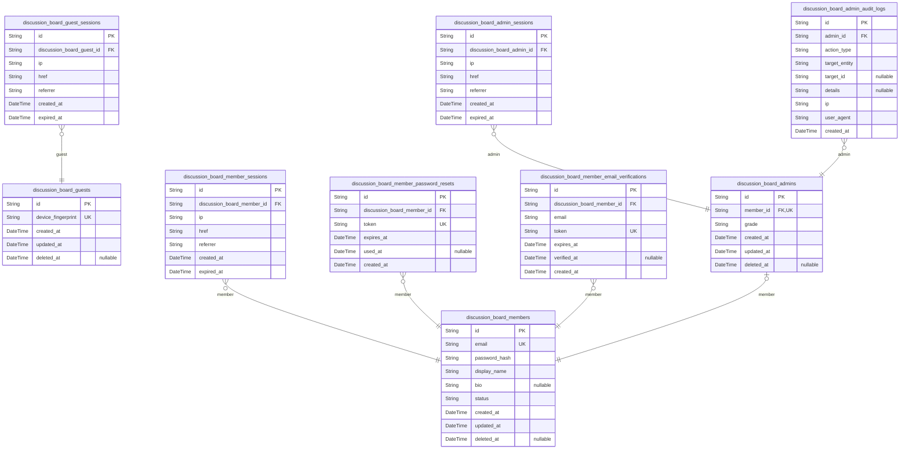
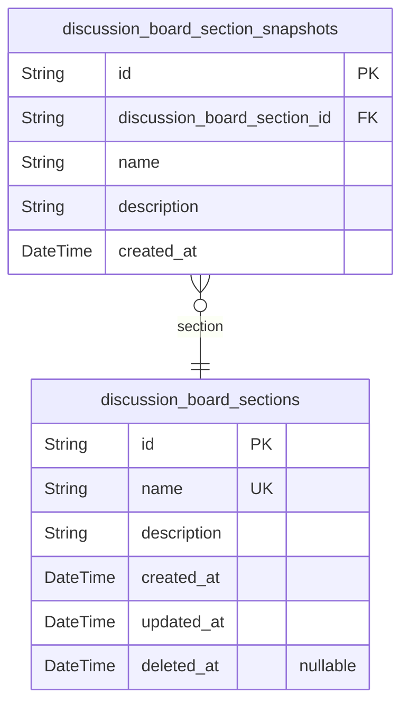
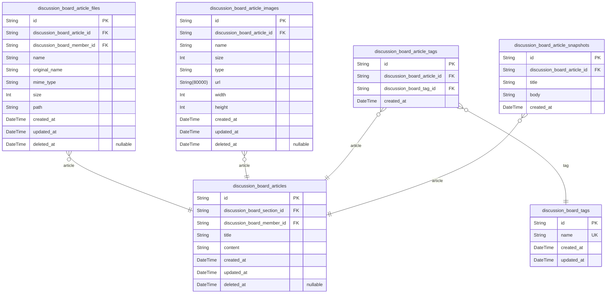
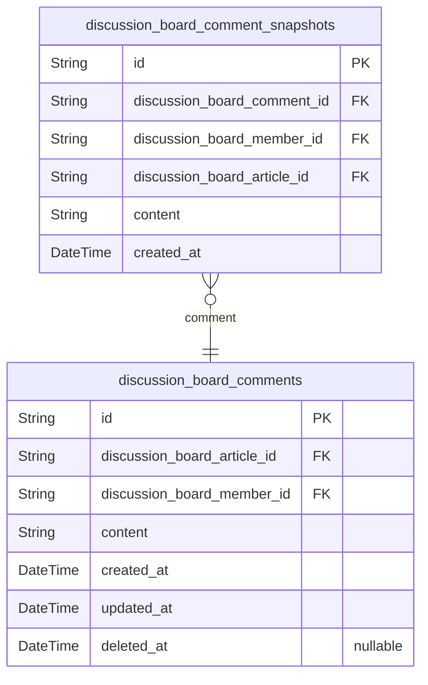
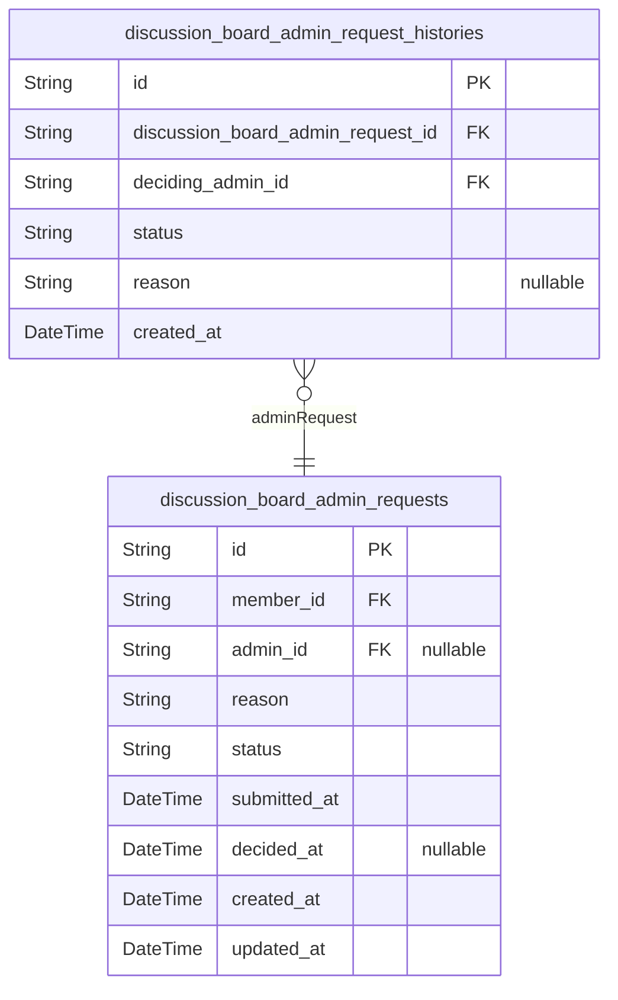
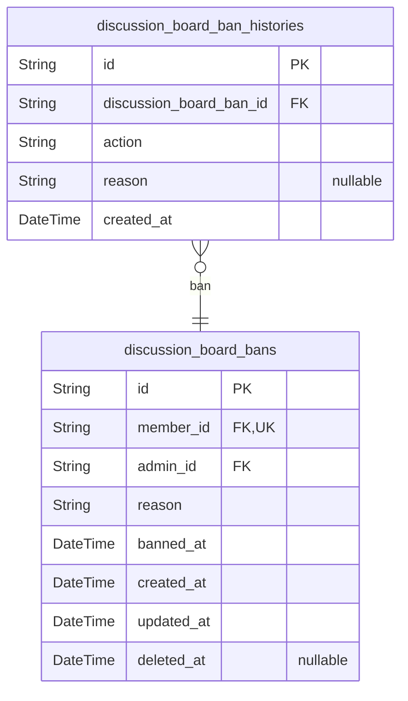

# Prisma Markdown

> Generated by [`prisma-markdown`](https://github.com/samchon/prisma-markdown)

- [Actors](#actors)
- [Sections](#sections)
- [Articles](#articles)
- [Comments](#comments)
- [AdminRequests](#adminrequests)
- [Bans](#bans)

## Actors

### `discussion_board_guests`

Guest accounts for unauthenticated visitors identified by device
fingerprint for temporary session tracking.

Guests represent anonymous users who browse the discussion board without
traditional authentication. Each guest is identified by a unique device
fingerprint, enabling temporary session management and basic tracking
without requiring email/password credentials. Guests have read-only
access to sections, articles, and comments but cannot create content or
manage profiles.

Related to [discussion_board_guest_sessions](#discussion_board_guest_sessions) through one-to-many
relationship where each guest can have multiple sessions over time.

Properties as follows:

- `id`: Primary Key.
- `device_fingerprint`
  > Unique device fingerprint identifier for guest tracking. Generated from
  > browser/device characteristics to distinguish anonymous visitors without
  > requiring authentication.
- `created_at`
  > Timestamp when the guest record was first created. Used for tracking
  > guest lifecycle and session management.
- `updated_at`
  > Timestamp when the guest record was last updated. Updated on each session
  > activity for tracking purposes.
- `deleted_at`
  > Timestamp when the guest record was soft deleted. Null for active
  > records. Enables data retention and audit trail while removing guest from
  > active queries.

### `discussion_board_guest_sessions`

Temporary session tokens for guest users with expiration for anonymous
browsing access.

Tracks guest user sessions for stateless authentication during anonymous
browsing. Each session represents a single browsing session with
connection metadata and expiration time for automatic cleanup. Sessions
are created when guests access the platform and expire after the
configured duration.

Related to [discussion_board_guests](#discussion_board_guests) through many-to-one
relationship (multiple sessions per guest).

Properties as follows:

- `id`: Primary Key.
- `discussion_board_guest_id`: Belonged guest's [discussion_board_guests.id](#discussion_board_guests).
- `ip`: Client IP address for session tracking and security audit.
- `href`: Initial page URL where the session was created.
- `referrer`: HTTP referrer header indicating traffic source.
- `created_at`: Session creation timestamp.
- `expired_at`: Session expiration timestamp for automatic invalidation.

### `discussion_board_members`

Registered member accounts with email and password authentication. Stores
profile information including display name shown publicly and biography
text. Tracks account status for lifecycle management including active,
suspended, and deleted states. Members can create articles, post
comments, and request administrator status.

Properties as follows:

- `id`: Primary Key.
- `email`
  > Email address for authentication and account identification. Must be
  > unique across all member accounts.
- `password_hash`
  > Hashed password credential for authentication. Never stores plain text
  > passwords.
- `display_name`
  > Public display name shown on articles, comments, and profile pages.
  > Visible to all users including guests.
- `bio`
  > Biography text for member profile. Optional personal description visible
  > on profile page.
- `status`
  > Account status for lifecycle management. Values: active, suspended,
  > deleted. Controls login ability and content visibility.
- `created_at`
  > Timestamp when the member account was created. Immutable after initial
  > registration.
- `updated_at`
  > Timestamp when the member account was last updated. Updated on every
  > profile or credential change.
- `deleted_at`
  > Timestamp when the member account was soft deleted. Null for active
  > accounts. Enables account deletion cascade.

### `discussion_board_member_sessions`

JWT session tokens for member authentication with access and refresh
token support.

Stores active and expired session records for registered members. Each
session represents a distinct login event with connection metadata for
security auditing. Sessions are managed through authentication flows and
serve as an append-only audit trail of member login activity.

Related to [discussion_board_members](#discussion_board_members) through many-to-one
relationship. Multiple sessions can exist per member for concurrent
device access.

Properties as follows:

- `id`: Primary Key.
- `discussion_board_member_id`: Belonged member's [discussion_board_members.id](#discussion_board_members).
- `ip`: IP address of the client device at session creation.
- `href`: URL of the page where authentication was initiated.
- `referrer`: HTTP referrer header value at session creation.
- `created_at`: Session creation timestamp.
- `expired_at`: Session expiration timestamp for automatic invalidation.

### `discussion_board_member_password_resets`

Password reset tokens for member password recovery workflow. Stores
temporary tokens with expiration timestamps that members use to reset
their forgotten passwords. Each token is single-use and becomes invalid
after expiration or use.

Properties as follows:

- `id`: Primary Key.
- `discussion_board_member_id`: Belonged member's [discussion_board_members.id](#discussion_board_members).
- `token`: Unique password reset token sent to member's email for verification.
- `expires_at`: Expiration timestamp when the reset token becomes invalid.
- `used_at`: Timestamp when the reset token was used, null if not yet used.
- `created_at`: Timestamp when the password reset request was created.

### `discussion_board_member_email_verifications`

Email verification tokens for member registration and email confirmation
process. Stores one-time verification tokens with expiration to validate
email addresses during account creation and email changes. Each token is
unique and can only be used once before expiration.

Properties as follows:

- `id`: Primary Key.
- `discussion_board_member_id`: Belonged member's [discussion_board_members.id](#discussion_board_members).
- `email`
  > Email address being verified. Stored for validation even if member email
  > changes during verification process.
- `token`
  > Unique verification token sent to the email address. Used for one-time
  > email confirmation.
- `expires_at`
  > Token expiration timestamp. Verification fails after this time to prevent
  > stale token usage.
- `verified_at`
  > Timestamp when the email was successfully verified. Null if not yet
  > verified or expired.
- `created_at`: Record creation timestamp.

### `discussion_board_admins`

Administrator accounts with elevated privileges for platform governance
and content moderation. Administrators are promoted from regular members
through an approval process and have two grade levels: regular
administrators can manage sections, delete content, and ban users; super
administrators have additional powers to approve admin requests and
manage other administrators' grades. Each admin record maintains a 1:1
relationship with a member account, preserving the member's original
identity while granting elevated permissions.

Properties as follows:

- `id`: Primary Key.
- `member_id`
  > Belonged member's [discussion_board_members.id](#discussion_board_members). Administrator
  > accounts are promoted from existing members, maintaining a 1:1
  > relationship with the original member account.
- `grade`
  > Administrator grade level determining privilege scope. 'regular'
  > administrators can manage sections, delete content, and ban users.
  > 'super' administrators have elevated powers including approving admin
  > requests and managing other administrators' grades.
- `created_at`
  > Timestamp when the administrator account was created (when the admin
  > request was approved).
- `updated_at`
  > Timestamp when the administrator record was last updated, such as grade
  > changes.
- `deleted_at`
  > Timestamp when the administrator privileges were revoked (soft delete).
  > Null means active administrator.

### `discussion_board_admin_sessions`

JWT session tokens for administrator authentication with enhanced
security. Tracks login sessions including connection metadata (IP
address, referrer, href) and temporal fields for audit compliance.
Sessions are append-only records managed through the authentication flow,
providing an audit trail of all administrator access events.

Properties as follows:

- `id`: Primary Key.
- `discussion_board_admin_id`
  > Belonged administrator's [discussion_board_admins.id](#discussion_board_admins). Establishes
  > the session's association with the administrator account.
- `ip`
  > IP address of the administrator's connection at session creation. Used
  > for security monitoring and audit trail.
- `href`
  > URL of the page where the administrator initiated the login. Provides
  > context for the authentication event.
- `referrer`
  > HTTP referrer header from the login request. Tracks the navigation path
  > leading to authentication.
- `created_at`
  > Timestamp when the session was created. Marks the beginning of the
  > session's validity period.
- `expired_at`
  > Timestamp when the session expires. Sessions are invalid after this time
  > and must be refreshed or re-authenticated.

### `discussion_board_admin_audit_logs`

Audit trail logging all administrator actions including bans, content
deletion, section management, and admin request decisions. Provides
compliance tracking and administrative transparency for all elevated
privilege operations.

Each record captures a single administrative action with the acting
administrator, action type, target entity, and contextual details. This
table is append-only and serves as the authoritative audit log for
regulatory compliance and security investigations.

Related to [discussion_board_admins](#discussion_board_admins) through the admin foreign key
relationship.

Properties as follows:

- `id`: Primary Key.
- `admin_id`
  > Acting administrator's [discussion_board_admins.id](#discussion_board_admins) who performed
  > the audited action.
- `action_type`
  > Type of administrative action performed. Examples: ban, unban,
  > delete_article, delete_comment, create_section, edit_section,
  > delete_section, approve_admin_request, reject_admin_request,
  > promote_admin, demote_admin.
- `target_entity`
  > Type of entity affected by the action. Examples: user, article, comment,
  > section, admin_request.
- `target_id`
  > ID of the affected entity. Nullable for actions that don't target a
  > specific entity.
- `details`
  > JSON string containing additional context about the action. May include
  > ban reasons, rejection reasons, or other action-specific metadata.
- `ip`
  > IP address of the administrator at the time of action for security
  > auditing.
- `user_agent`
  > Browser/client user agent string for security auditing and forensic
  > analysis.
- `created_at`: Timestamp when the administrative action was performed.

## Sections

### `discussion_board_sections`

Discussion board sections for topic organization with name and description.

Sections categorize articles into topic areas (e.g., Politics, Economy,
Current Affairs). Administrators create and manage sections, while all
users can browse sections and view articles within them. Each section has
a unique name and descriptive text explaining its purpose.

Sections are referenced by [discussion_board_articles](#discussion_board_articles) through the
section foreign key relationship.

Properties as follows:

- `id`: Primary Key.
- `name`: Section name for topic categorization. Must be unique across all sections.
- `description`: Section description explaining the topic scope and purpose.
- `created_at`: Timestamp when the section was created.
- `updated_at`: Timestamp when the section was last updated.
- `deleted_at`: Timestamp when the section was soft deleted. Null if section is active.

### `discussion_board_section_snapshots`

Point-in-time snapshots of sections for audit trail and change tracking.
Captures the state of a section at specific moments to preserve
historical data for compliance, moderation review, and change tracking.
Each snapshot is immutable and append-only, creating a complete history
of section modifications over time.

Properties as follows:

- `id`: Primary Key.
- `discussion_board_section_id`
  > Parent section's [discussion_board_sections.id](#discussion_board_sections). References the
  > section this snapshot belongs to.
- `name`
  > Section name at the time of snapshot. Denormalized from parent section to
  > preserve historical value.
- `description`
  > Section description at the time of snapshot. Denormalized from parent
  > section to preserve historical value.
- `created_at`
  > Timestamp when this snapshot was created. Records the point-in-time when
  > the section state was captured.

## Articles

### `discussion_board_articles`

Main article entity representing user-created content in the discussion
board. Each article belongs to exactly one section and is authored by one
member. Articles support multiple file attachments, image attachments,
and tags through separate child tables. Articles can be edited and
deleted by their authors, and administrators can delete any article for
moderation. Soft delete is supported via deleted_at timestamp for cascade
deletion tracking and audit purposes.

Properties as follows:

- `id`: Primary Key.
- `discussion_board_section_id`
  > Belonged section's [discussion_board_sections.id](#discussion_board_sections). Articles must be
  > assigned to exactly one section for topic organization.
- `discussion_board_member_id`
  > Author member's [discussion_board_members.id](#discussion_board_members). The registered user
  > who created and owns this article.
- `title`
  > Article title. Required field that serves as the main heading and primary
  > search target for article discovery.
- `content`
  > Article body content text. Required field containing the main discussion
  > content, supports rich text formatting.
- `created_at`
  > Article creation timestamp. Records when the article was first created,
  > used for chronological sorting and audit trail.
- `updated_at`
  > Article last update timestamp. Records when the article was last
  > modified, updated on each edit operation.
- `deleted_at`
  > Article soft deletion timestamp. Null for active articles, populated when
  > article is deleted to enable cascade deletion tracking and audit
  > compliance.

### `discussion_board_article_files`

File attachments for articles, supporting multiple files per article with
storage metadata. Each file record tracks the original filename, MIME
type, file size, and storage location. Files are managed through their
parent article and cascade delete when the article is removed. Separate
from image attachments to support different validation rules and
processing workflows.

Properties as follows:

- `id`: Primary Key.
- `discussion_board_article_id`: Parent article's [discussion_board_articles.id](#discussion_board_articles).
- `discussion_board_member_id`: Member who uploaded the file's [discussion_board_members.id](#discussion_board_members).
- `name`
  > Stored filename in the storage system, typically a UUID or hash to ensure
  > uniqueness.
- `original_name`
  > Original filename as uploaded by the user, preserved for display and
  > download purposes.
- `mime_type`
  > MIME type of the file (e.g., application/pdf, text/plain) for content
  > type validation and proper download headers.
- `size`: File size in bytes for storage quota management and upload validation.
- `path`
  > Storage path or URL where the file is located, used for file retrieval
  > and CDN access.
- `created_at`: Timestamp when the file attachment was created.
- `updated_at`: Timestamp when the file attachment was last updated.
- `deleted_at`: Timestamp when the file attachment was soft deleted, null if active.

### `discussion_board_article_images`

Image attachments for articles storing image-specific metadata including
dimensions, file size, and storage location. Each record represents one
image file attached to an article, supporting multiple images per
article. Images are managed through the parent article and cascade
deleted when the article is removed.

Properties as follows:

- `id`: Primary Key.
- `discussion_board_article_id`: Parent article's [discussion_board_articles.id](#discussion_board_articles).
- `name`: Original filename of the uploaded image.
- `size`: File size in bytes.
- `type`: MIME type of the image file (e.g., image/jpeg, image/png).
- `url`: CDN or storage URL for accessing the image file.
- `width`: Image width in pixels.
- `height`: Image height in pixels.
- `created_at`: Timestamp when the image attachment was created.
- `updated_at`: Timestamp when the image attachment was last updated.
- `deleted_at`: Timestamp when the image attachment was soft deleted (null if active).

### `discussion_board_tags`

Reusable tag definitions for article categorization and discovery. Tags
are created on-demand when users add them to articles and can be reused
across multiple articles. Enables efficient tag-based filtering, search,
and content discovery workflows.

Tags support the article tagging system where users can attach multiple
free-text tags to their articles for better organization and
discoverability. Each unique tag name is stored once and referenced by
multiple articles through the discussion_board_article_tags junction
table.

Related entities: [discussion_board_articles](#discussion_board_articles) (tagged articles),
[discussion_board_article_tags](#discussion_board_article_tags) (many-to-many junction).

Properties as follows:

- `id`: Primary Key.
- `name`
  > Tag name text for article categorization. Must be unique across all tags
  > to enable tag reuse and prevent duplication. Used for tag-based filtering
  > and search functionality.
- `created_at`
  > Timestamp when the tag was first created. Automatically set on tag
  > creation for audit trail and chronological tracking.
- `updated_at`
  > Timestamp when the tag was last modified. Updated on each tag
  > modification to track change history.

### `discussion_board_article_tags`

Junction table establishing many-to-many relationship between articles
and tags. Enables efficient tag-based article filtering and tag reuse
across multiple articles. Each row represents a single tag assignment to
an article, with uniqueness constraint preventing duplicate tag
assignments on the same article.

Properties as follows:

- `id`: Primary Key.
- `discussion_board_article_id`
  > Reference to the article being tagged. {@link
  > discussion_board_articles.id}.
- `discussion_board_tag_id`: Reference to the tag being applied. [discussion_board_tags.id](#discussion_board_tags).
- `created_at`
  > Timestamp when the tag was assigned to the article. Used for tracking tag
  > assignment order and audit purposes.

### `discussion_board_article_snapshots`

Point-in-time snapshots of article content for audit trail and change
tracking.

Captures the state of an article at specific moments, preserving title
and body content as they existed at each snapshot. Created automatically
when articles are created or modified to maintain a complete audit trail.

Used for compliance requirements, content moderation review, and tracking
content changes over time. Each snapshot is immutable once created.

Related to [discussion_board_articles](#discussion_board_articles) through a one-to-many
relationship where one article can have multiple snapshots over its
lifetime.

Properties as follows:

- `id`: Primary Key.
- `discussion_board_article_id`
  > Parent article's [discussion_board_articles.id](#discussion_board_articles). References the
  > article this snapshot belongs to.
- `title`
  > Article title at the time of snapshot. Denormalized from the parent
  > article for historical preservation.
- `body`
  > Article content at the time of snapshot. Denormalized from the parent
  > article for historical preservation.
- `created_at`
  > Timestamp when this snapshot was created. Represents the point-in-time
  > when the article state was captured.

## Comments

### `discussion_board_comments`

Single-level comments on articles enabling discussion threads. Each
comment belongs to exactly one article and is authored by one member.
Comments are displayed in chronological order (oldest first) and support
edit/delete operations by owners and administrators. Cascade deletion
occurs when parent articles are deleted.

Properties as follows:

- `id`: Primary Key.
- `discussion_board_article_id`
  > Parent article's [discussion_board_articles.id](#discussion_board_articles). Comments cannot
  > exist without an article.
- `discussion_board_member_id`
  > Author member's [discussion_board_members.id](#discussion_board_members). Only registered
  > members can post comments.
- `content`
  > Comment text content. Required field with minimum and maximum length
  > constraints per validation rules.
- `created_at`
  > Timestamp when the comment was initially created. Used for chronological
  > sorting (oldest first).
- `updated_at`
  > Timestamp when the comment was last modified. Updated on each edit
  > operation.
- `deleted_at`
  > Timestamp when the comment was soft deleted. Null indicates active
  > comment. Set on owner deletion, admin deletion, or cascade from article
  > deletion.

### `discussion_board_comment_snapshots`

Point-in-time snapshots of comments for audit trail. Captures comment
state at each edit to preserve edit history and enable content moderation
review. Each snapshot record is immutable and append-only, creating a
complete historical record of comment modifications.

Properties as follows:

- `id`: Primary Key.
- `discussion_board_comment_id`
  > Parent comment's [discussion_board_comments.id](#discussion_board_comments). References the
  > comment this snapshot belongs to.
- `discussion_board_member_id`
  > Author member's [discussion_board_members.id](#discussion_board_members) at snapshot time.
  > Denormalized for historical accuracy.
- `discussion_board_article_id`
  > Parent article's [discussion_board_articles.id](#discussion_board_articles) at snapshot time.
  > Denormalized for historical accuracy.
- `content`
  > Comment content at snapshot time. Preserves the exact text as it appeared
  > when this snapshot was created.
- `created_at`
  > Timestamp when this snapshot was created. Records the exact moment of the
  > edit or state capture.

## AdminRequests

### `discussion_board_admin_requests`

Administrator application requests submitted by members seeking privilege
escalation. Each request includes justification reason, current status
(pending/approved/rejected), and submission timestamp. Super
administrators review and decide on requests, with decision recorded for
audit trail.

Key relationships:
- [discussion_board_members](#discussion_board_members): The member who submitted the request
- [discussion_board_admins](#discussion_board_admins): The super administrator who made the
decision (nullable until decided)
- [discussion_board_admin_request_histories](#discussion_board_admin_request_histories): Audit trail of all
status transitions

Business constraints:
- Single pending request per member (enforced by unique index on
member_id with status filter at application layer)
- Status transitions: pending → approved/rejected (immutable after decision)
- Reason text required (50-2000 characters per validation rules)

Properties as follows:

- `id`: Primary Key.
- `member_id`
  > The member who submitted the administrator application request. {@link
  > discussion_board_members.id}
- `admin_id`
  > The super administrator who reviewed and decided on this request. {@link
  > discussion_board_admins.id}
- `reason`
  > Justification text explaining why the member requests administrator
  > privileges. Required field with 50-2000 character validation.
- `status`
  > Current request status: pending (awaiting review), approved (promoted to
  > administrator), or rejected (denied). Transitions from pending to
  > approved/rejected are immutable.
- `submitted_at`
  > Timestamp when the member submitted the administrator request. Used for
  > sorting pending queue and enforcing waiting periods.
- `decided_at`
  > Timestamp when the super administrator made the decision
  > (approved/rejected). Null while status is pending.
- `created_at`: Record creation timestamp for audit trail.
- `updated_at`: Record last update timestamp for change tracking.

### `discussion_board_admin_request_histories`

Audit trail recording all status transitions of administrator application
requests. Each history entry captures when a request's status changed,
which super administrator made the decision, and the reason for rejection
if applicable. This table provides complete audit compliance for
privilege escalation workflows and administrative transparency.

Related entities: [discussion_board_admin_requests](#discussion_board_admin_requests) (parent request
being audited), [discussion_board_admins](#discussion_board_admins) (super administrator who
made the decision).

Properties as follows:

- `id`: Primary Key.
- `discussion_board_admin_request_id`
  > Parent admin request's [discussion_board_admin_requests.id](#discussion_board_admin_requests) being
  > audited.
- `deciding_admin_id`
  > Super administrator's [discussion_board_admins.id](#discussion_board_admins) who made the
  > status decision.
- `status`
  > Request status at this transition point. Values: pending, approved,
  > rejected.
- `reason`
  > Optional reason text for rejection decisions. Null for approvals or
  > pending status.
- `created_at`: Timestamp when this status transition occurred.

## Bans

### `discussion_board_bans`

Active ban records that restrict user access to the platform.

Stores current bans imposed by administrators on members, including the
ban reason and timestamp. Each banned user has exactly one active ban
record at any time. When a user is unbanned, the record is soft-deleted
and an entry is added to the ban history audit trail.

Banned users cannot log in but their existing articles and comments
remain visible per content preservation policy. Administrators can view
the banned users list with ban reasons for transparency.

Related entities: [discussion_board_members](#discussion_board_members) (banned user), {@link
discussion_board_admins} (enforcing administrator), {@link
discussion_board_ban_histories} (audit trail).

Properties as follows:

- `id`: Primary Key.
- `member_id`
  > Banned member's [discussion_board_members.id](#discussion_board_members). The user whose
  > access is restricted by this ban.
- `admin_id`
  > Enforcing administrator's [discussion_board_admins.id](#discussion_board_admins). The
  > administrator who imposed this ban.
- `reason`
  > Ban reason explaining why the user was banned. Required for
  > administrative transparency and must meet minimum/maximum length
  > validation requirements.
- `banned_at`
  > Timestamp when the ban was imposed. Automatically recorded at ban
  > creation and immutable thereafter for audit integrity.
- `created_at`: Record creation timestamp.
- `updated_at`: Record last update timestamp.
- `deleted_at`
  > Soft delete timestamp. Set when user is unbanned to preserve audit
  > history while marking ban as inactive.

### `discussion_board_ban_histories`

Audit trail of all ban and unban events with timestamps and
action-specific reasons.

This table maintains a complete history of all ban-related actions for
compliance and transparency. Each record captures either a ban or unban
event, including the action type and reason provided by the administrator
at the time of the action.

Related to [discussion_board_bans](#discussion_board_bans) for the parent ban record (which
contains member and administrator references), {@link
discussion_board_members} for the affected user account (via ban
relationship), and [discussion_board_admins](#discussion_board_admins) for the administrator
who performed the action (via ban relationship).

Properties as follows:

- `id`: Primary Key.
- `discussion_board_ban_id`
  > Reference to the parent ban record. [discussion_board_bans.id](#discussion_board_bans).
  > Member and administrator references are accessible through this
  > relationship.
- `action`
  > Type of action performed: 'banned' or 'unbanned'. Distinguishes between
  > ban imposition and ban removal events.
- `reason`
  > Action-specific reason provided by the administrator. Required for ban
  > events, optional for unban events. Captures the context for this specific
  > history entry.
- `created_at`
  > Timestamp when the ban or unban action was recorded. Immutable after
  > creation for audit integrity.
