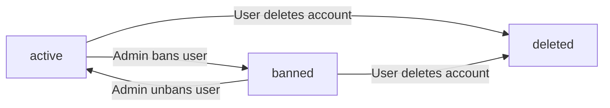
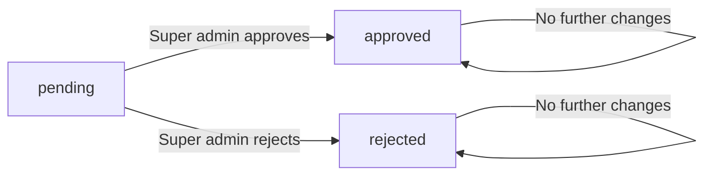
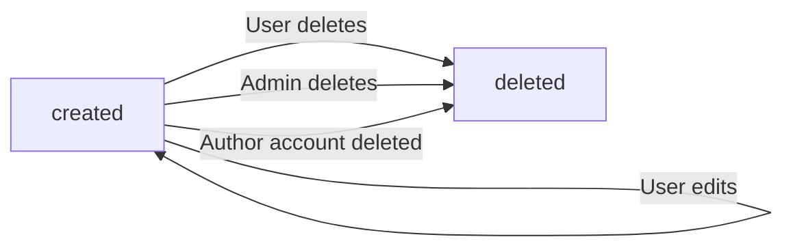

**discussionBoard — Business concepts, relationships, and states from user perspective**

Business concepts, relationships, and states from user perspective

# Domain Concepts

Describe what each concept means to users and why it exists.

## User Concept

Users are the primary participants in the discussion board community. Each user creates an account with an email address and password for authentication. Users have public profiles displaying their chosen display name and optional bio text. Users can write articles to share their perspectives on economic and political topics. Users can comment on articles written by others to engage in discussion. Users can request to become administrators to help manage the platform. Users can edit their profile information, articles, and comments they have created. Users can delete their own account, which removes all their articles and comments from the platform. Users can view other users' profiles to see their contributions. Users who violate platform rules may be banned by administrators.

### Account Creation and Authentication

WHEN a user creates an account, THE system SHALL require an email address.
WHEN a user creates an account, THE system SHALL require a password.
THE system SHALL use the email address as the primary authentication credential.
WHEN a user logs in, THE system SHALL validate the email address and password.
WHILE a user is authenticated, THE system SHALL maintain the user session.
IF the email address is already registered, THEN THE system SHALL reject the account creation request.
IF the password does not meet security requirements, THEN THE system SHALL reject the account creation request.
THE system SHALL allow users to change their password after account creation.

### Profile Attributes and Management

THE system SHALL store a display name for each user.
THE system SHALL store a bio text for each user.
THE display name SHALL be shown publicly on the user's profile.
THE bio text SHALL be shown publicly on the user's profile.
WHEN a user edits their profile, THE system SHALL allow changes to the display name.
WHEN a user edits their profile, THE system SHALL allow changes to the bio text.
THE system SHALL allow users to view other users' profiles.
WHEN viewing a user's profile, THE system SHALL display the display name and bio text.
IF a user has not set a bio text, THEN THE system SHALL display an empty or default bio.

### Article Authorship

WHEN a user creates an article, THE system SHALL associate the article with the creating user.
THE system SHALL track all articles written by each user.
WHEN viewing a user's profile, THE system SHALL display a list of all articles written by the user.
WHEN a user edits an article, THE system SHALL verify the user is the author of the article.
WHEN a user deletes an article, THE system SHALL verify the user is the author of the article.
IF the user is not the author of the article, THEN THE system SHALL reject the edit request.
IF the user is not the author of the article, THEN THE system SHALL reject the delete request.

### Comment Participation

WHEN a user writes a comment, THE system SHALL associate the comment with the creating user.
THE system SHALL track all comments written by each user.
WHEN viewing a user's profile, THE system SHALL display a list of all comments written by the user.
WHEN a user edits a comment, THE system SHALL verify the user is the author of the comment.
WHEN a user deletes a comment, THE system SHALL verify the user is the author of the comment.
IF the user is not the author of the comment, THEN THE system SHALL reject the edit request.
IF the user is not the author of the comment, THEN THE system SHALL reject the delete request.

### Administrator Request Eligibility

THE system SHALL allow any user to submit a request to become an administrator.
WHEN a user submits an administrator request, THE system SHALL require a reason text.
THE system SHALL record the administrator request with the submitted reason.
WHILE the administrator request is pending, THE system SHALL allow the user to continue normal platform activities.
IF the administrator request is approved, THEN THE system SHALL grant the user regular administrator status.
IF the administrator request is rejected, THEN THE system SHALL maintain the user's current status.

### Account Deletion and Ban Status

WHEN a user deletes their account, THE system SHALL delete all articles written by the user.
WHEN a user deletes their account, THE system SHALL delete all comments written by the user.
WHILE a user is banned, THE system SHALL prevent the user from logging in.
WHILE a user is banned, THE system SHALL preserve the user's existing articles.
WHILE a user is banned, THE system SHALL preserve the user's existing comments.
THE system SHALL record a ban reason for each banned user.
WHEN viewing a banned user's profile, THE system SHALL display the user's articles and comments.
IF a user attempts to log in while banned, THEN THE system SHALL reject the login request.

## Section Concept

Sections organize the discussion board into distinct topic areas for easier navigation. Each section has a name and description that explains its focus area. Examples of sections include Politics, Economy, and Current Affairs. Sections are created and managed exclusively by administrators. Users can view the complete list of all available sections. Users browse articles within specific sections to find relevant discussions. Every article must belong to exactly one section. Sections help users discover content aligned with their interests. Sections provide structure to the discussion board community. The section system ensures content is categorized appropriately for user discovery.

### Section Definition and Attributes

THE system SHALL organize the discussion board into distinct sections for topic organization.

Each section SHALL have a name that identifies the section's focus area.

Each section SHALL have a description that explains the section's purpose and scope.

THE system SHALL support sections for different topic areas including Politics, Economy, and Current Affairs.

THE system SHALL ensure each section name is unique across all sections.

Sections SHALL provide community structure by grouping related articles together.

THE system SHALL display the section name and description when users view section details.

### Section Management

Administrators SHALL create new sections on the discussion board.

Administrators SHALL edit existing section names and descriptions.

Administrators SHALL delete sections when they are no longer needed.

Regular users SHALL NOT create, edit, or delete sections.

THE system SHALL restrict section management capabilities to administrators only.

WHEN an administrator creates a section, THE system SHALL require both a name and description.

Administrators SHALL manage the complete set of available sections on the platform.

### Section Browsing and Discovery

Users SHALL view the complete list of all available sections.

Users SHALL browse articles within a specific section.

THE system SHALL display all sections in the section list viewing interface.

Users SHALL discover content by navigating to sections aligned with their interests.

THE system SHALL enable content discovery through section-based navigation.

WHEN users browse a section, THE system SHALL show articles belonging to that section.

Sections SHALL facilitate content discovery by organizing articles into topic categories.

THE system SHALL allow users to access any section from the section list.

### Article-Section Relationship

Every article SHALL belong to exactly one section.

Users SHALL select a section when creating an article.

THE system SHALL require section assignment for article creation.

Articles SHALL be categorized by their assigned section for organization.

THE system SHALL enforce mandatory article assignment to a section.

WHEN a user creates an article, THE system SHALL require selection of one section.

Articles SHALL appear in the article list of their assigned section.

THE system SHALL maintain the article-section relationship throughout the article lifecycle.

## Article Concept

Articles are the primary content units where users share their economic and political perspectives. Each article requires a title and content text written by the user. Every article must be assigned to exactly one section. Users can attach multiple files and images to enrich their articles. Users can add multiple free-text tags to categorize their articles. Article authors can edit their articles to update title, content, attachments, or tags. Article authors can delete their own articles entirely. Articles display the author, tags, comment count, and posting time in lists. Full article content is visible on the article detail page. Users can download attached files and images from articles. Articles serve as the foundation for community discussion and debate.

### Article Creation and Validation

WHEN a user creates an article, THE system SHALL require a title to be provided.

WHEN a user creates an article, THE system SHALL require content text to be provided.

WHEN a user creates an article, THE system SHALL require assignment to exactly one section.

IF the title is missing during article creation, THE system SHALL reject the request.

IF the content text is missing during article creation, THE system SHALL reject the request.

IF no section is selected during article creation, THE system SHALL reject the request.

WHEN an article is successfully created, THE system SHALL record the creation time.

WHEN an article is created, THE system SHALL associate the article with the creating user as the author.

### Article Attachments

WHEN a user creates an article, THE system SHALL allow attaching multiple files.

WHEN a user creates an article, THE system SHALL allow attaching multiple images.

WHEN a user edits an article, THE system SHALL allow adding new file attachments.

WHEN a user edits an article, THE system SHALL allow adding new image attachments.

WHEN a user edits an article, THE system SHALL allow removing existing attachments.

WHEN viewing an article, THE system SHALL display all attached files and images.

WHEN viewing an article, THE system SHALL allow users to download attached files.

WHEN viewing an article, THE system SHALL allow users to download attached images.

### Article Tagging

WHEN a user creates an article, THE system SHALL allow adding multiple free-text tags.

WHEN a user edits an article, THE system SHALL allow modifying the tags.

WHEN a user edits an article, THE system SHALL allow adding new tags.

WHEN a user edits an article, THE system SHALL allow removing existing tags.

THE system SHALL store tags as free-text values without predefined limitations.

WHEN displaying an article in a list, THE system SHALL show all tags associated with the article.

WHEN displaying an article detail page, THE system SHALL show all tags associated with the article.

### Article Modification Rights

THE system SHALL allow article authors to edit their own articles.

THE system SHALL allow article authors to delete their own articles.

WHEN an author edits an article, THE system SHALL allow updating the title.

WHEN an author edits an article, THE system SHALL allow updating the content text.

WHEN an author edits an article, THE system SHALL allow updating attachments.

WHEN an author edits an article, THE system SHALL allow updating tags.

IF a user attempts to edit an article they did not author, THE system SHALL reject the request.

IF a user attempts to delete an article they did not author, THE system SHALL reject the request.

WHEN an article is deleted, THE system SHALL remove the article and all its attachments entirely.

### Article Display and Viewing

WHEN displaying articles in a list view, THE system SHALL show the article title.

WHEN displaying articles in a list view, THE system SHALL show the article author.

WHEN displaying articles in a list view, THE system SHALL show the article tags.

WHEN displaying articles in a list view, THE system SHALL show the comment count.

WHEN displaying articles in a list view, THE system SHALL show the time posted.

WHEN displaying articles in a list view, THE system SHALL NOT show the full content text.

WHEN displaying an article detail page, THE system SHALL show the full content text.

WHEN displaying an article detail page, THE system SHALL show the title, author, attachments, tags, and time posted.

Articles serve as the foundation for community discussion and debate on economic and political topics.

## Comment Concept

Comments enable users to respond to and discuss articles on the platform. Each comment contains text content written by a user. Comments are single-level only, meaning no nested replies are supported. Comments display the author, content, and time posted on articles. Comments on an article are sorted by oldest first. Users can view all comments on any article. Comment authors can edit their own comments to update content. Comment authors can delete their own comments entirely. Comments facilitate discussion and feedback on article topics. Comments remain visible even if the author is later banned. Comments are tied to specific articles and cannot exist independently.

### Comment Creation

WHEN a user writes a comment on an article, THE system SHALL:
1. Require text content for the comment
2. Associate the comment with the specific article
3. Record the user who wrote the comment as the author
4. Record the time when the comment was posted
5. Enable the comment to be visible to all users who can view the article

WHEN a comment is created, THE system SHALL link it to exactly one article.

Comments serve as a feedback mechanism for users to respond to and discuss article content.

IF a user attempts to create a comment without content, THE system SHALL reject the request.

### Comment Structure

THE system SHALL support only single-level comments on articles.

Comments SHALL NOT allow nested replies or hierarchical threading.

All comments on an article exist at the same level, directly associated with the article.

This single-level structure ensures straightforward discussion flow without complex reply chains.

### Comment Display Format

WHEN comments are displayed on an article, THE system SHALL show for each comment:
1. The author's display name
2. The comment content text
3. The time when the comment was posted

Comments on an article SHALL be sorted by oldest first (earliest posted comments appear first).

THE system SHALL display all comments associated with an article to users who can view the article.

Author visibility SHALL be maintained for all comments, showing the display name of the comment author.

### Comment Management Rights

WHILE a user is the author of a comment, THE system SHALL allow the user to edit the comment content.

WHILE a user is the author of a comment, THE system SHALL allow the user to delete the comment entirely.

IF a user attempts to edit a comment they did not author, THE system SHALL reject the request.

IF a user attempts to delete a comment they did not author, THE system SHALL reject the request.

WHEN a comment is edited, THE system SHALL preserve the original author and posting time.

Comment editing and deletion rights belong exclusively to the comment author.

### Comment Lifecycle and Persistence

WHEN a user is banned from the platform, THE system SHALL preserve all comments written by that user prior to the ban.

Banned users' existing comments SHALL remain visible on articles.

Comment persistence ensures discussion continuity even when authors lose platform access.

Comments SHALL remain associated with their article for the lifetime of the article.

WHEN an article is deleted, THE system SHALL delete all comments associated with that article.

Comments function as a permanent feedback mechanism tied to article existence.

## AdminRequest Concept

AdminRequests represent user applications to become administrators on the platform. Any user can submit an admin request with a reason explaining their interest. The reason is text that describes why the user wants administrator privileges. Super administrators can view the list of all pending admin requests. Super administrators can approve requests, granting regular administrator status. Super administrators can reject requests, denying administrator privileges. Approved users transition from regular users to regular administrators. Admin requests provide the pathway for community members to gain administrative capabilities. The request system ensures administrator selection is controlled by super administrators. Requests remain in the system until approved or rejected by super administrators.

### Administrator Application Submission

WHEN a user submits an administrator application, THE system SHALL:
1. Require the user to provide a reason text explaining their interest in becoming an administrator
2. Accept reason text of any length
3. Record the submission timestamp
4. Set the initial request status to pending
5. Associate the request with the submitting user

IF the user already has a pending administrator application, THE system SHALL reject the new submission.

IF the user is already an administrator, THE system SHALL reject the application submission.

WHEN a user submits an administrator application, THE system SHALL confirm receipt to the user.

THE system SHALL allow any regular user to submit an administrator application.

THE system SHALL store the reason text exactly as submitted by the user without modification.

### Pending Request Queue Management

WHEN an administrator application is submitted, THE system SHALL place it in the pending request queue.

THE system SHALL maintain all pending administrator applications until a super administrator reviews them.

WHEN a super administrator views the pending request queue, THE system SHALL display:
1. The submitting user's display name
2. The reason text provided by the applicant
3. The submission timestamp
4. The current status of each request

THE system SHALL allow super administrators to filter pending requests by submission date.

THE system SHALL allow super administrators to sort pending requests by:
1. Newest first
2. Oldest first

IF a pending request exists, THE system SHALL keep it visible to super administrators until approved or rejected.

THE system SHALL not automatically remove or expire pending administrator applications.

### Super Administrator Review Process

WHEN a super administrator reviews an administrator application, THE system SHALL allow the super administrator to:
1. View the complete application details
2. Approve the application
3. Reject the application

WHEN a super administrator approves an administrator application, THE system SHALL:
1. Change the request status from pending to approved
2. Grant regular administrator privileges to the applicant
3. Record the approval timestamp
4. Record which super administrator approved the request

WHEN a super administrator rejects an administrator application, THE system SHALL:
1. Change the request status from pending to rejected
2. Deny administrator privileges to the applicant
3. Record the rejection timestamp
4. Record which super administrator rejected the request

IF a super administrator attempts to review a request that is already approved or rejected, THE system SHALL indicate the request has been previously decided.

THE system SHALL allow only super administrators to review and decide on administrator applications.

THE system SHALL require super administrators to make a definitive decision (approve or reject) on each application they review.

### Request Status Tracking and User Advancement

THE system SHALL track the status of each administrator application throughout its lifecycle.

WHEN an administrator application status changes, THE system SHALL update the status to one of: pending, approved, or rejected.

WHEN a user's administrator application is approved, THE system SHALL:
1. Transition the user from regular user to regular administrator
2. Enable all regular administrator capabilities for the user
3. Maintain the user's existing articles and comments
4. Preserve the user's profile information

WHEN a user's administrator application is rejected, THE system SHALL:
1. Maintain the user's regular user status
2. Allow the user to submit a new administrator application in the future
3. Preserve the user's existing articles and comments

THE system SHALL provide the privilege escalation pathway from regular user to regular administrator through the approval process.

THE system SHALL enable community governance by allowing super administrators to select new administrators through the review process.

WHEN a user becomes a regular administrator through approval, THE system SHALL record this as the administrator selection decision.

THE system SHALL support user advancement by providing the pathway for regular users to gain administrator privileges.

IF a regular administrator is promoted to super administrator, THE system SHALL update their administrator grade accordingly (defined in Administrator Capabilities section).

## Ban Concept

Bans restrict user access to the platform for policy violations. When banned, users cannot log in to the platform. Banned users' existing articles and comments remain visible to other users. Each ban includes a recorded reason explaining the violation. Administrators can view the ban reason for each banned user. Administrators can ban users who violate platform rules. Administrators can unban users, restoring their access. Banned users are listed and viewable by administrators. Bans protect the community from harmful behavior while preserving content. The ban system enables administrators to enforce platform standards. Ban reasons provide transparency for administrative actions taken.

### Ban Enforcement and Access Control

WHEN a user is banned, THE system SHALL:
1. Prevent the user from logging in to the platform
2. Maintain visibility of the user's existing articles to all users
3. Maintain visibility of the user's existing comments to all users
4. Restrict all platform access that requires authentication
5. Preserve the user's profile information for reference

IF a banned user attempts to log in, THE system SHALL reject the login attempt.

THE system SHALL enforce bans to protect the community from harmful behavior.
THE system SHALL apply bans as a mechanism for policy enforcement.
THE system SHALL maintain platform standards through ban enforcement.

WHILE a user is banned, THE system SHALL:
1. Block all authentication attempts
2. Allow viewing of the user's existing content by other users
3. Prevent creation of new articles
4. Prevent creation of new comments
5. Prevent profile modifications

### Ban Reason and Documentation

WHEN an administrator bans a user, THE system SHALL:
1. Require the administrator to provide a ban reason
2. Record the ban reason with the ban record
3. Store the timestamp of when the ban was applied
4. Associate the ban with the administrator who imposed it

THE system SHALL maintain ban reasons to provide administrative transparency.
THE system SHALL document violations through ban reasons for future reference.

WHEN an administrator views a banned user, THE system SHALL:
1. Display the ban reason to the administrator
2. Show the date when the ban was applied
3. Identify the administrator who imposed the ban

THE system SHALL ensure ban reasons are viewable only to administrators.
THE system SHALL preserve ban documentation for audit purposes.

### Administrator Ban Management

WHEN an administrator bans a user, THE system SHALL:
1. Add the user to the banned users list
2. Immediately enforce the access restrictions
3. Notify the administrator of successful ban application

WHEN an administrator unbans a user, THE system SHALL:
1. Remove the user from the banned users list
2. Restore the user's ability to log in to the platform
3. Maintain the user's existing articles and comments
4. Restore full platform access to the user

Administrators CAN view the list of all banned users.
Administrators CAN view the ban reason for each banned user.
Administrators CAN ban users who violate platform rules.
Administrators CAN unban users at their discretion.

IF an administrator attempts to ban a user who is already banned, THE system SHALL reject the request.
IF an administrator attempts to unban a user who is not banned, THE system SHALL reject the request.

THE system SHALL allow only administrators to ban and unban users.

# Domain Relationships

Describe how concepts relate to each other from a business perspective.

## Conceptual Relationships

Describe how concepts relate to each other in business terms.

### User-Article Ownership

THE system SHALL maintain an ownership relationship between each User and their Articles.

WHEN a User creates an Article, THE system SHALL associate the Article with the creating User as the owner.

THE system SHALL ensure that each Article belongs-to exactly one User as its author.

THE system SHALL allow a User to view all Articles they own through their profile.

WHEN a User deletes their account, THE system SHALL delete all Articles owned by that User.

THE system SHALL ensure that only the owning User can edit their own Articles.

THE system SHALL ensure that only the owning User can delete their own Articles.

THE system SHALL display the owning User's display name on each Article.

### User-Comment Ownership

THE system SHALL maintain an ownership relationship between each User and their Comments.

WHEN a User creates a Comment, THE system SHALL associate the Comment with the creating User as the author.

THE system SHALL ensure that each Comment belongs-to exactly one User as its author.

THE system SHALL allow a User to view all Comments they own through their profile.

THE system SHALL display the owning User's display name on each Comment.

WHEN a User deletes their account, THE system SHALL delete all Comments owned by that User.

THE system SHALL ensure that only the owning User can edit their own Comments.

THE system SHALL ensure that only the owning User can delete their own Comments.

### Article-Section Belongs-To Relationship

THE system SHALL maintain a belongs-to relationship between each Article and a Section.

WHEN a User creates an Article, THE system SHALL require the Article to belong-to exactly one Section.

THE system SHALL ensure that each Article is associated with one and only one Section.

THE system SHALL allow Users to browse all Articles that belong-to a specific Section.

WHEN a Section is deleted by an Administrator, THE system SHALL handle all Articles that belong-to that Section according to the lifecycle and retention policies.

THE system SHALL display the Section name on each Article to indicate which Section the Article belongs-to.

THE system SHALL prevent an Article from existing without belonging-to a Section.

### Article-Comment Has-Many Relationship

THE system SHALL maintain a has-many relationship between each Article and its Comments.

THE system SHALL allow an Article to have-many Comments from multiple Users.

THE system SHALL ensure that each Comment belongs-to exactly one Article.

WHEN a User views an Article, THE system SHALL display all Comments that belong-to that Article.

THE system SHALL sort Comments on an Article by oldest first.

THE system SHALL display the comment count on each Article in the article list.

WHEN an Article is deleted, THE system SHALL delete all Comments that belong-to that Article.

THE system SHALL allow multiple Users to create Comments on the same Article.

### User-AdminRequest Association

THE system SHALL maintain an association between each User and their AdminRequest submissions.

WHEN a User submits a request to become an Administrator, THE system SHALL create an AdminRequest associated with that User.

THE system SHALL ensure that each AdminRequest belongs-to exactly one User as the applicant.

THE system SHALL allow Super Administrators to view all AdminRequests and their associated Users.

THE system SHALL display the applicant User's information alongside each AdminRequest.

WHEN an AdminRequest is approved, THE system SHALL update the associated User's role to Administrator.

WHEN an AdminRequest is rejected, THE system SHALL maintain the association for record-keeping purposes.

THE system SHALL allow a User to have multiple AdminRequests over time, each with its own status.

### Administrator-Ban Relationship

THE system SHALL maintain a relationship between Administrators and Ban records.

WHEN an Administrator bans a User, THE system SHALL create a Ban record associated with that User.

THE system SHALL ensure that each Ban record belongs-to exactly one User.

THE system SHALL record which Administrator created each Ban record.

THE system SHALL allow Administrators to view the Ban record for any banned User.

THE system SHALL display the ban reason recorded by the Administrator on each Ban record.

WHEN an Administrator unbans a User, THE system SHALL update the Ban record to reflect the User is no longer banned.

THE system SHALL prevent a banned User from logging in while the Ban relationship is active.

THE system SHALL preserve all Articles and Comments owned by a banned User despite the Ban relationship.

## Lifecycle and Retention

Describe business rules for concept lifecycle and data retention from a user perspective.

### Account Deletion Lifecycle

WHEN a user deletes their account, THE system SHALL:
1. Remove all articles written by the user
2. Remove all comments written by the user
3. Remove the user's profile including display name and bio
4. Remove the user's authentication credentials
5. Prevent any future login attempts with the deleted account

IF a user has pending administrator requests, THE system SHALL cancel those requests upon account deletion.

IF a user is banned, THE system SHALL still allow account deletion.

WHEN an account is deleted, THE system SHALL not retain any personally identifiable information.

THE system SHALL not provide account recovery after deletion is completed.

### Content Retention Policy

WHILE an account is active, THE system SHALL retain all articles and comments created by the user.

WHEN a user deletes their own article, THE system SHALL remove the article and all associated comments immediately.

WHEN a user deletes their own comment, THE system SHALL remove the comment immediately.

WHEN an administrator deletes an article, THE system SHALL remove the article and all associated comments.

WHEN an administrator deletes a comment, THE system SHALL remove the comment.

THE system SHALL not implement automatic archival of old content.

THE system SHALL retain all content indefinitely unless explicitly deleted by the author or an administrator.

### Article and Comment Deletion

WHEN a user deletes their own article, THE system SHALL:
1. Remove the article title and content
2. Remove all file attachments associated with the article
3. Remove all image attachments associated with the article
4. Remove all tags associated with the article
5. Remove all comments on the article

WHEN a user deletes their own comment, THE system SHALL remove the comment content and timestamp.

IF an article is deleted, THE system SHALL update the section's article list to no longer display the deleted article.

IF a comment is deleted, THE system SHALL update the article's comment count accordingly.

THE system SHALL not provide recovery for deleted articles or comments.

IF a user's account is deleted, THE system SHALL treat all their articles and comments as deleted by the user.

### Ban Status and Content Preservation

WHEN a user is banned, THE system SHALL preserve all articles written by the user.

WHEN a user is banned, THE system SHALL preserve all comments written by the user.

WHEN a user is banned, THE system SHALL display the user's display name on their existing articles and comments.

WHEN a user is banned, THE system SHALL prevent the user from creating new articles.

WHEN a user is banned, THE system SHALL prevent the user from creating new comments.

WHEN a user is banned, THE system SHALL prevent the user from editing their existing articles.

WHEN a user is banned, THE system SHALL prevent the user from editing their existing comments.

IF a banned user's account is deleted, THE system SHALL remove their articles and comments per the account deletion policy.

THE system SHALL not automatically restore content when a ban is lifted.

# Enums and State Machines

Enum type definitions and state transitions.

## Enum Definitions

Define all enum types with their allowed values and descriptions.

### AdminRequest Status Enumeration

THE system SHALL define an AdminRequest status enumeration with the following allowed values:

1. **pending** - The administrator request has been submitted and awaits super administrator review
2. **approved** - The super administrator has approved the request and the user becomes a regular administrator
3. **rejected** - The super administrator has rejected the request

WHEN a user submits an administrator request, THE system SHALL set the initial status to "pending".

WHEN a super administrator approves a request, THE system SHALL change the status from "pending" to "approved".

WHEN a super administrator rejects a request, THE system SHALL change the status from "pending" to "rejected".

IF a request status is "approved", THE system SHALL grant the user regular administrator capabilities.

IF a request status is "rejected", THE system SHALL NOT grant any administrator capabilities to the user.

THE system SHALL NOT allow any other status values beyond the three defined allowed values.

### User Account Status Enumeration

THE system SHALL define a User account status enumeration with the following allowed values:

1. **active** - The user account is in good standing and can access all permitted features
2. **banned** - The user account has been restricted by an administrator and cannot log in

WHEN a user creates an account, THE system SHALL set the initial status to "active".

WHEN an administrator bans a user, THE system SHALL change the status from "active" to "banned".

WHEN an administrator unbans a user, THE system SHALL change the status from "banned" to "active".

IF a user status is "banned", THE system SHALL prevent the user from logging in to the platform.

IF a user status is "active", THE system SHALL allow the user to log in with valid credentials.

WHILE a user status is "banned", THE system SHALL preserve the user's existing articles and comments as visible to other users.

THE system SHALL NOT allow any other status values beyond the two defined allowed values.

THE system SHALL record the ban reason when changing status to "banned".

### Section Management Status Type

THE system SHALL define section management as an administrator-only capability with the following status-type behaviors:

1. **created** - The section has been created by an administrator and is available for browsing
2. **edited** - The section name or description has been modified by an administrator
3. **deleted** - The section has been removed by an administrator

WHEN an administrator creates a section, THE system SHALL set the section status to "created".

WHEN an administrator edits a section, THE system SHALL update the section name or description while maintaining the "created" status.

WHEN an administrator deletes a section, THE system SHALL mark the section as "deleted" and remove it from the browsable section list.

IF a section status is "deleted", THE system SHALL NOT allow users to browse articles within that section.

THE system SHALL NOT allow regular users to create, edit, or delete sections.

THE system SHALL require administrators to provide a name and description when creating a section.

## State Transitions

Define valid state transition paths for stateful concepts.

### User Account State Machine

THE system SHALL maintain user account states throughout the account lifecycle.

WHEN a user account is created, THE system SHALL set the account state to active.

WHEN an administrator bans a user, THE system SHALL transition the user account state from active to banned.

WHEN an administrator unbans a user, THE system SHALL transition the user account state from banned to active.

WHILE a user account is in the banned state, THE system SHALL prevent the user from logging in.

WHEN a user deletes their account, THE system SHALL remove the account and all associated articles and comments.

IF a user attempts to log in while their account is banned, THE system SHALL reject the login attempt.

### AdminRequest Status Transitions

THE system SHALL track the status of administrator requests through defined states.

WHEN a user submits an administrator request, THE system SHALL set the request status to pending.

WHEN a super administrator approves a pending request, THE system SHALL transition the request status from pending to approved.

WHEN a super administrator rejects a pending request, THE system SHALL transition the request status from pending to rejected.

WHEN a request status transitions to approved, THE system SHALL grant the user regular administrator privileges.

IF a request status is approved or rejected, THE system SHALL prevent further status changes to that request.

### Article Lifecycle Workflow

THE system SHALL manage article states from creation through deletion.

WHEN a user creates an article, THE system SHALL record the article with a created state.

WHEN a user edits their own article, THE system SHALL update the article content while maintaining the article's existence.

WHEN a user deletes their own article, THE system SHALL remove the article from the system.

WHEN an administrator deletes an article, THE system SHALL remove the article regardless of ownership.

WHEN a user's account is deleted, THE system SHALL delete all articles authored by that user.

IF an article is deleted, THE system SHALL prevent any further access to that article.

### Comment Status Change Workflow

THE system SHALL manage comment states from creation through deletion.

WHEN a user creates a comment on an article, THE system SHALL record the comment with a created state.

WHEN a user edits their own comment, THE system SHALL update the comment content while maintaining the comment's existence.

WHEN a user deletes their own comment, THE system SHALL remove the comment from the article.

WHEN an administrator deletes a comment, THE system SHALL remove the comment regardless of ownership.

WHEN a user's account is deleted, THE system SHALL delete all comments authored by that user.

IF a comment is deleted, THE system SHALL prevent any further access to that comment.

