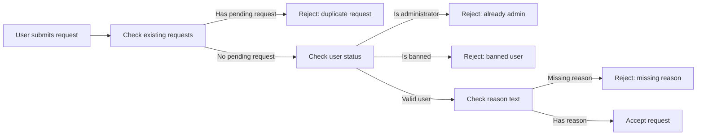
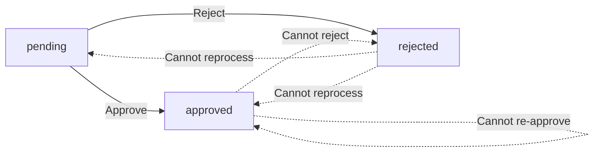
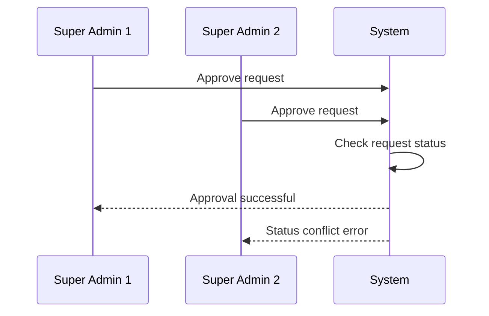

**discussionBoard — What operations users can perform, use cases, business workflows**

What operations users can perform, use cases, business workflows

# Core Business Operations

What the system must do for each business concept.

## User Operations

Users create accounts by providing an email address and password. Users log in to the platform using their email and password credentials. Users can change their password after logging in. Users can delete their entire account, which removes all their articles and comments from the platform. Each user maintains a profile containing a display name and bio text. Users can edit their own display name and bio at any time. Users can view other users' profiles to see their public information. A user's profile displays their display name, bio, a list of all articles they have written, and a list of all comments they have written. Email addresses must be unique among active accounts. Account deletion is permanent and cannot be undone.

### Account Creation and Authentication

### Account Creation

WHEN a user creates an account, THE system SHALL:
1. Require an email address
2. Require a password
3. Ensure the email address is unique among all active accounts
4. Create the account with guest access level
5. Allow the user to log in immediately after creation

IF the email address is already in use by an active account, THE system SHALL reject the registration request.

### Login Authentication

WHEN a user attempts to log in, THE system SHALL:
1. Require the user's email address
2. Require the user's password
3. Verify the credentials match an existing account
4. Grant access to the platform upon successful authentication

IF the email address does not exist, THE system SHALL reject the login attempt.
IF the password does not match, THE system SHALL reject the login attempt.
IF the user account is banned, THE system SHALL reject the login attempt.

### Unique Email Requirement

THE system SHALL ensure that each email address is associated with only one active account at any time.

WHEN an email address is already registered, THE system SHALL not allow another account to be created with the same email address.

### Password Management

### Password Change

WHEN a logged-in user requests to change their password, THE system SHALL:
1. Require the current password for verification
2. Require a new password
3. Update the password upon successful verification of the current password
4. Maintain the user's session after password change

IF the current password provided is incorrect, THE system SHALL reject the password change request.
IF the user is not logged in, THE system SHALL reject the password change request.

### Account Deletion

### Account Deletion Cascade

WHEN a user requests to delete their account, THE system SHALL:
1. Remove the user's account from the platform
2. Delete all articles written by the user
3. Delete all comments written by the user
4. Remove the user's profile information
5. Make the email address available for future registration

### Permanent Account Removal

THE system SHALL ensure that account deletion is permanent and cannot be undone.

WHEN an account is deleted, THE system SHALL not retain any personal information that could be used to restore the account.

IF the user has existing articles, THE system SHALL remove them as part of the deletion process.
IF the user has existing comments, THE system SHALL remove them as part of the deletion process.

### Profile Editing

### Profile Display Name

WHEN a user edits their profile, THE system SHALL:
1. Allow the user to set or change their display name
2. Display the display name publicly on articles and comments
3. Update the display name immediately upon saving

THE system SHALL require a display name for each user profile.

### Profile Bio Editing

WHEN a user edits their profile, THE system SHALL:
1. Allow the user to set or change their bio text
2. Display the bio text on the user's profile page
3. Allow the bio text to be optional (can be empty)
4. Update the bio text immediately upon saving

WHILE the user is logged in, THE system SHALL allow the user to edit their display name and bio at any time.

### Profile Viewing

### View Other Profiles

WHEN a user views another user's profile, THE system SHALL:
1. Display the other user's display name
2. Display the other user's bio text
3. Show a list of all articles written by the other user
4. Show a list of all comments written by the other user
5. Allow any logged-in user to view any other user's profile

### Profile Article List

THE system SHALL display all articles written by the user on their profile page.

WHEN viewing a user's profile article list, THE system SHALL show for each article:
1. The article title
2. The section the article belongs to
3. The time the article was posted
4. The number of comments on the article

### Profile Comment List

THE system SHALL display all comments written by the user on their profile page.

WHEN viewing a user's profile comment list, THE system SHALL show for each comment:
1. The comment content
2. The article the comment was posted on
3. The time the comment was posted

## Section Operations

The discussion board is organized into sections such as Politics, Economy, and Current Affairs. Only administrators can create new sections on the platform. Only administrators can edit existing section names and descriptions. Only administrators can delete sections from the board. Each section has a name that identifies its topic area. Each section has a description that explains what content belongs there. All users can view the complete list of available sections. Users can browse and view all articles contained within a specific section. Sections provide the primary categorization for organizing articles on the platform.

### Administrator Section Creation

WHEN an administrator creates a section, THE system SHALL require a name for the section.

WHEN an administrator creates a section, THE system SHALL require a description for the section.

THE system SHALL allow only administrators to create new sections.

WHEN a section is created, THE system SHALL make it immediately available for article categorization.

WHEN a section is created, THE system SHALL record the creation timestamp.

THE system SHALL ensure each section name is unique across all sections.

IF a non-administrator attempts to create a section, THEN THE system SHALL reject the request.

### Section Name and Description Management

WHEN an administrator edits a section, THE system SHALL allow updating the section name.

WHEN an administrator edits a section, THE system SHALL allow updating the section description.

THE system SHALL allow only administrators to edit existing sections.

WHEN a section name is updated, THE system SHALL reflect the change across all articles categorized under that section.

WHEN a section description is updated, THE system SHALL display the updated description to all users viewing the section.

IF a non-administrator attempts to edit a section, THEN THE system SHALL reject the request.

### Administrator Section Deletion

WHEN an administrator deletes a section, THE system SHALL remove the section from the board.

THE system SHALL allow only administrators to delete sections.

WHEN a section is deleted, THE system SHALL handle all articles previously categorized under that section.

THE system SHALL require administrator confirmation before deleting a section.

IF a non-administrator attempts to delete a section, THEN THE system SHALL reject the request.

### View All Sections List

WHEN a user requests the sections list, THE system SHALL display all available sections.

EACH section in the list SHALL show its name.

EACH section in the list SHALL show its description.

THE system SHALL allow all users including guests to view the sections list.

THE system SHALL display sections in a consistent order.

WHEN a new section is created, THE system SHALL include it in the sections list immediately.

### Browse Articles by Section

WHEN a user browses a section, THE system SHALL display all articles categorized under that section.

THE system SHALL organize articles by their assigned section for browsing.

WHEN viewing articles in a section, THE system SHALL show only articles belonging to that section.

THE system SHALL use sections as the primary categorization method for articles.

WHEN a user selects a section, THE system SHALL filter articles to show only content from that section.

THE system SHALL allow users to navigate from the section list to browse articles within any section.

WHEN an article is assigned to a section, THE system SHALL make it visible when browsing that section.

## Article Operations

Users can create articles in any available section on the board. Every article must have a title, content text, and belong to one section. Users can attach multiple files to their articles. Users can attach multiple images to their articles. Users can add multiple free-text tags to categorize their articles. Users can edit their own articles including title, content, attachments, and tags. Users can delete their own articles permanently. Users can view a paginated list of articles within a section showing title, author, tags, comment count, and posting time. Users can sort article lists by newest first or oldest first. Users can view a single article with its full content, attachments, and tags. Users can download attached files and images from articles. Users can search articles by title or content text. Users can filter search results by tags.

### Article Creation and Attachments

WHEN a user creates an article, THE system SHALL require a title to be provided.

WHEN a user creates an article, THE system SHALL require content text to be provided.

WHEN a user creates an article, THE system SHALL require selection of exactly one section from the available sections.

WHEN a user creates an article, THE system SHALL allow attachment of multiple files to the article.

WHEN a user creates an article, THE system SHALL allow attachment of multiple images to the article.

WHERE file attachments are added to an article, THE system SHALL support multiple files in a single article.

WHERE image attachments are added to an article, THE system SHALL support multiple images in a single article.

WHERE tags are added to an article, THE system SHALL allow multiple free-text tags to be specified.

WHEN a user creates an article, THE system SHALL associate the article with the creating user as the author.

WHEN a user creates an article, THE system SHALL record the time the article was posted.

### Article Editing and Deletion

WHEN a user edits their own article, THE system SHALL allow modification of the article title.

WHEN a user edits their own article, THE system SHALL allow modification of the article content.

WHEN a user edits their own article, THE system SHALL allow modification of the article attachments including adding or removing files and images.

WHEN a user edits their own article, THE system SHALL allow modification of the article tags.

WHEN a user deletes their own article, THE system SHALL permanently remove the article from the system.

WHEN a user deletes their own article, THE system SHALL permanently remove all attachments associated with the article.

### Article List and Viewing

WHEN users view the list of articles in a section, THE system SHALL display the results in a paginated format.

WHEN displaying the article list, THE system SHALL show the title for each article.

WHEN displaying the article list, THE system SHALL show the author for each article.

WHEN displaying the article list, THE system SHALL show the tags for each article.

WHEN displaying the article list, THE system SHALL show the comment count for each article.

WHEN displaying the article list, THE system SHALL show the posting time for each article.

WHEN displaying the article list, THE system SHALL NOT show the full content of articles.

WHEN users view the article list, THE system SHALL allow sorting by newest first.

WHEN users view the article list, THE system SHALL allow sorting by oldest first.

WHEN a user views a single article, THE system SHALL display the full content of the article.

WHEN a user views a single article, THE system SHALL display the title, author, attachments, tags, and posting time.

WHEN a user views an article with attachments, THE system SHALL allow downloading of attached files.

WHEN a user views an article with attachments, THE system SHALL allow downloading of attached images.

### Article Search and Filtering

WHEN a user searches articles, THE system SHALL search by article title.

WHEN a user searches articles, THE system SHALL search by article content text.

WHEN displaying search results, THE system SHALL paginate the results.

WHERE tag filtering is applied to article searches, THE system SHALL filter articles by the specified tags.

WHEN a user applies tag filters, THE system SHALL show only articles matching the selected tags.

## Comment Operations

Users can write comments on any article in the discussion board. Comments are single-level only with no nested replies allowed. Users can view all comments posted on an article. Comments display in oldest first order on the article page. Each comment shows the author's name, the comment content, and the time it was posted. Users can edit their own comments after posting. Users can delete their own comments permanently. When a user deletes their account, all their comments are also removed. Comments provide a way for users to respond to and discuss articles.

### Comment Creation

WHEN a user writes a comment on an article, THE system SHALL:
1. Require comment content text
2. Associate the comment with the article
3. Associate the comment with the commenting user
4. Record the creation timestamp
5. Display the comment in the article's comment list

IF the article does not exist, THE system SHALL reject the comment creation.
IF the user attempts to create a nested reply to another comment, THE system SHALL reject the request.
IF the comment content is empty, THE system SHALL reject the request.
IF the user is banned, THE system SHALL reject the comment creation.

WHILE the article exists and is accessible, THE system SHALL allow users to create comments on it.

Comments are single-level only. No nested replies to comments are permitted. Each comment belongs directly to an article, not to another comment.

### Comment Display

WHEN a user views an article, THE system SHALL display all comments associated with that article.

WHEN displaying comments, THE system SHALL:
1. Show comments in oldest first order (chronological ascending)
2. Display the comment author's display name
3. Display the comment content text
4. Display the comment creation timestamp
5. Show the complete comment list without pagination on the article page

THE system SHALL present comments as an article discussion thread where users can read all responses to the article.

IF the article has no comments, THE system SHALL display an empty comment list.
IF a comment's author account is deleted, THE system SHALL handle the author display according to account deletion cascade rules.

WHILE viewing an article, THE system SHALL refresh the comment list to show newly created comments.

### Comment Management

WHEN a user edits their own comment, THE system SHALL:
1. Allow modification of the comment content text
2. Preserve the original creation timestamp
3. Update the comment with the new content
4. Display the updated content in the article's comment list

IF the user attempts to edit another user's comment, THE system SHALL reject the request.
IF the comment does not exist, THE system SHALL reject the edit request.

WHEN a user deletes their own comment, THE system SHALL:
1. Permanently remove the comment from the article
2. Remove the comment from all comment lists
3. Preserve the article and other comments

IF the user attempts to delete another user's comment, THE system SHALL reject the request (administrators have separate deletion capabilities defined in administrator permissions).

WHEN a user deletes their account, THE system SHALL:
1. Delete all comments written by that user
2. Remove the comments from all articles where they appeared
3. Maintain the articles and other users' comments

IF an article is deleted, THE system SHALL delete all comments associated with that article as part of the article deletion cascade.

## AdminRequest Operations

Any user can submit a request to become an administrator on the platform. Each admin request must include a reason explaining why the user wants administrator privileges. Super administrators can view the complete list of pending administrator requests. Super administrators can approve pending requests, granting the user regular administrator status. Super administrators can reject pending requests, denying the administrator role. Approved users become regular administrators with standard admin capabilities. Rejected requests remain in the system for record-keeping purposes. Users cannot withdraw or edit their admin requests after submission. The admin request system controls how users gain elevated privileges on the platform.

### Admin Request Submission

WHEN a member submits an administrator request, THE system SHALL require a reason text explaining why they want administrator privileges.

WHEN a member submits an administrator request, THE system SHALL record the submission timestamp.

WHEN a member submits an administrator request, THE system SHALL associate the request with the member's account.

IF a member already has a pending administrator request, THE system SHALL reject the new request submission.

IF a member already has administrator privileges, THE system SHALL reject the administrator request submission.

THE system SHALL not allow members to withdraw submitted administrator requests.

THE system SHALL not allow members to edit submitted administrator requests.

THE system SHALL maintain all administrator requests in the system for record keeping purposes.

WHEN a member submits an administrator request, THE system SHALL set the initial request status to pending.

Guests SHALL not be allowed to submit administrator requests.

### Super Administrator Request Review

WHEN a super administrator views pending administrator requests, THE system SHALL display all requests with pending status.

WHEN a super administrator views pending administrator requests, THE system SHALL show the requesting member's display name and reason text for each request.

WHEN a super administrator approves a pending administrator request, THE system SHALL grant regular administrator status to the requesting member.

WHEN a super administrator approves a pending administrator request, THE system SHALL update the request status to approved.

WHEN a super administrator rejects a pending administrator request, THE system SHALL update the request status to rejected.

WHEN a super administrator rejects a pending administrator request, THE system SHALL maintain the request record in the system.

THE system SHALL only allow super administrators to view the list of pending administrator requests.

THE system SHALL only allow super administrators to approve administrator requests.

THE system SHALL only allow super administrators to reject administrator requests.

IF a super administrator attempts to approve a request that is not pending, THE system SHALL reject the action.

IF a super administrator attempts to reject a request that is not pending, THE system SHALL reject the action.

### Administrator Role Management

WHEN a super administrator promotes a regular administrator, THE system SHALL update the user's role to super administrator.

WHEN a super administrator demotes another super administrator, THE system SHALL update the user's role to regular administrator.

THE system SHALL not allow super administrators to demote themselves.

THE system SHALL only allow super administrators to promote regular administrators to super administrator.

THE system SHALL only allow super administrators to demote other super administrators to regular administrator.

WHEN a member's administrator request is approved, THE system SHALL grant the member regular administrator capabilities.

THE system SHALL maintain records of all administrator role changes for audit purposes.

Regular administrators SHALL have the same capabilities as members plus section management, content deletion, and user banning.

Super administrators SHALL have all regular administrator capabilities plus administrator role management.

WHEN a user's role is changed, THE system SHALL apply the new permissions immediately.

## Ban Operations

Administrators can ban users from the platform when necessary. Administrators can unban previously banned users to restore their access. Administrators can view the complete list of all banned users. Banned users cannot log in to the platform with their credentials. Banned users' existing articles and comments remain visible to other users. When a user is banned, administrators must record a reason for the ban. Administrators can view the ban reason for each banned user. Banning prevents platform access while preserving content for transparency. Unbanning restores the user's ability to log in and participate. The ban system allows administrators to enforce community standards.

### User Banning

WHEN an administrator bans a user, THE system SHALL:
1. Record the ban with a required reason text
2. Immediately restrict the user's ability to log in
3. Preserve all existing articles and comments by the banned user
4. Mark the user account as banned in the system

IF an administrator attempts to ban a user without providing a reason, THE system SHALL reject the request.

IF the user is already banned, THE system SHALL reject the duplicate ban request.

WHILE a user is banned, THE system SHALL prevent all login attempts using the user's credentials.

THE system SHALL enable administrators to enforce community standards through the banning mechanism.

THE ban action SHALL apply access restrictions to the user while maintaining content visibility for transparency.

### User Unbanning

WHEN an administrator unbans a user, THE system SHALL:
1. Restore the user's ability to log in to the platform
2. Remove the access restriction from the user account
3. Maintain all existing articles and comments by the previously banned user
4. Update the user account status from banned to active

IF an administrator attempts to unban a user who is not currently banned, THE system SHALL reject the request.

WHEN a user is unbanned, THE system SHALL allow the user to resume normal platform participation including creating articles and comments.

THE unban operation SHALL restore full access rights to the previously banned user.

### Banned Users List

WHEN an administrator views the banned users list, THE system SHALL:
1. Display all currently banned users
2. Show the ban reason for each banned user
3. Show the ban time for each banned user
4. Present the list in a browsable format

THE system SHALL provide transparency by allowing administrators to view the reason recorded for each ban.

WHEN viewing a banned user's details, THE system SHALL display the complete ban reason text.

THE banned users list SHALL serve as the authoritative source for tracking all active bans on the platform.

THE system SHALL enable administrators to review ban decisions and maintain accountability through the visible ban reasons.

### Banned User Restrictions

WHILE a user is banned, THE system SHALL block all login attempts using the user's email and password credentials.

WHEN a banned user attempts to log in, THE system SHALL reject the authentication request.

WHILE a user is banned, THE system SHALL maintain visibility of all articles written by the banned user.

WHILE a user is banned, THE system SHALL maintain visibility of all comments written by the banned user.

THE system SHALL preserve banned users' existing content to ensure transparency and maintain discussion continuity.

IF a user is banned, THE system SHALL restrict platform access without removing historical contributions.

THE ban mechanism SHALL balance community enforcement with content preservation for transparency purposes.

# Business Actions and Workflows

Business actions and workflows beyond basic CRUD.

## User Actions

Users create accounts by providing email and password credentials. Users log in to the platform using their registered email and password. Authenticated users can change their password to maintain account security. Users edit their profile by updating their display name and bio text. Users view other users' profiles to see their display name, bio, articles, and comments. Users delete their own account, which removes all their articles and comments from the platform. Account deletion is irreversible and cascades to all user-generated content. Users must be authenticated to perform profile modifications. Login attempts require valid credentials matching registered account information.

### Account Registration Flow

WHEN a guest registers an account, THE system SHALL require an email address and password.

WHEN a guest submits registration, THE system SHALL validate that the email address is not already registered.

IF the email address is already registered, THE system SHALL reject the registration request.

IF the password does not meet security requirements, THE system SHALL reject the registration request.

WHEN registration is successful, THE system SHALL create a new user account with the provided credentials.

WHEN a user account is created, THE system SHALL set the account status to active.

THE system SHALL require email address to be unique across all user accounts.

THE system SHALL store the password securely and never display it in plain text.

WHEN registration fails, THE system SHALL provide a clear error message indicating the reason for failure.

### Login Authentication Workflow

WHEN a user attempts to log in, THE system SHALL require email and password credentials.

WHEN login credentials are submitted, THE system SHALL validate them against registered account information.

IF the credentials match a registered account, THE system SHALL grant access and establish an authenticated session.

IF the credentials do not match any registered account, THE system SHALL reject the login attempt.

IF the user account is banned, THE system SHALL reject the login attempt.

WHILE a user is authenticated, THE system SHALL maintain the authentication state for the duration of the session.

WHEN authentication is successful, THE system SHALL allow the user to access authenticated features.

WHEN authentication fails, THE system SHALL not reveal whether the email or password was incorrect.

THE system SHALL require valid credentials for all authenticated operations.

### Password Change Process

WHEN an authenticated user changes their password, THE system SHALL require the current password for verification.

WHEN the current password is verified, THE system SHALL allow the user to set a new password.

IF the current password is incorrect, THE system SHALL reject the password change request.

IF the new password does not meet security requirements, THE system SHALL reject the password change request.

WHEN the password is successfully changed, THE system SHALL update the credential stored for the user account.

WHEN the password is changed, THE system SHALL maintain the user's authenticated session.

THE system SHALL require password change requests to come from authenticated users only.

THE system SHALL validate the new password meets minimum security standards before accepting it.

### Profile Editing Workflow

WHEN an authenticated user edits their profile, THE system SHALL allow updates to display name and bio text.

WHEN a user submits profile changes, THE system SHALL validate the display name and bio meet format requirements.

IF the display name or bio violates content policies, THE system SHALL reject the profile update.

WHEN profile updates are successful, THE system SHALL save the changes and reflect them immediately.

WHEN a user views their own profile, THE system SHALL display their current display name and bio.

THE system SHALL require authentication for all profile modification operations.

THE system SHALL allow users to edit their display name and bio text at any time.

WHEN profile editing fails, THE system SHALL provide a clear error message indicating the reason for failure.

### Account Deletion Cascade

WHEN a user requests account deletion, THE system SHALL require the user to be authenticated.

WHEN account deletion is confirmed, THE system SHALL remove the user account permanently.

WHEN a user account is deleted, THE system SHALL delete all articles written by the user.

WHEN a user account is deleted, THE system SHALL delete all comments written by the user.

IF the account deletion is completed, THE system SHALL not allow recovery of the deleted account or content.

WHEN account deletion is initiated, THE system SHALL warn the user that the action is irreversible.

THE system SHALL cascade account deletion to all user-generated content including articles and comments.

WHEN account deletion completes, THE system SHALL terminate any active sessions for the deleted account.

THE system SHALL require explicit confirmation before processing account deletion requests.

### Profile Viewing Access

WHEN any user views another user's profile, THE system SHALL display the display name and bio text.

WHEN a user profile is viewed, THE system SHALL show a list of all articles written by that user.

WHEN a user profile is viewed, THE system SHALL show a list of all comments written by that user.

WHEN viewing a user profile, THE system SHALL not display private information such as email address.

IF a user account has been deleted, THE system SHALL not allow access to the profile.

THE system SHALL allow all users to view other users' public profiles without authentication.

WHEN displaying articles on a profile, THE system SHALL show article titles and metadata.

WHEN displaying comments on a profile, THE system SHALL show comment content and associated article information.

THE system SHALL verify user identity before allowing access to profile editing features.

## Section Actions

Administrators create new sections by providing a name and description. Administrators edit existing sections to update their name or description. Administrators delete sections when they are no longer needed. All users can view the complete list of available sections. Users browse articles within a specific section to find relevant discussions. Section creation and management is restricted to administrators only. Regular users cannot create, edit, or delete sections. Sections organize articles into topic categories for easier navigation. Each section serves as a container for related articles.

### Section Creation Workflow

WHEN an administrator creates a section, THE system SHALL:
1. Require a name for the section
2. Require a description for the section
3. Validate that the section name is unique across all sections
4. Make the section immediately available for article placement
5. Record the creation timestamp

IF the section name already exists, THE system SHALL reject the request.
IF the administrator does not have section creation permissions, THE system SHALL reject the request.
IF the section name is empty, THE system SHALL reject the request.
IF the section description is empty, THE system SHALL reject the request.

The section creation workflow ensures that all sections have proper identification and purpose before becoming available for content organization.

### Section Editing Process

WHEN an administrator edits a section, THE system SHALL:
1. Allow modification of the section name
2. Allow modification of the section description
3. Validate that the new name is unique if changed
4. Preserve all existing articles within the section
5. Reflect changes immediately across the platform

IF the new section name conflicts with an existing section, THE system SHALL reject the request.
IF a non-administrator attempts to edit a section, THE system SHALL reject the request.
IF the section does not exist, THE system SHALL reject the request.

The section editing process allows administrators to update section information while maintaining content integrity and organizational structure.

### Section Deletion Workflow

WHEN an administrator deletes a section, THE system SHALL:
1. Verify the section exists
2. Check if the section contains articles
3. Require explicit confirmation before deletion
4. Remove the section from the available sections list
5. Prevent deletion if articles exist within the section

IF the section contains articles, THE system SHALL reject the deletion request.
IF a non-administrator attempts to delete a section, THE system SHALL reject the request.
IF the section does not exist, THE system SHALL reject the request.

The section deletion workflow protects content integrity by preventing accidental loss of articles organized within sections.

### Section List Viewing and Article Browsing

WHEN a user views the section list, THE system SHALL:
1. Display all available sections
2. Show each section's name and description
3. Allow navigation to any section
4. Present sections in a consistent order

WHEN a user browses articles within a section, THE system SHALL:
1. Display only articles belonging to that section
2. Show article title, author, tags, comment count, and post time for each article
3. Support pagination for article lists
4. Allow sorting by newest first or oldest first
5. Hide full article content in the list view

All users including guests can view the section list and browse articles within sections. The section list viewing and article browsing functionality enables users to discover and navigate content organized by topic categories.

### Section Access Control

WHEN managing section access, THE system SHALL:
1. Restrict section creation to administrators only
2. Restrict section editing to administrators only
3. Restrict section deletion to administrators only
4. Allow all users to view sections
5. Allow all users to browse articles within sections

IF a guest attempts to create a section, THE system SHALL reject the request.
IF a member attempts to edit a section, THE system SHALL reject the request.
IF a guest attempts to delete a section, THE system SHALL reject the request.

The section access control ensures that only authorized administrators can manage the organizational structure while maintaining open access to content for all users.

## Article Actions

Users create articles by providing a title, content, and selecting a section. Users attach multiple files and images to their articles during creation or editing. Users add multiple free text tags to categorize their articles. Users edit their own articles to update title, content, attachments, or tags. Users delete their own articles when they no longer want them published. Administrators can delete any article regardless of ownership. Users view article lists within sections with pagination support. Users sort article lists by newest first or oldest first. Users search articles by title or content text. Users filter search results by specific tags. Article creation requires selecting an existing section.

### Article Creation and Section Selection

WHEN a user creates an article, THE system SHALL require a title to be provided.

WHEN a user creates an article, THE system SHALL require content text to be provided.

WHEN a user creates an article, THE system SHALL require selection of an existing section.

WHEN a user creates an article, THE system SHALL allow attachment of multiple files.

WHEN a user creates an article, THE system SHALL allow attachment of multiple images.

WHEN a user creates an article, THE system SHALL allow adding multiple free text tags.

IF no section is selected during article creation, THE system SHALL reject the request.

IF the title is missing during article creation, THE system SHALL reject the request.

IF the content is missing during article creation, THE system SHALL reject the request.

THE system SHALL associate the created article with the user who created it.

THE system SHALL record the time when the article was created.

### Article Editing and Content Updates

WHEN a user edits their own article, THE system SHALL allow updating the title.

WHEN a user edits their own article, THE system SHALL allow updating the content text.

WHEN a user edits their own article, THE system SHALL allow updating attachments.

WHEN a user edits their own article, THE system SHALL allow updating tags.

IF a user attempts to edit an article they do not own, THE system SHALL reject the request.

IF the article does not exist, THE system SHALL reject the edit request.

THE system SHALL preserve the original creation time when an article is edited.

THE system SHALL allow users to add new attachments during editing.

THE system SHALL allow users to remove existing attachments during editing.

THE system SHALL allow users to add new tags during editing.

THE system SHALL allow users to remove existing tags during editing.

### Article Deletion Workflows

WHEN a user deletes their own article, THE system SHALL remove the article from the platform.

WHEN an administrator deletes any article, THE system SHALL remove the article regardless of ownership.

IF a regular user attempts to delete an article they do not own, THE system SHALL reject the request.

IF the article does not exist, THE system SHALL reject the deletion request.

WHEN an article is deleted, THE system SHALL preserve associated comments for visibility.

WHEN a user's account is deleted, THE system SHALL delete all articles written by that user.

THE system SHALL allow article owners to delete their articles at any time.

THE system SHALL allow administrators to delete any article for moderation purposes.

### Attachment Management

WHEN a user attaches files to an article, THE system SHALL support multiple file uploads in a single article.

WHEN a user attaches images to an article, THE system SHALL support multiple image uploads in a single article.

WHEN a user views an article, THE system SHALL display all attached files.

WHEN a user views an article, THE system SHALL display all attached images.

WHEN a user downloads an attachment, THE system SHALL provide the file for download.

WHEN a user downloads an image attachment, THE system SHALL provide the image for download.

THE system SHALL allow users to attach both files and images to the same article.

THE system SHALL allow users to manage attachments independently during article editing.

IF an attachment is removed during editing, THE system SHALL no longer display it on the article.

THE system SHALL preserve attachments when an article is edited unless explicitly removed.

### Tag Management

WHEN a user adds tags to an article, THE system SHALL allow multiple free text tags.

WHEN a user creates an article, THE system SHALL allow adding tags during creation.

WHEN a user edits an article, THE system SHALL allow modifying existing tags.

WHEN a user views an article, THE system SHALL display all tags associated with the article.

THE system SHALL treat tags as free text without predefined restrictions.

THE system SHALL allow the same tag to be used across multiple articles.

THE system SHALL preserve tags when an article is edited unless explicitly modified.

IF tags are removed during editing, THE system SHALL no longer associate them with the article.

### Article Discovery and Navigation

WHEN users view articles in a section, THE system SHALL display articles in a paginated list.

WHEN users search articles, THE system SHALL search by title text.

WHEN users search articles, THE system SHALL search by content text.

WHEN users filter articles, THE system SHALL allow filtering by specific tags.

WHEN users view a paginated article list, THE system SHALL show title for each article.

WHEN users view a paginated article list, THE system SHALL show author for each article.

WHEN users view a paginated article list, THE system SHALL show tags for each article.

WHEN users view a paginated article list, THE system SHALL show comment count for each article.

WHEN users view a paginated article list, THE system SHALL show time posted for each article.

WHEN users sort articles, THE system SHALL support sorting by newest first.

WHEN users sort articles, THE system SHALL support sorting by oldest first.

IF search results span multiple pages, THE system SHALL paginate the search results.

IF tag filter results span multiple pages, THE system SHALL paginate the filtered results.

THE system SHALL not show full article content in the article list view.

## Comment Actions

Users write comments on articles to participate in discussions. Users view all comments on an article displayed in chronological order. Comments are sorted by oldest first to maintain conversation flow. Users edit their own comments to correct or update their input. Users delete their own comments when they want to remove them. Administrators can delete any comment regardless of ownership. Comments are single-level only with no nested replies allowed. Each comment displays the author, content, and time posted. Comment creation requires the user to be authenticated. Comments remain associated with their parent article.

### Comment Creation and Posting

WHEN a user writes a comment on an article, THE system SHALL:
1. Require the user to be authenticated
2. Require comment content to be provided
3. Associate the comment with the target article
4. Record the time the comment was posted
5. Display the comment author's display name

IF the user is not authenticated, THE system SHALL reject the comment submission.
IF the comment content is empty, THE system SHALL reject the comment submission.
IF the target article does not exist, THE system SHALL reject the comment submission.
IF the target article has been deleted, THE system SHALL reject the comment submission.
IF the user is banned, THE system SHALL reject the comment submission.

WHEN a comment is successfully created, THE system SHALL:
1. Add the comment to the article's comment list
2. Make the comment immediately visible to all users
3. Update the article's comment count

### Comment Display and Viewing

WHEN users view comments on an article, THE system SHALL:
1. Display all comments associated with the article
2. Sort comments by oldest first (chronological order)
3. Show the comment author's display name for each comment
4. Show the comment content for each comment
5. Show the time posted for each comment

WHILE viewing comments, THE system SHALL maintain a single-level structure with no nested replies allowed.

IF an article has no comments, THE system SHALL display an empty comment list.
IF a comment's author has deleted their account, THE system SHALL still display the comment with the author information as it existed at the time of posting.
IF a comment's author has been banned, THE system SHALL still display the comment as it remains visible per ban policy.

### Comment Editing

WHEN a user edits their own comment, THE system SHALL:
1. Allow editing of the comment content only
2. Require the user to be the original comment author
3. Preserve the original comment timestamp
4. Update the comment content immediately
5. Make the edited content visible to all users

IF the user is not the comment author, THE system SHALL reject the edit request.
IF the comment has been deleted, THE system SHALL reject the edit request.
IF the user is banned, THE system SHALL reject the edit request.

WHILE a comment is being edited, THE system SHALL maintain the comment's position in the chronological order based on the original posting time.

### Comment Deletion

WHEN a user deletes their own comment, THE system SHALL:
1. Require the user to be the original comment author
2. Remove the comment from the article's comment list
3. Make the comment no longer visible to any user
4. Update the article's comment count

WHEN an administrator deletes any comment, THE system SHALL:
1. Allow deletion regardless of comment ownership
2. Remove the comment from the article's comment list
3. Make the comment no longer visible to any user
4. Update the article's comment count

IF the user is not the comment author and is not an administrator, THE system SHALL reject the deletion request.
IF the comment has already been deleted, THE system SHALL reject the deletion request.
IF the user is banned, THE system SHALL reject the deletion request for their own comments.

WHEN a user's account is deleted, THE system SHALL delete all comments written by that user.

## AdminRequest Actions

Any user can submit a request to become an administrator by providing a reason. Super administrators view the list of pending administrator requests. Super administrators approve requests, converting the user to a regular administrator. Super administrators reject requests, denying the user administrator access. Super administrators promote regular administrators to super administrator status. Super administrators demote other super administrators to regular administrator status. Super administrators cannot demote themselves from super administrator status. Administrator grade changes are performed only by super administrators. Request approval grants elevated platform management capabilities.

### Admin Request Submission Workflow

WHEN a member submits an administrator request, THE system SHALL:
1. Require a reason text explaining why they want to become an administrator
2. Record the submission timestamp
3. Set the initial request status to pending
4. Associate the request with the submitting member

WHEN a member already has a pending administrator request, THE system SHALL reject the new submission.

WHEN a member already holds administrator status, THE system SHALL reject the administrator request submission.

WHILE a request is in pending status, THE system SHALL allow the member to view their own request status.

THE system SHALL maintain a queue of all pending administrator requests ordered by submission time.

### Request Review and Decision Process

WHEN a super administrator views pending administrator requests, THE system SHALL display:
1. The requesting member's display name
2. The reason text provided by the requester
3. The submission timestamp
4. The current status of each request

WHEN a super administrator approves a pending administrator request, THE system SHALL:
1. Change the request status to approved
2. Grant the member regular administrator status
3. Record the approval timestamp
4. Record the approving super administrator's identity

WHEN a super administrator rejects a pending administrator request, THE system SHALL:
1. Change the request status to rejected
2. Maintain the member's existing non-administrator status
3. Record the rejection timestamp
4. Record the rejecting super administrator's identity

IF a request has already been approved, THE system SHALL reject any subsequent approval or rejection actions on that request.

IF a request has already been rejected, THE system SHALL reject any subsequent approval or rejection actions on that request.

### Administrator Grade Management

WHEN a super administrator promotes a regular administrator, THE system SHALL:
1. Change the administrator's grade from regular to super administrator
2. Record the promotion timestamp
3. Record the promoting super administrator's identity
4. Grant elevated platform management capabilities

WHEN a super administrator demotes another super administrator, THE system SHALL:
1. Change the administrator's grade from super administrator to regular administrator
2. Record the demotion timestamp
3. Record the demoting super administrator's identity
4. Remove elevated platform management capabilities

IF a super administrator attempts to demote themselves, THE system SHALL reject the request.

WHEN a regular administrator is promoted to super administrator, THE system SHALL preserve all existing administrator capabilities.

WHEN a super administrator is demoted to regular administrator, THE system SHALL preserve all existing administrator capabilities except grade change authorization.

### Access Elevation and Role Transition

WHEN an administrator request is approved, THE system SHALL grant the member the following capabilities:
1. Create, edit, and delete sections
2. Delete any article on the platform
3. Delete any comment on the platform
4. Ban and unban users
5. View the list of banned users and ban reasons
6. View pending administrator requests

WHEN a regular administrator is promoted to super administrator, THE system SHALL grant the following additional capabilities:
1. Approve or reject administrator requests
2. Promote regular administrators to super administrator
3. Demote other super administrators to regular administrator

WHEN a super administrator is demoted to regular administrator, THE system SHALL revoke the following capabilities:
1. Approving or rejecting administrator requests
2. Promoting or demoting administrators

WHILE a user holds administrator status, THE system SHALL allow them to perform all regular member actions including writing articles and comments.

THE system SHALL record all administrator grade changes with timestamps and the identity of the acting super administrator for audit purposes.

## Ban Actions

Administrators ban users by recording a ban reason. Banned users cannot log in to the platform with their credentials. Banned users' existing articles and comments remain visible to other users. Administrators unban users to restore their platform access. Administrators view the list of banned users with their ban reasons. Ban reasons are recorded at the time of banning for accountability. Unbanned users regain full platform access including login capabilities. User banning is an administrative action restricted to administrators. Ban status prevents authentication while preserving content visibility.

### User Banning Workflow

WHEN an administrator bans a user, THE system SHALL:
1. Record the ban reason provided by the administrator
2. Record the ban timestamp automatically
3. Prevent the user from logging in with their credentials
4. Mark the user account as banned in the system
5. Preserve all existing articles written by the banned user
6. Preserve all existing comments written by the banned user

IF an administrator attempts to ban a user without providing a reason, THE system SHALL reject the request.

IF an administrator attempts to ban a user who is already banned, THE system SHALL reject the request.

WHEN a banned user attempts to log in, THE system SHALL block the authentication attempt.

WHEN a user account is banned, THE system SHALL maintain visibility of all articles authored by that user.

WHEN a user account is banned, THE system SHALL maintain visibility of all comments authored by that user.

WHILE a user account is in banned status, THE system SHALL prevent all login attempts using that account's credentials.

THE system SHALL record the administrator who performed the ban action for accountability purposes.

### User Unbanning Process

WHEN an administrator unbans a user, THE system SHALL:
1. Remove the ban status from the user account
2. Restore the user's ability to log in with their credentials
3. Clear the login restriction associated with the ban
4. Update the ban status tracking to reflect the unbanned state

WHEN a user is unbanned, THE system SHALL restore full platform access including the ability to:
1. Log in to the platform
2. Create new articles
3. Write new comments
4. Edit their profile
5. Access all user features available to their role

IF an administrator attempts to unban a user who is not currently banned, THE system SHALL reject the request.

WHEN a user's ban status is removed, THE system SHALL update the ban status tracking immediately.

THE system SHALL maintain a record of the ban and unban actions for audit purposes.

WHILE a user account transitions from banned to unbanned status, THE system SHALL ensure no interruption to the visibility of their existing content.

### Banned Users List and Visibility

WHEN an administrator views the banned users list, THE system SHALL:
1. Display all currently banned users
2. Show the ban reason for each banned user
3. Show the ban timestamp for each banned user
4. Show the administrator who performed the ban for each user

WHEN viewing a banned user's profile, THE system SHALL display:
1. The user's display name and bio
2. All articles written by the banned user
3. All comments written by the banned user

WHEN any user views an article written by a banned user, THE system SHALL display the article content in full.

WHEN any user views a comment written by a banned user, THE system SHALL display the comment content in full.

WHILE a user is in banned status, THE system SHALL ensure their existing articles remain accessible to all users.

WHILE a user is in banned status, THE system SHALL ensure their existing comments remain accessible to all users.

THE system SHALL allow administrators to filter the banned users list by ban reason.

THE system SHALL allow administrators to sort the banned users list by ban timestamp.

IF a user is banned, THE system SHALL enforce login restriction by rejecting all authentication attempts with that user's credentials.

WHEN an administrator views ban reason visibility details, THE system SHALL display the complete ban reason text recorded at the time of banning.

# Error Scenarios and Edge Cases

Business-level error scenarios, edge case coverage, and expected system behaviors for exceptional conditions.

## User Error Scenarios

Users attempting to register with an email already in use receive notification that the email is taken. Password changes require the current password to be correct, otherwise the change is rejected. Login attempts fail when credentials do not match any active account. Banned users cannot log in and receive notification of their banned status. Account deletion is blocked if the user has pending administrator requests. Users cannot edit their profile while their account deletion is in progress. Display name changes are rejected if the new name violates content policies. Bio text exceeding reasonable length limits is truncated or rejected. Users cannot view profiles of deleted accounts. Password reset links expire after a set period and become invalid. Multiple failed login attempts may temporarily lock the account to prevent abuse. Users cannot change their email to one already registered by another active user.

### Registration and Authentication Errors

WHEN a user attempts to register with an email address already associated with an existing account, THE system SHALL reject the registration and notify the user that the email is already in use.

WHEN a user attempts to log in with incorrect email or password credentials, THE system SHALL reject the login attempt and notify the user that the credentials are invalid.

WHEN a banned user attempts to log in, THE system SHALL reject the login attempt and notify the user that their account has been banned.

WHEN a user attempts to log in after multiple consecutive failed attempts, THE system SHALL temporarily restrict further login attempts to prevent abuse.

WHEN a user attempts to use an expired password reset link, THE system SHALL reject the password reset request and notify the user that the link has expired.

WHEN a user attempts to change their email to an address already registered by another active user, THE system SHALL reject the email change and notify the user that the email is already in use.

### Account Management Errors

WHEN a user attempts to change their password with an incorrect current password, THE system SHALL reject the password change request.

WHEN a user with a pending administrator request attempts to delete their account, THE system SHALL reject the account deletion request until the administrator request is resolved.

WHEN a user attempts to edit their profile while their account deletion is in progress, THE system SHALL reject the profile edit request.

### Profile Validation Errors

WHEN a user attempts to change their display name to a value that violates content policies, THE system SHALL reject the display name change.

WHEN a user attempts to save a bio text that exceeds the maximum allowed length, THE system SHALL reject the bio update or truncate the content to the maximum length.

WHEN a user attempts to view the profile of a deleted account, THE system SHALL notify the user that the profile is no longer available.

## Section Error Scenarios

Non-administrator users cannot create new sections and receive access denied notification. Section names must be unique, and duplicate names are rejected during creation. Section descriptions exceeding reasonable length are truncated or rejected. Administrators cannot delete sections that contain existing articles. Editing a section name to match an existing section name fails with conflict notification. Users browsing articles in a deleted section receive error indicating the section no longer exists. Section creation fails if the name contains prohibited characters or content. Administrators cannot edit sections they do not have permission to manage. Viewing a non-existent section by direct link shows not found error. Section list remains accessible even when individual sections are being edited. Multiple administrators editing the same section simultaneously may encounter update conflicts. Section deletion is blocked if articles are actively being created in that section.

### Section Access Control Errors

WHEN a non-administrator user attempts to create a new section, THE system SHALL reject the request and display an access denied notification.

WHEN a non-administrator user attempts to edit an existing section, THE system SHALL reject the request and indicate that section management requires administrator privileges.

WHEN a non-administrator user attempts to delete a section, THE system SHALL reject the request and inform the user that only administrators can delete sections.

IF a user without administrator privileges tries to access section management features, THEN THE system SHALL hide or disable those features from the user interface.

WHEN an administrator attempts to edit a section they do not have permission to manage, THE system SHALL reject the request with a permission denied notification.

IF an administrator's privileges are revoked while they are editing a section, THEN THE system SHALL reject any save attempts and notify the user of lost permissions.

### Section Name and Content Validation

WHEN an administrator creates a new section with a name that already exists, THE system SHALL reject the request and indicate that section names must be unique.

WHEN an administrator edits a section name to match an existing section name, THE system SHALL reject the change and display a name conflict notification.

IF a section name contains prohibited characters or inappropriate content, THEN THE system SHALL reject the section creation or update request.

WHEN a section description exceeds the maximum allowed length, THE system SHALL reject the request and inform the administrator of the length limit.

IF a section name is left empty during creation or editing, THEN THE system SHALL reject the request and require a valid name.

WHEN a section description contains prohibited content, THE system SHALL reject the request and notify the administrator of content violations.

IF special characters in section names could cause display or navigation issues, THEN THE system SHALL reject those characters during name validation.

### Section Deletion Constraints

WHEN an administrator attempts to delete a section that contains existing articles, THE system SHALL reject the deletion and indicate that sections with articles cannot be deleted.

IF articles are actively being created in a section, THEN THE system SHALL block section deletion until all article creation processes are complete.

WHEN a section deletion is attempted while articles exist, THE system SHALL provide information about the number of articles preventing deletion.

IF an administrator needs to remove a section with articles, THEN THE system SHALL require articles to be moved or deleted before section deletion can proceed.

WHEN a section is being deleted and a user attempts to create an article in that section, THE system SHALL reject the article creation and notify the user that the section is being removed.

### Section Access and Viewing Errors

WHEN a user attempts to browse articles in a deleted section via direct link or bookmark, THE system SHALL display an error indicating the section no longer exists.

WHEN a user attempts to view a non-existent section by direct link, THE system SHALL display a not found error.

IF a user has a bookmark to a section that has been deleted, THEN THE system SHALL notify the user that the section is unavailable when they access the bookmark.

WHEN the section list is being viewed and a section is deleted, THE system SHALL update the list to exclude the deleted section without disrupting the user's browsing experience.

IF a user attempts to access a section that was deleted while they were viewing it, THEN THE system SHALL redirect the user to the main section list with an appropriate notification.

WHEN search results include articles from a deleted section, THE system SHALL exclude those articles from search results.

### Section Concurrency Issues

WHEN multiple administrators attempt to edit the same section simultaneously, THE system SHALL detect the conflict and notify administrators of concurrent editing.

IF two administrators save changes to the same section at the same time, THEN THE system SHALL accept only one update and reject the other with a conflict notification.

WHEN an administrator is editing a section and another administrator modifies it, THE system SHALL notify the first administrator that the section has been changed by another user.

IF an administrator attempts to save changes to a section that was modified since they began editing, THEN THE system SHALL display the current version and allow the administrator to review changes before resubmitting.

WHEN concurrent section editing is detected, THE system SHALL provide information about what changes were made by other administrators to help resolve conflicts.

## Article Error Scenarios

Articles cannot be created without a title and content, both are required fields. Selecting a non-existent section for article creation fails with error notification. Users cannot edit articles they do not own unless they are administrators. Deleting an already deleted article returns not found error. Articles with tags exceeding reasonable count limits have excess tags ignored or rejected. File attachments that exceed size limits are rejected during article creation or editing. Images in unsupported formats are rejected during upload. Users cannot publish articles to sections they do not have access to. Editing an article while it is being viewed by others may cause display inconsistencies. Article title changes to duplicate titles within the same section are allowed but may cause confusion. Tags with prohibited content are filtered or rejected during article submission. Articles in deleted sections become inaccessible but remain in the system.

### Article Creation Validation Errors

WHEN a user creates an article without a title, THE system SHALL reject the request with an error indicating the title is required.

WHEN a user creates an article without content, THE system SHALL reject the request with an error indicating the content is required.

WHEN a user selects a section that does not exist, THE system SHALL reject the article creation with an error notification.

WHEN a user attaches a file exceeding the size limit, THE system SHALL reject the attachment during article creation.

WHEN a user uploads an image in an unsupported format, THE system SHALL reject the image during article creation.

IF multiple files are attached and any exceed the size limit, THE system SHALL reject the entire attachment set.

IF multiple images are attached and any are in unsupported formats, THE system SHALL reject the unsupported images while accepting valid ones.

THE system SHALL validate all required fields before processing any file attachments.

WHEN file attachment validation fails, THE system SHALL allow the user to retry with corrected files.

IF the selected section has been deleted, THE system SHALL prevent article creation in that section.

### Article Editing Permission Errors

WHEN a user attempts to edit an article they do not own, THE system SHALL reject the request unless the user is an administrator.

WHEN an administrator edits any article, THE system SHALL allow the edit regardless of ownership.

WHEN a user edits an article while other users are viewing it, THE system SHALL update the content but may cause display inconsistencies for viewers.

IF a user changes an article title to match an existing article in the same section, THE system SHALL allow the duplicate title but may display a warning.

WHEN a user attempts to edit a deleted article, THE system SHALL reject the request with a not found error.

THE system SHALL verify article ownership before allowing any edit operation.

WHEN editing fails due to permission issues, THE system SHALL notify the user they lack edit rights.

IF an article is being edited simultaneously by multiple users, THE system SHALL process edits in order received without locking.

WHEN an administrator edits an article, THE system SHALL record the edit but not change the original author attribution.

THE system SHALL allow title, content, attachments, and tags to be edited by authorized users.

### Article Access and Visibility Errors

WHEN a user attempts to access a deleted article, THE system SHALL return a not found error.

WHEN a user attempts to publish an article to a section they do not have access to, THE system SHALL reject the request.

WHEN a section is deleted, THE system SHALL make all articles in that section inaccessible to regular users.

IF an article belongs to a deleted section, THE system SHALL retain the article in the system but prevent normal access.

WHEN an administrator accesses an article in a deleted section, THE system SHALL allow access for management purposes.

THE system SHALL prevent article creation in sections that no longer exist.

WHEN a user browses a deleted section, THE system SHALL indicate the section is unavailable.

IF an article's section is deleted while the article is being viewed, THE system SHALL notify the user of the section change.

WHEN searching for articles, THE system SHALL exclude articles from deleted sections from search results.

THE system SHALL maintain referential integrity between articles and their sections even after section deletion.

### Tag Validation and Limit Errors

WHEN a user adds tags exceeding the reasonable count limit, THE system SHALL reject excess tags or ignore them.

WHEN a user submits a tag with prohibited content, THE system SHALL filter or reject the tag during article submission.

IF an article has multiple tags and some contain prohibited content, THE system SHALL accept valid tags and reject prohibited ones.

WHEN tag validation fails during article creation, THE system SHALL allow the user to resubmit with corrected tags.

THE system SHALL validate tag content against prohibited content rules before accepting the article.

WHEN a user edits an article and adds tags exceeding the limit, THE system SHALL apply the same tag count validation.

IF tags are edited to include prohibited content, THE system SHALL reject the edit with specific feedback on which tags failed.

THE system SHALL allow free text tags within the count limit and content guidelines.

WHEN displaying article tags, THE system SHALL show only accepted tags that passed validation.

IF tag count limits are exceeded during editing, THE system SHALL notify the user of the maximum allowed tags.

## Comment Error Scenarios

Comments cannot be submitted on deleted articles and users receive notification. Empty comments without content are rejected during submission. Users cannot edit comments they do not own unless they are administrators. Deleting an already deleted comment returns not found error. Comments on articles by banned users remain visible and editable by their authors. Comment content exceeding reasonable length limits is truncated or rejected. Users cannot comment on articles in sections they cannot access. Multiple rapid comment submissions may be rate-limited to prevent spam. Editing a comment while it is being viewed may cause display inconsistencies. Comments cannot be added to articles that are in draft or pending status. Comment authors cannot edit their comments after a certain time period has passed. Deleting an article automatically removes all associated comments without error.

### Article Access Error Scenarios

### Deleted Article Commenting

IF a user attempts to comment on a deleted article, THEN THE system SHALL reject the request and notify the user that the article is no longer available.

IF a user attempts to view comments on a deleted article, THEN THE system SHALL display a message indicating the article has been deleted.

### Draft Article Commenting

IF a user attempts to comment on an article that is in draft status, THEN THE system SHALL reject the request.

WHILE an article remains in draft status, THE system SHALL prevent all comment submissions on that article.

### Restricted Section Commenting

IF a user attempts to comment on an article in a section they cannot access, THEN THE system SHALL reject the request and notify the user of insufficient access permissions.

WHEN a section's access restrictions change, THE system SHALL prevent new comments from users who no longer have access to that section.

### Comment Submission Error Scenarios

### Empty Comment Submission

IF a user submits a comment without content, THEN THE system SHALL reject the request and notify the user that comment content is required.

WHEN a comment contains only whitespace characters, THE system SHALL treat it as empty and reject the submission.

### Comment Length Limits

IF a comment exceeds the maximum character limit, THEN THE system SHALL reject the request and notify the user of the length restriction.

WHEN a user attempts to submit a comment at the maximum length, THE system SHALL accept the comment if it does not exceed the limit.

### Comment Rate Limiting

WHEN a user submits multiple comments in rapid succession, THE system SHALL enforce rate limiting to prevent spam.

IF a user exceeds the rate limit for comment submissions, THEN THE system SHALL reject additional comments and notify the user to wait before submitting more.

### Comment Editing Error Scenarios

### Unauthorized Comment Editing

IF a user attempts to edit a comment they do not own, THEN THE system SHALL reject the request unless the user is an administrator.

WHEN a non-owner user attempts to modify another user's comment, THE system SHALL display an access denied error.

### Concurrent Comment Editing

WHEN two users attempt to edit the same comment simultaneously, THE system SHALL process only one edit and notify the other user that the comment has been modified.

IF a comment is edited while another user is viewing the edit form, THEN THE system SHALL warn the editing user that the comment was changed by another party.

### Comment Edit Time Window

IF a user attempts to edit their comment after the allowed time window has passed, THEN THE system SHALL reject the request and notify the user that editing is no longer permitted.

WHILE the edit time window is active, THE system SHALL allow the comment author to modify their comment content.

### Comment Deletion Error Scenarios

### Deleted Comment Access

IF a user attempts to view a deleted comment, THEN THE system SHALL display a message indicating the comment is no longer available.

IF a user attempts to edit a deleted comment, THEN THE system SHALL reject the request and notify the user that the comment has been deleted.

IF a user attempts to delete an already deleted comment, THEN THE system SHALL return a not found error.

### Article Deletion Comment Cascade

WHEN an article is deleted, THE system SHALL automatically remove all associated comments without generating errors.

IF a user attempts to view comments from a deleted article, THEN THE system SHALL indicate that both the article and its comments have been removed.

WHEN comments are cascade-deleted due to article deletion, THE system SHALL not notify individual comment authors of the removal.

### Banned User Comment Scenarios

### Banned User Article Commenting

WHEN a user is banned, THE system SHALL prevent them from submitting new comments on any articles.

IF a banned user attempts to comment on an article, THEN THE system SHALL reject the request and notify the user of their banned status.

WHILE a user remains banned, THE system SHALL block all comment creation attempts from that user account.

### Banned User Existing Comments

WHEN a user is banned, THE system SHALL keep their existing comments visible on articles.

IF a comment author is banned after posting, THEN THE system SHALL allow other users to continue viewing that comment.

WHEN viewing comments from banned users, THE system SHALL display the comment content with an indicator that the author has been banned.

## AdminRequest Error Scenarios

Users cannot submit administrator requests if they already have a pending request. Current administrators cannot submit new administrator requests. Requests without a reason text are rejected during submission. Super administrators cannot approve requests from users who are already administrators. Rejecting an already rejected request returns error notification. Approved requests cannot be approved again, preventing duplicate approvals. Users cannot withdraw their administrator request once submitted. Super administrators cannot approve their own administrator requests. Request status changes from approved to rejected are not allowed after approval. Multiple super administrators approving the same request simultaneously may cause status conflicts. Administrator requests from banned users are automatically rejected. Viewing administrator requests without super administrator privileges returns access denied error.

### Duplicate and Invalid Request Submission

### Duplicate Admin Request Prevention

IF a user already has a pending administrator request, THEN THE system SHALL reject any new administrator request submission from that user.

IF a user attempts to submit an administrator request while already holding administrator status, THEN THE system SHALL reject the request.

IF an administrator request submission does not include a reason text, THEN THE system SHALL reject the submission.

IF a banned user attempts to submit an administrator request, THEN THE system SHALL automatically reject the request.

### Submission Validation Flow

### Request Status Transition Errors

### Invalid Approval Scenarios

IF a super administrator attempts to approve an administrator request from a user who already holds administrator status, THEN THE system SHALL reject the approval.

IF a super administrator attempts to approve their own administrator request, THEN THE system SHALL reject the approval.

IF a super administrator attempts to approve a request that has already been approved, THEN THE system SHALL reject the approval attempt.

IF a super administrator attempts to reject a request that has already been approved, THEN THE system SHALL reject the status change.

IF a super administrator attempts to reject a request that has already been rejected, THEN THE system SHALL return an error notification.

### Status Transition Rules

### Request Lifecycle and Access Errors

### Request Modification Restrictions

IF a user attempts to withdraw their administrator request after submission, THEN THE system SHALL reject the withdrawal attempt.

### Concurrent Approval Handling

WHEN multiple super administrators attempt to approve the same administrator request simultaneously, THE system SHALL ensure only one approval succeeds and notify other super administrators of the status conflict.

### Access Control Errors

IF a user without super administrator privileges attempts to view the list of administrator requests, THEN THE system SHALL return an access denied error.

IF a regular administrator attempts to approve or reject an administrator request, THEN THE system SHALL return an access denied error.

### Concurrent Processing Flow

## Ban Error Scenarios

Administrators cannot ban users who are already banned. Banning a user without providing a ban reason fails with error notification. Super administrators cannot be banned by regular administrators. Banned users attempting to log in receive notification of their banned status. Unbanning a user who is not currently banned returns error notification. Ban reasons exceeding reasonable length are truncated or rejected. Administrators cannot ban themselves through the ban system. Viewing ban reasons without administrator privileges returns access denied error. Banned users' existing articles and comments remain visible despite ban status. Multiple administrators banning the same user simultaneously may cause duplicate ban records. Unbanning a user does not restore any administrator privileges they previously held. Ban history is maintained even after users are unbanned for audit purposes.

### Ban Attempt Error Conditions

IF a user is already banned, THEN THE system SHALL reject the ban request with an error notification.

IF an administrator attempts to ban a user without providing a ban reason, THEN THE system SHALL reject the request.

IF a regular administrator attempts to ban a super administrator, THEN THE system SHALL reject the request with an access denied notification.

IF the ban reason exceeds the maximum allowed length, THEN THE system SHALL reject the request or truncate the reason to the maximum length.

IF an administrator attempts to ban themselves, THEN THE system SHALL reject the request with an error notification.

WHEN multiple administrators attempt to ban the same user simultaneously, THE system SHALL ensure only one ban record is created and notify other administrators of the conflict.

### Unban Error Conditions

IF an administrator attempts to unban a user who is not currently banned, THEN THE system SHALL reject the request with an error notification.

WHEN a banned user is unbanned, THE system SHALL NOT automatically restore any administrator privileges the user previously held.

THE system SHALL maintain ban history records even after a user is unbanned for audit purposes.

### Banned User Login and Access Errors

IF a banned user attempts to log in, THEN THE system SHALL reject the login attempt and notify the user of their banned status.

IF a user without administrator privileges attempts to view ban reasons, THEN THE system SHALL reject the request with an access denied error.

### Banned User Content and State Management

WHEN a user is banned, THE system SHALL keep all their existing articles and comments visible to other users.

WHILE a user is banned, THE system SHALL prevent the user from creating new articles or comments.

THE system SHALL record the ban reason and ban time for each banned user.

WHEN viewing the list of banned users, THE system SHALL display the ban reason to administrators.

# End-to-End User Scenarios

Cross-domain user scenarios, multi-step business flows, and end-to-end use cases.

## User User Scenarios

New users register by providing email and password, then receive a verification link to activate their account. After verification, users log in with their credentials to access the platform. Users can view their own profile displaying their display name and bio text. Users edit their profile by updating their display name and bio information at any time. Users navigate to other users' profiles to view their public information, article history, and comment history. Users change their password through a secure password update workflow. Users request account deletion, which removes their account and all associated articles and comments from the platform. Users who have been banned cannot log in to the platform but their existing content remains visible to others. Users can view the list of articles they have written from their profile page. Users can view the list of comments they have written from their profile page. The profile page serves as a central hub showing all user-contributed content in one location.

### Account Registration and Verification Flow

WHEN a new user registers, THE system SHALL require an email address and password.

THE system SHALL send a verification link to the provided email address.

WHEN the user clicks the verification link, THE system SHALL activate the account.

IF the email address is already registered, THE system SHALL reject the registration.

IF the verification link is expired or invalid, THE system SHALL reject the verification attempt.

WHILE the account is unverified, THE system SHALL restrict access to platform features.

THE system SHALL allow users to request a new verification link if the original expires.

### Login and Authentication Workflow

WHEN a user attempts to log in, THE system SHALL validate the email and password credentials.

WHEN login credentials are valid, THE system SHALL grant platform access.

IF the user account is banned, THE system SHALL prevent login.

IF the email or password is incorrect, THE system SHALL reject the login attempt.

IF the account does not exist, THE system SHALL reject the login attempt.

WHILE the user is logged in, THE system SHALL maintain the authenticated session.

THE system SHALL allow users to log out, terminating their session.

### Profile Management Workflow

WHEN a user edits their profile, THE system SHALL allow updates to display name and bio text.

WHEN a user views another user's profile, THE system SHALL display the display name, bio text, article list, and comment list.

WHEN a user changes their password, THE system SHALL require verification of the current password.

IF the current password is incorrect, THE system SHALL reject the password change.

THE system SHALL allow users to view their own profile with all their contributed content.

THE system SHALL allow users to navigate to any other user's public profile.

IF the profile update contains invalid data, THE system SHALL reject the update.

### Account Deletion and Content Cascade

WHEN a user requests account deletion, THE system SHALL remove the user account.

WHEN a user account is deleted, THE system SHALL delete all articles written by that user.

WHEN a user account is deleted, THE system SHALL delete all comments written by that user.

THE system SHALL confirm the user's intent before proceeding with account deletion.

IF the user account does not exist, THE system SHALL reject the deletion request.

THE system SHALL ensure the deletion cascade completes atomically.

### User Content History Display

WHEN viewing a user's profile, THE system SHALL display a list of all articles written by that user.

WHEN viewing a user's profile, THE system SHALL display a list of all comments written by that user.

THE system SHALL aggregate all user-contributed content on the profile page.

THE system SHALL show article metadata including title, tags, and time posted in the article history.

THE system SHALL show comment metadata including content preview and time posted in the comment history.

IF the user has no articles, THE system SHALL display an empty article list.

IF the user has no comments, THE system SHALL display an empty comment list.

## Section User Scenarios

Users browse the complete list of all available sections on the discussion board. Users view section details including the section name and description before entering. Users select a specific section to browse articles within that topic area. Users navigate from the section list to individual section pages to view contained articles. Administrators create new sections by providing a name and description for the topic area. Administrators edit existing sections to update the name or description as topics evolve. Administrators delete sections when they are no longer needed for the discussion board. Users cannot create, edit, or delete sections as this capability is restricted to administrators only. The section structure organizes all articles into meaningful topic categories for easier navigation. Users return to the section list to explore different topic areas on the platform.

### Browsing All Sections

WHEN a user accesses the discussion board, THE system SHALL display a list of all available sections.

THE system SHALL show each section with its name and description in the section list.

WHEN viewing the section list, THE system SHALL allow users to see all sections regardless of their authentication status.

THE system SHALL organize sections in a consistent order for easy navigation.

WHEN a user views the section list, THE system SHALL enable navigation to any individual section page.

THE system SHALL display the complete section list without pagination.

Users SHALL be able to return to the section list from any section page.

IF no sections exist, THE system SHALL display an empty state message indicating no sections are available.

### Viewing Section Details and Articles

WHEN a user selects a section from the list, THE system SHALL display the section details page.

THE system SHALL show the section name and description on the section details page.

WHEN viewing a section, THE system SHALL display all articles within that section.

Each article in the section view SHALL show title, author, tags, comment count, and time posted.

THE system SHALL NOT display full article content in the section article list.

WHEN browsing articles in a section, THE system SHALL paginate the article list.

THE system SHALL allow users to sort articles by newest first.

THE system SHALL allow users to sort articles by oldest first.

WHEN a user selects an article from the list, THE system SHALL navigate to the full article view.

Users SHALL be able to navigate back to the section list from the section page.

IF a section contains no articles, THE system SHALL display a message indicating no articles exist in this section.

### Administrator Section Management

WHEN an administrator creates a section, THE system SHALL require a section name.

WHEN an administrator creates a section, THE system SHALL require a section description.

THE system SHALL allow administrators to edit existing section names.

THE system SHALL allow administrators to edit existing section descriptions.

WHEN an administrator deletes a section, THE system SHALL remove the section from the section list.

IF a non-administrator attempts to create a section, THE system SHALL reject the request.

IF a non-administrator attempts to edit a section, THE system SHALL reject the request.

IF a non-administrator attempts to delete a section, THE system SHALL reject the request.

Administrators SHALL be able to access the section management interface from the section list.

WHEN an administrator edits a section, THE system SHALL preserve existing articles in the section.

IF an administrator deletes a section with articles, THE system SHALL handle the associated articles according to business rules.

### Section Organization and Navigation

THE system SHALL organize all articles into sections by topic category.

Each article SHALL belong to exactly one section.

WHEN creating an article, THE system SHALL require the user to select one section.

THE system SHALL enable users to browse articles by navigating through sections.

Users SHALL be able to explore different topic areas by selecting different sections.

THE system SHALL maintain the section structure to facilitate content discovery.

WHEN viewing an article, THE system SHALL indicate which section the article belongs to.

Users SHALL be able to navigate from an article to its parent section to view related articles.

THE system SHALL ensure sections provide meaningful topic categorization for user navigation.

## Article User Scenarios

Users create new articles by providing a required title and content text. Users select which section the article belongs to during creation. Users attach multiple files to their articles for sharing documents and resources. Users attach multiple images to their articles for visual content support. Users add multiple free text tags to categorize their articles for easier discovery. Users edit their own articles to update title, content, attachments, or tags after publishing. Users delete their own articles when they no longer want them on the platform. Users search for articles by entering keywords that match article titles or content text. Users filter search results by specific tags to narrow down relevant articles. Users view paginated search results when multiple articles match their search criteria. Users sort article lists by newest first or oldest first depending on their preference. Users view individual article pages showing full content, author information, attachments, tags, and posting time. Users download attached files and images from articles they are viewing. Administrators can delete any article on the platform regardless of who created it.

### Article Creation and Management Workflow

### Article Creation Workflow

WHEN a user creates an article, THE system SHALL:
1. Require the user to provide a title
2. Require the user to provide content text
3. Require the user to select one section for the article
4. Allow the user to attach multiple files
5. Allow the user to attach multiple images
6. Allow the user to add multiple free text tags
7. Record the creation time automatically

IF the title is not provided, THE system SHALL reject the article creation.
IF the content text is not provided, THE system SHALL reject the article creation.
IF no section is selected, THE system SHALL reject the article creation.

### Section Selection for Articles

WHEN a user selects a section for an article, THE system SHALL:
1. Present the list of all available sections
2. Allow selection of exactly one section
3. Display the section name and description to aid selection

### File and Image Attachment Process

WHEN a user attaches files to an article, THE system SHALL:
1. Allow multiple file attachments in a single article
2. Accept various file formats for document sharing
3. Store the files for later download by viewers

WHEN a user attaches images to an article, THE system SHALL:
1. Allow multiple image attachments in a single article
2. Accept common image formats for visual content
3. Display images as downloadable attachments on the article page

### Tag Addition Workflow

WHEN a user adds tags to an article, THE system SHALL:
1. Allow the user to enter free text tags
2. Support multiple tags per article
3. Store tags for search and filtering purposes
4. Display tags on the article page and in article lists

### Article Editing Flow

WHEN a user edits their own article, THE system SHALL:
1. Allow modification of the title
2. Allow modification of the content text
3. Allow addition or removal of file attachments
4. Allow addition or removal of image attachments
5. Allow modification of tags
6. Preserve the original creation time

IF the user attempts to edit another user's article, THE system SHALL reject the request.

### Article Deletion Process

WHEN a user deletes their own article, THE system SHALL:
1. Remove the article from the platform
2. Remove all associated comments on the article
3. Remove all file and image attachments
4. Remove all tags associated with the article

IF the user attempts to delete another user's article, THE system SHALL reject the request.

### Article Discovery and Search

### Article Search by Content

WHEN a user searches for articles, THE system SHALL:
1. Allow the user to enter search keywords
2. Match keywords against article titles
3. Match keywords against article content text
4. Return paginated search results
5. Display title, author, tags, comment count, and time posted for each result

IF no articles match the search criteria, THE system SHALL display an empty results message.

### Tag-Based Article Filtering

WHEN a user filters articles by tags, THE system SHALL:
1. Allow the user to specify one or more tags as filters
2. Return only articles that contain the specified tags
3. Display filtered results in paginated format
4. Show matching tags highlighted in the results

### Article List Sorting

WHEN a user views an article list, THE system SHALL:
1. Provide sorting by newest first (most recent creation time)
2. Provide sorting by oldest first (earliest creation time)
3. Default to newest first sorting
4. Apply sorting consistently across paginated results

WHILE viewing articles within a specific section, THE system SHALL:
1. Show only articles belonging to that section
2. Apply the selected sorting option to the section's articles
3. Maintain pagination with the applied sort order

### Article Viewing and Attachment Download

### Article Detail Viewing

WHEN a user views an individual article, THE system SHALL:
1. Display the full article title
2. Display the complete content text
3. Display the author's display name
4. Display all attached files
5. Display all attached images
6. Display all tags associated with the article
7. Display the creation time
8. Display the comment count
9. Show the section the article belongs to

### Attachment Download Process

WHEN a user downloads attachments from an article, THE system SHALL:
1. Allow downloading of all attached files
2. Allow downloading of all attached images
3. Preserve the original file format and name
4. Initiate download when the user selects a file or image

IF the attachment no longer exists, THE system SHALL display an error message indicating the file is unavailable.

### Administrator Article Management

### Administrator Article Deletion

WHEN an administrator deletes any article, THE system SHALL:
1. Allow deletion regardless of who created the article
2. Remove the article from the platform
3. Remove all comments associated with the article
4. Remove all file and image attachments
5. Remove all tags associated with the article
6. Record the deletion action for audit purposes

### Administrator Article Oversight

WHILE acting as an administrator, THE system SHALL:
1. Enable deletion of articles that violate platform rules
2. Enable deletion of articles from banned users
3. Enable deletion of articles in any section

IF an administrator deletes an article, THE system SHALL ensure the action is irreversible.

## Comment User Scenarios

Users write comments on articles to share their thoughts and engage in discussion. Users view all comments on an article displayed in chronological order from oldest to newest. Each comment displays the author name, comment content, and time posted for context. Users edit their own comments to correct mistakes or update their response. Users delete their own comments when they want to remove their contribution from the discussion. Comments are single-level only with no nested replies or threading capabilities. Users can see all comments on an article without pagination for complete discussion context. Administrators can delete any comment on the platform regardless of who wrote it. The comment system enables direct engagement between users on article topics. Users participate in discussions by reading existing comments before adding their own.

### Comment Creation

WHEN a user writes a comment on an article, THE system SHALL:
1. Require comment content text
2. Associate the comment with the article
3. Associate the comment with the commenting user
4. Record the creation timestamp
5. Display the comment immediately after submission

IF the comment content is empty, THE system SHALL reject the request.
IF the article has been deleted, THE system SHALL reject the request.
IF the user is banned, THE system SHALL reject the request.

WHEN a user participates in a discussion, THE system SHALL allow the user to:
1. Read existing comments before submitting
2. Submit one comment at a time
3. View confirmation that the comment was posted successfully

### Comment Display

WHEN a user views comments on an article, THE system SHALL:
1. Display all comments on the article
2. Sort comments by oldest first (chronological order)
3. Show the author display name for each comment
4. Show the comment content for each comment
5. Show the creation timestamp for each comment

THE system SHALL display comments without pagination to provide complete discussion context.

IF no comments exist on an article, THE system SHALL indicate that there are no comments.
IF a comment's author account has been deleted, THE system SHALL display an anonymous author indicator.

### Comment Editing

WHEN a user edits their own comment, THE system SHALL:
1. Allow modification of the comment content
2. Preserve the original creation timestamp
3. Display the updated content immediately
4. Indicate that the comment has been edited

IF the user attempts to edit another user's comment, THE system SHALL reject the request.
IF the comment has been deleted, THE system SHALL reject the request.
IF the user is banned, THE system SHALL reject the request.

WHILE the comment is being edited, THE system SHALL prevent other users from seeing incomplete edits.

### Comment Deletion

WHEN a user deletes their own comment, THE system SHALL:
1. Remove the comment from the article
2. Preserve the article and other comments
3. Confirm the deletion was successful

WHEN an administrator deletes any comment, THE system SHALL:
1. Remove the comment from the article regardless of author
2. Record that an administrator performed the deletion
3. Preserve the article and other comments

IF the comment has already been deleted, THE system SHALL reject the request.
IF the user attempts to delete another user's comment without administrator privileges, THE system SHALL reject the request.

### Comment Structure

THE system SHALL enforce a single-level comment structure on all articles.

WHEN a user views an article, THE system SHALL:
1. Display all comments at the same level
2. Not provide any option to reply to individual comments
3. Not display any threading or nesting indicators

IF a user attempts to create a nested reply, THE system SHALL reject the request.
IF a user attempts to view non-existent threaded comments, THE system SHALL indicate that nested replies are not supported.

THE system SHALL not allow any form of comment threading, sub-comments, or reply chains beyond the single-level structure.

## AdminRequest User Scenarios

Any user can submit a request to become an administrator on the platform. Users provide a reason text explaining why they should become an administrator when submitting their request. The request enters a pending state awaiting review by super administrators. Super administrators view the list of all pending administrator requests. Super administrators review each request and decide to approve or reject it. When a request is approved, the user becomes a regular administrator with administrative capabilities. When a request is rejected, the user remains a regular user without elevated privileges. Super administrators can promote regular administrators to super administrator status. Super administrators can demote other super administrators to regular administrator status. Super administrators cannot demote themselves to prevent losing all super administrator access. Administrators retain all regular user capabilities while having additional administrative powers.

### Admin Request Submission Flow

WHEN a user submits an administrator request, THE system SHALL require a reason text explaining why they should become an administrator.

WHEN a user submits an administrator request, THE system SHALL create the request with a pending status.

WHEN the request is submitted successfully, THE system SHALL add it to the pending request queue for super administrator review.

IF the user is already a regular administrator, THEN THE system SHALL reject the admin request submission.

IF the user is already a super administrator, THEN THE system SHALL reject the admin request submission.

IF the user has an existing pending request, THEN THE system SHALL reject the duplicate admin request submission.

THE system SHALL allow any regular user to submit one administrator request at a time.

WHEN a request is in the pending request queue, THE system SHALL retain the reason text for super administrator review.

### Super Admin Review Process

WHEN a super administrator views the pending request queue, THE system SHALL display all requests with pending status.

WHEN a super administrator reviews a pending request, THE system SHALL show the user's identity and the reason text.

WHEN a super administrator approves a pending request, THE system SHALL change the user's role to regular administrator.

WHEN a super administrator approves a request, THE system SHALL update the request status from pending to approved.

WHEN a super administrator rejects a pending request, THE system SHALL update the request status from pending to rejected.

WHEN a request is rejected, THE system SHALL notify the user that their administrator request was not approved.

IF a super administrator attempts to approve a request that is not in pending status, THEN THE system SHALL reject the approval action.

IF a super administrator attempts to reject a request that is not in pending status, THEN THE system SHALL reject the rejection action.

THE system SHALL allow super administrators to review and decide on each pending administrator request independently.

### Administrator Grade Management

THE system SHALL maintain two administrator grades: regular administrator and super administrator.

WHEN a super administrator promotes a regular administrator, THE system SHALL change their grade from regular administrator to super administrator.

WHEN a super administrator demotes another super administrator, THE system SHALL change their grade from super administrator to regular administrator.

IF a super administrator attempts to demote themselves, THEN THE system SHALL reject the self-demotion action.

THE system SHALL prevent any super administrator from removing their own super administrator privileges.

WHEN a regular administrator is promoted to super administrator, THE system SHALL grant them all super administrator capabilities immediately.

WHEN a super administrator is demoted to regular administrator, THE system SHALL remove their super administrator capabilities while retaining regular administrator capabilities.

THE system SHALL allow super administrators to view the current grade of all administrators.

WHEN administrator grade changes occur, THE system SHALL maintain a record of the grade transition.

### Administrator Capability Inheritance

WHEN a user becomes a regular administrator, THE system SHALL grant them all regular user capabilities.

WHEN a user becomes a super administrator, THE system SHALL grant them all regular user capabilities.

Administrators SHALL retain the ability to write articles while having administrative powers.

Administrators SHALL retain the ability to write comments while having administrative powers.

Administrators SHALL retain the ability to edit their profile while having administrative powers.

Administrators SHALL retain the ability to delete their own articles while having administrative powers.

Administrators SHALL retain the ability to delete their own comments while having administrative powers.

THE system SHALL ensure that administrative capabilities are additive to regular user capabilities, not replacement.

WHEN an administrator's grade changes, THE system SHALL preserve their existing articles and comments.

## Ban User Scenarios

Administrators ban users who violate platform rules or engage in inappropriate behavior. When banning a user, administrators record a reason explaining the ban decision. Banned users cannot log in to the platform with their credentials. Banned users' existing articles remain visible on the platform despite the ban. Banned users' existing comments remain visible on the platform despite the ban. Administrators view the list of all banned users on the platform. Administrators can view the ban reason recorded for each banned user. Administrators can unban users to restore their access to the platform. When unbanned, users regain their ability to log in and participate normally. The ban system allows administrators to remove problematic users while preserving discussion history.

### Administrator Ban Workflow

WHEN an administrator identifies a user violating platform rules, THE system SHALL allow the administrator to initiate a ban against that user.

WHEN initiating a ban, THE system SHALL require the administrator to provide a ban reason explaining the violation.

THE system SHALL record the ban reason permanently associated with the banned user's account.

THE system SHALL record the timestamp when the ban was applied.

THE system SHALL identify which administrator applied the ban.

IF the administrator attempts to ban a user without providing a reason, THE system SHALL reject the ban request.

IF the administrator attempts to ban a user who is already banned, THE system SHALL reject the request and indicate the user is already banned.

WHEN a ban is successfully applied, THE system SHALL immediately prevent the user from logging in.

WHEN a ban is successfully applied, THE system SHALL notify the administrator that the ban has been recorded.

THE system SHALL preserve all articles written by the banned user prior to the ban.

THE system SHALL preserve all comments written by the banned user prior to the ban.

WHILE a user is banned, THE system SHALL prevent the user from creating new articles.

WHILE a user is banned, THE system SHALL prevent the user from creating new comments.

WHILE a user is banned, THE system SHALL prevent the user from editing their profile.

THE ban system enables administrators to enforce platform rules while maintaining discussion history integrity.

### Banned User Login Restriction

WHEN a banned user attempts to log in with their email and password, THE system SHALL reject the login attempt.

THE system SHALL inform the user that their account has been banned without revealing specific ban details.

WHILE a user remains banned, THE system SHALL block all login attempts regardless of credential validity.

IF a banned user attempts to access authenticated features, THE system SHALL redirect them to the login page.

WHEN a user is unbanned, THE system SHALL restore their ability to log in with their existing credentials.

THE system SHALL not delete or modify the banned user's account data during the ban period.

THE login restriction ensures banned users cannot access the platform while their account remains in the system.

### Banned Content Visibility

WHEN viewing an article written by a banned user, THE system SHALL display the article content normally.

WHEN viewing a comment written by a banned user, THE system SHALL display the comment content normally.

THE system SHALL display the banned user's display name on their existing articles and comments.

THE system SHALL display the banned user's profile information on their existing articles and comments.

WHILE a user is banned, THE system SHALL maintain visibility of all their previously published content.

THE system SHALL not modify or hide articles due to the author's banned status.

THE system SHALL not modify or hide comments due to the author's banned status.

THE discussion history preservation ensures community conversations remain complete despite user bans.

IF a banned user's account is deleted after being banned, THE system SHALL handle content according to account deletion cascade rules (defined in User Account Deletion).

### Banned Users List Management

WHEN an administrator accesses the banned users list, THE system SHALL display all currently banned users.

THE system SHALL display each banned user's display name in the banned users list.

THE system SHALL display the ban reason for each banned user to administrators.

THE system SHALL display the ban timestamp for each banned user.

THE system SHALL display which administrator applied each ban.

WHEN an administrator views a specific banned user's details, THE system SHALL show the complete ban reason.

WHEN an administrator decides to unban a user, THE system SHALL allow the administrator to initiate the unbanning process.

WHEN unbanning a user, THE system SHALL remove the login restriction immediately.

WHEN unbanning a user, THE system SHALL restore the user's ability to create articles and comments.

WHEN unbanning a user, THE system SHALL restore the user's ability to edit their profile.

THE system SHALL record that the user has been unbanned.

IF an administrator attempts to unban a user who is not banned, THE system SHALL reject the request.

THE banned users list management enables administrators to track enforcement actions and restore access when appropriate.

# File Storage

File upload capabilities, media processing, and storage requirements.

## File Upload and Management

Define file upload capabilities, supported formats, processing requirements, and access control for stored files.

### File Upload Process

WHEN a user uploads a file to an article, THE system SHALL:
1. Accept the file for attachment to the article
2. Validate the file is associated with an existing article
3. Process the upload before confirming success to the user
4. Make the file available for download after successful upload

WHEN a user uploads multiple files to a single article, THE system SHALL:
1. Process each file independently
2. Allow all files to be attached to the same article
3. Maintain the association between each file and the article

IF the file upload fails, THE system SHALL notify the user of the failure.
IF the article does not exist, THE system SHALL reject the file upload.

### Media File Handling

WHEN a user uploads an image file to an article, THE system SHALL:
1. Accept the image as a valid attachment type
2. Process the image for storage
3. Make the image available for viewing and download

WHEN a user views an article with image attachments, THE system SHALL:
1. Display the images as part of the article content
2. Allow the user to download each image

THE system SHALL treat image files and document files as valid attachment types.
THE system SHALL allow users to attach both images and other file types to the same article.

### Attachment Storage and Access

WHEN a file is attached to an article, THE system SHALL:
1. Store the file in association with the article
2. Maintain the file availability for the lifetime of the article
3. Allow authorized users to download the attached file

WHEN an article is deleted, THE system SHALL delete all files attached to that article.

WHEN a user downloads an attached file, THE system SHALL:
1. Verify the user has access to the article
2. Provide the file for download
3. Maintain the original file format

WHILE an article exists, THE system SHALL keep all attached files accessible for download.
IF the article is deleted, THEN THE system SHALL remove all associated file attachments.