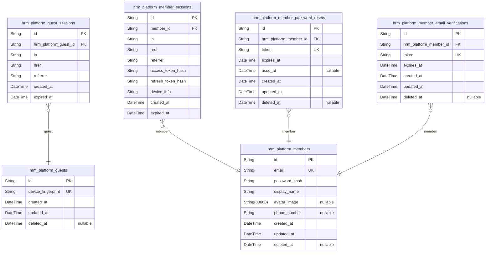
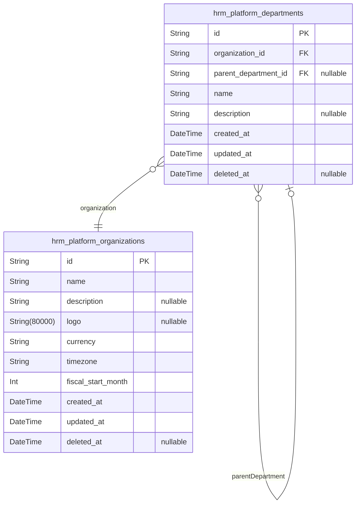
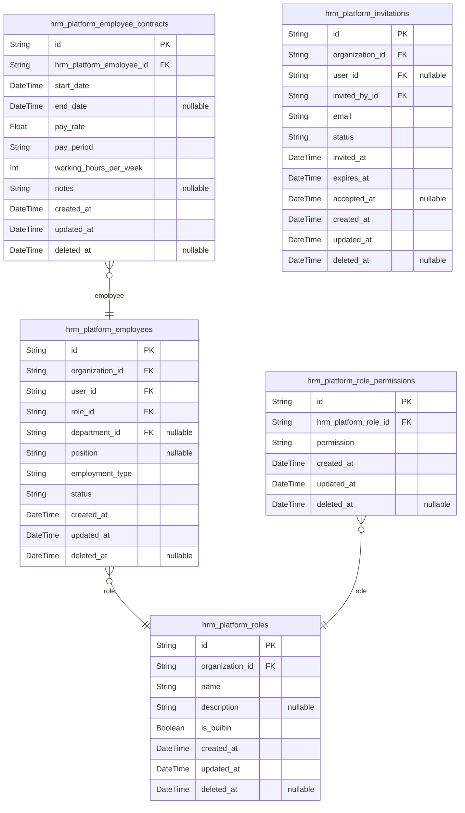
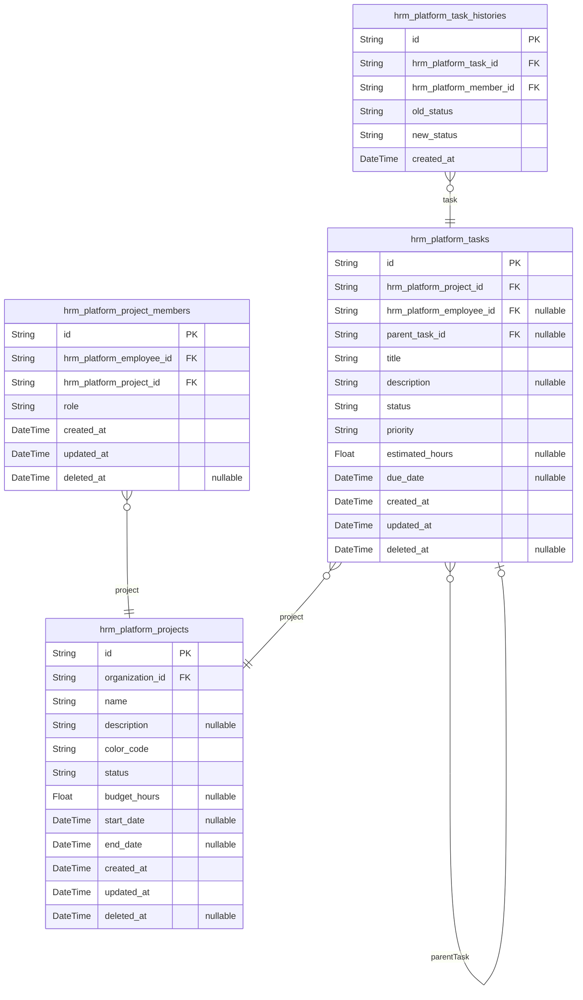
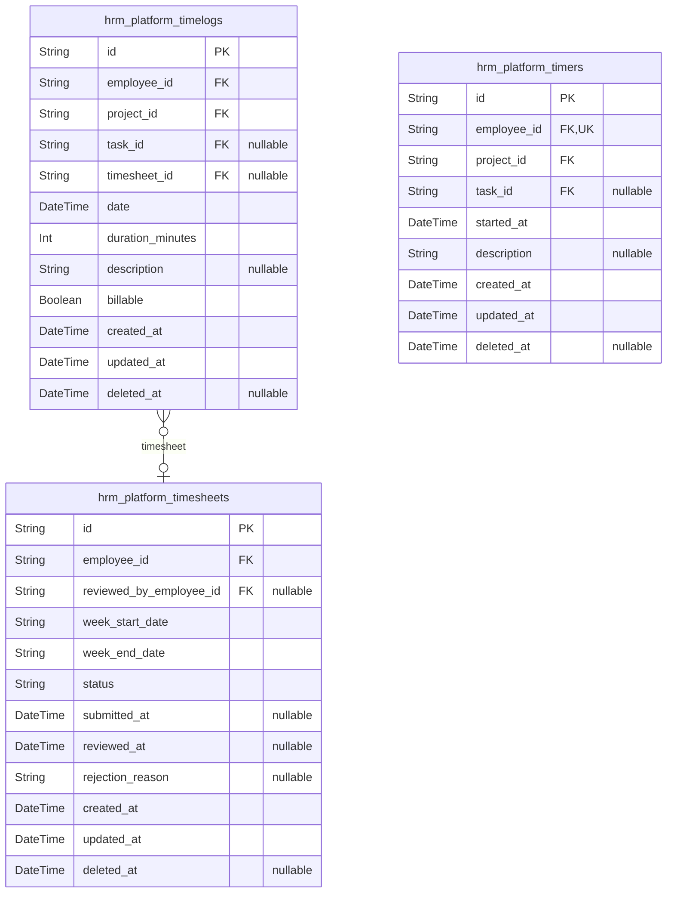
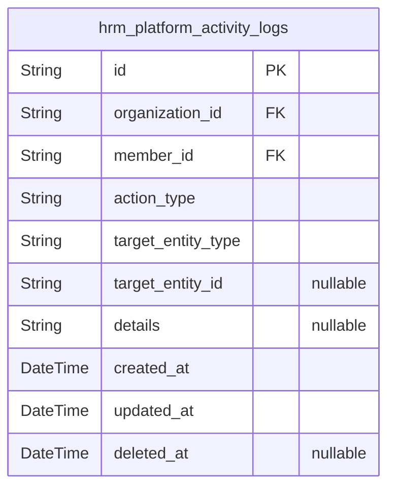

# Prisma Markdown

> Generated by [`prisma-markdown`](https://github.com/samchon/prisma-markdown)

- [authorization](#authorization)
- [Organization](#organization)
- [Employee](#employee)
- [Project](#project)
- [TimeTracking](#timetracking)
- [Activity](#activity)

## authorization

### `hrm_platform_guests`

Temporary guest accounts identified by device fingerprint for anonymous
platform access.

Guests are unauthenticated users who access the platform without creating
a member account. Each guest is uniquely identified by a device
fingerprint, allowing the system to recognize returning guests and
maintain their session context. Guest accounts are temporary and do not
have email/password credentials.

Properties as follows:

- `id`: Primary Key.
- `device_fingerprint`: Unique device identifier for guest recognition.
- `created_at`: Timestamp when the guest account was created.
- `updated_at`: Timestamp when the guest account was last updated.
- `deleted_at`: Timestamp when the guest account was soft deleted.

### `hrm_platform_guest_sessions`

Temporary session tokens for guest access with expiration tracking.
Stores JWT session data including access and refresh tokens for anonymous
platform access.

Properties as follows:

- `id`: Primary Key.
- `hrm_platform_guest_id`: Guest's [hrm_platform_guests.id](#hrm_platform_guests).
- `ip`: Client IP address at session creation.
- `href`: Current page URL when session was initiated.
- `referrer`: Referrer URL that led to session creation.
- `created_at`: Session creation timestamp.
- `expired_at`: Session expiration timestamp for automatic invalidation.

### `hrm_platform_members`

Registered member accounts with email/password credentials and global
profile information. Members can belong to multiple organizations and
switch between them. Profile information (display name, avatar, phone) is
shared across all organizations.

Properties as follows:

- `id`: Primary Key.
- `email`: Unique email address for authentication.
- `password_hash`: Bcrypt hashed password for authentication.
- `display_name`: User's display name shown across all organizations.
- `avatar_image`: URL to user's avatar/profile image.
- `phone_number`: User's phone number for contact.
- `created_at`: Account creation timestamp.
- `updated_at`: Last profile update timestamp.
- `deleted_at`: Soft delete timestamp for account deletion.

### `hrm_platform_member_sessions`

JWT session tokens with access and refresh token support for member
authentication. Tracks active login sessions with expiration, device
information, and token hashes for validation. Each session belongs to
exactly one member and is created during login, expired during logout or
timeout.

Properties as follows:

- `id`: Primary Key.
- `member_id`: Member's [hrm_platform_members.id](#hrm_platform_members).
- `ip`: Client IP address at session creation for security auditing.
- `href`: Original URL where login was initiated.
- `referrer`: HTTP referrer header at login time.
- `access_token_hash`: Hash of the current access token for validation and revocation.
- `refresh_token_hash`: Hash of the current refresh token for validation and revocation.
- `device_info`
  > Client device information (user agent, browser, OS) for session
  > identification.
- `created_at`: Session creation timestamp.
- `expired_at`: Session expiration timestamp. Sessions are invalid after this time.

### `hrm_platform_member_password_resets`

Password reset tokens with expiration for member account recovery. Stores
temporary tokens generated when members request password reset, with
expiration tracking and usage state. Each token belongs to exactly one
member and can be used only once.

Properties as follows:

- `id`: Primary Key.
- `hrm_platform_member_id`
  > Target's [hrm_platform_members.id](#hrm_platform_members). Member account requesting
  > password reset.
- `token`: Unique password reset token sent to member's email.
- `expires_at`: Token expiration timestamp. Token becomes invalid after this time.
- `used_at`: Timestamp when token was consumed. Null if not yet used.
- `created_at`: Record creation timestamp.
- `updated_at`: Record last update timestamp.
- `deleted_at`: Soft delete timestamp. Null if record is active.

### `hrm_platform_member_email_verifications`

Email verification tokens for member registration validation. Stores
temporary tokens sent to users during signup to verify email ownership.
Each token has an expiration time and is consumed upon successful
verification. Members can request new tokens if previous ones expire.

Properties as follows:

- `id`: Primary Key.
- `hrm_platform_member_id`: Member's [hrm_platform_members.id](#hrm_platform_members).
- `token`: Verification token sent to user's email for validation.
- `expires_at`: Token expiration timestamp after which verification is invalid.
- `created_at`: Record creation timestamp.
- `updated_at`: Record last update timestamp.
- `deleted_at`: Soft delete timestamp for record removal.

## Organization

### `hrm_platform_organizations`

Core multi-tenancy entity representing independent organizational
workspaces. Each organization owns its employees, departments, projects,
and all business data. Contains organization settings including name,
description, logo image, currency, timezone, and fiscal year start month
configuration.

Properties as follows:

- `id`: Primary Key.
- `name`: Organization name for display and identification.
- `description`: Optional description of the organization's purpose or business.
- `logo`: URL to the organization's logo image.
- `currency`: ISO 4217 currency code (e.g., USD, EUR, KRW) for financial displays.
- `timezone`
  > IANA timezone identifier (e.g., America/New_York, Asia/Seoul) for
  > date/time displays.
- `fiscal_start_month`: Fiscal year start month (1-12) for financial reporting periods.
- `created_at`: Timestamp when the organization was created.
- `updated_at`: Timestamp when the organization was last updated.
- `deleted_at`: Timestamp when the organization was soft deleted (null if active).

### `hrm_platform_departments`

Organizational departments providing structural hierarchy within an
organization. Each department has a name, optional description, and
optional parent department for one-level nesting. Departments enable
employee categorization and organizational reporting. All departments
belong to exactly one [hrm_platform_organizations](#hrm_platform_organizations) for data
isolation.

Properties as follows:

- `id`: Primary Key.
- `organization_id`: Organization's [hrm_platform_organizations.id](#hrm_platform_organizations).
- `parent_department_id`
  > Parent department's [hrm_platform_departments.id](#hrm_platform_departments) for one-level
  > hierarchy. Null for top-level departments.
- `name`: Department name for identification and display.
- `description`: Optional department description explaining purpose or scope.
- `created_at`: Timestamp when department was created.
- `updated_at`: Timestamp when department was last updated.
- `deleted_at`: Timestamp when department was soft deleted. Null for active departments.

## Employee

### `hrm_platform_employees`

Organizational membership records linking users to organizations with
role, department, position, employment type, and status.

Each record represents a user's membership in a specific organization. A
user can have multiple employee records across different organizations.
Each employee has exactly one role, optional department assignment,
position title, employment type classification, and activation status.

Properties as follows:

- `id`: Primary Key.
- `organization_id`: Organization's [hrm_platform_organizations.id](#hrm_platform_organizations).
- `user_id`: Member's [hrm_platform_members.id](#hrm_platform_members).
- `role_id`: Role's [hrm_platform_roles.id](#hrm_platform_roles).
- `department_id`: Department's [hrm_platform_departments.id](#hrm_platform_departments).
- `position`: Job title or position within the organization.
- `employment_type`: Employment classification: full-time, part-time, contractor, intern.
- `status`: Employee status: active or deactivated.
- `created_at`: Record creation timestamp.
- `updated_at`: Last update timestamp.
- `deleted_at`: Soft delete timestamp.

### `hrm_platform_employee_contracts`

Historical employment agreements documenting compensation and work terms
for employees. Each employee can have multiple contracts over time with
only one active at a time. References [hrm_platform_employees](#hrm_platform_employees).
Immutable records preserve employment history.

Properties as follows:

- `id`: Primary Key.
- `hrm_platform_employee_id`: Employee's [hrm_platform_employees.id](#hrm_platform_employees).
- `start_date`: Contract effective start date.
- `end_date`: Contract end date. Null indicates ongoing contract.
- `pay_rate`: Compensation rate per pay period unit.
- `pay_period`: Payment frequency: hourly, daily, weekly, or monthly.
- `working_hours_per_week`: Expected weekly working hours.
- `notes`: Additional contract terms or comments.
- `created_at`: Record creation timestamp.
- `updated_at`: Last modification timestamp.
- `deleted_at`: Soft delete timestamp.

### `hrm_platform_roles`

Organization-scoped permission sets including built-in roles (Owner,
Manager, Employee) and custom roles.

Each role belongs to exactly one organization and defines a set of
permissions granted to employees assigned to that role. Built-in roles
are system-defined and cannot be deleted, while custom roles can be
created, edited, and deleted by organization owners (when no employees
are assigned).

Roles support many-to-many relationship with permissions through {@link
hrm_platform_role_permissions} junction table. Each employee in an
organization is assigned exactly one role via {@link
hrm_platform_employees.role_id}.

Properties as follows:

- `id`: Primary Key.
- `organization_id`: Organization's [hrm_platform_organizations.id](#hrm_platform_organizations).
- `name`: Role name (e.g., Owner, Manager, Employee, or custom role name).
- `description`: Optional description of the role's purpose and responsibilities.
- `is_builtin`
  > True for system-built-in roles (Owner, Manager, Employee) that cannot be
  > deleted.
- `created_at`: Timestamp when the role was created.
- `updated_at`: Timestamp when the role was last updated.
- `deleted_at`: Timestamp when the role was soft-deleted (null if active).

### `hrm_platform_role_permissions`

Junction table mapping roles to their granted permissions for
many-to-many relationship.

Each row represents one permission granted to a specific role. Built-in
roles (Owner, Manager, Employee) and custom roles both use this table to
define their permission sets. Supports filtering permissions by role and
roles by permission.

Properties as follows:

- `id`: Primary Key.
- `hrm_platform_role_id`
  > Reference to [hrm_platform_roles.id](#hrm_platform_roles). The role that holds this
  > permission.
- `permission`
  > Permission code (e.g., org:manage, employee:manage, employee:view,
  > project:manage, project:view, time:manage, time:approve, time:view_all,
  > report:view).
- `created_at`: Timestamp when this permission assignment was created.
- `updated_at`: Timestamp when this permission assignment was last updated.
- `deleted_at`
  > Timestamp when this permission assignment was soft deleted (null if
  > active).

### `hrm_platform_invitations`

Pending employee invitations by email before account creation. Links
organizations to invited users, tracking invitation lifecycle from
sending through acceptance or expiration. Supports pre-account invitation
workflow where users are automatically added to organizations upon signup
with invited email.

Properties as follows:

- `id`: Primary Key.
- `organization_id`: Organization's [hrm_platform_organizations.id](#hrm_platform_organizations).
- `user_id`
  > Member's [hrm_platform_members.id](#hrm_platform_members). Null until user signs up with
  > invited email.
- `invited_by_id`: Member's [hrm_platform_members.id](#hrm_platform_members) who sent this invitation.
- `email`
  > Invited email address. Used to match existing users or create account
  > linkage upon signup.
- `status`: Invitation status: pending, accepted, expired, revoked.
- `invited_at`: Timestamp when invitation was sent.
- `expires_at`: Timestamp when invitation expires and becomes invalid.
- `accepted_at`: Timestamp when invitation was accepted. Null if not yet accepted.
- `created_at`: Created timestamp.
- `updated_at`: Updated timestamp.
- `deleted_at`: Deleted timestamp for soft delete.

## Project

### `hrm_platform_projects`

Work containers grouping related tasks and timelogs within an
organization. Each project has a name, color code for UI display, status
(active/archived/completed), optional budget hours, and optional timeline
dates. Projects are organization-scoped for multi-tenancy data isolation.

Properties as follows:

- `id`: Primary Key.
- `organization_id`: Organization's [hrm_platform_organizations.id](#hrm_platform_organizations).
- `name`: Project name for identification.
- `description`: Optional project description detailing purpose and scope.
- `color_code`: Hex color code for UI display and visual identification.
- `status`: Project status: active, archived, or completed.
- `budget_hours`: Optional total estimated budget hours for the project.
- `start_date`: Optional project start date.
- `end_date`: Optional project end date.
- `created_at`: Timestamp when the project was created.
- `updated_at`: Timestamp when the project was last updated.
- `deleted_at`: Timestamp for soft delete, null if active.

### `hrm_platform_project_members`

Junction table assigning employees to projects with role attribute
(member or project-lead), enabling team membership tracking.

Links employees to their assigned projects within an organization. Each
membership record specifies the employee's role in the project,
distinguishing between regular members and project leads who have task
management authority. Prevents duplicate assignments through unique
constraint on employee-project pair.

Properties as follows:

- `id`: Primary Key.
- `hrm_platform_employee_id`: Employee's [hrm_platform_employees.id](#hrm_platform_employees).
- `hrm_platform_project_id`: Project's [hrm_platform_projects.id](#hrm_platform_projects).
- `role`
  > Project role: member or project-lead. Project leads can manage tasks
  > within their project.
- `created_at`: Timestamp when the project membership was created.
- `updated_at`: Timestamp when the project membership was last updated.
- `deleted_at`: Timestamp when the project membership was soft deleted (null if active).

### `hrm_platform_tasks`

Work items within projects with title, status, priority, estimated hours,
due date, optional assignment to employee, and optional parent task for
subtask hierarchy.

Properties as follows:

- `id`: Primary Key.
- `hrm_platform_project_id`: Parent project's [hrm_platform_projects.id](#hrm_platform_projects).
- `hrm_platform_employee_id`: Assigned employee's [hrm_platform_employees.id](#hrm_platform_employees).
- `parent_task_id`: Parent task's [hrm_platform_tasks.id](#hrm_platform_tasks) for subtask hierarchy.
- `title`: Task title.
- `description`: Task description.
- `status`: Task status: open, in-progress, completed, closed.
- `priority`: Task priority: low, medium, high, urgent.
- `estimated_hours`: Estimated hours to complete the task.
- `due_date`: Task due date.
- `created_at`: Creation timestamp.
- `updated_at`: Last update timestamp.
- `deleted_at`: Soft delete timestamp.

### `hrm_platform_task_histories`

Audit trail entries capturing task status transitions with timestamp, old
status, new status, and the user who made the change. Each entry records
a single status change event for tracking task progression and
accountability. References [hrm_platform_tasks](#hrm_platform_tasks) for the task being
tracked and [hrm_platform_members](#hrm_platform_members) for the actor who made the
change.

Properties as follows:

- `id`: Primary Key.
- `hrm_platform_task_id`: Task's [hrm_platform_tasks.id](#hrm_platform_tasks).
- `hrm_platform_member_id`: Member's [hrm_platform_members.id](#hrm_platform_members).
- `old_status`
  > Previous task status before the transition (e.g., open, in-progress,
  > completed, closed).
- `new_status`
  > New task status after the transition (e.g., open, in-progress, completed,
  > closed).
- `created_at`: Timestamp when the status change was recorded.

## TimeTracking

### `hrm_platform_timelogs`

Individual time entry records capturing work sessions with date,
duration, project, optional task, description, and billable flag. Each
timelog belongs to exactly one employee and one project, optionally
references a task within that project. Timelogs can be grouped into
timesheets for approval workflow - when included in an approved
timesheet, the timelog becomes locked (immutable).

Properties as follows:

- `id`: Primary Key.
- `employee_id`: Employee who logged the time. [hrm_platform_employees.id](#hrm_platform_employees).
- `project_id`: Project the time was logged against. [hrm_platform_projects.id](#hrm_platform_projects).
- `task_id`: Optional task within the project. [hrm_platform_tasks.id](#hrm_platform_tasks).
- `timesheet_id`
  > Timesheet this timelog belongs to, null if not yet submitted. {@link
  > hrm_platform_timesheets.id}.
- `date`: Date the work was performed (date only, time component ignored).
- `duration_minutes`: Duration of work session in minutes.
- `description`: Optional description of what work was done.
- `billable`: Whether this time is billable to client (default true).
- `created_at`: Timestamp when this timelog was created.
- `updated_at`: Timestamp when this timelog was last updated.
- `deleted_at`: Timestamp when this timelog was soft deleted, null if active.

### `hrm_platform_timesheets`

Weekly collections of timelogs with approval workflow status (draft,
submitted, approved, rejected) and review metadata.

Timesheets group an employee's timelogs by week (Monday to Sunday) for
approval tracking. Employees create draft timesheets, submit them for
approval, and users with time:approve permission can approve or reject
them. Approved timesheets lock all included timelogs from editing or
deletion.

Properties as follows:

- `id`: Primary Key.
- `employee_id`: Employee who owns this timesheet. [hrm_platform_employees.id](#hrm_platform_employees).
- `reviewed_by_employee_id`
  > Employee who approved or rejected this timesheet. {@link
  > hrm_platform_employees.id}.
- `week_start_date`: Monday of the timesheet week (ISO date format YYYY-MM-DD).
- `week_end_date`: Sunday of the timesheet week (ISO date format YYYY-MM-DD).
- `status`: Timesheet workflow status: draft, submitted, approved, rejected.
- `submitted_at`: Timestamp when timesheet was submitted for approval.
- `reviewed_at`: Timestamp when timesheet was approved or rejected.
- `rejection_reason`
  > Reason provided when timesheet was rejected (required for rejected
  > status).
- `created_at`: Timestamp when this timesheet was created.
- `updated_at`: Timestamp when this timesheet was last updated.
- `deleted_at`: Timestamp when this timesheet was soft deleted.

### `hrm_platform_timers`

Active timer state for real-time time tracking.

Each employee can have at most one running timer at a time. Timers record
the start timestamp, associated project, optional task, and work
description. When stopped, timers convert to timelog entries with
calculated duration. Timers continue running indefinitely until
explicitly stopped or discarded by the employee.

Properties as follows:

- `id`: Primary Key.
- `employee_id`: The employee who owns this timer. [hrm_platform_employees.id](#hrm_platform_employees).
- `project_id`: The project being tracked. [hrm_platform_projects.id](#hrm_platform_projects).
- `task_id`: Optional task being tracked. [hrm_platform_tasks.id](#hrm_platform_tasks).
- `started_at`: Timestamp when the timer was started.
- `description`: Optional description of the work being tracked.
- `created_at`: Record creation timestamp.
- `updated_at`: Record last update timestamp.
- `deleted_at`: Soft delete timestamp for record archival.

## Activity

### `hrm_platform_activity_logs`

Immutable audit trail of significant organizational actions including
employee lifecycle events, contract changes, project actions, task status
changes, timesheet workflow, and role assignments. Each entry captures
the actor (member), action type, target entity reference, and metadata.
Append-only records support compliance auditing and debugging across all
organizational domains.

Properties as follows:

- `id`: Primary Key.
- `organization_id`
  > Organization's [hrm_platform_organizations.id](#hrm_platform_organizations). Required for data
  > isolation.
- `member_id`
  > Member's [hrm_platform_members.id](#hrm_platform_members). The user who performed the
  > action.
- `action_type`
  > Action classification (e.g., employee.invited, employee.deactivated,
  > contract.created, project.archived, task.status_changed,
  > timesheet.submitted, role.assigned).
- `target_entity_type`
  > Entity type affected by the action (e.g., employee, contract, project,
  > task, timesheet, role).
- `target_entity_id`
  > UUID of the affected entity if applicable. Null for actions without
  > specific entity target.
- `details`
  > Structured metadata about the action in JSON format. Contains
  > action-specific details like old/new values, reasons, or context.
- `created_at`: Timestamp when the activity log was created (when the action occurred).
- `updated_at`
  > Timestamp when the activity log was last updated. Static for append-only
  > audit logs.
- `deleted_at`: Timestamp for soft delete. Null means active record.
