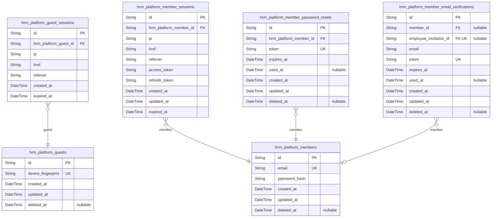
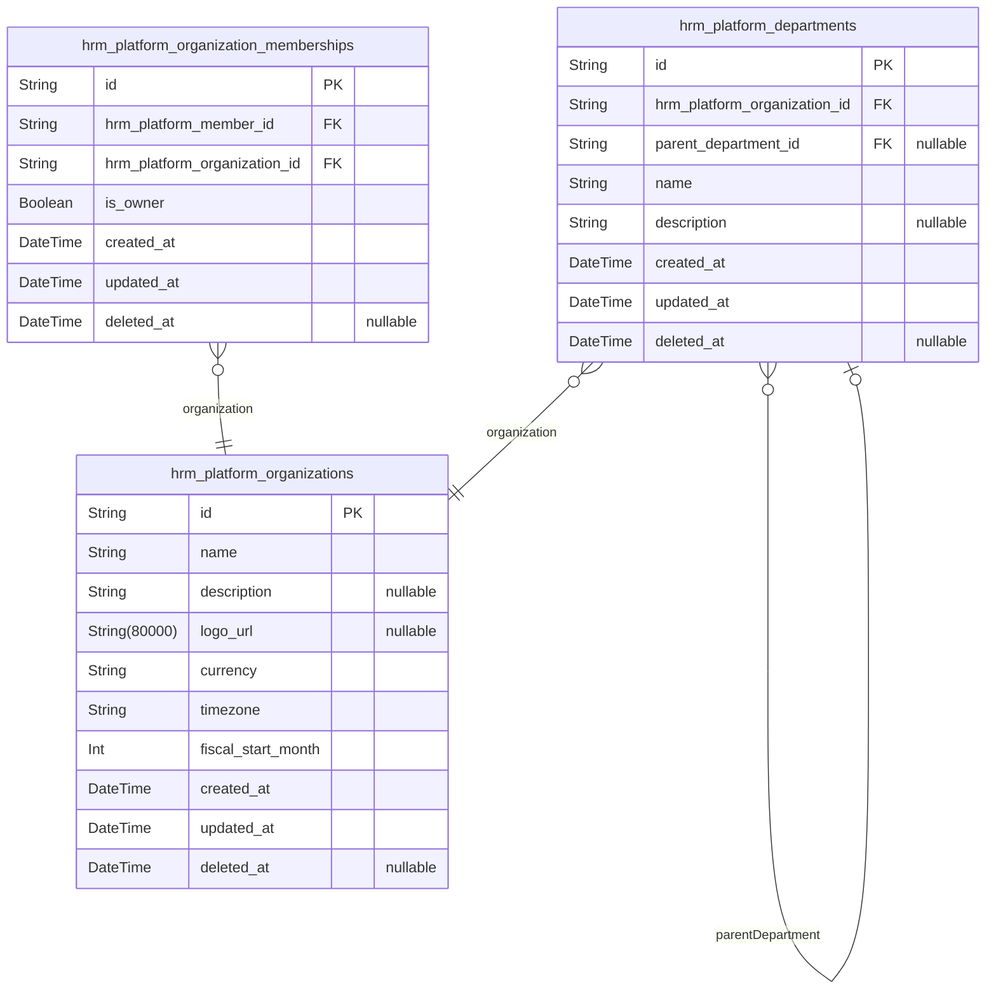
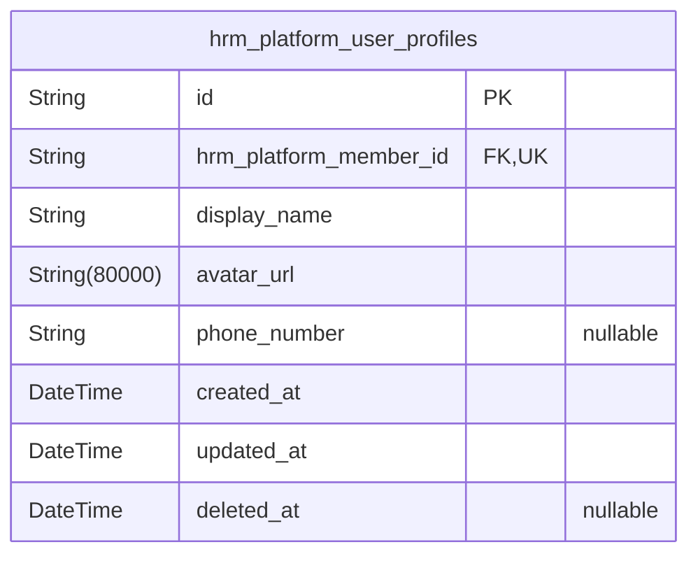
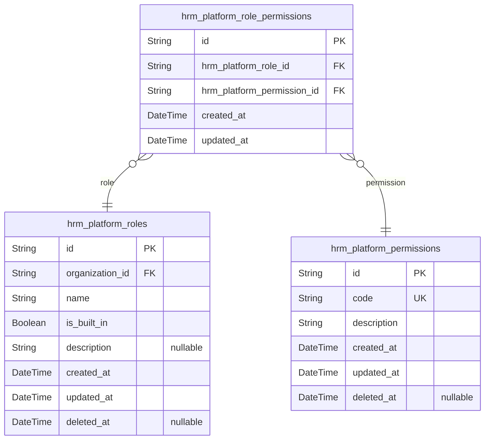
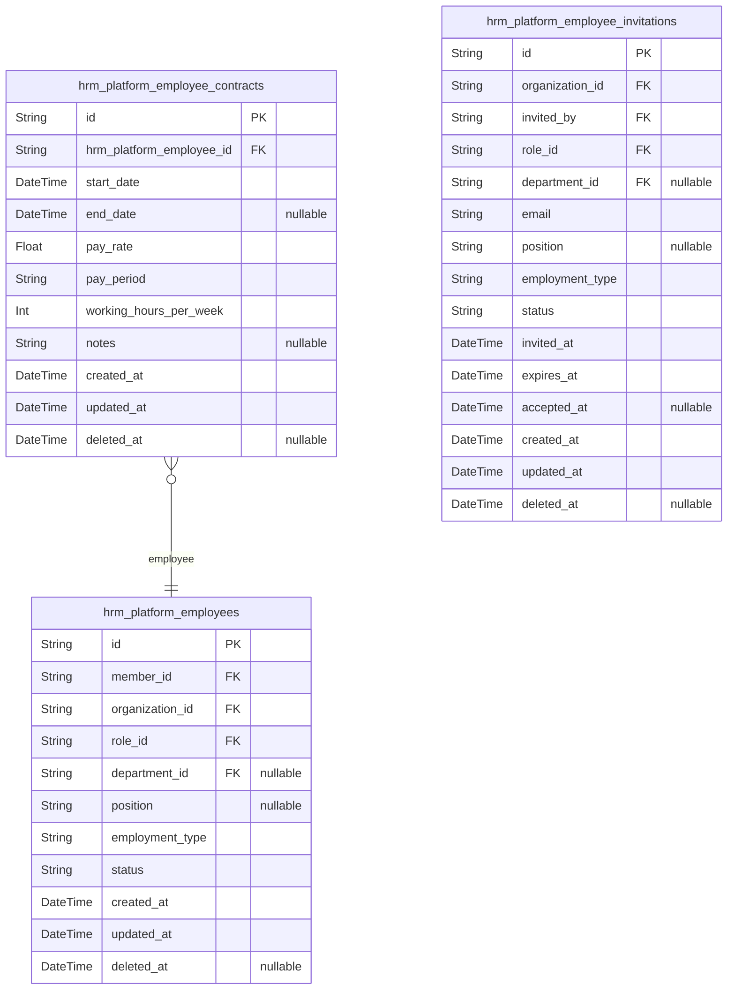
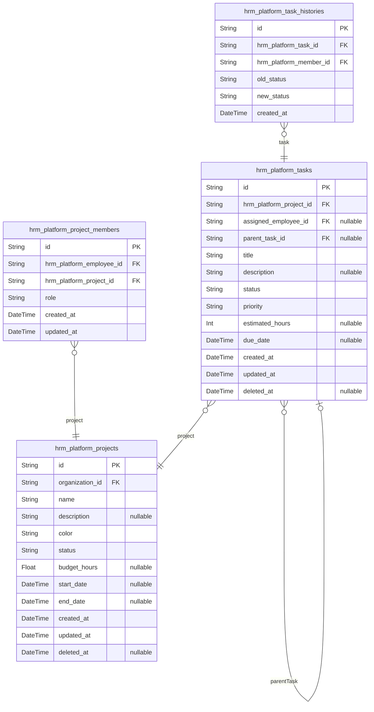
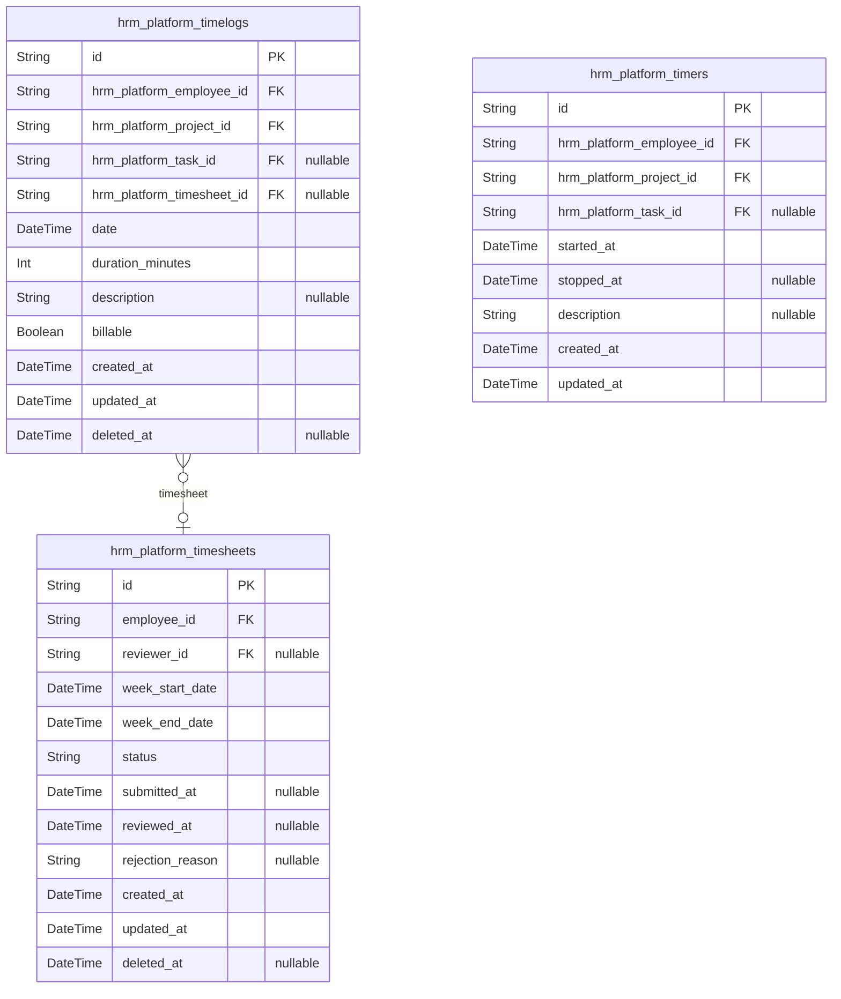
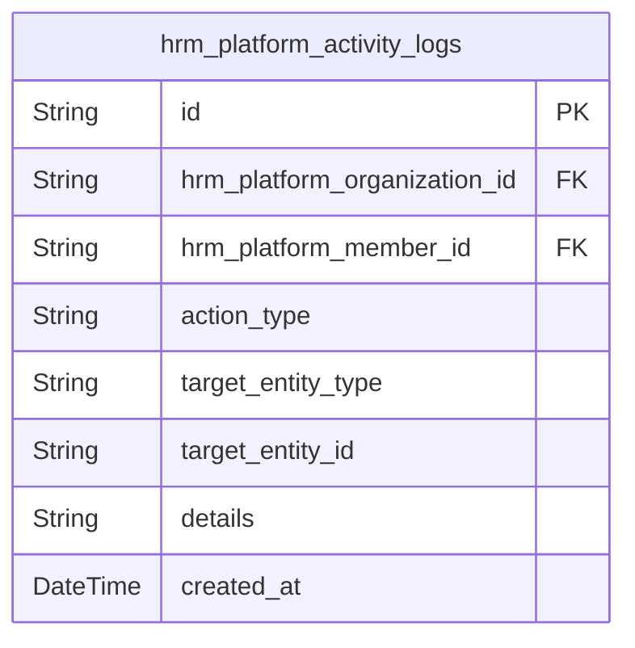

# Prisma Markdown

> Generated by [`prisma-markdown`](https://github.com/samchon/prisma-markdown)

- [authorization](#authorization)
- [organization](#organization)
- [users](#users)
- [roles](#roles)
- [employees](#employees)
- [projects](#projects)
- [time](#time)
- [audit](#audit)

## authorization

### `hrm_platform_guests`

Temporary guest accounts for unauthenticated visitors accessing public
pages.

Guest accounts are created automatically when visitors access the
platform without authentication. Each guest is identified by a unique
device fingerprint that persists across browser sessions. These accounts
serve as the entry point for user registration and login flows.

Guest accounts transition to member accounts upon successful
authentication. The device fingerprint enables tracking of guest activity
before authentication and supports features like preserving registration
form state across page reloads.

Properties as follows:

- `id`: Primary Key.
- `device_fingerprint`
  > Unique identifier derived from device characteristics for guest tracking.
  >
  > The device fingerprint is generated from browser and device attributes to
  > create a persistent identifier for unauthenticated visitors. This enables
  > the platform to maintain guest state across page loads and browser
  > sessions without requiring authentication.
- `created_at`: Timestamp when the guest account was created.
- `updated_at`: Timestamp when the guest account was last updated.
- `deleted_at`: Timestamp when the guest account was soft deleted. Null means active.

### `hrm_platform_guest_sessions`

Temporary session tokens for guest access with expiration tracking.

This table manages short-lived authentication sessions for guest users
who access public pages without creating a member account. Sessions are
identified by device fingerprint and track the client's browsing context.

Sessions are created when a guest first accesses the platform and are
validated on each request. The expired_at field enforces session lifetime
limits for security. Expired sessions are automatically invalidated and
require re-creation.

Properties as follows:

- `id`: Primary Key.
- `hrm_platform_guest_id`
  > References the guest account this session belongs to.
  >
  > Each session is tied to exactly one [hrm_platform_guests](#hrm_platform_guests) record.
  > This foreign key enables tracking all active sessions for a specific
  > guest device and supports session cleanup when guests are removed.
- `ip`
  > Client IP address for session tracking.
  >
  > Captures the IP address from which the guest session was initiated. Used
  > for security monitoring, rate limiting, and detecting suspicious activity
  > patterns.
- `href`
  > Current page URL where session is active.
  >
  > Stores the URL of the page where the guest session is currently being
  > used. Helps track user navigation and provides context for session
  > validation.
- `referrer`
  > Referrer URL that led to this session.
  >
  > Records the HTTP referrer header value when the session was created.
  > Useful for analytics and understanding traffic sources.
- `created_at`
  > Session creation timestamp.
  >
  > Records when this guest session was first established. Used for session
  > age calculations and audit purposes.
- `expired_at`
  > Session expiration timestamp.
  >
  > Defines when this session becomes invalid. Sessions are automatically
  > rejected after this timestamp. Required field for security enforcement.

### `hrm_platform_members`

Registered member accounts with email and password hash for authentication.

This table stores authenticated user credentials and account information.
Members can belong to multiple organizations through organization
memberships and have global user profiles shared across all
organizations.

Each member has a unique email address used for login and password reset
flows. The password is stored as a secure hash. Account deletion is
restricted if the member is the sole owner of any organization.

Properties as follows:

- `id`: Primary Key.
- `email`
  > Unique email address used for authentication and communication.
  >
  > This field serves as the primary identifier for login and password
  > recovery processes. Must be unique across all members.
- `password_hash`
  > Securely hashed password for authentication.
  >
  > Stores the bcrypt or argon2 hash of the member's password. Never store
  > plain text passwords.
- `created_at`: Timestamp when the member account was created.
- `updated_at`: Timestamp when the member account was last updated.
- `deleted_at`: Timestamp for soft delete. Null means the account is active.

### `hrm_platform_member_sessions`

JWT session tokens for member authentication with access and refresh
token support.

Stores active login sessions for [hrm_platform_members](#hrm_platform_members) with token
information and expiration tracking. Sessions are created during login
and invalidated on logout or expiration.

Each session contains access and refresh tokens for API authentication,
along with metadata about the login context including IP address and
referrer information. Sessions enable secure, stateless authentication
while maintaining an audit trail of active login sessions.

Properties as follows:

- `id`: Primary Key.
- `hrm_platform_member_id`
  > Reference to the member who owns this session.
  >
  > Establishes ownership relationship to [hrm_platform_members](#hrm_platform_members). Each
  > session belongs to exactly one member, and members can have multiple
  > active sessions across different devices or browsers.
- `ip`
  > IP address from which the session was created.
  >
  > Captures the client IP address at login time for security audit and
  > session validation. Used to detect suspicious login activity and enforce
  > IP-based security policies.
- `href`
  > URL where the login occurred.
  >
  > Records the page URL at the time of authentication. Useful for analytics
  > and understanding user login patterns.
- `referrer`
  > Referrer URL from the login request.
  >
  > Captures the HTTP referrer header to track how users arrived at the login
  > page. Helps identify traffic sources and potential security concerns.
- `access_token`
  > JWT access token for API authentication.
  >
  > Short-lived token used for authenticating API requests. Contains member
  > identity and permissions. Typically expires within minutes to hours.
- `refresh_token`
  > JWT refresh token for obtaining new access tokens.
  >
  > Long-lived token used to request new access tokens without
  > re-authentication. Stored securely and rotated on use for enhanced
  > security.
- `created_at`
  > Timestamp when the session was created.
  >
  > Records the exact time of login. Used for session age tracking, audit
  > logs, and sorting sessions by recency.
- `updated_at`
  > Timestamp when the session was last updated.
  >
  > Updated on token refresh or session activity. Tracks the last known
  > activity time for the session.
- `expired_at`
  > Timestamp when the session expires.
  >
  > Defines the maximum lifetime of the session. Sessions are invalid after
  > this time regardless of activity. Enforced by authentication middleware.

### `hrm_platform_member_password_resets`

Password reset tokens with expiration for member password recovery.

Stores temporary tokens generated when members request password resets.
Each token is single-use and expires after a configured time period
(typically 1 hour). Tokens are invalidated after use or expiration.

Tokens are created during the password reset request flow and sent to the
member's registered email address. When the member clicks the reset link,
the token is validated and used to authenticate the password change
request.

Properties as follows:

- `id`: Primary Key.
- `hrm_platform_member_id`
  > References the member who requested the password reset.
  >
  > Links to [hrm_platform_members](#hrm_platform_members) to associate the reset token with a
  > specific member account. Each reset request creates a new record tied to
  > the requesting member. Multiple pending reset tokens can exist for the
  > same member, but only the most recent one should be considered valid.
- `token`
  > Unique password reset token sent to member's email.
  >
  > Randomly generated secure token included in password reset email link.
  > Must be unique across all active reset requests. Invalidated after use or
  > expiration. Token should be a cryptographically secure random string.
- `expires_at`
  > Token expiration timestamp.
  >
  > Defines when the reset token becomes invalid. Typically set to 1 hour
  > from creation. Tokens cannot be used after this time for security
  > purposes.
- `used_at`
  > Timestamp when token was successfully used.
  >
  > Records when the member completed password reset using this token. Null
  > until token is used. Allows tracking token usage and preventing reuse.
  > Once set, the token cannot be used again.
- `created_at`: Record creation timestamp.
- `updated_at`: Record last update timestamp.
- `deleted_at`: Soft delete timestamp. Null when active.

### `hrm_platform_member_email_verifications`

Email verification tokens for member registration and invitation
confirmation.

Stores verification tokens sent to email addresses during registration or
employee invitation flows. Tokens are single-use and expire after a
configured period. Supports two verification scenarios: new member
registration (linked to [hrm_platform_members](#hrm_platform_members)) and employee
invitation acceptance (linked to {@link
hrm_platform_employee_invitations}). Only one foreign key (member_id or
employee_invitation_id) is populated per record, reflecting the
verification flow type.

Token lifecycle: created when verification email is sent, marked as used
when clicked, expired after timeout. Only one active token per email
address at a time.

Properties as follows:

- `id`: Primary Key.
- `member_id`
  > Reference to the member account being verified.
  >
  > Used for registration verification flow where member account is created
  > but email not yet confirmed. Null for employee invitation verifications
  > where the user account does not yet exist.
- `employee_invitation_id`
  > Reference to the pending employee invitation being confirmed.
  >
  > Used for invitation verification flow where a user is invited to join an
  > organization. Null for standard member registration verifications.
- `email`
  > Email address being verified.
  >
  > The target email for verification token delivery. Must match the member's
  > email or the invited employee's email.
- `token`
  > Cryptographically secure verification token.
  >
  > Unique token sent via email for verification. Used exactly once and then
  > invalidated. Token format is opaque string (e.g., base64 or hex encoded
  > random bytes).
- `expires_at`
  > Token expiration timestamp.
  >
  > Verification tokens expire after a configured period (e.g., 24 hours).
  > Expired tokens cannot be used for verification.
- `used_at`
  > Timestamp when the token was used for verification.
  >
  > Null until the verification link is clicked. Set to current timestamp
  > upon successful verification. Used tokens cannot be reused.
- `created_at`: Creation timestamp.
- `updated_at`: Last update timestamp.
- `deleted_at`: Soft deletion timestamp.

## organization

### `hrm_platform_organizations`

Core multi-tenancy entity representing independent business units with
settings and configuration.

Organizations are the foundational isolation boundary in the platform.
Each organization operates independently with its own employees,
projects, departments, roles, and data. Users create an organization
during initial sign-up and can belong to multiple organizations
simultaneously.

Organization settings include business configuration such as currency for
financial tracking, timezone for date/time operations, and fiscal start
month for accounting periods. The logo URL provides branding for the
organization interface.

Organizations support soft deletion via deleted_at field. When an
organization is deleted, all related domain data (employees, projects,
tasks, timelogs, timesheets) is permanently deleted, but user accounts
remain intact and are simply disassociated from the organization.

Properties as follows:

- `id`
  > Primary Key. Uniquely identifies each organization in the multi-tenancy
  > platform.
- `name`
  > Organization display name shown throughout the platform interface.
  >
  > This is the primary identifier for the organization visible to users.
  > Used in navigation, reports, and organization switching interfaces. Must
  > be unique within the platform to avoid confusion when users belong to
  > multiple organizations.
- `description`
  > Optional detailed description of the organization's purpose or business.
  >
  > Provides context about what the organization does. Displayed in
  > organization settings and onboarding flows. Can be null for organizations
  > that prefer not to include a description.
- `logo_url`
  > URL to the organization's logo image for branding purposes.
  >
  > Displayed in the application header, emails, and reports. Supports
  > standard image formats (PNG, JPG, SVG). Can be null if no logo has been
  > uploaded.
- `currency`
  > ISO 4217 currency code for financial tracking and reporting.
  >
  > Examples: USD, EUR, KRW, JPY, GBP. Used for displaying pay rates, project
  > budgets, and financial reports. Must be a valid 3-letter currency code.
- `timezone`
  > IANA timezone identifier for date/time operations within the organization.
  >
  > Examples: Asia/Seoul, America/New_York, Europe/London. Used to interpret
  > dates and times for timesheets, timelogs, and deadlines. Ensures
  > consistent time handling across all organization data.
- `fiscal_start_month`
  > Month number (1-12) when the organization's fiscal year begins.
  >
  > Used for financial reporting and accounting periods. January=1,
  > December=12. Common values: 1 (calendar year), 4 (Q1 start), 7
  > (mid-year). Required for proper fiscal period calculations.
- `created_at`
  > Timestamp when the organization was created.
  >
  > Automatically set on organization creation. Used for audit trails,
  > sorting, and determining organization age. Immutable after creation.
- `updated_at`
  > Timestamp when the organization was last updated.
  >
  > Automatically updated on any organization modification. Used for change
  > tracking and cache invalidation. Helps identify recently modified
  > organizations.
- `deleted_at`
  > Timestamp when the organization was soft deleted.
  >
  > Null for active organizations. When set, marks the organization as
  > deleted while preserving the record for audit purposes. All related
  > domain data is permanently deleted when this field is set.

### `hrm_platform_departments`

Hierarchical organizational units within an organization with one-level
parent-child nesting for employee grouping.

Departments provide structural organization within {@link
hrm_platform_organizations} for grouping employees. Each department
belongs to exactly one organization and can optionally have a parent
department, enabling one level of hierarchy (parent-child relationship).

Department names must be unique within their organization. Deleting a
department sets the department reference to null on associated employees
rather than cascading deletion, preserving employee records.

Properties as follows:

- `id`: Primary Key.
- `hrm_platform_organization_id`
  > References the [hrm_platform_organizations](#hrm_platform_organizations) that this department
  > belongs to.
  >
  > Every department must be associated with exactly one organization. This
  > foreign key establishes the organizational scope and ensures data
  > isolation between different organizations in the multi-tenant platform.
- `parent_department_id`
  > References the parent [hrm_platform_departments](#hrm_platform_departments) for hierarchical
  > organization structure.
  >
  > Enables one level of department nesting (parent-child relationship).
  > Top-level departments have this field set to null. Child departments
  > cannot have their own children, enforcing the one-level hierarchy
  > constraint.
- `name`
  > Department name for identification within the organization.
  >
  > Must be unique within the parent organization. Used for display in
  > employee listings, filters, and organizational charts.
- `description`
  > Optional description of the department's purpose and responsibilities.
  >
  > Provides context about the department's function within the organization.
  > Can be null for departments without detailed descriptions.
- `created_at`: Timestamp when the department was created.
- `updated_at`: Timestamp when the department was last updated.
- `deleted_at`: Timestamp when the department was soft-deleted, null if active.

### `hrm_platform_organization_memberships`

Junction table linking members to organizations, enabling users to belong
to multiple organizations simultaneously.

Tracks the many-to-many relationship between [hrm_platform_members](#hrm_platform_members)
and [hrm_platform_organizations](#hrm_platform_organizations). Each membership record represents
a user's association with an organization, including ownership status.

Ownership is tracked via the is_owner flag. Each organization must have
exactly one owner at all times. The owner has full access to organization
settings and can manage organization lifecycle including deletion.

Properties as follows:

- `id`: Primary Key.
- `hrm_platform_member_id`
  > Reference to the member account.
  >
  > Links this membership to a specific [hrm_platform_members](#hrm_platform_members) record.
  > A single member can have multiple memberships across different
  > organizations.
- `hrm_platform_organization_id`
  > Reference to the organization.
  >
  > Links this membership to a specific [hrm_platform_organizations](#hrm_platform_organizations)
  > record. Each organization can have multiple member associations.
- `is_owner`
  > Indicates if this member is the organization owner.
  >
  > Each organization must have exactly one owner. The owner has full access
  > to organization settings and can manage organization lifecycle including
  > deletion.
- `created_at`
  > Timestamp when the membership was created.
  >
  > Records when the user joined or was added to the organization.
- `updated_at`
  > Timestamp when the membership was last updated.
  >
  > Updated when membership properties change, such as ownership transfer.
- `deleted_at`
  > Timestamp when the membership was soft deleted.
  >
  > Null for active memberships. Set when a user leaves or is removed from
  > the organization.

## users

### `hrm_platform_user_profiles`

Global user profiles containing display name, avatar image, and phone
number shared across all organizations.

Each profile belongs to exactly one [hrm_platform_members](#hrm_platform_members) account
and provides identity information that persists regardless of which
organization context the user is working in. This separation allows
profile management independent of authentication concerns.

The profile contains personal presentation data (display name, avatar)
and contact information (phone number) that remains consistent as users
switch between organizations or join new ones.

Properties as follows:

- `id`: Primary Key.
- `hrm_platform_member_id`
  > References the member account that owns this profile.
  >
  > Each profile belongs to exactly one [hrm_platform_members](#hrm_platform_members) account.
  > The unique constraint on this field enforces a 1:1 relationship, ensuring
  > each member has at most one profile.
- `display_name`
  > The user's preferred display name shown throughout the application.
  >
  > This name appears in project assignments, timesheet reviews, activity
  > logs, and other places where user identity is displayed. Users can edit
  > this at any time to update how they appear across all organizations.
- `avatar_url`
  > URL to the user's avatar image.
  >
  > This image is displayed alongside the user's name in various UI contexts
  > such as project member lists, timesheet approvals, and activity logs.
  > Users can upload or change their avatar image through profile settings.
- `phone_number`
  > The user's contact phone number.
  >
  > Optional contact information that users can provide for organizational
  > communication. This field is nullable as not all users may wish to share
  > their phone number.
- `created_at`: Timestamp when the profile was first created.
- `updated_at`: Timestamp when the profile was last updated.
- `deleted_at`
  > Timestamp when the profile was soft deleted. Null means the profile is
  > active.

## roles

### `hrm_platform_roles`

Role definitions within organizations, including built-in roles (Owner,
Manager, Employee) and custom roles with configurable permission sets.

Roles define access control boundaries within an organization. Built-in
roles (Owner, Manager, Employee) are system-provided and cannot be
deleted. Custom roles can be created by organization owners with specific
permission combinations.

Each role belongs to exactly one [hrm_platform_organizations](#hrm_platform_organizations) and
has a unique name within that organization. Employees are assigned
exactly one role through the [hrm_platform_employees](#hrm_platform_employees) table. Role
permissions are defined through the [hrm_platform_role_permissions](#hrm_platform_role_permissions)
junction table.

Properties as follows:

- `id`: Primary Key.
- `organization_id`
  > References the organization that owns this role.
  >
  > All roles belong to exactly one [hrm_platform_organizations](#hrm_platform_organizations). This
  > foreign key enforces organization scoping for role definitions. Built-in
  > roles are created automatically when an organization is created.
- `name`
  > Role name displayed in the UI and used for identification.
  >
  > For built-in roles, this is one of: 'Owner', 'Manager', or 'Employee'.
  > For custom roles, organization owners define the name. Must be unique
  > within the organization.
- `is_built_in`
  > Flag indicating whether this is a system-provided built-in role.
  >
  > Built-in roles (Owner, Manager, Employee) are created automatically for
  > each organization and cannot be deleted. Custom roles have this flag set
  > to false and can be deleted if no employees are assigned to them.
- `description`
  > Optional description explaining the role's purpose and typical use cases.
  >
  > Primarily used for custom roles to document their intended permissions
  > and responsibilities. Built-in roles may have null descriptions as their
  > purposes are well-defined.
- `created_at`: Timestamp when this role was created.
- `updated_at`: Timestamp when this role was last updated.
- `deleted_at`: Timestamp when this role was soft-deleted (null for active roles).

### `hrm_platform_permissions`

Master list of available permission codes such as org:manage,
employee:manage, project:view, time:approve, and report:view.

This table defines the complete set of permissions that can be assigned
to roles within the hrm_platform system. Each permission code represents
a specific capability or access right, such as managing organization
settings, viewing employee lists, or approving timesheets.

Permissions are referenced by [hrm_platform_role_permissions](#hrm_platform_role_permissions)
junction table to establish which permissions belong to each role. This
table is system-managed and populated during initial setup.

Properties as follows:

- `id`: Primary Key.
- `code`
  > Permission code identifier in format 'domain:action' such as org:manage,
  > employee:view, or time:approve.
  >
  > This code uniquely identifies the permission and is used throughout the
  > system for authorization checks. The format follows a consistent pattern
  > where the domain represents the resource area and the action represents
  > the allowed operation.
- `description`
  > Human-readable explanation of what this permission allows.
  >
  > This description helps administrators understand the purpose of each
  > permission when creating or editing custom roles. It should clearly state
  > what actions or resources the permission grants access to.
- `created_at`: Timestamp when this permission record was created.
- `updated_at`: Timestamp when this permission record was last updated.
- `deleted_at`: Timestamp when this permission record was soft deleted. Null if active.

### `hrm_platform_role_permissions`

Junction table mapping roles to their assigned permissions, enabling
flexible permission sets per role.

This table implements the many-to-many relationship between {@link
hrm_platform_roles} and [hrm_platform_permissions](#hrm_platform_permissions). Each row
represents a single permission assignment to a role, allowing roles to
have multiple permissions and permissions to be assigned to multiple
roles.

The unique constraint on role_id and permission_id prevents duplicate
permission assignments. This table is managed through the role entity -
when creating or editing a role, its permissions are managed by inserting
or deleting rows in this junction table.

Properties as follows:

- `id`: Primary Key.
- `hrm_platform_role_id`
  > References the role that is granted this permission.
  >
  > This foreign key establishes the relationship to {@link
  > hrm_platform_roles}. Each role can have multiple permission assignments
  > through this junction table. When a role is deleted, all its permission
  > assignments are cascade deleted.
- `hrm_platform_permission_id`
  > References the permission being granted to the role.
  >
  > This foreign key establishes the relationship to {@link
  > hrm_platform_permissions}. Each permission can be assigned to multiple
  > roles through this junction table. Permissions are master data and should
  > not be deleted while assigned to roles.
- `created_at`
  > Timestamp when this permission assignment was created.
  >
  > Records when the permission was granted to the role. Used for audit
  > purposes to track when role configurations were modified.
- `updated_at`
  > Timestamp when this permission assignment was last modified.
  >
  > Updated whenever the permission assignment record is modified. Used for
  > audit purposes to track recent changes to role configurations.

## employees

### `hrm_platform_employees`

Employee records linking user accounts to organizations with role
assignments, department membership, position titles, employment types,
and activation status.

Each employee record represents a person's membership and role within a
specific organization. Employees are created when users are invited to
join an organization or when existing users are added. The employee
record connects the global [hrm_platform_members](#hrm_platform_members) user account to
organization-specific data including role permissions, department
assignment, and employment terms.

**Status Management**: Employees have active or deactivated status.
Deactivated employees cannot log time or submit timesheets, but their
historical data (timelogs, timesheets, contracts) is preserved for audit
and reporting purposes. Deactivated employees can be reactivated by users
with employee:manage permission.

**Employment Types**: The employment_type field categorizes employees as
full-time, part-time, contractor, or intern. This classification supports
reporting, compliance, and contract management workflows.

**Department Assignment**: Employees can be assigned to one department
within the organization. Departments provide hierarchical grouping for
organizational structure and reporting. Department assignment is optional
and can be changed as employees move between teams.

**Role Assignment**: Each employee is assigned exactly one role within
the organization. The role determines the employee's permissions and
access levels. Built-in roles include Owner, Manager, and Employee.
Custom roles can be created by organization owners.

Properties as follows:

- `id`
  > Primary key uniquely identifying each employee record within the
  > organization.
- `member_id`
  > References the user account that this employee record represents.
  >
  > Each employee record is tied to exactly one [hrm_platform_members](#hrm_platform_members)
  > user account. This foreign key enables users to belong to multiple
  > organizations simultaneously - each organization membership creates a
  > separate employee record. When a user's account is deleted, their
  > employee records across all organizations are marked as deactivated
  > rather than deleted to preserve historical data.
- `organization_id`
  > References the organization that this employee belongs to.
  >
  > This foreign key establishes the multi-tenancy boundary - all employee
  > data is scoped to a specific [hrm_platform_organizations](#hrm_platform_organizations). When an
  > organization is deleted, all employee records within that organization
  > are permanently deleted. The organization context is enforced at the API
  > layer to ensure data isolation.
- `role_id`
  > References the role assigned to this employee within the organization.
  >
  > Each employee has exactly one role that determines their permissions and
  > access levels. The role can be one of the built-in roles (Owner, Manager,
  > Employee) or a custom role created by the organization owner. Role
  > changes are tracked in the [hrm_platform_activity_logs](#hrm_platform_activity_logs) for audit
  > purposes. Users with employee:manage permission can change employee role
  > assignments.
- `department_id`
  > References the department this employee is assigned to within the
  > organization.
  >
  > Department assignment is optional - employees can exist without a
  > department assignment. When a department is deleted, employee records
  > referencing that department have their department_id set to null rather
  > than being deleted. This preserves employee records while removing the
  > organizational structure reference. Employees can be reassigned to
  > different departments as organizational needs change.
- `position`
  > The employee's job title or position within the organization.
  >
  > This field captures the employee's role designation such as 'Software
  > Engineer', 'Product Manager', 'HR Director', etc. Position is optional
  > and can be updated by users with employee:manage permission. This field
  > is used for organizational charts, reporting, and employee directories.
- `employment_type`
  > The employee's employment classification category.
  >
  > Valid values are: 'full-time', 'part-time', 'contractor', 'intern'. This
  > classification affects contract terms, benefits eligibility, and
  > reporting. Employment type can be changed by users with employee:manage
  > permission. Changes to employment type may trigger contract updates and
  > are logged in the activity log.
- `status`
  > The employee's activation status within the organization.
  >
  > Valid values are: 'active', 'deactivated'. Active employees can log time,
  > submit timesheets, and access organization features based on their role
  > permissions. Deactivated employees cannot log time or submit timesheets,
  > but their historical data is preserved. Deactivated employees can be
  > reactivated by users with employee:manage permission. Status changes are
  > logged in the activity log.
- `created_at`: Timestamp when the employee record was created.
- `updated_at`: Timestamp when the employee record was last updated.
- `deleted_at`
  > Timestamp when the employee record was soft deleted. Null if the record
  > is active.

### `hrm_platform_employee_contracts`

Historical contract records for employees with pay rates, working hours,
and employment periods.

Each [hrm_platform_employees](#hrm_platform_employees) can have multiple contracts over
their tenure, creating an immutable historical record. Only one contract
can be active (end_date is null) at a time per employee. When a new
contract is created, the previous active contract's end_date is
automatically set.

Contracts capture employment terms including compensation (pay_rate and
pay_period), expected working hours, and employment duration. Past
contracts are immutable to preserve historical accuracy, while the
current active contract can be edited by users with employee:manage
permission.

Properties as follows:

- `id`: Primary Key.
- `hrm_platform_employee_id`
  > Reference to the employee this contract belongs to.
  >
  > Establishes ownership relationship to [hrm_platform_employees](#hrm_platform_employees).
  > Each contract belongs to exactly one employee. Multiple contracts per
  > employee create the historical employment record.
- `start_date`
  > Contract start date when employment terms begin.
  >
  > Required field marking the beginning of the employment period covered by
  > this contract. Cannot be null. Used to determine contract chronology and
  > automatically end previous active contracts.
- `end_date`
  > Contract end date when employment terms conclude.
  >
  > Optional field indicating when this contract expires or ended. Null value
  > means the contract is currently active and ongoing. When creating a new
  > contract, the previous active contract's end_date is set to the day
  > before the new contract's start_date.
- `pay_rate`
  > Compensation amount per pay period.
  >
  > Required numeric value representing the employee's pay rate. Interpreted
  > according to the pay_period field (e.g., hourly rate, monthly salary).
  > Stored as double to support decimal precision for currency values.
- `pay_period`
  > Frequency of pay compensation.
  >
  > Required field specifying the pay period unit: hourly, daily, weekly, or
  > monthly. Determines how the pay_rate value should be interpreted. Used
  > for payroll calculations and reporting.
- `working_hours_per_week`
  > Expected weekly working hours under this contract.
  >
  > Required integer representing the standard working hours per week (e.g.,
  > 40 for full-time). Used for capacity planning, timesheet validation, and
  > employment classification.
- `notes`
  > Optional additional contract terms or comments.
  >
  > Free-form text field for storing supplementary contract information such
  > as special conditions, benefits, or other employment terms not captured
  > in structured fields.
- `created_at`: Timestamp when this contract record was created.
- `updated_at`: Timestamp when this contract record was last updated.
- `deleted_at`
  > Timestamp when this contract record was soft deleted. Null means the
  > record is active.
  >
  > Used for soft delete functionality to preserve historical data while
  > marking records as deleted. Past contracts are typically immutable but
  > can be soft deleted if needed for data correction.

### `hrm_platform_employee_invitations`

Pending employee invitations sent by email before user account creation.

Stores invitation records when users with employee:manage permission
invite new employees to the organization. If the invited email already
has an account, the user is added directly without creating an
invitation. If no account exists, this table holds the pending invitation
until the user signs up.

References [hrm_platform_organizations](#hrm_platform_organizations) for multi-tenancy
isolation, [hrm_platform_members](#hrm_platform_members) for the inviter, {@link
hrm_platform_roles} for the role assignment, and {@link
hrm_platform_departments} for optional department assignment. Employment
type captures the intended employment classification (full-time,
part-time, contractor, intern).

Properties as follows:

- `id`: Primary Key.
- `organization_id`
  > References the organization that sent this invitation.
  >
  > All invitations are scoped to a specific organization for multi-tenancy
  > isolation. When the user accepts the invitation, they are added to this
  > organization.
- `invited_by`
  > References the member who sent this invitation.
  >
  > Tracks which user with employee:manage permission initiated the
  > invitation. Used for audit purposes and activity logging.
- `role_id`
  > References the role to be assigned when the invitation is accepted.
  >
  > Determines the permissions the invited employee will have in the
  > organization. Must reference a valid role within the same organization.
- `department_id`
  > References the optional department assignment for the invited employee.
  >
  > If set, the employee will be assigned to this department upon accepting
  > the invitation. Can be null if no department assignment is specified.
- `email`
  > Email address of the invited person.
  >
  > Used to match against user accounts during sign-up. When a user registers
  > with this email, the invitation is automatically accepted and the user is
  > added to the organization.
- `position`
  > Job title or position for the invited employee.
  >
  > Optional field capturing the intended role title (e.g., 'Software
  > Engineer', 'Project Manager'). Stored for reference and displayed in the
  > employee list upon acceptance.
- `employment_type`
  > Employment classification for the invited employee.
  >
  > Captures the intended employment type: full-time, part-time, contractor,
  > or intern. This determines the employee's classification in the
  > organization's HR records.
- `status`
  > Current status of the invitation.
  >
  > Tracks the invitation lifecycle: 'pending' (awaiting acceptance),
  > 'accepted' (user signed up and joined), 'expired' (past expiration date),
  > or 'cancelled' (manually cancelled by inviter).
- `invited_at`
  > Timestamp when the invitation was sent.
  >
  > Records when the invitation was created and sent to the email address.
  > Used for tracking invitation age and expiration calculations.
- `expires_at`
  > Timestamp when the invitation expires.
  >
  > Invitations have a limited validity period. After this timestamp, the
  > invitation status automatically becomes 'expired' and cannot be accepted.
- `accepted_at`
  > Timestamp when the invitation was accepted.
  >
  > Set when the user signs up with the invited email address and is
  > automatically added to the organization. Null for pending, expired, or
  > cancelled invitations.
- `created_at`: Record creation timestamp.
- `updated_at`: Record last update timestamp.
- `deleted_at`: Soft delete timestamp for record retention.

## projects

### `hrm_platform_projects`

Projects represent work initiatives within organizations with tracking
for budget, timeline, and status.

Projects are the core unit of work management, containing tasks and
assigned team members. Each project belongs to exactly one {@link
hrm_platform_organizations} for multi-tenancy isolation. Projects have a
lifecycle status (active, archived, completed) that controls whether new
timelogs can be recorded.

Key attributes include name for identification, color code for UI visual
distinction, optional description for context, budget hours for capacity
planning, and optional start/end dates for timeline tracking. The status
field determines project availability: active projects accept new work,
archived projects are preserved for reference, and completed projects
indicate finished initiatives.

Properties as follows:

- `id`: Primary Key.
- `organization_id`
  > References the [hrm_platform_organizations](#hrm_platform_organizations) that owns this project.
  >
  > All projects belong to exactly one organization for multi-tenancy
  > isolation. This foreign key enforces data isolation - employees in one
  > organization cannot access projects from another organization. When an
  > organization is deleted, all its projects are cascade deleted.
- `name`
  > Project name for identification.
  >
  > Required field that uniquely identifies the project within the
  > organization. Used in UI displays, reports, and when assigning timelogs
  > to projects.
- `description`
  > Optional detailed description of project scope and objectives.
  >
  > Provides context about what the project aims to accomplish. Can contain
  > markdown or plain text. Nullable as not all projects require detailed
  > descriptions.
- `color`
  > Hex color code for UI visual distinction.
  >
  > Required field used to visually distinguish projects in calendars, task
  > boards, and reports. Format should be valid hex color (e.g., '#FF5733' or
  > 'FF5733').
- `status`
  > Project lifecycle status controlling work availability.
  >
  > Three states: 'active' for ongoing projects accepting new timelogs,
  > 'archived' for preserved reference projects that cannot receive new work,
  > and 'completed' for finished initiatives. Status changes are logged in
  > activity logs.
- `budget_hours`
  > Optional total estimated hours for project capacity planning.
  >
  > Represents the planned effort for the project. Used for tracking progress
  > against estimates and generating budget reports. Nullable as not all
  > projects have defined budgets.
- `start_date`
  > Optional project start date for timeline tracking.
  >
  > Indicates when project work began or is scheduled to begin. Used for
  > Gantt charts, timeline views, and duration calculations. Nullable for
  > projects without defined start dates.
- `end_date`
  > Optional project end date or deadline.
  >
  > Indicates when project work is expected to be completed. Used for
  > deadline tracking, overdue alerts, and timeline visualization. Nullable
  > for ongoing projects without fixed end dates.
- `created_at`: Timestamp when the project was created.
- `updated_at`: Timestamp when the project was last modified.
- `deleted_at`: Soft delete timestamp. Null means active record.

### `hrm_platform_project_members`

Junction table assigning employees to projects with role designation as
member or project-lead.

This table establishes the many-to-many relationship between {@link
hrm_platform_employees} and [hrm_platform_projects](#hrm_platform_projects). Each employee
can be assigned to multiple projects, and each project can have multiple
employee members.

The role field distinguishes between regular members and project-leads.
Project leads have elevated permissions to manage tasks within their
assigned projects, while regular members can only view and work on
assigned tasks.

Duplicate assignments are prevented by a unique constraint on the
combination of project_id and employee_id.

Properties as follows:

- `id`: Primary Key.
- `hrm_platform_employee_id`
  > Reference to the employee being assigned to the project.
  >
  > Links to [hrm_platform_employees](#hrm_platform_employees) to identify which employee is a
  > member of this project. An employee can be assigned to multiple projects
  > through multiple records in this table.
- `hrm_platform_project_id`
  > Reference to the project the employee is assigned to.
  >
  > Links to [hrm_platform_projects](#hrm_platform_projects) to identify which project this
  > membership belongs to. A project can have multiple employee members
  > through multiple records in this table.
- `role`
  > Role designation for this employee within the project.
  >
  > Distinguishes between 'member' (regular project member with task work
  > permissions) and 'project-lead' (elevated permissions to manage tasks
  > within the project). This role determines the employee's capabilities
  > within the project context.
- `created_at`: Timestamp when this project membership was created.
- `updated_at`: Timestamp when this project membership was last updated.

### `hrm_platform_tasks`

Tasks within projects representing work items with title, status,
priority, estimated hours, due date, and optional assignment to
employees.

Tasks are the fundamental unit of work within {@link
hrm_platform_projects}. Each task has a clear status workflow (open →
in-progress → completed → closed) and priority level (low, medium, high,
urgent) for tracking progress and urgency.

Tasks can be assigned to [hrm_platform_employees](#hrm_platform_employees) who are project
members. Assignment is optional - some tasks may be unassigned backlog
items. Tasks support one-level subtask hierarchy through the
parent_task_id self-reference, allowing breakdown of complex work into
smaller components.

Estimated hours help with capacity planning and project budget tracking.
Due dates provide time boundaries for task completion. All task status
changes are recorded in [hrm_platform_task_histories](#hrm_platform_task_histories) for audit
purposes.

Properties as follows:

- `id`: Primary Key.
- `hrm_platform_project_id`
  > Reference to the parent project this task belongs to.
  >
  > Every task must belong to exactly one [hrm_platform_projects](#hrm_platform_projects). This
  > foreign key establishes the project-task hierarchy and ensures tasks are
  > always scoped to a specific project context.
- `assigned_employee_id`
  > Reference to the employee assigned to work on this task.
  >
  > Optional assignment to [hrm_platform_employees](#hrm_platform_employees). The assigned
  > employee must be a project member of the parent project. Null value
  > indicates the task is unassigned and available in the project backlog.
- `parent_task_id`
  > Self-reference to parent task for subtask hierarchy.
  >
  > Optional reference to another [hrm_platform_tasks](#hrm_platform_tasks) record, enabling
  > one-level subtask nesting. When present, this task is a subtask of the
  > parent. Null value indicates this is a top-level task. Only one level of
  > nesting is supported - subtasks cannot have their own subtasks.
- `title`
  > Short descriptive title of the task.
  >
  > Required field that summarizes the task's purpose or work to be done.
  > Should be concise yet informative enough to understand the task at a
  > glance.
- `description`
  > Detailed description of the task requirements and context.
  >
  > Optional field providing additional context, acceptance criteria, or
  > detailed instructions for completing the task. Can include markdown
  > formatting for rich text representation.
- `status`
  > Current workflow status of the task.
  >
  > Tracks task progression through the workflow: 'open' (new/unstarted),
  > 'in-progress' (actively being worked on), 'completed' (work finished),
  > 'closed' (finalized and archived). Status changes are recorded in {@link
  > hrm_platform_task_histories}.
- `priority`
  > Priority level indicating task urgency and importance.
  >
  > Four levels: 'low' (can be deferred), 'medium' (normal priority), 'high'
  > (important, should be addressed soon), 'urgent' (critical, immediate
  > attention required). Used for sorting and filtering task lists.
- `estimated_hours`
  > Estimated effort required to complete the task in hours.
  >
  > Optional planning field for capacity estimation and project budget
  > tracking. Helps project leads understand scope and allocate resources
  > appropriately.
- `due_date`
  > Target completion date for the task.
  >
  > Optional deadline for task completion. Used for scheduling, reminders,
  > and identifying overdue tasks. Null indicates no specific deadline.
- `created_at`: Timestamp when the task was created.
- `updated_at`: Timestamp when the task was last updated.
- `deleted_at`: Timestamp when the task was soft-deleted. Null means active.

### `hrm_platform_task_histories`

Audit trail recording all task status changes with timestamp, old status,
new status, and the user who made the change.

Each entry captures a single status transition for a {@link
hrm_platform_tasks}, creating an immutable historical record. This
enables tracking task lifecycle, auditing who made changes, and
reconstructing task state history.

Records are append-only and never deleted to maintain complete audit
trail integrity.

Properties as follows:

- `id`: Primary Key.
- `hrm_platform_task_id`
  > References the task whose status changed.
  >
  > Links to [hrm_platform_tasks](#hrm_platform_tasks) to identify which task this history
  > entry belongs to. Multiple history entries can exist for the same task,
  > forming a chronological audit trail.
- `hrm_platform_member_id`
  > References the member who made the status change.
  >
  > Links to [hrm_platform_members](#hrm_platform_members) to identify which user performed
  > the status transition. Enables audit tracking of who changed task status
  > and when.
- `old_status`
  > The task status before the change.
  >
  > Captures the previous status value (e.g., 'open', 'in-progress',
  > 'completed', 'closed') before the transition. Used for audit trail and
  > history reconstruction.
- `new_status`
  > The task status after the change.
  >
  > Captures the new status value (e.g., 'open', 'in-progress', 'completed',
  > 'closed') after the transition. Represents the current state of the task
  > at this point in history.
- `created_at`
  > Timestamp when the status change occurred.
  >
  > Records the exact time when the status transition was made. Serves as
  > both the creation timestamp and the temporal marker for ordering history
  > entries chronologically.

## time

### `hrm_platform_timelogs`

Individual time entries recording work performed by employees on specific
projects and optional tasks.

Timelogs capture the fundamental unit of time tracking: a discrete period
of work with a specific date, duration, and context. Each timelog belongs
to exactly one employee and one project, with an optional task reference
for finer granularity. Timelogs are collected into weekly timesheets for
approval workflows.

**Ownership and Relationships**

Each timelog is owned by exactly one [hrm_platform_employees](#hrm_platform_employees)
record, representing the employee who performed the work. The timelog
references exactly one [hrm_platform_projects](#hrm_platform_projects) record, which must
be a project the employee is assigned to. Optionally, a timelog can
reference one [hrm_platform_tasks](#hrm_platform_tasks) record within the selected
project for detailed task tracking. When a timesheet is submitted and
approved, the timelog is linked to exactly one {@link
hrm_platform_timesheets} record; before submission, this field remains
null.

**Core Attributes**

The date field records when the work was performed (calendar date, not
timestamp). Duration is stored as duration_minutes (integer) representing
total minutes worked. The billable flag indicates whether this time is
billable to a client or internal. An optional description field allows
employees to document what work was performed.

**Lifecycle and Immutability**

Timelogs can be created and edited by their owner while in draft
timesheets or unassigned to any timesheet. Once included in an approved
timesheet, timelogs become immutable and cannot be edited or deleted.
Soft delete is supported via deleted_at for audit trail preservation.

Properties as follows:

- `id`: Primary Key.
- `hrm_platform_employee_id`
  > References the employee who performed the work and owns this timelog.
  >
  > Each timelog belongs to exactly one [hrm_platform_employees](#hrm_platform_employees)
  > record. This foreign key establishes ownership and determines which
  > employee's timesheet will include this timelog. The employee must be
  > active to create new timelogs, though historical timelogs remain valid
  > even if the employee is later deactivated.
- `hrm_platform_project_id`
  > References the project this timelog was recorded against.
  >
  > Each timelog must reference exactly one [hrm_platform_projects](#hrm_platform_projects)
  > record. The project must be one that the employee is assigned to as a
  > project member. This constraint ensures employees can only log time to
  > projects they have access to. The project reference is required and
  > cannot be null.
- `hrm_platform_task_id`
  > References the optional task this timelog was recorded against.
  >
  > Timelogs can optionally reference one [hrm_platform_tasks](#hrm_platform_tasks) record
  > for finer granularity in time tracking. When provided, the task must
  > belong to the same project referenced by hrm_platform_project_id. This
  > field is nullable, allowing employees to log time at the project level
  > without specifying a particular task.
- `hrm_platform_timesheet_id`
  > References the timesheet that includes this timelog.
  >
  > When a timelog is included in a timesheet (draft, submitted, or
  > approved), this field references the [hrm_platform_timesheets](#hrm_platform_timesheets)
  > record. Timelogs not yet assigned to any timesheet have this field set to
  > null. Once a timesheet is approved, the timelog becomes immutable and
  > cannot be reassigned to a different timesheet.
- `date`
  > The calendar date when the work was performed.
  >
  > Records the specific date (year-month-day) when the employee performed
  > the work. This is stored as a datetime type but represents a date value
  > (time component is typically midnight UTC). Used for grouping timelogs
  > into weekly timesheets and for date-range filtering in reports.
- `duration_minutes`
  > Total duration of work in minutes.
  >
  > Records the amount of time worked as a positive integer representing
  > minutes. Common values include 15, 30, 60, 120, etc. When created from a
  > timer, duration is calculated from start to stop timestamp and rounded to
  > the nearest minute. Must be greater than zero.
- `description`
  > Optional description of what work was performed.
  >
  > Allows employees to document the specific work performed during this time
  > entry. Useful for providing context to reviewers and for personal
  > reference. Can be null if no description is provided. Maximum length
  > should be enforced at application layer.
- `billable`
  > Indicates whether this time entry is billable to a client.
  >
  > Boolean flag distinguishing billable work (charged to clients) from
  > non-billable work (internal activities, training, administrative tasks).
  > Defaults to true for new timelogs. Used in reporting to calculate
  > billable vs non-billable hours.
- `created_at`: Timestamp when this timelog was first created.
- `updated_at`: Timestamp when this timelog was last updated.
- `deleted_at`: Timestamp when this timelog was soft-deleted, null if active.

### `hrm_platform_timesheets`

Weekly collections of timelogs with draft, submitted, approved, and
rejected status workflow including approval tracking and rejection
reasons.

Timesheets aggregate individual [hrm_platform_timelogs](#hrm_platform_timelogs) entries
into weekly periods (Monday to Sunday) for approval workflow. Employees
create draft timesheets, submit them for review, and managers approve or
reject with reasons. Approved timesheets lock all included timelogs from
further editing.

Status workflow: draft → submitted → approved or rejected. Rejected
timesheets return to draft status for modification and resubmission. Each
employee can have only one timesheet per week, enforced by unique
constraint on employee_id and week_start_date.

Properties as follows:

- `id`: Primary Key.
- `employee_id`
  > References the employee who owns this timesheet.
  >
  > Each timesheet belongs to exactly one [hrm_platform_employees](#hrm_platform_employees). The
  > employee is the owner and creator of the timesheet, and only they (or
  > users with time:manage permission) can modify draft timesheets.
- `reviewer_id`
  > References the member who reviewed (approved or rejected) this timesheet.
  >
  > Populated when a user with time:approve permission reviews the timesheet.
  > References [hrm_platform_members](#hrm_platform_members) as the reviewer is identified by
  > their user account, not employee record. Nullable for timesheets still in
  > draft or submitted status.
- `week_start_date`
  > The Monday date marking the start of the timesheet week.
  >
  > Timesheets cover a fixed weekly period from Monday to Sunday. This field
  > stores the Monday date, and week_end_date is always week_start_date + 6
  > days. Used with employee_id in unique constraint to prevent duplicate
  > timesheets for the same week.
- `week_end_date`
  > The Sunday date marking the end of the timesheet week.
  >
  > Always equals week_start_date + 6 days. Stored explicitly for query
  > convenience when filtering by week end dates.
- `status`
  > Current workflow status of the timesheet.
  >
  > Allowed values: draft, submitted, approved, rejected. Draft timesheets
  > can be modified. Submitted timesheets await review. Approved timesheets
  > lock all included timelogs. Rejected timesheets return to draft status
  > with a rejection_reason.
- `submitted_at`
  > Timestamp when the timesheet was submitted for approval.
  >
  > Populated when employee submits a draft timesheet. Nullable for
  > timesheets still in draft status. Used to track submission timing and
  > enforce business rules about resubmission.
- `reviewed_at`
  > Timestamp when the timesheet was approved or rejected.
  >
  > Populated when a reviewer makes a decision. Nullable for timesheets in
  > draft or submitted status. Together with reviewer_id, provides complete
  > audit trail of the review action.
- `rejection_reason`
  > Explanation provided when rejecting a timesheet.
  >
  > Required when status is rejected, null otherwise. Helps employees
  > understand why their timesheet was rejected and what needs to be
  > corrected before resubmission.
- `created_at`: Timestamp when this timesheet record was created.
- `updated_at`: Timestamp when this timesheet record was last updated.
- `deleted_at`: Timestamp for soft delete. Null means active record.

### `hrm_platform_timers`

Active real-time time tracking sessions that employees start and stop to
record work duration.

Timers enable employees to track time in real-time by starting a session
when beginning work and stopping it when finished. Each timer records the
start timestamp, associated project, optional task, and work description.
When stopped, the timer automatically creates a timelog entry with the
calculated duration.

Each employee can have at most one active timer at a time (enforced at
application level where stopped_at is null). Timers continue running
indefinitely until explicitly stopped or discarded by the employee.
Employees can edit the description, project, or task of a running timer.

Properties as follows:

- `id`: Primary key uniquely identifying each timer session.
- `hrm_platform_employee_id`
  > References the employee who owns this timer session.
  >
  > Each timer belongs to exactly one employee who started it. This
  > establishes ownership and ensures employees can only view and manage
  > their own timers. The employee must be active to start new timers.
- `hrm_platform_project_id`
  > References the project being tracked by this timer.
  >
  > Every timer must be associated with a project to categorize the work
  > being tracked. The project must be one that the employee is assigned to
  > as a project member. This ensures employees can only track time against
  > projects they have access to.
- `hrm_platform_task_id`
  > References the optional task being tracked by this timer.
  >
  > Tasks provide granular tracking within a project. This field is nullable
  > because employees may track time at the project level without specifying
  > a particular task. When provided, the task must belong to the associated
  > project.
- `started_at`
  > Timestamp when the timer session was started.
  >
  > Records the exact moment the employee initiated time tracking. This is
  > used to calculate the duration when the timer is stopped. The value is
  > immutable after creation.
- `stopped_at`
  > Timestamp when the timer session was stopped.
  >
  > Null value indicates the timer is currently running (active). When set,
  > the timer is considered complete and will create a timelog entry with
  > duration calculated as stopped_at minus started_at. An employee can have
  > at most one timer where stopped_at is null.
- `description`
  > Optional description of the work being tracked.
  >
  > Employees can add notes about what specific work they are doing during
  > this timer session. This field is editable while the timer is running to
  > allow updates as work context changes.
- `created_at`: Timestamp when this timer record was created in the database.
- `updated_at`
  > Timestamp when this timer record was last updated.
  >
  > Updated when the timer is stopped or when the employee edits the
  > description, project, or task of a running timer.

## audit

### `hrm_platform_activity_logs`

Organization-wide audit trail recording significant actions including
employee changes, contract modifications, project updates, task status
changes, timesheet approvals, and role assignments with immutable
entries.

Each log entry captures the actor ([hrm_platform_members](#hrm_platform_members)), action
type, target entity, and contextual details. Logs are strictly scoped to
[hrm_platform_organizations](#hrm_platform_organizations) for multi-tenancy isolation.

Common action types: employee.invited, employee.deactivated,
employee.reactivated, contract.created, contract.edited, project.created,
project.archived, project.completed, project.deleted,
task.status_changed, timesheet.submitted, timesheet.approved,
timesheet.rejected, role.assigned, role.changed.

Properties as follows:

- `id`: Primary Key.
- `hrm_platform_organization_id`
  > References the [hrm_platform_organizations](#hrm_platform_organizations) that owns this audit
  > log entry. All activity logs are scoped to a specific organization for
  > multi-tenancy data isolation.
- `hrm_platform_member_id`
  > References the [hrm_platform_members](#hrm_platform_members) who performed the logged
  > action. Captures the actor identity for audit trail purposes.
- `action_type`
  > Categorizes the type of action performed. Uses dot-notation format:
  > domain.action (e.g., 'employee.invited', 'contract.created',
  > 'project.archived', 'timesheet.approved'). Used for filtering and
  > grouping audit events.
- `target_entity_type`
  > Identifies the type of entity that was affected by the action (e.g.,
  > 'employee', 'contract', 'project', 'task', 'timesheet', 'role'). Enables
  > filtering logs by entity type.
- `target_entity_id`
  > References the specific entity instance that was affected. The ID format
  > depends on target_entity_type. Allows navigating to the affected record
  > when it still exists.
- `details`
  > Structured metadata about the action in JSON-like format. Contains
  > contextual information such as old/new values, reasons, or additional
  > attributes. Example: '{"old_status":"draft","new_status":"submitted"}' or
  > '{"email":"user@example.com"}'.
- `created_at`
  > Timestamp when the action occurred. Used for chronological ordering and
  > date range filtering in audit log queries.
