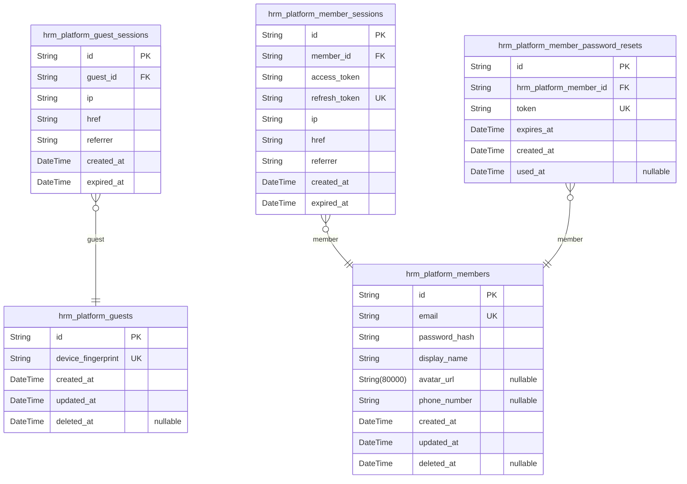
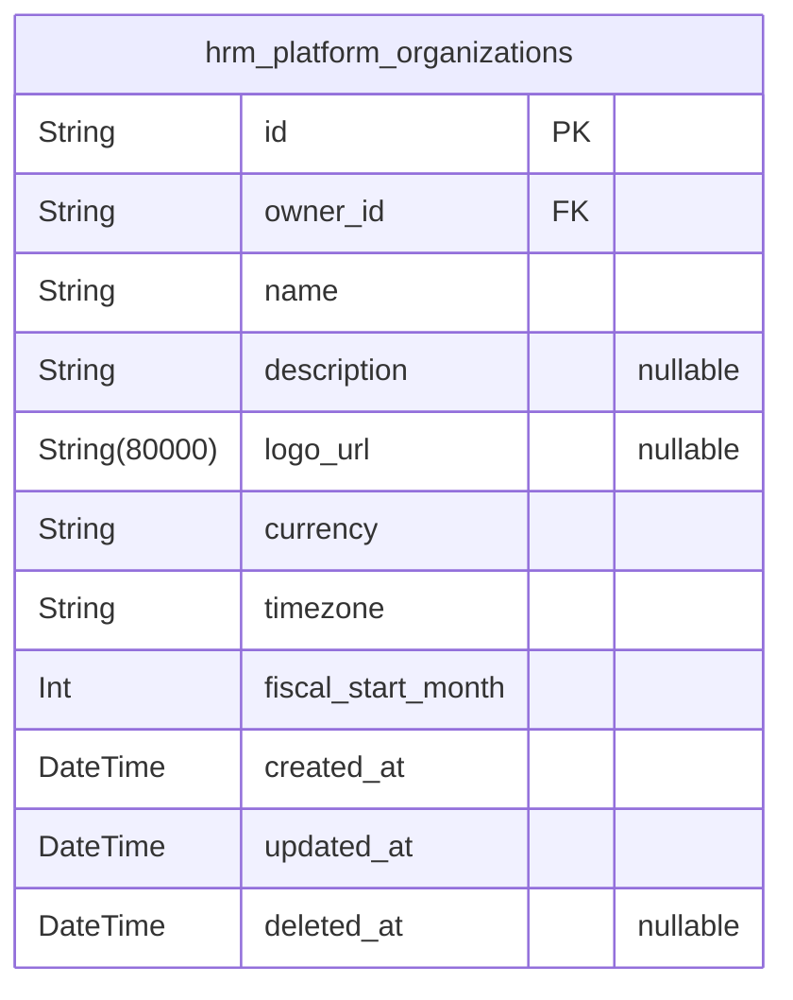
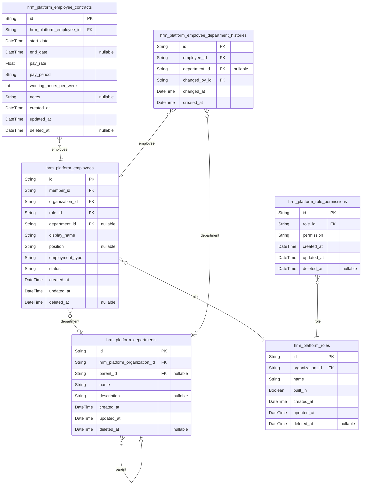
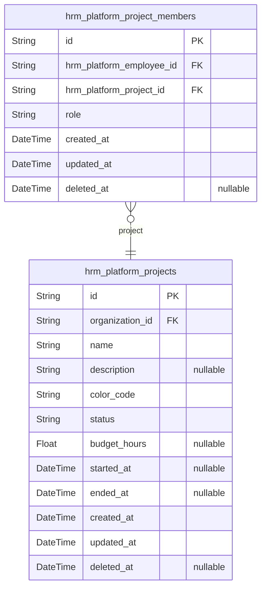
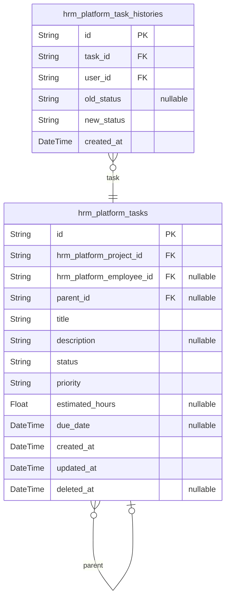
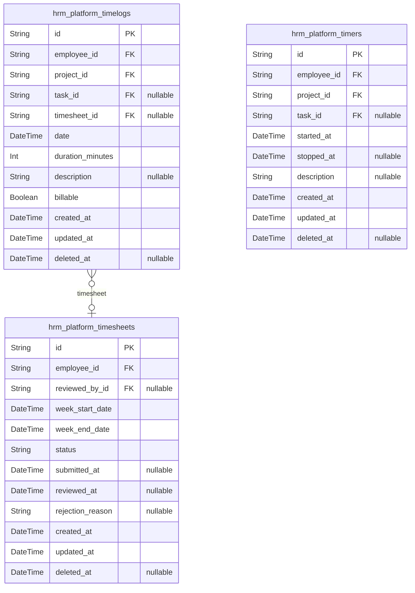
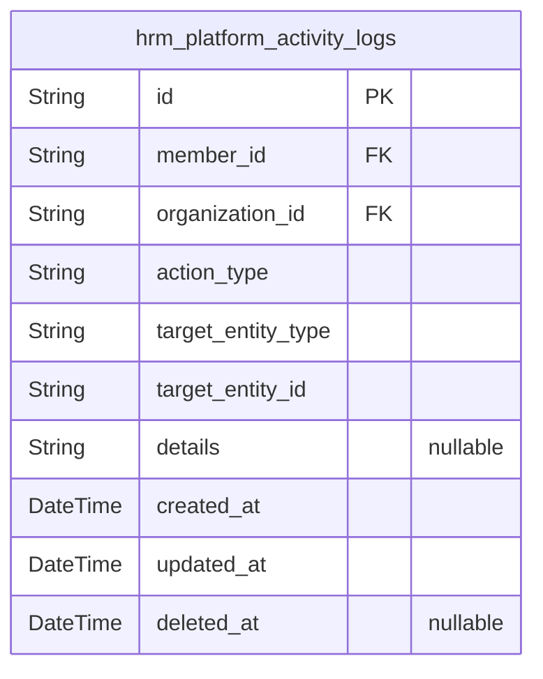

# Prisma Markdown

> Generated by [`prisma-markdown`](https://github.com/samchon/prisma-markdown)

- [Actors](#actors)
- [Organization](#organization)
- [Employees](#employees)
- [Projects](#projects)
- [Tasks](#tasks)
- [TimeTracking](#timetracking)
- [Activity](#activity)

## Actors

### `hrm_platform_guests`

Temporary guest accounts identified by device fingerprint for
unauthenticated platform access.

Guest accounts provide limited platform access without requiring full
registration. Each guest is uniquely identified by their device
fingerprint, enabling session continuity across visits. Guest accounts
are temporary and can be converted to member accounts through
registration.

Related to [hrm_platform_guest_sessions](#hrm_platform_guest_sessions) which tracks individual
login sessions for guests.

Properties as follows:

- `id`: Primary Key.
- `device_fingerprint`
  > Unique device identifier used to recognize returning guests across
  > sessions without requiring authentication.
- `created_at`: Timestamp when the guest account was first created.
- `updated_at`: Timestamp when the guest account was last updated.
- `deleted_at`: Timestamp when the guest account was soft deleted, null if active.

### `hrm_platform_guest_sessions`

Temporary session tokens for guest users with expiration tracking.

Stores connection metadata including IP address, request URL, and
referrer for audit purposes. Each session has a defined expiration time
after which it becomes invalid. Sessions are created when guests access
the platform and are used to maintain temporary state across requests
without requiring full authentication.

Related to [hrm_platform_guests](#hrm_platform_guests) as the parent actor entity.
Multiple sessions can exist per guest, but only the most recent active
session is typically used.

Properties as follows:

- `id`: Primary Key.
- `guest_id`: Belonged guest's [hrm_platform_guests.id](#hrm_platform_guests).
- `ip`: IP address of the client connection.
- `href`: Full URL of the current page request.
- `referrer`: Referrer URL from which the request originated.
- `created_at`: Session creation timestamp.
- `expired_at`: Session expiration timestamp after which the session is invalid.

### `hrm_platform_members`

Registered member accounts with email and password authentication
credentials. Each member represents a unique user identity that can
belong to multiple organizations and maintain a global profile shared
across all organizational contexts. Members authenticate via
email/password and establish sessions for platform access. The profile
attributes (display name, avatar, phone) are global and consistent
regardless of which organization context the member is currently working
in.

Properties as follows:

- `id`: Primary Key.
- `email`
  > Unique email address used for authentication and account communication.
  > Serves as the primary login credential.
- `password_hash`
  > Bcrypt hashed password for secure authentication. Never stores plain text
  > passwords.
- `display_name`
  > User's display name shown across all organizations and in the global
  > profile. Used for identification in the UI.
- `avatar_url`
  > Profile avatar image URL. Shared globally across all organizations the
  > member belongs to.
- `phone_number`
  > Contact phone number for the user. Optional field for account recovery or
  > communication.
- `created_at`: Timestamp when the member account was created.
- `updated_at`: Timestamp when the member profile was last updated.
- `deleted_at`
  > Soft deletion timestamp. When set, the account is deactivated but
  > historical data is preserved.

### `hrm_platform_member_sessions`

JWT session tokens for member authentication with access and refresh
token support.

This table tracks authenticated login sessions for members
(hrm_platform_members). Each record represents a distinct authentication
session with associated JWT tokens and connection metadata.

Key characteristics:
- Sessions are created upon successful member login
- Access tokens are used for API authentication
- Refresh tokens enable token renewal without re-authentication
- Connection metadata (IP, href, referrer) provides audit trail
- Sessions expire based on expired_at timestamp

Related entities:
- [hrm_platform_members](#hrm_platform_members) - The member who owns this session

API generation: Session lifecycle endpoints (create, list, revoke) bound
to member authentication flows.

Properties as follows:

- `id`: Primary Key.
- `member_id`: Belonged member's [hrm_platform_members.id](#hrm_platform_members).
- `access_token`: JWT access token for API authentication.
- `refresh_token`: JWT refresh token for token renewal without re-authentication.
- `ip`: IP address of the client connection.
- `href`: Current page URL when session was created.
- `referrer`: Referrer URL from the client request.
- `created_at`: Session creation timestamp.
- `expired_at`: Session expiration timestamp for security enforcement.

### `hrm_platform_member_password_resets`

Password reset tokens for member account recovery.

Stores temporary tokens generated when members request password reset.
Each token has an expiration time and can be used only once. After
successful password change, the token is marked as used or expires
automatically. Supports secure account recovery flow without requiring
current password verification.

Properties as follows:

- `id`: Primary Key.
- `hrm_platform_member_id`: Belonged member's [hrm_platform_members.id](#hrm_platform_members).
- `token`: Unique password reset token sent to member's email.
- `expires_at`: Token expiration timestamp. Token becomes invalid after this time.
- `created_at`: Timestamp when the password reset request was created.
- `used_at`
  > Timestamp when the token was consumed for password reset. Null if not yet
  > used.

## Organization

### `hrm_platform_organizations`

Core organization entity representing a multi-tenant workspace. Each
organization operates independently with its own employees, projects,
departments, and data. Organizations are owned by members who can
configure settings, manage members, and control the organization
lifecycle. When deleted, all associated business data (employees,
projects, tasks, timelogs, timesheets) is permanently removed while the
owner's member account remains intact.

Properties as follows:

- `id`: Primary Key.
- `owner_id`
  > Owner member's [hrm_platform_members.id](#hrm_platform_members). The member who created
  > and owns this organization. Can transfer ownership or delete the
  > organization.
- `name`: Organization name displayed in the UI and used for identification.
- `description`
  > Optional description explaining the organization's purpose or business
  > context.
- `logo_url`: URL to the organization's logo image for branding and UI display.
- `currency`
  > ISO 4217 currency code (e.g., USD, EUR, KRW) used for financial
  > calculations and reporting within the organization.
- `timezone`
  > IANA timezone identifier (e.g., Asia/Seoul, America/New_York) used for
  > date/time calculations and timesheet week boundaries.
- `fiscal_start_month`
  > Month number (1-12) when the organization's fiscal year begins, used for
  > annual reporting and budget cycles.
- `created_at`: Timestamp when the organization was created.
- `updated_at`: Timestamp when the organization was last updated.
- `deleted_at`
  > Timestamp when the organization was soft-deleted. Null if active. Used
  > for cascade deletion tracking.

## Employees

### `hrm_platform_employees`

Employee records representing organizational membership, linking users to
organizations with role assignments, department affiliations, and
employment details.

Each employee record connects a [hrm_platform_members](#hrm_platform_members) user account
to a specific [hrm_platform_organizations](#hrm_platform_organizations) organization,
establishing their membership and access context. Employees are assigned
exactly one [hrm_platform_roles](#hrm_platform_roles) role that determines their
permissions within the organization, and optionally belong to a {@link
hrm_platform_departments} department for organizational structure.

The display_name field is denormalized from the member's global profile
to enable efficient employee search and filtering without requiring
joins. Employment type categorizes the worker relationship (full-time,
part-time, contractor, intern), while status tracks whether the employee
is currently active or deactivated.

A unique constraint on (member_id, organization_id) ensures each user can
have only one employee record per organization. Soft deletion via
deleted_at allows employees to be deactivated and potentially reactivated
while preserving historical data like timelogs and timesheets.

Properties as follows:

- `id`: Primary Key.
- `member_id`: Belonged member's [hrm_platform_members.id](#hrm_platform_members).
- `organization_id`: Belonged organization's [hrm_platform_organizations.id](#hrm_platform_organizations).
- `role_id`: Assigned role's [hrm_platform_roles.id](#hrm_platform_roles).
- `department_id`: Assigned department's [hrm_platform_departments.id](#hrm_platform_departments).
- `display_name`
  > Employee's display name denormalized from member profile for search and
  > filtering efficiency.
- `position`: Job title or position within the organization.
- `employment_type`: Employment classification: full-time, part-time, contractor, or intern.
- `status`
  > Employment status: active or deactivated. Deactivated employees cannot
  > log time or submit timesheets but historical data is preserved.
- `created_at`: Timestamp when the employee record was created.
- `updated_at`: Timestamp when the employee record was last updated.
- `deleted_at`
  > Timestamp when the employee was deactivated (soft delete). Null means
  > active.

### `hrm_platform_employee_contracts`

Employment contracts tracking pay rate, period, working hours, and
start/end dates for employees.

Each employee can have multiple contracts throughout their employment
history, but only one contract can be active at a time. When a new
contract is created, the previous active contract is automatically ended.
Past contracts are immutable historical records that cannot be edited.

The end_date field being null indicates an ongoing contract with no
specified end date. The pay_period field stores the compensation
frequency (hourly, daily, weekly, monthly), and working_hours_per_week
defines the expected weekly working hours.

This table is managed through the [hrm_platform_employees](#hrm_platform_employees) entity -
users with employee:manage permission create and edit contracts for
specific employees.

Properties as follows:

- `id`: Primary Key.
- `hrm_platform_employee_id`: Belonged employee's [hrm_platform_employees.id](#hrm_platform_employees).
- `start_date`
  > Contract start date. Required field marking when the employment terms
  > begin.
- `end_date`
  > Contract end date. Null value indicates an ongoing contract with no
  > specified end date.
- `pay_rate`
  > Pay rate amount. Numeric value representing compensation per pay period
  > unit.
- `pay_period`: Pay period frequency. Allowed values: hourly, daily, weekly, monthly.
- `working_hours_per_week`
  > Expected working hours per week. Defines the standard weekly working
  > schedule (e.g., 40).
- `notes`: Optional notes or additional terms for the contract.
- `created_at`: Timestamp when the contract record was created.
- `updated_at`: Timestamp when the contract record was last updated.
- `deleted_at`
  > Timestamp for soft deletion. Null indicates active record, non-null
  > indicates deleted record retained for audit.

### `hrm_platform_departments`

Organizational departments for grouping employees within an organization.
Supports one-level hierarchical structure through optional parent
department reference.

Departments are managed by users with org:manage permission and serve as
organizational units for employee classification. Each department belongs
to exactly one organization and can have an optional parent department
for basic hierarchy.

Key relationships:
- Belongs to [hrm_platform_organizations](#hrm_platform_organizations) via organization_id
- Optional parent department via self-referential parent_id (one level only)
- Referenced by [hrm_platform_employees](#hrm_platform_employees) for employee department
assignment
- Referenced by [hrm_platform_employee_department_histories](#hrm_platform_employee_department_histories) for
tracking department changes

When a department is deleted, employee department references are set to
null rather than cascading deletion, preserving employee records.

Properties as follows:

- `id`: Primary Key.
- `hrm_platform_organization_id`: Belonged organization's [hrm_platform_organizations.id](#hrm_platform_organizations).
- `parent_id`
  > Parent department's [hrm_platform_departments.id](#hrm_platform_departments) for one-level
  > hierarchy. Null for top-level departments.
- `name`: Department name. Must be unique within the organization.
- `description`
  > Optional description explaining the department's purpose and
  > responsibilities.
- `created_at`: Timestamp when the department was created.
- `updated_at`: Timestamp when the department was last updated.
- `deleted_at`
  > Timestamp when the department was soft deleted. Null for active
  > departments.

### `hrm_platform_roles`

Custom roles defined by organization owners with permission sets.

Roles represent access control profiles within an organization. Three
built-in roles (Owner, Manager, Employee) are system-defined and cannot
be deleted. Organization owners can create custom roles with specific
permission combinations.

Each role belongs to exactly one [hrm_platform_organizations](#hrm_platform_organizations) and
can be assigned to multiple [hrm_platform_employees](#hrm_platform_employees). Role
permissions are defined in the child table {@link
hrm_platform_role_permissions}.

Built-in roles have the built_in flag set to true and are protected from
deletion. Custom roles can be deleted only when no employees are
currently assigned to them.

Properties as follows:

- `id`: Primary Key.
- `organization_id`: Belonged organization's [hrm_platform_organizations.id](#hrm_platform_organizations).
- `name`: Name of the role (e.g., Owner, Manager, Employee, or custom role name).
- `built_in`
  > Whether this is a built-in system role that cannot be deleted. Built-in
  > roles include Owner, Manager, and Employee.
- `created_at`: Timestamp when the role was created.
- `updated_at`: Timestamp when the role was last updated.
- `deleted_at`: Timestamp when the role was soft deleted (null if active).

### `hrm_platform_role_permissions`

Permission assignments for custom roles within organizations.

This table stores the set of permissions granted to each custom role.
Each row represents a single permission code assigned to a role, enabling
the role-based access control system. Custom roles are created by
organization owners with specific permission sets that determine what
actions employees assigned to that role can perform.

Permissions include: org:manage (edit organization settings),
employee:manage (add/edit/deactivate employees), employee:view (view
employee list), project:manage (create/edit/delete projects),
project:view (view projects), time:manage (edit any timelog),
time:approve (approve/reject timesheets), time:view_all (view all
timelogs), report:view (access organization reports).

Related to [hrm_platform_roles](#hrm_platform_roles) through the role_id foreign key.
Multiple permission records reference the same role to form a complete
permission set.

Properties as follows:

- `id`: Primary Key.
- `role_id`
  > Custom role's [hrm_platform_roles.id](#hrm_platform_roles) that this permission is
  > assigned to.
- `permission`
  > Permission code defining the specific access right granted to the role.
  > Valid values: org:manage, employee:manage, employee:view, project:manage,
  > project:view, time:manage, time:approve, time:view_all, report:view.
- `created_at`: Timestamp when this permission assignment was created.
- `updated_at`: Timestamp when this permission assignment was last updated.
- `deleted_at`
  > Timestamp when this permission assignment was soft deleted. Null if
  > active.

### `hrm_platform_employee_department_histories`

Historical records tracking employee department assignment changes for
organizational audit and compliance. Each record captures a point-in-time
department assignment, including when an employee was moved to a
different department or had their department assignment removed. This
append-only table provides a complete audit trail of organizational
structure changes and employee movement within the organization. Related
to [hrm_platform_employees](#hrm_platform_employees) for the employee being tracked, {@link
hrm_platform_departments} for the department assignment (nullable when
removed from department), and [hrm_platform_members](#hrm_platform_members) for the user
who made the change.

Properties as follows:

- `id`: Primary Key.
- `employee_id`
  > Employee whose department assignment changed. {@link
  > hrm_platform_employees.id}
- `department_id`
  > Department that was assigned. Null when employee was removed from
  > department. [hrm_platform_departments.id](#hrm_platform_departments)
- `changed_by_id`
  > Member who made the department assignment change. {@link
  > hrm_platform_members.id}
- `changed_at`: Timestamp when the department assignment change occurred.
- `created_at`: Record creation timestamp for audit purposes.

## Projects

### `hrm_platform_projects`

Project work containers within organizations for tracking work
initiatives, budget utilization, and team assignments.

Projects serve as the primary work containers that employees are assigned
to through project memberships. Each project has a lifecycle status
(active, archived, or completed) that controls whether new timelogs can
be recorded. Active projects accept new time entries, while archived or
completed projects preserve historical data but prevent new timelogs.

Projects reference [hrm_platform_organizations](#hrm_platform_organizations) for multi-tenancy
isolation and are linked to employees through the {@link
hrm_platform_project_members} junction table. Project leads (members with
project-lead role) can manage tasks within their assigned projects.

Key business constraints:
- Projects can only be deleted if they have no associated timelogs
- Color codes enable visual identification in UI components
- Budget hours support budget vs. actual tracking in reports

Properties as follows:

- `id`: Primary Key.
- `organization_id`: Belonged organization's [hrm_platform_organizations.id](#hrm_platform_organizations).
- `name`: Project name for identification.
- `description`: Optional detailed description of project scope and objectives.
- `color_code`: Hex color code for UI display and visual identification.
- `status`
  > Project lifecycle status: active, archived, or completed. Active projects
  > accept new timelogs; archived/completed projects preserve historical data
  > only.
- `budget_hours`
  > Optional total estimated budget hours for tracking budget utilization
  > percentage.
- `started_at`: Optional project start date for timeline tracking.
- `ended_at`: Optional project end date or actual completion date.
- `created_at`: Timestamp when the project was created.
- `updated_at`: Timestamp when the project was last modified.
- `deleted_at`: Timestamp when the project was soft deleted. Null means active.

### `hrm_platform_project_members`

Junction table associating employees with projects, storing role
assignment that determines task management permissions within the
project.

Each record represents an employee's membership in a project with a
specific role. The role field distinguishes between regular members and
project-leads, where project-leads have permission to manage tasks within
their assigned project.

An employee can be assigned to multiple projects, and each project can
have multiple members. The combination of employee and project is unique
to prevent duplicate assignments.

Related entities: [hrm_platform_employees](#hrm_platform_employees) for employee
information, [hrm_platform_projects](#hrm_platform_projects) for project details.

Properties as follows:

- `id`: Primary Key.
- `hrm_platform_employee_id`: Belonged employee's [hrm_platform_employees.id](#hrm_platform_employees).
- `hrm_platform_project_id`: Belonged project's [hrm_platform_projects.id](#hrm_platform_projects).
- `role`
  > Role within the project, either 'member' or 'project-lead'. Project-leads
  > can manage tasks within their project while regular members cannot.
- `created_at`: Timestamp when the project membership was created.
- `updated_at`: Timestamp when the project membership was last updated.
- `deleted_at`
  > Timestamp when the project membership was soft deleted for audit trail
  > and data recovery.

## Tasks

### `hrm_platform_tasks`

Work items within projects representing tasks or subtasks with status
tracking, priority levels, and optional employee assignment. Tasks
support one-level parent-child hierarchy for subtask organization. Each
task belongs to a project and optionally to an employee who is a project
member. Task status changes are recorded in {@link
hrm_platform_task_histories} for audit trail.

Properties as follows:

- `id`: Primary Key.
- `hrm_platform_project_id`: Belonged project's [hrm_platform_projects.id](#hrm_platform_projects).
- `hrm_platform_employee_id`
  > Assigned employee's [hrm_platform_employees.id](#hrm_platform_employees). Optional - tasks
  > can exist without specific assignee.
- `parent_id`
  > Parent task's [hrm_platform_tasks.id](#hrm_platform_tasks) for subtask hierarchy.
  > One-level nesting only - subtasks cannot have their own subtasks.
- `title`
  > Task title or summary. Required field that briefly describes the work
  > item.
- `description`
  > Detailed task description explaining the work to be done. Optional field
  > for additional context and requirements.
- `status`
  > Task workflow status. Allowed values: open, in-progress, completed,
  > closed. Status changes are recorded in task history.
- `priority`
  > Task priority level. Allowed values: low, medium, high, urgent. Used for
  > sorting and filtering task lists.
- `estimated_hours`
  > Estimated effort required to complete the task in hours. Optional field
  > for project planning and budget tracking.
- `due_date`
  > Target completion date for the task. Optional field used for deadline
  > tracking and overdue notifications.
- `created_at`
  > Timestamp when the task was created. System-managed field for audit
  > purposes.
- `updated_at`
  > Timestamp when the task was last modified. System-managed field updated
  > on each change.
- `deleted_at`
  > Timestamp when the task was soft-deleted. Null for active tasks. Enables
  > task recovery and preserves referential integrity.

### `hrm_platform_task_histories`

Immutable audit records capturing task status changes with timestamp, old
status, new status, and user attribution.

This table serves as a compliance and tracking mechanism for task
workflow management. Every status transition on a task creates a new
history record that cannot be modified or deleted.

Key relationships:
- Each record belongs to exactly one [hrm_platform_tasks](#hrm_platform_tasks) entry
- Each record is attributed to one [hrm_platform_members](#hrm_platform_members) user who
made the change
- Multiple history records can exist for a single task, forming a
chronological audit trail

Status values tracked: open, in-progress, completed, closed. The
old_status field is nullable for the initial task creation record.

Properties as follows:

- `id`: Primary Key.
- `task_id`: The task whose status changed. [hrm_platform_tasks.id](#hrm_platform_tasks)
- `user_id`: The member who made the status change. [hrm_platform_members.id](#hrm_platform_members)
- `old_status`
  > The previous status of the task before the change. Null for initial task
  > creation records.
- `new_status`
  > The new status of the task after the change. Valid values: open,
  > in-progress, completed, closed.
- `created_at`
  > Timestamp when the status change occurred. Serves as the chronological
  > ordering field for the audit trail.

## TimeTracking

### `hrm_platform_timelogs`

Individual time entry records capturing work performed by employees.

Each timelog represents a discrete unit of work with a specific date,
duration, and project assignment. Timelogs are the fundamental building
blocks of time tracking, later grouped into weekly timesheets for
approval workflows.

Key relationships:
- Owned by an [hrm_platform_employees](#hrm_platform_employees) record (the employee who
performed the work)
- Assigned to an [hrm_platform_projects](#hrm_platform_projects) (required - all time must
be tracked against a project)
- Optionally linked to an [hrm_platform_tasks](#hrm_platform_tasks) (specific work item
within the project)
- Can be included in an [hrm_platform_timesheets](#hrm_platform_timesheets) for weekly approval

Business constraints:
- Employees can only create timelogs for themselves
- Timelogs can only reference projects the employee is assigned to
- Task references must belong to the selected project
- Timelogs included in approved timesheets become locked (cannot be
edited or deleted)

Properties as follows:

- `id`: Primary Key.
- `employee_id`: Employee who logged the time. [hrm_platform_employees.id](#hrm_platform_employees)
- `project_id`: Project the work was performed on. [hrm_platform_projects.id](#hrm_platform_projects)
- `task_id`: Optional specific task within the project. [hrm_platform_tasks.id](#hrm_platform_tasks)
- `timesheet_id`
  > Timesheet this timelog is included in, if any. {@link
  > hrm_platform_timesheets.id}
- `date`: Date when the work was performed (work date, not creation timestamp).
- `duration_minutes`: Duration of work in minutes. Must be positive integer.
- `description`: Optional description of what work was performed.
- `billable`: Whether this time entry is billable to the client. Defaults to true.
- `created_at`: Timestamp when this timelog was created.
- `updated_at`: Timestamp when this timelog was last updated.
- `deleted_at`: Timestamp when this timelog was soft deleted (null if active).

### `hrm_platform_timesheets`

Weekly collections of timelogs owned by employees with submission and
approval workflow states.

Timesheets group individual timelog entries into weekly periods (Monday
to Sunday) for organizational approval workflows. Each timesheet tracks
the complete lifecycle from draft creation through submission, review,
and final approval or rejection.

Key relationships:
- Owned by [hrm_platform_employees](#hrm_platform_employees) - each timesheet belongs to
exactly one employee
- Reviewed by [hrm_platform_members](#hrm_platform_members) - optional reviewer who
approves or rejects the timesheet
- Contains multiple [hrm_platform_timelogs](#hrm_platform_timelogs) - timelogs reference
their parent timesheet

Status workflow:
- draft: Employee is building the timesheet, can add/remove timelogs
- submitted: Employee has submitted for approval, locked pending review
- approved: Manager has approved, all timelogs are permanently locked
- rejected: Manager has rejected with reason, returns to draft status for
resubmission

Properties as follows:

- `id`: Primary Key.
- `employee_id`
  > Belonged employee's [hrm_platform_employees.id](#hrm_platform_employees). Owner of this
  > timesheet who creates and submits it for approval.
- `reviewed_by_id`
  > Reviewed member's [hrm_platform_members.id](#hrm_platform_members). The member who
  > approved or rejected this timesheet. Null when timesheet is in draft or
  > submitted status.
- `week_start_date`
  > Week start date (Monday). Defines the beginning of the weekly period this
  > timesheet covers. Combined with employee_id forms unique constraint to
  > ensure one timesheet per employee per week.
- `week_end_date`
  > Week end date (Sunday). Defines the end of the weekly period this
  > timesheet covers. Calculated as week_start_date + 6 days.
- `status`
  > Timesheet workflow status. Values: draft (building), submitted (awaiting
  > approval), approved (reviewer approved), rejected (reviewer rejected with
  > reason). Controls timesheet mutability and timelog locking.
- `submitted_at`
  > Timestamp when employee submitted the timesheet for approval. Null when
  > in draft status or when rejected and returned to draft.
- `reviewed_at`
  > Timestamp when reviewer approved or rejected the timesheet. Null when
  > timesheet is in draft or submitted status.
- `rejection_reason`
  > Reason provided by reviewer when rejecting the timesheet. Required when
  > status is rejected, null otherwise. Explains why the timesheet was
  > rejected and what needs correction.
- `created_at`
  > Creation timestamp. Automatically set when timesheet record is first
  > created.
- `updated_at`
  > Last update timestamp. Automatically updated on every modification to
  > track changes.
- `deleted_at`
  > Soft deletion timestamp. Null when active, set to deletion timestamp when
  > soft deleted. Allows data recovery if needed.

### `hrm_platform_timers`

Active time tracking sessions that employees start to track work in
real-time. Each timer records the start timestamp, assigned project,
optional task, and description of work being performed. When stopped, the
timer converts to a timelog entry with calculated duration. Employees can
have at most one active timer at a time. Running timers can be edited
(description, project, task) or discarded without creating a timelog.

Properties as follows:

- `id`: Primary Key.
- `employee_id`: Employee who owns this timer session. [hrm_platform_employees.id](#hrm_platform_employees).
- `project_id`: Project being tracked. [hrm_platform_projects.id](#hrm_platform_projects).
- `task_id`
  > Optional task being tracked within the project. {@link
  > hrm_platform_tasks.id}.
- `started_at`: Timestamp when the timer was started.
- `stopped_at`
  > Timestamp when the timer was stopped. Null while timer is running. Used
  > to calculate duration when converting to timelog.
- `description`
  > Optional description of the work being tracked. Can be edited while timer
  > is running.
- `created_at`: Timestamp when this timer record was created.
- `updated_at`: Timestamp when this timer record was last updated.
- `deleted_at`
  > Timestamp when this timer was soft deleted. Null if active. Enables data
  > recovery and audit trail.

## Activity

### `hrm_platform_activity_logs`

System-wide audit trail recording significant organizational actions for
compliance and forensic analysis.

Captures who performed what action, when, and on which entity across all
business domains including employee lifecycle events (invited,
deactivated, reactivated), contract changes (created, edited), project
operations (created, archived, completed, deleted), task status changes,
timesheet workflow (submitted, approved, rejected), and role assignments.
Each log entry attributes the action to a specific member within an
organization context and references the target entity that was affected.

Referenced by users with org:manage permission for viewing full activity
history. Supports filtering by action type, user, and date range for
targeted audit queries.

Properties as follows:

- `id`: Primary Key.
- `member_id`: Member who performed the action. [hrm_platform_members.id](#hrm_platform_members)
- `organization_id`
  > Organization context where the action occurred. {@link
  > hrm_platform_organizations.id}
- `action_type`
  > Type of action performed. Examples: employee.invited,
  > employee.deactivated, employee.reactivated, contract.created,
  > contract.edited, project.created, project.archived, project.completed,
  > project.deleted, task.status_changed, timesheet.submitted,
  > timesheet.approved, timesheet.rejected, role.assigned, role.changed
- `target_entity_type`
  > Type of entity that was acted upon. Examples: employee, contract,
  > project, task, timesheet, role, department
- `target_entity_id`
  > UUID of the target entity that was acted upon. References the ID of the
  > entity specified in target_entity_type.
- `details`
  > Additional context about the action including old/new values, reasons, or
  > other relevant metadata.
- `created_at`: Timestamp when the action occurred.
- `updated_at`
  > Timestamp when the log entry was last updated. Maintained for schema
  > consistency though audit logs are typically immutable.
- `deleted_at`
  > Timestamp for soft deletion. Allows compliance-driven retention policies
  > while preserving audit trail integrity.
