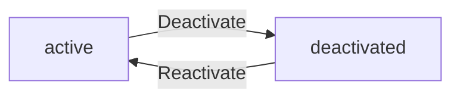
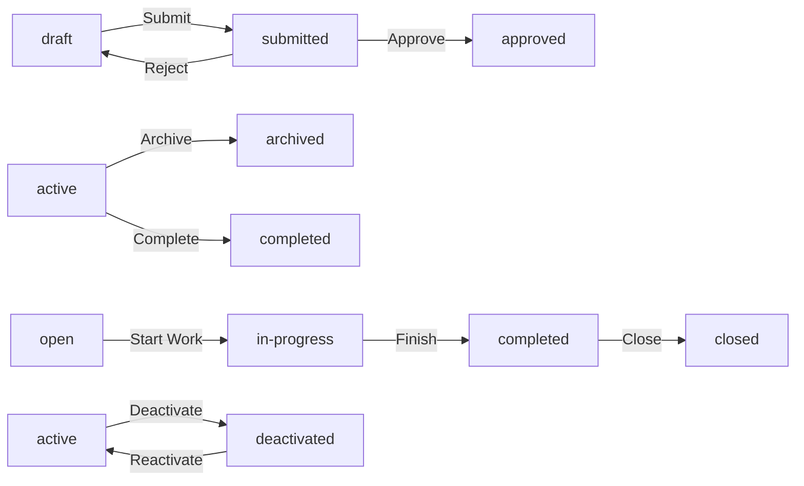

**hrmPlatform — Business concepts, relationships, and states from user perspective**

Business concepts, relationships, and states from user perspective

# Domain Concepts

Describe what each concept means in the business domain and its key attributes.

## Organization Concept

An Organization represents a tenant entity in the multi-tenancy platform, operating independently with its own employees, projects, and data. Each organization has a name that identifies it within the platform. A description provides context about the organization's purpose or business. A logo image serves as visual branding for the organization interface. The currency setting defines the monetary unit used for financial calculations such as pay rates. The timezone configuration ensures consistent time-based operations across all employees. The fiscal start month establishes the organization's financial year beginning for reporting purposes. Organizations are created during user initial sign-up and serve as the primary data isolation boundary. All employees, projects, tasks, timelogs, and timesheets belong to exactly one organization. Data is strictly isolated per organization, preventing cross-organization visibility.

### Multi-Tenancy Organization Entity

The platform operates as a multi-tenancy system where each organization functions as an independent tenant entity. An organization represents a complete business unit that operates separately from all other organizations on the platform. Each organization maintains its own set of employees, projects, departments, roles, and all associated data. Organizations are completely isolated from one another, forming a strict data isolation boundary. Employees belonging to one organization cannot access or view data from any other organization. Users who belong to multiple organizations can only see data for their currently selected organization context. All business entities including employees, projects, tasks, timelogs, and timesheets belong to exactly one organization and cannot cross organizational boundaries. An organization is created when a user completes their initial sign-up to the platform, serving as the foundational container for all subsequent business entities.

### Organization Attributes

Each organization has a name that serves as its primary identifier within the platform. The organization name distinguishes it from other organizations and is displayed throughout the interface. A description provides context about the organization's purpose, business type, or operational focus. A logo image serves as visual branding and appears in the organization's interface header and communications. The currency setting defines the monetary unit used for all financial calculations within the organization, including employee pay rates and project budgets. Supported currencies include USD, EUR, KRW, and other standard currency codes. The timezone configuration establishes the organization's primary time reference for all time-based operations, ensuring consistent date and time handling across all employees. The fiscal start month determines when the organization's financial year begins, used for reporting and budget tracking purposes.

## User Concept

A User represents an individual account holder who can access the platform. Each user has an email address that serves as their unique identifier for authentication. A password secures the user account against unauthorized access. The account status indicates whether the user account is active or deactivated. A single user can belong to multiple organizations simultaneously. When accessing the platform, users select which organization context to work within. All actions performed by a user are scoped to their currently selected organization. Users can switch between organizations without logging out. A user account remains even if their organization is deleted, but loses organization association. User accounts can be deleted only after transferring ownership or deleting associated organizations.

### User

A User represents an individual account holder who can access the platform. Each user is identified by an email address that serves as their unique identifier for authentication purposes. Access to the user account is secured by a password known only to the account holder.

The user account has a status that indicates whether the account is active or deactivated. An active account can access the platform, while a deactivated account cannot.

A single user can hold membership in multiple organizations simultaneously. When accessing the platform, the user selects which organization context to work within. All actions performed by the user are scoped to their currently selected organization, ensuring data isolation between organizations. The user can switch between organizations without logging out, maintaining their session while changing the organizational context.

The user account persists independently of any organization. If an organization is deleted, the user account remains but is no longer associated with that organization. A user account can be deleted only after addressing ownership constraints: if the user is the sole owner of an organization, they must either transfer ownership to another user or delete the organization before their account can be removed. When a user account is deleted, their employee records in other organizations are marked as deactivated rather than removed, preserving historical data integrity.

Note: User profile attributes (display name, avatar image, phone number) are defined in the UserProfile concept and are shared across all organizations the user belongs to.

## UserProfile Concept

A UserProfile represents the global identity information of a user across all organizations. The display name shows how the user appears to others in the platform. An avatar image provides visual representation of the user in interfaces. A phone number enables contact information for the user. The profile is shared across all organizations the user belongs to, ensuring consistent identity. Users can edit their profile information at any time. Profile changes reflect immediately across all organization contexts. The profile exists independently of any single organization membership. Display name appears in activity logs, task assignments, and timesheet reviews. Avatar image displays alongside user actions throughout the platform.

### UserProfile Definition and Attributes

A UserProfile represents the global identity information of a user across all organizations in the platform. Each user has exactly one profile that exists independently of any organization membership.

The profile contains three core attributes:
- Display name: The name that shows how the user appears to others throughout the platform
- Avatar image: A visual representation of the user displayed in interfaces
- Phone number: Contact information for the user

The display name appears in activity logs, task assignments, timesheet reviews, and all places where user identity is shown. The avatar image displays alongside user actions throughout the platform interfaces. The phone number enables contact with the user.

Users can edit their profile information at any time. Changes to the profile reflect immediately across all organization contexts the user belongs to.

### Cross-Organization Profile Behavior

The UserProfile is shared across all organizations the user belongs to, ensuring consistent user identity regardless of which organization context the user is working in.

The profile exists independently from any single organization membership. When a user joins a new organization or leaves an existing one, their profile remains unchanged. The profile is not tied to or affected by organization-specific data or settings.

This shared profile model ensures that a user's identity remains consistent whether they are viewing data in one organization or switching between multiple organizations. All users in any organization see the same display name and avatar for a given user account.

## Role Concept

A Role represents a set of permissions that define what actions an employee can perform within an organization. Each role has a name that identifies its purpose. A permissions set contains the specific capabilities granted to the role. The is built-in flag indicates whether the role is a system-defined role that cannot be deleted. Three built-in roles exist: Owner with full access to all features, Manager with employee and project management capabilities, and Employee with time tracking and self-view permissions. Custom roles can be created by organization owners with specific permission combinations. Each permission corresponds to a specific business capability like managing employees or viewing reports. Roles are assigned to employees to control their access level. The built-in flag protects core roles from accidental deletion.

### Role Definition and Attributes

A Role represents a set of permissions that define what actions an employee can perform within an organization. Each role has a name that serves as its identifier within the organization. The role name is visible to all organization members and indicates the role's purpose.

Each role contains a permission set that specifies the capabilities granted to employees assigned to that role. The permission set determines access to organization features such as managing employees, viewing projects, approving timesheets, and accessing reports.

A built-in flag indicates whether the role is a system-defined role that cannot be deleted. Built-in roles are protected from deletion to ensure core organizational functions remain available. Custom roles do not have this protection and can be deleted if no employees are assigned to them.

Roles serve as the primary access control mechanism within an organization. When an employee is assigned a role, they inherit all permissions defined in that role's permission set. Each employee holds exactly one role within an organization.

### Built-in Roles

Three built-in roles exist in every organization and cannot be deleted:

**Owner Role**: The Owner role has full access to all features within the organization. Owners can manage organization settings, manage all employees, create and edit custom roles, manage all projects and tasks, edit or delete any employee's timelogs, approve or reject timesheets, view all timelogs and timesheets, and access all organization reports. The Owner role is automatically assigned to the user who creates the organization.

**Manager Role**: The Manager role has capabilities to manage employees, projects, and time tracking operations. Managers can add, edit, and deactivate employees, view the employee list and details, create and edit projects and tasks, approve or reject timesheets, view all employees' timelogs and timesheets, and view organization reports. Managers cannot edit organization settings or manage custom roles.

**Employee Role**: The Employee role has basic access for time tracking and viewing personal data. Employees can track time by creating timelogs, submit timesheets for approval, view their own timelogs and timesheets, view their own contracts, and view projects they are assigned to. Employees cannot manage other employees, projects, or timesheets.

The built-in role protection ensures these three core roles always exist in the organization. Built-in roles cannot be deleted, but their permission sets are fixed and cannot be modified.

### Custom Roles

Organization owners can create custom roles to define specific permission combinations that do not match the built-in roles. Each custom role has a name chosen by the organization owner and a set of permissions selected from the available permission list.

Available permissions for custom roles include:
- Edit organization settings
- Add, edit, and deactivate employees
- View employee list and details
- Create, edit, and delete projects and tasks
- View projects and tasks
- Edit or delete any employee's timelogs
- Approve or reject timesheets
- View all employees' timelogs and timesheets
- View organization reports

Custom roles allow organization owners to create role permission combinations tailored to their organizational structure. For example, a custom role could have permission to view reports and manage projects without the ability to manage employees.

Organization owners can edit custom roles to change their name or permission set. Custom roles can be deleted only if no employees are currently assigned to them. If employees are assigned to a custom role, the role must be reassigned or the employees removed before deletion.

## Employee Concept

An Employee represents a person's membership and work relationship within a specific organization. Each employee has a reference to a user account that enables platform access. The role assignment determines what permissions the employee has within the organization. A department categorizes the employee within the organizational structure. A position or title describes the employee's job function. Employment type classifies the working arrangement as full-time, part-time, contractor, or intern. Status indicates whether the employee is active or deactivated. Deactivated employees cannot log time or submit timesheets but retain historical data. Each employee is assigned exactly one role within the organization. Employee records preserve historical timelogs and timesheets even after deactivation.

### Employee Definition and Attributes

An Employee represents a person's membership and work relationship within a specific organization. Each employee record belongs to exactly one organization and cannot exist independently.

Each employee has a reference to a user account that enables platform access. The user account provides authentication credentials and global profile information shared across all organizations the user belongs to.

Each employee is assigned exactly one role within the organization. The role determines what permissions and capabilities the employee has within that organization. Role assignment can be changed by users with employee management permissions.

An employee can be categorized under a department within the organizational structure. Department assignment is optional and can be changed. When a department is deleted, the employee's department assignment is cleared but the employee record remains.

An employee has a position or title that describes their job function within the organization. Position is optional and can be edited by users with employee management permissions.

Each employee has an employment type that classifies their working arrangement. The allowed employment types are: full-time, part-time, contractor, and intern. Employment type can be changed by users with employee management permissions.

### Employee Status and Deactivation

Each employee has a status that indicates their current state within the organization. The status can be either active or deactivated.

Active employees can log time, submit timesheets, and access features based on their role permissions.

Deactivated employees cannot log time or submit timesheets. Deactivated employees cannot access time tracking features. Deactivated employees retain access to view their historical data including past timelogs and timesheets.

When an employee is deactivated, all historical data is preserved. This includes all past timelogs, timesheets, contracts, task assignments, and project memberships. Historical records remain accessible for reporting and audit purposes.

Deactivated employees can be reactivated by users with employee management permissions. When reactivated, the employee regains full access to time tracking and timesheet submission features based on their role.

## Contract Concept

A Contract represents the employment terms agreement between an employee and the organization. Each contract has a start date that marks when the terms become effective. An end date indicates when the contract concludes, with null meaning ongoing employment. The pay rate specifies the monetary compensation amount. Pay period defines the compensation frequency as hourly, daily, weekly, or monthly. Working hours per week establishes the expected weekly commitment. Notes provide additional context or special terms for the contract. An employee can have multiple contracts over time as a historical record. Only one contract can be active at any given time. Past contracts remain immutable as historical records of employment terms.

### Contract Definition and Attributes

A Contract represents the employment terms agreement between an employee and the organization. Each contract defines the compensation and working conditions for an employee.

The contract start date marks when the employment terms become effective. This date is required for every contract.

The contract end date indicates when the contract concludes. When the end date is not specified, it means the employment is ongoing with no predetermined conclusion.

The contract pay rate specifies the monetary compensation amount as a numeric value. This is required for every contract.

The pay period defines the compensation frequency and must be one of: hourly, daily, weekly, or monthly.

Working hours per week establishes the expected weekly time commitment for the employee. This is required for every contract.

Contract notes provide optional additional context or special terms for the employment agreement.

### Contract Lifecycle Rules

An employee can have multiple contracts over time, creating a historical record of employment terms as they change.

Only one contract can be active at any given time for an employee. When a new contract is created, the previous active contract automatically ends.

Past contracts remain immutable as historical records. Once a contract is no longer active, its terms cannot be edited or modified.

## Department Concept

A Department represents an organizational unit for grouping employees within the company structure. Each department has a name that identifies it within the organization. A description provides context about the department's function or purpose. An optional parent department enables one level of hierarchical nesting. Departments help categorize employees for reporting and organizational clarity. Employees can be assigned to departments for structural organization. Deleting a department sets employees' department assignment to null without affecting employee records. Departments exist within a single organization's context. The one-level nesting limitation prevents deep hierarchical complexity. Department assignments appear in employee lists and filters.

### Department Definition and Attributes

A Department represents an organizational unit for grouping employees within the company structure. Each department exists within a single organization's context and cannot span multiple organizations.

The department name serves as the primary identifier that distinguishes it from other departments within the organization. The name must be unique within the organization.

A description provides context about the department's function or purpose, helping users understand the department's role within the organizational structure. The description is optional.

Departments help categorize employees for reporting and organizational clarity. Department assignments appear in employee lists and enable filtering by department in employee browsing views.

### Department Hierarchy

Departments support one level of hierarchical nesting through an optional parent department relationship. A department may have a parent department, enabling basic organizational structure grouping.

The hierarchy is limited to one level only — a department cannot have a grandparent department. This limitation prevents deep hierarchical complexity and maintains structural simplicity.

When viewing the department list, the parent-child relationship is displayed to show the organizational structure. Child departments are grouped under their parent department in the hierarchy view.

### Department Employee Association

Employees can be assigned to one department for structural organization. The department assignment categorizes the employee within the organizational structure and appears in the employee's record.

Department assignments enable reporting categorization, allowing time reports and activity summaries to be grouped by department. Users can filter employee lists by department to view members of specific organizational units.

When a department is deleted, all employees assigned to that department have their department assignment set to null. The deletion does not remove or deactivate employee records — employees remain active with no department association.

Departments exist independently of employee assignments. A department can exist with no employees assigned to it, and employees can exist without any department assignment.

## Project Concept

A Project represents a body of work or initiative that employees contribute time toward. Each project has a name that identifies the work initiative. A description provides context about the project's goals or scope. A color code enables visual identification in user interfaces. Status indicates the project state as active, archived, or completed. Budget hours specify the total estimated hours allocated to the project. Start date marks when the project begins. End date indicates the planned project completion. Archived or completed projects preserve existing timelogs but cannot receive new ones. Projects serve as the primary container for tasks and timelog tracking.

### Project Definition and Identity

A Project represents a body of work or initiative that employees contribute time toward. Each project serves as a container for organizing related tasks and timelogs within an organization.

Every project has a name that uniquely identifies the work initiative. A description provides context about the project's objectives or scope. A color code enables visual identification in user interfaces, allowing users to quickly recognize projects in lists and reports.

A project belongs to one organization and cannot be shared across organizations. Multiple employees can be assigned to the same project.

### Project Status and Timeline

Each project has a status indicating its lifecycle stage. The available statuses are:

- Active: The project is ongoing and can receive new timelogs and tasks
- Archived: The project is preserved for historical reference but cannot receive new timelogs
- Completed: The project is finished and cannot receive new timelogs

A project may have a start date marking when the project begins. A project may have an end date indicating the planned completion date. Both dates are optional.

A project may have budget hours specifying the total estimated hours allocated to the project. This represents the planned time investment for the project.

### Project Timelog and Task Relationship

When a project is archived or completed, all existing timelogs remain accessible and are not deleted. The timelogs retain their association with the project for historical reporting and cannot be added to after the project leaves active status.

Each project serves as a container for tasks. Tasks are created within and belong to a specific project. Tasks cannot exist independently without a parent project. A project can have multiple tasks, and each task belongs to exactly one project.

Timelogs are recorded against a project. Each timelog must reference a project that the employee is assigned to. A project can have many timelogs from multiple employees.

## ProjectMember Concept

A ProjectMember represents an employee's assignment to a specific project. Each membership links an employee to a project they can contribute to. The assigned role indicates whether the member is a regular member or project-lead. Project leads can manage tasks within their assigned project. A joined date records when the employee was assigned to the project. An employee can be assigned to multiple projects simultaneously. Membership enables the employee to log time against the project. Project members can view tasks within their assigned projects. The assigned role determines task management capabilities. Membership records persist even after project completion or archiving.

### ProjectMember Definition and Assignment

A ProjectMember represents an employee's assignment to a specific project within the organization. Each project membership creates a link between an employee and a project they are authorized to contribute to.

When an employee is assigned to a project, the system records the joined date indicating when the assignment occurred. An employee can be assigned to multiple projects simultaneously, allowing them to contribute work across different initiatives.

Project membership is a prerequisite for time logging against a project. Only employees who are project members can log time entries for that project. The membership record persists even after the project is archived or completed, preserving the historical association between the employee and the project.

### ProjectMember Roles and Task Capabilities

Each project membership has an assigned role that determines the member's capabilities within the project. There are two role types: member and project-lead.

A member is a regular project participant who can view tasks within their assigned projects and log time against the project. Members can see all tasks in projects they are assigned to.

A project-lead has elevated capabilities within their assigned project. Project leads can manage tasks within their project, including creating new tasks and editing existing tasks. The assigned role determines what task management actions the member can perform.

Task visibility is granted to all project members regardless of role. Any employee assigned to a project can view the tasks within that project. Role-based capabilities only affect task management operations, not task visibility.

### ProjectMember Lifecycle

Project membership enables time logging eligibility for the assigned project. An employee must be a project member to create timelogs against that project. This eligibility is automatically granted when the employee is assigned to the project and revoked when removed from the project.

Membership records persist after project completion or archiving. When a project transitions to archived or completed status, existing project memberships are not deleted. The historical association between employees and the project is preserved for reporting and audit purposes.

Project membership is independent of employee status. If an employee is deactivated, their project memberships remain in the system but they lose time logging eligibility due to their deactivated status, not due to membership removal.

## Task Concept

A Task represents a specific unit of work within a project. Each task has a title that describes the work to be done. A description provides additional details about the task requirements. Status tracks the task state as open, in-progress, completed, or closed. Priority indicates importance level as low, medium, high, or urgent. Estimated hours specify the expected effort required. Due date marks when the task should be completed. An assigned employee identifies who is responsible for the task, who must be a project member. A parent task enables one level of subtask nesting. Tasks belong to exactly one project and support time tracking.

### Task Definition and Attributes

A Task represents a specific unit of work within a project. Each task has a title that describes the work to be done and an optional description that provides additional requirements details. Status tracks the task state as open, in-progress, completed, or closed. Priority indicates importance level as low, medium, high, or urgent. Estimated hours specify the expected effort required to complete the task. Due date marks when the task should be completed. An assigned employee identifies who is responsible for the task, who must be a project member. Tasks belong to exactly one project.

### Task Subtask Hierarchy

Tasks support one level of subtask nesting through parent task relationships. A parent task can have multiple subtasks, but subtasks cannot have their own subtasks. This one level subtask hierarchy enables work breakdown while maintaining simplicity. Each subtask references its parent task and inherits project membership requirements.

## TaskHistory Concept

A TaskHistory represents an audit record of status changes for a task. Each entry has a timestamp marking when the change occurred. The old status records what the task status was before the change. The new status records what the task status became after the change. The user who made the change is recorded for accountability. Task history entries are created automatically when task status changes. The history provides a complete audit trail of task progression. Each task can have multiple history entries over its lifetime. History entries are immutable once created. The audit trail supports tracking task workflow and accountability.

### Task History Purpose and Audit Trail

Task history provides a complete audit trail of task status changes for workflow tracking and accountability. Each task status change is recorded as a history entry, creating a log of task progression over time. Multiple history entries can exist for a single task, documenting each status transition throughout the task lifetime. History entries are immutable once created, preserving an accurate record of all changes. The audit trail enables tracking how tasks move through their workflow from creation to completion. The complete audit trail supports accountability by maintaining a permanent record of all status changes.

### Task History Record Attributes

Each task history entry records the timestamp marking when the status change occurred. The old status documents what the task status was before the change. The new status documents what the task status became after the change. The user who made the change is recorded for accountability purposes. History entries are created automatically whenever a task status changes, requiring no manual intervention. Each entry captures the full context of the status transition for audit purposes.

## Timelog Concept

A Timelog represents a record of time spent by an employee on specific work. Each timelog has a date indicating when the work was performed. Duration in minutes specifies how long the work took. The project identifies which work initiative the time was spent on. A task optionally specifies which specific unit of work was addressed. A description explains what work was accomplished. The billable flag indicates whether the time can be charged to a client. Timelogs must reference a project the employee is assigned to. Tasks must belong to the selected project if specified. Timelogs serve as the foundation for timesheets and reporting.

### Timelog Core Attributes

A timelog is a record of time spent by an employee on specific work. Each timelog captures a single work session with the following attributes:

The work date indicates when the work was performed. This date is required for every timelog entry.

The duration specifies how long the work took, measured in minutes. This value is required and represents the actual time invested in the work.

The project identifies which work initiative the time was allocated to. Every timelog must reference a project to provide context for the work performed.

A task may optionally be specified to identify which specific unit of work within the project was addressed. When a task is specified, it provides finer granularity for tracking and reporting.

A work description explains what was accomplished during the time period. This description is optional and allows employees to document the nature of their work.

The billable flag indicates whether the time can be charged to a client. This flag defaults to true, meaning time is considered billable unless explicitly marked otherwise. Non-billable time may represent internal work, training, or administrative tasks.

### Timelog Project and Task Validation

Timelogs must reference valid projects and tasks within the organization context.

An employee can only log time to projects they are assigned to. This ensures employees cannot record time on projects they are not involved with. The system validates that the employee has project membership before allowing a timelog to be created.

When a task is specified on a timelog, the task must belong to the selected project. This validation ensures consistency between the project and task references. A timelog cannot reference a task from a different project than the one specified.

These validation rules maintain data integrity and ensure that time tracking accurately reflects the employee's actual work assignments.

### Timelog Business Purpose

Timelogs serve as the foundational data for timesheet compilation and organizational reporting.

Timelogs are aggregated into timesheets, which group time entries by week for approval workflows. Each timesheet collects all timelogs for an employee within a specific week period (Monday to Sunday).

Timelogs provide the raw data for all time-based reports in the organization. Reports such as time summaries, project budget tracking, and weekly summaries derive their metrics from timelog data. The billable flag enables separation of client-billable work from internal activities in reporting.

Historical timelogs are preserved even when employees are deactivated, ensuring accurate records for past work periods. This preservation supports auditing, historical reporting, and compliance requirements.

## Timesheet Concept

A Timesheet represents a weekly collection of timelogs submitted for approval. Each timesheet has an employee who owns the timesheet. Week start date marks the Monday beginning the timesheet period. Week end date marks the Sunday concluding the timesheet period. Status indicates the approval state as draft, submitted, approved, or rejected. Total hours is calculated from all included timelogs. Submitted at records when the employee submitted for approval. Reviewed at records when approval or rejection occurred. Reviewed by identifies who made the approval decision. Rejection reason provides explanation when timesheets are rejected.

### Timesheet Definition and Weekly Period

A timesheet represents a weekly collection of timelogs grouped together for approval purposes. Each timesheet has exactly one employee who owns the timesheet as its creator and submitter. The timesheet period follows a fixed weekly boundary where the week start date marks the Monday beginning the timesheet period and the week end date marks the Sunday concluding the timesheet period. All timelogs included in a timesheet must fall within this Monday to Sunday date range. An employee can have only one timesheet per week period.

### Timesheet Status and Approval Tracking

Each timesheet has a status that indicates its approval state. The available status values are draft, submitted, approved, and rejected. A timesheet in draft status is being prepared by the employee and can be modified. A timesheet in submitted status is awaiting review and approval. A timesheet in approved status has been accepted by an approver. A timesheet in rejected status was declined and returned to the employee for correction. The total hours on a timesheet is calculated automatically from all included timelogs. The submitted at timestamp records when the employee submitted the timesheet for approval. The reviewed at timestamp records when an approver approved or rejected the timesheet. The reviewed by field identifies which user made the approval or rejection decision. When a timesheet is rejected, a rejection reason explanation is required to inform the employee why the timesheet was not approved.

## Timer Concept

A Timer represents an active real-time time tracking session. Each timer has a start timestamp marking when tracking began. The project identifies which work initiative is being tracked. A task optionally specifies which specific work unit is in progress. A description explains what work is being performed. Each employee can have at most one active timer at a time. The timer continues running until explicitly stopped by the employee. When stopped, the timer creates a timelog with calculated duration. Duration is rounded to the nearest minute upon timer completion. The timer enables live tracking without manual duration entry.

### Timer Definition and Attributes

A Timer represents an active real-time tracking session initiated by an employee. The timer start timestamp records the exact moment when time tracking began. The active timer project identifies which work initiative is being tracked during the session. An optional timer task may be specified to indicate which specific work unit is in progress. A timer work description explains what work is being performed during the tracking session. These attributes enable employees to track time live without manual duration entry.

### Timer Lifecycle and Constraints

Each employee can have at most one active timer at a time, enforcing a single active timer per employee constraint. This prevents conflicting time tracking sessions. The timer continues running indefinitely until explicitly stopped by the employee, with no automatic stop mechanism. This timer indefinite running behavior means employees must manually stop their timer when work ends.

### Timer Completion Behavior

When an employee stops their timer, the timer stop creates timelog action generates a new timelog record. The duration rounding to minute rule applies, where the calculated duration is rounded to the nearest minute. This timer completion behavior enables live tracking without manual entry, as the system automatically calculates the time spent based on the start timestamp and stop moment.

## ActivityLog Concept

An ActivityLog represents an audit record of significant actions within the organization. Each entry has a timestamp marking when the action occurred. The user who performed the action is recorded for accountability. Action type categorizes what kind of action was taken. Target entity identifies what was affected by the action. Details provide additional context about the action. Logged actions include employee invitations, contract changes, project modifications, task status changes, timesheet approvals, and role assignments. The activity log provides a complete organizational audit trail. Entries are created automatically when significant actions occur. The log supports compliance and operational transparency.

### ActivityLog Definition

An ActivityLog represents an audit record of significant actions within the organization. Each entry captures a timestamp marking when the action occurred. The user who performed the action is recorded for accountability purposes. Action type categorizes what kind of action was taken, such as employee management, contract modifications, or timesheet approvals. Target entity identifies what was affected by the action, such as a specific employee, project, or timesheet. Details provide additional context about the action, including relevant information about what changed. The activity log serves as a complete organizational audit trail, automatically creating entries when significant actions occur. This provides compliance support and operational transparency across the organization.

### Logged Actions

The system records significant actions as activity log entries. Employee invitation logging captures when employees are invited, deactivated, or reactivated. Contract change recording tracks when contracts are created or edited. Timesheet approval tracking records when timesheets are submitted, approved, or rejected. Task status changes are logged with details of the transition. Project modifications including creation, archival, completion, and deletion are recorded. Role assignments and changes are tracked for accountability. All logged actions include the timestamp, the user who performed the action, the action type, the target entity affected, and contextual details. Users with organization management permissions can view the full activity log to maintain oversight of organizational activities.

# Domain Relationships

Describe how concepts relate to each other from a business perspective.

## Conceptual Relationships

Describe how concepts relate to each other in business terms.

### Organization Relationship Model

The Organization is the central container that establishes multi-tenancy boundaries. Each Organization has many Users as members, has many Employees, has many Projects, has many Departments, and has many Roles.

All data belongs-to exactly one Organization. Users can belong-to multiple Organizations simultaneously, but all actions are scoped to one selected Organization at a time.

When an Organization is deleted, all entities that belong-to it (Employees, Projects, Departments, Roles, Timelogs, Timesheets, Tasks, Activity Logs) are permanently deleted. User accounts remain but lose their association with the deleted Organization.

### User and Employee Association

A User account exists globally across the platform. An Employee record represents a User's membership within a specific Organization.

Each Employee belongs-to one Organization and references one User account. A User can have many Employee records across different Organizations.

The Employee entity serves as the association link between a User and an Organization. Each Employee is assigned exactly one Role within that Organization. The Employee has many Contracts (employment terms) and is assigned to many Projects.

When a User deletes their account, their Employee records in other Organizations are marked as deactivated rather than deleted, preserving historical data.

### Role and Permission Assignment

Each Role belongs-to one Organization and defines a set of permissions. Each Employee is assigned exactly one Role.

Built-in Roles (Owner, Manager, Employee) exist in every Organization and cannot be deleted. Custom Roles can be created by Organization Owners and belong-to the creating Organization.

Role assignment establishes what actions an Employee can perform. The relationship between Role and Employee is one-to-many: one Role can be assigned to many Employees, but each Employee has exactly one Role at a time.

### Project and Task Hierarchy

Each Project belongs-to one Organization. A Project has many Tasks and has many ProjectMembers.

Each Task belongs-to one Project. A Task can have one parent Task (subtask relationship), supporting one level of nesting. A Task is optionally assigned to one Employee who must be a ProjectMember of the parent Project.

Each ProjectMember represents an association between one Employee and one Project. The ProjectMember has an assigned role (member or project-lead). An Employee can be a ProjectMember of many Projects.

Project leads (Employees with project-lead role) can manage Tasks within their Project. TaskHistory records belong-to one Task and document status changes.

### Time Tracking Ownership

Each Timelog belongs-to one Employee who performed the work. A Timelog references one Project and optionally references one Task that belongs-to that Project.

A Timesheet belongs-to one Employee and includes many Timelogs for a specific week. The Timesheet is owned by the Employee and submitted for review.

Each Timer belongs-to one Employee and represents an active time tracking session. An Employee can have at most one active Timer at a time.

Timelogs included in an approved Timesheet become locked and cannot be edited or deleted, establishing an ownership chain from Employee to Timelog to Timesheet.

### Department and Contract Relationships

Each Department belongs-to one Organization. A Department can have one parent Department, establishing a one-level hierarchy. Many Employees can belong-to the same Department.

Each Contract belongs-to one Employee and records employment terms. An Employee can have many Contracts over time, but only one Contract can be active at any given time. Creating a new Contract automatically ends the previous active Contract.

Past Contracts are immutable historical records. The relationship between Employee and Contract is one-to-many, with temporal exclusivity for active Contracts.

## Lifecycle and Retention

Describe concept lifecycle states and transitions only. Detailed retention/recovery policies belong in 05-non-functional. Operation details belong in 03-functional-requirements.

### Entity Lifecycle States

Each business concept follows a lifecycle with defined states and transitions.

**Organization Lifecycle**:
An organization is created when a user completes initial sign-up. The organization remains active while it has employees and unresolved timesheets. An organization transitions to deleted when the owner deletes it after resolving all pending timesheets and ending all active employee contracts.

**Employee Lifecycle**:
An employee record is created when a user is invited to or added to an organization. The employee status transitions between active and deactivated. A deactivated employee cannot log time or submit timesheets but historical data is preserved. A deactivated employee can transition back to active status.

**Contract Lifecycle**:
A contract becomes active on its start date. Only one contract can be active per employee at any time. When a new contract is created, the previous active contract automatically ends the day before the new contract starts. Past contracts are immutable historical records.

**Project Lifecycle**:
A project starts as active when created. A project can transition to archived or completed status. Archived and completed projects cannot receive new timelogs but existing timelogs are preserved.

**Task Lifecycle**:
A task is created with status open. Task status can transition through in-progress, completed, and closed. Each status change is recorded in task history with timestamp, old status, new status, and the user who made the change.

**Timesheet Lifecycle**:
A timesheet is created as draft for a specific week. An employee can submit a draft timesheet for approval. A submitted timesheet can transition to approved or rejected. Approved timesheets lock all included timelogs. Rejected timesheets return to draft status and can be modified and resubmitted.

**Timelog Lifecycle**:
A timelog is created when an employee logs time or stops a timer. A timelog can be edited or deleted by its owner only if it is not part of an approved timesheet. Timelogs in submitted or approved timesheets cannot be deleted.

**Timer Lifecycle**:
A timer starts when an employee initiates time tracking. A timer can be stopped to create a timelog with calculated duration. A timer can be discarded without creating a timelog record. Each employee can have at most one active timer at a time.

### Data Preservation and Deletion

Data preservation ensures historical records remain available for reporting and audit purposes. Deletion permanently removes data under specific business conditions.

**Retention Through Status Changes**:
When an employee is deactivated, all historical timelogs, timesheets, and contracts are preserved. The employee record remains in the system and can be reactivated. When a project is archived or completed, all existing timelogs on the project are preserved and remain accessible for reporting. When a contract ends, it becomes an immutable historical record that cannot be edited but remains viewable.

**Timesheet Finalization as Preservation**:
When a timesheet is approved, all included timelogs are locked and cannot be edited or deleted. This preserves the time records for that week as a finalized business record. Rejected timesheets return to draft status, preserving the timelogs for modification and resubmission.

**Task History Preservation**:
All task status changes are recorded in task history. Task history entries are never deleted and provide a complete audit trail of task progression from creation through closure.

**Activity Log Preservation**:
Significant actions are recorded as activity log entries. Activity log entries are never deleted and provide a complete audit trail of organizational changes including employee invitations, deactivations, contract changes, project status changes, task status changes, timesheet approvals, and role assignments.

**Organization Deletion**:
An organization owner can delete their organization only when all pending timesheets are resolved and there are no active employee contracts. When an organization is deleted, all employees, projects, tasks, timelogs, and timesheets associated with that organization are permanently deleted. The owner's user account remains but is no longer associated with any organization.

**Project Deletion**:
Users with project management permission can delete a project only if the project has no timelogs associated with it. Projects with existing timelogs cannot be deleted to preserve time tracking history.

**Department Deletion**:
Users with organization management permission can delete departments. Deleting a department sets all employees' department assignments to null. Employees are not deleted when their department is deleted.

**Custom Role Deletion**:
Organization owners can delete custom roles only if no employees are currently assigned to that role. Built-in roles cannot be deleted.

**User Account Deletion**:
A user can delete their account if they are not the sole owner of any organization. If they are the sole owner, they must transfer ownership or delete the organization first. When a user deletes their account, their employee records in other organizations are marked as deactivated rather than deleted, preserving historical data integrity.

**Timelog Deletion**:
Employees can delete their own timelogs only if the timelog is not part of any submitted or approved timesheet. Users with time management permission can delete any employee's timelogs subject to the same timesheet constraints.

### Restoration Capabilities

Restoration allows previously changed data to be returned to a prior state through defined business processes.

**Employee Reactivation**:
A deactivated employee can be reactivated to active status. When reactivated, the employee regains the ability to log time and submit timesheets. All historical data from when the employee was previously active remains accessible. The employee retains their department, position, and role assignments from before deactivation.

**Timesheet Resubmission**:
A rejected timesheet returns to draft status and can be modified and resubmitted. The employee can add or remove timelogs from the rejected timesheet before resubmission. The timesheet retains its original week period and employee association through the rejection and resubmission process.

**Timer Discard and Restart**:
An employee can discard a running timer without creating a timelog record. The employee can then start a new timer to begin tracking time again. Discarding a timer does not create any permanent record of the abandoned tracking session.

**Task Status Reversal**:
Task status can transition forward or backward through the defined states (open, in-progress, completed, closed). Each status change is recorded in task history. A task can be reopened from closed status if needed, with the status change recorded in history.

**Contract Continuation**:
When a contract with an end date reaches that date, a new contract can be created to continue the employment relationship. The new contract starts the day after the previous contract ends, creating a continuous employment record. Multiple sequential contracts for the same employee preserve the complete employment history.

**Department Reassignment**:
When a department is deleted, employees' department assignments are set to null. Employees can be reassigned to a new or existing department through employee record editing. The employee record is not lost when the department is deleted.

**Role Reassignment**:
An employee's role assignment can be changed by users with employee management permission. The employee retains all historical data (timelogs, timesheets, contracts) when their role is changed. Role changes are recorded in the activity log.

**User Account Recovery**:
A user who deletes their account cannot recover that account. The user must create a new account if they wish to use the platform again. Employee records associated with the deleted account remain as deactivated records in their respective organizations, preserving organizational data integrity.

# Business Categories and State Flows

Business category classifications and state flow definitions.

## Business Category Definitions

Define all business category classifications with their allowed values and descriptions.

### Business Category Classification Framework

The system uses business category classifications to standardize how entities are categorized and tracked across the organization. Each classification type has a fixed set of allowed values that cannot be extended or modified by users.

**Classification Types**:

- **Employment Type Classification**: Categorizes employees by work arrangement (full-time, part-time, contractor, intern). Defined in Employee Concept.

- **Status Type Classifications**: Track the lifecycle state of entities. Each entity type has its own status type:
  - Employee Status: active, deactivated (defined in Employee Concept)
  - Project Status: active, archived, completed (defined in Project Concept)
  - Task Status: open, in-progress, completed, closed (defined in Task Concept)
  - Timesheet Status: draft, submitted, approved, rejected (defined in Timesheet Concept)

- **Priority Classification**: Indicates task urgency or importance levels (low, medium, high, urgent). Defined in Task Concept.

- **Pay Period Classification**: Defines how employees are compensated (hourly, daily, weekly, monthly). Defined in Contract Concept.

- **Role Classification**: Defines responsibilities within a project context (member, project-lead). Defined in ProjectMember Concept.

Each classification serves a specific business purpose. Status types control what actions can be performed on an entity. Priority classifications help users identify work requiring immediate attention. Role classifications determine task management responsibilities.

### Status Type State Transitions

Status types define valid state transitions for entities throughout their lifecycle. The following diagram illustrates the primary status flows:

**Timesheet Status Flow**: Timesheets progress from draft to submitted, then to either approved or rejected. Rejected timesheets return to draft status for correction. Approved timesheets lock all included timelogs.

**Project Status Flow**: Projects transition from active to either archived or completed. Archived and completed projects cannot receive new timelogs.

**Task Status Flow**: Tasks progress from open through in-progress to completed, and optionally to closed.

**Employee Status Flow**: Employees transition between active and deactivated. Deactivated employees cannot log time or submit timesheets but retain historical data.

## State Transitions

Define valid state transition paths for stateful concepts.

### Project Status Transitions

A project starts in active status when created.

An active project can be archived by users with project management permissions.

An active project can be marked as completed by users with project management permissions.

An archived project cannot receive new timelogs.

A completed project cannot receive new timelogs.

Existing timelogs on archived or completed projects are preserved.

A project cannot transition directly from archived to completed or from completed to archived.

### Task Status Transitions

A task starts in open status when created.

A task can transition from open to in-progress when work begins.

A task can transition from in-progress to completed when work is finished.

A task can transition from completed to closed when formally closed.

A task can transition from open directly to completed.

A task can transition from in-progress back to open if work is paused.

Each task status change is recorded in the task history with the timestamp, old status, new status, and the user who made the change.

Task status changes can be made by project leads for tasks in their project or by users with project management permissions for any task.

### Timesheet Status Transitions

A timesheet starts in draft status when created for a specific week.

A draft timesheet can be submitted by the employee for approval.

A timesheet cannot be submitted if it has no timelogs.

A timesheet cannot be submitted if another timesheet for the same week is already submitted or approved.

A submitted timesheet can be approved by users with time approval permissions.

A submitted timesheet can be rejected by users with time approval permissions with a rejection reason.

An approved timesheet locks all included timelogs, preventing edits or deletions.

A rejected timesheet returns to draft status, allowing the employee to modify and resubmit.

A timesheet cannot transition directly from draft to approved or from draft to rejected without submission.

### Employee Status Transitions

An employee starts in active status when added to an organization.

An active employee can be deactivated by users with employee management permissions.

A deactivated employee cannot log time or submit timesheets.

A deactivated employee's historical data including timelogs and timesheets is preserved.

A deactivated employee can be reactivated by users with employee management permissions.

A reactivated employee returns to active status and can log time and submit timesheets again.