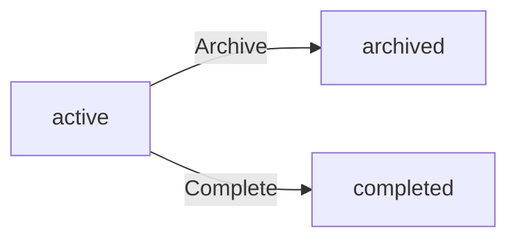
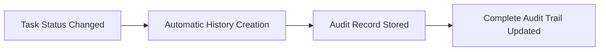
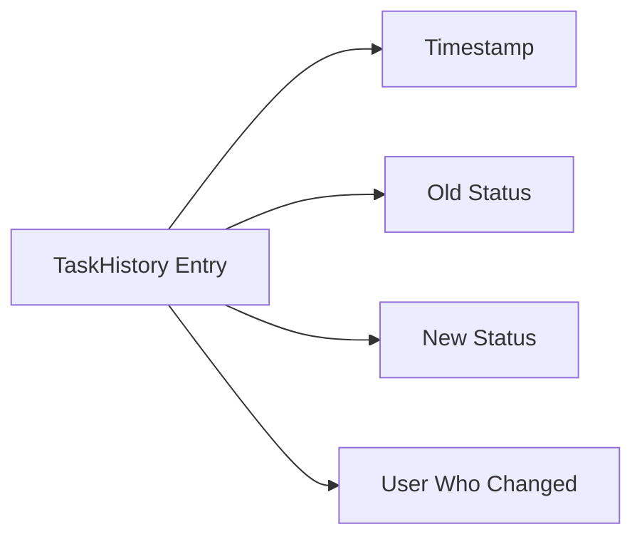
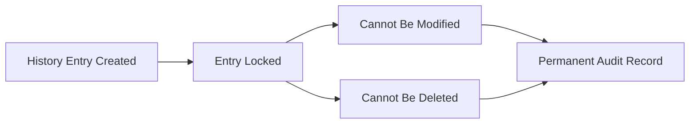
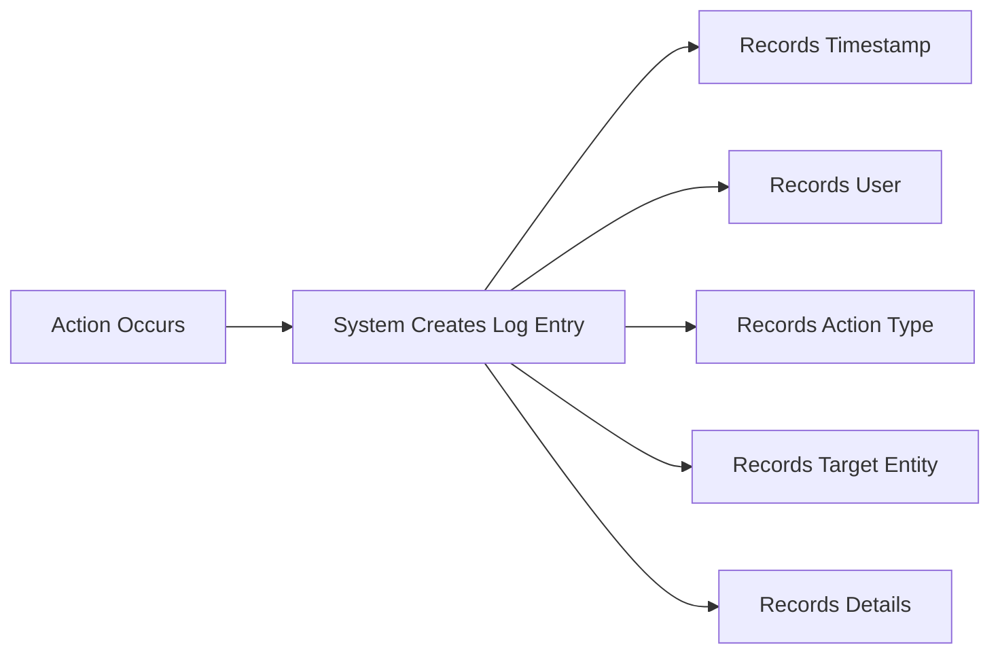
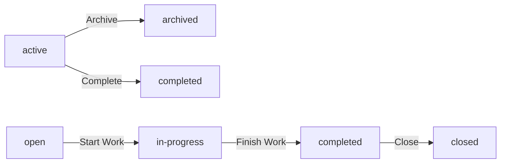
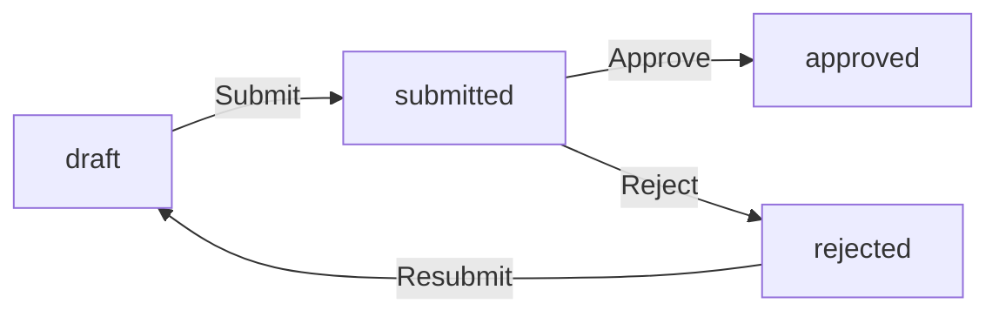
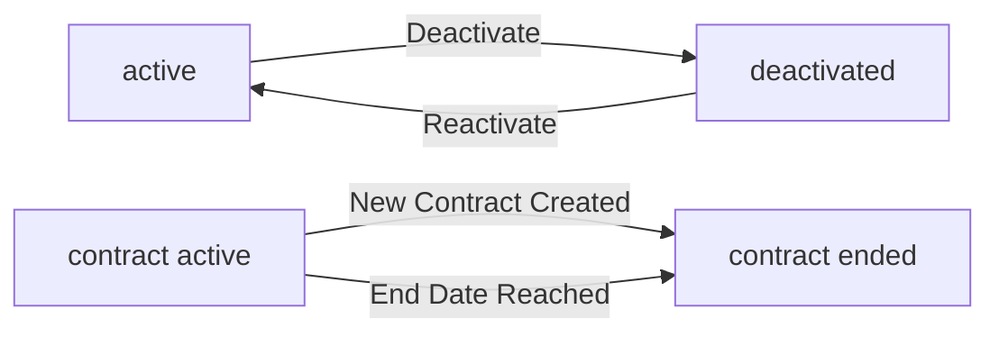

**hrmPlatform — Business concepts, relationships, and states from user perspective**

Business concepts, relationships, and states from user perspective

# Domain Concepts

Describe what each concept means in the business domain and its key attributes.

## Organization Concept

An Organization represents a distinct business entity within the multi-tenant platform, operating independently with its own employees, projects, and data. Each organization maintains complete data isolation, ensuring that information from one organization cannot be accessed by users from another. The organization is identified by a name and can include a description to provide context about the business. A logo image serves as visual branding for the organization interface. The organization defines its currency for financial calculations, such as USD, EUR, or KRW. A timezone setting ensures consistent date and time handling across all organization activities. The fiscal start month establishes the organization's financial year for reporting purposes. Organization settings including name, description, logo, currency, timezone, and fiscal start month can be edited by organization owners. All data including employees, projects, tasks, timelogs, and timesheets are scoped to and permanently deleted with the organization. Users can belong to multiple organizations but work within one selected organization context at a time.

### Organization as Multi-Tenant Entity

An Organization represents a distinct business entity within the multi-tenant platform, operating independently with its own employees, projects, and data. Each organization maintains complete data isolation, ensuring that information from one organization cannot be accessed by users from another organization. All data including employees, projects, tasks, timelogs, and timesheets are strictly scoped to the organization they belong to.

The organization is identified by a name (required) that distinguishes it within the platform. A description (optional) provides additional context about the business or organizational purpose. A logo image (optional) serves as visual branding displayed throughout the organization's interface.

The organization defines its currency (required) for financial calculations and compensation reporting, such as USD, EUR, or KRW. A timezone setting (required) ensures consistent date and time handling across all organization activities, including timesheet weeks and report generation. The fiscal start month (required) establishes the organization's financial year boundary for reporting and budget tracking purposes.

Users can belong to multiple organizations simultaneously, but each organization operates as an independent tenant with no shared data or configuration.

### Organization Lifecycle and Context

Organization settings including name, description, logo, currency, timezone, and fiscal start month can be edited by organization owners. These settings apply globally to all employees, projects, and activities within the organization.

When working on the platform, users select which organization context to operate within. All subsequent actions are scoped to the selected organization. Users can switch between organizations they belong to without logging out, but can only work within one organization context at a time.

Organization owners can delete their organization only when all pending timesheets are resolved (approved or rejected) and there are no active employee contracts. When an organization is deleted, all employees, projects, tasks, timelogs, and timesheets associated with that organization are permanently deleted. The owner's user account remains but is no longer associated with any organization.

If a user is the sole owner of an organization, they must transfer ownership or delete the organization before they can delete their own account.

## User Concept

A User represents an individual account holder in the platform with authentication credentials and personal profile information. Each user account is identified by a unique email address used for login and communication. The user secures their account with a password that can be changed as needed. A display name provides a human-readable identifier shown throughout the interface. An avatar image offers visual personalization of the user's profile. A phone number can be stored for contact purposes. The user profile is global and shared across all organizations the user belongs to. A single user can hold membership in multiple organizations simultaneously. When working in the platform, the user selects which organization context to operate within. All actions performed by the user are scoped to their currently selected organization. The user account persists independently even if removed from or if an organization they owned is deleted.

### User Account and Authentication

A User represents an individual account holder in the platform who accesses the system with authentication credentials. Each user is identified by a unique email address that serves as their login identifier. The email address must be unique across the entire platform and is used for authentication and communication purposes. The user secures their account with a password that is required for login. Users can change their password as needed to maintain account security. Authentication is performed using the email and password combination during login.

### User Profile Attributes

Each user has a global profile containing personal information that is shared across all organizations they belong to. The display name provides a human-readable identifier shown throughout the interface for personalization. An avatar image can be uploaded to offer visual personalization of the user's profile. A phone number can be stored in the profile for contact purposes. All profile attributes (display name, avatar image, phone number) are optional and can be edited by the user at any time. The profile is global, meaning changes to the profile are reflected across all organizations the user belongs to.

### Multi-Organization Membership

A single user can hold membership in multiple organizations simultaneously. When logging in, the user selects which organization context to operate within. All actions performed by the user are scoped to their currently selected organization. Users can switch between organizations without logging out. The user account persists independently even if removed from an organization or if an organization they owned is deleted. When an organization is deleted, the owner's account remains but is no longer associated with that organization. If a user is the sole owner of an organization, they must transfer ownership or delete the organization before deleting their account.

## Employee Concept

An Employee represents a person's membership and role within a specific organization. Each employee record links a user account to an organization with a specific role assignment. The employee is assigned exactly one role that determines their permissions within the organization. A department field optionally categorizes the employee within the organizational structure. A position or title field optionally describes the employee's job function. The employment type classifies the working relationship as full-time, part-time, contractor, or intern. The employee status indicates whether the record is active or deactivated. Active employees can log time, submit timesheets, and access organization features based on their role. Deactivated employees cannot log time or submit timesheets but retain their historical data. Historical timelogs and timesheets remain preserved even after deactivation. Deactivated employees can be reactivated to restore their access. The employee record serves as the foundation for contracts, project assignments, and time tracking.

### Employee as Organizational Membership

An employee represents a person's membership and role within a specific organization. Each employee record serves as the linkage between a user account and an organization, enabling the user to operate within that organization's context. A user can have multiple employee records across different organizations while maintaining a single global user profile. The employee status indicates whether the membership is active or deactivated. Active employees can log time, submit timesheets, and access organization features based on their assigned role. Deactivated employees cannot log time or submit timesheets but remain linked to their organization for historical record purposes.

### Employee Attributes and Classification

Each employee record includes optional department and position fields for organizational structure. The department field categorizes the employee within a specific organizational unit, which may have a parent department for one level of nesting. The position or title field optionally describes the employee's job function or role description. The employment type classifies the working relationship into one of four categories: full-time, part-time, contractor, or intern. This classification supports organizational reporting and contract management.

### Role Assignment and Permissions

Each employee is assigned exactly one role within their organization. The assigned role determines the employee's permissions and access to organization features. Built-in roles include owner with full access, manager with oversight capabilities, and employee with standard access. Organization owners can create custom roles with specific permission sets. The role assignment can be changed by users with employee management permission, allowing flexibility in organizational structure while maintaining the single role constraint per employee.

### Employee Status and Lifecycle

When an employee is deactivated, their historical data including timelogs and timesheets remains preserved in the system. Deactivated employees retain their employee record but lose the ability to perform time tracking or submit timesheets. The employee can be reactivated by users with employee management permission, restoring their ability to log time and submit timesheets. Reactivation preserves all historical data and restores the employee's previous role assignment and attributes. This ensures data integrity while supporting organizational changes such as leaves of absence, contractor offboarding, or employee rehiring.

## Role Concept

A Role defines a set of permissions that determine what actions an employee can perform within an organization. Each organization maintains its own set of roles independent from other organizations. Three built-in roles exist in every organization and cannot be deleted. The Owner role grants full access to all features including role and member management. The Manager role enables employee management, project oversight, timesheet approval, and report viewing. The Employee role provides basic access for time tracking, timesheet submission, and viewing personal data. Organization owners can create custom roles with specific permission combinations. Each custom role has a name that identifies its purpose within the organization. A custom role contains a set of permissions selected from available options. Available permissions cover organization management, employee management, project management, time management, and report viewing. Custom roles can be edited by organization owners to modify their permission sets. Custom roles can only be deleted if no employees are currently assigned to them. Role assignment determines an employee's capabilities throughout the organization.

### Role Definition and Purpose

A Role defines a set of permissions that determine what actions an employee can perform within an organization. Each organization maintains its own independent set of roles, ensuring complete isolation between organizations in the multi-tenant platform. Every role has a name that identifies its purpose within the organization, such as "Administrator", "Team Lead", or "Intern". The permission set associated with a role specifies which capabilities the role grants, covering areas such as organization management, employee management, project management, time tracking management, and report viewing. When an employee is assigned a role, they inherit all permissions defined by that role for the duration of their assignment.

### Built-in Roles

Every organization has three built-in roles that exist by default and cannot be deleted. The Owner role grants full access to all features within the organization, including the ability to manage roles, assign members, edit organization settings, and perform all other actions. The Manager role provides oversight capabilities including employee management, project management, timesheet approval, and report viewing. The Employee role provides basic access for individual contributors, enabling time tracking, timesheet submission, and viewing of personal data. These built-in roles are protected to ensure every organization maintains a minimum permission structure. The built-in roles cannot be deleted, renamed, or have their core permissions removed, though organization owners can create additional custom roles to supplement them.

### Custom Roles

Organization owners can create custom roles to define specific permission combinations tailored to their organizational needs. When creating a custom role, the owner provides a name that identifies the role's purpose and selects a combination of permissions from the available options. Available permissions include organization management, employee management and viewing, project management and viewing, time tracking management and approval, viewing all employee time data, and report viewing. Custom roles can be edited by organization owners to modify their permission sets as organizational needs change. A custom role can only be deleted if no employees are currently assigned to it, preventing accidental loss of access for active employees. When a custom role is deleted, employees previously assigned to that role must be reassigned to a different role before the deletion can proceed.

### Role Assignment

Each employee in an organization is assigned exactly one role that determines their capabilities throughout the organization. The role assignment links the employee record to a specific role within that organization. An employee's role can be changed by users who have the employee management permission, allowing organizations to adjust responsibilities as needed. When an employee's role is changed, their permissions update immediately to reflect the new role's permission set. An employee maintains the same role assignment until explicitly changed by an authorized user, regardless of changes to the role's underlying permissions. This ensures that role definitions can evolve without requiring reassignment of individual employees.

## Department Concept

A Department represents an organizational unit used to group employees within the organization structure. Each department has a name that identifies it within the organization. A description field optionally provides additional context about the department's function or purpose. Departments support one level of nesting through an optional parent department relationship. This hierarchical structure allows organizations to create main departments with sub-departments. Employees can be assigned to departments for organizational categorization. When a department is deleted, employee department assignments are set to null rather than deleting the employees. The department structure supports filtering and organizing the employee list. All employees in the organization can view the list of departments. Departments serve as a filtering criterion when viewing employee records. The department concept enables organizational structure without complex multi-level hierarchies.

### Department Definition and Structure

A Department represents an organizational unit used for grouping employees within the organization structure. Each department has a name that uniquely identifies it within the organization. An optional description field provides additional context about the department's function or purpose.

Departments support a hierarchical structure through an optional parent department relationship. This hierarchy is limited to one level of nesting, meaning a department can have a parent department, but cannot have nested sub-departments beyond that single level. This structure allows organizations to create main departments with sub-departments without complex multi-level hierarchies.

The department structure serves as an organizational categorization mechanism, enabling logical grouping of employees based on their function, team, or division within the organization. All employees in the organization can view the list of departments.

### Department Employee Assignment

Employees can be assigned to a department for organizational categorization. Each employee record includes an optional department assignment field. When an employee is assigned to a department, they become part of that organizational unit for filtering and reporting purposes.

When a department is deleted, the department assignment for all employees in that department is set to null. This action does not delete the employees or their records; it only removes the department categorization. The employees remain active in the organization with all other attributes preserved.

The department assignment enables filtering when viewing the employee list. Users can filter employees by department to view only those belonging to specific organizational units. This filtering capability supports organizational management and reporting needs.

## Contract Concept

A Contract represents the employment terms and compensation agreement for an employee within an organization. Each employee can have multiple contracts over time forming a historical record. Only one contract can be active for an employee at any given time. The start date marks when the contract terms become effective and is required. An end date optionally specifies when the contract concludes, with null indicating an ongoing contract. The pay rate defines the compensation amount as a numeric value. The pay period specifies how the employee is compensated as hourly, daily, weekly, or monthly. Working hours per week establishes the expected weekly commitment such as 40 hours. Optional notes field allows additional contract terms or conditions to be documented. Past contracts become immutable historical records that cannot be edited. The current active contract can be edited while it remains active. Creating a new contract automatically ends the previous active contract. Employees can view their own contracts and users with viewing permission can see any employee's contracts.

### Contract Definition and Purpose

A Contract represents the employment terms agreement between an employee and the organization. It defines the compensation structure and working conditions for a specific period. Each employee can have multiple contracts over time, forming a complete historical record of their employment terms. Only one contract can be active for an employee at any given time. When a new contract is created, it automatically ends the previous active contract, ensuring the single active contract rule is maintained.

### Contract Attributes

Each contract contains the following attributes that define the employment terms. The contract start date is required and marks when the contract terms become effective. The contract end date is optional, and when not specified (null), it serves as an ongoing contract indicator meaning the contract continues indefinitely. The pay rate amount is a required numeric value that defines the compensation. The pay period classification specifies how the employee is compensated and must be one of: hourly, daily, weekly, or monthly. Working hours per week is a required value that establishes the expected weekly commitment, such as 40 hours. Contract notes documentation is an optional field that allows additional terms or conditions to be recorded.

### Contract Lifecycle States

Contracts exist in two lifecycle states based on their temporal status. Past contracts become immutable historical records once they are no longer active, meaning they cannot be edited to preserve the accuracy of historical employment terms. The active contract is the current contract in effect for an employee, and active contract editing is permitted while the contract remains active. When a new contract is created with a start date, the previous active contract automatically transitions to an immutable past contract state.

## Project Concept

A Project represents a container for organized work within the organization. Each project has a name that identifies it and is required for creation. An optional description provides additional context about the project's purpose or scope. A color code is required and used for visual identification in the user interface. The project status indicates whether it is active, archived, or completed. Budget hours optionally define the total estimated hours allocated to the project. A start date optionally marks when the project begins. An end date optionally specifies when the project is expected to conclude. Active projects can receive new timelogs from assigned employees. Archived or completed projects cannot receive new timelogs but preserve existing timelog data. Projects can be deleted only if they have no associated timelogs. The project serves as the primary grouping for tasks and time tracking. Projects are displayed in a paginated list that can be filtered by status.

### Project Definition and Attributes

A Project represents a container for organized work within the organization. It serves as the primary grouping mechanism for tasks and time tracking activities.

Each project has a name that uniquely identifies it within the organization. The name is required when creating a project. An optional description provides additional context about the project's purpose, scope, or objectives.

A color code is required for each project and is used for visual identification in the user interface. This allows users to quickly distinguish between different projects when viewing lists, reports, or timelogs.

Budget hours optionally define the total estimated hours allocated to the project. This value is used for tracking project budget utilization and comparing planned versus actual effort.

A start date optionally marks when the project begins or is scheduled to begin. An end date optionally specifies when the project is expected to conclude. These dates help with project planning and timeline management but do not enforce any automatic status changes.

### Project Status and States

Each project has a status that indicates its current state in the project lifecycle. The status is required and can be one of three values: active, archived, or completed.

**Active** is the default status for newly created projects. Active projects can receive new timelogs from employees who are assigned to the project.

**Archived** indicates that the project is no longer actively worked on but is preserved for historical reference. Archived projects cannot receive new timelogs. All existing timelogs associated with the project are preserved and remain accessible for reporting purposes.

**Completed** indicates that the project has been finished. Like archived projects, completed projects cannot receive new timelogs but preserve all existing timelog data.

The distinction between archived and completed is organizational preference — both states prevent new time entries while maintaining historical data.

Employees can only log time to projects with active status. Attempts to log time to archived or completed projects are rejected.

### Project Deletion Rules

A project can be deleted only if it has no timelogs associated with it. This constraint ensures that time tracking data integrity is maintained and prevents accidental loss of historical work records.

If a project has one or more timelogs, it cannot be deleted. In such cases, the project should be archived or marked as completed instead, which preserves the timelog data while removing the project from active use.

Projects without any timelogs can be deleted regardless of their status (active, archived, or completed). When a project is deleted, all tasks associated with the project are also deleted.

## ProjectMember Concept

A ProjectMember represents the assignment of an employee to a specific project within the organization. Each project membership links an employee to a project they are authorized to work on. An employee can be assigned to multiple projects simultaneously. Each membership includes a role that is either member or project-lead. Project leads have additional capabilities to manage tasks within their assigned project. Regular members can contribute time and view project information based on their permissions. The project membership determines which projects an employee can log time against. Employees can view which projects they are assigned to. Project members can be removed from projects by users with project management permission. The membership relationship enables controlled access to project resources and tasks. Project assignment is a prerequisite for creating timelogs on that project.

### Project Member Assignment and Roles

A ProjectMember represents the assignment of an employee to a specific project within the organization. Each project membership creates a linkage between an employee and a project they are authorized to work on. An employee can have multiple project assignments simultaneously, allowing them to contribute to several projects within the organization.

Each project membership includes a role designation that is either member or project-lead. Regular members can contribute time to the project and view project information based on their organizational permissions. Project leads have additional capabilities to manage tasks within their assigned project, including creating tasks, editing task details, and updating task status. The role designation determines the employee's task management capability within that specific project.

The project membership relationship is established by users with project management permission. Each assignment is recorded as a distinct membership record linking the employee to the project.

### Project Access and Membership Lifecycle

Project membership serves as the project access authorization mechanism within the organization. An employee must be assigned as a project member to gain controlled project access and log time against that project. This timelog project eligibility ensures that only authorized employees can create time entries for a specific project.

Employees have project assignment visibility and can view which projects they are assigned to. The membership relationship enables access to project resources and tasks based on the employee's role designation.

Users with project management permission have membership removal capability and can remove employees from projects. When an employee is removed from a project, their access to that project's resources is revoked, and they can no longer create timelogs for that project. Historical timelogs created while the employee was a member remain preserved.

## Task Concept

A Task represents a specific unit of work within a project that can be tracked and managed. Each task has a required title that identifies the work to be done. An optional description provides additional details about the task requirements or context. The task status indicates progress as open, in-progress, completed, or closed. Priority classifies the task urgency as low, medium, high, or urgent. Estimated hours optionally define the expected effort required to complete the task. A due date optionally specifies when the task should be completed. An assigned employee optionally identifies who is responsible for the task and must be a project member. A parent task optionally links the task as a subtask with one level of nesting only. Tasks can be filtered by status, priority, and assigned employee. Tasks can be sorted by due date, priority, or creation date. Task status changes are recorded in the task history for audit purposes.

### Task Definition and Attributes

A Task represents a specific unit of work within a project that can be tracked and managed. Each task is identified by a required title that describes the work to be performed. An optional description provides additional context, requirements, or details about the task. The estimated hours attribute optionally defines the expected effort required to complete the task, used for planning and budget tracking. A due date optionally specifies when the task should be completed, enabling deadline management and prioritization.

### Task Status and Priority

Each task has a status that indicates its progress through the workflow. The status can be open when the task is ready to be worked on, in-progress when work has begun, completed when the work is finished, or closed when the task is finalized and no further action is needed. Task status changes are recorded in the task history for audit purposes. Each task also has a priority that classifies its urgency as low, medium, high, or urgent, enabling teams to focus on the most critical work first.

### Task Assignment and Organization

A task can be assigned to an employee who is responsible for completing it. The assigned employee must be a member of the project to which the task belongs. Tasks can be organized hierarchically through a parent task relationship, creating subtasks with one level of nesting only. Tasks can be filtered by status, priority, and assigned employee to find relevant work items. Tasks can be sorted by due date, priority, or creation date to organize the work queue according to different priorities.

## TaskHistory Concept

A TaskHistory represents an audit record of status changes made to a task over time. Each history entry captures a single status transition event for a task. The timestamp records when the status change occurred. The old status field documents what the task status was before the change. The new status field documents what the task status became after the change. The entry records which user made the status change. Task history entries are created automatically when task status is modified. The history provides a complete audit trail of task progression through its lifecycle. All status changes from open through in-progress to completed or closed are recorded. The task history enables tracking of who changed the status and when. Historical entries cannot be modified to preserve the integrity of the audit trail. Task history supports accountability and transparency in task management.

### TaskHistory as Audit Record

A TaskHistory entry serves as a status change audit record that captures each task transition event throughout the task lifecycle. When a task status is modified, the system performs automatic history creation without requiring manual intervention. Each entry represents a single transition from one status to another, such as moving from open to in-progress or from in-progress to completed.

The collection of TaskHistory entries for a task forms a complete audit trail that documents every status modification from creation through final closure. This audit trail enables stakeholders to review the full progression of a task and understand how it evolved over time.

### TaskHistory Data Attributes

Each TaskHistory entry records four essential pieces of information to document the status change event.

The change timestamp recording captures the exact date and time when the status modification occurred. This timestamp provides temporal context for when the transition happened.

The old status documentation preserves what the task status was before the change was made. This allows reviewers to understand the previous state of the task.

The new status documentation records what the task status became after the change. This shows the resulting state following the transition.

User change attribution identifies which user performed the status change. This links the action to a specific individual, establishing who made the modification. The attribution supports transparency and enables follow-up questions about the decision to change the status.

### TaskHistory Immutability and Lifecycle

TaskHistory entries support task lifecycle tracking by maintaining a permanent record of all status transitions. The status progression history shows the complete sequence of states the task has moved through, from initial open status through in-progress to final completion or closure.

Change accountability is enforced through the immutable nature of history entries. Once a TaskHistory record is created, it cannot be modified or deleted. This immutability ensures the integrity of the audit trail and prevents tampering with historical records.

The immutable history entries guarantee that the recorded progression remains accurate and trustworthy over time. Users can rely on the history to understand past decisions and track how tasks have been managed. This permanence supports compliance requirements and provides a definitive record for dispute resolution or performance review.

## Timelog Concept

A Timelog represents a recorded entry of time spent working on a specific project and optionally a task. Each timelog has a required date indicating when the work was performed. Duration in minutes is required and specifies how long the work took. The project field is required and must be a project the employee is assigned to. An optional task field links the timelog to a specific task within the selected project. An optional description field documents what work was accomplished during the logged time. The billable flag indicates whether the time is billable to a client with true as the default. Employees can only create timelogs for their own work records. Timelogs are displayed in a paginated list for review and analysis. Timelogs can be filtered by date range, project, task, and billable status. Timelogs serve as the foundational data for timesheets and time reports. Locked timelogs in approved timesheets cannot be edited or deleted.

### Time Entry Record Definition

A timelog represents a recorded entry of time spent working on a specific project. Each timelog serves as foundational data for timesheets and time reports, capturing individual work sessions for tracking and billing purposes.

Each timelog includes a required work date indicating when the work was performed. The duration in minutes specifies how long the work took and is required for every entry. An optional work description documents what was accomplished during the logged time, providing context for the time entry.

The billable flag indicator specifies whether the time is billable to a client, with true as the default value. This distinction supports financial reporting and client invoicing workflows.

Timelogs exist as part of a weekly collection in timesheets but maintain their identity as individual time entry records. When included in an approved timesheet, timelogs enter a protected state where they cannot be modified or removed.

### Project and Task Association

Each timelog must be associated with a project through the project assignment requirement. The selected project must be one the employee is assigned to, ensuring employees can only log time to projects they have access to.

Task linkage is optional. When specified, the timelog connects to a specific task within the selected project, providing granular tracking of work at the task level. The task must belong to the same project as the timelog.

Employee ownership restriction ensures that each timelog belongs to exactly one employee. The timelog records which employee performed the work, establishing clear attribution for time tracking, reporting, and timesheet submission purposes.

### Timelog List and Protection State

Timelogs are presented in a paginated timelog list for review and analysis. The paginated display supports efficient browsing of time entries across different time periods.

Timelog filtering options enable users to narrow the list by date range, project, task, and billable status. These filtering capabilities support targeted review of time entries for specific projects, periods, or billing categories.

Locked timelog protection applies when a timelog is included in an approved timesheet. In this protected state, the timelog cannot be edited or deleted, preserving the integrity of approved time records. Timelogs in draft or submitted timesheets remain editable until approval locks them.

## Timesheet Concept

A Timesheet represents a weekly collection of timelogs submitted for approval by an employee. Each timesheet is owned by a specific employee within the organization. The week start date marks the Monday beginning the timesheet period. The week end date marks the Sunday concluding the timesheet period. The status indicates the timesheet state as draft, submitted, approved, or rejected. Total hours are calculated automatically from the included timelogs. The submitted at timestamp records when the employee submitted the timesheet for approval. The reviewed at timestamp records when the timesheet was approved or rejected. The reviewed by field identifies which user approved or rejected the timesheet. A rejection reason is required text when a timesheet is rejected. Draft timesheets can have timelogs added or removed before submission. Approved timesheets lock all included timelogs from editing or deletion. Rejected timesheets return to draft status for modification and resubmission.

### Weekly Timelog Collection and Employee Ownership

A timesheet represents a weekly collection of timelogs grouped together for approval purposes. Each timesheet is owned by exactly one employee within the organization. The employee who owns the timesheet is the only person who can create draft timesheets and submit them for approval. All timelogs included in a timesheet must belong to the owning employee. An employee can have multiple timesheets across different weeks, but only one timesheet per week.

### Weekly Period Definition

Each timesheet covers a specific week period defined by a week start date and a week end date. The week start date always marks the Monday that begins the timesheet period. The week end date always marks the Sunday that concludes the timesheet period. This Monday-to-Sunday structure is fixed and cannot be customized. The weekly period determines which timelogs are eligible to be included in the timesheet.

### Timesheet Status States

A timesheet exists in one of four status states throughout its lifecycle. Draft status indicates the timesheet is being prepared and can be modified by the owning employee. Submitted status indicates the timesheet has been sent for approval and is awaiting review. Approved status indicates the timesheet has been accepted by a reviewer. Rejected status indicates the timesheet has been declined by a reviewer and requires modification. A timesheet transitions from draft to submitted when the employee submits it, from submitted to approved or rejected when reviewed, and from rejected back to draft when the employee modifies it for resubmission.

### Total Hours Calculation

The total hours on a timesheet are calculated automatically from all timelogs included in the timesheet. The system sums the duration of each timelog and converts the total minutes into hours. This calculation is performed whenever timelogs are added to or removed from a draft timesheet. The total hours value is read-only and cannot be manually edited. The calculated total hours are displayed on the timesheet for the employee and reviewer to see.

### Submission and Review Tracking

The system tracks when a timesheet is submitted and when it is reviewed through timestamps. The submission timestamp records the exact date and time when the employee submitted the timesheet for approval. The review timestamp records the exact date and time when a reviewer approved or rejected the timesheet. The reviewer identification field captures which user performed the approval or rejection action. Only users with timesheet approval permission can be recorded as the reviewer. These timestamps provide an audit trail of the timesheet approval process.

### Rejection Reason Requirement

When a timesheet is rejected, a rejection reason is required. The reviewer must provide text explaining why the timesheet was rejected. This rejection reason is stored with the timesheet record and is visible to the owning employee. The rejection reason helps the employee understand what needs to be corrected before resubmission. No rejection reason is required when approving a timesheet. The rejection reason field remains empty for timesheets that are approved or still in draft status.

### Approval Locking and Resubmission Capability

When a timesheet is approved, all timelogs included in that timesheet become locked. Locked timelogs cannot be edited or deleted by any user, including the owning employee. This locking ensures the approved record remains immutable. When a timesheet is rejected, it returns to draft status and the owning employee can modify it. The employee can add or remove timelogs from a rejected timesheet, edit timelog details, and resubmit the timesheet for approval. Resubmission follows the same process as the initial submission. A rejected timesheet can be resubmitted multiple times until it is approved.

## Timer Concept

A Timer represents a live time tracking session that records work duration in real-time. Each employee can have at most one active timer running at any given time. The started at timestamp records when the timer was initiated. The project field is required and specifies which project the time is being tracked against. An optional task field links the timer to a specific task within the project. An optional description field documents what work is being performed. The timer continues running indefinitely until the employee stops or discards it. There is no automatic stop feature if the employee forgets to stop the timer. Stopping the timer creates a timelog with the calculated duration rounded to the nearest minute. Discarding the timer ends the session without creating any timelog record. Employees can edit the description and project or task of a running timer. The timer provides real-time tracking convenience for employees who prefer not to manually enter time.

### Timer Definition and Attributes

A timer represents a live time tracking session that captures work duration in real-time. When an employee initiates a timer, the system records the start timestamp marking when the session began. The employee must select a project to associate with the timer, as project selection is required. Optionally, the employee can link the timer to a specific task within the selected project. An optional description field allows the employee to document what work is being performed during the tracking session. The timer provides a convenient way for employees to track time without manually entering duration estimates.

### Timer Lifecycle and Constraints

Each employee can have at most one active timer running at any given time, enforcing a single active timer limit. Once started, the timer continues running indefinitely until the employee manually stops or discards it. The system does not implement automatic stop functionality, meaning a forgotten timer will continue running until the employee takes action. While a timer is running, the employee can edit the description, project, or task association to correct or update the tracking information. The employee also has the option to discard the timer, which ends the session without creating any timelog record.

### Timer Completion and Timelog Creation

When an employee stops their timer, the system automatically creates a timelog entry with the calculated duration. The duration is computed from the start timestamp to the stop time and is rounded to the nearest minute. This timelog creation on stop ensures accurate time capture without manual duration entry. If the employee chooses to discard the timer instead of stopping it, no timelog is created and the tracking session is simply terminated.

## ActivityLog Concept

An ActivityLog represents a recorded entry of significant actions performed within the organization. Each activity log entry captures a single action event with full context. The timestamp records when the action occurred. The user field identifies who performed the action. The action type categorizes what kind of action was taken. The target entity specifies which entity or record the action affected. The details field provides additional context about the action. Logged actions include employee invitations, deactivations, and reactivations. Contract creation and editing actions are recorded for audit purposes. Project lifecycle actions including creation, archival, completion, and deletion are logged. Task status changes are recorded to track task progression. Timesheet workflow actions including submission, approval, and rejection are captured. Role assignment and changes are logged for security audit. The activity log is paginated and can be filtered by action type, user, and date range. Users with organization management permission can view the full activity log.

### ActivityLog Definition

An ActivityLog represents a recorded entry of significant actions performed within the organization. Each activity log entry captures a single action event with full context for audit and tracking purposes.

The timestamp records when the action occurred, providing a chronological record of all logged events. The user field identifies who performed the action, enabling user attribution for accountability. The action type categorizes what kind of action was taken, allowing classification and filtering of different event types. The target entity specifies which entity or record the action affected, linking the log entry to the relevant business object. The details field provides additional context about the action, capturing supplementary information relevant to the specific event.

### Logged Action Types

The system records various action types across different business entities to maintain a comprehensive audit trail.

Employee action logging captures employee invitations, deactivations, and reactivations. Contract action logging records contract creation and editing events for employment terms. Project action logging tracks project lifecycle actions including creation, archival, completion, and deletion. Task status logging records all task status changes to track task progression through its workflow. Timesheet workflow logging captures timesheet submission, approval, and rejection events. Role assignment logging records when roles are assigned or changed for employees within the organization.

### Activity Log Access

The activity log provides filtering and viewing capabilities for authorized users.

Activity log filtering allows users to filter entries by action type, user, and date range, enabling targeted review of specific events. The activity log is paginated to support efficient browsing of historical records. Users with organization management permission can view the full activity log, ensuring that only authorized personnel can access audit information.

# Domain Relationships

Describe how concepts relate to each other from a business perspective.

## Conceptual Relationships

Describe how concepts relate to each other in business terms.

### Organization Ownership and Containment

An organization is owned by a user who creates it during sign-up. The organization owner has full control over the organization settings and can transfer or delete the organization.

An organization has many employees, where each employee record represents a user's membership in that organization. A user can be an employee in multiple organizations, but each employee record belongs to exactly one organization.

An organization has many departments, which are used to group employees. Departments belong to the organization and can have a parent department for hierarchical grouping (one level of nesting).

An organization has many projects, which represent work containers. Projects belong to the organization and cannot be shared across organizations.

An organization has many roles, which define permission sets. Roles belong to the organization and cannot be used in other organizations.

When an organization is deleted, all employees, departments, projects, roles, and related data within that organization are permanently deleted. The owner's user account remains but is no longer associated with the deleted organization.

### User and Employee Association

A user account represents a person in the system with global credentials and profile information. A user can belong to multiple organizations through employee records.

Each employee record represents the association between a user and a specific organization. An employee record belongs to exactly one user and exactly one organization.

A user has many employee records across different organizations. Each employee record has its own role, department, position, and employment type specific to that organization.

When a user deletes their account:
- If they are the sole owner of an organization, they must transfer ownership or delete the organization first
- Their employee records in other organizations are marked as deactivated, preserving historical data

This association enables a single user to work across multiple organizations while maintaining separate roles and permissions in each.

### Employee Role Assignment

Each employee is assigned exactly one role within their organization. The role determines what permissions the employee has.

A role has many employees assigned to it. Multiple employees can share the same role.

Built-in roles (Owner, Manager, Employee) cannot be deleted and always exist in every organization. Custom roles can be created by organization owners and can be deleted only if no employees are assigned to them.

The role assignment relationship means that changing an employee's role immediately changes their permissions. Users with employee management permission can change role assignments.

When a custom role is deleted, employees assigned to that role must be reassigned to a different role before deletion is allowed.

### Department Hierarchy Relationship

Departments can have a hierarchical relationship within an organization. A department can have a parent department, creating a one-level nesting structure.

A parent department has many child departments. A child department belongs to exactly one parent department.

Departments without a parent are top-level departments. The system supports only one level of nesting—a department cannot be a child of another child department.

When a department is deleted, employees assigned to that department have their department field set to null. The employees are not deleted, only the department association is removed.

This relationship enables organizational grouping while maintaining simplicity in the hierarchy structure.

### Project Membership Association

Employees are associated with projects through project membership records. This association determines which employees can work on which projects.

A project has many project members. An employee can be a member of many projects.

Each project membership record belongs to exactly one project and exactly one employee. The membership record specifies the employee's role in the project: member or project-lead.

Project leads have additional permissions to manage tasks within their project. Only employees who are project members can log time to that project.

When an employee is removed from a project, they lose access to log time or view tasks in that project. Historical timelogs and task assignments remain preserved.

### Task Hierarchy and History

Tasks can have a hierarchical relationship within a project. A task can have a parent task, creating a one-level nesting structure for subtasks.

A parent task has many child tasks (subtasks). A child task belongs to exactly one parent task. The system supports only one level of nesting—a subtask cannot have its own subtasks.

Each task has many task history records. A task history record belongs to exactly one task and documents a status change event.

When a task's status changes, a new task history record is created. The history record captures the timestamp, the old status, the new status, and the user who made the change. Task history is immutable and cannot be edited or deleted.

This relationship provides a complete audit trail of task status progression throughout the task lifecycle.

### Timelog and Timesheet Containment

Timelogs are individual time entries that can be grouped into timesheets for approval. A timesheet represents a weekly collection of timelogs.

A timesheet has many timelogs. Each timelog belongs to exactly one timesheet when the timesheet is created.

When an employee creates a draft timesheet for a specific week, all timelogs for that employee in that week are automatically included. The employee can add or remove timelogs from the draft timesheet.

When a timesheet is submitted and approved, all included timelogs are locked and cannot be edited or deleted. When a timesheet is rejected, it returns to draft status and the timelogs become editable again.

A timelog that is not part of any submitted or approved timesheet can be edited or deleted by the employee. A timelog that is part of an approved timesheet is permanently locked.

This containment relationship enables batch approval of time entries while preserving individual timelog details.

### Contract Employment Relationship

Contracts define the employment terms for an employee. An employee can have multiple contracts over time, creating a historical record of employment terms.

An employee has many contracts. Each contract belongs to exactly one employee.

Only one contract can be active at a time for an employee. When a new contract is created, the previous active contract is automatically ended by setting its end date to the day before the new contract starts.

A contract with no end date is considered ongoing and is the current active contract. Past contracts are immutable historical records and cannot be edited.

This relationship enables tracking of employment term changes over time while maintaining a clear record of which terms were in effect during any given period.

## Lifecycle and Retention

Describe concept lifecycle states and transitions only. Detailed retention/recovery policies belong in 05-non-functional. Operation details belong in 03-functional-requirements.

### Entity Lifecycle States

Each business entity progresses through defined lifecycle states during its existence.

**Employee Lifecycle**
An employee record begins in active status when created or invited. An active employee can log time, submit timesheets, and be assigned to projects. An employee can be deactivated, which prevents further time tracking and timesheet submission while preserving all historical records. A deactivated employee can be reactivated to restore full access.

**Timesheet Lifecycle**
A timesheet begins in draft status when created for a specific week. The employee can modify the draft by adding or removing timelogs. When submitted, the timesheet enters submitted status and awaits review. A reviewer can approve the timesheet, which locks all included timelogs from further editing or deletion. Alternatively, a reviewer can reject the timesheet with a reason, returning it to draft status for modification and resubmission.

**Task Lifecycle**
A task begins in open status when created. The assigned employee or project lead can transition the task to in-progress when work begins. Upon completion, the task moves to completed status. A task can also be closed without completion. Each status change is recorded in the task history with timestamp, previous status, new status, and the user who made the change.

**Project Lifecycle**
A project begins in active status when created. An active project can receive new timelogs and have tasks assigned. A project can be archived when work is paused indefinitely, or marked as completed when all work is finished. Archived and completed projects cannot receive new timelogs, but all existing timelogs and tasks are preserved.

**Contract Lifecycle**
An employee can have multiple contracts over time, but only one contract can be active at any time. When a new contract is created, the previous active contract automatically ends with its end date set to the day before the new contract starts. Past contracts become immutable historical records and cannot be edited.

**Timer Lifecycle**
A timer begins when an employee starts tracking time. The timer runs continuously until the employee manually stops or discards it. There is no automatic stop mechanism. Stopping the timer creates a timelog with the calculated duration. Discarding the timer removes it without creating any timelog.

### Data Retention Principles

Data retention follows business necessity and organizational control principles.

All historical records are preserved to maintain audit trails and reporting accuracy. This includes:
- Deactivated employee records and their historical timelogs and timesheets
- Past contracts as immutable employment history
- Task history entries documenting all status changes
- Approved timesheets with locked timelogs
- Activity log entries capturing significant actions

When an organization is deleted, all data within that organization is permanently removed, including employees, departments, projects, tasks, timelogs, timesheets, contracts, roles, and activity logs. The user account that owned the organization remains but is no longer associated with any organization.

Detailed data retention periods, privacy policies, and recovery procedures are defined in the non-functional requirements specification.

### Archival and Locking Rules

Archival and locking mechanisms preserve data integrity at specific lifecycle stages.

**Project Archival**
When a project is archived or marked as completed, it enters a read-only state. No new timelogs can be recorded against an archived or completed project. All existing timelogs, tasks, and project memberships remain accessible for reporting and historical reference.

**Timesheet Approval Locking**
When a timesheet is approved, all timelogs included in that timesheet become locked. Locked timelogs cannot be edited or deleted by any user, including the employee who created them. This ensures approved time records remain unchanged for payroll and billing purposes.

**Contract Immutability**
Once a contract ends (either by setting an end date or by creating a new contract that supersedes it), the contract becomes an immutable historical record. No edits can be made to past contracts, preserving the employment terms that were in effect during that period.

**Task History Preservation**
Every task status change creates a permanent history entry. Task history entries cannot be modified or deleted, ensuring a complete audit trail of how the task progressed through its lifecycle.

### Deletion Policies

Deletion policies define when and how data can be permanently removed from the system.

**Organization Deletion**
An organization owner can delete their organization only when:
- All pending timesheets are resolved (either approved or rejected)
- There are no active employee contracts

When an organization is deleted, all data belonging to that organization is permanently deleted, including:
- All employee records
- All departments
- All projects and tasks
- All timelogs and timesheets
- All contracts
- All custom roles
- All activity logs

The user account that owned the organization remains in the system but is no longer associated with any organization.

**Project Deletion**
A project can be deleted only if it has no timelogs associated with it. This prevents loss of time tracking data. Projects with existing timelogs must be archived or completed instead of deleted.

**Custom Role Deletion**
A custom role can be deleted only if no employees are currently assigned to that role. This prevents employees from having undefined permissions. Built-in roles (Owner, Manager, Employee) cannot be deleted.

**Department Deletion**
Deleting a department does not delete employees. Instead, the department assignment for all employees in that department is cleared, and their department field becomes null.

**Timelog Deletion**
Employees can delete their own timelogs only if the timelog is not part of any submitted or approved timesheet. Timelogs in submitted or approved timesheets are protected from deletion to maintain timesheet integrity.

**Timesheet Deletion**
Timesheets cannot be directly deleted. A draft timesheet can be emptied by removing all timelogs, effectively making it void. Submitted or approved timesheets remain in the system as permanent records.

### Reactivation and Recovery

Reactivation capabilities allow restoration of certain entities to active states.

**Employee Reactivation**
A deactivated employee can be reactivated by a user with employee management permission. Reactivation restores the employee's ability to log time, submit timesheets, and be assigned to projects. All historical data from the employee's active period remains intact and accessible.

**Timesheet Resubmission**
A rejected timesheet returns to draft status and can be modified by the employee. After addressing the rejection reason, the employee can resubmit the timesheet for approval. The resubmission creates a new review cycle.

**Account Recovery Limitations**
When a user deletes their account:
- If they are the sole owner of an organization, they must first transfer ownership or delete the organization
- Their employee records in other organizations are marked as deactivated, not deleted
- Deactivated employee records preserve all historical timelogs and timesheets for reporting purposes

Detailed disaster recovery procedures, backup policies, and data restoration capabilities are defined in the non-functional requirements specification.

# Business Categories and State Flows

Business category classifications and state flow definitions.

## Business Category Definitions

Define all business category classifications with their allowed values and descriptions.

### Employee Classifications

### Employment Type Classification

Each employee is classified by their employment type, which defines their working arrangement with the organization.

The allowed employment types are:
- **Full-time**: Standard full-time employment with regular working hours
- **Part-time**: Employment with reduced working hours compared to full-time
- **Contractor**: External contractor engaged for specific work or period
- **Intern**: Temporary trainee or student position

Employment type is set when creating or editing an employee record and can be changed by users with employee management permissions.

### Employee Status Classification

Each employee has a status that indicates their current active state in the organization.

The allowed status values are:
- **Active**: Employee is currently active and can log time, submit timesheets, and access organization features
- **Deactivated**: Employee is no longer active; cannot log time or submit timesheets, but historical data (timelogs, timesheets) is preserved

Deactivated employees can be reactivated to active status. Status changes are recorded in the activity log.

### Project and Work Classifications

### Project Status Classification

Each project has a status that indicates its current state in the project lifecycle.

The allowed project status values are:
- **Active**: Project is currently ongoing and can receive new timelogs
- **Archived**: Project is archived for historical reference; cannot receive new timelogs, existing timelogs are preserved
- **Completed**: Project is finished; cannot receive new timelogs, existing timelogs are preserved

Projects start as active. Users with project management permissions can change project status to archived or completed.

### Task Status Classification

Each task has a status that tracks its progress through the workflow.

The allowed task status values are:
- **Open**: Task is newly created and not yet started
- **In-progress**: Task is currently being worked on
- **Completed**: Task work is finished
- **Closed**: Task is finalized and no further action is needed

Task status changes are recorded in task history, capturing the timestamp, old status, new status, and the user who made the change.

### Task Priority Classification

Each task has a priority level that indicates its urgency or importance.

The allowed priority values are:
- **Low**: Task has low urgency, can be addressed when time permits
- **Medium**: Task has standard priority, should be addressed in normal workflow
- **High**: Task has elevated priority, should be addressed soon
- **Urgent**: Task has highest priority, requires immediate attention

Priority can be set when creating a task and changed by project leads or users with project management permissions.

### Timesheet Workflow States

### Timesheet Status Classification

Each timesheet has a status that indicates its position in the approval workflow.

The allowed timesheet status values are:
- **Draft**: Timesheet is being prepared by the employee; timelogs can be added or removed
- **Submitted**: Timesheet has been submitted by the employee for approval; locked from employee edits
- **Approved**: Timesheet has been approved by a reviewer; all included timelogs are locked and cannot be edited or deleted
- **Rejected**: Timesheet has been rejected by a reviewer with a reason; returns to draft status for employee to modify and resubmit

Timesheets follow a workflow: draft → submitted → approved or rejected. A rejected timesheet returns to draft status. Creating a draft timesheet automatically includes all timelogs for that employee in the specified week. A timesheet cannot be submitted if it contains no timelogs.

### Project Membership Role Classification

Each project membership assigns a role to an employee within that project.

The allowed membership role values are:
- **Member**: Regular project member who can view project tasks and log time
- **Project-lead**: Lead role with permissions to manage tasks within the project, including creating, editing, and changing task status

Project leads can manage tasks in their assigned projects. Users with project management permissions can assign or change project membership roles.

## State Transitions

Define valid state transition paths for stateful concepts.

### Project and Task State Flows

Projects transition through three states: active, archived, and completed.

A project starts in active status when created. Users with project management permissions can change an active project to archived or completed status. Archived and completed projects cannot receive new timelogs, but existing timelogs are preserved. Projects cannot transition back to active status once archived or completed.

Tasks follow a four-state progression: open, in-progress, completed, and closed. A task begins in open status when created. Assigned employees or project leads can move a task from open to in-progress when work begins. Tasks transition from in-progress to completed when the work is finished. Tasks can be moved to closed status after completion for final review or archival purposes.

Each task status change is recorded in the task history, capturing the timestamp, the previous status, the new status, and the user who made the change.

### Timesheet Approval Workflow

Timesheets follow a four-state workflow: draft, submitted, approved, and rejected.

An employee creates a timesheet in draft status for a specific week. The draft automatically includes all timelogs for that employee during that week. The employee can add or remove timelogs while the timesheet remains in draft status.

When ready, the employee submits the timesheet, changing its status to submitted. A timesheet cannot be submitted if it contains no timelogs or if another timesheet for the same week is already submitted or approved.

Users with timesheet approval permissions review submitted timesheets. They can approve the timesheet, changing its status to approved, or reject it with a reason, changing its status to rejected. Approved timesheets lock all included timelogs, preventing any edits or deletions. Rejected timesheets return to draft status, allowing the employee to modify and resubmit.

### Employee and Contract Status Changes

Employee records have two states: active and deactivated.

New employee invitations create active employee records. Users with employee management permissions can deactivate employees, which prevents them from logging time or submitting timesheets. Deactivated employees retain all historical data including timelogs and timesheets. Deactivated employees can be reactivated, restoring their ability to log time and submit timesheets.

Contracts follow a lifecycle where only one contract can be active at a time per employee. When a new contract is created for an employee, the previous active contract automatically ends with its end date set to the day before the new contract starts. The new contract begins on its start date as the active contract. Past contracts become immutable historical records and cannot be edited. Contracts with an end date transition to inactive status on that date, while contracts without an end date remain active until superseded by a new contract.

